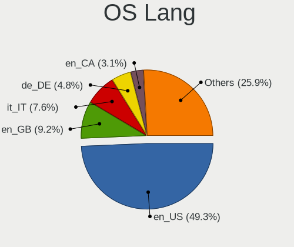
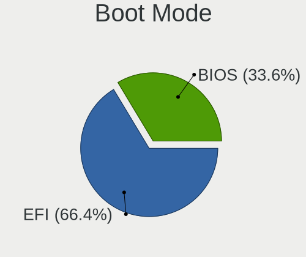
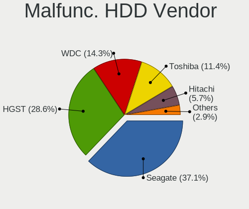
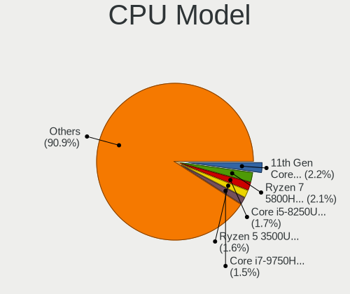

EndeavourOS - Tested Hardware & Statistics (Notebooks)
------------------------------------------------------

A project to collect tested hardware configurations for EndeavourOS.

Anyone can contribute to this report by the [hw-probe](https://github.com/linuxhw/hw-probe) tool:

    sudo -E hw-probe -all -upload

Please contribute! Especially if your hardware is rare.

Contents
--------

* [ Test Cases ](#test-cases)

* [ System ](#system)
  - [ OS                       ](#os)
  - [ OS Family                ](#os-family)
  - [ Kernel                   ](#kernel)
  - [ Kernel Family            ](#kernel-family)
  - [ Kernel Major Ver.        ](#kernel-major-ver)
  - [ Arch                     ](#arch)
  - [ DE                       ](#de)
  - [ Display Server           ](#display-server)
  - [ Display Manager          ](#display-manager)
  - [ OS Lang                  ](#os-lang)
  - [ Boot Mode                ](#boot-mode)
  - [ Filesystem               ](#filesystem)
  - [ Part. scheme             ](#part-scheme)
  - [ Dual Boot with Linux/BSD ](#dual-boot-with-linuxbsd)
  - [ Dual Boot (Win)          ](#dual-boot-win)

* [ Board ](#board)
  - [ Vendor                   ](#vendor)
  - [ Model                    ](#model)
  - [ Model Family             ](#model-family)
  - [ MFG Year                 ](#mfg-year)
  - [ Form Factor              ](#form-factor)
  - [ Secure Boot              ](#secure-boot)
  - [ Coreboot                 ](#coreboot)
  - [ RAM Size                 ](#ram-size)
  - [ RAM Used                 ](#ram-used)
  - [ Total Drives             ](#total-drives)
  - [ Has CD-ROM               ](#has-cd-rom)
  - [ Has Ethernet             ](#has-ethernet)
  - [ Has WiFi                 ](#has-wifi)
  - [ Has Bluetooth            ](#has-bluetooth)

* [ Location ](#location)
  - [ Country                  ](#country)
  - [ City                     ](#city)

* [ Drives ](#drives)
  - [ Drive Vendor             ](#drive-vendor)
  - [ Drive Model              ](#drive-model)
  - [ HDD Vendor               ](#hdd-vendor)
  - [ SSD Vendor               ](#ssd-vendor)
  - [ Drive Kind               ](#drive-kind)
  - [ Drive Connector          ](#drive-connector)
  - [ Drive Size               ](#drive-size)
  - [ Space Total              ](#space-total)
  - [ Space Used               ](#space-used)
  - [ Malfunc. Drives          ](#malfunc-drives)
  - [ Malfunc. Drive Vendor    ](#malfunc-drive-vendor)
  - [ Malfunc. HDD Vendor      ](#malfunc-hdd-vendor)
  - [ Malfunc. Drive Kind      ](#malfunc-drive-kind)
  - [ Failed Drives            ](#failed-drives)
  - [ Failed Drive Vendor      ](#failed-drive-vendor)
  - [ Drive Status             ](#drive-status)

* [ Storage controller ](#storage-controller)
  - [ Storage Vendor           ](#storage-vendor)
  - [ Storage Model            ](#storage-model)
  - [ Storage Kind             ](#storage-kind)

* [ Processor ](#processor)
  - [ CPU Vendor               ](#cpu-vendor)
  - [ CPU Model                ](#cpu-model)
  - [ CPU Model Family         ](#cpu-model-family)
  - [ CPU Cores                ](#cpu-cores)
  - [ CPU Sockets              ](#cpu-sockets)
  - [ CPU Threads              ](#cpu-threads)
  - [ CPU Op-Modes             ](#cpu-op-modes)
  - [ CPU Microcode            ](#cpu-microcode)
  - [ CPU Microarch            ](#cpu-microarch)

* [ Graphics ](#graphics)
  - [ GPU Vendor               ](#gpu-vendor)
  - [ GPU Model                ](#gpu-model)
  - [ GPU Combo                ](#gpu-combo)
  - [ GPU Driver               ](#gpu-driver)
  - [ GPU Memory               ](#gpu-memory)

* [ Monitor ](#monitor)
  - [ Monitor Vendor           ](#monitor-vendor)
  - [ Monitor Model            ](#monitor-model)
  - [ Monitor Resolution       ](#monitor-resolution)
  - [ Monitor Diagonal         ](#monitor-diagonal)
  - [ Monitor Width            ](#monitor-width)
  - [ Aspect Ratio             ](#aspect-ratio)
  - [ Monitor Area             ](#monitor-area)
  - [ Pixel Density            ](#pixel-density)
  - [ Multiple Monitors        ](#multiple-monitors)

* [ Network ](#network)
  - [ Net Controller Vendor    ](#net-controller-vendor)
  - [ Net Controller Model     ](#net-controller-model)
  - [ Wireless Vendor          ](#wireless-vendor)
  - [ Wireless Model           ](#wireless-model)
  - [ Ethernet Vendor          ](#ethernet-vendor)
  - [ Ethernet Model           ](#ethernet-model)
  - [ Net Controller Kind      ](#net-controller-kind)
  - [ Used Controller          ](#used-controller)
  - [ NICs                     ](#nics)
  - [ IPv6                     ](#ipv6)

* [ Bluetooth ](#bluetooth)
  - [ Bluetooth Vendor         ](#bluetooth-vendor)
  - [ Bluetooth Model          ](#bluetooth-model)

* [ Sound ](#sound)
  - [ Sound Vendor             ](#sound-vendor)
  - [ Sound Model              ](#sound-model)

* [ Memory ](#memory)
  - [ Memory Vendor            ](#memory-vendor)
  - [ Memory Model             ](#memory-model)
  - [ Memory Kind              ](#memory-kind)
  - [ Memory Form Factor       ](#memory-form-factor)
  - [ Memory Size              ](#memory-size)
  - [ Memory Speed             ](#memory-speed)

* [ Printers & scanners ](#printers--scanners)
  - [ Printer Vendor           ](#printer-vendor)
  - [ Printer Model            ](#printer-model)
  - [ Scanner Vendor           ](#scanner-vendor)
  - [ Scanner Model            ](#scanner-model)

* [ Camera ](#camera)
  - [ Camera Vendor            ](#camera-vendor)
  - [ Camera Model             ](#camera-model)

* [ Security ](#security)
  - [ Fingerprint Vendor       ](#fingerprint-vendor)
  - [ Fingerprint Model        ](#fingerprint-model)
  - [ Chipcard Vendor          ](#chipcard-vendor)
  - [ Chipcard Model           ](#chipcard-model)

* [ Unsupported ](#unsupported)
  - [ Unsupported Devices      ](#unsupported-devices)
  - [ Unsupported Device Types ](#unsupported-device-types)

Test Cases
----------

Total: 1566

| Vendor        | Model                       | Probe                                                      | Date         |
|---------------|-----------------------------|------------------------------------------------------------|--------------|
| Dell          | Latitude E6230              | [255f27d863](https://linux-hardware.org/?probe=255f27d863) | Jan 06, 2025 |
| Lenovo        | IdeaPad S145-15API 81V7     | [1df5680b90](https://linux-hardware.org/?probe=1df5680b90) | Jan 05, 2025 |
| Unknown       | Unknown                     | [b681fbb66c](https://linux-hardware.org/?probe=b681fbb66c) | Jan 04, 2025 |
| Dell          | Latitude E6230              | [90371159c4](https://linux-hardware.org/?probe=90371159c4) | Jan 04, 2025 |
| Dell          | XPS 15 9530                 | [c03c2ac397](https://linux-hardware.org/?probe=c03c2ac397) | Jan 03, 2025 |
| ASUSTek       | VivoBook 14_ASUS Laptop ... | [54b1993e1c](https://linux-hardware.org/?probe=54b1993e1c) | Jan 02, 2025 |
| HP            | Pavilion g6                 | [d717116365](https://linux-hardware.org/?probe=d717116365) | Jan 01, 2025 |
| Lenovo        | IdeaPad 330-15ARR 81D2      | [7a8e2cd7ed](https://linux-hardware.org/?probe=7a8e2cd7ed) | Dec 30, 2024 |
| Lenovo        | IdeaPad 330-15ARR 81D2      | [104b0f2168](https://linux-hardware.org/?probe=104b0f2168) | Dec 30, 2024 |
| Lenovo        | IdeaPad Gaming 3 15ACH6 ... | [406ac061f4](https://linux-hardware.org/?probe=406ac061f4) | Dec 30, 2024 |
| MSI           | MS-7A34                     | [047f86697a](https://linux-hardware.org/?probe=047f86697a) | Dec 28, 2024 |
| HP            | EliteBook 8460p             | [4891753c29](https://linux-hardware.org/?probe=4891753c29) | Dec 28, 2024 |
| ASUSTek       | VivoBook_ASUSLaptop X515... | [c317540642](https://linux-hardware.org/?probe=c317540642) | Dec 24, 2024 |
| Google        | Beetley                     | [4bffa2af9d](https://linux-hardware.org/?probe=4bffa2af9d) | Dec 24, 2024 |
| Dell          | Latitude E6230              | [dbbf8b8c46](https://linux-hardware.org/?probe=dbbf8b8c46) | Dec 22, 2024 |
| Lenovo        | ThinkPad L15 Gen 3 21C30... | [95bcab10c4](https://linux-hardware.org/?probe=95bcab10c4) | Dec 22, 2024 |
| Lenovo        | LOQ 15AHP9 83DX             | [c4d33f738c](https://linux-hardware.org/?probe=c4d33f738c) | Dec 22, 2024 |
| Unknown       | Unknown                     | [8013360f66](https://linux-hardware.org/?probe=8013360f66) | Dec 17, 2024 |
| ASUSTek       | ASUS TUF Gaming A16 FA61... | [a05e5e0978](https://linux-hardware.org/?probe=a05e5e0978) | Dec 16, 2024 |
| Lenovo        | IdeaPad 330-15IKB 81DC      | [cdd64fe0e0](https://linux-hardware.org/?probe=cdd64fe0e0) | Dec 14, 2024 |
| Acer          | Aspire A317-53              | [7f47fbace4](https://linux-hardware.org/?probe=7f47fbace4) | Dec 13, 2024 |
| Google        | Swanky                      | [368716121b](https://linux-hardware.org/?probe=368716121b) | Dec 12, 2024 |
| ASUSTek       | ASUS Zenbook S 16 UM5606... | [fdf8620b1d](https://linux-hardware.org/?probe=fdf8620b1d) | Dec 10, 2024 |
| HP            | Laptop 15z-ef2xxx           | [ce2f4dd2fe](https://linux-hardware.org/?probe=ce2f4dd2fe) | Dec 09, 2024 |
| Dell          | XPS 9315                    | [4c96378b88](https://linux-hardware.org/?probe=4c96378b88) | Dec 09, 2024 |
| Apple         | MacBookPro11,1              | [61fbdd12f7](https://linux-hardware.org/?probe=61fbdd12f7) | Dec 08, 2024 |
| Dell          | Latitude E6230              | [e78b1b92fc](https://linux-hardware.org/?probe=e78b1b92fc) | Dec 04, 2024 |
| Lenovo        | ThinkPad T14s Gen 4 21F8... | [86b9eec1f0](https://linux-hardware.org/?probe=86b9eec1f0) | Dec 02, 2024 |
| Dell          | Latitude 7410               | [debd518311](https://linux-hardware.org/?probe=debd518311) | Dec 01, 2024 |
| Lenovo        | IdeaPad 3 14ALC6 82KT       | [687f99a0ed](https://linux-hardware.org/?probe=687f99a0ed) | Dec 01, 2024 |
| Dell          | Inspiron 3583               | [ae86d50011](https://linux-hardware.org/?probe=ae86d50011) | Nov 30, 2024 |
| Acer          | Aspire A515-56G             | [0dd2034460](https://linux-hardware.org/?probe=0dd2034460) | Nov 27, 2024 |
| Acer          | Aspire A515-56G             | [f73128061e](https://linux-hardware.org/?probe=f73128061e) | Nov 27, 2024 |
| Lenovo        | ThinkPad E15 Gen 4 21E60... | [15258f1ad9](https://linux-hardware.org/?probe=15258f1ad9) | Nov 27, 2024 |
| HP            | Victus by Gaming Laptop ... | [b7f5c28695](https://linux-hardware.org/?probe=b7f5c28695) | Nov 24, 2024 |
| HP            | OMEN by Gaming Laptop 16... | [424de7c996](https://linux-hardware.org/?probe=424de7c996) | Nov 24, 2024 |
| HP            | Laptop 14s-dq3xxx           | [4bb9d7ef12](https://linux-hardware.org/?probe=4bb9d7ef12) | Nov 24, 2024 |
| ASUSTek       | ASUS EXPERTBOOK L1500CDA... | [e65f68056f](https://linux-hardware.org/?probe=e65f68056f) | Nov 24, 2024 |
| Dell          | Latitude E6230              | [a32ccab459](https://linux-hardware.org/?probe=a32ccab459) | Nov 23, 2024 |
| ASUSTek       | X555LD                      | [ae073052ae](https://linux-hardware.org/?probe=ae073052ae) | Nov 23, 2024 |
| HP            | Victus by Laptop 16-e1xx... | [280d94072f](https://linux-hardware.org/?probe=280d94072f) | Nov 21, 2024 |
| HP            | Victus by Laptop 16-e1xx... | [00e3211d51](https://linux-hardware.org/?probe=00e3211d51) | Nov 21, 2024 |
| HP            | Victus by Laptop 16-e1xx... | [cfd782d9d8](https://linux-hardware.org/?probe=cfd782d9d8) | Nov 21, 2024 |
| Apple         | MacBookAir7,2               | [d2e169141a](https://linux-hardware.org/?probe=d2e169141a) | Nov 20, 2024 |
| Lenovo        | IdeaPad 330-15IKB 81DC      | [3fd82c3ca3](https://linux-hardware.org/?probe=3fd82c3ca3) | Nov 20, 2024 |
| Timi          | Redmi Book Pro 15 2022      | [be60b887e5](https://linux-hardware.org/?probe=be60b887e5) | Nov 19, 2024 |
| Lenovo        | IdeaPad 320S-15IKB 80X5     | [a75fff547e](https://linux-hardware.org/?probe=a75fff547e) | Nov 18, 2024 |
| Lenovo        | ThinkPad T14 Gen 5 21MCS... | [2d30a85677](https://linux-hardware.org/?probe=2d30a85677) | Nov 18, 2024 |
| HP            | ENVY 15                     | [5472e124bb](https://linux-hardware.org/?probe=5472e124bb) | Nov 17, 2024 |
| HP            | ENVY 15                     | [56f54e0128](https://linux-hardware.org/?probe=56f54e0128) | Nov 17, 2024 |
| MSI           | Katana 15 B13VFK            | [86a6249b00](https://linux-hardware.org/?probe=86a6249b00) | Nov 17, 2024 |
| Lenovo        | G40-30 80FY                 | [9228ef946e](https://linux-hardware.org/?probe=9228ef946e) | Nov 17, 2024 |
| SLIMBOOK      | PROX-AMD5                   | [25010cdc93](https://linux-hardware.org/?probe=25010cdc93) | Nov 16, 2024 |
| HONOR         | BRN-HXX                     | [076d979f1f](https://linux-hardware.org/?probe=076d979f1f) | Nov 15, 2024 |
| ASUSTek       | ASUS TUF Gaming A14 FA40... | [cd0cd38834](https://linux-hardware.org/?probe=cd0cd38834) | Nov 15, 2024 |
| Dell          | Vostro 14-3468              | [64e1ab6cf2](https://linux-hardware.org/?probe=64e1ab6cf2) | Nov 14, 2024 |
| Google        | Sasuke                      | [a2e298f62e](https://linux-hardware.org/?probe=a2e298f62e) | Nov 14, 2024 |
| Lenovo        | IdeaPad Gaming 3 15IHU6 ... | [c71e9a6fb2](https://linux-hardware.org/?probe=c71e9a6fb2) | Nov 12, 2024 |
| HP            | EliteBook 830 G8 Noteboo... | [6c93a82662](https://linux-hardware.org/?probe=6c93a82662) | Nov 12, 2024 |
| Apple         | MacBookPro15,2              | [f21bc8c54b](https://linux-hardware.org/?probe=f21bc8c54b) | Nov 12, 2024 |
| Lenovo        | Yoga Pro 7 14ASP9 83HN      | [c3249b5c41](https://linux-hardware.org/?probe=c3249b5c41) | Nov 12, 2024 |
| Dell          | Precision 5550              | [1f2d07fe7f](https://linux-hardware.org/?probe=1f2d07fe7f) | Nov 10, 2024 |
| ASUSTek       | VivoBook_ASUSLaptop X150... | [653af95fb0](https://linux-hardware.org/?probe=653af95fb0) | Nov 10, 2024 |
| UNOWHY        | Y13G012S4EI                 | [fa37732bbf](https://linux-hardware.org/?probe=fa37732bbf) | Nov 08, 2024 |
| HP            | Laptop 15t-dy200            | [236b796d32](https://linux-hardware.org/?probe=236b796d32) | Nov 07, 2024 |
| Framework     | Laptop 16 (AMD Ryzen 704... | [52347faca7](https://linux-hardware.org/?probe=52347faca7) | Nov 07, 2024 |
| HP            | Laptop 15-dy2xxx            | [fd4f8d9aa1](https://linux-hardware.org/?probe=fd4f8d9aa1) | Nov 06, 2024 |
| Lenovo        | ThinkPad T530 2429F37       | [6652f755d1](https://linux-hardware.org/?probe=6652f755d1) | Nov 05, 2024 |
| MSI           | Alpha 15 B5EEK              | [245e122c71](https://linux-hardware.org/?probe=245e122c71) | Nov 05, 2024 |
| MSI           | Alpha 15 B5EEK              | [8d6317b0ad](https://linux-hardware.org/?probe=8d6317b0ad) | Nov 05, 2024 |
| Lenovo        | ThinkPad T480s 20L7S0060... | [ebf7e20a00](https://linux-hardware.org/?probe=ebf7e20a00) | Nov 05, 2024 |
| ASUSTek       | ROG Zephyrus M16 GU604VY... | [2edc1cb664](https://linux-hardware.org/?probe=2edc1cb664) | Nov 04, 2024 |
| Lenovo        | IdeaPad 3 15ALC6 82MF       | [773b8e9b23](https://linux-hardware.org/?probe=773b8e9b23) | Nov 04, 2024 |
| Packard Be... | EasyNote TE69KB             | [a9167be106](https://linux-hardware.org/?probe=a9167be106) | Nov 04, 2024 |
| Lenovo        | IdeaPad 5 Pro 14ARH7 82S... | [ee9620d5e3](https://linux-hardware.org/?probe=ee9620d5e3) | Nov 03, 2024 |
| Lenovo        | G40-30 80FY                 | [328a342a15](https://linux-hardware.org/?probe=328a342a15) | Nov 03, 2024 |
| Apple         | MacBookPro10,2              | [e989c51a4a](https://linux-hardware.org/?probe=e989c51a4a) | Nov 02, 2024 |
| Apple         | MacBookPro6,1               | [a3b81fc716](https://linux-hardware.org/?probe=a3b81fc716) | Nov 02, 2024 |
| Apple         | MacBookPro10,2              | [8899f70eb4](https://linux-hardware.org/?probe=8899f70eb4) | Nov 02, 2024 |
| Dell          | Latitude 5490               | [d8b5b59d4e](https://linux-hardware.org/?probe=d8b5b59d4e) | Nov 01, 2024 |
| Lenovo        | ThinkPad T16 Gen 2 21K7C... | [b0ccea7382](https://linux-hardware.org/?probe=b0ccea7382) | Oct 30, 2024 |
| ASUSTek       | Vivobook Go E1504GA_E150... | [57f1a7f1de](https://linux-hardware.org/?probe=57f1a7f1de) | Oct 29, 2024 |
| HP            | EliteBook 840 G3            | [f65672133c](https://linux-hardware.org/?probe=f65672133c) | Oct 29, 2024 |
| ASUSTek       | ROG Strix G713PV_G713PV     | [efde307b1b](https://linux-hardware.org/?probe=efde307b1b) | Oct 27, 2024 |
| Lenovo        | Legion Y540-15IRH 81SX      | [4c16301925](https://linux-hardware.org/?probe=4c16301925) | Oct 27, 2024 |
| Acer          | Aspire E5-571G              | [2f3323097a](https://linux-hardware.org/?probe=2f3323097a) | Oct 26, 2024 |
| Dell          | Latitude 5411               | [54e539128d](https://linux-hardware.org/?probe=54e539128d) | Oct 24, 2024 |
| Lenovo        | 100w Gen 3 82HY             | [b62f9c00ac](https://linux-hardware.org/?probe=b62f9c00ac) | Oct 23, 2024 |
| ASUSTek       | ASUS Zenbook S 16 UM5606... | [50608db984](https://linux-hardware.org/?probe=50608db984) | Oct 23, 2024 |
| HP            | 250 G7 Notebook PC          | [e369fdf5bd](https://linux-hardware.org/?probe=e369fdf5bd) | Oct 20, 2024 |
| Lenovo        | ThinkPad E550 20DF0040US    | [3fb59bd2a6](https://linux-hardware.org/?probe=3fb59bd2a6) | Oct 17, 2024 |
| HP            | EliteBook 865 16 inch G1... | [4f3f40aa42](https://linux-hardware.org/?probe=4f3f40aa42) | Oct 16, 2024 |
| HP            | Pavilion Gaming Laptop 1... | [c3cf59acfe](https://linux-hardware.org/?probe=c3cf59acfe) | Oct 15, 2024 |
| HP            | Victus by Gaming Laptop ... | [25b6c78476](https://linux-hardware.org/?probe=25b6c78476) | Oct 14, 2024 |
| ASUSTek       | ROG Zephyrus G16 GA605WI... | [157d66f0e8](https://linux-hardware.org/?probe=157d66f0e8) | Oct 12, 2024 |
| Dell          | XPS 13 9300                 | [76d3595387](https://linux-hardware.org/?probe=76d3595387) | Oct 11, 2024 |
| Acer          | Aspire A315-51              | [f4c8183717](https://linux-hardware.org/?probe=f4c8183717) | Oct 11, 2024 |
| Lenovo        | IdeaPad Gaming 3 15IHU6 ... | [e9c7cab546](https://linux-hardware.org/?probe=e9c7cab546) | Oct 10, 2024 |
| Lenovo        | ThinkPad T480 20L6SA5R0U    | [bcada5cbe6](https://linux-hardware.org/?probe=bcada5cbe6) | Oct 10, 2024 |
| Lenovo        | ThinkPad P1 Gen 7 21KV00... | [6f853dcdba](https://linux-hardware.org/?probe=6f853dcdba) | Oct 10, 2024 |
| Lenovo        | ThinkPad T470 W10DG 20JN... | [47a7874878](https://linux-hardware.org/?probe=47a7874878) | Oct 09, 2024 |
| Lenovo        | ThinkPad P1 Gen 7 21KV00... | [8ae813aefc](https://linux-hardware.org/?probe=8ae813aefc) | Oct 09, 2024 |
| ASUSTek       | ASUS TUF Gaming A15 FA50... | [8428643c32](https://linux-hardware.org/?probe=8428643c32) | Oct 07, 2024 |
| ASUSTek       | ASUS TUF Gaming A15 FA50... | [d58ea9b2a0](https://linux-hardware.org/?probe=d58ea9b2a0) | Oct 07, 2024 |
| Lenovo        | Legion Y540-17IRH 81Q4      | [467a5965cf](https://linux-hardware.org/?probe=467a5965cf) | Oct 06, 2024 |
| HP            | Laptop 14s-dq3xxx           | [e93a1db49f](https://linux-hardware.org/?probe=e93a1db49f) | Oct 06, 2024 |
| Lenovo        | IdeaPad S340-14IWL          | [daf000bc67](https://linux-hardware.org/?probe=daf000bc67) | Oct 05, 2024 |
| Wiltronic     | IVIEW-Maximus-4G            | [2a1e298d14](https://linux-hardware.org/?probe=2a1e298d14) | Oct 04, 2024 |
| Dell          | Latitude 5490               | [2b877e3bfb](https://linux-hardware.org/?probe=2b877e3bfb) | Oct 04, 2024 |
| Lenovo        | ThinkPad T14 Gen 5 21MLC... | [49bb431bbf](https://linux-hardware.org/?probe=49bb431bbf) | Oct 04, 2024 |
| HP            | Notebook                    | [1abbebe60a](https://linux-hardware.org/?probe=1abbebe60a) | Oct 04, 2024 |
| Alienware     | m15 R6                      | [bf9be94be2](https://linux-hardware.org/?probe=bf9be94be2) | Oct 01, 2024 |
| DEXP          | C14-ICW300                  | [17de41cc9b](https://linux-hardware.org/?probe=17de41cc9b) | Sep 29, 2024 |
| ASUSTek       | VivoBook_ASUSLaptop X160... | [38566d1b64](https://linux-hardware.org/?probe=38566d1b64) | Sep 29, 2024 |
| Google        | Beetley                     | [328112e7a0](https://linux-hardware.org/?probe=328112e7a0) | Sep 29, 2024 |
| Lenovo        | Legion 5 Pro 16ACH6H 82J... | [645c999c2b](https://linux-hardware.org/?probe=645c999c2b) | Sep 28, 2024 |
| Dell          | Latitude 5490               | [5b8525625e](https://linux-hardware.org/?probe=5b8525625e) | Sep 28, 2024 |
| ASUSTek       | ROG Zephyrus G15 GA503RW... | [f7ef456d5b](https://linux-hardware.org/?probe=f7ef456d5b) | Sep 28, 2024 |
| Acer          | Aspire A315-55KG            | [7655bbabae](https://linux-hardware.org/?probe=7655bbabae) | Sep 28, 2024 |
| ASUSTek       | VivoBook_ASUSLaptop X160... | [7ee423575a](https://linux-hardware.org/?probe=7ee423575a) | Sep 27, 2024 |
| ASUSTek       | VivoBook_ASUSLaptop X415... | [90af0212ea](https://linux-hardware.org/?probe=90af0212ea) | Sep 27, 2024 |
| HP            | Victus by Gaming Laptop ... | [166b85b6e1](https://linux-hardware.org/?probe=166b85b6e1) | Sep 26, 2024 |
| Dell          | XPS 15 9550                 | [a8471713fe](https://linux-hardware.org/?probe=a8471713fe) | Sep 23, 2024 |
| Lenovo        | Legion 5 Pro 16ACH6H 82J... | [5354d8dedb](https://linux-hardware.org/?probe=5354d8dedb) | Sep 23, 2024 |
| HUAWEI        | HKD-WXX                     | [e56f38de19](https://linux-hardware.org/?probe=e56f38de19) | Sep 23, 2024 |
| Lenovo        | ThinkPad W530 2441CTO       | [34d51b5cc5](https://linux-hardware.org/?probe=34d51b5cc5) | Sep 22, 2024 |
| MECHREVO      | WUJIE14XA                   | [7c2e3b925b](https://linux-hardware.org/?probe=7c2e3b925b) | Sep 21, 2024 |
| Lenovo        | IdeaPad 1 15AMN7 82X5       | [b1d22b77a2](https://linux-hardware.org/?probe=b1d22b77a2) | Sep 20, 2024 |
| Acer          | Aspire A317-52              | [20714a3ecd](https://linux-hardware.org/?probe=20714a3ecd) | Sep 20, 2024 |
| Lenovo        | Legion R7000P APH8 82Y9     | [f257442aff](https://linux-hardware.org/?probe=f257442aff) | Sep 18, 2024 |
| Lenovo        | Yoga Pro 7 14ARP8 83AU      | [bdf7fe66b1](https://linux-hardware.org/?probe=bdf7fe66b1) | Sep 18, 2024 |
| Lenovo        | IdeaPad 330-15ARR 81D2      | [89afe04276](https://linux-hardware.org/?probe=89afe04276) | Sep 18, 2024 |
| Apple         | MacBookPro12,1              | [3a67e2619d](https://linux-hardware.org/?probe=3a67e2619d) | Sep 17, 2024 |
| Lenovo        | ThinkPad T480 20L6SA5R0U    | [ffe3da2a61](https://linux-hardware.org/?probe=ffe3da2a61) | Sep 17, 2024 |
| Lenovo        | IdeaPad 3 15IAU7 82RK       | [6fdb9480fd](https://linux-hardware.org/?probe=6fdb9480fd) | Sep 16, 2024 |
| Apple         | MacBookPro11,1              | [b57903987f](https://linux-hardware.org/?probe=b57903987f) | Sep 16, 2024 |
| PC Special... | Lafite Pro II 15            | [94ee57ec4e](https://linux-hardware.org/?probe=94ee57ec4e) | Sep 16, 2024 |
| HP            | Bloog                       | [049623a594](https://linux-hardware.org/?probe=049623a594) | Sep 15, 2024 |
| HP            | Bloog                       | [70b6c127f8](https://linux-hardware.org/?probe=70b6c127f8) | Sep 15, 2024 |
| Lenovo        | Legion Y540-17IRH 81Q4      | [5ad05846db](https://linux-hardware.org/?probe=5ad05846db) | Sep 15, 2024 |
| ASUSTek       | ASUS Vivobook S 16 M5606... | [fac034c3d1](https://linux-hardware.org/?probe=fac034c3d1) | Sep 12, 2024 |
| Lenovo        | ThinkPad T480 20L6S0RU00    | [2d015a707d](https://linux-hardware.org/?probe=2d015a707d) | Sep 11, 2024 |
| Lenovo        | ThinkPad P52s 20LCS2220G    | [9bfdfc3470](https://linux-hardware.org/?probe=9bfdfc3470) | Sep 10, 2024 |
| Dell          | Precision M6500             | [faf04e4b51](https://linux-hardware.org/?probe=faf04e4b51) | Sep 10, 2024 |
| ASUSTek       | VivoBook_ASUSLaptop K340... | [602105f7eb](https://linux-hardware.org/?probe=602105f7eb) | Sep 09, 2024 |
| Lenovo        | Yoga Slim 7 Pro 14ACH5 8... | [34e49e5b88](https://linux-hardware.org/?probe=34e49e5b88) | Sep 09, 2024 |
| ASUSTek       | VivoBook_ASUSLaptop K650... | [86c9d69829](https://linux-hardware.org/?probe=86c9d69829) | Sep 08, 2024 |
| Lenovo        | G580 20150                  | [9dc4c7e993](https://linux-hardware.org/?probe=9dc4c7e993) | Sep 08, 2024 |
| HP            | ProBook 450 G6              | [ae6d1d0e18](https://linux-hardware.org/?probe=ae6d1d0e18) | Sep 07, 2024 |
| HP            | Notebook                    | [07af724eaa](https://linux-hardware.org/?probe=07af724eaa) | Sep 07, 2024 |
| ASUSTek       | ASUS TUF Gaming A15 FA50... | [a3f60aea5d](https://linux-hardware.org/?probe=a3f60aea5d) | Sep 05, 2024 |
| HP            | ProBook 440 G10             | [a04d32ffaf](https://linux-hardware.org/?probe=a04d32ffaf) | Sep 04, 2024 |
| Acer          | Aspire E5-576               | [30f27b9de2](https://linux-hardware.org/?probe=30f27b9de2) | Sep 03, 2024 |
| Lenovo        | V14 G2 ITL 82NM             | [fb02fb7b4a](https://linux-hardware.org/?probe=fb02fb7b4a) | Sep 02, 2024 |
| Dell          | G15 5515                    | [20093fae28](https://linux-hardware.org/?probe=20093fae28) | Sep 01, 2024 |
| ASUSTek       | VivoBook S15 X510UF         | [15f7ce06e3](https://linux-hardware.org/?probe=15f7ce06e3) | Aug 31, 2024 |
| ASUSTek       | ASUS TUF Gaming F15 FX50... | [367519af2d](https://linux-hardware.org/?probe=367519af2d) | Aug 31, 2024 |
| Lenovo        | ThinkPad T480 20L6S0CG0G    | [8c4c7bf9de](https://linux-hardware.org/?probe=8c4c7bf9de) | Aug 29, 2024 |
| ASUSTek       | ASUS Zenbook S 16 UM5606... | [35e18a716a](https://linux-hardware.org/?probe=35e18a716a) | Aug 29, 2024 |
| HP            | Notebook                    | [b8467466ec](https://linux-hardware.org/?probe=b8467466ec) | Aug 28, 2024 |
| ASUSTek       | ASUS TUF Gaming A15 FA50... | [6ec3942431](https://linux-hardware.org/?probe=6ec3942431) | Aug 27, 2024 |
| ASUSTek       | VivoBook_ASUSLaptop K550... | [ac5e85a515](https://linux-hardware.org/?probe=ac5e85a515) | Aug 27, 2024 |
| ASUSTek       | VivoBook_ASUSLaptop M650... | [5962340f2c](https://linux-hardware.org/?probe=5962340f2c) | Aug 26, 2024 |
| ASUSTek       | ASUS Zenbook S 16 UM5606... | [c2243408f5](https://linux-hardware.org/?probe=c2243408f5) | Aug 25, 2024 |
| Schenker      | KEY16_17_SKE16_17E19_M19    | [89c1f791f8](https://linux-hardware.org/?probe=89c1f791f8) | Aug 25, 2024 |
| Schenker      | KEY16_17_SKE16_17E19_M19    | [c55f96a2be](https://linux-hardware.org/?probe=c55f96a2be) | Aug 25, 2024 |
| Lenovo        | ThinkPad P52s 20LCS2220G    | [81b43c4ec9](https://linux-hardware.org/?probe=81b43c4ec9) | Aug 23, 2024 |
| Lenovo        | ThinkPad P52s 20LCS2220G    | [fb1e07622d](https://linux-hardware.org/?probe=fb1e07622d) | Aug 23, 2024 |
| Lenovo        | ThinkBook 16p Gen 2 20YM    | [8ef0c5b8fb](https://linux-hardware.org/?probe=8ef0c5b8fb) | Aug 22, 2024 |
| HP            | ProBook 650 G1              | [b25190cfb5](https://linux-hardware.org/?probe=b25190cfb5) | Aug 20, 2024 |
| HP            | ProBook 650 G1              | [93df1964c8](https://linux-hardware.org/?probe=93df1964c8) | Aug 20, 2024 |
| Dell          | Latitude 3420               | [58699d02f4](https://linux-hardware.org/?probe=58699d02f4) | Aug 20, 2024 |
| Lenovo        | IdeaPad S145-14AST 81ST     | [eedbb9c65f](https://linux-hardware.org/?probe=eedbb9c65f) | Aug 19, 2024 |
| ASUSTek       | VivoBook_ASUSLaptop X150... | [25675e1c98](https://linux-hardware.org/?probe=25675e1c98) | Aug 19, 2024 |
| HP            | OMEN by Laptop 16-c0xxx     | [be116ff258](https://linux-hardware.org/?probe=be116ff258) | Aug 19, 2024 |
| ASUSTek       | ASUS TUF Gaming A17 FA70... | [b6500a958c](https://linux-hardware.org/?probe=b6500a958c) | Aug 19, 2024 |
| ASUSTek       | ASUS TUF Gaming F15 FX50... | [582e7cf94c](https://linux-hardware.org/?probe=582e7cf94c) | Aug 18, 2024 |
| Lenovo        | IdeaPad Pro 5 14AHP9 83D... | [42bb06547d](https://linux-hardware.org/?probe=42bb06547d) | Aug 17, 2024 |
| Lenovo        | ThinkPad X250 20CLS3320C    | [9860e65415](https://linux-hardware.org/?probe=9860e65415) | Aug 17, 2024 |
| Dell          | Precision 3581              | [ba1f860fda](https://linux-hardware.org/?probe=ba1f860fda) | Aug 16, 2024 |
| Dell          | Precision 3581              | [fab693cd72](https://linux-hardware.org/?probe=fab693cd72) | Aug 16, 2024 |
| Lenovo        | ThinkPad T480 20L6SJUS2J    | [0d0288358f](https://linux-hardware.org/?probe=0d0288358f) | Aug 16, 2024 |
| Apple         | MacBookAir6,1               | [87cc898879](https://linux-hardware.org/?probe=87cc898879) | Aug 14, 2024 |
| ASUSTek       | VivoBook_ASUSLaptop X515... | [456afcf47a](https://linux-hardware.org/?probe=456afcf47a) | Aug 14, 2024 |
| HONOR         | BRN-HXX                     | [ccc1bef90f](https://linux-hardware.org/?probe=ccc1bef90f) | Aug 12, 2024 |
| Dell          | Latitude 5285               | [2bc737eb6e](https://linux-hardware.org/?probe=2bc737eb6e) | Aug 12, 2024 |
| TUXEDO        | InfinityBook_S_14_v5        | [f45a4fb889](https://linux-hardware.org/?probe=f45a4fb889) | Aug 11, 2024 |
| Metabox       | Aer-X NV41RNC               | [d9ea6407d0](https://linux-hardware.org/?probe=d9ea6407d0) | Aug 10, 2024 |
| HP            | EliteBook 840 G4            | [681b90e3e4](https://linux-hardware.org/?probe=681b90e3e4) | Aug 09, 2024 |
| MSI           | Vector GP76HX 12UGS         | [2a9472f366](https://linux-hardware.org/?probe=2a9472f366) | Aug 09, 2024 |
| Dell          | Precision M4800             | [3ef180390c](https://linux-hardware.org/?probe=3ef180390c) | Aug 05, 2024 |
| Google        | Frostflow                   | [080f35a5b5](https://linux-hardware.org/?probe=080f35a5b5) | Aug 04, 2024 |
| ASUSTek       | ASUS TUF Gaming A16 FA61... | [8f5b94bb97](https://linux-hardware.org/?probe=8f5b94bb97) | Aug 02, 2024 |
| Lenovo        | Legion 5 Pro 16ACH6H 82J... | [8bbe8fd188](https://linux-hardware.org/?probe=8bbe8fd188) | Jul 29, 2024 |
| HP            | Pavilion Laptop 15-cs3xx... | [f378508c2e](https://linux-hardware.org/?probe=f378508c2e) | Jul 29, 2024 |
| Lenovo        | LOQ 16APH8 82XU             | [6959309c2f](https://linux-hardware.org/?probe=6959309c2f) | Jul 28, 2024 |
| Lenovo        | Legion 7 16ARHA7 82UH       | [c273d593fa](https://linux-hardware.org/?probe=c273d593fa) | Jul 27, 2024 |
| HP            | Laptop 15-fd0xxx            | [3fac36768f](https://linux-hardware.org/?probe=3fac36768f) | Jul 26, 2024 |
| Lenovo        | ThinkPad T14 Gen 5 21MLC... | [6765da588e](https://linux-hardware.org/?probe=6765da588e) | Jul 26, 2024 |
| HP            | EliteBook 840 G6            | [5769f3dbb8](https://linux-hardware.org/?probe=5769f3dbb8) | Jul 25, 2024 |
| ASUSTek       | ZenBook UX425EA_UX425EA     | [b431830472](https://linux-hardware.org/?probe=b431830472) | Jul 24, 2024 |
| Lenovo        | Legion 7 16ARHA7 82UH       | [442ac902f7](https://linux-hardware.org/?probe=442ac902f7) | Jul 23, 2024 |
| HP            | EliteBook 820 G3            | [1ee7a032d5](https://linux-hardware.org/?probe=1ee7a032d5) | Jul 23, 2024 |
| Lenovo        | ThinkPad T400 6475H65       | [3bee98fb60](https://linux-hardware.org/?probe=3bee98fb60) | Jul 20, 2024 |
| HP            | Pavilion Plus Laptop 14-... | [c38f999077](https://linux-hardware.org/?probe=c38f999077) | Jul 20, 2024 |
| Apple         | MacBookPro7,1               | [2a71582dde](https://linux-hardware.org/?probe=2a71582dde) | Jul 20, 2024 |
| Apple         | MacBookPro7,1               | [e741128eca](https://linux-hardware.org/?probe=e741128eca) | Jul 19, 2024 |
| ASUSTek       | ASUS TUF Gaming F15 FX50... | [2040d5317c](https://linux-hardware.org/?probe=2040d5317c) | Jul 19, 2024 |
| Samsung       | 940XFG                      | [bb64e4849f](https://linux-hardware.org/?probe=bb64e4849f) | Jul 19, 2024 |
| Lenovo        | IdeaPad Slim 7 14ITL05 8... | [01e1820480](https://linux-hardware.org/?probe=01e1820480) | Jul 18, 2024 |
| Google        | Frostflow                   | [324b85826d](https://linux-hardware.org/?probe=324b85826d) | Jul 17, 2024 |
| Lenovo        | Yoga Pro 9 16IRP8 83BY      | [0f214ed3c8](https://linux-hardware.org/?probe=0f214ed3c8) | Jul 16, 2024 |
| Lenovo        | Legion 5 Pro 16ARH7H 82R... | [980ffb054e](https://linux-hardware.org/?probe=980ffb054e) | Jul 16, 2024 |
| HUAWEI        | FRD-WX9                     | [460787d14f](https://linux-hardware.org/?probe=460787d14f) | Jul 16, 2024 |
| Lenovo        | LOQ 15APH8 82XT             | [80c4e78361](https://linux-hardware.org/?probe=80c4e78361) | Jul 14, 2024 |
| ASUSTek       | VivoBook S15 X510UF         | [fcfb359441](https://linux-hardware.org/?probe=fcfb359441) | Jul 13, 2024 |
| HP            | Laptop 15-dw3xxx            | [1b0125927d](https://linux-hardware.org/?probe=1b0125927d) | Jul 13, 2024 |
| Lenovo        | ThinkPad X395 20NMS0YG00    | [29d651bcd7](https://linux-hardware.org/?probe=29d651bcd7) | Jul 12, 2024 |
| Lenovo        | Legion 5 Pro 16ARH7H 82R... | [f02af6bf48](https://linux-hardware.org/?probe=f02af6bf48) | Jul 11, 2024 |
| Unknown       | Unknown                     | [d1b04fbe08](https://linux-hardware.org/?probe=d1b04fbe08) | Jul 11, 2024 |
| Dell          | Latitude E7440              | [ce9580d2cd](https://linux-hardware.org/?probe=ce9580d2cd) | Jul 11, 2024 |
| HP            | ProBook 650 G1              | [b7690b5cbe](https://linux-hardware.org/?probe=b7690b5cbe) | Jul 11, 2024 |
| Dell          | Latitude E7440              | [ece3b1cd3f](https://linux-hardware.org/?probe=ece3b1cd3f) | Jul 11, 2024 |
| HP            | Victus by Gaming Laptop ... | [8bc2731133](https://linux-hardware.org/?probe=8bc2731133) | Jul 10, 2024 |
| ASUSTek       | Vivobook Go E1404FA_E140... | [518640fca6](https://linux-hardware.org/?probe=518640fca6) | Jul 09, 2024 |
| HP            | ProBook 650 G1              | [287a9dd8fb](https://linux-hardware.org/?probe=287a9dd8fb) | Jul 09, 2024 |
| HP            | ProBook 650 G1              | [5e464ef65e](https://linux-hardware.org/?probe=5e464ef65e) | Jul 09, 2024 |
| HP            | Pavilion Gaming Laptop 1... | [b5c9dec75c](https://linux-hardware.org/?probe=b5c9dec75c) | Jul 08, 2024 |
| Lenovo        | Legion 5 15ACH6H 82JU       | [d70136d807](https://linux-hardware.org/?probe=d70136d807) | Jul 06, 2024 |
| Dell          | Inspiron 3583               | [431b927908](https://linux-hardware.org/?probe=431b927908) | Jul 05, 2024 |
| HONOR         | BMH-WCX9                    | [9ae4e94ba0](https://linux-hardware.org/?probe=9ae4e94ba0) | Jul 04, 2024 |
| HP            | ProBook 650 G1              | [f402ad896c](https://linux-hardware.org/?probe=f402ad896c) | Jul 04, 2024 |
| Acer          | Extensa 2540                | [c7b6cc0ba5](https://linux-hardware.org/?probe=c7b6cc0ba5) | Jul 03, 2024 |
| XIAOMI        | Redmi Book Pro 14 2024      | [1de2514e94](https://linux-hardware.org/?probe=1de2514e94) | Jul 03, 2024 |
| HP            | Laptop 15-dw3xxx            | [c62cef3df3](https://linux-hardware.org/?probe=c62cef3df3) | Jul 02, 2024 |
| Dell          | Inspiron 13-5368            | [be04495cbd](https://linux-hardware.org/?probe=be04495cbd) | Jul 02, 2024 |
| Dell          | XPS 15 9530                 | [0e2e9ad2f6](https://linux-hardware.org/?probe=0e2e9ad2f6) | Jul 02, 2024 |
| PC Special... | Lafite Pro III 15           | [9e1e4a1c57](https://linux-hardware.org/?probe=9e1e4a1c57) | Jul 01, 2024 |
| TUXEDO        | Stellaris Intel Gen4        | [eb1f783e76](https://linux-hardware.org/?probe=eb1f783e76) | Jul 01, 2024 |
| Toshiba       | Satellite C670-12E          | [1289b2755e](https://linux-hardware.org/?probe=1289b2755e) | Jun 30, 2024 |
| Lenovo        | ThinkPad P52 20M90000US     | [c61468a630](https://linux-hardware.org/?probe=c61468a630) | Jun 30, 2024 |
| XIAOMI        | Redmi Book Pro 16 2024      | [bd56e61a97](https://linux-hardware.org/?probe=bd56e61a97) | Jun 30, 2024 |
| Samsung       | 750XGK                      | [d6b19029b9](https://linux-hardware.org/?probe=d6b19029b9) | Jun 29, 2024 |
| Alienware     | m18 R2                      | [8e92a4eab4](https://linux-hardware.org/?probe=8e92a4eab4) | Jun 25, 2024 |
| Lenovo        | Legion Pro 5 16IRX8 82WK    | [9a362c23a9](https://linux-hardware.org/?probe=9a362c23a9) | Jun 25, 2024 |
| MSI           | Summit E16Flip A12UCT       | [3179a899d0](https://linux-hardware.org/?probe=3179a899d0) | Jun 22, 2024 |
| MSI           | Summit E16Flip A12UCT       | [abe30071da](https://linux-hardware.org/?probe=abe30071da) | Jun 22, 2024 |
| Lenovo        | Yoga Pro 9 16IMH9 83DN      | [b74a2d1e4d](https://linux-hardware.org/?probe=b74a2d1e4d) | Jun 22, 2024 |
| HP            | Pavilion Gaming Laptop 1... | [c054b11de9](https://linux-hardware.org/?probe=c054b11de9) | Jun 21, 2024 |
| ASUSTek       | TUF Gaming FX705GM_FX705... | [2befaa7447](https://linux-hardware.org/?probe=2befaa7447) | Jun 20, 2024 |
| Dell          | Latitude 7390 2-in-1        | [91f66dfd88](https://linux-hardware.org/?probe=91f66dfd88) | Jun 16, 2024 |
| Lenovo        | ThinkPad T460s 20F90044M... | [eb4143f8ad](https://linux-hardware.org/?probe=eb4143f8ad) | Jun 14, 2024 |
| ASUSTek       | ASUS TUF Dash F15 FX516P... | [d990233648](https://linux-hardware.org/?probe=d990233648) | Jun 14, 2024 |
| Apple         | MacBookAir4,1               | [a262fd329b](https://linux-hardware.org/?probe=a262fd329b) | Jun 13, 2024 |
| XIAOMI        | Redmi Book Pro 16 2024      | [a9a83d128b](https://linux-hardware.org/?probe=a9a83d128b) | Jun 13, 2024 |
| Lenovo        | ThinkPad X230 23257G6       | [faeb824333](https://linux-hardware.org/?probe=faeb824333) | Jun 13, 2024 |
| Lenovo        | Legion 5 Pro 16ACH6H 82J... | [10d3a7713d](https://linux-hardware.org/?probe=10d3a7713d) | Jun 12, 2024 |
| Dell          | XPS 15 9520                 | [b071282d63](https://linux-hardware.org/?probe=b071282d63) | Jun 12, 2024 |
| Lenovo        | B590 20206                  | [b1b26a1bd2](https://linux-hardware.org/?probe=b1b26a1bd2) | Jun 10, 2024 |
| Lenovo        | B590 20206                  | [f01af7f707](https://linux-hardware.org/?probe=f01af7f707) | Jun 10, 2024 |
| Acer          | Aspire E1-422               | [6693bdfdae](https://linux-hardware.org/?probe=6693bdfdae) | Jun 09, 2024 |
| HP            | EliteBook 830 G6            | [0ef368f1ea](https://linux-hardware.org/?probe=0ef368f1ea) | Jun 09, 2024 |
| Lenovo        | Yoga Pro 9 16IMH9 83DN      | [4422167339](https://linux-hardware.org/?probe=4422167339) | Jun 09, 2024 |
| Samsung       | 750XFG                      | [c581b9c2af](https://linux-hardware.org/?probe=c581b9c2af) | Jun 08, 2024 |
| Sony          | SVE14132CVB                 | [1d1b0f6b07](https://linux-hardware.org/?probe=1d1b0f6b07) | Jun 07, 2024 |
| Apple         | MacBookPro11,1              | [f4f6527719](https://linux-hardware.org/?probe=f4f6527719) | Jun 06, 2024 |
| Lenovo        | ThinkPad T14 Gen 5 21MLC... | [5b97cc5a5b](https://linux-hardware.org/?probe=5b97cc5a5b) | Jun 06, 2024 |
| HP            | ProBook 450 G8 Notebook ... | [49ff9c3519](https://linux-hardware.org/?probe=49ff9c3519) | Jun 06, 2024 |
| TUXEDO        | Gemini Gen2                 | [f209b92bf1](https://linux-hardware.org/?probe=f209b92bf1) | Jun 05, 2024 |
| Acer          | Aspire E1-572               | [115698b77b](https://linux-hardware.org/?probe=115698b77b) | Jun 04, 2024 |
| MECHREVO      | WUJIE15 PRO                 | [f5b1e09ec5](https://linux-hardware.org/?probe=f5b1e09ec5) | Jun 04, 2024 |
| ASUSTek       | PRIME B460-PLUS             | [38e8a9ab01](https://linux-hardware.org/?probe=38e8a9ab01) | Jun 04, 2024 |
| BANGHO        | MAX G0406                   | [ca29e81c69](https://linux-hardware.org/?probe=ca29e81c69) | Jun 04, 2024 |
| Lenovo        | ThinkPad T14s Gen 4 21F8... | [7457010c8e](https://linux-hardware.org/?probe=7457010c8e) | Jun 03, 2024 |
| TUXEDO        | Gemini Gen2                 | [0fe064115c](https://linux-hardware.org/?probe=0fe064115c) | Jun 03, 2024 |
| HUAWEI        | HN-WX9X                     | [7d82d481f1](https://linux-hardware.org/?probe=7d82d481f1) | Jun 03, 2024 |
| Lenovo        | Legion Y540-17IRH 81Q4      | [e92dbce7a4](https://linux-hardware.org/?probe=e92dbce7a4) | Jun 02, 2024 |
| HP            | EliteBook 655 15.6 inch ... | [146cbc190f](https://linux-hardware.org/?probe=146cbc190f) | May 30, 2024 |
| Lenovo        | ThinkBook 15-IIL 20SM       | [817aa72be2](https://linux-hardware.org/?probe=817aa72be2) | May 29, 2024 |
| MSI           | Modern 15 A11M              | [ae108a23cd](https://linux-hardware.org/?probe=ae108a23cd) | May 29, 2024 |
| Acer          | Swift SF314-51              | [35f5b4864e](https://linux-hardware.org/?probe=35f5b4864e) | May 25, 2024 |
| ASUSTek       | ASUS TUF Gaming F17 FX70... | [a639c86fe2](https://linux-hardware.org/?probe=a639c86fe2) | May 24, 2024 |
| HUAWEI        | VGHH-XX                     | [43d5bcfa6c](https://linux-hardware.org/?probe=43d5bcfa6c) | May 24, 2024 |
| Lenovo        | ThinkPad X1 Carbon Gen 8... | [571797d5ac](https://linux-hardware.org/?probe=571797d5ac) | May 23, 2024 |
| HP            | Laptop 14-bs0xx             | [ba3f755558](https://linux-hardware.org/?probe=ba3f755558) | May 23, 2024 |
| Lenovo        | ThinkPad T480s 20L8S02D0... | [8aa8a4fd34](https://linux-hardware.org/?probe=8aa8a4fd34) | May 22, 2024 |
| Unknown       | Unknown                     | [5b2ca64802](https://linux-hardware.org/?probe=5b2ca64802) | May 20, 2024 |
| HP            | Victus by Gaming Laptop ... | [b25ecef98d](https://linux-hardware.org/?probe=b25ecef98d) | May 19, 2024 |
| HP            | 250 G3                      | [5f0b7522a6](https://linux-hardware.org/?probe=5f0b7522a6) | May 19, 2024 |
| Acer          | Aspire A315-42              | [6ba070846f](https://linux-hardware.org/?probe=6ba070846f) | May 16, 2024 |
| Acer          | Aspire A315-42              | [5eb4902c19](https://linux-hardware.org/?probe=5eb4902c19) | May 16, 2024 |
| HP            | EliteBook 655 15.6 inch ... | [a41954f288](https://linux-hardware.org/?probe=a41954f288) | May 14, 2024 |
| Lenovo        | Legion Y540-17IRH 81Q4      | [773adf91ff](https://linux-hardware.org/?probe=773adf91ff) | May 13, 2024 |
| MSI           | Katana 15 B13VEK            | [7256a72122](https://linux-hardware.org/?probe=7256a72122) | May 13, 2024 |
| ASUSTek       | X550VL                      | [147e9cfbe5](https://linux-hardware.org/?probe=147e9cfbe5) | May 12, 2024 |
| Google        | Phaser                      | [0a1be3336e](https://linux-hardware.org/?probe=0a1be3336e) | May 12, 2024 |
| Maibenben     | MaiBook M                   | [14699589dd](https://linux-hardware.org/?probe=14699589dd) | May 11, 2024 |
| Dell          | Latitude 7390 2-in-1        | [da8dce5eff](https://linux-hardware.org/?probe=da8dce5eff) | May 11, 2024 |
| Lenovo        | ThinkPad E14 Gen 2 20T6S... | [eb9d3c539c](https://linux-hardware.org/?probe=eb9d3c539c) | May 08, 2024 |
| Lenovo        | ThinkPad T14 Gen 1 20UD0... | [0ef70379ee](https://linux-hardware.org/?probe=0ef70379ee) | May 07, 2024 |
| HUAWEI        | HLYL-WXX9                   | [71d1f5cdfb](https://linux-hardware.org/?probe=71d1f5cdfb) | May 07, 2024 |
| MSI           | Creator Z16 A12UET          | [edf6b45103](https://linux-hardware.org/?probe=edf6b45103) | May 06, 2024 |
| MSI           | Creator Z16 A12UET          | [2aea1cacac](https://linux-hardware.org/?probe=2aea1cacac) | May 06, 2024 |
| Lenovo        | IdeaPad Slim 3 15ABR8 82... | [c082a264d6](https://linux-hardware.org/?probe=c082a264d6) | May 06, 2024 |
| HP            | ZBook 15 G3                 | [486b46ac77](https://linux-hardware.org/?probe=486b46ac77) | May 05, 2024 |
| HP            | ZBook 15 G3                 | [74576596b1](https://linux-hardware.org/?probe=74576596b1) | May 05, 2024 |
| Unknown       | Unknown                     | [53c592f858](https://linux-hardware.org/?probe=53c592f858) | May 04, 2024 |
| Unknown       | Unknown                     | [3f7e899e58](https://linux-hardware.org/?probe=3f7e899e58) | May 04, 2024 |
| Lenovo        | IdeaPad 3 15IML05 81WB      | [9ea4c7559c](https://linux-hardware.org/?probe=9ea4c7559c) | May 04, 2024 |
| ASUSTek       | ROG Zephyrus M16 GU604VI... | [d22fed35ce](https://linux-hardware.org/?probe=d22fed35ce) | May 03, 2024 |
| ASUSTek       | TUF Gaming FX504GE_FX80G... | [6fb2e2c6d4](https://linux-hardware.org/?probe=6fb2e2c6d4) | May 03, 2024 |
| MSI           | GF63 Thin 10SCSR            | [ab0eadc507](https://linux-hardware.org/?probe=ab0eadc507) | May 02, 2024 |
| Dell          | Latitude E5550              | [5388266587](https://linux-hardware.org/?probe=5388266587) | May 02, 2024 |
| Lenovo        | IdeaPad S145-15IIL 82DJ     | [0656624c78](https://linux-hardware.org/?probe=0656624c78) | May 02, 2024 |
| XIAOMI        | Redmi Book Pro 14 2024      | [459594827a](https://linux-hardware.org/?probe=459594827a) | Apr 30, 2024 |
| ASUSTek       | ROG Zephyrus G14 GA403UI... | [c1bfbd0de5](https://linux-hardware.org/?probe=c1bfbd0de5) | Apr 28, 2024 |
| ASUSTek       | ExpertBook B9450FAV         | [ea600fc105](https://linux-hardware.org/?probe=ea600fc105) | Apr 27, 2024 |
| HP            | Victus by Gaming Laptop ... | [00f2fc6455](https://linux-hardware.org/?probe=00f2fc6455) | Apr 27, 2024 |
| Lenovo        | ThinkPad L580 20LW000UPB    | [ed17d0c6d4](https://linux-hardware.org/?probe=ed17d0c6d4) | Apr 24, 2024 |
| Lenovo        | ThinkPad P16s Gen 2 21HK... | [5e014cccd3](https://linux-hardware.org/?probe=5e014cccd3) | Apr 24, 2024 |
| Lenovo        | ThinkPad T470s W10DG 20J... | [a06bcc63e8](https://linux-hardware.org/?probe=a06bcc63e8) | Apr 24, 2024 |
| Acer          | Aspire A315-59G             | [0a16aa62ad](https://linux-hardware.org/?probe=0a16aa62ad) | Apr 23, 2024 |
| Dell          | XPS 15 9520                 | [359a02a8cb](https://linux-hardware.org/?probe=359a02a8cb) | Apr 23, 2024 |
| Lenovo        | Yoga Slim 7 14IMH9 83CV     | [c316cac3ed](https://linux-hardware.org/?probe=c316cac3ed) | Apr 22, 2024 |
| HP            | Laptop 15-dw0xxx            | [b69baa13a6](https://linux-hardware.org/?probe=b69baa13a6) | Apr 22, 2024 |
| Chuwi         | CoreBook X                  | [deafd4078a](https://linux-hardware.org/?probe=deafd4078a) | Apr 20, 2024 |
| Dell          | Latitude 7390 2-in-1        | [08a2cf2960](https://linux-hardware.org/?probe=08a2cf2960) | Apr 20, 2024 |
| ASUSTek       | ROG Zephyrus G14 GA401QM... | [a5bdfd5d15](https://linux-hardware.org/?probe=a5bdfd5d15) | Apr 20, 2024 |
| ASUSTek       | ROG Zephyrus G14 GA401QM... | [1a7bf4158b](https://linux-hardware.org/?probe=1a7bf4158b) | Apr 20, 2024 |
| Alienware     | m15 R7                      | [e3f2c4e9c3](https://linux-hardware.org/?probe=e3f2c4e9c3) | Apr 19, 2024 |
| HP            | 250 G7 Notebook PC          | [a52eb532e3](https://linux-hardware.org/?probe=a52eb532e3) | Apr 19, 2024 |
| ASUSTek       | ASUS TUF Gaming F15 FX50... | [4cec985734](https://linux-hardware.org/?probe=4cec985734) | Apr 18, 2024 |
| MECHREVO      | WUJIE14 PRO                 | [88a4e369a9](https://linux-hardware.org/?probe=88a4e369a9) | Apr 17, 2024 |
| HP            | Laptop 15-dw0xxx            | [f30fb8d67e](https://linux-hardware.org/?probe=f30fb8d67e) | Apr 16, 2024 |
| HP            | 250 G3                      | [954137cff4](https://linux-hardware.org/?probe=954137cff4) | Apr 15, 2024 |
| ASUSTek       | TUF Gaming FX504GE_FX80G... | [9826a53ffb](https://linux-hardware.org/?probe=9826a53ffb) | Apr 15, 2024 |
| Lenovo        | ThinkBook 15-IIL 20SM       | [0f31e777c7](https://linux-hardware.org/?probe=0f31e777c7) | Apr 15, 2024 |
| Alienware     | m15                         | [477ee79b04](https://linux-hardware.org/?probe=477ee79b04) | Apr 13, 2024 |
| Alienware     | m15                         | [9feac0d1be](https://linux-hardware.org/?probe=9feac0d1be) | Apr 13, 2024 |
| ASUSTek       | ROG Zephyrus M15 GU502LU... | [4623f15133](https://linux-hardware.org/?probe=4623f15133) | Apr 13, 2024 |
| Dell          | Latitude E6440              | [2474a0cb33](https://linux-hardware.org/?probe=2474a0cb33) | Apr 12, 2024 |
| HP            | ProBook 650 G1              | [aa6dfe532c](https://linux-hardware.org/?probe=aa6dfe532c) | Apr 12, 2024 |
| Acer          | Aspire 5920                 | [fc886ce6a0](https://linux-hardware.org/?probe=fc886ce6a0) | Apr 11, 2024 |
| ASUSTek       | ROG Zephyrus M16 GU604VI... | [d1322ccf2d](https://linux-hardware.org/?probe=d1322ccf2d) | Apr 10, 2024 |
| ASUSTek       | TUF Gaming FX504GE_FX80G... | [6cb6635cbb](https://linux-hardware.org/?probe=6cb6635cbb) | Apr 09, 2024 |
| ASUSTek       | ROG Zephyrus M16 GU603ZM... | [79e93906ae](https://linux-hardware.org/?probe=79e93906ae) | Apr 07, 2024 |
| Dell          | Latitude 5580               | [295ed34ace](https://linux-hardware.org/?probe=295ed34ace) | Apr 07, 2024 |
| ASUSTek       | VivoBook_ASUSLaptop X150... | [952d7591c9](https://linux-hardware.org/?probe=952d7591c9) | Apr 07, 2024 |
| HUAWEI        | NBLK-WAX9X                  | [02e385a043](https://linux-hardware.org/?probe=02e385a043) | Apr 06, 2024 |
| HP            | Pavilion 15                 | [39b89d2411](https://linux-hardware.org/?probe=39b89d2411) | Apr 06, 2024 |
| HP            | Pavilion Gaming Laptop 1... | [1bdceef448](https://linux-hardware.org/?probe=1bdceef448) | Apr 06, 2024 |
| HP            | Pavilion Gaming Laptop 1... | [df5337043e](https://linux-hardware.org/?probe=df5337043e) | Apr 06, 2024 |
| ASUSTek       | X550LD                      | [8684e69182](https://linux-hardware.org/?probe=8684e69182) | Apr 05, 2024 |
| ASUSTek       | ROG Zephyrus M16 GU604VI... | [f06c2345e5](https://linux-hardware.org/?probe=f06c2345e5) | Apr 05, 2024 |
| Acer          | Nitro AN515-54              | [1aaafcf056](https://linux-hardware.org/?probe=1aaafcf056) | Apr 05, 2024 |
| ASUSTek       | ROG Zephyrus M16 GU604VI... | [5abe3f3d6a](https://linux-hardware.org/?probe=5abe3f3d6a) | Apr 05, 2024 |
| Alienware     | m15 R7                      | [6952f403ab](https://linux-hardware.org/?probe=6952f403ab) | Apr 02, 2024 |
| HP            | 250 G3                      | [f57828a1b4](https://linux-hardware.org/?probe=f57828a1b4) | Apr 01, 2024 |
| Dell          | Inspiron 3493               | [ed7f522ffa](https://linux-hardware.org/?probe=ed7f522ffa) | Mar 30, 2024 |
| Infinix       | ZERO BOOK 13                | [cd91c5bb1e](https://linux-hardware.org/?probe=cd91c5bb1e) | Mar 28, 2024 |
| HP            | Laptop 15-dw0xxx            | [aec6aec9c6](https://linux-hardware.org/?probe=aec6aec9c6) | Mar 28, 2024 |
| Lenovo        | Legion 7 16IAX7 82TD        | [69037d2e91](https://linux-hardware.org/?probe=69037d2e91) | Mar 27, 2024 |
| Lenovo        | ThinkPad T460s 20FAS5LC0... | [59ae008766](https://linux-hardware.org/?probe=59ae008766) | Mar 27, 2024 |
| Dell          | Latitude 7390 2-in-1        | [754865d59a](https://linux-hardware.org/?probe=754865d59a) | Mar 26, 2024 |
| Casper        | EXCALIBUR G900              | [f5b2fe66ff](https://linux-hardware.org/?probe=f5b2fe66ff) | Mar 24, 2024 |
| Samsung       | 300E5EV/300E4EV/270E5EV/... | [42a2c2872a](https://linux-hardware.org/?probe=42a2c2872a) | Mar 23, 2024 |
| Lenovo        | ThinkPad L450 20DS0006BR    | [b6daa171f8](https://linux-hardware.org/?probe=b6daa171f8) | Mar 23, 2024 |
| Dell          | Latitude 7390 2-in-1        | [cc405a9498](https://linux-hardware.org/?probe=cc405a9498) | Mar 22, 2024 |
| Lenovo        | Yoga Slim 7 Pro 14IAH7 8... | [8573996655](https://linux-hardware.org/?probe=8573996655) | Mar 22, 2024 |
| ASUSTek       | X455LJ                      | [aa4f64e1b7](https://linux-hardware.org/?probe=aa4f64e1b7) | Mar 22, 2024 |
| Dell          | Latitude 7390 2-in-1        | [47e7170880](https://linux-hardware.org/?probe=47e7170880) | Mar 21, 2024 |
| HP            | Laptop 15-dw0xxx            | [5845560b28](https://linux-hardware.org/?probe=5845560b28) | Mar 21, 2024 |
| Razer         | Blade 14 - RZ09-0482        | [1c48b858c2](https://linux-hardware.org/?probe=1c48b858c2) | Mar 20, 2024 |
| Dell          | XPS 15 9520                 | [d9ffc0afaf](https://linux-hardware.org/?probe=d9ffc0afaf) | Mar 20, 2024 |
| HP            | Victus by Gaming Laptop ... | [03556f08ce](https://linux-hardware.org/?probe=03556f08ce) | Mar 19, 2024 |
| MSI           | Creator Z16 A12UET          | [3e3a98e47d](https://linux-hardware.org/?probe=3e3a98e47d) | Mar 16, 2024 |
| ASUSTek       | VivoBook 15_ASUS Laptop ... | [22d9bc5efb](https://linux-hardware.org/?probe=22d9bc5efb) | Mar 16, 2024 |
| ASUSTek       | ZenBook UX425EA_UX425EA     | [fb730fc344](https://linux-hardware.org/?probe=fb730fc344) | Mar 16, 2024 |
| ASUSTek       | VivoBook_ASUSLaptop X509... | [6e0b43ec0f](https://linux-hardware.org/?probe=6e0b43ec0f) | Mar 15, 2024 |
| Apple         | MacBookPro9,1               | [244a8aa50d](https://linux-hardware.org/?probe=244a8aa50d) | Mar 15, 2024 |
| ASUSTek       | ROG Strix G731GW_G731GW     | [046ddded98](https://linux-hardware.org/?probe=046ddded98) | Mar 14, 2024 |
| ASUSTek       | ROG Strix G731GW_G731GW     | [c1d5b681d3](https://linux-hardware.org/?probe=c1d5b681d3) | Mar 14, 2024 |
| PC Special... | Lafite Pro III 15           | [36af2d3967](https://linux-hardware.org/?probe=36af2d3967) | Mar 14, 2024 |
| Lenovo        | Legion S7 16ARHA7 82UG      | [a83e990b4e](https://linux-hardware.org/?probe=a83e990b4e) | Mar 13, 2024 |
| Lenovo        | ThinkPad E14 20RA001HMZ     | [6d944c4cae](https://linux-hardware.org/?probe=6d944c4cae) | Mar 13, 2024 |
| HUAWEI        | NDZ-WXX9                    | [b9a534289f](https://linux-hardware.org/?probe=b9a534289f) | Mar 12, 2024 |
| Alienware     | M17x                        | [073de6c7bd](https://linux-hardware.org/?probe=073de6c7bd) | Mar 12, 2024 |
| ASUSTek       | VivoBook_ASUSLaptop K350... | [b00732d7cc](https://linux-hardware.org/?probe=b00732d7cc) | Mar 09, 2024 |
| HP            | Pavilion Laptop 15-eh3xx... | [96df9c795f](https://linux-hardware.org/?probe=96df9c795f) | Mar 08, 2024 |
| Dell          | Latitude 7390 2-in-1        | [d2b1898b4b](https://linux-hardware.org/?probe=d2b1898b4b) | Mar 08, 2024 |
| Dell          | Precision 7540              | [e60d9106db](https://linux-hardware.org/?probe=e60d9106db) | Mar 07, 2024 |
| Dell          | XPS 15 9520                 | [c68539af0e](https://linux-hardware.org/?probe=c68539af0e) | Mar 07, 2024 |
| Dell          | Latitude 7280               | [1415cfc829](https://linux-hardware.org/?probe=1415cfc829) | Mar 07, 2024 |
| Lenovo        | ThinkPad P52s 20LCS1Q400    | [a09bbded94](https://linux-hardware.org/?probe=a09bbded94) | Mar 06, 2024 |
| Lenovo        | ThinkPad P52s 20LCS1Q400    | [5eeed0066e](https://linux-hardware.org/?probe=5eeed0066e) | Mar 06, 2024 |
| Dell          | Inspiron 7737               | [5077731ec5](https://linux-hardware.org/?probe=5077731ec5) | Mar 06, 2024 |
| HP            | Pavilion Plus Laptop 14-... | [a7108bda20](https://linux-hardware.org/?probe=a7108bda20) | Mar 05, 2024 |
| HP            | Pavilion Plus Laptop 14-... | [e14a9fae0a](https://linux-hardware.org/?probe=e14a9fae0a) | Mar 05, 2024 |
| Dell          | Latitude 7390               | [7eed1415ba](https://linux-hardware.org/?probe=7eed1415ba) | Mar 05, 2024 |
| HP            | OMEN Laptop 15-en1xxx       | [6fd9429f1c](https://linux-hardware.org/?probe=6fd9429f1c) | Mar 05, 2024 |
| Acer          | Swift SFG14-71T             | [bbd9abaffc](https://linux-hardware.org/?probe=bbd9abaffc) | Mar 04, 2024 |
| Dell          | Latitude 3430               | [4d7bfb4ee6](https://linux-hardware.org/?probe=4d7bfb4ee6) | Mar 03, 2024 |
| Lenovo        | Legion 5 Pro 16ACH6H 82J... | [230157b598](https://linux-hardware.org/?probe=230157b598) | Mar 03, 2024 |
| ASUSTek       | VivoBook_ASUSLaptop M350... | [438db8c531](https://linux-hardware.org/?probe=438db8c531) | Mar 02, 2024 |
| HP            | ProBook 450 G8              | [550ad596b6](https://linux-hardware.org/?probe=550ad596b6) | Mar 02, 2024 |
| ASUSTek       | ROG Strix G513IC_G513IC     | [f610fa6db2](https://linux-hardware.org/?probe=f610fa6db2) | Mar 01, 2024 |
| Google        | Omnigul                     | [e5222edfb9](https://linux-hardware.org/?probe=e5222edfb9) | Mar 01, 2024 |
| Dell          | Inspiron 5570               | [8be61470af](https://linux-hardware.org/?probe=8be61470af) | Feb 29, 2024 |
| Lenovo        | ThinkPad T14 Gen 3 21CGS... | [46c0e99842](https://linux-hardware.org/?probe=46c0e99842) | Feb 27, 2024 |
| Lenovo        | ThinkPad T14 Gen 3 21CF0... | [590a2951a0](https://linux-hardware.org/?probe=590a2951a0) | Feb 27, 2024 |
| Toshiba       | Satellite P55-A             | [105f469e59](https://linux-hardware.org/?probe=105f469e59) | Feb 26, 2024 |
| Lenovo        | ThinkPad X230 2325AS6       | [875ff13c8f](https://linux-hardware.org/?probe=875ff13c8f) | Feb 26, 2024 |
| ASUSTek       | ASUS TUF Gaming A15 FA50... | [9d91db67e1](https://linux-hardware.org/?probe=9d91db67e1) | Feb 26, 2024 |
| Acer          | Extensa 5620                | [80c455b66f](https://linux-hardware.org/?probe=80c455b66f) | Feb 26, 2024 |
| Dell          | XPS 15 9510                 | [398ee4b3fd](https://linux-hardware.org/?probe=398ee4b3fd) | Feb 25, 2024 |
| ASUSTek       | Vivobook Go E1404FA_E140... | [8104acd9fa](https://linux-hardware.org/?probe=8104acd9fa) | Feb 24, 2024 |
| Lenovo        | Legion Pro 5 16ARX8 82WM    | [b6158c1b82](https://linux-hardware.org/?probe=b6158c1b82) | Feb 23, 2024 |
| Sony          | SVF15218SNB                 | [1afb130e3a](https://linux-hardware.org/?probe=1afb130e3a) | Feb 22, 2024 |
| Acer          | TravelMate P215-53          | [6d5f85311e](https://linux-hardware.org/?probe=6d5f85311e) | Feb 21, 2024 |
| Lenovo        | Legion Slim 7 16APH8 82Y... | [b8151c46bb](https://linux-hardware.org/?probe=b8151c46bb) | Feb 20, 2024 |
| PC Special... | NV4XMB,ME,MZ                | [46d41dc4b2](https://linux-hardware.org/?probe=46d41dc4b2) | Feb 20, 2024 |
| PC Special... | NV4XMB,ME,MZ                | [dc9af46267](https://linux-hardware.org/?probe=dc9af46267) | Feb 20, 2024 |
| ASUSTek       | ROG Strix G513QM_G513QM     | [5db36e90e6](https://linux-hardware.org/?probe=5db36e90e6) | Feb 20, 2024 |
| Lenovo        | V15-ADA 82C7                | [916dfe2be8](https://linux-hardware.org/?probe=916dfe2be8) | Feb 19, 2024 |
| ASUSTek       | ROG Zephyrus G15 GA503RM    | [f6eb8bb7d3](https://linux-hardware.org/?probe=f6eb8bb7d3) | Feb 19, 2024 |
| Apple         | MacBookAir8,1               | [91de6d6520](https://linux-hardware.org/?probe=91de6d6520) | Feb 19, 2024 |
| I-life        | ZEDNOTE                     | [ceefa317d1](https://linux-hardware.org/?probe=ceefa317d1) | Feb 18, 2024 |
| Lenovo        | ThinkBook 15 G2 ITL 20VE    | [addc135693](https://linux-hardware.org/?probe=addc135693) | Feb 15, 2024 |
| MSI           | GP72M 7REX                  | [0bba140f23](https://linux-hardware.org/?probe=0bba140f23) | Feb 15, 2024 |
| MSI           | GP72M 7REX                  | [30a3b068c9](https://linux-hardware.org/?probe=30a3b068c9) | Feb 14, 2024 |
| Acer          | Swift SFX14-51G             | [038f3ddc2e](https://linux-hardware.org/?probe=038f3ddc2e) | Feb 14, 2024 |
| Acer          | Swift SF14-71T              | [be5a1a32c8](https://linux-hardware.org/?probe=be5a1a32c8) | Feb 13, 2024 |
| HP            | Laptop 15-dw0xxx            | [5b9367efbe](https://linux-hardware.org/?probe=5b9367efbe) | Feb 13, 2024 |
| HP            | Laptop 15-dw0xxx            | [c83de1da34](https://linux-hardware.org/?probe=c83de1da34) | Feb 13, 2024 |
| Dell          | Latitude E5520              | [3c94789c2b](https://linux-hardware.org/?probe=3c94789c2b) | Feb 11, 2024 |
| Dell          | Inspiron 7559               | [9f3df9cfa3](https://linux-hardware.org/?probe=9f3df9cfa3) | Feb 09, 2024 |
| Acer          | Predator PH315-51           | [5b0975c105](https://linux-hardware.org/?probe=5b0975c105) | Feb 09, 2024 |
| Lenovo        | IdeaPad C340-14API 81N6     | [1686f16b06](https://linux-hardware.org/?probe=1686f16b06) | Feb 08, 2024 |
| Lenovo        | V15 G2 ALC 82KD             | [5372f5846e](https://linux-hardware.org/?probe=5372f5846e) | Feb 08, 2024 |
| HP            | Stream Laptop 14-CB1xxx     | [36758fa351](https://linux-hardware.org/?probe=36758fa351) | Feb 08, 2024 |
| Dell          | XPS 13 7390                 | [d68f1566cc](https://linux-hardware.org/?probe=d68f1566cc) | Feb 07, 2024 |
| Lenovo        | ThinkBook 15-IIL 20SM       | [1125374dbc](https://linux-hardware.org/?probe=1125374dbc) | Feb 05, 2024 |
| Acer          | Nitro AN517-54              | [e29ea22904](https://linux-hardware.org/?probe=e29ea22904) | Feb 03, 2024 |
| Lenovo        | ThinkPad X230 2325SW9       | [e8681e8668](https://linux-hardware.org/?probe=e8681e8668) | Feb 03, 2024 |
| HP            | Pavilion Laptop 15-eh1xx... | [a538d10d4b](https://linux-hardware.org/?probe=a538d10d4b) | Feb 02, 2024 |
| ASUSTek       | K53BR                       | [bd5284a0e8](https://linux-hardware.org/?probe=bd5284a0e8) | Feb 02, 2024 |
| Schenker      | XMG PRO (Late 2021)         | [502d4a5570](https://linux-hardware.org/?probe=502d4a5570) | Feb 02, 2024 |
| MSI           | Prestige 13 AI Evo A1MG     | [abc18d1a9e](https://linux-hardware.org/?probe=abc18d1a9e) | Feb 02, 2024 |
| Schenker      | XMG PRO (Late 2021)         | [0bd25ae10e](https://linux-hardware.org/?probe=0bd25ae10e) | Feb 02, 2024 |
| ALTYK         | L14F-I5U16-N1               | [7cb618fcca](https://linux-hardware.org/?probe=7cb618fcca) | Feb 01, 2024 |
| ALTYK         | L14F-I5U16-N1               | [81274a6f09](https://linux-hardware.org/?probe=81274a6f09) | Feb 01, 2024 |
| Lenovo        | Legion 5 Pro 16IAH7H 82R... | [cbcf46b2fa](https://linux-hardware.org/?probe=cbcf46b2fa) | Jan 31, 2024 |
| Lenovo        | IdeaPad 3 14ALC6 82KT       | [40f306477e](https://linux-hardware.org/?probe=40f306477e) | Jan 31, 2024 |
| Lenovo        | ThinkPad T490 20N2005VMX    | [aecdf1facc](https://linux-hardware.org/?probe=aecdf1facc) | Jan 30, 2024 |
| Lenovo        | IdeaPad 730S-13IWL 81JB     | [c0c78e6476](https://linux-hardware.org/?probe=c0c78e6476) | Jan 29, 2024 |
| Lenovo        | ThinkBook 15 G3 ACL 21A4    | [ffc3c06598](https://linux-hardware.org/?probe=ffc3c06598) | Jan 29, 2024 |
| EVOO          | EG-LP6                      | [94916a68a1](https://linux-hardware.org/?probe=94916a68a1) | Jan 28, 2024 |
| System76      | Gazelle                     | [317f744565](https://linux-hardware.org/?probe=317f744565) | Jan 27, 2024 |
| System76      | Gazelle                     | [27bb9a725a](https://linux-hardware.org/?probe=27bb9a725a) | Jan 27, 2024 |
| Lenovo        | ThinkPad T470s 20HGS3AX0... | [c777cd17b5](https://linux-hardware.org/?probe=c777cd17b5) | Jan 26, 2024 |
| Monster       | ABRA A7 V13.3               | [08516ca0c2](https://linux-hardware.org/?probe=08516ca0c2) | Jan 26, 2024 |
| Acer          | Aspire A315-55G             | [c04d6bddfb](https://linux-hardware.org/?probe=c04d6bddfb) | Jan 24, 2024 |
| Lenovo        | Legion Y540-15IRH 81SX      | [f37a4265ba](https://linux-hardware.org/?probe=f37a4265ba) | Jan 23, 2024 |
| ASUSTek       | VivoBook_ASUSLaptop X512... | [73c0dd5770](https://linux-hardware.org/?probe=73c0dd5770) | Jan 23, 2024 |
| ASUSTek       | G2S                         | [534f9d0459](https://linux-hardware.org/?probe=534f9d0459) | Jan 22, 2024 |
| ASUSTek       | VivoBook_ASUSLaptop X512... | [dc6c66931e](https://linux-hardware.org/?probe=dc6c66931e) | Jan 22, 2024 |
| ASUSTek       | ASUS TUF Gaming F15 FX50... | [833af537d7](https://linux-hardware.org/?probe=833af537d7) | Jan 21, 2024 |
| HP            | ProBook 440 G5              | [1ad08b8198](https://linux-hardware.org/?probe=1ad08b8198) | Jan 21, 2024 |
| Framework     | Laptop (13th Gen Intel C... | [7f7ae7af9f](https://linux-hardware.org/?probe=7f7ae7af9f) | Jan 19, 2024 |
| ASUSTek       | VivoBook_ASUSLaptop X415... | [1427f84afd](https://linux-hardware.org/?probe=1427f84afd) | Jan 18, 2024 |
| Acer          | Nitro AN517-54              | [e736d57544](https://linux-hardware.org/?probe=e736d57544) | Jan 18, 2024 |
| Lenovo        | IdeaPad 5 14IIL05 81YH      | [817d6ac197](https://linux-hardware.org/?probe=817d6ac197) | Jan 18, 2024 |
| HP            | OMEN by Transcend Gaming... | [6690260fd8](https://linux-hardware.org/?probe=6690260fd8) | Jan 18, 2024 |
| Dell          | Inspiron 3583               | [e70de12740](https://linux-hardware.org/?probe=e70de12740) | Jan 18, 2024 |
| ASUSTek       | VivoBook_ASUSLaptop K660... | [89d8674908](https://linux-hardware.org/?probe=89d8674908) | Jan 18, 2024 |
| HP            | Laptop 15-dw0xxx            | [b17351aa59](https://linux-hardware.org/?probe=b17351aa59) | Jan 15, 2024 |
| Sony          | SVE1713X1EB                 | [43af98d3bc](https://linux-hardware.org/?probe=43af98d3bc) | Jan 14, 2024 |
| Dell          | Latitude E6420              | [78cffcaf30](https://linux-hardware.org/?probe=78cffcaf30) | Jan 14, 2024 |
| ASUSTek       | VivoBook_ASUSLaptop N760... | [e2058a8b66](https://linux-hardware.org/?probe=e2058a8b66) | Jan 14, 2024 |
| ASUSTek       | ASUS TUF Gaming A15 FA50... | [0823cf66ec](https://linux-hardware.org/?probe=0823cf66ec) | Jan 13, 2024 |
| Lenovo        | IdeaPad Gaming 3 15ACH6 ... | [49e9436217](https://linux-hardware.org/?probe=49e9436217) | Jan 13, 2024 |
| MSI           | MPG Z390 GAMING EDGE AC     | [4fc5db3901](https://linux-hardware.org/?probe=4fc5db3901) | Jan 13, 2024 |
| Dell          | Latitude E5470              | [a2211d635f](https://linux-hardware.org/?probe=a2211d635f) | Jan 10, 2024 |
| ASUSTek       | VivoBook_ASUSLaptop K660... | [14eff97de5](https://linux-hardware.org/?probe=14eff97de5) | Jan 10, 2024 |
| Dell          | Latitude 7280               | [de1f6a94e6](https://linux-hardware.org/?probe=de1f6a94e6) | Jan 08, 2024 |
| Dell          | G3 3579                     | [5c48d53216](https://linux-hardware.org/?probe=5c48d53216) | Jan 07, 2024 |
| Dell          | G3 3579                     | [6ee6a6d56a](https://linux-hardware.org/?probe=6ee6a6d56a) | Jan 07, 2024 |
| HP            | Pavilion Plus Laptop 14-... | [8118029878](https://linux-hardware.org/?probe=8118029878) | Jan 06, 2024 |
| Acer          | Nitro AN515-57              | [cd2d137285](https://linux-hardware.org/?probe=cd2d137285) | Jan 05, 2024 |
| Dell          | Inspiron 14 5425            | [a66f85e48e](https://linux-hardware.org/?probe=a66f85e48e) | Jan 03, 2024 |
| Lenovo        | ThinkPad L14 Gen 3 21C6S... | [ccc67d11a0](https://linux-hardware.org/?probe=ccc67d11a0) | Jan 03, 2024 |
| HP            | EliteBook 845 14 inch G1... | [abd73c6a90](https://linux-hardware.org/?probe=abd73c6a90) | Jan 03, 2024 |
| Sony          | SVE1713X1EB                 | [6c3167a5a7](https://linux-hardware.org/?probe=6c3167a5a7) | Jan 02, 2024 |
| Lenovo        | Legion 5 15ARH05H 82B1      | [502ebc99c3](https://linux-hardware.org/?probe=502ebc99c3) | Jan 02, 2024 |
| Sony          | SVE1713X1EB                 | [f9081b680a](https://linux-hardware.org/?probe=f9081b680a) | Jan 01, 2024 |
| ASUSTek       | PRIME X570-P                | [12b2d456ed](https://linux-hardware.org/?probe=12b2d456ed) | Dec 30, 2023 |
| MSI           | Prestige 15 A10SC           | [e61eb5428f](https://linux-hardware.org/?probe=e61eb5428f) | Dec 30, 2023 |
| ASUSTek       | PRIME X570-P                | [596a41673a](https://linux-hardware.org/?probe=596a41673a) | Dec 30, 2023 |
| ASUSTek       | ASUS TUF Gaming F15 FX50... | [2490d5b834](https://linux-hardware.org/?probe=2490d5b834) | Dec 30, 2023 |
| Dell          | Latitude 5580               | [3079edcb81](https://linux-hardware.org/?probe=3079edcb81) | Dec 29, 2023 |
| HUAWEI        | NBLK-WAX9X                  | [55340871af](https://linux-hardware.org/?probe=55340871af) | Dec 29, 2023 |
| ASUSTek       | VivoBook_ASUSLaptop X571... | [3b6d015d5a](https://linux-hardware.org/?probe=3b6d015d5a) | Dec 29, 2023 |
| Lenovo        | ThinkPad T480s 20L7S0060... | [485c94e992](https://linux-hardware.org/?probe=485c94e992) | Dec 29, 2023 |
| ASUSTek       | UL80VT                      | [d9e57db214](https://linux-hardware.org/?probe=d9e57db214) | Dec 28, 2023 |
| ASUSTek       | UL80VT                      | [8532e3dcca](https://linux-hardware.org/?probe=8532e3dcca) | Dec 28, 2023 |
| Lenovo        | ThinkPad E14 20RBS25S00     | [a1652ba789](https://linux-hardware.org/?probe=a1652ba789) | Dec 28, 2023 |
| GPD           | G1619-04                    | [f77175c08b](https://linux-hardware.org/?probe=f77175c08b) | Dec 26, 2023 |
| ASUSTek       | ASUS TUF Gaming F15 FX50... | [f58bf5fe4c](https://linux-hardware.org/?probe=f58bf5fe4c) | Dec 26, 2023 |
| Lenovo        | Yoga Pro 9 16IRP8 83BY      | [b08bd5ba2c](https://linux-hardware.org/?probe=b08bd5ba2c) | Dec 25, 2023 |
| Acer          | Swift SF314-51              | [a2f71698e2](https://linux-hardware.org/?probe=a2f71698e2) | Dec 25, 2023 |
| ASUSTek       | TUF Gaming FX504GD_FX80G... | [76b5abd1bd](https://linux-hardware.org/?probe=76b5abd1bd) | Dec 23, 2023 |
| Lenovo        | ThinkBook 15 G4 ABA 21DL    | [5aae7c7b5c](https://linux-hardware.org/?probe=5aae7c7b5c) | Dec 23, 2023 |
| Dell          | XPS 15 9520                 | [9fea6c876a](https://linux-hardware.org/?probe=9fea6c876a) | Dec 21, 2023 |
| Sony          | SVE1713X1EB                 | [dd67c36ae3](https://linux-hardware.org/?probe=dd67c36ae3) | Dec 21, 2023 |
| Dell          | Inspiron 15 3520            | [dac9572e21](https://linux-hardware.org/?probe=dac9572e21) | Dec 20, 2023 |
| Acer          | Swift SF314-57G             | [b822161722](https://linux-hardware.org/?probe=b822161722) | Dec 19, 2023 |
| Dell          | Inspiron 5570               | [55a83cf2cb](https://linux-hardware.org/?probe=55a83cf2cb) | Dec 19, 2023 |
| TUXEDO        | Aura 14 Gen3                | [bdc38bf0fd](https://linux-hardware.org/?probe=bdc38bf0fd) | Dec 19, 2023 |
| Lenovo        | ThinkBook 15-IIL 20SM       | [dec9660b8e](https://linux-hardware.org/?probe=dec9660b8e) | Dec 18, 2023 |
| HP            | ZBook Fury 15.6 inch G8 ... | [02ffa90273](https://linux-hardware.org/?probe=02ffa90273) | Dec 18, 2023 |
| HP            | Laptop 15-dw0xxx            | [185314f313](https://linux-hardware.org/?probe=185314f313) | Dec 17, 2023 |
| HP            | Laptop 15-dw0xxx            | [87d3b447bb](https://linux-hardware.org/?probe=87d3b447bb) | Dec 17, 2023 |
| Acer          | Aspire V5-573G              | [723eb61284](https://linux-hardware.org/?probe=723eb61284) | Dec 16, 2023 |
| HP            | Pavilion Laptop 15-cs3xx... | [2c4dba512d](https://linux-hardware.org/?probe=2c4dba512d) | Dec 16, 2023 |
| Acer          | Nitro AN715-51              | [279ade4fb0](https://linux-hardware.org/?probe=279ade4fb0) | Dec 16, 2023 |
| ASUSTek       | UX490UAR                    | [e8aa69b910](https://linux-hardware.org/?probe=e8aa69b910) | Dec 16, 2023 |
| ASUSTek       | VivoBook_ASUSLaptop M160... | [db30b82451](https://linux-hardware.org/?probe=db30b82451) | Dec 16, 2023 |
| Lenovo        | IdeaPad Gaming 3 15IHU6 ... | [7b209666a3](https://linux-hardware.org/?probe=7b209666a3) | Dec 16, 2023 |
| TUXEDO        | Pulse 15 Gen2               | [93fea0297b](https://linux-hardware.org/?probe=93fea0297b) | Dec 15, 2023 |
| Lenovo        | ThinkPad T470 W10DG 20JN... | [3d4b7d5e8b](https://linux-hardware.org/?probe=3d4b7d5e8b) | Dec 15, 2023 |
| Lenovo        | IdeaPad Gaming 3 15ACH6 ... | [8339b9aa1a](https://linux-hardware.org/?probe=8339b9aa1a) | Dec 13, 2023 |
| Universal ... | MONTENERO-C                 | [dcab78af9a](https://linux-hardware.org/?probe=dcab78af9a) | Dec 13, 2023 |
| Dell          | Inspiron 16 Plus 7630       | [25017a9de6](https://linux-hardware.org/?probe=25017a9de6) | Dec 13, 2023 |
| ASUSTek       | VivoBook_ASUSLaptop K660... | [6a742a5308](https://linux-hardware.org/?probe=6a742a5308) | Dec 13, 2023 |
| Lenovo        | ThinkPad W530 24382KU       | [b389060869](https://linux-hardware.org/?probe=b389060869) | Dec 12, 2023 |
| HP            | EliteBook 840 14 inch G1... | [17dd4245b8](https://linux-hardware.org/?probe=17dd4245b8) | Dec 11, 2023 |
| ASUSTek       | ASUS TUF Gaming F15 FX50... | [bc96bd94d2](https://linux-hardware.org/?probe=bc96bd94d2) | Dec 11, 2023 |
| ASUSTek       | ASUS TUF Gaming A15 FA50... | [e7b5bdd470](https://linux-hardware.org/?probe=e7b5bdd470) | Dec 09, 2023 |
| HP            | Pavilion Laptop 15-cs3xx... | [5e6fc96a08](https://linux-hardware.org/?probe=5e6fc96a08) | Dec 09, 2023 |
| Lenovo        | ThinkBook 15-IIL 20SM       | [b848110f65](https://linux-hardware.org/?probe=b848110f65) | Dec 08, 2023 |
| Acer          | Nitro AN515-52              | [7c4bc43db7](https://linux-hardware.org/?probe=7c4bc43db7) | Dec 06, 2023 |
| HP            | ProBook 650 G1              | [06fe795e93](https://linux-hardware.org/?probe=06fe795e93) | Dec 05, 2023 |
| Sony          | SVE1713X1EB                 | [3c8e9b9cc4](https://linux-hardware.org/?probe=3c8e9b9cc4) | Dec 04, 2023 |
| Lenovo        | ThinkPad T480 20L5004HUS    | [c0681fbe8a](https://linux-hardware.org/?probe=c0681fbe8a) | Dec 03, 2023 |
| Lenovo        | ThinkPad T480 20L5004HUS    | [54178ea597](https://linux-hardware.org/?probe=54178ea597) | Dec 03, 2023 |
| HP            | Laptop 15-dw0xxx            | [288b6a2f75](https://linux-hardware.org/?probe=288b6a2f75) | Dec 02, 2023 |
| Lenovo        | Legion 7 16ARHA7 82UH       | [5f31cddd2f](https://linux-hardware.org/?probe=5f31cddd2f) | Dec 01, 2023 |
| Lenovo        | ThinkPad L14 Gen 3 21C5C... | [6a029b4d87](https://linux-hardware.org/?probe=6a029b4d87) | Nov 30, 2023 |
| ASUSTek       | ASUS TUF Gaming F15 FX50... | [62b38954c4](https://linux-hardware.org/?probe=62b38954c4) | Nov 30, 2023 |
| Lenovo        | ThinkPad T14 Gen 1 20UES... | [ad9b9e5fd1](https://linux-hardware.org/?probe=ad9b9e5fd1) | Nov 30, 2023 |
| TUXEDO        | Pulse 15 Gen1               | [aca3298198](https://linux-hardware.org/?probe=aca3298198) | Nov 28, 2023 |
| Lenovo        | Yoga 3 Pro-1370 80HE        | [0dbf67ab6f](https://linux-hardware.org/?probe=0dbf67ab6f) | Nov 28, 2023 |
| Lenovo        | IdeaPad 110-15IBR 80T7      | [d5d85d7080](https://linux-hardware.org/?probe=d5d85d7080) | Nov 27, 2023 |
| HP            | EliteBook 745 G4            | [c3c18efc38](https://linux-hardware.org/?probe=c3c18efc38) | Nov 27, 2023 |
| Lenovo        | Yoga 3 Pro-1370 80HE        | [61a33862ad](https://linux-hardware.org/?probe=61a33862ad) | Nov 26, 2023 |
| HP            | EliteBook 745 G4            | [33d8baae78](https://linux-hardware.org/?probe=33d8baae78) | Nov 26, 2023 |
| ASUSTek       | ROG Strix G733PZ_G733PZ     | [a80073b9be](https://linux-hardware.org/?probe=a80073b9be) | Nov 25, 2023 |
| Lenovo        | ThinkPad T16 Gen 1 21BV0... | [06170c8841](https://linux-hardware.org/?probe=06170c8841) | Nov 25, 2023 |
| Acer          | Nitro AN515-54              | [261d00b9c1](https://linux-hardware.org/?probe=261d00b9c1) | Nov 25, 2023 |
| Acer          | Nitro AN515-54              | [fe4e9cf955](https://linux-hardware.org/?probe=fe4e9cf955) | Nov 25, 2023 |
| Lenovo        | IdeaPad Gaming 3 15ACH6 ... | [ac2895b3d7](https://linux-hardware.org/?probe=ac2895b3d7) | Nov 24, 2023 |
| Lenovo        | ThinkPad E14 20RA001HMZ     | [a58a5557e6](https://linux-hardware.org/?probe=a58a5557e6) | Nov 24, 2023 |
| Lenovo        | ThinkPad E14 20RA001HMZ     | [7cd9c24a07](https://linux-hardware.org/?probe=7cd9c24a07) | Nov 23, 2023 |
| Lenovo        | IdeaPad 5 Pro 14ITL6 82L... | [9d7f74829e](https://linux-hardware.org/?probe=9d7f74829e) | Nov 23, 2023 |
| HP            | EliteBook 6930p             | [6bc9169e34](https://linux-hardware.org/?probe=6bc9169e34) | Nov 23, 2023 |
| ASUSTek       | X751LD                      | [f41a7c6412](https://linux-hardware.org/?probe=f41a7c6412) | Nov 22, 2023 |
| ASUSTek       | ROG Flow X13 GV301QE_GV3... | [ce955eaeb4](https://linux-hardware.org/?probe=ce955eaeb4) | Nov 22, 2023 |
| ASUSTek       | ROG Flow X13 GV301QE_GV3... | [194465c3c5](https://linux-hardware.org/?probe=194465c3c5) | Nov 22, 2023 |
| Sony          | SVE1713X1EB                 | [a6efd4193b](https://linux-hardware.org/?probe=a6efd4193b) | Nov 21, 2023 |
| ASUSTek       | ROG Strix G513RC_G513RC     | [86845a8402](https://linux-hardware.org/?probe=86845a8402) | Nov 20, 2023 |
| Fujitsu       | FMVC06001                   | [122e4a9608](https://linux-hardware.org/?probe=122e4a9608) | Nov 20, 2023 |
| Lenovo        | ThinkPad E14 20RA001HMZ     | [b7e16888b9](https://linux-hardware.org/?probe=b7e16888b9) | Nov 20, 2023 |
| Apple         | MacBookAir6,2               | [9274d4e825](https://linux-hardware.org/?probe=9274d4e825) | Nov 20, 2023 |
| HP            | Pavilion Laptop 15-cs0xx... | [c3769c8a57](https://linux-hardware.org/?probe=c3769c8a57) | Nov 18, 2023 |
| TUXEDO        | Gemini Gen2                 | [43d1c51e23](https://linux-hardware.org/?probe=43d1c51e23) | Nov 17, 2023 |
| MSI           | GF65 Thin 10UE              | [04d65c8c40](https://linux-hardware.org/?probe=04d65c8c40) | Nov 15, 2023 |
| Lenovo        | ThinkPad E14 20RBS25S00     | [3be8e07c6c](https://linux-hardware.org/?probe=3be8e07c6c) | Nov 14, 2023 |
| ASUSTek       | VivoBook_ASUSLaptop K660... | [018253183e](https://linux-hardware.org/?probe=018253183e) | Nov 14, 2023 |
| Dell          | XPS 15 9570                 | [ed85cdf855](https://linux-hardware.org/?probe=ed85cdf855) | Nov 13, 2023 |
| Lenovo        | Legion 5 Pro 16ACH6H 82J... | [b299fd1fe9](https://linux-hardware.org/?probe=b299fd1fe9) | Nov 09, 2023 |
| Lenovo        | ThinkPad T430s 23553J2      | [d035513169](https://linux-hardware.org/?probe=d035513169) | Nov 09, 2023 |
| ASUSTek       | ROG Zephyrus G14 GA402XV... | [b8a00231d6](https://linux-hardware.org/?probe=b8a00231d6) | Nov 08, 2023 |
| Lenovo        | Legion 5 15ACH6A 82NW       | [16cf6c0ede](https://linux-hardware.org/?probe=16cf6c0ede) | Nov 08, 2023 |
| Medion        | P6681 MD60814               | [a17f8ffc19](https://linux-hardware.org/?probe=a17f8ffc19) | Nov 07, 2023 |
| Lenovo        | Legion 7 15IMH05 81YT       | [6f5721955b](https://linux-hardware.org/?probe=6f5721955b) | Nov 07, 2023 |
| Dell          | G7 7700                     | [0fc7811fdd](https://linux-hardware.org/?probe=0fc7811fdd) | Nov 07, 2023 |
| Lenovo        | IdeaPad 530S-14IKB 81EU     | [985ed440bf](https://linux-hardware.org/?probe=985ed440bf) | Nov 06, 2023 |
| HP            | Victus by Laptop 16-d1xx... | [1cf99ffe12](https://linux-hardware.org/?probe=1cf99ffe12) | Nov 05, 2023 |
| HP            | Victus by Laptop 16-d1xx... | [cf8911c5e0](https://linux-hardware.org/?probe=cf8911c5e0) | Nov 05, 2023 |
| HP            | ProBook 430 G1              | [451abee058](https://linux-hardware.org/?probe=451abee058) | Nov 05, 2023 |
| Lenovo        | Legion 5 Pro 16ACH6H 82J... | [db71fb65bf](https://linux-hardware.org/?probe=db71fb65bf) | Nov 03, 2023 |
| ASUSTek       | VivoBook_ASUSLaptop X571... | [b592d36d74](https://linux-hardware.org/?probe=b592d36d74) | Nov 03, 2023 |
| ASUSTek       | VivoBook_ASUSLaptop X571... | [da695062ba](https://linux-hardware.org/?probe=da695062ba) | Nov 03, 2023 |
| Lenovo        | IdeaPad 110-15ISK 80UD      | [de293a4621](https://linux-hardware.org/?probe=de293a4621) | Nov 03, 2023 |
| ASUSTek       | VivoBook_ASUSLaptop X509... | [b0c996ac38](https://linux-hardware.org/?probe=b0c996ac38) | Nov 02, 2023 |
| ASUSTek       | UX430UNR                    | [47abbeb9c1](https://linux-hardware.org/?probe=47abbeb9c1) | Nov 01, 2023 |
| MSI           | GV62 8RD                    | [d85cb220a0](https://linux-hardware.org/?probe=d85cb220a0) | Nov 01, 2023 |
| Lenovo        | ThinkPad T14s Gen 4 21F8... | [865e6764f2](https://linux-hardware.org/?probe=865e6764f2) | Nov 01, 2023 |
| Lenovo        | ThinkPad T14s Gen 4 21F8... | [bf87ba6b55](https://linux-hardware.org/?probe=bf87ba6b55) | Nov 01, 2023 |
| Lenovo        | ThinkPad T460p 20FXS0FS0... | [0b21a4419d](https://linux-hardware.org/?probe=0b21a4419d) | Nov 01, 2023 |
| Lenovo        | ThinkPad T460p 20FXS0FS0... | [757199e3cf](https://linux-hardware.org/?probe=757199e3cf) | Nov 01, 2023 |
| ASUSTek       | ASUS TUF Gaming A15 FA50... | [6c1c4ea069](https://linux-hardware.org/?probe=6c1c4ea069) | Oct 31, 2023 |
| Lenovo        | ThinkPad P15 Gen 1 20SUA... | [701a08bdb6](https://linux-hardware.org/?probe=701a08bdb6) | Oct 31, 2023 |
| HP            | Laptop 15-dw0xxx            | [55f41faf27](https://linux-hardware.org/?probe=55f41faf27) | Oct 31, 2023 |
| MSI           | Modern 15 A11M              | [43161bd5f4](https://linux-hardware.org/?probe=43161bd5f4) | Oct 30, 2023 |
| HP            | ProBook 650 G1              | [508c244637](https://linux-hardware.org/?probe=508c244637) | Oct 30, 2023 |
| HP            | 255 G6 Notebook PC          | [f19f70993f](https://linux-hardware.org/?probe=f19f70993f) | Oct 30, 2023 |
| Lenovo        | ThinkPad P15 Gen 1 20STC... | [448c3ca446](https://linux-hardware.org/?probe=448c3ca446) | Oct 30, 2023 |
| Lenovo        | ThinkPad E14 Gen 4 21ECS... | [c1d00eb91f](https://linux-hardware.org/?probe=c1d00eb91f) | Oct 29, 2023 |
| Lenovo        | Legion Y540-17IRH 81Q4      | [aaf303e411](https://linux-hardware.org/?probe=aaf303e411) | Oct 28, 2023 |
| Apple         | MacBookPro16,1              | [0e1711e674](https://linux-hardware.org/?probe=0e1711e674) | Oct 28, 2023 |
| Lenovo        | Legion Pro 7 16IRX8 82WR    | [e0dc47cf61](https://linux-hardware.org/?probe=e0dc47cf61) | Oct 28, 2023 |
| HP            | Dragonfly 13.5 inch G4 N... | [1f5d6e4141](https://linux-hardware.org/?probe=1f5d6e4141) | Oct 27, 2023 |
| HP            | ZBook 15 G3                 | [21bcc65553](https://linux-hardware.org/?probe=21bcc65553) | Oct 26, 2023 |
| Lenovo        | ThinkPad E14 Gen 5 21JR0... | [5aef96bd0e](https://linux-hardware.org/?probe=5aef96bd0e) | Oct 25, 2023 |
| Lenovo        | IdeaPad 3 14ITL6 82H7       | [9c37fcb5c9](https://linux-hardware.org/?probe=9c37fcb5c9) | Oct 24, 2023 |
| Lenovo        | ThinkPad T14s Gen 4 21F8... | [e2e4b18ec2](https://linux-hardware.org/?probe=e2e4b18ec2) | Oct 23, 2023 |
| HP            | Snappy                      | [2d0c13b032](https://linux-hardware.org/?probe=2d0c13b032) | Oct 21, 2023 |
| Lenovo        | ThinkPad E14 Gen 2 20T60... | [f103762ce5](https://linux-hardware.org/?probe=f103762ce5) | Oct 21, 2023 |
| Acer          | Aspire A315-23              | [147d6ad175](https://linux-hardware.org/?probe=147d6ad175) | Oct 21, 2023 |
| HP            | Snappy                      | [b8dc14dc5d](https://linux-hardware.org/?probe=b8dc14dc5d) | Oct 21, 2023 |
| Dell          | XPS 15 9520                 | [7deca235e3](https://linux-hardware.org/?probe=7deca235e3) | Oct 20, 2023 |
| Acer          | Aspire E5-523G              | [12b93b3f48](https://linux-hardware.org/?probe=12b93b3f48) | Oct 20, 2023 |
| Acer          | Aspire E5-523G              | [240879310d](https://linux-hardware.org/?probe=240879310d) | Oct 19, 2023 |
| Sony          | SVE1713X1EB                 | [ec015a6c9e](https://linux-hardware.org/?probe=ec015a6c9e) | Oct 19, 2023 |
| Dell          | XPS 15 9530                 | [e350eec913](https://linux-hardware.org/?probe=e350eec913) | Oct 19, 2023 |
| HP            | EliteBook 845 14 inch G1... | [5ee2d06317](https://linux-hardware.org/?probe=5ee2d06317) | Oct 15, 2023 |
| Lenovo        | ThinkPad E595 20NFCTO1WW    | [0d80ec0e27](https://linux-hardware.org/?probe=0d80ec0e27) | Oct 15, 2023 |
| Toshiba       | Satellite C855-1KF          | [1dbc7c0de3](https://linux-hardware.org/?probe=1dbc7c0de3) | Oct 15, 2023 |
| MSI           | GS63 Stealth 8RE            | [a83fe5a954](https://linux-hardware.org/?probe=a83fe5a954) | Oct 11, 2023 |
| MSI           | GS63 Stealth 8RE            | [5f9d5460fb](https://linux-hardware.org/?probe=5f9d5460fb) | Oct 11, 2023 |
| Dell          | XPS 15 9520                 | [04fbcfc11b](https://linux-hardware.org/?probe=04fbcfc11b) | Oct 10, 2023 |
| Dell          | Latitude 7420               | [4071bd53ce](https://linux-hardware.org/?probe=4071bd53ce) | Oct 10, 2023 |
| System76      | Gazelle                     | [1a40053c3e](https://linux-hardware.org/?probe=1a40053c3e) | Oct 07, 2023 |
| Acer          | Aspire 7730G                | [d48f861a2e](https://linux-hardware.org/?probe=d48f861a2e) | Oct 05, 2023 |
| HP            | ZBook 14u G4                | [1d14da7190](https://linux-hardware.org/?probe=1d14da7190) | Oct 05, 2023 |
| Lenovo        | Legion Pro 7 16IRX8 82WR    | [cc02a5e08e](https://linux-hardware.org/?probe=cc02a5e08e) | Oct 04, 2023 |
| ASUSTek       | VivoBook_ASUSLaptop X515... | [8e0792976d](https://linux-hardware.org/?probe=8e0792976d) | Oct 03, 2023 |
| Sony          | SVE1713X1EB                 | [ca5985274a](https://linux-hardware.org/?probe=ca5985274a) | Oct 02, 2023 |
| Razer         | Blade 15 Base Model (Lat... | [4e1788f184](https://linux-hardware.org/?probe=4e1788f184) | Oct 02, 2023 |
| Gigabyte      | AERO 15-X9                  | [35830807d4](https://linux-hardware.org/?probe=35830807d4) | Sep 30, 2023 |
| Timi          | Mi NoteBook Ultra           | [1c4b1aa68d](https://linux-hardware.org/?probe=1c4b1aa68d) | Sep 30, 2023 |
| Timi          | Mi NoteBook Ultra           | [988f015a89](https://linux-hardware.org/?probe=988f015a89) | Sep 30, 2023 |
| Lenovo        | ThinkPad E495 20NES07V00    | [935dc10f6b](https://linux-hardware.org/?probe=935dc10f6b) | Sep 30, 2023 |
| Dell          | Latitude 5410               | [d13c5769a3](https://linux-hardware.org/?probe=d13c5769a3) | Sep 30, 2023 |
| MSI           | GL73 8RE                    | [670f7351b5](https://linux-hardware.org/?probe=670f7351b5) | Sep 28, 2023 |
| Apple         | MacBookAir7,2               | [1543bac588](https://linux-hardware.org/?probe=1543bac588) | Sep 27, 2023 |
| ASUSTek       | Zenbook UM3402YAR_UM3402... | [b8b2b3ff7e](https://linux-hardware.org/?probe=b8b2b3ff7e) | Sep 26, 2023 |
| Acer          | Nitro AN515-45              | [94ce4b6306](https://linux-hardware.org/?probe=94ce4b6306) | Sep 25, 2023 |
| MSI           | GS63VR 6RF                  | [03a9aed3c9](https://linux-hardware.org/?probe=03a9aed3c9) | Sep 25, 2023 |
| Lenovo        | IdeaPad 720S-13IKB 81BV     | [7ea3152d65](https://linux-hardware.org/?probe=7ea3152d65) | Sep 25, 2023 |
| Dell          | G5 5505                     | [e9c461d44d](https://linux-hardware.org/?probe=e9c461d44d) | Sep 25, 2023 |
| Lenovo        | ThinkPad P14s Gen 4 21HF... | [cada97becf](https://linux-hardware.org/?probe=cada97becf) | Sep 25, 2023 |
| Acer          | Aspire A515-51              | [f6369d0be5](https://linux-hardware.org/?probe=f6369d0be5) | Sep 23, 2023 |
| ASUSTek       | Zenbook UX3402ZA_Q409ZA     | [2d1e14cb66](https://linux-hardware.org/?probe=2d1e14cb66) | Sep 23, 2023 |
| Lenovo        | IdeaPad 5 14ITL05 82FE      | [45f00aaf92](https://linux-hardware.org/?probe=45f00aaf92) | Sep 21, 2023 |
| ASUSTek       | VivoBook_ASUSLaptop N760... | [9fdc142c76](https://linux-hardware.org/?probe=9fdc142c76) | Sep 19, 2023 |
| Lenovo        | ThinkPad P14s Gen 4 21K5... | [d940deb0df](https://linux-hardware.org/?probe=d940deb0df) | Sep 19, 2023 |
| HP            | EliteBook 865 16 inch G9... | [5cab8957eb](https://linux-hardware.org/?probe=5cab8957eb) | Sep 18, 2023 |
| HP            | Dragonfly Pro               | [0c5d439504](https://linux-hardware.org/?probe=0c5d439504) | Sep 18, 2023 |
| Dell          | Latitude E5470              | [0602c2deb2](https://linux-hardware.org/?probe=0602c2deb2) | Sep 16, 2023 |
| HP            | Pavilion Gaming Laptop 1... | [aea37f693f](https://linux-hardware.org/?probe=aea37f693f) | Sep 15, 2023 |
| Dell          | Precision 7710              | [c954042e8b](https://linux-hardware.org/?probe=c954042e8b) | Sep 14, 2023 |
| Lenovo        | IdeaPad 3 15IIL05 81WE      | [2260bcd7af](https://linux-hardware.org/?probe=2260bcd7af) | Sep 12, 2023 |
| Sony          | SVE1713X1EB                 | [2284d8a2dd](https://linux-hardware.org/?probe=2284d8a2dd) | Sep 12, 2023 |
| MSI           | GL73 8RE                    | [dca28b0d09](https://linux-hardware.org/?probe=dca28b0d09) | Sep 12, 2023 |
| MSI           | GL73 8RE                    | [6c6c4a19ec](https://linux-hardware.org/?probe=6c6c4a19ec) | Sep 12, 2023 |
| HP            | 245 14 inch G9 Notebook ... | [e72c31a6fc](https://linux-hardware.org/?probe=e72c31a6fc) | Sep 11, 2023 |
| Acer          | Swift SF314-512             | [4628c4e630](https://linux-hardware.org/?probe=4628c4e630) | Sep 11, 2023 |
| Lenovo        | ThinkPad X1 Carbon 6th 2... | [6d8ac2101a](https://linux-hardware.org/?probe=6d8ac2101a) | Sep 10, 2023 |
| ASUSTek       | ROG Zephyrus G14 GA402RJ... | [16b6bd1d3d](https://linux-hardware.org/?probe=16b6bd1d3d) | Sep 09, 2023 |
| HP            | 255 G8 Notebook PC          | [bdd270eddd](https://linux-hardware.org/?probe=bdd270eddd) | Sep 09, 2023 |
| ASUSTek       | ZenBook UX325SA_UM325SA     | [5b0ce3438c](https://linux-hardware.org/?probe=5b0ce3438c) | Sep 08, 2023 |
| HP            | Elite Dragonfly 13.5 inc... | [6870581b7c](https://linux-hardware.org/?probe=6870581b7c) | Sep 08, 2023 |
| HP            | EliteBook 865 16 inch G9... | [872f12f24c](https://linux-hardware.org/?probe=872f12f24c) | Sep 08, 2023 |
| Lenovo        | IdeaPad 320-15ISK 80XH      | [d5430e9279](https://linux-hardware.org/?probe=d5430e9279) | Sep 08, 2023 |
| ASUSTek       | Zenbook UX3402ZA_Q409ZA     | [5b22cd283b](https://linux-hardware.org/?probe=5b22cd283b) | Sep 08, 2023 |
| HP            | Pavilion Laptop 15-eg3xx... | [003d136012](https://linux-hardware.org/?probe=003d136012) | Sep 07, 2023 |
| Lenovo        | ThinkPad P16s Gen 1 21BT... | [79ddc77f63](https://linux-hardware.org/?probe=79ddc77f63) | Sep 07, 2023 |
| Sony          | SVE1713X1EB                 | [f7c65dc902](https://linux-hardware.org/?probe=f7c65dc902) | Sep 05, 2023 |
| ASUSTek       | VivoBook_ASUSLaptop X409... | [cd1be324d4](https://linux-hardware.org/?probe=cd1be324d4) | Sep 05, 2023 |
| Sony          | SVE1513B1EW                 | [82fd19c99e](https://linux-hardware.org/?probe=82fd19c99e) | Sep 05, 2023 |
| MSI           | GS75 Stealth 8SG            | [fc603fc196](https://linux-hardware.org/?probe=fc603fc196) | Sep 05, 2023 |
| Lenovo        | ThinkPad E14 20RAS04C00     | [13b7789482](https://linux-hardware.org/?probe=13b7789482) | Sep 04, 2023 |
| HP            | EliteBook 845 14 inch G1... | [8a4af58adc](https://linux-hardware.org/?probe=8a4af58adc) | Sep 04, 2023 |
| ASUSTek       | N750JV                      | [f23cf01c1c](https://linux-hardware.org/?probe=f23cf01c1c) | Sep 02, 2023 |
| ASUSTek       | Zenbook UX3402ZA_UX3402Z... | [db2e607ae6](https://linux-hardware.org/?probe=db2e607ae6) | Sep 02, 2023 |
| ASUSTek       | Zenbook UX3402ZA_Q409ZA     | [b652970974](https://linux-hardware.org/?probe=b652970974) | Sep 01, 2023 |
| HP            | Pavilion Aero Laptop 13z... | [afa88a8a6a](https://linux-hardware.org/?probe=afa88a8a6a) | Sep 01, 2023 |
| MSI           | Modern 15 A5M               | [a6619c179c](https://linux-hardware.org/?probe=a6619c179c) | Aug 31, 2023 |
| Fujitsu       | LIFEBOOK U904               | [7cf4986142](https://linux-hardware.org/?probe=7cf4986142) | Aug 29, 2023 |
| Dell          | Inspiron 3542               | [320e8d218f](https://linux-hardware.org/?probe=320e8d218f) | Aug 28, 2023 |
| ASUSTek       | X550VXK                     | [897e4f89ec](https://linux-hardware.org/?probe=897e4f89ec) | Aug 27, 2023 |
| Lenovo        | IdeaPad 320-15ISK 80XH      | [657c08f61f](https://linux-hardware.org/?probe=657c08f61f) | Aug 27, 2023 |
| Sony          | SVE1713X1EB                 | [ab8f75bb84](https://linux-hardware.org/?probe=ab8f75bb84) | Aug 27, 2023 |
| Google        | Madoo                       | [6644bab363](https://linux-hardware.org/?probe=6644bab363) | Aug 26, 2023 |
| HP            | EliteBook 645 14 inch G9... | [d02a7851a6](https://linux-hardware.org/?probe=d02a7851a6) | Aug 25, 2023 |
| ASUSTek       | VivoBook_ASUSLaptop X350... | [3eea0be3b4](https://linux-hardware.org/?probe=3eea0be3b4) | Aug 24, 2023 |
| ASUSTek       | VivoBook_ASUSLaptop X350... | [53ba2f91cd](https://linux-hardware.org/?probe=53ba2f91cd) | Aug 24, 2023 |
| Dell          | Latitude E5470              | [637ccef7bd](https://linux-hardware.org/?probe=637ccef7bd) | Aug 24, 2023 |
| Lenovo        | ThinkPad T16 Gen 1 21BVC... | [816f3ce721](https://linux-hardware.org/?probe=816f3ce721) | Aug 24, 2023 |
| Lenovo        | IdeaPad 3 15ITL05 81X8      | [ef3454780b](https://linux-hardware.org/?probe=ef3454780b) | Aug 23, 2023 |
| HP            | 250 G4                      | [1eb6dc4c12](https://linux-hardware.org/?probe=1eb6dc4c12) | Aug 23, 2023 |
| Lenovo        | ThinkPad E495 20NES0KM00    | [783db5b84d](https://linux-hardware.org/?probe=783db5b84d) | Aug 23, 2023 |
| Dell          | XPS 15 9520                 | [26d59e1060](https://linux-hardware.org/?probe=26d59e1060) | Aug 23, 2023 |
| Dell          | XPS 15 9520                 | [d10b0c4ca0](https://linux-hardware.org/?probe=d10b0c4ca0) | Aug 23, 2023 |
| Sony          | SVE1713X1EB                 | [165cab2421](https://linux-hardware.org/?probe=165cab2421) | Aug 21, 2023 |
| MSI           | GL73 8RE                    | [6112b46746](https://linux-hardware.org/?probe=6112b46746) | Aug 21, 2023 |
| MSI           | GL73 8RE                    | [b883100fd3](https://linux-hardware.org/?probe=b883100fd3) | Aug 21, 2023 |
| MSI           | Katana 15 B13VGK            | [c21afd5e9f](https://linux-hardware.org/?probe=c21afd5e9f) | Aug 21, 2023 |
| ASUSTek       | ASUS TUF Gaming A15 FA50... | [b6aa75cb80](https://linux-hardware.org/?probe=b6aa75cb80) | Aug 20, 2023 |
| Packard Be... | EasyNote TJ66               | [7e5e1655a6](https://linux-hardware.org/?probe=7e5e1655a6) | Aug 20, 2023 |
| ASUSTek       | Zenbook UX3402ZA_Q409ZA     | [d6df464cc7](https://linux-hardware.org/?probe=d6df464cc7) | Aug 20, 2023 |
| ASUSTek       | Zenbook UX3402ZA_Q409ZA     | [471f5f6132](https://linux-hardware.org/?probe=471f5f6132) | Aug 20, 2023 |
| Lenovo        | IdeaPad 110-15AST 80TR      | [60385dd9f0](https://linux-hardware.org/?probe=60385dd9f0) | Aug 20, 2023 |
| HP            | EliteBook 865 16 inch G9... | [f99d3dca93](https://linux-hardware.org/?probe=f99d3dca93) | Aug 17, 2023 |
| HP            | EliteBook 865 16 inch G9... | [5ed6b3612a](https://linux-hardware.org/?probe=5ed6b3612a) | Aug 17, 2023 |
| ASUSTek       | TUF Gaming FX705DY_FX705... | [6e6a7171bf](https://linux-hardware.org/?probe=6e6a7171bf) | Aug 16, 2023 |
| Lenovo        | ThinkBook 16p Gen 2 20YM    | [1632c89b98](https://linux-hardware.org/?probe=1632c89b98) | Aug 13, 2023 |
| HP            | Victus by Laptop 16-e0xx... | [246c60a344](https://linux-hardware.org/?probe=246c60a344) | Aug 13, 2023 |
| Lenovo        | Legion 5 Pro 16ARH7H 82R... | [6cbef2a38d](https://linux-hardware.org/?probe=6cbef2a38d) | Aug 13, 2023 |
| Acer          | Aspire A317-53              | [17dacd99a6](https://linux-hardware.org/?probe=17dacd99a6) | Aug 12, 2023 |
| ASUSTek       | ROG Strix G513QY_G513QY     | [083e25221d](https://linux-hardware.org/?probe=083e25221d) | Aug 10, 2023 |
| Acer          | Aspire A317-53              | [5a2d81b438](https://linux-hardware.org/?probe=5a2d81b438) | Aug 09, 2023 |
| Dell          | Latitude E5570              | [cbcea81a37](https://linux-hardware.org/?probe=cbcea81a37) | Aug 06, 2023 |
| Toshiba       | PORTEGE R700                | [f0df061bb2](https://linux-hardware.org/?probe=f0df061bb2) | Aug 04, 2023 |
| Dell          | Vostro 3500                 | [5f63621af2](https://linux-hardware.org/?probe=5f63621af2) | Aug 04, 2023 |
| Lenovo        | IdeaPad Gaming 3 15ACH6 ... | [731ae84313](https://linux-hardware.org/?probe=731ae84313) | Aug 04, 2023 |
| Acer          | TravelMate P614-51-G2       | [33dd52a94f](https://linux-hardware.org/?probe=33dd52a94f) | Aug 03, 2023 |
| Dell          | Precision 3571              | [efa0df50dc](https://linux-hardware.org/?probe=efa0df50dc) | Aug 02, 2023 |
| ASUSTek       | VivoBook_ASUSLaptop N760... | [fc2f2f7f45](https://linux-hardware.org/?probe=fc2f2f7f45) | Aug 02, 2023 |
| Sony          | VPCSB1V9R                   | [8d809c3877](https://linux-hardware.org/?probe=8d809c3877) | Aug 02, 2023 |
| Lenovo        | Legion 5 15IMH05H 81Y6      | [46ca3ef1f4](https://linux-hardware.org/?probe=46ca3ef1f4) | Aug 01, 2023 |
| Acer          | Aspire A317-53              | [3f1af34e1b](https://linux-hardware.org/?probe=3f1af34e1b) | Aug 01, 2023 |
| Lenovo        | Yoga Pro 7 14ARP8 83AU      | [37be164783](https://linux-hardware.org/?probe=37be164783) | Aug 01, 2023 |
| ASUSTek       | VivoBook_ASUSLaptop N760... | [e24869945e](https://linux-hardware.org/?probe=e24869945e) | Aug 01, 2023 |
| ASUSTek       | VivoBook_ASUSLaptop N760... | [a2148fe49f](https://linux-hardware.org/?probe=a2148fe49f) | Aug 01, 2023 |
| HP            | OMEN Laptop 15-en0xxx       | [5d12cf34ca](https://linux-hardware.org/?probe=5d12cf34ca) | Jul 31, 2023 |
| Lenovo        | ThinkPad E14 20RBS25S00     | [ae14da63f3](https://linux-hardware.org/?probe=ae14da63f3) | Jul 30, 2023 |
| Lenovo        | Legion Y540-17IRH 81Q4      | [f1db906c7c](https://linux-hardware.org/?probe=f1db906c7c) | Jul 30, 2023 |
| HP            | EliteBook 845 G7 Noteboo... | [963eb3c0a8](https://linux-hardware.org/?probe=963eb3c0a8) | Jul 29, 2023 |
| HP            | EliteBook 2540p             | [cb13e61bae](https://linux-hardware.org/?probe=cb13e61bae) | Jul 28, 2023 |
| ASUSTek       | ROG Zephyrus G14 GA401QM... | [e08f65110d](https://linux-hardware.org/?probe=e08f65110d) | Jul 27, 2023 |
| Google        | Fleex                       | [977fa266d3](https://linux-hardware.org/?probe=977fa266d3) | Jul 27, 2023 |
| Lenovo        | ThinkPad E14 20RAS04C00     | [045470ba6d](https://linux-hardware.org/?probe=045470ba6d) | Jul 26, 2023 |
| MSI           | GL73 8RE                    | [7de233f9bd](https://linux-hardware.org/?probe=7de233f9bd) | Jul 26, 2023 |
| Dell          | XPS 15 9520                 | [24f65961ef](https://linux-hardware.org/?probe=24f65961ef) | Jul 26, 2023 |
| ASUSTek       | K53SD                       | [2cd6047230](https://linux-hardware.org/?probe=2cd6047230) | Jul 25, 2023 |
| HP            | ProBook 440 G2              | [85168259e3](https://linux-hardware.org/?probe=85168259e3) | Jul 25, 2023 |
| HP            | 250 G3                      | [5580b343bd](https://linux-hardware.org/?probe=5580b343bd) | Jul 24, 2023 |
| ASUSTek       | ROG Zephyrus G14 GA401QM... | [8b89c63576](https://linux-hardware.org/?probe=8b89c63576) | Jul 24, 2023 |
| MSI           | GL73 8RE                    | [86035a17da](https://linux-hardware.org/?probe=86035a17da) | Jul 24, 2023 |
| Sony          | SVE1713X1EB                 | [f2dfaee237](https://linux-hardware.org/?probe=f2dfaee237) | Jul 23, 2023 |
| Apple         | MacBookPro16,1              | [7f3a5aa8cd](https://linux-hardware.org/?probe=7f3a5aa8cd) | Jul 22, 2023 |
| Lenovo        | Legion Y540-17IRH 81Q4      | [2a3971e2fc](https://linux-hardware.org/?probe=2a3971e2fc) | Jul 21, 2023 |
| HP            | 245 G8 Notebook PC          | [788fc0bfc9](https://linux-hardware.org/?probe=788fc0bfc9) | Jul 21, 2023 |
| ASUSTek       | G551JK                      | [fed0cf1fce](https://linux-hardware.org/?probe=fed0cf1fce) | Jul 20, 2023 |
| Acer          | Aspire A515-47              | [9a705d5047](https://linux-hardware.org/?probe=9a705d5047) | Jul 20, 2023 |
| HP            | Pavilion dv6                | [cc73a658d1](https://linux-hardware.org/?probe=cc73a658d1) | Jul 19, 2023 |
| Sony          | SVE1713X1EB                 | [89340a2cf7](https://linux-hardware.org/?probe=89340a2cf7) | Jul 19, 2023 |
| Lenovo        | ThinkPad L14 Gen 2a 20X5... | [7733ed8a40](https://linux-hardware.org/?probe=7733ed8a40) | Jul 19, 2023 |
| Lenovo        | ThinkPad L14 Gen 2a 20X5... | [4bba49b11c](https://linux-hardware.org/?probe=4bba49b11c) | Jul 19, 2023 |
| Dell          | XPS 15 9570                 | [e6cf0622b0](https://linux-hardware.org/?probe=e6cf0622b0) | Jul 19, 2023 |
| ASUSTek       | ASUS TUF Gaming A15 FA50... | [69a47b22c4](https://linux-hardware.org/?probe=69a47b22c4) | Jul 18, 2023 |
| Lenovo        | IdeaPad 320-15ISK 80XH      | [ef2395800e](https://linux-hardware.org/?probe=ef2395800e) | Jul 16, 2023 |
| Teclast       | F7 Plus                     | [1c317224d2](https://linux-hardware.org/?probe=1c317224d2) | Jul 16, 2023 |
| HP            | Pavilion Laptop 15-eh1xx... | [52870865a4](https://linux-hardware.org/?probe=52870865a4) | Jul 15, 2023 |
| Maibenben     | MaiBook M                   | [44a9f08c5e](https://linux-hardware.org/?probe=44a9f08c5e) | Jul 15, 2023 |
| Notebook      | NH5x_7xRCx,RDx              | [9e8ab59ea8](https://linux-hardware.org/?probe=9e8ab59ea8) | Jul 14, 2023 |
| Lenovo        | ThinkPad T490s 20NYS4HL0... | [2213337296](https://linux-hardware.org/?probe=2213337296) | Jul 14, 2023 |
| OriginPC      | EVO16-S                     | [f3b1c85a1a](https://linux-hardware.org/?probe=f3b1c85a1a) | Jul 11, 2023 |
| Lenovo        | IdeaPad 5 14ITL05 82FE      | [fddf95e5c8](https://linux-hardware.org/?probe=fddf95e5c8) | Jul 11, 2023 |
| Lenovo        | IdeaPad S340-14API 81NB     | [94555c5887](https://linux-hardware.org/?probe=94555c5887) | Jul 10, 2023 |
| Lenovo        | ThinkPad A275 20KCS08C0K    | [9857dab3ab](https://linux-hardware.org/?probe=9857dab3ab) | Jul 08, 2023 |
| Sony          | SVE1713X1EB                 | [7fde9afaf1](https://linux-hardware.org/?probe=7fde9afaf1) | Jul 08, 2023 |
| Dell          | XPS 15 9530                 | [09ada263c3](https://linux-hardware.org/?probe=09ada263c3) | Jul 07, 2023 |
| Lenovo        | IdeaPad S340-14API 81NB     | [c5fcc4bcf0](https://linux-hardware.org/?probe=c5fcc4bcf0) | Jul 06, 2023 |
| Lenovo        | IdeaPad S340-14API 81NB     | [f05e91be82](https://linux-hardware.org/?probe=f05e91be82) | Jul 06, 2023 |
| ASUSTek       | X455LJ                      | [60c1acd1fc](https://linux-hardware.org/?probe=60c1acd1fc) | Jul 04, 2023 |
| Lenovo        | Yoga Slim 7 Pro 16IAH7 8... | [ad57a8dd50](https://linux-hardware.org/?probe=ad57a8dd50) | Jul 04, 2023 |
| HP            | EliteBook 8770w             | [8f298fa9aa](https://linux-hardware.org/?probe=8f298fa9aa) | Jul 04, 2023 |
| HP            | Laptop 15-db0xxx            | [0064c1c269](https://linux-hardware.org/?probe=0064c1c269) | Jul 03, 2023 |
| Lenovo        | IdeaPad S340-14API 81NB     | [f9e366002e](https://linux-hardware.org/?probe=f9e366002e) | Jul 03, 2023 |
| Lenovo        | Legion 5 Pro 16ARH7H 82R... | [c1a241c0a5](https://linux-hardware.org/?probe=c1a241c0a5) | Jul 03, 2023 |
| Dell          | Latitude E5470              | [0a50455c18](https://linux-hardware.org/?probe=0a50455c18) | Jul 02, 2023 |
| Lenovo        | Legion Y9000X IAH7 82TF     | [efb7d0f42a](https://linux-hardware.org/?probe=efb7d0f42a) | Jul 02, 2023 |
| Dell          | XPS L521X                   | [b80baf340c](https://linux-hardware.org/?probe=b80baf340c) | Jul 02, 2023 |
| HP            | Victus by Laptop 16-e0xx... | [cf9a80fbbc](https://linux-hardware.org/?probe=cf9a80fbbc) | Jul 01, 2023 |
| Lenovo        | IdeaPad 5 Pro 16ARH7 82S... | [287d7d6f60](https://linux-hardware.org/?probe=287d7d6f60) | Jun 29, 2023 |
| Lenovo        | IdeaPad S340-14API 81NB     | [f3cb4dc749](https://linux-hardware.org/?probe=f3cb4dc749) | Jun 29, 2023 |
| eMachines     | eME728                      | [37dc0ef617](https://linux-hardware.org/?probe=37dc0ef617) | Jun 29, 2023 |
| ASUSTek       | X455LJ                      | [c147d5716d](https://linux-hardware.org/?probe=c147d5716d) | Jun 27, 2023 |
| Google        | Sasuke                      | [d2b46a08a3](https://linux-hardware.org/?probe=d2b46a08a3) | Jun 25, 2023 |
| MSI           | GL73 8RE                    | [0b8ee3c470](https://linux-hardware.org/?probe=0b8ee3c470) | Jun 25, 2023 |
| Lenovo        | IdeaPad 3 14ADA05 81W0      | [e4b1fa692d](https://linux-hardware.org/?probe=e4b1fa692d) | Jun 25, 2023 |
| Dell          | Inspiron 3583               | [e0f5116d38](https://linux-hardware.org/?probe=e0f5116d38) | Jun 23, 2023 |
| Sony          | SVE1713X1EB                 | [8b346f7874](https://linux-hardware.org/?probe=8b346f7874) | Jun 17, 2023 |
| Apple         | MacBookPro16,2              | [2bcd63ec1e](https://linux-hardware.org/?probe=2bcd63ec1e) | Jun 17, 2023 |
| Lenovo        | IdeaPad 5 Pro 16ACH6 82L... | [bc3ba9b05e](https://linux-hardware.org/?probe=bc3ba9b05e) | Jun 15, 2023 |
| Dell          | Latitude E5570              | [43171e0f19](https://linux-hardware.org/?probe=43171e0f19) | Jun 14, 2023 |
| Sony          | SVE1513B1EW                 | [3528d095e0](https://linux-hardware.org/?probe=3528d095e0) | Jun 13, 2023 |
| ASUSTek       | VivoBook_ASUSLaptop X515... | [2db1bbb316](https://linux-hardware.org/?probe=2db1bbb316) | Jun 13, 2023 |
| ASUSTek       | ASUS TUF Gaming A15 FA50... | [21a8144a2e](https://linux-hardware.org/?probe=21a8144a2e) | Jun 13, 2023 |
| ASUSTek       | VivoBook_ASUSLaptop X515... | [3c7683dfc4](https://linux-hardware.org/?probe=3c7683dfc4) | Jun 11, 2023 |
| ASUSTek       | ASUS TUF Gaming A15 FA50... | [1d46e48d92](https://linux-hardware.org/?probe=1d46e48d92) | Jun 10, 2023 |
| Dell          | Latitude E6510              | [e7c1e59ac7](https://linux-hardware.org/?probe=e7c1e59ac7) | Jun 10, 2023 |
| Dell          | Inspiron 3583               | [2627421665](https://linux-hardware.org/?probe=2627421665) | Jun 09, 2023 |
| Sony          | SVE1713X1EB                 | [f1c10c92b3](https://linux-hardware.org/?probe=f1c10c92b3) | Jun 09, 2023 |
| Lenovo        | Legion Y540-17IRH 81Q4      | [ab95a219f5](https://linux-hardware.org/?probe=ab95a219f5) | Jun 09, 2023 |
| Lenovo        | IdeaPad 320-15ISK 80XH      | [2f0f8eb596](https://linux-hardware.org/?probe=2f0f8eb596) | Jun 09, 2023 |
| VIT           | P2402                       | [5ea93f652a](https://linux-hardware.org/?probe=5ea93f652a) | Jun 09, 2023 |
| Acer          | Aspire A315-51              | [9bcc99d434](https://linux-hardware.org/?probe=9bcc99d434) | Jun 08, 2023 |
| Acer          | Aspire A315-51              | [3013e9caf2](https://linux-hardware.org/?probe=3013e9caf2) | Jun 08, 2023 |
| Dell          | Vostro 1015                 | [3e38c53463](https://linux-hardware.org/?probe=3e38c53463) | Jun 07, 2023 |
| Dell          | Vostro 1015                 | [0e24e0ad6c](https://linux-hardware.org/?probe=0e24e0ad6c) | Jun 07, 2023 |
| Samsung       | 355V4C/356V4C/3445VC/354... | [33fb312b6d](https://linux-hardware.org/?probe=33fb312b6d) | Jun 05, 2023 |
| Sony          | SVE1713X1EB                 | [6a50598ca6](https://linux-hardware.org/?probe=6a50598ca6) | Jun 04, 2023 |
| ASUSTek       | TUF Gaming FX505DT_FX505... | [cadfadec0e](https://linux-hardware.org/?probe=cadfadec0e) | Jun 03, 2023 |
| Sony          | SVE1713X1EB                 | [fc0097b52f](https://linux-hardware.org/?probe=fc0097b52f) | Jun 03, 2023 |
| TUXEDO        | InfinityBook Pro 15 v5      | [1b01df33d2](https://linux-hardware.org/?probe=1b01df33d2) | Jun 03, 2023 |
| HP            | Laptop 15-db0xxx            | [04830d213f](https://linux-hardware.org/?probe=04830d213f) | Jun 03, 2023 |
| Acer          | Aspire E5-575G              | [c4cd05b00f](https://linux-hardware.org/?probe=c4cd05b00f) | Jun 01, 2023 |
| Lenovo        | IdeaPad 320-15ISK 80XH      | [3de415ea72](https://linux-hardware.org/?probe=3de415ea72) | Jun 01, 2023 |
| Lenovo        | ThinkBook 15 G2 ITL 20VE    | [c198463bc3](https://linux-hardware.org/?probe=c198463bc3) | May 31, 2023 |
| Lenovo        | Legion Y540-17IRH 81Q4      | [87d9c3f3a1](https://linux-hardware.org/?probe=87d9c3f3a1) | May 31, 2023 |
| Lenovo        | IdeaPad 510-15IKB 80SV      | [3b186c07a2](https://linux-hardware.org/?probe=3b186c07a2) | May 30, 2023 |
| ASUSTek       | GL553VD                     | [a1f825f4e5](https://linux-hardware.org/?probe=a1f825f4e5) | May 29, 2023 |
| Lenovo        | ThinkPad X230 23252UU       | [7819b88c10](https://linux-hardware.org/?probe=7819b88c10) | May 29, 2023 |
| Lenovo        | ThinkPad T480 20L5A00PCD    | [0b04d3bf20](https://linux-hardware.org/?probe=0b04d3bf20) | May 28, 2023 |
| ASUSTek       | X455LF                      | [b90c1083ca](https://linux-hardware.org/?probe=b90c1083ca) | May 28, 2023 |
| Lenovo        | ThinkBook 15 G2 ITL 20VE    | [574e88c4f3](https://linux-hardware.org/?probe=574e88c4f3) | May 28, 2023 |
| Acer          | Aspire E5-575G              | [af33101302](https://linux-hardware.org/?probe=af33101302) | May 28, 2023 |
| Sony          | SVE1713X1EB                 | [2695d0a6c8](https://linux-hardware.org/?probe=2695d0a6c8) | May 28, 2023 |
| Lenovo        | ThinkPad X1 Carbon 2nd 2... | [8621305f75](https://linux-hardware.org/?probe=8621305f75) | May 27, 2023 |
| Lenovo        | ThinkBook 15 G2 ITL 20VE    | [4362f979b8](https://linux-hardware.org/?probe=4362f979b8) | May 26, 2023 |
| Acer          | Aspire E5-573G              | [4c22ef876f](https://linux-hardware.org/?probe=4c22ef876f) | May 26, 2023 |
| Apple         | MacBookPro16,2              | [46cb91a74d](https://linux-hardware.org/?probe=46cb91a74d) | May 25, 2023 |
| Dell          | Inspiron 3583               | [7f5d36cc34](https://linux-hardware.org/?probe=7f5d36cc34) | May 23, 2023 |
| Lenovo        | Yoga 710-11IKB 80V6         | [a48977a871](https://linux-hardware.org/?probe=a48977a871) | May 22, 2023 |
| HP            | Laptop 14s-dk1xxx           | [d9f9d8c907](https://linux-hardware.org/?probe=d9f9d8c907) | May 22, 2023 |
| HUAWEI        | CREM-WXX9                   | [73dfd22efc](https://linux-hardware.org/?probe=73dfd22efc) | May 21, 2023 |
| ASUSTek       | N56VB                       | [b7655822d2](https://linux-hardware.org/?probe=b7655822d2) | May 19, 2023 |
| Acer          | Aspire A315-42G             | [1125a4111e](https://linux-hardware.org/?probe=1125a4111e) | May 19, 2023 |
| Dell          | Inspiron 3583               | [1edee9f902](https://linux-hardware.org/?probe=1edee9f902) | May 18, 2023 |
| Dell          | Inspiron 5577               | [e4bfe14f2d](https://linux-hardware.org/?probe=e4bfe14f2d) | May 13, 2023 |
| ASUSTek       | VivoBook_ASUSLaptop X415... | [35d056f8bd](https://linux-hardware.org/?probe=35d056f8bd) | May 11, 2023 |
| ASUSTek       | N56VB                       | [e914b76fef](https://linux-hardware.org/?probe=e914b76fef) | May 10, 2023 |
| Lenovo        | Legion 5 Pro 16ACH6 82JS    | [d764690667](https://linux-hardware.org/?probe=d764690667) | May 10, 2023 |
| HP            | Laptop 15s-eq2xxx           | [b81c403545](https://linux-hardware.org/?probe=b81c403545) | May 09, 2023 |
| Lenovo        | G560 0679                   | [a916fc6080](https://linux-hardware.org/?probe=a916fc6080) | May 08, 2023 |
| Timi          | TM1701                      | [c41d566374](https://linux-hardware.org/?probe=c41d566374) | May 07, 2023 |
| Lenovo        | Legion 5 15ACH6H 82JU       | [acd4c4af90](https://linux-hardware.org/?probe=acd4c4af90) | May 07, 2023 |
| Lenovo        | IdeaPad 3 15ITL6 82H8       | [7aeb31c7f1](https://linux-hardware.org/?probe=7aeb31c7f1) | May 05, 2023 |
| MSI           | Modern 14 B11MOL            | [d6bc185f4e](https://linux-hardware.org/?probe=d6bc185f4e) | May 05, 2023 |
| Dell          | Inspiron 5402               | [bac25fa124](https://linux-hardware.org/?probe=bac25fa124) | May 04, 2023 |
| Lenovo        | ThinkPad W530 24473F2       | [937dddbff0](https://linux-hardware.org/?probe=937dddbff0) | May 04, 2023 |
| Lenovo        | IdeaPad 5 Pro 16ACH6 82L... | [4aec6123b0](https://linux-hardware.org/?probe=4aec6123b0) | May 04, 2023 |
| Lenovo        | Legion 5 15ARH7H 82RD       | [9984dd7707](https://linux-hardware.org/?probe=9984dd7707) | May 03, 2023 |
| Notebook      | NS5x_NS7xPU                 | [c775137d4f](https://linux-hardware.org/?probe=c775137d4f) | May 02, 2023 |
| Apple         | MacBookAir7,2               | [1a343a4622](https://linux-hardware.org/?probe=1a343a4622) | Apr 30, 2023 |
| Dell          | Latitude 5580               | [556abc1561](https://linux-hardware.org/?probe=556abc1561) | Apr 30, 2023 |
| Dell          | Inspiron 15 3520            | [f767bfff00](https://linux-hardware.org/?probe=f767bfff00) | Apr 29, 2023 |
| Apple         | MacBookAir7,2               | [c1e0f0fa03](https://linux-hardware.org/?probe=c1e0f0fa03) | Apr 29, 2023 |
| Timi          | Redmi Book Pro 15 2022      | [a8adc86550](https://linux-hardware.org/?probe=a8adc86550) | Apr 28, 2023 |
| ASUSTek       | ASUS TUF Gaming A15 FA50... | [f1d5d361d5](https://linux-hardware.org/?probe=f1d5d361d5) | Apr 27, 2023 |
| MSI           | Modern 14 C7M               | [5946c9a0d2](https://linux-hardware.org/?probe=5946c9a0d2) | Apr 27, 2023 |
| Acer          | Aspire A515-45              | [496934207f](https://linux-hardware.org/?probe=496934207f) | Apr 25, 2023 |
| Acer          | Aspire A515-45              | [0466417666](https://linux-hardware.org/?probe=0466417666) | Apr 25, 2023 |
| Notebook      | NH5x_NH7xHP                 | [6f1c24d844](https://linux-hardware.org/?probe=6f1c24d844) | Apr 24, 2023 |
| Lenovo        | ThinkPad T480s 20L8S0ER0... | [47ac6239d5](https://linux-hardware.org/?probe=47ac6239d5) | Apr 24, 2023 |
| Lenovo        | ThinkPad T480s 20L8S0ER0... | [a05c41b44d](https://linux-hardware.org/?probe=a05c41b44d) | Apr 24, 2023 |
| Sony          | SVE1713X1EB                 | [b935ad65e3](https://linux-hardware.org/?probe=b935ad65e3) | Apr 22, 2023 |
| Apple         | MacBookAir7,2               | [17ae2e245a](https://linux-hardware.org/?probe=17ae2e245a) | Apr 22, 2023 |
| Notebook      | W65_W67RB                   | [f34e442b8b](https://linux-hardware.org/?probe=f34e442b8b) | Apr 22, 2023 |
| MSI           | GP60 2QE                    | [550a1cee3b](https://linux-hardware.org/?probe=550a1cee3b) | Apr 22, 2023 |
| ASUSTek       | ROG Strix G513IM_G513IM     | [00f7379c8f](https://linux-hardware.org/?probe=00f7379c8f) | Apr 21, 2023 |
| MSI           | Stealth 15M B12UE           | [d26a12b2e3](https://linux-hardware.org/?probe=d26a12b2e3) | Apr 21, 2023 |
| ASUSTek       | X55A                        | [c5386929ba](https://linux-hardware.org/?probe=c5386929ba) | Apr 17, 2023 |
| Lenovo        | ThinkPad T490 20N20008US    | [f365509651](https://linux-hardware.org/?probe=f365509651) | Apr 15, 2023 |
| HUAWEI        | HLYL-WXX9                   | [8eaac4a62d](https://linux-hardware.org/?probe=8eaac4a62d) | Apr 13, 2023 |
| HP            | EliteBook 840 G7 Noteboo... | [abf6dd7200](https://linux-hardware.org/?probe=abf6dd7200) | Apr 13, 2023 |
| Apple         | MacBookAir7,2               | [47f2ba894b](https://linux-hardware.org/?probe=47f2ba894b) | Apr 12, 2023 |
| ASUSTek       | VivoBook_ASUSLaptop X515... | [d9f95c9169](https://linux-hardware.org/?probe=d9f95c9169) | Apr 11, 2023 |
| Sony          | SVE1713X1EB                 | [ccf16cae6a](https://linux-hardware.org/?probe=ccf16cae6a) | Apr 10, 2023 |
| Lenovo        | ThinkPad T450 20BUS0QT04    | [90d7e2bb21](https://linux-hardware.org/?probe=90d7e2bb21) | Apr 09, 2023 |
| Lenovo        | IdeaPad 5 Pro 16ACH6 82L... | [ea22560713](https://linux-hardware.org/?probe=ea22560713) | Apr 09, 2023 |
| Acer          | Aspire E5-575               | [15d7d40bed](https://linux-hardware.org/?probe=15d7d40bed) | Apr 09, 2023 |
| Lenovo        | ThinkPad L14 Gen 3 21C6S... | [aee22ee8b3](https://linux-hardware.org/?probe=aee22ee8b3) | Apr 08, 2023 |
| HP            | 250 G4                      | [3e85d0e3ef](https://linux-hardware.org/?probe=3e85d0e3ef) | Apr 06, 2023 |
| HP            | Unknown                     | [0af30fd642](https://linux-hardware.org/?probe=0af30fd642) | Apr 06, 2023 |
| Sony          | SVE1713X1EB                 | [c31fccd9d8](https://linux-hardware.org/?probe=c31fccd9d8) | Apr 05, 2023 |
| HP            | ZBook 17 G2                 | [258f32d502](https://linux-hardware.org/?probe=258f32d502) | Apr 05, 2023 |
| MSI           | Modern 15 A11SBU            | [269c7d638e](https://linux-hardware.org/?probe=269c7d638e) | Apr 05, 2023 |
| Lenovo        | ThinkBook 13s G4 ARB 21A... | [546e8e3742](https://linux-hardware.org/?probe=546e8e3742) | Apr 04, 2023 |
| Dell          | Inspiron 5402               | [5035f094da](https://linux-hardware.org/?probe=5035f094da) | Apr 03, 2023 |
| Lenovo        | ThinkBook 16 G4+ ARA 21D... | [9ba99b597e](https://linux-hardware.org/?probe=9ba99b597e) | Apr 03, 2023 |
| Apple         | MacBookAir6,2               | [d64af320d7](https://linux-hardware.org/?probe=d64af320d7) | Apr 02, 2023 |
| Apple         | MacBookAir6,2               | [3400bd9412](https://linux-hardware.org/?probe=3400bd9412) | Apr 02, 2023 |
| Lenovo        | ThinkPad T495s 20QKS2R40... | [edb6e927bd](https://linux-hardware.org/?probe=edb6e927bd) | Apr 02, 2023 |
| PC Special... | Elimina Iv 17               | [0681af5346](https://linux-hardware.org/?probe=0681af5346) | Apr 01, 2023 |
| Lenovo        | ThinkPad T440 20B7S0JC0K    | [bfba694531](https://linux-hardware.org/?probe=bfba694531) | Apr 01, 2023 |
| Lenovo        | ThinkPad T440 20B7S0JC0K    | [4169f13182](https://linux-hardware.org/?probe=4169f13182) | Apr 01, 2023 |
| Lenovo        | ThinkPad X1 Carbon 2nd 2... | [016ddeab52](https://linux-hardware.org/?probe=016ddeab52) | Mar 31, 2023 |
| ASUSTek       | ZenBook UX425IA_UM425IA     | [3ac0a9cc94](https://linux-hardware.org/?probe=3ac0a9cc94) | Mar 31, 2023 |
| GPD           | G1621-02                    | [7d000ab41b](https://linux-hardware.org/?probe=7d000ab41b) | Mar 31, 2023 |
| Lenovo        | ThinkBook 15 G2 ITL 20VE    | [008eb6ad60](https://linux-hardware.org/?probe=008eb6ad60) | Mar 31, 2023 |
| Lenovo        | ThinkBook 15 G2 ITL 20VE    | [4dd142ab8f](https://linux-hardware.org/?probe=4dd142ab8f) | Mar 31, 2023 |
| Sony          | SVE1713X1EB                 | [8953aa2e04](https://linux-hardware.org/?probe=8953aa2e04) | Mar 30, 2023 |
| ASUSTek       | VivoBook_ASUSLaptop M140... | [d1295d9d1e](https://linux-hardware.org/?probe=d1295d9d1e) | Mar 30, 2023 |
| AWOW          | AL34                        | [19f60f27c8](https://linux-hardware.org/?probe=19f60f27c8) | Mar 29, 2023 |
| HP            | EliteBook 840 G5            | [65671e15cb](https://linux-hardware.org/?probe=65671e15cb) | Mar 28, 2023 |
| ASUSTek       | VivoBook_ASUSLaptop M740... | [c1f1d2bcc8](https://linux-hardware.org/?probe=c1f1d2bcc8) | Mar 28, 2023 |
| Sony          | SVE1713X1EB                 | [fa77641b57](https://linux-hardware.org/?probe=fa77641b57) | Mar 27, 2023 |
| HP            | Pavilion Laptop 15-eh2xx... | [d80388d7ef](https://linux-hardware.org/?probe=d80388d7ef) | Mar 27, 2023 |
| ASUSTek       | N76VM                       | [0a05b4b5ce](https://linux-hardware.org/?probe=0a05b4b5ce) | Mar 26, 2023 |
| Samsung       | 550XDA                      | [058982f7d8](https://linux-hardware.org/?probe=058982f7d8) | Mar 25, 2023 |
| ASUSTek       | VivoBook_ASUSLaptop S540... | [18cd806803](https://linux-hardware.org/?probe=18cd806803) | Mar 24, 2023 |
| Lenovo        | ThinkPad E15 Gen 4 21E6C... | [3042a430c0](https://linux-hardware.org/?probe=3042a430c0) | Mar 24, 2023 |
| HP            | EliteBook 850 G1            | [a27ad7df2d](https://linux-hardware.org/?probe=a27ad7df2d) | Mar 22, 2023 |
| GPD           | G1619-04                    | [c69bb703ae](https://linux-hardware.org/?probe=c69bb703ae) | Mar 21, 2023 |
| HP            | EliteBook 8460p             | [e0ec2e73be](https://linux-hardware.org/?probe=e0ec2e73be) | Mar 21, 2023 |
| Lenovo        | ThinkPad X1 Carbon 2nd 2... | [a0ebd92c60](https://linux-hardware.org/?probe=a0ebd92c60) | Mar 21, 2023 |
| Acer          | Swift SF315-52G             | [f6042580d0](https://linux-hardware.org/?probe=f6042580d0) | Mar 20, 2023 |
| Notebook      | N150ZU                      | [4b7d1e249f](https://linux-hardware.org/?probe=4b7d1e249f) | Mar 19, 2023 |
| HP            | 255 15.6 inch G9 Noteboo... | [b82aade579](https://linux-hardware.org/?probe=b82aade579) | Mar 19, 2023 |
| HP            | 255 15.6 inch G9 Noteboo... | [361ca1537d](https://linux-hardware.org/?probe=361ca1537d) | Mar 19, 2023 |
| Timi          | Xiaomi NoteBook Pro         | [a911c14f22](https://linux-hardware.org/?probe=a911c14f22) | Mar 19, 2023 |
| Samsung       | 550XDA                      | [5f14b733bb](https://linux-hardware.org/?probe=5f14b733bb) | Mar 19, 2023 |
| Lenovo        | ThinkPad X1 Carbon 2nd 2... | [6dda9bae81](https://linux-hardware.org/?probe=6dda9bae81) | Mar 18, 2023 |
| ASUSTek       | UX301LAA                    | [882d4d095b](https://linux-hardware.org/?probe=882d4d095b) | Mar 18, 2023 |
| Lenovo        | ThinkPad S1 Yoga 12 20DK... | [809d9ecb40](https://linux-hardware.org/?probe=809d9ecb40) | Mar 18, 2023 |
| Apple         | MacBookAir5,2               | [ae4d8ba68c](https://linux-hardware.org/?probe=ae4d8ba68c) | Mar 18, 2023 |
| Toshiba       | Satellite C55-C             | [9d2c56bf69](https://linux-hardware.org/?probe=9d2c56bf69) | Mar 17, 2023 |
| TUXEDO        | Aura 15 Gen1                | [066f0cd17b](https://linux-hardware.org/?probe=066f0cd17b) | Mar 15, 2023 |
| Lenovo        | ThinkPad X1 Carbon Gen 9... | [daa3d3869e](https://linux-hardware.org/?probe=daa3d3869e) | Mar 14, 2023 |
| Lenovo        | ThinkPad T430 23426QU       | [b588252431](https://linux-hardware.org/?probe=b588252431) | Mar 14, 2023 |
| Dell          | XPS 15 9520                 | [0f3b7bd317](https://linux-hardware.org/?probe=0f3b7bd317) | Mar 13, 2023 |
| ASUSTek       | TUF Gaming X570-PLUS        | [7f58d0d0a0](https://linux-hardware.org/?probe=7f58d0d0a0) | Mar 13, 2023 |
| ASUSTek       | TUF Gaming X570-PLUS        | [0c58b8ebad](https://linux-hardware.org/?probe=0c58b8ebad) | Mar 13, 2023 |
| Chuwi         | GemiBook Pro                | [fc04961aef](https://linux-hardware.org/?probe=fc04961aef) | Mar 11, 2023 |
| Dell          | Precision 7720              | [6132f690aa](https://linux-hardware.org/?probe=6132f690aa) | Mar 09, 2023 |
| ASUSTek       | VivoBook_ASUSLaptop S540... | [8a33917a89](https://linux-hardware.org/?probe=8a33917a89) | Mar 09, 2023 |
| ASUSTek       | VivoBook_ASUSLaptop S540... | [f4d71dcbd0](https://linux-hardware.org/?probe=f4d71dcbd0) | Mar 09, 2023 |
| Dell          | Precision 7720              | [e4a1149bcb](https://linux-hardware.org/?probe=e4a1149bcb) | Mar 08, 2023 |
| Timi          | TM1701                      | [3a94d06b73](https://linux-hardware.org/?probe=3a94d06b73) | Mar 07, 2023 |
| ASUSTek       | ROG Zephyrus Duo 16 GX65... | [54ad36532c](https://linux-hardware.org/?probe=54ad36532c) | Mar 07, 2023 |
| Lenovo        | IdeaPad Gaming 3 15ARH05... | [314cad4a2f](https://linux-hardware.org/?probe=314cad4a2f) | Mar 07, 2023 |
| HUAWEI        | NBLK-WAX9X                  | [be24c7e178](https://linux-hardware.org/?probe=be24c7e178) | Mar 07, 2023 |
| HP            | EliteBook 8460p             | [3519073f46](https://linux-hardware.org/?probe=3519073f46) | Mar 07, 2023 |
| Dell          | Latitude 5289               | [dcac5b8ebc](https://linux-hardware.org/?probe=dcac5b8ebc) | Mar 06, 2023 |
| Google        | Rammus                      | [0d905c6981](https://linux-hardware.org/?probe=0d905c6981) | Mar 05, 2023 |
| HP            | EliteBook 8570p             | [1ac55121cf](https://linux-hardware.org/?probe=1ac55121cf) | Mar 05, 2023 |
| Lenovo        | ThinkPad X1 Carbon 2nd 2... | [a4941ea70f](https://linux-hardware.org/?probe=a4941ea70f) | Mar 04, 2023 |
| Lenovo        | ThinkPad X1 Carbon 2nd 2... | [f27119aef2](https://linux-hardware.org/?probe=f27119aef2) | Mar 03, 2023 |
| HP            | EliteBook 8460p             | [83cb442ad5](https://linux-hardware.org/?probe=83cb442ad5) | Feb 27, 2023 |
| Lenovo        | Y50-70 20378                | [005749f4ef](https://linux-hardware.org/?probe=005749f4ef) | Feb 26, 2023 |
| Dell          | Inspiron N4010              | [612418b6e7](https://linux-hardware.org/?probe=612418b6e7) | Feb 25, 2023 |
| Medion        | Akoya E6412T                | [2915d1c409](https://linux-hardware.org/?probe=2915d1c409) | Feb 23, 2023 |
| HP            | Laptop 15s-eq2xxx           | [8a638dd3a7](https://linux-hardware.org/?probe=8a638dd3a7) | Feb 23, 2023 |
| ASUSTek       | X555LA                      | [e62c134a68](https://linux-hardware.org/?probe=e62c134a68) | Feb 22, 2023 |
| Apple         | MacBookPro14,1              | [f7f94aa827](https://linux-hardware.org/?probe=f7f94aa827) | Feb 22, 2023 |
| ASUSTek       | ROG Strix G712LWS_G712LW... | [05ce3a9038](https://linux-hardware.org/?probe=05ce3a9038) | Feb 20, 2023 |
| ASUSTek       | ROG Strix G712LWS_G712LW... | [661017eb0b](https://linux-hardware.org/?probe=661017eb0b) | Feb 20, 2023 |
| Lenovo        | ThinkPad T470 W10DG 20JN... | [f55697d9b3](https://linux-hardware.org/?probe=f55697d9b3) | Feb 19, 2023 |
| ASUSTek       | S551LN                      | [ff5df2cf03](https://linux-hardware.org/?probe=ff5df2cf03) | Feb 19, 2023 |
| HUAWEI        | BOM-WXX9                    | [6234395029](https://linux-hardware.org/?probe=6234395029) | Feb 18, 2023 |
| Chuwi         | GemiBook Pro                | [7af4d238e8](https://linux-hardware.org/?probe=7af4d238e8) | Feb 18, 2023 |
| Google        | Helios                      | [4505c27d12](https://linux-hardware.org/?probe=4505c27d12) | Feb 16, 2023 |
| HP            | EliteBook 8460p             | [6c7f73c4a5](https://linux-hardware.org/?probe=6c7f73c4a5) | Feb 16, 2023 |
| GPD           | G1621-02                    | [5d584fa1cf](https://linux-hardware.org/?probe=5d584fa1cf) | Feb 14, 2023 |
| HP            | Laptop 15s-fq4xxx           | [9d1c8bca14](https://linux-hardware.org/?probe=9d1c8bca14) | Feb 13, 2023 |
| ASUSTek       | ROG Zephyrus G15 GA503RM    | [9e0e0bef82](https://linux-hardware.org/?probe=9e0e0bef82) | Feb 13, 2023 |
| Acer          | Aspire A515-54G             | [632c139c4b](https://linux-hardware.org/?probe=632c139c4b) | Feb 12, 2023 |
| HP            | Compaq 6820s                | [6c67866714](https://linux-hardware.org/?probe=6c67866714) | Feb 12, 2023 |
| ASUSTek       | Zenbook UX5401ZAS_UX5401... | [0c6da36f9d](https://linux-hardware.org/?probe=0c6da36f9d) | Feb 11, 2023 |
| HP            | EliteBook 845 G7 Noteboo... | [059d515c3c](https://linux-hardware.org/?probe=059d515c3c) | Feb 09, 2023 |
| Lenovo        | IdeaPad 3 15ADA05 81W1      | [96d63ff41b](https://linux-hardware.org/?probe=96d63ff41b) | Feb 08, 2023 |
| Lenovo        | ThinkPad T495s 20QKS2LN0... | [4fdb5d662c](https://linux-hardware.org/?probe=4fdb5d662c) | Feb 08, 2023 |
| HP            | ZBook 15 G4                 | [f2a6af1f7e](https://linux-hardware.org/?probe=f2a6af1f7e) | Feb 06, 2023 |
| HP            | Setzer                      | [bd65b300ae](https://linux-hardware.org/?probe=bd65b300ae) | Feb 06, 2023 |
| HP            | ZBook 15 G4                 | [e523dbd162](https://linux-hardware.org/?probe=e523dbd162) | Feb 02, 2023 |
| Lenovo        | Legion 7 16ARHA7 82UH       | [bcaa2e6b1a](https://linux-hardware.org/?probe=bcaa2e6b1a) | Jan 30, 2023 |
| Dell          | Latitude 5400               | [80651273e4](https://linux-hardware.org/?probe=80651273e4) | Jan 29, 2023 |
| Dell          | Latitude 5400               | [eb97e73f08](https://linux-hardware.org/?probe=eb97e73f08) | Jan 29, 2023 |
| HP            | Laptop 15s-eq2xxx           | [096eede9c5](https://linux-hardware.org/?probe=096eede9c5) | Jan 28, 2023 |
| HP            | ZBook 15 G4                 | [3e957e185d](https://linux-hardware.org/?probe=3e957e185d) | Jan 28, 2023 |
| HP            | ZBook 15 G4                 | [849d901314](https://linux-hardware.org/?probe=849d901314) | Jan 28, 2023 |
| Toshiba       | Satellite L755              | [b15899ef80](https://linux-hardware.org/?probe=b15899ef80) | Jan 27, 2023 |
| Toshiba       | Satellite L755              | [357a0cd22d](https://linux-hardware.org/?probe=357a0cd22d) | Jan 27, 2023 |
| HUAWEI        | KLVC-WXX9                   | [8fa82c8684](https://linux-hardware.org/?probe=8fa82c8684) | Jan 26, 2023 |
| Dell          | Latitude E5410              | [22df8731a9](https://linux-hardware.org/?probe=22df8731a9) | Jan 26, 2023 |
| Google        | Magpie                      | [34506f260e](https://linux-hardware.org/?probe=34506f260e) | Jan 26, 2023 |
| HP            | Laptop 15s-eq2xxx           | [cb29f724a0](https://linux-hardware.org/?probe=cb29f724a0) | Jan 24, 2023 |
| ASUSTek       | ASUS TUF Gaming A17 FA70... | [ec369b35a4](https://linux-hardware.org/?probe=ec369b35a4) | Jan 24, 2023 |
| Lenovo        | IdeaPad 5 Pro 16ACH6 82L... | [56a9b7ad32](https://linux-hardware.org/?probe=56a9b7ad32) | Jan 24, 2023 |
| Lenovo        | ThinkPad X1 Carbon 3rd 2... | [be73748546](https://linux-hardware.org/?probe=be73748546) | Jan 24, 2023 |
| Lenovo        | ThinkPad X1 Carbon 3rd 2... | [7595deef91](https://linux-hardware.org/?probe=7595deef91) | Jan 24, 2023 |
| Dell          | XPS 13 9343                 | [f371c1c8b6](https://linux-hardware.org/?probe=f371c1c8b6) | Jan 23, 2023 |
| Gigabyte      | X570 AORUS PRO WIFI         | [76955052a7](https://linux-hardware.org/?probe=76955052a7) | Jan 22, 2023 |
| Acer          | Aspire E5-575G              | [1153793fd9](https://linux-hardware.org/?probe=1153793fd9) | Jan 22, 2023 |
| ASUSTek       | GL753VE                     | [10796ad8f6](https://linux-hardware.org/?probe=10796ad8f6) | Jan 21, 2023 |

...

See full list of test cases in the file [Test_Cases.md](</Dist/EndeavourOS/Notebook/Test_Cases.md>).

System
------

OS
--

Installed operating systems

| Name                | Notebooks | Percent |
|---------------------|-----------|---------|
| EndeavourOS Rolling | 1031      | 92.3%   |
| EndeavourOS         | 85        | 7.61%   |
| EndeavourOS 23.1.0  | 1         | 0.09%   |

OS Family
---------

OS without a version

| Name        | Notebooks | Percent |
|-------------|-----------|---------|
| EndeavourOS | 1110      | 100%    |

Kernel
------

Version of the Linux kernel

| Version         | Notebooks | Percent |
|-----------------|-----------|---------|
| 6.10.10-arch1-1 | 23        | 1.8%    |
| 6.5.9-arch2-1   | 15        | 1.17%   |
| 6.2.8-arch1-1   | 15        | 1.17%   |
| 6.6.1-arch1-1   | 13        | 1.02%   |
| 6.9.3-arch1-1   | 12        | 0.94%   |
| 6.6.7-arch1-1   | 12        | 0.94%   |
| 6.4.12-arch1-1  | 12        | 0.94%   |
| 6.6.8-arch1-1   | 11        | 0.86%   |
| 6.9.7-arch1-1   | 10        | 0.78%   |
| 6.8.7-arch1-1   | 10        | 0.78%   |
| 6.7.9-arch1-1   | 10        | 0.78%   |
| 6.11.6-arch1-1  | 10        | 0.78%   |
| 6.6.2-arch1-1   | 9         | 0.7%    |
| 6.3.9-arch1-1   | 9         | 0.7%    |
| 6.10.6-arch1-1  | 9         | 0.7%    |
| 6.5.5-arch1-1   | 8         | 0.63%   |
| 6.3.4-arch1-1   | 8         | 0.63%   |
| 6.2.10-arch1-1  | 8         | 0.63%   |
| 6.11.5-arch1-1  | 8         | 0.63%   |
| 6.11.1-arch1-1  | 8         | 0.63%   |
| 6.10.5-arch1-1  | 8         | 0.63%   |
| 5.19.7-arch1-1  | 8         | 0.63%   |
| 5.15.12-arch1-1 | 8         | 0.63%   |
| 6.8.9-arch1-2   | 7         | 0.55%   |
| 6.8.9-arch1-1   | 7         | 0.55%   |
| 6.8.5-arch1-1   | 7         | 0.55%   |
| 6.7.8-arch1-1   | 7         | 0.55%   |
| 6.7.4-arch1-1   | 7         | 0.55%   |
| 6.7.0-arch3-1   | 7         | 0.55%   |
| 6.5.3-arch1-1   | 7         | 0.55%   |
| 6.4.11-arch2-1  | 7         | 0.55%   |
| 6.3.1-arch1-1   | 7         | 0.55%   |
| 6.2.9-arch1-1   | 7         | 0.55%   |
| 6.1.12-arch1-1  | 7         | 0.55%   |
| 5.13.13-arch1-1 | 7         | 0.55%   |
| 6.9.10-arch1-1  | 6         | 0.47%   |
| 6.7.1-arch1-1   | 6         | 0.47%   |
| 6.6.4-arch1-1   | 6         | 0.47%   |
| 6.2.2-arch1-1   | 6         | 0.47%   |
| 6.2.13-arch1-1  | 6         | 0.47%   |

Kernel Family
-------------

Linux kernel without a distro release

| Version | Notebooks | Percent |
|---------|-----------|---------|
| 6.10.10 | 24        | 1.88%   |
| 6.5.9   | 18        | 1.41%   |
| 6.6.1   | 17        | 1.33%   |
| 6.2.8   | 16        | 1.25%   |
| 6.8.7   | 15        | 1.17%   |
| 6.8.9   | 14        | 1.09%   |
| 6.4.12  | 14        | 1.09%   |
| 6.3.1   | 14        | 1.09%   |
| 6.9.3   | 13        | 1.02%   |
| 6.9.7   | 12        | 0.94%   |
| 6.6.8   | 12        | 0.94%   |
| 6.6.7   | 12        | 0.94%   |
| 6.4.11  | 12        | 0.94%   |
| 6.11.6  | 12        | 0.94%   |
| 6.6.2   | 11        | 0.86%   |
| 5.15.12 | 11        | 0.86%   |
| 6.7.9   | 10        | 0.78%   |
| 6.7.8   | 10        | 0.78%   |
| 6.7.0   | 10        | 0.78%   |
| 6.5.5   | 10        | 0.78%   |
| 6.3.9   | 10        | 0.78%   |
| 6.3.4   | 10        | 0.78%   |
| 6.10.6  | 10        | 0.78%   |
| 6.1.1   | 10        | 0.78%   |
| 6.0.2   | 10        | 0.78%   |
| 5.19.7  | 10        | 0.78%   |
| 5.13.13 | 10        | 0.78%   |
| 6.7.6   | 9         | 0.7%    |
| 6.4.3   | 9         | 0.7%    |
| 6.4.1   | 9         | 0.7%    |
| 6.11.5  | 9         | 0.7%    |
| 6.1.12  | 9         | 0.7%    |
| 6.0.9   | 9         | 0.7%    |
| 6.8.5   | 8         | 0.63%   |
| 6.7.4   | 8         | 0.63%   |
| 6.7.2   | 8         | 0.63%   |
| 6.4.7   | 8         | 0.63%   |
| 6.2.9   | 8         | 0.63%   |
| 6.2.10  | 8         | 0.63%   |
| 6.11.1  | 8         | 0.63%   |

Kernel Major Ver.
-----------------

Linux kernel major version

| Version | Notebooks | Percent |
|---------|-----------|---------|
| 6.6     | 129       | 10.45%  |
| 6.1     | 96        | 7.77%   |
| 5.15    | 71        | 5.75%   |
| 6.7     | 70        | 5.67%   |
| 6.4     | 69        | 5.59%   |
| 6.2     | 69        | 5.59%   |
| 6.10    | 65        | 5.26%   |
| 6.5     | 62        | 5.02%   |
| 6.8     | 59        | 4.78%   |
| 6.11    | 54        | 4.37%   |
| 6.9     | 52        | 4.21%   |
| 6.3     | 52        | 4.21%   |
| 5.19    | 52        | 4.21%   |
| 6.0     | 47        | 3.81%   |
| 5.16    | 37        | 3%      |
| 5.14    | 30        | 2.43%   |
| 5.17    | 29        | 2.35%   |
| 6.12    | 27        | 2.19%   |
| 5.18    | 25        | 2.02%   |
| 5.13    | 24        | 1.94%   |
| 5.12    | 24        | 1.94%   |
| 5.9     | 21        | 1.7%    |
| 5.11    | 21        | 1.7%    |
| 5.10    | 20        | 1.62%   |
| 5.8     | 9         | 0.73%   |
| 5.7     | 8         | 0.65%   |
| 5.4     | 6         | 0.49%   |
| 5.6     | 2         | 0.16%   |
| 4.19    | 2         | 0.16%   |
| 6.7.0   | 1         | 0.08%   |
| 6.13    | 1         | 0.08%   |
| 5.17.1  | 1         | 0.08%   |

Arch
----

OS architecture (x86_64, i586, etc.)

| Name    | Notebooks | Percent |
|---------|-----------|---------|
| x86_64  | 1109      | 99.91%  |
| aarch64 | 1         | 0.09%   |

DE
--

Desktop Environment

| Name            | Notebooks | Percent |
|-----------------|-----------|---------|
| KDE5            | 325       | 28.07%  |
| GNOME           | 250       | 21.59%  |
| XFCE            | 173       | 14.94%  |
| KDE6            | 135       | 11.66%  |
| KDE             | 55        | 4.75%   |
| i3              | 47        | 4.06%   |
| X-Cinnamon      | 29        | 2.5%    |
| Unknown         | 28        | 2.42%   |
| Hyprland        | 23        | 1.99%   |
| Budgie          | 21        | 1.81%   |
| sway            | 17        | 1.47%   |
| MATE            | 13        | 1.12%   |
| Cinnamon        | 10        | 0.86%   |
| LXQt            | 5         | 0.43%   |
| awesome         | 4         | 0.35%   |
| qtile           | 3         | 0.26%   |
| openbox         | 3         | 0.26%   |
| GNOME Flashback | 3         | 0.26%   |
| bspwm           | 3         | 0.26%   |
| LXDE            | 2         | 0.17%   |
| Deepin          | 2         | 0.17%   |
| xmonad          | 1         | 0.09%   |
| wayfire         | 1         | 0.09%   |
| niri            | 1         | 0.09%   |
| LeftWM          | 1         | 0.09%   |
| herbstluftwm    | 1         | 0.09%   |
| GNOME Classic   | 1         | 0.09%   |
| dwm             | 1         | 0.09%   |

Display Server
--------------

X11 or Wayland

| Name    | Notebooks | Percent |
|---------|-----------|---------|
| X11     | 664       | 58.3%   |
| Wayland | 417       | 36.61%  |
| Tty     | 36        | 3.16%   |
| Unknown | 22        | 1.93%   |

Display Manager
---------------

SDDM, LightDM, etc.

| Name    | Notebooks | Percent |
|---------|-----------|---------|
| SDDM    | 368       | 32.34%  |
| LightDM | 310       | 27.24%  |
| Unknown | 285       | 25.04%  |
| GDM     | 139       | 12.21%  |
| TDM     | 26        | 2.28%   |
| LY-DM   | 4         | 0.35%   |
| GREETD  | 4         | 0.35%   |
| Ly      | 1         | 0.09%   |
| LEMURS  | 1         | 0.09%   |

OS Lang
-------

Language

| Lang    | Notebooks | Percent |
|---------|-----------|---------|
| en_US   | 551       | 49.33%  |
| en_GB   | 103       | 9.22%   |
| it_IT   | 85        | 7.61%   |
| de_DE   | 54        | 4.83%   |
| en_CA   | 35        | 3.13%   |
| en_IN   | 33        | 2.95%   |
| ru_RU   | 30        | 2.69%   |
| fr_FR   | 24        | 2.15%   |
| Unknown | 16        | 1.43%   |
| es_ES   | 15        | 1.34%   |
| en_AU   | 15        | 1.34%   |
| tr_TR   | 14        | 1.25%   |
| pl_PL   | 14        | 1.25%   |
| pt_BR   | 13        | 1.16%   |
| nl_NL   | 9         | 0.81%   |
| es_MX   | 8         | 0.72%   |
| es_AR   | 8         | 0.72%   |
| en_PH   | 8         | 0.72%   |
| sv_SE   | 6         | 0.54%   |
| fi_FI   | 6         | 0.54%   |
| en_NZ   | 6         | 0.54%   |
| zh_CN   | 5         | 0.45%   |
| es_CL   | 5         | 0.45%   |
| de_AT   | 5         | 0.45%   |
| pt_PT   | 4         | 0.36%   |
| en_DK   | 4         | 0.36%   |
| cs_CZ   | 4         | 0.36%   |
| ru_UA   | 2         | 0.18%   |
| hu_HU   | 2         | 0.18%   |
| en_ZA   | 2         | 0.18%   |
| en_SG   | 2         | 0.18%   |
| en_IL   | 2         | 0.18%   |
| en_HK   | 2         | 0.18%   |
| en_AG   | 2         | 0.18%   |
| uk_UA   | 1         | 0.09%   |
| sr_RS   | 1         | 0.09%   |
| nl_BE   | 1         | 0.09%   |
| nb_NO   | 1         | 0.09%   |
| lt_LT   | 1         | 0.09%   |
| ko_KR   | 1         | 0.09%   |

Boot Mode
---------

EFI or BIOS

| Mode | Notebooks | Percent |
|------|-----------|---------|
| EFI  | 746       | 66.37%  |
| BIOS | 378       | 33.63%  |

Filesystem
----------

Type of filesystem

| Type    | Notebooks | Percent |
|---------|-----------|---------|
| Ext4    | 773       | 68.77%  |
| Btrfs   | 286       | 25.44%  |
| Overlay | 31        | 2.76%   |
| Xfs     | 14        | 1.25%   |
| Tmpfs   | 12        | 1.07%   |
| F2fs    | 5         | 0.44%   |
| Zfs     | 1         | 0.09%   |
| Ext2    | 1         | 0.09%   |
| Unknown | 1         | 0.09%   |

Part. scheme
------------

Scheme of partitioning

| Type    | Notebooks | Percent |
|---------|-----------|---------|
| GPT     | 785       | 69.9%   |
| Unknown | 271       | 24.13%  |
| MBR     | 67        | 5.97%   |

Dual Boot with Linux/BSD
------------------------

Hosting more than one Linux/BSD

| Dual boot | Notebooks | Percent |
|-----------|-----------|---------|
| No        | 1000      | 89.21%  |
| Yes       | 121       | 10.79%  |

Dual Boot (Win)
---------------

Hosting Linux and Windows

| Dual boot | Notebooks | Percent |
|-----------|-----------|---------|
| No        | 793       | 70.36%  |
| Yes       | 334       | 29.64%  |

Board
-----

Vendor
------

Motherboard manufacturer

| Name                    | Notebooks | Percent |
|-------------------------|-----------|---------|
| Lenovo                  | 299       | 26.94%  |
| ASUSTek Computer        | 184       | 16.58%  |
| Hewlett-Packard         | 172       | 15.5%   |
| Dell                    | 125       | 11.26%  |
| Acer                    | 74        | 6.67%   |
| MSI                     | 42        | 3.78%   |
| Apple                   | 36        | 3.24%   |
| HUAWEI                  | 21        | 1.89%   |
| Google                  | 17        | 1.53%   |
| Timi                    | 12        | 1.08%   |
| Toshiba                 | 11        | 0.99%   |
| TUXEDO                  | 10        | 0.9%    |
| Samsung Electronics     | 8         | 0.72%   |
| Sony                    | 7         | 0.63%   |
| Notebook                | 7         | 0.63%   |
| Unknown                 | 7         | 0.63%   |
| Alienware               | 6         | 0.54%   |
| Schenker                | 5         | 0.45%   |
| PC Specialist           | 4         | 0.36%   |
| Packard Bell            | 4         | 0.36%   |
| Gigabyte Technology     | 4         | 0.36%   |
| XIAOMI                  | 3         | 0.27%   |
| Razer                   | 3         | 0.27%   |
| MECHREVO                | 3         | 0.27%   |
| HONOR                   | 3         | 0.27%   |
| GPD                     | 3         | 0.27%   |
| Framework               | 3         | 0.27%   |
| Chuwi                   | 3         | 0.27%   |
| TrekStor                | 2         | 0.18%   |
| System76                | 2         | 0.18%   |
| Positivo                | 2         | 0.18%   |
| Maibenben               | 2         | 0.18%   |
| Fujitsu                 | 2         | 0.18%   |
| Wiltronic               | 1         | 0.09%   |
| VIT                     | 1         | 0.09%   |
| UNOWHY                  | 1         | 0.09%   |
| Universal Exports Group | 1         | 0.09%   |
| Teclast                 | 1         | 0.09%   |
| SLIMBOOK                | 1         | 0.09%   |
| Shinelon Computer       | 1         | 0.09%   |

Model
-----

Motherboard model

| Name                                     | Notebooks | Percent |
|------------------------------------------|-----------|---------|
| Apple MacBookAir7,2                      | 8         | 0.72%   |
| Unknown                                  | 8         | 0.72%   |
| Lenovo IdeaPad Gaming 3 15ACH6 82K2      | 6         | 0.54%   |
| HP Pavilion Gaming Laptop 15-cx0xxx      | 5         | 0.45%   |
| Dell XPS 15 9520                         | 5         | 0.45%   |
| Lenovo Legion 5 Pro 16ARH7H 82RG         | 4         | 0.36%   |
| Lenovo Legion 5 Pro 16ACH6H 82JQ         | 4         | 0.36%   |
| Lenovo Legion 5 15ACH6H 82JU             | 4         | 0.36%   |
| HP Victus by Gaming Laptop 16-s0xxx      | 4         | 0.36%   |
| HP Notebook                              | 4         | 0.36%   |
| HP 250 G7 Notebook PC                    | 4         | 0.36%   |
| Dell XPS 15 9530                         | 4         | 0.36%   |
| ASUS ROG Zephyrus G14 GA401IV_GA401IV    | 4         | 0.36%   |
| MSI Modern 14 B5M                        | 3         | 0.27%   |
| Lenovo Yoga Slim 7 Pro 14ACH5 82MS       | 3         | 0.27%   |
| Lenovo ThinkPad X140e 20BL000BUS         | 3         | 0.27%   |
| Lenovo ThinkBook 15 G2 ITL 20VE          | 3         | 0.27%   |
| Lenovo IdeaPad 5 Pro 16ACH6 82L5         | 3         | 0.27%   |
| Lenovo IdeaPad 3 15ITL6 82H8             | 3         | 0.27%   |
| Lenovo IdeaPad 3 14ALC6 82KT             | 3         | 0.27%   |
| HUAWEI KLVL-WXX9                         | 3         | 0.27%   |
| HUAWEI HLYL-WXX9                         | 3         | 0.27%   |
| HP Victus by Gaming Laptop 15-fa1xxx     | 3         | 0.27%   |
| HP Laptop 15-db0xxx                      | 3         | 0.27%   |
| HP 250 G3                                | 3         | 0.27%   |
| Dell Latitude E6440                      | 3         | 0.27%   |
| Dell Latitude E5470                      | 3         | 0.27%   |
| Dell Inspiron 3583                       | 3         | 0.27%   |
| Dell Inspiron 3542                       | 3         | 0.27%   |
| ASUS ASUS Zenbook S 16 UM5606WA_UM5606WA | 3         | 0.27%   |
| Apple MacBookPro16,2                     | 3         | 0.27%   |
| Apple MacBookPro11,1                     | 3         | 0.27%   |
| Apple MacBookAir6,2                      | 3         | 0.27%   |
| Acer Nitro AN515-54                      | 3         | 0.27%   |
| Acer Aspire E5-575G                      | 3         | 0.27%   |
| XIAOMI Redmi Book Pro 14 2024            | 2         | 0.18%   |
| TUXEDO Pulse 15 Gen1                     | 2         | 0.18%   |
| TUXEDO Gemini Gen2                       | 2         | 0.18%   |
| Timi TM1701                              | 2         | 0.18%   |
| Timi Redmi Book Pro 15 2022              | 2         | 0.18%   |

Model Family
------------

Motherboard model prefix

| Name                  | Notebooks | Percent |
|-----------------------|-----------|---------|
| Lenovo ThinkPad       | 137       | 12.34%  |
| Lenovo IdeaPad        | 80        | 7.21%   |
| Dell Latitude         | 46        | 4.14%   |
| ASUS ROG              | 45        | 4.05%   |
| Acer Aspire           | 43        | 3.87%   |
| ASUS VivoBook         | 41        | 3.69%   |
| Lenovo Legion         | 34        | 3.06%   |
| HP EliteBook          | 34        | 3.06%   |
| HP Pavilion           | 33        | 2.97%   |
| Dell Inspiron         | 30        | 2.7%    |
| ASUS ASUS             | 27        | 2.43%   |
| HP Laptop             | 24        | 2.16%   |
| Dell XPS              | 21        | 1.89%   |
| Lenovo Yoga           | 16        | 1.44%   |
| Dell Precision        | 14        | 1.26%   |
| Lenovo ThinkBook      | 13        | 1.17%   |
| HP ProBook            | 12        | 1.08%   |
| ASUS TUF              | 12        | 1.08%   |
| HP Victus             | 11        | 0.99%   |
| ASUS Zenbook          | 11        | 0.99%   |
| Acer Swift            | 11        | 0.99%   |
| Acer Nitro            | 10        | 0.9%    |
| Toshiba Satellite     | 9         | 0.81%   |
| MSI Modern            | 9         | 0.81%   |
| HP ZBook              | 8         | 0.72%   |
| HP 250                | 8         | 0.72%   |
| Apple MacBookAir7     | 8         | 0.72%   |
| Unknown               | 8         | 0.72%   |
| HP OMEN               | 7         | 0.63%   |
| HP ENVY               | 7         | 0.63%   |
| HP 255                | 7         | 0.63%   |
| MSI Prestige          | 5         | 0.45%   |
| Apple MacBookPro16    | 5         | 0.45%   |
| Schenker XMG          | 4         | 0.36%   |
| Packard Bell EasyNote | 4         | 0.36%   |
| HP Notebook           | 4         | 0.36%   |
| Dell Vostro           | 4         | 0.36%   |
| Dell G3               | 4         | 0.36%   |
| Apple MacBookAir6     | 4         | 0.36%   |
| Acer TravelMate       | 4         | 0.36%   |

MFG Year
--------

Motherboard manufacture year

| Year    | Notebooks | Percent |
|---------|-----------|---------|
| 2021    | 164       | 14.77%  |
| 2020    | 129       | 11.62%  |
| 2022    | 123       | 11.08%  |
| 2019    | 104       | 9.37%   |
| 2018    | 93        | 8.38%   |
| 2023    | 82        | 7.39%   |
| 2017    | 69        | 6.22%   |
| 2013    | 51        | 4.59%   |
| 2016    | 46        | 4.14%   |
| 2014    | 46        | 4.14%   |
| 2015    | 44        | 3.96%   |
| 2012    | 41        | 3.69%   |
| 2024    | 35        | 3.15%   |
| 2011    | 25        | 2.25%   |
| 2008    | 18        | 1.62%   |
| 2010    | 17        | 1.53%   |
| 2007    | 14        | 1.26%   |
| 2009    | 8         | 0.72%   |
| Unknown | 1         | 0.09%   |

Form Factor
-----------

Physical design of the computer

| Name     | Notebooks | Percent |
|----------|-----------|---------|
| Notebook | 1110      | 100%    |

Secure Boot
-----------

Enabled or disabled

| State    | Notebooks | Percent |
|----------|-----------|---------|
| Disabled | 1106      | 99.64%  |
| Enabled  | 4         | 0.36%   |

Coreboot
--------

Have coreboot on board

| Used | Notebooks | Percent |
|------|-----------|---------|
| No   | 1088      | 98.02%  |
| Yes  | 22        | 1.98%   |

RAM Size
--------

Total RAM memory

| Size in GB  | Notebooks | Percent |
|-------------|-----------|---------|
| 4.01-8.0    | 281       | 25.11%  |
| 8.01-16.0   | 275       | 24.58%  |
| 16.01-24.0  | 234       | 20.91%  |
| 32.01-64.0  | 158       | 14.12%  |
| 3.01-4.0    | 93        | 8.31%   |
| 24.01-32.0  | 40        | 3.57%   |
| 64.01-256.0 | 30        | 2.68%   |
| 1.01-2.0    | 5         | 0.45%   |
| 2.01-3.0    | 3         | 0.27%   |

RAM Used
--------

Used RAM memory

| Used GB    | Notebooks | Percent |
|------------|-----------|---------|
| 4.01-8.0   | 324       | 26.82%  |
| 2.01-3.0   | 307       | 25.41%  |
| 3.01-4.0   | 232       | 19.21%  |
| 1.01-2.0   | 215       | 17.8%   |
| 8.01-16.0  | 93        | 7.7%    |
| 0.51-1.0   | 25        | 2.07%   |
| 16.01-24.0 | 9         | 0.75%   |
| 0.01-0.5   | 2         | 0.17%   |
| 24.01-32.0 | 1         | 0.08%   |

Total Drives
------------

Number of drives on board

| Drives | Notebooks | Percent |
|--------|-----------|---------|
| 1      | 777       | 68.94%  |
| 2      | 309       | 27.42%  |
| 3      | 32        | 2.84%   |
| 4      | 5         | 0.44%   |
| 0      | 3         | 0.27%   |
| 6      | 1         | 0.09%   |

Has CD-ROM
----------

Has CD-ROM on board

| Presented | Notebooks | Percent |
|-----------|-----------|---------|
| No        | 940       | 84.38%  |
| Yes       | 174       | 15.62%  |

Has Ethernet
------------

Has Ethernet on board

| Presented | Notebooks | Percent |
|-----------|-----------|---------|
| Yes       | 807       | 72.31%  |
| No        | 309       | 27.69%  |

Has WiFi
--------

Has WiFi module

| Presented | Notebooks | Percent |
|-----------|-----------|---------|
| Yes       | 1079      | 97.12%  |
| No        | 32        | 2.88%   |

Has Bluetooth
-------------

Has Bluetooth module

| Presented | Notebooks | Percent |
|-----------|-----------|---------|
| Yes       | 1029      | 92.12%  |
| No        | 88        | 7.88%   |

Location
--------

Country
-------

Geographic location (country)

| Country     | Notebooks | Percent |
|-------------|-----------|---------|
| USA         | 214       | 19.09%  |
| Italy       | 114       | 10.17%  |
| Germany     | 100       | 8.92%   |
| India       | 46        | 4.1%    |
| UK          | 41        | 3.66%   |
| Canada      | 40        | 3.57%   |
| Russia      | 37        | 3.3%    |
| France      | 36        | 3.21%   |
| Poland      | 34        | 3.03%   |
| Netherlands | 30        | 2.68%   |
| Brazil      | 30        | 2.68%   |
| Turkey      | 29        | 2.59%   |
| Spain       | 21        | 1.87%   |
| Sweden      | 17        | 1.52%   |
| Australia   | 17        | 1.52%   |
| Finland     | 16        | 1.43%   |
| Austria     | 16        | 1.43%   |
| Switzerland | 14        | 1.25%   |
| Indonesia   | 14        | 1.25%   |
| Mexico      | 12        | 1.07%   |
| Romania     | 11        | 0.98%   |
| Argentina   | 11        | 0.98%   |
| Czechia     | 10        | 0.89%   |
| Vietnam     | 8         | 0.71%   |
| Ukraine     | 8         | 0.71%   |
| Slovakia    | 8         | 0.71%   |
| Philippines | 8         | 0.71%   |
| Hungary     | 8         | 0.71%   |
| Portugal    | 7         | 0.62%   |
| New Zealand | 7         | 0.62%   |
| Bangladesh  | 7         | 0.62%   |
| Norway      | 6         | 0.54%   |
| Greece      | 6         | 0.54%   |
| Colombia    | 6         | 0.54%   |
| Chile       | 6         | 0.54%   |
| Bulgaria    | 6         | 0.54%   |
| Denmark     | 5         | 0.45%   |
| China       | 5         | 0.45%   |
| Belgium     | 5         | 0.45%   |
| Taiwan      | 4         | 0.36%   |

City
----

Geographic location (city)

| City              | Notebooks | Percent |
|-------------------|-----------|---------|
| Milan             | 15        | 1.27%   |
| Istanbul          | 13        | 1.1%    |
| Berlin            | 13        | 1.1%    |
| Rome              | 11        | 0.93%   |
| Helsinki          | 11        | 0.93%   |
| Vienna            | 10        | 0.85%   |
| Florence          | 10        | 0.85%   |
| Amsterdam         | 9         | 0.76%   |
| Warsaw            | 8         | 0.68%   |
| St Petersburg     | 8         | 0.68%   |
| Moscow            | 8         | 0.68%   |
| Montreal          | 8         | 0.68%   |
| Delhi             | 8         | 0.68%   |
| Toms River        | 7         | 0.59%   |
| Sydney            | 7         | 0.59%   |
| Prague            | 7         | 0.59%   |
| Milano            | 7         | 0.59%   |
| Mesa              | 7         | 0.59%   |
| Hyderabad         | 7         | 0.59%   |
| Frankfurt am Main | 7         | 0.59%   |
| Chennai           | 7         | 0.59%   |
| Mannheim          | 6         | 0.51%   |
| Victoria          | 5         | 0.42%   |
| Poznan            | 5         | 0.42%   |
| Portland          | 5         | 0.42%   |
| Paris             | 5         | 0.42%   |
| London            | 5         | 0.42%   |
| Hamburg           | 5         | 0.42%   |
| Budapest          | 5         | 0.42%   |
| Barberton         | 5         | 0.42%   |
| Austin            | 5         | 0.42%   |
| Turin             | 4         | 0.34%   |
| Stockholm         | 4         | 0.34%   |
| Sofia             | 4         | 0.34%   |
| Singapore         | 4         | 0.34%   |
| Sao Paulo         | 4         | 0.34%   |
| Rotterdam         | 4         | 0.34%   |
| Munich            | 4         | 0.34%   |
| Mississauga       | 4         | 0.34%   |
| Melbourne         | 4         | 0.34%   |

Drives
------

Drive Vendor
------------

Hard drive vendors

| Vendor                         | Notebooks | Drives | Percent |
|--------------------------------|-----------|--------|---------|
| Samsung Electronics            | 328       | 434    | 22.56%  |
| SanDisk                        | 138       | 158    | 9.49%   |
| SK hynix                       | 91        | 111    | 6.26%   |
| Seagate                        | 91        | 101    | 6.26%   |
| WDC                            | 85        | 96     | 5.85%   |
| Micron Technology              | 72        | 81     | 4.95%   |
| Kingston                       | 66        | 83     | 4.54%   |
| Unknown                        | 56        | 68     | 3.85%   |
| Intel                          | 48        | 52     | 3.3%    |
| Toshiba                        | 43        | 51     | 2.96%   |
| Crucial                        | 37        | 47     | 2.54%   |
| KIOXIA                         | 35        | 40     | 2.41%   |
| Apple                          | 28        | 33     | 1.93%   |
| Phison Electronics             | 24        | 26     | 1.65%   |
| Micron/Crucial Technology      | 23        | 26     | 1.58%   |
| HGST                           | 23        | 28     | 1.58%   |
| Kingston Technology Company    | 19        | 22     | 1.31%   |
| A-DATA Technology              | 19        | 22     | 1.31%   |
| Silicon Motion                 | 11        | 11     | 0.76%   |
| MAXIO Technology (Hangzhou)    | 10        | 10     | 0.69%   |
| Hitachi                        | 10        | 10     | 0.69%   |
| Phison                         | 8         | 8      | 0.55%   |
| China                          | 8         | 8      | 0.55%   |
| Shenzhen Longsys Electronics   | 7         | 9      | 0.48%   |
| Patriot                        | 7         | 8      | 0.48%   |
| LITEONIT                       | 7         | 8      | 0.48%   |
| Yangtze Memory Technologies    | 6         | 6      | 0.41%   |
| Union Memory (Shenzhen)        | 6         | 6      | 0.41%   |
| Solid State Storage Technology | 6         | 10     | 0.41%   |
| JMicron Technology             | 6         | 6      | 0.41%   |
| Transcend                      | 5         | 6      | 0.34%   |
| Solid State Storage            | 5         | 7      | 0.34%   |
| Realtek Semiconductor          | 5         | 5      | 0.34%   |
| PNY                            | 5         | 6      | 0.34%   |
| KingSpec                       | 5         | 5      | 0.34%   |
| SPCC                           | 4         | 6      | 0.28%   |
| OCZ                            | 4         | 4      | 0.28%   |
| Mushkin                        | 4         | 4      | 0.28%   |
| Lenovo                         | 4         | 4      | 0.28%   |
| Teclast                        | 3         | 5      | 0.21%   |

Drive Model
-----------

Hard drive models

| Model                                                 | Notebooks | Percent |
|-------------------------------------------------------|-----------|---------|
| Samsung NVMe SSD Controller SM981/PM981/PM983 512GB   | 59        | 3.92%   |
| Samsung NVMe SSD Controller PM9A1/PM9A3/980PRO 512GB  | 55        | 3.65%   |
| Sandisk WD Blue SN550 NVMe SSD 256GB                  | 21        | 1.4%    |
| Seagate ST1000LM035-1RK172 1TB                        | 20        | 1.33%   |
| Sandisk WD Black SN750 / PC SN730 NVMe SSD 512GB      | 18        | 1.2%    |
| Unknown MMC Card  64GB                                | 14        | 0.93%   |
| Kingston SA400S37240G 240GB SSD                       | 13        | 0.86%   |
| Intel SSDPEKNU512GZ 512GB                             | 12        | 0.8%    |
| Silicon Motion SM2263EN/SM2263XT SSD Controller 256GB | 11        | 0.73%   |
| Samsung SSD 980 1TB                                   | 11        | 0.73%   |
| Samsung MZALQ512HBLU-00BL2 512GB                      | 10        | 0.66%   |
| Intel SSD 660P Series 1024GB                          | 10        | 0.66%   |
| HGST HTS721010A9E630 1TB                              | 10        | 0.66%   |
| Unknown MMC Card  128GB                               | 9         | 0.6%    |
| SK hynix HFM001TD3JX013N 1024GB                       | 9         | 0.6%    |
| Seagate ST500LT012-1DG142 500GB                       | 9         | 0.6%    |
| Samsung MZVLQ512HBLU-00B00 512GB                      | 9         | 0.6%    |
| Phison PS5013 E13 NVMe Controller 512GB               | 9         | 0.6%    |
| Kingston SA400S37480G 480GB SSD                       | 9         | 0.6%    |
| Sandisk WD Blue SN500 / PC SN520 NVMe SSD 256GB       | 8         | 0.53%   |
| Samsung SSD 980 500GB                                 | 8         | 0.53%   |
| Samsung NVMe SSD Controller SM961/PM961/SM963 256GB   | 8         | 0.53%   |
| Micron 2400_MTFDKBA512QFM 512GB                       | 8         | 0.53%   |
| MAXIO (Hangzhou) NVMe SSD Controller MAP1202 512GB    | 8         | 0.53%   |
| Kingston OM8PCP3512F-AI1 512GB                        | 8         | 0.53%   |
| Crucial CT240BX500SSD1 240GB                          | 8         | 0.53%   |
| Unknown MMC Card  32GB                                | 7         | 0.47%   |
| Unknown MMC Card  16GB                                | 7         | 0.47%   |
| Toshiba MQ01ABD100 1TB                                | 7         | 0.47%   |
| Seagate ST1000LM049-2GH172 1TB                        | 7         | 0.47%   |
| Sandisk WD Black SN850 2TB                            | 7         | 0.47%   |
| Samsung SSD 870 QVO 1TB                               | 7         | 0.47%   |
| Samsung SSD 860 EVO 500GB                             | 7         | 0.47%   |
| Samsung SSD 860 EVO 1TB                               | 7         | 0.47%   |
| Phison E12 NVMe Controller 480GB                      | 7         | 0.47%   |
| WDC WD10SPZX-21Z10T0 1TB                              | 6         | 0.4%    |
| Samsung SSD 860 EVO 250GB                             | 6         | 0.4%    |
| Samsung NVMe SSD Drive 512GB                          | 6         | 0.4%    |
| Micron/Crucial P2 NVMe PCIe SSD 500GB                 | 6         | 0.4%    |
| Micron 2450_MTFDKBA1T0TFK 1TB                         | 6         | 0.4%    |

HDD Vendor
----------

Hard disk drive vendors

| Vendor              | Notebooks | Drives | Percent |
|---------------------|-----------|--------|---------|
| Seagate             | 83        | 92     | 41.71%  |
| WDC                 | 47        | 51     | 23.62%  |
| HGST                | 23        | 28     | 11.56%  |
| Toshiba             | 19        | 20     | 9.55%   |
| Hitachi             | 10        | 10     | 5.03%   |
| JMicron Technology  | 4         | 4      | 2.01%   |
| SABRENT             | 3         | 3      | 1.51%   |
| Fujitsu             | 3         | 3      | 1.51%   |
| Unknown             | 2         | 2      | 1.01%   |
| Maxone              | 2         | 2      | 1.01%   |
| Samsung Electronics | 1         | 1      | 0.5%    |
| Generic-            | 1         | 1      | 0.5%    |
| ASMT                | 1         | 2      | 0.5%    |

SSD Vendor
----------

Solid state drive vendors

| Vendor              | Notebooks | Drives | Percent |
|---------------------|-----------|--------|---------|
| Samsung Electronics | 105       | 137    | 25.42%  |
| Kingston            | 39        | 49     | 9.44%   |
| Crucial             | 34        | 43     | 8.23%   |
| WDC                 | 27        | 33     | 6.54%   |
| SanDisk             | 26        | 27     | 6.3%    |
| SK hynix            | 18        | 26     | 4.36%   |
| Apple               | 18        | 18     | 4.36%   |
| A-DATA Technology   | 16        | 18     | 3.87%   |
| Micron Technology   | 10        | 11     | 2.42%   |
| Toshiba             | 8         | 9      | 1.94%   |
| China               | 8         | 8      | 1.94%   |
| LITEONIT            | 7         | 8      | 1.69%   |
| Transcend           | 5         | 6      | 1.21%   |
| Patriot             | 5         | 5      | 1.21%   |
| KingSpec            | 5         | 5      | 1.21%   |
| Intel               | 5         | 5      | 1.21%   |
| SPCC                | 4         | 6      | 0.97%   |
| Seagate             | 4         | 4      | 0.97%   |
| PNY                 | 4         | 5      | 0.97%   |
| OCZ                 | 4         | 4      | 0.97%   |
| Teclast             | 3         | 5      | 0.73%   |
| Mushkin             | 3         | 3      | 0.73%   |
| KingFast            | 3         | 3      | 0.73%   |
| GOODRAM             | 3         | 3      | 0.73%   |
| Gigabyte Technology | 3         | 5      | 0.73%   |
| Corsair             | 3         | 3      | 0.73%   |
| WDC WDS             | 2         | 2      | 0.48%   |
| V-GeN               | 2         | 2      | 0.48%   |
| Team                | 2         | 3      | 0.48%   |
| TAMMUZ              | 2         | 6      | 0.48%   |
| Netac               | 2         | 3      | 0.48%   |
| LITEON              | 2         | 3      | 0.48%   |
| Intenso             | 2         | 2      | 0.48%   |
| Hewlett-Packard     | 2         | 2      | 0.48%   |
| Emtec               | 2         | 2      | 0.48%   |
| Zheino              | 1         | 1      | 0.24%   |
| WALTON              | 1         | 2      | 0.24%   |
| USB3.0              | 1         | 1      | 0.24%   |
| Unknown             | 1         | 2      | 0.24%   |
| T-FORCE             | 1         | 1      | 0.24%   |

Drive Kind
----------

HDD or SSD

| Kind    | Notebooks | Drives | Percent |
|---------|-----------|--------|---------|
| NVMe    | 699       | 944    | 52.6%   |
| SSD     | 371       | 501    | 27.92%  |
| HDD     | 194       | 219    | 14.6%   |
| MMC     | 50        | 60     | 3.76%   |
| Unknown | 15        | 15     | 1.13%   |

Drive Connector
---------------

SATA, SAS, NVMe, etc.

| Type | Notebooks | Drives | Percent |
|------|-----------|--------|---------|
| NVMe | 699       | 936    | 54.06%  |
| SATA | 479       | 663    | 37.05%  |
| SAS  | 65        | 80     | 5.03%   |
| MMC  | 50        | 60     | 3.87%   |

Drive Size
----------

Size of hard drive

| Size in TB | Notebooks | Drives | Percent |
|------------|-----------|--------|---------|
| 0.01-0.5   | 355       | 487    | 63.51%  |
| 0.51-1.0   | 164       | 185    | 29.34%  |
| 1.01-2.0   | 31        | 38     | 5.55%   |
| 3.01-4.0   | 3         | 3      | 0.54%   |
| 4.01-10.0  | 3         | 4      | 0.54%   |
| 10.01-20.0 | 2         | 2      | 0.36%   |
| 2.01-3.0   | 1         | 1      | 0.18%   |

Space Total
-----------

Amount of disk space available on the file system

| Size in GB     | Notebooks | Percent |
|----------------|-----------|---------|
| 101-250        | 248       | 21.49%  |
| 251-500        | 230       | 19.93%  |
| 501-1000       | 188       | 16.29%  |
| 1001-2000      | 149       | 12.91%  |
| 1-20           | 90        | 7.8%    |
| More than 3000 | 67        | 5.81%   |
| Unknown        | 67        | 5.81%   |
| 51-100         | 55        | 4.77%   |
| 2001-3000      | 34        | 2.95%   |
| 21-50          | 26        | 2.25%   |

Space Used
----------

Amount of used disk space

| Used GB        | Notebooks | Percent |
|----------------|-----------|---------|
| 1-20           | 319       | 26.56%  |
| 101-250        | 205       | 17.07%  |
| 21-50          | 202       | 16.82%  |
| 51-100         | 156       | 12.99%  |
| 251-500        | 108       | 8.99%   |
| 501-1000       | 72        | 6%      |
| Unknown        | 67        | 5.58%   |
| 1001-2000      | 42        | 3.5%    |
| More than 3000 | 14        | 1.17%   |
| 2001-3000      | 10        | 0.83%   |
| 0              | 6         | 0.5%    |

Malfunc. Drives
---------------

Drive models with a malfunction

| Model                                    | Notebooks | Drives | Percent |
|------------------------------------------|-----------|--------|---------|
| HGST HTS545050A7E680 500GB               | 5         | 8      | 6.85%   |
| HGST HTS721010A9E630 1TB                 | 4         | 4      | 5.48%   |
| Seagate ST500LT012-1DG142 500GB          | 2         | 2      | 2.74%   |
| Seagate ST1000LM035-1RK172 1TB           | 2         | 2      | 2.74%   |
| Samsung Electronics SSD 980 1TB          | 2         | 2      | 2.74%   |
| Hitachi HTS545050A7E380 500GB            | 2         | 2      | 2.74%   |
| China SSD 256GB                          | 2         | 2      | 2.74%   |
| WDC WD5000LPVT-22G33T0 500GB             | 1         | 1      | 1.37%   |
| WDC WD5000BPVT-60HXZT3 500GB             | 1         | 1      | 1.37%   |
| WDC WD10SPZX-24Z10T0 1TB                 | 1         | 1      | 1.37%   |
| WDC WD10SPCX-22HWST0 1TB                 | 1         | 1      | 1.37%   |
| WDC WD10JPVX-22JC3T0 1TB                 | 1         | 1      | 1.37%   |
| WDC WD Blue SA510 2.5 500GB              | 1         | 2      | 1.37%   |
| WDC PC SA530 SDASN8Y-256G-1006 256GB SSD | 1         | 1      | 1.37%   |
| Transcend TS240GMTS420S 240GB SSD        | 1         | 1      | 1.37%   |
| Toshiba THNSNK128GVN8 M.2 2280 128GB SSD | 1         | 1      | 1.37%   |
| Toshiba MQ01ABD100 1TB                   | 1         | 1      | 1.37%   |
| Toshiba MQ01ABD050 500GB                 | 1         | 2      | 1.37%   |
| Toshiba MK5055GSXF 500GB                 | 1         | 1      | 1.37%   |
| Toshiba MK2533GSG 250GB                  | 1         | 1      | 1.37%   |
| Toshiba KSG60ZMV256G M.2 2280 256GB SSD  | 1         | 1      | 1.37%   |
| SSSTC CV8-8E128-HP 128GB SSD             | 1         | 1      | 1.37%   |
| SK hynix SC308 SATA 128GB SSD            | 1         | 1      | 1.37%   |
| SK hynix SC210 2.5 7MM 256GB SSD         | 1         | 1      | 1.37%   |
| SK hynix PC711 HFS001TDE9X073N 1TB       | 1         | 1      | 1.37%   |
| SK hynix HFS512G39TND-N210A 512GB SSD    | 1         | 1      | 1.37%   |
| SK hynix HFS128G39TND-N210A 128GB SSD    | 1         | 1      | 1.37%   |
| SK hynix HFS128G32TND-N210A 128GB SSD    | 1         | 1      | 1.37%   |
| SK hynix BC711 HFM001TD3JX013N 1024GB    | 1         | 1      | 1.37%   |
| Seagate ST9750420AS 752GB                | 1         | 1      | 1.37%   |
| Seagate ST95005620AS 500GB               | 1         | 1      | 1.37%   |
| Seagate ST9500325AS 500GB                | 1         | 1      | 1.37%   |
| Seagate ST9320325AS 320GB                | 1         | 1      | 1.37%   |
| Seagate ST500LX012-SSHD-8GB              | 1         | 1      | 1.37%   |
| Seagate ST500LT012-9WS142 500GB          | 1         | 1      | 1.37%   |
| Seagate ST320LT012-1DG14C 320GB          | 1         | 1      | 1.37%   |
| Seagate ST2000LX001-1RG174 2TB           | 1         | 1      | 1.37%   |
| Seagate ST1000LM049-2GH172 1TB           | 1         | 1      | 1.37%   |
| SanDisk SSD PLUS 240GB                   | 1         | 1      | 1.37%   |
| SanDisk SDSSDA120G 120GB                 | 1         | 1      | 1.37%   |

Malfunc. Drive Vendor
---------------------

Vendors of faulty drives

| Vendor              | Notebooks | Drives | Percent |
|---------------------|-----------|--------|---------|
| Seagate             | 13        | 13     | 17.81%  |
| HGST                | 10        | 13     | 13.7%   |
| Samsung Electronics | 9         | 9      | 12.33%  |
| WDC                 | 7         | 8      | 9.59%   |
| SK hynix            | 7         | 7      | 9.59%   |
| Toshiba             | 6         | 7      | 8.22%   |
| SanDisk             | 3         | 3      | 4.11%   |
| China               | 3         | 3      | 4.11%   |
| Intel               | 2         | 2      | 2.74%   |
| Hitachi             | 2         | 2      | 2.74%   |
| Apple               | 2         | 2      | 2.74%   |
| A-DATA Technology   | 2         | 2      | 2.74%   |
| Transcend           | 1         | 1      | 1.37%   |
| SSSTC               | 1         | 1      | 1.37%   |
| Patriot             | 1         | 1      | 1.37%   |
| LITEONIT            | 1         | 1      | 1.37%   |
| Kingston            | 1         | 1      | 1.37%   |
| Fujitsu             | 1         | 1      | 1.37%   |
| Corsair             | 1         | 1      | 1.37%   |

Malfunc. HDD Vendor
-------------------

Vendors of faulty HDD drives

| Vendor  | Notebooks | Drives | Percent |
|---------|-----------|--------|---------|
| Seagate | 13        | 13     | 37.14%  |
| HGST    | 10        | 13     | 28.57%  |
| WDC     | 5         | 5      | 14.29%  |
| Toshiba | 4         | 5      | 11.43%  |
| Hitachi | 2         | 2      | 5.71%   |
| Fujitsu | 1         | 1      | 2.86%   |

Malfunc. Drive Kind
-------------------

Kinds of faulty drives

| Kind | Notebooks | Drives | Percent |
|------|-----------|--------|---------|
| HDD  | 35        | 39     | 47.95%  |
| SSD  | 30        | 31     | 41.1%   |
| NVMe | 8         | 8      | 10.96%  |

Failed Drives
-------------

Failed drive models

| Model                                            | Notebooks | Drives | Percent |
|--------------------------------------------------|-----------|--------|---------|
| Seagate ST9320320AS 320GB                        | 1         | 1      | 25%     |
| Sandisk WD Black SN750 / PC SN730 NVMe SSD 512GB | 1         | 1      | 25%     |
| LITEON CA3-8D512 512GB                           | 1         | 2      | 25%     |
| JMicron Technology Generic 500GB                 | 1         | 1      | 25%     |

Failed Drive Vendor
-------------------

Failed drive vendors

| Vendor             | Notebooks | Drives | Percent |
|--------------------|-----------|--------|---------|
| Seagate            | 1         | 1      | 25%     |
| Sandisk            | 1         | 1      | 25%     |
| LITEON             | 1         | 2      | 25%     |
| JMicron Technology | 1         | 1      | 25%     |

Drive Status
------------

Number of failed and malfunc. drives

| Status   | Notebooks | Drives | Percent |
|----------|-----------|--------|---------|
| Works    | 766       | 1127   | 63.67%  |
| Detected | 362       | 529    | 30.09%  |
| Malfunc  | 71        | 78     | 5.9%    |
| Failed   | 4         | 5      | 0.33%   |

Storage controller
------------------

Storage Vendor
--------------

Storage controller vendors

| Vendor                                  | Notebooks | Percent |
|-----------------------------------------|-----------|---------|
| Intel                                   | 574       | 39.18%  |
| Samsung Electronics                     | 245       | 16.72%  |
| AMD                                     | 133       | 9.08%   |
| SanDisk                                 | 120       | 8.19%   |
| SK hynix                                | 72        | 4.91%   |
| Micron Technology                       | 62        | 4.23%   |
| Kingston Technology Company             | 45        | 3.07%   |
| KIOXIA                                  | 38        | 2.59%   |
| Phison Electronics                      | 33        | 2.25%   |
| Micron/Crucial Technology               | 26        | 1.77%   |
| Toshiba America Info Systems            | 14        | 0.96%   |
| Solid State Storage Technology          | 13        | 0.89%   |
| Silicon Motion                          | 11        | 0.75%   |
| MAXIO Technology (Hangzhou)             | 10        | 0.68%   |
| Apple                                   | 10        | 0.68%   |
| Shenzhen Longsys Electronics            | 7         | 0.48%   |
| Yangtze Memory Technologies             | 6         | 0.41%   |
| Union Memory (Shenzhen)                 | 6         | 0.41%   |
| ADATA Technology                        | 6         | 0.41%   |
| Realtek Semiconductor                   | 5         | 0.34%   |
| Solidigm                                | 4         | 0.27%   |
| Lenovo                                  | 4         | 0.27%   |
| Seagate Technology                      | 3         | 0.2%    |
| Marvell Technology Group                | 3         | 0.2%    |
| JMicron Technology                      | 3         | 0.2%    |
| Nvidia                                  | 2         | 0.14%   |
| Lite-On Technology                      | 2         | 0.14%   |
| INNOGRIT                                | 2         | 0.14%   |
| Hosin Global Electronics                | 2         | 0.14%   |
| Shenzhen Unionmemory Information System | 1         | 0.07%   |
| O2 Micro                                | 1         | 0.07%   |
| Biwin Storage Technology                | 1         | 0.07%   |
| Unknown                                 | 1         | 0.07%   |

Storage Model
-------------

Storage controller models

| Model                                                                          | Notebooks | Percent |
|--------------------------------------------------------------------------------|-----------|---------|
| AMD FCH SATA Controller [AHCI mode]                                            | 130       | 8.47%   |
| Samsung NVMe SSD Controller SM981/PM981/PM983                                  | 85        | 5.54%   |
| Intel Sunrise Point-LP SATA Controller [AHCI mode]                             | 78        | 5.08%   |
| Samsung NVMe SSD Controller 980 (DRAM-less)                                    | 72        | 4.69%   |
| Samsung NVMe SSD Controller PM9A1/PM9A3/980PRO                                 | 58        | 3.78%   |
| Intel Volume Management Device NVMe RAID Controller                            | 57        | 3.71%   |
| Intel 82801 Mobile SATA Controller [RAID mode]                                 | 50        | 3.26%   |
| Intel 7 Series Chipset Family 6-port SATA Controller [AHCI mode]               | 44        | 2.87%   |
| Intel Cannon Lake Mobile PCH SATA AHCI Controller                              | 42        | 2.74%   |
| Intel 8 Series SATA Controller 1 [AHCI mode]                                   | 36        | 2.35%   |
| SK hynix Gold P31/BC711/PC711 NVMe Solid State Drive                           | 34        | 2.21%   |
| SanDisk Ultra 3D / WD PC SN530, IX SN530, Blue SN550 NVMe SSD (DRAM-less)      | 25        | 1.63%   |
| Intel Tiger Lake-LP SATA Controller                                            | 24        | 1.56%   |
| SanDisk Extreme Pro / WD Black SN750 / PC SN730 / Red SN700 NVMe SSD           | 22        | 1.43%   |
| Intel Wildcat Point-LP SATA Controller [AHCI Mode]                             | 22        | 1.43%   |
| Intel HM170/QM170 Chipset SATA Controller [AHCI Mode]                          | 21        | 1.37%   |
| KIOXIA NVMe SSD Controller BG4 (DRAM-less)                                     | 20        | 1.3%    |
| Intel SSD 670p Series [Keystone Harbor]                                        | 18        | 1.17%   |
| Intel 6 Series/C200 Series Chipset Family 6 port Mobile SATA AHCI Controller   | 18        | 1.17%   |
| Intel SSD 660P Series                                                          | 17        | 1.11%   |
| SanDisk WD Black SN770 / PC SN740 256GB / PC SN560 (DRAM-less) NVMe SSD        | 16        | 1.04%   |
| Intel 82801IBM/IEM (ICH9M/ICH9M-E) 4 port SATA Controller [AHCI mode]          | 16        | 1.04%   |
| Intel 8 Series/C220 Series Chipset Family 6-port SATA Controller 1 [AHCI mode] | 16        | 1.04%   |
| Micron 2450 NVMe SSD [HendrixV] (DRAM-less)                                    | 15        | 0.98%   |
| Micron 2400 NVMe SSD (DRAM-less)                                               | 15        | 0.98%   |
| Intel Volume Management Device NVMe RAID Controller Intel Corporation          | 15        | 0.98%   |
| Intel Comet Lake SATA AHCI Controller                                          | 15        | 0.98%   |
| Intel 400 Series Chipset Family SATA AHCI Controller                           | 14        | 0.91%   |
| Kingston Company OM8PCP Design-In PCIe 3 NVMe SSD (DRAM-less)                  | 13        | 0.85%   |
| Samsung NVMe SSD Controller PM9B1 (DRAM-less)                                  | 12        | 0.78%   |
| Intel Celeron/Pentium Silver Processor SATA Controller                         | 12        | 0.78%   |
| SK hynix Platinum P41/PC801 NVMe Solid State Drive                             | 11        | 0.72%   |
| Silicon Motion SM2263EN/SM2263XT (DRAM-less) NVMe SSD Controllers              | 11        | 0.72%   |
| Phison PS5013-E13 PCIe3 NVMe Controller (DRAM-less)                            | 11        | 0.72%   |
| Phison E12 NVMe Controller                                                     | 11        | 0.72%   |
| Micron 2210 NVMe SSD [Cobain]                                                  | 11        | 0.72%   |
| Intel Q170/Q150/B150/H170/H110/Z170/CM236 Chipset SATA Controller [AHCI Mode]  | 11        | 0.72%   |
| Intel Alder Lake-P SATA AHCI Controller                                        | 11        | 0.72%   |
| Solid State Storage CL1-3D256-Q11 NVMe SSD M.2                                 | 10        | 0.65%   |
| Samsung NVMe SSD Controller SM961/PM961/SM963                                  | 10        | 0.65%   |

Storage Kind
------------

Kind of storage controller (IDE, SATA, NVMe, SAS, ...)

| Kind | Notebooks | Percent |
|------|-----------|---------|
| NVMe | 697       | 48.84%  |
| SATA | 592       | 41.49%  |
| RAID | 124       | 8.69%   |
| IDE  | 14        | 0.98%   |

Processor
---------

CPU Vendor
----------

Processor vendors

| Vendor | Notebooks | Percent |
|--------|-----------|---------|
| Intel  | 771       | 69.46%  |
| AMD    | 338       | 30.45%  |
| ARM    | 1         | 0.09%   |

CPU Model
---------

Processor models

| Model                                         | Notebooks | Percent |
|-----------------------------------------------|-----------|---------|
| Intel 11th Gen Core i5-1135G7 @ 2.40GHz       | 24        | 2.16%   |
| AMD Ryzen 7 5800H with Radeon Graphics        | 23        | 2.07%   |
| Intel Core i5-8250U CPU @ 1.60GHz             | 19        | 1.71%   |
| AMD Ryzen 5 3500U with Radeon Vega Mobile Gfx | 18        | 1.62%   |
| Intel Core i7-9750H CPU @ 2.60GHz             | 17        | 1.53%   |
| Intel Core i7-8750H CPU @ 2.20GHz             | 17        | 1.53%   |
| Intel Core i7-8550U CPU @ 1.80GHz             | 17        | 1.53%   |
| Intel 12th Gen Core i7-12700H                 | 17        | 1.53%   |
| AMD Ryzen 5 5600H with Radeon Graphics        | 16        | 1.44%   |
| Intel 11th Gen Core i7-11800H @ 2.30GHz       | 15        | 1.35%   |
| AMD Ryzen 7 4800H with Radeon Graphics        | 15        | 1.35%   |
| Intel Core i7-10750H CPU @ 2.60GHz            | 14        | 1.26%   |
| AMD Ryzen 5 5500U with Radeon Graphics        | 14        | 1.26%   |
| Intel 11th Gen Core i7-1165G7 @ 2.80GHz       | 13        | 1.17%   |
| Intel Core i7-6700HQ CPU @ 2.60GHz            | 12        | 1.08%   |
| Intel Core i5-8265U CPU @ 1.60GHz             | 12        | 1.08%   |
| Intel Core i5-7200U CPU @ 2.50GHz             | 12        | 1.08%   |
| Intel Core i5-6300U CPU @ 2.40GHz             | 12        | 1.08%   |
| Intel Core i5-10210U CPU @ 1.60GHz            | 12        | 1.08%   |
| Intel Core i5-8350U CPU @ 1.70GHz             | 11        | 0.99%   |
| Intel Core i5-8300H CPU @ 2.30GHz             | 11        | 0.99%   |
| Intel Core i5-6200U CPU @ 2.30GHz             | 11        | 0.99%   |
| AMD Ryzen 7 5700U with Radeon Graphics        | 11        | 0.99%   |
| Intel Core i7-7700HQ CPU @ 2.80GHz            | 10        | 0.9%    |
| AMD Ryzen 7 6800H with Radeon Graphics        | 10        | 0.9%    |
| Intel Core i7-10510U CPU @ 1.80GHz            | 9         | 0.81%   |
| Intel Core i5-1035G1 CPU @ 1.00GHz            | 9         | 0.81%   |
| AMD Ryzen 5 4600H with Radeon Graphics        | 9         | 0.81%   |
| Intel Core i5-4210U CPU @ 1.70GHz             | 8         | 0.72%   |
| AMD Ryzen 7 PRO 4750U with Radeon Graphics    | 8         | 0.72%   |
| AMD Ryzen 7 7840HS w/ Radeon 780M Graphics    | 8         | 0.72%   |
| AMD Ryzen 7 3700U with Radeon Vega Mobile Gfx | 8         | 0.72%   |
| AMD Ryzen 5 5625U with Radeon Graphics        | 8         | 0.72%   |
| Intel Core i7-4510U CPU @ 2.00GHz             | 7         | 0.63%   |
| Intel Core i5-5200U CPU @ 2.20GHz             | 7         | 0.63%   |
| Intel Celeron CPU N3060 @ 1.60GHz             | 7         | 0.63%   |
| Intel 12th Gen Core i5-12500H                 | 7         | 0.63%   |
| Intel 11th Gen Core i3-1115G4 @ 3.00GHz       | 7         | 0.63%   |
| AMD Ryzen 9 5900HX with Radeon Graphics       | 7         | 0.63%   |
| AMD Ryzen 3 3200U with Radeon Vega Mobile Gfx | 7         | 0.63%   |

CPU Model Family
----------------

Processor model prefix

| Model                   | Notebooks | Percent |
|-------------------------|-----------|---------|
| Intel Core i5           | 235       | 21.17%  |
| Intel Core i7           | 213       | 19.19%  |
| Other                   | 193       | 17.39%  |
| AMD Ryzen 7             | 118       | 10.63%  |
| AMD Ryzen 5             | 95        | 8.56%   |
| Intel Core i3           | 46        | 4.14%   |
| Intel Celeron           | 40        | 3.6%    |
| AMD Ryzen 9             | 34        | 3.06%   |
| AMD Ryzen 7 PRO         | 25        | 2.25%   |
| Intel Core 2 Duo        | 21        | 1.89%   |
| AMD Ryzen 3             | 17        | 1.53%   |
| Intel Core              | 10        | 0.9%    |
| AMD A4                  | 9         | 0.81%   |
| Intel Pentium           | 7         | 0.63%   |
| AMD Ryzen 5 PRO         | 7         | 0.63%   |
| Intel Pentium Silver    | 5         | 0.45%   |
| Intel Xeon              | 3         | 0.27%   |
| Intel Core i9           | 3         | 0.27%   |
| AMD E2                  | 3         | 0.27%   |
| AMD A8                  | 3         | 0.27%   |
| AMD A10                 | 3         | 0.27%   |
| Intel Core m3           | 2         | 0.18%   |
| Intel Atom              | 2         | 0.18%   |
| AMD E1                  | 2         | 0.18%   |
| AMD E                   | 2         | 0.18%   |
| AMD Athlon              | 2         | 0.18%   |
| AMD A6                  | 2         | 0.18%   |
| Intel Pentium Dual-Core | 1         | 0.09%   |
| Intel Genuine           | 1         | 0.09%   |
| Intel Core m5           | 1         | 0.09%   |
| Intel Core M            | 1         | 0.09%   |
| Intel Core 2 Extreme    | 1         | 0.09%   |
| Intel Core 2            | 1         | 0.09%   |
| AMD PRO A10             | 1         | 0.09%   |
| AMD Athlon II           | 1         | 0.09%   |

CPU Cores
---------

Number of processor cores

| Number | Notebooks | Percent |
|--------|-----------|---------|
| 2      | 338       | 30.45%  |
| 4      | 337       | 30.36%  |
| 8      | 193       | 17.39%  |
| 6      | 128       | 11.53%  |
| 14     | 37        | 3.33%   |
| 12     | 29        | 2.61%   |
| 10     | 28        | 2.52%   |
| 16     | 12        | 1.08%   |
| 24     | 6         | 0.54%   |
| 20     | 1         | 0.09%   |
| 1      | 1         | 0.09%   |

CPU Sockets
-----------

Number of sockets

| Number | Notebooks | Percent |
|--------|-----------|---------|
| 1      | 1109      | 99.91%  |
| 2      | 1         | 0.09%   |

CPU Threads
-----------

Threads per core (Hyper-Threading)

| Number | Notebooks | Percent |
|--------|-----------|---------|
| 2      | 975       | 87.68%  |
| 1      | 137       | 12.32%  |

CPU Op-Modes
------------

CPU Operation Modes (32-bit, 64-bit)

| Op mode        | Notebooks | Percent |
|----------------|-----------|---------|
| 32-bit, 64-bit | 1108      | 99.82%  |
| 64-bit         | 1         | 0.09%   |
| Unknown        | 1         | 0.09%   |

CPU Microcode
-------------

Microcode number

| Number     | Notebooks | Percent |
|------------|-----------|---------|
| Unknown    | 699       | 61.42%  |
| 0x0a50000c | 36        | 3.16%   |
| 0x08108109 | 20        | 1.76%   |
| 0x806ec    | 18        | 1.58%   |
| 0x406e3    | 18        | 1.58%   |
| 0x306a9    | 18        | 1.58%   |
| 0x806ea    | 16        | 1.41%   |
| 0x806c1    | 16        | 1.41%   |
| 0x0a404102 | 16        | 1.41%   |
| 0x08600106 | 16        | 1.41%   |
| 0x40651    | 15        | 1.32%   |
| 0x806e9    | 14        | 1.23%   |
| 0x0a50000d | 14        | 1.23%   |
| 0x08608103 | 14        | 1.23%   |
| 0x08600104 | 14        | 1.23%   |
| 0x906ea    | 13        | 1.14%   |
| 0x306c3    | 12        | 1.05%   |
| 0x08108102 | 11        | 0.97%   |
| 0x906a3    | 10        | 0.88%   |
| 0x906e9    | 9         | 0.79%   |
| 0x506e3    | 9         | 0.79%   |
| 0x306d4    | 9         | 0.79%   |
| 0x206a7    | 9         | 0.79%   |
| 0x1067a    | 8         | 0.7%    |
| 0xa0652    | 7         | 0.62%   |
| 0x706e5    | 7         | 0.62%   |
| 0x806d1    | 6         | 0.53%   |
| 0x406c4    | 6         | 0.53%   |
| 0x706a1    | 5         | 0.44%   |
| 0x20655    | 5         | 0.44%   |
| 0x0a404101 | 5         | 0.44%   |
| 0x06006705 | 5         | 0.44%   |
| 0x0a704104 | 3         | 0.26%   |
| 0x0a704103 | 3         | 0.26%   |
| 0x08600103 | 3         | 0.26%   |
| 0x0700010f | 3         | 0.26%   |
| 0x06006704 | 3         | 0.26%   |
| 0x0600611a | 3         | 0.26%   |
| 0x906ed    | 2         | 0.18%   |
| 0x906c0    | 2         | 0.18%   |

CPU Microarch
-------------

Microarchitecture

| Name              | Notebooks | Percent |
|-------------------|-----------|---------|
| KabyLake          | 213       | 19.15%  |
| Unknown           | 157       | 14.12%  |
| Zen 3             | 82        | 7.37%   |
| Alderlake Hybrid  | 74        | 6.65%   |
| Haswell           | 67        | 6.03%   |
| Skylake           | 58        | 5.22%   |
| TigerLake         | 57        | 5.13%   |
| Zen 2             | 54        | 4.86%   |
| Zen+              | 51        | 4.59%   |
| IvyBridge         | 48        | 4.32%   |
| IceLake           | 37        | 3.33%   |
| Broadwell         | 31        | 2.79%   |
| CometLake         | 29        | 2.61%   |
| SandyBridge       | 24        | 2.16%   |
| Silvermont        | 20        | 1.8%    |
| Penryn            | 19        | 1.71%   |
| Excavator         | 17        | 1.53%   |
| Goldmont plus     | 16        | 1.44%   |
| Westmere          | 12        | 1.08%   |
| Jaguar            | 8         | 0.72%   |
| Zen               | 6         | 0.54%   |
| Tremont           | 6         | 0.54%   |
| Meteorlake Hybrid | 6         | 0.54%   |
| Core              | 6         | 0.54%   |
| Piledriver        | 3         | 0.27%   |
| Goldmont          | 3         | 0.27%   |
| Bobcat            | 3         | 0.27%   |
| Puma              | 2         | 0.18%   |
| Nehalem           | 2         | 0.18%   |
| K10               | 1         | 0.09%   |

Graphics
--------

GPU Vendor
----------

Vendors of graphics cards

| Vendor | Notebooks | Percent |
|--------|-----------|---------|
| Intel  | 730       | 48.99%  |
| Nvidia | 394       | 26.44%  |
| AMD    | 366       | 24.56%  |

GPU Model
---------

Graphics card models

| Model                                                                                    | Notebooks | Percent |
|------------------------------------------------------------------------------------------|-----------|---------|
| Intel UHD Graphics 620                                                                   | 56        | 3.66%   |
| AMD Cezanne [Radeon Vega Series / Radeon Vega Mobile Series]                             | 54        | 3.53%   |
| AMD Renoir [Radeon Vega Series / Radeon Vega Mobile Series]                              | 53        | 3.47%   |
| AMD Picasso/Raven 2 [Radeon Vega Series / Radeon Vega Mobile Series]                     | 52        | 3.4%    |
| Intel TigerLake-LP GT2 [Iris Xe Graphics]                                                | 49        | 3.21%   |
| Intel CoffeeLake-H GT2 [UHD Graphics 630]                                                | 48        | 3.14%   |
| Intel 3rd Gen Core processor Graphics Controller                                         | 45        | 2.95%   |
| Intel Haswell-ULT Integrated Graphics Controller                                         | 44        | 2.88%   |
| Intel Alder Lake-P GT2 [Iris Xe Graphics]                                                | 37        | 2.42%   |
| AMD Rembrandt [Radeon 680M]                                                              | 37        | 2.42%   |
| Intel Skylake GT2 [HD Graphics 520]                                                      | 35        | 2.29%   |
| Nvidia GA106M [GeForce RTX 3060 Mobile / Max-Q]                                          | 30        | 1.96%   |
| Intel HD Graphics 620                                                                    | 29        | 1.9%    |
| AMD Lucienne                                                                             | 29        | 1.9%    |
| Nvidia TU117M [GeForce GTX 1650 Mobile / Max-Q]                                          | 27        | 1.77%   |
| Intel CometLake-U GT2 [UHD Graphics]                                                     | 27        | 1.77%   |
| Intel WhiskeyLake-U GT2 [UHD Graphics 620]                                               | 24        | 1.57%   |
| Intel Raptor Lake-P [Iris Xe Graphics]                                                   | 24        | 1.57%   |
| Intel CometLake-H GT2 [UHD Graphics]                                                     | 24        | 1.57%   |
| AMD Phoenix1                                                                             | 24        | 1.57%   |
| Intel 4th Gen Core Processor Integrated Graphics Controller                              | 22        | 1.44%   |
| Intel HD Graphics 5500                                                                   | 21        | 1.37%   |
| Intel TigerLake-H GT1 [UHD Graphics]                                                     | 20        | 1.31%   |
| AMD Barcelo                                                                              | 20        | 1.31%   |
| Intel 2nd Generation Core Processor Family Integrated Graphics Controller                | 19        | 1.24%   |
| Nvidia TU116M [GeForce GTX 1660 Ti Mobile]                                               | 17        | 1.11%   |
| Nvidia GA107M [GeForce RTX 3050 Ti Mobile]                                               | 17        | 1.11%   |
| Nvidia AD107M [GeForce RTX 4060 Max-Q / Mobile]                                          | 17        | 1.11%   |
| Nvidia GP107M [GeForce GTX 1050 Mobile]                                                  | 16        | 1.05%   |
| Nvidia GA107M [GeForce RTX 3050 Mobile]                                                  | 16        | 1.05%   |
| Nvidia AD106M [GeForce RTX 4070 Max-Q / Mobile]                                          | 16        | 1.05%   |
| Intel HD Graphics 630                                                                    | 14        | 0.92%   |
| Intel HD Graphics 530                                                                    | 14        | 0.92%   |
| Intel GeminiLake [UHD Graphics 600]                                                      | 14        | 0.92%   |
| Intel Atom/Celeron/Pentium Processor x5-E8000/J3xxx/N3xxx Integrated Graphics Controller | 13        | 0.85%   |
| AMD Stoney [Radeon R2/R3/R4/R5 Graphics]                                                 | 13        | 0.85%   |
| Nvidia GP108M [GeForce MX150]                                                            | 12        | 0.79%   |
| Nvidia GP107M [GeForce GTX 1050 Ti Mobile]                                               | 12        | 0.79%   |
| Intel Iris Plus Graphics G1 (Ice Lake)                                                   | 11        | 0.72%   |
| Intel Core Processor Integrated Graphics Controller                                      | 11        | 0.72%   |

GPU Combo
---------

Combinations of graphics cards

| Name           | Notebooks | Percent |
|----------------|-----------|---------|
| 1 x Intel      | 427       | 38.4%   |
| Intel + Nvidia | 272       | 24.46%  |
| 1 x AMD        | 230       | 20.68%  |
| AMD + Nvidia   | 83        | 7.46%   |
| 1 x Nvidia     | 37        | 3.33%   |
| 2 x AMD        | 30        | 2.7%    |
| Intel + AMD    | 24        | 2.16%   |
| 2 x Intel      | 7         | 0.63%   |
| Other          | 2         | 0.18%   |

GPU Driver
----------

Free vs proprietary

| Driver      | Notebooks | Percent |
|-------------|-----------|---------|
| Free        | 805       | 71.75%  |
| Proprietary | 285       | 25.4%   |
| Unknown     | 32        | 2.85%   |

GPU Memory
----------

Total video memory

| Size in GB | Notebooks | Percent |
|------------|-----------|---------|
| Unknown    | 769       | 68.29%  |
| 0.01-0.5   | 137       | 12.17%  |
| 1.01-2.0   | 80        | 7.1%    |
| 3.01-4.0   | 49        | 4.35%   |
| 0.51-1.0   | 31        | 2.75%   |
| 7.01-8.0   | 27        | 2.4%    |
| 5.01-6.0   | 21        | 1.87%   |
| 2.01-3.0   | 7         | 0.62%   |
| 8.01-16.0  | 5         | 0.44%   |

Monitor
-------

Monitor Vendor
--------------

Monitor vendors

| Vendor                  | Notebooks | Percent |
|-------------------------|-----------|---------|
| AU Optronics            | 243       | 18%     |
| BOE                     | 228       | 16.89%  |
| Chimei Innolux          | 195       | 14.44%  |
| LG Display              | 140       | 10.37%  |
| Samsung Electronics     | 113       | 8.37%   |
| PANDA                   | 38        | 2.81%   |
| Apple                   | 36        | 2.67%   |
| Dell                    | 33        | 2.44%   |
| Sharp                   | 32        | 2.37%   |
| Goldstar                | 30        | 2.22%   |
| Lenovo                  | 23        | 1.7%    |
| CSO                     | 21        | 1.56%   |
| Acer                    | 19        | 1.41%   |
| AOC                     | 18        | 1.33%   |
| InfoVision              | 16        | 1.19%   |
| Hewlett-Packard         | 15        | 1.11%   |
| TMX                     | 13        | 0.96%   |
| Philips                 | 13        | 0.96%   |
| BenQ                    | 13        | 0.96%   |
| Ancor Communications    | 10        | 0.74%   |
| ASUSTek Computer        | 9         | 0.67%   |
| ViewSonic               | 7         | 0.52%   |
| Iiyama                  | 7         | 0.52%   |
| Chi Mei Optoelectronics | 7         | 0.52%   |
| Pixio                   | 6         | 0.44%   |
| Gigabyte Technology     | 6         | 0.44%   |
| MSI                     | 5         | 0.37%   |
| Sony                    | 4         | 0.3%    |
| JDI                     | 4         | 0.3%    |
| CSW                     | 4         | 0.3%    |
| Vestel Elektronik       | 3         | 0.22%   |
| Toshiba                 | 3         | 0.22%   |
| TMA                     | 3         | 0.22%   |
| LG Philips              | 3         | 0.22%   |
| Unknown                 | 2         | 0.15%   |
| KDB                     | 2         | 0.15%   |
| InnoLux Display         | 2         | 0.15%   |
| HKC                     | 2         | 0.15%   |
| Fujitsu Siemens         | 2         | 0.15%   |
| VXN                     | 1         | 0.07%   |

Monitor Model
-------------

Monitor models

| Model                                                                 | Notebooks | Percent |
|-----------------------------------------------------------------------|-----------|---------|
| PANDA LCD Monitor NCP004D 1920x1080 344x194mm 15.5-inch               | 14        | 1.03%   |
| AU Optronics LCD Monitor AUO21ED 1920x1080 344x193mm 15.5-inch        | 13        | 0.96%   |
| Chimei Innolux LCD Monitor CMN15F5 1920x1080 344x193mm 15.5-inch      | 11        | 0.81%   |
| Chimei Innolux LCD Monitor CMN1521 1920x1080 344x193mm 15.5-inch      | 11        | 0.81%   |
| AU Optronics LCD Monitor AUO38ED 1920x1080 344x193mm 15.5-inch        | 9         | 0.66%   |
| Chimei Innolux LCD Monitor CMN14D4 1920x1080 309x173mm 13.9-inch      | 8         | 0.59%   |
| AU Optronics LCD Monitor AUO403D 1920x1080 309x174mm 14.0-inch        | 8         | 0.59%   |
| Apple Color LCD APP9CDF 1440x900 286x179mm 13.3-inch                  | 8         | 0.59%   |
| Chimei Innolux LCD Monitor CMN15E8 1920x1080 344x193mm 15.5-inch      | 7         | 0.51%   |
| Chimei Innolux LCD Monitor CMN14E5 1920x1080 309x173mm 13.9-inch      | 7         | 0.51%   |
| TMX TL156VDXP01 TMX1560 1920x1080 344x194mm 15.5-inch                 | 6         | 0.44%   |
| Pixio U29I WAM2900 2560x1080 690x260mm 29.0-inch                      | 6         | 0.44%   |
| LG Display LCD Monitor LGD0521 1920x1080 309x174mm 14.0-inch          | 6         | 0.44%   |
| InfoVision LCD Monitor IVO057D 1920x1080 309x174mm 14.0-inch          | 6         | 0.44%   |
| Chimei Innolux LCD Monitor CMN15E7 1920x1080 344x193mm 15.5-inch      | 6         | 0.44%   |
| Chimei Innolux LCD Monitor CMN15DB 1366x768 344x193mm 15.5-inch       | 6         | 0.44%   |
| Chimei Innolux LCD Monitor CMN14C9 1920x1080 309x173mm 13.9-inch      | 6         | 0.44%   |
| AU Optronics LCD Monitor AUO123D 1920x1080 309x173mm 13.9-inch        | 6         | 0.44%   |
| Samsung Electronics LCD Monitor SEC5441 1280x800 286x179mm 13.3-inch  | 5         | 0.37%   |
| Samsung Electronics LCD Monitor SDC4171 2880x1800 302x189mm 14.0-inch | 5         | 0.37%   |
| PANDA LCD Monitor NCP0035 1920x1080 309x174mm 14.0-inch               | 5         | 0.37%   |
| LG Display LCD Monitor LGD04E8 1920x1080 382x215mm 17.3-inch          | 5         | 0.37%   |
| Lenovo LCD Monitor LEN40BA 1920x1080 344x194mm 15.5-inch              | 5         | 0.37%   |
| Goldstar FULL HD GSM5B55 1920x1080 480x270mm 21.7-inch                | 5         | 0.37%   |
| Chimei Innolux LCD Monitor CMN15DC 1366x768 344x193mm 15.5-inch       | 5         | 0.37%   |
| Chimei Innolux LCD Monitor CMN151E 1920x1080 344x193mm 15.5-inch      | 5         | 0.37%   |
| AU Optronics LCD Monitor AUO499F 1920x1080 344x194mm 15.5-inch        | 5         | 0.37%   |
| PANDA LCD Monitor NCP002D 1920x1080 344x194mm 15.5-inch               | 4         | 0.29%   |
| LG Display LCD Monitor LGD06B3 1920x1200 336x210mm 15.6-inch          | 4         | 0.29%   |
| LG Display LCD Monitor LGD02DC 1366x768 344x194mm 15.5-inch           | 4         | 0.29%   |
| LG Display LCD Monitor LGD02D8 1366x768 277x156mm 12.5-inch           | 4         | 0.29%   |
| Chimei Innolux LCD Monitor CMN15D2 1920x1080 344x193mm 15.5-inch      | 4         | 0.29%   |
| Chimei Innolux LCD Monitor CMN14D5 1920x1080 309x173mm 13.9-inch      | 4         | 0.29%   |
| BOE LCD Monitor BOE0A9B 2560x1600 344x215mm 16.0-inch                 | 4         | 0.29%   |
| BOE LCD Monitor BOE0A1F 2560x1600 344x215mm 16.0-inch                 | 4         | 0.29%   |
| BOE LCD Monitor BOE08D7 1920x1080 309x174mm 14.0-inch                 | 4         | 0.29%   |
| BOE LCD Monitor BOE084E 1920x1080 382x215mm 17.3-inch                 | 4         | 0.29%   |
| BOE LCD Monitor BOE06A5 1366x768 344x194mm 15.5-inch                  | 4         | 0.29%   |
| AU Optronics LCD Monitor AUOE48D 1920x1080 344x194mm 15.5-inch        | 4         | 0.29%   |
| AU Optronics LCD Monitor AUOD1ED 1920x1080 344x193mm 15.5-inch        | 4         | 0.29%   |

Monitor Resolution
------------------

Monitor screen resolution

| Resolution         | Notebooks | Percent |
|--------------------|-----------|---------|
| 1920x1080 (FHD)    | 630       | 50.24%  |
| 1366x768 (WXGA)    | 205       | 16.35%  |
| 2560x1440 (QHD)    | 69        | 5.5%    |
| 2560x1600          | 68        | 5.42%   |
| 1920x1200 (WUXGA)  | 46        | 3.67%   |
| 3840x2160 (4K)     | 44        | 3.51%   |
| 2880x1800          | 34        | 2.71%   |
| 1440x900 (WXGA+)   | 23        | 1.83%   |
| 2560x1080          | 13        | 1.04%   |
| 1280x800 (WXGA)    | 13        | 1.04%   |
| 3200x2000          | 12        | 0.96%   |
| 1600x900 (HD+)     | 12        | 0.96%   |
| 3440x1440          | 11        | 0.88%   |
| 2160x1440          | 10        | 0.8%    |
| 3840x2400          | 7         | 0.56%   |
| 1680x1050 (WSXGA+) | 6         | 0.48%   |
| 1280x1024 (SXGA)   | 6         | 0.48%   |
| 3456x2160          | 5         | 0.4%    |
| 1360x768           | 5         | 0.4%    |
| 3200x1800 (QHD+)   | 4         | 0.32%   |
| 3072x1920          | 4         | 0.32%   |
| 2240x1400          | 4         | 0.32%   |
| Unknown            | 4         | 0.32%   |
| 3840x1080          | 3         | 0.24%   |
| 3000x2000          | 3         | 0.24%   |
| 1920x1280          | 3         | 0.24%   |
| 2880x1620          | 2         | 0.16%   |
| 2520x1680          | 2         | 0.16%   |
| 2256x1504          | 2         | 0.16%   |
| 3840x1100          | 1         | 0.08%   |
| 2288x1287          | 1         | 0.08%   |
| 1920x540           | 1         | 0.08%   |
| 1600x1200          | 1         | 0.08%   |

Monitor Diagonal
----------------

Diagonal size in inches

| Inches  | Notebooks | Percent |
|---------|-----------|---------|
| 15      | 487       | 35.99%  |
| 14      | 196       | 14.49%  |
| 13      | 186       | 13.75%  |
| 16      | 88        | 6.5%    |
| 17      | 68        | 5.03%   |
| 27      | 59        | 4.36%   |
| 24      | 48        | 3.55%   |
| 23      | 34        | 2.51%   |
| 31      | 28        | 2.07%   |
| 12      | 25        | 1.85%   |
| 21      | 22        | 1.63%   |
| 11      | 16        | 1.18%   |
| 34      | 13        | 0.96%   |
| 18      | 10        | 0.74%   |
| Unknown | 7         | 0.52%   |
| 29      | 6         | 0.44%   |
| 19      | 6         | 0.44%   |
| 54      | 5         | 0.37%   |
| 40      | 5         | 0.37%   |
| 84      | 4         | 0.3%    |
| 35      | 4         | 0.3%    |
| 32      | 4         | 0.3%    |
| 49      | 3         | 0.22%   |
| 20      | 3         | 0.22%   |
| 74      | 2         | 0.15%   |
| 72      | 2         | 0.15%   |
| 58      | 2         | 0.15%   |
| 28      | 2         | 0.15%   |
| 25      | 2         | 0.15%   |
| 22      | 2         | 0.15%   |
| 10      | 2         | 0.15%   |
| 142     | 1         | 0.07%   |
| 86      | 1         | 0.07%   |
| 65      | 1         | 0.07%   |
| 57      | 1         | 0.07%   |
| 52      | 1         | 0.07%   |
| 46      | 1         | 0.07%   |
| 42      | 1         | 0.07%   |
| 37      | 1         | 0.07%   |
| 36      | 1         | 0.07%   |

Monitor Width
-------------

Physical width

| Width in mm    | Notebooks | Percent |
|----------------|-----------|---------|
| 301-350        | 837       | 62.46%  |
| 201-300        | 140       | 10.45%  |
| 501-600        | 133       | 9.93%   |
| 351-400        | 93        | 6.94%   |
| 601-700        | 39        | 2.91%   |
| 401-500        | 38        | 2.84%   |
| 701-800        | 19        | 1.42%   |
| 1001-1500      | 13        | 0.97%   |
| 801-900        | 10        | 0.75%   |
| 1501-2000      | 8         | 0.6%    |
| Unknown        | 7         | 0.52%   |
| More than 2000 | 1         | 0.07%   |
| 101-200        | 1         | 0.07%   |
| 901-1000       | 1         | 0.07%   |

Aspect Ratio
------------

Proportional relationship between the width and the height

| Ratio   | Notebooks | Percent |
|---------|-----------|---------|
| 16/9    | 890       | 76.26%  |
| 16/10   | 214       | 18.34%  |
| 3/2     | 21        | 1.8%    |
| 21/9    | 18        | 1.54%   |
| 2.65    | 6         | 0.51%   |
| 5/4     | 4         | 0.34%   |
| Unknown | 4         | 0.34%   |
| 6/5     | 2         | 0.17%   |
| 4/3     | 2         | 0.17%   |
| 32/9    | 2         | 0.17%   |
| 3.40    | 1         | 0.09%   |
| 1.00    | 1         | 0.09%   |
| 0.62    | 1         | 0.09%   |
| 0.56    | 1         | 0.09%   |

Monitor Area
------------

Area in inch

| Area in inch | Notebooks | Percent |
|----------------|-----------|---------|
| 101-110        | 496       | 36.8%   |
| 81-90          | 310       | 23%     |
| 201-250        | 85        | 6.31%   |
| 111-120        | 77        | 5.71%   |
| 71-80          | 68        | 5.04%   |
| 301-350        | 60        | 4.45%   |
| 121-130        | 58        | 4.3%    |
| 351-500        | 50        | 3.71%   |
| 251-300        | 25        | 1.85%   |
| 61-70          | 23        | 1.71%   |
| More than 1000 | 19        | 1.41%   |
| 51-60          | 17        | 1.26%   |
| 151-200        | 13        | 0.96%   |
| 141-150        | 11        | 0.82%   |
| 501-1000       | 11        | 0.82%   |
| 131-140        | 10        | 0.74%   |
| Unknown        | 7         | 0.52%   |
| 91-100         | 5         | 0.37%   |
| 41-50          | 2         | 0.15%   |
| 1-40           | 1         | 0.07%   |

Pixel Density
-------------

Pixels per inch

| Density       | Notebooks | Percent |
|---------------|-----------|---------|
| 121-160       | 625       | 47.24%  |
| 101-120       | 240       | 18.14%  |
| 161-240       | 192       | 14.51%  |
| 51-100        | 177       | 13.38%  |
| More than 240 | 64        | 4.84%   |
| 1-50          | 18        | 1.36%   |
| Unknown       | 7         | 0.53%   |

Multiple Monitors
-----------------

Total monitors connected

| Total | Notebooks | Percent |
|-------|-----------|---------|
| 1     | 888       | 78.31%  |
| 2     | 225       | 19.84%  |
| 3     | 18        | 1.59%   |
| 0     | 3         | 0.26%   |

Network
-------

Net Controller Vendor
---------------------

Controller vendors

| Vendor                                 | Notebooks | Percent |
|----------------------------------------|-----------|---------|
| Intel                                  | 647       | 37.68%  |
| Realtek Semiconductor                  | 609       | 35.47%  |
| Qualcomm Atheros                       | 143       | 8.33%   |
| MediaTek                               | 108       | 6.29%   |
| Broadcom                               | 55        | 3.2%    |
| Broadcom Limited                       | 22        | 1.28%   |
| ASIX Electronics                       | 20        | 1.16%   |
| Qualcomm                               | 16        | 0.93%   |
| Sierra Wireless                        | 10        | 0.58%   |
| TP-Link                                | 9         | 0.52%   |
| D-Link                                 | 8         | 0.47%   |
| DisplayLink                            | 7         | 0.41%   |
| Lenovo                                 | 6         | 0.35%   |
| Hewlett-Packard                        | 6         | 0.35%   |
| Cypress Semiconductor                  | 6         | 0.35%   |
| Samsung Electronics                    | 5         | 0.29%   |
| Ralink                                 | 5         | 0.29%   |
| Apple                                  | 5         | 0.29%   |
| Xiaomi                                 | 2         | 0.12%   |
| Qualcomm Technologies                  | 2         | 0.12%   |
| OPPO Electronics                       | 2         | 0.12%   |
| OnePlus Technology (Shenzhen)          | 2         | 0.12%   |
| ICS Advent                             | 2         | 0.12%   |
| Huawei Technologies                    | 2         | 0.12%   |
| Google                                 | 2         | 0.12%   |
| Ericsson Business Mobile Networks      | 2         | 0.12%   |
| Dell                                   | 2         | 0.12%   |
| Suzhou Motorcomm Electronic Technology | 1         | 0.06%   |
| Ralink Technology                      | 1         | 0.06%   |
| Quectel Wireless Solutions             | 1         | 0.06%   |
| NetGear                                | 1         | 0.06%   |
| Motorola PCS                           | 1         | 0.06%   |
| Microsoft                              | 1         | 0.06%   |
| Marvell Technology Group               | 1         | 0.06%   |
| Linksys                                | 1         | 0.06%   |
| Fibocom                                | 1         | 0.06%   |
| D-Link System                          | 1         | 0.06%   |
| Belkin Components                      | 1         | 0.06%   |
| AVM                                    | 1         | 0.06%   |

Net Controller Model
--------------------

Controller models

| Model                                                                  | Notebooks | Percent |
|------------------------------------------------------------------------|-----------|---------|
| Realtek RTL8111/8168/8211/8411 PCI Express Gigabit Ethernet Controller | 421       | 20.82%  |
| Intel Wi-Fi 6 AX200                                                    | 81        | 4.01%   |
| Intel Wireless 8265 / 8275                                             | 59        | 2.92%   |
| MediaTek MT7921 802.11ax PCI Express Wireless Network Adapter          | 55        | 2.72%   |
| Intel Alder Lake-P PCH CNVi WiFi                                       | 53        | 2.62%   |
| Qualcomm Atheros QCA9377 802.11ac Wireless Network Adapter             | 49        | 2.42%   |
| Realtek RTL8821CE 802.11ac PCIe Wireless Network Adapter               | 47        | 2.32%   |
| Realtek RTL8153 Gigabit Ethernet Adapter                               | 47        | 2.32%   |
| Realtek RTL810xE PCI Express Fast Ethernet controller                  | 46        | 2.27%   |
| Intel Wi-Fi 6 AX201                                                    | 41        | 2.03%   |
| Realtek RTL8822CE 802.11ac PCIe Wireless Network Adapter               | 39        | 1.93%   |
| Intel Cannon Lake PCH CNVi WiFi                                        | 34        | 1.68%   |
| Intel Wireless 7265                                                    | 30        | 1.48%   |
| Intel Wi-Fi 6E(802.11ax) AX210/AX1675* 2x2 [Typhoon Peak]              | 30        | 1.48%   |
| Intel Wireless 8260                                                    | 29        | 1.43%   |
| MediaTek MT7922 802.11ax PCI Express Wireless Network Adapter          | 28        | 1.38%   |
| Intel Wireless 7260                                                    | 27        | 1.34%   |
| Intel Raptor Lake PCH CNVi WiFi                                        | 26        | 1.29%   |
| Intel Comet Lake PCH-LP CNVi WiFi                                      | 24        | 1.19%   |
| Intel 82579LM Gigabit Network Connection (Lewisville)                  | 24        | 1.19%   |
| Intel Comet Lake PCH CNVi WiFi                                         | 22        | 1.09%   |
| Intel Ethernet Connection (4) I219-LM                                  | 21        | 1.04%   |
| Realtek RTL8125 2.5GbE Controller                                      | 19        | 0.94%   |
| Qualcomm Atheros QCA9565 / AR9565 Wireless Network Adapter             | 18        | 0.89%   |
| Realtek RTL8852BE PCIe 802.11ax Wireless Network Controller            | 17        | 0.84%   |
| Qualcomm Atheros QCA6174 802.11ac Wireless Network Adapter             | 17        | 0.84%   |
| ASIX AX88179 Gigabit Ethernet                                          | 17        | 0.84%   |
| Qualcomm Atheros AR9485 Wireless Network Adapter                       | 16        | 0.79%   |
| Intel Ethernet Connection I219-LM                                      | 16        | 0.79%   |
| Intel Centrino Advanced-N 6205 [Taylor Peak]                           | 16        | 0.79%   |
| Intel Tiger Lake PCH CNVi WiFi                                         | 15        | 0.74%   |
| Broadcom Limited BCM4360 802.11ac Dual Band Wireless Network Adapter   | 15        | 0.74%   |
| Realtek RTL8852AE 802.11ax PCIe Wireless Network Adapter               | 14        | 0.69%   |
| Qualcomm QCNFA765 Wireless Network Adapter                             | 14        | 0.69%   |
| Intel Wireless 3165                                                    | 14        | 0.69%   |
| Realtek RTL8822BE 802.11a/b/g/n/ac WiFi adapter                        | 13        | 0.64%   |
| Intel Ice Lake-LP PCH CNVi WiFi                                        | 13        | 0.64%   |
| Intel Cannon Point-LP CNVi [Wireless-AC]                               | 13        | 0.64%   |
| Broadcom BCM43142 802.11b/g/n                                          | 13        | 0.64%   |
| Intel Wi-Fi 5(802.11ac) Wireless-AC 9x6x [Thunder Peak]                | 12        | 0.59%   |

Wireless Vendor
---------------

Wireless vendors

| Vendor                | Notebooks | Percent |
|-----------------------|-----------|---------|
| Intel                 | 634       | 56.16%  |
| Realtek Semiconductor | 166       | 14.7%   |
| Qualcomm Atheros      | 121       | 10.72%  |
| MediaTek              | 89        | 7.88%   |
| Broadcom              | 42        | 3.72%   |
| Broadcom Limited      | 21        | 1.86%   |
| Qualcomm              | 14        | 1.24%   |
| Sierra Wireless       | 10        | 0.89%   |
| TP-Link               | 8         | 0.71%   |
| D-Link                | 8         | 0.71%   |
| Ralink                | 5         | 0.44%   |
| Qualcomm Technologies | 2         | 0.18%   |
| Dell                  | 2         | 0.18%   |
| Ralink Technology     | 1         | 0.09%   |
| Microsoft             | 1         | 0.09%   |
| Linksys               | 1         | 0.09%   |
| Fibocom               | 1         | 0.09%   |
| D-Link System         | 1         | 0.09%   |
| Belkin Components     | 1         | 0.09%   |
| AVM                   | 1         | 0.09%   |

Wireless Model
--------------

Wireless models

| Model                                                                | Notebooks | Percent |
|----------------------------------------------------------------------|-----------|---------|
| Intel Wi-Fi 6 AX200                                                  | 81        | 7.14%   |
| Intel Wireless 8265 / 8275                                           | 59        | 5.2%    |
| MediaTek MT7921 802.11ax PCI Express Wireless Network Adapter        | 55        | 4.85%   |
| Intel Alder Lake-P PCH CNVi WiFi                                     | 52        | 4.58%   |
| Qualcomm Atheros QCA9377 802.11ac Wireless Network Adapter           | 49        | 4.32%   |
| Realtek RTL8821CE 802.11ac PCIe Wireless Network Adapter             | 47        | 4.14%   |
| Intel Wi-Fi 6 AX201                                                  | 41        | 3.61%   |
| Realtek RTL8822CE 802.11ac PCIe Wireless Network Adapter             | 39        | 3.44%   |
| Intel Cannon Lake PCH CNVi WiFi                                      | 34        | 3%      |
| Intel Wireless 7265                                                  | 30        | 2.64%   |
| Intel Wi-Fi 6E(802.11ax) AX210/AX1675* 2x2 [Typhoon Peak]            | 30        | 2.64%   |
| Intel Wireless 8260                                                  | 29        | 2.56%   |
| Intel Wireless 7260                                                  | 27        | 2.38%   |
| Intel Raptor Lake PCH CNVi WiFi                                      | 26        | 2.29%   |
| Intel Comet Lake PCH-LP CNVi WiFi                                    | 24        | 2.11%   |
| Intel Comet Lake PCH CNVi WiFi                                       | 22        | 1.94%   |
| Qualcomm Atheros QCA9565 / AR9565 Wireless Network Adapter           | 18        | 1.59%   |
| Qualcomm Atheros QCA6174 802.11ac Wireless Network Adapter           | 17        | 1.5%    |
| Qualcomm Atheros AR9485 Wireless Network Adapter                     | 16        | 1.41%   |
| Intel Centrino Advanced-N 6205 [Taylor Peak]                         | 16        | 1.41%   |
| Intel Tiger Lake PCH CNVi WiFi                                       | 15        | 1.32%   |
| Broadcom Limited BCM4360 802.11ac Dual Band Wireless Network Adapter | 15        | 1.32%   |
| Realtek RTL8852BE PCIe 802.11ax Wireless Network Controller          | 14        | 1.23%   |
| Realtek RTL8852AE 802.11ax PCIe Wireless Network Adapter             | 14        | 1.23%   |
| Qualcomm QCNFA765 Wireless Network Adapter                           | 14        | 1.23%   |
| Intel Wireless 3165                                                  | 14        | 1.23%   |
| Realtek RTL8822BE 802.11a/b/g/n/ac WiFi adapter                      | 13        | 1.15%   |
| Intel Ice Lake-LP PCH CNVi WiFi                                      | 13        | 1.15%   |
| Intel Cannon Point-LP CNVi [Wireless-AC]                             | 13        | 1.15%   |
| Broadcom BCM43142 802.11b/g/n                                        | 13        | 1.15%   |
| Intel Wi-Fi 5(802.11ac) Wireless-AC 9x6x [Thunder Peak]              | 12        | 1.06%   |
| Intel Dual Band Wireless-AC 3165 Plus Bluetooth                      | 11        | 0.97%   |
| Qualcomm Atheros AR9462 Wireless Network Adapter                     | 10        | 0.88%   |
| MediaTek MT7922 802.11ax PCI Express Wireless Network Adapter        | 10        | 0.88%   |
| Realtek 802.11ac NIC                                                 | 9         | 0.79%   |
| Qualcomm Atheros AR9285 Wireless Network Adapter (PCI-Express)       | 9         | 0.79%   |
| MediaTek MT7921K (RZ608) Wi-Fi 6E 80MHz                              | 9         | 0.79%   |
| Intel Wireless 3160                                                  | 8         | 0.7%    |
| Realtek RTL8821AE 802.11ac PCIe Wireless Network Adapter             | 7         | 0.62%   |
| Intel Meteor Lake PCH CNVi WiFi                                      | 7         | 0.62%   |

Ethernet Vendor
---------------

Ethernet vendors

| Vendor                                 | Notebooks | Percent |
|----------------------------------------|-----------|---------|
| Realtek Semiconductor                  | 535       | 62.94%  |
| Intel                                  | 174       | 20.47%  |
| Qualcomm Atheros                       | 37        | 4.35%   |
| MediaTek                               | 20        | 2.35%   |
| Broadcom                               | 20        | 2.35%   |
| ASIX Electronics                       | 20        | 2.35%   |
| DisplayLink                            | 7         | 0.82%   |
| Cypress Semiconductor                  | 6         | 0.71%   |
| Apple                                  | 5         | 0.59%   |
| Lenovo                                 | 4         | 0.47%   |
| Samsung Electronics                    | 3         | 0.35%   |
| Hewlett-Packard                        | 3         | 0.35%   |
| Xiaomi                                 | 2         | 0.24%   |
| OPPO Electronics                       | 2         | 0.24%   |
| ICS Advent                             | 2         | 0.24%   |
| Google                                 | 2         | 0.24%   |
| TP-Link                                | 1         | 0.12%   |
| Suzhou Motorcomm Electronic Technology | 1         | 0.12%   |
| Qualcomm                               | 1         | 0.12%   |
| OnePlus Technology (Shenzhen)          | 1         | 0.12%   |
| NetGear                                | 1         | 0.12%   |
| Motorola PCS                           | 1         | 0.12%   |
| Marvell Technology Group               | 1         | 0.12%   |
| Broadcom Limited                       | 1         | 0.12%   |

Ethernet Model
--------------

Ethernet models

| Model                                                                  | Notebooks | Percent |
|------------------------------------------------------------------------|-----------|---------|
| Realtek RTL8111/8168/8211/8411 PCI Express Gigabit Ethernet Controller | 421       | 48.22%  |
| Realtek RTL8153 Gigabit Ethernet Adapter                               | 47        | 5.38%   |
| Realtek RTL810xE PCI Express Fast Ethernet controller                  | 46        | 5.27%   |
| Intel 82579LM Gigabit Network Connection (Lewisville)                  | 24        | 2.75%   |
| Intel Ethernet Connection (4) I219-LM                                  | 21        | 2.41%   |
| Realtek RTL8125 2.5GbE Controller                                      | 19        | 2.18%   |
| MediaTek MT7922 802.11ax PCI Express Wireless Network Adapter          | 18        | 2.06%   |
| ASIX AX88179 Gigabit Ethernet                                          | 17        | 1.95%   |
| Intel Ethernet Connection I219-LM                                      | 16        | 1.83%   |
| Intel Ethernet Connection (4) I219-V                                   | 12        | 1.37%   |
| Intel Ethernet Connection I218-LM                                      | 11        | 1.26%   |
| Intel Ethernet Connection I217-LM                                      | 11        | 1.26%   |
| Qualcomm Atheros QCA8171 Gigabit Ethernet                              | 7         | 0.8%    |
| Qualcomm Atheros Killer E2400 Gigabit Ethernet Controller              | 7         | 0.8%    |
| Intel Ethernet Connection (3) I218-LM                                  | 7         | 0.8%    |
| Intel Ethernet Connection (2) I219-LM                                  | 7         | 0.8%    |
| Realtek RTL8152 Fast Ethernet Adapter                                  | 6         | 0.69%   |
| Qualcomm Atheros Killer E2500 Gigabit Ethernet Controller              | 6         | 0.69%   |
| Intel 82577LM Gigabit Network Connection                               | 6         | 0.69%   |
| Intel 82567LM Gigabit Network Connection                               | 6         | 0.69%   |
| Cypress K38231_03                                                      | 6         | 0.69%   |
| Realtek Killer E2600 GbE Controller                                    | 5         | 0.57%   |
| Broadcom NetXtreme BCM5764M Gigabit Ethernet PCIe                      | 5         | 0.57%   |
| Apple iBridge                                                          | 5         | 0.57%   |
| Qualcomm Atheros AR8161 Gigabit Ethernet                               | 4         | 0.46%   |
| Qualcomm Atheros AR8151 v2.0 Gigabit Ethernet                          | 4         | 0.46%   |
| Intel Ethernet Connection (6) I219-V                                   | 4         | 0.46%   |
| Intel Ethernet Connection (6) I219-LM                                  | 4         | 0.46%   |
| Intel Ethernet Connection (16) I219-V                                  | 4         | 0.46%   |
| Samsung Galaxy series, misc. (tethering mode)                          | 3         | 0.34%   |
| Realtek RTL8852BE PCIe 802.11ax Wireless Network Controller            | 3         | 0.34%   |
| Realtek PCIe GbE Family Controller                                     | 3         | 0.34%   |
| Realtek Killer E2500 Gigabit Ethernet Controller                       | 3         | 0.34%   |
| Intel Ethernet Controller I219-V                                       | 3         | 0.34%   |
| Intel Ethernet Connection (3) I218-V                                   | 3         | 0.34%   |
| Intel Ethernet Connection (16) I219-LM                                 | 3         | 0.34%   |
| Intel Ethernet Connection (11) I219-LM                                 | 3         | 0.34%   |
| Intel Ethernet Connection (10) I219-LM                                 | 3         | 0.34%   |
| HP HP lt4120 Snapdragon X5 LTE                                         | 3         | 0.34%   |
| DisplayLink LAPDOCK                                                    | 3         | 0.34%   |

Net Controller Kind
-------------------

Ethernet, WiFi or modem

| Kind     | Notebooks | Percent |
|----------|-----------|---------|
| WiFi     | 1079      | 57.03%  |
| Ethernet | 799       | 42.23%  |
| Modem    | 12        | 0.63%   |
| Unknown  | 2         | 0.11%   |

Used Controller
---------------

Currently used network controller

| Kind     | Notebooks | Percent |
|----------|-----------|---------|
| WiFi     | 965       | 82.27%  |
| Ethernet | 208       | 17.73%  |

NICs
----

Total network controllers on board

| Total | Notebooks | Percent |
|-------|-----------|---------|
| 2     | 713       | 64.18%  |
| 1     | 383       | 34.47%  |
| 3     | 9         | 0.81%   |
| 0     | 6         | 0.54%   |

IPv6
----

IPv6 vs IPv4

| Used | Notebooks | Percent |
|------|-----------|---------|
| No   | 830       | 73.71%  |
| Yes  | 296       | 26.29%  |

Bluetooth
---------

Bluetooth Vendor
----------------

Controller vendors

| Vendor                          | Notebooks | Percent |
|---------------------------------|-----------|---------|
| Intel                           | 567       | 54.05%  |
| Realtek Semiconductor           | 113       | 10.77%  |
| IMC Networks                    | 78        | 7.44%   |
| Foxconn / Hon Hai               | 65        | 6.2%    |
| Qualcomm Atheros Communications | 54        | 5.15%   |
| Lite-On Technology              | 48        | 4.58%   |
| Broadcom                        | 32        | 3.05%   |
| Apple                           | 25        | 2.38%   |
| Realtek                         | 10        | 0.95%   |
| MediaTek                        | 10        | 0.95%   |
| USI                             | 9         | 0.86%   |
| Cambridge Silicon Radio         | 8         | 0.76%   |
| Hewlett-Packard                 | 6         | 0.57%   |
| Toshiba                         | 5         | 0.48%   |
| Ralink                          | 5         | 0.48%   |
| Dell                            | 5         | 0.48%   |
| ASUSTek Computer                | 3         | 0.29%   |
| Opticis                         | 2         | 0.19%   |
| Foxconn International           | 2         | 0.19%   |
| TP-Link                         | 1         | 0.1%    |
| Alps Electric                   | 1         | 0.1%    |

Bluetooth Model
---------------

Controller models

| Model                                               | Notebooks | Percent |
|-----------------------------------------------------|-----------|---------|
| Intel Bluetooth wireless interface                  | 172       | 16.38%  |
| Intel AX201 Bluetooth                               | 123       | 11.71%  |
| Intel AX200 Bluetooth                               | 79        | 7.52%   |
| Intel Bluetooth 9460/9560 Jefferson Peak (JfP)      | 70        | 6.67%   |
| Intel AX211 Bluetooth                               | 68        | 6.48%   |
| Realtek Bluetooth Radio                             | 67        | 6.38%   |
| IMC Networks Wireless_Device                        | 43        | 4.1%    |
| Qualcomm Atheros  Bluetooth Device                  | 32        | 3.05%   |
| Intel AX210 Bluetooth                               | 28        | 2.67%   |
| Foxconn / Hon Hai Wireless_Device                   | 24        | 2.29%   |
| Realtek  Bluetooth 4.2 Adapter                      | 22        | 2.1%    |
| IMC Networks Bluetooth Radio                        | 21        | 2%      |
| Foxconn / Hon Hai MediaTek Bluetooth Adapter        | 21        | 2%      |
| Lite-On Qualcomm Atheros QCA9377 Bluetooth          | 20        | 1.9%    |
| Apple Bluetooth USB Host Controller                 | 14        | 1.33%   |
| Realtek 802.11ac WLAN Adapter                       | 11        | 1.05%   |
| Intel Wireless-AC 9260 Bluetooth Adapter            | 11        | 1.05%   |
| Foxconn / Hon Hai Bluetooth Device                  | 11        | 1.05%   |
| Realtek Bluetooth Radio                             | 10        | 0.95%   |
| USI Bluetooth Device                                | 9         | 0.86%   |
| Qualcomm Atheros AR3012 Bluetooth 4.0               | 9         | 0.86%   |
| MediaTek Wireless_Device                            | 9         | 0.86%   |
| Lite-On Bluetooth Device                            | 9         | 0.86%   |
| Cambridge Silicon Radio Bluetooth Dongle (HCI mode) | 8         | 0.76%   |
| Broadcom BCM20702 Bluetooth 4.0 [ThinkPad]          | 8         | 0.76%   |
| Apple Bluetooth Host Controller                     | 8         | 0.76%   |
| Realtek RTL8822BE Bluetooth 4.2 Adapter             | 7         | 0.67%   |
| Qualcomm Atheros QCA61x4 Bluetooth 4.0              | 7         | 0.67%   |
| IMC Networks Bluetooth Device                       | 7         | 0.67%   |
| Realtek RTL8821A Bluetooth                          | 6         | 0.57%   |
| Lite-On Wireless_Device                             | 6         | 0.57%   |
| Lite-On Atheros AR3012 Bluetooth                    | 6         | 0.57%   |
| Intel Wireless-AC 3168 Bluetooth                    | 6         | 0.57%   |
| Intel Centrino Bluetooth Wireless Transceiver       | 6         | 0.57%   |
| Ralink RT3290 Bluetooth                             | 5         | 0.48%   |
| Lite-On Bluetooth Radio                             | 4         | 0.38%   |
| Intel Bluetooth Device                              | 4         | 0.38%   |
| Broadcom BCM2045B (BDC-2.1)                         | 4         | 0.38%   |
| Qualcomm Atheros AR9462 Bluetooth                   | 3         | 0.29%   |
| Qualcomm Atheros AR3011 Bluetooth                   | 3         | 0.29%   |

Sound
-----

Sound Vendor
------------

Sound card vendors

| Vendor                      | Notebooks | Percent |
|-----------------------------|-----------|---------|
| Intel                       | 765       | 50.8%   |
| AMD                         | 350       | 23.24%  |
| Nvidia                      | 233       | 15.47%  |
| C-Media Electronics         | 14        | 0.93%   |
| Texas Instruments           | 11        | 0.73%   |
| Sony                        | 8         | 0.53%   |
| Realtek Semiconductor       | 8         | 0.53%   |
| Logitech                    | 7         | 0.46%   |
| Lenovo                      | 7         | 0.46%   |
| Focusrite-Novation          | 7         | 0.46%   |
| Apple                       | 7         | 0.46%   |
| KORG                        | 6         | 0.4%    |
| Hewlett-Packard             | 6         | 0.4%    |
| Corsair                     | 5         | 0.33%   |
| AKAI                        | 5         | 0.33%   |
| Plantronics                 | 4         | 0.27%   |
| JMTek                       | 4         | 0.27%   |
| Generalplus Technology      | 4         | 0.27%   |
| Walmart                     | 3         | 0.2%    |
| Razer USA                   | 3         | 0.2%    |
| Kingston Technology         | 3         | 0.2%    |
| Creative Technology         | 3         | 0.2%    |
| Samson Technologies         | 2         | 0.13%   |
| Medeli Electronics          | 2         | 0.13%   |
| GYROCOM C&C                 | 2         | 0.13%   |
| FiiO Electronics Technology | 2         | 0.13%   |
| Arturia                     | 2         | 0.13%   |
| AKAI Professional M.I.      | 2         | 0.13%   |
| Unknown                     | 2         | 0.13%   |
| YZ Technology               | 1         | 0.07%   |
| XMOS                        | 1         | 0.07%   |
| USB Audio                   | 1         | 0.07%   |
| Trust                       | 1         | 0.07%   |
| Tenx Technology             | 1         | 0.07%   |
| Tdlasunnic                  | 1         | 0.07%   |
| SteelSeries ApS             | 1         | 0.07%   |
| SM950 Microphon             | 1         | 0.07%   |
| ROCCAT                      | 1         | 0.07%   |
| QinHeng Electronics         | 1         | 0.07%   |
| POROSVOC                    | 1         | 0.07%   |

Sound Model
-----------

Sound card models

| Model                                                                      | Notebooks | Percent |
|----------------------------------------------------------------------------|-----------|---------|
| AMD Family 17h/19h/1ah HD Audio Controller                                 | 293       | 15.28%  |
| AMD Renoir Radeon High Definition Audio Controller                         | 140       | 7.3%    |
| Intel Sunrise Point-LP HD Audio                                            | 132       | 6.88%   |
| AMD Rembrandt Radeon High Definition Audio Controller                      | 71        | 3.7%    |
| Intel Alder Lake PCH-P High Definition Audio Controller                    | 59        | 3.08%   |
| Intel Tiger Lake-LP Smart Sound Technology Audio Controller                | 57        | 2.97%   |
| Intel Cannon Lake PCH cAVS                                                 | 51        | 2.66%   |
| AMD Raven/Raven2/Fenghuang HDMI/DP Audio Controller                        | 51        | 2.66%   |
| Intel 7 Series/C216 Chipset Family High Definition Audio Controller        | 50        | 2.61%   |
| Intel Haswell-ULT HD Audio Controller                                      | 44        | 2.29%   |
| Intel 8 Series HD Audio Controller                                         | 44        | 2.29%   |
| Intel Wildcat Point-LP High Definition Audio Controller                    | 31        | 1.62%   |
| Intel Raptor Lake-P/U/H cAVS                                               | 31        | 1.62%   |
| Intel Broadwell-U Audio Controller                                         | 31        | 1.62%   |
| Nvidia GA106 High Definition Audio Controller                              | 29        | 1.51%   |
| Intel Comet Lake PCH-LP cAVS                                               | 29        | 1.51%   |
| Intel Comet Lake PCH cAVS                                                  | 26        | 1.36%   |
| Intel Cannon Point-LP High Definition Audio Controller                     | 25        | 1.3%    |
| Intel Ice Lake-LP Smart Sound Technology Audio Controller                  | 23        | 1.2%    |
| Intel 8 Series/C220 Series Chipset High Definition Audio Controller        | 23        | 1.2%    |
| Intel 6 Series/C200 Series Chipset Family High Definition Audio Controller | 22        | 1.15%   |
| Nvidia AD107 High Definition Audio Controller                              | 21        | 1.09%   |
| Nvidia GA104 High Definition Audio Controller                              | 20        | 1.04%   |
| Intel Xeon E3-1200 v3/4th Gen Core Processor HD Audio Controller           | 20        | 1.04%   |
| Intel Tiger Lake-H HD Audio Controller                                     | 20        | 1.04%   |
| Intel 100 Series/C230 Series Chipset Family HD Audio Controller            | 19        | 0.99%   |
| Nvidia TU116 High Definition Audio Controller                              | 18        | 0.94%   |
| Nvidia TU106 High Definition Audio Controller                              | 18        | 0.94%   |
| Nvidia TU107 GeForce GTX 1650 High Definition Audio Controller             | 17        | 0.89%   |
| Nvidia GA107 High Definition Audio Controller                              | 17        | 0.89%   |
| Intel 82801I (ICH9 Family) HD Audio Controller                             | 17        | 0.89%   |
| Intel CM238 HD Audio Controller                                            | 16        | 0.83%   |
| Intel Celeron/Pentium Silver Processor High Definition Audio               | 16        | 0.83%   |
| AMD Family 15h (Models 60h-6fh) Audio Controller                           | 16        | 0.83%   |
| Nvidia GP107GL High Definition Audio Controller                            | 14        | 0.73%   |
| Intel 5 Series/3400 Series Chipset High Definition Audio                   | 14        | 0.73%   |
| AMD Navi 21/23 HDMI/DP Audio Controller                                    | 14        | 0.73%   |
| AMD Kabini HDMI/DP Audio                                                   | 14        | 0.73%   |
| AMD FCH Azalia Controller                                                  | 14        | 0.73%   |
| AMD High Definition Audio Controller                                       | 13        | 0.68%   |

Memory
------

Memory Vendor
-------------

Memory module vendors

| Vendor              | Notebooks | Percent |
|---------------------|-----------|---------|
| Samsung Electronics | 323       | 31.54%  |
| SK hynix            | 236       | 23.05%  |
| Micron Technology   | 155       | 15.14%  |
| Kingston            | 70        | 6.84%   |
| Crucial             | 64        | 6.25%   |
| Unknown             | 33        | 3.22%   |
| Corsair             | 17        | 1.66%   |
| Ramaxel Technology  | 15        | 1.46%   |
| A-DATA Technology   | 13        | 1.27%   |
| G.Skill             | 11        | 1.07%   |
| Unknown             | 11        | 1.07%   |
| Elpida              | 9         | 0.88%   |
| Unknown (ABCD)      | 8         | 0.78%   |
| Team                | 6         | 0.59%   |
| Nanya Technology    | 6         | 0.59%   |
| Kllisre             | 5         | 0.49%   |
| Smart Brazil        | 4         | 0.39%   |
| Patriot             | 4         | 0.39%   |
| Teikon              | 3         | 0.29%   |
| GOODRAM             | 3         | 0.29%   |
| Transcend           | 2         | 0.2%    |
| Shenzhen Mic        | 2         | 0.2%    |
| Lexar               | 2         | 0.2%    |
| Hikvision           | 2         | 0.2%    |
| Apacer              | 2         | 0.2%    |
| V-GeN               | 1         | 0.1%    |
| Unknown (0x0E9D)    | 1         | 0.1%    |
| Unknown (0x0C97)    | 1         | 0.1%    |
| Unknown (0B85)      | 1         | 0.1%    |
| Toshiba             | 1         | 0.1%    |
| Silicon Power       | 1         | 0.1%    |
| Shenzhen Longsys    | 1         | 0.1%    |
| Sesame              | 1         | 0.1%    |
| Qimonda             | 1         | 0.1%    |
| Neo Forza           | 1         | 0.1%    |
| Magnum Tech         | 1         | 0.1%    |
| KingSpec            | 1         | 0.1%    |
| Juhor               | 1         | 0.1%    |
| ff                  | 1         | 0.1%    |
| CSX                 | 1         | 0.1%    |

Memory Model
------------

Memory module models

| Model                                                            | Notebooks | Percent |
|------------------------------------------------------------------|-----------|---------|
| Samsung RAM M471A5244CB0-CTD 4GB SODIMM DDR4 3266MT/s            | 20        | 1.85%   |
| Samsung RAM M471A1K43EB1-CWE 8GB SODIMM DDR4 3200MT/s            | 19        | 1.76%   |
| Samsung RAM M471A1G44BB0-CWE 8GB SODIMM DDR4 3200MT/s            | 19        | 1.76%   |
| Samsung RAM M471A1G44AB0-CWE 8GB SODIMM DDR4 3200MT/s            | 17        | 1.57%   |
| Samsung RAM M471A1K43DB1-CWE 8GB SODIMM DDR4 3200MT/s            | 16        | 1.48%   |
| SK hynix RAM HMA81GS6AFR8N-UH 8GB SODIMM DDR4 2667MT/s           | 14        | 1.29%   |
| Samsung RAM M471A1G44AB0-CWE 8GB Row Of Chips DDR4 3200MT/s      | 14        | 1.29%   |
| SK hynix RAM HMAA1GS6CJR6N-XN 8GB SODIMM DDR4 3200MT/s           | 11        | 1.02%   |
| Samsung RAM M471A1K43CB1-CTD 8GB SODIMM DDR4 2667MT/s            | 11        | 1.02%   |
| Micron RAM 4ATF1G64HZ-3G2E1 8GB SODIMM DDR4 3200MT/s             | 11        | 1.02%   |
| Unknown                                                          | 11        | 1.02%   |
| SK hynix RAM HMT41GS6BFR8A-PB 8GB SODIMM DDR3 1600MT/s           | 10        | 0.92%   |
| Samsung RAM M471B5173QH0-YK0 4GB SODIMM DDR3 1600MT/s            | 10        | 0.92%   |
| Micron RAM 8ATF1G64HZ-3G2J1 8GB SODIMM DDR4 3200MT/s             | 10        | 0.92%   |
| SK hynix RAM HMA81GS6JJR8N-VK 8GB SODIMM DDR4 2667MT/s           | 9         | 0.83%   |
| Unknown (ABCD) RAM 123456789012345678 2GB SODIMM LPDDR3 2400MT/s | 8         | 0.74%   |
| Samsung RAM M471A5244CB0-CWE 4096MB SODIMM DDR4 3200MT/s         | 8         | 0.74%   |
| Samsung RAM M425R1GB4BB0-CQKOL 8GB SODIMM DDR5 4800MT/s          | 8         | 0.74%   |
| Micron RAM 4ATF1G64HZ-3G2E2 8GB SODIMM DDR4 3200MT/s             | 8         | 0.74%   |
| SK hynix RAM HMCG78MEBSA092N 16GB SODIMM DDR5 4800MT/s           | 7         | 0.65%   |
| SK hynix RAM HMA851S6AFR6N-UH 4GB SODIMM DDR4 2667MT/s           | 7         | 0.65%   |
| SK hynix RAM HMA81GS6CJR8N-VK 8GB SODIMM DDR4 2667MT/s           | 7         | 0.65%   |
| Samsung RAM M471B1G73QH0-YK0 8GB SODIMM DDR3 1600MT/s            | 7         | 0.65%   |
| Samsung RAM M471B1G73DB0-YK0 8GB SODIMM DDR3 1600MT/s            | 7         | 0.65%   |
| Samsung RAM M471A5244CB0-CRC 4GB SODIMM DDR4 2667MT/s            | 7         | 0.65%   |
| Micron RAM MTC4C10163S1SC48BA1 8GB SODIMM DDR5 4800MT/s          | 7         | 0.65%   |
| Micron RAM 4ATF51264HZ-2G6E1 4GB SODIMM DDR4 2667MT/s            | 7         | 0.65%   |
| Unknown RAM Module 8GB SODIMM DDR3 1600MT/s                      | 6         | 0.55%   |
| SK hynix RAM Module 4GB SODIMM DDR3 1600MT/s                     | 6         | 0.55%   |
| SK hynix RAM HMA82GS6CJR8N-VK 16GB SODIMM DDR4 2667MT/s          | 6         | 0.55%   |
| Samsung RAM M471A1K43DB1-CTD 8GB SODIMM DDR4 2667MT/s            | 6         | 0.55%   |
| Samsung RAM M471A1K43BB1-CRC 8GB SODIMM DDR4 2667MT/s            | 6         | 0.55%   |
| Micron RAM MT62F2G32D4DS-026 WT 8GB SODIMM LPDDR5 7500MT/s       | 6         | 0.55%   |
| Unknown RAM Module 2GB SODIMM DDR2 667MT/s                       | 5         | 0.46%   |
| SK hynix RAM HMT451S6AFR8A-PB 4GB SODIMM DDR3 1600MT/s           | 5         | 0.46%   |
| SK hynix RAM HMT351S6EFR8A-PB 4GB SODIMM DDR3 1600MT/s           | 5         | 0.46%   |
| SK hynix RAM HMAB2GS6AMR6N-XN 16GB SODIMM DDR4 3200MT/s          | 5         | 0.46%   |
| SK hynix RAM HMA851S6CJR6N-VK 4GB SODIMM DDR4 2667MT/s           | 5         | 0.46%   |
| SK hynix RAM HMA81GS6DJR8N-XN 8GB SODIMM DDR4 3200MT/s           | 5         | 0.46%   |
| Samsung RAM M471A5244CB0-CWE 4096MB Row Of Chips DDR4 3200MT/s   | 5         | 0.46%   |

Memory Kind
-----------

Memory module kinds

| Kind    | Notebooks | Percent |
|---------|-----------|---------|
| DDR4    | 473       | 55.06%  |
| DDR3    | 167       | 19.44%  |
| DDR5    | 76        | 8.85%   |
| LPDDR5  | 54        | 6.29%   |
| LPDDR4  | 42        | 4.89%   |
| LPDDR3  | 30        | 3.49%   |
| DDR2    | 12        | 1.4%    |
| SDRAM   | 4         | 0.47%   |
| Unknown | 1         | 0.12%   |

Memory Form Factor
------------------

Physical design of the memory module

| Name         | Notebooks | Percent |
|--------------|-----------|---------|
| SODIMM       | 725       | 83.24%  |
| Row Of Chips | 131       | 15.04%  |
| Chip         | 8         | 0.92%   |
| Unknown      | 4         | 0.46%   |
| DIMM         | 3         | 0.34%   |

Memory Size
-----------

Memory module size

| Size  | Notebooks | Percent |
|-------|-----------|---------|
| 8192  | 439       | 46.55%  |
| 4096  | 211       | 22.38%  |
| 16384 | 195       | 20.68%  |
| 32768 | 47        | 4.98%   |
| 2048  | 45        | 4.77%   |
| 1024  | 4         | 0.42%   |
| 12288 | 1         | 0.11%   |
| 6144  | 1         | 0.11%   |

Memory Speed
------------

Memory module speed

| Speed   | Notebooks | Percent |
|---------|-----------|---------|
| 3200    | 257       | 27.93%  |
| 2667    | 185       | 20.11%  |
| 1600    | 138       | 15%     |
| 2400    | 56        | 6.09%   |
| 4800    | 51        | 5.54%   |
| 2133    | 39        | 4.24%   |
| 6400    | 28        | 3.04%   |
| 5600    | 26        | 2.83%   |
| 3266    | 20        | 2.17%   |
| 7500    | 15        | 1.63%   |
| 1867    | 15        | 1.63%   |
| 4267    | 13        | 1.41%   |
| 1334    | 12        | 1.3%    |
| 667     | 7         | 0.76%   |
| 1333    | 6         | 0.65%   |
| 1067    | 6         | 0.65%   |
| Unknown | 6         | 0.65%   |
| 4266    | 4         | 0.43%   |
| 2933    | 4         | 0.43%   |
| 8533    | 3         | 0.33%   |
| 8400    | 3         | 0.33%   |
| 7467    | 3         | 0.33%   |
| 5500    | 3         | 0.33%   |
| 800     | 3         | 0.33%   |
| 7400    | 2         | 0.22%   |
| 3733    | 2         | 0.22%   |
| 2048    | 2         | 0.22%   |
| 1200    | 2         | 0.22%   |
| 1066    | 2         | 0.22%   |
| 5200    | 1         | 0.11%   |
| 4199    | 1         | 0.11%   |
| 3600    | 1         | 0.11%   |
| 3000    | 1         | 0.11%   |
| 2134    | 1         | 0.11%   |
| 1776    | 1         | 0.11%   |
| 1639    | 1         | 0.11%   |

Printers & scanners
-------------------

Printer Vendor
--------------

Printer device vendors

| Vendor              | Notebooks | Percent |
|---------------------|-----------|---------|
| Hewlett-Packard     | 2         | 28.57%  |
| Xerox               | 1         | 14.29%  |
| Seiko Epson         | 1         | 14.29%  |
| Samsung Electronics | 1         | 14.29%  |
| QUIN                | 1         | 14.29%  |
| Prolific Technology | 1         | 14.29%  |

Printer Model
-------------

Printer device models

| Model                         | Notebooks | Percent |
|-------------------------------|-----------|---------|
| Xerox B210                    | 1         | 14.29%  |
| Seiko Epson ET-2850 Series    | 1         | 14.29%  |
| Samsung M2020 Series          | 1         | 14.29%  |
| QUIN Label Printer            | 1         | 14.29%  |
| Prolific PL2305 Parallel Port | 1         | 14.29%  |
| HP LaserJet 1160 series       | 1         | 14.29%  |
| HP DeskJet 2130 series        | 1         | 14.29%  |

Scanner Vendor
--------------

Scanner device vendors

Zero info for selected period =(

Scanner Model
-------------

Scanner device models

Zero info for selected period =(

Camera
------

Camera Vendor
-------------

Camera device vendors

| Vendor                                 | Notebooks | Percent |
|----------------------------------------|-----------|---------|
| Chicony Electronics                    | 221       | 21.75%  |
| IMC Networks                           | 143       | 14.07%  |
| Bison Electronics                      | 82        | 8.07%   |
| Microdia                               | 68        | 6.69%   |
| Quanta                                 | 63        | 6.2%    |
| Realtek Semiconductor                  | 50        | 4.92%   |
| Sunplus Innovation Technology          | 48        | 4.72%   |
| Luxvisions Innotech Limited            | 42        | 4.13%   |
| Cheng Uei Precision Industry (Foxlink) | 39        | 3.84%   |
| Syntek                                 | 34        | 3.35%   |
| Sonix Technology                       | 33        | 3.25%   |
| Lite-On Technology                     | 28        | 2.76%   |
| Apple                                  | 28        | 2.76%   |
| Acer                                   | 27        | 2.66%   |
| Logitech                               | 21        | 2.07%   |
| Suyin                                  | 12        | 1.18%   |
| ShineTech                              | 10        | 0.98%   |
| SunplusIT                              | 5         | 0.49%   |
| Silicon Motion                         | 5         | 0.49%   |
| Generalplus Technology                 | 5         | 0.49%   |
| Ricoh                                  | 4         | 0.39%   |
| Primax Electronics                     | 4         | 0.39%   |
| Lenovo                                 | 4         | 0.39%   |
| Alcor Micro                            | 4         | 0.39%   |
| icSpring                               | 3         | 0.3%    |
| Tripath Technology                     | 2         | 0.2%    |
| Shine-optics                           | 2         | 0.2%    |
| Samsung Electronics                    | 2         | 0.2%    |
| MacroSilicon                           | 2         | 0.2%    |
| Intel                                  | 2         | 0.2%    |
| Google                                 | 2         | 0.2%    |
| Y Media                                | 1         | 0.1%    |
| Trust                                  | 1         | 0.1%    |
| Sunplus IT                             | 1         | 0.1%    |
| Sony Ericsson Mobile Communications AB | 1         | 0.1%    |
| ShineOptics                            | 1         | 0.1%    |
| Pixart Imaging                         | 1         | 0.1%    |
| OPPO Electronics                       | 1         | 0.1%    |
| OmniVision Technologies                | 1         | 0.1%    |
| Netchip Technology                     | 1         | 0.1%    |

Camera Model
------------

Camera device models

| Model                                                | Notebooks | Percent |
|------------------------------------------------------|-----------|---------|
| Chicony Integrated Camera                            | 64        | 6.29%   |
| IMC Networks USB2.0 HD UVC WebCam                    | 54        | 5.3%    |
| IMC Networks Integrated Camera                       | 52        | 5.11%   |
| Microdia Integrated_Webcam_HD                        | 37        | 3.63%   |
| Bison Integrated Camera                              | 28        | 2.75%   |
| Syntek Integrated Camera                             | 26        | 2.55%   |
| Sonix USB2.0 HD UVC WebCam                           | 22        | 2.16%   |
| Chicony HD Webcam                                    | 21        | 2.06%   |
| Realtek Integrated_Webcam_HD                         | 20        | 1.96%   |
| Bison HD Webcam                                      | 15        | 1.47%   |
| Apple iPhone 5/5C/5S/6/SE/7/8/X/XR                   | 14        | 1.38%   |
| Luxvisions Innotech Limited Integrated Camera        | 13        | 1.28%   |
| Acer Integrated Camera                               | 12        | 1.18%   |
| Sunplus Integrated_Webcam_HD                         | 11        | 1.08%   |
| Luxvisions Innotech Limited HP Wide Vision HD Camera | 11        | 1.08%   |
| Quanta HD User Facing                                | 10        | 0.98%   |
| Sunplus HD WebCam                                    | 9         | 0.88%   |
| Logitech HD Pro Webcam C920                          | 9         | 0.88%   |
| Chicony VGA WebCam                                   | 9         | 0.88%   |
| Chicony HP Truevision HD camera                      | 9         | 0.88%   |
| Chicony HP HD Camera                                 | 9         | 0.88%   |
| Bison SunplusIT Integrated Camera                    | 9         | 0.88%   |
| Acer BisonCam,NB Pro                                 | 9         | 0.88%   |
| Sonix USB2.0 FHD UVC WebCam                          | 8         | 0.79%   |
| Quanta USB2.0 HD UVC WebCam                          | 8         | 0.79%   |
| Lite-On Integrated Camera                            | 8         | 0.79%   |
| IMC Networks HD Camera                               | 8         | 0.79%   |
| Quanta HP TrueVision HD Camera                       | 7         | 0.69%   |
| Lite-On HP HD Camera                                 | 7         | 0.69%   |
| Chicony USB2.0 VGA UVC WebCam                        | 7         | 0.69%   |
| Chicony USB2.0 HD UVC WebCam                         | 7         | 0.69%   |
| Chicony USB2.0 Camera                                | 7         | 0.69%   |
| Chicony Integrated Camera (1280x720@30)              | 7         | 0.69%   |
| Chicony HD User Facing                               | 7         | 0.69%   |
| Apple FaceTime HD Camera (Built-in)                  | 7         | 0.69%   |
| Quanta HP Wide Vision HD Camera                      | 6         | 0.59%   |
| Quanta HP HD Camera                                  | 6         | 0.59%   |
| Quanta HD WebCam                                     | 6         | 0.59%   |
| Microdia Integrated Webcam                           | 6         | 0.59%   |
| Luxvisions Innotech Limited HP TrueVision HD Camera  | 6         | 0.59%   |

Security
--------

Fingerprint Vendor
------------------

Fingerprint sensor vendors

| Vendor                             | Notebooks | Percent |
|------------------------------------|-----------|---------|
| Synaptics                          | 66        | 35.68%  |
| Validity Sensors                   | 49        | 26.49%  |
| Shenzhen Goodix Technology         | 32        | 17.3%   |
| Elan Microelectronics              | 18        | 9.73%   |
| LighTuning Technology              | 7         | 3.78%   |
| Realtek USB2.0 Finger Print Bridge | 5         | 2.7%    |
| Upek                               | 4         | 2.16%   |
| AuthenTec                          | 3         | 1.62%   |
| Focal-systems.Corp                 | 1         | 0.54%   |

Fingerprint Model
-----------------

Fingerprint sensor models

| Model                                                                      | Notebooks | Percent |
|----------------------------------------------------------------------------|-----------|---------|
| Shenzhen Goodix  Fingerprint Device                                        | 21        | 11.35%  |
| Synaptics Prometheus MIS Touch Fingerprint Reader                          | 18        | 9.73%   |
| Synaptics Metallica MIS Touch Fingerprint Reader                           | 15        | 8.11%   |
| Validity Sensors VFS495 Fingerprint Reader                                 | 13        | 7.03%   |
| Validity Sensors Synaptics WBDI                                            | 9         | 4.86%   |
| Shenzhen Goodix Fingerprint Reader                                         | 9         | 4.86%   |
| Elan ELAN:Fingerprint                                                      | 8         | 4.32%   |
| Elan ELAN:ARM-M4                                                           | 8         | 4.32%   |
| Synaptics UWP WBDI Device                                                  | 7         | 3.78%   |
| Validity Sensors VFS5011 Fingerprint Reader                                | 6         | 3.24%   |
| LighTuning EgisTec Touch Fingerprint Sensor                                | 6         | 3.24%   |
| Validity Sensors Swipe Fingerprint Sensor                                  | 5         | 2.7%    |
| Synaptics FS7604 Touch Fingerprint Sensor with PurePrint                   | 5         | 2.7%    |
| Realtek USB2.0 Finger Print Bridge FocalTech Fingerprint Device            | 5         | 2.7%    |
| Validity Sensors VFS7500 Touch Fingerprint Sensor                          | 4         | 2.16%   |
| Upek Biometric Touchchip/Touchstrip Fingerprint Sensor                     | 4         | 2.16%   |
| Synaptics WBDI Fingerprint Reader USB 086                                  | 4         | 2.16%   |
| Validity Sensors VFS491                                                    | 3         | 1.62%   |
| Validity Sensors VFS 5011 fingerprint sensor                               | 3         | 1.62%   |
| Synaptics UWP WBDI                                                         | 3         | 1.62%   |
| Synaptics  WBDI                                                            | 3         | 1.62%   |
| Unknown                                                                    | 3         | 1.62%   |
| Validity Sensors VFS471 Fingerprint Reader                                 | 2         | 1.08%   |
| Validity Sensors Synaptics VFS7552 Touch Fingerprint Sensor with PurePrint | 2         | 1.08%   |
| Synaptics WBDI                                                             | 2         | 1.08%   |
| Synaptics  FS7604 Touch Fingerprint Sensor with PurePrint                  | 2         | 1.08%   |
| Shenzhen Goodix FingerPrint                                                | 2         | 1.08%   |
| Elan WBF Fingerprint Sensor                                                | 2         | 1.08%   |
| AuthenTec AES2810                                                          | 2         | 1.08%   |
| Validity Sensors VFS7552 Touch Fingerprint Sensor                          | 1         | 0.54%   |
| Validity Sensors Fingerprint scanner                                       | 1         | 0.54%   |
| Synaptics TouchPad                                                         | 1         | 0.54%   |
| Synaptics Prometheus Fingerprint Reader                                    | 1         | 0.54%   |
| Synaptics Metallica MOH Touch Fingerprint Reader                           | 1         | 0.54%   |
| Synaptics Fingerprint reader [HP G6]                                       | 1         | 0.54%   |
| LighTuning ES603 Swipe Fingerprint Sensor                                  | 1         | 0.54%   |
| Focal-systems.Corp FT9201Fingerprint.                                  | 1         | 0.54%   |
| AuthenTec AES1660 Fingerprint Sensor                                       | 1         | 0.54%   |

Chipcard Vendor
---------------

Chipcard module vendors

| Vendor      | Notebooks | Percent |
|-------------|-----------|---------|
| Broadcom    | 39        | 50.65%  |
| Alcor Micro | 22        | 28.57%  |
| Upek        | 8         | 10.39%  |
| Lenovo      | 5         | 6.49%   |
| O2 Micro    | 2         | 2.6%    |
| CHERRY      | 1         | 1.3%    |

Chipcard Model
--------------

Chipcard module models

| Model                                                                        | Notebooks | Percent |
|------------------------------------------------------------------------------|-----------|---------|
| Alcor Micro AU9540 Smartcard Reader                                          | 22        | 28.21%  |
| Broadcom BCM5880 Secure Applications Processor                               | 14        | 17.95%  |
| Broadcom 5880                                                                | 11        | 14.1%   |
| Broadcom 58200                                                               | 10        | 12.82%  |
| Upek TouchChip Fingerprint Coprocessor (WBF advanced mode)                   | 8         | 10.26%  |
| Lenovo Integrated Smart Card Reader                                          | 5         | 6.41%   |
| Broadcom BCM5880 Secure Applications Processor with fingerprint swipe sensor | 5         | 6.41%   |
| O2 Micro OZ776 CCID Smartcard Reader                                         | 2         | 2.56%   |
| CHERRY SmartCard Reader Keyboard KC 1000 SC                                  | 1         | 1.28%   |

Unsupported
-----------

Unsupported Devices
-------------------

Total unsupported devices on board

| Total | Notebooks | Percent |
|-------|-----------|---------|
| 0     | 696       | 61.11%  |
| 1     | 374       | 32.84%  |
| 2     | 66        | 5.79%   |
| 3     | 3         | 0.26%   |

Unsupported Device Types
------------------------

Types of unsupported devices

| Type                     | Notebooks | Percent |
|--------------------------|-----------|---------|
| Fingerprint reader       | 180       | 36.14%  |
| Chipcard                 | 72        | 14.46%  |
| Multimedia controller    | 66        | 13.25%  |
| Graphics card            | 60        | 12.05%  |
| Net/ethernet             | 50        | 10.04%  |
| Net/wireless             | 30        | 6.02%   |
| Camera                   | 15        | 3.01%   |
| Bluetooth                | 12        | 2.41%   |
| Storage                  | 4         | 0.8%    |
| Communication controller | 3         | 0.6%    |
| Modem                    | 2         | 0.4%    |
| Card reader              | 2         | 0.4%    |
| Unassigned class         | 1         | 0.2%    |
| Sound                    | 1         | 0.2%    |

