EndeavourOS - Tested Hardware & Statistics
------------------------------------------

A project to collect tested hardware configurations for EndeavourOS.

Anyone can contribute to this report by the [hw-probe](https://github.com/linuxhw/hw-probe) tool:

    sudo -E hw-probe -all -upload

Please contribute! Especially if your hardware is rare.

This is a report for all computer types. See also reports for [desktops](/Dist/EndeavourOS/Desktop/README.md) and [notebooks](/Dist/EndeavourOS/Notebook/README.md).

Contents
--------

* [ Test Cases ](#test-cases)

* [ System ](#system)
  - [ OS                       ](#os)
  - [ OS Family                ](#os-family)
  - [ Kernel                   ](#kernel)
  - [ Kernel Family            ](#kernel-family)
  - [ Kernel Major Ver.        ](#kernel-major-ver)
  - [ Arch                     ](#arch)
  - [ DE                       ](#de)
  - [ Display Server           ](#display-server)
  - [ Display Manager          ](#display-manager)
  - [ OS Lang                  ](#os-lang)
  - [ Boot Mode                ](#boot-mode)
  - [ Filesystem               ](#filesystem)
  - [ Part. scheme             ](#part-scheme)
  - [ Dual Boot with Linux/BSD ](#dual-boot-with-linuxbsd)
  - [ Dual Boot (Win)          ](#dual-boot-win)

* [ Board ](#board)
  - [ Vendor                   ](#vendor)
  - [ Model                    ](#model)
  - [ Model Family             ](#model-family)
  - [ MFG Year                 ](#mfg-year)
  - [ Form Factor              ](#form-factor)
  - [ Secure Boot              ](#secure-boot)
  - [ Coreboot                 ](#coreboot)
  - [ RAM Size                 ](#ram-size)
  - [ RAM Used                 ](#ram-used)
  - [ Total Drives             ](#total-drives)
  - [ Has CD-ROM               ](#has-cd-rom)
  - [ Has Ethernet             ](#has-ethernet)
  - [ Has WiFi                 ](#has-wifi)
  - [ Has Bluetooth            ](#has-bluetooth)

* [ Location ](#location)
  - [ Country                  ](#country)
  - [ City                     ](#city)

* [ Drives ](#drives)
  - [ Drive Vendor             ](#drive-vendor)
  - [ Drive Model              ](#drive-model)
  - [ HDD Vendor               ](#hdd-vendor)
  - [ SSD Vendor               ](#ssd-vendor)
  - [ Drive Kind               ](#drive-kind)
  - [ Drive Connector          ](#drive-connector)
  - [ Drive Size               ](#drive-size)
  - [ Space Total              ](#space-total)
  - [ Space Used               ](#space-used)
  - [ Malfunc. Drives          ](#malfunc-drives)
  - [ Malfunc. Drive Vendor    ](#malfunc-drive-vendor)
  - [ Malfunc. HDD Vendor      ](#malfunc-hdd-vendor)
  - [ Malfunc. Drive Kind      ](#malfunc-drive-kind)
  - [ Failed Drives            ](#failed-drives)
  - [ Failed Drive Vendor      ](#failed-drive-vendor)
  - [ Drive Status             ](#drive-status)

* [ Storage controller ](#storage-controller)
  - [ Storage Vendor           ](#storage-vendor)
  - [ Storage Model            ](#storage-model)
  - [ Storage Kind             ](#storage-kind)

* [ Processor ](#processor)
  - [ CPU Vendor               ](#cpu-vendor)
  - [ CPU Model                ](#cpu-model)
  - [ CPU Model Family         ](#cpu-model-family)
  - [ CPU Cores                ](#cpu-cores)
  - [ CPU Sockets              ](#cpu-sockets)
  - [ CPU Threads              ](#cpu-threads)
  - [ CPU Op-Modes             ](#cpu-op-modes)
  - [ CPU Microcode            ](#cpu-microcode)
  - [ CPU Microarch            ](#cpu-microarch)

* [ Graphics ](#graphics)
  - [ GPU Vendor               ](#gpu-vendor)
  - [ GPU Model                ](#gpu-model)
  - [ GPU Combo                ](#gpu-combo)
  - [ GPU Driver               ](#gpu-driver)
  - [ GPU Memory               ](#gpu-memory)

* [ Monitor ](#monitor)
  - [ Monitor Vendor           ](#monitor-vendor)
  - [ Monitor Model            ](#monitor-model)
  - [ Monitor Resolution       ](#monitor-resolution)
  - [ Monitor Diagonal         ](#monitor-diagonal)
  - [ Monitor Width            ](#monitor-width)
  - [ Aspect Ratio             ](#aspect-ratio)
  - [ Monitor Area             ](#monitor-area)
  - [ Pixel Density            ](#pixel-density)
  - [ Multiple Monitors        ](#multiple-monitors)

* [ Network ](#network)
  - [ Net Controller Vendor    ](#net-controller-vendor)
  - [ Net Controller Model     ](#net-controller-model)
  - [ Wireless Vendor          ](#wireless-vendor)
  - [ Wireless Model           ](#wireless-model)
  - [ Ethernet Vendor          ](#ethernet-vendor)
  - [ Ethernet Model           ](#ethernet-model)
  - [ Net Controller Kind      ](#net-controller-kind)
  - [ Used Controller          ](#used-controller)
  - [ NICs                     ](#nics)
  - [ IPv6                     ](#ipv6)

* [ Bluetooth ](#bluetooth)
  - [ Bluetooth Vendor         ](#bluetooth-vendor)
  - [ Bluetooth Model          ](#bluetooth-model)

* [ Sound ](#sound)
  - [ Sound Vendor             ](#sound-vendor)
  - [ Sound Model              ](#sound-model)

* [ Memory ](#memory)
  - [ Memory Vendor            ](#memory-vendor)
  - [ Memory Model             ](#memory-model)
  - [ Memory Kind              ](#memory-kind)
  - [ Memory Form Factor       ](#memory-form-factor)
  - [ Memory Size              ](#memory-size)
  - [ Memory Speed             ](#memory-speed)

* [ Printers & scanners ](#printers--scanners)
  - [ Printer Vendor           ](#printer-vendor)
  - [ Printer Model            ](#printer-model)
  - [ Scanner Vendor           ](#scanner-vendor)
  - [ Scanner Model            ](#scanner-model)

* [ Camera ](#camera)
  - [ Camera Vendor            ](#camera-vendor)
  - [ Camera Model             ](#camera-model)

* [ Security ](#security)
  - [ Fingerprint Vendor       ](#fingerprint-vendor)
  - [ Fingerprint Model        ](#fingerprint-model)
  - [ Chipcard Vendor          ](#chipcard-vendor)
  - [ Chipcard Model           ](#chipcard-model)

* [ Unsupported ](#unsupported)
  - [ Unsupported Devices      ](#unsupported-devices)
  - [ Unsupported Device Types ](#unsupported-device-types)

Test Cases
----------

Total: 3546

| Vendor        | Model                       | Form-Factor | Probe                                                      | Date         |
|---------------|-----------------------------|-------------|------------------------------------------------------------|--------------|
| ASUSTek       | GL502VSK                    | Notebook    | [54eeec2058](https://linux-hardware.org/?probe=54eeec2058) | Jan 03, 2026 |
| Dell          | Latitude 5320               | Notebook    | [468bcc1694](https://linux-hardware.org/?probe=468bcc1694) | Jan 03, 2026 |
| Acer          | Aspire A315-58G             | Notebook    | [60a98fdab8](https://linux-hardware.org/?probe=60a98fdab8) | Jan 02, 2026 |
| HP            | EliteBook 830 G7 Noteboo... | Notebook    | [19554cf8f4](https://linux-hardware.org/?probe=19554cf8f4) | Jan 02, 2026 |
| Notebook      | NS50_70MU                   | Notebook    | [8a5df1d66e](https://linux-hardware.org/?probe=8a5df1d66e) | Jan 01, 2026 |
| Gigabyte      | B760M DS3H AX DDR4          | Desktop     | [5aac66aa4f](https://linux-hardware.org/?probe=5aac66aa4f) | Dec 30, 2025 |
| Gigabyte      | B650 AORUS ELITE AX V2      | Desktop     | [f3e3376311](https://linux-hardware.org/?probe=f3e3376311) | Dec 30, 2025 |
| Lenovo        | ThinkPad T460 20FN0059US    | Notebook    | [f14be4982e](https://linux-hardware.org/?probe=f14be4982e) | Dec 30, 2025 |
| Lenovo        | ThinkPad L15 Gen 2a 20X7... | Notebook    | [825c4e3bdb](https://linux-hardware.org/?probe=825c4e3bdb) | Dec 27, 2025 |
| ASUSTek       | SABERTOOTH Z170 MARK 1      | Desktop     | [57678dd0ca](https://linux-hardware.org/?probe=57678dd0ca) | Dec 27, 2025 |
| ASUSTek       | ROG Strix G16 G614PP_G61... | Notebook    | [0e5f4dff50](https://linux-hardware.org/?probe=0e5f4dff50) | Dec 27, 2025 |
| Gigabyte      | B550 GAMING X V2            | Notebook    | [2886f24585](https://linux-hardware.org/?probe=2886f24585) | Dec 26, 2025 |
| ASUSTek       | TUF Gaming X570-PLUS_BR     | Desktop     | [519d459930](https://linux-hardware.org/?probe=519d459930) | Dec 25, 2025 |
| MSI           | MAG Z390M MORTAR            | Desktop     | [da8cf0d3e6](https://linux-hardware.org/?probe=da8cf0d3e6) | Dec 24, 2025 |
| ASUSTek       | TUF Gaming B550-PLUS        | Desktop     | [ae0a9f20cd](https://linux-hardware.org/?probe=ae0a9f20cd) | Dec 24, 2025 |
| Gigabyte      | H81M-H                      | Desktop     | [d411be4ea6](https://linux-hardware.org/?probe=d411be4ea6) | Dec 24, 2025 |
| HP            | 1495                        | Desktop     | [672633acf3](https://linux-hardware.org/?probe=672633acf3) | Dec 24, 2025 |
| ASUSTek       | VivoBook 15_ASUS Laptop ... | Notebook    | [ca99068502](https://linux-hardware.org/?probe=ca99068502) | Dec 22, 2025 |
| Lenovo        | G500 20236                  | Notebook    | [246fb0f209](https://linux-hardware.org/?probe=246fb0f209) | Dec 21, 2025 |
| Acer          | Swift SF314-52G             | Notebook    | [5d60f2d70a](https://linux-hardware.org/?probe=5d60f2d70a) | Dec 21, 2025 |
| Acer          | Swift SF314-52G             | Notebook    | [932f33986c](https://linux-hardware.org/?probe=932f33986c) | Dec 21, 2025 |
| Gigabyte      | X570 AORUS ELITE            | Desktop     | [5920751209](https://linux-hardware.org/?probe=5920751209) | Dec 21, 2025 |
| ASUSTek       | ROG CROSSHAIR X870E EXTR... | Desktop     | [8dbc448d82](https://linux-hardware.org/?probe=8dbc448d82) | Dec 20, 2025 |
| Microsoft     | Surface Laptop Go           | Tablet      | [08c4e10e0c](https://linux-hardware.org/?probe=08c4e10e0c) | Dec 20, 2025 |
| Samsung       | 960XGK                      | Notebook    | [b7677eb62c](https://linux-hardware.org/?probe=b7677eb62c) | Dec 18, 2025 |
| Gigabyte      | H410M H V3                  | Desktop     | [42573dd434](https://linux-hardware.org/?probe=42573dd434) | Dec 18, 2025 |
| Gigabyte      | H410M H V3                  | Desktop     | [49fd737bca](https://linux-hardware.org/?probe=49fd737bca) | Dec 18, 2025 |
| Microsoft     | Surface Laptop Go           | Tablet      | [4d091d72cb](https://linux-hardware.org/?probe=4d091d72cb) | Dec 18, 2025 |
| Gigabyte      | X870E AORUS MASTER          | Desktop     | [bceeaa913f](https://linux-hardware.org/?probe=bceeaa913f) | Dec 17, 2025 |
| Gigabyte      | H81M-H                      | Desktop     | [b7c896084d](https://linux-hardware.org/?probe=b7c896084d) | Dec 16, 2025 |
| ASUSTek       | PRIME B550M-A               | Desktop     | [f30549905c](https://linux-hardware.org/?probe=f30549905c) | Dec 14, 2025 |
| MSI           | PRO Z790-S WIFI             | Desktop     | [6583ef0ee9](https://linux-hardware.org/?probe=6583ef0ee9) | Dec 13, 2025 |
| ASRock        | X870 Riptide WiFi           | Desktop     | [7b8d5fcfd8](https://linux-hardware.org/?probe=7b8d5fcfd8) | Dec 13, 2025 |
| ASUSTek       | UX303UB                     | Notebook    | [55f3eb6345](https://linux-hardware.org/?probe=55f3eb6345) | Dec 12, 2025 |
| Gigabyte      | X470 AORUS ULTRA GAMING-... | Desktop     | [cbedf8b085](https://linux-hardware.org/?probe=cbedf8b085) | Dec 12, 2025 |
| Intel         | E5-A99 V1.2                 | Desktop     | [eaf4374c3a](https://linux-hardware.org/?probe=eaf4374c3a) | Dec 12, 2025 |
| Lenovo        | Yoga Slim 7 14ILL10 83JX    | Notebook    | [ada5743b7b](https://linux-hardware.org/?probe=ada5743b7b) | Dec 11, 2025 |
| Unknown       | Unknown                     | Notebook    | [13651a45c9](https://linux-hardware.org/?probe=13651a45c9) | Dec 11, 2025 |
| HP            | Dragonfly Pro ONE           | Notebook    | [956a176e71](https://linux-hardware.org/?probe=956a176e71) | Dec 11, 2025 |
| HP            | OMEN Gaming Laptop 16-ap... | Notebook    | [3e9960f38d](https://linux-hardware.org/?probe=3e9960f38d) | Dec 11, 2025 |
| ASUSTek       | N73SV                       | Notebook    | [2003bab533](https://linux-hardware.org/?probe=2003bab533) | Dec 10, 2025 |
| Unknown       | Unknown                     | Notebook    | [7fb7dec025](https://linux-hardware.org/?probe=7fb7dec025) | Dec 10, 2025 |
| HP            | 340S G7 Notebook PC         | Notebook    | [dc5f33a501](https://linux-hardware.org/?probe=dc5f33a501) | Dec 10, 2025 |
| HP            | Victus by Gaming Laptop ... | Notebook    | [2c3f36ccc3](https://linux-hardware.org/?probe=2c3f36ccc3) | Dec 09, 2025 |
| ASUSTek       | VivoBook S15 X510UF         | Notebook    | [6c490fcc68](https://linux-hardware.org/?probe=6c490fcc68) | Dec 09, 2025 |
| Lenovo        | IdeaPad Slim 3 15IRH10R ... | Notebook    | [c877580b4b](https://linux-hardware.org/?probe=c877580b4b) | Dec 09, 2025 |
| ASUSTek       | ROG STRIX B550-F GAMING ... | Desktop     | [d2ce74b6c1](https://linux-hardware.org/?probe=d2ce74b6c1) | Dec 09, 2025 |
| ASUSTek       | ZenBook UX434DA_2nd33DA     | Notebook    | [505562ed52](https://linux-hardware.org/?probe=505562ed52) | Dec 09, 2025 |
| ASUSTek       | TUF Gaming B450-PLUS II     | Notebook    | [1b89a78700](https://linux-hardware.org/?probe=1b89a78700) | Dec 09, 2025 |
| MSI           | X670E GAMING PLUS WIFI      | Desktop     | [4aec450cf1](https://linux-hardware.org/?probe=4aec450cf1) | Dec 08, 2025 |
| MSI           | MAG B850 TOMAHAWK MAX WI... | Desktop     | [90a0b5de8c](https://linux-hardware.org/?probe=90a0b5de8c) | Dec 07, 2025 |
| Gigabyte      | B550 AORUS ELITE            | Desktop     | [17136119cf](https://linux-hardware.org/?probe=17136119cf) | Dec 07, 2025 |
| Shenzhen M... | F7BAA                       | Desktop     | [702cdb149b](https://linux-hardware.org/?probe=702cdb149b) | Dec 07, 2025 |
| HP            | 89B4 A                      | Desktop     | [f42b43befa](https://linux-hardware.org/?probe=f42b43befa) | Dec 07, 2025 |
| Gigabyte      | B450M DS3H-CF               | Desktop     | [6f150b390d](https://linux-hardware.org/?probe=6f150b390d) | Dec 07, 2025 |
| Gigabyte      | B450M DS3H-CF               | Desktop     | [237033841d](https://linux-hardware.org/?probe=237033841d) | Dec 07, 2025 |
| Gigabyte      | X570 AORUS ELITE            | Desktop     | [ab72d4ccae](https://linux-hardware.org/?probe=ab72d4ccae) | Dec 07, 2025 |
| MSI           | MAG B550 TOMAHAWK           | Desktop     | [6fb756b678](https://linux-hardware.org/?probe=6fb756b678) | Dec 07, 2025 |
| ASUSTek       | ROG STRIX B850-E GAMING ... | Desktop     | [cadd555fde](https://linux-hardware.org/?probe=cadd555fde) | Dec 07, 2025 |
| Acer          | Aspire A515-56              | Notebook    | [f9694f2d35](https://linux-hardware.org/?probe=f9694f2d35) | Dec 07, 2025 |
| MSI           | MPG X870E CARBON WIFI       | Desktop     | [c503a71479](https://linux-hardware.org/?probe=c503a71479) | Dec 06, 2025 |
| ASUSTek       | PRIME H610I-PLUS D4         | Desktop     | [8a75487518](https://linux-hardware.org/?probe=8a75487518) | Dec 06, 2025 |
| Gigabyte      | B650 EAGLE AX               | Desktop     | [06e1a2878e](https://linux-hardware.org/?probe=06e1a2878e) | Dec 06, 2025 |
| Lenovo        | ThinkPad T470p 20J6CTO1W... | Notebook    | [2d46208836](https://linux-hardware.org/?probe=2d46208836) | Dec 06, 2025 |
| MSI           | MS-B0A81                    | Desktop     | [23dfbd8454](https://linux-hardware.org/?probe=23dfbd8454) | Dec 06, 2025 |
| Lenovo        | ThinkPad T470p 20J6CTO1W... | Notebook    | [20fa4a9e34](https://linux-hardware.org/?probe=20fa4a9e34) | Dec 06, 2025 |
| ASUSTek       | TUF B450M-PLUS GAMING       | Desktop     | [add99fc0bd](https://linux-hardware.org/?probe=add99fc0bd) | Dec 06, 2025 |
| Gigabyte      | B650E AORUS MASTER          | Desktop     | [90cafac36d](https://linux-hardware.org/?probe=90cafac36d) | Dec 06, 2025 |
| ASRock        | B650M Pro RS                | Desktop     | [6deb6d0e85](https://linux-hardware.org/?probe=6deb6d0e85) | Dec 06, 2025 |
| ASUSTek       | VivoBook_ASUSLaptop X571... | Notebook    | [4921e7016f](https://linux-hardware.org/?probe=4921e7016f) | Dec 06, 2025 |
| MSI           | MPG X570 GAMING PLUS        | Desktop     | [2ced00e86f](https://linux-hardware.org/?probe=2ced00e86f) | Dec 06, 2025 |
| Gigabyte      | AB350-Gaming 3-CF           | Desktop     | [0efe24287c](https://linux-hardware.org/?probe=0efe24287c) | Dec 06, 2025 |
| Acer          | Aspire A315-23              | Notebook    | [6628408ea3](https://linux-hardware.org/?probe=6628408ea3) | Dec 05, 2025 |
| Lenovo        | ThinkPad T470 20HES20M0A    | Notebook    | [c5321db2f1](https://linux-hardware.org/?probe=c5321db2f1) | Dec 04, 2025 |
| Gigabyte      | X470 AORUS ULTRA GAMING-... | Desktop     | [f4839e1335](https://linux-hardware.org/?probe=f4839e1335) | Dec 04, 2025 |
| ASUSTek       | PRIME B550M-A               | Desktop     | [90a224f92b](https://linux-hardware.org/?probe=90a224f92b) | Dec 04, 2025 |
| Standard      | Unknown                     | Notebook    | [e704f99bb6](https://linux-hardware.org/?probe=e704f99bb6) | Dec 03, 2025 |
| Lenovo        | IdeaPad 3 15ALC6 82MF       | Notebook    | [79a2040837](https://linux-hardware.org/?probe=79a2040837) | Dec 03, 2025 |
| HP            | ProBook 650 G1              | Notebook    | [058c9e0fe0](https://linux-hardware.org/?probe=058c9e0fe0) | Dec 02, 2025 |
| HP            | 895E                        | Mini pc     | [85885645e5](https://linux-hardware.org/?probe=85885645e5) | Dec 02, 2025 |
| ASUSTek       | ASUS EXPERTBOOK P5405CSA    | Notebook    | [fe1fa1e6b2](https://linux-hardware.org/?probe=fe1fa1e6b2) | Dec 01, 2025 |
| ASUSTek       | Q500A                       | Notebook    | [290a71cb6a](https://linux-hardware.org/?probe=290a71cb6a) | Nov 30, 2025 |
| Lenovo        | Legion Pro 7 16IAX10H 83... | Notebook    | [1e5014502d](https://linux-hardware.org/?probe=1e5014502d) | Nov 30, 2025 |
| Dell          | Precision 5520              | Notebook    | [1b3985e58e](https://linux-hardware.org/?probe=1b3985e58e) | Nov 30, 2025 |
| Apple         | MacBookPro12,1              | Notebook    | [d0e89cf58c](https://linux-hardware.org/?probe=d0e89cf58c) | Nov 29, 2025 |
| ASUSTek       | ROG Zephyrus G16 GA605WV... | Notebook    | [76cf7085af](https://linux-hardware.org/?probe=76cf7085af) | Nov 29, 2025 |
| ASUSTek       | VivoBook_ASUSLaptop X415... | Notebook    | [95e0e72e5d](https://linux-hardware.org/?probe=95e0e72e5d) | Nov 27, 2025 |
| Framework     | Laptop 13 (AMD Ryzen 704... | Notebook    | [a1ca71ce0e](https://linux-hardware.org/?probe=a1ca71ce0e) | Nov 27, 2025 |
| Dell          | XPS 15 9570                 | Notebook    | [e70d5180c8](https://linux-hardware.org/?probe=e70d5180c8) | Nov 26, 2025 |
| MSI           | PRO B550M-VC WIFI           | Desktop     | [1746c9ac98](https://linux-hardware.org/?probe=1746c9ac98) | Nov 26, 2025 |
| ASUSTek       | ASUS Vivobook S 15 S5506... | Notebook    | [84887435a0](https://linux-hardware.org/?probe=84887435a0) | Nov 26, 2025 |
| HP            | 340S G7 Notebook PC         | Notebook    | [b7bf249b33](https://linux-hardware.org/?probe=b7bf249b33) | Nov 25, 2025 |
| MSI           | MPG B550I GAMING EDGE WI... | Desktop     | [55189d2a94](https://linux-hardware.org/?probe=55189d2a94) | Nov 24, 2025 |
| Lenovo        | ThinkPad P14s Gen 6 AMD ... | Notebook    | [e767ecdee9](https://linux-hardware.org/?probe=e767ecdee9) | Nov 23, 2025 |
| MSI           | X470 GAMING PLUS            | Desktop     | [49a0f7bd2d](https://linux-hardware.org/?probe=49a0f7bd2d) | Nov 23, 2025 |
| Acer          | Nitro AN515-44              | Notebook    | [1358e88423](https://linux-hardware.org/?probe=1358e88423) | Nov 22, 2025 |
| Shenzhen s... | miniPC                      | Desktop     | [4651c1ce07](https://linux-hardware.org/?probe=4651c1ce07) | Nov 21, 2025 |
| Gigabyte      | Z170X-Gaming 7              | Desktop     | [d0b3cb1571](https://linux-hardware.org/?probe=d0b3cb1571) | Nov 21, 2025 |
| ASUSTek       | ROG STRIX H370-I GAMING     | Desktop     | [d2f14e142f](https://linux-hardware.org/?probe=d2f14e142f) | Nov 20, 2025 |
| Shenzhen s... | miniPC                      | Desktop     | [c22da65b80](https://linux-hardware.org/?probe=c22da65b80) | Nov 20, 2025 |
| Unknown       | Unknown                     | Desktop     | [014fd5d7cb](https://linux-hardware.org/?probe=014fd5d7cb) | Nov 20, 2025 |
| HP            | ZBook Ultra G1a 14 inch ... | Notebook    | [ca36f346ec](https://linux-hardware.org/?probe=ca36f346ec) | Nov 20, 2025 |
| F-Plus Mob... | FLAPTOP r                   | Notebook    | [feb44b14b7](https://linux-hardware.org/?probe=feb44b14b7) | Nov 20, 2025 |
| F-Plus Mob... | FLAPTOP r                   | Notebook    | [5f7fee7cb7](https://linux-hardware.org/?probe=5f7fee7cb7) | Nov 20, 2025 |
| Dell          | Inspiron 5759               | Notebook    | [d389841c9a](https://linux-hardware.org/?probe=d389841c9a) | Nov 19, 2025 |
| Dell          | Precision 5520              | Notebook    | [b87f8c3eb0](https://linux-hardware.org/?probe=b87f8c3eb0) | Nov 19, 2025 |
| Gigabyte      | B550M AORUS ELITE           | Desktop     | [6dade15437](https://linux-hardware.org/?probe=6dade15437) | Nov 19, 2025 |
| MSI           | B360M BAZOOKA               | Desktop     | [b0b7328c6c](https://linux-hardware.org/?probe=b0b7328c6c) | Nov 17, 2025 |
| HP            | Pavilion x360 Convertibl... | Convertible | [2f5d3bacee](https://linux-hardware.org/?probe=2f5d3bacee) | Nov 17, 2025 |
| HP            | Spectre x360 Convertible... | Convertible | [9fc04ce270](https://linux-hardware.org/?probe=9fc04ce270) | Nov 17, 2025 |
| ASRock        | X870 Riptide WiFi           | Desktop     | [543873753f](https://linux-hardware.org/?probe=543873753f) | Nov 16, 2025 |
| ASRock        | Z790M PG Lightning/D4       | Desktop     | [1cf1060084](https://linux-hardware.org/?probe=1cf1060084) | Nov 16, 2025 |
| Dell          | XPS 15 9510                 | Notebook    | [444361394b](https://linux-hardware.org/?probe=444361394b) | Nov 15, 2025 |
| ASUSTek       | PRIME X670-P WIFI           | Desktop     | [7e9635a6c4](https://linux-hardware.org/?probe=7e9635a6c4) | Nov 15, 2025 |
| ASUSTek       | ROG Flow Z13 GZ302EA_GZ3... | Tablet      | [6ed5db1b0d](https://linux-hardware.org/?probe=6ed5db1b0d) | Nov 13, 2025 |
| HP            | Pavilion Aero Laptop 13-... | Notebook    | [876bdbcb5b](https://linux-hardware.org/?probe=876bdbcb5b) | Nov 12, 2025 |
| Lenovo        | SHARKBAY 31900058 STD       | Desktop     | [d43a97d75d](https://linux-hardware.org/?probe=d43a97d75d) | Nov 12, 2025 |
| HP            | 18E4                        | Desktop     | [ff31ef1dbc](https://linux-hardware.org/?probe=ff31ef1dbc) | Nov 10, 2025 |
| Apple         | MacBookAir9,1               | Notebook    | [ad20c9de30](https://linux-hardware.org/?probe=ad20c9de30) | Nov 10, 2025 |
| ASUSTek       | ROG STRIX B550-F GAMING ... | Desktop     | [4bd2812510](https://linux-hardware.org/?probe=4bd2812510) | Nov 10, 2025 |
| Lenovo        | ThinkPad X1 Extreme 20MF... | Notebook    | [f1ca8ef6bc](https://linux-hardware.org/?probe=f1ca8ef6bc) | Nov 10, 2025 |
| Lenovo        | ThinkPad T550 20CK0007PG    | Notebook    | [af3c8c0598](https://linux-hardware.org/?probe=af3c8c0598) | Nov 10, 2025 |
| ASUSTek       | Z170 PRO GAMING             | Desktop     | [df31c9db42](https://linux-hardware.org/?probe=df31c9db42) | Nov 10, 2025 |
| Acer          | Aspire E5-573G              | Notebook    | [0075a366d2](https://linux-hardware.org/?probe=0075a366d2) | Nov 09, 2025 |
| Acer          | Aspire A515-57              | Notebook    | [a5c136a422](https://linux-hardware.org/?probe=a5c136a422) | Nov 08, 2025 |
| Gigabyte      | Z97M-D3H                    | Desktop     | [b4baaadf5b](https://linux-hardware.org/?probe=b4baaadf5b) | Nov 07, 2025 |
| Medion        | S6445 MD61489               | Notebook    | [d04b86dfb9](https://linux-hardware.org/?probe=d04b86dfb9) | Nov 07, 2025 |
| MSI           | H81M-E33                    | Desktop     | [589803096b](https://linux-hardware.org/?probe=589803096b) | Nov 07, 2025 |
| ASUSTek       | ASUS Vivobook S 16 M5606... | Notebook    | [7ac90fd77d](https://linux-hardware.org/?probe=7ac90fd77d) | Nov 07, 2025 |
| Lenovo        | SKYBAY No DPK               | All in one  | [d64cbcd4ae](https://linux-hardware.org/?probe=d64cbcd4ae) | Nov 05, 2025 |
| Lenovo        | ThinkPad T15 Gen 1 20S7S... | Notebook    | [238a1d6e91](https://linux-hardware.org/?probe=238a1d6e91) | Nov 04, 2025 |
| Microsoft     | Surface Laptop Go           | Tablet      | [3a40069f63](https://linux-hardware.org/?probe=3a40069f63) | Nov 04, 2025 |
| Microsoft     | Surface Laptop Go           | Tablet      | [21df1d2402](https://linux-hardware.org/?probe=21df1d2402) | Nov 03, 2025 |
| Biostar       | A520MH                      | Desktop     | [0153aa3e0e](https://linux-hardware.org/?probe=0153aa3e0e) | Nov 03, 2025 |
| ASUSTek       | ROG Flow Z13 GZ302EA_GZ3... | Tablet      | [3232f44766](https://linux-hardware.org/?probe=3232f44766) | Nov 03, 2025 |
| Samsung       | 950XED                      | Notebook    | [de6ce06a0d](https://linux-hardware.org/?probe=de6ce06a0d) | Nov 02, 2025 |
| HP            | Laptop 14s-fq0xxx           | Notebook    | [d15f5f82f6](https://linux-hardware.org/?probe=d15f5f82f6) | Nov 01, 2025 |
| HONOR         | BRN-HXXB                    | Notebook    | [61aafc9d05](https://linux-hardware.org/?probe=61aafc9d05) | Nov 01, 2025 |
| MSI           | X570-A PRO                  | Desktop     | [860e489530](https://linux-hardware.org/?probe=860e489530) | Oct 31, 2025 |
| ASUSTek       | ROG Strix G614JV_G614JV     | Notebook    | [ffb5701d2c](https://linux-hardware.org/?probe=ffb5701d2c) | Oct 31, 2025 |
| Gigabyte      | B450 AORUS M                | Desktop     | [3dfd279933](https://linux-hardware.org/?probe=3dfd279933) | Oct 30, 2025 |
| Lenovo        | ThinkPad T490 20RYS07R00    | Notebook    | [7f991a43a5](https://linux-hardware.org/?probe=7f991a43a5) | Oct 29, 2025 |
| Unknown       | 939Dual-VSTA                | Desktop     | [1aaa21a54a](https://linux-hardware.org/?probe=1aaa21a54a) | Oct 29, 2025 |
| MSI           | B450M PRO-VDH MAX           | Desktop     | [2ecb3b563f](https://linux-hardware.org/?probe=2ecb3b563f) | Oct 29, 2025 |
| ASUSTek       | TP201SA                     | Notebook    | [ccd7f6ad72](https://linux-hardware.org/?probe=ccd7f6ad72) | Oct 28, 2025 |
| Lenovo        | SKYBAY NOK                  | Desktop     | [3a06a07ba8](https://linux-hardware.org/?probe=3a06a07ba8) | Oct 28, 2025 |
| Lenovo        | ThinkPad T480 20L6S29D0H    | Notebook    | [e580e83796](https://linux-hardware.org/?probe=e580e83796) | Oct 27, 2025 |
| ASUSTek       | Z170-A                      | Desktop     | [3c4f4800eb](https://linux-hardware.org/?probe=3c4f4800eb) | Oct 26, 2025 |
| HP            | Pavilion Aero Laptop 13-... | Notebook    | [11ece2842c](https://linux-hardware.org/?probe=11ece2842c) | Oct 26, 2025 |
| ASUSTek       | ROG Strix G513QE_G513QE     | Notebook    | [f64b537f34](https://linux-hardware.org/?probe=f64b537f34) | Oct 25, 2025 |
| ASUSTek       | ROG Strix G614JV_G614JV     | Notebook    | [cd77401722](https://linux-hardware.org/?probe=cd77401722) | Oct 25, 2025 |
| Apple         | Mac-031B6874CF7F642A iMa... | All in one  | [c8f200553a](https://linux-hardware.org/?probe=c8f200553a) | Oct 24, 2025 |
| ASUSTek       | PRIME B450M-A               | Desktop     | [304e97e2b7](https://linux-hardware.org/?probe=304e97e2b7) | Oct 24, 2025 |
| Microsoft     | Surface Laptop Go           | Tablet      | [81d711b1d1](https://linux-hardware.org/?probe=81d711b1d1) | Oct 24, 2025 |
| Lenovo        | Yoga Slim 7 14ILL10 83JX    | Notebook    | [a3c04b45f1](https://linux-hardware.org/?probe=a3c04b45f1) | Oct 21, 2025 |
| HP            | EliteBook 745 G6            | Notebook    | [83a1710405](https://linux-hardware.org/?probe=83a1710405) | Oct 21, 2025 |
| Lenovo        | Legion Pro 7 16IAX10H 83... | Notebook    | [785fd2e9ba](https://linux-hardware.org/?probe=785fd2e9ba) | Oct 21, 2025 |
| MSI           | MPG Z590 GAMING CARBON W... | Desktop     | [15fbc99049](https://linux-hardware.org/?probe=15fbc99049) | Oct 20, 2025 |
| ASUSTek       | VivoBook_ASUSLaptop K360... | Notebook    | [4c9c531788](https://linux-hardware.org/?probe=4c9c531788) | Oct 20, 2025 |
| Dell          | 0T7D40 A01                  | Desktop     | [453b4d9149](https://linux-hardware.org/?probe=453b4d9149) | Oct 20, 2025 |
| Dell          | XPS 13 9300                 | Notebook    | [110aa421f7](https://linux-hardware.org/?probe=110aa421f7) | Oct 20, 2025 |
| Casper        | NIRVANA                     | Notebook    | [607aa1cad1](https://linux-hardware.org/?probe=607aa1cad1) | Oct 19, 2025 |
| ASRock        | FM2A68M-HD+ R2.0            | Desktop     | [2d9fce4150](https://linux-hardware.org/?probe=2d9fce4150) | Oct 18, 2025 |
| Lenovo        | ThinkPad P14s Gen 4 21HF... | Notebook    | [739a158f26](https://linux-hardware.org/?probe=739a158f26) | Oct 18, 2025 |
| ASUSTek       | TUF Gaming B450-PLUS II     | Desktop     | [40b9847f74](https://linux-hardware.org/?probe=40b9847f74) | Oct 18, 2025 |
| Apple         | Mac-F42386C8 PVT            | All in one  | [0e14591d13](https://linux-hardware.org/?probe=0e14591d13) | Oct 18, 2025 |
| HP            | Pavilion Aero Laptop 13-... | Notebook    | [25d7c11215](https://linux-hardware.org/?probe=25d7c11215) | Oct 18, 2025 |
| Acer          | Aspire A514-54              | Notebook    | [8d48c0c604](https://linux-hardware.org/?probe=8d48c0c604) | Oct 18, 2025 |
| Apple         | Mac-031B6874CF7F642A iMa... | All in one  | [8d26f69d91](https://linux-hardware.org/?probe=8d26f69d91) | Oct 17, 2025 |
| HP            | ENVY x360 2-in-1 Laptop ... | Convertible | [0102cbf4b1](https://linux-hardware.org/?probe=0102cbf4b1) | Oct 17, 2025 |
| Lenovo        | V15 G4 IRU 83GL             | Notebook    | [e4597a1450](https://linux-hardware.org/?probe=e4597a1450) | Oct 16, 2025 |
| Alurin        | ALU-BAR-R757-000-156-N24    | Notebook    | [22026c5f14](https://linux-hardware.org/?probe=22026c5f14) | Oct 16, 2025 |
| MSI           | Z370 GAMING PRO CARBON      | Desktop     | [3554715381](https://linux-hardware.org/?probe=3554715381) | Oct 16, 2025 |
| HP            | Pavilion dv6                | Notebook    | [6e4ddff933](https://linux-hardware.org/?probe=6e4ddff933) | Oct 15, 2025 |
| Lenovo        | ThinkPad P14s Gen 6 21QT... | Notebook    | [970b473cac](https://linux-hardware.org/?probe=970b473cac) | Oct 14, 2025 |
| Shenzhen W... | Alder Lake N                | Notebook    | [3ffccd0702](https://linux-hardware.org/?probe=3ffccd0702) | Oct 14, 2025 |
| ASRock        | B450 Steel Legend           | Desktop     | [5caa64c2a3](https://linux-hardware.org/?probe=5caa64c2a3) | Oct 14, 2025 |
| Lenovo        | Legion Pro 5 16IRX8 82WK    | Notebook    | [ae4f663948](https://linux-hardware.org/?probe=ae4f663948) | Oct 13, 2025 |
| ASUSTek       | ROG Zephyrus G14 GA401QM... | Notebook    | [c5a5144f2e](https://linux-hardware.org/?probe=c5a5144f2e) | Oct 12, 2025 |
| ASUSTek       | ROG Zephyrus G14 GA401QM... | Notebook    | [9cded3f81e](https://linux-hardware.org/?probe=9cded3f81e) | Oct 12, 2025 |
| ASUSTek       | ROG Strix G513QY_G513QY     | Notebook    | [f0f1082465](https://linux-hardware.org/?probe=f0f1082465) | Oct 11, 2025 |
| Lenovo        | ThinkPad X120e 0596RY9      | Notebook    | [32d179ed83](https://linux-hardware.org/?probe=32d179ed83) | Oct 11, 2025 |
| Lenovo        | ThinkPad X120e 0596RY9      | Notebook    | [b9efd64493](https://linux-hardware.org/?probe=b9efd64493) | Oct 11, 2025 |
| Casper        | NIRVANA                     | Notebook    | [ea49be36e3](https://linux-hardware.org/?probe=ea49be36e3) | Oct 09, 2025 |
| ASRock        | H410M-HDV                   | Desktop     | [8e0ae5c29f](https://linux-hardware.org/?probe=8e0ae5c29f) | Oct 08, 2025 |
| HP            | Pavilion Laptop 15-cw1xx... | Notebook    | [8df5a56476](https://linux-hardware.org/?probe=8df5a56476) | Oct 07, 2025 |
| Acer          | Aspire A514-54              | Notebook    | [baf292ce74](https://linux-hardware.org/?probe=baf292ce74) | Oct 06, 2025 |
| Lenovo        | ThinkPad W541 20EGS0N00H    | Notebook    | [1b06d325fb](https://linux-hardware.org/?probe=1b06d325fb) | Oct 06, 2025 |
| Gigabyte      | B550M AORUS ELITE           | Desktop     | [2a0b752d98](https://linux-hardware.org/?probe=2a0b752d98) | Oct 05, 2025 |
| HP            | 18E4                        | Desktop     | [c6505ff217](https://linux-hardware.org/?probe=c6505ff217) | Oct 04, 2025 |
| ASUSTek       | TX GAMING B650EM WIFI W     | Desktop     | [ffe7230530](https://linux-hardware.org/?probe=ffe7230530) | Oct 04, 2025 |
| Lenovo        | ThinkPad P1 Gen 2 20QTCT... | Notebook    | [9e5abda9b0](https://linux-hardware.org/?probe=9e5abda9b0) | Oct 04, 2025 |
| Apple         | Mac-031B6874CF7F642A iMa... | All in one  | [285281b594](https://linux-hardware.org/?probe=285281b594) | Oct 03, 2025 |
| MSI           | B450M BAZOOKA MAX WIFI      | Desktop     | [6807cd8456](https://linux-hardware.org/?probe=6807cd8456) | Oct 03, 2025 |
| ASUSTek       | ROG Strix G18 G814FP_G81... | Notebook    | [9b34c5b621](https://linux-hardware.org/?probe=9b34c5b621) | Oct 01, 2025 |
| Casper        | NIRVANA                     | Notebook    | [2ae58391e7](https://linux-hardware.org/?probe=2ae58391e7) | Sep 30, 2025 |
| MSI           | B350M MORTAR                | Desktop     | [db09f4eac8](https://linux-hardware.org/?probe=db09f4eac8) | Sep 28, 2025 |
| Dell          | 0JP3NX A01                  | Desktop     | [e9b36eaceb](https://linux-hardware.org/?probe=e9b36eaceb) | Sep 28, 2025 |
| Lenovo        | Legion 5 Pro 16ITH6H 82J... | Notebook    | [6c56078d61](https://linux-hardware.org/?probe=6c56078d61) | Sep 28, 2025 |
| Gigabyte      | B650M AORUS ELITE AX        | Desktop     | [e04c2db1d1](https://linux-hardware.org/?probe=e04c2db1d1) | Sep 27, 2025 |
| ASUSTek       | ASUS TUF Gaming A15 FA50... | Notebook    | [ad86d534d5](https://linux-hardware.org/?probe=ad86d534d5) | Sep 27, 2025 |
| HP            | OMEN Laptop 15-en1xxx       | Notebook    | [a980b1c4a6](https://linux-hardware.org/?probe=a980b1c4a6) | Sep 27, 2025 |
| Lenovo        | ThinkPad X1 Carbon Gen 9... | Notebook    | [77a0499d43](https://linux-hardware.org/?probe=77a0499d43) | Sep 24, 2025 |
| Lenovo        | IdeaPad Gaming 3 15IHU6 ... | Notebook    | [3c6e1b5723](https://linux-hardware.org/?probe=3c6e1b5723) | Sep 23, 2025 |
| Samsung       | 960XGK                      | Notebook    | [4594659dc5](https://linux-hardware.org/?probe=4594659dc5) | Sep 23, 2025 |
| Lenovo        | Legion 5 15AHP10 83M0       | Notebook    | [d7e00df12e](https://linux-hardware.org/?probe=d7e00df12e) | Sep 22, 2025 |
| Alienware     | m15 R6                      | Notebook    | [341fa55109](https://linux-hardware.org/?probe=341fa55109) | Sep 20, 2025 |
| Lenovo        | SKYBAY No DPK               | All in one  | [67b2f5cfd4](https://linux-hardware.org/?probe=67b2f5cfd4) | Sep 20, 2025 |
| Google        | Akali360                    | Notebook    | [b883fc240c](https://linux-hardware.org/?probe=b883fc240c) | Sep 20, 2025 |
| ASUSTek       | ROG STRIX B550-F GAMING     | Desktop     | [14ca479399](https://linux-hardware.org/?probe=14ca479399) | Sep 20, 2025 |
| Acer          | Aspire A514-54              | Notebook    | [dec445fce8](https://linux-hardware.org/?probe=dec445fce8) | Sep 20, 2025 |
| Dell          | Precision M6800             | Notebook    | [4ae51109ce](https://linux-hardware.org/?probe=4ae51109ce) | Sep 19, 2025 |
| ASUSTek       | TUF Gaming X570-PLUS        | Desktop     | [3cc98883ba](https://linux-hardware.org/?probe=3cc98883ba) | Sep 19, 2025 |
| MSI           | MPG Z390 GAMING PLUS        | Desktop     | [50cfde4ff3](https://linux-hardware.org/?probe=50cfde4ff3) | Sep 18, 2025 |
| MSI           | MPG X870E CARBON WIFI       | Desktop     | [3c551036df](https://linux-hardware.org/?probe=3c551036df) | Sep 18, 2025 |
| Lenovo        | ThinkPad E16 Gen 1 21JTS... | Notebook    | [1a5ff5b64c](https://linux-hardware.org/?probe=1a5ff5b64c) | Sep 17, 2025 |
| Lenovo        | ThinkPad E16 Gen 1 21JTS... | Notebook    | [285873338b](https://linux-hardware.org/?probe=285873338b) | Sep 17, 2025 |
| Gigabyte      | X870E AORUS PRO             | Desktop     | [801c3ebe10](https://linux-hardware.org/?probe=801c3ebe10) | Sep 17, 2025 |
| HP            | ZBook 15u G2                | Notebook    | [ac0e9be286](https://linux-hardware.org/?probe=ac0e9be286) | Sep 16, 2025 |
| ASUSTek       | VivoBook_ASUSLaptop M140... | Notebook    | [3c3f171fc2](https://linux-hardware.org/?probe=3c3f171fc2) | Sep 16, 2025 |
| HP            | ZBook 15u G2                | Notebook    | [7d82099edc](https://linux-hardware.org/?probe=7d82099edc) | Sep 16, 2025 |
| ASRock        | B450M Pro4-F                | Desktop     | [d16a286169](https://linux-hardware.org/?probe=d16a286169) | Sep 15, 2025 |
| Lenovo        | ThinkPad E14 Gen 5 21JR0... | Notebook    | [333f0d7d5c](https://linux-hardware.org/?probe=333f0d7d5c) | Sep 15, 2025 |
| Gigabyte      | B760 GAMING X DDR4          | Desktop     | [99aa9bb1e1](https://linux-hardware.org/?probe=99aa9bb1e1) | Sep 14, 2025 |
| Gigabyte      | X670 GAMING X AX V2         | Desktop     | [7f0e2e660b](https://linux-hardware.org/?probe=7f0e2e660b) | Sep 13, 2025 |
| Apple         | Mac-031B6874CF7F642A iMa... | All in one  | [f2732e8d09](https://linux-hardware.org/?probe=f2732e8d09) | Sep 13, 2025 |
| ASUSTek       | VivoBook_ASUSLaptop TN34... | Convertible | [d3c6300a28](https://linux-hardware.org/?probe=d3c6300a28) | Sep 11, 2025 |
| MSI           | B450 TOMAHAWK MAX           | Desktop     | [5c34865960](https://linux-hardware.org/?probe=5c34865960) | Sep 10, 2025 |
| MSI           | PRO Z790-A WIFI             | Desktop     | [cef0fddeb0](https://linux-hardware.org/?probe=cef0fddeb0) | Sep 10, 2025 |
| Acer          | Aspire A514-54              | Notebook    | [b682b235b6](https://linux-hardware.org/?probe=b682b235b6) | Sep 10, 2025 |
| HP            | 245 14 inch G9 Notebook ... | Notebook    | [97447ee26b](https://linux-hardware.org/?probe=97447ee26b) | Sep 09, 2025 |
| Microsoft     | Surface Laptop Go           | Tablet      | [88577a65e3](https://linux-hardware.org/?probe=88577a65e3) | Sep 08, 2025 |
| Dell          | Latitude 7320 Detachable    | Tablet      | [408c7fb80e](https://linux-hardware.org/?probe=408c7fb80e) | Sep 07, 2025 |
| Unknown       | Unknown                     | Desktop     | [7d8d58cc13](https://linux-hardware.org/?probe=7d8d58cc13) | Sep 07, 2025 |
| Gigabyte      | B550M K                     | Desktop     | [3886909388](https://linux-hardware.org/?probe=3886909388) | Sep 07, 2025 |
| Lenovo        | Legion 5 15IAX10 83F0       | Notebook    | [57cfb06dc7](https://linux-hardware.org/?probe=57cfb06dc7) | Sep 02, 2025 |
| MSI           | MPG B550 GAMING PLUS        | Desktop     | [87d1f6014a](https://linux-hardware.org/?probe=87d1f6014a) | Sep 02, 2025 |
| JGINYUE       | B650I Night Devil Ver:      | Desktop     | [8708dbb004](https://linux-hardware.org/?probe=8708dbb004) | Sep 01, 2025 |
| Lenovo        | SKYBAY No DPK               | All in one  | [624ea19862](https://linux-hardware.org/?probe=624ea19862) | Sep 01, 2025 |
| Lenovo        | ThinkPad X1 Carbon Gen 1... | Notebook    | [b5dac02918](https://linux-hardware.org/?probe=b5dac02918) | Aug 31, 2025 |
| HP            | Pavilion Laptop 15-eh1xx... | Notebook    | [77b401a9ea](https://linux-hardware.org/?probe=77b401a9ea) | Aug 31, 2025 |
| ASRock        | B450M Pro4-F                | Desktop     | [541035dcb7](https://linux-hardware.org/?probe=541035dcb7) | Aug 31, 2025 |
| Apple         | Mac-031B6874CF7F642A iMa... | All in one  | [e775424a02](https://linux-hardware.org/?probe=e775424a02) | Aug 30, 2025 |
| ASUSTek       | CROSSHAIR VI HERO           | Desktop     | [b58d1cf5f5](https://linux-hardware.org/?probe=b58d1cf5f5) | Aug 30, 2025 |
| Lenovo        | ThinkPad T520 4242A31       | Notebook    | [08f390e784](https://linux-hardware.org/?probe=08f390e784) | Aug 29, 2025 |
| Lenovo        | ThinkPad T14 Gen 1 20UD0... | Notebook    | [517cd4da15](https://linux-hardware.org/?probe=517cd4da15) | Aug 27, 2025 |
| HP            | Stream Laptop 14-ax0XX      | Notebook    | [7906bf0df5](https://linux-hardware.org/?probe=7906bf0df5) | Aug 27, 2025 |
| MSI           | MPG Z690 FORCE WIFI         | Desktop     | [1298d7e3a4](https://linux-hardware.org/?probe=1298d7e3a4) | Aug 27, 2025 |
| ASUSTek       | TUF B450M-PRO GAMING        | Desktop     | [d9c5afbaf8](https://linux-hardware.org/?probe=d9c5afbaf8) | Aug 26, 2025 |
| Lenovo        | ThinkPad P16 Gen 2 21FA0... | Notebook    | [f607ea28bc](https://linux-hardware.org/?probe=f607ea28bc) | Aug 24, 2025 |
| ASUSTek       | PRIME Z390-A                | Desktop     | [3e5b69aa9c](https://linux-hardware.org/?probe=3e5b69aa9c) | Aug 24, 2025 |
| MSI           | MAG B650 TOMAHAWK WIFI      | Desktop     | [572154889e](https://linux-hardware.org/?probe=572154889e) | Aug 24, 2025 |
| Lenovo        | ThinkPad T480s 20L8S2340... | Notebook    | [2062ecb643](https://linux-hardware.org/?probe=2062ecb643) | Aug 23, 2025 |
| Dell          | 03NJH0 A01                  | Desktop     | [e30dbdf574](https://linux-hardware.org/?probe=e30dbdf574) | Aug 22, 2025 |
| ASUSTek       | VivoBook_ASUSLaptop S540... | Notebook    | [ffc243bd95](https://linux-hardware.org/?probe=ffc243bd95) | Aug 20, 2025 |
| ASUSTek       | ASUS BR1100CKA BR1100CKA... | Notebook    | [71c138a063](https://linux-hardware.org/?probe=71c138a063) | Aug 20, 2025 |
| ASUSTek       | ROG Zephyrus G14 GA403UI... | Notebook    | [2ad2e98b47](https://linux-hardware.org/?probe=2ad2e98b47) | Aug 18, 2025 |
| MSI           | MAG X670E TOMAHAWK WIFI     | Desktop     | [ef4a6fb557](https://linux-hardware.org/?probe=ef4a6fb557) | Aug 18, 2025 |
| MSI           | MAG X670E TOMAHAWK WIFI     | Desktop     | [79fde0960c](https://linux-hardware.org/?probe=79fde0960c) | Aug 18, 2025 |
| HONOR         | BRN-HXX                     | Notebook    | [0f5f01dd89](https://linux-hardware.org/?probe=0f5f01dd89) | Aug 16, 2025 |
| HP            | EliteBook x360 830 G7 No... | Convertible | [4f9ab6fda2](https://linux-hardware.org/?probe=4f9ab6fda2) | Aug 16, 2025 |
| ASUSTek       | PRIME H510M-E               | Desktop     | [de7a2c7065](https://linux-hardware.org/?probe=de7a2c7065) | Aug 15, 2025 |
| Acer          | Nitro AN515-54              | Notebook    | [bf2d7bd423](https://linux-hardware.org/?probe=bf2d7bd423) | Aug 14, 2025 |
| ASUSTek       | ASUS Vivobook S 16 M5606... | Notebook    | [a9d111fae9](https://linux-hardware.org/?probe=a9d111fae9) | Aug 11, 2025 |
| HP            | 18E7                        | Desktop     | [66a0d66b89](https://linux-hardware.org/?probe=66a0d66b89) | Aug 11, 2025 |
| Gigabyte      | B550M K                     | Desktop     | [dec0698ad0](https://linux-hardware.org/?probe=dec0698ad0) | Aug 11, 2025 |
| ASUSTek       | ProArt X870E-CREATOR WIF... | Desktop     | [319323ac18](https://linux-hardware.org/?probe=319323ac18) | Aug 11, 2025 |
| ASUSTek       | ProArt X870E-CREATOR WIF... | Desktop     | [a82728869f](https://linux-hardware.org/?probe=a82728869f) | Aug 11, 2025 |
| ASUSTek       | Q170M2                      | Desktop     | [311a54c2a1](https://linux-hardware.org/?probe=311a54c2a1) | Aug 11, 2025 |
| ASUSTek       | Q170M2                      | Desktop     | [d098a7de45](https://linux-hardware.org/?probe=d098a7de45) | Aug 11, 2025 |
| Gigabyte      | X870E AORUS PRO             | Desktop     | [30deeb7910](https://linux-hardware.org/?probe=30deeb7910) | Aug 09, 2025 |
| HP            | ProBook 6470b               | Notebook    | [163c985e8d](https://linux-hardware.org/?probe=163c985e8d) | Aug 09, 2025 |
| Lenovo        | ThinkPad P16v Gen 1 21FD... | Notebook    | [f27988749c](https://linux-hardware.org/?probe=f27988749c) | Aug 09, 2025 |
| HP            | EliteBook X G1a 14 inch ... | Notebook    | [8f924a931c](https://linux-hardware.org/?probe=8f924a931c) | Aug 08, 2025 |
| Lenovo        | ThinkPad T480 20L6S1AL00    | Notebook    | [b180f3cac4](https://linux-hardware.org/?probe=b180f3cac4) | Aug 08, 2025 |
| Gigabyte      | X870E AORUS PRO             | Desktop     | [f7aba75caf](https://linux-hardware.org/?probe=f7aba75caf) | Aug 08, 2025 |
| HP            | 89B5 A                      | Desktop     | [8ec6123c6f](https://linux-hardware.org/?probe=8ec6123c6f) | Aug 08, 2025 |
| ASRock        | X570 Phantom Gaming 4 Wi... | Desktop     | [47408ba7bc](https://linux-hardware.org/?probe=47408ba7bc) | Aug 07, 2025 |
| HP            | EliteBook 840 G7 Noteboo... | Notebook    | [a13b9660b9](https://linux-hardware.org/?probe=a13b9660b9) | Aug 07, 2025 |
| HP            | EliteBook 840 G7 Noteboo... | Notebook    | [7c61895b58](https://linux-hardware.org/?probe=7c61895b58) | Aug 07, 2025 |
| Lenovo        | ThinkPad T14 Gen 1 20S00... | Notebook    | [81ab831dae](https://linux-hardware.org/?probe=81ab831dae) | Aug 07, 2025 |
| Mediacom      | GM131                       | Convertible | [486d87f61e](https://linux-hardware.org/?probe=486d87f61e) | Aug 07, 2025 |
| COM1          | NBINF-O5-10R6               | Notebook    | [8f332d0ffe](https://linux-hardware.org/?probe=8f332d0ffe) | Aug 06, 2025 |
| HP            | ZBook Firefly 14 inch G1... | Notebook    | [6ef1427032](https://linux-hardware.org/?probe=6ef1427032) | Aug 06, 2025 |
| HP            | ProBook 445 14 inch G11 ... | Notebook    | [ef5c0cca17](https://linux-hardware.org/?probe=ef5c0cca17) | Aug 06, 2025 |
| Lenovo        | Yoga 6 13ALC6 82ND          | Convertible | [faca52cce6](https://linux-hardware.org/?probe=faca52cce6) | Aug 05, 2025 |
| COM1          | NBINF-O5-10R6               | Notebook    | [a515ef84d8](https://linux-hardware.org/?probe=a515ef84d8) | Aug 04, 2025 |
| HP            | ProBook 450 G7              | Notebook    | [ae934ce71a](https://linux-hardware.org/?probe=ae934ce71a) | Aug 03, 2025 |
| Microsoft     | Surface Laptop Go           | Tablet      | [cc5bca9f7a](https://linux-hardware.org/?probe=cc5bca9f7a) | Aug 01, 2025 |
| ASUSTek       | ROG STRIX B550-F GAMING     | Desktop     | [c4da84b8f1](https://linux-hardware.org/?probe=c4da84b8f1) | Jul 31, 2025 |
| Lenovo        | Legion 5 Pro 16ARH7H 82R... | Notebook    | [aaa7d92252](https://linux-hardware.org/?probe=aaa7d92252) | Jul 30, 2025 |
| Lenovo        | Legion 5 Pro 16ARH7H 82R... | Notebook    | [08c762067a](https://linux-hardware.org/?probe=08c762067a) | Jul 30, 2025 |
| ASUSTek       | K56CB                       | Notebook    | [444ae2e842](https://linux-hardware.org/?probe=444ae2e842) | Jul 30, 2025 |
| ASUSTek       | PN50-E1                     | Mini pc     | [e6c788a2c0](https://linux-hardware.org/?probe=e6c788a2c0) | Jul 29, 2025 |
| Gigabyte      | B450M DS3H-CF               | Desktop     | [28eb6bfc42](https://linux-hardware.org/?probe=28eb6bfc42) | Jul 29, 2025 |
| Dell          | Inspiron 5402               | Notebook    | [72ca27f3c4](https://linux-hardware.org/?probe=72ca27f3c4) | Jul 29, 2025 |
| Lenovo        | ThinkPad T410 2522AC1       | Notebook    | [70a7cdafc7](https://linux-hardware.org/?probe=70a7cdafc7) | Jul 28, 2025 |
| Lenovo        | ThinkPad T480 20L5A01LCD    | Notebook    | [46999a6e0b](https://linux-hardware.org/?probe=46999a6e0b) | Jul 28, 2025 |
| Lenovo        | ThinkPad L14 Gen 1 20U6S... | Notebook    | [74b78c9273](https://linux-hardware.org/?probe=74b78c9273) | Jul 28, 2025 |
| ASRock        | B650E PG Riptide WiFi       | Desktop     | [eb93a9e012](https://linux-hardware.org/?probe=eb93a9e012) | Jul 27, 2025 |
| Lenovo        | Yoga Pro 7 14ASP9 83HN      | Notebook    | [fb4800a184](https://linux-hardware.org/?probe=fb4800a184) | Jul 27, 2025 |
| ASUSTek       | TP410UA                     | Convertible | [40ad736be9](https://linux-hardware.org/?probe=40ad736be9) | Jul 25, 2025 |
| Acer          | Aspire 5750G                | Notebook    | [bd706ab484](https://linux-hardware.org/?probe=bd706ab484) | Jul 23, 2025 |
| Dell          | Latitude 7400               | Notebook    | [d08378b583](https://linux-hardware.org/?probe=d08378b583) | Jul 22, 2025 |
| Lenovo        | ThinkPad T14 Gen 5 21MCC... | Notebook    | [569de110f8](https://linux-hardware.org/?probe=569de110f8) | Jul 21, 2025 |
| Microsoft     | Surface Laptop Go           | Tablet      | [3d7fe13a41](https://linux-hardware.org/?probe=3d7fe13a41) | Jul 21, 2025 |
| Lenovo        | 36C8 SDK0J40700 WIN 3258... | Desktop     | [cb383e2ab3](https://linux-hardware.org/?probe=cb383e2ab3) | Jul 20, 2025 |
| Gigabyte      | G6X9KG                      | Notebook    | [3eaf4a6b9f](https://linux-hardware.org/?probe=3eaf4a6b9f) | Jul 20, 2025 |
| Raspberry ... | Raspberry Pi 5 Model B R... | Soc         | [3137364e49](https://linux-hardware.org/?probe=3137364e49) | Jul 19, 2025 |
| Raspberry ... | Raspberry Pi 5 Model B R... | Soc         | [b5af156e17](https://linux-hardware.org/?probe=b5af156e17) | Jul 19, 2025 |
| ASUSTek       | Z170-A                      | Desktop     | [98ef480b65](https://linux-hardware.org/?probe=98ef480b65) | Jul 18, 2025 |
| ASUSTek       | X75VD1                      | Notebook    | [7040ee7889](https://linux-hardware.org/?probe=7040ee7889) | Jul 18, 2025 |
| ASUSTek       | ROG STRIX B450-I GAMING     | Desktop     | [00215dc83a](https://linux-hardware.org/?probe=00215dc83a) | Jul 18, 2025 |
| MSI           | MPG Z390 GAMING EDGE AC     | Desktop     | [a3c2a408bc](https://linux-hardware.org/?probe=a3c2a408bc) | Jul 17, 2025 |
| Dell          | Precision 7520              | Notebook    | [8860a1b9d8](https://linux-hardware.org/?probe=8860a1b9d8) | Jul 16, 2025 |
| Lenovo        | ThinkBook 13s G2 ITL 20V... | Notebook    | [b0ccb4ad07](https://linux-hardware.org/?probe=b0ccb4ad07) | Jul 15, 2025 |
| MSI           | A520M-A PRO                 | Desktop     | [3f7d395ae1](https://linux-hardware.org/?probe=3f7d395ae1) | Jul 15, 2025 |
| MSI           | PRO B660M-A WIFI DDR4       | Desktop     | [29ae98ad4b](https://linux-hardware.org/?probe=29ae98ad4b) | Jul 15, 2025 |
| Dell          | 0NW6H5 A00                  | Desktop     | [048c17554f](https://linux-hardware.org/?probe=048c17554f) | Jul 14, 2025 |
| HP            | Laptop 15-bs0xx             | Notebook    | [a1be8988bf](https://linux-hardware.org/?probe=a1be8988bf) | Jul 13, 2025 |
| ASUSTek       | ROG CROSSHAIR VIII HERO     | Desktop     | [026f0ad939](https://linux-hardware.org/?probe=026f0ad939) | Jul 12, 2025 |
| HP            | Pavilion x360 Convertibl... | Convertible | [7324d280bb](https://linux-hardware.org/?probe=7324d280bb) | Jul 12, 2025 |
| ASRock        | B550 Taichi                 | Desktop     | [062dfd0e82](https://linux-hardware.org/?probe=062dfd0e82) | Jul 12, 2025 |
| Dell          | 0F6X5P A00                  | Desktop     | [57fa03fbe6](https://linux-hardware.org/?probe=57fa03fbe6) | Jul 12, 2025 |
| ASUSTek       | Z170-A                      | Desktop     | [a4591102cc](https://linux-hardware.org/?probe=a4591102cc) | Jul 10, 2025 |
| HP            | EliteBook 840 G8 Noteboo... | Notebook    | [ff3baed7c0](https://linux-hardware.org/?probe=ff3baed7c0) | Jul 10, 2025 |
| HP            | Laptop 15-bs0xx             | Notebook    | [7023a17b65](https://linux-hardware.org/?probe=7023a17b65) | Jul 09, 2025 |
| HP            | 843B                        | Desktop     | [66663af03e](https://linux-hardware.org/?probe=66663af03e) | Jul 09, 2025 |
| Lenovo        | ThinkBook 13x G4 IMH 21K... | Notebook    | [608f2b65b0](https://linux-hardware.org/?probe=608f2b65b0) | Jul 08, 2025 |
| Lenovo        | ThinkPad T410 2522AC1       | Notebook    | [dd8379fe08](https://linux-hardware.org/?probe=dd8379fe08) | Jul 08, 2025 |
| HP            | Pavilion x360 Convertibl... | Convertible | [518e0ae603](https://linux-hardware.org/?probe=518e0ae603) | Jul 08, 2025 |
| Framework     | Laptop 16 (AMD Ryzen 704... | Notebook    | [c7a6fc8579](https://linux-hardware.org/?probe=c7a6fc8579) | Jul 07, 2025 |
| Dell          | Latitude 7320 Detachable    | Tablet      | [6323cf89d9](https://linux-hardware.org/?probe=6323cf89d9) | Jul 06, 2025 |
| Acer          | Predator PTN16-51           | Notebook    | [6f2eddbc4c](https://linux-hardware.org/?probe=6f2eddbc4c) | Jul 06, 2025 |
| MSI           | PRO B660M-A WIFI DDR4       | Desktop     | [00c09e1aa6](https://linux-hardware.org/?probe=00c09e1aa6) | Jul 05, 2025 |
| Dell          | Latitude 9440 2-in-1        | Convertible | [fa2878eb1f](https://linux-hardware.org/?probe=fa2878eb1f) | Jul 04, 2025 |
| HP            | ProBook 650 G1              | Notebook    | [d533eb6b1c](https://linux-hardware.org/?probe=d533eb6b1c) | Jul 03, 2025 |
| HP            | ProBook x360 11 G1 EE       | Notebook    | [466f11d33b](https://linux-hardware.org/?probe=466f11d33b) | Jul 02, 2025 |
| ASUSTek       | TP410UA                     | Convertible | [562cb925f0](https://linux-hardware.org/?probe=562cb925f0) | Jul 02, 2025 |
| Acer          | Aspire A515-57              | Notebook    | [32f208119e](https://linux-hardware.org/?probe=32f208119e) | Jul 01, 2025 |
| Casper        | NIRVANA DESKTOP             | Desktop     | [a50879b70b](https://linux-hardware.org/?probe=a50879b70b) | Jun 30, 2025 |
| F-Plus Mob... | FLAPTOP r                   | Notebook    | [5277b8be63](https://linux-hardware.org/?probe=5277b8be63) | Jun 30, 2025 |
| F-Plus Mob... | FLAPTOP r                   | Notebook    | [a3cb8700f7](https://linux-hardware.org/?probe=a3cb8700f7) | Jun 30, 2025 |
| HP            | EliteBook 745 G6            | Notebook    | [493194af11](https://linux-hardware.org/?probe=493194af11) | Jun 30, 2025 |
| ASUSTek       | ASUS TUF Gaming F15 FX50... | Notebook    | [b69c10ea55](https://linux-hardware.org/?probe=b69c10ea55) | Jun 29, 2025 |
| MSI           | Modern 15 B11M              | Notebook    | [14e56fda2b](https://linux-hardware.org/?probe=14e56fda2b) | Jun 28, 2025 |
| MSI           | MAG Z390 TOMAHAWK           | Desktop     | [ee2b6af7b1](https://linux-hardware.org/?probe=ee2b6af7b1) | Jun 27, 2025 |
| MSI           | MAG X870 TOMAHAWK WIFI      | Desktop     | [2e1ffda6ee](https://linux-hardware.org/?probe=2e1ffda6ee) | Jun 27, 2025 |
| Unknown       | Unknown                     | Notebook    | [e47aeb6a9a](https://linux-hardware.org/?probe=e47aeb6a9a) | Jun 26, 2025 |
| Dell          | Inspiron 5402               | Notebook    | [01df4b6e20](https://linux-hardware.org/?probe=01df4b6e20) | Jun 26, 2025 |
| Dell          | Inspiron 15 3525            | Notebook    | [d5677fffe0](https://linux-hardware.org/?probe=d5677fffe0) | Jun 25, 2025 |
| Lenovo        | ThinkPad T14 Gen 4 21K3C... | Notebook    | [d6535c154f](https://linux-hardware.org/?probe=d6535c154f) | Jun 25, 2025 |
| HP            | Pro x2 612 G2               | Tablet      | [bd5ce305f3](https://linux-hardware.org/?probe=bd5ce305f3) | Jun 24, 2025 |
| Lenovo        | ThinkPad T410 2522AC1       | Notebook    | [da12ab48e2](https://linux-hardware.org/?probe=da12ab48e2) | Jun 24, 2025 |
| Lenovo        | ThinkPad T14 Gen 5 21MCC... | Notebook    | [88c642d62c](https://linux-hardware.org/?probe=88c642d62c) | Jun 24, 2025 |
| Ultra         | UB52X                       | Notebook    | [d3bf007001](https://linux-hardware.org/?probe=d3bf007001) | Jun 23, 2025 |
| Dell          | Inspiron 5570               | Notebook    | [c5574f69f1](https://linux-hardware.org/?probe=c5574f69f1) | Jun 23, 2025 |
| ASUSTek       | TUF Gaming X570-PLUS        | Desktop     | [2b19698ac6](https://linux-hardware.org/?probe=2b19698ac6) | Jun 23, 2025 |
| HP            | Pavilion Laptop 15-cs0xx... | Notebook    | [29c0ba6a79](https://linux-hardware.org/?probe=29c0ba6a79) | Jun 22, 2025 |
| MSI           | PR201/PR321                 | Notebook    | [2a53daf9f2](https://linux-hardware.org/?probe=2a53daf9f2) | Jun 21, 2025 |
| Dell          | 14 Plus DB14255             | Notebook    | [94d88c17cc](https://linux-hardware.org/?probe=94d88c17cc) | Jun 21, 2025 |
| Dell          | 014GRG A00                  | Desktop     | [5f9f078341](https://linux-hardware.org/?probe=5f9f078341) | Jun 21, 2025 |
| Dell          | 014GRG A00                  | Desktop     | [5b5a5cccfa](https://linux-hardware.org/?probe=5b5a5cccfa) | Jun 21, 2025 |
| ASRock        | B650M Pro RS                | Desktop     | [1bb870649b](https://linux-hardware.org/?probe=1bb870649b) | Jun 19, 2025 |
| MSI           | Modern 15 A11M              | Notebook    | [94b1b61cc8](https://linux-hardware.org/?probe=94b1b61cc8) | Jun 19, 2025 |
| MSI           | B450M MORTAR MAX            | Desktop     | [9f2f72488a](https://linux-hardware.org/?probe=9f2f72488a) | Jun 19, 2025 |
| Dell          | Latitude E6420              | Notebook    | [14e122ceff](https://linux-hardware.org/?probe=14e122ceff) | Jun 19, 2025 |
| MSI           | Delta 15 A5EFK              | Notebook    | [3e03983de0](https://linux-hardware.org/?probe=3e03983de0) | Jun 19, 2025 |
| Gigabyte      | X870 AORUS ELITE WIFI7      | Desktop     | [bd98cac170](https://linux-hardware.org/?probe=bd98cac170) | Jun 19, 2025 |
| Framework     | Laptop 16 (AMD Ryzen 704... | Notebook    | [3906674539](https://linux-hardware.org/?probe=3906674539) | Jun 18, 2025 |
| Dell          | Latitude 5280               | Notebook    | [1686e5ea30](https://linux-hardware.org/?probe=1686e5ea30) | Jun 18, 2025 |
| ASUSTek       | ROG STRIX B550-A GAMING     | Desktop     | [ac957df82d](https://linux-hardware.org/?probe=ac957df82d) | Jun 18, 2025 |
| Lenovo        | LOQ 15IRX9 83DV             | Notebook    | [b0a633f6a1](https://linux-hardware.org/?probe=b0a633f6a1) | Jun 17, 2025 |
| HP            | EliteBook X G1a 14 inch ... | Notebook    | [55269efc4f](https://linux-hardware.org/?probe=55269efc4f) | Jun 17, 2025 |
| ASUSTek       | ASUS TUF Gaming A17 FA70... | Notebook    | [dc905c2bd9](https://linux-hardware.org/?probe=dc905c2bd9) | Jun 17, 2025 |
| Intel         | DX58SO AAE29331-501         | Desktop     | [90cc5af59f](https://linux-hardware.org/?probe=90cc5af59f) | Jun 16, 2025 |
| HP            | Pavilion Gaming Laptop 1... | Notebook    | [4e4ba4bc81](https://linux-hardware.org/?probe=4e4ba4bc81) | Jun 16, 2025 |
| ASUSTek       | X542UQ                      | Notebook    | [57c664ab63](https://linux-hardware.org/?probe=57c664ab63) | Jun 16, 2025 |
| ASUSTek       | Z170 PRO GAMING             | Desktop     | [b5bc469126](https://linux-hardware.org/?probe=b5bc469126) | Jun 16, 2025 |
| HP            | OMEN by Laptop 16-b1xxx     | Notebook    | [6433ee9a04](https://linux-hardware.org/?probe=6433ee9a04) | Jun 15, 2025 |
| Microsoft     | Surface Laptop Go           | Tablet      | [267ff0f88c](https://linux-hardware.org/?probe=267ff0f88c) | Jun 15, 2025 |
| Acer          | Aspire A515-57              | Notebook    | [6112fb997e](https://linux-hardware.org/?probe=6112fb997e) | Jun 14, 2025 |
| MSI           | H410M-A PRO                 | Desktop     | [828b2b15b3](https://linux-hardware.org/?probe=828b2b15b3) | Jun 14, 2025 |
| Lenovo        | ThinkPad X230 23242B6       | Notebook    | [d019017577](https://linux-hardware.org/?probe=d019017577) | Jun 13, 2025 |
| ASRock        | B650E Taichi Lite           | Notebook    | [59a15c51fa](https://linux-hardware.org/?probe=59a15c51fa) | Jun 12, 2025 |
| ASUSTek       | TUF X470-PLUS GAMING        | Desktop     | [0e9c207249](https://linux-hardware.org/?probe=0e9c207249) | Jun 12, 2025 |
| HP            | EliteBook x360 1040 G7 N... | Convertible | [bbe4e62557](https://linux-hardware.org/?probe=bbe4e62557) | Jun 11, 2025 |
| ASUSTek       | PRIME Z690M-PLUS D4         | Desktop     | [e6b99291eb](https://linux-hardware.org/?probe=e6b99291eb) | Jun 11, 2025 |
| Lenovo        | ThinkPad Yoga 260 20FE00... | Convertible | [2b215e055c](https://linux-hardware.org/?probe=2b215e055c) | Jun 11, 2025 |
| Samsung       | 750XGK                      | Notebook    | [643885f43b](https://linux-hardware.org/?probe=643885f43b) | Jun 11, 2025 |
| GEEKOM        | A5                          | Desktop     | [8e3bc2bfa6](https://linux-hardware.org/?probe=8e3bc2bfa6) | Jun 11, 2025 |
| ASUSTek       | ROG STRIX B550-F GAMING ... | Desktop     | [83ca5f8c86](https://linux-hardware.org/?probe=83ca5f8c86) | Jun 11, 2025 |
| Lenovo        | Yoga 7 2-in-1 16IML9 83D... | Convertible | [b0f7401e87](https://linux-hardware.org/?probe=b0f7401e87) | Jun 11, 2025 |
| Gigabyte      | B450 AORUS PRO-CF           | Desktop     | [ca4ba4e6d0](https://linux-hardware.org/?probe=ca4ba4e6d0) | Jun 11, 2025 |
| MSI           | MAG X670E TOMAHAWK WIFI     | Desktop     | [56f48a34c2](https://linux-hardware.org/?probe=56f48a34c2) | Jun 11, 2025 |
| ASUSTek       | K56CB                       | Notebook    | [840cf05f80](https://linux-hardware.org/?probe=840cf05f80) | Jun 10, 2025 |
| ASUSTek       | K56CB                       | Notebook    | [4afb08140d](https://linux-hardware.org/?probe=4afb08140d) | Jun 10, 2025 |
| ASRock        | B450M/ac                    | Desktop     | [2b3437e909](https://linux-hardware.org/?probe=2b3437e909) | Jun 10, 2025 |
| MSI           | MPG B550 GAMING PLUS        | Desktop     | [4a89545636](https://linux-hardware.org/?probe=4a89545636) | Jun 10, 2025 |
| Gigabyte      | MR91-FS0-ZB 01000100        | Server      | [10687cd06d](https://linux-hardware.org/?probe=10687cd06d) | Jun 10, 2025 |
| MSI           | B450M PRO-VDH MAX           | Desktop     | [9944ee585d](https://linux-hardware.org/?probe=9944ee585d) | Jun 10, 2025 |
| Mediacom      | GM131                       | Convertible | [3186429762](https://linux-hardware.org/?probe=3186429762) | Jun 10, 2025 |
| Lenovo        | SHARKBAY SDK0E50510 WIN     | Desktop     | [b46df02f7d](https://linux-hardware.org/?probe=b46df02f7d) | Jun 09, 2025 |
| ASUSTek       | ROG Zephyrus G14 GA403UI... | Notebook    | [95bc558383](https://linux-hardware.org/?probe=95bc558383) | Jun 09, 2025 |
| Acer          | Aspire A315-57G             | Notebook    | [c6867a6512](https://linux-hardware.org/?probe=c6867a6512) | Jun 09, 2025 |
| Lenovo        | ThinkPad T490s 20NXS1R80... | Notebook    | [86f369a94c](https://linux-hardware.org/?probe=86f369a94c) | Jun 08, 2025 |
| Gigabyte      | B550I AORUS PRO AX          | Desktop     | [02bca4b9dc](https://linux-hardware.org/?probe=02bca4b9dc) | Jun 08, 2025 |
| MSI           | MAG B850 TOMAHAWK MAX WI... | Desktop     | [9ac08d77ab](https://linux-hardware.org/?probe=9ac08d77ab) | Jun 08, 2025 |
| ASUSTek       | Pro WS W680-ACE IPMI        | Desktop     | [cdddab73fd](https://linux-hardware.org/?probe=cdddab73fd) | Jun 08, 2025 |
| ASUSTek       | P5B-V                       | Desktop     | [ac2a7f5a37](https://linux-hardware.org/?probe=ac2a7f5a37) | Jun 07, 2025 |
| Fujitsu       | LIFEBOOK UH572              | Notebook    | [85dd4a730e](https://linux-hardware.org/?probe=85dd4a730e) | Jun 07, 2025 |
| Lenovo        | SKYBAY No DPK               | All in one  | [7f6f9f258c](https://linux-hardware.org/?probe=7f6f9f258c) | Jun 07, 2025 |
| Lenovo        | SHARKBAY SDK0E50510 WIN     | Desktop     | [bd4ae26f90](https://linux-hardware.org/?probe=bd4ae26f90) | Jun 07, 2025 |
| MSI           | Z170-A PRO                  | Desktop     | [96e830838c](https://linux-hardware.org/?probe=96e830838c) | Jun 07, 2025 |
| Microsoft     | Surface Laptop Go           | Tablet      | [98eed28433](https://linux-hardware.org/?probe=98eed28433) | Jun 07, 2025 |
| ASRock        | B450M Steel Legend          | Desktop     | [d5e6b03c9c](https://linux-hardware.org/?probe=d5e6b03c9c) | Jun 06, 2025 |
| MSI           | MAG Z690 TOMAHAWK WIFI      | Desktop     | [4ce1ce12b3](https://linux-hardware.org/?probe=4ce1ce12b3) | Jun 06, 2025 |
| ARCELIK       | GNB-1588-B1-i5              | Notebook    | [1a62b6d03c](https://linux-hardware.org/?probe=1a62b6d03c) | Jun 05, 2025 |
| ASRock        | B450 Steel Legend           | Desktop     | [e24b6c0e5e](https://linux-hardware.org/?probe=e24b6c0e5e) | Jun 05, 2025 |
| Lenovo        | ThinkPad X280 20KFCTO1WW    | Notebook    | [d79ed1f1ac](https://linux-hardware.org/?probe=d79ed1f1ac) | Jun 04, 2025 |
| HP            | ProBook x360 11 G1 EE       | Notebook    | [d9c4f35e69](https://linux-hardware.org/?probe=d9c4f35e69) | Jun 04, 2025 |
| Dell          | Inspiron 5402               | Notebook    | [2006423c94](https://linux-hardware.org/?probe=2006423c94) | Jun 03, 2025 |
| MSI           | PRO B650-VC WIFI III        | Desktop     | [d1d687f3d1](https://linux-hardware.org/?probe=d1d687f3d1) | Jun 03, 2025 |
| Acer          | Aspire 5750G                | Notebook    | [880c433698](https://linux-hardware.org/?probe=880c433698) | Jun 03, 2025 |
| Acer          | Aspire 5750G                | Notebook    | [78682e7380](https://linux-hardware.org/?probe=78682e7380) | Jun 03, 2025 |
| Lenovo        | ThinkPad X13 Gen 3 JX3C5... | Convertible | [872688d625](https://linux-hardware.org/?probe=872688d625) | Jun 02, 2025 |
| MSI           | B350M GAMING PRO            | Desktop     | [ee068db9c5](https://linux-hardware.org/?probe=ee068db9c5) | Jun 02, 2025 |
| HP            | EliteBook 845 G7 Noteboo... | Notebook    | [f1fa5568cf](https://linux-hardware.org/?probe=f1fa5568cf) | May 29, 2025 |
| Dell          | 0HD5W2 A01                  | Desktop     | [23bcc35b18](https://linux-hardware.org/?probe=23bcc35b18) | May 29, 2025 |
| Lenovo        | V17 G4 IRU 83A2             | Notebook    | [4e11f7afb1](https://linux-hardware.org/?probe=4e11f7afb1) | May 29, 2025 |
| Dell          | Precision M4800             | Notebook    | [cbd9c00913](https://linux-hardware.org/?probe=cbd9c00913) | May 29, 2025 |
| Dell          | Precision M4800             | Notebook    | [2e9e19707a](https://linux-hardware.org/?probe=2e9e19707a) | May 29, 2025 |
| HP            | ProBook x360 11 G1 EE       | Notebook    | [6320bfe935](https://linux-hardware.org/?probe=6320bfe935) | May 29, 2025 |
| Gigabyte      | B450M DS3H-CF               | Desktop     | [422a72abb4](https://linux-hardware.org/?probe=422a72abb4) | May 28, 2025 |
| Alienware     | 0PGRP5 A01                  | Desktop     | [cbb696895f](https://linux-hardware.org/?probe=cbb696895f) | May 28, 2025 |
| MSI           | Cyborg 15 A12VF             | Notebook    | [e67d63e623](https://linux-hardware.org/?probe=e67d63e623) | May 27, 2025 |
| Lenovo        | ThinkPad T14 Gen 5 21MC0... | Notebook    | [bf04b6f963](https://linux-hardware.org/?probe=bf04b6f963) | May 27, 2025 |
| HP            | 8594                        | Desktop     | [07dd447aa6](https://linux-hardware.org/?probe=07dd447aa6) | May 27, 2025 |
| MSI           | B550-A PRO                  | Desktop     | [ade16bf793](https://linux-hardware.org/?probe=ade16bf793) | May 27, 2025 |
| ASUSTek       | ASUS EXPERTBOOK P5405CSA    | Notebook    | [30bd62dc98](https://linux-hardware.org/?probe=30bd62dc98) | May 26, 2025 |
| Mediacom      | GM131                       | Convertible | [4424087ed5](https://linux-hardware.org/?probe=4424087ed5) | May 25, 2025 |
| Gigabyte      | H97M-D3H                    | Desktop     | [a90bac4d66](https://linux-hardware.org/?probe=a90bac4d66) | May 25, 2025 |
| MSI           | MAG X870E TOMAHAWK WIFI     | Desktop     | [98f45442de](https://linux-hardware.org/?probe=98f45442de) | May 24, 2025 |
| ASUSTek       | TUF Gaming X570-PRO         | Desktop     | [ee326e3821](https://linux-hardware.org/?probe=ee326e3821) | May 24, 2025 |
| HP            | Pavilion Gaming Laptop 1... | Notebook    | [5d0794c30f](https://linux-hardware.org/?probe=5d0794c30f) | May 23, 2025 |
| ASUSTek       | ROG Zephyrus G14 GA403UI... | Notebook    | [107ea46092](https://linux-hardware.org/?probe=107ea46092) | May 23, 2025 |
| Samsung       | 550XED                      | Notebook    | [b1f0412306](https://linux-hardware.org/?probe=b1f0412306) | May 23, 2025 |
| Lenovo        | ThinkPad T430 2349G7U       | Notebook    | [13315157e8](https://linux-hardware.org/?probe=13315157e8) | May 22, 2025 |
| Lenovo        | ThinkPad P16s Gen 2 21K9... | Notebook    | [3d4a1fcc76](https://linux-hardware.org/?probe=3d4a1fcc76) | May 22, 2025 |
| Lenovo        | ThinkPad T430 2349G7U       | Notebook    | [16052a1563](https://linux-hardware.org/?probe=16052a1563) | May 21, 2025 |
| ASUSTek       | ROG STRIX B850-I GAMING ... | Desktop     | [2381ffbbaf](https://linux-hardware.org/?probe=2381ffbbaf) | May 21, 2025 |
| Toshiba       | Satellite L70-B             | Notebook    | [cc162b9fdd](https://linux-hardware.org/?probe=cc162b9fdd) | May 20, 2025 |
| Microsoft     | Surface Laptop Go           | Tablet      | [1e5446bb94](https://linux-hardware.org/?probe=1e5446bb94) | May 19, 2025 |
| HONOR         | BRN-HXX                     | Notebook    | [5ead03b2f7](https://linux-hardware.org/?probe=5ead03b2f7) | May 19, 2025 |
| Acer          | Aspire A315-57G             | Notebook    | [d16a25fe9e](https://linux-hardware.org/?probe=d16a25fe9e) | May 19, 2025 |
| Gigabyte      | Z390 AORUS PRO WIFI-CF      | Desktop     | [bf99fdfa56](https://linux-hardware.org/?probe=bf99fdfa56) | May 18, 2025 |
| Samsung       | 930XDA                      | Notebook    | [b0c37f982a](https://linux-hardware.org/?probe=b0c37f982a) | May 18, 2025 |
| MSI           | B550-A PRO                  | Desktop     | [dcd57f144f](https://linux-hardware.org/?probe=dcd57f144f) | May 17, 2025 |
| HP            | Pavilion Gaming Laptop 1... | Notebook    | [cb7c549859](https://linux-hardware.org/?probe=cb7c549859) | May 17, 2025 |
| Lenovo        | IdeaPad 5 15ALC05 82LN      | Notebook    | [8efd9e82a7](https://linux-hardware.org/?probe=8efd9e82a7) | May 14, 2025 |
| Samsung       | 930XDA                      | Notebook    | [258d3af7bf](https://linux-hardware.org/?probe=258d3af7bf) | May 14, 2025 |
| Dell          | 014GRG A00                  | Desktop     | [126157f84d](https://linux-hardware.org/?probe=126157f84d) | May 14, 2025 |
| ASRock        | A320M-HDV                   | Desktop     | [667282acad](https://linux-hardware.org/?probe=667282acad) | May 14, 2025 |
| Lenovo        | Legion 5 Pro 16IAH7H 82R... | Notebook    | [982eea2bc0](https://linux-hardware.org/?probe=982eea2bc0) | May 13, 2025 |
| Microsoft     | Surface Book 2              | Tablet      | [92902e62cb](https://linux-hardware.org/?probe=92902e62cb) | May 12, 2025 |
| HP            | G70                         | Notebook    | [00470fd936](https://linux-hardware.org/?probe=00470fd936) | May 12, 2025 |
| ASRock        | B660M Pro RS                | Desktop     | [f8b335e4f3](https://linux-hardware.org/?probe=f8b335e4f3) | May 12, 2025 |
| Lenovo        | ThinkPad E14 20RA001HFR     | Notebook    | [500e3c207b](https://linux-hardware.org/?probe=500e3c207b) | May 12, 2025 |
| Apple         | Mac-00BE6ED71E35EB86 iMa... | All in one  | [5ae213b0bb](https://linux-hardware.org/?probe=5ae213b0bb) | May 09, 2025 |
| MSI           | X670E GAMING PLUS WIFI      | Desktop     | [9329fd977c](https://linux-hardware.org/?probe=9329fd977c) | May 09, 2025 |
| Avell         | A65i                        | Notebook    | [3aaa4932f4](https://linux-hardware.org/?probe=3aaa4932f4) | May 09, 2025 |
| ASUSTek       | ASUS TUF Gaming A16 FA61... | Notebook    | [e093605113](https://linux-hardware.org/?probe=e093605113) | May 08, 2025 |
| Lenovo        | Legion 5 15ARP8 83EF        | Notebook    | [11da9879dd](https://linux-hardware.org/?probe=11da9879dd) | May 07, 2025 |
| Lenovo        | Legion Y530-15ICH 81FV      | Notebook    | [16be0c082e](https://linux-hardware.org/?probe=16be0c082e) | May 07, 2025 |
| ASUSTek       | ASUS TUF Gaming A15 FA50... | Notebook    | [72cb249371](https://linux-hardware.org/?probe=72cb249371) | May 06, 2025 |
| ASUSTek       | ROG Maximus X HERO          | Desktop     | [600fc503bc](https://linux-hardware.org/?probe=600fc503bc) | May 05, 2025 |
| MSI           | Z390-A PRO                  | Desktop     | [6672df2650](https://linux-hardware.org/?probe=6672df2650) | May 05, 2025 |
| Apple         | MacBookPro9,2               | Notebook    | [b91623ab68](https://linux-hardware.org/?probe=b91623ab68) | May 04, 2025 |
| ASUSTek       | Z170 PRO GAMING             | Desktop     | [3febdb08e3](https://linux-hardware.org/?probe=3febdb08e3) | May 04, 2025 |
| Dell          | 014GRG A00                  | Desktop     | [cfe6306fac](https://linux-hardware.org/?probe=cfe6306fac) | May 04, 2025 |
| HP            | 18E4                        | Desktop     | [00174810f5](https://linux-hardware.org/?probe=00174810f5) | May 04, 2025 |
| ASUSTek       | ROG Zephyrus G14 GA403UI... | Notebook    | [b384d17be4](https://linux-hardware.org/?probe=b384d17be4) | May 03, 2025 |
| Microsoft     | Surface Laptop 3            | Tablet      | [b837471ff0](https://linux-hardware.org/?probe=b837471ff0) | May 02, 2025 |
| MSI           | Z370 GAMING PRO CARBON      | Desktop     | [6b8fc9d2a8](https://linux-hardware.org/?probe=6b8fc9d2a8) | May 02, 2025 |
| ASUSTek       | ASUS TUF Gaming A15 FA50... | Notebook    | [bed075d72c](https://linux-hardware.org/?probe=bed075d72c) | May 01, 2025 |
| Microsoft     | Surface Laptop Go           | Tablet      | [22a1ff4089](https://linux-hardware.org/?probe=22a1ff4089) | May 01, 2025 |
| Microsoft     | Surface Laptop Go           | Tablet      | [37f2d9f095](https://linux-hardware.org/?probe=37f2d9f095) | May 01, 2025 |
| Lenovo        | G50-70 20351                | Notebook    | [38995c7e13](https://linux-hardware.org/?probe=38995c7e13) | May 01, 2025 |
| HP            | Pavilion Laptop 15-cs3xx... | Notebook    | [6674dbbc12](https://linux-hardware.org/?probe=6674dbbc12) | Apr 30, 2025 |
| HP            | 18E4                        | Desktop     | [9a05f283a5](https://linux-hardware.org/?probe=9a05f283a5) | Apr 30, 2025 |
| Lenovo        | IdeaPad 5 15ALC05 82LN      | Notebook    | [025ee35d1e](https://linux-hardware.org/?probe=025ee35d1e) | Apr 30, 2025 |
| HP            | Pavilion Laptop 15-cs3xx... | Notebook    | [c43c68b46b](https://linux-hardware.org/?probe=c43c68b46b) | Apr 29, 2025 |
| MSI           | WS75 9TL                    | Notebook    | [9ebf69be17](https://linux-hardware.org/?probe=9ebf69be17) | Apr 29, 2025 |
| HP            | Pavilion Laptop 15-cs3xx... | Notebook    | [6ba9d29e7e](https://linux-hardware.org/?probe=6ba9d29e7e) | Apr 29, 2025 |
| Gigabyte      | B550M AORUS ELITE           | Desktop     | [9c56e30478](https://linux-hardware.org/?probe=9c56e30478) | Apr 29, 2025 |
| MSI           | MAG X570S TORPEDO MAX       | Desktop     | [71e1455ce2](https://linux-hardware.org/?probe=71e1455ce2) | Apr 27, 2025 |
| Toshiba       | Satellite L70-B             | Notebook    | [bb93a955ec](https://linux-hardware.org/?probe=bb93a955ec) | Apr 27, 2025 |
| Gigabyte      | X470 AORUS GAMING 5 WIFI... | Desktop     | [3020ceaa62](https://linux-hardware.org/?probe=3020ceaa62) | Apr 27, 2025 |
| MSI           | B450M-A PRO MAX II          | Desktop     | [947bb7e112](https://linux-hardware.org/?probe=947bb7e112) | Apr 26, 2025 |
| Dell          | Vostro 15 3510              | Notebook    | [bf270dec95](https://linux-hardware.org/?probe=bf270dec95) | Apr 25, 2025 |
| TongFang      | GX5HRXL                     | Notebook    | [91b75ef702](https://linux-hardware.org/?probe=91b75ef702) | Apr 25, 2025 |
| TongFang      | GX5HRXL                     | Notebook    | [c36ecb35bc](https://linux-hardware.org/?probe=c36ecb35bc) | Apr 25, 2025 |
| MSI           | MPG B550 GAMING PLUS        | Desktop     | [57afa99d69](https://linux-hardware.org/?probe=57afa99d69) | Apr 25, 2025 |
| MSI           | MPG B550 GAMING PLUS        | Desktop     | [0e2e22bc36](https://linux-hardware.org/?probe=0e2e22bc36) | Apr 25, 2025 |
| MSI           | X670E GAMING PLUS WIFI      | Desktop     | [0ad903cca5](https://linux-hardware.org/?probe=0ad903cca5) | Apr 25, 2025 |
| Microsoft     | Surface Laptop Go           | Tablet      | [55c764c517](https://linux-hardware.org/?probe=55c764c517) | Apr 25, 2025 |
| Toshiba       | Satellite L70-B             | Notebook    | [c488ddf8e5](https://linux-hardware.org/?probe=c488ddf8e5) | Apr 24, 2025 |
| Lenovo        | IdeaPad Gaming 3 15IHU6 ... | Notebook    | [1f2f0fea8e](https://linux-hardware.org/?probe=1f2f0fea8e) | Apr 23, 2025 |
| Gigabyte      | X470 AORUS ULTRA GAMING-... | Desktop     | [61727bf2bd](https://linux-hardware.org/?probe=61727bf2bd) | Apr 23, 2025 |
| ASUSTek       | TUF Gaming X670E-PLUS WI... | Desktop     | [b2e3a1ff20](https://linux-hardware.org/?probe=b2e3a1ff20) | Apr 22, 2025 |
| ASUSTek       | ROG STRIX B450-F GAMING     | Desktop     | [a820252d8e](https://linux-hardware.org/?probe=a820252d8e) | Apr 22, 2025 |
| Dell          | Inspiron 5570               | Notebook    | [1e6687a9cb](https://linux-hardware.org/?probe=1e6687a9cb) | Apr 21, 2025 |
| Lenovo        | ThinkPad T440s 20ARA12UM... | Notebook    | [8dd3a78d2b](https://linux-hardware.org/?probe=8dd3a78d2b) | Apr 19, 2025 |
| HP            | 83E2                        | Desktop     | [990f9c2a9b](https://linux-hardware.org/?probe=990f9c2a9b) | Apr 19, 2025 |
| Gigabyte      | B365M D3H-CF                | Desktop     | [91146f79a7](https://linux-hardware.org/?probe=91146f79a7) | Apr 19, 2025 |
| ASUSTek       | VivoBook_ASUSLaptop X150... | Notebook    | [cadf68aaaa](https://linux-hardware.org/?probe=cadf68aaaa) | Apr 17, 2025 |
| MSI           | Z370 GAMING PRO CARBON      | Desktop     | [2df203164f](https://linux-hardware.org/?probe=2df203164f) | Apr 17, 2025 |
| Lenovo        | IdeaPad 3 15IML05 81WB      | Notebook    | [0e90c83b3b](https://linux-hardware.org/?probe=0e90c83b3b) | Apr 16, 2025 |
| Lenovo        | IdeaPad 3 15IML05 81WB      | Notebook    | [0f0b7d76af](https://linux-hardware.org/?probe=0f0b7d76af) | Apr 16, 2025 |
| HP            | 83E1                        | Desktop     | [0ce9e08a6f](https://linux-hardware.org/?probe=0ce9e08a6f) | Apr 15, 2025 |
| Dell          | Precision M4700             | Notebook    | [daf586b2cd](https://linux-hardware.org/?probe=daf586b2cd) | Apr 15, 2025 |
| ASRock        | X870 Steel Legend WiFi      | Desktop     | [7dc90200ee](https://linux-hardware.org/?probe=7dc90200ee) | Apr 15, 2025 |
| ASRock        | X870E Nova WiFi             | Notebook    | [346d2f4dfd](https://linux-hardware.org/?probe=346d2f4dfd) | Apr 15, 2025 |
| HUAWEI        | HKD-WXX                     | Notebook    | [e727cd130d](https://linux-hardware.org/?probe=e727cd130d) | Apr 15, 2025 |
| PC Special... | Lafite Pro II 15            | Notebook    | [a49696e21b](https://linux-hardware.org/?probe=a49696e21b) | Apr 15, 2025 |
| Microsoft     | Surface Laptop Go           | Tablet      | [2902425695](https://linux-hardware.org/?probe=2902425695) | Apr 15, 2025 |
| Lenovo        | ThinkPad L14 Gen 2 20X2S... | Notebook    | [dc11257809](https://linux-hardware.org/?probe=dc11257809) | Apr 14, 2025 |
| AZW           | SER                         | Mini pc     | [89bfcb372d](https://linux-hardware.org/?probe=89bfcb372d) | Apr 14, 2025 |
| Lenovo        | 316E NOK                    | Mini pc     | [5fdc7652c3](https://linux-hardware.org/?probe=5fdc7652c3) | Apr 14, 2025 |
| Maibenben     | MaiBook X series            | Notebook    | [e60234aa28](https://linux-hardware.org/?probe=e60234aa28) | Apr 14, 2025 |
| MSI           | MAG B550M MORTAR WIFI       | Desktop     | [0a30a6798f](https://linux-hardware.org/?probe=0a30a6798f) | Apr 13, 2025 |
| AZW           | MINI S                      | Desktop     | [caf0ca32e8](https://linux-hardware.org/?probe=caf0ca32e8) | Apr 13, 2025 |
| Acer          | Nitro AN515-54              | Notebook    | [3fdf3a05b9](https://linux-hardware.org/?probe=3fdf3a05b9) | Apr 13, 2025 |
| HP            | 212B                        | Desktop     | [35c8d27103](https://linux-hardware.org/?probe=35c8d27103) | Apr 13, 2025 |
| ASRock        | B450 Steel Legend           | Desktop     | [769529303d](https://linux-hardware.org/?probe=769529303d) | Apr 13, 2025 |
| HUAWEI        | HKD-WXX                     | Notebook    | [361a954e9b](https://linux-hardware.org/?probe=361a954e9b) | Apr 12, 2025 |
| Lenovo        | ThinkPad T450 20BV000DUS    | Notebook    | [7d35acf012](https://linux-hardware.org/?probe=7d35acf012) | Apr 12, 2025 |
| Lenovo        | Yoga Pro 7 14ASP9 83HN      | Notebook    | [57ea9fc676](https://linux-hardware.org/?probe=57ea9fc676) | Apr 12, 2025 |
| GPU Compan... | GWTC51427                   | Notebook    | [fc1e27d5c6](https://linux-hardware.org/?probe=fc1e27d5c6) | Apr 11, 2025 |
| Microsoft     | Surface Laptop Go           | Tablet      | [c24ab3010c](https://linux-hardware.org/?probe=c24ab3010c) | Apr 11, 2025 |
| Toshiba       | QOSMIO X500                 | Notebook    | [5e32477a86](https://linux-hardware.org/?probe=5e32477a86) | Apr 11, 2025 |
| Dell          | Precision 7510              | Notebook    | [c5b7c67bfa](https://linux-hardware.org/?probe=c5b7c67bfa) | Apr 10, 2025 |
| Samsung       | 960XGL                      | Notebook    | [bd361f24c1](https://linux-hardware.org/?probe=bd361f24c1) | Apr 10, 2025 |
| Lenovo        | ThinkPad T540p 20BEA03TP... | Notebook    | [96d78a77a1](https://linux-hardware.org/?probe=96d78a77a1) | Apr 10, 2025 |
| HP            | 198E                        | Desktop     | [b1aa4078f7](https://linux-hardware.org/?probe=b1aa4078f7) | Apr 10, 2025 |
| ASUSTek       | ASUS Zenbook S 14 UX5406... | Notebook    | [d3893a4b79](https://linux-hardware.org/?probe=d3893a4b79) | Apr 10, 2025 |
| Microsoft     | Surface Laptop Go           | Tablet      | [61610acce0](https://linux-hardware.org/?probe=61610acce0) | Apr 10, 2025 |
| Lenovo        | SHARKBAY SDK0E50510 WIN     | Desktop     | [9bd2b43b4f](https://linux-hardware.org/?probe=9bd2b43b4f) | Apr 09, 2025 |
| Gigabyte      | X570 AORUS MASTER           | Desktop     | [cc90dcefbb](https://linux-hardware.org/?probe=cc90dcefbb) | Apr 06, 2025 |
| Lenovo        | ThinkPad P16s Gen 2 21K9... | Notebook    | [7e6a27d37b](https://linux-hardware.org/?probe=7e6a27d37b) | Apr 05, 2025 |
| Acer          | Nitro AN515-58              | Notebook    | [df757e07f3](https://linux-hardware.org/?probe=df757e07f3) | Apr 04, 2025 |
| Microsoft     | Surface Pro 2               | Tablet      | [181238ed23](https://linux-hardware.org/?probe=181238ed23) | Apr 04, 2025 |
| ASUSTek       | ZenBook UX563FD_Q537FD      | Convertible | [73cd7b2d3e](https://linux-hardware.org/?probe=73cd7b2d3e) | Apr 04, 2025 |
| Google        | Beetley                     | Notebook    | [3630a44f7f](https://linux-hardware.org/?probe=3630a44f7f) | Apr 02, 2025 |
| Lenovo        | ThinkPad X1 Carbon Gen 1... | Notebook    | [bb902880f7](https://linux-hardware.org/?probe=bb902880f7) | Apr 01, 2025 |
| Lenovo        | ThinkPad T480 20L6S4KS00    | Notebook    | [a41482560d](https://linux-hardware.org/?probe=a41482560d) | Mar 31, 2025 |
| Dell          | Latitude 3580               | Notebook    | [0fd0fdba4d](https://linux-hardware.org/?probe=0fd0fdba4d) | Mar 31, 2025 |
| ARCELIK       | GNB-1588-B1-i5              | Notebook    | [74f367c701](https://linux-hardware.org/?probe=74f367c701) | Mar 30, 2025 |
| ARCELIK       | GNB-1588-B1-i5              | Notebook    | [1b19775501](https://linux-hardware.org/?probe=1b19775501) | Mar 30, 2025 |
| MSI           | MPG B550 GAMING PLUS        | Desktop     | [12929f5006](https://linux-hardware.org/?probe=12929f5006) | Mar 30, 2025 |
| Microsoft     | Surface Laptop Go           | Tablet      | [e240a3ac50](https://linux-hardware.org/?probe=e240a3ac50) | Mar 30, 2025 |
| ARCELIK       | GNB-1588-B1-i5              | Notebook    | [c52da7acdb](https://linux-hardware.org/?probe=c52da7acdb) | Mar 29, 2025 |
| ASUSTek       | ASUS Vivobook S 16 M5606... | Notebook    | [3304fc14a2](https://linux-hardware.org/?probe=3304fc14a2) | Mar 29, 2025 |
| Gigabyte      | B450 I AORUS PRO WIFI-CF    | Desktop     | [83e9fed915](https://linux-hardware.org/?probe=83e9fed915) | Mar 28, 2025 |
| ASUSTek       | K55VD                       | Notebook    | [a389b56a5a](https://linux-hardware.org/?probe=a389b56a5a) | Mar 27, 2025 |
| Gigabyte      | X870 GAMING WIFI6           | Desktop     | [635647d543](https://linux-hardware.org/?probe=635647d543) | Mar 27, 2025 |
| ARCELIK       | GNB-1588-B1-i5              | Notebook    | [199851ca5a](https://linux-hardware.org/?probe=199851ca5a) | Mar 27, 2025 |
| Lenovo        | Legion 5 15IAH7H 82RB       | Notebook    | [13b0984011](https://linux-hardware.org/?probe=13b0984011) | Mar 26, 2025 |
| ASUSTek       | A68HM-K                     | Desktop     | [3bf0f595a3](https://linux-hardware.org/?probe=3bf0f595a3) | Mar 25, 2025 |
| Microsoft     | Surface Laptop Go           | Tablet      | [294a785805](https://linux-hardware.org/?probe=294a785805) | Mar 25, 2025 |
| ASUSTek       | ASUS TUF Gaming A17 FA70... | Notebook    | [a0c4e8650b](https://linux-hardware.org/?probe=a0c4e8650b) | Mar 24, 2025 |
| MSI           | MPG B650I EDGE WIFI         | Desktop     | [2cdb560f2c](https://linux-hardware.org/?probe=2cdb560f2c) | Mar 24, 2025 |
| HONOR         | BRN-FXXC                    | Notebook    | [2c6055f410](https://linux-hardware.org/?probe=2c6055f410) | Mar 23, 2025 |
| Gigabyte      | B550M K                     | Desktop     | [124211b21d](https://linux-hardware.org/?probe=124211b21d) | Mar 22, 2025 |
| Lenovo        | LOQ 15IRX9 83DV             | Notebook    | [43a67e749f](https://linux-hardware.org/?probe=43a67e749f) | Mar 22, 2025 |
| Gigabyte      | Z690 AORUS PRO              | Desktop     | [5da0955903](https://linux-hardware.org/?probe=5da0955903) | Mar 22, 2025 |
| MSI           | PRO Z690-A DDR4             | Desktop     | [00621a4bb2](https://linux-hardware.org/?probe=00621a4bb2) | Mar 22, 2025 |
| MSI           | PRO Z690-A DDR4             | Desktop     | [5f1048f012](https://linux-hardware.org/?probe=5f1048f012) | Mar 22, 2025 |
| Lenovo        | LOQ 15IRX9 83DV             | Notebook    | [49d7470d09](https://linux-hardware.org/?probe=49d7470d09) | Mar 22, 2025 |
| Dell          | XPS 15 9550                 | Notebook    | [7761b16ab8](https://linux-hardware.org/?probe=7761b16ab8) | Mar 21, 2025 |
| GPD           | G1619-04                    | Notebook    | [c52627c2de](https://linux-hardware.org/?probe=c52627c2de) | Mar 21, 2025 |
| Gigabyte      | X570 AORUS ELITE            | Desktop     | [faf7b8082c](https://linux-hardware.org/?probe=faf7b8082c) | Mar 21, 2025 |
| Gigabyte      | B550M K                     | Desktop     | [cd715de407](https://linux-hardware.org/?probe=cd715de407) | Mar 21, 2025 |
| Lenovo        | IdeaPad 330-15ARR 81D2      | Notebook    | [df5dbfc215](https://linux-hardware.org/?probe=df5dbfc215) | Mar 20, 2025 |
| Lenovo        | ThinkPad P50 20EQS02700     | Notebook    | [c4c9774f85](https://linux-hardware.org/?probe=c4c9774f85) | Mar 18, 2025 |
| Lenovo        | ThinkPad T14 Gen 1 20S1S... | Notebook    | [cd310546f1](https://linux-hardware.org/?probe=cd310546f1) | Mar 18, 2025 |
| MSI           | Z390-A PRO                  | Desktop     | [c49c97d8f5](https://linux-hardware.org/?probe=c49c97d8f5) | Mar 16, 2025 |
| Lenovo        | Legion 5 15IAH7H 82RB       | Notebook    | [d92ea18adb](https://linux-hardware.org/?probe=d92ea18adb) | Mar 15, 2025 |
| Dell          | Precision 7520              | Notebook    | [65cf3a433a](https://linux-hardware.org/?probe=65cf3a433a) | Mar 15, 2025 |
| ASUSTek       | ROG STRIX B850-E GAMING ... | Desktop     | [5d79cc7610](https://linux-hardware.org/?probe=5d79cc7610) | Mar 15, 2025 |
| Gigabyte      | X870 GAMING WIFI6           | Desktop     | [571347c88e](https://linux-hardware.org/?probe=571347c88e) | Mar 15, 2025 |
| ASUSTek       | ROG Flow X13 GV301RE_GV3... | Convertible | [5a9f95e6b1](https://linux-hardware.org/?probe=5a9f95e6b1) | Mar 14, 2025 |
| Microsoft     | Surface Laptop Go           | Tablet      | [5d5661ce98](https://linux-hardware.org/?probe=5d5661ce98) | Mar 14, 2025 |
| Juana Mans... | SF20GM7                     | Notebook    | [d0d2226a06](https://linux-hardware.org/?probe=d0d2226a06) | Mar 13, 2025 |
| Lenovo        | ThinkPad 11e 5th Gen 20L... | Notebook    | [d9ac208b30](https://linux-hardware.org/?probe=d9ac208b30) | Mar 11, 2025 |
| HP            | ProBook x360 11 G1 EE       | Notebook    | [725deff15f](https://linux-hardware.org/?probe=725deff15f) | Mar 11, 2025 |
| HP            | ProBook x360 11 G1 EE       | Notebook    | [9b14979e9b](https://linux-hardware.org/?probe=9b14979e9b) | Mar 11, 2025 |
| Dell          | Precision M4700             | Notebook    | [4c72c424e4](https://linux-hardware.org/?probe=4c72c424e4) | Mar 10, 2025 |
| Dell          | Precision 7520              | Notebook    | [bbbf0ac185](https://linux-hardware.org/?probe=bbbf0ac185) | Mar 10, 2025 |
| Gigabyte      | B360M D3H-CF                | Desktop     | [4f90451623](https://linux-hardware.org/?probe=4f90451623) | Mar 10, 2025 |
| Google        | Blooglet                    | Notebook    | [185ee421fd](https://linux-hardware.org/?probe=185ee421fd) | Mar 09, 2025 |
| Alienware     | m15 R7                      | Notebook    | [04981f30db](https://linux-hardware.org/?probe=04981f30db) | Mar 08, 2025 |
| ASUSTek       | VivoBook S15 X510UF         | Notebook    | [ecef71fa63](https://linux-hardware.org/?probe=ecef71fa63) | Mar 07, 2025 |
| Dell          | G5 5587                     | Notebook    | [1ee9561a63](https://linux-hardware.org/?probe=1ee9561a63) | Mar 07, 2025 |
| ASUSTek       | M5A97 LE R2.0               | Desktop     | [9467fb3ac2](https://linux-hardware.org/?probe=9467fb3ac2) | Mar 05, 2025 |
| Lenovo        | IdeaPad 330-15ARR 81D2      | Notebook    | [6a582ec401](https://linux-hardware.org/?probe=6a582ec401) | Mar 05, 2025 |
| Lenovo        | Legion Slim 5 16APH8 82Y... | Notebook    | [a3a154cc4a](https://linux-hardware.org/?probe=a3a154cc4a) | Mar 04, 2025 |
| MSI           | B550M PRO-VDH WIFI          | Desktop     | [480a4dbef7](https://linux-hardware.org/?probe=480a4dbef7) | Mar 04, 2025 |
| ASRock        | B650 Steel Legend WiFi      | Desktop     | [afac7d06ba](https://linux-hardware.org/?probe=afac7d06ba) | Mar 04, 2025 |
| HP            | 822A                        | Desktop     | [f1c8231287](https://linux-hardware.org/?probe=f1c8231287) | Mar 03, 2025 |
| Lenovo        | Yoga Slim 7 14IMH9 83CV     | Notebook    | [80cf9e05ce](https://linux-hardware.org/?probe=80cf9e05ce) | Mar 03, 2025 |
| ASUSTek       | TUF Gaming X570-PLUS        | Desktop     | [416a9300c1](https://linux-hardware.org/?probe=416a9300c1) | Mar 03, 2025 |
| Apple         | MacBookPro15,1              | Notebook    | [77b64d99a9](https://linux-hardware.org/?probe=77b64d99a9) | Mar 02, 2025 |
| Gigabyte      | B550M DS3H                  | Desktop     | [b99f2487da](https://linux-hardware.org/?probe=b99f2487da) | Mar 02, 2025 |
| HP            | Victus by Gaming Laptop ... | Notebook    | [aaeb3b32a5](https://linux-hardware.org/?probe=aaeb3b32a5) | Mar 02, 2025 |
| Lenovo        | IdeaPad 3 17IIL05 81WF      | Notebook    | [eefc9fc2b6](https://linux-hardware.org/?probe=eefc9fc2b6) | Mar 01, 2025 |
| Dell          | Latitude 3580               | Notebook    | [f6a90cfdd3](https://linux-hardware.org/?probe=f6a90cfdd3) | Mar 01, 2025 |
| MSI           | Modern 14 B11MOU            | Notebook    | [221827b28a](https://linux-hardware.org/?probe=221827b28a) | Mar 01, 2025 |
| Acer          | Aspire XC-605               | Desktop     | [0b1dfdaf2f](https://linux-hardware.org/?probe=0b1dfdaf2f) | Feb 26, 2025 |
| Lenovo        | Yoga Slim 7 Pro 14ARH7 8... | Notebook    | [589295a46b](https://linux-hardware.org/?probe=589295a46b) | Feb 26, 2025 |
| Apple         | Mac-F65AE981FFA204ED Mac... | Mini pc     | [dfc463046a](https://linux-hardware.org/?probe=dfc463046a) | Feb 26, 2025 |
| HP            | ENVY x360 2-in-1 Laptop ... | Convertible | [90065d75ef](https://linux-hardware.org/?probe=90065d75ef) | Feb 25, 2025 |
| ASUSTek       | N73SV                       | Notebook    | [1da27cece4](https://linux-hardware.org/?probe=1da27cece4) | Feb 25, 2025 |
| Lenovo        | IdeaPad 320-15IKB 81BG      | Notebook    | [7dddd2628e](https://linux-hardware.org/?probe=7dddd2628e) | Feb 25, 2025 |
| MSI           | B460M-A PRO                 | Desktop     | [ff1ed4d6f0](https://linux-hardware.org/?probe=ff1ed4d6f0) | Feb 24, 2025 |
| ASUSTek       | TUF Gaming FX505GM_FX505... | Notebook    | [205b3a12b7](https://linux-hardware.org/?probe=205b3a12b7) | Feb 24, 2025 |
| Gigabyte      | X470 AORUS ULTRA GAMING-... | Desktop     | [170c6d4bfb](https://linux-hardware.org/?probe=170c6d4bfb) | Feb 24, 2025 |
| Dell          | Inspiron 15 3511            | Notebook    | [c8446b6a30](https://linux-hardware.org/?probe=c8446b6a30) | Feb 24, 2025 |
| ASUSTek       | G10DK                       | Desktop     | [b7c00baa97](https://linux-hardware.org/?probe=b7c00baa97) | Feb 24, 2025 |
| ASUSTek       | Z170 PRO GAMING             | Desktop     | [c46175bebf](https://linux-hardware.org/?probe=c46175bebf) | Feb 24, 2025 |
| ASRock        | B660M-C                     | Desktop     | [c291b274af](https://linux-hardware.org/?probe=c291b274af) | Feb 22, 2025 |
| ASUSTek       | ROG CROSSHAIR VIII DARK ... | Desktop     | [fb1e769e76](https://linux-hardware.org/?probe=fb1e769e76) | Feb 21, 2025 |
| HP            | Victus by Gaming Laptop ... | Notebook    | [823f1017c7](https://linux-hardware.org/?probe=823f1017c7) | Feb 21, 2025 |
| Dell          | Inspiron 3520               | Notebook    | [13ba2a3f83](https://linux-hardware.org/?probe=13ba2a3f83) | Feb 21, 2025 |
| Dell          | Inspiron 3520               | Notebook    | [af053129bb](https://linux-hardware.org/?probe=af053129bb) | Feb 21, 2025 |
| Lenovo        | ThinkPad X1 Carbon Gen 1... | Notebook    | [aa3146a236](https://linux-hardware.org/?probe=aa3146a236) | Feb 21, 2025 |
| HP            | 250 15.6 inch G9 Noteboo... | Notebook    | [0086b6c104](https://linux-hardware.org/?probe=0086b6c104) | Feb 20, 2025 |
| ASUSTek       | ZenBook UX325EA_UX325EA     | Notebook    | [733f3f010b](https://linux-hardware.org/?probe=733f3f010b) | Feb 19, 2025 |
| ASUSTek       | ZenBook UX325EA_UX325EA     | Notebook    | [9be4c4eb27](https://linux-hardware.org/?probe=9be4c4eb27) | Feb 19, 2025 |
| ASUSTek       | A68HM-K                     | Desktop     | [1058eb6505](https://linux-hardware.org/?probe=1058eb6505) | Feb 19, 2025 |
| Lenovo        | ThinkPad P14s Gen 4 21HG... | Notebook    | [207c8c56a3](https://linux-hardware.org/?probe=207c8c56a3) | Feb 19, 2025 |
| Lenovo        | Yoga Pro 7 14ASP9 83HN      | Notebook    | [56eeebb8df](https://linux-hardware.org/?probe=56eeebb8df) | Feb 19, 2025 |
| MSI           | X470 GAMING PLUS            | Desktop     | [f000f1ba67](https://linux-hardware.org/?probe=f000f1ba67) | Feb 18, 2025 |
| Dell          | 0D24M8 A01                  | Desktop     | [c6a8cebbaa](https://linux-hardware.org/?probe=c6a8cebbaa) | Feb 18, 2025 |
| Dell          | 0D24M8 A01                  | Desktop     | [b42e74427c](https://linux-hardware.org/?probe=b42e74427c) | Feb 18, 2025 |
| Lenovo        | ThinkPad T480s 20L8S3441... | Notebook    | [c2df102bc5](https://linux-hardware.org/?probe=c2df102bc5) | Feb 18, 2025 |
| GPD           | G1619-04                    | Notebook    | [5328fd045b](https://linux-hardware.org/?probe=5328fd045b) | Feb 18, 2025 |
| MSI           | B460M-A PRO                 | Desktop     | [3e458835db](https://linux-hardware.org/?probe=3e458835db) | Feb 17, 2025 |
| Lenovo        | Yoga Pro 7 14ASP9 83HN      | Notebook    | [acc2738977](https://linux-hardware.org/?probe=acc2738977) | Feb 16, 2025 |
| HP            | ENVY Laptop 17t-cw100       | Notebook    | [a5be544450](https://linux-hardware.org/?probe=a5be544450) | Feb 15, 2025 |
| HP            | ENVY Laptop 17t-cw100       | Notebook    | [1e57ba9862](https://linux-hardware.org/?probe=1e57ba9862) | Feb 15, 2025 |
| MSI           | B350M MORTAR ARCTIC         | Desktop     | [c84e041feb](https://linux-hardware.org/?probe=c84e041feb) | Feb 15, 2025 |
| Lenovo        | ThinkPad T14s Gen 2i 20W... | Notebook    | [8b32881785](https://linux-hardware.org/?probe=8b32881785) | Feb 14, 2025 |
| Lenovo        | ThinkPad T14s Gen 2i 20W... | Notebook    | [e2e5b08b1e](https://linux-hardware.org/?probe=e2e5b08b1e) | Feb 14, 2025 |
| SiComputer    | Nauta 01W                   | Notebook    | [f51bf5b328](https://linux-hardware.org/?probe=f51bf5b328) | Feb 13, 2025 |
| MSI           | MAG B550 TOMAHAWK           | Desktop     | [792a660e43](https://linux-hardware.org/?probe=792a660e43) | Feb 12, 2025 |
| ASRock        | X300-ITX                    | Desktop     | [c1908f9eb2](https://linux-hardware.org/?probe=c1908f9eb2) | Feb 12, 2025 |
| ASRock        | X300M-STX                   | Desktop     | [c2bf24c94a](https://linux-hardware.org/?probe=c2bf24c94a) | Feb 12, 2025 |
| Gigabyte      | B550I AORUS PRO AX          | Desktop     | [ab5ab52dc6](https://linux-hardware.org/?probe=ab5ab52dc6) | Feb 11, 2025 |
| Chuwi         | GemiBook                    | Notebook    | [96aa41eaa3](https://linux-hardware.org/?probe=96aa41eaa3) | Feb 11, 2025 |
| Lenovo        | ThinkPad L380 Yoga 20M70... | Convertible | [b0b105b232](https://linux-hardware.org/?probe=b0b105b232) | Feb 11, 2025 |
| Dell          | 014GRG A00                  | Desktop     | [bd780c1010](https://linux-hardware.org/?probe=bd780c1010) | Feb 11, 2025 |
| Dell          | 014GRG A00                  | Desktop     | [802b9bf7ac](https://linux-hardware.org/?probe=802b9bf7ac) | Feb 11, 2025 |
| ASRock        | X670E Pro RS                | Desktop     | [197ad92737](https://linux-hardware.org/?probe=197ad92737) | Feb 11, 2025 |
| Lenovo        | ThinkPad T470 W10DG 20JN... | Notebook    | [c2f45c7c18](https://linux-hardware.org/?probe=c2f45c7c18) | Feb 10, 2025 |
| Lenovo        | ThinkPad P51 20HJS0E100     | Notebook    | [37d4e51f8f](https://linux-hardware.org/?probe=37d4e51f8f) | Feb 09, 2025 |
| ASRock        | B650 PG Lightning           | Desktop     | [8c24c10286](https://linux-hardware.org/?probe=8c24c10286) | Feb 09, 2025 |
| Gigabyte      | B550I AORUS PRO AX          | Desktop     | [f3dcecc193](https://linux-hardware.org/?probe=f3dcecc193) | Feb 08, 2025 |
| HP            | Laptop 15s-fr2xxx           | Notebook    | [d4966e92db](https://linux-hardware.org/?probe=d4966e92db) | Feb 08, 2025 |
| Unknown       | MX16                        | Notebook    | [6ff325e393](https://linux-hardware.org/?probe=6ff325e393) | Feb 08, 2025 |
| HP            | Laptop 15s-eq2xxx           | Notebook    | [23d34bb1a5](https://linux-hardware.org/?probe=23d34bb1a5) | Feb 08, 2025 |
| HP            | Laptop 15s-eq2xxx           | Notebook    | [83595f1ee5](https://linux-hardware.org/?probe=83595f1ee5) | Feb 08, 2025 |
| Lenovo        | ThinkPad L15 Gen 1 20U8S... | Notebook    | [c0fff5733f](https://linux-hardware.org/?probe=c0fff5733f) | Feb 06, 2025 |
| Dell          | 03KWTV A02                  | Desktop     | [02616d7ec3](https://linux-hardware.org/?probe=02616d7ec3) | Feb 06, 2025 |
| Apple         | MacBookAir6,2               | Notebook    | [a2c3492ef7](https://linux-hardware.org/?probe=a2c3492ef7) | Feb 04, 2025 |
| Lenovo        | ThinkPad S3-S440 20AY001... | Notebook    | [a97228b6f0](https://linux-hardware.org/?probe=a97228b6f0) | Feb 03, 2025 |
| Lenovo        | LNVNB161216 SDK0T76530 W... | Notebook    | [739d3e0e68](https://linux-hardware.org/?probe=739d3e0e68) | Feb 02, 2025 |
| Acer          | Swift SF314-54              | Notebook    | [9e2d1c7885](https://linux-hardware.org/?probe=9e2d1c7885) | Feb 02, 2025 |
| ASUSTek       | PRIME X570-PRO              | Desktop     | [97599528d9](https://linux-hardware.org/?probe=97599528d9) | Feb 01, 2025 |
| MSI           | X670E GAMING PLUS WIFI      | Desktop     | [366e12605a](https://linux-hardware.org/?probe=366e12605a) | Feb 01, 2025 |
| Lenovo        | IdeaPad L340-15IRH Gamin... | Notebook    | [a58b2b244b](https://linux-hardware.org/?probe=a58b2b244b) | Feb 01, 2025 |
| HP            | Victus by Gaming Laptop ... | Notebook    | [59ce6bb0d2](https://linux-hardware.org/?probe=59ce6bb0d2) | Jan 31, 2025 |
| Samsung       | 550XED                      | Notebook    | [36a284f26a](https://linux-hardware.org/?probe=36a284f26a) | Jan 31, 2025 |
| ASUSTek       | ROG STRIX X570-F GAMING     | Desktop     | [6b4cf1bfa2](https://linux-hardware.org/?probe=6b4cf1bfa2) | Jan 30, 2025 |
| ASRock        | H370 Pro4                   | Desktop     | [b05e9811e8](https://linux-hardware.org/?probe=b05e9811e8) | Jan 29, 2025 |
| Medion        | E15301                      | Notebook    | [6ed372ce0c](https://linux-hardware.org/?probe=6ed372ce0c) | Jan 29, 2025 |
| Lenovo        | ThinkPad L480 20LTS8CG00    | Notebook    | [5dea20d1d3](https://linux-hardware.org/?probe=5dea20d1d3) | Jan 28, 2025 |
| HP            | Spectre x360 Convertible    | Convertible | [d1404827e9](https://linux-hardware.org/?probe=d1404827e9) | Jan 28, 2025 |
| Micro Comp... | V3                          | Tablet      | [5a7d23ede6](https://linux-hardware.org/?probe=5a7d23ede6) | Jan 28, 2025 |
| ASRock        | H370 Pro4                   | Desktop     | [9258e9f7d8](https://linux-hardware.org/?probe=9258e9f7d8) | Jan 28, 2025 |
| Apple         | Mac-FFE5EF870D7BA81A iMa... | All in one  | [0c0b2137eb](https://linux-hardware.org/?probe=0c0b2137eb) | Jan 27, 2025 |
| ASUSTek       | X550LD                      | Notebook    | [2239907620](https://linux-hardware.org/?probe=2239907620) | Jan 27, 2025 |
| ASUSTek       | X550LD                      | Notebook    | [03c069ab67](https://linux-hardware.org/?probe=03c069ab67) | Jan 27, 2025 |
| Dell          | 0K240Y A01                  | Desktop     | [5493678ea0](https://linux-hardware.org/?probe=5493678ea0) | Jan 26, 2025 |
| Toshiba       | QOSMIO X500                 | Notebook    | [2c45a19650](https://linux-hardware.org/?probe=2c45a19650) | Jan 24, 2025 |
| Dell          | 0K240Y A01                  | Desktop     | [5e99cf2969](https://linux-hardware.org/?probe=5e99cf2969) | Jan 24, 2025 |
| ASRock        | Z790 Steel Legend WiFi      | Desktop     | [51da2d8838](https://linux-hardware.org/?probe=51da2d8838) | Jan 23, 2025 |
| Acer          | Aspire 3820                 | Notebook    | [cc8c925ed3](https://linux-hardware.org/?probe=cc8c925ed3) | Jan 21, 2025 |
| Gigabyte      | B550 AORUS ELITE V2         | Notebook    | [21a1451a0b](https://linux-hardware.org/?probe=21a1451a0b) | Jan 21, 2025 |
| Gigabyte      | X570S AORUS PRO AX          | Desktop     | [1e8bfe4cb4](https://linux-hardware.org/?probe=1e8bfe4cb4) | Jan 19, 2025 |
| ASRock        | B560M-C                     | Desktop     | [cd9626313d](https://linux-hardware.org/?probe=cd9626313d) | Jan 19, 2025 |
| HP            | Pavilion x360 Convertibl... | Convertible | [7194cd10d7](https://linux-hardware.org/?probe=7194cd10d7) | Jan 18, 2025 |
| ASUSTek       | ROG STRIX Z370-E GAMING     | Desktop     | [cbef60d0d6](https://linux-hardware.org/?probe=cbef60d0d6) | Jan 18, 2025 |
| Lenovo        | V15 G2 ALC 82KD             | Notebook    | [4796c5f829](https://linux-hardware.org/?probe=4796c5f829) | Jan 17, 2025 |
| Lenovo        | V15 G2 ALC 82KD             | Notebook    | [178a924ec9](https://linux-hardware.org/?probe=178a924ec9) | Jan 17, 2025 |
| Gigabyte      | X870E AORUS PRO             | Desktop     | [ea62c8b8a1](https://linux-hardware.org/?probe=ea62c8b8a1) | Jan 17, 2025 |
| ASRock        | B560M-C                     | Desktop     | [9c50073c5a](https://linux-hardware.org/?probe=9c50073c5a) | Jan 16, 2025 |
| MSI           | MAG B550 TOMAHAWK MAX WI... | Desktop     | [4da2e5972b](https://linux-hardware.org/?probe=4da2e5972b) | Jan 16, 2025 |
| HP            | Laptop 15-db1xxx            | Notebook    | [58eba0296f](https://linux-hardware.org/?probe=58eba0296f) | Jan 14, 2025 |
| Dell          | Latitude E6320              | Notebook    | [9978ca794a](https://linux-hardware.org/?probe=9978ca794a) | Jan 13, 2025 |
| HP            | Pavilion g6                 | Notebook    | [160d31f502](https://linux-hardware.org/?probe=160d31f502) | Jan 12, 2025 |
| ASUSTek       | ASUS TUF Gaming F15 FX50... | Notebook    | [4aeb723afa](https://linux-hardware.org/?probe=4aeb723afa) | Jan 12, 2025 |
| Lenovo        | IdeaPad 330-15IKB 81DC      | Notebook    | [358e0ae6d0](https://linux-hardware.org/?probe=358e0ae6d0) | Jan 11, 2025 |
| TUXEDO        | InfinityBook Pro Gen7 (M... | Notebook    | [adc0de1aa4](https://linux-hardware.org/?probe=adc0de1aa4) | Jan 10, 2025 |
| Huanan        | X99-ZD4 V2.1                | Desktop     | [c693744977](https://linux-hardware.org/?probe=c693744977) | Jan 09, 2025 |
| HP            | ProBook 455 G7              | Notebook    | [ce6a9076f5](https://linux-hardware.org/?probe=ce6a9076f5) | Jan 08, 2025 |
| ASUSTek       | Adol_ADOLBOOK I1403ZA_AD... | Notebook    | [39e2ed2a61](https://linux-hardware.org/?probe=39e2ed2a61) | Jan 08, 2025 |
| HP            | 212B                        | Desktop     | [cb0be774f9](https://linux-hardware.org/?probe=cb0be774f9) | Jan 07, 2025 |
| Lenovo        | ThinkBook 15-IIL 20SM       | Notebook    | [62c61470d1](https://linux-hardware.org/?probe=62c61470d1) | Jan 06, 2025 |
| Dell          | Latitude E6230              | Notebook    | [255f27d863](https://linux-hardware.org/?probe=255f27d863) | Jan 06, 2025 |
| MSI           | MAG B550M MORTAR MAX WIF... | Desktop     | [f7c8a6c602](https://linux-hardware.org/?probe=f7c8a6c602) | Jan 05, 2025 |
| Lenovo        | IdeaPad S145-15API 81V7     | Notebook    | [1df5680b90](https://linux-hardware.org/?probe=1df5680b90) | Jan 05, 2025 |
| Unknown       | Unknown                     | Notebook    | [b681fbb66c](https://linux-hardware.org/?probe=b681fbb66c) | Jan 04, 2025 |
| Dell          | Latitude E6230              | Notebook    | [90371159c4](https://linux-hardware.org/?probe=90371159c4) | Jan 04, 2025 |
| Lenovo        | Yoga 6 13ARE05 82FN         | Convertible | [53a8da4145](https://linux-hardware.org/?probe=53a8da4145) | Jan 04, 2025 |
| Lenovo        | Yoga 6 13ARE05 82FN         | Convertible | [e1b0c66b8b](https://linux-hardware.org/?probe=e1b0c66b8b) | Jan 04, 2025 |
| MSI           | A520M-A PRO                 | Desktop     | [89075d3dce](https://linux-hardware.org/?probe=89075d3dce) | Jan 03, 2025 |
| Lenovo        | SHARKBAY SDK0J40705 WIN ... | Desktop     | [39187b7cd2](https://linux-hardware.org/?probe=39187b7cd2) | Jan 03, 2025 |
| GEEKOM        | A7                          | Desktop     | [cc9ea8ad98](https://linux-hardware.org/?probe=cc9ea8ad98) | Jan 03, 2025 |
| Dell          | XPS 15 9530                 | Notebook    | [c03c2ac397](https://linux-hardware.org/?probe=c03c2ac397) | Jan 03, 2025 |
| MSI           | MPG Z490 GAMING EDGE WIF... | Desktop     | [88e26cdf08](https://linux-hardware.org/?probe=88e26cdf08) | Jan 02, 2025 |
| ASUSTek       | VivoBook 14_ASUS Laptop ... | Notebook    | [54b1993e1c](https://linux-hardware.org/?probe=54b1993e1c) | Jan 02, 2025 |
| HP            | Pavilion g6                 | Notebook    | [d717116365](https://linux-hardware.org/?probe=d717116365) | Jan 01, 2025 |
| MSI           | MAG B650 TOMAHAWK WIFI      | Desktop     | [f3b82ea58b](https://linux-hardware.org/?probe=f3b82ea58b) | Jan 01, 2025 |
| Lenovo        | IdeaPad 330-15ARR 81D2      | Notebook    | [7a8e2cd7ed](https://linux-hardware.org/?probe=7a8e2cd7ed) | Dec 30, 2024 |
| Lenovo        | IdeaPad 330-15ARR 81D2      | Notebook    | [104b0f2168](https://linux-hardware.org/?probe=104b0f2168) | Dec 30, 2024 |
| Lenovo        | IdeaPad Gaming 3 15ACH6 ... | Notebook    | [406ac061f4](https://linux-hardware.org/?probe=406ac061f4) | Dec 30, 2024 |
| Huanan        | X99-F8 GAMING V5.0          | Desktop     | [e1be4649fa](https://linux-hardware.org/?probe=e1be4649fa) | Dec 29, 2024 |
| MSI           | MS-7A34                     | Notebook    | [047f86697a](https://linux-hardware.org/?probe=047f86697a) | Dec 28, 2024 |
| GEEKOM        | A7                          | Desktop     | [d9be822a41](https://linux-hardware.org/?probe=d9be822a41) | Dec 28, 2024 |
| HP            | EliteBook 8460p             | Notebook    | [4891753c29](https://linux-hardware.org/?probe=4891753c29) | Dec 28, 2024 |
| ASUSTek       | VivoBook_ASUSLaptop X515... | Notebook    | [c317540642](https://linux-hardware.org/?probe=c317540642) | Dec 24, 2024 |
| Lenovo        | 310C SDK0J40697 WIN 3305... | Mini pc     | [eb3ff37603](https://linux-hardware.org/?probe=eb3ff37603) | Dec 24, 2024 |
| Google        | Beetley                     | Notebook    | [4bffa2af9d](https://linux-hardware.org/?probe=4bffa2af9d) | Dec 24, 2024 |
| Dell          | Latitude E6230              | Notebook    | [dbbf8b8c46](https://linux-hardware.org/?probe=dbbf8b8c46) | Dec 22, 2024 |
| Lenovo        | ThinkPad L15 Gen 3 21C30... | Notebook    | [95bcab10c4](https://linux-hardware.org/?probe=95bcab10c4) | Dec 22, 2024 |
| Lenovo        | LOQ 15AHP9 83DX             | Notebook    | [c4d33f738c](https://linux-hardware.org/?probe=c4d33f738c) | Dec 22, 2024 |
| Gigabyte      | B550M DS3H                  | Desktop     | [01c866bd0e](https://linux-hardware.org/?probe=01c866bd0e) | Dec 21, 2024 |
| HP            | 3397                        | Desktop     | [624eec907f](https://linux-hardware.org/?probe=624eec907f) | Dec 20, 2024 |
| Unknown       | Unknown                     | Notebook    | [8013360f66](https://linux-hardware.org/?probe=8013360f66) | Dec 17, 2024 |
| Dell          | 014GRG A00                  | Desktop     | [a68144eb72](https://linux-hardware.org/?probe=a68144eb72) | Dec 17, 2024 |
| ASUSTek       | ASUS TUF Gaming A16 FA61... | Notebook    | [a05e5e0978](https://linux-hardware.org/?probe=a05e5e0978) | Dec 16, 2024 |
| Lenovo        | IdeaPad 330-15IKB 81DC      | Notebook    | [cdd64fe0e0](https://linux-hardware.org/?probe=cdd64fe0e0) | Dec 14, 2024 |
| MSI           | B450M MORTAR MAX            | Desktop     | [9ec24ce9ab](https://linux-hardware.org/?probe=9ec24ce9ab) | Dec 14, 2024 |
| MSI           | PRO B550M-VC WIFI           | Desktop     | [e874d8c2e3](https://linux-hardware.org/?probe=e874d8c2e3) | Dec 14, 2024 |
| Acer          | Aspire A317-53              | Notebook    | [7f47fbace4](https://linux-hardware.org/?probe=7f47fbace4) | Dec 13, 2024 |
| Gigabyte      | B550 VISION D-P             | Desktop     | [21682474e3](https://linux-hardware.org/?probe=21682474e3) | Dec 12, 2024 |
| Google        | Swanky                      | Notebook    | [368716121b](https://linux-hardware.org/?probe=368716121b) | Dec 12, 2024 |
| ASUSTek       | ASUS Zenbook S 16 UM5606... | Notebook    | [fdf8620b1d](https://linux-hardware.org/?probe=fdf8620b1d) | Dec 10, 2024 |
| HP            | Laptop 15z-ef2xxx           | Notebook    | [ce2f4dd2fe](https://linux-hardware.org/?probe=ce2f4dd2fe) | Dec 09, 2024 |
| Dell          | XPS 9315                    | Notebook    | [4c96378b88](https://linux-hardware.org/?probe=4c96378b88) | Dec 09, 2024 |
| ASUSTek       | M4A785-M                    | Desktop     | [f39d1f9a14](https://linux-hardware.org/?probe=f39d1f9a14) | Dec 09, 2024 |
| Apple         | MacBookPro11,1              | Notebook    | [61fbdd12f7](https://linux-hardware.org/?probe=61fbdd12f7) | Dec 08, 2024 |
| Dell          | Latitude 7400 2-in-1        | Convertible | [915c668a3f](https://linux-hardware.org/?probe=915c668a3f) | Dec 08, 2024 |
| Shenzhen M... | F7BSI                       | Mini pc     | [8766b955df](https://linux-hardware.org/?probe=8766b955df) | Dec 07, 2024 |
| AZW           | MINI S                      | Desktop     | [a193c5ec9c](https://linux-hardware.org/?probe=a193c5ec9c) | Dec 06, 2024 |
| AZW           | MINI S                      | Desktop     | [533e08a91e](https://linux-hardware.org/?probe=533e08a91e) | Dec 05, 2024 |
| Dell          | Latitude E6230              | Notebook    | [e78b1b92fc](https://linux-hardware.org/?probe=e78b1b92fc) | Dec 04, 2024 |
| ASUSTek       | TUF Gaming X570-PLUS        | Desktop     | [7e0582c034](https://linux-hardware.org/?probe=7e0582c034) | Dec 02, 2024 |
| Lenovo        | ThinkPad T14s Gen 4 21F8... | Notebook    | [86b9eec1f0](https://linux-hardware.org/?probe=86b9eec1f0) | Dec 02, 2024 |
| Dell          | Latitude 7410               | Notebook    | [debd518311](https://linux-hardware.org/?probe=debd518311) | Dec 01, 2024 |
| Lenovo        | IdeaPad 3 14ALC6 82KT       | Notebook    | [687f99a0ed](https://linux-hardware.org/?probe=687f99a0ed) | Dec 01, 2024 |
| ASRock        | A520M-HDV                   | Desktop     | [b29fed8a2b](https://linux-hardware.org/?probe=b29fed8a2b) | Nov 30, 2024 |
| Dell          | 0NW6H5 A00                  | Desktop     | [d2acba356a](https://linux-hardware.org/?probe=d2acba356a) | Nov 30, 2024 |
| Dell          | Inspiron 3583               | Notebook    | [ae86d50011](https://linux-hardware.org/?probe=ae86d50011) | Nov 30, 2024 |
| Microsoft     | Surface Book 2              | Tablet      | [e9ec9e62a2](https://linux-hardware.org/?probe=e9ec9e62a2) | Nov 29, 2024 |
| ASUSTek       | ROG STRIX X570-E GAMING ... | Desktop     | [7e55f87677](https://linux-hardware.org/?probe=7e55f87677) | Nov 29, 2024 |
| Dell          | 014GRG A00                  | Desktop     | [9f1d4366ae](https://linux-hardware.org/?probe=9f1d4366ae) | Nov 29, 2024 |
| Gigabyte      | B550M AORUS ELITE           | Desktop     | [1c69901961](https://linux-hardware.org/?probe=1c69901961) | Nov 28, 2024 |
| ASUSTek       | M4A785-M                    | Desktop     | [737ff3d411](https://linux-hardware.org/?probe=737ff3d411) | Nov 28, 2024 |
| ASRock        | B650I Lightning WiFi        | Desktop     | [8fb4e1f11a](https://linux-hardware.org/?probe=8fb4e1f11a) | Nov 28, 2024 |
| Acer          | Aspire A515-56G             | Notebook    | [0dd2034460](https://linux-hardware.org/?probe=0dd2034460) | Nov 27, 2024 |
| Acer          | Aspire A515-56G             | Notebook    | [f73128061e](https://linux-hardware.org/?probe=f73128061e) | Nov 27, 2024 |
| Lenovo        | ThinkPad E15 Gen 4 21E60... | Notebook    | [15258f1ad9](https://linux-hardware.org/?probe=15258f1ad9) | Nov 27, 2024 |
| MSI           | MPG Z390I GAMING EDGE AC    | Desktop     | [a931a49052](https://linux-hardware.org/?probe=a931a49052) | Nov 25, 2024 |
| HP            | Victus by Gaming Laptop ... | Notebook    | [b7f5c28695](https://linux-hardware.org/?probe=b7f5c28695) | Nov 24, 2024 |
| ASRock        | B550M-HDV/AR                | Desktop     | [bea5bb0acc](https://linux-hardware.org/?probe=bea5bb0acc) | Nov 24, 2024 |
| HP            | OMEN by Gaming Laptop 16... | Notebook    | [424de7c996](https://linux-hardware.org/?probe=424de7c996) | Nov 24, 2024 |
| HP            | Laptop 14s-dq3xxx           | Notebook    | [4bb9d7ef12](https://linux-hardware.org/?probe=4bb9d7ef12) | Nov 24, 2024 |
| ASUSTek       | ASUS EXPERTBOOK L1500CDA... | Notebook    | [e65f68056f](https://linux-hardware.org/?probe=e65f68056f) | Nov 24, 2024 |
| Dell          | Latitude E6230              | Notebook    | [a32ccab459](https://linux-hardware.org/?probe=a32ccab459) | Nov 23, 2024 |
| HP            | ENVY x360 Convertible 13... | Convertible | [d8fd405416](https://linux-hardware.org/?probe=d8fd405416) | Nov 23, 2024 |
| HP            | ENVY x360 Convertible 13... | Convertible | [8ca6a30820](https://linux-hardware.org/?probe=8ca6a30820) | Nov 23, 2024 |
| ASUSTek       | X555LD                      | Notebook    | [ae073052ae](https://linux-hardware.org/?probe=ae073052ae) | Nov 23, 2024 |
| MSI           | MPG X570 GAMING EDGE WIF... | Desktop     | [3a27b7af40](https://linux-hardware.org/?probe=3a27b7af40) | Nov 22, 2024 |
| Lenovo        | 3768 NO DPK                 | Desktop     | [853c2e946f](https://linux-hardware.org/?probe=853c2e946f) | Nov 21, 2024 |
| HP            | Victus by Laptop 16-e1xx... | Notebook    | [280d94072f](https://linux-hardware.org/?probe=280d94072f) | Nov 21, 2024 |
| HP            | Victus by Laptop 16-e1xx... | Notebook    | [00e3211d51](https://linux-hardware.org/?probe=00e3211d51) | Nov 21, 2024 |
| HP            | Victus by Laptop 16-e1xx... | Notebook    | [cfd782d9d8](https://linux-hardware.org/?probe=cfd782d9d8) | Nov 21, 2024 |
| Unknown       | adnbsc01                    | Desktop     | [c1941e3d3c](https://linux-hardware.org/?probe=c1941e3d3c) | Nov 21, 2024 |
| Apple         | MacBookAir7,2               | Notebook    | [d2e169141a](https://linux-hardware.org/?probe=d2e169141a) | Nov 20, 2024 |
| Lenovo        | IdeaPad 330-15IKB 81DC      | Notebook    | [3fd82c3ca3](https://linux-hardware.org/?probe=3fd82c3ca3) | Nov 20, 2024 |
| HP            | 0B4Ch D                     | Desktop     | [a86441a182](https://linux-hardware.org/?probe=a86441a182) | Nov 20, 2024 |
| MSI           | MAG X570S TOMAHAWK MAX W... | Desktop     | [ac01b2a1d7](https://linux-hardware.org/?probe=ac01b2a1d7) | Nov 19, 2024 |
| Timi          | Redmi Book Pro 15 2022      | Notebook    | [be60b887e5](https://linux-hardware.org/?probe=be60b887e5) | Nov 19, 2024 |
| Dell          | 014GRG A00                  | Desktop     | [1d7c479df7](https://linux-hardware.org/?probe=1d7c479df7) | Nov 19, 2024 |
| Lenovo        | IdeaPad 320S-15IKB 80X5     | Notebook    | [a75fff547e](https://linux-hardware.org/?probe=a75fff547e) | Nov 18, 2024 |
| ASUSTek       | P8Z77-V LX                  | Desktop     | [803d07cb2b](https://linux-hardware.org/?probe=803d07cb2b) | Nov 18, 2024 |
| Lenovo        | ThinkPad T14 Gen 5 21MCS... | Notebook    | [2d30a85677](https://linux-hardware.org/?probe=2d30a85677) | Nov 18, 2024 |
| Gigabyte      | P67A-UD3-B3                 | Desktop     | [53d0e13e6d](https://linux-hardware.org/?probe=53d0e13e6d) | Nov 17, 2024 |
| HP            | ENVY 15                     | Notebook    | [5472e124bb](https://linux-hardware.org/?probe=5472e124bb) | Nov 17, 2024 |
| Trigkey       | S5 V2.0                     | Mini pc     | [5841e42780](https://linux-hardware.org/?probe=5841e42780) | Nov 17, 2024 |
| MSI           | X470 GAMING PLUS MAX        | Desktop     | [325fe4ca32](https://linux-hardware.org/?probe=325fe4ca32) | Nov 17, 2024 |
| HP            | ENVY 15                     | Notebook    | [56f54e0128](https://linux-hardware.org/?probe=56f54e0128) | Nov 17, 2024 |
| MSI           | Katana 15 B13VFK            | Notebook    | [86a6249b00](https://linux-hardware.org/?probe=86a6249b00) | Nov 17, 2024 |
| ASUSTek       | PRIME Z270-K                | Desktop     | [5812ed00f3](https://linux-hardware.org/?probe=5812ed00f3) | Nov 17, 2024 |
| Lenovo        | G40-30 80FY                 | Notebook    | [9228ef946e](https://linux-hardware.org/?probe=9228ef946e) | Nov 17, 2024 |
| SLIMBOOK      | PROX-AMD5                   | Notebook    | [25010cdc93](https://linux-hardware.org/?probe=25010cdc93) | Nov 16, 2024 |
| MSI           | B560M PRO-VDH WIFI          | Desktop     | [4fe8b8ac1d](https://linux-hardware.org/?probe=4fe8b8ac1d) | Nov 16, 2024 |
| HONOR         | BRN-HXX                     | Notebook    | [076d979f1f](https://linux-hardware.org/?probe=076d979f1f) | Nov 15, 2024 |
| ASUSTek       | ASUS TUF Gaming A14 FA40... | Notebook    | [cd0cd38834](https://linux-hardware.org/?probe=cd0cd38834) | Nov 15, 2024 |
| Gigabyte      | Z97X-Gaming 5               | Desktop     | [e55e051692](https://linux-hardware.org/?probe=e55e051692) | Nov 15, 2024 |
| MSI           | B450M-A PRO MAX             | Desktop     | [4bbab9f1b9](https://linux-hardware.org/?probe=4bbab9f1b9) | Nov 14, 2024 |
| Dell          | Vostro 14-3468              | Notebook    | [64e1ab6cf2](https://linux-hardware.org/?probe=64e1ab6cf2) | Nov 14, 2024 |
| HP            | 18E4                        | Desktop     | [f92165bb21](https://linux-hardware.org/?probe=f92165bb21) | Nov 14, 2024 |
| Gigabyte      | B650 AORUS ELITE AX V2      | Desktop     | [701e086dc6](https://linux-hardware.org/?probe=701e086dc6) | Nov 14, 2024 |
| Google        | Sasuke                      | Notebook    | [a2e298f62e](https://linux-hardware.org/?probe=a2e298f62e) | Nov 14, 2024 |
| ASRock        | X570 Phantom Gaming 4       | Desktop     | [eeaf3d5f73](https://linux-hardware.org/?probe=eeaf3d5f73) | Nov 13, 2024 |
| HP            | ENVY x360 2-in-1 Laptop ... | Convertible | [b395180403](https://linux-hardware.org/?probe=b395180403) | Nov 13, 2024 |
| Lenovo        | IdeaPad Gaming 3 15IHU6 ... | Notebook    | [c71e9a6fb2](https://linux-hardware.org/?probe=c71e9a6fb2) | Nov 12, 2024 |
| HP            | EliteBook 830 G8 Noteboo... | Notebook    | [6c93a82662](https://linux-hardware.org/?probe=6c93a82662) | Nov 12, 2024 |
| Apple         | MacBookPro15,2              | Notebook    | [f21bc8c54b](https://linux-hardware.org/?probe=f21bc8c54b) | Nov 12, 2024 |
| Lenovo        | Yoga Pro 7 14ASP9 83HN      | Notebook    | [c3249b5c41](https://linux-hardware.org/?probe=c3249b5c41) | Nov 12, 2024 |
| Gigabyte      | Z170MX-Gaming 5             | Desktop     | [8a47e4af0e](https://linux-hardware.org/?probe=8a47e4af0e) | Nov 10, 2024 |
| Lenovo        | IdeaPad 5 2-in-1 14AHP9 ... | Convertible | [db46ad6126](https://linux-hardware.org/?probe=db46ad6126) | Nov 10, 2024 |
| ASUSTek       | TUF Gaming B550M-PLUS       | Desktop     | [e46bef6af4](https://linux-hardware.org/?probe=e46bef6af4) | Nov 10, 2024 |
| Dell          | Precision 5550              | Notebook    | [1f2d07fe7f](https://linux-hardware.org/?probe=1f2d07fe7f) | Nov 10, 2024 |
| ASUSTek       | VivoBook_ASUSLaptop X150... | Notebook    | [653af95fb0](https://linux-hardware.org/?probe=653af95fb0) | Nov 10, 2024 |
| Dell          | 014GRG A00                  | Desktop     | [3bf779ef79](https://linux-hardware.org/?probe=3bf779ef79) | Nov 10, 2024 |
| MSI           | MPG X570 GAMING EDGE WIF... | Desktop     | [14b9181db0](https://linux-hardware.org/?probe=14b9181db0) | Nov 09, 2024 |
| ASRock        | B550M Pro4                  | Desktop     | [d83cc9503a](https://linux-hardware.org/?probe=d83cc9503a) | Nov 09, 2024 |
| UNOWHY        | Y13G012S4EI                 | Notebook    | [fa37732bbf](https://linux-hardware.org/?probe=fa37732bbf) | Nov 08, 2024 |
| MSI           | 760GM-P23                   | Desktop     | [2729dc6c3e](https://linux-hardware.org/?probe=2729dc6c3e) | Nov 08, 2024 |
| HP            | Laptop 15t-dy200            | Notebook    | [236b796d32](https://linux-hardware.org/?probe=236b796d32) | Nov 07, 2024 |
| Lenovo        | ThinkPad X1 Yoga Gen 6 2... | Convertible | [ab0de1992f](https://linux-hardware.org/?probe=ab0de1992f) | Nov 07, 2024 |
| HP            | 18E4                        | Desktop     | [f25610c188](https://linux-hardware.org/?probe=f25610c188) | Nov 07, 2024 |
| Framework     | Laptop 16 (AMD Ryzen 704... | Notebook    | [52347faca7](https://linux-hardware.org/?probe=52347faca7) | Nov 07, 2024 |
| HP            | Laptop 15-dy2xxx            | Notebook    | [fd4f8d9aa1](https://linux-hardware.org/?probe=fd4f8d9aa1) | Nov 06, 2024 |
| Lenovo        | ThinkPad T530 2429F37       | Notebook    | [6652f755d1](https://linux-hardware.org/?probe=6652f755d1) | Nov 05, 2024 |
| HP            | 8298                        | Desktop     | [ff6e607a99](https://linux-hardware.org/?probe=ff6e607a99) | Nov 05, 2024 |
| MSI           | Alpha 15 B5EEK              | Notebook    | [245e122c71](https://linux-hardware.org/?probe=245e122c71) | Nov 05, 2024 |
| MSI           | Alpha 15 B5EEK              | Notebook    | [8d6317b0ad](https://linux-hardware.org/?probe=8d6317b0ad) | Nov 05, 2024 |
| Lenovo        | ThinkPad T480s 20L7S0060... | Notebook    | [ebf7e20a00](https://linux-hardware.org/?probe=ebf7e20a00) | Nov 05, 2024 |
| ASUSTek       | ROG Zephyrus M16 GU604VY... | Notebook    | [2edc1cb664](https://linux-hardware.org/?probe=2edc1cb664) | Nov 04, 2024 |
| Lenovo        | IdeaPad 3 15ALC6 82MF       | Notebook    | [773b8e9b23](https://linux-hardware.org/?probe=773b8e9b23) | Nov 04, 2024 |
| Acer          | Aspire M3420                | Desktop     | [fcaec1aa5d](https://linux-hardware.org/?probe=fcaec1aa5d) | Nov 04, 2024 |
| Samsung       | 950QED                      | Convertible | [52840408ad](https://linux-hardware.org/?probe=52840408ad) | Nov 04, 2024 |
| Packard Be... | EasyNote TE69KB             | Notebook    | [a9167be106](https://linux-hardware.org/?probe=a9167be106) | Nov 04, 2024 |
| Huanan        | H81 V2.1                    | Desktop     | [c2ea66a759](https://linux-hardware.org/?probe=c2ea66a759) | Nov 03, 2024 |
| Lenovo        | IdeaPad 5 Pro 14ARH7 82S... | Notebook    | [ee9620d5e3](https://linux-hardware.org/?probe=ee9620d5e3) | Nov 03, 2024 |
| Lenovo        | G40-30 80FY                 | Notebook    | [328a342a15](https://linux-hardware.org/?probe=328a342a15) | Nov 03, 2024 |
| ASUSTek       | TUF Gaming X570-PLUS        | Desktop     | [c5506f592b](https://linux-hardware.org/?probe=c5506f592b) | Nov 02, 2024 |
| Apple         | MacBookPro10,2              | Notebook    | [e989c51a4a](https://linux-hardware.org/?probe=e989c51a4a) | Nov 02, 2024 |
| ASUSTek       | ROG CROSSHAIR X870E HERO    | Desktop     | [623459de8f](https://linux-hardware.org/?probe=623459de8f) | Nov 02, 2024 |
| Apple         | MacBookPro6,1               | Notebook    | [a3b81fc716](https://linux-hardware.org/?probe=a3b81fc716) | Nov 02, 2024 |
| Apple         | MacBookPro10,2              | Notebook    | [8899f70eb4](https://linux-hardware.org/?probe=8899f70eb4) | Nov 02, 2024 |
| ASRock        | B450 Gaming-ITX/ac          | Desktop     | [3139696c49](https://linux-hardware.org/?probe=3139696c49) | Nov 01, 2024 |
| ASUSTek       | TUF Gaming X570-PLUS        | Desktop     | [348a37f351](https://linux-hardware.org/?probe=348a37f351) | Nov 01, 2024 |
| Dell          | Latitude 5490               | Notebook    | [d8b5b59d4e](https://linux-hardware.org/?probe=d8b5b59d4e) | Nov 01, 2024 |
| Lenovo        | ThinkPad T16 Gen 2 21K7C... | Notebook    | [b0ccea7382](https://linux-hardware.org/?probe=b0ccea7382) | Oct 30, 2024 |
| MSI           | MAG B650M MORTAR WIFI       | Desktop     | [8c96dadaba](https://linux-hardware.org/?probe=8c96dadaba) | Oct 30, 2024 |
| ASRock        | B450M Pro4                  | Desktop     | [51a760c162](https://linux-hardware.org/?probe=51a760c162) | Oct 30, 2024 |
| ASUSTek       | Vivobook Go E1504GA_E150... | Notebook    | [57f1a7f1de](https://linux-hardware.org/?probe=57f1a7f1de) | Oct 29, 2024 |
| HP            | EliteBook 840 G3            | Notebook    | [f65672133c](https://linux-hardware.org/?probe=f65672133c) | Oct 29, 2024 |
| Gigabyte      | H61M-DS2                    | Desktop     | [689b826b4c](https://linux-hardware.org/?probe=689b826b4c) | Oct 29, 2024 |
| Gigabyte      | B460M DS3H                  | Desktop     | [929c2648b4](https://linux-hardware.org/?probe=929c2648b4) | Oct 28, 2024 |
| ASUSTek       | ROG Strix G713PV_G713PV     | Notebook    | [efde307b1b](https://linux-hardware.org/?probe=efde307b1b) | Oct 27, 2024 |
| Lenovo        | Legion Y540-15IRH 81SX      | Notebook    | [4c16301925](https://linux-hardware.org/?probe=4c16301925) | Oct 27, 2024 |
| ASRock        | B75 Pro3-M                  | Desktop     | [cfd685d227](https://linux-hardware.org/?probe=cfd685d227) | Oct 26, 2024 |
| Acer          | Aspire E5-571G              | Notebook    | [2f3323097a](https://linux-hardware.org/?probe=2f3323097a) | Oct 26, 2024 |
| Samsung       | 950QCG                      | Convertible | [896e77bda2](https://linux-hardware.org/?probe=896e77bda2) | Oct 26, 2024 |
| Dell          | Latitude 5411               | Notebook    | [54e539128d](https://linux-hardware.org/?probe=54e539128d) | Oct 24, 2024 |
| Lenovo        | 100w Gen 3 82HY             | Notebook    | [b62f9c00ac](https://linux-hardware.org/?probe=b62f9c00ac) | Oct 23, 2024 |
| HP            | 212B                        | Desktop     | [6369ec6e2a](https://linux-hardware.org/?probe=6369ec6e2a) | Oct 23, 2024 |
| ASUSTek       | ASUS Zenbook S 16 UM5606... | Notebook    | [50608db984](https://linux-hardware.org/?probe=50608db984) | Oct 23, 2024 |
| ASRock        | B550M Pro4                  | Desktop     | [b274c1e19f](https://linux-hardware.org/?probe=b274c1e19f) | Oct 23, 2024 |
| ASUSTek       | PRIME X670E-PRO WIFI        | Desktop     | [91a21d18a4](https://linux-hardware.org/?probe=91a21d18a4) | Oct 22, 2024 |
| MSI           | B550-A PRO                  | Desktop     | [f193e74093](https://linux-hardware.org/?probe=f193e74093) | Oct 22, 2024 |
| HP            | 250 G7 Notebook PC          | Notebook    | [e369fdf5bd](https://linux-hardware.org/?probe=e369fdf5bd) | Oct 20, 2024 |
| Dell          | 0J3C2F A00                  | Desktop     | [8e6ea2aea5](https://linux-hardware.org/?probe=8e6ea2aea5) | Oct 20, 2024 |
| BESSTAR Te... | UM700                       | Desktop     | [4adb7c3490](https://linux-hardware.org/?probe=4adb7c3490) | Oct 19, 2024 |
| ASRock        | B650M-HDV/M.2               | Desktop     | [be17e54973](https://linux-hardware.org/?probe=be17e54973) | Oct 19, 2024 |
| Lenovo        | ThinkPad E550 20DF0040US    | Notebook    | [3fb59bd2a6](https://linux-hardware.org/?probe=3fb59bd2a6) | Oct 17, 2024 |
| HP            | EliteBook 865 16 inch G1... | Notebook    | [4f3f40aa42](https://linux-hardware.org/?probe=4f3f40aa42) | Oct 16, 2024 |
| MSI           | MAG B550M MORTAR WIFI       | Desktop     | [41cfa72ca8](https://linux-hardware.org/?probe=41cfa72ca8) | Oct 16, 2024 |
| Gigabyte      | 970A-DS3P                   | Desktop     | [fdadda176b](https://linux-hardware.org/?probe=fdadda176b) | Oct 16, 2024 |
| Lenovo        | 3102 SDK0J40697 WIN 3305... | Desktop     | [d8a7c8652a](https://linux-hardware.org/?probe=d8a7c8652a) | Oct 15, 2024 |
| Acer          | Aspire XC-605               | Desktop     | [eb244529f1](https://linux-hardware.org/?probe=eb244529f1) | Oct 15, 2024 |
| HP            | Pavilion Gaming Laptop 1... | Notebook    | [c3cf59acfe](https://linux-hardware.org/?probe=c3cf59acfe) | Oct 15, 2024 |
| HP            | Victus by Gaming Laptop ... | Notebook    | [25b6c78476](https://linux-hardware.org/?probe=25b6c78476) | Oct 14, 2024 |
| ASRock        | B450M Steel Legend          | Desktop     | [b5c565d986](https://linux-hardware.org/?probe=b5c565d986) | Oct 14, 2024 |
| Dell          | XPS 13 9310 2-in-1          | Convertible | [2d8ca56b99](https://linux-hardware.org/?probe=2d8ca56b99) | Oct 14, 2024 |
| Gigabyte      | B550I AORUS PRO AX          | Desktop     | [03de88019f](https://linux-hardware.org/?probe=03de88019f) | Oct 13, 2024 |
| ASRock        | B650M Pro RS WiFi           | Desktop     | [f84e73f4ac](https://linux-hardware.org/?probe=f84e73f4ac) | Oct 13, 2024 |
| MSI           | MPG X570 GAMING EDGE WIF... | Desktop     | [45e481e85a](https://linux-hardware.org/?probe=45e481e85a) | Oct 13, 2024 |
| Microsoft     | Surface Laptop Go           | Tablet      | [f402cb0fde](https://linux-hardware.org/?probe=f402cb0fde) | Oct 12, 2024 |
| ASUSTek       | ROG Zephyrus G16 GA605WI... | Notebook    | [157d66f0e8](https://linux-hardware.org/?probe=157d66f0e8) | Oct 12, 2024 |
| ASUSTek       | M4A785-M                    | Desktop     | [b27e6f5028](https://linux-hardware.org/?probe=b27e6f5028) | Oct 12, 2024 |
| ASUSTek       | Rampage IV BLACK EDITION    | Desktop     | [2ec97504aa](https://linux-hardware.org/?probe=2ec97504aa) | Oct 12, 2024 |
| Biostar       | A320MH PRO                  | Desktop     | [7ec9d0a6fb](https://linux-hardware.org/?probe=7ec9d0a6fb) | Oct 11, 2024 |
| Dell          | XPS 13 9300                 | Notebook    | [76d3595387](https://linux-hardware.org/?probe=76d3595387) | Oct 11, 2024 |
| Acer          | Aspire A315-51              | Notebook    | [f4c8183717](https://linux-hardware.org/?probe=f4c8183717) | Oct 11, 2024 |
| Lenovo        | IdeaPad Gaming 3 15IHU6 ... | Notebook    | [e9c7cab546](https://linux-hardware.org/?probe=e9c7cab546) | Oct 10, 2024 |
| Lenovo        | ThinkPad T480 20L6SA5R0U    | Notebook    | [bcada5cbe6](https://linux-hardware.org/?probe=bcada5cbe6) | Oct 10, 2024 |
| Lenovo        | ThinkPad P1 Gen 7 21KV00... | Notebook    | [6f853dcdba](https://linux-hardware.org/?probe=6f853dcdba) | Oct 10, 2024 |
| Lenovo        | ThinkPad T470 W10DG 20JN... | Notebook    | [47a7874878](https://linux-hardware.org/?probe=47a7874878) | Oct 09, 2024 |
| Lenovo        | ThinkPad P1 Gen 7 21KV00... | Notebook    | [8ae813aefc](https://linux-hardware.org/?probe=8ae813aefc) | Oct 09, 2024 |
| HP            | 18E4                        | Desktop     | [aba6068d59](https://linux-hardware.org/?probe=aba6068d59) | Oct 09, 2024 |
| Acer          | Aspire XC-605               | Desktop     | [a964210bf4](https://linux-hardware.org/?probe=a964210bf4) | Oct 08, 2024 |
| ASRock        | H310M-HDV                   | Desktop     | [b20cb44166](https://linux-hardware.org/?probe=b20cb44166) | Oct 08, 2024 |
| ASUSTek       | ASUS TUF Gaming A15 FA50... | Notebook    | [8428643c32](https://linux-hardware.org/?probe=8428643c32) | Oct 07, 2024 |
| ASUSTek       | ASUS TUF Gaming A15 FA50... | Notebook    | [d58ea9b2a0](https://linux-hardware.org/?probe=d58ea9b2a0) | Oct 07, 2024 |
| Lenovo        | Legion Y540-17IRH 81Q4      | Notebook    | [467a5965cf](https://linux-hardware.org/?probe=467a5965cf) | Oct 06, 2024 |
| HP            | Laptop 14s-dq3xxx           | Notebook    | [e93a1db49f](https://linux-hardware.org/?probe=e93a1db49f) | Oct 06, 2024 |
| Lenovo        | IdeaPad S340-14IWL          | Notebook    | [daf000bc67](https://linux-hardware.org/?probe=daf000bc67) | Oct 05, 2024 |
| Wiltronic     | IVIEW-Maximus-4G            | Notebook    | [2a1e298d14](https://linux-hardware.org/?probe=2a1e298d14) | Oct 04, 2024 |
| Dell          | Latitude 5490               | Notebook    | [2b877e3bfb](https://linux-hardware.org/?probe=2b877e3bfb) | Oct 04, 2024 |
| Lenovo        | ThinkPad T14 Gen 5 21MLC... | Notebook    | [49bb431bbf](https://linux-hardware.org/?probe=49bb431bbf) | Oct 04, 2024 |
| HP            | Notebook                    | Notebook    | [1abbebe60a](https://linux-hardware.org/?probe=1abbebe60a) | Oct 04, 2024 |
| Microsoft     | Surface Laptop Go           | Tablet      | [6411e08a57](https://linux-hardware.org/?probe=6411e08a57) | Oct 02, 2024 |
| ASUSTek       | ROG STRIX Z390-F GAMING     | Desktop     | [9637b6cfad](https://linux-hardware.org/?probe=9637b6cfad) | Oct 02, 2024 |
| MSI           | MAG B650 TOMAHAWK WIFI      | Desktop     | [9bea800fea](https://linux-hardware.org/?probe=9bea800fea) | Oct 02, 2024 |
| Alienware     | m15 R6                      | Notebook    | [bf9be94be2](https://linux-hardware.org/?probe=bf9be94be2) | Oct 01, 2024 |
| MSI           | MPG Z390 GAMING EDGE AC     | Desktop     | [35eab42f7a](https://linux-hardware.org/?probe=35eab42f7a) | Oct 01, 2024 |
| MSI           | PRO B650M-B                 | Desktop     | [e2d4b7be2a](https://linux-hardware.org/?probe=e2d4b7be2a) | Oct 01, 2024 |
| DEXP          | C14-ICW300                  | Notebook    | [17de41cc9b](https://linux-hardware.org/?probe=17de41cc9b) | Sep 29, 2024 |
| ASUSTek       | VivoBook_ASUSLaptop X160... | Notebook    | [38566d1b64](https://linux-hardware.org/?probe=38566d1b64) | Sep 29, 2024 |
| ASRock        | B650M Pro RS WiFi           | Desktop     | [ec24629761](https://linux-hardware.org/?probe=ec24629761) | Sep 29, 2024 |
| Google        | Beetley                     | Notebook    | [328112e7a0](https://linux-hardware.org/?probe=328112e7a0) | Sep 29, 2024 |
| Lenovo        | Legion 5 Pro 16ACH6H 82J... | Notebook    | [645c999c2b](https://linux-hardware.org/?probe=645c999c2b) | Sep 28, 2024 |
| Dell          | Latitude 5490               | Notebook    | [5b8525625e](https://linux-hardware.org/?probe=5b8525625e) | Sep 28, 2024 |
| ASUSTek       | ROG Zephyrus G15 GA503RW... | Notebook    | [f7ef456d5b](https://linux-hardware.org/?probe=f7ef456d5b) | Sep 28, 2024 |
| Acer          | Aspire A315-55KG            | Notebook    | [7655bbabae](https://linux-hardware.org/?probe=7655bbabae) | Sep 28, 2024 |
| HP            | 1998                        | Desktop     | [66cfdcc9ec](https://linux-hardware.org/?probe=66cfdcc9ec) | Sep 27, 2024 |
| ASUSTek       | VivoBook_ASUSLaptop X160... | Notebook    | [7ee423575a](https://linux-hardware.org/?probe=7ee423575a) | Sep 27, 2024 |
| ASUSTek       | VivoBook_ASUSLaptop X415... | Notebook    | [90af0212ea](https://linux-hardware.org/?probe=90af0212ea) | Sep 27, 2024 |
| HP            | Victus by Gaming Laptop ... | Notebook    | [166b85b6e1](https://linux-hardware.org/?probe=166b85b6e1) | Sep 26, 2024 |
| Microsoft     | Surface Laptop Go           | Tablet      | [0f5f88f5ab](https://linux-hardware.org/?probe=0f5f88f5ab) | Sep 25, 2024 |
| Gigabyte      | X570 AORUS ELITE            | Desktop     | [fe92dee5b5](https://linux-hardware.org/?probe=fe92dee5b5) | Sep 25, 2024 |
| ASRock        | FM2A78M-HD+                 | Desktop     | [4376e816bd](https://linux-hardware.org/?probe=4376e816bd) | Sep 25, 2024 |
| Dell          | XPS 15 9550                 | Notebook    | [a8471713fe](https://linux-hardware.org/?probe=a8471713fe) | Sep 23, 2024 |
| Lenovo        | Legion 5 Pro 16ACH6H 82J... | Notebook    | [5354d8dedb](https://linux-hardware.org/?probe=5354d8dedb) | Sep 23, 2024 |
| HUAWEI        | HKD-WXX                     | Notebook    | [e56f38de19](https://linux-hardware.org/?probe=e56f38de19) | Sep 23, 2024 |
| Lenovo        | ThinkPad W530 2441CTO       | Notebook    | [34d51b5cc5](https://linux-hardware.org/?probe=34d51b5cc5) | Sep 22, 2024 |
| ASRock        | B650M Pro RS WiFi           | Desktop     | [ba4fb8fc09](https://linux-hardware.org/?probe=ba4fb8fc09) | Sep 22, 2024 |
| Gigabyte      | Z390 AORUS PRO-CF           | Desktop     | [13a5f9277f](https://linux-hardware.org/?probe=13a5f9277f) | Sep 21, 2024 |
| Gigabyte      | Z390 AORUS PRO-CF           | Desktop     | [456f1a48d7](https://linux-hardware.org/?probe=456f1a48d7) | Sep 21, 2024 |
| MECHREVO      | WUJIE14XA                   | Notebook    | [7c2e3b925b](https://linux-hardware.org/?probe=7c2e3b925b) | Sep 21, 2024 |
| Lenovo        | IdeaPad 1 15AMN7 82X5       | Notebook    | [b1d22b77a2](https://linux-hardware.org/?probe=b1d22b77a2) | Sep 20, 2024 |
| Acer          | Aspire A317-52              | Notebook    | [20714a3ecd](https://linux-hardware.org/?probe=20714a3ecd) | Sep 20, 2024 |
| Lenovo        | IdeaPadFlex 5 15ALC05 82... | Convertible | [0f96b2f2e1](https://linux-hardware.org/?probe=0f96b2f2e1) | Sep 20, 2024 |
| ASRock        | B550M Steel Legend          | Desktop     | [727980ce56](https://linux-hardware.org/?probe=727980ce56) | Sep 19, 2024 |
| Lenovo        | Legion R7000P APH8 82Y9     | Notebook    | [f257442aff](https://linux-hardware.org/?probe=f257442aff) | Sep 18, 2024 |
| Lenovo        | Yoga Pro 7 14ARP8 83AU      | Notebook    | [bdf7fe66b1](https://linux-hardware.org/?probe=bdf7fe66b1) | Sep 18, 2024 |
| Dell          | 018D1Y A00                  | Desktop     | [a1f2dfcebf](https://linux-hardware.org/?probe=a1f2dfcebf) | Sep 18, 2024 |
| Lenovo        | IdeaPad 330-15ARR 81D2      | Notebook    | [89afe04276](https://linux-hardware.org/?probe=89afe04276) | Sep 18, 2024 |
| Medion        | MS-7800                     | Desktop     | [c1e96ba793](https://linux-hardware.org/?probe=c1e96ba793) | Sep 18, 2024 |
| HP            | 18E4                        | Desktop     | [9776d5aa4a](https://linux-hardware.org/?probe=9776d5aa4a) | Sep 18, 2024 |
| Apple         | MacBookPro12,1              | Notebook    | [3a67e2619d](https://linux-hardware.org/?probe=3a67e2619d) | Sep 17, 2024 |
| Lenovo        | ThinkPad T480 20L6SA5R0U    | Notebook    | [ffe3da2a61](https://linux-hardware.org/?probe=ffe3da2a61) | Sep 17, 2024 |
| Acidanther... | Mac-63001698E7A34814 iMa... | All in one  | [08e1967c77](https://linux-hardware.org/?probe=08e1967c77) | Sep 17, 2024 |
| Lenovo        | IdeaPad 3 15IAU7 82RK       | Notebook    | [6fdb9480fd](https://linux-hardware.org/?probe=6fdb9480fd) | Sep 16, 2024 |
| HP            | Pro x360 Fortis 11 inch ... | Convertible | [9002d718f4](https://linux-hardware.org/?probe=9002d718f4) | Sep 16, 2024 |
| Apple         | MacBookPro11,1              | Notebook    | [b57903987f](https://linux-hardware.org/?probe=b57903987f) | Sep 16, 2024 |
| PC Special... | Lafite Pro II 15            | Notebook    | [94ee57ec4e](https://linux-hardware.org/?probe=94ee57ec4e) | Sep 16, 2024 |
| AZW           | SER                         | Mini pc     | [e881182ec8](https://linux-hardware.org/?probe=e881182ec8) | Sep 16, 2024 |
| MSI           | B650 GAMING PLUS WIFI       | Desktop     | [4cc12cc658](https://linux-hardware.org/?probe=4cc12cc658) | Sep 16, 2024 |
| HP            | Bloog                       | Notebook    | [049623a594](https://linux-hardware.org/?probe=049623a594) | Sep 15, 2024 |
| HP            | Bloog                       | Notebook    | [70b6c127f8](https://linux-hardware.org/?probe=70b6c127f8) | Sep 15, 2024 |
| Lenovo        | Legion Y540-17IRH 81Q4      | Notebook    | [5ad05846db](https://linux-hardware.org/?probe=5ad05846db) | Sep 15, 2024 |
| HP            | 1589                        | Desktop     | [3db889216b](https://linux-hardware.org/?probe=3db889216b) | Sep 15, 2024 |
| MSI           | X299 GAMING PRO CARBON      | Desktop     | [7a599068c6](https://linux-hardware.org/?probe=7a599068c6) | Sep 13, 2024 |
| ASRock        | B650 LiveMixer              | Desktop     | [b1f81df5c0](https://linux-hardware.org/?probe=b1f81df5c0) | Sep 13, 2024 |
| ASUSTek       | ASUS Vivobook S 16 M5606... | Notebook    | [fac034c3d1](https://linux-hardware.org/?probe=fac034c3d1) | Sep 12, 2024 |
| Lenovo        | ThinkPad T480 20L6S0RU00    | Notebook    | [2d015a707d](https://linux-hardware.org/?probe=2d015a707d) | Sep 11, 2024 |
| ASUSTek       | H170M-PLUS                  | Desktop     | [f7d4189909](https://linux-hardware.org/?probe=f7d4189909) | Sep 11, 2024 |
| Acer          | Aspire XC-605               | Desktop     | [95fc647266](https://linux-hardware.org/?probe=95fc647266) | Sep 11, 2024 |
| Lenovo        | ThinkPad P52s 20LCS2220G    | Notebook    | [9bfdfc3470](https://linux-hardware.org/?probe=9bfdfc3470) | Sep 10, 2024 |
| Dell          | Precision M6500             | Notebook    | [faf04e4b51](https://linux-hardware.org/?probe=faf04e4b51) | Sep 10, 2024 |
| ASUSTek       | VivoBook_ASUSLaptop K340... | Notebook    | [602105f7eb](https://linux-hardware.org/?probe=602105f7eb) | Sep 09, 2024 |
| Lenovo        | Yoga Slim 7 Pro 14ACH5 8... | Notebook    | [34e49e5b88](https://linux-hardware.org/?probe=34e49e5b88) | Sep 09, 2024 |
| ASUSTek       | M4A78T-E                    | Desktop     | [934065b321](https://linux-hardware.org/?probe=934065b321) | Sep 09, 2024 |
| ASUSTek       | PRIME B650-PLUS             | Desktop     | [f06e818a57](https://linux-hardware.org/?probe=f06e818a57) | Sep 08, 2024 |
| ASUSTek       | VivoBook_ASUSLaptop K650... | Notebook    | [86c9d69829](https://linux-hardware.org/?probe=86c9d69829) | Sep 08, 2024 |
| Lenovo        | G580 20150                  | Notebook    | [9dc4c7e993](https://linux-hardware.org/?probe=9dc4c7e993) | Sep 08, 2024 |
| Dell          | 02YYK5 A01                  | Desktop     | [9f186cbc12](https://linux-hardware.org/?probe=9f186cbc12) | Sep 08, 2024 |
| Gigabyte      | B650M AORUS ELITE AX        | Desktop     | [2ff077e477](https://linux-hardware.org/?probe=2ff077e477) | Sep 08, 2024 |
| MSI           | B450 TOMAHAWK MAX           | Desktop     | [3af340eed6](https://linux-hardware.org/?probe=3af340eed6) | Sep 07, 2024 |
| HP            | ProBook 450 G6              | Notebook    | [ae6d1d0e18](https://linux-hardware.org/?probe=ae6d1d0e18) | Sep 07, 2024 |
| HP            | Notebook                    | Notebook    | [07af724eaa](https://linux-hardware.org/?probe=07af724eaa) | Sep 07, 2024 |
| Gigabyte      | B550M DS3H                  | Desktop     | [f230dbe57b](https://linux-hardware.org/?probe=f230dbe57b) | Sep 07, 2024 |

...

See full list of test cases in the file [Test_Cases.md](</Dist/EndeavourOS/All/Test_Cases.md>).

System
------

OS
--

Installed operating systems

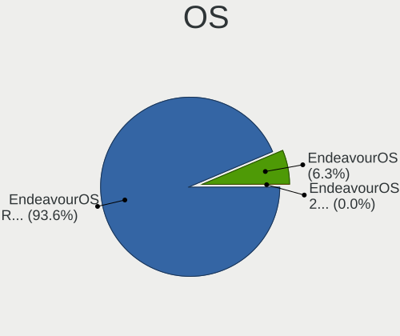

| Name                | Computers | Percent |
|---------------------|-----------|---------|
| EndeavourOS Rolling | 2285      | 93.65%  |
| EndeavourOS         | 154       | 6.31%   |
| EndeavourOS 23.1.0  | 1         | 0.04%   |

OS Family
---------

OS without a version

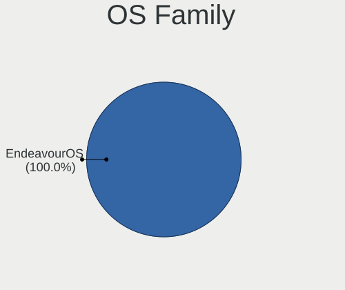

| Name        | Computers | Percent |
|-------------|-----------|---------|
| EndeavourOS | 2427      | 100%    |

Kernel
------

Version of the Linux kernel

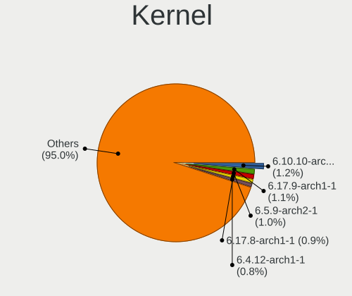

| Version         | Computers | Percent |
|-----------------|-----------|---------|
| 6.10.10-arch1-1 | 36        | 1.24%   |
| 6.17.9-arch1-1  | 32        | 1.1%    |
| 6.5.9-arch2-1   | 29        | 1%      |
| 6.17.8-arch1-1  | 25        | 0.86%   |
| 6.4.12-arch1-1  | 23        | 0.79%   |
| 6.6.7-arch1-1   | 22        | 0.76%   |
| 6.10.6-arch1-1  | 22        | 0.76%   |
| 6.9.3-arch1-1   | 20        | 0.69%   |
| 6.6.1-arch1-1   | 20        | 0.69%   |
| 6.2.8-arch1-1   | 20        | 0.69%   |
| 6.11.6-arch1-1  | 20        | 0.69%   |
| 5.15.12-arch1-1 | 20        | 0.69%   |
| 6.11.5-arch1-1  | 19        | 0.65%   |
| 6.8.7-arch1-1   | 18        | 0.62%   |
| 6.14.6-arch1-1  | 18        | 0.62%   |
| 6.13.2-arch1-1  | 18        | 0.62%   |
| 6.15.2-arch1-1  | 17        | 0.58%   |
| 6.6.8-arch1-1   | 16        | 0.55%   |
| 6.14.2-arch1-1  | 16        | 0.55%   |
| 6.1.1-arch1-1   | 16        | 0.55%   |
| 6.9.9-arch1-1   | 15        | 0.52%   |
| 6.7.9-arch1-1   | 15        | 0.52%   |
| 6.12.10-arch1-1 | 15        | 0.52%   |
| 6.3.9-arch1-1   | 14        | 0.48%   |
| 6.13.8-arch1-1  | 14        | 0.48%   |
| 6.13.7-arch1-1  | 14        | 0.48%   |
| 6.6.2-arch1-1   | 13        | 0.45%   |
| 6.5.7-arch1-1   | 13        | 0.45%   |
| 6.3.1-arch1-1   | 13        | 0.45%   |
| 6.16.7-arch1-1  | 13        | 0.45%   |
| 6.1.12-arch1-1  | 13        | 0.45%   |
| 6.9.7-arch1-1   | 12        | 0.41%   |
| 6.7.8-arch1-1   | 12        | 0.41%   |
| 6.7.4-arch1-1   | 12        | 0.41%   |
| 6.7.0-arch3-1   | 12        | 0.41%   |
| 6.5.3-arch1-1   | 12        | 0.41%   |
| 6.3.4-arch1-1   | 12        | 0.41%   |
| 6.12.1-arch1-1  | 12        | 0.41%   |
| 6.10.5-arch1-1  | 12        | 0.41%   |
| 6.9.4-arch1-1   | 11        | 0.38%   |

Kernel Family
-------------

Linux kernel without a distro release

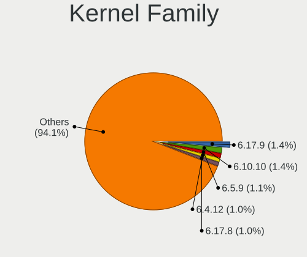

| Version | Computers | Percent |
|---------|-----------|---------|
| 6.17.9  | 41        | 1.41%   |
| 6.10.10 | 40        | 1.37%   |
| 6.5.9   | 33        | 1.13%   |
| 6.4.12  | 29        | 1%      |
| 6.17.8  | 29        | 1%      |
| 5.15.12 | 28        | 0.96%   |
| 6.6.1   | 27        | 0.93%   |
| 6.9.3   | 26        | 0.89%   |
| 6.8.7   | 25        | 0.86%   |
| 6.10.6  | 25        | 0.86%   |
| 6.6.7   | 24        | 0.82%   |
| 6.11.6  | 24        | 0.82%   |
| 6.3.1   | 23        | 0.79%   |
| 6.1.1   | 23        | 0.79%   |
| 6.2.8   | 22        | 0.76%   |
| 6.11.5  | 22        | 0.76%   |
| 6.0.2   | 22        | 0.76%   |
| 6.14.6  | 21        | 0.72%   |
| 6.14.2  | 21        | 0.72%   |
| 6.8.9   | 20        | 0.69%   |
| 6.15.2  | 19        | 0.65%   |
| 6.13.7  | 19        | 0.65%   |
| 6.13.2  | 19        | 0.65%   |
| 6.6.8   | 18        | 0.62%   |
| 6.6.2   | 18        | 0.62%   |
| 6.9.9   | 17        | 0.58%   |
| 6.9.7   | 17        | 0.58%   |
| 6.7.8   | 17        | 0.58%   |
| 6.17.7  | 17        | 0.58%   |
| 6.12.10 | 17        | 0.58%   |
| 6.7.9   | 16        | 0.55%   |
| 6.7.4   | 16        | 0.55%   |
| 6.7.0   | 16        | 0.55%   |
| 6.5.8   | 16        | 0.55%   |
| 6.5.3   | 16        | 0.55%   |
| 6.4.7   | 16        | 0.55%   |
| 6.4.11  | 16        | 0.55%   |
| 6.3.4   | 16        | 0.55%   |
| 6.16.8  | 16        | 0.55%   |
| 6.5.7   | 15        | 0.52%   |

Kernel Major Ver.
-----------------

Linux kernel major version

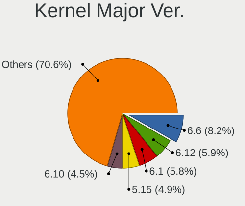

| Version | Computers | Percent |
|---------|-----------|---------|
| 6.6     | 230       | 8.24%   |
| 6.12    | 166       | 5.95%   |
| 6.1     | 162       | 5.81%   |
| 5.15    | 138       | 4.95%   |
| 6.10    | 125       | 4.48%   |
| 6.7     | 121       | 4.34%   |
| 6.17    | 118       | 4.23%   |
| 6.4     | 117       | 4.19%   |
| 6.5     | 113       | 4.05%   |
| 6.9     | 107       | 3.84%   |
| 6.11    | 106       | 3.8%    |
| 6.2     | 103       | 3.69%   |
| 6.8     | 98        | 3.51%   |
| 6.14    | 96        | 3.44%   |
| 6.13    | 91        | 3.26%   |
| 6.3     | 85        | 3.05%   |
| 6.0     | 85        | 3.05%   |
| 6.15    | 82        | 2.94%   |
| 5.19    | 79        | 2.83%   |
| 5.16    | 66        | 2.37%   |
| 5.17    | 64        | 2.29%   |
| 6.16    | 62        | 2.22%   |
| 5.18    | 61        | 2.19%   |
| 5.14    | 52        | 1.86%   |
| 5.12    | 38        | 1.36%   |
| 5.10    | 38        | 1.36%   |
| 5.11    | 37        | 1.33%   |
| 5.9     | 35        | 1.25%   |
| 5.13    | 35        | 1.25%   |
| 5.8     | 24        | 0.86%   |
| 5.7     | 21        | 0.75%   |
| 6.18    | 15        | 0.54%   |
| 5.4     | 7         | 0.25%   |
| 5.6     | 5         | 0.18%   |
| 5.5     | 2         | 0.07%   |
| 4.19    | 2         | 0.07%   |
| 6.7.0   | 1         | 0.04%   |
| 5.2     | 1         | 0.04%   |
| 5.17.1  | 1         | 0.04%   |
| Unknown | 1         | 0.04%   |

Arch
----

OS architecture (x86_64, i586, etc.)

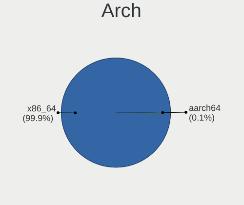

| Name    | Computers | Percent |
|---------|-----------|---------|
| x86_64  | 2425      | 99.92%  |
| aarch64 | 2         | 0.08%   |

DE
--

Desktop Environment

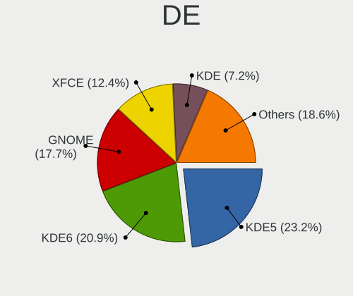

| Name            | Computers | Percent |
|-----------------|-----------|---------|
| KDE5            | 594       | 23.21%  |
| KDE6            | 536       | 20.95%  |
| GNOME           | 453       | 17.7%   |
| XFCE            | 317       | 12.39%  |
| KDE             | 184       | 7.19%   |
| i3              | 94        | 3.67%   |
| X-Cinnamon      | 72        | 2.81%   |
| Hyprland        | 71        | 2.77%   |
| Unknown         | 54        | 2.11%   |
| Budgie          | 44        | 1.72%   |
| sway            | 29        | 1.13%   |
| Cinnamon        | 27        | 1.06%   |
| MATE            | 22        | 0.86%   |
| LXQt            | 13        | 0.51%   |
| Deepin          | 6         | 0.23%   |
| LXDE            | 5         | 0.2%    |
| bspwm           | 5         | 0.2%    |
| awesome         | 5         | 0.2%    |
| openbox         | 4         | 0.16%   |
| GNOME Flashback | 4         | 0.16%   |
| qtile           | 3         | 0.12%   |
| niri            | 2         | 0.08%   |
| herbstluftwm    | 2         | 0.08%   |
| GNOME Classic   | 2         | 0.08%   |
| dwm             | 2         | 0.08%   |
| xmonad          | 1         | 0.04%   |
| wayfire         | 1         | 0.04%   |
| sway:wlroots    | 1         | 0.04%   |
| Pantheon        | 1         | 0.04%   |
| LeftWM          | 1         | 0.04%   |
| jwm             | 1         | 0.04%   |
| GTK             | 1         | 0.04%   |
| COSMIC          | 1         | 0.04%   |
| chadwm          | 1         | 0.04%   |

Display Server
--------------

X11 or Wayland

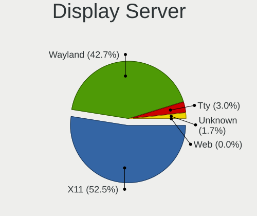

| Name    | Computers | Percent |
|---------|-----------|---------|
| X11     | 1318      | 52.51%  |
| Wayland | 1072      | 42.71%  |
| Tty     | 76        | 3.03%   |
| Unknown | 43        | 1.71%   |
| Web     | 1         | 0.04%   |

Display Manager
---------------

SDDM, LightDM, etc.

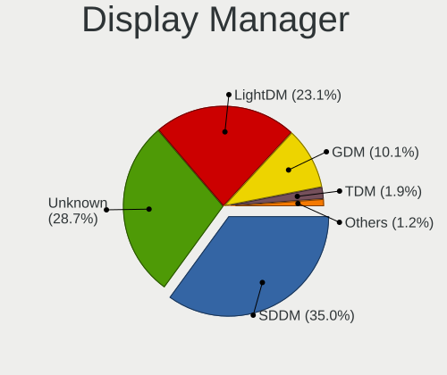

| Name        | Computers | Percent |
|-------------|-----------|---------|
| SDDM        | 877       | 35.01%  |
| Unknown     | 720       | 28.74%  |
| LightDM     | 579       | 23.11%  |
| GDM         | 252       | 10.06%  |
| TDM         | 48        | 1.92%   |
| LY-DM       | 15        | 0.6%    |
| GREETD      | 6         | 0.24%   |
| LXDM        | 3         | 0.12%   |
| LEMURS      | 2         | 0.08%   |
| PLASMALOGIN | 1         | 0.04%   |
| Ly          | 1         | 0.04%   |
| EMPTTY      | 1         | 0.04%   |

OS Lang
-------

Language

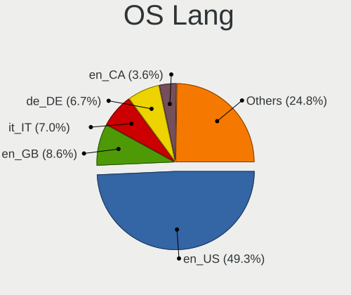

| Lang    | Computers | Percent |
|---------|-----------|---------|
| en_US   | 1209      | 49.31%  |
| en_GB   | 212       | 8.65%   |
| it_IT   | 171       | 6.97%   |
| de_DE   | 165       | 6.73%   |
| en_CA   | 88        | 3.59%   |
| ru_RU   | 70        | 2.85%   |
| en_IN   | 57        | 2.32%   |
| fr_FR   | 45        | 1.84%   |
| en_AU   | 45        | 1.84%   |
| es_ES   | 43        | 1.75%   |
| pl_PL   | 30        | 1.22%   |
| pt_BR   | 29        | 1.18%   |
| Unknown | 29        | 1.18%   |
| es_MX   | 23        | 0.94%   |
| tr_TR   | 21        | 0.86%   |
| sv_SE   | 16        | 0.65%   |
| nl_NL   | 14        | 0.57%   |
| fi_FI   | 12        | 0.49%   |
| en_PH   | 12        | 0.49%   |
| de_AT   | 12        | 0.49%   |
| es_AR   | 11        | 0.45%   |
| en_DK   | 9         | 0.37%   |
| zh_CN   | 8         | 0.33%   |
| pt_PT   | 8         | 0.33%   |
| en_ZA   | 8         | 0.33%   |
| es_CL   | 7         | 0.29%   |
| en_AG   | 7         | 0.29%   |
| en_NZ   | 6         | 0.24%   |
| cs_CZ   | 6         | 0.24%   |
| nl_BE   | 5         | 0.2%    |
| hu_HU   | 5         | 0.2%    |
| en_SG   | 5         | 0.2%    |
| en_HK   | 5         | 0.2%    |
| de_CH   | 4         | 0.16%   |
| ru_UA   | 3         | 0.12%   |
| es_PE   | 3         | 0.12%   |
| es_CO   | 3         | 0.12%   |
| C       | 3         | 0.12%   |
| zh_TW   | 2         | 0.08%   |
| uk_UA   | 2         | 0.08%   |

Boot Mode
---------

EFI or BIOS

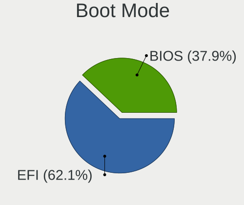

| Mode | Computers | Percent |
|------|-----------|---------|
| EFI  | 1534      | 62.06%  |
| BIOS | 938       | 37.94%  |

Filesystem
----------

Type of filesystem

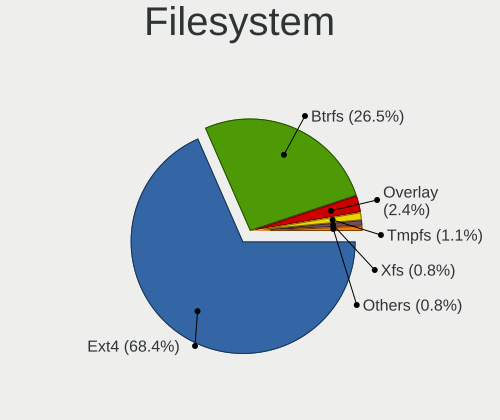

| Type    | Computers | Percent |
|---------|-----------|---------|
| Ext4    | 1687      | 68.44%  |
| Btrfs   | 652       | 26.45%  |
| Overlay | 60        | 2.43%   |
| Tmpfs   | 28        | 1.14%   |
| Xfs     | 19        | 0.77%   |
| F2fs    | 8         | 0.32%   |
| Unknown | 7         | 0.28%   |
| Zfs     | 2         | 0.08%   |
| XXX4    | 1         | 0.04%   |
| Ext2    | 1         | 0.04%   |

Part. scheme
------------

Scheme of partitioning

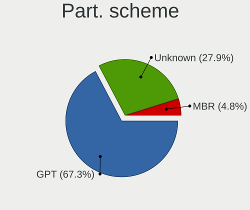

| Type    | Computers | Percent |
|---------|-----------|---------|
| GPT     | 1657      | 67.28%  |
| Unknown | 687       | 27.89%  |
| MBR     | 119       | 4.83%   |

Dual Boot with Linux/BSD
------------------------

Hosting more than one Linux/BSD

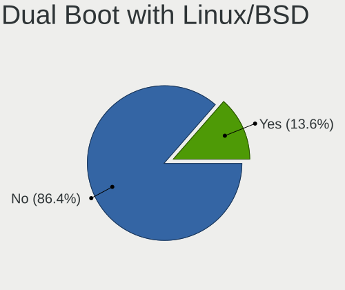

| Dual boot | Computers | Percent |
|-----------|-----------|---------|
| No        | 2128      | 86.43%  |
| Yes       | 334       | 13.57%  |

Dual Boot (Win)
---------------

Hosting Linux and Windows

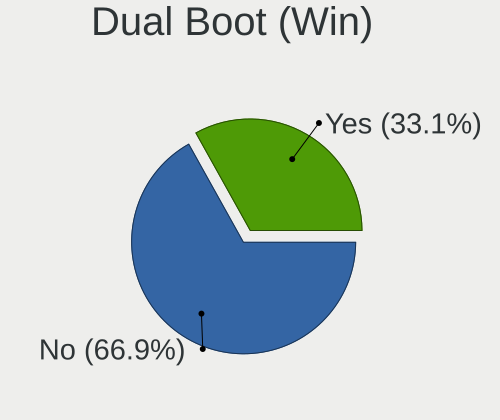

| Dual boot | Computers | Percent |
|-----------|-----------|---------|
| No        | 1656      | 66.91%  |
| Yes       | 819       | 33.09%  |

Board
-----

Vendor
------

Motherboard manufacturer

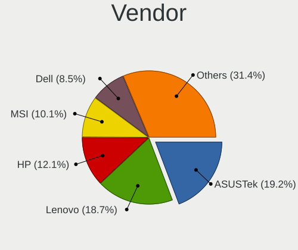

| Name                                 | Computers | Percent |
|--------------------------------------|-----------|---------|
| ASUSTek Computer                     | 467       | 19.24%  |
| Lenovo                               | 455       | 18.75%  |
| Hewlett-Packard                      | 294       | 12.11%  |
| MSI                                  | 244       | 10.05%  |
| Dell                                 | 206       | 8.49%   |
| Gigabyte Technology                  | 183       | 7.54%   |
| Acer                                 | 101       | 4.16%   |
| ASRock                               | 93        | 3.83%   |
| Apple                                | 56        | 2.31%   |
| Samsung Electronics                  | 24        | 0.99%   |
| HUAWEI                               | 22        | 0.91%   |
| Google                               | 21        | 0.87%   |
| Unknown                              | 21        | 0.87%   |
| Microsoft                            | 19        | 0.78%   |
| Toshiba                              | 13        | 0.54%   |
| Timi                                 | 12        | 0.49%   |
| TUXEDO                               | 11        | 0.45%   |
| Alienware                            | 9         | 0.37%   |
| Notebook                             | 8         | 0.33%   |
| Intel                                | 8         | 0.33%   |
| Sony                                 | 7         | 0.29%   |
| Fujitsu                              | 7         | 0.29%   |
| AZW                                  | 7         | 0.29%   |
| Medion                               | 6         | 0.25%   |
| Huanan                               | 6         | 0.25%   |
| Framework                            | 6         | 0.25%   |
| Shenzhen Meigao Electronic Equipment | 5         | 0.21%   |
| Schenker                             | 5         | 0.21%   |
| HONOR                                | 5         | 0.21%   |
| Chuwi                                | 5         | 0.21%   |
| Biostar                              | 5         | 0.21%   |
| Positivo                             | 4         | 0.16%   |
| PC Specialist                        | 4         | 0.16%   |
| Packard Bell                         | 4         | 0.16%   |
| ZOTAC                                | 3         | 0.12%   |
| XIAOMI                               | 3         | 0.12%   |
| Razer                                | 3         | 0.12%   |
| MECHREVO                             | 3         | 0.12%   |
| Maibenben                            | 3         | 0.12%   |
| GPD                                  | 3         | 0.12%   |

Model
-----

Motherboard model

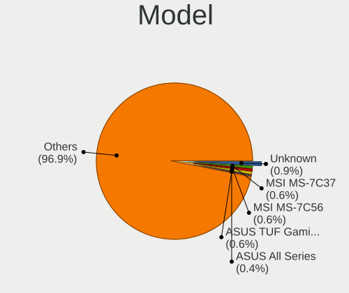

| Name                                 | Computers | Percent |
|--------------------------------------|-----------|---------|
| Unknown                              | 23        | 0.95%   |
| MSI MS-7C37                          | 15        | 0.62%   |
| MSI MS-7C56                          | 14        | 0.58%   |
| ASUS TUF Gaming X570-PLUS            | 14        | 0.58%   |
| ASUS All Series                      | 10        | 0.41%   |
| MSI MS-7C91                          | 8         | 0.33%   |
| MSI MS-7A38                          | 8         | 0.33%   |
| ASRock B450M Pro4                    | 8         | 0.33%   |
| Apple MacBookAir7,2                  | 8         | 0.33%   |
| MSI MS-7C02                          | 7         | 0.29%   |
| Gigabyte B450M DS3H                  | 7         | 0.29%   |
| ASUS ROG STRIX B550-F GAMING         | 7         | 0.29%   |
| MSI MS-7C52                          | 6         | 0.25%   |
| Lenovo IdeaPad Gaming 3 15ACH6 82K2  | 6         | 0.25%   |
| Gigabyte X570 AORUS ELITE            | 6         | 0.25%   |
| Gigabyte X470 AORUS ULTRA GAMING     | 6         | 0.25%   |
| Gigabyte B550I AORUS PRO AX          | 6         | 0.25%   |
| Gigabyte B550 AORUS ELITE V2         | 6         | 0.25%   |
| MSI MS-7D75                          | 5         | 0.21%   |
| MSI MS-7C94                          | 5         | 0.21%   |
| MSI MS-7C84                          | 5         | 0.21%   |
| Microsoft Surface Laptop Go          | 5         | 0.21%   |
| Lenovo Legion 5 Pro 16ARH7H 82RG     | 5         | 0.21%   |
| HP Pavilion Gaming Laptop 15-cx0xxx  | 5         | 0.21%   |
| Gigabyte B450 AORUS ELITE            | 5         | 0.21%   |
| Dell XPS 15 9520                     | 5         | 0.21%   |
| ASUS TUF Gaming B550-PLUS            | 5         | 0.21%   |
| ASUS ROG STRIX X570-E GAMING         | 5         | 0.21%   |
| ASUS ROG STRIX B450-F GAMING         | 5         | 0.21%   |
| ASUS ROG CROSSHAIR VIII DARK HERO    | 5         | 0.21%   |
| ASUS PRIME X570-P                    | 5         | 0.21%   |
| MSI MS-7D25                          | 4         | 0.16%   |
| MSI MS-7C95                          | 4         | 0.16%   |
| MSI MS-7B86                          | 4         | 0.16%   |
| MSI MS-7B79                          | 4         | 0.16%   |
| Lenovo Legion 5 Pro 16ACH6H 82JQ     | 4         | 0.16%   |
| Lenovo Legion 5 15ACH6H 82JU         | 4         | 0.16%   |
| HP Victus by Gaming Laptop 16-s0xxx  | 4         | 0.16%   |
| HP Victus by Gaming Laptop 15-fa1xxx | 4         | 0.16%   |
| HP Notebook                          | 4         | 0.16%   |

Model Family
------------

Motherboard model prefix

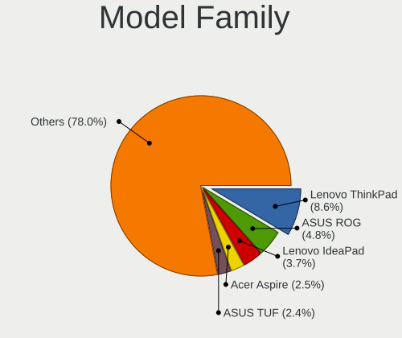

| Name               | Computers | Percent |
|--------------------|-----------|---------|
| Lenovo ThinkPad    | 208       | 8.57%   |
| ASUS ROG           | 117       | 4.82%   |
| Lenovo IdeaPad     | 89        | 3.67%   |
| Acer Aspire        | 61        | 2.51%   |
| ASUS TUF           | 59        | 2.43%   |
| Dell Latitude      | 56        | 2.31%   |
| HP Pavilion        | 54        | 2.22%   |
| ASUS VivoBook      | 51        | 2.1%    |
| ASUS PRIME         | 50        | 2.06%   |
| Lenovo Legion      | 48        | 1.98%   |
| Dell Inspiron      | 46        | 1.9%    |
| ASUS ASUS          | 43        | 1.77%   |
| HP EliteBook       | 42        | 1.73%   |
| Lenovo Yoga        | 36        | 1.48%   |
| HP Laptop          | 29        | 1.19%   |
| Dell XPS           | 29        | 1.19%   |
| Dell OptiPlex      | 28        | 1.15%   |
| Dell Precision     | 24        | 0.99%   |
| HP ENVY            | 23        | 0.95%   |
| Unknown            | 23        | 0.95%   |
| Microsoft Surface  | 19        | 0.78%   |
| HP ProBook         | 18        | 0.74%   |
| ASUS ZenBook       | 18        | 0.74%   |
| Gigabyte X570      | 17        | 0.7%    |
| Lenovo ThinkBook   | 16        | 0.66%   |
| HP Victus          | 16        | 0.66%   |
| Gigabyte B550M     | 16        | 0.66%   |
| MSI MS-7C37        | 15        | 0.62%   |
| MSI MS-7C56        | 14        | 0.58%   |
| Gigabyte B550      | 14        | 0.58%   |
| Lenovo ThinkCentre | 13        | 0.54%   |
| ASRock B450M       | 13        | 0.54%   |
| Acer Swift         | 13        | 0.54%   |
| Acer Nitro         | 13        | 0.54%   |
| MSI Modern         | 11        | 0.45%   |
| HP ZBook           | 11        | 0.45%   |
| Gigabyte B450M     | 11        | 0.45%   |
| Gigabyte B450      | 11        | 0.45%   |
| Toshiba Satellite  | 10        | 0.41%   |
| HP OMEN            | 10        | 0.41%   |

MFG Year
--------

Motherboard manufacture year

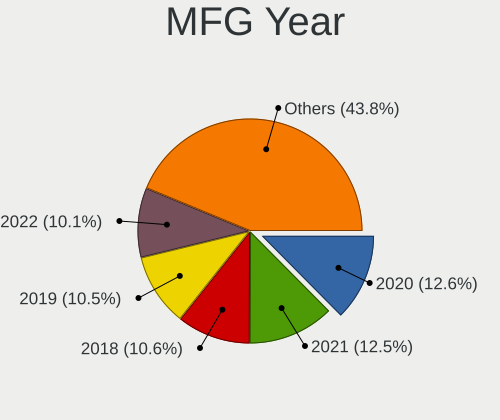

| Year    | Computers | Percent |
|---------|-----------|---------|
| 2020    | 305       | 12.57%  |
| 2021    | 303       | 12.48%  |
| 2018    | 258       | 10.63%  |
| 2019    | 255       | 10.51%  |
| 2022    | 244       | 10.05%  |
| 2023    | 170       | 7%      |
| 2017    | 139       | 5.73%   |
| 2013    | 106       | 4.37%   |
| 2024    | 103       | 4.24%   |
| 2012    | 100       | 4.12%   |
| 2015    | 93        | 3.83%   |
| 2016    | 89        | 3.67%   |
| 2014    | 87        | 3.58%   |
| 2011    | 48        | 1.98%   |
| 2008    | 30        | 1.24%   |
| 2010    | 28        | 1.15%   |
| 2025    | 24        | 0.99%   |
| 2009    | 22        | 0.91%   |
| 2007    | 11        | 0.45%   |
| 2006    | 10        | 0.41%   |
| Unknown | 2         | 0.08%   |

Form Factor
-----------

Physical design of the computer

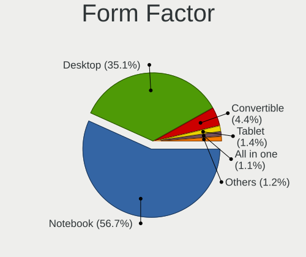

| Name           | Computers | Percent |
|----------------|-----------|---------|
| Notebook       | 1377      | 56.74%  |
| Desktop        | 853       | 35.15%  |
| Convertible    | 107       | 4.41%   |
| Tablet         | 34        | 1.4%    |
| All in one     | 27        | 1.11%   |
| Mini pc        | 26        | 1.07%   |
| Server         | 2         | 0.08%   |
| System on chip | 1         | 0.04%   |

Secure Boot
-----------

Enabled or disabled

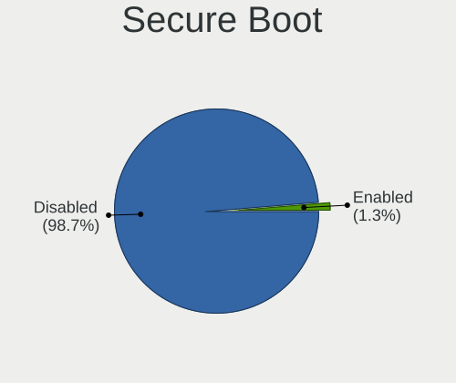

| State    | Computers | Percent |
|----------|-----------|---------|
| Disabled | 2397      | 98.68%  |
| Enabled  | 32        | 1.32%   |

Coreboot
--------

Have coreboot on board

| Used | Computers | Percent |
|------|-----------|---------|
| No   | 2402      | 98.97%  |
| Yes  | 25        | 1.03%   |

RAM Size
--------

Total RAM memory

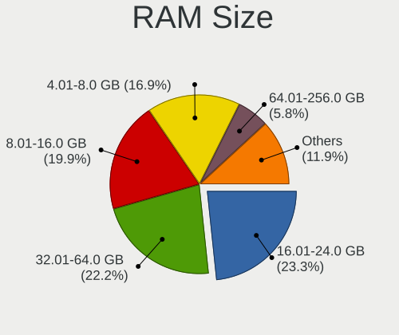

| Size in GB      | Computers | Percent |
|-----------------|-----------|---------|
| 16.01-24.0      | 573       | 23.34%  |
| 32.01-64.0      | 546       | 22.24%  |
| 8.01-16.0       | 488       | 19.88%  |
| 4.01-8.0        | 415       | 16.9%   |
| 3.01-4.0        | 142       | 5.78%   |
| 64.01-256.0     | 142       | 5.78%   |
| 24.01-32.0      | 132       | 5.38%   |
| 1.01-2.0        | 10        | 0.41%   |
| 2.01-3.0        | 5         | 0.2%    |
| More than 256.0 | 1         | 0.04%   |
| Unknown         | 1         | 0.04%   |

RAM Used
--------

Used RAM memory

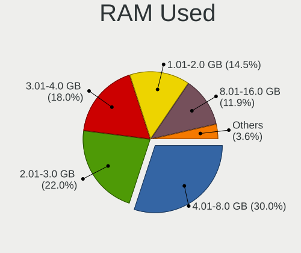

| Used GB    | Computers | Percent |
|------------|-----------|---------|
| 4.01-8.0   | 802       | 30.04%  |
| 2.01-3.0   | 587       | 21.99%  |
| 3.01-4.0   | 480       | 17.98%  |
| 1.01-2.0   | 387       | 14.49%  |
| 8.01-16.0  | 318       | 11.91%  |
| 16.01-24.0 | 40        | 1.5%    |
| 0.51-1.0   | 38        | 1.42%   |
| 24.01-32.0 | 13        | 0.49%   |
| 32.01-64.0 | 2         | 0.07%   |
| 0.01-0.5   | 2         | 0.07%   |
| Unknown    | 1         | 0.04%   |

Total Drives
------------

Number of drives on board

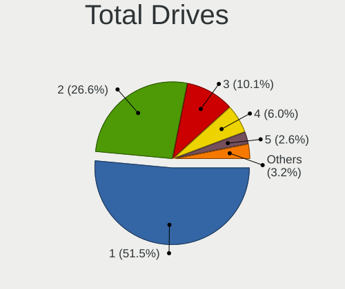

| Drives | Computers | Percent |
|--------|-----------|---------|
| 1      | 1289      | 51.48%  |
| 2      | 667       | 26.64%  |
| 3      | 254       | 10.14%  |
| 4      | 151       | 6.03%   |
| 5      | 64        | 2.56%   |
| 6      | 40        | 1.6%    |
| 7      | 16        | 0.64%   |
| 0      | 10        | 0.4%    |
| 8      | 6         | 0.24%   |
| 9      | 4         | 0.16%   |
| 10     | 3         | 0.12%   |

Has CD-ROM
----------

Has CD-ROM on board

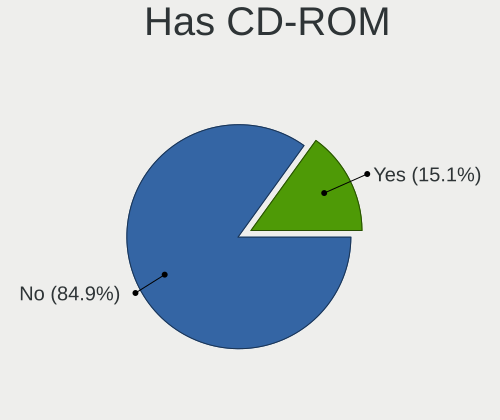

| Presented | Computers | Percent |
|-----------|-----------|---------|
| No        | 2071      | 84.95%  |
| Yes       | 367       | 15.05%  |

Has Ethernet
------------

Has Ethernet on board

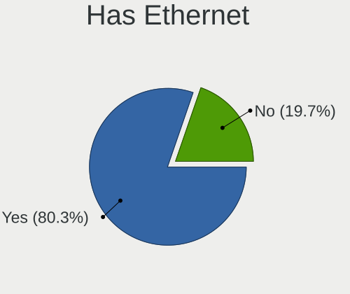

| Presented | Computers | Percent |
|-----------|-----------|---------|
| Yes       | 1959      | 80.29%  |
| No        | 481       | 19.71%  |

Has WiFi
--------

Has WiFi module

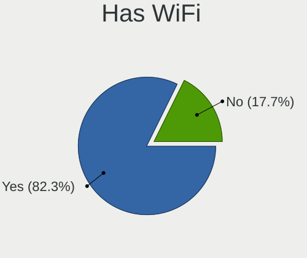

| Presented | Computers | Percent |
|-----------|-----------|---------|
| Yes       | 2010      | 82.31%  |
| No        | 432       | 17.69%  |

Has Bluetooth
-------------

Has Bluetooth module

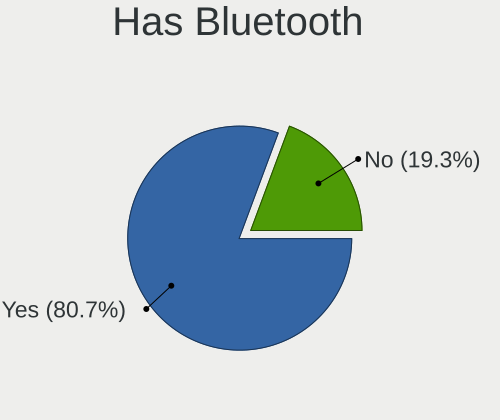

| Presented | Computers | Percent |
|-----------|-----------|---------|
| Yes       | 1977      | 80.66%  |
| No        | 474       | 19.34%  |

Location
--------

Country
-------

Geographic location (country)

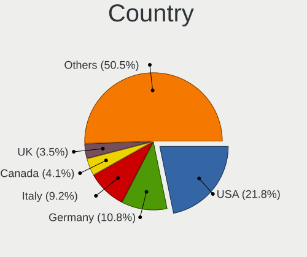

| Country      | Computers | Percent |
|--------------|-----------|---------|
| USA          | 533       | 21.77%  |
| Germany      | 265       | 10.83%  |
| Italy        | 226       | 9.23%   |
| Canada       | 101       | 4.13%   |
| UK           | 86        | 3.51%   |
| Russia       | 84        | 3.43%   |
| France       | 82        | 3.35%   |
| India        | 73        | 2.98%   |
| Poland       | 72        | 2.94%   |
| Brazil       | 58        | 2.37%   |
| Netherlands  | 57        | 2.33%   |
| Spain        | 56        | 2.29%   |
| Australia    | 53        | 2.17%   |
| Sweden       | 46        | 1.88%   |
| Turkey       | 45        | 1.84%   |
| Austria      | 36        | 1.47%   |
| Mexico       | 31        | 1.27%   |
| Finland      | 30        | 1.23%   |
| Switzerland  | 28        | 1.14%   |
| Czechia      | 21        | 0.86%   |
| Romania      | 20        | 0.82%   |
| Indonesia    | 20        | 0.82%   |
| Belgium      | 20        | 0.82%   |
| Portugal     | 18        | 0.74%   |
| Argentina    | 17        | 0.69%   |
| Hungary      | 16        | 0.65%   |
| Philippines  | 15        | 0.61%   |
| Vietnam      | 14        | 0.57%   |
| Denmark      | 13        | 0.53%   |
| Colombia     | 13        | 0.53%   |
| Slovakia     | 12        | 0.49%   |
| Serbia       | 12        | 0.49%   |
| Chile        | 12        | 0.49%   |
| Norway       | 11        | 0.45%   |
| Ukraine      | 9         | 0.37%   |
| South Africa | 9         | 0.37%   |
| Malaysia     | 9         | 0.37%   |
| Hong Kong    | 9         | 0.37%   |
| Greece       | 9         | 0.37%   |
| China        | 9         | 0.37%   |

City
----

Geographic location (city)

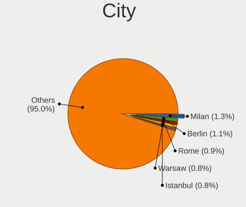

| City              | Computers | Percent |
|-------------------|-----------|---------|
| Milan             | 33        | 1.26%   |
| Berlin            | 29        | 1.11%   |
| Rome              | 24        | 0.92%   |
| Warsaw            | 22        | 0.84%   |
| Istanbul          | 22        | 0.84%   |
| Montreal          | 20        | 0.76%   |
| Amsterdam         | 19        | 0.73%   |
| Vienna            | 18        | 0.69%   |
| Helsinki          | 17        | 0.65%   |
| Frankfurt am Main | 17        | 0.65%   |
| Sydney            | 16        | 0.61%   |
| Moscow            | 16        | 0.61%   |
| Melbourne         | 16        | 0.61%   |
| St Petersburg     | 12        | 0.46%   |
| Los Angeles       | 12        | 0.46%   |
| Hamburg           | 12        | 0.46%   |
| Florence          | 12        | 0.46%   |
| Toronto           | 11        | 0.42%   |
| Seattle           | 11        | 0.42%   |
| Prague            | 11        | 0.42%   |
| Paris             | 11        | 0.42%   |
| Milano            | 11        | 0.42%   |
| Munich            | 10        | 0.38%   |
| Madrid            | 10        | 0.38%   |
| Delhi             | 10        | 0.38%   |
| Chicago           | 10        | 0.38%   |
| Belgrade          | 10        | 0.38%   |
| Turin             | 9         | 0.34%   |
| New York          | 9         | 0.34%   |
| Mississauga       | 9         | 0.34%   |
| London            | 9         | 0.34%   |
| Hyderabad         | 9         | 0.34%   |
| Cologne           | 9         | 0.34%   |
| Chennai           | 9         | 0.34%   |
| Budapest          | 9         | 0.34%   |
| Stockholm         | 8         | 0.31%   |
| Bucharest         | 8         | 0.31%   |
| Victoria          | 7         | 0.27%   |
| Toms River        | 7         | 0.27%   |
| Singapore         | 7         | 0.27%   |

Drives
------

Drive Vendor
------------

Hard drive vendors

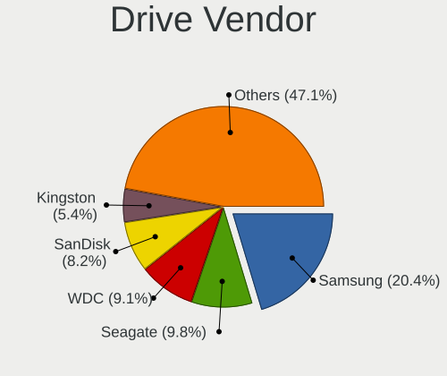

| Vendor                       | Computers | Drives | Percent |
|------------------------------|-----------|--------|---------|
| Samsung Electronics          | 829       | 1271   | 20.35%  |
| Seagate                      | 401       | 585    | 9.85%   |
| WDC                          | 372       | 593    | 9.13%   |
| SanDisk                      | 334       | 423    | 8.2%    |
| Kingston                     | 219       | 305    | 5.38%   |
| Toshiba                      | 161       | 217    | 3.95%   |
| Crucial                      | 156       | 216    | 3.83%   |
| SK hynix                     | 153       | 189    | 3.76%   |
| Micron Technology            | 130       | 155    | 3.19%   |
| Intel                        | 106       | 136    | 2.6%    |
| Unknown                      | 100       | 128    | 2.46%   |
| Phison Electronics           | 93        | 146    | 2.28%   |
| Micron/Crucial Technology    | 80        | 113    | 1.96%   |
| Kingston Technology Company  | 78        | 93     | 1.92%   |
| KIOXIA                       | 64        | 73     | 1.57%   |
| Hitachi                      | 45        | 58     | 1.1%    |
| Apple                        | 43        | 56     | 1.06%   |
| HGST                         | 42        | 56     | 1.03%   |
| A-DATA Technology            | 40        | 52     | 0.98%   |
| Silicon Motion               | 29        | 34     | 0.71%   |
| China                        | 29        | 32     | 0.71%   |
| ADATA Technology             | 27        | 32     | 0.66%   |
| MAXIO Technology (Hangzhou)  | 26        | 32     | 0.64%   |
| SPCC                         | 25        | 41     | 0.61%   |
| PNY                          | 23        | 38     | 0.56%   |
| Phison                       | 22        | 23     | 0.54%   |
| Intenso                      | 19        | 28     | 0.47%   |
| Patriot                      | 18        | 24     | 0.44%   |
| Shenzhen Longsys Electronics | 17        | 21     | 0.42%   |
| Realtek Semiconductor        | 17        | 19     | 0.42%   |
| JMicron Technology           | 16        | 19     | 0.39%   |
| LITEON                       | 12        | 16     | 0.29%   |
| Transcend                    | 11        | 15     | 0.27%   |
| Team                         | 11        | 15     | 0.27%   |
| OCZ                          | 11        | 11     | 0.27%   |
| Corsair                      | 11        | 11     | 0.27%   |
| SABRENT                      | 10        | 18     | 0.25%   |
| LITEONIT                     | 10        | 11     | 0.25%   |
| KingSpec                     | 10        | 10     | 0.25%   |
| Gigabyte Technology          | 9         | 12     | 0.22%   |

Drive Model
-----------

Hard drive models

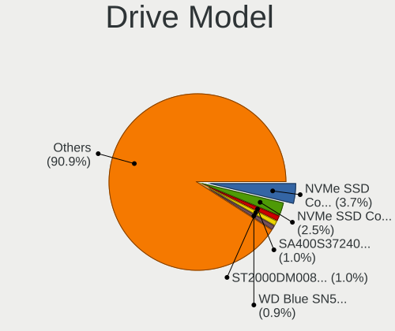

| Model                                                 | Computers | Percent |
|-------------------------------------------------------|-----------|---------|
| Samsung NVMe SSD Controller SM981/PM981/PM983 1TB     | 170       | 3.74%   |
| Samsung NVMe SSD Controller PM9A1/PM9A3/980PRO 1TB    | 113       | 2.49%   |
| Kingston SA400S37240G 240GB SSD                       | 46        | 1.01%   |
| Seagate ST2000DM008-2FR102 2TB                        | 44        | 0.97%   |
| Sandisk WD Blue SN550 NVMe SSD 1024GB                 | 39        | 0.86%   |
| Samsung SSD 860 EVO 1TB                               | 37        | 0.81%   |
| Samsung SSD 860 EVO 500GB                             | 35        | 0.77%   |
| Sandisk WD Black SN750 / PC SN730 NVMe SSD 500GB      | 33        | 0.73%   |
| Samsung SSD 980 1TB                                   | 33        | 0.73%   |
| Phison E12 NVMe Controller 1TB                        | 32        | 0.7%    |
| Micron/Crucial P2 NVMe PCIe SSD 2TB                   | 31        | 0.68%   |
| Crucial CT500MX500SSD1 500GB                          | 30        | 0.66%   |
| Seagate ST1000LM035-1RK172 1TB                        | 29        | 0.64%   |
| Kingston SA400S37480G 480GB SSD                       | 27        | 0.59%   |
| Samsung SSD 850 EVO 250GB                             | 26        | 0.57%   |
| Samsung NVMe SSD Controller SM961/PM961/SM963 1024GB  | 25        | 0.55%   |
| Seagate ST4000DM004-2CV104 4TB                        | 24        | 0.53%   |
| Samsung SSD 860 EVO 250GB                             | 24        | 0.53%   |
| Intel SSD 660P Series 512GB                           | 24        | 0.53%   |
| Unknown MMC Card  64GB                                | 23        | 0.51%   |
| Silicon Motion SM2263EN/SM2263XT SSD Controller 512GB | 23        | 0.51%   |
| Crucial CT1000MX500SSD1 1TB                           | 23        | 0.51%   |
| Samsung SSD 870 EVO 1TB                               | 22        | 0.48%   |
| WDC WD10EZEX-08WN4A0 1TB                              | 21        | 0.46%   |
| Seagate ST1000DM010-2EP102 1TB                        | 21        | 0.46%   |
| Samsung SSD 870 QVO 1TB                               | 21        | 0.46%   |
| Crucial CT240BX500SSD1 240GB                          | 20        | 0.44%   |
| Samsung SSD 980 500GB                                 | 19        | 0.42%   |
| Samsung SSD 850 EVO 500GB                             | 19        | 0.42%   |
| Phison E16 PCIe4 NVMe Controller 1TB                  | 19        | 0.42%   |
| Kingston SA400S37120G 120GB SSD                       | 19        | 0.42%   |
| Intel SSDPEKNU512GZ 512GB                             | 19        | 0.42%   |
| Toshiba DT01ACA100 1TB                                | 18        | 0.4%    |
| MAXIO (Hangzhou) NVMe SSD Controller MAP1202 2TB      | 18        | 0.4%    |
| Kingston Company SNV2S1000G 1TB                       | 18        | 0.4%    |
| Toshiba MQ01ABD100 1TB                                | 16        | 0.35%   |
| Samsung SSD 990 PRO 2TB                               | 16        | 0.35%   |
| Unknown MMC Card  128GB                               | 15        | 0.33%   |
| Phison PS5013 E13 NVMe Controller 500GB               | 15        | 0.33%   |
| HGST HTS721010A9E630 1TB                              | 15        | 0.33%   |

HDD Vendor
----------

Hard disk drive vendors

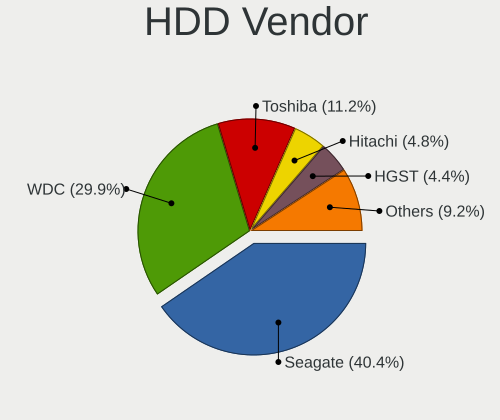

| Vendor              | Computers | Drives | Percent |
|---------------------|-----------|--------|---------|
| Seagate             | 382       | 547    | 40.42%  |
| WDC                 | 283       | 428    | 29.95%  |
| Toshiba             | 106       | 144    | 11.22%  |
| Hitachi             | 45        | 58     | 4.76%   |
| HGST                | 42        | 56     | 4.44%   |
| Samsung Electronics | 19        | 43     | 2.01%   |
| Unknown             | 14        | 14     | 1.48%   |
| Apple               | 9         | 12     | 0.95%   |
| JMicron Technology  | 6         | 7      | 0.63%   |
| ASMT                | 6         | 10     | 0.63%   |
| Maxtor              | 4         | 5      | 0.42%   |
| Maxone              | 3         | 3      | 0.32%   |
| Fujitsu             | 3         | 3      | 0.32%   |
| T-FORCE             | 2         | 3      | 0.21%   |
| StoreJet            | 2         | 2      | 0.21%   |
| Intenso             | 2         | 2      | 0.21%   |
| USB3.0              | 1         | 1      | 0.11%   |
| SSK                 | 1         | 2      | 0.11%   |
| RSH-339             | 1         | 1      | 0.11%   |
| RSH-319             | 1         | 2      | 0.11%   |
| PI-041              | 1         | 1      | 0.11%   |
| MSFT                | 1         | 1      | 0.11%   |
| MaxDigital          | 1         | 2      | 0.11%   |
| MARVELL             | 1         | 4      | 0.11%   |
| ICY BOX             | 1         | 1      | 0.11%   |
| HPE                 | 1         | 1      | 0.11%   |
| HGST HTS            | 1         | 1      | 0.11%   |
| H/W                 | 1         | 3      | 0.11%   |
| Generic-            | 1         | 1      | 0.11%   |
| Fantom              | 1         | 3      | 0.11%   |
| External            | 1         | 1      | 0.11%   |
| ASMedia             | 1         | 1      | 0.11%   |
| Unknown             | 1         | 1      | 0.11%   |

SSD Vendor
----------

Solid state drive vendors

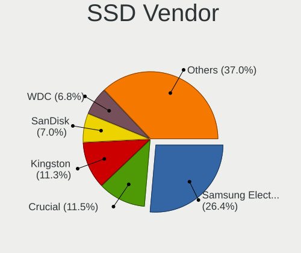

| Vendor              | Computers | Drives | Percent |
|---------------------|-----------|--------|---------|
| Samsung Electronics | 336       | 470    | 26.37%  |
| Crucial             | 147       | 198    | 11.54%  |
| Kingston            | 144       | 203    | 11.3%   |
| SanDisk             | 89        | 105    | 6.99%   |
| WDC                 | 86        | 123    | 6.75%   |
| A-DATA Technology   | 33        | 38     | 2.59%   |
| SK hynix            | 30        | 44     | 2.35%   |
| China               | 29        | 32     | 2.28%   |
| Micron Technology   | 23        | 31     | 1.81%   |
| Apple               | 22        | 27     | 1.73%   |
| Toshiba             | 21        | 27     | 1.65%   |
| SPCC                | 21        | 36     | 1.65%   |
| Intel               | 21        | 32     | 1.65%   |
| PNY                 | 20        | 35     | 1.57%   |
| Intenso             | 17        | 25     | 1.33%   |
| Patriot             | 15        | 20     | 1.18%   |
| Team                | 11        | 15     | 0.86%   |
| OCZ                 | 11        | 11     | 0.86%   |
| LITEON              | 11        | 14     | 0.86%   |
| SABRENT             | 10        | 18     | 0.78%   |
| LITEONIT            | 10        | 11     | 0.78%   |
| KingSpec            | 10        | 10     | 0.78%   |
| Transcend           | 9         | 11     | 0.71%   |
| Seagate             | 8         | 23     | 0.63%   |
| Gigabyte Technology | 8         | 10     | 0.63%   |
| GOODRAM             | 7         | 7      | 0.55%   |
| Corsair             | 7         | 7      | 0.55%   |
| T-FORCE             | 6         | 6      | 0.47%   |
| Netac               | 5         | 6      | 0.39%   |
| Hewlett-Packard     | 5         | 8      | 0.39%   |
| Apacer              | 5         | 5      | 0.39%   |
| Mushkin             | 4         | 4      | 0.31%   |
| Emtec               | 4         | 4      | 0.31%   |
| Teclast             | 3         | 5      | 0.24%   |
| Phison              | 3         | 3      | 0.24%   |
| Lexar               | 3         | 3      | 0.24%   |
| KIOXIA-EXCERIA      | 3         | 8      | 0.24%   |
| KingFast            | 3         | 3      | 0.24%   |
| Unknown             | 3         | 4      | 0.24%   |
| WDC WDS             | 2         | 2      | 0.16%   |

Drive Kind
----------

HDD or SSD

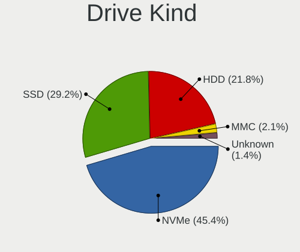

| Kind    | Computers | Drives | Percent |
|---------|-----------|--------|---------|
| NVMe    | 1580      | 2407   | 45.43%  |
| SSD     | 1016      | 1758   | 29.21%  |
| HDD     | 758       | 1364   | 21.79%  |
| MMC     | 74        | 92     | 2.13%   |
| Unknown | 50        | 69     | 1.44%   |

Drive Connector
---------------

SATA, SAS, NVMe, etc.

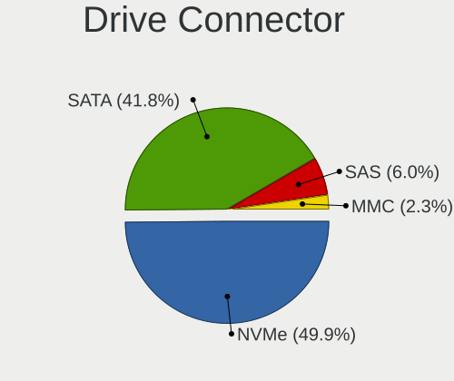

| Type | Computers | Drives | Percent |
|------|-----------|--------|---------|
| NVMe | 1578      | 2381   | 49.86%  |
| SATA | 1322      | 2932   | 41.77%  |
| SAS  | 191       | 285    | 6.03%   |
| MMC  | 74        | 92     | 2.34%   |

Drive Size
----------

Size of hard drive

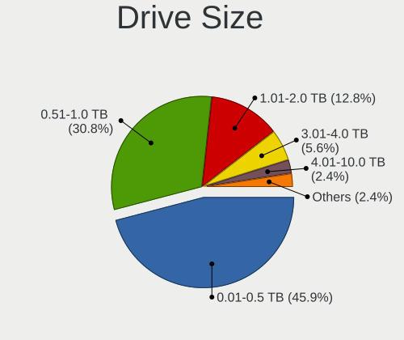

| Size in TB | Computers | Drives | Percent |
|------------|-----------|--------|---------|
| 0.01-0.5   | 890       | 1534   | 45.92%  |
| 0.51-1.0   | 597       | 903    | 30.8%   |
| 1.01-2.0   | 248       | 385    | 12.8%   |
| 3.01-4.0   | 109       | 166    | 5.62%   |
| 4.01-10.0  | 47        | 71     | 2.43%   |
| 2.01-3.0   | 37        | 46     | 1.91%   |
| 10.01-20.0 | 9         | 16     | 0.46%   |
| 20.01-50.0 | 1         | 1      | 0.05%   |

Space Total
-----------

Amount of disk space available on the file system

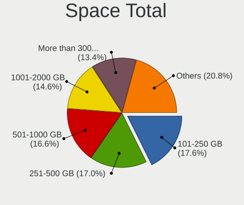

| Size in GB     | Computers | Percent |
|----------------|-----------|---------|
| 101-250        | 451       | 17.64%  |
| 251-500        | 434       | 16.97%  |
| 501-1000       | 425       | 16.62%  |
| 1001-2000      | 374       | 14.63%  |
| More than 3000 | 342       | 13.38%  |
| 1-20           | 154       | 6.02%   |
| 2001-3000      | 137       | 5.36%   |
| Unknown        | 121       | 4.73%   |
| 51-100         | 85        | 3.32%   |
| 21-50          | 34        | 1.33%   |

Space Used
----------

Amount of used disk space

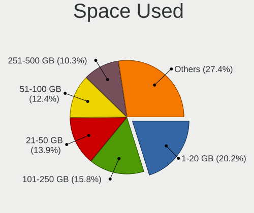

| Used GB        | Computers | Percent |
|----------------|-----------|---------|
| 1-20           | 537       | 20.16%  |
| 101-250        | 420       | 15.77%  |
| 21-50          | 371       | 13.93%  |
| 51-100         | 331       | 12.42%  |
| 251-500        | 274       | 10.29%  |
| 501-1000       | 233       | 8.75%   |
| 1001-2000      | 191       | 7.17%   |
| Unknown        | 121       | 4.54%   |
| More than 3000 | 111       | 4.17%   |
| 2001-3000      | 69        | 2.59%   |
| 0              | 6         | 0.23%   |

Malfunc. Drives
---------------

Drive models with a malfunction

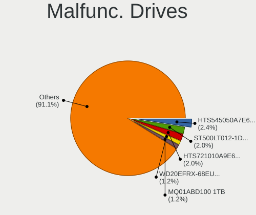

| Model                                                          | Computers | Drives | Percent |
|----------------------------------------------------------------|-----------|--------|---------|
| HGST HTS545050A7E680 500GB                                     | 6         | 11     | 2.42%   |
| Seagate ST500LT012-1DG142 500GB                                | 5         | 5      | 2.02%   |
| HGST HTS721010A9E630 1TB                                       | 5         | 5      | 2.02%   |
| WDC WD20EFRX-68EUZN0 2TB                                       | 3         | 6      | 1.21%   |
| Toshiba MQ01ABD100 1TB                                         | 3         | 3      | 1.21%   |
| Seagate ST500LT012-9WS142 500GB                                | 3         | 4      | 1.21%   |
| Samsung Electronics SSD 980 1TB                                | 3         | 3      | 1.21%   |
| Samsung Electronics NVMe SSD Controller SM981/PM981/PM983 1TB  | 3         | 8      | 1.21%   |
| Samsung Electronics NVMe SSD Controller PM9A1/PM9A3/980PRO 1TB | 3         | 3      | 1.21%   |
| Hitachi HTS545050A7E380 500GB                                  | 3         | 3      | 1.21%   |
| WDC WDS120G2G0A-00JH30 120GB SSD                               | 2         | 2      | 0.81%   |
| WDC WD5000AAKX-75U6AA0 500GB                                   | 2         | 2      | 0.81%   |
| WDC WD20EARX-00PASB0 2TB                                       | 2         | 2      | 0.81%   |
| WDC WD2000FYYZ-01UL1B2 2TB                                     | 2         | 2      | 0.81%   |
| Toshiba THNSNK128GCS8 SATA 128GB SSD                           | 2         | 2      | 0.81%   |
| Toshiba DT01ACA100 1TB                                         | 2         | 2      | 0.81%   |
| Seagate ST9750420AS 752GB                                      | 2         | 2      | 0.81%   |
| Seagate ST9320325AS 320GB                                      | 2         | 5      | 0.81%   |
| Seagate ST500LM021-1KJ152 500GB                                | 2         | 11     | 0.81%   |
| Seagate ST4000DM004-2CV104 4TB                                 | 2         | 2      | 0.81%   |
| Seagate ST4000DM000-1F2168 4TB                                 | 2         | 2      | 0.81%   |
| Seagate ST31000528AS 1TB                                       | 2         | 2      | 0.81%   |
| Seagate ST2000DX002-2DV164 2TB                                 | 2         | 3      | 0.81%   |
| Seagate ST2000DM008-2FR102 2TB                                 | 2         | 2      | 0.81%   |
| Seagate ST2000DM001-9YN164 2TB                                 | 2         | 2      | 0.81%   |
| Seagate ST1000LM049-2GH172 1TB                                 | 2         | 2      | 0.81%   |
| Seagate ST1000LM035-1RK172 1TB                                 | 2         | 2      | 0.81%   |
| Seagate ST1000LM024 HN-M101MBB 1TB                             | 2         | 3      | 0.81%   |
| Seagate ST1000DM003-9YN162 1TB                                 | 2         | 2      | 0.81%   |
| Seagate ST1000DM003-1ER162 1TB                                 | 2         | 3      | 0.81%   |
| Samsung Electronics SSD 970 EVO 500GB                          | 2         | 2      | 0.81%   |
| Samsung Electronics SSD 870 EVO 500GB                          | 2         | 2      | 0.81%   |
| Samsung Electronics SSD 870 EVO 2TB                            | 2         | 2      | 0.81%   |
| Samsung Electronics HD502HI 500GB                              | 2         | 2      | 0.81%   |
| Samsung Electronics HD103SI 1TB                                | 2         | 4      | 0.81%   |
| Kingston SV300S37A120G 120GB SSD                               | 2         | 2      | 0.81%   |
| Kingston SA400S37480G 480GB SSD                                | 2         | 2      | 0.81%   |
| Hewlett-Packard VK0480GEQNB 480GB SSD                          | 2         | 5      | 0.81%   |
| Crucial CT1050MX300SSD1 1050GB                                 | 2         | 2      | 0.81%   |
| Corsair Force LS SSD 120GB                                     | 2         | 2      | 0.81%   |

Malfunc. Drive Vendor
---------------------

Vendors of faulty drives

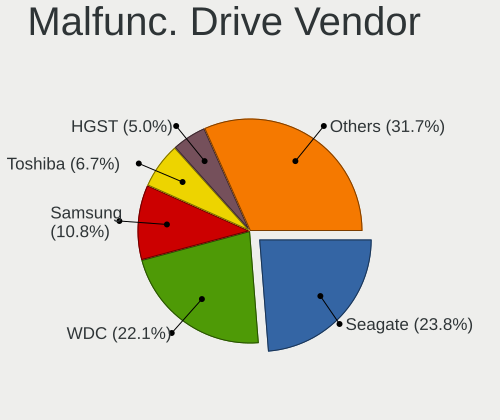

| Vendor                      | Computers | Drives | Percent |
|-----------------------------|-----------|--------|---------|
| Seagate                     | 57        | 78     | 23.75%  |
| WDC                         | 53        | 70     | 22.08%  |
| Samsung Electronics         | 26        | 34     | 10.83%  |
| Toshiba                     | 16        | 18     | 6.67%   |
| HGST                        | 12        | 17     | 5%      |
| SK hynix                    | 8         | 8      | 3.33%   |
| SanDisk                     | 8         | 9      | 3.33%   |
| Kingston                    | 8         | 8      | 3.33%   |
| Hitachi                     | 8         | 8      | 3.33%   |
| Intel                       | 6         | 7      | 2.5%    |
| Crucial                     | 6         | 16     | 2.5%    |
| China                       | 4         | 4      | 1.67%   |
| Transcend                   | 2         | 2      | 0.83%   |
| Patriot                     | 2         | 2      | 0.83%   |
| Micron Technology           | 2         | 2      | 0.83%   |
| Hewlett-Packard             | 2         | 5      | 0.83%   |
| Corsair                     | 2         | 2      | 0.83%   |
| Apple                       | 2         | 2      | 0.83%   |
| A-DATA Technology           | 2         | 2      | 0.83%   |
| ZEB-SD26                    | 1         | 1      | 0.42%   |
| XPG                         | 1         | 1      | 0.42%   |
| SSSTC                       | 1         | 1      | 0.42%   |
| Phison Electronics          | 1         | 1      | 0.42%   |
| OCZ                         | 1         | 1      | 0.42%   |
| Neo                         | 1         | 2      | 0.42%   |
| Maxtor                      | 1         | 2      | 0.42%   |
| MAXIO Technology (Hangzhou) | 1         | 1      | 0.42%   |
| LITEONIT                    | 1         | 1      | 0.42%   |
| Intenso                     | 1         | 2      | 0.42%   |
| Fujitsu                     | 1         | 1      | 0.42%   |
| Drevo                       | 1         | 1      | 0.42%   |
| ASMT                        | 1         | 2      | 0.42%   |
| Actseno                     | 1         | 1      | 0.42%   |

Malfunc. HDD Vendor
-------------------

Vendors of faulty HDD drives

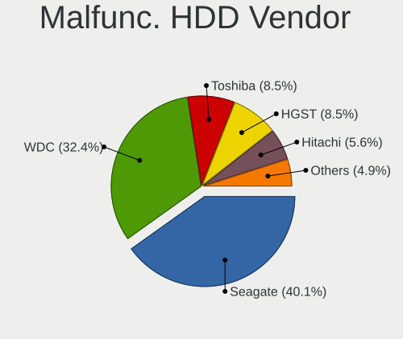

| Vendor              | Computers | Drives | Percent |
|---------------------|-----------|--------|---------|
| Seagate             | 57        | 78     | 40.14%  |
| WDC                 | 46        | 59     | 32.39%  |
| Toshiba             | 12        | 14     | 8.45%   |
| HGST                | 12        | 17     | 8.45%   |
| Hitachi             | 8         | 8      | 5.63%   |
| Samsung Electronics | 4         | 6      | 2.82%   |
| Maxtor              | 1         | 2      | 0.7%    |
| Fujitsu             | 1         | 1      | 0.7%    |
| ASMT                | 1         | 2      | 0.7%    |

Malfunc. Drive Kind
-------------------

Kinds of faulty drives

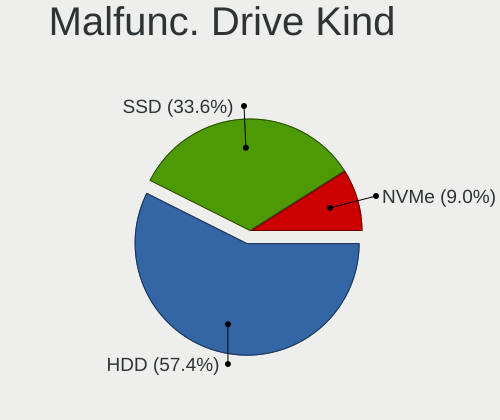

| Kind | Computers | Drives | Percent |
|------|-----------|--------|---------|
| HDD  | 128       | 187    | 57.4%   |
| SSD  | 75        | 99     | 33.63%  |
| NVMe | 20        | 26     | 8.97%   |

Failed Drives
-------------

Failed drive models

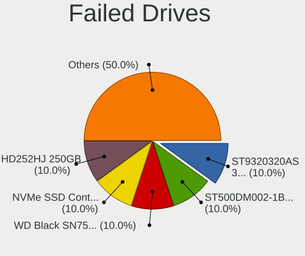

| Model                                                            | Computers | Drives | Percent |
|------------------------------------------------------------------|-----------|--------|---------|
| SK hynix BC501 NVMe Solid State Drive 512GB                      | 1         | 1      | 10%     |
| Seagate ST9320320AS 320GB                                        | 1         | 1      | 10%     |
| Seagate ST500DM002-1BC142 500GB                                  | 1         | 1      | 10%     |
| Sandisk WD Black SN750 / PC SN730 NVMe SSD 500GB                 | 1         | 1      | 10%     |
| Samsung Electronics NVMe SSD Controller SM961/PM961/SM963 1024GB | 1         | 1      | 10%     |
| Samsung Electronics HD252HJ 250GB                                | 1         | 1      | 10%     |
| Micron/Crucial Technology P2 NVMe PCIe SSD 2TB                   | 1         | 1      | 10%     |
| LITEON CA3-8D512 512GB                                           | 1         | 2      | 10%     |
| Kingston SV300S37A60G 64GB SSD                                   | 1         | 1      | 10%     |
| JMicron Technology Generic 320GB                                 | 1         | 1      | 10%     |

Failed Drive Vendor
-------------------

Failed drive vendors

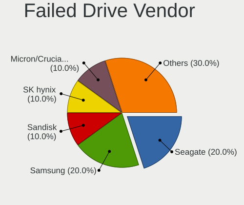

| Vendor                    | Computers | Drives | Percent |
|---------------------------|-----------|--------|---------|
| Seagate                   | 2         | 2      | 20%     |
| Samsung Electronics       | 2         | 2      | 20%     |
| SK hynix                  | 1         | 1      | 10%     |
| Sandisk                   | 1         | 1      | 10%     |
| Micron/Crucial Technology | 1         | 1      | 10%     |
| LITEON                    | 1         | 2      | 10%     |
| Kingston                  | 1         | 1      | 10%     |
| JMicron Technology        | 1         | 1      | 10%     |

Drive Status
------------

Number of failed and malfunc. drives

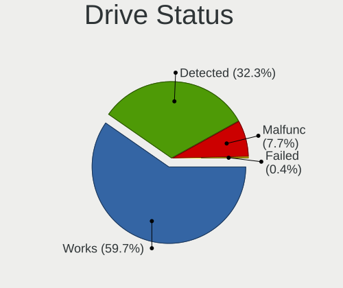

| Status   | Computers | Drives | Percent |
|----------|-----------|--------|---------|
| Works    | 1629      | 3418   | 59.67%  |
| Detected | 881       | 1949   | 32.27%  |
| Malfunc  | 210       | 312    | 7.69%   |
| Failed   | 10        | 11     | 0.37%   |

Storage controller
------------------

Storage Vendor
--------------

Storage controller vendors

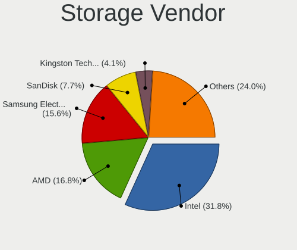

| Vendor                                  | Computers | Percent |
|-----------------------------------------|-----------|---------|
| Intel                                   | 1172      | 31.81%  |
| AMD                                     | 619       | 16.8%   |
| Samsung Electronics                     | 573       | 15.55%  |
| SanDisk                                 | 284       | 7.71%   |
| Kingston Technology Company             | 152       | 4.13%   |
| SK hynix                                | 122       | 3.31%   |
| Phison Electronics                      | 121       | 3.28%   |
| Micron Technology                       | 108       | 2.93%   |
| Micron/Crucial Technology               | 88        | 2.39%   |
| ASMedia Technology                      | 78        | 2.12%   |
| KIOXIA                                  | 65        | 1.76%   |
| Toshiba America Info Systems            | 37        | 1%      |
| ADATA Technology                        | 34        | 0.92%   |
| Silicon Motion                          | 32        | 0.87%   |
| MAXIO Technology (Hangzhou)             | 28        | 0.76%   |
| Realtek Semiconductor                   | 21        | 0.57%   |
| Shenzhen Longsys Electronics            | 18        | 0.49%   |
| Solid State Storage Technology          | 16        | 0.43%   |
| Marvell Technology Group                | 14        | 0.38%   |
| Apple                                   | 12        | 0.33%   |
| Nvidia                                  | 11        | 0.3%    |
| JMicron Technology                      | 11        | 0.3%    |
| Union Memory (Shenzhen)                 | 10        | 0.27%   |
| Solidigm                                | 8         | 0.22%   |
| Yangtze Memory Technologies             | 7         | 0.19%   |
| Seagate Technology                      | 7         | 0.19%   |
| INNOGRIT                                | 6         | 0.16%   |
| Lenovo                                  | 5         | 0.14%   |
| LSI Logic / Symbios Logic               | 3         | 0.08%   |
| Hosin Global Electronics                | 3         | 0.08%   |
| Transcend                               | 2         | 0.05%   |
| Shenzhen Unionmemory Information System | 2         | 0.05%   |
| Nextorage                               | 2         | 0.05%   |
| Netac Technology                        | 2         | 0.05%   |
| Lite-On Technology                      | 2         | 0.05%   |
| Broadcom / LSI                          | 2         | 0.05%   |
| Biwin Storage Technology                | 2         | 0.05%   |
| Unknown                                 | 2         | 0.05%   |
| VIA Technologies                        | 1         | 0.03%   |
| ULi Electronics                         | 1         | 0.03%   |

Storage Model
-------------

Storage controller models

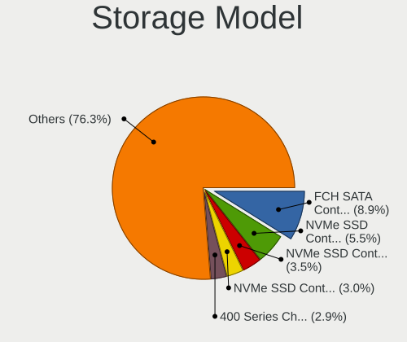

| Model                                                                          | Computers | Percent |
|--------------------------------------------------------------------------------|-----------|---------|
| AMD FCH SATA Controller [AHCI mode]                                            | 355       | 8.88%   |
| Samsung NVMe SSD Controller SM981/PM981/PM983                                  | 219       | 5.48%   |
| Samsung NVMe SSD Controller 980 (DRAM-less)                                    | 139       | 3.48%   |
| Samsung NVMe SSD Controller PM9A1/PM9A3/980PRO                                 | 122       | 3.05%   |
| AMD 400 Series Chipset SATA Controller                                         | 114       | 2.85%   |
| AMD 500 Series Chipset SATA Controller                                         | 109       | 2.73%   |
| Intel Sunrise Point-LP SATA Controller [AHCI mode]                             | 106       | 2.65%   |
| Intel Volume Management Device NVMe RAID Controller                            | 89        | 2.23%   |
| Intel 8 Series/C220 Series Chipset Family 6-port SATA Controller 1 [AHCI mode] | 77        | 1.93%   |
| AMD 600 Series Chipset SATA Controller                                         | 76        | 1.9%    |
| ASMedia ASM1061/ASM1062 Serial ATA Controller                                  | 70        | 1.75%   |
| Intel 82801 Mobile SATA Controller [RAID mode]                                 | 67        | 1.68%   |
| Intel 7 Series Chipset Family 6-port SATA Controller [AHCI mode]               | 60        | 1.5%    |
| SanDisk Ultra 3D / WD PC SN530, IX SN530, Blue SN550 NVMe SSD (DRAM-less)      | 55        | 1.38%   |
| Intel Q170/Q150/B150/H170/H110/Z170/CM236 Chipset SATA Controller [AHCI Mode]  | 52        | 1.3%    |
| SanDisk Extreme Pro / WD Black SN750 / PC SN730 / Red SN700 NVMe SSD           | 48        | 1.2%    |
| Intel Cannon Lake Mobile PCH SATA AHCI Controller                              | 48        | 1.2%    |
| SK hynix Gold P31/BC711/PC711 NVMe Solid State Drive                           | 47        | 1.18%   |
| Intel Cannon Lake PCH SATA AHCI Controller                                     | 46        | 1.15%   |
| Phison E12 NVMe Controller                                                     | 45        | 1.13%   |
| Intel 8 Series SATA Controller 1 [AHCI mode]                                   | 44        | 1.1%    |
| Intel 200 Series PCH SATA controller [AHCI mode]                               | 42        | 1.05%   |
| Micron/Crucial P2 [Nick P2] / P3 / P3 Plus NVMe PCIe SSD (DRAM-less)           | 40        | 1%      |
| SanDisk WD SN560/SN740/SN770/SN5000 NVMe SSD                                   | 38        | 0.95%   |
| Samsung NVMe SSD Controller S4LV008[Pascal]                                    | 35        | 0.88%   |
| Samsung NVMe SSD Controller SM961/PM961/SM963                                  | 34        | 0.85%   |
| Intel SSD 660P Series                                                          | 34        | 0.85%   |
| KIOXIA NVMe SSD Controller BG4 (DRAM-less)                                     | 33        | 0.83%   |
| Intel Comet Lake SATA AHCI Controller                                          | 32        | 0.8%    |
| Kingston Company KC3000/FURY Renegade NVMe SSD [E18]                           | 31        | 0.78%   |
| Intel Tiger Lake-LP SATA Controller                                            | 30        | 0.75%   |
| Intel 400 Series Chipset Family SATA AHCI Controller                           | 28        | 0.7%    |
| Phison E16 PCIe4 NVMe Controller                                               | 27        | 0.68%   |
| Sandisk WD Black SN850X NVMe SSD                                               | 26        | 0.65%   |
| Intel Wildcat Point-LP SATA Controller [AHCI Mode]                             | 26        | 0.65%   |
| Intel SSD 670p Series [Keystone Harbor]                                        | 26        | 0.65%   |
| Silicon Motion SM2263EN/SM2263XT (DRAM-less) NVMe SSD Controllers              | 25        | 0.63%   |
| Intel RST Volume Management Device Controller                                  | 25        | 0.63%   |
| SK hynix Platinum P41/PC801 NVMe Solid State Drive                             | 24        | 0.6%    |
| Micron 2400 NVMe SSD (DRAM-less)                                               | 24        | 0.6%    |

Storage Kind
------------

Kind of storage controller (IDE, SATA, NVMe, SAS, ...)

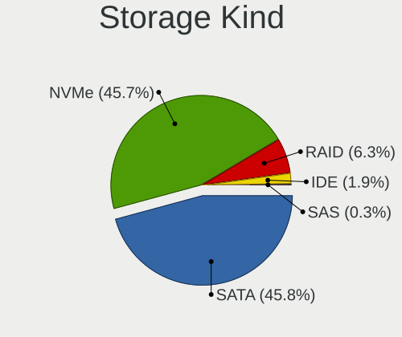

| Kind | Computers | Percent |
|------|-----------|---------|
| SATA | 1578      | 45.78%  |
| NVMe | 1575      | 45.69%  |
| RAID | 218       | 6.32%   |
| IDE  | 67        | 1.94%   |
| SAS  | 9         | 0.26%   |

Processor
---------

CPU Vendor
----------

Processor vendors

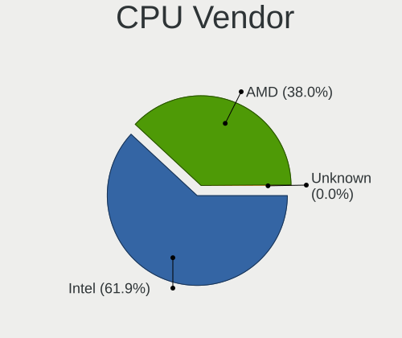

| Vendor  | Computers | Percent |
|---------|-----------|---------|
| Intel   | 1503      | 61.9%   |
| AMD     | 922       | 37.97%  |
| ARM     | 2         | 0.08%   |
| Unknown | 1         | 0.04%   |

CPU Model
---------

Processor models

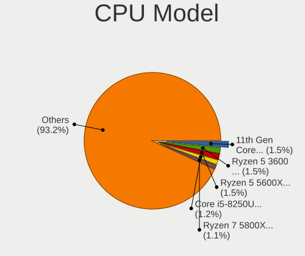

| Model                                         | Computers | Percent |
|-----------------------------------------------|-----------|---------|
| Intel 11th Gen Core i5-1135G7 @ 2.40GHz       | 37        | 1.52%   |
| AMD Ryzen 5 3600 6-Core Processor             | 37        | 1.52%   |
| AMD Ryzen 5 5600X 6-Core Processor            | 36        | 1.48%   |
| Intel Core i5-8250U CPU @ 1.60GHz             | 29        | 1.19%   |
| AMD Ryzen 7 5800X 8-Core Processor            | 27        | 1.11%   |
| AMD Ryzen 7 5800H with Radeon Graphics        | 27        | 1.11%   |
| AMD Ryzen 7 3700X 8-Core Processor            | 27        | 1.11%   |
| Intel Core i7-8550U CPU @ 1.80GHz             | 25        | 1.03%   |
| Intel 12th Gen Core i7-12700H                 | 22        | 0.9%    |
| AMD Ryzen 5 3500U with Radeon Vega Mobile Gfx | 22        | 0.9%    |
| Intel Core i7-9750H CPU @ 2.60GHz             | 21        | 0.86%   |
| Intel Core i7-8750H CPU @ 2.20GHz             | 21        | 0.86%   |
| Intel 11th Gen Core i7-1165G7 @ 2.80GHz       | 21        | 0.86%   |
| AMD Ryzen 7 5700X 8-Core Processor            | 21        | 0.86%   |
| AMD Ryzen 9 5900X 12-Core Processor           | 20        | 0.82%   |
| AMD Ryzen 5 5500U with Radeon Graphics        | 20        | 0.82%   |
| Intel Core i5-7200U CPU @ 2.50GHz             | 19        | 0.78%   |
| Intel Core i5-1035G1 CPU @ 1.00GHz            | 19        | 0.78%   |
| Intel Core i5-10210U CPU @ 1.60GHz            | 19        | 0.78%   |
| AMD Ryzen 7 5700U with Radeon Graphics        | 19        | 0.78%   |
| AMD Ryzen 7 4800H with Radeon Graphics        | 19        | 0.78%   |
| AMD Ryzen 5 5600H with Radeon Graphics        | 18        | 0.74%   |
| Intel Core i7-10750H CPU @ 2.60GHz            | 17        | 0.7%    |
| Intel Core i5-6200U CPU @ 2.30GHz             | 17        | 0.7%    |
| Intel 11th Gen Core i7-11800H @ 2.30GHz       | 17        | 0.7%    |
| Intel Core i7-4790 CPU @ 3.60GHz              | 16        | 0.66%   |
| AMD Ryzen 9 3900X 12-Core Processor           | 16        | 0.66%   |
| AMD Ryzen 7 7800X3D 8-Core Processor          | 16        | 0.66%   |
| Intel Core i7-10510U CPU @ 1.80GHz            | 15        | 0.62%   |
| Intel Core i5-8350U CPU @ 1.70GHz             | 15        | 0.62%   |
| Intel Core i5-6300U CPU @ 2.40GHz             | 15        | 0.62%   |
| Intel Core i5-8265U CPU @ 1.60GHz             | 14        | 0.58%   |
| AMD Ryzen 9 5950X 16-Core Processor           | 14        | 0.58%   |
| AMD Ryzen 7 5800X3D 8-Core Processor          | 14        | 0.58%   |
| Intel Core i7-6700HQ CPU @ 2.60GHz            | 13        | 0.53%   |
| AMD Ryzen 5 5600G with Radeon Graphics        | 13        | 0.53%   |
| Intel Core Ultra 7 155H                       | 12        | 0.49%   |
| Intel Core i5-8300H CPU @ 2.30GHz             | 12        | 0.49%   |
| AMD Ryzen 7 5700G with Radeon Graphics        | 12        | 0.49%   |
| Intel Core i9-9900K CPU @ 3.60GHz             | 11        | 0.45%   |

CPU Model Family
----------------

Processor model prefix

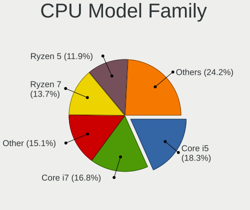

| Model                   | Computers | Percent |
|-------------------------|-----------|---------|
| Intel Core i5           | 445       | 18.31%  |
| Intel Core i7           | 409       | 16.83%  |
| Other                   | 366       | 15.06%  |
| AMD Ryzen 7             | 334       | 13.74%  |
| AMD Ryzen 5             | 289       | 11.89%  |
| AMD Ryzen 9             | 130       | 5.35%   |
| Intel Core i3           | 83        | 3.42%   |
| Intel Celeron           | 63        | 2.59%   |
| Intel Xeon              | 34        | 1.4%    |
| AMD Ryzen 7 PRO         | 32        | 1.32%   |
| Intel Core              | 31        | 1.28%   |
| AMD Ryzen 3             | 30        | 1.23%   |
| Intel Core 2 Duo        | 29        | 1.19%   |
| Intel Core i9           | 21        | 0.86%   |
| Intel Pentium           | 20        | 0.82%   |
| AMD Ryzen 5 PRO         | 13        | 0.53%   |
| AMD A4                  | 9         | 0.37%   |
| AMD FX                  | 8         | 0.33%   |
| AMD A10                 | 7         | 0.29%   |
| Intel Pentium Silver    | 6         | 0.25%   |
| AMD Athlon              | 6         | 0.25%   |
| AMD A8                  | 6         | 0.25%   |
| Intel Pentium Dual-Core | 4         | 0.16%   |
| Intel Core m3           | 4         | 0.16%   |
| Intel Atom              | 4         | 0.16%   |
| AMD E                   | 4         | 0.16%   |
| Intel Core 2 Quad       | 3         | 0.12%   |
| AMD Ryzen Threadripper  | 3         | 0.12%   |
| AMD Phenom II X6        | 3         | 0.12%   |
| AMD E2                  | 3         | 0.12%   |
| AMD Athlon II X4        | 3         | 0.12%   |
| AMD A6                  | 3         | 0.12%   |
| Intel Pentium Gold      | 2         | 0.08%   |
| Intel Pentium Dual      | 2         | 0.08%   |
| Intel Core 2 Extreme    | 2         | 0.08%   |
| Intel Core 2            | 2         | 0.08%   |
| AMD Phenom II X4        | 2         | 0.08%   |
| AMD E1                  | 2         | 0.08%   |
| AMD Athlon II X2        | 2         | 0.08%   |
| Intel Xeon Gold         | 1         | 0.04%   |

CPU Cores
---------

Number of processor cores

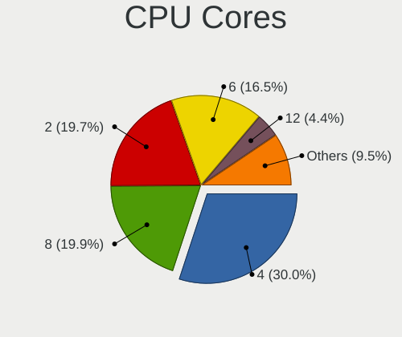

| Number  | Computers | Percent |
|---------|-----------|---------|
| 4       | 730       | 30.03%  |
| 8       | 483       | 19.87%  |
| 2       | 480       | 19.74%  |
| 6       | 402       | 16.54%  |
| 12      | 106       | 4.36%   |
| 16      | 68        | 2.8%    |
| 14      | 65        | 2.67%   |
| 10      | 63        | 2.59%   |
| 24      | 19        | 0.78%   |
| 20      | 4         | 0.16%   |
| 3       | 4         | 0.16%   |
| 32      | 2         | 0.08%   |
| 1       | 2         | 0.08%   |
| Unknown | 2         | 0.08%   |
| 5       | 1         | 0.04%   |

CPU Sockets
-----------

Number of sockets

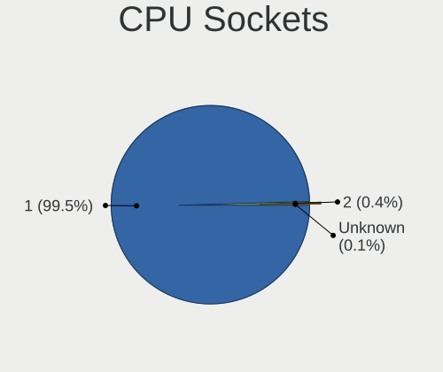

| Number  | Computers | Percent |
|---------|-----------|---------|
| 1       | 2418      | 99.55%  |
| 2       | 9         | 0.37%   |
| Unknown | 2         | 0.08%   |

CPU Threads
-----------

Threads per core (Hyper-Threading)

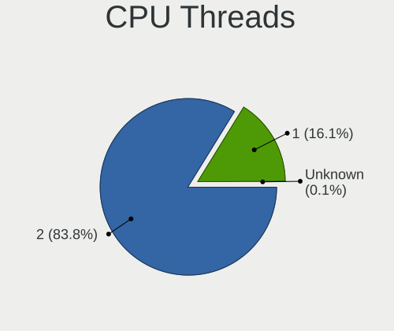

| Number  | Computers | Percent |
|---------|-----------|---------|
| 2       | 2038      | 83.8%   |
| 1       | 392       | 16.12%  |
| Unknown | 2         | 0.08%   |

CPU Op-Modes
------------

CPU Operation Modes (32-bit, 64-bit)

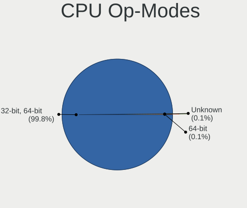

| Op mode        | Computers | Percent |
|----------------|-----------|---------|
| 32-bit, 64-bit | 2423      | 99.79%  |
| Unknown        | 3         | 0.12%   |
| 64-bit         | 2         | 0.08%   |

CPU Microcode
-------------

Microcode number

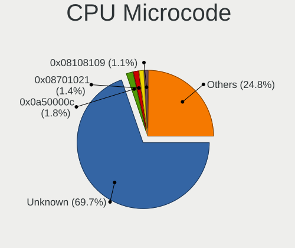

| Number     | Computers | Percent |
|------------|-----------|---------|
| Unknown    | 1738      | 69.74%  |
| 0x0a50000c | 44        | 1.77%   |
| 0x08701021 | 34        | 1.36%   |
| 0x306c3    | 32        | 1.28%   |
| 0x08108109 | 27        | 1.08%   |
| 0x306a9    | 26        | 1.04%   |
| 0x806ea    | 25        | 1%      |
| 0x406e3    | 22        | 0.88%   |
| 0x806e9    | 21        | 0.84%   |
| 0x08600106 | 21        | 0.84%   |
| 0x906ea    | 20        | 0.8%    |
| 0x806c1    | 19        | 0.76%   |
| 0x506e3    | 19        | 0.76%   |
| 0x08608103 | 19        | 0.76%   |
| 0x806ec    | 18        | 0.72%   |
| 0x0a404102 | 18        | 0.72%   |
| 0x40651    | 17        | 0.68%   |
| 0x0a50000d | 17        | 0.68%   |
| 0x08600104 | 17        | 0.68%   |
| 0x906e9    | 15        | 0.6%    |
| 0x706e5    | 12        | 0.48%   |
| 0x0a20120a | 12        | 0.48%   |
| 0x0a201016 | 12        | 0.48%   |
| 0x0a201009 | 12        | 0.48%   |
| 0x08108102 | 12        | 0.48%   |
| 0x906a3    | 11        | 0.44%   |
| 0x206a7    | 11        | 0.44%   |
| 0x08701013 | 11        | 0.44%   |
| 0x706a1    | 9         | 0.36%   |
| 0x306d4    | 9         | 0.36%   |
| 0x1067a    | 9         | 0.36%   |
| 0x0800820d | 9         | 0.36%   |
| 0x0a601203 | 8         | 0.32%   |
| 0xa0652    | 7         | 0.28%   |
| 0x406c4    | 7         | 0.28%   |
| 0x08001138 | 7         | 0.28%   |
| 0x806d1    | 6         | 0.24%   |
| 0x06006705 | 6         | 0.24%   |
| 0xa0655    | 5         | 0.2%    |
| 0x20655    | 5         | 0.2%    |

CPU Microarch
-------------

Microarchitecture

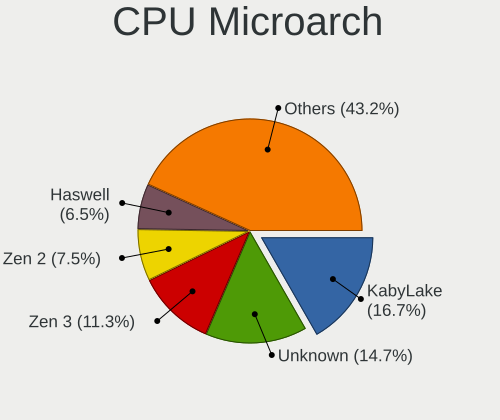

| Name               | Computers | Percent |
|--------------------|-----------|---------|
| KabyLake           | 407       | 16.73%  |
| Unknown            | 358       | 14.71%  |
| Zen 3              | 276       | 11.34%  |
| Zen 2              | 182       | 7.48%   |
| Haswell            | 159       | 6.54%   |
| Alderlake Hybrid   | 147       | 6.04%   |
| Skylake            | 116       | 4.77%   |
| Zen+               | 97        | 3.99%   |
| IvyBridge          | 94        | 3.86%   |
| TigerLake          | 93        | 3.82%   |
| CometLake          | 69        | 2.84%   |
| IceLake            | 65        | 2.67%   |
| SandyBridge        | 51        | 2.1%    |
| Zen                | 46        | 1.89%   |
| Broadwell          | 41        | 1.69%   |
| Penryn             | 30        | 1.23%   |
| Goldmont plus      | 30        | 1.23%   |
| Silvermont         | 27        | 1.11%   |
| Excavator          | 21        | 0.86%   |
| Westmere           | 19        | 0.78%   |
| Core               | 15        | 0.62%   |
| Piledriver         | 12        | 0.49%   |
| Meteorlake Hybrid  | 12        | 0.49%   |
| K10                | 11        | 0.45%   |
| Nehalem            | 10        | 0.41%   |
| Tremont            | 8         | 0.33%   |
| Jaguar             | 8         | 0.33%   |
| Goldmont           | 7         | 0.29%   |
| Lunarlake Hybrid   | 6         | 0.25%   |
| Bobcat             | 4         | 0.16%   |
| Steamroller        | 3         | 0.12%   |
| Bulldozer          | 3         | 0.12%   |
| Puma               | 2         | 0.08%   |
| K8 Hammer          | 1         | 0.04%   |
| K10 Llano          | 1         | 0.04%   |
| Gracemont          | 1         | 0.04%   |
| ArrowLake-H Hybrid | 1         | 0.04%   |

Graphics
--------

GPU Vendor
----------

Vendors of graphics cards

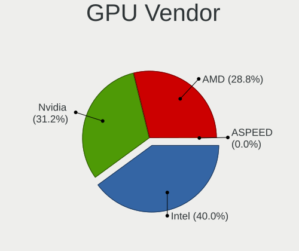

| Vendor            | Computers | Percent |
|-------------------|-----------|---------|
| Intel             | 1211      | 39.95%  |
| Nvidia            | 946       | 31.21%  |
| AMD               | 873       | 28.8%   |
| ASPEED Technology | 1         | 0.03%   |

GPU Model
---------

Graphics card models

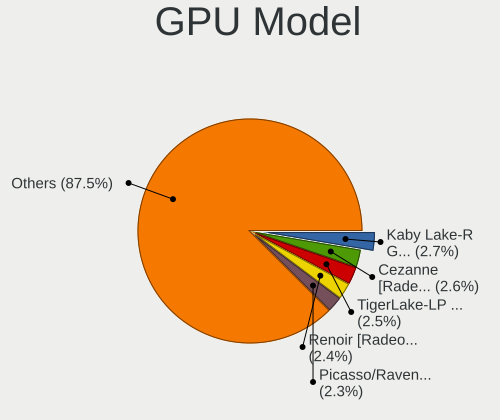

| Model                                                                       | Computers | Percent |
|-----------------------------------------------------------------------------|-----------|---------|
| Intel Kaby Lake-R GT2 [UHD Graphics 620]                                    | 84        | 2.67%   |
| AMD Cezanne [Radeon Vega Series / Radeon Vega Mobile Series]                | 81        | 2.58%   |
| Intel TigerLake-LP GT2 [Iris Xe Graphics]                                   | 80        | 2.55%   |
| AMD Renoir [Radeon Vega Series / Radeon Vega Mobile Series]                 | 76        | 2.42%   |
| AMD Picasso/Raven 2 [Radeon Vega Series / Radeon Vega Mobile Series]        | 71        | 2.26%   |
| Intel CoffeeLake-H GT2 [UHD Graphics 630]                                   | 60        | 1.91%   |
| Intel 3rd Gen Core processor Graphics Controller                            | 60        | 1.91%   |
| AMD Ellesmere [Radeon RX 470/480/570/570X/580/580X/590]                     | 55        | 1.75%   |
| AMD Rembrandt [Radeon 680M]                                                 | 52        | 1.66%   |
| Intel Haswell-ULT Integrated Graphics Controller                            | 51        | 1.62%   |
| Intel Kaby Lake-U GT2 [HD Graphics 620]                                     | 48        | 1.53%   |
| Intel Alder Lake-P GT2 [Iris Xe Graphics]                                   | 48        | 1.53%   |
| AMD Raphael                                                                 | 48        | 1.53%   |
| AMD Navi 22 [Radeon RX 6700/6700 XT/6750 XT / 6800M/6850M XT]               | 48        | 1.53%   |
| Intel Skylake-U GT2 [HD Graphics 520]                                       | 46        | 1.46%   |
| Intel CometLake-U GT2 [UHD Graphics]                                        | 43        | 1.37%   |
| AMD Lucienne                                                                | 43        | 1.37%   |
| Intel Xeon E3-1200 v3/4th Gen Core Processor Integrated Graphics Controller | 40        | 1.27%   |
| AMD Phoenix1                                                                | 38        | 1.21%   |
| Intel Raptor Lake-P [Iris Xe Graphics]                                      | 37        | 1.18%   |
| AMD Navi 23 [Radeon RX 6600/6600 XT/6600M]                                  | 37        | 1.18%   |
| Nvidia GA106M [GeForce RTX 3060 Mobile / Max-Q]                             | 36        | 1.15%   |
| AMD Navi 21 [Radeon RX 6800/6800 XT / 6900 XT]                              | 35        | 1.11%   |
| Intel WhiskeyLake-U GT2 [UHD Graphics 620]                                  | 34        | 1.08%   |
| Intel 2nd Generation Core Processor Family Integrated Graphics Controller   | 33        | 1.05%   |
| Nvidia TU117M [GeForce GTX 1650 Mobile / Max-Q]                             | 32        | 1.02%   |
| AMD Navi 10 [Radeon RX 5600 OEM/5600 XT / 5700/5700 XT]                     | 29        | 0.92%   |
| Intel CometLake-H GT2 [UHD Graphics]                                        | 28        | 0.89%   |
| AMD Barcelo                                                                 | 28        | 0.89%   |
| Nvidia AD107M [GeForce RTX 4060 Max-Q / Mobile]                             | 27        | 0.86%   |
| Intel GeminiLake [UHD Graphics 600]                                         | 27        | 0.86%   |
| Intel Broadwell-U GT2 [HD Graphics 5500]                                    | 24        | 0.76%   |
| Intel 4th Gen Core Processor Integrated Graphics Controller                 | 24        | 0.76%   |
| AMD Navi 31 [Radeon RX 7900 XT/7900 XTX/7900 GRE/7900M]                     | 23        | 0.73%   |
| Nvidia GP107 [GeForce GTX 1050 Ti]                                          | 22        | 0.7%    |
| Nvidia GA107M [GeForce RTX 3050 Ti Mobile]                                  | 22        | 0.7%    |
| Intel TigerLake-H GT1 [UHD Graphics]                                        | 22        | 0.7%    |
| Intel Iris Plus Graphics G1 (Ice Lake)                                      | 22        | 0.7%    |
| AMD Navi 32 [Radeon RX 7700 XT / 7800 XT]                                   | 22        | 0.7%    |
| Nvidia GP107M [GeForce GTX 1050 Mobile]                                     | 21        | 0.67%   |

GPU Combo
---------

Combinations of graphics cards

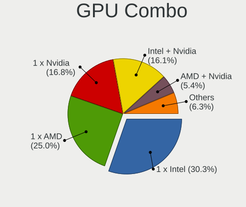

| Name                     | Computers | Percent |
|--------------------------|-----------|---------|
| 1 x Intel                | 742       | 30.34%  |
| 1 x AMD                  | 611       | 24.98%  |
| 1 x Nvidia               | 411       | 16.8%   |
| Intel + Nvidia           | 395       | 16.15%  |
| AMD + Nvidia             | 133       | 5.44%   |
| 2 x AMD                  | 90        | 3.68%   |
| Intel + AMD              | 43        | 1.76%   |
| 2 x Intel                | 9         | 0.37%   |
| 2 x Nvidia               | 5         | 0.2%    |
| Other                    | 3         | 0.12%   |
| Intel + AMD + 1 x Nvidia | 2         | 0.08%   |
| 2 x AMD + 1 x Nvidia     | 1         | 0.04%   |
| 1 x ASPEED               | 1         | 0.04%   |

GPU Driver
----------

Free vs proprietary

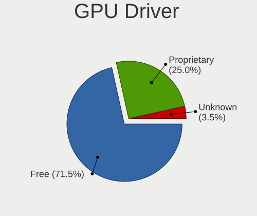

| Driver      | Computers | Percent |
|-------------|-----------|---------|
| Free        | 1756      | 71.53%  |
| Proprietary | 613       | 24.97%  |
| Unknown     | 86        | 3.5%    |

GPU Memory
----------

Total video memory

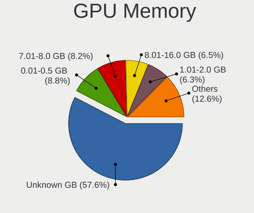

| Size in GB | Computers | Percent |
|------------|-----------|---------|
| Unknown    | 1427      | 57.61%  |
| 0.01-0.5   | 217       | 8.76%   |
| 7.01-8.0   | 204       | 8.24%   |
| 8.01-16.0  | 161       | 6.5%    |
| 1.01-2.0   | 156       | 6.3%    |
| 3.01-4.0   | 133       | 5.37%   |
| 5.01-6.0   | 82        | 3.31%   |
| 0.51-1.0   | 59        | 2.38%   |
| 16.01-24.0 | 25        | 1.01%   |
| 2.01-3.0   | 12        | 0.48%   |
| 24.01-32.0 | 1         | 0.04%   |

Monitor
-------

Monitor Vendor
--------------

Monitor vendors

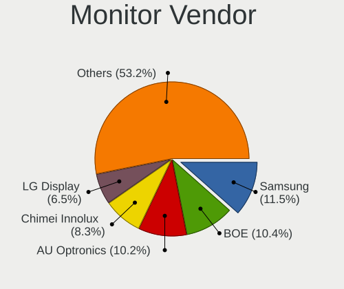

| Vendor                  | Computers | Percent |
|-------------------------|-----------|---------|
| Samsung Electronics     | 351       | 11.54%  |
| BOE                     | 316       | 10.39%  |
| AU Optronics            | 309       | 10.16%  |
| Chimei Innolux          | 251       | 8.25%   |
| LG Display              | 198       | 6.51%   |
| Goldstar                | 181       | 5.95%   |
| Dell                    | 147       | 4.83%   |
| Acer                    | 110       | 3.62%   |
| AOC                     | 102       | 3.35%   |
| Hewlett-Packard         | 89        | 2.93%   |
| BenQ                    | 79        | 2.6%    |
| Lenovo                  | 74        | 2.43%   |
| Ancor Communications    | 69        | 2.27%   |
| ASUSTek Computer        | 66        | 2.17%   |
| Apple                   | 51        | 1.68%   |
| Philips                 | 50        | 1.64%   |
| Sharp                   | 49        | 1.61%   |
| PANDA                   | 45        | 1.48%   |
| ViewSonic               | 37        | 1.22%   |
| MSI                     | 35        | 1.15%   |
| Gigabyte Technology     | 35        | 1.15%   |
| InfoVision              | 27        | 0.89%   |
| Iiyama                  | 23        | 0.76%   |
| CSO                     | 22        | 0.72%   |
| Unknown                 | 18        | 0.59%   |
| TMX                     | 16        | 0.53%   |
| Vizio                   | 12        | 0.39%   |
| Pixio                   | 11        | 0.36%   |
| CSW                     | 10        | 0.33%   |
| Sceptre Tech            | 9         | 0.3%    |
| Fujitsu Siemens         | 9         | 0.3%    |
| Chi Mei Optoelectronics | 9         | 0.3%    |
| LG Electronics          | 8         | 0.26%   |
| HKC                     | 8         | 0.26%   |
| Sony                    | 7         | 0.23%   |
| Panasonic               | 7         | 0.23%   |
| HUAWEI                  | 7         | 0.23%   |
| Eizo                    | 7         | 0.23%   |
| Vestel Elektronik       | 6         | 0.2%    |
| CSOT                    | 6         | 0.2%    |

Monitor Model
-------------

Monitor models

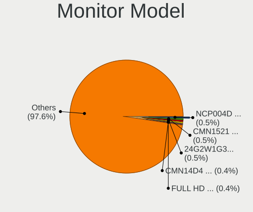

| Model                                                                 | Computers | Percent |
|-----------------------------------------------------------------------|-----------|---------|
| PANDA LCD Monitor NCP004D 1920x1080 344x194mm 15.5-inch               | 16        | 0.51%   |
| Chimei Innolux LCD Monitor CMN1521 1920x1080 344x193mm 15.5-inch      | 16        | 0.51%   |
| AOC 24G2W1G3 AOC2402 1920x1080 527x296mm 23.8-inch                    | 15        | 0.48%   |
| Chimei Innolux LCD Monitor CMN14D4 1920x1080 309x173mm 13.9-inch      | 14        | 0.45%   |
| Goldstar FULL HD GSM5B55 1920x1080 480x270mm 21.7-inch                | 13        | 0.41%   |
| AU Optronics LCD Monitor AUO21ED 1920x1080 344x193mm 15.5-inch        | 13        | 0.41%   |
| Unknown LCD Monitor FFFF 2288x1287 2550x2550mm 142.0-inch             | 12        | 0.38%   |
| Chimei Innolux LCD Monitor CMN15F5 1920x1080 344x193mm 15.5-inch      | 12        | 0.38%   |
| AU Optronics LCD Monitor AUO38ED 1920x1080 344x193mm 15.5-inch        | 12        | 0.38%   |
| AOC 27G2G4 AOC2702 1920x1080 598x336mm 27.0-inch                      | 12        | 0.38%   |
| Samsung Electronics S24F350 SAM0D20 1920x1080 521x293mm 23.5-inch     | 10        | 0.32%   |
| Pixio U29I WAM2900 2560x1080 690x260mm 29.0-inch                      | 9         | 0.29%   |
| LG Display LCD Monitor LGD0555 2736x1824 260x173mm 12.3-inch          | 9         | 0.29%   |
| Chimei Innolux LCD Monitor CMN14C9 1920x1080 309x173mm 13.9-inch      | 9         | 0.29%   |
| AU Optronics LCD Monitor AUO403D 1920x1080 309x174mm 14.0-inch        | 9         | 0.29%   |
| Apple Color LCD APP9CDF 1440x900 286x179mm 13.3-inch                  | 9         | 0.29%   |
| Samsung Electronics LCD Monitor SDC4171 2880x1800 302x189mm 14.0-inch | 8         | 0.25%   |
| Lenovo P24q-10 LEN61A5 2560x1440 527x296mm 23.8-inch                  | 8         | 0.25%   |
| Goldstar ULTRAGEAR GSM5BD3 2560x1440 697x392mm 31.5-inch              | 8         | 0.25%   |
| Goldstar LG ULTRAWIDE GSM59F1 2560x1080 670x280mm 28.6-inch           | 8         | 0.25%   |
| Goldstar 27GL850 GSM5B7F 2560x1440 597x336mm 27.0-inch                | 8         | 0.25%   |
| Gigabyte Technology M27Q GBT270D 2560x1440 597x336mm 27.0-inch        | 8         | 0.25%   |
| Chimei Innolux LCD Monitor CMN15E8 1920x1080 344x193mm 15.5-inch      | 8         | 0.25%   |
| Chimei Innolux LCD Monitor CMN15E7 1920x1080 344x193mm 15.5-inch      | 8         | 0.25%   |
| Chimei Innolux LCD Monitor CMN14E5 1920x1080 309x173mm 13.9-inch      | 8         | 0.25%   |
| TMX TL156MDMP11-0 TMX1560 3200x2000 336x210mm 15.6-inch               | 7         | 0.22%   |
| Samsung Electronics C27F390 SAM0D32 1920x1080 598x336mm 27.0-inch     | 7         | 0.22%   |
| LG Display LCD Monitor LGD0521 1920x1080 309x174mm 14.0-inch          | 7         | 0.22%   |
| Lenovo LCD Monitor LEN40BA 1920x1080 344x194mm 15.5-inch              | 7         | 0.22%   |
| InfoVision LCD Monitor IVO057D 1920x1080 309x174mm 14.0-inch          | 7         | 0.22%   |
| Goldstar HDR WFHD GSM7714 2560x1080 798x334mm 34.1-inch               | 7         | 0.22%   |
| Chimei Innolux LCD Monitor CMN15DB 1366x768 344x193mm 15.5-inch       | 7         | 0.22%   |
| AU Optronics LCD Monitor AUO499F 1920x1080 344x194mm 15.5-inch        | 7         | 0.22%   |
| AOC 27G1G4 AOC2701 1920x1080 598x336mm 27.0-inch                      | 7         | 0.22%   |
| ViewSonic VX2776 Series VSC3E32 1920x1080 598x336mm 27.0-inch         | 6         | 0.19%   |
| Vestel Elektronik 40UHD_LCD_TV VES3700 3840x2160 880x500mm 39.8-inch  | 6         | 0.19%   |
| Samsung Electronics S24D590 SAM0B47 1920x1080 521x293mm 23.5-inch     | 6         | 0.19%   |
| Samsung Electronics LCD Monitor SEC5441 1280x800 331x207mm 15.4-inch  | 6         | 0.19%   |
| MSI Optix MAG27CQ MSI1462 2560x1440 597x336mm 27.0-inch               | 6         | 0.19%   |
| Goldstar LG IPS FULLHD GSM5AB8 1920x1080 480x270mm 21.7-inch          | 6         | 0.19%   |

Monitor Resolution
------------------

Monitor screen resolution

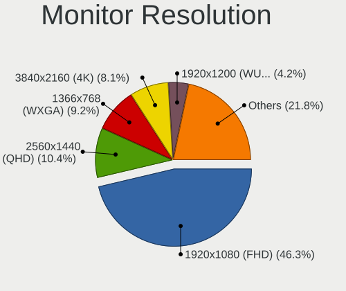

| Resolution         | Computers | Percent |
|--------------------|-----------|---------|
| 1920x1080 (FHD)    | 1320      | 46.32%  |
| 2560x1440 (QHD)    | 297       | 10.42%  |
| 1366x768 (WXGA)    | 261       | 9.16%   |
| 3840x2160 (4K)     | 232       | 8.14%   |
| 1920x1200 (WUXGA)  | 120       | 4.21%   |
| 2560x1600          | 99        | 3.47%   |
| 3440x1440          | 67        | 2.35%   |
| 2880x1800          | 54        | 1.89%   |
| 1600x900 (HD+)     | 40        | 1.4%    |
| 2560x1080          | 39        | 1.37%   |
| 1440x900 (WXGA+)   | 39        | 1.37%   |
| 1680x1050 (WSXGA+) | 33        | 1.16%   |
| 1280x1024 (SXGA)   | 33        | 1.16%   |
| Unknown            | 26        | 0.91%   |
| 3840x1080          | 16        | 0.56%   |
| 3200x2000          | 16        | 0.56%   |
| 1280x800 (WXGA)    | 16        | 0.56%   |
| 3840x2400          | 13        | 0.46%   |
| 2880x1920          | 13        | 0.46%   |
| 2288x1287          | 12        | 0.42%   |
| 2160x1440          | 11        | 0.39%   |
| 1360x768           | 9         | 0.32%   |
| 1600x1200          | 8         | 0.28%   |
| 1920x1280          | 7         | 0.25%   |
| 3072x1920          | 6         | 0.21%   |
| 3456x2160          | 5         | 0.18%   |
| 3200x1800 (QHD+)   | 5         | 0.18%   |
| 2240x1400          | 5         | 0.18%   |
| 1920x540           | 5         | 0.18%   |
| 1024x768 (XGA)     | 5         | 0.18%   |
| 3840x1600          | 4         | 0.14%   |
| 2880x1620          | 4         | 0.14%   |
| 3000x2000          | 3         | 0.11%   |
| 2520x1680          | 3         | 0.11%   |
| 2256x1504          | 3         | 0.11%   |
| 3840x1200          | 2         | 0.07%   |
| 3240x2160          | 2         | 0.07%   |
| 2160x1200          | 2         | 0.07%   |
| 1800x1200          | 2         | 0.07%   |
| 9840x3840          | 1         | 0.04%   |

Monitor Diagonal
----------------

Diagonal size in inches

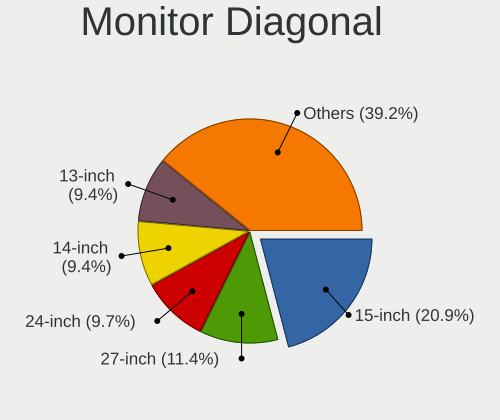

| Inches  | Computers | Percent |
|---------|-----------|---------|
| 15      | 636       | 20.93%  |
| 27      | 345       | 11.36%  |
| 24      | 295       | 9.71%   |
| 14      | 286       | 9.41%   |
| 13      | 285       | 9.38%   |
| 23      | 152       | 5%      |
| 16      | 131       | 4.31%   |
| 31      | 130       | 4.28%   |
| 21      | 121       | 3.98%   |
| 17      | 94        | 3.09%   |
| 34      | 84        | 2.76%   |
| Unknown | 61        | 2.01%   |
| 19      | 35        | 1.15%   |
| 18      | 32        | 1.05%   |
| 12      | 32        | 1.05%   |
| 22      | 30        | 0.99%   |
| 32      | 24        | 0.79%   |
| 20      | 24        | 0.79%   |
| 11      | 24        | 0.79%   |
| 84      | 22        | 0.72%   |
| 54      | 17        | 0.56%   |
| 40      | 15        | 0.49%   |
| 26      | 14        | 0.46%   |
| 142     | 12        | 0.39%   |
| 29      | 11        | 0.36%   |
| 72      | 10        | 0.33%   |
| 35      | 10        | 0.33%   |
| 25      | 10        | 0.33%   |
| 48      | 9         | 0.3%    |
| 63      | 8         | 0.26%   |
| 28      | 8         | 0.26%   |
| 49      | 7         | 0.23%   |
| 46      | 6         | 0.2%    |
| 42      | 6         | 0.2%    |
| 36      | 6         | 0.2%    |
| 10      | 6         | 0.2%    |
| 74      | 5         | 0.16%   |
| 37      | 5         | 0.16%   |
| 33      | 5         | 0.16%   |
| 65      | 4         | 0.13%   |

Monitor Width
-------------

Physical width

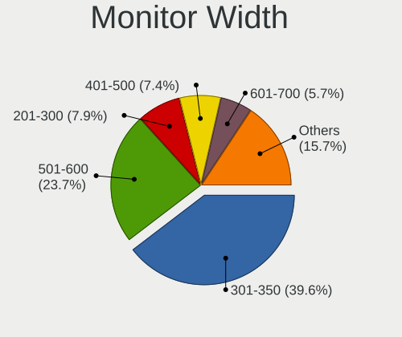

| Width in mm    | Computers | Percent |
|----------------|-----------|---------|
| 301-350        | 1155      | 39.61%  |
| 501-600        | 690       | 23.66%  |
| 201-300        | 229       | 7.85%   |
| 401-500        | 217       | 7.44%   |
| 601-700        | 167       | 5.73%   |
| 351-400        | 124       | 4.25%   |
| 701-800        | 117       | 4.01%   |
| 1001-1500      | 65        | 2.23%   |
| Unknown        | 61        | 2.09%   |
| 1501-2000      | 37        | 1.27%   |
| 801-900        | 31        | 1.06%   |
| More than 2000 | 13        | 0.45%   |
| 901-1000       | 8         | 0.27%   |
| 101-200        | 2         | 0.07%   |

Aspect Ratio
------------

Proportional relationship between the width and the height

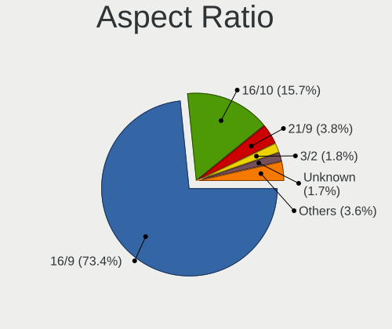

| Ratio   | Computers | Percent |
|---------|-----------|---------|
| 16/9    | 1906      | 73.39%  |
| 16/10   | 409       | 15.75%  |
| 21/9    | 98        | 3.77%   |
| 3/2     | 47        | 1.81%   |
| Unknown | 44        | 1.69%   |
| 5/4     | 27        | 1.04%   |
| 4/3     | 19        | 0.73%   |
| 32/9    | 15        | 0.58%   |
| 1.00    | 12        | 0.46%   |
| 2.65    | 9         | 0.35%   |
| 6/5     | 4         | 0.15%   |
| 0.56    | 2         | 0.08%   |
| 3.40    | 1         | 0.04%   |
| 3.20    | 1         | 0.04%   |
| 2.00    | 1         | 0.04%   |
| 0.63    | 1         | 0.04%   |
| 0.62    | 1         | 0.04%   |

Monitor Area
------------

Area in inch²

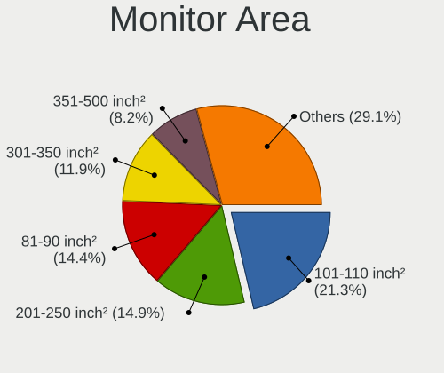

| Area in inch² | Computers | Percent |
|----------------|-----------|---------|
| 101-110        | 640       | 21.34%  |
| 201-250        | 448       | 14.94%  |
| 81-90          | 432       | 14.4%   |
| 301-350        | 358       | 11.94%  |
| 351-500        | 247       | 8.24%   |
| 71-80          | 129       | 4.3%    |
| 111-120        | 124       | 4.13%   |
| 251-300        | 121       | 4.03%   |
| More than 1000 | 91        | 3.03%   |
| 151-200        | 88        | 2.93%   |
| 121-130        | 69        | 2.3%    |
| 501-1000       | 61        | 2.03%   |
| Unknown        | 61        | 2.03%   |
| 141-150        | 44        | 1.47%   |
| 61-70          | 30        | 1%      |
| 51-60          | 26        | 0.87%   |
| 131-140        | 13        | 0.43%   |
| 91-100         | 10        | 0.33%   |
| 41-50          | 5         | 0.17%   |
| 1-40           | 2         | 0.07%   |

Pixel Density
-------------

Pixels per inch

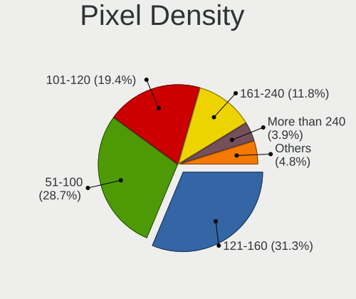

| Density       | Computers | Percent |
|---------------|-----------|---------|
| 121-160       | 898       | 31.33%  |
| 51-100        | 823       | 28.72%  |
| 101-120       | 556       | 19.4%   |
| 161-240       | 338       | 11.79%  |
| More than 240 | 113       | 3.94%   |
| 1-50          | 76        | 2.65%   |
| Unknown       | 62        | 2.16%   |

Multiple Monitors
-----------------

Total monitors connected

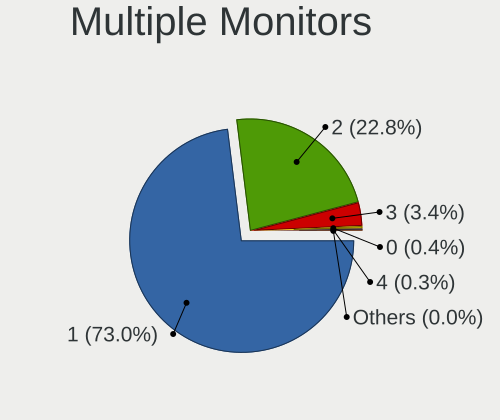

| Total | Computers | Percent |
|-------|-----------|---------|
| 1     | 1821      | 73.04%  |
| 2     | 569       | 22.82%  |
| 3     | 85        | 3.41%   |
| 0     | 9         | 0.36%   |
| 4     | 8         | 0.32%   |
| 5     | 1         | 0.04%   |

Network
-------

Net Controller Vendor
---------------------

Controller vendors

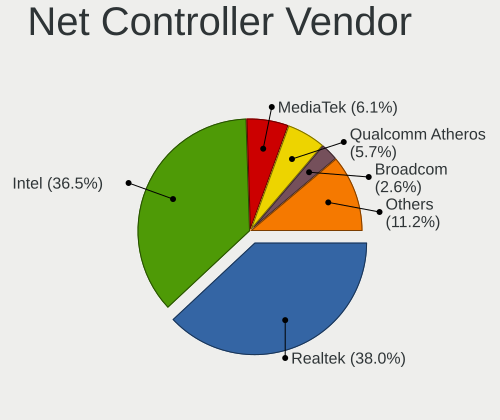

| Vendor                                 | Computers | Percent |
|----------------------------------------|-----------|---------|
| Realtek Semiconductor                  | 1415      | 38.03%  |
| Intel                                  | 1357      | 36.47%  |
| MediaTek                               | 226       | 6.07%   |
| Qualcomm Atheros                       | 211       | 5.67%   |
| Broadcom                               | 97        | 2.61%   |
| ASIX Electronics                       | 37        | 0.99%   |
| TP-Link                                | 32        | 0.86%   |
| Broadcom Limited                       | 29        | 0.78%   |
| Microsoft                              | 27        | 0.73%   |
| Qualcomm                               | 23        | 0.62%   |
| D-Link                                 | 18        | 0.48%   |
| DisplayLink                            | 17        | 0.46%   |
| Samsung Electronics                    | 15        | 0.4%    |
| Sierra Wireless                        | 13        | 0.35%   |
| Lenovo                                 | 12        | 0.32%   |
| Aquantia                               | 12        | 0.32%   |
| Qualcomm Technologies                  | 11        | 0.3%    |
| Ralink Technology                      | 10        | 0.27%   |
| Marvell Technology Group               | 10        | 0.27%   |
| Google                                 | 10        | 0.27%   |
| Cypress Semiconductor                  | 10        | 0.27%   |
| Shenzhen Goodix Technology             | 9         | 0.24%   |
| Qualcomm Atheros Communications        | 9         | 0.24%   |
| Xiaomi                                 | 8         | 0.21%   |
| Ralink                                 | 8         | 0.21%   |
| Nvidia                                 | 8         | 0.21%   |
| OPPO Electronics                       | 7         | 0.19%   |
| Hewlett-Packard                        | 7         | 0.19%   |
| Apple                                  | 7         | 0.19%   |
| Huawei Technologies                    | 5         | 0.13%   |
| NetGear                                | 4         | 0.11%   |
| Ericsson Business Mobile Networks      | 4         | 0.11%   |
| ASUSTek Computer                       | 4         | 0.11%   |
| Suzhou Motorcomm Electronic Technology | 3         | 0.08%   |
| Oculus VR                              | 3         | 0.08%   |
| Mellanox Technologies                  | 3         | 0.08%   |
| Linksys                                | 3         | 0.08%   |
| ICS Advent                             | 3         | 0.08%   |
| D-Link System                          | 3         | 0.08%   |
| AVM                                    | 3         | 0.08%   |

Net Controller Model
--------------------

Controller models

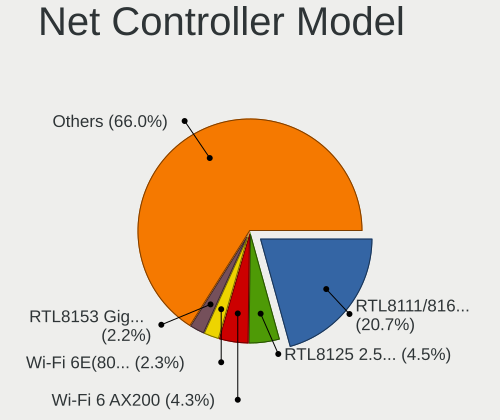

| Model                                                                  | Computers | Percent |
|------------------------------------------------------------------------|-----------|---------|
| Realtek RTL8111/8168/8211/8411 PCI Express Gigabit Ethernet Controller | 912       | 20.71%  |
| Realtek RTL8125 2.5GbE Controller                                      | 198       | 4.5%    |
| Intel Wi-Fi 6 AX200                                                    | 188       | 4.27%   |
| Intel Wi-Fi 6E(802.11ax) AX210/AX1675* 2x2 [Typhoon Peak]              | 100       | 2.27%   |
| Realtek RTL8153 Gigabit Ethernet Adapter                               | 97        | 2.2%    |
| Intel Wireless 8265 / 8275                                             | 91        | 2.07%   |
| Intel Alder Lake-P PCH CNVi WiFi                                       | 79        | 1.79%   |
| MediaTek MT7921 802.11ax PCIe Wireless Network Adapter [Filogic 330]   | 78        | 1.77%   |
| Intel I211 Gigabit Network Connection                                  | 76        | 1.73%   |
| Realtek RTL8821CE 802.11ac PCIe Wireless Network Adapter               | 75        | 1.7%    |
| MediaTek MT7922 802.11ax PCI Express Wireless Network Adapter          | 75        | 1.7%    |
| Intel Wi-Fi 6 AX201                                                    | 68        | 1.54%   |
| Qualcomm Atheros QCA9377 802.11ac Wireless Network Adapter             | 62        | 1.41%   |
| Realtek RTL810xE PCI Express Fast Ethernet controller                  | 59        | 1.34%   |
| Realtek RTL8822CE 802.11ac PCIe Wireless Network Adapter               | 57        | 1.29%   |
| Intel Wireless 7265                                                    | 53        | 1.2%    |
| Intel Ethernet Controller I225-V                                       | 51        | 1.16%   |
| Intel Cannon Lake PCH CNVi WiFi                                        | 51        | 1.16%   |
| Intel 82579LM Gigabit Network Connection (Lewisville)                  | 51        | 1.16%   |
| Intel Wi-Fi 5(802.11ac) Wireless-AC 9x6x [Thunder Peak]                | 42        | 0.95%   |
| Intel Wireless 8260                                                    | 40        | 0.91%   |
| Intel Raptor Lake PCH CNVi WiFi                                        | 40        | 0.91%   |
| Intel Comet Lake PCH-LP CNVi WiFi                                      | 40        | 0.91%   |
| Intel Ethernet Connection (7) I219-V                                   | 38        | 0.86%   |
| Intel Ethernet Connection I217-LM                                      | 37        | 0.84%   |
| Intel Ethernet Connection (2) I219-V                                   | 34        | 0.77%   |
| Intel Wireless 7260                                                    | 33        | 0.75%   |
| Intel Ethernet Connection (4) I219-LM                                  | 33        | 0.75%   |
| ASIX AX88179 Gigabit Ethernet                                          | 33        | 0.75%   |
| Intel Comet Lake PCH CNVi WiFi                                         | 32        | 0.73%   |
| Realtek RTL8852BE PCIe 802.11ax Wireless Network Controller            | 30        | 0.68%   |
| Intel Dual Band Wireless-AC 3168NGW [Stone Peak]                       | 29        | 0.66%   |
| MediaTek MT7921K (RZ608) Wi-Fi 6E 80MHz                                | 28        | 0.64%   |
| Intel Ice Lake-LP PCH CNVi WiFi                                        | 28        | 0.64%   |
| Intel 700 Series Chipset CNVi WiFi                                     | 26        | 0.59%   |
| Qualcomm Atheros QCA6174 802.11ac Wireless Network Adapter             | 25        | 0.57%   |
| Intel Wireless 3165                                                    | 25        | 0.57%   |
| Realtek RTL8822BE 802.11a/b/g/n/ac WiFi adapter                        | 24        | 0.55%   |
| Realtek RTL8852AE 802.11ax PCIe Wireless Network Adapter               | 22        | 0.5%    |
| Intel Tiger Lake PCH CNVi WiFi                                         | 22        | 0.5%    |

Wireless Vendor
---------------

Wireless vendors

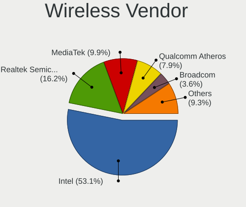

| Vendor                                | Computers | Percent |
|---------------------------------------|-----------|---------|
| Intel                                 | 1123      | 53.15%  |
| Realtek Semiconductor                 | 342       | 16.19%  |
| MediaTek                              | 209       | 9.89%   |
| Qualcomm Atheros                      | 166       | 7.86%   |
| Broadcom                              | 77        | 3.64%   |
| TP-Link                               | 30        | 1.42%   |
| Broadcom Limited                      | 26        | 1.23%   |
| Microsoft                             | 24        | 1.14%   |
| Qualcomm                              | 18        | 0.85%   |
| D-Link                                | 16        | 0.76%   |
| Sierra Wireless                       | 13        | 0.62%   |
| Ralink Technology                     | 10        | 0.47%   |
| Qualcomm Atheros Communications       | 9         | 0.43%   |
| Ralink                                | 8         | 0.38%   |
| Qualcomm Technologies                 | 7         | 0.33%   |
| Marvell Technology Group              | 7         | 0.33%   |
| ASUSTek Computer                      | 4         | 0.19%   |
| NetGear                               | 3         | 0.14%   |
| Linksys                               | 3         | 0.14%   |
| AVM                                   | 3         | 0.14%   |
| Edimax Technology                     | 2         | 0.09%   |
| Dell                                  | 2         | 0.09%   |
| D-Link System                         | 2         | 0.09%   |
| Wilocity                              | 1         | 0.05%   |
| Tenda                                 | 1         | 0.05%   |
| Samsung Electronics                   | 1         | 0.05%   |
| Realtek                               | 1         | 0.05%   |
| Quectel Wireless Solutions            | 1         | 0.05%   |
| IMC Networks                          | 1         | 0.05%   |
| Fibocom                               | 1         | 0.05%   |
| Belkin Components                     | 1         | 0.05%   |
| 802.11g Adapter [Linksys WUSB54GC v3] | 1         | 0.05%   |

Wireless Model
--------------

Wireless models

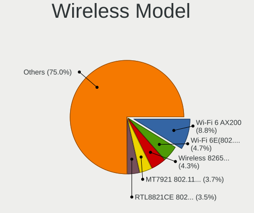

| Model                                                                | Computers | Percent |
|----------------------------------------------------------------------|-----------|---------|
| Intel Wi-Fi 6 AX200                                                  | 188       | 8.82%   |
| Intel Wi-Fi 6E(802.11ax) AX210/AX1675* 2x2 [Typhoon Peak]            | 100       | 4.69%   |
| Intel Wireless 8265 / 8275                                           | 91        | 4.27%   |
| MediaTek MT7921 802.11ax PCIe Wireless Network Adapter [Filogic 330] | 78        | 3.66%   |
| Realtek RTL8821CE 802.11ac PCIe Wireless Network Adapter             | 75        | 3.52%   |
| Intel Wi-Fi 6 AX201                                                  | 68        | 3.19%   |
| MediaTek MT7922 802.11ax PCI Express Wireless Network Adapter        | 67        | 3.14%   |
| Qualcomm Atheros QCA9377 802.11ac Wireless Network Adapter           | 62        | 2.91%   |
| Realtek RTL8822CE 802.11ac PCIe Wireless Network Adapter             | 57        | 2.67%   |
| Intel Alder Lake-P PCH CNVi WiFi                                     | 54        | 2.53%   |
| Intel Wireless 7265                                                  | 53        | 2.49%   |
| Intel Cannon Lake PCH CNVi WiFi                                      | 51        | 2.39%   |
| Intel Wi-Fi 5(802.11ac) Wireless-AC 9x6x [Thunder Peak]              | 42        | 1.97%   |
| Intel Wireless 8260                                                  | 40        | 1.88%   |
| Intel Comet Lake PCH-LP CNVi WiFi                                    | 40        | 1.88%   |
| Intel Raptor Lake PCH CNVi WiFi                                      | 35        | 1.64%   |
| Intel Wireless 7260                                                  | 33        | 1.55%   |
| Intel Comet Lake PCH CNVi WiFi                                       | 32        | 1.5%    |
| Intel Dual Band Wireless-AC 3168NGW [Stone Peak]                     | 29        | 1.36%   |
| Realtek RTL8852BE PCIe 802.11ax Wireless Network Controller          | 28        | 1.31%   |
| MediaTek MT7921K (RZ608) Wi-Fi 6E 80MHz                              | 28        | 1.31%   |
| Intel Ice Lake-LP PCH CNVi WiFi                                      | 28        | 1.31%   |
| Intel 700 Series Chipset CNVi WiFi                                   | 26        | 1.22%   |
| Qualcomm Atheros QCA6174 802.11ac Wireless Network Adapter           | 25        | 1.17%   |
| Intel Wireless 3165                                                  | 25        | 1.17%   |
| Realtek RTL8822BE 802.11a/b/g/n/ac WiFi adapter                      | 24        | 1.13%   |
| Realtek RTL8852AE 802.11ax PCIe Wireless Network Adapter             | 22        | 1.03%   |
| Intel Tiger Lake PCH CNVi WiFi                                       | 22        | 1.03%   |
| Qualcomm Atheros AR9485 Wireless Network Adapter                     | 21        | 0.98%   |
| Intel Centrino Advanced-N 6205 [Taylor Peak]                         | 21        | 0.98%   |
| Intel Cannon Point-LP CNVi [Wireless-AC]                             | 21        | 0.98%   |
| Realtek 802.11ac NIC                                                 | 20        | 0.94%   |
| Qualcomm Atheros QCA9565 / AR9565 Wireless Network Adapter           | 20        | 0.94%   |
| Qualcomm QCNFA765 Wireless Network Adapter                           | 18        | 0.84%   |
| Intel Meteor Lake PCH CNVi WiFi                                      | 18        | 0.84%   |
| Intel Dual Band Wireless-AC 3165 Plus Bluetooth                      | 18        | 0.84%   |
| Broadcom Limited BCM4360 802.11ac Dual Band Wireless Network Adapter | 17        | 0.8%    |
| Broadcom BCM43142 802.11b/g/n                                        | 15        | 0.7%    |
| Intel Wireless 3160                                                  | 14        | 0.66%   |
| Qualcomm Atheros AR9462 Wireless Network Adapter                     | 13        | 0.61%   |

Ethernet Vendor
---------------

Ethernet vendors

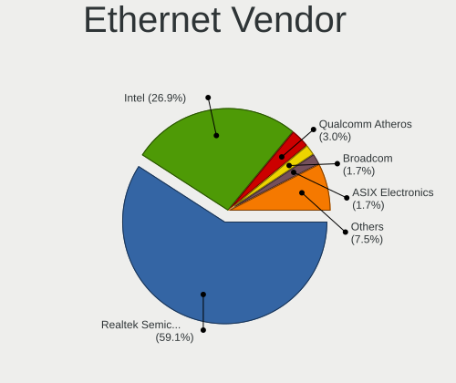

| Vendor                                 | Computers | Percent |
|----------------------------------------|-----------|---------|
| Realtek Semiconductor                  | 1270      | 59.12%  |
| Intel                                  | 577       | 26.86%  |
| Qualcomm Atheros                       | 65        | 3.03%   |
| Broadcom                               | 37        | 1.72%   |
| ASIX Electronics                       | 37        | 1.72%   |
| DisplayLink                            | 17        | 0.79%   |
| MediaTek                               | 16        | 0.74%   |
| Samsung Electronics                    | 14        | 0.65%   |
| Aquantia                               | 12        | 0.56%   |
| Cypress Semiconductor                  | 10        | 0.47%   |
| Lenovo                                 | 9         | 0.42%   |
| Google                                 | 9         | 0.42%   |
| Xiaomi                                 | 8         | 0.37%   |
| Nvidia                                 | 8         | 0.37%   |
| OPPO Electronics                       | 7         | 0.33%   |
| Apple                                  | 7         | 0.33%   |
| Qualcomm Technologies                  | 4         | 0.19%   |
| Qualcomm                               | 4         | 0.19%   |
| D-Link                                 | 4         | 0.19%   |
| Suzhou Motorcomm Electronic Technology | 3         | 0.14%   |
| Mellanox Technologies                  | 3         | 0.14%   |
| Marvell Technology Group               | 3         | 0.14%   |
| ICS Advent                             | 3         | 0.14%   |
| Hewlett-Packard                        | 3         | 0.14%   |
| Broadcom Limited                       | 3         | 0.14%   |
| TP-Link                                | 2         | 0.09%   |
| Motorola PCS                           | 2         | 0.09%   |
| Huawei Technologies                    | 2         | 0.09%   |
| ULi Electronics                        | 1         | 0.05%   |
| Raspberry Pi                           | 1         | 0.05%   |
| QinHeng Electronics                    | 1         | 0.05%   |
| OnePlus Technology (Shenzhen)          | 1         | 0.05%   |
| NetXen Incorporated                    | 1         | 0.05%   |
| NetGear                                | 1         | 0.05%   |
| Microsoft                              | 1         | 0.05%   |
| D-Link System                          | 1         | 0.05%   |
| Belkin Components                      | 1         | 0.05%   |

Ethernet Model
--------------

Ethernet models

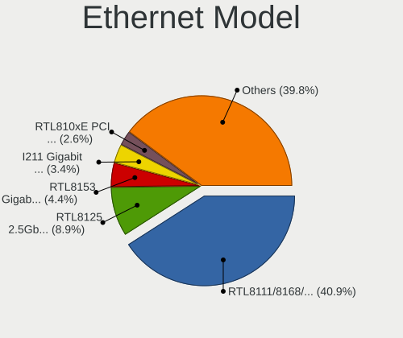

| Model                                                                  | Computers | Percent |
|------------------------------------------------------------------------|-----------|---------|
| Realtek RTL8111/8168/8211/8411 PCI Express Gigabit Ethernet Controller | 912       | 40.92%  |
| Realtek RTL8125 2.5GbE Controller                                      | 198       | 8.88%   |
| Realtek RTL8153 Gigabit Ethernet Adapter                               | 97        | 4.35%   |
| Intel I211 Gigabit Network Connection                                  | 76        | 3.41%   |
| Realtek RTL810xE PCI Express Fast Ethernet controller                  | 59        | 2.65%   |
| Intel Ethernet Controller I225-V                                       | 51        | 2.29%   |
| Intel 82579LM Gigabit Network Connection (Lewisville)                  | 51        | 2.29%   |
| Intel Ethernet Connection (7) I219-V                                   | 38        | 1.7%    |
| Intel Ethernet Connection I217-LM                                      | 37        | 1.66%   |
| Intel Ethernet Connection (2) I219-V                                   | 34        | 1.53%   |
| Intel Ethernet Connection (4) I219-LM                                  | 33        | 1.48%   |
| ASIX AX88179 Gigabit Ethernet                                          | 33        | 1.48%   |
| Intel Alder Lake-P PCH CNVi WiFi                                       | 25        | 1.12%   |
| Intel Ethernet Connection I219-LM                                      | 18        | 0.81%   |
| Intel Ethernet Connection (4) I219-V                                   | 18        | 0.81%   |
| Intel Ethernet Connection (2) I219-LM                                  | 17        | 0.76%   |
| Intel Ethernet Controller I226-V                                       | 14        | 0.63%   |
| Realtek RTL8126 5GbE Controller                                        | 12        | 0.54%   |
| Qualcomm Atheros Killer E2400 Gigabit Ethernet Controller              | 12        | 0.54%   |
| Realtek USB 10/100/1G/2.5 LAN                                          | 11        | 0.49%   |
| Realtek Killer E2600 GbE Controller                                    | 11        | 0.49%   |
| Intel Ethernet Connection I218-LM                                      | 11        | 0.49%   |
| Intel Ethernet Connection (5) I219-LM                                  | 11        | 0.49%   |
| Qualcomm Atheros Killer E220x Gigabit Ethernet Controller              | 10        | 0.45%   |
| Cypress USB Type-C Dock                                                | 10        | 0.45%   |
| Qualcomm Atheros Killer E2500 Gigabit Ethernet Controller              | 9         | 0.4%    |
| Intel Ethernet Connection (3) I218-LM                                  | 9         | 0.4%    |
| Qualcomm Atheros QCA8171 Gigabit Ethernet                              | 8         | 0.36%   |
| Qualcomm Atheros AR8161 Gigabit Ethernet                               | 8         | 0.36%   |
| MediaTek MT7922 802.11ax PCI Express Wireless Network Adapter          | 8         | 0.36%   |
| Broadcom NetXtreme BCM57766 Gigabit Ethernet PCIe                      | 8         | 0.36%   |
| Samsung GT-I9070 (network tethering, USB debugging enabled)            | 7         | 0.31%   |
| Samsung Galaxy series, misc. (tethering mode)                          | 7         | 0.31%   |
| Qualcomm Atheros AR8151 v2.0 Gigabit Ethernet                          | 7         | 0.31%   |
| Intel Ethernet Connection (7) I219-LM                                  | 7         | 0.31%   |
| Intel Ethernet Connection (14) I219-V                                  | 7         | 0.31%   |
| Intel 82577LM Gigabit Network Connection                               | 7         | 0.31%   |
| Apple iBridge                                                          | 7         | 0.31%   |
| Xiaomi Mi/Redmi series (RNDIS)                                         | 6         | 0.27%   |
| Realtek RTL8152 Fast Ethernet Adapter                                  | 6         | 0.27%   |

Net Controller Kind
-------------------

Ethernet, WiFi or modem

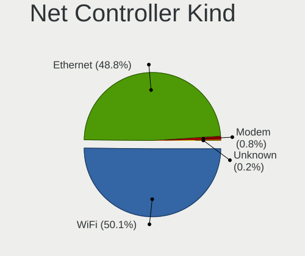

| Kind     | Computers | Percent |
|----------|-----------|---------|
| WiFi     | 2007      | 50.15%  |
| Ethernet | 1953      | 48.8%   |
| Modem    | 33        | 0.82%   |
| Unknown  | 9         | 0.22%   |

Used Controller
---------------

Currently used network controller

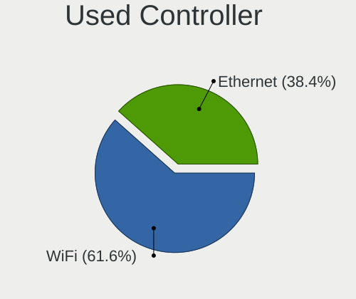

| Kind     | Computers | Percent |
|----------|-----------|---------|
| WiFi     | 1582      | 61.58%  |
| Ethernet | 987       | 38.42%  |

NICs
----

Total network controllers on board

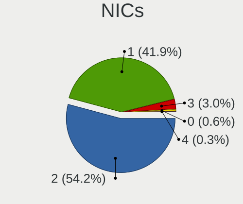

| Total | Computers | Percent |
|-------|-----------|---------|
| 2     | 1324      | 54.17%  |
| 1     | 1025      | 41.94%  |
| 3     | 73        | 2.99%   |
| 0     | 14        | 0.57%   |
| 4     | 8         | 0.33%   |

IPv6
----

IPv6 vs IPv4

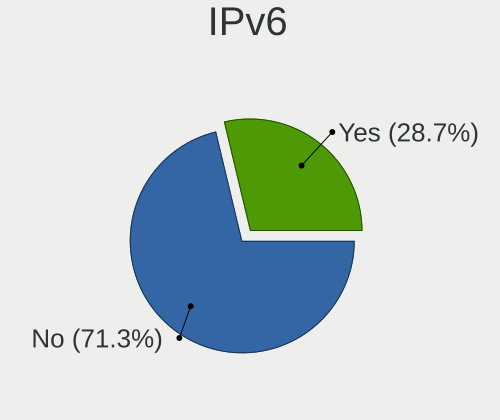

| Used | Computers | Percent |
|------|-----------|---------|
| No   | 1763      | 71.26%  |
| Yes  | 711       | 28.74%  |

Bluetooth
---------

Bluetooth Vendor
----------------

Controller vendors

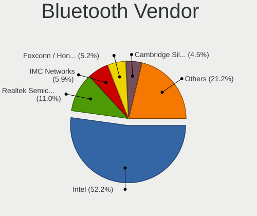

| Vendor                          | Computers | Percent |
|---------------------------------|-----------|---------|
| Intel                           | 1064      | 52.18%  |
| Realtek Semiconductor           | 224       | 10.99%  |
| IMC Networks                    | 120       | 5.89%   |
| Foxconn / Hon Hai               | 106       | 5.2%    |
| Cambridge Silicon Radio         | 92        | 4.51%   |
| MediaTek                        | 70        | 3.43%   |
| Qualcomm Atheros Communications | 69        | 3.38%   |
| Lite-On Technology              | 56        | 2.75%   |
| Broadcom                        | 50        | 2.45%   |
| Apple                           | 45        | 2.21%   |
| ASUSTek Computer                | 38        | 1.86%   |
| TP-Link                         | 21        | 1.03%   |
| Realtek                         | 14        | 0.69%   |
| USI                             | 13        | 0.64%   |
| Toshiba                         | 7         | 0.34%   |
| Marvell Semiconductor           | 7         | 0.34%   |
| Dell                            | 7         | 0.34%   |
| HTC (High Tech Computer)        | 6         | 0.29%   |
| Hewlett-Packard                 | 6         | 0.29%   |
| Ralink                          | 5         | 0.25%   |
| Actions                         | 5         | 0.25%   |
| Unknown                         | 4         | 0.2%    |
| Opticis                         | 2         | 0.1%    |
| Foxconn International           | 2         | 0.1%    |
| Dynex                           | 2         | 0.1%    |
| Micro Star International        | 1         | 0.05%   |
| Mercucys                        | 1         | 0.05%   |
| Edimax Technology               | 1         | 0.05%   |
| Alps Electric                   | 1         | 0.05%   |

Bluetooth Model
---------------

Controller models

| Model                                               | Computers | Percent |
|-----------------------------------------------------|-----------|---------|
| Intel Bluetooth wireless interface                  | 263       | 12.85%  |
| Intel AX201 Bluetooth                               | 208       | 10.17%  |
| Intel AX200 Bluetooth                               | 180       | 8.8%    |
| Realtek Bluetooth Radio                             | 163       | 7.97%   |
| Intel Bluetooth Device                              | 138       | 6.74%   |
| Intel Bluetooth 9460/9560 Jefferson Peak (JfP)      | 109       | 5.33%   |
| Intel AX210 Bluetooth                               | 94        | 4.59%   |
| Cambridge Silicon Radio Bluetooth Dongle (HCI mode) | 92        | 4.5%    |
| MediaTek Wireless_Device                            | 69        | 3.37%   |
| IMC Networks Wireless_Device                        | 67        | 3.27%   |
| Foxconn / Hon Hai Wireless_Device                   | 46        | 2.25%   |
| Qualcomm Atheros  Bluetooth Device                  | 43        | 2.1%    |
| Intel Wireless-AC 9260 Bluetooth Adapter            | 40        | 1.96%   |
| Realtek  Bluetooth 4.2 Adapter                      | 38        | 1.86%   |
| IMC Networks Bluetooth Radio                        | 33        | 1.61%   |
| Foxconn / Hon Hai MediaTek Bluetooth Adapter        | 29        | 1.42%   |
| Intel Wireless-AC 3168 Bluetooth                    | 28        | 1.37%   |
| Apple Bluetooth USB Host Controller                 | 22        | 1.08%   |
| TP-Link TP-T@- UB500 Adapter                        | 21        | 1.03%   |
| Lite-On Qualcomm Atheros QCA9377 Bluetooth          | 21        | 1.03%   |
| Foxconn / Hon Hai Bluetooth Device                  | 21        | 1.03%   |
| Apple Bluetooth Host Controller                     | 15        | 0.73%   |
| Realtek Bluetooth Radio                             | 14        | 0.68%   |
| USI Bluetooth Device                                | 13        | 0.64%   |
| IMC Networks Bluetooth Device                       | 12        | 0.59%   |
| Broadcom BCM20702A0 Bluetooth 4.0                   | 12        | 0.59%   |
| ASUS ASUS USB-BT500                                 | 12        | 0.59%   |
| Lite-On Bluetooth Device                            | 11        | 0.54%   |
| ASUS Broadcom BCM20702A0 Bluetooth                  | 11        | 0.54%   |
| Realtek Bluetooth 5.3 Radio                         | 9         | 0.44%   |
| Qualcomm Atheros AR3012 Bluetooth 4.0               | 9         | 0.44%   |
| Lite-On Wireless_Device                             | 9         | 0.44%   |
| Intel Centrino Bluetooth Wireless Transceiver       | 9         | 0.44%   |
| Realtek RTL8822BE Bluetooth 4.2 Adapter             | 8         | 0.39%   |
| Qualcomm Atheros QCA61x4 Bluetooth 4.0              | 8         | 0.39%   |
| Broadcom BCM20702 Bluetooth 4.0 [ThinkPad]          | 8         | 0.39%   |
| Apple Built-in Bluetooth 2.0+EDR HCI                | 7         | 0.34%   |
| Realtek RTL8821A Bluetooth                          | 6         | 0.29%   |
| Marvell Bluetooth and Wireless LAN Composite        | 6         | 0.29%   |
| Lite-On Atheros AR3012 Bluetooth                    | 6         | 0.29%   |

Sound
-----

Sound Vendor
------------

Sound card vendors

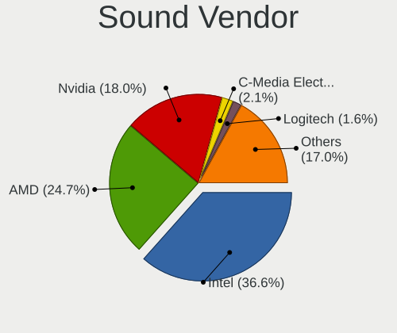

| Vendor                               | Computers | Percent |
|--------------------------------------|-----------|---------|
| Intel                                | 1483      | 36.56%  |
| AMD                                  | 1001      | 24.68%  |
| Nvidia                               | 731       | 18.02%  |
| C-Media Electronics                  | 85        | 2.1%    |
| Logitech                             | 65        | 1.6%    |
| Texas Instruments                    | 42        | 1.04%   |
| SteelSeries ApS                      | 42        | 1.04%   |
| Focusrite-Novation                   | 34        | 0.84%   |
| Razer USA                            | 31        | 0.76%   |
| Kingston Technology                  | 30        | 0.74%   |
| Micro Star International             | 26        | 0.64%   |
| JMTek                                | 26        | 0.64%   |
| Sony                                 | 24        | 0.59%   |
| Creative Technology                  | 21        | 0.52%   |
| Creative Labs                        | 19        | 0.47%   |
| Corsair                              | 19        | 0.47%   |
| Realtek Semiconductor                | 16        | 0.39%   |
| Lenovo                               | 16        | 0.39%   |
| Hewlett-Packard                      | 16        | 0.39%   |
| ASUSTek Computer                     | 14        | 0.35%   |
| Generalplus Technology               | 12        | 0.3%    |
| Blue Microphones                     | 11        | 0.27%   |
| Samson Technologies                  | 10        | 0.25%   |
| Valve Software                       | 9         | 0.22%   |
| RODE Microphones                     | 9         | 0.22%   |
| KTMicro                              | 9         | 0.22%   |
| Apple                                | 9         | 0.22%   |
| KORG                                 | 8         | 0.2%    |
| DSEA A/S                             | 8         | 0.2%    |
| Thesycon Systemsoftware & Consulting | 7         | 0.17%   |
| Plantronics                          | 7         | 0.17%   |
| FiiO Electronics Technology          | 7         | 0.17%   |
| BEHRINGER International              | 7         | 0.17%   |
| AKAI Professional M.I.               | 7         | 0.17%   |
| Unknown                              | 7         | 0.17%   |
| NAD Electronics                      | 6         | 0.15%   |
| GN Netcom                            | 6         | 0.15%   |
| Yamaha                               | 5         | 0.12%   |
| XMOS                                 | 5         | 0.12%   |
| Walmart                              | 5         | 0.12%   |

Sound Model
-----------

Sound card models

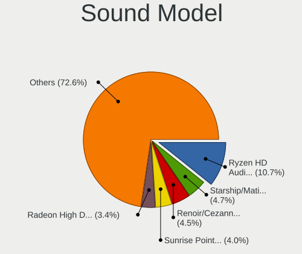

| Model                                                                      | Computers | Percent |
|----------------------------------------------------------------------------|-----------|---------|
| AMD Ryzen HD Audio Controller                                              | 538       | 10.74%  |
| AMD Starship/Matisse HD Audio Controller                                   | 235       | 4.69%   |
| AMD Renoir/Cezanne HDMI/DP Audio Controller                                | 226       | 4.51%   |
| Intel Sunrise Point-LP HD Audio                                            | 200       | 3.99%   |
| AMD Radeon High Definition Audio Controller                                | 171       | 3.41%   |
| AMD Navi 21/23 HDMI/DP Audio Controller                                    | 145       | 2.9%    |
| Intel Cannon Lake PCH cAVS                                                 | 112       | 2.24%   |
| Intel Tiger Lake-LP Smart Sound Technology Audio Controller                | 93        | 1.86%   |
| Intel 7 Series/C216 Chipset Family High Definition Audio Controller        | 90        | 1.8%    |
| Intel 8 Series/C220 Series Chipset High Definition Audio Controller        | 88        | 1.76%   |
| Intel Alder Lake PCH-P High Definition Audio Controller                    | 87        | 1.74%   |
| AMD Raven/Raven2/Fenghuang HDMI/DP Audio Controller                        | 81        | 1.62%   |
| Nvidia GA104 High Definition Audio Controller                              | 66        | 1.32%   |
| Intel Xeon E3-1200 v3/4th Gen Core Processor HD Audio Controller           | 65        | 1.3%    |
| Nvidia GA106 High Definition Audio Controller                              | 63        | 1.26%   |
| Intel 100 Series/C230 Series Chipset Family HD Audio Controller            | 61        | 1.22%   |
| AMD Ellesmere HDMI Audio [Radeon RX 470/480 / 570/580/590]                 | 58        | 1.16%   |
| AMD Navi 31 HDMI/DP Audio                                                  | 55        | 1.1%    |
| Intel 8 Series HD Audio Controller                                         | 53        | 1.06%   |
| Intel Haswell-ULT HD Audio Controller                                      | 52        | 1.04%   |
| Nvidia TU116 High Definition Audio Controller                              | 50        | 1%      |
| Intel Raptor Lake-P/U/H cAVS                                               | 49        | 0.98%   |
| AMD Family 17h (Models 00h-0fh) HD Audio Controller                        | 49        | 0.98%   |
| Intel Comet Lake PCH-LP cAVS                                               | 46        | 0.92%   |
| Nvidia GP107GL High Definition Audio Controller                            | 45        | 0.9%    |
| Nvidia TU106 High Definition Audio Controller                              | 44        | 0.88%   |
| Intel 200 Series PCH HD Audio                                              | 44        | 0.88%   |
| Intel 6 Series/C200 Series Chipset Family High Definition Audio Controller | 42        | 0.84%   |
| Nvidia AD107 High Definition Audio Controller                              | 41        | 0.82%   |
| Intel Ice Lake-LP Smart Sound Technology Audio Controller                  | 41        | 0.82%   |
| Intel Comet Lake PCH cAVS                                                  | 40        | 0.8%    |
| AMD Navi 10 HDMI Audio                                                     | 40        | 0.8%    |
| Intel Raptor Lake High Definition Audio Controller                         | 39        | 0.78%   |
| Intel Broadwell-U Audio Controller                                         | 38        | 0.76%   |
| Intel Cannon Point-LP High Definition Audio Controller                     | 37        | 0.74%   |
| Nvidia GP104 High Definition Audio Controller                              | 36        | 0.72%   |
| Intel Wildcat Point-LP High Definition Audio Controller                    | 36        | 0.72%   |
| Intel Tiger Lake-H HD Audio Controller                                     | 36        | 0.72%   |
| Nvidia GA102 High Definition Audio Controller                              | 33        | 0.66%   |
| Nvidia TU107 GeForce GTX 1650 High Definition Audio Controller             | 32        | 0.64%   |

Memory
------

Memory Vendor
-------------

Memory module vendors

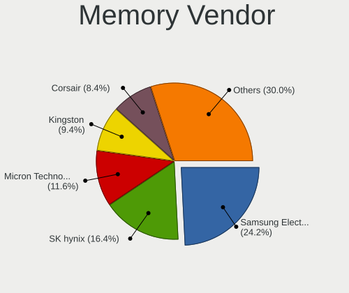

| Vendor              | Computers | Percent |
|---------------------|-----------|---------|
| Samsung Electronics | 500       | 24.2%   |
| SK hynix            | 339       | 16.41%  |
| Micron Technology   | 239       | 11.57%  |
| Kingston            | 195       | 9.44%   |
| Corsair             | 174       | 8.42%   |
| Crucial             | 140       | 6.78%   |
| G.Skill             | 128       | 6.2%    |
| Unknown             | 69        | 3.34%   |
| Team                | 36        | 1.74%   |
| A-DATA Technology   | 34        | 1.65%   |
| Unknown             | 32        | 1.55%   |
| Ramaxel Technology  | 25        | 1.21%   |
| Patriot             | 21        | 1.02%   |
| Elpida              | 14        | 0.68%   |
| Unknown (ABCD)      | 12        | 0.58%   |
| Nanya Technology    | 9         | 0.44%   |
| Lexar               | 6         | 0.29%   |
| Kllisre             | 6         | 0.29%   |
| GOODRAM             | 6         | 0.29%   |
| Apacer              | 4         | 0.19%   |
| Transcend           | 3         | 0.15%   |
| Teikon              | 3         | 0.15%   |
| Smart Brazil        | 3         | 0.15%   |
| OLOY                | 3         | 0.15%   |
| Neo Forza           | 3         | 0.15%   |
| Avant               | 3         | 0.15%   |
| Wilk                | 2         | 0.1%    |
| Unifosa             | 2         | 0.1%    |
| Smart               | 2         | 0.1%    |
| Silicon Power       | 2         | 0.1%    |
| Shenzhen Mic        | 2         | 0.1%    |
| KLEVV               | 2         | 0.1%    |
| Hikvision           | 2         | 0.1%    |
| Golden Empire       | 2         | 0.1%    |
| ff                  | 2         | 0.1%    |
| Essencore Limited   | 2         | 0.1%    |
| AMD                 | 2         | 0.1%    |
| 4ea5                | 2         | 0.1%    |
| Wilk Elektronik     | 1         | 0.05%   |
| V-GeN               | 1         | 0.05%   |

Memory Model
------------

Memory module models

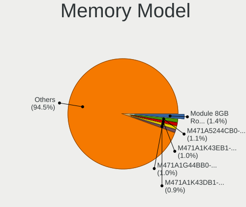

| Model                                                            | Computers | Percent |
|------------------------------------------------------------------|-----------|---------|
| Unknown                                                          | 32        | 1.45%   |
| Samsung RAM M471A5244CB0-CTD 4GB SODIMM DDR4 3266MT/s            | 24        | 1.08%   |
| Samsung RAM M471A1K43EB1-CWE 8GB SODIMM DDR4 3200MT/s            | 23        | 1.04%   |
| Samsung RAM M471A1G44BB0-CWE 8GB SODIMM DDR4 3200MT/s            | 22        | 0.99%   |
| Samsung RAM M471A1K43DB1-CWE 8GB SODIMM DDR4 3200MT/s            | 21        | 0.95%   |
| Samsung RAM M471A1G44AB0-CWE 8GiB SODIMM DDR4 3200MT/s           | 21        | 0.95%   |
| SK hynix RAM HMA81GS6AFR8N-UH 8GB SODIMM DDR4 2667MT/s           | 19        | 0.86%   |
| Corsair RAM CMK16GX4M2B3000C15 8GB DIMM DDR4 3600MT/s            | 19        | 0.86%   |
| Samsung RAM M471A1G44AB0-CWE 8GB Row Of Chips DDR4 3200MT/s      | 18        | 0.81%   |
| Corsair RAM CMK16GX4M2B3200C16 8GB DIMM DDR4 3600MT/s            | 18        | 0.81%   |
| SK hynix RAM HMAA1GS6CJR6N-XN 8GB SODIMM DDR4 3200MT/s           | 15        | 0.68%   |
| Samsung RAM M471A5244CB0-CRC 4GB SODIMM DDR4 2667MT/s            | 14        | 0.63%   |
| Samsung RAM M471A1K43CB1-CTD 8GB SODIMM DDR4 3200MT/s            | 14        | 0.63%   |
| Micron RAM 4ATF1G64HZ-3G2E1 8GB SODIMM DDR4 3200MT/s             | 13        | 0.59%   |
| SK hynix RAM HMA851S6AFR6N-UH 4GB SODIMM DDR4 2667MT/s           | 12        | 0.54%   |
| SK hynix RAM HMA81GS6CJR8N-VK 8GB SODIMM DDR4 2667MT/s           | 12        | 0.54%   |
| Samsung RAM M425R1GB4BB0-CQKOL 8GB SODIMM DDR5 4800MT/s          | 12        | 0.54%   |
| Samsung RAM M471B5173QH0-YK0 4GB SODIMM DDR3 1600MT/s            | 11        | 0.5%    |
| Micron RAM 8ATF1G64HZ-3G2J1 8GB SODIMM DDR4 3200MT/s             | 11        | 0.5%    |
| Samsung RAM M471B1G73DB0-YK0 8GB SODIMM DDR3 1600MT/s            | 10        | 0.45%   |
| Samsung RAM M471A1K43BB1-CRC 8GB SODIMM DDR4 2667MT/s            | 10        | 0.45%   |
| Micron RAM 4ATF51264HZ-2G6E1 4GB SODIMM DDR4 2667MT/s            | 10        | 0.45%   |
| Unknown (ABCD) RAM 123456789012345678 2GB SODIMM LPDDR4 2400MT/s | 9         | 0.41%   |
| SK hynix RAM HMA81GS6JJR8N-VK 8GB SODIMM DDR4 2667MT/s           | 9         | 0.41%   |
| Samsung RAM M471B1G73QH0-YK0 8GB SODIMM DDR3 1600MT/s            | 9         | 0.41%   |
| Samsung RAM M471A5244CB0-CWE 4GB SODIMM DDR4 3200MT/s            | 9         | 0.41%   |
| Micron RAM 4ATF51264HZ-3G2J1 4GB SODIMM DDR4 3200MT/s            | 9         | 0.41%   |
| Micron RAM 4ATF1G64HZ-3G2F1 8GB SODIMM DDR4 3200MT/s             | 9         | 0.41%   |
| SK hynix RAM Module 4GB SODIMM DDR3 1600MT/s                     | 8         | 0.36%   |
| Samsung RAM UBE3D4AA-MGCR 2GB Row Of Chips LPDDR4 4267MT/s       | 8         | 0.36%   |
| Samsung RAM M471A5244CB0-CWE 4GB Row Of Chips DDR4 3200MT/s      | 8         | 0.36%   |
| Micron RAM MTC4C10163S1SC48BA1 8GB SODIMM DDR5 4800MT/s          | 8         | 0.36%   |
| Micron RAM MT62F2G32D4DS-026 WT 8GiB SODIMM LPDDR5 7500MT/s      | 8         | 0.36%   |
| Micron RAM 8ATF1G64HZ-3G2R1 8GB SODIMM DDR4 3200MT/s             | 8         | 0.36%   |
| Micron RAM 4ATF1G64HZ-3G2E2 8GB SODIMM DDR4 3200MT/s             | 8         | 0.36%   |
| Kingston RAM KHX3200C16D4/8GX 8GB DIMM DDR4 3733MT/s             | 8         | 0.36%   |
| G.Skill RAM F4-3200C16-8GVKB 8GB DIMM DDR4 4000MT/s              | 8         | 0.36%   |
| Corsair RAM CMK32GX4M2E3200C16 16GB DIMM DDR4 3600MT/s           | 8         | 0.36%   |
| Unknown RAM Module 8GB SODIMM DDR3 1600MT/s                      | 7         | 0.32%   |
| Team RAM TEAMGROUP-SD4-3200 16GB SODIMM DDR4 3200MT/s            | 7         | 0.32%   |

Memory Kind
-----------

Memory module kinds

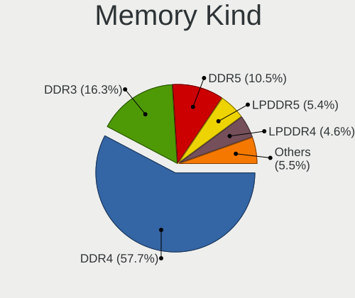

| Kind    | Computers | Percent |
|---------|-----------|---------|
| DDR4    | 1032      | 57.72%  |
| DDR3    | 291       | 16.28%  |
| DDR5    | 187       | 10.46%  |
| LPDDR5  | 97        | 5.43%   |
| LPDDR4  | 83        | 4.64%   |
| LPDDR3  | 52        | 2.91%   |
| DDR2    | 19        | 1.06%   |
| SDRAM   | 13        | 0.73%   |
| Unknown | 10        | 0.56%   |
| DRAM    | 2         | 0.11%   |
| DDR     | 2         | 0.11%   |

Memory Form Factor
------------------

Physical design of the memory module

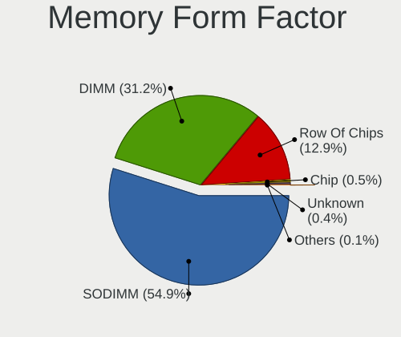

| Name         | Computers | Percent |
|--------------|-----------|---------|
| SODIMM       | 982       | 54.89%  |
| DIMM         | 558       | 31.19%  |
| Row Of Chips | 230       | 12.86%  |
| Chip         | 9         | 0.5%    |
| Unknown      | 8         | 0.45%   |
| RIMM         | 1         | 0.06%   |
| FB-DIMM      | 1         | 0.06%   |

Memory Size
-----------

Memory module size

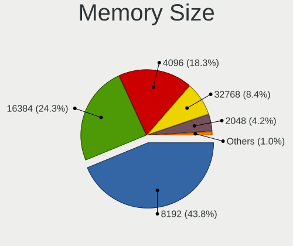

| Size  | Computers | Percent |
|-------|-----------|---------|
| 8192  | 849       | 43.79%  |
| 16384 | 472       | 24.34%  |
| 4096  | 354       | 18.26%  |
| 32768 | 163       | 8.41%   |
| 2048  | 82        | 4.23%   |
| 1024  | 11        | 0.57%   |
| 49152 | 3         | 0.15%   |
| 12288 | 2         | 0.1%    |
| 6144  | 2         | 0.1%    |
| 24576 | 1         | 0.05%   |

Memory Speed
------------

Memory module speed

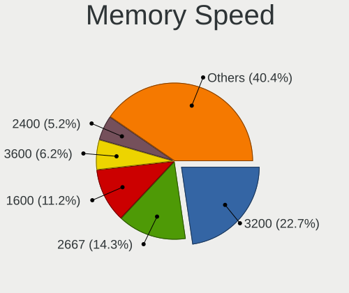

| Speed   | Computers | Percent |
|---------|-----------|---------|
| 3200    | 445       | 22.7%   |
| 2667    | 280       | 14.29%  |
| 1600    | 220       | 11.22%  |
| 3600    | 122       | 6.22%   |
| 2400    | 101       | 5.15%   |
| 4800    | 79        | 4.03%   |
| 2133    | 75        | 3.83%   |
| 5600    | 55        | 2.81%   |
| 6400    | 52        | 2.65%   |
| 3733    | 41        | 2.09%   |
| 4267    | 40        | 2.04%   |
| 1333    | 40        | 2.04%   |
| 1867    | 37        | 1.89%   |
| 7500    | 34        | 1.73%   |
| 3266    | 27        | 1.38%   |
| 6000    | 26        | 1.33%   |
| 3800    | 25        | 1.28%   |
| 3400    | 21        | 1.07%   |
| 4000    | 18        | 0.92%   |
| 3866    | 14        | 0.71%   |
| 1334    | 13        | 0.66%   |
| 8533    | 11        | 0.56%   |
| 8400    | 10        | 0.51%   |
| 3000    | 10        | 0.51%   |
| 667     | 10        | 0.51%   |
| Unknown | 10        | 0.51%   |
| 800     | 9         | 0.46%   |
| 6200    | 7         | 0.36%   |
| 2933    | 7         | 0.36%   |
| 1067    | 7         | 0.36%   |
| 2666    | 6         | 0.31%   |
| 1800    | 6         | 0.31%   |
| 7467    | 5         | 0.26%   |
| 5200    | 5         | 0.26%   |
| 3466    | 5         | 0.26%   |
| 4266    | 4         | 0.2%    |
| 3933    | 4         | 0.2%    |
| 3500    | 4         | 0.2%    |
| 3100    | 4         | 0.2%    |
| 2800    | 4         | 0.2%    |

Printers & scanners
-------------------

Printer Vendor
--------------

Printer device vendors

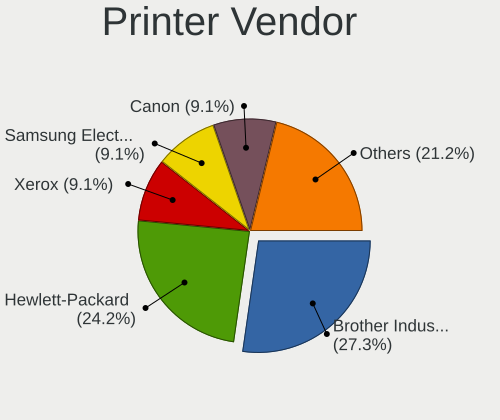

| Vendor              | Computers | Percent |
|---------------------|-----------|---------|
| Brother Industries  | 9         | 27.27%  |
| Hewlett-Packard     | 8         | 24.24%  |
| Xerox               | 3         | 9.09%   |
| Samsung Electronics | 3         | 9.09%   |
| Canon               | 3         | 9.09%   |
| Seiko Epson         | 2         | 6.06%   |
| Prolific Technology | 2         | 6.06%   |
| PM                  | 1         | 3.03%   |
| Pantum              | 1         | 3.03%   |
| Maxxter             | 1         | 3.03%   |

Printer Model
-------------

Printer device models

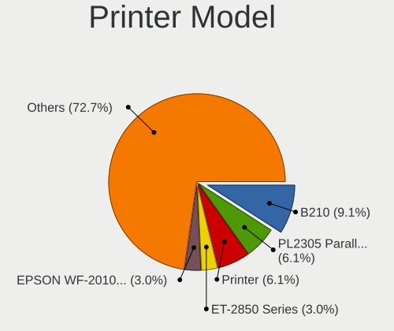

| Model                                | Computers | Percent |
|--------------------------------------|-----------|---------|
| Xerox B210                           | 3         | 9.09%   |
| Prolific PL2305 Parallel Port        | 2         | 6.06%   |
| Brother Printer                      | 2         | 6.06%   |
| Seiko Epson ET-2850 Series           | 1         | 3.03%   |
| Seiko Epson EPSON WF-2010 Series     | 1         | 3.03%   |
| Samsung ML-331x Series Laser Printer | 1         | 3.03%   |
| Samsung M2020 Series                 | 1         | 3.03%   |
| Samsung Composite Device             | 1         | 3.03%   |
| PM PM241-BT                          | 1         | 3.03%   |
| Pantum P2500W series                 | 1         | 3.03%   |
| Maxxter Low Latency MIC              | 1         | 3.03%   |
| HP Smart Tank 530 series             | 1         | 3.03%   |
| HP LaserJet M109-M112                | 1         | 3.03%   |
| HP LaserJet 1160 series              | 1         | 3.03%   |
| HP HP OfficeJet Pro 8020 series      | 1         | 3.03%   |
| HP ENVY 5540 series                  | 1         | 3.03%   |
| HP ENVY 5000 series                  | 1         | 3.03%   |
| HP DeskJet 2130 series               | 1         | 3.03%   |
| HP ColorLaserJet M253-M254           | 1         | 3.03%   |
| Canon PIXMA MG2500 Series            | 1         | 3.03%   |
| Canon MF260 II Series                | 1         | 3.03%   |
| Canon iP4200                         | 1         | 3.03%   |
| Brother MFC-L2710DW series           | 1         | 3.03%   |
| Brother MFC-J4535DW                  | 1         | 3.03%   |
| Brother MFC-J1205W                   | 1         | 3.03%   |
| Brother HL-L2390DW                   | 1         | 3.03%   |
| Brother HL-2130 series               | 1         | 3.03%   |
| Brother DCP-9020CDW                  | 1         | 3.03%   |
| Brother DCP-9015CDW                  | 1         | 3.03%   |

Scanner Vendor
--------------

Scanner device vendors

Zero info for selected period =(

Scanner Model
-------------

Scanner device models

Zero info for selected period =(

Camera
------

Camera Vendor
-------------

Camera device vendors

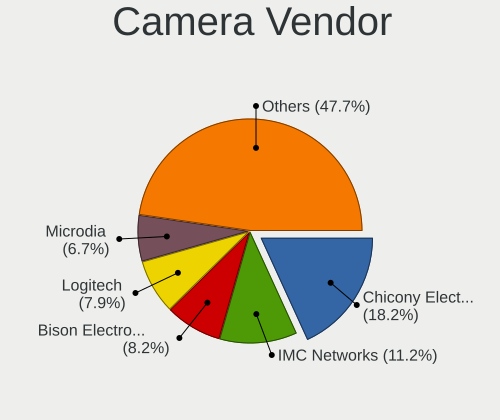

| Vendor                                 | Computers | Percent |
|----------------------------------------|-----------|---------|
| Chicony Electronics                    | 304       | 18.17%  |
| IMC Networks                           | 188       | 11.24%  |
| Bison Electronics                      | 138       | 8.25%   |
| Logitech                               | 133       | 7.95%   |
| Microdia                               | 112       | 6.69%   |
| Quanta                                 | 92        | 5.5%    |
| Sunplus Innovation Technology          | 74        | 4.42%   |
| Realtek Semiconductor                  | 69        | 4.12%   |
| Luxvisions Innotech Limited            | 65        | 3.89%   |
| Syntek                                 | 51        | 3.05%   |
| Cheng Uei Precision Industry (Foxlink) | 49        | 2.93%   |
| Apple                                  | 49        | 2.93%   |
| Sonix Technology                       | 42        | 2.51%   |
| Lite-On Technology                     | 41        | 2.45%   |
| Microsoft                              | 22        | 1.32%   |
| Shinetech                              | 17        | 1.02%   |
| Suyin                                  | 15        | 0.9%    |
| SunplusIT                              | 12        | 0.72%   |
| Samsung Electronics                    | 10        | 0.6%    |
| Lenovo                                 | 9         | 0.54%   |
| Generalplus Technology                 | 9         | 0.54%   |
| Valve Software                         | 8         | 0.48%   |
| MacroSilicon                           | 8         | 0.48%   |
| Shenzhen Kingcome Optoelectronic       | 6         | 0.36%   |
| Razer USA                              | 6         | 0.36%   |
| kingcome                               | 6         | 0.36%   |
| Alcor Micro                            | 6         | 0.36%   |
| Silicon Motion                         | 5         | 0.3%    |
| Ricoh                                  | 5         | 0.3%    |
| Primax Electronics                     | 5         | 0.3%    |
| icSpring                               | 5         | 0.3%    |
| Hewlett-Packard                        | 5         | 0.3%    |
| Google                                 | 5         | 0.3%    |
| Trust                                  | 4         | 0.24%   |
| Shine-optics                           | 4         | 0.24%   |
| Jieli Technology                       | 4         | 0.24%   |
| GEMBIRD                                | 4         | 0.24%   |
| Elgato Systems                         | 4         | 0.24%   |
| Creative Technology                    | 4         | 0.24%   |
| BillionPixels                          | 4         | 0.24%   |

Camera Model
------------

Camera device models

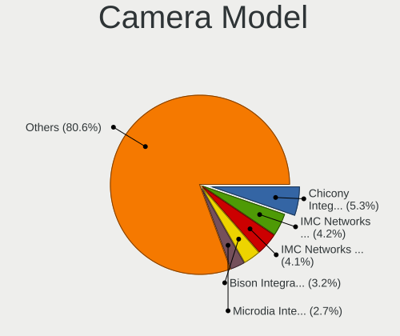

| Model                                                | Computers | Percent |
|------------------------------------------------------|-----------|---------|
| Chicony Integrated Camera                            | 89        | 5.29%   |
| IMC Networks USB2.0 HD UVC WebCam                    | 70        | 4.16%   |
| IMC Networks Integrated Camera                       | 69        | 4.1%    |
| Bison Integrated Camera                              | 54        | 3.21%   |
| Microdia Integrated_Webcam_HD                        | 45        | 2.67%   |
| Syntek Integrated Camera                             | 37        | 2.2%    |
| Chicony HD WebCam                                    | 27        | 1.6%    |
| Sonix USB2.0 HD UVC WebCam                           | 26        | 1.54%   |
| Realtek Integrated_Webcam_HD                         | 26        | 1.54%   |
| Logitech HD Pro Webcam C920                          | 26        | 1.54%   |
| Luxvisions Innotech Limited Integrated Camera        | 23        | 1.37%   |
| Logitech Webcam C270                                 | 22        | 1.31%   |
| Apple iPhone 5/5C/5S/6/SE/7/8/X                      | 22        | 1.31%   |
| Bison HD Webcam                                      | 19        | 1.13%   |
| Sunplus Integrated_Webcam_HD                         | 17        | 1.01%   |
| Sonix USB2.0 FHD UVC WebCam                          | 16        | 0.95%   |
| Logitech C920 PRO HD Webcam                          | 15        | 0.89%   |
| Apple FaceTime HD Camera (Built-in)                  | 15        | 0.89%   |
| Quanta HP Wide Vision HD Camera                      | 14        | 0.83%   |
| Microdia USB 2.0 Camera                              | 14        | 0.83%   |
| Chicony HP Wide Vision HD Camera                     | 14        | 0.83%   |
| Chicony HP TrueVision HD Camera                      | 14        | 0.83%   |
| Quanta HD User Facing                                | 13        | 0.77%   |
| Microdia Webcam Vitade AF                            | 13        | 0.77%   |
| Luxvisions Innotech Limited HP Wide Vision HD Camera | 13        | 0.77%   |
| Logitech C922 Pro Stream Webcam                      | 13        | 0.77%   |
| Lite-On Integrated Camera                            | 13        | 0.77%   |
| Bison BisonCam,NB Pro                                | 13        | 0.77%   |
| Chicony HD User Facing                               | 12        | 0.71%   |
| Quanta USB2.0 HD UVC WebCam                          | 11        | 0.65%   |
| Microsoft LifeCam HD-3000                            | 11        | 0.65%   |
| Chicony Integrated Camera (1280x720@30)              | 11        | 0.65%   |
| Chicony HP HD Camera                                 | 11        | 0.65%   |
| Bison SunplusIT Integrated Camera                    | 11        | 0.65%   |
| Samsung Galaxy series, misc. (MTP mode)              | 10        | 0.59%   |
| Quanta HD Webcam                                     | 10        | 0.59%   |
| Lite-On HP HD Camera                                 | 10        | 0.59%   |
| IMC Networks USB2.0 VGA UVC WebCam                   | 10        | 0.59%   |
| Luxvisions Innotech Limited Integrated RGB Camera    | 9         | 0.53%   |
| Logitech StreamCam                                   | 9         | 0.53%   |

Security
--------

Fingerprint Vendor
------------------

Fingerprint sensor vendors

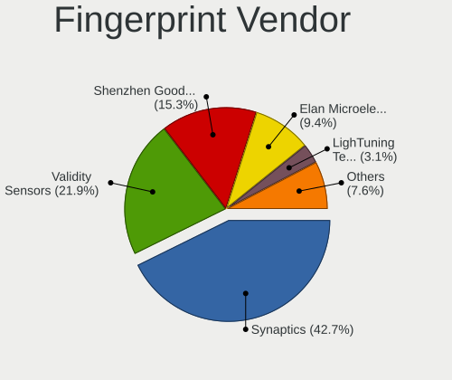

| Vendor                             | Computers | Percent |
|------------------------------------|-----------|---------|
| Synaptics                          | 123       | 42.71%  |
| Validity Sensors                   | 63        | 21.88%  |
| Shenzhen Goodix Technology         | 44        | 15.28%  |
| Elan Microelectronics              | 27        | 9.38%   |
| LighTuning Technology              | 9         | 3.13%   |
| Realtek USB2.0 Finger Print Bridge | 6         | 2.08%   |
| Upek                               | 5         | 1.74%   |
| Samsung Electronics                | 4         | 1.39%   |
| AuthenTec                          | 4         | 1.39%   |
| Focal-systems.Corp                 | 3         | 1.04%   |

Fingerprint Model
-----------------

Fingerprint sensor models

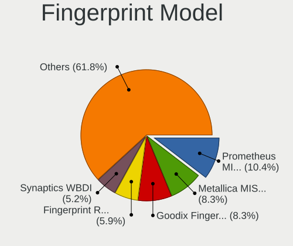

| Model                                                                      | Computers | Percent |
|----------------------------------------------------------------------------|-----------|---------|
| Synaptics Prometheus MIS Touch Fingerprint Reader                          | 30        | 10.42%  |
| Synaptics Metallica MIS Touch Fingerprint Reader                           | 24        | 8.33%   |
| Shenzhen Goodix  FingerPrint Device                                        | 24        | 8.33%   |
| Shenzhen Goodix Fingerprint Reader                                         | 17        | 5.9%    |
| Validity Sensors Synaptics WBDI                                            | 15        | 5.21%   |
| Elan ELAN:Fingerprint                                                      | 15        | 5.21%   |
| Validity Sensors VFS495 Fingerprint Reader                                 | 14        | 4.86%   |
| Synaptics UWP WBDI Device                                                  | 14        | 4.86%   |
| Elan ELAN:ARM-M4                                                           | 12        | 4.17%   |
| Synaptics  WBDI                                                            | 8         | 2.78%   |
| LighTuning EgisTec Touch Fingerprint Sensor                                | 8         | 2.78%   |
| Validity Sensors VFS5011 Fingerprint Reader                                | 7         | 2.43%   |
| Synaptics WBDI                                                             | 7         | 2.43%   |
| Synaptics UWP WBDI                                                         | 7         | 2.43%   |
| Synaptics FS7604 Touch Fingerprint Sensor with PurePrint                   | 7         | 2.43%   |
| Validity Sensors VFS7500 Touch Fingerprint Sensor                          | 6         | 2.08%   |
| Validity Sensors VFS 5011 fingerprint sensor                               | 6         | 2.08%   |
| Realtek USB2.0 Finger Print Bridge FocalTech Fingerprint Device            | 6         | 2.08%   |
| Validity Sensors Swipe Fingerprint Sensor                                  | 5         | 1.74%   |
| Upek Biometric Touchchip/Touchstrip Fingerprint Sensor                     | 5         | 1.74%   |
| Synaptics WBDI Fingerprint Reader USB 086                                  | 5         | 1.74%   |
| Synaptics  FS7604 Touch Fingerprint Sensor with PurePrint                  | 5         | 1.74%   |
| Synaptics Prometheus Fingerprint Reader                                    | 4         | 1.39%   |
| Samsung Fingerprint Sensor Device - 730B                                   | 4         | 1.39%   |
| Validity Sensors VFS491                                                    | 3         | 1.04%   |
| Synaptics WBDI Fingerprint Reader USB 102                                  | 3         | 1.04%   |
| Synaptics Fingerprint reader [HP G6]                                       | 3         | 1.04%   |
| Shenzhen Goodix FingerPrint                                                | 3         | 1.04%   |
| Focal-systems.Corp FT9201Fingerprint.                                      | 3         | 1.04%   |
| Unknown                                                                    | 3         | 1.04%   |
| Validity Sensors VFS471 Fingerprint Reader                                 | 2         | 0.69%   |
| Validity Sensors Synaptics VFS7552 Touch Fingerprint Sensor with PurePrint | 2         | 0.69%   |
| AuthenTec AES2810                                                          | 2         | 0.69%   |
| Validity Sensors VFS7552 Touch Fingerprint Sensor                          | 1         | 0.35%   |
| Validity Sensors Synaptics VFS7552 Touch Fingerprint Sensor                | 1         | 0.35%   |
| Validity Sensors Fingerprint scanner                                       | 1         | 0.35%   |
| Synaptics TouchPad                                                         | 1         | 0.35%   |
| Synaptics Metallica MOH Touch Fingerprint Reader                           | 1         | 0.35%   |
| Synaptics Fingerprint scanner                                              | 1         | 0.35%   |
| LighTuning ES603 Swipe Fingerprint Sensor                                  | 1         | 0.35%   |

Chipcard Vendor
---------------

Chipcard module vendors

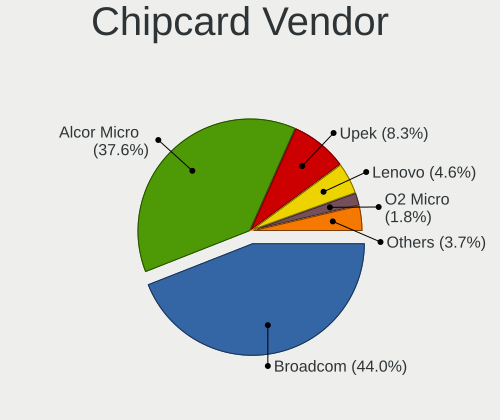

| Vendor              | Computers | Percent |
|---------------------|-----------|---------|
| Broadcom            | 48        | 44.04%  |
| Alcor Micro         | 41        | 37.61%  |
| Upek                | 9         | 8.26%   |
| Lenovo              | 5         | 4.59%   |
| O2 Micro            | 2         | 1.83%   |
| Yubico.com          | 1         | 0.92%   |
| HID Global          | 1         | 0.92%   |
| Chicony Electronics | 1         | 0.92%   |
| Cherry              | 1         | 0.92%   |

Chipcard Model
--------------

Chipcard module models

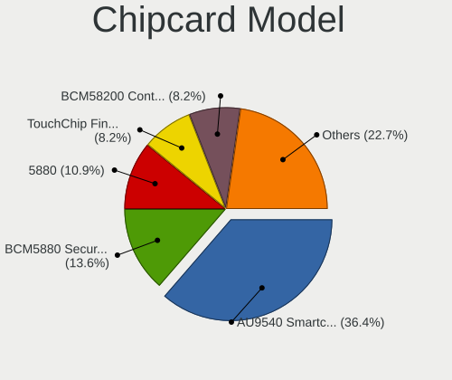

| Model                                                                        | Computers | Percent |
|------------------------------------------------------------------------------|-----------|---------|
| Alcor Micro AU9540 Smartcard Reader                                          | 40        | 36.36%  |
| Broadcom BCM5880 Secure Applications Processor                               | 15        | 13.64%  |
| Broadcom 5880                                                                | 12        | 10.91%  |
| Upek TouchChip Fingerprint Coprocessor (WBF advanced mode)                   | 9         | 8.18%   |
| Broadcom BCM58200 ControlVault 3 (FingerPrint sensor + Contacted SmartCard)  | 9         | 8.18%   |
| Broadcom BCM5880 Secure Applications Processor with fingerprint swipe sensor | 7         | 6.36%   |
| Lenovo Integrated Smart Card Reader                                          | 5         | 4.55%   |
| Broadcom 58200                                                               | 5         | 4.55%   |
| O2 Micro OZ776 CCID Smartcard Reader                                         | 2         | 1.82%   |
| Yubico.com Yubikey 4/5 U2F+CCID                                              | 1         | 0.91%   |
| HID Global USB Reader V3                                                     | 1         | 0.91%   |
| Chicony Electronics HP Skylab USB Smartcard Keyboard                         | 1         | 0.91%   |
| Cherry SmartCard Reader Keyboard KC 1000 SC                                  | 1         | 0.91%   |
| Broadcom BCM5880 Secure Applications Processor with fingerprint touch sensor | 1         | 0.91%   |
| Alcor Micro Watchdata W 1981                                                 | 1         | 0.91%   |

Unsupported
-----------

Unsupported Devices
-------------------

Total unsupported devices on board

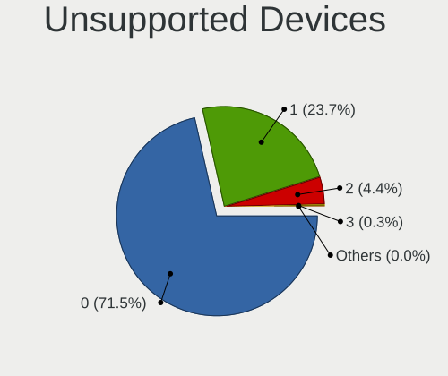

| Total | Computers | Percent |
|-------|-----------|---------|
| 0     | 1778      | 71.49%  |
| 1     | 589       | 23.68%  |
| 2     | 110       | 4.42%   |
| 3     | 7         | 0.28%   |
| 4     | 2         | 0.08%   |
| 8     | 1         | 0.04%   |

Unsupported Device Types
------------------------

Types of unsupported devices

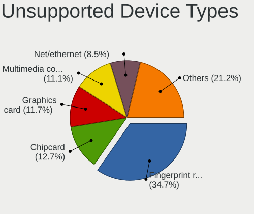

| Type                     | Computers | Percent |
|--------------------------|-----------|---------|
| Fingerprint reader       | 281       | 34.69%  |
| Chipcard                 | 103       | 12.72%  |
| Graphics card            | 95        | 11.73%  |
| Multimedia controller    | 90        | 11.11%  |
| Net/ethernet             | 69        | 8.52%   |
| Net/wireless             | 67        | 8.27%   |
| Camera                   | 30        | 3.7%    |
| Bluetooth                | 16        | 1.98%   |
| Communication controller | 11        | 1.36%   |
| Unassigned class         | 9         | 1.11%   |
| Network                  | 8         | 0.99%   |
| Storage                  | 7         | 0.86%   |
| Sound                    | 7         | 0.86%   |
| Card reader              | 6         | 0.74%   |
| Dvb card                 | 3         | 0.37%   |
| Storage/raid             | 2         | 0.25%   |
| Storage/nvme             | 2         | 0.25%   |
| Modem                    | 2         | 0.25%   |
| Video                    | 1         | 0.12%   |
| Storage/ata              | 1         | 0.12%   |

