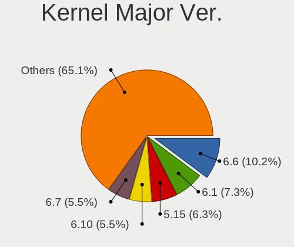
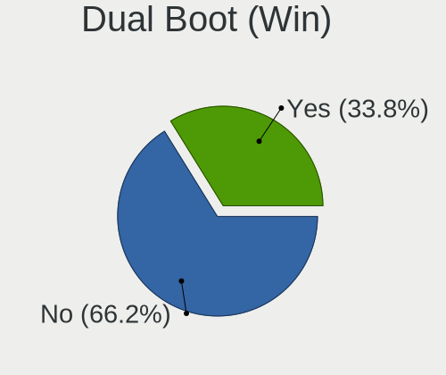
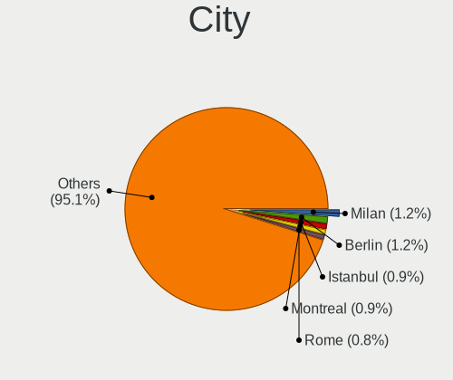
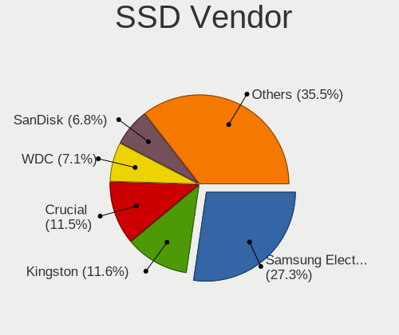
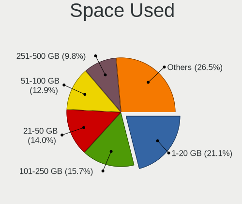
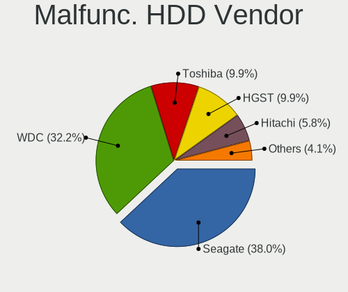
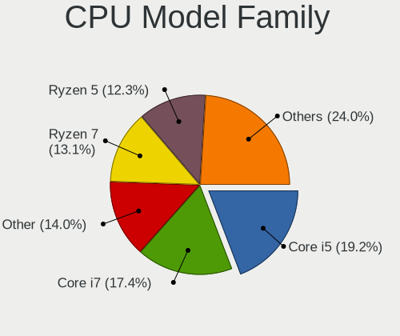
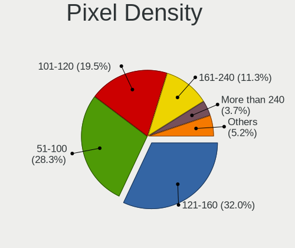
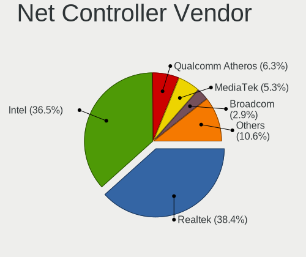

EndeavourOS - Tested Hardware & Statistics
------------------------------------------

A project to collect tested hardware configurations for EndeavourOS.

Anyone can contribute to this report by the [hw-probe](https://github.com/linuxhw/hw-probe) tool:

    sudo -E hw-probe -all -upload

Please contribute! Especially if your hardware is rare.

This is a report for all computer types. See also reports for [desktops](/Dist/EndeavourOS/Desktop/README.md) and [notebooks](/Dist/EndeavourOS/Notebook/README.md).

Contents
--------

* [ Test Cases ](#test-cases)

* [ System ](#system)
  - [ OS                       ](#os)
  - [ OS Family                ](#os-family)
  - [ Kernel                   ](#kernel)
  - [ Kernel Family            ](#kernel-family)
  - [ Kernel Major Ver.        ](#kernel-major-ver)
  - [ Arch                     ](#arch)
  - [ DE                       ](#de)
  - [ Display Server           ](#display-server)
  - [ Display Manager          ](#display-manager)
  - [ OS Lang                  ](#os-lang)
  - [ Boot Mode                ](#boot-mode)
  - [ Filesystem               ](#filesystem)
  - [ Part. scheme             ](#part-scheme)
  - [ Dual Boot with Linux/BSD ](#dual-boot-with-linuxbsd)
  - [ Dual Boot (Win)          ](#dual-boot-win)

* [ Board ](#board)
  - [ Vendor                   ](#vendor)
  - [ Model                    ](#model)
  - [ Model Family             ](#model-family)
  - [ MFG Year                 ](#mfg-year)
  - [ Form Factor              ](#form-factor)
  - [ Secure Boot              ](#secure-boot)
  - [ Coreboot                 ](#coreboot)
  - [ RAM Size                 ](#ram-size)
  - [ RAM Used                 ](#ram-used)
  - [ Total Drives             ](#total-drives)
  - [ Has CD-ROM               ](#has-cd-rom)
  - [ Has Ethernet             ](#has-ethernet)
  - [ Has WiFi                 ](#has-wifi)
  - [ Has Bluetooth            ](#has-bluetooth)

* [ Location ](#location)
  - [ Country                  ](#country)
  - [ City                     ](#city)

* [ Drives ](#drives)
  - [ Drive Vendor             ](#drive-vendor)
  - [ Drive Model              ](#drive-model)
  - [ HDD Vendor               ](#hdd-vendor)
  - [ SSD Vendor               ](#ssd-vendor)
  - [ Drive Kind               ](#drive-kind)
  - [ Drive Connector          ](#drive-connector)
  - [ Drive Size               ](#drive-size)
  - [ Space Total              ](#space-total)
  - [ Space Used               ](#space-used)
  - [ Malfunc. Drives          ](#malfunc-drives)
  - [ Malfunc. Drive Vendor    ](#malfunc-drive-vendor)
  - [ Malfunc. HDD Vendor      ](#malfunc-hdd-vendor)
  - [ Malfunc. Drive Kind      ](#malfunc-drive-kind)
  - [ Failed Drives            ](#failed-drives)
  - [ Failed Drive Vendor      ](#failed-drive-vendor)
  - [ Drive Status             ](#drive-status)

* [ Storage controller ](#storage-controller)
  - [ Storage Vendor           ](#storage-vendor)
  - [ Storage Model            ](#storage-model)
  - [ Storage Kind             ](#storage-kind)

* [ Processor ](#processor)
  - [ CPU Vendor               ](#cpu-vendor)
  - [ CPU Model                ](#cpu-model)
  - [ CPU Model Family         ](#cpu-model-family)
  - [ CPU Cores                ](#cpu-cores)
  - [ CPU Sockets              ](#cpu-sockets)
  - [ CPU Threads              ](#cpu-threads)
  - [ CPU Op-Modes             ](#cpu-op-modes)
  - [ CPU Microcode            ](#cpu-microcode)
  - [ CPU Microarch            ](#cpu-microarch)

* [ Graphics ](#graphics)
  - [ GPU Vendor               ](#gpu-vendor)
  - [ GPU Model                ](#gpu-model)
  - [ GPU Combo                ](#gpu-combo)
  - [ GPU Driver               ](#gpu-driver)
  - [ GPU Memory               ](#gpu-memory)

* [ Monitor ](#monitor)
  - [ Monitor Vendor           ](#monitor-vendor)
  - [ Monitor Model            ](#monitor-model)
  - [ Monitor Resolution       ](#monitor-resolution)
  - [ Monitor Diagonal         ](#monitor-diagonal)
  - [ Monitor Width            ](#monitor-width)
  - [ Aspect Ratio             ](#aspect-ratio)
  - [ Monitor Area             ](#monitor-area)
  - [ Pixel Density            ](#pixel-density)
  - [ Multiple Monitors        ](#multiple-monitors)

* [ Network ](#network)
  - [ Net Controller Vendor    ](#net-controller-vendor)
  - [ Net Controller Model     ](#net-controller-model)
  - [ Wireless Vendor          ](#wireless-vendor)
  - [ Wireless Model           ](#wireless-model)
  - [ Ethernet Vendor          ](#ethernet-vendor)
  - [ Ethernet Model           ](#ethernet-model)
  - [ Net Controller Kind      ](#net-controller-kind)
  - [ Used Controller          ](#used-controller)
  - [ NICs                     ](#nics)
  - [ IPv6                     ](#ipv6)

* [ Bluetooth ](#bluetooth)
  - [ Bluetooth Vendor         ](#bluetooth-vendor)
  - [ Bluetooth Model          ](#bluetooth-model)

* [ Sound ](#sound)
  - [ Sound Vendor             ](#sound-vendor)
  - [ Sound Model              ](#sound-model)

* [ Memory ](#memory)
  - [ Memory Vendor            ](#memory-vendor)
  - [ Memory Model             ](#memory-model)
  - [ Memory Kind              ](#memory-kind)
  - [ Memory Form Factor       ](#memory-form-factor)
  - [ Memory Size              ](#memory-size)
  - [ Memory Speed             ](#memory-speed)

* [ Printers & scanners ](#printers--scanners)
  - [ Printer Vendor           ](#printer-vendor)
  - [ Printer Model            ](#printer-model)
  - [ Scanner Vendor           ](#scanner-vendor)
  - [ Scanner Model            ](#scanner-model)

* [ Camera ](#camera)
  - [ Camera Vendor            ](#camera-vendor)
  - [ Camera Model             ](#camera-model)

* [ Security ](#security)
  - [ Fingerprint Vendor       ](#fingerprint-vendor)
  - [ Fingerprint Model        ](#fingerprint-model)
  - [ Chipcard Vendor          ](#chipcard-vendor)
  - [ Chipcard Model           ](#chipcard-model)

* [ Unsupported ](#unsupported)
  - [ Unsupported Devices      ](#unsupported-devices)
  - [ Unsupported Device Types ](#unsupported-device-types)

Test Cases
----------

Total: 1230

| Vendor        | Model                       | Form-Factor | Probe                                                      | Date         |
|---------------|-----------------------------|-------------|------------------------------------------------------------|--------------|
| Lenovo        | ThinkPad T440 20B7S0JC0K    | Notebook    | [4169f13182](https://linux-hardware.org/?probe=4169f13182) | Apr 01, 2023 |
| Lenovo        | ThinkPad X1 Carbon 2nd 2... | Notebook    | [016ddeab52](https://linux-hardware.org/?probe=016ddeab52) | Mar 31, 2023 |
| ASUSTek       | ZenBook UX425IA_UM425IA     | Notebook    | [3ac0a9cc94](https://linux-hardware.org/?probe=3ac0a9cc94) | Mar 31, 2023 |
| GPD           | G1621-02                    | Notebook    | [7d000ab41b](https://linux-hardware.org/?probe=7d000ab41b) | Mar 31, 2023 |
| HP            | 8715                        | Mini pc     | [222fde0a83](https://linux-hardware.org/?probe=222fde0a83) | Mar 31, 2023 |
| Lenovo        | ThinkBook 15 G2 ITL 20VE    | Notebook    | [008eb6ad60](https://linux-hardware.org/?probe=008eb6ad60) | Mar 31, 2023 |
| Lenovo        | ThinkBook 15 G2 ITL 20VE    | Notebook    | [4dd142ab8f](https://linux-hardware.org/?probe=4dd142ab8f) | Mar 31, 2023 |
| Sony          | SVE1713X1EB                 | Notebook    | [8953aa2e04](https://linux-hardware.org/?probe=8953aa2e04) | Mar 30, 2023 |
| ASUSTek       | VivoBook_ASUSLaptop M140... | Notebook    | [d1295d9d1e](https://linux-hardware.org/?probe=d1295d9d1e) | Mar 30, 2023 |
| AWOW          | AL34                        | Notebook    | [19f60f27c8](https://linux-hardware.org/?probe=19f60f27c8) | Mar 29, 2023 |
| HP            | EliteBook 840 G5            | Notebook    | [65671e15cb](https://linux-hardware.org/?probe=65671e15cb) | Mar 28, 2023 |
| ASUSTek       | VivoBook_ASUSLaptop M740... | Notebook    | [c1f1d2bcc8](https://linux-hardware.org/?probe=c1f1d2bcc8) | Mar 28, 2023 |
| Lenovo        | ThinkPad X1 Yoga 3rd 20L... | Convertible | [b165f54c80](https://linux-hardware.org/?probe=b165f54c80) | Mar 28, 2023 |
| Sony          | SVE1713X1EB                 | Notebook    | [fa77641b57](https://linux-hardware.org/?probe=fa77641b57) | Mar 27, 2023 |
| HP            | Pavilion Laptop 15-eh2xx... | Notebook    | [d80388d7ef](https://linux-hardware.org/?probe=d80388d7ef) | Mar 27, 2023 |
| HP            | 18E4                        | Desktop     | [5d10e73e1d](https://linux-hardware.org/?probe=5d10e73e1d) | Mar 26, 2023 |
| ASUSTek       | N76VM                       | Notebook    | [0a05b4b5ce](https://linux-hardware.org/?probe=0a05b4b5ce) | Mar 26, 2023 |
| Gigabyte      | X470 AORUS ULTRA GAMING-... | Desktop     | [a8d31fc431](https://linux-hardware.org/?probe=a8d31fc431) | Mar 26, 2023 |
| ASUSTek       | STRIX Z270I GAMING          | Desktop     | [4253088a92](https://linux-hardware.org/?probe=4253088a92) | Mar 25, 2023 |
| Samsung       | 550XDA                      | Notebook    | [058982f7d8](https://linux-hardware.org/?probe=058982f7d8) | Mar 25, 2023 |
| ASUSTek       | VivoBook_ASUSLaptop S540... | Notebook    | [18cd806803](https://linux-hardware.org/?probe=18cd806803) | Mar 24, 2023 |
| Lenovo        | ThinkPad E15 Gen 4 21E6C... | Notebook    | [3042a430c0](https://linux-hardware.org/?probe=3042a430c0) | Mar 24, 2023 |
| Apple         | Mac-27ADBB7B4CEE8E61 iMa... | All in one  | [e923cf7edb](https://linux-hardware.org/?probe=e923cf7edb) | Mar 24, 2023 |
| ASUSTek       | PRIME X670-P WIFI           | Desktop     | [5bd922e142](https://linux-hardware.org/?probe=5bd922e142) | Mar 23, 2023 |
| AZW           | GK35                        | Desktop     | [bd935978b7](https://linux-hardware.org/?probe=bd935978b7) | Mar 22, 2023 |
| HP            | EliteBook 850 G1            | Notebook    | [a27ad7df2d](https://linux-hardware.org/?probe=a27ad7df2d) | Mar 22, 2023 |
| GPD           | G1619-04                    | Notebook    | [c69bb703ae](https://linux-hardware.org/?probe=c69bb703ae) | Mar 21, 2023 |
| HP            | EliteBook 8460p             | Notebook    | [e0ec2e73be](https://linux-hardware.org/?probe=e0ec2e73be) | Mar 21, 2023 |
| Lenovo        | ThinkPad X1 Carbon 2nd 2... | Notebook    | [a0ebd92c60](https://linux-hardware.org/?probe=a0ebd92c60) | Mar 21, 2023 |
| Acer          | Swift SF315-52G             | Notebook    | [f6042580d0](https://linux-hardware.org/?probe=f6042580d0) | Mar 20, 2023 |
| Notebook      | N150ZU                      | Notebook    | [4b7d1e249f](https://linux-hardware.org/?probe=4b7d1e249f) | Mar 19, 2023 |
| HP            | 255 15.6 inch G9 Noteboo... | Notebook    | [b82aade579](https://linux-hardware.org/?probe=b82aade579) | Mar 19, 2023 |
| HP            | 255 15.6 inch G9 Noteboo... | Notebook    | [361ca1537d](https://linux-hardware.org/?probe=361ca1537d) | Mar 19, 2023 |
| Timi          | Xiaomi NoteBook Pro         | Notebook    | [a911c14f22](https://linux-hardware.org/?probe=a911c14f22) | Mar 19, 2023 |
| Samsung       | 550XDA                      | Notebook    | [5f14b733bb](https://linux-hardware.org/?probe=5f14b733bb) | Mar 19, 2023 |
| Lenovo        | ThinkPad X1 Carbon 2nd 2... | Notebook    | [6dda9bae81](https://linux-hardware.org/?probe=6dda9bae81) | Mar 18, 2023 |
| ASUSTek       | UX301LAA                    | Notebook    | [882d4d095b](https://linux-hardware.org/?probe=882d4d095b) | Mar 18, 2023 |
| HP            | 8715                        | Mini pc     | [1c2c765978](https://linux-hardware.org/?probe=1c2c765978) | Mar 18, 2023 |
| Lenovo        | ThinkPad S1 Yoga 12 20DK... | Notebook    | [809d9ecb40](https://linux-hardware.org/?probe=809d9ecb40) | Mar 18, 2023 |
| MSI           | MAG X570S TORPEDO MAX       | Desktop     | [a3e8bcd9dd](https://linux-hardware.org/?probe=a3e8bcd9dd) | Mar 18, 2023 |
| Apple         | MacBookAir5,2               | Notebook    | [ae4d8ba68c](https://linux-hardware.org/?probe=ae4d8ba68c) | Mar 18, 2023 |
| AZW           | U59                         | Desktop     | [ce6bd37711](https://linux-hardware.org/?probe=ce6bd37711) | Mar 18, 2023 |
| HP            | 8715                        | Mini pc     | [cd9310c350](https://linux-hardware.org/?probe=cd9310c350) | Mar 17, 2023 |
| MSI           | 760GMA-P34                  | Desktop     | [b43ea7bb6e](https://linux-hardware.org/?probe=b43ea7bb6e) | Mar 17, 2023 |
| Toshiba       | Satellite C55-C             | Notebook    | [9d2c56bf69](https://linux-hardware.org/?probe=9d2c56bf69) | Mar 17, 2023 |
| ASUSTek       | ROG STRIX Z390-F GAMING     | Desktop     | [c6ef926aa6](https://linux-hardware.org/?probe=c6ef926aa6) | Mar 17, 2023 |
| ASUSTek       | PRIME H410M-E               | Desktop     | [d95b09eda0](https://linux-hardware.org/?probe=d95b09eda0) | Mar 17, 2023 |
| TUXEDO        | Aura 15 Gen1                | Notebook    | [066f0cd17b](https://linux-hardware.org/?probe=066f0cd17b) | Mar 15, 2023 |
| Lenovo        | ThinkPad X1 Carbon Gen 9... | Notebook    | [daa3d3869e](https://linux-hardware.org/?probe=daa3d3869e) | Mar 14, 2023 |
| Lenovo        | ThinkPad T430 23426QU       | Notebook    | [b588252431](https://linux-hardware.org/?probe=b588252431) | Mar 14, 2023 |
| Dell          | XPS 15 9520                 | Notebook    | [0f3b7bd317](https://linux-hardware.org/?probe=0f3b7bd317) | Mar 13, 2023 |
| ASUSTek       | TUF Gaming X570-PLUS        | Notebook    | [7f58d0d0a0](https://linux-hardware.org/?probe=7f58d0d0a0) | Mar 13, 2023 |
| ASUSTek       | TUF Gaming X570-PLUS        | Notebook    | [0c58b8ebad](https://linux-hardware.org/?probe=0c58b8ebad) | Mar 13, 2023 |
| Chuwi         | GemiBook Pro                | Notebook    | [fc04961aef](https://linux-hardware.org/?probe=fc04961aef) | Mar 11, 2023 |
| Unknown       | HX90                        | Desktop     | [51aca581e4](https://linux-hardware.org/?probe=51aca581e4) | Mar 11, 2023 |
| MSI           | B450I GAMING PLUS AC        | Desktop     | [bf6081f2af](https://linux-hardware.org/?probe=bf6081f2af) | Mar 09, 2023 |
| Dell          | Precision 7720              | Notebook    | [6132f690aa](https://linux-hardware.org/?probe=6132f690aa) | Mar 09, 2023 |
| ASUSTek       | VivoBook_ASUSLaptop S540... | Notebook    | [8a33917a89](https://linux-hardware.org/?probe=8a33917a89) | Mar 09, 2023 |
| ASUSTek       | VivoBook_ASUSLaptop S540... | Notebook    | [f4d71dcbd0](https://linux-hardware.org/?probe=f4d71dcbd0) | Mar 09, 2023 |
| ASUSTek       | ROG STRIX B550-F GAMING     | Desktop     | [0fdb67b9d2](https://linux-hardware.org/?probe=0fdb67b9d2) | Mar 09, 2023 |
| ASUSTek       | ROG STRIX B550-F GAMING     | Desktop     | [2e48f233a0](https://linux-hardware.org/?probe=2e48f233a0) | Mar 09, 2023 |
| Dell          | Precision 7720              | Notebook    | [e4a1149bcb](https://linux-hardware.org/?probe=e4a1149bcb) | Mar 08, 2023 |
| Dell          | 0KWVT8 A03                  | Desktop     | [af171db9dc](https://linux-hardware.org/?probe=af171db9dc) | Mar 08, 2023 |
| Timi          | TM1701                      | Notebook    | [3a94d06b73](https://linux-hardware.org/?probe=3a94d06b73) | Mar 07, 2023 |
| Dell          | 0GY6Y8 A02                  | Desktop     | [f363dca8ca](https://linux-hardware.org/?probe=f363dca8ca) | Mar 07, 2023 |
| HP            | 8860 A                      | Desktop     | [78c9aa9174](https://linux-hardware.org/?probe=78c9aa9174) | Mar 07, 2023 |
| ASUSTek       | ROG Zephyrus Duo 16 GX65... | Notebook    | [54ad36532c](https://linux-hardware.org/?probe=54ad36532c) | Mar 07, 2023 |
| Lenovo        | IdeaPad Gaming 3 15ARH05... | Notebook    | [314cad4a2f](https://linux-hardware.org/?probe=314cad4a2f) | Mar 07, 2023 |
| HUAWEI        | NBLK-WAX9X                  | Notebook    | [be24c7e178](https://linux-hardware.org/?probe=be24c7e178) | Mar 07, 2023 |
| HP            | EliteBook 8460p             | Notebook    | [3519073f46](https://linux-hardware.org/?probe=3519073f46) | Mar 07, 2023 |
| Dell          | Latitude 5289               | Notebook    | [dcac5b8ebc](https://linux-hardware.org/?probe=dcac5b8ebc) | Mar 06, 2023 |
| Google        | Rammus                      | Notebook    | [0d905c6981](https://linux-hardware.org/?probe=0d905c6981) | Mar 05, 2023 |
| HP            | 18E4                        | Desktop     | [a277b636c1](https://linux-hardware.org/?probe=a277b636c1) | Mar 05, 2023 |
| HP            | EliteBook 8570p             | Notebook    | [1ac55121cf](https://linux-hardware.org/?probe=1ac55121cf) | Mar 05, 2023 |
| Lenovo        | ThinkPad X1 Carbon 2nd 2... | Notebook    | [a4941ea70f](https://linux-hardware.org/?probe=a4941ea70f) | Mar 04, 2023 |
| Lenovo        | ThinkPad X1 Carbon 2nd 2... | Notebook    | [f27119aef2](https://linux-hardware.org/?probe=f27119aef2) | Mar 03, 2023 |
| HP            | 18E4                        | Desktop     | [8e76736e7e](https://linux-hardware.org/?probe=8e76736e7e) | Mar 02, 2023 |
| Gigabyte      | P55A-UD3                    | Desktop     | [80dca547fc](https://linux-hardware.org/?probe=80dca547fc) | Mar 01, 2023 |
| ASRock        | B450M Pro4                  | Desktop     | [89fb184b09](https://linux-hardware.org/?probe=89fb184b09) | Mar 01, 2023 |
| HP            | 18E4                        | Desktop     | [cab6d807e9](https://linux-hardware.org/?probe=cab6d807e9) | Feb 27, 2023 |
| HP            | EliteBook 8460p             | Notebook    | [83cb442ad5](https://linux-hardware.org/?probe=83cb442ad5) | Feb 27, 2023 |
| Lenovo        | ThinkPad L13 Yoga Gen 2 ... | Convertible | [1412fd5885](https://linux-hardware.org/?probe=1412fd5885) | Feb 26, 2023 |
| HP            | 18E4                        | Desktop     | [5c7c3413c9](https://linux-hardware.org/?probe=5c7c3413c9) | Feb 26, 2023 |
| Lenovo        | Y50-70 20378                | Notebook    | [005749f4ef](https://linux-hardware.org/?probe=005749f4ef) | Feb 26, 2023 |
| Dell          | Inspiron N4010              | Notebook    | [612418b6e7](https://linux-hardware.org/?probe=612418b6e7) | Feb 25, 2023 |
| MSI           | MPG B550 GAMING PLUS        | Desktop     | [ccff1403b0](https://linux-hardware.org/?probe=ccff1403b0) | Feb 24, 2023 |
| Intel         | NUC7JYB J67967-404          | Mini pc     | [32f4f192fa](https://linux-hardware.org/?probe=32f4f192fa) | Feb 24, 2023 |
| ASUSTek       | M32CD_A_F_K20CD_K31CD       | Desktop     | [576a0fc8f5](https://linux-hardware.org/?probe=576a0fc8f5) | Feb 23, 2023 |
| Medion        | Akoya E6412T                | Notebook    | [2915d1c409](https://linux-hardware.org/?probe=2915d1c409) | Feb 23, 2023 |
| HP            | Laptop 15s-eq2xxx           | Notebook    | [8a638dd3a7](https://linux-hardware.org/?probe=8a638dd3a7) | Feb 23, 2023 |
| ASUSTek       | X555LA                      | Notebook    | [e62c134a68](https://linux-hardware.org/?probe=e62c134a68) | Feb 22, 2023 |
| Apple         | MacBookPro14,1              | Notebook    | [f7f94aa827](https://linux-hardware.org/?probe=f7f94aa827) | Feb 22, 2023 |
| ASRock        | B460 Steel Legend           | Desktop     | [e8963c4e59](https://linux-hardware.org/?probe=e8963c4e59) | Feb 21, 2023 |
| MSI           | MPG X570 GAMING EDGE WIF... | Desktop     | [d5f5531b82](https://linux-hardware.org/?probe=d5f5531b82) | Feb 20, 2023 |
| ASUSTek       | ROG Strix G712LWS_G712LW... | Notebook    | [05ce3a9038](https://linux-hardware.org/?probe=05ce3a9038) | Feb 20, 2023 |
| ASUSTek       | ROG Strix G712LWS_G712LW... | Notebook    | [661017eb0b](https://linux-hardware.org/?probe=661017eb0b) | Feb 20, 2023 |
| Lenovo        | ThinkPad T470 W10DG 20JN... | Notebook    | [f55697d9b3](https://linux-hardware.org/?probe=f55697d9b3) | Feb 19, 2023 |
| ASUSTek       | S551LN                      | Notebook    | [ff5df2cf03](https://linux-hardware.org/?probe=ff5df2cf03) | Feb 19, 2023 |
| HUAWEI        | BOM-WXX9                    | Notebook    | [6234395029](https://linux-hardware.org/?probe=6234395029) | Feb 18, 2023 |
| Chuwi         | GemiBook Pro                | Notebook    | [7af4d238e8](https://linux-hardware.org/?probe=7af4d238e8) | Feb 18, 2023 |
| ASUSTek       | PRIME Z390-P                | Desktop     | [09b0c2bf17](https://linux-hardware.org/?probe=09b0c2bf17) | Feb 17, 2023 |
| Gigabyte      | B450M S2H                   | Desktop     | [f594570a77](https://linux-hardware.org/?probe=f594570a77) | Feb 16, 2023 |
| Google        | Helios                      | Notebook    | [4505c27d12](https://linux-hardware.org/?probe=4505c27d12) | Feb 16, 2023 |
| HP            | EliteBook 8460p             | Notebook    | [6c7f73c4a5](https://linux-hardware.org/?probe=6c7f73c4a5) | Feb 16, 2023 |
| ASUSTek       | BT6130                      | Desktop     | [b0693958a6](https://linux-hardware.org/?probe=b0693958a6) | Feb 15, 2023 |
| ASUSTek       | Maximus VII HERO            | Desktop     | [c84212b39c](https://linux-hardware.org/?probe=c84212b39c) | Feb 15, 2023 |
| MSI           | 760GMA-P34                  | Desktop     | [6c540405e8](https://linux-hardware.org/?probe=6c540405e8) | Feb 15, 2023 |
| GPD           | G1621-02                    | Notebook    | [5d584fa1cf](https://linux-hardware.org/?probe=5d584fa1cf) | Feb 14, 2023 |
| ASUSTek       | VivoBook_ASUSLaptop TP42... | Convertible | [4b0331863e](https://linux-hardware.org/?probe=4b0331863e) | Feb 14, 2023 |
| Alienware     | 0VDT73 A00                  | Desktop     | [d8ed5d5e88](https://linux-hardware.org/?probe=d8ed5d5e88) | Feb 14, 2023 |
| HP            | Laptop 15s-fq4xxx           | Notebook    | [9d1c8bca14](https://linux-hardware.org/?probe=9d1c8bca14) | Feb 13, 2023 |
| ASUSTek       | ROG STRIX X570-E GAMING     | Desktop     | [820aa2bf49](https://linux-hardware.org/?probe=820aa2bf49) | Feb 13, 2023 |
| ASUSTek       | ROG Zephyrus G15 GA503RM    | Notebook    | [9e0e0bef82](https://linux-hardware.org/?probe=9e0e0bef82) | Feb 13, 2023 |
| MSI           | X470 GAMING PLUS            | Desktop     | [debdb17904](https://linux-hardware.org/?probe=debdb17904) | Feb 12, 2023 |
| Microsoft     | Surface Laptop Go           | Tablet      | [8133fc11b8](https://linux-hardware.org/?probe=8133fc11b8) | Feb 12, 2023 |
| MSI           | 760GMA-P34                  | Desktop     | [05d11c4fe3](https://linux-hardware.org/?probe=05d11c4fe3) | Feb 12, 2023 |
| Acer          | Aspire A515-54G             | Notebook    | [632c139c4b](https://linux-hardware.org/?probe=632c139c4b) | Feb 12, 2023 |
| HP            | Compaq 6820s                | Notebook    | [6c67866714](https://linux-hardware.org/?probe=6c67866714) | Feb 12, 2023 |
| ASUSTek       | Zenbook UX5401ZAS_UX5401... | Notebook    | [0c6da36f9d](https://linux-hardware.org/?probe=0c6da36f9d) | Feb 11, 2023 |
| HP            | EliteBook 845 G7 Noteboo... | Notebook    | [059d515c3c](https://linux-hardware.org/?probe=059d515c3c) | Feb 09, 2023 |
| Lenovo        | IdeaPad 3 15ADA05 81W1      | Notebook    | [96d63ff41b](https://linux-hardware.org/?probe=96d63ff41b) | Feb 08, 2023 |
| Dell          | 0Y5FXV A00                  | Desktop     | [692b7eab6b](https://linux-hardware.org/?probe=692b7eab6b) | Feb 08, 2023 |
| Lenovo        | ThinkPad T495s 20QKS2LN0... | Notebook    | [4fdb5d662c](https://linux-hardware.org/?probe=4fdb5d662c) | Feb 08, 2023 |
| HP            | ENVY Notebook PC            | Convertible | [a8165997b7](https://linux-hardware.org/?probe=a8165997b7) | Feb 06, 2023 |
| ASUSTek       | TUF Gaming Z790-PLUS WIF... | Desktop     | [43c3e4d160](https://linux-hardware.org/?probe=43c3e4d160) | Feb 06, 2023 |
| HP            | ZBook 15 G4                 | Notebook    | [f2a6af1f7e](https://linux-hardware.org/?probe=f2a6af1f7e) | Feb 06, 2023 |
| HP            | Setzer                      | Notebook    | [bd65b300ae](https://linux-hardware.org/?probe=bd65b300ae) | Feb 06, 2023 |
| HP            | ZBook 15 G4                 | Notebook    | [e523dbd162](https://linux-hardware.org/?probe=e523dbd162) | Feb 02, 2023 |
| Gigabyte      | Z690 GAMING X DDR4          | Desktop     | [96847498e3](https://linux-hardware.org/?probe=96847498e3) | Feb 02, 2023 |
| Shenzhen M... | F7BFC                       | Desktop     | [ecf260f299](https://linux-hardware.org/?probe=ecf260f299) | Feb 01, 2023 |
| Gigabyte      | Z690 GAMING X DDR4          | Desktop     | [de7f0840d1](https://linux-hardware.org/?probe=de7f0840d1) | Feb 01, 2023 |
| Microsoft     | Surface Laptop Go           | Tablet      | [455825998f](https://linux-hardware.org/?probe=455825998f) | Feb 01, 2023 |
| ASUSTek       | PRIME B550M-A               | Desktop     | [4251ab2f9a](https://linux-hardware.org/?probe=4251ab2f9a) | Feb 01, 2023 |
| Lenovo        | Legion 7 16ARHA7 82UH       | Notebook    | [bcaa2e6b1a](https://linux-hardware.org/?probe=bcaa2e6b1a) | Jan 30, 2023 |
| Dell          | Latitude 5400               | Notebook    | [80651273e4](https://linux-hardware.org/?probe=80651273e4) | Jan 29, 2023 |
| Dell          | Latitude 5400               | Notebook    | [eb97e73f08](https://linux-hardware.org/?probe=eb97e73f08) | Jan 29, 2023 |
| HP            | Laptop 15s-eq2xxx           | Notebook    | [096eede9c5](https://linux-hardware.org/?probe=096eede9c5) | Jan 28, 2023 |
| HP            | ZBook 15 G4                 | Notebook    | [3e957e185d](https://linux-hardware.org/?probe=3e957e185d) | Jan 28, 2023 |
| HP            | ZBook 15 G4                 | Notebook    | [849d901314](https://linux-hardware.org/?probe=849d901314) | Jan 28, 2023 |
| Toshiba       | Satellite L755              | Notebook    | [b15899ef80](https://linux-hardware.org/?probe=b15899ef80) | Jan 27, 2023 |
| Toshiba       | Satellite L755              | Notebook    | [357a0cd22d](https://linux-hardware.org/?probe=357a0cd22d) | Jan 27, 2023 |
| HUAWEI        | KLVC-WXX9                   | Notebook    | [8fa82c8684](https://linux-hardware.org/?probe=8fa82c8684) | Jan 26, 2023 |
| Dell          | Latitude E5410              | Notebook    | [22df8731a9](https://linux-hardware.org/?probe=22df8731a9) | Jan 26, 2023 |
| Google        | Magpie                      | Notebook    | [34506f260e](https://linux-hardware.org/?probe=34506f260e) | Jan 26, 2023 |
| HP            | 86EE                        | All in one  | [2632541785](https://linux-hardware.org/?probe=2632541785) | Jan 25, 2023 |
| MSI           | MPG X570S CARBON MAX WIF... | Desktop     | [55b2bf8aea](https://linux-hardware.org/?probe=55b2bf8aea) | Jan 25, 2023 |
| HP            | Laptop 15s-eq2xxx           | Notebook    | [cb29f724a0](https://linux-hardware.org/?probe=cb29f724a0) | Jan 24, 2023 |
| ASUSTek       | ASUS TUF Gaming A17 FA70... | Notebook    | [ec369b35a4](https://linux-hardware.org/?probe=ec369b35a4) | Jan 24, 2023 |
| Lenovo        | IdeaPad 5 Pro 16ACH6 82L... | Notebook    | [56a9b7ad32](https://linux-hardware.org/?probe=56a9b7ad32) | Jan 24, 2023 |
| Lenovo        | ThinkPad X1 Carbon 3rd 2... | Notebook    | [be73748546](https://linux-hardware.org/?probe=be73748546) | Jan 24, 2023 |
| Lenovo        | ThinkPad X1 Carbon 3rd 2... | Notebook    | [7595deef91](https://linux-hardware.org/?probe=7595deef91) | Jan 24, 2023 |
| Dell          | XPS 13 9343                 | Notebook    | [f371c1c8b6](https://linux-hardware.org/?probe=f371c1c8b6) | Jan 23, 2023 |
| Gigabyte      | X570 AORUS PRO WIFI         | Notebook    | [76955052a7](https://linux-hardware.org/?probe=76955052a7) | Jan 22, 2023 |
| Acer          | Aspire E5-575G              | Notebook    | [1153793fd9](https://linux-hardware.org/?probe=1153793fd9) | Jan 22, 2023 |
| ASUSTek       | GL753VE                     | Notebook    | [10796ad8f6](https://linux-hardware.org/?probe=10796ad8f6) | Jan 21, 2023 |
| Positivo      | S14BW01                     | Notebook    | [241b637096](https://linux-hardware.org/?probe=241b637096) | Jan 21, 2023 |
| Positivo      | S14BW01                     | Notebook    | [c818b70b5b](https://linux-hardware.org/?probe=c818b70b5b) | Jan 21, 2023 |
| Gigabyte      | B550 GAMING X V2            | Desktop     | [f1d22db1d7](https://linux-hardware.org/?probe=f1d22db1d7) | Jan 21, 2023 |
| HP            | Laptop 15s-eq2xxx           | Notebook    | [bbc2c32eee](https://linux-hardware.org/?probe=bbc2c32eee) | Jan 19, 2023 |
| HP            | Pavilion x2 Detachable      | Notebook    | [8a13d31503](https://linux-hardware.org/?probe=8a13d31503) | Jan 19, 2023 |
| ASUSTek       | PRIME Z690M-PLUS D4         | Desktop     | [2c44f8275e](https://linux-hardware.org/?probe=2c44f8275e) | Jan 17, 2023 |
| ASUSTek       | PRIME B460M-A               | Desktop     | [25cbbcfc98](https://linux-hardware.org/?probe=25cbbcfc98) | Jan 16, 2023 |
| ASUSTek       | ROG Zephyrus G14 GA402RK... | Notebook    | [3967a4560b](https://linux-hardware.org/?probe=3967a4560b) | Jan 15, 2023 |
| Unknown       | Unknown                     | Desktop     | [2e40c15660](https://linux-hardware.org/?probe=2e40c15660) | Jan 15, 2023 |
| Razer         | Blade 15 (2022) - RZ09-0... | Notebook    | [8b1ccef51d](https://linux-hardware.org/?probe=8b1ccef51d) | Jan 15, 2023 |
| Gigabyte      | B650I AORUS ULTRA           | Desktop     | [154dafff1e](https://linux-hardware.org/?probe=154dafff1e) | Jan 15, 2023 |
| Gigabyte      | B650I AORUS ULTRA           | Desktop     | [ce588e0413](https://linux-hardware.org/?probe=ce588e0413) | Jan 14, 2023 |
| Acer          | Aspire E5-575G              | Notebook    | [1681bdc38e](https://linux-hardware.org/?probe=1681bdc38e) | Jan 14, 2023 |
| Dell          | Precision M4800             | Notebook    | [c5deb205c7](https://linux-hardware.org/?probe=c5deb205c7) | Jan 14, 2023 |
| ASUSTek       | PRIME Z390-P                | Desktop     | [425fb5340d](https://linux-hardware.org/?probe=425fb5340d) | Jan 13, 2023 |
| MSI           | B450 GAMING PRO CARBON A... | Desktop     | [4fc1f3aff0](https://linux-hardware.org/?probe=4fc1f3aff0) | Jan 11, 2023 |
| MSI           | B450 TOMAHAWK               | Desktop     | [878c92decc](https://linux-hardware.org/?probe=878c92decc) | Jan 11, 2023 |
| HP            | 18E4                        | Desktop     | [600d82b264](https://linux-hardware.org/?probe=600d82b264) | Jan 11, 2023 |
| Lenovo        | ThinkBook 15 G2 ITL 20VE    | Notebook    | [c82f19c656](https://linux-hardware.org/?probe=c82f19c656) | Jan 10, 2023 |
| HP            | 18E4                        | Desktop     | [3386d53667](https://linux-hardware.org/?probe=3386d53667) | Jan 10, 2023 |
| HP            | 2179                        | Desktop     | [ad75cc2104](https://linux-hardware.org/?probe=ad75cc2104) | Jan 10, 2023 |
| Dell          | 0NRKPK A01                  | Desktop     | [f5bdf45b4a](https://linux-hardware.org/?probe=f5bdf45b4a) | Jan 08, 2023 |
| Dell          | 0J584C A00                  | Desktop     | [c18913a39e](https://linux-hardware.org/?probe=c18913a39e) | Jan 07, 2023 |
| Gigabyte      | B450M DS3H-CF               | Desktop     | [28ed8a48bd](https://linux-hardware.org/?probe=28ed8a48bd) | Jan 06, 2023 |
| Gigabyte      | B450M DS3H-CF               | Desktop     | [4947d17a2b](https://linux-hardware.org/?probe=4947d17a2b) | Jan 06, 2023 |
| ASRock        | AB350 Pro4                  | Desktop     | [b2dfc2437e](https://linux-hardware.org/?probe=b2dfc2437e) | Jan 06, 2023 |
| Intel         | DH61DL AAG14066-205         | Desktop     | [81431f1578](https://linux-hardware.org/?probe=81431f1578) | Jan 06, 2023 |
| Lenovo        | ThinkPad E15 Gen 4 21E60... | Notebook    | [cef6a9db45](https://linux-hardware.org/?probe=cef6a9db45) | Jan 05, 2023 |
| Lenovo        | ThinkPad E15 Gen 4 21E60... | Notebook    | [8defa5d641](https://linux-hardware.org/?probe=8defa5d641) | Jan 05, 2023 |
| Dell          | XPS 9320                    | Notebook    | [8684c6d86b](https://linux-hardware.org/?probe=8684c6d86b) | Jan 04, 2023 |
| ASUSTek       | TUF Gaming X570-PLUS        | Desktop     | [0c84118baf](https://linux-hardware.org/?probe=0c84118baf) | Jan 03, 2023 |
| HP            | Pavilion Aero Laptop 13-... | Notebook    | [be6730b67b](https://linux-hardware.org/?probe=be6730b67b) | Jan 03, 2023 |
| ASRock        | B450M Pro4                  | Desktop     | [2d0530b779](https://linux-hardware.org/?probe=2d0530b779) | Jan 03, 2023 |
| Lenovo        | Legion 5 Pro 16ACH6H 82J... | Notebook    | [bc57a904f7](https://linux-hardware.org/?probe=bc57a904f7) | Jan 03, 2023 |
| MSI           | B250M PRO-VD                | Desktop     | [d94e8b5637](https://linux-hardware.org/?probe=d94e8b5637) | Jan 02, 2023 |
| Lenovo        | IdeaPad Gaming 3 15ACH6 ... | Notebook    | [1be42c9032](https://linux-hardware.org/?probe=1be42c9032) | Jan 02, 2023 |
| ASUSTek       | M5A99X EVO R2.0             | Desktop     | [b613cd1179](https://linux-hardware.org/?probe=b613cd1179) | Jan 02, 2023 |
| Intel         | DH61DL AAG14066-205         | Desktop     | [8f923bc065](https://linux-hardware.org/?probe=8f923bc065) | Jan 01, 2023 |
| Toshiba       | EQUIUM A100                 | Notebook    | [424904034a](https://linux-hardware.org/?probe=424904034a) | Jan 01, 2023 |
| Gigabyte      | P55A-UD3                    | Desktop     | [6def847114](https://linux-hardware.org/?probe=6def847114) | Jan 01, 2023 |
| HP            | 18E4                        | Desktop     | [c83c8341e3](https://linux-hardware.org/?probe=c83c8341e3) | Jan 01, 2023 |
| MSI           | MPG B560I GAMING EDGE WI... | Desktop     | [20eb2d93e2](https://linux-hardware.org/?probe=20eb2d93e2) | Jan 01, 2023 |
| MSI           | Modern 15 A5M               | Notebook    | [e0cb4d278d](https://linux-hardware.org/?probe=e0cb4d278d) | Dec 31, 2022 |
| HP            | 18E4                        | Desktop     | [1b1eccbbe1](https://linux-hardware.org/?probe=1b1eccbbe1) | Dec 31, 2022 |
| Gigabyte      | H310M S2 x.x                | Desktop     | [9aba0ac647](https://linux-hardware.org/?probe=9aba0ac647) | Dec 30, 2022 |
| Lenovo        | IdeaPadFlex 5 14IIL05 81... | Convertible | [30e1303337](https://linux-hardware.org/?probe=30e1303337) | Dec 30, 2022 |
| Microsoft     | Surface Laptop Go           | Tablet      | [4d915292f4](https://linux-hardware.org/?probe=4d915292f4) | Dec 30, 2022 |
| ASUSTek       | TUF Gaming B560M-PLUS       | Desktop     | [b38e3cc51e](https://linux-hardware.org/?probe=b38e3cc51e) | Dec 30, 2022 |
| ASUSTek       | VivoBook_ASUSLaptop X512... | Notebook    | [ce45aaceaf](https://linux-hardware.org/?probe=ce45aaceaf) | Dec 29, 2022 |
| Lenovo        | Legion 5 15ACH6H 82JU       | Notebook    | [bb1b612416](https://linux-hardware.org/?probe=bb1b612416) | Dec 29, 2022 |
| ASUSTek       | TUF Gaming B560M-PLUS       | Desktop     | [adb13e2649](https://linux-hardware.org/?probe=adb13e2649) | Dec 29, 2022 |
| Acer          | Swift SFX14-41G             | Notebook    | [e422b934d0](https://linux-hardware.org/?probe=e422b934d0) | Dec 29, 2022 |
| Lenovo        | IdeaPad 5 15ARE05 81YQ      | Notebook    | [b8099c7a94](https://linux-hardware.org/?probe=b8099c7a94) | Dec 28, 2022 |
| Lenovo        | IdeaPad S340-15API 81NC     | Notebook    | [0f15c0b801](https://linux-hardware.org/?probe=0f15c0b801) | Dec 28, 2022 |
| HP            | EliteBook 845 14 inch G9... | Notebook    | [475b76e98a](https://linux-hardware.org/?probe=475b76e98a) | Dec 28, 2022 |
| Gigabyte      | B150M-D2V DDR3-CF           | Desktop     | [cd90f1782c](https://linux-hardware.org/?probe=cd90f1782c) | Dec 26, 2022 |
| Lenovo        | Legion 5 15ACH6H 82JU       | Notebook    | [098390e03e](https://linux-hardware.org/?probe=098390e03e) | Dec 25, 2022 |
| Gigabyte      | B150M-D2V DDR3-CF           | Desktop     | [78418bfaa6](https://linux-hardware.org/?probe=78418bfaa6) | Dec 25, 2022 |
| Lenovo        | ThinkPad X230 2324KP1       | Notebook    | [628adc89bf](https://linux-hardware.org/?probe=628adc89bf) | Dec 24, 2022 |
| Apple         | Mac-F2218FC8                | All in one  | [416b0bb4e1](https://linux-hardware.org/?probe=416b0bb4e1) | Dec 24, 2022 |
| Lenovo        | ThinkPad T14 Gen 3 21CFC... | Notebook    | [244ad65a78](https://linux-hardware.org/?probe=244ad65a78) | Dec 24, 2022 |
| HP            | ProBook 450 G7              | Notebook    | [f47d3ce638](https://linux-hardware.org/?probe=f47d3ce638) | Dec 24, 2022 |
| ASUSTek       | M5A78L/USB3                 | Desktop     | [348c431775](https://linux-hardware.org/?probe=348c431775) | Dec 23, 2022 |
| Gigabyte      | X570S AERO G                | Desktop     | [262a879a99](https://linux-hardware.org/?probe=262a879a99) | Dec 19, 2022 |
| Sony          | VGN-FW11E                   | Notebook    | [2d57afaa38](https://linux-hardware.org/?probe=2d57afaa38) | Dec 19, 2022 |
| HP            | 15                          | Notebook    | [cce5eb4078](https://linux-hardware.org/?probe=cce5eb4078) | Dec 19, 2022 |
| ASUSTek       | ZenBook UX325EA_UX325EA     | Notebook    | [54e81a596c](https://linux-hardware.org/?probe=54e81a596c) | Dec 18, 2022 |
| ASUSTek       | ZenBook UX325EA_UX325EA     | Notebook    | [0a486ca67b](https://linux-hardware.org/?probe=0a486ca67b) | Dec 18, 2022 |
| Microsoft     | Surface Laptop Go           | Tablet      | [c5adff1ad5](https://linux-hardware.org/?probe=c5adff1ad5) | Dec 17, 2022 |
| ASUSTek       | ASUS TUF Dash F15 FX516P... | Notebook    | [8c87fc340b](https://linux-hardware.org/?probe=8c87fc340b) | Dec 16, 2022 |
| HP            | Spectre x360 Convertible... | Convertible | [e69127d249](https://linux-hardware.org/?probe=e69127d249) | Dec 15, 2022 |
| HP            | Pavilion Gaming Laptop 1... | Notebook    | [57ecebdc0f](https://linux-hardware.org/?probe=57ecebdc0f) | Dec 15, 2022 |
| Microsoft     | Surface Laptop Go           | Tablet      | [8968e6816e](https://linux-hardware.org/?probe=8968e6816e) | Dec 15, 2022 |
| HP            | 18E4                        | Desktop     | [26757adc9d](https://linux-hardware.org/?probe=26757adc9d) | Dec 15, 2022 |
| HP            | 18E4                        | Desktop     | [ba6bef79d5](https://linux-hardware.org/?probe=ba6bef79d5) | Dec 15, 2022 |
| Lenovo        | Yoga 510-15IKB 80VC         | Convertible | [cb1e09289e](https://linux-hardware.org/?probe=cb1e09289e) | Dec 15, 2022 |
| Lenovo        | 3188 SDK0J40697 WIN 3305... | Desktop     | [de70f43070](https://linux-hardware.org/?probe=de70f43070) | Dec 14, 2022 |
| HP            | 18E4                        | Desktop     | [00f1e4a14a](https://linux-hardware.org/?probe=00f1e4a14a) | Dec 14, 2022 |
| PC Special... | Elimina Iv 17               | Notebook    | [66a5d6dd6a](https://linux-hardware.org/?probe=66a5d6dd6a) | Dec 13, 2022 |
| Lenovo        | Yoga C740-14IML 81TC        | Convertible | [502792fe8a](https://linux-hardware.org/?probe=502792fe8a) | Dec 12, 2022 |
| MSI           | B75MA-E33                   | Desktop     | [65c6c18ffe](https://linux-hardware.org/?probe=65c6c18ffe) | Dec 12, 2022 |
| ASRock        | X300M-STX                   | Desktop     | [97691e3dca](https://linux-hardware.org/?probe=97691e3dca) | Dec 11, 2022 |
| Lenovo        | ThinkPad T480 20L5000UUS    | Notebook    | [2a1d9a153b](https://linux-hardware.org/?probe=2a1d9a153b) | Dec 11, 2022 |
| MSI           | MAG B660M BAZOOKA DDR4      | Desktop     | [280f28a486](https://linux-hardware.org/?probe=280f28a486) | Dec 11, 2022 |
| Microsoft     | Surface Laptop Go           | Tablet      | [48ccfd51b4](https://linux-hardware.org/?probe=48ccfd51b4) | Dec 11, 2022 |
| Lenovo        | ThinkBook 15 G3 ACL 21A4    | Notebook    | [6ae6d710b7](https://linux-hardware.org/?probe=6ae6d710b7) | Dec 10, 2022 |
| Lenovo        | ThinkBook 15 G3 ACL 21A4    | Notebook    | [b56f450d6d](https://linux-hardware.org/?probe=b56f450d6d) | Dec 10, 2022 |
| Microsoft     | Surface Laptop Go           | Tablet      | [5f3e259429](https://linux-hardware.org/?probe=5f3e259429) | Dec 10, 2022 |
| HP            | 18E4                        | Desktop     | [418a689ae5](https://linux-hardware.org/?probe=418a689ae5) | Dec 10, 2022 |
| Lenovo        | IdeaPad Gaming 3 15ACH6 ... | Notebook    | [de42f36422](https://linux-hardware.org/?probe=de42f36422) | Dec 10, 2022 |
| Microsoft     | Surface Laptop Go           | Tablet      | [963477cf57](https://linux-hardware.org/?probe=963477cf57) | Dec 07, 2022 |
| MSI           | B450M-A PRO MAX             | Desktop     | [46a6e9e722](https://linux-hardware.org/?probe=46a6e9e722) | Dec 07, 2022 |
| ASUSTek       | ZenBook UX450FDX_UX480FD    | Notebook    | [ebf5cc9d6e](https://linux-hardware.org/?probe=ebf5cc9d6e) | Dec 06, 2022 |
| HP            | 18E4                        | Desktop     | [e897549786](https://linux-hardware.org/?probe=e897549786) | Dec 06, 2022 |
| HP            | 18E4                        | Desktop     | [b12969b62f](https://linux-hardware.org/?probe=b12969b62f) | Dec 06, 2022 |
| Lenovo        | Legion 5 Pro 16ARH7H 82R... | Notebook    | [a4bdd8b19d](https://linux-hardware.org/?probe=a4bdd8b19d) | Dec 05, 2022 |
| Microsoft     | Surface Laptop Go           | Tablet      | [dcd57e5862](https://linux-hardware.org/?probe=dcd57e5862) | Dec 04, 2022 |
| MSI           | GS75 Stealth 8SG            | Notebook    | [8741c9175e](https://linux-hardware.org/?probe=8741c9175e) | Dec 02, 2022 |
| MSI           | GS75 Stealth 8SG            | Notebook    | [c3b6dada9d](https://linux-hardware.org/?probe=c3b6dada9d) | Dec 02, 2022 |
| MSI           | GS75 Stealth 8SG            | Notebook    | [70be467762](https://linux-hardware.org/?probe=70be467762) | Dec 01, 2022 |
| Dell          | Inspiron 15-3567            | Notebook    | [eff3d877bc](https://linux-hardware.org/?probe=eff3d877bc) | Nov 30, 2022 |
| MSI           | MEG Z490 UNIFY              | Desktop     | [b6af703e1a](https://linux-hardware.org/?probe=b6af703e1a) | Nov 28, 2022 |
| HP            | ENVY 17                     | Notebook    | [4a784f4642](https://linux-hardware.org/?probe=4a784f4642) | Nov 27, 2022 |
| Acer          | Aspire A517-52              | Notebook    | [3ce1a2c42a](https://linux-hardware.org/?probe=3ce1a2c42a) | Nov 27, 2022 |
| Lenovo        | ThinkPad T14 Gen 3 21CFC... | Notebook    | [4e7809f7f6](https://linux-hardware.org/?probe=4e7809f7f6) | Nov 27, 2022 |
| Lenovo        | SHARKBAY SDK0E50510 WIN     | Desktop     | [1deadcff69](https://linux-hardware.org/?probe=1deadcff69) | Nov 27, 2022 |
| Microsoft     | Surface Laptop Go           | Tablet      | [d5d04cf0f9](https://linux-hardware.org/?probe=d5d04cf0f9) | Nov 26, 2022 |
| HP            | 18E4                        | Desktop     | [d72a174606](https://linux-hardware.org/?probe=d72a174606) | Nov 26, 2022 |
| Microsoft     | Surface Laptop Go           | Tablet      | [f76927c5ef](https://linux-hardware.org/?probe=f76927c5ef) | Nov 26, 2022 |
| MSI           | MPG X570 GAMING PLUS        | Desktop     | [63521d3e8d](https://linux-hardware.org/?probe=63521d3e8d) | Nov 26, 2022 |
| Dell          | 01Y1CJ A00                  | Mini pc     | [5b19381bf6](https://linux-hardware.org/?probe=5b19381bf6) | Nov 26, 2022 |
| Dell          | 01Y1CJ A00                  | Mini pc     | [1878ce00d7](https://linux-hardware.org/?probe=1878ce00d7) | Nov 26, 2022 |
| Lenovo        | ThinkPad E14 Gen 2 20T60... | Notebook    | [123efdf4df](https://linux-hardware.org/?probe=123efdf4df) | Nov 26, 2022 |
| Dell          | Inspiron 15-3567            | Notebook    | [f05943013c](https://linux-hardware.org/?probe=f05943013c) | Nov 25, 2022 |
| Lenovo        | ThinkPad T440s 20ARA12UM... | Notebook    | [5e1b88160e](https://linux-hardware.org/?probe=5e1b88160e) | Nov 25, 2022 |
| HP            | 18E4                        | Desktop     | [4a4ac150b6](https://linux-hardware.org/?probe=4a4ac150b6) | Nov 24, 2022 |
| ASRock        | X570M Pro4                  | Desktop     | [2b2778b81a](https://linux-hardware.org/?probe=2b2778b81a) | Nov 24, 2022 |
| Acer          | TravelMate 5730             | Notebook    | [0200afcfb3](https://linux-hardware.org/?probe=0200afcfb3) | Nov 24, 2022 |
| Acer          | TravelMate 5730             | Notebook    | [077cd77583](https://linux-hardware.org/?probe=077cd77583) | Nov 24, 2022 |
| Microsoft     | Surface Laptop Go           | Tablet      | [1986287453](https://linux-hardware.org/?probe=1986287453) | Nov 24, 2022 |
| MSI           | Modern 14 B5M               | Notebook    | [18b7141401](https://linux-hardware.org/?probe=18b7141401) | Nov 22, 2022 |
| Dell          | Inspiron 15-3567            | Notebook    | [415fd12650](https://linux-hardware.org/?probe=415fd12650) | Nov 22, 2022 |
| ASUSTek       | PRIME B460M-A               | Desktop     | [4ed396ae3f](https://linux-hardware.org/?probe=4ed396ae3f) | Nov 21, 2022 |
| Dell          | Inspiron 15-3567            | Notebook    | [aca01ed633](https://linux-hardware.org/?probe=aca01ed633) | Nov 21, 2022 |
| HP            | 15                          | Notebook    | [ab7c1e3bfd](https://linux-hardware.org/?probe=ab7c1e3bfd) | Nov 21, 2022 |
| HP            | 18E4                        | Desktop     | [ff954b29c9](https://linux-hardware.org/?probe=ff954b29c9) | Nov 21, 2022 |
| ASUSTek       | TUF Gaming FX505DY_FX505... | Notebook    | [8e7aa30e4e](https://linux-hardware.org/?probe=8e7aa30e4e) | Nov 19, 2022 |
| HP            | EliteBook 840 G2            | Notebook    | [6c896ef17e](https://linux-hardware.org/?probe=6c896ef17e) | Nov 19, 2022 |
| HP            | Pavilion Gaming Laptop 1... | Notebook    | [0b0d1f6427](https://linux-hardware.org/?probe=0b0d1f6427) | Nov 19, 2022 |
| MSI           | B360 GAMING PLUS            | Desktop     | [6552f5cfc9](https://linux-hardware.org/?probe=6552f5cfc9) | Nov 18, 2022 |
| Microsoft     | Surface Laptop Go           | Tablet      | [01810a4098](https://linux-hardware.org/?probe=01810a4098) | Nov 17, 2022 |
| HP            | 18E4                        | Desktop     | [37dd18c268](https://linux-hardware.org/?probe=37dd18c268) | Nov 17, 2022 |
| Apple         | MacBookPro16,2              | Notebook    | [8c63644200](https://linux-hardware.org/?probe=8c63644200) | Nov 14, 2022 |
| HP            | 3397                        | Desktop     | [035eb81bdf](https://linux-hardware.org/?probe=035eb81bdf) | Nov 13, 2022 |
| HP            | 18E4                        | Desktop     | [be545cc91f](https://linux-hardware.org/?probe=be545cc91f) | Nov 13, 2022 |
| ASUSTek       | B85M-GAMER                  | Desktop     | [112508759b](https://linux-hardware.org/?probe=112508759b) | Nov 13, 2022 |
| Lenovo        | ThinkPad E14 Gen 4 21ECS... | Notebook    | [7aeba8b69a](https://linux-hardware.org/?probe=7aeba8b69a) | Nov 10, 2022 |
| Acer          | Aspire A315-22              | Notebook    | [cde0b24cde](https://linux-hardware.org/?probe=cde0b24cde) | Nov 10, 2022 |
| Lenovo        | ThinkPad X250 20CLS3AJ00    | Notebook    | [ec16a4b3c5](https://linux-hardware.org/?probe=ec16a4b3c5) | Nov 09, 2022 |
| ASUSTek       | ASUS TUF Gaming A15 FA50... | Notebook    | [fba0c1a99c](https://linux-hardware.org/?probe=fba0c1a99c) | Nov 09, 2022 |
| Lenovo        | ThinkPad T14 Gen 3 21CFC... | Notebook    | [0527a7a983](https://linux-hardware.org/?probe=0527a7a983) | Nov 07, 2022 |
| Lenovo        | ThinkPad T520 42406AG       | Notebook    | [1038487513](https://linux-hardware.org/?probe=1038487513) | Nov 06, 2022 |
| Microsoft     | Surface Laptop Go           | Tablet      | [d137598aff](https://linux-hardware.org/?probe=d137598aff) | Nov 06, 2022 |
| MSI           | MPG X570 GAMING PLUS        | Desktop     | [31cae1e989](https://linux-hardware.org/?probe=31cae1e989) | Nov 04, 2022 |
| Timi          | RedmiBook Pro 15            | Notebook    | [226d8de9bb](https://linux-hardware.org/?probe=226d8de9bb) | Nov 04, 2022 |
| HP            | 18E4                        | Desktop     | [66463ac87d](https://linux-hardware.org/?probe=66463ac87d) | Nov 04, 2022 |
| Lenovo        | IdeaPad L340-15IRH Gamin... | Notebook    | [08a8e0079a](https://linux-hardware.org/?probe=08a8e0079a) | Nov 03, 2022 |
| Lenovo        | IdeaPad L340-15IRH Gamin... | Notebook    | [0235661dbe](https://linux-hardware.org/?probe=0235661dbe) | Nov 03, 2022 |
| ASUSTek       | ROG Zephyrus G15 GA502IU    | Notebook    | [9e1b981f01](https://linux-hardware.org/?probe=9e1b981f01) | Nov 03, 2022 |
| HP            | 18E4                        | Desktop     | [1b1339be3d](https://linux-hardware.org/?probe=1b1339be3d) | Nov 02, 2022 |
| MSI           | Prestige 15 A11SCX          | Notebook    | [973b498b3f](https://linux-hardware.org/?probe=973b498b3f) | Nov 02, 2022 |
| HP            | Pavilion Gaming Laptop 1... | Notebook    | [690e088c8e](https://linux-hardware.org/?probe=690e088c8e) | Nov 02, 2022 |
| Gigabyte      | P55A-UD3                    | Desktop     | [cd300a0714](https://linux-hardware.org/?probe=cd300a0714) | Nov 01, 2022 |
| ASUSTek       | PRIME B560M-A               | Desktop     | [499932f589](https://linux-hardware.org/?probe=499932f589) | Nov 01, 2022 |
| Lenovo        | ThinkPad T480 20L6S3H108    | Notebook    | [1ed803ae94](https://linux-hardware.org/?probe=1ed803ae94) | Nov 01, 2022 |
| ASRock        | B450M Pro4                  | Desktop     | [45a2f4473b](https://linux-hardware.org/?probe=45a2f4473b) | Nov 01, 2022 |
| Apple         | MacBookPro16,1              | Notebook    | [025e3e7e4e](https://linux-hardware.org/?probe=025e3e7e4e) | Nov 01, 2022 |
| Lenovo        | Yoga Slim 7 Pro 14ACH5 8... | Notebook    | [bd9909fff8](https://linux-hardware.org/?probe=bd9909fff8) | Oct 30, 2022 |
| HP            | 18E7                        | Desktop     | [d4a4ad62cb](https://linux-hardware.org/?probe=d4a4ad62cb) | Oct 29, 2022 |
| Acer          | Predator PO3-620            | Desktop     | [e737f3b4bd](https://linux-hardware.org/?probe=e737f3b4bd) | Oct 29, 2022 |
| MSI           | Prestige 14Evo A12M         | Notebook    | [5e32f7b38b](https://linux-hardware.org/?probe=5e32f7b38b) | Oct 28, 2022 |
| HP            | 18E4                        | Desktop     | [9d0444b1b8](https://linux-hardware.org/?probe=9d0444b1b8) | Oct 28, 2022 |
| ASRock        | Z270 Killer SLI/ac          | Desktop     | [22ec61d307](https://linux-hardware.org/?probe=22ec61d307) | Oct 28, 2022 |
| Lenovo        | ThinkPad T16 Gen 1 21BVC... | Notebook    | [ed6d5efa84](https://linux-hardware.org/?probe=ed6d5efa84) | Oct 28, 2022 |
| Lenovo        | ThinkPad T16 Gen 1 21BVC... | Notebook    | [6263763f01](https://linux-hardware.org/?probe=6263763f01) | Oct 27, 2022 |
| Lenovo        | IdeaPad 330S-15IKB 81F5     | Notebook    | [264d164669](https://linux-hardware.org/?probe=264d164669) | Oct 27, 2022 |
| HP            | Spectre x360 Convertible... | Convertible | [7be37b6a2d](https://linux-hardware.org/?probe=7be37b6a2d) | Oct 27, 2022 |
| HP            | Pavilion Laptop 14-ce0xx... | Notebook    | [7e1a95e569](https://linux-hardware.org/?probe=7e1a95e569) | Oct 26, 2022 |
| Acer          | Extensa 2540                | Notebook    | [367660309f](https://linux-hardware.org/?probe=367660309f) | Oct 26, 2022 |
| Apple         | Mac-942B59F58194171B iMa... | All in one  | [3848afd2c8](https://linux-hardware.org/?probe=3848afd2c8) | Oct 26, 2022 |
| Dell          | 040DDP A01                  | Desktop     | [cc0b502ddf](https://linux-hardware.org/?probe=cc0b502ddf) | Oct 25, 2022 |
| HP            | Pavilion x360 Convertibl... | Convertible | [be4e6c1903](https://linux-hardware.org/?probe=be4e6c1903) | Oct 25, 2022 |
| HP            | 650                         | Notebook    | [d7b73bebc7](https://linux-hardware.org/?probe=d7b73bebc7) | Oct 25, 2022 |
| ASUSTek       | PRIME X570-PRO              | Desktop     | [3ab5922ddf](https://linux-hardware.org/?probe=3ab5922ddf) | Oct 25, 2022 |
| MSI           | MAG Z490 TOMAHAWK           | Desktop     | [aa4a86445a](https://linux-hardware.org/?probe=aa4a86445a) | Oct 25, 2022 |
| HP            | 340S G7 Notebook PC         | Notebook    | [95707c7cd5](https://linux-hardware.org/?probe=95707c7cd5) | Oct 25, 2022 |
| ASRock        | A320M-HDV R4.0              | Desktop     | [17a0e006d0](https://linux-hardware.org/?probe=17a0e006d0) | Oct 25, 2022 |
| Gigabyte      | P35C-DS3R                   | Desktop     | [c6966a0df9](https://linux-hardware.org/?probe=c6966a0df9) | Oct 25, 2022 |
| Gigabyte      | P35C-DS3R                   | Desktop     | [5b4ecfb7e9](https://linux-hardware.org/?probe=5b4ecfb7e9) | Oct 25, 2022 |
| Dell          | 042P49 A02                  | Desktop     | [d9590e8d45](https://linux-hardware.org/?probe=d9590e8d45) | Oct 24, 2022 |
| Medion        | B460H6-EM                   | Desktop     | [9023ea833f](https://linux-hardware.org/?probe=9023ea833f) | Oct 24, 2022 |
| Timi          | RedmiBook Pro 14S           | Notebook    | [f81e674faf](https://linux-hardware.org/?probe=f81e674faf) | Oct 21, 2022 |
| Microsoft     | Surface Laptop Go           | Tablet      | [0312fb4d88](https://linux-hardware.org/?probe=0312fb4d88) | Oct 21, 2022 |
| HP            | 18E4                        | Desktop     | [dfbdab6987](https://linux-hardware.org/?probe=dfbdab6987) | Oct 21, 2022 |
| ASUSTek       | ROG Zephyrus G15 GA503RM... | Notebook    | [d6275970a0](https://linux-hardware.org/?probe=d6275970a0) | Oct 21, 2022 |
| HP            | Laptop 15-bs2xx             | Notebook    | [0fd75382e9](https://linux-hardware.org/?probe=0fd75382e9) | Oct 21, 2022 |
| Lenovo        | ThinkPad T14 Gen 3 21CFC... | Notebook    | [facb462239](https://linux-hardware.org/?probe=facb462239) | Oct 20, 2022 |
| Gigabyte      | H87M-D3H                    | Desktop     | [bda1da1137](https://linux-hardware.org/?probe=bda1da1137) | Oct 20, 2022 |
| Lenovo        | 3111 SDK0J40697 WIN 3305... | Desktop     | [c8997eb831](https://linux-hardware.org/?probe=c8997eb831) | Oct 20, 2022 |
| Microsoft     | Surface Laptop Go           | Tablet      | [8105425af8](https://linux-hardware.org/?probe=8105425af8) | Oct 20, 2022 |
| MSI           | GE75 Raider 10SF            | Notebook    | [dd4102e2e7](https://linux-hardware.org/?probe=dd4102e2e7) | Oct 20, 2022 |
| ASUSTek       | Z170 PRO GAMING             | Desktop     | [01338c4f3c](https://linux-hardware.org/?probe=01338c4f3c) | Oct 19, 2022 |
| ASRock        | B450 Pro4                   | Desktop     | [d7784759fb](https://linux-hardware.org/?probe=d7784759fb) | Oct 19, 2022 |
| Lenovo        | ThinkPad T14 Gen 3 21CFC... | Notebook    | [5e31cc470c](https://linux-hardware.org/?probe=5e31cc470c) | Oct 18, 2022 |
| HP            | Pavilion Gaming Laptop 1... | Notebook    | [00fece9d77](https://linux-hardware.org/?probe=00fece9d77) | Oct 18, 2022 |
| ASUSTek       | X441SA                      | Notebook    | [31e3f95d58](https://linux-hardware.org/?probe=31e3f95d58) | Oct 18, 2022 |
| MSI           | Z390-A PRO                  | Desktop     | [d79e9be41b](https://linux-hardware.org/?probe=d79e9be41b) | Oct 18, 2022 |
| Samsung       | 340XAA/350XAA/550XAA        | Notebook    | [0e827df91b](https://linux-hardware.org/?probe=0e827df91b) | Oct 18, 2022 |
| Gigabyte      | Z390 GAMING X-CF            | Desktop     | [09a4ac981b](https://linux-hardware.org/?probe=09a4ac981b) | Oct 17, 2022 |
| MSI           | B250M PRO-VD                | Desktop     | [28d9942c9f](https://linux-hardware.org/?probe=28d9942c9f) | Oct 17, 2022 |
| Microsoft     | Surface Laptop Go           | Tablet      | [3a6855c328](https://linux-hardware.org/?probe=3a6855c328) | Oct 15, 2022 |
| MSI           | MPG X570 GAMING PLUS        | Desktop     | [bf1677e47c](https://linux-hardware.org/?probe=bf1677e47c) | Oct 14, 2022 |
| Google        | Liara                       | Notebook    | [8e2b131f8f](https://linux-hardware.org/?probe=8e2b131f8f) | Oct 14, 2022 |
| HP            | 340S G7 Notebook PC         | Notebook    | [1927ae6949](https://linux-hardware.org/?probe=1927ae6949) | Oct 12, 2022 |
| Lenovo        | V110-15AST 80TD             | Notebook    | [9d4b6fafb6](https://linux-hardware.org/?probe=9d4b6fafb6) | Oct 12, 2022 |
| ASUSTek       | PRIME B560M-A               | Desktop     | [c6f57791dc](https://linux-hardware.org/?probe=c6f57791dc) | Oct 12, 2022 |
| ASUSTek       | S550CA                      | Notebook    | [261f171b10](https://linux-hardware.org/?probe=261f171b10) | Oct 12, 2022 |
| Gigabyte      | H81M-S2PV                   | Desktop     | [90661c40a3](https://linux-hardware.org/?probe=90661c40a3) | Oct 12, 2022 |
| Dell          | Inspiron 16 7620 2-in-1     | Convertible | [95daf6fc30](https://linux-hardware.org/?probe=95daf6fc30) | Oct 12, 2022 |
| Samsung       | 340XAA/350XAA/550XAA        | Notebook    | [930887578f](https://linux-hardware.org/?probe=930887578f) | Oct 11, 2022 |
| Acer          | Aspire A315-22              | Notebook    | [07870a3cde](https://linux-hardware.org/?probe=07870a3cde) | Oct 11, 2022 |
| HP            | 18E4                        | Desktop     | [6603067eba](https://linux-hardware.org/?probe=6603067eba) | Oct 10, 2022 |
| Acer          | Swift SF314-51              | Notebook    | [cfc56878f0](https://linux-hardware.org/?probe=cfc56878f0) | Oct 07, 2022 |
| Toshiba       | Satellite L500              | Notebook    | [90c1d12ca3](https://linux-hardware.org/?probe=90c1d12ca3) | Oct 07, 2022 |
| Packard Be... | EasyNote TJ65               | Notebook    | [bb815f037b](https://linux-hardware.org/?probe=bb815f037b) | Oct 06, 2022 |
| Samsung       | 340XAA/350XAA/550XAA        | Notebook    | [986a405690](https://linux-hardware.org/?probe=986a405690) | Oct 06, 2022 |
| HP            | 18E4                        | Desktop     | [53c6bf7af4](https://linux-hardware.org/?probe=53c6bf7af4) | Oct 06, 2022 |
| Microsoft     | Surface Laptop Go           | Tablet      | [1f77699521](https://linux-hardware.org/?probe=1f77699521) | Oct 03, 2022 |
| iRU           | v1.0                        | Mini pc     | [388d438bbc](https://linux-hardware.org/?probe=388d438bbc) | Oct 03, 2022 |
| HP            | 250 G4                      | Notebook    | [7c892fab7a](https://linux-hardware.org/?probe=7c892fab7a) | Oct 03, 2022 |
| HP            | 255 G8 Notebook PC          | Notebook    | [1a2e047ca1](https://linux-hardware.org/?probe=1a2e047ca1) | Oct 03, 2022 |
| MSI           | MPG X570 GAMING PLUS        | Desktop     | [75e1aeaff5](https://linux-hardware.org/?probe=75e1aeaff5) | Oct 02, 2022 |
| Dell          | 0JYH5J A00                  | All in one  | [348bc23246](https://linux-hardware.org/?probe=348bc23246) | Oct 01, 2022 |
| MSI           | GF65 Thin 9SD               | Notebook    | [a761de487d](https://linux-hardware.org/?probe=a761de487d) | Oct 01, 2022 |
| HP            | Laptop 15-da0xxx            | Notebook    | [176695aa20](https://linux-hardware.org/?probe=176695aa20) | Sep 30, 2022 |
| Lenovo        | IdeaPad 310-15IKB 80TV      | Notebook    | [d547ed6f83](https://linux-hardware.org/?probe=d547ed6f83) | Sep 30, 2022 |
| Lenovo        | IdeaPad 310-15IKB 80TV      | Notebook    | [9781419cc1](https://linux-hardware.org/?probe=9781419cc1) | Sep 30, 2022 |
| HP            | ENVY x360 Convertible 13... | Convertible | [1570daf698](https://linux-hardware.org/?probe=1570daf698) | Sep 29, 2022 |
| MSI           | Modern 14 B5M               | Notebook    | [1914cf579b](https://linux-hardware.org/?probe=1914cf579b) | Sep 29, 2022 |
| ASUSTek       | GL753VE                     | Notebook    | [456ff5f9a7](https://linux-hardware.org/?probe=456ff5f9a7) | Sep 29, 2022 |
| ASUSTek       | PRIME Z390-P                | Desktop     | [81ddb430e3](https://linux-hardware.org/?probe=81ddb430e3) | Sep 28, 2022 |
| HP            | EliteBook 745 G6            | Notebook    | [f9eecf6781](https://linux-hardware.org/?probe=f9eecf6781) | Sep 28, 2022 |
| HP            | Pavilion Laptop 15-eg2xx... | Notebook    | [658f9b891f](https://linux-hardware.org/?probe=658f9b891f) | Sep 27, 2022 |
| Apple         | MacBookPro8,1               | Notebook    | [c0d2617a28](https://linux-hardware.org/?probe=c0d2617a28) | Sep 27, 2022 |
| MSI           | MPG X570 GAMING EDGE WIF... | Desktop     | [2c69225287](https://linux-hardware.org/?probe=2c69225287) | Sep 27, 2022 |
| Lenovo        | ThinkBook 14p Gen 2 20YN    | Notebook    | [28631c9681](https://linux-hardware.org/?probe=28631c9681) | Sep 27, 2022 |
| ASRock        | B450M-HDV R4.0              | Desktop     | [479dfeae74](https://linux-hardware.org/?probe=479dfeae74) | Sep 25, 2022 |
| Huanan        | X99-8M-F V1.3               | Desktop     | [6e96f4620a](https://linux-hardware.org/?probe=6e96f4620a) | Sep 25, 2022 |
| Huanan        | X99-8M-F V1.3               | Desktop     | [acb677ddeb](https://linux-hardware.org/?probe=acb677ddeb) | Sep 25, 2022 |
| ASRock        | B450 Pro4                   | Desktop     | [fe99b8a461](https://linux-hardware.org/?probe=fe99b8a461) | Sep 25, 2022 |
| Lenovo        | ThinkBook 14 G2 ITL Ub 2... | Notebook    | [2b3c66f0ee](https://linux-hardware.org/?probe=2b3c66f0ee) | Sep 24, 2022 |
| ASUSTek       | SABERTOOTH P67              | Desktop     | [164ad85233](https://linux-hardware.org/?probe=164ad85233) | Sep 23, 2022 |
| HP            | 250 G4                      | Notebook    | [5d4c56fe14](https://linux-hardware.org/?probe=5d4c56fe14) | Sep 23, 2022 |
| ASUSTek       | ASUS TUF Gaming A15 FA50... | Notebook    | [8e7a7a914c](https://linux-hardware.org/?probe=8e7a7a914c) | Sep 23, 2022 |
| AZW           | SEi                         | Desktop     | [579b2be420](https://linux-hardware.org/?probe=579b2be420) | Sep 23, 2022 |
| ASUSTek       | TUF Gaming FX505GT_FX505... | Notebook    | [031f4bb4f1](https://linux-hardware.org/?probe=031f4bb4f1) | Sep 23, 2022 |
| Samsung       | 340XAA/350XAA/550XAA        | Notebook    | [d852d9e0dd](https://linux-hardware.org/?probe=d852d9e0dd) | Sep 22, 2022 |
| ASUSTek       | ROG Strix G513QY_G513QY     | Notebook    | [6f43da7fb4](https://linux-hardware.org/?probe=6f43da7fb4) | Sep 22, 2022 |
| ASUSTek       | GL553VD                     | Notebook    | [e6cb381fd2](https://linux-hardware.org/?probe=e6cb381fd2) | Sep 21, 2022 |
| Gigabyte      | GB-BRR7H-4800               | Desktop     | [d0f94bde46](https://linux-hardware.org/?probe=d0f94bde46) | Sep 21, 2022 |
| Lenovo        | ThinkPad Yoga 370 20JJS1... | Convertible | [7ae4855566](https://linux-hardware.org/?probe=7ae4855566) | Sep 20, 2022 |
| MSI           | MPG X570 GAMING PLUS        | Desktop     | [f4f33e2362](https://linux-hardware.org/?probe=f4f33e2362) | Sep 20, 2022 |
| ASUSTek       | G74Sx                       | Notebook    | [e8f0a018c9](https://linux-hardware.org/?probe=e8f0a018c9) | Sep 19, 2022 |
| ASUSTek       | SABERTOOTH P67              | Desktop     | [579f73fc88](https://linux-hardware.org/?probe=579f73fc88) | Sep 19, 2022 |
| MSI           | MPG B550 GAMING EDGE WIF... | Desktop     | [543fad9f1c](https://linux-hardware.org/?probe=543fad9f1c) | Sep 18, 2022 |
| Acer          | Aspire A515-41G             | Notebook    | [434b1869d7](https://linux-hardware.org/?probe=434b1869d7) | Sep 16, 2022 |
| Microsoft     | Surface Laptop Go           | Tablet      | [4f1e683ced](https://linux-hardware.org/?probe=4f1e683ced) | Sep 16, 2022 |
| HP            | 1998                        | Desktop     | [f3ef7a85fe](https://linux-hardware.org/?probe=f3ef7a85fe) | Sep 16, 2022 |
| MSI           | Summit E13FlipEvo A12MT     | Notebook    | [465e8d2c86](https://linux-hardware.org/?probe=465e8d2c86) | Sep 15, 2022 |
| Samsung       | 340XAA/350XAA/550XAA        | Notebook    | [13cd2039a1](https://linux-hardware.org/?probe=13cd2039a1) | Sep 15, 2022 |
| Lenovo        | ThinkPad T480 20L6S58700    | Notebook    | [9d9d51e924](https://linux-hardware.org/?probe=9d9d51e924) | Sep 14, 2022 |
| Acer          | Aspire A715-72G             | Notebook    | [60cbc2fb39](https://linux-hardware.org/?probe=60cbc2fb39) | Sep 14, 2022 |
| HUAWEI        | KLVL-WXX9                   | Notebook    | [98ae2af06f](https://linux-hardware.org/?probe=98ae2af06f) | Sep 14, 2022 |
| MSI           | Z170A KRAIT GAMING 3X       | Desktop     | [bfcf5bab5f](https://linux-hardware.org/?probe=bfcf5bab5f) | Sep 12, 2022 |
| Gigabyte      | AORUS 15G XC                | Notebook    | [4b0e97e947](https://linux-hardware.org/?probe=4b0e97e947) | Sep 12, 2022 |
| ASUSTek       | ROG Zephyrus G14 GA402RK... | Notebook    | [fcf2ccb1d2](https://linux-hardware.org/?probe=fcf2ccb1d2) | Sep 12, 2022 |
| MSI           | Alpha 15 B5EEK              | Notebook    | [cf9447ce8c](https://linux-hardware.org/?probe=cf9447ce8c) | Sep 10, 2022 |
| MSI           | MPG Z390M GAMING EDGE AC    | Desktop     | [20ead11e02](https://linux-hardware.org/?probe=20ead11e02) | Sep 10, 2022 |
| Microsoft     | Surface Laptop Go           | Tablet      | [39c0297cb1](https://linux-hardware.org/?probe=39c0297cb1) | Sep 10, 2022 |
| Acer          | Aspire A315-22              | Notebook    | [82058771f7](https://linux-hardware.org/?probe=82058771f7) | Sep 09, 2022 |
| Timi          | TM1703                      | Notebook    | [5c30ece6ff](https://linux-hardware.org/?probe=5c30ece6ff) | Sep 08, 2022 |
| HP            | ProBook 450 G0              | Notebook    | [07dfc865cf](https://linux-hardware.org/?probe=07dfc865cf) | Sep 08, 2022 |
| ASUSTek       | H170M-PLUS                  | Desktop     | [df80ca89ee](https://linux-hardware.org/?probe=df80ca89ee) | Sep 08, 2022 |
| Microsoft     | Surface Laptop Go           | Tablet      | [9690933a68](https://linux-hardware.org/?probe=9690933a68) | Sep 08, 2022 |
| Acer          | Aspire A315-22              | Notebook    | [49d54ac5c5](https://linux-hardware.org/?probe=49d54ac5c5) | Sep 07, 2022 |
| Lenovo        | ThinkPad T15 Gen 2i 20W4... | Notebook    | [cc40453955](https://linux-hardware.org/?probe=cc40453955) | Sep 06, 2022 |
| Timi          | TM1703                      | Notebook    | [fb7386017f](https://linux-hardware.org/?probe=fb7386017f) | Sep 06, 2022 |
| Lenovo        | ThinkPad X1 Carbon 6th 2... | Notebook    | [dd3b771e55](https://linux-hardware.org/?probe=dd3b771e55) | Sep 05, 2022 |
| HP            | ProBook 440 G8 Notebook ... | Notebook    | [e8887916fa](https://linux-hardware.org/?probe=e8887916fa) | Sep 05, 2022 |
| Dell          | Vostro 7620                 | Notebook    | [a75fed8b3f](https://linux-hardware.org/?probe=a75fed8b3f) | Sep 05, 2022 |
| Dell          | Vostro 7620                 | Notebook    | [cd613ebcd2](https://linux-hardware.org/?probe=cd613ebcd2) | Sep 05, 2022 |
| ASUSTek       | Zenbook UX5400EA_UX5400E... | Notebook    | [6ce8accfb1](https://linux-hardware.org/?probe=6ce8accfb1) | Sep 04, 2022 |
| HUAWEI        | NBLB-WAX9N                  | Notebook    | [0e4f12b377](https://linux-hardware.org/?probe=0e4f12b377) | Sep 04, 2022 |
| Lenovo        | ThinkPad X200T 7449G6G      | Notebook    | [2667cd1609](https://linux-hardware.org/?probe=2667cd1609) | Sep 03, 2022 |
| Dell          | 0HMF7C A01                  | Desktop     | [292123f83b](https://linux-hardware.org/?probe=292123f83b) | Sep 03, 2022 |
| Lenovo        | IdeaPad 5 14ARE05 81YM      | Notebook    | [05221c6c18](https://linux-hardware.org/?probe=05221c6c18) | Sep 03, 2022 |
| ASUSTek       | PRIME H310M-K               | Desktop     | [2fb52eb1a8](https://linux-hardware.org/?probe=2fb52eb1a8) | Sep 03, 2022 |
| ASUSTek       | X580VN                      | Notebook    | [fe8f1a7e6f](https://linux-hardware.org/?probe=fe8f1a7e6f) | Sep 03, 2022 |
| HP            | OMEN by Laptop 16z-c000     | Notebook    | [edc4a4ce85](https://linux-hardware.org/?probe=edc4a4ce85) | Sep 03, 2022 |
| MSI           | X570-A PRO                  | Desktop     | [4a7d6a9276](https://linux-hardware.org/?probe=4a7d6a9276) | Sep 01, 2022 |
| Schenker      | XMG FUSION 15 (XFU15M22)    | Notebook    | [3a8cfc8781](https://linux-hardware.org/?probe=3a8cfc8781) | Sep 01, 2022 |
| Gigabyte      | P55A-UD3                    | Desktop     | [297cab0eb2](https://linux-hardware.org/?probe=297cab0eb2) | Sep 01, 2022 |
| Microsoft     | Surface Laptop Go           | Tablet      | [18822e9fbe](https://linux-hardware.org/?probe=18822e9fbe) | Sep 01, 2022 |
| HP            | 18E7                        | Desktop     | [9344f12eea](https://linux-hardware.org/?probe=9344f12eea) | Aug 31, 2022 |
| HP            | OMEN by Laptop 16-b0xxx     | Notebook    | [94b00f5da5](https://linux-hardware.org/?probe=94b00f5da5) | Aug 27, 2022 |
| Google        | Peppy                       | Notebook    | [be4ecba4dc](https://linux-hardware.org/?probe=be4ecba4dc) | Aug 26, 2022 |
| Google        | Auron_Yuna                  | Notebook    | [de2984c01a](https://linux-hardware.org/?probe=de2984c01a) | Aug 26, 2022 |
| Microsoft     | Surface Laptop Go           | Tablet      | [005afabbff](https://linux-hardware.org/?probe=005afabbff) | Aug 25, 2022 |
| Lenovo        | Yoga Slim 7 Pro 14ACH5 8... | Notebook    | [788397e7ae](https://linux-hardware.org/?probe=788397e7ae) | Aug 22, 2022 |
| ASUSTek       | Maximus IX HERO             | Desktop     | [782466213a](https://linux-hardware.org/?probe=782466213a) | Aug 19, 2022 |
| ASRock        | B550M Pro4                  | Desktop     | [9b5ba9f755](https://linux-hardware.org/?probe=9b5ba9f755) | Aug 18, 2022 |
| Microsoft     | Surface Laptop Go           | Tablet      | [eec78b1552](https://linux-hardware.org/?probe=eec78b1552) | Aug 17, 2022 |
| Lenovo        | ThinkPad X13 Gen 1 20UFS... | Notebook    | [6eadd1ec75](https://linux-hardware.org/?probe=6eadd1ec75) | Aug 17, 2022 |
| HUAWEI        | KLVL-WXX9                   | Notebook    | [b74ab22c1f](https://linux-hardware.org/?probe=b74ab22c1f) | Aug 16, 2022 |
| Lenovo        | IdeaPadFlex 5 14ARE05 81... | Convertible | [fb77adfb99](https://linux-hardware.org/?probe=fb77adfb99) | Aug 16, 2022 |
| MSI           | A320M PRO-E                 | Desktop     | [2aa966d8af](https://linux-hardware.org/?probe=2aa966d8af) | Aug 14, 2022 |
| HP            | Elite x2 1012 G1            | Notebook    | [94fb37c745](https://linux-hardware.org/?probe=94fb37c745) | Aug 14, 2022 |
| ASUSTek       | PRIME X570-P                | Desktop     | [94579c3a70](https://linux-hardware.org/?probe=94579c3a70) | Aug 13, 2022 |
| Lenovo        | IdeaPad S540-15IWL GTX 8... | Notebook    | [b391d570ba](https://linux-hardware.org/?probe=b391d570ba) | Aug 12, 2022 |
| Apple         | MacBookPro14,2              | Notebook    | [9e297d5dde](https://linux-hardware.org/?probe=9e297d5dde) | Aug 11, 2022 |
| ASUSTek       | GL502VT                     | Notebook    | [5e95e514a4](https://linux-hardware.org/?probe=5e95e514a4) | Aug 11, 2022 |
| HP            | Elite x2 1012 G1            | Notebook    | [a76e460266](https://linux-hardware.org/?probe=a76e460266) | Aug 11, 2022 |
| ASUSTek       | ROG Zephyrus G14 GA401IV... | Notebook    | [d76760ffa4](https://linux-hardware.org/?probe=d76760ffa4) | Aug 11, 2022 |
| Microsoft     | Surface Laptop Go           | Tablet      | [9c257fb6e7](https://linux-hardware.org/?probe=9c257fb6e7) | Aug 10, 2022 |
| Microsoft     | Surface Laptop Go           | Tablet      | [9c5e5976db](https://linux-hardware.org/?probe=9c5e5976db) | Aug 08, 2022 |
| Dell          | Inspiron 16 7620 2-in-1     | Convertible | [ddbb081e21](https://linux-hardware.org/?probe=ddbb081e21) | Aug 08, 2022 |
| AZW           | U59                         | Desktop     | [33aea75ff4](https://linux-hardware.org/?probe=33aea75ff4) | Aug 07, 2022 |
| Microsoft     | Surface Laptop Go           | Tablet      | [3ef9c93317](https://linux-hardware.org/?probe=3ef9c93317) | Aug 06, 2022 |
| Dell          | 0JYH5J A00                  | All in one  | [7940378ce2](https://linux-hardware.org/?probe=7940378ce2) | Aug 06, 2022 |
| Dell          | Inspiron 5402               | Notebook    | [5373247b06](https://linux-hardware.org/?probe=5373247b06) | Aug 05, 2022 |
| Apple         | MacBookPro14,2              | Notebook    | [d1079f3fba](https://linux-hardware.org/?probe=d1079f3fba) | Aug 04, 2022 |
| Positivo      | S14BW01                     | Notebook    | [28c70dfa85](https://linux-hardware.org/?probe=28c70dfa85) | Aug 04, 2022 |
| Microsoft     | Surface Laptop Go           | Tablet      | [ec13dcb17f](https://linux-hardware.org/?probe=ec13dcb17f) | Aug 01, 2022 |
| HP            | EliteBook 745 G6            | Notebook    | [0bcc9863e3](https://linux-hardware.org/?probe=0bcc9863e3) | Jul 31, 2022 |
| Gigabyte      | B550M AORUS PRO             | Desktop     | [7a5337e18d](https://linux-hardware.org/?probe=7a5337e18d) | Jul 28, 2022 |
| Microsoft     | Surface Laptop Go           | Tablet      | [b6dea628df](https://linux-hardware.org/?probe=b6dea628df) | Jul 27, 2022 |
| Microsoft     | Surface Laptop Go           | Tablet      | [60b06048f3](https://linux-hardware.org/?probe=60b06048f3) | Jul 24, 2022 |
| ASRock        | A320M-HDV R4.0              | Desktop     | [06dd902359](https://linux-hardware.org/?probe=06dd902359) | Jul 23, 2022 |
| Lenovo        | ThinkBook 14p Gen 2 20YN    | Notebook    | [b41ce610a4](https://linux-hardware.org/?probe=b41ce610a4) | Jul 22, 2022 |
| MSI           | PRO Z690-A WIFI             | Desktop     | [00f490c5d0](https://linux-hardware.org/?probe=00f490c5d0) | Jul 22, 2022 |
| Gigabyte      | Z690 GAMING X DDR4          | Desktop     | [b3f65d7c35](https://linux-hardware.org/?probe=b3f65d7c35) | Jul 21, 2022 |
| Lenovo        | Yoga Slim 7 14ARE05 82A2    | Notebook    | [dca2e009f0](https://linux-hardware.org/?probe=dca2e009f0) | Jul 20, 2022 |
| ASUSTek       | TUF Gaming B550-PRO         | Desktop     | [d7e2758b93](https://linux-hardware.org/?probe=d7e2758b93) | Jul 20, 2022 |
| MSI           | MPG X570 GAMING PLUS        | Desktop     | [434edfc4cc](https://linux-hardware.org/?probe=434edfc4cc) | Jul 20, 2022 |
| Acer          | Nitro AN515-43              | Notebook    | [4e33f5e902](https://linux-hardware.org/?probe=4e33f5e902) | Jul 19, 2022 |
| Samsung       | DeskTop System              | Desktop     | [d0d33ec330](https://linux-hardware.org/?probe=d0d33ec330) | Jul 19, 2022 |
| Samsung       | DeskTop System              | Desktop     | [3af9bcc9cb](https://linux-hardware.org/?probe=3af9bcc9cb) | Jul 19, 2022 |
| Microsoft     | Surface Pro 4               | Tablet      | [76b994344e](https://linux-hardware.org/?probe=76b994344e) | Jul 19, 2022 |
| ASUSTek       | TUF B450-PLUS GAMING        | Desktop     | [e8156cb24f](https://linux-hardware.org/?probe=e8156cb24f) | Jul 18, 2022 |
| Microsoft     | Surface Laptop Go           | Tablet      | [10be1cd329](https://linux-hardware.org/?probe=10be1cd329) | Jul 18, 2022 |
| Lenovo        | ThinkPad T460p 20FXS0550... | Notebook    | [1a394fdf59](https://linux-hardware.org/?probe=1a394fdf59) | Jul 18, 2022 |
| Lenovo        | ThinkPad E595 20NF001HGE    | Notebook    | [9d3a54dbcf](https://linux-hardware.org/?probe=9d3a54dbcf) | Jul 17, 2022 |
| Gigabyte      | B550 AORUS ELITE            | Desktop     | [85a02f5d41](https://linux-hardware.org/?probe=85a02f5d41) | Jul 15, 2022 |
| Gigabyte      | X470 AORUS GAMING 7 WIFI... | Desktop     | [e888c3e118](https://linux-hardware.org/?probe=e888c3e118) | Jul 08, 2022 |
| HP            | 158B                        | Desktop     | [1f3ebf7ecf](https://linux-hardware.org/?probe=1f3ebf7ecf) | Jul 07, 2022 |
| ASUSTek       | GL753VE                     | Notebook    | [df383e16e9](https://linux-hardware.org/?probe=df383e16e9) | Jul 07, 2022 |
| Gigabyte      | N3160TN                     | Desktop     | [b92830b100](https://linux-hardware.org/?probe=b92830b100) | Jul 03, 2022 |
| Gigabyte      | P55A-UD3                    | Desktop     | [36dcdacdb1](https://linux-hardware.org/?probe=36dcdacdb1) | Jul 01, 2022 |
| ASRock        | B450M Pro4                  | Desktop     | [5dd727cd5e](https://linux-hardware.org/?probe=5dd727cd5e) | Jul 01, 2022 |
| HP            | Laptop 14-fq1xxx            | Notebook    | [9aa0a38b17](https://linux-hardware.org/?probe=9aa0a38b17) | Jul 01, 2022 |
| HP            | Laptop 14-fq1xxx            | Notebook    | [b9b09609b8](https://linux-hardware.org/?probe=b9b09609b8) | Jul 01, 2022 |
| HUAWEI        | MACH-WX9                    | Notebook    | [329e3a150f](https://linux-hardware.org/?probe=329e3a150f) | Jun 30, 2022 |
| ASUSTek       | ROG Maximus Z690 HERO       | Desktop     | [73d9748926](https://linux-hardware.org/?probe=73d9748926) | Jun 29, 2022 |
| MSI           | MAG B550 TOMAHAWK           | Desktop     | [c84ca40dae](https://linux-hardware.org/?probe=c84ca40dae) | Jun 26, 2022 |
| HONOR         | BBR-WAX9                    | Notebook    | [0cffb17bc7](https://linux-hardware.org/?probe=0cffb17bc7) | Jun 25, 2022 |
| Microsoft     | Surface Laptop Go           | Tablet      | [7528e47074](https://linux-hardware.org/?probe=7528e47074) | Jun 24, 2022 |
| Lenovo        | V330-14ARR 81B1             | Notebook    | [9816b1d616](https://linux-hardware.org/?probe=9816b1d616) | Jun 23, 2022 |
| Gigabyte      | B450 AORUS PRO WIFI-CF      | Desktop     | [834bed6eda](https://linux-hardware.org/?probe=834bed6eda) | Jun 21, 2022 |
| MSI           | B450 TOMAHAWK               | Desktop     | [b9a8ce148e](https://linux-hardware.org/?probe=b9a8ce148e) | Jun 21, 2022 |
| ASUSTek       | P8Z77-V                     | Desktop     | [16d7a07f8f](https://linux-hardware.org/?probe=16d7a07f8f) | Jun 20, 2022 |
| Dell          | 040DDP A01                  | Desktop     | [a4091a0526](https://linux-hardware.org/?probe=a4091a0526) | Jun 19, 2022 |
| MSI           | B450 GAMING PRO CARBON A... | Desktop     | [b0cc04798d](https://linux-hardware.org/?probe=b0cc04798d) | Jun 18, 2022 |
| Acer          | Aspire E5-575G              | Notebook    | [dc04d6eb1a](https://linux-hardware.org/?probe=dc04d6eb1a) | Jun 18, 2022 |
| ASUSTek       | N56VB                       | Notebook    | [a87c22baee](https://linux-hardware.org/?probe=a87c22baee) | Jun 16, 2022 |
| Microsoft     | Surface Go                  | Tablet      | [5c9a2e5312](https://linux-hardware.org/?probe=5c9a2e5312) | Jun 16, 2022 |
| Lenovo        | Yoga C740-15IML 81TD        | Convertible | [82a66444ec](https://linux-hardware.org/?probe=82a66444ec) | Jun 16, 2022 |
| HUAWEI        | KLVL-WXX9                   | Notebook    | [999d96890c](https://linux-hardware.org/?probe=999d96890c) | Jun 16, 2022 |
| Dell          | Latitude XT                 | Notebook    | [6ca0e5ca92](https://linux-hardware.org/?probe=6ca0e5ca92) | Jun 14, 2022 |
| Microsoft     | Surface Laptop Go           | Tablet      | [9275d3d785](https://linux-hardware.org/?probe=9275d3d785) | Jun 13, 2022 |
| Gigabyte      | B550M AORUS PRO-P           | Desktop     | [ab0ad88b31](https://linux-hardware.org/?probe=ab0ad88b31) | Jun 10, 2022 |
| MSI           | B450 TOMAHAWK               | Desktop     | [ed5235f3f4](https://linux-hardware.org/?probe=ed5235f3f4) | Jun 09, 2022 |
| Dell          | Latitude E6440              | Notebook    | [63238f8fe9](https://linux-hardware.org/?probe=63238f8fe9) | Jun 09, 2022 |
| Lenovo        | SKYBAY No DPK               | All in one  | [c27da0faa9](https://linux-hardware.org/?probe=c27da0faa9) | Jun 06, 2022 |
| Acer          | Aspire A515-43              | Notebook    | [343315ec17](https://linux-hardware.org/?probe=343315ec17) | Jun 06, 2022 |
| ASUSTek       | SABERTOOTH X99              | Desktop     | [5c7a9690cf](https://linux-hardware.org/?probe=5c7a9690cf) | Jun 05, 2022 |
| ASUSTek       | H110M-E/M.2                 | Desktop     | [cb5ea65a1d](https://linux-hardware.org/?probe=cb5ea65a1d) | Jun 04, 2022 |
| ASUSTek       | UX461UN                     | Convertible | [e75c214872](https://linux-hardware.org/?probe=e75c214872) | Jun 03, 2022 |
| HP            | ENVY x360 Convertible 15... | Convertible | [eaff4f6db6](https://linux-hardware.org/?probe=eaff4f6db6) | Jun 03, 2022 |
| MSI           | MPG X570 GAMING PLUS        | Desktop     | [4a055cff40](https://linux-hardware.org/?probe=4a055cff40) | Jun 02, 2022 |
| ASUSTek       | Zenbook UX3402ZA_UX3402Z... | Convertible | [fb18d30478](https://linux-hardware.org/?probe=fb18d30478) | Jun 02, 2022 |
| ZOTAC         | ZBOX-ECM73070C/53060C       | Mini pc     | [e9721391d2](https://linux-hardware.org/?probe=e9721391d2) | Jun 01, 2022 |
| ASUSTek       | GL753VE                     | Notebook    | [a96aa73dd6](https://linux-hardware.org/?probe=a96aa73dd6) | Jun 01, 2022 |
| ASRock        | B450 Pro4                   | Desktop     | [394d112de5](https://linux-hardware.org/?probe=394d112de5) | May 31, 2022 |
| Dell          | Latitude 5289               | Notebook    | [f9e3e0fa57](https://linux-hardware.org/?probe=f9e3e0fa57) | May 30, 2022 |
| Microsoft     | Surface Laptop Go           | Tablet      | [462a42a8c9](https://linux-hardware.org/?probe=462a42a8c9) | May 28, 2022 |
| Gigabyte      | X470 AORUS GAMING 7 WIFI... | Desktop     | [8306cefd31](https://linux-hardware.org/?probe=8306cefd31) | May 28, 2022 |
| Gigabyte      | B550M AORUS PRO             | Desktop     | [0075e2d9df](https://linux-hardware.org/?probe=0075e2d9df) | May 28, 2022 |
| Dell          | 0K240Y A01                  | Desktop     | [4ef7645f2d](https://linux-hardware.org/?probe=4ef7645f2d) | May 28, 2022 |
| Lenovo        | Yoga C740-15IML 81TD        | Convertible | [d17aaf4cc5](https://linux-hardware.org/?probe=d17aaf4cc5) | May 27, 2022 |
| Lenovo        | IdeaPad 3 15ITL6 82H8       | Notebook    | [53dc0937af](https://linux-hardware.org/?probe=53dc0937af) | May 26, 2022 |
| Lenovo        | IdeaPadFlex 5 81X2          | Convertible | [df65cb7a9e](https://linux-hardware.org/?probe=df65cb7a9e) | May 26, 2022 |
| Sony          | VPCCA17FX                   | Notebook    | [4ced9d5222](https://linux-hardware.org/?probe=4ced9d5222) | May 26, 2022 |
| Dell          | Latitude E6510              | Notebook    | [52b94e68a9](https://linux-hardware.org/?probe=52b94e68a9) | May 23, 2022 |
| Microsoft     | Surface Laptop Go           | Tablet      | [4495957eae](https://linux-hardware.org/?probe=4495957eae) | May 23, 2022 |
| HP            | 0A08h                       | Desktop     | [86c65b6b1f](https://linux-hardware.org/?probe=86c65b6b1f) | May 21, 2022 |
| HP            | 0A08h                       | Desktop     | [18b2ce1297](https://linux-hardware.org/?probe=18b2ce1297) | May 21, 2022 |
| Timi          | A35S                        | Notebook    | [8278281113](https://linux-hardware.org/?probe=8278281113) | May 20, 2022 |
| ASRock        | A320M/ac                    | Desktop     | [78ee9c8853](https://linux-hardware.org/?probe=78ee9c8853) | May 20, 2022 |
| HP            | 3647h                       | Desktop     | [eccb82bec8](https://linux-hardware.org/?probe=eccb82bec8) | May 20, 2022 |
| HP            | 8906 SMVB                   | Desktop     | [0bc568827c](https://linux-hardware.org/?probe=0bc568827c) | May 18, 2022 |
| Microsoft     | Surface Laptop Go           | Tablet      | [bc731dc190](https://linux-hardware.org/?probe=bc731dc190) | May 18, 2022 |
| Microsoft     | Surface Laptop Go           | Tablet      | [aa810f6e41](https://linux-hardware.org/?probe=aa810f6e41) | May 18, 2022 |
| HP            | Pavilion x360 Convertibl... | Convertible | [798bcbfce3](https://linux-hardware.org/?probe=798bcbfce3) | May 17, 2022 |
| Lenovo        | ThinkPad X270 20HMS12K00    | Notebook    | [c4e15012d5](https://linux-hardware.org/?probe=c4e15012d5) | May 15, 2022 |
| Dell          | Inspiron 3580               | Notebook    | [33dbac4352](https://linux-hardware.org/?probe=33dbac4352) | May 15, 2022 |
| HP            | Pavilion Laptop 15-eh0xx... | Notebook    | [5dea5cd6ff](https://linux-hardware.org/?probe=5dea5cd6ff) | May 14, 2022 |
| HP            | Notebook                    | Notebook    | [e672632acf](https://linux-hardware.org/?probe=e672632acf) | May 13, 2022 |
| ASUSTek       | ROG CROSSHAIR VIII IMPAC... | Desktop     | [a6a2ef59b0](https://linux-hardware.org/?probe=a6a2ef59b0) | May 11, 2022 |
| MSI           | B75MA-E33                   | Desktop     | [220e04a116](https://linux-hardware.org/?probe=220e04a116) | May 11, 2022 |
| Unknown       | Unknown                     | Notebook    | [fac14402be](https://linux-hardware.org/?probe=fac14402be) | May 11, 2022 |
| Acer          | Nitro AN515-45              | Notebook    | [34272a60d1](https://linux-hardware.org/?probe=34272a60d1) | May 10, 2022 |
| HP            | ProBook 440 G4              | Notebook    | [1f0811673a](https://linux-hardware.org/?probe=1f0811673a) | May 09, 2022 |
| Chuwi         | GemiBook Pro                | Notebook    | [b5145fe094](https://linux-hardware.org/?probe=b5145fe094) | May 08, 2022 |
| Lenovo        | Yoga C930-13IKB 81C4        | Convertible | [3d921b618b](https://linux-hardware.org/?probe=3d921b618b) | May 07, 2022 |
| Lenovo        | V14 G2 ITL 82NM             | Notebook    | [6a3cbcae26](https://linux-hardware.org/?probe=6a3cbcae26) | May 06, 2022 |
| Acer          | Swift SF314-41              | Notebook    | [3dbf93ec7f](https://linux-hardware.org/?probe=3dbf93ec7f) | May 06, 2022 |
| ASUSTek       | ROG Zephyrus G15 GA503QS... | Notebook    | [c08f733706](https://linux-hardware.org/?probe=c08f733706) | May 05, 2022 |
| ASUSTek       | P8H77-M                     | Desktop     | [9264c80f15](https://linux-hardware.org/?probe=9264c80f15) | May 05, 2022 |
| Lenovo        | 3111 SDK0J40697 WIN 3305... | Desktop     | [7354dedb38](https://linux-hardware.org/?probe=7354dedb38) | May 03, 2022 |
| ASRock        | B450 Pro4                   | Desktop     | [bcc65ca336](https://linux-hardware.org/?probe=bcc65ca336) | May 03, 2022 |
| ASRock        | B450 Pro4                   | Desktop     | [e40e784775](https://linux-hardware.org/?probe=e40e784775) | May 03, 2022 |
| ASRock        | AB350M Pro4                 | Desktop     | [1d4a595342](https://linux-hardware.org/?probe=1d4a595342) | May 02, 2022 |
| Gigabyte      | P55A-UD3                    | Desktop     | [b212517217](https://linux-hardware.org/?probe=b212517217) | May 01, 2022 |
| ASRock        | B450M Pro4                  | Desktop     | [79a3d8d3f6](https://linux-hardware.org/?probe=79a3d8d3f6) | May 01, 2022 |
| Lenovo        | Legion 5 15ACH6H 82JU       | Notebook    | [5838cd4268](https://linux-hardware.org/?probe=5838cd4268) | Apr 30, 2022 |
| Microsoft     | Surface Laptop Go           | Tablet      | [06b533396d](https://linux-hardware.org/?probe=06b533396d) | Apr 30, 2022 |
| ASUSTek       | X71Vn                       | Notebook    | [b31a7dce8b](https://linux-hardware.org/?probe=b31a7dce8b) | Apr 29, 2022 |
| ASUSTek       | VivoBook_ASUSLaptop X421... | Notebook    | [af3efcde26](https://linux-hardware.org/?probe=af3efcde26) | Apr 29, 2022 |
| MSI           | MPG X570 GAMING PLUS        | Desktop     | [e45e120b35](https://linux-hardware.org/?probe=e45e120b35) | Apr 29, 2022 |
| Microsoft     | Surface Laptop Go           | Tablet      | [5754b2db0d](https://linux-hardware.org/?probe=5754b2db0d) | Apr 29, 2022 |
| Lenovo        | SKYBAY No DPK               | All in one  | [41f38e1f81](https://linux-hardware.org/?probe=41f38e1f81) | Apr 28, 2022 |
| ASUSTek       | TUF B450-PRO GAMING         | Desktop     | [4185312ca8](https://linux-hardware.org/?probe=4185312ca8) | Apr 27, 2022 |
| ASUSTek       | TUF B450-PRO GAMING         | Desktop     | [88248eb2e6](https://linux-hardware.org/?probe=88248eb2e6) | Apr 27, 2022 |
| Gigabyte      | B450M DS3H-CF               | Desktop     | [a7eeea4f7c](https://linux-hardware.org/?probe=a7eeea4f7c) | Apr 27, 2022 |
| HUAWEI        | MACH-WX9                    | Notebook    | [0199a1bcec](https://linux-hardware.org/?probe=0199a1bcec) | Apr 24, 2022 |
| Dell          | Latitude 7280               | Notebook    | [e64ba65609](https://linux-hardware.org/?probe=e64ba65609) | Apr 22, 2022 |
| Lenovo        | Yoga 6 13ALC6 82ND          | Convertible | [3d667e4edf](https://linux-hardware.org/?probe=3d667e4edf) | Apr 21, 2022 |
| ASRock        | B560 Pro4                   | Desktop     | [5fdc5a8e7b](https://linux-hardware.org/?probe=5fdc5a8e7b) | Apr 21, 2022 |
| Google        | Celes                       | Notebook    | [a1a2262b88](https://linux-hardware.org/?probe=a1a2262b88) | Apr 21, 2022 |
| ASUSTek       | ROG Zephyrus G14 GA401QH... | Notebook    | [5a58c1f799](https://linux-hardware.org/?probe=5a58c1f799) | Apr 18, 2022 |
| ASUSTek       | PRIME H410M-E               | Desktop     | [583693a1a9](https://linux-hardware.org/?probe=583693a1a9) | Apr 17, 2022 |
| ASUSTek       | Zephyrus M GU502GV_GU502... | Notebook    | [10a97e42a3](https://linux-hardware.org/?probe=10a97e42a3) | Apr 17, 2022 |
| Google        | Candy                       | Notebook    | [77b6731597](https://linux-hardware.org/?probe=77b6731597) | Apr 17, 2022 |
| HP            | 250 G7 Notebook PC          | Notebook    | [2b3ac63766](https://linux-hardware.org/?probe=2b3ac63766) | Apr 16, 2022 |
| HP            | Laptop 14-dq4xxx            | Notebook    | [a892a2412c](https://linux-hardware.org/?probe=a892a2412c) | Apr 15, 2022 |
| Dell          | Inspiron 5406 2n1           | Convertible | [a2947cf99b](https://linux-hardware.org/?probe=a2947cf99b) | Apr 15, 2022 |
| Dell          | Inspiron 5406 2n1           | Convertible | [a6c14df869](https://linux-hardware.org/?probe=a6c14df869) | Apr 15, 2022 |
| Lenovo        | IdeaPad Gaming 3 15ARH05... | Notebook    | [8350598ef6](https://linux-hardware.org/?probe=8350598ef6) | Apr 15, 2022 |
| Dell          | Latitude E6540              | Notebook    | [939dbc38d3](https://linux-hardware.org/?probe=939dbc38d3) | Apr 15, 2022 |
| HP            | Pavilion Notebook           | Notebook    | [8ea3af9aca](https://linux-hardware.org/?probe=8ea3af9aca) | Apr 14, 2022 |
| HP            | Pavilion Notebook           | Notebook    | [e2a600db96](https://linux-hardware.org/?probe=e2a600db96) | Apr 14, 2022 |
| Acer          | Swift SF314-57G             | Notebook    | [b9b31b0528](https://linux-hardware.org/?probe=b9b31b0528) | Apr 14, 2022 |
| Microsoft     | Surface Laptop Go           | Tablet      | [8ea05feeaf](https://linux-hardware.org/?probe=8ea05feeaf) | Apr 13, 2022 |
| Gigabyte      | Z390 AORUS PRO-CF           | Desktop     | [1a48a9a11d](https://linux-hardware.org/?probe=1a48a9a11d) | Apr 13, 2022 |
| Gigabyte      | B450 AORUS ELITE            | Desktop     | [1ff04268cf](https://linux-hardware.org/?probe=1ff04268cf) | Apr 13, 2022 |
| Dell          | XPS 15 7590                 | Notebook    | [d90283da2d](https://linux-hardware.org/?probe=d90283da2d) | Apr 13, 2022 |
| MSI           | Modern 15 A11M              | Notebook    | [c3202f68fc](https://linux-hardware.org/?probe=c3202f68fc) | Apr 13, 2022 |
| ASUSTek       | VivoBook_ASUSLaptop TP42... | Convertible | [32f07398c4](https://linux-hardware.org/?probe=32f07398c4) | Apr 12, 2022 |
| ASRock        | B560 Pro4                   | Desktop     | [bbaa6e145b](https://linux-hardware.org/?probe=bbaa6e145b) | Apr 12, 2022 |
| ILLEGEAR      | ROGUE                       | Notebook    | [441caeb4e6](https://linux-hardware.org/?probe=441caeb4e6) | Apr 12, 2022 |
| Microsoft     | Surface Laptop Go           | Tablet      | [13df82ae45](https://linux-hardware.org/?probe=13df82ae45) | Apr 12, 2022 |
| Packard Be... | EasyNote ENTG71BM           | Notebook    | [44520b705b](https://linux-hardware.org/?probe=44520b705b) | Apr 11, 2022 |
| Apple         | Mac-FFE5EF870D7BA81A iMa... | All in one  | [69f81b5d41](https://linux-hardware.org/?probe=69f81b5d41) | Apr 11, 2022 |
| Microsoft     | Surface Laptop Go           | Tablet      | [31aefcd602](https://linux-hardware.org/?probe=31aefcd602) | Apr 10, 2022 |
| Dell          | 0WMJ54 A01                  | Desktop     | [64ac971253](https://linux-hardware.org/?probe=64ac971253) | Apr 10, 2022 |
| Microsoft     | Surface Laptop Go           | Tablet      | [183521cdae](https://linux-hardware.org/?probe=183521cdae) | Apr 07, 2022 |
| TrekStor      | Notebook Slim S130          | Notebook    | [febbb5b9a2](https://linux-hardware.org/?probe=febbb5b9a2) | Apr 06, 2022 |
| ASUSTek       | ROG Zephyrus G15 GA503QR... | Notebook    | [3327822265](https://linux-hardware.org/?probe=3327822265) | Apr 06, 2022 |
| HP            | 250 G7 Notebook PC          | Notebook    | [9170392920](https://linux-hardware.org/?probe=9170392920) | Apr 04, 2022 |
| Microsoft     | Surface Laptop Go           | Tablet      | [87acd223c9](https://linux-hardware.org/?probe=87acd223c9) | Apr 04, 2022 |
| ASUSTek       | PRIME Z390-A                | Desktop     | [0127833323](https://linux-hardware.org/?probe=0127833323) | Apr 03, 2022 |
| MSI           | B450M PRO-VDH PLUS          | Desktop     | [b8d47c54c3](https://linux-hardware.org/?probe=b8d47c54c3) | Apr 03, 2022 |
| MSI           | B450M PRO-VDH PLUS          | Desktop     | [53da5b2d7c](https://linux-hardware.org/?probe=53da5b2d7c) | Apr 03, 2022 |
| ASUSTek       | TUF Gaming B550-PLUS        | Desktop     | [a69ec475f7](https://linux-hardware.org/?probe=a69ec475f7) | Apr 03, 2022 |
| Samsung       | 930QCA                      | Convertible | [d5991ba91f](https://linux-hardware.org/?probe=d5991ba91f) | Apr 02, 2022 |
| Lenovo        | IdeaPad 3 14ALC6 82KT       | Notebook    | [376167460b](https://linux-hardware.org/?probe=376167460b) | Apr 01, 2022 |
| ASUSTek       | X555LF                      | Notebook    | [35cceb0f0a](https://linux-hardware.org/?probe=35cceb0f0a) | Mar 31, 2022 |
| Microsoft     | Surface Laptop Go           | Tablet      | [58413a83b2](https://linux-hardware.org/?probe=58413a83b2) | Mar 31, 2022 |
| ASUSTek       | ROG Zephyrus G14 GA401IV... | Notebook    | [d895af2b46](https://linux-hardware.org/?probe=d895af2b46) | Mar 29, 2022 |
| Lenovo        | ThinkPad E15 Gen 2 20T80... | Notebook    | [ee491ed7f4](https://linux-hardware.org/?probe=ee491ed7f4) | Mar 29, 2022 |
| ASRock        | B450 Pro4                   | Desktop     | [f9c192cd71](https://linux-hardware.org/?probe=f9c192cd71) | Mar 29, 2022 |
| ASUSTek       | PRIME B450M-A               | Desktop     | [4a8c48df20](https://linux-hardware.org/?probe=4a8c48df20) | Mar 28, 2022 |
| Gigabyte      | B450 GAMING X               | Desktop     | [2d57761ba8](https://linux-hardware.org/?probe=2d57761ba8) | Mar 26, 2022 |
| Apple         | Mac-FFE5EF870D7BA81A iMa... | All in one  | [dc38374e42](https://linux-hardware.org/?probe=dc38374e42) | Mar 26, 2022 |
| Lenovo        | ThinkStation C20 426593U    | Desktop     | [50bcf21472](https://linux-hardware.org/?probe=50bcf21472) | Mar 23, 2022 |
| Lenovo        | ThinkPad E550 20DF0030US    | Notebook    | [921004463e](https://linux-hardware.org/?probe=921004463e) | Mar 23, 2022 |
| Samsung       | 950QDB                      | Convertible | [97642a3dca](https://linux-hardware.org/?probe=97642a3dca) | Mar 23, 2022 |
| HP            | Laptop 15-bw0xx             | Notebook    | [3500cd92bf](https://linux-hardware.org/?probe=3500cd92bf) | Mar 19, 2022 |
| Apple         | Mac-FFE5EF870D7BA81A iMa... | All in one  | [4b3b3cfc11](https://linux-hardware.org/?probe=4b3b3cfc11) | Mar 19, 2022 |
| ASUSTek       | ROG STRIX B550-F GAMING     | Desktop     | [59bd959d3e](https://linux-hardware.org/?probe=59bd959d3e) | Mar 19, 2022 |
| Acer          | Extensa 2520                | Notebook    | [f070f33060](https://linux-hardware.org/?probe=f070f33060) | Mar 19, 2022 |
| Acer          | Extensa 2520                | Notebook    | [f2003c1f90](https://linux-hardware.org/?probe=f2003c1f90) | Mar 19, 2022 |
| ASUSTek       | G752VT                      | Notebook    | [632814d6a3](https://linux-hardware.org/?probe=632814d6a3) | Mar 18, 2022 |
| Lenovo        | ThinkPad E550 20DF0030US    | Notebook    | [7e64ef177c](https://linux-hardware.org/?probe=7e64ef177c) | Mar 18, 2022 |
| Lenovo        | V330-14IKB 81B0             | Notebook    | [06a3e2150b](https://linux-hardware.org/?probe=06a3e2150b) | Mar 16, 2022 |
| Lenovo        | V330-14IKB 81B0             | Notebook    | [73e48f6dc4](https://linux-hardware.org/?probe=73e48f6dc4) | Mar 16, 2022 |
| Lenovo        | ThinkPad E550 20DF0030US    | Notebook    | [d742a1c2fa](https://linux-hardware.org/?probe=d742a1c2fa) | Mar 16, 2022 |
| Toshiba       | Satellite Pro C50-A-1E6     | Notebook    | [ad8e612da5](https://linux-hardware.org/?probe=ad8e612da5) | Mar 15, 2022 |
| ASUSTek       | STRIX Z270F GAMING          | Desktop     | [a0a0ba299e](https://linux-hardware.org/?probe=a0a0ba299e) | Mar 15, 2022 |
| Google        | Akemi                       | Notebook    | [6a52c103e9](https://linux-hardware.org/?probe=6a52c103e9) | Mar 14, 2022 |
| Intel         | NUC8BEB J72692-310          | Mini pc     | [88296140c2](https://linux-hardware.org/?probe=88296140c2) | Mar 11, 2022 |
| Dell          | Precision M6800             | Notebook    | [239dd5797a](https://linux-hardware.org/?probe=239dd5797a) | Mar 10, 2022 |
| ASUSTek       | G751JT                      | Notebook    | [32556e3c15](https://linux-hardware.org/?probe=32556e3c15) | Mar 09, 2022 |
| Unknown       | Unknown                     | Notebook    | [23c7cd9c12](https://linux-hardware.org/?probe=23c7cd9c12) | Mar 09, 2022 |
| Dell          | 0JP3NX A01                  | Desktop     | [e8f9fb7d24](https://linux-hardware.org/?probe=e8f9fb7d24) | Mar 09, 2022 |
| Acer          | Aspire E5-575               | Notebook    | [bc5e48379d](https://linux-hardware.org/?probe=bc5e48379d) | Mar 07, 2022 |
| Lenovo        | ThinkPad Edge 0578BBA       | Notebook    | [cf314fb57a](https://linux-hardware.org/?probe=cf314fb57a) | Mar 07, 2022 |
| Dell          | Latitude E5430 non-vPro     | Notebook    | [2d2bd57c8b](https://linux-hardware.org/?probe=2d2bd57c8b) | Mar 06, 2022 |
| HP            | ZBook 17 G2                 | Notebook    | [d9773ef48d](https://linux-hardware.org/?probe=d9773ef48d) | Mar 06, 2022 |
| MSI           | B450M PRO-VDH PLUS          | Desktop     | [4b2fe6657c](https://linux-hardware.org/?probe=4b2fe6657c) | Mar 04, 2022 |
| Gigabyte      | P55A-UD3                    | Desktop     | [677fa0d0a3](https://linux-hardware.org/?probe=677fa0d0a3) | Mar 01, 2022 |
| ASRock        | B450M Pro4                  | Desktop     | [e81420b85c](https://linux-hardware.org/?probe=e81420b85c) | Mar 01, 2022 |
| Lenovo        | ThinkPad E550 20DF0030US    | Notebook    | [d3cc5d36be](https://linux-hardware.org/?probe=d3cc5d36be) | Feb 27, 2022 |
| MSI           | B75MA-P45                   | Desktop     | [35ad54efc7](https://linux-hardware.org/?probe=35ad54efc7) | Feb 26, 2022 |
| Eluktronic... | Prometheus XVII             | Notebook    | [0797cebf2d](https://linux-hardware.org/?probe=0797cebf2d) | Feb 26, 2022 |
| Dell          | 0KWVT8 A03                  | Desktop     | [f4bc34ce43](https://linux-hardware.org/?probe=f4bc34ce43) | Feb 23, 2022 |
| Dell          | Latitude 3420               | Notebook    | [fb586744c3](https://linux-hardware.org/?probe=fb586744c3) | Feb 22, 2022 |
| Lenovo        | ThinkPad T470 W10DG 20JN... | Notebook    | [655c17b9ff](https://linux-hardware.org/?probe=655c17b9ff) | Feb 20, 2022 |
| Radxa         | ROCK Pi X v1.4              | Notebook    | [dd6d9dc630](https://linux-hardware.org/?probe=dd6d9dc630) | Feb 19, 2022 |
| ASRock        | B450M Pro4                  | Desktop     | [4f87ec9849](https://linux-hardware.org/?probe=4f87ec9849) | Feb 19, 2022 |
| Lenovo        | ThinkPad E550 20DF0030US    | Notebook    | [973e1c8d91](https://linux-hardware.org/?probe=973e1c8d91) | Feb 19, 2022 |
| Acer          | Spin SP314-54N              | Convertible | [90e932e714](https://linux-hardware.org/?probe=90e932e714) | Feb 19, 2022 |
| MSI           | MPG X570 GAMING PLUS        | Desktop     | [7ad21cbc90](https://linux-hardware.org/?probe=7ad21cbc90) | Feb 19, 2022 |
| ASRock        | B450M Pro4                  | Desktop     | [2bfd36f050](https://linux-hardware.org/?probe=2bfd36f050) | Feb 18, 2022 |
| Acer          | Aspire E1-572G              | Notebook    | [c75a02af0d](https://linux-hardware.org/?probe=c75a02af0d) | Feb 18, 2022 |
| Lenovo        | IdeaPad Z510 20287          | Notebook    | [d98a594e28](https://linux-hardware.org/?probe=d98a594e28) | Feb 18, 2022 |
| Lenovo        | ThinkPad T440p 20AWS0U50... | Notebook    | [a114b7030f](https://linux-hardware.org/?probe=a114b7030f) | Feb 17, 2022 |
| Eluktronic... | Prometheus XVII             | Notebook    | [36436d1aff](https://linux-hardware.org/?probe=36436d1aff) | Feb 17, 2022 |
| HUAWEI        | HLYL-WXX9                   | Notebook    | [5c8d71134e](https://linux-hardware.org/?probe=5c8d71134e) | Feb 16, 2022 |
| MSI           | B450 TOMAHAWK               | Desktop     | [63d492d4bb](https://linux-hardware.org/?probe=63d492d4bb) | Feb 16, 2022 |
| ASUSTek       | UX490UA                     | Notebook    | [5e40078555](https://linux-hardware.org/?probe=5e40078555) | Feb 14, 2022 |
| Acer          | Spin SP314-54N              | Convertible | [879969adee](https://linux-hardware.org/?probe=879969adee) | Feb 14, 2022 |
| Lenovo        | IdeaPad 3 15ITL6 82H8       | Notebook    | [2afbdea066](https://linux-hardware.org/?probe=2afbdea066) | Feb 13, 2022 |
| Lenovo        | ThinkBook 15 G2 ITL 20VE    | Notebook    | [f84892675f](https://linux-hardware.org/?probe=f84892675f) | Feb 12, 2022 |
| Lenovo        | ThinkPad E550 20DF0030US    | Notebook    | [dda932e1ae](https://linux-hardware.org/?probe=dda932e1ae) | Feb 11, 2022 |
| HP            | Pavilion Aero Laptop 13-... | Notebook    | [c79fe1743d](https://linux-hardware.org/?probe=c79fe1743d) | Feb 10, 2022 |
| Gigabyte      | B450 AORUS ELITE            | Desktop     | [a8c18662ff](https://linux-hardware.org/?probe=a8c18662ff) | Feb 10, 2022 |
| Dell          | G3 3500                     | Notebook    | [92ee625013](https://linux-hardware.org/?probe=92ee625013) | Feb 09, 2022 |
| HP            | Pavilion 10 TS              | Notebook    | [1228be8404](https://linux-hardware.org/?probe=1228be8404) | Feb 08, 2022 |
| ASUSTek       | TUF Gaming X570-PLUS        | Desktop     | [c408e51e91](https://linux-hardware.org/?probe=c408e51e91) | Feb 08, 2022 |
| ASUSTek       | ROG Flow X13 GV301QH_GV3... | Notebook    | [f2719a9d26](https://linux-hardware.org/?probe=f2719a9d26) | Feb 07, 2022 |
| ASUSTek       | ROG Zephyrus M16 GU603HR... | Notebook    | [a39c608f4c](https://linux-hardware.org/?probe=a39c608f4c) | Feb 07, 2022 |
| Dell          | Latitude E4310              | Notebook    | [ef92697af7](https://linux-hardware.org/?probe=ef92697af7) | Feb 07, 2022 |
| Dell          | Latitude E6400              | Notebook    | [919eb44cc5](https://linux-hardware.org/?probe=919eb44cc5) | Feb 07, 2022 |
| Acer          | Aspire V5-471               | Notebook    | [9bbd70f06c](https://linux-hardware.org/?probe=9bbd70f06c) | Feb 06, 2022 |
| HP            | Pavilion dv7                | Notebook    | [28bb1241de](https://linux-hardware.org/?probe=28bb1241de) | Feb 06, 2022 |
| ASUSTek       | TUF Gaming X570-PRO         | Desktop     | [64e32a1354](https://linux-hardware.org/?probe=64e32a1354) | Feb 02, 2022 |
| Notebook      | NH5x_7xDPx                  | Notebook    | [a43204a8d7](https://linux-hardware.org/?probe=a43204a8d7) | Feb 02, 2022 |
| HP            | 1905                        | Desktop     | [8014fae46e](https://linux-hardware.org/?probe=8014fae46e) | Feb 02, 2022 |
| HUAWEI        | MACH-WX9                    | Notebook    | [4998bf6630](https://linux-hardware.org/?probe=4998bf6630) | Feb 02, 2022 |
| HP            | Pavilion g6                 | Notebook    | [c2b7d7cdd1](https://linux-hardware.org/?probe=c2b7d7cdd1) | Feb 02, 2022 |
| Acer          | Aspire E1-572G              | Notebook    | [3deec16346](https://linux-hardware.org/?probe=3deec16346) | Feb 02, 2022 |
| ZOTAC         | ZBOXNANO-CI520NANO/CI540... | Mini pc     | [ee91c21eb4](https://linux-hardware.org/?probe=ee91c21eb4) | Feb 01, 2022 |
| HP            | 250 G7 Notebook PC          | Notebook    | [b8f0614b9c](https://linux-hardware.org/?probe=b8f0614b9c) | Feb 01, 2022 |
| HP            | Pavilion g6                 | Notebook    | [be25fc4f46](https://linux-hardware.org/?probe=be25fc4f46) | Feb 01, 2022 |
| Lenovo        | Yoga 700-14ISK 80QD         | Notebook    | [de0d67e8c4](https://linux-hardware.org/?probe=de0d67e8c4) | Jan 31, 2022 |
| ASUSTek       | P8H77-V                     | Desktop     | [467ff5e38f](https://linux-hardware.org/?probe=467ff5e38f) | Jan 31, 2022 |
| HP            | Laptop 15-db0xxx            | Notebook    | [8c455b3274](https://linux-hardware.org/?probe=8c455b3274) | Jan 30, 2022 |
| Lenovo        | ThinkPad X1 Yoga 2nd 20J... | Convertible | [ecb2fdb4a3](https://linux-hardware.org/?probe=ecb2fdb4a3) | Jan 29, 2022 |
| MSI           | B75MA-P45                   | Desktop     | [4108d2071b](https://linux-hardware.org/?probe=4108d2071b) | Jan 28, 2022 |
| BESSTAR Te... | ATB15                       | Server      | [670589ec65](https://linux-hardware.org/?probe=670589ec65) | Jan 27, 2022 |
| ASUSTek       | ROG ZENITH EXTREME          | Desktop     | [5c5ac9fe1d](https://linux-hardware.org/?probe=5c5ac9fe1d) | Jan 26, 2022 |
| BESSTAR Te... | ATB15                       | Server      | [317ebaa644](https://linux-hardware.org/?probe=317ebaa644) | Jan 26, 2022 |
| ASRock        | A320M-HD                    | Desktop     | [215b5c3802](https://linux-hardware.org/?probe=215b5c3802) | Jan 23, 2022 |
| Dell          | Inspiron 3542               | Notebook    | [1dfd5b5461](https://linux-hardware.org/?probe=1dfd5b5461) | Jan 23, 2022 |
| Lenovo        | ThinkPad E550 20DF0030US    | Notebook    | [cc0c86531b](https://linux-hardware.org/?probe=cc0c86531b) | Jan 22, 2022 |
| MSI           | B150M ECO                   | Desktop     | [d484e899ef](https://linux-hardware.org/?probe=d484e899ef) | Jan 22, 2022 |
| HP            | 8643 SMVB                   | Desktop     | [56e21b8bd6](https://linux-hardware.org/?probe=56e21b8bd6) | Jan 22, 2022 |
| HP            | 8643 SMVB                   | Desktop     | [6586f2d78f](https://linux-hardware.org/?probe=6586f2d78f) | Jan 22, 2022 |
| Microsoft     | Surface Go                  | Tablet      | [a8cf42152e](https://linux-hardware.org/?probe=a8cf42152e) | Jan 21, 2022 |
| ASUSTek       | TUF Gaming B560-PLUS WIF... | Desktop     | [3b7c230363](https://linux-hardware.org/?probe=3b7c230363) | Jan 21, 2022 |
| ASRock        | B550M Steel Legend          | Desktop     | [b09195fb3c](https://linux-hardware.org/?probe=b09195fb3c) | Jan 20, 2022 |
| ASUSTek       | TUF Gaming B560M-PLUS WI... | Desktop     | [211aac7b59](https://linux-hardware.org/?probe=211aac7b59) | Jan 18, 2022 |
| ASUSTek       | K45VD                       | Notebook    | [206ce8c174](https://linux-hardware.org/?probe=206ce8c174) | Jan 18, 2022 |
| ASUSTek       | K45VD                       | Notebook    | [6eafcfd89d](https://linux-hardware.org/?probe=6eafcfd89d) | Jan 18, 2022 |
| MSI           | Z170A GAMING M3             | Desktop     | [57e7500f2a](https://linux-hardware.org/?probe=57e7500f2a) | Jan 17, 2022 |
| ASUSTek       | TUF Gaming FX505DT_FX505... | Notebook    | [caa528d6e0](https://linux-hardware.org/?probe=caa528d6e0) | Jan 15, 2022 |
| Acer          | Swift SF514-54T             | Notebook    | [dffa1b1708](https://linux-hardware.org/?probe=dffa1b1708) | Jan 14, 2022 |
| Acer          | Swift SF514-54T             | Notebook    | [cf529c7ad0](https://linux-hardware.org/?probe=cf529c7ad0) | Jan 14, 2022 |
| MSI           | X370 XPOWER GAMING TITAN... | Desktop     | [e1f153a5e6](https://linux-hardware.org/?probe=e1f153a5e6) | Jan 14, 2022 |
| HUAWEI        | MACH-WX9                    | Notebook    | [1c3636c882](https://linux-hardware.org/?probe=1c3636c882) | Jan 11, 2022 |
| Gigabyte      | TRX40 AORUS MASTER          | Desktop     | [5ca44fe54c](https://linux-hardware.org/?probe=5ca44fe54c) | Jan 10, 2022 |
| HUAWEI        | MACH-WX9                    | Notebook    | [2e91b4b88c](https://linux-hardware.org/?probe=2e91b4b88c) | Jan 10, 2022 |
| ASUSTek       | Maximus VII GENE            | Desktop     | [0462560ab2](https://linux-hardware.org/?probe=0462560ab2) | Jan 10, 2022 |
| ASRock        | FM2A88X Pro3+               | Desktop     | [1cc054ed3f](https://linux-hardware.org/?probe=1cc054ed3f) | Jan 09, 2022 |
| ASUSTek       | VivoBook_ASUSLaptop X515... | Notebook    | [568c503df0](https://linux-hardware.org/?probe=568c503df0) | Jan 07, 2022 |
| ASUSTek       | VivoBook_ASUSLaptop X515... | Notebook    | [fb627691ce](https://linux-hardware.org/?probe=fb627691ce) | Jan 07, 2022 |
| Dell          | 0K240Y A01                  | Desktop     | [2542ffac8a](https://linux-hardware.org/?probe=2542ffac8a) | Jan 06, 2022 |
| Lenovo        | ThinkPad X240 20AMA2F8MS    | Notebook    | [7b5c7a047a](https://linux-hardware.org/?probe=7b5c7a047a) | Jan 06, 2022 |
| Lenovo        | IdeaPad 330-15IKB 81DE      | Notebook    | [c22ba841f6](https://linux-hardware.org/?probe=c22ba841f6) | Jan 06, 2022 |
| MSI           | Z97 PC Mate                 | Desktop     | [2e5c796311](https://linux-hardware.org/?probe=2e5c796311) | Jan 06, 2022 |
| ASUSTek       | M5A99FX PRO R2.0            | Desktop     | [be76fa91bc](https://linux-hardware.org/?probe=be76fa91bc) | Jan 05, 2022 |
| ASUSTek       | P8Z77-V LX                  | Desktop     | [8e11cb731a](https://linux-hardware.org/?probe=8e11cb731a) | Jan 05, 2022 |
| ASUSTek       | ROG CROSSHAIR VIII DARK ... | Desktop     | [b58f7257b9](https://linux-hardware.org/?probe=b58f7257b9) | Jan 05, 2022 |
| Lenovo        | IdeaPad S340-15IIL 81WL     | Notebook    | [be129c3a7a](https://linux-hardware.org/?probe=be129c3a7a) | Jan 05, 2022 |
| Lenovo        | ThinkPad T560 20FJS4FV00    | Notebook    | [4bd9bb5f20](https://linux-hardware.org/?probe=4bd9bb5f20) | Jan 05, 2022 |
| MSI           | GP66 Leopard 10UH           | Notebook    | [e9689e292c](https://linux-hardware.org/?probe=e9689e292c) | Jan 05, 2022 |
| ASUSTek       | ROG STRIX X370-F GAMING     | Desktop     | [aa4f09754b](https://linux-hardware.org/?probe=aa4f09754b) | Jan 04, 2022 |
| ASUSTek       | ROG STRIX X370-F GAMING     | Desktop     | [411cf580b4](https://linux-hardware.org/?probe=411cf580b4) | Jan 04, 2022 |
| Dell          | Inspiron 5520               | Notebook    | [5ce6cac5cb](https://linux-hardware.org/?probe=5ce6cac5cb) | Jan 04, 2022 |
| Lenovo        | Yoga 720-13IKB 81C3         | Convertible | [608af1b572](https://linux-hardware.org/?probe=608af1b572) | Jan 04, 2022 |
| Gigabyte      | B550 AORUS ELITE V2         | Desktop     | [c804b37a93](https://linux-hardware.org/?probe=c804b37a93) | Jan 04, 2022 |
| Schenker      | XMG FUSION 15 (XFU15L19)    | Notebook    | [c10faa4e15](https://linux-hardware.org/?probe=c10faa4e15) | Jan 04, 2022 |
| ASUSTek       | N43SL                       | Notebook    | [8468a0ab83](https://linux-hardware.org/?probe=8468a0ab83) | Jan 04, 2022 |
| ASRock        | B450M Pro4                  | Desktop     | [9b8e2862e0](https://linux-hardware.org/?probe=9b8e2862e0) | Jan 04, 2022 |
| MSI           | Z490-A PRO                  | Desktop     | [ab40f6782f](https://linux-hardware.org/?probe=ab40f6782f) | Jan 04, 2022 |
| ASUSTek       | ROG STRIX Z370-F GAMING     | Desktop     | [d7f6228561](https://linux-hardware.org/?probe=d7f6228561) | Jan 04, 2022 |
| Lenovo        | ThinkPad E14 Gen 3 20Y70... | Notebook    | [d770cc3fe5](https://linux-hardware.org/?probe=d770cc3fe5) | Jan 04, 2022 |
| Lenovo        | Yoga 6 13ALC6 82ND          | Convertible | [56db8627d8](https://linux-hardware.org/?probe=56db8627d8) | Jan 04, 2022 |
| Positivo      | POS-PIH81DI                 | Desktop     | [c2f06752f5](https://linux-hardware.org/?probe=c2f06752f5) | Jan 04, 2022 |
| ASRock        | B450M Pro4                  | Desktop     | [5ce8d98461](https://linux-hardware.org/?probe=5ce8d98461) | Jan 04, 2022 |
| ASRock        | B450 Gaming-ITX/ac          | Desktop     | [4020ca9754](https://linux-hardware.org/?probe=4020ca9754) | Jan 04, 2022 |
| Timi          | A35S                        | Notebook    | [2dafd53d09](https://linux-hardware.org/?probe=2dafd53d09) | Jan 04, 2022 |
| HP            | EliteBook 2540p             | Notebook    | [12ce36d52f](https://linux-hardware.org/?probe=12ce36d52f) | Jan 03, 2022 |
| Acer          | Aspire A315-56              | Notebook    | [2edffdea76](https://linux-hardware.org/?probe=2edffdea76) | Jan 03, 2022 |
| ASUSTek       | Z97-A                       | Desktop     | [1ebd581629](https://linux-hardware.org/?probe=1ebd581629) | Jan 01, 2022 |
| Dell          | Inspiron 3542               | Notebook    | [a611e12778](https://linux-hardware.org/?probe=a611e12778) | Dec 31, 2021 |
| Dell          | Precision 5560              | Notebook    | [04cb5954e9](https://linux-hardware.org/?probe=04cb5954e9) | Dec 31, 2021 |
| Gigabyte      | Z97X-Gaming 3               | Desktop     | [89d144f949](https://linux-hardware.org/?probe=89d144f949) | Dec 31, 2021 |
| ASRock        | B450 Steel Legend           | Desktop     | [9a67c15230](https://linux-hardware.org/?probe=9a67c15230) | Dec 31, 2021 |
| ASUSTek       | ROG STRIX B450-F GAMING     | Desktop     | [211b09522f](https://linux-hardware.org/?probe=211b09522f) | Dec 31, 2021 |
| Lenovo        | ThinkPad E480 20KQ000EBR    | Notebook    | [e4d3f29412](https://linux-hardware.org/?probe=e4d3f29412) | Dec 30, 2021 |
| MSI           | B450 TOMAHAWK               | Desktop     | [c85d7c78e7](https://linux-hardware.org/?probe=c85d7c78e7) | Dec 28, 2021 |
| Lenovo        | ThinkPad E550 20DF0030US    | Notebook    | [b608797946](https://linux-hardware.org/?probe=b608797946) | Dec 28, 2021 |
| LattePanda    | Alpha                       | Desktop     | [497e370fc3](https://linux-hardware.org/?probe=497e370fc3) | Dec 26, 2021 |
| Biostar       | G31-M7 TE                   | Desktop     | [abb80ccd85](https://linux-hardware.org/?probe=abb80ccd85) | Dec 25, 2021 |
| LattePanda    | Alpha                       | Desktop     | [442f08d351](https://linux-hardware.org/?probe=442f08d351) | Dec 24, 2021 |
| Gigabyte      | M68M-S2P                    | Desktop     | [c06c8838d2](https://linux-hardware.org/?probe=c06c8838d2) | Dec 24, 2021 |
| Lenovo        | SKYBAY SDK0J40709 WIN 32... | All in one  | [a4a8130a06](https://linux-hardware.org/?probe=a4a8130a06) | Dec 24, 2021 |
| Acer          | Aspire XC-1660G V:1.1       | Desktop     | [c460e492aa](https://linux-hardware.org/?probe=c460e492aa) | Dec 23, 2021 |
| HP            | Laptop 14-fq0xxx            | Notebook    | [756df875af](https://linux-hardware.org/?probe=756df875af) | Dec 23, 2021 |
| HP            | Laptop 14-fq0xxx            | Notebook    | [cd01eec1a8](https://linux-hardware.org/?probe=cd01eec1a8) | Dec 23, 2021 |
| HP            | Laptop 14-fq0xxx            | Notebook    | [4d153ddb81](https://linux-hardware.org/?probe=4d153ddb81) | Dec 23, 2021 |
| Lenovo        | Yoga Slim 7 Pro 14ACH5 8... | Notebook    | [deb1a17957](https://linux-hardware.org/?probe=deb1a17957) | Dec 23, 2021 |
| Lenovo        | Yoga Slim 7 Pro 14ACH5 8... | Notebook    | [ca89ed6eab](https://linux-hardware.org/?probe=ca89ed6eab) | Dec 23, 2021 |
| Gigabyte      | H110N-CF                    | Desktop     | [17067982ca](https://linux-hardware.org/?probe=17067982ca) | Dec 23, 2021 |
| Lenovo        | ThinkPad E550 20DF0030US    | Notebook    | [384617e5a7](https://linux-hardware.org/?probe=384617e5a7) | Dec 22, 2021 |
| Lenovo        | ThinkPad E550 20DF0030US    | Notebook    | [8c9fc05c39](https://linux-hardware.org/?probe=8c9fc05c39) | Dec 22, 2021 |
| MSI           | Z87-G41 PC Mate             | Desktop     | [aa7388fdd1](https://linux-hardware.org/?probe=aa7388fdd1) | Dec 21, 2021 |
| Unknown       | Unknown                     | Notebook    | [a1b24f9ab7](https://linux-hardware.org/?probe=a1b24f9ab7) | Dec 21, 2021 |
| Unknown       | Unknown                     | Notebook    | [0fb793d2a7](https://linux-hardware.org/?probe=0fb793d2a7) | Dec 21, 2021 |
| Intel         | NUC8BEB J72692-310          | Mini pc     | [f51d57d3bc](https://linux-hardware.org/?probe=f51d57d3bc) | Dec 21, 2021 |
| Lenovo        | IdeaPad 320-15ISK 80XH      | Notebook    | [7a6594a954](https://linux-hardware.org/?probe=7a6594a954) | Dec 19, 2021 |
| ASUSTek       | ROG STRIX X570-E GAMING     | Desktop     | [ac70723f1b](https://linux-hardware.org/?probe=ac70723f1b) | Dec 18, 2021 |
| ASUSTek       | ROG CROSSHAIR VIII DARK ... | Desktop     | [83e6ab3542](https://linux-hardware.org/?probe=83e6ab3542) | Dec 18, 2021 |
| MSI           | Modern 14 B5M               | Notebook    | [3e8138c5b4](https://linux-hardware.org/?probe=3e8138c5b4) | Dec 18, 2021 |
| Unknown       | Intel X79                   | Desktop     | [767fb84ac9](https://linux-hardware.org/?probe=767fb84ac9) | Dec 17, 2021 |
| Dell          | 0HD5W2 A01                  | Desktop     | [72329a4b56](https://linux-hardware.org/?probe=72329a4b56) | Dec 17, 2021 |
| Lenovo        | ThinkPad T440s 20ARS0LU0... | Notebook    | [ab6c683160](https://linux-hardware.org/?probe=ab6c683160) | Dec 16, 2021 |
| Dell          | Inspiron 5558               | Notebook    | [16daa16444](https://linux-hardware.org/?probe=16daa16444) | Dec 16, 2021 |
| Acer          | Aspire 5250                 | Notebook    | [b4a48e5350](https://linux-hardware.org/?probe=b4a48e5350) | Dec 15, 2021 |
| Apple         | Mac-FFE5EF870D7BA81A iMa... | All in one  | [bc313ce031](https://linux-hardware.org/?probe=bc313ce031) | Dec 15, 2021 |
| Lenovo        | ThinkStation C20 426593U    | Desktop     | [8c9d779e45](https://linux-hardware.org/?probe=8c9d779e45) | Dec 14, 2021 |
| HP            | 255 G7 Notebook PC          | Notebook    | [a34aa5357b](https://linux-hardware.org/?probe=a34aa5357b) | Dec 14, 2021 |
| Lenovo        | IdeaPad 3 15ALC6 82KU       | Notebook    | [93957ddac1](https://linux-hardware.org/?probe=93957ddac1) | Dec 13, 2021 |
| Lenovo        | IdeaPadFlex 5 14ALC05 82... | Convertible | [6d5612f136](https://linux-hardware.org/?probe=6d5612f136) | Dec 13, 2021 |
| Lenovo        | ThinkStation C20 426593U    | Desktop     | [641af2bfa6](https://linux-hardware.org/?probe=641af2bfa6) | Dec 13, 2021 |
| ASUSTek       | ProArt X570-CREATOR WIFI    | Desktop     | [bdfec258d5](https://linux-hardware.org/?probe=bdfec258d5) | Dec 12, 2021 |
| ASUSTek       | ROG STRIX X570-E GAMING     | Desktop     | [9fce8b9430](https://linux-hardware.org/?probe=9fce8b9430) | Dec 12, 2021 |
| Gigabyte      | B550M AORUS PRO             | Desktop     | [d1e767dfde](https://linux-hardware.org/?probe=d1e767dfde) | Dec 11, 2021 |
| ASUSTek       | PRIME B350-PLUS             | Desktop     | [96e7ac029b](https://linux-hardware.org/?probe=96e7ac029b) | Dec 10, 2021 |
| Lenovo        | V14 G2 ITL 82NM             | Notebook    | [939be3ba51](https://linux-hardware.org/?probe=939be3ba51) | Dec 10, 2021 |
| MSI           | Prestige 15 A10SC           | Notebook    | [706fc926ca](https://linux-hardware.org/?probe=706fc926ca) | Dec 08, 2021 |
| Dell          | Latitude 7480               | Notebook    | [480ad981d9](https://linux-hardware.org/?probe=480ad981d9) | Dec 07, 2021 |
| Unknown       | Unknown                     | Notebook    | [2070780ca9](https://linux-hardware.org/?probe=2070780ca9) | Dec 07, 2021 |
| Framework     | Laptop                      | Notebook    | [c1a31372f4](https://linux-hardware.org/?probe=c1a31372f4) | Dec 06, 2021 |
| ASUSTek       | ROG Zephyrus M16 GU603HR... | Notebook    | [41dec8d290](https://linux-hardware.org/?probe=41dec8d290) | Dec 04, 2021 |
| Lenovo        | ThinkPad X140e 20BL000BU... | Notebook    | [b49088935d](https://linux-hardware.org/?probe=b49088935d) | Dec 04, 2021 |
| Lenovo        | ThinkPad X140e 20BL000BU... | Notebook    | [7cdf0f8f44](https://linux-hardware.org/?probe=7cdf0f8f44) | Dec 04, 2021 |
| Gigabyte      | X570 AORUS ELITE            | Desktop     | [78c796c1fc](https://linux-hardware.org/?probe=78c796c1fc) | Dec 02, 2021 |
| Apple         | MacBookAir6,2               | Notebook    | [c5ba70d401](https://linux-hardware.org/?probe=c5ba70d401) | Nov 24, 2021 |
| MSI           | Bravo 15 B5DD               | Notebook    | [fc7c1ff3c8](https://linux-hardware.org/?probe=fc7c1ff3c8) | Nov 24, 2021 |
| Unknown       | Unknown                     | Notebook    | [b862ee20d9](https://linux-hardware.org/?probe=b862ee20d9) | Nov 24, 2021 |
| Unknown       | Unknown                     | Notebook    | [0555569b70](https://linux-hardware.org/?probe=0555569b70) | Nov 24, 2021 |
| MSI           | B350 PC MATE                | Desktop     | [7fbe80215d](https://linux-hardware.org/?probe=7fbe80215d) | Nov 24, 2021 |
| Lenovo        | ThinkBook 15-IIL 20SM       | Notebook    | [2b67e46016](https://linux-hardware.org/?probe=2b67e46016) | Nov 24, 2021 |
| ASUSTek       | ROG Zephyrus M16 GU603HR... | Notebook    | [d0d56860bb](https://linux-hardware.org/?probe=d0d56860bb) | Nov 24, 2021 |
| MSI           | GS63VR 6RF                  | Notebook    | [2d9061c72e](https://linux-hardware.org/?probe=2d9061c72e) | Nov 23, 2021 |
| ASUSTek       | ROG Zephyrus M16 GU603HR... | Notebook    | [85338e8b09](https://linux-hardware.org/?probe=85338e8b09) | Nov 23, 2021 |
| Apple         | MacBookAir7,2               | Notebook    | [df651ff7ad](https://linux-hardware.org/?probe=df651ff7ad) | Nov 23, 2021 |
| ASUSTek       | ROG Zephyrus G15 GA503QM... | Notebook    | [e6eb602b05](https://linux-hardware.org/?probe=e6eb602b05) | Nov 22, 2021 |
| HP            | 15 TS                       | Notebook    | [50a260e4dc](https://linux-hardware.org/?probe=50a260e4dc) | Nov 21, 2021 |
| ASUSTek       | TUF Gaming FX504GD_FX80G... | Notebook    | [a3d3e0eecd](https://linux-hardware.org/?probe=a3d3e0eecd) | Nov 20, 2021 |
| Gigabyte      | B560M DS3H                  | Desktop     | [89ea080ce0](https://linux-hardware.org/?probe=89ea080ce0) | Nov 20, 2021 |
| Dell          | XPS 13 9350                 | Notebook    | [ec54ffae7a](https://linux-hardware.org/?probe=ec54ffae7a) | Nov 18, 2021 |
| ASUSTek       | Z87-DELUXE                  | Desktop     | [b858dc4d83](https://linux-hardware.org/?probe=b858dc4d83) | Nov 18, 2021 |
| Gigabyte      | B560M DS3H                  | Desktop     | [505925412f](https://linux-hardware.org/?probe=505925412f) | Nov 18, 2021 |
| ASUSTek       | ROG Zephyrus G14 GA401IV... | Notebook    | [778d32ce4b](https://linux-hardware.org/?probe=778d32ce4b) | Nov 17, 2021 |
| Lenovo        | ThinkPad E15 20RD0011GE     | Notebook    | [9fc3f12603](https://linux-hardware.org/?probe=9fc3f12603) | Nov 16, 2021 |
| Gigabyte      | Z77X-D3H                    | Desktop     | [be03431631](https://linux-hardware.org/?probe=be03431631) | Nov 15, 2021 |
| HUAWEI        | HN-WX9X                     | Notebook    | [22c7f120ab](https://linux-hardware.org/?probe=22c7f120ab) | Nov 13, 2021 |
| ASUSTek       | K30AD_M31AD_M51AD_M32AD     | Desktop     | [7ebeace900](https://linux-hardware.org/?probe=7ebeace900) | Nov 13, 2021 |
| ASUSTek       | ROG STRIX X570-E GAMING     | Desktop     | [dfe40a023a](https://linux-hardware.org/?probe=dfe40a023a) | Nov 12, 2021 |
| ASUSTek       | ROG STRIX X570-E GAMING     | Desktop     | [1336c9e31c](https://linux-hardware.org/?probe=1336c9e31c) | Nov 12, 2021 |
| Gigabyte      | GA-78LMT-USB3               | Desktop     | [1cfd4ee9f9](https://linux-hardware.org/?probe=1cfd4ee9f9) | Nov 11, 2021 |
| Lenovo        | ThinkPad L15 Gen 1 20U70... | Notebook    | [c11672a55e](https://linux-hardware.org/?probe=c11672a55e) | Nov 11, 2021 |
| ASUSTek       | G751JT                      | Notebook    | [d2d03753ee](https://linux-hardware.org/?probe=d2d03753ee) | Nov 09, 2021 |
| Lenovo        | ThinkStation C20 426593U    | Desktop     | [c9e5138184](https://linux-hardware.org/?probe=c9e5138184) | Nov 07, 2021 |
| ASUSTek       | Maximus VIII HERO           | Desktop     | [22ce2703b9](https://linux-hardware.org/?probe=22ce2703b9) | Nov 07, 2021 |
| Lenovo        | ThinkStation C20 426593U    | Desktop     | [5d0bad7c15](https://linux-hardware.org/?probe=5d0bad7c15) | Nov 06, 2021 |
| Lenovo        | ThinkPad T14 Gen 1 20S1S... | Notebook    | [e95d2fa980](https://linux-hardware.org/?probe=e95d2fa980) | Nov 05, 2021 |
| Lenovo        | Y520-15IKBN 80WK            | Notebook    | [85dff2829f](https://linux-hardware.org/?probe=85dff2829f) | Nov 03, 2021 |
| LG Electro... | 22V280 FAB1                 | All in one  | [f57c7bbe97](https://linux-hardware.org/?probe=f57c7bbe97) | Nov 03, 2021 |
| ASUSTek       | ASUS TUF Gaming A15 FA50... | Notebook    | [222ce004da](https://linux-hardware.org/?probe=222ce004da) | Nov 01, 2021 |
| ASUSTek       | G751JT                      | Notebook    | [b4c3816a33](https://linux-hardware.org/?probe=b4c3816a33) | Oct 30, 2021 |
| Apple         | Mac-FFE5EF870D7BA81A iMa... | All in one  | [ca3c48f689](https://linux-hardware.org/?probe=ca3c48f689) | Oct 30, 2021 |
| ASRock        | H310CM-DVS                  | Desktop     | [79e6ef3655](https://linux-hardware.org/?probe=79e6ef3655) | Oct 29, 2021 |
| ASRock        | H310CM-DVS                  | Desktop     | [6db3b9d661](https://linux-hardware.org/?probe=6db3b9d661) | Oct 29, 2021 |
| HUAWEI        | KLVL-WXX9                   | Notebook    | [3fcea4d382](https://linux-hardware.org/?probe=3fcea4d382) | Oct 29, 2021 |
| Acer          | Aspire E5-573G              | Notebook    | [cce67d37aa](https://linux-hardware.org/?probe=cce67d37aa) | Oct 28, 2021 |
| ASUSTek       | ASUS TUF Gaming F15 FX50... | Notebook    | [6a546c5681](https://linux-hardware.org/?probe=6a546c5681) | Oct 23, 2021 |
| ASUSTek       | ROG Zephyrus G14 GA401IV... | Notebook    | [689f9368f1](https://linux-hardware.org/?probe=689f9368f1) | Oct 23, 2021 |
| Apple         | MacBookPro16,2              | Notebook    | [7b3cdda6e2](https://linux-hardware.org/?probe=7b3cdda6e2) | Oct 20, 2021 |
| HP            | ENVY 6                      | Notebook    | [94471889b0](https://linux-hardware.org/?probe=94471889b0) | Oct 20, 2021 |
| Lenovo        | ThinkPad E15 Gen 2 20T80... | Notebook    | [ff566c77ce](https://linux-hardware.org/?probe=ff566c77ce) | Oct 17, 2021 |
| Lenovo        | ThinkPad T14 Gen 1 20S1S... | Notebook    | [2d3f367fa7](https://linux-hardware.org/?probe=2d3f367fa7) | Oct 17, 2021 |
| Apple         | MacBookPro16,2              | Notebook    | [6e745a1ec9](https://linux-hardware.org/?probe=6e745a1ec9) | Oct 17, 2021 |
| Dell          | Latitude E6410              | Notebook    | [68d7531397](https://linux-hardware.org/?probe=68d7531397) | Oct 17, 2021 |
| Apple         | MacBookPro16,2              | Notebook    | [8d0e93e90f](https://linux-hardware.org/?probe=8d0e93e90f) | Oct 16, 2021 |
| Gigabyte      | B450 GAMING X               | Desktop     | [cb03c494cb](https://linux-hardware.org/?probe=cb03c494cb) | Oct 15, 2021 |
| ASRock        | B550M Pro4                  | Desktop     | [87ab64b604](https://linux-hardware.org/?probe=87ab64b604) | Oct 14, 2021 |
| Gigabyte      | X570 AORUS ULTRA            | Desktop     | [cef9098008](https://linux-hardware.org/?probe=cef9098008) | Oct 14, 2021 |
| Gigabyte      | X570 AORUS ULTRA            | Desktop     | [718bd26737](https://linux-hardware.org/?probe=718bd26737) | Oct 14, 2021 |
| Lenovo        | Z50-70 20354                | Notebook    | [a852927b57](https://linux-hardware.org/?probe=a852927b57) | Oct 13, 2021 |
| Dell          | Precision M4400             | Notebook    | [bae8becab1](https://linux-hardware.org/?probe=bae8becab1) | Oct 11, 2021 |
| Google        | Kindred                     | Notebook    | [9420945432](https://linux-hardware.org/?probe=9420945432) | Oct 10, 2021 |
| Dell          | Latitude E4300              | Notebook    | [c486155f48](https://linux-hardware.org/?probe=c486155f48) | Oct 10, 2021 |
| Dell          | Latitude E4300              | Notebook    | [52e0d626fa](https://linux-hardware.org/?probe=52e0d626fa) | Oct 10, 2021 |
| Apple         | Mac-FFE5EF870D7BA81A iMa... | All in one  | [7f47afdf06](https://linux-hardware.org/?probe=7f47afdf06) | Oct 10, 2021 |
| UMAX          | J42 Nano                    | Desktop     | [fd40a94769](https://linux-hardware.org/?probe=fd40a94769) | Oct 09, 2021 |
| Gigabyte      | B85M-HD3                    | Desktop     | [cc7d0245a7](https://linux-hardware.org/?probe=cc7d0245a7) | Oct 09, 2021 |
| Dell          | Latitude E6410              | Notebook    | [ebfe78c927](https://linux-hardware.org/?probe=ebfe78c927) | Oct 08, 2021 |
| Dell          | G3 3500                     | Notebook    | [b4e985bcba](https://linux-hardware.org/?probe=b4e985bcba) | Oct 08, 2021 |
| Lenovo        | ThinkBook 16p Gen 2 20YM    | Notebook    | [e570cc15cd](https://linux-hardware.org/?probe=e570cc15cd) | Oct 06, 2021 |
| Lenovo        | ThinkStation C20 426593U    | Desktop     | [849ca2da3d](https://linux-hardware.org/?probe=849ca2da3d) | Oct 06, 2021 |
| Lenovo        | Z50-70 20354                | Notebook    | [beda62c6f4](https://linux-hardware.org/?probe=beda62c6f4) | Oct 05, 2021 |
| ASUSTek       | ASUS TUF Gaming A15 FA50... | Notebook    | [0923a8b728](https://linux-hardware.org/?probe=0923a8b728) | Oct 05, 2021 |
| Dell          | Precision M4400             | Notebook    | [ab43bad624](https://linux-hardware.org/?probe=ab43bad624) | Oct 04, 2021 |
| Gigabyte      | B550 VISION D               | Desktop     | [e8a2ba9952](https://linux-hardware.org/?probe=e8a2ba9952) | Oct 03, 2021 |
| HP            | Pavilion Gaming Laptop 1... | Notebook    | [9c8bc954a7](https://linux-hardware.org/?probe=9c8bc954a7) | Oct 02, 2021 |
| MSI           | G41M-P33 Combo              | Desktop     | [ec8e63e96e](https://linux-hardware.org/?probe=ec8e63e96e) | Oct 01, 2021 |
| Gigabyte      | B250M-DS3H-CF               | Desktop     | [62558ba69c](https://linux-hardware.org/?probe=62558ba69c) | Sep 29, 2021 |
| Lenovo        | ThinkPad T470 W10DG 20JN... | Notebook    | [dc91b564a8](https://linux-hardware.org/?probe=dc91b564a8) | Sep 29, 2021 |
| Lenovo        | ThinkPad T14 Gen 1 20UD0... | Notebook    | [86c4b5769f](https://linux-hardware.org/?probe=86c4b5769f) | Sep 28, 2021 |
| Lenovo        | ThinkPad T14 Gen 1 20UD0... | Notebook    | [263233be76](https://linux-hardware.org/?probe=263233be76) | Sep 28, 2021 |
| HP            | Pavilion dv6                | Notebook    | [2a6a76f702](https://linux-hardware.org/?probe=2a6a76f702) | Sep 26, 2021 |
| Lenovo        | ThinkPad T480 20L6S3S500    | Notebook    | [067f3cf110](https://linux-hardware.org/?probe=067f3cf110) | Sep 26, 2021 |
| Lenovo        | ThinkPad T470 20HES2SF00    | Notebook    | [9cf10e22a6](https://linux-hardware.org/?probe=9cf10e22a6) | Sep 25, 2021 |
| Gigabyte      | H110M-S2-CF                 | Desktop     | [a20f426eed](https://linux-hardware.org/?probe=a20f426eed) | Sep 25, 2021 |
| Lenovo        | ThinkPad E460 20ET004LGE    | Notebook    | [b64e2c4a07](https://linux-hardware.org/?probe=b64e2c4a07) | Sep 25, 2021 |
| Microsoft     | Surface Pro 6               | Tablet      | [c11a70be9e](https://linux-hardware.org/?probe=c11a70be9e) | Sep 24, 2021 |
| Dell          | Precision 3560              | Notebook    | [d9b527db16](https://linux-hardware.org/?probe=d9b527db16) | Sep 22, 2021 |
| Lenovo        | ThinkPad X1 Carbon 2nd 2... | Notebook    | [1e1e40ce8b](https://linux-hardware.org/?probe=1e1e40ce8b) | Sep 22, 2021 |
| Lenovo        | ThinkPad T14 Gen 2a 20XK... | Notebook    | [711e2e3960](https://linux-hardware.org/?probe=711e2e3960) | Sep 22, 2021 |
| Gigabyte      | B450M DS3H-CF               | Desktop     | [35cbc8e5b5](https://linux-hardware.org/?probe=35cbc8e5b5) | Sep 19, 2021 |
| Gigabyte      | B450M DS3H-CF               | Desktop     | [860fb3dc8c](https://linux-hardware.org/?probe=860fb3dc8c) | Sep 19, 2021 |
| Lenovo        | ThinkStation C20 426593U    | Desktop     | [8ffa4dd273](https://linux-hardware.org/?probe=8ffa4dd273) | Sep 18, 2021 |
| Dell          | XPS 15 7590                 | Notebook    | [3a7231ce53](https://linux-hardware.org/?probe=3a7231ce53) | Sep 17, 2021 |
| Lenovo        | ThinkStation C20 426593U    | Desktop     | [60555ce93d](https://linux-hardware.org/?probe=60555ce93d) | Sep 16, 2021 |
| ASUSTek       | ROG Zephyrus G15 GA503QR... | Notebook    | [8dfad66767](https://linux-hardware.org/?probe=8dfad66767) | Sep 16, 2021 |
| HP            | ENVY Laptop 13-ba0xxx       | Notebook    | [3e845646c9](https://linux-hardware.org/?probe=3e845646c9) | Sep 15, 2021 |
| Dynabook      | Satellite Pro C50-E-109     | Notebook    | [0fe0fa66d6](https://linux-hardware.org/?probe=0fe0fa66d6) | Sep 14, 2021 |
| Dynabook      | Satellite Pro C50-E-109     | Notebook    | [d5e170957e](https://linux-hardware.org/?probe=d5e170957e) | Sep 14, 2021 |
| Acer          | Nitro AN515-54              | Notebook    | [8f215120c2](https://linux-hardware.org/?probe=8f215120c2) | Sep 13, 2021 |
| MSI           | B450M PRO-VDH MAX           | Desktop     | [33cee010e8](https://linux-hardware.org/?probe=33cee010e8) | Sep 12, 2021 |
| Dell          | 0JYH5J A00                  | All in one  | [f05e2951a1](https://linux-hardware.org/?probe=f05e2951a1) | Sep 11, 2021 |
| HP            | 8430 1000                   | All in one  | [56c6d48f6e](https://linux-hardware.org/?probe=56c6d48f6e) | Sep 11, 2021 |
| Lenovo        | ThinkStation C20 426593U    | Desktop     | [c06b4b30a0](https://linux-hardware.org/?probe=c06b4b30a0) | Sep 10, 2021 |
| AMI           | Intel                       | Notebook    | [49dd022241](https://linux-hardware.org/?probe=49dd022241) | Sep 10, 2021 |
| Razer         | Blade 15 Advanced Model ... | Notebook    | [0c83ae1e11](https://linux-hardware.org/?probe=0c83ae1e11) | Sep 10, 2021 |
| Lenovo        | Legion Y545 81Q6            | Notebook    | [167df4c15e](https://linux-hardware.org/?probe=167df4c15e) | Sep 09, 2021 |
| Dell          | Latitude E4310              | Notebook    | [34c3815468](https://linux-hardware.org/?probe=34c3815468) | Sep 02, 2021 |
| MSI           | B450-A PRO MAX              | Desktop     | [12cf057e04](https://linux-hardware.org/?probe=12cf057e04) | Sep 02, 2021 |
| TrekStor      | Primebook P14               | Notebook    | [026e7277ee](https://linux-hardware.org/?probe=026e7277ee) | Sep 02, 2021 |
| HP            | Laptop 15s-fq2xxx           | Notebook    | [87b688768a](https://linux-hardware.org/?probe=87b688768a) | Sep 02, 2021 |
| Dell          | Precision M4400             | Notebook    | [289a2606bd](https://linux-hardware.org/?probe=289a2606bd) | Sep 02, 2021 |
| Intel         | DH55HC AAE70933-504         | Desktop     | [2880661f42](https://linux-hardware.org/?probe=2880661f42) | Aug 30, 2021 |
| Apple         | MacBookAir7,2               | Notebook    | [581b1be43c](https://linux-hardware.org/?probe=581b1be43c) | Aug 30, 2021 |
| HP            | Pavilion Gaming Laptop 1... | Notebook    | [d3ab28e58e](https://linux-hardware.org/?probe=d3ab28e58e) | Aug 30, 2021 |
| Samsung       | 340XAA/350XAA/550XAA        | Notebook    | [24a34a526e](https://linux-hardware.org/?probe=24a34a526e) | Aug 28, 2021 |
| Lenovo        | IdeaPad 510S-14IKB 80UV     | Notebook    | [146390e85e](https://linux-hardware.org/?probe=146390e85e) | Aug 25, 2021 |
| ASUSTek       | G752VT                      | Notebook    | [23dea85a93](https://linux-hardware.org/?probe=23dea85a93) | Aug 24, 2021 |
| Lenovo        | ThinkStation C20 426593U    | Desktop     | [1c75e967eb](https://linux-hardware.org/?probe=1c75e967eb) | Aug 24, 2021 |
| HP            | 8906 SMVB                   | Desktop     | [ea16eee1c7](https://linux-hardware.org/?probe=ea16eee1c7) | Aug 24, 2021 |
| Dell          | Latitude E7440              | Notebook    | [0de5415ad7](https://linux-hardware.org/?probe=0de5415ad7) | Aug 22, 2021 |
| Lenovo        | Yoga 520-14IKB 80X8         | Convertible | [4c8282bb42](https://linux-hardware.org/?probe=4c8282bb42) | Aug 16, 2021 |
| MSI           | B450 TOMAHAWK MAX           | Desktop     | [2e16baa112](https://linux-hardware.org/?probe=2e16baa112) | Aug 14, 2021 |
| Dell          | Inspiron 5577               | Notebook    | [ae8d8171a7](https://linux-hardware.org/?probe=ae8d8171a7) | Aug 14, 2021 |
| Lenovo        | ThinkPad T14 Gen 1 20UD0... | Notebook    | [71645376f3](https://linux-hardware.org/?probe=71645376f3) | Aug 13, 2021 |
| Lenovo        | IdeaPad 320-15IKB Touch ... | Notebook    | [5d560f16cc](https://linux-hardware.org/?probe=5d560f16cc) | Aug 12, 2021 |
| Lenovo        | IdeaPad 320-15IKB Touch ... | Notebook    | [9be95b3419](https://linux-hardware.org/?probe=9be95b3419) | Aug 12, 2021 |
| HP            | EliteBook 745 G6            | Notebook    | [d3ed4611f3](https://linux-hardware.org/?probe=d3ed4611f3) | Aug 10, 2021 |
| Dell          | Inspiron 5570               | Notebook    | [9adf19d9c0](https://linux-hardware.org/?probe=9adf19d9c0) | Aug 10, 2021 |
| HP            | ENVY Laptop 13-aq1xxx       | Notebook    | [52118232ff](https://linux-hardware.org/?probe=52118232ff) | Aug 10, 2021 |
| Gigabyte      | P35-DS3R                    | Desktop     | [421cd7ce36](https://linux-hardware.org/?probe=421cd7ce36) | Aug 09, 2021 |
| MSI           | B450M PRO-VDH MAX           | Desktop     | [8e9d51a941](https://linux-hardware.org/?probe=8e9d51a941) | Aug 07, 2021 |
| Dell          | 0K240Y A01                  | Desktop     | [5cc92cb5ac](https://linux-hardware.org/?probe=5cc92cb5ac) | Aug 04, 2021 |
| Notebook      | W65_67SZ                    | Notebook    | [ddd6f26db4](https://linux-hardware.org/?probe=ddd6f26db4) | Aug 03, 2021 |
| ASUSTek       | PN50                        | Mini pc     | [1af0342def](https://linux-hardware.org/?probe=1af0342def) | Aug 03, 2021 |
| Apple         | MacBookAir7,2               | Notebook    | [1ccf2e3d28](https://linux-hardware.org/?probe=1ccf2e3d28) | Jul 30, 2021 |
| Lenovo        | ThinkPad X220 Tablet 429... | Notebook    | [b5b8bac74a](https://linux-hardware.org/?probe=b5b8bac74a) | Jul 26, 2021 |
| Lenovo        | ThinkPad T440p 20AWS3UX0... | Notebook    | [12d6be24d7](https://linux-hardware.org/?probe=12d6be24d7) | Jul 25, 2021 |
| ASUSTek       | ROG STRIX B550-I GAMING     | Desktop     | [816edfa4bb](https://linux-hardware.org/?probe=816edfa4bb) | Jul 25, 2021 |
| Acer          | Aspire C27-962              | All in one  | [75e1d7295c](https://linux-hardware.org/?probe=75e1d7295c) | Jul 25, 2021 |
| Apple         | MacBookAir7,2               | Notebook    | [a5959b657f](https://linux-hardware.org/?probe=a5959b657f) | Jul 24, 2021 |
| ASUSTek       | ROG Zephyrus G14 GA401II... | Notebook    | [f8f9bf0717](https://linux-hardware.org/?probe=f8f9bf0717) | Jul 22, 2021 |
| ASUSTek       | ROG Zephyrus G14 GA401II... | Notebook    | [7cdf389d4c](https://linux-hardware.org/?probe=7cdf389d4c) | Jul 22, 2021 |
| ASUSTek       | ROG Strix G731GT_GL731GT    | Notebook    | [4421b175f7](https://linux-hardware.org/?probe=4421b175f7) | Jul 16, 2021 |
| Lenovo        | Yoga 520-14IKB 80X8         | Convertible | [8d7689bceb](https://linux-hardware.org/?probe=8d7689bceb) | Jul 14, 2021 |
| Gigabyte      | X399 AORUS PRO-CF           | Desktop     | [404eae69f4](https://linux-hardware.org/?probe=404eae69f4) | Jul 14, 2021 |
| Acer          | Predator G9-792             | Notebook    | [e0f2c7b0c5](https://linux-hardware.org/?probe=e0f2c7b0c5) | Jul 12, 2021 |
| Gigabyte      | GA-78LMT-S2P                | Desktop     | [f36328f6b3](https://linux-hardware.org/?probe=f36328f6b3) | Jul 12, 2021 |
| Acer          | Aspire A515-43              | Notebook    | [c79cfacd5e](https://linux-hardware.org/?probe=c79cfacd5e) | Jul 05, 2021 |
| Apple         | MacBookPro9,2               | Notebook    | [282a2e2926](https://linux-hardware.org/?probe=282a2e2926) | Jul 04, 2021 |
| MSI           | MAG X570 TOMAHAWK WIFI      | Desktop     | [14b3d46ef8](https://linux-hardware.org/?probe=14b3d46ef8) | Jul 03, 2021 |
| ASUSTek       | P7H55D-M EVO                | Desktop     | [62f256e36e](https://linux-hardware.org/?probe=62f256e36e) | Jul 03, 2021 |
| Acer          | Nitro AN515-54              | Notebook    | [3be93cbc0c](https://linux-hardware.org/?probe=3be93cbc0c) | Jul 03, 2021 |
| Pine Micro... | Pine64 Pinebook Pro         | Notebook    | [fd48c4cd51](https://linux-hardware.org/?probe=fd48c4cd51) | Jul 02, 2021 |
| ASUSTek       | ROG STRIX Z370-F GAMING     | Desktop     | [487ca6235b](https://linux-hardware.org/?probe=487ca6235b) | Jul 02, 2021 |
| HP            | ENVY Laptop 13-ba0xxx       | Notebook    | [181cfa9437](https://linux-hardware.org/?probe=181cfa9437) | Jul 01, 2021 |
| Samsung       | 340XAA/350XAA/550XAA        | Notebook    | [a92028f13a](https://linux-hardware.org/?probe=a92028f13a) | Jul 01, 2021 |
| Lenovo        | ThinkPad T450s 20BW0007U... | Notebook    | [56a361debf](https://linux-hardware.org/?probe=56a361debf) | Jul 01, 2021 |
| Lenovo        | ThinkPad T450s 20BW0007U... | Notebook    | [431df4bc98](https://linux-hardware.org/?probe=431df4bc98) | Jul 01, 2021 |
| Gigabyte      | Z97X-Gaming 5               | Desktop     | [625c876e08](https://linux-hardware.org/?probe=625c876e08) | Jun 30, 2021 |
| Dell          | G7 7588                     | Notebook    | [259694c4a1](https://linux-hardware.org/?probe=259694c4a1) | Jun 27, 2021 |
| Pine Micro... | Pine64 Pinebook Pro         | Notebook    | [d2f1ec957f](https://linux-hardware.org/?probe=d2f1ec957f) | Jun 27, 2021 |
| Lenovo        | ThinkPad X1 Carbon 2nd 2... | Notebook    | [4b70691f2e](https://linux-hardware.org/?probe=4b70691f2e) | Jun 27, 2021 |
| Lenovo        | ThinkPad X1 Carbon 2nd 2... | Notebook    | [397e22935b](https://linux-hardware.org/?probe=397e22935b) | Jun 25, 2021 |
| ASUSTek       | ROG STRIX B550-F GAMING     | Desktop     | [10c5bbf0f8](https://linux-hardware.org/?probe=10c5bbf0f8) | Jun 18, 2021 |
| HP            | 255 G7 Notebook PC          | Notebook    | [2762be36c4](https://linux-hardware.org/?probe=2762be36c4) | Jun 14, 2021 |
| ASUSTek       | F1A55-M LX                  | Desktop     | [9e7c39435d](https://linux-hardware.org/?probe=9e7c39435d) | Jun 13, 2021 |
| Lenovo        | ThinkPad X1 Carbon 4th 2... | Notebook    | [48bda0fbd3](https://linux-hardware.org/?probe=48bda0fbd3) | Jun 09, 2021 |
| Gigabyte      | X570 I AORUS PRO WIFI       | Desktop     | [ed31182c51](https://linux-hardware.org/?probe=ed31182c51) | Jun 07, 2021 |
| Lenovo        | ThinkPad X1 Carbon 4th 2... | Notebook    | [117372a8ff](https://linux-hardware.org/?probe=117372a8ff) | Jun 05, 2021 |
| Lenovo        | ThinkPad T14 Gen 1 20UD0... | Notebook    | [6b6205bc5d](https://linux-hardware.org/?probe=6b6205bc5d) | May 31, 2021 |
| HP            | EliteBook Revolve 810       | Notebook    | [24758ed5b3](https://linux-hardware.org/?probe=24758ed5b3) | May 31, 2021 |
| Lenovo        | ThinkPad X1 Carbon 4th 2... | Notebook    | [cad013a6a5](https://linux-hardware.org/?probe=cad013a6a5) | May 31, 2021 |
| Lenovo        | ThinkPad T440s 20ARS3490... | Notebook    | [4c600416f9](https://linux-hardware.org/?probe=4c600416f9) | May 28, 2021 |
| ASUSTek       | K45DR                       | Notebook    | [b86bb4b6c9](https://linux-hardware.org/?probe=b86bb4b6c9) | May 27, 2021 |
| Lenovo        | ThinkPad X1 Carbon 2nd 2... | Notebook    | [99ab618bee](https://linux-hardware.org/?probe=99ab618bee) | May 25, 2021 |
| Schenker      | XMG NEO 15(E20, RTX 20xx... | Notebook    | [684dfb967f](https://linux-hardware.org/?probe=684dfb967f) | May 22, 2021 |
| Schenker      | XMG NEO 15(E20, RTX 20xx... | Notebook    | [c18360d17e](https://linux-hardware.org/?probe=c18360d17e) | May 22, 2021 |
| Lenovo        | IdeaPad Y510P 20217         | Notebook    | [c1b869c13a](https://linux-hardware.org/?probe=c1b869c13a) | May 22, 2021 |
| Acer          | Swift SF314-51              | Notebook    | [a666be1df5](https://linux-hardware.org/?probe=a666be1df5) | May 21, 2021 |
| Lenovo        | ThinkPad X140e 20BL000BU... | Notebook    | [457597b9d1](https://linux-hardware.org/?probe=457597b9d1) | May 21, 2021 |
| Lenovo        | IdeaPad Y510P 20217         | Notebook    | [e18030e5f0](https://linux-hardware.org/?probe=e18030e5f0) | May 20, 2021 |

...

See full list of test cases in the file [Test_Cases.md](</Dist/EndeavourOS/All/Test_Cases.md>).

System
------

OS
--

Installed operating systems

| Name                | Computers | Percent |
|---------------------|-----------|---------|
| EndeavourOS Rolling | 700       | 81.97%  |
| EndeavourOS         | 154       | 18.03%  |

OS Family
---------

OS without a version

| Name        | Computers | Percent |
|-------------|-----------|---------|
| EndeavourOS | 845       | 100%    |

Kernel
------

Version of the Linux kernel

| Version           | Computers | Percent |
|-------------------|-----------|---------|
| 5.15.12-arch1-1   | 20        | 2.06%   |
| 6.1.1-arch1-1     | 16        | 1.65%   |
| 6.2.8-arch1-1     | 13        | 1.34%   |
| 6.1.12-arch1-1    | 13        | 1.34%   |
| 6.2.2-arch1-1     | 11        | 1.13%   |
| 6.0.9-arch1-1     | 11        | 1.13%   |
| 6.0.2-arch1-1     | 11        | 1.13%   |
| 5.17.1-arch1-1    | 11        | 1.13%   |
| 5.17.5-arch1-1    | 10        | 1.03%   |
| 6.0.2-zen1-1-zen  | 9         | 0.93%   |
| 6.0.12-arch1-1    | 9         | 0.93%   |
| 5.19.7-arch1-1    | 9         | 0.93%   |
| 5.15.10-arch1-1   | 9         | 0.93%   |
| 5.17.9-arch1-1    | 8         | 0.82%   |
| 5.15.7-arch1-1    | 8         | 0.82%   |
| 5.14.9-arch2-1    | 8         | 0.82%   |
| 5.13.13-arch1-1   | 8         | 0.82%   |
| 5.11.11-arch1-1   | 8         | 0.82%   |
| 5.9.14-arch1-1    | 7         | 0.72%   |
| 5.19.12-arch1-1   | 7         | 0.72%   |
| 5.18.16-arch1-1   | 7         | 0.72%   |
| 5.18.12-arch1-1   | 7         | 0.72%   |
| 5.16.10-arch1-1   | 7         | 0.72%   |
| 6.1.9-arch1-2     | 6         | 0.62%   |
| 6.1.8-arch1-1     | 6         | 0.62%   |
| 6.1.7-arch1-1     | 6         | 0.62%   |
| 6.1.4-arch1-1     | 6         | 0.62%   |
| 6.1.11-arch1-1    | 6         | 0.62%   |
| 6.0.6-arch1-1     | 6         | 0.62%   |
| 5.9.1-arch1-1     | 6         | 0.62%   |
| 5.7.7-arch1-1     | 6         | 0.62%   |
| 5.19.11-arch1-1   | 6         | 0.62%   |
| 5.16.2-arch1-1    | 6         | 0.62%   |
| 5.15.4-arch1-1    | 6         | 0.62%   |
| 6.2.7-arch1-1     | 5         | 0.52%   |
| 6.1.1-zen1-1-zen  | 5         | 0.52%   |
| 6.0.10-arch2-1    | 5         | 0.52%   |
| 5.7.8-arch1-1     | 5         | 0.52%   |
| 5.19.9-zen1-1-zen | 5         | 0.52%   |
| 5.19.6-zen1-1-zen | 5         | 0.52%   |

Kernel Family
-------------

Linux kernel without a distro release

| Version | Computers | Percent |
|---------|-----------|---------|
| 5.15.12 | 28        | 2.89%   |
| 6.1.1   | 23        | 2.37%   |
| 6.0.2   | 22        | 2.27%   |
| 6.1.12  | 15        | 1.55%   |
| 6.0.9   | 15        | 1.55%   |
| 5.17.1  | 15        | 1.55%   |
| 6.2.2   | 14        | 1.44%   |
| 5.17.5  | 14        | 1.44%   |
| 6.2.8   | 13        | 1.34%   |
| 6.0.6   | 12        | 1.24%   |
| 6.0.12  | 12        | 1.24%   |
| 5.13.13 | 12        | 1.24%   |
| 5.19.7  | 11        | 1.13%   |
| 5.18.12 | 11        | 1.13%   |
| 5.17.9  | 11        | 1.13%   |
| 5.19.9  | 10        | 1.03%   |
| 5.14.9  | 10        | 1.03%   |
| 6.1.9   | 9         | 0.93%   |
| 5.19.13 | 9         | 0.93%   |
| 5.18.16 | 9         | 0.93%   |
| 5.15.7  | 9         | 0.93%   |
| 5.15.4  | 9         | 0.93%   |
| 5.15.10 | 9         | 0.93%   |
| 5.11.11 | 9         | 0.93%   |
| 6.1.8   | 8         | 0.82%   |
| 6.1.7   | 8         | 0.82%   |
| 6.1.4   | 8         | 0.82%   |
| 5.9.1   | 8         | 0.82%   |
| 5.19.12 | 8         | 0.82%   |
| 5.16.16 | 8         | 0.82%   |
| 5.15.2  | 8         | 0.82%   |
| 5.12.13 | 8         | 0.82%   |
| 5.11.16 | 8         | 0.82%   |
| 6.0.11  | 7         | 0.72%   |
| 5.9.14  | 7         | 0.72%   |
| 5.8.5   | 7         | 0.72%   |
| 5.19.6  | 7         | 0.72%   |
| 5.19.11 | 7         | 0.72%   |
| 5.18.3  | 7         | 0.72%   |
| 5.18.1  | 7         | 0.72%   |

Kernel Major Ver.
-----------------

Linux kernel major version

| Version | Computers | Percent |
|---------|-----------|---------|
| 5.15    | 139       | 14.79%  |
| 6.1     | 100       | 10.64%  |
| 6.0     | 83        | 8.83%   |
| 5.19    | 78        | 8.3%    |
| 5.16    | 66        | 7.02%   |
| 5.17    | 64        | 6.81%   |
| 5.18    | 60        | 6.38%   |
| 5.14    | 52        | 5.53%   |
| 6.2     | 51        | 5.43%   |
| 5.12    | 38        | 4.04%   |
| 5.10    | 38        | 4.04%   |
| 5.11    | 37        | 3.94%   |
| 5.9     | 35        | 3.72%   |
| 5.13    | 35        | 3.72%   |
| 5.8     | 24        | 2.55%   |
| 5.7     | 21        | 2.23%   |
| 5.4     | 7         | 0.74%   |
| 5.6     | 5         | 0.53%   |
| 5.5     | 2         | 0.21%   |
| 4.19    | 2         | 0.21%   |
| 5.2     | 1         | 0.11%   |
| 5.17.1  | 1         | 0.11%   |
| Unknown | 1         | 0.11%   |

Arch
----

OS architecture (x86_64, i586, etc.)

| Name    | Computers | Percent |
|---------|-----------|---------|
| x86_64  | 844       | 99.88%  |
| aarch64 | 1         | 0.12%   |

DE
--

Desktop Environment

| Name            | Computers | Percent |
|-----------------|-----------|---------|
| KDE5            | 313       | 35.49%  |
| GNOME           | 188       | 21.32%  |
| XFCE            | 179       | 20.29%  |
| X-Cinnamon      | 37        | 4.2%    |
| i3              | 36        | 4.08%   |
| KDE             | 24        | 2.72%   |
| Budgie          | 19        | 2.15%   |
| Unknown         | 17        | 1.93%   |
| Cinnamon        | 15        | 1.7%    |
| sway            | 10        | 1.13%   |
| MATE            | 8         | 0.91%   |
| LXQt            | 8         | 0.91%   |
| openbox         | 4         | 0.45%   |
| GNOME Flashback | 4         | 0.45%   |
| Deepin          | 4         | 0.45%   |
| Hyprland        | 3         | 0.34%   |
| bspwm           | 3         | 0.34%   |
| awesome         | 3         | 0.34%   |
| xmonad          | 1         | 0.11%   |
| qtile           | 1         | 0.11%   |
| LXDE            | 1         | 0.11%   |
| LeftWM          | 1         | 0.11%   |
| jwm             | 1         | 0.11%   |
| herbstluftwm    | 1         | 0.11%   |
| GNOME Classic   | 1         | 0.11%   |

Display Server
--------------

X11 or Wayland

| Name    | Computers | Percent |
|---------|-----------|---------|
| X11     | 664       | 76.94%  |
| Wayland | 157       | 18.19%  |
| Tty     | 29        | 3.36%   |
| Unknown | 12        | 1.39%   |
| Web     | 1         | 0.12%   |

Display Manager
---------------

SDDM, LightDM, etc.

| Name    | Computers | Percent |
|---------|-----------|---------|
| LightDM | 275       | 31.68%  |
| Unknown | 222       | 25.58%  |
| SDDM    | 207       | 23.85%  |
| GDM     | 114       | 13.13%  |
| TDM     | 48        | 5.53%   |
| GREETD  | 2         | 0.23%   |

OS Lang
-------

Language

| Lang    | Computers | Percent |
|---------|-----------|---------|
| en_US   | 424       | 49.94%  |
| en_GB   | 63        | 7.42%   |
| it_IT   | 51        | 6.01%   |
| de_DE   | 46        | 5.42%   |
| en_CA   | 36        | 4.24%   |
| fr_FR   | 21        | 2.47%   |
| en_IN   | 19        | 2.24%   |
| ru_RU   | 18        | 2.12%   |
| en_AU   | 14        | 1.65%   |
| Unknown | 12        | 1.41%   |
| pl_PL   | 11        | 1.3%    |
| pt_BR   | 10        | 1.18%   |
| es_ES   | 10        | 1.18%   |
| fi_FI   | 8         | 0.94%   |
| de_AT   | 8         | 0.94%   |
| nl_NL   | 7         | 0.82%   |
| en_DK   | 7         | 0.82%   |
| tr_TR   | 6         | 0.71%   |
| es_MX   | 6         | 0.71%   |
| es_AR   | 6         | 0.71%   |
| en_AG   | 6         | 0.71%   |
| sv_SE   | 5         | 0.59%   |
| en_NZ   | 5         | 0.59%   |
| pt_PT   | 4         | 0.47%   |
| nl_BE   | 4         | 0.47%   |
| en_PH   | 4         | 0.47%   |
| de_CH   | 4         | 0.47%   |
| en_SG   | 3         | 0.35%   |
| en_HK   | 3         | 0.35%   |
| ru_UA   | 2         | 0.24%   |
| hu_HU   | 2         | 0.24%   |
| en_ZA   | 2         | 0.24%   |
| cs_CZ   | 2         | 0.24%   |
| zh_CN   | 1         | 0.12%   |
| sr_RS   | 1         | 0.12%   |
| sl_SI   | 1         | 0.12%   |
| sk_SK   | 1         | 0.12%   |
| ko_KR   | 1         | 0.12%   |
| id_ID   | 1         | 0.12%   |
| hr_HR   | 1         | 0.12%   |

Boot Mode
---------

EFI or BIOS

| Mode | Computers | Percent |
|------|-----------|---------|
| EFI  | 549       | 64.29%  |
| BIOS | 305       | 35.71%  |

Filesystem
----------

Type of filesystem

| Type    | Computers | Percent |
|---------|-----------|---------|
| Ext4    | 601       | 70.79%  |
| Btrfs   | 214       | 25.21%  |
| Overlay | 17        | 2%      |
| Xfs     | 9         | 1.06%   |
| Tmpfs   | 2         | 0.24%   |
| F2fs    | 2         | 0.24%   |
| Unknown | 2         | 0.24%   |
| XXX4    | 1         | 0.12%   |
| Ext2    | 1         | 0.12%   |

Part. scheme
------------

Scheme of partitioning

| Type    | Computers | Percent |
|---------|-----------|---------|
| GPT     | 563       | 65.93%  |
| Unknown | 226       | 26.46%  |
| MBR     | 65        | 7.61%   |

Dual Boot with Linux/BSD
------------------------

Hosting more than one Linux/BSD

| Dual boot | Computers | Percent |
|-----------|-----------|---------|
| No        | 735       | 85.96%  |
| Yes       | 120       | 14.04%  |

Dual Boot (Win)
---------------

Hosting Linux and Windows

| Dual boot | Computers | Percent |
|-----------|-----------|---------|
| No        | 582       | 67.52%  |
| Yes       | 280       | 32.48%  |

Board
-----

Vendor
------

Motherboard manufacturer

| Name                                 | Computers | Percent |
|--------------------------------------|-----------|---------|
| ASUSTek Computer                     | 162       | 19.17%  |
| Lenovo                               | 160       | 18.93%  |
| Hewlett-Packard                      | 106       | 12.54%  |
| MSI                                  | 78        | 9.23%   |
| Dell                                 | 76        | 8.99%   |
| Gigabyte Technology                  | 61        | 7.22%   |
| Acer                                 | 36        | 4.26%   |
| ASRock                               | 29        | 3.43%   |
| Apple                                | 21        | 2.49%   |
| HUAWEI                               | 12        | 1.42%   |
| Google                               | 9         | 1.07%   |
| Timi                                 | 8         | 0.95%   |
| Microsoft                            | 8         | 0.95%   |
| Toshiba                              | 7         | 0.83%   |
| Samsung Electronics                  | 7         | 0.83%   |
| Unknown                              | 6         | 0.71%   |
| Intel                                | 4         | 0.47%   |
| Sony                                 | 3         | 0.36%   |
| Schenker                             | 3         | 0.36%   |
| Positivo                             | 3         | 0.36%   |
| Notebook                             | 3         | 0.36%   |
| AZW                                  | 3         | 0.36%   |
| ZOTAC                                | 2         | 0.24%   |
| TUXEDO                               | 2         | 0.24%   |
| TrekStor                             | 2         | 0.24%   |
| Razer                                | 2         | 0.24%   |
| Packard Bell                         | 2         | 0.24%   |
| GPD                                  | 2         | 0.24%   |
| Fujitsu                              | 2         | 0.24%   |
| Chuwi                                | 2         | 0.24%   |
| Biostar                              | 2         | 0.24%   |
| AMI                                  | 2         | 0.24%   |
| Alienware                            | 2         | 0.24%   |
| UMAX                                 | 1         | 0.12%   |
| Shinelon Computer                    | 1         | 0.12%   |
| Shenzhen Meigao Electronic Equipment | 1         | 0.12%   |
| Radxa                                | 1         | 0.12%   |
| Pine Microsystems                    | 1         | 0.12%   |
| PC Specialist                        | 1         | 0.12%   |
| Medion                               | 1         | 0.12%   |

Model
-----

Motherboard model

| Name                                  | Computers | Percent |
|---------------------------------------|-----------|---------|
| MSI MS-7C37                           | 10        | 1.18%   |
| ASUS All Series                       | 8         | 0.95%   |
| Unknown                               | 6         | 0.71%   |
| ASUS TUF Gaming X570-PLUS             | 5         | 0.59%   |
| ASUS ROG STRIX X570-E GAMING          | 5         | 0.59%   |
| MSI MS-7C02                           | 4         | 0.47%   |
| ASUS ROG Zephyrus G14 GA401IV_GA401IV | 4         | 0.47%   |
| ASRock B450M Pro4                     | 4         | 0.47%   |
| ASRock B450 Pro4                      | 4         | 0.47%   |
| Apple MacBookAir7,2                   | 4         | 0.47%   |
| MSI MS-7C91                           | 3         | 0.36%   |
| MSI MS-7A38                           | 3         | 0.36%   |
| MSI Modern 14 B5M                     | 3         | 0.36%   |
| Lenovo ThinkPad X140e 20BL000BUS      | 3         | 0.36%   |
| Lenovo ThinkBook 15 G2 ITL 20VE       | 3         | 0.36%   |
| HUAWEI KLVL-WXX9                      | 3         | 0.36%   |
| HP Pavilion Gaming Laptop 15-cx0xxx   | 3         | 0.36%   |
| Gigabyte B550M AORUS PRO              | 3         | 0.36%   |
| Gigabyte B450M DS3H                   | 3         | 0.36%   |
| Timi A35S                             | 2         | 0.24%   |
| Samsung 340XAA/350XAA/550XAA          | 2         | 0.24%   |
| Positivo S14BW01                      | 2         | 0.24%   |
| MSI MS-7C84                           | 2         | 0.24%   |
| MSI MS-7B86                           | 2         | 0.24%   |
| MSI MS-7B85                           | 2         | 0.24%   |
| MSI MS-7A74                           | 2         | 0.24%   |
| MSI MS-7850                           | 2         | 0.24%   |
| MSI MS-7798                           | 2         | 0.24%   |
| Microsoft Surface Laptop Go           | 2         | 0.24%   |
| Microsoft Surface Go                  | 2         | 0.24%   |
| Lenovo Yoga Slim 7 Pro 14ACH5 82MS    | 2         | 0.24%   |
| Lenovo Yoga 6 13ALC6 82ND             | 2         | 0.24%   |
| Lenovo ThinkPad T14 Gen 3 21CFCTO1WW  | 2         | 0.24%   |
| Lenovo ThinkPad T14 Gen 1 20UD0013MB  | 2         | 0.24%   |
| Lenovo Legion 5 15ACH6H 82JU          | 2         | 0.24%   |
| Lenovo IdeaPad Gaming 3 15ARH05 82EY  | 2         | 0.24%   |
| Lenovo IdeaPad Gaming 3 15ACH6 82K2   | 2         | 0.24%   |
| Lenovo IdeaPad Flex-14API 81SS        | 2         | 0.24%   |
| Lenovo IdeaPad 5 15ARE05 81YQ         | 2         | 0.24%   |
| Lenovo IdeaPad 330-15IKB 81DE         | 2         | 0.24%   |

Model Family
------------

Motherboard model prefix

| Name               | Computers | Percent |
|--------------------|-----------|---------|
| Lenovo ThinkPad    | 73        | 8.64%   |
| ASUS ROG           | 42        | 4.97%   |
| Lenovo IdeaPad     | 34        | 4.02%   |
| HP Pavilion        | 24        | 2.84%   |
| Dell Latitude      | 20        | 2.37%   |
| Dell Inspiron      | 20        | 2.37%   |
| ASUS TUF           | 20        | 2.37%   |
| Acer Aspire        | 20        | 2.37%   |
| ASUS PRIME         | 16        | 1.89%   |
| HP EliteBook       | 15        | 1.78%   |
| Lenovo Yoga        | 14        | 1.66%   |
| HP Laptop          | 12        | 1.42%   |
| HP ENVY            | 11        | 1.3%    |
| MSI MS-7C37        | 10        | 1.18%   |
| Dell OptiPlex      | 10        | 1.18%   |
| ASUS VivoBook      | 10        | 1.18%   |
| Microsoft Surface  | 8         | 0.95%   |
| Lenovo ThinkBook   | 8         | 0.95%   |
| Dell Precision     | 8         | 0.95%   |
| ASUS All           | 8         | 0.95%   |
| Lenovo Legion      | 7         | 0.83%   |
| Dell XPS           | 7         | 0.83%   |
| ASUS Zenbook       | 7         | 0.83%   |
| Toshiba Satellite  | 6         | 0.71%   |
| ASUS ASUS          | 6         | 0.71%   |
| ASRock B450        | 6         | 0.71%   |
| Acer Swift         | 6         | 0.71%   |
| Unknown            | 6         | 0.71%   |
| MSI Modern         | 5         | 0.59%   |
| HP 255             | 5         | 0.59%   |
| Gigabyte X570      | 5         | 0.59%   |
| Gigabyte B550      | 5         | 0.59%   |
| Gigabyte B450M     | 5         | 0.59%   |
| Gigabyte B450      | 5         | 0.59%   |
| MSI MS-7C02        | 4         | 0.47%   |
| Lenovo ThinkCentre | 4         | 0.47%   |
| Lenovo IdeaPadFlex | 4         | 0.47%   |
| Lenovo IdeaCentre  | 4         | 0.47%   |
| Gigabyte B550M     | 4         | 0.47%   |
| ASRock B550M       | 4         | 0.47%   |

MFG Year
--------

Motherboard manufacture year

| Year    | Computers | Percent |
|---------|-----------|---------|
| 2020    | 129       | 15.27%  |
| 2021    | 113       | 13.37%  |
| 2019    | 111       | 13.14%  |
| 2018    | 110       | 13.02%  |
| 2017    | 55        | 6.51%   |
| 2022    | 49        | 5.8%    |
| 2013    | 49        | 5.8%    |
| 2016    | 44        | 5.21%   |
| 2015    | 42        | 4.97%   |
| 2012    | 39        | 4.62%   |
| 2014    | 36        | 4.26%   |
| 2011    | 25        | 2.96%   |
| 2008    | 12        | 1.42%   |
| 2010    | 11        | 1.3%    |
| 2009    | 11        | 1.3%    |
| 2007    | 7         | 0.83%   |
| 2023    | 1         | 0.12%   |
| Unknown | 1         | 0.12%   |

Form Factor
-----------

Physical design of the computer

| Name        | Computers | Percent |
|-------------|-----------|---------|
| Notebook    | 485       | 57.4%   |
| Desktop     | 289       | 34.2%   |
| Convertible | 39        | 4.62%   |
| All in one  | 13        | 1.54%   |
| Tablet      | 9         | 1.07%   |
| Mini pc     | 9         | 1.07%   |
| Server      | 1         | 0.12%   |

Secure Boot
-----------

Enabled or disabled

| State    | Computers | Percent |
|----------|-----------|---------|
| Disabled | 844       | 99.88%  |
| Enabled  | 1         | 0.12%   |

Coreboot
--------

Have coreboot on board

| Used | Computers | Percent |
|------|-----------|---------|
| No   | 835       | 98.82%  |
| Yes  | 10        | 1.18%   |

RAM Size
--------

Total RAM memory

| Size in GB  | Computers | Percent |
|-------------|-----------|---------|
| 16.01-24.0  | 223       | 26.2%   |
| 4.01-8.0    | 191       | 22.44%  |
| 8.01-16.0   | 184       | 21.62%  |
| 32.01-64.0  | 128       | 15.04%  |
| 3.01-4.0    | 71        | 8.34%   |
| 24.01-32.0  | 27        | 3.17%   |
| 64.01-256.0 | 20        | 2.35%   |
| 1.01-2.0    | 5         | 0.59%   |
| 2.01-3.0    | 2         | 0.24%   |

RAM Used
--------

Used RAM memory

| Used GB    | Computers | Percent |
|------------|-----------|---------|
| 2.01-3.0   | 241       | 26.28%  |
| 1.01-2.0   | 211       | 23.01%  |
| 4.01-8.0   | 210       | 22.9%   |
| 3.01-4.0   | 157       | 17.12%  |
| 8.01-16.0  | 61        | 6.65%   |
| 0.51-1.0   | 25        | 2.73%   |
| 16.01-24.0 | 7         | 0.76%   |
| 24.01-32.0 | 3         | 0.33%   |
| 0.01-0.5   | 2         | 0.22%   |

Total Drives
------------

Number of drives on board

| Drives | Computers | Percent |
|--------|-----------|---------|
| 1      | 460       | 52.93%  |
| 2      | 229       | 26.35%  |
| 3      | 84        | 9.67%   |
| 4      | 55        | 6.33%   |
| 5      | 26        | 2.99%   |
| 6      | 6         | 0.69%   |
| 7      | 4         | 0.46%   |
| 0      | 3         | 0.35%   |
| 9      | 1         | 0.12%   |
| 8      | 1         | 0.12%   |

Has CD-ROM
----------

Has CD-ROM on board

| Presented | Computers | Percent |
|-----------|-----------|---------|
| No        | 681       | 80.12%  |
| Yes       | 169       | 19.88%  |

Has Ethernet
------------

Has Ethernet on board

| Presented | Computers | Percent |
|-----------|-----------|---------|
| Yes       | 687       | 80.92%  |
| No        | 162       | 19.08%  |

Has WiFi
--------

Has WiFi module

| Presented | Computers | Percent |
|-----------|-----------|---------|
| Yes       | 709       | 83.51%  |
| No        | 140       | 16.49%  |

Has Bluetooth
-------------

Has Bluetooth module

| Presented | Computers | Percent |
|-----------|-----------|---------|
| Yes       | 663       | 77.91%  |
| No        | 188       | 22.09%  |

Location
--------

Country
-------

Geographic location (country)

| Country     | Computers | Percent |
|-------------|-----------|---------|
| USA         | 194       | 22.82%  |
| Italy       | 76        | 8.94%   |
| Germany     | 75        | 8.82%   |
| Canada      | 38        | 4.47%   |
| France      | 35        | 4.12%   |
| Netherlands | 26        | 3.06%   |
| India       | 26        | 3.06%   |
| UK          | 23        | 2.71%   |
| Poland      | 22        | 2.59%   |
| Brazil      | 22        | 2.59%   |
| Russia      | 21        | 2.47%   |
| Finland     | 19        | 2.24%   |
| Australia   | 17        | 2%      |
| Spain       | 16        | 1.88%   |
| Austria     | 16        | 1.88%   |
| Turkey      | 14        | 1.65%   |
| Sweden      | 14        | 1.65%   |
| Belgium     | 13        | 1.53%   |
| Mexico      | 10        | 1.18%   |
| Argentina   | 9         | 1.06%   |
| Romania     | 8         | 0.94%   |
| Switzerland | 7         | 0.82%   |
| Indonesia   | 7         | 0.82%   |
| Denmark     | 7         | 0.82%   |
| Ukraine     | 6         | 0.71%   |
| Portugal    | 6         | 0.71%   |
| Hong Kong   | 6         | 0.71%   |
| Slovenia    | 5         | 0.59%   |
| Norway      | 5         | 0.59%   |
| New Zealand | 5         | 0.59%   |
| Malaysia    | 5         | 0.59%   |
| Czechia     | 5         | 0.59%   |
| Vietnam     | 4         | 0.47%   |
| Singapore   | 4         | 0.47%   |
| Philippines | 4         | 0.47%   |
| Hungary     | 4         | 0.47%   |
| Greece      | 4         | 0.47%   |
| Croatia     | 4         | 0.47%   |
| Bulgaria    | 4         | 0.47%   |
| Bangladesh  | 4         | 0.47%   |

City
----

Geographic location (city)

| City              | Computers | Percent |
|-------------------|-----------|---------|
| Helsinki          | 12        | 1.35%   |
| Montreal          | 11        | 1.24%   |
| Berlin            | 10        | 1.12%   |
| Amsterdam         | 9         | 1.01%   |
| Sydney            | 8         | 0.9%    |
| St Petersburg     | 8         | 0.9%    |
| Toms River        | 7         | 0.79%   |
| Paris             | 7         | 0.79%   |
| Warsaw            | 6         | 0.67%   |
| Milan             | 6         | 0.67%   |
| Istanbul          | 6         | 0.67%   |
| Innsbruck         | 6         | 0.67%   |
| Toronto           | 5         | 0.56%   |
| Rome              | 5         | 0.56%   |
| Moscow            | 5         | 0.56%   |
| Hamburg           | 5         | 0.56%   |
| Barberton         | 5         | 0.56%   |
| Zurich            | 4         | 0.45%   |
| Victoria          | 4         | 0.45%   |
| Turin             | 4         | 0.45%   |
| Singapore         | 4         | 0.45%   |
| Ottawa            | 4         | 0.45%   |
| Naples            | 4         | 0.45%   |
| Madrid            | 4         | 0.45%   |
| London            | 4         | 0.45%   |
| Leipzig           | 4         | 0.45%   |
| Jacksonville      | 4         | 0.45%   |
| Gera              | 4         | 0.45%   |
| Frankfurt am Main | 4         | 0.45%   |
| Wroclaw           | 3         | 0.34%   |
| Villa Ballester   | 3         | 0.34%   |
| Vienna            | 3         | 0.34%   |
| Sofia             | 3         | 0.34%   |
| Severna Park      | 3         | 0.34%   |
| Seattle           | 3         | 0.34%   |
| Schiedam          | 3         | 0.34%   |
| Rotterdam         | 3         | 0.34%   |
| Phoenix           | 3         | 0.34%   |
| Oldenburg         | 3         | 0.34%   |
| Miami             | 3         | 0.34%   |

Drives
------

Drive Vendor
------------

Hard drive vendors

| Vendor                      | Computers | Drives | Percent |
|-----------------------------|-----------|--------|---------|
| Samsung Electronics         | 291       | 425    | 21.19%  |
| Seagate                     | 166       | 230    | 12.09%  |
| WDC                         | 161       | 247    | 11.73%  |
| Kingston                    | 92        | 128    | 6.7%    |
| SanDisk                     | 84        | 98     | 6.12%   |
| Crucial                     | 64        | 88     | 4.66%   |
| Toshiba                     | 58        | 68     | 4.22%   |
| SK hynix                    | 46        | 52     | 3.35%   |
| Intel                       | 33        | 44     | 2.4%    |
| Unknown                     | 31        | 44     | 2.26%   |
| Micron Technology           | 30        | 32     | 2.18%   |
| HGST                        | 24        | 28     | 1.75%   |
| Hitachi                     | 19        | 20     | 1.38%   |
| Phison                      | 18        | 19     | 1.31%   |
| KIOXIA                      | 17        | 18     | 1.24%   |
| A-DATA Technology           | 16        | 23     | 1.17%   |
| Apple                       | 15        | 21     | 1.09%   |
| Phison Electronics          | 13        | 13     | 0.95%   |
| China                       | 11        | 11     | 0.8%    |
| Kingston Technology Company | 9         | 11     | 0.66%   |
| Corsair                     | 9         | 9      | 0.66%   |
| PNY                         | 8         | 9      | 0.58%   |
| SPCC                        | 6         | 6      | 0.44%   |
| Patriot                     | 6         | 8      | 0.44%   |
| OCZ                         | 6         | 6      | 0.44%   |
| LITEONIT                    | 6         | 7      | 0.44%   |
| XPG                         | 5         | 5      | 0.36%   |
| Transcend                   | 5         | 6      | 0.36%   |
| Micron/Crucial Technology   | 5         | 10     | 0.36%   |
| Intenso                     | 5         | 7      | 0.36%   |
| Gigabyte Technology         | 5         | 7      | 0.36%   |
| SABRENT                     | 4         | 6      | 0.29%   |
| Mushkin                     | 4         | 4      | 0.29%   |
| Union Memory (Shenzhen)     | 3         | 3      | 0.22%   |
| Netac                       | 3         | 4      | 0.22%   |
| Maxone                      | 3         | 3      | 0.22%   |
| LITEON                      | 3         | 4      | 0.22%   |
| Lenovo                      | 3         | 3      | 0.22%   |
| JMicron Technology          | 3         | 3      | 0.22%   |
| AMicro                      | 3         | 4      | 0.22%   |

Drive Model
-----------

Hard drive models

| Model                                               | Computers | Percent |
|-----------------------------------------------------|-----------|---------|
| Samsung NVMe SSD Controller SM981/PM981/PM983 250GB | 38        | 2.48%   |
| Seagate ST2000DM008-2FR102 2TB                      | 23        | 1.5%    |
| Samsung SSD 860 EVO 1TB                             | 19        | 1.24%   |
| Kingston SA400S37240G 240GB SSD                     | 16        | 1.04%   |
| Seagate ST1000LM035-1RK172 1TB                      | 15        | 0.98%   |
| Samsung SSD 860 EVO 500GB                           | 15        | 0.98%   |
| Crucial CT500MX500SSD1 500GB                        | 15        | 0.98%   |
| Kingston SA400S37120G 120GB SSD                     | 14        | 0.91%   |
| Samsung SSD 850 EVO 500GB                           | 13        | 0.85%   |
| Samsung NVMe SSD Controller PM9A1/PM9A3/980PRO 1TB  | 13        | 0.85%   |
| Samsung SSD 870 QVO 1TB                             | 12        | 0.78%   |
| Seagate ST1000DM010-2EP102 1TB                      | 11        | 0.72%   |
| Samsung SSD 850 EVO 250GB                           | 11        | 0.72%   |
| Seagate ST4000DM004-2CV104 4TB                      | 10        | 0.65%   |
| Samsung SSD 860 EVO 250GB                           | 10        | 0.65%   |
| HGST HTS721010A9E630 1TB                            | 10        | 0.65%   |
| WDC WD10EZEX-08WN4A0 1TB                            | 9         | 0.59%   |
| Sandisk WD Black SN750 / PC SN730 NVMe SSD 1TB      | 9         | 0.59%   |
| Samsung SSD 970 EVO 500GB                           | 9         | 0.59%   |
| Crucial CT240BX500SSD1 240GB                        | 9         | 0.59%   |
| WDC WDS500G2B0A-00SM50 500GB SSD                    | 8         | 0.52%   |
| Sandisk WD Blue SN550 NVMe SSD 256GB                | 8         | 0.52%   |
| Kingston SA400S37480G 480GB SSD                     | 8         | 0.52%   |
| Crucial CT1000MX500SSD1 1TB                         | 8         | 0.52%   |
| Unknown SD/MMC/MS PRO 64GB                          | 7         | 0.46%   |
| Seagate ST500LT012-1DG142 500GB                     | 7         | 0.46%   |
| Seagate Expansion Desk 8TB                          | 7         | 0.46%   |
| Samsung NVMe SSD Drive 512GB                        | 7         | 0.46%   |
| Samsung NVMe SSD Drive 1TB                          | 7         | 0.46%   |
| WDC WD10EZEX-00BN5A0 1TB                            | 6         | 0.39%   |
| SK hynix HFM001TD3JX013N 1TB                        | 6         | 0.39%   |
| Seagate ST2000DM006-2DM164 2TB                      | 6         | 0.39%   |
| Samsung SSD 870 EVO 250GB                           | 6         | 0.39%   |
| Phison E16 PCIe4 NVMe Controller 1TB                | 6         | 0.39%   |
| KIOXIA KBG40ZNV512G 512GB                           | 6         | 0.39%   |
| WDC WD20EZRZ-00Z5HB0 2TB                            | 5         | 0.33%   |
| WDC WD10JPVX-22JC3T0 1TB                            | 5         | 0.33%   |
| Unknown MMC Card  64GB                              | 5         | 0.33%   |
| Toshiba MQ01ABD100 1TB                              | 5         | 0.33%   |
| Seagate Expansion+ 2TB                              | 5         | 0.33%   |

HDD Vendor
----------

Hard disk drive vendors

| Vendor              | Computers | Drives | Percent |
|---------------------|-----------|--------|---------|
| Seagate             | 158       | 218    | 41.04%  |
| WDC                 | 108       | 159    | 28.05%  |
| Toshiba             | 36        | 40     | 9.35%   |
| HGST                | 24        | 28     | 6.23%   |
| Hitachi             | 19        | 20     | 4.94%   |
| Samsung Electronics | 10        | 23     | 2.6%    |
| Unknown             | 7         | 7      | 1.82%   |
| SABRENT             | 4         | 6      | 1.04%   |
| Maxone              | 3         | 3      | 0.78%   |
| Fujitsu             | 2         | 2      | 0.52%   |
| ASMT                | 2         | 4      | 0.52%   |
| USB3.0              | 1         | 1      | 0.26%   |
| StoreJet            | 1         | 1      | 0.26%   |
| RSH-319             | 1         | 2      | 0.26%   |
| PI-041              | 1         | 1      | 0.26%   |
| Maxtor              | 1         | 1      | 0.26%   |
| JMicron Technology  | 1         | 1      | 0.26%   |
| HPE                 | 1         | 1      | 0.26%   |
| Generic-            | 1         | 1      | 0.26%   |
| Fantom              | 1         | 1      | 0.26%   |
| ASMedia             | 1         | 1      | 0.26%   |
| Apple               | 1         | 1      | 0.26%   |
| Unknown             | 1         | 1      | 0.26%   |

SSD Vendor
----------

Solid state drive vendors

| Vendor              | Computers | Drives | Percent |
|---------------------|-----------|--------|---------|
| Samsung Electronics | 152       | 203    | 29.8%   |
| Kingston            | 67        | 96     | 13.14%  |
| Crucial             | 57        | 72     | 11.18%  |
| WDC                 | 37        | 47     | 7.25%   |
| SanDisk             | 37        | 44     | 7.25%   |
| Micron Technology   | 11        | 13     | 2.16%   |
| China               | 11        | 11     | 2.16%   |
| A-DATA Technology   | 10        | 11     | 1.96%   |
| Intel               | 9         | 12     | 1.76%   |
| Toshiba             | 8         | 10     | 1.57%   |
| Apple               | 8         | 11     | 1.57%   |
| SK hynix            | 7         | 8      | 1.37%   |
| Patriot             | 6         | 8      | 1.18%   |
| OCZ                 | 6         | 6      | 1.18%   |
| LITEONIT            | 6         | 7      | 1.18%   |
| Seagate             | 5         | 7      | 0.98%   |
| PNY                 | 5         | 6      | 0.98%   |
| Intenso             | 5         | 7      | 0.98%   |
| Corsair             | 5         | 5      | 0.98%   |
| Transcend           | 4         | 4      | 0.78%   |
| SPCC                | 4         | 4      | 0.78%   |
| Gigabyte Technology | 4         | 5      | 0.78%   |
| Mushkin             | 3         | 3      | 0.59%   |
| WDC WDS             | 2         | 2      | 0.39%   |
| Phison              | 2         | 2      | 0.39%   |
| Netac               | 2         | 3      | 0.39%   |
| LITEON              | 2         | 2      | 0.39%   |
| Leven               | 2         | 3      | 0.39%   |
| KingSpec            | 2         | 2      | 0.39%   |
| GOODRAM             | 2         | 2      | 0.39%   |
| Emtec               | 2         | 2      | 0.39%   |
| Zheino              | 1         | 1      | 0.2%    |
| WALTON              | 1         | 2      | 0.2%    |
| V-GeN               | 1         | 1      | 0.2%    |
| Unknown             | 1         | 2      | 0.2%    |
| UMAX                | 1         | 1      | 0.2%    |
| Timetec             | 1         | 6      | 0.2%    |
| Teclast             | 1         | 3      | 0.2%    |
| Team                | 1         | 2      | 0.2%    |
| StoreJet            | 1         | 1      | 0.2%    |

Drive Kind
----------

HDD or SSD

| Kind    | Computers | Drives | Percent |
|---------|-----------|--------|---------|
| NVMe    | 441       | 599    | 36.66%  |
| SSD     | 405       | 659    | 33.67%  |
| HDD     | 319       | 523    | 26.52%  |
| MMC     | 23        | 32     | 1.91%   |
| Unknown | 15        | 21     | 1.25%   |

Drive Connector
---------------

SATA, SAS, NVMe, etc.

| Type | Computers | Drives | Percent |
|------|-----------|--------|---------|
| SATA | 534       | 1101   | 49.86%  |
| NVMe | 440       | 595    | 41.08%  |
| SAS  | 74        | 106    | 6.91%   |
| MMC  | 23        | 32     | 2.15%   |

Drive Size
----------

Size of hard drive

| Size in TB      | Computers | Drives | Percent |
|-----------------|-----------|--------|---------|
| 0.01-0.5        | 384       | 641    | 48.61%  |
| 0.51-1.0        | 249       | 330    | 31.52%  |
| 1.01-2.0        | 93        | 128    | 11.77%  |
| 3.01-4.0        | 24        | 38     | 3.04%   |
| 4.01-10.0       | 20        | 24     | 2.53%   |
| 2.01-3.0        | 17        | 18     | 2.15%   |
| 10.01-20.0      | 2         | 2      | 0.25%   |
| More than 100.0 | 1         | 1      | 0.13%   |

Space Total
-----------

Amount of disk space available on the file system

| Size in GB     | Computers | Percent |
|----------------|-----------|---------|
| 101-250        | 182       | 20.8%   |
| 251-500        | 155       | 17.71%  |
| 1001-2000      | 143       | 16.34%  |
| 501-1000       | 125       | 14.29%  |
| More than 3000 | 82        | 9.37%   |
| Unknown        | 58        | 6.63%   |
| 2001-3000      | 47        | 5.37%   |
| 1-20           | 35        | 4%      |
| 51-100         | 33        | 3.77%   |
| 21-50          | 15        | 1.71%   |

Space Used
----------

Amount of used disk space

| Used GB        | Computers | Percent |
|----------------|-----------|---------|
| 1-20           | 197       | 21.51%  |
| 101-250        | 143       | 15.61%  |
| 21-50          | 129       | 14.08%  |
| 51-100         | 119       | 12.99%  |
| 251-500        | 84        | 9.17%   |
| 501-1000       | 79        | 8.62%   |
| 1001-2000      | 68        | 7.42%   |
| Unknown        | 58        | 6.33%   |
| More than 3000 | 24        | 2.62%   |
| 2001-3000      | 13        | 1.42%   |
| 0              | 2         | 0.22%   |

Malfunc. Drives
---------------

Drive models with a malfunction

| Model                                   | Computers | Drives | Percent |
|-----------------------------------------|-----------|--------|---------|
| HGST HTS721010A9E630 1TB                | 4         | 4      | 5.19%   |
| HGST HTS545050A7E680 500GB              | 4         | 5      | 5.19%   |
| Hitachi HTS545050A7E380 500GB           | 3         | 3      | 3.9%    |
| WDC WD20EARX-00PASB0 2TB                | 2         | 2      | 2.6%    |
| Seagate ST500LM021-1KJ152 500GB         | 2         | 5      | 2.6%    |
| XPG GAMMIX S11 480GB                    | 1         | 1      | 1.3%    |
| WDC WDS240G2G0A-00JH30 240GB SSD        | 1         | 1      | 1.3%    |
| WDC WDS120G2G0A-00JH30 120GB SSD        | 1         | 1      | 1.3%    |
| WDC WD5000LPVT-22G33T0 500GB            | 1         | 1      | 1.3%    |
| WDC WD5000AZRX-00A8LB0 500GB            | 1         | 1      | 1.3%    |
| WDC WD5000AVDS-63U7B1 500GB             | 1         | 1      | 1.3%    |
| WDC WD40EFRX-68WT0N0 4TB                | 1         | 2      | 1.3%    |
| WDC WD2003FZEX-00Z4SA0 2TB              | 1         | 1      | 1.3%    |
| WDC WD2002FYPS-01U1B0 2TB               | 1         | 1      | 1.3%    |
| WDC WD10SPZX-24Z10T0 1TB                | 1         | 1      | 1.3%    |
| WDC WD10JPVX-22JC3T0 1TB                | 1         | 1      | 1.3%    |
| WDC WD10EACS-00D6B1 1TB                 | 1         | 1      | 1.3%    |
| WDC WD Blue SA510 2.5 1TB SSD           | 1         | 1      | 1.3%    |
| WDC PC SA530 SDASN8Y-256G-1006 256GB    | 1         | 1      | 1.3%    |
| Transcend TS240GMTS420S 240GB SSD       | 1         | 1      | 1.3%    |
| Toshiba MQ01ABD100 1TB                  | 1         | 1      | 1.3%    |
| Toshiba MK5055GSXF 500GB                | 1         | 1      | 1.3%    |
| Toshiba KSG60ZMV256G M.2 2280 256GB SSD | 1         | 1      | 1.3%    |
| Toshiba DT01ACA100 1TB                  | 1         | 1      | 1.3%    |
| SK hynix SC308 SATA 128GB SSD           | 1         | 1      | 1.3%    |
| SK hynix HFS512G39TND-N210A 512GB SSD   | 1         | 1      | 1.3%    |
| SK hynix HFS128G39TND-N210A 128GB SSD   | 1         | 1      | 1.3%    |
| Seagate ST9320325AS 320GB               | 1         | 4      | 1.3%    |
| Seagate ST6000VX0023-2EF110 6TB         | 1         | 1      | 1.3%    |
| Seagate ST500LX012-SSHD-8GB             | 1         | 1      | 1.3%    |
| Seagate ST500LT012-1DG142 500GB         | 1         | 1      | 1.3%    |
| Seagate ST4000DM004-2CV104 4TB          | 1         | 1      | 1.3%    |
| Seagate ST3320620AS 320GB               | 1         | 1      | 1.3%    |
| Seagate ST2000DX002-2DV164 2TB          | 1         | 1      | 1.3%    |
| Seagate ST2000DM001-1ER164 2TB          | 1         | 1      | 1.3%    |
| Seagate ST1000LM049-2GH172 1TB          | 1         | 1      | 1.3%    |
| Seagate ST1000LM024 HN-M101MBB 1TB      | 1         | 2      | 1.3%    |
| Seagate ST1000DM010-2EP102 1TB          | 1         | 1      | 1.3%    |
| Seagate ST1000DM003-1ER162 1TB          | 1         | 2      | 1.3%    |
| SanDisk SSD PLUS 240GB                  | 1         | 1      | 1.3%    |

Malfunc. Drive Vendor
---------------------

Vendors of faulty drives

| Vendor              | Computers | Drives | Percent |
|---------------------|-----------|--------|---------|
| WDC                 | 14        | 16     | 18.67%  |
| Seagate             | 13        | 22     | 17.33%  |
| Samsung Electronics | 8         | 9      | 10.67%  |
| HGST                | 8         | 9      | 10.67%  |
| Hitachi             | 5         | 5      | 6.67%   |
| Toshiba             | 4         | 4      | 5.33%   |
| SK hynix            | 3         | 3      | 4%      |
| Crucial             | 3         | 9      | 4%      |
| SanDisk             | 2         | 3      | 2.67%   |
| Kingston            | 2         | 2      | 2.67%   |
| Intel               | 2         | 2      | 2.67%   |
| Apple               | 2         | 2      | 2.67%   |
| XPG                 | 1         | 1      | 1.33%   |
| Transcend           | 1         | 1      | 1.33%   |
| Patriot             | 1         | 1      | 1.33%   |
| OCZ                 | 1         | 1      | 1.33%   |
| Fujitsu             | 1         | 1      | 1.33%   |
| Drevo               | 1         | 1      | 1.33%   |
| Corsair             | 1         | 1      | 1.33%   |
| ASMT                | 1         | 2      | 1.33%   |
| A-DATA Technology   | 1         | 1      | 1.33%   |

Malfunc. HDD Vendor
-------------------

Vendors of faulty HDD drives

| Vendor              | Computers | Drives | Percent |
|---------------------|-----------|--------|---------|
| Seagate             | 13        | 22     | 30.23%  |
| WDC                 | 11        | 12     | 25.58%  |
| HGST                | 8         | 9      | 18.6%   |
| Hitachi             | 5         | 5      | 11.63%  |
| Toshiba             | 3         | 3      | 6.98%   |
| Samsung Electronics | 1         | 1      | 2.33%   |
| Fujitsu             | 1         | 1      | 2.33%   |
| ASMT                | 1         | 2      | 2.33%   |

Malfunc. Drive Kind
-------------------

Kinds of faulty drives

| Kind | Computers | Drives | Percent |
|------|-----------|--------|---------|
| HDD  | 43        | 55     | 58.11%  |
| SSD  | 25        | 34     | 33.78%  |
| NVMe | 6         | 7      | 8.11%   |

Failed Drives
-------------

Failed drive models

| Model                             | Computers | Drives | Percent |
|-----------------------------------|-----------|--------|---------|
| Seagate ST500DM002-1BC142 500GB   | 1         | 1      | 33.33%  |
| Samsung Electronics HD252HJ 250GB | 1         | 1      | 33.33%  |
| LITEON CA3-8D512 512GB            | 1         | 2      | 33.33%  |

Failed Drive Vendor
-------------------

Failed drive vendors

| Vendor              | Computers | Drives | Percent |
|---------------------|-----------|--------|---------|
| Seagate             | 1         | 1      | 33.33%  |
| Samsung Electronics | 1         | 1      | 33.33%  |
| LITEON              | 1         | 2      | 33.33%  |

Drive Status
------------

Number of failed and malfunc. drives

| Status   | Computers | Drives | Percent |
|----------|-----------|--------|---------|
| Works    | 579       | 1120   | 61.01%  |
| Detected | 295       | 614    | 31.09%  |
| Malfunc  | 72        | 96     | 7.59%   |
| Failed   | 3         | 4      | 0.32%   |

Storage controller
------------------

Storage Vendor
--------------

Storage controller vendors

| Vendor                         | Computers | Percent |
|--------------------------------|-----------|---------|
| Intel                          | 458       | 38.49%  |
| AMD                            | 214       | 17.98%  |
| Samsung Electronics            | 165       | 13.87%  |
| SanDisk                        | 79        | 6.64%   |
| SK hynix                       | 38        | 3.19%   |
| Phison Electronics             | 37        | 3.11%   |
| Kingston Technology Company    | 36        | 3.03%   |
| ASMedia Technology             | 28        | 2.35%   |
| Micron Technology              | 20        | 1.68%   |
| KIOXIA                         | 19        | 1.6%    |
| Toshiba America Info Systems   | 14        | 1.18%   |
| Micron/Crucial Technology      | 12        | 1.01%   |
| ADATA Technology               | 9         | 0.76%   |
| Marvell Technology Group       | 7         | 0.59%   |
| Solid State Storage Technology | 6         | 0.5%    |
| JMicron Technology             | 6         | 0.5%    |
| Apple                          | 6         | 0.5%    |
| Silicon Motion                 | 5         | 0.42%   |
| Realtek Semiconductor          | 5         | 0.42%   |
| Nvidia                         | 5         | 0.42%   |
| Union Memory (Shenzhen)        | 4         | 0.34%   |
| Seagate Technology             | 3         | 0.25%   |
| Lenovo                         | 3         | 0.25%   |
| Transcend                      | 2         | 0.17%   |
| Shenzhen Longsys Electronics   | 2         | 0.17%   |
| Lite-On Technology             | 2         | 0.17%   |
| Yangtze Memory Technologies    | 1         | 0.08%   |
| LSI Logic / Symbios Logic      | 1         | 0.08%   |
| INNOGRIT                       | 1         | 0.08%   |
| Broadcom / LSI                 | 1         | 0.08%   |
| Biwin Storage Technology       | 1         | 0.08%   |

Storage Model
-------------

Storage controller models

| Model                                                                          | Computers | Percent |
|--------------------------------------------------------------------------------|-----------|---------|
| AMD FCH SATA Controller [AHCI mode]                                            | 161       | 12.53%  |
| Samsung NVMe SSD Controller SM981/PM981/PM983                                  | 87        | 6.77%   |
| Intel Sunrise Point-LP SATA Controller [AHCI mode]                             | 54        | 4.2%    |
| AMD 400 Series Chipset SATA Controller                                         | 47        | 3.66%   |
| Samsung NVMe SSD Controller 980                                                | 39        | 3.04%   |
| Intel 8 Series/C220 Series Chipset Family 6-port SATA Controller 1 [AHCI mode] | 38        | 2.96%   |
| Intel 82801 Mobile SATA Controller [RAID mode]                                 | 29        | 2.26%   |
| ASMedia ASM1062 Serial ATA Controller                                          | 27        | 2.1%    |
| Intel Q170/Q150/B150/H170/H110/Z170/CM236 Chipset SATA Controller [AHCI Mode]  | 23        | 1.79%   |
| AMD 500 Series Chipset SATA Controller                                         | 23        | 1.79%   |
| Samsung NVMe SSD Controller PM9A1/PM9A3/980PRO                                 | 22        | 1.71%   |
| SanDisk WD Blue SN550 NVMe SSD                                                 | 21        | 1.63%   |
| SanDisk WD Black SN750 / PC SN730 NVMe SSD                                     | 21        | 1.63%   |
| Intel Volume Management Device NVMe RAID Controller                            | 21        | 1.63%   |
| Intel 8 Series SATA Controller 1 [AHCI mode]                                   | 21        | 1.63%   |
| Intel 7 Series Chipset Family 6-port SATA Controller [AHCI mode]               | 21        | 1.63%   |
| Micron NVMe Storage Controller                                                 | 19        | 1.48%   |
| SK hynix Gold P31/PC711 NVMe Solid State Drive                                 | 17        | 1.32%   |
| Phison E12 NVMe Controller                                                     | 16        | 1.25%   |
| Intel SSD 660P Series                                                          | 15        | 1.17%   |
| Intel Comet Lake SATA AHCI Controller                                          | 15        | 1.17%   |
| Intel Cannon Lake Mobile PCH SATA AHCI Controller                              | 15        | 1.17%   |
| Intel 200 Series PCH SATA controller [AHCI mode]                               | 15        | 1.17%   |
| Phison E16 PCIe4 NVMe Controller                                               | 14        | 1.09%   |
| KIOXIA NVMe SSD Controller BG4                                                 | 14        | 1.09%   |
| Intel Wildcat Point-LP SATA Controller [AHCI Mode]                             | 13        | 1.01%   |
| Intel Cannon Lake PCH SATA AHCI Controller                                     | 13        | 1.01%   |
| Intel 7 Series/C210 Series Chipset Family 6-port SATA Controller [AHCI mode]   | 13        | 1.01%   |
| Samsung NVMe SSD Controller SM961/PM961/SM963                                  | 12        | 0.93%   |
| Intel HM170/QM170 Chipset SATA Controller [AHCI Mode]                          | 12        | 0.93%   |
| Intel 6 Series/C200 Series Chipset Family 6 port Mobile SATA AHCI Controller   | 12        | 0.93%   |
| Kingston Company Company Non-Volatile memory controller                        | 11        | 0.86%   |
| Intel Celeron/Pentium Silver Processor SATA Controller                         | 11        | 0.86%   |
| SanDisk WD Black 2018/SN750 / PC SN720 NVMe SSD                                | 10        | 0.78%   |
| Kingston Company A2000 NVMe SSD                                                | 10        | 0.78%   |
| Intel Tiger Lake-LP SATA Controller                                            | 10        | 0.78%   |
| Intel 500 Series Chipset Family SATA AHCI Controller                           | 10        | 0.78%   |
| Intel 400 Series Chipset Family SATA AHCI Controller                           | 10        | 0.78%   |
| SanDisk NVMe Controller                                                        | 9         | 0.7%    |
| Intel 82801IBM/IEM (ICH9M/ICH9M-E) 4 port SATA Controller [AHCI mode]          | 9         | 0.7%    |

Storage Kind
------------

Kind of storage controller (IDE, SATA, NVMe, SAS, ...)

| Kind | Computers | Percent |
|------|-----------|---------|
| SATA | 601       | 53.14%  |
| NVMe | 438       | 38.73%  |
| RAID | 62        | 5.48%   |
| IDE  | 28        | 2.48%   |
| SAS  | 2         | 0.18%   |

Processor
---------

CPU Vendor
----------

Processor vendors

| Vendor | Computers | Percent |
|--------|-----------|---------|
| Intel  | 545       | 64.5%   |
| AMD    | 299       | 35.38%  |
| ARM    | 1         | 0.12%   |

CPU Model
---------

Processor models

| Model                                         | Computers | Percent |
|-----------------------------------------------|-----------|---------|
| AMD Ryzen 5 5600X 6-Core Processor            | 16        | 1.89%   |
| AMD Ryzen 5 3600 6-Core Processor             | 15        | 1.78%   |
| AMD Ryzen 7 3700X 8-Core Processor            | 14        | 1.66%   |
| Intel Core i7-8550U CPU @ 1.80GHz             | 13        | 1.54%   |
| Intel Core i5-8250U CPU @ 1.60GHz             | 13        | 1.54%   |
| Intel 11th Gen Core i5-1135G7 @ 2.40GHz       | 12        | 1.42%   |
| Intel Core i5-7200U CPU @ 2.50GHz             | 11        | 1.3%    |
| Intel Core i5-6200U CPU @ 2.30GHz             | 11        | 1.3%    |
| AMD Ryzen 7 4800H with Radeon Graphics        | 10        | 1.18%   |
| Intel Core i7-6700HQ CPU @ 2.60GHz            | 9         | 1.07%   |
| Intel Core i7-4790 CPU @ 3.60GHz              | 9         | 1.07%   |
| AMD Ryzen 5 5500U with Radeon Graphics        | 9         | 1.07%   |
| AMD Ryzen 5 3500U with Radeon Vega Mobile Gfx | 9         | 1.07%   |
| Intel Core i7-7700HQ CPU @ 2.80GHz            | 8         | 0.95%   |
| Intel Core i7-10510U CPU @ 1.80GHz            | 8         | 0.95%   |
| Intel Core i5-6300U CPU @ 2.40GHz             | 8         | 0.95%   |
| Intel 11th Gen Core i7-1165G7 @ 2.80GHz       | 8         | 0.95%   |
| AMD Ryzen 9 3900X 12-Core Processor           | 8         | 0.95%   |
| AMD Ryzen 7 5800H with Radeon Graphics        | 8         | 0.95%   |
| AMD Ryzen 5 4500U with Radeon Graphics        | 8         | 0.95%   |
| Intel Core i7-9750H CPU @ 2.60GHz             | 7         | 0.83%   |
| Intel Core i5-10210U CPU @ 1.60GHz            | 7         | 0.83%   |
| AMD Ryzen 7 PRO 4750U with Radeon Graphics    | 7         | 0.83%   |
| AMD Ryzen 7 5800X 8-Core Processor            | 7         | 0.83%   |
| AMD Ryzen 7 5700U with Radeon Graphics        | 7         | 0.83%   |
| AMD Ryzen 7 4700U with Radeon Graphics        | 7         | 0.83%   |
| Intel Core i7-8750H CPU @ 2.20GHz             | 6         | 0.71%   |
| Intel Core i7-10750H CPU @ 2.60GHz            | 6         | 0.71%   |
| Intel Core i5-8265U CPU @ 1.60GHz             | 6         | 0.71%   |
| Intel Core i5-5200U CPU @ 2.20GHz             | 6         | 0.71%   |
| Intel Core i5-1035G1 CPU @ 1.00GHz            | 6         | 0.71%   |
| AMD Ryzen 9 5900HX with Radeon Graphics       | 6         | 0.71%   |
| AMD Ryzen 5 5600H with Radeon Graphics        | 6         | 0.71%   |
| Intel Core i7-4600U CPU @ 2.10GHz             | 5         | 0.59%   |
| Intel Core i5-8300H CPU @ 2.30GHz             | 5         | 0.59%   |
| Intel Core i5-6600K CPU @ 3.50GHz             | 5         | 0.59%   |
| Intel Core i5-4210U CPU @ 1.70GHz             | 5         | 0.59%   |
| Intel 12th Gen Core i7-12700H                 | 5         | 0.59%   |
| Intel 11th Gen Core i7-11800H @ 2.30GHz       | 5         | 0.59%   |
| AMD Ryzen 9 5900X 12-Core Processor           | 5         | 0.59%   |

CPU Model Family
----------------

Processor model prefix

| Model                   | Computers | Percent |
|-------------------------|-----------|---------|
| Intel Core i5           | 199       | 23.55%  |
| Intel Core i7           | 163       | 19.29%  |
| AMD Ryzen 5             | 103       | 12.19%  |
| AMD Ryzen 7             | 97        | 11.48%  |
| Other                   | 69        | 8.17%   |
| AMD Ryzen 9             | 37        | 4.38%   |
| Intel Core i3           | 35        | 4.14%   |
| Intel Celeron           | 30        | 3.55%   |
| Intel Core 2 Duo        | 16        | 1.89%   |
| Intel Xeon              | 13        | 1.54%   |
| AMD Ryzen 7 PRO         | 12        | 1.42%   |
| AMD Ryzen 3             | 11        | 1.3%    |
| AMD A4                  | 8         | 0.95%   |
| Intel Pentium           | 7         | 0.83%   |
| AMD FX                  | 6         | 0.71%   |
| AMD A8                  | 4         | 0.47%   |
| Intel Core m3           | 3         | 0.36%   |
| Intel Core i9           | 3         | 0.36%   |
| Intel Core 2 Quad       | 3         | 0.36%   |
| AMD Ryzen Threadripper  | 3         | 0.36%   |
| AMD Ryzen 5 PRO         | 3         | 0.36%   |
| Intel Pentium Dual-Core | 2         | 0.24%   |
| Intel Core 2            | 2         | 0.24%   |
| Intel Atom              | 2         | 0.24%   |
| AMD E1                  | 2         | 0.24%   |
| AMD A10                 | 2         | 0.24%   |
| Intel Pentium Gold      | 1         | 0.12%   |
| Intel Pentium Dual      | 1         | 0.12%   |
| Intel Core m5           | 1         | 0.12%   |
| Intel Core 2 Extreme    | 1         | 0.12%   |
| AMD Phenom II X4        | 1         | 0.12%   |
| AMD E                   | 1         | 0.12%   |
| AMD Athlon X4           | 1         | 0.12%   |
| AMD Athlon II X4        | 1         | 0.12%   |
| AMD Athlon II           | 1         | 0.12%   |
| AMD Athlon              | 1         | 0.12%   |

CPU Cores
---------

Number of processor cores

| Number | Computers | Percent |
|--------|-----------|---------|
| 4      | 305       | 36.05%  |
| 2      | 215       | 25.41%  |
| 8      | 145       | 17.14%  |
| 6      | 131       | 15.48%  |
| 12     | 23        | 2.72%   |
| 14     | 9         | 1.06%   |
| 10     | 7         | 0.83%   |
| 16     | 6         | 0.71%   |
| 3      | 3         | 0.35%   |
| 32     | 1         | 0.12%   |
| 1      | 1         | 0.12%   |

CPU Sockets
-----------

Number of sockets

| Number | Computers | Percent |
|--------|-----------|---------|
| 1      | 841       | 99.41%  |
| 2      | 5         | 0.59%   |

CPU Threads
-----------

Threads per core (Hyper-Threading)

| Number | Computers | Percent |
|--------|-----------|---------|
| 2      | 675       | 79.88%  |
| 1      | 170       | 20.12%  |

CPU Op-Modes
------------

CPU Operation Modes (32-bit, 64-bit)

| Op mode        | Computers | Percent |
|----------------|-----------|---------|
| 32-bit, 64-bit | 842       | 99.64%  |
| Unknown        | 2         | 0.24%   |
| 64-bit         | 1         | 0.12%   |

CPU Microcode
-------------

Microcode number

| Number     | Computers | Percent |
|------------|-----------|---------|
| Unknown    | 287       | 33.29%  |
| 0x306c3    | 31        | 3.6%    |
| 0x0a50000c | 28        | 3.25%   |
| 0x08701021 | 27        | 3.13%   |
| 0x306a9    | 24        | 2.78%   |
| 0x806ea    | 22        | 2.55%   |
| 0x406e3    | 22        | 2.55%   |
| 0x906ea    | 20        | 2.32%   |
| 0x806e9    | 20        | 2.32%   |
| 0x806ec    | 18        | 2.09%   |
| 0x506e3    | 18        | 2.09%   |
| 0x806c1    | 16        | 1.86%   |
| 0x08600106 | 16        | 1.86%   |
| 0x906e9    | 15        | 1.74%   |
| 0x40651    | 15        | 1.74%   |
| 0x08608103 | 14        | 1.62%   |
| 0x08600104 | 14        | 1.62%   |
| 0x08108109 | 14        | 1.62%   |
| 0x706e5    | 12        | 1.39%   |
| 0x0a201009 | 11        | 1.28%   |
| 0x08701013 | 11        | 1.28%   |
| 0x206a7    | 10        | 1.16%   |
| 0x706a1    | 9         | 1.04%   |
| 0x306d4    | 9         | 1.04%   |
| 0x08108102 | 9         | 1.04%   |
| 0x906a3    | 7         | 0.81%   |
| 0x406c4    | 7         | 0.81%   |
| 0x1067a    | 7         | 0.81%   |
| 0xa0652    | 6         | 0.7%    |
| 0x806d1    | 6         | 0.7%    |
| 0x0a20120a | 6         | 0.7%    |
| 0x0a201016 | 6         | 0.7%    |
| 0x0800820d | 6         | 0.7%    |
| 0xa0655    | 5         | 0.58%   |
| 0x20655    | 5         | 0.58%   |
| 0x0a404102 | 5         | 0.58%   |
| 0x06006705 | 5         | 0.58%   |
| 0xa0653    | 4         | 0.46%   |
| 0x806eb    | 4         | 0.46%   |
| 0x0a50000d | 4         | 0.46%   |

CPU Microarch
-------------

Microarchitecture

| Name             | Computers | Percent |
|------------------|-----------|---------|
| KabyLake         | 161       | 19.03%  |
| Zen 2            | 101       | 11.94%  |
| Zen 3            | 78        | 9.22%   |
| Haswell          | 74        | 8.75%   |
| Skylake          | 54        | 6.38%   |
| Unknown          | 45        | 5.32%   |
| Zen+             | 40        | 4.73%   |
| IvyBridge        | 39        | 4.61%   |
| TigerLake        | 29        | 3.43%   |
| CometLake        | 27        | 3.19%   |
| IceLake          | 24        | 2.84%   |
| SandyBridge      | 20        | 2.36%   |
| Broadwell        | 18        | 2.13%   |
| Zen              | 17        | 2.01%   |
| Penryn           | 16        | 1.89%   |
| Alderlake Hybrid | 16        | 1.89%   |
| Silvermont       | 14        | 1.65%   |
| Goldmont plus    | 12        | 1.42%   |
| Excavator        | 11        | 1.3%    |
| Westmere         | 10        | 1.18%   |
| Core             | 10        | 1.18%   |
| Piledriver       | 6         | 0.71%   |
| Jaguar           | 6         | 0.71%   |
| Nehalem          | 5         | 0.59%   |
| Tremont          | 2         | 0.24%   |
| Puma             | 2         | 0.24%   |
| K10              | 2         | 0.24%   |
| Goldmont         | 2         | 0.24%   |
| Bulldozer        | 2         | 0.24%   |
| Steamroller      | 1         | 0.12%   |
| K10 Llano        | 1         | 0.12%   |
| Bobcat           | 1         | 0.12%   |

Graphics
--------

GPU Vendor
----------

Vendors of graphics cards

| Vendor | Computers | Percent |
|--------|-----------|---------|
| Intel  | 419       | 40.44%  |
| Nvidia | 326       | 31.47%  |
| AMD    | 291       | 28.09%  |

GPU Model
---------

Graphics card models

| Model                                                                                    | Computers | Percent |
|------------------------------------------------------------------------------------------|-----------|---------|
| AMD Renoir                                                                               | 48        | 4.52%   |
| Intel UHD Graphics 620                                                                   | 35        | 3.3%    |
| AMD Cezanne [Radeon Vega Series / Radeon Vega Mobile Series]                             | 35        | 3.3%    |
| AMD Picasso/Raven 2 [Radeon Vega Series / Radeon Vega Mobile Series]                     | 30        | 2.82%   |
| AMD Ellesmere [Radeon RX 470/480/570/570X/580/580X/590]                                  | 30        | 2.82%   |
| Intel TigerLake-LP GT2 [Iris Xe Graphics]                                                | 26        | 2.45%   |
| Intel Skylake GT2 [HD Graphics 520]                                                      | 26        | 2.45%   |
| Intel 3rd Gen Core processor Graphics Controller                                         | 23        | 2.17%   |
| Intel Haswell-ULT Integrated Graphics Controller                                         | 21        | 1.98%   |
| Intel CoffeeLake-H GT2 [UHD Graphics 630]                                                | 21        | 1.98%   |
| Intel HD Graphics 620                                                                    | 20        | 1.88%   |
| Intel Xeon E3-1200 v3/4th Gen Core Processor Integrated Graphics Controller              | 17        | 1.6%    |
| Intel CometLake-U GT2 [UHD Graphics]                                                     | 17        | 1.6%    |
| AMD Lucienne                                                                             | 17        | 1.6%    |
| Nvidia GP107 [GeForce GTX 1050 Ti]                                                       | 15        | 1.41%   |
| Intel 4th Gen Core Processor Integrated Graphics Controller                              | 14        | 1.32%   |
| Intel HD Graphics 5500                                                                   | 13        | 1.22%   |
| Nvidia TU117M [GeForce GTX 1650 Mobile / Max-Q]                                          | 12        | 1.13%   |
| Intel WhiskeyLake-U GT2 [UHD Graphics 620]                                               | 12        | 1.13%   |
| Intel HD Graphics 630                                                                    | 12        | 1.13%   |
| Intel GeminiLake [UHD Graphics 600]                                                      | 12        | 1.13%   |
| Intel Alder Lake-P Integrated Graphics Controller                                        | 12        | 1.13%   |
| Intel 2nd Generation Core Processor Family Integrated Graphics Controller                | 12        | 1.13%   |
| AMD Rembrandt [Radeon 680M]                                                              | 12        | 1.13%   |
| Intel HD Graphics 530                                                                    | 11        | 1.04%   |
| AMD Navi 22 [Radeon RX 6700/6700 XT/6750 XT / 6800M/6850M XT]                            | 11        | 1.04%   |
| AMD Navi 21 [Radeon RX 6800/6800 XT / 6900 XT]                                           | 11        | 1.04%   |
| AMD Navi 10 [Radeon RX 5600 OEM/5600 XT / 5700/5700 XT]                                  | 11        | 1.04%   |
| Nvidia GP108M [GeForce MX150]                                                            | 10        | 0.94%   |
| Nvidia GP104 [GeForce GTX 1070]                                                          | 10        | 0.94%   |
| Nvidia GA106M [GeForce RTX 3060 Mobile / Max-Q]                                          | 10        | 0.94%   |
| Intel CometLake-H GT2 [UHD Graphics]                                                     | 10        | 0.94%   |
| Intel Atom/Celeron/Pentium Processor x5-E8000/J3xxx/N3xxx Integrated Graphics Controller | 10        | 0.94%   |
| Nvidia GP107M [GeForce GTX 1050 Mobile]                                                  | 9         | 0.85%   |
| Nvidia GP106 [GeForce GTX 1060 6GB]                                                      | 9         | 0.85%   |
| Nvidia GK208B [GeForce GT 710]                                                           | 9         | 0.85%   |
| Nvidia TU116M [GeForce GTX 1660 Ti Mobile]                                               | 8         | 0.75%   |
| Nvidia TU106 [GeForce RTX 2060 Rev. A]                                                   | 8         | 0.75%   |
| Intel Iris Plus Graphics G1 (Ice Lake)                                                   | 8         | 0.75%   |
| Intel Core Processor Integrated Graphics Controller                                      | 8         | 0.75%   |

GPU Combo
---------

Combinations of graphics cards

| Name           | Computers | Percent |
|----------------|-----------|---------|
| 1 x Intel      | 266       | 31.29%  |
| 1 x AMD        | 216       | 25.41%  |
| 1 x Nvidia     | 160       | 18.82%  |
| Intel + Nvidia | 126       | 14.82%  |
| AMD + Nvidia   | 36        | 4.24%   |
| 2 x AMD        | 21        | 2.47%   |
| Intel + AMD    | 20        | 2.35%   |
| 2 x Nvidia     | 3         | 0.35%   |
| Other          | 1         | 0.12%   |
| 2 x Intel      | 1         | 0.12%   |

GPU Driver
----------

Free vs proprietary

| Driver      | Computers | Percent |
|-------------|-----------|---------|
| Free        | 601       | 70.87%  |
| Proprietary | 246       | 29.01%  |
| Unknown     | 1         | 0.12%   |

GPU Memory
----------

Total video memory

| Size in GB | Computers | Percent |
|------------|-----------|---------|
| Unknown    | 464       | 53.95%  |
| 0.01-0.5   | 94        | 10.93%  |
| 1.01-2.0   | 72        | 8.37%   |
| 7.01-8.0   | 71        | 8.26%   |
| 3.01-4.0   | 62        | 7.21%   |
| 5.01-6.0   | 30        | 3.49%   |
| 8.01-16.0  | 30        | 3.49%   |
| 0.51-1.0   | 28        | 3.26%   |
| 2.01-3.0   | 7         | 0.81%   |
| 16.01-24.0 | 2         | 0.23%   |

Monitor
-------

Monitor Vendor
--------------

Monitor vendors

| Vendor                  | Computers | Percent |
|-------------------------|-----------|---------|
| AU Optronics            | 126       | 12.24%  |
| Samsung Electronics     | 110       | 10.69%  |
| BOE                     | 96        | 9.33%   |
| Chimei Innolux          | 88        | 8.55%   |
| LG Display              | 77        | 7.48%   |
| Goldstar                | 49        | 4.76%   |
| Dell                    | 47        | 4.57%   |
| Acer                    | 40        | 3.89%   |
| AOC                     | 36        | 3.5%    |
| Ancor Communications    | 32        | 3.11%   |
| BenQ                    | 29        | 2.82%   |
| Lenovo                  | 25        | 2.43%   |
| Hewlett-Packard         | 24        | 2.33%   |
| Apple                   | 21        | 2.04%   |
| Sharp                   | 19        | 1.85%   |
| PANDA                   | 18        | 1.75%   |
| ASUSTek Computer        | 18        | 1.75%   |
| ViewSonic               | 14        | 1.36%   |
| Philips                 | 14        | 1.36%   |
| Iiyama                  | 12        | 1.17%   |
| InfoVision              | 10        | 0.97%   |
| Gigabyte Technology     | 9         | 0.87%   |
| Vizio                   | 8         | 0.78%   |
| LG Electronics          | 6         | 0.58%   |
| Sony                    | 5         | 0.49%   |
| CSO                     | 5         | 0.49%   |
| Chi Mei Optoelectronics | 5         | 0.49%   |
| TMX                     | 4         | 0.39%   |
| Valve                   | 3         | 0.29%   |
| RTK                     | 3         | 0.29%   |
| Pixio                   | 3         | 0.29%   |
| Panasonic               | 3         | 0.29%   |
| MSI                     | 3         | 0.29%   |
| LG Philips              | 3         | 0.29%   |
| JDI                     | 3         | 0.29%   |
| Fujitsu Siemens         | 3         | 0.29%   |
| Eizo                    | 3         | 0.29%   |
| Unknown (XXX)           | 2         | 0.19%   |
| Unknown                 | 2         | 0.19%   |
| Toshiba                 | 2         | 0.19%   |

Monitor Model
-------------

Monitor models

| Model                                                                 | Computers | Percent |
|-----------------------------------------------------------------------|-----------|---------|
| AU Optronics LCD Monitor AUO403D 1920x1080 309x173mm 13.9-inch        | 9         | 0.85%   |
| AU Optronics LCD Monitor AUO21ED 1920x1080 344x194mm 15.5-inch        | 7         | 0.66%   |
| Goldstar FULL HD GSM5B55 1920x1080 480x270mm 21.7-inch                | 6         | 0.56%   |
| AU Optronics LCD Monitor AUO38ED 1920x1080 344x193mm 15.5-inch        | 6         | 0.56%   |
| ViewSonic VX2776 Series VSC3E32 1920x1080 598x336mm 27.0-inch         | 5         | 0.47%   |
| Samsung Electronics S24F350 SAM0D20 1920x1080 521x293mm 23.5-inch     | 5         | 0.47%   |
| Samsung Electronics S24D590 SAM0B47 1920x1080 521x293mm 23.5-inch     | 5         | 0.47%   |
| PANDA LCD Monitor NCP004D 1920x1080 344x194mm 15.5-inch               | 5         | 0.47%   |
| LG Display LCD Monitor LGD04E8 1920x1080 382x215mm 17.3-inch          | 5         | 0.47%   |
| Chimei Innolux LCD Monitor CMN15E8 1920x1080 344x193mm 15.5-inch      | 5         | 0.47%   |
| Chimei Innolux LCD Monitor CMN14D4 1920x1080 309x173mm 13.9-inch      | 5         | 0.47%   |
| Apple Color LCD APP9CDF 1440x900 286x179mm 13.3-inch                  | 5         | 0.47%   |
| AOC 27B2G5 AOC2702 1920x1080 598x336mm 27.0-inch                      | 5         | 0.47%   |
| Samsung Electronics C27F390 SAM0D32 1920x1080 598x336mm 27.0-inch     | 4         | 0.38%   |
| LG Display LCD Monitor LGD0555 2736x1824 260x173mm 12.3-inch          | 4         | 0.38%   |
| Lenovo P24q-10 LEN61A5 2560x1440 527x296mm 23.8-inch                  | 4         | 0.38%   |
| Goldstar ULTRAWIDE GSM59F1 2560x1080 673x284mm 28.8-inch              | 4         | 0.38%   |
| Chimei Innolux LCD Monitor CMN15DC 1366x768 344x193mm 15.5-inch       | 4         | 0.38%   |
| Chimei Innolux LCD Monitor CMN15DB 1366x768 344x193mm 15.5-inch       | 4         | 0.38%   |
| Valve LCD Monitor VLV91A8                                             | 3         | 0.28%   |
| Sharp LQ156M1JW03 SHP14C5 1920x1080 344x194mm 15.5-inch               | 3         | 0.28%   |
| Samsung Electronics S24D330 SAM0D92 1920x1080 531x299mm 24.0-inch     | 3         | 0.28%   |
| Samsung Electronics LCD Monitor SEC5441 1366x768 344x194mm 15.5-inch  | 3         | 0.28%   |
| Samsung Electronics LCD Monitor SDC4154 2880x1800 302x189mm 14.0-inch | 3         | 0.28%   |
| PANDA LCD Monitor NCP0035 1920x1080 309x174mm 14.0-inch               | 3         | 0.28%   |
| LG Display LCD Monitor LGD065B 1920x1080 382x215mm 17.3-inch          | 3         | 0.28%   |
| LG Display LCD Monitor LGD0521 1920x1080 309x174mm 14.0-inch          | 3         | 0.28%   |
| Lenovo LCD Monitor LEN40BA 1920x1080 344x194mm 15.5-inch              | 3         | 0.28%   |
| InfoVision LCD Monitor IVO8544 1920x1080 294x165mm 13.3-inch          | 3         | 0.28%   |
| Iiyama PL2792Q IVM6637 2560x1440 597x336mm 27.0-inch                  | 3         | 0.28%   |
| Goldstar IPS FULLHD GSM5AB8 1920x1080 480x270mm 21.7-inch             | 3         | 0.28%   |
| Gigabyte Technology M27Q GBT270D 2560x1440 596x335mm 26.9-inch        | 3         | 0.28%   |
| Gigabyte Technology G27Q GBT2709 2560x1440 597x336mm 27.0-inch        | 3         | 0.28%   |
| Chimei Innolux P140ZKA-BZ1 CMN8C03 2160x1440 296x197mm 14.0-inch      | 3         | 0.28%   |
| Chimei Innolux LCD Monitor CMN15F5 1920x1080 344x193mm 15.5-inch      | 3         | 0.28%   |
| Chimei Innolux LCD Monitor CMN1521 1920x1080 344x193mm 15.5-inch      | 3         | 0.28%   |
| Chimei Innolux LCD Monitor CMN151E 1920x1080 344x193mm 15.5-inch      | 3         | 0.28%   |
| Chimei Innolux LCD Monitor CMN14C9 1920x1080 309x173mm 13.9-inch      | 3         | 0.28%   |
| Chimei Innolux LCD Monitor CMN14B1 1920x1080 308x173mm 13.9-inch      | 3         | 0.28%   |
| BOE LCD Monitor BOE0973 2560x1440 344x194mm 15.5-inch                 | 3         | 0.28%   |

Monitor Resolution
------------------

Monitor screen resolution

| Resolution         | Computers | Percent |
|--------------------|-----------|---------|
| 1920x1080 (FHD)    | 484       | 49.79%  |
| 1366x768 (WXGA)    | 119       | 12.24%  |
| 2560x1440 (QHD)    | 88        | 9.05%   |
| 3840x2160 (4K)     | 71        | 7.3%    |
| 1920x1200 (WUXGA)  | 21        | 2.16%   |
| 2560x1600          | 19        | 1.95%   |
| 1440x900 (WXGA+)   | 19        | 1.95%   |
| 1600x900 (HD+)     | 15        | 1.54%   |
| 1280x1024 (SXGA)   | 15        | 1.54%   |
| 1680x1050 (WSXGA+) | 13        | 1.34%   |
| 2880x1800          | 12        | 1.23%   |
| Unknown            | 12        | 1.23%   |
| 2560x1080          | 11        | 1.13%   |
| 3440x1440          | 8         | 0.82%   |
| 1280x800 (WXGA)    | 8         | 0.82%   |
| 2160x1440          | 7         | 0.72%   |
| 3840x2400          | 5         | 0.51%   |
| 1360x768           | 5         | 0.51%   |
| 3840x1080          | 4         | 0.41%   |
| 2736x1824          | 4         | 0.41%   |
| 3840x1600          | 2         | 0.21%   |
| 3456x2160          | 2         | 0.21%   |
| 3200x2000          | 2         | 0.21%   |
| 3200x1800 (QHD+)   | 2         | 0.21%   |
| 3000x2000          | 2         | 0.21%   |
| 1920x540           | 2         | 0.21%   |
| 1800x1200          | 2         | 0.21%   |
| 9840x3840          | 1         | 0.1%    |
| 5760x1080          | 1         | 0.1%    |
| 4480x1440          | 1         | 0.1%    |
| 3840x2560          | 1         | 0.1%    |
| 3840x1440          | 1         | 0.1%    |
| 3840x1200          | 1         | 0.1%    |
| 3840x1100          | 1         | 0.1%    |
| 3520x1080          | 1         | 0.1%    |
| 3240x2160          | 1         | 0.1%    |
| 3200x1080          | 1         | 0.1%    |
| 3072x1920          | 1         | 0.1%    |
| 2880x1920          | 1         | 0.1%    |
| 2880x1700          | 1         | 0.1%    |

Monitor Diagonal
----------------

Diagonal size in inches

| Inches  | Computers | Percent |
|---------|-----------|---------|
| 15      | 230       | 22.37%  |
| 13      | 114       | 11.09%  |
| 27      | 104       | 10.12%  |
| 24      | 103       | 10.02%  |
| 14      | 90        | 8.75%   |
| 23      | 56        | 5.45%   |
| 21      | 46        | 4.47%   |
| 17      | 42        | 4.09%   |
| Unknown | 33        | 3.21%   |
| 31      | 31        | 3.02%   |
| 34      | 20        | 1.95%   |
| 12      | 18        | 1.75%   |
| 16      | 15        | 1.46%   |
| 19      | 14        | 1.36%   |
| 18      | 14        | 1.36%   |
| 22      | 12        | 1.17%   |
| 20      | 9         | 0.88%   |
| 11      | 9         | 0.88%   |
| 54      | 7         | 0.68%   |
| 84      | 5         | 0.49%   |
| 40      | 5         | 0.49%   |
| 32      | 5         | 0.49%   |
| 10      | 5         | 0.49%   |
| 72      | 3         | 0.29%   |
| 49      | 3         | 0.29%   |
| 46      | 3         | 0.29%   |
| 42      | 3         | 0.29%   |
| 28      | 3         | 0.29%   |
| 69      | 2         | 0.19%   |
| 65      | 2         | 0.19%   |
| 58      | 2         | 0.19%   |
| 37      | 2         | 0.19%   |
| 36      | 2         | 0.19%   |
| 29      | 2         | 0.19%   |
| 26      | 2         | 0.19%   |
| 25      | 2         | 0.19%   |
| 74      | 1         | 0.1%    |
| 60      | 1         | 0.1%    |
| 57      | 1         | 0.1%    |
| 52      | 1         | 0.1%    |

Monitor Width
-------------

Physical width

| Width in mm | Computers | Percent |
|-------------|-----------|---------|
| 301-350     | 387       | 38.97%  |
| 501-600     | 236       | 23.77%  |
| 201-300     | 93        | 9.37%   |
| 401-500     | 85        | 8.56%   |
| 351-400     | 47        | 4.73%   |
| 601-700     | 40        | 4.03%   |
| Unknown     | 33        | 3.32%   |
| 701-800     | 28        | 2.82%   |
| 1001-1500   | 21        | 2.11%   |
| 1501-2000   | 11        | 1.11%   |
| 801-900     | 8         | 0.81%   |
| 901-1000    | 3         | 0.3%    |
| 101-200     | 1         | 0.1%    |

Aspect Ratio
------------

Proportional relationship between the width and the height

| Ratio   | Computers | Percent |
|---------|-----------|---------|
| 16/9    | 689       | 77.85%  |
| 16/10   | 102       | 11.53%  |
| Unknown | 29        | 3.28%   |
| 3/2     | 20        | 2.26%   |
| 21/9    | 20        | 2.26%   |
| 5/4     | 11        | 1.24%   |
| 4/3     | 5         | 0.56%   |
| 32/9    | 3         | 0.34%   |
| 6/5     | 2         | 0.23%   |
| 2.65    | 2         | 0.23%   |
| 3.40    | 1         | 0.11%   |
| 0.62    | 1         | 0.11%   |

Monitor Area
------------

Area in inch

| Area in inch | Computers | Percent |
|----------------|-----------|---------|
| 101-110        | 229       | 22.7%   |
| 201-250        | 164       | 16.25%  |
| 81-90          | 155       | 15.36%  |
| 301-350        | 106       | 10.51%  |
| 351-500        | 57        | 5.65%   |
| 71-80          | 52        | 5.15%   |
| 251-300        | 35        | 3.47%   |
| Unknown        | 33        | 3.27%   |
| 121-130        | 32        | 3.17%   |
| 151-200        | 31        | 3.07%   |
| More than 1000 | 26        | 2.58%   |
| 501-1000       | 20        | 1.98%   |
| 141-150        | 19        | 1.88%   |
| 111-120        | 14        | 1.39%   |
| 61-70          | 12        | 1.19%   |
| 51-60          | 10        | 0.99%   |
| 131-140        | 6         | 0.59%   |
| 41-50          | 5         | 0.5%    |
| 91-100         | 2         | 0.2%    |
| 1-40           | 1         | 0.1%    |

Pixel Density
-------------

Pixels per inch

| Density       | Computers | Percent |
|---------------|-----------|---------|
| 121-160       | 308       | 31.88%  |
| 51-100        | 278       | 28.78%  |
| 101-120       | 199       | 20.6%   |
| 161-240       | 90        | 9.32%   |
| More than 240 | 36        | 3.73%   |
| Unknown       | 33        | 3.42%   |
| 1-50          | 22        | 2.28%   |

Multiple Monitors
-----------------

Total monitors connected

| Total | Computers | Percent |
|-------|-----------|---------|
| 1     | 653       | 75.67%  |
| 2     | 181       | 20.97%  |
| 3     | 24        | 2.78%   |
| 0     | 3         | 0.35%   |
| 4     | 2         | 0.23%   |

Network
-------

Net Controller Vendor
---------------------

Controller vendors

| Vendor                            | Computers | Percent |
|-----------------------------------|-----------|---------|
| Realtek Semiconductor             | 497       | 38.32%  |
| Intel                             | 482       | 37.16%  |
| Qualcomm Atheros                  | 94        | 7.25%   |
| Broadcom                          | 44        | 3.39%   |
| MediaTek                          | 34        | 2.62%   |
| ASIX Electronics                  | 17        | 1.31%   |
| TP-Link                           | 14        | 1.08%   |
| Microsoft                         | 11        | 0.85%   |
| Broadcom Limited                  | 9         | 0.69%   |
| D-Link                            | 8         | 0.62%   |
| Sierra Wireless                   | 6         | 0.46%   |
| Lenovo                            | 6         | 0.46%   |
| Ralink Technology                 | 5         | 0.39%   |
| Ralink                            | 5         | 0.39%   |
| Marvell Technology Group          | 5         | 0.39%   |
| DisplayLink                       | 5         | 0.39%   |
| Samsung Electronics               | 4         | 0.31%   |
| Hewlett-Packard                   | 4         | 0.31%   |
| Google                            | 4         | 0.31%   |
| Nvidia                            | 3         | 0.23%   |
| Huawei Technologies               | 3         | 0.23%   |
| Cypress Semiconductor             | 3         | 0.23%   |
| Aquantia                          | 3         | 0.23%   |
| Apple                             | 3         | 0.23%   |
| Xiaomi                            | 2         | 0.15%   |
| Qualcomm                          | 2         | 0.15%   |
| OPPO Electronics                  | 2         | 0.15%   |
| OnePlus Technology (Shenzhen)     | 2         | 0.15%   |
| NetGear                           | 2         | 0.15%   |
| Microchip Technology              | 2         | 0.15%   |
| Ericsson Business Mobile Networks | 2         | 0.15%   |
| Wilocity                          | 1         | 0.08%   |
| Qualcomm Atheros Communications   | 1         | 0.08%   |
| Motorola PCS                      | 1         | 0.08%   |
| Linksys                           | 1         | 0.08%   |
| InterBiometrics                   | 1         | 0.08%   |
| ICS Advent                        | 1         | 0.08%   |
| FIBOCOM                           | 1         | 0.08%   |
| Exar                              | 1         | 0.08%   |
| Edimax Technology                 | 1         | 0.08%   |

Net Controller Model
--------------------

Controller models

| Model                                                             | Computers | Percent |
|-------------------------------------------------------------------|-----------|---------|
| Realtek RTL8111/8168/8411 PCI Express Gigabit Ethernet Controller | 340       | 22.03%  |
| Intel Wi-Fi 6 AX200                                               | 83        | 5.38%   |
| Realtek RTL8125 2.5GbE Controller                                 | 46        | 2.98%   |
| Intel Wireless 8265 / 8275                                        | 36        | 2.33%   |
| Intel I211 Gigabit Network Connection                             | 32        | 2.07%   |
| Realtek RTL810xE PCI Express Fast Ethernet controller             | 31        | 2.01%   |
| Realtek RTL8821CE 802.11ac PCIe Wireless Network Adapter          | 26        | 1.69%   |
| Realtek RTL8153 Gigabit Ethernet Adapter                          | 26        | 1.69%   |
| Qualcomm Atheros QCA9377 802.11ac Wireless Network Adapter        | 25        | 1.62%   |
| Intel Wireless 7265                                               | 25        | 1.62%   |
| Intel Wi-Fi 6 AX210/AX211/AX411 160MHz                            | 24        | 1.56%   |
| Realtek RTL8822CE 802.11ac PCIe Wireless Network Adapter          | 23        | 1.49%   |
| Intel Wireless 7260                                               | 21        | 1.36%   |
| Intel Wi-Fi 6 AX201                                               | 20        | 1.3%    |
| Intel Wireless 3165                                               | 17        | 1.1%    |
| Intel Ethernet Connection I217-LM                                 | 17        | 1.1%    |
| Intel 82579LM Gigabit Network Connection (Lewisville)             | 17        | 1.1%    |
| Intel Wireless 8260                                               | 16        | 1.04%   |
| Intel Comet Lake PCH-LP CNVi WiFi                                 | 16        | 1.04%   |
| Qualcomm Atheros QCA6174 802.11ac Wireless Network Adapter        | 15        | 0.97%   |
| Intel Wireless-AC 9260                                            | 15        | 0.97%   |
| Intel Dual Band Wireless-AC 3165 Plus Bluetooth                   | 15        | 0.97%   |
| Intel Cannon Lake PCH CNVi WiFi                                   | 15        | 0.97%   |
| ASIX AX88179 Gigabit Ethernet                                     | 15        | 0.97%   |
| MediaTek MT7921 802.11ax PCI Express Wireless Network Adapter     | 14        | 0.91%   |
| Intel Ethernet Controller I225-V                                  | 14        | 0.91%   |
| Intel Alder Lake-P PCH CNVi WiFi                                  | 14        | 0.91%   |
| Intel Ethernet Connection (2) I219-V                              | 13        | 0.84%   |
| Intel Ice Lake-LP PCH CNVi WiFi                                   | 12        | 0.78%   |
| Intel Dual Band Wireless-AC 3168NGW [Stone Peak]                  | 12        | 0.78%   |
| Intel Comet Lake PCH CNVi WiFi                                    | 12        | 0.78%   |
| Realtek 802.11ac NIC                                              | 11        | 0.71%   |
| Qualcomm Atheros QCA9565 / AR9565 Wireless Network Adapter        | 11        | 0.71%   |
| Intel Ethernet Connection (7) I219-V                              | 11        | 0.71%   |
| Realtek RTL8852AE 802.11ax PCIe Wireless Network Adapter          | 9         | 0.58%   |
| Qualcomm Atheros AR9485 Wireless Network Adapter                  | 9         | 0.58%   |
| Intel Ethernet Connection I218-LM                                 | 9         | 0.58%   |
| Intel Ethernet Connection (4) I219-LM                             | 9         | 0.58%   |
| Broadcom BCM43142 802.11b/g/n                                     | 9         | 0.58%   |
| Realtek RTL8822BE 802.11a/b/g/n/ac WiFi adapter                   | 8         | 0.52%   |

Wireless Vendor
---------------

Wireless vendors

| Vendor                                | Computers | Percent |
|---------------------------------------|-----------|---------|
| Intel                                 | 414       | 54.83%  |
| Realtek Semiconductor                 | 124       | 16.42%  |
| Qualcomm Atheros                      | 78        | 10.33%  |
| Broadcom                              | 35        | 4.64%   |
| MediaTek                              | 33        | 4.37%   |
| TP-Link                               | 12        | 1.59%   |
| Microsoft                             | 10        | 1.32%   |
| D-Link                                | 8         | 1.06%   |
| Broadcom Limited                      | 8         | 1.06%   |
| Sierra Wireless                       | 6         | 0.79%   |
| Ralink Technology                     | 5         | 0.66%   |
| Ralink                                | 5         | 0.66%   |
| Marvell Technology Group              | 4         | 0.53%   |
| Qualcomm                              | 2         | 0.26%   |
| Wilocity                              | 1         | 0.13%   |
| Qualcomm Atheros Communications       | 1         | 0.13%   |
| NetGear                               | 1         | 0.13%   |
| Linksys                               | 1         | 0.13%   |
| FIBOCOM                               | 1         | 0.13%   |
| Edimax Technology                     | 1         | 0.13%   |
| Dell                                  | 1         | 0.13%   |
| D-Link System                         | 1         | 0.13%   |
| Belkin Components                     | 1         | 0.13%   |
| AVM                                   | 1         | 0.13%   |
| 802.11g Adapter [Linksys WUSB54GC v3] | 1         | 0.13%   |

Wireless Model
--------------

Wireless models

| Model                                                         | Computers | Percent |
|---------------------------------------------------------------|-----------|---------|
| Intel Wi-Fi 6 AX200                                           | 83        | 10.84%  |
| Intel Wireless 8265 / 8275                                    | 36        | 4.7%    |
| Realtek RTL8821CE 802.11ac PCIe Wireless Network Adapter      | 26        | 3.39%   |
| Qualcomm Atheros QCA9377 802.11ac Wireless Network Adapter    | 25        | 3.26%   |
| Intel Wireless 7265                                           | 25        | 3.26%   |
| Intel Wi-Fi 6 AX210/AX211/AX411 160MHz                        | 24        | 3.13%   |
| Realtek RTL8822CE 802.11ac PCIe Wireless Network Adapter      | 23        | 3%      |
| Intel Wireless 7260                                           | 21        | 2.74%   |
| Intel Wi-Fi 6 AX201                                           | 20        | 2.61%   |
| Intel Wireless 3165                                           | 17        | 2.22%   |
| Intel Wireless 8260                                           | 16        | 2.09%   |
| Intel Comet Lake PCH-LP CNVi WiFi                             | 16        | 2.09%   |
| Qualcomm Atheros QCA6174 802.11ac Wireless Network Adapter    | 15        | 1.96%   |
| Intel Wireless-AC 9260                                        | 15        | 1.96%   |
| Intel Dual Band Wireless-AC 3165 Plus Bluetooth               | 15        | 1.96%   |
| Intel Cannon Lake PCH CNVi WiFi                               | 15        | 1.96%   |
| MediaTek MT7921 802.11ax PCI Express Wireless Network Adapter | 14        | 1.83%   |
| Intel Alder Lake-P PCH CNVi WiFi                              | 14        | 1.83%   |
| Intel Ice Lake-LP PCH CNVi WiFi                               | 12        | 1.57%   |
| Intel Dual Band Wireless-AC 3168NGW [Stone Peak]              | 12        | 1.57%   |
| Intel Comet Lake PCH CNVi WiFi                                | 12        | 1.57%   |
| Realtek 802.11ac NIC                                          | 11        | 1.44%   |
| Qualcomm Atheros QCA9565 / AR9565 Wireless Network Adapter    | 11        | 1.44%   |
| Realtek RTL8852AE 802.11ax PCIe Wireless Network Adapter      | 9         | 1.17%   |
| Qualcomm Atheros AR9485 Wireless Network Adapter              | 9         | 1.17%   |
| Broadcom BCM43142 802.11b/g/n                                 | 9         | 1.17%   |
| Realtek RTL8822BE 802.11a/b/g/n/ac WiFi adapter               | 8         | 1.04%   |
| Intel Cannon Point-LP CNVi [Wireless-AC]                      | 8         | 1.04%   |
| D-Link 802.11ac NIC                                           | 8         | 1.04%   |
| Realtek RTL8852BE PCIe 802.11ax Wireless Network Controller   | 7         | 0.91%   |
| MediaTek MT7921K (RZ608) Wi-Fi 6E 80MHz                       | 7         | 0.91%   |
| Intel Wireless 3160                                           | 7         | 0.91%   |
| Intel Tiger Lake PCH CNVi WiFi                                | 7         | 0.91%   |
| Realtek RTL8192EU 802.11b/g/n WLAN Adapter                    | 6         | 0.78%   |
| Realtek RTL8188EUS 802.11n Wireless Network Adapter           | 6         | 0.78%   |
| Qualcomm Atheros AR9462 Wireless Network Adapter              | 6         | 0.78%   |
| MediaTek MT7922 802.11ax PCI Express Wireless Network Adapter | 6         | 0.78%   |
| TP-Link 802.11ac NIC                                          | 5         | 0.65%   |
| Realtek RTL8821AE 802.11ac PCIe Wireless Network Adapter      | 5         | 0.65%   |
| Realtek RTL8723BE PCIe Wireless Network Adapter               | 5         | 0.65%   |

Ethernet Vendor
---------------

Ethernet vendors

| Vendor                        | Computers | Percent |
|-------------------------------|-----------|---------|
| Realtek Semiconductor         | 444       | 59.6%   |
| Intel                         | 196       | 26.31%  |
| Qualcomm Atheros              | 28        | 3.76%   |
| ASIX Electronics              | 17        | 2.28%   |
| Broadcom                      | 15        | 2.01%   |
| Lenovo                        | 5         | 0.67%   |
| DisplayLink                   | 5         | 0.67%   |
| Google                        | 4         | 0.54%   |
| Samsung Electronics           | 3         | 0.4%    |
| Nvidia                        | 3         | 0.4%    |
| Cypress Semiconductor         | 3         | 0.4%    |
| Aquantia                      | 3         | 0.4%    |
| Apple                         | 3         | 0.4%    |
| Xiaomi                        | 2         | 0.27%   |
| TP-Link                       | 2         | 0.27%   |
| OPPO Electronics              | 2         | 0.27%   |
| OnePlus Technology (Shenzhen) | 1         | 0.13%   |
| NetGear                       | 1         | 0.13%   |
| Motorola PCS                  | 1         | 0.13%   |
| Microsoft                     | 1         | 0.13%   |
| MediaTek                      | 1         | 0.13%   |
| Marvell Technology Group      | 1         | 0.13%   |
| ICS Advent                    | 1         | 0.13%   |
| Hewlett-Packard               | 1         | 0.13%   |
| D-Link                        | 1         | 0.13%   |
| Broadcom Limited              | 1         | 0.13%   |

Ethernet Model
--------------

Ethernet models

| Model                                                             | Computers | Percent |
|-------------------------------------------------------------------|-----------|---------|
| Realtek RTL8111/8168/8411 PCI Express Gigabit Ethernet Controller | 340       | 44.68%  |
| Realtek RTL8125 2.5GbE Controller                                 | 46        | 6.04%   |
| Intel I211 Gigabit Network Connection                             | 32        | 4.2%    |
| Realtek RTL810xE PCI Express Fast Ethernet controller             | 31        | 4.07%   |
| Realtek RTL8153 Gigabit Ethernet Adapter                          | 26        | 3.42%   |
| Intel Ethernet Connection I217-LM                                 | 17        | 2.23%   |
| Intel 82579LM Gigabit Network Connection (Lewisville)             | 17        | 2.23%   |
| ASIX AX88179 Gigabit Ethernet                                     | 15        | 1.97%   |
| Intel Ethernet Controller I225-V                                  | 14        | 1.84%   |
| Intel Ethernet Connection (2) I219-V                              | 13        | 1.71%   |
| Intel Ethernet Connection (7) I219-V                              | 11        | 1.45%   |
| Intel Ethernet Connection I218-LM                                 | 9         | 1.18%   |
| Intel Ethernet Connection (4) I219-LM                             | 9         | 1.18%   |
| Qualcomm Atheros Killer E2400 Gigabit Ethernet Controller         | 8         | 1.05%   |
| Intel Ethernet Connection (4) I219-V                              | 7         | 0.92%   |
| Intel Ethernet Connection I219-LM                                 | 6         | 0.79%   |
| Intel Ethernet Connection (2) I219-LM                             | 5         | 0.66%   |
| Intel 82577LM Gigabit Network Connection                          | 5         | 0.66%   |
| Realtek RTL8152 Fast Ethernet Adapter                             | 4         | 0.53%   |
| Qualcomm Atheros Killer E220x Gigabit Ethernet Controller         | 4         | 0.53%   |
| Qualcomm Atheros AR8161 Gigabit Ethernet                          | 4         | 0.53%   |
| Qualcomm Atheros AR8151 v2.0 Gigabit Ethernet                     | 4         | 0.53%   |
| Intel Ethernet Connection I217-V                                  | 4         | 0.53%   |
| Intel Ethernet Connection (2) I218-V                              | 4         | 0.53%   |
| Intel 82579V Gigabit Network Connection                           | 4         | 0.53%   |
| Intel 82567LM Gigabit Network Connection                          | 4         | 0.53%   |
| Realtek USB 10/100/1G/2.5G LAN                                    | 3         | 0.39%   |
| Realtek PCIe GbE Family Controller                                | 3         | 0.39%   |
| Qualcomm Atheros Killer E2500 Gigabit Ethernet Controller         | 3         | 0.39%   |
| Intel Ethernet Connection (3) I218-LM                             | 3         | 0.39%   |
| Intel Ethernet Connection (16) I219-V                             | 3         | 0.39%   |
| Cypress K38231_03                                                 | 3         | 0.39%   |
| Broadcom NetXtreme BCM57766 Gigabit Ethernet PCIe                 | 3         | 0.39%   |
| Broadcom NetXtreme BCM57765 Gigabit Ethernet PCIe                 | 3         | 0.39%   |
| Apple iBridge                                                     | 3         | 0.39%   |
| Xiaomi Mi/Redmi series (RNDIS)                                    | 2         | 0.26%   |
| TP-Link UE300 10/100/1000 LAN (ethernet mode) [Realtek RTL8153]   | 2         | 0.26%   |
| Samsung Galaxy series, misc. (tethering mode)                     | 2         | 0.26%   |
| Realtek Killer E2500 Gigabit Ethernet Controller                  | 2         | 0.26%   |
| Qualcomm Atheros QCA8171 Gigabit Ethernet                         | 2         | 0.26%   |

Net Controller Kind
-------------------

Ethernet, WiFi or modem

| Kind     | Computers | Percent |
|----------|-----------|---------|
| WiFi     | 707       | 50.25%  |
| Ethernet | 684       | 48.61%  |
| Modem    | 14        | 1%      |
| Unknown  | 2         | 0.14%   |

Used Controller
---------------

Currently used network controller

| Kind     | Computers | Percent |
|----------|-----------|---------|
| WiFi     | 563       | 62.42%  |
| Ethernet | 339       | 37.58%  |

NICs
----

Total network controllers on board

| Total | Computers | Percent |
|-------|-----------|---------|
| 2     | 454       | 53.47%  |
| 1     | 359       | 42.29%  |
| 3     | 27        | 3.18%   |
| 0     | 5         | 0.59%   |
| 4     | 4         | 0.47%   |

IPv6
----

IPv6 vs IPv4

| Used | Computers | Percent |
|------|-----------|---------|
| No   | 670       | 77.82%  |
| Yes  | 191       | 22.18%  |

Bluetooth
---------

Bluetooth Vendor
----------------

Controller vendors

| Vendor                          | Computers | Percent |
|---------------------------------|-----------|---------|
| Intel                           | 374       | 54.52%  |
| Realtek Semiconductor           | 84        | 12.24%  |
| Qualcomm Atheros Communications | 35        | 5.1%    |
| Cambridge Silicon Radio         | 34        | 4.96%   |
| Broadcom                        | 27        | 3.94%   |
| IMC Networks                    | 23        | 3.35%   |
| Lite-On Technology              | 18        | 2.62%   |
| Foxconn / Hon Hai               | 17        | 2.48%   |
| ASUSTek Computer                | 15        | 2.19%   |
| Apple                           | 15        | 2.19%   |
| Realtek                         | 8         | 1.17%   |
| MediaTek                        | 8         | 1.17%   |
| TP-Link                         | 5         | 0.73%   |
| Toshiba                         | 4         | 0.58%   |
| Dell                            | 4         | 0.58%   |
| Marvell Semiconductor           | 3         | 0.44%   |
| USI                             | 2         | 0.29%   |
| Ralink                          | 2         | 0.29%   |
| HTC (High Tech Computer)        | 2         | 0.29%   |
| Hewlett-Packard                 | 2         | 0.29%   |
| Opticis                         | 1         | 0.15%   |
| Foxconn International           | 1         | 0.15%   |
| Dynex                           | 1         | 0.15%   |
| Alps Electric                   | 1         | 0.15%   |

Bluetooth Model
---------------

Controller models

| Model                                               | Computers | Percent |
|-----------------------------------------------------|-----------|---------|
| Intel Bluetooth wireless interface                  | 132       | 19.19%  |
| Intel AX200 Bluetooth                               | 80        | 11.63%  |
| Realtek Bluetooth Radio                             | 62        | 9.01%   |
| Intel AX201 Bluetooth                               | 60        | 8.72%   |
| Intel Bluetooth 9460/9560 Jefferson Peak (JfP)      | 37        | 5.38%   |
| Cambridge Silicon Radio Bluetooth Dongle (HCI mode) | 34        | 4.94%   |
| Intel AX210 Bluetooth                               | 24        | 3.49%   |
| Qualcomm Atheros  Bluetooth Device                  | 23        | 3.34%   |
| Realtek  Bluetooth 4.2 Adapter                      | 15        | 2.18%   |
| Intel Wireless-AC 9260 Bluetooth Adapter            | 14        | 2.03%   |
| Intel Wireless-AC 3168 Bluetooth                    | 12        | 1.74%   |
| Intel Bluetooth Device                              | 12        | 1.74%   |
| Foxconn / Hon Hai Wireless_Device                   | 10        | 1.45%   |
| IMC Networks Wireless_Device                        | 9         | 1.31%   |
| IMC Networks Bluetooth Radio                        | 9         | 1.31%   |
| Realtek Bluetooth Radio                             | 8         | 1.16%   |
| MediaTek Wireless_Device                            | 8         | 1.16%   |
| Broadcom BCM20702A0 Bluetooth 4.0                   | 8         | 1.16%   |
| Apple Bluetooth USB Host Controller                 | 7         | 1.02%   |
| Lite-On Qualcomm Atheros QCA9377 Bluetooth          | 6         | 0.87%   |
| ASUS Broadcom BCM20702A0 Bluetooth                  | 6         | 0.87%   |
| TP-Link UB500 Adapter                               | 5         | 0.73%   |
| Qualcomm Atheros QCA61x4 Bluetooth 4.0              | 5         | 0.73%   |
| Lite-On Bluetooth Device                            | 5         | 0.73%   |
| Intel Centrino Bluetooth Wireless Transceiver       | 5         | 0.73%   |
| Realtek RTL8822BE Bluetooth 4.2 Adapter             | 4         | 0.58%   |
| Qualcomm Atheros AR3012 Bluetooth 4.0               | 4         | 0.58%   |
| Foxconn / Hon Hai Bluetooth Device                  | 4         | 0.58%   |
| Broadcom BCM2045B (BDC-2.1)                         | 4         | 0.58%   |
| Apple Built-in Bluetooth 2.0+EDR HCI                | 4         | 0.58%   |
| Apple Bluetooth Host Controller                     | 4         | 0.58%   |
| Marvell Bluetooth and Wireless LAN Composite        | 3         | 0.44%   |
| Lite-On Atheros AR3012 Bluetooth                    | 3         | 0.44%   |
| USI Bluetooth Device                                | 2         | 0.29%   |
| Toshiba BCM43142A0                                  | 2         | 0.29%   |
| Toshiba Atheros AR3012 Bluetooth                    | 2         | 0.29%   |
| Realtek RTL8821A Bluetooth                          | 2         | 0.29%   |
| Ralink RT3290 Bluetooth                             | 2         | 0.29%   |
| Qualcomm Atheros AR9462 Bluetooth                   | 2         | 0.29%   |
| Lite-On Bluetooth Radio                             | 2         | 0.29%   |

Sound
-----

Sound Vendor
------------

Sound card vendors

| Vendor                                          | Computers | Percent |
|-------------------------------------------------|-----------|---------|
| Intel                                           | 534       | 38.72%  |
| AMD                                             | 336       | 24.37%  |
| Nvidia                                          | 248       | 17.98%  |
| C-Media Electronics                             | 31        | 2.25%   |
| Logitech                                        | 20        | 1.45%   |
| Texas Instruments                               | 15        | 1.09%   |
| SteelSeries ApS                                 | 15        | 1.09%   |
| Kingston Technology                             | 13        | 0.94%   |
| JMTek                                           | 10        | 0.73%   |
| Creative Technology                             | 8         | 0.58%   |
| Creative Labs                                   | 8         | 0.58%   |
| Sony                                            | 7         | 0.51%   |
| Razer USA                                       | 7         | 0.51%   |
| Corsair                                         | 7         | 0.51%   |
| RODE Microphones                                | 6         | 0.44%   |
| Realtek Semiconductor                           | 6         | 0.44%   |
| Lenovo                                          | 6         | 0.44%   |
| Focusrite-Novation                              | 6         | 0.44%   |
| Blue Microphones                                | 6         | 0.44%   |
| NAD Electronics                                 | 5         | 0.36%   |
| KORG                                            | 5         | 0.36%   |
| AKAI                                            | 5         | 0.36%   |
| XMOS                                            | 4         | 0.29%   |
| Valve Software                                  | 4         | 0.29%   |
| Samson Technologies                             | 4         | 0.29%   |
| Generalplus Technology                          | 4         | 0.29%   |
| Micro Star International                        | 3         | 0.22%   |
| KTMicro                                         | 3         | 0.22%   |
| GYROCOM C&C                                     | 3         | 0.22%   |
| Apple                                           | 3         | 0.22%   |
| Thesycon Systemsoftware & Consulting            | 2         | 0.15%   |
| Sennheiser Communications                       | 2         | 0.15%   |
| M-Audio                                         | 2         | 0.15%   |
| Licensed by Sony Computer Entertainment America | 2         | 0.15%   |
| Hewlett-Packard                                 | 2         | 0.15%   |
| Giga-Byte Technology                            | 2         | 0.15%   |
| Elgato Systems                                  | 2         | 0.15%   |
| Cambridge Silicon Radio                         | 2         | 0.15%   |
| AKAI Professional M.I.                          | 2         | 0.15%   |
| YZ Technology                                   | 1         | 0.07%   |

Sound Model
-----------

Sound card models

| Model                                                                      | Computers | Percent |
|----------------------------------------------------------------------------|-----------|---------|
| AMD Family 17h/19h HD Audio Controller                                     | 155       | 9.18%   |
| AMD Renoir Radeon High Definition Audio Controller                         | 99        | 5.86%   |
| Intel Sunrise Point-LP HD Audio                                            | 91        | 5.39%   |
| AMD Starship/Matisse HD Audio Controller                                   | 82        | 4.86%   |
| Intel 8 Series/C220 Series Chipset High Definition Audio Controller        | 44        | 2.61%   |
| Intel 7 Series/C216 Chipset Family High Definition Audio Controller        | 37        | 2.19%   |
| Intel Cannon Lake PCH cAVS                                                 | 36        | 2.13%   |
| AMD Navi 21/23 HDMI/DP Audio Controller                                    | 35        | 2.07%   |
| Intel Xeon E3-1200 v3/4th Gen Core Processor HD Audio Controller           | 32        | 1.9%    |
| AMD Raven/Raven2/Fenghuang HDMI/DP Audio Controller                        | 31        | 1.84%   |
| AMD Ellesmere HDMI Audio [Radeon RX 470/480 / 570/580/590]                 | 30        | 1.78%   |
| Intel Tiger Lake-LP Smart Sound Technology Audio Controller                | 29        | 1.72%   |
| Nvidia GP107GL High Definition Audio Controller                            | 28        | 1.66%   |
| Intel 100 Series/C230 Series Chipset Family HD Audio Controller            | 28        | 1.66%   |
| Nvidia TU106 High Definition Audio Controller                              | 22        | 1.3%    |
| Nvidia GA104 High Definition Audio Controller                              | 22        | 1.3%    |
| Intel Haswell-ULT HD Audio Controller                                      | 22        | 1.3%    |
| Intel 8 Series HD Audio Controller                                         | 22        | 1.3%    |
| Nvidia GP104 High Definition Audio Controller                              | 21        | 1.24%   |
| AMD Family 17h (Models 00h-0fh) HD Audio Controller                        | 21        | 1.24%   |
| Intel 6 Series/C200 Series Chipset Family High Definition Audio Controller | 19        | 1.13%   |
| Intel Broadwell-U Audio Controller                                         | 18        | 1.07%   |
| Intel Wildcat Point-LP High Definition Audio Controller                    | 17        | 1.01%   |
| Intel Comet Lake PCH-LP cAVS                                               | 17        | 1.01%   |
| Intel Comet Lake PCH cAVS                                                  | 17        | 1.01%   |
| AMD Navi 10 HDMI Audio                                                     | 17        | 1.01%   |
| Nvidia TU116 High Definition Audio Controller                              | 16        | 0.95%   |
| Intel Alder Lake PCH-P High Definition Audio Controller                    | 16        | 0.95%   |
| Intel 200 Series PCH HD Audio                                              | 16        | 0.95%   |
| Nvidia TU107 GeForce GTX 1650 High Definition Audio Controller             | 14        | 0.83%   |
| Nvidia GA106 High Definition Audio Controller                              | 14        | 0.83%   |
| Intel Ice Lake-LP Smart Sound Technology Audio Controller                  | 14        | 0.83%   |
| Intel Cannon Point-LP High Definition Audio Controller                     | 14        | 0.83%   |
| Nvidia GP106 High Definition Audio Controller                              | 13        | 0.77%   |
| Intel 82801I (ICH9 Family) HD Audio Controller                             | 13        | 0.77%   |
| AMD Rembrandt Radeon High Definition Audio Controller                      | 13        | 0.77%   |
| Intel Tiger Lake-H HD Audio Controller                                     | 12        | 0.71%   |
| Intel Celeron/Pentium Silver Processor High Definition Audio               | 12        | 0.71%   |
| AMD FCH Azalia Controller                                                  | 12        | 0.71%   |
| Nvidia GK104 HDMI Audio Controller                                         | 11        | 0.65%   |

Memory
------

Memory Vendor
-------------

Memory module vendors

| Vendor              | Computers | Percent |
|---------------------|-----------|---------|
| Samsung Electronics | 192       | 25.98%  |
| SK hynix            | 133       | 18%     |
| Micron Technology   | 84        | 11.37%  |
| Kingston            | 57        | 7.71%   |
| Corsair             | 53        | 7.17%   |
| G.Skill             | 50        | 6.77%   |
| Crucial             | 43        | 5.82%   |
| Unknown             | 31        | 4.19%   |
| A-DATA Technology   | 13        | 1.76%   |
| Team                | 11        | 1.49%   |
| Patriot             | 11        | 1.49%   |
| Ramaxel Technology  | 10        | 1.35%   |
| Unknown             | 7         | 0.95%   |
| Unknown (ABCD)      | 6         | 0.81%   |
| Elpida              | 6         | 0.81%   |
| Teikon              | 2         | 0.27%   |
| Shenzhen Mic        | 2         | 0.27%   |
| Nanya Technology    | 2         | 0.27%   |
| Kllisre             | 2         | 0.27%   |
| GOODRAM             | 2         | 0.27%   |
| Golden Empire       | 2         | 0.27%   |
| Wilk                | 1         | 0.14%   |
| V-GeN               | 1         | 0.14%   |
| Unknown (0x5846)    | 1         | 0.14%   |
| Transcend           | 1         | 0.14%   |
| Toshiba             | 1         | 0.14%   |
| Strontium           | 1         | 0.14%   |
| Smart Brazil        | 1         | 0.14%   |
| Smart               | 1         | 0.14%   |
| Sesame              | 1         | 0.14%   |
| Qimonda             | 1         | 0.14%   |
| PNY                 | 1         | 0.14%   |
| Neo Forza           | 1         | 0.14%   |
| Magnum Tech         | 1         | 0.14%   |
| KLEVV               | 1         | 0.14%   |
| Kingmax             | 1         | 0.14%   |
| GeIL                | 1         | 0.14%   |
| CSX                 | 1         | 0.14%   |
| Avant               | 1         | 0.14%   |
| Apacer              | 1         | 0.14%   |

Memory Model
------------

Memory module models

| Model                                                            | Computers | Percent |
|------------------------------------------------------------------|-----------|---------|
| Samsung RAM M471A5244CB0-CTD 4GB SODIMM DDR4 3266MT/s            | 18        | 2.24%   |
| Samsung RAM M471A1K43DB1-CWE 8GB SODIMM DDR4 3200MT/s            | 12        | 1.49%   |
| Samsung RAM M471A1G44AB0-CWE 8GB Row Of Chips DDR4 3200MT/s      | 11        | 1.37%   |
| Corsair RAM CMK16GX4M2B3200C16 8GB DIMM DDR4 3600MT/s            | 11        | 1.37%   |
| Samsung RAM M471A5244CB0-CRC 4GB SODIMM DDR4 2667MT/s            | 9         | 1.12%   |
| SK hynix RAM HMA81GS6AFR8N-UH 8GB SODIMM DDR4 2667MT/s           | 8         | 1%      |
| Samsung RAM M471A1K43EB1-CWE 8GB SODIMM DDR4 3200MT/s            | 8         | 1%      |
| SK hynix RAM HMA851S6AFR6N-UH 4GB SODIMM DDR4 2667MT/s           | 7         | 0.87%   |
| Samsung RAM M471A1G44AB0-CWE 8GB SODIMM DDR4 3200MT/s            | 7         | 0.87%   |
| Micron RAM 4ATF1G64HZ-3G2E2 8GB SODIMM DDR4 3200MT/s             | 7         | 0.87%   |
| Micron RAM 4ATF1G64HZ-3G2E1 8GB SODIMM DDR4 3200MT/s             | 7         | 0.87%   |
| Unknown                                                          | 7         | 0.87%   |
| Unknown RAM Module 8GB SODIMM DDR3 1600MT/s                      | 6         | 0.75%   |
| SK hynix RAM HMT41GS6BFR8A-PB 8GB SODIMM DDR3 1600MT/s           | 6         | 0.75%   |
| SK hynix RAM HMAA1GS6CJR6N-XN 8GB SODIMM DDR4 3200MT/s           | 6         | 0.75%   |
| SK hynix RAM HMA81GS6CJR8N-VK 8GB SODIMM DDR4 2667MT/s           | 6         | 0.75%   |
| Samsung RAM M471A1K43CB1-CTD 8GB SODIMM DDR4 2667MT/s            | 6         | 0.75%   |
| Samsung RAM M471A1G44BB0-CWE 8GB SODIMM DDR4 3200MT/s            | 6         | 0.75%   |
| Micron RAM 8ATF1G64HZ-3G2J1 8GB SODIMM DDR4 3200MT/s             | 6         | 0.75%   |
| Micron RAM 4ATF51264HZ-3G2J1 4GB SODIMM DDR4 3200MT/s            | 6         | 0.75%   |
| Corsair RAM CMK16GX4M2B3000C15 8GB DIMM DDR4 3200MT/s            | 6         | 0.75%   |
| SK hynix RAM HMT451S6AFR8A-PB 4GB SODIMM DDR3 1600MT/s           | 5         | 0.62%   |
| SK hynix RAM HMA81GS6JJR8N-VK 8GB SODIMM DDR4 2667MT/s           | 5         | 0.62%   |
| Samsung RAM M471B5173QH0-YK0 4GB SODIMM DDR3 1600MT/s            | 5         | 0.62%   |
| Micron RAM 4ATF51264HZ-3G2J1 4GB Row Of Chips DDR4 3200MT/s      | 5         | 0.62%   |
| Micron RAM 4ATF51264HZ-2G6E1 4GB SODIMM DDR4 2667MT/s            | 5         | 0.62%   |
| Unknown (ABCD) RAM 123456789012345678 2GB SODIMM LPDDR4 2400MT/s | 4         | 0.5%    |
| SK hynix RAM Module 4GB SODIMM DDR3 1600MT/s                     | 4         | 0.5%    |
| SK hynix RAM HMT41GS6AFR8A-PB 8GB SODIMM DDR3 1600MT/s           | 4         | 0.5%    |
| Samsung RAM M471B1G73EB0-YK0 8GB SODIMM DDR3 1600MT/s            | 4         | 0.5%    |
| Samsung RAM M471A2G43AB2-CWE 16384MB SODIMM DDR4 3200MT/s        | 4         | 0.5%    |
| Kingston RAM KHX3200C16D4/8GX 8GB DIMM DDR4 3600MT/s             | 4         | 0.5%    |
| Team RAM TEAMGROUP-SD4-3200 8GB SODIMM DDR4 3200MT/s             | 3         | 0.37%   |
| SK hynix RAM HMT351S6EFR8A-PB 4GB SODIMM DDR3 1600MT/s           | 3         | 0.37%   |
| SK hynix RAM HMAB2GS6AMR6N-XN 16384MB SODIMM DDR4 3200MT/s       | 3         | 0.37%   |
| SK hynix RAM HMAA1GS6CMR6N-XN 8GB SODIMM DDR4 3200MT/s           | 3         | 0.37%   |
| SK hynix RAM HMA851S6DJR6N-XN 4GB SODIMM DDR4 3200MT/s           | 3         | 0.37%   |
| Samsung RAM UBE3D4AA-MGCR 2GB Row Of Chips LPDDR4 4267MT/s       | 3         | 0.37%   |
| Samsung RAM M471A2K43DB1-CWE 16GB SODIMM DDR4 3200MT/s           | 3         | 0.37%   |
| Samsung RAM M471A1K43CB1-CRC 8GB SODIMM DDR4 2667MT/s            | 3         | 0.37%   |

Memory Kind
-----------

Memory module kinds

| Kind    | Computers | Percent |
|---------|-----------|---------|
| DDR4    | 397       | 61.93%  |
| DDR3    | 141       | 22%     |
| LPDDR4  | 32        | 4.99%   |
| LPDDR3  | 25        | 3.9%    |
| DDR2    | 13        | 2.03%   |
| DDR5    | 10        | 1.56%   |
| SDRAM   | 9         | 1.4%    |
| Unknown | 7         | 1.09%   |
| LPDDR5  | 6         | 0.94%   |
| DDR     | 1         | 0.16%   |

Memory Form Factor
------------------

Physical design of the memory module

| Name         | Computers | Percent |
|--------------|-----------|---------|
| SODIMM       | 366       | 57.28%  |
| DIMM         | 195       | 30.52%  |
| Row Of Chips | 67        | 10.49%  |
| Chip         | 7         | 1.1%    |
| Unknown      | 2         | 0.31%   |
| RIMM         | 1         | 0.16%   |
| FB-DIMM      | 1         | 0.16%   |

Memory Size
-----------

Memory module size

| Size  | Computers | Percent |
|-------|-----------|---------|
| 8192  | 339       | 49.34%  |
| 4096  | 171       | 24.89%  |
| 16384 | 100       | 14.56%  |
| 2048  | 45        | 6.55%   |
| 32768 | 28        | 4.08%   |
| 1024  | 4         | 0.58%   |

Memory Speed
------------

Memory module speed

| Speed   | Computers | Percent |
|---------|-----------|---------|
| 3200    | 170       | 24.64%  |
| 1600    | 112       | 16.23%  |
| 2667    | 102       | 14.78%  |
| 2400    | 39        | 5.65%   |
| 3600    | 38        | 5.51%   |
| 2133    | 34        | 4.93%   |
| 3266    | 24        | 3.48%   |
| 1333    | 21        | 3.04%   |
| 1867    | 18        | 2.61%   |
| 4800    | 10        | 1.45%   |
| 4267    | 10        | 1.45%   |
| 1334    | 8         | 1.16%   |
| 6400    | 7         | 1.01%   |
| 3733    | 7         | 1.01%   |
| 3466    | 7         | 1.01%   |
| 3400    | 7         | 1.01%   |
| 800     | 6         | 0.87%   |
| 667     | 6         | 0.87%   |
| 3866    | 5         | 0.72%   |
| 3000    | 5         | 0.72%   |
| Unknown | 5         | 0.72%   |
| 3800    | 4         | 0.58%   |
| 4266    | 3         | 0.43%   |
| 2666    | 3         | 0.43%   |
| 2048    | 3         | 0.43%   |
| 1800    | 3         | 0.43%   |
| 3500    | 2         | 0.29%   |
| 3333    | 2         | 0.29%   |
| 2933    | 2         | 0.29%   |
| 2733    | 2         | 0.29%   |
| 1648    | 2         | 0.29%   |
| 1067    | 2         | 0.29%   |
| 1066    | 2         | 0.29%   |
| 65535   | 1         | 0.14%   |
| 49926   | 1         | 0.14%   |
| 5800    | 1         | 0.14%   |
| 4333    | 1         | 0.14%   |
| 4199    | 1         | 0.14%   |
| 4000    | 1         | 0.14%   |
| 3534    | 1         | 0.14%   |

Printers & scanners
-------------------

Printer Vendor
--------------

Printer device vendors

| Vendor              | Computers | Percent |
|---------------------|-----------|---------|
| Brother Industries  | 5         | 33.33%  |
| Hewlett-Packard     | 4         | 26.67%  |
| Prolific Technology | 2         | 13.33%  |
| Xerox               | 1         | 6.67%   |
| Seiko Epson         | 1         | 6.67%   |
| Pantum              | 1         | 6.67%   |
| Canon               | 1         | 6.67%   |

Printer Model
-------------

Printer device models

| Model                         | Computers | Percent |
|-------------------------------|-----------|---------|
| Prolific PL2305 Parallel Port | 2         | 13.33%  |
| Xerox B210                    | 1         | 6.67%   |
| Seiko Epson WF-2010 Series    | 1         | 6.67%   |
| Pantum P2500W series          | 1         | 6.67%   |
| HP OfficeJet Pro 8020 series  | 1         | 6.67%   |
| HP ENVY 5540 series           | 1         | 6.67%   |
| HP DeskJet 2130 series        | 1         | 6.67%   |
| HP ColorLaserJet M253-M254    | 1         | 6.67%   |
| Canon PIXMA MG2500 Series     | 1         | 6.67%   |
| Brother Printer               | 1         | 6.67%   |
| Brother MFC-L2710DW series    | 1         | 6.67%   |
| Brother MFC-J4535DW           | 1         | 6.67%   |
| Brother HL-2130 series        | 1         | 6.67%   |
| Brother DCP-9015CDW           | 1         | 6.67%   |

Scanner Vendor
--------------

Scanner device vendors

Zero info for selected period =(

Scanner Model
-------------

Scanner device models

Zero info for selected period =(

Camera
------

Camera Vendor
-------------

Camera device vendors

| Vendor                                 | Computers | Percent |
|----------------------------------------|-----------|---------|
| Chicony Electronics                    | 112       | 18.89%  |
| IMC Networks                           | 81        | 13.66%  |
| Logitech                               | 55        | 9.27%   |
| Acer                                   | 42        | 7.08%   |
| Microdia                               | 39        | 6.58%   |
| Realtek Semiconductor                  | 28        | 4.72%   |
| Quanta                                 | 28        | 4.72%   |
| Cheng Uei Precision Industry (Foxlink) | 25        | 4.22%   |
| Sunplus Innovation Technology          | 23        | 3.88%   |
| Syntek                                 | 22        | 3.71%   |
| Apple                                  | 22        | 3.71%   |
| Lite-On Technology                     | 21        | 3.54%   |
| Luxvisions Innotech Limited            | 10        | 1.69%   |
| Bison Electronics                      | 8         | 1.35%   |
| Microsoft                              | 6         | 1.01%   |
| Valve Software                         | 4         | 0.67%   |
| Suyin                                  | 4         | 0.67%   |
| Samsung Electronics                    | 4         | 0.67%   |
| MacroSilicon                           | 4         | 0.67%   |
| Lenovo                                 | 4         | 0.67%   |
| Silicon Motion                         | 3         | 0.51%   |
| Primax Electronics                     | 3         | 0.51%   |
| Hewlett-Packard                        | 3         | 0.51%   |
| Google                                 | 3         | 0.51%   |
| Alcor Micro                            | 3         | 0.51%   |
| Sonix Technology                       | 2         | 0.34%   |
| Shenzhen Kingcome Optoelectronic       | 2         | 0.34%   |
| Ricoh                                  | 2         | 0.34%   |
| Intel                                  | 2         | 0.34%   |
| Huawei Technologies                    | 2         | 0.34%   |
| GEMBIRD                                | 2         | 0.34%   |
| Y Media                                | 1         | 0.17%   |
| Xiaomi                                 | 1         | 0.17%   |
| WCM_USB                                | 1         | 0.17%   |
| Trust                                  | 1         | 0.17%   |
| Tripath Technology                     | 1         | 0.17%   |
| Tobii Technology AB                    | 1         | 0.17%   |
| SunplusIT                              | 1         | 0.17%   |
| Sunplus IT                             | 1         | 0.17%   |
| Sony                                   | 1         | 0.17%   |

Camera Model
------------

Camera device models

| Model                                            | Computers | Percent |
|--------------------------------------------------|-----------|---------|
| Chicony Integrated Camera                        | 33        | 5.54%   |
| IMC Networks USB2.0 HD UVC WebCam                | 31        | 5.2%    |
| IMC Networks Integrated Camera                   | 30        | 5.03%   |
| Chicony HD WebCam                                | 15        | 2.52%   |
| Acer Integrated Camera                           | 15        | 2.52%   |
| Syntek Integrated Camera                         | 14        | 2.35%   |
| Microdia Integrated_Webcam_HD                    | 12        | 2.01%   |
| Realtek Integrated_Webcam_HD                     | 11        | 1.85%   |
| Logitech Webcam C270                             | 11        | 1.85%   |
| Logitech HD Pro Webcam C920                      | 11        | 1.85%   |
| Apple iPhone 5/5C/5S/6/SE/7/8/X                  | 9         | 1.51%   |
| Apple FaceTime HD Camera (Built-in)              | 8         | 1.34%   |
| Acer HD Webcam                                   | 8         | 1.34%   |
| Lite-On Integrated Camera                        | 7         | 1.17%   |
| Chicony HP Wide Vision HD Camera                 | 7         | 1.17%   |
| Quanta USB2.0 HD UVC WebCam                      | 6         | 1.01%   |
| Microdia Webcam Vitade AF                        | 6         | 1.01%   |
| Microdia Integrated Webcam                       | 6         | 1.01%   |
| Logitech C922 Pro Stream Webcam                  | 6         | 1.01%   |
| IMC Networks HD Camera                           | 6         | 1.01%   |
| Chicony USB2.0 HD UVC WebCam                     | 6         | 1.01%   |
| Sunplus Integrated_Webcam_HD                     | 5         | 0.84%   |
| Sunplus HD WebCam                                | 5         | 0.84%   |
| Quanta HP TrueVision HD Camera                   | 5         | 0.84%   |
| Quanta HP HD Camera                              | 5         | 0.84%   |
| Chicony VGA WebCam                               | 5         | 0.84%   |
| Chicony HD User Facing                           | 5         | 0.84%   |
| Cheng Uei Precision Industry (Foxlink) HD Camera | 5         | 0.84%   |
| Acer EasyCamera                                  | 5         | 0.84%   |
| Valve Software 3D Camera                         | 4         | 0.67%   |
| Syntek Lenovo EasyCamera                         | 4         | 0.67%   |
| Syntek EasyCamera                                | 4         | 0.67%   |
| Samsung Galaxy A5 (MTP)                          | 4         | 0.67%   |
| Microdia USB 2.0 Camera                          | 4         | 0.67%   |
| MacroSilicon USB Video                           | 4         | 0.67%   |
| Logitech HD Webcam C615                          | 4         | 0.67%   |
| Logitech C920 PRO HD Webcam                      | 4         | 0.67%   |
| Lite-On HP Webcam                                | 4         | 0.67%   |
| Bison Integrated Camera                          | 4         | 0.67%   |
| Sunplus Asus Webcam                              | 3         | 0.5%    |

Security
--------

Fingerprint Vendor
------------------

Fingerprint sensor vendors

| Vendor                             | Computers | Percent |
|------------------------------------|-----------|---------|
| Synaptics                          | 43        | 36.75%  |
| Validity Sensors                   | 28        | 23.93%  |
| Shenzhen Goodix Technology         | 20        | 17.09%  |
| Elan Microelectronics              | 13        | 11.11%  |
| LighTuning Technology              | 6         | 5.13%   |
| Upek                               | 3         | 2.56%   |
| Realtek USB2.0 Finger Print Bridge | 2         | 1.71%   |
| Samsung Electronics                | 1         | 0.85%   |
| AuthenTec                          | 1         | 0.85%   |

Fingerprint Model
-----------------

Fingerprint sensor models

| Model                                                                      | Computers | Percent |
|----------------------------------------------------------------------------|-----------|---------|
| Shenzhen Goodix  FingerPrint Device                                        | 11        | 9.4%    |
| Synaptics Prometheus MIS Touch Fingerprint Reader                          | 9         | 7.69%   |
| Shenzhen Goodix Fingerprint Reader                                         | 9         | 7.69%   |
| Elan ELAN:Fingerprint                                                      | 8         | 6.84%   |
| Synaptics Metallica MIS Touch Fingerprint Reader                           | 7         | 5.98%   |
| Validity Sensors Synaptics WBDI                                            | 6         | 5.13%   |
| Synaptics WBDI                                                             | 6         | 5.13%   |
| Synaptics  WBDI                                                            | 6         | 5.13%   |
| Validity Sensors VFS495 Fingerprint Reader                                 | 5         | 4.27%   |
| Synaptics UWP WBDI                                                         | 5         | 4.27%   |
| LighTuning EgisTec Touch Fingerprint Sensor                                | 5         | 4.27%   |
| Elan ELAN:ARM-M4                                                           | 5         | 4.27%   |
| Validity Sensors VFS5011 Fingerprint Reader                                | 4         | 3.42%   |
| Validity Sensors VFS 5011 fingerprint sensor                               | 4         | 3.42%   |
| Upek Biometric Touchchip/Touchstrip Fingerprint Sensor                     | 3         | 2.56%   |
| Synaptics WBDI Fingerprint Reader USB 086                                  | 3         | 2.56%   |
| Validity Sensors VFS7500 Touch Fingerprint Sensor                          | 2         | 1.71%   |
| Validity Sensors VFS491                                                    | 2         | 1.71%   |
| Validity Sensors Synaptics VFS7552 Touch Fingerprint Sensor with PurePrint | 2         | 1.71%   |
| Validity Sensors Swipe Fingerprint Sensor                                  | 2         | 1.71%   |
| Realtek USB2.0 Finger Print Bridge FocalTech Fingerprint Device            | 2         | 1.71%   |
| Validity Sensors VFS471 Fingerprint Reader                                 | 1         | 0.85%   |
| Synaptics WBDI Fingerprint Reader USB 102                                  | 1         | 0.85%   |
| Synaptics UWP WBDI Device                                                  | 1         | 0.85%   |
| Synaptics  VFS7552 Touch Fingerprint Sensor with PurePrint                 | 1         | 0.85%   |
| Synaptics  FS7604 Touch Fingerprint Sensor with PurePrint                  | 1         | 0.85%   |
| Synaptics Metallica MOH Touch Fingerprint Reader                           | 1         | 0.85%   |
| Synaptics FS7604 Touch Fingerprint Sensor with PurePrint                   | 1         | 0.85%   |
| Samsung Fingerprint Sensor Device - 730B                                   | 1         | 0.85%   |
| LighTuning ES603 Swipe Fingerprint Sensor                                  | 1         | 0.85%   |
| AuthenTec AES2810                                                          | 1         | 0.85%   |
| Unknown                                                                    | 1         | 0.85%   |

Chipcard Vendor
---------------

Chipcard module vendors

| Vendor      | Computers | Percent |
|-------------|-----------|---------|
| Broadcom    | 17        | 48.57%  |
| Alcor Micro | 12        | 34.29%  |
| O2 Micro    | 2         | 5.71%   |
| Lenovo      | 2         | 5.71%   |
| Upek        | 1         | 2.86%   |
| HID Global  | 1         | 2.86%   |

Chipcard Model
--------------

Chipcard module models

| Model                                                                        | Computers | Percent |
|------------------------------------------------------------------------------|-----------|---------|
| Alcor Micro AU9540 Smartcard Reader                                          | 12        | 33.33%  |
| Broadcom BCM5880 Secure Applications Processor                               | 10        | 27.78%  |
| Broadcom BCM5880 Secure Applications Processor with fingerprint swipe sensor | 3         | 8.33%   |
| Broadcom 58200                                                               | 3         | 8.33%   |
| O2 Micro OZ776 CCID Smartcard Reader                                         | 2         | 5.56%   |
| Lenovo Integrated Smart Card Reader                                          | 2         | 5.56%   |
| Broadcom 5880                                                                | 2         | 5.56%   |
| Upek TouchChip Fingerprint Coprocessor (WBF advanced mode)                   | 1         | 2.78%   |
| HID Global USB Reader V3                                                     | 1         | 2.78%   |

Unsupported
-----------

Unsupported Devices
-------------------

Total unsupported devices on board

| Total | Computers | Percent |
|-------|-----------|---------|
| 0     | 585       | 67.55%  |
| 1     | 231       | 26.67%  |
| 2     | 48        | 5.54%   |
| 3     | 2         | 0.23%   |

Unsupported Device Types
------------------------

Types of unsupported devices

| Type                     | Computers | Percent |
|--------------------------|-----------|---------|
| Fingerprint reader       | 117       | 36.79%  |
| Net/ethernet             | 41        | 12.89%  |
| Chipcard                 | 34        | 10.69%  |
| Multimedia controller    | 32        | 10.06%  |
| Graphics card            | 31        | 9.75%   |
| Net/wireless             | 23        | 7.23%   |
| Camera                   | 14        | 4.4%    |
| Bluetooth                | 9         | 2.83%   |
| Network                  | 7         | 2.2%    |
| Storage                  | 2         | 0.63%   |
| Sound                    | 2         | 0.63%   |
| Dvb card                 | 2         | 0.63%   |
| Unassigned class         | 1         | 0.31%   |
| Modem                    | 1         | 0.31%   |
| Communication controller | 1         | 0.31%   |
| Card reader              | 1         | 0.31%   |

