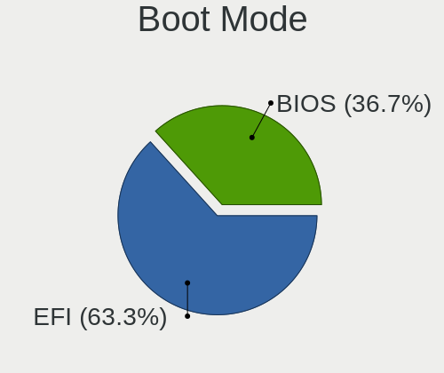
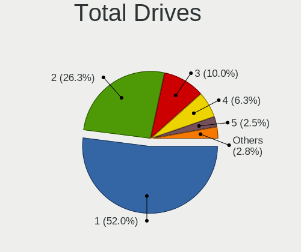
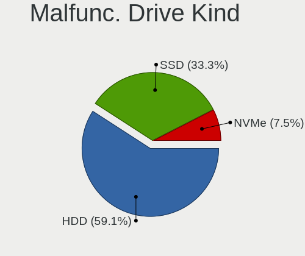
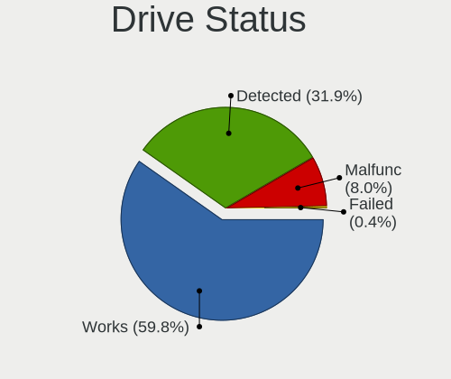
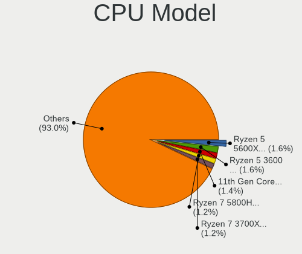
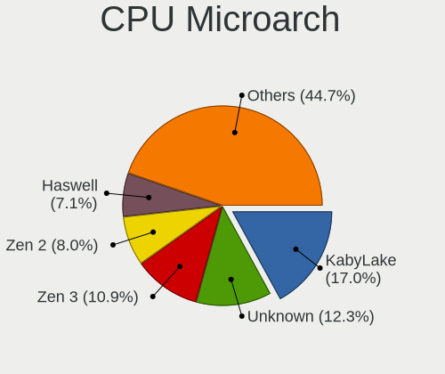
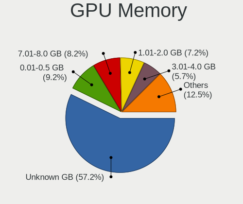
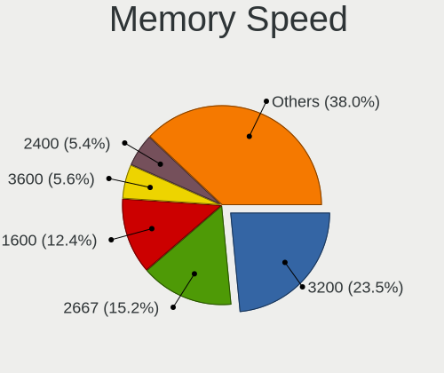
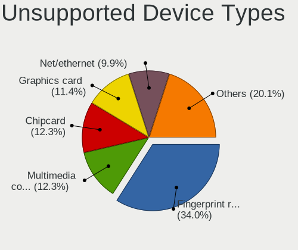

EndeavourOS - Tested Hardware & Statistics
------------------------------------------

A project to collect tested hardware configurations for EndeavourOS.

Anyone can contribute to this report by the [hw-probe](https://github.com/linuxhw/hw-probe) tool:

    sudo -E hw-probe -all -upload

Please contribute! Especially if your hardware is rare.

This is a report for all computer types. See also reports for [desktops](/Dist/EndeavourOS/Desktop/README.md) and [notebooks](/Dist/EndeavourOS/Notebook/README.md).

Contents
--------

* [ Test Cases ](#test-cases)

* [ System ](#system)
  - [ OS                       ](#os)
  - [ OS Family                ](#os-family)
  - [ Kernel                   ](#kernel)
  - [ Kernel Family            ](#kernel-family)
  - [ Kernel Major Ver.        ](#kernel-major-ver)
  - [ Arch                     ](#arch)
  - [ DE                       ](#de)
  - [ Display Server           ](#display-server)
  - [ Display Manager          ](#display-manager)
  - [ OS Lang                  ](#os-lang)
  - [ Boot Mode                ](#boot-mode)
  - [ Filesystem               ](#filesystem)
  - [ Part. scheme             ](#part-scheme)
  - [ Dual Boot with Linux/BSD ](#dual-boot-with-linuxbsd)
  - [ Dual Boot (Win)          ](#dual-boot-win)

* [ Board ](#board)
  - [ Vendor                   ](#vendor)
  - [ Model                    ](#model)
  - [ Model Family             ](#model-family)
  - [ MFG Year                 ](#mfg-year)
  - [ Form Factor              ](#form-factor)
  - [ Secure Boot              ](#secure-boot)
  - [ Coreboot                 ](#coreboot)
  - [ RAM Size                 ](#ram-size)
  - [ RAM Used                 ](#ram-used)
  - [ Total Drives             ](#total-drives)
  - [ Has CD-ROM               ](#has-cd-rom)
  - [ Has Ethernet             ](#has-ethernet)
  - [ Has WiFi                 ](#has-wifi)
  - [ Has Bluetooth            ](#has-bluetooth)

* [ Location ](#location)
  - [ Country                  ](#country)
  - [ City                     ](#city)

* [ Drives ](#drives)
  - [ Drive Vendor             ](#drive-vendor)
  - [ Drive Model              ](#drive-model)
  - [ HDD Vendor               ](#hdd-vendor)
  - [ SSD Vendor               ](#ssd-vendor)
  - [ Drive Kind               ](#drive-kind)
  - [ Drive Connector          ](#drive-connector)
  - [ Drive Size               ](#drive-size)
  - [ Space Total              ](#space-total)
  - [ Space Used               ](#space-used)
  - [ Malfunc. Drives          ](#malfunc-drives)
  - [ Malfunc. Drive Vendor    ](#malfunc-drive-vendor)
  - [ Malfunc. HDD Vendor      ](#malfunc-hdd-vendor)
  - [ Malfunc. Drive Kind      ](#malfunc-drive-kind)
  - [ Failed Drives            ](#failed-drives)
  - [ Failed Drive Vendor      ](#failed-drive-vendor)
  - [ Drive Status             ](#drive-status)

* [ Storage controller ](#storage-controller)
  - [ Storage Vendor           ](#storage-vendor)
  - [ Storage Model            ](#storage-model)
  - [ Storage Kind             ](#storage-kind)

* [ Processor ](#processor)
  - [ CPU Vendor               ](#cpu-vendor)
  - [ CPU Model                ](#cpu-model)
  - [ CPU Model Family         ](#cpu-model-family)
  - [ CPU Cores                ](#cpu-cores)
  - [ CPU Sockets              ](#cpu-sockets)
  - [ CPU Threads              ](#cpu-threads)
  - [ CPU Op-Modes             ](#cpu-op-modes)
  - [ CPU Microcode            ](#cpu-microcode)
  - [ CPU Microarch            ](#cpu-microarch)

* [ Graphics ](#graphics)
  - [ GPU Vendor               ](#gpu-vendor)
  - [ GPU Model                ](#gpu-model)
  - [ GPU Combo                ](#gpu-combo)
  - [ GPU Driver               ](#gpu-driver)
  - [ GPU Memory               ](#gpu-memory)

* [ Monitor ](#monitor)
  - [ Monitor Vendor           ](#monitor-vendor)
  - [ Monitor Model            ](#monitor-model)
  - [ Monitor Resolution       ](#monitor-resolution)
  - [ Monitor Diagonal         ](#monitor-diagonal)
  - [ Monitor Width            ](#monitor-width)
  - [ Aspect Ratio             ](#aspect-ratio)
  - [ Monitor Area             ](#monitor-area)
  - [ Pixel Density            ](#pixel-density)
  - [ Multiple Monitors        ](#multiple-monitors)

* [ Network ](#network)
  - [ Net Controller Vendor    ](#net-controller-vendor)
  - [ Net Controller Model     ](#net-controller-model)
  - [ Wireless Vendor          ](#wireless-vendor)
  - [ Wireless Model           ](#wireless-model)
  - [ Ethernet Vendor          ](#ethernet-vendor)
  - [ Ethernet Model           ](#ethernet-model)
  - [ Net Controller Kind      ](#net-controller-kind)
  - [ Used Controller          ](#used-controller)
  - [ NICs                     ](#nics)
  - [ IPv6                     ](#ipv6)

* [ Bluetooth ](#bluetooth)
  - [ Bluetooth Vendor         ](#bluetooth-vendor)
  - [ Bluetooth Model          ](#bluetooth-model)

* [ Sound ](#sound)
  - [ Sound Vendor             ](#sound-vendor)
  - [ Sound Model              ](#sound-model)

* [ Memory ](#memory)
  - [ Memory Vendor            ](#memory-vendor)
  - [ Memory Model             ](#memory-model)
  - [ Memory Kind              ](#memory-kind)
  - [ Memory Form Factor       ](#memory-form-factor)
  - [ Memory Size              ](#memory-size)
  - [ Memory Speed             ](#memory-speed)

* [ Printers & scanners ](#printers--scanners)
  - [ Printer Vendor           ](#printer-vendor)
  - [ Printer Model            ](#printer-model)
  - [ Scanner Vendor           ](#scanner-vendor)
  - [ Scanner Model            ](#scanner-model)

* [ Camera ](#camera)
  - [ Camera Vendor            ](#camera-vendor)
  - [ Camera Model             ](#camera-model)

* [ Security ](#security)
  - [ Fingerprint Vendor       ](#fingerprint-vendor)
  - [ Fingerprint Model        ](#fingerprint-model)
  - [ Chipcard Vendor          ](#chipcard-vendor)
  - [ Chipcard Model           ](#chipcard-model)

* [ Unsupported ](#unsupported)
  - [ Unsupported Devices      ](#unsupported-devices)
  - [ Unsupported Device Types ](#unsupported-device-types)

Test Cases
----------

Total: 1930

| Vendor        | Model                       | Form-Factor | Probe                                                      | Date         |
|---------------|-----------------------------|-------------|------------------------------------------------------------|--------------|
| Sony          | SVE1713X1EB                 | Notebook    | [6c3167a5a7](https://linux-hardware.org/?probe=6c3167a5a7) | Jan 02, 2024 |
| Lenovo        | Legion 5 15ARH05H 82B1      | Notebook    | [502ebc99c3](https://linux-hardware.org/?probe=502ebc99c3) | Jan 02, 2024 |
| ASUSTek       | PRIME X570-P                | Desktop     | [f7f3e0ddc9](https://linux-hardware.org/?probe=f7f3e0ddc9) | Jan 01, 2024 |
| Dell          | 0YXT71 A02                  | Desktop     | [e08ca6924a](https://linux-hardware.org/?probe=e08ca6924a) | Jan 01, 2024 |
| Sony          | SVE1713X1EB                 | Notebook    | [f9081b680a](https://linux-hardware.org/?probe=f9081b680a) | Jan 01, 2024 |
| ASUSTek       | T102HA                      | Tablet      | [9238ebe65d](https://linux-hardware.org/?probe=9238ebe65d) | Jan 01, 2024 |
| ASUSTek       | ROG STRIX B550-E GAMING     | Desktop     | [4fb6fd51a2](https://linux-hardware.org/?probe=4fb6fd51a2) | Jan 01, 2024 |
| Huanan        | X58 V1.0                    | Desktop     | [d13c9b1573](https://linux-hardware.org/?probe=d13c9b1573) | Dec 31, 2023 |
| ASUSTek       | PRIME X570-P                | Notebook    | [12b2d456ed](https://linux-hardware.org/?probe=12b2d456ed) | Dec 30, 2023 |
| MSI           | Prestige 15 A10SC           | Notebook    | [e61eb5428f](https://linux-hardware.org/?probe=e61eb5428f) | Dec 30, 2023 |
| HP            | 8374 1100                   | All in one  | [29b989dbb6](https://linux-hardware.org/?probe=29b989dbb6) | Dec 30, 2023 |
| ASUSTek       | PRIME X570-P                | Notebook    | [596a41673a](https://linux-hardware.org/?probe=596a41673a) | Dec 30, 2023 |
| ASUSTek       | ASUS TUF Gaming F15 FX50... | Notebook    | [2490d5b834](https://linux-hardware.org/?probe=2490d5b834) | Dec 30, 2023 |
| Dell          | Latitude 5580               | Notebook    | [3079edcb81](https://linux-hardware.org/?probe=3079edcb81) | Dec 29, 2023 |
| HUAWEI        | NBLK-WAX9X                  | Notebook    | [55340871af](https://linux-hardware.org/?probe=55340871af) | Dec 29, 2023 |
| HP            | 212B                        | Desktop     | [6afcd77ad6](https://linux-hardware.org/?probe=6afcd77ad6) | Dec 29, 2023 |
| ASUSTek       | VivoBook_ASUSLaptop X571... | Notebook    | [3b6d015d5a](https://linux-hardware.org/?probe=3b6d015d5a) | Dec 29, 2023 |
| Lenovo        | ThinkPad T480s 20L7S0060... | Notebook    | [485c94e992](https://linux-hardware.org/?probe=485c94e992) | Dec 29, 2023 |
| ASUSTek       | UL80VT                      | Notebook    | [d9e57db214](https://linux-hardware.org/?probe=d9e57db214) | Dec 28, 2023 |
| ASUSTek       | UL80VT                      | Notebook    | [8532e3dcca](https://linux-hardware.org/?probe=8532e3dcca) | Dec 28, 2023 |
| Lenovo        | ThinkPad E14 20RBS25S00     | Notebook    | [a1652ba789](https://linux-hardware.org/?probe=a1652ba789) | Dec 28, 2023 |
| GPD           | G1619-04                    | Notebook    | [f77175c08b](https://linux-hardware.org/?probe=f77175c08b) | Dec 26, 2023 |
| ASUSTek       | ASUS TUF Gaming F15 FX50... | Notebook    | [f58bf5fe4c](https://linux-hardware.org/?probe=f58bf5fe4c) | Dec 26, 2023 |
| Lenovo        | Yoga Pro 9 16IRP8 83BY      | Notebook    | [b08bd5ba2c](https://linux-hardware.org/?probe=b08bd5ba2c) | Dec 25, 2023 |
| Acer          | Swift SF314-51              | Notebook    | [a2f71698e2](https://linux-hardware.org/?probe=a2f71698e2) | Dec 25, 2023 |
| Gigabyte      | X670 AORUS ELITE AX         | Desktop     | [da58685854](https://linux-hardware.org/?probe=da58685854) | Dec 25, 2023 |
| Gigabyte      | B460M GAMING HD             | Desktop     | [6669971369](https://linux-hardware.org/?probe=6669971369) | Dec 23, 2023 |
| ASUSTek       | TUF Gaming FX504GD_FX80G... | Notebook    | [76b5abd1bd](https://linux-hardware.org/?probe=76b5abd1bd) | Dec 23, 2023 |
| ASUSTek       | TUF Gaming B650-PLUS WIF... | Desktop     | [a7194ce97c](https://linux-hardware.org/?probe=a7194ce97c) | Dec 23, 2023 |
| Lenovo        | ThinkBook 15 G4 ABA 21DL    | Notebook    | [5aae7c7b5c](https://linux-hardware.org/?probe=5aae7c7b5c) | Dec 23, 2023 |
| HP            | 8299                        | Desktop     | [7cb3e71107](https://linux-hardware.org/?probe=7cb3e71107) | Dec 23, 2023 |
| Huanan        | X58 V1.0                    | Desktop     | [ac62468ad1](https://linux-hardware.org/?probe=ac62468ad1) | Dec 21, 2023 |
| MSI           | MAG X570 TOMAHAWK WIFI      | Desktop     | [13b303a58b](https://linux-hardware.org/?probe=13b303a58b) | Dec 21, 2023 |
| Dell          | XPS 15 9520                 | Notebook    | [9fea6c876a](https://linux-hardware.org/?probe=9fea6c876a) | Dec 21, 2023 |
| Sony          | SVE1713X1EB                 | Notebook    | [dd67c36ae3](https://linux-hardware.org/?probe=dd67c36ae3) | Dec 21, 2023 |
| MSI           | B85M-G43                    | Desktop     | [f2b41e4ce3](https://linux-hardware.org/?probe=f2b41e4ce3) | Dec 21, 2023 |
| Dell          | Inspiron 15 3520            | Notebook    | [dac9572e21](https://linux-hardware.org/?probe=dac9572e21) | Dec 20, 2023 |
| Acer          | Swift SF314-57G             | Notebook    | [b822161722](https://linux-hardware.org/?probe=b822161722) | Dec 19, 2023 |
| Dell          | Inspiron 5570               | Notebook    | [55a83cf2cb](https://linux-hardware.org/?probe=55a83cf2cb) | Dec 19, 2023 |
| TUXEDO        | Aura 14 Gen3                | Notebook    | [bdc38bf0fd](https://linux-hardware.org/?probe=bdc38bf0fd) | Dec 19, 2023 |
| Dell          | 0KV62T A00                  | Desktop     | [b6ca701110](https://linux-hardware.org/?probe=b6ca701110) | Dec 18, 2023 |
| Lenovo        | ThinkBook 15-IIL 20SM       | Notebook    | [dec9660b8e](https://linux-hardware.org/?probe=dec9660b8e) | Dec 18, 2023 |
| HP            | ZBook Fury 15.6 inch G8 ... | Notebook    | [02ffa90273](https://linux-hardware.org/?probe=02ffa90273) | Dec 18, 2023 |
| Lenovo        | Yoga Duet 7 13ITL6 82MA     | Tablet      | [cc0dbece31](https://linux-hardware.org/?probe=cc0dbece31) | Dec 18, 2023 |
| HP            | 86EE                        | All in one  | [b577da610e](https://linux-hardware.org/?probe=b577da610e) | Dec 17, 2023 |
| HP            | Laptop 15-dw0xxx            | Notebook    | [185314f313](https://linux-hardware.org/?probe=185314f313) | Dec 17, 2023 |
| HP            | Laptop 15-dw0xxx            | Notebook    | [87d3b447bb](https://linux-hardware.org/?probe=87d3b447bb) | Dec 17, 2023 |
| ASUSTek       | STRIX Z270H GAMING          | Desktop     | [74584680bb](https://linux-hardware.org/?probe=74584680bb) | Dec 17, 2023 |
| Shenzhen D... | MP80                        | Mini pc     | [adced59500](https://linux-hardware.org/?probe=adced59500) | Dec 17, 2023 |
| Acer          | Aspire V5-573G              | Notebook    | [723eb61284](https://linux-hardware.org/?probe=723eb61284) | Dec 16, 2023 |
| HP            | Pavilion Laptop 15-cs3xx... | Notebook    | [2c4dba512d](https://linux-hardware.org/?probe=2c4dba512d) | Dec 16, 2023 |
| Acer          | Nitro AN715-51              | Notebook    | [279ade4fb0](https://linux-hardware.org/?probe=279ade4fb0) | Dec 16, 2023 |
| ASUSTek       | UX490UAR                    | Notebook    | [e8aa69b910](https://linux-hardware.org/?probe=e8aa69b910) | Dec 16, 2023 |
| ASUSTek       | VivoBook_ASUSLaptop M160... | Notebook    | [db30b82451](https://linux-hardware.org/?probe=db30b82451) | Dec 16, 2023 |
| Gigabyte      | B550M DS3H                  | Desktop     | [50ad2630fb](https://linux-hardware.org/?probe=50ad2630fb) | Dec 16, 2023 |
| Lenovo        | IdeaPad Gaming 3 15IHU6 ... | Notebook    | [7b209666a3](https://linux-hardware.org/?probe=7b209666a3) | Dec 16, 2023 |
| TUXEDO        | Pulse 15 Gen2               | Notebook    | [93fea0297b](https://linux-hardware.org/?probe=93fea0297b) | Dec 15, 2023 |
| Lenovo        | ThinkPad T470 W10DG 20JN... | Notebook    | [3d4b7d5e8b](https://linux-hardware.org/?probe=3d4b7d5e8b) | Dec 15, 2023 |
| MSI           | B550M PRO-VDH WIFI          | Desktop     | [06a409ecda](https://linux-hardware.org/?probe=06a409ecda) | Dec 15, 2023 |
| Samsung       | 960QFG                      | Convertible | [dddfdbbe1c](https://linux-hardware.org/?probe=dddfdbbe1c) | Dec 14, 2023 |
| ASUSTek       | ROG STRIX X670E-E GAMING... | Desktop     | [726676ca8d](https://linux-hardware.org/?probe=726676ca8d) | Dec 13, 2023 |
| ASUSTek       | TUF Gaming B650-PLUS WIF... | Desktop     | [efe4c56706](https://linux-hardware.org/?probe=efe4c56706) | Dec 13, 2023 |
| Lenovo        | IdeaPad Gaming 3 15ACH6 ... | Notebook    | [8339b9aa1a](https://linux-hardware.org/?probe=8339b9aa1a) | Dec 13, 2023 |
| ASUSTek       | G15DK                       | Desktop     | [b1fb7727ce](https://linux-hardware.org/?probe=b1fb7727ce) | Dec 13, 2023 |
| Universal ... | MONTENERO-C                 | Notebook    | [dcab78af9a](https://linux-hardware.org/?probe=dcab78af9a) | Dec 13, 2023 |
| Dell          | Inspiron 16 Plus 7630       | Notebook    | [25017a9de6](https://linux-hardware.org/?probe=25017a9de6) | Dec 13, 2023 |
| ASUSTek       | VivoBook_ASUSLaptop K660... | Notebook    | [6a742a5308](https://linux-hardware.org/?probe=6a742a5308) | Dec 13, 2023 |
| Lenovo        | ThinkPad W530 24382KU       | Notebook    | [b389060869](https://linux-hardware.org/?probe=b389060869) | Dec 12, 2023 |
| Gigabyte      | Z390 GAMING X-CF            | Desktop     | [34c5aec887](https://linux-hardware.org/?probe=34c5aec887) | Dec 12, 2023 |
| HP            | EliteBook 840 14 inch G1... | Notebook    | [17dd4245b8](https://linux-hardware.org/?probe=17dd4245b8) | Dec 11, 2023 |
| ASUSTek       | ASUS TUF Gaming F15 FX50... | Notebook    | [bc96bd94d2](https://linux-hardware.org/?probe=bc96bd94d2) | Dec 11, 2023 |
| ASUSTek       | P8B75-M                     | Desktop     | [41f57147de](https://linux-hardware.org/?probe=41f57147de) | Dec 10, 2023 |
| MSI           | MAG Z390 TOMAHAWK           | Desktop     | [242f306b04](https://linux-hardware.org/?probe=242f306b04) | Dec 10, 2023 |
| ASUSTek       | ASUS TUF Gaming A15 FA50... | Notebook    | [e7b5bdd470](https://linux-hardware.org/?probe=e7b5bdd470) | Dec 09, 2023 |
| Gigabyte      | Z170XP-SLI-CF               | Desktop     | [a51f4ce5e5](https://linux-hardware.org/?probe=a51f4ce5e5) | Dec 09, 2023 |
| HP            | Pavilion Laptop 15-cs3xx... | Notebook    | [5e6fc96a08](https://linux-hardware.org/?probe=5e6fc96a08) | Dec 09, 2023 |
| ASUSTek       | ROG STRIX Z390-E GAMING     | Desktop     | [3bca387137](https://linux-hardware.org/?probe=3bca387137) | Dec 09, 2023 |
| Gigabyte      | B250M-DS3H-CF               | Desktop     | [dd7e60da66](https://linux-hardware.org/?probe=dd7e60da66) | Dec 09, 2023 |
| ASUSTek       | PRIME H510M-A               | Desktop     | [40fae6bc6c](https://linux-hardware.org/?probe=40fae6bc6c) | Dec 08, 2023 |
| Gigabyte      | B250M-DS3H-CF               | Desktop     | [1ce8dbd527](https://linux-hardware.org/?probe=1ce8dbd527) | Dec 08, 2023 |
| Lenovo        | ThinkBook 15-IIL 20SM       | Notebook    | [b848110f65](https://linux-hardware.org/?probe=b848110f65) | Dec 08, 2023 |
| Acer          | Aspire TC-885 V:1.1         | Desktop     | [be2c5bcf98](https://linux-hardware.org/?probe=be2c5bcf98) | Dec 07, 2023 |
| Acer          | Nitro AN515-52              | Notebook    | [7c4bc43db7](https://linux-hardware.org/?probe=7c4bc43db7) | Dec 06, 2023 |
| HP            | ProBook 650 G1              | Notebook    | [06fe795e93](https://linux-hardware.org/?probe=06fe795e93) | Dec 05, 2023 |
| ASUSTek       | P8Z77-V LX                  | Desktop     | [1ac83c7edd](https://linux-hardware.org/?probe=1ac83c7edd) | Dec 05, 2023 |
| Sony          | SVE1713X1EB                 | Notebook    | [3c8e9b9cc4](https://linux-hardware.org/?probe=3c8e9b9cc4) | Dec 04, 2023 |
| Microsoft     | Surface Laptop Go           | Tablet      | [d02d11b0df](https://linux-hardware.org/?probe=d02d11b0df) | Dec 04, 2023 |
| Lenovo        | ThinkPad T480 20L5004HUS    | Notebook    | [c0681fbe8a](https://linux-hardware.org/?probe=c0681fbe8a) | Dec 03, 2023 |
| Lenovo        | ThinkPad T480 20L5004HUS    | Notebook    | [54178ea597](https://linux-hardware.org/?probe=54178ea597) | Dec 03, 2023 |
| Shenzhen D... | MP80                        | Mini pc     | [af649a6096](https://linux-hardware.org/?probe=af649a6096) | Dec 03, 2023 |
| MSI           | Z370 GAMING PRO CARBON      | Desktop     | [4b1c01f9b4](https://linux-hardware.org/?probe=4b1c01f9b4) | Dec 02, 2023 |
| HP            | Laptop 15-dw0xxx            | Notebook    | [288b6a2f75](https://linux-hardware.org/?probe=288b6a2f75) | Dec 02, 2023 |
| ASUSTek       | PRIME B760M-A WIFI D4       | Desktop     | [707fd0c687](https://linux-hardware.org/?probe=707fd0c687) | Dec 02, 2023 |
| HP            | 3397                        | Desktop     | [a858c3e80b](https://linux-hardware.org/?probe=a858c3e80b) | Dec 01, 2023 |
| Lenovo        | Legion 7 16ARHA7 82UH       | Notebook    | [5f31cddd2f](https://linux-hardware.org/?probe=5f31cddd2f) | Dec 01, 2023 |
| Lenovo        | ThinkPad L14 Gen 3 21C5C... | Notebook    | [6a029b4d87](https://linux-hardware.org/?probe=6a029b4d87) | Nov 30, 2023 |
| ASUSTek       | ROG STRIX X470-F GAMING     | Desktop     | [a803eec9f3](https://linux-hardware.org/?probe=a803eec9f3) | Nov 30, 2023 |
| ASUSTek       | ASUS TUF Gaming F15 FX50... | Notebook    | [62b38954c4](https://linux-hardware.org/?probe=62b38954c4) | Nov 30, 2023 |
| Lenovo        | ThinkPad T14 Gen 1 20UES... | Notebook    | [ad9b9e5fd1](https://linux-hardware.org/?probe=ad9b9e5fd1) | Nov 30, 2023 |
| TUXEDO        | Pulse 15 Gen1               | Notebook    | [aca3298198](https://linux-hardware.org/?probe=aca3298198) | Nov 28, 2023 |
| Lenovo        | Yoga 3 Pro-1370 80HE        | Notebook    | [0dbf67ab6f](https://linux-hardware.org/?probe=0dbf67ab6f) | Nov 28, 2023 |
| Lenovo        | IdeaPad 110-15IBR 80T7      | Notebook    | [d5d85d7080](https://linux-hardware.org/?probe=d5d85d7080) | Nov 27, 2023 |
| MSI           | MAG X570 TOMAHAWK WIFI      | Desktop     | [36fb8bfcab](https://linux-hardware.org/?probe=36fb8bfcab) | Nov 27, 2023 |
| HP            | EliteBook 745 G4            | Notebook    | [c3c18efc38](https://linux-hardware.org/?probe=c3c18efc38) | Nov 27, 2023 |
| Lenovo        | Yoga 3 Pro-1370 80HE        | Notebook    | [61a33862ad](https://linux-hardware.org/?probe=61a33862ad) | Nov 26, 2023 |
| HP            | EliteBook 745 G4            | Notebook    | [33d8baae78](https://linux-hardware.org/?probe=33d8baae78) | Nov 26, 2023 |
| ASUSTek       | ROG Strix G733PZ_G733PZ     | Notebook    | [a80073b9be](https://linux-hardware.org/?probe=a80073b9be) | Nov 25, 2023 |
| HP            | 3397                        | Desktop     | [ea69fd3531](https://linux-hardware.org/?probe=ea69fd3531) | Nov 25, 2023 |
| Lenovo        | ThinkPad T16 Gen 1 21BV0... | Notebook    | [06170c8841](https://linux-hardware.org/?probe=06170c8841) | Nov 25, 2023 |
| ASUSTek       | Z170M-PLUS                  | Desktop     | [5bbefae656](https://linux-hardware.org/?probe=5bbefae656) | Nov 25, 2023 |
| Acer          | Nitro AN515-54              | Notebook    | [261d00b9c1](https://linux-hardware.org/?probe=261d00b9c1) | Nov 25, 2023 |
| Acer          | Nitro AN515-54              | Notebook    | [fe4e9cf955](https://linux-hardware.org/?probe=fe4e9cf955) | Nov 25, 2023 |
| Lenovo        | IdeaPad Gaming 3 15ACH6 ... | Notebook    | [ac2895b3d7](https://linux-hardware.org/?probe=ac2895b3d7) | Nov 24, 2023 |
| Lenovo        | ThinkPad E14 20RA001HMZ     | Notebook    | [a58a5557e6](https://linux-hardware.org/?probe=a58a5557e6) | Nov 24, 2023 |
| HP            | ProBook x360 435 G8 Note... | Convertible | [7881b2e888](https://linux-hardware.org/?probe=7881b2e888) | Nov 24, 2023 |
| ASUSTek       | TUF Gaming X570-PLUS        | Desktop     | [bfb322c3dc](https://linux-hardware.org/?probe=bfb322c3dc) | Nov 24, 2023 |
| Lenovo        | ThinkPad E14 20RA001HMZ     | Notebook    | [7cd9c24a07](https://linux-hardware.org/?probe=7cd9c24a07) | Nov 23, 2023 |
| Microsoft     | Surface Laptop Go           | Tablet      | [eaa5c5a6ba](https://linux-hardware.org/?probe=eaa5c5a6ba) | Nov 23, 2023 |
| Lenovo        | IdeaPad 5 Pro 14ITL6 82L... | Notebook    | [9d7f74829e](https://linux-hardware.org/?probe=9d7f74829e) | Nov 23, 2023 |
| Gigabyte      | B450 AORUS ELITE            | Desktop     | [298883c961](https://linux-hardware.org/?probe=298883c961) | Nov 23, 2023 |
| HP            | EliteBook 6930p             | Notebook    | [6bc9169e34](https://linux-hardware.org/?probe=6bc9169e34) | Nov 23, 2023 |
| ASUSTek       | X751LD                      | Notebook    | [f41a7c6412](https://linux-hardware.org/?probe=f41a7c6412) | Nov 22, 2023 |
| ASUSTek       | ROG Flow X13 GV301QE_GV3... | Notebook    | [ce955eaeb4](https://linux-hardware.org/?probe=ce955eaeb4) | Nov 22, 2023 |
| ASUSTek       | ROG Flow X13 GV301QE_GV3... | Notebook    | [194465c3c5](https://linux-hardware.org/?probe=194465c3c5) | Nov 22, 2023 |
| Microsoft     | Surface Laptop Go           | Tablet      | [79c38d7dd7](https://linux-hardware.org/?probe=79c38d7dd7) | Nov 22, 2023 |
| Lenovo        | Yoga 730-15IWL 81JS         | Convertible | [d1fbe0a436](https://linux-hardware.org/?probe=d1fbe0a436) | Nov 21, 2023 |
| Lenovo        | Yoga 730-15IWL 81JS         | Convertible | [6a6293fda8](https://linux-hardware.org/?probe=6a6293fda8) | Nov 21, 2023 |
| Sony          | SVE1713X1EB                 | Notebook    | [a6efd4193b](https://linux-hardware.org/?probe=a6efd4193b) | Nov 21, 2023 |
| Lenovo        | Yoga 730-15IWL 81JS         | Convertible | [412a97e883](https://linux-hardware.org/?probe=412a97e883) | Nov 21, 2023 |
| ASUSTek       | ROG Strix G513RC_G513RC     | Notebook    | [86845a8402](https://linux-hardware.org/?probe=86845a8402) | Nov 20, 2023 |
| Gigabyte      | B550M DS3H AC               | Desktop     | [a5406ad359](https://linux-hardware.org/?probe=a5406ad359) | Nov 20, 2023 |
| Fujitsu       | FMVC06001                   | Notebook    | [122e4a9608](https://linux-hardware.org/?probe=122e4a9608) | Nov 20, 2023 |
| Lenovo        | ThinkPad E14 20RA001HMZ     | Notebook    | [b7e16888b9](https://linux-hardware.org/?probe=b7e16888b9) | Nov 20, 2023 |
| Apple         | MacBookAir6,2               | Notebook    | [9274d4e825](https://linux-hardware.org/?probe=9274d4e825) | Nov 20, 2023 |
| ASUSTek       | PRIME X670-P                | Desktop     | [03c5ac12be](https://linux-hardware.org/?probe=03c5ac12be) | Nov 20, 2023 |
| ASRock        | Z790M-ITX WiFi              | Desktop     | [2482b30a58](https://linux-hardware.org/?probe=2482b30a58) | Nov 19, 2023 |
| HP            | Pavilion Laptop 15-cs0xx... | Notebook    | [c3769c8a57](https://linux-hardware.org/?probe=c3769c8a57) | Nov 18, 2023 |
| TUXEDO        | Gemini Gen2                 | Notebook    | [43d1c51e23](https://linux-hardware.org/?probe=43d1c51e23) | Nov 17, 2023 |
| MSI           | B450M PRO-VDH PLUS          | Desktop     | [58e714af7e](https://linux-hardware.org/?probe=58e714af7e) | Nov 16, 2023 |
| MSI           | Z87-G43 GAMING              | Desktop     | [71786a484b](https://linux-hardware.org/?probe=71786a484b) | Nov 16, 2023 |
| MSI           | GF65 Thin 10UE              | Notebook    | [04d65c8c40](https://linux-hardware.org/?probe=04d65c8c40) | Nov 15, 2023 |
| MSI           | Z87-G43 GAMING              | Desktop     | [1cf432335c](https://linux-hardware.org/?probe=1cf432335c) | Nov 15, 2023 |
| ASUSTek       | ASUS EXPERTBOOK B7402FEA... | Convertible | [59f539dd3b](https://linux-hardware.org/?probe=59f539dd3b) | Nov 14, 2023 |
| Lenovo        | ThinkPad E14 20RBS25S00     | Notebook    | [3be8e07c6c](https://linux-hardware.org/?probe=3be8e07c6c) | Nov 14, 2023 |
| ASUSTek       | VivoBook_ASUSLaptop K660... | Notebook    | [018253183e](https://linux-hardware.org/?probe=018253183e) | Nov 14, 2023 |
| Dell          | XPS 15 9570                 | Notebook    | [ed85cdf855](https://linux-hardware.org/?probe=ed85cdf855) | Nov 13, 2023 |
| MSI           | X470 GAMING PLUS MAX        | Desktop     | [0029d3638f](https://linux-hardware.org/?probe=0029d3638f) | Nov 12, 2023 |
| Gigabyte      | B450M DS3H-CF               | Desktop     | [03a619e930](https://linux-hardware.org/?probe=03a619e930) | Nov 11, 2023 |
| Unknown       | Unknown                     | Desktop     | [e4a09ae9d2](https://linux-hardware.org/?probe=e4a09ae9d2) | Nov 10, 2023 |
| Apple         | Mac-F60DEB81FF30ACF6 Mac... | Desktop     | [1aeeebf4b2](https://linux-hardware.org/?probe=1aeeebf4b2) | Nov 10, 2023 |
| Microsoft     | Surface Laptop              | Tablet      | [62ccd07f15](https://linux-hardware.org/?probe=62ccd07f15) | Nov 10, 2023 |
| ASUSTek       | H97-PRO GAMER               | Desktop     | [26f1a89e53](https://linux-hardware.org/?probe=26f1a89e53) | Nov 10, 2023 |
| Lenovo        | Legion 5 Pro 16ACH6H 82J... | Notebook    | [b299fd1fe9](https://linux-hardware.org/?probe=b299fd1fe9) | Nov 09, 2023 |
| ASUSTek       | TUF Gaming X570-PRO         | Desktop     | [2adf99d3df](https://linux-hardware.org/?probe=2adf99d3df) | Nov 09, 2023 |
| Lenovo        | ThinkPad T430s 23553J2      | Notebook    | [d035513169](https://linux-hardware.org/?probe=d035513169) | Nov 09, 2023 |
| ASUSTek       | ROG Zephyrus G14 GA402XV... | Notebook    | [b8a00231d6](https://linux-hardware.org/?probe=b8a00231d6) | Nov 08, 2023 |
| Lenovo        | Legion 5 15ACH6A 82NW       | Notebook    | [16cf6c0ede](https://linux-hardware.org/?probe=16cf6c0ede) | Nov 08, 2023 |
| Medion        | P6681 MD60814               | Notebook    | [a17f8ffc19](https://linux-hardware.org/?probe=a17f8ffc19) | Nov 07, 2023 |
| Lenovo        | Legion 7 15IMH05 81YT       | Notebook    | [6f5721955b](https://linux-hardware.org/?probe=6f5721955b) | Nov 07, 2023 |
| Dell          | G7 7700                     | Notebook    | [0fc7811fdd](https://linux-hardware.org/?probe=0fc7811fdd) | Nov 07, 2023 |
| ASUSTek       | ASUS EXPERTBOOK B7402FEA... | Convertible | [744716992d](https://linux-hardware.org/?probe=744716992d) | Nov 06, 2023 |
| Lenovo        | 3734 SDK0R32862 WIN 3258... | All in one  | [b153378dab](https://linux-hardware.org/?probe=b153378dab) | Nov 06, 2023 |
| Lenovo        | IdeaPad 530S-14IKB 81EU     | Notebook    | [985ed440bf](https://linux-hardware.org/?probe=985ed440bf) | Nov 06, 2023 |
| HP            | Victus by Laptop 16-d1xx... | Notebook    | [1cf99ffe12](https://linux-hardware.org/?probe=1cf99ffe12) | Nov 05, 2023 |
| HP            | Victus by Laptop 16-d1xx... | Notebook    | [cf8911c5e0](https://linux-hardware.org/?probe=cf8911c5e0) | Nov 05, 2023 |
| HP            | ProBook 430 G1              | Notebook    | [451abee058](https://linux-hardware.org/?probe=451abee058) | Nov 05, 2023 |
| ASUSTek       | UX370UAR                    | Convertible | [754b927267](https://linux-hardware.org/?probe=754b927267) | Nov 05, 2023 |
| Lenovo        | IdeaPadFlex 5 16ABR8 82X... | Convertible | [9f19a2ba3a](https://linux-hardware.org/?probe=9f19a2ba3a) | Nov 04, 2023 |
| Lenovo        | IdeaPadFlex 5 16ABR8 82X... | Convertible | [d3a8398c99](https://linux-hardware.org/?probe=d3a8398c99) | Nov 04, 2023 |
| Acer          | Aspire R5-571TG             | Convertible | [f0e8c6a66f](https://linux-hardware.org/?probe=f0e8c6a66f) | Nov 04, 2023 |
| ASUSTek       | TUF Gaming Z690-PLUS WIF... | Desktop     | [d95fab9dc1](https://linux-hardware.org/?probe=d95fab9dc1) | Nov 04, 2023 |
| Apple         | Mac-F60DEB81FF30ACF6 Mac... | Desktop     | [b213aefe09](https://linux-hardware.org/?probe=b213aefe09) | Nov 03, 2023 |
| Lenovo        | Legion 5 Pro 16ACH6H 82J... | Notebook    | [db71fb65bf](https://linux-hardware.org/?probe=db71fb65bf) | Nov 03, 2023 |
| ASUSTek       | VivoBook_ASUSLaptop X571... | Notebook    | [b592d36d74](https://linux-hardware.org/?probe=b592d36d74) | Nov 03, 2023 |
| ASUSTek       | VivoBook_ASUSLaptop X571... | Notebook    | [da695062ba](https://linux-hardware.org/?probe=da695062ba) | Nov 03, 2023 |
| MSI           | MAG B550 TOMAHAWK           | Desktop     | [a08b1cfa29](https://linux-hardware.org/?probe=a08b1cfa29) | Nov 03, 2023 |
| Lenovo        | IdeaPad 110-15ISK 80UD      | Notebook    | [de293a4621](https://linux-hardware.org/?probe=de293a4621) | Nov 03, 2023 |
| ASUSTek       | VivoBook_ASUSLaptop X509... | Notebook    | [b0c996ac38](https://linux-hardware.org/?probe=b0c996ac38) | Nov 02, 2023 |
| ASUSTek       | UX430UNR                    | Notebook    | [47abbeb9c1](https://linux-hardware.org/?probe=47abbeb9c1) | Nov 01, 2023 |
| MSI           | GV62 8RD                    | Notebook    | [d85cb220a0](https://linux-hardware.org/?probe=d85cb220a0) | Nov 01, 2023 |
| MSI           | B450-A PRO MAX              | Desktop     | [5116fa401d](https://linux-hardware.org/?probe=5116fa401d) | Nov 01, 2023 |
| Lenovo        | ThinkPad T14s Gen 4 21F8... | Notebook    | [865e6764f2](https://linux-hardware.org/?probe=865e6764f2) | Nov 01, 2023 |
| Lenovo        | ThinkPad T14s Gen 4 21F8... | Notebook    | [bf87ba6b55](https://linux-hardware.org/?probe=bf87ba6b55) | Nov 01, 2023 |
| ASRock        | B450 Pro4 R2.0              | Desktop     | [c950f24711](https://linux-hardware.org/?probe=c950f24711) | Nov 01, 2023 |
| Gigabyte      | P55A-UD3                    | Desktop     | [6af2aaed4e](https://linux-hardware.org/?probe=6af2aaed4e) | Nov 01, 2023 |
| ASRock        | B450M Pro4                  | Desktop     | [0dc16901b7](https://linux-hardware.org/?probe=0dc16901b7) | Nov 01, 2023 |
| Microsoft     | Surface Laptop Go 3         | Tablet      | [efa4316df1](https://linux-hardware.org/?probe=efa4316df1) | Nov 01, 2023 |
| Lenovo        | ThinkPad T460p 20FXS0FS0... | Notebook    | [0b21a4419d](https://linux-hardware.org/?probe=0b21a4419d) | Nov 01, 2023 |
| Lenovo        | ThinkPad T460p 20FXS0FS0... | Notebook    | [757199e3cf](https://linux-hardware.org/?probe=757199e3cf) | Nov 01, 2023 |
| ASUSTek       | ASUS TUF Gaming A15 FA50... | Notebook    | [6c1c4ea069](https://linux-hardware.org/?probe=6c1c4ea069) | Oct 31, 2023 |
| Lenovo        | ThinkPad P15 Gen 1 20SUA... | Notebook    | [701a08bdb6](https://linux-hardware.org/?probe=701a08bdb6) | Oct 31, 2023 |
| MSI           | Z270-A PRO                  | Desktop     | [b4e85014cc](https://linux-hardware.org/?probe=b4e85014cc) | Oct 31, 2023 |
| ASUSTek       | STRIX Z270I GAMING          | Desktop     | [62adc05f6a](https://linux-hardware.org/?probe=62adc05f6a) | Oct 31, 2023 |
| HP            | Laptop 15-dw0xxx            | Notebook    | [55f41faf27](https://linux-hardware.org/?probe=55f41faf27) | Oct 31, 2023 |
| Microsoft     | Surface Laptop Go           | Tablet      | [64292785b9](https://linux-hardware.org/?probe=64292785b9) | Oct 31, 2023 |
| MSI           | PRO B550M-P GEN3            | Desktop     | [413254deb3](https://linux-hardware.org/?probe=413254deb3) | Oct 30, 2023 |
| Fujitsu       | D3430-U1 S26361-D3430-U1    | Desktop     | [0b62ec2df6](https://linux-hardware.org/?probe=0b62ec2df6) | Oct 30, 2023 |
| MSI           | Modern 15 A11M              | Notebook    | [43161bd5f4](https://linux-hardware.org/?probe=43161bd5f4) | Oct 30, 2023 |
| HP            | ProBook 650 G1              | Notebook    | [508c244637](https://linux-hardware.org/?probe=508c244637) | Oct 30, 2023 |
| HP            | 255 G6 Notebook PC          | Notebook    | [f19f70993f](https://linux-hardware.org/?probe=f19f70993f) | Oct 30, 2023 |
| Gigabyte      | X570 AORUS MASTER           | Desktop     | [3f0259e17b](https://linux-hardware.org/?probe=3f0259e17b) | Oct 30, 2023 |
| Lenovo        | ThinkPad P15 Gen 1 20STC... | Notebook    | [448c3ca446](https://linux-hardware.org/?probe=448c3ca446) | Oct 30, 2023 |
| Acer          | Aspire R5-571TG             | Convertible | [024085ccb0](https://linux-hardware.org/?probe=024085ccb0) | Oct 30, 2023 |
| Lenovo        | ThinkPad E14 Gen 4 21ECS... | Notebook    | [c1d00eb91f](https://linux-hardware.org/?probe=c1d00eb91f) | Oct 29, 2023 |
| ASUSTek       | PRIME H410M-R               | Desktop     | [c9a6bd4217](https://linux-hardware.org/?probe=c9a6bd4217) | Oct 29, 2023 |
| Lenovo        | Legion Y540-17IRH 81Q4      | Notebook    | [aaf303e411](https://linux-hardware.org/?probe=aaf303e411) | Oct 28, 2023 |
| Apple         | MacBookPro16,1              | Notebook    | [0e1711e674](https://linux-hardware.org/?probe=0e1711e674) | Oct 28, 2023 |
| Lenovo        | Legion Pro 7 16IRX8 82WR    | Notebook    | [e0dc47cf61](https://linux-hardware.org/?probe=e0dc47cf61) | Oct 28, 2023 |
| MSI           | H110M PRO-D                 | Desktop     | [96710ad70e](https://linux-hardware.org/?probe=96710ad70e) | Oct 28, 2023 |
| Gigabyte      | Z590 Gaming X               | Desktop     | [86bb741092](https://linux-hardware.org/?probe=86bb741092) | Oct 27, 2023 |
| HP            | Dragonfly 13.5 inch G4 N... | Notebook    | [1f5d6e4141](https://linux-hardware.org/?probe=1f5d6e4141) | Oct 27, 2023 |
| MSI           | MAG B760 TOMAHAWK WIFI      | Desktop     | [db2952a9d8](https://linux-hardware.org/?probe=db2952a9d8) | Oct 27, 2023 |
| HP            | ZBook 15 G3                 | Notebook    | [21bcc65553](https://linux-hardware.org/?probe=21bcc65553) | Oct 26, 2023 |
| Lenovo        | ThinkPad E14 Gen 5 21JR0... | Notebook    | [5aef96bd0e](https://linux-hardware.org/?probe=5aef96bd0e) | Oct 25, 2023 |
| ASUSTek       | PRIME X670E-PRO WIFI        | Desktop     | [6cd6569138](https://linux-hardware.org/?probe=6cd6569138) | Oct 25, 2023 |
| ASUSTek       | Z170M-PLUS                  | Desktop     | [95b5ac0a0e](https://linux-hardware.org/?probe=95b5ac0a0e) | Oct 24, 2023 |
| Lenovo        | IdeaPad 3 14ITL6 82H7       | Notebook    | [9c37fcb5c9](https://linux-hardware.org/?probe=9c37fcb5c9) | Oct 24, 2023 |
| ASUSTek       | PRIME X670E-PRO WIFI        | Desktop     | [8a67a1a41a](https://linux-hardware.org/?probe=8a67a1a41a) | Oct 24, 2023 |
| Lenovo        | ThinkPad T14s Gen 4 21F8... | Notebook    | [e2e4b18ec2](https://linux-hardware.org/?probe=e2e4b18ec2) | Oct 23, 2023 |
| Lenovo        | ThinkPad L13 Yoga 20R6S0... | Convertible | [9649ffc088](https://linux-hardware.org/?probe=9649ffc088) | Oct 23, 2023 |
| Gigabyte      | B550 AORUS ELITE V2         | Desktop     | [79ef1e4f2b](https://linux-hardware.org/?probe=79ef1e4f2b) | Oct 22, 2023 |
| ASUSTek       | TUF Gaming X570-PLUS        | Desktop     | [a5c33d9a5a](https://linux-hardware.org/?probe=a5c33d9a5a) | Oct 22, 2023 |
| ASRock        | B450M/ac R2.0               | Desktop     | [c1313fc22e](https://linux-hardware.org/?probe=c1313fc22e) | Oct 22, 2023 |
| HP            | Snappy                      | Notebook    | [2d0c13b032](https://linux-hardware.org/?probe=2d0c13b032) | Oct 21, 2023 |
| Lenovo        | ThinkPad E14 Gen 2 20T60... | Notebook    | [f103762ce5](https://linux-hardware.org/?probe=f103762ce5) | Oct 21, 2023 |
| Acer          | Aspire A315-23              | Notebook    | [147d6ad175](https://linux-hardware.org/?probe=147d6ad175) | Oct 21, 2023 |
| Gigabyte      | B760 GAMING X AX DDR4       | Desktop     | [eb5de485aa](https://linux-hardware.org/?probe=eb5de485aa) | Oct 21, 2023 |
| HP            | Snappy                      | Notebook    | [b8dc14dc5d](https://linux-hardware.org/?probe=b8dc14dc5d) | Oct 21, 2023 |
| ASUSTek       | ROG Flow Z13 GZ301ZE_GZ3... | Tablet      | [cd302f735e](https://linux-hardware.org/?probe=cd302f735e) | Oct 21, 2023 |
| ASUSTek       | PRIME H410M-R               | Desktop     | [e5362858a0](https://linux-hardware.org/?probe=e5362858a0) | Oct 20, 2023 |
| ASUSTek       | PRIME H410M-R               | Desktop     | [01544384cc](https://linux-hardware.org/?probe=01544384cc) | Oct 20, 2023 |
| Acer          | Aspire R5-571TG             | Convertible | [7e85436ec2](https://linux-hardware.org/?probe=7e85436ec2) | Oct 20, 2023 |
| Dell          | XPS 15 9520                 | Notebook    | [7deca235e3](https://linux-hardware.org/?probe=7deca235e3) | Oct 20, 2023 |
| Dell          | 0N4YC8 A00                  | Desktop     | [c01a27db62](https://linux-hardware.org/?probe=c01a27db62) | Oct 20, 2023 |
| Dell          | 0N4YC8 A00                  | Desktop     | [8fbbe4eec8](https://linux-hardware.org/?probe=8fbbe4eec8) | Oct 20, 2023 |
| Acer          | Aspire E5-523G              | Notebook    | [12b93b3f48](https://linux-hardware.org/?probe=12b93b3f48) | Oct 20, 2023 |
| Acer          | Aspire E5-523G              | Notebook    | [240879310d](https://linux-hardware.org/?probe=240879310d) | Oct 19, 2023 |
| HP            | ENVY x360 2-in-1 Laptop ... | Convertible | [41666281fc](https://linux-hardware.org/?probe=41666281fc) | Oct 19, 2023 |
| Sony          | SVE1713X1EB                 | Notebook    | [ec015a6c9e](https://linux-hardware.org/?probe=ec015a6c9e) | Oct 19, 2023 |
| Dell          | XPS 15 9530                 | Notebook    | [e350eec913](https://linux-hardware.org/?probe=e350eec913) | Oct 19, 2023 |
| LTD Delovo... | EVE 1494E ES1280EW          | Tablet      | [97c02ed2e9](https://linux-hardware.org/?probe=97c02ed2e9) | Oct 17, 2023 |
| Positivo      | POS-PIG43BC SIM             | Desktop     | [ded7e15a49](https://linux-hardware.org/?probe=ded7e15a49) | Oct 17, 2023 |
| Unknown       | Unknown                     | Desktop     | [172cfdcd26](https://linux-hardware.org/?probe=172cfdcd26) | Oct 16, 2023 |
| HP            | EliteBook 845 14 inch G1... | Notebook    | [5ee2d06317](https://linux-hardware.org/?probe=5ee2d06317) | Oct 15, 2023 |
| Lenovo        | ThinkPad E595 20NFCTO1WW    | Notebook    | [0d80ec0e27](https://linux-hardware.org/?probe=0d80ec0e27) | Oct 15, 2023 |
| Toshiba       | Satellite C855-1KF          | Notebook    | [1dbc7c0de3](https://linux-hardware.org/?probe=1dbc7c0de3) | Oct 15, 2023 |
| ASRock        | X470 Gaming K4              | Desktop     | [740122e9fa](https://linux-hardware.org/?probe=740122e9fa) | Oct 15, 2023 |
| MSI           | MPG B550 GAMING PLUS        | Desktop     | [bc47dea2fe](https://linux-hardware.org/?probe=bc47dea2fe) | Oct 14, 2023 |
| Dell          | Inspiron 16 7630 2-in-1     | Convertible | [1156f51af6](https://linux-hardware.org/?probe=1156f51af6) | Oct 12, 2023 |
| MSI           | GS63 Stealth 8RE            | Notebook    | [a83fe5a954](https://linux-hardware.org/?probe=a83fe5a954) | Oct 11, 2023 |
| MSI           | GS63 Stealth 8RE            | Notebook    | [5f9d5460fb](https://linux-hardware.org/?probe=5f9d5460fb) | Oct 11, 2023 |
| ASUSTek       | TUF Gaming X670E-PLUS WI... | Desktop     | [d44d655589](https://linux-hardware.org/?probe=d44d655589) | Oct 11, 2023 |
| Gigabyte      | Z390 DESIGNARE-CF           | Desktop     | [3df74e5b96](https://linux-hardware.org/?probe=3df74e5b96) | Oct 11, 2023 |
| Dell          | XPS 15 9520                 | Notebook    | [04fbcfc11b](https://linux-hardware.org/?probe=04fbcfc11b) | Oct 10, 2023 |
| Dell          | Latitude 7420               | Notebook    | [4071bd53ce](https://linux-hardware.org/?probe=4071bd53ce) | Oct 10, 2023 |
| ASUSTek       | Maximus VIII RANGER         | Desktop     | [e1dc170ad7](https://linux-hardware.org/?probe=e1dc170ad7) | Oct 09, 2023 |
| ASUSTek       | TUF Gaming X670E-PLUS WI... | Desktop     | [5089a21326](https://linux-hardware.org/?probe=5089a21326) | Oct 07, 2023 |
| System76      | Gazelle                     | Notebook    | [1a40053c3e](https://linux-hardware.org/?probe=1a40053c3e) | Oct 07, 2023 |
| ASUSTek       | PRIME A320M-K               | Desktop     | [2d73d7e286](https://linux-hardware.org/?probe=2d73d7e286) | Oct 06, 2023 |
| Acer          | Aspire 7730G                | Notebook    | [d48f861a2e](https://linux-hardware.org/?probe=d48f861a2e) | Oct 05, 2023 |
| HP            | ZBook 14u G4                | Notebook    | [1d14da7190](https://linux-hardware.org/?probe=1d14da7190) | Oct 05, 2023 |
| Lenovo        | Legion Pro 7 16IRX8 82WR    | Notebook    | [cc02a5e08e](https://linux-hardware.org/?probe=cc02a5e08e) | Oct 04, 2023 |
| ASUSTek       | VivoBook_ASUSLaptop X515... | Notebook    | [8e0792976d](https://linux-hardware.org/?probe=8e0792976d) | Oct 03, 2023 |
| Sony          | SVE1713X1EB                 | Notebook    | [ca5985274a](https://linux-hardware.org/?probe=ca5985274a) | Oct 02, 2023 |
| MSI           | MPG X570 GAMING PLUS        | Desktop     | [b992cbe7ae](https://linux-hardware.org/?probe=b992cbe7ae) | Oct 02, 2023 |
| MSI           | MPG X570 GAMING EDGE WIF... | Desktop     | [b5fcc0da7b](https://linux-hardware.org/?probe=b5fcc0da7b) | Oct 02, 2023 |
| ASUSTek       | TUF Gaming B550-PLUS        | Desktop     | [b8068a8e68](https://linux-hardware.org/?probe=b8068a8e68) | Oct 02, 2023 |
| ASUSTek       | PRIME A320M-K               | Desktop     | [cacc534be7](https://linux-hardware.org/?probe=cacc534be7) | Oct 02, 2023 |
| Razer         | Blade 15 Base Model (Lat... | Notebook    | [4e1788f184](https://linux-hardware.org/?probe=4e1788f184) | Oct 02, 2023 |
| Gigabyte      | AERO 15-X9                  | Notebook    | [35830807d4](https://linux-hardware.org/?probe=35830807d4) | Sep 30, 2023 |
| Timi          | Mi NoteBook Ultra           | Notebook    | [1c4b1aa68d](https://linux-hardware.org/?probe=1c4b1aa68d) | Sep 30, 2023 |
| Timi          | Mi NoteBook Ultra           | Notebook    | [988f015a89](https://linux-hardware.org/?probe=988f015a89) | Sep 30, 2023 |
| Lenovo        | ThinkPad E495 20NES07V00    | Notebook    | [935dc10f6b](https://linux-hardware.org/?probe=935dc10f6b) | Sep 30, 2023 |
| Dell          | Latitude 5410               | Notebook    | [d13c5769a3](https://linux-hardware.org/?probe=d13c5769a3) | Sep 30, 2023 |
| Positivo      | POS-PIH81DI                 | Desktop     | [0e67f3a0f3](https://linux-hardware.org/?probe=0e67f3a0f3) | Sep 29, 2023 |
| MSI           | GL73 8RE                    | Notebook    | [670f7351b5](https://linux-hardware.org/?probe=670f7351b5) | Sep 28, 2023 |
| Apple         | MacBookAir7,2               | Notebook    | [1543bac588](https://linux-hardware.org/?probe=1543bac588) | Sep 27, 2023 |
| ASUSTek       | PRIME B450-PLUS             | Desktop     | [ed68f904fe](https://linux-hardware.org/?probe=ed68f904fe) | Sep 26, 2023 |
| ASUSTek       | PRIME B450-PLUS             | Desktop     | [e24beff974](https://linux-hardware.org/?probe=e24beff974) | Sep 26, 2023 |
| ASUSTek       | Zenbook UM3402YAR_UM3402... | Notebook    | [b8b2b3ff7e](https://linux-hardware.org/?probe=b8b2b3ff7e) | Sep 26, 2023 |
| ASUSTek       | TUF Gaming X570-PRO         | Desktop     | [6677b81417](https://linux-hardware.org/?probe=6677b81417) | Sep 26, 2023 |
| Microsoft     | Surface Laptop Go           | Tablet      | [0dca41ca4e](https://linux-hardware.org/?probe=0dca41ca4e) | Sep 25, 2023 |
| Acer          | Nitro AN515-45              | Notebook    | [94ce4b6306](https://linux-hardware.org/?probe=94ce4b6306) | Sep 25, 2023 |
| MSI           | GS63VR 6RF                  | Notebook    | [03a9aed3c9](https://linux-hardware.org/?probe=03a9aed3c9) | Sep 25, 2023 |
| Lenovo        | IdeaPad 720S-13IKB 81BV     | Notebook    | [7ea3152d65](https://linux-hardware.org/?probe=7ea3152d65) | Sep 25, 2023 |
| Dell          | G5 5505                     | Notebook    | [e9c461d44d](https://linux-hardware.org/?probe=e9c461d44d) | Sep 25, 2023 |
| Lenovo        | ThinkPad P14s Gen 4 21HF... | Notebook    | [cada97becf](https://linux-hardware.org/?probe=cada97becf) | Sep 25, 2023 |
| ASUSTek       | TUF Gaming X570-PLUS        | Desktop     | [2b371179db](https://linux-hardware.org/?probe=2b371179db) | Sep 25, 2023 |
| ASUSTek       | Z170M-PLUS                  | Desktop     | [2bb252778b](https://linux-hardware.org/?probe=2bb252778b) | Sep 25, 2023 |
| Acer          | Aspire A515-51              | Notebook    | [f6369d0be5](https://linux-hardware.org/?probe=f6369d0be5) | Sep 23, 2023 |
| ASUSTek       | Zenbook UX3402ZA_Q409ZA     | Notebook    | [2d1e14cb66](https://linux-hardware.org/?probe=2d1e14cb66) | Sep 23, 2023 |
| Acer          | Switch SW312-31             | Tablet      | [0f276cde5a](https://linux-hardware.org/?probe=0f276cde5a) | Sep 23, 2023 |
| Microsoft     | Surface Laptop Go           | Tablet      | [c6211ac3aa](https://linux-hardware.org/?probe=c6211ac3aa) | Sep 22, 2023 |
| Gigabyte      | B250M-D3H-CF                | Desktop     | [3a965cb7e3](https://linux-hardware.org/?probe=3a965cb7e3) | Sep 22, 2023 |
| ASUSTek       | PRIME B450M-A II            | Desktop     | [90c9ffe2e0](https://linux-hardware.org/?probe=90c9ffe2e0) | Sep 22, 2023 |
| Lenovo        | IdeaPad 5 14ITL05 82FE      | Notebook    | [45f00aaf92](https://linux-hardware.org/?probe=45f00aaf92) | Sep 21, 2023 |
| Gigabyte      | X670 AORUS ELITE AX         | Desktop     | [7f327aca42](https://linux-hardware.org/?probe=7f327aca42) | Sep 21, 2023 |
| HP            | 212B                        | Desktop     | [f961d48c51](https://linux-hardware.org/?probe=f961d48c51) | Sep 20, 2023 |
| ASUSTek       | VivoBook_ASUSLaptop N760... | Notebook    | [9fdc142c76](https://linux-hardware.org/?probe=9fdc142c76) | Sep 19, 2023 |
| Lenovo        | ThinkPad P14s Gen 4 21K5... | Notebook    | [d940deb0df](https://linux-hardware.org/?probe=d940deb0df) | Sep 19, 2023 |
| ASUSTek       | Z170M-PLUS                  | Desktop     | [2b913a2e83](https://linux-hardware.org/?probe=2b913a2e83) | Sep 19, 2023 |
| HP            | EliteBook 865 16 inch G9... | Notebook    | [5cab8957eb](https://linux-hardware.org/?probe=5cab8957eb) | Sep 18, 2023 |
| HP            | Dragonfly Pro               | Notebook    | [0c5d439504](https://linux-hardware.org/?probe=0c5d439504) | Sep 18, 2023 |
| Dell          | 0M6C7G A00                  | Desktop     | [a93d60a237](https://linux-hardware.org/?probe=a93d60a237) | Sep 17, 2023 |
| ASUSTek       | PRIME H770-PLUS             | Desktop     | [c58fea9225](https://linux-hardware.org/?probe=c58fea9225) | Sep 16, 2023 |
| Dell          | Latitude E5470              | Notebook    | [0602c2deb2](https://linux-hardware.org/?probe=0602c2deb2) | Sep 16, 2023 |
| HP            | Pavilion Gaming Laptop 1... | Notebook    | [aea37f693f](https://linux-hardware.org/?probe=aea37f693f) | Sep 15, 2023 |
| ASRock        | B450M/ac R2.0               | Desktop     | [804b890928](https://linux-hardware.org/?probe=804b890928) | Sep 15, 2023 |
| MSI           | MEG Z790 GODLIKE            | Desktop     | [ef63882e50](https://linux-hardware.org/?probe=ef63882e50) | Sep 15, 2023 |
| MSI           | MEG Z790 GODLIKE            | Desktop     | [688462f949](https://linux-hardware.org/?probe=688462f949) | Sep 15, 2023 |
| Dell          | Precision 7710              | Notebook    | [c954042e8b](https://linux-hardware.org/?probe=c954042e8b) | Sep 14, 2023 |
| Microsoft     | Surface Laptop Go           | Tablet      | [452d16c55c](https://linux-hardware.org/?probe=452d16c55c) | Sep 13, 2023 |
| Lenovo        | IdeaPad 3 15IIL05 81WE      | Notebook    | [2260bcd7af](https://linux-hardware.org/?probe=2260bcd7af) | Sep 12, 2023 |
| Sony          | SVE1713X1EB                 | Notebook    | [2284d8a2dd](https://linux-hardware.org/?probe=2284d8a2dd) | Sep 12, 2023 |
| MSI           | GL73 8RE                    | Notebook    | [dca28b0d09](https://linux-hardware.org/?probe=dca28b0d09) | Sep 12, 2023 |
| MSI           | GL73 8RE                    | Notebook    | [6c6c4a19ec](https://linux-hardware.org/?probe=6c6c4a19ec) | Sep 12, 2023 |
| HP            | 245 14 inch G9 Notebook ... | Notebook    | [e72c31a6fc](https://linux-hardware.org/?probe=e72c31a6fc) | Sep 11, 2023 |
| Acer          | Swift SF314-512             | Notebook    | [4628c4e630](https://linux-hardware.org/?probe=4628c4e630) | Sep 11, 2023 |
| Lenovo        | ThinkPad X1 Carbon 6th 2... | Notebook    | [6d8ac2101a](https://linux-hardware.org/?probe=6d8ac2101a) | Sep 10, 2023 |
| ASUSTek       | ROG Zephyrus G14 GA402RJ... | Notebook    | [16b6bd1d3d](https://linux-hardware.org/?probe=16b6bd1d3d) | Sep 09, 2023 |
| HP            | 255 G8 Notebook PC          | Notebook    | [bdd270eddd](https://linux-hardware.org/?probe=bdd270eddd) | Sep 09, 2023 |
| ASUSTek       | ROG Maximus XI EXTREME      | Desktop     | [37efc0526e](https://linux-hardware.org/?probe=37efc0526e) | Sep 09, 2023 |
| ASUSTek       | ROG Maximus XI EXTREME      | Desktop     | [035446631a](https://linux-hardware.org/?probe=035446631a) | Sep 09, 2023 |
| ASUSTek       | ZenBook UX325SA_UM325SA     | Notebook    | [5b0ce3438c](https://linux-hardware.org/?probe=5b0ce3438c) | Sep 08, 2023 |
| ASUSTek       | PRIME A320M-K               | Desktop     | [178d6df21a](https://linux-hardware.org/?probe=178d6df21a) | Sep 08, 2023 |
| HP            | Elite Dragonfly 13.5 inc... | Notebook    | [6870581b7c](https://linux-hardware.org/?probe=6870581b7c) | Sep 08, 2023 |
| HP            | EliteBook 865 16 inch G9... | Notebook    | [872f12f24c](https://linux-hardware.org/?probe=872f12f24c) | Sep 08, 2023 |
| Lenovo        | IdeaPad 320-15ISK 80XH      | Notebook    | [d5430e9279](https://linux-hardware.org/?probe=d5430e9279) | Sep 08, 2023 |
| ASUSTek       | Zenbook UX3402ZA_Q409ZA     | Notebook    | [5b22cd283b](https://linux-hardware.org/?probe=5b22cd283b) | Sep 08, 2023 |
| ASRock        | B450M/ac R2.0               | Desktop     | [82266958be](https://linux-hardware.org/?probe=82266958be) | Sep 07, 2023 |
| HP            | Pavilion Laptop 15-eg3xx... | Notebook    | [003d136012](https://linux-hardware.org/?probe=003d136012) | Sep 07, 2023 |
| Lenovo        | ThinkPad P16s Gen 1 21BT... | Notebook    | [79ddc77f63](https://linux-hardware.org/?probe=79ddc77f63) | Sep 07, 2023 |
| Unknown       | Unknown                     | Desktop     | [a5506bdc30](https://linux-hardware.org/?probe=a5506bdc30) | Sep 07, 2023 |
| Acer          | Aspire GX-785               | Desktop     | [e33b7b35bf](https://linux-hardware.org/?probe=e33b7b35bf) | Sep 06, 2023 |
| ASUSTek       | ROG CROSSHAIR VIII HERO     | Desktop     | [fafd1b4cf2](https://linux-hardware.org/?probe=fafd1b4cf2) | Sep 06, 2023 |
| Sony          | SVE1713X1EB                 | Notebook    | [f7c65dc902](https://linux-hardware.org/?probe=f7c65dc902) | Sep 05, 2023 |
| Gigabyte      | B550 AORUS ELITE V2         | Desktop     | [38aad324f2](https://linux-hardware.org/?probe=38aad324f2) | Sep 05, 2023 |
| ASUSTek       | VivoBook_ASUSLaptop X409... | Notebook    | [cd1be324d4](https://linux-hardware.org/?probe=cd1be324d4) | Sep 05, 2023 |
| Sony          | SVE1513B1EW                 | Notebook    | [82fd19c99e](https://linux-hardware.org/?probe=82fd19c99e) | Sep 05, 2023 |
| ASUSTek       | PRIME X570-P                | Desktop     | [08dd85e58d](https://linux-hardware.org/?probe=08dd85e58d) | Sep 05, 2023 |
| MSI           | GS75 Stealth 8SG            | Notebook    | [fc603fc196](https://linux-hardware.org/?probe=fc603fc196) | Sep 05, 2023 |
| Lenovo        | ThinkPad E14 20RAS04C00     | Notebook    | [13b7789482](https://linux-hardware.org/?probe=13b7789482) | Sep 04, 2023 |
| HP            | EliteBook 845 14 inch G1... | Notebook    | [8a4af58adc](https://linux-hardware.org/?probe=8a4af58adc) | Sep 04, 2023 |
| MSI           | MAG B550M MORTAR            | Desktop     | [3ee4e0f848](https://linux-hardware.org/?probe=3ee4e0f848) | Sep 02, 2023 |
| ASUSTek       | N750JV                      | Notebook    | [f23cf01c1c](https://linux-hardware.org/?probe=f23cf01c1c) | Sep 02, 2023 |
| ASUSTek       | Zenbook UX3402ZA_UX3402Z... | Notebook    | [db2e607ae6](https://linux-hardware.org/?probe=db2e607ae6) | Sep 02, 2023 |
| Gigabyte      | P55A-UD3                    | Desktop     | [d8e4c2da1e](https://linux-hardware.org/?probe=d8e4c2da1e) | Sep 01, 2023 |
| ASUSTek       | Zenbook UX3402ZA_Q409ZA     | Notebook    | [b652970974](https://linux-hardware.org/?probe=b652970974) | Sep 01, 2023 |
| ASRock        | B450M Pro4                  | Desktop     | [4725c2be8e](https://linux-hardware.org/?probe=4725c2be8e) | Sep 01, 2023 |
| HP            | Pavilion Aero Laptop 13z... | Notebook    | [afa88a8a6a](https://linux-hardware.org/?probe=afa88a8a6a) | Sep 01, 2023 |
| MSI           | Z87-G45 GAMING              | Desktop     | [ce1e538f59](https://linux-hardware.org/?probe=ce1e538f59) | Sep 01, 2023 |
| MSI           | Modern 15 A5M               | Notebook    | [a6619c179c](https://linux-hardware.org/?probe=a6619c179c) | Aug 31, 2023 |
| ASUSTek       | M4A88TD-V EVO/USB3          | Desktop     | [578f5e581e](https://linux-hardware.org/?probe=578f5e581e) | Aug 31, 2023 |
| ASUSTek       | TUF Gaming B550-PLUS        | Desktop     | [0bf7d37cc9](https://linux-hardware.org/?probe=0bf7d37cc9) | Aug 30, 2023 |
| Fujitsu       | LIFEBOOK U904               | Notebook    | [7cf4986142](https://linux-hardware.org/?probe=7cf4986142) | Aug 29, 2023 |
| Dell          | Inspiron 3542               | Notebook    | [320e8d218f](https://linux-hardware.org/?probe=320e8d218f) | Aug 28, 2023 |
| ASUSTek       | PRIME Z390-A                | Desktop     | [d238cd036a](https://linux-hardware.org/?probe=d238cd036a) | Aug 27, 2023 |
| ASUSTek       | TUF Gaming X570-PRO         | Desktop     | [01a0f80107](https://linux-hardware.org/?probe=01a0f80107) | Aug 27, 2023 |
| ASUSTek       | X550VXK                     | Notebook    | [897e4f89ec](https://linux-hardware.org/?probe=897e4f89ec) | Aug 27, 2023 |
| Samsung       | 930QCG                      | Convertible | [3fb44943e6](https://linux-hardware.org/?probe=3fb44943e6) | Aug 27, 2023 |
| ASUSTek       | PRIME X370-PRO              | Desktop     | [95d23ba555](https://linux-hardware.org/?probe=95d23ba555) | Aug 27, 2023 |
| Lenovo        | IdeaPad 320-15ISK 80XH      | Notebook    | [657c08f61f](https://linux-hardware.org/?probe=657c08f61f) | Aug 27, 2023 |
| Sony          | SVE1713X1EB                 | Notebook    | [ab8f75bb84](https://linux-hardware.org/?probe=ab8f75bb84) | Aug 27, 2023 |
| Unknown       | V00                         | Mini pc     | [81085cf18b](https://linux-hardware.org/?probe=81085cf18b) | Aug 26, 2023 |
| Google        | Madoo                       | Notebook    | [6644bab363](https://linux-hardware.org/?probe=6644bab363) | Aug 26, 2023 |
| Unknown       | Unknown                     | Desktop     | [2bbc495ee5](https://linux-hardware.org/?probe=2bbc495ee5) | Aug 25, 2023 |
| HP            | EliteBook 645 14 inch G9... | Notebook    | [d02a7851a6](https://linux-hardware.org/?probe=d02a7851a6) | Aug 25, 2023 |
| ASUSTek       | VivoBook_ASUSLaptop X350... | Notebook    | [3eea0be3b4](https://linux-hardware.org/?probe=3eea0be3b4) | Aug 24, 2023 |
| ASUSTek       | VivoBook_ASUSLaptop X350... | Notebook    | [53ba2f91cd](https://linux-hardware.org/?probe=53ba2f91cd) | Aug 24, 2023 |
| HP            | 1589                        | Desktop     | [982f4f1442](https://linux-hardware.org/?probe=982f4f1442) | Aug 24, 2023 |
| Dell          | Latitude E5470              | Notebook    | [637ccef7bd](https://linux-hardware.org/?probe=637ccef7bd) | Aug 24, 2023 |
| ASUSTek       | ROG STRIX B350-F GAMING     | Desktop     | [34a96cbdc8](https://linux-hardware.org/?probe=34a96cbdc8) | Aug 24, 2023 |
| Lenovo        | ThinkPad T16 Gen 1 21BVC... | Notebook    | [816f3ce721](https://linux-hardware.org/?probe=816f3ce721) | Aug 24, 2023 |
| Lenovo        | IdeaPad 3 15ITL05 81X8      | Notebook    | [ef3454780b](https://linux-hardware.org/?probe=ef3454780b) | Aug 23, 2023 |
| HP            | 250 G4                      | Notebook    | [1eb6dc4c12](https://linux-hardware.org/?probe=1eb6dc4c12) | Aug 23, 2023 |
| HP            | 18E4                        | Desktop     | [0235c76e04](https://linux-hardware.org/?probe=0235c76e04) | Aug 23, 2023 |
| Lenovo        | ThinkPad E495 20NES0KM00    | Notebook    | [783db5b84d](https://linux-hardware.org/?probe=783db5b84d) | Aug 23, 2023 |
| Dell          | XPS 15 9520                 | Notebook    | [26d59e1060](https://linux-hardware.org/?probe=26d59e1060) | Aug 23, 2023 |
| Dell          | XPS 15 9520                 | Notebook    | [d10b0c4ca0](https://linux-hardware.org/?probe=d10b0c4ca0) | Aug 23, 2023 |
| Apple         | Mac-031B6874CF7F642A iMa... | All in one  | [c6a3274c8f](https://linux-hardware.org/?probe=c6a3274c8f) | Aug 21, 2023 |
| Sony          | SVE1713X1EB                 | Notebook    | [165cab2421](https://linux-hardware.org/?probe=165cab2421) | Aug 21, 2023 |
| MSI           | GL73 8RE                    | Notebook    | [6112b46746](https://linux-hardware.org/?probe=6112b46746) | Aug 21, 2023 |
| HP            | Pavilion x360 Convertibl... | Convertible | [6cee16ebd6](https://linux-hardware.org/?probe=6cee16ebd6) | Aug 21, 2023 |
| MSI           | GL73 8RE                    | Notebook    | [b883100fd3](https://linux-hardware.org/?probe=b883100fd3) | Aug 21, 2023 |
| MSI           | Katana 15 B13VGK            | Notebook    | [c21afd5e9f](https://linux-hardware.org/?probe=c21afd5e9f) | Aug 21, 2023 |
| ASUSTek       | ASUS TUF Gaming A15 FA50... | Notebook    | [b6aa75cb80](https://linux-hardware.org/?probe=b6aa75cb80) | Aug 20, 2023 |
| ASUSTek       | ROG STRIX B350-F GAMING     | Desktop     | [71853f1c36](https://linux-hardware.org/?probe=71853f1c36) | Aug 20, 2023 |
| Packard Be... | EasyNote TJ66               | Notebook    | [7e5e1655a6](https://linux-hardware.org/?probe=7e5e1655a6) | Aug 20, 2023 |
| ASUSTek       | Zenbook UX3402ZA_Q409ZA     | Notebook    | [d6df464cc7](https://linux-hardware.org/?probe=d6df464cc7) | Aug 20, 2023 |
| ASUSTek       | Zenbook UX3402ZA_Q409ZA     | Notebook    | [471f5f6132](https://linux-hardware.org/?probe=471f5f6132) | Aug 20, 2023 |
| Lenovo        | IdeaPad 110-15AST 80TR      | Notebook    | [60385dd9f0](https://linux-hardware.org/?probe=60385dd9f0) | Aug 20, 2023 |
| ASUSTek       | TUF Gaming X570-PLUS        | Desktop     | [e797880ede](https://linux-hardware.org/?probe=e797880ede) | Aug 19, 2023 |
| Microsoft     | Surface Laptop Go           | Tablet      | [8bb2d02e4d](https://linux-hardware.org/?probe=8bb2d02e4d) | Aug 18, 2023 |
| ASRock        | Z170 Gaming K4              | Desktop     | [867105e269](https://linux-hardware.org/?probe=867105e269) | Aug 18, 2023 |
| HP            | EliteBook 865 16 inch G9... | Notebook    | [f99d3dca93](https://linux-hardware.org/?probe=f99d3dca93) | Aug 17, 2023 |
| HP            | EliteBook 865 16 inch G9... | Notebook    | [5ed6b3612a](https://linux-hardware.org/?probe=5ed6b3612a) | Aug 17, 2023 |
| ASUSTek       | TUF Gaming FX705DY_FX705... | Notebook    | [6e6a7171bf](https://linux-hardware.org/?probe=6e6a7171bf) | Aug 16, 2023 |
| HP            | 18E4                        | Desktop     | [4fd89c22ae](https://linux-hardware.org/?probe=4fd89c22ae) | Aug 14, 2023 |
| Lenovo        | ThinkBook 16p Gen 2 20YM    | Notebook    | [1632c89b98](https://linux-hardware.org/?probe=1632c89b98) | Aug 13, 2023 |
| HP            | 8055                        | Desktop     | [a4c4208546](https://linux-hardware.org/?probe=a4c4208546) | Aug 13, 2023 |
| HP            | Victus by Laptop 16-e0xx... | Notebook    | [246c60a344](https://linux-hardware.org/?probe=246c60a344) | Aug 13, 2023 |
| Lenovo        | Legion 5 Pro 16ARH7H 82R... | Notebook    | [6cbef2a38d](https://linux-hardware.org/?probe=6cbef2a38d) | Aug 13, 2023 |
| Microsoft     | Surface Laptop Go           | Tablet      | [d760e3f4c4](https://linux-hardware.org/?probe=d760e3f4c4) | Aug 13, 2023 |
| Acer          | Aspire A317-53              | Notebook    | [17dacd99a6](https://linux-hardware.org/?probe=17dacd99a6) | Aug 12, 2023 |
| ASUSTek       | ROG Strix G513QY_G513QY     | Notebook    | [083e25221d](https://linux-hardware.org/?probe=083e25221d) | Aug 10, 2023 |
| Microsoft     | Surface Laptop Go           | Tablet      | [f6040edeb0](https://linux-hardware.org/?probe=f6040edeb0) | Aug 09, 2023 |
| Acer          | Aspire A317-53              | Notebook    | [5a2d81b438](https://linux-hardware.org/?probe=5a2d81b438) | Aug 09, 2023 |
| Microsoft     | Surface Laptop Go           | Tablet      | [3b02fcaeb7](https://linux-hardware.org/?probe=3b02fcaeb7) | Aug 09, 2023 |
| Dell          | 08NPPY A00                  | Desktop     | [bdc11616d7](https://linux-hardware.org/?probe=bdc11616d7) | Aug 08, 2023 |
| ASUSTek       | ROG Flow X16 GV601VI_GV6... | Convertible | [99ffb28c11](https://linux-hardware.org/?probe=99ffb28c11) | Aug 08, 2023 |
| ASRock        | B650 PG Lightning           | Desktop     | [bc55c09547](https://linux-hardware.org/?probe=bc55c09547) | Aug 06, 2023 |
| MSI           | X470 GAMING PLUS            | Desktop     | [0e79a19ed6](https://linux-hardware.org/?probe=0e79a19ed6) | Aug 06, 2023 |
| Dell          | Latitude E5570              | Notebook    | [cbcea81a37](https://linux-hardware.org/?probe=cbcea81a37) | Aug 06, 2023 |
| ASRock        | X570 Taichi                 | Desktop     | [34e27f60e0](https://linux-hardware.org/?probe=34e27f60e0) | Aug 05, 2023 |
| Toshiba       | PORTEGE R700                | Notebook    | [f0df061bb2](https://linux-hardware.org/?probe=f0df061bb2) | Aug 04, 2023 |
| Dell          | Vostro 3500                 | Notebook    | [5f63621af2](https://linux-hardware.org/?probe=5f63621af2) | Aug 04, 2023 |
| Gigabyte      | H77-DS3H                    | Desktop     | [4c677637c2](https://linux-hardware.org/?probe=4c677637c2) | Aug 04, 2023 |
| Lenovo        | IdeaPad Gaming 3 15ACH6 ... | Notebook    | [731ae84313](https://linux-hardware.org/?probe=731ae84313) | Aug 04, 2023 |
| Acer          | TravelMate P614-51-G2       | Notebook    | [33dd52a94f](https://linux-hardware.org/?probe=33dd52a94f) | Aug 03, 2023 |
| Lenovo        | IdeaPadFlex 5 14ALC7 82R... | Convertible | [7372322587](https://linux-hardware.org/?probe=7372322587) | Aug 02, 2023 |
| Dell          | Precision 3571              | Notebook    | [efa0df50dc](https://linux-hardware.org/?probe=efa0df50dc) | Aug 02, 2023 |
| ASUSTek       | TUF Gaming X570-PRO         | Desktop     | [a08886d394](https://linux-hardware.org/?probe=a08886d394) | Aug 02, 2023 |
| ASUSTek       | VivoBook_ASUSLaptop N760... | Notebook    | [fc2f2f7f45](https://linux-hardware.org/?probe=fc2f2f7f45) | Aug 02, 2023 |
| Sony          | VPCSB1V9R                   | Notebook    | [8d809c3877](https://linux-hardware.org/?probe=8d809c3877) | Aug 02, 2023 |
| Lenovo        | Legion 5 15IMH05H 81Y6      | Notebook    | [46ca3ef1f4](https://linux-hardware.org/?probe=46ca3ef1f4) | Aug 01, 2023 |
| ASUSTek       | ROG STRIX B450-F GAMING     | Desktop     | [fd9503645f](https://linux-hardware.org/?probe=fd9503645f) | Aug 01, 2023 |
| MSI           | X470 GAMING PLUS            | Desktop     | [9e892c6bc7](https://linux-hardware.org/?probe=9e892c6bc7) | Aug 01, 2023 |
| Acer          | Aspire A317-53              | Notebook    | [3f1af34e1b](https://linux-hardware.org/?probe=3f1af34e1b) | Aug 01, 2023 |
| Lenovo        | Yoga Pro 7 14ARP8 83AU      | Notebook    | [37be164783](https://linux-hardware.org/?probe=37be164783) | Aug 01, 2023 |
| ASUSTek       | VivoBook_ASUSLaptop N760... | Notebook    | [e24869945e](https://linux-hardware.org/?probe=e24869945e) | Aug 01, 2023 |
| ASUSTek       | VivoBook_ASUSLaptop N760... | Notebook    | [a2148fe49f](https://linux-hardware.org/?probe=a2148fe49f) | Aug 01, 2023 |
| ASUSTek       | PRIME Z790-A WIFI           | Desktop     | [13a4427208](https://linux-hardware.org/?probe=13a4427208) | Jul 31, 2023 |
| HP            | OMEN Laptop 15-en0xxx       | Notebook    | [5d12cf34ca](https://linux-hardware.org/?probe=5d12cf34ca) | Jul 31, 2023 |
| Lenovo        | ThinkPad E14 20RBS25S00     | Notebook    | [ae14da63f3](https://linux-hardware.org/?probe=ae14da63f3) | Jul 30, 2023 |
| BESSTAR Te... | GB7                         | Mini pc     | [4f94bdf300](https://linux-hardware.org/?probe=4f94bdf300) | Jul 30, 2023 |
| Lenovo        | Legion Y540-17IRH 81Q4      | Notebook    | [f1db906c7c](https://linux-hardware.org/?probe=f1db906c7c) | Jul 30, 2023 |
| Samsung       | 960QFG                      | Convertible | [c14544a7ff](https://linux-hardware.org/?probe=c14544a7ff) | Jul 30, 2023 |
| HP            | EliteBook 845 G7 Noteboo... | Notebook    | [963eb3c0a8](https://linux-hardware.org/?probe=963eb3c0a8) | Jul 29, 2023 |
| HP            | EliteBook 2540p             | Notebook    | [cb13e61bae](https://linux-hardware.org/?probe=cb13e61bae) | Jul 28, 2023 |
| ASUSTek       | ROG Zephyrus G14 GA401QM... | Notebook    | [e08f65110d](https://linux-hardware.org/?probe=e08f65110d) | Jul 27, 2023 |
| Google        | Fleex                       | Notebook    | [977fa266d3](https://linux-hardware.org/?probe=977fa266d3) | Jul 27, 2023 |
| Lenovo        | ThinkPad E14 20RAS04C00     | Notebook    | [045470ba6d](https://linux-hardware.org/?probe=045470ba6d) | Jul 26, 2023 |
| MSI           | GL73 8RE                    | Notebook    | [7de233f9bd](https://linux-hardware.org/?probe=7de233f9bd) | Jul 26, 2023 |
| Dell          | XPS 15 9520                 | Notebook    | [24f65961ef](https://linux-hardware.org/?probe=24f65961ef) | Jul 26, 2023 |
| ASUSTek       | K53SD                       | Notebook    | [2cd6047230](https://linux-hardware.org/?probe=2cd6047230) | Jul 25, 2023 |
| HP            | ProBook 440 G2              | Notebook    | [85168259e3](https://linux-hardware.org/?probe=85168259e3) | Jul 25, 2023 |
| HP            | ENVY x360 2-in-1 Laptop ... | Convertible | [0b4b6b015b](https://linux-hardware.org/?probe=0b4b6b015b) | Jul 24, 2023 |
| MSI           | MPG B550 GAMING PLUS        | Desktop     | [351ebe5f4f](https://linux-hardware.org/?probe=351ebe5f4f) | Jul 24, 2023 |
| HP            | 250 G3                      | Notebook    | [5580b343bd](https://linux-hardware.org/?probe=5580b343bd) | Jul 24, 2023 |
| ASUSTek       | ROG Zephyrus G14 GA401QM... | Notebook    | [8b89c63576](https://linux-hardware.org/?probe=8b89c63576) | Jul 24, 2023 |
| MSI           | GL73 8RE                    | Notebook    | [86035a17da](https://linux-hardware.org/?probe=86035a17da) | Jul 24, 2023 |
| ASUSTek       | ROG STRIX B550-F GAMING     | Desktop     | [a179c222ea](https://linux-hardware.org/?probe=a179c222ea) | Jul 23, 2023 |
| Sony          | SVE1713X1EB                 | Notebook    | [f2dfaee237](https://linux-hardware.org/?probe=f2dfaee237) | Jul 23, 2023 |
| Apple         | MacBookPro16,1              | Notebook    | [7f3a5aa8cd](https://linux-hardware.org/?probe=7f3a5aa8cd) | Jul 22, 2023 |
| HP            | 86F3 00100                  | All in one  | [26504c2968](https://linux-hardware.org/?probe=26504c2968) | Jul 22, 2023 |
| ASUSTek       | ROG Flow Z13 GZ301VU_GZ3... | Tablet      | [7387b87abf](https://linux-hardware.org/?probe=7387b87abf) | Jul 21, 2023 |
| Lenovo        | Legion Y540-17IRH 81Q4      | Notebook    | [2a3971e2fc](https://linux-hardware.org/?probe=2a3971e2fc) | Jul 21, 2023 |
| HP            | 245 G8 Notebook PC          | Notebook    | [788fc0bfc9](https://linux-hardware.org/?probe=788fc0bfc9) | Jul 21, 2023 |
| ASUSTek       | G551JK                      | Notebook    | [fed0cf1fce](https://linux-hardware.org/?probe=fed0cf1fce) | Jul 20, 2023 |
| Acer          | Aspire A515-47              | Notebook    | [9a705d5047](https://linux-hardware.org/?probe=9a705d5047) | Jul 20, 2023 |
| HP            | Pavilion dv6                | Notebook    | [cc73a658d1](https://linux-hardware.org/?probe=cc73a658d1) | Jul 19, 2023 |
| Sony          | SVE1713X1EB                 | Notebook    | [89340a2cf7](https://linux-hardware.org/?probe=89340a2cf7) | Jul 19, 2023 |
| Lenovo        | ThinkPad L14 Gen 2a 20X5... | Notebook    | [7733ed8a40](https://linux-hardware.org/?probe=7733ed8a40) | Jul 19, 2023 |
| Lenovo        | ThinkPad L14 Gen 2a 20X5... | Notebook    | [4bba49b11c](https://linux-hardware.org/?probe=4bba49b11c) | Jul 19, 2023 |
| Dell          | XPS 15 9570                 | Notebook    | [e6cf0622b0](https://linux-hardware.org/?probe=e6cf0622b0) | Jul 19, 2023 |
| Microsoft     | Surface Laptop Go           | Tablet      | [91f1d1f94f](https://linux-hardware.org/?probe=91f1d1f94f) | Jul 19, 2023 |
| ASUSTek       | ASUS TUF Gaming A15 FA50... | Notebook    | [69a47b22c4](https://linux-hardware.org/?probe=69a47b22c4) | Jul 18, 2023 |
| ASUSTek       | ROG STRIX Z690-A GAMING ... | Desktop     | [32fbe34ce0](https://linux-hardware.org/?probe=32fbe34ce0) | Jul 18, 2023 |
| ASUSTek       | ROG STRIX Z370-E GAMING     | Desktop     | [25aef4eda4](https://linux-hardware.org/?probe=25aef4eda4) | Jul 18, 2023 |
| Lenovo        | IdeaPad 320-15ISK 80XH      | Notebook    | [ef2395800e](https://linux-hardware.org/?probe=ef2395800e) | Jul 16, 2023 |
| Teclast       | F7 Plus                     | Notebook    | [1c317224d2](https://linux-hardware.org/?probe=1c317224d2) | Jul 16, 2023 |
| HP            | Pavilion Laptop 15-eh1xx... | Notebook    | [52870865a4](https://linux-hardware.org/?probe=52870865a4) | Jul 15, 2023 |
| MSI           | B350 TOMAHAWK               | Desktop     | [d589d40102](https://linux-hardware.org/?probe=d589d40102) | Jul 15, 2023 |
| MSI           | B350 TOMAHAWK               | Desktop     | [7e0ff09c1f](https://linux-hardware.org/?probe=7e0ff09c1f) | Jul 15, 2023 |
| Maibenben     | MaiBook M                   | Notebook    | [44a9f08c5e](https://linux-hardware.org/?probe=44a9f08c5e) | Jul 15, 2023 |
| Notebook      | NH5x_7xRCx,RDx              | Notebook    | [9e8ab59ea8](https://linux-hardware.org/?probe=9e8ab59ea8) | Jul 14, 2023 |
| HP            | ENVY x360 Convertible       | Convertible | [2d03b5f0b6](https://linux-hardware.org/?probe=2d03b5f0b6) | Jul 14, 2023 |
| HP            | ENVY x360 Convertible       | Convertible | [13961b824f](https://linux-hardware.org/?probe=13961b824f) | Jul 14, 2023 |
| MSI           | B150M ECO                   | Desktop     | [84601cd9dc](https://linux-hardware.org/?probe=84601cd9dc) | Jul 14, 2023 |
| Lenovo        | ThinkPad T490s 20NYS4HL0... | Notebook    | [2213337296](https://linux-hardware.org/?probe=2213337296) | Jul 14, 2023 |
| Microsoft     | Surface Laptop Go           | Tablet      | [093938a09b](https://linux-hardware.org/?probe=093938a09b) | Jul 13, 2023 |
| OriginPC      | EVO16-S                     | Notebook    | [f3b1c85a1a](https://linux-hardware.org/?probe=f3b1c85a1a) | Jul 11, 2023 |
| Lenovo        | IdeaPad 5 14ITL05 82FE      | Notebook    | [fddf95e5c8](https://linux-hardware.org/?probe=fddf95e5c8) | Jul 11, 2023 |
| HP            | Pavilion x360 Convertibl... | Convertible | [4347661295](https://linux-hardware.org/?probe=4347661295) | Jul 11, 2023 |
| Lenovo        | IdeaPad S340-14API 81NB     | Notebook    | [94555c5887](https://linux-hardware.org/?probe=94555c5887) | Jul 10, 2023 |
| Lenovo        | Yoga 730-15IWL 81JS         | Convertible | [a497806f86](https://linux-hardware.org/?probe=a497806f86) | Jul 10, 2023 |
| Lenovo        | Yoga 730-15IWL 81JS         | Convertible | [93fcbdf5d5](https://linux-hardware.org/?probe=93fcbdf5d5) | Jul 10, 2023 |
| Gigabyte      | B550 VISION D-P             | Desktop     | [160af9ddfb](https://linux-hardware.org/?probe=160af9ddfb) | Jul 09, 2023 |
| Lenovo        | ThinkPad A275 20KCS08C0K    | Notebook    | [9857dab3ab](https://linux-hardware.org/?probe=9857dab3ab) | Jul 08, 2023 |
| Sony          | SVE1713X1EB                 | Notebook    | [7fde9afaf1](https://linux-hardware.org/?probe=7fde9afaf1) | Jul 08, 2023 |
| Dell          | XPS 15 9530                 | Notebook    | [09ada263c3](https://linux-hardware.org/?probe=09ada263c3) | Jul 07, 2023 |
| Lenovo        | IdeaPad S340-14API 81NB     | Notebook    | [c5fcc4bcf0](https://linux-hardware.org/?probe=c5fcc4bcf0) | Jul 06, 2023 |
| Lenovo        | IdeaPad S340-14API 81NB     | Notebook    | [f05e91be82](https://linux-hardware.org/?probe=f05e91be82) | Jul 06, 2023 |
| ASUSTek       | TUF B450-PRO GAMING         | Desktop     | [33e4bac631](https://linux-hardware.org/?probe=33e4bac631) | Jul 05, 2023 |
| ASUSTek       | X455LJ                      | Notebook    | [60c1acd1fc](https://linux-hardware.org/?probe=60c1acd1fc) | Jul 04, 2023 |
| Lenovo        | Yoga Slim 7 Pro 16IAH7 8... | Notebook    | [ad57a8dd50](https://linux-hardware.org/?probe=ad57a8dd50) | Jul 04, 2023 |
| HP            | EliteBook 8770w             | Notebook    | [8f298fa9aa](https://linux-hardware.org/?probe=8f298fa9aa) | Jul 04, 2023 |
| HP            | Laptop 15-db0xxx            | Notebook    | [0064c1c269](https://linux-hardware.org/?probe=0064c1c269) | Jul 03, 2023 |
| Lenovo        | IdeaPad S340-14API 81NB     | Notebook    | [f9e366002e](https://linux-hardware.org/?probe=f9e366002e) | Jul 03, 2023 |
| Lenovo        | Legion 5 Pro 16ARH7H 82R... | Notebook    | [c1a241c0a5](https://linux-hardware.org/?probe=c1a241c0a5) | Jul 03, 2023 |
| ASUSTek       | ROG STRIX B350-F GAMING     | Desktop     | [6df7cc5145](https://linux-hardware.org/?probe=6df7cc5145) | Jul 02, 2023 |
| Dell          | Latitude E5470              | Notebook    | [0a50455c18](https://linux-hardware.org/?probe=0a50455c18) | Jul 02, 2023 |
| Lenovo        | Legion Y9000X IAH7 82TF     | Notebook    | [efb7d0f42a](https://linux-hardware.org/?probe=efb7d0f42a) | Jul 02, 2023 |
| Dell          | XPS L521X                   | Notebook    | [b80baf340c](https://linux-hardware.org/?probe=b80baf340c) | Jul 02, 2023 |
| Daten Tecn... | DH110MXV                    | Desktop     | [83dd07d2a7](https://linux-hardware.org/?probe=83dd07d2a7) | Jul 01, 2023 |
| HP            | Victus by Laptop 16-e0xx... | Notebook    | [cf9a80fbbc](https://linux-hardware.org/?probe=cf9a80fbbc) | Jul 01, 2023 |
| Gigabyte      | P55A-UD3                    | Desktop     | [1ab74730be](https://linux-hardware.org/?probe=1ab74730be) | Jul 01, 2023 |
| ASRock        | B450M Pro4                  | Desktop     | [b5f1dc88df](https://linux-hardware.org/?probe=b5f1dc88df) | Jul 01, 2023 |
| ASUSTek       | TUF Gaming B550M-E WIFI     | Desktop     | [916b60f6f7](https://linux-hardware.org/?probe=916b60f6f7) | Jun 30, 2023 |
| Lenovo        | IdeaPad 5 Pro 16ARH7 82S... | Notebook    | [287d7d6f60](https://linux-hardware.org/?probe=287d7d6f60) | Jun 29, 2023 |
| Lenovo        | IdeaPad S340-14API 81NB     | Notebook    | [f3cb4dc749](https://linux-hardware.org/?probe=f3cb4dc749) | Jun 29, 2023 |
| eMachines     | eME728                      | Notebook    | [37dc0ef617](https://linux-hardware.org/?probe=37dc0ef617) | Jun 29, 2023 |
| Microsoft     | Surface Laptop Go           | Tablet      | [89f1647ea1](https://linux-hardware.org/?probe=89f1647ea1) | Jun 29, 2023 |
| MSI           | A320M PRO-VH                | Desktop     | [1a84c61bd4](https://linux-hardware.org/?probe=1a84c61bd4) | Jun 27, 2023 |
| ASUSTek       | X455LJ                      | Notebook    | [c147d5716d](https://linux-hardware.org/?probe=c147d5716d) | Jun 27, 2023 |
| Microsoft     | Surface Laptop Go           | Tablet      | [d0d602b518](https://linux-hardware.org/?probe=d0d602b518) | Jun 27, 2023 |
| MSI           | X570-A PRO                  | Desktop     | [f664b455eb](https://linux-hardware.org/?probe=f664b455eb) | Jun 26, 2023 |
| Google        | Sasuke                      | Notebook    | [d2b46a08a3](https://linux-hardware.org/?probe=d2b46a08a3) | Jun 25, 2023 |
| MSI           | GL73 8RE                    | Notebook    | [0b8ee3c470](https://linux-hardware.org/?probe=0b8ee3c470) | Jun 25, 2023 |
| Lenovo        | IdeaPad 3 14ADA05 81W0      | Notebook    | [e4b1fa692d](https://linux-hardware.org/?probe=e4b1fa692d) | Jun 25, 2023 |
| Dell          | Inspiron 3583               | Notebook    | [e0f5116d38](https://linux-hardware.org/?probe=e0f5116d38) | Jun 23, 2023 |
| Gigabyte      | B550 AORUS ELITE V2         | Desktop     | [7ac67acfed](https://linux-hardware.org/?probe=7ac67acfed) | Jun 21, 2023 |
| Microsoft     | Surface Laptop Go           | Tablet      | [481ef14837](https://linux-hardware.org/?probe=481ef14837) | Jun 21, 2023 |
| MSI           | B450M PRO-VDH               | Desktop     | [ed8ee7af2c](https://linux-hardware.org/?probe=ed8ee7af2c) | Jun 19, 2023 |
| ASRock        | Z77 Extreme4                | Desktop     | [78207fbf49](https://linux-hardware.org/?probe=78207fbf49) | Jun 19, 2023 |
| ASUSTek       | ROG Flow X16 GV601RW_GV6... | Convertible | [90720c3820](https://linux-hardware.org/?probe=90720c3820) | Jun 18, 2023 |
| ASUSTek       | ROG Flow X16 GV601RW_GV6... | Convertible | [4b184d1037](https://linux-hardware.org/?probe=4b184d1037) | Jun 18, 2023 |
| Sony          | SVE1713X1EB                 | Notebook    | [8b346f7874](https://linux-hardware.org/?probe=8b346f7874) | Jun 17, 2023 |
| Apple         | MacBookPro16,2              | Notebook    | [2bcd63ec1e](https://linux-hardware.org/?probe=2bcd63ec1e) | Jun 17, 2023 |
| Lenovo        | IdeaPad 5 Pro 16ACH6 82L... | Notebook    | [bc3ba9b05e](https://linux-hardware.org/?probe=bc3ba9b05e) | Jun 15, 2023 |
| ZOTAC         | ZBOX-EN760                  | Mini pc     | [e36c953da7](https://linux-hardware.org/?probe=e36c953da7) | Jun 14, 2023 |
| MSI           | B350M MORTAR                | Desktop     | [1050576987](https://linux-hardware.org/?probe=1050576987) | Jun 14, 2023 |
| Dell          | Latitude E5570              | Notebook    | [43171e0f19](https://linux-hardware.org/?probe=43171e0f19) | Jun 14, 2023 |
| MSI           | B450 TOMAHAWK               | Desktop     | [e8ed28dba0](https://linux-hardware.org/?probe=e8ed28dba0) | Jun 14, 2023 |
| Sony          | SVE1513B1EW                 | Notebook    | [3528d095e0](https://linux-hardware.org/?probe=3528d095e0) | Jun 13, 2023 |
| ASUSTek       | VivoBook_ASUSLaptop X515... | Notebook    | [2db1bbb316](https://linux-hardware.org/?probe=2db1bbb316) | Jun 13, 2023 |
| MSI           | B450 TOMAHAWK               | Desktop     | [507d8cc765](https://linux-hardware.org/?probe=507d8cc765) | Jun 13, 2023 |
| ASUSTek       | ASUS TUF Gaming A15 FA50... | Notebook    | [21a8144a2e](https://linux-hardware.org/?probe=21a8144a2e) | Jun 13, 2023 |
| Apple         | Mac-F2238AC8                | All in one  | [51a3b444dd](https://linux-hardware.org/?probe=51a3b444dd) | Jun 13, 2023 |
| MSI           | B450M PRO-VDH MAX           | Desktop     | [c433d533f0](https://linux-hardware.org/?probe=c433d533f0) | Jun 11, 2023 |
| ASUSTek       | VivoBook_ASUSLaptop X515... | Notebook    | [3c7683dfc4](https://linux-hardware.org/?probe=3c7683dfc4) | Jun 11, 2023 |
| ASUSTek       | CM6850                      | Desktop     | [33579719ed](https://linux-hardware.org/?probe=33579719ed) | Jun 11, 2023 |
| ASUSTek       | ASUS TUF Gaming A15 FA50... | Notebook    | [1d46e48d92](https://linux-hardware.org/?probe=1d46e48d92) | Jun 10, 2023 |
| Dell          | Latitude E6510              | Notebook    | [e7c1e59ac7](https://linux-hardware.org/?probe=e7c1e59ac7) | Jun 10, 2023 |
| Dell          | 0DWPVW A00                  | Desktop     | [ffad802816](https://linux-hardware.org/?probe=ffad802816) | Jun 10, 2023 |
| Dell          | Inspiron 3583               | Notebook    | [2627421665](https://linux-hardware.org/?probe=2627421665) | Jun 09, 2023 |
| Sony          | SVE1713X1EB                 | Notebook    | [f1c10c92b3](https://linux-hardware.org/?probe=f1c10c92b3) | Jun 09, 2023 |
| Lenovo        | Legion Y540-17IRH 81Q4      | Notebook    | [ab95a219f5](https://linux-hardware.org/?probe=ab95a219f5) | Jun 09, 2023 |
| Huanan        | X99-F8 GAMING V2.0          | Desktop     | [a597fc235e](https://linux-hardware.org/?probe=a597fc235e) | Jun 09, 2023 |
| Huanan        | X99-F8 GAMING V2.0          | Desktop     | [6a368b8ecc](https://linux-hardware.org/?probe=6a368b8ecc) | Jun 09, 2023 |
| Lenovo        | IdeaPad 320-15ISK 80XH      | Notebook    | [2f0f8eb596](https://linux-hardware.org/?probe=2f0f8eb596) | Jun 09, 2023 |
| VIT           | P2402                       | Notebook    | [5ea93f652a](https://linux-hardware.org/?probe=5ea93f652a) | Jun 09, 2023 |
| Acer          | Aspire A315-51              | Notebook    | [9bcc99d434](https://linux-hardware.org/?probe=9bcc99d434) | Jun 08, 2023 |
| Acer          | Aspire A315-51              | Notebook    | [3013e9caf2](https://linux-hardware.org/?probe=3013e9caf2) | Jun 08, 2023 |
| Microsoft     | Surface Laptop Go           | Tablet      | [52df878410](https://linux-hardware.org/?probe=52df878410) | Jun 08, 2023 |
| ASUSTek       | PN51-E1                     | Mini pc     | [0f41ab04b6](https://linux-hardware.org/?probe=0f41ab04b6) | Jun 07, 2023 |
| Dell          | Vostro 1015                 | Notebook    | [3e38c53463](https://linux-hardware.org/?probe=3e38c53463) | Jun 07, 2023 |
| Dell          | Vostro 1015                 | Notebook    | [0e24e0ad6c](https://linux-hardware.org/?probe=0e24e0ad6c) | Jun 07, 2023 |
| Samsung       | 355V4C/356V4C/3445VC/354... | Notebook    | [33fb312b6d](https://linux-hardware.org/?probe=33fb312b6d) | Jun 05, 2023 |
| Dell          | 0D24M8 A00                  | Desktop     | [92fe930ecf](https://linux-hardware.org/?probe=92fe930ecf) | Jun 05, 2023 |
| Sony          | SVE1713X1EB                 | Notebook    | [6a50598ca6](https://linux-hardware.org/?probe=6a50598ca6) | Jun 04, 2023 |
| ASUSTek       | TUF Gaming FX505DT_FX505... | Notebook    | [cadfadec0e](https://linux-hardware.org/?probe=cadfadec0e) | Jun 03, 2023 |
| ASUSTek       | H97-PRO                     | Desktop     | [bfe6623b23](https://linux-hardware.org/?probe=bfe6623b23) | Jun 03, 2023 |
| Sony          | SVE1713X1EB                 | Notebook    | [fc0097b52f](https://linux-hardware.org/?probe=fc0097b52f) | Jun 03, 2023 |
| ASUSTek       | H97-PRO                     | Desktop     | [c3dae64ee6](https://linux-hardware.org/?probe=c3dae64ee6) | Jun 03, 2023 |
| TUXEDO        | InfinityBook Pro 15 v5      | Notebook    | [1b01df33d2](https://linux-hardware.org/?probe=1b01df33d2) | Jun 03, 2023 |
| HP            | Laptop 15-db0xxx            | Notebook    | [04830d213f](https://linux-hardware.org/?probe=04830d213f) | Jun 03, 2023 |
| ASUSTek       | VivoBook_ASUSLaptop TN34... | Convertible | [4ccfddd671](https://linux-hardware.org/?probe=4ccfddd671) | Jun 02, 2023 |
| Microsoft     | Surface Laptop Go           | Tablet      | [becb85a201](https://linux-hardware.org/?probe=becb85a201) | Jun 02, 2023 |
| Acer          | Aspire E5-575G              | Notebook    | [c4cd05b00f](https://linux-hardware.org/?probe=c4cd05b00f) | Jun 01, 2023 |
| ASUSTek       | VivoBook_ASUSLaptop TN34... | Convertible | [7d35807036](https://linux-hardware.org/?probe=7d35807036) | Jun 01, 2023 |
| Lenovo        | IdeaPad 320-15ISK 80XH      | Notebook    | [3de415ea72](https://linux-hardware.org/?probe=3de415ea72) | Jun 01, 2023 |
| MSI           | MEG X670E ACE               | Desktop     | [8bc281486e](https://linux-hardware.org/?probe=8bc281486e) | May 31, 2023 |
| Lenovo        | ThinkBook 15 G2 ITL 20VE    | Notebook    | [c198463bc3](https://linux-hardware.org/?probe=c198463bc3) | May 31, 2023 |
| Lenovo        | Legion Y540-17IRH 81Q4      | Notebook    | [87d9c3f3a1](https://linux-hardware.org/?probe=87d9c3f3a1) | May 31, 2023 |
| Lenovo        | IdeaPad 510-15IKB 80SV      | Notebook    | [3b186c07a2](https://linux-hardware.org/?probe=3b186c07a2) | May 30, 2023 |
| ASUSTek       | GL553VD                     | Notebook    | [a1f825f4e5](https://linux-hardware.org/?probe=a1f825f4e5) | May 29, 2023 |
| Lenovo        | ThinkPad X230 23252UU       | Notebook    | [7819b88c10](https://linux-hardware.org/?probe=7819b88c10) | May 29, 2023 |
| Lenovo        | ThinkPad T480 20L5A00PCD    | Notebook    | [0b04d3bf20](https://linux-hardware.org/?probe=0b04d3bf20) | May 28, 2023 |
| ASUSTek       | X455LF                      | Notebook    | [b90c1083ca](https://linux-hardware.org/?probe=b90c1083ca) | May 28, 2023 |
| Lenovo        | ThinkBook 15 G2 ITL 20VE    | Notebook    | [574e88c4f3](https://linux-hardware.org/?probe=574e88c4f3) | May 28, 2023 |
| Acer          | Aspire E5-575G              | Notebook    | [af33101302](https://linux-hardware.org/?probe=af33101302) | May 28, 2023 |
| Sony          | SVE1713X1EB                 | Notebook    | [2695d0a6c8](https://linux-hardware.org/?probe=2695d0a6c8) | May 28, 2023 |
| Lenovo        | ThinkPad X1 Carbon 2nd 2... | Notebook    | [8621305f75](https://linux-hardware.org/?probe=8621305f75) | May 27, 2023 |
| HP            | 86EE                        | All in one  | [ba49672c5b](https://linux-hardware.org/?probe=ba49672c5b) | May 27, 2023 |
| Lenovo        | ThinkBook 15 G2 ITL 20VE    | Notebook    | [4362f979b8](https://linux-hardware.org/?probe=4362f979b8) | May 26, 2023 |
| Gigabyte      | B450 AORUS ELITE            | Desktop     | [2a36e1c1d5](https://linux-hardware.org/?probe=2a36e1c1d5) | May 26, 2023 |
| Acer          | Aspire E5-573G              | Notebook    | [4c22ef876f](https://linux-hardware.org/?probe=4c22ef876f) | May 26, 2023 |
| Apple         | MacBookPro16,2              | Notebook    | [46cb91a74d](https://linux-hardware.org/?probe=46cb91a74d) | May 25, 2023 |
| Microsoft     | Surface Laptop Go           | Tablet      | [48bd340a09](https://linux-hardware.org/?probe=48bd340a09) | May 24, 2023 |
| Dell          | Inspiron 3583               | Notebook    | [7f5d36cc34](https://linux-hardware.org/?probe=7f5d36cc34) | May 23, 2023 |
| MSI           | B450 TOMAHAWK MAX           | Desktop     | [b7fbda70d3](https://linux-hardware.org/?probe=b7fbda70d3) | May 23, 2023 |
| HP            | 158A                        | Desktop     | [a605d12e2d](https://linux-hardware.org/?probe=a605d12e2d) | May 23, 2023 |
| HP            | 158A                        | Desktop     | [a1770c45b0](https://linux-hardware.org/?probe=a1770c45b0) | May 23, 2023 |
| Gigabyte      | Z790 UD AX                  | Desktop     | [0cba90ce8e](https://linux-hardware.org/?probe=0cba90ce8e) | May 23, 2023 |
| Lenovo        | Yoga 710-11IKB 80V6         | Notebook    | [a48977a871](https://linux-hardware.org/?probe=a48977a871) | May 22, 2023 |
| HP            | Laptop 14s-dk1xxx           | Notebook    | [d9f9d8c907](https://linux-hardware.org/?probe=d9f9d8c907) | May 22, 2023 |
| HP            | 18E4                        | Desktop     | [5601900c8b](https://linux-hardware.org/?probe=5601900c8b) | May 22, 2023 |
| HUAWEI        | CREM-WXX9                   | Notebook    | [73dfd22efc](https://linux-hardware.org/?probe=73dfd22efc) | May 21, 2023 |
| ASUSTek       | N56VB                       | Notebook    | [b7655822d2](https://linux-hardware.org/?probe=b7655822d2) | May 19, 2023 |
| Acer          | Aspire A315-42G             | Notebook    | [1125a4111e](https://linux-hardware.org/?probe=1125a4111e) | May 19, 2023 |
| Dell          | Inspiron 3583               | Notebook    | [1edee9f902](https://linux-hardware.org/?probe=1edee9f902) | May 18, 2023 |
| Lenovo        | 3734 SDK0R32862 WIN 3258... | All in one  | [da9ebc680a](https://linux-hardware.org/?probe=da9ebc680a) | May 16, 2023 |
| HP            | 18E4                        | Desktop     | [7560196205](https://linux-hardware.org/?probe=7560196205) | May 16, 2023 |
| HP            | 18E4                        | Desktop     | [4dc91feab7](https://linux-hardware.org/?probe=4dc91feab7) | May 14, 2023 |
| Microsoft     | Surface Laptop Go           | Tablet      | [59a9ba6e16](https://linux-hardware.org/?probe=59a9ba6e16) | May 13, 2023 |
| Daten Tecn... | DH110MXV                    | Desktop     | [4fd655c0aa](https://linux-hardware.org/?probe=4fd655c0aa) | May 13, 2023 |
| Dell          | Inspiron 5577               | Notebook    | [e4bfe14f2d](https://linux-hardware.org/?probe=e4bfe14f2d) | May 13, 2023 |
| MSI           | X470 GAMING PLUS            | Desktop     | [bc0dacd119](https://linux-hardware.org/?probe=bc0dacd119) | May 13, 2023 |
| ASUSTek       | VivoBook_ASUSLaptop X415... | Notebook    | [35d056f8bd](https://linux-hardware.org/?probe=35d056f8bd) | May 11, 2023 |
| ASUSTek       | N56VB                       | Notebook    | [e914b76fef](https://linux-hardware.org/?probe=e914b76fef) | May 10, 2023 |
| Lenovo        | Legion 5 Pro 16ACH6 82JS    | Notebook    | [d764690667](https://linux-hardware.org/?probe=d764690667) | May 10, 2023 |
| HP            | 18E4                        | Desktop     | [2a528dc758](https://linux-hardware.org/?probe=2a528dc758) | May 10, 2023 |
| HP            | Laptop 15s-eq2xxx           | Notebook    | [b81c403545](https://linux-hardware.org/?probe=b81c403545) | May 09, 2023 |
| Lenovo        | ThinkPad Yoga 370 20JJS0... | Convertible | [3346a6a326](https://linux-hardware.org/?probe=3346a6a326) | May 09, 2023 |
| Lenovo        | ThinkPad 11e Yoga Gen 6 ... | Convertible | [2a7a243899](https://linux-hardware.org/?probe=2a7a243899) | May 09, 2023 |
| Lenovo        | ThinkPad 11e Yoga Gen 6 ... | Convertible | [c7a298018f](https://linux-hardware.org/?probe=c7a298018f) | May 08, 2023 |
| Lenovo        | G560 0679                   | Notebook    | [a916fc6080](https://linux-hardware.org/?probe=a916fc6080) | May 08, 2023 |
| Lenovo        | SHARKBAY 0B98401 PRO        | Desktop     | [7a1ffd8bd2](https://linux-hardware.org/?probe=7a1ffd8bd2) | May 07, 2023 |
| Timi          | TM1701                      | Notebook    | [c41d566374](https://linux-hardware.org/?probe=c41d566374) | May 07, 2023 |
| Lenovo        | Legion 5 15ACH6H 82JU       | Notebook    | [acd4c4af90](https://linux-hardware.org/?probe=acd4c4af90) | May 07, 2023 |
| Lenovo        | ThinkPad L13 Yoga 20R6S0... | Convertible | [7ab24c2d1a](https://linux-hardware.org/?probe=7ab24c2d1a) | May 06, 2023 |
| Lenovo        | ThinkPad L13 Yoga 20R6S0... | Convertible | [df58b07032](https://linux-hardware.org/?probe=df58b07032) | May 06, 2023 |
| Lenovo        | IdeaPad 3 15ITL6 82H8       | Notebook    | [7aeb31c7f1](https://linux-hardware.org/?probe=7aeb31c7f1) | May 05, 2023 |
| Dell          | Inspiron 5406 2n1           | Convertible | [91c6b0d769](https://linux-hardware.org/?probe=91c6b0d769) | May 05, 2023 |
| MSI           | Modern 14 B11MOL            | Notebook    | [d6bc185f4e](https://linux-hardware.org/?probe=d6bc185f4e) | May 05, 2023 |
| HP            | 1589                        | Desktop     | [dd3e55b423](https://linux-hardware.org/?probe=dd3e55b423) | May 05, 2023 |
| MSI           | MPG B550 GAMING PLUS        | Desktop     | [8ff62a5045](https://linux-hardware.org/?probe=8ff62a5045) | May 05, 2023 |
| Dell          | Inspiron 5402               | Notebook    | [bac25fa124](https://linux-hardware.org/?probe=bac25fa124) | May 04, 2023 |
| Lenovo        | ThinkPad W530 24473F2       | Notebook    | [937dddbff0](https://linux-hardware.org/?probe=937dddbff0) | May 04, 2023 |
| Lenovo        | IdeaPad 5 Pro 16ACH6 82L... | Notebook    | [4aec6123b0](https://linux-hardware.org/?probe=4aec6123b0) | May 04, 2023 |
| Microsoft     | Surface Laptop Go           | Tablet      | [e49682836a](https://linux-hardware.org/?probe=e49682836a) | May 04, 2023 |
| HP            | 18E4                        | Desktop     | [d1344e36dd](https://linux-hardware.org/?probe=d1344e36dd) | May 03, 2023 |
| Lenovo        | Legion 5 15ARH7H 82RD       | Notebook    | [9984dd7707](https://linux-hardware.org/?probe=9984dd7707) | May 03, 2023 |
| MSI           | B350 TOMAHAWK               | Desktop     | [16ac84221b](https://linux-hardware.org/?probe=16ac84221b) | May 02, 2023 |
| Notebook      | NS5x_NS7xPU                 | Notebook    | [c775137d4f](https://linux-hardware.org/?probe=c775137d4f) | May 02, 2023 |
| Daten Tecn... | DH110MXV                    | Desktop     | [96402fa64a](https://linux-hardware.org/?probe=96402fa64a) | May 01, 2023 |
| Gigabyte      | P55A-UD3                    | Desktop     | [07324ae678](https://linux-hardware.org/?probe=07324ae678) | May 01, 2023 |
| ASRock        | B450M Pro4                  | Desktop     | [24363c23cf](https://linux-hardware.org/?probe=24363c23cf) | May 01, 2023 |
| Apple         | MacBookAir7,2               | Notebook    | [1a343a4622](https://linux-hardware.org/?probe=1a343a4622) | Apr 30, 2023 |
| Dell          | Latitude 5580               | Notebook    | [556abc1561](https://linux-hardware.org/?probe=556abc1561) | Apr 30, 2023 |
| Gigabyte      | X670 AORUS ELITE AX         | Desktop     | [54f8ed91cf](https://linux-hardware.org/?probe=54f8ed91cf) | Apr 30, 2023 |
| HP            | 18E4                        | Desktop     | [da858ea464](https://linux-hardware.org/?probe=da858ea464) | Apr 30, 2023 |
| Dell          | Inspiron 15 3520            | Notebook    | [f767bfff00](https://linux-hardware.org/?probe=f767bfff00) | Apr 29, 2023 |
| Gigabyte      | B365M D3H-CF                | Desktop     | [8c4352985e](https://linux-hardware.org/?probe=8c4352985e) | Apr 29, 2023 |
| Apple         | MacBookAir7,2               | Notebook    | [c1e0f0fa03](https://linux-hardware.org/?probe=c1e0f0fa03) | Apr 29, 2023 |
| Timi          | Redmi Book Pro 15 2022      | Notebook    | [a8adc86550](https://linux-hardware.org/?probe=a8adc86550) | Apr 28, 2023 |
| HP            | 8715                        | Mini pc     | [8d210cce39](https://linux-hardware.org/?probe=8d210cce39) | Apr 28, 2023 |
| ASUSTek       | ASUS TUF Gaming A15 FA50... | Notebook    | [f1d5d361d5](https://linux-hardware.org/?probe=f1d5d361d5) | Apr 27, 2023 |
| MSI           | Modern 14 C7M               | Notebook    | [5946c9a0d2](https://linux-hardware.org/?probe=5946c9a0d2) | Apr 27, 2023 |
| Acer          | Aspire A515-45              | Notebook    | [496934207f](https://linux-hardware.org/?probe=496934207f) | Apr 25, 2023 |
| Acer          | Aspire A515-45              | Notebook    | [0466417666](https://linux-hardware.org/?probe=0466417666) | Apr 25, 2023 |
| Notebook      | NH5x_NH7xHP                 | Notebook    | [6f1c24d844](https://linux-hardware.org/?probe=6f1c24d844) | Apr 24, 2023 |
| Lenovo        | ThinkPad T480s 20L8S0ER0... | Notebook    | [47ac6239d5](https://linux-hardware.org/?probe=47ac6239d5) | Apr 24, 2023 |
| Lenovo        | ThinkPad T480s 20L8S0ER0... | Notebook    | [a05c41b44d](https://linux-hardware.org/?probe=a05c41b44d) | Apr 24, 2023 |
| Sony          | SVE1713X1EB                 | Notebook    | [b935ad65e3](https://linux-hardware.org/?probe=b935ad65e3) | Apr 22, 2023 |
| Apple         | MacBookAir7,2               | Notebook    | [17ae2e245a](https://linux-hardware.org/?probe=17ae2e245a) | Apr 22, 2023 |
| Notebook      | W65_W67RB                   | Notebook    | [f34e442b8b](https://linux-hardware.org/?probe=f34e442b8b) | Apr 22, 2023 |
| MSI           | GP60 2QE                    | Notebook    | [550a1cee3b](https://linux-hardware.org/?probe=550a1cee3b) | Apr 22, 2023 |
| ASUSTek       | ROG Strix G513IM_G513IM     | Notebook    | [00f7379c8f](https://linux-hardware.org/?probe=00f7379c8f) | Apr 21, 2023 |
| MSI           | Stealth 15M B12UE           | Notebook    | [d26a12b2e3](https://linux-hardware.org/?probe=d26a12b2e3) | Apr 21, 2023 |
| Unknown       | Unknown                     | Desktop     | [c27abc2880](https://linux-hardware.org/?probe=c27abc2880) | Apr 17, 2023 |
| ASUSTek       | X55A                        | Notebook    | [c5386929ba](https://linux-hardware.org/?probe=c5386929ba) | Apr 17, 2023 |
| Lenovo        | ThinkPad T490 20N20008US    | Notebook    | [f365509651](https://linux-hardware.org/?probe=f365509651) | Apr 15, 2023 |
| MSI           | MAG B650 TOMAHAWK WIFI      | Desktop     | [f6a652b68d](https://linux-hardware.org/?probe=f6a652b68d) | Apr 14, 2023 |
| HUAWEI        | HLYL-WXX9                   | Notebook    | [8eaac4a62d](https://linux-hardware.org/?probe=8eaac4a62d) | Apr 13, 2023 |
| HP            | EliteBook 840 G7 Noteboo... | Notebook    | [abf6dd7200](https://linux-hardware.org/?probe=abf6dd7200) | Apr 13, 2023 |
| Apple         | MacBookAir7,2               | Notebook    | [47f2ba894b](https://linux-hardware.org/?probe=47f2ba894b) | Apr 12, 2023 |
| MSI           | B450M-A PRO MAX             | Desktop     | [07353da9f6](https://linux-hardware.org/?probe=07353da9f6) | Apr 11, 2023 |
| ASUSTek       | VivoBook_ASUSLaptop X515... | Notebook    | [d9f95c9169](https://linux-hardware.org/?probe=d9f95c9169) | Apr 11, 2023 |
| Lenovo        | ThinkPad X13 Yoga Gen 2 ... | Convertible | [0e074bebcf](https://linux-hardware.org/?probe=0e074bebcf) | Apr 11, 2023 |
| Gigabyte      | B450 AORUS ELITE            | Desktop     | [59db7a4f11](https://linux-hardware.org/?probe=59db7a4f11) | Apr 10, 2023 |
| MSI           | MPG X570 GAMING PLUS        | Desktop     | [01cae1e152](https://linux-hardware.org/?probe=01cae1e152) | Apr 10, 2023 |
| Sony          | SVE1713X1EB                 | Notebook    | [ccf16cae6a](https://linux-hardware.org/?probe=ccf16cae6a) | Apr 10, 2023 |
| HP            | 18E4                        | Desktop     | [54c681affc](https://linux-hardware.org/?probe=54c681affc) | Apr 10, 2023 |
| Lenovo        | ThinkPad T450 20BUS0QT04    | Notebook    | [90d7e2bb21](https://linux-hardware.org/?probe=90d7e2bb21) | Apr 09, 2023 |
| Lenovo        | IdeaPad 5 Pro 16ACH6 82L... | Notebook    | [ea22560713](https://linux-hardware.org/?probe=ea22560713) | Apr 09, 2023 |
| Acer          | Aspire E5-575               | Notebook    | [15d7d40bed](https://linux-hardware.org/?probe=15d7d40bed) | Apr 09, 2023 |
| Lenovo        | ThinkPad L14 Gen 3 21C6S... | Notebook    | [aee22ee8b3](https://linux-hardware.org/?probe=aee22ee8b3) | Apr 08, 2023 |
| MSI           | PRO Z690-A DDR4             | Desktop     | [d1167f66b8](https://linux-hardware.org/?probe=d1167f66b8) | Apr 08, 2023 |
| MSI           | PRO Z690-A DDR4             | Desktop     | [a6c5efe560](https://linux-hardware.org/?probe=a6c5efe560) | Apr 07, 2023 |
| HP            | 250 G4                      | Notebook    | [3e85d0e3ef](https://linux-hardware.org/?probe=3e85d0e3ef) | Apr 06, 2023 |
| HP            | Unknown                     | Notebook    | [0af30fd642](https://linux-hardware.org/?probe=0af30fd642) | Apr 06, 2023 |
| Gigabyte      | H87M-D3H                    | Desktop     | [b9c169025d](https://linux-hardware.org/?probe=b9c169025d) | Apr 05, 2023 |
| Sony          | SVE1713X1EB                 | Notebook    | [c31fccd9d8](https://linux-hardware.org/?probe=c31fccd9d8) | Apr 05, 2023 |
| HP            | ZBook 17 G2                 | Notebook    | [258f32d502](https://linux-hardware.org/?probe=258f32d502) | Apr 05, 2023 |
| Gigabyte      | X570 AORUS ELITE            | Desktop     | [5012c822d7](https://linux-hardware.org/?probe=5012c822d7) | Apr 05, 2023 |
| Gigabyte      | X570 AORUS ELITE            | Desktop     | [33eb81c75e](https://linux-hardware.org/?probe=33eb81c75e) | Apr 05, 2023 |
| MSI           | Modern 15 A11SBU            | Notebook    | [269c7d638e](https://linux-hardware.org/?probe=269c7d638e) | Apr 05, 2023 |
| Lenovo        | ThinkBook 13s G4 ARB 21A... | Notebook    | [546e8e3742](https://linux-hardware.org/?probe=546e8e3742) | Apr 04, 2023 |
| Samsung       | 950QDB                      | Convertible | [967646c481](https://linux-hardware.org/?probe=967646c481) | Apr 04, 2023 |
| Dell          | Inspiron 5402               | Notebook    | [5035f094da](https://linux-hardware.org/?probe=5035f094da) | Apr 03, 2023 |
| MSI           | X470 GAMING PLUS            | Desktop     | [d3a27ee996](https://linux-hardware.org/?probe=d3a27ee996) | Apr 03, 2023 |
| Lenovo        | ThinkBook 16 G4+ ARA 21D... | Notebook    | [9ba99b597e](https://linux-hardware.org/?probe=9ba99b597e) | Apr 03, 2023 |
| Apple         | MacBookAir6,2               | Notebook    | [d64af320d7](https://linux-hardware.org/?probe=d64af320d7) | Apr 02, 2023 |
| Apple         | MacBookAir6,2               | Notebook    | [3400bd9412](https://linux-hardware.org/?probe=3400bd9412) | Apr 02, 2023 |
| Lenovo        | ThinkPad T495s 20QKS2R40... | Notebook    | [edb6e927bd](https://linux-hardware.org/?probe=edb6e927bd) | Apr 02, 2023 |
| PC Special... | Elimina Iv 17               | Notebook    | [0681af5346](https://linux-hardware.org/?probe=0681af5346) | Apr 01, 2023 |
| Lenovo        | ThinkPad T440 20B7S0JC0K    | Notebook    | [bfba694531](https://linux-hardware.org/?probe=bfba694531) | Apr 01, 2023 |
| HP            | 8715                        | Mini pc     | [bcd377dcb7](https://linux-hardware.org/?probe=bcd377dcb7) | Apr 01, 2023 |
| Lenovo        | ThinkPad T440 20B7S0JC0K    | Notebook    | [4169f13182](https://linux-hardware.org/?probe=4169f13182) | Apr 01, 2023 |
| Lenovo        | ThinkPad X1 Carbon 2nd 2... | Notebook    | [016ddeab52](https://linux-hardware.org/?probe=016ddeab52) | Mar 31, 2023 |
| ASUSTek       | ZenBook UX425IA_UM425IA     | Notebook    | [3ac0a9cc94](https://linux-hardware.org/?probe=3ac0a9cc94) | Mar 31, 2023 |
| GPD           | G1621-02                    | Notebook    | [7d000ab41b](https://linux-hardware.org/?probe=7d000ab41b) | Mar 31, 2023 |
| HP            | 8715                        | Mini pc     | [222fde0a83](https://linux-hardware.org/?probe=222fde0a83) | Mar 31, 2023 |
| Lenovo        | ThinkBook 15 G2 ITL 20VE    | Notebook    | [008eb6ad60](https://linux-hardware.org/?probe=008eb6ad60) | Mar 31, 2023 |
| Lenovo        | ThinkBook 15 G2 ITL 20VE    | Notebook    | [4dd142ab8f](https://linux-hardware.org/?probe=4dd142ab8f) | Mar 31, 2023 |
| Sony          | SVE1713X1EB                 | Notebook    | [8953aa2e04](https://linux-hardware.org/?probe=8953aa2e04) | Mar 30, 2023 |
| ASUSTek       | VivoBook_ASUSLaptop M140... | Notebook    | [d1295d9d1e](https://linux-hardware.org/?probe=d1295d9d1e) | Mar 30, 2023 |
| AWOW          | AL34                        | Notebook    | [19f60f27c8](https://linux-hardware.org/?probe=19f60f27c8) | Mar 29, 2023 |
| HP            | EliteBook 840 G5            | Notebook    | [65671e15cb](https://linux-hardware.org/?probe=65671e15cb) | Mar 28, 2023 |
| ASUSTek       | VivoBook_ASUSLaptop M740... | Notebook    | [c1f1d2bcc8](https://linux-hardware.org/?probe=c1f1d2bcc8) | Mar 28, 2023 |
| Lenovo        | ThinkPad X1 Yoga 3rd 20L... | Convertible | [b165f54c80](https://linux-hardware.org/?probe=b165f54c80) | Mar 28, 2023 |
| Sony          | SVE1713X1EB                 | Notebook    | [fa77641b57](https://linux-hardware.org/?probe=fa77641b57) | Mar 27, 2023 |
| HP            | Pavilion Laptop 15-eh2xx... | Notebook    | [d80388d7ef](https://linux-hardware.org/?probe=d80388d7ef) | Mar 27, 2023 |
| HP            | 18E4                        | Desktop     | [5d10e73e1d](https://linux-hardware.org/?probe=5d10e73e1d) | Mar 26, 2023 |
| ASUSTek       | N76VM                       | Notebook    | [0a05b4b5ce](https://linux-hardware.org/?probe=0a05b4b5ce) | Mar 26, 2023 |
| Gigabyte      | X470 AORUS ULTRA GAMING-... | Desktop     | [a8d31fc431](https://linux-hardware.org/?probe=a8d31fc431) | Mar 26, 2023 |
| ASUSTek       | STRIX Z270I GAMING          | Desktop     | [4253088a92](https://linux-hardware.org/?probe=4253088a92) | Mar 25, 2023 |
| Samsung       | 550XDA                      | Notebook    | [058982f7d8](https://linux-hardware.org/?probe=058982f7d8) | Mar 25, 2023 |
| ASUSTek       | VivoBook_ASUSLaptop S540... | Notebook    | [18cd806803](https://linux-hardware.org/?probe=18cd806803) | Mar 24, 2023 |
| Lenovo        | ThinkPad E15 Gen 4 21E6C... | Notebook    | [3042a430c0](https://linux-hardware.org/?probe=3042a430c0) | Mar 24, 2023 |
| Apple         | Mac-27ADBB7B4CEE8E61 iMa... | All in one  | [e923cf7edb](https://linux-hardware.org/?probe=e923cf7edb) | Mar 24, 2023 |
| ASUSTek       | PRIME X670-P WIFI           | Desktop     | [5bd922e142](https://linux-hardware.org/?probe=5bd922e142) | Mar 23, 2023 |
| AZW           | GK35                        | Desktop     | [bd935978b7](https://linux-hardware.org/?probe=bd935978b7) | Mar 22, 2023 |
| HP            | EliteBook 850 G1            | Notebook    | [a27ad7df2d](https://linux-hardware.org/?probe=a27ad7df2d) | Mar 22, 2023 |
| GPD           | G1619-04                    | Notebook    | [c69bb703ae](https://linux-hardware.org/?probe=c69bb703ae) | Mar 21, 2023 |
| HP            | EliteBook 8460p             | Notebook    | [e0ec2e73be](https://linux-hardware.org/?probe=e0ec2e73be) | Mar 21, 2023 |
| Lenovo        | ThinkPad X1 Carbon 2nd 2... | Notebook    | [a0ebd92c60](https://linux-hardware.org/?probe=a0ebd92c60) | Mar 21, 2023 |
| Acer          | Swift SF315-52G             | Notebook    | [f6042580d0](https://linux-hardware.org/?probe=f6042580d0) | Mar 20, 2023 |
| Notebook      | N150ZU                      | Notebook    | [4b7d1e249f](https://linux-hardware.org/?probe=4b7d1e249f) | Mar 19, 2023 |
| HP            | 255 15.6 inch G9 Noteboo... | Notebook    | [b82aade579](https://linux-hardware.org/?probe=b82aade579) | Mar 19, 2023 |
| HP            | 255 15.6 inch G9 Noteboo... | Notebook    | [361ca1537d](https://linux-hardware.org/?probe=361ca1537d) | Mar 19, 2023 |
| Timi          | Xiaomi NoteBook Pro         | Notebook    | [a911c14f22](https://linux-hardware.org/?probe=a911c14f22) | Mar 19, 2023 |
| Samsung       | 550XDA                      | Notebook    | [5f14b733bb](https://linux-hardware.org/?probe=5f14b733bb) | Mar 19, 2023 |
| Lenovo        | ThinkPad X1 Carbon 2nd 2... | Notebook    | [6dda9bae81](https://linux-hardware.org/?probe=6dda9bae81) | Mar 18, 2023 |
| ASUSTek       | UX301LAA                    | Notebook    | [882d4d095b](https://linux-hardware.org/?probe=882d4d095b) | Mar 18, 2023 |
| HP            | 8715                        | Mini pc     | [1c2c765978](https://linux-hardware.org/?probe=1c2c765978) | Mar 18, 2023 |
| Lenovo        | ThinkPad S1 Yoga 12 20DK... | Notebook    | [809d9ecb40](https://linux-hardware.org/?probe=809d9ecb40) | Mar 18, 2023 |
| MSI           | MAG X570S TORPEDO MAX       | Desktop     | [a3e8bcd9dd](https://linux-hardware.org/?probe=a3e8bcd9dd) | Mar 18, 2023 |
| Apple         | MacBookAir5,2               | Notebook    | [ae4d8ba68c](https://linux-hardware.org/?probe=ae4d8ba68c) | Mar 18, 2023 |
| AZW           | U59                         | Desktop     | [ce6bd37711](https://linux-hardware.org/?probe=ce6bd37711) | Mar 18, 2023 |
| HP            | 8715                        | Mini pc     | [cd9310c350](https://linux-hardware.org/?probe=cd9310c350) | Mar 17, 2023 |
| MSI           | 760GMA-P34                  | Desktop     | [b43ea7bb6e](https://linux-hardware.org/?probe=b43ea7bb6e) | Mar 17, 2023 |
| Toshiba       | Satellite C55-C             | Notebook    | [9d2c56bf69](https://linux-hardware.org/?probe=9d2c56bf69) | Mar 17, 2023 |
| ASUSTek       | ROG STRIX Z390-F GAMING     | Desktop     | [c6ef926aa6](https://linux-hardware.org/?probe=c6ef926aa6) | Mar 17, 2023 |
| ASUSTek       | PRIME H410M-E               | Desktop     | [d95b09eda0](https://linux-hardware.org/?probe=d95b09eda0) | Mar 17, 2023 |
| TUXEDO        | Aura 15 Gen1                | Notebook    | [066f0cd17b](https://linux-hardware.org/?probe=066f0cd17b) | Mar 15, 2023 |
| Lenovo        | ThinkPad X1 Carbon Gen 9... | Notebook    | [daa3d3869e](https://linux-hardware.org/?probe=daa3d3869e) | Mar 14, 2023 |
| Lenovo        | ThinkPad T430 23426QU       | Notebook    | [b588252431](https://linux-hardware.org/?probe=b588252431) | Mar 14, 2023 |
| Dell          | XPS 15 9520                 | Notebook    | [0f3b7bd317](https://linux-hardware.org/?probe=0f3b7bd317) | Mar 13, 2023 |
| ASUSTek       | TUF Gaming X570-PLUS        | Notebook    | [7f58d0d0a0](https://linux-hardware.org/?probe=7f58d0d0a0) | Mar 13, 2023 |
| ASUSTek       | TUF Gaming X570-PLUS        | Notebook    | [0c58b8ebad](https://linux-hardware.org/?probe=0c58b8ebad) | Mar 13, 2023 |
| Chuwi         | GemiBook Pro                | Notebook    | [fc04961aef](https://linux-hardware.org/?probe=fc04961aef) | Mar 11, 2023 |
| Unknown       | HX90                        | Desktop     | [51aca581e4](https://linux-hardware.org/?probe=51aca581e4) | Mar 11, 2023 |
| MSI           | B450I GAMING PLUS AC        | Desktop     | [bf6081f2af](https://linux-hardware.org/?probe=bf6081f2af) | Mar 09, 2023 |
| Dell          | Precision 7720              | Notebook    | [6132f690aa](https://linux-hardware.org/?probe=6132f690aa) | Mar 09, 2023 |
| ASUSTek       | VivoBook_ASUSLaptop S540... | Notebook    | [8a33917a89](https://linux-hardware.org/?probe=8a33917a89) | Mar 09, 2023 |
| ASUSTek       | VivoBook_ASUSLaptop S540... | Notebook    | [f4d71dcbd0](https://linux-hardware.org/?probe=f4d71dcbd0) | Mar 09, 2023 |
| ASUSTek       | ROG STRIX B550-F GAMING     | Desktop     | [0fdb67b9d2](https://linux-hardware.org/?probe=0fdb67b9d2) | Mar 09, 2023 |
| ASUSTek       | ROG STRIX B550-F GAMING     | Desktop     | [2e48f233a0](https://linux-hardware.org/?probe=2e48f233a0) | Mar 09, 2023 |
| Dell          | Precision 7720              | Notebook    | [e4a1149bcb](https://linux-hardware.org/?probe=e4a1149bcb) | Mar 08, 2023 |
| Dell          | 0KWVT8 A03                  | Desktop     | [af171db9dc](https://linux-hardware.org/?probe=af171db9dc) | Mar 08, 2023 |
| Timi          | TM1701                      | Notebook    | [3a94d06b73](https://linux-hardware.org/?probe=3a94d06b73) | Mar 07, 2023 |
| Dell          | 0GY6Y8 A02                  | Desktop     | [f363dca8ca](https://linux-hardware.org/?probe=f363dca8ca) | Mar 07, 2023 |
| HP            | 8860 A                      | Desktop     | [78c9aa9174](https://linux-hardware.org/?probe=78c9aa9174) | Mar 07, 2023 |
| ASUSTek       | ROG Zephyrus Duo 16 GX65... | Notebook    | [54ad36532c](https://linux-hardware.org/?probe=54ad36532c) | Mar 07, 2023 |
| Lenovo        | IdeaPad Gaming 3 15ARH05... | Notebook    | [314cad4a2f](https://linux-hardware.org/?probe=314cad4a2f) | Mar 07, 2023 |
| HUAWEI        | NBLK-WAX9X                  | Notebook    | [be24c7e178](https://linux-hardware.org/?probe=be24c7e178) | Mar 07, 2023 |
| HP            | EliteBook 8460p             | Notebook    | [3519073f46](https://linux-hardware.org/?probe=3519073f46) | Mar 07, 2023 |
| Dell          | Latitude 5289               | Notebook    | [dcac5b8ebc](https://linux-hardware.org/?probe=dcac5b8ebc) | Mar 06, 2023 |
| Google        | Rammus                      | Notebook    | [0d905c6981](https://linux-hardware.org/?probe=0d905c6981) | Mar 05, 2023 |
| HP            | 18E4                        | Desktop     | [a277b636c1](https://linux-hardware.org/?probe=a277b636c1) | Mar 05, 2023 |
| HP            | EliteBook 8570p             | Notebook    | [1ac55121cf](https://linux-hardware.org/?probe=1ac55121cf) | Mar 05, 2023 |
| Lenovo        | ThinkPad X1 Carbon 2nd 2... | Notebook    | [a4941ea70f](https://linux-hardware.org/?probe=a4941ea70f) | Mar 04, 2023 |
| Lenovo        | ThinkPad X1 Carbon 2nd 2... | Notebook    | [f27119aef2](https://linux-hardware.org/?probe=f27119aef2) | Mar 03, 2023 |
| HP            | 18E4                        | Desktop     | [8e76736e7e](https://linux-hardware.org/?probe=8e76736e7e) | Mar 02, 2023 |
| Gigabyte      | P55A-UD3                    | Desktop     | [80dca547fc](https://linux-hardware.org/?probe=80dca547fc) | Mar 01, 2023 |
| ASRock        | B450M Pro4                  | Desktop     | [89fb184b09](https://linux-hardware.org/?probe=89fb184b09) | Mar 01, 2023 |
| HP            | 18E4                        | Desktop     | [cab6d807e9](https://linux-hardware.org/?probe=cab6d807e9) | Feb 27, 2023 |
| HP            | EliteBook 8460p             | Notebook    | [83cb442ad5](https://linux-hardware.org/?probe=83cb442ad5) | Feb 27, 2023 |
| Lenovo        | ThinkPad L13 Yoga Gen 2 ... | Convertible | [1412fd5885](https://linux-hardware.org/?probe=1412fd5885) | Feb 26, 2023 |
| HP            | 18E4                        | Desktop     | [5c7c3413c9](https://linux-hardware.org/?probe=5c7c3413c9) | Feb 26, 2023 |
| Lenovo        | Y50-70 20378                | Notebook    | [005749f4ef](https://linux-hardware.org/?probe=005749f4ef) | Feb 26, 2023 |
| Dell          | Inspiron N4010              | Notebook    | [612418b6e7](https://linux-hardware.org/?probe=612418b6e7) | Feb 25, 2023 |
| MSI           | MPG B550 GAMING PLUS        | Desktop     | [ccff1403b0](https://linux-hardware.org/?probe=ccff1403b0) | Feb 24, 2023 |
| Intel         | NUC7JYB J67967-404          | Mini pc     | [32f4f192fa](https://linux-hardware.org/?probe=32f4f192fa) | Feb 24, 2023 |
| ASUSTek       | M32CD_A_F_K20CD_K31CD       | Desktop     | [576a0fc8f5](https://linux-hardware.org/?probe=576a0fc8f5) | Feb 23, 2023 |
| Medion        | Akoya E6412T                | Notebook    | [2915d1c409](https://linux-hardware.org/?probe=2915d1c409) | Feb 23, 2023 |
| HP            | Laptop 15s-eq2xxx           | Notebook    | [8a638dd3a7](https://linux-hardware.org/?probe=8a638dd3a7) | Feb 23, 2023 |
| ASUSTek       | X555LA                      | Notebook    | [e62c134a68](https://linux-hardware.org/?probe=e62c134a68) | Feb 22, 2023 |
| Apple         | MacBookPro14,1              | Notebook    | [f7f94aa827](https://linux-hardware.org/?probe=f7f94aa827) | Feb 22, 2023 |
| ASRock        | B460 Steel Legend           | Desktop     | [e8963c4e59](https://linux-hardware.org/?probe=e8963c4e59) | Feb 21, 2023 |
| MSI           | MPG X570 GAMING EDGE WIF... | Desktop     | [d5f5531b82](https://linux-hardware.org/?probe=d5f5531b82) | Feb 20, 2023 |
| ASUSTek       | ROG Strix G712LWS_G712LW... | Notebook    | [05ce3a9038](https://linux-hardware.org/?probe=05ce3a9038) | Feb 20, 2023 |
| ASUSTek       | ROG Strix G712LWS_G712LW... | Notebook    | [661017eb0b](https://linux-hardware.org/?probe=661017eb0b) | Feb 20, 2023 |
| Lenovo        | ThinkPad T470 W10DG 20JN... | Notebook    | [f55697d9b3](https://linux-hardware.org/?probe=f55697d9b3) | Feb 19, 2023 |
| ASUSTek       | S551LN                      | Notebook    | [ff5df2cf03](https://linux-hardware.org/?probe=ff5df2cf03) | Feb 19, 2023 |
| HUAWEI        | BOM-WXX9                    | Notebook    | [6234395029](https://linux-hardware.org/?probe=6234395029) | Feb 18, 2023 |
| Chuwi         | GemiBook Pro                | Notebook    | [7af4d238e8](https://linux-hardware.org/?probe=7af4d238e8) | Feb 18, 2023 |
| ASUSTek       | PRIME Z390-P                | Desktop     | [09b0c2bf17](https://linux-hardware.org/?probe=09b0c2bf17) | Feb 17, 2023 |
| Gigabyte      | B450M S2H                   | Desktop     | [f594570a77](https://linux-hardware.org/?probe=f594570a77) | Feb 16, 2023 |
| Google        | Helios                      | Notebook    | [4505c27d12](https://linux-hardware.org/?probe=4505c27d12) | Feb 16, 2023 |
| HP            | EliteBook 8460p             | Notebook    | [6c7f73c4a5](https://linux-hardware.org/?probe=6c7f73c4a5) | Feb 16, 2023 |
| ASUSTek       | BT6130                      | Desktop     | [b0693958a6](https://linux-hardware.org/?probe=b0693958a6) | Feb 15, 2023 |
| ASUSTek       | Maximus VII HERO            | Desktop     | [c84212b39c](https://linux-hardware.org/?probe=c84212b39c) | Feb 15, 2023 |
| MSI           | 760GMA-P34                  | Desktop     | [6c540405e8](https://linux-hardware.org/?probe=6c540405e8) | Feb 15, 2023 |
| GPD           | G1621-02                    | Notebook    | [5d584fa1cf](https://linux-hardware.org/?probe=5d584fa1cf) | Feb 14, 2023 |
| ASUSTek       | VivoBook_ASUSLaptop TP42... | Convertible | [4b0331863e](https://linux-hardware.org/?probe=4b0331863e) | Feb 14, 2023 |
| Alienware     | 0VDT73 A00                  | Desktop     | [d8ed5d5e88](https://linux-hardware.org/?probe=d8ed5d5e88) | Feb 14, 2023 |
| HP            | Laptop 15s-fq4xxx           | Notebook    | [9d1c8bca14](https://linux-hardware.org/?probe=9d1c8bca14) | Feb 13, 2023 |
| ASUSTek       | ROG STRIX X570-E GAMING     | Desktop     | [820aa2bf49](https://linux-hardware.org/?probe=820aa2bf49) | Feb 13, 2023 |
| ASUSTek       | ROG Zephyrus G15 GA503RM    | Notebook    | [9e0e0bef82](https://linux-hardware.org/?probe=9e0e0bef82) | Feb 13, 2023 |
| MSI           | X470 GAMING PLUS            | Desktop     | [debdb17904](https://linux-hardware.org/?probe=debdb17904) | Feb 12, 2023 |
| Microsoft     | Surface Laptop Go           | Tablet      | [8133fc11b8](https://linux-hardware.org/?probe=8133fc11b8) | Feb 12, 2023 |
| MSI           | 760GMA-P34                  | Desktop     | [05d11c4fe3](https://linux-hardware.org/?probe=05d11c4fe3) | Feb 12, 2023 |
| Acer          | Aspire A515-54G             | Notebook    | [632c139c4b](https://linux-hardware.org/?probe=632c139c4b) | Feb 12, 2023 |
| HP            | Compaq 6820s                | Notebook    | [6c67866714](https://linux-hardware.org/?probe=6c67866714) | Feb 12, 2023 |
| ASUSTek       | Zenbook UX5401ZAS_UX5401... | Notebook    | [0c6da36f9d](https://linux-hardware.org/?probe=0c6da36f9d) | Feb 11, 2023 |
| HP            | EliteBook 845 G7 Noteboo... | Notebook    | [059d515c3c](https://linux-hardware.org/?probe=059d515c3c) | Feb 09, 2023 |
| Lenovo        | IdeaPad 3 15ADA05 81W1      | Notebook    | [96d63ff41b](https://linux-hardware.org/?probe=96d63ff41b) | Feb 08, 2023 |
| Dell          | 0Y5FXV A00                  | Desktop     | [692b7eab6b](https://linux-hardware.org/?probe=692b7eab6b) | Feb 08, 2023 |
| Lenovo        | ThinkPad T495s 20QKS2LN0... | Notebook    | [4fdb5d662c](https://linux-hardware.org/?probe=4fdb5d662c) | Feb 08, 2023 |
| HP            | ENVY Notebook PC            | Convertible | [a8165997b7](https://linux-hardware.org/?probe=a8165997b7) | Feb 06, 2023 |
| ASUSTek       | TUF Gaming Z790-PLUS WIF... | Desktop     | [43c3e4d160](https://linux-hardware.org/?probe=43c3e4d160) | Feb 06, 2023 |
| HP            | ZBook 15 G4                 | Notebook    | [f2a6af1f7e](https://linux-hardware.org/?probe=f2a6af1f7e) | Feb 06, 2023 |
| HP            | Setzer                      | Notebook    | [bd65b300ae](https://linux-hardware.org/?probe=bd65b300ae) | Feb 06, 2023 |
| HP            | ZBook 15 G4                 | Notebook    | [e523dbd162](https://linux-hardware.org/?probe=e523dbd162) | Feb 02, 2023 |
| Gigabyte      | Z690 GAMING X DDR4          | Desktop     | [96847498e3](https://linux-hardware.org/?probe=96847498e3) | Feb 02, 2023 |
| Shenzhen M... | F7BFC                       | Desktop     | [ecf260f299](https://linux-hardware.org/?probe=ecf260f299) | Feb 01, 2023 |
| Gigabyte      | Z690 GAMING X DDR4          | Desktop     | [de7f0840d1](https://linux-hardware.org/?probe=de7f0840d1) | Feb 01, 2023 |
| Microsoft     | Surface Laptop Go           | Tablet      | [455825998f](https://linux-hardware.org/?probe=455825998f) | Feb 01, 2023 |
| ASUSTek       | PRIME B550M-A               | Desktop     | [4251ab2f9a](https://linux-hardware.org/?probe=4251ab2f9a) | Feb 01, 2023 |
| Lenovo        | Legion 7 16ARHA7 82UH       | Notebook    | [bcaa2e6b1a](https://linux-hardware.org/?probe=bcaa2e6b1a) | Jan 30, 2023 |
| Dell          | Latitude 5400               | Notebook    | [80651273e4](https://linux-hardware.org/?probe=80651273e4) | Jan 29, 2023 |
| Dell          | Latitude 5400               | Notebook    | [eb97e73f08](https://linux-hardware.org/?probe=eb97e73f08) | Jan 29, 2023 |
| HP            | Laptop 15s-eq2xxx           | Notebook    | [096eede9c5](https://linux-hardware.org/?probe=096eede9c5) | Jan 28, 2023 |
| HP            | ZBook 15 G4                 | Notebook    | [3e957e185d](https://linux-hardware.org/?probe=3e957e185d) | Jan 28, 2023 |
| HP            | ZBook 15 G4                 | Notebook    | [849d901314](https://linux-hardware.org/?probe=849d901314) | Jan 28, 2023 |
| Toshiba       | Satellite L755              | Notebook    | [b15899ef80](https://linux-hardware.org/?probe=b15899ef80) | Jan 27, 2023 |
| Toshiba       | Satellite L755              | Notebook    | [357a0cd22d](https://linux-hardware.org/?probe=357a0cd22d) | Jan 27, 2023 |
| HUAWEI        | KLVC-WXX9                   | Notebook    | [8fa82c8684](https://linux-hardware.org/?probe=8fa82c8684) | Jan 26, 2023 |
| Dell          | Latitude E5410              | Notebook    | [22df8731a9](https://linux-hardware.org/?probe=22df8731a9) | Jan 26, 2023 |
| Google        | Magpie                      | Notebook    | [34506f260e](https://linux-hardware.org/?probe=34506f260e) | Jan 26, 2023 |
| HP            | 86EE                        | All in one  | [2632541785](https://linux-hardware.org/?probe=2632541785) | Jan 25, 2023 |
| MSI           | MPG X570S CARBON MAX WIF... | Desktop     | [55b2bf8aea](https://linux-hardware.org/?probe=55b2bf8aea) | Jan 25, 2023 |
| HP            | Laptop 15s-eq2xxx           | Notebook    | [cb29f724a0](https://linux-hardware.org/?probe=cb29f724a0) | Jan 24, 2023 |
| ASUSTek       | ASUS TUF Gaming A17 FA70... | Notebook    | [ec369b35a4](https://linux-hardware.org/?probe=ec369b35a4) | Jan 24, 2023 |
| Lenovo        | IdeaPad 5 Pro 16ACH6 82L... | Notebook    | [56a9b7ad32](https://linux-hardware.org/?probe=56a9b7ad32) | Jan 24, 2023 |
| Lenovo        | ThinkPad X1 Carbon 3rd 2... | Notebook    | [be73748546](https://linux-hardware.org/?probe=be73748546) | Jan 24, 2023 |
| Lenovo        | ThinkPad X1 Carbon 3rd 2... | Notebook    | [7595deef91](https://linux-hardware.org/?probe=7595deef91) | Jan 24, 2023 |
| Dell          | XPS 13 9343                 | Notebook    | [f371c1c8b6](https://linux-hardware.org/?probe=f371c1c8b6) | Jan 23, 2023 |
| Gigabyte      | X570 AORUS PRO WIFI         | Notebook    | [76955052a7](https://linux-hardware.org/?probe=76955052a7) | Jan 22, 2023 |
| Acer          | Aspire E5-575G              | Notebook    | [1153793fd9](https://linux-hardware.org/?probe=1153793fd9) | Jan 22, 2023 |
| ASUSTek       | GL753VE                     | Notebook    | [10796ad8f6](https://linux-hardware.org/?probe=10796ad8f6) | Jan 21, 2023 |
| Positivo      | S14BW01                     | Notebook    | [241b637096](https://linux-hardware.org/?probe=241b637096) | Jan 21, 2023 |
| Positivo      | S14BW01                     | Notebook    | [c818b70b5b](https://linux-hardware.org/?probe=c818b70b5b) | Jan 21, 2023 |
| Gigabyte      | B550 GAMING X V2            | Desktop     | [f1d22db1d7](https://linux-hardware.org/?probe=f1d22db1d7) | Jan 21, 2023 |
| HP            | Laptop 15s-eq2xxx           | Notebook    | [bbc2c32eee](https://linux-hardware.org/?probe=bbc2c32eee) | Jan 19, 2023 |
| HP            | Pavilion x2 Detachable      | Notebook    | [8a13d31503](https://linux-hardware.org/?probe=8a13d31503) | Jan 19, 2023 |
| ASUSTek       | PRIME Z690M-PLUS D4         | Desktop     | [2c44f8275e](https://linux-hardware.org/?probe=2c44f8275e) | Jan 17, 2023 |
| ASUSTek       | PRIME B460M-A               | Desktop     | [25cbbcfc98](https://linux-hardware.org/?probe=25cbbcfc98) | Jan 16, 2023 |
| ASUSTek       | ROG Zephyrus G14 GA402RK... | Notebook    | [3967a4560b](https://linux-hardware.org/?probe=3967a4560b) | Jan 15, 2023 |
| Unknown       | Unknown                     | Desktop     | [2e40c15660](https://linux-hardware.org/?probe=2e40c15660) | Jan 15, 2023 |
| Razer         | Blade 15 (2022) - RZ09-0... | Notebook    | [8b1ccef51d](https://linux-hardware.org/?probe=8b1ccef51d) | Jan 15, 2023 |
| Gigabyte      | B650I AORUS ULTRA           | Desktop     | [154dafff1e](https://linux-hardware.org/?probe=154dafff1e) | Jan 15, 2023 |
| Gigabyte      | B650I AORUS ULTRA           | Desktop     | [ce588e0413](https://linux-hardware.org/?probe=ce588e0413) | Jan 14, 2023 |
| Acer          | Aspire E5-575G              | Notebook    | [1681bdc38e](https://linux-hardware.org/?probe=1681bdc38e) | Jan 14, 2023 |
| Dell          | Precision M4800             | Notebook    | [c5deb205c7](https://linux-hardware.org/?probe=c5deb205c7) | Jan 14, 2023 |
| ASUSTek       | PRIME Z390-P                | Desktop     | [425fb5340d](https://linux-hardware.org/?probe=425fb5340d) | Jan 13, 2023 |
| MSI           | B450 GAMING PRO CARBON A... | Desktop     | [4fc1f3aff0](https://linux-hardware.org/?probe=4fc1f3aff0) | Jan 11, 2023 |
| MSI           | B450 TOMAHAWK               | Desktop     | [878c92decc](https://linux-hardware.org/?probe=878c92decc) | Jan 11, 2023 |
| HP            | 18E4                        | Desktop     | [600d82b264](https://linux-hardware.org/?probe=600d82b264) | Jan 11, 2023 |
| Lenovo        | ThinkBook 15 G2 ITL 20VE    | Notebook    | [c82f19c656](https://linux-hardware.org/?probe=c82f19c656) | Jan 10, 2023 |
| HP            | 18E4                        | Desktop     | [3386d53667](https://linux-hardware.org/?probe=3386d53667) | Jan 10, 2023 |
| HP            | 2179                        | Desktop     | [ad75cc2104](https://linux-hardware.org/?probe=ad75cc2104) | Jan 10, 2023 |
| Dell          | 0NRKPK A01                  | Desktop     | [f5bdf45b4a](https://linux-hardware.org/?probe=f5bdf45b4a) | Jan 08, 2023 |
| Dell          | 0J584C A00                  | Desktop     | [c18913a39e](https://linux-hardware.org/?probe=c18913a39e) | Jan 07, 2023 |
| Gigabyte      | B450M DS3H-CF               | Desktop     | [28ed8a48bd](https://linux-hardware.org/?probe=28ed8a48bd) | Jan 06, 2023 |
| Gigabyte      | B450M DS3H-CF               | Desktop     | [4947d17a2b](https://linux-hardware.org/?probe=4947d17a2b) | Jan 06, 2023 |
| ASRock        | AB350 Pro4                  | Desktop     | [b2dfc2437e](https://linux-hardware.org/?probe=b2dfc2437e) | Jan 06, 2023 |
| Intel         | DH61DL AAG14066-205         | Desktop     | [81431f1578](https://linux-hardware.org/?probe=81431f1578) | Jan 06, 2023 |
| Lenovo        | ThinkPad E15 Gen 4 21E60... | Notebook    | [cef6a9db45](https://linux-hardware.org/?probe=cef6a9db45) | Jan 05, 2023 |
| Lenovo        | ThinkPad E15 Gen 4 21E60... | Notebook    | [8defa5d641](https://linux-hardware.org/?probe=8defa5d641) | Jan 05, 2023 |
| Dell          | XPS 9320                    | Notebook    | [8684c6d86b](https://linux-hardware.org/?probe=8684c6d86b) | Jan 04, 2023 |
| ASUSTek       | TUF Gaming X570-PLUS        | Desktop     | [0c84118baf](https://linux-hardware.org/?probe=0c84118baf) | Jan 03, 2023 |
| HP            | Pavilion Aero Laptop 13-... | Notebook    | [be6730b67b](https://linux-hardware.org/?probe=be6730b67b) | Jan 03, 2023 |
| ASRock        | B450M Pro4                  | Desktop     | [2d0530b779](https://linux-hardware.org/?probe=2d0530b779) | Jan 03, 2023 |
| Lenovo        | Legion 5 Pro 16ACH6H 82J... | Notebook    | [bc57a904f7](https://linux-hardware.org/?probe=bc57a904f7) | Jan 03, 2023 |
| MSI           | B250M PRO-VD                | Desktop     | [d94e8b5637](https://linux-hardware.org/?probe=d94e8b5637) | Jan 02, 2023 |
| Lenovo        | IdeaPad Gaming 3 15ACH6 ... | Notebook    | [1be42c9032](https://linux-hardware.org/?probe=1be42c9032) | Jan 02, 2023 |
| ASUSTek       | M5A99X EVO R2.0             | Desktop     | [b613cd1179](https://linux-hardware.org/?probe=b613cd1179) | Jan 02, 2023 |
| Intel         | DH61DL AAG14066-205         | Desktop     | [8f923bc065](https://linux-hardware.org/?probe=8f923bc065) | Jan 01, 2023 |
| Toshiba       | EQUIUM A100                 | Notebook    | [424904034a](https://linux-hardware.org/?probe=424904034a) | Jan 01, 2023 |
| Gigabyte      | P55A-UD3                    | Desktop     | [6def847114](https://linux-hardware.org/?probe=6def847114) | Jan 01, 2023 |
| HP            | 18E4                        | Desktop     | [c83c8341e3](https://linux-hardware.org/?probe=c83c8341e3) | Jan 01, 2023 |
| MSI           | MPG B560I GAMING EDGE WI... | Desktop     | [20eb2d93e2](https://linux-hardware.org/?probe=20eb2d93e2) | Jan 01, 2023 |
| MSI           | Modern 15 A5M               | Notebook    | [e0cb4d278d](https://linux-hardware.org/?probe=e0cb4d278d) | Dec 31, 2022 |
| HP            | 18E4                        | Desktop     | [1b1eccbbe1](https://linux-hardware.org/?probe=1b1eccbbe1) | Dec 31, 2022 |
| Gigabyte      | H310M S2 x.x                | Desktop     | [9aba0ac647](https://linux-hardware.org/?probe=9aba0ac647) | Dec 30, 2022 |
| Lenovo        | IdeaPadFlex 5 14IIL05 81... | Convertible | [30e1303337](https://linux-hardware.org/?probe=30e1303337) | Dec 30, 2022 |
| Microsoft     | Surface Laptop Go           | Tablet      | [4d915292f4](https://linux-hardware.org/?probe=4d915292f4) | Dec 30, 2022 |
| ASUSTek       | TUF Gaming B560M-PLUS       | Desktop     | [b38e3cc51e](https://linux-hardware.org/?probe=b38e3cc51e) | Dec 30, 2022 |
| ASUSTek       | VivoBook_ASUSLaptop X512... | Notebook    | [ce45aaceaf](https://linux-hardware.org/?probe=ce45aaceaf) | Dec 29, 2022 |
| Lenovo        | Legion 5 15ACH6H 82JU       | Notebook    | [bb1b612416](https://linux-hardware.org/?probe=bb1b612416) | Dec 29, 2022 |
| ASUSTek       | TUF Gaming B560M-PLUS       | Desktop     | [adb13e2649](https://linux-hardware.org/?probe=adb13e2649) | Dec 29, 2022 |
| Acer          | Swift SFX14-41G             | Notebook    | [e422b934d0](https://linux-hardware.org/?probe=e422b934d0) | Dec 29, 2022 |
| Lenovo        | IdeaPad 5 15ARE05 81YQ      | Notebook    | [b8099c7a94](https://linux-hardware.org/?probe=b8099c7a94) | Dec 28, 2022 |
| Lenovo        | IdeaPad S340-15API 81NC     | Notebook    | [0f15c0b801](https://linux-hardware.org/?probe=0f15c0b801) | Dec 28, 2022 |
| HP            | EliteBook 845 14 inch G9... | Notebook    | [475b76e98a](https://linux-hardware.org/?probe=475b76e98a) | Dec 28, 2022 |
| Gigabyte      | B150M-D2V DDR3-CF           | Desktop     | [cd90f1782c](https://linux-hardware.org/?probe=cd90f1782c) | Dec 26, 2022 |
| Lenovo        | Legion 5 15ACH6H 82JU       | Notebook    | [098390e03e](https://linux-hardware.org/?probe=098390e03e) | Dec 25, 2022 |
| Gigabyte      | B150M-D2V DDR3-CF           | Desktop     | [78418bfaa6](https://linux-hardware.org/?probe=78418bfaa6) | Dec 25, 2022 |
| Lenovo        | ThinkPad X230 2324KP1       | Notebook    | [628adc89bf](https://linux-hardware.org/?probe=628adc89bf) | Dec 24, 2022 |
| Apple         | Mac-F2218FC8                | All in one  | [416b0bb4e1](https://linux-hardware.org/?probe=416b0bb4e1) | Dec 24, 2022 |
| Lenovo        | ThinkPad T14 Gen 3 21CFC... | Notebook    | [244ad65a78](https://linux-hardware.org/?probe=244ad65a78) | Dec 24, 2022 |
| HP            | ProBook 450 G7              | Notebook    | [f47d3ce638](https://linux-hardware.org/?probe=f47d3ce638) | Dec 24, 2022 |
| ASUSTek       | M5A78L/USB3                 | Desktop     | [348c431775](https://linux-hardware.org/?probe=348c431775) | Dec 23, 2022 |
| Gigabyte      | X570S AERO G                | Desktop     | [262a879a99](https://linux-hardware.org/?probe=262a879a99) | Dec 19, 2022 |
| Sony          | VGN-FW11E                   | Notebook    | [2d57afaa38](https://linux-hardware.org/?probe=2d57afaa38) | Dec 19, 2022 |
| HP            | 15                          | Notebook    | [cce5eb4078](https://linux-hardware.org/?probe=cce5eb4078) | Dec 19, 2022 |
| ASUSTek       | ZenBook UX325EA_UX325EA     | Notebook    | [54e81a596c](https://linux-hardware.org/?probe=54e81a596c) | Dec 18, 2022 |
| ASUSTek       | ZenBook UX325EA_UX325EA     | Notebook    | [0a486ca67b](https://linux-hardware.org/?probe=0a486ca67b) | Dec 18, 2022 |
| Microsoft     | Surface Laptop Go           | Tablet      | [c5adff1ad5](https://linux-hardware.org/?probe=c5adff1ad5) | Dec 17, 2022 |
| ASUSTek       | ASUS TUF Dash F15 FX516P... | Notebook    | [8c87fc340b](https://linux-hardware.org/?probe=8c87fc340b) | Dec 16, 2022 |
| HP            | Spectre x360 Convertible... | Convertible | [e69127d249](https://linux-hardware.org/?probe=e69127d249) | Dec 15, 2022 |
| HP            | Pavilion Gaming Laptop 1... | Notebook    | [57ecebdc0f](https://linux-hardware.org/?probe=57ecebdc0f) | Dec 15, 2022 |
| Microsoft     | Surface Laptop Go           | Tablet      | [8968e6816e](https://linux-hardware.org/?probe=8968e6816e) | Dec 15, 2022 |
| HP            | 18E4                        | Desktop     | [26757adc9d](https://linux-hardware.org/?probe=26757adc9d) | Dec 15, 2022 |
| HP            | 18E4                        | Desktop     | [ba6bef79d5](https://linux-hardware.org/?probe=ba6bef79d5) | Dec 15, 2022 |
| Lenovo        | Yoga 510-15IKB 80VC         | Convertible | [cb1e09289e](https://linux-hardware.org/?probe=cb1e09289e) | Dec 15, 2022 |
| Lenovo        | 3188 SDK0J40697 WIN 3305... | Desktop     | [de70f43070](https://linux-hardware.org/?probe=de70f43070) | Dec 14, 2022 |
| HP            | 18E4                        | Desktop     | [00f1e4a14a](https://linux-hardware.org/?probe=00f1e4a14a) | Dec 14, 2022 |
| PC Special... | Elimina Iv 17               | Notebook    | [66a5d6dd6a](https://linux-hardware.org/?probe=66a5d6dd6a) | Dec 13, 2022 |
| Lenovo        | Yoga C740-14IML 81TC        | Convertible | [502792fe8a](https://linux-hardware.org/?probe=502792fe8a) | Dec 12, 2022 |
| MSI           | B75MA-E33                   | Desktop     | [65c6c18ffe](https://linux-hardware.org/?probe=65c6c18ffe) | Dec 12, 2022 |
| ASRock        | X300M-STX                   | Desktop     | [97691e3dca](https://linux-hardware.org/?probe=97691e3dca) | Dec 11, 2022 |
| Lenovo        | ThinkPad T480 20L5000UUS    | Notebook    | [2a1d9a153b](https://linux-hardware.org/?probe=2a1d9a153b) | Dec 11, 2022 |
| MSI           | MAG B660M BAZOOKA DDR4      | Desktop     | [280f28a486](https://linux-hardware.org/?probe=280f28a486) | Dec 11, 2022 |
| Microsoft     | Surface Laptop Go           | Tablet      | [48ccfd51b4](https://linux-hardware.org/?probe=48ccfd51b4) | Dec 11, 2022 |
| Lenovo        | ThinkBook 15 G3 ACL 21A4    | Notebook    | [6ae6d710b7](https://linux-hardware.org/?probe=6ae6d710b7) | Dec 10, 2022 |
| Lenovo        | ThinkBook 15 G3 ACL 21A4    | Notebook    | [b56f450d6d](https://linux-hardware.org/?probe=b56f450d6d) | Dec 10, 2022 |
| Microsoft     | Surface Laptop Go           | Tablet      | [5f3e259429](https://linux-hardware.org/?probe=5f3e259429) | Dec 10, 2022 |
| HP            | 18E4                        | Desktop     | [418a689ae5](https://linux-hardware.org/?probe=418a689ae5) | Dec 10, 2022 |
| Lenovo        | IdeaPad Gaming 3 15ACH6 ... | Notebook    | [de42f36422](https://linux-hardware.org/?probe=de42f36422) | Dec 10, 2022 |
| Microsoft     | Surface Laptop Go           | Tablet      | [963477cf57](https://linux-hardware.org/?probe=963477cf57) | Dec 07, 2022 |
| MSI           | B450M-A PRO MAX             | Desktop     | [46a6e9e722](https://linux-hardware.org/?probe=46a6e9e722) | Dec 07, 2022 |
| ASUSTek       | ZenBook UX450FDX_UX480FD    | Notebook    | [ebf5cc9d6e](https://linux-hardware.org/?probe=ebf5cc9d6e) | Dec 06, 2022 |
| HP            | 18E4                        | Desktop     | [e897549786](https://linux-hardware.org/?probe=e897549786) | Dec 06, 2022 |
| HP            | 18E4                        | Desktop     | [b12969b62f](https://linux-hardware.org/?probe=b12969b62f) | Dec 06, 2022 |
| Lenovo        | Legion 5 Pro 16ARH7H 82R... | Notebook    | [a4bdd8b19d](https://linux-hardware.org/?probe=a4bdd8b19d) | Dec 05, 2022 |
| Microsoft     | Surface Laptop Go           | Tablet      | [dcd57e5862](https://linux-hardware.org/?probe=dcd57e5862) | Dec 04, 2022 |
| MSI           | GS75 Stealth 8SG            | Notebook    | [8741c9175e](https://linux-hardware.org/?probe=8741c9175e) | Dec 02, 2022 |
| MSI           | GS75 Stealth 8SG            | Notebook    | [c3b6dada9d](https://linux-hardware.org/?probe=c3b6dada9d) | Dec 02, 2022 |
| MSI           | GS75 Stealth 8SG            | Notebook    | [70be467762](https://linux-hardware.org/?probe=70be467762) | Dec 01, 2022 |
| Dell          | Inspiron 15-3567            | Notebook    | [eff3d877bc](https://linux-hardware.org/?probe=eff3d877bc) | Nov 30, 2022 |
| MSI           | MEG Z490 UNIFY              | Desktop     | [b6af703e1a](https://linux-hardware.org/?probe=b6af703e1a) | Nov 28, 2022 |
| HP            | ENVY 17                     | Notebook    | [4a784f4642](https://linux-hardware.org/?probe=4a784f4642) | Nov 27, 2022 |
| Acer          | Aspire A517-52              | Notebook    | [3ce1a2c42a](https://linux-hardware.org/?probe=3ce1a2c42a) | Nov 27, 2022 |
| Lenovo        | ThinkPad T14 Gen 3 21CFC... | Notebook    | [4e7809f7f6](https://linux-hardware.org/?probe=4e7809f7f6) | Nov 27, 2022 |
| Lenovo        | SHARKBAY SDK0E50510 WIN     | Desktop     | [1deadcff69](https://linux-hardware.org/?probe=1deadcff69) | Nov 27, 2022 |
| Microsoft     | Surface Laptop Go           | Tablet      | [d5d04cf0f9](https://linux-hardware.org/?probe=d5d04cf0f9) | Nov 26, 2022 |
| HP            | 18E4                        | Desktop     | [d72a174606](https://linux-hardware.org/?probe=d72a174606) | Nov 26, 2022 |
| Microsoft     | Surface Laptop Go           | Tablet      | [f76927c5ef](https://linux-hardware.org/?probe=f76927c5ef) | Nov 26, 2022 |
| MSI           | MPG X570 GAMING PLUS        | Desktop     | [63521d3e8d](https://linux-hardware.org/?probe=63521d3e8d) | Nov 26, 2022 |
| Dell          | 01Y1CJ A00                  | Mini pc     | [5b19381bf6](https://linux-hardware.org/?probe=5b19381bf6) | Nov 26, 2022 |
| Dell          | 01Y1CJ A00                  | Mini pc     | [1878ce00d7](https://linux-hardware.org/?probe=1878ce00d7) | Nov 26, 2022 |
| Lenovo        | ThinkPad E14 Gen 2 20T60... | Notebook    | [123efdf4df](https://linux-hardware.org/?probe=123efdf4df) | Nov 26, 2022 |
| Dell          | Inspiron 15-3567            | Notebook    | [f05943013c](https://linux-hardware.org/?probe=f05943013c) | Nov 25, 2022 |
| Lenovo        | ThinkPad T440s 20ARA12UM... | Notebook    | [5e1b88160e](https://linux-hardware.org/?probe=5e1b88160e) | Nov 25, 2022 |
| HP            | 18E4                        | Desktop     | [4a4ac150b6](https://linux-hardware.org/?probe=4a4ac150b6) | Nov 24, 2022 |
| ASRock        | X570M Pro4                  | Desktop     | [2b2778b81a](https://linux-hardware.org/?probe=2b2778b81a) | Nov 24, 2022 |
| Acer          | TravelMate 5730             | Notebook    | [0200afcfb3](https://linux-hardware.org/?probe=0200afcfb3) | Nov 24, 2022 |
| Acer          | TravelMate 5730             | Notebook    | [077cd77583](https://linux-hardware.org/?probe=077cd77583) | Nov 24, 2022 |
| Microsoft     | Surface Laptop Go           | Tablet      | [1986287453](https://linux-hardware.org/?probe=1986287453) | Nov 24, 2022 |
| MSI           | Modern 14 B5M               | Notebook    | [18b7141401](https://linux-hardware.org/?probe=18b7141401) | Nov 22, 2022 |
| Dell          | Inspiron 15-3567            | Notebook    | [415fd12650](https://linux-hardware.org/?probe=415fd12650) | Nov 22, 2022 |
| ASUSTek       | PRIME B460M-A               | Desktop     | [4ed396ae3f](https://linux-hardware.org/?probe=4ed396ae3f) | Nov 21, 2022 |
| Dell          | Inspiron 15-3567            | Notebook    | [aca01ed633](https://linux-hardware.org/?probe=aca01ed633) | Nov 21, 2022 |
| HP            | 15                          | Notebook    | [ab7c1e3bfd](https://linux-hardware.org/?probe=ab7c1e3bfd) | Nov 21, 2022 |
| HP            | 18E4                        | Desktop     | [ff954b29c9](https://linux-hardware.org/?probe=ff954b29c9) | Nov 21, 2022 |
| ASUSTek       | TUF Gaming FX505DY_FX505... | Notebook    | [8e7aa30e4e](https://linux-hardware.org/?probe=8e7aa30e4e) | Nov 19, 2022 |
| HP            | EliteBook 840 G2            | Notebook    | [6c896ef17e](https://linux-hardware.org/?probe=6c896ef17e) | Nov 19, 2022 |
| HP            | Pavilion Gaming Laptop 1... | Notebook    | [0b0d1f6427](https://linux-hardware.org/?probe=0b0d1f6427) | Nov 19, 2022 |
| MSI           | B360 GAMING PLUS            | Desktop     | [6552f5cfc9](https://linux-hardware.org/?probe=6552f5cfc9) | Nov 18, 2022 |
| Microsoft     | Surface Laptop Go           | Tablet      | [01810a4098](https://linux-hardware.org/?probe=01810a4098) | Nov 17, 2022 |
| HP            | 18E4                        | Desktop     | [37dd18c268](https://linux-hardware.org/?probe=37dd18c268) | Nov 17, 2022 |
| Apple         | MacBookPro16,2              | Notebook    | [8c63644200](https://linux-hardware.org/?probe=8c63644200) | Nov 14, 2022 |
| HP            | 3397                        | Desktop     | [035eb81bdf](https://linux-hardware.org/?probe=035eb81bdf) | Nov 13, 2022 |
| HP            | 18E4                        | Desktop     | [be545cc91f](https://linux-hardware.org/?probe=be545cc91f) | Nov 13, 2022 |
| ASUSTek       | B85M-GAMER                  | Desktop     | [112508759b](https://linux-hardware.org/?probe=112508759b) | Nov 13, 2022 |
| Lenovo        | ThinkPad E14 Gen 4 21ECS... | Notebook    | [7aeba8b69a](https://linux-hardware.org/?probe=7aeba8b69a) | Nov 10, 2022 |
| Acer          | Aspire A315-22              | Notebook    | [cde0b24cde](https://linux-hardware.org/?probe=cde0b24cde) | Nov 10, 2022 |
| Lenovo        | ThinkPad X250 20CLS3AJ00    | Notebook    | [ec16a4b3c5](https://linux-hardware.org/?probe=ec16a4b3c5) | Nov 09, 2022 |
| ASUSTek       | ASUS TUF Gaming A15 FA50... | Notebook    | [fba0c1a99c](https://linux-hardware.org/?probe=fba0c1a99c) | Nov 09, 2022 |
| Lenovo        | ThinkPad T14 Gen 3 21CFC... | Notebook    | [0527a7a983](https://linux-hardware.org/?probe=0527a7a983) | Nov 07, 2022 |
| Lenovo        | ThinkPad T520 42406AG       | Notebook    | [1038487513](https://linux-hardware.org/?probe=1038487513) | Nov 06, 2022 |
| Microsoft     | Surface Laptop Go           | Tablet      | [d137598aff](https://linux-hardware.org/?probe=d137598aff) | Nov 06, 2022 |
| MSI           | MPG X570 GAMING PLUS        | Desktop     | [31cae1e989](https://linux-hardware.org/?probe=31cae1e989) | Nov 04, 2022 |
| Timi          | RedmiBook Pro 15            | Notebook    | [226d8de9bb](https://linux-hardware.org/?probe=226d8de9bb) | Nov 04, 2022 |
| HP            | 18E4                        | Desktop     | [66463ac87d](https://linux-hardware.org/?probe=66463ac87d) | Nov 04, 2022 |

...

See full list of test cases in the file [Test_Cases.md](</Dist/EndeavourOS/All/Test_Cases.md>).

System
------

OS
--

Installed operating systems

| Name                | Computers | Percent |
|---------------------|-----------|---------|
| EndeavourOS Rolling | 1153      | 88.15%  |
| EndeavourOS         | 154       | 11.77%  |
| EndeavourOS 23.1.0  | 1         | 0.08%   |

OS Family
---------

OS without a version

| Name        | Computers | Percent |
|-------------|-----------|---------|
| EndeavourOS | 1296      | 100%    |

Kernel
------

Version of the Linux kernel

| Version          | Computers | Percent |
|------------------|-----------|---------|
| 6.5.9-arch2-1    | 29        | 1.9%    |
| 6.4.12-arch1-1   | 23        | 1.51%   |
| 6.2.8-arch1-1    | 20        | 1.31%   |
| 5.15.12-arch1-1  | 20        | 1.31%   |
| 6.6.7-arch1-1    | 19        | 1.25%   |
| 6.6.1-arch1-1    | 18        | 1.18%   |
| 6.1.1-arch1-1    | 16        | 1.05%   |
| 6.3.9-arch1-1    | 15        | 0.98%   |
| 6.6.8-arch1-1    | 14        | 0.92%   |
| 6.6.2-arch1-1    | 13        | 0.85%   |
| 6.5.7-arch1-1    | 13        | 0.85%   |
| 6.3.1-arch1-1    | 13        | 0.85%   |
| 6.1.12-arch1-1   | 13        | 0.85%   |
| 6.5.3-arch1-1    | 12        | 0.79%   |
| 6.3.4-arch1-1    | 12        | 0.79%   |
| 6.2.2-arch1-1    | 11        | 0.72%   |
| 6.2.13-arch1-1   | 11        | 0.72%   |
| 6.2.10-arch1-1   | 11        | 0.72%   |
| 6.0.9-arch1-1    | 11        | 0.72%   |
| 6.0.2-arch1-1    | 11        | 0.72%   |
| 5.17.1-arch1-1   | 11        | 0.72%   |
| 6.6.4-arch1-1    | 10        | 0.66%   |
| 6.5.5-arch1-1    | 10        | 0.66%   |
| 6.4.11-arch2-1   | 10        | 0.66%   |
| 5.19.7-arch1-1   | 10        | 0.66%   |
| 5.17.5-arch1-1   | 10        | 0.66%   |
| 6.5.8-arch1-1    | 9         | 0.59%   |
| 6.0.2-zen1-1-zen | 9         | 0.59%   |
| 6.0.12-arch1-1   | 9         | 0.59%   |
| 5.15.10-arch1-1  | 9         | 0.59%   |
| 6.4.7-arch1-1    | 8         | 0.52%   |
| 6.2.9-arch1-1    | 8         | 0.52%   |
| 5.17.9-arch1-1   | 8         | 0.52%   |
| 5.15.7-arch1-1   | 8         | 0.52%   |
| 5.14.9-arch2-1   | 8         | 0.52%   |
| 5.13.13-arch1-1  | 8         | 0.52%   |
| 5.11.11-arch1-1  | 8         | 0.52%   |
| 6.6.3-arch1-1    | 7         | 0.46%   |
| 6.5.4-arch2-1    | 7         | 0.46%   |
| 6.1.11-arch1-1   | 7         | 0.46%   |

Kernel Family
-------------

Linux kernel without a distro release

| Version | Computers | Percent |
|---------|-----------|---------|
| 6.5.9   | 33        | 2.16%   |
| 6.4.12  | 29        | 1.9%    |
| 5.15.12 | 28        | 1.83%   |
| 6.6.1   | 24        | 1.57%   |
| 6.3.1   | 23        | 1.51%   |
| 6.1.1   | 23        | 1.51%   |
| 6.2.8   | 22        | 1.44%   |
| 6.0.2   | 22        | 1.44%   |
| 6.6.7   | 21        | 1.38%   |
| 6.6.2   | 18        | 1.18%   |
| 6.6.8   | 16        | 1.05%   |
| 6.5.8   | 16        | 1.05%   |
| 6.5.3   | 16        | 1.05%   |
| 6.4.11  | 16        | 1.05%   |
| 6.3.9   | 16        | 1.05%   |
| 6.3.4   | 16        | 1.05%   |
| 6.5.7   | 15        | 0.98%   |
| 6.4.7   | 15        | 0.98%   |
| 6.4.3   | 15        | 0.98%   |
| 6.1.12  | 15        | 0.98%   |
| 6.0.9   | 15        | 0.98%   |
| 5.17.1  | 15        | 0.98%   |
| 6.2.2   | 14        | 0.92%   |
| 6.2.13  | 14        | 0.92%   |
| 5.17.5  | 14        | 0.92%   |
| 6.5.5   | 13        | 0.85%   |
| 6.2.10  | 13        | 0.85%   |
| 6.6.4   | 12        | 0.79%   |
| 6.0.6   | 12        | 0.79%   |
| 6.0.12  | 12        | 0.79%   |
| 5.19.7  | 12        | 0.79%   |
| 5.13.13 | 12        | 0.79%   |
| 6.2.9   | 11        | 0.72%   |
| 5.18.12 | 11        | 0.72%   |
| 5.17.9  | 11        | 0.72%   |
| 6.5.4   | 10        | 0.66%   |
| 6.4.1   | 10        | 0.66%   |
| 6.3.5   | 10        | 0.66%   |
| 5.19.9  | 10        | 0.66%   |
| 5.14.9  | 10        | 0.66%   |

Kernel Major Ver.
-----------------

Linux kernel major version

| Version | Computers | Percent |
|---------|-----------|---------|
| 6.1     | 159       | 10.82%  |
| 5.15    | 139       | 9.46%   |
| 6.4     | 116       | 7.9%    |
| 6.5     | 113       | 7.69%   |
| 6.2     | 105       | 7.15%   |
| 6.6     | 100       | 6.81%   |
| 6.3     | 86        | 5.85%   |
| 6.0     | 83        | 5.65%   |
| 5.19    | 79        | 5.38%   |
| 5.16    | 66        | 4.49%   |
| 5.17    | 64        | 4.36%   |
| 5.18    | 60        | 4.08%   |
| 5.14    | 52        | 3.54%   |
| 5.12    | 38        | 2.59%   |
| 5.10    | 38        | 2.59%   |
| 5.11    | 37        | 2.52%   |
| 5.9     | 35        | 2.38%   |
| 5.13    | 35        | 2.38%   |
| 5.8     | 24        | 1.63%   |
| 5.7     | 21        | 1.43%   |
| 5.4     | 7         | 0.48%   |
| 5.6     | 5         | 0.34%   |
| 5.5     | 2         | 0.14%   |
| 4.19    | 2         | 0.14%   |
| 5.2     | 1         | 0.07%   |
| 5.17.1  | 1         | 0.07%   |
| Unknown | 1         | 0.07%   |

Arch
----

OS architecture (x86_64, i586, etc.)

| Name    | Computers | Percent |
|---------|-----------|---------|
| x86_64  | 1295      | 99.92%  |
| aarch64 | 1         | 0.08%   |

DE
--

Desktop Environment

| Name            | Computers | Percent |
|-----------------|-----------|---------|
| KDE5            | 534       | 39.7%   |
| GNOME           | 278       | 20.67%  |
| XFCE            | 234       | 17.4%   |
| i3              | 57        | 4.24%   |
| X-Cinnamon      | 49        | 3.64%   |
| Budgie          | 32        | 2.38%   |
| KDE             | 28        | 2.08%   |
| Unknown         | 26        | 1.93%   |
| Cinnamon        | 18        | 1.34%   |
| sway            | 16        | 1.19%   |
| Hyprland        | 15        | 1.12%   |
| MATE            | 14        | 1.04%   |
| LXQt            | 9         | 0.67%   |
| Deepin          | 6         | 0.45%   |
| bspwm           | 5         | 0.37%   |
| openbox         | 4         | 0.3%    |
| GNOME Flashback | 4         | 0.3%    |
| awesome         | 4         | 0.3%    |
| qtile           | 3         | 0.22%   |
| LXDE            | 3         | 0.22%   |
| xmonad          | 1         | 0.07%   |
| LeftWM          | 1         | 0.07%   |
| jwm             | 1         | 0.07%   |
| herbstluftwm    | 1         | 0.07%   |
| GNOME Classic   | 1         | 0.07%   |
| chadwm          | 1         | 0.07%   |

Display Server
--------------

X11 or Wayland

| Name    | Computers | Percent |
|---------|-----------|---------|
| X11     | 963       | 72.24%  |
| Wayland | 304       | 22.81%  |
| Tty     | 45        | 3.38%   |
| Unknown | 20        | 1.5%    |
| Web     | 1         | 0.08%   |

Display Manager
---------------

SDDM, LightDM, etc.

| Name    | Computers | Percent |
|---------|-----------|---------|
| LightDM | 416       | 31.09%  |
| SDDM    | 356       | 26.61%  |
| Unknown | 350       | 26.16%  |
| GDM     | 160       | 11.96%  |
| TDM     | 48        | 3.59%   |
| LY-DM   | 4         | 0.3%    |
| GREETD  | 3         | 0.22%   |
| LEMURS  | 1         | 0.07%   |

OS Lang
-------

Language

| Lang    | Computers | Percent |
|---------|-----------|---------|
| en_US   | 646       | 49.43%  |
| it_IT   | 93        | 7.12%   |
| en_GB   | 93        | 7.12%   |
| de_DE   | 77        | 5.89%   |
| en_CA   | 52        | 3.98%   |
| ru_RU   | 34        | 2.6%    |
| fr_FR   | 30        | 2.3%    |
| en_IN   | 30        | 2.3%    |
| es_ES   | 21        | 1.61%   |
| en_AU   | 21        | 1.61%   |
| pl_PL   | 16        | 1.22%   |
| Unknown | 16        | 1.22%   |
| pt_BR   | 15        | 1.15%   |
| nl_NL   | 11        | 0.84%   |
| sv_SE   | 10        | 0.77%   |
| es_MX   | 10        | 0.77%   |
| de_AT   | 10        | 0.77%   |
| fi_FI   | 9         | 0.69%   |
| es_AR   | 9         | 0.69%   |
| tr_TR   | 8         | 0.61%   |
| en_DK   | 8         | 0.61%   |
| en_NZ   | 6         | 0.46%   |
| en_AG   | 6         | 0.46%   |
| pt_PT   | 5         | 0.38%   |
| nl_BE   | 5         | 0.38%   |
| en_ZA   | 5         | 0.38%   |
| en_PH   | 5         | 0.38%   |
| en_HK   | 4         | 0.31%   |
| de_CH   | 4         | 0.31%   |
| cs_CZ   | 4         | 0.31%   |
| zh_CN   | 3         | 0.23%   |
| hu_HU   | 3         | 0.23%   |
| en_SG   | 3         | 0.23%   |
| zh_TW   | 2         | 0.15%   |
| ru_UA   | 2         | 0.15%   |
| es_CO   | 2         | 0.15%   |
| en_IL   | 2         | 0.15%   |
| C       | 2         | 0.15%   |
| sr_RS   | 1         | 0.08%   |
| sl_SI   | 1         | 0.08%   |

Boot Mode
---------

EFI or BIOS

| Mode | Computers | Percent |
|------|-----------|---------|
| EFI  | 842       | 64.03%  |
| BIOS | 473       | 35.97%  |

Filesystem
----------

Type of filesystem

| Type    | Computers | Percent |
|---------|-----------|---------|
| Ext4    | 908       | 69.42%  |
| Btrfs   | 337       | 25.76%  |
| Overlay | 29        | 2.22%   |
| Xfs     | 13        | 0.99%   |
| Tmpfs   | 12        | 0.92%   |
| F2fs    | 3         | 0.23%   |
| Unknown | 3         | 0.23%   |
| Zfs     | 1         | 0.08%   |
| XXX4    | 1         | 0.08%   |
| Ext2    | 1         | 0.08%   |

Part. scheme
------------

Scheme of partitioning

| Type    | Computers | Percent |
|---------|-----------|---------|
| GPT     | 877       | 66.84%  |
| Unknown | 347       | 26.45%  |
| MBR     | 88        | 6.71%   |

Dual Boot with Linux/BSD
------------------------

Hosting more than one Linux/BSD

| Dual boot | Computers | Percent |
|-----------|-----------|---------|
| No        | 1121      | 85.57%  |
| Yes       | 189       | 14.43%  |

Dual Boot (Win)
---------------

Hosting Linux and Windows

| Dual boot | Computers | Percent |
|-----------|-----------|---------|
| No        | 888       | 67.07%  |
| Yes       | 436       | 32.93%  |

Board
-----

Vendor
------

Motherboard manufacturer

| Name                    | Computers | Percent |
|-------------------------|-----------|---------|
| ASUSTek Computer        | 263       | 20.29%  |
| Lenovo                  | 251       | 19.37%  |
| Hewlett-Packard         | 163       | 12.58%  |
| MSI                     | 122       | 9.41%   |
| Dell                    | 112       | 8.64%   |
| Gigabyte Technology     | 88        | 6.79%   |
| Acer                    | 58        | 4.48%   |
| ASRock                  | 37        | 2.85%   |
| Apple                   | 31        | 2.39%   |
| HUAWEI                  | 15        | 1.16%   |
| Microsoft               | 12        | 0.93%   |
| Google                  | 12        | 0.93%   |
| Timi                    | 11        | 0.85%   |
| Samsung Electronics     | 11        | 0.85%   |
| Unknown                 | 10        | 0.77%   |
| Toshiba                 | 9         | 0.69%   |
| TUXEDO                  | 7         | 0.54%   |
| Notebook                | 7         | 0.54%   |
| Sony                    | 5         | 0.39%   |
| Fujitsu                 | 5         | 0.39%   |
| Positivo                | 4         | 0.31%   |
| Intel                   | 4         | 0.31%   |
| ZOTAC                   | 3         | 0.23%   |
| Schenker                | 3         | 0.23%   |
| Packard Bell            | 3         | 0.23%   |
| Huanan                  | 3         | 0.23%   |
| GPD                     | 3         | 0.23%   |
| AZW                     | 3         | 0.23%   |
| TrekStor                | 2         | 0.15%   |
| Razer                   | 2         | 0.15%   |
| Medion                  | 2         | 0.15%   |
| Chuwi                   | 2         | 0.15%   |
| Biostar                 | 2         | 0.15%   |
| BESSTAR Tech            | 2         | 0.15%   |
| AMI                     | 2         | 0.15%   |
| Alienware               | 2         | 0.15%   |
| VIT                     | 1         | 0.08%   |
| Universal Exports Group | 1         | 0.08%   |
| UMAX                    | 1         | 0.08%   |
| Teclast                 | 1         | 0.08%   |

Model
-----

Motherboard model

| Name                                  | Computers | Percent |
|---------------------------------------|-----------|---------|
| MSI MS-7C37                           | 12        | 0.93%   |
| Unknown                               | 11        | 0.85%   |
| ASUS All Series                       | 10        | 0.77%   |
| ASUS TUF Gaming X570-PLUS             | 9         | 0.69%   |
| Apple MacBookAir7,2                   | 7         | 0.54%   |
| MSI MS-7A38                           | 6         | 0.46%   |
| MSI MS-7C02                           | 5         | 0.39%   |
| Microsoft Surface Laptop Go           | 5         | 0.39%   |
| Gigabyte B550 AORUS ELITE V2          | 5         | 0.39%   |
| Gigabyte B450 AORUS ELITE             | 5         | 0.39%   |
| ASUS ROG STRIX X570-E GAMING          | 5         | 0.39%   |
| MSI MS-7C91                           | 4         | 0.31%   |
| MSI MS-7C56                           | 4         | 0.31%   |
| Lenovo IdeaPad Gaming 3 15ACH6 82K2   | 4         | 0.31%   |
| Gigabyte B450M DS3H                   | 4         | 0.31%   |
| ASUS ROG Zephyrus G14 GA401IV_GA401IV | 4         | 0.31%   |
| ASUS PRIME X570-P                     | 4         | 0.31%   |
| ASRock B450M Pro4                     | 4         | 0.31%   |
| ASRock B450 Pro4                      | 4         | 0.31%   |
| MSI MS-7C84                           | 3         | 0.23%   |
| MSI MS-7C52                           | 3         | 0.23%   |
| MSI MS-7B86                           | 3         | 0.23%   |
| MSI MS-7B79                           | 3         | 0.23%   |
| MSI Modern 14 B5M                     | 3         | 0.23%   |
| Lenovo ThinkPad X140e 20BL000BUS      | 3         | 0.23%   |
| Lenovo ThinkBook 15 G2 ITL 20VE       | 3         | 0.23%   |
| Lenovo Legion 5 15ACH6H 82JU          | 3         | 0.23%   |
| Lenovo IdeaPad 5 Pro 16ACH6 82L5      | 3         | 0.23%   |
| Lenovo IdeaPad 3 15ITL6 82H8          | 3         | 0.23%   |
| HUAWEI KLVL-WXX9                      | 3         | 0.23%   |
| HP Pavilion Gaming Laptop 15-cx0xxx   | 3         | 0.23%   |
| HP Laptop 15-db0xxx                   | 3         | 0.23%   |
| Gigabyte X670 AORUS ELITE AX          | 3         | 0.23%   |
| Gigabyte B550M AORUS PRO              | 3         | 0.23%   |
| Dell XPS 15 9520                      | 3         | 0.23%   |
| Dell OptiPlex 7010                    | 3         | 0.23%   |
| Dell Inspiron 3542                    | 3         | 0.23%   |
| ASUS TUF Gaming B550-PLUS             | 3         | 0.23%   |
| ASUS ROG STRIX B550-F GAMING          | 3         | 0.23%   |
| ASUS PRIME A320M-K                    | 3         | 0.23%   |

Model Family
------------

Motherboard model prefix

| Name               | Computers | Percent |
|--------------------|-----------|---------|
| Lenovo ThinkPad    | 111       | 8.56%   |
| ASUS ROG           | 66        | 5.09%   |
| Lenovo IdeaPad     | 57        | 4.4%    |
| ASUS TUF           | 34        | 2.62%   |
| Acer Aspire        | 34        | 2.62%   |
| HP Pavilion        | 32        | 2.47%   |
| ASUS PRIME         | 31        | 2.39%   |
| Dell Inspiron      | 29        | 2.24%   |
| Dell Latitude      | 28        | 2.16%   |
| HP EliteBook       | 24        | 1.85%   |
| Lenovo Yoga        | 22        | 1.7%    |
| ASUS VivoBook      | 22        | 1.7%    |
| Lenovo Legion      | 20        | 1.54%   |
| HP Laptop          | 17        | 1.31%   |
| Dell OptiPlex      | 15        | 1.16%   |
| Dell XPS           | 14        | 1.08%   |
| Lenovo ThinkBook   | 13        | 1%      |
| HP ENVY            | 13        | 1%      |
| ASUS ASUS          | 13        | 1%      |
| MSI MS-7C37        | 12        | 0.93%   |
| Microsoft Surface  | 12        | 0.93%   |
| ASUS ZenBook       | 11        | 0.85%   |
| Unknown            | 11        | 0.85%   |
| Dell Precision     | 10        | 0.77%   |
| ASUS All           | 10        | 0.77%   |
| MSI Modern         | 9         | 0.69%   |
| Gigabyte B550      | 9         | 0.69%   |
| HP ProBook         | 8         | 0.62%   |
| Gigabyte B450      | 8         | 0.62%   |
| Acer Swift         | 8         | 0.62%   |
| Toshiba Satellite  | 7         | 0.54%   |
| HP ZBook           | 7         | 0.54%   |
| HP 255             | 7         | 0.54%   |
| Gigabyte X570      | 7         | 0.54%   |
| ASRock B450        | 7         | 0.54%   |
| Apple MacBookAir7  | 7         | 0.54%   |
| MSI MS-7A38        | 6         | 0.46%   |
| Lenovo IdeaPadFlex | 6         | 0.46%   |
| Gigabyte B550M     | 6         | 0.46%   |
| Gigabyte B450M     | 6         | 0.46%   |

MFG Year
--------

Motherboard manufacture year

| Year    | Computers | Percent |
|---------|-----------|---------|
| 2020    | 182       | 14.04%  |
| 2021    | 170       | 13.12%  |
| 2019    | 160       | 12.35%  |
| 2018    | 149       | 11.5%   |
| 2022    | 117       | 9.03%   |
| 2017    | 90        | 6.94%   |
| 2016    | 65        | 5.02%   |
| 2013    | 63        | 4.86%   |
| 2012    | 61        | 4.71%   |
| 2015    | 54        | 4.17%   |
| 2014    | 52        | 4.01%   |
| 2023    | 39        | 3.01%   |
| 2011    | 28        | 2.16%   |
| 2010    | 20        | 1.54%   |
| 2008    | 16        | 1.23%   |
| 2009    | 15        | 1.16%   |
| 2007    | 14        | 1.08%   |
| Unknown | 1         | 0.08%   |

Form Factor
-----------

Physical design of the computer

| Name        | Computers | Percent |
|-------------|-----------|---------|
| Notebook    | 756       | 58.33%  |
| Desktop     | 429       | 33.1%   |
| Convertible | 59        | 4.55%   |
| Tablet      | 19        | 1.47%   |
| All in one  | 18        | 1.39%   |
| Mini pc     | 14        | 1.08%   |
| Server      | 1         | 0.08%   |

Secure Boot
-----------

Enabled or disabled

| State    | Computers | Percent |
|----------|-----------|---------|
| Disabled | 1288      | 99.31%  |
| Enabled  | 9         | 0.69%   |

Coreboot
--------

Have coreboot on board

| Used | Computers | Percent |
|------|-----------|---------|
| No   | 1281      | 98.84%  |
| Yes  | 15        | 1.16%   |

RAM Size
--------

Total RAM memory

| Size in GB  | Computers | Percent |
|-------------|-----------|---------|
| 16.01-24.0  | 333       | 25.44%  |
| 8.01-16.0   | 287       | 21.93%  |
| 4.01-8.0    | 251       | 19.17%  |
| 32.01-64.0  | 234       | 17.88%  |
| 3.01-4.0    | 97        | 7.41%   |
| 24.01-32.0  | 49        | 3.74%   |
| 64.01-256.0 | 46        | 3.51%   |
| 1.01-2.0    | 8         | 0.61%   |
| 2.01-3.0    | 3         | 0.23%   |
| Unknown     | 1         | 0.08%   |

RAM Used
--------

Used RAM memory

| Used GB    | Computers | Percent |
|------------|-----------|---------|
| 4.01-8.0   | 374       | 26.32%  |
| 2.01-3.0   | 335       | 23.57%  |
| 1.01-2.0   | 272       | 19.14%  |
| 3.01-4.0   | 262       | 18.44%  |
| 8.01-16.0  | 121       | 8.52%   |
| 0.51-1.0   | 32        | 2.25%   |
| 16.01-24.0 | 17        | 1.2%    |
| 24.01-32.0 | 5         | 0.35%   |
| 0.01-0.5   | 2         | 0.14%   |
| Unknown    | 1         | 0.07%   |

Total Drives
------------

Number of drives on board

| Drives | Computers | Percent |
|--------|-----------|---------|
| 1      | 695       | 51.98%  |
| 2      | 356       | 26.63%  |
| 3      | 130       | 9.72%   |
| 4      | 83        | 6.21%   |
| 5      | 36        | 2.69%   |
| 6      | 22        | 1.65%   |
| 0      | 5         | 0.37%   |
| 7      | 4         | 0.3%    |
| 9      | 3         | 0.22%   |
| 8      | 2         | 0.15%   |
| 10     | 1         | 0.07%   |

Has CD-ROM
----------

Has CD-ROM on board

| Presented | Computers | Percent |
|-----------|-----------|---------|
| No        | 1066      | 81.94%  |
| Yes       | 235       | 18.06%  |

Has Ethernet
------------

Has Ethernet on board

| Presented | Computers | Percent |
|-----------|-----------|---------|
| Yes       | 1041      | 79.89%  |
| No        | 262       | 20.11%  |

Has WiFi
--------

Has WiFi module

| Presented | Computers | Percent |
|-----------|-----------|---------|
| Yes       | 1094      | 84.02%  |
| No        | 208       | 15.98%  |

Has Bluetooth
-------------

Has Bluetooth module

| Presented | Computers | Percent |
|-----------|-----------|---------|
| Yes       | 1036      | 79.2%   |
| No        | 272       | 20.8%   |

Location
--------

Country
-------

Geographic location (country)

| Country      | Computers | Percent |
|--------------|-----------|---------|
| USA          | 284       | 21.68%  |
| Italy        | 129       | 9.85%   |
| Germany      | 127       | 9.69%   |
| Canada       | 57        | 4.35%   |
| France       | 49        | 3.74%   |
| Russia       | 41        | 3.13%   |
| India        | 38        | 2.9%    |
| UK           | 37        | 2.82%   |
| Poland       | 36        | 2.75%   |
| Netherlands  | 34        | 2.6%    |
| Spain        | 29        | 2.21%   |
| Brazil       | 29        | 2.21%   |
| Turkey       | 27        | 2.06%   |
| Sweden       | 25        | 1.91%   |
| Austria      | 24        | 1.83%   |
| Australia    | 23        | 1.76%   |
| Finland      | 22        | 1.68%   |
| Mexico       | 18        | 1.37%   |
| Belgium      | 18        | 1.37%   |
| Switzerland  | 13        | 0.99%   |
| Indonesia    | 12        | 0.92%   |
| Hungary      | 12        | 0.92%   |
| Argentina    | 12        | 0.92%   |
| Romania      | 9         | 0.69%   |
| Portugal     | 8         | 0.61%   |
| Denmark      | 8         | 0.61%   |
| Czechia      | 8         | 0.61%   |
| Vietnam      | 7         | 0.53%   |
| New Zealand  | 7         | 0.53%   |
| Hong Kong    | 7         | 0.53%   |
| Bangladesh   | 7         | 0.53%   |
| Ukraine      | 6         | 0.46%   |
| Norway       | 6         | 0.46%   |
| Malaysia     | 6         | 0.46%   |
| Greece       | 6         | 0.46%   |
| Colombia     | 6         | 0.46%   |
| Taiwan       | 5         | 0.38%   |
| South Africa | 5         | 0.38%   |
| Slovenia     | 5         | 0.38%   |
| Serbia       | 5         | 0.38%   |

City
----

Geographic location (city)

| City                  | Computers | Percent |
|-----------------------|-----------|---------|
| Milan                 | 17        | 1.23%   |
| Montreal              | 16        | 1.16%   |
| Berlin                | 16        | 1.16%   |
| St Petersburg         | 12        | 0.87%   |
| Helsinki              | 12        | 0.87%   |
| Istanbul              | 11        | 0.79%   |
| Amsterdam             | 11        | 0.79%   |
| Hamburg               | 10        | 0.72%   |
| Frankfurt am Main     | 10        | 0.72%   |
| Rome                  | 9         | 0.65%   |
| Warsaw                | 8         | 0.58%   |
| Vienna                | 8         | 0.58%   |
| Sydney                | 8         | 0.58%   |
| Paris                 | 8         | 0.58%   |
| Melbourne             | 8         | 0.58%   |
| Turin                 | 7         | 0.51%   |
| Toms River            | 7         | 0.51%   |
| Moscow                | 7         | 0.51%   |
| Hyderabad             | 7         | 0.51%   |
| Toronto               | 6         | 0.43%   |
| Madrid                | 6         | 0.43%   |
| Budapest              | 6         | 0.43%   |
| Wroclaw               | 5         | 0.36%   |
| Victoria              | 5         | 0.36%   |
| Seattle               | 5         | 0.36%   |
| Portland              | 5         | 0.36%   |
| Naples                | 5         | 0.36%   |
| Jacksonville          | 5         | 0.36%   |
| Houston               | 5         | 0.36%   |
| Florence              | 5         | 0.36%   |
| Cologne               | 5         | 0.36%   |
| Bengaluru             | 5         | 0.36%   |
| Belgrade              | 5         | 0.36%   |
| Barberton             | 5         | 0.36%   |
| Zurich                | 4         | 0.29%   |
| Singapore             | 4         | 0.29%   |
| San Luis Potos City | 4         | 0.29%   |
| Rotterdam             | 4         | 0.29%   |
| Ottawa                | 4         | 0.29%   |
| Milano                | 4         | 0.29%   |

Drives
------

Drive Vendor
------------

Hard drive vendors

| Vendor                      | Computers | Drives | Percent |
|-----------------------------|-----------|--------|---------|
| Samsung Electronics         | 436       | 673    | 20.32%  |
| Seagate                     | 242       | 337    | 11.28%  |
| WDC                         | 231       | 354    | 10.76%  |
| Sandisk                     | 155       | 194    | 7.22%   |
| Kingston                    | 130       | 185    | 6.06%   |
| Crucial                     | 88        | 129    | 4.1%    |
| Toshiba                     | 82        | 98     | 3.82%   |
| SK hynix                    | 81        | 100    | 3.77%   |
| Micron Technology           | 57        | 66     | 2.66%   |
| Intel                       | 57        | 72     | 2.66%   |
| Unknown                     | 51        | 67     | 2.38%   |
| Phison Electronics          | 32        | 37     | 1.49%   |
| HGST                        | 32        | 41     | 1.49%   |
| KIOXIA                      | 31        | 32     | 1.44%   |
| Hitachi                     | 30        | 35     | 1.4%    |
| Apple                       | 25        | 33     | 1.16%   |
| A-DATA Technology           | 25        | 36     | 1.16%   |
| Micron/Crucial Technology   | 23        | 34     | 1.07%   |
| Kingston Technology Company | 22        | 25     | 1.03%   |
| Phison                      | 21        | 22     | 0.98%   |
| China                       | 17        | 17     | 0.79%   |
| Patriot                     | 11        | 14     | 0.51%   |
| Corsair                     | 11        | 11     | 0.51%   |
| SPCC                        | 10        | 11     | 0.47%   |
| Silicon Motion              | 9         | 9      | 0.42%   |
| PNY                         | 9         | 10     | 0.42%   |
| ADATA Technology            | 9         | 9      | 0.42%   |
| LITEONIT                    | 8         | 9      | 0.37%   |
| Intenso                     | 8         | 10     | 0.37%   |
| Transcend                   | 7         | 8      | 0.33%   |
| JMicron Technology          | 7         | 8      | 0.33%   |
| Gigabyte Technology         | 7         | 9      | 0.33%   |
| OCZ                         | 6         | 6      | 0.28%   |
| MAXIO Technology (Hangzhou) | 6         | 6      | 0.28%   |
| XPG                         | 5         | 5      | 0.23%   |
| Union Memory (Shenzhen)     | 5         | 5      | 0.23%   |
| SABRENT                     | 5         | 7      | 0.23%   |
| Realtek Semiconductor       | 5         | 5      | 0.23%   |
| Realtek                     | 5         | 9      | 0.23%   |
| Mushkin                     | 5         | 5      | 0.23%   |

Drive Model
-----------

Hard drive models

| Model                                                 | Computers | Percent |
|-------------------------------------------------------|-----------|---------|
| Samsung NVMe SSD Controller SM981/PM981/PM983 512GB   | 75        | 3.13%   |
| Samsung NVMe SSD Controller PM9A1/PM9A3/980PRO 2TB    | 34        | 1.42%   |
| Seagate ST2000DM008-2FR102 2TB                        | 29        | 1.21%   |
| Kingston SA400S37240G 240GB SSD                       | 27        | 1.13%   |
| Samsung SSD 860 EVO 1TB                               | 23        | 0.96%   |
| Crucial CT500MX500SSD1 500GB                          | 22        | 0.92%   |
| Seagate ST1000LM035-1RK172 1TB                        | 21        | 0.88%   |
| Samsung SSD 860 EVO 500GB                             | 21        | 0.88%   |
| Sandisk WD Blue SN550 NVMe SSD 1TB                    | 19        | 0.79%   |
| Sandisk WD Black SN750 / PC SN730 NVMe SSD 2TB        | 19        | 0.79%   |
| Samsung SSD 850 EVO 250GB                             | 18        | 0.75%   |
| Samsung SSD 870 QVO 1TB                               | 17        | 0.71%   |
| Samsung SSD 850 EVO 500GB                             | 16        | 0.67%   |
| Kingston SA400S37120G 120GB SSD                       | 15        | 0.63%   |
| Samsung SSD 980 1TB                                   | 14        | 0.58%   |
| Samsung SSD 860 EVO 250GB                             | 14        | 0.58%   |
| Kingston SA400S37480G 480GB SSD                       | 14        | 0.58%   |
| WDC WD10EZEX-08WN4A0 1TB                              | 13        | 0.54%   |
| HGST HTS721010A9E630 1TB                              | 13        | 0.54%   |
| Seagate ST4000DM004-2CV104 4TB                        | 12        | 0.5%    |
| Seagate ST1000DM010-2EP102 1TB                        | 12        | 0.5%    |
| Crucial CT240BX500SSD1 240GB                          | 12        | 0.5%    |
| Phison E12 NVMe Controller 1TB                        | 11        | 0.46%   |
| Micron/Crucial P2 NVMe PCIe SSD 4TB                   | 11        | 0.46%   |
| Samsung SSD 980 500GB                                 | 10        | 0.42%   |
| Samsung SSD 870 EVO 1TB                               | 10        | 0.42%   |
| Phison E16 PCIe4 NVMe Controller 2TB                  | 10        | 0.42%   |
| Crucial CT1000MX500SSD1 1TB                           | 10        | 0.42%   |
| WDC WDS500G2B0A-00SM50 500GB SSD                      | 9         | 0.38%   |
| Toshiba MQ01ABD100 1TB                                | 9         | 0.38%   |
| Silicon Motion SM2263EN/SM2263XT SSD Controller 500GB | 9         | 0.38%   |
| Seagate ST500LT012-1DG142 500GB                       | 9         | 0.38%   |
| Samsung SSD 970 EVO 500GB                             | 9         | 0.38%   |
| Intel SSD 660P Series 1TB                             | 9         | 0.38%   |
| Unknown SD/MMC/MS PRO 512GB                           | 8         | 0.33%   |
| Unknown MMC Card  64GB                                | 8         | 0.33%   |
| Unknown MMC Card  128GB                               | 8         | 0.33%   |
| Seagate ST2000DM006-2DM164 2TB                        | 8         | 0.33%   |
| Samsung MZALQ512HBLU-00BL2 512GB                      | 8         | 0.33%   |
| WDC WDS100T2B0A-00SM50 1TB SSD                        | 7         | 0.29%   |

HDD Vendor
----------

Hard disk drive vendors

| Vendor              | Computers | Drives | Percent |
|---------------------|-----------|--------|---------|
| Seagate             | 232       | 323    | 41.21%  |
| WDC                 | 168       | 247    | 29.84%  |
| Toshiba             | 50        | 56     | 8.88%   |
| HGST                | 32        | 41     | 5.68%   |
| Hitachi             | 30        | 35     | 5.33%   |
| Samsung Electronics | 13        | 35     | 2.31%   |
| Unknown             | 8         | 8      | 1.42%   |
| SABRENT             | 5         | 7      | 0.89%   |
| Maxtor              | 3         | 3      | 0.53%   |
| Maxone              | 3         | 3      | 0.53%   |
| Fujitsu             | 3         | 3      | 0.53%   |
| Apple               | 3         | 3      | 0.53%   |
| StoreJet            | 2         | 2      | 0.36%   |
| ASMT                | 2         | 4      | 0.36%   |
| USB3.0              | 1         | 1      | 0.18%   |
| RSH-319             | 1         | 2      | 0.18%   |
| PI-041              | 1         | 1      | 0.18%   |
| MaxDigital          | 1         | 2      | 0.18%   |
| JMicron Technology  | 1         | 1      | 0.18%   |
| HPE                 | 1         | 1      | 0.18%   |
| Generic-            | 1         | 1      | 0.18%   |
| Fantom              | 1         | 3      | 0.18%   |
| Unknown             | 1         | 1      | 0.18%   |

SSD Vendor
----------

Solid state drive vendors

| Vendor              | Computers | Drives | Percent |
|---------------------|-----------|--------|---------|
| Samsung Electronics | 210       | 298    | 28.46%  |
| Kingston            | 88        | 127    | 11.92%  |
| Crucial             | 80        | 112    | 10.84%  |
| SanDisk             | 53        | 60     | 7.18%   |
| WDC                 | 52        | 66     | 7.05%   |
| A-DATA Technology   | 18        | 22     | 2.44%   |
| SK hynix            | 17        | 23     | 2.3%    |
| China               | 17        | 17     | 2.3%    |
| Intel               | 15        | 19     | 2.03%   |
| Apple               | 14        | 17     | 1.9%    |
| Micron Technology   | 13        | 17     | 1.76%   |
| Toshiba             | 11        | 13     | 1.49%   |
| Patriot             | 11        | 14     | 1.49%   |
| SPCC                | 8         | 9      | 1.08%   |
| LITEONIT            | 8         | 9      | 1.08%   |
| Intenso             | 7         | 9      | 0.95%   |
| Corsair             | 7         | 7      | 0.95%   |
| Transcend           | 6         | 6      | 0.81%   |
| PNY                 | 6         | 7      | 0.81%   |
| OCZ                 | 6         | 6      | 0.81%   |
| Gigabyte Technology | 6         | 7      | 0.81%   |
| Seagate             | 5         | 7      | 0.68%   |
| Mushkin             | 4         | 4      | 0.54%   |
| LITEON              | 4         | 5      | 0.54%   |
| GOODRAM             | 4         | 4      | 0.54%   |
| Netac               | 3         | 4      | 0.41%   |
| KingSpec            | 3         | 3      | 0.41%   |
| KingFast            | 3         | 3      | 0.41%   |
| Hewlett-Packard     | 3         | 3      | 0.41%   |
| Emtec               | 3         | 3      | 0.41%   |
| WDC WDS             | 2         | 2      | 0.27%   |
| Teclast             | 2         | 4      | 0.27%   |
| Team                | 2         | 3      | 0.27%   |
| Plextor             | 2         | 3      | 0.27%   |
| Phison              | 2         | 2      | 0.27%   |
| Leven               | 2         | 3      | 0.27%   |
| HS-SSD-C100         | 2         | 2      | 0.27%   |
| Apacer              | 2         | 2      | 0.27%   |
| Zheino              | 1         | 1      | 0.14%   |
| WALTON              | 1         | 2      | 0.14%   |

Drive Kind
----------

HDD or SSD

| Kind    | Computers | Drives | Percent |
|---------|-----------|--------|---------|
| NVMe    | 750       | 1076   | 40.34%  |
| SSD     | 583       | 978    | 31.36%  |
| HDD     | 460       | 783    | 24.74%  |
| MMC     | 39        | 50     | 2.1%    |
| Unknown | 27        | 36     | 1.45%   |

Drive Connector
---------------

SATA, SAS, NVMe, etc.

| Type | Computers | Drives | Percent |
|------|-----------|--------|---------|
| SATA | 770       | 1650   | 46.14%  |
| NVMe | 749       | 1063   | 44.88%  |
| SAS  | 111       | 160    | 6.65%   |
| MMC  | 39        | 50     | 2.34%   |

Drive Size
----------

Size of hard drive

| Size in TB | Computers | Drives | Percent |
|------------|-----------|--------|---------|
| 0.01-0.5   | 537       | 921    | 47.56%  |
| 0.51-1.0   | 362       | 515    | 32.06%  |
| 1.01-2.0   | 133       | 199    | 11.78%  |
| 3.01-4.0   | 44        | 62     | 3.9%    |
| 4.01-10.0  | 26        | 35     | 2.3%    |
| 2.01-3.0   | 20        | 22     | 1.77%   |
| 10.01-20.0 | 7         | 7      | 0.62%   |

Space Total
-----------

Amount of disk space available on the file system

| Size in GB     | Computers | Percent |
|----------------|-----------|---------|
| 101-250        | 266       | 19.57%  |
| 251-500        | 240       | 17.66%  |
| 1001-2000      | 216       | 15.89%  |
| 501-1000       | 204       | 15.01%  |
| More than 3000 | 133       | 9.79%   |
| Unknown        | 79        | 5.81%   |
| 1-20           | 76        | 5.59%   |
| 2001-3000      | 74        | 5.45%   |
| 51-100         | 48        | 3.53%   |
| 21-50          | 23        | 1.69%   |

Space Used
----------

Amount of used disk space

| Used GB        | Computers | Percent |
|----------------|-----------|---------|
| 1-20           | 313       | 22.04%  |
| 101-250        | 211       | 14.86%  |
| 21-50          | 206       | 14.51%  |
| 51-100         | 181       | 12.75%  |
| 251-500        | 142       | 10%     |
| 501-1000       | 118       | 8.31%   |
| 1001-2000      | 99        | 6.97%   |
| Unknown        | 79        | 5.56%   |
| More than 3000 | 41        | 2.89%   |
| 2001-3000      | 25        | 1.76%   |
| 0              | 5         | 0.35%   |

Malfunc. Drives
---------------

Drive models with a malfunction

| Model                                    | Computers | Drives | Percent |
|------------------------------------------|-----------|--------|---------|
| HGST HTS545050A7E680 500GB               | 6         | 11     | 4.69%   |
| HGST HTS721010A9E630 1TB                 | 4         | 4      | 3.13%   |
| Seagate ST500LT012-1DG142 500GB          | 3         | 3      | 2.34%   |
| Hitachi HTS545050A7E380 500GB            | 3         | 3      | 2.34%   |
| WDC WDS120G2G0A-00JH30 120GB SSD         | 2         | 2      | 1.56%   |
| WDC WD20EARX-00PASB0 2TB                 | 2         | 2      | 1.56%   |
| Toshiba MQ01ABD100 1TB                   | 2         | 2      | 1.56%   |
| Seagate ST9320325AS 320GB                | 2         | 5      | 1.56%   |
| Seagate ST500LM021-1KJ152 500GB          | 2         | 8      | 1.56%   |
| Seagate ST4000DM004-2CV104 4TB           | 2         | 2      | 1.56%   |
| Seagate ST1000LM035-1RK172 1TB           | 2         | 2      | 1.56%   |
| Samsung Electronics SSD 980 1TB          | 2         | 2      | 1.56%   |
| Samsung Electronics HD103SI 1TB          | 2         | 3      | 1.56%   |
| Crucial CT1050MX300SSD1 1TB              | 2         | 2      | 1.56%   |
| Corsair Force LS SSD 120GB               | 2         | 2      | 1.56%   |
| XPG GAMMIX S11 240GB                     | 1         | 1      | 0.78%   |
| WDC WDS240G2G0A-00JH30 240GB SSD         | 1         | 1      | 0.78%   |
| WDC WD6400AAKS-00A7B2 640GB              | 1         | 1      | 0.78%   |
| WDC WD5000LPVT-22G33T0 500GB             | 1         | 1      | 0.78%   |
| WDC WD5000BPVT-60HXZT3 500GB             | 1         | 1      | 0.78%   |
| WDC WD5000AZRX-00A8LB0 500GB             | 1         | 1      | 0.78%   |
| WDC WD5000AVDS-63U7B1 500GB              | 1         | 1      | 0.78%   |
| WDC WD5000AADS-00L4B1 500GB              | 1         | 1      | 0.78%   |
| WDC WD40EFRX-68WT0N0 4TB                 | 1         | 2      | 0.78%   |
| WDC WD2500AAJS-75M0A0 250GB              | 1         | 1      | 0.78%   |
| WDC WD2003FZEX-00Z4SA0 2TB               | 1         | 1      | 0.78%   |
| WDC WD2002FYPS-01U1B0 2TB                | 1         | 1      | 0.78%   |
| WDC WD2000FYYZ-01UL1B2 2TB               | 1         | 1      | 0.78%   |
| WDC WD10SPZX-24Z10T0 1TB                 | 1         | 1      | 0.78%   |
| WDC WD10SPCX-22HWST0 1TB                 | 1         | 1      | 0.78%   |
| WDC WD10JPVX-22JC3T0 1TB                 | 1         | 1      | 0.78%   |
| WDC WD10EZRX-00D8PB0 1TB                 | 1         | 1      | 0.78%   |
| WDC WD10EARS-00MVWB0 1TB                 | 1         | 1      | 0.78%   |
| WDC WD10EACS-00D6B1 1TB                  | 1         | 1      | 0.78%   |
| WDC WD1003FBYZ-010FB0 1TB                | 1         | 2      | 0.78%   |
| WDC WD1002FBYS-02A6B0 1TB                | 1         | 1      | 0.78%   |
| WDC WD Blue SA510 2.5 1TB                | 1         | 2      | 0.78%   |
| WDC PC SA530 SDASN8Y-256G-1006 256GB     | 1         | 1      | 0.78%   |
| Transcend TS240GMTS420S 240GB SSD        | 1         | 1      | 0.78%   |
| Toshiba THNSNK128GVN8 M.2 2280 128GB SSD | 1         | 1      | 0.78%   |

Malfunc. Drive Vendor
---------------------

Vendors of faulty drives

| Vendor              | Computers | Drives | Percent |
|---------------------|-----------|--------|---------|
| WDC                 | 25        | 29     | 19.84%  |
| Seagate             | 25        | 37     | 19.84%  |
| Toshiba             | 11        | 13     | 8.73%   |
| HGST                | 11        | 16     | 8.73%   |
| Samsung Electronics | 10        | 16     | 7.94%   |
| SK hynix            | 6         | 6      | 4.76%   |
| SanDisk             | 5         | 6      | 3.97%   |
| Hitachi             | 5         | 5      | 3.97%   |
| Crucial             | 5         | 15     | 3.97%   |
| Intel               | 3         | 3      | 2.38%   |
| Patriot             | 2         | 2      | 1.59%   |
| Kingston            | 2         | 2      | 1.59%   |
| Corsair             | 2         | 2      | 1.59%   |
| Apple               | 2         | 2      | 1.59%   |
| XPG                 | 1         | 1      | 0.79%   |
| Transcend           | 1         | 1      | 0.79%   |
| SSSTC               | 1         | 1      | 0.79%   |
| OCZ                 | 1         | 1      | 0.79%   |
| Micron Technology   | 1         | 1      | 0.79%   |
| LITEONIT            | 1         | 1      | 0.79%   |
| Fujitsu             | 1         | 1      | 0.79%   |
| Drevo               | 1         | 1      | 0.79%   |
| China               | 1         | 1      | 0.79%   |
| ASMT                | 1         | 2      | 0.79%   |
| Actseno             | 1         | 1      | 0.79%   |
| A-DATA Technology   | 1         | 1      | 0.79%   |

Malfunc. HDD Vendor
-------------------

Vendors of faulty HDD drives

| Vendor              | Computers | Drives | Percent |
|---------------------|-----------|--------|---------|
| Seagate             | 25        | 37     | 33.78%  |
| WDC                 | 21        | 23     | 28.38%  |
| HGST                | 11        | 16     | 14.86%  |
| Toshiba             | 8         | 10     | 10.81%  |
| Hitachi             | 5         | 5      | 6.76%   |
| Samsung Electronics | 2         | 3      | 2.7%    |
| Fujitsu             | 1         | 1      | 1.35%   |
| ASMT                | 1         | 2      | 1.35%   |

Malfunc. Drive Kind
-------------------

Kinds of faulty drives

| Kind | Computers | Drives | Percent |
|------|-----------|--------|---------|
| HDD  | 71        | 97     | 58.68%  |
| SSD  | 41        | 56     | 33.88%  |
| NVMe | 9         | 14     | 7.44%   |

Failed Drives
-------------

Failed drive models

| Model                                          | Computers | Drives | Percent |
|------------------------------------------------|-----------|--------|---------|
| Seagate ST500DM002-1BC142 500GB                | 1         | 1      | 25%     |
| Sandisk WD Black SN750 / PC SN730 NVMe SSD 2TB | 1         | 1      | 25%     |
| Samsung Electronics HD252HJ 250GB              | 1         | 1      | 25%     |
| LITEON CA3-8D512 512GB                         | 1         | 2      | 25%     |

Failed Drive Vendor
-------------------

Failed drive vendors

| Vendor              | Computers | Drives | Percent |
|---------------------|-----------|--------|---------|
| Seagate             | 1         | 1      | 25%     |
| Sandisk             | 1         | 1      | 25%     |
| Samsung Electronics | 1         | 1      | 25%     |
| LITEON              | 1         | 2      | 25%     |

Drive Status
------------

Number of failed and malfunc. drives

| Status   | Computers | Drives | Percent |
|----------|-----------|--------|---------|
| Works    | 888       | 1789   | 60.86%  |
| Detected | 451       | 962    | 30.91%  |
| Malfunc  | 116       | 167    | 7.95%   |
| Failed   | 4         | 5      | 0.27%   |

Storage controller
------------------

Storage Vendor
--------------

Storage controller vendors

| Vendor                         | Computers | Percent |
|--------------------------------|-----------|---------|
| Intel                          | 672       | 35.74%  |
| AMD                            | 327       | 17.39%  |
| Samsung Electronics            | 274       | 14.57%  |
| SanDisk                        | 138       | 7.34%   |
| Kingston Technology Company    | 67        | 3.56%   |
| SK hynix                       | 63        | 3.35%   |
| Phison Electronics             | 59        | 3.14%   |
| Micron Technology              | 45        | 2.39%   |
| ASMedia Technology             | 37        | 1.97%   |
| KIOXIA                         | 33        | 1.76%   |
| Micron/Crucial Technology      | 31        | 1.65%   |
| Toshiba America Info Systems   | 21        | 1.12%   |
| ADATA Technology               | 16        | 0.85%   |
| Silicon Motion                 | 12        | 0.64%   |
| Realtek Semiconductor          | 9         | 0.48%   |
| Solid State Storage Technology | 8         | 0.43%   |
| Marvell Technology Group       | 8         | 0.43%   |
| JMicron Technology             | 8         | 0.43%   |
| Apple                          | 8         | 0.43%   |
| Union Memory (Shenzhen)        | 7         | 0.37%   |
| MAXIO Technology (Hangzhou)    | 7         | 0.37%   |
| Seagate Technology             | 5         | 0.27%   |
| Nvidia                         | 5         | 0.27%   |
| Shenzhen Longsys Electronics   | 4         | 0.21%   |
| Lenovo                         | 3         | 0.16%   |
| Yangtze Memory Technologies    | 2         | 0.11%   |
| Transcend                      | 2         | 0.11%   |
| Nextorage                      | 2         | 0.11%   |
| Lite-On Technology             | 2         | 0.11%   |
| VIA Technologies               | 1         | 0.05%   |
| LSI Logic / Symbios Logic      | 1         | 0.05%   |
| INNOGRIT                       | 1         | 0.05%   |
| Broadcom / LSI                 | 1         | 0.05%   |
| Biwin Storage Technology       | 1         | 0.05%   |

Storage Model
-------------

Storage controller models

| Model                                                                          | Computers | Percent |
|--------------------------------------------------------------------------------|-----------|---------|
| AMD FCH SATA Controller [AHCI mode]                                            | 242       | 11.85%  |
| Samsung NVMe SSD Controller SM981/PM981/PM983                                  | 124       | 6.07%   |
| Samsung NVMe SSD Controller 980 (DRAM-less)                                    | 73        | 3.57%   |
| Intel Sunrise Point-LP SATA Controller [AHCI mode]                             | 72        | 3.52%   |
| AMD 400 Series Chipset SATA Controller                                         | 66        | 3.23%   |
| Intel 8 Series/C220 Series Chipset Family 6-port SATA Controller 1 [AHCI mode] | 49        | 2.4%    |
| Samsung NVMe SSD Controller PM9A1/PM9A3/980PRO                                 | 43        | 2.1%    |
| Intel Volume Management Device NVMe RAID Controller                            | 42        | 2.06%   |
| AMD 500 Series Chipset SATA Controller                                         | 42        | 2.06%   |
| Intel 82801 Mobile SATA Controller [RAID mode]                                 | 37        | 1.81%   |
| ASMedia ASM1062 Serial ATA Controller                                          | 36        | 1.76%   |
| Intel Q170/Q150/B150/H170/H110/Z170/CM236 Chipset SATA Controller [AHCI Mode]  | 35        | 1.71%   |
| SanDisk Ultra 3D / WD Blue SN550 NVMe SSD                                      | 32        | 1.57%   |
| SanDisk Extreme Pro / WD Black SN750 / PC SN730 / Red SN700 NVMe SSD           | 31        | 1.52%   |
| Intel 8 Series SATA Controller 1 [AHCI mode]                                   | 30        | 1.47%   |
| Intel 7 Series Chipset Family 6-port SATA Controller [AHCI mode]               | 29        | 1.42%   |
| Intel Cannon Lake Mobile PCH SATA AHCI Controller                              | 28        | 1.37%   |
| SK hynix Gold P31/BC711/PC711 NVMe Solid State Drive                           | 27        | 1.32%   |
| Phison E12 NVMe Controller                                                     | 24        | 1.17%   |
| Intel 200 Series PCH SATA controller [AHCI mode]                               | 24        | 1.17%   |
| KIOXIA NVMe SSD Controller BG4 (DRAM-less)                                     | 22        | 1.08%   |
| Intel Comet Lake SATA AHCI Controller                                          | 21        | 1.03%   |
| Intel Tiger Lake-LP SATA Controller                                            | 19        | 0.93%   |
| Intel SSD 660P Series                                                          | 19        | 0.93%   |
| Intel Cannon Lake PCH SATA AHCI Controller                                     | 19        | 0.93%   |
| Intel 7 Series/C210 Series Chipset Family 6-port SATA Controller [AHCI mode]   | 19        | 0.93%   |
| Phison E16 PCIe4 NVMe Controller                                               | 18        | 0.88%   |
| Intel Wildcat Point-LP SATA Controller [AHCI Mode]                             | 17        | 0.83%   |
| Intel HM170/QM170 Chipset SATA Controller [AHCI Mode]                          | 17        | 0.83%   |
| Intel 400 Series Chipset Family SATA AHCI Controller                           | 16        | 0.78%   |
| Micron/Crucial P2 [Nick P2] / P3 / P3 Plus NVMe PCIe SSD (DRAM-less)           | 15        | 0.73%   |
| Intel Celeron/Pentium Silver Processor SATA Controller                         | 15        | 0.73%   |
| Intel 82801IBM/IEM (ICH9M/ICH9M-E) 4 port SATA Controller [AHCI mode]          | 15        | 0.73%   |
| Intel 6 Series/C200 Series Chipset Family 6 port Mobile SATA AHCI Controller   | 15        | 0.73%   |
| Samsung NVMe SSD Controller SM961/PM961/SM963                                  | 14        | 0.69%   |
| Kingston Company OM8PCP Design-In PCIe 3 NVMe SSD (DRAM-less)                  | 13        | 0.64%   |
| SanDisk Extreme Pro / WD Black 2018/SN750/PC SN720 NVMe SSD                    | 12        | 0.59%   |
| Micron 2450 NVMe SSD [HendrixV] (DRAM-less)                                    | 12        | 0.59%   |
| Kingston Company KC3000/FURY Renegade NVMe SSD E18                             | 12        | 0.59%   |
| Kingston Company A2000 NVMe SSD SM2263EN                                       | 12        | 0.59%   |

Storage Kind
------------

Kind of storage controller (IDE, SATA, NVMe, SAS, ...)

| Kind | Computers | Percent |
|------|-----------|---------|
| SATA | 891       | 49.8%   |
| NVMe | 748       | 41.81%  |
| RAID | 106       | 5.93%   |
| IDE  | 39        | 2.18%   |
| SAS  | 5         | 0.28%   |

Processor
---------

CPU Vendor
----------

Processor vendors

| Vendor  | Computers | Percent |
|---------|-----------|---------|
| Intel   | 821       | 63.3%   |
| AMD     | 474       | 36.55%  |
| ARM     | 1         | 0.08%   |
| Unknown | 1         | 0.08%   |

CPU Model
---------

Processor models

| Model                                         | Computers | Percent |
|-----------------------------------------------|-----------|---------|
| Intel Core i7-8550U CPU @ 1.80GHz             | 22        | 1.7%    |
| AMD Ryzen 5 5600X 6-Core Processor            | 22        | 1.7%    |
| AMD Ryzen 5 3600 6-Core Processor             | 21        | 1.62%   |
| AMD Ryzen 7 3700X 8-Core Processor            | 20        | 1.54%   |
| Intel 11th Gen Core i5-1135G7 @ 2.40GHz       | 19        | 1.46%   |
| Intel Core i5-8250U CPU @ 1.60GHz             | 17        | 1.31%   |
| AMD Ryzen 7 5800H with Radeon Graphics        | 16        | 1.23%   |
| AMD Ryzen 5 3500U with Radeon Vega Mobile Gfx | 16        | 1.23%   |
| AMD Ryzen 7 4800H with Radeon Graphics        | 15        | 1.16%   |
| Intel Core i7-8750H CPU @ 2.20GHz             | 13        | 1%      |
| Intel Core i5-7200U CPU @ 2.50GHz             | 13        | 1%      |
| Intel Core i5-6200U CPU @ 2.30GHz             | 13        | 1%      |
| Intel 11th Gen Core i7-1165G7 @ 2.80GHz       | 13        | 1%      |
| AMD Ryzen 5 5500U with Radeon Graphics        | 13        | 1%      |
| Intel Core i5-10210U CPU @ 1.60GHz            | 12        | 0.93%   |
| AMD Ryzen 7 5700U with Radeon Graphics        | 12        | 0.93%   |
| Intel Core i7-9750H CPU @ 2.60GHz             | 11        | 0.85%   |
| Intel Core i7-10750H CPU @ 2.60GHz            | 11        | 0.85%   |
| Intel Core i5-6300U CPU @ 2.40GHz             | 11        | 0.85%   |
| AMD Ryzen 9 3900X 12-Core Processor           | 11        | 0.85%   |
| AMD Ryzen 7 5800X 8-Core Processor            | 11        | 0.85%   |
| AMD Ryzen 5 5600H with Radeon Graphics        | 11        | 0.85%   |
| Intel Core i7-6700HQ CPU @ 2.60GHz            | 10        | 0.77%   |
| Intel Core i7-4790 CPU @ 3.60GHz              | 10        | 0.77%   |
| Intel Core i5-1035G1 CPU @ 1.00GHz            | 10        | 0.77%   |
| Intel Core i7-7700HQ CPU @ 2.80GHz            | 9         | 0.69%   |
| Intel Core i7-10510U CPU @ 1.80GHz            | 9         | 0.69%   |
| Intel 12th Gen Core i7-12700H                 | 9         | 0.69%   |
| Intel Core i5-4210U CPU @ 1.70GHz             | 8         | 0.62%   |
| AMD Ryzen 9 5900X 12-Core Processor           | 8         | 0.62%   |
| AMD Ryzen 7 PRO 4750U with Radeon Graphics    | 8         | 0.62%   |
| AMD Ryzen 7 6800H with Radeon Graphics        | 8         | 0.62%   |
| AMD Ryzen 5 5625U with Radeon Graphics        | 8         | 0.62%   |
| AMD Ryzen 5 4600H with Radeon Graphics        | 8         | 0.62%   |
| AMD Ryzen 5 4500U with Radeon Graphics        | 8         | 0.62%   |
| Intel Core i5-8300H CPU @ 2.30GHz             | 7         | 0.54%   |
| Intel Core i5-8265U CPU @ 1.60GHz             | 7         | 0.54%   |
| Intel Core i5-6600K CPU @ 3.50GHz             | 7         | 0.54%   |
| Intel Core i5-5200U CPU @ 2.20GHz             | 7         | 0.54%   |
| Intel Core i5-3470 CPU @ 3.20GHz              | 7         | 0.54%   |

CPU Model Family
----------------

Processor model prefix

| Model                   | Computers | Percent |
|-------------------------|-----------|---------|
| Intel Core i5           | 273       | 21.05%  |
| Intel Core i7           | 241       | 18.58%  |
| AMD Ryzen 5             | 161       | 12.41%  |
| AMD Ryzen 7             | 160       | 12.34%  |
| Other                   | 147       | 11.33%  |
| AMD Ryzen 9             | 59        | 4.55%   |
| Intel Core i3           | 50        | 3.86%   |
| Intel Celeron           | 41        | 3.16%   |
| Intel Core 2 Duo        | 21        | 1.62%   |
| Intel Xeon              | 20        | 1.54%   |
| AMD Ryzen 7 PRO         | 20        | 1.54%   |
| AMD Ryzen 3             | 20        | 1.54%   |
| Intel Pentium           | 11        | 0.85%   |
| AMD A4                  | 8         | 0.62%   |
| Intel Core i9           | 7         | 0.54%   |
| AMD FX                  | 6         | 0.46%   |
| AMD Athlon              | 5         | 0.39%   |
| Intel Core m3           | 4         | 0.31%   |
| AMD Ryzen 5 PRO         | 4         | 0.31%   |
| AMD A8                  | 4         | 0.31%   |
| Intel Core 2 Quad       | 3         | 0.23%   |
| Intel Atom              | 3         | 0.23%   |
| AMD Ryzen Threadripper  | 3         | 0.23%   |
| AMD A10                 | 3         | 0.23%   |
| Intel Pentium Gold      | 2         | 0.15%   |
| Intel Pentium Dual-Core | 2         | 0.15%   |
| Intel Core 2            | 2         | 0.15%   |
| AMD E1                  | 2         | 0.15%   |
| Intel Pentium Dual      | 1         | 0.08%   |
| Intel Genuine           | 1         | 0.08%   |
| Intel Core m5           | 1         | 0.08%   |
| Intel Core M            | 1         | 0.08%   |
| Intel Core 2 Extreme    | 1         | 0.08%   |
| AMD PRO A10             | 1         | 0.08%   |
| AMD Phenom II X6        | 1         | 0.08%   |
| AMD Phenom II X4        | 1         | 0.08%   |
| AMD E2                  | 1         | 0.08%   |
| AMD E                   | 1         | 0.08%   |
| AMD Athlon X4           | 1         | 0.08%   |
| AMD Athlon II X4        | 1         | 0.08%   |

CPU Cores
---------

Number of processor cores

| Number  | Computers | Percent |
|---------|-----------|---------|
| 4       | 438       | 33.74%  |
| 2       | 308       | 23.73%  |
| 8       | 234       | 18.03%  |
| 6       | 206       | 15.87%  |
| 12      | 41        | 3.16%   |
| 14      | 26        | 2%      |
| 10      | 18        | 1.39%   |
| 16      | 16        | 1.23%   |
| 24      | 4         | 0.31%   |
| 3       | 3         | 0.23%   |
| 32      | 1         | 0.08%   |
| 5       | 1         | 0.08%   |
| 1       | 1         | 0.08%   |
| Unknown | 1         | 0.08%   |

CPU Sockets
-----------

Number of sockets

| Number  | Computers | Percent |
|---------|-----------|---------|
| 1       | 1291      | 99.46%  |
| 2       | 6         | 0.46%   |
| Unknown | 1         | 0.08%   |

CPU Threads
-----------

Threads per core (Hyper-Threading)

| Number  | Computers | Percent |
|---------|-----------|---------|
| 2       | 1062      | 81.82%  |
| 1       | 235       | 18.1%   |
| Unknown | 1         | 0.08%   |

CPU Op-Modes
------------

CPU Operation Modes (32-bit, 64-bit)

| Op mode        | Computers | Percent |
|----------------|-----------|---------|
| 32-bit, 64-bit | 1293      | 99.69%  |
| Unknown        | 3         | 0.23%   |
| 64-bit         | 1         | 0.08%   |

CPU Microcode
-------------

Microcode number

| Number     | Computers | Percent |
|------------|-----------|---------|
| Unknown    | 611       | 45.84%  |
| 0x0a50000c | 43        | 3.23%   |
| 0x08701021 | 34        | 2.55%   |
| 0x306c3    | 32        | 2.4%    |
| 0x806ea    | 25        | 1.88%   |
| 0x306a9    | 25        | 1.88%   |
| 0x08108109 | 25        | 1.88%   |
| 0x406e3    | 22        | 1.65%   |
| 0x806e9    | 21        | 1.58%   |
| 0x08600106 | 21        | 1.58%   |
| 0x906ea    | 20        | 1.5%    |
| 0x506e3    | 19        | 1.43%   |
| 0x806ec    | 18        | 1.35%   |
| 0x806c1    | 18        | 1.35%   |
| 0x08608103 | 18        | 1.35%   |
| 0x40651    | 17        | 1.28%   |
| 0x08600104 | 16        | 1.2%    |
| 0x906e9    | 15        | 1.13%   |
| 0x0a50000d | 15        | 1.13%   |
| 0x0a404102 | 15        | 1.13%   |
| 0x706e5    | 12        | 0.9%    |
| 0x0a201016 | 12        | 0.9%    |
| 0x0a201009 | 12        | 0.9%    |
| 0x08108102 | 12        | 0.9%    |
| 0x906a3    | 11        | 0.83%   |
| 0x206a7    | 11        | 0.83%   |
| 0x08701013 | 11        | 0.83%   |
| 0x706a1    | 9         | 0.68%   |
| 0x306d4    | 9         | 0.68%   |
| 0x1067a    | 9         | 0.68%   |
| 0x0a20120a | 9         | 0.68%   |
| 0x0800820d | 8         | 0.6%    |
| 0xa0652    | 7         | 0.53%   |
| 0x406c4    | 7         | 0.53%   |
| 0x0a601203 | 7         | 0.53%   |
| 0x08001138 | 7         | 0.53%   |
| 0x806d1    | 6         | 0.45%   |
| 0x06006705 | 6         | 0.45%   |
| 0xa0655    | 5         | 0.38%   |
| 0x20655    | 5         | 0.38%   |

CPU Microarch
-------------

Microarchitecture

| Name             | Computers | Percent |
|------------------|-----------|---------|
| KabyLake         | 232       | 17.87%  |
| Zen 3            | 140       | 10.79%  |
| Zen 2            | 126       | 9.71%   |
| Unknown          | 107       | 8.24%   |
| Haswell          | 102       | 7.86%   |
| Skylake          | 76        | 5.86%   |
| Zen+             | 62        | 4.78%   |
| IvyBridge        | 55        | 4.24%   |
| TigerLake        | 51        | 3.93%   |
| Alderlake Hybrid | 49        | 3.78%   |
| CometLake        | 41        | 3.16%   |
| Icelake          | 38        | 2.93%   |
| SandyBridge      | 32        | 2.47%   |
| Zen              | 27        | 2.08%   |
| Broadwell        | 25        | 1.93%   |
| Penryn           | 23        | 1.77%   |
| Excavator        | 19        | 1.46%   |
| Goldmont plus    | 17        | 1.31%   |
| Silvermont       | 16        | 1.23%   |
| Westmere         | 14        | 1.08%   |
| Core             | 10        | 0.77%   |
| Piledriver       | 7         | 0.54%   |
| Nehalem          | 6         | 0.46%   |
| Jaguar           | 6         | 0.46%   |
| Goldmont         | 4         | 0.31%   |
| Tremont          | 3         | 0.23%   |
| K10              | 3         | 0.23%   |
| Puma             | 2         | 0.15%   |
| Bulldozer        | 2         | 0.15%   |
| Steamroller      | 1         | 0.08%   |
| K10 Llano        | 1         | 0.08%   |
| Bobcat           | 1         | 0.08%   |

Graphics
--------

GPU Vendor
----------

Vendors of graphics cards

| Vendor | Computers | Percent |
|--------|-----------|---------|
| Intel  | 648       | 40.25%  |
| Nvidia | 502       | 31.18%  |
| AMD    | 460       | 28.57%  |

GPU Model
---------

Graphics card models

| Model                                                                                    | Computers | Percent |
|------------------------------------------------------------------------------------------|-----------|---------|
| AMD Renoir [Radeon RX Vega 6 (Ryzen 4000/5000 Mobile Series)]                            | 57        | 3.43%   |
| AMD Cezanne [Radeon Vega Series / Radeon Vega Mobile Series]                             | 53        | 3.19%   |
| Intel UHD Graphics 620                                                                   | 49        | 2.95%   |
| AMD Picasso/Raven 2 [Radeon Vega Series / Radeon Vega Mobile Series]                     | 48        | 2.89%   |
| Intel TigerLake-LP GT2 [Iris Xe Graphics]                                                | 44        | 2.65%   |
| AMD Ellesmere [Radeon RX 470/480/570/570X/580/580X/590]                                  | 37        | 2.22%   |
| Intel CoffeeLake-H GT2 [UHD Graphics 630]                                                | 34        | 2.04%   |
| Intel Skylake GT2 [HD Graphics 520]                                                      | 32        | 1.92%   |
| Intel Haswell-ULT Integrated Graphics Controller                                         | 31        | 1.86%   |
| Intel 3rd Gen Core processor Graphics Controller                                         | 30        | 1.8%    |
| Intel HD Graphics 620                                                                    | 29        | 1.74%   |
| AMD Rembrandt [Radeon 680M]                                                              | 29        | 1.74%   |
| AMD Lucienne                                                                             | 27        | 1.62%   |
| Nvidia TU117M [GeForce GTX 1650 Mobile / Max-Q]                                          | 24        | 1.44%   |
| Intel CometLake-U GT2 [UHD Graphics]                                                     | 24        | 1.44%   |
| AMD Navi 22 [Radeon RX 6700/6700 XT/6750 XT / 6800M/6850M XT]                            | 24        | 1.44%   |
| Intel Alder Lake-P GT2 [Iris Xe Graphics]                                                | 23        | 1.38%   |
| Intel Xeon E3-1200 v3/4th Gen Core Processor Integrated Graphics Controller              | 22        | 1.32%   |
| Intel HD Graphics 530                                                                    | 20        | 1.2%    |
| Intel 4th Gen Core Processor Integrated Graphics Controller                              | 20        | 1.2%    |
| Nvidia GA106M [GeForce RTX 3060 Mobile / Max-Q]                                          | 19        | 1.14%   |
| Intel HD Graphics 630                                                                    | 19        | 1.14%   |
| Intel CometLake-H GT2 [UHD Graphics]                                                     | 19        | 1.14%   |
| Intel 2nd Generation Core Processor Family Integrated Graphics Controller                | 19        | 1.14%   |
| Intel WhiskeyLake-U GT2 [UHD Graphics 620]                                               | 18        | 1.08%   |
| AMD Barcelo                                                                              | 18        | 1.08%   |
| Intel GeminiLake [UHD Graphics 600]                                                      | 17        | 1.02%   |
| AMD Navi 10 [Radeon RX 5600 OEM/5600 XT / 5700/5700 XT]                                  | 17        | 1.02%   |
| Nvidia GP107 [GeForce GTX 1050 Ti]                                                       | 16        | 0.96%   |
| Intel HD Graphics 5500                                                                   | 16        | 0.96%   |
| AMD Navi 21 [Radeon RX 6800/6800 XT / 6900 XT]                                           | 16        | 0.96%   |
| Nvidia GP107M [GeForce GTX 1050 Mobile]                                                  | 15        | 0.9%    |
| Nvidia GP108M [GeForce MX150]                                                            | 14        | 0.84%   |
| Nvidia GP104 [GeForce GTX 1070]                                                          | 13        | 0.78%   |
| Intel Iris Plus Graphics G1 (Ice Lake)                                                   | 13        | 0.78%   |
| AMD Stoney [Radeon R2/R3/R4/R5 Graphics]                                                 | 13        | 0.78%   |
| Intel Atom/Celeron/Pentium Processor x5-E8000/J3xxx/N3xxx Integrated Graphics Controller | 12        | 0.72%   |
| AMD Navi 23 [Radeon RX 6600/6600 XT/6600M]                                               | 12        | 0.72%   |
| Nvidia TU116M [GeForce GTX 1660 Ti Mobile]                                               | 11        | 0.66%   |
| Nvidia TU106 [GeForce RTX 2060 Rev. A]                                                   | 11        | 0.66%   |

GPU Combo
---------

Combinations of graphics cards

| Name                     | Computers | Percent |
|--------------------------|-----------|---------|
| 1 x Intel                | 393       | 30.16%  |
| 1 x AMD                  | 328       | 25.17%  |
| 1 x Nvidia               | 225       | 17.27%  |
| Intel + Nvidia           | 210       | 16.12%  |
| AMD + Nvidia             | 61        | 4.68%   |
| 2 x AMD                  | 45        | 3.45%   |
| Intel + AMD              | 29        | 2.23%   |
| 2 x Intel                | 5         | 0.38%   |
| 2 x Nvidia               | 4         | 0.31%   |
| Other                    | 2         | 0.15%   |
| Intel + AMD + 1 x Nvidia | 1         | 0.08%   |

GPU Driver
----------

Free vs proprietary

| Driver      | Computers | Percent |
|-------------|-----------|---------|
| Free        | 919       | 70.42%  |
| Proprietary | 384       | 29.43%  |
| Unknown     | 2         | 0.15%   |

GPU Memory
----------

Total video memory

| Size in GB | Computers | Percent |
|------------|-----------|---------|
| Unknown    | 738       | 55.78%  |
| 0.01-0.5   | 131       | 9.9%    |
| 1.01-2.0   | 110       | 8.31%   |
| 7.01-8.0   | 98        | 7.41%   |
| 3.01-4.0   | 85        | 6.42%   |
| 8.01-16.0  | 57        | 4.31%   |
| 5.01-6.0   | 49        | 3.7%    |
| 0.51-1.0   | 38        | 2.87%   |
| 2.01-3.0   | 9         | 0.68%   |
| 16.01-24.0 | 8         | 0.6%    |

Monitor
-------

Monitor Vendor
--------------

Monitor vendors

| Vendor                  | Computers | Percent |
|-------------------------|-----------|---------|
| AU Optronics            | 180       | 11.21%  |
| Samsung Electronics     | 172       | 10.72%  |
| BOE                     | 154       | 9.6%    |
| Chimei Innolux          | 149       | 9.28%   |
| LG Display              | 122       | 7.6%    |
| Goldstar                | 88        | 5.48%   |
| Dell                    | 75        | 4.67%   |
| Acer                    | 58        | 3.61%   |
| AOC                     | 55        | 3.43%   |
| Ancor Communications    | 47        | 2.93%   |
| Hewlett-Packard         | 41        | 2.55%   |
| BenQ                    | 41        | 2.55%   |
| Lenovo                  | 40        | 2.49%   |
| ASUSTek Computer        | 34        | 2.12%   |
| PANDA                   | 31        | 1.93%   |
| Apple                   | 30        | 1.87%   |
| Sharp                   | 27        | 1.68%   |
| ViewSonic               | 19        | 1.18%   |
| Philips                 | 19        | 1.18%   |
| Iiyama                  | 18        | 1.12%   |
| InfoVision              | 14        | 0.87%   |
| Gigabyte Technology     | 13        | 0.81%   |
| TMX                     | 12        | 0.75%   |
| CSO                     | 12        | 0.75%   |
| Vizio                   | 9         | 0.56%   |
| Unknown                 | 7         | 0.44%   |
| MSI                     | 7         | 0.44%   |
| LG Electronics          | 7         | 0.44%   |
| Chi Mei Optoelectronics | 6         | 0.37%   |
| Sony                    | 5         | 0.31%   |
| Fujitsu Siemens         | 5         | 0.31%   |
| Valve                   | 4         | 0.25%   |
| Toshiba                 | 4         | 0.25%   |
| Pixio                   | 4         | 0.25%   |
| JDI                     | 4         | 0.25%   |
| ___                     | 3         | 0.19%   |
| Sceptre Tech            | 3         | 0.19%   |
| RTK                     | 3         | 0.19%   |
| Panasonic               | 3         | 0.19%   |
| Mi                      | 3         | 0.19%   |

Monitor Model
-------------

Monitor models

| Model                                                                 | Computers | Percent |
|-----------------------------------------------------------------------|-----------|---------|
| AU Optronics LCD Monitor AUO403D 1920x1080 309x173mm 13.9-inch        | 9         | 0.54%   |
| AU Optronics LCD Monitor AUO21ED 1920x1080 344x193mm 15.5-inch        | 9         | 0.54%   |
| PANDA LCD Monitor NCP004D 1920x1080 344x194mm 15.5-inch               | 8         | 0.48%   |
| LG Display LCD Monitor LGD0555 2736x1824 260x173mm 12.3-inch          | 8         | 0.48%   |
| Goldstar FULL HD GSM5B55 1920x1080 480x270mm 21.7-inch                | 8         | 0.48%   |
| Chimei Innolux LCD Monitor CMN15E8 1920x1080 344x193mm 15.5-inch      | 8         | 0.48%   |
| Chimei Innolux LCD Monitor CMN14D4 1920x1080 309x173mm 13.9-inch      | 8         | 0.48%   |
| AU Optronics LCD Monitor AUO38ED 1920x1080 344x193mm 15.5-inch        | 8         | 0.48%   |
| Lenovo P24q-10 LEN61A5 2560x1440 527x296mm 23.8-inch                  | 7         | 0.42%   |
| Goldstar ULTRAWIDE GSM59F1 2560x1080 673x284mm 28.8-inch              | 7         | 0.42%   |
| Apple Color LCD APP9CDF 1440x900 286x179mm 13.3-inch                  | 7         | 0.42%   |
| ViewSonic VX2776 Series VSC3E32 1920x1080 598x336mm 27.0-inch         | 6         | 0.36%   |
| Samsung Electronics S24F350 SAM0D20 1920x1080 521x293mm 23.5-inch     | 6         | 0.36%   |
| Chimei Innolux LCD Monitor CMN15F5 1920x1080 344x193mm 15.5-inch      | 6         | 0.36%   |
| Chimei Innolux LCD Monitor CMN1521 1920x1080 344x193mm 15.5-inch      | 6         | 0.36%   |
| AOC 27G2G4 AOC2702 1920x1080 598x336mm 27.0-inch                      | 6         | 0.36%   |
| TMX LCD Monitor TMX1560 1920x1080 344x194mm 15.5-inch                 | 5         | 0.3%    |
| Samsung Electronics S24D590 SAM0B47 1920x1080 521x293mm 23.5-inch     | 5         | 0.3%    |
| Samsung Electronics LCD Monitor SDC4171 2880x1800 302x189mm 14.0-inch | 5         | 0.3%    |
| Samsung Electronics C27F390 SAM0D32 1920x1080 598x336mm 27.0-inch     | 5         | 0.3%    |
| PANDA LCD Monitor NCP0035 1920x1080 309x174mm 14.0-inch               | 5         | 0.3%    |
| LG Display LCD Monitor LGD04E8 1920x1080 382x215mm 17.3-inch          | 5         | 0.3%    |
| Goldstar LG IPS FULLHD GSM5AB8 1920x1080 480x270mm 21.7-inch          | 5         | 0.3%    |
| Goldstar HDR WFHD GSM7714 2560x1080 798x334mm 34.1-inch               | 5         | 0.3%    |
| Chimei Innolux LCD Monitor CMN15DC 1366x768 344x193mm 15.5-inch       | 5         | 0.3%    |
| Chimei Innolux LCD Monitor CMN15DB 1366x768 344x193mm 15.5-inch       | 5         | 0.3%    |
| AOC 24B2W1G5 AOC2402 1920x1080 527x296mm 23.8-inch                    | 5         | 0.3%    |
| Valve Index HMD VLV91A8                                               | 4         | 0.24%   |
| Samsung Electronics S24D330 SAM0D92 1920x1080 531x299mm 24.0-inch     | 4         | 0.24%   |
| Samsung Electronics LCD Monitor SEC5441 1366x768 344x194mm 15.5-inch  | 4         | 0.24%   |
| PANDA LCD Monitor NCP002D 1920x1080 344x194mm 15.5-inch               | 4         | 0.24%   |
| Lenovo LCD Monitor LEN40BA 1920x1080 344x194mm 15.5-inch              | 4         | 0.24%   |
| InfoVision LCD Monitor IVO057D 1920x1080 309x174mm 14.0-inch          | 4         | 0.24%   |
| Goldstar ULTRAGEAR GSM5BB4 2560x1440 597x336mm 27.0-inch              | 4         | 0.24%   |
| Gigabyte Technology M27Q GBT270D 2560x1440 596x335mm 26.9-inch        | 4         | 0.24%   |
| Gigabyte Technology G27Q GBT2709 2560x1440 598x336mm 27.0-inch        | 4         | 0.24%   |
| Chimei Innolux LCD Monitor CMN15D2 1920x1080 344x193mm 15.5-inch      | 4         | 0.24%   |
| Chimei Innolux LCD Monitor CMN151E 1920x1080 344x193mm 15.5-inch      | 4         | 0.24%   |
| Chimei Innolux LCD Monitor CMN14E5 1920x1080 309x173mm 13.9-inch      | 4         | 0.24%   |
| Chimei Innolux LCD Monitor CMN14C9 1920x1080 309x173mm 13.9-inch      | 4         | 0.24%   |

Monitor Resolution
------------------

Monitor screen resolution

| Resolution         | Computers | Percent |
|--------------------|-----------|---------|
| 1920x1080 (FHD)    | 739       | 49.01%  |
| 1366x768 (WXGA)    | 164       | 10.88%  |
| 2560x1440 (QHD)    | 137       | 9.08%   |
| 3840x2160 (4K)     | 112       | 7.43%   |
| 2560x1600          | 45        | 2.98%   |
| 1920x1200 (WUXGA)  | 42        | 2.79%   |
| 1440x900 (WXGA+)   | 29        | 1.92%   |
| 3440x1440          | 24        | 1.59%   |
| 1600x900 (HD+)     | 24        | 1.59%   |
| 2560x1080          | 23        | 1.53%   |
| 1280x1024 (SXGA)   | 20        | 1.33%   |
| 1680x1050 (WSXGA+) | 18        | 1.19%   |
| 2880x1800          | 17        | 1.13%   |
| Unknown            | 16        | 1.06%   |
| 1280x800 (WXGA)    | 9         | 0.6%    |
| 2736x1824          | 8         | 0.53%   |
| 3840x1080          | 7         | 0.46%   |
| 3200x2000          | 7         | 0.46%   |
| 2160x1440          | 7         | 0.46%   |
| 3840x2400          | 6         | 0.4%    |
| 1360x768           | 6         | 0.4%    |
| 3200x1800 (QHD+)   | 4         | 0.27%   |
| 1920x540           | 4         | 0.27%   |
| 3456x2160          | 3         | 0.2%    |
| 3072x1920          | 3         | 0.2%    |
| 3000x2000          | 3         | 0.2%    |
| 2240x1400          | 3         | 0.2%    |
| 3840x1600          | 2         | 0.13%   |
| 2288x1287          | 2         | 0.13%   |
| 1920x1280          | 2         | 0.13%   |
| 1800x1200          | 2         | 0.13%   |
| 1600x1200          | 2         | 0.13%   |
| 1024x768 (XGA)     | 2         | 0.13%   |
| 9840x3840          | 1         | 0.07%   |
| 5760x1080          | 1         | 0.07%   |
| 4480x1440          | 1         | 0.07%   |
| 3840x2560          | 1         | 0.07%   |
| 3840x1440          | 1         | 0.07%   |
| 3840x1200          | 1         | 0.07%   |
| 3840x1100          | 1         | 0.07%   |

Monitor Diagonal
----------------

Diagonal size in inches

| Inches  | Computers | Percent |
|---------|-----------|---------|
| 15      | 361       | 22.37%  |
| 27      | 166       | 10.29%  |
| 13      | 165       | 10.22%  |
| 24      | 160       | 9.91%   |
| 14      | 145       | 8.98%   |
| 23      | 84        | 5.2%    |
| 21      | 71        | 4.4%    |
| 17      | 56        | 3.47%   |
| 31      | 54        | 3.35%   |
| 16      | 49        | 3.04%   |
| Unknown | 44        | 2.73%   |
| 34      | 43        | 2.66%   |
| 12      | 25        | 1.55%   |
| 19      | 22        | 1.36%   |
| 18      | 18        | 1.12%   |
| 22      | 16        | 0.99%   |
| 11      | 14        | 0.87%   |
| 54      | 13        | 0.81%   |
| 20      | 13        | 0.81%   |
| 40      | 10        | 0.62%   |
| 84      | 8         | 0.5%    |
| 32      | 8         | 0.5%    |
| 72      | 7         | 0.43%   |
| 28      | 5         | 0.31%   |
| 10      | 5         | 0.31%   |
| 46      | 4         | 0.25%   |
| 42      | 4         | 0.25%   |
| 29      | 4         | 0.25%   |
| 74      | 3         | 0.19%   |
| 52      | 3         | 0.19%   |
| 49      | 3         | 0.19%   |
| 37      | 3         | 0.19%   |
| 35      | 3         | 0.19%   |
| 26      | 3         | 0.19%   |
| 25      | 3         | 0.19%   |
| 142     | 2         | 0.12%   |
| 69      | 2         | 0.12%   |
| 65      | 2         | 0.12%   |
| 58      | 2         | 0.12%   |
| 48      | 2         | 0.12%   |

Monitor Width
-------------

Physical width

| Width in mm    | Computers | Percent |
|----------------|-----------|---------|
| 301-350        | 627       | 40.48%  |
| 501-600        | 351       | 22.66%  |
| 201-300        | 130       | 8.39%   |
| 401-500        | 124       | 8.01%   |
| 601-700        | 72        | 4.65%   |
| 351-400        | 72        | 4.65%   |
| 701-800        | 54        | 3.49%   |
| Unknown        | 44        | 2.84%   |
| 1001-1500      | 31        | 2%      |
| 1501-2000      | 20        | 1.29%   |
| 801-900        | 17        | 1.1%    |
| 901-1000       | 4         | 0.26%   |
| More than 2000 | 2         | 0.13%   |
| 101-200        | 1         | 0.06%   |

Aspect Ratio
------------

Proportional relationship between the width and the height

| Ratio   | Computers | Percent |
|---------|-----------|---------|
| 16/9    | 1045      | 75.94%  |
| 16/10   | 183       | 13.3%   |
| 21/9    | 48        | 3.49%   |
| Unknown | 34        | 2.47%   |
| 3/2     | 28        | 2.03%   |
| 5/4     | 15        | 1.09%   |
| 4/3     | 7         | 0.51%   |
| 6/5     | 4         | 0.29%   |
| 32/9    | 4         | 0.29%   |
| 2.65    | 3         | 0.22%   |
| 1.00    | 2         | 0.15%   |
| 3.40    | 1         | 0.07%   |
| 0.62    | 1         | 0.07%   |
| 0.56    | 1         | 0.07%   |

Monitor Area
------------

Area in inch

| Area in inch | Computers | Percent |
|----------------|-----------|---------|
| 101-110        | 363       | 22.82%  |
| 201-250        | 252       | 15.84%  |
| 81-90          | 241       | 15.15%  |
| 301-350        | 170       | 10.69%  |
| 351-500        | 108       | 6.79%   |
| 71-80          | 75        | 4.71%   |
| 251-300        | 53        | 3.33%   |
| 151-200        | 51        | 3.21%   |
| More than 1000 | 46        | 2.89%   |
| 111-120        | 44        | 2.77%   |
| Unknown        | 44        | 2.77%   |
| 121-130        | 43        | 2.7%    |
| 501-1000       | 29        | 1.82%   |
| 141-150        | 23        | 1.45%   |
| 61-70          | 15        | 0.94%   |
| 51-60          | 15        | 0.94%   |
| 131-140        | 10        | 0.63%   |
| 41-50          | 5         | 0.31%   |
| 91-100         | 3         | 0.19%   |
| 1-40           | 1         | 0.06%   |

Pixel Density
-------------

Pixels per inch

| Density       | Computers | Percent |
|---------------|-----------|---------|
| 121-160       | 500       | 33.11%  |
| 51-100        | 425       | 28.15%  |
| 101-120       | 296       | 19.6%   |
| 161-240       | 153       | 10.13%  |
| More than 240 | 53        | 3.51%   |
| Unknown       | 44        | 2.91%   |
| 1-50          | 39        | 2.58%   |

Multiple Monitors
-----------------

Total monitors connected

| Total | Computers | Percent |
|-------|-----------|---------|
| 1     | 995       | 74.92%  |
| 2     | 284       | 21.39%  |
| 3     | 41        | 3.09%   |
| 4     | 4         | 0.3%    |
| 0     | 4         | 0.3%    |

Network
-------

Net Controller Vendor
---------------------

Controller vendors

| Vendor                            | Computers | Percent |
|-----------------------------------|-----------|---------|
| Realtek Semiconductor             | 763       | 38.67%  |
| Intel                             | 723       | 36.64%  |
| Qualcomm Atheros                  | 141       | 7.15%   |
| MediaTek                          | 80        | 4.05%   |
| Broadcom                          | 56        | 2.84%   |
| ASIX Electronics                  | 22        | 1.12%   |
| TP-Link                           | 19        | 0.96%   |
| Broadcom Limited                  | 16        | 0.81%   |
| Microsoft                         | 15        | 0.76%   |
| D-Link                            | 13        | 0.66%   |
| DisplayLink                       | 9         | 0.46%   |
| Sierra Wireless                   | 8         | 0.41%   |
| Lenovo                            | 8         | 0.41%   |
| Ralink                            | 7         | 0.35%   |
| Aquantia                          | 7         | 0.35%   |
| Qualcomm                          | 6         | 0.3%    |
| Samsung Electronics               | 5         | 0.25%   |
| Ralink Technology                 | 5         | 0.25%   |
| Marvell Technology Group          | 5         | 0.25%   |
| Qualcomm Atheros Communications   | 4         | 0.2%    |
| OPPO Electronics                  | 4         | 0.2%    |
| Huawei Technologies               | 4         | 0.2%    |
| Hewlett-Packard                   | 4         | 0.2%    |
| Google                            | 4         | 0.2%    |
| Cypress Semiconductor             | 4         | 0.2%    |
| Apple                             | 4         | 0.2%    |
| Xiaomi                            | 3         | 0.15%   |
| Nvidia                            | 3         | 0.15%   |
| D-Link System                     | 3         | 0.15%   |
| OnePlus Technology (Shenzhen)     | 2         | 0.1%    |
| Oculus VR                         | 2         | 0.1%    |
| NetGear                           | 2         | 0.1%    |
| Microchip Technology              | 2         | 0.1%    |
| Linksys                           | 2         | 0.1%    |
| ICS Advent                        | 2         | 0.1%    |
| Ericsson Business Mobile Networks | 2         | 0.1%    |
| Wilocity                          | 1         | 0.05%   |
| Tenda                             | 1         | 0.05%   |
| Quectel Wireless Solutions        | 1         | 0.05%   |
| Qualcomm Technologies             | 1         | 0.05%   |

Net Controller Model
--------------------

Controller models

| Model                                                             | Computers | Percent |
|-------------------------------------------------------------------|-----------|---------|
| Realtek RTL8111/8168/8411 PCI Express Gigabit Ethernet Controller | 516       | 21.94%  |
| Intel Wi-Fi 6 AX200                                               | 113       | 4.8%    |
| Realtek RTL8125 2.5GbE Controller                                 | 78        | 3.32%   |
| Realtek RTL8153 Gigabit Ethernet Adapter                          | 52        | 2.21%   |
| Intel Wireless 8265 / 8275                                        | 47        | 2%      |
| Realtek RTL8821CE 802.11ac PCIe Wireless Network Adapter          | 43        | 1.83%   |
| Realtek RTL810xE PCI Express Fast Ethernet controller             | 42        | 1.79%   |
| Intel I211 Gigabit Network Connection                             | 42        | 1.79%   |
| Qualcomm Atheros QCA9377 802.11ac Wireless Network Adapter        | 41        | 1.74%   |
| Intel Wi-Fi 6 AX210/AX211/AX411 160MHz                            | 40        | 1.7%    |
| Intel Wi-Fi 6 AX201                                               | 37        | 1.57%   |
| MediaTek MT7921 802.11ax PCI Express Wireless Network Adapter     | 35        | 1.49%   |
| Realtek RTL8822CE 802.11ac PCIe Wireless Network Adapter          | 34        | 1.45%   |
| Intel Wireless 7265                                               | 33        | 1.4%    |
| Intel Alder Lake-P PCH CNVi WiFi                                  | 32        | 1.36%   |
| Intel 82579LM Gigabit Network Connection (Lewisville)             | 30        | 1.28%   |
| Intel Cannon Lake PCH CNVi WiFi                                   | 27        | 1.15%   |
| Intel Wireless 8260                                               | 26        | 1.11%   |
| Intel Wireless 7260                                               | 26        | 1.11%   |
| Intel Wireless-AC 9260                                            | 24        | 1.02%   |
| MediaTek MT7922 802.11ax PCI Express Wireless Network Adapter     | 23        | 0.98%   |
| Intel Comet Lake PCH-LP CNVi WiFi                                 | 23        | 0.98%   |
| Intel Ethernet Controller I225-V                                  | 21        | 0.89%   |
| Intel Ethernet Connection (2) I219-V                              | 21        | 0.89%   |
| Qualcomm Atheros QCA6174 802.11ac Wireless Network Adapter        | 20        | 0.85%   |
| Intel Ethernet Connection I217-LM                                 | 20        | 0.85%   |
| Intel Wireless 3165                                               | 19        | 0.81%   |
| Intel Ice Lake-LP PCH CNVi WiFi                                   | 19        | 0.81%   |
| Intel Comet Lake PCH CNVi WiFi                                    | 19        | 0.81%   |
| ASIX AX88179 Gigabit Ethernet                                     | 19        | 0.81%   |
| Intel Ethernet Connection (7) I219-V                              | 17        | 0.72%   |
| Intel Dual Band Wireless-AC 3165 Plus Bluetooth                   | 16        | 0.68%   |
| Qualcomm Atheros QCA9565 / AR9565 Wireless Network Adapter        | 15        | 0.64%   |
| Intel Dual Band Wireless-AC 3168NGW [Stone Peak]                  | 15        | 0.64%   |
| Realtek RTL8852AE 802.11ax PCIe Wireless Network Adapter          | 14        | 0.6%    |
| MediaTek MT7921K (RZ608) Wi-Fi 6E 80MHz                           | 14        | 0.6%    |
| Realtek RTL8852BE PCIe 802.11ax Wireless Network Controller       | 13        | 0.55%   |
| Realtek RTL8822BE 802.11a/b/g/n/ac WiFi adapter                   | 13        | 0.55%   |
| Realtek 802.11ac NIC                                              | 13        | 0.55%   |
| Intel Ethernet Connection (4) I219-LM                             | 13        | 0.55%   |

Wireless Vendor
---------------

Wireless vendors

| Vendor                                | Computers | Percent |
|---------------------------------------|-----------|---------|
| Intel                                 | 619       | 53.36%  |
| Realtek Semiconductor                 | 200       | 17.24%  |
| Qualcomm Atheros                      | 113       | 9.74%   |
| MediaTek                              | 78        | 6.72%   |
| Broadcom                              | 43        | 3.71%   |
| TP-Link                               | 17        | 1.47%   |
| Microsoft                             | 14        | 1.21%   |
| Broadcom Limited                      | 14        | 1.21%   |
| D-Link                                | 13        | 1.12%   |
| Sierra Wireless                       | 8         | 0.69%   |
| Ralink                                | 7         | 0.6%    |
| Ralink Technology                     | 5         | 0.43%   |
| Qualcomm                              | 5         | 0.43%   |
| Qualcomm Atheros Communications       | 4         | 0.34%   |
| Marvell Technology Group              | 4         | 0.34%   |
| Linksys                               | 2         | 0.17%   |
| D-Link System                         | 2         | 0.17%   |
| Wilocity                              | 1         | 0.09%   |
| Tenda                                 | 1         | 0.09%   |
| Quectel Wireless Solutions            | 1         | 0.09%   |
| Qualcomm Technologies                 | 1         | 0.09%   |
| NetGear                               | 1         | 0.09%   |
| Fibocom                               | 1         | 0.09%   |
| Ericsson Business Mobile Networks     | 1         | 0.09%   |
| Edimax Technology                     | 1         | 0.09%   |
| Dell                                  | 1         | 0.09%   |
| Belkin Components                     | 1         | 0.09%   |
| AVM                                   | 1         | 0.09%   |
| 802.11g Adapter [Linksys WUSB54GC v3] | 1         | 0.09%   |

Wireless Model
--------------

Wireless models

| Model                                                                | Computers | Percent |
|----------------------------------------------------------------------|-----------|---------|
| Intel Wi-Fi 6 AX200                                                  | 113       | 9.64%   |
| Intel Wireless 8265 / 8275                                           | 47        | 4.01%   |
| Realtek RTL8821CE 802.11ac PCIe Wireless Network Adapter             | 43        | 3.67%   |
| Qualcomm Atheros QCA9377 802.11ac Wireless Network Adapter           | 41        | 3.5%    |
| Intel Wi-Fi 6 AX210/AX211/AX411 160MHz                               | 40        | 3.41%   |
| Intel Wi-Fi 6 AX201                                                  | 37        | 3.16%   |
| MediaTek MT7921 802.11ax PCI Express Wireless Network Adapter        | 35        | 2.99%   |
| Realtek RTL8822CE 802.11ac PCIe Wireless Network Adapter             | 34        | 2.9%    |
| Intel Wireless 7265                                                  | 33        | 2.82%   |
| Intel Alder Lake-P PCH CNVi WiFi                                     | 32        | 2.73%   |
| Intel Cannon Lake PCH CNVi WiFi                                      | 27        | 2.3%    |
| Intel Wireless 8260                                                  | 26        | 2.22%   |
| Intel Wireless 7260                                                  | 26        | 2.22%   |
| Intel Wireless-AC 9260                                               | 24        | 2.05%   |
| Intel Comet Lake PCH-LP CNVi WiFi                                    | 23        | 1.96%   |
| MediaTek MT7922 802.11ax PCI Express Wireless Network Adapter        | 22        | 1.88%   |
| Qualcomm Atheros QCA6174 802.11ac Wireless Network Adapter           | 20        | 1.71%   |
| Intel Wireless 3165                                                  | 19        | 1.62%   |
| Intel Ice Lake-LP PCH CNVi WiFi                                      | 19        | 1.62%   |
| Intel Comet Lake PCH CNVi WiFi                                       | 19        | 1.62%   |
| Intel Dual Band Wireless-AC 3165 Plus Bluetooth                      | 16        | 1.37%   |
| Qualcomm Atheros QCA9565 / AR9565 Wireless Network Adapter           | 15        | 1.28%   |
| Intel Dual Band Wireless-AC 3168NGW [Stone Peak]                     | 15        | 1.28%   |
| Realtek RTL8852AE 802.11ax PCIe Wireless Network Adapter             | 14        | 1.19%   |
| MediaTek MT7921K (RZ608) Wi-Fi 6E 80MHz                              | 14        | 1.19%   |
| Realtek RTL8852BE PCIe 802.11ax Wireless Network Controller          | 13        | 1.11%   |
| Realtek RTL8822BE 802.11a/b/g/n/ac WiFi adapter                      | 13        | 1.11%   |
| Realtek 802.11ac NIC                                                 | 13        | 1.11%   |
| Intel Raptor Lake PCH CNVi WiFi                                      | 12        | 1.02%   |
| Qualcomm Atheros AR9485 Wireless Network Adapter                     | 11        | 0.94%   |
| Intel Cannon Point-LP CNVi [Wireless-AC]                             | 11        | 0.94%   |
| Realtek RTL8821AE 802.11ac PCIe Wireless Network Adapter             | 10        | 0.85%   |
| Qualcomm Atheros AR9462 Wireless Network Adapter                     | 10        | 0.85%   |
| Intel Tiger Lake PCH CNVi WiFi                                       | 10        | 0.85%   |
| Intel Centrino Advanced-N 6205 [Taylor Peak]                         | 10        | 0.85%   |
| Broadcom Limited BCM4360 802.11ac Dual Band Wireless Network Adapter | 10        | 0.85%   |
| Intel Wireless 3160                                                  | 9         | 0.77%   |
| D-Link 802.11ac NIC                                                  | 9         | 0.77%   |
| Broadcom BCM43142 802.11b/g/n                                        | 9         | 0.77%   |
| Realtek RTL8192EU 802.11b/g/n WLAN Adapter                           | 8         | 0.68%   |

Ethernet Vendor
---------------

Ethernet vendors

| Vendor                        | Computers | Percent |
|-------------------------------|-----------|---------|
| Realtek Semiconductor         | 682       | 60.62%  |
| Intel                         | 291       | 25.87%  |
| Qualcomm Atheros              | 42        | 3.73%   |
| ASIX Electronics              | 22        | 1.96%   |
| Broadcom                      | 21        | 1.87%   |
| DisplayLink                   | 9         | 0.8%    |
| Aquantia                      | 7         | 0.62%   |
| Lenovo                        | 6         | 0.53%   |
| OPPO Electronics              | 4         | 0.36%   |
| Google                        | 4         | 0.36%   |
| Cypress Semiconductor         | 4         | 0.36%   |
| Apple                         | 4         | 0.36%   |
| Xiaomi                        | 3         | 0.27%   |
| Samsung Electronics           | 3         | 0.27%   |
| Nvidia                        | 3         | 0.27%   |
| TP-Link                       | 2         | 0.18%   |
| MediaTek                      | 2         | 0.18%   |
| ICS Advent                    | 2         | 0.18%   |
| D-Link                        | 2         | 0.18%   |
| Broadcom Limited              | 2         | 0.18%   |
| Qualcomm                      | 1         | 0.09%   |
| OnePlus Technology (Shenzhen) | 1         | 0.09%   |
| NetGear                       | 1         | 0.09%   |
| Motorola PCS                  | 1         | 0.09%   |
| Microsoft                     | 1         | 0.09%   |
| Mellanox Technologies         | 1         | 0.09%   |
| Marvell Technology Group      | 1         | 0.09%   |
| Huawei Technologies           | 1         | 0.09%   |
| Hewlett-Packard               | 1         | 0.09%   |
| D-Link System                 | 1         | 0.09%   |

Ethernet Model
--------------

Ethernet models

| Model                                                             | Computers | Percent |
|-------------------------------------------------------------------|-----------|---------|
| Realtek RTL8111/8168/8411 PCI Express Gigabit Ethernet Controller | 516       | 44.44%  |
| Realtek RTL8125 2.5GbE Controller                                 | 78        | 6.72%   |
| Realtek RTL8153 Gigabit Ethernet Adapter                          | 52        | 4.48%   |
| Realtek RTL810xE PCI Express Fast Ethernet controller             | 42        | 3.62%   |
| Intel I211 Gigabit Network Connection                             | 42        | 3.62%   |
| Intel 82579LM Gigabit Network Connection (Lewisville)             | 30        | 2.58%   |
| Intel Ethernet Controller I225-V                                  | 21        | 1.81%   |
| Intel Ethernet Connection (2) I219-V                              | 21        | 1.81%   |
| Intel Ethernet Connection I217-LM                                 | 20        | 1.72%   |
| ASIX AX88179 Gigabit Ethernet                                     | 19        | 1.64%   |
| Intel Ethernet Connection (7) I219-V                              | 17        | 1.46%   |
| Intel Ethernet Connection (4) I219-LM                             | 13        | 1.12%   |
| Intel Ethernet Connection (4) I219-V                              | 11        | 0.95%   |
| Intel Ethernet Connection I219-LM                                 | 10        | 0.86%   |
| Intel Ethernet Connection I218-LM                                 | 10        | 0.86%   |
| Intel Ethernet Connection (2) I219-LM                             | 10        | 0.86%   |
| Qualcomm Atheros Killer E2400 Gigabit Ethernet Controller         | 9         | 0.78%   |
| Qualcomm Atheros Killer E220x Gigabit Ethernet Controller         | 7         | 0.6%    |
| Realtek USB 10/100/1G/2.5G LAN                                    | 6         | 0.52%   |
| Realtek RTL8152 Fast Ethernet Adapter                             | 6         | 0.52%   |
| Qualcomm Atheros AR8161 Gigabit Ethernet                          | 6         | 0.52%   |
| Qualcomm Atheros AR8151 v2.0 Gigabit Ethernet                     | 6         | 0.52%   |
| Intel Ethernet Connection I217-V                                  | 6         | 0.52%   |
| Intel Ethernet Connection (2) I218-V                              | 6         | 0.52%   |
| Intel 82577LM Gigabit Network Connection                          | 6         | 0.52%   |
| Qualcomm Atheros Killer E2500 Gigabit Ethernet Controller         | 5         | 0.43%   |
| Intel 82567LM Gigabit Network Connection                          | 5         | 0.43%   |
| Qualcomm Atheros QCA8171 Gigabit Ethernet                         | 4         | 0.34%   |
| OPPO SM8350-IDP _SN:27BAACC8                                      | 4         | 0.34%   |
| Intel Ethernet Controller I226-V                                  | 4         | 0.34%   |
| Intel Ethernet Connection (5) I219-LM                             | 4         | 0.34%   |
| Intel Ethernet Connection (3) I218-LM                             | 4         | 0.34%   |
| Intel 82579V Gigabit Network Connection                           | 4         | 0.34%   |
| Cypress USB Type-C Dock                                           | 4         | 0.34%   |
| Broadcom NetXtreme BCM57766 Gigabit Ethernet PCIe                 | 4         | 0.34%   |
| Broadcom NetXtreme BCM5764M Gigabit Ethernet PCIe                 | 4         | 0.34%   |
| Apple iBridge                                                     | 4         | 0.34%   |
| Xiaomi Mi/Redmi series (RNDIS)                                    | 3         | 0.26%   |
| Samsung Galaxy series, misc. (tethering mode)                     | 3         | 0.26%   |
| Realtek PCIe GbE Family Controller                                | 3         | 0.26%   |

Net Controller Kind
-------------------

Ethernet, WiFi or modem

| Kind     | Computers | Percent |
|----------|-----------|---------|
| WiFi     | 1091      | 50.84%  |
| Ethernet | 1036      | 48.28%  |
| Modem    | 17        | 0.79%   |
| Unknown  | 2         | 0.09%   |

Used Controller
---------------

Currently used network controller

| Kind     | Computers | Percent |
|----------|-----------|---------|
| WiFi     | 883       | 64.08%  |
| Ethernet | 495       | 35.92%  |

NICs
----

Total network controllers on board

| Total | Computers | Percent |
|-------|-----------|---------|
| 2     | 700       | 53.72%  |
| 1     | 551       | 42.29%  |
| 3     | 40        | 3.07%   |
| 0     | 8         | 0.61%   |
| 4     | 4         | 0.31%   |

IPv6
----

IPv6 vs IPv4

| Used | Computers | Percent |
|------|-----------|---------|
| No   | 999       | 75.62%  |
| Yes  | 322       | 24.38%  |

Bluetooth
---------

Bluetooth Vendor
----------------

Controller vendors

| Vendor                          | Computers | Percent |
|---------------------------------|-----------|---------|
| Intel                           | 560       | 52.43%  |
| Realtek Semiconductor           | 125       | 11.7%   |
| Cambridge Silicon Radio         | 55        | 5.15%   |
| IMC Networks                    | 52        | 4.87%   |
| Qualcomm Atheros Communications | 50        | 4.68%   |
| Foxconn / Hon Hai               | 44        | 4.12%   |
| Broadcom                        | 34        | 3.18%   |
| Lite-On Technology              | 31        | 2.9%    |
| Apple                           | 23        | 2.15%   |
| MediaTek                        | 21        | 1.97%   |
| ASUSTek Computer                | 20        | 1.87%   |
| Realtek                         | 10        | 0.94%   |
| TP-Link                         | 7         | 0.66%   |
| Toshiba                         | 6         | 0.56%   |
| USI                             | 5         | 0.47%   |
| Ralink                          | 4         | 0.37%   |
| Hewlett-Packard                 | 4         | 0.37%   |
| Dell                            | 4         | 0.37%   |
| Marvell Semiconductor           | 3         | 0.28%   |
| HTC (High Tech Computer)        | 3         | 0.28%   |
| Opticis                         | 2         | 0.19%   |
| Foxconn International           | 1         | 0.09%   |
| Edimax Technology               | 1         | 0.09%   |
| Dynex                           | 1         | 0.09%   |
| Alps Electric                   | 1         | 0.09%   |
| Actions                         | 1         | 0.09%   |

Bluetooth Model
---------------

Controller models

| Model                                               | Computers | Percent |
|-----------------------------------------------------|-----------|---------|
| Intel Bluetooth wireless interface                  | 169       | 15.78%  |
| Intel Bluetooth Device                              | 146       | 13.63%  |
| Intel AX200 Bluetooth                               | 109       | 10.18%  |
| Realtek Bluetooth Radio                             | 88        | 8.22%   |
| Intel Bluetooth 9460/9560 Jefferson Peak (JfP)      | 58        | 5.42%   |
| Cambridge Silicon Radio Bluetooth Dongle (HCI mode) | 55        | 5.14%   |
| Intel AX210 Bluetooth                               | 39        | 3.64%   |
| Qualcomm Atheros  Bluetooth Device                  | 33        | 3.08%   |
| Intel Wireless-AC 9260 Bluetooth Adapter            | 22        | 2.05%   |
| Realtek  Bluetooth 4.2 Adapter                      | 21        | 1.96%   |
| MediaTek Wireless_Device                            | 20        | 1.87%   |
| IMC Networks Wireless_Device                        | 20        | 1.87%   |
| IMC Networks Bluetooth Radio                        | 20        | 1.87%   |
| Foxconn / Hon Hai MediaTek Bluetooth Adapter        | 17        | 1.59%   |
| Apple Bluetooth USB Host Controller                 | 16        | 1.49%   |
| Intel Wireless-AC 3168 Bluetooth                    | 14        | 1.31%   |
| Lite-On Qualcomm Atheros QCA9377 Bluetooth          | 13        | 1.21%   |
| Realtek Bluetooth Radio                             | 10        | 0.93%   |
| Realtek RTL8822BE Bluetooth 4.2 Adapter             | 8         | 0.75%   |
| Foxconn / Hon Hai Wireless_Device                   | 8         | 0.75%   |
| Broadcom BCM20702A0 Bluetooth 4.0                   | 8         | 0.75%   |
| ASUS Broadcom BCM20702A0 Bluetooth                  | 8         | 0.75%   |
| TP-Link UB500 Adapter                               | 7         | 0.65%   |
| Lite-On Bluetooth Device                            | 7         | 0.65%   |
| IMC Networks Bluetooth Device                       | 7         | 0.65%   |
| Realtek RTL8821A Bluetooth                          | 6         | 0.56%   |
| Qualcomm Atheros QCA61x4 Bluetooth 4.0              | 6         | 0.56%   |
| Qualcomm Atheros AR3012 Bluetooth 4.0               | 6         | 0.56%   |
| Foxconn / Hon Hai Bluetooth Device                  | 6         | 0.56%   |
| Foxconn / Hon Hai Bluetooth Adapter                 | 6         | 0.56%   |
| ASUS Bluetooth Device                               | 6         | 0.56%   |
| USI Bluetooth Device                                | 5         | 0.47%   |
| Intel Centrino Bluetooth Wireless Transceiver       | 5         | 0.47%   |
| Broadcom BCM20702 Bluetooth 4.0 [ThinkPad]          | 5         | 0.47%   |
| Apple Built-in Bluetooth 2.0+EDR HCI                | 5         | 0.47%   |
| Ralink RT3290 Bluetooth                             | 4         | 0.37%   |
| Lite-On Wireless_Device                             | 4         | 0.37%   |
| Broadcom BCM2045B (BDC-2.1)                         | 4         | 0.37%   |
| Qualcomm Atheros AR9462 Bluetooth                   | 3         | 0.28%   |
| Marvell Bluetooth and Wireless LAN Composite        | 3         | 0.28%   |

Sound
-----

Sound Vendor
------------

Sound card vendors

| Vendor                                       | Computers | Percent |
|----------------------------------------------|-----------|---------|
| Intel                                        | 808       | 38.59%  |
| AMD                                          | 524       | 25.02%  |
| Nvidia                                       | 371       | 17.72%  |
| C-Media Electronics                          | 44        | 2.1%    |
| Logitech                                     | 31        | 1.48%   |
| SteelSeries ApS                              | 23        | 1.1%    |
| Texas Instruments                            | 19        | 0.91%   |
| Kingston Technology                          | 18        | 0.86%   |
| Creative Labs                                | 13        | 0.62%   |
| Creative Technology                          | 12        | 0.57%   |
| JMTek                                        | 11        | 0.53%   |
| Focusrite-Novation                           | 11        | 0.53%   |
| Corsair                                      | 10        | 0.48%   |
| Sony                                         | 9         | 0.43%   |
| Realtek Semiconductor                        | 9         | 0.43%   |
| Blue Microphones                             | 9         | 0.43%   |
| Razer USA                                    | 8         | 0.38%   |
| Lenovo                                       | 8         | 0.38%   |
| Hewlett-Packard                              | 8         | 0.38%   |
| RODE Microphones                             | 7         | 0.33%   |
| Micro Star International                     | 6         | 0.29%   |
| KORG                                         | 6         | 0.29%   |
| Generalplus Technology                       | 6         | 0.29%   |
| XMOS                                         | 5         | 0.24%   |
| Valve Software                               | 5         | 0.24%   |
| Samson Technologies                          | 5         | 0.24%   |
| NAD Electronics                              | 5         | 0.24%   |
| DSEA A/S                                     | 5         | 0.24%   |
| ASUSTek Computer                             | 5         | 0.24%   |
| Apple                                        | 5         | 0.24%   |
| AKAI                                         | 5         | 0.24%   |
| AKAI Professional M.I.                       | 4         | 0.19%   |
| KTMicro                                      | 3         | 0.14%   |
| GYROCOM C&C                                  | 3         | 0.14%   |
| FiiO Electronics Technology                  | 3         | 0.14%   |
| Zoran Co. Personal Media Division (Nogatech) | 2         | 0.1%    |
| Trust                                        | 2         | 0.1%    |
| Thesycon Systemsoftware & Consulting         | 2         | 0.1%    |
| Tenx Technology                              | 2         | 0.1%    |
| Plantronics                                  | 2         | 0.1%    |

Sound Model
-----------

Sound card models

| Model                                                                      | Computers | Percent |
|----------------------------------------------------------------------------|-----------|---------|
| AMD Family 17h/19h HD Audio Controller                                     | 269       | 10.38%  |
| AMD Renoir Radeon High Definition Audio Controller                         | 147       | 5.67%   |
| Intel Sunrise Point-LP HD Audio                                            | 124       | 4.79%   |
| AMD Starship/Matisse HD Audio Controller                                   | 120       | 4.63%   |
| AMD Navi 21/23 HDMI/DP Audio Controller                                    | 64        | 2.47%   |
| Intel 8 Series/C220 Series Chipset High Definition Audio Controller        | 56        | 2.16%   |
| Intel Cannon Lake PCH cAVS                                                 | 55        | 2.12%   |
| Intel 7 Series/C216 Chipset Family High Definition Audio Controller        | 55        | 2.12%   |
| AMD Raven/Raven2/Fenghuang HDMI/DP Audio Controller                        | 52        | 2.01%   |
| Intel Tiger Lake-LP Smart Sound Technology Audio Controller                | 51        | 1.97%   |
| Intel Xeon E3-1200 v3/4th Gen Core Processor HD Audio Controller           | 42        | 1.62%   |
| Intel 100 Series/C230 Series Chipset Family HD Audio Controller            | 42        | 1.62%   |
| AMD Rembrandt Radeon High Definition Audio Controller                      | 41        | 1.58%   |
| AMD Ellesmere HDMI Audio [Radeon RX 470/480 / 570/580/590]                 | 38        | 1.47%   |
| Intel Alder Lake PCH-P High Definition Audio Controller                    | 35        | 1.35%   |
| Intel 8 Series HD Audio Controller                                         | 33        | 1.27%   |
| Nvidia GA104 High Definition Audio Controller                              | 32        | 1.24%   |
| Intel Haswell-ULT HD Audio Controller                                      | 32        | 1.24%   |
| Nvidia GP107GL High Definition Audio Controller                            | 31        | 1.2%    |
| Nvidia TU106 High Definition Audio Controller                              | 30        | 1.16%   |
| AMD Family 17h (Models 00h-0fh) HD Audio Controller                        | 29        | 1.12%   |
| Nvidia TU116 High Definition Audio Controller                              | 28        | 1.08%   |
| Nvidia GA106 High Definition Audio Controller                              | 28        | 1.08%   |
| Intel Comet Lake PCH cAVS                                                  | 27        | 1.04%   |
| Nvidia GP104 High Definition Audio Controller                              | 26        | 1%      |
| Intel Comet Lake PCH-LP cAVS                                               | 26        | 1%      |
| Intel 200 Series PCH HD Audio                                              | 26        | 1%      |
| Intel Broadwell-U Audio Controller                                         | 25        | 0.96%   |
| Intel 6 Series/C200 Series Chipset Family High Definition Audio Controller | 25        | 0.96%   |
| AMD Navi 10 HDMI Audio                                                     | 25        | 0.96%   |
| Intel Wildcat Point-LP High Definition Audio Controller                    | 24        | 0.93%   |
| Nvidia Audio device                                                        | 23        | 0.89%   |
| Intel Ice Lake-LP Smart Sound Technology Audio Controller                  | 22        | 0.85%   |
| Nvidia TU107 GeForce GTX 1650 High Definition Audio Controller             | 20        | 0.77%   |
| Intel Cannon Point-LP High Definition Audio Controller                     | 20        | 0.77%   |
| Nvidia GP106 High Definition Audio Controller                              | 19        | 0.73%   |
| Intel 82801I (ICH9 Family) HD Audio Controller                             | 19        | 0.73%   |
| AMD Family 15h (Models 60h-6fh) Audio Controller                           | 18        | 0.69%   |
| Intel Tiger Lake-H HD Audio Controller                                     | 17        | 0.66%   |
| Intel Celeron/Pentium Silver Processor High Definition Audio               | 17        | 0.66%   |

Memory
------

Memory Vendor
-------------

Memory module vendors

| Vendor              | Computers | Percent |
|---------------------|-----------|---------|
| Samsung Electronics | 293       | 25.72%  |
| SK hynix            | 198       | 17.38%  |
| Micron Technology   | 127       | 11.15%  |
| Kingston            | 100       | 8.78%   |
| Corsair             | 88        | 7.73%   |
| G.Skill             | 76        | 6.67%   |
| Crucial             | 72        | 6.32%   |
| Unknown             | 42        | 3.69%   |
| A-DATA Technology   | 19        | 1.67%   |
| Ramaxel Technology  | 18        | 1.58%   |
| Team                | 14        | 1.23%   |
| Patriot             | 13        | 1.14%   |
| Unknown (ABCD)      | 9         | 0.79%   |
| Unknown             | 9         | 0.79%   |
| Elpida              | 8         | 0.7%    |
| Nanya Technology    | 4         | 0.35%   |
| Kllisre             | 4         | 0.35%   |
| GOODRAM             | 4         | 0.35%   |
| Neo Forza           | 3         | 0.26%   |
| Transcend           | 2         | 0.18%   |
| Teikon              | 2         | 0.18%   |
| Silicon Power       | 2         | 0.18%   |
| Shenzhen Mic        | 2         | 0.18%   |
| KLEVV               | 2         | 0.18%   |
| Hikvision           | 2         | 0.18%   |
| Golden Empire       | 2         | 0.18%   |
| Apacer              | 2         | 0.18%   |
| Wilk                | 1         | 0.09%   |
| V-GeN               | 1         | 0.09%   |
| Unknown (0x5846)    | 1         | 0.09%   |
| Toshiba             | 1         | 0.09%   |
| Strontium           | 1         | 0.09%   |
| Smart Brazil        | 1         | 0.09%   |
| Smart               | 1         | 0.09%   |
| Sesame              | 1         | 0.09%   |
| Qimonda             | 1         | 0.09%   |
| PNY                 | 1         | 0.09%   |
| MAXSUN              | 1         | 0.09%   |
| Magnum Tech         | 1         | 0.09%   |
| Lexar               | 1         | 0.09%   |

Memory Model
------------

Memory module models

| Model                                                            | Computers | Percent |
|------------------------------------------------------------------|-----------|---------|
| Samsung RAM M471A5244CB0-CTD 4GB SODIMM DDR4 3266MT/s            | 21        | 1.71%   |
| Samsung RAM M471A1K43DB1-CWE 8GB SODIMM DDR4 3200MT/s            | 17        | 1.38%   |
| Samsung RAM M471A1G44AB0-CWE 8GB Row Of Chips DDR4 3200MT/s      | 15        | 1.22%   |
| Samsung RAM M471A1K43EB1-CWE 8GB SODIMM DDR4 3200MT/s            | 14        | 1.14%   |
| Samsung RAM M471A1G44AB0-CWE 8GB SODIMM DDR4 3200MT/s            | 13        | 1.06%   |
| SK hynix RAM HMA81GS6AFR8N-UH 8GB SODIMM DDR4 2667MT/s           | 11        | 0.9%    |
| Corsair RAM CMK16GX4M2B3200C16 8GB DIMM DDR4 3600MT/s            | 11        | 0.9%    |
| SK hynix RAM HMAA1GS6CJR6N-XN 8GB SODIMM DDR4 3200MT/s           | 10        | 0.81%   |
| SK hynix RAM HMA851S6AFR6N-UH 4096MB SODIMM DDR4 2667MT/s        | 10        | 0.81%   |
| Samsung RAM M471A5244CB0-CRC 4096MB SODIMM DDR4 2667MT/s         | 10        | 0.81%   |
| Samsung RAM M471A1G44BB0-CWE 8GB SODIMM DDR4 3200MT/s            | 10        | 0.81%   |
| Samsung RAM M471A1K43CB1-CTD 8192MB SODIMM DDR4 2667MT/s         | 9         | 0.73%   |
| Corsair RAM CMK16GX4M2B3000C15 8GB DIMM DDR4 3533MT/s            | 9         | 0.73%   |
| Unknown                                                          | 9         | 0.73%   |
| SK hynix RAM HMA81GS6CJR8N-VK 8GB SODIMM DDR4 2667MT/s           | 8         | 0.65%   |
| Micron RAM 8ATF1G64HZ-3G2J1 8GB SODIMM DDR4 3200MT/s             | 8         | 0.65%   |
| Unknown (ABCD) RAM 123456789012345678 2GB SODIMM LPDDR4 2400MT/s | 7         | 0.57%   |
| SK hynix RAM HMT41GS6BFR8A-PB 8GB SODIMM DDR3 1600MT/s           | 7         | 0.57%   |
| SK hynix RAM HMA81GS6JJR8N-VK 8GB SODIMM DDR4 2667MT/s           | 7         | 0.57%   |
| Samsung RAM M471A1K43BB1-CRC 8GB SODIMM DDR4 2667MT/s            | 7         | 0.57%   |
| Micron RAM 4ATF1G64HZ-3G2E2 8GB SODIMM DDR4 3200MT/s             | 7         | 0.57%   |
| Micron RAM 4ATF1G64HZ-3G2E1 8GB SODIMM DDR4 3200MT/s             | 7         | 0.57%   |
| Kingston RAM KHX3200C16D4/8GX 8GB DIMM DDR4 3733MT/s             | 7         | 0.57%   |
| Unknown RAM Module 8GB SODIMM DDR3 1600MT/s                      | 6         | 0.49%   |
| SK hynix RAM Module 4GB SODIMM DDR3 1600MT/s                     | 6         | 0.49%   |
| Samsung RAM M471B5173QH0-YK0 4GB SODIMM DDR3 1600MT/s            | 6         | 0.49%   |
| Samsung RAM M471A5244CB0-CWE 4GB SODIMM DDR4 3200MT/s            | 6         | 0.49%   |
| Micron RAM 4ATF51264HZ-3G2J1 4GB SODIMM DDR4 3200MT/s            | 6         | 0.49%   |
| Micron RAM 4ATF51264HZ-2G6E1 4GB SODIMM DDR4 2667MT/s            | 6         | 0.49%   |
| SK hynix RAM HMT41GS6AFR8A-PB 8GB SODIMM DDR3 1600MT/s           | 5         | 0.41%   |
| Samsung RAM UBE3D4AA-MGCR 2GB Row Of Chips LPDDR4 4267MT/s       | 5         | 0.41%   |
| Samsung RAM M471A1K43DB1-CTD 8GB SODIMM DDR4 2667MT/s            | 5         | 0.41%   |
| Samsung RAM M425R1GB4BB0-CQKOL 8GB SODIMM DDR5 4800MT/s          | 5         | 0.41%   |
| Samsung RAM K4UBE3D4AA-MGCL 8GB Row Of Chips LPDDR4 4267MT/s     | 5         | 0.41%   |
| Samsung RAM K4EBE304EB-EGCG 8GB Row Of Chips LPDDR3 2133MT/s     | 5         | 0.41%   |
| Micron RAM 4ATF51264HZ-3G2J1 4GB Row Of Chips DDR4 3200MT/s      | 5         | 0.41%   |
| G.Skill RAM F4-3600C16-16GTZNC 16GB DIMM DDR4 3600MT/s           | 5         | 0.41%   |
| Corsair RAM CMK16GX4M2D3000C16 8GB DIMM DDR4 3200MT/s            | 5         | 0.41%   |
| Team RAM TEAMGROUP-SD4-3200 16GB SODIMM DDR4 3200MT/s            | 4         | 0.33%   |
| SK hynix RAM HMT451S6BFR8A-PB 4GB SODIMM DDR3 1600MT/s           | 4         | 0.33%   |

Memory Kind
-----------

Memory module kinds

| Kind    | Computers | Percent |
|---------|-----------|---------|
| DDR4    | 608       | 61.91%  |
| DDR3    | 185       | 18.84%  |
| LPDDR4  | 53        | 5.4%    |
| DDR5    | 47        | 4.79%   |
| LPDDR3  | 33        | 3.36%   |
| LPDDR5  | 24        | 2.44%   |
| DDR2    | 15        | 1.53%   |
| SDRAM   | 9         | 0.92%   |
| Unknown | 7         | 0.71%   |
| DDR     | 1         | 0.1%    |

Memory Form Factor
------------------

Physical design of the memory module

| Name         | Computers | Percent |
|--------------|-----------|---------|
| SODIMM       | 564       | 57.43%  |
| DIMM         | 289       | 29.43%  |
| Row Of Chips | 116       | 11.81%  |
| Chip         | 7         | 0.71%   |
| Unknown      | 4         | 0.41%   |
| RIMM         | 1         | 0.1%    |
| FB-DIMM      | 1         | 0.1%    |

Memory Size
-----------

Memory module size

| Size  | Computers | Percent |
|-------|-----------|---------|
| 8192  | 512       | 48.12%  |
| 4096  | 223       | 20.96%  |
| 16384 | 212       | 19.92%  |
| 2048  | 56        | 5.26%   |
| 32768 | 53        | 4.98%   |
| 1024  | 7         | 0.66%   |
| 49152 | 1         | 0.09%   |

Memory Speed
------------

Memory module speed

| Speed   | Computers | Percent |
|---------|-----------|---------|
| 3200    | 270       | 25.21%  |
| 2667    | 165       | 15.41%  |
| 1600    | 146       | 13.63%  |
| 2400    | 62        | 5.79%   |
| 3600    | 54        | 5.04%   |
| 2133    | 48        | 4.48%   |
| 4800    | 34        | 3.17%   |
| 1333    | 27        | 2.52%   |
| 6400    | 25        | 2.33%   |
| 3266    | 24        | 2.24%   |
| 1867    | 23        | 2.15%   |
| 4267    | 21        | 1.96%   |
| 3733    | 20        | 1.87%   |
| 3400    | 11        | 1.03%   |
| 1334    | 11        | 1.03%   |
| 3533    | 10        | 0.93%   |
| 3800    | 9         | 0.84%   |
| 800     | 7         | 0.65%   |
| 667     | 7         | 0.65%   |
| 5600    | 6         | 0.56%   |
| 3866    | 6         | 0.56%   |
| 3000    | 6         | 0.56%   |
| Unknown | 6         | 0.56%   |
| 2933    | 5         | 0.47%   |
| 2666    | 5         | 0.47%   |
| 1800    | 5         | 0.47%   |
| 6000    | 4         | 0.37%   |
| 4266    | 4         | 0.37%   |
| 1067    | 4         | 0.37%   |
| 3500    | 3         | 0.28%   |
| 2800    | 3         | 0.28%   |
| 2048    | 3         | 0.28%   |
| 1066    | 3         | 0.28%   |
| 8400    | 2         | 0.19%   |
| 3666    | 2         | 0.19%   |
| 3534    | 2         | 0.19%   |
| 3466    | 2         | 0.19%   |
| 2733    | 2         | 0.19%   |
| 1648    | 2         | 0.19%   |
| 65535   | 1         | 0.09%   |

Printers & scanners
-------------------

Printer Vendor
--------------

Printer device vendors

| Vendor              | Computers | Percent |
|---------------------|-----------|---------|
| Hewlett-Packard     | 6         | 25%     |
| Brother Industries  | 6         | 25%     |
| Canon               | 3         | 12.5%   |
| Xerox               | 2         | 8.33%   |
| Seiko Epson         | 2         | 8.33%   |
| Samsung Electronics | 2         | 8.33%   |
| Prolific Technology | 2         | 8.33%   |
| Pantum              | 1         | 4.17%   |

Printer Model
-------------

Printer device models

| Model                                | Computers | Percent |
|--------------------------------------|-----------|---------|
| Xerox B210                           | 2         | 8.33%   |
| Prolific PL2305 Parallel Port        | 2         | 8.33%   |
| Seiko Epson WF-2010 Series           | 1         | 4.17%   |
| Seiko Epson ET-2850 Series           | 1         | 4.17%   |
| Samsung ML-331x Series Laser Printer | 1         | 4.17%   |
| Samsung M2020 Series                 | 1         | 4.17%   |
| Pantum P2500W series                 | 1         | 4.17%   |
| HP Smart Tank 530 series             | 1         | 4.17%   |
| HP HP OfficeJet Pro 8020 series      | 1         | 4.17%   |
| HP ENVY 5540 series                  | 1         | 4.17%   |
| HP ENVY 5000 series                  | 1         | 4.17%   |
| HP DeskJet 2130 series               | 1         | 4.17%   |
| HP ColorLaserJet M253-M254           | 1         | 4.17%   |
| Canon PIXMA MG2500 Series            | 1         | 4.17%   |
| Canon MF260 II Series                | 1         | 4.17%   |
| Canon iP4200                         | 1         | 4.17%   |
| Brother Printer                      | 1         | 4.17%   |
| Brother MFC-L2710DW series           | 1         | 4.17%   |
| Brother MFC-J4535DW                  | 1         | 4.17%   |
| Brother HL-2130 series               | 1         | 4.17%   |
| Brother DCP-9020CDW                  | 1         | 4.17%   |
| Brother DCP-9015CDW                  | 1         | 4.17%   |

Scanner Vendor
--------------

Scanner device vendors

Zero info for selected period =(

Scanner Model
-------------

Scanner device models

Zero info for selected period =(

Camera
------

Camera Vendor
-------------

Camera device vendors

| Vendor                                 | Computers | Percent |
|----------------------------------------|-----------|---------|
| Chicony Electronics                    | 170       | 18.3%   |
| IMC Networks                           | 123       | 13.24%  |
| Logitech                               | 78        | 8.4%    |
| Bison Electronics                      | 68        | 7.32%   |
| Microdia                               | 62        | 6.67%   |
| Quanta                                 | 47        | 5.06%   |
| Realtek Semiconductor                  | 40        | 4.31%   |
| Cheng Uei Precision Industry (Foxlink) | 38        | 4.09%   |
| Sunplus Innovation Technology          | 37        | 3.98%   |
| Apple                                  | 31        | 3.34%   |
| Syntek                                 | 30        | 3.23%   |
| Lite-On Technology                     | 26        | 2.8%    |
| Luxvisions Innotech Limited            | 25        | 2.69%   |
| Sonix Technology                       | 17        | 1.83%   |
| Microsoft                              | 14        | 1.51%   |
| Acer                                   | 14        | 1.51%   |
| Suyin                                  | 9         | 0.97%   |
| Samsung Electronics                    | 6         | 0.65%   |
| MacroSilicon                           | 6         | 0.65%   |
| Valve Software                         | 5         | 0.54%   |
| Lenovo                                 | 5         | 0.54%   |
| Hewlett-Packard                        | 5         | 0.54%   |
| Silicon Motion                         | 4         | 0.43%   |
| Shenzhen Kingcome Optoelectronic       | 4         | 0.43%   |
| Google                                 | 4         | 0.43%   |
| Alcor Micro                            | 4         | 0.43%   |
| Primax Electronics                     | 3         | 0.32%   |
| Generalplus Technology                 | 3         | 0.32%   |
| GEMBIRD                                | 3         | 0.32%   |
| Y Media                                | 2         | 0.22%   |
| Trust                                  | 2         | 0.22%   |
| Tripath Technology                     | 2         | 0.22%   |
| SunplusIT                              | 2         | 0.22%   |
| Shinetech                              | 2         | 0.22%   |
| Ricoh                                  | 2         | 0.22%   |
| LG Electronics                         | 2         | 0.22%   |
| KYE Systems (Mouse Systems)            | 2         | 0.22%   |
| Intel                                  | 2         | 0.22%   |
| Huawei Technologies                    | 2         | 0.22%   |
| Creative Technology                    | 2         | 0.22%   |

Camera Model
------------

Camera device models

| Model                                                | Computers | Percent |
|------------------------------------------------------|-----------|---------|
| Chicony Integrated Camera                            | 54        | 5.78%   |
| IMC Networks Integrated Camera                       | 47        | 5.03%   |
| IMC Networks USB2.0 HD UVC WebCam                    | 45        | 4.81%   |
| Bison Integrated Camera                              | 28        | 2.99%   |
| Microdia Integrated_Webcam_HD                        | 24        | 2.57%   |
| Chicony HD Webcam                                    | 21        | 2.25%   |
| Syntek Integrated Camera                             | 20        | 2.14%   |
| Logitech HD Pro Webcam C920                          | 18        | 1.93%   |
| Apple iPhone 5/5C/5S/6/SE                            | 16        | 1.71%   |
| Realtek Integrated_Webcam_HD                         | 15        | 1.6%    |
| Logitech Webcam C270                                 | 13        | 1.39%   |
| Bison HD Webcam                                      | 13        | 1.39%   |
| Sonix USB2.0 HD UVC WebCam                           | 11        | 1.18%   |
| Sunplus Integrated_Webcam_HD                         | 10        | 1.07%   |
| Apple FaceTime HD Camera (Built-in)                  | 10        | 1.07%   |
| Luxvisions Innotech Limited HP Wide Vision HD Camera | 9         | 0.96%   |
| Quanta USB2.0 HD UVC WebCam                          | 8         | 0.86%   |
| Microdia Webcam Vitade AF                            | 8         | 0.86%   |
| Logitech C922 Pro Stream Webcam                      | 8         | 0.86%   |
| Logitech C920 PRO HD Webcam                          | 8         | 0.86%   |
| Sunplus HD WebCam                                    | 7         | 0.75%   |
| Quanta HP TrueVision HD Camera                       | 7         | 0.75%   |
| Microsoft LifeCam HD-3000                            | 7         | 0.75%   |
| Microdia USB 2.0 Camera                              | 7         | 0.75%   |
| Lite-On Integrated Camera                            | 7         | 0.75%   |
| IMC Networks HD Camera                               | 7         | 0.75%   |
| Chicony USB2.0 HD UVC WebCam                         | 7         | 0.75%   |
| Chicony HP Wide Vision HD Camera                     | 7         | 0.75%   |
| Sonix USB2.0 FHD UVC WebCam                          | 6         | 0.64%   |
| Samsung Galaxy series, misc. (MTP mode)              | 6         | 0.64%   |
| Quanta HP HD Camera                                  | 6         | 0.64%   |
| Quanta HD Camera                                     | 6         | 0.64%   |
| Microdia Integrated Webcam                           | 6         | 0.64%   |
| Chicony HD User Facing                               | 6         | 0.64%   |
| Bison SunplusIT Integrated Camera                    | 6         | 0.64%   |
| Acer BisonCam,NB Pro                                 | 6         | 0.64%   |
| Valve Software 3D Camera                             | 5         | 0.53%   |
| Syntek EasyCamera                                    | 5         | 0.53%   |
| Quanta HD User Facing                                | 5         | 0.53%   |
| Microdia Integrated_Webcam_FHD                       | 5         | 0.53%   |

Security
--------

Fingerprint Vendor
------------------

Fingerprint sensor vendors

| Vendor                             | Computers | Percent |
|------------------------------------|-----------|---------|
| Synaptics                          | 63        | 36.63%  |
| Validity Sensors                   | 41        | 23.84%  |
| Shenzhen Goodix Technology         | 30        | 17.44%  |
| Elan Microelectronics              | 21        | 12.21%  |
| LighTuning Technology              | 7         | 4.07%   |
| Upek                               | 3         | 1.74%   |
| Realtek USB2.0 Finger Print Bridge | 3         | 1.74%   |
| Samsung Electronics                | 2         | 1.16%   |
| AuthenTec                          | 2         | 1.16%   |

Fingerprint Model
-----------------

Fingerprint sensor models

| Model                                                                      | Computers | Percent |
|----------------------------------------------------------------------------|-----------|---------|
| Shenzhen Goodix  Fingerprint Device                                        | 18        | 10.47%  |
| Synaptics Prometheus MIS Touch Fingerprint Reader                          | 16        | 9.3%    |
| Elan ELAN:Fingerprint                                                      | 13        | 7.56%   |
| Shenzhen Goodix Fingerprint Reader                                         | 12        | 6.98%   |
| Validity Sensors VFS495 Fingerprint Reader                                 | 10        | 5.81%   |
| Synaptics Metallica MIS Touch Fingerprint Reader                           | 10        | 5.81%   |
| Validity Sensors Synaptics WBDI                                            | 9         | 5.23%   |
| Synaptics  WBDI                                                            | 8         | 4.65%   |
| Elan ELAN:ARM-M4                                                           | 8         | 4.65%   |
| Synaptics WBDI                                                             | 6         | 3.49%   |
| LighTuning EgisTec Touch Fingerprint Sensor                                | 6         | 3.49%   |
| Synaptics UWP WBDI                                                         | 5         | 2.91%   |
| Synaptics FS7604 Touch Fingerprint Sensor with PurePrint                   | 5         | 2.91%   |
| Validity Sensors VFS5011 Fingerprint Reader                                | 4         | 2.33%   |
| Validity Sensors VFS 5011 fingerprint sensor                               | 4         | 2.33%   |
| Validity Sensors Swipe Fingerprint Sensor                                  | 4         | 2.33%   |
| Synaptics WBDI Fingerprint Reader USB 086                                  | 4         | 2.33%   |
| Validity Sensors VFS7500 Touch Fingerprint Sensor                          | 3         | 1.74%   |
| Validity Sensors VFS491                                                    | 3         | 1.74%   |
| Upek Biometric Touchchip/Touchstrip Fingerprint Sensor                     | 3         | 1.74%   |
| Synaptics UWP WBDI Device                                                  | 3         | 1.74%   |
| Realtek USB2.0 Finger Print Bridge FocalTech Fingerprint Device            | 3         | 1.74%   |
| Validity Sensors Synaptics VFS7552 Touch Fingerprint Sensor with PurePrint | 2         | 1.16%   |
| Samsung Fingerprint Sensor Device - 730B                                   | 2         | 1.16%   |
| Unknown                                                                    | 2         | 1.16%   |
| Validity Sensors VFS471 Fingerprint Reader                                 | 1         | 0.58%   |
| Validity Sensors Fingerprint scanner                                       | 1         | 0.58%   |
| Synaptics WBDI Fingerprint Reader USB 102                                  | 1         | 0.58%   |
| Synaptics  FS7604 Touch Fingerprint Sensor with PurePrint                  | 1         | 0.58%   |
| Synaptics Metallica MOH Touch Fingerprint Reader                           | 1         | 0.58%   |
| Synaptics Fingerprint reader [HP G6]                                       | 1         | 0.58%   |
| LighTuning ES603 Swipe Fingerprint Sensor                                  | 1         | 0.58%   |
| AuthenTec AES2810                                                          | 1         | 0.58%   |
| AuthenTec AES1660 Fingerprint Sensor                                       | 1         | 0.58%   |

Chipcard Vendor
---------------

Chipcard module vendors

| Vendor      | Computers | Percent |
|-------------|-----------|---------|
| Broadcom    | 25        | 45.45%  |
| Alcor Micro | 18        | 32.73%  |
| Upek        | 4         | 7.27%   |
| Lenovo      | 4         | 7.27%   |
| O2 Micro    | 2         | 3.64%   |
| HID Global  | 1         | 1.82%   |
| Cherry      | 1         | 1.82%   |

Chipcard Model
--------------

Chipcard module models

| Model                                                                        | Computers | Percent |
|------------------------------------------------------------------------------|-----------|---------|
| Alcor Micro AU9540 Smartcard Reader                                          | 17        | 30.36%  |
| Broadcom BCM5880 Secure Applications Processor                               | 10        | 17.86%  |
| Broadcom 5880                                                                | 7         | 12.5%   |
| Broadcom 58200                                                               | 6         | 10.71%  |
| Upek TouchChip Fingerprint Coprocessor (WBF advanced mode)                   | 4         | 7.14%   |
| Lenovo Integrated Smart Card Reader                                          | 4         | 7.14%   |
| Broadcom BCM5880 Secure Applications Processor with fingerprint swipe sensor | 3         | 5.36%   |
| O2 Micro OZ776 CCID Smartcard Reader                                         | 2         | 3.57%   |
| HID Global USB Reader V3                                                     | 1         | 1.79%   |
| Cherry SmartCard Reader Keyboard KC 1000 SC                                  | 1         | 1.79%   |
| Alcor Micro Watchdata W 1981                                                 | 1         | 1.79%   |

Unsupported
-----------

Unsupported Devices
-------------------

Total unsupported devices on board

| Total | Computers | Percent |
|-------|-----------|---------|
| 0     | 904       | 67.92%  |
| 1     | 354       | 26.6%   |
| 2     | 67        | 5.03%   |
| 3     | 4         | 0.3%    |
| 8     | 1         | 0.08%   |
| 4     | 1         | 0.08%   |

Unsupported Device Types
------------------------

Types of unsupported devices

| Type                     | Computers | Percent |
|--------------------------|-----------|---------|
| Fingerprint reader       | 170       | 35.34%  |
| Multimedia controller    | 57        | 11.85%  |
| Net/ethernet             | 54        | 11.23%  |
| Chipcard                 | 51        | 10.6%   |
| Graphics card            | 47        | 9.77%   |
| Net/wireless             | 38        | 7.9%    |
| Camera                   | 20        | 4.16%   |
| Bluetooth                | 13        | 2.7%    |
| Network                  | 7         | 1.46%   |
| Unassigned class         | 5         | 1.04%   |
| Storage                  | 3         | 0.62%   |
| Sound                    | 3         | 0.62%   |
| Dvb card                 | 3         | 0.62%   |
| Storage/nvme             | 2         | 0.42%   |
| Modem                    | 2         | 0.42%   |
| Communication controller | 2         | 0.42%   |
| Card reader              | 2         | 0.42%   |
| Storage/raid             | 1         | 0.21%   |
| Storage/ata              | 1         | 0.21%   |

