EndeavourOS - Tested Hardware & Statistics
------------------------------------------

A project to collect tested hardware configurations for EndeavourOS.

Anyone can contribute to this report by the [hw-probe](https://github.com/linuxhw/hw-probe) tool:

    sudo -E hw-probe -all -upload

Please submit a probe of your configuration if it's not presented on the page or is rare.

This is a report for all computer types. See also reports for [desktops](/Dist/EndeavourOS/Desktop/README.md) and [notebooks](/Dist/EndeavourOS/Notebook/README.md).

Full-feature report is available here: https://linux-hardware.org/?view=trends

Contents
--------

* [ Test Cases ](#test-cases)

* [ System ](#system)
  - [ Kernel                   ](#kernel)
  - [ Kernel Family            ](#kernel-family)
  - [ Kernel Major Ver.        ](#kernel-major-ver)
  - [ Arch                     ](#arch)
  - [ DE                       ](#de)
  - [ Display Server           ](#display-server)
  - [ Display Manager          ](#display-manager)
  - [ OS Lang                  ](#os-lang)
  - [ Boot Mode                ](#boot-mode)
  - [ Filesystem               ](#filesystem)
  - [ Part. scheme             ](#part-scheme)
  - [ Dual Boot with Linux/BSD ](#dual-boot-with-linuxbsd)
  - [ Dual Boot (Win)          ](#dual-boot-win)

* [ Board ](#board)
  - [ Vendor                   ](#vendor)
  - [ Model                    ](#model)
  - [ Model Family             ](#model-family)
  - [ MFG Year                 ](#mfg-year)
  - [ Form Factor              ](#form-factor)
  - [ Secure Boot              ](#secure-boot)
  - [ Coreboot                 ](#coreboot)
  - [ RAM Size                 ](#ram-size)
  - [ RAM Used                 ](#ram-used)
  - [ Total Drives             ](#total-drives)
  - [ Has CD-ROM               ](#has-cd-rom)
  - [ Has Ethernet             ](#has-ethernet)
  - [ Has WiFi                 ](#has-wifi)
  - [ Has Bluetooth            ](#has-bluetooth)

* [ Location ](#location)
  - [ Country                  ](#country)
  - [ City                     ](#city)

* [ Drives ](#drives)
  - [ Drive Vendor             ](#drive-vendor)
  - [ Drive Model              ](#drive-model)
  - [ HDD Vendor               ](#hdd-vendor)
  - [ SSD Vendor               ](#ssd-vendor)
  - [ Drive Kind               ](#drive-kind)
  - [ Drive Connector          ](#drive-connector)
  - [ Drive Size               ](#drive-size)
  - [ Space Total              ](#space-total)
  - [ Space Used               ](#space-used)
  - [ Malfunc. Drives          ](#malfunc-drives)
  - [ Malfunc. Drive Vendor    ](#malfunc-drive-vendor)
  - [ Malfunc. HDD Vendor      ](#malfunc-hdd-vendor)
  - [ Malfunc. Drive Kind      ](#malfunc-drive-kind)
  - [ Failed Drives            ](#failed-drives)
  - [ Failed Drive Vendor      ](#failed-drive-vendor)
  - [ Drive Status             ](#drive-status)

* [ Storage controller ](#storage-controller)
  - [ Storage Vendor           ](#storage-vendor)
  - [ Storage Model            ](#storage-model)
  - [ Storage Kind             ](#storage-kind)

* [ Processor ](#processor)
  - [ CPU Vendor               ](#cpu-vendor)
  - [ CPU Model                ](#cpu-model)
  - [ CPU Model Family         ](#cpu-model-family)
  - [ CPU Cores                ](#cpu-cores)
  - [ CPU Sockets              ](#cpu-sockets)
  - [ CPU Threads              ](#cpu-threads)
  - [ CPU Op-Modes             ](#cpu-op-modes)
  - [ CPU Microcode            ](#cpu-microcode)
  - [ CPU Microarch            ](#cpu-microarch)

* [ Graphics ](#graphics)
  - [ GPU Vendor               ](#gpu-vendor)
  - [ GPU Model                ](#gpu-model)
  - [ GPU Combo                ](#gpu-combo)
  - [ GPU Driver               ](#gpu-driver)
  - [ GPU Memory               ](#gpu-memory)

* [ Monitor ](#monitor)
  - [ Monitor Vendor           ](#monitor-vendor)
  - [ Monitor Model            ](#monitor-model)
  - [ Monitor Resolution       ](#monitor-resolution)
  - [ Monitor Diagonal         ](#monitor-diagonal)
  - [ Monitor Width            ](#monitor-width)
  - [ Aspect Ratio             ](#aspect-ratio)
  - [ Monitor Area             ](#monitor-area)
  - [ Pixel Density            ](#pixel-density)
  - [ Multiple Monitors        ](#multiple-monitors)

* [ Network ](#network)
  - [ Net Controller Vendor    ](#net-controller-vendor)
  - [ Net Controller Model     ](#net-controller-model)
  - [ Wireless Vendor          ](#wireless-vendor)
  - [ Wireless Model           ](#wireless-model)
  - [ Ethernet Vendor          ](#ethernet-vendor)
  - [ Ethernet Model           ](#ethernet-model)
  - [ Net Controller Kind      ](#net-controller-kind)
  - [ Used Controller          ](#used-controller)
  - [ NICs                     ](#nics)
  - [ IPv6                     ](#ipv6)

* [ Bluetooth ](#bluetooth)
  - [ Bluetooth Vendor         ](#bluetooth-vendor)
  - [ Bluetooth Model          ](#bluetooth-model)

* [ Sound ](#sound)
  - [ Sound Vendor             ](#sound-vendor)
  - [ Sound Model              ](#sound-model)

* [ Memory ](#memory)
  - [ Memory Vendor            ](#memory-vendor)
  - [ Memory Model             ](#memory-model)
  - [ Memory Kind              ](#memory-kind)
  - [ Memory Form Factor       ](#memory-form-factor)
  - [ Memory Size              ](#memory-size)
  - [ Memory Speed             ](#memory-speed)

* [ Printers & scanners ](#printers--scanners)
  - [ Printer Vendor           ](#printer-vendor)
  - [ Printer Model            ](#printer-model)
  - [ Scanner Vendor           ](#scanner-vendor)
  - [ Scanner Model            ](#scanner-model)

* [ Camera ](#camera)
  - [ Camera Vendor            ](#camera-vendor)
  - [ Camera Model             ](#camera-model)

* [ Security ](#security)
  - [ Fingerprint Vendor       ](#fingerprint-vendor)
  - [ Fingerprint Model        ](#fingerprint-model)
  - [ Chipcard Vendor          ](#chipcard-vendor)
  - [ Chipcard Model           ](#chipcard-model)

* [ Unsupported ](#unsupported)
  - [ Unsupported Devices      ](#unsupported-devices)
  - [ Unsupported Device Types ](#unsupported-device-types)

Test Cases
----------

| Vendor        | Model                       | Form-Factor | Probe                                                      | Date         |
|---------------|-----------------------------|-------------|------------------------------------------------------------|--------------|
| ASRock        | B450M Pro4                  | Desktop     | [e81420b85c](https://linux-hardware.org/?probe=e81420b85c) | Mar 01, 2022 |
| Lenovo        | ThinkPad E550 20DF0030US    | Notebook    | [d3cc5d36be](https://linux-hardware.org/?probe=d3cc5d36be) | Feb 27, 2022 |
| MSI           | B75MA-P45                   | Desktop     | [35ad54efc7](https://linux-hardware.org/?probe=35ad54efc7) | Feb 26, 2022 |
| Eluktronic... | Prometheus XVII             | Notebook    | [0797cebf2d](https://linux-hardware.org/?probe=0797cebf2d) | Feb 26, 2022 |
| Eluktronic... | Prometheus XVII             | Notebook    | [148eddd1ee](https://linux-hardware.org/?probe=148eddd1ee) | Feb 25, 2022 |
| Dell          | 0KWVT8 A03                  | Desktop     | [f4bc34ce43](https://linux-hardware.org/?probe=f4bc34ce43) | Feb 23, 2022 |
| Dell          | Latitude 3420               | Notebook    | [fb586744c3](https://linux-hardware.org/?probe=fb586744c3) | Feb 22, 2022 |
| Lenovo        | ThinkPad T470 W10DG 20JN... | Notebook    | [655c17b9ff](https://linux-hardware.org/?probe=655c17b9ff) | Feb 20, 2022 |
| Radxa         | ROCK Pi X v1.4              | Notebook    | [dd6d9dc630](https://linux-hardware.org/?probe=dd6d9dc630) | Feb 19, 2022 |
| ASRock        | B450M Pro4                  | Desktop     | [4f87ec9849](https://linux-hardware.org/?probe=4f87ec9849) | Feb 19, 2022 |
| Lenovo        | ThinkPad E550 20DF0030US    | Notebook    | [973e1c8d91](https://linux-hardware.org/?probe=973e1c8d91) | Feb 19, 2022 |
| Acer          | Spin SP314-54N              | Convertible | [90e932e714](https://linux-hardware.org/?probe=90e932e714) | Feb 19, 2022 |
| MSI           | MPG X570 GAMING PLUS        | Desktop     | [7ad21cbc90](https://linux-hardware.org/?probe=7ad21cbc90) | Feb 19, 2022 |
| ASRock        | B450M Pro4                  | Desktop     | [2bfd36f050](https://linux-hardware.org/?probe=2bfd36f050) | Feb 18, 2022 |
| Acer          | Aspire E1-572G              | Notebook    | [c75a02af0d](https://linux-hardware.org/?probe=c75a02af0d) | Feb 18, 2022 |
| Lenovo        | IdeaPad Z510 20287          | Notebook    | [d98a594e28](https://linux-hardware.org/?probe=d98a594e28) | Feb 18, 2022 |
| Lenovo        | ThinkPad T440p 20AWS0U50... | Notebook    | [a114b7030f](https://linux-hardware.org/?probe=a114b7030f) | Feb 17, 2022 |
| Eluktronic... | Prometheus XVII             | Notebook    | [36436d1aff](https://linux-hardware.org/?probe=36436d1aff) | Feb 17, 2022 |
| HUAWEI        | HLYL-WXX9                   | Notebook    | [5c8d71134e](https://linux-hardware.org/?probe=5c8d71134e) | Feb 16, 2022 |
| MSI           | B450 TOMAHAWK               | Desktop     | [63d492d4bb](https://linux-hardware.org/?probe=63d492d4bb) | Feb 16, 2022 |
| ASUSTek       | UX490UA                     | Notebook    | [5e40078555](https://linux-hardware.org/?probe=5e40078555) | Feb 14, 2022 |
| Acer          | Spin SP314-54N              | Convertible | [879969adee](https://linux-hardware.org/?probe=879969adee) | Feb 14, 2022 |
| Lenovo        | IdeaPad 3 15ITL6 82H8       | Notebook    | [2afbdea066](https://linux-hardware.org/?probe=2afbdea066) | Feb 13, 2022 |
| Lenovo        | ThinkBook 15 G2 ITL 20VE    | Notebook    | [f84892675f](https://linux-hardware.org/?probe=f84892675f) | Feb 12, 2022 |
| Lenovo        | ThinkPad E550 20DF0030US    | Notebook    | [dda932e1ae](https://linux-hardware.org/?probe=dda932e1ae) | Feb 11, 2022 |
| HP            | Pavilion Aero Laptop 13-... | Notebook    | [c79fe1743d](https://linux-hardware.org/?probe=c79fe1743d) | Feb 10, 2022 |
| Gigabyte      | B450 AORUS ELITE            | Desktop     | [a8c18662ff](https://linux-hardware.org/?probe=a8c18662ff) | Feb 10, 2022 |
| Dell          | G3 3500                     | Notebook    | [92ee625013](https://linux-hardware.org/?probe=92ee625013) | Feb 09, 2022 |
| HP            | Pavilion 10 TS              | Notebook    | [1228be8404](https://linux-hardware.org/?probe=1228be8404) | Feb 08, 2022 |
| ASUSTek       | TUF GAMING X570-PLUS        | Desktop     | [c408e51e91](https://linux-hardware.org/?probe=c408e51e91) | Feb 08, 2022 |
| ASUSTek       | ROG Flow X13 GV301QH_GV3... | Notebook    | [f2719a9d26](https://linux-hardware.org/?probe=f2719a9d26) | Feb 07, 2022 |
| ASUSTek       | ROG Zephyrus M16 GU603HR... | Notebook    | [a39c608f4c](https://linux-hardware.org/?probe=a39c608f4c) | Feb 07, 2022 |
| Dell          | Latitude E4310              | Notebook    | [ef92697af7](https://linux-hardware.org/?probe=ef92697af7) | Feb 07, 2022 |
| Dell          | Latitude E6400              | Notebook    | [919eb44cc5](https://linux-hardware.org/?probe=919eb44cc5) | Feb 07, 2022 |
| Acer          | Aspire V5-471               | Notebook    | [9bbd70f06c](https://linux-hardware.org/?probe=9bbd70f06c) | Feb 06, 2022 |
| HP            | Pavilion dv7                | Notebook    | [28bb1241de](https://linux-hardware.org/?probe=28bb1241de) | Feb 06, 2022 |
| ASUSTek       | TUF GAMING X570-PRO         | Desktop     | [64e32a1354](https://linux-hardware.org/?probe=64e32a1354) | Feb 02, 2022 |
| Notebook      | NH5x_7xDPx                  | Notebook    | [a43204a8d7](https://linux-hardware.org/?probe=a43204a8d7) | Feb 02, 2022 |
| HP            | 1905                        | Desktop     | [8014fae46e](https://linux-hardware.org/?probe=8014fae46e) | Feb 02, 2022 |
| HUAWEI        | MACH-WX9                    | Notebook    | [4998bf6630](https://linux-hardware.org/?probe=4998bf6630) | Feb 02, 2022 |
| HP            | Pavilion g6                 | Notebook    | [c2b7d7cdd1](https://linux-hardware.org/?probe=c2b7d7cdd1) | Feb 02, 2022 |
| Acer          | Aspire E1-572G              | Notebook    | [3deec16346](https://linux-hardware.org/?probe=3deec16346) | Feb 02, 2022 |
| ZOTAC         | ZBOXNANO-CI520NANO/CI540... | Mini pc     | [ee91c21eb4](https://linux-hardware.org/?probe=ee91c21eb4) | Feb 01, 2022 |
| HP            | 250 G7 Notebook PC          | Notebook    | [b8f0614b9c](https://linux-hardware.org/?probe=b8f0614b9c) | Feb 01, 2022 |
| HP            | Pavilion g6                 | Notebook    | [be25fc4f46](https://linux-hardware.org/?probe=be25fc4f46) | Feb 01, 2022 |
| Lenovo        | Yoga 700-14ISK 80QD         | Notebook    | [de0d67e8c4](https://linux-hardware.org/?probe=de0d67e8c4) | Jan 31, 2022 |
| ASUSTek       | P8H77-V                     | Desktop     | [467ff5e38f](https://linux-hardware.org/?probe=467ff5e38f) | Jan 31, 2022 |
| HP            | Laptop 15-db0xxx            | Notebook    | [8c455b3274](https://linux-hardware.org/?probe=8c455b3274) | Jan 30, 2022 |
| Lenovo        | ThinkPad X1 Yoga 2nd 20J... | Convertible | [ecb2fdb4a3](https://linux-hardware.org/?probe=ecb2fdb4a3) | Jan 29, 2022 |
| MSI           | B75MA-P45                   | Desktop     | [4108d2071b](https://linux-hardware.org/?probe=4108d2071b) | Jan 28, 2022 |
| BESSTAR Te... | ATB15                       | Server      | [670589ec65](https://linux-hardware.org/?probe=670589ec65) | Jan 27, 2022 |
| ASUSTek       | ROG ZENITH EXTREME          | Desktop     | [5c5ac9fe1d](https://linux-hardware.org/?probe=5c5ac9fe1d) | Jan 26, 2022 |
| BESSTAR Te... | ATB15                       | Server      | [317ebaa644](https://linux-hardware.org/?probe=317ebaa644) | Jan 26, 2022 |
| ASUSTek       | G751JT                      | Notebook    | [ffadc47152](https://linux-hardware.org/?probe=ffadc47152) | Jan 25, 2022 |
| ASUSTek       | G751JT                      | Notebook    | [fabdb73d12](https://linux-hardware.org/?probe=fabdb73d12) | Jan 25, 2022 |
| ASRock        | A320M-HD                    | Desktop     | [215b5c3802](https://linux-hardware.org/?probe=215b5c3802) | Jan 23, 2022 |
| Dell          | Inspiron 3542               | Notebook    | [1dfd5b5461](https://linux-hardware.org/?probe=1dfd5b5461) | Jan 23, 2022 |
| Lenovo        | ThinkPad E550 20DF0030US    | Notebook    | [cc0c86531b](https://linux-hardware.org/?probe=cc0c86531b) | Jan 22, 2022 |
| MSI           | B150M ECO                   | Desktop     | [d484e899ef](https://linux-hardware.org/?probe=d484e899ef) | Jan 22, 2022 |
| HP            | 8643 SMVB                   | Desktop     | [56e21b8bd6](https://linux-hardware.org/?probe=56e21b8bd6) | Jan 22, 2022 |
| HP            | 8643 SMVB                   | Desktop     | [6586f2d78f](https://linux-hardware.org/?probe=6586f2d78f) | Jan 22, 2022 |
| Microsoft     | Surface Go                  | Tablet      | [a8cf42152e](https://linux-hardware.org/?probe=a8cf42152e) | Jan 21, 2022 |
| ASUSTek       | TUF GAMING B560-PLUS WIF... | Desktop     | [3b7c230363](https://linux-hardware.org/?probe=3b7c230363) | Jan 21, 2022 |
| ASRock        | B550M Steel Legend          | Desktop     | [b09195fb3c](https://linux-hardware.org/?probe=b09195fb3c) | Jan 20, 2022 |
| ASUSTek       | TUF GAMING B560M-PLUS WI... | Desktop     | [211aac7b59](https://linux-hardware.org/?probe=211aac7b59) | Jan 18, 2022 |
| ASUSTek       | K45VD                       | Notebook    | [206ce8c174](https://linux-hardware.org/?probe=206ce8c174) | Jan 18, 2022 |
| ASUSTek       | K45VD                       | Notebook    | [6eafcfd89d](https://linux-hardware.org/?probe=6eafcfd89d) | Jan 18, 2022 |
| MSI           | Z170A GAMING M3             | Desktop     | [57e7500f2a](https://linux-hardware.org/?probe=57e7500f2a) | Jan 17, 2022 |
| ASUSTek       | TUF Gaming FX505DT_FX505... | Notebook    | [caa528d6e0](https://linux-hardware.org/?probe=caa528d6e0) | Jan 15, 2022 |
| Acer          | Swift SF514-54T             | Notebook    | [dffa1b1708](https://linux-hardware.org/?probe=dffa1b1708) | Jan 14, 2022 |
| Acer          | Swift SF514-54T             | Notebook    | [cf529c7ad0](https://linux-hardware.org/?probe=cf529c7ad0) | Jan 14, 2022 |
| MSI           | X370 XPOWER GAMING TITAN... | Desktop     | [e1f153a5e6](https://linux-hardware.org/?probe=e1f153a5e6) | Jan 14, 2022 |
| HUAWEI        | MACH-WX9                    | Notebook    | [1c3636c882](https://linux-hardware.org/?probe=1c3636c882) | Jan 11, 2022 |
| Gigabyte      | TRX40 AORUS MASTER          | Desktop     | [5ca44fe54c](https://linux-hardware.org/?probe=5ca44fe54c) | Jan 10, 2022 |
| HUAWEI        | MACH-WX9                    | Notebook    | [2e91b4b88c](https://linux-hardware.org/?probe=2e91b4b88c) | Jan 10, 2022 |
| ASUSTek       | Maximus VII GENE            | Desktop     | [0462560ab2](https://linux-hardware.org/?probe=0462560ab2) | Jan 10, 2022 |
| ASRock        | FM2A88X Pro3+               | Desktop     | [1cc054ed3f](https://linux-hardware.org/?probe=1cc054ed3f) | Jan 09, 2022 |
| Lenovo        | ThinkPad E550 20DF0030US    | Notebook    | [b1600a4c5c](https://linux-hardware.org/?probe=b1600a4c5c) | Jan 09, 2022 |
| ASUSTek       | VivoBook_ASUSLaptop X515... | Notebook    | [568c503df0](https://linux-hardware.org/?probe=568c503df0) | Jan 07, 2022 |
| ASUSTek       | VivoBook_ASUSLaptop X515... | Notebook    | [fb627691ce](https://linux-hardware.org/?probe=fb627691ce) | Jan 07, 2022 |
| Dell          | 0K240Y A01                  | Desktop     | [2542ffac8a](https://linux-hardware.org/?probe=2542ffac8a) | Jan 06, 2022 |
| Lenovo        | ThinkPad X240 20AMA2F8MS    | Notebook    | [7b5c7a047a](https://linux-hardware.org/?probe=7b5c7a047a) | Jan 06, 2022 |
| Lenovo        | IdeaPad 330-15IKB 81DE      | Notebook    | [c22ba841f6](https://linux-hardware.org/?probe=c22ba841f6) | Jan 06, 2022 |
| MSI           | Z97 PC Mate                 | Desktop     | [2e5c796311](https://linux-hardware.org/?probe=2e5c796311) | Jan 06, 2022 |
| ASUSTek       | M5A99FX PRO R2.0            | Desktop     | [be76fa91bc](https://linux-hardware.org/?probe=be76fa91bc) | Jan 05, 2022 |
| ASUSTek       | P8Z77-V LX                  | Desktop     | [8e11cb731a](https://linux-hardware.org/?probe=8e11cb731a) | Jan 05, 2022 |
| ASUSTek       | ROG CROSSHAIR VIII DARK ... | Desktop     | [b58f7257b9](https://linux-hardware.org/?probe=b58f7257b9) | Jan 05, 2022 |
| Lenovo        | IdeaPad S340-15IIL 81WL     | Notebook    | [be129c3a7a](https://linux-hardware.org/?probe=be129c3a7a) | Jan 05, 2022 |
| Lenovo        | ThinkPad T560 20FJS4FV00    | Notebook    | [4bd9bb5f20](https://linux-hardware.org/?probe=4bd9bb5f20) | Jan 05, 2022 |
| MSI           | GP66 Leopard 10UH           | Notebook    | [e9689e292c](https://linux-hardware.org/?probe=e9689e292c) | Jan 05, 2022 |
| ASUSTek       | ROG STRIX X370-F GAMING     | Desktop     | [aa4f09754b](https://linux-hardware.org/?probe=aa4f09754b) | Jan 04, 2022 |
| ASUSTek       | ROG STRIX X370-F GAMING     | Desktop     | [411cf580b4](https://linux-hardware.org/?probe=411cf580b4) | Jan 04, 2022 |
| Dell          | Inspiron 5520               | Notebook    | [5ce6cac5cb](https://linux-hardware.org/?probe=5ce6cac5cb) | Jan 04, 2022 |
| Lenovo        | Yoga 720-13IKB 81C3         | Convertible | [608af1b572](https://linux-hardware.org/?probe=608af1b572) | Jan 04, 2022 |
| Gigabyte      | B550 AORUS ELITE V2         | Desktop     | [c804b37a93](https://linux-hardware.org/?probe=c804b37a93) | Jan 04, 2022 |
| Schenker      | XMG FUSION 15 (XFU15L19)    | Notebook    | [c10faa4e15](https://linux-hardware.org/?probe=c10faa4e15) | Jan 04, 2022 |
| ASUSTek       | N43SL                       | Notebook    | [8468a0ab83](https://linux-hardware.org/?probe=8468a0ab83) | Jan 04, 2022 |
| ASRock        | B450M Pro4                  | Desktop     | [9b8e2862e0](https://linux-hardware.org/?probe=9b8e2862e0) | Jan 04, 2022 |
| MSI           | Z490-A PRO                  | Desktop     | [ab40f6782f](https://linux-hardware.org/?probe=ab40f6782f) | Jan 04, 2022 |
| ASUSTek       | ROG STRIX Z370-F GAMING     | Desktop     | [d7f6228561](https://linux-hardware.org/?probe=d7f6228561) | Jan 04, 2022 |
| Lenovo        | ThinkPad E14 Gen 3 20Y70... | Notebook    | [d770cc3fe5](https://linux-hardware.org/?probe=d770cc3fe5) | Jan 04, 2022 |
| Lenovo        | Yoga 6 13ALC6 82ND          | Convertible | [56db8627d8](https://linux-hardware.org/?probe=56db8627d8) | Jan 04, 2022 |
| Positivo      | POS-PIH81DI                 | Desktop     | [c2f06752f5](https://linux-hardware.org/?probe=c2f06752f5) | Jan 04, 2022 |
| ASRock        | B450M Pro4                  | Desktop     | [5ce8d98461](https://linux-hardware.org/?probe=5ce8d98461) | Jan 04, 2022 |
| ASRock        | B450 Gaming-ITX/ac          | Desktop     | [4020ca9754](https://linux-hardware.org/?probe=4020ca9754) | Jan 04, 2022 |
| Timi          | A35S                        | Notebook    | [2dafd53d09](https://linux-hardware.org/?probe=2dafd53d09) | Jan 04, 2022 |
| HP            | EliteBook 2540p             | Notebook    | [12ce36d52f](https://linux-hardware.org/?probe=12ce36d52f) | Jan 03, 2022 |
| Acer          | Aspire A315-56              | Notebook    | [2edffdea76](https://linux-hardware.org/?probe=2edffdea76) | Jan 03, 2022 |
| ASUSTek       | Z97-A                       | Desktop     | [1ebd581629](https://linux-hardware.org/?probe=1ebd581629) | Jan 01, 2022 |
| Dell          | Inspiron 3542               | Notebook    | [a611e12778](https://linux-hardware.org/?probe=a611e12778) | Dec 31, 2021 |
| Dell          | Precision 5560              | Notebook    | [04cb5954e9](https://linux-hardware.org/?probe=04cb5954e9) | Dec 31, 2021 |
| Gigabyte      | Z97X-Gaming 3               | Desktop     | [89d144f949](https://linux-hardware.org/?probe=89d144f949) | Dec 31, 2021 |
| ASRock        | B450 Steel Legend           | Desktop     | [9a67c15230](https://linux-hardware.org/?probe=9a67c15230) | Dec 31, 2021 |
| ASUSTek       | ROG STRIX B450-F GAMING     | Desktop     | [211b09522f](https://linux-hardware.org/?probe=211b09522f) | Dec 31, 2021 |
| Lenovo        | ThinkPad E480 20KQ000EBR    | Notebook    | [e4d3f29412](https://linux-hardware.org/?probe=e4d3f29412) | Dec 30, 2021 |
| MSI           | B450 TOMAHAWK               | Desktop     | [c85d7c78e7](https://linux-hardware.org/?probe=c85d7c78e7) | Dec 28, 2021 |
| Lenovo        | ThinkPad E550 20DF0030US    | Notebook    | [b608797946](https://linux-hardware.org/?probe=b608797946) | Dec 28, 2021 |
| LattePanda    | Alpha                       | Desktop     | [497e370fc3](https://linux-hardware.org/?probe=497e370fc3) | Dec 26, 2021 |
| Biostar       | G31-M7 TE                   | Desktop     | [abb80ccd85](https://linux-hardware.org/?probe=abb80ccd85) | Dec 25, 2021 |
| LattePanda    | Alpha                       | Desktop     | [442f08d351](https://linux-hardware.org/?probe=442f08d351) | Dec 24, 2021 |
| Gigabyte      | M68M-S2P                    | Desktop     | [c06c8838d2](https://linux-hardware.org/?probe=c06c8838d2) | Dec 24, 2021 |
| Lenovo        | SKYBAY SDK0J40709 WIN 32... | All in one  | [a4a8130a06](https://linux-hardware.org/?probe=a4a8130a06) | Dec 24, 2021 |
| Acer          | Aspire XC-1660G V:1.1       | Desktop     | [c460e492aa](https://linux-hardware.org/?probe=c460e492aa) | Dec 23, 2021 |
| HP            | Laptop 14-fq0xxx            | Notebook    | [756df875af](https://linux-hardware.org/?probe=756df875af) | Dec 23, 2021 |
| HP            | Laptop 14-fq0xxx            | Notebook    | [cd01eec1a8](https://linux-hardware.org/?probe=cd01eec1a8) | Dec 23, 2021 |
| HP            | Laptop 14-fq0xxx            | Notebook    | [4d153ddb81](https://linux-hardware.org/?probe=4d153ddb81) | Dec 23, 2021 |
| Lenovo        | Yoga Slim 7 Pro 14ACH5 8... | Notebook    | [deb1a17957](https://linux-hardware.org/?probe=deb1a17957) | Dec 23, 2021 |
| Lenovo        | Yoga Slim 7 Pro 14ACH5 8... | Notebook    | [ca89ed6eab](https://linux-hardware.org/?probe=ca89ed6eab) | Dec 23, 2021 |
| Gigabyte      | H110N-CF                    | Desktop     | [17067982ca](https://linux-hardware.org/?probe=17067982ca) | Dec 23, 2021 |
| Lenovo        | ThinkPad E550 20DF0030US    | Notebook    | [384617e5a7](https://linux-hardware.org/?probe=384617e5a7) | Dec 22, 2021 |
| Lenovo        | ThinkPad E550 20DF0030US    | Notebook    | [8c9fc05c39](https://linux-hardware.org/?probe=8c9fc05c39) | Dec 22, 2021 |
| MSI           | Z87-G41 PC Mate             | Desktop     | [aa7388fdd1](https://linux-hardware.org/?probe=aa7388fdd1) | Dec 21, 2021 |
| Unknown       | Unknown                     | Notebook    | [a1b24f9ab7](https://linux-hardware.org/?probe=a1b24f9ab7) | Dec 21, 2021 |
| Unknown       | Unknown                     | Notebook    | [0fb793d2a7](https://linux-hardware.org/?probe=0fb793d2a7) | Dec 21, 2021 |
| Intel         | NUC8BEB J72692-310          | Mini pc     | [f51d57d3bc](https://linux-hardware.org/?probe=f51d57d3bc) | Dec 21, 2021 |
| Lenovo        | IdeaPad 320-15ISK 80XH      | Notebook    | [7a6594a954](https://linux-hardware.org/?probe=7a6594a954) | Dec 19, 2021 |
| ASUSTek       | ROG STRIX X570-E GAMING     | Desktop     | [ac70723f1b](https://linux-hardware.org/?probe=ac70723f1b) | Dec 18, 2021 |
| ASUSTek       | ROG CROSSHAIR VIII DARK ... | Desktop     | [83e6ab3542](https://linux-hardware.org/?probe=83e6ab3542) | Dec 18, 2021 |
| MSI           | Modern 14 B5M               | Notebook    | [3e8138c5b4](https://linux-hardware.org/?probe=3e8138c5b4) | Dec 18, 2021 |
| Unknown       | Intel X79                   | Desktop     | [767fb84ac9](https://linux-hardware.org/?probe=767fb84ac9) | Dec 17, 2021 |
| Dell          | 0HD5W2 A01                  | Desktop     | [72329a4b56](https://linux-hardware.org/?probe=72329a4b56) | Dec 17, 2021 |
| Lenovo        | ThinkPad T440s 20ARS0LU0... | Notebook    | [ab6c683160](https://linux-hardware.org/?probe=ab6c683160) | Dec 16, 2021 |
| Dell          | Inspiron 5558               | Notebook    | [16daa16444](https://linux-hardware.org/?probe=16daa16444) | Dec 16, 2021 |
| Acer          | Aspire 5250                 | Notebook    | [b4a48e5350](https://linux-hardware.org/?probe=b4a48e5350) | Dec 15, 2021 |
| Apple         | Mac-FFE5EF870D7BA81A iMa... | All in one  | [bc313ce031](https://linux-hardware.org/?probe=bc313ce031) | Dec 15, 2021 |
| Lenovo        | ThinkStation C20 426593U    | Desktop     | [8c9d779e45](https://linux-hardware.org/?probe=8c9d779e45) | Dec 14, 2021 |
| HP            | 255 G7 Notebook PC          | Notebook    | [a34aa5357b](https://linux-hardware.org/?probe=a34aa5357b) | Dec 14, 2021 |
| Lenovo        | IdeaPad 3 15ALC6 82KU       | Notebook    | [93957ddac1](https://linux-hardware.org/?probe=93957ddac1) | Dec 13, 2021 |
| Lenovo        | IdeaPadFlex 5 14ALC05 82... | Convertible | [6d5612f136](https://linux-hardware.org/?probe=6d5612f136) | Dec 13, 2021 |
| Lenovo        | ThinkStation C20 426593U    | Desktop     | [641af2bfa6](https://linux-hardware.org/?probe=641af2bfa6) | Dec 13, 2021 |
| Lenovo        | ThinkStation C20 426593U    | Desktop     | [fd75c6dc41](https://linux-hardware.org/?probe=fd75c6dc41) | Dec 13, 2021 |
| ASUSTek       | ProArt X570-CREATOR WIFI    | Desktop     | [bdfec258d5](https://linux-hardware.org/?probe=bdfec258d5) | Dec 12, 2021 |
| ASUSTek       | ROG STRIX X570-E GAMING     | Desktop     | [9fce8b9430](https://linux-hardware.org/?probe=9fce8b9430) | Dec 12, 2021 |
| Gigabyte      | B550M AORUS PRO             | Desktop     | [d1e767dfde](https://linux-hardware.org/?probe=d1e767dfde) | Dec 11, 2021 |
| ASUSTek       | PRIME B350-PLUS             | Desktop     | [96e7ac029b](https://linux-hardware.org/?probe=96e7ac029b) | Dec 10, 2021 |
| Lenovo        | V14 G2 ITL 82NM             | Notebook    | [939be3ba51](https://linux-hardware.org/?probe=939be3ba51) | Dec 10, 2021 |
| MSI           | Prestige 15 A10SC           | Notebook    | [706fc926ca](https://linux-hardware.org/?probe=706fc926ca) | Dec 08, 2021 |
| Dell          | Latitude 7480               | Notebook    | [480ad981d9](https://linux-hardware.org/?probe=480ad981d9) | Dec 07, 2021 |
| Unknown       | Unknown                     | Notebook    | [2070780ca9](https://linux-hardware.org/?probe=2070780ca9) | Dec 07, 2021 |
| Framework     | Laptop                      | Notebook    | [c1a31372f4](https://linux-hardware.org/?probe=c1a31372f4) | Dec 06, 2021 |
| ASUSTek       | ROG Zephyrus M16 GU603HR... | Notebook    | [41dec8d290](https://linux-hardware.org/?probe=41dec8d290) | Dec 04, 2021 |
| Lenovo        | ThinkPad X140e 20BL000BU... | Notebook    | [b49088935d](https://linux-hardware.org/?probe=b49088935d) | Dec 04, 2021 |
| Lenovo        | ThinkPad X140e 20BL000BU... | Notebook    | [7cdf0f8f44](https://linux-hardware.org/?probe=7cdf0f8f44) | Dec 04, 2021 |
| Gigabyte      | X570 AORUS ELITE            | Desktop     | [78c796c1fc](https://linux-hardware.org/?probe=78c796c1fc) | Dec 02, 2021 |
| Apple         | MacBookAir6,2               | Notebook    | [c5ba70d401](https://linux-hardware.org/?probe=c5ba70d401) | Nov 24, 2021 |
| MSI           | Bravo 15 B5DD               | Notebook    | [fc7c1ff3c8](https://linux-hardware.org/?probe=fc7c1ff3c8) | Nov 24, 2021 |
| Unknown       | Unknown                     | Notebook    | [b862ee20d9](https://linux-hardware.org/?probe=b862ee20d9) | Nov 24, 2021 |
| Unknown       | Unknown                     | Notebook    | [0555569b70](https://linux-hardware.org/?probe=0555569b70) | Nov 24, 2021 |
| MSI           | B350 PC MATE                | Desktop     | [7fbe80215d](https://linux-hardware.org/?probe=7fbe80215d) | Nov 24, 2021 |
| Lenovo        | ThinkBook 15-IIL 20SM       | Notebook    | [2b67e46016](https://linux-hardware.org/?probe=2b67e46016) | Nov 24, 2021 |
| ASUSTek       | ROG Zephyrus M16 GU603HR... | Notebook    | [d0d56860bb](https://linux-hardware.org/?probe=d0d56860bb) | Nov 24, 2021 |
| MSI           | GS63VR 6RF                  | Notebook    | [2d9061c72e](https://linux-hardware.org/?probe=2d9061c72e) | Nov 23, 2021 |
| ASUSTek       | ROG Zephyrus M16 GU603HR... | Notebook    | [85338e8b09](https://linux-hardware.org/?probe=85338e8b09) | Nov 23, 2021 |
| Apple         | MacBookAir7,2               | Notebook    | [df651ff7ad](https://linux-hardware.org/?probe=df651ff7ad) | Nov 23, 2021 |
| ASUSTek       | ROG Zephyrus G15 GA503QM... | Notebook    | [e6eb602b05](https://linux-hardware.org/?probe=e6eb602b05) | Nov 22, 2021 |
| HP            | 15 TS                       | Notebook    | [50a260e4dc](https://linux-hardware.org/?probe=50a260e4dc) | Nov 21, 2021 |
| ASUSTek       | TUF GAMING FX504GD_FX80G... | Notebook    | [a3d3e0eecd](https://linux-hardware.org/?probe=a3d3e0eecd) | Nov 20, 2021 |
| Gigabyte      | B560M DS3H                  | Desktop     | [89ea080ce0](https://linux-hardware.org/?probe=89ea080ce0) | Nov 20, 2021 |
| Dell          | XPS 13 9350                 | Notebook    | [ec54ffae7a](https://linux-hardware.org/?probe=ec54ffae7a) | Nov 18, 2021 |
| ASUSTek       | Z87-DELUXE                  | Desktop     | [b858dc4d83](https://linux-hardware.org/?probe=b858dc4d83) | Nov 18, 2021 |
| Gigabyte      | B560M DS3H                  | Desktop     | [505925412f](https://linux-hardware.org/?probe=505925412f) | Nov 18, 2021 |
| ASUSTek       | ROG Zephyrus G14 GA401IV... | Notebook    | [778d32ce4b](https://linux-hardware.org/?probe=778d32ce4b) | Nov 17, 2021 |
| Lenovo        | ThinkPad E15 20RD0011GE     | Notebook    | [9fc3f12603](https://linux-hardware.org/?probe=9fc3f12603) | Nov 16, 2021 |
| Gigabyte      | Z77X-D3H                    | Desktop     | [be03431631](https://linux-hardware.org/?probe=be03431631) | Nov 15, 2021 |
| HUAWEI        | HN-WX9X                     | Notebook    | [22c7f120ab](https://linux-hardware.org/?probe=22c7f120ab) | Nov 13, 2021 |
| ASUSTek       | ROG Zephyrus G14 GA401IV... | Notebook    | [8382b9a420](https://linux-hardware.org/?probe=8382b9a420) | Nov 13, 2021 |
| ASUSTek       | K30AD_M31AD_M51AD_M32AD     | Desktop     | [7ebeace900](https://linux-hardware.org/?probe=7ebeace900) | Nov 13, 2021 |
| ASUSTek       | ROG STRIX X570-E GAMING     | Desktop     | [dfe40a023a](https://linux-hardware.org/?probe=dfe40a023a) | Nov 12, 2021 |
| ASUSTek       | ROG STRIX X570-E GAMING     | Desktop     | [1336c9e31c](https://linux-hardware.org/?probe=1336c9e31c) | Nov 12, 2021 |
| Gigabyte      | GA-78LMT-USB3               | Desktop     | [1cfd4ee9f9](https://linux-hardware.org/?probe=1cfd4ee9f9) | Nov 11, 2021 |
| Lenovo        | ThinkPad L15 Gen 1 20U70... | Notebook    | [c11672a55e](https://linux-hardware.org/?probe=c11672a55e) | Nov 11, 2021 |
| ASUSTek       | G751JT                      | Notebook    | [d2d03753ee](https://linux-hardware.org/?probe=d2d03753ee) | Nov 09, 2021 |
| Lenovo        | ThinkStation C20 426593U    | Desktop     | [c9e5138184](https://linux-hardware.org/?probe=c9e5138184) | Nov 07, 2021 |
| ASUSTek       | Maximus VIII HERO           | Desktop     | [22ce2703b9](https://linux-hardware.org/?probe=22ce2703b9) | Nov 07, 2021 |
| Lenovo        | ThinkStation C20 426593U    | Desktop     | [5d0bad7c15](https://linux-hardware.org/?probe=5d0bad7c15) | Nov 06, 2021 |
| Lenovo        | ThinkPad T14 Gen 1 20S1S... | Notebook    | [e95d2fa980](https://linux-hardware.org/?probe=e95d2fa980) | Nov 05, 2021 |
| Lenovo        | Y520-15IKBN 80WK            | Notebook    | [85dff2829f](https://linux-hardware.org/?probe=85dff2829f) | Nov 03, 2021 |
| LG Electro... | 22V280 FAB1                 | All in one  | [f57c7bbe97](https://linux-hardware.org/?probe=f57c7bbe97) | Nov 03, 2021 |
| ASUSTek       | ASUS TUF Gaming A15 FA50... | Notebook    | [222ce004da](https://linux-hardware.org/?probe=222ce004da) | Nov 01, 2021 |
| ASUSTek       | G751JT                      | Notebook    | [b4c3816a33](https://linux-hardware.org/?probe=b4c3816a33) | Oct 30, 2021 |
| Apple         | Mac-FFE5EF870D7BA81A iMa... | All in one  | [ca3c48f689](https://linux-hardware.org/?probe=ca3c48f689) | Oct 30, 2021 |
| ASRock        | H310CM-DVS                  | Desktop     | [79e6ef3655](https://linux-hardware.org/?probe=79e6ef3655) | Oct 29, 2021 |
| ASUSTek       | ROG STRIX X570-E GAMING     | Desktop     | [36b667da98](https://linux-hardware.org/?probe=36b667da98) | Oct 29, 2021 |
| ASRock        | H310CM-DVS                  | Desktop     | [6db3b9d661](https://linux-hardware.org/?probe=6db3b9d661) | Oct 29, 2021 |
| HUAWEI        | KLVL-WXX9                   | Notebook    | [3fcea4d382](https://linux-hardware.org/?probe=3fcea4d382) | Oct 29, 2021 |
| Acer          | Aspire E5-573G              | Notebook    | [cce67d37aa](https://linux-hardware.org/?probe=cce67d37aa) | Oct 28, 2021 |
| ASUSTek       | ASUS TUF Gaming F15 FX50... | Notebook    | [6a546c5681](https://linux-hardware.org/?probe=6a546c5681) | Oct 23, 2021 |
| ASUSTek       | ROG Zephyrus G14 GA401IV... | Notebook    | [689f9368f1](https://linux-hardware.org/?probe=689f9368f1) | Oct 23, 2021 |
| Apple         | MacBookPro16,2              | Notebook    | [7b3cdda6e2](https://linux-hardware.org/?probe=7b3cdda6e2) | Oct 20, 2021 |
| HP            | ENVY 6                      | Notebook    | [94471889b0](https://linux-hardware.org/?probe=94471889b0) | Oct 20, 2021 |
| Lenovo        | ThinkPad E15 Gen 2 20T80... | Notebook    | [ff566c77ce](https://linux-hardware.org/?probe=ff566c77ce) | Oct 17, 2021 |
| Lenovo        | ThinkPad T14 Gen 1 20S1S... | Notebook    | [2d3f367fa7](https://linux-hardware.org/?probe=2d3f367fa7) | Oct 17, 2021 |
| Apple         | MacBookPro16,2              | Notebook    | [6e745a1ec9](https://linux-hardware.org/?probe=6e745a1ec9) | Oct 17, 2021 |
| Dell          | Latitude E6410              | Notebook    | [68d7531397](https://linux-hardware.org/?probe=68d7531397) | Oct 17, 2021 |
| Apple         | MacBookPro16,2              | Notebook    | [8d0e93e90f](https://linux-hardware.org/?probe=8d0e93e90f) | Oct 16, 2021 |
| Gigabyte      | B450 GAMING X               | Desktop     | [cb03c494cb](https://linux-hardware.org/?probe=cb03c494cb) | Oct 15, 2021 |
| Apple         | Mac-FFE5EF870D7BA81A iMa... | All in one  | [8d5149212b](https://linux-hardware.org/?probe=8d5149212b) | Oct 15, 2021 |
| Apple         | Mac-FFE5EF870D7BA81A iMa... | All in one  | [e37860a101](https://linux-hardware.org/?probe=e37860a101) | Oct 15, 2021 |
| ASRock        | B550M Pro4                  | Desktop     | [87ab64b604](https://linux-hardware.org/?probe=87ab64b604) | Oct 14, 2021 |
| Gigabyte      | X570 AORUS ULTRA            | Desktop     | [cef9098008](https://linux-hardware.org/?probe=cef9098008) | Oct 14, 2021 |
| Gigabyte      | X570 AORUS ULTRA            | Desktop     | [718bd26737](https://linux-hardware.org/?probe=718bd26737) | Oct 14, 2021 |
| Lenovo        | Z50-70 20354                | Notebook    | [a852927b57](https://linux-hardware.org/?probe=a852927b57) | Oct 13, 2021 |
| Dell          | Precision M4400             | Notebook    | [bae8becab1](https://linux-hardware.org/?probe=bae8becab1) | Oct 11, 2021 |
| Google        | Kindred                     | Notebook    | [9420945432](https://linux-hardware.org/?probe=9420945432) | Oct 10, 2021 |
| Dell          | Latitude E4300              | Notebook    | [c486155f48](https://linux-hardware.org/?probe=c486155f48) | Oct 10, 2021 |
| Dell          | Latitude E4300              | Notebook    | [52e0d626fa](https://linux-hardware.org/?probe=52e0d626fa) | Oct 10, 2021 |
| Apple         | Mac-FFE5EF870D7BA81A iMa... | All in one  | [7f47afdf06](https://linux-hardware.org/?probe=7f47afdf06) | Oct 10, 2021 |
| UMAX          | J42 Nano                    | Desktop     | [fd40a94769](https://linux-hardware.org/?probe=fd40a94769) | Oct 09, 2021 |
| Gigabyte      | B85M-HD3                    | Desktop     | [cc7d0245a7](https://linux-hardware.org/?probe=cc7d0245a7) | Oct 09, 2021 |
| Dell          | Latitude E6410              | Notebook    | [ebfe78c927](https://linux-hardware.org/?probe=ebfe78c927) | Oct 08, 2021 |
| Dell          | G3 3500                     | Notebook    | [b4e985bcba](https://linux-hardware.org/?probe=b4e985bcba) | Oct 08, 2021 |
| Lenovo        | ThinkBook 16p Gen 2 20YM    | Notebook    | [e570cc15cd](https://linux-hardware.org/?probe=e570cc15cd) | Oct 06, 2021 |
| Lenovo        | ThinkStation C20 426593U    | Desktop     | [849ca2da3d](https://linux-hardware.org/?probe=849ca2da3d) | Oct 06, 2021 |
| Lenovo        | Z50-70 20354                | Notebook    | [beda62c6f4](https://linux-hardware.org/?probe=beda62c6f4) | Oct 05, 2021 |
| ASUSTek       | ASUS TUF Gaming A15 FA50... | Notebook    | [0923a8b728](https://linux-hardware.org/?probe=0923a8b728) | Oct 05, 2021 |
| Dell          | Precision M4400             | Notebook    | [ab43bad624](https://linux-hardware.org/?probe=ab43bad624) | Oct 04, 2021 |
| Gigabyte      | B550 VISION D               | Desktop     | [e8a2ba9952](https://linux-hardware.org/?probe=e8a2ba9952) | Oct 03, 2021 |
| HP            | Pavilion Gaming Laptop 1... | Notebook    | [9c8bc954a7](https://linux-hardware.org/?probe=9c8bc954a7) | Oct 02, 2021 |
| MSI           | G41M-P33 Combo              | Desktop     | [ec8e63e96e](https://linux-hardware.org/?probe=ec8e63e96e) | Oct 01, 2021 |
| Gigabyte      | B250M-DS3H-CF               | Desktop     | [62558ba69c](https://linux-hardware.org/?probe=62558ba69c) | Sep 29, 2021 |
| Lenovo        | ThinkPad T470 W10DG 20JN... | Notebook    | [dc91b564a8](https://linux-hardware.org/?probe=dc91b564a8) | Sep 29, 2021 |
| Lenovo        | ThinkPad T14 Gen 1 20UD0... | Notebook    | [86c4b5769f](https://linux-hardware.org/?probe=86c4b5769f) | Sep 28, 2021 |
| Lenovo        | ThinkPad T14 Gen 1 20UD0... | Notebook    | [263233be76](https://linux-hardware.org/?probe=263233be76) | Sep 28, 2021 |
| HP            | Pavilion dv6                | Notebook    | [2a6a76f702](https://linux-hardware.org/?probe=2a6a76f702) | Sep 26, 2021 |
| Lenovo        | ThinkPad T480 20L6S3S500    | Notebook    | [067f3cf110](https://linux-hardware.org/?probe=067f3cf110) | Sep 26, 2021 |
| Lenovo        | ThinkPad T470 20HES2SF00    | Notebook    | [9cf10e22a6](https://linux-hardware.org/?probe=9cf10e22a6) | Sep 25, 2021 |
| Gigabyte      | H110M-S2-CF                 | Desktop     | [a20f426eed](https://linux-hardware.org/?probe=a20f426eed) | Sep 25, 2021 |
| Lenovo        | ThinkPad E460 20ET004LGE    | Notebook    | [b64e2c4a07](https://linux-hardware.org/?probe=b64e2c4a07) | Sep 25, 2021 |
| Microsoft     | Surface Pro 6               | Tablet      | [c11a70be9e](https://linux-hardware.org/?probe=c11a70be9e) | Sep 24, 2021 |
| Dell          | Precision 3560              | Notebook    | [d9b527db16](https://linux-hardware.org/?probe=d9b527db16) | Sep 22, 2021 |
| Lenovo        | ThinkPad X1 Carbon 2nd 2... | Notebook    | [1e1e40ce8b](https://linux-hardware.org/?probe=1e1e40ce8b) | Sep 22, 2021 |
| Lenovo        | ThinkPad T14 Gen 2a 20XK... | Notebook    | [711e2e3960](https://linux-hardware.org/?probe=711e2e3960) | Sep 22, 2021 |
| Gigabyte      | B450M DS3H-CF               | Desktop     | [35cbc8e5b5](https://linux-hardware.org/?probe=35cbc8e5b5) | Sep 19, 2021 |
| Gigabyte      | B450M DS3H-CF               | Desktop     | [860fb3dc8c](https://linux-hardware.org/?probe=860fb3dc8c) | Sep 19, 2021 |
| Lenovo        | ThinkStation C20 426593U    | Desktop     | [8ffa4dd273](https://linux-hardware.org/?probe=8ffa4dd273) | Sep 18, 2021 |
| Dell          | XPS 15 7590                 | Notebook    | [3a7231ce53](https://linux-hardware.org/?probe=3a7231ce53) | Sep 17, 2021 |
| Lenovo        | ThinkStation C20 426593U    | Desktop     | [60555ce93d](https://linux-hardware.org/?probe=60555ce93d) | Sep 16, 2021 |
| ASUSTek       | ROG Zephyrus G15 GA503QR... | Notebook    | [8dfad66767](https://linux-hardware.org/?probe=8dfad66767) | Sep 16, 2021 |
| HP            | ENVY Laptop 13-ba0xxx       | Notebook    | [3e845646c9](https://linux-hardware.org/?probe=3e845646c9) | Sep 15, 2021 |
| Dynabook      | Satellite Pro C50-E-109     | Notebook    | [0fe0fa66d6](https://linux-hardware.org/?probe=0fe0fa66d6) | Sep 14, 2021 |
| Dynabook      | Satellite Pro C50-E-109     | Notebook    | [d5e170957e](https://linux-hardware.org/?probe=d5e170957e) | Sep 14, 2021 |
| Acer          | Nitro AN515-54              | Notebook    | [8f215120c2](https://linux-hardware.org/?probe=8f215120c2) | Sep 13, 2021 |
| MSI           | B450M PRO-VDH MAX           | Desktop     | [33cee010e8](https://linux-hardware.org/?probe=33cee010e8) | Sep 12, 2021 |
| Dell          | 0JYH5J A00                  | All in one  | [f05e2951a1](https://linux-hardware.org/?probe=f05e2951a1) | Sep 11, 2021 |
| HP            | 8430 1000                   | All in one  | [56c6d48f6e](https://linux-hardware.org/?probe=56c6d48f6e) | Sep 11, 2021 |
| Lenovo        | ThinkStation C20 426593U    | Desktop     | [c06b4b30a0](https://linux-hardware.org/?probe=c06b4b30a0) | Sep 10, 2021 |
| AMI           | Intel                       | Notebook    | [49dd022241](https://linux-hardware.org/?probe=49dd022241) | Sep 10, 2021 |
| Razer         | Blade 15 Advanced Model ... | Notebook    | [0c83ae1e11](https://linux-hardware.org/?probe=0c83ae1e11) | Sep 10, 2021 |
| Lenovo        | Legion Y545 81Q6            | Notebook    | [167df4c15e](https://linux-hardware.org/?probe=167df4c15e) | Sep 09, 2021 |
| Dell          | Latitude E4310              | Notebook    | [34c3815468](https://linux-hardware.org/?probe=34c3815468) | Sep 02, 2021 |
| MSI           | B450-A PRO MAX              | Desktop     | [12cf057e04](https://linux-hardware.org/?probe=12cf057e04) | Sep 02, 2021 |
| TrekStor      | Primebook P14               | Notebook    | [026e7277ee](https://linux-hardware.org/?probe=026e7277ee) | Sep 02, 2021 |
| HP            | Laptop 15s-fq2xxx           | Notebook    | [87b688768a](https://linux-hardware.org/?probe=87b688768a) | Sep 02, 2021 |
| Dell          | Precision M4400             | Notebook    | [289a2606bd](https://linux-hardware.org/?probe=289a2606bd) | Sep 02, 2021 |
| Intel         | DH55HC AAE70933-504         | Desktop     | [2880661f42](https://linux-hardware.org/?probe=2880661f42) | Aug 30, 2021 |
| Apple         | MacBookAir7,2               | Notebook    | [581b1be43c](https://linux-hardware.org/?probe=581b1be43c) | Aug 30, 2021 |
| HP            | Pavilion Gaming Laptop 1... | Notebook    | [d3ab28e58e](https://linux-hardware.org/?probe=d3ab28e58e) | Aug 30, 2021 |
| Lenovo        | ThinkStation C20 426593U    | Desktop     | [bcd0cff6bb](https://linux-hardware.org/?probe=bcd0cff6bb) | Aug 29, 2021 |
| Samsung       | 340XAA/350XAA/550XAA        | Notebook    | [24a34a526e](https://linux-hardware.org/?probe=24a34a526e) | Aug 28, 2021 |
| Lenovo        | ThinkStation C20 426593U    | Desktop     | [292b3048d8](https://linux-hardware.org/?probe=292b3048d8) | Aug 26, 2021 |
| Lenovo        | ThinkStation C20 426593U    | Desktop     | [6b88068dc4](https://linux-hardware.org/?probe=6b88068dc4) | Aug 26, 2021 |
| Lenovo        | IdeaPad 510S-14IKB 80UV     | Notebook    | [146390e85e](https://linux-hardware.org/?probe=146390e85e) | Aug 25, 2021 |
| Lenovo        | ThinkStation C20 426593U    | Desktop     | [504260a3f8](https://linux-hardware.org/?probe=504260a3f8) | Aug 25, 2021 |
| ASUSTek       | G752VT                      | Notebook    | [23dea85a93](https://linux-hardware.org/?probe=23dea85a93) | Aug 24, 2021 |
| Lenovo        | ThinkStation C20 426593U    | Desktop     | [1c75e967eb](https://linux-hardware.org/?probe=1c75e967eb) | Aug 24, 2021 |
| HP            | 8906 SMVB                   | Desktop     | [ea16eee1c7](https://linux-hardware.org/?probe=ea16eee1c7) | Aug 24, 2021 |
| Dell          | Latitude E7440              | Notebook    | [0de5415ad7](https://linux-hardware.org/?probe=0de5415ad7) | Aug 22, 2021 |
| Lenovo        | Yoga 520-14IKB 80X8         | Convertible | [4c8282bb42](https://linux-hardware.org/?probe=4c8282bb42) | Aug 16, 2021 |
| MSI           | B450 TOMAHAWK MAX           | Desktop     | [2e16baa112](https://linux-hardware.org/?probe=2e16baa112) | Aug 14, 2021 |
| Dell          | Inspiron 5577               | Notebook    | [ae8d8171a7](https://linux-hardware.org/?probe=ae8d8171a7) | Aug 14, 2021 |
| Lenovo        | ThinkPad T14 Gen 1 20UD0... | Notebook    | [71645376f3](https://linux-hardware.org/?probe=71645376f3) | Aug 13, 2021 |
| Lenovo        | IdeaPad 320-15IKB Touch ... | Notebook    | [5d560f16cc](https://linux-hardware.org/?probe=5d560f16cc) | Aug 12, 2021 |
| Lenovo        | IdeaPad 320-15IKB Touch ... | Notebook    | [9be95b3419](https://linux-hardware.org/?probe=9be95b3419) | Aug 12, 2021 |
| HP            | EliteBook 745 G6            | Notebook    | [d3ed4611f3](https://linux-hardware.org/?probe=d3ed4611f3) | Aug 10, 2021 |
| Dell          | Inspiron 5570               | Notebook    | [9adf19d9c0](https://linux-hardware.org/?probe=9adf19d9c0) | Aug 10, 2021 |
| HP            | ENVY Laptop 13-aq1xxx       | Notebook    | [52118232ff](https://linux-hardware.org/?probe=52118232ff) | Aug 10, 2021 |
| Gigabyte      | P35-DS3R                    | Desktop     | [421cd7ce36](https://linux-hardware.org/?probe=421cd7ce36) | Aug 09, 2021 |
| MSI           | B450M PRO-VDH MAX           | Desktop     | [fe3d61f4d6](https://linux-hardware.org/?probe=fe3d61f4d6) | Aug 09, 2021 |
| MSI           | B450M PRO-VDH MAX           | Desktop     | [8e9d51a941](https://linux-hardware.org/?probe=8e9d51a941) | Aug 07, 2021 |
| Dell          | 0K240Y A01                  | Desktop     | [5cc92cb5ac](https://linux-hardware.org/?probe=5cc92cb5ac) | Aug 04, 2021 |
| Notebook      | W65_67SZ                    | Notebook    | [ddd6f26db4](https://linux-hardware.org/?probe=ddd6f26db4) | Aug 03, 2021 |
| ASUSTek       | PN50                        | Mini pc     | [1af0342def](https://linux-hardware.org/?probe=1af0342def) | Aug 03, 2021 |
| Apple         | MacBookAir7,2               | Notebook    | [1ccf2e3d28](https://linux-hardware.org/?probe=1ccf2e3d28) | Jul 30, 2021 |
| Lenovo        | ThinkPad X220 Tablet 429... | Notebook    | [b5b8bac74a](https://linux-hardware.org/?probe=b5b8bac74a) | Jul 26, 2021 |
| Lenovo        | ThinkPad T440p 20AWS3UX0... | Notebook    | [12d6be24d7](https://linux-hardware.org/?probe=12d6be24d7) | Jul 25, 2021 |
| ASUSTek       | ROG STRIX B550-I GAMING     | Desktop     | [816edfa4bb](https://linux-hardware.org/?probe=816edfa4bb) | Jul 25, 2021 |
| Acer          | Aspire C27-962              | All in one  | [75e1d7295c](https://linux-hardware.org/?probe=75e1d7295c) | Jul 25, 2021 |
| Apple         | MacBookAir7,2               | Notebook    | [a5959b657f](https://linux-hardware.org/?probe=a5959b657f) | Jul 24, 2021 |
| ASUSTek       | ROG Zephyrus G14 GA401II... | Notebook    | [f8f9bf0717](https://linux-hardware.org/?probe=f8f9bf0717) | Jul 22, 2021 |
| ASUSTek       | ROG Zephyrus G14 GA401II... | Notebook    | [7cdf389d4c](https://linux-hardware.org/?probe=7cdf389d4c) | Jul 22, 2021 |
| ASUSTek       | ROG Strix G731GT_GL731GT    | Notebook    | [4421b175f7](https://linux-hardware.org/?probe=4421b175f7) | Jul 16, 2021 |
| Lenovo        | Yoga 520-14IKB 80X8         | Convertible | [8d7689bceb](https://linux-hardware.org/?probe=8d7689bceb) | Jul 14, 2021 |
| Gigabyte      | X399 AORUS PRO-CF           | Desktop     | [404eae69f4](https://linux-hardware.org/?probe=404eae69f4) | Jul 14, 2021 |
| Acer          | Predator G9-792             | Notebook    | [e0f2c7b0c5](https://linux-hardware.org/?probe=e0f2c7b0c5) | Jul 12, 2021 |
| Gigabyte      | GA-78LMT-S2P                | Desktop     | [f36328f6b3](https://linux-hardware.org/?probe=f36328f6b3) | Jul 12, 2021 |
| Acer          | Aspire A515-43              | Notebook    | [c79cfacd5e](https://linux-hardware.org/?probe=c79cfacd5e) | Jul 05, 2021 |
| Apple         | MacBookPro9,2               | Notebook    | [282a2e2926](https://linux-hardware.org/?probe=282a2e2926) | Jul 04, 2021 |
| MSI           | MAG X570 TOMAHAWK WIFI      | Desktop     | [14b3d46ef8](https://linux-hardware.org/?probe=14b3d46ef8) | Jul 03, 2021 |
| ASUSTek       | P7H55D-M EVO                | Desktop     | [62f256e36e](https://linux-hardware.org/?probe=62f256e36e) | Jul 03, 2021 |
| Acer          | Nitro AN515-54              | Notebook    | [3be93cbc0c](https://linux-hardware.org/?probe=3be93cbc0c) | Jul 03, 2021 |
| Pine Micro... | Pine64 Pinebook Pro         | Notebook    | [fd48c4cd51](https://linux-hardware.org/?probe=fd48c4cd51) | Jul 02, 2021 |
| ASUSTek       | ROG STRIX Z370-F GAMING     | Desktop     | [487ca6235b](https://linux-hardware.org/?probe=487ca6235b) | Jul 02, 2021 |
| HP            | ENVY Laptop 13-ba0xxx       | Notebook    | [181cfa9437](https://linux-hardware.org/?probe=181cfa9437) | Jul 01, 2021 |
| Samsung       | 340XAA/350XAA/550XAA        | Notebook    | [a92028f13a](https://linux-hardware.org/?probe=a92028f13a) | Jul 01, 2021 |
| Lenovo        | ThinkPad T450s 20BW0007U... | Notebook    | [56a361debf](https://linux-hardware.org/?probe=56a361debf) | Jul 01, 2021 |
| Lenovo        | ThinkPad T450s 20BW0007U... | Notebook    | [431df4bc98](https://linux-hardware.org/?probe=431df4bc98) | Jul 01, 2021 |
| Gigabyte      | Z97X-Gaming 5               | Desktop     | [625c876e08](https://linux-hardware.org/?probe=625c876e08) | Jun 30, 2021 |
| Pine Micro... | Pine64 Pinebook Pro         | Notebook    | [81ccc0c89d](https://linux-hardware.org/?probe=81ccc0c89d) | Jun 29, 2021 |
| Dell          | G7 7588                     | Notebook    | [259694c4a1](https://linux-hardware.org/?probe=259694c4a1) | Jun 27, 2021 |
| Pine Micro... | Pine64 Pinebook Pro         | Notebook    | [d2f1ec957f](https://linux-hardware.org/?probe=d2f1ec957f) | Jun 27, 2021 |
| Lenovo        | ThinkPad X1 Carbon 2nd 2... | Notebook    | [4b70691f2e](https://linux-hardware.org/?probe=4b70691f2e) | Jun 27, 2021 |
| Lenovo        | ThinkPad X1 Carbon 2nd 2... | Notebook    | [397e22935b](https://linux-hardware.org/?probe=397e22935b) | Jun 25, 2021 |
| ASUSTek       | ROG STRIX B550-F GAMING     | Desktop     | [10c5bbf0f8](https://linux-hardware.org/?probe=10c5bbf0f8) | Jun 18, 2021 |
| HP            | 255 G7 Notebook PC          | Notebook    | [2762be36c4](https://linux-hardware.org/?probe=2762be36c4) | Jun 14, 2021 |
| ASUSTek       | F1A55-M LX                  | Desktop     | [9e7c39435d](https://linux-hardware.org/?probe=9e7c39435d) | Jun 13, 2021 |
| Lenovo        | ThinkPad X1 Carbon 4th 2... | Notebook    | [48bda0fbd3](https://linux-hardware.org/?probe=48bda0fbd3) | Jun 09, 2021 |
| Gigabyte      | X570 I AORUS PRO WIFI       | Desktop     | [ed31182c51](https://linux-hardware.org/?probe=ed31182c51) | Jun 07, 2021 |
| Lenovo        | ThinkPad X1 Carbon 4th 2... | Notebook    | [d3e7a93219](https://linux-hardware.org/?probe=d3e7a93219) | Jun 07, 2021 |
| Lenovo        | ThinkPad X1 Carbon 4th 2... | Notebook    | [117372a8ff](https://linux-hardware.org/?probe=117372a8ff) | Jun 05, 2021 |
| Lenovo        | ThinkPad X1 Carbon 4th 2... | Notebook    | [44a7645f10](https://linux-hardware.org/?probe=44a7645f10) | Jun 04, 2021 |
| Lenovo        | ThinkPad X1 Carbon 4th 2... | Notebook    | [9e238ebb4f](https://linux-hardware.org/?probe=9e238ebb4f) | Jun 04, 2021 |
| Lenovo        | ThinkPad T14 Gen 1 20UD0... | Notebook    | [6b6205bc5d](https://linux-hardware.org/?probe=6b6205bc5d) | May 31, 2021 |
| HP            | EliteBook Revolve 810       | Notebook    | [24758ed5b3](https://linux-hardware.org/?probe=24758ed5b3) | May 31, 2021 |
| Lenovo        | ThinkPad X1 Carbon 4th 2... | Notebook    | [cad013a6a5](https://linux-hardware.org/?probe=cad013a6a5) | May 31, 2021 |
| Lenovo        | ThinkPad T440s 20ARS3490... | Notebook    | [4c600416f9](https://linux-hardware.org/?probe=4c600416f9) | May 28, 2021 |
| ASUSTek       | K45DR                       | Notebook    | [b86bb4b6c9](https://linux-hardware.org/?probe=b86bb4b6c9) | May 27, 2021 |
| Lenovo        | ThinkPad X1 Carbon 2nd 2... | Notebook    | [99ab618bee](https://linux-hardware.org/?probe=99ab618bee) | May 25, 2021 |
| Schenker      | XMG NEO 15(E20, RTX 20xx... | Notebook    | [684dfb967f](https://linux-hardware.org/?probe=684dfb967f) | May 22, 2021 |
| Schenker      | XMG NEO 15(E20, RTX 20xx... | Notebook    | [c18360d17e](https://linux-hardware.org/?probe=c18360d17e) | May 22, 2021 |
| Lenovo        | IdeaPad Y510P 20217         | Notebook    | [c1b869c13a](https://linux-hardware.org/?probe=c1b869c13a) | May 22, 2021 |
| Acer          | Swift SF314-51              | Notebook    | [a666be1df5](https://linux-hardware.org/?probe=a666be1df5) | May 21, 2021 |
| Lenovo        | ThinkPad X140e 20BL000BU... | Notebook    | [457597b9d1](https://linux-hardware.org/?probe=457597b9d1) | May 21, 2021 |
| Lenovo        | IdeaPad Y510P 20217         | Notebook    | [e18030e5f0](https://linux-hardware.org/?probe=e18030e5f0) | May 20, 2021 |
| Lenovo        | ThinkPad T480 20L5S1S000    | Notebook    | [7e5dbc86b9](https://linux-hardware.org/?probe=7e5dbc86b9) | May 20, 2021 |
| Dell          | Inspiron 7386               | Convertible | [42442e4d61](https://linux-hardware.org/?probe=42442e4d61) | May 20, 2021 |
| Lenovo        | ThinkPad X1 Carbon 2nd 2... | Notebook    | [14b3851754](https://linux-hardware.org/?probe=14b3851754) | May 20, 2021 |
| Gigabyte      | B550 AORUS ELITE V2         | Desktop     | [585db3001d](https://linux-hardware.org/?probe=585db3001d) | May 19, 2021 |
| Notebook      | NS50MU                      | Notebook    | [8e08645823](https://linux-hardware.org/?probe=8e08645823) | May 19, 2021 |
| Lenovo        | ThinkPad P51 20HHCT01WW     | Notebook    | [3f42eaf28b](https://linux-hardware.org/?probe=3f42eaf28b) | May 19, 2021 |
| HP            | 2B36                        | Desktop     | [62135f1e45](https://linux-hardware.org/?probe=62135f1e45) | May 19, 2021 |
| MSI           | GE72 6QD                    | Notebook    | [7637f1ad9c](https://linux-hardware.org/?probe=7637f1ad9c) | May 19, 2021 |
| ASUSTek       | ROG STRIX X570-E GAMING     | Desktop     | [fec75a202e](https://linux-hardware.org/?probe=fec75a202e) | May 19, 2021 |
| Dell          | Inspiron 7386               | Convertible | [c6f4d6de84](https://linux-hardware.org/?probe=c6f4d6de84) | May 17, 2021 |
| Lenovo        | ThinkPad X140e 20BL000BU... | Notebook    | [634c63d316](https://linux-hardware.org/?probe=634c63d316) | May 15, 2021 |
| Lenovo        | ThinkPad X140e 20BL000BU... | Notebook    | [17af51e9b1](https://linux-hardware.org/?probe=17af51e9b1) | May 14, 2021 |
| HP            | EliteBook 2170p             | Notebook    | [6e4a5f9c76](https://linux-hardware.org/?probe=6e4a5f9c76) | May 13, 2021 |
| Lenovo        | ThinkPad X1 Carbon 2nd 2... | Notebook    | [9048b606d2](https://linux-hardware.org/?probe=9048b606d2) | May 13, 2021 |
| ASRock        | A300M-STX                   | Desktop     | [fc96347868](https://linux-hardware.org/?probe=fc96347868) | May 12, 2021 |
| Lenovo        | ThinkPad X1 Carbon 2nd 2... | Notebook    | [f02e90a00f](https://linux-hardware.org/?probe=f02e90a00f) | May 11, 2021 |
| TUXEDO        | Pulse 15 Gen1               | Notebook    | [ec0cb83241](https://linux-hardware.org/?probe=ec0cb83241) | May 10, 2021 |
| Lenovo        | ThinkPad T440s 20ARS3490... | Notebook    | [b3a5056cbf](https://linux-hardware.org/?probe=b3a5056cbf) | May 07, 2021 |
| ASUSTek       | ROG Strix G712LV_G712LV     | Notebook    | [365c656e4a](https://linux-hardware.org/?probe=365c656e4a) | May 05, 2021 |
| Lenovo        | ThinkPad X1 Carbon 2nd 2... | Notebook    | [fca3b0c89b](https://linux-hardware.org/?probe=fca3b0c89b) | May 03, 2021 |
| Lenovo        | ThinkPad X1 Carbon 2nd 2... | Notebook    | [9e8b256742](https://linux-hardware.org/?probe=9e8b256742) | May 03, 2021 |
| Lenovo        | ThinkPad X140e 20BL000BU... | Notebook    | [e7cd00034c](https://linux-hardware.org/?probe=e7cd00034c) | May 02, 2021 |
| Lenovo        | ThinkPad X140e 20BL000BU... | Notebook    | [39f6decf99](https://linux-hardware.org/?probe=39f6decf99) | May 02, 2021 |
| HP            | 255 G4                      | Notebook    | [9070448ace](https://linux-hardware.org/?probe=9070448ace) | May 01, 2021 |
| Lenovo        | ThinkPad T61 7659W1W        | Notebook    | [c366a3e7a2](https://linux-hardware.org/?probe=c366a3e7a2) | May 01, 2021 |
| Lenovo        | ThinkPad X140e 20BL000BU... | Notebook    | [3d3ef81b3b](https://linux-hardware.org/?probe=3d3ef81b3b) | Apr 29, 2021 |
| HP            | Stream Laptop 14-CB1xxx     | Notebook    | [d90f10abcd](https://linux-hardware.org/?probe=d90f10abcd) | Apr 29, 2021 |
| HP            | Stream Laptop 14-CB1xxx     | Notebook    | [b27160a3cb](https://linux-hardware.org/?probe=b27160a3cb) | Apr 29, 2021 |
| Lenovo        | ThinkStation C20 426593U    | Desktop     | [dd68978e2b](https://linux-hardware.org/?probe=dd68978e2b) | Apr 28, 2021 |
| Lenovo        | ThinkStation C20 426593U    | Desktop     | [7ee064e334](https://linux-hardware.org/?probe=7ee064e334) | Apr 27, 2021 |
| Acer          | Extensa 2510                | Notebook    | [1f257d3f4e](https://linux-hardware.org/?probe=1f257d3f4e) | Apr 25, 2021 |
| Lenovo        | E31-80 80MX                 | Notebook    | [8aedfd9f4c](https://linux-hardware.org/?probe=8aedfd9f4c) | Apr 21, 2021 |
| Lenovo        | ThinkPad X140e 20BL000BU... | Notebook    | [764390758a](https://linux-hardware.org/?probe=764390758a) | Apr 21, 2021 |
| Lenovo        | ThinkPad X140e 20BL000BU... | Notebook    | [eabc0fa5e5](https://linux-hardware.org/?probe=eabc0fa5e5) | Apr 21, 2021 |
| ASUSTek       | STRIX B250F GAMING          | Desktop     | [8276e1fb2f](https://linux-hardware.org/?probe=8276e1fb2f) | Apr 20, 2021 |
| ASUSTek       | K30AD_M31AD_M51AD_M32AD     | Desktop     | [cf4d5786e5](https://linux-hardware.org/?probe=cf4d5786e5) | Apr 19, 2021 |
| Lenovo        | ThinkPad X140e 20BL000BU... | Notebook    | [fae6227cfc](https://linux-hardware.org/?probe=fae6227cfc) | Apr 19, 2021 |
| Lenovo        | SHARKBAY NOK                | Desktop     | [0685ce717e](https://linux-hardware.org/?probe=0685ce717e) | Apr 16, 2021 |
| Lenovo        | ThinkPad X140e 20BL000BU... | Notebook    | [010a6ef208](https://linux-hardware.org/?probe=010a6ef208) | Apr 14, 2021 |
| Gigabyte      | B550M AORUS PRO             | Desktop     | [a635a3acb3](https://linux-hardware.org/?probe=a635a3acb3) | Apr 13, 2021 |
| Gigabyte      | B550M AORUS PRO             | Desktop     | [650e9efbab](https://linux-hardware.org/?probe=650e9efbab) | Apr 13, 2021 |
| MSI           | B450 TOMAHAWK MAX           | Desktop     | [e08e82478f](https://linux-hardware.org/?probe=e08e82478f) | Apr 12, 2021 |
| Toshiba       | Satellite P750              | Notebook    | [d248a5f049](https://linux-hardware.org/?probe=d248a5f049) | Apr 11, 2021 |
| Gigabyte      | B450 AORUS M                | Desktop     | [d53c2a8b0e](https://linux-hardware.org/?probe=d53c2a8b0e) | Apr 11, 2021 |
| Lenovo        | IdeaPad 330-15IKB 81DE      | Notebook    | [2c17afdb0a](https://linux-hardware.org/?probe=2c17afdb0a) | Apr 08, 2021 |
| Dell          | Inspiron 5391               | Notebook    | [80bf268441](https://linux-hardware.org/?probe=80bf268441) | Apr 08, 2021 |
| Dell          | 0080PM A00                  | Desktop     | [efc9497e6d](https://linux-hardware.org/?probe=efc9497e6d) | Apr 08, 2021 |
| MSI           | MAG B550 TOMAHAWK           | Desktop     | [63e7ed5aa3](https://linux-hardware.org/?probe=63e7ed5aa3) | Apr 07, 2021 |
| Lenovo        | 36EB NOK                    | Desktop     | [2c6f4de8b9](https://linux-hardware.org/?probe=2c6f4de8b9) | Apr 06, 2021 |
| MSI           | X370 GAMING PRO CARBON      | Desktop     | [08f8da317e](https://linux-hardware.org/?probe=08f8da317e) | Apr 03, 2021 |
| Lenovo        | IdeaPad Y700-15ISK 80NV     | Notebook    | [9e5b4c92f4](https://linux-hardware.org/?probe=9e5b4c92f4) | Apr 01, 2021 |
| Toshiba       | Satellite L50D-B            | Notebook    | [6fdb3a7d9e](https://linux-hardware.org/?probe=6fdb3a7d9e) | Mar 31, 2021 |
| Gigabyte      | Z390 GAMING SLI-CF          | Desktop     | [90f906f5f9](https://linux-hardware.org/?probe=90f906f5f9) | Mar 31, 2021 |
| Gigabyte      | Z390 GAMING SLI-CF          | Desktop     | [b2fa0502d0](https://linux-hardware.org/?probe=b2fa0502d0) | Mar 31, 2021 |
| Lenovo        | IdeaPad Y700-15ISK 80NV     | Notebook    | [269185aba1](https://linux-hardware.org/?probe=269185aba1) | Mar 28, 2021 |
| Samsung       | DT_DM500T8A SAMSUNG_SW_R... | Desktop     | [dccf080cd2](https://linux-hardware.org/?probe=dccf080cd2) | Mar 26, 2021 |
| Dell          | G7 7588                     | Notebook    | [95e0518b2c](https://linux-hardware.org/?probe=95e0518b2c) | Mar 25, 2021 |
| Dell          | Latitude 5300               | Notebook    | [efd4a051e5](https://linux-hardware.org/?probe=efd4a051e5) | Mar 23, 2021 |
| ZOTAC         | ZBOXNANO-CI520NANO/CI540... | Mini pc     | [2290f44e04](https://linux-hardware.org/?probe=2290f44e04) | Mar 23, 2021 |
| Lenovo        | ThinkPad L460 20FV002EBR    | Notebook    | [f19448d66f](https://linux-hardware.org/?probe=f19448d66f) | Mar 19, 2021 |
| HP            | ENVY x360 Convertible 15... | Convertible | [0debcb68ae](https://linux-hardware.org/?probe=0debcb68ae) | Mar 18, 2021 |
| Lenovo        | ThinkPad T520 4239CTO       | Notebook    | [e03adb0720](https://linux-hardware.org/?probe=e03adb0720) | Mar 17, 2021 |
| Lenovo        | 3111 SDK0J40697 WIN 3305... | Desktop     | [31baa57d40](https://linux-hardware.org/?probe=31baa57d40) | Mar 17, 2021 |
| Lenovo        | ThinkPad X140e 20BL000BU... | Notebook    | [13dfc4a9af](https://linux-hardware.org/?probe=13dfc4a9af) | Mar 17, 2021 |
| Lenovo        | ThinkPad X140e 20BL000BU... | Notebook    | [c7fbd818e8](https://linux-hardware.org/?probe=c7fbd818e8) | Mar 16, 2021 |
| MSI           | X370 GAMING PRO CARBON      | Desktop     | [7c5776953c](https://linux-hardware.org/?probe=7c5776953c) | Mar 15, 2021 |
| Lenovo        | ThinkPad Yoga 460 20ELS0... | Convertible | [4983586fe5](https://linux-hardware.org/?probe=4983586fe5) | Mar 12, 2021 |
| Dell          | G5 5505                     | Notebook    | [e8e38279d3](https://linux-hardware.org/?probe=e8e38279d3) | Mar 11, 2021 |
| Lenovo        | ThinkPad X140e 20BL000BU... | Notebook    | [062dfb8010](https://linux-hardware.org/?probe=062dfb8010) | Mar 09, 2021 |
| Gigabyte      | B550M AORUS PRO             | Desktop     | [41de0a7ee7](https://linux-hardware.org/?probe=41de0a7ee7) | Mar 08, 2021 |
| Lenovo        | ThinkPad X140e 20BL000BU... | Notebook    | [eec4ef3dce](https://linux-hardware.org/?probe=eec4ef3dce) | Mar 07, 2021 |
| Lenovo        | ThinkPad X140e 20BL000BU... | Notebook    | [bd3a730b32](https://linux-hardware.org/?probe=bd3a730b32) | Mar 03, 2021 |
| Lenovo        | ThinkPad X140e 20BL000BU... | Notebook    | [04c16e80ba](https://linux-hardware.org/?probe=04c16e80ba) | Mar 03, 2021 |
| Lenovo        | ThinkPad X140e 20BL000BU... | Notebook    | [4b204c80ad](https://linux-hardware.org/?probe=4b204c80ad) | Mar 01, 2021 |
| Lenovo        | ThinkPad X140e 20BL000BU... | Notebook    | [ccd6f06e61](https://linux-hardware.org/?probe=ccd6f06e61) | Feb 24, 2021 |
| HP            | Laptop 15-da0xxx            | Notebook    | [88635c9f76](https://linux-hardware.org/?probe=88635c9f76) | Feb 23, 2021 |
| Gigabyte      | AERO 15XV8                  | Notebook    | [c4ecc96eae](https://linux-hardware.org/?probe=c4ecc96eae) | Feb 19, 2021 |
| ASUSTek       | TUF GAMING X570-PLUS        | Desktop     | [f9b4d57c67](https://linux-hardware.org/?probe=f9b4d57c67) | Feb 18, 2021 |
| Apple         | MacBookPro7,1               | Notebook    | [93115f0746](https://linux-hardware.org/?probe=93115f0746) | Feb 14, 2021 |
| Apple         | MacBookPro7,1               | Notebook    | [1bd84f7c03](https://linux-hardware.org/?probe=1bd84f7c03) | Feb 13, 2021 |
| HP            | ZBook 15                    | Notebook    | [dc1d23b1c6](https://linux-hardware.org/?probe=dc1d23b1c6) | Feb 12, 2021 |
| MSI           | Z87-G45 GAMING              | Desktop     | [67ca38a642](https://linux-hardware.org/?probe=67ca38a642) | Feb 12, 2021 |
| ASUSTek       | GL503VM                     | Notebook    | [72f95227fd](https://linux-hardware.org/?probe=72f95227fd) | Feb 11, 2021 |
| ASUSTek       | GL503VM                     | Notebook    | [130e9bdb5c](https://linux-hardware.org/?probe=130e9bdb5c) | Feb 11, 2021 |
| MSI           | Z87-G45 GAMING              | Desktop     | [e6937666ae](https://linux-hardware.org/?probe=e6937666ae) | Feb 11, 2021 |
| ASRock        | B550 Phantom Gaming 4       | Desktop     | [e11200bd19](https://linux-hardware.org/?probe=e11200bd19) | Feb 10, 2021 |
| ASUSTek       | H81-PLUS                    | Desktop     | [75fc956099](https://linux-hardware.org/?probe=75fc956099) | Feb 10, 2021 |
| MSI           | MAG X570 TOMAHAWK WIFI      | Desktop     | [cef326fa21](https://linux-hardware.org/?probe=cef326fa21) | Feb 08, 2021 |
| Lenovo        | ThinkPad X140e 20BL000BU... | Notebook    | [43bb3ec644](https://linux-hardware.org/?probe=43bb3ec644) | Feb 08, 2021 |
| Lenovo        | ThinkPad X140e 20BL000BU... | Notebook    | [5856d93198](https://linux-hardware.org/?probe=5856d93198) | Feb 07, 2021 |
| HP            | ENVY Notebook               | Notebook    | [4f20314e69](https://linux-hardware.org/?probe=4f20314e69) | Feb 02, 2021 |
| ASUSTek       | VivoBook_ASUSLaptop X412... | Notebook    | [4f64a771ff](https://linux-hardware.org/?probe=4f64a771ff) | Feb 01, 2021 |
| ASUSTek       | VivoBook_ASUSLaptop X412... | Notebook    | [4d8f4f66c7](https://linux-hardware.org/?probe=4d8f4f66c7) | Jan 31, 2021 |
| ASUSTek       | ROG Zephyrus G14 GA401IV... | Notebook    | [311f54d837](https://linux-hardware.org/?probe=311f54d837) | Jan 28, 2021 |
| ASUSTek       | T102HA                      | Tablet      | [4b469e2e7e](https://linux-hardware.org/?probe=4b469e2e7e) | Jan 23, 2021 |
| ASUSTek       | T102HA                      | Tablet      | [7e927a72ec](https://linux-hardware.org/?probe=7e927a72ec) | Jan 21, 2021 |
| ASUSTek       | T102HA                      | Tablet      | [dac6f95caa](https://linux-hardware.org/?probe=dac6f95caa) | Jan 21, 2021 |
| ASRock        | B550M Steel Legend          | Desktop     | [335242ec06](https://linux-hardware.org/?probe=335242ec06) | Jan 20, 2021 |
| Apple         | Mac-27ADBB7B4CEE8E61 iMa... | All in one  | [43b3323a07](https://linux-hardware.org/?probe=43b3323a07) | Jan 18, 2021 |
| Lenovo        | IdeaPad 520-15IKB 81BF      | Notebook    | [a0c3014b22](https://linux-hardware.org/?probe=a0c3014b22) | Jan 17, 2021 |
| ASUSTek       | PRIME X470-PRO              | Desktop     | [396227c9b5](https://linux-hardware.org/?probe=396227c9b5) | Jan 14, 2021 |
| Lenovo        | ThinkPad T510 4384FF3       | Notebook    | [9fd64a3945](https://linux-hardware.org/?probe=9fd64a3945) | Jan 11, 2021 |
| ASUSTek       | ROG Zephyrus G15 GA502IV... | Notebook    | [929b0edb33](https://linux-hardware.org/?probe=929b0edb33) | Jan 11, 2021 |
| Lenovo        | IdeaPad 310-15ISK 80SM      | Notebook    | [6499961dbf](https://linux-hardware.org/?probe=6499961dbf) | Jan 09, 2021 |
| Lenovo        | IdeaPad 310-15ISK 80SM      | Notebook    | [2df429a577](https://linux-hardware.org/?probe=2df429a577) | Jan 06, 2021 |
| ASUSTek       | T102HA                      | Tablet      | [5df2e0f87d](https://linux-hardware.org/?probe=5df2e0f87d) | Jan 06, 2021 |
| Gigabyte      | X58A-UD3R                   | Desktop     | [3d8c62e8fe](https://linux-hardware.org/?probe=3d8c62e8fe) | Jan 04, 2021 |
| ASUSTek       | Z87-PRO                     | Desktop     | [2ab19967fa](https://linux-hardware.org/?probe=2ab19967fa) | Dec 30, 2020 |
| ASUSTek       | Maximus VIII HERO           | Desktop     | [4d27980548](https://linux-hardware.org/?probe=4d27980548) | Dec 27, 2020 |
| ASUSTek       | Maximus VIII HERO           | Desktop     | [08895b552f](https://linux-hardware.org/?probe=08895b552f) | Dec 27, 2020 |
| Lenovo        | IdeaPad FLEX-14API 81SS     | Notebook    | [f2b808bdd1](https://linux-hardware.org/?probe=f2b808bdd1) | Dec 24, 2020 |
| MSI           | GL75 Leopard 10SDK          | Notebook    | [8b792fe096](https://linux-hardware.org/?probe=8b792fe096) | Dec 23, 2020 |
| HP            | 1905                        | Desktop     | [63771015f5](https://linux-hardware.org/?probe=63771015f5) | Dec 22, 2020 |
| HP            | Laptop 15-db1xxx            | Notebook    | [c7807b04ff](https://linux-hardware.org/?probe=c7807b04ff) | Dec 20, 2020 |
| Gigabyte      | H110M-S2-CF                 | Desktop     | [93308d477a](https://linux-hardware.org/?probe=93308d477a) | Dec 18, 2020 |
| HP            | EliteBook Revolve 810       | Notebook    | [b6b29c8237](https://linux-hardware.org/?probe=b6b29c8237) | Dec 17, 2020 |
| Apple         | MacBookAir4,2               | Notebook    | [a3ebd820e2](https://linux-hardware.org/?probe=a3ebd820e2) | Dec 17, 2020 |
| Gigabyte      | B550M AORUS PRO             | Desktop     | [8a8d0b8b26](https://linux-hardware.org/?probe=8a8d0b8b26) | Dec 13, 2020 |
| Alienware     | 14                          | Notebook    | [3211a0e18d](https://linux-hardware.org/?probe=3211a0e18d) | Dec 12, 2020 |
| Gigabyte      | X58A-UD3R                   | Desktop     | [a138dbf3ac](https://linux-hardware.org/?probe=a138dbf3ac) | Dec 08, 2020 |
| ASUSTek       | TUF X470-PLUS GAMING        | Desktop     | [00dc0236a1](https://linux-hardware.org/?probe=00dc0236a1) | Dec 07, 2020 |
| HP            | 255 G7 Notebook PC          | Notebook    | [75384533dc](https://linux-hardware.org/?probe=75384533dc) | Dec 06, 2020 |
| Dell          | Precision M6600             | Notebook    | [c3eafadf96](https://linux-hardware.org/?probe=c3eafadf96) | Dec 05, 2020 |
| HP            | 255 G7 Notebook PC          | Notebook    | [7e7ad00d75](https://linux-hardware.org/?probe=7e7ad00d75) | Dec 01, 2020 |
| HP            | 255 G7 Notebook PC          | Notebook    | [7e75c8dc00](https://linux-hardware.org/?probe=7e75c8dc00) | Dec 01, 2020 |
| HP            | 255 G7 Notebook PC          | Notebook    | [2381ec1bad](https://linux-hardware.org/?probe=2381ec1bad) | Nov 30, 2020 |
| MSI           | GT80S 6QE                   | Notebook    | [a938950688](https://linux-hardware.org/?probe=a938950688) | Nov 28, 2020 |
| MSI           | GT80S 6QE                   | Notebook    | [a07d34dcff](https://linux-hardware.org/?probe=a07d34dcff) | Nov 28, 2020 |
| Fujitsu       | D2778-B1 S26361-D2778-B1    | Desktop     | [0ffe9c1f28](https://linux-hardware.org/?probe=0ffe9c1f28) | Nov 27, 2020 |
| Dell          | Precision M6600             | Notebook    | [990be59736](https://linux-hardware.org/?probe=990be59736) | Nov 21, 2020 |
| ASUSTek       | X550CL                      | Notebook    | [5315051a75](https://linux-hardware.org/?probe=5315051a75) | Nov 21, 2020 |
| Lenovo        | 36EB SDK0J40700 WIN 3258... | Desktop     | [34e2c6b1de](https://linux-hardware.org/?probe=34e2c6b1de) | Nov 21, 2020 |
| Lenovo        | Legion Y530-15ICH 81FV      | Notebook    | [2a4a52111f](https://linux-hardware.org/?probe=2a4a52111f) | Nov 21, 2020 |
| Dell          | 0KRC95 A02                  | Desktop     | [af91587001](https://linux-hardware.org/?probe=af91587001) | Nov 19, 2020 |
| Acer          | Aspire V3-575G              | Notebook    | [56c2638b77](https://linux-hardware.org/?probe=56c2638b77) | Nov 18, 2020 |
| Dell          | 0D4VY1 A00                  | All in one  | [071c584451](https://linux-hardware.org/?probe=071c584451) | Nov 18, 2020 |
| ASUSTek       | ROG Zephyrus G14 GA401IV... | Notebook    | [1a46306857](https://linux-hardware.org/?probe=1a46306857) | Nov 16, 2020 |
| ASRock        | Z77 Extreme4                | Desktop     | [3de701fc00](https://linux-hardware.org/?probe=3de701fc00) | Nov 12, 2020 |
| ASRock        | Z77 Extreme4                | Desktop     | [64d986c0ec](https://linux-hardware.org/?probe=64d986c0ec) | Nov 12, 2020 |
| Dell          | 0KRC95 A02                  | Desktop     | [6471eccd57](https://linux-hardware.org/?probe=6471eccd57) | Nov 11, 2020 |
| ASUSTek       | ROG Zephyrus G14 GA401IV... | Notebook    | [650cf712bb](https://linux-hardware.org/?probe=650cf712bb) | Nov 08, 2020 |
| ASUSTek       | ROG Zephyrus G14 GA401IV... | Notebook    | [9737ecaee9](https://linux-hardware.org/?probe=9737ecaee9) | Nov 06, 2020 |
| ASUSTek       | ROG STRIX B550-F GAMING     | Desktop     | [7a14486580](https://linux-hardware.org/?probe=7a14486580) | Nov 04, 2020 |
| Timi          | TM1607                      | Notebook    | [dbe64c3d75](https://linux-hardware.org/?probe=dbe64c3d75) | Nov 02, 2020 |
| Lenovo        | IdeaPad Yoga 13 20175       | Notebook    | [518c70a58e](https://linux-hardware.org/?probe=518c70a58e) | Nov 02, 2020 |
| Gigabyte      | H270-HD3-CF                 | Desktop     | [fa6d538a50](https://linux-hardware.org/?probe=fa6d538a50) | Oct 31, 2020 |
| HP            | 8455                        | Desktop     | [0671b6f4da](https://linux-hardware.org/?probe=0671b6f4da) | Oct 27, 2020 |
| HP            | Laptop 14-dk1xxx            | Notebook    | [5cdfdbceae](https://linux-hardware.org/?probe=5cdfdbceae) | Oct 26, 2020 |
| HP            | Laptop 14-dk1xxx            | Notebook    | [130d636b9e](https://linux-hardware.org/?probe=130d636b9e) | Oct 26, 2020 |
| HP            | 8455                        | Desktop     | [e37d606b6b](https://linux-hardware.org/?probe=e37d606b6b) | Oct 26, 2020 |
| HUAWEI        | BOHK-WAX9X                  | Notebook    | [3e19ade739](https://linux-hardware.org/?probe=3e19ade739) | Oct 25, 2020 |
| HP            | Notebook                    | Notebook    | [fe4c2b1ca0](https://linux-hardware.org/?probe=fe4c2b1ca0) | Oct 25, 2020 |
| Dell          | 0G214D A00                  | Desktop     | [21319d118b](https://linux-hardware.org/?probe=21319d118b) | Oct 25, 2020 |
| Lenovo        | ThinkPad T14 Gen 1 20UDC... | Notebook    | [1e6190a4f2](https://linux-hardware.org/?probe=1e6190a4f2) | Oct 21, 2020 |
| Dell          | Inspiron 7559               | Notebook    | [d3265c616b](https://linux-hardware.org/?probe=d3265c616b) | Oct 21, 2020 |
| Dell          | Inspiron 7559               | Notebook    | [01f75c41ed](https://linux-hardware.org/?probe=01f75c41ed) | Oct 20, 2020 |
| Microsoft     | Surface Laptop              | Tablet      | [26578393cc](https://linux-hardware.org/?probe=26578393cc) | Oct 15, 2020 |
| Dell          | Inspiron 3493               | Notebook    | [502cfa6428](https://linux-hardware.org/?probe=502cfa6428) | Oct 15, 2020 |
| Dell          | Inspiron 3493               | Notebook    | [459870a593](https://linux-hardware.org/?probe=459870a593) | Oct 14, 2020 |
| Lenovo        | MIIX 510-12ISK 80U1         | Tablet      | [eab288b1e2](https://linux-hardware.org/?probe=eab288b1e2) | Oct 13, 2020 |
| ASUSTek       | GL702ZC                     | Notebook    | [c90edc1b80](https://linux-hardware.org/?probe=c90edc1b80) | Oct 12, 2020 |
| Lenovo        | IdeaPad FLEX-14API 81SS     | Notebook    | [2abc472e43](https://linux-hardware.org/?probe=2abc472e43) | Oct 08, 2020 |
| Acer          | Aspire E5-573               | Notebook    | [89237e04fc](https://linux-hardware.org/?probe=89237e04fc) | Oct 04, 2020 |
| Unknown       | Unknown                     | Notebook    | [e50c3910d9](https://linux-hardware.org/?probe=e50c3910d9) | Oct 02, 2020 |
| MSI           | MS-7366                     | Desktop     | [ada828f120](https://linux-hardware.org/?probe=ada828f120) | Sep 29, 2020 |
| Dell          | 096JG8 A01                  | Desktop     | [a031f4a8a2](https://linux-hardware.org/?probe=a031f4a8a2) | Sep 29, 2020 |
| Lenovo        | IdeaPad 320-15AST 80XV      | Notebook    | [4ec2f0a6cc](https://linux-hardware.org/?probe=4ec2f0a6cc) | Sep 29, 2020 |
| MSI           | B450 TOMAHAWK MAX           | Desktop     | [ee969068e8](https://linux-hardware.org/?probe=ee969068e8) | Sep 28, 2020 |
| Dell          | G3 3579                     | Notebook    | [6853280510](https://linux-hardware.org/?probe=6853280510) | Sep 28, 2020 |
| ASUSTek       | ROG STRIX X570-E GAMING     | Desktop     | [a4e794299b](https://linux-hardware.org/?probe=a4e794299b) | Sep 28, 2020 |
| ASUSTek       | P8P67 DELUXE                | Desktop     | [ba15c37977](https://linux-hardware.org/?probe=ba15c37977) | Sep 28, 2020 |
| Lenovo        | Yoga S740-14IIL 81RS        | Notebook    | [f12775338c](https://linux-hardware.org/?probe=f12775338c) | Sep 27, 2020 |
| Lenovo        | ThinkPad X1 Yoga 3rd 20L... | Convertible | [9499adb6fc](https://linux-hardware.org/?probe=9499adb6fc) | Sep 26, 2020 |
| MSI           | MS-7366                     | Desktop     | [9938e6501b](https://linux-hardware.org/?probe=9938e6501b) | Sep 24, 2020 |
| Gigabyte      | B450 AORUS M                | Desktop     | [34f1896f7e](https://linux-hardware.org/?probe=34f1896f7e) | Sep 23, 2020 |
| Gigabyte      | B550M AORUS PRO             | Desktop     | [17e933a69c](https://linux-hardware.org/?probe=17e933a69c) | Sep 21, 2020 |
| HP            | 1497                        | Desktop     | [7cb2cee563](https://linux-hardware.org/?probe=7cb2cee563) | Sep 19, 2020 |
| Lenovo        | Yoga S740-14IIL 81RS        | Notebook    | [41b9e8cb16](https://linux-hardware.org/?probe=41b9e8cb16) | Sep 15, 2020 |
| Gigabyte      | B550M AORUS PRO             | Desktop     | [50a3035c47](https://linux-hardware.org/?probe=50a3035c47) | Sep 12, 2020 |
| Acer          | TravelMate P633-M           | Notebook    | [a7fdf21400](https://linux-hardware.org/?probe=a7fdf21400) | Sep 11, 2020 |
| ASUSTek       | ROG STRIX B550-F GAMING     | Desktop     | [3919584d23](https://linux-hardware.org/?probe=3919584d23) | Sep 06, 2020 |
| ASUSTek       | ZenBook Q536FD_Q536FD       | Convertible | [8802aa3282](https://linux-hardware.org/?probe=8802aa3282) | Sep 04, 2020 |
| Dell          | Latitude E6440              | Notebook    | [ddd1e2f728](https://linux-hardware.org/?probe=ddd1e2f728) | Sep 03, 2020 |
| Lenovo        | Yoga 530-14ARR 81H9         | Convertible | [8b75181a08](https://linux-hardware.org/?probe=8b75181a08) | Sep 03, 2020 |
| ASUSTek       | UX310UA                     | Notebook    | [90e38ace34](https://linux-hardware.org/?probe=90e38ace34) | Sep 03, 2020 |
| ASRock        | X470 Gaming-ITX/ac          | Desktop     | [028f3ba060](https://linux-hardware.org/?probe=028f3ba060) | Sep 03, 2020 |
| ASUSTek       | M5A97 R2.0                  | Desktop     | [662f61d283](https://linux-hardware.org/?probe=662f61d283) | Sep 03, 2020 |
| ASUSTek       | ROG CROSSHAIR VIII HERO     | Desktop     | [143c679f1a](https://linux-hardware.org/?probe=143c679f1a) | Sep 03, 2020 |
| ASUSTek       | ROG CROSSHAIR VIII HERO     | Desktop     | [2ab9b15cb6](https://linux-hardware.org/?probe=2ab9b15cb6) | Sep 03, 2020 |
| Gigabyte      | Z170-Gaming K3-CF           | Desktop     | [f70636a60c](https://linux-hardware.org/?probe=f70636a60c) | Sep 02, 2020 |
| HP            | EliteBook 840 G5            | Notebook    | [c020f92165](https://linux-hardware.org/?probe=c020f92165) | Aug 30, 2020 |
| Lenovo        | IdeaPad 5 15ARE05 81YQ      | Notebook    | [82736e9fa5](https://linux-hardware.org/?probe=82736e9fa5) | Aug 23, 2020 |
| Dell          | Latitude E6430              | Notebook    | [8dab7d4223](https://linux-hardware.org/?probe=8dab7d4223) | Aug 15, 2020 |
| AMI           | Aptio CRB                   | Mini pc     | [8790b1b459](https://linux-hardware.org/?probe=8790b1b459) | Aug 12, 2020 |
| AMI           | Aptio CRB                   | Mini pc     | [e94f81e5f1](https://linux-hardware.org/?probe=e94f81e5f1) | Aug 12, 2020 |
| ASUSTek       | Z87M-PLUS                   | Desktop     | [844cca1bee](https://linux-hardware.org/?probe=844cca1bee) | Aug 09, 2020 |
| ASUSTek       | PRIME X570-P                | Desktop     | [cb7a700ec4](https://linux-hardware.org/?probe=cb7a700ec4) | Aug 07, 2020 |
| Dell          | Inspiron 5485 2n1           | Convertible | [b6c573f5aa](https://linux-hardware.org/?probe=b6c573f5aa) | Aug 05, 2020 |
| Lenovo        | IdeaPad S145-15IKB 81XM     | Notebook    | [935afc3dde](https://linux-hardware.org/?probe=935afc3dde) | Jul 27, 2020 |
| Lenovo        | ThinkPad X240 20AMS2QDOC    | Notebook    | [fd00cb49a3](https://linux-hardware.org/?probe=fd00cb49a3) | Jul 27, 2020 |
| Lenovo        | ThinkPad X240 20AMS2QDOC    | Notebook    | [4830a55da9](https://linux-hardware.org/?probe=4830a55da9) | Jul 27, 2020 |
| Dell          | Latitude 7400               | Notebook    | [69e41d5126](https://linux-hardware.org/?probe=69e41d5126) | Jul 20, 2020 |
| Dell          | Latitude 7400               | Notebook    | [42561b6e01](https://linux-hardware.org/?probe=42561b6e01) | Jul 20, 2020 |
| Dell          | Latitude 7400               | Notebook    | [606ef1afa8](https://linux-hardware.org/?probe=606ef1afa8) | Jul 17, 2020 |
| Lenovo        | ThinkPad E595 20NFS0TD00    | Notebook    | [7fbac3cf0a](https://linux-hardware.org/?probe=7fbac3cf0a) | Jul 16, 2020 |
| Gigabyte      | B365M DS3H                  | Desktop     | [79c5cea1c1](https://linux-hardware.org/?probe=79c5cea1c1) | Jul 14, 2020 |
| Lenovo        | ThinkPad T460 20FMS2J000    | Notebook    | [ed0f57c08d](https://linux-hardware.org/?probe=ed0f57c08d) | Jul 14, 2020 |
| Fujitsu       | D2778-B1 S26361-D2778-B1    | Desktop     | [54774ae912](https://linux-hardware.org/?probe=54774ae912) | Jul 14, 2020 |
| Fujitsu       | D2618-C1 S26361-D2618-C1    | Desktop     | [85295c522b](https://linux-hardware.org/?probe=85295c522b) | Jul 14, 2020 |
| Lenovo        | MAHOBAY NOK                 | Desktop     | [6e3c82fbca](https://linux-hardware.org/?probe=6e3c82fbca) | Jul 13, 2020 |
| Gigabyte      | B365M DS3H                  | Desktop     | [7994cb0fae](https://linux-hardware.org/?probe=7994cb0fae) | Jul 13, 2020 |
| ASUSTek       | Z87M-PLUS                   | Desktop     | [d0c246206e](https://linux-hardware.org/?probe=d0c246206e) | Jul 13, 2020 |
| MSI           | MPG X570 GAMING PLUS        | Desktop     | [5ed412893a](https://linux-hardware.org/?probe=5ed412893a) | Jul 12, 2020 |
| Gigabyte      | B365M DS3H                  | Desktop     | [8baccc57ec](https://linux-hardware.org/?probe=8baccc57ec) | Jul 12, 2020 |
| Gigabyte      | X570 AORUS MASTER           | Desktop     | [b81603bb8b](https://linux-hardware.org/?probe=b81603bb8b) | Jul 12, 2020 |
| MSI           | B450-A PRO MAX              | Desktop     | [22ee76b578](https://linux-hardware.org/?probe=22ee76b578) | Jun 29, 2020 |
| ASUSTek       | TUF Gaming FA506II_FA506... | Notebook    | [fc1d360821](https://linux-hardware.org/?probe=fc1d360821) | Jun 29, 2020 |
| HP            | ENVY x360 Convertible 13... | Convertible | [1708b21dab](https://linux-hardware.org/?probe=1708b21dab) | Jun 28, 2020 |
| Microsoft     | Surface Book 2              | Tablet      | [d0d3d517ef](https://linux-hardware.org/?probe=d0d3d517ef) | Jun 16, 2020 |
| ASUSTek       | TUF GAMING X570-PLUS        | Desktop     | [eb81165361](https://linux-hardware.org/?probe=eb81165361) | May 31, 2020 |
| Dell          | Inspiron 5559               | Notebook    | [a2e2a6cf66](https://linux-hardware.org/?probe=a2e2a6cf66) | May 12, 2020 |
| Biostar       | G31-M7 TE                   | Desktop     | [0ae18cfc51](https://linux-hardware.org/?probe=0ae18cfc51) | May 05, 2020 |
| Gigabyte      | B85M-D3H                    | Desktop     | [adba7e2f11](https://linux-hardware.org/?probe=adba7e2f11) | Apr 24, 2020 |
| Lenovo        | G505s 20255                 | Notebook    | [21f31cf2d0](https://linux-hardware.org/?probe=21f31cf2d0) | Apr 21, 2020 |
| ASUSTek       | PRIME A320M-K               | Desktop     | [0b8f4015fa](https://linux-hardware.org/?probe=0b8f4015fa) | Feb 19, 2020 |
| Gigabyte      | B450M S2H                   | Desktop     | [5a1d01743b](https://linux-hardware.org/?probe=5a1d01743b) | Feb 12, 2020 |
| HP            | EliteBook 8770w             | Notebook    | [44b687a5ef](https://linux-hardware.org/?probe=44b687a5ef) | Jan 31, 2020 |
| HP            | EliteBook 830 G6            | Notebook    | [c4078ad25e](https://linux-hardware.org/?probe=c4078ad25e) | Jan 25, 2020 |
| Acer          | Aspire ES1-520              | Notebook    | [12a0136c2d](https://linux-hardware.org/?probe=12a0136c2d) | Jan 20, 2020 |
| Notebook      | W65KJ1_KK1                  | Notebook    | [924a887f7d](https://linux-hardware.org/?probe=924a887f7d) | Dec 09, 2019 |
| Lenovo        | IdeaPad FLEX-14API 81SS     | Notebook    | [d5c741f8df](https://linux-hardware.org/?probe=d5c741f8df) | Dec 08, 2019 |
| ASUSTek       | PRIME A320M-K               | Desktop     | [32f5e3b842](https://linux-hardware.org/?probe=32f5e3b842) | Nov 21, 2019 |
| ASUSTek       | PRIME A320M-K               | Desktop     | [4d0de4b06b](https://linux-hardware.org/?probe=4d0de4b06b) | Nov 19, 2019 |
| ASUSTek       | PRIME A320M-K               | Desktop     | [791bd283a6](https://linux-hardware.org/?probe=791bd283a6) | Nov 18, 2019 |
| ASUSTek       | PRIME A320M-K               | Desktop     | [eb3f07de2a](https://linux-hardware.org/?probe=eb3f07de2a) | Nov 18, 2019 |
| ASUSTek       | PRIME A320M-K               | Desktop     | [d95c487c0a](https://linux-hardware.org/?probe=d95c487c0a) | Nov 18, 2019 |
| ASUSTek       | PRIME A320M-K               | Desktop     | [c75091b3fd](https://linux-hardware.org/?probe=c75091b3fd) | Nov 18, 2019 |
| ASUSTek       | PRIME A320M-K               | Desktop     | [53dcfb848c](https://linux-hardware.org/?probe=53dcfb848c) | Nov 18, 2019 |
| ASUSTek       | PRIME A320M-K               | Desktop     | [50ea35444e](https://linux-hardware.org/?probe=50ea35444e) | Nov 17, 2019 |
| ASUSTek       | PRIME A320M-K               | Desktop     | [42a25ee1f6](https://linux-hardware.org/?probe=42a25ee1f6) | Nov 08, 2019 |
| ASUSTek       | PRIME A320M-K               | Desktop     | [612f3a46e8](https://linux-hardware.org/?probe=612f3a46e8) | Nov 08, 2019 |
| ASUSTek       | PRIME A320M-K               | Desktop     | [da3b984be5](https://linux-hardware.org/?probe=da3b984be5) | Nov 07, 2019 |
| ASUSTek       | PRIME A320M-K               | Desktop     | [587cf1258f](https://linux-hardware.org/?probe=587cf1258f) | Nov 07, 2019 |
| HP            | Spectre x360 Convertible... | Convertible | [90c646de9c](https://linux-hardware.org/?probe=90c646de9c) | Sep 13, 2019 |
| Dell          | Inspiron 7520               | Notebook    | [3477d2f29e](https://linux-hardware.org/?probe=3477d2f29e) | Sep 10, 2019 |
| Dell          | Inspiron 7520               | Notebook    | [80bdb92976](https://linux-hardware.org/?probe=80bdb92976) | Sep 10, 2019 |

System
------

Kernel
------

Version of the Linux kernel

| Version            | Computers | Percent |
|--------------------|-----------|---------|
| 5.15.12-arch1-1    | 20        | 4.42%   |
| 5.15.10-arch1-1    | 9         | 1.99%   |
| 5.15.7-arch1-1     | 8         | 1.77%   |
| 5.14.9-arch2-1     | 8         | 1.77%   |
| 5.13.13-arch1-1    | 8         | 1.77%   |
| 5.11.11-arch1-1    | 8         | 1.77%   |
| 5.9.14-arch1-1     | 7         | 1.55%   |
| 5.16.2-arch1-1     | 7         | 1.55%   |
| 5.16.10-arch1-1    | 7         | 1.55%   |
| 5.9.1-arch1-1      | 6         | 1.33%   |
| 5.7.7-arch1-1      | 6         | 1.33%   |
| 5.15.4-arch1-1     | 6         | 1.33%   |
| 5.14.14-arch1-1    | 6         | 1.33%   |
| 5.7.8-arch1-1      | 5         | 1.11%   |
| 5.16.8-arch1-1     | 5         | 1.11%   |
| 5.16.4-arch1-1     | 5         | 1.11%   |
| 5.15.2-arch1-1     | 5         | 1.11%   |
| 5.15.11-arch2-1    | 5         | 1.11%   |
| 5.14.2-arch1-2     | 5         | 1.11%   |
| 5.12.14-arch1-1    | 5         | 1.11%   |
| 5.9.10-arch1-1     | 4         | 0.88%   |
| 5.7.12-arch1-1     | 4         | 0.88%   |
| 5.15.8-arch1-1     | 4         | 0.88%   |
| 5.15.12-zen1-1-zen | 4         | 0.88%   |
| 5.14.8-arch1-1     | 4         | 0.88%   |
| 5.14.6-arch1-1     | 4         | 0.88%   |
| 5.14.16-arch1-1    | 4         | 0.88%   |
| 5.12.13-arch1-2    | 4         | 0.88%   |
| 5.11.16-zen1-1-zen | 4         | 0.88%   |
| 5.11.16-arch1-1    | 4         | 0.88%   |
| 5.10.88-2-lts      | 4         | 0.88%   |
| 5.10.15-arch1-1    | 4         | 0.88%   |
| 5.9.8-arch1-1      | 3         | 0.66%   |
| 5.9.2-arch1-1      | 3         | 0.66%   |
| 5.8.5-arch1-1      | 3         | 0.66%   |
| 5.8.10-arch1-1     | 3         | 0.66%   |
| 5.7.6-arch1-1      | 3         | 0.66%   |
| 5.16.3-arch1-1     | 3         | 0.66%   |
| 5.16.1-arch1-1     | 3         | 0.66%   |
| 5.15.6-zen2-1-zen  | 3         | 0.66%   |
| 5.15.18-1-lts      | 3         | 0.66%   |
| 5.15.13-zen1-1-zen | 3         | 0.66%   |
| 5.14.7-arch1-1     | 3         | 0.66%   |
| 5.14.11-arch1-1    | 3         | 0.66%   |
| 5.13.9-arch1-1     | 3         | 0.66%   |
| 5.13.12-arch1-1    | 3         | 0.66%   |
| 5.13.10-arch1-1    | 3         | 0.66%   |
| 5.12.5-zen1-1-zen  | 3         | 0.66%   |
| 5.12.5-arch1-1     | 3         | 0.66%   |
| 5.12.15-arch1-1    | 3         | 0.66%   |
| 5.11.8-arch1-1     | 3         | 0.66%   |
| 5.11.6-arch1-1     | 3         | 0.66%   |
| 5.10.16-arch1-1    | 3         | 0.66%   |
| 5.10.11-arch1-1    | 3         | 0.66%   |
| 5.9.9-arch1-1      | 2         | 0.44%   |
| 5.9.13-arch1-1     | 2         | 0.44%   |
| 5.9.12-arch1-1     | 2         | 0.44%   |
| 5.8.8-arch1-1      | 2         | 0.44%   |
| 5.8.5-zen1-1-zen   | 2         | 0.44%   |
| 5.8.14-arch1-1     | 2         | 0.44%   |

Kernel Family
-------------

Linux kernel without a distro release

| Version | Computers | Percent |
|---------|-----------|---------|
| 5.15.12 | 28        | 6.19%   |
| 5.13.13 | 12        | 2.65%   |
| 5.14.9  | 10        | 2.21%   |
| 5.15.7  | 9         | 1.99%   |
| 5.15.4  | 9         | 1.99%   |
| 5.15.10 | 9         | 1.99%   |
| 5.11.11 | 9         | 1.99%   |
| 5.9.1   | 8         | 1.77%   |
| 5.15.2  | 8         | 1.77%   |
| 5.12.13 | 8         | 1.77%   |
| 5.11.16 | 8         | 1.77%   |
| 5.9.14  | 7         | 1.55%   |
| 5.8.5   | 7         | 1.55%   |
| 5.16.4  | 7         | 1.55%   |
| 5.16.2  | 7         | 1.55%   |
| 5.16.10 | 7         | 1.55%   |
| 5.14.14 | 7         | 1.55%   |
| 5.7.7   | 6         | 1.33%   |
| 5.16.8  | 6         | 1.33%   |
| 5.15.6  | 6         | 1.33%   |
| 5.15.11 | 6         | 1.33%   |
| 5.14.8  | 6         | 1.33%   |
| 5.14.2  | 6         | 1.33%   |
| 5.12.5  | 6         | 1.33%   |
| 5.12.14 | 6         | 1.33%   |
| 5.9.8   | 5         | 1.11%   |
| 5.7.8   | 5         | 1.11%   |
| 5.7.12  | 5         | 1.11%   |
| 5.15.13 | 5         | 1.11%   |
| 5.14.6  | 5         | 1.11%   |
| 5.13.4  | 5         | 1.11%   |
| 5.10.88 | 5         | 1.11%   |
| 5.9.10  | 4         | 0.88%   |
| 5.8.10  | 4         | 0.88%   |
| 5.16.1  | 4         | 0.88%   |
| 5.15.8  | 4         | 0.88%   |
| 5.14.16 | 4         | 0.88%   |
| 5.14.11 | 4         | 0.88%   |
| 5.13.9  | 4         | 0.88%   |
| 5.13.12 | 4         | 0.88%   |
| 5.13.10 | 4         | 0.88%   |
| 5.12.15 | 4         | 0.88%   |
| 5.11.14 | 4         | 0.88%   |
| 5.10.15 | 4         | 0.88%   |
| 5.9.2   | 3         | 0.66%   |
| 5.8.14  | 3         | 0.66%   |
| 5.8.12  | 3         | 0.66%   |
| 5.7.6   | 3         | 0.66%   |
| 5.16.7  | 3         | 0.66%   |
| 5.16.5  | 3         | 0.66%   |
| 5.16.3  | 3         | 0.66%   |
| 5.15.18 | 3         | 0.66%   |
| 5.15.0  | 3         | 0.66%   |
| 5.14.7  | 3         | 0.66%   |
| 5.14.15 | 3         | 0.66%   |
| 5.13.7  | 3         | 0.66%   |
| 5.12.4  | 3         | 0.66%   |
| 5.12.1  | 3         | 0.66%   |
| 5.11.8  | 3         | 0.66%   |
| 5.11.6  | 3         | 0.66%   |

Kernel Major Ver.
-----------------

Linux kernel major version

| Version | Computers | Percent |
|---------|-----------|---------|
| 5.15    | 93        | 21.23%  |
| 5.14    | 53        | 12.1%   |
| 5.16    | 44        | 10.05%  |
| 5.12    | 38        | 8.68%   |
| 5.10    | 38        | 8.68%   |
| 5.11    | 37        | 8.45%   |
| 5.9     | 36        | 8.22%   |
| 5.13    | 35        | 7.99%   |
| 5.8     | 24        | 5.48%   |
| 5.7     | 21        | 4.79%   |
| 5.4     | 7         | 1.6%    |
| 5.6     | 5         | 1.14%   |
| 5.5     | 2         | 0.46%   |
| 4.19    | 2         | 0.46%   |
| 5.2     | 1         | 0.23%   |
| 5.17    | 1         | 0.23%   |
| Unknown | 1         | 0.23%   |

Arch
----

OS architecture (x86_64, i586, etc.)

| Name    | Computers | Percent |
|---------|-----------|---------|
| x86_64  | 401       | 99.75%  |
| aarch64 | 1         | 0.25%   |

DE
--

Desktop Environment

| Name            | Computers | Percent |
|-----------------|-----------|---------|
| KDE5            | 121       | 28.81%  |
| GNOME           | 100       | 23.81%  |
| XFCE            | 88        | 20.95%  |
| KDE             | 22        | 5.24%   |
| X-Cinnamon      | 21        | 5%      |
| i3              | 14        | 3.33%   |
| Cinnamon        | 10        | 2.38%   |
| Budgie          | 10        | 2.38%   |
| Unknown         | 10        | 2.38%   |
| sway            | 5         | 1.19%   |
| MATE            | 5         | 1.19%   |
| LXQt            | 4         | 0.95%   |
| Deepin          | 3         | 0.71%   |
| awesome         | 3         | 0.71%   |
| LXDE            | 1         | 0.24%   |
| jwm             | 1         | 0.24%   |
| herbstluftwm    | 1         | 0.24%   |
| GNOME Flashback | 1         | 0.24%   |

Display Server
--------------

X11 or Wayland

| Name    | Computers | Percent |
|---------|-----------|---------|
| X11     | 325       | 78.88%  |
| Wayland | 67        | 16.26%  |
| Tty     | 11        | 2.67%   |
| Unknown | 8         | 1.94%   |
| Web     | 1         | 0.24%   |

Display Manager
---------------

SDDM, LightDM, etc.

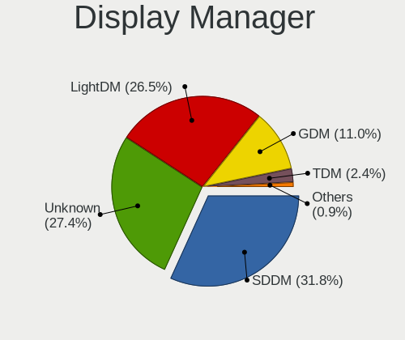

| Name    | Computers | Percent |
|---------|-----------|---------|
| LightDM | 109       | 26.27%  |
| SDDM    | 105       | 25.3%   |
| Unknown | 91        | 21.93%  |
| GDM     | 62        | 14.94%  |
| TDM     | 48        | 11.57%  |

OS Lang
-------

Language

| Lang    | Computers | Percent |
|---------|-----------|---------|
| en_US   | 201       | 50%     |
| en_GB   | 33        | 8.21%   |
| de_DE   | 24        | 5.97%   |
| en_CA   | 16        | 3.98%   |
| it_IT   | 14        | 3.48%   |
| fr_FR   | 13        | 3.23%   |
| pl_PL   | 9         | 2.24%   |
| en_IN   | 9         | 2.24%   |
| Unknown | 8         | 1.99%   |
| en_AU   | 7         | 1.74%   |
| ru_RU   | 5         | 1.24%   |
| pt_BR   | 5         | 1.24%   |
| es_AR   | 5         | 1.24%   |
| nl_NL   | 4         | 1%      |
| es_ES   | 4         | 1%      |
| en_NZ   | 4         | 1%      |
| tr_TR   | 3         | 0.75%   |
| sv_SE   | 3         | 0.75%   |
| es_MX   | 3         | 0.75%   |
| en_PH   | 3         | 0.75%   |
| en_DK   | 3         | 0.75%   |
| de_AT   | 3         | 0.75%   |
| pt_PT   | 2         | 0.5%    |
| nl_BE   | 2         | 0.5%    |
| cs_CZ   | 2         | 0.5%    |
| sl_SI   | 1         | 0.25%   |
| sk_SK   | 1         | 0.25%   |
| ru_UA   | 1         | 0.25%   |
| hu_HU   | 1         | 0.25%   |
| hr_HR   | 1         | 0.25%   |
| fr_CA   | 1         | 0.25%   |
| fi_FI   | 1         | 0.25%   |
| es_GT   | 1         | 0.25%   |
| es_CR   | 1         | 0.25%   |
| eo      | 1         | 0.25%   |
| en_ZA   | 1         | 0.25%   |
| en_SG   | 1         | 0.25%   |
| en_MY   | 1         | 0.25%   |
| en_IL   | 1         | 0.25%   |
| en_HK   | 1         | 0.25%   |
| en_FI   | 1         | 0.25%   |
| an_ES   | 1         | 0.25%   |

Boot Mode
---------

EFI or BIOS

| Mode | Computers | Percent |
|------|-----------|---------|
| EFI  | 275       | 67.24%  |
| BIOS | 134       | 32.76%  |

Filesystem
----------

Type of filesystem

| Type    | Computers | Percent |
|---------|-----------|---------|
| Ext4    | 292       | 72.46%  |
| Btrfs   | 100       | 24.81%  |
| Overlay | 5         | 1.24%   |
| Xfs     | 3         | 0.74%   |
| Unknown | 2         | 0.5%    |
| F2fs    | 1         | 0.25%   |

Part. scheme
------------

Scheme of partitioning

| Type    | Computers | Percent |
|---------|-----------|---------|
| GPT     | 278       | 68.14%  |
| Unknown | 97        | 23.77%  |
| MBR     | 33        | 8.09%   |

Dual Boot with Linux/BSD
------------------------

Hosting more than one Linux/BSD

| Dual boot | Computers | Percent |
|-----------|-----------|---------|
| No        | 347       | 85.89%  |
| Yes       | 57        | 14.11%  |

Dual Boot (Win)
---------------

Hosting Linux and Windows

| Dual boot | Computers | Percent |
|-----------|-----------|---------|
| No        | 275       | 67.24%  |
| Yes       | 134       | 32.76%  |

Board
-----

Vendor
------

Motherboard manufacturer

| Name                | Computers | Percent |
|---------------------|-----------|---------|
| Lenovo              | 85        | 21.14%  |
| ASUSTek Computer    | 72        | 17.91%  |
| Hewlett-Packard     | 43        | 10.7%   |
| Dell                | 43        | 10.7%   |
| Gigabyte Technology | 35        | 8.71%   |
| MSI                 | 33        | 8.21%   |
| Acer                | 18        | 4.48%   |
| ASRock              | 14        | 3.48%   |
| Apple               | 11        | 2.74%   |
| HUAWEI              | 6         | 1.49%   |
| Microsoft           | 4         | 1%      |
| Unknown             | 4         | 1%      |
| Notebook            | 3         | 0.75%   |
| Toshiba             | 2         | 0.5%    |
| Timi                | 2         | 0.5%    |
| Schenker            | 2         | 0.5%    |
| Samsung Electronics | 2         | 0.5%    |
| Intel               | 2         | 0.5%    |
| Fujitsu             | 2         | 0.5%    |
| Biostar             | 2         | 0.5%    |
| AMI                 | 2         | 0.5%    |
| ZOTAC               | 1         | 0.25%   |
| UMAX                | 1         | 0.25%   |
| TUXEDO              | 1         | 0.25%   |
| TrekStor            | 1         | 0.25%   |
| Razer               | 1         | 0.25%   |
| Radxa               | 1         | 0.25%   |
| Positivo            | 1         | 0.25%   |
| Pine Microsystems   | 1         | 0.25%   |
| LG Electronics      | 1         | 0.25%   |
| LattePanda          | 1         | 0.25%   |
| Framework           | 1         | 0.25%   |
| Eluktronics         | 1         | 0.25%   |
| Dynabook            | 1         | 0.25%   |
| BESSTAR Tech        | 1         | 0.25%   |
| Alienware           | 1         | 0.25%   |

Model
-----

Motherboard model

| Name                                                  | Computers | Percent |
|-------------------------------------------------------|-----------|---------|
| ASUS All Series                                       | 6         | 1.49%   |
| MSI MS-7C02                                           | 4         | 1%      |
| ASUS ROG STRIX X570-E GAMING                          | 4         | 1%      |
| Apple MacBookAir7,2                                   | 4         | 1%      |
| Unknown                                               | 4         | 1%      |
| Lenovo ThinkPad X140e 20BL000BUS                      | 3         | 0.75%   |
| ASUS TUF GAMING X570-PLUS                             | 3         | 0.75%   |
| ASRock B450M Pro4                                     | 3         | 0.75%   |
| MSI MS-7C84                                           | 2         | 0.5%    |
| MSI MS-7C37                                           | 2         | 0.5%    |
| MSI MS-7B86                                           | 2         | 0.5%    |
| MSI MS-7850                                           | 2         | 0.5%    |
| MSI MS-7798                                           | 2         | 0.5%    |
| Lenovo ThinkPad T14 Gen 1 20UD0013MB                  | 2         | 0.5%    |
| Lenovo IdeaPad FLEX-14API 81SS                        | 2         | 0.5%    |
| Lenovo IdeaPad 330-15IKB 81DE                         | 2         | 0.5%    |
| HUAWEI MACH-WX9                                       | 2         | 0.5%    |
| HP Z230 Tower Workstation                             | 2         | 0.5%    |
| HP Pavilion Gaming Laptop 15-cx0xxx                   | 2         | 0.5%    |
| HP ENVY Laptop 13-ba0xxx                              | 2         | 0.5%    |
| HP 255 G7 Notebook PC                                 | 2         | 0.5%    |
| Gigabyte H110M-S2                                     | 2         | 0.5%    |
| Gigabyte B550M AORUS PRO                              | 2         | 0.5%    |
| Gigabyte B550 AORUS ELITE V2                          | 2         | 0.5%    |
| Dell Inspiron 3542                                    | 2         | 0.5%    |
| Dell G7 7588                                          | 2         | 0.5%    |
| Dell G3 3500                                          | 2         | 0.5%    |
| Biostar G31-M7 TE                                     | 2         | 0.5%    |
| ASUS ROG Zephyrus M16 GU603HR_GU603HR                 | 2         | 0.5%    |
| ASUS ROG Zephyrus G14 GA401IV_GA401IV                 | 2         | 0.5%    |
| ASUS ROG CROSSHAIR VIII DARK HERO                     | 2         | 0.5%    |
| ASUS K30AD_M31AD_M51AD                                | 2         | 0.5%    |
| ASRock B550M Steel Legend                             | 2         | 0.5%    |
| ZOTAC ZBOXNANO-CI520NANO/CI540NANO                    | 1         | 0.25%   |
| UMAX J42 Nano                                         | 1         | 0.25%   |
| TUXEDO Pulse 15 Gen1                                  | 1         | 0.25%   |
| TrekStor Primebook P14                                | 1         | 0.25%   |
| Toshiba Satellite P750                                | 1         | 0.25%   |
| Toshiba Satellite L50D-B                              | 1         | 0.25%   |
| Timi TM1607                                           | 1         | 0.25%   |
| Timi A35S                                             | 1         | 0.25%   |
| Schenker XMG NEO 15(E20, RTX 20xx)                    | 1         | 0.25%   |
| Schenker XMG FUSION 15 (XFU15L19)                     | 1         | 0.25%   |
| Samsung 500T8A/500S8A/500T9A/500S9A                   | 1         | 0.25%   |
| Samsung 340XAA/350XAA/550XAA                          | 1         | 0.25%   |
| Razer Blade 15 Advanced Model (Early 2020) - RZ09-033 | 1         | 0.25%   |
| Radxa ROCK Pi X                                       | 1         | 0.25%   |
| Positivo POS-PIH81DI                                  | 1         | 0.25%   |
| Pine Microsystems Pine64 Pinebook Pro                 | 1         | 0.25%   |
| Notebook W65_67SZ                                     | 1         | 0.25%   |
| Notebook W65KJ1_KK1                                   | 1         | 0.25%   |
| Notebook NH5x_7xDPx                                   | 1         | 0.25%   |
| MSI Prestige 15 A10SC                                 | 1         | 0.25%   |
| MSI MS-7C91                                           | 1         | 0.25%   |
| MSI MS-7C75                                           | 1         | 0.25%   |
| MSI MS-7A38                                           | 1         | 0.25%   |
| MSI MS-7A34                                           | 1         | 0.25%   |
| MSI MS-7A32                                           | 1         | 0.25%   |
| MSI MS-7A31                                           | 1         | 0.25%   |
| MSI MS-7994                                           | 1         | 0.25%   |

Model Family
------------

Motherboard model prefix

| Name                     | Computers | Percent |
|--------------------------|-----------|---------|
| Lenovo ThinkPad          | 40        | 9.95%   |
| ASUS ROG                 | 24        | 5.97%   |
| Lenovo IdeaPad           | 19        | 4.73%   |
| Dell Inspiron            | 13        | 3.23%   |
| Dell Latitude            | 11        | 2.74%   |
| Acer Aspire              | 11        | 2.74%   |
| ASUS TUF                 | 10        | 2.49%   |
| HP Pavilion              | 8         | 1.99%   |
| Lenovo Yoga              | 7         | 1.74%   |
| HP ENVY                  | 7         | 1.74%   |
| HP EliteBook             | 7         | 1.74%   |
| HP Laptop                | 6         | 1.49%   |
| ASUS All                 | 6         | 1.49%   |
| Dell Precision           | 5         | 1.24%   |
| MSI MS-7C02              | 4         | 1%      |
| Microsoft Surface        | 4         | 1%      |
| Gigabyte X570            | 4         | 1%      |
| Dell XPS                 | 4         | 1%      |
| ASUS PRIME               | 4         | 1%      |
| Apple MacBookAir7        | 4         | 1%      |
| Unknown                  | 4         | 1%      |
| Lenovo ThinkCentre       | 3         | 0.75%   |
| Lenovo ThinkBook         | 3         | 0.75%   |
| Lenovo IdeaCentre        | 3         | 0.75%   |
| HP 255                   | 3         | 0.75%   |
| Gigabyte B550            | 3         | 0.75%   |
| Gigabyte B450            | 3         | 0.75%   |
| Dell OptiPlex            | 3         | 0.75%   |
| Dell G3                  | 3         | 0.75%   |
| ASRock B550M             | 3         | 0.75%   |
| ASRock B450M             | 3         | 0.75%   |
| Toshiba Satellite        | 2         | 0.5%    |
| Schenker XMG             | 2         | 0.5%    |
| MSI MS-7C84              | 2         | 0.5%    |
| MSI MS-7C37              | 2         | 0.5%    |
| MSI MS-7B86              | 2         | 0.5%    |
| MSI MS-7850              | 2         | 0.5%    |
| MSI MS-7798              | 2         | 0.5%    |
| Lenovo Legion            | 2         | 0.5%    |
| HUAWEI MACH-WX9          | 2         | 0.5%    |
| HP Z230                  | 2         | 0.5%    |
| Gigabyte Z97X-Gaming     | 2         | 0.5%    |
| Gigabyte H110M-S2        | 2         | 0.5%    |
| Gigabyte B550M           | 2         | 0.5%    |
| Gigabyte B450M           | 2         | 0.5%    |
| Fujitsu CELSIUS          | 2         | 0.5%    |
| Dell G7                  | 2         | 0.5%    |
| Biostar G31-M7           | 2         | 0.5%    |
| ASUS VivoBook            | 2         | 0.5%    |
| ASUS K30AD               | 2         | 0.5%    |
| ASUS ASUS                | 2         | 0.5%    |
| ASRock B450              | 2         | 0.5%    |
| Acer Swift               | 2         | 0.5%    |
| ZOTAC ZBOXNANO-CI520NANO | 1         | 0.25%   |
| UMAX J42                 | 1         | 0.25%   |
| TUXEDO Pulse             | 1         | 0.25%   |
| TrekStor Primebook       | 1         | 0.25%   |
| Timi TM1607              | 1         | 0.25%   |
| Timi A35S                | 1         | 0.25%   |
| Samsung 500T8A           | 1         | 0.25%   |

MFG Year
--------

Motherboard manufacture year

| Year    | Computers | Percent |
|---------|-----------|---------|
| 2019    | 63        | 15.67%  |
| 2020    | 57        | 14.18%  |
| 2018    | 50        | 12.44%  |
| 2021    | 45        | 11.19%  |
| 2017    | 33        | 8.21%   |
| 2013    | 28        | 6.97%   |
| 2016    | 26        | 6.47%   |
| 2014    | 25        | 6.22%   |
| 2012    | 22        | 5.47%   |
| 2015    | 19        | 4.73%   |
| 2011    | 12        | 2.99%   |
| 2010    | 7         | 1.74%   |
| 2008    | 7         | 1.74%   |
| 2009    | 4         | 1%      |
| 2007    | 3         | 0.75%   |
| Unknown | 1         | 0.25%   |

Form Factor
-----------

Physical design of the computer

| Name        | Computers | Percent |
|-------------|-----------|---------|
| Notebook    | 226       | 56.22%  |
| Desktop     | 144       | 35.82%  |
| Convertible | 14        | 3.48%   |
| All in one  | 8         | 1.99%   |
| Tablet      | 5         | 1.24%   |
| Mini pc     | 4         | 1%      |
| Server      | 1         | 0.25%   |

Secure Boot
-----------

Enabled or disabled

| State    | Computers | Percent |
|----------|-----------|---------|
| Disabled | 401       | 99.75%  |
| Enabled  | 1         | 0.25%   |

Coreboot
--------

Have coreboot on board

| Used | Computers | Percent |
|------|-----------|---------|
| No   | 402       | 100%    |

RAM Size
--------

Total RAM memory

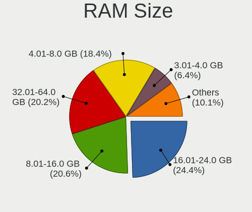

| Size in GB  | Computers | Percent |
|-------------|-----------|---------|
| 16.01-24.0  | 106       | 26.24%  |
| 4.01-8.0    | 94        | 23.27%  |
| 8.01-16.0   | 86        | 21.29%  |
| 32.01-64.0  | 54        | 13.37%  |
| 3.01-4.0    | 38        | 9.41%   |
| 24.01-32.0  | 13        | 3.22%   |
| 64.01-256.0 | 11        | 2.72%   |
| 1.01-2.0    | 2         | 0.5%    |

RAM Used
--------

Used RAM memory

| Used GB    | Computers | Percent |
|------------|-----------|---------|
| 2.01-3.0   | 123       | 28.15%  |
| 1.01-2.0   | 109       | 24.94%  |
| 4.01-8.0   | 85        | 19.45%  |
| 3.01-4.0   | 71        | 16.25%  |
| 8.01-16.0  | 21        | 4.81%   |
| 0.51-1.0   | 21        | 4.81%   |
| 16.01-24.0 | 4         | 0.92%   |
| 0.01-0.5   | 2         | 0.46%   |
| 24.01-32.0 | 1         | 0.23%   |

Total Drives
------------

Number of drives on board

| Drives | Computers | Percent |
|--------|-----------|---------|
| 1      | 207       | 50.49%  |
| 2      | 112       | 27.32%  |
| 3      | 34        | 8.29%   |
| 4      | 29        | 7.07%   |
| 5      | 19        | 4.63%   |
| 7      | 3         | 0.73%   |
| 0      | 3         | 0.73%   |
| 6      | 2         | 0.49%   |
| 9      | 1         | 0.24%   |

Has CD-ROM
----------

Has CD-ROM on board

| Presented | Computers | Percent |
|-----------|-----------|---------|
| No        | 310       | 76.17%  |
| Yes       | 97        | 23.83%  |

Has Ethernet
------------

Has Ethernet on board

| Presented | Computers | Percent |
|-----------|-----------|---------|
| Yes       | 337       | 83.83%  |
| No        | 65        | 16.17%  |

Has WiFi
--------

Has WiFi module

| Presented | Computers | Percent |
|-----------|-----------|---------|
| Yes       | 329       | 81.44%  |
| No        | 75        | 18.56%  |

Has Bluetooth
-------------

Has Bluetooth module

| Presented | Computers | Percent |
|-----------|-----------|---------|
| Yes       | 307       | 75.99%  |
| No        | 97        | 24.01%  |

Location
--------

Country
-------

Geographic location (country)

| Country      | Computers | Percent |
|--------------|-----------|---------|
| USA          | 97        | 24.01%  |
| Germany      | 39        | 9.65%   |
| France       | 21        | 5.2%    |
| Italy        | 19        | 4.7%    |
| Canada       | 19        | 4.7%    |
| UK           | 15        | 3.71%   |
| Poland       | 15        | 3.71%   |
| India        | 13        | 3.22%   |
| Brazil       | 13        | 3.22%   |
| Netherlands  | 12        | 2.97%   |
| Belgium      | 8         | 1.98%   |
| Australia    | 8         | 1.98%   |
| Turkey       | 7         | 1.73%   |
| Russia       | 7         | 1.73%   |
| Mexico       | 7         | 1.73%   |
| Finland      | 7         | 1.73%   |
| Sweden       | 6         | 1.49%   |
| Spain        | 6         | 1.49%   |
| Austria      | 6         | 1.49%   |
| Argentina    | 5         | 1.24%   |
| Portugal     | 4         | 0.99%   |
| New Zealand  | 4         | 0.99%   |
| Indonesia    | 4         | 0.99%   |
| Greece       | 4         | 0.99%   |
| Vietnam      | 3         | 0.74%   |
| Ukraine      | 3         | 0.74%   |
| Slovenia     | 3         | 0.74%   |
| Philippines  | 3         | 0.74%   |
| Hong Kong    | 3         | 0.74%   |
| Denmark      | 3         | 0.74%   |
| Czechia      | 3         | 0.74%   |
| Bahrain      | 3         | 0.74%   |
| Thailand     | 2         | 0.5%    |
| Switzerland  | 2         | 0.5%    |
| South Korea  | 2         | 0.5%    |
| Romania      | 2         | 0.5%    |
| Norway       | 2         | 0.5%    |
| Hungary      | 2         | 0.5%    |
| Georgia      | 2         | 0.5%    |
| Croatia      | 2         | 0.5%    |
| Bulgaria     | 2         | 0.5%    |
| Taiwan       | 1         | 0.25%   |
| South Africa | 1         | 0.25%   |
| Slovakia     | 1         | 0.25%   |
| Singapore    | 1         | 0.25%   |
| Saudi Arabia | 1         | 0.25%   |
| Puerto Rico  | 1         | 0.25%   |
| Pakistan     | 1         | 0.25%   |
| Morocco      | 1         | 0.25%   |
| Malaysia     | 1         | 0.25%   |
| Jordan       | 1         | 0.25%   |
| Israel       | 1         | 0.25%   |
| Guatemala    | 1         | 0.25%   |
| Egypt        | 1         | 0.25%   |
| Costa Rica   | 1         | 0.25%   |
| Colombia     | 1         | 0.25%   |
| Bangladesh   | 1         | 0.25%   |

City
----

Geographic location (city)

| City              | Computers | Percent |
|-------------------|-----------|---------|
| Montreal          | 7         | 1.67%   |
| Berlin            | 7         | 1.67%   |
| Toms River        | 6         | 1.43%   |
| Turin             | 4         | 0.95%   |
| Toronto           | 4         | 0.95%   |
| Sydney            | 4         | 0.95%   |
| Paris             | 4         | 0.95%   |
| Hamburg           | 4         | 0.95%   |
| Barberton         | 4         | 0.95%   |
| Amsterdam         | 4         | 0.95%   |
| Warsaw            | 3         | 0.72%   |
| Victoria          | 3         | 0.72%   |
| Seattle           | 3         | 0.72%   |
| Orlando           | 3         | 0.72%   |
| Moscow            | 3         | 0.72%   |
| Mesa              | 3         | 0.72%   |
| Manama            | 3         | 0.72%   |
| Madrid            | 3         | 0.72%   |
| Jacksonville      | 3         | 0.72%   |
| Frankfurt am Main | 3         | 0.72%   |
| Zapopan           | 2         | 0.48%   |
| Yuma              | 2         | 0.48%   |
| Villa Ballester   | 2         | 0.48%   |
| Tbilisi           | 2         | 0.48%   |
| St Petersburg     | 2         | 0.48%   |
| Sofia             | 2         | 0.48%   |
| So Paulo      | 2         | 0.48%   |
| Recife            | 2         | 0.48%   |
| Portland          | 2         | 0.48%   |
| Ottawa            | 2         | 0.48%   |
| Oldenburg         | 2         | 0.48%   |
| Milan             | 2         | 0.48%   |
| Miami             | 2         | 0.48%   |
| Melbourne         | 2         | 0.48%   |
| Lyon              | 2         | 0.48%   |
| Llanelli          | 2         | 0.48%   |
| Leipzig           | 2         | 0.48%   |
| Krakow            | 2         | 0.48%   |
| Innsbruck         | 2         | 0.48%   |
| Ho Chi Minh City  | 2         | 0.48%   |
| Helsinki          | 2         | 0.48%   |
| Hampstead         | 2         | 0.48%   |
| Gothenburg        | 2         | 0.48%   |
| Florence          | 2         | 0.48%   |
| Essen             | 2         | 0.48%   |
| Chicago           | 2         | 0.48%   |
| Central           | 2         | 0.48%   |
| Brussels          | 2         | 0.48%   |
| Bengaluru         | 2         | 0.48%   |
| Bandung           | 2         | 0.48%   |
| Auckland          | 2         | 0.48%   |
| Annecy            | 2         | 0.48%   |
| Ankara            | 2         | 0.48%   |
| lesund       | 1         | 0.24%   |
| Zurich            | 1         | 0.24%   |
| Wroclaw           | 1         | 0.24%   |
| Winnipeg          | 1         | 0.24%   |
| Windham Center    | 1         | 0.24%   |
| Wilmington        | 1         | 0.24%   |
| Wiesbaden         | 1         | 0.24%   |

Drives
------

Drive Vendor
------------

Hard drive vendors

| Vendor                         | Computers | Drives | Percent |
|--------------------------------|-----------|--------|---------|
| Samsung Electronics            | 130       | 202    | 19.52%  |
| WDC                            | 92        | 141    | 13.81%  |
| Seagate                        | 92        | 122    | 13.81%  |
| Kingston                       | 39        | 60     | 5.86%   |
| Toshiba                        | 35        | 42     | 5.26%   |
| Crucial                        | 29        | 45     | 4.35%   |
| Sandisk                        | 28        | 32     | 4.2%    |
| SK Hynix                       | 20        | 21     | 3%      |
| Intel                          | 18        | 23     | 2.7%    |
| HGST                           | 15        | 17     | 2.25%   |
| Unknown                        | 14        | 19     | 2.1%    |
| Phison                         | 12        | 13     | 1.8%    |
| Micron Technology              | 11        | 12     | 1.65%   |
| A-DATA Technology              | 10        | 16     | 1.5%    |
| Hitachi                        | 8         | 8      | 1.2%    |
| Apple                          | 8         | 9      | 1.2%    |
| KIOXIA                         | 7         | 7      | 1.05%   |
| PNY                            | 5         | 5      | 0.75%   |
| Corsair                        | 5         | 5      | 0.75%   |
| Transcend                      | 4         | 4      | 0.6%    |
| SPCC                           | 4         | 4      | 0.6%    |
| LITEONIT                       | 4         | 5      | 0.6%    |
| China                          | 4         | 4      | 0.6%    |
| XPG                            | 3         | 3      | 0.45%   |
| OCZ                            | 3         | 3      | 0.45%   |
| Mushkin                        | 3         | 3      | 0.45%   |
| Maxone                         | 3         | 3      | 0.45%   |
| JMicron                        | 3         | 3      | 0.45%   |
| Intenso                        | 3         | 3      | 0.45%   |
| WDC WDS                        | 2         | 2      | 0.3%    |
| StoreJet                       | 2         | 2      | 0.3%    |
| Solid State Storage Technology | 2         | 2      | 0.3%    |
| LITEON                         | 2         | 2      | 0.3%    |
| KingSpec                       | 2         | 2      | 0.3%    |
| HFS256G3                       | 2         | 2      | 0.3%    |
| Gigabyte Technology            | 2         | 3      | 0.3%    |
| Fujitsu                        | 2         | 2      | 0.3%    |
| V-GeN                          | 1         | 1      | 0.15%   |
| USB3.1                         | 1         | 1      | 0.15%   |
| USB3.0                         | 1         | 1      | 0.15%   |
| Union Memory (Shenzhen)        | 1         | 1      | 0.15%   |
| UMAX                           | 1         | 1      | 0.15%   |
| Teclast                        | 1         | 1      | 0.15%   |
| Team                           | 1         | 2      | 0.15%   |
| SSSTC                          | 1         | 1      | 0.15%   |
| RSH-319                        | 1         | 1      | 0.15%   |
| Realtek                        | 1         | 1      | 0.15%   |
| PLEXTOR                        | 1         | 1      | 0.15%   |
| Pioneer                        | 1         | 3      | 0.15%   |
| PI-041                         | 1         | 1      | 0.15%   |
| Phison Electronics             | 1         | 1      | 0.15%   |
| Patriot                        | 1         | 2      | 0.15%   |
| Netac                          | 1         | 1      | 0.15%   |
| Micron/Crucial Technology      | 1         | 1      | 0.15%   |
| MAXTOR                         | 1         | 1      | 0.15%   |
| Lite-On                        | 1         | 1      | 0.15%   |
| Leven                          | 1         | 1      | 0.15%   |
| Lenovo                         | 1         | 1      | 0.15%   |
| LDLC                           | 1         | 1      | 0.15%   |
| Kingmax                        | 1         | 2      | 0.15%   |

Drive Model
-----------

Hard drive models

| Model                             | Computers | Percent |
|-----------------------------------|-----------|---------|
| Samsung SSD 860 EVO 1TB           | 12        | 1.58%   |
| Seagate ST1000LM035-1RK172 1TB    | 11        | 1.45%   |
| Samsung SSD 860 EVO 500GB         | 9         | 1.19%   |
| Samsung SSD 850 EVO 500GB         | 8         | 1.05%   |
| Samsung SSD 850 EVO 250GB         | 8         | 1.05%   |
| Samsung SSD 970 EVO 500GB         | 7         | 0.92%   |
| Samsung SSD 860 EVO 250GB         | 7         | 0.92%   |
| Kingston SA400S37120G 120GB SSD   | 7         | 0.92%   |
| HGST HTS721010A9E630 1TB          | 7         | 0.92%   |
| WDC WD10EZEX-08WN4A0 1TB          | 6         | 0.79%   |
| Seagate ST500LT012-1DG142 500GB   | 6         | 0.79%   |
| Crucial CT500MX500SSD1 500GB      | 6         | 0.79%   |
| WDC WD10EZEX-00BN5A0 1TB          | 5         | 0.66%   |
| Seagate ST2000DM008-2FR102 2TB    | 5         | 0.66%   |
| Seagate ST2000DM006-2DM164 2TB    | 5         | 0.66%   |
| Seagate Expansion Desk 8TB        | 5         | 0.66%   |
| Samsung SSD 970 EVO 1TB           | 5         | 0.66%   |
| Samsung NVMe SSD Drive 512GB      | 5         | 0.66%   |
| Crucial CT1000MX500SSD1 1TB       | 5         | 0.66%   |
| WDC WDS100T3X0C-00SJG0 1TB        | 4         | 0.53%   |
| Unknown SD/MMC/MS PRO 64GB        | 4         | 0.53%   |
| Seagate ST4000DM004-2CV104 4TB    | 4         | 0.53%   |
| Seagate ST1000DM010-2EP102 1TB    | 4         | 0.53%   |
| Samsung SSD 970 EVO Plus 500GB    | 4         | 0.53%   |
| Samsung SSD 870 EVO 250GB         | 4         | 0.53%   |
| Kingston SA400S37480G 480GB SSD   | 4         | 0.53%   |
| Kingston SA400S37240G 240GB SSD   | 4         | 0.53%   |
| Apple SSD SM0128G 121GB           | 4         | 0.53%   |
| WDC WDS500G3X0C-00SJG0 500GB      | 3         | 0.4%    |
| WDC WDS500G2B0A-00SM50 500GB SSD  | 3         | 0.4%    |
| WDC WD20EZRZ-00Z5HB0 2TB          | 3         | 0.4%    |
| WDC WD10SPZX-24Z10 1TB            | 3         | 0.4%    |
| WDC WD10EZEX-00RKKA0 1TB          | 3         | 0.4%    |
| Transcend TS240GMTS420S 240GB SSD | 3         | 0.4%    |
| Toshiba HDWD110 1TB               | 3         | 0.4%    |
| Toshiba DT01ACA100 1TB            | 3         | 0.4%    |
| Seagate ST2000LM007-1R8174 2TB    | 3         | 0.4%    |
| Seagate ST2000DM001-1ER164 2TB    | 3         | 0.4%    |
| Seagate ST1000LM049-2GH172 1TB    | 3         | 0.4%    |
| Seagate ST1000DM003-1CH162 1TB    | 3         | 0.4%    |
| Samsung SSD 980 PRO 500GB         | 3         | 0.4%    |
| Samsung SSD 980 500GB             | 3         | 0.4%    |
| Samsung SSD 960 EVO 500GB         | 3         | 0.4%    |
| Samsung SSD 870 QVO 1TB           | 3         | 0.4%    |
| Samsung SSD 840 EVO 250GB         | 3         | 0.4%    |
| Samsung NVMe SSD Drive 1TB        | 3         | 0.4%    |
| Samsung MZVLB1T0HBLR-00000 1TB    | 3         | 0.4%    |
| Phison Sabrent 1TB                | 3         | 0.4%    |
| Maxone USB 3.0 160GB              | 3         | 0.4%    |
| KIOXIA KBG40ZNV512G 512GB         | 3         | 0.4%    |
| Intel SSDPEKNW512G8H 512GB        | 3         | 0.4%    |
| Hitachi HTS545050A7E380 500GB     | 3         | 0.4%    |
| Crucial CT1000P1SSD8 1TB          | 3         | 0.4%    |
| WDC WDS500G2B0C-00PXH0 500GB      | 2         | 0.26%   |
| WDC WDS100T3XHC-00SJG0 1TB        | 2         | 0.26%   |
| WDC WDS100T2B0C-00PXH0 1TB        | 2         | 0.26%   |
| WDC WDS100T2B0A-00SM50 1TB SSD    | 2         | 0.26%   |
| WDC WDS 500G2B0B-00YS70 500GB SSD | 2         | 0.26%   |
| WDC WD40EZRZ-00GXCB0 4TB          | 2         | 0.26%   |
| WDC WD10JPVX-22JC3T0 1TB          | 2         | 0.26%   |

HDD Vendor
----------

Hard disk drive vendors

| Vendor              | Computers | Drives | Percent |
|---------------------|-----------|--------|---------|
| Seagate             | 87        | 116    | 40.85%  |
| WDC                 | 61        | 90     | 28.64%  |
| Toshiba             | 19        | 20     | 8.92%   |
| HGST                | 15        | 17     | 7.04%   |
| Hitachi             | 8         | 8      | 3.76%   |
| Unknown             | 4         | 4      | 1.88%   |
| Samsung Electronics | 3         | 5      | 1.41%   |
| Maxone              | 3         | 3      | 1.41%   |
| StoreJet            | 2         | 2      | 0.94%   |
| Fujitsu             | 2         | 2      | 0.94%   |
| USB3.0              | 1         | 1      | 0.47%   |
| RSH-319             | 1         | 1      | 0.47%   |
| PI-041              | 1         | 1      | 0.47%   |
| MAXTOR              | 1         | 1      | 0.47%   |
| JMicron             | 1         | 1      | 0.47%   |
| HPE                 | 1         | 1      | 0.47%   |
| Generic-            | 1         | 1      | 0.47%   |
| ASMT                | 1         | 2      | 0.47%   |
| ASMedia             | 1         | 1      | 0.47%   |

SSD Vendor
----------

Solid state drive vendors

| Vendor              | Computers | Drives | Percent |
|---------------------|-----------|--------|---------|
| Samsung Electronics | 88        | 127    | 33.59%  |
| Kingston            | 28        | 47     | 10.69%  |
| Crucial             | 23        | 30     | 8.78%   |
| SanDisk             | 20        | 22     | 7.63%   |
| WDC                 | 14        | 20     | 5.34%   |
| Apple               | 7         | 8      | 2.67%   |
| Toshiba             | 6         | 8      | 2.29%   |
| Micron Technology   | 6         | 7      | 2.29%   |
| Intel               | 6         | 8      | 2.29%   |
| Transcend           | 4         | 4      | 1.53%   |
| SK Hynix            | 4         | 4      | 1.53%   |
| LITEONIT            | 4         | 5      | 1.53%   |
| China               | 4         | 4      | 1.53%   |
| A-DATA Technology   | 4         | 5      | 1.53%   |
| PNY                 | 3         | 3      | 1.15%   |
| OCZ                 | 3         | 3      | 1.15%   |
| Mushkin             | 3         | 3      | 1.15%   |
| Intenso             | 3         | 3      | 1.15%   |
| Corsair             | 3         | 3      | 1.15%   |
| WDC WDS             | 2         | 2      | 0.76%   |
| SPCC                | 2         | 2      | 0.76%   |
| Seagate             | 2         | 2      | 0.76%   |
| KingSpec            | 2         | 2      | 0.76%   |
| V-GeN               | 1         | 1      | 0.38%   |
| Unknown             | 1         | 2      | 0.38%   |
| UMAX                | 1         | 1      | 0.38%   |
| Teclast             | 1         | 1      | 0.38%   |
| Team                | 1         | 2      | 0.38%   |
| Pioneer             | 1         | 3      | 0.38%   |
| PHISON              | 1         | 1      | 0.38%   |
| Patriot             | 1         | 2      | 0.38%   |
| LITEON              | 1         | 1      | 0.38%   |
| Leven               | 1         | 1      | 0.38%   |
| LDLC                | 1         | 1      | 0.38%   |
| Kingmax             | 1         | 2      | 0.38%   |
| KingFast            | 1         | 1      | 0.38%   |
| KingDian            | 1         | 1      | 0.38%   |
| imation             | 1         | 1      | 0.38%   |
| Hewlett-Packard     | 1         | 1      | 0.38%   |
| GOODRAM             | 1         | 1      | 0.38%   |
| Gigabyte Technology | 1         | 1      | 0.38%   |
| FORESEE             | 1         | 1      | 0.38%   |
| DREVO               | 1         | 1      | 0.38%   |
| Apacer              | 1         | 1      | 0.38%   |

Drive Kind
----------

HDD or SSD

| Kind    | Computers | Drives | Percent |
|---------|-----------|--------|---------|
| SSD     | 209       | 349    | 35.6%   |
| NVMe    | 183       | 247    | 31.18%  |
| HDD     | 177       | 277    | 30.15%  |
| MMC     | 9         | 12     | 1.53%   |
| Unknown | 9         | 10     | 1.53%   |

Drive Connector
---------------

SATA, SAS, NVMe, etc.

| Type | Computers | Drives | Percent |
|------|-----------|--------|---------|
| SATA | 287       | 588    | 55.3%   |
| NVMe | 182       | 245    | 35.07%  |
| SAS  | 41        | 50     | 7.9%    |
| MMC  | 9         | 12     | 1.73%   |

Drive Size
----------

Size of hard drive

| Size in TB | Computers | Drives | Percent |
|------------|-----------|--------|---------|
| 0.01-0.5   | 206       | 345    | 48.93%  |
| 0.51-1.0   | 139       | 184    | 33.02%  |
| 1.01-2.0   | 40        | 53     | 9.5%    |
| 3.01-4.0   | 13        | 18     | 3.09%   |
| 4.01-10.0  | 12        | 14     | 2.85%   |
| 2.01-3.0   | 9         | 10     | 2.14%   |
| 10.01-20.0 | 2         | 2      | 0.48%   |

Space Total
-----------

Amount of disk space available on the file system

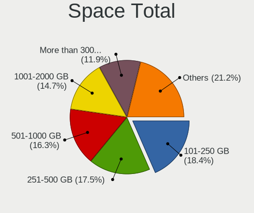

| Size in GB     | Computers | Percent |
|----------------|-----------|---------|
| 101-250        | 84        | 20.29%  |
| 251-500        | 77        | 18.6%   |
| 1001-2000      | 67        | 16.18%  |
| 501-1000       | 65        | 15.7%   |
| More than 3000 | 38        | 9.18%   |
| Unknown        | 30        | 7.25%   |
| 2001-3000      | 21        | 5.07%   |
| 51-100         | 17        | 4.11%   |
| 21-50          | 8         | 1.93%   |
| 1-20           | 7         | 1.69%   |

Space Used
----------

Amount of used disk space

| Used GB        | Computers | Percent |
|----------------|-----------|---------|
| 1-20           | 88        | 20.32%  |
| 101-250        | 69        | 15.94%  |
| 21-50          | 59        | 13.63%  |
| 51-100         | 58        | 13.39%  |
| 251-500        | 46        | 10.62%  |
| 1001-2000      | 33        | 7.62%   |
| 501-1000       | 30        | 6.93%   |
| Unknown        | 30        | 6.93%   |
| More than 3000 | 14        | 3.23%   |
| 2001-3000      | 6         | 1.39%   |

Malfunc. Drives
---------------

Drive models with a malfunction

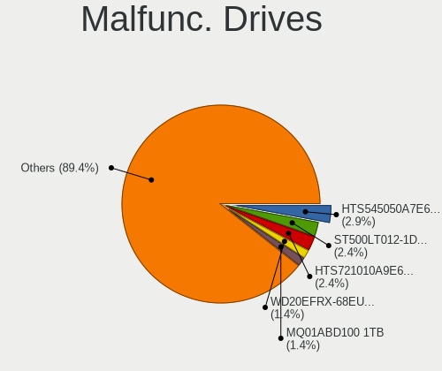

| Model                                            | Computers | Drives | Percent |
|--------------------------------------------------|-----------|--------|---------|
| Hitachi HTS545050A7E380 500GB                    | 3         | 3      | 8.82%   |
| HGST HTS721010A9E630 1TB                         | 3         | 3      | 8.82%   |
| WDC WD5000LPVT-22G33T0 500GB                     | 1         | 1      | 2.94%   |
| WDC WD5000AZRX-00A8LB0 500GB                     | 1         | 1      | 2.94%   |
| WDC WD40EFRX-68WT0N0 4TB                         | 1         | 2      | 2.94%   |
| WDC WD10EACS-00D6B1 1TB                          | 1         | 1      | 2.94%   |
| Transcend TS240GMTS420S 240GB SSD                | 1         | 1      | 2.94%   |
| Toshiba MK5055GSXF 500GB                         | 1         | 1      | 2.94%   |
| Toshiba DT01ACA100 1TB                           | 1         | 1      | 2.94%   |
| SK Hynix SC308 SATA 128GB SSD                    | 1         | 1      | 2.94%   |
| Seagate ST9320325AS 320GB                        | 1         | 5      | 2.94%   |
| Seagate ST6000VX0023-2EF110 6TB                  | 1         | 1      | 2.94%   |
| Seagate ST500LX012-SSHD-8GB                      | 1         | 1      | 2.94%   |
| Seagate ST500LT012-1DG142 500GB                  | 1         | 1      | 2.94%   |
| Seagate ST3320620AS 320GB                        | 1         | 1      | 2.94%   |
| Seagate ST1000LM049-2GH172 1TB                   | 1         | 1      | 2.94%   |
| SanDisk SSD PLUS 240GB                           | 1         | 1      | 2.94%   |
| SanDisk SDSSDA240G 240GB                         | 1         | 2      | 2.94%   |
| Samsung Electronics SSD 970 EVO 500GB            | 1         | 1      | 2.94%   |
| Samsung Electronics SSD 960 EVO 500GB            | 1         | 1      | 2.94%   |
| Samsung Electronics MZNLH128HBHQ-000H1 128GB SSD | 1         | 1      | 2.94%   |
| Samsung Electronics HD103SI 1TB                  | 1         | 1      | 2.94%   |
| Kingston SV300S37A120G 120GB SSD                 | 1         | 1      | 2.94%   |
| HGST HTS545050A7E680 500GB                       | 1         | 1      | 2.94%   |
| Fujitsu MHZ2320BH G2 320GB                       | 1         | 1      | 2.94%   |
| DREVO X1 SSD 120GB                               | 1         | 1      | 2.94%   |
| Crucial CT1050MX300SSD1 1050GB                   | 1         | 1      | 2.94%   |
| Corsair Force LS SSD 120GB                       | 1         | 1      | 2.94%   |
| ASMT ASM1156-PM 1TB                              | 1         | 2      | 2.94%   |
| Apple SSD SM256C 256GB                           | 1         | 1      | 2.94%   |

Malfunc. Drive Vendor
---------------------

Vendors of faulty drives

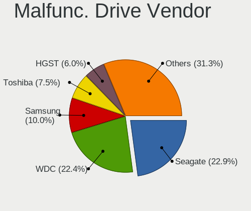

| Vendor              | Computers | Drives | Percent |
|---------------------|-----------|--------|---------|
| Seagate             | 6         | 10     | 17.65%  |
| WDC                 | 4         | 5      | 11.76%  |
| Samsung Electronics | 4         | 4      | 11.76%  |
| HGST                | 4         | 4      | 11.76%  |
| Hitachi             | 3         | 3      | 8.82%   |
| Toshiba             | 2         | 2      | 5.88%   |
| SanDisk             | 2         | 3      | 5.88%   |
| Transcend           | 1         | 1      | 2.94%   |
| SK Hynix            | 1         | 1      | 2.94%   |
| Kingston            | 1         | 1      | 2.94%   |
| Fujitsu             | 1         | 1      | 2.94%   |
| DREVO               | 1         | 1      | 2.94%   |
| Crucial             | 1         | 1      | 2.94%   |
| Corsair             | 1         | 1      | 2.94%   |
| ASMT                | 1         | 2      | 2.94%   |
| Apple               | 1         | 1      | 2.94%   |

Malfunc. HDD Vendor
-------------------

Vendors of faulty HDD drives

| Vendor              | Computers | Drives | Percent |
|---------------------|-----------|--------|---------|
| Seagate             | 6         | 10     | 27.27%  |
| WDC                 | 4         | 5      | 18.18%  |
| HGST                | 4         | 4      | 18.18%  |
| Hitachi             | 3         | 3      | 13.64%  |
| Toshiba             | 2         | 2      | 9.09%   |
| Samsung Electronics | 1         | 1      | 4.55%   |
| Fujitsu             | 1         | 1      | 4.55%   |
| ASMT                | 1         | 2      | 4.55%   |

Malfunc. Drive Kind
-------------------

Kinds of faulty drives

| Kind | Computers | Drives | Percent |
|------|-----------|--------|---------|
| HDD  | 22        | 28     | 66.67%  |
| SSD  | 9         | 11     | 27.27%  |
| NVMe | 2         | 2      | 6.06%   |

Failed Drives
-------------

Failed drive models

| Model                           | Computers | Drives | Percent |
|---------------------------------|-----------|--------|---------|
| Seagate ST500DM002-1BC142 500GB | 1         | 1      | 50%     |
| LITEON CA3-8D512 512GB          | 1         | 1      | 50%     |

Failed Drive Vendor
-------------------

Failed drive vendors

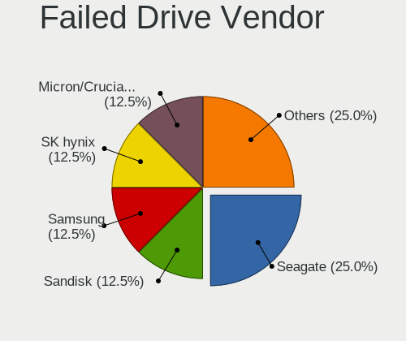

| Vendor  | Computers | Drives | Percent |
|---------|-----------|--------|---------|
| Seagate | 1         | 1      | 50%     |
| LITEON  | 1         | 1      | 50%     |

Drive Status
------------

Number of failed and malfunc. drives

| Status   | Computers | Drives | Percent |
|----------|-----------|--------|---------|
| Works    | 290       | 584    | 63.74%  |
| Detected | 131       | 268    | 28.79%  |
| Malfunc  | 32        | 41     | 7.03%   |
| Failed   | 2         | 2      | 0.44%   |

Storage controller
------------------

Storage Vendor
--------------

Storage controller vendors

| Vendor                         | Computers | Percent |
|--------------------------------|-----------|---------|
| Intel                          | 224       | 40.58%  |
| AMD                            | 107       | 19.38%  |
| Samsung Electronics            | 62        | 11.23%  |
| Sandisk                        | 34        | 6.16%   |
| Phison Electronics             | 18        | 3.26%   |
| SK Hynix                       | 15        | 2.72%   |
| Kingston Technology Company    | 12        | 2.17%   |
| Toshiba America Info Systems   | 10        | 1.81%   |
| KIOXIA                         | 10        | 1.81%   |
| ASMedia Technology             | 10        | 1.81%   |
| Micron/Crucial Technology      | 7         | 1.27%   |
| Micron Technology              | 6         | 1.09%   |
| Marvell Technology Group       | 6         | 1.09%   |
| ADATA Technology               | 6         | 1.09%   |
| Solid State Storage Technology | 4         | 0.72%   |
| Realtek Semiconductor          | 4         | 0.72%   |
| JMicron Technology             | 4         | 0.72%   |
| Seagate Technology             | 3         | 0.54%   |
| Nvidia                         | 3         | 0.54%   |
| Lite-On Technology             | 2         | 0.36%   |
| Union Memory (Shenzhen)        | 1         | 0.18%   |
| Silicon Motion                 | 1         | 0.18%   |
| LSI Logic / Symbios Logic      | 1         | 0.18%   |
| Lenovo                         | 1         | 0.18%   |
| Apple                          | 1         | 0.18%   |

Storage Model
-------------

Storage controller models

| Model                                                                          | Computers | Percent |
|--------------------------------------------------------------------------------|-----------|---------|
| AMD FCH SATA Controller [AHCI mode]                                            | 82        | 13.58%  |
| Samsung NVMe SSD Controller SM981/PM981/PM983                                  | 38        | 6.29%   |
| Intel Sunrise Point-LP SATA Controller [AHCI mode]                             | 30        | 4.97%   |
| AMD 400 Series Chipset SATA Controller                                         | 23        | 3.81%   |
| Intel 8 Series/C220 Series Chipset Family 6-port SATA Controller 1 [AHCI mode] | 22        | 3.64%   |
| Intel 82801 Mobile SATA Controller [RAID mode]                                 | 19        | 3.15%   |
| Intel Q170/Q150/B150/H170/H110/Z170/CM236 Chipset SATA Controller [AHCI Mode]  | 13        | 2.15%   |
| Intel 8 Series SATA Controller 1 [AHCI mode]                                   | 13        | 2.15%   |
| Sandisk WD Black SN750 / PC SN730 NVMe SSD                                     | 11        | 1.82%   |
| AMD Starship/Matisse Chipset SATA Controller [AHCI mode]                       | 11        | 1.82%   |
| KIOXIA Non-Volatile memory controller                                          | 10        | 1.66%   |
| Intel Cannon Lake Mobile PCH SATA AHCI Controller                              | 10        | 1.66%   |
| Intel 7 Series Chipset Family 6-port SATA Controller [AHCI mode]               | 10        | 1.66%   |
| ASMedia ASM1062 Serial ATA Controller                                          | 10        | 1.66%   |
| Sandisk WD Blue SN550 NVMe SSD                                                 | 9         | 1.49%   |
| Phison E12 NVMe Controller                                                     | 9         | 1.49%   |
| Intel SSD 660P Series                                                          | 8         | 1.32%   |
| Intel 7 Series/C210 Series Chipset Family 6-port SATA Controller [AHCI mode]   | 8         | 1.32%   |
| Sandisk WD Black 2018/SN750 / PC SN720 NVMe SSD                                | 7         | 1.16%   |
| Samsung NVMe SSD Controller SM961/PM961/SM963                                  | 7         | 1.16%   |
| Intel 200 Series PCH SATA controller [AHCI mode]                               | 7         | 1.16%   |
| Samsung NVMe SSD Controller PM9A1/PM9A3/980PRO                                 | 6         | 0.99%   |
| Samsung NVMe SSD Controller 980                                                | 6         | 0.99%   |
| Micron Non-Volatile memory controller                                          | 6         | 0.99%   |
| Intel HM170/QM170 Chipset SATA Controller [AHCI Mode]                          | 6         | 0.99%   |
| Intel 6 Series/C200 Series Chipset Family 6 port Mobile SATA AHCI Controller   | 6         | 0.99%   |
| SK Hynix Gold P31 SSD                                                          | 5         | 0.83%   |
| Samsung Electronics SATA controller                                            | 5         | 0.83%   |
| Phison E16 PCIe4 NVMe Controller                                               | 5         | 0.83%   |
| Intel SATA Controller [RAID mode]                                              | 5         | 0.83%   |
| Intel Ice Lake-LP SATA Controller [AHCI mode]                                  | 5         | 0.83%   |
| Intel 9 Series Chipset Family SATA Controller [AHCI Mode]                      | 5         | 0.83%   |
| Intel 400 Series Chipset Family SATA AHCI Controller                           | 5         | 0.83%   |
| AMD SB7x0/SB8x0/SB9x0 SATA Controller [AHCI mode]                              | 5         | 0.83%   |
| ADATA XPG SX8200 Pro PCIe Gen3x4 M.2 2280 Solid State Drive                    | 5         | 0.83%   |
| Toshiba America Info Systems BG3 NVMe SSD Controller                           | 4         | 0.66%   |
| Solid State Storage Non-Volatile memory controller                             | 4         | 0.66%   |
| SK Hynix Non-Volatile memory controller                                        | 4         | 0.66%   |
| Sandisk Non-Volatile memory controller                                         | 4         | 0.66%   |
| Micron/Crucial P2 NVMe PCIe SSD                                                | 4         | 0.66%   |
| Micron/Crucial P1 NVMe PCIe SSD                                                | 4         | 0.66%   |
| Kingston Company Company Non-Volatile memory controller                        | 4         | 0.66%   |
| Kingston Company A2000 NVMe SSD                                                | 4         | 0.66%   |
| Intel Wildcat Point-LP SATA Controller [AHCI Mode]                             | 4         | 0.66%   |
| Intel Volume Management Device NVMe RAID Controller                            | 4         | 0.66%   |
| Intel Tiger Lake-LP SATA Controller [AHCI mode]                                | 4         | 0.66%   |
| Intel Celeron/Pentium Silver Processor SATA Controller                         | 4         | 0.66%   |
| Intel 500 Series Chipset Family SATA AHCI Controller                           | 4         | 0.66%   |
| Intel 5 Series/3400 Series Chipset 6 port SATA AHCI Controller                 | 4         | 0.66%   |
| Toshiba America Info Systems XG6 NVMe SSD Controller                           | 3         | 0.5%    |
| SK Hynix BC501 NVMe Solid State Drive                                          | 3         | 0.5%    |
| Realtek Realtek Non-Volatile memory controller                                 | 3         | 0.5%    |
| Intel SSD Pro 7600p/760p/E 6100p Series                                        | 3         | 0.5%    |
| Intel NM10/ICH7 Family SATA Controller [IDE mode]                              | 3         | 0.5%    |
| Intel Cannon Lake PCH SATA AHCI Controller                                     | 3         | 0.5%    |
| Intel 82801JI (ICH10 Family) SATA AHCI Controller                              | 3         | 0.5%    |
| Intel 82801IBM/IEM (ICH9M/ICH9M-E) 4 port SATA Controller [AHCI mode]          | 3         | 0.5%    |
| Intel 82801G (ICH7 Family) IDE Controller                                      | 3         | 0.5%    |
| AMD X370 Series Chipset SATA Controller                                        | 3         | 0.5%    |
| AMD 300 Series Chipset SATA Controller                                         | 3         | 0.5%    |

Storage Kind
------------

Kind of storage controller (IDE, SATA, NVMe, SAS, ...)

| Kind | Computers | Percent |
|------|-----------|---------|
| SATA | 298       | 56.55%  |
| NVMe | 182       | 34.54%  |
| RAID | 29        | 5.5%    |
| IDE  | 17        | 3.23%   |
| SAS  | 1         | 0.19%   |

Processor
---------

CPU Vendor
----------

Processor vendors

| Vendor | Computers | Percent |
|--------|-----------|---------|
| Intel  | 261       | 64.93%  |
| AMD    | 140       | 34.83%  |
| ARM    | 1         | 0.25%   |

CPU Model
---------

Processor models

| Model                                         | Computers | Percent |
|-----------------------------------------------|-----------|---------|
| AMD Ryzen 5 3600 6-Core Processor             | 10        | 2.49%   |
| Intel Core i5-6200U CPU @ 2.30GHz             | 8         | 1.99%   |
| AMD Ryzen 7 3700X 8-Core Processor            | 7         | 1.74%   |
| Intel Core i7-8550U CPU @ 1.80GHz             | 6         | 1.49%   |
| Intel Core i7-6700HQ CPU @ 2.60GHz            | 6         | 1.49%   |
| Intel Core i5-8250U CPU @ 1.60GHz             | 6         | 1.49%   |
| Intel Core i5-6300U CPU @ 2.40GHz             | 6         | 1.49%   |
| Intel Core i7-4790 CPU @ 3.60GHz              | 5         | 1.24%   |
| Intel Core i7-4600U CPU @ 2.10GHz             | 5         | 1.24%   |
| Intel Core i7-10510U CPU @ 1.80GHz            | 5         | 1.24%   |
| Intel Core i5-7200U CPU @ 2.50GHz             | 5         | 1.24%   |
| AMD Ryzen 9 3900X 12-Core Processor           | 5         | 1.24%   |
| AMD Ryzen 7 PRO 4750U with Radeon Graphics    | 5         | 1.24%   |
| AMD Ryzen 5 5600X 6-Core Processor            | 5         | 1.24%   |
| Intel Core i7-9750H CPU @ 2.60GHz             | 4         | 1%      |
| Intel Core i7-8750H CPU @ 2.20GHz             | 4         | 1%      |
| Intel Core i7-4770K CPU @ 3.50GHz             | 4         | 1%      |
| Intel Core i7-10750H CPU @ 2.60GHz            | 4         | 1%      |
| Intel Core i5-8300H CPU @ 2.30GHz             | 4         | 1%      |
| Intel Core i5-3570K CPU @ 3.40GHz             | 4         | 1%      |
| Intel Core i5-1035G1 CPU @ 1.00GHz            | 4         | 1%      |
| Intel 11th Gen Core i5-1135G7 @ 2.40GHz       | 4         | 1%      |
| AMD Ryzen 9 5900X 12-Core Processor           | 4         | 1%      |
| AMD Ryzen 7 4800H with Radeon Graphics        | 4         | 1%      |
| AMD Ryzen 7 3800X 8-Core Processor            | 4         | 1%      |
| AMD Ryzen 5 3500U with Radeon Vega Mobile Gfx | 4         | 1%      |
| Intel Core i7-7500U CPU @ 2.70GHz             | 3         | 0.75%   |
| Intel Core i7-6500U CPU @ 2.50GHz             | 3         | 0.75%   |
| Intel Core i7-4790K CPU @ 4.00GHz             | 3         | 0.75%   |
| Intel Core i5-7400 CPU @ 3.00GHz              | 3         | 0.75%   |
| Intel Core i5-5350U CPU @ 1.80GHz             | 3         | 0.75%   |
| Intel Core i3-8130U CPU @ 2.20GHz             | 3         | 0.75%   |
| Intel Core 2 Quad CPU Q6600 @ 2.40GHz         | 3         | 0.75%   |
| AMD Ryzen 9 5950X 16-Core Processor           | 3         | 0.75%   |
| AMD Ryzen 9 5900HX with Radeon Graphics       | 3         | 0.75%   |
| AMD Ryzen 7 5700U with Radeon Graphics        | 3         | 0.75%   |
| AMD Ryzen 7 3700U with Radeon Vega Mobile Gfx | 3         | 0.75%   |
| AMD Ryzen 5 3600X 6-Core Processor            | 3         | 0.75%   |
| AMD Ryzen 5 3400G with Radeon Vega Graphics   | 3         | 0.75%   |
| AMD Ryzen 5 1600 Six-Core Processor           | 3         | 0.75%   |
| AMD A4-5000 APU with Radeon HD Graphics       | 3         | 0.75%   |
| Intel Core i7-8650U CPU @ 1.90GHz             | 2         | 0.5%    |
| Intel Core i7-8565U CPU @ 1.80GHz             | 2         | 0.5%    |
| Intel Core i7-7700HQ CPU @ 2.80GHz            | 2         | 0.5%    |
| Intel Core i7-6700K CPU @ 4.00GHz             | 2         | 0.5%    |
| Intel Core i7-4800MQ CPU @ 2.70GHz            | 2         | 0.5%    |
| Intel Core i7-4702MQ CPU @ 2.20GHz            | 2         | 0.5%    |
| Intel Core i7-10875H CPU @ 2.30GHz            | 2         | 0.5%    |
| Intel Core i7-10870H CPU @ 2.20GHz            | 2         | 0.5%    |
| Intel Core i5-8365U CPU @ 1.60GHz             | 2         | 0.5%    |
| Intel Core i5-6600 CPU @ 3.30GHz              | 2         | 0.5%    |
| Intel Core i5-6500 CPU @ 3.20GHz              | 2         | 0.5%    |
| Intel Core i5-5200U CPU @ 2.20GHz             | 2         | 0.5%    |
| Intel Core i5-4310M CPU @ 2.70GHz             | 2         | 0.5%    |
| Intel Core i5-4210U CPU @ 1.70GHz             | 2         | 0.5%    |
| Intel Core i5-4200U CPU @ 1.60GHz             | 2         | 0.5%    |
| Intel Core i5-3337U CPU @ 1.80GHz             | 2         | 0.5%    |
| Intel Core i5-1035G4 CPU @ 1.10GHz            | 2         | 0.5%    |
| Intel Core i5-10210U CPU @ 1.60GHz            | 2         | 0.5%    |
| Intel Core i5 CPU M 540 @ 2.53GHz             | 2         | 0.5%    |

CPU Model Family
----------------

Processor model prefix

| Model                   | Computers | Percent |
|-------------------------|-----------|---------|
| Intel Core i5           | 105       | 26.12%  |
| Intel Core i7           | 91        | 22.64%  |
| AMD Ryzen 5             | 43        | 10.7%   |
| AMD Ryzen 7             | 37        | 9.2%    |
| AMD Ryzen 9             | 19        | 4.73%   |
| Other                   | 18        | 4.48%   |
| Intel Core i3           | 16        | 3.98%   |
| Intel Xeon              | 8         | 1.99%   |
| Intel Celeron           | 8         | 1.99%   |
| AMD Ryzen 7 PRO         | 7         | 1.74%   |
| AMD A4                  | 7         | 1.74%   |
| Intel Core 2 Duo        | 6         | 1.49%   |
| AMD Ryzen 3             | 6         | 1.49%   |
| Intel Pentium           | 3         | 0.75%   |
| Intel Core 2 Quad       | 3         | 0.75%   |
| AMD Ryzen Threadripper  | 3         | 0.75%   |
| AMD FX                  | 3         | 0.75%   |
| AMD A8                  | 3         | 0.75%   |
| Intel Core m3           | 2         | 0.5%    |
| AMD E1                  | 2         | 0.5%    |
| Intel Pentium Gold      | 1         | 0.25%   |
| Intel Pentium Dual-Core | 1         | 0.25%   |
| Intel Pentium Dual      | 1         | 0.25%   |
| Intel Core 2 Extreme    | 1         | 0.25%   |
| Intel Atom              | 1         | 0.25%   |
| AMD Ryzen 5 PRO         | 1         | 0.25%   |
| AMD Phenom II X4        | 1         | 0.25%   |
| AMD E                   | 1         | 0.25%   |
| AMD Athlon X4           | 1         | 0.25%   |
| AMD Athlon II X4        | 1         | 0.25%   |
| AMD Athlon II           | 1         | 0.25%   |
| AMD Athlon              | 1         | 0.25%   |

CPU Cores
---------

Number of processor cores

| Number | Computers | Percent |
|--------|-----------|---------|
| 4      | 159       | 39.45%  |
| 2      | 112       | 27.79%  |
| 6      | 58        | 14.39%  |
| 8      | 54        | 13.4%   |
| 12     | 12        | 2.98%   |
| 16     | 4         | 0.99%   |
| 3      | 2         | 0.5%    |
| 32     | 1         | 0.25%   |
| 10     | 1         | 0.25%   |

CPU Sockets
-----------

Number of sockets

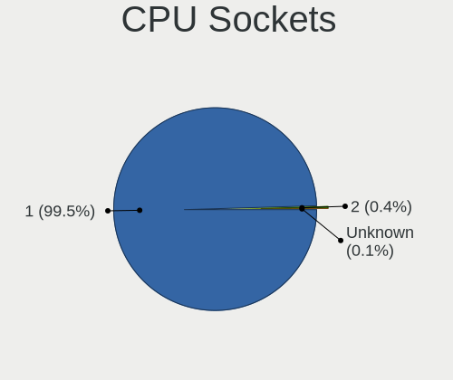

| Number | Computers | Percent |
|--------|-----------|---------|
| 1      | 400       | 99.26%  |
| 2      | 3         | 0.74%   |

CPU Threads
-----------

Threads per core (Hyper-Threading)

| Number | Computers | Percent |
|--------|-----------|---------|
| 2      | 321       | 79.85%  |
| 1      | 81        | 20.15%  |

CPU Op-Modes
------------

CPU Operation Modes (32-bit, 64-bit)

| Op mode        | Computers | Percent |
|----------------|-----------|---------|
| 32-bit, 64-bit | 399       | 99.25%  |
| Unknown        | 2         | 0.5%    |
| 64-bit         | 1         | 0.25%   |

CPU Microcode
-------------

Microcode number

| Number     | Computers | Percent |
|------------|-----------|---------|
| Unknown    | 107       | 26.23%  |
| 0x306c3    | 21        | 5.15%   |
| 0x08701021 | 18        | 4.41%   |
| 0x306a9    | 16        | 3.92%   |
| 0x806ea    | 15        | 3.68%   |
| 0x906ea    | 14        | 3.43%   |
| 0x506e3    | 14        | 3.43%   |
| 0x406e3    | 14        | 3.43%   |
| 0x40651    | 11        | 2.7%    |
| 0x0a50000c | 11        | 2.7%    |
| 0x806e9    | 10        | 2.45%   |
| 0x08108109 | 9         | 2.21%   |
| 0x806ec    | 8         | 1.96%   |
| 0x0a201009 | 8         | 1.96%   |
| 0x08701013 | 7         | 1.72%   |
| 0x706e5    | 6         | 1.47%   |
| 0x08600106 | 6         | 1.47%   |
| 0x08600104 | 6         | 1.47%   |
| 0x08108102 | 6         | 1.47%   |
| 0xa0652    | 5         | 1.23%   |
| 0x906e9    | 5         | 1.23%   |
| 0x806c1    | 5         | 1.23%   |
| 0x306d4    | 5         | 1.23%   |
| 0x206a7    | 5         | 1.23%   |
| 0x0a201016 | 4         | 0.98%   |
| 0x08608103 | 4         | 0.98%   |
| 0x0800820d | 4         | 0.98%   |
| 0x806eb    | 3         | 0.74%   |
| 0x806d1    | 3         | 0.74%   |
| 0x706a1    | 3         | 0.74%   |
| 0x20655    | 3         | 0.74%   |
| 0x106a5    | 3         | 0.74%   |
| 0x1067a    | 3         | 0.74%   |
| 0x08600102 | 3         | 0.74%   |
| 0x08001137 | 3         | 0.74%   |
| 0x06006705 | 3         | 0.74%   |
| 0xa0655    | 2         | 0.49%   |
| 0x706a8    | 2         | 0.49%   |
| 0x6fd      | 2         | 0.49%   |
| 0x20652    | 2         | 0.49%   |
| 0x08101016 | 2         | 0.49%   |
| 0x08001138 | 2         | 0.49%   |
| 0x07000110 | 2         | 0.49%   |
| 0x0700010f | 2         | 0.49%   |
| 0x010000c8 | 2         | 0.49%   |
| 0xa0671    | 1         | 0.25%   |
| 0x906ed    | 1         | 0.25%   |
| 0x906eb    | 1         | 0.25%   |
| 0x6fb      | 1         | 0.25%   |
| 0x506c9    | 1         | 0.25%   |
| 0x406c4    | 1         | 0.25%   |
| 0x40671    | 1         | 0.25%   |
| 0x306f2    | 1         | 0.25%   |
| 0x30678    | 1         | 0.25%   |
| 0x206c2    | 1         | 0.25%   |
| 0x106e5    | 1         | 0.25%   |
| 0x0a50000b | 1         | 0.25%   |
| 0x08608102 | 1         | 0.25%   |
| 0x08600103 | 1         | 0.25%   |
| 0x07030105 | 1         | 0.25%   |

CPU Microarch
-------------

Microarchitecture

| Name          | Computers | Percent |
|---------------|-----------|---------|
| KabyLake      | 74        | 18.41%  |
| Zen 2         | 51        | 12.69%  |
| Haswell       | 47        | 11.69%  |
| Skylake       | 36        | 8.96%   |
| Zen 3         | 28        | 6.97%   |
| IvyBridge     | 22        | 5.47%   |
| Zen+          | 21        | 5.22%   |
| IceLake       | 13        | 3.23%   |
| Zen           | 12        | 2.99%   |
| CometLake     | 11        | 2.74%   |
| Broadwell     | 9         | 2.24%   |
| TigerLake     | 8         | 1.99%   |
| SandyBridge   | 8         | 1.99%   |
| Unknown       | 8         | 1.99%   |
| Westmere      | 6         | 1.49%   |
| Penryn        | 6         | 1.49%   |
| Jaguar        | 6         | 1.49%   |
| Core          | 6         | 1.49%   |
| Goldmont plus | 5         | 1.24%   |
| Excavator     | 5         | 1.24%   |
| Piledriver    | 4         | 1%      |
| Nehalem       | 4         | 1%      |
| Silvermont    | 3         | 0.75%   |
| Puma          | 2         | 0.5%    |
| K10           | 2         | 0.5%    |
| Steamroller   | 1         | 0.25%   |
| K10 Llano     | 1         | 0.25%   |
| Goldmont      | 1         | 0.25%   |
| Bulldozer     | 1         | 0.25%   |
| Bobcat        | 1         | 0.25%   |

Graphics
--------

GPU Vendor
----------

Vendors of graphics cards

| Vendor | Computers | Percent |
|--------|-----------|---------|
| Intel  | 197       | 39.8%   |
| Nvidia | 162       | 32.73%  |
| AMD    | 136       | 27.47%  |

GPU Model
---------

Graphics card models

| Model                                                                                 | Computers | Percent |
|---------------------------------------------------------------------------------------|-----------|---------|
| AMD Ellesmere [Radeon RX 470/480/570/570X/580/580X/590]                               | 21        | 4.19%   |
| AMD Renoir                                                                            | 20        | 3.99%   |
| Intel UHD Graphics 620                                                                | 18        | 3.59%   |
| Intel Skylake GT2 [HD Graphics 520]                                                   | 18        | 3.59%   |
| AMD Picasso/Raven 2 [Radeon Vega Series / Radeon Vega Mobile Series]                  | 17        | 3.39%   |
| AMD Cezanne                                                                           | 14        | 2.79%   |
| Intel Haswell-ULT Integrated Graphics Controller                                      | 13        | 2.59%   |
| Intel CoffeeLake-H GT2 [UHD Graphics 630]                                             | 13        | 2.59%   |
| Intel 3rd Gen Core processor Graphics Controller                                      | 12        | 2.4%    |
| Nvidia GP107 [GeForce GTX 1050 Ti]                                                    | 10        | 2%      |
| Intel Xeon E3-1200 v3/4th Gen Core Processor Integrated Graphics Controller           | 9         | 1.8%    |
| Intel 4th Gen Core Processor Integrated Graphics Controller                           | 9         | 1.8%    |
| Intel HD Graphics 620                                                                 | 8         | 1.6%    |
| Intel HD Graphics 530                                                                 | 8         | 1.6%    |
| AMD Navi 10 [Radeon RX 5600 OEM/5600 XT / 5700/5700 XT]                               | 8         | 1.6%    |
| Nvidia GP104 [GeForce GTX 1070]                                                       | 7         | 1.4%    |
| Intel TigerLake-LP GT2 [Iris Xe Graphics]                                             | 7         | 1.4%    |
| Intel CometLake-U GT2 [UHD Graphics]                                                  | 7         | 1.4%    |
| Intel CometLake-H GT2 [UHD Graphics]                                                  | 7         | 1.4%    |
| Nvidia GK208B [GeForce GT 710]                                                        | 6         | 1.2%    |
| Intel WhiskeyLake-U GT2 [UHD Graphics 620]                                            | 6         | 1.2%    |
| Intel 2nd Generation Core Processor Family Integrated Graphics Controller             | 6         | 1.2%    |
| Nvidia TU117M [GeForce GTX 1650 Mobile / Max-Q]                                       | 5         | 1%      |
| Nvidia TU116M [GeForce GTX 1660 Ti Mobile]                                            | 5         | 1%      |
| Nvidia GP107M [GeForce GTX 1050 Mobile]                                               | 5         | 1%      |
| Intel Iris Plus Graphics G1 (Ice Lake)                                                | 5         | 1%      |
| Intel GeminiLake [UHD Graphics 600]                                                   | 5         | 1%      |
| Intel Core Processor Integrated Graphics Controller                                   | 5         | 1%      |
| AMD Stoney [Radeon R2/R3/R4/R5 Graphics]                                              | 5         | 1%      |
| AMD Lucienne                                                                          | 5         | 1%      |
| Nvidia TU106 [GeForce RTX 2060 Rev. A]                                                | 4         | 0.8%    |
| Nvidia GP108M [GeForce MX150]                                                         | 4         | 0.8%    |
| Nvidia GP106M [GeForce GTX 1060 Mobile]                                               | 4         | 0.8%    |
| Nvidia GP106 [GeForce GTX 1060 6GB]                                                   | 4         | 0.8%    |
| Nvidia GP104 [GeForce GTX 1080]                                                       | 4         | 0.8%    |
| Nvidia GA106M [GeForce RTX 3060 Mobile / Max-Q]                                       | 4         | 0.8%    |
| Intel TigerLake-H GT1 [UHD Graphics]                                                  | 4         | 0.8%    |
| Intel HD Graphics 630                                                                 | 4         | 0.8%    |
| Intel HD Graphics 6000                                                                | 4         | 0.8%    |
| Intel HD Graphics 5500                                                                | 4         | 0.8%    |
| AMD Navi 21 [Radeon RX 6800/6800 XT / 6900 XT]                                        | 4         | 0.8%    |
| AMD Navi 14 [Radeon RX 5500/5500M / Pro 5500M]                                        | 4         | 0.8%    |
| AMD Lexa PRO [Radeon 540/540X/550/550X / RX 540X/550/550X]                            | 4         | 0.8%    |
| Nvidia GP108M [GeForce MX250]                                                         | 3         | 0.6%    |
| Nvidia GP107M [GeForce GTX 1050 Ti Mobile]                                            | 3         | 0.6%    |
| Nvidia GM204M [GeForce GTX 970M]                                                      | 3         | 0.6%    |
| Nvidia GM108M [GeForce 940M]                                                          | 3         | 0.6%    |
| Nvidia GM107M [GeForce GTX 960M]                                                      | 3         | 0.6%    |
| Nvidia GA102 [GeForce RTX 3080]                                                       | 3         | 0.6%    |
| AMD Topaz XT [Radeon R7 M260/M265 / M340/M360 / M440/M445 / 530/535 / 620/625 Mobile] | 3         | 0.6%    |
| AMD Kabini [Radeon HD 8330]                                                           | 3         | 0.6%    |
| AMD Baffin [Radeon RX 550 640SP / RX 560/560X]                                        | 3         | 0.6%    |
| Nvidia TU117 [GeForce GTX 1650]                                                       | 2         | 0.4%    |
| Nvidia TU116 [GeForce GTX 1660]                                                       | 2         | 0.4%    |
| Nvidia TU106M [GeForce RTX 2060 Max-Q]                                                | 2         | 0.4%    |
| Nvidia TU104 [GeForce RTX 2080 SUPER]                                                 | 2         | 0.4%    |
| Nvidia GP107M [GeForce MX350]                                                         | 2         | 0.4%    |
| Nvidia GP107 [GeForce GTX 1050]                                                       | 2         | 0.4%    |
| Nvidia GP104 [GeForce GTX 1070 Ti]                                                    | 2         | 0.4%    |
| Nvidia GP102 [GeForce GTX 1080 Ti]                                                    | 2         | 0.4%    |

GPU Combo
---------

Combinations of graphics cards

| Name           | Computers | Percent |
|----------------|-----------|---------|
| 1 x Intel      | 117       | 29.03%  |
| 1 x AMD        | 108       | 26.8%   |
| 1 x Nvidia     | 82        | 20.35%  |
| Intel + Nvidia | 65        | 16.13%  |
| AMD + Nvidia   | 14        | 3.47%   |
| Intel + AMD    | 10        | 2.48%   |
| 2 x AMD        | 5         | 1.24%   |
| Other          | 1         | 0.25%   |
| 2 x Nvidia     | 1         | 0.25%   |

GPU Driver
----------

Free vs proprietary

| Driver      | Computers | Percent |
|-------------|-----------|---------|
| Free        | 277       | 68.73%  |
| Proprietary | 125       | 31.02%  |
| Unknown     | 1         | 0.25%   |

GPU Memory
----------

Total video memory

| Size in GB | Computers | Percent |
|------------|-----------|---------|
| Unknown    | 209       | 50.98%  |
| 1.01-2.0   | 43        | 10.49%  |
| 0.01-0.5   | 43        | 10.49%  |
| 7.01-8.0   | 38        | 9.27%   |
| 3.01-4.0   | 28        | 6.83%   |
| 0.51-1.0   | 17        | 4.15%   |
| 5.01-6.0   | 16        | 3.9%    |
| 8.01-16.0  | 11        | 2.68%   |
| 2.01-3.0   | 4         | 0.98%   |
| 16.01-24.0 | 1         | 0.24%   |

Monitor
-------

Monitor Vendor
--------------

Monitor vendors

| Vendor                  | Computers | Percent |
|-------------------------|-----------|---------|
| AU Optronics            | 57        | 11.56%  |
| Samsung Electronics     | 52        | 10.55%  |
| LG Display              | 45        | 9.13%   |
| Chimei Innolux          | 42        | 8.52%   |
| BOE                     | 35        | 7.1%    |
| Goldstar                | 27        | 5.48%   |
| Dell                    | 26        | 5.27%   |
| Acer                    | 19        | 3.85%   |
| BenQ                    | 18        | 3.65%   |
| AOC                     | 15        | 3.04%   |
| Ancor Communications    | 15        | 3.04%   |
| Apple                   | 11        | 2.23%   |
| ViewSonic               | 10        | 2.03%   |
| Lenovo                  | 10        | 2.03%   |
| Hewlett-Packard         | 10        | 2.03%   |
| PANDA                   | 9         | 1.83%   |
| Sharp                   | 8         | 1.62%   |
| InfoVision              | 7         | 1.42%   |
| Iiyama                  | 7         | 1.42%   |
| Vizio                   | 6         | 1.22%   |
| Philips                 | 5         | 1.01%   |
| ASUSTek Computer        | 5         | 1.01%   |
| Sony                    | 4         | 0.81%   |
| LG Electronics          | 3         | 0.61%   |
| Gigabyte Technology     | 3         | 0.61%   |
| Fujitsu Siemens         | 3         | 0.61%   |
| Valve                   | 2         | 0.41%   |
| Unknown                 | 2         | 0.41%   |
| Sceptre Tech            | 2         | 0.41%   |
| Pixio                   | 2         | 0.41%   |
| Panasonic               | 2         | 0.41%   |
| Lenovo Group Limited    | 2         | 0.41%   |
| JDI                     | 2         | 0.41%   |
| CSO                     | 2         | 0.41%   |
| Chi Mei Optoelectronics | 2         | 0.41%   |
| Unknown (XXX)           | 1         | 0.2%    |
| Sun                     | 1         | 0.2%    |
| SAC                     | 1         | 0.2%    |
| RTK                     | 1         | 0.2%    |
| RS                      | 1         | 0.2%    |
| Planar                  | 1         | 0.2%    |
| Orion                   | 1         | 0.2%    |
| NEC Computers           | 1         | 0.2%    |
| MSI                     | 1         | 0.2%    |
| LG Philips              | 1         | 0.2%    |
| Insignia                | 1         | 0.2%    |
| InnoLux Display         | 1         | 0.2%    |
| HVR                     | 1         | 0.2%    |
| HPN                     | 1         | 0.2%    |
| HKC                     | 1         | 0.2%    |
| Grundig                 | 1         | 0.2%    |
| Gateway                 | 1         | 0.2%    |
| Fluid                   | 1         | 0.2%    |
| Eizo                    | 1         | 0.2%    |
| DENON                   | 1         | 0.2%    |
| CTV                     | 1         | 0.2%    |
| Belinea                 | 1         | 0.2%    |
| Unknown                 | 1         | 0.2%    |

Monitor Model
-------------

Monitor models

| Model                                                                 | Computers | Percent |
|-----------------------------------------------------------------------|-----------|---------|
| Apple Color LCD APP9CDF 1440x900 286x179mm 13.3-inch                  | 5         | 0.99%   |
| Goldstar LG FULL HD GSM5B55 1920x1080 480x270mm 21.7-inch             | 4         | 0.79%   |
| ViewSonic LCD Monitor VSC3E32 1920x1080 600x340mm 27.2-inch           | 3         | 0.59%   |
| Samsung Electronics C27F390 SAM0D32 1920x1080 598x336mm 27.0-inch     | 3         | 0.59%   |
| Goldstar ULTRAWIDE GSM59F1 2560x1080 673x284mm 28.8-inch              | 3         | 0.59%   |
| Chimei Innolux LCD Monitor CMN15DB 1366x768 344x193mm 15.5-inch       | 3         | 0.59%   |
| Chimei Innolux LCD Monitor CMN14C9 1920x1080 309x173mm 13.9-inch      | 3         | 0.59%   |
| Chimei Innolux LCD Monitor CMN14B1 1920x1080 308x173mm 13.9-inch      | 3         | 0.59%   |
| AU Optronics LCD Monitor AUO573D 1920x1080 309x174mm 14.0-inch        | 3         | 0.59%   |
| AU Optronics LCD Monitor AUO403D 1920x1080 309x174mm 14.0-inch        | 3         | 0.59%   |
| AU Optronics LCD Monitor AUO38ED 1920x1080 344x193mm 15.5-inch        | 3         | 0.59%   |
| AU Optronics LCD Monitor AUO315C 1366x768 256x144mm 11.6-inch         | 3         | 0.59%   |
| AU Optronics LCD Monitor AUO21ED 1920x1080 344x194mm 15.5-inch        | 3         | 0.59%   |
| Vizio D24f-G1 VIZ1027 1920x1080 527x296mm 23.8-inch                   | 2         | 0.4%    |
| Valve Index HMD VLV91A8                                               | 2         | 0.4%    |
| Sharp LQ156M1JW03 SHP14C5 1920x1080 344x194mm 15.5-inch               | 2         | 0.4%    |
| Samsung Electronics SMS24A450 SAM083A 1920x1200 518x324mm 24.1-inch   | 2         | 0.4%    |
| Samsung Electronics S24F350 SAM0D20 1920x1080 521x293mm 23.5-inch     | 2         | 0.4%    |
| Samsung Electronics S24D590 SAM0B47 1920x1080 521x293mm 23.5-inch     | 2         | 0.4%    |
| Samsung Electronics S19B420 SAM0975 1366x768 410x230mm 18.5-inch      | 2         | 0.4%    |
| Samsung Electronics LCD Monitor SEC5441 1366x768 344x194mm 15.5-inch  | 2         | 0.4%    |
| Samsung Electronics LCD Monitor SDCA029 3840x2160 344x194mm 15.5-inch | 2         | 0.4%    |
| PANDA LCD Monitor NCP0050 1920x1080 309x174mm 14.0-inch               | 2         | 0.4%    |
| PANDA LCD Monitor NCP004D 1920x1080 344x194mm 15.5-inch               | 2         | 0.4%    |
| PANDA LCD Monitor NCP0035 1920x1080 344x194mm 15.5-inch               | 2         | 0.4%    |
| LG Display LCD Monitor LGD065B 1920x1080 382x215mm 17.3-inch          | 2         | 0.4%    |
| LG Display LCD Monitor LGD05E5 1920x1080 344x194mm 15.5-inch          | 2         | 0.4%    |
| LG Display LCD Monitor LGD053F 1920x1080 344x194mm 15.5-inch          | 2         | 0.4%    |
| LG Display LCD Monitor LGD0533 1920x1080 344x194mm 15.5-inch          | 2         | 0.4%    |
| LG Display LCD Monitor LGD0521 1920x1080 309x174mm 14.0-inch          | 2         | 0.4%    |
| LG Display LCD Monitor LGD04E8 1920x1080 382x215mm 17.3-inch          | 2         | 0.4%    |
| LG Display LCD Monitor LGD02DC 1366x768 344x194mm 15.5-inch           | 2         | 0.4%    |
| JDI LCD Monitor JDI422A 3000x2000 293x196mm 13.9-inch                 | 2         | 0.4%    |
| InfoVision LCD Monitor IVO8584 1920x1080 294x165mm 13.3-inch          | 2         | 0.4%    |
| InfoVision LCD Monitor IVO8544 1920x1080 294x165mm 13.3-inch          | 2         | 0.4%    |
| Iiyama PL2792Q IVM6637 2560x1440 597x336mm 27.0-inch                  | 2         | 0.4%    |
| Goldstar 27GL850 GSM5B7F 2560x1440 600x340mm 27.2-inch                | 2         | 0.4%    |
| Gigabyte Technology M27Q GBT270D 2560x1440 596x335mm 26.9-inch        | 2         | 0.4%    |
| Dell U2412M DELA07B 1920x1200 518x324mm 24.1-inch                     | 2         | 0.4%    |
| Chimei Innolux LCD Monitor CMN15DC 1366x768 344x193mm 15.5-inch       | 2         | 0.4%    |
| Chimei Innolux LCD Monitor CMN151E 1920x1080 344x193mm 15.5-inch      | 2         | 0.4%    |
| BOE LCD Monitor BOE0973 2560x1440 344x194mm 15.5-inch                 | 2         | 0.4%    |
| BOE LCD Monitor BOE084D 1920x1080 344x193mm 15.5-inch                 | 2         | 0.4%    |
| BOE LCD Monitor BOE06F2 1920x1080 309x173mm 13.9-inch                 | 2         | 0.4%    |
| BOE LCD Monitor BOE0675 1366x768 344x194mm 15.5-inch                  | 2         | 0.4%    |
| BenQ GL2460 BNQ78CE 1920x1080 531x299mm 24.0-inch                     | 2         | 0.4%    |
| BenQ G2450H BNQ78AB 1920x1080 531x298mm 24.0-inch                     | 2         | 0.4%    |
| BenQ G2420HD BNQ7840 1920x1080 531x299mm 24.0-inch                    | 2         | 0.4%    |
| AU Optronics LCD Monitor AUOC199 2560x1600 344x215mm 16.0-inch        | 2         | 0.4%    |
| AU Optronics LCD Monitor AUO47EC 1366x768 344x193mm 15.5-inch         | 2         | 0.4%    |
| AU Optronics LCD Monitor AUO41EC 1366x768 344x193mm 15.5-inch         | 2         | 0.4%    |
| AU Optronics LCD Monitor AUO23ED 1920x1080 344x194mm 15.5-inch        | 2         | 0.4%    |
| AU Optronics LCD Monitor AUO133D 1920x1080 309x173mm 13.9-inch        | 2         | 0.4%    |
| ASUSTek Computer VG289 AUS28BA 3840x2160 620x340mm 27.8-inch          | 2         | 0.4%    |
| AOC 27B2 AOC2702 1920x1080 598x336mm 27.0-inch                        | 2         | 0.4%    |
| AOC 24B1W AOC2401 1920x1080 521x293mm 23.5-inch                       | 2         | 0.4%    |
| AOC 2260W AOC2260 1920x1080 477x268mm 21.5-inch                       | 2         | 0.4%    |
| Ancor Communications VS248 ACI2498 1920x1080 531x299mm 24.0-inch      | 2         | 0.4%    |
| Vizio V505-G9 VIZ1033 3840x2160 1100x620mm 49.7-inch                  | 1         | 0.2%    |
| Vizio E60-E3 VIZ1018 3840x2160 1330x748mm 60.1-inch                   | 1         | 0.2%    |

Monitor Resolution
------------------

Monitor screen resolution

| Resolution         | Computers | Percent |
|--------------------|-----------|---------|
| 1920x1080 (FHD)    | 231       | 48.73%  |
| 1366x768 (WXGA)    | 65        | 13.71%  |
| 2560x1440 (QHD)    | 39        | 8.23%   |
| 3840x2160 (4K)     | 35        | 7.38%   |
| 1920x1200 (WUXGA)  | 15        | 3.16%   |
| 1440x900 (WXGA+)   | 12        | 2.53%   |
| Unknown            | 9         | 1.9%    |
| 1280x1024 (SXGA)   | 8         | 1.69%   |
| 2560x1080          | 7         | 1.48%   |
| 2560x1600          | 6         | 1.27%   |
| 1600x900 (HD+)     | 6         | 1.27%   |
| 1680x1050 (WSXGA+) | 5         | 1.05%   |
| 3440x1440          | 4         | 0.84%   |
| 1280x800 (WXGA)    | 4         | 0.84%   |
| 3840x1080          | 3         | 0.63%   |
| 1360x768           | 3         | 0.63%   |
| 3000x2000          | 2         | 0.42%   |
| 2160x1440          | 2         | 0.42%   |
| 9840x3840          | 1         | 0.21%   |
| 4480x1440          | 1         | 0.21%   |
| 3840x2400          | 1         | 0.21%   |
| 3840x1600          | 1         | 0.21%   |
| 3840x1440          | 1         | 0.21%   |
| 3840x1200          | 1         | 0.21%   |
| 3520x1080          | 1         | 0.21%   |
| 3456x2160          | 1         | 0.21%   |
| 3240x2160          | 1         | 0.21%   |
| 3200x1800 (QHD+)   | 1         | 0.21%   |
| 2880x1920          | 1         | 0.21%   |
| 2880x1800          | 1         | 0.21%   |
| 2880x1700          | 1         | 0.21%   |
| 2736x1824          | 1         | 0.21%   |
| 2256x1504          | 1         | 0.21%   |
| 1920x540           | 1         | 0.21%   |
| 1800x1200          | 1         | 0.21%   |
| 1600x1200          | 1         | 0.21%   |

Monitor Diagonal
----------------

Diagonal size in inches

| Inches  | Computers | Percent |
|---------|-----------|---------|
| 15      | 107       | 21.7%   |
| 13      | 63        | 12.78%  |
| 24      | 54        | 10.95%  |
| 27      | 53        | 10.75%  |
| 14      | 34        | 6.9%    |
| 21      | 26        | 5.27%   |
| 23      | 25        | 5.07%   |
| 17      | 19        | 3.85%   |
| Unknown | 18        | 3.65%   |
| 34      | 13        | 2.64%   |
| 31      | 9         | 1.83%   |
| 19      | 8         | 1.62%   |
| 18      | 8         | 1.62%   |
| 22      | 7         | 1.42%   |
| 12      | 6         | 1.22%   |
| 11      | 5         | 1.01%   |
| 54      | 4         | 0.81%   |
| 16      | 4         | 0.81%   |
| 49      | 3         | 0.61%   |
| 32      | 3         | 0.61%   |
| 20      | 3         | 0.61%   |
| 10      | 3         | 0.61%   |
| 72      | 2         | 0.41%   |
| 42      | 2         | 0.41%   |
| 74      | 1         | 0.2%    |
| 69      | 1         | 0.2%    |
| 65      | 1         | 0.2%    |
| 60      | 1         | 0.2%    |
| 57      | 1         | 0.2%    |
| 48      | 1         | 0.2%    |
| 47      | 1         | 0.2%    |
| 40      | 1         | 0.2%    |
| 37      | 1         | 0.2%    |
| 29      | 1         | 0.2%    |
| 28      | 1         | 0.2%    |
| 26      | 1         | 0.2%    |
| 25      | 1         | 0.2%    |
| 8       | 1         | 0.2%    |

Monitor Width
-------------

Physical width

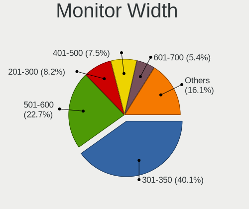

| Width in mm | Computers | Percent |
|-------------|-----------|---------|
| 301-350     | 175       | 36.46%  |
| 501-600     | 117       | 24.38%  |
| 201-300     | 47        | 9.79%   |
| 401-500     | 46        | 9.58%   |
| 351-400     | 23        | 4.79%   |
| Unknown     | 18        | 3.75%   |
| 601-700     | 17        | 3.54%   |
| 701-800     | 16        | 3.33%   |
| 1001-1500   | 12        | 2.5%    |
| 1501-2000   | 4         | 0.83%   |
| 801-900     | 2         | 0.42%   |
| 901-1000    | 2         | 0.42%   |
| 101-200     | 1         | 0.21%   |

Aspect Ratio
------------

Proportional relationship between the width and the height

| Ratio   | Computers | Percent |
|---------|-----------|---------|
| 16/9    | 328       | 76.64%  |
| 16/10   | 50        | 11.68%  |
| Unknown | 16        | 3.74%   |
| 21/9    | 11        | 2.57%   |
| 3/2     | 8         | 1.87%   |
| 5/4     | 6         | 1.4%    |
| 4/3     | 3         | 0.7%    |
| 32/9    | 3         | 0.7%    |
| 6/5     | 1         | 0.23%   |
| 2.65    | 1         | 0.23%   |
| 0.62    | 1         | 0.23%   |

Monitor Area
------------

Area in inch

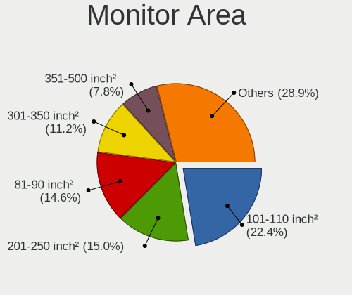

| Area in inch | Computers | Percent |
|----------------|-----------|---------|
| 101-110        | 107       | 21.93%  |
| 201-250        | 83        | 17.01%  |
| 81-90          | 71        | 14.55%  |
| 301-350        | 54        | 11.07%  |
| 71-80          | 28        | 5.74%   |
| 251-300        | 25        | 5.12%   |
| 351-500        | 24        | 4.92%   |
| Unknown        | 18        | 3.69%   |
| 121-130        | 14        | 2.87%   |
| More than 1000 | 13        | 2.66%   |
| 151-200        | 13        | 2.66%   |
| 141-150        | 10        | 2.05%   |
| 501-1000       | 9         | 1.84%   |
| 51-60          | 5         | 1.02%   |
| 61-70          | 4         | 0.82%   |
| 111-120        | 4         | 0.82%   |
| 41-50          | 3         | 0.61%   |
| 131-140        | 2         | 0.41%   |
| 1-40           | 1         | 0.2%    |

Pixel Density
-------------

Pixels per inch

| Density       | Computers | Percent |
|---------------|-----------|---------|
| 121-160       | 143       | 30.62%  |
| 51-100        | 136       | 29.12%  |
| 101-120       | 104       | 22.27%  |
| 161-240       | 38        | 8.14%   |
| Unknown       | 18        | 3.85%   |
| More than 240 | 15        | 3.21%   |
| 1-50          | 13        | 2.78%   |

Multiple Monitors
-----------------

Total monitors connected

| Total | Computers | Percent |
|-------|-----------|---------|
| 1     | 312       | 76.47%  |
| 2     | 83        | 20.34%  |
| 3     | 11        | 2.7%    |
| 4     | 2         | 0.49%   |

Network
-------

Net Controller Vendor
---------------------

Controller vendors

| Vendor                            | Computers | Percent |
|-----------------------------------|-----------|---------|
| Realtek Semiconductor             | 240       | 38.59%  |
| Intel                             | 230       | 36.98%  |
| Qualcomm Atheros                  | 50        | 8.04%   |
| Broadcom                          | 21        | 3.38%   |
| MediaTek                          | 10        | 1.61%   |
| TP-Link                           | 8         | 1.29%   |
| Broadcom Limited                  | 7         | 1.13%   |
| D-Link                            | 6         | 0.96%   |
| ASIX Electronics                  | 6         | 0.96%   |
| Sierra Wireless                   | 4         | 0.64%   |
| Microsoft                         | 4         | 0.64%   |
| Ralink Technology                 | 3         | 0.48%   |
| Ralink                            | 3         | 0.48%   |
| Marvell Technology Group          | 3         | 0.48%   |
| Hewlett-Packard                   | 3         | 0.48%   |
| Aquantia                          | 3         | 0.48%   |
| Xiaomi                            | 2         | 0.32%   |
| Nvidia                            | 2         | 0.32%   |
| NetGear                           | 2         | 0.32%   |
| Linksys                           | 2         | 0.32%   |
| Lenovo                            | 2         | 0.32%   |
| Huawei Technologies               | 2         | 0.32%   |
| Cypress Semiconductor             | 2         | 0.32%   |
| Wilocity                          | 1         | 0.16%   |
| InterBiometrics                   | 1         | 0.16%   |
| Exar                              | 1         | 0.16%   |
| Ericsson Business Mobile Networks | 1         | 0.16%   |
| Edimax Technology                 | 1         | 0.16%   |
| DisplayLink                       | 1         | 0.16%   |
| Apple                             | 1         | 0.16%   |

Net Controller Model
--------------------

Controller models

| Model                                                             | Computers | Percent |
|-------------------------------------------------------------------|-----------|---------|
| Realtek RTL8111/8168/8411 PCI Express Gigabit Ethernet Controller | 164       | 22.1%   |
| Intel Wi-Fi 6 AX200                                               | 49        | 6.6%    |
| Intel I211 Gigabit Network Connection                             | 22        | 2.96%   |
| Realtek RTL810xE PCI Express Fast Ethernet controller             | 20        | 2.7%    |
| Realtek RTL8125 2.5GbE Controller                                 | 19        | 2.56%   |
| Realtek RTL8821CE 802.11ac PCIe Wireless Network Adapter          | 17        | 2.29%   |
| Intel Wireless 8265 / 8275                                        | 15        | 2.02%   |
| Intel Wireless 7260                                               | 15        | 2.02%   |
| Realtek RTL8153 Gigabit Ethernet Adapter                          | 13        | 1.75%   |
| Intel Wireless 8260                                               | 12        | 1.62%   |
| Qualcomm Atheros QCA9377 802.11ac Wireless Network Adapter        | 11        | 1.48%   |
| Intel Dual Band Wireless-AC 3165 Plus Bluetooth                   | 10        | 1.35%   |
| Intel Cannon Lake PCH CNVi WiFi                                   | 9         | 1.21%   |
| Intel 82579LM Gigabit Network Connection (Lewisville)             | 9         | 1.21%   |
| Qualcomm Atheros QCA6174 802.11ac Wireless Network Adapter        | 8         | 1.08%   |
| Qualcomm Atheros Killer E2400 Gigabit Ethernet Controller         | 8         | 1.08%   |
| Intel Wireless 7265                                               | 8         | 1.08%   |
| Intel Ethernet Connection I217-LM                                 | 8         | 1.08%   |
| Realtek RTL8822CE 802.11ac PCIe Wireless Network Adapter          | 7         | 0.94%   |
| Intel Wireless 3165                                               | 7         | 0.94%   |
| Intel Comet Lake PCH-LP CNVi WiFi                                 | 7         | 0.94%   |
| Intel Comet Lake PCH CNVi WiFi                                    | 7         | 0.94%   |
| MEDIATEK MT7921 802.11ax PCI Express Wireless Network Adapter     | 6         | 0.81%   |
| Intel Wireless-AC 9260                                            | 6         | 0.81%   |
| Intel Wi-Fi 6 AX201                                               | 6         | 0.81%   |
| Intel Ice Lake-LP PCH CNVi WiFi                                   | 6         | 0.81%   |
| Intel Ethernet Controller I225-V                                  | 6         | 0.81%   |
| Intel Ethernet Connection I218-LM                                 | 6         | 0.81%   |
| Intel Ethernet Connection (2) I219-V                              | 6         | 0.81%   |
| D-Link 802.11ac NIC                                               | 6         | 0.81%   |
| TP-Link 802.11ac NIC                                              | 5         | 0.67%   |
| Realtek RTL8822BE 802.11a/b/g/n/ac WiFi adapter                   | 5         | 0.67%   |
| Realtek 802.11ac NIC                                              | 5         | 0.67%   |
| Qualcomm Atheros QCA9565 / AR9565 Wireless Network Adapter        | 5         | 0.67%   |
| Qualcomm Atheros AR9485 Wireless Network Adapter                  | 5         | 0.67%   |
| Intel Wi-Fi 6 AX210/AX211/AX411 160MHz                            | 5         | 0.67%   |
| Intel Ethernet Connection I219-LM                                 | 5         | 0.67%   |
| Intel Cannon Point-LP CNVi [Wireless-AC]                          | 5         | 0.67%   |
| Broadcom Limited BCM4360 802.11ac Wireless Network Adapter        | 5         | 0.67%   |
| Broadcom BCM43142 802.11b/g/n                                     | 5         | 0.67%   |
| Qualcomm Atheros Killer E220x Gigabit Ethernet Controller         | 4         | 0.54%   |
| Qualcomm Atheros AR9462 Wireless Network Adapter                  | 4         | 0.54%   |
| Intel Wireless 3160                                               | 4         | 0.54%   |
| Intel Tiger Lake PCH CNVi WiFi                                    | 4         | 0.54%   |
| Intel Ethernet Connection I217-V                                  | 4         | 0.54%   |
| Intel Ethernet Connection (4) I219-V                              | 4         | 0.54%   |
| Intel Dual Band Wireless-AC 3168NGW [Stone Peak]                  | 4         | 0.54%   |
| Intel Centrino Ultimate-N 6300                                    | 4         | 0.54%   |
| Intel 82577LM Gigabit Network Connection                          | 4         | 0.54%   |
| ASIX AX88179 Gigabit Ethernet                                     | 4         | 0.54%   |
| Sierra Wireless EM7455 Qualcomm Snapdragon X7 LTE-A       | 3         | 0.4%    |
| Realtek RTL8821AE 802.11ac PCIe Wireless Network Adapter          | 3         | 0.4%    |
| Realtek RTL8723BE PCIe Wireless Network Adapter                   | 3         | 0.4%    |
| Realtek RTL8188EUS 802.11n Wireless Network Adapter               | 3         | 0.4%    |
| Qualcomm Atheros AR9285 Wireless Network Adapter (PCI-Express)    | 3         | 0.4%    |
| Microsoft Wireless XBox Controller Dongle                         | 3         | 0.4%    |
| Marvell Group 88W8897 [AVASTAR] 802.11ac Wireless                 | 3         | 0.4%    |
| Intel Ethernet Connection (7) I219-V                              | 3         | 0.4%    |
| Intel Ethernet Connection (4) I219-LM                             | 3         | 0.4%    |
| Intel Ethernet Connection (2) I219-LM                             | 3         | 0.4%    |

Wireless Vendor
---------------

Wireless vendors

| Vendor                   | Computers | Percent |
|--------------------------|-----------|---------|
| Intel                    | 197       | 55.18%  |
| Realtek Semiconductor    | 52        | 14.57%  |
| Qualcomm Atheros         | 38        | 10.64%  |
| Broadcom                 | 18        | 5.04%   |
| MEDIATEK                 | 10        | 2.8%    |
| TP-Link                  | 8         | 2.24%   |
| D-Link                   | 6         | 1.68%   |
| Broadcom Limited         | 6         | 1.68%   |
| Sierra Wireless          | 4         | 1.12%   |
| Microsoft                | 4         | 1.12%   |
| Ralink Technology        | 3         | 0.84%   |
| Ralink                   | 3         | 0.84%   |
| Marvell Technology Group | 3         | 0.84%   |
| Linksys                  | 2         | 0.56%   |
| Wilocity                 | 1         | 0.28%   |
| NetGear                  | 1         | 0.28%   |
| Edimax Technology        | 1         | 0.28%   |

Wireless Model
--------------

Wireless models

| Model                                                               | Computers | Percent |
|---------------------------------------------------------------------|-----------|---------|
| Intel Wi-Fi 6 AX200                                                 | 49        | 13.61%  |
| Realtek RTL8821CE 802.11ac PCIe Wireless Network Adapter            | 17        | 4.72%   |
| Intel Wireless 8265 / 8275                                          | 15        | 4.17%   |
| Intel Wireless 7260                                                 | 15        | 4.17%   |
| Intel Wireless 8260                                                 | 12        | 3.33%   |
| Qualcomm Atheros QCA9377 802.11ac Wireless Network Adapter          | 11        | 3.06%   |
| Intel Dual Band Wireless-AC 3165 Plus Bluetooth                     | 10        | 2.78%   |
| Intel Cannon Lake PCH CNVi WiFi                                     | 9         | 2.5%    |
| Qualcomm Atheros QCA6174 802.11ac Wireless Network Adapter          | 8         | 2.22%   |
| Intel Wireless 7265                                                 | 8         | 2.22%   |
| Realtek RTL8822CE 802.11ac PCIe Wireless Network Adapter            | 7         | 1.94%   |
| Intel Wireless 3165                                                 | 7         | 1.94%   |
| Intel Comet Lake PCH-LP CNVi WiFi                                   | 7         | 1.94%   |
| Intel Comet Lake PCH CNVi WiFi                                      | 7         | 1.94%   |
| MEDIATEK MT7921 802.11ax PCI Express Wireless Network Adapter       | 6         | 1.67%   |
| Intel Wireless-AC 9260                                              | 6         | 1.67%   |
| Intel Wi-Fi 6 AX201                                                 | 6         | 1.67%   |
| Intel Ice Lake-LP PCH CNVi WiFi                                     | 6         | 1.67%   |
| D-Link 802.11ac NIC                                                 | 6         | 1.67%   |
| TP-Link 802.11ac NIC                                                | 5         | 1.39%   |
| Realtek RTL8822BE 802.11a/b/g/n/ac WiFi adapter                     | 5         | 1.39%   |
| Realtek 802.11ac NIC                                                | 5         | 1.39%   |
| Qualcomm Atheros QCA9565 / AR9565 Wireless Network Adapter          | 5         | 1.39%   |
| Qualcomm Atheros AR9485 Wireless Network Adapter                    | 5         | 1.39%   |
| Intel Wi-Fi 6 AX210/AX211/AX411 160MHz                              | 5         | 1.39%   |
| Intel Cannon Point-LP CNVi [Wireless-AC]                            | 5         | 1.39%   |
| Broadcom Limited BCM4360 802.11ac Wireless Network Adapter          | 5         | 1.39%   |
| Broadcom BCM43142 802.11b/g/n                                       | 5         | 1.39%   |
| Qualcomm Atheros AR9462 Wireless Network Adapter                    | 4         | 1.11%   |
| Intel Wireless 3160                                                 | 4         | 1.11%   |
| Intel Tiger Lake PCH CNVi WiFi                                      | 4         | 1.11%   |
| Intel Dual Band Wireless-AC 3168NGW [Stone Peak]                    | 4         | 1.11%   |
| Intel Centrino Ultimate-N 6300                                      | 4         | 1.11%   |
| Sierra Wireless EM7455 Qualcomm Snapdragon X7 LTE-A         | 3         | 0.83%   |
| Realtek RTL8821AE 802.11ac PCIe Wireless Network Adapter            | 3         | 0.83%   |
| Realtek RTL8723BE PCIe Wireless Network Adapter                     | 3         | 0.83%   |
| Realtek RTL8188EUS 802.11n Wireless Network Adapter                 | 3         | 0.83%   |
| Qualcomm Atheros AR9285 Wireless Network Adapter (PCI-Express)      | 3         | 0.83%   |
| Microsoft Wireless XBox Controller Dongle                           | 3         | 0.83%   |
| Marvell Group 88W8897 [AVASTAR] 802.11ac Wireless                   | 3         | 0.83%   |
| Intel Centrino Advanced-N 6235                                      | 3         | 0.83%   |
| Broadcom BCM4352 802.11ac Wireless Network Adapter                  | 3         | 0.83%   |
| Realtek RTL8852AE 802.11ax PCIe Wireless Network Adapter            | 2         | 0.56%   |
| Realtek RTL8188EE Wireless Network Adapter                          | 2         | 0.56%   |
| Ralink RT3062 Wireless 802.11n 2T/2R                                | 2         | 0.56%   |
| Qualcomm Atheros AR9287 Wireless Network Adapter (PCI-Express)      | 2         | 0.56%   |
| MediaTek WiFi                                                       | 2         | 0.56%   |
| Intel PRO/Wireless 5100 AGN [Shiloh] Network Connection             | 2         | 0.56%   |
| Intel Centrino Advanced-N 6205 [Taylor Peak]                        | 2         | 0.56%   |
| Intel Centrino Advanced-N 6200                                      | 2         | 0.56%   |
| Broadcom BCM4360 802.11ac Wireless Network Adapter                  | 2         | 0.56%   |
| Broadcom BCM4313 802.11bgn Wireless Network Adapter                 | 2         | 0.56%   |
| Wilocity Wil6200 802.11ad Wireless Network Adapter                  | 1         | 0.28%   |
| TP-Link TL-WN722N v2/v3 [Realtek RTL8188EUS]                        | 1         | 0.28%   |
| TP-Link Archer T2U PLUS [RTL8821AU]                                 | 1         | 0.28%   |
| TP-Link Archer T1U 802.11a/n/ac Wireless Adapter [MediaTek MT7610U] | 1         | 0.28%   |
| Sierra Wireless EM7345 4G LTE                                       | 1         | 0.28%   |
| Realtek RTL88x2bu [AC1200 Techkey]                                  | 1         | 0.28%   |
| Realtek RTL8812AE 802.11ac PCIe Wireless Network Adapter            | 1         | 0.28%   |
| Realtek RTL8723DE Wireless Network Adapter                          | 1         | 0.28%   |

Ethernet Vendor
---------------

Ethernet vendors

| Vendor                | Computers | Percent |
|-----------------------|-----------|---------|
| Realtek Semiconductor | 217       | 59.13%  |
| Intel                 | 103       | 28.07%  |
| Qualcomm Atheros      | 19        | 5.18%   |
| Broadcom              | 7         | 1.91%   |
| ASIX Electronics      | 6         | 1.63%   |
| Aquantia              | 3         | 0.82%   |
| Xiaomi                | 2         | 0.54%   |
| Nvidia                | 2         | 0.54%   |
| Lenovo                | 2         | 0.54%   |
| Cypress Semiconductor | 2         | 0.54%   |
| NetGear               | 1         | 0.27%   |
| DisplayLink           | 1         | 0.27%   |
| Broadcom Limited      | 1         | 0.27%   |
| Apple                 | 1         | 0.27%   |

Ethernet Model
--------------

Ethernet models

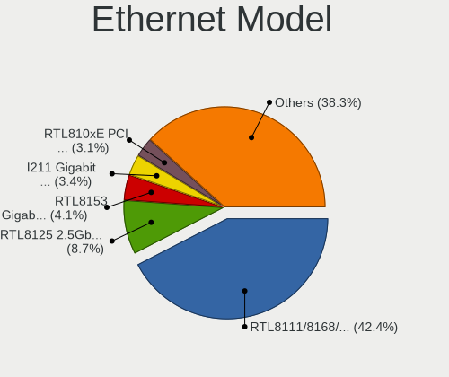

| Model                                                             | Computers | Percent |
|-------------------------------------------------------------------|-----------|---------|
| Realtek RTL8111/8168/8411 PCI Express Gigabit Ethernet Controller | 164       | 43.85%  |
| Intel I211 Gigabit Network Connection                             | 22        | 5.88%   |
| Realtek RTL810xE PCI Express Fast Ethernet controller             | 20        | 5.35%   |
| Realtek RTL8125 2.5GbE Controller                                 | 19        | 5.08%   |
| Realtek RTL8153 Gigabit Ethernet Adapter                          | 13        | 3.48%   |
| Intel 82579LM Gigabit Network Connection (Lewisville)             | 9         | 2.41%   |
| Qualcomm Atheros Killer E2400 Gigabit Ethernet Controller         | 8         | 2.14%   |
| Intel Ethernet Connection I217-LM                                 | 8         | 2.14%   |
| Intel Ethernet Controller I225-V                                  | 6         | 1.6%    |
| Intel Ethernet Connection I218-LM                                 | 6         | 1.6%    |
| Intel Ethernet Connection (2) I219-V                              | 6         | 1.6%    |
| Intel Ethernet Connection I219-LM                                 | 5         | 1.34%   |
| Qualcomm Atheros Killer E220x Gigabit Ethernet Controller         | 4         | 1.07%   |
| Intel Ethernet Connection I217-V                                  | 4         | 1.07%   |
| Intel Ethernet Connection (4) I219-V                              | 4         | 1.07%   |
| Intel 82577LM Gigabit Network Connection                          | 4         | 1.07%   |
| ASIX AX88179 Gigabit Ethernet                                     | 4         | 1.07%   |
| Intel Ethernet Connection (7) I219-V                              | 3         | 0.8%    |
| Intel Ethernet Connection (4) I219-LM                             | 3         | 0.8%    |
| Intel Ethernet Connection (2) I219-LM                             | 3         | 0.8%    |
| Intel 82567LM Gigabit Network Connection                          | 3         | 0.8%    |
| Xiaomi Mi/Redmi series (RNDIS)                                    | 2         | 0.53%   |
| Realtek RTL8152 Fast Ethernet Adapter                             | 2         | 0.53%   |
| Realtek Realtek Ethernet controller                               | 2         | 0.53%   |
| Realtek Killer E2500 Gigabit Ethernet Controller                  | 2         | 0.53%   |
| Qualcomm Atheros AR8161 Gigabit Ethernet                          | 2         | 0.53%   |
| Qualcomm Atheros AR8151 v2.0 Gigabit Ethernet                     | 2         | 0.53%   |
| Lenovo RTL8153 Gigabit Ethernet [ThinkPad OneLink Pro Dock]       | 2         | 0.53%   |
| Intel Ethernet Connection I219-V                                  | 2         | 0.53%   |
| Intel Ethernet Connection (2) I218-V                              | 2         | 0.53%   |
| Cypress K38231_03                                                 | 2         | 0.53%   |
| Broadcom NetXtreme BCM57766 Gigabit Ethernet PCIe                 | 2         | 0.53%   |
| Realtek USB 10/100/1G/2.5G LAN                                    | 1         | 0.27%   |
| Qualcomm Atheros QCA8172 Fast Ethernet                            | 1         | 0.27%   |
| Qualcomm Atheros QCA8171 Gigabit Ethernet                         | 1         | 0.27%   |
| Qualcomm Atheros AR8152 v2.0 Fast Ethernet                        | 1         | 0.27%   |
| Nvidia MCP73 Ethernet                                             | 1         | 0.27%   |
| Nvidia MCP61 Ethernet                                             | 1         | 0.27%   |
| NetGear LB1120-100NAS                                             | 1         | 0.27%   |
| Intel I210 Gigabit Network Connection                             | 1         | 0.27%   |
| Intel Ethernet Connection (7) I219-LM                             | 1         | 0.27%   |
| Intel Ethernet Connection (6) I219-V                              | 1         | 0.27%   |
| Intel Ethernet Connection (6) I219-LM                             | 1         | 0.27%   |
| Intel Ethernet Connection (5) I219-LM                             | 1         | 0.27%   |
| Intel Ethernet Connection (3) I218-V                              | 1         | 0.27%   |
| Intel Ethernet Connection (3) I218-LM                             | 1         | 0.27%   |
| Intel Ethernet Connection (13) I219-LM                            | 1         | 0.27%   |
| Intel Ethernet Connection (10) I219-V                             | 1         | 0.27%   |
| Intel 82579V Gigabit Network Connection                           | 1         | 0.27%   |
| Intel 82578DC Gigabit Network Connection                          | 1         | 0.27%   |
| Intel 82567LM-3 Gigabit Network Connection                        | 1         | 0.27%   |
| Intel 82566MM Gigabit Network Connection                          | 1         | 0.27%   |
| Intel 82541PI Gigabit Ethernet Controller                         | 1         | 0.27%   |
| DisplayLink Dell Universal Dock D6000                             | 1         | 0.27%   |
| Broadcom NetXtreme BCM57786 Gigabit Ethernet PCIe                 | 1         | 0.27%   |
| Broadcom NetXtreme BCM57765 Gigabit Ethernet PCIe                 | 1         | 0.27%   |
| Broadcom NetXtreme BCM57761 Gigabit Ethernet PCIe                 | 1         | 0.27%   |
| Broadcom NetXtreme BCM5764M Gigabit Ethernet PCIe                 | 1         | 0.27%   |
| Broadcom NetLink BCM5787 Gigabit Ethernet PCI Express             | 1         | 0.27%   |
| Broadcom Limited NetXtreme BCM5755 Gigabit Ethernet PCI Express   | 1         | 0.27%   |

Net Controller Kind
-------------------

Ethernet, WiFi or modem

| Kind     | Computers | Percent |
|----------|-----------|---------|
| Ethernet | 336       | 49.93%  |
| WiFi     | 329       | 48.89%  |
| Modem    | 8         | 1.19%   |

Used Controller
---------------

Currently used network controller

| Kind     | Computers | Percent |
|----------|-----------|---------|
| WiFi     | 271       | 57.05%  |
| Ethernet | 203       | 42.74%  |
| Modem    | 1         | 0.21%   |

NICs
----

Total network controllers on board

| Total | Computers | Percent |
|-------|-----------|---------|
| 2     | 221       | 54.84%  |
| 1     | 158       | 39.21%  |
| 3     | 18        | 4.47%   |
| 4     | 3         | 0.74%   |
| 0     | 3         | 0.74%   |

IPv6
----

IPv6 vs IPv4

| Used | Computers | Percent |
|------|-----------|---------|
| No   | 324       | 79.22%  |
| Yes  | 85        | 20.78%  |

Bluetooth
---------

Bluetooth Vendor
----------------

Controller vendors

| Vendor                          | Computers | Percent |
|---------------------------------|-----------|---------|
| Intel                           | 179       | 56.65%  |
| Realtek Semiconductor           | 37        | 11.71%  |
| Qualcomm Atheros Communications | 17        | 5.38%   |
| Broadcom                        | 16        | 5.06%   |
| Cambridge Silicon Radio         | 13        | 4.11%   |
| Apple                           | 10        | 3.16%   |
| IMC Networks                    | 9         | 2.85%   |
| Lite-On Technology              | 7         | 2.22%   |
| Foxconn / Hon Hai               | 6         | 1.9%    |
| ASUSTek Computer                | 6         | 1.9%    |
| Realtek                         | 3         | 0.95%   |
| Qualcomm Atheros                | 3         | 0.95%   |
| Dell                            | 3         | 0.95%   |
| Toshiba                         | 2         | 0.63%   |
| Marvell Semiconductor           | 2         | 0.63%   |
| MediaTek                        | 1         | 0.32%   |
| HTC (High Tech Computer)        | 1         | 0.32%   |
| Foxconn International           | 1         | 0.32%   |

Bluetooth Model
---------------

Controller models

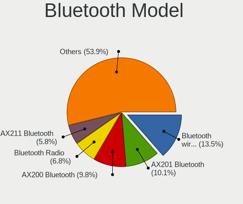

| Model                                               | Computers | Percent |
|-----------------------------------------------------|-----------|---------|
| Intel Bluetooth Device                              | 51        | 16.14%  |
| Intel AX200 Bluetooth                               | 47        | 14.87%  |
| Intel Bluetooth wireless interface                  | 43        | 13.61%  |
| Realtek Bluetooth Radio                             | 26        | 8.23%   |
| Intel AX201 Bluetooth                               | 25        | 7.91%   |
| Qualcomm Atheros  Bluetooth Device                  | 14        | 4.43%   |
| Cambridge Silicon Radio Bluetooth Dongle (HCI mode) | 13        | 4.11%   |
| Realtek  Bluetooth 4.2 Adapter                      | 9         | 2.85%   |
| Apple Bluetooth USB Host Controller                 | 8         | 2.53%   |
| Broadcom BCM20702A0 Bluetooth 4.0                   | 6         | 1.9%    |
| Intel Wireless-AC 9260 Bluetooth Adapter            | 5         | 1.58%   |
| IMC Networks Bluetooth Radio                        | 5         | 1.58%   |
| Intel Wireless-AC 3168 Bluetooth                    | 4         | 1.27%   |
| Intel Centrino Bluetooth Wireless Transceiver       | 4         | 1.27%   |
| IMC Networks Wireless_Device                        | 4         | 1.27%   |
| Realtek Bluetooth Radio                             | 3         | 0.95%   |
| Qualcomm Atheros AR3012 Bluetooth 4.0               | 3         | 0.95%   |
| Lite-On Bluetooth Device                            | 3         | 0.95%   |
| Lite-On Atheros AR3012 Bluetooth                    | 3         | 0.95%   |
| Qualcomm Atheros AR9462 Bluetooth                   | 2         | 0.63%   |
| Marvell Bluetooth and Wireless LAN Composite        | 2         | 0.63%   |
| Foxconn / Hon Hai Wireless_Device                   | 2         | 0.63%   |
| Foxconn / Hon Hai Bluetooth Device                  | 2         | 0.63%   |
| Broadcom BCM43142 Bluetooth 4.0                     | 2         | 0.63%   |
| Broadcom BCM2045B (BDC-2.1)                         | 2         | 0.63%   |
| ASUS Broadcom BCM20702A0 Bluetooth                  | 2         | 0.63%   |
| ASUS Bluetooth Device                               | 2         | 0.63%   |
| Toshiba BCM43142A0                                  | 1         | 0.32%   |
| Toshiba Atheros AR3012 Bluetooth                    | 1         | 0.32%   |
| Realtek RTL8821A Bluetooth                          | 1         | 0.32%   |
| Realtek RTL8723B Bluetooth                          | 1         | 0.32%   |
| Qualcomm Atheros AR3011 Bluetooth                   | 1         | 0.32%   |
| MediaTek Wireless_Device                            | 1         | 0.32%   |
| Lite-On Atheros Bluetooth                           | 1         | 0.32%   |
| HTC (High Tech Computer) BCM920703 Bluetooth 4.1    | 1         | 0.32%   |
| Foxconn International BCM43142A0 Bluetooth module   | 1         | 0.32%   |
| Foxconn / Hon Hai BT                                | 1         | 0.32%   |
| Foxconn / Hon Hai BCM43142A0 broadcom bluetooth     | 1         | 0.32%   |
| Dell Wireless 370 Bluetooth Mini-card               | 1         | 0.32%   |
| Dell DW375 Bluetooth Module                         | 1         | 0.32%   |
| Dell Broadcom BCM20702A0 Bluetooth                  | 1         | 0.32%   |
| Broadcom HP Portable Valentine                      | 1         | 0.32%   |
| Broadcom HP Portable SoftSailing                    | 1         | 0.32%   |
| Broadcom BCM2070 Bluetooth 2.1 + EDR                | 1         | 0.32%   |
| Broadcom BCM2045B (BDC-2) [Bluetooth Controller]    | 1         | 0.32%   |
| Broadcom BCM2045A0                                  | 1         | 0.32%   |
| Broadcom BCM2045 Bluetooth                          | 1         | 0.32%   |
| ASUS Bluetooth Adapter                              | 1         | 0.32%   |
| ASUS BCM20702A0                                     | 1         | 0.32%   |
| Apple Built-in Bluetooth 2.0+EDR HCI                | 1         | 0.32%   |
| Apple Bluetooth Host Controller                     | 1         | 0.32%   |

Sound
-----

Sound Vendor
------------

Sound card vendors

| Vendor                                          | Computers | Percent |
|-------------------------------------------------|-----------|---------|
| Intel                                           | 255       | 38.81%  |
| AMD                                             | 156       | 23.74%  |
| Nvidia                                          | 123       | 18.72%  |
| C-Media Electronics                             | 15        | 2.28%   |
| Logitech                                        | 12        | 1.83%   |
| Texas Instruments                               | 10        | 1.52%   |
| SteelSeries ApS                                 | 9         | 1.37%   |
| Kingston Technology                             | 5         | 0.76%   |
| JMTek                                           | 5         | 0.76%   |
| Creative Labs                                   | 5         | 0.76%   |
| KORG                                            | 4         | 0.61%   |
| AKAI                                            | 4         | 0.61%   |
| Valve Software                                  | 3         | 0.46%   |
| Sony                                            | 3         | 0.46%   |
| Realtek Semiconductor                           | 3         | 0.46%   |
| Creative Technology                             | 3         | 0.46%   |
| Corsair                                         | 3         | 0.46%   |
| XMOS                                            | 2         | 0.3%    |
| Thesycon Systemsoftware & Consulting            | 2         | 0.3%    |
| Sennheiser Communications                       | 2         | 0.3%    |
| Samson Technologies                             | 2         | 0.3%    |
| RODE Microphones                                | 2         | 0.3%    |
| Razer USA                                       | 2         | 0.3%    |
| Licensed by Sony Computer Entertainment America | 2         | 0.3%    |
| Lenovo                                          | 2         | 0.3%    |
| Generalplus Technology                          | 2         | 0.3%    |
| AKAI Professional M.I.                          | 2         | 0.3%    |
| Xilinx                                          | 1         | 0.15%   |
| VIA Technologies                                | 1         | 0.15%   |
| Tdlasunnic                                      | 1         | 0.15%   |
| Solid State System                              | 1         | 0.15%   |
| Plantronics                                     | 1         | 0.15%   |
| No brand                                        | 1         | 0.15%   |
| Native Instruments                              | 1         | 0.15%   |
| Micro Star International                        | 1         | 0.15%   |
| M-Audio                                         | 1         | 0.15%   |
| iConnectivity                                   | 1         | 0.15%   |
| Hewlett-Packard                                 | 1         | 0.15%   |
| GYROCOM C&C                                     | 1         | 0.15%   |
| GN Netcom                                       | 1         | 0.15%   |
| Giga-Byte Technology                            | 1         | 0.15%   |
| Focusrite-Novation                              | 1         | 0.15%   |
| FiiO Electronics Technology                     | 1         | 0.15%   |
| Blue Microphones                                | 1         | 0.15%   |
| BEHRINGER International                         | 1         | 0.15%   |
| Apple                                           | 1         | 0.15%   |

Sound Model
-----------

Sound card models

| Model                                                                      | Computers | Percent |
|----------------------------------------------------------------------------|-----------|---------|
| AMD Family 17h/19h HD Audio Controller                                     | 58        | 7.24%   |
| Intel Sunrise Point-LP HD Audio                                            | 48        | 5.99%   |
| AMD Starship/Matisse HD Audio Controller                                   | 39        | 4.87%   |
| AMD Renoir Radeon High Definition Audio Controller                         | 37        | 4.62%   |
| Intel 8 Series/C220 Series Chipset High Definition Audio Controller        | 26        | 3.25%   |
| AMD Ellesmere HDMI Audio [Radeon RX 470/480 / 570/580/590]                 | 21        | 2.62%   |
| Intel 7 Series/C216 Chipset Family High Definition Audio Controller        | 20        | 2.5%    |
| Intel 100 Series/C230 Series Chipset Family HD Audio Controller            | 19        | 2.37%   |
| Nvidia GP107GL High Definition Audio Controller                            | 18        | 2.25%   |
| Intel Cannon Lake PCH cAVS                                                 | 18        | 2.25%   |
| Intel Xeon E3-1200 v3/4th Gen Core Processor HD Audio Controller           | 17        | 2.12%   |
| AMD Raven/Raven2/Fenghuang HDMI/DP Audio Controller                        | 17        | 2.12%   |
| Intel Haswell-ULT HD Audio Controller                                      | 14        | 1.75%   |
| Intel 8 Series HD Audio Controller                                         | 14        | 1.75%   |
| Nvidia GP104 High Definition Audio Controller                              | 13        | 1.62%   |
| AMD Family 17h (Models 00h-0fh) HD Audio Controller                        | 13        | 1.62%   |
| AMD Navi 10 HDMI Audio                                                     | 12        | 1.5%    |
| AMD FCH Azalia Controller                                                  | 12        | 1.5%    |
| Nvidia TU116 High Definition Audio Controller                              | 9         | 1.12%   |
| Nvidia GA104 High Definition Audio Controller                              | 9         | 1.12%   |
| Intel Comet Lake PCH cAVS                                                  | 9         | 1.12%   |
| Intel Broadwell-U Audio Controller                                         | 9         | 1.12%   |
| Nvidia GP106 High Definition Audio Controller                              | 8         | 1%      |
| Intel Wildcat Point-LP High Definition Audio Controller                    | 8         | 1%      |
| Intel Tiger Lake-LP Smart Sound Technology Audio Controller                | 8         | 1%      |
| Intel Ice Lake-LP Smart Sound Technology Audio Controller                  | 8         | 1%      |
| Intel 6 Series/C200 Series Chipset Family High Definition Audio Controller | 8         | 1%      |
| AMD Kabini HDMI/DP Audio                                                   | 8         | 1%      |
| Nvidia TU106 High Definition Audio Controller                              | 7         | 0.87%   |
| Intel Comet Lake PCH-LP cAVS                                               | 7         | 0.87%   |
| Intel Cannon Point-LP High Definition Audio Controller                     | 7         | 0.87%   |
| Intel 200 Series PCH HD Audio                                              | 7         | 0.87%   |
| Nvidia GK208 HDMI/DP Audio Controller                                      | 6         | 0.75%   |
| Nvidia GK104 HDMI Audio Controller                                         | 6         | 0.75%   |
| Intel Tiger Lake-H HD Audio Controller                                     | 6         | 0.75%   |
| Intel 9 Series Chipset Family HD Audio Controller                          | 6         | 0.75%   |
| Intel 5 Series/3400 Series Chipset High Definition Audio                   | 6         | 0.75%   |
| AMD Navi 21 HDMI Audio [Radeon RX 6800/6800 XT / 6900 XT]                  | 6         | 0.75%   |
| AMD Baffin HDMI/DP Audio [Radeon RX 550 640SP / RX 560/560X]               | 6         | 0.75%   |
| Texas Instruments PCM2902 Audio Codec                                      | 5         | 0.62%   |
| Nvidia TU104 HD Audio Controller                                           | 5         | 0.62%   |
| Nvidia GM204 High Definition Audio Controller                              | 5         | 0.62%   |
| Nvidia Audio device                                                        | 5         | 0.62%   |
| Intel Celeron/Pentium Silver Processor High Definition Audio               | 5         | 0.62%   |
| Intel 82801I (ICH9 Family) HD Audio Controller                             | 5         | 0.62%   |
| AMD SBx00 Azalia (Intel HDA)                                               | 5         | 0.62%   |
| AMD High Definition Audio Controller                                       | 5         | 0.62%   |
| AMD Family 15h (Models 60h-6fh) Audio Controller                           | 5         | 0.62%   |
| SteelSeries ApS Arctis Pro Wireless                                        | 4         | 0.5%    |
| Nvidia TU107 GeForce GTX 1650 High Definition Audio Controller             | 4         | 0.5%    |
| Nvidia GA102 High Definition Audio Controller                              | 4         | 0.5%    |
| KORG nanoKONTROL2 MIDI Controller                                          | 4         | 0.5%    |
| Intel CM238 HD Audio Controller                                            | 4         | 0.5%    |
| AKAI MPKmini2                                                              | 4         | 0.5%    |
| Valve Software Valve VR Radio & HMD Mic                                    | 3         | 0.37%   |
| Nvidia GM107 High Definition Audio Controller [GeForce 940MX]              | 3         | 0.37%   |
| Nvidia GK107 HDMI Audio Controller                                         | 3         | 0.37%   |
| Nvidia GF119 HDMI Audio Controller                                         | 3         | 0.37%   |
| Kingston Technology HyperX 7.1 Audio                                       | 3         | 0.37%   |
| JMTek USB PnP Audio Device                                                 | 3         | 0.37%   |

Memory
------

Memory Vendor
-------------

Memory module vendors

| Vendor              | Computers | Percent |
|---------------------|-----------|---------|
| Samsung Electronics | 86        | 23.89%  |
| SK Hynix            | 65        | 18.06%  |
| Micron Technology   | 37        | 10.28%  |
| Corsair             | 32        | 8.89%   |
| G.Skill             | 29        | 8.06%   |
| Kingston            | 26        | 7.22%   |
| Crucial             | 20        | 5.56%   |
| Unknown             | 18        | 5%      |
| A-DATA Technology   | 10        | 2.78%   |
| Team                | 6         | 1.67%   |
| Patriot             | 6         | 1.67%   |
| Ramaxel Technology  | 5         | 1.39%   |
| Unknown (ABCD)      | 4         | 1.11%   |
| Elpida              | 3         | 0.83%   |
| Shenzhen Mic        | 2         | 0.56%   |
| V-GeN               | 1         | 0.28%   |
| Strontium           | 1         | 0.28%   |
| SMART Brazil        | 1         | 0.28%   |
| Smart               | 1         | 0.28%   |
| Sesame              | 1         | 0.28%   |
| PNY                 | 1         | 0.28%   |
| Nanya Technology    | 1         | 0.28%   |
| Kllisre             | 1         | 0.28%   |
| Klevv               | 1         | 0.28%   |
| Golden Empire       | 1         | 0.28%   |
| GeIL                | 1         | 0.28%   |

Memory Model
------------

Memory module models

| Model                                                            | Computers | Percent |
|------------------------------------------------------------------|-----------|---------|
| Samsung RAM M471A5244CB0-CTD 4096MB SODIMM DDR4 3266MT/s         | 9         | 2.27%   |
| Samsung RAM M471A5244CB0-CRC 4096MB SODIMM DDR4 2667MT/s         | 7         | 1.76%   |
| Samsung RAM M471A1K43DB1-CWE 8GB SODIMM DDR4 3200MT/s            | 6         | 1.51%   |
| Corsair RAM CMK16GX4M2B3200C16 8192MB DIMM DDR4 3600MT/s         | 6         | 1.51%   |
| Unknown RAM Module 8GB SODIMM DDR3 1600MT/s                      | 5         | 1.26%   |
| SK Hynix RAM HMT451S6AFR8A-PB 4GB SODIMM DDR3 1600MT/s           | 4         | 1.01%   |
| SK Hynix RAM HMT41GS6BFR8A-PB 8GB SODIMM DDR3 1600MT/s           | 4         | 1.01%   |
| SK Hynix RAM HMAB2GS6AMR6N-XN 16GB SODIMM DDR4 3200MT/s          | 4         | 1.01%   |
| SK Hynix RAM HMA81GS6CJR8N-VK 8GB SODIMM DDR4 2667MT/s           | 4         | 1.01%   |
| Samsung RAM M471B5173QH0-YK0 4096MB SODIMM DDR3 1600MT/s         | 4         | 1.01%   |
| Samsung RAM M471A1K43CB1-CTD 8192MB SODIMM DDR4 2667MT/s         | 4         | 1.01%   |
| Samsung RAM M471A1G44AB0-CWE 8GB SODIMM DDR4 3200MT/s            | 4         | 1.01%   |
| Samsung RAM M471A1G44AB0-CWE 8GB Row Of Chips DDR4 3200MT/s      | 4         | 1.01%   |
| Micron RAM 8ATF1G64HZ-3G2J1 8192MB SODIMM DDR4 3200MT/s          | 4         | 1.01%   |
| Micron RAM 4ATF1G64HZ-3G2E2 8GB SODIMM DDR4 3200MT/s             | 4         | 1.01%   |
| Corsair RAM CMK16GX4M2B3000C15 8GB DIMM DDR4 3000MT/s            | 4         | 1.01%   |
| Unknown (ABCD) RAM 123456789012345678 2GB SODIMM LPDDR4 2400MT/s | 3         | 0.76%   |
| SK Hynix RAM Module 4GB SODIMM DDR3 1600MT/s                     | 3         | 0.76%   |
| SK Hynix RAM HMA851S6CJR6N-VK 4GB SODIMM DDR4 2667MT/s           | 3         | 0.76%   |
| Kingston RAM KHX3200C16D4/8GX 8GB DIMM DDR4 3533MT/s             | 3         | 0.76%   |
| Team RAM TEAMGROUP-SD4-3200 16GB SODIMM DDR4 3200MT/s            | 2         | 0.5%    |
| SK Hynix RAM HMT451S6MFR8C-PB 4096MB SODIMM DDR3 1600MT/s        | 2         | 0.5%    |
| SK Hynix RAM HMT41GS6AFR8A-PB 8GB SODIMM DDR3 1600MT/s           | 2         | 0.5%    |
| SK Hynix RAM HMT41GS6AFR8A-PB 8192MB SODIMM DDR3 1600MT/s        | 2         | 0.5%    |
| SK Hynix RAM HMP351S6AFR8C-S6 4GB SODIMM DDR2 800MT/s            | 2         | 0.5%    |
| SK Hynix RAM HMA851S6DJR6N-XN 4GB SODIMM DDR4 3200MT/s           | 2         | 0.5%    |
| SK Hynix RAM HMA851S6AFR6N-UH 4GB SODIMM DDR4 2667MT/s           | 2         | 0.5%    |
| SK Hynix RAM HMA81GS6AFR8N-UH 8192MB SODIMM DDR4 2667MT/s        | 2         | 0.5%    |
| SK Hynix RAM HMA41GS6AFR8N-TF 8GB SODIMM DDR4 2667MT/s           | 2         | 0.5%    |
| Shenzhen Mic RAM MG8A3200C21WE-SA 16GB SODIMM DDR4 3200MT/s      | 2         | 0.5%    |
| Samsung RAM M471B5773DH0-CH9 2GB SODIMM DDR3 1600MT/s            | 2         | 0.5%    |
| Samsung RAM M471B5173EB0-YK0 4GB SODIMM DDR3 1600MT/s            | 2         | 0.5%    |
| Samsung RAM M471B1G73EB0-YK0 8192MB SODIMM DDR3 1600MT/s         | 2         | 0.5%    |
| Samsung RAM M471A5244CB0-CWE 4GB SODIMM DDR4 3200MT/s            | 2         | 0.5%    |
| Samsung RAM M471A5244BB0-CPB 4GB SODIMM DDR4 2400MT/s            | 2         | 0.5%    |
| Samsung RAM M471A2G43AB2-CWE 16GB SODIMM DDR4 3200MT/s           | 2         | 0.5%    |
| Samsung RAM M471A1K43CB1-CRC 8192MB SODIMM DDR4 2667MT/s         | 2         | 0.5%    |
| Samsung RAM M471A1G43DB0-CPB 8GB SODIMM DDR4 2400MT/s            | 2         | 0.5%    |
| Samsung RAM M378B1G73DB0-CK0 8192MB DIMM DDR3 2133MT/s           | 2         | 0.5%    |
| Samsung RAM M378A1K43CB2-CTD 8192MB DIMM DDR4 3200MT/s           | 2         | 0.5%    |
| Ramaxel RAM RMSA3260MB78HAF2400 8GB SODIMM DDR4 2400MT/s         | 2         | 0.5%    |
| Micron RAM MT52L1G32D4PG-093 8GB Row Of Chips LPDDR3 2133MT/s    | 2         | 0.5%    |
| Micron RAM MT40A1G16RC-062E:B 8GB SODIMM DDR4 3200MT/s           | 2         | 0.5%    |
| Micron RAM 4ATS2G64HZ-3G2B1 16GB SODIMM DDR4 3200MT/s            | 2         | 0.5%    |
| Micron RAM 4ATF51264HZ-3G2J1 4GB SODIMM DDR4 3200MT/s            | 2         | 0.5%    |
| Micron RAM 4ATF51264HZ-3G2J1 4GB Row Of Chips DDR4 3200MT/s      | 2         | 0.5%    |
| Micron RAM 4ATF51264HZ-2G6E1 4GB SODIMM DDR4 2667MT/s            | 2         | 0.5%    |
| Micron RAM 4ATF1G64HZ-3G2E1 8192MB SODIMM DDR4 3200MT/s          | 2         | 0.5%    |
| Micron RAM 16JSF51264HZ-1G4D1 4GB SODIMM DDR3 1334MT/s           | 2         | 0.5%    |
| G.Skill RAM F4-3600C18-16GTZR 16GB DIMM DDR4 3600MT/s            | 2         | 0.5%    |
| G.Skill RAM F4-3600C16-16GTZNC 16GB DIMM DDR4 3600MT/s           | 2         | 0.5%    |
| G.Skill RAM F4-3200C16-8GTZRX 8GB DIMM DDR4 3200MT/s             | 2         | 0.5%    |
| G.Skill RAM F4-3200C16-8GIS 8192MB DIMM DDR4 3200MT/s            | 2         | 0.5%    |
| G.Skill RAM F4-3200C16-16GVK 16GB DIMM DDR4 3600MT/s             | 2         | 0.5%    |
| Crucial RAM CT4G4DFS824A.C8FBD2 4GB DIMM DDR4 2733MT/s           | 2         | 0.5%    |
| Corsair RAM CMZ16GX3M2A1600C10 8GB DIMM DDR3 1600MT/s            | 2         | 0.5%    |
| A-DATA RAM Module 16GB SODIMM DDR4 3200MT/s                      | 2         | 0.5%    |
| A-DATA RAM DDR4 3200 8GB DIMM DDR4 3200MT/s                      | 2         | 0.5%    |
| V-GeN RAM D3R4GS16B8R 4GB SODIMM DDR3 1600MT/s                   | 1         | 0.25%   |
| Unknown RAM Module 8192MB SODIMM DDR4 2133MT/s                   | 1         | 0.25%   |

Memory Kind
-----------

Memory module kinds

| Kind    | Computers | Percent |
|---------|-----------|---------|
| DDR4    | 189       | 60.38%  |
| DDR3    | 91        | 29.07%  |
| LPDDR3  | 12        | 3.83%   |
| LPDDR4  | 9         | 2.88%   |
| DDR2    | 4         | 1.28%   |
| Unknown | 4         | 1.28%   |
| SDRAM   | 3         | 0.96%   |
| DDR     | 1         | 0.32%   |

Memory Form Factor
------------------

Physical design of the memory module

| Name         | Computers | Percent |
|--------------|-----------|---------|
| SODIMM       | 180       | 56.96%  |
| DIMM         | 108       | 34.18%  |
| Row Of Chips | 23        | 7.28%   |
| Chip         | 4         | 1.27%   |
| RIMM         | 1         | 0.32%   |

Memory Size
-----------

Memory module size

| Size  | Computers | Percent |
|-------|-----------|---------|
| 8192  | 155       | 45.86%  |
| 4096  | 103       | 30.47%  |
| 16384 | 48        | 14.2%   |
| 2048  | 21        | 6.21%   |
| 32768 | 10        | 2.96%   |
| 1024  | 1         | 0.3%    |

Memory Speed
------------

Memory module speed

| Speed   | Computers | Percent |
|---------|-----------|---------|
| 3200    | 81        | 23.55%  |
| 1600    | 70        | 20.35%  |
| 2667    | 51        | 14.83%  |
| 2400    | 24        | 6.98%   |
| 3600    | 18        | 5.23%   |
| 2133    | 16        | 4.65%   |
| 1333    | 15        | 4.36%   |
| 1867    | 11        | 3.2%    |
| 3266    | 9         | 2.62%   |
| 1334    | 6         | 1.74%   |
| 3466    | 5         | 1.45%   |
| 800     | 5         | 1.45%   |
| 3733    | 3         | 0.87%   |
| 3533    | 3         | 0.87%   |
| 3000    | 3         | 0.87%   |
| 3333    | 2         | 0.58%   |
| 2733    | 2         | 0.58%   |
| 2666    | 2         | 0.58%   |
| 1800    | 2         | 0.58%   |
| 4333    | 1         | 0.29%   |
| 4267    | 1         | 0.29%   |
| 4266    | 1         | 0.29%   |
| 4000    | 1         | 0.29%   |
| 3800    | 1         | 0.29%   |
| 3500    | 1         | 0.29%   |
| 3400    | 1         | 0.29%   |
| 3151    | 1         | 0.29%   |
| 3067    | 1         | 0.29%   |
| 2933    | 1         | 0.29%   |
| 2800    | 1         | 0.29%   |
| 2048    | 1         | 0.29%   |
| 1067    | 1         | 0.29%   |
| 1066    | 1         | 0.29%   |
| 400     | 1         | 0.29%   |
| Unknown | 1         | 0.29%   |

Printers & scanners
-------------------

Printer Vendor
--------------

Printer device vendors

| Vendor              | Computers | Percent |
|---------------------|-----------|---------|
| Prolific Technology | 2         | 28.57%  |
| Hewlett-Packard     | 2         | 28.57%  |
| Brother Industries  | 2         | 28.57%  |
| Seiko Epson         | 1         | 14.29%  |

Printer Model
-------------

Printer device models

| Model                         | Computers | Percent |
|-------------------------------|-----------|---------|
| Prolific PL2305 Parallel Port | 2         | 28.57%  |
| Seiko Epson WF-2010 Series    | 1         | 14.29%  |
| HP ENVY 5540 series           | 1         | 14.29%  |
| HP DeskJet 2130 series        | 1         | 14.29%  |
| Brother Printer               | 1         | 14.29%  |
| Brother HL-2130 series        | 1         | 14.29%  |

Scanner Vendor
--------------

Scanner device vendors

Zero info for selected period =(

Scanner Model
-------------

Scanner device models

Zero info for selected period =(

Camera
------

Camera Vendor
-------------

Camera device vendors

| Vendor                                 | Computers | Percent |
|----------------------------------------|-----------|---------|
| Chicony Electronics                    | 51        | 19.69%  |
| IMC Networks                           | 31        | 11.97%  |
| Logitech                               | 26        | 10.04%  |
| Acer                                   | 20        | 7.72%   |
| Microdia                               | 17        | 6.56%   |
| Realtek Semiconductor                  | 14        | 5.41%   |
| Cheng Uei Precision Industry (Foxlink) | 14        | 5.41%   |
| Syntek                                 | 11        | 4.25%   |
| Sunplus Innovation Technology          | 10        | 3.86%   |
| Lite-On Technology                     | 10        | 3.86%   |
| Apple                                  | 9         | 3.47%   |
| Quanta                                 | 8         | 3.09%   |
| Microsoft                              | 5         | 1.93%   |
| Valve Software                         | 3         | 1.16%   |
| Suyin                                  | 3         | 1.16%   |
| Sonix Technology                       | 2         | 0.77%   |
| Primax Electronics                     | 2         | 0.77%   |
| Intel                                  | 2         | 0.77%   |
| Hewlett-Packard                        | 2         | 0.77%   |
| Alcor Micro                            | 2         | 0.77%   |
| Y Media                                | 1         | 0.39%   |
| Xiaomi                                 | 1         | 0.39%   |
| Tobii Technology AB                    | 1         | 0.39%   |
| Sunplus IT                             | 1         | 0.39%   |
| Silicon Motion                         | 1         | 0.39%   |
| Ricoh                                  | 1         | 0.39%   |
| Razer USA                              | 1         | 0.39%   |
| MacroSilicon                           | 1         | 0.39%   |
| Luxvisions Innotech Limited            | 1         | 0.39%   |
| Lenovo                                 | 1         | 0.39%   |
| Leap Motion                            | 1         | 0.39%   |
| Huawei Technologies                    | 1         | 0.39%   |
| HTC (High Tech Computer)               | 1         | 0.39%   |
| Google                                 | 1         | 0.39%   |
| DJKANA1BIF866I                         | 1         | 0.39%   |
| Creative Technology                    | 1         | 0.39%   |
| Unknown                                | 1         | 0.39%   |

Camera Model
------------

Camera device models

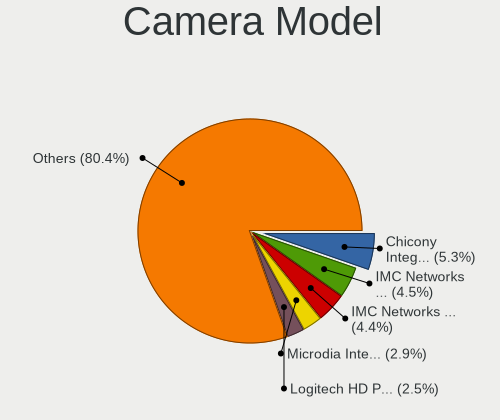

| Model                                                          | Computers | Percent |
|----------------------------------------------------------------|-----------|---------|
| IMC Networks Integrated Camera                                 | 16        | 6.18%   |
| Chicony Integrated Camera                                      | 15        | 5.79%   |
| Chicony HD Webcam                                              | 10        | 3.86%   |
| Microdia Integrated_Webcam_HD                                  | 9         | 3.47%   |
| Logitech HD Pro Webcam C920                                    | 8         | 3.09%   |
| IMC Networks USB2.0 HD UVC WebCam                              | 7         | 2.7%    |
| Syntek Integrated Camera                                       | 6         | 2.32%   |
| Realtek Integrated_Webcam_HD                                   | 6         | 2.32%   |
| Acer Integrated Camera                                         | 6         | 2.32%   |
| Logitech Webcam C270                                           | 5         | 1.93%   |
| Sunplus Integrated_Webcam_HD                                   | 4         | 1.54%   |
| Lite-On Integrated Camera                                      | 4         | 1.54%   |
| Acer EasyCamera                                                | 4         | 1.54%   |
| Valve Software 3D Camera                                       | 3         | 1.16%   |
| Syntek Lenovo EasyCamera                                       | 3         | 1.16%   |
| Sunplus HD WebCam                                              | 3         | 1.16%   |
| Microdia Integrated Webcam                                     | 3         | 1.16%   |
| Lite-On HP Webcam                                              | 3         | 1.16%   |
| Chicony USB2.0 HD UVC WebCam                                   | 3         | 1.16%   |
| Chicony EasyCamera                                             | 3         | 1.16%   |
| Cheng Uei Precision Industry (Foxlink) HD Camera               | 3         | 1.16%   |
| Apple iPhone 5/5C/5S/6/SE                                      | 3         | 1.16%   |
| Apple FaceTime HD Camera (Built-in)                            | 3         | 1.16%   |
| Acer HD Webcam                                                 | 3         | 1.16%   |
| Syntek EasyCamera                                              | 2         | 0.77%   |
| Sonix USB2.0 HD UVC WebCam                                     | 2         | 0.77%   |
| Quanta HP TrueVision HD Camera                                 | 2         | 0.77%   |
| Quanta HP HD Camera                                            | 2         | 0.77%   |
| Microsoft LifeCam HD-3000                                      | 2         | 0.77%   |
| Microdia Webcam Vitade AF                                      | 2         | 0.77%   |
| Logitech Webcam C310                                           | 2         | 0.77%   |
| Logitech C922 Pro Stream Webcam                                | 2         | 0.77%   |
| Lite-On HP Wide Vision HD Camera                               | 2         | 0.77%   |
| Intel RealSense 3D Camera (Front F200)                         | 2         | 0.77%   |
| IMC Networks ov9734_azurewave_camera                           | 2         | 0.77%   |
| HP Webcam HD 2300                                              | 2         | 0.77%   |
| Chicony Lenovo Integrated Camera (0.3MP)                       | 2         | 0.77%   |
| Chicony HP Wide Vision HD Camera                               | 2         | 0.77%   |
| Chicony HP Webcam                                              | 2         | 0.77%   |
| Chicony HD User Facing                                         | 2         | 0.77%   |
| Cheng Uei Precision Industry (Foxlink) HP Webcam               | 2         | 0.77%   |
| Cheng Uei Precision Industry (Foxlink) HP TrueVision HD Camera | 2         | 0.77%   |
| Cheng Uei Precision Industry (Foxlink) HP Truevision HD        | 2         | 0.77%   |
| Acer SunplusIT Integrated Camera                               | 2         | 0.77%   |
| Y Media USB Camera                                             | 1         | 0.39%   |
| Xiaomi Mi/Redmi series (PTP + ADB)                             | 1         | 0.39%   |
| Tobii AB EyeChip                                               | 1         | 0.39%   |
| Suyin Integrated_Webcam_HD                                     | 1         | 0.39%   |
| Suyin HP TrueVision HD Integrated Webcam                       | 1         | 0.39%   |
| Suyin HP TrueVision HD                                         | 1         | 0.39%   |
| Sunplus IT AUKEY PC-LM1 USB Camera                             | 1         | 0.39%   |
| Sunplus WebCamera                                              | 1         | 0.39%   |
| Sunplus Lenovo EasyCamera                                      | 1         | 0.39%   |
| Sunplus Asus Webcam                                            | 1         | 0.39%   |
| Silicon Motion Web Camera                                      | 1         | 0.39%   |
| Ricoh HD Webcam                                                | 1         | 0.39%   |
| Realtek Webcam                                                 | 1         | 0.39%   |
| Realtek USB2.0 HD UVC WebCam                                   | 1         | 0.39%   |
| Realtek USB HD Webcam                                          | 1         | 0.39%   |
| Realtek MTD Camera                                             | 1         | 0.39%   |

Security
--------

Fingerprint Vendor
------------------

Fingerprint sensor vendors

| Vendor                     | Computers | Percent |
|----------------------------|-----------|---------|
| Synaptics                  | 22        | 40%     |
| Validity Sensors           | 15        | 27.27%  |
| Shenzhen Goodix Technology | 12        | 21.82%  |
| LighTuning Technology      | 3         | 5.45%   |
| Elan Microelectronics      | 2         | 3.64%   |
| Upek                       | 1         | 1.82%   |

Fingerprint Model
-----------------

Fingerprint sensor models

| Model                                                                      | Computers | Percent |
|----------------------------------------------------------------------------|-----------|---------|
| Unknown                                                                    | 9         | 16.36%  |
| Shenzhen Goodix Fingerprint Reader                                         | 7         | 12.73%  |
| Synaptics Prometheus MIS Touch Fingerprint Reader                          | 5         | 9.09%   |
| Shenzhen Goodix  FingerPrint Device                                        | 5         | 9.09%   |
| Validity Sensors VFS5011 Fingerprint Reader                                | 4         | 7.27%   |
| Validity Sensors Synaptics WBDI                                            | 4         | 7.27%   |
| Synaptics  WBDI                                                            | 4         | 7.27%   |
| Validity Sensors VFS 5011 fingerprint sensor                               | 2         | 3.64%   |
| Synaptics Metallica MIS Touch Fingerprint Reader                           | 2         | 3.64%   |
| LighTuning EgisTec Touch Fingerprint Sensor                                | 2         | 3.64%   |
| Elan ELAN:Fingerprint                                                      | 2         | 3.64%   |
| Validity Sensors VFS7500 Touch Fingerprint Sensor                          | 1         | 1.82%   |
| Validity Sensors VFS495 Fingerprint Reader                                 | 1         | 1.82%   |
| Validity Sensors VFS491                                                    | 1         | 1.82%   |
| Validity Sensors Synaptics VFS7552 Touch Fingerprint Sensor with PurePrint | 1         | 1.82%   |
| Validity Sensors Swipe Fingerprint Sensor                                  | 1         | 1.82%   |
| Upek Biometric Touchchip/Touchstrip Fingerprint Sensor                     | 1         | 1.82%   |
| Synaptics  VFS7552 Touch Fingerprint Sensor with PurePrint                 | 1         | 1.82%   |
| Synaptics Metallica MOH Touch Fingerprint Reader                           | 1         | 1.82%   |
| LighTuning ES603 Swipe Fingerprint Sensor                                  | 1         | 1.82%   |

Chipcard Vendor
---------------

Chipcard module vendors

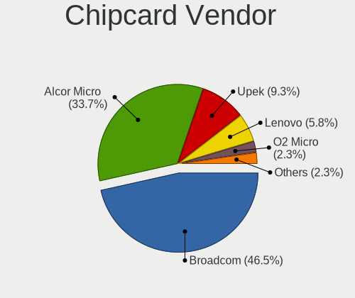

| Vendor      | Computers | Percent |
|-------------|-----------|---------|
| Broadcom    | 11        | 55%     |
| Alcor Micro | 7         | 35%     |
| Lenovo      | 1         | 5%      |
| HID Global  | 1         | 5%      |

Chipcard Model
--------------

Chipcard module models

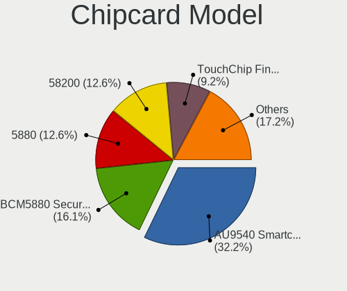

| Model                                                                        | Computers | Percent |
|------------------------------------------------------------------------------|-----------|---------|
| Alcor Micro AU9540 Smartcard Reader                                          | 7         | 33.33%  |
| Broadcom BCM5880 Secure Applications Processor                               | 5         | 23.81%  |
| Broadcom BCM5880 Secure Applications Processor with fingerprint swipe sensor | 3         | 14.29%  |
| Broadcom 58200                                                               | 3         | 14.29%  |
| Lenovo Integrated Smart Card Reader                                          | 1         | 4.76%   |
| HID Global USB Reader V3                                                     | 1         | 4.76%   |
| Broadcom 5880                                                                | 1         | 4.76%   |

Unsupported
-----------

Unsupported Devices
-------------------

Total unsupported devices on board

| Total | Computers | Percent |
|-------|-----------|---------|
| 0     | 267       | 64.18%  |
| 1     | 122       | 29.33%  |
| 2     | 26        | 6.25%   |
| 3     | 1         | 0.24%   |

Unsupported Device Types
------------------------

Types of unsupported devices

| Type                     | Computers | Percent |
|--------------------------|-----------|---------|
| Fingerprint reader       | 55        | 33.13%  |
| Net/ethernet             | 27        | 16.27%  |
| Chipcard                 | 19        | 11.45%  |
| Graphics card            | 17        | 10.24%  |
| Multimedia controller    | 15        | 9.04%   |
| Net/wireless             | 10        | 6.02%   |
| Bluetooth                | 7         | 4.22%   |
| Network                  | 6         | 3.61%   |
| Camera                   | 4         | 2.41%   |
| Unassigned class         | 1         | 0.6%    |
| Storage                  | 1         | 0.6%    |
| Sound                    | 1         | 0.6%    |
| Modem                    | 1         | 0.6%    |
| Dvb card                 | 1         | 0.6%    |
| Communication controller | 1         | 0.6%    |

