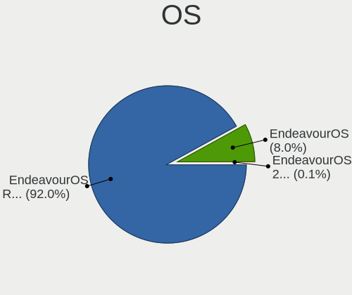
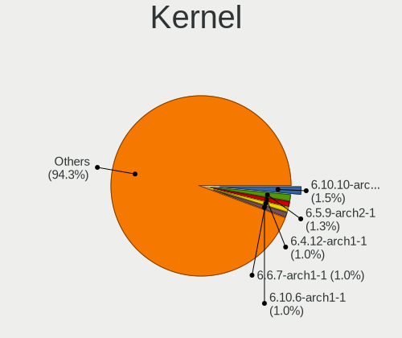
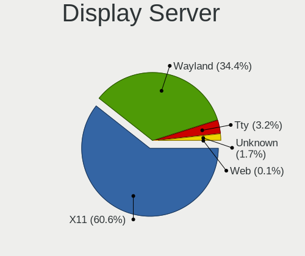
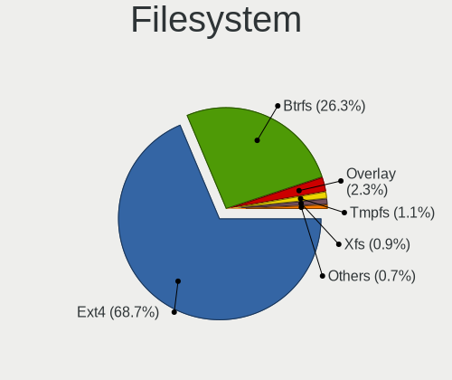
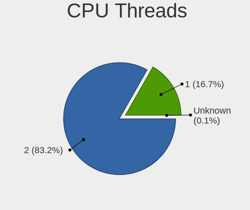
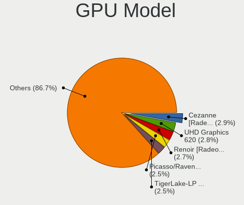
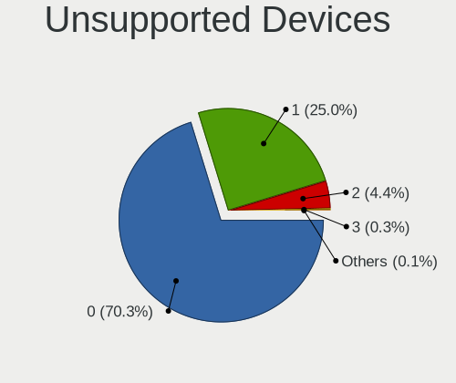

EndeavourOS - Tested Hardware & Statistics
------------------------------------------

A project to collect tested hardware configurations for EndeavourOS.

Anyone can contribute to this report by the [hw-probe](https://github.com/linuxhw/hw-probe) tool:

    sudo -E hw-probe -all -upload

Please contribute! Especially if your hardware is rare.

This is a report for all computer types. See also reports for [desktops](/Dist/EndeavourOS/Desktop/README.md) and [notebooks](/Dist/EndeavourOS/Notebook/README.md).

Contents
--------

* [ Test Cases ](#test-cases)

* [ System ](#system)
  - [ OS                       ](#os)
  - [ OS Family                ](#os-family)
  - [ Kernel                   ](#kernel)
  - [ Kernel Family            ](#kernel-family)
  - [ Kernel Major Ver.        ](#kernel-major-ver)
  - [ Arch                     ](#arch)
  - [ DE                       ](#de)
  - [ Display Server           ](#display-server)
  - [ Display Manager          ](#display-manager)
  - [ OS Lang                  ](#os-lang)
  - [ Boot Mode                ](#boot-mode)
  - [ Filesystem               ](#filesystem)
  - [ Part. scheme             ](#part-scheme)
  - [ Dual Boot with Linux/BSD ](#dual-boot-with-linuxbsd)
  - [ Dual Boot (Win)          ](#dual-boot-win)

* [ Board ](#board)
  - [ Vendor                   ](#vendor)
  - [ Model                    ](#model)
  - [ Model Family             ](#model-family)
  - [ MFG Year                 ](#mfg-year)
  - [ Form Factor              ](#form-factor)
  - [ Secure Boot              ](#secure-boot)
  - [ Coreboot                 ](#coreboot)
  - [ RAM Size                 ](#ram-size)
  - [ RAM Used                 ](#ram-used)
  - [ Total Drives             ](#total-drives)
  - [ Has CD-ROM               ](#has-cd-rom)
  - [ Has Ethernet             ](#has-ethernet)
  - [ Has WiFi                 ](#has-wifi)
  - [ Has Bluetooth            ](#has-bluetooth)

* [ Location ](#location)
  - [ Country                  ](#country)
  - [ City                     ](#city)

* [ Drives ](#drives)
  - [ Drive Vendor             ](#drive-vendor)
  - [ Drive Model              ](#drive-model)
  - [ HDD Vendor               ](#hdd-vendor)
  - [ SSD Vendor               ](#ssd-vendor)
  - [ Drive Kind               ](#drive-kind)
  - [ Drive Connector          ](#drive-connector)
  - [ Drive Size               ](#drive-size)
  - [ Space Total              ](#space-total)
  - [ Space Used               ](#space-used)
  - [ Malfunc. Drives          ](#malfunc-drives)
  - [ Malfunc. Drive Vendor    ](#malfunc-drive-vendor)
  - [ Malfunc. HDD Vendor      ](#malfunc-hdd-vendor)
  - [ Malfunc. Drive Kind      ](#malfunc-drive-kind)
  - [ Failed Drives            ](#failed-drives)
  - [ Failed Drive Vendor      ](#failed-drive-vendor)
  - [ Drive Status             ](#drive-status)

* [ Storage controller ](#storage-controller)
  - [ Storage Vendor           ](#storage-vendor)
  - [ Storage Model            ](#storage-model)
  - [ Storage Kind             ](#storage-kind)

* [ Processor ](#processor)
  - [ CPU Vendor               ](#cpu-vendor)
  - [ CPU Model                ](#cpu-model)
  - [ CPU Model Family         ](#cpu-model-family)
  - [ CPU Cores                ](#cpu-cores)
  - [ CPU Sockets              ](#cpu-sockets)
  - [ CPU Threads              ](#cpu-threads)
  - [ CPU Op-Modes             ](#cpu-op-modes)
  - [ CPU Microcode            ](#cpu-microcode)
  - [ CPU Microarch            ](#cpu-microarch)

* [ Graphics ](#graphics)
  - [ GPU Vendor               ](#gpu-vendor)
  - [ GPU Model                ](#gpu-model)
  - [ GPU Combo                ](#gpu-combo)
  - [ GPU Driver               ](#gpu-driver)
  - [ GPU Memory               ](#gpu-memory)

* [ Monitor ](#monitor)
  - [ Monitor Vendor           ](#monitor-vendor)
  - [ Monitor Model            ](#monitor-model)
  - [ Monitor Resolution       ](#monitor-resolution)
  - [ Monitor Diagonal         ](#monitor-diagonal)
  - [ Monitor Width            ](#monitor-width)
  - [ Aspect Ratio             ](#aspect-ratio)
  - [ Monitor Area             ](#monitor-area)
  - [ Pixel Density            ](#pixel-density)
  - [ Multiple Monitors        ](#multiple-monitors)

* [ Network ](#network)
  - [ Net Controller Vendor    ](#net-controller-vendor)
  - [ Net Controller Model     ](#net-controller-model)
  - [ Wireless Vendor          ](#wireless-vendor)
  - [ Wireless Model           ](#wireless-model)
  - [ Ethernet Vendor          ](#ethernet-vendor)
  - [ Ethernet Model           ](#ethernet-model)
  - [ Net Controller Kind      ](#net-controller-kind)
  - [ Used Controller          ](#used-controller)
  - [ NICs                     ](#nics)
  - [ IPv6                     ](#ipv6)

* [ Bluetooth ](#bluetooth)
  - [ Bluetooth Vendor         ](#bluetooth-vendor)
  - [ Bluetooth Model          ](#bluetooth-model)

* [ Sound ](#sound)
  - [ Sound Vendor             ](#sound-vendor)
  - [ Sound Model              ](#sound-model)

* [ Memory ](#memory)
  - [ Memory Vendor            ](#memory-vendor)
  - [ Memory Model             ](#memory-model)
  - [ Memory Kind              ](#memory-kind)
  - [ Memory Form Factor       ](#memory-form-factor)
  - [ Memory Size              ](#memory-size)
  - [ Memory Speed             ](#memory-speed)

* [ Printers & scanners ](#printers--scanners)
  - [ Printer Vendor           ](#printer-vendor)
  - [ Printer Model            ](#printer-model)
  - [ Scanner Vendor           ](#scanner-vendor)
  - [ Scanner Model            ](#scanner-model)

* [ Camera ](#camera)
  - [ Camera Vendor            ](#camera-vendor)
  - [ Camera Model             ](#camera-model)

* [ Security ](#security)
  - [ Fingerprint Vendor       ](#fingerprint-vendor)
  - [ Fingerprint Model        ](#fingerprint-model)
  - [ Chipcard Vendor          ](#chipcard-vendor)
  - [ Chipcard Model           ](#chipcard-model)

* [ Unsupported ](#unsupported)
  - [ Unsupported Devices      ](#unsupported-devices)
  - [ Unsupported Device Types ](#unsupported-device-types)

Test Cases
----------

Total: 2827

| Vendor        | Model                       | Form-Factor | Probe                                                      | Date         |
|---------------|-----------------------------|-------------|------------------------------------------------------------|--------------|
| Dell          | Latitude E6230              | Notebook    | [255f27d863](https://linux-hardware.org/?probe=255f27d863) | Jan 06, 2025 |
| MSI           | MAG B550M MORTAR MAX WIF... | Desktop     | [f7c8a6c602](https://linux-hardware.org/?probe=f7c8a6c602) | Jan 05, 2025 |
| Lenovo        | IdeaPad S145-15API 81V7     | Notebook    | [1df5680b90](https://linux-hardware.org/?probe=1df5680b90) | Jan 05, 2025 |
| Unknown       | Unknown                     | Notebook    | [b681fbb66c](https://linux-hardware.org/?probe=b681fbb66c) | Jan 04, 2025 |
| Dell          | Latitude E6230              | Notebook    | [90371159c4](https://linux-hardware.org/?probe=90371159c4) | Jan 04, 2025 |
| Lenovo        | Yoga 6 13ARE05 82FN         | Convertible | [53a8da4145](https://linux-hardware.org/?probe=53a8da4145) | Jan 04, 2025 |
| Lenovo        | Yoga 6 13ARE05 82FN         | Convertible | [e1b0c66b8b](https://linux-hardware.org/?probe=e1b0c66b8b) | Jan 04, 2025 |
| MSI           | A520M-A PRO                 | Desktop     | [89075d3dce](https://linux-hardware.org/?probe=89075d3dce) | Jan 03, 2025 |
| Lenovo        | SHARKBAY SDK0J40705 WIN ... | Desktop     | [39187b7cd2](https://linux-hardware.org/?probe=39187b7cd2) | Jan 03, 2025 |
| GEEKOM        | A7                          | Desktop     | [cc9ea8ad98](https://linux-hardware.org/?probe=cc9ea8ad98) | Jan 03, 2025 |
| Dell          | XPS 15 9530                 | Notebook    | [c03c2ac397](https://linux-hardware.org/?probe=c03c2ac397) | Jan 03, 2025 |
| MSI           | MPG Z490 GAMING EDGE WIF... | Desktop     | [88e26cdf08](https://linux-hardware.org/?probe=88e26cdf08) | Jan 02, 2025 |
| ASUSTek       | VivoBook 14_ASUS Laptop ... | Notebook    | [54b1993e1c](https://linux-hardware.org/?probe=54b1993e1c) | Jan 02, 2025 |
| HP            | Pavilion g6                 | Notebook    | [d717116365](https://linux-hardware.org/?probe=d717116365) | Jan 01, 2025 |
| MSI           | MAG B650 TOMAHAWK WIFI      | Desktop     | [f3b82ea58b](https://linux-hardware.org/?probe=f3b82ea58b) | Jan 01, 2025 |
| Lenovo        | IdeaPad 330-15ARR 81D2      | Notebook    | [7a8e2cd7ed](https://linux-hardware.org/?probe=7a8e2cd7ed) | Dec 30, 2024 |
| Lenovo        | IdeaPad 330-15ARR 81D2      | Notebook    | [104b0f2168](https://linux-hardware.org/?probe=104b0f2168) | Dec 30, 2024 |
| Lenovo        | IdeaPad Gaming 3 15ACH6 ... | Notebook    | [406ac061f4](https://linux-hardware.org/?probe=406ac061f4) | Dec 30, 2024 |
| Huanan        | X99-F8 GAMING V5.0          | Desktop     | [e1be4649fa](https://linux-hardware.org/?probe=e1be4649fa) | Dec 29, 2024 |
| MSI           | MS-7A34                     | Notebook    | [047f86697a](https://linux-hardware.org/?probe=047f86697a) | Dec 28, 2024 |
| GEEKOM        | A7                          | Desktop     | [d9be822a41](https://linux-hardware.org/?probe=d9be822a41) | Dec 28, 2024 |
| HP            | EliteBook 8460p             | Notebook    | [4891753c29](https://linux-hardware.org/?probe=4891753c29) | Dec 28, 2024 |
| ASUSTek       | VivoBook_ASUSLaptop X515... | Notebook    | [c317540642](https://linux-hardware.org/?probe=c317540642) | Dec 24, 2024 |
| Lenovo        | 310C SDK0J40697 WIN 3305... | Mini pc     | [eb3ff37603](https://linux-hardware.org/?probe=eb3ff37603) | Dec 24, 2024 |
| Google        | Beetley                     | Notebook    | [4bffa2af9d](https://linux-hardware.org/?probe=4bffa2af9d) | Dec 24, 2024 |
| Dell          | Latitude E6230              | Notebook    | [dbbf8b8c46](https://linux-hardware.org/?probe=dbbf8b8c46) | Dec 22, 2024 |
| Lenovo        | ThinkPad L15 Gen 3 21C30... | Notebook    | [95bcab10c4](https://linux-hardware.org/?probe=95bcab10c4) | Dec 22, 2024 |
| Lenovo        | LOQ 15AHP9 83DX             | Notebook    | [c4d33f738c](https://linux-hardware.org/?probe=c4d33f738c) | Dec 22, 2024 |
| Gigabyte      | B550M DS3H                  | Desktop     | [01c866bd0e](https://linux-hardware.org/?probe=01c866bd0e) | Dec 21, 2024 |
| HP            | 3397                        | Desktop     | [624eec907f](https://linux-hardware.org/?probe=624eec907f) | Dec 20, 2024 |
| Unknown       | Unknown                     | Notebook    | [8013360f66](https://linux-hardware.org/?probe=8013360f66) | Dec 17, 2024 |
| Dell          | 014GRG A00                  | Desktop     | [a68144eb72](https://linux-hardware.org/?probe=a68144eb72) | Dec 17, 2024 |
| ASUSTek       | ASUS TUF Gaming A16 FA61... | Notebook    | [a05e5e0978](https://linux-hardware.org/?probe=a05e5e0978) | Dec 16, 2024 |
| Lenovo        | IdeaPad 330-15IKB 81DC      | Notebook    | [cdd64fe0e0](https://linux-hardware.org/?probe=cdd64fe0e0) | Dec 14, 2024 |
| MSI           | B450M MORTAR MAX            | Desktop     | [9ec24ce9ab](https://linux-hardware.org/?probe=9ec24ce9ab) | Dec 14, 2024 |
| MSI           | PRO B550M-VC WIFI           | Desktop     | [e874d8c2e3](https://linux-hardware.org/?probe=e874d8c2e3) | Dec 14, 2024 |
| Acer          | Aspire A317-53              | Notebook    | [7f47fbace4](https://linux-hardware.org/?probe=7f47fbace4) | Dec 13, 2024 |
| Gigabyte      | B550 VISION D-P             | Desktop     | [21682474e3](https://linux-hardware.org/?probe=21682474e3) | Dec 12, 2024 |
| Google        | Swanky                      | Notebook    | [368716121b](https://linux-hardware.org/?probe=368716121b) | Dec 12, 2024 |
| ASUSTek       | ASUS Zenbook S 16 UM5606... | Notebook    | [fdf8620b1d](https://linux-hardware.org/?probe=fdf8620b1d) | Dec 10, 2024 |
| HP            | Laptop 15z-ef2xxx           | Notebook    | [ce2f4dd2fe](https://linux-hardware.org/?probe=ce2f4dd2fe) | Dec 09, 2024 |
| Dell          | XPS 9315                    | Notebook    | [4c96378b88](https://linux-hardware.org/?probe=4c96378b88) | Dec 09, 2024 |
| ASUSTek       | M4A785-M                    | Desktop     | [f39d1f9a14](https://linux-hardware.org/?probe=f39d1f9a14) | Dec 09, 2024 |
| Apple         | MacBookPro11,1              | Notebook    | [61fbdd12f7](https://linux-hardware.org/?probe=61fbdd12f7) | Dec 08, 2024 |
| Dell          | Latitude 7400 2-in-1        | Convertible | [915c668a3f](https://linux-hardware.org/?probe=915c668a3f) | Dec 08, 2024 |
| Shenzhen M... | F7BSI                       | Mini pc     | [8766b955df](https://linux-hardware.org/?probe=8766b955df) | Dec 07, 2024 |
| AZW           | MINI S                      | Desktop     | [a193c5ec9c](https://linux-hardware.org/?probe=a193c5ec9c) | Dec 06, 2024 |
| AZW           | MINI S                      | Desktop     | [533e08a91e](https://linux-hardware.org/?probe=533e08a91e) | Dec 05, 2024 |
| Dell          | Latitude E6230              | Notebook    | [e78b1b92fc](https://linux-hardware.org/?probe=e78b1b92fc) | Dec 04, 2024 |
| ASUSTek       | TUF Gaming X570-PLUS        | Desktop     | [7e0582c034](https://linux-hardware.org/?probe=7e0582c034) | Dec 02, 2024 |
| Lenovo        | ThinkPad T14s Gen 4 21F8... | Notebook    | [86b9eec1f0](https://linux-hardware.org/?probe=86b9eec1f0) | Dec 02, 2024 |
| Dell          | Latitude 7410               | Notebook    | [debd518311](https://linux-hardware.org/?probe=debd518311) | Dec 01, 2024 |
| Lenovo        | IdeaPad 3 14ALC6 82KT       | Notebook    | [687f99a0ed](https://linux-hardware.org/?probe=687f99a0ed) | Dec 01, 2024 |
| ASRock        | A520M-HDV                   | Desktop     | [b29fed8a2b](https://linux-hardware.org/?probe=b29fed8a2b) | Nov 30, 2024 |
| Dell          | 0NW6H5 A00                  | Desktop     | [d2acba356a](https://linux-hardware.org/?probe=d2acba356a) | Nov 30, 2024 |
| Dell          | Inspiron 3583               | Notebook    | [ae86d50011](https://linux-hardware.org/?probe=ae86d50011) | Nov 30, 2024 |
| Microsoft     | Surface Book 2              | Tablet      | [e9ec9e62a2](https://linux-hardware.org/?probe=e9ec9e62a2) | Nov 29, 2024 |
| ASUSTek       | ROG STRIX X570-E GAMING ... | Desktop     | [7e55f87677](https://linux-hardware.org/?probe=7e55f87677) | Nov 29, 2024 |
| Dell          | 014GRG A00                  | Desktop     | [9f1d4366ae](https://linux-hardware.org/?probe=9f1d4366ae) | Nov 29, 2024 |
| Gigabyte      | B550M AORUS ELITE           | Desktop     | [1c69901961](https://linux-hardware.org/?probe=1c69901961) | Nov 28, 2024 |
| ASUSTek       | M4A785-M                    | Desktop     | [737ff3d411](https://linux-hardware.org/?probe=737ff3d411) | Nov 28, 2024 |
| ASRock        | B650I Lightning WiFi        | Desktop     | [8fb4e1f11a](https://linux-hardware.org/?probe=8fb4e1f11a) | Nov 28, 2024 |
| Acer          | Aspire A515-56G             | Notebook    | [0dd2034460](https://linux-hardware.org/?probe=0dd2034460) | Nov 27, 2024 |
| Acer          | Aspire A515-56G             | Notebook    | [f73128061e](https://linux-hardware.org/?probe=f73128061e) | Nov 27, 2024 |
| Lenovo        | ThinkPad E15 Gen 4 21E60... | Notebook    | [15258f1ad9](https://linux-hardware.org/?probe=15258f1ad9) | Nov 27, 2024 |
| MSI           | MPG Z390I GAMING EDGE AC    | Desktop     | [a931a49052](https://linux-hardware.org/?probe=a931a49052) | Nov 25, 2024 |
| HP            | Victus by Gaming Laptop ... | Notebook    | [b7f5c28695](https://linux-hardware.org/?probe=b7f5c28695) | Nov 24, 2024 |
| ASRock        | B550M-HDV/AR                | Desktop     | [bea5bb0acc](https://linux-hardware.org/?probe=bea5bb0acc) | Nov 24, 2024 |
| HP            | OMEN by Gaming Laptop 16... | Notebook    | [424de7c996](https://linux-hardware.org/?probe=424de7c996) | Nov 24, 2024 |
| HP            | Laptop 14s-dq3xxx           | Notebook    | [4bb9d7ef12](https://linux-hardware.org/?probe=4bb9d7ef12) | Nov 24, 2024 |
| ASUSTek       | ASUS EXPERTBOOK L1500CDA... | Notebook    | [e65f68056f](https://linux-hardware.org/?probe=e65f68056f) | Nov 24, 2024 |
| Dell          | Latitude E6230              | Notebook    | [a32ccab459](https://linux-hardware.org/?probe=a32ccab459) | Nov 23, 2024 |
| HP            | ENVY x360 Convertible 13... | Convertible | [d8fd405416](https://linux-hardware.org/?probe=d8fd405416) | Nov 23, 2024 |
| HP            | ENVY x360 Convertible 13... | Convertible | [8ca6a30820](https://linux-hardware.org/?probe=8ca6a30820) | Nov 23, 2024 |
| ASUSTek       | X555LD                      | Notebook    | [ae073052ae](https://linux-hardware.org/?probe=ae073052ae) | Nov 23, 2024 |
| MSI           | MPG X570 GAMING EDGE WIF... | Desktop     | [3a27b7af40](https://linux-hardware.org/?probe=3a27b7af40) | Nov 22, 2024 |
| Lenovo        | 3768 NO DPK                 | Desktop     | [853c2e946f](https://linux-hardware.org/?probe=853c2e946f) | Nov 21, 2024 |
| HP            | Victus by Laptop 16-e1xx... | Notebook    | [280d94072f](https://linux-hardware.org/?probe=280d94072f) | Nov 21, 2024 |
| HP            | Victus by Laptop 16-e1xx... | Notebook    | [00e3211d51](https://linux-hardware.org/?probe=00e3211d51) | Nov 21, 2024 |
| HP            | Victus by Laptop 16-e1xx... | Notebook    | [cfd782d9d8](https://linux-hardware.org/?probe=cfd782d9d8) | Nov 21, 2024 |
| Unknown       | adnbsc01                    | Desktop     | [c1941e3d3c](https://linux-hardware.org/?probe=c1941e3d3c) | Nov 21, 2024 |
| Apple         | MacBookAir7,2               | Notebook    | [d2e169141a](https://linux-hardware.org/?probe=d2e169141a) | Nov 20, 2024 |
| Lenovo        | IdeaPad 330-15IKB 81DC      | Notebook    | [3fd82c3ca3](https://linux-hardware.org/?probe=3fd82c3ca3) | Nov 20, 2024 |
| HP            | 0B4Ch D                     | Desktop     | [a86441a182](https://linux-hardware.org/?probe=a86441a182) | Nov 20, 2024 |
| MSI           | MAG X570S TOMAHAWK MAX W... | Desktop     | [ac01b2a1d7](https://linux-hardware.org/?probe=ac01b2a1d7) | Nov 19, 2024 |
| Timi          | Redmi Book Pro 15 2022      | Notebook    | [be60b887e5](https://linux-hardware.org/?probe=be60b887e5) | Nov 19, 2024 |
| Dell          | 014GRG A00                  | Desktop     | [1d7c479df7](https://linux-hardware.org/?probe=1d7c479df7) | Nov 19, 2024 |
| Lenovo        | IdeaPad 320S-15IKB 80X5     | Notebook    | [a75fff547e](https://linux-hardware.org/?probe=a75fff547e) | Nov 18, 2024 |
| ASUSTek       | P8Z77-V LX                  | Desktop     | [803d07cb2b](https://linux-hardware.org/?probe=803d07cb2b) | Nov 18, 2024 |
| Lenovo        | ThinkPad T14 Gen 5 21MCS... | Notebook    | [2d30a85677](https://linux-hardware.org/?probe=2d30a85677) | Nov 18, 2024 |
| Gigabyte      | P67A-UD3-B3                 | Desktop     | [53d0e13e6d](https://linux-hardware.org/?probe=53d0e13e6d) | Nov 17, 2024 |
| HP            | ENVY 15                     | Notebook    | [5472e124bb](https://linux-hardware.org/?probe=5472e124bb) | Nov 17, 2024 |
| Trigkey       | S5 V2.0                     | Mini pc     | [5841e42780](https://linux-hardware.org/?probe=5841e42780) | Nov 17, 2024 |
| MSI           | X470 GAMING PLUS MAX        | Desktop     | [325fe4ca32](https://linux-hardware.org/?probe=325fe4ca32) | Nov 17, 2024 |
| HP            | ENVY 15                     | Notebook    | [56f54e0128](https://linux-hardware.org/?probe=56f54e0128) | Nov 17, 2024 |
| MSI           | Katana 15 B13VFK            | Notebook    | [86a6249b00](https://linux-hardware.org/?probe=86a6249b00) | Nov 17, 2024 |
| ASUSTek       | PRIME Z270-K                | Desktop     | [5812ed00f3](https://linux-hardware.org/?probe=5812ed00f3) | Nov 17, 2024 |
| Lenovo        | G40-30 80FY                 | Notebook    | [9228ef946e](https://linux-hardware.org/?probe=9228ef946e) | Nov 17, 2024 |
| SLIMBOOK      | PROX-AMD5                   | Notebook    | [25010cdc93](https://linux-hardware.org/?probe=25010cdc93) | Nov 16, 2024 |
| MSI           | B560M PRO-VDH WIFI          | Desktop     | [4fe8b8ac1d](https://linux-hardware.org/?probe=4fe8b8ac1d) | Nov 16, 2024 |
| HONOR         | BRN-HXX                     | Notebook    | [076d979f1f](https://linux-hardware.org/?probe=076d979f1f) | Nov 15, 2024 |
| ASUSTek       | ASUS TUF Gaming A14 FA40... | Notebook    | [cd0cd38834](https://linux-hardware.org/?probe=cd0cd38834) | Nov 15, 2024 |
| Gigabyte      | Z97X-Gaming 5               | Desktop     | [e55e051692](https://linux-hardware.org/?probe=e55e051692) | Nov 15, 2024 |
| MSI           | B450M-A PRO MAX             | Desktop     | [4bbab9f1b9](https://linux-hardware.org/?probe=4bbab9f1b9) | Nov 14, 2024 |
| Dell          | Vostro 14-3468              | Notebook    | [64e1ab6cf2](https://linux-hardware.org/?probe=64e1ab6cf2) | Nov 14, 2024 |
| HP            | 18E4                        | Desktop     | [f92165bb21](https://linux-hardware.org/?probe=f92165bb21) | Nov 14, 2024 |
| Gigabyte      | B650 AORUS ELITE AX V2      | Desktop     | [701e086dc6](https://linux-hardware.org/?probe=701e086dc6) | Nov 14, 2024 |
| Google        | Sasuke                      | Notebook    | [a2e298f62e](https://linux-hardware.org/?probe=a2e298f62e) | Nov 14, 2024 |
| ASRock        | X570 Phantom Gaming 4       | Desktop     | [eeaf3d5f73](https://linux-hardware.org/?probe=eeaf3d5f73) | Nov 13, 2024 |
| HP            | ENVY x360 2-in-1 Laptop ... | Convertible | [b395180403](https://linux-hardware.org/?probe=b395180403) | Nov 13, 2024 |
| Lenovo        | IdeaPad Gaming 3 15IHU6 ... | Notebook    | [c71e9a6fb2](https://linux-hardware.org/?probe=c71e9a6fb2) | Nov 12, 2024 |
| HP            | EliteBook 830 G8 Noteboo... | Notebook    | [6c93a82662](https://linux-hardware.org/?probe=6c93a82662) | Nov 12, 2024 |
| Apple         | MacBookPro15,2              | Notebook    | [f21bc8c54b](https://linux-hardware.org/?probe=f21bc8c54b) | Nov 12, 2024 |
| Lenovo        | Yoga Pro 7 14ASP9 83HN      | Notebook    | [c3249b5c41](https://linux-hardware.org/?probe=c3249b5c41) | Nov 12, 2024 |
| Gigabyte      | Z170MX-Gaming 5             | Desktop     | [8a47e4af0e](https://linux-hardware.org/?probe=8a47e4af0e) | Nov 10, 2024 |
| Lenovo        | IdeaPad 5 2-in-1 14AHP9 ... | Convertible | [db46ad6126](https://linux-hardware.org/?probe=db46ad6126) | Nov 10, 2024 |
| ASUSTek       | TUF Gaming B550M-PLUS       | Desktop     | [e46bef6af4](https://linux-hardware.org/?probe=e46bef6af4) | Nov 10, 2024 |
| Dell          | Precision 5550              | Notebook    | [1f2d07fe7f](https://linux-hardware.org/?probe=1f2d07fe7f) | Nov 10, 2024 |
| ASUSTek       | VivoBook_ASUSLaptop X150... | Notebook    | [653af95fb0](https://linux-hardware.org/?probe=653af95fb0) | Nov 10, 2024 |
| Dell          | 014GRG A00                  | Desktop     | [3bf779ef79](https://linux-hardware.org/?probe=3bf779ef79) | Nov 10, 2024 |
| MSI           | MPG X570 GAMING EDGE WIF... | Desktop     | [14b9181db0](https://linux-hardware.org/?probe=14b9181db0) | Nov 09, 2024 |
| ASRock        | B550M Pro4                  | Desktop     | [d83cc9503a](https://linux-hardware.org/?probe=d83cc9503a) | Nov 09, 2024 |
| UNOWHY        | Y13G012S4EI                 | Notebook    | [fa37732bbf](https://linux-hardware.org/?probe=fa37732bbf) | Nov 08, 2024 |
| MSI           | 760GM-P23                   | Desktop     | [2729dc6c3e](https://linux-hardware.org/?probe=2729dc6c3e) | Nov 08, 2024 |
| HP            | Laptop 15t-dy200            | Notebook    | [236b796d32](https://linux-hardware.org/?probe=236b796d32) | Nov 07, 2024 |
| Lenovo        | ThinkPad X1 Yoga Gen 6 2... | Convertible | [ab0de1992f](https://linux-hardware.org/?probe=ab0de1992f) | Nov 07, 2024 |
| HP            | 18E4                        | Desktop     | [f25610c188](https://linux-hardware.org/?probe=f25610c188) | Nov 07, 2024 |
| Framework     | Laptop 16 (AMD Ryzen 704... | Notebook    | [52347faca7](https://linux-hardware.org/?probe=52347faca7) | Nov 07, 2024 |
| HP            | Laptop 15-dy2xxx            | Notebook    | [fd4f8d9aa1](https://linux-hardware.org/?probe=fd4f8d9aa1) | Nov 06, 2024 |
| Lenovo        | ThinkPad T530 2429F37       | Notebook    | [6652f755d1](https://linux-hardware.org/?probe=6652f755d1) | Nov 05, 2024 |
| HP            | 8298                        | Desktop     | [ff6e607a99](https://linux-hardware.org/?probe=ff6e607a99) | Nov 05, 2024 |
| MSI           | Alpha 15 B5EEK              | Notebook    | [245e122c71](https://linux-hardware.org/?probe=245e122c71) | Nov 05, 2024 |
| MSI           | Alpha 15 B5EEK              | Notebook    | [8d6317b0ad](https://linux-hardware.org/?probe=8d6317b0ad) | Nov 05, 2024 |
| Lenovo        | ThinkPad T480s 20L7S0060... | Notebook    | [ebf7e20a00](https://linux-hardware.org/?probe=ebf7e20a00) | Nov 05, 2024 |
| ASUSTek       | ROG Zephyrus M16 GU604VY... | Notebook    | [2edc1cb664](https://linux-hardware.org/?probe=2edc1cb664) | Nov 04, 2024 |
| Lenovo        | IdeaPad 3 15ALC6 82MF       | Notebook    | [773b8e9b23](https://linux-hardware.org/?probe=773b8e9b23) | Nov 04, 2024 |
| Acer          | Aspire M3420                | Desktop     | [fcaec1aa5d](https://linux-hardware.org/?probe=fcaec1aa5d) | Nov 04, 2024 |
| Samsung       | 950QED                      | Convertible | [52840408ad](https://linux-hardware.org/?probe=52840408ad) | Nov 04, 2024 |
| Packard Be... | EasyNote TE69KB             | Notebook    | [a9167be106](https://linux-hardware.org/?probe=a9167be106) | Nov 04, 2024 |
| Huanan        | H81 V2.1                    | Desktop     | [c2ea66a759](https://linux-hardware.org/?probe=c2ea66a759) | Nov 03, 2024 |
| Lenovo        | IdeaPad 5 Pro 14ARH7 82S... | Notebook    | [ee9620d5e3](https://linux-hardware.org/?probe=ee9620d5e3) | Nov 03, 2024 |
| Lenovo        | G40-30 80FY                 | Notebook    | [328a342a15](https://linux-hardware.org/?probe=328a342a15) | Nov 03, 2024 |
| ASUSTek       | TUF Gaming X570-PLUS        | Desktop     | [c5506f592b](https://linux-hardware.org/?probe=c5506f592b) | Nov 02, 2024 |
| Apple         | MacBookPro10,2              | Notebook    | [e989c51a4a](https://linux-hardware.org/?probe=e989c51a4a) | Nov 02, 2024 |
| ASUSTek       | ROG CROSSHAIR X870E HERO    | Desktop     | [623459de8f](https://linux-hardware.org/?probe=623459de8f) | Nov 02, 2024 |
| Apple         | MacBookPro6,1               | Notebook    | [a3b81fc716](https://linux-hardware.org/?probe=a3b81fc716) | Nov 02, 2024 |
| Apple         | MacBookPro10,2              | Notebook    | [8899f70eb4](https://linux-hardware.org/?probe=8899f70eb4) | Nov 02, 2024 |
| ASRock        | B450 Gaming-ITX/ac          | Desktop     | [3139696c49](https://linux-hardware.org/?probe=3139696c49) | Nov 01, 2024 |
| ASUSTek       | TUF Gaming X570-PLUS        | Desktop     | [348a37f351](https://linux-hardware.org/?probe=348a37f351) | Nov 01, 2024 |
| Dell          | Latitude 5490               | Notebook    | [d8b5b59d4e](https://linux-hardware.org/?probe=d8b5b59d4e) | Nov 01, 2024 |
| Lenovo        | ThinkPad T16 Gen 2 21K7C... | Notebook    | [b0ccea7382](https://linux-hardware.org/?probe=b0ccea7382) | Oct 30, 2024 |
| MSI           | MAG B650M MORTAR WIFI       | Desktop     | [8c96dadaba](https://linux-hardware.org/?probe=8c96dadaba) | Oct 30, 2024 |
| ASRock        | B450M Pro4                  | Desktop     | [51a760c162](https://linux-hardware.org/?probe=51a760c162) | Oct 30, 2024 |
| ASUSTek       | Vivobook Go E1504GA_E150... | Notebook    | [57f1a7f1de](https://linux-hardware.org/?probe=57f1a7f1de) | Oct 29, 2024 |
| HP            | EliteBook 840 G3            | Notebook    | [f65672133c](https://linux-hardware.org/?probe=f65672133c) | Oct 29, 2024 |
| Gigabyte      | H61M-DS2                    | Desktop     | [689b826b4c](https://linux-hardware.org/?probe=689b826b4c) | Oct 29, 2024 |
| Gigabyte      | B460M DS3H                  | Desktop     | [929c2648b4](https://linux-hardware.org/?probe=929c2648b4) | Oct 28, 2024 |
| ASUSTek       | ROG Strix G713PV_G713PV     | Notebook    | [efde307b1b](https://linux-hardware.org/?probe=efde307b1b) | Oct 27, 2024 |
| Lenovo        | Legion Y540-15IRH 81SX      | Notebook    | [4c16301925](https://linux-hardware.org/?probe=4c16301925) | Oct 27, 2024 |
| ASRock        | B75 Pro3-M                  | Desktop     | [cfd685d227](https://linux-hardware.org/?probe=cfd685d227) | Oct 26, 2024 |
| Acer          | Aspire E5-571G              | Notebook    | [2f3323097a](https://linux-hardware.org/?probe=2f3323097a) | Oct 26, 2024 |
| Samsung       | 950QCG                      | Convertible | [896e77bda2](https://linux-hardware.org/?probe=896e77bda2) | Oct 26, 2024 |
| Dell          | Latitude 5411               | Notebook    | [54e539128d](https://linux-hardware.org/?probe=54e539128d) | Oct 24, 2024 |
| Lenovo        | 100w Gen 3 82HY             | Notebook    | [b62f9c00ac](https://linux-hardware.org/?probe=b62f9c00ac) | Oct 23, 2024 |
| HP            | 212B                        | Desktop     | [6369ec6e2a](https://linux-hardware.org/?probe=6369ec6e2a) | Oct 23, 2024 |
| ASUSTek       | ASUS Zenbook S 16 UM5606... | Notebook    | [50608db984](https://linux-hardware.org/?probe=50608db984) | Oct 23, 2024 |
| ASRock        | B550M Pro4                  | Desktop     | [b274c1e19f](https://linux-hardware.org/?probe=b274c1e19f) | Oct 23, 2024 |
| ASUSTek       | PRIME X670E-PRO WIFI        | Desktop     | [91a21d18a4](https://linux-hardware.org/?probe=91a21d18a4) | Oct 22, 2024 |
| MSI           | B550-A PRO                  | Desktop     | [f193e74093](https://linux-hardware.org/?probe=f193e74093) | Oct 22, 2024 |
| HP            | 250 G7 Notebook PC          | Notebook    | [e369fdf5bd](https://linux-hardware.org/?probe=e369fdf5bd) | Oct 20, 2024 |
| Dell          | 0J3C2F A00                  | Desktop     | [8e6ea2aea5](https://linux-hardware.org/?probe=8e6ea2aea5) | Oct 20, 2024 |
| BESSTAR Te... | UM700                       | Desktop     | [4adb7c3490](https://linux-hardware.org/?probe=4adb7c3490) | Oct 19, 2024 |
| ASRock        | B650M-HDV/M.2               | Desktop     | [be17e54973](https://linux-hardware.org/?probe=be17e54973) | Oct 19, 2024 |
| Lenovo        | ThinkPad E550 20DF0040US    | Notebook    | [3fb59bd2a6](https://linux-hardware.org/?probe=3fb59bd2a6) | Oct 17, 2024 |
| HP            | EliteBook 865 16 inch G1... | Notebook    | [4f3f40aa42](https://linux-hardware.org/?probe=4f3f40aa42) | Oct 16, 2024 |
| MSI           | MAG B550M MORTAR WIFI       | Desktop     | [41cfa72ca8](https://linux-hardware.org/?probe=41cfa72ca8) | Oct 16, 2024 |
| Gigabyte      | 970A-DS3P                   | Desktop     | [fdadda176b](https://linux-hardware.org/?probe=fdadda176b) | Oct 16, 2024 |
| Lenovo        | 3102 SDK0J40697 WIN 3305... | Desktop     | [d8a7c8652a](https://linux-hardware.org/?probe=d8a7c8652a) | Oct 15, 2024 |
| Acer          | Aspire XC-605               | Desktop     | [eb244529f1](https://linux-hardware.org/?probe=eb244529f1) | Oct 15, 2024 |
| HP            | Pavilion Gaming Laptop 1... | Notebook    | [c3cf59acfe](https://linux-hardware.org/?probe=c3cf59acfe) | Oct 15, 2024 |
| HP            | Victus by Gaming Laptop ... | Notebook    | [25b6c78476](https://linux-hardware.org/?probe=25b6c78476) | Oct 14, 2024 |
| ASRock        | B450M Steel Legend          | Desktop     | [b5c565d986](https://linux-hardware.org/?probe=b5c565d986) | Oct 14, 2024 |
| Dell          | XPS 13 9310 2-in-1          | Convertible | [2d8ca56b99](https://linux-hardware.org/?probe=2d8ca56b99) | Oct 14, 2024 |
| Gigabyte      | B550I AORUS PRO AX          | Desktop     | [03de88019f](https://linux-hardware.org/?probe=03de88019f) | Oct 13, 2024 |
| ASRock        | B650M Pro RS WiFi           | Desktop     | [f84e73f4ac](https://linux-hardware.org/?probe=f84e73f4ac) | Oct 13, 2024 |
| MSI           | MPG X570 GAMING EDGE WIF... | Desktop     | [45e481e85a](https://linux-hardware.org/?probe=45e481e85a) | Oct 13, 2024 |
| Microsoft     | Surface Laptop Go           | Tablet      | [f402cb0fde](https://linux-hardware.org/?probe=f402cb0fde) | Oct 12, 2024 |
| ASUSTek       | ROG Zephyrus G16 GA605WI... | Notebook    | [157d66f0e8](https://linux-hardware.org/?probe=157d66f0e8) | Oct 12, 2024 |
| ASUSTek       | M4A785-M                    | Desktop     | [b27e6f5028](https://linux-hardware.org/?probe=b27e6f5028) | Oct 12, 2024 |
| ASUSTek       | Rampage IV BLACK EDITION    | Desktop     | [2ec97504aa](https://linux-hardware.org/?probe=2ec97504aa) | Oct 12, 2024 |
| Biostar       | A320MH PRO                  | Desktop     | [7ec9d0a6fb](https://linux-hardware.org/?probe=7ec9d0a6fb) | Oct 11, 2024 |
| Dell          | XPS 13 9300                 | Notebook    | [76d3595387](https://linux-hardware.org/?probe=76d3595387) | Oct 11, 2024 |
| Acer          | Aspire A315-51              | Notebook    | [f4c8183717](https://linux-hardware.org/?probe=f4c8183717) | Oct 11, 2024 |
| Lenovo        | IdeaPad Gaming 3 15IHU6 ... | Notebook    | [e9c7cab546](https://linux-hardware.org/?probe=e9c7cab546) | Oct 10, 2024 |
| Lenovo        | ThinkPad T480 20L6SA5R0U    | Notebook    | [bcada5cbe6](https://linux-hardware.org/?probe=bcada5cbe6) | Oct 10, 2024 |
| Lenovo        | ThinkPad P1 Gen 7 21KV00... | Notebook    | [6f853dcdba](https://linux-hardware.org/?probe=6f853dcdba) | Oct 10, 2024 |
| Lenovo        | ThinkPad T470 W10DG 20JN... | Notebook    | [47a7874878](https://linux-hardware.org/?probe=47a7874878) | Oct 09, 2024 |
| Lenovo        | ThinkPad P1 Gen 7 21KV00... | Notebook    | [8ae813aefc](https://linux-hardware.org/?probe=8ae813aefc) | Oct 09, 2024 |
| HP            | 18E4                        | Desktop     | [aba6068d59](https://linux-hardware.org/?probe=aba6068d59) | Oct 09, 2024 |
| Acer          | Aspire XC-605               | Desktop     | [a964210bf4](https://linux-hardware.org/?probe=a964210bf4) | Oct 08, 2024 |
| ASRock        | H310M-HDV                   | Desktop     | [b20cb44166](https://linux-hardware.org/?probe=b20cb44166) | Oct 08, 2024 |
| ASUSTek       | ASUS TUF Gaming A15 FA50... | Notebook    | [8428643c32](https://linux-hardware.org/?probe=8428643c32) | Oct 07, 2024 |
| ASUSTek       | ASUS TUF Gaming A15 FA50... | Notebook    | [d58ea9b2a0](https://linux-hardware.org/?probe=d58ea9b2a0) | Oct 07, 2024 |
| Lenovo        | Legion Y540-17IRH 81Q4      | Notebook    | [467a5965cf](https://linux-hardware.org/?probe=467a5965cf) | Oct 06, 2024 |
| HP            | Laptop 14s-dq3xxx           | Notebook    | [e93a1db49f](https://linux-hardware.org/?probe=e93a1db49f) | Oct 06, 2024 |
| Lenovo        | IdeaPad S340-14IWL          | Notebook    | [daf000bc67](https://linux-hardware.org/?probe=daf000bc67) | Oct 05, 2024 |
| Wiltronic     | IVIEW-Maximus-4G            | Notebook    | [2a1e298d14](https://linux-hardware.org/?probe=2a1e298d14) | Oct 04, 2024 |
| Dell          | Latitude 5490               | Notebook    | [2b877e3bfb](https://linux-hardware.org/?probe=2b877e3bfb) | Oct 04, 2024 |
| Lenovo        | ThinkPad T14 Gen 5 21MLC... | Notebook    | [49bb431bbf](https://linux-hardware.org/?probe=49bb431bbf) | Oct 04, 2024 |
| HP            | Notebook                    | Notebook    | [1abbebe60a](https://linux-hardware.org/?probe=1abbebe60a) | Oct 04, 2024 |
| Microsoft     | Surface Laptop Go           | Tablet      | [6411e08a57](https://linux-hardware.org/?probe=6411e08a57) | Oct 02, 2024 |
| ASUSTek       | ROG STRIX Z390-F GAMING     | Desktop     | [9637b6cfad](https://linux-hardware.org/?probe=9637b6cfad) | Oct 02, 2024 |
| MSI           | MAG B650 TOMAHAWK WIFI      | Desktop     | [9bea800fea](https://linux-hardware.org/?probe=9bea800fea) | Oct 02, 2024 |
| Alienware     | m15 R6                      | Notebook    | [bf9be94be2](https://linux-hardware.org/?probe=bf9be94be2) | Oct 01, 2024 |
| MSI           | MPG Z390 GAMING EDGE AC     | Desktop     | [35eab42f7a](https://linux-hardware.org/?probe=35eab42f7a) | Oct 01, 2024 |
| MSI           | PRO B650M-B                 | Desktop     | [e2d4b7be2a](https://linux-hardware.org/?probe=e2d4b7be2a) | Oct 01, 2024 |
| DEXP          | C14-ICW300                  | Notebook    | [17de41cc9b](https://linux-hardware.org/?probe=17de41cc9b) | Sep 29, 2024 |
| ASUSTek       | VivoBook_ASUSLaptop X160... | Notebook    | [38566d1b64](https://linux-hardware.org/?probe=38566d1b64) | Sep 29, 2024 |
| ASRock        | B650M Pro RS WiFi           | Desktop     | [ec24629761](https://linux-hardware.org/?probe=ec24629761) | Sep 29, 2024 |
| Google        | Beetley                     | Notebook    | [328112e7a0](https://linux-hardware.org/?probe=328112e7a0) | Sep 29, 2024 |
| Lenovo        | Legion 5 Pro 16ACH6H 82J... | Notebook    | [645c999c2b](https://linux-hardware.org/?probe=645c999c2b) | Sep 28, 2024 |
| Dell          | Latitude 5490               | Notebook    | [5b8525625e](https://linux-hardware.org/?probe=5b8525625e) | Sep 28, 2024 |
| ASUSTek       | ROG Zephyrus G15 GA503RW... | Notebook    | [f7ef456d5b](https://linux-hardware.org/?probe=f7ef456d5b) | Sep 28, 2024 |
| Acer          | Aspire A315-55KG            | Notebook    | [7655bbabae](https://linux-hardware.org/?probe=7655bbabae) | Sep 28, 2024 |
| HP            | 1998                        | Desktop     | [66cfdcc9ec](https://linux-hardware.org/?probe=66cfdcc9ec) | Sep 27, 2024 |
| ASUSTek       | VivoBook_ASUSLaptop X160... | Notebook    | [7ee423575a](https://linux-hardware.org/?probe=7ee423575a) | Sep 27, 2024 |
| ASUSTek       | VivoBook_ASUSLaptop X415... | Notebook    | [90af0212ea](https://linux-hardware.org/?probe=90af0212ea) | Sep 27, 2024 |
| HP            | Victus by Gaming Laptop ... | Notebook    | [166b85b6e1](https://linux-hardware.org/?probe=166b85b6e1) | Sep 26, 2024 |
| Microsoft     | Surface Laptop Go           | Tablet      | [0f5f88f5ab](https://linux-hardware.org/?probe=0f5f88f5ab) | Sep 25, 2024 |
| Gigabyte      | X570 AORUS ELITE            | Desktop     | [fe92dee5b5](https://linux-hardware.org/?probe=fe92dee5b5) | Sep 25, 2024 |
| ASRock        | FM2A78M-HD+                 | Desktop     | [4376e816bd](https://linux-hardware.org/?probe=4376e816bd) | Sep 25, 2024 |
| Dell          | XPS 15 9550                 | Notebook    | [a8471713fe](https://linux-hardware.org/?probe=a8471713fe) | Sep 23, 2024 |
| Lenovo        | Legion 5 Pro 16ACH6H 82J... | Notebook    | [5354d8dedb](https://linux-hardware.org/?probe=5354d8dedb) | Sep 23, 2024 |
| HUAWEI        | HKD-WXX                     | Notebook    | [e56f38de19](https://linux-hardware.org/?probe=e56f38de19) | Sep 23, 2024 |
| Lenovo        | ThinkPad W530 2441CTO       | Notebook    | [34d51b5cc5](https://linux-hardware.org/?probe=34d51b5cc5) | Sep 22, 2024 |
| ASRock        | B650M Pro RS WiFi           | Desktop     | [ba4fb8fc09](https://linux-hardware.org/?probe=ba4fb8fc09) | Sep 22, 2024 |
| Gigabyte      | Z390 AORUS PRO-CF           | Desktop     | [13a5f9277f](https://linux-hardware.org/?probe=13a5f9277f) | Sep 21, 2024 |
| Gigabyte      | Z390 AORUS PRO-CF           | Desktop     | [456f1a48d7](https://linux-hardware.org/?probe=456f1a48d7) | Sep 21, 2024 |
| MECHREVO      | WUJIE14XA                   | Notebook    | [7c2e3b925b](https://linux-hardware.org/?probe=7c2e3b925b) | Sep 21, 2024 |
| Lenovo        | IdeaPad 1 15AMN7 82X5       | Notebook    | [b1d22b77a2](https://linux-hardware.org/?probe=b1d22b77a2) | Sep 20, 2024 |
| Acer          | Aspire A317-52              | Notebook    | [20714a3ecd](https://linux-hardware.org/?probe=20714a3ecd) | Sep 20, 2024 |
| Lenovo        | IdeaPadFlex 5 15ALC05 82... | Convertible | [0f96b2f2e1](https://linux-hardware.org/?probe=0f96b2f2e1) | Sep 20, 2024 |
| ASRock        | B550M Steel Legend          | Desktop     | [727980ce56](https://linux-hardware.org/?probe=727980ce56) | Sep 19, 2024 |
| Lenovo        | Legion R7000P APH8 82Y9     | Notebook    | [f257442aff](https://linux-hardware.org/?probe=f257442aff) | Sep 18, 2024 |
| Lenovo        | Yoga Pro 7 14ARP8 83AU      | Notebook    | [bdf7fe66b1](https://linux-hardware.org/?probe=bdf7fe66b1) | Sep 18, 2024 |
| Dell          | 018D1Y A00                  | Desktop     | [a1f2dfcebf](https://linux-hardware.org/?probe=a1f2dfcebf) | Sep 18, 2024 |
| Lenovo        | IdeaPad 330-15ARR 81D2      | Notebook    | [89afe04276](https://linux-hardware.org/?probe=89afe04276) | Sep 18, 2024 |
| Medion        | MS-7800                     | Desktop     | [c1e96ba793](https://linux-hardware.org/?probe=c1e96ba793) | Sep 18, 2024 |
| HP            | 18E4                        | Desktop     | [9776d5aa4a](https://linux-hardware.org/?probe=9776d5aa4a) | Sep 18, 2024 |
| Apple         | MacBookPro12,1              | Notebook    | [3a67e2619d](https://linux-hardware.org/?probe=3a67e2619d) | Sep 17, 2024 |
| Lenovo        | ThinkPad T480 20L6SA5R0U    | Notebook    | [ffe3da2a61](https://linux-hardware.org/?probe=ffe3da2a61) | Sep 17, 2024 |
| Acidanther... | Mac-63001698E7A34814 iMa... | All in one  | [08e1967c77](https://linux-hardware.org/?probe=08e1967c77) | Sep 17, 2024 |
| Lenovo        | IdeaPad 3 15IAU7 82RK       | Notebook    | [6fdb9480fd](https://linux-hardware.org/?probe=6fdb9480fd) | Sep 16, 2024 |
| HP            | Pro x360 Fortis 11 inch ... | Convertible | [9002d718f4](https://linux-hardware.org/?probe=9002d718f4) | Sep 16, 2024 |
| Apple         | MacBookPro11,1              | Notebook    | [b57903987f](https://linux-hardware.org/?probe=b57903987f) | Sep 16, 2024 |
| PC Special... | Lafite Pro II 15            | Notebook    | [94ee57ec4e](https://linux-hardware.org/?probe=94ee57ec4e) | Sep 16, 2024 |
| AZW           | SER                         | Mini pc     | [e881182ec8](https://linux-hardware.org/?probe=e881182ec8) | Sep 16, 2024 |
| MSI           | B650 GAMING PLUS WIFI       | Desktop     | [4cc12cc658](https://linux-hardware.org/?probe=4cc12cc658) | Sep 16, 2024 |
| HP            | Bloog                       | Notebook    | [049623a594](https://linux-hardware.org/?probe=049623a594) | Sep 15, 2024 |
| HP            | Bloog                       | Notebook    | [70b6c127f8](https://linux-hardware.org/?probe=70b6c127f8) | Sep 15, 2024 |
| Lenovo        | Legion Y540-17IRH 81Q4      | Notebook    | [5ad05846db](https://linux-hardware.org/?probe=5ad05846db) | Sep 15, 2024 |
| HP            | 1589                        | Desktop     | [3db889216b](https://linux-hardware.org/?probe=3db889216b) | Sep 15, 2024 |
| MSI           | X299 GAMING PRO CARBON      | Desktop     | [7a599068c6](https://linux-hardware.org/?probe=7a599068c6) | Sep 13, 2024 |
| ASRock        | B650 LiveMixer              | Desktop     | [b1f81df5c0](https://linux-hardware.org/?probe=b1f81df5c0) | Sep 13, 2024 |
| ASUSTek       | ASUS Vivobook S 16 M5606... | Notebook    | [fac034c3d1](https://linux-hardware.org/?probe=fac034c3d1) | Sep 12, 2024 |
| Lenovo        | ThinkPad T480 20L6S0RU00    | Notebook    | [2d015a707d](https://linux-hardware.org/?probe=2d015a707d) | Sep 11, 2024 |
| ASUSTek       | H170M-PLUS                  | Desktop     | [f7d4189909](https://linux-hardware.org/?probe=f7d4189909) | Sep 11, 2024 |
| Acer          | Aspire XC-605               | Desktop     | [95fc647266](https://linux-hardware.org/?probe=95fc647266) | Sep 11, 2024 |
| Lenovo        | ThinkPad P52s 20LCS2220G    | Notebook    | [9bfdfc3470](https://linux-hardware.org/?probe=9bfdfc3470) | Sep 10, 2024 |
| Dell          | Precision M6500             | Notebook    | [faf04e4b51](https://linux-hardware.org/?probe=faf04e4b51) | Sep 10, 2024 |
| ASUSTek       | VivoBook_ASUSLaptop K340... | Notebook    | [602105f7eb](https://linux-hardware.org/?probe=602105f7eb) | Sep 09, 2024 |
| Lenovo        | Yoga Slim 7 Pro 14ACH5 8... | Notebook    | [34e49e5b88](https://linux-hardware.org/?probe=34e49e5b88) | Sep 09, 2024 |
| ASUSTek       | M4A78T-E                    | Desktop     | [934065b321](https://linux-hardware.org/?probe=934065b321) | Sep 09, 2024 |
| ASUSTek       | PRIME B650-PLUS             | Desktop     | [f06e818a57](https://linux-hardware.org/?probe=f06e818a57) | Sep 08, 2024 |
| ASUSTek       | VivoBook_ASUSLaptop K650... | Notebook    | [86c9d69829](https://linux-hardware.org/?probe=86c9d69829) | Sep 08, 2024 |
| Lenovo        | G580 20150                  | Notebook    | [9dc4c7e993](https://linux-hardware.org/?probe=9dc4c7e993) | Sep 08, 2024 |
| Dell          | 02YYK5 A01                  | Desktop     | [9f186cbc12](https://linux-hardware.org/?probe=9f186cbc12) | Sep 08, 2024 |
| Gigabyte      | B650M AORUS ELITE AX        | Desktop     | [2ff077e477](https://linux-hardware.org/?probe=2ff077e477) | Sep 08, 2024 |
| MSI           | B450 TOMAHAWK MAX           | Desktop     | [3af340eed6](https://linux-hardware.org/?probe=3af340eed6) | Sep 07, 2024 |
| HP            | ProBook 450 G6              | Notebook    | [ae6d1d0e18](https://linux-hardware.org/?probe=ae6d1d0e18) | Sep 07, 2024 |
| HP            | Notebook                    | Notebook    | [07af724eaa](https://linux-hardware.org/?probe=07af724eaa) | Sep 07, 2024 |
| Gigabyte      | B550M DS3H                  | Desktop     | [f230dbe57b](https://linux-hardware.org/?probe=f230dbe57b) | Sep 07, 2024 |
| MSI           | PRO Z690-A DDR4             | Desktop     | [a903eb8d21](https://linux-hardware.org/?probe=a903eb8d21) | Sep 06, 2024 |
| Gigabyte      | 970A-DS3P                   | Desktop     | [4ab0f3a779](https://linux-hardware.org/?probe=4ab0f3a779) | Sep 06, 2024 |
| ASUSTek       | ASUS TUF Gaming A15 FA50... | Notebook    | [a3f60aea5d](https://linux-hardware.org/?probe=a3f60aea5d) | Sep 05, 2024 |
| Win elemen... | M600                        | Desktop     | [c919e1cf58](https://linux-hardware.org/?probe=c919e1cf58) | Sep 05, 2024 |
| Win elemen... | M600                        | Desktop     | [49c3779835](https://linux-hardware.org/?probe=49c3779835) | Sep 05, 2024 |
| HP            | ProBook 440 G10             | Notebook    | [a04d32ffaf](https://linux-hardware.org/?probe=a04d32ffaf) | Sep 04, 2024 |
| Acer          | Aspire XC-605               | Desktop     | [ebdeb3cda2](https://linux-hardware.org/?probe=ebdeb3cda2) | Sep 03, 2024 |
| Acer          | Aspire E5-576               | Notebook    | [30f27b9de2](https://linux-hardware.org/?probe=30f27b9de2) | Sep 03, 2024 |
| HP            | 18E4                        | Desktop     | [cfd0218d87](https://linux-hardware.org/?probe=cfd0218d87) | Sep 03, 2024 |
| Lenovo        | V14 G2 ITL 82NM             | Notebook    | [fb02fb7b4a](https://linux-hardware.org/?probe=fb02fb7b4a) | Sep 02, 2024 |
| Dell          | G15 5515                    | Notebook    | [20093fae28](https://linux-hardware.org/?probe=20093fae28) | Sep 01, 2024 |
| Shenzhen M... | F7BSC                       | Mini pc     | [28c6ee366f](https://linux-hardware.org/?probe=28c6ee366f) | Sep 01, 2024 |
| ASUSTek       | VivoBook S15 X510UF         | Notebook    | [15f7ce06e3](https://linux-hardware.org/?probe=15f7ce06e3) | Aug 31, 2024 |
| ASUSTek       | ASUS TUF Gaming F15 FX50... | Notebook    | [367519af2d](https://linux-hardware.org/?probe=367519af2d) | Aug 31, 2024 |
| Google        | Teemo                       | Desktop     | [c1a3ad519d](https://linux-hardware.org/?probe=c1a3ad519d) | Aug 31, 2024 |
| ASUSTek       | TUF Gaming B550-PLUS        | Desktop     | [664fb0bf5c](https://linux-hardware.org/?probe=664fb0bf5c) | Aug 30, 2024 |
| MSI           | X299 GAMING PRO CARBON      | Desktop     | [b06f182483](https://linux-hardware.org/?probe=b06f182483) | Aug 30, 2024 |
| Lenovo        | ThinkPad T480 20L6S0CG0G    | Notebook    | [8c4c7bf9de](https://linux-hardware.org/?probe=8c4c7bf9de) | Aug 29, 2024 |
| Dell          | 08NPPY A00                  | Desktop     | [73d12bedde](https://linux-hardware.org/?probe=73d12bedde) | Aug 29, 2024 |
| MSI           | MAG B650 TOMAHAWK WIFI      | Desktop     | [4bfb11dedc](https://linux-hardware.org/?probe=4bfb11dedc) | Aug 29, 2024 |
| MSI           | PRO B550M-VC WIFI           | Desktop     | [86652e28dc](https://linux-hardware.org/?probe=86652e28dc) | Aug 29, 2024 |
| ASUSTek       | ASUS Zenbook S 16 UM5606... | Notebook    | [35e18a716a](https://linux-hardware.org/?probe=35e18a716a) | Aug 29, 2024 |
| HP            | ENVY x360 Convertible 15... | Convertible | [a77b56ac59](https://linux-hardware.org/?probe=a77b56ac59) | Aug 28, 2024 |
| ASUSTek       | PRIME Z690M-PLUS D4         | Desktop     | [f8a3607bca](https://linux-hardware.org/?probe=f8a3607bca) | Aug 28, 2024 |
| Gigabyte      | Z790 GAMING X AX            | Desktop     | [1ea143160c](https://linux-hardware.org/?probe=1ea143160c) | Aug 28, 2024 |
| HP            | Notebook                    | Notebook    | [b8467466ec](https://linux-hardware.org/?probe=b8467466ec) | Aug 28, 2024 |
| ASUSTek       | ASUS TUF Gaming A15 FA50... | Notebook    | [6ec3942431](https://linux-hardware.org/?probe=6ec3942431) | Aug 27, 2024 |
| ASUSTek       | VivoBook_ASUSLaptop K550... | Notebook    | [ac5e85a515](https://linux-hardware.org/?probe=ac5e85a515) | Aug 27, 2024 |
| Lenovo        | 32CB SDK0T76530 WIN 3556... | Desktop     | [5096c46f27](https://linux-hardware.org/?probe=5096c46f27) | Aug 26, 2024 |
| MSI           | B450 GAMING PLUS MAX        | Desktop     | [95dd6fefb6](https://linux-hardware.org/?probe=95dd6fefb6) | Aug 26, 2024 |
| ASUSTek       | Zenbook UP6502ZD_Q539ZD     | Convertible | [72f719e630](https://linux-hardware.org/?probe=72f719e630) | Aug 26, 2024 |
| ASUSTek       | VivoBook_ASUSLaptop M650... | Notebook    | [5962340f2c](https://linux-hardware.org/?probe=5962340f2c) | Aug 26, 2024 |
| ASUSTek       | ASUS Zenbook S 16 UM5606... | Notebook    | [c2243408f5](https://linux-hardware.org/?probe=c2243408f5) | Aug 25, 2024 |
| Schenker      | KEY16_17_SKE16_17E19_M19    | Notebook    | [89c1f791f8](https://linux-hardware.org/?probe=89c1f791f8) | Aug 25, 2024 |
| Schenker      | KEY16_17_SKE16_17E19_M19    | Notebook    | [c55f96a2be](https://linux-hardware.org/?probe=c55f96a2be) | Aug 25, 2024 |
| Gigabyte      | Z790 GAMING X AX            | Desktop     | [fe3e647c59](https://linux-hardware.org/?probe=fe3e647c59) | Aug 25, 2024 |
| Gigabyte      | A320M-S2H-CF                | Desktop     | [a89f07f3eb](https://linux-hardware.org/?probe=a89f07f3eb) | Aug 24, 2024 |
| Lenovo        | ThinkPad P52s 20LCS2220G    | Notebook    | [81b43c4ec9](https://linux-hardware.org/?probe=81b43c4ec9) | Aug 23, 2024 |
| Lenovo        | ThinkPad P52s 20LCS2220G    | Notebook    | [fb1e07622d](https://linux-hardware.org/?probe=fb1e07622d) | Aug 23, 2024 |
| Dell          | 00V62H A00                  | Desktop     | [cbe8fe6bd7](https://linux-hardware.org/?probe=cbe8fe6bd7) | Aug 23, 2024 |
| HP            | ENVY x360 2-in-1 Laptop ... | Convertible | [aa74562152](https://linux-hardware.org/?probe=aa74562152) | Aug 23, 2024 |
| Gigabyte      | B550M K                     | Desktop     | [5109fb6fa3](https://linux-hardware.org/?probe=5109fb6fa3) | Aug 22, 2024 |
| ASRock        | B450M Pro4                  | Desktop     | [855f97ce2a](https://linux-hardware.org/?probe=855f97ce2a) | Aug 22, 2024 |
| Lenovo        | ThinkBook 16p Gen 2 20YM    | Notebook    | [8ef0c5b8fb](https://linux-hardware.org/?probe=8ef0c5b8fb) | Aug 22, 2024 |
| HP            | ProBook 650 G1              | Notebook    | [b25190cfb5](https://linux-hardware.org/?probe=b25190cfb5) | Aug 20, 2024 |
| HP            | ProBook 650 G1              | Notebook    | [93df1964c8](https://linux-hardware.org/?probe=93df1964c8) | Aug 20, 2024 |
| Dell          | Latitude 3420               | Notebook    | [58699d02f4](https://linux-hardware.org/?probe=58699d02f4) | Aug 20, 2024 |
| MSI           | B550-A PRO                  | Desktop     | [f364a0d615](https://linux-hardware.org/?probe=f364a0d615) | Aug 19, 2024 |
| ASRock        | B450M Pro4                  | Desktop     | [e9c182ce84](https://linux-hardware.org/?probe=e9c182ce84) | Aug 19, 2024 |
| Gigabyte      | X670 AORUS ELITE AX         | Desktop     | [69a7b8cff5](https://linux-hardware.org/?probe=69a7b8cff5) | Aug 19, 2024 |
| Lenovo        | IdeaPad S145-14AST 81ST     | Notebook    | [eedbb9c65f](https://linux-hardware.org/?probe=eedbb9c65f) | Aug 19, 2024 |
| ASUSTek       | VivoBook_ASUSLaptop X150... | Notebook    | [25675e1c98](https://linux-hardware.org/?probe=25675e1c98) | Aug 19, 2024 |
| HP            | OMEN by Laptop 16-c0xxx     | Notebook    | [be116ff258](https://linux-hardware.org/?probe=be116ff258) | Aug 19, 2024 |
| ASUSTek       | ASUS TUF Gaming A17 FA70... | Notebook    | [b6500a958c](https://linux-hardware.org/?probe=b6500a958c) | Aug 19, 2024 |
| Microsoft     | Surface Laptop Go           | Tablet      | [0f4461fb3f](https://linux-hardware.org/?probe=0f4461fb3f) | Aug 19, 2024 |
| Microsoft     | Surface Laptop Go           | Tablet      | [3332be949f](https://linux-hardware.org/?probe=3332be949f) | Aug 19, 2024 |
| HP            | 18E4                        | Desktop     | [ea4ccb8656](https://linux-hardware.org/?probe=ea4ccb8656) | Aug 18, 2024 |
| Lenovo        | SHARKBAY NOK                | Desktop     | [e1547539b5](https://linux-hardware.org/?probe=e1547539b5) | Aug 18, 2024 |
| ASUSTek       | ASUS TUF Gaming F15 FX50... | Notebook    | [582e7cf94c](https://linux-hardware.org/?probe=582e7cf94c) | Aug 18, 2024 |
| Lenovo        | IdeaPad Pro 5 14AHP9 83D... | Notebook    | [42bb06547d](https://linux-hardware.org/?probe=42bb06547d) | Aug 17, 2024 |
| Lenovo        | ThinkPad X250 20CLS3320C    | Notebook    | [9860e65415](https://linux-hardware.org/?probe=9860e65415) | Aug 17, 2024 |
| Acer          | Aspire XC-605               | Desktop     | [c8b697f0fe](https://linux-hardware.org/?probe=c8b697f0fe) | Aug 16, 2024 |
| Dell          | Precision 3581              | Notebook    | [ba1f860fda](https://linux-hardware.org/?probe=ba1f860fda) | Aug 16, 2024 |
| Dell          | Precision 3581              | Notebook    | [fab693cd72](https://linux-hardware.org/?probe=fab693cd72) | Aug 16, 2024 |
| Lenovo        | ThinkPad T480 20L6SJUS2J    | Notebook    | [0d0288358f](https://linux-hardware.org/?probe=0d0288358f) | Aug 16, 2024 |
| Apple         | MacBookAir6,1               | Notebook    | [87cc898879](https://linux-hardware.org/?probe=87cc898879) | Aug 14, 2024 |
| ASUSTek       | VivoBook_ASUSLaptop X515... | Notebook    | [456afcf47a](https://linux-hardware.org/?probe=456afcf47a) | Aug 14, 2024 |
| MSI           | MAG X570 TOMAHAWK WIFI      | Desktop     | [94ac123c1d](https://linux-hardware.org/?probe=94ac123c1d) | Aug 12, 2024 |
| HONOR         | BRN-HXX                     | Notebook    | [ccc1bef90f](https://linux-hardware.org/?probe=ccc1bef90f) | Aug 12, 2024 |
| Acer          | Aspire XC-605               | Desktop     | [cf5cce2c3b](https://linux-hardware.org/?probe=cf5cce2c3b) | Aug 12, 2024 |
| Dell          | Latitude 5285               | Notebook    | [2bc737eb6e](https://linux-hardware.org/?probe=2bc737eb6e) | Aug 12, 2024 |
| Lenovo        | SHARKBAY NOK                | Desktop     | [252c8e2141](https://linux-hardware.org/?probe=252c8e2141) | Aug 12, 2024 |
| Lenovo        | SHARKBAY NOK                | Desktop     | [ffa9a817fa](https://linux-hardware.org/?probe=ffa9a817fa) | Aug 12, 2024 |
| MSI           | MPG Z590 GAMING CARBON W... | Desktop     | [f3441e7e7d](https://linux-hardware.org/?probe=f3441e7e7d) | Aug 11, 2024 |
| ASRock        | N68C-S UCC                  | Desktop     | [b3529de081](https://linux-hardware.org/?probe=b3529de081) | Aug 11, 2024 |
| MSI           | Z87-G41 PC Mate             | Desktop     | [8f5394ac30](https://linux-hardware.org/?probe=8f5394ac30) | Aug 11, 2024 |
| TUXEDO        | InfinityBook_S_14_v5        | Notebook    | [f45a4fb889](https://linux-hardware.org/?probe=f45a4fb889) | Aug 11, 2024 |
| Metabox       | Aer-X NV41RNC               | Notebook    | [d9ea6407d0](https://linux-hardware.org/?probe=d9ea6407d0) | Aug 10, 2024 |
| HP            | EliteBook 840 G4            | Notebook    | [681b90e3e4](https://linux-hardware.org/?probe=681b90e3e4) | Aug 09, 2024 |
| MSI           | Vector GP76HX 12UGS         | Notebook    | [2a9472f366](https://linux-hardware.org/?probe=2a9472f366) | Aug 09, 2024 |
| HP            | 18E4                        | Desktop     | [9517b72bdb](https://linux-hardware.org/?probe=9517b72bdb) | Aug 08, 2024 |
| Microsoft     | Surface Laptop Go           | Tablet      | [ea379ce878](https://linux-hardware.org/?probe=ea379ce878) | Aug 07, 2024 |
| Gigabyte      | AB350-Gaming 3-CF           | Desktop     | [94a925a890](https://linux-hardware.org/?probe=94a925a890) | Aug 07, 2024 |
| Gigabyte      | X570 AORUS ULTRA            | Desktop     | [f4ee436ce3](https://linux-hardware.org/?probe=f4ee436ce3) | Aug 06, 2024 |
| Dell          | Precision M4800             | Notebook    | [3ef180390c](https://linux-hardware.org/?probe=3ef180390c) | Aug 05, 2024 |
| ASUSTek       | PRIME X670E-PRO WIFI        | Desktop     | [b142fe5011](https://linux-hardware.org/?probe=b142fe5011) | Aug 04, 2024 |
| Google        | Frostflow                   | Notebook    | [080f35a5b5](https://linux-hardware.org/?probe=080f35a5b5) | Aug 04, 2024 |
| ASUSTek       | ROG STRIX B550-F GAMING     | Desktop     | [5fa9b544f6](https://linux-hardware.org/?probe=5fa9b544f6) | Aug 04, 2024 |
| ASUSTek       | PRIME B550M-A               | Desktop     | [f44d3a410b](https://linux-hardware.org/?probe=f44d3a410b) | Aug 03, 2024 |
| Apple         | Mac-F22C86C8                | Mini pc     | [47271c8eb9](https://linux-hardware.org/?probe=47271c8eb9) | Aug 03, 2024 |
| ASUSTek       | PRIME X670E-PRO WIFI        | Desktop     | [ca761ed6b1](https://linux-hardware.org/?probe=ca761ed6b1) | Aug 02, 2024 |
| MSI           | B550-A PRO                  | Desktop     | [7ba698a628](https://linux-hardware.org/?probe=7ba698a628) | Aug 02, 2024 |
| ASUSTek       | ASUS TUF Gaming A16 FA61... | Notebook    | [8f5b94bb97](https://linux-hardware.org/?probe=8f5b94bb97) | Aug 02, 2024 |
| Gigabyte      | Z490 VISION D               | Desktop     | [b3afd0b55b](https://linux-hardware.org/?probe=b3afd0b55b) | Aug 01, 2024 |
| ASUSTek       | PRIME Z490-A                | Desktop     | [52bf2e16ad](https://linux-hardware.org/?probe=52bf2e16ad) | Aug 01, 2024 |
| Lenovo        | Legion 5 Pro 16ACH6H 82J... | Notebook    | [8bbe8fd188](https://linux-hardware.org/?probe=8bbe8fd188) | Jul 29, 2024 |
| MSI           | B85M-E45                    | Desktop     | [0b7dfbd363](https://linux-hardware.org/?probe=0b7dfbd363) | Jul 29, 2024 |
| HP            | Pavilion Laptop 15-cs3xx... | Notebook    | [f378508c2e](https://linux-hardware.org/?probe=f378508c2e) | Jul 29, 2024 |
| ASUSTek       | PRIME A320M-K               | Desktop     | [861b1da144](https://linux-hardware.org/?probe=861b1da144) | Jul 28, 2024 |
| Lenovo        | LOQ 16APH8 82XU             | Notebook    | [6959309c2f](https://linux-hardware.org/?probe=6959309c2f) | Jul 28, 2024 |
| Lenovo        | Legion 7 16ARHA7 82UH       | Notebook    | [c273d593fa](https://linux-hardware.org/?probe=c273d593fa) | Jul 27, 2024 |
| HP            | Laptop 15-fd0xxx            | Notebook    | [3fac36768f](https://linux-hardware.org/?probe=3fac36768f) | Jul 26, 2024 |
| Lenovo        | ThinkPad T14 Gen 5 21MLC... | Notebook    | [6765da588e](https://linux-hardware.org/?probe=6765da588e) | Jul 26, 2024 |
| Gigabyte      | X570 AORUS PRO WIFI         | Desktop     | [3c706bb452](https://linux-hardware.org/?probe=3c706bb452) | Jul 25, 2024 |
| ASRock        | H170M Pro4                  | Desktop     | [6cc1de4761](https://linux-hardware.org/?probe=6cc1de4761) | Jul 25, 2024 |
| HP            | EliteBook 840 G6            | Notebook    | [5769f3dbb8](https://linux-hardware.org/?probe=5769f3dbb8) | Jul 25, 2024 |
| ASUSTek       | ZenBook UX425EA_UX425EA     | Notebook    | [b431830472](https://linux-hardware.org/?probe=b431830472) | Jul 24, 2024 |
| Lenovo        | IdeaPadFlex 5 14IAU7 82R... | Convertible | [3cdab430b8](https://linux-hardware.org/?probe=3cdab430b8) | Jul 24, 2024 |
| Lenovo        | Legion 7 16ARHA7 82UH       | Notebook    | [442ac902f7](https://linux-hardware.org/?probe=442ac902f7) | Jul 23, 2024 |
| HP            | EliteBook 820 G3            | Notebook    | [1ee7a032d5](https://linux-hardware.org/?probe=1ee7a032d5) | Jul 23, 2024 |
| Acer          | Aspire M3420                | Desktop     | [a71b59f797](https://linux-hardware.org/?probe=a71b59f797) | Jul 21, 2024 |
| ASUSTek       | PRIME H510M-A               | Desktop     | [2777674e71](https://linux-hardware.org/?probe=2777674e71) | Jul 21, 2024 |
| Lenovo        | ThinkPad T400 6475H65       | Notebook    | [3bee98fb60](https://linux-hardware.org/?probe=3bee98fb60) | Jul 20, 2024 |
| HP            | Pavilion Plus Laptop 14-... | Notebook    | [c38f999077](https://linux-hardware.org/?probe=c38f999077) | Jul 20, 2024 |
| Apple         | MacBookPro7,1               | Notebook    | [2a71582dde](https://linux-hardware.org/?probe=2a71582dde) | Jul 20, 2024 |
| Microsoft     | Surface Laptop Go           | Tablet      | [0f07a9f8c4](https://linux-hardware.org/?probe=0f07a9f8c4) | Jul 20, 2024 |
| MSI           | MAG X570 TOMAHAWK WIFI      | Desktop     | [60e3b62d8e](https://linux-hardware.org/?probe=60e3b62d8e) | Jul 20, 2024 |
| Apple         | MacBookPro7,1               | Notebook    | [e741128eca](https://linux-hardware.org/?probe=e741128eca) | Jul 19, 2024 |
| ASUSTek       | ASUS TUF Gaming F15 FX50... | Notebook    | [2040d5317c](https://linux-hardware.org/?probe=2040d5317c) | Jul 19, 2024 |
| Samsung       | 940XFG                      | Notebook    | [bb64e4849f](https://linux-hardware.org/?probe=bb64e4849f) | Jul 19, 2024 |
| Lenovo        | IdeaPad Slim 7 14ITL05 8... | Notebook    | [01e1820480](https://linux-hardware.org/?probe=01e1820480) | Jul 18, 2024 |
| MSI           | X470 GAMING PLUS            | Desktop     | [d055f66e73](https://linux-hardware.org/?probe=d055f66e73) | Jul 18, 2024 |
| ASUSTek       | PRIME B550M-A               | Desktop     | [c6bf3313ac](https://linux-hardware.org/?probe=c6bf3313ac) | Jul 17, 2024 |
| MSI           | B560M BOMBER                | Desktop     | [e3bca7b6c9](https://linux-hardware.org/?probe=e3bca7b6c9) | Jul 17, 2024 |
| Google        | Frostflow                   | Notebook    | [324b85826d](https://linux-hardware.org/?probe=324b85826d) | Jul 17, 2024 |
| Lenovo        | Yoga Pro 9 16IRP8 83BY      | Notebook    | [0f214ed3c8](https://linux-hardware.org/?probe=0f214ed3c8) | Jul 16, 2024 |
| Lenovo        | Legion 5 Pro 16ARH7H 82R... | Notebook    | [980ffb054e](https://linux-hardware.org/?probe=980ffb054e) | Jul 16, 2024 |
| Acer          | Aspire XC-605               | Desktop     | [0999261f4e](https://linux-hardware.org/?probe=0999261f4e) | Jul 16, 2024 |
| HUAWEI        | FRD-WX9                     | Notebook    | [460787d14f](https://linux-hardware.org/?probe=460787d14f) | Jul 16, 2024 |
| Gigabyte      | X570 AORUS ELITE WIFI       | Desktop     | [3521962d3c](https://linux-hardware.org/?probe=3521962d3c) | Jul 15, 2024 |
| MSI           | B85M-E45                    | Desktop     | [a8fab1c7ba](https://linux-hardware.org/?probe=a8fab1c7ba) | Jul 15, 2024 |
| ASUSTek       | PRIME H510M-A               | Desktop     | [4e22a1dd53](https://linux-hardware.org/?probe=4e22a1dd53) | Jul 15, 2024 |
| Gigabyte      | B550M AORUS PRO-P           | Desktop     | [04a5d0caff](https://linux-hardware.org/?probe=04a5d0caff) | Jul 14, 2024 |
| Lenovo        | LOQ 15APH8 82XT             | Notebook    | [80c4e78361](https://linux-hardware.org/?probe=80c4e78361) | Jul 14, 2024 |
| MSI           | MPG X570 GAMING PRO CARB... | Desktop     | [2f91ba2337](https://linux-hardware.org/?probe=2f91ba2337) | Jul 14, 2024 |
| ASUSTek       | ROG STRIX B450-F GAMING     | Desktop     | [6330f5f7b8](https://linux-hardware.org/?probe=6330f5f7b8) | Jul 14, 2024 |
| ASUSTek       | VivoBook S15 X510UF         | Notebook    | [fcfb359441](https://linux-hardware.org/?probe=fcfb359441) | Jul 13, 2024 |
| HP            | Laptop 15-dw3xxx            | Notebook    | [1b0125927d](https://linux-hardware.org/?probe=1b0125927d) | Jul 13, 2024 |
| Intel         | DQ57TM AAE70931-402         | Desktop     | [3bcf3ce8b6](https://linux-hardware.org/?probe=3bcf3ce8b6) | Jul 13, 2024 |
| Lenovo        | ThinkPad X395 20NMS0YG00    | Notebook    | [29d651bcd7](https://linux-hardware.org/?probe=29d651bcd7) | Jul 12, 2024 |
| Lenovo        | Legion 5 Pro 16ARH7H 82R... | Notebook    | [f02af6bf48](https://linux-hardware.org/?probe=f02af6bf48) | Jul 11, 2024 |
| Unknown       | Unknown                     | Notebook    | [d1b04fbe08](https://linux-hardware.org/?probe=d1b04fbe08) | Jul 11, 2024 |
| Dell          | Latitude E7440              | Notebook    | [ce9580d2cd](https://linux-hardware.org/?probe=ce9580d2cd) | Jul 11, 2024 |
| HP            | ProBook 650 G1              | Notebook    | [b7690b5cbe](https://linux-hardware.org/?probe=b7690b5cbe) | Jul 11, 2024 |
| Dell          | Latitude E7440              | Notebook    | [ece3b1cd3f](https://linux-hardware.org/?probe=ece3b1cd3f) | Jul 11, 2024 |
| HP            | Victus by Gaming Laptop ... | Notebook    | [8bc2731133](https://linux-hardware.org/?probe=8bc2731133) | Jul 10, 2024 |
| HP            | 18E4                        | Desktop     | [06c1b94fc6](https://linux-hardware.org/?probe=06c1b94fc6) | Jul 10, 2024 |
| ASUSTek       | Vivobook Go E1404FA_E140... | Notebook    | [518640fca6](https://linux-hardware.org/?probe=518640fca6) | Jul 09, 2024 |
| HP            | ProBook 650 G1              | Notebook    | [287a9dd8fb](https://linux-hardware.org/?probe=287a9dd8fb) | Jul 09, 2024 |
| HP            | ProBook 650 G1              | Notebook    | [5e464ef65e](https://linux-hardware.org/?probe=5e464ef65e) | Jul 09, 2024 |
| AZW           | SER V1                      | Desktop     | [a7d37679b5](https://linux-hardware.org/?probe=a7d37679b5) | Jul 09, 2024 |
| HP            | Pavilion Gaming Laptop 1... | Notebook    | [b5c9dec75c](https://linux-hardware.org/?probe=b5c9dec75c) | Jul 08, 2024 |
| Microsoft     | Surface Laptop Go           | Tablet      | [fad4f9cbf4](https://linux-hardware.org/?probe=fad4f9cbf4) | Jul 08, 2024 |
| Lenovo        | Legion 5 15ACH6H 82JU       | Notebook    | [d70136d807](https://linux-hardware.org/?probe=d70136d807) | Jul 06, 2024 |
| ASUSTek       | TUF Gaming B650-PLUS WIF... | Desktop     | [8a9f0eadaf](https://linux-hardware.org/?probe=8a9f0eadaf) | Jul 06, 2024 |
| Dell          | Inspiron 3583               | Notebook    | [431b927908](https://linux-hardware.org/?probe=431b927908) | Jul 05, 2024 |
| ASUSTek       | TUF Gaming X570-PLUS        | Desktop     | [4a8baf600b](https://linux-hardware.org/?probe=4a8baf600b) | Jul 05, 2024 |
| HONOR         | BMH-WCX9                    | Notebook    | [9ae4e94ba0](https://linux-hardware.org/?probe=9ae4e94ba0) | Jul 04, 2024 |
| HP            | ProBook 650 G1              | Notebook    | [f402ad896c](https://linux-hardware.org/?probe=f402ad896c) | Jul 04, 2024 |
| Acer          | Extensa 2540                | Notebook    | [c7b6cc0ba5](https://linux-hardware.org/?probe=c7b6cc0ba5) | Jul 03, 2024 |
| XIAOMI        | Redmi Book Pro 14 2024      | Notebook    | [1de2514e94](https://linux-hardware.org/?probe=1de2514e94) | Jul 03, 2024 |
| HP            | Laptop 15-dw3xxx            | Notebook    | [c62cef3df3](https://linux-hardware.org/?probe=c62cef3df3) | Jul 02, 2024 |
| Dell          | Inspiron 13-5368            | Notebook    | [be04495cbd](https://linux-hardware.org/?probe=be04495cbd) | Jul 02, 2024 |
| Dell          | XPS 15 9530                 | Notebook    | [0e2e9ad2f6](https://linux-hardware.org/?probe=0e2e9ad2f6) | Jul 02, 2024 |
| Gigabyte      | AB350-Gaming-CF             | Desktop     | [a72308c7e1](https://linux-hardware.org/?probe=a72308c7e1) | Jul 01, 2024 |
| PC Special... | Lafite Pro III 15           | Notebook    | [9e1e4a1c57](https://linux-hardware.org/?probe=9e1e4a1c57) | Jul 01, 2024 |
| Dell          | 09KPNV A01                  | Desktop     | [97d504f9d1](https://linux-hardware.org/?probe=97d504f9d1) | Jul 01, 2024 |
| TUXEDO        | Stellaris Intel Gen4        | Notebook    | [eb1f783e76](https://linux-hardware.org/?probe=eb1f783e76) | Jul 01, 2024 |
| Toshiba       | Satellite C670-12E          | Notebook    | [1289b2755e](https://linux-hardware.org/?probe=1289b2755e) | Jun 30, 2024 |
| Lenovo        | ThinkPad P52 20M90000US     | Notebook    | [c61468a630](https://linux-hardware.org/?probe=c61468a630) | Jun 30, 2024 |
| XIAOMI        | Redmi Book Pro 16 2024      | Notebook    | [bd56e61a97](https://linux-hardware.org/?probe=bd56e61a97) | Jun 30, 2024 |
| Samsung       | 750XGK                      | Notebook    | [d6b19029b9](https://linux-hardware.org/?probe=d6b19029b9) | Jun 29, 2024 |
| Gigabyte      | X570 AORUS ELITE WIFI       | Desktop     | [8fbb67e632](https://linux-hardware.org/?probe=8fbb67e632) | Jun 28, 2024 |
| MSI           | MAG B550 TOMAHAWK           | Desktop     | [fb71d0793b](https://linux-hardware.org/?probe=fb71d0793b) | Jun 28, 2024 |
| ASUSTek       | PRIME X570-P                | Desktop     | [56c6fbbd6f](https://linux-hardware.org/?probe=56c6fbbd6f) | Jun 28, 2024 |
| Lenovo        | Legion Go 8APU1 83E1        | Tablet      | [23f04ad825](https://linux-hardware.org/?probe=23f04ad825) | Jun 27, 2024 |
| Microsoft     | Surface Laptop Go           | Tablet      | [234c7ee8dd](https://linux-hardware.org/?probe=234c7ee8dd) | Jun 26, 2024 |
| HP            | 18E4                        | Desktop     | [7d01b714e6](https://linux-hardware.org/?probe=7d01b714e6) | Jun 25, 2024 |
| Alienware     | m18 R2                      | Notebook    | [8e92a4eab4](https://linux-hardware.org/?probe=8e92a4eab4) | Jun 25, 2024 |
| Lenovo        | Legion Pro 5 16IRX8 82WK    | Notebook    | [9a362c23a9](https://linux-hardware.org/?probe=9a362c23a9) | Jun 25, 2024 |
| Foxconn       | 2ABF                        | Desktop     | [5d8cab03a9](https://linux-hardware.org/?probe=5d8cab03a9) | Jun 23, 2024 |
| HP            | Pavilion x360 Convertibl... | Convertible | [1b7991d86e](https://linux-hardware.org/?probe=1b7991d86e) | Jun 23, 2024 |
| MSI           | Summit E16Flip A12UCT       | Notebook    | [3179a899d0](https://linux-hardware.org/?probe=3179a899d0) | Jun 22, 2024 |
| MSI           | Summit E16Flip A12UCT       | Notebook    | [abe30071da](https://linux-hardware.org/?probe=abe30071da) | Jun 22, 2024 |
| Lenovo        | Yoga Pro 9 16IMH9 83DN      | Notebook    | [b74a2d1e4d](https://linux-hardware.org/?probe=b74a2d1e4d) | Jun 22, 2024 |
| HP            | Pavilion Gaming Laptop 1... | Notebook    | [c054b11de9](https://linux-hardware.org/?probe=c054b11de9) | Jun 21, 2024 |
| MSI           | MAG B550 TOMAHAWK           | Desktop     | [30e1010723](https://linux-hardware.org/?probe=30e1010723) | Jun 20, 2024 |
| ASUSTek       | VM62                        | Desktop     | [98d599f76e](https://linux-hardware.org/?probe=98d599f76e) | Jun 20, 2024 |
| ASUSTek       | TUF Gaming FX705GM_FX705... | Notebook    | [2befaa7447](https://linux-hardware.org/?probe=2befaa7447) | Jun 20, 2024 |
| ASUSTek       | Z170-A                      | Desktop     | [183a029a81](https://linux-hardware.org/?probe=183a029a81) | Jun 18, 2024 |
| Gigabyte      | Z270-Gaming 3               | Desktop     | [57218bf21e](https://linux-hardware.org/?probe=57218bf21e) | Jun 18, 2024 |
| Dell          | Latitude 7390 2-in-1        | Notebook    | [91f66dfd88](https://linux-hardware.org/?probe=91f66dfd88) | Jun 16, 2024 |
| ASUSTek       | ROG Flow X13 GV302XU_GV3... | Convertible | [475a53f71f](https://linux-hardware.org/?probe=475a53f71f) | Jun 16, 2024 |
| Gigabyte      | Z390 AORUS PRO-CF           | Desktop     | [92651b7bcb](https://linux-hardware.org/?probe=92651b7bcb) | Jun 15, 2024 |
| ASRock        | Z590 Phantom Gaming 4       | Desktop     | [d9f4927a1a](https://linux-hardware.org/?probe=d9f4927a1a) | Jun 15, 2024 |
| HP            | 3397                        | Desktop     | [0234ce0498](https://linux-hardware.org/?probe=0234ce0498) | Jun 14, 2024 |
| Lenovo        | ThinkPad T460s 20F90044M... | Notebook    | [eb4143f8ad](https://linux-hardware.org/?probe=eb4143f8ad) | Jun 14, 2024 |
| ASUSTek       | ASUS TUF Dash F15 FX516P... | Notebook    | [d990233648](https://linux-hardware.org/?probe=d990233648) | Jun 14, 2024 |
| ASUSTek       | ROG STRIX B660-F GAMING ... | Desktop     | [3832c9f478](https://linux-hardware.org/?probe=3832c9f478) | Jun 14, 2024 |
| ASUSTek       | PRIME B550M-A               | Desktop     | [1877c173ae](https://linux-hardware.org/?probe=1877c173ae) | Jun 13, 2024 |
| Microsoft     | Surface Laptop Go           | Tablet      | [9a6510424b](https://linux-hardware.org/?probe=9a6510424b) | Jun 13, 2024 |
| Apple         | MacBookAir4,1               | Notebook    | [a262fd329b](https://linux-hardware.org/?probe=a262fd329b) | Jun 13, 2024 |
| ASUSTek       | TUF Gaming B550M-E WIFI     | Desktop     | [1fdc5d83ed](https://linux-hardware.org/?probe=1fdc5d83ed) | Jun 13, 2024 |
| XIAOMI        | Redmi Book Pro 16 2024      | Notebook    | [a9a83d128b](https://linux-hardware.org/?probe=a9a83d128b) | Jun 13, 2024 |
| Lenovo        | ThinkPad X230 23257G6       | Notebook    | [faeb824333](https://linux-hardware.org/?probe=faeb824333) | Jun 13, 2024 |
| Lenovo        | Legion 5 Pro 16ACH6H 82J... | Notebook    | [10d3a7713d](https://linux-hardware.org/?probe=10d3a7713d) | Jun 12, 2024 |
| Dell          | XPS 15 9520                 | Notebook    | [b071282d63](https://linux-hardware.org/?probe=b071282d63) | Jun 12, 2024 |
| Gigabyte      | B550 AORUS PRO AX           | Desktop     | [efba37c03f](https://linux-hardware.org/?probe=efba37c03f) | Jun 11, 2024 |
| Lenovo        | B590 20206                  | Notebook    | [b1b26a1bd2](https://linux-hardware.org/?probe=b1b26a1bd2) | Jun 10, 2024 |
| Lenovo        | B590 20206                  | Notebook    | [f01af7f707](https://linux-hardware.org/?probe=f01af7f707) | Jun 10, 2024 |
| Gigabyte      | Z390 DESIGNARE-CF           | Desktop     | [b6260ad0fc](https://linux-hardware.org/?probe=b6260ad0fc) | Jun 10, 2024 |
| ASUSTek       | TUF Gaming X570-PLUS        | Desktop     | [bbc1b63db8](https://linux-hardware.org/?probe=bbc1b63db8) | Jun 10, 2024 |
| ASUSTek       | ROG STRIX B450-F GAMING     | Desktop     | [82b1c95e79](https://linux-hardware.org/?probe=82b1c95e79) | Jun 09, 2024 |
| Apple         | Mac-F60DEB81FF30ACF6 Mac... | Desktop     | [fe179805ee](https://linux-hardware.org/?probe=fe179805ee) | Jun 09, 2024 |
| Acer          | Aspire E1-422               | Notebook    | [6693bdfdae](https://linux-hardware.org/?probe=6693bdfdae) | Jun 09, 2024 |
| Samsung       | 950QED                      | Convertible | [37a377865f](https://linux-hardware.org/?probe=37a377865f) | Jun 09, 2024 |
| Samsung       | 950QED                      | Convertible | [af6d2e3b26](https://linux-hardware.org/?probe=af6d2e3b26) | Jun 09, 2024 |
| HP            | EliteBook 830 G6            | Notebook    | [0ef368f1ea](https://linux-hardware.org/?probe=0ef368f1ea) | Jun 09, 2024 |
| Lenovo        | Yoga Pro 9 16IMH9 83DN      | Notebook    | [4422167339](https://linux-hardware.org/?probe=4422167339) | Jun 09, 2024 |
| Samsung       | 750XFG                      | Notebook    | [c581b9c2af](https://linux-hardware.org/?probe=c581b9c2af) | Jun 08, 2024 |
| MSI           | PRO Z790-P WIFI             | Desktop     | [ef7b5e6d81](https://linux-hardware.org/?probe=ef7b5e6d81) | Jun 08, 2024 |
| MSI           | MPG B550 GAMING PLUS        | Desktop     | [00b5786246](https://linux-hardware.org/?probe=00b5786246) | Jun 08, 2024 |
| Sony          | SVE14132CVB                 | Notebook    | [1d1b0f6b07](https://linux-hardware.org/?probe=1d1b0f6b07) | Jun 07, 2024 |
| HP            | 18E4                        | Desktop     | [2de7534b5a](https://linux-hardware.org/?probe=2de7534b5a) | Jun 07, 2024 |
| Apple         | MacBookPro11,1              | Notebook    | [f4f6527719](https://linux-hardware.org/?probe=f4f6527719) | Jun 06, 2024 |
| Lenovo        | ThinkPad T14 Gen 5 21MLC... | Notebook    | [5b97cc5a5b](https://linux-hardware.org/?probe=5b97cc5a5b) | Jun 06, 2024 |
| HP            | ProBook 450 G8 Notebook ... | Notebook    | [49ff9c3519](https://linux-hardware.org/?probe=49ff9c3519) | Jun 06, 2024 |
| TUXEDO        | Gemini Gen2                 | Notebook    | [f209b92bf1](https://linux-hardware.org/?probe=f209b92bf1) | Jun 05, 2024 |
| Gigabyte      | Z390 DESIGNARE-CF           | Desktop     | [bea691795f](https://linux-hardware.org/?probe=bea691795f) | Jun 05, 2024 |
| ASUSTek       | PRIME Z790-A WIFI           | Desktop     | [b2f29f5cb7](https://linux-hardware.org/?probe=b2f29f5cb7) | Jun 04, 2024 |
| Acer          | Aspire E1-572               | Notebook    | [115698b77b](https://linux-hardware.org/?probe=115698b77b) | Jun 04, 2024 |
| MECHREVO      | WUJIE15 PRO                 | Notebook    | [f5b1e09ec5](https://linux-hardware.org/?probe=f5b1e09ec5) | Jun 04, 2024 |
| ASUSTek       | PRIME B460-PLUS             | Notebook    | [38e8a9ab01](https://linux-hardware.org/?probe=38e8a9ab01) | Jun 04, 2024 |
| Acer          | Aspire R5-571TG             | Convertible | [6d38d065b1](https://linux-hardware.org/?probe=6d38d065b1) | Jun 04, 2024 |
| BANGHO        | MAX G0406                   | Notebook    | [ca29e81c69](https://linux-hardware.org/?probe=ca29e81c69) | Jun 04, 2024 |
| Lenovo        | ThinkPad T14s Gen 4 21F8... | Notebook    | [7457010c8e](https://linux-hardware.org/?probe=7457010c8e) | Jun 03, 2024 |
| MSI           | MAG X570 TOMAHAWK WIFI      | Desktop     | [86d8db63a6](https://linux-hardware.org/?probe=86d8db63a6) | Jun 03, 2024 |
| TUXEDO        | Gemini Gen2                 | Notebook    | [0fe064115c](https://linux-hardware.org/?probe=0fe064115c) | Jun 03, 2024 |
| HUAWEI        | HN-WX9X                     | Notebook    | [7d82d481f1](https://linux-hardware.org/?probe=7d82d481f1) | Jun 03, 2024 |
| ASRock        | X470 Gaming K4              | Desktop     | [e35ba417c8](https://linux-hardware.org/?probe=e35ba417c8) | Jun 02, 2024 |
| Lenovo        | Legion Y540-17IRH 81Q4      | Notebook    | [e92dbce7a4](https://linux-hardware.org/?probe=e92dbce7a4) | Jun 02, 2024 |
| MSI           | PRO H410M-B                 | Desktop     | [b920153cc7](https://linux-hardware.org/?probe=b920153cc7) | Jun 02, 2024 |
| Acidanther... | Mac-7BA5B2D9E42DDD94 iMa... | All in one  | [7d0089cc2a](https://linux-hardware.org/?probe=7d0089cc2a) | Jun 02, 2024 |
| ASUSTek       | PRIME B550M-A               | Desktop     | [743e1de387](https://linux-hardware.org/?probe=743e1de387) | Jun 02, 2024 |
| ASUSTek       | ROG CROSSHAIR VIII DARK ... | Desktop     | [92033edd0d](https://linux-hardware.org/?probe=92033edd0d) | Jun 02, 2024 |
| Dell          | 05GD68 A00                  | Desktop     | [fd1a8edda4](https://linux-hardware.org/?probe=fd1a8edda4) | Jun 02, 2024 |
| GEEKOM        | Mini IT13                   | Desktop     | [3812c490f6](https://linux-hardware.org/?probe=3812c490f6) | Jun 01, 2024 |
| MSI           | Z370-A PRO                  | Desktop     | [25e41253a7](https://linux-hardware.org/?probe=25e41253a7) | May 31, 2024 |
| HP            | EliteBook 655 15.6 inch ... | Notebook    | [146cbc190f](https://linux-hardware.org/?probe=146cbc190f) | May 30, 2024 |
| ASUSTek       | PRIME B560-PLUS             | Desktop     | [70ee11a840](https://linux-hardware.org/?probe=70ee11a840) | May 29, 2024 |
| Lenovo        | ThinkBook 15-IIL 20SM       | Notebook    | [817aa72be2](https://linux-hardware.org/?probe=817aa72be2) | May 29, 2024 |
| MSI           | Modern 15 A11M              | Notebook    | [ae108a23cd](https://linux-hardware.org/?probe=ae108a23cd) | May 29, 2024 |
| MSI           | MPG Z390 GAMING PLUS        | Desktop     | [ac5d409e60](https://linux-hardware.org/?probe=ac5d409e60) | May 28, 2024 |
| MACHINIST     | E5-V2.82H V1.0              | Desktop     | [5d2991a10f](https://linux-hardware.org/?probe=5d2991a10f) | May 28, 2024 |
| Acer          | Swift SF314-51              | Notebook    | [35f5b4864e](https://linux-hardware.org/?probe=35f5b4864e) | May 25, 2024 |
| ASRock        | B450M Pro4                  | Desktop     | [9d6f9a18c1](https://linux-hardware.org/?probe=9d6f9a18c1) | May 25, 2024 |
| ASUSTek       | PRIME B450-PLUS             | Desktop     | [b8700b7441](https://linux-hardware.org/?probe=b8700b7441) | May 24, 2024 |
| ASUSTek       | ASUS TUF Gaming F17 FX70... | Notebook    | [a639c86fe2](https://linux-hardware.org/?probe=a639c86fe2) | May 24, 2024 |
| HUAWEI        | VGHH-XX                     | Notebook    | [43d5bcfa6c](https://linux-hardware.org/?probe=43d5bcfa6c) | May 24, 2024 |
| Lenovo        | ThinkPad X1 Carbon Gen 8... | Notebook    | [571797d5ac](https://linux-hardware.org/?probe=571797d5ac) | May 23, 2024 |
| HP            | Laptop 14-bs0xx             | Notebook    | [ba3f755558](https://linux-hardware.org/?probe=ba3f755558) | May 23, 2024 |
| Lenovo        | ThinkPad T480s 20L8S02D0... | Notebook    | [8aa8a4fd34](https://linux-hardware.org/?probe=8aa8a4fd34) | May 22, 2024 |
| Unknown       | Unknown                     | Notebook    | [5b2ca64802](https://linux-hardware.org/?probe=5b2ca64802) | May 20, 2024 |
| MSI           | B550-A PRO                  | Desktop     | [d04025e7cd](https://linux-hardware.org/?probe=d04025e7cd) | May 20, 2024 |
| ASUSTek       | PRIME B450-PLUS             | Desktop     | [5556bb1933](https://linux-hardware.org/?probe=5556bb1933) | May 20, 2024 |
| HP            | Victus by Gaming Laptop ... | Notebook    | [b25ecef98d](https://linux-hardware.org/?probe=b25ecef98d) | May 19, 2024 |
| HP            | 250 G3                      | Notebook    | [5f0b7522a6](https://linux-hardware.org/?probe=5f0b7522a6) | May 19, 2024 |
| Acer          | Aspire A315-42              | Notebook    | [6ba070846f](https://linux-hardware.org/?probe=6ba070846f) | May 16, 2024 |
| Acer          | Aspire A315-42              | Notebook    | [5eb4902c19](https://linux-hardware.org/?probe=5eb4902c19) | May 16, 2024 |
| HP            | EliteBook 655 15.6 inch ... | Notebook    | [a41954f288](https://linux-hardware.org/?probe=a41954f288) | May 14, 2024 |
| ASRock        | AB350 Pro4                  | Desktop     | [1a597ea65e](https://linux-hardware.org/?probe=1a597ea65e) | May 14, 2024 |
| ASRock        | X570 Taichi Razer Editio... | Desktop     | [f95ceb1a33](https://linux-hardware.org/?probe=f95ceb1a33) | May 13, 2024 |
| Lenovo        | Legion Y540-17IRH 81Q4      | Notebook    | [773adf91ff](https://linux-hardware.org/?probe=773adf91ff) | May 13, 2024 |
| MSI           | Katana 15 B13VEK            | Notebook    | [7256a72122](https://linux-hardware.org/?probe=7256a72122) | May 13, 2024 |
| ASUSTek       | X550VL                      | Notebook    | [147e9cfbe5](https://linux-hardware.org/?probe=147e9cfbe5) | May 12, 2024 |
| Google        | Phaser                      | Notebook    | [0a1be3336e](https://linux-hardware.org/?probe=0a1be3336e) | May 12, 2024 |
| ASUSTek       | TUF Gaming A620M-PLUS WI... | Desktop     | [0fdd6d8d04](https://linux-hardware.org/?probe=0fdd6d8d04) | May 12, 2024 |
| MSI           | MPG B550 GAMING PLUS        | Desktop     | [f10e80787e](https://linux-hardware.org/?probe=f10e80787e) | May 12, 2024 |
| Maibenben     | MaiBook M                   | Notebook    | [14699589dd](https://linux-hardware.org/?probe=14699589dd) | May 11, 2024 |
| ASUSTek       | PRIME B360M-A               | Desktop     | [e08c31b9e2](https://linux-hardware.org/?probe=e08c31b9e2) | May 11, 2024 |
| ASUSTek       | PRIME Z590-A                | Desktop     | [a4ca86bd58](https://linux-hardware.org/?probe=a4ca86bd58) | May 11, 2024 |
| Dell          | Latitude 7390 2-in-1        | Notebook    | [da8dce5eff](https://linux-hardware.org/?probe=da8dce5eff) | May 11, 2024 |
| Dell          | 0VHWTR A01                  | Desktop     | [bac52cd94f](https://linux-hardware.org/?probe=bac52cd94f) | May 10, 2024 |
| Lenovo        | ThinkPad E14 Gen 2 20T6S... | Notebook    | [eb9d3c539c](https://linux-hardware.org/?probe=eb9d3c539c) | May 08, 2024 |
| Lenovo        | ThinkPad T14 Gen 1 20UD0... | Notebook    | [0ef70379ee](https://linux-hardware.org/?probe=0ef70379ee) | May 07, 2024 |
| Huanan        | X58 V1.0                    | Desktop     | [f4d5141ce0](https://linux-hardware.org/?probe=f4d5141ce0) | May 07, 2024 |
| HUAWEI        | HLYL-WXX9                   | Notebook    | [71d1f5cdfb](https://linux-hardware.org/?probe=71d1f5cdfb) | May 07, 2024 |
| ASUSTek       | TUF Gaming X570-PLUS        | Desktop     | [70346cc510](https://linux-hardware.org/?probe=70346cc510) | May 06, 2024 |
| MSI           | Creator Z16 A12UET          | Notebook    | [edf6b45103](https://linux-hardware.org/?probe=edf6b45103) | May 06, 2024 |
| MSI           | Creator Z16 A12UET          | Notebook    | [2aea1cacac](https://linux-hardware.org/?probe=2aea1cacac) | May 06, 2024 |
| Lenovo        | IdeaPad Slim 3 15ABR8 82... | Notebook    | [c082a264d6](https://linux-hardware.org/?probe=c082a264d6) | May 06, 2024 |
| HP            | ZBook 15 G3                 | Notebook    | [486b46ac77](https://linux-hardware.org/?probe=486b46ac77) | May 05, 2024 |
| HP            | ZBook 15 G3                 | Notebook    | [74576596b1](https://linux-hardware.org/?probe=74576596b1) | May 05, 2024 |
| Unknown       | Unknown                     | Notebook    | [53c592f858](https://linux-hardware.org/?probe=53c592f858) | May 04, 2024 |
| Unknown       | Unknown                     | Notebook    | [3f7e899e58](https://linux-hardware.org/?probe=3f7e899e58) | May 04, 2024 |
| Lenovo        | IdeaPad 3 15IML05 81WB      | Notebook    | [9ea4c7559c](https://linux-hardware.org/?probe=9ea4c7559c) | May 04, 2024 |
| Acer          | Aspire R5-571TG             | Convertible | [b054fa0ea6](https://linux-hardware.org/?probe=b054fa0ea6) | May 04, 2024 |
| ASUSTek       | ROG Zephyrus M16 GU604VI... | Notebook    | [d22fed35ce](https://linux-hardware.org/?probe=d22fed35ce) | May 03, 2024 |
| ASUSTek       | TUF Gaming FX504GE_FX80G... | Notebook    | [6fb2e2c6d4](https://linux-hardware.org/?probe=6fb2e2c6d4) | May 03, 2024 |
| Huanan        | X58 V1.0                    | Desktop     | [c55f67fac2](https://linux-hardware.org/?probe=c55f67fac2) | May 02, 2024 |
| MSI           | GF63 Thin 10SCSR            | Notebook    | [ab0eadc507](https://linux-hardware.org/?probe=ab0eadc507) | May 02, 2024 |
| Dell          | Latitude E5550              | Notebook    | [5388266587](https://linux-hardware.org/?probe=5388266587) | May 02, 2024 |
| Lenovo        | IdeaPad S145-15IIL 82DJ     | Notebook    | [0656624c78](https://linux-hardware.org/?probe=0656624c78) | May 02, 2024 |
| XIAOMI        | Redmi Book Pro 14 2024      | Notebook    | [459594827a](https://linux-hardware.org/?probe=459594827a) | Apr 30, 2024 |
| Win elemen... | M600                        | Desktop     | [ed51b3e831](https://linux-hardware.org/?probe=ed51b3e831) | Apr 30, 2024 |
| Gigabyte      | B450M S2H                   | Desktop     | [28ce6a0f2e](https://linux-hardware.org/?probe=28ce6a0f2e) | Apr 29, 2024 |
| Gigabyte      | B450M S2H                   | Desktop     | [f96e09c9e1](https://linux-hardware.org/?probe=f96e09c9e1) | Apr 29, 2024 |
| Acer          | Aspire R5-571TG             | Convertible | [1adb2d58e4](https://linux-hardware.org/?probe=1adb2d58e4) | Apr 29, 2024 |
| HP            | Spectre x360 Convertible... | Convertible | [e906970294](https://linux-hardware.org/?probe=e906970294) | Apr 28, 2024 |
| ASUSTek       | ROG Zephyrus G14 GA403UI... | Notebook    | [c1bfbd0de5](https://linux-hardware.org/?probe=c1bfbd0de5) | Apr 28, 2024 |
| ASUSTek       | ExpertBook B9450FAV         | Notebook    | [ea600fc105](https://linux-hardware.org/?probe=ea600fc105) | Apr 27, 2024 |
| HP            | Victus by Gaming Laptop ... | Notebook    | [00f2fc6455](https://linux-hardware.org/?probe=00f2fc6455) | Apr 27, 2024 |
| ASRock        | Z490 Phantom Gaming 4       | Desktop     | [95011d3e78](https://linux-hardware.org/?probe=95011d3e78) | Apr 27, 2024 |
| MSI           | MAG B460M MORTAR            | Desktop     | [eaf2da7d85](https://linux-hardware.org/?probe=eaf2da7d85) | Apr 27, 2024 |
| MSI           | A320M-A PRO MAX             | Desktop     | [253984e9f3](https://linux-hardware.org/?probe=253984e9f3) | Apr 26, 2024 |
| ASUSTek       | PRIME B560M-A               | Desktop     | [886328abc3](https://linux-hardware.org/?probe=886328abc3) | Apr 25, 2024 |
| Lenovo        | ThinkPad L580 20LW000UPB    | Notebook    | [ed17d0c6d4](https://linux-hardware.org/?probe=ed17d0c6d4) | Apr 24, 2024 |
| Lenovo        | ThinkPad P16s Gen 2 21HK... | Notebook    | [5e014cccd3](https://linux-hardware.org/?probe=5e014cccd3) | Apr 24, 2024 |
| Lenovo        | ThinkPad T470s W10DG 20J... | Notebook    | [a06bcc63e8](https://linux-hardware.org/?probe=a06bcc63e8) | Apr 24, 2024 |
| Acer          | Aspire A315-59G             | Notebook    | [0a16aa62ad](https://linux-hardware.org/?probe=0a16aa62ad) | Apr 23, 2024 |
| Dell          | XPS 15 9520                 | Notebook    | [359a02a8cb](https://linux-hardware.org/?probe=359a02a8cb) | Apr 23, 2024 |
| HP            | ENVY x360 Convertible 15... | Convertible | [70467b9616](https://linux-hardware.org/?probe=70467b9616) | Apr 22, 2024 |
| Lenovo        | Yoga Slim 7 14IMH9 83CV     | Notebook    | [c316cac3ed](https://linux-hardware.org/?probe=c316cac3ed) | Apr 22, 2024 |
| HP            | Laptop 15-dw0xxx            | Notebook    | [b69baa13a6](https://linux-hardware.org/?probe=b69baa13a6) | Apr 22, 2024 |
| Lenovo        | Yoga 9 14IRP8 83B1          | Convertible | [0d9d7d4924](https://linux-hardware.org/?probe=0d9d7d4924) | Apr 22, 2024 |
| ASRock        | Z490 Phantom Gaming 4       | Desktop     | [887025a038](https://linux-hardware.org/?probe=887025a038) | Apr 21, 2024 |
| Chuwi         | CoreBook X                  | Notebook    | [deafd4078a](https://linux-hardware.org/?probe=deafd4078a) | Apr 20, 2024 |
| Dell          | Latitude 7390 2-in-1        | Notebook    | [08a2cf2960](https://linux-hardware.org/?probe=08a2cf2960) | Apr 20, 2024 |
| ASUSTek       | ROG Zephyrus G14 GA401QM... | Notebook    | [a5bdfd5d15](https://linux-hardware.org/?probe=a5bdfd5d15) | Apr 20, 2024 |
| ASUSTek       | ROG Zephyrus G14 GA401QM... | Notebook    | [1a7bf4158b](https://linux-hardware.org/?probe=1a7bf4158b) | Apr 20, 2024 |
| MSI           | PRO B650-P WIFI             | Desktop     | [a9259df109](https://linux-hardware.org/?probe=a9259df109) | Apr 19, 2024 |
| Alienware     | m15 R7                      | Notebook    | [e3f2c4e9c3](https://linux-hardware.org/?probe=e3f2c4e9c3) | Apr 19, 2024 |
| HP            | 250 G7 Notebook PC          | Notebook    | [a52eb532e3](https://linux-hardware.org/?probe=a52eb532e3) | Apr 19, 2024 |
| ASUSTek       | ASUS TUF Gaming F15 FX50... | Notebook    | [4cec985734](https://linux-hardware.org/?probe=4cec985734) | Apr 18, 2024 |
| MECHREVO      | WUJIE14 PRO                 | Notebook    | [88a4e369a9](https://linux-hardware.org/?probe=88a4e369a9) | Apr 17, 2024 |
| Gigabyte      | B650 GAMING X AX V2         | Desktop     | [bf309bc034](https://linux-hardware.org/?probe=bf309bc034) | Apr 16, 2024 |
| HP            | Laptop 15-dw0xxx            | Notebook    | [f30fb8d67e](https://linux-hardware.org/?probe=f30fb8d67e) | Apr 16, 2024 |
| HP            | 250 G3                      | Notebook    | [954137cff4](https://linux-hardware.org/?probe=954137cff4) | Apr 15, 2024 |
| ASUSTek       | TUF Gaming FX504GE_FX80G... | Notebook    | [9826a53ffb](https://linux-hardware.org/?probe=9826a53ffb) | Apr 15, 2024 |
| Lenovo        | ThinkBook 15-IIL 20SM       | Notebook    | [0f31e777c7](https://linux-hardware.org/?probe=0f31e777c7) | Apr 15, 2024 |
| Dell          | Inspiron 5406 2n1           | Convertible | [e2706ff7ea](https://linux-hardware.org/?probe=e2706ff7ea) | Apr 15, 2024 |
| Gigabyte      | B650M GAMING X AX           | Desktop     | [7a62f23317](https://linux-hardware.org/?probe=7a62f23317) | Apr 14, 2024 |
| Alienware     | m15                         | Notebook    | [477ee79b04](https://linux-hardware.org/?probe=477ee79b04) | Apr 13, 2024 |
| Alienware     | m15                         | Notebook    | [9feac0d1be](https://linux-hardware.org/?probe=9feac0d1be) | Apr 13, 2024 |
| ASUSTek       | ROG Zephyrus M15 GU502LU... | Notebook    | [4623f15133](https://linux-hardware.org/?probe=4623f15133) | Apr 13, 2024 |
| Dell          | Latitude E6440              | Notebook    | [2474a0cb33](https://linux-hardware.org/?probe=2474a0cb33) | Apr 12, 2024 |
| HP            | ProBook 650 G1              | Notebook    | [aa6dfe532c](https://linux-hardware.org/?probe=aa6dfe532c) | Apr 12, 2024 |
| Lenovo        | ThinkPad L13 Yoga 20R6S0... | Convertible | [9a6ed6ca9d](https://linux-hardware.org/?probe=9a6ed6ca9d) | Apr 12, 2024 |
| Dell          | Latitude 7320 Detachable    | Tablet      | [bda0196568](https://linux-hardware.org/?probe=bda0196568) | Apr 11, 2024 |
| Acer          | Aspire 5920                 | Notebook    | [fc886ce6a0](https://linux-hardware.org/?probe=fc886ce6a0) | Apr 11, 2024 |
| MSI           | X299 GAMING PRO CARBON      | Desktop     | [3ae56d9b16](https://linux-hardware.org/?probe=3ae56d9b16) | Apr 11, 2024 |
| Chuwi         | Hi10 pro tablet             | Tablet      | [66d200657d](https://linux-hardware.org/?probe=66d200657d) | Apr 10, 2024 |
| ASUSTek       | ROG Zephyrus M16 GU604VI... | Notebook    | [d1322ccf2d](https://linux-hardware.org/?probe=d1322ccf2d) | Apr 10, 2024 |
| MSI           | X299 GAMING PRO CARBON      | Desktop     | [cabbba0b48](https://linux-hardware.org/?probe=cabbba0b48) | Apr 10, 2024 |
| MSI           | A520M-A PRO                 | Desktop     | [bd3db073e2](https://linux-hardware.org/?probe=bd3db073e2) | Apr 09, 2024 |
| MSI           | A520M-A PRO                 | Desktop     | [c1bde6f19b](https://linux-hardware.org/?probe=c1bde6f19b) | Apr 09, 2024 |
| ASUSTek       | TUF Gaming FX504GE_FX80G... | Notebook    | [6cb6635cbb](https://linux-hardware.org/?probe=6cb6635cbb) | Apr 09, 2024 |
| Shenzhen M... | F7BSC                       | Mini pc     | [8967eb91ec](https://linux-hardware.org/?probe=8967eb91ec) | Apr 08, 2024 |
| ASUSTek       | ROG Zephyrus M16 GU603ZM... | Notebook    | [79e93906ae](https://linux-hardware.org/?probe=79e93906ae) | Apr 07, 2024 |
| Gigabyte      | Z390 AORUS PRO-CF           | Desktop     | [3ef4683b94](https://linux-hardware.org/?probe=3ef4683b94) | Apr 07, 2024 |
| ASUSTek       | PRIME B250M-A               | Desktop     | [455bdd34ef](https://linux-hardware.org/?probe=455bdd34ef) | Apr 07, 2024 |
| HP            | Pro x360 Fortis 11 inch ... | Convertible | [09af84bf65](https://linux-hardware.org/?probe=09af84bf65) | Apr 07, 2024 |
| ASUSTek       | TUF Gaming B550M-PLUS WI... | Desktop     | [a88186f61b](https://linux-hardware.org/?probe=a88186f61b) | Apr 07, 2024 |
| Dell          | Latitude 5580               | Notebook    | [295ed34ace](https://linux-hardware.org/?probe=295ed34ace) | Apr 07, 2024 |
| HP            | ENVY x360 Convertible 15... | Convertible | [c290d223f4](https://linux-hardware.org/?probe=c290d223f4) | Apr 07, 2024 |
| ASUSTek       | VivoBook_ASUSLaptop X150... | Notebook    | [952d7591c9](https://linux-hardware.org/?probe=952d7591c9) | Apr 07, 2024 |
| Gigabyte      | Z390 AORUS PRO-CF           | Desktop     | [5a9432f73b](https://linux-hardware.org/?probe=5a9432f73b) | Apr 06, 2024 |
| HUAWEI        | NBLK-WAX9X                  | Notebook    | [02e385a043](https://linux-hardware.org/?probe=02e385a043) | Apr 06, 2024 |
| HP            | Pavilion 15                 | Notebook    | [39b89d2411](https://linux-hardware.org/?probe=39b89d2411) | Apr 06, 2024 |
| HP            | Pavilion Gaming Laptop 1... | Notebook    | [1bdceef448](https://linux-hardware.org/?probe=1bdceef448) | Apr 06, 2024 |
| HP            | Pavilion Gaming Laptop 1... | Notebook    | [df5337043e](https://linux-hardware.org/?probe=df5337043e) | Apr 06, 2024 |
| Gigabyte      | X570 AORUS PRO              | Desktop     | [e11774a346](https://linux-hardware.org/?probe=e11774a346) | Apr 05, 2024 |
| ASUSTek       | X550LD                      | Notebook    | [8684e69182](https://linux-hardware.org/?probe=8684e69182) | Apr 05, 2024 |
| ASUSTek       | ROG Zephyrus M16 GU604VI... | Notebook    | [f06c2345e5](https://linux-hardware.org/?probe=f06c2345e5) | Apr 05, 2024 |
| Acer          | Nitro AN515-54              | Notebook    | [1aaafcf056](https://linux-hardware.org/?probe=1aaafcf056) | Apr 05, 2024 |
| ASUSTek       | ROG Zephyrus M16 GU604VI... | Notebook    | [5abe3f3d6a](https://linux-hardware.org/?probe=5abe3f3d6a) | Apr 05, 2024 |
| ASUSTek       | PRIME B450-PLUS             | Desktop     | [a3ff48e7a2](https://linux-hardware.org/?probe=a3ff48e7a2) | Apr 03, 2024 |
| MSI           | X299 GAMING PRO CARBON      | Desktop     | [03b2438836](https://linux-hardware.org/?probe=03b2438836) | Apr 02, 2024 |
| MSI           | X299 GAMING PRO CARBON      | Desktop     | [d39c4c71eb](https://linux-hardware.org/?probe=d39c4c71eb) | Apr 02, 2024 |
| Alienware     | m15 R7                      | Notebook    | [6952f403ab](https://linux-hardware.org/?probe=6952f403ab) | Apr 02, 2024 |
| Microsoft     | Surface Laptop Go           | Tablet      | [30dd23bf0f](https://linux-hardware.org/?probe=30dd23bf0f) | Apr 02, 2024 |
| Gigabyte      | Z390 GAMING X-CF            | Desktop     | [9baccdd577](https://linux-hardware.org/?probe=9baccdd577) | Apr 01, 2024 |
| HP            | 250 G3                      | Notebook    | [f57828a1b4](https://linux-hardware.org/?probe=f57828a1b4) | Apr 01, 2024 |
| Gigabyte      | B760M DS3H DDR4             | Desktop     | [3197b1f7d7](https://linux-hardware.org/?probe=3197b1f7d7) | Apr 01, 2024 |
| ASUSTek       | TUF Gaming X670E-PLUS WI... | Desktop     | [391458688f](https://linux-hardware.org/?probe=391458688f) | Mar 30, 2024 |
| ASUSTek       | TUF Gaming X670E-PLUS WI... | Desktop     | [d332c9a931](https://linux-hardware.org/?probe=d332c9a931) | Mar 30, 2024 |
| Dell          | Inspiron 3493               | Notebook    | [ed7f522ffa](https://linux-hardware.org/?probe=ed7f522ffa) | Mar 30, 2024 |
| Lenovo        | ThinkPad Yoga 370 20JJS1... | Convertible | [cf05d263a8](https://linux-hardware.org/?probe=cf05d263a8) | Mar 30, 2024 |
| Dell          | 0K3CM7 A00                  | Desktop     | [eee46a93df](https://linux-hardware.org/?probe=eee46a93df) | Mar 29, 2024 |
| ASUSTek       | TUF Gaming B550M-E WIFI     | Desktop     | [8de5850e62](https://linux-hardware.org/?probe=8de5850e62) | Mar 29, 2024 |
| Lenovo        | ThinkPad X380 Yoga 20LJS... | Convertible | [637615cd5f](https://linux-hardware.org/?probe=637615cd5f) | Mar 28, 2024 |
| Infinix       | ZERO BOOK 13                | Notebook    | [cd91c5bb1e](https://linux-hardware.org/?probe=cd91c5bb1e) | Mar 28, 2024 |
| HP            | Laptop 15-dw0xxx            | Notebook    | [aec6aec9c6](https://linux-hardware.org/?probe=aec6aec9c6) | Mar 28, 2024 |
| Lenovo        | Legion 7 16IAX7 82TD        | Notebook    | [69037d2e91](https://linux-hardware.org/?probe=69037d2e91) | Mar 27, 2024 |
| Lenovo        | ThinkPad T460s 20FAS5LC0... | Notebook    | [59ae008766](https://linux-hardware.org/?probe=59ae008766) | Mar 27, 2024 |
| Dell          | Latitude 7390 2-in-1        | Notebook    | [754865d59a](https://linux-hardware.org/?probe=754865d59a) | Mar 26, 2024 |
| Casper        | EXCALIBUR G900              | Notebook    | [f5b2fe66ff](https://linux-hardware.org/?probe=f5b2fe66ff) | Mar 24, 2024 |
| HP            | 18E4                        | Desktop     | [e47f65729a](https://linux-hardware.org/?probe=e47f65729a) | Mar 23, 2024 |
| Fujitsu       | D3222-A1 S26361-D3222-A1    | Desktop     | [c0ac754a59](https://linux-hardware.org/?probe=c0ac754a59) | Mar 23, 2024 |
| Samsung       | 300E5EV/300E4EV/270E5EV/... | Notebook    | [42a2c2872a](https://linux-hardware.org/?probe=42a2c2872a) | Mar 23, 2024 |
| Lenovo        | ThinkPad L450 20DS0006BR    | Notebook    | [b6daa171f8](https://linux-hardware.org/?probe=b6daa171f8) | Mar 23, 2024 |
| Dell          | Latitude 7390 2-in-1        | Notebook    | [cc405a9498](https://linux-hardware.org/?probe=cc405a9498) | Mar 22, 2024 |
| Lenovo        | Yoga Slim 7 Pro 14IAH7 8... | Notebook    | [8573996655](https://linux-hardware.org/?probe=8573996655) | Mar 22, 2024 |
| ASUSTek       | X455LJ                      | Notebook    | [aa4f64e1b7](https://linux-hardware.org/?probe=aa4f64e1b7) | Mar 22, 2024 |
| Microsoft     | Surface Laptop Go           | Tablet      | [6804305abd](https://linux-hardware.org/?probe=6804305abd) | Mar 21, 2024 |
| Dell          | Latitude 7390 2-in-1        | Notebook    | [47e7170880](https://linux-hardware.org/?probe=47e7170880) | Mar 21, 2024 |
| HP            | Laptop 15-dw0xxx            | Notebook    | [5845560b28](https://linux-hardware.org/?probe=5845560b28) | Mar 21, 2024 |
| Razer         | Blade 14 - RZ09-0482        | Notebook    | [1c48b858c2](https://linux-hardware.org/?probe=1c48b858c2) | Mar 20, 2024 |
| Dell          | XPS 15 9520                 | Notebook    | [d9ffc0afaf](https://linux-hardware.org/?probe=d9ffc0afaf) | Mar 20, 2024 |
| Microsoft     | Surface Pro                 | Tablet      | [2b015ad195](https://linux-hardware.org/?probe=2b015ad195) | Mar 19, 2024 |
| HP            | Victus by Gaming Laptop ... | Notebook    | [03556f08ce](https://linux-hardware.org/?probe=03556f08ce) | Mar 19, 2024 |
| ASUSTek       | TUF Gaming Z790-PLUS WIF... | Desktop     | [d5b83394f2](https://linux-hardware.org/?probe=d5b83394f2) | Mar 19, 2024 |
| Gigabyte      | B650M AORUS ELITE AX        | Desktop     | [514b687126](https://linux-hardware.org/?probe=514b687126) | Mar 19, 2024 |
| Gigabyte      | B550I AORUS PRO AX          | Desktop     | [a9c78a7b8e](https://linux-hardware.org/?probe=a9c78a7b8e) | Mar 18, 2024 |
| ASRock        | B550M Steel Legend          | Desktop     | [a1762528fb](https://linux-hardware.org/?probe=a1762528fb) | Mar 17, 2024 |
| MSI           | Creator Z16 A12UET          | Notebook    | [3e3a98e47d](https://linux-hardware.org/?probe=3e3a98e47d) | Mar 16, 2024 |
| ASUSTek       | VivoBook 15_ASUS Laptop ... | Notebook    | [22d9bc5efb](https://linux-hardware.org/?probe=22d9bc5efb) | Mar 16, 2024 |
| ASUSTek       | ZenBook UX425EA_UX425EA     | Notebook    | [fb730fc344](https://linux-hardware.org/?probe=fb730fc344) | Mar 16, 2024 |
| Gigabyte      | B450M S2H                   | Desktop     | [afedd5359e](https://linux-hardware.org/?probe=afedd5359e) | Mar 15, 2024 |
| Lenovo        | IdeaPadFlex 5 14ARE05 81... | Convertible | [6a3034630c](https://linux-hardware.org/?probe=6a3034630c) | Mar 15, 2024 |
| ASUSTek       | VivoBook_ASUSLaptop X509... | Notebook    | [6e0b43ec0f](https://linux-hardware.org/?probe=6e0b43ec0f) | Mar 15, 2024 |
| Apple         | MacBookPro9,1               | Notebook    | [244a8aa50d](https://linux-hardware.org/?probe=244a8aa50d) | Mar 15, 2024 |
| ASUSTek       | ROG Strix G731GW_G731GW     | Notebook    | [046ddded98](https://linux-hardware.org/?probe=046ddded98) | Mar 14, 2024 |
| ASUSTek       | ROG Strix G731GW_G731GW     | Notebook    | [c1d5b681d3](https://linux-hardware.org/?probe=c1d5b681d3) | Mar 14, 2024 |
| PC Special... | Lafite Pro III 15           | Notebook    | [36af2d3967](https://linux-hardware.org/?probe=36af2d3967) | Mar 14, 2024 |
| Lenovo        | Legion S7 16ARHA7 82UG      | Notebook    | [a83e990b4e](https://linux-hardware.org/?probe=a83e990b4e) | Mar 13, 2024 |
| Medion        | D3F3-EM2                    | Desktop     | [84c6998958](https://linux-hardware.org/?probe=84c6998958) | Mar 13, 2024 |
| Lenovo        | ThinkPad E14 20RA001HMZ     | Notebook    | [6d944c4cae](https://linux-hardware.org/?probe=6d944c4cae) | Mar 13, 2024 |
| ASUSTek       | PRIME A320M-K               | Desktop     | [08974481fa](https://linux-hardware.org/?probe=08974481fa) | Mar 13, 2024 |
| HUAWEI        | NDZ-WXX9                    | Notebook    | [b9a534289f](https://linux-hardware.org/?probe=b9a534289f) | Mar 12, 2024 |
| Medion        | D3F3-EM2                    | Desktop     | [919075a65c](https://linux-hardware.org/?probe=919075a65c) | Mar 12, 2024 |
| Gigabyte      | X470 AORUS ULTRA GAMING-... | Desktop     | [5e8ed44258](https://linux-hardware.org/?probe=5e8ed44258) | Mar 12, 2024 |
| Lenovo        | ThinkPad X13 Yoga Gen 1 ... | Convertible | [62195da660](https://linux-hardware.org/?probe=62195da660) | Mar 12, 2024 |
| Lenovo        | ThinkPad X13 Yoga Gen 1 ... | Convertible | [053f61b5b6](https://linux-hardware.org/?probe=053f61b5b6) | Mar 12, 2024 |
| Alienware     | M17x                        | Notebook    | [073de6c7bd](https://linux-hardware.org/?probe=073de6c7bd) | Mar 12, 2024 |
| ASUSTek       | VivoBook_ASUSLaptop K350... | Notebook    | [b00732d7cc](https://linux-hardware.org/?probe=b00732d7cc) | Mar 09, 2024 |
| MSI           | B450M BAZOOKA               | Desktop     | [b394a621cc](https://linux-hardware.org/?probe=b394a621cc) | Mar 08, 2024 |
| Gigabyte      | X570 AORUS ELITE WIFI       | Desktop     | [e61d5e2891](https://linux-hardware.org/?probe=e61d5e2891) | Mar 08, 2024 |
| HP            | Pavilion Laptop 15-eh3xx... | Notebook    | [96df9c795f](https://linux-hardware.org/?probe=96df9c795f) | Mar 08, 2024 |
| Dell          | Latitude 7390 2-in-1        | Notebook    | [d2b1898b4b](https://linux-hardware.org/?probe=d2b1898b4b) | Mar 08, 2024 |
| Dell          | Precision 7540              | Notebook    | [e60d9106db](https://linux-hardware.org/?probe=e60d9106db) | Mar 07, 2024 |
| Dell          | XPS 15 9520                 | Notebook    | [c68539af0e](https://linux-hardware.org/?probe=c68539af0e) | Mar 07, 2024 |
| Microsoft     | Surface Laptop 4            | Tablet      | [a131647ae7](https://linux-hardware.org/?probe=a131647ae7) | Mar 07, 2024 |
| Dell          | Latitude 7280               | Notebook    | [1415cfc829](https://linux-hardware.org/?probe=1415cfc829) | Mar 07, 2024 |
| MSI           | B75MA-E33                   | Desktop     | [ef665444e1](https://linux-hardware.org/?probe=ef665444e1) | Mar 07, 2024 |
| Lenovo        | ThinkPad P52s 20LCS1Q400    | Notebook    | [a09bbded94](https://linux-hardware.org/?probe=a09bbded94) | Mar 06, 2024 |
| MSI           | MAG B550M MORTAR            | Desktop     | [31da1b6dc5](https://linux-hardware.org/?probe=31da1b6dc5) | Mar 06, 2024 |
| Lenovo        | ThinkPad P52s 20LCS1Q400    | Notebook    | [5eeed0066e](https://linux-hardware.org/?probe=5eeed0066e) | Mar 06, 2024 |
| Dell          | Inspiron 7737               | Notebook    | [5077731ec5](https://linux-hardware.org/?probe=5077731ec5) | Mar 06, 2024 |
| HP            | Pavilion Plus Laptop 14-... | Notebook    | [a7108bda20](https://linux-hardware.org/?probe=a7108bda20) | Mar 05, 2024 |
| HP            | Pavilion Plus Laptop 14-... | Notebook    | [e14a9fae0a](https://linux-hardware.org/?probe=e14a9fae0a) | Mar 05, 2024 |
| HP            | Spectre x360 Convertible... | Convertible | [e894d4e82a](https://linux-hardware.org/?probe=e894d4e82a) | Mar 05, 2024 |
| Dell          | Latitude 7390               | Notebook    | [7eed1415ba](https://linux-hardware.org/?probe=7eed1415ba) | Mar 05, 2024 |
| ASUSTek       | Z97M-PLUS/BR                | Desktop     | [1914f7d53a](https://linux-hardware.org/?probe=1914f7d53a) | Mar 05, 2024 |
| HP            | OMEN Laptop 15-en1xxx       | Notebook    | [6fd9429f1c](https://linux-hardware.org/?probe=6fd9429f1c) | Mar 05, 2024 |
| Acer          | Swift SFG14-71T             | Notebook    | [bbd9abaffc](https://linux-hardware.org/?probe=bbd9abaffc) | Mar 04, 2024 |
| Dell          | Latitude 3430               | Notebook    | [4d7bfb4ee6](https://linux-hardware.org/?probe=4d7bfb4ee6) | Mar 03, 2024 |
| Lenovo        | Legion 5 Pro 16ACH6H 82J... | Notebook    | [230157b598](https://linux-hardware.org/?probe=230157b598) | Mar 03, 2024 |
| Lenovo        | IdeaPadFlex 5 15ALC05 82... | Convertible | [60db10c389](https://linux-hardware.org/?probe=60db10c389) | Mar 03, 2024 |
| ASUSTek       | VivoBook_ASUSLaptop M350... | Notebook    | [438db8c531](https://linux-hardware.org/?probe=438db8c531) | Mar 02, 2024 |
| ASUSTek       | PRIME Z790-P WIFI           | Desktop     | [c2f4bb4ca1](https://linux-hardware.org/?probe=c2f4bb4ca1) | Mar 02, 2024 |
| HP            | ProBook 450 G8              | Notebook    | [550ad596b6](https://linux-hardware.org/?probe=550ad596b6) | Mar 02, 2024 |
| ASUSTek       | ROG Strix G513IC_G513IC     | Notebook    | [f610fa6db2](https://linux-hardware.org/?probe=f610fa6db2) | Mar 01, 2024 |
| Google        | Omnigul                     | Notebook    | [e5222edfb9](https://linux-hardware.org/?probe=e5222edfb9) | Mar 01, 2024 |
| ASUSTek       | PRIME A320M-K               | Desktop     | [4fa18e40f9](https://linux-hardware.org/?probe=4fa18e40f9) | Feb 29, 2024 |
| Dell          | Inspiron 5570               | Notebook    | [8be61470af](https://linux-hardware.org/?probe=8be61470af) | Feb 29, 2024 |
| Microsoft     | Surface Go 3                | Tablet      | [72fe932e5d](https://linux-hardware.org/?probe=72fe932e5d) | Feb 28, 2024 |
| Dell          | 0WN7Y6 A01                  | Desktop     | [61d8f666ac](https://linux-hardware.org/?probe=61d8f666ac) | Feb 28, 2024 |
| ASUSTek       | PRIME B250M-A               | Desktop     | [9755250230](https://linux-hardware.org/?probe=9755250230) | Feb 27, 2024 |
| Gigabyte      | B550 GAMING X V2            | Desktop     | [82cb00dd96](https://linux-hardware.org/?probe=82cb00dd96) | Feb 27, 2024 |
| Lenovo        | ThinkPad T14 Gen 3 21CGS... | Notebook    | [46c0e99842](https://linux-hardware.org/?probe=46c0e99842) | Feb 27, 2024 |
| Dell          | 0VHWTR A01                  | Desktop     | [3606f71943](https://linux-hardware.org/?probe=3606f71943) | Feb 27, 2024 |
| Lenovo        | ThinkPad T14 Gen 3 21CF0... | Notebook    | [590a2951a0](https://linux-hardware.org/?probe=590a2951a0) | Feb 27, 2024 |
| Toshiba       | Satellite P55-A             | Notebook    | [105f469e59](https://linux-hardware.org/?probe=105f469e59) | Feb 26, 2024 |
| Lenovo        | ThinkPad X230 2325AS6       | Notebook    | [875ff13c8f](https://linux-hardware.org/?probe=875ff13c8f) | Feb 26, 2024 |
| ASUSTek       | ASUS TUF Gaming A15 FA50... | Notebook    | [9d91db67e1](https://linux-hardware.org/?probe=9d91db67e1) | Feb 26, 2024 |
| Acer          | Extensa 5620                | Notebook    | [80c455b66f](https://linux-hardware.org/?probe=80c455b66f) | Feb 26, 2024 |
| Gigabyte      | B650 AORUS ELITE AX         | Desktop     | [3fb56d2a04](https://linux-hardware.org/?probe=3fb56d2a04) | Feb 25, 2024 |
| Dell          | XPS 15 9510                 | Notebook    | [398ee4b3fd](https://linux-hardware.org/?probe=398ee4b3fd) | Feb 25, 2024 |
| ASUSTek       | Vivobook Go E1404FA_E140... | Notebook    | [8104acd9fa](https://linux-hardware.org/?probe=8104acd9fa) | Feb 24, 2024 |
| Lenovo        | Legion Pro 5 16ARX8 82WM    | Notebook    | [b6158c1b82](https://linux-hardware.org/?probe=b6158c1b82) | Feb 23, 2024 |
| Gigabyte      | B550I AORUS PRO AX          | Desktop     | [3ee0f278e6](https://linux-hardware.org/?probe=3ee0f278e6) | Feb 22, 2024 |
| Gigabyte      | B550I AORUS PRO AX          | Desktop     | [9a1eb808e3](https://linux-hardware.org/?probe=9a1eb808e3) | Feb 22, 2024 |
| MSI           | MAG B550 TOMAHAWK           | Desktop     | [5b33fd0eb1](https://linux-hardware.org/?probe=5b33fd0eb1) | Feb 22, 2024 |
| Sony          | SVF15218SNB                 | Notebook    | [1afb130e3a](https://linux-hardware.org/?probe=1afb130e3a) | Feb 22, 2024 |
| Lenovo        | ThinkPad X1 Yoga 4th 20Q... | Convertible | [71f63713ae](https://linux-hardware.org/?probe=71f63713ae) | Feb 21, 2024 |
| Acer          | TravelMate P215-53          | Notebook    | [6d5f85311e](https://linux-hardware.org/?probe=6d5f85311e) | Feb 21, 2024 |
| Lenovo        | Legion Slim 7 16APH8 82Y... | Notebook    | [b8151c46bb](https://linux-hardware.org/?probe=b8151c46bb) | Feb 20, 2024 |
| PC Special... | NV4XMB,ME,MZ                | Notebook    | [46d41dc4b2](https://linux-hardware.org/?probe=46d41dc4b2) | Feb 20, 2024 |
| HP            | 3397                        | Desktop     | [f136cefffa](https://linux-hardware.org/?probe=f136cefffa) | Feb 20, 2024 |
| PC Special... | NV4XMB,ME,MZ                | Notebook    | [dc9af46267](https://linux-hardware.org/?probe=dc9af46267) | Feb 20, 2024 |
| Acer          | Aspire R5-571TG             | Convertible | [5a1e6477d1](https://linux-hardware.org/?probe=5a1e6477d1) | Feb 20, 2024 |
| ASUSTek       | ROG Strix G513QM_G513QM     | Notebook    | [5db36e90e6](https://linux-hardware.org/?probe=5db36e90e6) | Feb 20, 2024 |
| ASUSTek       | ROG Maximus XI HERO         | Desktop     | [9b01704fd0](https://linux-hardware.org/?probe=9b01704fd0) | Feb 19, 2024 |
| HP            | ENVY x360 2-in-1 Laptop ... | Convertible | [afa0be18fd](https://linux-hardware.org/?probe=afa0be18fd) | Feb 19, 2024 |
| Lenovo        | V15-ADA 82C7                | Notebook    | [916dfe2be8](https://linux-hardware.org/?probe=916dfe2be8) | Feb 19, 2024 |
| ASUSTek       | ROG Zephyrus G15 GA503RM    | Notebook    | [f6eb8bb7d3](https://linux-hardware.org/?probe=f6eb8bb7d3) | Feb 19, 2024 |
| Apple         | MacBookAir8,1               | Notebook    | [91de6d6520](https://linux-hardware.org/?probe=91de6d6520) | Feb 19, 2024 |
| I-life        | ZEDNOTE                     | Notebook    | [ceefa317d1](https://linux-hardware.org/?probe=ceefa317d1) | Feb 18, 2024 |
| Gigabyte      | B650 AORUS ELITE AX         | Desktop     | [c4b499381f](https://linux-hardware.org/?probe=c4b499381f) | Feb 16, 2024 |
| Gigabyte      | B650M GAMING X AX           | Desktop     | [843ade06e7](https://linux-hardware.org/?probe=843ade06e7) | Feb 16, 2024 |
| Lenovo        | ThinkBook 15 G2 ITL 20VE    | Notebook    | [addc135693](https://linux-hardware.org/?probe=addc135693) | Feb 15, 2024 |
| Dell          | 0F2A60 A00                  | All in one  | [670ba534c8](https://linux-hardware.org/?probe=670ba534c8) | Feb 15, 2024 |
| MSI           | GP72M 7REX                  | Notebook    | [0bba140f23](https://linux-hardware.org/?probe=0bba140f23) | Feb 15, 2024 |
| MSI           | GP72M 7REX                  | Notebook    | [30a3b068c9](https://linux-hardware.org/?probe=30a3b068c9) | Feb 14, 2024 |
| ASUSTek       | ROG CROSSHAIR VIII DARK ... | Desktop     | [3103ce546a](https://linux-hardware.org/?probe=3103ce546a) | Feb 14, 2024 |
| Acer          | Swift SFX14-51G             | Notebook    | [038f3ddc2e](https://linux-hardware.org/?probe=038f3ddc2e) | Feb 14, 2024 |
| ASUSTek       | PRIME A320M-K               | Desktop     | [03140aeb75](https://linux-hardware.org/?probe=03140aeb75) | Feb 14, 2024 |
| Acer          | Swift SF14-71T              | Notebook    | [be5a1a32c8](https://linux-hardware.org/?probe=be5a1a32c8) | Feb 13, 2024 |
| HP            | Laptop 15-dw0xxx            | Notebook    | [5b9367efbe](https://linux-hardware.org/?probe=5b9367efbe) | Feb 13, 2024 |
| HP            | Laptop 15-dw0xxx            | Notebook    | [c83de1da34](https://linux-hardware.org/?probe=c83de1da34) | Feb 13, 2024 |
| HP            | ENVY x360 Convertible 13... | Convertible | [0d0951097f](https://linux-hardware.org/?probe=0d0951097f) | Feb 12, 2024 |
| MSI           | Z97 GAMING 5                | Desktop     | [1ee5263a83](https://linux-hardware.org/?probe=1ee5263a83) | Feb 11, 2024 |
| ASUSTek       | H81M-C                      | Desktop     | [c24c05480d](https://linux-hardware.org/?probe=c24c05480d) | Feb 11, 2024 |
| Dell          | Latitude E5520              | Notebook    | [3c94789c2b](https://linux-hardware.org/?probe=3c94789c2b) | Feb 11, 2024 |
| Dell          | Inspiron 7559               | Notebook    | [9f3df9cfa3](https://linux-hardware.org/?probe=9f3df9cfa3) | Feb 09, 2024 |
| Acer          | Predator PH315-51           | Notebook    | [5b0975c105](https://linux-hardware.org/?probe=5b0975c105) | Feb 09, 2024 |
| Gigabyte      | 970A-UD3P                   | Desktop     | [5f96eaea3b](https://linux-hardware.org/?probe=5f96eaea3b) | Feb 08, 2024 |
| Lenovo        | IdeaPad C340-14API 81N6     | Notebook    | [1686f16b06](https://linux-hardware.org/?probe=1686f16b06) | Feb 08, 2024 |
| Lenovo        | V15 G2 ALC 82KD             | Notebook    | [5372f5846e](https://linux-hardware.org/?probe=5372f5846e) | Feb 08, 2024 |
| HP            | Stream Laptop 14-CB1xxx     | Notebook    | [36758fa351](https://linux-hardware.org/?probe=36758fa351) | Feb 08, 2024 |
| MSI           | PRO Z790-A WIFI             | Desktop     | [40206d47e1](https://linux-hardware.org/?probe=40206d47e1) | Feb 07, 2024 |
| Dell          | XPS 13 7390                 | Notebook    | [d68f1566cc](https://linux-hardware.org/?probe=d68f1566cc) | Feb 07, 2024 |
| Acer          | Aspire R5-571TG             | Convertible | [0299b685aa](https://linux-hardware.org/?probe=0299b685aa) | Feb 06, 2024 |
| Lenovo        | ThinkBook 15-IIL 20SM       | Notebook    | [1125374dbc](https://linux-hardware.org/?probe=1125374dbc) | Feb 05, 2024 |
| ASUSTek       | ROG STRIX B550-F GAMING     | Desktop     | [b026f0eff6](https://linux-hardware.org/?probe=b026f0eff6) | Feb 04, 2024 |
| ASRock        | X670E Pro RS                | Desktop     | [46e2d314c3](https://linux-hardware.org/?probe=46e2d314c3) | Feb 04, 2024 |
| Unknown       | Unknown                     | Desktop     | [c10ba324df](https://linux-hardware.org/?probe=c10ba324df) | Feb 04, 2024 |
| Acer          | Nitro AN517-54              | Notebook    | [e29ea22904](https://linux-hardware.org/?probe=e29ea22904) | Feb 03, 2024 |
| Lenovo        | ThinkPad X230 2325SW9       | Notebook    | [e8681e8668](https://linux-hardware.org/?probe=e8681e8668) | Feb 03, 2024 |
| HP            | Pavilion Laptop 15-eh1xx... | Notebook    | [a538d10d4b](https://linux-hardware.org/?probe=a538d10d4b) | Feb 02, 2024 |
| ASUSTek       | K53BR                       | Notebook    | [bd5284a0e8](https://linux-hardware.org/?probe=bd5284a0e8) | Feb 02, 2024 |
| Schenker      | XMG PRO (Late 2021)         | Notebook    | [502d4a5570](https://linux-hardware.org/?probe=502d4a5570) | Feb 02, 2024 |
| MSI           | Prestige 13 AI Evo A1MG     | Notebook    | [abc18d1a9e](https://linux-hardware.org/?probe=abc18d1a9e) | Feb 02, 2024 |
| Schenker      | XMG PRO (Late 2021)         | Notebook    | [0bd25ae10e](https://linux-hardware.org/?probe=0bd25ae10e) | Feb 02, 2024 |
| Intel         | DH61HO AAG62445-102         | Desktop     | [f6db94d707](https://linux-hardware.org/?probe=f6db94d707) | Feb 01, 2024 |
| Intel         | DH61HO AAG62445-102         | Desktop     | [4752f66f57](https://linux-hardware.org/?probe=4752f66f57) | Feb 01, 2024 |
| ALTYK         | L14F-I5U16-N1               | Notebook    | [7cb618fcca](https://linux-hardware.org/?probe=7cb618fcca) | Feb 01, 2024 |
| ALTYK         | L14F-I5U16-N1               | Notebook    | [81274a6f09](https://linux-hardware.org/?probe=81274a6f09) | Feb 01, 2024 |
| Apple         | Mac-F2218EA9                | All in one  | [87634c39d0](https://linux-hardware.org/?probe=87634c39d0) | Jan 31, 2024 |
| Lenovo        | Legion 5 Pro 16IAH7H 82R... | Notebook    | [cbcf46b2fa](https://linux-hardware.org/?probe=cbcf46b2fa) | Jan 31, 2024 |
| Lenovo        | IdeaPad 3 14ALC6 82KT       | Notebook    | [40f306477e](https://linux-hardware.org/?probe=40f306477e) | Jan 31, 2024 |
| Dell          | 0GDJXY A00                  | All in one  | [667766f245](https://linux-hardware.org/?probe=667766f245) | Jan 31, 2024 |
| Biostar       | MCP6P3                      | Desktop     | [cbb6a42f28](https://linux-hardware.org/?probe=cbb6a42f28) | Jan 30, 2024 |
| Biostar       | MCP6P3                      | Desktop     | [55f83d7c17](https://linux-hardware.org/?probe=55f83d7c17) | Jan 30, 2024 |
| Lenovo        | ThinkPad T490 20N2005VMX    | Notebook    | [aecdf1facc](https://linux-hardware.org/?probe=aecdf1facc) | Jan 30, 2024 |
| Apple         | Mac-F60DEB81FF30ACF6 Mac... | Desktop     | [033b656553](https://linux-hardware.org/?probe=033b656553) | Jan 30, 2024 |
| ASUSTek       | ROG Maximus XI HERO         | Desktop     | [5af523a874](https://linux-hardware.org/?probe=5af523a874) | Jan 29, 2024 |
| Lenovo        | IdeaPad 730S-13IWL 81JB     | Notebook    | [c0c78e6476](https://linux-hardware.org/?probe=c0c78e6476) | Jan 29, 2024 |
| Lenovo        | ThinkBook 15 G3 ACL 21A4    | Notebook    | [ffc3c06598](https://linux-hardware.org/?probe=ffc3c06598) | Jan 29, 2024 |
| Gigabyte      | B550 AORUS ELITE V2         | Desktop     | [e79ecc48d8](https://linux-hardware.org/?probe=e79ecc48d8) | Jan 29, 2024 |
| Gigabyte      | B550 AORUS ELITE V2         | Desktop     | [0a4a1cabfc](https://linux-hardware.org/?probe=0a4a1cabfc) | Jan 29, 2024 |
| Gigabyte      | 970A-UD3P                   | Desktop     | [156193b673](https://linux-hardware.org/?probe=156193b673) | Jan 28, 2024 |
| HP            | 84EE 1100                   | All in one  | [eed1f038fe](https://linux-hardware.org/?probe=eed1f038fe) | Jan 28, 2024 |
| EVOO          | EG-LP6                      | Notebook    | [94916a68a1](https://linux-hardware.org/?probe=94916a68a1) | Jan 28, 2024 |
| HP            | 158A                        | Desktop     | [03d463519d](https://linux-hardware.org/?probe=03d463519d) | Jan 27, 2024 |
| System76      | Gazelle                     | Notebook    | [317f744565](https://linux-hardware.org/?probe=317f744565) | Jan 27, 2024 |
| System76      | Gazelle                     | Notebook    | [27bb9a725a](https://linux-hardware.org/?probe=27bb9a725a) | Jan 27, 2024 |
| Lenovo        | ThinkPad T470s 20HGS3AX0... | Notebook    | [c777cd17b5](https://linux-hardware.org/?probe=c777cd17b5) | Jan 26, 2024 |
| Monster       | ABRA A7 V13.3               | Notebook    | [08516ca0c2](https://linux-hardware.org/?probe=08516ca0c2) | Jan 26, 2024 |
| Acer          | Aspire A315-55G             | Notebook    | [c04d6bddfb](https://linux-hardware.org/?probe=c04d6bddfb) | Jan 24, 2024 |
| ASUSTek       | TUF Gaming Z690-PLUS WIF... | Desktop     | [e691b608fb](https://linux-hardware.org/?probe=e691b608fb) | Jan 24, 2024 |
| Lenovo        | Legion Y540-15IRH 81SX      | Notebook    | [f37a4265ba](https://linux-hardware.org/?probe=f37a4265ba) | Jan 23, 2024 |
| ASUSTek       | VivoBook_ASUSLaptop X512... | Notebook    | [73c0dd5770](https://linux-hardware.org/?probe=73c0dd5770) | Jan 23, 2024 |
| MSI           | MPG X670E CARBON WIFI       | Desktop     | [8d46c388c2](https://linux-hardware.org/?probe=8d46c388c2) | Jan 22, 2024 |
| Gigabyte      | B250M-D3H-CF                | Desktop     | [03a6ed21ba](https://linux-hardware.org/?probe=03a6ed21ba) | Jan 22, 2024 |
| ASUSTek       | G2S                         | Notebook    | [534f9d0459](https://linux-hardware.org/?probe=534f9d0459) | Jan 22, 2024 |
| Gigabyte      | Z170X-Gaming 7              | Desktop     | [3d7c0f1d64](https://linux-hardware.org/?probe=3d7c0f1d64) | Jan 22, 2024 |
| Gigabyte      | B550I AORUS PRO AX          | Desktop     | [0d82cd43ff](https://linux-hardware.org/?probe=0d82cd43ff) | Jan 22, 2024 |
| Gigabyte      | B550I AORUS PRO AX          | Desktop     | [e47b62e5ed](https://linux-hardware.org/?probe=e47b62e5ed) | Jan 22, 2024 |
| ASUSTek       | VivoBook_ASUSLaptop X512... | Notebook    | [dc6c66931e](https://linux-hardware.org/?probe=dc6c66931e) | Jan 22, 2024 |
| ASUSTek       | ZenBook UX463FA_UX463FA     | Convertible | [9bef2c44db](https://linux-hardware.org/?probe=9bef2c44db) | Jan 21, 2024 |
| ASUSTek       | M4N78-AM V2                 | Desktop     | [e8953a5a08](https://linux-hardware.org/?probe=e8953a5a08) | Jan 21, 2024 |
| ASUSTek       | ASUS TUF Gaming F15 FX50... | Notebook    | [833af537d7](https://linux-hardware.org/?probe=833af537d7) | Jan 21, 2024 |
| HP            | ProBook 440 G5              | Notebook    | [1ad08b8198](https://linux-hardware.org/?probe=1ad08b8198) | Jan 21, 2024 |
| Framework     | Laptop (13th Gen Intel C... | Notebook    | [7f7ae7af9f](https://linux-hardware.org/?probe=7f7ae7af9f) | Jan 19, 2024 |
| ASUSTek       | VivoBook_ASUSLaptop X415... | Notebook    | [1427f84afd](https://linux-hardware.org/?probe=1427f84afd) | Jan 18, 2024 |
| Acer          | Nitro AN517-54              | Notebook    | [e736d57544](https://linux-hardware.org/?probe=e736d57544) | Jan 18, 2024 |
| Lenovo        | IdeaPad 5 14IIL05 81YH      | Notebook    | [817d6ac197](https://linux-hardware.org/?probe=817d6ac197) | Jan 18, 2024 |
| HP            | OMEN by Transcend Gaming... | Notebook    | [6690260fd8](https://linux-hardware.org/?probe=6690260fd8) | Jan 18, 2024 |
| Dell          | Inspiron 3583               | Notebook    | [e70de12740](https://linux-hardware.org/?probe=e70de12740) | Jan 18, 2024 |
| ASUSTek       | VivoBook_ASUSLaptop K660... | Notebook    | [89d8674908](https://linux-hardware.org/?probe=89d8674908) | Jan 18, 2024 |
| ASUSTek       | TUF Gaming X570-PLUS        | Desktop     | [9b8ccd69ac](https://linux-hardware.org/?probe=9b8ccd69ac) | Jan 17, 2024 |
| Unknown       | X99                         | Desktop     | [7106b28d5f](https://linux-hardware.org/?probe=7106b28d5f) | Jan 16, 2024 |
| Unknown       | X99                         | Desktop     | [c4818c1229](https://linux-hardware.org/?probe=c4818c1229) | Jan 16, 2024 |
| HP            | Laptop 15-dw0xxx            | Notebook    | [b17351aa59](https://linux-hardware.org/?probe=b17351aa59) | Jan 15, 2024 |
| MSI           | MAG Z790 TOMAHAWK WIFI      | Desktop     | [38fedf44ef](https://linux-hardware.org/?probe=38fedf44ef) | Jan 14, 2024 |
| Sony          | SVE1713X1EB                 | Notebook    | [43af98d3bc](https://linux-hardware.org/?probe=43af98d3bc) | Jan 14, 2024 |
| Gigabyte      | B250M-DS3H-CF               | Desktop     | [7f3e95be9c](https://linux-hardware.org/?probe=7f3e95be9c) | Jan 14, 2024 |
| ASUSTek       | ROG STRIX B550-F GAMING ... | Desktop     | [c7e19dad56](https://linux-hardware.org/?probe=c7e19dad56) | Jan 14, 2024 |
| Dell          | Latitude E6420              | Notebook    | [78cffcaf30](https://linux-hardware.org/?probe=78cffcaf30) | Jan 14, 2024 |
| ASUSTek       | VivoBook_ASUSLaptop N760... | Notebook    | [e2058a8b66](https://linux-hardware.org/?probe=e2058a8b66) | Jan 14, 2024 |
| ASUSTek       | ASUS TUF Gaming A15 FA50... | Notebook    | [0823cf66ec](https://linux-hardware.org/?probe=0823cf66ec) | Jan 13, 2024 |
| Lenovo        | IdeaPad Gaming 3 15ACH6 ... | Notebook    | [49e9436217](https://linux-hardware.org/?probe=49e9436217) | Jan 13, 2024 |
| MSI           | B450M MORTAR MAX            | Desktop     | [bcd08b212b](https://linux-hardware.org/?probe=bcd08b212b) | Jan 13, 2024 |
| MSI           | MPG Z390 GAMING EDGE AC     | Notebook    | [4fc5db3901](https://linux-hardware.org/?probe=4fc5db3901) | Jan 13, 2024 |
| Gigabyte      | Z790 AORUS ELITE AX         | Desktop     | [0b0fb2477f](https://linux-hardware.org/?probe=0b0fb2477f) | Jan 13, 2024 |
| HP            | 8715                        | Mini pc     | [a7372e4bbc](https://linux-hardware.org/?probe=a7372e4bbc) | Jan 12, 2024 |
| HP            | 806A                        | Desktop     | [ab302e2dd9](https://linux-hardware.org/?probe=ab302e2dd9) | Jan 11, 2024 |
| HP            | 8715                        | Mini pc     | [912c2d5843](https://linux-hardware.org/?probe=912c2d5843) | Jan 11, 2024 |
| HP            | 8715                        | Mini pc     | [eb1b7c94e2](https://linux-hardware.org/?probe=eb1b7c94e2) | Jan 11, 2024 |
| Gigabyte      | B450M DS3H-CF               | Desktop     | [f5226841b7](https://linux-hardware.org/?probe=f5226841b7) | Jan 11, 2024 |
| Dell          | Latitude E5470              | Notebook    | [a2211d635f](https://linux-hardware.org/?probe=a2211d635f) | Jan 10, 2024 |
| ASUSTek       | VivoBook_ASUSLaptop K660... | Notebook    | [14eff97de5](https://linux-hardware.org/?probe=14eff97de5) | Jan 10, 2024 |
| Lenovo        | Yoga 730-15IWL 81JS         | Convertible | [0442afbbcd](https://linux-hardware.org/?probe=0442afbbcd) | Jan 10, 2024 |
| Dell          | Latitude 7280               | Notebook    | [de1f6a94e6](https://linux-hardware.org/?probe=de1f6a94e6) | Jan 08, 2024 |
| Dell          | G3 3579                     | Notebook    | [5c48d53216](https://linux-hardware.org/?probe=5c48d53216) | Jan 07, 2024 |
| Dell          | G3 3579                     | Notebook    | [6ee6a6d56a](https://linux-hardware.org/?probe=6ee6a6d56a) | Jan 07, 2024 |
| HP            | Pavilion Plus Laptop 14-... | Notebook    | [8118029878](https://linux-hardware.org/?probe=8118029878) | Jan 06, 2024 |
| Acer          | Nitro AN515-57              | Notebook    | [cd2d137285](https://linux-hardware.org/?probe=cd2d137285) | Jan 05, 2024 |
| HP            | 18E4                        | Desktop     | [e89784f165](https://linux-hardware.org/?probe=e89784f165) | Jan 05, 2024 |
| Apple         | Mac-031AEE4D24BFF0B1 Mac... | Mini pc     | [8db2d4319e](https://linux-hardware.org/?probe=8db2d4319e) | Jan 05, 2024 |
| ASUSTek       | TUF Gaming X570-PLUS        | Desktop     | [a4d59d675c](https://linux-hardware.org/?probe=a4d59d675c) | Jan 04, 2024 |
| Dell          | Inspiron 14 5425            | Notebook    | [a66f85e48e](https://linux-hardware.org/?probe=a66f85e48e) | Jan 03, 2024 |
| Lenovo        | ThinkPad L14 Gen 3 21C6S... | Notebook    | [ccc67d11a0](https://linux-hardware.org/?probe=ccc67d11a0) | Jan 03, 2024 |
| HP            | EliteBook 845 14 inch G1... | Notebook    | [abd73c6a90](https://linux-hardware.org/?probe=abd73c6a90) | Jan 03, 2024 |
| Sony          | SVE1713X1EB                 | Notebook    | [6c3167a5a7](https://linux-hardware.org/?probe=6c3167a5a7) | Jan 02, 2024 |
| Lenovo        | Legion 5 15ARH05H 82B1      | Notebook    | [502ebc99c3](https://linux-hardware.org/?probe=502ebc99c3) | Jan 02, 2024 |
| ASUSTek       | PRIME X570-P                | Desktop     | [f7f3e0ddc9](https://linux-hardware.org/?probe=f7f3e0ddc9) | Jan 01, 2024 |
| Dell          | 0YXT71 A02                  | Desktop     | [e08ca6924a](https://linux-hardware.org/?probe=e08ca6924a) | Jan 01, 2024 |
| Sony          | SVE1713X1EB                 | Notebook    | [f9081b680a](https://linux-hardware.org/?probe=f9081b680a) | Jan 01, 2024 |
| ASUSTek       | T102HA                      | Tablet      | [9238ebe65d](https://linux-hardware.org/?probe=9238ebe65d) | Jan 01, 2024 |
| ASUSTek       | ROG STRIX B550-E GAMING     | Desktop     | [4fb6fd51a2](https://linux-hardware.org/?probe=4fb6fd51a2) | Jan 01, 2024 |
| Huanan        | X58 V1.0                    | Desktop     | [d13c9b1573](https://linux-hardware.org/?probe=d13c9b1573) | Dec 31, 2023 |
| ASUSTek       | PRIME X570-P                | Notebook    | [12b2d456ed](https://linux-hardware.org/?probe=12b2d456ed) | Dec 30, 2023 |
| MSI           | Prestige 15 A10SC           | Notebook    | [e61eb5428f](https://linux-hardware.org/?probe=e61eb5428f) | Dec 30, 2023 |
| HP            | 8374 1100                   | All in one  | [29b989dbb6](https://linux-hardware.org/?probe=29b989dbb6) | Dec 30, 2023 |
| ASUSTek       | PRIME X570-P                | Notebook    | [596a41673a](https://linux-hardware.org/?probe=596a41673a) | Dec 30, 2023 |
| ASUSTek       | ASUS TUF Gaming F15 FX50... | Notebook    | [2490d5b834](https://linux-hardware.org/?probe=2490d5b834) | Dec 30, 2023 |
| Dell          | Latitude 5580               | Notebook    | [3079edcb81](https://linux-hardware.org/?probe=3079edcb81) | Dec 29, 2023 |
| HUAWEI        | NBLK-WAX9X                  | Notebook    | [55340871af](https://linux-hardware.org/?probe=55340871af) | Dec 29, 2023 |
| HP            | 212B                        | Desktop     | [6afcd77ad6](https://linux-hardware.org/?probe=6afcd77ad6) | Dec 29, 2023 |
| ASUSTek       | VivoBook_ASUSLaptop X571... | Notebook    | [3b6d015d5a](https://linux-hardware.org/?probe=3b6d015d5a) | Dec 29, 2023 |
| Lenovo        | ThinkPad T480s 20L7S0060... | Notebook    | [485c94e992](https://linux-hardware.org/?probe=485c94e992) | Dec 29, 2023 |
| ASUSTek       | UL80VT                      | Notebook    | [d9e57db214](https://linux-hardware.org/?probe=d9e57db214) | Dec 28, 2023 |
| ASUSTek       | UL80VT                      | Notebook    | [8532e3dcca](https://linux-hardware.org/?probe=8532e3dcca) | Dec 28, 2023 |
| Lenovo        | ThinkPad E14 20RBS25S00     | Notebook    | [a1652ba789](https://linux-hardware.org/?probe=a1652ba789) | Dec 28, 2023 |
| GPD           | G1619-04                    | Notebook    | [f77175c08b](https://linux-hardware.org/?probe=f77175c08b) | Dec 26, 2023 |
| ASUSTek       | ASUS TUF Gaming F15 FX50... | Notebook    | [f58bf5fe4c](https://linux-hardware.org/?probe=f58bf5fe4c) | Dec 26, 2023 |
| Lenovo        | Yoga Pro 9 16IRP8 83BY      | Notebook    | [b08bd5ba2c](https://linux-hardware.org/?probe=b08bd5ba2c) | Dec 25, 2023 |
| Acer          | Swift SF314-51              | Notebook    | [a2f71698e2](https://linux-hardware.org/?probe=a2f71698e2) | Dec 25, 2023 |
| Gigabyte      | X670 AORUS ELITE AX         | Desktop     | [da58685854](https://linux-hardware.org/?probe=da58685854) | Dec 25, 2023 |
| Gigabyte      | B460M GAMING HD             | Desktop     | [6669971369](https://linux-hardware.org/?probe=6669971369) | Dec 23, 2023 |
| ASUSTek       | TUF Gaming FX504GD_FX80G... | Notebook    | [76b5abd1bd](https://linux-hardware.org/?probe=76b5abd1bd) | Dec 23, 2023 |
| ASUSTek       | TUF Gaming B650-PLUS WIF... | Desktop     | [a7194ce97c](https://linux-hardware.org/?probe=a7194ce97c) | Dec 23, 2023 |
| Lenovo        | ThinkBook 15 G4 ABA 21DL    | Notebook    | [5aae7c7b5c](https://linux-hardware.org/?probe=5aae7c7b5c) | Dec 23, 2023 |
| HP            | 8299                        | Desktop     | [7cb3e71107](https://linux-hardware.org/?probe=7cb3e71107) | Dec 23, 2023 |
| Huanan        | X58 V1.0                    | Desktop     | [ac62468ad1](https://linux-hardware.org/?probe=ac62468ad1) | Dec 21, 2023 |
| MSI           | MAG X570 TOMAHAWK WIFI      | Desktop     | [13b303a58b](https://linux-hardware.org/?probe=13b303a58b) | Dec 21, 2023 |
| Dell          | XPS 15 9520                 | Notebook    | [9fea6c876a](https://linux-hardware.org/?probe=9fea6c876a) | Dec 21, 2023 |
| Sony          | SVE1713X1EB                 | Notebook    | [dd67c36ae3](https://linux-hardware.org/?probe=dd67c36ae3) | Dec 21, 2023 |
| MSI           | B85M-G43                    | Desktop     | [f2b41e4ce3](https://linux-hardware.org/?probe=f2b41e4ce3) | Dec 21, 2023 |
| Dell          | Inspiron 15 3520            | Notebook    | [dac9572e21](https://linux-hardware.org/?probe=dac9572e21) | Dec 20, 2023 |
| Acer          | Swift SF314-57G             | Notebook    | [b822161722](https://linux-hardware.org/?probe=b822161722) | Dec 19, 2023 |
| Dell          | Inspiron 5570               | Notebook    | [55a83cf2cb](https://linux-hardware.org/?probe=55a83cf2cb) | Dec 19, 2023 |
| TUXEDO        | Aura 14 Gen3                | Notebook    | [bdc38bf0fd](https://linux-hardware.org/?probe=bdc38bf0fd) | Dec 19, 2023 |
| Dell          | 0KV62T A00                  | Desktop     | [b6ca701110](https://linux-hardware.org/?probe=b6ca701110) | Dec 18, 2023 |
| Lenovo        | ThinkBook 15-IIL 20SM       | Notebook    | [dec9660b8e](https://linux-hardware.org/?probe=dec9660b8e) | Dec 18, 2023 |
| HP            | ZBook Fury 15.6 inch G8 ... | Notebook    | [02ffa90273](https://linux-hardware.org/?probe=02ffa90273) | Dec 18, 2023 |
| Lenovo        | Yoga Duet 7 13ITL6 82MA     | Tablet      | [cc0dbece31](https://linux-hardware.org/?probe=cc0dbece31) | Dec 18, 2023 |
| HP            | 86EE                        | All in one  | [b577da610e](https://linux-hardware.org/?probe=b577da610e) | Dec 17, 2023 |
| HP            | Laptop 15-dw0xxx            | Notebook    | [185314f313](https://linux-hardware.org/?probe=185314f313) | Dec 17, 2023 |
| HP            | Laptop 15-dw0xxx            | Notebook    | [87d3b447bb](https://linux-hardware.org/?probe=87d3b447bb) | Dec 17, 2023 |
| ASUSTek       | STRIX Z270H GAMING          | Desktop     | [74584680bb](https://linux-hardware.org/?probe=74584680bb) | Dec 17, 2023 |
| Shenzhen D... | MP80                        | Mini pc     | [adced59500](https://linux-hardware.org/?probe=adced59500) | Dec 17, 2023 |
| Acer          | Aspire V5-573G              | Notebook    | [723eb61284](https://linux-hardware.org/?probe=723eb61284) | Dec 16, 2023 |
| HP            | Pavilion Laptop 15-cs3xx... | Notebook    | [2c4dba512d](https://linux-hardware.org/?probe=2c4dba512d) | Dec 16, 2023 |
| Acer          | Nitro AN715-51              | Notebook    | [279ade4fb0](https://linux-hardware.org/?probe=279ade4fb0) | Dec 16, 2023 |
| ASUSTek       | UX490UAR                    | Notebook    | [e8aa69b910](https://linux-hardware.org/?probe=e8aa69b910) | Dec 16, 2023 |
| ASUSTek       | VivoBook_ASUSLaptop M160... | Notebook    | [db30b82451](https://linux-hardware.org/?probe=db30b82451) | Dec 16, 2023 |
| Gigabyte      | B550M DS3H                  | Desktop     | [50ad2630fb](https://linux-hardware.org/?probe=50ad2630fb) | Dec 16, 2023 |
| Lenovo        | IdeaPad Gaming 3 15IHU6 ... | Notebook    | [7b209666a3](https://linux-hardware.org/?probe=7b209666a3) | Dec 16, 2023 |
| TUXEDO        | Pulse 15 Gen2               | Notebook    | [93fea0297b](https://linux-hardware.org/?probe=93fea0297b) | Dec 15, 2023 |
| Lenovo        | ThinkPad T470 W10DG 20JN... | Notebook    | [3d4b7d5e8b](https://linux-hardware.org/?probe=3d4b7d5e8b) | Dec 15, 2023 |
| MSI           | B550M PRO-VDH WIFI          | Desktop     | [06a409ecda](https://linux-hardware.org/?probe=06a409ecda) | Dec 15, 2023 |
| Samsung       | 960QFG                      | Convertible | [dddfdbbe1c](https://linux-hardware.org/?probe=dddfdbbe1c) | Dec 14, 2023 |
| ASUSTek       | ROG STRIX X670E-E GAMING... | Desktop     | [726676ca8d](https://linux-hardware.org/?probe=726676ca8d) | Dec 13, 2023 |
| ASUSTek       | TUF Gaming B650-PLUS WIF... | Desktop     | [efe4c56706](https://linux-hardware.org/?probe=efe4c56706) | Dec 13, 2023 |
| Lenovo        | IdeaPad Gaming 3 15ACH6 ... | Notebook    | [8339b9aa1a](https://linux-hardware.org/?probe=8339b9aa1a) | Dec 13, 2023 |
| ASUSTek       | G15DK                       | Desktop     | [b1fb7727ce](https://linux-hardware.org/?probe=b1fb7727ce) | Dec 13, 2023 |
| Universal ... | MONTENERO-C                 | Notebook    | [dcab78af9a](https://linux-hardware.org/?probe=dcab78af9a) | Dec 13, 2023 |
| Dell          | Inspiron 16 Plus 7630       | Notebook    | [25017a9de6](https://linux-hardware.org/?probe=25017a9de6) | Dec 13, 2023 |
| ASUSTek       | VivoBook_ASUSLaptop K660... | Notebook    | [6a742a5308](https://linux-hardware.org/?probe=6a742a5308) | Dec 13, 2023 |
| Lenovo        | ThinkPad W530 24382KU       | Notebook    | [b389060869](https://linux-hardware.org/?probe=b389060869) | Dec 12, 2023 |
| Gigabyte      | Z390 GAMING X-CF            | Desktop     | [34c5aec887](https://linux-hardware.org/?probe=34c5aec887) | Dec 12, 2023 |
| HP            | EliteBook 840 14 inch G1... | Notebook    | [17dd4245b8](https://linux-hardware.org/?probe=17dd4245b8) | Dec 11, 2023 |
| ASUSTek       | ASUS TUF Gaming F15 FX50... | Notebook    | [bc96bd94d2](https://linux-hardware.org/?probe=bc96bd94d2) | Dec 11, 2023 |
| ASUSTek       | P8B75-M                     | Desktop     | [41f57147de](https://linux-hardware.org/?probe=41f57147de) | Dec 10, 2023 |
| MSI           | MAG Z390 TOMAHAWK           | Desktop     | [242f306b04](https://linux-hardware.org/?probe=242f306b04) | Dec 10, 2023 |
| ASUSTek       | ASUS TUF Gaming A15 FA50... | Notebook    | [e7b5bdd470](https://linux-hardware.org/?probe=e7b5bdd470) | Dec 09, 2023 |
| Gigabyte      | Z170XP-SLI-CF               | Desktop     | [a51f4ce5e5](https://linux-hardware.org/?probe=a51f4ce5e5) | Dec 09, 2023 |
| HP            | Pavilion Laptop 15-cs3xx... | Notebook    | [5e6fc96a08](https://linux-hardware.org/?probe=5e6fc96a08) | Dec 09, 2023 |
| ASUSTek       | ROG STRIX Z390-E GAMING     | Desktop     | [3bca387137](https://linux-hardware.org/?probe=3bca387137) | Dec 09, 2023 |
| Gigabyte      | B250M-DS3H-CF               | Desktop     | [dd7e60da66](https://linux-hardware.org/?probe=dd7e60da66) | Dec 09, 2023 |
| ASUSTek       | PRIME H510M-A               | Desktop     | [40fae6bc6c](https://linux-hardware.org/?probe=40fae6bc6c) | Dec 08, 2023 |
| Gigabyte      | B250M-DS3H-CF               | Desktop     | [1ce8dbd527](https://linux-hardware.org/?probe=1ce8dbd527) | Dec 08, 2023 |
| Lenovo        | ThinkBook 15-IIL 20SM       | Notebook    | [b848110f65](https://linux-hardware.org/?probe=b848110f65) | Dec 08, 2023 |
| Acer          | Aspire TC-885 V:1.1         | Desktop     | [be2c5bcf98](https://linux-hardware.org/?probe=be2c5bcf98) | Dec 07, 2023 |
| Acer          | Nitro AN515-52              | Notebook    | [7c4bc43db7](https://linux-hardware.org/?probe=7c4bc43db7) | Dec 06, 2023 |
| HP            | ProBook 650 G1              | Notebook    | [06fe795e93](https://linux-hardware.org/?probe=06fe795e93) | Dec 05, 2023 |
| ASUSTek       | P8Z77-V LX                  | Desktop     | [1ac83c7edd](https://linux-hardware.org/?probe=1ac83c7edd) | Dec 05, 2023 |
| Sony          | SVE1713X1EB                 | Notebook    | [3c8e9b9cc4](https://linux-hardware.org/?probe=3c8e9b9cc4) | Dec 04, 2023 |
| Microsoft     | Surface Laptop Go           | Tablet      | [d02d11b0df](https://linux-hardware.org/?probe=d02d11b0df) | Dec 04, 2023 |
| Lenovo        | ThinkPad T480 20L5004HUS    | Notebook    | [c0681fbe8a](https://linux-hardware.org/?probe=c0681fbe8a) | Dec 03, 2023 |
| Lenovo        | ThinkPad T480 20L5004HUS    | Notebook    | [54178ea597](https://linux-hardware.org/?probe=54178ea597) | Dec 03, 2023 |
| Shenzhen D... | MP80                        | Mini pc     | [af649a6096](https://linux-hardware.org/?probe=af649a6096) | Dec 03, 2023 |
| MSI           | Z370 GAMING PRO CARBON      | Desktop     | [4b1c01f9b4](https://linux-hardware.org/?probe=4b1c01f9b4) | Dec 02, 2023 |
| HP            | Laptop 15-dw0xxx            | Notebook    | [288b6a2f75](https://linux-hardware.org/?probe=288b6a2f75) | Dec 02, 2023 |
| ASUSTek       | PRIME B760M-A WIFI D4       | Desktop     | [707fd0c687](https://linux-hardware.org/?probe=707fd0c687) | Dec 02, 2023 |
| HP            | 3397                        | Desktop     | [a858c3e80b](https://linux-hardware.org/?probe=a858c3e80b) | Dec 01, 2023 |
| Lenovo        | Legion 7 16ARHA7 82UH       | Notebook    | [5f31cddd2f](https://linux-hardware.org/?probe=5f31cddd2f) | Dec 01, 2023 |
| Lenovo        | ThinkPad L14 Gen 3 21C5C... | Notebook    | [6a029b4d87](https://linux-hardware.org/?probe=6a029b4d87) | Nov 30, 2023 |
| ASUSTek       | ROG STRIX X470-F GAMING     | Desktop     | [a803eec9f3](https://linux-hardware.org/?probe=a803eec9f3) | Nov 30, 2023 |
| ASUSTek       | ASUS TUF Gaming F15 FX50... | Notebook    | [62b38954c4](https://linux-hardware.org/?probe=62b38954c4) | Nov 30, 2023 |
| Lenovo        | ThinkPad T14 Gen 1 20UES... | Notebook    | [ad9b9e5fd1](https://linux-hardware.org/?probe=ad9b9e5fd1) | Nov 30, 2023 |
| TUXEDO        | Pulse 15 Gen1               | Notebook    | [aca3298198](https://linux-hardware.org/?probe=aca3298198) | Nov 28, 2023 |
| Lenovo        | Yoga 3 Pro-1370 80HE        | Notebook    | [0dbf67ab6f](https://linux-hardware.org/?probe=0dbf67ab6f) | Nov 28, 2023 |
| Lenovo        | IdeaPad 110-15IBR 80T7      | Notebook    | [d5d85d7080](https://linux-hardware.org/?probe=d5d85d7080) | Nov 27, 2023 |
| MSI           | MAG X570 TOMAHAWK WIFI      | Desktop     | [36fb8bfcab](https://linux-hardware.org/?probe=36fb8bfcab) | Nov 27, 2023 |

...

See full list of test cases in the file [Test_Cases.md](</Dist/EndeavourOS/All/Test_Cases.md>).

System
------

OS
--

Installed operating systems

| Name                | Computers | Percent |
|---------------------|-----------|---------|
| EndeavourOS Rolling | 1780      | 91.99%  |
| EndeavourOS         | 154       | 7.96%   |
| EndeavourOS 23.1.0  | 1         | 0.05%   |

OS Family
---------

OS without a version

| Name        | Computers | Percent |
|-------------|-----------|---------|
| EndeavourOS | 1922      | 100%    |

Kernel
------

Version of the Linux kernel

| Version         | Computers | Percent |
|-----------------|-----------|---------|
| 6.10.10-arch1-1 | 34        | 1.48%   |
| 6.5.9-arch2-1   | 29        | 1.27%   |
| 6.4.12-arch1-1  | 23        | 1%      |
| 6.6.7-arch1-1   | 22        | 0.96%   |
| 6.10.6-arch1-1  | 22        | 0.96%   |
| 6.9.3-arch1-1   | 20        | 0.87%   |
| 6.6.1-arch1-1   | 20        | 0.87%   |
| 6.2.8-arch1-1   | 20        | 0.87%   |
| 6.11.6-arch1-1  | 20        | 0.87%   |
| 5.15.12-arch1-1 | 20        | 0.87%   |
| 6.11.5-arch1-1  | 19        | 0.83%   |
| 6.8.7-arch1-1   | 18        | 0.79%   |
| 6.6.8-arch1-1   | 16        | 0.7%    |
| 6.1.1-arch1-1   | 16        | 0.7%    |
| 6.9.9-arch1-1   | 15        | 0.66%   |
| 6.7.9-arch1-1   | 15        | 0.66%   |
| 6.3.9-arch1-1   | 14        | 0.61%   |
| 6.6.2-arch1-1   | 13        | 0.57%   |
| 6.5.7-arch1-1   | 13        | 0.57%   |
| 6.3.1-arch1-1   | 13        | 0.57%   |
| 6.1.12-arch1-1  | 13        | 0.57%   |
| 6.9.7-arch1-1   | 12        | 0.52%   |
| 6.7.8-arch1-1   | 12        | 0.52%   |
| 6.7.4-arch1-1   | 12        | 0.52%   |
| 6.7.0-arch3-1   | 12        | 0.52%   |
| 6.5.3-arch1-1   | 12        | 0.52%   |
| 6.3.4-arch1-1   | 12        | 0.52%   |
| 6.12.1-arch1-1  | 12        | 0.52%   |
| 6.10.5-arch1-1  | 12        | 0.52%   |
| 6.9.4-arch1-1   | 11        | 0.48%   |
| 6.8.5-arch1-1   | 11        | 0.48%   |
| 6.8.1-arch1-1   | 11        | 0.48%   |
| 6.6.10-arch1-1  | 11        | 0.48%   |
| 6.4.11-arch2-1  | 11        | 0.48%   |
| 6.2.2-arch1-1   | 11        | 0.48%   |
| 6.2.10-arch1-1  | 11        | 0.48%   |
| 6.0.9-arch1-1   | 11        | 0.48%   |
| 6.0.2-arch1-1   | 11        | 0.48%   |
| 6.0.12-arch1-1  | 11        | 0.48%   |
| 5.17.1-arch1-1  | 11        | 0.48%   |

Kernel Family
-------------

Linux kernel without a distro release

| Version | Computers | Percent |
|---------|-----------|---------|
| 6.10.10 | 38        | 1.66%   |
| 6.5.9   | 33        | 1.44%   |
| 6.4.12  | 29        | 1.27%   |
| 5.15.12 | 28        | 1.22%   |
| 6.6.1   | 27        | 1.18%   |
| 6.9.3   | 26        | 1.14%   |
| 6.8.7   | 25        | 1.09%   |
| 6.10.6  | 25        | 1.09%   |
| 6.6.7   | 24        | 1.05%   |
| 6.11.6  | 24        | 1.05%   |
| 6.3.1   | 23        | 1%      |
| 6.1.1   | 23        | 1%      |
| 6.2.8   | 22        | 0.96%   |
| 6.11.5  | 22        | 0.96%   |
| 6.0.2   | 22        | 0.96%   |
| 6.8.9   | 20        | 0.87%   |
| 6.6.8   | 18        | 0.79%   |
| 6.6.2   | 18        | 0.79%   |
| 6.9.9   | 17        | 0.74%   |
| 6.9.7   | 17        | 0.74%   |
| 6.7.8   | 17        | 0.74%   |
| 6.7.9   | 16        | 0.7%    |
| 6.7.4   | 16        | 0.7%    |
| 6.7.0   | 16        | 0.7%    |
| 6.5.8   | 16        | 0.7%    |
| 6.5.3   | 16        | 0.7%    |
| 6.4.7   | 16        | 0.7%    |
| 6.4.11  | 16        | 0.7%    |
| 6.3.4   | 16        | 0.7%    |
| 6.5.7   | 15        | 0.66%   |
| 6.4.3   | 15        | 0.66%   |
| 6.3.9   | 15        | 0.66%   |
| 6.12.1  | 15        | 0.66%   |
| 6.1.12  | 15        | 0.66%   |
| 6.0.9   | 15        | 0.66%   |
| 5.17.1  | 15        | 0.66%   |
| 6.8.2   | 14        | 0.61%   |
| 6.8.1   | 14        | 0.61%   |
| 6.7.6   | 14        | 0.61%   |
| 6.7.2   | 14        | 0.61%   |

Kernel Major Ver.
-----------------

Linux kernel major version

| Version | Computers | Percent |
|---------|-----------|---------|
| 6.6     | 225       | 10.23%  |
| 6.1     | 161       | 7.32%   |
| 5.15    | 138       | 6.27%   |
| 6.10    | 122       | 5.55%   |
| 6.7     | 121       | 5.5%    |
| 6.4     | 117       | 5.32%   |
| 6.5     | 113       | 5.14%   |
| 6.9     | 107       | 4.86%   |
| 6.11    | 106       | 4.82%   |
| 6.2     | 103       | 4.68%   |
| 6.8     | 98        | 4.45%   |
| 6.3     | 85        | 3.86%   |
| 6.0     | 85        | 3.86%   |
| 5.19    | 79        | 3.59%   |
| 5.16    | 66        | 3%      |
| 5.17    | 64        | 2.91%   |
| 5.18    | 61        | 2.77%   |
| 5.14    | 52        | 2.36%   |
| 6.12    | 48        | 2.18%   |
| 5.12    | 38        | 1.73%   |
| 5.10    | 38        | 1.73%   |
| 5.11    | 37        | 1.68%   |
| 5.9     | 35        | 1.59%   |
| 5.13    | 35        | 1.59%   |
| 5.8     | 24        | 1.09%   |
| 5.7     | 21        | 0.95%   |
| 5.4     | 7         | 0.32%   |
| 5.6     | 5         | 0.23%   |
| 5.5     | 2         | 0.09%   |
| 4.19    | 2         | 0.09%   |
| 6.7.0   | 1         | 0.05%   |
| 6.13    | 1         | 0.05%   |
| 5.2     | 1         | 0.05%   |
| 5.17.1  | 1         | 0.05%   |
| Unknown | 1         | 0.05%   |

Arch
----

OS architecture (x86_64, i586, etc.)

| Name    | Computers | Percent |
|---------|-----------|---------|
| x86_64  | 1921      | 99.95%  |
| aarch64 | 1         | 0.05%   |

DE
--

Desktop Environment

| Name            | Computers | Percent |
|-----------------|-----------|---------|
| KDE5            | 594       | 29.38%  |
| GNOME           | 389       | 19.24%  |
| XFCE            | 287       | 14.19%  |
| KDE6            | 260       | 12.86%  |
| KDE             | 100       | 4.95%   |
| i3              | 85        | 4.2%    |
| X-Cinnamon      | 61        | 3.02%   |
| Unknown         | 47        | 2.32%   |
| Hyprland        | 40        | 1.98%   |
| Budgie          | 39        | 1.93%   |
| sway            | 24        | 1.19%   |
| Cinnamon        | 23        | 1.14%   |
| MATE            | 19        | 0.94%   |
| LXQt            | 11        | 0.54%   |
| Deepin          | 6         | 0.3%    |
| LXDE            | 5         | 0.25%   |
| bspwm           | 5         | 0.25%   |
| awesome         | 5         | 0.25%   |
| openbox         | 4         | 0.2%    |
| GNOME Flashback | 4         | 0.2%    |
| qtile           | 3         | 0.15%   |
| herbstluftwm    | 2         | 0.1%    |
| GNOME Classic   | 2         | 0.1%    |
| xmonad          | 1         | 0.05%   |
| wayfire         | 1         | 0.05%   |
| niri            | 1         | 0.05%   |
| LeftWM          | 1         | 0.05%   |
| jwm             | 1         | 0.05%   |
| dwm             | 1         | 0.05%   |
| chadwm          | 1         | 0.05%   |

Display Server
--------------

X11 or Wayland

| Name    | Computers | Percent |
|---------|-----------|---------|
| X11     | 1206      | 60.63%  |
| Wayland | 685       | 34.44%  |
| Tty     | 64        | 3.22%   |
| Unknown | 33        | 1.66%   |
| Web     | 1         | 0.05%   |

Display Manager
---------------

SDDM, LightDM, etc.

| Name    | Computers | Percent |
|---------|-----------|---------|
| SDDM    | 631       | 31.79%  |
| Unknown | 544       | 27.41%  |
| LightDM | 527       | 26.55%  |
| GDM     | 218       | 10.98%  |
| TDM     | 48        | 2.42%   |
| LY-DM   | 8         | 0.4%    |
| GREETD  | 4         | 0.2%    |
| LXDM    | 2         | 0.1%    |
| Ly      | 1         | 0.05%   |
| LEMURS  | 1         | 0.05%   |
| EMPTTY  | 1         | 0.05%   |

OS Lang
-------

Language

| Lang    | Computers | Percent |
|---------|-----------|---------|
| en_US   | 943       | 48.61%  |
| en_GB   | 167       | 8.61%   |
| it_IT   | 142       | 7.32%   |
| de_DE   | 122       | 6.29%   |
| en_CA   | 74        | 3.81%   |
| ru_RU   | 58        | 2.99%   |
| en_IN   | 44        | 2.27%   |
| fr_FR   | 37        | 1.91%   |
| en_AU   | 35        | 1.8%    |
| es_ES   | 32        | 1.65%   |
| Unknown | 26        | 1.34%   |
| pl_PL   | 25        | 1.29%   |
| pt_BR   | 22        | 1.13%   |
| tr_TR   | 17        | 0.88%   |
| es_MX   | 15        | 0.77%   |
| sv_SE   | 14        | 0.72%   |
| nl_NL   | 13        | 0.67%   |
| de_AT   | 12        | 0.62%   |
| es_AR   | 11        | 0.57%   |
| fi_FI   | 10        | 0.52%   |
| en_PH   | 8         | 0.41%   |
| en_DK   | 8         | 0.41%   |
| zh_CN   | 6         | 0.31%   |
| pt_PT   | 6         | 0.31%   |
| es_CL   | 6         | 0.31%   |
| en_ZA   | 6         | 0.31%   |
| en_NZ   | 6         | 0.31%   |
| en_AG   | 6         | 0.31%   |
| cs_CZ   | 6         | 0.31%   |
| nl_BE   | 5         | 0.26%   |
| en_HK   | 5         | 0.26%   |
| de_CH   | 4         | 0.21%   |
| hu_HU   | 3         | 0.15%   |
| en_SG   | 3         | 0.15%   |
| zh_TW   | 2         | 0.1%    |
| ru_UA   | 2         | 0.1%    |
| es_CO   | 2         | 0.1%    |
| en_IL   | 2         | 0.1%    |
| da_DK   | 2         | 0.1%    |
| uk_UA   | 1         | 0.05%   |

Boot Mode
---------

EFI or BIOS

| Mode | Computers | Percent |
|------|-----------|---------|
| EFI  | 1236      | 63.29%  |
| BIOS | 717       | 36.71%  |

Filesystem
----------

Type of filesystem

| Type    | Computers | Percent |
|---------|-----------|---------|
| Ext4    | 1341      | 68.66%  |
| Btrfs   | 513       | 26.27%  |
| Overlay | 45        | 2.3%    |
| Tmpfs   | 22        | 1.13%   |
| Xfs     | 18        | 0.92%   |
| F2fs    | 7         | 0.36%   |
| Unknown | 3         | 0.15%   |
| Zfs     | 2         | 0.1%    |
| XXX4    | 1         | 0.05%   |
| Ext2    | 1         | 0.05%   |

Part. scheme
------------

Scheme of partitioning

| Type    | Computers | Percent |
|---------|-----------|---------|
| GPT     | 1322      | 67.76%  |
| Unknown | 526       | 26.96%  |
| MBR     | 103       | 5.28%   |

Dual Boot with Linux/BSD
------------------------

Hosting more than one Linux/BSD

| Dual boot | Computers | Percent |
|-----------|-----------|---------|
| No        | 1679      | 86.01%  |
| Yes       | 273       | 13.99%  |

Dual Boot (Win)
---------------

Hosting Linux and Windows

| Dual boot | Computers | Percent |
|-----------|-----------|---------|
| No        | 1298      | 66.16%  |
| Yes       | 664       | 33.84%  |

Board
-----

Vendor
------

Motherboard manufacturer

| Name                                 | Computers | Percent |
|--------------------------------------|-----------|---------|
| ASUSTek Computer                     | 372       | 19.35%  |
| Lenovo                               | 357       | 18.57%  |
| Hewlett-Packard                      | 236       | 12.28%  |
| MSI                                  | 189       | 9.83%   |
| Dell                                 | 170       | 8.84%   |
| Gigabyte Technology                  | 136       | 7.08%   |
| Acer                                 | 84        | 4.37%   |
| ASRock                               | 63        | 3.28%   |
| Apple                                | 47        | 2.45%   |
| HUAWEI                               | 21        | 1.09%   |
| Google                               | 18        | 0.94%   |
| Samsung Electronics                  | 17        | 0.88%   |
| Unknown                              | 17        | 0.88%   |
| Microsoft                            | 16        | 0.83%   |
| Timi                                 | 12        | 0.62%   |
| Toshiba                              | 11        | 0.57%   |
| TUXEDO                               | 10        | 0.52%   |
| Sony                                 | 7         | 0.36%   |
| Notebook                             | 7         | 0.36%   |
| Alienware                            | 7         | 0.36%   |
| Intel                                | 6         | 0.31%   |
| Fujitsu                              | 6         | 0.31%   |
| AZW                                  | 6         | 0.31%   |
| Schenker                             | 5         | 0.26%   |
| Huanan                               | 5         | 0.26%   |
| Shenzhen Meigao Electronic Equipment | 4         | 0.21%   |
| Positivo                             | 4         | 0.21%   |
| PC Specialist                        | 4         | 0.21%   |
| Packard Bell                         | 4         | 0.21%   |
| Medion                               | 4         | 0.21%   |
| Chuwi                                | 4         | 0.21%   |
| Biostar                              | 4         | 0.21%   |
| ZOTAC                                | 3         | 0.16%   |
| XIAOMI                               | 3         | 0.16%   |
| Razer                                | 3         | 0.16%   |
| MECHREVO                             | 3         | 0.16%   |
| HONOR                                | 3         | 0.16%   |
| GPD                                  | 3         | 0.16%   |
| Framework                            | 3         | 0.16%   |
| BESSTAR Tech                         | 3         | 0.16%   |

Model
-----

Motherboard model

| Name                                  | Computers | Percent |
|---------------------------------------|-----------|---------|
| Unknown                               | 18        | 0.94%   |
| MSI MS-7C37                           | 13        | 0.68%   |
| ASUS TUF Gaming X570-PLUS             | 12        | 0.62%   |
| ASUS All Series                       | 10        | 0.52%   |
| MSI MS-7C56                           | 9         | 0.47%   |
| ASRock B450M Pro4                     | 8         | 0.42%   |
| Apple MacBookAir7,2                   | 8         | 0.42%   |
| MSI MS-7A38                           | 7         | 0.36%   |
| MSI MS-7C91                           | 6         | 0.31%   |
| MSI MS-7C02                           | 6         | 0.31%   |
| Lenovo IdeaPad Gaming 3 15ACH6 82K2   | 6         | 0.31%   |
| Gigabyte B550 AORUS ELITE V2          | 6         | 0.31%   |
| MSI MS-7C84                           | 5         | 0.26%   |
| MSI MS-7C52                           | 5         | 0.26%   |
| Microsoft Surface Laptop Go           | 5         | 0.26%   |
| HP Pavilion Gaming Laptop 15-cx0xxx   | 5         | 0.26%   |
| Gigabyte B450M DS3H                   | 5         | 0.26%   |
| Gigabyte B450 AORUS ELITE             | 5         | 0.26%   |
| Dell XPS 15 9520                      | 5         | 0.26%   |
| ASUS ROG STRIX X570-E GAMING          | 5         | 0.26%   |
| ASUS ROG STRIX B550-F GAMING          | 5         | 0.26%   |
| ASUS PRIME X570-P                     | 5         | 0.26%   |
| MSI MS-7D75                           | 4         | 0.21%   |
| MSI MS-7C94                           | 4         | 0.21%   |
| MSI MS-7B86                           | 4         | 0.21%   |
| MSI MS-7B79                           | 4         | 0.21%   |
| Lenovo Legion 5 Pro 16ARH7H 82RG      | 4         | 0.21%   |
| Lenovo Legion 5 Pro 16ACH6H 82JQ      | 4         | 0.21%   |
| Lenovo Legion 5 15ACH6H 82JU          | 4         | 0.21%   |
| HP Victus by Gaming Laptop 16-s0xxx   | 4         | 0.21%   |
| HP Notebook                           | 4         | 0.21%   |
| HP Compaq Elite 8300 SFF              | 4         | 0.21%   |
| HP 250 G7 Notebook PC                 | 4         | 0.21%   |
| Gigabyte B450M S2H                    | 4         | 0.21%   |
| Dell XPS 15 9530                      | 4         | 0.21%   |
| ASUS TUF Gaming B550-PLUS             | 4         | 0.21%   |
| ASUS ROG Zephyrus G14 GA401IV_GA401IV | 4         | 0.21%   |
| ASUS ROG STRIX B450-F GAMING          | 4         | 0.21%   |
| ASUS ROG CROSSHAIR VIII DARK HERO     | 4         | 0.21%   |
| ASRock B550M Steel Legend             | 4         | 0.21%   |

Model Family
------------

Motherboard model prefix

| Name               | Computers | Percent |
|--------------------|-----------|---------|
| Lenovo ThinkPad    | 152       | 7.91%   |
| ASUS ROG           | 91        | 4.73%   |
| Lenovo IdeaPad     | 81        | 4.21%   |
| Acer Aspire        | 50        | 2.6%    |
| Dell Latitude      | 48        | 2.5%    |
| ASUS TUF           | 48        | 2.5%    |
| ASUS PRIME         | 44        | 2.29%   |
| HP Pavilion        | 43        | 2.24%   |
| ASUS VivoBook      | 43        | 2.24%   |
| Dell Inspiron      | 39        | 2.03%   |
| Lenovo Legion      | 36        | 1.87%   |
| HP EliteBook       | 34        | 1.77%   |
| Lenovo Yoga        | 30        | 1.56%   |
| ASUS ASUS          | 28        | 1.46%   |
| Dell XPS           | 25        | 1.3%    |
| HP Laptop          | 24        | 1.25%   |
| Dell OptiPlex      | 22        | 1.14%   |
| HP ENVY            | 21        | 1.09%   |
| Unknown            | 18        | 0.94%   |
| Dell Precision     | 17        | 0.88%   |
| Microsoft Surface  | 16        | 0.83%   |
| ASUS ZenBook       | 15        | 0.78%   |
| MSI MS-7C37        | 13        | 0.68%   |
| Lenovo ThinkBook   | 13        | 0.68%   |
| HP ProBook         | 13        | 0.68%   |
| Gigabyte X570      | 13        | 0.68%   |
| Gigabyte B550      | 12        | 0.62%   |
| HP Victus          | 11        | 0.57%   |
| Gigabyte B550M     | 11        | 0.57%   |
| Acer Swift         | 11        | 0.57%   |
| ASUS All           | 10        | 0.52%   |
| ASRock B450M       | 10        | 0.52%   |
| Acer Nitro         | 10        | 0.52%   |
| Toshiba Satellite  | 9         | 0.47%   |
| MSI MS-7C56        | 9         | 0.47%   |
| MSI Modern         | 9         | 0.47%   |
| Lenovo IdeaPadFlex | 9         | 0.47%   |
| Gigabyte B450M     | 9         | 0.47%   |
| Lenovo ThinkCentre | 8         | 0.42%   |
| HP ZBook           | 8         | 0.42%   |

MFG Year
--------

Motherboard manufacture year

| Year    | Computers | Percent |
|---------|-----------|---------|
| 2020    | 251       | 13.06%  |
| 2021    | 246       | 12.8%   |
| 2019    | 216       | 11.24%  |
| 2018    | 203       | 10.56%  |
| 2022    | 198       | 10.3%   |
| 2023    | 121       | 6.3%    |
| 2017    | 113       | 5.88%   |
| 2013    | 89        | 4.63%   |
| 2012    | 86        | 4.47%   |
| 2016    | 78        | 4.06%   |
| 2014    | 78        | 4.06%   |
| 2015    | 72        | 3.75%   |
| 2024    | 42        | 2.19%   |
| 2011    | 40        | 2.08%   |
| 2010    | 25        | 1.3%    |
| 2008    | 24        | 1.25%   |
| 2009    | 21        | 1.09%   |
| 2007    | 18        | 0.94%   |
| Unknown | 1         | 0.05%   |

Form Factor
-----------

Physical design of the computer

| Name        | Computers | Percent |
|-------------|-----------|---------|
| Notebook    | 1110      | 57.75%  |
| Desktop     | 649       | 33.77%  |
| Convertible | 90        | 4.68%   |
| Tablet      | 26        | 1.35%   |
| All in one  | 24        | 1.25%   |
| Mini pc     | 22        | 1.14%   |
| Server      | 1         | 0.05%   |

Secure Boot
-----------

Enabled or disabled

| State    | Computers | Percent |
|----------|-----------|---------|
| Disabled | 1906      | 99.12%  |
| Enabled  | 17        | 0.88%   |

Coreboot
--------

Have coreboot on board

| Used | Computers | Percent |
|------|-----------|---------|
| No   | 1899      | 98.8%   |
| Yes  | 23        | 1.2%    |

RAM Size
--------

Total RAM memory

| Size in GB      | Computers | Percent |
|-----------------|-----------|---------|
| 16.01-24.0      | 474       | 24.43%  |
| 8.01-16.0       | 400       | 20.62%  |
| 32.01-64.0      | 391       | 20.15%  |
| 4.01-8.0        | 356       | 18.35%  |
| 3.01-4.0        | 124       | 6.39%   |
| 24.01-32.0      | 90        | 4.64%   |
| 64.01-256.0     | 90        | 4.64%   |
| 1.01-2.0        | 10        | 0.52%   |
| 2.01-3.0        | 3         | 0.15%   |
| More than 256.0 | 1         | 0.05%   |
| Unknown         | 1         | 0.05%   |

RAM Used
--------

Used RAM memory

| Used GB    | Computers | Percent |
|------------|-----------|---------|
| 4.01-8.0   | 609       | 28.88%  |
| 2.01-3.0   | 488       | 23.14%  |
| 3.01-4.0   | 381       | 18.07%  |
| 1.01-2.0   | 345       | 16.36%  |
| 8.01-16.0  | 212       | 10.05%  |
| 0.51-1.0   | 35        | 1.66%   |
| 16.01-24.0 | 28        | 1.33%   |
| 24.01-32.0 | 7         | 0.33%   |
| 0.01-0.5   | 2         | 0.09%   |
| 32.01-64.0 | 1         | 0.05%   |
| Unknown    | 1         | 0.05%   |

Total Drives
------------

Number of drives on board

| Drives | Computers | Percent |
|--------|-----------|---------|
| 1      | 1031      | 52.02%  |
| 2      | 522       | 26.34%  |
| 3      | 199       | 10.04%  |
| 4      | 125       | 6.31%   |
| 5      | 49        | 2.47%   |
| 6      | 30        | 1.51%   |
| 7      | 8         | 0.4%    |
| 0      | 7         | 0.35%   |
| 8      | 5         | 0.25%   |
| 9      | 4         | 0.2%    |
| 10     | 2         | 0.1%    |

Has CD-ROM
----------

Has CD-ROM on board

| Presented | Computers | Percent |
|-----------|-----------|---------|
| No        | 1615      | 83.55%  |
| Yes       | 318       | 16.45%  |

Has Ethernet
------------

Has Ethernet on board

| Presented | Computers | Percent |
|-----------|-----------|---------|
| Yes       | 1539      | 79.7%   |
| No        | 392       | 20.3%   |

Has WiFi
--------

Has WiFi module

| Presented | Computers | Percent |
|-----------|-----------|---------|
| Yes       | 1607      | 83.14%  |
| No        | 326       | 16.86%  |

Has Bluetooth
-------------

Has Bluetooth module

| Presented | Computers | Percent |
|-----------|-----------|---------|
| Yes       | 1556      | 80.04%  |
| No        | 388       | 19.96%  |

Location
--------

Country
-------

Geographic location (country)

| Country     | Computers | Percent |
|-------------|-----------|---------|
| USA         | 417       | 21.49%  |
| Germany     | 202       | 10.41%  |
| Italy       | 184       | 9.48%   |
| Canada      | 83        | 4.28%   |
| UK          | 73        | 3.76%   |
| Russia      | 69        | 3.56%   |
| France      | 63        | 3.25%   |
| India       | 59        | 3.04%   |
| Poland      | 55        | 2.84%   |
| Netherlands | 47        | 2.42%   |
| Brazil      | 44        | 2.27%   |
| Spain       | 42        | 2.16%   |
| Australia   | 41        | 2.11%   |
| Turkey      | 40        | 2.06%   |
| Sweden      | 39        | 2.01%   |
| Austria     | 29        | 1.49%   |
| Mexico      | 26        | 1.34%   |
| Switzerland | 24        | 1.24%   |
| Finland     | 23        | 1.19%   |
| Indonesia   | 18        | 0.93%   |
| Belgium     | 18        | 0.93%   |
| Czechia     | 16        | 0.82%   |
| Romania     | 15        | 0.77%   |
| Argentina   | 14        | 0.72%   |
| Hungary     | 13        | 0.67%   |
| Slovakia    | 11        | 0.57%   |
| Portugal    | 11        | 0.57%   |
| Chile       | 11        | 0.57%   |
| Norway      | 10        | 0.52%   |
| Vietnam     | 9         | 0.46%   |
| Philippines | 9         | 0.46%   |
| Denmark     | 9         | 0.46%   |
| Colombia    | 9         | 0.46%   |
| Ukraine     | 8         | 0.41%   |
| Serbia      | 8         | 0.41%   |
| Hong Kong   | 8         | 0.41%   |
| Greece      | 8         | 0.41%   |
| Bangladesh  | 8         | 0.41%   |
| New Zealand | 7         | 0.36%   |
| Bulgaria    | 7         | 0.36%   |

City
----

Geographic location (city)

| City              | Computers | Percent |
|-------------------|-----------|---------|
| Milan             | 24        | 1.16%   |
| Berlin            | 24        | 1.16%   |
| Istanbul          | 19        | 0.92%   |
| Montreal          | 18        | 0.87%   |
| Rome              | 16        | 0.78%   |
| Warsaw            | 15        | 0.73%   |
| Melbourne         | 14        | 0.68%   |
| Amsterdam         | 14        | 0.68%   |
| Vienna            | 13        | 0.63%   |
| Moscow            | 13        | 0.63%   |
| Helsinki          | 13        | 0.63%   |
| Sydney            | 12        | 0.58%   |
| St Petersburg     | 12        | 0.58%   |
| Hamburg           | 11        | 0.53%   |
| Frankfurt am Main | 11        | 0.53%   |
| Florence          | 11        | 0.53%   |
| Toronto           | 10        | 0.48%   |
| Milano            | 10        | 0.48%   |
| Prague            | 9         | 0.44%   |
| Paris             | 9         | 0.44%   |
| Madrid            | 9         | 0.44%   |
| Hyderabad         | 9         | 0.44%   |
| Delhi             | 9         | 0.44%   |
| Turin             | 8         | 0.39%   |
| Stockholm         | 8         | 0.39%   |
| Mississauga       | 8         | 0.39%   |
| Los Angeles       | 8         | 0.39%   |
| Toms River        | 7         | 0.34%   |
| Sao Paulo         | 7         | 0.34%   |
| Munich            | 7         | 0.34%   |
| Mesa              | 7         | 0.34%   |
| Mannheim          | 7         | 0.34%   |
| Cologne           | 7         | 0.34%   |
| Chennai           | 7         | 0.34%   |
| Budapest          | 7         | 0.34%   |
| Belgrade          | 7         | 0.34%   |
| Victoria          | 6         | 0.29%   |
| Seattle           | 6         | 0.29%   |
| Rotterdam         | 6         | 0.29%   |
| Portland          | 6         | 0.29%   |

Drives
------

Drive Vendor
------------

Hard drive vendors

| Vendor                       | Computers | Drives | Percent |
|------------------------------|-----------|--------|---------|
| Samsung Electronics          | 650       | 1003   | 20.25%  |
| Seagate                      | 330       | 477    | 10.28%  |
| WDC                          | 319       | 494    | 9.94%   |
| SanDisk                      | 250       | 314    | 7.79%   |
| Kingston                     | 183       | 260    | 5.7%    |
| Toshiba                      | 129       | 173    | 4.02%   |
| Crucial                      | 126       | 173    | 3.93%   |
| SK hynix                     | 122       | 154    | 3.8%    |
| Micron Technology            | 88        | 100    | 2.74%   |
| Unknown                      | 86        | 110    | 2.68%   |
| Intel                        | 86        | 108    | 2.68%   |
| Phison Electronics           | 64        | 94     | 1.99%   |
| Micron/Crucial Technology    | 57        | 80     | 1.78%   |
| KIOXIA                       | 49        | 54     | 1.53%   |
| Kingston Technology Company  | 43        | 50     | 1.34%   |
| Hitachi                      | 38        | 44     | 1.18%   |
| HGST                         | 38        | 48     | 1.18%   |
| Apple                        | 34        | 44     | 1.06%   |
| A-DATA Technology            | 34        | 46     | 1.06%   |
| Silicon Motion               | 24        | 28     | 0.75%   |
| China                        | 22        | 24     | 0.69%   |
| Phison                       | 21        | 22     | 0.65%   |
| MAXIO Technology (Hangzhou)  | 19        | 25     | 0.59%   |
| SPCC                         | 18        | 27     | 0.56%   |
| Patriot                      | 16        | 22     | 0.5%    |
| ADATA Technology             | 16        | 18     | 0.5%    |
| PNY                          | 15        | 16     | 0.47%   |
| JMicron Technology           | 14        | 15     | 0.44%   |
| Intenso                      | 13        | 18     | 0.4%    |
| Corsair                      | 11        | 11     | 0.34%   |
| Transcend                    | 10        | 12     | 0.31%   |
| Shenzhen Longsys Electronics | 10        | 12     | 0.31%   |
| SABRENT                      | 10        | 18     | 0.31%   |
| Realtek Semiconductor        | 10        | 10     | 0.31%   |
| LITEON                       | 10        | 14     | 0.31%   |
| LITEONIT                     | 9         | 10     | 0.28%   |
| Gigabyte Technology          | 9         | 12     | 0.28%   |
| OCZ                          | 8         | 8      | 0.25%   |
| KingSpec                     | 7         | 7      | 0.22%   |
| Yangtze Memory Technologies  | 6         | 6      | 0.19%   |

Drive Model
-----------

Hard drive models

| Model                                                 | Computers | Percent |
|-------------------------------------------------------|-----------|---------|
| Samsung NVMe SSD Controller SM981/PM981/PM983 512GB   | 134       | 3.75%   |
| Samsung NVMe SSD Controller PM9A1/PM9A3/980PRO 512GB  | 80        | 2.24%   |
| Kingston SA400S37240G 240GB SSD                       | 38        | 1.06%   |
| Seagate ST2000DM008-2FR102 2TB                        | 37        | 1.04%   |
| Sandisk WD Blue SN550 NVMe SSD 256GB                  | 34        | 0.95%   |
| Sandisk WD Black SN750 / PC SN730 NVMe SSD 512GB      | 30        | 0.84%   |
| Samsung SSD 860 EVO 500GB                             | 30        | 0.84%   |
| Samsung SSD 860 EVO 1TB                               | 30        | 0.84%   |
| Crucial CT500MX500SSD1 500GB                          | 28        | 0.78%   |
| Samsung SSD 980 1TB                                   | 26        | 0.73%   |
| Micron/Crucial P2 NVMe PCIe SSD 500GB                 | 26        | 0.73%   |
| Seagate ST1000LM035-1RK172 1TB                        | 23        | 0.64%   |
| Samsung SSD 850 EVO 250GB                             | 23        | 0.64%   |
| Kingston SA400S37480G 480GB SSD                       | 23        | 0.64%   |
| Silicon Motion SM2263EN/SM2263XT SSD Controller 256GB | 22        | 0.62%   |
| Phison E12 NVMe Controller 480GB                      | 22        | 0.62%   |
| Samsung SSD 860 EVO 250GB                             | 20        | 0.56%   |
| Unknown MMC Card  64GB                                | 19        | 0.53%   |
| Seagate ST4000DM004-2CV104 4TB                        | 19        | 0.53%   |
| Samsung SSD 870 EVO 1TB                               | 19        | 0.53%   |
| Samsung SSD 850 EVO 500GB                             | 19        | 0.53%   |
| Crucial CT240BX500SSD1 240GB                          | 19        | 0.53%   |
| WDC WD10EZEX-08WN4A0 1TB                              | 18        | 0.5%    |
| Samsung SSD 980 500GB                                 | 18        | 0.5%    |
| Samsung SSD 870 QVO 1TB                               | 18        | 0.5%    |
| Seagate ST1000DM010-2EP102 1TB                        | 17        | 0.48%   |
| Kingston SA400S37120G 120GB SSD                       | 17        | 0.48%   |
| Intel SSD 660P Series 1024GB                          | 17        | 0.48%   |
| Crucial CT1000MX500SSD1 1TB                           | 16        | 0.45%   |
| Samsung NVMe SSD Controller SM961/PM961/SM963 256GB   | 15        | 0.42%   |
| Phison E16 PCIe4 NVMe Controller 1TB                  | 15        | 0.42%   |
| Toshiba MQ01ABD100 1TB                                | 14        | 0.39%   |
| Intel SSDPEKNU512GZ 512GB                             | 14        | 0.39%   |
| HGST HTS721010A9E630 1TB                              | 14        | 0.39%   |
| Unknown MMC Card  128GB                               | 13        | 0.36%   |
| Toshiba DT01ACA100 1TB                                | 13        | 0.36%   |
| MAXIO (Hangzhou) NVMe SSD Controller MAP1202 512GB    | 13        | 0.36%   |
| Seagate ST500LT012-1DG142 500GB                       | 12        | 0.34%   |
| Kingston Company SNV2S1000G 1TB                       | 12        | 0.34%   |
| Seagate ST2000DM006-2DM164 2TB                        | 11        | 0.31%   |

HDD Vendor
----------

Hard disk drive vendors

| Vendor              | Computers | Drives | Percent |
|---------------------|-----------|--------|---------|
| Seagate             | 316       | 449    | 39.95%  |
| WDC                 | 237       | 357    | 29.96%  |
| Toshiba             | 88        | 115    | 11.13%  |
| Hitachi             | 38        | 44     | 4.8%    |
| HGST                | 38        | 48     | 4.8%    |
| Samsung Electronics | 15        | 39     | 1.9%    |
| Unknown             | 11        | 11     | 1.39%   |
| SABRENT             | 10        | 18     | 1.26%   |
| JMicron Technology  | 7         | 7      | 0.88%   |
| Maxtor              | 4         | 5      | 0.51%   |
| ASMT                | 4         | 7      | 0.51%   |
| Apple               | 4         | 4      | 0.51%   |
| Maxone              | 3         | 3      | 0.38%   |
| Fujitsu             | 3         | 3      | 0.38%   |
| StoreJet            | 1         | 1      | 0.13%   |
| RSH-339             | 1         | 1      | 0.13%   |
| RSH-319             | 1         | 2      | 0.13%   |
| PI-041              | 1         | 1      | 0.13%   |
| MaxDigital          | 1         | 2      | 0.13%   |
| Intenso             | 1         | 1      | 0.13%   |
| ICY BOX             | 1         | 1      | 0.13%   |
| HPE                 | 1         | 1      | 0.13%   |
| Generic-            | 1         | 1      | 0.13%   |
| Fantom              | 1         | 3      | 0.13%   |
| External            | 1         | 1      | 0.13%   |
| ASMedia             | 1         | 1      | 0.13%   |
| Unknown             | 1         | 1      | 0.13%   |

SSD Vendor
----------

Solid state drive vendors

| Vendor              | Computers | Drives | Percent |
|---------------------|-----------|--------|---------|
| Samsung Electronics | 279       | 390    | 27.3%   |
| Kingston            | 119       | 172    | 11.64%  |
| Crucial             | 118       | 156    | 11.55%  |
| WDC                 | 73        | 94     | 7.14%   |
| SanDisk             | 70        | 82     | 6.85%   |
| SK hynix            | 27        | 40     | 2.64%   |
| A-DATA Technology   | 27        | 32     | 2.64%   |
| China               | 22        | 24     | 2.15%   |
| Apple               | 20        | 25     | 1.96%   |
| Intel               | 19        | 26     | 1.86%   |
| Toshiba             | 18        | 23     | 1.76%   |
| Micron Technology   | 16        | 20     | 1.57%   |
| SPCC                | 14        | 23     | 1.37%   |
| Patriot             | 14        | 19     | 1.37%   |
| PNY                 | 12        | 13     | 1.17%   |
| Intenso             | 11        | 15     | 1.08%   |
| LITEONIT            | 9         | 10     | 0.88%   |
| LITEON              | 9         | 12     | 0.88%   |
| Transcend           | 8         | 9      | 0.78%   |
| OCZ                 | 8         | 8      | 0.78%   |
| Gigabyte Technology | 8         | 10     | 0.78%   |
| KingSpec            | 7         | 7      | 0.68%   |
| Corsair             | 7         | 7      | 0.68%   |
| Team                | 6         | 7      | 0.59%   |
| Seagate             | 6         | 17     | 0.59%   |
| GOODRAM             | 5         | 5      | 0.49%   |
| Netac               | 4         | 5      | 0.39%   |
| Mushkin             | 4         | 4      | 0.39%   |
| Hewlett-Packard     | 4         | 7      | 0.39%   |
| Apacer              | 4         | 4      | 0.39%   |
| Teclast             | 3         | 5      | 0.29%   |
| T-FORCE             | 3         | 3      | 0.29%   |
| KingFast            | 3         | 3      | 0.29%   |
| Emtec               | 3         | 3      | 0.29%   |
| WDC WDS             | 2         | 2      | 0.2%    |
| V-GeN               | 2         | 2      | 0.2%    |
| Timetec             | 2         | 17     | 0.2%    |
| TAMMUZ              | 2         | 6      | 0.2%    |
| Plextor             | 2         | 4      | 0.2%    |
| Pioneer             | 2         | 4      | 0.2%    |

Drive Kind
----------

HDD or SSD

| Kind    | Computers | Drives | Percent |
|---------|-----------|--------|---------|
| NVMe    | 1203      | 1796   | 43.46%  |
| SSD     | 820       | 1377   | 29.62%  |
| HDD     | 635       | 1127   | 22.94%  |
| MMC     | 62        | 76     | 2.24%   |
| Unknown | 48        | 65     | 1.73%   |

Drive Connector
---------------

SATA, SAS, NVMe, etc.

| Type | Computers | Drives | Percent |
|------|-----------|--------|---------|
| NVMe | 1199      | 1770   | 47.88%  |
| SATA | 1076      | 2346   | 42.97%  |
| SAS  | 167       | 249    | 6.67%   |
| MMC  | 62        | 76     | 2.48%   |

Drive Size
----------

Size of hard drive

| Size in TB | Computers | Drives | Percent |
|------------|-----------|--------|---------|
| 0.01-0.5   | 753       | 1295   | 47.81%  |
| 0.51-1.0   | 476       | 695    | 30.22%  |
| 1.01-2.0   | 198       | 305    | 12.57%  |
| 3.01-4.0   | 68        | 102    | 4.32%   |
| 4.01-10.0  | 42        | 61     | 2.67%   |
| 2.01-3.0   | 27        | 31     | 1.71%   |
| 10.01-20.0 | 11        | 15     | 0.7%    |

Space Total
-----------

Amount of disk space available on the file system

| Size in GB     | Computers | Percent |
|----------------|-----------|---------|
| 101-250        | 373       | 18.45%  |
| 251-500        | 354       | 17.51%  |
| 501-1000       | 330       | 16.32%  |
| 1001-2000      | 297       | 14.69%  |
| More than 3000 | 240       | 11.87%  |
| 1-20           | 113       | 5.59%   |
| 2001-3000      | 109       | 5.39%   |
| Unknown        | 104       | 5.14%   |
| 51-100         | 72        | 3.56%   |
| 21-50          | 30        | 1.48%   |

Space Used
----------

Amount of used disk space

| Used GB        | Computers | Percent |
|----------------|-----------|---------|
| 1-20           | 445       | 21.07%  |
| 101-250        | 332       | 15.72%  |
| 21-50          | 296       | 14.02%  |
| 51-100         | 273       | 12.93%  |
| 251-500        | 207       | 9.8%    |
| 501-1000       | 186       | 8.81%   |
| 1001-2000      | 143       | 6.77%   |
| Unknown        | 104       | 4.92%   |
| More than 3000 | 72        | 3.41%   |
| 2001-3000      | 48        | 2.27%   |
| 0              | 6         | 0.28%   |

Malfunc. Drives
---------------

Drive models with a malfunction

| Model                                                           | Computers | Drives | Percent |
|-----------------------------------------------------------------|-----------|--------|---------|
| HGST HTS545050A7E680 500GB                                      | 6         | 11     | 2.9%    |
| Seagate ST500LT012-1DG142 500GB                                 | 5         | 5      | 2.42%   |
| HGST HTS721010A9E630 1TB                                        | 5         | 5      | 2.42%   |
| WDC WD20EFRX-68EUZN0 2TB                                        | 3         | 5      | 1.45%   |
| Toshiba MQ01ABD100 1TB                                          | 3         | 3      | 1.45%   |
| Seagate ST500LT012-9WS142 500GB                                 | 3         | 4      | 1.45%   |
| Samsung Electronics SSD 980 1TB                                 | 3         | 3      | 1.45%   |
| Hitachi HTS545050A7E380 500GB                                   | 3         | 3      | 1.45%   |
| WDC WDS120G2G0A-00JH30 120GB SSD                                | 2         | 2      | 0.97%   |
| WDC WD20EARX-00PASB0 2TB                                        | 2         | 2      | 0.97%   |
| WDC WD2000FYYZ-01UL1B2 2TB                                      | 2         | 2      | 0.97%   |
| Toshiba DT01ACA100 1TB                                          | 2         | 2      | 0.97%   |
| Seagate ST9320325AS 320GB                                       | 2         | 5      | 0.97%   |
| Seagate ST500LM021-1KJ152 500GB                                 | 2         | 11     | 0.97%   |
| Seagate ST4000DM004-2CV104 4TB                                  | 2         | 2      | 0.97%   |
| Seagate ST4000DM000-1F2168 4TB                                  | 2         | 2      | 0.97%   |
| Seagate ST2000DM008-2FR102 2TB                                  | 2         | 2      | 0.97%   |
| Seagate ST1000LM035-1RK172 1TB                                  | 2         | 2      | 0.97%   |
| Seagate ST1000LM024 HN-M101MBB 1TB                              | 2         | 3      | 0.97%   |
| Seagate ST1000DM003-1ER162 1TB                                  | 2         | 3      | 0.97%   |
| Samsung Electronics SSD 870 EVO 500GB                           | 2         | 2      | 0.97%   |
| Samsung Electronics SSD 870 EVO 2TB                             | 2         | 2      | 0.97%   |
| Samsung Electronics NVMe SSD Controller SM981/PM981/PM983 512GB | 2         | 7      | 0.97%   |
| Samsung Electronics HD103SI 1TB                                 | 2         | 4      | 0.97%   |
| Kingston SV300S37A120G 120GB SSD                                | 2         | 2      | 0.97%   |
| Crucial CT1050MX300SSD1 1050GB                                  | 2         | 2      | 0.97%   |
| Corsair Force LS SSD 120GB                                      | 2         | 2      | 0.97%   |
| China SSD 256GB                                                 | 2         | 2      | 0.97%   |
| ZEB-SD26 SSD 256G                                               | 1         | 1      | 0.48%   |
| XPG GAMMIX S11 240GB                                            | 1         | 1      | 0.48%   |
| WDC WDS240G2G0A-00JH30 240GB SSD                                | 1         | 1      | 0.48%   |
| WDC WDS100T2B0A-00SM50 1TB SSD                                  | 1         | 1      | 0.48%   |
| WDC WD6400AAKS-00A7B2 640GB                                     | 1         | 1      | 0.48%   |
| WDC WD5000LPVT-22G33T0 500GB                                    | 1         | 1      | 0.48%   |
| WDC WD5000LPCX-21VHAT0 500GB                                    | 1         | 1      | 0.48%   |
| WDC WD5000BPVT-60HXZT3 500GB                                    | 1         | 1      | 0.48%   |
| WDC WD5000AZRX-00A8LB0 500GB                                    | 1         | 1      | 0.48%   |
| WDC WD5000AVDS-63U7B1 500GB                                     | 1         | 1      | 0.48%   |
| WDC WD5000AAKX-00ERMA0 500GB                                    | 1         | 1      | 0.48%   |
| WDC WD5000AAKS-00A7B0 500GB                                     | 1         | 1      | 0.48%   |

Malfunc. Drive Vendor
---------------------

Vendors of faulty drives

| Vendor                      | Computers | Drives | Percent |
|-----------------------------|-----------|--------|---------|
| Seagate                     | 46        | 65     | 22.89%  |
| WDC                         | 45        | 54     | 22.39%  |
| Samsung Electronics         | 20        | 27     | 9.95%   |
| Toshiba                     | 15        | 17     | 7.46%   |
| HGST                        | 12        | 17     | 5.97%   |
| SK hynix                    | 7         | 7      | 3.48%   |
| Kingston                    | 7         | 7      | 3.48%   |
| Hitachi                     | 7         | 7      | 3.48%   |
| SanDisk                     | 6         | 7      | 2.99%   |
| Crucial                     | 5         | 15     | 2.49%   |
| Intel                       | 4         | 4      | 1.99%   |
| China                       | 3         | 3      | 1.49%   |
| Transcend                   | 2         | 2      | 1%      |
| Patriot                     | 2         | 2      | 1%      |
| Corsair                     | 2         | 2      | 1%      |
| Apple                       | 2         | 2      | 1%      |
| A-DATA Technology           | 2         | 2      | 1%      |
| ZEB-SD26                    | 1         | 1      | 0.5%    |
| XPG                         | 1         | 1      | 0.5%    |
| SSSTC                       | 1         | 1      | 0.5%    |
| OCZ                         | 1         | 1      | 0.5%    |
| Neo                         | 1         | 1      | 0.5%    |
| Micron Technology           | 1         | 1      | 0.5%    |
| Maxtor                      | 1         | 2      | 0.5%    |
| MAXIO Technology (Hangzhou) | 1         | 1      | 0.5%    |
| LITEONIT                    | 1         | 1      | 0.5%    |
| Hewlett-Packard             | 1         | 4      | 0.5%    |
| Fujitsu                     | 1         | 1      | 0.5%    |
| Drevo                       | 1         | 1      | 0.5%    |
| ASMT                        | 1         | 2      | 0.5%    |
| Actseno                     | 1         | 1      | 0.5%    |

Malfunc. HDD Vendor
-------------------

Vendors of faulty HDD drives

| Vendor              | Computers | Drives | Percent |
|---------------------|-----------|--------|---------|
| Seagate             | 46        | 65     | 38.02%  |
| WDC                 | 39        | 45     | 32.23%  |
| Toshiba             | 12        | 14     | 9.92%   |
| HGST                | 12        | 17     | 9.92%   |
| Hitachi             | 7         | 7      | 5.79%   |
| Samsung Electronics | 2         | 4      | 1.65%   |
| Maxtor              | 1         | 2      | 0.83%   |
| Fujitsu             | 1         | 1      | 0.83%   |
| ASMT                | 1         | 2      | 0.83%   |

Malfunc. Drive Kind
-------------------

Kinds of faulty drives

| Kind | Computers | Drives | Percent |
|------|-----------|--------|---------|
| HDD  | 110       | 157    | 59.14%  |
| SSD  | 62        | 83     | 33.33%  |
| NVMe | 14        | 19     | 7.53%   |

Failed Drives
-------------

Failed drive models

| Model                                            | Computers | Drives | Percent |
|--------------------------------------------------|-----------|--------|---------|
| SK hynix BC501 NVMe Solid State Drive 512GB      | 1         | 1      | 12.5%   |
| Seagate ST9320320AS 320GB                        | 1         | 1      | 12.5%   |
| Seagate ST500DM002-1BC142 500GB                  | 1         | 1      | 12.5%   |
| Sandisk WD Black SN750 / PC SN730 NVMe SSD 512GB | 1         | 1      | 12.5%   |
| Samsung Electronics HD252HJ 250GB                | 1         | 1      | 12.5%   |
| Micron/Crucial Technology P2 NVMe PCIe SSD 500GB | 1         | 1      | 12.5%   |
| LITEON CA3-8D512 512GB                           | 1         | 2      | 12.5%   |
| JMicron Technology Generic 500GB                 | 1         | 1      | 12.5%   |

Failed Drive Vendor
-------------------

Failed drive vendors

| Vendor                    | Computers | Drives | Percent |
|---------------------------|-----------|--------|---------|
| Seagate                   | 2         | 2      | 25%     |
| SK hynix                  | 1         | 1      | 12.5%   |
| Sandisk                   | 1         | 1      | 12.5%   |
| Samsung Electronics       | 1         | 1      | 12.5%   |
| Micron/Crucial Technology | 1         | 1      | 12.5%   |
| LITEON                    | 1         | 2      | 12.5%   |
| JMicron Technology        | 1         | 1      | 12.5%   |

Drive Status
------------

Number of failed and malfunc. drives

| Status   | Computers | Drives | Percent |
|----------|-----------|--------|---------|
| Works    | 1304      | 2693   | 59.76%  |
| Detected | 695       | 1480   | 31.85%  |
| Malfunc  | 175       | 259    | 8.02%   |
| Failed   | 8         | 9      | 0.37%   |

Storage controller
------------------

Storage Vendor
--------------

Storage controller vendors

| Vendor                                  | Computers | Percent |
|-----------------------------------------|-----------|---------|
| Intel                                   | 954       | 33.43%  |
| AMD                                     | 480       | 16.82%  |
| Samsung Electronics                     | 439       | 15.38%  |
| SanDisk                                 | 216       | 7.57%   |
| Kingston Technology Company             | 109       | 3.82%   |
| SK hynix                                | 94        | 3.29%   |
| Phison Electronics                      | 92        | 3.22%   |
| Micron Technology                       | 73        | 2.56%   |
| Micron/Crucial Technology               | 65        | 2.28%   |
| ASMedia Technology                      | 56        | 1.96%   |
| KIOXIA                                  | 51        | 1.79%   |
| Silicon Motion                          | 27        | 0.95%   |
| Toshiba America Info Systems            | 26        | 0.91%   |
| ADATA Technology                        | 23        | 0.81%   |
| MAXIO Technology (Hangzhou)             | 20        | 0.7%    |
| Solid State Storage Technology          | 14        | 0.49%   |
| Realtek Semiconductor                   | 14        | 0.49%   |
| Nvidia                                  | 11        | 0.39%   |
| Shenzhen Longsys Electronics            | 10        | 0.35%   |
| Marvell Technology Group                | 10        | 0.35%   |
| Apple                                   | 10        | 0.35%   |
| JMicron Technology                      | 9         | 0.32%   |
| Union Memory (Shenzhen)                 | 7         | 0.25%   |
| Solidigm                                | 7         | 0.25%   |
| Yangtze Memory Technologies             | 6         | 0.21%   |
| Seagate Technology                      | 6         | 0.21%   |
| Lenovo                                  | 4         | 0.14%   |
| INNOGRIT                                | 4         | 0.14%   |
| Transcend                               | 2         | 0.07%   |
| Nextorage                               | 2         | 0.07%   |
| LSI Logic / Symbios Logic               | 2         | 0.07%   |
| Lite-On Technology                      | 2         | 0.07%   |
| Hosin Global Electronics                | 2         | 0.07%   |
| Broadcom / LSI                          | 2         | 0.07%   |
| VIA Technologies                        | 1         | 0.04%   |
| Shenzhen Unionmemory Information System | 1         | 0.04%   |
| O2 Micro                                | 1         | 0.04%   |
| Biwin Storage Technology                | 1         | 0.04%   |
| Unknown                                 | 1         | 0.04%   |

Storage Model
-------------

Storage controller models

| Model                                                                          | Computers | Percent |
|--------------------------------------------------------------------------------|-----------|---------|
| AMD FCH SATA Controller [AHCI mode]                                            | 305       | 9.82%   |
| Samsung NVMe SSD Controller SM981/PM981/PM983                                  | 182       | 5.86%   |
| Samsung NVMe SSD Controller 980 (DRAM-less)                                    | 114       | 3.67%   |
| Intel Sunrise Point-LP SATA Controller [AHCI mode]                             | 91        | 2.93%   |
| Samsung NVMe SSD Controller PM9A1/PM9A3/980PRO                                 | 89        | 2.86%   |
| AMD 400 Series Chipset SATA Controller                                         | 86        | 2.77%   |
| AMD 500 Series Chipset SATA Controller                                         | 79        | 2.54%   |
| Intel Volume Management Device NVMe RAID Controller                            | 74        | 2.38%   |
| Intel 8 Series/C220 Series Chipset Family 6-port SATA Controller 1 [AHCI mode] | 62        | 2%      |
| Intel 82801 Mobile SATA Controller [RAID mode]                                 | 55        | 1.77%   |
| ASMedia ASM1061/ASM1062 Serial ATA Controller                                  | 50        | 1.61%   |
| SanDisk Ultra 3D / WD PC SN530, IX SN530, Blue SN550 NVMe SSD (DRAM-less)      | 47        | 1.51%   |
| Intel 7 Series Chipset Family 6-port SATA Controller [AHCI mode]               | 45        | 1.45%   |
| SanDisk Extreme Pro / WD Black SN750 / PC SN730 / Red SN700 NVMe SSD           | 42        | 1.35%   |
| Intel Cannon Lake Mobile PCH SATA AHCI Controller                              | 42        | 1.35%   |
| Intel Q170/Q150/B150/H170/H110/Z170/CM236 Chipset SATA Controller [AHCI Mode]  | 41        | 1.32%   |
| Intel 8 Series SATA Controller 1 [AHCI mode]                                   | 39        | 1.26%   |
| AMD 600 Series Chipset SATA Controller                                         | 38        | 1.22%   |
| SK hynix Gold P31/BC711/PC711 NVMe Solid State Drive                           | 37        | 1.19%   |
| Intel 200 Series PCH SATA controller [AHCI mode]                               | 36        | 1.16%   |
| Phison E12 NVMe Controller                                                     | 35        | 1.13%   |
| Micron/Crucial P2 [Nick P2] / P3 / P3 Plus NVMe PCIe SSD (DRAM-less)           | 30        | 0.97%   |
| KIOXIA NVMe SSD Controller BG4 (DRAM-less)                                     | 29        | 0.93%   |
| Intel Comet Lake SATA AHCI Controller                                          | 28        | 0.9%    |
| Intel Cannon Lake PCH SATA AHCI Controller                                     | 28        | 0.9%    |
| Intel SSD 660P Series                                                          | 27        | 0.87%   |
| SanDisk WD Black SN770 / PC SN740 256GB / PC SN560 (DRAM-less) NVMe SSD        | 24        | 0.77%   |
| Samsung NVMe SSD Controller SM961/PM961/SM963                                  | 24        | 0.77%   |
| Intel Tiger Lake-LP SATA Controller                                            | 24        | 0.77%   |
| Silicon Motion SM2263EN/SM2263XT (DRAM-less) NVMe SSD Controllers              | 23        | 0.74%   |
| Phison E16 PCIe4 NVMe Controller                                               | 23        | 0.74%   |
| Intel 7 Series/C210 Series Chipset Family 6-port SATA Controller [AHCI mode]   | 23        | 0.74%   |
| Intel Wildcat Point-LP SATA Controller [AHCI Mode]                             | 22        | 0.71%   |
| Intel Volume Management Device NVMe RAID Controller Intel Corporation          | 22        | 0.71%   |
| Intel 400 Series Chipset Family SATA AHCI Controller                           | 22        | 0.71%   |
| Kingston Company KC3000/FURY Renegade NVMe SSD [E18]                           | 21        | 0.68%   |
| Intel SSD 670p Series [Keystone Harbor]                                        | 21        | 0.68%   |
| Intel HM170/QM170 Chipset SATA Controller [AHCI Mode]                          | 21        | 0.68%   |
| Intel Celeron/Pentium Silver Processor SATA Controller                         | 21        | 0.68%   |
| Kingston Company NV2 NVMe SSD [SM2267XT] (DRAM-less)                           | 20        | 0.64%   |

Storage Kind
------------

Kind of storage controller (IDE, SATA, NVMe, SAS, ...)

| Kind | Computers | Percent |
|------|-----------|---------|
| SATA | 1257      | 46.52%  |
| NVMe | 1197      | 44.3%   |
| RAID | 179       | 6.62%   |
| IDE  | 61        | 2.26%   |
| SAS  | 8         | 0.3%    |

Processor
---------

CPU Vendor
----------

Processor vendors

| Vendor  | Computers | Percent |
|---------|-----------|---------|
| Intel   | 1204      | 62.61%  |
| AMD     | 717       | 37.29%  |
| ARM     | 1         | 0.05%   |
| Unknown | 1         | 0.05%   |

CPU Model
---------

Processor models

| Model                                         | Computers | Percent |
|-----------------------------------------------|-----------|---------|
| AMD Ryzen 5 5600X 6-Core Processor            | 30        | 1.56%   |
| AMD Ryzen 5 3600 6-Core Processor             | 30        | 1.56%   |
| Intel 11th Gen Core i5-1135G7 @ 2.40GHz       | 27        | 1.4%    |
| AMD Ryzen 7 5800H with Radeon Graphics        | 24        | 1.25%   |
| AMD Ryzen 7 3700X 8-Core Processor            | 24        | 1.25%   |
| Intel Core i7-8550U CPU @ 1.80GHz             | 23        | 1.19%   |
| Intel Core i5-8250U CPU @ 1.60GHz             | 22        | 1.14%   |
| Intel 11th Gen Core i7-1165G7 @ 2.80GHz       | 20        | 1.04%   |
| Intel Core i7-9750H CPU @ 2.60GHz             | 19        | 0.99%   |
| AMD Ryzen 5 3500U with Radeon Vega Mobile Gfx | 19        | 0.99%   |
| Intel 12th Gen Core i7-12700H                 | 18        | 0.94%   |
| Intel Core i7-8750H CPU @ 2.20GHz             | 17        | 0.88%   |
| AMD Ryzen 7 5800X 8-Core Processor            | 17        | 0.88%   |
| AMD Ryzen 7 4800H with Radeon Graphics        | 17        | 0.88%   |
| Intel Core i5-7200U CPU @ 2.50GHz             | 16        | 0.83%   |
| AMD Ryzen 7 5700U with Radeon Graphics        | 16        | 0.83%   |
| AMD Ryzen 5 5600H with Radeon Graphics        | 16        | 0.83%   |
| AMD Ryzen 5 5500U with Radeon Graphics        | 16        | 0.83%   |
| Intel Core i5-1035G1 CPU @ 1.00GHz            | 15        | 0.78%   |
| Intel Core i5-10210U CPU @ 1.60GHz            | 15        | 0.78%   |
| Intel 11th Gen Core i7-11800H @ 2.30GHz       | 15        | 0.78%   |
| Intel Core i7-10750H CPU @ 2.60GHz            | 14        | 0.73%   |
| Intel Core i5-6300U CPU @ 2.40GHz             | 14        | 0.73%   |
| Intel Core i5-6200U CPU @ 2.30GHz             | 14        | 0.73%   |
| AMD Ryzen 9 5900X 12-Core Processor           | 14        | 0.73%   |
| Intel Core i7-4790 CPU @ 3.60GHz              | 13        | 0.68%   |
| AMD Ryzen 7 5700X 8-Core Processor            | 13        | 0.68%   |
| Intel Core i7-6700HQ CPU @ 2.60GHz            | 12        | 0.62%   |
| Intel Core i7-10510U CPU @ 1.80GHz            | 12        | 0.62%   |
| Intel Core i5-8350U CPU @ 1.70GHz             | 12        | 0.62%   |
| Intel Core i5-8265U CPU @ 1.60GHz             | 12        | 0.62%   |
| AMD Ryzen 9 3900X 12-Core Processor           | 12        | 0.62%   |
| AMD Ryzen 7 5700G with Radeon Graphics        | 12        | 0.62%   |
| Intel Core i5-8300H CPU @ 2.30GHz             | 11        | 0.57%   |
| Intel Core i7-8565U CPU @ 1.80GHz             | 10        | 0.52%   |
| Intel Core i7-7700HQ CPU @ 2.80GHz            | 10        | 0.52%   |
| Intel Core i5-7300U CPU @ 2.60GHz             | 10        | 0.52%   |
| AMD Ryzen 9 7940HS w/ Radeon 780M Graphics    | 10        | 0.52%   |
| AMD Ryzen 7 7700X 8-Core Processor            | 10        | 0.52%   |
| AMD Ryzen 7 6800H with Radeon Graphics        | 10        | 0.52%   |

CPU Model Family
----------------

Processor model prefix

| Model                   | Computers | Percent |
|-------------------------|-----------|---------|
| Intel Core i5           | 369       | 19.18%  |
| Intel Core i7           | 335       | 17.41%  |
| Other                   | 269       | 13.98%  |
| AMD Ryzen 7             | 253       | 13.15%  |
| AMD Ryzen 5             | 236       | 12.27%  |
| AMD Ryzen 9             | 91        | 4.73%   |
| Intel Core i3           | 69        | 3.59%   |
| Intel Celeron           | 56        | 2.91%   |
| Intel Xeon              | 28        | 1.46%   |
| Intel Core 2 Duo        | 28        | 1.46%   |
| AMD Ryzen 3             | 28        | 1.46%   |
| AMD Ryzen 7 PRO         | 26        | 1.35%   |
| Intel Core i9           | 16        | 0.83%   |
| Intel Pentium           | 14        | 0.73%   |
| Intel Core              | 10        | 0.52%   |
| AMD A4                  | 9         | 0.47%   |
| AMD Ryzen 5 PRO         | 8         | 0.42%   |
| AMD FX                  | 7         | 0.36%   |
| AMD A8                  | 6         | 0.31%   |
| Intel Pentium Silver    | 5         | 0.26%   |
| AMD Athlon              | 5         | 0.26%   |
| AMD A10                 | 5         | 0.26%   |
| Intel Core m3           | 4         | 0.21%   |
| Intel Atom              | 4         | 0.21%   |
| Intel Pentium Dual-Core | 3         | 0.16%   |
| Intel Core 2 Quad       | 3         | 0.16%   |
| AMD Ryzen Threadripper  | 3         | 0.16%   |
| AMD Phenom II X6        | 3         | 0.16%   |
| AMD E2                  | 3         | 0.16%   |
| AMD Athlon II X4        | 3         | 0.16%   |
| Intel Pentium Gold      | 2         | 0.1%    |
| Intel Core 2            | 2         | 0.1%    |
| AMD Phenom II X4        | 2         | 0.1%    |
| AMD E1                  | 2         | 0.1%    |
| AMD E                   | 2         | 0.1%    |
| AMD Athlon II X2        | 2         | 0.1%    |
| AMD A6                  | 2         | 0.1%    |
| Intel Pentium Dual      | 1         | 0.05%   |
| Intel Genuine           | 1         | 0.05%   |
| Intel Core m5           | 1         | 0.05%   |

CPU Cores
---------

Number of processor cores

| Number  | Computers | Percent |
|---------|-----------|---------|
| 4       | 602       | 31.27%  |
| 2       | 414       | 21.51%  |
| 8       | 371       | 19.27%  |
| 6       | 309       | 16.05%  |
| 12      | 77        | 4%      |
| 14      | 50        | 2.6%    |
| 10      | 44        | 2.29%   |
| 16      | 37        | 1.92%   |
| 24      | 11        | 0.57%   |
| 3       | 4         | 0.21%   |
| 20      | 2         | 0.1%    |
| 32      | 1         | 0.05%   |
| 5       | 1         | 0.05%   |
| 1       | 1         | 0.05%   |
| Unknown | 1         | 0.05%   |

CPU Sockets
-----------

Number of sockets

| Number  | Computers | Percent |
|---------|-----------|---------|
| 1       | 1915      | 99.53%  |
| 2       | 8         | 0.42%   |
| Unknown | 1         | 0.05%   |

CPU Threads
-----------

Threads per core (Hyper-Threading)

| Number  | Computers | Percent |
|---------|-----------|---------|
| 2       | 1604      | 83.24%  |
| 1       | 322       | 16.71%  |
| Unknown | 1         | 0.05%   |

CPU Op-Modes
------------

CPU Operation Modes (32-bit, 64-bit)

| Op mode        | Computers | Percent |
|----------------|-----------|---------|
| 32-bit, 64-bit | 1919      | 99.79%  |
| Unknown        | 3         | 0.16%   |
| 64-bit         | 1         | 0.05%   |

CPU Microcode
-------------

Microcode number

| Number     | Computers | Percent |
|------------|-----------|---------|
| Unknown    | 1227      | 62%     |
| 0x0a50000c | 44        | 2.22%   |
| 0x08701021 | 34        | 1.72%   |
| 0x306c3    | 32        | 1.62%   |
| 0x08108109 | 27        | 1.36%   |
| 0x306a9    | 26        | 1.31%   |
| 0x806ea    | 25        | 1.26%   |
| 0x406e3    | 22        | 1.11%   |
| 0x806e9    | 21        | 1.06%   |
| 0x08600106 | 21        | 1.06%   |
| 0x906ea    | 20        | 1.01%   |
| 0x506e3    | 19        | 0.96%   |
| 0x08608103 | 19        | 0.96%   |
| 0x806ec    | 18        | 0.91%   |
| 0x806c1    | 18        | 0.91%   |
| 0x0a404102 | 18        | 0.91%   |
| 0x40651    | 17        | 0.86%   |
| 0x0a50000d | 17        | 0.86%   |
| 0x08600104 | 17        | 0.86%   |
| 0x906e9    | 15        | 0.76%   |
| 0x706e5    | 12        | 0.61%   |
| 0x0a20120a | 12        | 0.61%   |
| 0x0a201016 | 12        | 0.61%   |
| 0x0a201009 | 12        | 0.61%   |
| 0x08108102 | 12        | 0.61%   |
| 0x906a3    | 11        | 0.56%   |
| 0x206a7    | 11        | 0.56%   |
| 0x08701013 | 11        | 0.56%   |
| 0x706a1    | 9         | 0.45%   |
| 0x306d4    | 9         | 0.45%   |
| 0x1067a    | 9         | 0.45%   |
| 0x0800820d | 9         | 0.45%   |
| 0x0a601203 | 8         | 0.4%    |
| 0xa0652    | 7         | 0.35%   |
| 0x406c4    | 7         | 0.35%   |
| 0x08001138 | 7         | 0.35%   |
| 0x806d1    | 6         | 0.3%    |
| 0x06006705 | 6         | 0.3%    |
| 0xa0655    | 5         | 0.25%   |
| 0x20655    | 5         | 0.25%   |

CPU Microarch
-------------

Microarchitecture

| Name              | Computers | Percent |
|-------------------|-----------|---------|
| KabyLake          | 328       | 17.03%  |
| Unknown           | 236       | 12.25%  |
| Zen 3             | 210       | 10.9%   |
| Zen 2             | 155       | 8.05%   |
| Haswell           | 136       | 7.06%   |
| Alderlake Hybrid  | 111       | 5.76%   |
| Skylake           | 96        | 4.98%   |
| Zen+              | 85        | 4.41%   |
| IvyBridge         | 79        | 4.1%    |
| TigerLake         | 71        | 3.69%   |
| CometLake         | 58        | 3.01%   |
| IceLake           | 55        | 2.86%   |
| SandyBridge       | 43        | 2.23%   |
| Zen               | 37        | 1.92%   |
| Broadwell         | 32        | 1.66%   |
| Penryn            | 28        | 1.45%   |
| Silvermont        | 25        | 1.3%    |
| Goldmont plus     | 25        | 1.3%    |
| Excavator         | 20        | 1.04%   |
| Westmere          | 17        | 0.88%   |
| Core              | 13        | 0.67%   |
| K10               | 11        | 0.57%   |
| Piledriver        | 10        | 0.52%   |
| Nehalem           | 8         | 0.42%   |
| Jaguar            | 8         | 0.42%   |
| Tremont           | 7         | 0.36%   |
| Meteorlake Hybrid | 6         | 0.31%   |
| Goldmont          | 4         | 0.21%   |
| Bulldozer         | 3         | 0.16%   |
| Bobcat            | 3         | 0.16%   |
| Steamroller       | 2         | 0.1%    |
| Puma              | 2         | 0.1%    |
| K10 Llano         | 1         | 0.05%   |
| Gracemont         | 1         | 0.05%   |

Graphics
--------

GPU Vendor
----------

Vendors of graphics cards

| Vendor | Computers | Percent |
|--------|-----------|---------|
| Intel  | 970       | 40.37%  |
| Nvidia | 752       | 31.29%  |
| AMD    | 681       | 28.34%  |

GPU Model
---------

Graphics card models

| Model                                                                       | Computers | Percent |
|-----------------------------------------------------------------------------|-----------|---------|
| AMD Cezanne [Radeon Vega Series / Radeon Vega Mobile Series]                | 71        | 2.86%   |
| Intel UHD Graphics 620                                                      | 69        | 2.78%   |
| AMD Renoir [Radeon Vega Series / Radeon Vega Mobile Series]                 | 66        | 2.66%   |
| AMD Picasso/Raven 2 [Radeon Vega Series / Radeon Vega Mobile Series]        | 63        | 2.54%   |
| Intel TigerLake-LP GT2 [Iris Xe Graphics]                                   | 61        | 2.46%   |
| Intel CoffeeLake-H GT2 [UHD Graphics 630]                                   | 50        | 2.01%   |
| AMD Ellesmere [Radeon RX 470/480/570/570X/580/580X/590]                     | 50        | 2.01%   |
| Intel 3rd Gen Core processor Graphics Controller                            | 46        | 1.85%   |
| Intel Haswell-ULT Integrated Graphics Controller                            | 45        | 1.81%   |
| Intel Alder Lake-P GT2 [Iris Xe Graphics]                                   | 42        | 1.69%   |
| AMD Rembrandt [Radeon 680M]                                                 | 42        | 1.69%   |
| Intel Skylake GT2 [HD Graphics 520]                                         | 40        | 1.61%   |
| Intel HD Graphics 620                                                       | 40        | 1.61%   |
| AMD Lucienne                                                                | 36        | 1.45%   |
| AMD Navi 22 [Radeon RX 6700/6700 XT/6750 XT / 6800M/6850M XT]               | 35        | 1.41%   |
| Intel Xeon E3-1200 v3/4th Gen Core Processor Integrated Graphics Controller | 34        | 1.37%   |
| Intel CometLake-U GT2 [UHD Graphics]                                        | 33        | 1.33%   |
| AMD Raphael                                                                 | 31        | 1.25%   |
| Nvidia GA106M [GeForce RTX 3060 Mobile / Max-Q]                             | 30        | 1.21%   |
| Intel WhiskeyLake-U GT2 [UHD Graphics 620]                                  | 30        | 1.21%   |
| Intel Raptor Lake-P [Iris Xe Graphics]                                      | 30        | 1.21%   |
| AMD Navi 23 [Radeon RX 6600/6600 XT/6600M]                                  | 30        | 1.21%   |
| Nvidia TU117M [GeForce GTX 1650 Mobile / Max-Q]                             | 29        | 1.17%   |
| AMD Phoenix1                                                                | 29        | 1.17%   |
| Intel HD Graphics 530                                                       | 27        | 1.09%   |
| Intel 2nd Generation Core Processor Family Integrated Graphics Controller   | 26        | 1.05%   |
| Intel HD Graphics 630                                                       | 25        | 1.01%   |
| Intel CometLake-H GT2 [UHD Graphics]                                        | 24        | 0.97%   |
| AMD Navi 21 [Radeon RX 6800/6800 XT / 6900 XT]                              | 24        | 0.97%   |
| Intel GeminiLake [UHD Graphics 600]                                         | 23        | 0.93%   |
| AMD Navi 10 [Radeon RX 5600 OEM/5600 XT / 5700/5700 XT]                     | 23        | 0.93%   |
| Intel 4th Gen Core Processor Integrated Graphics Controller                 | 22        | 0.89%   |
| AMD Barcelo                                                                 | 22        | 0.89%   |
| Nvidia GP107 [GeForce GTX 1050 Ti]                                          | 21        | 0.85%   |
| Intel HD Graphics 5500                                                      | 21        | 0.85%   |
| Intel TigerLake-H GT1 [UHD Graphics]                                        | 20        | 0.81%   |
| Nvidia GP107M [GeForce GTX 1050 Mobile]                                     | 18        | 0.73%   |
| Nvidia GA107M [GeForce RTX 3050 Ti Mobile]                                  | 18        | 0.73%   |
| Intel Iris Plus Graphics G1 (Ice Lake)                                      | 18        | 0.73%   |
| Nvidia TU116M [GeForce GTX 1660 Ti Mobile]                                  | 17        | 0.68%   |

GPU Combo
---------

Combinations of graphics cards

| Name                     | Computers | Percent |
|--------------------------|-----------|---------|
| 1 x Intel                | 593       | 30.61%  |
| 1 x AMD                  | 484       | 24.99%  |
| 1 x Nvidia               | 324       | 16.73%  |
| Intel + Nvidia           | 321       | 16.57%  |
| AMD + Nvidia             | 103       | 5.32%   |
| 2 x AMD                  | 64        | 3.3%    |
| Intel + AMD              | 34        | 1.76%   |
| 2 x Intel                | 7         | 0.36%   |
| 2 x Nvidia               | 4         | 0.21%   |
| Other                    | 2         | 0.1%    |
| Intel + AMD + 1 x Nvidia | 1         | 0.05%   |

GPU Driver
----------

Free vs proprietary

| Driver      | Computers | Percent |
|-------------|-----------|---------|
| Free        | 1321      | 67.95%  |
| Proprietary | 580       | 29.84%  |
| Unknown     | 43        | 2.21%   |

GPU Memory
----------

Total video memory

| Size in GB | Computers | Percent |
|------------|-----------|---------|
| Unknown    | 1123      | 57.24%  |
| 0.01-0.5   | 180       | 9.17%   |
| 7.01-8.0   | 161       | 8.21%   |
| 1.01-2.0   | 142       | 7.24%   |
| 3.01-4.0   | 111       | 5.66%   |
| 8.01-16.0  | 100       | 5.1%    |
| 5.01-6.0   | 72        | 3.67%   |
| 0.51-1.0   | 48        | 2.45%   |
| 16.01-24.0 | 14        | 0.71%   |
| 2.01-3.0   | 11        | 0.56%   |

Monitor
-------

Monitor Vendor
--------------

Monitor vendors

| Vendor                  | Computers | Percent |
|-------------------------|-----------|---------|
| Samsung Electronics     | 265       | 11.02%  |
| AU Optronics            | 261       | 10.86%  |
| BOE                     | 253       | 10.52%  |
| Chimei Innolux          | 212       | 8.82%   |
| LG Display              | 164       | 6.82%   |
| Goldstar                | 130       | 5.41%   |
| Dell                    | 121       | 5.03%   |
| Acer                    | 85        | 3.54%   |
| AOC                     | 79        | 3.29%   |
| Hewlett-Packard         | 66        | 2.75%   |
| BenQ                    | 60        | 2.5%    |
| Ancor Communications    | 60        | 2.5%    |
| Lenovo                  | 53        | 2.2%    |
| ASUSTek Computer        | 52        | 2.16%   |
| Apple                   | 44        | 1.83%   |
| Sharp                   | 39        | 1.62%   |
| PANDA                   | 39        | 1.62%   |
| Philips                 | 35        | 1.46%   |
| ViewSonic               | 32        | 1.33%   |
| Gigabyte Technology     | 25        | 1.04%   |
| InfoVision              | 22        | 0.92%   |
| CSO                     | 22        | 0.92%   |
| Iiyama                  | 20        | 0.83%   |
| MSI                     | 19        | 0.79%   |
| Unknown                 | 16        | 0.67%   |
| TMX                     | 15        | 0.62%   |
| Vizio                   | 11        | 0.46%   |
| LG Electronics          | 8         | 0.33%   |
| Sceptre Tech            | 7         | 0.29%   |
| Pixio                   | 7         | 0.29%   |
| Chi Mei Optoelectronics | 7         | 0.29%   |
| Sony                    | 6         | 0.25%   |
| Fujitsu Siemens         | 6         | 0.25%   |
| Eizo                    | 6         | 0.25%   |
| Vestel Elektronik       | 5         | 0.21%   |
| Valve                   | 5         | 0.21%   |
| Toshiba                 | 5         | 0.21%   |
| HUAWEI                  | 5         | 0.21%   |
| SAC                     | 4         | 0.17%   |
| Panasonic               | 4         | 0.17%   |

Monitor Model
-------------

Monitor models

| Model                                                                 | Computers | Percent |
|-----------------------------------------------------------------------|-----------|---------|
| PANDA LCD Monitor NCP004D 1920x1080 344x194mm 15.5-inch               | 14        | 0.56%   |
| AU Optronics LCD Monitor AUO21ED 1920x1080 344x193mm 15.5-inch        | 13        | 0.52%   |
| Goldstar FULL HD GSM5B55 1920x1080 480x270mm 21.7-inch                | 11        | 0.44%   |
| Chimei Innolux LCD Monitor CMN15F5 1920x1080 344x193mm 15.5-inch      | 11        | 0.44%   |
| Chimei Innolux LCD Monitor CMN1521 1920x1080 344x193mm 15.5-inch      | 11        | 0.44%   |
| Chimei Innolux LCD Monitor CMN14D4 1920x1080 309x173mm 13.9-inch      | 11        | 0.44%   |
| Unknown LCD Monitor FFFF 2288x1287 2550x2550mm 142.0-inch             | 10        | 0.4%    |
| AOC 24G2W1G5 AOC2402 1920x1080 527x296mm 23.8-inch                    | 10        | 0.4%    |
| LG Display LCD Monitor LGD0555 2880x1920 274x183mm 13.0-inch          | 9         | 0.36%   |
| AU Optronics LCD Monitor AUO403D 1920x1080 309x174mm 14.0-inch        | 9         | 0.36%   |
| AU Optronics LCD Monitor AUO38ED 1920x1080 344x193mm 15.5-inch        | 9         | 0.36%   |
| Samsung Electronics S24F350 SAM0D20 1920x1080 521x293mm 23.5-inch     | 8         | 0.32%   |
| Chimei Innolux LCD Monitor CMN15E8 1920x1080 344x193mm 15.5-inch      | 8         | 0.32%   |
| Apple Color LCD APP9CDF 1440x900 286x179mm 13.3-inch                  | 8         | 0.32%   |
| Lenovo P24q-10 LEN61A5 2560x1440 527x296mm 23.8-inch                  | 7         | 0.28%   |
| Gigabyte Technology M27Q GBT270D 2560x1440 596x335mm 26.9-inch        | 7         | 0.28%   |
| Chimei Innolux LCD Monitor CMN14E5 1920x1080 309x173mm 13.9-inch      | 7         | 0.28%   |
| AOC Q27G2WG4 AOC2702 2560x1440 597x336mm 27.0-inch                    | 7         | 0.28%   |
| ViewSonic VX2776 Series VSC3E32 1920x1080 598x336mm 27.0-inch         | 6         | 0.24%   |
| TMX TL156VDXP01 TMX1560 1920x1080 344x194mm 15.5-inch                 | 6         | 0.24%   |
| Samsung Electronics S24D590 SAM0B47 1920x1080 521x293mm 23.5-inch     | 6         | 0.24%   |
| Samsung Electronics LCD Monitor SDC4171 2880x1800 302x189mm 14.0-inch | 6         | 0.24%   |
| Samsung Electronics C27F390 SAM0D32 1920x1080 600x340mm 27.2-inch     | 6         | 0.24%   |
| Pixio U29I WAM2900 2560x1080 690x260mm 29.0-inch                      | 6         | 0.24%   |
| LG Display LCD Monitor LGD0521 1920x1080 309x174mm 14.0-inch          | 6         | 0.24%   |
| InfoVision LCD Monitor IVO057D 1920x1080 309x174mm 14.0-inch          | 6         | 0.24%   |
| Goldstar ULTRAWIDE GSM59F1 2560x1080 677x290mm 29.0-inch              | 6         | 0.24%   |
| Goldstar IPS FULLHD GSM5AB8 1920x1080 480x270mm 21.7-inch             | 6         | 0.24%   |
| Goldstar HDR WFHD GSM7714 2560x1080 798x334mm 34.1-inch               | 6         | 0.24%   |
| Chimei Innolux LCD Monitor CMN15E7 1920x1080 344x193mm 15.5-inch      | 6         | 0.24%   |
| Chimei Innolux LCD Monitor CMN15DB 1366x768 344x193mm 15.5-inch       | 6         | 0.24%   |
| Chimei Innolux LCD Monitor CMN14C9 1920x1080 309x173mm 13.9-inch      | 6         | 0.24%   |
| AU Optronics LCD Monitor AUO123D 1920x1080 309x173mm 13.9-inch        | 6         | 0.24%   |
| AOC 27G1G4 AOC2701 1920x1080 598x336mm 27.0-inch                      | 6         | 0.24%   |
| Vestel Elektronik 49FHD_LCD_TV VES3700 1920x1080 1280x720mm 57.8-inch | 5         | 0.2%    |
| Valve Index HMD VLV91A8                                               | 5         | 0.2%    |
| Samsung Electronics LCD Monitor SEC5441 1280x800 286x179mm 13.3-inch  | 5         | 0.2%    |
| PANDA LCD Monitor NCP0035 1920x1080 309x174mm 14.0-inch               | 5         | 0.2%    |
| LG Display LCD Monitor LGD04E8 1920x1080 382x215mm 17.3-inch          | 5         | 0.2%    |
| Lenovo LCD Monitor LEN40BA 1920x1080 344x194mm 15.5-inch              | 5         | 0.2%    |

Monitor Resolution
------------------

Monitor screen resolution

| Resolution         | Computers | Percent |
|--------------------|-----------|---------|
| 1920x1080 (FHD)    | 1066      | 47.5%   |
| 1366x768 (WXGA)    | 223       | 9.94%   |
| 2560x1440 (QHD)    | 222       | 9.89%   |
| 3840x2160 (4K)     | 172       | 7.66%   |
| 2560x1600          | 77        | 3.43%   |
| 1920x1200 (WUXGA)  | 76        | 3.39%   |
| 3440x1440          | 44        | 1.96%   |
| 2880x1800          | 37        | 1.65%   |
| 1440x900 (WXGA+)   | 34        | 1.52%   |
| 2560x1080          | 30        | 1.34%   |
| 1680x1050 (WSXGA+) | 29        | 1.29%   |
| 1600x900 (HD+)     | 29        | 1.29%   |
| 1280x1024 (SXGA)   | 29        | 1.29%   |
| Unknown            | 22        | 0.98%   |
| 1280x800 (WXGA)    | 13        | 0.58%   |
| 3840x1080          | 12        | 0.53%   |
| 3200x2000          | 12        | 0.53%   |
| 2880x1920          | 10        | 0.45%   |
| 2288x1287          | 10        | 0.45%   |
| 2160x1440          | 10        | 0.45%   |
| 3840x2400          | 9         | 0.4%    |
| 1360x768           | 9         | 0.4%    |
| 3456x2160          | 5         | 0.22%   |
| 2240x1400          | 5         | 0.22%   |
| 1920x540           | 5         | 0.22%   |
| 1920x1280          | 5         | 0.22%   |
| 1600x1200          | 5         | 0.22%   |
| 3200x1800 (QHD+)   | 4         | 0.18%   |
| 3072x1920          | 4         | 0.18%   |
| 1024x768 (XGA)     | 4         | 0.18%   |
| 3000x2000          | 3         | 0.13%   |
| 2880x1620          | 3         | 0.13%   |
| 2256x1504          | 3         | 0.13%   |
| 3840x1600          | 2         | 0.09%   |
| 3840x1200          | 2         | 0.09%   |
| 3240x2160          | 2         | 0.09%   |
| 2520x1680          | 2         | 0.09%   |
| 2160x1200          | 2         | 0.09%   |
| 1800x1200          | 2         | 0.09%   |
| 9840x3840          | 1         | 0.04%   |

Monitor Diagonal
----------------

Diagonal size in inches

| Inches  | Computers | Percent |
|---------|-----------|---------|
| 15      | 522       | 21.74%  |
| 27      | 258       | 10.75%  |
| 13      | 239       | 9.95%   |
| 24      | 230       | 9.58%   |
| 14      | 222       | 9.25%   |
| 23      | 118       | 4.91%   |
| 21      | 98        | 4.08%   |
| 16      | 97        | 4.04%   |
| 31      | 95        | 3.96%   |
| 17      | 78        | 3.25%   |
| 34      | 67        | 2.79%   |
| Unknown | 57        | 2.37%   |
| 19      | 29        | 1.21%   |
| 12      | 26        | 1.08%   |
| 22      | 25        | 1.04%   |
| 18      | 23        | 0.96%   |
| 20      | 20        | 0.83%   |
| 32      | 18        | 0.75%   |
| 11      | 18        | 0.75%   |
| 84      | 17        | 0.71%   |
| 54      | 16        | 0.67%   |
| 40      | 14        | 0.58%   |
| 142     | 10        | 0.42%   |
| 72      | 9         | 0.37%   |
| 26      | 8         | 0.33%   |
| 35      | 7         | 0.29%   |
| 29      | 7         | 0.29%   |
| 49      | 6         | 0.25%   |
| 46      | 6         | 0.25%   |
| 28      | 6         | 0.25%   |
| 25      | 6         | 0.25%   |
| 10      | 6         | 0.25%   |
| 48      | 5         | 0.21%   |
| 42      | 5         | 0.21%   |
| 36      | 4         | 0.17%   |
| 74      | 3         | 0.12%   |
| 58      | 3         | 0.12%   |
| 52      | 3         | 0.12%   |
| 37      | 3         | 0.12%   |
| 33      | 3         | 0.12%   |

Monitor Width
-------------

Physical width

| Width in mm    | Computers | Percent |
|----------------|-----------|---------|
| 301-350        | 927       | 40.15%  |
| 501-600        | 523       | 22.65%  |
| 201-300        | 190       | 8.23%   |
| 401-500        | 174       | 7.54%   |
| 601-700        | 124       | 5.37%   |
| 351-400        | 104       | 4.5%    |
| 701-800        | 90        | 3.9%    |
| Unknown        | 57        | 2.47%   |
| 1001-1500      | 47        | 2.04%   |
| 1501-2000      | 31        | 1.34%   |
| 801-900        | 25        | 1.08%   |
| More than 2000 | 10        | 0.43%   |
| 901-1000       | 6         | 0.26%   |
| 101-200        | 1         | 0.04%   |

Aspect Ratio
------------

Proportional relationship between the width and the height

| Ratio   | Computers | Percent |
|---------|-----------|---------|
| 16/9    | 1519      | 74.13%  |
| 16/10   | 303       | 14.79%  |
| 21/9    | 74        | 3.61%   |
| Unknown | 42        | 2.05%   |
| 3/2     | 38        | 1.85%   |
| 5/4     | 24        | 1.17%   |
| 4/3     | 14        | 0.68%   |
| 32/9    | 10        | 0.49%   |
| 1.00    | 10        | 0.49%   |
| 2.65    | 6         | 0.29%   |
| 6/5     | 4         | 0.2%    |
| 0.56    | 2         | 0.1%    |
| 3.40    | 1         | 0.05%   |
| 3.20    | 1         | 0.05%   |
| 0.62    | 1         | 0.05%   |

Monitor Area
------------

Area in inch

| Area in inch | Computers | Percent |
|----------------|-----------|---------|
| 101-110        | 532       | 22.45%  |
| 201-250        | 355       | 14.98%  |
| 81-90          | 347       | 14.64%  |
| 301-350        | 265       | 11.18%  |
| 351-500        | 185       | 7.81%   |
| 71-80          | 108       | 4.56%   |
| 251-300        | 87        | 3.67%   |
| 111-120        | 85        | 3.59%   |
| 151-200        | 73        | 3.08%   |
| More than 1000 | 71        | 3%      |
| 121-130        | 58        | 2.45%   |
| Unknown        | 57        | 2.41%   |
| 501-1000       | 47        | 1.98%   |
| 141-150        | 33        | 1.39%   |
| 61-70          | 24        | 1.01%   |
| 51-60          | 20        | 0.84%   |
| 131-140        | 12        | 0.51%   |
| 41-50          | 5         | 0.21%   |
| 91-100         | 5         | 0.21%   |
| 1-40           | 1         | 0.04%   |

Pixel Density
-------------

Pixels per inch

| Density       | Computers | Percent |
|---------------|-----------|---------|
| 121-160       | 727       | 32.01%  |
| 51-100        | 642       | 28.27%  |
| 101-120       | 443       | 19.51%  |
| 161-240       | 257       | 11.32%  |
| More than 240 | 85        | 3.74%   |
| 1-50          | 59        | 2.6%    |
| Unknown       | 58        | 2.55%   |

Multiple Monitors
-----------------

Total monitors connected

| Total | Computers | Percent |
|-------|-----------|---------|
| 1     | 1454      | 73.58%  |
| 2     | 446       | 22.57%  |
| 3     | 66        | 3.34%   |
| 0     | 6         | 0.3%    |
| 4     | 4         | 0.2%    |

Network
-------

Net Controller Vendor
---------------------

Controller vendors

| Vendor                            | Computers | Percent |
|-----------------------------------|-----------|---------|
| Realtek Semiconductor             | 1124      | 38.36%  |
| Intel                             | 1069      | 36.48%  |
| Qualcomm Atheros                  | 185       | 6.31%   |
| MediaTek                          | 155       | 5.29%   |
| Broadcom                          | 85        | 2.9%    |
| ASIX Electronics                  | 32        | 1.09%   |
| Broadcom Limited                  | 27        | 0.92%   |
| TP-Link                           | 26        | 0.89%   |
| Microsoft                         | 22        | 0.75%   |
| Qualcomm                          | 17        | 0.58%   |
| D-Link                            | 16        | 0.55%   |
| Sierra Wireless                   | 13        | 0.44%   |
| DisplayLink                       | 13        | 0.44%   |
| Samsung Electronics               | 9         | 0.31%   |
| Ralink                            | 8         | 0.27%   |
| Nvidia                            | 8         | 0.27%   |
| Lenovo                            | 8         | 0.27%   |
| Aquantia                          | 8         | 0.27%   |
| Ralink Technology                 | 7         | 0.24%   |
| Qualcomm Atheros Communications   | 7         | 0.24%   |
| Marvell Technology Group          | 7         | 0.24%   |
| Cypress Semiconductor             | 7         | 0.24%   |
| Hewlett-Packard                   | 6         | 0.2%    |
| Google                            | 6         | 0.2%    |
| Xiaomi                            | 5         | 0.17%   |
| OPPO Electronics                  | 5         | 0.17%   |
| Apple                             | 5         | 0.17%   |
| Huawei Technologies               | 4         | 0.14%   |
| Oculus VR                         | 3         | 0.1%    |
| Linksys                           | 3         | 0.1%    |
| D-Link System                     | 3         | 0.1%    |
| AVM                               | 3         | 0.1%    |
| Qualcomm Technologies             | 2         | 0.07%   |
| OnePlus Technology (Shenzhen)     | 2         | 0.07%   |
| NetGear                           | 2         | 0.07%   |
| Motorola PCS                      | 2         | 0.07%   |
| Microchip Technology              | 2         | 0.07%   |
| ICS Advent                        | 2         | 0.07%   |
| Ericsson Business Mobile Networks | 2         | 0.07%   |
| Dell                              | 2         | 0.07%   |

Net Controller Model
--------------------

Controller models

| Model                                                                  | Computers | Percent |
|------------------------------------------------------------------------|-----------|---------|
| Realtek RTL8111/8168/8211/8411 PCI Express Gigabit Ethernet Controller | 734       | 21.15%  |
| Intel Wi-Fi 6 AX200                                                    | 164       | 4.72%   |
| Realtek RTL8125 2.5GbE Controller                                      | 151       | 4.35%   |
| Realtek RTL8153 Gigabit Ethernet Adapter                               | 71        | 2.05%   |
| Intel Wireless 8265 / 8275                                             | 71        | 2.05%   |
| Intel Wi-Fi 6E(802.11ax) AX210/AX1675* 2x2 [Typhoon Peak]              | 69        | 1.99%   |
| Intel Alder Lake-P PCH CNVi WiFi                                       | 63        | 1.82%   |
| MediaTek MT7921 802.11ax PCI Express Wireless Network Adapter          | 62        | 1.79%   |
| Realtek RTL8821CE 802.11ac PCIe Wireless Network Adapter               | 59        | 1.7%    |
| Intel I211 Gigabit Network Connection                                  | 58        | 1.67%   |
| Qualcomm Atheros QCA9377 802.11ac Wireless Network Adapter             | 55        | 1.58%   |
| Realtek RTL810xE PCI Express Fast Ethernet controller                  | 54        | 1.56%   |
| Intel Wi-Fi 6 AX201                                                    | 53        | 1.53%   |
| MediaTek MT7922 802.11ax PCI Express Wireless Network Adapter          | 49        | 1.41%   |
| Realtek RTL8822CE 802.11ac PCIe Wireless Network Adapter               | 48        | 1.38%   |
| Intel 82579LM Gigabit Network Connection (Lewisville)                  | 43        | 1.24%   |
| Intel Wireless 7265                                                    | 41        | 1.18%   |
| Intel Cannon Lake PCH CNVi WiFi                                        | 40        | 1.15%   |
| Intel Ethernet Controller I225-V                                       | 37        | 1.07%   |
| Intel Wireless 8260                                                    | 34        | 0.98%   |
| Intel Wi-Fi 5(802.11ac) Wireless-AC 9x6x [Thunder Peak]                | 34        | 0.98%   |
| Intel Raptor Lake PCH CNVi WiFi                                        | 32        | 0.92%   |
| Intel Wireless 7260                                                    | 30        | 0.86%   |
| Intel Comet Lake PCH-LP CNVi WiFi                                      | 30        | 0.86%   |
| Intel Ethernet Connection I217-LM                                      | 29        | 0.84%   |
| Intel Comet Lake PCH CNVi WiFi                                         | 28        | 0.81%   |
| ASIX AX88179 Gigabit Ethernet                                          | 28        | 0.81%   |
| Intel Ethernet Connection (2) I219-V                                   | 27        | 0.78%   |
| Intel Ethernet Connection (4) I219-LM                                  | 26        | 0.75%   |
| Intel Ethernet Connection (7) I219-V                                   | 25        | 0.72%   |
| Intel Ice Lake-LP PCH CNVi WiFi                                        | 24        | 0.69%   |
| Qualcomm Atheros QCA6174 802.11ac Wireless Network Adapter             | 23        | 0.66%   |
| Intel Wireless 3165                                                    | 23        | 0.66%   |
| MediaTek MT7921K (RZ608) Wi-Fi 6E 80MHz                                | 22        | 0.63%   |
| Intel Dual Band Wireless-AC 3168NGW [Stone Peak]                       | 22        | 0.63%   |
| Realtek RTL8852BE PCIe 802.11ax Wireless Network Controller            | 20        | 0.58%   |
| Realtek RTL8822BE 802.11a/b/g/n/ac WiFi adapter                        | 20        | 0.58%   |
| Qualcomm Atheros QCA9565 / AR9565 Wireless Network Adapter             | 20        | 0.58%   |
| Intel Tiger Lake PCH CNVi WiFi                                         | 19        | 0.55%   |
| Realtek RTL8852AE 802.11ax PCIe Wireless Network Adapter               | 18        | 0.52%   |

Wireless Vendor
---------------

Wireless vendors

| Vendor                                | Computers | Percent |
|---------------------------------------|-----------|---------|
| Intel                                 | 924       | 54.51%  |
| Realtek Semiconductor                 | 269       | 15.87%  |
| Qualcomm Atheros                      | 147       | 8.67%   |
| MediaTek                              | 130       | 7.67%   |
| Broadcom                              | 66        | 3.89%   |
| TP-Link                               | 24        | 1.42%   |
| Broadcom Limited                      | 24        | 1.42%   |
| Microsoft                             | 19        | 1.12%   |
| D-Link                                | 15        | 0.88%   |
| Qualcomm                              | 14        | 0.83%   |
| Sierra Wireless                       | 13        | 0.77%   |
| Ralink                                | 8         | 0.47%   |
| Ralink Technology                     | 7         | 0.41%   |
| Qualcomm Atheros Communications       | 7         | 0.41%   |
| Marvell Technology Group              | 6         | 0.35%   |
| Linksys                               | 3         | 0.18%   |
| AVM                                   | 3         | 0.18%   |
| Qualcomm Technologies                 | 2         | 0.12%   |
| Dell                                  | 2         | 0.12%   |
| D-Link System                         | 2         | 0.12%   |
| ASUSTek Computer                      | 2         | 0.12%   |
| Wilocity                              | 1         | 0.06%   |
| Tenda                                 | 1         | 0.06%   |
| NetGear                               | 1         | 0.06%   |
| IMC Networks                          | 1         | 0.06%   |
| Fibocom                               | 1         | 0.06%   |
| Edimax Technology                     | 1         | 0.06%   |
| Belkin Components                     | 1         | 0.06%   |
| 802.11g Adapter [Linksys WUSB54GC v3] | 1         | 0.06%   |

Wireless Model
--------------

Wireless models

| Model                                                                | Computers | Percent |
|----------------------------------------------------------------------|-----------|---------|
| Intel Wi-Fi 6 AX200                                                  | 164       | 9.59%   |
| Intel Wireless 8265 / 8275                                           | 71        | 4.15%   |
| Intel Wi-Fi 6E(802.11ax) AX210/AX1675* 2x2 [Typhoon Peak]            | 69        | 4.03%   |
| MediaTek MT7921 802.11ax PCI Express Wireless Network Adapter        | 62        | 3.62%   |
| Intel Alder Lake-P PCH CNVi WiFi                                     | 62        | 3.62%   |
| Realtek RTL8821CE 802.11ac PCIe Wireless Network Adapter             | 59        | 3.45%   |
| Qualcomm Atheros QCA9377 802.11ac Wireless Network Adapter           | 55        | 3.21%   |
| Intel Wi-Fi 6 AX201                                                  | 53        | 3.1%    |
| Realtek RTL8822CE 802.11ac PCIe Wireless Network Adapter             | 48        | 2.81%   |
| Intel Wireless 7265                                                  | 41        | 2.4%    |
| Intel Cannon Lake PCH CNVi WiFi                                      | 40        | 2.34%   |
| Intel Wireless 8260                                                  | 34        | 1.99%   |
| Intel Wi-Fi 5(802.11ac) Wireless-AC 9x6x [Thunder Peak]              | 34        | 1.99%   |
| Intel Raptor Lake PCH CNVi WiFi                                      | 32        | 1.87%   |
| Intel Wireless 7260                                                  | 30        | 1.75%   |
| Intel Comet Lake PCH-LP CNVi WiFi                                    | 30        | 1.75%   |
| MediaTek MT7922 802.11ax PCI Express Wireless Network Adapter        | 28        | 1.64%   |
| Intel Comet Lake PCH CNVi WiFi                                       | 28        | 1.64%   |
| Intel Ice Lake-LP PCH CNVi WiFi                                      | 24        | 1.4%    |
| Qualcomm Atheros QCA6174 802.11ac Wireless Network Adapter           | 23        | 1.34%   |
| Intel Wireless 3165                                                  | 23        | 1.34%   |
| MediaTek MT7921K (RZ608) Wi-Fi 6E 80MHz                              | 22        | 1.29%   |
| Intel Dual Band Wireless-AC 3168NGW [Stone Peak]                     | 22        | 1.29%   |
| Realtek RTL8822BE 802.11a/b/g/n/ac WiFi adapter                      | 20        | 1.17%   |
| Qualcomm Atheros QCA9565 / AR9565 Wireless Network Adapter           | 20        | 1.17%   |
| Intel Tiger Lake PCH CNVi WiFi                                       | 19        | 1.11%   |
| Realtek RTL8852AE 802.11ax PCIe Wireless Network Adapter             | 18        | 1.05%   |
| Intel Raptor Lake-S PCH CNVi WiFi                                    | 18        | 1.05%   |
| Intel Cannon Point-LP CNVi [Wireless-AC]                             | 18        | 1.05%   |
| Realtek 802.11ac NIC                                                 | 16        | 0.94%   |
| Qualcomm Atheros AR9485 Wireless Network Adapter                     | 16        | 0.94%   |
| Intel Dual Band Wireless-AC 3165 Plus Bluetooth                      | 16        | 0.94%   |
| Intel Centrino Advanced-N 6205 [Taylor Peak]                         | 16        | 0.94%   |
| Broadcom Limited BCM4360 802.11ac Dual Band Wireless Network Adapter | 16        | 0.94%   |
| Realtek RTL8852BE PCIe 802.11ax Wireless Network Controller          | 14        | 0.82%   |
| Qualcomm QCNFA765 Wireless Network Adapter                           | 14        | 0.82%   |
| Microsoft Xbox Wireless Adapter for Windows                          | 14        | 0.82%   |
| Broadcom BCM43142 802.11b/g/n                                        | 14        | 0.82%   |
| Qualcomm Atheros AR9462 Wireless Network Adapter                     | 13        | 0.76%   |
| Realtek RTL8821AE 802.11ac PCIe Wireless Network Adapter             | 11        | 0.64%   |

Ethernet Vendor
---------------

Ethernet vendors

| Vendor                                 | Computers | Percent |
|----------------------------------------|-----------|---------|
| Realtek Semiconductor                  | 1009      | 60.53%  |
| Intel                                  | 418       | 25.07%  |
| Qualcomm Atheros                       | 56        | 3.36%   |
| Broadcom                               | 32        | 1.92%   |
| ASIX Electronics                       | 32        | 1.92%   |
| MediaTek                               | 24        | 1.44%   |
| DisplayLink                            | 13        | 0.78%   |
| Nvidia                                 | 8         | 0.48%   |
| Aquantia                               | 8         | 0.48%   |
| Cypress Semiconductor                  | 7         | 0.42%   |
| Samsung Electronics                    | 6         | 0.36%   |
| Lenovo                                 | 6         | 0.36%   |
| Xiaomi                                 | 5         | 0.3%    |
| OPPO Electronics                       | 5         | 0.3%    |
| Google                                 | 5         | 0.3%    |
| Apple                                  | 5         | 0.3%    |
| Hewlett-Packard                        | 3         | 0.18%   |
| D-Link                                 | 3         | 0.18%   |
| Broadcom Limited                       | 3         | 0.18%   |
| TP-Link                                | 2         | 0.12%   |
| Qualcomm                               | 2         | 0.12%   |
| Motorola PCS                           | 2         | 0.12%   |
| ICS Advent                             | 2         | 0.12%   |
| Suzhou Motorcomm Electronic Technology | 1         | 0.06%   |
| QinHeng Electronics                    | 1         | 0.06%   |
| OnePlus Technology (Shenzhen)          | 1         | 0.06%   |
| NetXen Incorporated                    | 1         | 0.06%   |
| NetGear                                | 1         | 0.06%   |
| Microsoft                              | 1         | 0.06%   |
| Mellanox Technologies                  | 1         | 0.06%   |
| Marvell Technology Group               | 1         | 0.06%   |
| Huawei Technologies                    | 1         | 0.06%   |
| D-Link System                          | 1         | 0.06%   |
| Belkin Components                      | 1         | 0.06%   |

Ethernet Model
--------------

Ethernet models

| Model                                                                  | Computers | Percent |
|------------------------------------------------------------------------|-----------|---------|
| Realtek RTL8111/8168/8211/8411 PCI Express Gigabit Ethernet Controller | 734       | 42.43%  |
| Realtek RTL8125 2.5GbE Controller                                      | 151       | 8.73%   |
| Realtek RTL8153 Gigabit Ethernet Adapter                               | 71        | 4.1%    |
| Intel I211 Gigabit Network Connection                                  | 58        | 3.35%   |
| Realtek RTL810xE PCI Express Fast Ethernet controller                  | 54        | 3.12%   |
| Intel 82579LM Gigabit Network Connection (Lewisville)                  | 43        | 2.49%   |
| Intel Ethernet Controller I225-V                                       | 37        | 2.14%   |
| Intel Ethernet Connection I217-LM                                      | 29        | 1.68%   |
| ASIX AX88179 Gigabit Ethernet                                          | 28        | 1.62%   |
| Intel Ethernet Connection (2) I219-V                                   | 27        | 1.56%   |
| Intel Ethernet Connection (4) I219-LM                                  | 26        | 1.5%    |
| Intel Ethernet Connection (7) I219-V                                   | 25        | 1.45%   |
| MediaTek MT7922 802.11ax PCI Express Wireless Network Adapter          | 21        | 1.21%   |
| Intel Ethernet Connection I219-LM                                      | 17        | 0.98%   |
| Intel Ethernet Connection (4) I219-V                                   | 14        | 0.81%   |
| Intel Ethernet Connection (2) I219-LM                                  | 12        | 0.69%   |
| Qualcomm Atheros Killer E2400 Gigabit Ethernet Controller              | 11        | 0.64%   |
| Intel Ethernet Connection I218-LM                                      | 11        | 0.64%   |
| Realtek USB 10/100/1G/2.5G LAN                                         | 10        | 0.58%   |
| Qualcomm Atheros Killer E220x Gigabit Ethernet Controller              | 10        | 0.58%   |
| Realtek Killer E2600 GbE Controller                                    | 8         | 0.46%   |
| Qualcomm Atheros Killer E2500 Gigabit Ethernet Controller              | 8         | 0.46%   |
| Qualcomm Atheros QCA8171 Gigabit Ethernet                              | 7         | 0.4%    |
| Intel Ethernet Controller I226-V                                       | 7         | 0.4%    |
| Intel Ethernet Connection (3) I218-LM                                  | 7         | 0.4%    |
| Cypress K38231_03                                                      | 7         | 0.4%    |
| Samsung Galaxy series, misc. (tethering mode)                          | 6         | 0.35%   |
| Realtek RTL8852BE PCIe 802.11ax Wireless Network Controller            | 6         | 0.35%   |
| Realtek RTL8152 Fast Ethernet Adapter                                  | 6         | 0.35%   |
| Qualcomm Atheros AR8161 Gigabit Ethernet                               | 6         | 0.35%   |
| Qualcomm Atheros AR8151 v2.0 Gigabit Ethernet                          | 6         | 0.35%   |
| Intel Ethernet Connection I217-V                                       | 6         | 0.35%   |
| Intel Ethernet Connection (5) I219-LM                                  | 6         | 0.35%   |
| Intel Ethernet Connection (2) I218-V                                   | 6         | 0.35%   |
| Intel 82577LM Gigabit Network Connection                               | 6         | 0.35%   |
| Intel 82567LM Gigabit Network Connection                               | 6         | 0.35%   |
| Broadcom NetXtreme BCM5764M Gigabit Ethernet PCIe                      | 6         | 0.35%   |
| Xiaomi Mi/Redmi series (RNDIS)                                         | 5         | 0.29%   |
| OPPO OnePlus Nord 4                                                    | 5         | 0.29%   |
| Intel Ethernet Connection (6) I219-V                                   | 5         | 0.29%   |

Net Controller Kind
-------------------

Ethernet, WiFi or modem

| Kind     | Computers | Percent |
|----------|-----------|---------|
| WiFi     | 1605      | 50.69%  |
| Ethernet | 1531      | 48.36%  |
| Modem    | 24        | 0.76%   |
| Unknown  | 6         | 0.19%   |

Used Controller
---------------

Currently used network controller

| Kind     | Computers | Percent |
|----------|-----------|---------|
| WiFi     | 1289      | 63.16%  |
| Ethernet | 751       | 36.8%   |
| Modem    | 1         | 0.05%   |

NICs
----

Total network controllers on board

| Total | Computers | Percent |
|-------|-----------|---------|
| 2     | 1049      | 54.18%  |
| 1     | 814       | 42.05%  |
| 3     | 56        | 2.89%   |
| 0     | 11        | 0.57%   |
| 4     | 6         | 0.31%   |

IPv6
----

IPv6 vs IPv4

| Used | Computers | Percent |
|------|-----------|---------|
| No   | 1426      | 72.76%  |
| Yes  | 534       | 27.24%  |

Bluetooth
---------

Bluetooth Vendor
----------------

Controller vendors

| Vendor                          | Computers | Percent |
|---------------------------------|-----------|---------|
| Intel                           | 842       | 52.49%  |
| Realtek Semiconductor           | 175       | 10.91%  |
| IMC Networks                    | 91        | 5.67%   |
| Cambridge Silicon Radio         | 75        | 4.68%   |
| Foxconn / Hon Hai               | 74        | 4.61%   |
| Qualcomm Atheros Communications | 62        | 3.87%   |
| Lite-On Technology              | 52        | 3.24%   |
| Broadcom                        | 46        | 2.87%   |
| MediaTek                        | 42        | 2.62%   |
| Apple                           | 37        | 2.31%   |
| ASUSTek Computer                | 29        | 1.81%   |
| TP-Link                         | 15        | 0.94%   |
| Realtek                         | 14        | 0.87%   |
| USI                             | 9         | 0.56%   |
| Toshiba                         | 6         | 0.37%   |
| Hewlett-Packard                 | 6         | 0.37%   |
| Ralink                          | 5         | 0.31%   |
| Marvell Semiconductor           | 5         | 0.31%   |
| Dell                            | 5         | 0.31%   |
| HTC (High Tech Computer)        | 4         | 0.25%   |
| Actions                         | 3         | 0.19%   |
| Opticis                         | 2         | 0.12%   |
| Foxconn International           | 2         | 0.12%   |
| Edimax Technology               | 1         | 0.06%   |
| Dynex                           | 1         | 0.06%   |
| Alps Electric                   | 1         | 0.06%   |

Bluetooth Model
---------------

Controller models

| Model                                               | Computers | Percent |
|-----------------------------------------------------|-----------|---------|
| Intel Bluetooth wireless interface                  | 218       | 13.55%  |
| Intel AX201 Bluetooth                               | 163       | 10.13%  |
| Intel AX200 Bluetooth                               | 157       | 9.76%   |
| Realtek Bluetooth Radio                             | 110       | 6.84%   |
| Intel AX211 Bluetooth                               | 94        | 5.84%   |
| Intel Bluetooth 9460/9560 Jefferson Peak (JfP)      | 87        | 5.41%   |
| Cambridge Silicon Radio Bluetooth Dongle (HCI mode) | 75        | 4.66%   |
| Intel AX210 Bluetooth                               | 64        | 3.98%   |
| IMC Networks Wireless_Device                        | 48        | 2.98%   |
| MediaTek Wireless_Device                            | 41        | 2.55%   |
| Qualcomm Atheros  Bluetooth Device                  | 39        | 2.42%   |
| Intel Wireless-AC 9260 Bluetooth Adapter            | 32        | 1.99%   |
| Realtek  Bluetooth 4.2 Adapter                      | 31        | 1.93%   |
| Foxconn / Hon Hai Wireless_Device                   | 29        | 1.8%    |
| IMC Networks Bluetooth Radio                        | 27        | 1.68%   |
| Foxconn / Hon Hai MediaTek Bluetooth Adapter        | 25        | 1.55%   |
| Intel Wireless-AC 3168 Bluetooth                    | 21        | 1.31%   |
| Lite-On Qualcomm Atheros QCA9377 Bluetooth          | 20        | 1.24%   |
| Apple Bluetooth USB Host Controller                 | 17        | 1.06%   |
| TP-Link TP-Link Bluetooth USB Adapter               | 15        | 0.93%   |
| Realtek 802.11ac WLAN Adapter                       | 15        | 0.93%   |
| Realtek Bluetooth Radio                             | 14        | 0.87%   |
| Apple Bluetooth Host Controller                     | 13        | 0.81%   |
| Broadcom BCM20702A0 Bluetooth 4.0                   | 12        | 0.75%   |
| Lite-On Bluetooth Device                            | 11        | 0.68%   |
| Foxconn / Hon Hai Bluetooth Device                  | 11        | 0.68%   |
| USI Bluetooth Device                                | 9         | 0.56%   |
| Qualcomm Atheros AR3012 Bluetooth 4.0               | 9         | 0.56%   |
| IMC Networks Bluetooth Device                       | 9         | 0.56%   |
| ASUS Broadcom BCM20702A0 Bluetooth                  | 9         | 0.56%   |
| Realtek RTL8822BE Bluetooth 4.2 Adapter             | 8         | 0.5%    |
| Broadcom BCM20702 Bluetooth 4.0 [ThinkPad]          | 8         | 0.5%    |
| ASUS ASUS USB-BT500                                 | 8         | 0.5%    |
| Qualcomm Atheros QCA61x4 Bluetooth 4.0              | 7         | 0.44%   |
| Lite-On Wireless_Device                             | 7         | 0.44%   |
| Apple Built-in Bluetooth 2.0+EDR HCI                | 7         | 0.44%   |
| Realtek RTL8821A Bluetooth                          | 6         | 0.37%   |
| Lite-On Atheros AR3012 Bluetooth                    | 6         | 0.37%   |
| Intel Centrino Bluetooth Wireless Transceiver       | 6         | 0.37%   |
| Ralink RT3290 Bluetooth                             | 5         | 0.31%   |

Sound
-----

Sound Vendor
------------

Sound card vendors

| Vendor                               | Computers | Percent |
|--------------------------------------|-----------|---------|
| Intel                                | 1185      | 37.61%  |
| AMD                                  | 779       | 24.72%  |
| Nvidia                               | 571       | 18.12%  |
| C-Media Electronics                  | 69        | 2.19%   |
| Logitech                             | 49        | 1.56%   |
| SteelSeries ApS                      | 32        | 1.02%   |
| Texas Instruments                    | 31        | 0.98%   |
| Kingston Technology                  | 26        | 0.83%   |
| Focusrite-Novation                   | 24        | 0.76%   |
| Razer USA                            | 21        | 0.67%   |
| JMTek                                | 21        | 0.67%   |
| Sony                                 | 17        | 0.54%   |
| Creative Technology                  | 17        | 0.54%   |
| Creative Labs                        | 17        | 0.54%   |
| Micro Star International             | 15        | 0.48%   |
| Realtek Semiconductor                | 14        | 0.44%   |
| Hewlett-Packard                      | 12        | 0.38%   |
| Corsair                              | 12        | 0.38%   |
| Generalplus Technology               | 10        | 0.32%   |
| Lenovo                               | 9         | 0.29%   |
| Blue Microphones                     | 9         | 0.29%   |
| RODE Microphones                     | 8         | 0.25%   |
| KTMicro                              | 8         | 0.25%   |
| ASUSTek Computer                     | 8         | 0.25%   |
| KORG                                 | 7         | 0.22%   |
| Apple                                | 7         | 0.22%   |
| Valve Software                       | 6         | 0.19%   |
| Thesycon Systemsoftware & Consulting | 6         | 0.19%   |
| Samson Technologies                  | 6         | 0.19%   |
| Plantronics                          | 6         | 0.19%   |
| BEHRINGER International              | 6         | 0.19%   |
| Unknown                              | 6         | 0.19%   |
| XMOS                                 | 5         | 0.16%   |
| NAD Electronics                      | 5         | 0.16%   |
| FiiO Electronics Technology          | 5         | 0.16%   |
| DSEA A/S                             | 5         | 0.16%   |
| AKAI Professional M.I.               | 5         | 0.16%   |
| AKAI                                 | 5         | 0.16%   |
| Trust                                | 4         | 0.13%   |
| Mark of the Unicorn                  | 4         | 0.13%   |

Sound Model
-----------

Sound card models

| Model                                                                      | Computers | Percent |
|----------------------------------------------------------------------------|-----------|---------|
| AMD Family 17h/19h/1ah HD Audio Controller                                 | 417       | 10.7%   |
| AMD Renoir Radeon High Definition Audio Controller                         | 192       | 4.93%   |
| AMD Starship/Matisse HD Audio Controller                                   | 174       | 4.47%   |
| Intel Sunrise Point-LP HD Audio                                            | 167       | 4.29%   |
| AMD Rembrandt Radeon High Definition Audio Controller                      | 111       | 2.85%   |
| AMD Navi 21/23 HDMI/DP Audio Controller                                    | 105       | 2.7%    |
| Intel Cannon Lake PCH cAVS                                                 | 85        | 2.18%   |
| Intel 7 Series/C216 Chipset Family High Definition Audio Controller        | 74        | 1.9%    |
| Intel 8 Series/C220 Series Chipset High Definition Audio Controller        | 72        | 1.85%   |
| Intel Tiger Lake-LP Smart Sound Technology Audio Controller                | 71        | 1.82%   |
| AMD Raven/Raven2/Fenghuang HDMI/DP Audio Controller                        | 70        | 1.8%    |
| Intel Alder Lake PCH-P High Definition Audio Controller                    | 67        | 1.72%   |
| Nvidia GA104 High Definition Audio Controller                              | 56        | 1.44%   |
| Intel Xeon E3-1200 v3/4th Gen Core Processor HD Audio Controller           | 56        | 1.44%   |
| AMD Ellesmere HDMI Audio [Radeon RX 470/480 / 570/580/590]                 | 51        | 1.31%   |
| Intel 100 Series/C230 Series Chipset Family HD Audio Controller            | 50        | 1.28%   |
| Nvidia GA106 High Definition Audio Controller                              | 48        | 1.23%   |
| Intel 8 Series HD Audio Controller                                         | 47        | 1.21%   |
| Intel Haswell-ULT HD Audio Controller                                      | 46        | 1.18%   |
| Nvidia TU116 High Definition Audio Controller                              | 44        | 1.13%   |
| Nvidia GP107GL High Definition Audio Controller                            | 41        | 1.05%   |
| AMD Family 17h (Models 00h-0fh) HD Audio Controller                        | 40        | 1.03%   |
| Nvidia TU106 High Definition Audio Controller                              | 39        | 1%      |
| Intel Raptor Lake-P/U/H cAVS                                               | 38        | 0.98%   |
| Intel 200 Series PCH HD Audio                                              | 38        | 0.98%   |
| Intel Comet Lake PCH-LP cAVS                                               | 35        | 0.9%    |
| Intel Comet Lake PCH cAVS                                                  | 35        | 0.9%    |
| Intel 6 Series/C200 Series Chipset Family High Definition Audio Controller | 35        | 0.9%    |
| Intel Ice Lake-LP Smart Sound Technology Audio Controller                  | 34        | 0.87%   |
| AMD Navi 10 HDMI Audio                                                     | 34        | 0.87%   |
| Intel Cannon Point-LP High Definition Audio Controller                     | 33        | 0.85%   |
| Intel Broadwell-U Audio Controller                                         | 32        | 0.82%   |
| Nvidia GP104 High Definition Audio Controller                              | 31        | 0.8%    |
| Intel Wildcat Point-LP High Definition Audio Controller                    | 31        | 0.8%    |
| Intel Tiger Lake-H HD Audio Controller                                     | 30        | 0.77%   |
| AMD Navi 31 HDMI/DP Audio                                                  | 27        | 0.69%   |
| Nvidia GP106 High Definition Audio Controller                              | 26        | 0.67%   |
| Intel Raptor Lake High Definition Audio Controller                         | 26        | 0.67%   |
| Nvidia TU107 GeForce GTX 1650 High Definition Audio Controller             | 25        | 0.64%   |
| Nvidia AD107 High Definition Audio Controller                              | 25        | 0.64%   |

Memory
------

Memory Vendor
-------------

Memory module vendors

| Vendor              | Computers | Percent |
|---------------------|-----------|---------|
| Samsung Electronics | 411       | 24.64%  |
| SK hynix            | 289       | 17.33%  |
| Micron Technology   | 189       | 11.33%  |
| Kingston            | 154       | 9.23%   |
| Corsair             | 139       | 8.33%   |
| Crucial             | 119       | 7.13%   |
| G.Skill             | 99        | 5.94%   |
| Unknown             | 61        | 3.66%   |
| A-DATA Technology   | 24        | 1.44%   |
| Unknown             | 21        | 1.26%   |
| Team                | 20        | 1.2%    |
| Ramaxel Technology  | 18        | 1.08%   |
| Patriot             | 17        | 1.02%   |
| Elpida              | 12        | 0.72%   |
| Unknown (ABCD)      | 11        | 0.66%   |
| Nanya Technology    | 8         | 0.48%   |
| Kllisre             | 5         | 0.3%    |
| GOODRAM             | 5         | 0.3%    |
| Smart Brazil        | 4         | 0.24%   |
| Transcend           | 3         | 0.18%   |
| Teikon              | 3         | 0.18%   |
| Neo Forza           | 3         | 0.18%   |
| Apacer              | 3         | 0.18%   |
| Unifosa             | 2         | 0.12%   |
| Silicon Power       | 2         | 0.12%   |
| Shenzhen Mic        | 2         | 0.12%   |
| Lexar               | 2         | 0.12%   |
| KLEVV               | 2         | 0.12%   |
| Hikvision           | 2         | 0.12%   |
| Golden Empire       | 2         | 0.12%   |
| AMD                 | 2         | 0.12%   |
| Wilk Elektronik     | 1         | 0.06%   |
| Wilk                | 1         | 0.06%   |
| V-GeN               | 1         | 0.06%   |
| Unknown (0x5846)    | 1         | 0.06%   |
| Unknown (0x0E9D)    | 1         | 0.06%   |
| Unknown (0x0DD5)    | 1         | 0.06%   |
| Unknown (0x0C97)    | 1         | 0.06%   |
| Unknown (0B85)      | 1         | 0.06%   |
| Toshiba             | 1         | 0.06%   |

Memory Model
------------

Memory module models

| Model                                                            | Computers | Percent |
|------------------------------------------------------------------|-----------|---------|
| Samsung RAM M471A5244CB0-CTD 4GB SODIMM DDR4 3266MT/s            | 23        | 1.28%   |
| Unknown                                                          | 21        | 1.17%   |
| Samsung RAM M471A1G44BB0-CWE 8GB SODIMM DDR4 3200MT/s            | 20        | 1.12%   |
| Samsung RAM M471A1K43EB1-CWE 8GB SODIMM DDR4 3200MT/s            | 19        | 1.06%   |
| Samsung RAM M471A1K43DB1-CWE 8GB SODIMM DDR4 3200MT/s            | 19        | 1.06%   |
| Samsung RAM M471A1G44AB0-CWE 8GB SODIMM DDR4 3200MT/s            | 18        | 1.01%   |
| SK hynix RAM HMA81GS6AFR8N-UH 8GB SODIMM DDR4 2667MT/s           | 16        | 0.89%   |
| Samsung RAM M471A1G44AB0-CWE 8GB Row Of Chips DDR4 3200MT/s      | 16        | 0.89%   |
| Corsair RAM CMK16GX4M2B3000C15 8GB DIMM DDR4 3600MT/s            | 15        | 0.84%   |
| Samsung RAM M471A1K43CB1-CTD 8GB SODIMM DDR4 2667MT/s            | 14        | 0.78%   |
| Corsair RAM CMK16GX4M2B3200C16 8GB DIMM DDR4 3600MT/s            | 14        | 0.78%   |
| SK hynix RAM HMAA1GS6CJR6N-XN 8GB SODIMM DDR4 3200MT/s           | 12        | 0.67%   |
| Samsung RAM M471A5244CB0-CRC 4GB SODIMM DDR4 2667MT/s            | 12        | 0.67%   |
| Micron RAM 4ATF1G64HZ-3G2E1 8GB SODIMM DDR4 3200MT/s             | 12        | 0.67%   |
| SK hynix RAM HMA851S6AFR6N-UH 4GB SODIMM DDR4 2667MT/s           | 11        | 0.61%   |
| SK hynix RAM HMT41GS6BFR8A-PB 8GB SODIMM DDR3 1600MT/s           | 10        | 0.56%   |
| Samsung RAM M471B5173QH0-YK0 4GB SODIMM DDR3 1600MT/s            | 10        | 0.56%   |
| Micron RAM 8ATF1G64HZ-3G2J1 8GB SODIMM DDR4 3200MT/s             | 10        | 0.56%   |
| Unknown (ABCD) RAM 123456789012345678 2GB SODIMM LPDDR3 2400MT/s | 9         | 0.5%    |
| SK hynix RAM HMA81GS6JJR8N-VK 8GB SODIMM DDR4 2667MT/s           | 9         | 0.5%    |
| SK hynix RAM HMA81GS6CJR8N-VK 8GB SODIMM DDR4 2667MT/s           | 9         | 0.5%    |
| Samsung RAM M471A5244CB0-CWE 4096MB SODIMM DDR4 3200MT/s         | 9         | 0.5%    |
| Samsung RAM M425R1GB4BB0-CQKOL 8GB SODIMM DDR5 4800MT/s          | 9         | 0.5%    |
| Micron RAM 4ATF1G64HZ-3G2E2 8GB SODIMM DDR4 3200MT/s             | 8         | 0.45%   |
| SK hynix RAM Module 4GB SODIMM DDR3 1600MT/s                     | 7         | 0.39%   |
| SK hynix RAM HMCG78MEBSA092N 16GB SODIMM DDR5 4800MT/s           | 7         | 0.39%   |
| Samsung RAM UBE3D4AA-MGCR 2GB Row Of Chips LPDDR4 4267MT/s       | 7         | 0.39%   |
| Samsung RAM M471B1G73QH0-YK0 8GB SODIMM DDR3 1600MT/s            | 7         | 0.39%   |
| Samsung RAM M471B1G73DB0-YK0 8GB SODIMM DDR3 1600MT/s            | 7         | 0.39%   |
| Samsung RAM M471A1K43DB1-CTD 8GB SODIMM DDR4 2667MT/s            | 7         | 0.39%   |
| Samsung RAM M471A1K43BB1-CRC 8GB SODIMM DDR4 2667MT/s            | 7         | 0.39%   |
| Micron RAM MTC4C10163S1SC48BA1 8GB SODIMM DDR5 4800MT/s          | 7         | 0.39%   |
| Micron RAM 4ATF51264HZ-3G2J1 4GB SODIMM DDR4 3200MT/s            | 7         | 0.39%   |
| Micron RAM 4ATF51264HZ-2G6E1 4GB SODIMM DDR4 2667MT/s            | 7         | 0.39%   |
| Micron RAM 4ATF1G64HZ-3G2E1 8GB Row Of Chips DDR4 3200MT/s       | 7         | 0.39%   |
| Kingston RAM KHX3200C16D4/8GX 8GB DIMM DDR4 3733MT/s             | 7         | 0.39%   |
| Unknown RAM Module 8GB SODIMM DDR3 1600MT/s                      | 6         | 0.34%   |
| SK hynix RAM HMA82GS6CJR8N-VK 16GB SODIMM DDR4 2667MT/s          | 6         | 0.34%   |
| Samsung RAM M471A5244CB0-CWE 4096MB Row Of Chips DDR4 3200MT/s   | 6         | 0.34%   |
| Samsung RAM M471A2G43AB2-CWE 16GB SODIMM DDR4 3200MT/s           | 6         | 0.34%   |

Memory Kind
-----------

Memory module kinds

| Kind    | Computers | Percent |
|---------|-----------|---------|
| DDR4    | 841       | 58.4%   |
| DDR3    | 256       | 17.78%  |
| DDR5    | 125       | 8.68%   |
| LPDDR4  | 68        | 4.72%   |
| LPDDR5  | 64        | 4.44%   |
| LPDDR3  | 47        | 3.26%   |
| DDR2    | 17        | 1.18%   |
| SDRAM   | 10        | 0.69%   |
| Unknown | 10        | 0.69%   |
| DRAM    | 1         | 0.07%   |
| DDR     | 1         | 0.07%   |

Memory Form Factor
------------------

Physical design of the memory module

| Name         | Computers | Percent |
|--------------|-----------|---------|
| SODIMM       | 812       | 56.35%  |
| DIMM         | 429       | 29.77%  |
| Row Of Chips | 186       | 12.91%  |
| Chip         | 8         | 0.56%   |
| Unknown      | 4         | 0.28%   |
| RIMM         | 1         | 0.07%   |
| FB-DIMM      | 1         | 0.07%   |

Memory Size
-----------

Memory module size

| Size  | Computers | Percent |
|-------|-----------|---------|
| 8192  | 709       | 45.33%  |
| 16384 | 362       | 23.15%  |
| 4096  | 311       | 19.88%  |
| 32768 | 96        | 6.14%   |
| 2048  | 74        | 4.73%   |
| 1024  | 8         | 0.51%   |
| 49152 | 2         | 0.13%   |
| 12288 | 1         | 0.06%   |
| 6144  | 1         | 0.06%   |

Memory Speed
------------

Memory module speed

| Speed   | Computers | Percent |
|---------|-----------|---------|
| 3200    | 370       | 23.49%  |
| 2667    | 239       | 15.17%  |
| 1600    | 195       | 12.38%  |
| 3600    | 88        | 5.59%   |
| 2400    | 85        | 5.4%    |
| 4800    | 68        | 4.32%   |
| 2133    | 64        | 4.06%   |
| 6400    | 43        | 2.73%   |
| 1333    | 38        | 2.41%   |
| 5600    | 35        | 2.22%   |
| 4267    | 32        | 2.03%   |
| 1867    | 32        | 2.03%   |
| 3266    | 26        | 1.65%   |
| 3733    | 22        | 1.4%    |
| 3800    | 19        | 1.21%   |
| 7500    | 18        | 1.14%   |
| 1334    | 13        | 0.83%   |
| 3400    | 12        | 0.76%   |
| 6000    | 11        | 0.7%    |
| 3000    | 9         | 0.57%   |
| 667     | 9         | 0.57%   |
| 3866    | 8         | 0.51%   |
| 800     | 8         | 0.51%   |
| Unknown | 8         | 0.51%   |
| 4000    | 7         | 0.44%   |
| 3534    | 7         | 0.44%   |
| 1067    | 7         | 0.44%   |
| 2933    | 6         | 0.38%   |
| 2666    | 6         | 0.38%   |
| 1800    | 6         | 0.38%   |
| 5200    | 5         | 0.32%   |
| 3666    | 5         | 0.32%   |
| 3466    | 5         | 0.32%   |
| 4266    | 4         | 0.25%   |
| 2800    | 4         | 0.25%   |
| 1066    | 4         | 0.25%   |
| 8533    | 3         | 0.19%   |
| 8400    | 3         | 0.19%   |
| 7467    | 3         | 0.19%   |
| 5500    | 3         | 0.19%   |

Printers & scanners
-------------------

Printer Vendor
--------------

Printer device vendors

| Vendor              | Computers | Percent |
|---------------------|-----------|---------|
| Brother Industries  | 9         | 28.13%  |
| Hewlett-Packard     | 7         | 21.88%  |
| Xerox               | 3         | 9.38%   |
| Samsung Electronics | 3         | 9.38%   |
| Canon               | 3         | 9.38%   |
| Seiko Epson         | 2         | 6.25%   |
| Prolific Technology | 2         | 6.25%   |
| QUIN                | 1         | 3.13%   |
| Pantum              | 1         | 3.13%   |
| Maxxter             | 1         | 3.13%   |

Printer Model
-------------

Printer device models

| Model                                | Computers | Percent |
|--------------------------------------|-----------|---------|
| Xerox B210                           | 3         | 9.38%   |
| Prolific PL2305 Parallel Port        | 2         | 6.25%   |
| Brother Printer                      | 2         | 6.25%   |
| Seiko Epson WF-2010 Series           | 1         | 3.13%   |
| Seiko Epson ET-2850 Series           | 1         | 3.13%   |
| Samsung ML-331x Series Laser Printer | 1         | 3.13%   |
| Samsung M2020 Series                 | 1         | 3.13%   |
| Samsung Composite Device             | 1         | 3.13%   |
| QUIN Label Printer                   | 1         | 3.13%   |
| Pantum P2500W series                 | 1         | 3.13%   |
| Maxxter Low Latency MIC              | 1         | 3.13%   |
| HP Smart Tank 530 series             | 1         | 3.13%   |
| HP OfficeJet Pro 8020 series         | 1         | 3.13%   |
| HP LaserJet 1160 series              | 1         | 3.13%   |
| HP ENVY 5540 series                  | 1         | 3.13%   |
| HP ENVY 5000 series                  | 1         | 3.13%   |
| HP DeskJet 2130 series               | 1         | 3.13%   |
| HP ColorLaserJet M253-M254           | 1         | 3.13%   |
| Canon PIXMA MG2500 Series            | 1         | 3.13%   |
| Canon MF260 II Series                | 1         | 3.13%   |
| Canon iP4200                         | 1         | 3.13%   |
| Brother MFC-L2710DW series           | 1         | 3.13%   |
| Brother MFC-J4535DW                  | 1         | 3.13%   |
| Brother MFC-J1205W                   | 1         | 3.13%   |
| Brother HL-L2390DW                   | 1         | 3.13%   |
| Brother HL-2130 series               | 1         | 3.13%   |
| Brother DCP-9020CDW                  | 1         | 3.13%   |
| Brother DCP-9015CDW                  | 1         | 3.13%   |

Scanner Vendor
--------------

Scanner device vendors

Zero info for selected period =(

Scanner Model
-------------

Scanner device models

Zero info for selected period =(

Camera
------

Camera Vendor
-------------

Camera device vendors

| Vendor                                 | Computers | Percent |
|----------------------------------------|-----------|---------|
| Chicony Electronics                    | 243       | 18.01%  |
| IMC Networks                           | 162       | 12.01%  |
| Logitech                               | 104       | 7.71%   |
| Bison Electronics                      | 92        | 6.82%   |
| Microdia                               | 89        | 6.6%    |
| Quanta                                 | 75        | 5.56%   |
| Sunplus Innovation Technology          | 60        | 4.45%   |
| Realtek Semiconductor                  | 56        | 4.15%   |
| Luxvisions Innotech Limited            | 45        | 3.34%   |
| Cheng Uei Precision Industry (Foxlink) | 45        | 3.34%   |
| Syntek                                 | 44        | 3.26%   |
| Apple                                  | 42        | 3.11%   |
| Sonix Technology                       | 35        | 2.59%   |
| Lite-On Technology                     | 32        | 2.37%   |
| Acer                                   | 27        | 2%      |
| Microsoft                              | 18        | 1.33%   |
| Suyin                                  | 12        | 0.89%   |
| ShineTech                              | 11        | 0.82%   |
| Samsung Electronics                    | 8         | 0.59%   |
| SunplusIT                              | 7         | 0.52%   |
| MacroSilicon                           | 7         | 0.52%   |
| Lenovo                                 | 7         | 0.52%   |
| Generalplus Technology                 | 7         | 0.52%   |
| Valve Software                         | 6         | 0.44%   |
| Silicon Motion                         | 5         | 0.37%   |
| Shenzhen Kingcome Optoelectronic       | 5         | 0.37%   |
| Hewlett-Packard                        | 5         | 0.37%   |
| Google                                 | 5         | 0.37%   |
| Alcor Micro                            | 5         | 0.37%   |
| Ricoh                                  | 4         | 0.3%    |
| Razer USA                              | 4         | 0.3%    |
| Primax Electronics                     | 4         | 0.3%    |
| icSpring                               | 4         | 0.3%    |
| GEMBIRD                                | 4         | 0.3%    |
| Netchip Technology                     | 3         | 0.22%   |
| Jieli Technology                       | 3         | 0.22%   |
| Elgato Systems                         | 3         | 0.22%   |
| Y Media                                | 2         | 0.15%   |
| Trust                                  | 2         | 0.15%   |
| Tripath Technology                     | 2         | 0.15%   |

Camera Model
------------

Camera device models

| Model                                                | Computers | Percent |
|------------------------------------------------------|-----------|---------|
| Chicony Integrated Camera                            | 72        | 5.32%   |
| IMC Networks USB2.0 HD UVC WebCam                    | 61        | 4.51%   |
| IMC Networks Integrated Camera                       | 59        | 4.36%   |
| Microdia Integrated_Webcam_HD                        | 39        | 2.88%   |
| Logitech HD Pro Webcam C920                          | 34        | 2.51%   |
| Bison Integrated Camera                              | 34        | 2.51%   |
| Syntek Integrated Camera                             | 33        | 2.44%   |
| Realtek Integrated_Webcam_HD                         | 23        | 1.7%    |
| Chicony HD Webcam                                    | 23        | 1.7%    |
| Sonix USB2.0 HD UVC WebCam                           | 22        | 1.62%   |
| Apple iPhone 5/5C/5S/6/SE/7/8/X/XR                   | 20        | 1.48%   |
| Logitech Webcam C270                                 | 17        | 1.26%   |
| Bison HD Webcam                                      | 15        | 1.11%   |
| Luxvisions Innotech Limited Integrated Camera        | 14        | 1.03%   |
| Sunplus Integrated_Webcam_HD                         | 13        | 0.96%   |
| Luxvisions Innotech Limited HP Wide Vision HD Camera | 12        | 0.89%   |
| Apple FaceTime HD Camera (Built-in)                  | 12        | 0.89%   |
| Acer Integrated Camera                               | 12        | 0.89%   |
| Microdia USB 2.0 Camera                              | 11        | 0.81%   |
| Logitech C922 Pro Stream Webcam                      | 11        | 0.81%   |
| Quanta HD User Facing                                | 10        | 0.74%   |
| Chicony HP HD Camera                                 | 10        | 0.74%   |
| Sunplus HD WebCam                                    | 9         | 0.66%   |
| Quanta USB2.0 HD UVC WebCam                          | 9         | 0.66%   |
| Microsoft LifeCam HD-3000                            | 9         | 0.66%   |
| Microdia Webcam Vitade AF                            | 9         | 0.66%   |
| Chicony VGA WebCam                                   | 9         | 0.66%   |
| Chicony HP Wide Vision HD Camera                     | 9         | 0.66%   |
| Chicony HP Truevision HD camera                      | 9         | 0.66%   |
| Bison SunplusIT Integrated Camera                    | 9         | 0.66%   |
| Acer BisonCam,NB Pro                                 | 9         | 0.66%   |
| Sonix USB2.0 FHD UVC WebCam                          | 8         | 0.59%   |
| Samsung Galaxy series, misc. (MTP mode)              | 8         | 0.59%   |
| Quanta HP Wide Vision HD Camera                      | 8         | 0.59%   |
| Lite-On Integrated Camera                            | 8         | 0.59%   |
| IMC Networks HD Camera                               | 8         | 0.59%   |
| Chicony HD User Facing                               | 8         | 0.59%   |
| Quanta HP TrueVision HD Camera                       | 7         | 0.52%   |
| Quanta HD Camera                                     | 7         | 0.52%   |
| Microdia Integrated_Webcam_FHD                       | 7         | 0.52%   |

Security
--------

Fingerprint Vendor
------------------

Fingerprint sensor vendors

| Vendor                             | Computers | Percent |
|------------------------------------|-----------|---------|
| Synaptics                          | 90        | 39.13%  |
| Validity Sensors                   | 53        | 23.04%  |
| Shenzhen Goodix Technology         | 40        | 17.39%  |
| Elan Microelectronics              | 23        | 10%     |
| LighTuning Technology              | 7         | 3.04%   |
| Realtek USB2.0 Finger Print Bridge | 5         | 2.17%   |
| Upek                               | 4         | 1.74%   |
| AuthenTec                          | 4         | 1.74%   |
| Samsung Electronics                | 3         | 1.3%    |
| Focal-systems.Corp                 | 1         | 0.43%   |

Fingerprint Model
-----------------

Fingerprint sensor models

| Model                                                                      | Computers | Percent |
|----------------------------------------------------------------------------|-----------|---------|
| Shenzhen Goodix  Fingerprint Device                                        | 22        | 9.57%   |
| Synaptics Prometheus MIS Touch Fingerprint Reader                          | 21        | 9.13%   |
| Synaptics Metallica MIS Touch Fingerprint Reader                           | 17        | 7.39%   |
| Shenzhen Goodix Fingerprint Reader                                         | 16        | 6.96%   |
| Validity Sensors VFS495 Fingerprint Reader                                 | 13        | 5.65%   |
| Validity Sensors Synaptics WBDI                                            | 12        | 5.22%   |
| Elan ELAN:Fingerprint                                                      | 10        | 4.35%   |
| Elan ELAN:ARM-M4                                                           | 9         | 3.91%   |
| Synaptics UWP WBDI Device                                                  | 8         | 3.48%   |
| Synaptics  WBDI                                                            | 8         | 3.48%   |
| Validity Sensors VFS5011 Fingerprint Reader                                | 6         | 2.61%   |
| Synaptics WBDI                                                             | 6         | 2.61%   |
| Synaptics UWP WBDI                                                         | 6         | 2.61%   |
| Synaptics FS7604 Touch Fingerprint Sensor with PurePrint                   | 6         | 2.61%   |
| LighTuning EgisTec Touch Fingerprint Sensor                                | 6         | 2.61%   |
| Validity Sensors Swipe Fingerprint Sensor                                  | 5         | 2.17%   |
| Realtek USB2.0 Finger Print Bridge FocalTech Fingerprint Device            | 5         | 2.17%   |
| Validity Sensors VFS7500 Touch Fingerprint Sensor                          | 4         | 1.74%   |
| Validity Sensors VFS 5011 fingerprint sensor                               | 4         | 1.74%   |
| Upek Biometric Touchchip/Touchstrip Fingerprint Sensor                     | 4         | 1.74%   |
| Synaptics WBDI Fingerprint Reader USB 086                                  | 4         | 1.74%   |
| Elan WBF Fingerprint Sensor                                                | 4         | 1.74%   |
| Validity Sensors VFS491                                                    | 3         | 1.3%    |
| Synaptics WBDI Fingerprint Reader USB 102                                  | 3         | 1.3%    |
| Samsung Fingerprint Sensor Device - 730B                                   | 3         | 1.3%    |
| Unknown                                                                    | 3         | 1.3%    |
| Validity Sensors VFS471 Fingerprint Reader                                 | 2         | 0.87%   |
| Validity Sensors Synaptics VFS7552 Touch Fingerprint Sensor with PurePrint | 2         | 0.87%   |
| Synaptics  FS7604 Touch Fingerprint Sensor with PurePrint                  | 2         | 0.87%   |
| Synaptics Prometheus Fingerprint Reader                                    | 2         | 0.87%   |
| Shenzhen Goodix FingerPrint                                                | 2         | 0.87%   |
| AuthenTec AES2810                                                          | 2         | 0.87%   |
| Validity Sensors VFS7552 Touch Fingerprint Sensor                          | 1         | 0.43%   |
| Validity Sensors Fingerprint scanner                                       | 1         | 0.43%   |
| Synaptics TouchPad                                                         | 1         | 0.43%   |
| Synaptics Metallica MOH Touch Fingerprint Reader                           | 1         | 0.43%   |
| Synaptics Fingerprint scanner                                              | 1         | 0.43%   |
| Synaptics Fingerprint reader [HP G6]                                       | 1         | 0.43%   |
| LighTuning ES603 Swipe Fingerprint Sensor                                  | 1         | 0.43%   |
| Focal-systems.Corp FT9201Fingerprint.                                  | 1         | 0.43%   |

Chipcard Vendor
---------------

Chipcard module vendors

| Vendor      | Computers | Percent |
|-------------|-----------|---------|
| Broadcom    | 40        | 46.51%  |
| Alcor Micro | 29        | 33.72%  |
| Upek        | 8         | 9.3%    |
| Lenovo      | 5         | 5.81%   |
| O2 Micro    | 2         | 2.33%   |
| HID Global  | 1         | 1.16%   |
| CHERRY      | 1         | 1.16%   |

Chipcard Model
--------------

Chipcard module models

| Model                                                                        | Computers | Percent |
|------------------------------------------------------------------------------|-----------|---------|
| Alcor Micro AU9540 Smartcard Reader                                          | 28        | 32.18%  |
| Broadcom BCM5880 Secure Applications Processor                               | 14        | 16.09%  |
| Broadcom 5880                                                                | 11        | 12.64%  |
| Broadcom 58200                                                               | 11        | 12.64%  |
| Upek TouchChip Fingerprint Coprocessor (WBF advanced mode)                   | 8         | 9.2%    |
| Lenovo Integrated Smart Card Reader                                          | 5         | 5.75%   |
| Broadcom BCM5880 Secure Applications Processor with fingerprint swipe sensor | 5         | 5.75%   |
| O2 Micro OZ776 CCID Smartcard Reader                                         | 2         | 2.3%    |
| HID Global USB Reader V3                                                     | 1         | 1.15%   |
| CHERRY SmartCard Reader Keyboard KC 1000 SC                                  | 1         | 1.15%   |
| Alcor Micro Watchdata W 1981                                                 | 1         | 1.15%   |

Unsupported
-----------

Unsupported Devices
-------------------

Total unsupported devices on board

| Total | Computers | Percent |
|-------|-----------|---------|
| 0     | 1387      | 70.26%  |
| 1     | 494       | 25.03%  |
| 2     | 86        | 4.36%   |
| 3     | 5         | 0.25%   |
| 8     | 1         | 0.05%   |
| 4     | 1         | 0.05%   |

Unsupported Device Types
------------------------

Types of unsupported devices

| Type                     | Computers | Percent |
|--------------------------|-----------|---------|
| Fingerprint reader       | 224       | 34.04%  |
| Multimedia controller    | 81        | 12.31%  |
| Chipcard                 | 81        | 12.31%  |
| Graphics card            | 75        | 11.4%   |
| Net/ethernet             | 65        | 9.88%   |
| Net/wireless             | 50        | 7.6%    |
| Camera                   | 25        | 3.8%    |
| Bluetooth                | 15        | 2.28%   |
| Network                  | 8         | 1.22%   |
| Unassigned class         | 6         | 0.91%   |
| Storage                  | 5         | 0.76%   |
| Communication controller | 5         | 0.76%   |
| Sound                    | 4         | 0.61%   |
| Dvb card                 | 3         | 0.46%   |
| Card reader              | 3         | 0.46%   |
| Storage/raid             | 2         | 0.3%    |
| Storage/nvme             | 2         | 0.3%    |
| Modem                    | 2         | 0.3%    |
| Video                    | 1         | 0.15%   |
| Storage/ata              | 1         | 0.15%   |

