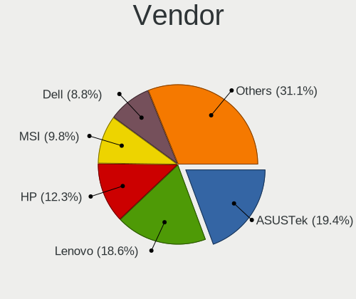
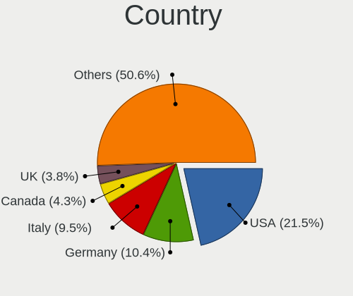
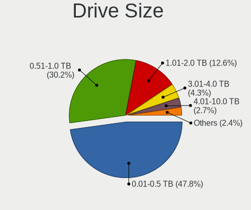
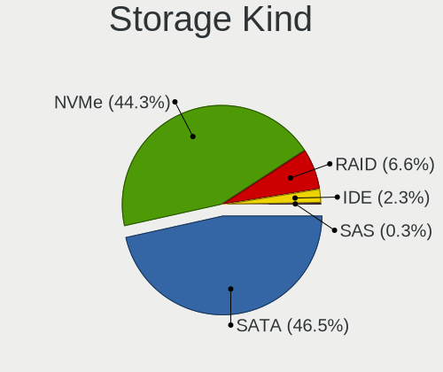
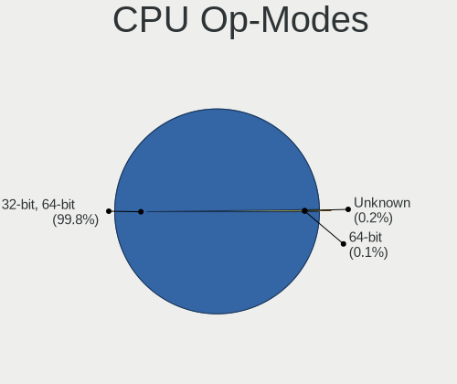
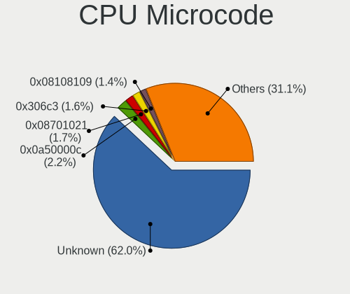
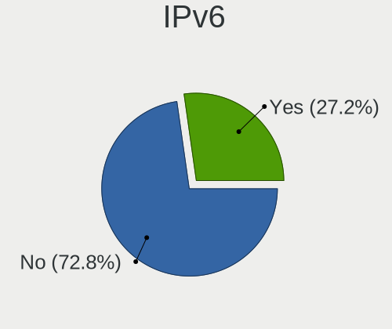
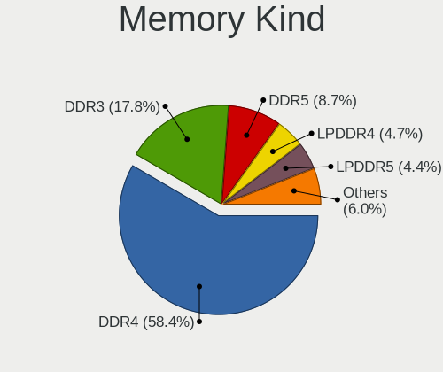
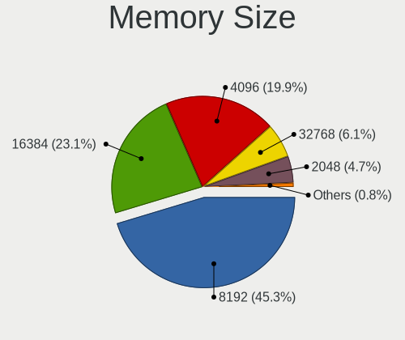
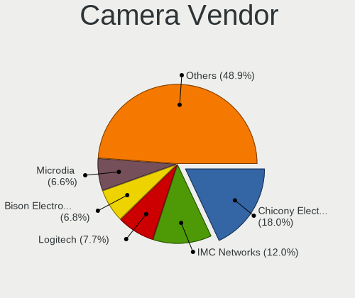

EndeavourOS - Tested Hardware & Statistics
------------------------------------------

A project to collect tested hardware configurations for EndeavourOS.

Anyone can contribute to this report by the [hw-probe](https://github.com/linuxhw/hw-probe) tool:

    sudo -E hw-probe -all -upload

Please contribute! Especially if your hardware is rare.

This is a report for all computer types. See also reports for [desktops](/Dist/EndeavourOS/Desktop/README.md) and [notebooks](/Dist/EndeavourOS/Notebook/README.md).

Contents
--------

* [ Test Cases ](#test-cases)

* [ System ](#system)
  - [ OS                       ](#os)
  - [ OS Family                ](#os-family)
  - [ Kernel                   ](#kernel)
  - [ Kernel Family            ](#kernel-family)
  - [ Kernel Major Ver.        ](#kernel-major-ver)
  - [ Arch                     ](#arch)
  - [ DE                       ](#de)
  - [ Display Server           ](#display-server)
  - [ Display Manager          ](#display-manager)
  - [ OS Lang                  ](#os-lang)
  - [ Boot Mode                ](#boot-mode)
  - [ Filesystem               ](#filesystem)
  - [ Part. scheme             ](#part-scheme)
  - [ Dual Boot with Linux/BSD ](#dual-boot-with-linuxbsd)
  - [ Dual Boot (Win)          ](#dual-boot-win)

* [ Board ](#board)
  - [ Vendor                   ](#vendor)
  - [ Model                    ](#model)
  - [ Model Family             ](#model-family)
  - [ MFG Year                 ](#mfg-year)
  - [ Form Factor              ](#form-factor)
  - [ Secure Boot              ](#secure-boot)
  - [ Coreboot                 ](#coreboot)
  - [ RAM Size                 ](#ram-size)
  - [ RAM Used                 ](#ram-used)
  - [ Total Drives             ](#total-drives)
  - [ Has CD-ROM               ](#has-cd-rom)
  - [ Has Ethernet             ](#has-ethernet)
  - [ Has WiFi                 ](#has-wifi)
  - [ Has Bluetooth            ](#has-bluetooth)

* [ Location ](#location)
  - [ Country                  ](#country)
  - [ City                     ](#city)

* [ Drives ](#drives)
  - [ Drive Vendor             ](#drive-vendor)
  - [ Drive Model              ](#drive-model)
  - [ HDD Vendor               ](#hdd-vendor)
  - [ SSD Vendor               ](#ssd-vendor)
  - [ Drive Kind               ](#drive-kind)
  - [ Drive Connector          ](#drive-connector)
  - [ Drive Size               ](#drive-size)
  - [ Space Total              ](#space-total)
  - [ Space Used               ](#space-used)
  - [ Malfunc. Drives          ](#malfunc-drives)
  - [ Malfunc. Drive Vendor    ](#malfunc-drive-vendor)
  - [ Malfunc. HDD Vendor      ](#malfunc-hdd-vendor)
  - [ Malfunc. Drive Kind      ](#malfunc-drive-kind)
  - [ Failed Drives            ](#failed-drives)
  - [ Failed Drive Vendor      ](#failed-drive-vendor)
  - [ Drive Status             ](#drive-status)

* [ Storage controller ](#storage-controller)
  - [ Storage Vendor           ](#storage-vendor)
  - [ Storage Model            ](#storage-model)
  - [ Storage Kind             ](#storage-kind)

* [ Processor ](#processor)
  - [ CPU Vendor               ](#cpu-vendor)
  - [ CPU Model                ](#cpu-model)
  - [ CPU Model Family         ](#cpu-model-family)
  - [ CPU Cores                ](#cpu-cores)
  - [ CPU Sockets              ](#cpu-sockets)
  - [ CPU Threads              ](#cpu-threads)
  - [ CPU Op-Modes             ](#cpu-op-modes)
  - [ CPU Microcode            ](#cpu-microcode)
  - [ CPU Microarch            ](#cpu-microarch)

* [ Graphics ](#graphics)
  - [ GPU Vendor               ](#gpu-vendor)
  - [ GPU Model                ](#gpu-model)
  - [ GPU Combo                ](#gpu-combo)
  - [ GPU Driver               ](#gpu-driver)
  - [ GPU Memory               ](#gpu-memory)

* [ Monitor ](#monitor)
  - [ Monitor Vendor           ](#monitor-vendor)
  - [ Monitor Model            ](#monitor-model)
  - [ Monitor Resolution       ](#monitor-resolution)
  - [ Monitor Diagonal         ](#monitor-diagonal)
  - [ Monitor Width            ](#monitor-width)
  - [ Aspect Ratio             ](#aspect-ratio)
  - [ Monitor Area             ](#monitor-area)
  - [ Pixel Density            ](#pixel-density)
  - [ Multiple Monitors        ](#multiple-monitors)

* [ Network ](#network)
  - [ Net Controller Vendor    ](#net-controller-vendor)
  - [ Net Controller Model     ](#net-controller-model)
  - [ Wireless Vendor          ](#wireless-vendor)
  - [ Wireless Model           ](#wireless-model)
  - [ Ethernet Vendor          ](#ethernet-vendor)
  - [ Ethernet Model           ](#ethernet-model)
  - [ Net Controller Kind      ](#net-controller-kind)
  - [ Used Controller          ](#used-controller)
  - [ NICs                     ](#nics)
  - [ IPv6                     ](#ipv6)

* [ Bluetooth ](#bluetooth)
  - [ Bluetooth Vendor         ](#bluetooth-vendor)
  - [ Bluetooth Model          ](#bluetooth-model)

* [ Sound ](#sound)
  - [ Sound Vendor             ](#sound-vendor)
  - [ Sound Model              ](#sound-model)

* [ Memory ](#memory)
  - [ Memory Vendor            ](#memory-vendor)
  - [ Memory Model             ](#memory-model)
  - [ Memory Kind              ](#memory-kind)
  - [ Memory Form Factor       ](#memory-form-factor)
  - [ Memory Size              ](#memory-size)
  - [ Memory Speed             ](#memory-speed)

* [ Printers & scanners ](#printers--scanners)
  - [ Printer Vendor           ](#printer-vendor)
  - [ Printer Model            ](#printer-model)
  - [ Scanner Vendor           ](#scanner-vendor)
  - [ Scanner Model            ](#scanner-model)

* [ Camera ](#camera)
  - [ Camera Vendor            ](#camera-vendor)
  - [ Camera Model             ](#camera-model)

* [ Security ](#security)
  - [ Fingerprint Vendor       ](#fingerprint-vendor)
  - [ Fingerprint Model        ](#fingerprint-model)
  - [ Chipcard Vendor          ](#chipcard-vendor)
  - [ Chipcard Model           ](#chipcard-model)

* [ Unsupported ](#unsupported)
  - [ Unsupported Devices      ](#unsupported-devices)
  - [ Unsupported Device Types ](#unsupported-device-types)

Test Cases
----------

Total: 2263

| Vendor        | Model                       | Form-Factor | Probe                                                      | Date         |
|---------------|-----------------------------|-------------|------------------------------------------------------------|--------------|
| Lenovo        | ThinkPad E14 Gen 2 20T6S... | Notebook    | [eb9d3c539c](https://linux-hardware.org/?probe=eb9d3c539c) | May 08, 2024 |
| Lenovo        | ThinkPad T14 Gen 1 20UD0... | Notebook    | [0ef70379ee](https://linux-hardware.org/?probe=0ef70379ee) | May 07, 2024 |
| Huanan        | X58 V1.0                    | Desktop     | [f4d5141ce0](https://linux-hardware.org/?probe=f4d5141ce0) | May 07, 2024 |
| HUAWEI        | HLYL-WXX9                   | Notebook    | [71d1f5cdfb](https://linux-hardware.org/?probe=71d1f5cdfb) | May 07, 2024 |
| ASUSTek       | TUF Gaming X570-PLUS        | Desktop     | [70346cc510](https://linux-hardware.org/?probe=70346cc510) | May 06, 2024 |
| MSI           | Creator Z16 A12UET          | Notebook    | [edf6b45103](https://linux-hardware.org/?probe=edf6b45103) | May 06, 2024 |
| MSI           | Creator Z16 A12UET          | Notebook    | [2aea1cacac](https://linux-hardware.org/?probe=2aea1cacac) | May 06, 2024 |
| Lenovo        | IdeaPad Slim 3 15ABR8 82... | Notebook    | [c082a264d6](https://linux-hardware.org/?probe=c082a264d6) | May 06, 2024 |
| HP            | ZBook 15 G3                 | Notebook    | [486b46ac77](https://linux-hardware.org/?probe=486b46ac77) | May 05, 2024 |
| HP            | ZBook 15 G3                 | Notebook    | [74576596b1](https://linux-hardware.org/?probe=74576596b1) | May 05, 2024 |
| Unknown       | Unknown                     | Notebook    | [53c592f858](https://linux-hardware.org/?probe=53c592f858) | May 04, 2024 |
| Unknown       | Unknown                     | Notebook    | [3f7e899e58](https://linux-hardware.org/?probe=3f7e899e58) | May 04, 2024 |
| Lenovo        | IdeaPad 3 15IML05 81WB      | Notebook    | [9ea4c7559c](https://linux-hardware.org/?probe=9ea4c7559c) | May 04, 2024 |
| Acer          | Aspire R5-571TG             | Convertible | [b054fa0ea6](https://linux-hardware.org/?probe=b054fa0ea6) | May 04, 2024 |
| ASUSTek       | ROG Zephyrus M16 GU604VI... | Notebook    | [d22fed35ce](https://linux-hardware.org/?probe=d22fed35ce) | May 03, 2024 |
| ASUSTek       | TUF Gaming FX504GE_FX80G... | Notebook    | [6fb2e2c6d4](https://linux-hardware.org/?probe=6fb2e2c6d4) | May 03, 2024 |
| Huanan        | X58 V1.0                    | Desktop     | [c55f67fac2](https://linux-hardware.org/?probe=c55f67fac2) | May 02, 2024 |
| MSI           | GF63 Thin 10SCSR            | Notebook    | [ab0eadc507](https://linux-hardware.org/?probe=ab0eadc507) | May 02, 2024 |
| Dell          | Latitude E5550              | Notebook    | [5388266587](https://linux-hardware.org/?probe=5388266587) | May 02, 2024 |
| Lenovo        | IdeaPad S145-15IIL 82DJ     | Notebook    | [0656624c78](https://linux-hardware.org/?probe=0656624c78) | May 02, 2024 |
| XIAOMI        | Redmi Book Pro 14 2024      | Notebook    | [459594827a](https://linux-hardware.org/?probe=459594827a) | Apr 30, 2024 |
| Win elemen... | M600                        | Desktop     | [ed51b3e831](https://linux-hardware.org/?probe=ed51b3e831) | Apr 30, 2024 |
| Gigabyte      | B450M S2H                   | Desktop     | [28ce6a0f2e](https://linux-hardware.org/?probe=28ce6a0f2e) | Apr 29, 2024 |
| Gigabyte      | B450M S2H                   | Desktop     | [f96e09c9e1](https://linux-hardware.org/?probe=f96e09c9e1) | Apr 29, 2024 |
| Acer          | Aspire R5-571TG             | Convertible | [1adb2d58e4](https://linux-hardware.org/?probe=1adb2d58e4) | Apr 29, 2024 |
| HP            | Spectre x360 Convertible... | Convertible | [e906970294](https://linux-hardware.org/?probe=e906970294) | Apr 28, 2024 |
| ASUSTek       | ROG Zephyrus G14 GA403UI... | Notebook    | [c1bfbd0de5](https://linux-hardware.org/?probe=c1bfbd0de5) | Apr 28, 2024 |
| ASUSTek       | ExpertBook B9450FAV         | Notebook    | [ea600fc105](https://linux-hardware.org/?probe=ea600fc105) | Apr 27, 2024 |
| HP            | Victus by Gaming Laptop ... | Notebook    | [00f2fc6455](https://linux-hardware.org/?probe=00f2fc6455) | Apr 27, 2024 |
| ASRock        | Z490 Phantom Gaming 4       | Desktop     | [95011d3e78](https://linux-hardware.org/?probe=95011d3e78) | Apr 27, 2024 |
| MSI           | MAG B460M MORTAR            | Desktop     | [eaf2da7d85](https://linux-hardware.org/?probe=eaf2da7d85) | Apr 27, 2024 |
| MSI           | A320M-A PRO MAX             | Desktop     | [253984e9f3](https://linux-hardware.org/?probe=253984e9f3) | Apr 26, 2024 |
| ASUSTek       | PRIME B560M-A               | Desktop     | [886328abc3](https://linux-hardware.org/?probe=886328abc3) | Apr 25, 2024 |
| Lenovo        | ThinkPad L580 20LW000UPB    | Notebook    | [ed17d0c6d4](https://linux-hardware.org/?probe=ed17d0c6d4) | Apr 24, 2024 |
| Lenovo        | ThinkPad P16s Gen 2 21HK... | Notebook    | [5e014cccd3](https://linux-hardware.org/?probe=5e014cccd3) | Apr 24, 2024 |
| Lenovo        | ThinkPad T470s W10DG 20J... | Notebook    | [a06bcc63e8](https://linux-hardware.org/?probe=a06bcc63e8) | Apr 24, 2024 |
| Acer          | Aspire A315-59G             | Notebook    | [0a16aa62ad](https://linux-hardware.org/?probe=0a16aa62ad) | Apr 23, 2024 |
| Dell          | XPS 15 9520                 | Notebook    | [359a02a8cb](https://linux-hardware.org/?probe=359a02a8cb) | Apr 23, 2024 |
| HP            | ENVY x360 Convertible 15... | Convertible | [70467b9616](https://linux-hardware.org/?probe=70467b9616) | Apr 22, 2024 |
| Lenovo        | Yoga Slim 7 14IMH9 83CV     | Notebook    | [c316cac3ed](https://linux-hardware.org/?probe=c316cac3ed) | Apr 22, 2024 |
| HP            | Laptop 15-dw0xxx            | Notebook    | [b69baa13a6](https://linux-hardware.org/?probe=b69baa13a6) | Apr 22, 2024 |
| Lenovo        | Yoga 9 14IRP8 83B1          | Convertible | [0d9d7d4924](https://linux-hardware.org/?probe=0d9d7d4924) | Apr 22, 2024 |
| ASRock        | Z490 Phantom Gaming 4       | Desktop     | [887025a038](https://linux-hardware.org/?probe=887025a038) | Apr 21, 2024 |
| Chuwi         | CoreBook X                  | Notebook    | [deafd4078a](https://linux-hardware.org/?probe=deafd4078a) | Apr 20, 2024 |
| Dell          | Latitude 7390 2-in-1        | Notebook    | [08a2cf2960](https://linux-hardware.org/?probe=08a2cf2960) | Apr 20, 2024 |
| ASUSTek       | ROG Zephyrus G14 GA401QM... | Notebook    | [a5bdfd5d15](https://linux-hardware.org/?probe=a5bdfd5d15) | Apr 20, 2024 |
| ASUSTek       | ROG Zephyrus G14 GA401QM... | Notebook    | [1a7bf4158b](https://linux-hardware.org/?probe=1a7bf4158b) | Apr 20, 2024 |
| MSI           | PRO B650-P WIFI             | Desktop     | [a9259df109](https://linux-hardware.org/?probe=a9259df109) | Apr 19, 2024 |
| Alienware     | m15 R7                      | Notebook    | [e3f2c4e9c3](https://linux-hardware.org/?probe=e3f2c4e9c3) | Apr 19, 2024 |
| HP            | 250 G7 Notebook PC          | Notebook    | [a52eb532e3](https://linux-hardware.org/?probe=a52eb532e3) | Apr 19, 2024 |
| ASUSTek       | ASUS TUF Gaming F15 FX50... | Notebook    | [4cec985734](https://linux-hardware.org/?probe=4cec985734) | Apr 18, 2024 |
| MECHREVO      | WUJIE14 PRO                 | Notebook    | [88a4e369a9](https://linux-hardware.org/?probe=88a4e369a9) | Apr 17, 2024 |
| Gigabyte      | B650 GAMING X AX V2         | Desktop     | [bf309bc034](https://linux-hardware.org/?probe=bf309bc034) | Apr 16, 2024 |
| HP            | Laptop 15-dw0xxx            | Notebook    | [f30fb8d67e](https://linux-hardware.org/?probe=f30fb8d67e) | Apr 16, 2024 |
| HP            | 250 G3                      | Notebook    | [954137cff4](https://linux-hardware.org/?probe=954137cff4) | Apr 15, 2024 |
| ASUSTek       | TUF Gaming FX504GE_FX80G... | Notebook    | [9826a53ffb](https://linux-hardware.org/?probe=9826a53ffb) | Apr 15, 2024 |
| Lenovo        | ThinkBook 15-IIL 20SM       | Notebook    | [0f31e777c7](https://linux-hardware.org/?probe=0f31e777c7) | Apr 15, 2024 |
| Dell          | Inspiron 5406 2n1           | Convertible | [e2706ff7ea](https://linux-hardware.org/?probe=e2706ff7ea) | Apr 15, 2024 |
| Gigabyte      | B650M GAMING X AX           | Desktop     | [7a62f23317](https://linux-hardware.org/?probe=7a62f23317) | Apr 14, 2024 |
| Alienware     | m15                         | Notebook    | [477ee79b04](https://linux-hardware.org/?probe=477ee79b04) | Apr 13, 2024 |
| Alienware     | m15                         | Notebook    | [9feac0d1be](https://linux-hardware.org/?probe=9feac0d1be) | Apr 13, 2024 |
| ASUSTek       | ROG Zephyrus M15 GU502LU... | Notebook    | [4623f15133](https://linux-hardware.org/?probe=4623f15133) | Apr 13, 2024 |
| Dell          | Latitude E6440              | Notebook    | [2474a0cb33](https://linux-hardware.org/?probe=2474a0cb33) | Apr 12, 2024 |
| HP            | ProBook 650 G1              | Notebook    | [aa6dfe532c](https://linux-hardware.org/?probe=aa6dfe532c) | Apr 12, 2024 |
| Lenovo        | ThinkPad L13 Yoga 20R6S0... | Convertible | [9a6ed6ca9d](https://linux-hardware.org/?probe=9a6ed6ca9d) | Apr 12, 2024 |
| Dell          | Latitude 7320 Detachable    | Tablet      | [bda0196568](https://linux-hardware.org/?probe=bda0196568) | Apr 11, 2024 |
| Acer          | Aspire 5920                 | Notebook    | [fc886ce6a0](https://linux-hardware.org/?probe=fc886ce6a0) | Apr 11, 2024 |
| MSI           | X299 GAMING PRO CARBON      | Desktop     | [3ae56d9b16](https://linux-hardware.org/?probe=3ae56d9b16) | Apr 11, 2024 |
| Chuwi         | Hi10 pro tablet             | Tablet      | [66d200657d](https://linux-hardware.org/?probe=66d200657d) | Apr 10, 2024 |
| ASUSTek       | ROG Zephyrus M16 GU604VI... | Notebook    | [d1322ccf2d](https://linux-hardware.org/?probe=d1322ccf2d) | Apr 10, 2024 |
| MSI           | X299 GAMING PRO CARBON      | Desktop     | [cabbba0b48](https://linux-hardware.org/?probe=cabbba0b48) | Apr 10, 2024 |
| MSI           | A520M-A PRO                 | Desktop     | [bd3db073e2](https://linux-hardware.org/?probe=bd3db073e2) | Apr 09, 2024 |
| MSI           | A520M-A PRO                 | Desktop     | [c1bde6f19b](https://linux-hardware.org/?probe=c1bde6f19b) | Apr 09, 2024 |
| ASUSTek       | TUF Gaming FX504GE_FX80G... | Notebook    | [6cb6635cbb](https://linux-hardware.org/?probe=6cb6635cbb) | Apr 09, 2024 |
| Shenzhen M... | F7BSC                       | Mini pc     | [8967eb91ec](https://linux-hardware.org/?probe=8967eb91ec) | Apr 08, 2024 |
| ASUSTek       | ROG Zephyrus M16 GU603ZM... | Notebook    | [79e93906ae](https://linux-hardware.org/?probe=79e93906ae) | Apr 07, 2024 |
| Gigabyte      | Z390 AORUS PRO-CF           | Desktop     | [3ef4683b94](https://linux-hardware.org/?probe=3ef4683b94) | Apr 07, 2024 |
| ASUSTek       | PRIME B250M-A               | Desktop     | [455bdd34ef](https://linux-hardware.org/?probe=455bdd34ef) | Apr 07, 2024 |
| HP            | Pro x360 Fortis 11 inch ... | Convertible | [09af84bf65](https://linux-hardware.org/?probe=09af84bf65) | Apr 07, 2024 |
| ASUSTek       | TUF Gaming B550M-PLUS WI... | Desktop     | [a88186f61b](https://linux-hardware.org/?probe=a88186f61b) | Apr 07, 2024 |
| Dell          | Latitude 5580               | Notebook    | [295ed34ace](https://linux-hardware.org/?probe=295ed34ace) | Apr 07, 2024 |
| HP            | ENVY x360 Convertible 15... | Convertible | [c290d223f4](https://linux-hardware.org/?probe=c290d223f4) | Apr 07, 2024 |
| ASUSTek       | VivoBook_ASUSLaptop X150... | Notebook    | [952d7591c9](https://linux-hardware.org/?probe=952d7591c9) | Apr 07, 2024 |
| Gigabyte      | Z390 AORUS PRO-CF           | Desktop     | [5a9432f73b](https://linux-hardware.org/?probe=5a9432f73b) | Apr 06, 2024 |
| HUAWEI        | NBLK-WAX9X                  | Notebook    | [02e385a043](https://linux-hardware.org/?probe=02e385a043) | Apr 06, 2024 |
| HP            | Pavilion 15                 | Notebook    | [39b89d2411](https://linux-hardware.org/?probe=39b89d2411) | Apr 06, 2024 |
| HP            | Pavilion Gaming Laptop 1... | Notebook    | [1bdceef448](https://linux-hardware.org/?probe=1bdceef448) | Apr 06, 2024 |
| HP            | Pavilion Gaming Laptop 1... | Notebook    | [df5337043e](https://linux-hardware.org/?probe=df5337043e) | Apr 06, 2024 |
| Gigabyte      | X570 AORUS PRO              | Desktop     | [e11774a346](https://linux-hardware.org/?probe=e11774a346) | Apr 05, 2024 |
| ASUSTek       | X550LD                      | Notebook    | [8684e69182](https://linux-hardware.org/?probe=8684e69182) | Apr 05, 2024 |
| ASUSTek       | ROG Zephyrus M16 GU604VI... | Notebook    | [f06c2345e5](https://linux-hardware.org/?probe=f06c2345e5) | Apr 05, 2024 |
| Acer          | Nitro AN515-54              | Notebook    | [1aaafcf056](https://linux-hardware.org/?probe=1aaafcf056) | Apr 05, 2024 |
| ASUSTek       | ROG Zephyrus M16 GU604VI... | Notebook    | [5abe3f3d6a](https://linux-hardware.org/?probe=5abe3f3d6a) | Apr 05, 2024 |
| ASUSTek       | PRIME B450-PLUS             | Desktop     | [a3ff48e7a2](https://linux-hardware.org/?probe=a3ff48e7a2) | Apr 03, 2024 |
| MSI           | X299 GAMING PRO CARBON      | Desktop     | [03b2438836](https://linux-hardware.org/?probe=03b2438836) | Apr 02, 2024 |
| MSI           | X299 GAMING PRO CARBON      | Desktop     | [d39c4c71eb](https://linux-hardware.org/?probe=d39c4c71eb) | Apr 02, 2024 |
| Alienware     | m15 R7                      | Notebook    | [6952f403ab](https://linux-hardware.org/?probe=6952f403ab) | Apr 02, 2024 |
| Microsoft     | Surface Laptop Go           | Tablet      | [30dd23bf0f](https://linux-hardware.org/?probe=30dd23bf0f) | Apr 02, 2024 |
| Gigabyte      | Z390 GAMING X-CF            | Desktop     | [9baccdd577](https://linux-hardware.org/?probe=9baccdd577) | Apr 01, 2024 |
| HP            | 250 G3                      | Notebook    | [f57828a1b4](https://linux-hardware.org/?probe=f57828a1b4) | Apr 01, 2024 |
| Gigabyte      | B760M DS3H DDR4             | Desktop     | [3197b1f7d7](https://linux-hardware.org/?probe=3197b1f7d7) | Apr 01, 2024 |
| ASUSTek       | TUF Gaming X670E-PLUS WI... | Desktop     | [391458688f](https://linux-hardware.org/?probe=391458688f) | Mar 30, 2024 |
| ASUSTek       | TUF Gaming X670E-PLUS WI... | Desktop     | [d332c9a931](https://linux-hardware.org/?probe=d332c9a931) | Mar 30, 2024 |
| Dell          | Inspiron 3493               | Notebook    | [ed7f522ffa](https://linux-hardware.org/?probe=ed7f522ffa) | Mar 30, 2024 |
| Lenovo        | ThinkPad Yoga 370 20JJS1... | Convertible | [cf05d263a8](https://linux-hardware.org/?probe=cf05d263a8) | Mar 30, 2024 |
| Dell          | 0K3CM7 A00                  | Desktop     | [eee46a93df](https://linux-hardware.org/?probe=eee46a93df) | Mar 29, 2024 |
| ASUSTek       | TUF Gaming B550M-E WIFI     | Desktop     | [8de5850e62](https://linux-hardware.org/?probe=8de5850e62) | Mar 29, 2024 |
| Lenovo        | ThinkPad X380 Yoga 20LJS... | Convertible | [637615cd5f](https://linux-hardware.org/?probe=637615cd5f) | Mar 28, 2024 |
| Infinix       | ZERO BOOK 13                | Notebook    | [cd91c5bb1e](https://linux-hardware.org/?probe=cd91c5bb1e) | Mar 28, 2024 |
| HP            | Laptop 15-dw0xxx            | Notebook    | [aec6aec9c6](https://linux-hardware.org/?probe=aec6aec9c6) | Mar 28, 2024 |
| Lenovo        | Legion 7 16IAX7 82TD        | Notebook    | [69037d2e91](https://linux-hardware.org/?probe=69037d2e91) | Mar 27, 2024 |
| Lenovo        | ThinkPad T460s 20FAS5LC0... | Notebook    | [59ae008766](https://linux-hardware.org/?probe=59ae008766) | Mar 27, 2024 |
| Dell          | Latitude 7390 2-in-1        | Notebook    | [754865d59a](https://linux-hardware.org/?probe=754865d59a) | Mar 26, 2024 |
| Casper        | EXCALIBUR G900              | Notebook    | [f5b2fe66ff](https://linux-hardware.org/?probe=f5b2fe66ff) | Mar 24, 2024 |
| HP            | 18E4                        | Desktop     | [e47f65729a](https://linux-hardware.org/?probe=e47f65729a) | Mar 23, 2024 |
| Fujitsu       | D3222-A1 S26361-D3222-A1    | Desktop     | [c0ac754a59](https://linux-hardware.org/?probe=c0ac754a59) | Mar 23, 2024 |
| Samsung       | 300E5EV/300E4EV/270E5EV/... | Notebook    | [42a2c2872a](https://linux-hardware.org/?probe=42a2c2872a) | Mar 23, 2024 |
| Lenovo        | ThinkPad L450 20DS0006BR    | Notebook    | [b6daa171f8](https://linux-hardware.org/?probe=b6daa171f8) | Mar 23, 2024 |
| Dell          | Latitude 7390 2-in-1        | Notebook    | [cc405a9498](https://linux-hardware.org/?probe=cc405a9498) | Mar 22, 2024 |
| Lenovo        | Yoga Slim 7 Pro 14IAH7 8... | Notebook    | [8573996655](https://linux-hardware.org/?probe=8573996655) | Mar 22, 2024 |
| ASUSTek       | X455LJ                      | Notebook    | [aa4f64e1b7](https://linux-hardware.org/?probe=aa4f64e1b7) | Mar 22, 2024 |
| Microsoft     | Surface Laptop Go           | Tablet      | [6804305abd](https://linux-hardware.org/?probe=6804305abd) | Mar 21, 2024 |
| Dell          | XPS 15 9560                 | Notebook    | [47e7170880](https://linux-hardware.org/?probe=47e7170880) | Mar 21, 2024 |
| HP            | Laptop 15-dw0xxx            | Notebook    | [5845560b28](https://linux-hardware.org/?probe=5845560b28) | Mar 21, 2024 |
| Razer         | Blade 14 - RZ09-0482        | Notebook    | [1c48b858c2](https://linux-hardware.org/?probe=1c48b858c2) | Mar 20, 2024 |
| Dell          | XPS 15 9520                 | Notebook    | [d9ffc0afaf](https://linux-hardware.org/?probe=d9ffc0afaf) | Mar 20, 2024 |
| Microsoft     | Surface Pro                 | Tablet      | [2b015ad195](https://linux-hardware.org/?probe=2b015ad195) | Mar 19, 2024 |
| HP            | Victus by Gaming Laptop ... | Notebook    | [03556f08ce](https://linux-hardware.org/?probe=03556f08ce) | Mar 19, 2024 |
| ASUSTek       | TUF Gaming Z790-PLUS WIF... | Desktop     | [d5b83394f2](https://linux-hardware.org/?probe=d5b83394f2) | Mar 19, 2024 |
| Gigabyte      | B650M AORUS ELITE AX        | Desktop     | [514b687126](https://linux-hardware.org/?probe=514b687126) | Mar 19, 2024 |
| Gigabyte      | B550I AORUS PRO AX          | Desktop     | [a9c78a7b8e](https://linux-hardware.org/?probe=a9c78a7b8e) | Mar 18, 2024 |
| ASRock        | B550M Steel Legend          | Desktop     | [a1762528fb](https://linux-hardware.org/?probe=a1762528fb) | Mar 17, 2024 |
| MSI           | Creator Z16 A12UET          | Notebook    | [3e3a98e47d](https://linux-hardware.org/?probe=3e3a98e47d) | Mar 16, 2024 |
| ASUSTek       | VivoBook 15_ASUS Laptop ... | Notebook    | [22d9bc5efb](https://linux-hardware.org/?probe=22d9bc5efb) | Mar 16, 2024 |
| ASUSTek       | ZenBook UX425EA_UX425EA     | Notebook    | [fb730fc344](https://linux-hardware.org/?probe=fb730fc344) | Mar 16, 2024 |
| Gigabyte      | B450M S2H                   | Desktop     | [afedd5359e](https://linux-hardware.org/?probe=afedd5359e) | Mar 15, 2024 |
| Lenovo        | IdeaPadFlex 5 14ARE05 81... | Convertible | [6a3034630c](https://linux-hardware.org/?probe=6a3034630c) | Mar 15, 2024 |
| ASUSTek       | VivoBook_ASUSLaptop X509... | Notebook    | [6e0b43ec0f](https://linux-hardware.org/?probe=6e0b43ec0f) | Mar 15, 2024 |
| Apple         | MacBookPro9,1               | Notebook    | [244a8aa50d](https://linux-hardware.org/?probe=244a8aa50d) | Mar 15, 2024 |
| ASUSTek       | ROG Strix G731GW_G731GW     | Notebook    | [046ddded98](https://linux-hardware.org/?probe=046ddded98) | Mar 14, 2024 |
| ASUSTek       | ROG Strix G731GW_G731GW     | Notebook    | [c1d5b681d3](https://linux-hardware.org/?probe=c1d5b681d3) | Mar 14, 2024 |
| PC Special... | Lafite Pro III 15           | Notebook    | [36af2d3967](https://linux-hardware.org/?probe=36af2d3967) | Mar 14, 2024 |
| Lenovo        | Legion S7 16ARHA7 82UG      | Notebook    | [a83e990b4e](https://linux-hardware.org/?probe=a83e990b4e) | Mar 13, 2024 |
| Medion        | D3F3-EM2                    | Desktop     | [84c6998958](https://linux-hardware.org/?probe=84c6998958) | Mar 13, 2024 |
| Lenovo        | ThinkPad E14 20RA001HMZ     | Notebook    | [6d944c4cae](https://linux-hardware.org/?probe=6d944c4cae) | Mar 13, 2024 |
| ASUSTek       | PRIME A320M-K               | Desktop     | [08974481fa](https://linux-hardware.org/?probe=08974481fa) | Mar 13, 2024 |
| HUAWEI        | NDZ-WXX9                    | Notebook    | [b9a534289f](https://linux-hardware.org/?probe=b9a534289f) | Mar 12, 2024 |
| Medion        | D3F3-EM2                    | Desktop     | [919075a65c](https://linux-hardware.org/?probe=919075a65c) | Mar 12, 2024 |
| Gigabyte      | X470 AORUS ULTRA GAMING-... | Desktop     | [5e8ed44258](https://linux-hardware.org/?probe=5e8ed44258) | Mar 12, 2024 |
| Lenovo        | ThinkPad X13 Yoga Gen 1 ... | Convertible | [62195da660](https://linux-hardware.org/?probe=62195da660) | Mar 12, 2024 |
| Lenovo        | ThinkPad X13 Yoga Gen 1 ... | Convertible | [053f61b5b6](https://linux-hardware.org/?probe=053f61b5b6) | Mar 12, 2024 |
| Alienware     | M17x                        | Notebook    | [073de6c7bd](https://linux-hardware.org/?probe=073de6c7bd) | Mar 12, 2024 |
| ASUSTek       | VivoBook_ASUSLaptop K350... | Notebook    | [b00732d7cc](https://linux-hardware.org/?probe=b00732d7cc) | Mar 09, 2024 |
| MSI           | B450M BAZOOKA               | Desktop     | [b394a621cc](https://linux-hardware.org/?probe=b394a621cc) | Mar 08, 2024 |
| Gigabyte      | X570 AORUS ELITE WIFI       | Desktop     | [e61d5e2891](https://linux-hardware.org/?probe=e61d5e2891) | Mar 08, 2024 |
| HP            | Pavilion Laptop 15-eh3xx... | Notebook    | [96df9c795f](https://linux-hardware.org/?probe=96df9c795f) | Mar 08, 2024 |
| Dell          | XPS 15 9560                 | Notebook    | [d2b1898b4b](https://linux-hardware.org/?probe=d2b1898b4b) | Mar 08, 2024 |
| Dell          | Precision 7540              | Notebook    | [e60d9106db](https://linux-hardware.org/?probe=e60d9106db) | Mar 07, 2024 |
| Dell          | XPS 15 9520                 | Notebook    | [c68539af0e](https://linux-hardware.org/?probe=c68539af0e) | Mar 07, 2024 |
| Microsoft     | Surface Laptop 4            | Tablet      | [a131647ae7](https://linux-hardware.org/?probe=a131647ae7) | Mar 07, 2024 |
| Dell          | Latitude 7280               | Notebook    | [1415cfc829](https://linux-hardware.org/?probe=1415cfc829) | Mar 07, 2024 |
| MSI           | B75MA-E33                   | Desktop     | [ef665444e1](https://linux-hardware.org/?probe=ef665444e1) | Mar 07, 2024 |
| Lenovo        | ThinkPad P52s 20LCS1Q400    | Notebook    | [a09bbded94](https://linux-hardware.org/?probe=a09bbded94) | Mar 06, 2024 |
| MSI           | MAG B550M MORTAR            | Desktop     | [31da1b6dc5](https://linux-hardware.org/?probe=31da1b6dc5) | Mar 06, 2024 |
| Lenovo        | ThinkPad P52s 20LCS1Q400    | Notebook    | [5eeed0066e](https://linux-hardware.org/?probe=5eeed0066e) | Mar 06, 2024 |
| Dell          | Inspiron 7737               | Notebook    | [5077731ec5](https://linux-hardware.org/?probe=5077731ec5) | Mar 06, 2024 |
| HP            | Pavilion Plus Laptop 14-... | Notebook    | [a7108bda20](https://linux-hardware.org/?probe=a7108bda20) | Mar 05, 2024 |
| HP            | Pavilion Plus Laptop 14-... | Notebook    | [e14a9fae0a](https://linux-hardware.org/?probe=e14a9fae0a) | Mar 05, 2024 |
| HP            | Spectre x360 Convertible... | Convertible | [e894d4e82a](https://linux-hardware.org/?probe=e894d4e82a) | Mar 05, 2024 |
| Dell          | Latitude 7390               | Notebook    | [7eed1415ba](https://linux-hardware.org/?probe=7eed1415ba) | Mar 05, 2024 |
| ASUSTek       | Z97M-PLUS/BR                | Desktop     | [1914f7d53a](https://linux-hardware.org/?probe=1914f7d53a) | Mar 05, 2024 |
| HP            | OMEN Laptop 15-en1xxx       | Notebook    | [6fd9429f1c](https://linux-hardware.org/?probe=6fd9429f1c) | Mar 05, 2024 |
| Acer          | Swift SFG14-71T             | Notebook    | [bbd9abaffc](https://linux-hardware.org/?probe=bbd9abaffc) | Mar 04, 2024 |
| Dell          | Latitude 3430               | Notebook    | [4d7bfb4ee6](https://linux-hardware.org/?probe=4d7bfb4ee6) | Mar 03, 2024 |
| Lenovo        | Legion 5 Pro 16ACH6H 82J... | Notebook    | [230157b598](https://linux-hardware.org/?probe=230157b598) | Mar 03, 2024 |
| Lenovo        | IdeaPadFlex 5 15ALC05 82... | Convertible | [60db10c389](https://linux-hardware.org/?probe=60db10c389) | Mar 03, 2024 |
| ASUSTek       | VivoBook_ASUSLaptop M350... | Notebook    | [438db8c531](https://linux-hardware.org/?probe=438db8c531) | Mar 02, 2024 |
| ASUSTek       | PRIME Z790-P WIFI           | Desktop     | [c2f4bb4ca1](https://linux-hardware.org/?probe=c2f4bb4ca1) | Mar 02, 2024 |
| HP            | ProBook 450 G8              | Notebook    | [550ad596b6](https://linux-hardware.org/?probe=550ad596b6) | Mar 02, 2024 |
| ASUSTek       | ROG Strix G513IC_G513IC     | Notebook    | [f610fa6db2](https://linux-hardware.org/?probe=f610fa6db2) | Mar 01, 2024 |
| Google        | Omnigul                     | Notebook    | [e5222edfb9](https://linux-hardware.org/?probe=e5222edfb9) | Mar 01, 2024 |
| ASUSTek       | PRIME A320M-K               | Desktop     | [4fa18e40f9](https://linux-hardware.org/?probe=4fa18e40f9) | Feb 29, 2024 |
| Dell          | Inspiron 5570               | Notebook    | [8be61470af](https://linux-hardware.org/?probe=8be61470af) | Feb 29, 2024 |
| Microsoft     | Surface Go 3                | Tablet      | [72fe932e5d](https://linux-hardware.org/?probe=72fe932e5d) | Feb 28, 2024 |
| Dell          | 0WN7Y6 A01                  | Desktop     | [61d8f666ac](https://linux-hardware.org/?probe=61d8f666ac) | Feb 28, 2024 |
| ASUSTek       | PRIME B250M-A               | Desktop     | [9755250230](https://linux-hardware.org/?probe=9755250230) | Feb 27, 2024 |
| Gigabyte      | B550 GAMING X V2            | Desktop     | [82cb00dd96](https://linux-hardware.org/?probe=82cb00dd96) | Feb 27, 2024 |
| Lenovo        | ThinkPad T14 Gen 3 21CGS... | Notebook    | [46c0e99842](https://linux-hardware.org/?probe=46c0e99842) | Feb 27, 2024 |
| Dell          | 0VHWTR A01                  | Desktop     | [3606f71943](https://linux-hardware.org/?probe=3606f71943) | Feb 27, 2024 |
| Lenovo        | ThinkPad T14 Gen 3 21CF0... | Notebook    | [590a2951a0](https://linux-hardware.org/?probe=590a2951a0) | Feb 27, 2024 |
| Toshiba       | Satellite P55-A             | Notebook    | [105f469e59](https://linux-hardware.org/?probe=105f469e59) | Feb 26, 2024 |
| Lenovo        | ThinkPad X230 2325AS6       | Notebook    | [875ff13c8f](https://linux-hardware.org/?probe=875ff13c8f) | Feb 26, 2024 |
| ASUSTek       | ASUS TUF Gaming A15 FA50... | Notebook    | [9d91db67e1](https://linux-hardware.org/?probe=9d91db67e1) | Feb 26, 2024 |
| Acer          | Extensa 5620                | Notebook    | [80c455b66f](https://linux-hardware.org/?probe=80c455b66f) | Feb 26, 2024 |
| Gigabyte      | B650 AORUS ELITE AX         | Desktop     | [3fb56d2a04](https://linux-hardware.org/?probe=3fb56d2a04) | Feb 25, 2024 |
| Dell          | XPS 15 9510                 | Notebook    | [398ee4b3fd](https://linux-hardware.org/?probe=398ee4b3fd) | Feb 25, 2024 |
| ASUSTek       | Vivobook Go E1404FA_E140... | Notebook    | [8104acd9fa](https://linux-hardware.org/?probe=8104acd9fa) | Feb 24, 2024 |
| Lenovo        | Legion Pro 5 16ARX8 82WM    | Notebook    | [b6158c1b82](https://linux-hardware.org/?probe=b6158c1b82) | Feb 23, 2024 |
| Gigabyte      | B550I AORUS PRO AX          | Desktop     | [3ee0f278e6](https://linux-hardware.org/?probe=3ee0f278e6) | Feb 22, 2024 |
| Gigabyte      | B550I AORUS PRO AX          | Desktop     | [9a1eb808e3](https://linux-hardware.org/?probe=9a1eb808e3) | Feb 22, 2024 |
| MSI           | MAG B550 TOMAHAWK           | Desktop     | [5b33fd0eb1](https://linux-hardware.org/?probe=5b33fd0eb1) | Feb 22, 2024 |
| Sony          | SVF15218SNB                 | Notebook    | [1afb130e3a](https://linux-hardware.org/?probe=1afb130e3a) | Feb 22, 2024 |
| Lenovo        | ThinkPad X1 Yoga 4th 20Q... | Convertible | [71f63713ae](https://linux-hardware.org/?probe=71f63713ae) | Feb 21, 2024 |
| Acer          | TravelMate P215-53          | Notebook    | [6d5f85311e](https://linux-hardware.org/?probe=6d5f85311e) | Feb 21, 2024 |
| Lenovo        | Legion Slim 7 16APH8 82Y... | Notebook    | [b8151c46bb](https://linux-hardware.org/?probe=b8151c46bb) | Feb 20, 2024 |
| PC Special... | NV4XMB,ME,MZ                | Notebook    | [46d41dc4b2](https://linux-hardware.org/?probe=46d41dc4b2) | Feb 20, 2024 |
| HP            | 3397                        | Desktop     | [f136cefffa](https://linux-hardware.org/?probe=f136cefffa) | Feb 20, 2024 |
| PC Special... | NV4XMB,ME,MZ                | Notebook    | [dc9af46267](https://linux-hardware.org/?probe=dc9af46267) | Feb 20, 2024 |
| Acer          | Aspire R5-571TG             | Convertible | [5a1e6477d1](https://linux-hardware.org/?probe=5a1e6477d1) | Feb 20, 2024 |
| ASUSTek       | ROG Strix G513QM_G513QM     | Notebook    | [5db36e90e6](https://linux-hardware.org/?probe=5db36e90e6) | Feb 20, 2024 |
| ASUSTek       | ROG Maximus XI HERO         | Desktop     | [9b01704fd0](https://linux-hardware.org/?probe=9b01704fd0) | Feb 19, 2024 |
| HP            | ENVY x360 2-in-1 Laptop ... | Convertible | [afa0be18fd](https://linux-hardware.org/?probe=afa0be18fd) | Feb 19, 2024 |
| Lenovo        | V15-ADA 82C7                | Notebook    | [916dfe2be8](https://linux-hardware.org/?probe=916dfe2be8) | Feb 19, 2024 |
| ASUSTek       | ROG Zephyrus G15 GA503RM    | Notebook    | [f6eb8bb7d3](https://linux-hardware.org/?probe=f6eb8bb7d3) | Feb 19, 2024 |
| Apple         | MacBookAir8,1               | Notebook    | [91de6d6520](https://linux-hardware.org/?probe=91de6d6520) | Feb 19, 2024 |
| I-life        | ZEDNOTE                     | Notebook    | [ceefa317d1](https://linux-hardware.org/?probe=ceefa317d1) | Feb 18, 2024 |
| Gigabyte      | B650 AORUS ELITE AX         | Desktop     | [c4b499381f](https://linux-hardware.org/?probe=c4b499381f) | Feb 16, 2024 |
| Gigabyte      | B650M GAMING X AX           | Desktop     | [843ade06e7](https://linux-hardware.org/?probe=843ade06e7) | Feb 16, 2024 |
| Lenovo        | ThinkBook 15 G2 ITL 20VE    | Notebook    | [addc135693](https://linux-hardware.org/?probe=addc135693) | Feb 15, 2024 |
| Dell          | 0F2A60 A00                  | All in one  | [670ba534c8](https://linux-hardware.org/?probe=670ba534c8) | Feb 15, 2024 |
| MSI           | GP72M 7REX                  | Notebook    | [0bba140f23](https://linux-hardware.org/?probe=0bba140f23) | Feb 15, 2024 |
| MSI           | GP72M 7REX                  | Notebook    | [30a3b068c9](https://linux-hardware.org/?probe=30a3b068c9) | Feb 14, 2024 |
| ASUSTek       | ROG CROSSHAIR VIII DARK ... | Desktop     | [3103ce546a](https://linux-hardware.org/?probe=3103ce546a) | Feb 14, 2024 |
| Acer          | Swift SFX14-51G             | Notebook    | [038f3ddc2e](https://linux-hardware.org/?probe=038f3ddc2e) | Feb 14, 2024 |
| ASUSTek       | PRIME A320M-K               | Desktop     | [03140aeb75](https://linux-hardware.org/?probe=03140aeb75) | Feb 14, 2024 |
| Acer          | Swift SF14-71T              | Notebook    | [be5a1a32c8](https://linux-hardware.org/?probe=be5a1a32c8) | Feb 13, 2024 |
| HP            | Laptop 15-dw0xxx            | Notebook    | [5b9367efbe](https://linux-hardware.org/?probe=5b9367efbe) | Feb 13, 2024 |
| HP            | Laptop 15-dw0xxx            | Notebook    | [c83de1da34](https://linux-hardware.org/?probe=c83de1da34) | Feb 13, 2024 |
| HP            | ENVY x360 Convertible 13... | Convertible | [0d0951097f](https://linux-hardware.org/?probe=0d0951097f) | Feb 12, 2024 |
| MSI           | Z97 GAMING 5                | Desktop     | [1ee5263a83](https://linux-hardware.org/?probe=1ee5263a83) | Feb 11, 2024 |
| ASUSTek       | H81M-C                      | Desktop     | [c24c05480d](https://linux-hardware.org/?probe=c24c05480d) | Feb 11, 2024 |
| Dell          | Latitude E5520              | Notebook    | [3c94789c2b](https://linux-hardware.org/?probe=3c94789c2b) | Feb 11, 2024 |
| Dell          | Inspiron 7559               | Notebook    | [9f3df9cfa3](https://linux-hardware.org/?probe=9f3df9cfa3) | Feb 09, 2024 |
| Acer          | Predator PH315-51           | Notebook    | [5b0975c105](https://linux-hardware.org/?probe=5b0975c105) | Feb 09, 2024 |
| Gigabyte      | 970A-UD3P                   | Desktop     | [5f96eaea3b](https://linux-hardware.org/?probe=5f96eaea3b) | Feb 08, 2024 |
| Lenovo        | IdeaPad C340-14API 81N6     | Notebook    | [1686f16b06](https://linux-hardware.org/?probe=1686f16b06) | Feb 08, 2024 |
| Lenovo        | V15 G2 ALC 82KD             | Notebook    | [5372f5846e](https://linux-hardware.org/?probe=5372f5846e) | Feb 08, 2024 |
| HP            | Stream Laptop 14-CB1xxx     | Notebook    | [36758fa351](https://linux-hardware.org/?probe=36758fa351) | Feb 08, 2024 |
| MSI           | PRO Z790-A WIFI             | Desktop     | [40206d47e1](https://linux-hardware.org/?probe=40206d47e1) | Feb 07, 2024 |
| Dell          | XPS 13 7390                 | Notebook    | [d68f1566cc](https://linux-hardware.org/?probe=d68f1566cc) | Feb 07, 2024 |
| Acer          | Aspire R5-571TG             | Convertible | [0299b685aa](https://linux-hardware.org/?probe=0299b685aa) | Feb 06, 2024 |
| Lenovo        | ThinkBook 15-IIL 20SM       | Notebook    | [1125374dbc](https://linux-hardware.org/?probe=1125374dbc) | Feb 05, 2024 |
| ASUSTek       | ROG STRIX B550-F GAMING     | Desktop     | [b026f0eff6](https://linux-hardware.org/?probe=b026f0eff6) | Feb 04, 2024 |
| ASRock        | X670E Pro RS                | Desktop     | [46e2d314c3](https://linux-hardware.org/?probe=46e2d314c3) | Feb 04, 2024 |
| Unknown       | Unknown                     | Desktop     | [c10ba324df](https://linux-hardware.org/?probe=c10ba324df) | Feb 04, 2024 |
| Acer          | Nitro AN517-54              | Notebook    | [e29ea22904](https://linux-hardware.org/?probe=e29ea22904) | Feb 03, 2024 |
| Lenovo        | ThinkPad X230 2325SW9       | Notebook    | [e8681e8668](https://linux-hardware.org/?probe=e8681e8668) | Feb 03, 2024 |
| HP            | Pavilion Laptop 15-eh1xx... | Notebook    | [a538d10d4b](https://linux-hardware.org/?probe=a538d10d4b) | Feb 02, 2024 |
| ASUSTek       | K53BR                       | Notebook    | [bd5284a0e8](https://linux-hardware.org/?probe=bd5284a0e8) | Feb 02, 2024 |
| Schenker      | XMG PRO (Late 2021)         | Notebook    | [502d4a5570](https://linux-hardware.org/?probe=502d4a5570) | Feb 02, 2024 |
| MSI           | Prestige 13 AI Evo A1MG     | Notebook    | [abc18d1a9e](https://linux-hardware.org/?probe=abc18d1a9e) | Feb 02, 2024 |
| Schenker      | XMG PRO (Late 2021)         | Notebook    | [0bd25ae10e](https://linux-hardware.org/?probe=0bd25ae10e) | Feb 02, 2024 |
| Intel         | DH61HO AAG62445-102         | Desktop     | [f6db94d707](https://linux-hardware.org/?probe=f6db94d707) | Feb 01, 2024 |
| Intel         | DH61HO AAG62445-102         | Desktop     | [4752f66f57](https://linux-hardware.org/?probe=4752f66f57) | Feb 01, 2024 |
| ALTYK         | L14F-I5U16-N1               | Notebook    | [7cb618fcca](https://linux-hardware.org/?probe=7cb618fcca) | Feb 01, 2024 |
| ALTYK         | L14F-I5U16-N1               | Notebook    | [81274a6f09](https://linux-hardware.org/?probe=81274a6f09) | Feb 01, 2024 |
| Apple         | Mac-F2218EA9                | All in one  | [87634c39d0](https://linux-hardware.org/?probe=87634c39d0) | Jan 31, 2024 |
| Lenovo        | Legion 5 Pro 16IAH7H 82R... | Notebook    | [cbcf46b2fa](https://linux-hardware.org/?probe=cbcf46b2fa) | Jan 31, 2024 |
| Lenovo        | IdeaPad 3 14ALC6 82KT       | Notebook    | [40f306477e](https://linux-hardware.org/?probe=40f306477e) | Jan 31, 2024 |
| Dell          | 0GDJXY A00                  | All in one  | [667766f245](https://linux-hardware.org/?probe=667766f245) | Jan 31, 2024 |
| Biostar       | MCP6P3                      | Desktop     | [cbb6a42f28](https://linux-hardware.org/?probe=cbb6a42f28) | Jan 30, 2024 |
| Biostar       | MCP6P3                      | Desktop     | [55f83d7c17](https://linux-hardware.org/?probe=55f83d7c17) | Jan 30, 2024 |
| Lenovo        | ThinkPad T490 20N2005VMX    | Notebook    | [aecdf1facc](https://linux-hardware.org/?probe=aecdf1facc) | Jan 30, 2024 |
| Apple         | Mac-F60DEB81FF30ACF6 Mac... | Desktop     | [033b656553](https://linux-hardware.org/?probe=033b656553) | Jan 30, 2024 |
| ASUSTek       | ROG Maximus XI HERO         | Desktop     | [5af523a874](https://linux-hardware.org/?probe=5af523a874) | Jan 29, 2024 |
| Lenovo        | IdeaPad 730S-13IWL 81JB     | Notebook    | [c0c78e6476](https://linux-hardware.org/?probe=c0c78e6476) | Jan 29, 2024 |
| Lenovo        | ThinkBook 15 G3 ACL 21A4    | Notebook    | [ffc3c06598](https://linux-hardware.org/?probe=ffc3c06598) | Jan 29, 2024 |
| Gigabyte      | B550 AORUS ELITE V2         | Desktop     | [e79ecc48d8](https://linux-hardware.org/?probe=e79ecc48d8) | Jan 29, 2024 |
| Gigabyte      | B550 AORUS ELITE V2         | Desktop     | [0a4a1cabfc](https://linux-hardware.org/?probe=0a4a1cabfc) | Jan 29, 2024 |
| Gigabyte      | 970A-UD3P                   | Desktop     | [156193b673](https://linux-hardware.org/?probe=156193b673) | Jan 28, 2024 |
| HP            | 84EE 1100                   | All in one  | [eed1f038fe](https://linux-hardware.org/?probe=eed1f038fe) | Jan 28, 2024 |
| EVOO          | EG-LP6                      | Notebook    | [94916a68a1](https://linux-hardware.org/?probe=94916a68a1) | Jan 28, 2024 |
| HP            | 158A                        | Desktop     | [03d463519d](https://linux-hardware.org/?probe=03d463519d) | Jan 27, 2024 |
| System76      | Gazelle                     | Notebook    | [317f744565](https://linux-hardware.org/?probe=317f744565) | Jan 27, 2024 |
| System76      | Gazelle                     | Notebook    | [27bb9a725a](https://linux-hardware.org/?probe=27bb9a725a) | Jan 27, 2024 |
| Lenovo        | ThinkPad T470s 20HGS3AX0... | Notebook    | [c777cd17b5](https://linux-hardware.org/?probe=c777cd17b5) | Jan 26, 2024 |
| Monster       | ABRA A7 V13.3               | Notebook    | [08516ca0c2](https://linux-hardware.org/?probe=08516ca0c2) | Jan 26, 2024 |
| Acer          | Aspire A315-55G             | Notebook    | [c04d6bddfb](https://linux-hardware.org/?probe=c04d6bddfb) | Jan 24, 2024 |
| ASUSTek       | TUF Gaming Z690-PLUS WIF... | Desktop     | [e691b608fb](https://linux-hardware.org/?probe=e691b608fb) | Jan 24, 2024 |
| Lenovo        | Legion Y540-15IRH 81SX      | Notebook    | [f37a4265ba](https://linux-hardware.org/?probe=f37a4265ba) | Jan 23, 2024 |
| ASUSTek       | VivoBook_ASUSLaptop X512... | Notebook    | [73c0dd5770](https://linux-hardware.org/?probe=73c0dd5770) | Jan 23, 2024 |
| MSI           | MPG X670E CARBON WIFI       | Desktop     | [8d46c388c2](https://linux-hardware.org/?probe=8d46c388c2) | Jan 22, 2024 |
| Gigabyte      | B250M-D3H-CF                | Desktop     | [03a6ed21ba](https://linux-hardware.org/?probe=03a6ed21ba) | Jan 22, 2024 |
| ASUSTek       | G2S                         | Notebook    | [534f9d0459](https://linux-hardware.org/?probe=534f9d0459) | Jan 22, 2024 |
| Gigabyte      | Z170X-Gaming 7              | Desktop     | [3d7c0f1d64](https://linux-hardware.org/?probe=3d7c0f1d64) | Jan 22, 2024 |
| Gigabyte      | B550I AORUS PRO AX          | Desktop     | [0d82cd43ff](https://linux-hardware.org/?probe=0d82cd43ff) | Jan 22, 2024 |
| Gigabyte      | B550I AORUS PRO AX          | Desktop     | [e47b62e5ed](https://linux-hardware.org/?probe=e47b62e5ed) | Jan 22, 2024 |
| ASUSTek       | VivoBook_ASUSLaptop X512... | Notebook    | [dc6c66931e](https://linux-hardware.org/?probe=dc6c66931e) | Jan 22, 2024 |
| ASUSTek       | ZenBook UX463FA_UX463FA     | Convertible | [9bef2c44db](https://linux-hardware.org/?probe=9bef2c44db) | Jan 21, 2024 |
| ASUSTek       | M4N78-AM V2                 | Desktop     | [e8953a5a08](https://linux-hardware.org/?probe=e8953a5a08) | Jan 21, 2024 |
| ASUSTek       | ASUS TUF Gaming F15 FX50... | Notebook    | [833af537d7](https://linux-hardware.org/?probe=833af537d7) | Jan 21, 2024 |
| HP            | ProBook 440 G5              | Notebook    | [1ad08b8198](https://linux-hardware.org/?probe=1ad08b8198) | Jan 21, 2024 |
| Framework     | Laptop (13th Gen Intel C... | Notebook    | [7f7ae7af9f](https://linux-hardware.org/?probe=7f7ae7af9f) | Jan 19, 2024 |
| ASUSTek       | VivoBook_ASUSLaptop X415... | Notebook    | [1427f84afd](https://linux-hardware.org/?probe=1427f84afd) | Jan 18, 2024 |
| Acer          | Nitro AN517-54              | Notebook    | [e736d57544](https://linux-hardware.org/?probe=e736d57544) | Jan 18, 2024 |
| Lenovo        | IdeaPad 5 14IIL05 81YH      | Notebook    | [817d6ac197](https://linux-hardware.org/?probe=817d6ac197) | Jan 18, 2024 |
| HP            | OMEN by Transcend Gaming... | Notebook    | [6690260fd8](https://linux-hardware.org/?probe=6690260fd8) | Jan 18, 2024 |
| Dell          | Inspiron 3583               | Notebook    | [e70de12740](https://linux-hardware.org/?probe=e70de12740) | Jan 18, 2024 |
| ASUSTek       | VivoBook_ASUSLaptop K660... | Notebook    | [89d8674908](https://linux-hardware.org/?probe=89d8674908) | Jan 18, 2024 |
| ASUSTek       | TUF Gaming X570-PLUS        | Desktop     | [9b8ccd69ac](https://linux-hardware.org/?probe=9b8ccd69ac) | Jan 17, 2024 |
| Unknown       | X99                         | Desktop     | [7106b28d5f](https://linux-hardware.org/?probe=7106b28d5f) | Jan 16, 2024 |
| Unknown       | X99                         | Desktop     | [c4818c1229](https://linux-hardware.org/?probe=c4818c1229) | Jan 16, 2024 |
| HP            | Laptop 15-dw0xxx            | Notebook    | [b17351aa59](https://linux-hardware.org/?probe=b17351aa59) | Jan 15, 2024 |
| MSI           | MAG Z790 TOMAHAWK WIFI      | Desktop     | [38fedf44ef](https://linux-hardware.org/?probe=38fedf44ef) | Jan 14, 2024 |
| Sony          | SVE1713X1EB                 | Notebook    | [43af98d3bc](https://linux-hardware.org/?probe=43af98d3bc) | Jan 14, 2024 |
| Gigabyte      | B250M-DS3H-CF               | Desktop     | [7f3e95be9c](https://linux-hardware.org/?probe=7f3e95be9c) | Jan 14, 2024 |
| ASUSTek       | ROG STRIX B550-F GAMING ... | Desktop     | [c7e19dad56](https://linux-hardware.org/?probe=c7e19dad56) | Jan 14, 2024 |
| Dell          | Latitude E6420              | Notebook    | [78cffcaf30](https://linux-hardware.org/?probe=78cffcaf30) | Jan 14, 2024 |
| ASUSTek       | VivoBook_ASUSLaptop N760... | Notebook    | [e2058a8b66](https://linux-hardware.org/?probe=e2058a8b66) | Jan 14, 2024 |
| ASUSTek       | ASUS TUF Gaming A15 FA50... | Notebook    | [0823cf66ec](https://linux-hardware.org/?probe=0823cf66ec) | Jan 13, 2024 |
| Lenovo        | IdeaPad Gaming 3 15ACH6 ... | Notebook    | [49e9436217](https://linux-hardware.org/?probe=49e9436217) | Jan 13, 2024 |
| MSI           | B450M MORTAR MAX            | Desktop     | [bcd08b212b](https://linux-hardware.org/?probe=bcd08b212b) | Jan 13, 2024 |
| MSI           | MPG Z390 GAMING EDGE AC     | Notebook    | [4fc5db3901](https://linux-hardware.org/?probe=4fc5db3901) | Jan 13, 2024 |
| Gigabyte      | Z790 AORUS ELITE AX         | Desktop     | [0b0fb2477f](https://linux-hardware.org/?probe=0b0fb2477f) | Jan 13, 2024 |
| HP            | 8715                        | Mini pc     | [a7372e4bbc](https://linux-hardware.org/?probe=a7372e4bbc) | Jan 12, 2024 |
| HP            | 806A                        | Desktop     | [ab302e2dd9](https://linux-hardware.org/?probe=ab302e2dd9) | Jan 11, 2024 |
| HP            | 8715                        | Mini pc     | [912c2d5843](https://linux-hardware.org/?probe=912c2d5843) | Jan 11, 2024 |
| HP            | 8715                        | Mini pc     | [eb1b7c94e2](https://linux-hardware.org/?probe=eb1b7c94e2) | Jan 11, 2024 |
| Gigabyte      | B450M DS3H-CF               | Desktop     | [f5226841b7](https://linux-hardware.org/?probe=f5226841b7) | Jan 11, 2024 |
| Dell          | Latitude E5470              | Notebook    | [a2211d635f](https://linux-hardware.org/?probe=a2211d635f) | Jan 10, 2024 |
| ASUSTek       | VivoBook_ASUSLaptop K660... | Notebook    | [14eff97de5](https://linux-hardware.org/?probe=14eff97de5) | Jan 10, 2024 |
| Lenovo        | Yoga 730-15IWL 81JS         | Convertible | [0442afbbcd](https://linux-hardware.org/?probe=0442afbbcd) | Jan 10, 2024 |
| Dell          | Latitude 7280               | Notebook    | [de1f6a94e6](https://linux-hardware.org/?probe=de1f6a94e6) | Jan 08, 2024 |
| Dell          | G3 3579                     | Notebook    | [5c48d53216](https://linux-hardware.org/?probe=5c48d53216) | Jan 07, 2024 |
| Dell          | G3 3579                     | Notebook    | [6ee6a6d56a](https://linux-hardware.org/?probe=6ee6a6d56a) | Jan 07, 2024 |
| HP            | Pavilion Plus Laptop 14-... | Notebook    | [8118029878](https://linux-hardware.org/?probe=8118029878) | Jan 06, 2024 |
| Acer          | Nitro AN515-57              | Notebook    | [cd2d137285](https://linux-hardware.org/?probe=cd2d137285) | Jan 05, 2024 |
| HP            | 18E4                        | Desktop     | [e89784f165](https://linux-hardware.org/?probe=e89784f165) | Jan 05, 2024 |
| Apple         | Mac-031AEE4D24BFF0B1 Mac... | Mini pc     | [8db2d4319e](https://linux-hardware.org/?probe=8db2d4319e) | Jan 05, 2024 |
| ASUSTek       | TUF Gaming X570-PLUS        | Desktop     | [a4d59d675c](https://linux-hardware.org/?probe=a4d59d675c) | Jan 04, 2024 |
| Dell          | Inspiron 14 5425            | Notebook    | [a66f85e48e](https://linux-hardware.org/?probe=a66f85e48e) | Jan 03, 2024 |
| Lenovo        | ThinkPad L14 Gen 3 21C6S... | Notebook    | [ccc67d11a0](https://linux-hardware.org/?probe=ccc67d11a0) | Jan 03, 2024 |
| HP            | EliteBook 845 14 inch G1... | Notebook    | [abd73c6a90](https://linux-hardware.org/?probe=abd73c6a90) | Jan 03, 2024 |
| Sony          | SVE1713X1EB                 | Notebook    | [6c3167a5a7](https://linux-hardware.org/?probe=6c3167a5a7) | Jan 02, 2024 |
| Lenovo        | Legion 5 15ARH05H 82B1      | Notebook    | [502ebc99c3](https://linux-hardware.org/?probe=502ebc99c3) | Jan 02, 2024 |
| ASUSTek       | PRIME X570-P                | Desktop     | [f7f3e0ddc9](https://linux-hardware.org/?probe=f7f3e0ddc9) | Jan 01, 2024 |
| Dell          | 0YXT71 A02                  | Desktop     | [e08ca6924a](https://linux-hardware.org/?probe=e08ca6924a) | Jan 01, 2024 |
| Sony          | SVE1713X1EB                 | Notebook    | [f9081b680a](https://linux-hardware.org/?probe=f9081b680a) | Jan 01, 2024 |
| ASUSTek       | T102HA                      | Tablet      | [9238ebe65d](https://linux-hardware.org/?probe=9238ebe65d) | Jan 01, 2024 |
| ASUSTek       | ROG STRIX B550-E GAMING     | Desktop     | [4fb6fd51a2](https://linux-hardware.org/?probe=4fb6fd51a2) | Jan 01, 2024 |
| Huanan        | X58 V1.0                    | Desktop     | [d13c9b1573](https://linux-hardware.org/?probe=d13c9b1573) | Dec 31, 2023 |
| ASUSTek       | PRIME X570-P                | Notebook    | [12b2d456ed](https://linux-hardware.org/?probe=12b2d456ed) | Dec 30, 2023 |
| MSI           | Prestige 15 A10SC           | Notebook    | [e61eb5428f](https://linux-hardware.org/?probe=e61eb5428f) | Dec 30, 2023 |
| HP            | 8374 1100                   | All in one  | [29b989dbb6](https://linux-hardware.org/?probe=29b989dbb6) | Dec 30, 2023 |
| ASUSTek       | PRIME X570-P                | Notebook    | [596a41673a](https://linux-hardware.org/?probe=596a41673a) | Dec 30, 2023 |
| ASUSTek       | ASUS TUF Gaming F15 FX50... | Notebook    | [2490d5b834](https://linux-hardware.org/?probe=2490d5b834) | Dec 30, 2023 |
| Dell          | Latitude 5580               | Notebook    | [3079edcb81](https://linux-hardware.org/?probe=3079edcb81) | Dec 29, 2023 |
| HUAWEI        | NBLK-WAX9X                  | Notebook    | [55340871af](https://linux-hardware.org/?probe=55340871af) | Dec 29, 2023 |
| HP            | 212B                        | Desktop     | [6afcd77ad6](https://linux-hardware.org/?probe=6afcd77ad6) | Dec 29, 2023 |
| ASUSTek       | VivoBook_ASUSLaptop X571... | Notebook    | [3b6d015d5a](https://linux-hardware.org/?probe=3b6d015d5a) | Dec 29, 2023 |
| Lenovo        | ThinkPad T480s 20L7S0060... | Notebook    | [485c94e992](https://linux-hardware.org/?probe=485c94e992) | Dec 29, 2023 |
| ASUSTek       | UL80VT                      | Notebook    | [d9e57db214](https://linux-hardware.org/?probe=d9e57db214) | Dec 28, 2023 |
| ASUSTek       | UL80VT                      | Notebook    | [8532e3dcca](https://linux-hardware.org/?probe=8532e3dcca) | Dec 28, 2023 |
| Lenovo        | ThinkPad E14 20RBS25S00     | Notebook    | [a1652ba789](https://linux-hardware.org/?probe=a1652ba789) | Dec 28, 2023 |
| GPD           | G1619-04                    | Notebook    | [f77175c08b](https://linux-hardware.org/?probe=f77175c08b) | Dec 26, 2023 |
| ASUSTek       | ASUS TUF Gaming F15 FX50... | Notebook    | [f58bf5fe4c](https://linux-hardware.org/?probe=f58bf5fe4c) | Dec 26, 2023 |
| Lenovo        | Yoga Pro 9 16IRP8 83BY      | Notebook    | [b08bd5ba2c](https://linux-hardware.org/?probe=b08bd5ba2c) | Dec 25, 2023 |
| Acer          | Swift SF314-51              | Notebook    | [a2f71698e2](https://linux-hardware.org/?probe=a2f71698e2) | Dec 25, 2023 |
| Gigabyte      | X670 AORUS ELITE AX         | Desktop     | [da58685854](https://linux-hardware.org/?probe=da58685854) | Dec 25, 2023 |
| Gigabyte      | B460M GAMING HD             | Desktop     | [6669971369](https://linux-hardware.org/?probe=6669971369) | Dec 23, 2023 |
| ASUSTek       | TUF Gaming FX504GD_FX80G... | Notebook    | [76b5abd1bd](https://linux-hardware.org/?probe=76b5abd1bd) | Dec 23, 2023 |
| ASUSTek       | TUF Gaming B650-PLUS WIF... | Desktop     | [a7194ce97c](https://linux-hardware.org/?probe=a7194ce97c) | Dec 23, 2023 |
| Lenovo        | ThinkBook 15 G4 ABA 21DL    | Notebook    | [5aae7c7b5c](https://linux-hardware.org/?probe=5aae7c7b5c) | Dec 23, 2023 |
| HP            | 8299                        | Desktop     | [7cb3e71107](https://linux-hardware.org/?probe=7cb3e71107) | Dec 23, 2023 |
| Huanan        | X58 V1.0                    | Desktop     | [ac62468ad1](https://linux-hardware.org/?probe=ac62468ad1) | Dec 21, 2023 |
| MSI           | MAG X570 TOMAHAWK WIFI      | Desktop     | [13b303a58b](https://linux-hardware.org/?probe=13b303a58b) | Dec 21, 2023 |
| Dell          | XPS 15 9520                 | Notebook    | [9fea6c876a](https://linux-hardware.org/?probe=9fea6c876a) | Dec 21, 2023 |
| Sony          | SVE1713X1EB                 | Notebook    | [dd67c36ae3](https://linux-hardware.org/?probe=dd67c36ae3) | Dec 21, 2023 |
| MSI           | B85M-G43                    | Desktop     | [f2b41e4ce3](https://linux-hardware.org/?probe=f2b41e4ce3) | Dec 21, 2023 |
| Dell          | Inspiron 15 3520            | Notebook    | [dac9572e21](https://linux-hardware.org/?probe=dac9572e21) | Dec 20, 2023 |
| Acer          | Swift SF314-57G             | Notebook    | [b822161722](https://linux-hardware.org/?probe=b822161722) | Dec 19, 2023 |
| Dell          | Inspiron 5570               | Notebook    | [55a83cf2cb](https://linux-hardware.org/?probe=55a83cf2cb) | Dec 19, 2023 |
| TUXEDO        | Aura 14 Gen3                | Notebook    | [bdc38bf0fd](https://linux-hardware.org/?probe=bdc38bf0fd) | Dec 19, 2023 |
| Dell          | 0KV62T A00                  | Desktop     | [b6ca701110](https://linux-hardware.org/?probe=b6ca701110) | Dec 18, 2023 |
| Lenovo        | ThinkBook 15-IIL 20SM       | Notebook    | [dec9660b8e](https://linux-hardware.org/?probe=dec9660b8e) | Dec 18, 2023 |
| HP            | ZBook Fury 15.6 inch G8 ... | Notebook    | [02ffa90273](https://linux-hardware.org/?probe=02ffa90273) | Dec 18, 2023 |
| Lenovo        | Yoga Duet 7 13ITL6 82MA     | Tablet      | [cc0dbece31](https://linux-hardware.org/?probe=cc0dbece31) | Dec 18, 2023 |
| HP            | 86EE                        | All in one  | [b577da610e](https://linux-hardware.org/?probe=b577da610e) | Dec 17, 2023 |
| HP            | Laptop 15-dw0xxx            | Notebook    | [185314f313](https://linux-hardware.org/?probe=185314f313) | Dec 17, 2023 |
| HP            | Laptop 15-dw0xxx            | Notebook    | [87d3b447bb](https://linux-hardware.org/?probe=87d3b447bb) | Dec 17, 2023 |
| ASUSTek       | STRIX Z270H GAMING          | Desktop     | [74584680bb](https://linux-hardware.org/?probe=74584680bb) | Dec 17, 2023 |
| Shenzhen D... | MP80                        | Mini pc     | [adced59500](https://linux-hardware.org/?probe=adced59500) | Dec 17, 2023 |
| Acer          | Aspire V5-573G              | Notebook    | [723eb61284](https://linux-hardware.org/?probe=723eb61284) | Dec 16, 2023 |
| HP            | Pavilion Laptop 15-cs3xx... | Notebook    | [2c4dba512d](https://linux-hardware.org/?probe=2c4dba512d) | Dec 16, 2023 |
| Acer          | Nitro AN715-51              | Notebook    | [279ade4fb0](https://linux-hardware.org/?probe=279ade4fb0) | Dec 16, 2023 |
| ASUSTek       | UX490UAR                    | Notebook    | [e8aa69b910](https://linux-hardware.org/?probe=e8aa69b910) | Dec 16, 2023 |
| ASUSTek       | VivoBook_ASUSLaptop M160... | Notebook    | [db30b82451](https://linux-hardware.org/?probe=db30b82451) | Dec 16, 2023 |
| Gigabyte      | B550M DS3H                  | Desktop     | [50ad2630fb](https://linux-hardware.org/?probe=50ad2630fb) | Dec 16, 2023 |
| Lenovo        | IdeaPad Gaming 3 15IHU6 ... | Notebook    | [7b209666a3](https://linux-hardware.org/?probe=7b209666a3) | Dec 16, 2023 |
| TUXEDO        | Pulse 15 Gen2               | Notebook    | [93fea0297b](https://linux-hardware.org/?probe=93fea0297b) | Dec 15, 2023 |
| Lenovo        | ThinkPad T470 W10DG 20JN... | Notebook    | [3d4b7d5e8b](https://linux-hardware.org/?probe=3d4b7d5e8b) | Dec 15, 2023 |
| MSI           | B550M PRO-VDH WIFI          | Desktop     | [06a409ecda](https://linux-hardware.org/?probe=06a409ecda) | Dec 15, 2023 |
| Samsung       | 960QFG                      | Convertible | [dddfdbbe1c](https://linux-hardware.org/?probe=dddfdbbe1c) | Dec 14, 2023 |
| ASUSTek       | ROG STRIX X670E-E GAMING... | Desktop     | [726676ca8d](https://linux-hardware.org/?probe=726676ca8d) | Dec 13, 2023 |
| ASUSTek       | TUF Gaming B650-PLUS WIF... | Desktop     | [efe4c56706](https://linux-hardware.org/?probe=efe4c56706) | Dec 13, 2023 |
| Lenovo        | IdeaPad Gaming 3 15ACH6 ... | Notebook    | [8339b9aa1a](https://linux-hardware.org/?probe=8339b9aa1a) | Dec 13, 2023 |
| ASUSTek       | G15DK                       | Desktop     | [b1fb7727ce](https://linux-hardware.org/?probe=b1fb7727ce) | Dec 13, 2023 |
| Universal ... | MONTENERO-C                 | Notebook    | [dcab78af9a](https://linux-hardware.org/?probe=dcab78af9a) | Dec 13, 2023 |
| Dell          | Inspiron 16 Plus 7630       | Notebook    | [25017a9de6](https://linux-hardware.org/?probe=25017a9de6) | Dec 13, 2023 |
| ASUSTek       | VivoBook_ASUSLaptop K660... | Notebook    | [6a742a5308](https://linux-hardware.org/?probe=6a742a5308) | Dec 13, 2023 |
| Lenovo        | ThinkPad W530 24382KU       | Notebook    | [b389060869](https://linux-hardware.org/?probe=b389060869) | Dec 12, 2023 |
| Gigabyte      | Z390 GAMING X-CF            | Desktop     | [34c5aec887](https://linux-hardware.org/?probe=34c5aec887) | Dec 12, 2023 |
| HP            | EliteBook 840 14 inch G1... | Notebook    | [17dd4245b8](https://linux-hardware.org/?probe=17dd4245b8) | Dec 11, 2023 |
| ASUSTek       | ASUS TUF Gaming F15 FX50... | Notebook    | [bc96bd94d2](https://linux-hardware.org/?probe=bc96bd94d2) | Dec 11, 2023 |
| ASUSTek       | P8B75-M                     | Desktop     | [41f57147de](https://linux-hardware.org/?probe=41f57147de) | Dec 10, 2023 |
| MSI           | MAG Z390 TOMAHAWK           | Desktop     | [242f306b04](https://linux-hardware.org/?probe=242f306b04) | Dec 10, 2023 |
| ASUSTek       | ASUS TUF Gaming A15 FA50... | Notebook    | [e7b5bdd470](https://linux-hardware.org/?probe=e7b5bdd470) | Dec 09, 2023 |
| Gigabyte      | Z170XP-SLI-CF               | Desktop     | [a51f4ce5e5](https://linux-hardware.org/?probe=a51f4ce5e5) | Dec 09, 2023 |
| HP            | Pavilion Laptop 15-cs3xx... | Notebook    | [5e6fc96a08](https://linux-hardware.org/?probe=5e6fc96a08) | Dec 09, 2023 |
| ASUSTek       | ROG STRIX Z390-E GAMING     | Desktop     | [3bca387137](https://linux-hardware.org/?probe=3bca387137) | Dec 09, 2023 |
| Gigabyte      | B250M-DS3H-CF               | Desktop     | [dd7e60da66](https://linux-hardware.org/?probe=dd7e60da66) | Dec 09, 2023 |
| ASUSTek       | PRIME H510M-A               | Desktop     | [40fae6bc6c](https://linux-hardware.org/?probe=40fae6bc6c) | Dec 08, 2023 |
| Gigabyte      | B250M-DS3H-CF               | Desktop     | [1ce8dbd527](https://linux-hardware.org/?probe=1ce8dbd527) | Dec 08, 2023 |
| Lenovo        | ThinkBook 15-IIL 20SM       | Notebook    | [b848110f65](https://linux-hardware.org/?probe=b848110f65) | Dec 08, 2023 |
| Acer          | Aspire TC-885 V:1.1         | Desktop     | [be2c5bcf98](https://linux-hardware.org/?probe=be2c5bcf98) | Dec 07, 2023 |
| Acer          | Nitro AN515-52              | Notebook    | [7c4bc43db7](https://linux-hardware.org/?probe=7c4bc43db7) | Dec 06, 2023 |
| HP            | ProBook 650 G1              | Notebook    | [06fe795e93](https://linux-hardware.org/?probe=06fe795e93) | Dec 05, 2023 |
| ASUSTek       | P8Z77-V LX                  | Desktop     | [1ac83c7edd](https://linux-hardware.org/?probe=1ac83c7edd) | Dec 05, 2023 |
| Sony          | SVE1713X1EB                 | Notebook    | [3c8e9b9cc4](https://linux-hardware.org/?probe=3c8e9b9cc4) | Dec 04, 2023 |
| Microsoft     | Surface Laptop Go           | Tablet      | [d02d11b0df](https://linux-hardware.org/?probe=d02d11b0df) | Dec 04, 2023 |
| Lenovo        | ThinkPad T480 20L5004HUS    | Notebook    | [c0681fbe8a](https://linux-hardware.org/?probe=c0681fbe8a) | Dec 03, 2023 |
| Lenovo        | ThinkPad T480 20L5004HUS    | Notebook    | [54178ea597](https://linux-hardware.org/?probe=54178ea597) | Dec 03, 2023 |
| Shenzhen D... | MP80                        | Mini pc     | [af649a6096](https://linux-hardware.org/?probe=af649a6096) | Dec 03, 2023 |
| MSI           | Z370 GAMING PRO CARBON      | Desktop     | [4b1c01f9b4](https://linux-hardware.org/?probe=4b1c01f9b4) | Dec 02, 2023 |
| HP            | Laptop 15-dw0xxx            | Notebook    | [288b6a2f75](https://linux-hardware.org/?probe=288b6a2f75) | Dec 02, 2023 |
| ASUSTek       | PRIME B760M-A WIFI D4       | Desktop     | [707fd0c687](https://linux-hardware.org/?probe=707fd0c687) | Dec 02, 2023 |
| HP            | 3397                        | Desktop     | [a858c3e80b](https://linux-hardware.org/?probe=a858c3e80b) | Dec 01, 2023 |
| Lenovo        | Legion 7 16ARHA7 82UH       | Notebook    | [5f31cddd2f](https://linux-hardware.org/?probe=5f31cddd2f) | Dec 01, 2023 |
| Lenovo        | ThinkPad L14 Gen 3 21C5C... | Notebook    | [6a029b4d87](https://linux-hardware.org/?probe=6a029b4d87) | Nov 30, 2023 |
| ASUSTek       | ROG STRIX X470-F GAMING     | Desktop     | [a803eec9f3](https://linux-hardware.org/?probe=a803eec9f3) | Nov 30, 2023 |
| ASUSTek       | ASUS TUF Gaming F15 FX50... | Notebook    | [62b38954c4](https://linux-hardware.org/?probe=62b38954c4) | Nov 30, 2023 |
| Lenovo        | ThinkPad T14 Gen 1 20UES... | Notebook    | [ad9b9e5fd1](https://linux-hardware.org/?probe=ad9b9e5fd1) | Nov 30, 2023 |
| TUXEDO        | Pulse 15 Gen1               | Notebook    | [aca3298198](https://linux-hardware.org/?probe=aca3298198) | Nov 28, 2023 |
| Lenovo        | Yoga 3 Pro-1370 80HE        | Notebook    | [0dbf67ab6f](https://linux-hardware.org/?probe=0dbf67ab6f) | Nov 28, 2023 |
| Lenovo        | IdeaPad 110-15IBR 80T7      | Notebook    | [d5d85d7080](https://linux-hardware.org/?probe=d5d85d7080) | Nov 27, 2023 |
| MSI           | MAG X570 TOMAHAWK WIFI      | Desktop     | [36fb8bfcab](https://linux-hardware.org/?probe=36fb8bfcab) | Nov 27, 2023 |
| HP            | EliteBook 745 G4            | Notebook    | [c3c18efc38](https://linux-hardware.org/?probe=c3c18efc38) | Nov 27, 2023 |
| Lenovo        | Yoga 3 Pro-1370 80HE        | Notebook    | [61a33862ad](https://linux-hardware.org/?probe=61a33862ad) | Nov 26, 2023 |
| HP            | EliteBook 745 G4            | Notebook    | [33d8baae78](https://linux-hardware.org/?probe=33d8baae78) | Nov 26, 2023 |
| ASUSTek       | ROG Strix G733PZ_G733PZ     | Notebook    | [a80073b9be](https://linux-hardware.org/?probe=a80073b9be) | Nov 25, 2023 |
| HP            | 3397                        | Desktop     | [ea69fd3531](https://linux-hardware.org/?probe=ea69fd3531) | Nov 25, 2023 |
| Lenovo        | ThinkPad T16 Gen 1 21BV0... | Notebook    | [06170c8841](https://linux-hardware.org/?probe=06170c8841) | Nov 25, 2023 |
| ASUSTek       | Z170M-PLUS                  | Desktop     | [5bbefae656](https://linux-hardware.org/?probe=5bbefae656) | Nov 25, 2023 |
| Acer          | Nitro AN515-54              | Notebook    | [261d00b9c1](https://linux-hardware.org/?probe=261d00b9c1) | Nov 25, 2023 |
| Acer          | Nitro AN515-54              | Notebook    | [fe4e9cf955](https://linux-hardware.org/?probe=fe4e9cf955) | Nov 25, 2023 |
| Lenovo        | IdeaPad Gaming 3 15ACH6 ... | Notebook    | [ac2895b3d7](https://linux-hardware.org/?probe=ac2895b3d7) | Nov 24, 2023 |
| Lenovo        | ThinkPad E14 20RA001HMZ     | Notebook    | [a58a5557e6](https://linux-hardware.org/?probe=a58a5557e6) | Nov 24, 2023 |
| HP            | ProBook x360 435 G8 Note... | Convertible | [7881b2e888](https://linux-hardware.org/?probe=7881b2e888) | Nov 24, 2023 |
| ASUSTek       | TUF Gaming X570-PLUS        | Desktop     | [bfb322c3dc](https://linux-hardware.org/?probe=bfb322c3dc) | Nov 24, 2023 |
| Lenovo        | ThinkPad E14 20RA001HMZ     | Notebook    | [7cd9c24a07](https://linux-hardware.org/?probe=7cd9c24a07) | Nov 23, 2023 |
| Microsoft     | Surface Laptop Go           | Tablet      | [eaa5c5a6ba](https://linux-hardware.org/?probe=eaa5c5a6ba) | Nov 23, 2023 |
| Lenovo        | IdeaPad 5 Pro 14ITL6 82L... | Notebook    | [9d7f74829e](https://linux-hardware.org/?probe=9d7f74829e) | Nov 23, 2023 |
| Gigabyte      | B450 AORUS ELITE            | Desktop     | [298883c961](https://linux-hardware.org/?probe=298883c961) | Nov 23, 2023 |
| HP            | EliteBook 6930p             | Notebook    | [6bc9169e34](https://linux-hardware.org/?probe=6bc9169e34) | Nov 23, 2023 |
| ASUSTek       | X751LD                      | Notebook    | [f41a7c6412](https://linux-hardware.org/?probe=f41a7c6412) | Nov 22, 2023 |
| ASUSTek       | ROG Flow X13 GV301QE_GV3... | Notebook    | [ce955eaeb4](https://linux-hardware.org/?probe=ce955eaeb4) | Nov 22, 2023 |
| ASUSTek       | ROG Flow X13 GV301QE_GV3... | Notebook    | [194465c3c5](https://linux-hardware.org/?probe=194465c3c5) | Nov 22, 2023 |
| Microsoft     | Surface Laptop Go           | Tablet      | [79c38d7dd7](https://linux-hardware.org/?probe=79c38d7dd7) | Nov 22, 2023 |
| Lenovo        | Yoga 730-15IWL 81JS         | Convertible | [d1fbe0a436](https://linux-hardware.org/?probe=d1fbe0a436) | Nov 21, 2023 |
| Lenovo        | Yoga 730-15IWL 81JS         | Convertible | [6a6293fda8](https://linux-hardware.org/?probe=6a6293fda8) | Nov 21, 2023 |
| Sony          | SVE1713X1EB                 | Notebook    | [a6efd4193b](https://linux-hardware.org/?probe=a6efd4193b) | Nov 21, 2023 |
| Lenovo        | Yoga 730-15IWL 81JS         | Convertible | [412a97e883](https://linux-hardware.org/?probe=412a97e883) | Nov 21, 2023 |
| ASUSTek       | ROG Strix G513RC_G513RC     | Notebook    | [86845a8402](https://linux-hardware.org/?probe=86845a8402) | Nov 20, 2023 |
| Gigabyte      | B550M DS3H AC               | Desktop     | [a5406ad359](https://linux-hardware.org/?probe=a5406ad359) | Nov 20, 2023 |
| Fujitsu       | FMVC06001                   | Notebook    | [122e4a9608](https://linux-hardware.org/?probe=122e4a9608) | Nov 20, 2023 |
| Lenovo        | ThinkPad E14 20RA001HMZ     | Notebook    | [b7e16888b9](https://linux-hardware.org/?probe=b7e16888b9) | Nov 20, 2023 |
| Apple         | MacBookAir6,2               | Notebook    | [9274d4e825](https://linux-hardware.org/?probe=9274d4e825) | Nov 20, 2023 |
| ASUSTek       | PRIME X670-P                | Desktop     | [03c5ac12be](https://linux-hardware.org/?probe=03c5ac12be) | Nov 20, 2023 |
| ASRock        | Z790M-ITX WiFi              | Desktop     | [2482b30a58](https://linux-hardware.org/?probe=2482b30a58) | Nov 19, 2023 |
| HP            | Pavilion Laptop 15-cs0xx... | Notebook    | [c3769c8a57](https://linux-hardware.org/?probe=c3769c8a57) | Nov 18, 2023 |
| TUXEDO        | Gemini Gen2                 | Notebook    | [43d1c51e23](https://linux-hardware.org/?probe=43d1c51e23) | Nov 17, 2023 |
| MSI           | B450M PRO-VDH PLUS          | Desktop     | [58e714af7e](https://linux-hardware.org/?probe=58e714af7e) | Nov 16, 2023 |
| MSI           | Z87-G43 GAMING              | Desktop     | [71786a484b](https://linux-hardware.org/?probe=71786a484b) | Nov 16, 2023 |
| MSI           | GF65 Thin 10UE              | Notebook    | [04d65c8c40](https://linux-hardware.org/?probe=04d65c8c40) | Nov 15, 2023 |
| MSI           | Z87-G43 GAMING              | Desktop     | [1cf432335c](https://linux-hardware.org/?probe=1cf432335c) | Nov 15, 2023 |
| ASUSTek       | ASUS EXPERTBOOK B7402FEA... | Convertible | [59f539dd3b](https://linux-hardware.org/?probe=59f539dd3b) | Nov 14, 2023 |
| Lenovo        | ThinkPad E14 20RBS25S00     | Notebook    | [3be8e07c6c](https://linux-hardware.org/?probe=3be8e07c6c) | Nov 14, 2023 |
| ASUSTek       | VivoBook_ASUSLaptop K660... | Notebook    | [018253183e](https://linux-hardware.org/?probe=018253183e) | Nov 14, 2023 |
| Dell          | XPS 15 9570                 | Notebook    | [ed85cdf855](https://linux-hardware.org/?probe=ed85cdf855) | Nov 13, 2023 |
| MSI           | X470 GAMING PLUS MAX        | Desktop     | [0029d3638f](https://linux-hardware.org/?probe=0029d3638f) | Nov 12, 2023 |
| Gigabyte      | B450M DS3H-CF               | Desktop     | [03a619e930](https://linux-hardware.org/?probe=03a619e930) | Nov 11, 2023 |
| Unknown       | Unknown                     | Desktop     | [e4a09ae9d2](https://linux-hardware.org/?probe=e4a09ae9d2) | Nov 10, 2023 |
| Apple         | Mac-F60DEB81FF30ACF6 Mac... | Desktop     | [1aeeebf4b2](https://linux-hardware.org/?probe=1aeeebf4b2) | Nov 10, 2023 |
| Microsoft     | Surface Laptop              | Tablet      | [62ccd07f15](https://linux-hardware.org/?probe=62ccd07f15) | Nov 10, 2023 |
| ASUSTek       | H97-PRO GAMER               | Desktop     | [26f1a89e53](https://linux-hardware.org/?probe=26f1a89e53) | Nov 10, 2023 |
| Lenovo        | Legion 5 Pro 16ACH6H 82J... | Notebook    | [b299fd1fe9](https://linux-hardware.org/?probe=b299fd1fe9) | Nov 09, 2023 |
| ASUSTek       | TUF Gaming X570-PRO         | Desktop     | [2adf99d3df](https://linux-hardware.org/?probe=2adf99d3df) | Nov 09, 2023 |
| Lenovo        | ThinkPad T430s 23553J2      | Notebook    | [d035513169](https://linux-hardware.org/?probe=d035513169) | Nov 09, 2023 |
| ASUSTek       | ROG Zephyrus G14 GA402XV... | Notebook    | [b8a00231d6](https://linux-hardware.org/?probe=b8a00231d6) | Nov 08, 2023 |
| Lenovo        | Legion 5 15ACH6A 82NW       | Notebook    | [16cf6c0ede](https://linux-hardware.org/?probe=16cf6c0ede) | Nov 08, 2023 |
| Medion        | P6681 MD60814               | Notebook    | [a17f8ffc19](https://linux-hardware.org/?probe=a17f8ffc19) | Nov 07, 2023 |
| Lenovo        | Legion 7 15IMH05 81YT       | Notebook    | [6f5721955b](https://linux-hardware.org/?probe=6f5721955b) | Nov 07, 2023 |
| Dell          | G7 7700                     | Notebook    | [0fc7811fdd](https://linux-hardware.org/?probe=0fc7811fdd) | Nov 07, 2023 |
| ASUSTek       | ASUS EXPERTBOOK B7402FEA... | Convertible | [744716992d](https://linux-hardware.org/?probe=744716992d) | Nov 06, 2023 |
| Lenovo        | 3734 SDK0R32862 WIN 3258... | All in one  | [b153378dab](https://linux-hardware.org/?probe=b153378dab) | Nov 06, 2023 |
| Lenovo        | IdeaPad 530S-14IKB 81EU     | Notebook    | [985ed440bf](https://linux-hardware.org/?probe=985ed440bf) | Nov 06, 2023 |
| HP            | Victus by Laptop 16-d1xx... | Notebook    | [1cf99ffe12](https://linux-hardware.org/?probe=1cf99ffe12) | Nov 05, 2023 |
| HP            | Victus by Laptop 16-d1xx... | Notebook    | [cf8911c5e0](https://linux-hardware.org/?probe=cf8911c5e0) | Nov 05, 2023 |
| HP            | ProBook 430 G1              | Notebook    | [451abee058](https://linux-hardware.org/?probe=451abee058) | Nov 05, 2023 |
| ASUSTek       | UX370UAR                    | Convertible | [754b927267](https://linux-hardware.org/?probe=754b927267) | Nov 05, 2023 |
| Lenovo        | IdeaPadFlex 5 16ABR8 82X... | Convertible | [9f19a2ba3a](https://linux-hardware.org/?probe=9f19a2ba3a) | Nov 04, 2023 |
| Lenovo        | IdeaPadFlex 5 16ABR8 82X... | Convertible | [d3a8398c99](https://linux-hardware.org/?probe=d3a8398c99) | Nov 04, 2023 |
| Acer          | Aspire R5-571TG             | Convertible | [f0e8c6a66f](https://linux-hardware.org/?probe=f0e8c6a66f) | Nov 04, 2023 |
| ASUSTek       | TUF Gaming Z690-PLUS WIF... | Desktop     | [d95fab9dc1](https://linux-hardware.org/?probe=d95fab9dc1) | Nov 04, 2023 |
| Apple         | Mac-F60DEB81FF30ACF6 Mac... | Desktop     | [b213aefe09](https://linux-hardware.org/?probe=b213aefe09) | Nov 03, 2023 |
| Lenovo        | Legion 5 Pro 16ACH6H 82J... | Notebook    | [db71fb65bf](https://linux-hardware.org/?probe=db71fb65bf) | Nov 03, 2023 |
| ASUSTek       | VivoBook_ASUSLaptop X571... | Notebook    | [b592d36d74](https://linux-hardware.org/?probe=b592d36d74) | Nov 03, 2023 |
| ASUSTek       | VivoBook_ASUSLaptop X571... | Notebook    | [da695062ba](https://linux-hardware.org/?probe=da695062ba) | Nov 03, 2023 |
| MSI           | MAG B550 TOMAHAWK           | Desktop     | [a08b1cfa29](https://linux-hardware.org/?probe=a08b1cfa29) | Nov 03, 2023 |
| Lenovo        | IdeaPad 110-15ISK 80UD      | Notebook    | [de293a4621](https://linux-hardware.org/?probe=de293a4621) | Nov 03, 2023 |
| ASUSTek       | VivoBook_ASUSLaptop X509... | Notebook    | [b0c996ac38](https://linux-hardware.org/?probe=b0c996ac38) | Nov 02, 2023 |
| ASUSTek       | UX430UNR                    | Notebook    | [47abbeb9c1](https://linux-hardware.org/?probe=47abbeb9c1) | Nov 01, 2023 |
| MSI           | GV62 8RD                    | Notebook    | [d85cb220a0](https://linux-hardware.org/?probe=d85cb220a0) | Nov 01, 2023 |
| MSI           | B450-A PRO MAX              | Desktop     | [5116fa401d](https://linux-hardware.org/?probe=5116fa401d) | Nov 01, 2023 |
| Lenovo        | ThinkPad T14s Gen 4 21F8... | Notebook    | [865e6764f2](https://linux-hardware.org/?probe=865e6764f2) | Nov 01, 2023 |
| Lenovo        | ThinkPad T14s Gen 4 21F8... | Notebook    | [bf87ba6b55](https://linux-hardware.org/?probe=bf87ba6b55) | Nov 01, 2023 |
| ASRock        | B450 Pro4 R2.0              | Desktop     | [c950f24711](https://linux-hardware.org/?probe=c950f24711) | Nov 01, 2023 |
| Gigabyte      | P55A-UD3                    | Desktop     | [6af2aaed4e](https://linux-hardware.org/?probe=6af2aaed4e) | Nov 01, 2023 |
| ASRock        | B450M Pro4                  | Desktop     | [0dc16901b7](https://linux-hardware.org/?probe=0dc16901b7) | Nov 01, 2023 |
| Microsoft     | Surface Laptop Go 3         | Tablet      | [efa4316df1](https://linux-hardware.org/?probe=efa4316df1) | Nov 01, 2023 |
| Lenovo        | ThinkPad T460p 20FXS0FS0... | Notebook    | [0b21a4419d](https://linux-hardware.org/?probe=0b21a4419d) | Nov 01, 2023 |
| Lenovo        | ThinkPad T460p 20FXS0FS0... | Notebook    | [757199e3cf](https://linux-hardware.org/?probe=757199e3cf) | Nov 01, 2023 |
| ASUSTek       | ASUS TUF Gaming A15 FA50... | Notebook    | [6c1c4ea069](https://linux-hardware.org/?probe=6c1c4ea069) | Oct 31, 2023 |
| Lenovo        | ThinkPad P15 Gen 1 20SUA... | Notebook    | [701a08bdb6](https://linux-hardware.org/?probe=701a08bdb6) | Oct 31, 2023 |
| MSI           | Z270-A PRO                  | Desktop     | [b4e85014cc](https://linux-hardware.org/?probe=b4e85014cc) | Oct 31, 2023 |
| ASUSTek       | STRIX Z270I GAMING          | Desktop     | [62adc05f6a](https://linux-hardware.org/?probe=62adc05f6a) | Oct 31, 2023 |
| HP            | Laptop 15-dw0xxx            | Notebook    | [55f41faf27](https://linux-hardware.org/?probe=55f41faf27) | Oct 31, 2023 |
| Microsoft     | Surface Laptop Go           | Tablet      | [64292785b9](https://linux-hardware.org/?probe=64292785b9) | Oct 31, 2023 |
| MSI           | PRO B550M-P GEN3            | Desktop     | [413254deb3](https://linux-hardware.org/?probe=413254deb3) | Oct 30, 2023 |
| Fujitsu       | D3430-U1 S26361-D3430-U1    | Desktop     | [0b62ec2df6](https://linux-hardware.org/?probe=0b62ec2df6) | Oct 30, 2023 |
| MSI           | Modern 15 A11M              | Notebook    | [43161bd5f4](https://linux-hardware.org/?probe=43161bd5f4) | Oct 30, 2023 |
| HP            | ProBook 650 G1              | Notebook    | [508c244637](https://linux-hardware.org/?probe=508c244637) | Oct 30, 2023 |
| HP            | 255 G6 Notebook PC          | Notebook    | [f19f70993f](https://linux-hardware.org/?probe=f19f70993f) | Oct 30, 2023 |
| Gigabyte      | X570 AORUS MASTER           | Desktop     | [3f0259e17b](https://linux-hardware.org/?probe=3f0259e17b) | Oct 30, 2023 |
| Lenovo        | ThinkPad P15 Gen 1 20STC... | Notebook    | [448c3ca446](https://linux-hardware.org/?probe=448c3ca446) | Oct 30, 2023 |
| Acer          | Aspire R5-571TG             | Convertible | [024085ccb0](https://linux-hardware.org/?probe=024085ccb0) | Oct 30, 2023 |
| Lenovo        | ThinkPad E14 Gen 4 21ECS... | Notebook    | [c1d00eb91f](https://linux-hardware.org/?probe=c1d00eb91f) | Oct 29, 2023 |
| ASUSTek       | PRIME H410M-R               | Desktop     | [c9a6bd4217](https://linux-hardware.org/?probe=c9a6bd4217) | Oct 29, 2023 |
| Lenovo        | Legion Y540-17IRH 81Q4      | Notebook    | [aaf303e411](https://linux-hardware.org/?probe=aaf303e411) | Oct 28, 2023 |
| Apple         | MacBookPro16,1              | Notebook    | [0e1711e674](https://linux-hardware.org/?probe=0e1711e674) | Oct 28, 2023 |
| Lenovo        | Legion Pro 7 16IRX8 82WR    | Notebook    | [e0dc47cf61](https://linux-hardware.org/?probe=e0dc47cf61) | Oct 28, 2023 |
| MSI           | H110M PRO-D                 | Desktop     | [96710ad70e](https://linux-hardware.org/?probe=96710ad70e) | Oct 28, 2023 |
| Gigabyte      | Z590 Gaming X               | Desktop     | [86bb741092](https://linux-hardware.org/?probe=86bb741092) | Oct 27, 2023 |
| HP            | Dragonfly 13.5 inch G4 N... | Notebook    | [1f5d6e4141](https://linux-hardware.org/?probe=1f5d6e4141) | Oct 27, 2023 |
| MSI           | MAG B760 TOMAHAWK WIFI      | Desktop     | [db2952a9d8](https://linux-hardware.org/?probe=db2952a9d8) | Oct 27, 2023 |
| HP            | ZBook 15 G3                 | Notebook    | [21bcc65553](https://linux-hardware.org/?probe=21bcc65553) | Oct 26, 2023 |
| Lenovo        | ThinkPad E14 Gen 5 21JR0... | Notebook    | [5aef96bd0e](https://linux-hardware.org/?probe=5aef96bd0e) | Oct 25, 2023 |
| ASUSTek       | PRIME X670E-PRO WIFI        | Desktop     | [6cd6569138](https://linux-hardware.org/?probe=6cd6569138) | Oct 25, 2023 |
| ASUSTek       | Z170M-PLUS                  | Desktop     | [95b5ac0a0e](https://linux-hardware.org/?probe=95b5ac0a0e) | Oct 24, 2023 |
| Lenovo        | IdeaPad 3 14ITL6 82H7       | Notebook    | [9c37fcb5c9](https://linux-hardware.org/?probe=9c37fcb5c9) | Oct 24, 2023 |
| ASUSTek       | PRIME X670E-PRO WIFI        | Desktop     | [8a67a1a41a](https://linux-hardware.org/?probe=8a67a1a41a) | Oct 24, 2023 |
| Lenovo        | ThinkPad T14s Gen 4 21F8... | Notebook    | [e2e4b18ec2](https://linux-hardware.org/?probe=e2e4b18ec2) | Oct 23, 2023 |
| Lenovo        | ThinkPad L13 Yoga 20R6S0... | Convertible | [9649ffc088](https://linux-hardware.org/?probe=9649ffc088) | Oct 23, 2023 |
| Gigabyte      | B550 AORUS ELITE V2         | Desktop     | [79ef1e4f2b](https://linux-hardware.org/?probe=79ef1e4f2b) | Oct 22, 2023 |
| ASUSTek       | TUF Gaming X570-PLUS        | Desktop     | [a5c33d9a5a](https://linux-hardware.org/?probe=a5c33d9a5a) | Oct 22, 2023 |
| ASRock        | B450M/ac R2.0               | Desktop     | [c1313fc22e](https://linux-hardware.org/?probe=c1313fc22e) | Oct 22, 2023 |
| HP            | Snappy                      | Notebook    | [2d0c13b032](https://linux-hardware.org/?probe=2d0c13b032) | Oct 21, 2023 |
| Lenovo        | ThinkPad E14 Gen 2 20T60... | Notebook    | [f103762ce5](https://linux-hardware.org/?probe=f103762ce5) | Oct 21, 2023 |
| Acer          | Aspire A315-23              | Notebook    | [147d6ad175](https://linux-hardware.org/?probe=147d6ad175) | Oct 21, 2023 |
| Gigabyte      | B760 GAMING X AX DDR4       | Desktop     | [eb5de485aa](https://linux-hardware.org/?probe=eb5de485aa) | Oct 21, 2023 |
| HP            | Snappy                      | Notebook    | [b8dc14dc5d](https://linux-hardware.org/?probe=b8dc14dc5d) | Oct 21, 2023 |
| ASUSTek       | ROG Flow Z13 GZ301ZE_GZ3... | Tablet      | [cd302f735e](https://linux-hardware.org/?probe=cd302f735e) | Oct 21, 2023 |
| ASUSTek       | PRIME H410M-R               | Desktop     | [e5362858a0](https://linux-hardware.org/?probe=e5362858a0) | Oct 20, 2023 |
| ASUSTek       | PRIME H410M-R               | Desktop     | [01544384cc](https://linux-hardware.org/?probe=01544384cc) | Oct 20, 2023 |
| Acer          | Aspire R5-571TG             | Convertible | [7e85436ec2](https://linux-hardware.org/?probe=7e85436ec2) | Oct 20, 2023 |
| Dell          | XPS 15 9520                 | Notebook    | [7deca235e3](https://linux-hardware.org/?probe=7deca235e3) | Oct 20, 2023 |
| Dell          | 0N4YC8 A00                  | Desktop     | [c01a27db62](https://linux-hardware.org/?probe=c01a27db62) | Oct 20, 2023 |
| Dell          | 0N4YC8 A00                  | Desktop     | [8fbbe4eec8](https://linux-hardware.org/?probe=8fbbe4eec8) | Oct 20, 2023 |
| Acer          | Aspire E5-523G              | Notebook    | [12b93b3f48](https://linux-hardware.org/?probe=12b93b3f48) | Oct 20, 2023 |
| Acer          | Aspire E5-523G              | Notebook    | [240879310d](https://linux-hardware.org/?probe=240879310d) | Oct 19, 2023 |
| HP            | ENVY x360 2-in-1 Laptop ... | Convertible | [41666281fc](https://linux-hardware.org/?probe=41666281fc) | Oct 19, 2023 |
| Sony          | SVE1713X1EB                 | Notebook    | [ec015a6c9e](https://linux-hardware.org/?probe=ec015a6c9e) | Oct 19, 2023 |
| Dell          | XPS 15 9530                 | Notebook    | [e350eec913](https://linux-hardware.org/?probe=e350eec913) | Oct 19, 2023 |
| LTD Delovo... | EVE 1494E ES1280EW          | Tablet      | [97c02ed2e9](https://linux-hardware.org/?probe=97c02ed2e9) | Oct 17, 2023 |
| Positivo      | POS-PIG43BC SIM             | Desktop     | [ded7e15a49](https://linux-hardware.org/?probe=ded7e15a49) | Oct 17, 2023 |
| Unknown       | Unknown                     | Desktop     | [172cfdcd26](https://linux-hardware.org/?probe=172cfdcd26) | Oct 16, 2023 |
| HP            | EliteBook 845 14 inch G1... | Notebook    | [5ee2d06317](https://linux-hardware.org/?probe=5ee2d06317) | Oct 15, 2023 |
| Lenovo        | ThinkPad E595 20NFCTO1WW    | Notebook    | [0d80ec0e27](https://linux-hardware.org/?probe=0d80ec0e27) | Oct 15, 2023 |
| Toshiba       | Satellite C855-1KF          | Notebook    | [1dbc7c0de3](https://linux-hardware.org/?probe=1dbc7c0de3) | Oct 15, 2023 |
| ASRock        | X470 Gaming K4              | Desktop     | [740122e9fa](https://linux-hardware.org/?probe=740122e9fa) | Oct 15, 2023 |
| MSI           | MPG B550 GAMING PLUS        | Desktop     | [bc47dea2fe](https://linux-hardware.org/?probe=bc47dea2fe) | Oct 14, 2023 |
| Dell          | Inspiron 16 7630 2-in-1     | Convertible | [1156f51af6](https://linux-hardware.org/?probe=1156f51af6) | Oct 12, 2023 |
| MSI           | GS63 Stealth 8RE            | Notebook    | [a83fe5a954](https://linux-hardware.org/?probe=a83fe5a954) | Oct 11, 2023 |
| MSI           | GS63 Stealth 8RE            | Notebook    | [5f9d5460fb](https://linux-hardware.org/?probe=5f9d5460fb) | Oct 11, 2023 |
| ASUSTek       | TUF Gaming X670E-PLUS WI... | Desktop     | [d44d655589](https://linux-hardware.org/?probe=d44d655589) | Oct 11, 2023 |
| Gigabyte      | Z390 DESIGNARE-CF           | Desktop     | [3df74e5b96](https://linux-hardware.org/?probe=3df74e5b96) | Oct 11, 2023 |
| Dell          | XPS 15 9520                 | Notebook    | [04fbcfc11b](https://linux-hardware.org/?probe=04fbcfc11b) | Oct 10, 2023 |
| Dell          | Latitude 7420               | Notebook    | [4071bd53ce](https://linux-hardware.org/?probe=4071bd53ce) | Oct 10, 2023 |
| ASUSTek       | Maximus VIII RANGER         | Desktop     | [e1dc170ad7](https://linux-hardware.org/?probe=e1dc170ad7) | Oct 09, 2023 |
| ASUSTek       | TUF Gaming X670E-PLUS WI... | Desktop     | [5089a21326](https://linux-hardware.org/?probe=5089a21326) | Oct 07, 2023 |
| System76      | Gazelle                     | Notebook    | [1a40053c3e](https://linux-hardware.org/?probe=1a40053c3e) | Oct 07, 2023 |
| ASUSTek       | PRIME A320M-K               | Desktop     | [2d73d7e286](https://linux-hardware.org/?probe=2d73d7e286) | Oct 06, 2023 |
| Acer          | Aspire 7730G                | Notebook    | [d48f861a2e](https://linux-hardware.org/?probe=d48f861a2e) | Oct 05, 2023 |
| HP            | ZBook 14u G4                | Notebook    | [1d14da7190](https://linux-hardware.org/?probe=1d14da7190) | Oct 05, 2023 |
| Lenovo        | Legion Pro 7 16IRX8 82WR    | Notebook    | [cc02a5e08e](https://linux-hardware.org/?probe=cc02a5e08e) | Oct 04, 2023 |
| ASUSTek       | VivoBook_ASUSLaptop X515... | Notebook    | [8e0792976d](https://linux-hardware.org/?probe=8e0792976d) | Oct 03, 2023 |
| Sony          | SVE1713X1EB                 | Notebook    | [ca5985274a](https://linux-hardware.org/?probe=ca5985274a) | Oct 02, 2023 |
| MSI           | MPG X570 GAMING PLUS        | Desktop     | [b992cbe7ae](https://linux-hardware.org/?probe=b992cbe7ae) | Oct 02, 2023 |
| MSI           | MPG X570 GAMING EDGE WIF... | Desktop     | [b5fcc0da7b](https://linux-hardware.org/?probe=b5fcc0da7b) | Oct 02, 2023 |
| ASUSTek       | TUF Gaming B550-PLUS        | Desktop     | [b8068a8e68](https://linux-hardware.org/?probe=b8068a8e68) | Oct 02, 2023 |
| ASUSTek       | PRIME A320M-K               | Desktop     | [cacc534be7](https://linux-hardware.org/?probe=cacc534be7) | Oct 02, 2023 |
| Razer         | Blade 15 Base Model (Lat... | Notebook    | [4e1788f184](https://linux-hardware.org/?probe=4e1788f184) | Oct 02, 2023 |
| Gigabyte      | AERO 15-X9                  | Notebook    | [35830807d4](https://linux-hardware.org/?probe=35830807d4) | Sep 30, 2023 |
| Timi          | Mi NoteBook Ultra           | Notebook    | [1c4b1aa68d](https://linux-hardware.org/?probe=1c4b1aa68d) | Sep 30, 2023 |
| Timi          | Mi NoteBook Ultra           | Notebook    | [988f015a89](https://linux-hardware.org/?probe=988f015a89) | Sep 30, 2023 |
| Lenovo        | ThinkPad E495 20NES07V00    | Notebook    | [935dc10f6b](https://linux-hardware.org/?probe=935dc10f6b) | Sep 30, 2023 |
| Dell          | Latitude 5410               | Notebook    | [d13c5769a3](https://linux-hardware.org/?probe=d13c5769a3) | Sep 30, 2023 |
| Positivo      | POS-PIH81DI                 | Desktop     | [0e67f3a0f3](https://linux-hardware.org/?probe=0e67f3a0f3) | Sep 29, 2023 |
| MSI           | GL73 8RE                    | Notebook    | [670f7351b5](https://linux-hardware.org/?probe=670f7351b5) | Sep 28, 2023 |
| Apple         | MacBookAir7,2               | Notebook    | [1543bac588](https://linux-hardware.org/?probe=1543bac588) | Sep 27, 2023 |
| ASUSTek       | PRIME B450-PLUS             | Desktop     | [ed68f904fe](https://linux-hardware.org/?probe=ed68f904fe) | Sep 26, 2023 |
| ASUSTek       | PRIME B450-PLUS             | Desktop     | [e24beff974](https://linux-hardware.org/?probe=e24beff974) | Sep 26, 2023 |
| ASUSTek       | Zenbook UM3402YAR_UM3402... | Notebook    | [b8b2b3ff7e](https://linux-hardware.org/?probe=b8b2b3ff7e) | Sep 26, 2023 |
| ASUSTek       | TUF Gaming X570-PRO         | Desktop     | [6677b81417](https://linux-hardware.org/?probe=6677b81417) | Sep 26, 2023 |
| Microsoft     | Surface Laptop Go           | Tablet      | [0dca41ca4e](https://linux-hardware.org/?probe=0dca41ca4e) | Sep 25, 2023 |
| Acer          | Nitro AN515-45              | Notebook    | [94ce4b6306](https://linux-hardware.org/?probe=94ce4b6306) | Sep 25, 2023 |
| MSI           | GS63VR 6RF                  | Notebook    | [03a9aed3c9](https://linux-hardware.org/?probe=03a9aed3c9) | Sep 25, 2023 |
| Lenovo        | IdeaPad 720S-13IKB 81BV     | Notebook    | [7ea3152d65](https://linux-hardware.org/?probe=7ea3152d65) | Sep 25, 2023 |
| Dell          | G5 5505                     | Notebook    | [e9c461d44d](https://linux-hardware.org/?probe=e9c461d44d) | Sep 25, 2023 |
| Lenovo        | ThinkPad P14s Gen 4 21HF... | Notebook    | [cada97becf](https://linux-hardware.org/?probe=cada97becf) | Sep 25, 2023 |
| ASUSTek       | TUF Gaming X570-PLUS        | Desktop     | [2b371179db](https://linux-hardware.org/?probe=2b371179db) | Sep 25, 2023 |
| ASUSTek       | Z170M-PLUS                  | Desktop     | [2bb252778b](https://linux-hardware.org/?probe=2bb252778b) | Sep 25, 2023 |
| Acer          | Aspire A515-51              | Notebook    | [f6369d0be5](https://linux-hardware.org/?probe=f6369d0be5) | Sep 23, 2023 |
| ASUSTek       | Zenbook UX3402ZA_Q409ZA     | Notebook    | [2d1e14cb66](https://linux-hardware.org/?probe=2d1e14cb66) | Sep 23, 2023 |
| Acer          | Switch SW312-31             | Tablet      | [0f276cde5a](https://linux-hardware.org/?probe=0f276cde5a) | Sep 23, 2023 |
| Microsoft     | Surface Laptop Go           | Tablet      | [c6211ac3aa](https://linux-hardware.org/?probe=c6211ac3aa) | Sep 22, 2023 |
| Gigabyte      | B250M-D3H-CF                | Desktop     | [3a965cb7e3](https://linux-hardware.org/?probe=3a965cb7e3) | Sep 22, 2023 |
| ASUSTek       | PRIME B450M-A II            | Desktop     | [90c9ffe2e0](https://linux-hardware.org/?probe=90c9ffe2e0) | Sep 22, 2023 |
| Lenovo        | IdeaPad 5 14ITL05 82FE      | Notebook    | [45f00aaf92](https://linux-hardware.org/?probe=45f00aaf92) | Sep 21, 2023 |
| Gigabyte      | X670 AORUS ELITE AX         | Desktop     | [7f327aca42](https://linux-hardware.org/?probe=7f327aca42) | Sep 21, 2023 |
| HP            | 212B                        | Desktop     | [f961d48c51](https://linux-hardware.org/?probe=f961d48c51) | Sep 20, 2023 |
| ASUSTek       | VivoBook_ASUSLaptop N760... | Notebook    | [9fdc142c76](https://linux-hardware.org/?probe=9fdc142c76) | Sep 19, 2023 |
| Lenovo        | ThinkPad P14s Gen 4 21K5... | Notebook    | [d940deb0df](https://linux-hardware.org/?probe=d940deb0df) | Sep 19, 2023 |
| ASUSTek       | Z170M-PLUS                  | Desktop     | [2b913a2e83](https://linux-hardware.org/?probe=2b913a2e83) | Sep 19, 2023 |
| HP            | EliteBook 865 16 inch G9... | Notebook    | [5cab8957eb](https://linux-hardware.org/?probe=5cab8957eb) | Sep 18, 2023 |
| HP            | Dragonfly Pro               | Notebook    | [0c5d439504](https://linux-hardware.org/?probe=0c5d439504) | Sep 18, 2023 |
| Dell          | 0M6C7G A00                  | Desktop     | [a93d60a237](https://linux-hardware.org/?probe=a93d60a237) | Sep 17, 2023 |
| ASUSTek       | PRIME H770-PLUS             | Desktop     | [c58fea9225](https://linux-hardware.org/?probe=c58fea9225) | Sep 16, 2023 |
| Dell          | Latitude E5470              | Notebook    | [0602c2deb2](https://linux-hardware.org/?probe=0602c2deb2) | Sep 16, 2023 |
| HP            | Pavilion Gaming Laptop 1... | Notebook    | [aea37f693f](https://linux-hardware.org/?probe=aea37f693f) | Sep 15, 2023 |
| ASRock        | B450M/ac R2.0               | Desktop     | [804b890928](https://linux-hardware.org/?probe=804b890928) | Sep 15, 2023 |
| MSI           | MEG Z790 GODLIKE            | Desktop     | [ef63882e50](https://linux-hardware.org/?probe=ef63882e50) | Sep 15, 2023 |
| MSI           | MEG Z790 GODLIKE            | Desktop     | [688462f949](https://linux-hardware.org/?probe=688462f949) | Sep 15, 2023 |
| Dell          | Precision 7710              | Notebook    | [c954042e8b](https://linux-hardware.org/?probe=c954042e8b) | Sep 14, 2023 |
| Microsoft     | Surface Laptop Go           | Tablet      | [452d16c55c](https://linux-hardware.org/?probe=452d16c55c) | Sep 13, 2023 |
| Lenovo        | IdeaPad 3 15IIL05 81WE      | Notebook    | [2260bcd7af](https://linux-hardware.org/?probe=2260bcd7af) | Sep 12, 2023 |
| Sony          | SVE1713X1EB                 | Notebook    | [2284d8a2dd](https://linux-hardware.org/?probe=2284d8a2dd) | Sep 12, 2023 |
| MSI           | GL73 8RE                    | Notebook    | [dca28b0d09](https://linux-hardware.org/?probe=dca28b0d09) | Sep 12, 2023 |
| MSI           | GL73 8RE                    | Notebook    | [6c6c4a19ec](https://linux-hardware.org/?probe=6c6c4a19ec) | Sep 12, 2023 |
| HP            | 245 14 inch G9 Notebook ... | Notebook    | [e72c31a6fc](https://linux-hardware.org/?probe=e72c31a6fc) | Sep 11, 2023 |
| Acer          | Swift SF314-512             | Notebook    | [4628c4e630](https://linux-hardware.org/?probe=4628c4e630) | Sep 11, 2023 |
| Lenovo        | ThinkPad X1 Carbon 6th 2... | Notebook    | [6d8ac2101a](https://linux-hardware.org/?probe=6d8ac2101a) | Sep 10, 2023 |
| ASUSTek       | ROG Zephyrus G14 GA402RJ... | Notebook    | [16b6bd1d3d](https://linux-hardware.org/?probe=16b6bd1d3d) | Sep 09, 2023 |
| HP            | 255 G8 Notebook PC          | Notebook    | [bdd270eddd](https://linux-hardware.org/?probe=bdd270eddd) | Sep 09, 2023 |
| ASUSTek       | ROG Maximus XI EXTREME      | Desktop     | [37efc0526e](https://linux-hardware.org/?probe=37efc0526e) | Sep 09, 2023 |
| ASUSTek       | ROG Maximus XI EXTREME      | Desktop     | [035446631a](https://linux-hardware.org/?probe=035446631a) | Sep 09, 2023 |
| ASUSTek       | ZenBook UX325SA_UM325SA     | Notebook    | [5b0ce3438c](https://linux-hardware.org/?probe=5b0ce3438c) | Sep 08, 2023 |
| ASUSTek       | PRIME A320M-K               | Desktop     | [178d6df21a](https://linux-hardware.org/?probe=178d6df21a) | Sep 08, 2023 |
| HP            | Elite Dragonfly 13.5 inc... | Notebook    | [6870581b7c](https://linux-hardware.org/?probe=6870581b7c) | Sep 08, 2023 |
| HP            | EliteBook 865 16 inch G9... | Notebook    | [872f12f24c](https://linux-hardware.org/?probe=872f12f24c) | Sep 08, 2023 |
| Lenovo        | IdeaPad 320-15ISK 80XH      | Notebook    | [d5430e9279](https://linux-hardware.org/?probe=d5430e9279) | Sep 08, 2023 |
| ASUSTek       | Zenbook UX3402ZA_Q409ZA     | Notebook    | [5b22cd283b](https://linux-hardware.org/?probe=5b22cd283b) | Sep 08, 2023 |
| ASRock        | B450M/ac R2.0               | Desktop     | [82266958be](https://linux-hardware.org/?probe=82266958be) | Sep 07, 2023 |
| HP            | Pavilion Laptop 15-eg3xx... | Notebook    | [003d136012](https://linux-hardware.org/?probe=003d136012) | Sep 07, 2023 |
| Lenovo        | ThinkPad P16s Gen 1 21BT... | Notebook    | [79ddc77f63](https://linux-hardware.org/?probe=79ddc77f63) | Sep 07, 2023 |
| Unknown       | Unknown                     | Desktop     | [a5506bdc30](https://linux-hardware.org/?probe=a5506bdc30) | Sep 07, 2023 |
| Acer          | Aspire GX-785               | Desktop     | [e33b7b35bf](https://linux-hardware.org/?probe=e33b7b35bf) | Sep 06, 2023 |
| ASUSTek       | ROG CROSSHAIR VIII HERO     | Desktop     | [fafd1b4cf2](https://linux-hardware.org/?probe=fafd1b4cf2) | Sep 06, 2023 |
| Sony          | SVE1713X1EB                 | Notebook    | [f7c65dc902](https://linux-hardware.org/?probe=f7c65dc902) | Sep 05, 2023 |
| Gigabyte      | B550 AORUS ELITE V2         | Desktop     | [38aad324f2](https://linux-hardware.org/?probe=38aad324f2) | Sep 05, 2023 |
| ASUSTek       | VivoBook_ASUSLaptop X409... | Notebook    | [cd1be324d4](https://linux-hardware.org/?probe=cd1be324d4) | Sep 05, 2023 |
| Sony          | SVE1513B1EW                 | Notebook    | [82fd19c99e](https://linux-hardware.org/?probe=82fd19c99e) | Sep 05, 2023 |
| ASUSTek       | PRIME X570-P                | Desktop     | [08dd85e58d](https://linux-hardware.org/?probe=08dd85e58d) | Sep 05, 2023 |
| MSI           | GS75 Stealth 8SG            | Notebook    | [fc603fc196](https://linux-hardware.org/?probe=fc603fc196) | Sep 05, 2023 |
| Lenovo        | ThinkPad E14 20RAS04C00     | Notebook    | [13b7789482](https://linux-hardware.org/?probe=13b7789482) | Sep 04, 2023 |
| HP            | EliteBook 845 14 inch G1... | Notebook    | [8a4af58adc](https://linux-hardware.org/?probe=8a4af58adc) | Sep 04, 2023 |
| MSI           | MAG B550M MORTAR            | Desktop     | [3ee4e0f848](https://linux-hardware.org/?probe=3ee4e0f848) | Sep 02, 2023 |
| ASUSTek       | N750JV                      | Notebook    | [f23cf01c1c](https://linux-hardware.org/?probe=f23cf01c1c) | Sep 02, 2023 |
| ASUSTek       | Zenbook UX3402ZA_UX3402Z... | Notebook    | [db2e607ae6](https://linux-hardware.org/?probe=db2e607ae6) | Sep 02, 2023 |
| Gigabyte      | P55A-UD3                    | Desktop     | [d8e4c2da1e](https://linux-hardware.org/?probe=d8e4c2da1e) | Sep 01, 2023 |
| ASUSTek       | Zenbook UX3402ZA_Q409ZA     | Notebook    | [b652970974](https://linux-hardware.org/?probe=b652970974) | Sep 01, 2023 |
| ASRock        | B450M Pro4                  | Desktop     | [4725c2be8e](https://linux-hardware.org/?probe=4725c2be8e) | Sep 01, 2023 |
| HP            | Pavilion Aero Laptop 13z... | Notebook    | [afa88a8a6a](https://linux-hardware.org/?probe=afa88a8a6a) | Sep 01, 2023 |
| MSI           | Z87-G45 GAMING              | Desktop     | [ce1e538f59](https://linux-hardware.org/?probe=ce1e538f59) | Sep 01, 2023 |
| MSI           | Modern 15 A5M               | Notebook    | [a6619c179c](https://linux-hardware.org/?probe=a6619c179c) | Aug 31, 2023 |
| ASUSTek       | M4A88TD-V EVO/USB3          | Desktop     | [578f5e581e](https://linux-hardware.org/?probe=578f5e581e) | Aug 31, 2023 |
| ASUSTek       | TUF Gaming B550-PLUS        | Desktop     | [0bf7d37cc9](https://linux-hardware.org/?probe=0bf7d37cc9) | Aug 30, 2023 |
| Fujitsu       | LIFEBOOK U904               | Notebook    | [7cf4986142](https://linux-hardware.org/?probe=7cf4986142) | Aug 29, 2023 |
| Dell          | Inspiron 3542               | Notebook    | [320e8d218f](https://linux-hardware.org/?probe=320e8d218f) | Aug 28, 2023 |
| ASUSTek       | PRIME Z390-A                | Desktop     | [d238cd036a](https://linux-hardware.org/?probe=d238cd036a) | Aug 27, 2023 |
| ASUSTek       | TUF Gaming X570-PRO         | Desktop     | [01a0f80107](https://linux-hardware.org/?probe=01a0f80107) | Aug 27, 2023 |
| ASUSTek       | X550VXK                     | Notebook    | [897e4f89ec](https://linux-hardware.org/?probe=897e4f89ec) | Aug 27, 2023 |
| Samsung       | 930QCG                      | Convertible | [3fb44943e6](https://linux-hardware.org/?probe=3fb44943e6) | Aug 27, 2023 |
| ASUSTek       | PRIME X370-PRO              | Desktop     | [95d23ba555](https://linux-hardware.org/?probe=95d23ba555) | Aug 27, 2023 |
| Lenovo        | IdeaPad 320-15ISK 80XH      | Notebook    | [657c08f61f](https://linux-hardware.org/?probe=657c08f61f) | Aug 27, 2023 |
| Sony          | SVE1713X1EB                 | Notebook    | [ab8f75bb84](https://linux-hardware.org/?probe=ab8f75bb84) | Aug 27, 2023 |
| Unknown       | V00                         | Mini pc     | [81085cf18b](https://linux-hardware.org/?probe=81085cf18b) | Aug 26, 2023 |
| Google        | Madoo                       | Notebook    | [6644bab363](https://linux-hardware.org/?probe=6644bab363) | Aug 26, 2023 |
| Unknown       | Unknown                     | Desktop     | [2bbc495ee5](https://linux-hardware.org/?probe=2bbc495ee5) | Aug 25, 2023 |
| HP            | EliteBook 645 14 inch G9... | Notebook    | [d02a7851a6](https://linux-hardware.org/?probe=d02a7851a6) | Aug 25, 2023 |
| ASUSTek       | VivoBook_ASUSLaptop X350... | Notebook    | [3eea0be3b4](https://linux-hardware.org/?probe=3eea0be3b4) | Aug 24, 2023 |
| ASUSTek       | VivoBook_ASUSLaptop X350... | Notebook    | [53ba2f91cd](https://linux-hardware.org/?probe=53ba2f91cd) | Aug 24, 2023 |
| HP            | 1589                        | Desktop     | [982f4f1442](https://linux-hardware.org/?probe=982f4f1442) | Aug 24, 2023 |
| Dell          | Latitude E5470              | Notebook    | [637ccef7bd](https://linux-hardware.org/?probe=637ccef7bd) | Aug 24, 2023 |
| ASUSTek       | ROG STRIX B350-F GAMING     | Desktop     | [34a96cbdc8](https://linux-hardware.org/?probe=34a96cbdc8) | Aug 24, 2023 |
| Lenovo        | ThinkPad T16 Gen 1 21BVC... | Notebook    | [816f3ce721](https://linux-hardware.org/?probe=816f3ce721) | Aug 24, 2023 |
| Lenovo        | IdeaPad 3 15ITL05 81X8      | Notebook    | [ef3454780b](https://linux-hardware.org/?probe=ef3454780b) | Aug 23, 2023 |
| HP            | 250 G4                      | Notebook    | [1eb6dc4c12](https://linux-hardware.org/?probe=1eb6dc4c12) | Aug 23, 2023 |
| HP            | 18E4                        | Desktop     | [0235c76e04](https://linux-hardware.org/?probe=0235c76e04) | Aug 23, 2023 |
| Lenovo        | ThinkPad E495 20NES0KM00    | Notebook    | [783db5b84d](https://linux-hardware.org/?probe=783db5b84d) | Aug 23, 2023 |
| Dell          | XPS 15 9520                 | Notebook    | [26d59e1060](https://linux-hardware.org/?probe=26d59e1060) | Aug 23, 2023 |
| Dell          | XPS 15 9520                 | Notebook    | [d10b0c4ca0](https://linux-hardware.org/?probe=d10b0c4ca0) | Aug 23, 2023 |
| Apple         | Mac-031B6874CF7F642A iMa... | All in one  | [c6a3274c8f](https://linux-hardware.org/?probe=c6a3274c8f) | Aug 21, 2023 |
| Sony          | SVE1713X1EB                 | Notebook    | [165cab2421](https://linux-hardware.org/?probe=165cab2421) | Aug 21, 2023 |
| MSI           | GL73 8RE                    | Notebook    | [6112b46746](https://linux-hardware.org/?probe=6112b46746) | Aug 21, 2023 |
| HP            | Pavilion x360 Convertibl... | Convertible | [6cee16ebd6](https://linux-hardware.org/?probe=6cee16ebd6) | Aug 21, 2023 |
| MSI           | GL73 8RE                    | Notebook    | [b883100fd3](https://linux-hardware.org/?probe=b883100fd3) | Aug 21, 2023 |
| MSI           | Katana 15 B13VGK            | Notebook    | [c21afd5e9f](https://linux-hardware.org/?probe=c21afd5e9f) | Aug 21, 2023 |
| ASUSTek       | ASUS TUF Gaming A15 FA50... | Notebook    | [b6aa75cb80](https://linux-hardware.org/?probe=b6aa75cb80) | Aug 20, 2023 |
| ASUSTek       | ROG STRIX B350-F GAMING     | Desktop     | [71853f1c36](https://linux-hardware.org/?probe=71853f1c36) | Aug 20, 2023 |
| Packard Be... | EasyNote TJ66               | Notebook    | [7e5e1655a6](https://linux-hardware.org/?probe=7e5e1655a6) | Aug 20, 2023 |
| ASUSTek       | Zenbook UX3402ZA_Q409ZA     | Notebook    | [d6df464cc7](https://linux-hardware.org/?probe=d6df464cc7) | Aug 20, 2023 |
| ASUSTek       | Zenbook UX3402ZA_Q409ZA     | Notebook    | [471f5f6132](https://linux-hardware.org/?probe=471f5f6132) | Aug 20, 2023 |
| Lenovo        | IdeaPad 110-15AST 80TR      | Notebook    | [60385dd9f0](https://linux-hardware.org/?probe=60385dd9f0) | Aug 20, 2023 |
| ASUSTek       | TUF Gaming X570-PLUS        | Desktop     | [e797880ede](https://linux-hardware.org/?probe=e797880ede) | Aug 19, 2023 |
| Microsoft     | Surface Laptop Go           | Tablet      | [8bb2d02e4d](https://linux-hardware.org/?probe=8bb2d02e4d) | Aug 18, 2023 |
| ASRock        | Z170 Gaming K4              | Desktop     | [867105e269](https://linux-hardware.org/?probe=867105e269) | Aug 18, 2023 |
| HP            | EliteBook 865 16 inch G9... | Notebook    | [f99d3dca93](https://linux-hardware.org/?probe=f99d3dca93) | Aug 17, 2023 |
| HP            | EliteBook 865 16 inch G9... | Notebook    | [5ed6b3612a](https://linux-hardware.org/?probe=5ed6b3612a) | Aug 17, 2023 |
| ASUSTek       | TUF Gaming FX705DY_FX705... | Notebook    | [6e6a7171bf](https://linux-hardware.org/?probe=6e6a7171bf) | Aug 16, 2023 |
| HP            | 18E4                        | Desktop     | [4fd89c22ae](https://linux-hardware.org/?probe=4fd89c22ae) | Aug 14, 2023 |
| Lenovo        | ThinkBook 16p Gen 2 20YM    | Notebook    | [1632c89b98](https://linux-hardware.org/?probe=1632c89b98) | Aug 13, 2023 |
| HP            | 8055                        | Desktop     | [a4c4208546](https://linux-hardware.org/?probe=a4c4208546) | Aug 13, 2023 |
| HP            | Victus by Laptop 16-e0xx... | Notebook    | [246c60a344](https://linux-hardware.org/?probe=246c60a344) | Aug 13, 2023 |
| Lenovo        | Legion 5 Pro 16ARH7H 82R... | Notebook    | [6cbef2a38d](https://linux-hardware.org/?probe=6cbef2a38d) | Aug 13, 2023 |
| Microsoft     | Surface Laptop Go           | Tablet      | [d760e3f4c4](https://linux-hardware.org/?probe=d760e3f4c4) | Aug 13, 2023 |
| Acer          | Aspire A317-53              | Notebook    | [17dacd99a6](https://linux-hardware.org/?probe=17dacd99a6) | Aug 12, 2023 |
| ASUSTek       | ROG Strix G513QY_G513QY     | Notebook    | [083e25221d](https://linux-hardware.org/?probe=083e25221d) | Aug 10, 2023 |
| Microsoft     | Surface Laptop Go           | Tablet      | [f6040edeb0](https://linux-hardware.org/?probe=f6040edeb0) | Aug 09, 2023 |
| Acer          | Aspire A317-53              | Notebook    | [5a2d81b438](https://linux-hardware.org/?probe=5a2d81b438) | Aug 09, 2023 |
| Microsoft     | Surface Laptop Go           | Tablet      | [3b02fcaeb7](https://linux-hardware.org/?probe=3b02fcaeb7) | Aug 09, 2023 |
| Dell          | 08NPPY A00                  | Desktop     | [bdc11616d7](https://linux-hardware.org/?probe=bdc11616d7) | Aug 08, 2023 |
| ASUSTek       | ROG Flow X16 GV601VI_GV6... | Convertible | [99ffb28c11](https://linux-hardware.org/?probe=99ffb28c11) | Aug 08, 2023 |
| ASRock        | B650 PG Lightning           | Desktop     | [bc55c09547](https://linux-hardware.org/?probe=bc55c09547) | Aug 06, 2023 |
| MSI           | X470 GAMING PLUS            | Desktop     | [0e79a19ed6](https://linux-hardware.org/?probe=0e79a19ed6) | Aug 06, 2023 |
| Dell          | Latitude E5570              | Notebook    | [cbcea81a37](https://linux-hardware.org/?probe=cbcea81a37) | Aug 06, 2023 |
| ASRock        | X570 Taichi                 | Desktop     | [34e27f60e0](https://linux-hardware.org/?probe=34e27f60e0) | Aug 05, 2023 |
| Toshiba       | PORTEGE R700                | Notebook    | [f0df061bb2](https://linux-hardware.org/?probe=f0df061bb2) | Aug 04, 2023 |
| Dell          | Vostro 3500                 | Notebook    | [5f63621af2](https://linux-hardware.org/?probe=5f63621af2) | Aug 04, 2023 |
| Gigabyte      | H77-DS3H                    | Desktop     | [4c677637c2](https://linux-hardware.org/?probe=4c677637c2) | Aug 04, 2023 |
| Lenovo        | IdeaPad Gaming 3 15ACH6 ... | Notebook    | [731ae84313](https://linux-hardware.org/?probe=731ae84313) | Aug 04, 2023 |
| Acer          | TravelMate P614-51-G2       | Notebook    | [33dd52a94f](https://linux-hardware.org/?probe=33dd52a94f) | Aug 03, 2023 |
| Lenovo        | IdeaPadFlex 5 14ALC7 82R... | Convertible | [7372322587](https://linux-hardware.org/?probe=7372322587) | Aug 02, 2023 |
| Dell          | Precision 3571              | Notebook    | [efa0df50dc](https://linux-hardware.org/?probe=efa0df50dc) | Aug 02, 2023 |
| ASUSTek       | TUF Gaming X570-PRO         | Desktop     | [a08886d394](https://linux-hardware.org/?probe=a08886d394) | Aug 02, 2023 |
| ASUSTek       | VivoBook_ASUSLaptop N760... | Notebook    | [fc2f2f7f45](https://linux-hardware.org/?probe=fc2f2f7f45) | Aug 02, 2023 |
| Sony          | VPCSB1V9R                   | Notebook    | [8d809c3877](https://linux-hardware.org/?probe=8d809c3877) | Aug 02, 2023 |
| Lenovo        | Legion 5 15IMH05H 81Y6      | Notebook    | [46ca3ef1f4](https://linux-hardware.org/?probe=46ca3ef1f4) | Aug 01, 2023 |
| ASUSTek       | ROG STRIX B450-F GAMING     | Desktop     | [fd9503645f](https://linux-hardware.org/?probe=fd9503645f) | Aug 01, 2023 |
| MSI           | X470 GAMING PLUS            | Desktop     | [9e892c6bc7](https://linux-hardware.org/?probe=9e892c6bc7) | Aug 01, 2023 |
| Acer          | Aspire A317-53              | Notebook    | [3f1af34e1b](https://linux-hardware.org/?probe=3f1af34e1b) | Aug 01, 2023 |
| Lenovo        | Yoga Pro 7 14ARP8 83AU      | Notebook    | [37be164783](https://linux-hardware.org/?probe=37be164783) | Aug 01, 2023 |
| ASUSTek       | VivoBook_ASUSLaptop N760... | Notebook    | [e24869945e](https://linux-hardware.org/?probe=e24869945e) | Aug 01, 2023 |
| ASUSTek       | VivoBook_ASUSLaptop N760... | Notebook    | [a2148fe49f](https://linux-hardware.org/?probe=a2148fe49f) | Aug 01, 2023 |
| ASUSTek       | PRIME Z790-A WIFI           | Desktop     | [13a4427208](https://linux-hardware.org/?probe=13a4427208) | Jul 31, 2023 |
| HP            | OMEN Laptop 15-en0xxx       | Notebook    | [5d12cf34ca](https://linux-hardware.org/?probe=5d12cf34ca) | Jul 31, 2023 |
| Lenovo        | ThinkPad E14 20RBS25S00     | Notebook    | [ae14da63f3](https://linux-hardware.org/?probe=ae14da63f3) | Jul 30, 2023 |
| BESSTAR Te... | GB7                         | Mini pc     | [4f94bdf300](https://linux-hardware.org/?probe=4f94bdf300) | Jul 30, 2023 |
| Lenovo        | Legion Y540-17IRH 81Q4      | Notebook    | [f1db906c7c](https://linux-hardware.org/?probe=f1db906c7c) | Jul 30, 2023 |
| Samsung       | 960QFG                      | Convertible | [c14544a7ff](https://linux-hardware.org/?probe=c14544a7ff) | Jul 30, 2023 |
| HP            | EliteBook 845 G7 Noteboo... | Notebook    | [963eb3c0a8](https://linux-hardware.org/?probe=963eb3c0a8) | Jul 29, 2023 |
| HP            | EliteBook 2540p             | Notebook    | [cb13e61bae](https://linux-hardware.org/?probe=cb13e61bae) | Jul 28, 2023 |
| ASUSTek       | ROG Zephyrus G14 GA401QM... | Notebook    | [e08f65110d](https://linux-hardware.org/?probe=e08f65110d) | Jul 27, 2023 |
| Google        | Fleex                       | Notebook    | [977fa266d3](https://linux-hardware.org/?probe=977fa266d3) | Jul 27, 2023 |
| Lenovo        | ThinkPad E14 20RAS04C00     | Notebook    | [045470ba6d](https://linux-hardware.org/?probe=045470ba6d) | Jul 26, 2023 |
| MSI           | GL73 8RE                    | Notebook    | [7de233f9bd](https://linux-hardware.org/?probe=7de233f9bd) | Jul 26, 2023 |
| Dell          | XPS 15 9520                 | Notebook    | [24f65961ef](https://linux-hardware.org/?probe=24f65961ef) | Jul 26, 2023 |
| ASUSTek       | K53SD                       | Notebook    | [2cd6047230](https://linux-hardware.org/?probe=2cd6047230) | Jul 25, 2023 |
| HP            | ProBook 440 G2              | Notebook    | [85168259e3](https://linux-hardware.org/?probe=85168259e3) | Jul 25, 2023 |
| HP            | ENVY x360 2-in-1 Laptop ... | Convertible | [0b4b6b015b](https://linux-hardware.org/?probe=0b4b6b015b) | Jul 24, 2023 |
| MSI           | MPG B550 GAMING PLUS        | Desktop     | [351ebe5f4f](https://linux-hardware.org/?probe=351ebe5f4f) | Jul 24, 2023 |
| HP            | 250 G3                      | Notebook    | [5580b343bd](https://linux-hardware.org/?probe=5580b343bd) | Jul 24, 2023 |
| ASUSTek       | ROG Zephyrus G14 GA401QM... | Notebook    | [8b89c63576](https://linux-hardware.org/?probe=8b89c63576) | Jul 24, 2023 |
| MSI           | GL73 8RE                    | Notebook    | [86035a17da](https://linux-hardware.org/?probe=86035a17da) | Jul 24, 2023 |
| ASUSTek       | ROG STRIX B550-F GAMING     | Desktop     | [a179c222ea](https://linux-hardware.org/?probe=a179c222ea) | Jul 23, 2023 |
| Sony          | SVE1713X1EB                 | Notebook    | [f2dfaee237](https://linux-hardware.org/?probe=f2dfaee237) | Jul 23, 2023 |
| Apple         | MacBookPro16,1              | Notebook    | [7f3a5aa8cd](https://linux-hardware.org/?probe=7f3a5aa8cd) | Jul 22, 2023 |
| HP            | 86F3 00100                  | All in one  | [26504c2968](https://linux-hardware.org/?probe=26504c2968) | Jul 22, 2023 |
| ASUSTek       | ROG Flow Z13 GZ301VU_GZ3... | Tablet      | [7387b87abf](https://linux-hardware.org/?probe=7387b87abf) | Jul 21, 2023 |
| Lenovo        | Legion Y540-17IRH 81Q4      | Notebook    | [2a3971e2fc](https://linux-hardware.org/?probe=2a3971e2fc) | Jul 21, 2023 |
| HP            | 245 G8 Notebook PC          | Notebook    | [788fc0bfc9](https://linux-hardware.org/?probe=788fc0bfc9) | Jul 21, 2023 |
| ASUSTek       | G551JK                      | Notebook    | [fed0cf1fce](https://linux-hardware.org/?probe=fed0cf1fce) | Jul 20, 2023 |
| Acer          | Aspire A515-47              | Notebook    | [9a705d5047](https://linux-hardware.org/?probe=9a705d5047) | Jul 20, 2023 |
| HP            | Pavilion dv6                | Notebook    | [cc73a658d1](https://linux-hardware.org/?probe=cc73a658d1) | Jul 19, 2023 |
| Sony          | SVE1713X1EB                 | Notebook    | [89340a2cf7](https://linux-hardware.org/?probe=89340a2cf7) | Jul 19, 2023 |
| Lenovo        | ThinkPad L14 Gen 2a 20X5... | Notebook    | [7733ed8a40](https://linux-hardware.org/?probe=7733ed8a40) | Jul 19, 2023 |
| Lenovo        | ThinkPad L14 Gen 2a 20X5... | Notebook    | [4bba49b11c](https://linux-hardware.org/?probe=4bba49b11c) | Jul 19, 2023 |
| Dell          | XPS 15 9570                 | Notebook    | [e6cf0622b0](https://linux-hardware.org/?probe=e6cf0622b0) | Jul 19, 2023 |
| Microsoft     | Surface Laptop Go           | Tablet      | [91f1d1f94f](https://linux-hardware.org/?probe=91f1d1f94f) | Jul 19, 2023 |
| ASUSTek       | ASUS TUF Gaming A15 FA50... | Notebook    | [69a47b22c4](https://linux-hardware.org/?probe=69a47b22c4) | Jul 18, 2023 |
| ASUSTek       | ROG STRIX Z690-A GAMING ... | Desktop     | [32fbe34ce0](https://linux-hardware.org/?probe=32fbe34ce0) | Jul 18, 2023 |
| ASUSTek       | ROG STRIX Z370-E GAMING     | Desktop     | [25aef4eda4](https://linux-hardware.org/?probe=25aef4eda4) | Jul 18, 2023 |
| Lenovo        | IdeaPad 320-15ISK 80XH      | Notebook    | [ef2395800e](https://linux-hardware.org/?probe=ef2395800e) | Jul 16, 2023 |
| Teclast       | F7 Plus                     | Notebook    | [1c317224d2](https://linux-hardware.org/?probe=1c317224d2) | Jul 16, 2023 |
| HP            | Pavilion Laptop 15-eh1xx... | Notebook    | [52870865a4](https://linux-hardware.org/?probe=52870865a4) | Jul 15, 2023 |
| MSI           | B350 TOMAHAWK               | Desktop     | [d589d40102](https://linux-hardware.org/?probe=d589d40102) | Jul 15, 2023 |
| MSI           | B350 TOMAHAWK               | Desktop     | [7e0ff09c1f](https://linux-hardware.org/?probe=7e0ff09c1f) | Jul 15, 2023 |
| Maibenben     | MaiBook M                   | Notebook    | [44a9f08c5e](https://linux-hardware.org/?probe=44a9f08c5e) | Jul 15, 2023 |
| Notebook      | NH5x_7xRCx,RDx              | Notebook    | [9e8ab59ea8](https://linux-hardware.org/?probe=9e8ab59ea8) | Jul 14, 2023 |
| HP            | ENVY x360 Convertible       | Convertible | [2d03b5f0b6](https://linux-hardware.org/?probe=2d03b5f0b6) | Jul 14, 2023 |
| HP            | ENVY x360 Convertible       | Convertible | [13961b824f](https://linux-hardware.org/?probe=13961b824f) | Jul 14, 2023 |
| MSI           | B150M ECO                   | Desktop     | [84601cd9dc](https://linux-hardware.org/?probe=84601cd9dc) | Jul 14, 2023 |
| Lenovo        | ThinkPad T490s 20NYS4HL0... | Notebook    | [2213337296](https://linux-hardware.org/?probe=2213337296) | Jul 14, 2023 |
| Microsoft     | Surface Laptop Go           | Tablet      | [093938a09b](https://linux-hardware.org/?probe=093938a09b) | Jul 13, 2023 |
| OriginPC      | EVO16-S                     | Notebook    | [f3b1c85a1a](https://linux-hardware.org/?probe=f3b1c85a1a) | Jul 11, 2023 |
| Lenovo        | IdeaPad 5 14ITL05 82FE      | Notebook    | [fddf95e5c8](https://linux-hardware.org/?probe=fddf95e5c8) | Jul 11, 2023 |
| HP            | Pavilion x360 Convertibl... | Convertible | [4347661295](https://linux-hardware.org/?probe=4347661295) | Jul 11, 2023 |
| Lenovo        | IdeaPad S340-14API 81NB     | Notebook    | [94555c5887](https://linux-hardware.org/?probe=94555c5887) | Jul 10, 2023 |
| Lenovo        | Yoga 730-15IWL 81JS         | Convertible | [a497806f86](https://linux-hardware.org/?probe=a497806f86) | Jul 10, 2023 |
| Lenovo        | Yoga 730-15IWL 81JS         | Convertible | [93fcbdf5d5](https://linux-hardware.org/?probe=93fcbdf5d5) | Jul 10, 2023 |
| Gigabyte      | B550 VISION D-P             | Desktop     | [160af9ddfb](https://linux-hardware.org/?probe=160af9ddfb) | Jul 09, 2023 |
| Lenovo        | ThinkPad A275 20KCS08C0K    | Notebook    | [9857dab3ab](https://linux-hardware.org/?probe=9857dab3ab) | Jul 08, 2023 |
| Sony          | SVE1713X1EB                 | Notebook    | [7fde9afaf1](https://linux-hardware.org/?probe=7fde9afaf1) | Jul 08, 2023 |
| Dell          | XPS 15 9530                 | Notebook    | [09ada263c3](https://linux-hardware.org/?probe=09ada263c3) | Jul 07, 2023 |
| Lenovo        | IdeaPad S340-14API 81NB     | Notebook    | [c5fcc4bcf0](https://linux-hardware.org/?probe=c5fcc4bcf0) | Jul 06, 2023 |
| Lenovo        | IdeaPad S340-14API 81NB     | Notebook    | [f05e91be82](https://linux-hardware.org/?probe=f05e91be82) | Jul 06, 2023 |
| ASUSTek       | TUF B450-PRO GAMING         | Desktop     | [33e4bac631](https://linux-hardware.org/?probe=33e4bac631) | Jul 05, 2023 |
| ASUSTek       | X455LJ                      | Notebook    | [60c1acd1fc](https://linux-hardware.org/?probe=60c1acd1fc) | Jul 04, 2023 |
| Lenovo        | Yoga Slim 7 Pro 16IAH7 8... | Notebook    | [ad57a8dd50](https://linux-hardware.org/?probe=ad57a8dd50) | Jul 04, 2023 |
| HP            | EliteBook 8770w             | Notebook    | [8f298fa9aa](https://linux-hardware.org/?probe=8f298fa9aa) | Jul 04, 2023 |
| HP            | Laptop 15-db0xxx            | Notebook    | [0064c1c269](https://linux-hardware.org/?probe=0064c1c269) | Jul 03, 2023 |
| Lenovo        | IdeaPad S340-14API 81NB     | Notebook    | [f9e366002e](https://linux-hardware.org/?probe=f9e366002e) | Jul 03, 2023 |
| Lenovo        | Legion 5 Pro 16ARH7H 82R... | Notebook    | [c1a241c0a5](https://linux-hardware.org/?probe=c1a241c0a5) | Jul 03, 2023 |
| ASUSTek       | ROG STRIX B350-F GAMING     | Desktop     | [6df7cc5145](https://linux-hardware.org/?probe=6df7cc5145) | Jul 02, 2023 |
| Dell          | Latitude E5470              | Notebook    | [0a50455c18](https://linux-hardware.org/?probe=0a50455c18) | Jul 02, 2023 |
| Lenovo        | Legion Y9000X IAH7 82TF     | Notebook    | [efb7d0f42a](https://linux-hardware.org/?probe=efb7d0f42a) | Jul 02, 2023 |
| Dell          | XPS L521X                   | Notebook    | [b80baf340c](https://linux-hardware.org/?probe=b80baf340c) | Jul 02, 2023 |
| Daten Tecn... | DH110MXV                    | Desktop     | [83dd07d2a7](https://linux-hardware.org/?probe=83dd07d2a7) | Jul 01, 2023 |
| HP            | Victus by Laptop 16-e0xx... | Notebook    | [cf9a80fbbc](https://linux-hardware.org/?probe=cf9a80fbbc) | Jul 01, 2023 |
| Gigabyte      | P55A-UD3                    | Desktop     | [1ab74730be](https://linux-hardware.org/?probe=1ab74730be) | Jul 01, 2023 |
| ASRock        | B450M Pro4                  | Desktop     | [b5f1dc88df](https://linux-hardware.org/?probe=b5f1dc88df) | Jul 01, 2023 |
| ASUSTek       | TUF Gaming B550M-E WIFI     | Desktop     | [916b60f6f7](https://linux-hardware.org/?probe=916b60f6f7) | Jun 30, 2023 |
| Lenovo        | IdeaPad 5 Pro 16ARH7 82S... | Notebook    | [287d7d6f60](https://linux-hardware.org/?probe=287d7d6f60) | Jun 29, 2023 |
| Lenovo        | IdeaPad S340-14API 81NB     | Notebook    | [f3cb4dc749](https://linux-hardware.org/?probe=f3cb4dc749) | Jun 29, 2023 |
| eMachines     | eME728                      | Notebook    | [37dc0ef617](https://linux-hardware.org/?probe=37dc0ef617) | Jun 29, 2023 |
| Microsoft     | Surface Laptop Go           | Tablet      | [89f1647ea1](https://linux-hardware.org/?probe=89f1647ea1) | Jun 29, 2023 |
| MSI           | A320M PRO-VH                | Desktop     | [1a84c61bd4](https://linux-hardware.org/?probe=1a84c61bd4) | Jun 27, 2023 |
| ASUSTek       | X455LJ                      | Notebook    | [c147d5716d](https://linux-hardware.org/?probe=c147d5716d) | Jun 27, 2023 |
| Microsoft     | Surface Laptop Go           | Tablet      | [d0d602b518](https://linux-hardware.org/?probe=d0d602b518) | Jun 27, 2023 |
| MSI           | X570-A PRO                  | Desktop     | [f664b455eb](https://linux-hardware.org/?probe=f664b455eb) | Jun 26, 2023 |
| Google        | Sasuke                      | Notebook    | [d2b46a08a3](https://linux-hardware.org/?probe=d2b46a08a3) | Jun 25, 2023 |
| MSI           | GL73 8RE                    | Notebook    | [0b8ee3c470](https://linux-hardware.org/?probe=0b8ee3c470) | Jun 25, 2023 |
| Lenovo        | IdeaPad 3 14ADA05 81W0      | Notebook    | [e4b1fa692d](https://linux-hardware.org/?probe=e4b1fa692d) | Jun 25, 2023 |
| Dell          | Inspiron 3583               | Notebook    | [e0f5116d38](https://linux-hardware.org/?probe=e0f5116d38) | Jun 23, 2023 |
| Gigabyte      | B550 AORUS ELITE V2         | Desktop     | [7ac67acfed](https://linux-hardware.org/?probe=7ac67acfed) | Jun 21, 2023 |
| Microsoft     | Surface Laptop Go           | Tablet      | [481ef14837](https://linux-hardware.org/?probe=481ef14837) | Jun 21, 2023 |
| MSI           | B450M PRO-VDH               | Desktop     | [ed8ee7af2c](https://linux-hardware.org/?probe=ed8ee7af2c) | Jun 19, 2023 |
| ASRock        | Z77 Extreme4                | Desktop     | [78207fbf49](https://linux-hardware.org/?probe=78207fbf49) | Jun 19, 2023 |
| ASUSTek       | ROG Flow X16 GV601RW_GV6... | Convertible | [90720c3820](https://linux-hardware.org/?probe=90720c3820) | Jun 18, 2023 |
| ASUSTek       | ROG Flow X16 GV601RW_GV6... | Convertible | [4b184d1037](https://linux-hardware.org/?probe=4b184d1037) | Jun 18, 2023 |
| Sony          | SVE1713X1EB                 | Notebook    | [8b346f7874](https://linux-hardware.org/?probe=8b346f7874) | Jun 17, 2023 |
| Apple         | MacBookPro16,2              | Notebook    | [2bcd63ec1e](https://linux-hardware.org/?probe=2bcd63ec1e) | Jun 17, 2023 |
| Lenovo        | IdeaPad 5 Pro 16ACH6 82L... | Notebook    | [bc3ba9b05e](https://linux-hardware.org/?probe=bc3ba9b05e) | Jun 15, 2023 |
| ZOTAC         | ZBOX-EN760                  | Mini pc     | [e36c953da7](https://linux-hardware.org/?probe=e36c953da7) | Jun 14, 2023 |
| MSI           | B350M MORTAR                | Desktop     | [1050576987](https://linux-hardware.org/?probe=1050576987) | Jun 14, 2023 |
| Dell          | Latitude E5570              | Notebook    | [43171e0f19](https://linux-hardware.org/?probe=43171e0f19) | Jun 14, 2023 |
| MSI           | B450 TOMAHAWK               | Desktop     | [e8ed28dba0](https://linux-hardware.org/?probe=e8ed28dba0) | Jun 14, 2023 |
| Sony          | SVE1513B1EW                 | Notebook    | [3528d095e0](https://linux-hardware.org/?probe=3528d095e0) | Jun 13, 2023 |
| ASUSTek       | VivoBook_ASUSLaptop X515... | Notebook    | [2db1bbb316](https://linux-hardware.org/?probe=2db1bbb316) | Jun 13, 2023 |
| MSI           | B450 TOMAHAWK               | Desktop     | [507d8cc765](https://linux-hardware.org/?probe=507d8cc765) | Jun 13, 2023 |
| ASUSTek       | ASUS TUF Gaming A15 FA50... | Notebook    | [21a8144a2e](https://linux-hardware.org/?probe=21a8144a2e) | Jun 13, 2023 |
| Apple         | Mac-F2238AC8                | All in one  | [51a3b444dd](https://linux-hardware.org/?probe=51a3b444dd) | Jun 13, 2023 |
| MSI           | B450M PRO-VDH MAX           | Desktop     | [c433d533f0](https://linux-hardware.org/?probe=c433d533f0) | Jun 11, 2023 |
| ASUSTek       | VivoBook_ASUSLaptop X515... | Notebook    | [3c7683dfc4](https://linux-hardware.org/?probe=3c7683dfc4) | Jun 11, 2023 |
| ASUSTek       | CM6850                      | Desktop     | [33579719ed](https://linux-hardware.org/?probe=33579719ed) | Jun 11, 2023 |
| ASUSTek       | ASUS TUF Gaming A15 FA50... | Notebook    | [1d46e48d92](https://linux-hardware.org/?probe=1d46e48d92) | Jun 10, 2023 |
| Dell          | Latitude E6510              | Notebook    | [e7c1e59ac7](https://linux-hardware.org/?probe=e7c1e59ac7) | Jun 10, 2023 |
| Dell          | 0DWPVW A00                  | Desktop     | [ffad802816](https://linux-hardware.org/?probe=ffad802816) | Jun 10, 2023 |
| Dell          | Inspiron 3583               | Notebook    | [2627421665](https://linux-hardware.org/?probe=2627421665) | Jun 09, 2023 |
| Sony          | SVE1713X1EB                 | Notebook    | [f1c10c92b3](https://linux-hardware.org/?probe=f1c10c92b3) | Jun 09, 2023 |
| Lenovo        | Legion Y540-17IRH 81Q4      | Notebook    | [ab95a219f5](https://linux-hardware.org/?probe=ab95a219f5) | Jun 09, 2023 |
| Huanan        | X99-F8 GAMING V2.0          | Desktop     | [a597fc235e](https://linux-hardware.org/?probe=a597fc235e) | Jun 09, 2023 |
| Huanan        | X99-F8 GAMING V2.0          | Desktop     | [6a368b8ecc](https://linux-hardware.org/?probe=6a368b8ecc) | Jun 09, 2023 |
| Lenovo        | IdeaPad 320-15ISK 80XH      | Notebook    | [2f0f8eb596](https://linux-hardware.org/?probe=2f0f8eb596) | Jun 09, 2023 |
| VIT           | P2402                       | Notebook    | [5ea93f652a](https://linux-hardware.org/?probe=5ea93f652a) | Jun 09, 2023 |
| Acer          | Aspire A315-51              | Notebook    | [9bcc99d434](https://linux-hardware.org/?probe=9bcc99d434) | Jun 08, 2023 |
| Acer          | Aspire A315-51              | Notebook    | [3013e9caf2](https://linux-hardware.org/?probe=3013e9caf2) | Jun 08, 2023 |
| Microsoft     | Surface Laptop Go           | Tablet      | [52df878410](https://linux-hardware.org/?probe=52df878410) | Jun 08, 2023 |
| ASUSTek       | PN51-E1                     | Mini pc     | [0f41ab04b6](https://linux-hardware.org/?probe=0f41ab04b6) | Jun 07, 2023 |
| Dell          | Vostro 1015                 | Notebook    | [3e38c53463](https://linux-hardware.org/?probe=3e38c53463) | Jun 07, 2023 |
| Dell          | Vostro 1015                 | Notebook    | [0e24e0ad6c](https://linux-hardware.org/?probe=0e24e0ad6c) | Jun 07, 2023 |
| Samsung       | 355V4C/356V4C/3445VC/354... | Notebook    | [33fb312b6d](https://linux-hardware.org/?probe=33fb312b6d) | Jun 05, 2023 |
| Dell          | 0D24M8 A00                  | Desktop     | [92fe930ecf](https://linux-hardware.org/?probe=92fe930ecf) | Jun 05, 2023 |
| Sony          | SVE1713X1EB                 | Notebook    | [6a50598ca6](https://linux-hardware.org/?probe=6a50598ca6) | Jun 04, 2023 |
| ASUSTek       | TUF Gaming FX505DT_FX505... | Notebook    | [cadfadec0e](https://linux-hardware.org/?probe=cadfadec0e) | Jun 03, 2023 |
| ASUSTek       | H97-PRO                     | Desktop     | [bfe6623b23](https://linux-hardware.org/?probe=bfe6623b23) | Jun 03, 2023 |
| Sony          | SVE1713X1EB                 | Notebook    | [fc0097b52f](https://linux-hardware.org/?probe=fc0097b52f) | Jun 03, 2023 |
| ASUSTek       | H97-PRO                     | Desktop     | [c3dae64ee6](https://linux-hardware.org/?probe=c3dae64ee6) | Jun 03, 2023 |
| TUXEDO        | InfinityBook Pro 15 v5      | Notebook    | [1b01df33d2](https://linux-hardware.org/?probe=1b01df33d2) | Jun 03, 2023 |
| HP            | Laptop 15-db0xxx            | Notebook    | [04830d213f](https://linux-hardware.org/?probe=04830d213f) | Jun 03, 2023 |
| ASUSTek       | VivoBook_ASUSLaptop TN34... | Convertible | [4ccfddd671](https://linux-hardware.org/?probe=4ccfddd671) | Jun 02, 2023 |
| Microsoft     | Surface Laptop Go           | Tablet      | [becb85a201](https://linux-hardware.org/?probe=becb85a201) | Jun 02, 2023 |
| Acer          | Aspire E5-575G              | Notebook    | [c4cd05b00f](https://linux-hardware.org/?probe=c4cd05b00f) | Jun 01, 2023 |
| ASUSTek       | VivoBook_ASUSLaptop TN34... | Convertible | [7d35807036](https://linux-hardware.org/?probe=7d35807036) | Jun 01, 2023 |
| Lenovo        | IdeaPad 320-15ISK 80XH      | Notebook    | [3de415ea72](https://linux-hardware.org/?probe=3de415ea72) | Jun 01, 2023 |
| MSI           | MEG X670E ACE               | Desktop     | [8bc281486e](https://linux-hardware.org/?probe=8bc281486e) | May 31, 2023 |
| Lenovo        | ThinkBook 15 G2 ITL 20VE    | Notebook    | [c198463bc3](https://linux-hardware.org/?probe=c198463bc3) | May 31, 2023 |
| Lenovo        | Legion Y540-17IRH 81Q4      | Notebook    | [87d9c3f3a1](https://linux-hardware.org/?probe=87d9c3f3a1) | May 31, 2023 |
| Lenovo        | IdeaPad 510-15IKB 80SV      | Notebook    | [3b186c07a2](https://linux-hardware.org/?probe=3b186c07a2) | May 30, 2023 |
| ASUSTek       | GL553VD                     | Notebook    | [a1f825f4e5](https://linux-hardware.org/?probe=a1f825f4e5) | May 29, 2023 |
| Lenovo        | ThinkPad X230 23252UU       | Notebook    | [7819b88c10](https://linux-hardware.org/?probe=7819b88c10) | May 29, 2023 |
| Lenovo        | ThinkPad T480 20L5A00PCD    | Notebook    | [0b04d3bf20](https://linux-hardware.org/?probe=0b04d3bf20) | May 28, 2023 |
| ASUSTek       | X455LF                      | Notebook    | [b90c1083ca](https://linux-hardware.org/?probe=b90c1083ca) | May 28, 2023 |
| Lenovo        | ThinkBook 15 G2 ITL 20VE    | Notebook    | [574e88c4f3](https://linux-hardware.org/?probe=574e88c4f3) | May 28, 2023 |
| Acer          | Aspire E5-575G              | Notebook    | [af33101302](https://linux-hardware.org/?probe=af33101302) | May 28, 2023 |
| Sony          | SVE1713X1EB                 | Notebook    | [2695d0a6c8](https://linux-hardware.org/?probe=2695d0a6c8) | May 28, 2023 |
| Lenovo        | ThinkPad X1 Carbon 2nd 2... | Notebook    | [8621305f75](https://linux-hardware.org/?probe=8621305f75) | May 27, 2023 |
| HP            | 86EE                        | All in one  | [ba49672c5b](https://linux-hardware.org/?probe=ba49672c5b) | May 27, 2023 |
| Lenovo        | ThinkBook 15 G2 ITL 20VE    | Notebook    | [4362f979b8](https://linux-hardware.org/?probe=4362f979b8) | May 26, 2023 |
| Gigabyte      | B450 AORUS ELITE            | Desktop     | [2a36e1c1d5](https://linux-hardware.org/?probe=2a36e1c1d5) | May 26, 2023 |
| Acer          | Aspire E5-573G              | Notebook    | [4c22ef876f](https://linux-hardware.org/?probe=4c22ef876f) | May 26, 2023 |
| Apple         | MacBookPro16,2              | Notebook    | [46cb91a74d](https://linux-hardware.org/?probe=46cb91a74d) | May 25, 2023 |
| Microsoft     | Surface Laptop Go           | Tablet      | [48bd340a09](https://linux-hardware.org/?probe=48bd340a09) | May 24, 2023 |
| Dell          | Inspiron 3583               | Notebook    | [7f5d36cc34](https://linux-hardware.org/?probe=7f5d36cc34) | May 23, 2023 |
| MSI           | B450 TOMAHAWK MAX           | Desktop     | [b7fbda70d3](https://linux-hardware.org/?probe=b7fbda70d3) | May 23, 2023 |
| HP            | 158A                        | Desktop     | [a605d12e2d](https://linux-hardware.org/?probe=a605d12e2d) | May 23, 2023 |
| HP            | 158A                        | Desktop     | [a1770c45b0](https://linux-hardware.org/?probe=a1770c45b0) | May 23, 2023 |
| Gigabyte      | Z790 UD AX                  | Desktop     | [0cba90ce8e](https://linux-hardware.org/?probe=0cba90ce8e) | May 23, 2023 |
| Lenovo        | Yoga 710-11IKB 80V6         | Notebook    | [a48977a871](https://linux-hardware.org/?probe=a48977a871) | May 22, 2023 |
| HP            | Laptop 14s-dk1xxx           | Notebook    | [d9f9d8c907](https://linux-hardware.org/?probe=d9f9d8c907) | May 22, 2023 |
| HP            | 18E4                        | Desktop     | [5601900c8b](https://linux-hardware.org/?probe=5601900c8b) | May 22, 2023 |
| HUAWEI        | CREM-WXX9                   | Notebook    | [73dfd22efc](https://linux-hardware.org/?probe=73dfd22efc) | May 21, 2023 |
| ASUSTek       | N56VB                       | Notebook    | [b7655822d2](https://linux-hardware.org/?probe=b7655822d2) | May 19, 2023 |
| Acer          | Aspire A315-42G             | Notebook    | [1125a4111e](https://linux-hardware.org/?probe=1125a4111e) | May 19, 2023 |
| Dell          | Inspiron 3583               | Notebook    | [1edee9f902](https://linux-hardware.org/?probe=1edee9f902) | May 18, 2023 |
| Lenovo        | 3734 SDK0R32862 WIN 3258... | All in one  | [da9ebc680a](https://linux-hardware.org/?probe=da9ebc680a) | May 16, 2023 |
| HP            | 18E4                        | Desktop     | [7560196205](https://linux-hardware.org/?probe=7560196205) | May 16, 2023 |
| HP            | 18E4                        | Desktop     | [4dc91feab7](https://linux-hardware.org/?probe=4dc91feab7) | May 14, 2023 |
| Microsoft     | Surface Laptop Go           | Tablet      | [59a9ba6e16](https://linux-hardware.org/?probe=59a9ba6e16) | May 13, 2023 |
| Daten Tecn... | DH110MXV                    | Desktop     | [4fd655c0aa](https://linux-hardware.org/?probe=4fd655c0aa) | May 13, 2023 |
| Dell          | Inspiron 5577               | Notebook    | [e4bfe14f2d](https://linux-hardware.org/?probe=e4bfe14f2d) | May 13, 2023 |
| MSI           | X470 GAMING PLUS            | Desktop     | [bc0dacd119](https://linux-hardware.org/?probe=bc0dacd119) | May 13, 2023 |
| ASUSTek       | VivoBook_ASUSLaptop X415... | Notebook    | [35d056f8bd](https://linux-hardware.org/?probe=35d056f8bd) | May 11, 2023 |
| ASUSTek       | N56VB                       | Notebook    | [e914b76fef](https://linux-hardware.org/?probe=e914b76fef) | May 10, 2023 |
| Lenovo        | Legion 5 Pro 16ACH6 82JS    | Notebook    | [d764690667](https://linux-hardware.org/?probe=d764690667) | May 10, 2023 |
| HP            | 18E4                        | Desktop     | [2a528dc758](https://linux-hardware.org/?probe=2a528dc758) | May 10, 2023 |
| HP            | Laptop 15s-eq2xxx           | Notebook    | [b81c403545](https://linux-hardware.org/?probe=b81c403545) | May 09, 2023 |
| Lenovo        | ThinkPad Yoga 370 20JJS0... | Convertible | [3346a6a326](https://linux-hardware.org/?probe=3346a6a326) | May 09, 2023 |
| Lenovo        | ThinkPad 11e Yoga Gen 6 ... | Convertible | [2a7a243899](https://linux-hardware.org/?probe=2a7a243899) | May 09, 2023 |
| Lenovo        | ThinkPad 11e Yoga Gen 6 ... | Convertible | [c7a298018f](https://linux-hardware.org/?probe=c7a298018f) | May 08, 2023 |
| Lenovo        | G560 0679                   | Notebook    | [a916fc6080](https://linux-hardware.org/?probe=a916fc6080) | May 08, 2023 |
| Lenovo        | SHARKBAY 0B98401 PRO        | Desktop     | [7a1ffd8bd2](https://linux-hardware.org/?probe=7a1ffd8bd2) | May 07, 2023 |
| Timi          | TM1701                      | Notebook    | [c41d566374](https://linux-hardware.org/?probe=c41d566374) | May 07, 2023 |
| Lenovo        | Legion 5 15ACH6H 82JU       | Notebook    | [acd4c4af90](https://linux-hardware.org/?probe=acd4c4af90) | May 07, 2023 |
| Lenovo        | ThinkPad L13 Yoga 20R6S0... | Convertible | [7ab24c2d1a](https://linux-hardware.org/?probe=7ab24c2d1a) | May 06, 2023 |
| Lenovo        | ThinkPad L13 Yoga 20R6S0... | Convertible | [df58b07032](https://linux-hardware.org/?probe=df58b07032) | May 06, 2023 |
| Lenovo        | IdeaPad 3 15ITL6 82H8       | Notebook    | [7aeb31c7f1](https://linux-hardware.org/?probe=7aeb31c7f1) | May 05, 2023 |
| Dell          | Inspiron 5406 2n1           | Convertible | [91c6b0d769](https://linux-hardware.org/?probe=91c6b0d769) | May 05, 2023 |
| MSI           | Modern 14 B11MOL            | Notebook    | [d6bc185f4e](https://linux-hardware.org/?probe=d6bc185f4e) | May 05, 2023 |
| HP            | 1589                        | Desktop     | [dd3e55b423](https://linux-hardware.org/?probe=dd3e55b423) | May 05, 2023 |
| MSI           | MPG B550 GAMING PLUS        | Desktop     | [8ff62a5045](https://linux-hardware.org/?probe=8ff62a5045) | May 05, 2023 |
| Dell          | Inspiron 5402               | Notebook    | [bac25fa124](https://linux-hardware.org/?probe=bac25fa124) | May 04, 2023 |
| Lenovo        | ThinkPad W530 24473F2       | Notebook    | [937dddbff0](https://linux-hardware.org/?probe=937dddbff0) | May 04, 2023 |
| Lenovo        | IdeaPad 5 Pro 16ACH6 82L... | Notebook    | [4aec6123b0](https://linux-hardware.org/?probe=4aec6123b0) | May 04, 2023 |
| Microsoft     | Surface Laptop Go           | Tablet      | [e49682836a](https://linux-hardware.org/?probe=e49682836a) | May 04, 2023 |
| HP            | 18E4                        | Desktop     | [d1344e36dd](https://linux-hardware.org/?probe=d1344e36dd) | May 03, 2023 |
| Lenovo        | Legion 5 15ARH7H 82RD       | Notebook    | [9984dd7707](https://linux-hardware.org/?probe=9984dd7707) | May 03, 2023 |
| MSI           | B350 TOMAHAWK               | Desktop     | [16ac84221b](https://linux-hardware.org/?probe=16ac84221b) | May 02, 2023 |
| Notebook      | NS5x_NS7xPU                 | Notebook    | [c775137d4f](https://linux-hardware.org/?probe=c775137d4f) | May 02, 2023 |
| Daten Tecn... | DH110MXV                    | Desktop     | [96402fa64a](https://linux-hardware.org/?probe=96402fa64a) | May 01, 2023 |
| Gigabyte      | P55A-UD3                    | Desktop     | [07324ae678](https://linux-hardware.org/?probe=07324ae678) | May 01, 2023 |
| ASRock        | B450M Pro4                  | Desktop     | [24363c23cf](https://linux-hardware.org/?probe=24363c23cf) | May 01, 2023 |
| Apple         | MacBookAir7,2               | Notebook    | [1a343a4622](https://linux-hardware.org/?probe=1a343a4622) | Apr 30, 2023 |
| Dell          | Latitude 5580               | Notebook    | [556abc1561](https://linux-hardware.org/?probe=556abc1561) | Apr 30, 2023 |
| Gigabyte      | X670 AORUS ELITE AX         | Desktop     | [54f8ed91cf](https://linux-hardware.org/?probe=54f8ed91cf) | Apr 30, 2023 |
| HP            | 18E4                        | Desktop     | [da858ea464](https://linux-hardware.org/?probe=da858ea464) | Apr 30, 2023 |
| Dell          | Inspiron 15 3520            | Notebook    | [f767bfff00](https://linux-hardware.org/?probe=f767bfff00) | Apr 29, 2023 |
| Gigabyte      | B365M D3H-CF                | Desktop     | [8c4352985e](https://linux-hardware.org/?probe=8c4352985e) | Apr 29, 2023 |
| Apple         | MacBookAir7,2               | Notebook    | [c1e0f0fa03](https://linux-hardware.org/?probe=c1e0f0fa03) | Apr 29, 2023 |
| Timi          | Redmi Book Pro 15 2022      | Notebook    | [a8adc86550](https://linux-hardware.org/?probe=a8adc86550) | Apr 28, 2023 |
| HP            | 8715                        | Mini pc     | [8d210cce39](https://linux-hardware.org/?probe=8d210cce39) | Apr 28, 2023 |
| ASUSTek       | ASUS TUF Gaming A15 FA50... | Notebook    | [f1d5d361d5](https://linux-hardware.org/?probe=f1d5d361d5) | Apr 27, 2023 |
| MSI           | Modern 14 C7M               | Notebook    | [5946c9a0d2](https://linux-hardware.org/?probe=5946c9a0d2) | Apr 27, 2023 |
| Acer          | Aspire A515-45              | Notebook    | [496934207f](https://linux-hardware.org/?probe=496934207f) | Apr 25, 2023 |
| Acer          | Aspire A515-45              | Notebook    | [0466417666](https://linux-hardware.org/?probe=0466417666) | Apr 25, 2023 |
| Notebook      | NH5x_NH7xHP                 | Notebook    | [6f1c24d844](https://linux-hardware.org/?probe=6f1c24d844) | Apr 24, 2023 |
| Lenovo        | ThinkPad T480s 20L8S0ER0... | Notebook    | [47ac6239d5](https://linux-hardware.org/?probe=47ac6239d5) | Apr 24, 2023 |
| Lenovo        | ThinkPad T480s 20L8S0ER0... | Notebook    | [a05c41b44d](https://linux-hardware.org/?probe=a05c41b44d) | Apr 24, 2023 |
| Sony          | SVE1713X1EB                 | Notebook    | [b935ad65e3](https://linux-hardware.org/?probe=b935ad65e3) | Apr 22, 2023 |
| Apple         | MacBookAir7,2               | Notebook    | [17ae2e245a](https://linux-hardware.org/?probe=17ae2e245a) | Apr 22, 2023 |
| Notebook      | W65_W67RB                   | Notebook    | [f34e442b8b](https://linux-hardware.org/?probe=f34e442b8b) | Apr 22, 2023 |
| MSI           | GP60 2QE                    | Notebook    | [550a1cee3b](https://linux-hardware.org/?probe=550a1cee3b) | Apr 22, 2023 |
| ASUSTek       | ROG Strix G513IM_G513IM     | Notebook    | [00f7379c8f](https://linux-hardware.org/?probe=00f7379c8f) | Apr 21, 2023 |
| MSI           | Stealth 15M B12UE           | Notebook    | [d26a12b2e3](https://linux-hardware.org/?probe=d26a12b2e3) | Apr 21, 2023 |
| Unknown       | Unknown                     | Desktop     | [c27abc2880](https://linux-hardware.org/?probe=c27abc2880) | Apr 17, 2023 |
| ASUSTek       | X55A                        | Notebook    | [c5386929ba](https://linux-hardware.org/?probe=c5386929ba) | Apr 17, 2023 |
| Lenovo        | ThinkPad T490 20N20008US    | Notebook    | [f365509651](https://linux-hardware.org/?probe=f365509651) | Apr 15, 2023 |
| MSI           | MAG B650 TOMAHAWK WIFI      | Desktop     | [f6a652b68d](https://linux-hardware.org/?probe=f6a652b68d) | Apr 14, 2023 |
| HUAWEI        | HLYL-WXX9                   | Notebook    | [8eaac4a62d](https://linux-hardware.org/?probe=8eaac4a62d) | Apr 13, 2023 |
| HP            | EliteBook 840 G7 Noteboo... | Notebook    | [abf6dd7200](https://linux-hardware.org/?probe=abf6dd7200) | Apr 13, 2023 |
| Apple         | MacBookAir7,2               | Notebook    | [47f2ba894b](https://linux-hardware.org/?probe=47f2ba894b) | Apr 12, 2023 |

...

See full list of test cases in the file [Test_Cases.md](</Dist/EndeavourOS/All/Test_Cases.md>).

System
------

OS
--

Installed operating systems

| Name                | Computers | Percent |
|---------------------|-----------|---------|
| EndeavourOS Rolling | 1385      | 89.94%  |
| EndeavourOS         | 154       | 10%     |
| EndeavourOS 23.1.0  | 1         | 0.06%   |

OS Family
---------

OS without a version

| Name        | Computers | Percent |
|-------------|-----------|---------|
| EndeavourOS | 1528      | 100%    |

Kernel
------

Version of the Linux kernel

| Version          | Computers | Percent |
|------------------|-----------|---------|
| 6.5.9-arch2-1    | 29        | 1.61%   |
| 6.4.12-arch1-1   | 23        | 1.28%   |
| 6.6.7-arch1-1    | 22        | 1.22%   |
| 6.6.1-arch1-1    | 20        | 1.11%   |
| 6.2.8-arch1-1    | 20        | 1.11%   |
| 5.15.12-arch1-1  | 20        | 1.11%   |
| 6.6.8-arch1-1    | 16        | 0.89%   |
| 6.1.1-arch1-1    | 16        | 0.89%   |
| 6.7.9-arch1-1    | 15        | 0.83%   |
| 6.8.7-arch1-1    | 14        | 0.78%   |
| 6.3.9-arch1-1    | 14        | 0.78%   |
| 6.6.2-arch1-1    | 13        | 0.72%   |
| 6.5.7-arch1-1    | 13        | 0.72%   |
| 6.3.1-arch1-1    | 13        | 0.72%   |
| 6.1.12-arch1-1   | 13        | 0.72%   |
| 6.7.8-arch1-1    | 12        | 0.67%   |
| 6.7.4-arch1-1    | 12        | 0.67%   |
| 6.7.0-arch3-1    | 12        | 0.67%   |
| 6.5.3-arch1-1    | 12        | 0.67%   |
| 6.3.4-arch1-1    | 12        | 0.67%   |
| 6.8.5-arch1-1    | 11        | 0.61%   |
| 6.8.1-arch1-1    | 11        | 0.61%   |
| 6.6.10-arch1-1   | 11        | 0.61%   |
| 6.4.11-arch2-1   | 11        | 0.61%   |
| 6.2.2-arch1-1    | 11        | 0.61%   |
| 6.2.13-arch1-1   | 11        | 0.61%   |
| 6.2.10-arch1-1   | 11        | 0.61%   |
| 6.0.9-arch1-1    | 11        | 0.61%   |
| 6.0.2-arch1-1    | 11        | 0.61%   |
| 6.0.12-arch1-1   | 11        | 0.61%   |
| 5.17.1-arch1-1   | 11        | 0.61%   |
| 6.8.2-arch2-1    | 10        | 0.55%   |
| 6.6.4-arch1-1    | 10        | 0.55%   |
| 6.5.5-arch1-1    | 10        | 0.55%   |
| 5.19.7-arch1-1   | 10        | 0.55%   |
| 5.17.5-arch1-1   | 10        | 0.55%   |
| 6.7.1-arch1-1    | 9         | 0.5%    |
| 6.5.8-arch1-1    | 9         | 0.5%    |
| 6.0.2-zen1-1-zen | 9         | 0.5%    |
| 5.11.11-arch1-1  | 9         | 0.5%    |

Kernel Family
-------------

Linux kernel without a distro release

| Version | Computers | Percent |
|---------|-----------|---------|
| 6.5.9   | 33        | 1.83%   |
| 6.4.12  | 29        | 1.61%   |
| 5.15.12 | 28        | 1.55%   |
| 6.6.1   | 27        | 1.5%    |
| 6.6.7   | 24        | 1.33%   |
| 6.3.1   | 23        | 1.28%   |
| 6.1.1   | 23        | 1.28%   |
| 6.2.8   | 22        | 1.22%   |
| 6.0.2   | 22        | 1.22%   |
| 6.8.7   | 20        | 1.11%   |
| 6.6.8   | 18        | 1%      |
| 6.6.2   | 18        | 1%      |
| 6.7.8   | 17        | 0.94%   |
| 6.7.9   | 16        | 0.89%   |
| 6.7.4   | 16        | 0.89%   |
| 6.7.0   | 16        | 0.89%   |
| 6.5.8   | 16        | 0.89%   |
| 6.5.3   | 16        | 0.89%   |
| 6.4.7   | 16        | 0.89%   |
| 6.4.11  | 16        | 0.89%   |
| 6.3.4   | 16        | 0.89%   |
| 6.5.7   | 15        | 0.83%   |
| 6.4.3   | 15        | 0.83%   |
| 6.3.9   | 15        | 0.83%   |
| 6.1.12  | 15        | 0.83%   |
| 6.0.9   | 15        | 0.83%   |
| 5.17.1  | 15        | 0.83%   |
| 6.8.2   | 14        | 0.78%   |
| 6.8.1   | 14        | 0.78%   |
| 6.7.6   | 14        | 0.78%   |
| 6.7.2   | 14        | 0.78%   |
| 6.6.10  | 14        | 0.78%   |
| 6.2.2   | 14        | 0.78%   |
| 6.2.13  | 14        | 0.78%   |
| 6.0.12  | 14        | 0.78%   |
| 5.17.5  | 14        | 0.78%   |
| 6.5.5   | 13        | 0.72%   |
| 6.2.10  | 13        | 0.72%   |
| 6.8.5   | 12        | 0.67%   |
| 6.7.5   | 12        | 0.67%   |

Kernel Major Ver.
-----------------

Linux kernel major version

| Version | Computers | Percent |
|---------|-----------|---------|
| 6.6     | 163       | 9.39%   |
| 6.1     | 160       | 9.22%   |
| 5.15    | 138       | 7.95%   |
| 6.7     | 121       | 6.97%   |
| 6.4     | 117       | 6.74%   |
| 6.5     | 113       | 6.51%   |
| 6.2     | 104       | 5.99%   |
| 6.3     | 85        | 4.9%    |
| 6.0     | 85        | 4.9%    |
| 6.8     | 81        | 4.67%   |
| 5.19    | 79        | 4.55%   |
| 5.16    | 66        | 3.8%    |
| 5.17    | 64        | 3.69%   |
| 5.18    | 60        | 3.46%   |
| 5.14    | 52        | 3%      |
| 5.12    | 38        | 2.19%   |
| 5.10    | 38        | 2.19%   |
| 5.11    | 37        | 2.13%   |
| 5.9     | 35        | 2.02%   |
| 5.13    | 35        | 2.02%   |
| 5.8     | 24        | 1.38%   |
| 5.7     | 21        | 1.21%   |
| 5.4     | 7         | 0.4%    |
| 5.6     | 5         | 0.29%   |
| 5.5     | 2         | 0.12%   |
| 4.19    | 2         | 0.12%   |
| 5.2     | 1         | 0.06%   |
| 5.17.1  | 1         | 0.06%   |
| Unknown | 1         | 0.06%   |

Arch
----

OS architecture (x86_64, i586, etc.)

| Name    | Computers | Percent |
|---------|-----------|---------|
| x86_64  | 1527      | 99.93%  |
| aarch64 | 1         | 0.07%   |

DE
--

Desktop Environment

| Name            | Computers | Percent |
|-----------------|-----------|---------|
| KDE5            | 595       | 37.42%  |
| GNOME           | 328       | 20.63%  |
| XFCE            | 256       | 16.1%   |
| i3              | 65        | 4.09%   |
| X-Cinnamon      | 53        | 3.33%   |
| KDE6            | 51        | 3.21%   |
| KDE             | 43        | 2.7%    |
| Budgie          | 35        | 2.2%    |
| Unknown         | 32        | 2.01%   |
| Hyprland        | 26        | 1.64%   |
| Cinnamon        | 19        | 1.19%   |
| MATE            | 18        | 1.13%   |
| sway            | 17        | 1.07%   |
| LXQt            | 10        | 0.63%   |
| Deepin          | 6         | 0.38%   |
| LXDE            | 5         | 0.31%   |
| bspwm           | 5         | 0.31%   |
| awesome         | 5         | 0.31%   |
| openbox         | 4         | 0.25%   |
| GNOME Flashback | 4         | 0.25%   |
| qtile           | 3         | 0.19%   |
| GNOME Classic   | 2         | 0.13%   |
| xmonad          | 1         | 0.06%   |
| wayfire         | 1         | 0.06%   |
| niri            | 1         | 0.06%   |
| LeftWM          | 1         | 0.06%   |
| jwm             | 1         | 0.06%   |
| herbstluftwm    | 1         | 0.06%   |
| dwm             | 1         | 0.06%   |
| chadwm          | 1         | 0.06%   |

Display Server
--------------

X11 or Wayland

| Name    | Computers | Percent |
|---------|-----------|---------|
| X11     | 1089      | 69.19%  |
| Wayland | 401       | 25.48%  |
| Tty     | 54        | 3.43%   |
| Unknown | 29        | 1.84%   |
| Web     | 1         | 0.06%   |

Display Manager
---------------

SDDM, LightDM, etc.

| Name    | Computers | Percent |
|---------|-----------|---------|
| LightDM | 471       | 29.83%  |
| SDDM    | 453       | 28.69%  |
| Unknown | 407       | 25.78%  |
| GDM     | 189       | 11.97%  |
| TDM     | 48        | 3.04%   |
| LY-DM   | 5         | 0.32%   |
| GREETD  | 3         | 0.19%   |
| LXDM    | 2         | 0.13%   |
| LEMURS  | 1         | 0.06%   |

OS Lang
-------

Language

| Lang    | Computers | Percent |
|---------|-----------|---------|
| en_US   | 760       | 49.35%  |
| en_GB   | 117       | 7.6%    |
| it_IT   | 112       | 7.27%   |
| de_DE   | 93        | 6.04%   |
| en_CA   | 58        | 3.77%   |
| ru_RU   | 42        | 2.73%   |
| en_IN   | 35        | 2.27%   |
| fr_FR   | 33        | 2.14%   |
| es_ES   | 24        | 1.56%   |
| en_AU   | 24        | 1.56%   |
| pl_PL   | 22        | 1.43%   |
| pt_BR   | 18        | 1.17%   |
| Unknown | 18        | 1.17%   |
| tr_TR   | 14        | 0.91%   |
| sv_SE   | 13        | 0.84%   |
| nl_NL   | 12        | 0.78%   |
| de_AT   | 11        | 0.71%   |
| es_MX   | 10        | 0.65%   |
| fi_FI   | 9         | 0.58%   |
| es_AR   | 9         | 0.58%   |
| en_DK   | 8         | 0.52%   |
| en_ZA   | 6         | 0.39%   |
| en_PH   | 6         | 0.39%   |
| en_NZ   | 6         | 0.39%   |
| en_AG   | 6         | 0.39%   |
| pt_PT   | 5         | 0.32%   |
| nl_BE   | 5         | 0.32%   |
| en_HK   | 5         | 0.32%   |
| es_CL   | 4         | 0.26%   |
| de_CH   | 4         | 0.26%   |
| cs_CZ   | 4         | 0.26%   |
| zh_CN   | 3         | 0.19%   |
| hu_HU   | 3         | 0.19%   |
| en_SG   | 3         | 0.19%   |
| zh_TW   | 2         | 0.13%   |
| ru_UA   | 2         | 0.13%   |
| es_CO   | 2         | 0.13%   |
| en_IL   | 2         | 0.13%   |
| da_DK   | 2         | 0.13%   |
| C       | 2         | 0.13%   |

Boot Mode
---------

EFI or BIOS

| Mode | Computers | Percent |
|------|-----------|---------|
| EFI  | 997       | 64.28%  |
| BIOS | 554       | 35.72%  |

Filesystem
----------

Type of filesystem

| Type    | Computers | Percent |
|---------|-----------|---------|
| Ext4    | 1071      | 69.37%  |
| Btrfs   | 393       | 25.45%  |
| Overlay | 37        | 2.4%    |
| Tmpfs   | 19        | 1.23%   |
| Xfs     | 15        | 0.97%   |
| F2fs    | 3         | 0.19%   |
| Unknown | 3         | 0.19%   |
| Zfs     | 1         | 0.06%   |
| XXX4    | 1         | 0.06%   |
| Ext2    | 1         | 0.06%   |

Part. scheme
------------

Scheme of partitioning

| Type    | Computers | Percent |
|---------|-----------|---------|
| GPT     | 1055      | 68.11%  |
| Unknown | 400       | 25.82%  |
| MBR     | 94        | 6.07%   |

Dual Boot with Linux/BSD
------------------------

Hosting more than one Linux/BSD

| Dual boot | Computers | Percent |
|-----------|-----------|---------|
| No        | 1326      | 85.66%  |
| Yes       | 222       | 14.34%  |

Dual Boot (Win)
---------------

Hosting Linux and Windows

| Dual boot | Computers | Percent |
|-----------|-----------|---------|
| No        | 1034      | 66.28%  |
| Yes       | 526       | 33.72%  |

Board
-----

Vendor
------

Motherboard manufacturer

| Name                                 | Computers | Percent |
|--------------------------------------|-----------|---------|
| ASUSTek Computer                     | 306       | 20.03%  |
| Lenovo                               | 290       | 18.98%  |
| Hewlett-Packard                      | 189       | 12.37%  |
| MSI                                  | 142       | 9.29%   |
| Dell                                 | 139       | 9.1%    |
| Gigabyte Technology                  | 111       | 7.26%   |
| Acer                                 | 71        | 4.65%   |
| ASRock                               | 40        | 2.62%   |
| Apple                                | 35        | 2.29%   |
| HUAWEI                               | 17        | 1.11%   |
| Microsoft                            | 15        | 0.98%   |
| Google                               | 13        | 0.85%   |
| Unknown                              | 13        | 0.85%   |
| Samsung Electronics                  | 12        | 0.79%   |
| Timi                                 | 11        | 0.72%   |
| Toshiba                              | 10        | 0.65%   |
| TUXEDO                               | 7         | 0.46%   |
| Notebook                             | 7         | 0.46%   |
| Sony                                 | 6         | 0.39%   |
| Fujitsu                              | 6         | 0.39%   |
| Intel                                | 5         | 0.33%   |
| Alienware                            | 5         | 0.33%   |
| Schenker                             | 4         | 0.26%   |
| Positivo                             | 4         | 0.26%   |
| Chuwi                                | 4         | 0.26%   |
| ZOTAC                                | 3         | 0.2%    |
| Razer                                | 3         | 0.2%    |
| Packard Bell                         | 3         | 0.2%    |
| Medion                               | 3         | 0.2%    |
| Huanan                               | 3         | 0.2%    |
| GPD                                  | 3         | 0.2%    |
| Biostar                              | 3         | 0.2%    |
| AZW                                  | 3         | 0.2%    |
| TrekStor                             | 2         | 0.13%   |
| System76                             | 2         | 0.13%   |
| Shenzhen Meigao Electronic Equipment | 2         | 0.13%   |
| PC Specialist                        | 2         | 0.13%   |
| Framework                            | 2         | 0.13%   |
| BESSTAR Tech                         | 2         | 0.13%   |
| AMI                                  | 2         | 0.13%   |

Model
-----

Motherboard model

| Name                                  | Computers | Percent |
|---------------------------------------|-----------|---------|
| Unknown                               | 14        | 0.92%   |
| MSI MS-7C37                           | 12        | 0.79%   |
| ASUS TUF Gaming X570-PLUS             | 11        | 0.72%   |
| ASUS All Series                       | 10        | 0.65%   |
| MSI MS-7A38                           | 7         | 0.46%   |
| Apple MacBookAir7,2                   | 7         | 0.46%   |
| Gigabyte B550 AORUS ELITE V2          | 6         | 0.39%   |
| MSI MS-7C91                           | 5         | 0.33%   |
| MSI MS-7C02                           | 5         | 0.33%   |
| Microsoft Surface Laptop Go           | 5         | 0.33%   |
| Lenovo IdeaPad Gaming 3 15ACH6 82K2   | 5         | 0.33%   |
| Gigabyte B450M DS3H                   | 5         | 0.33%   |
| Gigabyte B450 AORUS ELITE             | 5         | 0.33%   |
| ASUS ROG STRIX X570-E GAMING          | 5         | 0.33%   |
| MSI MS-7C56                           | 4         | 0.26%   |
| MSI MS-7C52                           | 4         | 0.26%   |
| HP Pavilion Gaming Laptop 15-cx0xxx   | 4         | 0.26%   |
| Gigabyte B450M S2H                    | 4         | 0.26%   |
| Dell XPS 15 9520                      | 4         | 0.26%   |
| ASUS ROG Zephyrus G14 GA401IV_GA401IV | 4         | 0.26%   |
| ASUS ROG STRIX B550-F GAMING          | 4         | 0.26%   |
| ASUS PRIME X570-P                     | 4         | 0.26%   |
| ASRock B450M Pro4                     | 4         | 0.26%   |
| ASRock B450 Pro4                      | 4         | 0.26%   |
| MSI MS-7C84                           | 3         | 0.2%    |
| MSI MS-7B86                           | 3         | 0.2%    |
| MSI MS-7B79                           | 3         | 0.2%    |
| MSI Modern 14 B5M                     | 3         | 0.2%    |
| Lenovo ThinkPad X140e 20BL000BUS      | 3         | 0.2%    |
| Lenovo ThinkBook 15 G2 ITL 20VE       | 3         | 0.2%    |
| Lenovo Legion 5 Pro 16ACH6H 82JQ      | 3         | 0.2%    |
| Lenovo Legion 5 15ACH6H 82JU          | 3         | 0.2%    |
| Lenovo IdeaPad 5 Pro 16ACH6 82L5      | 3         | 0.2%    |
| Lenovo IdeaPad 3 15ITL6 82H8          | 3         | 0.2%    |
| HUAWEI KLVL-WXX9                      | 3         | 0.2%    |
| HUAWEI HLYL-WXX9                      | 3         | 0.2%    |
| HP Laptop 15-db0xxx                   | 3         | 0.2%    |
| HP 250 G7 Notebook PC                 | 3         | 0.2%    |
| HP 250 G3                             | 3         | 0.2%    |
| Gigabyte Z390 GAMING X                | 3         | 0.2%    |

Model Family
------------

Motherboard model prefix

| Name               | Computers | Percent |
|--------------------|-----------|---------|
| Lenovo ThinkPad    | 128       | 8.38%   |
| ASUS ROG           | 78        | 5.1%    |
| Lenovo IdeaPad     | 65        | 4.25%   |
| ASUS TUF           | 42        | 2.75%   |
| Dell Latitude      | 38        | 2.49%   |
| HP Pavilion        | 37        | 2.42%   |
| Dell Inspiron      | 37        | 2.42%   |
| Acer Aspire        | 37        | 2.42%   |
| ASUS PRIME         | 35        | 2.29%   |
| ASUS VivoBook      | 30        | 1.96%   |
| Lenovo Legion      | 27        | 1.77%   |
| Lenovo Yoga        | 25        | 1.64%   |
| HP EliteBook       | 25        | 1.64%   |
| Dell XPS           | 19        | 1.24%   |
| HP Laptop          | 17        | 1.11%   |
| HP ENVY            | 16        | 1.05%   |
| Dell OptiPlex      | 16        | 1.05%   |
| Microsoft Surface  | 15        | 0.98%   |
| ASUS ASUS          | 15        | 0.98%   |
| Unknown            | 14        | 0.92%   |
| Lenovo ThinkBook   | 13        | 0.85%   |
| ASUS Zenbook       | 13        | 0.85%   |
| MSI MS-7C37        | 12        | 0.79%   |
| Dell Precision     | 12        | 0.79%   |
| Gigabyte B550      | 11        | 0.72%   |
| Acer Swift         | 11        | 0.72%   |
| HP ProBook         | 10        | 0.65%   |
| ASUS All           | 10        | 0.65%   |
| Acer Nitro         | 10        | 0.65%   |
| MSI Modern         | 9         | 0.59%   |
| Gigabyte X570      | 9         | 0.59%   |
| Gigabyte B450M     | 9         | 0.59%   |
| Toshiba Satellite  | 8         | 0.52%   |
| Lenovo IdeaPadFlex | 8         | 0.52%   |
| HP ZBook           | 8         | 0.52%   |
| Gigabyte B450      | 8         | 0.52%   |
| MSI MS-7A38        | 7         | 0.46%   |
| HP 255             | 7         | 0.46%   |
| HP 250             | 7         | 0.46%   |
| Gigabyte Z390      | 7         | 0.46%   |

MFG Year
--------

Motherboard manufacture year

| Year    | Computers | Percent |
|---------|-----------|---------|
| 2020    | 210       | 13.74%  |
| 2021    | 202       | 13.22%  |
| 2019    | 184       | 12.04%  |
| 2018    | 172       | 11.26%  |
| 2022    | 154       | 10.08%  |
| 2017    | 95        | 6.22%   |
| 2016    | 73        | 4.78%   |
| 2013    | 73        | 4.78%   |
| 2012    | 66        | 4.32%   |
| 2023    | 65        | 4.25%   |
| 2015    | 63        | 4.12%   |
| 2014    | 59        | 3.86%   |
| 2011    | 31        | 2.03%   |
| 2010    | 20        | 1.31%   |
| 2008    | 20        | 1.31%   |
| 2009    | 19        | 1.24%   |
| 2007    | 17        | 1.11%   |
| 2024    | 4         | 0.26%   |
| Unknown | 1         | 0.07%   |

Form Factor
-----------

Physical design of the computer

| Name        | Computers | Percent |
|-------------|-----------|---------|
| Notebook    | 894       | 58.51%  |
| Desktop     | 497       | 32.53%  |
| Convertible | 74        | 4.84%   |
| Tablet      | 24        | 1.57%   |
| All in one  | 22        | 1.44%   |
| Mini pc     | 16        | 1.05%   |
| Server      | 1         | 0.07%   |

Secure Boot
-----------

Enabled or disabled

| State    | Computers | Percent |
|----------|-----------|---------|
| Disabled | 1519      | 99.35%  |
| Enabled  | 10        | 0.65%   |

Coreboot
--------

Have coreboot on board

| Used | Computers | Percent |
|------|-----------|---------|
| No   | 1511      | 98.89%  |
| Yes  | 17        | 1.11%   |

RAM Size
--------

Total RAM memory

| Size in GB      | Computers | Percent |
|-----------------|-----------|---------|
| 16.01-24.0      | 389       | 25.23%  |
| 8.01-16.0       | 326       | 21.14%  |
| 4.01-8.0        | 294       | 19.07%  |
| 32.01-64.0      | 287       | 18.61%  |
| 3.01-4.0        | 108       | 7%      |
| 24.01-32.0      | 62        | 4.02%   |
| 64.01-256.0     | 62        | 4.02%   |
| 1.01-2.0        | 9         | 0.58%   |
| 2.01-3.0        | 3         | 0.19%   |
| More than 256.0 | 1         | 0.06%   |
| Unknown         | 1         | 0.06%   |

RAM Used
--------

Used RAM memory

| Used GB    | Computers | Percent |
|------------|-----------|---------|
| 4.01-8.0   | 469       | 28.03%  |
| 2.01-3.0   | 397       | 23.73%  |
| 1.01-2.0   | 301       | 17.99%  |
| 3.01-4.0   | 298       | 17.81%  |
| 8.01-16.0  | 145       | 8.67%   |
| 0.51-1.0   | 34        | 2.03%   |
| 16.01-24.0 | 20        | 1.2%    |
| 24.01-32.0 | 5         | 0.3%    |
| 0.01-0.5   | 2         | 0.12%   |
| 32.01-64.0 | 1         | 0.06%   |
| Unknown    | 1         | 0.06%   |

Total Drives
------------

Number of drives on board

| Drives | Computers | Percent |
|--------|-----------|---------|
| 1      | 818       | 52%     |
| 2      | 418       | 26.57%  |
| 3      | 154       | 9.79%   |
| 4      | 98        | 6.23%   |
| 5      | 41        | 2.61%   |
| 6      | 24        | 1.53%   |
| 7      | 7         | 0.45%   |
| 0      | 5         | 0.32%   |
| 8      | 4         | 0.25%   |
| 9      | 3         | 0.19%   |
| 10     | 1         | 0.06%   |

Has CD-ROM
----------

Has CD-ROM on board

| Presented | Computers | Percent |
|-----------|-----------|---------|
| No        | 1275      | 83.06%  |
| Yes       | 260       | 16.94%  |

Has Ethernet
------------

Has Ethernet on board

| Presented | Computers | Percent |
|-----------|-----------|---------|
| Yes       | 1222      | 79.61%  |
| No        | 313       | 20.39%  |

Has WiFi
--------

Has WiFi module

| Presented | Computers | Percent |
|-----------|-----------|---------|
| Yes       | 1304      | 85.01%  |
| No        | 230       | 14.99%  |

Has Bluetooth
-------------

Has Bluetooth module

| Presented | Computers | Percent |
|-----------|-----------|---------|
| Yes       | 1232      | 79.84%  |
| No        | 311       | 20.16%  |

Location
--------

Country
-------

Geographic location (country)

| Country      | Computers | Percent |
|--------------|-----------|---------|
| USA          | 331       | 21.45%  |
| Italy        | 151       | 9.79%   |
| Germany      | 151       | 9.79%   |
| Canada       | 67        | 4.34%   |
| France       | 54        | 3.5%    |
| Russia       | 50        | 3.24%   |
| UK           | 48        | 3.11%   |
| India        | 47        | 3.05%   |
| Poland       | 45        | 2.92%   |
| Netherlands  | 43        | 2.79%   |
| Brazil       | 34        | 2.2%    |
| Turkey       | 33        | 2.14%   |
| Spain        | 33        | 2.14%   |
| Sweden       | 32        | 2.07%   |
| Australia    | 27        | 1.75%   |
| Austria      | 26        | 1.69%   |
| Finland      | 22        | 1.43%   |
| Mexico       | 19        | 1.23%   |
| Belgium      | 18        | 1.17%   |
| Switzerland  | 16        | 1.04%   |
| Indonesia    | 15        | 0.97%   |
| Czechia      | 13        | 0.84%   |
| Hungary      | 12        | 0.78%   |
| Argentina    | 12        | 0.78%   |
| Romania      | 10        | 0.65%   |
| Portugal     | 9         | 0.58%   |
| Norway       | 9         | 0.58%   |
| Denmark      | 9         | 0.58%   |
| Vietnam      | 8         | 0.52%   |
| Serbia       | 8         | 0.52%   |
| Hong Kong    | 8         | 0.52%   |
| Colombia     | 8         | 0.52%   |
| Bangladesh   | 8         | 0.52%   |
| Slovakia     | 7         | 0.45%   |
| New Zealand  | 7         | 0.45%   |
| Greece       | 7         | 0.45%   |
| Chile        | 7         | 0.45%   |
| Ukraine      | 6         | 0.39%   |
| Taiwan       | 6         | 0.39%   |
| South Africa | 6         | 0.39%   |

City
----

Geographic location (city)

| City              | Computers | Percent |
|-------------------|-----------|---------|
| Milan             | 21        | 1.29%   |
| Berlin            | 18        | 1.1%    |
| Montreal          | 16        | 0.98%   |
| Istanbul          | 13        | 0.8%    |
| Warsaw            | 12        | 0.73%   |
| St Petersburg     | 12        | 0.73%   |
| Helsinki          | 12        | 0.73%   |
| Amsterdam         | 12        | 0.73%   |
| Rome              | 11        | 0.67%   |
| Vienna            | 10        | 0.61%   |
| Melbourne         | 10        | 0.61%   |
| Hamburg           | 10        | 0.61%   |
| Frankfurt am Main | 10        | 0.61%   |
| Sydney            | 9         | 0.55%   |
| Moscow            | 9         | 0.55%   |
| Hyderabad         | 9         | 0.55%   |
| Paris             | 8         | 0.49%   |
| Turin             | 7         | 0.43%   |
| Toronto           | 7         | 0.43%   |
| Toms River        | 7         | 0.43%   |
| Prague            | 7         | 0.43%   |
| Mannheim          | 7         | 0.43%   |
| Delhi             | 7         | 0.43%   |
| Belgrade          | 7         | 0.43%   |
| Victoria          | 6         | 0.37%   |
| Rotterdam         | 6         | 0.37%   |
| Naples            | 6         | 0.37%   |
| Mesa              | 6         | 0.37%   |
| Madrid            | 6         | 0.37%   |
| Los Angeles       | 6         | 0.37%   |
| Houston           | 6         | 0.37%   |
| Florence          | 6         | 0.37%   |
| Cologne           | 6         | 0.37%   |
| Budapest          | 6         | 0.37%   |
| Zurich            | 5         | 0.31%   |
| Wroclaw           | 5         | 0.31%   |
| Stockholm         | 5         | 0.31%   |
| Seattle           | 5         | 0.31%   |
| Portland          | 5         | 0.31%   |
| Ottawa            | 5         | 0.31%   |

Drives
------

Drive Vendor
------------

Hard drive vendors

| Vendor                       | Computers | Drives | Percent |
|------------------------------|-----------|--------|---------|
| Samsung Electronics          | 517       | 788    | 20.32%  |
| Seagate                      | 277       | 392    | 10.89%  |
| WDC                          | 263       | 401    | 10.34%  |
| SanDisk                      | 187       | 231    | 7.35%   |
| Kingston                     | 151       | 214    | 5.94%   |
| Crucial                      | 102       | 145    | 4.01%   |
| Toshiba                      | 98        | 126    | 3.85%   |
| SK hynix                     | 94        | 121    | 3.69%   |
| Micron Technology            | 69        | 79     | 2.71%   |
| Intel                        | 67        | 84     | 2.63%   |
| Unknown                      | 63        | 83     | 2.48%   |
| Phison Electronics           | 45        | 55     | 1.77%   |
| KIOXIA                       | 37        | 38     | 1.45%   |
| Micron/Crucial Technology    | 36        | 49     | 1.42%   |
| HGST                         | 36        | 45     | 1.42%   |
| Kingston Technology Company  | 33        | 37     | 1.3%    |
| Hitachi                      | 32        | 38     | 1.26%   |
| Apple                        | 27        | 36     | 1.06%   |
| A-DATA Technology            | 27        | 38     | 1.06%   |
| Phison                       | 21        | 22     | 0.83%   |
| China                        | 18        | 18     | 0.71%   |
| Silicon Motion               | 14        | 15     | 0.55%   |
| Patriot                      | 13        | 17     | 0.51%   |
| MAXIO Technology (Hangzhou)  | 13        | 14     | 0.51%   |
| ADATA Technology             | 13        | 14     | 0.51%   |
| SPCC                         | 12        | 14     | 0.47%   |
| Intenso                      | 12        | 15     | 0.47%   |
| Corsair                      | 11        | 11     | 0.43%   |
| PNY                          | 10        | 11     | 0.39%   |
| LITEONIT                     | 9         | 10     | 0.35%   |
| JMicron Technology           | 9         | 10     | 0.35%   |
| Shenzhen Longsys Electronics | 8         | 10     | 0.31%   |
| Realtek Semiconductor        | 8         | 8      | 0.31%   |
| OCZ                          | 8         | 8      | 0.31%   |
| Gigabyte Technology          | 8         | 10     | 0.31%   |
| Transcend                    | 7         | 8      | 0.28%   |
| SABRENT                      | 7         | 9      | 0.28%   |
| KingSpec                     | 7         | 7      | 0.28%   |
| LITEON                       | 6         | 8      | 0.24%   |
| XPG                          | 5         | 5      | 0.2%    |

Drive Model
-----------

Hard drive models

| Model                                                 | Computers | Percent |
|-------------------------------------------------------|-----------|---------|
| Samsung NVMe SSD Controller SM981/PM981/PM983 1TB     | 96        | 3.38%   |
| Samsung NVMe SSD Controller PM9A1/PM9A3/980PRO 1TB    | 53        | 1.87%   |
| Kingston SA400S37240G 240GB SSD                       | 33        | 1.16%   |
| Seagate ST2000DM008-2FR102 2TB                        | 32        | 1.13%   |
| Sandisk WD Blue SN550 NVMe SSD 2TB                    | 25        | 0.88%   |
| Samsung SSD 860 EVO 1TB                               | 25        | 0.88%   |
| Samsung SSD 860 EVO 500GB                             | 24        | 0.85%   |
| Crucial CT500MX500SSD1 500GB                          | 23        | 0.81%   |
| Seagate ST1000LM035-1RK172 1TB                        | 22        | 0.78%   |
| Sandisk WD Black SN750 / PC SN730 NVMe SSD 512GB      | 21        | 0.74%   |
| Samsung SSD 980 1TB                                   | 20        | 0.7%    |
| Samsung SSD 850 EVO 500GB                             | 18        | 0.63%   |
| Samsung SSD 850 EVO 250GB                             | 18        | 0.63%   |
| Kingston SA400S37480G 480GB SSD                       | 18        | 0.63%   |
| Samsung SSD 870 QVO 1TB                               | 17        | 0.6%    |
| Samsung SSD 860 EVO 250GB                             | 17        | 0.6%    |
| WDC WD10EZEX-08WN4A0 1TB                              | 16        | 0.56%   |
| Crucial CT240BX500SSD1 240GB                          | 16        | 0.56%   |
| Seagate ST4000DM004-2CV104 4TB                        | 15        | 0.53%   |
| Phison E12 NVMe Controller 2TB                        | 15        | 0.53%   |
| Micron/Crucial P2 NVMe PCIe SSD 4TB                   | 15        | 0.53%   |
| Kingston SA400S37120G 120GB SSD                       | 15        | 0.53%   |
| Samsung SSD 980 500GB                                 | 14        | 0.49%   |
| HGST HTS721010A9E630 1TB                              | 14        | 0.49%   |
| Toshiba MQ01ABD100 1TB                                | 13        | 0.46%   |
| Silicon Motion SM2263EN/SM2263XT SSD Controller 256GB | 13        | 0.46%   |
| Intel SSD 660P Series 1024GB                          | 13        | 0.46%   |
| Crucial CT1000MX500SSD1 1TB                           | 13        | 0.46%   |
| Unknown MMC Card  64GB                                | 12        | 0.42%   |
| Seagate ST1000DM010-2EP102 1TB                        | 12        | 0.42%   |
| Phison E16 PCIe4 NVMe Controller 1TB                  | 12        | 0.42%   |
| Seagate ST500LT012-1DG142 500GB                       | 11        | 0.39%   |
| Samsung SSD 870 EVO 1TB                               | 11        | 0.39%   |
| Unknown MMC Card  128GB                               | 10        | 0.35%   |
| Toshiba DT01ACA100 1TB                                | 10        | 0.35%   |
| Samsung MZALQ512HBLU-00BL2 512GB                      | 10        | 0.35%   |
| MAXIO (Hangzhou) NVMe SSD Controller MAP1202 256GB    | 10        | 0.35%   |
| WDC WDS500G2B0A-00SM50 500GB SSD                      | 9         | 0.32%   |
| WDC WDS100T2B0A-00SM50 1TB SSD                        | 9         | 0.32%   |
| Seagate ST2000DM006-2DM164 2TB                        | 9         | 0.32%   |

HDD Vendor
----------

Hard disk drive vendors

| Vendor              | Computers | Drives | Percent |
|---------------------|-----------|--------|---------|
| Seagate             | 264       | 371    | 40.62%  |
| WDC                 | 193       | 287    | 29.69%  |
| Toshiba             | 64        | 79     | 9.85%   |
| HGST                | 36        | 45     | 5.54%   |
| Hitachi             | 32        | 38     | 4.92%   |
| Samsung Electronics | 15        | 37     | 2.31%   |
| Unknown             | 8         | 8      | 1.23%   |
| SABRENT             | 7         | 9      | 1.08%   |
| Maxtor              | 4         | 5      | 0.62%   |
| JMicron Technology  | 4         | 4      | 0.62%   |
| Apple               | 4         | 4      | 0.62%   |
| Maxone              | 3         | 3      | 0.46%   |
| Fujitsu             | 3         | 3      | 0.46%   |
| ASMT                | 3         | 6      | 0.46%   |
| StoreJet            | 1         | 1      | 0.15%   |
| RSH-319             | 1         | 2      | 0.15%   |
| PI-041              | 1         | 1      | 0.15%   |
| MaxDigital          | 1         | 2      | 0.15%   |
| Intenso             | 1         | 1      | 0.15%   |
| HPE                 | 1         | 1      | 0.15%   |
| Generic-            | 1         | 1      | 0.15%   |
| Fantom              | 1         | 3      | 0.15%   |
| ASMedia             | 1         | 1      | 0.15%   |
| Unknown             | 1         | 1      | 0.15%   |

SSD Vendor
----------

Solid state drive vendors

| Vendor              | Computers | Drives | Percent |
|---------------------|-----------|--------|---------|
| Samsung Electronics | 230       | 323    | 27.48%  |
| Kingston            | 102       | 146    | 12.19%  |
| Crucial             | 94        | 128    | 11.23%  |
| WDC                 | 58        | 72     | 6.93%   |
| SanDisk             | 58        | 66     | 6.93%   |
| A-DATA Technology   | 20        | 24     | 2.39%   |
| SK hynix            | 19        | 29     | 2.27%   |
| China               | 18        | 18     | 2.15%   |
| Micron Technology   | 16        | 20     | 1.91%   |
| Intel               | 16        | 20     | 1.91%   |
| Apple               | 14        | 18     | 1.67%   |
| Toshiba             | 13        | 15     | 1.55%   |
| Patriot             | 12        | 16     | 1.43%   |
| SPCC                | 10        | 12     | 1.19%   |
| Intenso             | 10        | 13     | 1.19%   |
| LITEONIT            | 9         | 10     | 1.08%   |
| OCZ                 | 8         | 8      | 0.96%   |
| PNY                 | 7         | 8      | 0.84%   |
| KingSpec            | 7         | 7      | 0.84%   |
| Gigabyte Technology | 7         | 8      | 0.84%   |
| Corsair             | 7         | 7      | 0.84%   |
| Transcend           | 6         | 6      | 0.72%   |
| Seagate             | 6         | 11     | 0.72%   |
| LITEON              | 5         | 6      | 0.6%    |
| GOODRAM             | 5         | 5      | 0.6%    |
| Mushkin             | 4         | 4      | 0.48%   |
| Hewlett-Packard     | 4         | 7      | 0.48%   |
| Netac               | 3         | 4      | 0.36%   |
| KingFast            | 3         | 3      | 0.36%   |
| Emtec               | 3         | 3      | 0.36%   |
| Apacer              | 3         | 3      | 0.36%   |
| WDC WDS             | 2         | 2      | 0.24%   |
| Teclast             | 2         | 4      | 0.24%   |
| Team                | 2         | 3      | 0.24%   |
| TAMMUZ              | 2         | 6      | 0.24%   |
| Plextor             | 2         | 3      | 0.24%   |
| Pioneer             | 2         | 4      | 0.24%   |
| Phison              | 2         | 2      | 0.24%   |
| Leven               | 2         | 3      | 0.24%   |
| HS-SSD-C100         | 2         | 2      | 0.24%   |

Drive Kind
----------

HDD or SSD

| Kind    | Computers | Drives | Percent |
|---------|-----------|--------|---------|
| NVMe    | 919       | 1335   | 41.91%  |
| SSD     | 666       | 1109   | 30.37%  |
| HDD     | 527       | 913    | 24.03%  |
| MMC     | 48        | 60     | 2.19%   |
| Unknown | 33        | 44     | 1.5%    |

Drive Connector
---------------

SATA, SAS, NVMe, etc.

| Type | Computers | Drives | Percent |
|------|-----------|--------|---------|
| NVMe | 918       | 1317   | 46.43%  |
| SATA | 880       | 1897   | 44.51%  |
| SAS  | 131       | 187    | 6.63%   |
| MMC  | 48        | 60     | 2.43%   |

Drive Size
----------

Size of hard drive

| Size in TB | Computers | Drives | Percent |
|------------|-----------|--------|---------|
| 0.01-0.5   | 627       | 1075   | 48.45%  |
| 0.51-1.0   | 400       | 569    | 30.91%  |
| 1.01-2.0   | 150       | 224    | 11.59%  |
| 3.01-4.0   | 62        | 88     | 4.79%   |
| 4.01-10.0  | 24        | 33     | 1.85%   |
| 2.01-3.0   | 23        | 25     | 1.78%   |
| 10.01-20.0 | 8         | 8      | 0.62%   |

Space Total
-----------

Amount of disk space available on the file system

| Size in GB     | Computers | Percent |
|----------------|-----------|---------|
| 101-250        | 299       | 18.64%  |
| 251-500        | 285       | 17.77%  |
| 501-1000       | 254       | 15.84%  |
| 1001-2000      | 251       | 15.65%  |
| More than 3000 | 166       | 10.35%  |
| 1-20           | 91        | 5.67%   |
| Unknown        | 88        | 5.49%   |
| 2001-3000      | 85        | 5.3%    |
| 51-100         | 61        | 3.8%    |
| 21-50          | 24        | 1.5%    |

Space Used
----------

Amount of used disk space

| Used GB        | Computers | Percent |
|----------------|-----------|---------|
| 1-20           | 361       | 21.53%  |
| 101-250        | 262       | 15.62%  |
| 21-50          | 238       | 14.19%  |
| 51-100         | 221       | 13.18%  |
| 251-500        | 161       | 9.6%    |
| 501-1000       | 145       | 8.65%   |
| 1001-2000      | 111       | 6.62%   |
| Unknown        | 88        | 5.25%   |
| More than 3000 | 50        | 2.98%   |
| 2001-3000      | 34        | 2.03%   |
| 0              | 6         | 0.36%   |

Malfunc. Drives
---------------

Drive models with a malfunction

| Model                            | Computers | Drives | Percent |
|----------------------------------|-----------|--------|---------|
| HGST HTS545050A7E680 500GB       | 6         | 11     | 3.61%   |
| HGST HTS721010A9E630 1TB         | 5         | 5      | 3.01%   |
| Seagate ST500LT012-1DG142 500GB  | 4         | 4      | 2.41%   |
| Toshiba MQ01ABD100 1TB           | 3         | 3      | 1.81%   |
| Samsung Electronics SSD 980 1TB  | 3         | 3      | 1.81%   |
| Hitachi HTS545050A7E380 500GB    | 3         | 3      | 1.81%   |
| WDC WDS120G2G0A-00JH30 120GB SSD | 2         | 2      | 1.2%    |
| WDC WD20EFRX-68EUZN0 2TB         | 2         | 3      | 1.2%    |
| WDC WD20EARX-00PASB0 2TB         | 2         | 2      | 1.2%    |
| Seagate ST9320325AS 320GB        | 2         | 5      | 1.2%    |
| Seagate ST500LT012-9WS142 500GB  | 2         | 3      | 1.2%    |
| Seagate ST500LM021-1KJ152 500GB  | 2         | 9      | 1.2%    |
| Seagate ST4000DM004-2CV104 4TB   | 2         | 2      | 1.2%    |
| Seagate ST4000DM000-1F2168 4TB   | 2         | 2      | 1.2%    |
| Seagate ST1000LM035-1RK172 1TB   | 2         | 2      | 1.2%    |
| Samsung Electronics HD103SI 1TB  | 2         | 3      | 1.2%    |
| Kingston SV300S37A120G 120GB SSD | 2         | 2      | 1.2%    |
| Crucial CT1050MX300SSD1 1050GB   | 2         | 2      | 1.2%    |
| Corsair Force LS SSD 120GB       | 2         | 2      | 1.2%    |
| ZEB-SD26 SSD 256G                | 1         | 1      | 0.6%    |
| XPG GAMMIX S11 240GB             | 1         | 1      | 0.6%    |
| WDC WDS240G2G0A-00JH30 240GB SSD | 1         | 1      | 0.6%    |
| WDC WD6400AAKS-00A7B2 640GB      | 1         | 1      | 0.6%    |
| WDC WD5000LPVT-22G33T0 500GB     | 1         | 1      | 0.6%    |
| WDC WD5000LPCX-21VHAT0 500GB     | 1         | 1      | 0.6%    |
| WDC WD5000BPVT-60HXZT3 500GB     | 1         | 1      | 0.6%    |
| WDC WD5000AZRX-00A8LB0 500GB     | 1         | 1      | 0.6%    |
| WDC WD5000AVDS-63U7B1 500GB      | 1         | 1      | 0.6%    |
| WDC WD5000AAKS-00A7B0 500GB      | 1         | 1      | 0.6%    |
| WDC WD5000AADS-00L4B1 500GB      | 1         | 1      | 0.6%    |
| WDC WD40EZRZ-00WN9B0 4TB         | 1         | 1      | 0.6%    |
| WDC WD40EFRX-68WT0N0 4TB         | 1         | 2      | 0.6%    |
| WDC WD2500AAJS-75M0A0 250GB      | 1         | 1      | 0.6%    |
| WDC WD2003FZEX-00Z4SA0 2TB       | 1         | 1      | 0.6%    |
| WDC WD2002FYPS-01U1B0 2TB        | 1         | 1      | 0.6%    |
| WDC WD2000FYYZ-01UL1B2 2TB       | 1         | 1      | 0.6%    |
| WDC WD1600AAJS-00PSA0 160GB      | 1         | 1      | 0.6%    |
| WDC WD15EARS-00Z5B1 1TB          | 1         | 1      | 0.6%    |
| WDC WD10SPZX-24Z10T0 1TB         | 1         | 1      | 0.6%    |
| WDC WD10SPCX-22HWST0 1TB         | 1         | 1      | 0.6%    |

Malfunc. Drive Vendor
---------------------

Vendors of faulty drives

| Vendor                      | Computers | Drives | Percent |
|-----------------------------|-----------|--------|---------|
| WDC                         | 34        | 40     | 21.12%  |
| Seagate                     | 34        | 50     | 21.12%  |
| Samsung Electronics         | 14        | 20     | 8.7%    |
| Toshiba                     | 13        | 15     | 8.07%   |
| HGST                        | 12        | 17     | 7.45%   |
| SK hynix                    | 6         | 6      | 3.73%   |
| SanDisk                     | 6         | 7      | 3.73%   |
| Hitachi                     | 6         | 6      | 3.73%   |
| Kingston                    | 5         | 5      | 3.11%   |
| Crucial                     | 5         | 15     | 3.11%   |
| Intel                       | 3         | 3      | 1.86%   |
| Patriot                     | 2         | 2      | 1.24%   |
| Corsair                     | 2         | 2      | 1.24%   |
| China                       | 2         | 2      | 1.24%   |
| Apple                       | 2         | 2      | 1.24%   |
| ZEB-SD26                    | 1         | 1      | 0.62%   |
| XPG                         | 1         | 1      | 0.62%   |
| Transcend                   | 1         | 1      | 0.62%   |
| SSSTC                       | 1         | 1      | 0.62%   |
| OCZ                         | 1         | 1      | 0.62%   |
| Micron Technology           | 1         | 1      | 0.62%   |
| Maxtor                      | 1         | 2      | 0.62%   |
| MAXIO Technology (Hangzhou) | 1         | 1      | 0.62%   |
| LITEONIT                    | 1         | 1      | 0.62%   |
| Hewlett-Packard             | 1         | 4      | 0.62%   |
| Fujitsu                     | 1         | 1      | 0.62%   |
| Drevo                       | 1         | 1      | 0.62%   |
| ASMT                        | 1         | 2      | 0.62%   |
| Actseno                     | 1         | 1      | 0.62%   |
| A-DATA Technology           | 1         | 1      | 0.62%   |

Malfunc. HDD Vendor
-------------------

Vendors of faulty HDD drives

| Vendor              | Computers | Drives | Percent |
|---------------------|-----------|--------|---------|
| Seagate             | 34        | 50     | 35.05%  |
| WDC                 | 30        | 34     | 30.93%  |
| HGST                | 12        | 17     | 12.37%  |
| Toshiba             | 10        | 12     | 10.31%  |
| Hitachi             | 6         | 6      | 6.19%   |
| Samsung Electronics | 2         | 3      | 2.06%   |
| Maxtor              | 1         | 2      | 1.03%   |
| Fujitsu             | 1         | 1      | 1.03%   |
| ASMT                | 1         | 2      | 1.03%   |

Malfunc. Drive Kind
-------------------

Kinds of faulty drives

| Kind | Computers | Drives | Percent |
|------|-----------|--------|---------|
| HDD  | 90        | 127    | 59.21%  |
| SSD  | 50        | 68     | 32.89%  |
| NVMe | 12        | 17     | 7.89%   |

Failed Drives
-------------

Failed drive models

| Model                                            | Computers | Drives | Percent |
|--------------------------------------------------|-----------|--------|---------|
| Seagate ST9320320AS 320GB                        | 1         | 1      | 16.67%  |
| Seagate ST500DM002-1BC142 500GB                  | 1         | 1      | 16.67%  |
| Sandisk WD Black SN750 / PC SN730 NVMe SSD 512GB | 1         | 1      | 16.67%  |
| Samsung Electronics HD252HJ 250GB                | 1         | 1      | 16.67%  |
| LITEON CA3-8D512 512GB                           | 1         | 2      | 16.67%  |
| JMicron Technology Generic 320GB                 | 1         | 1      | 16.67%  |

Failed Drive Vendor
-------------------

Failed drive vendors

| Vendor              | Computers | Drives | Percent |
|---------------------|-----------|--------|---------|
| Seagate             | 2         | 2      | 33.33%  |
| Sandisk             | 1         | 1      | 16.67%  |
| Samsung Electronics | 1         | 1      | 16.67%  |
| LITEON              | 1         | 2      | 16.67%  |
| JMicron Technology  | 1         | 1      | 16.67%  |

Drive Status
------------

Number of failed and malfunc. drives

| Status   | Computers | Drives | Percent |
|----------|-----------|--------|---------|
| Works    | 1051      | 2120   | 60.44%  |
| Detected | 537       | 1122   | 30.88%  |
| Malfunc  | 145       | 212    | 8.34%   |
| Failed   | 6         | 7      | 0.35%   |

Storage controller
------------------

Storage Vendor
--------------

Storage controller vendors

| Vendor                         | Computers | Percent |
|--------------------------------|-----------|---------|
| Intel                          | 785       | 34.95%  |
| AMD                            | 373       | 16.61%  |
| Samsung Electronics            | 336       | 14.96%  |
| SanDisk                        | 165       | 7.35%   |
| Kingston Technology Company    | 84        | 3.74%   |
| SK hynix                       | 74        | 3.29%   |
| Phison Electronics             | 72        | 3.21%   |
| Micron Technology              | 54        | 2.4%    |
| Micron/Crucial Technology      | 44        | 1.96%   |
| ASMedia Technology             | 44        | 1.96%   |
| KIOXIA                         | 39        | 1.74%   |
| Toshiba America Info Systems   | 23        | 1.02%   |
| ADATA Technology               | 20        | 0.89%   |
| Silicon Motion                 | 17        | 0.76%   |
| MAXIO Technology (Hangzhou)    | 14        | 0.62%   |
| Realtek Semiconductor          | 12        | 0.53%   |
| Solid State Storage Technology | 10        | 0.45%   |
| Marvell Technology Group       | 9         | 0.4%    |
| JMicron Technology             | 9         | 0.4%    |
| Apple                          | 9         | 0.4%    |
| Shenzhen Longsys Electronics   | 8         | 0.36%   |
| Nvidia                         | 8         | 0.36%   |
| Union Memory (Shenzhen)        | 7         | 0.31%   |
| Seagate Technology             | 6         | 0.27%   |
| Lenovo                         | 4         | 0.18%   |
| Yangtze Memory Technologies    | 3         | 0.13%   |
| Transcend                      | 2         | 0.09%   |
| Nextorage                      | 2         | 0.09%   |
| LSI Logic / Symbios Logic      | 2         | 0.09%   |
| Lite-On Technology             | 2         | 0.09%   |
| INNOGRIT                       | 2         | 0.09%   |
| Hosin Global Electronics       | 2         | 0.09%   |
| VIA Technologies               | 1         | 0.04%   |
| Solidigm                       | 1         | 0.04%   |
| Broadcom / LSI                 | 1         | 0.04%   |
| Biwin Storage Technology       | 1         | 0.04%   |
| Unknown                        | 1         | 0.04%   |

Storage Model
-------------

Storage controller models

| Model                                                                          | Computers | Percent |
|--------------------------------------------------------------------------------|-----------|---------|
| AMD FCH SATA Controller [AHCI mode]                                            | 252       | 10.3%   |
| Samsung NVMe SSD Controller SM981/PM981/PM983                                  | 145       | 5.93%   |
| Samsung NVMe SSD Controller 980 (DRAM-less)                                    | 93        | 3.8%    |
| Intel Sunrise Point-LP SATA Controller [AHCI mode]                             | 75        | 3.06%   |
| AMD 400 Series Chipset SATA Controller                                         | 73        | 2.98%   |
| Samsung NVMe SSD Controller PM9A1/PM9A3/980PRO                                 | 62        | 2.53%   |
| Intel Volume Management Device NVMe RAID Controller                            | 55        | 2.25%   |
| Intel 8 Series/C220 Series Chipset Family 6-port SATA Controller 1 [AHCI mode] | 54        | 2.21%   |
| AMD 500 Series Chipset SATA Controller                                         | 52        | 2.13%   |
| Intel 82801 Mobile SATA Controller [RAID mode]                                 | 45        | 1.84%   |
| ASMedia ASM1061/ASM1062 Serial ATA Controller                                  | 40        | 1.63%   |
| SanDisk Ultra 3D / WD Blue SN550 NVMe SSD                                      | 38        | 1.55%   |
| Intel Q170/Q150/B150/H170/H110/Z170/CM236 Chipset SATA Controller [AHCI Mode]  | 38        | 1.55%   |
| Intel Cannon Lake Mobile PCH SATA AHCI Controller                              | 37        | 1.51%   |
| Intel 7 Series Chipset Family 6-port SATA Controller [AHCI mode]               | 36        | 1.47%   |
| SanDisk Extreme Pro / WD Black SN750 / PC SN730 / Red SN700 NVMe SSD           | 33        | 1.35%   |
| Intel 8 Series SATA Controller 1 [AHCI mode]                                   | 33        | 1.35%   |
| SK hynix Gold P31/BC711/PC711 NVMe Solid State Drive                           | 31        | 1.27%   |
| Phison E12 NVMe Controller                                                     | 28        | 1.14%   |
| Intel 200 Series PCH SATA controller [AHCI mode]                               | 27        | 1.1%    |
| KIOXIA NVMe SSD Controller BG4 (DRAM-less)                                     | 26        | 1.06%   |
| Intel Comet Lake SATA AHCI Controller                                          | 25        | 1.02%   |
| Intel SSD 660P Series                                                          | 23        | 0.94%   |
| Intel Cannon Lake PCH SATA AHCI Controller                                     | 23        | 0.94%   |
| AMD 600 Series Chipset SATA Controller                                         | 22        | 0.9%    |
| Phison E16 PCIe4 NVMe Controller                                               | 20        | 0.82%   |
| Intel Wildcat Point-LP SATA Controller [AHCI Mode]                             | 20        | 0.82%   |
| Intel Tiger Lake-LP SATA Controller                                            | 20        | 0.82%   |
| Intel HM170/QM170 Chipset SATA Controller [AHCI Mode]                          | 20        | 0.82%   |
| Intel 7 Series/C210 Series Chipset Family 6-port SATA Controller [AHCI mode]   | 20        | 0.82%   |
| Micron/Crucial P2 [Nick P2] / P3 / P3 Plus NVMe PCIe SSD (DRAM-less)           | 19        | 0.78%   |
| Intel 400 Series Chipset Family SATA AHCI Controller                           | 19        | 0.78%   |
| Intel Celeron/Pentium Silver Processor SATA Controller                         | 18        | 0.74%   |
| SanDisk Extreme Pro / WD Black 2018/SN750/PC SN720 NVMe SSD                    | 15        | 0.61%   |
| Samsung NVMe SSD Controller SM961/PM961/SM963                                  | 15        | 0.61%   |
| Micron 2450 NVMe SSD [HendrixV] (DRAM-less)                                    | 15        | 0.61%   |
| Kingston Company KC3000/FURY Renegade NVMe SSD E18                             | 15        | 0.61%   |
| Kingston Company A2000 NVMe SSD SM2263EN                                       | 15        | 0.61%   |
| Intel Volume Management Device NVMe RAID Controller Intel Corporation          | 15        | 0.61%   |
| Intel SATA Controller [RAID mode]                                              | 15        | 0.61%   |

Storage Kind
------------

Kind of storage controller (IDE, SATA, NVMe, SAS, ...)

| Kind | Computers | Percent |
|------|-----------|---------|
| SATA | 1022      | 47.94%  |
| NVMe | 917       | 43.01%  |
| RAID | 136       | 6.38%   |
| IDE  | 50        | 2.35%   |
| SAS  | 7         | 0.33%   |

Processor
---------

CPU Vendor
----------

Processor vendors

| Vendor  | Computers | Percent |
|---------|-----------|---------|
| Intel   | 976       | 63.83%  |
| AMD     | 551       | 36.04%  |
| ARM     | 1         | 0.07%   |
| Unknown | 1         | 0.07%   |

CPU Model
---------

Processor models

| Model                                         | Computers | Percent |
|-----------------------------------------------|-----------|---------|
| AMD Ryzen 5 3600 6-Core Processor             | 24        | 1.57%   |
| Intel Core i7-8550U CPU @ 1.80GHz             | 23        | 1.5%    |
| Intel 11th Gen Core i5-1135G7 @ 2.40GHz       | 23        | 1.5%    |
| AMD Ryzen 5 5600X 6-Core Processor            | 23        | 1.5%    |
| AMD Ryzen 7 3700X 8-Core Processor            | 20        | 1.31%   |
| Intel Core i5-8250U CPU @ 1.60GHz             | 19        | 1.24%   |
| AMD Ryzen 5 3500U with Radeon Vega Mobile Gfx | 18        | 1.18%   |
| Intel Core i7-9750H CPU @ 2.60GHz             | 17        | 1.11%   |
| AMD Ryzen 7 5800H with Radeon Graphics        | 17        | 1.11%   |
| Intel Core i7-8750H CPU @ 2.20GHz             | 16        | 1.05%   |
| Intel 12th Gen Core i7-12700H                 | 16        | 1.05%   |
| AMD Ryzen 7 4800H with Radeon Graphics        | 16        | 1.05%   |
| AMD Ryzen 7 5700U with Radeon Graphics        | 15        | 0.98%   |
| Intel Core i5-10210U CPU @ 1.60GHz            | 14        | 0.92%   |
| Intel 11th Gen Core i7-1165G7 @ 2.80GHz       | 14        | 0.92%   |
| AMD Ryzen 7 5800X 8-Core Processor            | 14        | 0.92%   |
| AMD Ryzen 5 5600H with Radeon Graphics        | 14        | 0.92%   |
| Intel Core i7-10750H CPU @ 2.60GHz            | 13        | 0.85%   |
| Intel Core i5-7200U CPU @ 2.50GHz             | 13        | 0.85%   |
| Intel Core i5-6200U CPU @ 2.30GHz             | 13        | 0.85%   |
| Intel Core i5-1035G1 CPU @ 1.00GHz            | 13        | 0.85%   |
| Intel 11th Gen Core i7-11800H @ 2.30GHz       | 13        | 0.85%   |
| AMD Ryzen 5 5500U with Radeon Graphics        | 13        | 0.85%   |
| Intel Core i7-10510U CPU @ 1.80GHz            | 12        | 0.78%   |
| Intel Core i5-6300U CPU @ 2.40GHz             | 12        | 0.78%   |
| Intel Core i7-6700HQ CPU @ 2.60GHz            | 11        | 0.72%   |
| Intel Core i7-4790 CPU @ 3.60GHz              | 11        | 0.72%   |
| AMD Ryzen 9 5900X 12-Core Processor           | 11        | 0.72%   |
| AMD Ryzen 9 3900X 12-Core Processor           | 11        | 0.72%   |
| Intel Core i7-7700HQ CPU @ 2.80GHz            | 10        | 0.65%   |
| Intel Core i5-8300H CPU @ 2.30GHz             | 10        | 0.65%   |
| Intel Core i5-8265U CPU @ 1.60GHz             | 9         | 0.59%   |
| Intel Core i5-7300U CPU @ 2.60GHz             | 9         | 0.59%   |
| AMD Ryzen 5 5600G with Radeon Graphics        | 9         | 0.59%   |
| AMD Ryzen 5 4600H with Radeon Graphics        | 9         | 0.59%   |
| Intel Core i9-9900K CPU @ 3.60GHz             | 8         | 0.52%   |
| Intel Core i7-8565U CPU @ 1.80GHz             | 8         | 0.52%   |
| Intel Core i5-4210U CPU @ 1.70GHz             | 8         | 0.52%   |
| AMD Ryzen 9 5900HX with Radeon Graphics       | 8         | 0.52%   |
| AMD Ryzen 7 PRO 4750U with Radeon Graphics    | 8         | 0.52%   |

CPU Model Family
----------------

Processor model prefix

| Model                   | Computers | Percent |
|-------------------------|-----------|---------|
| Intel Core i5           | 315       | 20.6%   |
| Intel Core i7           | 277       | 18.12%  |
| Other                   | 197       | 12.88%  |
| AMD Ryzen 7             | 186       | 12.16%  |
| AMD Ryzen 5             | 185       | 12.1%   |
| AMD Ryzen 9             | 74        | 4.84%   |
| Intel Core i3           | 55        | 3.6%    |
| Intel Celeron           | 45        | 2.94%   |
| Intel Core 2 Duo        | 25        | 1.64%   |
| Intel Xeon              | 24        | 1.57%   |
| AMD Ryzen 3             | 23        | 1.5%    |
| AMD Ryzen 7 PRO         | 22        | 1.44%   |
| Intel Pentium           | 12        | 0.78%   |
| Intel Core i9           | 11        | 0.72%   |
| AMD A4                  | 8         | 0.52%   |
| AMD FX                  | 7         | 0.46%   |
| AMD Ryzen 5 PRO         | 6         | 0.39%   |
| AMD Athlon              | 5         | 0.33%   |
| AMD A8                  | 5         | 0.33%   |
| Intel Core m3           | 4         | 0.26%   |
| Intel Atom              | 4         | 0.26%   |
| Intel Core 2 Quad       | 3         | 0.2%    |
| Intel Core              | 3         | 0.2%    |
| AMD Ryzen Threadripper  | 3         | 0.2%    |
| AMD A10                 | 3         | 0.2%    |
| Intel Pentium Gold      | 2         | 0.13%   |
| Intel Pentium Dual-Core | 2         | 0.13%   |
| Intel Core 2            | 2         | 0.13%   |
| AMD E1                  | 2         | 0.13%   |
| AMD E                   | 2         | 0.13%   |
| AMD Athlon II X2        | 2         | 0.13%   |
| Intel Pentium Silver    | 1         | 0.07%   |
| Intel Pentium Dual      | 1         | 0.07%   |
| Intel Genuine           | 1         | 0.07%   |
| Intel Core m5           | 1         | 0.07%   |
| Intel Core M            | 1         | 0.07%   |
| Intel Core 2 Extreme    | 1         | 0.07%   |
| AMD PRO A10             | 1         | 0.07%   |
| AMD Phenom II X6        | 1         | 0.07%   |
| AMD Phenom II X4        | 1         | 0.07%   |

CPU Cores
---------

Number of processor cores

| Number  | Computers | Percent |
|---------|-----------|---------|
| 4       | 499       | 32.61%  |
| 2       | 347       | 22.68%  |
| 8       | 280       | 18.3%   |
| 6       | 245       | 16.01%  |
| 12      | 56        | 3.66%   |
| 14      | 38        | 2.48%   |
| 16      | 27        | 1.76%   |
| 10      | 23        | 1.5%    |
| 24      | 8         | 0.52%   |
| 3       | 3         | 0.2%    |
| 32      | 1         | 0.07%   |
| 5       | 1         | 0.07%   |
| 1       | 1         | 0.07%   |
| Unknown | 1         | 0.07%   |

CPU Sockets
-----------

Number of sockets

| Number  | Computers | Percent |
|---------|-----------|---------|
| 1       | 1521      | 99.41%  |
| 2       | 8         | 0.52%   |
| Unknown | 1         | 0.07%   |

CPU Threads
-----------

Threads per core (Hyper-Threading)

| Number  | Computers | Percent |
|---------|-----------|---------|
| 2       | 1267      | 82.7%   |
| 1       | 264       | 17.23%  |
| Unknown | 1         | 0.07%   |

CPU Op-Modes
------------

CPU Operation Modes (32-bit, 64-bit)

| Op mode        | Computers | Percent |
|----------------|-----------|---------|
| 32-bit, 64-bit | 1525      | 99.74%  |
| Unknown        | 3         | 0.2%    |
| 64-bit         | 1         | 0.07%   |

CPU Microcode
-------------

Microcode number

| Number     | Computers | Percent |
|------------|-----------|---------|
| Unknown    | 840       | 53.37%  |
| 0x0a50000c | 44        | 2.8%    |
| 0x08701021 | 34        | 2.16%   |
| 0x306c3    | 32        | 2.03%   |
| 0x806ea    | 25        | 1.59%   |
| 0x306a9    | 25        | 1.59%   |
| 0x08108109 | 25        | 1.59%   |
| 0x406e3    | 22        | 1.4%    |
| 0x806e9    | 21        | 1.33%   |
| 0x08600106 | 21        | 1.33%   |
| 0x906ea    | 20        | 1.27%   |
| 0x506e3    | 19        | 1.21%   |
| 0x806ec    | 18        | 1.14%   |
| 0x806c1    | 18        | 1.14%   |
| 0x08608103 | 18        | 1.14%   |
| 0x40651    | 17        | 1.08%   |
| 0x0a50000d | 17        | 1.08%   |
| 0x08600104 | 17        | 1.08%   |
| 0x0a404102 | 16        | 1.02%   |
| 0x906e9    | 15        | 0.95%   |
| 0x706e5    | 12        | 0.76%   |
| 0x0a201016 | 12        | 0.76%   |
| 0x0a201009 | 12        | 0.76%   |
| 0x08108102 | 12        | 0.76%   |
| 0x906a3    | 11        | 0.7%    |
| 0x206a7    | 11        | 0.7%    |
| 0x0a20120a | 11        | 0.7%    |
| 0x08701013 | 11        | 0.7%    |
| 0x706a1    | 9         | 0.57%   |
| 0x306d4    | 9         | 0.57%   |
| 0x1067a    | 9         | 0.57%   |
| 0x0800820d | 8         | 0.51%   |
| 0xa0652    | 7         | 0.44%   |
| 0x406c4    | 7         | 0.44%   |
| 0x0a601203 | 7         | 0.44%   |
| 0x08001138 | 7         | 0.44%   |
| 0x806d1    | 6         | 0.38%   |
| 0x06006705 | 6         | 0.38%   |
| 0xa0655    | 5         | 0.32%   |
| 0x20655    | 5         | 0.32%   |

CPU Microarch
-------------

Microarchitecture

| Name              | Computers | Percent |
|-------------------|-----------|---------|
| KabyLake          | 279       | 18.22%  |
| Zen 3             | 166       | 10.84%  |
| Unknown           | 148       | 9.67%   |
| Zen 2             | 135       | 8.82%   |
| Haswell           | 112       | 7.32%   |
| Skylake           | 84        | 5.49%   |
| Alderlake Hybrid  | 79        | 5.16%   |
| Zen+              | 70        | 4.57%   |
| IvyBridge         | 65        | 4.25%   |
| TigerLake         | 59        | 3.85%   |
| CometLake         | 46        | 3%      |
| IceLake           | 43        | 2.81%   |
| SandyBridge       | 35        | 2.29%   |
| Zen               | 28        | 1.83%   |
| Broadwell         | 28        | 1.83%   |
| Penryn            | 24        | 1.57%   |
| Goldmont plus     | 21        | 1.37%   |
| Silvermont        | 19        | 1.24%   |
| Excavator         | 19        | 1.24%   |
| Westmere          | 14        | 0.91%   |
| Core              | 13        | 0.85%   |
| Piledriver        | 7         | 0.46%   |
| Nehalem           | 7         | 0.46%   |
| Jaguar            | 6         | 0.39%   |
| K10               | 5         | 0.33%   |
| Goldmont          | 4         | 0.26%   |
| Tremont           | 3         | 0.2%    |
| Bulldozer         | 3         | 0.2%    |
| Steamroller       | 2         | 0.13%   |
| Puma              | 2         | 0.13%   |
| Meteorlake Hybrid | 2         | 0.13%   |
| Bobcat            | 2         | 0.13%   |
| K10 Llano         | 1         | 0.07%   |

Graphics
--------

GPU Vendor
----------

Vendors of graphics cards

| Vendor | Computers | Percent |
|--------|-----------|---------|
| Intel  | 778       | 40.71%  |
| Nvidia | 595       | 31.14%  |
| AMD    | 538       | 28.15%  |

GPU Model
---------

Graphics card models

| Model                                                                       | Computers | Percent |
|-----------------------------------------------------------------------------|-----------|---------|
| AMD Renoir [Radeon RX Vega 6 (Ryzen 4000/5000 Mobile Series)]               | 63        | 3.19%   |
| AMD Cezanne [Radeon Vega Series / Radeon Vega Mobile Series]                | 61        | 3.09%   |
| Intel UHD Graphics 620                                                      | 56        | 2.84%   |
| AMD Picasso/Raven 2 [Radeon Vega Series / Radeon Vega Mobile Series]        | 52        | 2.63%   |
| Intel TigerLake-LP GT2 [Iris Xe Graphics]                                   | 50        | 2.53%   |
| Intel CoffeeLake-H GT2 [UHD Graphics 630]                                   | 46        | 2.33%   |
| AMD Ellesmere [Radeon RX 470/480/570/570X/580/580X/590]                     | 41        | 2.08%   |
| Intel 3rd Gen Core processor Graphics Controller                            | 37        | 1.87%   |
| Intel Skylake GT2 [HD Graphics 520]                                         | 35        | 1.77%   |
| Intel Haswell-ULT Integrated Graphics Controller                            | 34        | 1.72%   |
| Intel Alder Lake-P GT2 [Iris Xe Graphics]                                   | 34        | 1.72%   |
| AMD Rembrandt [Radeon 680M]                                                 | 34        | 1.72%   |
| Intel HD Graphics 620                                                       | 33        | 1.67%   |
| AMD Lucienne                                                                | 31        | 1.57%   |
| Intel CometLake-U GT2 [UHD Graphics]                                        | 30        | 1.52%   |
| AMD Navi 22 [Radeon RX 6700/6700 XT/6750 XT / 6800M/6850M XT]               | 30        | 1.52%   |
| Nvidia TU117M [GeForce GTX 1650 Mobile / Max-Q]                             | 27        | 1.37%   |
| Nvidia GA106M [GeForce RTX 3060 Mobile / Max-Q]                             | 25        | 1.27%   |
| Intel Xeon E3-1200 v3/4th Gen Core Processor Integrated Graphics Controller | 25        | 1.27%   |
| Intel WhiskeyLake-U GT2 [UHD Graphics 620]                                  | 23        | 1.17%   |
| Intel HD Graphics 530                                                       | 23        | 1.17%   |
| Intel CometLake-H GT2 [UHD Graphics]                                        | 22        | 1.11%   |
| Intel 2nd Generation Core Processor Family Integrated Graphics Controller   | 22        | 1.11%   |
| Intel HD Graphics 630                                                       | 21        | 1.06%   |
| Intel 4th Gen Core Processor Integrated Graphics Controller                 | 21        | 1.06%   |
| AMD Barcelo                                                                 | 21        | 1.06%   |
| Intel GeminiLake [UHD Graphics 600]                                         | 20        | 1.01%   |
| AMD Navi 23 [Radeon RX 6600/6600 XT/6600M]                                  | 20        | 1.01%   |
| Intel HD Graphics 5500                                                      | 19        | 0.96%   |
| AMD Raphael                                                                 | 19        | 0.96%   |
| AMD Navi 21 [Radeon RX 6800/6800 XT / 6900 XT]                              | 19        | 0.96%   |
| Nvidia GP107M [GeForce GTX 1050 Mobile]                                     | 17        | 0.86%   |
| Nvidia GP107 [GeForce GTX 1050 Ti]                                          | 17        | 0.86%   |
| AMD Navi 10 [Radeon RX 5600 OEM/5600 XT / 5700/5700 XT]                     | 17        | 0.86%   |
| Intel TigerLake-H GT1 [UHD Graphics]                                        | 16        | 0.81%   |
| Intel Raptor Lake-P [Iris Xe Graphics]                                      | 16        | 0.81%   |
| Intel Iris Plus Graphics G1 (Ice Lake)                                      | 16        | 0.81%   |
| Nvidia TU116M [GeForce GTX 1660 Ti Mobile]                                  | 15        | 0.76%   |
| Nvidia GA107M [GeForce RTX 3050 Ti Mobile]                                  | 15        | 0.76%   |
| Nvidia GP108M [GeForce MX150]                                               | 14        | 0.71%   |

GPU Combo
---------

Combinations of graphics cards

| Name                     | Computers | Percent |
|--------------------------|-----------|---------|
| 1 x Intel                | 466       | 30.32%  |
| 1 x AMD                  | 382       | 24.85%  |
| Intel + Nvidia           | 259       | 16.85%  |
| 1 x Nvidia               | 256       | 16.66%  |
| AMD + Nvidia             | 75        | 4.88%   |
| 2 x AMD                  | 53        | 3.45%   |
| Intel + AMD              | 32        | 2.08%   |
| 2 x Intel                | 7         | 0.46%   |
| 2 x Nvidia               | 4         | 0.26%   |
| Other                    | 2         | 0.13%   |
| Intel + AMD + 1 x Nvidia | 1         | 0.07%   |

GPU Driver
----------

Free vs proprietary

| Driver      | Computers | Percent |
|-------------|-----------|---------|
| Free        | 1071      | 69.55%  |
| Proprietary | 461       | 29.94%  |
| Unknown     | 8         | 0.52%   |

GPU Memory
----------

Total video memory

| Size in GB | Computers | Percent |
|------------|-----------|---------|
| Unknown    | 881       | 56.51%  |
| 0.01-0.5   | 150       | 9.62%   |
| 1.01-2.0   | 125       | 8.02%   |
| 7.01-8.0   | 121       | 7.76%   |
| 3.01-4.0   | 94        | 6.03%   |
| 8.01-16.0  | 71        | 4.55%   |
| 5.01-6.0   | 59        | 3.78%   |
| 0.51-1.0   | 41        | 2.63%   |
| 2.01-3.0   | 9         | 0.58%   |
| 16.01-24.0 | 8         | 0.51%   |

Monitor
-------

Monitor Vendor
--------------

Monitor vendors

| Vendor                  | Computers | Percent |
|-------------------------|-----------|---------|
| AU Optronics            | 220       | 11.52%  |
| Samsung Electronics     | 203       | 10.63%  |
| BOE                     | 191       | 10%     |
| Chimei Innolux          | 175       | 9.16%   |
| LG Display              | 143       | 7.49%   |
| Goldstar                | 104       | 5.45%   |
| Dell                    | 96        | 5.03%   |
| Acer                    | 68        | 3.56%   |
| AOC                     | 63        | 3.3%    |
| Ancor Communications    | 50        | 2.62%   |
| Hewlett-Packard         | 49        | 2.57%   |
| Lenovo                  | 47        | 2.46%   |
| BenQ                    | 45        | 2.36%   |
| ASUSTek Computer        | 42        | 2.2%    |
| PANDA                   | 35        | 1.83%   |
| Apple                   | 33        | 1.73%   |
| Sharp                   | 30        | 1.57%   |
| Philips                 | 25        | 1.31%   |
| ViewSonic               | 23        | 1.2%    |
| InfoVision              | 18        | 0.94%   |
| Iiyama                  | 18        | 0.94%   |
| Gigabyte Technology     | 17        | 0.89%   |
| CSO                     | 16        | 0.84%   |
| TMX                     | 13        | 0.68%   |
| Unknown                 | 11        | 0.58%   |
| Vizio                   | 9         | 0.47%   |
| MSI                     | 8         | 0.42%   |
| LG Electronics          | 8         | 0.42%   |
| Pixio                   | 6         | 0.31%   |
| Chi Mei Optoelectronics | 6         | 0.31%   |
| Toshiba                 | 5         | 0.26%   |
| Sony                    | 5         | 0.26%   |
| Sceptre Tech            | 5         | 0.26%   |
| Fujitsu Siemens         | 5         | 0.26%   |
| Vestel Elektronik       | 4         | 0.21%   |
| Valve                   | 4         | 0.21%   |
| Panasonic               | 4         | 0.21%   |
| JDI                     | 4         | 0.21%   |
| Eizo                    | 4         | 0.21%   |
| ___                     | 3         | 0.16%   |

Monitor Model
-------------

Monitor models

| Model                                                                 | Computers | Percent |
|-----------------------------------------------------------------------|-----------|---------|
| PANDA LCD Monitor NCP004D 1920x1080 344x194mm 15.5-inch               | 12        | 0.61%   |
| AU Optronics LCD Monitor AUO21ED 1920x1080 344x193mm 15.5-inch        | 11        | 0.56%   |
| Goldstar FULL HD GSM5B55 1920x1080 480x270mm 21.7-inch                | 10        | 0.51%   |
| LG Display LCD Monitor LGD0555 2736x1824 260x170mm 12.2-inch          | 9         | 0.46%   |
| Chimei Innolux LCD Monitor CMN1521 1920x1080 344x193mm 15.5-inch      | 9         | 0.46%   |
| Chimei Innolux LCD Monitor CMN14D4 1920x1080 309x173mm 13.9-inch      | 9         | 0.46%   |
| AU Optronics LCD Monitor AUO403D 1920x1080 309x174mm 14.0-inch        | 9         | 0.46%   |
| AU Optronics LCD Monitor AUO38ED 1920x1080 344x193mm 15.5-inch        | 9         | 0.46%   |
| Samsung Electronics S24F350 SAM0D20 1920x1080 521x293mm 23.5-inch     | 8         | 0.41%   |
| Chimei Innolux LCD Monitor CMN15F5 1920x1080 344x193mm 15.5-inch      | 8         | 0.41%   |
| Chimei Innolux LCD Monitor CMN15E8 1920x1080 344x193mm 15.5-inch      | 8         | 0.41%   |
| Lenovo P24q-10 LEN61A5 2560x1440 527x296mm 23.8-inch                  | 7         | 0.36%   |
| Goldstar ULTRAWIDE GSM59F1 2560x1080 673x284mm 28.8-inch              | 7         | 0.36%   |
| Apple Color LCD APP9CDF 1440x900 286x179mm 13.3-inch                  | 7         | 0.36%   |
| ViewSonic VX2776 Series VSC3E32 1920x1080 598x336mm 27.0-inch         | 6         | 0.3%    |
| Goldstar IPS FULLHD GSM5AB8 1920x1080 480x270mm 21.7-inch             | 6         | 0.3%    |
| Goldstar HDR WFHD GSM7714 2560x1080 798x334mm 34.1-inch               | 6         | 0.3%    |
| Chimei Innolux LCD Monitor CMN14E5 1920x1080 309x173mm 13.9-inch      | 6         | 0.3%    |
| AOC 27G2G3 AOC2702 1920x1080 598x336mm 27.0-inch                      | 6         | 0.3%    |
| AOC 24B2W1 AOC2402 1920x1080 527x296mm 23.8-inch                      | 6         | 0.3%    |
| Unknown LCD Monitor FFFF 2288x1287 2550x2550mm 142.0-inch             | 5         | 0.25%   |
| TMX TL156VDXP01 TMX1560 1920x1080 344x194mm 15.5-inch                 | 5         | 0.25%   |
| Samsung Electronics S24D590 SAM0B47 1920x1080 521x293mm 23.5-inch     | 5         | 0.25%   |
| Samsung Electronics LCD Monitor SEC5441 1366x768 344x194mm 15.5-inch  | 5         | 0.25%   |
| Samsung Electronics LCD Monitor SDC4171 2880x1800 302x189mm 14.0-inch | 5         | 0.25%   |
| Samsung Electronics C27F390 SAM0D32 1920x1080 598x336mm 27.0-inch     | 5         | 0.25%   |
| Pixio U29I WAM2900 2560x1080 690x260mm 29.0-inch                      | 5         | 0.25%   |
| PANDA LCD Monitor NCP0035 1920x1080 309x174mm 14.0-inch               | 5         | 0.25%   |
| LG Display LCD Monitor LGD04E8 1920x1080 382x215mm 17.3-inch          | 5         | 0.25%   |
| Lenovo LCD Monitor LEN40BA 1920x1080 344x194mm 15.5-inch              | 5         | 0.25%   |
| InfoVision LCD Monitor IVO057D 1920x1080 309x174mm 14.0-inch          | 5         | 0.25%   |
| Gigabyte Technology M27Q GBT270D 2560x1440 596x335mm 26.9-inch        | 5         | 0.25%   |
| Chimei Innolux LCD Monitor CMN15DC 1366x768 344x193mm 15.5-inch       | 5         | 0.25%   |
| Chimei Innolux LCD Monitor CMN15DB 1366x768 344x193mm 15.5-inch       | 5         | 0.25%   |
| Chimei Innolux LCD Monitor CMN14C9 1920x1080 309x173mm 13.9-inch      | 5         | 0.25%   |
| Vestel Elektronik 22W_LCD_TV VES3700 1920x540                         | 4         | 0.2%    |
| Valve Index HMD VLV91A8 2880x1600                                     | 4         | 0.2%    |
| Samsung Electronics S24D330 SAM0D92 1920x1080 531x299mm 24.0-inch     | 4         | 0.2%    |
| PANDA LCD Monitor NCP002D 1920x1080 344x194mm 15.5-inch               | 4         | 0.2%    |
| LG Display LCD Monitor LGD0521 1920x1080 309x174mm 14.0-inch          | 4         | 0.2%    |

Monitor Resolution
------------------

Monitor screen resolution

| Resolution         | Computers | Percent |
|--------------------|-----------|---------|
| 1920x1080 (FHD)    | 869       | 48.77%  |
| 1366x768 (WXGA)    | 184       | 10.33%  |
| 2560x1440 (QHD)    | 163       | 9.15%   |
| 3840x2160 (4K)     | 134       | 7.52%   |
| 2560x1600          | 59        | 3.31%   |
| 1920x1200 (WUXGA)  | 50        | 2.81%   |
| 3440x1440          | 33        | 1.85%   |
| 1440x900 (WXGA+)   | 31        | 1.74%   |
| 1600x900 (HD+)     | 27        | 1.52%   |
| 2560x1080          | 26        | 1.46%   |
| 2880x1800          | 25        | 1.4%    |
| 1280x1024 (SXGA)   | 23        | 1.29%   |
| 1680x1050 (WSXGA+) | 21        | 1.18%   |
| Unknown            | 17        | 0.95%   |
| 1280x800 (WXGA)    | 11        | 0.62%   |
| 3840x1080          | 10        | 0.56%   |
| 2736x1824          | 9         | 0.51%   |
| 3200x2000          | 8         | 0.45%   |
| 2160x1440          | 8         | 0.45%   |
| 1360x768           | 7         | 0.39%   |
| 3840x2400          | 6         | 0.34%   |
| 2288x1287          | 5         | 0.28%   |
| 1920x540           | 5         | 0.28%   |
| 3456x2160          | 4         | 0.22%   |
| 3200x1800 (QHD+)   | 4         | 0.22%   |
| 2240x1400          | 4         | 0.22%   |
| 1920x1280          | 4         | 0.22%   |
| 3072x1920          | 3         | 0.17%   |
| 3000x2000          | 3         | 0.17%   |
| 2256x1504          | 3         | 0.17%   |
| 1600x1200          | 3         | 0.17%   |
| 1024x768 (XGA)     | 3         | 0.17%   |
| 3840x1600          | 2         | 0.11%   |
| 2160x1200          | 2         | 0.11%   |
| 1800x1200          | 2         | 0.11%   |
| 9840x3840          | 1         | 0.06%   |
| 5760x1080          | 1         | 0.06%   |
| 4480x1440          | 1         | 0.06%   |
| 3840x2560          | 1         | 0.06%   |
| 3840x1440          | 1         | 0.06%   |

Monitor Diagonal
----------------

Diagonal size in inches

| Inches  | Computers | Percent |
|---------|-----------|---------|
| 15      | 428       | 22.36%  |
| 27      | 193       | 10.08%  |
| 13      | 193       | 10.08%  |
| 24      | 187       | 9.77%   |
| 14      | 179       | 9.35%   |
| 23      | 93        | 4.86%   |
| 21      | 89        | 4.65%   |
| 17      | 66        | 3.45%   |
| 16      | 66        | 3.45%   |
| 31      | 65        | 3.4%    |
| 34      | 51        | 2.66%   |
| Unknown | 49        | 2.56%   |
| 12      | 29        | 1.52%   |
| 19      | 25        | 1.31%   |
| 18      | 19        | 0.99%   |
| 22      | 17        | 0.89%   |
| 20      | 17        | 0.89%   |
| 54      | 14        | 0.73%   |
| 11      | 14        | 0.73%   |
| 84      | 12        | 0.63%   |
| 40      | 11        | 0.57%   |
| 32      | 11        | 0.57%   |
| 72      | 8         | 0.42%   |
| 29      | 6         | 0.31%   |
| 10      | 6         | 0.31%   |
| 142     | 5         | 0.26%   |
| 46      | 5         | 0.26%   |
| 42      | 5         | 0.26%   |
| 35      | 5         | 0.26%   |
| 28      | 5         | 0.26%   |
| 49      | 4         | 0.21%   |
| 26      | 4         | 0.21%   |
| 74      | 3         | 0.16%   |
| 52      | 3         | 0.16%   |
| 48      | 3         | 0.16%   |
| 37      | 3         | 0.16%   |
| 33      | 3         | 0.16%   |
| 25      | 3         | 0.16%   |
| 86      | 2         | 0.1%    |
| 69      | 2         | 0.1%    |

Monitor Width
-------------

Physical width

| Width in mm    | Computers | Percent |
|----------------|-----------|---------|
| 301-350        | 751       | 40.73%  |
| 501-600        | 407       | 22.07%  |
| 201-300        | 154       | 8.35%   |
| 401-500        | 148       | 8.03%   |
| 601-700        | 89        | 4.83%   |
| 351-400        | 87        | 4.72%   |
| 701-800        | 66        | 3.58%   |
| Unknown        | 49        | 2.66%   |
| 1001-1500      | 37        | 2.01%   |
| 1501-2000      | 25        | 1.36%   |
| 801-900        | 20        | 1.08%   |
| More than 2000 | 5         | 0.27%   |
| 901-1000       | 5         | 0.27%   |
| 101-200        | 1         | 0.05%   |

Aspect Ratio
------------

Proportional relationship between the width and the height

| Ratio   | Computers | Percent |
|---------|-----------|---------|
| 16/9    | 1220      | 75.12%  |
| 16/10   | 222       | 13.67%  |
| 21/9    | 58        | 3.57%   |
| Unknown | 37        | 2.28%   |
| 3/2     | 34        | 2.09%   |
| 5/4     | 18        | 1.11%   |
| 4/3     | 11        | 0.68%   |
| 32/9    | 6         | 0.37%   |
| 2.65    | 5         | 0.31%   |
| 1.00    | 5         | 0.31%   |
| 6/5     | 4         | 0.25%   |
| 0.56    | 2         | 0.12%   |
| 3.40    | 1         | 0.06%   |
| 0.62    | 1         | 0.06%   |

Monitor Area
------------

Area in inch

| Area in inch | Computers | Percent |
|----------------|-----------|---------|
| 101-110        | 434       | 23.01%  |
| 201-250        | 291       | 15.43%  |
| 81-90          | 289       | 15.32%  |
| 301-350        | 198       | 10.5%   |
| 351-500        | 132       | 7%      |
| 71-80          | 87        | 4.61%   |
| 251-300        | 65        | 3.45%   |
| 151-200        | 61        | 3.23%   |
| 111-120        | 58        | 3.08%   |
| More than 1000 | 57        | 3.02%   |
| 121-130        | 51        | 2.7%    |
| Unknown        | 49        | 2.6%    |
| 501-1000       | 34        | 1.8%    |
| 141-150        | 25        | 1.33%   |
| 61-70          | 18        | 0.95%   |
| 51-60          | 16        | 0.85%   |
| 131-140        | 11        | 0.58%   |
| 41-50          | 5         | 0.27%   |
| 91-100         | 4         | 0.21%   |
| 1-40           | 1         | 0.05%   |

Pixel Density
-------------

Pixels per inch

| Density       | Computers | Percent |
|---------------|-----------|---------|
| 121-160       | 603       | 33.43%  |
| 51-100        | 500       | 27.72%  |
| 101-120       | 350       | 19.4%   |
| 161-240       | 191       | 10.59%  |
| More than 240 | 63        | 3.49%   |
| Unknown       | 50        | 2.77%   |
| 1-50          | 47        | 2.61%   |

Multiple Monitors
-----------------

Total monitors connected

| Total | Computers | Percent |
|-------|-----------|---------|
| 1     | 1157      | 73.65%  |
| 2     | 352       | 22.41%  |
| 3     | 53        | 3.37%   |
| 0     | 5         | 0.32%   |
| 4     | 4         | 0.25%   |

Network
-------

Net Controller Vendor
---------------------

Controller vendors

| Vendor                            | Computers | Percent |
|-----------------------------------|-----------|---------|
| Realtek Semiconductor             | 889       | 38.11%  |
| Intel                             | 866       | 37.12%  |
| Qualcomm Atheros                  | 158       | 6.77%   |
| MediaTek                          | 104       | 4.46%   |
| Broadcom                          | 67        | 2.87%   |
| ASIX Electronics                  | 25        | 1.07%   |
| TP-Link                           | 20        | 0.86%   |
| Microsoft                         | 20        | 0.86%   |
| Broadcom Limited                  | 18        | 0.77%   |
| D-Link                            | 15        | 0.64%   |
| DisplayLink                       | 12        | 0.51%   |
| Sierra Wireless                   | 11        | 0.47%   |
| Qualcomm                          | 11        | 0.47%   |
| Ralink                            | 8         | 0.34%   |
| Lenovo                            | 8         | 0.34%   |
| Aquantia                          | 8         | 0.34%   |
| Samsung Electronics               | 6         | 0.26%   |
| Ralink Technology                 | 6         | 0.26%   |
| Qualcomm Atheros Communications   | 6         | 0.26%   |
| Nvidia                            | 6         | 0.26%   |
| Marvell Technology Group          | 6         | 0.26%   |
| Cypress Semiconductor             | 6         | 0.26%   |
| OPPO Electronics                  | 5         | 0.21%   |
| Xiaomi                            | 4         | 0.17%   |
| Huawei Technologies               | 4         | 0.17%   |
| Hewlett-Packard                   | 4         | 0.17%   |
| Google                            | 4         | 0.17%   |
| Apple                             | 4         | 0.17%   |
| D-Link System                     | 3         | 0.13%   |
| OnePlus Technology (Shenzhen)     | 2         | 0.09%   |
| Oculus VR                         | 2         | 0.09%   |
| NetGear                           | 2         | 0.09%   |
| Microchip Technology              | 2         | 0.09%   |
| Linksys                           | 2         | 0.09%   |
| ICS Advent                        | 2         | 0.09%   |
| Ericsson Business Mobile Networks | 2         | 0.09%   |
| Wilocity                          | 1         | 0.04%   |
| Tenda                             | 1         | 0.04%   |
| Quectel Wireless Solutions        | 1         | 0.04%   |
| Qualcomm Technologies             | 1         | 0.04%   |

Net Controller Model
--------------------

Controller models

| Model                                                                  | Computers | Percent |
|------------------------------------------------------------------------|-----------|---------|
| Realtek RTL8111/8168/8211/8411 PCI Express Gigabit Ethernet Controller | 588       | 21.24%  |
| Intel Wi-Fi 6 AX200                                                    | 133       | 4.8%    |
| Realtek RTL8125 2.5GbE Controller                                      | 105       | 3.79%   |
| Realtek RTL8153 Gigabit Ethernet Adapter                               | 58        | 2.09%   |
| Intel Wireless 8265 / 8275                                             | 57        | 2.06%   |
| Intel Alder Lake-P PCH CNVi WiFi                                       | 50        | 1.81%   |
| Realtek RTL810xE PCI Express Fast Ethernet controller                  | 48        | 1.73%   |
| Realtek RTL8821CE 802.11ac PCIe Wireless Network Adapter               | 47        | 1.7%    |
| Intel Wi-Fi 6E(802.11ax) AX210/AX1675* 2x2 [Typhoon Peak]              | 47        | 1.7%    |
| MediaTek MT7921 802.11ax PCI Express Wireless Network Adapter          | 46        | 1.66%   |
| Intel I211 Gigabit Network Connection                                  | 46        | 1.66%   |
| Qualcomm Atheros QCA9377 802.11ac Wireless Network Adapter             | 44        | 1.59%   |
| Intel Wi-Fi 6 AX201                                                    | 44        | 1.59%   |
| Realtek RTL8822CE 802.11ac PCIe Wireless Network Adapter               | 40        | 1.44%   |
| Intel Wireless 7265                                                    | 36        | 1.3%    |
| Intel Cannon Lake PCH CNVi WiFi                                        | 36        | 1.3%    |
| Intel 82579LM Gigabit Network Connection (Lewisville)                  | 35        | 1.26%   |
| MediaTek MT7922 802.11ax PCI Express Wireless Network Adapter          | 32        | 1.16%   |
| Intel Wireless 8260                                                    | 30        | 1.08%   |
| Intel Wi-Fi 5(802.11ac) Wireless-AC 9x6x [Thunder Peak]                | 30        | 1.08%   |
| Intel Comet Lake PCH-LP CNVi WiFi                                      | 28        | 1.01%   |
| Intel Wireless 7260                                                    | 26        | 0.94%   |
| Intel Ethernet Controller I225-V                                       | 26        | 0.94%   |
| Intel Ethernet Connection (2) I219-V                                   | 24        | 0.87%   |
| Intel Ethernet Connection I217-LM                                      | 23        | 0.83%   |
| Intel Comet Lake PCH CNVi WiFi                                         | 23        | 0.83%   |
| Qualcomm Atheros QCA6174 802.11ac Wireless Network Adapter             | 22        | 0.79%   |
| ASIX AX88179 Gigabit Ethernet                                          | 22        | 0.79%   |
| Intel Ice Lake-LP PCH CNVi WiFi                                        | 21        | 0.76%   |
| Intel Ethernet Connection (7) I219-V                                   | 21        | 0.76%   |
| Intel Wireless 3165                                                    | 20        | 0.72%   |
| Intel Ethernet Connection (4) I219-LM                                  | 19        | 0.69%   |
| Intel Raptor Lake PCH CNVi WiFi                                        | 18        | 0.65%   |
| Qualcomm Atheros QCA9565 / AR9565 Wireless Network Adapter             | 17        | 0.61%   |
| Intel Dual Band Wireless-AC 3168NGW [Stone Peak]                       | 17        | 0.61%   |
| Realtek RTL8852AE 802.11ax PCIe Wireless Network Adapter               | 16        | 0.58%   |
| Realtek RTL8822BE 802.11a/b/g/n/ac WiFi adapter                        | 16        | 0.58%   |
| MediaTek MT7921K (RZ608) Wi-Fi 6E 80MHz                                | 16        | 0.58%   |
| Intel Tiger Lake PCH CNVi WiFi                                         | 16        | 0.58%   |
| Intel Dual Band Wireless-AC 3165 Plus Bluetooth                        | 16        | 0.58%   |

Wireless Vendor
---------------

Wireless vendors

| Vendor                                | Computers | Percent |
|---------------------------------------|-----------|---------|
| Intel                                 | 750       | 54.39%  |
| Realtek Semiconductor                 | 224       | 16.24%  |
| Qualcomm Atheros                      | 123       | 8.92%   |
| MediaTek                              | 103       | 7.47%   |
| Broadcom                              | 51        | 3.7%    |
| TP-Link                               | 18        | 1.31%   |
| Microsoft                             | 17        | 1.23%   |
| Broadcom Limited                      | 16        | 1.16%   |
| D-Link                                | 15        | 1.09%   |
| Sierra Wireless                       | 11        | 0.8%    |
| Qualcomm                              | 10        | 0.73%   |
| Ralink                                | 8         | 0.58%   |
| Ralink Technology                     | 6         | 0.44%   |
| Qualcomm Atheros Communications       | 6         | 0.44%   |
| Marvell Technology Group              | 5         | 0.36%   |
| Linksys                               | 2         | 0.15%   |
| D-Link System                         | 2         | 0.15%   |
| Wilocity                              | 1         | 0.07%   |
| Tenda                                 | 1         | 0.07%   |
| Quectel Wireless Solutions            | 1         | 0.07%   |
| Qualcomm Technologies                 | 1         | 0.07%   |
| NetGear                               | 1         | 0.07%   |
| FIBOCOM                               | 1         | 0.07%   |
| Edimax Technology                     | 1         | 0.07%   |
| Dell                                  | 1         | 0.07%   |
| Belkin Components                     | 1         | 0.07%   |
| AVM                                   | 1         | 0.07%   |
| ASUSTek Computer                      | 1         | 0.07%   |
| 802.11g Adapter [Linksys WUSB54GC v3] | 1         | 0.07%   |

Wireless Model
--------------

Wireless models

| Model                                                                | Computers | Percent |
|----------------------------------------------------------------------|-----------|---------|
| Intel Wi-Fi 6 AX200                                                  | 133       | 9.55%   |
| Intel Wireless 8265 / 8275                                           | 57        | 4.09%   |
| Intel Alder Lake-P PCH CNVi WiFi                                     | 50        | 3.59%   |
| Realtek RTL8821CE 802.11ac PCIe Wireless Network Adapter             | 47        | 3.38%   |
| Intel Wi-Fi 6E(802.11ax) AX210/AX1675* 2x2 [Typhoon Peak]            | 47        | 3.38%   |
| MediaTek MT7921 802.11ax PCI Express Wireless Network Adapter        | 46        | 3.3%    |
| Qualcomm Atheros QCA9377 802.11ac Wireless Network Adapter           | 44        | 3.16%   |
| Intel Wi-Fi 6 AX201                                                  | 44        | 3.16%   |
| Realtek RTL8822CE 802.11ac PCIe Wireless Network Adapter             | 40        | 2.87%   |
| Intel Wireless 7265                                                  | 36        | 2.59%   |
| Intel Cannon Lake PCH CNVi WiFi                                      | 36        | 2.59%   |
| MediaTek MT7922 802.11ax PCI Express Wireless Network Adapter        | 32        | 2.3%    |
| Intel Wireless 8260                                                  | 30        | 2.16%   |
| Intel Wi-Fi 5(802.11ac) Wireless-AC 9x6x [Thunder Peak]              | 30        | 2.16%   |
| Intel Comet Lake PCH-LP CNVi WiFi                                    | 28        | 2.01%   |
| Intel Wireless 7260                                                  | 26        | 1.87%   |
| Intel Comet Lake PCH CNVi WiFi                                       | 23        | 1.65%   |
| Qualcomm Atheros QCA6174 802.11ac Wireless Network Adapter           | 22        | 1.58%   |
| Intel Ice Lake-LP PCH CNVi WiFi                                      | 21        | 1.51%   |
| Intel Wireless 3165                                                  | 20        | 1.44%   |
| Intel Raptor Lake PCH CNVi WiFi                                      | 18        | 1.29%   |
| Qualcomm Atheros QCA9565 / AR9565 Wireless Network Adapter           | 17        | 1.22%   |
| Intel Dual Band Wireless-AC 3168NGW [Stone Peak]                     | 17        | 1.22%   |
| Realtek RTL8852AE 802.11ax PCIe Wireless Network Adapter             | 16        | 1.15%   |
| Realtek RTL8822BE 802.11a/b/g/n/ac WiFi adapter                      | 16        | 1.15%   |
| MediaTek MT7921K (RZ608) Wi-Fi 6E 80MHz                              | 16        | 1.15%   |
| Intel Tiger Lake PCH CNVi WiFi                                       | 16        | 1.15%   |
| Intel Dual Band Wireless-AC 3165 Plus Bluetooth                      | 16        | 1.15%   |
| Intel Cannon Point-LP CNVi [Wireless-AC]                             | 14        | 1.01%   |
| Realtek RTL8852BE PCIe 802.11ax Wireless Network Controller          | 13        | 0.93%   |
| Realtek 802.11ac NIC                                                 | 13        | 0.93%   |
| Intel Raptor Lake-S PCH CNVi WiFi                                    | 13        | 0.93%   |
| Intel Centrino Advanced-N 6205 [Taylor Peak]                         | 13        | 0.93%   |
| Qualcomm Atheros AR9485 Wireless Network Adapter                     | 12        | 0.86%   |
| Qualcomm Atheros AR9462 Wireless Network Adapter                     | 11        | 0.79%   |
| Realtek RTL8821AE 802.11ac PCIe Wireless Network Adapter             | 10        | 0.72%   |
| Qualcomm QCNFA765 Wireless Network Adapter                           | 10        | 0.72%   |
| D-Link 802.11ac NIC                                                  | 10        | 0.72%   |
| Broadcom Limited BCM4360 802.11ac Dual Band Wireless Network Adapter | 10        | 0.72%   |
| Broadcom BCM43142 802.11b/g/n                                        | 10        | 0.72%   |

Ethernet Vendor
---------------

Ethernet vendors

| Vendor                        | Computers | Percent |
|-------------------------------|-----------|---------|
| Realtek Semiconductor         | 798       | 60.78%  |
| Intel                         | 336       | 25.59%  |
| Qualcomm Atheros              | 49        | 3.73%   |
| Broadcom                      | 26        | 1.98%   |
| ASIX Electronics              | 25        | 1.9%    |
| DisplayLink                   | 12        | 0.91%   |
| Aquantia                      | 8         | 0.61%   |
| Nvidia                        | 6         | 0.46%   |
| Lenovo                        | 6         | 0.46%   |
| Cypress Semiconductor         | 6         | 0.46%   |
| Samsung Electronics           | 5         | 0.38%   |
| OPPO Electronics              | 5         | 0.38%   |
| Xiaomi                        | 4         | 0.3%    |
| Google                        | 4         | 0.3%    |
| Apple                         | 4         | 0.3%    |
| TP-Link                       | 2         | 0.15%   |
| ICS Advent                    | 2         | 0.15%   |
| D-Link                        | 2         | 0.15%   |
| Broadcom Limited              | 2         | 0.15%   |
| Qualcomm                      | 1         | 0.08%   |
| OnePlus Technology (Shenzhen) | 1         | 0.08%   |
| NetGear                       | 1         | 0.08%   |
| Motorola PCS                  | 1         | 0.08%   |
| Microsoft                     | 1         | 0.08%   |
| Mellanox Technologies         | 1         | 0.08%   |
| MediaTek                      | 1         | 0.08%   |
| Marvell Technology Group      | 1         | 0.08%   |
| Huawei Technologies           | 1         | 0.08%   |
| Hewlett-Packard               | 1         | 0.08%   |
| D-Link System                 | 1         | 0.08%   |

Ethernet Model
--------------

Ethernet models

| Model                                                                  | Computers | Percent |
|------------------------------------------------------------------------|-----------|---------|
| Realtek RTL8111/8168/8211/8411 PCI Express Gigabit Ethernet Controller | 588       | 43.36%  |
| Realtek RTL8125 2.5GbE Controller                                      | 105       | 7.74%   |
| Realtek RTL8153 Gigabit Ethernet Adapter                               | 58        | 4.28%   |
| Realtek RTL810xE PCI Express Fast Ethernet controller                  | 48        | 3.54%   |
| Intel I211 Gigabit Network Connection                                  | 46        | 3.39%   |
| Intel 82579LM Gigabit Network Connection (Lewisville)                  | 35        | 2.58%   |
| Intel Ethernet Controller I225-V                                       | 26        | 1.92%   |
| Intel Ethernet Connection (2) I219-V                                   | 24        | 1.77%   |
| Intel Ethernet Connection I217-LM                                      | 23        | 1.7%    |
| ASIX AX88179 Gigabit Ethernet                                          | 22        | 1.62%   |
| Intel Ethernet Connection (7) I219-V                                   | 21        | 1.55%   |
| Intel Ethernet Connection (4) I219-LM                                  | 19        | 1.4%    |
| Intel Ethernet Connection I219-LM                                      | 13        | 0.96%   |
| Intel Ethernet Connection (4) I219-V                                   | 12        | 0.88%   |
| Qualcomm Atheros Killer E2400 Gigabit Ethernet Controller              | 11        | 0.81%   |
| Intel Ethernet Connection (2) I219-LM                                  | 11        | 0.81%   |
| Intel Ethernet Connection I218-LM                                      | 10        | 0.74%   |
| Qualcomm Atheros Killer E220x Gigabit Ethernet Controller              | 8         | 0.59%   |
| Realtek USB 10/100/1G/2.5G LAN                                         | 7         | 0.52%   |
| Realtek Killer E2600 GbE Controller                                    | 7         | 0.52%   |
| Qualcomm Atheros Killer E2500 Gigabit Ethernet Controller              | 7         | 0.52%   |
| Realtek RTL8152 Fast Ethernet Adapter                                  | 6         | 0.44%   |
| Qualcomm Atheros AR8161 Gigabit Ethernet                               | 6         | 0.44%   |
| Qualcomm Atheros AR8151 v2.0 Gigabit Ethernet                          | 6         | 0.44%   |
| Intel Ethernet Connection I217-V                                       | 6         | 0.44%   |
| Intel Ethernet Connection (3) I218-LM                                  | 6         | 0.44%   |
| Intel Ethernet Connection (2) I218-V                                   | 6         | 0.44%   |
| Intel 82577LM Gigabit Network Connection                               | 6         | 0.44%   |
| Cypress K38231_03                                                      | 6         | 0.44%   |
| Qualcomm Atheros QCA8171 Gigabit Ethernet                              | 5         | 0.37%   |
| OPPO SM8350-MTP _SN:9338D66C                                           | 5         | 0.37%   |
| Intel Ethernet Controller I226-V                                       | 5         | 0.37%   |
| Intel 82567LM Gigabit Network Connection                               | 5         | 0.37%   |
| Broadcom NetXtreme BCM57766 Gigabit Ethernet PCIe                      | 5         | 0.37%   |
| Xiaomi Mi/Redmi series (RNDIS)                                         | 4         | 0.29%   |
| Samsung Galaxy series, misc. (tethering mode)                          | 4         | 0.29%   |
| Intel Ethernet Connection (6) I219-V                                   | 4         | 0.29%   |
| Intel Ethernet Connection (6) I219-LM                                  | 4         | 0.29%   |
| Intel Ethernet Connection (5) I219-LM                                  | 4         | 0.29%   |
| Intel 82579V Gigabit Network Connection                                | 4         | 0.29%   |

Net Controller Kind
-------------------

Ethernet, WiFi or modem

| Kind     | Computers | Percent |
|----------|-----------|---------|
| WiFi     | 1301      | 51.3%   |
| Ethernet | 1214      | 47.87%  |
| Modem    | 17        | 0.67%   |
| Unknown  | 4         | 0.16%   |

Used Controller
---------------

Currently used network controller

| Kind     | Computers | Percent |
|----------|-----------|---------|
| WiFi     | 1054      | 64.94%  |
| Ethernet | 569       | 35.06%  |

NICs
----

Total network controllers on board

| Total | Computers | Percent |
|-------|-----------|---------|
| 2     | 837       | 54.46%  |
| 1     | 641       | 41.7%   |
| 3     | 44        | 2.86%   |
| 0     | 9         | 0.59%   |
| 4     | 6         | 0.39%   |

IPv6
----

IPv6 vs IPv4

| Used | Computers | Percent |
|------|-----------|---------|
| No   | 1162      | 74.53%  |
| Yes  | 397       | 25.47%  |

Bluetooth
---------

Bluetooth Vendor
----------------

Controller vendors

| Vendor                          | Computers | Percent |
|---------------------------------|-----------|---------|
| Intel                           | 680       | 53.54%  |
| Realtek Semiconductor           | 142       | 11.18%  |
| IMC Networks                    | 65        | 5.12%   |
| Cambridge Silicon Radio         | 62        | 4.88%   |
| Qualcomm Atheros Communications | 55        | 4.33%   |
| Foxconn / Hon Hai               | 54        | 4.25%   |
| Lite-On Technology              | 38        | 2.99%   |
| Broadcom                        | 35        | 2.76%   |
| MediaTek                        | 28        | 2.2%    |
| Apple                           | 26        | 2.05%   |
| ASUSTek Computer                | 23        | 1.81%   |
| Realtek                         | 12        | 0.94%   |
| TP-Link                         | 8         | 0.63%   |
| USI                             | 7         | 0.55%   |
| Toshiba                         | 6         | 0.47%   |
| Ralink                          | 5         | 0.39%   |
| Hewlett-Packard                 | 5         | 0.39%   |
| Marvell Semiconductor           | 4         | 0.31%   |
| HTC (High Tech Computer)        | 4         | 0.31%   |
| Dell                            | 4         | 0.31%   |
| Opticis                         | 2         | 0.16%   |
| Foxconn International           | 1         | 0.08%   |
| Edimax Technology               | 1         | 0.08%   |
| Dynex                           | 1         | 0.08%   |
| Alps Electric                   | 1         | 0.08%   |
| Actions                         | 1         | 0.08%   |

Bluetooth Model
---------------

Controller models

| Model                                               | Computers | Percent |
|-----------------------------------------------------|-----------|---------|
| Intel AX201 Bluetooth                               | 130       | 10.2%   |
| Intel AX200 Bluetooth                               | 128       | 10.05%  |
| Intel Bluetooth wireless interface                  | 106       | 8.32%   |
| Realtek Bluetooth Radio                             | 95        | 7.46%   |
| Intel Bluetooth Device                              | 83        | 6.51%   |
| Intel Bluetooth 9460/9560 Jefferson Peak (JfP)      | 73        | 5.73%   |
| Intel AX211 Bluetooth                               | 68        | 5.34%   |
| Cambridge Silicon Radio Bluetooth Dongle (HCI mode) | 62        | 4.87%   |
| Intel AX210 Bluetooth                               | 45        | 3.53%   |
| Qualcomm Atheros  Bluetooth Device                  | 35        | 2.75%   |
| IMC Networks Wireless_Device                        | 29        | 2.28%   |
| Intel Wireless-AC 9260 Bluetooth Adapter            | 28        | 2.2%    |
| MediaTek Wireless_Device                            | 27        | 2.12%   |
| IMC Networks Bluetooth Radio                        | 22        | 1.73%   |
| Foxconn / Hon Hai MediaTek Bluetooth Adapter        | 20        | 1.57%   |
| Realtek  Bluetooth 4.2 Adapter                      | 19        | 1.49%   |
| Foxconn / Hon Hai Wireless_Device                   | 18        | 1.41%   |
| Intel Wireless-AC 3168 Bluetooth                    | 16        | 1.26%   |
| Lite-On Qualcomm Atheros QCA9377 Bluetooth          | 14        | 1.1%    |
| Apple Bluetooth USB Host Controller                 | 14        | 1.1%    |
| Realtek Bluetooth Radio                             | 12        | 0.94%   |
| Realtek 802.11ac WLAN Adapter                       | 11        | 0.86%   |
| Lite-On Bluetooth Device                            | 10        | 0.78%   |
| TP-Link UB500 Adapter                               | 8         | 0.63%   |
| Realtek RTL8822BE Bluetooth 4.2 Adapter             | 8         | 0.63%   |
| IMC Networks Bluetooth Device                       | 8         | 0.63%   |
| Foxconn / Hon Hai Bluetooth Device                  | 8         | 0.63%   |
| Broadcom BCM20702A0 Bluetooth 4.0                   | 8         | 0.63%   |
| ASUS Broadcom BCM20702A0 Bluetooth                  | 8         | 0.63%   |
| USI Bluetooth Device                                | 7         | 0.55%   |
| Qualcomm Atheros QCA61x4 Bluetooth 4.0              | 7         | 0.55%   |
| Qualcomm Atheros AR3012 Bluetooth 4.0               | 7         | 0.55%   |
| Realtek RTL8821A Bluetooth                          | 6         | 0.47%   |
| Lite-On Wireless_Device                             | 6         | 0.47%   |
| Intel Centrino Bluetooth Wireless Transceiver       | 6         | 0.47%   |
| Broadcom BCM20702 Bluetooth 4.0 [ThinkPad]          | 6         | 0.47%   |
| Apple Built-in Bluetooth 2.0+EDR HCI                | 6         | 0.47%   |
| Apple Bluetooth Host Controller                     | 6         | 0.47%   |
| Ralink RT3290 Bluetooth                             | 5         | 0.39%   |
| ASUS ASUS USB-BT500                                 | 5         | 0.39%   |

Sound
-----

Sound Vendor
------------

Sound card vendors

| Vendor                               | Computers | Percent |
|--------------------------------------|-----------|---------|
| Intel                                | 959       | 38.7%   |
| AMD                                  | 608       | 24.54%  |
| Nvidia                               | 443       | 17.88%  |
| C-Media Electronics                  | 57        | 2.3%    |
| Logitech                             | 33        | 1.33%   |
| SteelSeries ApS                      | 26        | 1.05%   |
| Texas Instruments                    | 23        | 0.93%   |
| Kingston Technology                  | 20        | 0.81%   |
| Focusrite-Novation                   | 16        | 0.65%   |
| JMTek                                | 14        | 0.56%   |
| Creative Technology                  | 14        | 0.56%   |
| Creative Labs                        | 14        | 0.56%   |
| Sony                                 | 13        | 0.52%   |
| Razer USA                            | 12        | 0.48%   |
| Realtek Semiconductor                | 11        | 0.44%   |
| Corsair                              | 11        | 0.44%   |
| Micro Star International             | 9         | 0.36%   |
| Blue Microphones                     | 9         | 0.36%   |
| Lenovo                               | 8         | 0.32%   |
| Hewlett-Packard                      | 8         | 0.32%   |
| Generalplus Technology               | 8         | 0.32%   |
| RODE Microphones                     | 7         | 0.28%   |
| KORG                                 | 6         | 0.24%   |
| Apple                                | 6         | 0.24%   |
| XMOS                                 | 5         | 0.2%    |
| Valve Software                       | 5         | 0.2%    |
| Samson Technologies                  | 5         | 0.2%    |
| NAD Electronics                      | 5         | 0.2%    |
| DSEA A/S                             | 5         | 0.2%    |
| ASUSTek Computer                     | 5         | 0.2%    |
| AKAI                                 | 5         | 0.2%    |
| Trust                                | 4         | 0.16%   |
| Thesycon Systemsoftware & Consulting | 4         | 0.16%   |
| FiiO Electronics Technology          | 4         | 0.16%   |
| AKAI Professional M.I.               | 4         | 0.16%   |
| Plantronics                          | 3         | 0.12%   |
| Mark of the Unicorn                  | 3         | 0.12%   |
| KTMicro                              | 3         | 0.12%   |
| GYROCOM C&C                          | 3         | 0.12%   |
| GN Netcom                            | 3         | 0.12%   |

Sound Model
-----------

Sound card models

| Model                                                                      | Computers | Percent |
|----------------------------------------------------------------------------|-----------|---------|
| AMD Family 17h/19h HD Audio Controller                                     | 321       | 10.5%   |
| AMD Renoir Radeon High Definition Audio Controller                         | 170       | 5.56%   |
| Intel Sunrise Point-LP HD Audio                                            | 140       | 4.58%   |
| AMD Starship/Matisse HD Audio Controller                                   | 134       | 4.38%   |
| AMD Navi 21/23 HDMI/DP Audio Controller                                    | 82        | 2.68%   |
| Intel Cannon Lake PCH cAVS                                                 | 73        | 2.39%   |
| Intel 8 Series/C220 Series Chipset High Definition Audio Controller        | 62        | 2.03%   |
| Intel 7 Series/C216 Chipset Family High Definition Audio Controller        | 62        | 2.03%   |
| AMD Rembrandt Radeon High Definition Audio Controller                      | 61        | 2%      |
| Intel Tiger Lake-LP Smart Sound Technology Audio Controller                | 59        | 1.93%   |
| AMD Raven/Raven2/Fenghuang HDMI/DP Audio Controller                        | 57        | 1.87%   |
| Intel Alder Lake PCH-P High Definition Audio Controller                    | 54        | 1.77%   |
| Intel Xeon E3-1200 v3/4th Gen Core Processor HD Audio Controller           | 46        | 1.51%   |
| Intel 100 Series/C230 Series Chipset Family HD Audio Controller            | 46        | 1.51%   |
| AMD Ellesmere HDMI Audio [Radeon RX 470/480 / 570/580/590]                 | 42        | 1.37%   |
| Nvidia GA104 High Definition Audio Controller                              | 41        | 1.34%   |
| Nvidia Audio device                                                        | 38        | 1.24%   |
| Nvidia TU116 High Definition Audio Controller                              | 37        | 1.21%   |
| Nvidia GA106 High Definition Audio Controller                              | 37        | 1.21%   |
| Intel 8 Series HD Audio Controller                                         | 36        | 1.18%   |
| Nvidia TU106 High Definition Audio Controller                              | 35        | 1.15%   |
| Nvidia GP107GL High Definition Audio Controller                            | 35        | 1.15%   |
| Intel Haswell-ULT HD Audio Controller                                      | 35        | 1.15%   |
| Intel Comet Lake PCH-LP cAVS                                               | 32        | 1.05%   |
| Intel Comet Lake PCH cAVS                                                  | 31        | 1.01%   |
| AMD Family 17h (Models 00h-0fh) HD Audio Controller                        | 31        | 1.01%   |
| Intel 200 Series PCH HD Audio                                              | 30        | 0.98%   |
| Intel Broadwell-U Audio Controller                                         | 28        | 0.92%   |
| Intel 6 Series/C200 Series Chipset Family High Definition Audio Controller | 28        | 0.92%   |
| Nvidia GP104 High Definition Audio Controller                              | 27        | 0.88%   |
| Intel Wildcat Point-LP High Definition Audio Controller                    | 27        | 0.88%   |
| Intel Ice Lake-LP Smart Sound Technology Audio Controller                  | 25        | 0.82%   |
| Intel Cannon Point-LP High Definition Audio Controller                     | 25        | 0.82%   |
| AMD Navi 10 HDMI Audio                                                     | 25        | 0.82%   |
| Nvidia TU107 GeForce GTX 1650 High Definition Audio Controller             | 23        | 0.75%   |
| Intel Tiger Lake-H HD Audio Controller                                     | 23        | 0.75%   |
| Nvidia GP106 High Definition Audio Controller                              | 22        | 0.72%   |
| Intel Celeron/Pentium Silver Processor High Definition Audio               | 21        | 0.69%   |
| Intel Raptor Lake High Definition Audio Controller                         | 19        | 0.62%   |
| Intel 82801I (ICH9 Family) HD Audio Controller                             | 19        | 0.62%   |

Memory
------

Memory Vendor
-------------

Memory module vendors

| Vendor              | Computers | Percent |
|---------------------|-----------|---------|
| Samsung Electronics | 345       | 25.48%  |
| SK hynix            | 241       | 17.8%   |
| Micron Technology   | 147       | 10.86%  |
| Kingston            | 123       | 9.08%   |
| Corsair             | 106       | 7.83%   |
| Crucial             | 88        | 6.5%    |
| G.Skill             | 86        | 6.35%   |
| Unknown             | 49        | 3.62%   |
| A-DATA Technology   | 21        | 1.55%   |
| Ramaxel Technology  | 18        | 1.33%   |
| Team                | 16        | 1.18%   |
| Patriot             | 16        | 1.18%   |
| Unknown             | 11        | 0.81%   |
| Elpida              | 10        | 0.74%   |
| Unknown (ABCD)      | 9         | 0.66%   |
| Nanya Technology    | 6         | 0.44%   |
| Kllisre             | 5         | 0.37%   |
| GOODRAM             | 4         | 0.3%    |
| Transcend           | 3         | 0.22%   |
| Teikon              | 3         | 0.22%   |
| Neo Forza           | 3         | 0.22%   |
| Smart Brazil        | 2         | 0.15%   |
| Silicon Power       | 2         | 0.15%   |
| Shenzhen Mic        | 2         | 0.15%   |
| Lexar               | 2         | 0.15%   |
| KLEVV               | 2         | 0.15%   |
| Hikvision           | 2         | 0.15%   |
| Golden Empire       | 2         | 0.15%   |
| Apacer              | 2         | 0.15%   |
| AMD                 | 2         | 0.15%   |
| Wilk                | 1         | 0.07%   |
| V-GeN               | 1         | 0.07%   |
| Unknown (0x5846)    | 1         | 0.07%   |
| Unknown (0x0E9D)    | 1         | 0.07%   |
| Unknown (0x0C97)    | 1         | 0.07%   |
| Unknown (0B85)      | 1         | 0.07%   |
| Toshiba             | 1         | 0.07%   |
| Strontium           | 1         | 0.07%   |
| Smart               | 1         | 0.07%   |
| Shenzhen Longsys    | 1         | 0.07%   |

Memory Model
------------

Memory module models

| Model                                                            | Computers | Percent |
|------------------------------------------------------------------|-----------|---------|
| Samsung RAM M471A5244CB0-CTD 4GB SODIMM DDR4 3266MT/s            | 21        | 1.45%   |
| Samsung RAM M471A1K43EB1-CWE 8GB SODIMM DDR4 3200MT/s            | 17        | 1.17%   |
| Samsung RAM M471A1K43DB1-CWE 8GB SODIMM DDR4 3200MT/s            | 17        | 1.17%   |
| Samsung RAM M471A1G44AB0-CWE 8192MB SODIMM DDR4 3200MT/s         | 16        | 1.1%    |
| Samsung RAM M471A1G44BB0-CWE 8GB SODIMM DDR4 3200MT/s            | 15        | 1.03%   |
| Samsung RAM M471A1G44AB0-CWE 8GB Row Of Chips DDR4 3200MT/s      | 15        | 1.03%   |
| Corsair RAM CMK16GX4M2B3200C16 8GB DIMM DDR4 3600MT/s            | 14        | 0.96%   |
| SK hynix RAM HMA81GS6AFR8N-UH 8GB SODIMM DDR4 2667MT/s           | 13        | 0.9%    |
| Samsung RAM M471A5244CB0-CRC 4GB SODIMM DDR4 2667MT/s            | 12        | 0.83%   |
| SK hynix RAM HMA851S6AFR6N-UH 4GB SODIMM DDR4 2667MT/s           | 11        | 0.76%   |
| Samsung RAM M471A1K43CB1-CTD 8GB SODIMM DDR4 2667MT/s            | 11        | 0.76%   |
| Corsair RAM CMK16GX4M2B3000C15 8GB DIMM DDR4 3600MT/s            | 11        | 0.76%   |
| Unknown                                                          | 11        | 0.76%   |
| SK hynix RAM HMAA1GS6CJR6N-XN 8GB SODIMM DDR4 3200MT/s           | 10        | 0.69%   |
| Micron RAM 8ATF1G64HZ-3G2J1 8GB SODIMM DDR4 3200MT/s             | 10        | 0.69%   |
| SK hynix RAM HMT41GS6BFR8A-PB 8GB SODIMM DDR3 1600MT/s           | 9         | 0.62%   |
| SK hynix RAM HMA81GS6JJR8N-VK 8GB SODIMM DDR4 2667MT/s           | 9         | 0.62%   |
| SK hynix RAM HMA81GS6CJR8N-VK 8GB SODIMM DDR4 2667MT/s           | 9         | 0.62%   |
| Micron RAM 4ATF1G64HZ-3G2E1 8GB SODIMM DDR4 3200MT/s             | 9         | 0.62%   |
| Samsung RAM M471B5173QH0-YK0 4GB SODIMM DDR3 1600MT/s            | 8         | 0.55%   |
| Unknown (ABCD) RAM 123456789012345678 2GB SODIMM LPDDR4 2400MT/s | 7         | 0.48%   |
| Samsung RAM M471A5244CB0-CWE 4GB SODIMM DDR4 3200MT/s            | 7         | 0.48%   |
| Samsung RAM M471A1K43BB1-CRC 8192MB SODIMM DDR4 2667MT/s         | 7         | 0.48%   |
| Samsung RAM M425R1GB4BB0-CQKOL 8GB SODIMM 4800MT/s               | 7         | 0.48%   |
| Micron RAM 4ATF51264HZ-3G2J1 4GB SODIMM DDR4 3200MT/s            | 7         | 0.48%   |
| Micron RAM 4ATF1G64HZ-3G2E2 8GB SODIMM DDR4 3200MT/s             | 7         | 0.48%   |
| Kingston RAM KHX3200C16D4/8GX 8GB DIMM DDR4 3733MT/s             | 7         | 0.48%   |
| Unknown RAM Module 8GB SODIMM DDR3 1600MT/s                      | 6         | 0.41%   |
| SK hynix RAM Module 4GB SODIMM DDR3 1600MT/s                     | 6         | 0.41%   |
| SK hynix RAM HMT451S6BFR8A-PB 4GB SODIMM DDR3 1600MT/s           | 6         | 0.41%   |
| SK hynix RAM HMT41GS6AFR8A-PB 8GB SODIMM DDR3 1600MT/s           | 6         | 0.41%   |
| Samsung RAM M471A5244CB0-CWE 4GB Row Of Chips DDR4 3200MT/s      | 6         | 0.41%   |
| Samsung RAM M471A2G43AB2-CWE 16GB SODIMM DDR4 3200MT/s           | 6         | 0.41%   |
| Samsung RAM M471A1K43DB1-CTD 8GB SODIMM DDR4 2667MT/s            | 6         | 0.41%   |
| Micron RAM MTC4C10163S1SC48BA1 8GB SODIMM DDR5 4800MT/s          | 6         | 0.41%   |
| Micron RAM 4ATF51264HZ-2G6E1 4GB SODIMM DDR4 2667MT/s            | 6         | 0.41%   |
| Unknown RAM Module 2GB SODIMM DDR2 667MT/s                       | 5         | 0.34%   |
| SK hynix RAM HMCG78MEBSA092N 16GB SODIMM DDR5 4800MT/s           | 5         | 0.34%   |
| SK hynix RAM HMAB2GS6AMR6N-XN 16GB SODIMM DDR4 3200MT/s          | 5         | 0.34%   |
| Samsung RAM UBE3D4AA-MGCR 2GB Row Of Chips LPDDR4 4267MT/s       | 5         | 0.34%   |

Memory Kind
-----------

Memory module kinds

| Kind    | Computers | Percent |
|---------|-----------|---------|
| DDR4    | 701       | 60.48%  |
| DDR3    | 211       | 18.21%  |
| DDR5    | 76        | 6.56%   |
| LPDDR4  | 58        | 5%      |
| LPDDR3  | 42        | 3.62%   |
| LPDDR5  | 37        | 3.19%   |
| DDR2    | 17        | 1.47%   |
| SDRAM   | 9         | 0.78%   |
| Unknown | 7         | 0.6%    |
| DDR     | 1         | 0.09%   |

Memory Form Factor
------------------

Physical design of the memory module

| Name         | Computers | Percent |
|--------------|-----------|---------|
| SODIMM       | 667       | 57.4%   |
| DIMM         | 335       | 28.83%  |
| Row Of Chips | 147       | 12.65%  |
| Chip         | 7         | 0.6%    |
| Unknown      | 4         | 0.34%   |
| RIMM         | 1         | 0.09%   |
| FB-DIMM      | 1         | 0.09%   |

Memory Size
-----------

Memory module size

| Size  | Computers | Percent |
|-------|-----------|---------|
| 8192  | 578       | 45.76%  |
| 16384 | 270       | 21.38%  |
| 4096  | 267       | 21.14%  |
| 32768 | 76        | 6.02%   |
| 2048  | 62        | 4.91%   |
| 1024  | 8         | 0.63%   |
| 49152 | 2         | 0.16%   |

Memory Speed
------------

Memory module speed

| Speed   | Computers | Percent |
|---------|-----------|---------|
| 3200    | 313       | 24.76%  |
| 2667    | 198       | 15.66%  |
| 1600    | 165       | 13.05%  |
| 2400    | 71        | 5.62%   |
| 3600    | 69        | 5.46%   |
| 2133    | 55        | 4.35%   |
| 4800    | 48        | 3.8%    |
| 6400    | 34        | 2.69%   |
| 1333    | 31        | 2.45%   |
| 1867    | 27        | 2.14%   |
| 4267    | 25        | 1.98%   |
| 3266    | 24        | 1.9%    |
| 3733    | 20        | 1.58%   |
| 5600    | 14        | 1.11%   |
| 3800    | 14        | 1.11%   |
| 3866    | 12        | 0.95%   |
| 1334    | 11        | 0.87%   |
| 3400    | 10        | 0.79%   |
| 667     | 9         | 0.71%   |
| 6000    | 7         | 0.55%   |
| 800     | 7         | 0.55%   |
| Unknown | 7         | 0.55%   |
| 2666    | 6         | 0.47%   |
| 1800    | 6         | 0.47%   |
| 3000    | 5         | 0.4%    |
| 1067    | 5         | 0.4%    |
| 7500    | 4         | 0.32%   |
| 4266    | 4         | 0.32%   |
| 2933    | 4         | 0.32%   |
| 2800    | 4         | 0.32%   |
| 1066    | 4         | 0.32%   |
| 3534    | 3         | 0.24%   |
| 3500    | 3         | 0.24%   |
| 2048    | 3         | 0.24%   |
| 8400    | 2         | 0.16%   |
| 7400    | 2         | 0.16%   |
| 5200    | 2         | 0.16%   |
| 4000    | 2         | 0.16%   |
| 3933    | 2         | 0.16%   |
| 3666    | 2         | 0.16%   |

Printers & scanners
-------------------

Printer Vendor
--------------

Printer device vendors

| Vendor              | Computers | Percent |
|---------------------|-----------|---------|
| Brother Industries  | 7         | 26.92%  |
| Hewlett-Packard     | 6         | 23.08%  |
| Canon               | 3         | 11.54%  |
| Xerox               | 2         | 7.69%   |
| Seiko Epson         | 2         | 7.69%   |
| Samsung Electronics | 2         | 7.69%   |
| Prolific Technology | 2         | 7.69%   |
| PM                  | 1         | 3.85%   |
| Pantum              | 1         | 3.85%   |

Printer Model
-------------

Printer device models

| Model                                | Computers | Percent |
|--------------------------------------|-----------|---------|
| Xerox B210                           | 2         | 7.69%   |
| Prolific PL2305 Parallel Port        | 2         | 7.69%   |
| Seiko Epson WF-2010 Series           | 1         | 3.85%   |
| Seiko Epson ET-2850 Series           | 1         | 3.85%   |
| Samsung ML-331x Series Laser Printer | 1         | 3.85%   |
| Samsung M2020 Series                 | 1         | 3.85%   |
| PM PM241-BT                          | 1         | 3.85%   |
| Pantum P2500W series                 | 1         | 3.85%   |
| HP Smart Tank 530 series             | 1         | 3.85%   |
| HP OfficeJet Pro 8020 series         | 1         | 3.85%   |
| HP ENVY 5540 series                  | 1         | 3.85%   |
| HP ENVY 5000 series                  | 1         | 3.85%   |
| HP DeskJet 2130 series               | 1         | 3.85%   |
| HP ColorLaserJet M253-M254           | 1         | 3.85%   |
| Canon PIXMA MG2500 Series            | 1         | 3.85%   |
| Canon MF260 II Series                | 1         | 3.85%   |
| Canon iP4200                         | 1         | 3.85%   |
| Brother Printer                      | 1         | 3.85%   |
| Brother MFC-L2710DW series           | 1         | 3.85%   |
| Brother MFC-J4535DW                  | 1         | 3.85%   |
| Brother HL-L2390DW                   | 1         | 3.85%   |
| Brother HL-2130 series               | 1         | 3.85%   |
| Brother DCP-9020CDW                  | 1         | 3.85%   |
| Brother DCP-9015CDW                  | 1         | 3.85%   |

Scanner Vendor
--------------

Scanner device vendors

Zero info for selected period =(

Scanner Model
-------------

Scanner device models

Zero info for selected period =(

Camera
------

Camera Vendor
-------------

Camera device vendors

| Vendor                                 | Computers | Percent |
|----------------------------------------|-----------|---------|
| Chicony Electronics                    | 193       | 17.61%  |
| IMC Networks                           | 141       | 12.86%  |
| Logitech                               | 90        | 8.21%   |
| Bison Electronics                      | 79        | 7.21%   |
| Microdia                               | 75        | 6.84%   |
| Quanta                                 | 66        | 6.02%   |
| Sunplus Innovation Technology          | 49        | 4.47%   |
| Realtek Semiconductor                  | 46        | 4.2%    |
| Cheng Uei Precision Industry (Foxlink) | 41        | 3.74%   |
| Syntek                                 | 36        | 3.28%   |
| Apple                                  | 35        | 3.19%   |
| Luxvisions Innotech Limited            | 31        | 2.83%   |
| Lite-On Technology                     | 28        | 2.55%   |
| Sonix Technology                       | 20        | 1.82%   |
| Acer                                   | 18        | 1.64%   |
| Microsoft                              | 15        | 1.37%   |
| Suyin                                  | 10        | 0.91%   |
| Samsung Electronics                    | 7         | 0.64%   |
| MacroSilicon                           | 6         | 0.55%   |
| Lenovo                                 | 6         | 0.55%   |
| Generalplus Technology                 | 6         | 0.55%   |
| Valve Software                         | 5         | 0.46%   |
| Silicon Motion                         | 5         | 0.46%   |
| Hewlett-Packard                        | 5         | 0.46%   |
| Shinetech                              | 4         | 0.36%   |
| Shenzhen Kingcome Optoelectronic       | 4         | 0.36%   |
| Google                                 | 4         | 0.36%   |
| Alcor Micro                            | 4         | 0.36%   |
| Sunplus IT                             | 3         | 0.27%   |
| Ricoh                                  | 3         | 0.27%   |
| Primax Electronics                     | 3         | 0.27%   |
| Jieli Technology                       | 3         | 0.27%   |
| GEMBIRD                                | 3         | 0.27%   |
| Y Media                                | 2         | 0.18%   |
| Trust                                  | 2         | 0.18%   |
| Tripath Technology                     | 2         | 0.18%   |
| SunplusIT                              | 2         | 0.18%   |
| OPPO Electronics                       | 2         | 0.18%   |
| Netchip Technology                     | 2         | 0.18%   |
| LG Electronics                         | 2         | 0.18%   |

Camera Model
------------

Camera device models

| Model                                                | Computers | Percent |
|------------------------------------------------------|-----------|---------|
| Chicony Integrated Camera                            | 63        | 5.72%   |
| IMC Networks USB2.0 HD UVC WebCam                    | 53        | 4.81%   |
| IMC Networks Integrated Camera                       | 51        | 4.63%   |
| Microdia Integrated_Webcam_HD                        | 31        | 2.81%   |
| Syntek Integrated Camera                             | 26        | 2.36%   |
| Bison Integrated Camera                              | 26        | 2.36%   |
| Chicony HD WebCam                                    | 22        | 2%      |
| Realtek Integrated_Webcam_HD                         | 20        | 1.81%   |
| Logitech HD Pro Webcam C920                          | 18        | 1.63%   |
| Apple iPhone 5/5C/5S/6/SE/7/8/X                      | 18        | 1.63%   |
| Logitech Webcam C270                                 | 16        | 1.45%   |
| Sonix USB2.0 HD UVC WebCam                           | 13        | 1.18%   |
| Bison HD Webcam                                      | 13        | 1.18%   |
| Sunplus Integrated_Webcam_HD                         | 11        | 1%      |
| Bison BisonCam,NB Pro                                | 11        | 1%      |
| Logitech C920 PRO HD Webcam                          | 10        | 0.91%   |
| Apple FaceTime HD Camera (Built-in)                  | 10        | 0.91%   |
| Quanta USB2.0 HD UVC WebCam                          | 9         | 0.82%   |
| Quanta HD User Facing                                | 9         | 0.82%   |
| Microdia USB 2.0 Camera                              | 9         | 0.82%   |
| Luxvisions Innotech Limited HP Wide Vision HD Camera | 9         | 0.82%   |
| Logitech C922 Pro Stream Webcam                      | 9         | 0.82%   |
| Acer Integrated Camera                               | 9         | 0.82%   |
| Microdia Webcam Vitade AF                            | 8         | 0.73%   |
| Luxvisions Innotech Limited Integrated Camera        | 8         | 0.73%   |
| Lite-On Integrated Camera                            | 8         | 0.73%   |
| IMC Networks HD Camera                               | 8         | 0.73%   |
| Chicony HP Wide Vision HD Camera                     | 8         | 0.73%   |
| Sunplus HD WebCam                                    | 7         | 0.64%   |
| Sonix USB2.0 FHD UVC WebCam                          | 7         | 0.64%   |
| Samsung Galaxy series, misc. (MTP mode)              | 7         | 0.64%   |
| Quanta HP TrueVision HD Camera                       | 7         | 0.64%   |
| Microsoft LifeCam HD-3000                            | 7         | 0.64%   |
| IMC Networks USB2.0 VGA UVC WebCam                   | 7         | 0.64%   |
| Chicony USB2.0 HD UVC WebCam                         | 7         | 0.64%   |
| Chicony HD User Facing                               | 7         | 0.64%   |
| Bison SunplusIT Integrated Camera                    | 7         | 0.64%   |
| Quanta HP HD Camera                                  | 6         | 0.54%   |
| Quanta HD Camera                                     | 6         | 0.54%   |
| Microdia Integrated_Webcam_FHD                       | 6         | 0.54%   |

Security
--------

Fingerprint Vendor
------------------

Fingerprint sensor vendors

| Vendor                             | Computers | Percent |
|------------------------------------|-----------|---------|
| Synaptics                          | 74        | 37.56%  |
| Validity Sensors                   | 47        | 23.86%  |
| Shenzhen Goodix Technology         | 33        | 16.75%  |
| Elan Microelectronics              | 22        | 11.17%  |
| LighTuning Technology              | 7         | 3.55%   |
| Upek                               | 4         | 2.03%   |
| Realtek USB2.0 Finger Print Bridge | 4         | 2.03%   |
| AuthenTec                          | 3         | 1.52%   |
| Samsung Electronics                | 2         | 1.02%   |
| Focal-systems.Corp                 | 1         | 0.51%   |

Fingerprint Model
-----------------

Fingerprint sensor models

| Model                                                                      | Computers | Percent |
|----------------------------------------------------------------------------|-----------|---------|
| Synaptics Prometheus MIS Touch Fingerprint Reader                          | 19        | 9.64%   |
| Shenzhen Goodix  FingerPrint Device                                        | 19        | 9.64%   |
| Shenzhen Goodix Fingerprint Reader                                         | 14        | 7.11%   |
| Elan ELAN:Fingerprint                                                      | 13        | 6.6%    |
| Validity Sensors VFS495 Fingerprint Reader                                 | 12        | 6.09%   |
| Validity Sensors Synaptics WBDI                                            | 11        | 5.58%   |
| Synaptics Metallica MIS Touch Fingerprint Reader                           | 11        | 5.58%   |
| Elan ELAN:ARM-M4                                                           | 9         | 4.57%   |
| Synaptics  WBDI                                                            | 8         | 4.06%   |
| Synaptics WBDI                                                             | 6         | 3.05%   |
| Synaptics UWP WBDI                                                         | 6         | 3.05%   |
| Synaptics FS7604 Touch Fingerprint Sensor with PurePrint                   | 6         | 3.05%   |
| LighTuning EgisTec Touch Fingerprint Sensor                                | 6         | 3.05%   |
| Validity Sensors VFS5011 Fingerprint Reader                                | 5         | 2.54%   |
| Synaptics UWP WBDI Device                                                  | 5         | 2.54%   |
| Validity Sensors VFS 5011 fingerprint sensor                               | 4         | 2.03%   |
| Validity Sensors Swipe Fingerprint Sensor                                  | 4         | 2.03%   |
| Upek Biometric Touchchip/Touchstrip Fingerprint Sensor                     | 4         | 2.03%   |
| Synaptics WBDI Fingerprint Reader USB 086                                  | 4         | 2.03%   |
| Realtek USB2.0 Finger Print Bridge FocalTech Fingerprint Device            | 4         | 2.03%   |
| Validity Sensors VFS7500 Touch Fingerprint Sensor                          | 3         | 1.52%   |
| Validity Sensors VFS491                                                    | 3         | 1.52%   |
| Synaptics WBDI Fingerprint Reader USB 102                                  | 3         | 1.52%   |
| Unknown                                                                    | 3         | 1.52%   |
| Validity Sensors Synaptics VFS7552 Touch Fingerprint Sensor with PurePrint | 2         | 1.02%   |
| Samsung Fingerprint Sensor Device - 730B                                   | 2         | 1.02%   |
| Validity Sensors VFS7552 Touch Fingerprint Sensor                          | 1         | 0.51%   |
| Validity Sensors VFS471 Fingerprint Reader                                 | 1         | 0.51%   |
| Validity Sensors Fingerprint scanner                                       | 1         | 0.51%   |
| Synaptics  FS7604 Touch Fingerprint Sensor with PurePrint                  | 1         | 0.51%   |
| Synaptics Metallica MOH Touch Fingerprint Reader                           | 1         | 0.51%   |
| Synaptics Fingerprint reader [HP G6]                                       | 1         | 0.51%   |
| LighTuning ES603 Swipe Fingerprint Sensor                                  | 1         | 0.51%   |
| Focal-systems.Corp FT9201Fingerprint.                                      | 1         | 0.51%   |
| AuthenTec AES2810                                                          | 1         | 0.51%   |
| AuthenTec AES1660 Fingerprint Sensor                                       | 1         | 0.51%   |
| AuthenTec AES1600                                                          | 1         | 0.51%   |

Chipcard Vendor
---------------

Chipcard module vendors

| Vendor      | Computers | Percent |
|-------------|-----------|---------|
| Broadcom    | 32        | 47.76%  |
| Alcor Micro | 22        | 32.84%  |
| Upek        | 5         | 7.46%   |
| Lenovo      | 4         | 5.97%   |
| O2 Micro    | 2         | 2.99%   |
| HID Global  | 1         | 1.49%   |
| CHERRY      | 1         | 1.49%   |

Chipcard Model
--------------

Chipcard module models

| Model                                                                        | Computers | Percent |
|------------------------------------------------------------------------------|-----------|---------|
| Alcor Micro AU9540 Smartcard Reader                                          | 21        | 30.88%  |
| Broadcom BCM5880 Secure Applications Processor                               | 11        | 16.18%  |
| Broadcom 5880                                                                | 9         | 13.24%  |
| Broadcom 58200                                                               | 8         | 11.76%  |
| Upek TouchChip Fingerprint Coprocessor (WBF advanced mode)                   | 5         | 7.35%   |
| Broadcom BCM5880 Secure Applications Processor with fingerprint swipe sensor | 5         | 7.35%   |
| Lenovo Integrated Smart Card Reader                                          | 4         | 5.88%   |
| O2 Micro OZ776 CCID Smartcard Reader                                         | 2         | 2.94%   |
| HID Global USB Reader V3                                                     | 1         | 1.47%   |
| CHERRY SmartCard Reader Keyboard KC 1000 SC                                  | 1         | 1.47%   |
| Alcor Micro Watchdata W 1981                                                 | 1         | 1.47%   |

Unsupported
-----------

Unsupported Devices
-------------------

Total unsupported devices on board

| Total | Computers | Percent |
|-------|-----------|---------|
| 0     | 1075      | 68.47%  |
| 1     | 416       | 26.5%   |
| 2     | 72        | 4.59%   |
| 3     | 5         | 0.32%   |
| 8     | 1         | 0.06%   |
| 4     | 1         | 0.06%   |

Unsupported Device Types
------------------------

Types of unsupported devices

| Type                     | Computers | Percent |
|--------------------------|-----------|---------|
| Fingerprint reader       | 194       | 35.02%  |
| Multimedia controller    | 65        | 11.73%  |
| Chipcard                 | 63        | 11.37%  |
| Net/ethernet             | 60        | 10.83%  |
| Graphics card            | 59        | 10.65%  |
| Net/wireless             | 41        | 7.4%    |
| Camera                   | 22        | 3.97%   |
| Bluetooth                | 14        | 2.53%   |
| Network                  | 7         | 1.26%   |
| Unassigned class         | 5         | 0.9%    |
| Storage                  | 5         | 0.9%    |
| Communication controller | 4         | 0.72%   |
| Sound                    | 3         | 0.54%   |
| Dvb card                 | 3         | 0.54%   |
| Storage/nvme             | 2         | 0.36%   |
| Modem                    | 2         | 0.36%   |
| Card reader              | 2         | 0.36%   |
| Video                    | 1         | 0.18%   |
| Storage/raid             | 1         | 0.18%   |
| Storage/ata              | 1         | 0.18%   |

