Endless - Tested Hardware & Statistics
--------------------------------------

A project to collect tested hardware configurations for Endless.

Anyone can contribute to this report by the [hw-probe](https://github.com/linuxhw/hw-probe) tool:

    sudo -E hw-probe -all -upload

Please contribute! Especially if your hardware is rare.

This is a report for all computer types. See also reports for [desktops](/Dist/Endless/Desktop/README.md) and [notebooks](/Dist/Endless/Notebook/README.md).

Contents
--------

* [ Test Cases ](#test-cases)

* [ System ](#system)
  - [ OS                       ](#os)
  - [ OS Family                ](#os-family)
  - [ Kernel                   ](#kernel)
  - [ Kernel Family            ](#kernel-family)
  - [ Kernel Major Ver.        ](#kernel-major-ver)
  - [ Arch                     ](#arch)
  - [ DE                       ](#de)
  - [ Display Server           ](#display-server)
  - [ Display Manager          ](#display-manager)
  - [ OS Lang                  ](#os-lang)
  - [ Boot Mode                ](#boot-mode)
  - [ Filesystem               ](#filesystem)
  - [ Part. scheme             ](#part-scheme)
  - [ Dual Boot with Linux/BSD ](#dual-boot-with-linuxbsd)
  - [ Dual Boot (Win)          ](#dual-boot-win)

* [ Board ](#board)
  - [ Vendor                   ](#vendor)
  - [ Model                    ](#model)
  - [ Model Family             ](#model-family)
  - [ MFG Year                 ](#mfg-year)
  - [ Form Factor              ](#form-factor)
  - [ Secure Boot              ](#secure-boot)
  - [ Coreboot                 ](#coreboot)
  - [ RAM Size                 ](#ram-size)
  - [ RAM Used                 ](#ram-used)
  - [ Total Drives             ](#total-drives)
  - [ Has CD-ROM               ](#has-cd-rom)
  - [ Has Ethernet             ](#has-ethernet)
  - [ Has WiFi                 ](#has-wifi)
  - [ Has Bluetooth            ](#has-bluetooth)

* [ Location ](#location)
  - [ Country                  ](#country)
  - [ City                     ](#city)

* [ Drives ](#drives)
  - [ Drive Vendor             ](#drive-vendor)
  - [ Drive Model              ](#drive-model)
  - [ HDD Vendor               ](#hdd-vendor)
  - [ SSD Vendor               ](#ssd-vendor)
  - [ Drive Kind               ](#drive-kind)
  - [ Drive Connector          ](#drive-connector)
  - [ Drive Size               ](#drive-size)
  - [ Space Total              ](#space-total)
  - [ Space Used               ](#space-used)
  - [ Malfunc. Drives          ](#malfunc-drives)
  - [ Malfunc. Drive Vendor    ](#malfunc-drive-vendor)
  - [ Malfunc. HDD Vendor      ](#malfunc-hdd-vendor)
  - [ Malfunc. Drive Kind      ](#malfunc-drive-kind)
  - [ Failed Drives            ](#failed-drives)
  - [ Failed Drive Vendor      ](#failed-drive-vendor)
  - [ Drive Status             ](#drive-status)

* [ Storage controller ](#storage-controller)
  - [ Storage Vendor           ](#storage-vendor)
  - [ Storage Model            ](#storage-model)
  - [ Storage Kind             ](#storage-kind)

* [ Processor ](#processor)
  - [ CPU Vendor               ](#cpu-vendor)
  - [ CPU Model                ](#cpu-model)
  - [ CPU Model Family         ](#cpu-model-family)
  - [ CPU Cores                ](#cpu-cores)
  - [ CPU Sockets              ](#cpu-sockets)
  - [ CPU Threads              ](#cpu-threads)
  - [ CPU Op-Modes             ](#cpu-op-modes)
  - [ CPU Microcode            ](#cpu-microcode)
  - [ CPU Microarch            ](#cpu-microarch)

* [ Graphics ](#graphics)
  - [ GPU Vendor               ](#gpu-vendor)
  - [ GPU Model                ](#gpu-model)
  - [ GPU Combo                ](#gpu-combo)
  - [ GPU Driver               ](#gpu-driver)
  - [ GPU Memory               ](#gpu-memory)

* [ Monitor ](#monitor)
  - [ Monitor Vendor           ](#monitor-vendor)
  - [ Monitor Model            ](#monitor-model)
  - [ Monitor Resolution       ](#monitor-resolution)
  - [ Monitor Diagonal         ](#monitor-diagonal)
  - [ Monitor Width            ](#monitor-width)
  - [ Aspect Ratio             ](#aspect-ratio)
  - [ Monitor Area             ](#monitor-area)
  - [ Pixel Density            ](#pixel-density)
  - [ Multiple Monitors        ](#multiple-monitors)

* [ Network ](#network)
  - [ Net Controller Vendor    ](#net-controller-vendor)
  - [ Net Controller Model     ](#net-controller-model)
  - [ Wireless Vendor          ](#wireless-vendor)
  - [ Wireless Model           ](#wireless-model)
  - [ Ethernet Vendor          ](#ethernet-vendor)
  - [ Ethernet Model           ](#ethernet-model)
  - [ Net Controller Kind      ](#net-controller-kind)
  - [ Used Controller          ](#used-controller)
  - [ NICs                     ](#nics)
  - [ IPv6                     ](#ipv6)

* [ Bluetooth ](#bluetooth)
  - [ Bluetooth Vendor         ](#bluetooth-vendor)
  - [ Bluetooth Model          ](#bluetooth-model)

* [ Sound ](#sound)
  - [ Sound Vendor             ](#sound-vendor)
  - [ Sound Model              ](#sound-model)

* [ Memory ](#memory)
  - [ Memory Vendor            ](#memory-vendor)
  - [ Memory Model             ](#memory-model)
  - [ Memory Kind              ](#memory-kind)
  - [ Memory Form Factor       ](#memory-form-factor)
  - [ Memory Size              ](#memory-size)
  - [ Memory Speed             ](#memory-speed)

* [ Printers & scanners ](#printers--scanners)
  - [ Printer Vendor           ](#printer-vendor)
  - [ Printer Model            ](#printer-model)
  - [ Scanner Vendor           ](#scanner-vendor)
  - [ Scanner Model            ](#scanner-model)

* [ Camera ](#camera)
  - [ Camera Vendor            ](#camera-vendor)
  - [ Camera Model             ](#camera-model)

* [ Security ](#security)
  - [ Fingerprint Vendor       ](#fingerprint-vendor)
  - [ Fingerprint Model        ](#fingerprint-model)
  - [ Chipcard Vendor          ](#chipcard-vendor)
  - [ Chipcard Model           ](#chipcard-model)

* [ Unsupported ](#unsupported)
  - [ Unsupported Devices      ](#unsupported-devices)
  - [ Unsupported Device Types ](#unsupported-device-types)

Test Cases
----------

Total: 5522

| Vendor        | Model                       | Form-Factor | Probe                                                      | Date         |
|---------------|-----------------------------|-------------|------------------------------------------------------------|--------------|
| Lenovo        | Y520-15IKBN 80WK            | Notebook    | [d44828a455](https://linux-hardware.org/?probe=d44828a455) | Dec 30, 2022 |
| Samsung       | RV420/RV520/RV720/E3530/... | Notebook    | [8db34630c3](https://linux-hardware.org/?probe=8db34630c3) | Dec 29, 2022 |
| Acer          | Nitro N50-610               | Desktop     | [fdb09844e9](https://linux-hardware.org/?probe=fdb09844e9) | Dec 29, 2022 |
| Acer          | Nitro N50-610               | Desktop     | [9ff3461c31](https://linux-hardware.org/?probe=9ff3461c31) | Dec 29, 2022 |
| HP            | Pavilion 17                 | Notebook    | [03976dea5a](https://linux-hardware.org/?probe=03976dea5a) | Dec 28, 2022 |
| ASUSTek       | VivoBook 15_ASUS Laptop ... | Notebook    | [942fbb1ccb](https://linux-hardware.org/?probe=942fbb1ccb) | Dec 27, 2022 |
| ASUSTek       | VivoBook 15_ASUS Laptop ... | Notebook    | [d702a6b606](https://linux-hardware.org/?probe=d702a6b606) | Dec 27, 2022 |
| Acer          | Aspire XC-704               | Desktop     | [c4e808c172](https://linux-hardware.org/?probe=c4e808c172) | Dec 25, 2022 |
| Acer          | Aspire XC-704               | Desktop     | [9f3adaa228](https://linux-hardware.org/?probe=9f3adaa228) | Dec 25, 2022 |
| ASUSTek       | T101HA                      | Tablet      | [68963cb64b](https://linux-hardware.org/?probe=68963cb64b) | Dec 25, 2022 |
| HP            | 3648h                       | Desktop     | [5b3a2d7e48](https://linux-hardware.org/?probe=5b3a2d7e48) | Dec 25, 2022 |
| ASUSTek       | VivoBook_ASUSLaptop X515... | Notebook    | [28b89e2321](https://linux-hardware.org/?probe=28b89e2321) | Dec 24, 2022 |
| Samsung       | RV420/RV520/RV720/E3530/... | Notebook    | [81f7e4d804](https://linux-hardware.org/?probe=81f7e4d804) | Dec 22, 2022 |
| Acer          | Aspire 5735                 | Notebook    | [d2850b2e08](https://linux-hardware.org/?probe=d2850b2e08) | Dec 21, 2022 |
| ASUSTek       | VivoBook_ASUSLaptop X515... | Notebook    | [751834957d](https://linux-hardware.org/?probe=751834957d) | Dec 20, 2022 |
| Acer          | Nitro AN515-54              | Notebook    | [5254697dbb](https://linux-hardware.org/?probe=5254697dbb) | Dec 19, 2022 |
| ASUSTek       | X451CAP                     | Notebook    | [358fa50e0c](https://linux-hardware.org/?probe=358fa50e0c) | Dec 18, 2022 |
| ASUSTek       | VivoBook_ASUSLaptop X515... | Notebook    | [7b1655d054](https://linux-hardware.org/?probe=7b1655d054) | Dec 18, 2022 |
| ASUSTek       | VivoBook_ASUSLaptop X515... | Notebook    | [07ae580adc](https://linux-hardware.org/?probe=07ae580adc) | Dec 18, 2022 |
| ASUSTek       | M5A97 R2.0                  | Desktop     | [06f90011b2](https://linux-hardware.org/?probe=06f90011b2) | Dec 18, 2022 |
| ASUSTek       | VivoBook_ASUSLaptop X515... | Notebook    | [5c0150b6ae](https://linux-hardware.org/?probe=5c0150b6ae) | Dec 17, 2022 |
| ASUSTek       | VivoBook 15_ASUS Laptop ... | Notebook    | [7bcd1aa991](https://linux-hardware.org/?probe=7bcd1aa991) | Dec 15, 2022 |
| ASUSTek       | VivoBook 15_ASUS Laptop ... | Notebook    | [711364b4dd](https://linux-hardware.org/?probe=711364b4dd) | Dec 15, 2022 |
| ASUSTek       | VivoBook_ASUSLaptop X515... | Notebook    | [0da6ba8094](https://linux-hardware.org/?probe=0da6ba8094) | Dec 15, 2022 |
| ASUSTek       | N71Vn                       | Notebook    | [579adf052e](https://linux-hardware.org/?probe=579adf052e) | Dec 15, 2022 |
| Acer          | Nitro AN517-51              | Notebook    | [a621dbb00e](https://linux-hardware.org/?probe=a621dbb00e) | Dec 15, 2022 |
| ASUSTek       | VivoBook_ASUSLaptop E410... | Notebook    | [a1f1288337](https://linux-hardware.org/?probe=a1f1288337) | Dec 13, 2022 |
| ASUSTek       | VivoBook_ASUSLaptop X515... | Notebook    | [726380956e](https://linux-hardware.org/?probe=726380956e) | Dec 13, 2022 |
| ASUSTek       | VivoBook_ASUSLaptop X409... | Notebook    | [d262eae22d](https://linux-hardware.org/?probe=d262eae22d) | Dec 12, 2022 |
| Dell          | Inspiron 3542               | Notebook    | [eb1d437253](https://linux-hardware.org/?probe=eb1d437253) | Dec 10, 2022 |
| HP            | 1998                        | Desktop     | [d237c6c5a3](https://linux-hardware.org/?probe=d237c6c5a3) | Dec 09, 2022 |
| Dell          | Latitude E6520              | Notebook    | [ec32b72261](https://linux-hardware.org/?probe=ec32b72261) | Dec 09, 2022 |
| Lenovo        | IdeaPad 110-14IBR 80T6      | Notebook    | [660fe07867](https://linux-hardware.org/?probe=660fe07867) | Dec 07, 2022 |
| Acer          | Aspire A515-54G             | Notebook    | [0bcc1e2664](https://linux-hardware.org/?probe=0bcc1e2664) | Dec 02, 2022 |
| ASUSTek       | VivoBook_ASUSLaptop X515... | Notebook    | [2bde4950e9](https://linux-hardware.org/?probe=2bde4950e9) | Dec 02, 2022 |
| Dell          | Latitude E6530              | Notebook    | [c90145516a](https://linux-hardware.org/?probe=c90145516a) | Nov 30, 2022 |
| PCBOX-H       | BayTrail                    | Notebook    | [81eca2f60e](https://linux-hardware.org/?probe=81eca2f60e) | Nov 30, 2022 |
| PCBOX-H       | BayTrail                    | Notebook    | [5841aa11f1](https://linux-hardware.org/?probe=5841aa11f1) | Nov 30, 2022 |
| HP            | Pavilion g6                 | Notebook    | [c552ca011c](https://linux-hardware.org/?probe=c552ca011c) | Nov 30, 2022 |
| Acer          | Aspire 5738                 | Notebook    | [a9697f1e7a](https://linux-hardware.org/?probe=a9697f1e7a) | Nov 28, 2022 |
| ASUSTek       | VivoBook_ASUSLaptop X515... | Notebook    | [c3e10b2149](https://linux-hardware.org/?probe=c3e10b2149) | Nov 26, 2022 |
| Dell          | Latitude E6530              | Notebook    | [9f1bcb6f10](https://linux-hardware.org/?probe=9f1bcb6f10) | Nov 25, 2022 |
| ASUSTek       | VivoBook_ASUSLaptop X515... | Notebook    | [9836f71cb7](https://linux-hardware.org/?probe=9836f71cb7) | Nov 24, 2022 |
| ASUSTek       | VivoBook_ASUSLaptop X515... | Notebook    | [9b9a13f34f](https://linux-hardware.org/?probe=9b9a13f34f) | Nov 24, 2022 |
| ASUSTek       | VivoBook_ASUSLaptop X513... | Notebook    | [47116ddd3e](https://linux-hardware.org/?probe=47116ddd3e) | Nov 24, 2022 |
| Medion        | Akoya P2214T                | Notebook    | [eb9e0cfbf8](https://linux-hardware.org/?probe=eb9e0cfbf8) | Nov 20, 2022 |
| ASUSTek       | X541UAK                     | Notebook    | [75af06e026](https://linux-hardware.org/?probe=75af06e026) | Nov 20, 2022 |
| Acer          | Nitro AN515-44              | Notebook    | [c6b85f956a](https://linux-hardware.org/?probe=c6b85f956a) | Nov 20, 2022 |
| ASUSTek       | VivoBook_ASUSLaptop X513... | Notebook    | [e777561ba5](https://linux-hardware.org/?probe=e777561ba5) | Nov 19, 2022 |
| HP            | 255 G8 Notebook PC          | Notebook    | [218b12df90](https://linux-hardware.org/?probe=218b12df90) | Nov 19, 2022 |
| ASUSTek       | ASUSPRO P1440FAC_P1440FA    | Notebook    | [5605c0fd97](https://linux-hardware.org/?probe=5605c0fd97) | Nov 19, 2022 |
| HP            | Laptop 15-dy2xxx            | Notebook    | [a49a9f72c4](https://linux-hardware.org/?probe=a49a9f72c4) | Nov 14, 2022 |
| Gigabyte      | B75M-D3H                    | Desktop     | [62348f8b41](https://linux-hardware.org/?probe=62348f8b41) | Nov 13, 2022 |
| ASUSTek       | VivoBook 15_ASUS Laptop ... | Notebook    | [61bcea3891](https://linux-hardware.org/?probe=61bcea3891) | Nov 13, 2022 |
| Acer          | Aspire 5720Z                | Notebook    | [264c30fac3](https://linux-hardware.org/?probe=264c30fac3) | Nov 13, 2022 |
| Acer          | Aspire 5720Z                | Notebook    | [6e596d88da](https://linux-hardware.org/?probe=6e596d88da) | Nov 12, 2022 |
| Google        | Volet                       | Notebook    | [ad7d4384bc](https://linux-hardware.org/?probe=ad7d4384bc) | Nov 11, 2022 |
| Acer          | Nitro AN515-44              | Notebook    | [91851e068d](https://linux-hardware.org/?probe=91851e068d) | Nov 06, 2022 |
| Gigabyte      | X570 I AORUS PRO WIFI       | Desktop     | [d2a6ea0b28](https://linux-hardware.org/?probe=d2a6ea0b28) | Nov 04, 2022 |
| Intel         | powered classmate PC        | Notebook    | [5e9392864a](https://linux-hardware.org/?probe=5e9392864a) | Nov 03, 2022 |
| ASUSTek       | VivoBook 12_ASUS Laptop ... | Notebook    | [c83f37c114](https://linux-hardware.org/?probe=c83f37c114) | Nov 01, 2022 |
| Dell          | Latitude E6530              | Notebook    | [5f82f9b682](https://linux-hardware.org/?probe=5f82f9b682) | Oct 31, 2022 |
| Gigabyte      | Z77X-UP4 TH                 | Desktop     | [5eabf4c6b3](https://linux-hardware.org/?probe=5eabf4c6b3) | Oct 31, 2022 |
| Acer          | Predator G3-571             | Notebook    | [a5c2027983](https://linux-hardware.org/?probe=a5c2027983) | Oct 28, 2022 |
| Acer          | Nitro AN515-44              | Notebook    | [189ac65e5b](https://linux-hardware.org/?probe=189ac65e5b) | Oct 27, 2022 |
| HP            | G71                         | Notebook    | [3223e2fcc8](https://linux-hardware.org/?probe=3223e2fcc8) | Oct 27, 2022 |
| ASUSTek       | VivoBook 15_ASUS Laptop ... | Notebook    | [7daabab955](https://linux-hardware.org/?probe=7daabab955) | Oct 27, 2022 |
| Lenovo        | G500 20236                  | Notebook    | [b5508a855e](https://linux-hardware.org/?probe=b5508a855e) | Oct 26, 2022 |
| Toshiba       | NB300                       | Notebook    | [c5aa7d3c5f](https://linux-hardware.org/?probe=c5aa7d3c5f) | Oct 25, 2022 |
| ASUSTek       | VivoBook_ASUSLaptop X415... | Notebook    | [7274eca48b](https://linux-hardware.org/?probe=7274eca48b) | Oct 23, 2022 |
| ASUSTek       | X540NA                      | Notebook    | [73799d57b3](https://linux-hardware.org/?probe=73799d57b3) | Oct 22, 2022 |
| ASUSTek       | X540NA                      | Notebook    | [bef64e98af](https://linux-hardware.org/?probe=bef64e98af) | Oct 21, 2022 |
| HP            | G71                         | Notebook    | [46b6033e1e](https://linux-hardware.org/?probe=46b6033e1e) | Oct 17, 2022 |
| Acer          | Aspire 5750                 | Notebook    | [4e90ad293c](https://linux-hardware.org/?probe=4e90ad293c) | Oct 17, 2022 |
| ASRock        | H61M-DGS                    | Desktop     | [732979f5a2](https://linux-hardware.org/?probe=732979f5a2) | Oct 16, 2022 |
| ASRock        | H61M-DGS                    | Desktop     | [bc42f70bc3](https://linux-hardware.org/?probe=bc42f70bc3) | Oct 16, 2022 |
| Acer          | Nitro AN515-44              | Notebook    | [7293f219d8](https://linux-hardware.org/?probe=7293f219d8) | Oct 16, 2022 |
| Dell          | Latitude E6530              | Notebook    | [174d5aa79f](https://linux-hardware.org/?probe=174d5aa79f) | Oct 16, 2022 |
| ASUSTek       | VivoBook 15_ASUS Laptop ... | Notebook    | [a2e0ee2043](https://linux-hardware.org/?probe=a2e0ee2043) | Oct 15, 2022 |
| Acer          | Aspire A315-34              | Notebook    | [a95d9e55ba](https://linux-hardware.org/?probe=a95d9e55ba) | Oct 14, 2022 |
| ASUSTek       | V222GAR                     | All in one  | [e7e07dca5c](https://linux-hardware.org/?probe=e7e07dca5c) | Oct 12, 2022 |
| ASUSTek       | VivoBook_ASUSLaptop X513... | Notebook    | [62dbb6973e](https://linux-hardware.org/?probe=62dbb6973e) | Oct 11, 2022 |
| Acer          | Aspire A317-52              | Notebook    | [af63fa24cb](https://linux-hardware.org/?probe=af63fa24cb) | Oct 09, 2022 |
| Dell          | 042P49 A01                  | Desktop     | [a9ce87fd47](https://linux-hardware.org/?probe=a9ce87fd47) | Oct 09, 2022 |
| Acer          | Swift SF314-511             | Notebook    | [6270245e93](https://linux-hardware.org/?probe=6270245e93) | Oct 08, 2022 |
| ASRock        | A320M-DGS                   | Desktop     | [b602eb3419](https://linux-hardware.org/?probe=b602eb3419) | Oct 08, 2022 |
| ASUSTek       | X505BP                      | Notebook    | [3ebba89d5e](https://linux-hardware.org/?probe=3ebba89d5e) | Oct 07, 2022 |
| Dell          | Inspiron 3542               | Notebook    | [f8d7d79e14](https://linux-hardware.org/?probe=f8d7d79e14) | Oct 07, 2022 |
| Acer          | Aspire A317-52              | Notebook    | [9e6708de22](https://linux-hardware.org/?probe=9e6708de22) | Oct 06, 2022 |
| Acer          | Swift SF113-31              | Notebook    | [be00c7fd40](https://linux-hardware.org/?probe=be00c7fd40) | Oct 06, 2022 |
| Acer          | Swift SF113-31              | Notebook    | [6821710730](https://linux-hardware.org/?probe=6821710730) | Oct 06, 2022 |
| Dell          | XPS 13 9360                 | Notebook    | [1454b8225c](https://linux-hardware.org/?probe=1454b8225c) | Oct 04, 2022 |
| Acer          | Nitro AN515-44              | Notebook    | [10fec0d039](https://linux-hardware.org/?probe=10fec0d039) | Oct 04, 2022 |
| Acer          | Nitro AN515-44              | Notebook    | [f30bf7e978](https://linux-hardware.org/?probe=f30bf7e978) | Oct 04, 2022 |
| ASUSTek       | VivoBook 15_ASUS Laptop ... | Notebook    | [c277d88bb6](https://linux-hardware.org/?probe=c277d88bb6) | Oct 03, 2022 |
| ASUSTek       | VivoBook_ASUSLaptop E510... | Notebook    | [bec157dc7a](https://linux-hardware.org/?probe=bec157dc7a) | Oct 03, 2022 |
| ASUSTek       | VivoBook_ASUSLaptop E510... | Notebook    | [d209f29b89](https://linux-hardware.org/?probe=d209f29b89) | Oct 03, 2022 |
| Acer          | Aspire A317-52              | Notebook    | [c59c599497](https://linux-hardware.org/?probe=c59c599497) | Oct 02, 2022 |
| Biostar       | G41D3C                      | Desktop     | [97ee103719](https://linux-hardware.org/?probe=97ee103719) | Sep 30, 2022 |
| Acer          | TravelMate 8572T            | Notebook    | [927bf01e34](https://linux-hardware.org/?probe=927bf01e34) | Sep 30, 2022 |
| Acer          | Nitro AN515-44              | Notebook    | [149337514c](https://linux-hardware.org/?probe=149337514c) | Sep 30, 2022 |
| ASUSTek       | VivoBook_ASUSLaptop X513... | Notebook    | [fa00f3d0ca](https://linux-hardware.org/?probe=fa00f3d0ca) | Sep 30, 2022 |
| HP            | Pavilion Gaming Laptop 1... | Notebook    | [05927ed93f](https://linux-hardware.org/?probe=05927ed93f) | Sep 28, 2022 |
| HP            | Pavilion Gaming Laptop 1... | Notebook    | [53cedccf43](https://linux-hardware.org/?probe=53cedccf43) | Sep 28, 2022 |
| Acer          | Aspire A317-52              | Notebook    | [6cc6160f7c](https://linux-hardware.org/?probe=6cc6160f7c) | Sep 27, 2022 |
| Positivo      | S14CT01                     | Notebook    | [2191cd2dd1](https://linux-hardware.org/?probe=2191cd2dd1) | Sep 26, 2022 |
| ASUSTek       | VivoBook_ASUSLaptop X513... | Notebook    | [de8412e05c](https://linux-hardware.org/?probe=de8412e05c) | Sep 25, 2022 |
| Dell          | Latitude E7240              | Notebook    | [75501a47b5](https://linux-hardware.org/?probe=75501a47b5) | Sep 24, 2022 |
| ASUSTek       | M2N68                       | Desktop     | [4b23dadbca](https://linux-hardware.org/?probe=4b23dadbca) | Sep 23, 2022 |
| Acer          | Nitro AN515-44              | Notebook    | [b02d161acb](https://linux-hardware.org/?probe=b02d161acb) | Sep 23, 2022 |
| ASUSTek       | VivoBook 15_ASUS Laptop ... | Notebook    | [b73b2224d1](https://linux-hardware.org/?probe=b73b2224d1) | Sep 23, 2022 |
| Lenovo        | Yoga 3 Pro-1370 80HE        | Notebook    | [65d258e56a](https://linux-hardware.org/?probe=65d258e56a) | Sep 21, 2022 |
| ASUSTek       | X541UAK                     | Notebook    | [b5a6e3ca5e](https://linux-hardware.org/?probe=b5a6e3ca5e) | Sep 20, 2022 |
| Dell          | XPS 13 9360                 | Notebook    | [2b0c376f77](https://linux-hardware.org/?probe=2b0c376f77) | Sep 20, 2022 |
| ASUSTek       | X441NA                      | Notebook    | [282f984233](https://linux-hardware.org/?probe=282f984233) | Sep 19, 2022 |
| Intel         | H61                         | Desktop     | [923e50e023](https://linux-hardware.org/?probe=923e50e023) | Sep 18, 2022 |
| ASUSTek       | P5Q PRO TURBO               | Desktop     | [96564b490b](https://linux-hardware.org/?probe=96564b490b) | Sep 15, 2022 |
| ASUSTek       | P5Q PRO TURBO               | Desktop     | [846849e46c](https://linux-hardware.org/?probe=846849e46c) | Sep 15, 2022 |
| Dell          | XPS 13 9360                 | Notebook    | [01aee97dbd](https://linux-hardware.org/?probe=01aee97dbd) | Sep 15, 2022 |
| HP            | 255 G8 Notebook PC          | Notebook    | [37effb8b3c](https://linux-hardware.org/?probe=37effb8b3c) | Sep 14, 2022 |
| ASUSTek       | VivoBook 15_ASUS Laptop ... | Notebook    | [e2c85682b5](https://linux-hardware.org/?probe=e2c85682b5) | Sep 13, 2022 |
| Biostar       | G41D3C                      | Desktop     | [280212d494](https://linux-hardware.org/?probe=280212d494) | Sep 13, 2022 |
| Biostar       | G41D3C                      | Desktop     | [6d15a54350](https://linux-hardware.org/?probe=6d15a54350) | Sep 13, 2022 |
| Biostar       | G41D3C                      | Desktop     | [09d42cd406](https://linux-hardware.org/?probe=09d42cd406) | Sep 13, 2022 |
| Sony          | SVE1712L1EW                 | Notebook    | [18400c7a0d](https://linux-hardware.org/?probe=18400c7a0d) | Sep 13, 2022 |
| ASUSTek       | VivoBook_ASUSLaptop X515... | Notebook    | [16cf967fc8](https://linux-hardware.org/?probe=16cf967fc8) | Sep 13, 2022 |
| Biostar       | G41D3C                      | Desktop     | [c45809d681](https://linux-hardware.org/?probe=c45809d681) | Sep 13, 2022 |
| Sony          | SVE1712L1EW                 | Notebook    | [6a797dc1cf](https://linux-hardware.org/?probe=6a797dc1cf) | Sep 12, 2022 |
| Biostar       | A780L3B                     | Desktop     | [bc83f32ddf](https://linux-hardware.org/?probe=bc83f32ddf) | Sep 12, 2022 |
| Biostar       | A780L3B                     | Desktop     | [61057dc040](https://linux-hardware.org/?probe=61057dc040) | Sep 12, 2022 |
| Biostar       | A780L3B                     | Desktop     | [6463bcc136](https://linux-hardware.org/?probe=6463bcc136) | Sep 10, 2022 |
| Biostar       | A780L3B                     | Desktop     | [f65db263d7](https://linux-hardware.org/?probe=f65db263d7) | Sep 10, 2022 |
| Acer          | Nitro AN515-44              | Notebook    | [9f5bc258b6](https://linux-hardware.org/?probe=9f5bc258b6) | Sep 10, 2022 |
| Acer          | TravelMate P449-G3-MG       | Notebook    | [25d82e82b7](https://linux-hardware.org/?probe=25d82e82b7) | Sep 09, 2022 |
| Acer          | Aspire A515-54              | Notebook    | [745c098d8a](https://linux-hardware.org/?probe=745c098d8a) | Sep 09, 2022 |
| Gigabyte      | GA-990FXA-UD5               | Desktop     | [b77aa249c8](https://linux-hardware.org/?probe=b77aa249c8) | Sep 09, 2022 |
| Gigabyte      | GA-990FXA-UD5               | Desktop     | [dc69b9dde6](https://linux-hardware.org/?probe=dc69b9dde6) | Sep 09, 2022 |
| ASUSTek       | VivoBook_ASUSLaptop X515... | Notebook    | [cc0a825c8e](https://linux-hardware.org/?probe=cc0a825c8e) | Sep 09, 2022 |
| ASUSTek       | VivoBook 15_ASUS Laptop ... | Notebook    | [2959121934](https://linux-hardware.org/?probe=2959121934) | Sep 07, 2022 |
| ASUSTek       | M5A78L-M/USB3               | Desktop     | [f61f170b4c](https://linux-hardware.org/?probe=f61f170b4c) | Sep 06, 2022 |
| ASUSTek       | VivoBook 15_ASUS Laptop ... | Notebook    | [0356a8d7a1](https://linux-hardware.org/?probe=0356a8d7a1) | Sep 05, 2022 |
| ASUSTek       | VivoBook_ASUSLaptop X515... | Notebook    | [f3dcbfead7](https://linux-hardware.org/?probe=f3dcbfead7) | Sep 02, 2022 |
| ASUSTek       | VivoBook 15_ASUS Laptop ... | Notebook    | [93980a32fc](https://linux-hardware.org/?probe=93980a32fc) | Sep 02, 2022 |
| Dell          | Inspiron 1545               | Notebook    | [6cd44f1137](https://linux-hardware.org/?probe=6cd44f1137) | Sep 02, 2022 |
| Acer          | Nitro AN515-54              | Notebook    | [211edd7b18](https://linux-hardware.org/?probe=211edd7b18) | Aug 28, 2022 |
| Acer          | Aspire A315-53              | Notebook    | [6ba36ee616](https://linux-hardware.org/?probe=6ba36ee616) | Aug 28, 2022 |
| Dell          | Inspiron 1545               | Notebook    | [ff02214b7f](https://linux-hardware.org/?probe=ff02214b7f) | Aug 28, 2022 |
| Acer          | Nitro AN515-44              | Notebook    | [7d3e13cfa9](https://linux-hardware.org/?probe=7d3e13cfa9) | Aug 27, 2022 |
| ASUSTek       | VivoBook_ASUSLaptop X513... | Notebook    | [0cadff108e](https://linux-hardware.org/?probe=0cadff108e) | Aug 27, 2022 |
| ASUSTek       | VivoBook_ASUSLaptop X513... | Notebook    | [cc7a3508d4](https://linux-hardware.org/?probe=cc7a3508d4) | Aug 27, 2022 |
| ECS           | A320AM4-M3D                 | Desktop     | [685960846a](https://linux-hardware.org/?probe=685960846a) | Aug 26, 2022 |
| HP            | 0980h                       | Desktop     | [1b4bdc2dd3](https://linux-hardware.org/?probe=1b4bdc2dd3) | Aug 25, 2022 |
| HP            | 0980h                       | Desktop     | [28433ca1db](https://linux-hardware.org/?probe=28433ca1db) | Aug 25, 2022 |
| Acer          | Nitro AN515-44              | Notebook    | [b456a14fe0](https://linux-hardware.org/?probe=b456a14fe0) | Aug 24, 2022 |
| Acer          | Nitro AN515-44              | Notebook    | [092dcdf5b7](https://linux-hardware.org/?probe=092dcdf5b7) | Aug 23, 2022 |
| ASUSTek       | VivoBook_ASUSLaptop X513... | Notebook    | [d64f8a64fa](https://linux-hardware.org/?probe=d64f8a64fa) | Aug 23, 2022 |
| ASUSTek       | VivoBook_ASUSLaptop X513... | Notebook    | [bb928725a6](https://linux-hardware.org/?probe=bb928725a6) | Aug 23, 2022 |
| Dell          | Latitude E6530              | Notebook    | [2dc6598431](https://linux-hardware.org/?probe=2dc6598431) | Aug 21, 2022 |
| HP            | 805B                        | Desktop     | [e7fa1a7244](https://linux-hardware.org/?probe=e7fa1a7244) | Aug 21, 2022 |
| HP            | OMEN by Laptop 16-b0xxx     | Notebook    | [ce5ed849b0](https://linux-hardware.org/?probe=ce5ed849b0) | Aug 21, 2022 |
| Acer          | Aspire 7750ZG               | Notebook    | [e0d514dd08](https://linux-hardware.org/?probe=e0d514dd08) | Aug 21, 2022 |
| Acer          | Aspire A517-51              | Notebook    | [0cff943f6b](https://linux-hardware.org/?probe=0cff943f6b) | Aug 20, 2022 |
| Lenovo        | G50-45 80E3                 | Notebook    | [0ed8a39444](https://linux-hardware.org/?probe=0ed8a39444) | Aug 19, 2022 |
| ASUSTek       | M5A78L-M/USB3               | Desktop     | [4242f8b9c2](https://linux-hardware.org/?probe=4242f8b9c2) | Aug 18, 2022 |
| ASUSTek       | M5A78L-M/USB3               | Desktop     | [bac870dd75](https://linux-hardware.org/?probe=bac870dd75) | Aug 18, 2022 |
| Acer          | Nitro AN515-44              | Notebook    | [aa18fee893](https://linux-hardware.org/?probe=aa18fee893) | Aug 18, 2022 |
| Positivo      | S14CT01                     | Notebook    | [22d8d4f3a2](https://linux-hardware.org/?probe=22d8d4f3a2) | Aug 17, 2022 |
| Positivo      | S14CT01                     | Notebook    | [2b561def97](https://linux-hardware.org/?probe=2b561def97) | Aug 17, 2022 |
| Gigabyte      | X570 I AORUS PRO WIFI       | Desktop     | [c2c1f93ff4](https://linux-hardware.org/?probe=c2c1f93ff4) | Aug 14, 2022 |
| ASUSTek       | VivoBook_ASUSLaptop X515... | Notebook    | [837e6e891d](https://linux-hardware.org/?probe=837e6e891d) | Aug 13, 2022 |
| Acer          | Aspire V3-571G              | Notebook    | [f45a97ca40](https://linux-hardware.org/?probe=f45a97ca40) | Aug 12, 2022 |
| ASUSTek       | VivoBook_ASUSLaptop X515... | Notebook    | [074b25e3a3](https://linux-hardware.org/?probe=074b25e3a3) | Aug 12, 2022 |
| Positivo      | C14CR21                     | Notebook    | [6e7b0da365](https://linux-hardware.org/?probe=6e7b0da365) | Aug 12, 2022 |
| ASUSTek       | VivoBook 15_ASUS Laptop ... | Notebook    | [e97781a7cc](https://linux-hardware.org/?probe=e97781a7cc) | Aug 11, 2022 |
| ASUSTek       | VivoBook 15_ASUS Laptop ... | Notebook    | [19c10fbafb](https://linux-hardware.org/?probe=19c10fbafb) | Aug 10, 2022 |
| ASUSTek       | VivoBook_ASUSLaptop X515... | Notebook    | [d34fcfc4f7](https://linux-hardware.org/?probe=d34fcfc4f7) | Aug 09, 2022 |
| ASUSTek       | VivoBook_ASUSLaptop X515... | Notebook    | [350a6d8583](https://linux-hardware.org/?probe=350a6d8583) | Aug 09, 2022 |
| ASUSTek       | VivoBook 15_ASUS Laptop ... | Notebook    | [abe7afa30f](https://linux-hardware.org/?probe=abe7afa30f) | Aug 09, 2022 |
| Acer          | Nitro AN515-54              | Notebook    | [221d7636db](https://linux-hardware.org/?probe=221d7636db) | Aug 08, 2022 |
| Fujitsu       | D3041-A1 S26361-D3041-A1    | Desktop     | [1fe8a14d3b](https://linux-hardware.org/?probe=1fe8a14d3b) | Aug 06, 2022 |
| ASUSTek       | D340MC-C                    | Desktop     | [69ddbb7acd](https://linux-hardware.org/?probe=69ddbb7acd) | Aug 05, 2022 |
| ASUSTek       | D340MC-C                    | Desktop     | [a87fc1ec66](https://linux-hardware.org/?probe=a87fc1ec66) | Aug 05, 2022 |
| Lenovo        | ThinkPad Edge 0578A25       | Notebook    | [ef0500a1f2](https://linux-hardware.org/?probe=ef0500a1f2) | Aug 04, 2022 |
| Lenovo        | ThinkPad Edge 0578A25       | Notebook    | [b7bd71930c](https://linux-hardware.org/?probe=b7bd71930c) | Aug 04, 2022 |
| ASUSTek       | VivoBook_ASUSLaptop X515... | Notebook    | [03770f280e](https://linux-hardware.org/?probe=03770f280e) | Aug 02, 2022 |
| ASUSTek       | ROG Maximus X CODE          | Desktop     | [e4ec9f34aa](https://linux-hardware.org/?probe=e4ec9f34aa) | Aug 01, 2022 |
| Sony          | VPCEG33FL                   | Notebook    | [6d371d6c32](https://linux-hardware.org/?probe=6d371d6c32) | Jul 31, 2022 |
| Acer          | Nitro AN515-44              | Notebook    | [1c907403d4](https://linux-hardware.org/?probe=1c907403d4) | Jul 30, 2022 |
| Lenovo        | Bantry CRB SDK0J40709 WI... | Desktop     | [7d5090c75c](https://linux-hardware.org/?probe=7d5090c75c) | Jul 30, 2022 |
| ASUSTek       | VivoBook 15_ASUS Laptop ... | Notebook    | [8b3fd99e18](https://linux-hardware.org/?probe=8b3fd99e18) | Jul 27, 2022 |
| Sony          | VPCEG33FL                   | Notebook    | [886dfc7777](https://linux-hardware.org/?probe=886dfc7777) | Jul 27, 2022 |
| ASUSTek       | V161GAR                     | All in one  | [55e2c27aaa](https://linux-hardware.org/?probe=55e2c27aaa) | Jul 27, 2022 |
| Lenovo        | ThinkCentre M58 7359DHJ     | Desktop     | [46c2c1db62](https://linux-hardware.org/?probe=46c2c1db62) | Jul 26, 2022 |
| ASUSTek       | VivoBook 15_ASUS Laptop ... | Notebook    | [4ee4fc0689](https://linux-hardware.org/?probe=4ee4fc0689) | Jul 26, 2022 |
| Sony          | VPCEG33FL                   | Notebook    | [8767e87e9e](https://linux-hardware.org/?probe=8767e87e9e) | Jul 24, 2022 |
| Lenovo        | MIIX 2 8 20326              | Tablet      | [4e4d2ed404](https://linux-hardware.org/?probe=4e4d2ed404) | Jul 22, 2022 |
| Acer          | Veriton S2665G              | Desktop     | [9bb3d975ef](https://linux-hardware.org/?probe=9bb3d975ef) | Jul 22, 2022 |
| ASUSTek       | M2N68                       | Desktop     | [e8b27563a2](https://linux-hardware.org/?probe=e8b27563a2) | Jul 22, 2022 |
| Gigabyte      | H61M-S2PH                   | Desktop     | [554f6e65ed](https://linux-hardware.org/?probe=554f6e65ed) | Jul 18, 2022 |
| Acer          | TravelMate 8572T            | Notebook    | [54e7b50fc7](https://linux-hardware.org/?probe=54e7b50fc7) | Jul 18, 2022 |
| Acer          | Aspire A515-54              | Notebook    | [bffac60888](https://linux-hardware.org/?probe=bffac60888) | Jul 16, 2022 |
| Acer          | Aspire A515-54              | Notebook    | [d52eabbac8](https://linux-hardware.org/?probe=d52eabbac8) | Jul 16, 2022 |
| ASUSTek       | VivoBook_ASUSLaptop X515... | Notebook    | [046794ca90](https://linux-hardware.org/?probe=046794ca90) | Jul 15, 2022 |
| Acer          | Veriton S2665G              | Desktop     | [d3d8a3519d](https://linux-hardware.org/?probe=d3d8a3519d) | Jul 15, 2022 |
| Acer          | Veriton S2665G              | Desktop     | [5857bd4a87](https://linux-hardware.org/?probe=5857bd4a87) | Jul 15, 2022 |
| Chuwi         | LarkBook                    | Notebook    | [501967d2e1](https://linux-hardware.org/?probe=501967d2e1) | Jul 14, 2022 |
| ASUSTek       | VivoBook_ASUSLaptop X712... | Notebook    | [55efce6cdc](https://linux-hardware.org/?probe=55efce6cdc) | Jul 13, 2022 |
| ASUSTek       | VivoBook 15_ASUS Laptop ... | Notebook    | [6231802178](https://linux-hardware.org/?probe=6231802178) | Jul 12, 2022 |
| ASUSTek       | VivoBook_ASUSLaptop X513... | Notebook    | [1b31625c12](https://linux-hardware.org/?probe=1b31625c12) | Jul 12, 2022 |
| AMI           | Cherry Trail CR             | Notebook    | [b89687ff8f](https://linux-hardware.org/?probe=b89687ff8f) | Jul 12, 2022 |
| Sony          | VPCEA26FG                   | Notebook    | [c5432e157a](https://linux-hardware.org/?probe=c5432e157a) | Jul 11, 2022 |
| ASUSTek       | VivoBook_ASUSLaptop X409... | Notebook    | [d25b4ecc69](https://linux-hardware.org/?probe=d25b4ecc69) | Jul 11, 2022 |
| ASUSTek       | VivoBook 15_ASUS Laptop ... | Notebook    | [1f42376321](https://linux-hardware.org/?probe=1f42376321) | Jul 09, 2022 |
| ASUSTek       | VivoBook 15_ASUS Laptop ... | Notebook    | [a5c61fc1cf](https://linux-hardware.org/?probe=a5c61fc1cf) | Jul 08, 2022 |
| ASUSTek       | VivoBook 15_ASUS Laptop ... | Notebook    | [41840a0102](https://linux-hardware.org/?probe=41840a0102) | Jul 08, 2022 |
| Acer          | Nitro AN515-44              | Notebook    | [d52a3dc4ed](https://linux-hardware.org/?probe=d52a3dc4ed) | Jul 06, 2022 |
| Acer          | Aspire F5-573G              | Notebook    | [c1978d81c7](https://linux-hardware.org/?probe=c1978d81c7) | Jul 05, 2022 |
| Samsung       | RV411/RV511/E3511/S3511/... | Notebook    | [bc1f4a78a2](https://linux-hardware.org/?probe=bc1f4a78a2) | Jul 04, 2022 |
| Gigabyte      | H97M-D3H                    | Desktop     | [6e317fc17d](https://linux-hardware.org/?probe=6e317fc17d) | Jul 03, 2022 |
| Sony          | VPCEA26FG                   | Notebook    | [2075c04c4c](https://linux-hardware.org/?probe=2075c04c4c) | Jul 03, 2022 |
| ASUSTek       | M5A99X EVO R2.0             | Desktop     | [612da6d1eb](https://linux-hardware.org/?probe=612da6d1eb) | Jul 02, 2022 |
| ASUSTek       | VivoBook_ASUSLaptop X515... | Notebook    | [81fff806a4](https://linux-hardware.org/?probe=81fff806a4) | Jul 01, 2022 |
| ASUSTek       | VivoBook_ASUSLaptop X515... | Notebook    | [294f501cdd](https://linux-hardware.org/?probe=294f501cdd) | Jul 01, 2022 |
| ASUSTek       | VivoBook_ASUSLaptop X513... | Notebook    | [af946ca10b](https://linux-hardware.org/?probe=af946ca10b) | Jul 01, 2022 |
| ASUSTek       | VivoBook_ASUSLaptop X515... | Notebook    | [d68cd17ca2](https://linux-hardware.org/?probe=d68cd17ca2) | Jun 30, 2022 |
| Dell          | Inspiron 1525               | Notebook    | [8f507b2e8c](https://linux-hardware.org/?probe=8f507b2e8c) | Jun 29, 2022 |
| HP            | Pavilion dv7                | Notebook    | [6338462156](https://linux-hardware.org/?probe=6338462156) | Jun 27, 2022 |
| ASUSTek       | VivoBook 14_ASUS Laptop ... | Notebook    | [b56f69ff9c](https://linux-hardware.org/?probe=b56f69ff9c) | Jun 26, 2022 |
| Acer          | Nitro AN515-44              | Notebook    | [694f0baf86](https://linux-hardware.org/?probe=694f0baf86) | Jun 26, 2022 |
| AMI           | Cherry Trail CR             | Notebook    | [0ea2a1f20a](https://linux-hardware.org/?probe=0ea2a1f20a) | Jun 26, 2022 |
| ASUSTek       | X542UN                      | Notebook    | [56e348118b](https://linux-hardware.org/?probe=56e348118b) | Jun 26, 2022 |
| Dell          | 0YM158 A02                  | Server      | [ec0a133cdf](https://linux-hardware.org/?probe=ec0a133cdf) | Jun 26, 2022 |
| ASUSTek       | VivoBook_ASUSLaptop X515... | Notebook    | [87f6da99c4](https://linux-hardware.org/?probe=87f6da99c4) | Jun 25, 2022 |
| Acer          | Nitro AN515-54              | Notebook    | [7559b1f8fa](https://linux-hardware.org/?probe=7559b1f8fa) | Jun 24, 2022 |
| HP            | 81BB                        | All in one  | [6586fa1ae2](https://linux-hardware.org/?probe=6586fa1ae2) | Jun 24, 2022 |
| Acer          | Nitro AN515-54              | Notebook    | [eb8dbfaa92](https://linux-hardware.org/?probe=eb8dbfaa92) | Jun 23, 2022 |
| ASUSTek       | VivoBook_ASUSLaptop X513... | Notebook    | [5eaea4e568](https://linux-hardware.org/?probe=5eaea4e568) | Jun 22, 2022 |
| Dell          | Latitude E6530              | Notebook    | [d456333df9](https://linux-hardware.org/?probe=d456333df9) | Jun 21, 2022 |
| Packard Be... | EasyNote MH36               | Notebook    | [ecd7a50e8e](https://linux-hardware.org/?probe=ecd7a50e8e) | Jun 20, 2022 |
| ASUSTek       | X542UN                      | Notebook    | [83a04b4dc4](https://linux-hardware.org/?probe=83a04b4dc4) | Jun 17, 2022 |
| Acer          | Nitro AN515-44              | Notebook    | [5b70211c3a](https://linux-hardware.org/?probe=5b70211c3a) | Jun 16, 2022 |
| Acer          | Nitro AN515-44              | Notebook    | [edf78ac5ae](https://linux-hardware.org/?probe=edf78ac5ae) | Jun 15, 2022 |
| Acer          | Nitro AN515-44              | Notebook    | [ce3588c536](https://linux-hardware.org/?probe=ce3588c536) | Jun 15, 2022 |
| ASUSTek       | Z550SA                      | Notebook    | [c1c96fa0a4](https://linux-hardware.org/?probe=c1c96fa0a4) | Jun 14, 2022 |
| Acer          | Aspire E1-421               | Notebook    | [7cbe6cfc8f](https://linux-hardware.org/?probe=7cbe6cfc8f) | Jun 13, 2022 |
| Acer          | Aspire E1-421               | Notebook    | [8ac8a79ce1](https://linux-hardware.org/?probe=8ac8a79ce1) | Jun 13, 2022 |
| Gigabyte      | GA-78LMT-S2P                | Desktop     | [ec2e52372f](https://linux-hardware.org/?probe=ec2e52372f) | Jun 10, 2022 |
| Acer          | Aspire A514-54G             | Notebook    | [a74cd897c5](https://linux-hardware.org/?probe=a74cd897c5) | Jun 09, 2022 |
| ASUSTek       | VivoBook 15_ASUS Laptop ... | Notebook    | [35dc89f7ff](https://linux-hardware.org/?probe=35dc89f7ff) | Jun 09, 2022 |
| ASUSTek       | X541UAK                     | Notebook    | [92a20ee191](https://linux-hardware.org/?probe=92a20ee191) | Jun 08, 2022 |
| Positivo      | J14GL11                     | Notebook    | [62ab2ad5f4](https://linux-hardware.org/?probe=62ab2ad5f4) | Jun 08, 2022 |
| Dell          | Latitude E6530              | Notebook    | [f155f4f9a3](https://linux-hardware.org/?probe=f155f4f9a3) | Jun 08, 2022 |
| HP            | 81BB                        | All in one  | [c6557e74bd](https://linux-hardware.org/?probe=c6557e74bd) | Jun 07, 2022 |
| Kllisre       | B75 V1.1                    | Desktop     | [d9a9aa6243](https://linux-hardware.org/?probe=d9a9aa6243) | Jun 06, 2022 |
| HP            | Laptop 17z-ca100            | Notebook    | [700d19ab97](https://linux-hardware.org/?probe=700d19ab97) | Jun 06, 2022 |
| ASUSTek       | VivoBook_ASUSLaptop X513... | Notebook    | [9801d8d5c3](https://linux-hardware.org/?probe=9801d8d5c3) | Jun 05, 2022 |
| Gigabyte      | H97M-D3H                    | Desktop     | [5159501e3a](https://linux-hardware.org/?probe=5159501e3a) | Jun 04, 2022 |
| Dell          | Latitude E6330              | Notebook    | [775f5f5b15](https://linux-hardware.org/?probe=775f5f5b15) | Jun 03, 2022 |
| Dell          | Latitude E6330              | Notebook    | [e471e0e49d](https://linux-hardware.org/?probe=e471e0e49d) | Jun 03, 2022 |
| Microsoft     | Surface Book 2              | Tablet      | [39e5f4ba2a](https://linux-hardware.org/?probe=39e5f4ba2a) | Jun 01, 2022 |
| Acer          | Aspire A514-54G             | Notebook    | [1019de0d68](https://linux-hardware.org/?probe=1019de0d68) | Jun 01, 2022 |
| Dell          | Inspiron 1525               | Notebook    | [246387e9bc](https://linux-hardware.org/?probe=246387e9bc) | Jun 01, 2022 |
| Dell          | Inspiron 1525               | Notebook    | [1b82b95b9a](https://linux-hardware.org/?probe=1b82b95b9a) | Jun 01, 2022 |
| ASUSTek       | VivoBook_ASUSLaptop X515... | Notebook    | [ce70b34b9e](https://linux-hardware.org/?probe=ce70b34b9e) | May 31, 2022 |
| Dell          | 0HY9JP A01                  | Desktop     | [ddaf2f5f45](https://linux-hardware.org/?probe=ddaf2f5f45) | May 31, 2022 |
| Acer          | Aspire A315-34              | Notebook    | [8b9190338e](https://linux-hardware.org/?probe=8b9190338e) | May 31, 2022 |
| Acer          | Nitro AN515-44              | Notebook    | [c3c66e49ab](https://linux-hardware.org/?probe=c3c66e49ab) | May 30, 2022 |
| Acer          | Aspire A315-51              | Notebook    | [083e3a354a](https://linux-hardware.org/?probe=083e3a354a) | May 29, 2022 |
| Acer          | Nitro AN515-44              | Notebook    | [2383d77ab9](https://linux-hardware.org/?probe=2383d77ab9) | May 29, 2022 |
| ASUSTek       | VivoBook 12_ASUS Laptop ... | Notebook    | [ad2442631e](https://linux-hardware.org/?probe=ad2442631e) | May 28, 2022 |
| Microsoft     | Surface Book 2              | Tablet      | [bc517297a6](https://linux-hardware.org/?probe=bc517297a6) | May 27, 2022 |
| ASUSTek       | VivoBook 15_ASUS Laptop ... | Notebook    | [21c0d575b0](https://linux-hardware.org/?probe=21c0d575b0) | May 23, 2022 |
| ASUSTek       | VivoBook_ASUSLaptop X415... | Notebook    | [26d3a29dc1](https://linux-hardware.org/?probe=26d3a29dc1) | May 23, 2022 |
| Dell          | 0T2HR0 A00                  | Desktop     | [bc174d82db](https://linux-hardware.org/?probe=bc174d82db) | May 23, 2022 |
| Dell          | 0T2HR0 A00                  | Desktop     | [3cd038705c](https://linux-hardware.org/?probe=3cd038705c) | May 23, 2022 |
| Acer          | Nitro AN515-54              | Notebook    | [5408aee890](https://linux-hardware.org/?probe=5408aee890) | May 23, 2022 |
| ASUSTek       | VivoBook_ASUSLaptop X430... | Notebook    | [d972595598](https://linux-hardware.org/?probe=d972595598) | May 22, 2022 |
| Microsoft     | Surface Book 2              | Tablet      | [6668780f77](https://linux-hardware.org/?probe=6668780f77) | May 22, 2022 |
| ASUSTek       | VivoBook_ASUSLaptop X430... | Notebook    | [8f9ca8d66b](https://linux-hardware.org/?probe=8f9ca8d66b) | May 20, 2022 |
| Acer          | Nitro AN515-44              | Notebook    | [82a239d311](https://linux-hardware.org/?probe=82a239d311) | May 18, 2022 |
| Acer          | Nitro AN515-44              | Notebook    | [d93d2fe653](https://linux-hardware.org/?probe=d93d2fe653) | May 17, 2022 |
| Acer          | Nitro AN515-44              | Notebook    | [1752fe60cc](https://linux-hardware.org/?probe=1752fe60cc) | May 17, 2022 |
| Acer          | Nitro AN515-44              | Notebook    | [a9e249f407](https://linux-hardware.org/?probe=a9e249f407) | May 16, 2022 |
| ASUSTek       | PRIME A320M-K/BR            | Desktop     | [ef49485481](https://linux-hardware.org/?probe=ef49485481) | May 16, 2022 |
| ASUSTek       | PRIME A320M-K/BR            | Desktop     | [e2b0f10f58](https://linux-hardware.org/?probe=e2b0f10f58) | May 15, 2022 |
| Acer          | Nitro AN515-44              | Notebook    | [412fd25cbf](https://linux-hardware.org/?probe=412fd25cbf) | May 15, 2022 |
| Acer          | Swift SF314-54              | Notebook    | [1624fff74b](https://linux-hardware.org/?probe=1624fff74b) | May 15, 2022 |
| Lenovo        | S10-3                       | Notebook    | [b2eb29a65e](https://linux-hardware.org/?probe=b2eb29a65e) | May 14, 2022 |
| ASUSTek       | VivoBook 15_ASUS Laptop ... | Notebook    | [e7fcde8001](https://linux-hardware.org/?probe=e7fcde8001) | May 14, 2022 |
| Dell          | 0VHWTR A02                  | Desktop     | [42d4e8089b](https://linux-hardware.org/?probe=42d4e8089b) | May 14, 2022 |
| ASUSTek       | VivoBook_ASUS Laptop X50... | Notebook    | [e633129a51](https://linux-hardware.org/?probe=e633129a51) | May 13, 2022 |
| Lenovo        | IdeaPad 3 14ALC6 82KT       | Notebook    | [e90b6752ba](https://linux-hardware.org/?probe=e90b6752ba) | May 12, 2022 |
| ASUSTek       | VivoBook_ASUSLaptop X515... | Notebook    | [47e5498b35](https://linux-hardware.org/?probe=47e5498b35) | May 12, 2022 |
| Acer          | Nitro AN515-44              | Notebook    | [e3b90bb036](https://linux-hardware.org/?probe=e3b90bb036) | May 11, 2022 |
| Acer          | Nitro AN515-44              | Notebook    | [241c777ac9](https://linux-hardware.org/?probe=241c777ac9) | May 11, 2022 |
| ASUSTek       | X541UAK                     | Notebook    | [50747765ef](https://linux-hardware.org/?probe=50747765ef) | May 10, 2022 |
| ASUSTek       | X541UAK                     | Notebook    | [c1c837e821](https://linux-hardware.org/?probe=c1c837e821) | May 10, 2022 |
| Lenovo        | V14-IGL 82C2                | Notebook    | [0d1e1d71ee](https://linux-hardware.org/?probe=0d1e1d71ee) | May 08, 2022 |
| Acer          | Aspire A514-54G             | Notebook    | [ec1fa8e360](https://linux-hardware.org/?probe=ec1fa8e360) | May 08, 2022 |
| Lenovo        | V14-IGL 82C2                | Notebook    | [3ad9fd00c2](https://linux-hardware.org/?probe=3ad9fd00c2) | May 08, 2022 |
| Lenovo        | ThinkPad X131e 33691J6      | Notebook    | [1f492cb261](https://linux-hardware.org/?probe=1f492cb261) | May 08, 2022 |
| Acer          | Aspire A514-54G             | Notebook    | [b4b52aad69](https://linux-hardware.org/?probe=b4b52aad69) | May 07, 2022 |
| Positivo      | POS-MI945AA                 | Desktop     | [dffab0e390](https://linux-hardware.org/?probe=dffab0e390) | May 07, 2022 |
| Dell          | 082WXT A01                  | Desktop     | [97fe4a05c4](https://linux-hardware.org/?probe=97fe4a05c4) | May 04, 2022 |
| Dell          | Inspiron 5558               | Notebook    | [3cab561b32](https://linux-hardware.org/?probe=3cab561b32) | May 04, 2022 |
| Dell          | 082WXT A01                  | Desktop     | [fa58b1d93f](https://linux-hardware.org/?probe=fa58b1d93f) | May 04, 2022 |
| Dell          | Latitude E6420              | Notebook    | [77d218efc8](https://linux-hardware.org/?probe=77d218efc8) | May 03, 2022 |
| ASUSTek       | VivoBook_ASUSLaptop X515... | Notebook    | [4516542417](https://linux-hardware.org/?probe=4516542417) | May 03, 2022 |
| ASUSTek       | ASUS EXPERTBOOK B1400CEA... | Notebook    | [dcff76e99c](https://linux-hardware.org/?probe=dcff76e99c) | May 02, 2022 |
| HP            | 250 G5 Notebook PC          | Notebook    | [0e6717d54b](https://linux-hardware.org/?probe=0e6717d54b) | May 02, 2022 |
| Lenovo        | SHARKBAY NO DPK             | All in one  | [e23317d53c](https://linux-hardware.org/?probe=e23317d53c) | May 01, 2022 |
| ASUSTek       | ASUS EXPERTBOOK B1500CEA... | Notebook    | [112d0557c3](https://linux-hardware.org/?probe=112d0557c3) | May 01, 2022 |
| ASUSTek       | X540UA                      | Notebook    | [af0ed39935](https://linux-hardware.org/?probe=af0ed39935) | May 01, 2022 |
| Lenovo        | IdeaPad 3 14ALC6 82KT       | Notebook    | [633bddd44b](https://linux-hardware.org/?probe=633bddd44b) | Apr 30, 2022 |
| Google        | Fleex                       | Notebook    | [212ff0673f](https://linux-hardware.org/?probe=212ff0673f) | Apr 30, 2022 |
| Lenovo        | S10-3                       | Notebook    | [712c2dced9](https://linux-hardware.org/?probe=712c2dced9) | Apr 30, 2022 |
| Lenovo        | SHARKBAY 0B98405 STD        | Desktop     | [4842f5aef2](https://linux-hardware.org/?probe=4842f5aef2) | Apr 30, 2022 |
| ASUSTek       | X541UAK                     | Notebook    | [7bac9962d9](https://linux-hardware.org/?probe=7bac9962d9) | Apr 29, 2022 |
| Gigabyte      | B360M AORUS Gaming 3-CF     | Desktop     | [6a5bc03a3a](https://linux-hardware.org/?probe=6a5bc03a3a) | Apr 29, 2022 |
| HP            | Pavilion 14                 | Notebook    | [84bde5e223](https://linux-hardware.org/?probe=84bde5e223) | Apr 29, 2022 |
| HP            | Pavilion dv7                | Notebook    | [fd2d8cc4f6](https://linux-hardware.org/?probe=fd2d8cc4f6) | Apr 29, 2022 |
| Acer          | Nitro AN515-44              | Notebook    | [11b568f82d](https://linux-hardware.org/?probe=11b568f82d) | Apr 28, 2022 |
| Lenovo        | ThinkPad X131e 33683YG      | Notebook    | [58076aa8e9](https://linux-hardware.org/?probe=58076aa8e9) | Apr 28, 2022 |
| Acer          | Aspire A315-34              | Notebook    | [a49e25f2b8](https://linux-hardware.org/?probe=a49e25f2b8) | Apr 27, 2022 |
| ASUSTek       | VivoBook 15_ASUS Laptop ... | Notebook    | [bcc0c7612d](https://linux-hardware.org/?probe=bcc0c7612d) | Apr 26, 2022 |
| Acer          | Nitro AN515-44              | Notebook    | [319cbc94dd](https://linux-hardware.org/?probe=319cbc94dd) | Apr 25, 2022 |
| Dell          | 06NWYK A01                  | Desktop     | [14b3e7c65a](https://linux-hardware.org/?probe=14b3e7c65a) | Apr 24, 2022 |
| HP            | Notebook                    | Notebook    | [4772a69956](https://linux-hardware.org/?probe=4772a69956) | Apr 23, 2022 |
| Acer          | Nitro AN515-44              | Notebook    | [6e05fa6a88](https://linux-hardware.org/?probe=6e05fa6a88) | Apr 23, 2022 |
| ASUSTek       | X450CP                      | Notebook    | [2518b6daad](https://linux-hardware.org/?probe=2518b6daad) | Apr 22, 2022 |
| ASUSTek       | X450CP                      | Notebook    | [17d51c502f](https://linux-hardware.org/?probe=17d51c502f) | Apr 22, 2022 |
| Dell          | Inspiron 1525               | Notebook    | [b5dbaddd84](https://linux-hardware.org/?probe=b5dbaddd84) | Apr 22, 2022 |
| ASUSTek       | ASUSPRO P1440FAC_P1440FA    | Notebook    | [b53c2836e9](https://linux-hardware.org/?probe=b53c2836e9) | Apr 21, 2022 |
| ASUSTek       | ASUSPRO P1440FAC_P1440FA    | Notebook    | [cb2bc8f53e](https://linux-hardware.org/?probe=cb2bc8f53e) | Apr 21, 2022 |
| Lenovo        | SHARKBAY 31900058 STD       | Desktop     | [beab5308cb](https://linux-hardware.org/?probe=beab5308cb) | Apr 19, 2022 |
| ASUSTek       | X541UAK                     | Notebook    | [8b54af493a](https://linux-hardware.org/?probe=8b54af493a) | Apr 19, 2022 |
| HP            | 250 G5 Notebook PC          | Notebook    | [5cb8325ed4](https://linux-hardware.org/?probe=5cb8325ed4) | Apr 18, 2022 |
| Lenovo        | ThinkPad X131e 33683YG      | Notebook    | [7855e19861](https://linux-hardware.org/?probe=7855e19861) | Apr 17, 2022 |
| ASUSTek       | X541UAK                     | Notebook    | [811e032c61](https://linux-hardware.org/?probe=811e032c61) | Apr 16, 2022 |
| Acer          | Aspire E1-572               | Notebook    | [27d5f97167](https://linux-hardware.org/?probe=27d5f97167) | Apr 16, 2022 |
| ASUSTek       | VivoBook_ASUS Laptop E40... | Notebook    | [ce5b3c38ab](https://linux-hardware.org/?probe=ce5b3c38ab) | Apr 13, 2022 |
| Fujitsu       | LIFEBOOK A512               | Notebook    | [a477479700](https://linux-hardware.org/?probe=a477479700) | Apr 12, 2022 |
| ASUSTek       | X451CA                      | Notebook    | [865aec543f](https://linux-hardware.org/?probe=865aec543f) | Apr 12, 2022 |
| ASUSTek       | VivoBook_ASUSLaptop X513... | Notebook    | [dcd1291b92](https://linux-hardware.org/?probe=dcd1291b92) | Apr 11, 2022 |
| Acer          | Nitro AN515-44              | Notebook    | [6748a96716](https://linux-hardware.org/?probe=6748a96716) | Apr 11, 2022 |
| Samsung       | 300V3A/300V4A/300V5A/200... | Notebook    | [e6adfda5ec](https://linux-hardware.org/?probe=e6adfda5ec) | Apr 11, 2022 |
| ASUSTek       | X541UAK                     | Notebook    | [ffb5635168](https://linux-hardware.org/?probe=ffb5635168) | Apr 10, 2022 |
| HP            | 21F5 0A                     | Desktop     | [516f2dbc9e](https://linux-hardware.org/?probe=516f2dbc9e) | Apr 10, 2022 |
| ASUSTek       | PRIME A320M-K               | Desktop     | [e55b3bf73c](https://linux-hardware.org/?probe=e55b3bf73c) | Apr 10, 2022 |
| ASUSTek       | VivoBook_ASUSLaptop E410... | Notebook    | [ab7173f335](https://linux-hardware.org/?probe=ab7173f335) | Apr 10, 2022 |
| ASUSTek       | VivoBook 15_ASUS Laptop ... | Notebook    | [b86cec3f38](https://linux-hardware.org/?probe=b86cec3f38) | Apr 10, 2022 |
| ASUSTek       | H61M-PRO                    | Desktop     | [c89c043120](https://linux-hardware.org/?probe=c89c043120) | Apr 10, 2022 |
| Unknown       | TIGD-CI4                    | Desktop     | [266aef8b2e](https://linux-hardware.org/?probe=266aef8b2e) | Apr 09, 2022 |
| ASUSTek       | X540LJ                      | Notebook    | [2eb11881fa](https://linux-hardware.org/?probe=2eb11881fa) | Apr 09, 2022 |
| ASUSTek       | VivoBook 14_ASUS Laptop ... | Notebook    | [4c367d8a9c](https://linux-hardware.org/?probe=4c367d8a9c) | Apr 08, 2022 |
| ASUSTek       | VivoBook_ASUSLaptop X515... | Notebook    | [54bc7d6864](https://linux-hardware.org/?probe=54bc7d6864) | Apr 07, 2022 |
| Acer          | Nitro AN515-44              | Notebook    | [8c8679b57b](https://linux-hardware.org/?probe=8c8679b57b) | Apr 06, 2022 |
| ASUSTek       | 1015PE                      | Notebook    | [0643abbf5b](https://linux-hardware.org/?probe=0643abbf5b) | Apr 05, 2022 |
| Dell          | 09D2HH A00                  | Desktop     | [ed5450f496](https://linux-hardware.org/?probe=ed5450f496) | Apr 05, 2022 |
| Acer          | Nitro AN515-44              | Notebook    | [e007605c2c](https://linux-hardware.org/?probe=e007605c2c) | Apr 05, 2022 |
| Acer          | Nitro AN515-44              | Notebook    | [ab77f43b05](https://linux-hardware.org/?probe=ab77f43b05) | Apr 03, 2022 |
| Acer          | Nitro AN515-44              | Notebook    | [53c0c6467d](https://linux-hardware.org/?probe=53c0c6467d) | Apr 01, 2022 |
| Acer          | Nitro AN515-44              | Notebook    | [6a7bc096c0](https://linux-hardware.org/?probe=6a7bc096c0) | Apr 01, 2022 |
| Multilaser    | PC13X                       | Notebook    | [d62e1676c3](https://linux-hardware.org/?probe=d62e1676c3) | Apr 01, 2022 |
| Samsung       | 300E5EV/300E4EV/270E5EV/... | Notebook    | [21a9f5c811](https://linux-hardware.org/?probe=21a9f5c811) | Apr 01, 2022 |
| Dell          | Latitude E5430 non-vPro     | Notebook    | [28ddf22c68](https://linux-hardware.org/?probe=28ddf22c68) | Mar 31, 2022 |
| Multilaser    | PC13X                       | Notebook    | [e0e93fcf81](https://linux-hardware.org/?probe=e0e93fcf81) | Mar 30, 2022 |
| ASUSTek       | VivoBook_ASUSLaptop X513... | Notebook    | [2d741207c5](https://linux-hardware.org/?probe=2d741207c5) | Mar 30, 2022 |
| Acer          | Nitro N50-610               | Desktop     | [17f97e88c0](https://linux-hardware.org/?probe=17f97e88c0) | Mar 29, 2022 |
| Lenovo        | SHARKBAY NO DPK             | All in one  | [7d0de80b18](https://linux-hardware.org/?probe=7d0de80b18) | Mar 29, 2022 |
| Acer          | Aspire A515-54G             | Notebook    | [b4864a1611](https://linux-hardware.org/?probe=b4864a1611) | Mar 27, 2022 |
| Lenovo        | 30D9 NOK                    | Desktop     | [c378cd6fd3](https://linux-hardware.org/?probe=c378cd6fd3) | Mar 27, 2022 |
| Positivo      | Q432A                       | Convertible | [754afa9c8c](https://linux-hardware.org/?probe=754afa9c8c) | Mar 25, 2022 |
| Acer          | Nitro AN515-44              | Notebook    | [29d034d804](https://linux-hardware.org/?probe=29d034d804) | Mar 25, 2022 |
| Positivo      | Q432A                       | Convertible | [883395b0e7](https://linux-hardware.org/?probe=883395b0e7) | Mar 24, 2022 |
| Gigabyte      | MZBAYAP-D9                  | Desktop     | [2c077e2993](https://linux-hardware.org/?probe=2c077e2993) | Mar 24, 2022 |
| Acer          | Nitro AN515-44              | Notebook    | [d2733b3c95](https://linux-hardware.org/?probe=d2733b3c95) | Mar 22, 2022 |
| ASUSTek       | VivoBook_ASUSLaptop X509... | Notebook    | [8d1c371df2](https://linux-hardware.org/?probe=8d1c371df2) | Mar 21, 2022 |
| ASUSTek       | VivoBook 15_ASUS Laptop ... | Notebook    | [99dc5cde41](https://linux-hardware.org/?probe=99dc5cde41) | Mar 20, 2022 |
| ASUSTek       | VivoBook 15_ASUS Laptop ... | Notebook    | [d74cd69ff9](https://linux-hardware.org/?probe=d74cd69ff9) | Mar 20, 2022 |
| Acer          | Nitro AN515-44              | Notebook    | [519b33398d](https://linux-hardware.org/?probe=519b33398d) | Mar 20, 2022 |
| Compal        | NCL60/61                    | Notebook    | [39c9e97e85](https://linux-hardware.org/?probe=39c9e97e85) | Mar 19, 2022 |
| HP            | Laptop 17z-ca100            | Notebook    | [048eff2daf](https://linux-hardware.org/?probe=048eff2daf) | Mar 19, 2022 |
| Lenovo        | SHARKBAY 31900058 STD       | Desktop     | [73bf7d8080](https://linux-hardware.org/?probe=73bf7d8080) | Mar 19, 2022 |
| ASUSTek       | VivoBook 15_ASUS Laptop ... | Notebook    | [591f5cdcc0](https://linux-hardware.org/?probe=591f5cdcc0) | Mar 18, 2022 |
| Philco        | 14I                         | Notebook    | [ceefb7fc2f](https://linux-hardware.org/?probe=ceefb7fc2f) | Mar 18, 2022 |
| Acer          | Nitro AN515-44              | Notebook    | [be2d436df6](https://linux-hardware.org/?probe=be2d436df6) | Mar 17, 2022 |
| Acer          | Nitro AN515-44              | Notebook    | [05d071af74](https://linux-hardware.org/?probe=05d071af74) | Mar 16, 2022 |
| Acer          | Nitro AN515-44              | Notebook    | [83d37bb724](https://linux-hardware.org/?probe=83d37bb724) | Mar 16, 2022 |
| Acer          | Nitro AN515-44              | Notebook    | [e5d7cda06b](https://linux-hardware.org/?probe=e5d7cda06b) | Mar 16, 2022 |
| Intel         | powered classmate PC        | Notebook    | [6938945c70](https://linux-hardware.org/?probe=6938945c70) | Mar 15, 2022 |
| ASUSTek       | VivoBook_ASUSLaptop X515... | Notebook    | [373fa69bd1](https://linux-hardware.org/?probe=373fa69bd1) | Mar 14, 2022 |
| Intel         | G31                         | Desktop     | [02eaa5ef51](https://linux-hardware.org/?probe=02eaa5ef51) | Mar 14, 2022 |
| Intel         | DG31PR AAD97573-300         | Desktop     | [509c41b106](https://linux-hardware.org/?probe=509c41b106) | Mar 13, 2022 |
| ASUSTek       | ASUSPRO P1440FAC_P1440FA    | Notebook    | [5ee92a3245](https://linux-hardware.org/?probe=5ee92a3245) | Mar 13, 2022 |
| HP            | 250 G5 Notebook PC          | Notebook    | [3e67ab27db](https://linux-hardware.org/?probe=3e67ab27db) | Mar 13, 2022 |
| ASUSTek       | VivoBook_ASUSLaptop X415... | Notebook    | [770f279722](https://linux-hardware.org/?probe=770f279722) | Mar 13, 2022 |
| Acer          | Nitro N50-610               | Desktop     | [c24379e7da](https://linux-hardware.org/?probe=c24379e7da) | Mar 13, 2022 |
| ASUSTek       | VivoBook_ASUSLaptop X513... | Notebook    | [21dfbc138d](https://linux-hardware.org/?probe=21dfbc138d) | Mar 13, 2022 |
| Positivo      | S14CT01                     | Notebook    | [198fc329a3](https://linux-hardware.org/?probe=198fc329a3) | Mar 12, 2022 |
| Acer          | Aspire A114-31              | Notebook    | [aa9bcbb679](https://linux-hardware.org/?probe=aa9bcbb679) | Mar 11, 2022 |
| Lenovo        | SHARKBAY NO DPK             | All in one  | [951ea7a2b4](https://linux-hardware.org/?probe=951ea7a2b4) | Mar 11, 2022 |
| Gigabyte      | H110M-H-CF                  | Desktop     | [c8474e89b8](https://linux-hardware.org/?probe=c8474e89b8) | Mar 11, 2022 |
| HP            | 1497                        | Desktop     | [7965a1ed31](https://linux-hardware.org/?probe=7965a1ed31) | Mar 11, 2022 |
| Acer          | Nitro AN515-54              | Notebook    | [cca64bfd46](https://linux-hardware.org/?probe=cca64bfd46) | Mar 10, 2022 |
| ASUSTek       | CROSSBLADE RANGER           | Desktop     | [1a2a0418c9](https://linux-hardware.org/?probe=1a2a0418c9) | Mar 10, 2022 |
| Acer          | Aspire A315-56              | Notebook    | [dbc222289c](https://linux-hardware.org/?probe=dbc222289c) | Mar 10, 2022 |
| Acer          | Aspire 4745Z                | Notebook    | [a3021ea674](https://linux-hardware.org/?probe=a3021ea674) | Mar 06, 2022 |
| Toshiba       | Satellite L755              | Notebook    | [1bb7472f87](https://linux-hardware.org/?probe=1bb7472f87) | Mar 06, 2022 |
| HP            | Laptop 17z-ca100            | Notebook    | [a646411afd](https://linux-hardware.org/?probe=a646411afd) | Mar 06, 2022 |
| Lenovo        | SHARKBAY 31900058 STD       | Desktop     | [a4335990af](https://linux-hardware.org/?probe=a4335990af) | Mar 05, 2022 |
| Lenovo        | SHARKBAY 31900058 STD       | Desktop     | [70405d9cb0](https://linux-hardware.org/?probe=70405d9cb0) | Mar 05, 2022 |
| Acer          | Aspire A515-54              | Notebook    | [5119ee3a39](https://linux-hardware.org/?probe=5119ee3a39) | Mar 05, 2022 |
| Acer          | Aspire A515-51              | Notebook    | [77e4345afe](https://linux-hardware.org/?probe=77e4345afe) | Mar 03, 2022 |
| ASUSTek       | VivoBook_ASUSLaptop X512... | Notebook    | [95296f29bb](https://linux-hardware.org/?probe=95296f29bb) | Mar 02, 2022 |
| Unknown       | Phitronics G31VS-M          | Desktop     | [0a32bd76ae](https://linux-hardware.org/?probe=0a32bd76ae) | Mar 01, 2022 |
| ASUSTek       | X451CAP                     | Notebook    | [733cc22d43](https://linux-hardware.org/?probe=733cc22d43) | Feb 26, 2022 |
| Acer          | Nitro AN515-44              | Notebook    | [8340571f28](https://linux-hardware.org/?probe=8340571f28) | Feb 25, 2022 |
| Acer          | Aspire A315-53              | Notebook    | [903ce0415a](https://linux-hardware.org/?probe=903ce0415a) | Feb 25, 2022 |
| HP            | Pavilion dv7                | Notebook    | [46280b758c](https://linux-hardware.org/?probe=46280b758c) | Feb 25, 2022 |
| Acer          | Aspire A315-34              | Notebook    | [d02db54216](https://linux-hardware.org/?probe=d02db54216) | Feb 24, 2022 |
| ASUSTek       | VivoBook_ASUSLaptop X540... | Notebook    | [baa1d24da5](https://linux-hardware.org/?probe=baa1d24da5) | Feb 24, 2022 |
| ASUSTek       | VivoBook 15_ASUS Laptop ... | Notebook    | [34efccbe97](https://linux-hardware.org/?probe=34efccbe97) | Feb 22, 2022 |
| Toshiba       | Satellite C50-A-19T         | Notebook    | [c0735b93a0](https://linux-hardware.org/?probe=c0735b93a0) | Feb 22, 2022 |
| Toshiba       | Satellite C50-A-19T         | Notebook    | [c307c3abc8](https://linux-hardware.org/?probe=c307c3abc8) | Feb 22, 2022 |
| Acer          | Aspire A315-54              | Notebook    | [1a5f1021df](https://linux-hardware.org/?probe=1a5f1021df) | Feb 21, 2022 |
| HP            | Pavilion dv7                | Notebook    | [fd1bbe1769](https://linux-hardware.org/?probe=fd1bbe1769) | Feb 21, 2022 |
| HP            | Pavilion dv7                | Notebook    | [da9449422c](https://linux-hardware.org/?probe=da9449422c) | Feb 21, 2022 |
| DEXP          | NH5BT15                     | Notebook    | [c6ef26c1ae](https://linux-hardware.org/?probe=c6ef26c1ae) | Feb 20, 2022 |
| ASUSTek       | H97I-PLUS                   | Desktop     | [f476b9cb12](https://linux-hardware.org/?probe=f476b9cb12) | Feb 20, 2022 |
| Acer          | Aspire A315-34              | Notebook    | [642e1f0705](https://linux-hardware.org/?probe=642e1f0705) | Feb 20, 2022 |
| Acer          | Aspire A315-34              | Notebook    | [8c976c5259](https://linux-hardware.org/?probe=8c976c5259) | Feb 20, 2022 |
| Acer          | Nitro AN515-44              | Notebook    | [198452fc15](https://linux-hardware.org/?probe=198452fc15) | Feb 20, 2022 |
| ASUSTek       | VivoBook_ASUSLaptop X515... | Notebook    | [86af1dc736](https://linux-hardware.org/?probe=86af1dc736) | Feb 19, 2022 |
| ASUSTek       | VivoBook 15_ASUS Laptop ... | Notebook    | [823e19e6d3](https://linux-hardware.org/?probe=823e19e6d3) | Feb 19, 2022 |
| Acer          | Nitro AN515-44              | Notebook    | [cce1f45d54](https://linux-hardware.org/?probe=cce1f45d54) | Feb 19, 2022 |
| Lenovo        | G700 20251                  | Notebook    | [2e68ddfdd3](https://linux-hardware.org/?probe=2e68ddfdd3) | Feb 18, 2022 |
| ASUSTek       | ROG Strix G713IH_G713IH     | Notebook    | [489854bd7b](https://linux-hardware.org/?probe=489854bd7b) | Feb 18, 2022 |
| ASUSTek       | H97I-PLUS                   | Desktop     | [17fb4ead54](https://linux-hardware.org/?probe=17fb4ead54) | Feb 18, 2022 |
| ASUSTek       | T100TA                      | Notebook    | [9f0a454d8b](https://linux-hardware.org/?probe=9f0a454d8b) | Feb 18, 2022 |
| Lenovo        | IdeaPad 710S-13ISK 80SW     | Notebook    | [1582806778](https://linux-hardware.org/?probe=1582806778) | Feb 17, 2022 |
| ASUSTek       | VivoBook 15_ASUS Laptop ... | Notebook    | [ed75c609e4](https://linux-hardware.org/?probe=ed75c609e4) | Feb 16, 2022 |
| ASUSTek       | VivoBook 15_ASUS Laptop ... | Notebook    | [470a550d41](https://linux-hardware.org/?probe=470a550d41) | Feb 16, 2022 |
| Acer          | Nitro AN515-44              | Notebook    | [21d0529167](https://linux-hardware.org/?probe=21d0529167) | Feb 16, 2022 |
| MSI           | 870A-G54                    | Desktop     | [3aa654a3fe](https://linux-hardware.org/?probe=3aa654a3fe) | Feb 14, 2022 |
| HP            | Laptop 15s-gr0xxx           | Notebook    | [db6e83a4b8](https://linux-hardware.org/?probe=db6e83a4b8) | Feb 14, 2022 |
| ASUSTek       | H97I-PLUS                   | Desktop     | [3453d341e6](https://linux-hardware.org/?probe=3453d341e6) | Feb 13, 2022 |
| Acer          | Aspire A315-53              | Notebook    | [2a2ca89607](https://linux-hardware.org/?probe=2a2ca89607) | Feb 13, 2022 |
| Acer          | Nitro AN515-44              | Notebook    | [dbacdb1c14](https://linux-hardware.org/?probe=dbacdb1c14) | Feb 11, 2022 |
| Acer          | Nitro AN515-44              | Notebook    | [f886f43d19](https://linux-hardware.org/?probe=f886f43d19) | Feb 11, 2022 |
| ASUSTek       | H97I-PLUS                   | Desktop     | [90b23a1489](https://linux-hardware.org/?probe=90b23a1489) | Feb 11, 2022 |
| Acer          | Nitro AN515-54              | Notebook    | [3f2bbe863b](https://linux-hardware.org/?probe=3f2bbe863b) | Feb 09, 2022 |
| Acer          | Nitro AN515-44              | Notebook    | [74eb28f4a3](https://linux-hardware.org/?probe=74eb28f4a3) | Feb 08, 2022 |
| Inventec      | DQ Class A02                | Desktop     | [07853bea89](https://linux-hardware.org/?probe=07853bea89) | Feb 07, 2022 |
| Acer          | Aspire A315-53              | Notebook    | [345a864747](https://linux-hardware.org/?probe=345a864747) | Feb 06, 2022 |
| ASUSTek       | VivoBook 12_ASUS Laptop ... | Notebook    | [14cfb63e15](https://linux-hardware.org/?probe=14cfb63e15) | Feb 06, 2022 |
| ASUSTek       | ASUS EXPERTBOOK B1500CEA... | Notebook    | [310e0596c7](https://linux-hardware.org/?probe=310e0596c7) | Feb 05, 2022 |
| Raspberry ... | Raspberry Pi 4 Model B      | Soc         | [ff4d3f33c9](https://linux-hardware.org/?probe=ff4d3f33c9) | Feb 04, 2022 |
| Acer          | Revo RN86                   | Desktop     | [d0b5fa877f](https://linux-hardware.org/?probe=d0b5fa877f) | Feb 04, 2022 |
| ASUSTek       | VivoBook_ASUSLaptop X509... | Notebook    | [eed6d95df2](https://linux-hardware.org/?probe=eed6d95df2) | Feb 03, 2022 |
| Foxconn       | H67M-S/H67M-V/H67           | Desktop     | [a3f3367577](https://linux-hardware.org/?probe=a3f3367577) | Feb 02, 2022 |
| Acer          | Aspire XC-830               | Desktop     | [182ad67187](https://linux-hardware.org/?probe=182ad67187) | Feb 01, 2022 |
| Dell          | Vostro 2520                 | Notebook    | [a78ce3401f](https://linux-hardware.org/?probe=a78ce3401f) | Jan 31, 2022 |
| ASRock        | A88M-G                      | Desktop     | [7a13313962](https://linux-hardware.org/?probe=7a13313962) | Jan 31, 2022 |
| Acer          | Nitro AN515-44              | Notebook    | [313d4824d2](https://linux-hardware.org/?probe=313d4824d2) | Jan 29, 2022 |
| Acer          | Aspire A315-53              | Notebook    | [e0b0cbe190](https://linux-hardware.org/?probe=e0b0cbe190) | Jan 29, 2022 |
| Dell          | Inspiron 1525               | Notebook    | [cf0c5309ad](https://linux-hardware.org/?probe=cf0c5309ad) | Jan 29, 2022 |
| ASUSTek       | VivoBook 15_ASUS Laptop ... | Notebook    | [6ba91410f8](https://linux-hardware.org/?probe=6ba91410f8) | Jan 28, 2022 |
| ASUSTek       | VivoBook 15_ASUS Laptop ... | Notebook    | [48ad956cc2](https://linux-hardware.org/?probe=48ad956cc2) | Jan 28, 2022 |
| ASUSTek       | P5Q SE2                     | Desktop     | [c599255dc5](https://linux-hardware.org/?probe=c599255dc5) | Jan 28, 2022 |
| Acer          | Revo RN86                   | Desktop     | [ce1dd8b1f9](https://linux-hardware.org/?probe=ce1dd8b1f9) | Jan 27, 2022 |
| Acer          | Aspire A517-51              | Notebook    | [62a28ff4d9](https://linux-hardware.org/?probe=62a28ff4d9) | Jan 23, 2022 |
| Acer          | Aspire A315-34              | Notebook    | [8a843419b7](https://linux-hardware.org/?probe=8a843419b7) | Jan 23, 2022 |
| ASUSTek       | ASUS EXPERTBOOK B1400CEA... | Notebook    | [4c77e8f334](https://linux-hardware.org/?probe=4c77e8f334) | Jan 23, 2022 |
| ASUSTek       | VivoBook 15_ASUS Laptop ... | Notebook    | [f5e870f95b](https://linux-hardware.org/?probe=f5e870f95b) | Jan 21, 2022 |
| ASUSTek       | N55SF                       | Notebook    | [e800e249d1](https://linux-hardware.org/?probe=e800e249d1) | Jan 19, 2022 |
| ASUSTek       | X541UAK                     | Notebook    | [2f55e0a142](https://linux-hardware.org/?probe=2f55e0a142) | Jan 19, 2022 |
| ASUSTek       | N55SF                       | Notebook    | [104263a808](https://linux-hardware.org/?probe=104263a808) | Jan 19, 2022 |
| Acer          | Nitro AN517-51              | Notebook    | [fbcf7fffa8](https://linux-hardware.org/?probe=fbcf7fffa8) | Jan 19, 2022 |
| ASUSTek       | VivoBook 12_ASUS Laptop ... | Notebook    | [1d9c3b162d](https://linux-hardware.org/?probe=1d9c3b162d) | Jan 18, 2022 |
| Acer          | Nitro AN515-54              | Notebook    | [b6d4b36704](https://linux-hardware.org/?probe=b6d4b36704) | Jan 18, 2022 |
| ASUSTek       | ROG Strix G713IH_G713IH     | Notebook    | [a84625d725](https://linux-hardware.org/?probe=a84625d725) | Jan 18, 2022 |
| eMachines     | G640                        | Notebook    | [3d750908c7](https://linux-hardware.org/?probe=3d750908c7) | Jan 17, 2022 |
| ASUSTek       | VivoBook 15_ASUS Laptop ... | Notebook    | [3f953ad7f3](https://linux-hardware.org/?probe=3f953ad7f3) | Jan 14, 2022 |
| ASUSTek       | VivoBook 15_ASUS Laptop ... | Notebook    | [eecedd12b2](https://linux-hardware.org/?probe=eecedd12b2) | Jan 14, 2022 |
| Acer          | Aspire A515-54              | Notebook    | [3ea50d80ec](https://linux-hardware.org/?probe=3ea50d80ec) | Jan 14, 2022 |
| Gigabyte      | B450M GAMING                | Desktop     | [9435764f10](https://linux-hardware.org/?probe=9435764f10) | Jan 11, 2022 |
| ASUSTek       | Z550SA                      | Notebook    | [322fa160ae](https://linux-hardware.org/?probe=322fa160ae) | Jan 11, 2022 |
| Acer          | ConceptD CT300-52A          | Desktop     | [c3ec9db0c9](https://linux-hardware.org/?probe=c3ec9db0c9) | Jan 11, 2022 |
| Acer          | Aspire A315-34              | Notebook    | [52197b0dea](https://linux-hardware.org/?probe=52197b0dea) | Jan 11, 2022 |
| Acer          | ConceptD CT300-52A          | Desktop     | [115277b508](https://linux-hardware.org/?probe=115277b508) | Jan 11, 2022 |
| ASUSTek       | VivoBook_ASUSLaptop X509... | Notebook    | [04cd3cf175](https://linux-hardware.org/?probe=04cd3cf175) | Jan 10, 2022 |
| ASUSTek       | VivoBook_ASUSLaptop X513... | Notebook    | [e23725a744](https://linux-hardware.org/?probe=e23725a744) | Jan 10, 2022 |
| Acer          | Aspire A315-34              | Notebook    | [609662084d](https://linux-hardware.org/?probe=609662084d) | Jan 09, 2022 |
| ASUSTek       | VivoBook_ASUSLaptop X509... | Notebook    | [56d6ea164b](https://linux-hardware.org/?probe=56d6ea164b) | Jan 09, 2022 |
| ASUSTek       | VivoBook_ASUSLaptop X513... | Notebook    | [d9bd1bab23](https://linux-hardware.org/?probe=d9bd1bab23) | Jan 09, 2022 |
| ASUSTek       | VivoBook_ASUSLaptop X513... | Notebook    | [0ca0e6ddd6](https://linux-hardware.org/?probe=0ca0e6ddd6) | Jan 08, 2022 |
| ASUSTek       | X541UAK                     | Notebook    | [353534e82a](https://linux-hardware.org/?probe=353534e82a) | Jan 08, 2022 |
| ASUSTek       | ROG Strix G713IH_G713IH     | Notebook    | [bdfe615a8e](https://linux-hardware.org/?probe=bdfe615a8e) | Jan 08, 2022 |
| ASUSTek       | VivoBook_ASUSLaptop X409... | Notebook    | [ca2b9fac6f](https://linux-hardware.org/?probe=ca2b9fac6f) | Jan 07, 2022 |
| HP            | EliteBook 1040 G2           | Notebook    | [ca6f52fbeb](https://linux-hardware.org/?probe=ca6f52fbeb) | Jan 06, 2022 |
| ASUSTek       | VivoBook_ASUSLaptop X513... | Notebook    | [d453a69dad](https://linux-hardware.org/?probe=d453a69dad) | Jan 06, 2022 |
| Acer          | Aspire A315-51              | Notebook    | [4f31432ca6](https://linux-hardware.org/?probe=4f31432ca6) | Jan 06, 2022 |
| ASUSTek       | VivoBook_ASUSLaptop X513... | Notebook    | [a43e15b7ad](https://linux-hardware.org/?probe=a43e15b7ad) | Jan 06, 2022 |
| Acer          | Aspire A315-21              | Notebook    | [91548d30f5](https://linux-hardware.org/?probe=91548d30f5) | Jan 06, 2022 |
| HP            | Compaq Mini CQ10-400        | Notebook    | [643f4e101f](https://linux-hardware.org/?probe=643f4e101f) | Jan 05, 2022 |
| ASUSTek       | ZenBook UX431DA_UM431DA     | Notebook    | [1533754d35](https://linux-hardware.org/?probe=1533754d35) | Jan 05, 2022 |
| ASUSTek       | VivoBook 15_ASUS Laptop ... | Notebook    | [bcc46e9fcb](https://linux-hardware.org/?probe=bcc46e9fcb) | Jan 05, 2022 |
| Intel         | DX58SO AAE29331-501         | Desktop     | [3718c8a46f](https://linux-hardware.org/?probe=3718c8a46f) | Jan 05, 2022 |
| HP            | Compaq Mini CQ10-400        | Notebook    | [ca3df238bc](https://linux-hardware.org/?probe=ca3df238bc) | Jan 05, 2022 |
| ASUSTek       | VivoBook_ASUSLaptop X513... | Notebook    | [762281ace3](https://linux-hardware.org/?probe=762281ace3) | Jan 04, 2022 |
| ASUSTek       | X541UAK                     | Notebook    | [bd5145c8b1](https://linux-hardware.org/?probe=bd5145c8b1) | Jan 03, 2022 |
| Acer          | Aspire XC-830               | Desktop     | [ee050d2795](https://linux-hardware.org/?probe=ee050d2795) | Jan 02, 2022 |
| ASUSTek       | ZenBook UX431DA_UM431DA     | Notebook    | [4e5ce73412](https://linux-hardware.org/?probe=4e5ce73412) | Jan 02, 2022 |
| Dell          | 051FJ8 A02                  | Desktop     | [80f07e77e8](https://linux-hardware.org/?probe=80f07e77e8) | Jan 02, 2022 |
| Acer          | Swift SF113-31              | Notebook    | [7122c86d4f](https://linux-hardware.org/?probe=7122c86d4f) | Jan 02, 2022 |
| Acer          | Nitro AN515-44              | Notebook    | [be76922082](https://linux-hardware.org/?probe=be76922082) | Jan 02, 2022 |
| Gigabyte      | P41T-D3P                    | Desktop     | [1c94714d99](https://linux-hardware.org/?probe=1c94714d99) | Jan 01, 2022 |
| ASUSTek       | ASUS EXPERTBOOK B1400CEA... | Notebook    | [86160c79c7](https://linux-hardware.org/?probe=86160c79c7) | Jan 01, 2022 |
| ASUSTek       | M5A78L-M LX PLUS            | Desktop     | [10f27a2157](https://linux-hardware.org/?probe=10f27a2157) | Jan 01, 2022 |
| ASUSTek       | M5A78L-M LX PLUS            | Desktop     | [e5292385d7](https://linux-hardware.org/?probe=e5292385d7) | Dec 30, 2021 |
| Lenovo        | ThinkPad T15g Gen 1 20UR... | Notebook    | [46498e6c58](https://linux-hardware.org/?probe=46498e6c58) | Dec 30, 2021 |
| ASUSTek       | VivoBook_ASUSLaptop X515... | Notebook    | [0b4b86fd4d](https://linux-hardware.org/?probe=0b4b86fd4d) | Dec 30, 2021 |
| Sony          | SVF1521A7EB                 | Notebook    | [5d72995b21](https://linux-hardware.org/?probe=5d72995b21) | Dec 30, 2021 |
| Sony          | SVF1521A7EB                 | Notebook    | [7bb54a83fc](https://linux-hardware.org/?probe=7bb54a83fc) | Dec 30, 2021 |
| Acer          | Nitro AN515-54              | Notebook    | [deb4e10a41](https://linux-hardware.org/?probe=deb4e10a41) | Dec 29, 2021 |
| ASUSTek       | B85M-G                      | Desktop     | [425c6b168a](https://linux-hardware.org/?probe=425c6b168a) | Dec 29, 2021 |
| Acer          | Nitro AN515-44              | Notebook    | [0ba9ee7a74](https://linux-hardware.org/?probe=0ba9ee7a74) | Dec 29, 2021 |
| Acer          | Aspire A315-34              | Notebook    | [93ddeaab25](https://linux-hardware.org/?probe=93ddeaab25) | Dec 29, 2021 |
| Acer          | Aspire A315-54K             | Notebook    | [b662c9c046](https://linux-hardware.org/?probe=b662c9c046) | Dec 28, 2021 |
| Acer          | Aspire A315-34              | Notebook    | [af582ea780](https://linux-hardware.org/?probe=af582ea780) | Dec 28, 2021 |
| ASUSTek       | G74Sx                       | Notebook    | [7ae1568f36](https://linux-hardware.org/?probe=7ae1568f36) | Dec 27, 2021 |
| Positivo      | V142N_4G                    | Notebook    | [fb167e6518](https://linux-hardware.org/?probe=fb167e6518) | Dec 27, 2021 |
| Acer          | Nitro AN515-44              | Notebook    | [d0bf339bdf](https://linux-hardware.org/?probe=d0bf339bdf) | Dec 26, 2021 |
| Dell          | 051FJ8 A02                  | Desktop     | [e3445d6b60](https://linux-hardware.org/?probe=e3445d6b60) | Dec 25, 2021 |
| Megaware      | G41T-M7                     | Desktop     | [0962b3b7b4](https://linux-hardware.org/?probe=0962b3b7b4) | Dec 23, 2021 |
| Dell          | System Vostro 3450          | Notebook    | [9499015c46](https://linux-hardware.org/?probe=9499015c46) | Dec 23, 2021 |
| Acer          | Nitro AN515-54              | Notebook    | [3a101db74b](https://linux-hardware.org/?probe=3a101db74b) | Dec 23, 2021 |
| Acer          | Aspire A315-34              | Notebook    | [40e8ac4ece](https://linux-hardware.org/?probe=40e8ac4ece) | Dec 23, 2021 |
| Positivo      | CHT14B                      | Notebook    | [ae9f7801cf](https://linux-hardware.org/?probe=ae9f7801cf) | Dec 23, 2021 |
| Positivo      | CHT14B                      | Notebook    | [3efc353498](https://linux-hardware.org/?probe=3efc353498) | Dec 23, 2021 |
| Acer          | Aspire XC-830               | Desktop     | [ed3434147c](https://linux-hardware.org/?probe=ed3434147c) | Dec 22, 2021 |
| ASUSTek       | VivoBook 15_ASUS Laptop ... | Notebook    | [492fc37142](https://linux-hardware.org/?probe=492fc37142) | Dec 22, 2021 |
| ASUSTek       | G74Sx                       | Notebook    | [ac5f615cbd](https://linux-hardware.org/?probe=ac5f615cbd) | Dec 22, 2021 |
| ASUSTek       | VivoBook_ASUSLaptop X509... | Notebook    | [da08b0d873](https://linux-hardware.org/?probe=da08b0d873) | Dec 22, 2021 |
| ASUSTek       | X540UA                      | Notebook    | [4d399918f0](https://linux-hardware.org/?probe=4d399918f0) | Dec 20, 2021 |
| HP            | Notebook                    | Notebook    | [f83e86b312](https://linux-hardware.org/?probe=f83e86b312) | Dec 19, 2021 |
| ASUSTek       | VivoBook 15_ASUS Laptop ... | Notebook    | [e8a4a4a5f4](https://linux-hardware.org/?probe=e8a4a4a5f4) | Dec 19, 2021 |
| ASUSTek       | VivoBook_ASUSLaptop X415... | Notebook    | [0642db16f6](https://linux-hardware.org/?probe=0642db16f6) | Dec 19, 2021 |
| ASUSTek       | VivoBook 15_ASUS Laptop ... | Notebook    | [ce1a1eb460](https://linux-hardware.org/?probe=ce1a1eb460) | Dec 17, 2021 |
| ASUSTek       | VivoBook 15_ASUS Laptop ... | Notebook    | [bfdb06c0ae](https://linux-hardware.org/?probe=bfdb06c0ae) | Dec 17, 2021 |
| ASUSTek       | M4A77                       | Desktop     | [4231ac26aa](https://linux-hardware.org/?probe=4231ac26aa) | Dec 17, 2021 |
| ASUSTek       | VivoBook 15_ASUS Laptop ... | Notebook    | [75183b17a9](https://linux-hardware.org/?probe=75183b17a9) | Dec 16, 2021 |
| ASUSTek       | VivoBook_ASUSLaptop X515... | Notebook    | [d3de4858ff](https://linux-hardware.org/?probe=d3de4858ff) | Dec 16, 2021 |
| ASUSTek       | VivoBook 15_ASUS Laptop ... | Notebook    | [ecf858d3fa](https://linux-hardware.org/?probe=ecf858d3fa) | Dec 16, 2021 |
| ASUSTek       | VivoBook 15_ASUS Laptop ... | Notebook    | [baac720c6c](https://linux-hardware.org/?probe=baac720c6c) | Dec 16, 2021 |
| ASUSTek       | VivoBook_ASUSLaptop X513... | Notebook    | [ac40d89d27](https://linux-hardware.org/?probe=ac40d89d27) | Dec 16, 2021 |
| Acer          | Aspire A315-34              | Notebook    | [c76d68c4fd](https://linux-hardware.org/?probe=c76d68c4fd) | Dec 15, 2021 |
| Acer          | Nitro AN515-44              | Notebook    | [4a44000cf0](https://linux-hardware.org/?probe=4a44000cf0) | Dec 14, 2021 |
| Gigabyte      | B360M AORUS Gaming 3-CF     | Desktop     | [67ee599ec8](https://linux-hardware.org/?probe=67ee599ec8) | Dec 14, 2021 |
| ASRock        | A88M-G                      | Desktop     | [13316bacd8](https://linux-hardware.org/?probe=13316bacd8) | Dec 14, 2021 |
| Acer          | Nitro AN515-44              | Notebook    | [44d2be94f6](https://linux-hardware.org/?probe=44d2be94f6) | Dec 13, 2021 |
| ASUSTek       | VivoBook 15_ASUS Laptop ... | Notebook    | [e40a285a7e](https://linux-hardware.org/?probe=e40a285a7e) | Dec 13, 2021 |
| ASUSTek       | VivoBook 15_ASUS Laptop ... | Notebook    | [b2dc5e9741](https://linux-hardware.org/?probe=b2dc5e9741) | Dec 13, 2021 |
| ASRock        | A88M-G                      | Desktop     | [34baeeeb58](https://linux-hardware.org/?probe=34baeeeb58) | Dec 13, 2021 |
| ASUSTek       | VivoBook_ASUSLaptop X540... | Notebook    | [74591e1700](https://linux-hardware.org/?probe=74591e1700) | Dec 12, 2021 |
| Acer          | Aspire XC-830               | Desktop     | [a8e3e0e9d5](https://linux-hardware.org/?probe=a8e3e0e9d5) | Dec 12, 2021 |
| Acer          | Nitro AN515-44              | Notebook    | [f5ae8cd0ac](https://linux-hardware.org/?probe=f5ae8cd0ac) | Dec 12, 2021 |
| ASUSTek       | VivoBook 15_ASUS Laptop ... | Notebook    | [b328ed77b4](https://linux-hardware.org/?probe=b328ed77b4) | Dec 11, 2021 |
| Dell          | Inspiron 3180               | Notebook    | [0a4edcaa69](https://linux-hardware.org/?probe=0a4edcaa69) | Dec 11, 2021 |
| Toshiba       | Satellite P75-A             | Notebook    | [a225156d55](https://linux-hardware.org/?probe=a225156d55) | Dec 11, 2021 |
| ASUSTek       | M5A78L-M LX3                | Desktop     | [43dc5e9e17](https://linux-hardware.org/?probe=43dc5e9e17) | Dec 11, 2021 |
| HP            | 2B2C                        | Desktop     | [af23ece925](https://linux-hardware.org/?probe=af23ece925) | Dec 11, 2021 |
| ASUSTek       | X705UAR                     | Notebook    | [74b8b78444](https://linux-hardware.org/?probe=74b8b78444) | Dec 11, 2021 |
| Acer          | Nitro AN515-44              | Notebook    | [1acc5eb194](https://linux-hardware.org/?probe=1acc5eb194) | Dec 10, 2021 |
| ASUSTek       | VivoBook 15_ASUS Laptop ... | Notebook    | [191c3b9c7e](https://linux-hardware.org/?probe=191c3b9c7e) | Dec 10, 2021 |
| ASUSTek       | VivoBook 15_ASUS Laptop ... | Notebook    | [c7efd05b73](https://linux-hardware.org/?probe=c7efd05b73) | Dec 10, 2021 |
| ASUSTek       | VivoBook_ASUS Laptop E41... | Notebook    | [18e35161ad](https://linux-hardware.org/?probe=18e35161ad) | Dec 10, 2021 |
| HP            | 2B2C                        | Desktop     | [0e518996a4](https://linux-hardware.org/?probe=0e518996a4) | Dec 10, 2021 |
| Acer          | Aspire A315-34              | Notebook    | [862ca9280c](https://linux-hardware.org/?probe=862ca9280c) | Dec 10, 2021 |
| Medion        | D3F3-EM                     | Desktop     | [d9c377c7f5](https://linux-hardware.org/?probe=d9c377c7f5) | Dec 09, 2021 |
| Chuwi         | HeroBook Air                | Notebook    | [dd5567d4dc](https://linux-hardware.org/?probe=dd5567d4dc) | Dec 08, 2021 |
| ASUSTek       | V241FA                      | All in one  | [60c6c7ea7c](https://linux-hardware.org/?probe=60c6c7ea7c) | Dec 08, 2021 |
| Toshiba       | Satellite L300              | Notebook    | [a676b11b67](https://linux-hardware.org/?probe=a676b11b67) | Dec 08, 2021 |
| Gigabyte      | B360M AORUS Gaming 3-CF     | Desktop     | [9312862519](https://linux-hardware.org/?probe=9312862519) | Dec 08, 2021 |
| ASUSTek       | VivoBook_ASUSLaptop X515... | Notebook    | [2ac4810e93](https://linux-hardware.org/?probe=2ac4810e93) | Dec 08, 2021 |
| ASUSTek       | VivoBook_ASUSLaptop X515... | Notebook    | [5f9f761ed0](https://linux-hardware.org/?probe=5f9f761ed0) | Dec 08, 2021 |
| ASUSTek       | VivoBook_ASUSLaptop X515... | Notebook    | [669a87825e](https://linux-hardware.org/?probe=669a87825e) | Dec 08, 2021 |
| HP            | Unknown                     | Notebook    | [33ca2db025](https://linux-hardware.org/?probe=33ca2db025) | Dec 07, 2021 |
| ASUSTek       | VivoBook 15_ASUS Laptop ... | Notebook    | [db73d74107](https://linux-hardware.org/?probe=db73d74107) | Dec 07, 2021 |
| Acer          | Aspire A315-34              | Notebook    | [7fe252c0cd](https://linux-hardware.org/?probe=7fe252c0cd) | Dec 07, 2021 |
| ASUSTek       | VivoBook_ASUSLaptop X430... | Notebook    | [8ef0bff5e1](https://linux-hardware.org/?probe=8ef0bff5e1) | Dec 07, 2021 |
| Acer          | Nitro AN515-44              | Notebook    | [88d9ee29b4](https://linux-hardware.org/?probe=88d9ee29b4) | Dec 07, 2021 |
| ASUSTek       | VivoBook 15_ASUS Laptop ... | Notebook    | [059c42fd1a](https://linux-hardware.org/?probe=059c42fd1a) | Dec 06, 2021 |
| Acer          | Nitro AN515-54              | Notebook    | [7763d72707](https://linux-hardware.org/?probe=7763d72707) | Dec 06, 2021 |
| ASUSTek       | VivoBook 15_ASUS Laptop ... | Notebook    | [a838b63586](https://linux-hardware.org/?probe=a838b63586) | Dec 05, 2021 |
| Acer          | Aspire E1-572               | Notebook    | [a3524e5c56](https://linux-hardware.org/?probe=a3524e5c56) | Dec 05, 2021 |
| Foxconn       | 17A0                        | Desktop     | [f3b593c1cf](https://linux-hardware.org/?probe=f3b593c1cf) | Dec 04, 2021 |
| Acer          | Nitro N50-600 V:1.1         | Desktop     | [63319937d0](https://linux-hardware.org/?probe=63319937d0) | Dec 04, 2021 |
| Lenovo        | IdeaPad 320-15AST 80XV      | Notebook    | [aa4d4e3b08](https://linux-hardware.org/?probe=aa4d4e3b08) | Dec 04, 2021 |
| Gigabyte      | B360M AORUS Gaming 3-CF     | Desktop     | [e9247c2fb2](https://linux-hardware.org/?probe=e9247c2fb2) | Dec 03, 2021 |
| Acer          | Nitro AN515-44              | Notebook    | [a824747d21](https://linux-hardware.org/?probe=a824747d21) | Dec 02, 2021 |
| Acer          | Aspire A315-34              | Notebook    | [9bbfd01bca](https://linux-hardware.org/?probe=9bbfd01bca) | Dec 01, 2021 |
| Acer          | Aspire A315-53              | Notebook    | [18d91295e1](https://linux-hardware.org/?probe=18d91295e1) | Dec 01, 2021 |
| Acer          | Nitro AN515-54              | Notebook    | [991967c2ff](https://linux-hardware.org/?probe=991967c2ff) | Nov 30, 2021 |
| Acer          | Nitro AN515-44              | Notebook    | [7edf9fe1b5](https://linux-hardware.org/?probe=7edf9fe1b5) | Nov 30, 2021 |
| Acer          | Nitro AN517-51              | Notebook    | [e7af37db76](https://linux-hardware.org/?probe=e7af37db76) | Nov 30, 2021 |
| Foxconn       | 17A0                        | Desktop     | [9683f8f23c](https://linux-hardware.org/?probe=9683f8f23c) | Nov 29, 2021 |
| ASUSTek       | VivoBook_ASUSLaptop X509... | Notebook    | [ea985c61da](https://linux-hardware.org/?probe=ea985c61da) | Nov 29, 2021 |
| Acer          | TravelMate P253             | Notebook    | [cc535c766a](https://linux-hardware.org/?probe=cc535c766a) | Nov 29, 2021 |
| Acer          | Nitro AN515-44              | Notebook    | [71e47d66a9](https://linux-hardware.org/?probe=71e47d66a9) | Nov 28, 2021 |
| Acer          | Nitro AN515-44              | Notebook    | [7add4c45f0](https://linux-hardware.org/?probe=7add4c45f0) | Nov 28, 2021 |
| Acer          | Nitro AN515-44              | Notebook    | [c3ac874c98](https://linux-hardware.org/?probe=c3ac874c98) | Nov 28, 2021 |
| MSI           | H410M PRO-VH                | Desktop     | [da53c38fba](https://linux-hardware.org/?probe=da53c38fba) | Nov 28, 2021 |
| MSI           | H410M PRO-VH                | Desktop     | [65f9949ec4](https://linux-hardware.org/?probe=65f9949ec4) | Nov 28, 2021 |
| Acer          | Nitro AN515-44              | Notebook    | [02b7a680cd](https://linux-hardware.org/?probe=02b7a680cd) | Nov 28, 2021 |
| ASUSTek       | X541UAK                     | Notebook    | [bb138385d2](https://linux-hardware.org/?probe=bb138385d2) | Nov 27, 2021 |
| Acer          | Nitro AN515-54              | Notebook    | [b63d468197](https://linux-hardware.org/?probe=b63d468197) | Nov 27, 2021 |
| Sony          | VPCCB35FG                   | Notebook    | [6e46b79e09](https://linux-hardware.org/?probe=6e46b79e09) | Nov 27, 2021 |
| Acer          | Aspire C22-865              | All in one  | [70014ea10e](https://linux-hardware.org/?probe=70014ea10e) | Nov 26, 2021 |
| ASUSTek       | VivoBook E14 E402YA_E402... | Notebook    | [d6acd43784](https://linux-hardware.org/?probe=d6acd43784) | Nov 25, 2021 |
| ASUSTek       | VivoBook E14 E402YA_E402... | Notebook    | [e820cb3456](https://linux-hardware.org/?probe=e820cb3456) | Nov 25, 2021 |
| ASUSTek       | VivoBook_ASUSLaptop X513... | Notebook    | [c420169ce7](https://linux-hardware.org/?probe=c420169ce7) | Nov 25, 2021 |
| Acer          | Nitro AN515-54              | Notebook    | [4766af9ef7](https://linux-hardware.org/?probe=4766af9ef7) | Nov 25, 2021 |
| Acer          | Aspire A315-53              | Notebook    | [9dcd5129ea](https://linux-hardware.org/?probe=9dcd5129ea) | Nov 24, 2021 |
| Dell          | Inspiron N5110              | Notebook    | [ea27790fc4](https://linux-hardware.org/?probe=ea27790fc4) | Nov 23, 2021 |
| Acer          | Nitro AN515-44              | Notebook    | [9fd987e7d8](https://linux-hardware.org/?probe=9fd987e7d8) | Nov 23, 2021 |
| Acer          | Nitro AN515-43              | Notebook    | [457a2ff293](https://linux-hardware.org/?probe=457a2ff293) | Nov 23, 2021 |
| ASRock        | A88M-G                      | Desktop     | [8835b887d2](https://linux-hardware.org/?probe=8835b887d2) | Nov 22, 2021 |
| Toshiba       | Satellite Pro C850-1D5      | Notebook    | [22ed560714](https://linux-hardware.org/?probe=22ed560714) | Nov 21, 2021 |
| ASUSTek       | X450CP                      | Notebook    | [7228a5157c](https://linux-hardware.org/?probe=7228a5157c) | Nov 20, 2021 |
| Toshiba       | IS 1462B                    | Notebook    | [682a8f788c](https://linux-hardware.org/?probe=682a8f788c) | Nov 20, 2021 |
| Acer          | Aspire 4745                 | Notebook    | [9edc4a1dd4](https://linux-hardware.org/?probe=9edc4a1dd4) | Nov 19, 2021 |
| HP            | ENVY 15                     | Notebook    | [31e0758aad](https://linux-hardware.org/?probe=31e0758aad) | Nov 18, 2021 |
| ASUSTek       | VivoBook_ASUSLaptop X513... | Notebook    | [1784f93056](https://linux-hardware.org/?probe=1784f93056) | Nov 18, 2021 |
| ASUSTek       | D300TA                      | Desktop     | [616be7f173](https://linux-hardware.org/?probe=616be7f173) | Nov 17, 2021 |
| Acer          | Nitro AN515-44              | Notebook    | [d71fa6378d](https://linux-hardware.org/?probe=d71fa6378d) | Nov 17, 2021 |
| MSI           | VR610                       | Notebook    | [9dd3927cf1](https://linux-hardware.org/?probe=9dd3927cf1) | Nov 15, 2021 |
| MSI           | VR610                       | Notebook    | [fa0f1da6d7](https://linux-hardware.org/?probe=fa0f1da6d7) | Nov 15, 2021 |
| Acer          | Nitro AN515-44              | Notebook    | [328668f616](https://linux-hardware.org/?probe=328668f616) | Nov 14, 2021 |
| Foxconn       | 17A0                        | Desktop     | [ed1128211e](https://linux-hardware.org/?probe=ed1128211e) | Nov 14, 2021 |
| Acer          | Aspire A515-54              | Notebook    | [7f5b5d0c7a](https://linux-hardware.org/?probe=7f5b5d0c7a) | Nov 13, 2021 |
| Acer          | Aspire A315-34              | Notebook    | [e9840b2a27](https://linux-hardware.org/?probe=e9840b2a27) | Nov 13, 2021 |
| Acer          | Nitro AN515-54              | Notebook    | [2a98c5ad7b](https://linux-hardware.org/?probe=2a98c5ad7b) | Nov 13, 2021 |
| ASUSTek       | VivoBook_ASUS Laptop E40... | Notebook    | [e0c343709d](https://linux-hardware.org/?probe=e0c343709d) | Nov 12, 2021 |
| ASUSTek       | X540NA                      | Notebook    | [86bce5bb0d](https://linux-hardware.org/?probe=86bce5bb0d) | Nov 12, 2021 |
| Foxconn       | G41MXE/G41MXE-K             | Desktop     | [b7579cb355](https://linux-hardware.org/?probe=b7579cb355) | Nov 12, 2021 |
| Foxconn       | G41MXE/G41MXE-K             | Desktop     | [39e3c646ff](https://linux-hardware.org/?probe=39e3c646ff) | Nov 11, 2021 |
| Packard Be... | EasyNote TN36               | Notebook    | [17ebc64721](https://linux-hardware.org/?probe=17ebc64721) | Nov 11, 2021 |
| ASUSTek       | VivoBook_ASUSLaptop X712... | Notebook    | [b79aef683b](https://linux-hardware.org/?probe=b79aef683b) | Nov 11, 2021 |
| ASUSTek       | VivoBook 15_ASUS Laptop ... | Notebook    | [b2e5c211fc](https://linux-hardware.org/?probe=b2e5c211fc) | Nov 10, 2021 |
| Foxconn       | 17A0                        | Desktop     | [17ff85bc35](https://linux-hardware.org/?probe=17ff85bc35) | Nov 09, 2021 |
| HP            | Pavilion dv7                | Notebook    | [3c3e5bc872](https://linux-hardware.org/?probe=3c3e5bc872) | Nov 08, 2021 |
| ASUSTek       | ASUS EXPERTBOOK B1400CEP... | Notebook    | [4bc0687791](https://linux-hardware.org/?probe=4bc0687791) | Nov 08, 2021 |
| HP            | 255 G8 Notebook PC          | Notebook    | [8b35cac0f6](https://linux-hardware.org/?probe=8b35cac0f6) | Nov 07, 2021 |
| HP            | 255 G8 Notebook PC          | Notebook    | [fd582fb82b](https://linux-hardware.org/?probe=fd582fb82b) | Nov 07, 2021 |
| Dell          | Latitude E7440              | Notebook    | [816aaeac91](https://linux-hardware.org/?probe=816aaeac91) | Nov 06, 2021 |
| Dell          | Latitude E7440              | Notebook    | [bdd82f1a23](https://linux-hardware.org/?probe=bdd82f1a23) | Nov 06, 2021 |
| IP3 Tech      | AB3                         | Mini pc     | [25cbd96c5f](https://linux-hardware.org/?probe=25cbd96c5f) | Nov 06, 2021 |
| ASUSTek       | VivoBook 15_ASUS Laptop ... | Notebook    | [81d7a98b1a](https://linux-hardware.org/?probe=81d7a98b1a) | Nov 05, 2021 |
| Acer          | Aspire ES1-533              | Notebook    | [14a4c57e27](https://linux-hardware.org/?probe=14a4c57e27) | Nov 05, 2021 |
| HP            | 2B2C                        | Desktop     | [46aea5f545](https://linux-hardware.org/?probe=46aea5f545) | Nov 05, 2021 |
| Toshiba       | IS 1462B                    | Notebook    | [a5538db795](https://linux-hardware.org/?probe=a5538db795) | Nov 04, 2021 |
| ASUSTek       | X442UAR                     | Notebook    | [0db140fa3d](https://linux-hardware.org/?probe=0db140fa3d) | Nov 03, 2021 |
| ASUSTek       | PRIME H310M-E R2.0/BR       | Desktop     | [afcbc89406](https://linux-hardware.org/?probe=afcbc89406) | Nov 03, 2021 |
| ASUSTek       | PRIME H310M-E R2.0/BR       | Desktop     | [b5cdc4a164](https://linux-hardware.org/?probe=b5cdc4a164) | Nov 03, 2021 |
| Acer          | Aspire C22-865              | All in one  | [2cc529923f](https://linux-hardware.org/?probe=2cc529923f) | Nov 02, 2021 |
| Sony          | VPCYB1S1E                   | Notebook    | [bbe04676c1](https://linux-hardware.org/?probe=bbe04676c1) | Nov 02, 2021 |
| Sony          | VPCYB1S1E                   | Notebook    | [09eba8bb5f](https://linux-hardware.org/?probe=09eba8bb5f) | Nov 02, 2021 |
| ASUSTek       | V241EA                      | All in one  | [ffb4ed2207](https://linux-hardware.org/?probe=ffb4ed2207) | Nov 02, 2021 |
| Acer          | Nitro AN515-44              | Notebook    | [754d944557](https://linux-hardware.org/?probe=754d944557) | Nov 01, 2021 |
| Acer          | Aspire A315-53              | Notebook    | [4faa88a423](https://linux-hardware.org/?probe=4faa88a423) | Nov 01, 2021 |
| Acer          | Aspire A515-54G             | Notebook    | [807a8b23ce](https://linux-hardware.org/?probe=807a8b23ce) | Nov 01, 2021 |
| ASUSTek       | VivoBook_ASUSLaptop X513... | Notebook    | [8cdb34dbc8](https://linux-hardware.org/?probe=8cdb34dbc8) | Nov 01, 2021 |
| Standard      | AHV                         | Notebook    | [a960753588](https://linux-hardware.org/?probe=a960753588) | Oct 31, 2021 |
| ASUSTek       | VivoBook_ASUSLaptop X513... | Notebook    | [67a9ba5988](https://linux-hardware.org/?probe=67a9ba5988) | Oct 30, 2021 |
| ASUSTek       | VivoBook_ASUSLaptop X415... | Notebook    | [9145964032](https://linux-hardware.org/?probe=9145964032) | Oct 30, 2021 |
| ASUSTek       | VivoBook 15_ASUS Laptop ... | Notebook    | [34f2870a95](https://linux-hardware.org/?probe=34f2870a95) | Oct 30, 2021 |
| Dell          | 0HY9JP A01                  | Desktop     | [3d53583503](https://linux-hardware.org/?probe=3d53583503) | Oct 30, 2021 |
| Acer          | Nitro AN515-54              | Notebook    | [bc9dc107d1](https://linux-hardware.org/?probe=bc9dc107d1) | Oct 30, 2021 |
| Lenovo        | SHARKBAY 0B98401 WIN        | Desktop     | [56c6f4c397](https://linux-hardware.org/?probe=56c6f4c397) | Oct 29, 2021 |
| Acer          | Aspire A515-54G             | Notebook    | [7463facb20](https://linux-hardware.org/?probe=7463facb20) | Oct 29, 2021 |
| Acer          | Aspire A515-54G             | Notebook    | [270d4c1d21](https://linux-hardware.org/?probe=270d4c1d21) | Oct 28, 2021 |
| ASUSTek       | V241EA                      | All in one  | [243713e97a](https://linux-hardware.org/?probe=243713e97a) | Oct 28, 2021 |
| Dell          | Latitude E7240              | Notebook    | [18213a2e29](https://linux-hardware.org/?probe=18213a2e29) | Oct 28, 2021 |
| ASUSTek       | VivoBook_ASUSLaptop X509... | Notebook    | [c4ffe3d08b](https://linux-hardware.org/?probe=c4ffe3d08b) | Oct 28, 2021 |
| Chuwi         | GemiBook                    | Notebook    | [f40d5fd5a7](https://linux-hardware.org/?probe=f40d5fd5a7) | Oct 27, 2021 |
| Digiboard     | G41M-S                      | Desktop     | [4ec5cdcbd1](https://linux-hardware.org/?probe=4ec5cdcbd1) | Oct 27, 2021 |
| Acer          | Nitro AN515-55              | Notebook    | [2b3ef0e291](https://linux-hardware.org/?probe=2b3ef0e291) | Oct 26, 2021 |
| ASUSTek       | X540LA                      | Notebook    | [c947e5b1ea](https://linux-hardware.org/?probe=c947e5b1ea) | Oct 26, 2021 |
| Acer          | Nitro AN515-55              | Notebook    | [2d7ac3338d](https://linux-hardware.org/?probe=2d7ac3338d) | Oct 26, 2021 |
| Acer          | Aspire A315-53              | Notebook    | [e348a818bd](https://linux-hardware.org/?probe=e348a818bd) | Oct 26, 2021 |
| Acer          | Nitro AN515-43              | Notebook    | [1e8a2612aa](https://linux-hardware.org/?probe=1e8a2612aa) | Oct 24, 2021 |
| ASUSTek       | VivoBook_ASUSLaptop X415... | Notebook    | [905ef359d4](https://linux-hardware.org/?probe=905ef359d4) | Oct 24, 2021 |
| HP            | 650                         | Notebook    | [22e5d1948a](https://linux-hardware.org/?probe=22e5d1948a) | Oct 24, 2021 |
| Acer          | Aspire A315-34              | Notebook    | [f901b7640e](https://linux-hardware.org/?probe=f901b7640e) | Oct 24, 2021 |
| Acer          | Nitro AN517-51              | Notebook    | [271c2188cb](https://linux-hardware.org/?probe=271c2188cb) | Oct 23, 2021 |
| ASUSTek       | VivoBook 15_ASUS Laptop ... | Notebook    | [2f6634b953](https://linux-hardware.org/?probe=2f6634b953) | Oct 22, 2021 |
| ASUSTek       | VivoBook 15_ASUS Laptop ... | Notebook    | [985d10d314](https://linux-hardware.org/?probe=985d10d314) | Oct 21, 2021 |
| ASUSTek       | VivoBook 15_ASUS Laptop ... | Notebook    | [35a40c6757](https://linux-hardware.org/?probe=35a40c6757) | Oct 21, 2021 |
| ASUSTek       | ZenBook UX431DA_UM431DA     | Notebook    | [21379aad70](https://linux-hardware.org/?probe=21379aad70) | Oct 21, 2021 |
| ASUSTek       | VivoBook 15_ASUS Laptop ... | Notebook    | [fb8b55960a](https://linux-hardware.org/?probe=fb8b55960a) | Oct 20, 2021 |
| Acer          | Nitro AN515-44              | Notebook    | [e00a2deae3](https://linux-hardware.org/?probe=e00a2deae3) | Oct 20, 2021 |
| Notebook      | W840SN Series               | Notebook    | [4baeb2cafc](https://linux-hardware.org/?probe=4baeb2cafc) | Oct 20, 2021 |
| Lenovo        | SHARKBAY 0B98401 WIN        | Desktop     | [f87d6f598e](https://linux-hardware.org/?probe=f87d6f598e) | Oct 20, 2021 |
| ASUSTek       | VivoBook_ASUSLaptop X430... | Notebook    | [05fb4b3bb3](https://linux-hardware.org/?probe=05fb4b3bb3) | Oct 20, 2021 |
| Lenovo        | IdeaPad L340-17API 81LY     | Notebook    | [cc0290a8df](https://linux-hardware.org/?probe=cc0290a8df) | Oct 18, 2021 |
| ASUSTek       | PRIME B450M-GAMING/BR       | Desktop     | [f2a60e237e](https://linux-hardware.org/?probe=f2a60e237e) | Oct 18, 2021 |
| ASUSTek       | X540NV                      | Notebook    | [9b9d65fa43](https://linux-hardware.org/?probe=9b9d65fa43) | Oct 17, 2021 |
| ASUSTek       | X540NV                      | Notebook    | [e6c44be17a](https://linux-hardware.org/?probe=e6c44be17a) | Oct 17, 2021 |
| Acer          | Aspire A515-54G             | Notebook    | [baebf9648a](https://linux-hardware.org/?probe=baebf9648a) | Oct 17, 2021 |
| Acer          | Aspire A515-54G             | Notebook    | [a306e628c3](https://linux-hardware.org/?probe=a306e628c3) | Oct 17, 2021 |
| Gigabyte      | H310N x.x                   | Desktop     | [659221a869](https://linux-hardware.org/?probe=659221a869) | Oct 16, 2021 |
| Acer          | Nitro AN515-54              | Notebook    | [ec55317836](https://linux-hardware.org/?probe=ec55317836) | Oct 16, 2021 |
| ASUSTek       | Z550SA                      | Notebook    | [9728ec8a83](https://linux-hardware.org/?probe=9728ec8a83) | Oct 15, 2021 |
| Acer          | Nitro AN517-51              | Notebook    | [a6d2f51c46](https://linux-hardware.org/?probe=a6d2f51c46) | Oct 15, 2021 |
| LG Electro... | U460-G.BG31P1               | Notebook    | [082c923ad8](https://linux-hardware.org/?probe=082c923ad8) | Oct 15, 2021 |
| LG Electro... | U460-G.BG31P1               | Notebook    | [a2979e1c5f](https://linux-hardware.org/?probe=a2979e1c5f) | Oct 15, 2021 |
| Intel         | Unknown                     | Notebook    | [6173409d40](https://linux-hardware.org/?probe=6173409d40) | Oct 15, 2021 |
| ASUSTek       | H110M-D                     | Desktop     | [b0cc9343a8](https://linux-hardware.org/?probe=b0cc9343a8) | Oct 15, 2021 |
| Digiboard     | G41M-S                      | Desktop     | [4bba0c24db](https://linux-hardware.org/?probe=4bba0c24db) | Oct 14, 2021 |
| ASRock        | A88M-G                      | Desktop     | [6d2fb9e92a](https://linux-hardware.org/?probe=6d2fb9e92a) | Oct 14, 2021 |
| HP            | 2000                        | Notebook    | [e46637441a](https://linux-hardware.org/?probe=e46637441a) | Oct 13, 2021 |
| Acer          | Aspire A315-53              | Notebook    | [0a00ed81de](https://linux-hardware.org/?probe=0a00ed81de) | Oct 12, 2021 |
| ASUSTek       | VivoBook_ASUSLaptop X415... | Notebook    | [13085adae8](https://linux-hardware.org/?probe=13085adae8) | Oct 12, 2021 |
| Acer          | Aspire A315-42G             | Notebook    | [5b667bff5d](https://linux-hardware.org/?probe=5b667bff5d) | Oct 12, 2021 |
| Acer          | Nitro AN515-43              | Notebook    | [e6eee85025](https://linux-hardware.org/?probe=e6eee85025) | Oct 11, 2021 |
| ASRock        | N73V-S                      | Desktop     | [01e398a327](https://linux-hardware.org/?probe=01e398a327) | Oct 11, 2021 |
| ASUSTek       | VivoBook_ASUSLaptop E510... | Notebook    | [0acb396573](https://linux-hardware.org/?probe=0acb396573) | Oct 11, 2021 |
| Acer          | Aspire A315-51              | Notebook    | [d79188a009](https://linux-hardware.org/?probe=d79188a009) | Oct 10, 2021 |
| Acer          | Aspire A315-51              | Notebook    | [aae51881da](https://linux-hardware.org/?probe=aae51881da) | Oct 10, 2021 |
| Acer          | Nitro AN515-54              | Notebook    | [47d670e622](https://linux-hardware.org/?probe=47d670e622) | Oct 10, 2021 |
| Acer          | Nitro AN515-54              | Notebook    | [5bba08307b](https://linux-hardware.org/?probe=5bba08307b) | Oct 10, 2021 |
| Acer          | Nitro AN515-54              | Notebook    | [f15efc966d](https://linux-hardware.org/?probe=f15efc966d) | Oct 08, 2021 |
| Lenovo        | SHARKBAY 0B98401 WIN        | Desktop     | [4130972fcf](https://linux-hardware.org/?probe=4130972fcf) | Oct 06, 2021 |
| Acer          | Aspire A515-54              | Notebook    | [d5dbcb7130](https://linux-hardware.org/?probe=d5dbcb7130) | Oct 06, 2021 |
| Acer          | Aspire A515-54              | Notebook    | [4ca9b7c23a](https://linux-hardware.org/?probe=4ca9b7c23a) | Oct 06, 2021 |
| ASUSTek       | VivoBook_ASUSLaptop X415... | Notebook    | [008072f061](https://linux-hardware.org/?probe=008072f061) | Oct 05, 2021 |
| ASUSTek       | VivoBook_ASUSLaptop X509... | Notebook    | [0ea95296c3](https://linux-hardware.org/?probe=0ea95296c3) | Oct 05, 2021 |
| ASUSTek       | VivoBook_ASUSLaptop X509... | Notebook    | [9620b94a87](https://linux-hardware.org/?probe=9620b94a87) | Oct 05, 2021 |
| ASUSTek       | V241EA                      | All in one  | [c7a2808c72](https://linux-hardware.org/?probe=c7a2808c72) | Oct 04, 2021 |
| ASRock        | A88M-G                      | Desktop     | [851b015368](https://linux-hardware.org/?probe=851b015368) | Oct 03, 2021 |
| ASUSTek       | VivoBook_ASUSLaptop X509... | Notebook    | [de1fa7c989](https://linux-hardware.org/?probe=de1fa7c989) | Oct 03, 2021 |
| ASUSTek       | VivoBook_ASUSLaptop X509... | Notebook    | [44813d71e9](https://linux-hardware.org/?probe=44813d71e9) | Oct 03, 2021 |
| Acer          | Nitro AN515-54              | Notebook    | [f6aeb86bde](https://linux-hardware.org/?probe=f6aeb86bde) | Oct 02, 2021 |
| Acer          | Aspire A315-34              | Notebook    | [ffb9699d7a](https://linux-hardware.org/?probe=ffb9699d7a) | Oct 02, 2021 |
| ASUSTek       | ROG Strix G732LV_G732LV     | Notebook    | [3a0cd09aa4](https://linux-hardware.org/?probe=3a0cd09aa4) | Oct 01, 2021 |
| ASUSTek       | ROG Strix G732LV_G732LV     | Notebook    | [c69f22bca8](https://linux-hardware.org/?probe=c69f22bca8) | Oct 01, 2021 |
| Acer          | Aspire C22-963              | All in one  | [30f1b16098](https://linux-hardware.org/?probe=30f1b16098) | Sep 30, 2021 |
| ASUSTek       | P8H61-M LE/USB3             | Desktop     | [f13e4bf411](https://linux-hardware.org/?probe=f13e4bf411) | Sep 30, 2021 |
| Acer          | Aspire A315-21              | Notebook    | [1b6bb85e6b](https://linux-hardware.org/?probe=1b6bb85e6b) | Sep 30, 2021 |
| Acer          | Aspire A315-21              | Notebook    | [aa5e0ddd18](https://linux-hardware.org/?probe=aa5e0ddd18) | Sep 30, 2021 |
| Acer          | Aspire C22-963              | All in one  | [9ac8d3d065](https://linux-hardware.org/?probe=9ac8d3d065) | Sep 29, 2021 |
| Sony          | VPCCB3P1E                   | Notebook    | [963f47731d](https://linux-hardware.org/?probe=963f47731d) | Sep 28, 2021 |
| ASUSTek       | ZenBook UX431DA_UM431DA     | Notebook    | [032d34e75b](https://linux-hardware.org/?probe=032d34e75b) | Sep 28, 2021 |
| Dell          | Latitude E5520              | Notebook    | [9b959d4529](https://linux-hardware.org/?probe=9b959d4529) | Sep 28, 2021 |
| ASUSTek       | P8H61-M LE                  | Desktop     | [53a17a1e4a](https://linux-hardware.org/?probe=53a17a1e4a) | Sep 28, 2021 |
| ASUSTek       | P8H61-M LE                  | Desktop     | [11cc7b69b3](https://linux-hardware.org/?probe=11cc7b69b3) | Sep 27, 2021 |
| HP            | Pavilion g4                 | Notebook    | [bb0793d3ab](https://linux-hardware.org/?probe=bb0793d3ab) | Sep 27, 2021 |
| Sony          | VPCEA47FX                   | Notebook    | [630184b246](https://linux-hardware.org/?probe=630184b246) | Sep 27, 2021 |
| Acer          | Aspire A515-54G             | Notebook    | [65f21b6089](https://linux-hardware.org/?probe=65f21b6089) | Sep 26, 2021 |
| ASUSTek       | V241FF                      | All in one  | [52140ceec0](https://linux-hardware.org/?probe=52140ceec0) | Sep 25, 2021 |
| ASUSTek       | V241FF                      | All in one  | [702c97c47b](https://linux-hardware.org/?probe=702c97c47b) | Sep 25, 2021 |
| Acer          | Aspire 5715Z                | Notebook    | [a44995aac4](https://linux-hardware.org/?probe=a44995aac4) | Sep 25, 2021 |
| ASUSTek       | X510UN                      | Notebook    | [438b06795d](https://linux-hardware.org/?probe=438b06795d) | Sep 25, 2021 |
| ASUSTek       | VivoBook 15_ASUS Laptop ... | Notebook    | [5dc4b1b49b](https://linux-hardware.org/?probe=5dc4b1b49b) | Sep 25, 2021 |
| Acer          | Nitro AN515-54              | Notebook    | [1f03dc33de](https://linux-hardware.org/?probe=1f03dc33de) | Sep 23, 2021 |
| Acer          | Aspire A315-54              | Notebook    | [f06a523887](https://linux-hardware.org/?probe=f06a523887) | Sep 21, 2021 |
| Lenovo        | IdeaPad 3 14IIL05 81WD      | Notebook    | [1e0de1e13f](https://linux-hardware.org/?probe=1e0de1e13f) | Sep 20, 2021 |
| ASUSTek       | X541UAK                     | Notebook    | [c0303b03f0](https://linux-hardware.org/?probe=c0303b03f0) | Sep 20, 2021 |
| Positivo      | S14CT01                     | Notebook    | [0d1ab84e09](https://linux-hardware.org/?probe=0d1ab84e09) | Sep 19, 2021 |
| Acer          | Nitro AN515-54              | Notebook    | [25fd382b32](https://linux-hardware.org/?probe=25fd382b32) | Sep 19, 2021 |
| Acer          | Aspire TC-885 V:1.1         | Desktop     | [71820e1f85](https://linux-hardware.org/?probe=71820e1f85) | Sep 18, 2021 |
| Dell          | 02P9X9 A03                  | Server      | [56b5e62268](https://linux-hardware.org/?probe=56b5e62268) | Sep 17, 2021 |
| Dell          | 02P9X9 A03                  | Server      | [cb07eeaf33](https://linux-hardware.org/?probe=cb07eeaf33) | Sep 17, 2021 |
| Gigabyte      | F2A68HM-DS2                 | Desktop     | [8ab840927b](https://linux-hardware.org/?probe=8ab840927b) | Sep 17, 2021 |
| HP            | Pavilion x2 Detachable P... | Notebook    | [1332fd2ca2](https://linux-hardware.org/?probe=1332fd2ca2) | Sep 16, 2021 |
| HP            | Pavilion x2 Detachable P... | Notebook    | [bf8d32d4f7](https://linux-hardware.org/?probe=bf8d32d4f7) | Sep 16, 2021 |
| Gateway       | NV47H                       | Notebook    | [8cef362c2e](https://linux-hardware.org/?probe=8cef362c2e) | Sep 15, 2021 |
| Gateway       | NV47H                       | Notebook    | [0ad04889c5](https://linux-hardware.org/?probe=0ad04889c5) | Sep 15, 2021 |
| Acer          | Nitro AN515-54              | Notebook    | [6a3592ad63](https://linux-hardware.org/?probe=6a3592ad63) | Sep 15, 2021 |
| HP            | Pavilion x2 Detachable P... | Notebook    | [c33e445621](https://linux-hardware.org/?probe=c33e445621) | Sep 14, 2021 |
| ASUSTek       | VivoBook 15_ASUS Laptop ... | Notebook    | [4f393c5347](https://linux-hardware.org/?probe=4f393c5347) | Sep 13, 2021 |
| Hardkernel    | ODROID-H2                   | Desktop     | [1187336092](https://linux-hardware.org/?probe=1187336092) | Sep 11, 2021 |
| ASUSTek       | VivoBook 15_ASUS Laptop ... | Notebook    | [1465a2e9d6](https://linux-hardware.org/?probe=1465a2e9d6) | Sep 11, 2021 |
| HP            | Stream x360 Convertible ... | Convertible | [4e86625634](https://linux-hardware.org/?probe=4e86625634) | Sep 10, 2021 |
| HP            | Stream x360 Convertible ... | Convertible | [e0e7daf6f8](https://linux-hardware.org/?probe=e0e7daf6f8) | Sep 10, 2021 |
| ASUSTek       | VivoBook_ASUSLaptop X540... | Notebook    | [a6221df8f8](https://linux-hardware.org/?probe=a6221df8f8) | Sep 10, 2021 |
| Lenovo        | ThinkCentre M58e 7303AS6    | Desktop     | [467b83765f](https://linux-hardware.org/?probe=467b83765f) | Sep 10, 2021 |
| Microsoft     | Surface Pro 3               | Tablet      | [9b620ade68](https://linux-hardware.org/?probe=9b620ade68) | Sep 08, 2021 |
| Acer          | Nitro AN515-54              | Notebook    | [62020026f9](https://linux-hardware.org/?probe=62020026f9) | Sep 07, 2021 |
| Acer          | Nitro AN515-44              | Notebook    | [550876baee](https://linux-hardware.org/?probe=550876baee) | Sep 07, 2021 |
| Acer          | Nitro AN515-54              | Notebook    | [ff1e6a6f98](https://linux-hardware.org/?probe=ff1e6a6f98) | Sep 07, 2021 |
| ASUSTek       | VivoBook_ASUSLaptop X509... | Notebook    | [9e4676c4a4](https://linux-hardware.org/?probe=9e4676c4a4) | Sep 07, 2021 |
| HP            | 84DE                        | All in one  | [995c565e2c](https://linux-hardware.org/?probe=995c565e2c) | Sep 07, 2021 |
| Gigabyte      | 970A-D3                     | Desktop     | [e7b06b1276](https://linux-hardware.org/?probe=e7b06b1276) | Sep 06, 2021 |
| Gigabyte      | 970A-D3                     | Desktop     | [df2dd7daca](https://linux-hardware.org/?probe=df2dd7daca) | Sep 06, 2021 |
| ASUSTek       | VivoBook 15_ASUS Laptop ... | Notebook    | [c751938f66](https://linux-hardware.org/?probe=c751938f66) | Sep 03, 2021 |
| ASUSTek       | VivoBook 15_ASUS Laptop ... | Notebook    | [9df60e9850](https://linux-hardware.org/?probe=9df60e9850) | Sep 03, 2021 |
| Lenovo        | Annapurna CRB NOK           | Desktop     | [2891fe25e6](https://linux-hardware.org/?probe=2891fe25e6) | Sep 03, 2021 |
| Acer          | Nitro AN515-44              | Notebook    | [556461d567](https://linux-hardware.org/?probe=556461d567) | Sep 03, 2021 |
| ASUSTek       | VivoBook 15_ASUS Laptop ... | Notebook    | [0e9da9320c](https://linux-hardware.org/?probe=0e9da9320c) | Sep 03, 2021 |
| ASUSTek       | V222FA                      | All in one  | [9e72716f96](https://linux-hardware.org/?probe=9e72716f96) | Sep 02, 2021 |
| Acer          | Aspire TC-885 V:1.1         | Desktop     | [04e6db02f9](https://linux-hardware.org/?probe=04e6db02f9) | Sep 02, 2021 |
| Acer          | Aspire A515-54              | Notebook    | [71929d46ed](https://linux-hardware.org/?probe=71929d46ed) | Sep 02, 2021 |
| Acer          | Extensa 2540                | Notebook    | [aadcdfe942](https://linux-hardware.org/?probe=aadcdfe942) | Sep 02, 2021 |
| Acer          | Unknown                     | Notebook    | [e05afa34e0](https://linux-hardware.org/?probe=e05afa34e0) | Sep 02, 2021 |
| Dell          | Latitude E7450              | Notebook    | [3bcc5591b8](https://linux-hardware.org/?probe=3bcc5591b8) | Sep 02, 2021 |
| ASUSTek       | VivoBook_ASUSLaptop X513... | Notebook    | [47c2053681](https://linux-hardware.org/?probe=47c2053681) | Sep 02, 2021 |
| Lenovo        | IdeaPad 330-15IGM 81D1      | Notebook    | [4765b87a68](https://linux-hardware.org/?probe=4765b87a68) | Sep 01, 2021 |
| HP            | Notebook                    | Notebook    | [7b28a98a35](https://linux-hardware.org/?probe=7b28a98a35) | Sep 01, 2021 |
| HP            | Notebook                    | Notebook    | [7fada0ab8c](https://linux-hardware.org/?probe=7fada0ab8c) | Sep 01, 2021 |
| MSI           | B85M-E45                    | Desktop     | [efde12be05](https://linux-hardware.org/?probe=efde12be05) | Sep 01, 2021 |
| Acer          | Nitro AN515-54              | Notebook    | [7a1f1f60c1](https://linux-hardware.org/?probe=7a1f1f60c1) | Aug 31, 2021 |
| Lenovo        | Annapurna CRB NOK           | Desktop     | [f1eec80b6a](https://linux-hardware.org/?probe=f1eec80b6a) | Aug 30, 2021 |
| Lenovo        | IdeaPad 330-15IGM 81D1      | Notebook    | [c2b7f1ee7c](https://linux-hardware.org/?probe=c2b7f1ee7c) | Aug 30, 2021 |
| HP            | Pavilion x2 Detachable      | Notebook    | [6624e2e100](https://linux-hardware.org/?probe=6624e2e100) | Aug 30, 2021 |
| Acer          | Aspire A515-54G             | Notebook    | [d072375b90](https://linux-hardware.org/?probe=d072375b90) | Aug 30, 2021 |
| Toshiba       | Satellite C55-C             | Notebook    | [ebe9f952cc](https://linux-hardware.org/?probe=ebe9f952cc) | Aug 29, 2021 |
| ASUSTek       | X450CP                      | Notebook    | [d646ffd8db](https://linux-hardware.org/?probe=d646ffd8db) | Aug 29, 2021 |
| Toshiba       | Satellite L850-B4S          | Notebook    | [f4f5b3c9aa](https://linux-hardware.org/?probe=f4f5b3c9aa) | Aug 28, 2021 |
| Fujitsu Si... | ESPRIMO Mobile M9410        | Notebook    | [954900ccc6](https://linux-hardware.org/?probe=954900ccc6) | Aug 28, 2021 |
| Acer          | Nitro AN515-44              | Notebook    | [b962febc08](https://linux-hardware.org/?probe=b962febc08) | Aug 27, 2021 |
| Acer          | Nitro AN515-44              | Notebook    | [9860810902](https://linux-hardware.org/?probe=9860810902) | Aug 27, 2021 |
| Acer          | Nitro AN515-43              | Notebook    | [051ab1f020](https://linux-hardware.org/?probe=051ab1f020) | Aug 25, 2021 |
| Acer          | Aspire A315-34              | Notebook    | [2bafe062e1](https://linux-hardware.org/?probe=2bafe062e1) | Aug 25, 2021 |
| ASUSTek       | VivoBook_ASUSLaptop X415... | Notebook    | [7e6a9f0430](https://linux-hardware.org/?probe=7e6a9f0430) | Aug 25, 2021 |
| Intel         | DX58SO AAE29331-501         | Desktop     | [465643c093](https://linux-hardware.org/?probe=465643c093) | Aug 24, 2021 |
| HP            | 2000                        | Notebook    | [468208d07b](https://linux-hardware.org/?probe=468208d07b) | Aug 24, 2021 |
| Acer          | Nitro AN517-51              | Notebook    | [71ccda2082](https://linux-hardware.org/?probe=71ccda2082) | Aug 24, 2021 |
| Acer          | Nitro AN515-44              | Notebook    | [9d3109723f](https://linux-hardware.org/?probe=9d3109723f) | Aug 24, 2021 |
| Toshiba       | Satellite L850-B4S          | Notebook    | [c6554594e6](https://linux-hardware.org/?probe=c6554594e6) | Aug 23, 2021 |
| HP            | 2000                        | Notebook    | [51508a6277](https://linux-hardware.org/?probe=51508a6277) | Aug 23, 2021 |
| ASUSTek       | M2N68-AM Plus               | Desktop     | [57b648bd45](https://linux-hardware.org/?probe=57b648bd45) | Aug 23, 2021 |
| LG Electro... | N450-P.BE55P1               | Notebook    | [45e186ba9b](https://linux-hardware.org/?probe=45e186ba9b) | Aug 23, 2021 |
| LG Electro... | N450-P.BE55P1               | Notebook    | [c36379f182](https://linux-hardware.org/?probe=c36379f182) | Aug 23, 2021 |
| Unknown       | Unknown                     | Notebook    | [e492f61253](https://linux-hardware.org/?probe=e492f61253) | Aug 22, 2021 |
| Unknown       | Unknown                     | Notebook    | [cd6f08757d](https://linux-hardware.org/?probe=cd6f08757d) | Aug 22, 2021 |
| Pegatron      | 2AEE                        | Desktop     | [a3e6da7d21](https://linux-hardware.org/?probe=a3e6da7d21) | Aug 22, 2021 |
| HP            | Pavilion Gaming Laptop 1... | Notebook    | [dd684f03ed](https://linux-hardware.org/?probe=dd684f03ed) | Aug 22, 2021 |
| Positivo      | P5VD2-MX                    | Desktop     | [dc90d66d16](https://linux-hardware.org/?probe=dc90d66d16) | Aug 21, 2021 |
| ASUSTek       | VivoBook_ASUSLaptop X509... | Notebook    | [04b98d9bb1](https://linux-hardware.org/?probe=04b98d9bb1) | Aug 21, 2021 |
| Acer          | Nitro AN515-44              | Notebook    | [c8d4e3b3d3](https://linux-hardware.org/?probe=c8d4e3b3d3) | Aug 21, 2021 |
| Gigabyte      | GA-78LMT-USB3               | Desktop     | [a27bddd9ab](https://linux-hardware.org/?probe=a27bddd9ab) | Aug 20, 2021 |
| HP            | 8432                        | All in one  | [8564d3491b](https://linux-hardware.org/?probe=8564d3491b) | Aug 20, 2021 |
| ASUSTek       | VivoBook_ASUSLaptop X513... | Notebook    | [6c1165c1e8](https://linux-hardware.org/?probe=6c1165c1e8) | Aug 19, 2021 |
| ASUSTek       | VivoBook_ASUSLaptop X513... | Notebook    | [aac5b963b0](https://linux-hardware.org/?probe=aac5b963b0) | Aug 19, 2021 |
| HP            | 1905                        | Desktop     | [cce83a6aea](https://linux-hardware.org/?probe=cce83a6aea) | Aug 19, 2021 |
| HP            | 1905                        | Desktop     | [6d387ffc16](https://linux-hardware.org/?probe=6d387ffc16) | Aug 19, 2021 |
| Gigabyte      | GA-78LMT-USB3               | Desktop     | [6c09685b8d](https://linux-hardware.org/?probe=6c09685b8d) | Aug 19, 2021 |
| Acer          | Aspire A315-34              | Notebook    | [a33d74d8e4](https://linux-hardware.org/?probe=a33d74d8e4) | Aug 19, 2021 |
| Acer          | Nitro AN515-44              | Notebook    | [4cb9827a7f](https://linux-hardware.org/?probe=4cb9827a7f) | Aug 19, 2021 |
| ASUSTek       | VivoBook 15_ASUS Laptop ... | Notebook    | [edb03c8635](https://linux-hardware.org/?probe=edb03c8635) | Aug 19, 2021 |
| Acer          | Nitro AN515-54              | Notebook    | [52732fb8ca](https://linux-hardware.org/?probe=52732fb8ca) | Aug 19, 2021 |
| Positivo      | WCBT1013                    | Notebook    | [83538351b9](https://linux-hardware.org/?probe=83538351b9) | Aug 18, 2021 |
| Acer          | Aspire A315-34              | Notebook    | [19982a455b](https://linux-hardware.org/?probe=19982a455b) | Aug 18, 2021 |
| iRU           | J231                        | All in one  | [1450739431](https://linux-hardware.org/?probe=1450739431) | Aug 17, 2021 |
| Acer          | Nitro AN515-54              | Notebook    | [646a9b0d66](https://linux-hardware.org/?probe=646a9b0d66) | Aug 17, 2021 |
| Acer          | Predator G3-571             | Notebook    | [779126deb2](https://linux-hardware.org/?probe=779126deb2) | Aug 17, 2021 |
| Acer          | Aspire A315-33              | Notebook    | [a35ed6ad38](https://linux-hardware.org/?probe=a35ed6ad38) | Aug 15, 2021 |
| Acer          | Nitro AN515-44              | Notebook    | [d7303a008e](https://linux-hardware.org/?probe=d7303a008e) | Aug 15, 2021 |
| Acer          | Nitro AN515-44              | Notebook    | [c30f044292](https://linux-hardware.org/?probe=c30f044292) | Aug 15, 2021 |
| Acer          | Aspire A515-54G             | Notebook    | [b259e8a5e4](https://linux-hardware.org/?probe=b259e8a5e4) | Aug 15, 2021 |
| Fujitsu Si... | ESPRIMO Mobile V5535        | Notebook    | [f9bd04ed57](https://linux-hardware.org/?probe=f9bd04ed57) | Aug 14, 2021 |
| ASUSTek       | VivoBook 15_ASUS Laptop ... | Notebook    | [d2601ba1b4](https://linux-hardware.org/?probe=d2601ba1b4) | Aug 14, 2021 |
| ASUSTek       | VivoBook 15_ASUS Laptop ... | Notebook    | [92440ecd49](https://linux-hardware.org/?probe=92440ecd49) | Aug 14, 2021 |
| ASUSTek       | TUF Gaming FX505DT_FX505... | Notebook    | [c8b1a45676](https://linux-hardware.org/?probe=c8b1a45676) | Aug 13, 2021 |
| Acer          | Veriton N4660G              | Desktop     | [7ee989172f](https://linux-hardware.org/?probe=7ee989172f) | Aug 13, 2021 |
| Acer          | Aspire A517-51G             | Notebook    | [6387ddee62](https://linux-hardware.org/?probe=6387ddee62) | Aug 13, 2021 |
| Acer          | Nitro AN515-44              | Notebook    | [be5e662b8b](https://linux-hardware.org/?probe=be5e662b8b) | Aug 12, 2021 |
| Acer          | Nitro AN515-54              | Notebook    | [59cbec874f](https://linux-hardware.org/?probe=59cbec874f) | Aug 12, 2021 |
| Acer          | Nitro AN515-54              | Notebook    | [278d8c1623](https://linux-hardware.org/?probe=278d8c1623) | Aug 12, 2021 |
| Acer          | Nitro AN515-54              | Notebook    | [80e53d2ec8](https://linux-hardware.org/?probe=80e53d2ec8) | Aug 12, 2021 |
| ASUSTek       | VivoBook_ASUSLaptop X509... | Notebook    | [20a828b938](https://linux-hardware.org/?probe=20a828b938) | Aug 11, 2021 |
| Positivo B... | VJFE41F11X                  | Notebook    | [4b6dfe8371](https://linux-hardware.org/?probe=4b6dfe8371) | Aug 11, 2021 |
| ASUSTek       | K30BF_M32BF_A_F_K31BF       | Desktop     | [efd0171006](https://linux-hardware.org/?probe=efd0171006) | Aug 11, 2021 |
| ASUSTek       | VivoBook_ASUS Laptop E41... | Notebook    | [f4a04901f8](https://linux-hardware.org/?probe=f4a04901f8) | Aug 10, 2021 |
| Sony          | VPCCB35FG                   | Notebook    | [6550f39d03](https://linux-hardware.org/?probe=6550f39d03) | Aug 10, 2021 |
| ASUSTek       | VivoBook 15_ASUS Laptop ... | Notebook    | [1f76a0939f](https://linux-hardware.org/?probe=1f76a0939f) | Aug 10, 2021 |
| Dell          | 0CXTWJ A00                  | All in one  | [55b0b947be](https://linux-hardware.org/?probe=55b0b947be) | Aug 09, 2021 |
| ASUSTek       | VivoBook 15_ASUS Laptop ... | Notebook    | [ca859cbf25](https://linux-hardware.org/?probe=ca859cbf25) | Aug 08, 2021 |
| HP            | 2AE2                        | Desktop     | [e8a9a769fe](https://linux-hardware.org/?probe=e8a9a769fe) | Aug 07, 2021 |
| ASUSTek       | VivoBook 15_ASUS Laptop ... | Notebook    | [bc88ed9f71](https://linux-hardware.org/?probe=bc88ed9f71) | Aug 06, 2021 |
| ASRock        | A88M-G                      | Desktop     | [2d7d1f29ab](https://linux-hardware.org/?probe=2d7d1f29ab) | Aug 06, 2021 |
| ASUSTek       | VivoBook 15_ASUS Laptop ... | Notebook    | [8e20b8e1ff](https://linux-hardware.org/?probe=8e20b8e1ff) | Aug 06, 2021 |
| Acer          | Aspire A515-54              | Notebook    | [a1d988707a](https://linux-hardware.org/?probe=a1d988707a) | Aug 04, 2021 |
| Acer          | Aspire A515-54              | Notebook    | [f1c771a10e](https://linux-hardware.org/?probe=f1c771a10e) | Aug 04, 2021 |
| Acer          | Aspire A315-54K             | Notebook    | [9c4ca39872](https://linux-hardware.org/?probe=9c4ca39872) | Aug 03, 2021 |
| Samsung       | 800G5M/800G5W               | Notebook    | [72323e95ac](https://linux-hardware.org/?probe=72323e95ac) | Aug 01, 2021 |
| Gigabyte      | P75-D3                      | Desktop     | [5f0bee42c2](https://linux-hardware.org/?probe=5f0bee42c2) | Aug 01, 2021 |
| Acer          | Nitro AN515-43              | Notebook    | [a84b8b8484](https://linux-hardware.org/?probe=a84b8b8484) | Aug 01, 2021 |
| HP            | 2AE2                        | Desktop     | [61acec4a9c](https://linux-hardware.org/?probe=61acec4a9c) | Aug 01, 2021 |
| HP            | 2AE2                        | Desktop     | [3de122823e](https://linux-hardware.org/?probe=3de122823e) | Aug 01, 2021 |
| Acer          | Aspire A315-54K             | Notebook    | [494562b622](https://linux-hardware.org/?probe=494562b622) | Aug 01, 2021 |
| Dell          | 0D6H9T A00                  | Desktop     | [3617be131a](https://linux-hardware.org/?probe=3617be131a) | Jul 31, 2021 |
| Gigabyte      | H110M-H-CF                  | Desktop     | [37ac6809ad](https://linux-hardware.org/?probe=37ac6809ad) | Jul 31, 2021 |
| Intel         | H61                         | Desktop     | [c12ca62833](https://linux-hardware.org/?probe=c12ca62833) | Jul 31, 2021 |
| HP            | 15                          | Notebook    | [715128c8f0](https://linux-hardware.org/?probe=715128c8f0) | Jul 31, 2021 |
| Acer          | Nitro AN515-54              | Notebook    | [f70d19b81f](https://linux-hardware.org/?probe=f70d19b81f) | Jul 30, 2021 |
| Acer          | Nitro AN515-54              | Notebook    | [1978fa6aeb](https://linux-hardware.org/?probe=1978fa6aeb) | Jul 30, 2021 |
| Acer          | Nitro AN515-54              | Notebook    | [bd29363ad5](https://linux-hardware.org/?probe=bd29363ad5) | Jul 29, 2021 |
| Lenovo        | IdeaPad 3 15IIL05 81WE      | Notebook    | [77529337bc](https://linux-hardware.org/?probe=77529337bc) | Jul 29, 2021 |
| Lenovo        | IdeaPad 3 15IIL05 81WE      | Notebook    | [8279602440](https://linux-hardware.org/?probe=8279602440) | Jul 29, 2021 |
| Positivo      | H14BT58                     | Notebook    | [4bd1d4c963](https://linux-hardware.org/?probe=4bd1d4c963) | Jul 28, 2021 |
| Acer          | Aspire A315-21G             | Notebook    | [f6f7c5c935](https://linux-hardware.org/?probe=f6f7c5c935) | Jul 27, 2021 |
| Dell          | 0GDG8Y A00                  | Desktop     | [f9faa52858](https://linux-hardware.org/?probe=f9faa52858) | Jul 27, 2021 |
| Acer          | Aspire C22-865              | All in one  | [207d9f3df9](https://linux-hardware.org/?probe=207d9f3df9) | Jul 26, 2021 |
| ASUSTek       | VivoBook 15_ASUS Laptop ... | Notebook    | [a135d4a9cc](https://linux-hardware.org/?probe=a135d4a9cc) | Jul 25, 2021 |
| ASUSTek       | PRIME H310T2 R2.0           | Desktop     | [0ea7ca0a7e](https://linux-hardware.org/?probe=0ea7ca0a7e) | Jul 24, 2021 |
| Dell          | Inspiron 1420               | Notebook    | [1dae73900e](https://linux-hardware.org/?probe=1dae73900e) | Jul 24, 2021 |
| AMI           | Aptio CRB                   | Mini pc     | [a346751093](https://linux-hardware.org/?probe=a346751093) | Jul 24, 2021 |
| Lenovo        | IdeaPad 330-15ARR 81D2      | Notebook    | [f281a6eac9](https://linux-hardware.org/?probe=f281a6eac9) | Jul 23, 2021 |
| Acer          | Aspire A315-34              | Notebook    | [69ef9cdbb5](https://linux-hardware.org/?probe=69ef9cdbb5) | Jul 23, 2021 |
| Acer          | Aspire A315-34              | Notebook    | [8f2809e187](https://linux-hardware.org/?probe=8f2809e187) | Jul 22, 2021 |
| Acer          | Aspire XC-895 V:1.0         | Desktop     | [d8fcd18345](https://linux-hardware.org/?probe=d8fcd18345) | Jul 22, 2021 |
| Toshiba       | Satellite P775              | Notebook    | [bb08c4c4ff](https://linux-hardware.org/?probe=bb08c4c4ff) | Jul 22, 2021 |
| Lenovo        | IdeaPad 3 14IIL05 81WD      | Notebook    | [6679012f73](https://linux-hardware.org/?probe=6679012f73) | Jul 22, 2021 |
| ASUSTek       | D642MF                      | Desktop     | [e978b0f3b9](https://linux-hardware.org/?probe=e978b0f3b9) | Jul 21, 2021 |
| Gigabyte      | H81M-HD3                    | Desktop     | [72cf6d1ac2](https://linux-hardware.org/?probe=72cf6d1ac2) | Jul 20, 2021 |
| Packard Be... | EasyNote TM98               | Notebook    | [abd6d053df](https://linux-hardware.org/?probe=abd6d053df) | Jul 19, 2021 |
| ASUSTek       | A68HM-PLUS                  | Desktop     | [449f7f1571](https://linux-hardware.org/?probe=449f7f1571) | Jul 19, 2021 |
| ASUSTek       | A68HM-PLUS                  | Desktop     | [3dfe4af6ab](https://linux-hardware.org/?probe=3dfe4af6ab) | Jul 19, 2021 |
| Acer          | Aspire A315-54K             | Notebook    | [10eac9e8d2](https://linux-hardware.org/?probe=10eac9e8d2) | Jul 18, 2021 |
| Gigabyte      | H410M S2                    | Desktop     | [58f64de8e9](https://linux-hardware.org/?probe=58f64de8e9) | Jul 18, 2021 |
| ASUSTek       | VivoBook 15_ASUS Laptop ... | Notebook    | [791281a212](https://linux-hardware.org/?probe=791281a212) | Jul 17, 2021 |
| ASUSTek       | X406UAR                     | Notebook    | [f50ab25a97](https://linux-hardware.org/?probe=f50ab25a97) | Jul 17, 2021 |
| ASUSTek       | X406UAR                     | Notebook    | [594955a00b](https://linux-hardware.org/?probe=594955a00b) | Jul 17, 2021 |
| Acer          | Aspire A315-53              | Notebook    | [734ffe5fc6](https://linux-hardware.org/?probe=734ffe5fc6) | Jul 17, 2021 |
| iRULU         | W1004                       | Notebook    | [61bd6bde50](https://linux-hardware.org/?probe=61bd6bde50) | Jul 17, 2021 |
| ASUSTek       | K30BF_M32BF_A_F_K31BF       | Desktop     | [3c2cedbf55](https://linux-hardware.org/?probe=3c2cedbf55) | Jul 16, 2021 |
| ASUSTek       | VivoBook_ASUSLaptop X415... | Notebook    | [36b0d241cd](https://linux-hardware.org/?probe=36b0d241cd) | Jul 16, 2021 |
| ASUSTek       | VivoBook_ASUSLaptop X415... | Notebook    | [3c938f74fd](https://linux-hardware.org/?probe=3c938f74fd) | Jul 16, 2021 |
| ASUSTek       | D642MF                      | Desktop     | [644c081ad3](https://linux-hardware.org/?probe=644c081ad3) | Jul 15, 2021 |
| Acer          | Nitro AN515-54              | Notebook    | [c8642b1182](https://linux-hardware.org/?probe=c8642b1182) | Jul 14, 2021 |
| Positivo      | DC8CR01 POSITIVO            | All in one  | [62d3132c1e](https://linux-hardware.org/?probe=62d3132c1e) | Jul 13, 2021 |
| ASUSTek       | VivoBook_ASUSLaptop X513... | Notebook    | [876c8173d3](https://linux-hardware.org/?probe=876c8173d3) | Jul 13, 2021 |
| Toshiba       | Satellite P775              | Notebook    | [8d3294334b](https://linux-hardware.org/?probe=8d3294334b) | Jul 13, 2021 |
| ASUSTek       | N53SV                       | Notebook    | [8044015dd8](https://linux-hardware.org/?probe=8044015dd8) | Jul 12, 2021 |
| ASUSTek       | K30BF_M32BF_A_F_K31BF       | Desktop     | [65ceb9f0ba](https://linux-hardware.org/?probe=65ceb9f0ba) | Jul 11, 2021 |
| Toshiba       | Satellite L755              | Notebook    | [14bed35ae4](https://linux-hardware.org/?probe=14bed35ae4) | Jul 11, 2021 |
| Toshiba       | Satellite L755              | Notebook    | [d205c666da](https://linux-hardware.org/?probe=d205c666da) | Jul 11, 2021 |
| ASUSTek       | X441NA                      | Notebook    | [8e90e38d19](https://linux-hardware.org/?probe=8e90e38d19) | Jul 11, 2021 |
| Lenovo        | G460e 1049                  | Notebook    | [444c0fb58d](https://linux-hardware.org/?probe=444c0fb58d) | Jul 11, 2021 |
| Lenovo        | G460e 1049                  | Notebook    | [89b02002a5](https://linux-hardware.org/?probe=89b02002a5) | Jul 11, 2021 |
| ASUSTek       | VivoBook 15_ASUS Laptop ... | Notebook    | [5ba1737f70](https://linux-hardware.org/?probe=5ba1737f70) | Jul 11, 2021 |
| ASUSTek       | VivoBook 15_ASUS Laptop ... | Notebook    | [e3066c8ce2](https://linux-hardware.org/?probe=e3066c8ce2) | Jul 11, 2021 |
| ASUSTek       | VivoBook_ASUSLaptop X712... | Notebook    | [c9c8fdd393](https://linux-hardware.org/?probe=c9c8fdd393) | Jul 11, 2021 |
| Lenovo        | IdeaPad 3 14IIL05 81WD      | Notebook    | [b61460e3b1](https://linux-hardware.org/?probe=b61460e3b1) | Jul 11, 2021 |
| ASUSTek       | M5A97 EVO                   | Desktop     | [5780498435](https://linux-hardware.org/?probe=5780498435) | Jul 10, 2021 |
| Lenovo        | ThinkPad X220 4286A35       | Notebook    | [690c11d9b2](https://linux-hardware.org/?probe=690c11d9b2) | Jul 10, 2021 |
| ASUSTek       | E203NA                      | Notebook    | [a4aa015f4e](https://linux-hardware.org/?probe=a4aa015f4e) | Jul 09, 2021 |
| Acer          | Aspire A515-54G             | Notebook    | [e7561debf6](https://linux-hardware.org/?probe=e7561debf6) | Jul 09, 2021 |
| ASUSTek       | VivoBook_ASUSLaptop X513... | Notebook    | [cca31087c0](https://linux-hardware.org/?probe=cca31087c0) | Jul 08, 2021 |
| Acer          | Nitro AN517-51              | Notebook    | [20e31ad5b3](https://linux-hardware.org/?probe=20e31ad5b3) | Jul 08, 2021 |
| Acer          | Nitro AN517-51              | Notebook    | [90e68f86cf](https://linux-hardware.org/?probe=90e68f86cf) | Jul 08, 2021 |
| Acer          | Nitro AN515-54              | Notebook    | [4b3c9afde7](https://linux-hardware.org/?probe=4b3c9afde7) | Jul 07, 2021 |
| Standard      | AHV                         | Notebook    | [b2c72bc162](https://linux-hardware.org/?probe=b2c72bc162) | Jul 07, 2021 |
| ASUSTek       | VivoBook_ASUSLaptop X513... | Notebook    | [8e3d43d0c9](https://linux-hardware.org/?probe=8e3d43d0c9) | Jul 07, 2021 |
| Dell          | 0CXTWJ A00                  | All in one  | [c8d344a37f](https://linux-hardware.org/?probe=c8d344a37f) | Jul 07, 2021 |
| ASUSTek       | VivoBook_ASUSLaptop X513... | Notebook    | [307428e41c](https://linux-hardware.org/?probe=307428e41c) | Jul 07, 2021 |
| HP            | 84DE                        | All in one  | [34723e30ec](https://linux-hardware.org/?probe=34723e30ec) | Jul 06, 2021 |
| Lenovo        | IdeaPad Z500 20202          | Notebook    | [62f902e5b2](https://linux-hardware.org/?probe=62f902e5b2) | Jul 06, 2021 |
| Lenovo        | IdeaPad Z500 20202          | Notebook    | [98f068fb9d](https://linux-hardware.org/?probe=98f068fb9d) | Jul 06, 2021 |
| ASUSTek       | X540UA                      | Notebook    | [b9169c0ae3](https://linux-hardware.org/?probe=b9169c0ae3) | Jul 05, 2021 |
| Acer          | Predator PH315-52           | Notebook    | [9768281e5c](https://linux-hardware.org/?probe=9768281e5c) | Jul 05, 2021 |
| ASUSTek       | K30BF_M32BF_A_F_K31BF       | Desktop     | [28e0b604fe](https://linux-hardware.org/?probe=28e0b604fe) | Jul 04, 2021 |
| ASUSTek       | VivoBook_ASUSLaptop X515... | Notebook    | [048d10c013](https://linux-hardware.org/?probe=048d10c013) | Jul 04, 2021 |
| ASUSTek       | K30BF_M32BF_A_F_K31BF       | Desktop     | [8ff1044790](https://linux-hardware.org/?probe=8ff1044790) | Jul 04, 2021 |
| ASUSTek       | VivoBook_ASUSLaptop X513... | Notebook    | [f2d67e7bde](https://linux-hardware.org/?probe=f2d67e7bde) | Jul 04, 2021 |
| HP            | ProBook 450 G1              | Notebook    | [9b296f3c9c](https://linux-hardware.org/?probe=9b296f3c9c) | Jul 03, 2021 |
| HP            | 15                          | Notebook    | [b435e6f220](https://linux-hardware.org/?probe=b435e6f220) | Jul 02, 2021 |
| ASUSTek       | VivoBook_ASUSLaptop X509... | Notebook    | [035585af97](https://linux-hardware.org/?probe=035585af97) | Jul 02, 2021 |
| Positivo      | S14CT01                     | Notebook    | [a2a7c040a8](https://linux-hardware.org/?probe=a2a7c040a8) | Jul 01, 2021 |
| Positivo      | S14CT01                     | Notebook    | [2988ca2bae](https://linux-hardware.org/?probe=2988ca2bae) | Jul 01, 2021 |
| Acer          | Aspire A315-34              | Notebook    | [2e6400b3fb](https://linux-hardware.org/?probe=2e6400b3fb) | Jun 30, 2021 |
| Positivo      | Smash                       | Notebook    | [78aff01d49](https://linux-hardware.org/?probe=78aff01d49) | Jun 30, 2021 |
| Acer          | Predator PH315-52           | Notebook    | [fbe99870e9](https://linux-hardware.org/?probe=fbe99870e9) | Jun 29, 2021 |
| Dell          | Inspiron N5110              | Notebook    | [b24be80abf](https://linux-hardware.org/?probe=b24be80abf) | Jun 29, 2021 |
| Acer          | Aspire E5-473               | Notebook    | [4ee1cfe01b](https://linux-hardware.org/?probe=4ee1cfe01b) | Jun 28, 2021 |
| Lenovo        | IdeaPad Gaming 3 15IMH05... | Notebook    | [4a3a417531](https://linux-hardware.org/?probe=4a3a417531) | Jun 28, 2021 |
| Acer          | Nitro AN515-54              | Notebook    | [42e31b505d](https://linux-hardware.org/?probe=42e31b505d) | Jun 28, 2021 |
| Dell          | Vostro 1000                 | Notebook    | [9230a6f1a1](https://linux-hardware.org/?probe=9230a6f1a1) | Jun 28, 2021 |
| Acer          | Nitro AN515-54              | Notebook    | [db60dbc891](https://linux-hardware.org/?probe=db60dbc891) | Jun 27, 2021 |
| ASUSTek       | X441NA                      | Notebook    | [c3916da9d8](https://linux-hardware.org/?probe=c3916da9d8) | Jun 26, 2021 |
| Acer          | Aspire A517-51              | Notebook    | [816ec9e355](https://linux-hardware.org/?probe=816ec9e355) | Jun 26, 2021 |
| ASUSTek       | D642MF                      | Desktop     | [7abaed0ad5](https://linux-hardware.org/?probe=7abaed0ad5) | Jun 26, 2021 |
| HP            | ProBook 4730s               | Notebook    | [7e3d750bcf](https://linux-hardware.org/?probe=7e3d750bcf) | Jun 26, 2021 |
| ASUSTek       | VivoBook_ASUSLaptop X509... | Notebook    | [383c88772d](https://linux-hardware.org/?probe=383c88772d) | Jun 26, 2021 |
| ASUSTek       | VivoBook_ASUSLaptop X509... | Notebook    | [5f09d7cbdd](https://linux-hardware.org/?probe=5f09d7cbdd) | Jun 26, 2021 |
| ASUSTek       | X441UA                      | Notebook    | [3574e8459f](https://linux-hardware.org/?probe=3574e8459f) | Jun 25, 2021 |
| ASUSTek       | D642MF                      | Desktop     | [3e17a01010](https://linux-hardware.org/?probe=3e17a01010) | Jun 25, 2021 |
| ASUSTek       | V241FF                      | All in one  | [a9a286f67b](https://linux-hardware.org/?probe=a9a286f67b) | Jun 25, 2021 |
| Acer          | Nitro AN517-51              | Notebook    | [91a3c1eeed](https://linux-hardware.org/?probe=91a3c1eeed) | Jun 25, 2021 |
| ASUSTek       | K30BF_M32BF_A_F_K31BF       | Desktop     | [3a3527c1f2](https://linux-hardware.org/?probe=3a3527c1f2) | Jun 25, 2021 |
| Acer          | Nitro AN515-54              | Notebook    | [2d9860375c](https://linux-hardware.org/?probe=2d9860375c) | Jun 24, 2021 |
| Acer          | Nitro AN515-54              | Notebook    | [9d6c6de501](https://linux-hardware.org/?probe=9d6c6de501) | Jun 24, 2021 |
| Acer          | Nitro AN517-51              | Notebook    | [22656657b7](https://linux-hardware.org/?probe=22656657b7) | Jun 23, 2021 |
| Acer          | Aspire A515-54G             | Notebook    | [a655a71d5e](https://linux-hardware.org/?probe=a655a71d5e) | Jun 23, 2021 |
| Lenovo        | B50-30 80ES                 | Notebook    | [b9d0b5be2d](https://linux-hardware.org/?probe=b9d0b5be2d) | Jun 23, 2021 |
| Acer          | Nitro AN515-54              | Notebook    | [e3cd8efc89](https://linux-hardware.org/?probe=e3cd8efc89) | Jun 23, 2021 |
| Lenovo        | B50-30 80ES                 | Notebook    | [e2b40afe3c](https://linux-hardware.org/?probe=e2b40afe3c) | Jun 23, 2021 |

...

See full list of test cases in the file [Test_Cases.md](</Dist/Endless/All/Test_Cases.md>).

System
------

OS
--

Installed operating systems

| Name                   | Computers | Percent |
|------------------------|-----------|---------|
| Endless 3.7.8          | 359       | 9.25%   |
| Endless 3.9.5          | 197       | 5.08%   |
| Endless 3.9.1          | 161       | 4.15%   |
| Endless 3.8.7          | 145       | 3.74%   |
| Endless 3.9.3          | 142       | 3.66%   |
| Endless 3.8.6          | 140       | 3.61%   |
| Endless 3.8.4          | 137       | 3.53%   |
| Endless 3.8.0          | 137       | 3.53%   |
| Endless 3.9.4          | 133       | 3.43%   |
| Endless 3.9.0          | 114       | 2.94%   |
| Endless 3.8.3          | 105       | 2.71%   |
| Endless 3.5.8          | 100       | 2.58%   |
| Endless 3.7.6          | 93        | 2.4%    |
| Endless 3.7.5          | 87        | 2.24%   |
| Endless 3.7.7          | 82        | 2.11%   |
| Endless 3.8.1          | 81        | 2.09%   |
| Endless 3.8.5          | 80        | 2.06%   |
| Endless 4.0.2          | 71        | 1.83%   |
| Endless 3.7.4          | 71        | 1.83%   |
| Endless 3.9.2          | 65        | 1.68%   |
| Endless 3.6.0          | 62        | 1.6%    |
| Endless 3.6.4          | 61        | 1.57%   |
| Endless 3.7.3          | 58        | 1.49%   |
| Endless 3.6.2          | 58        | 1.49%   |
| Endless 3.3.19         | 58        | 1.49%   |
| Endless 3.5.7          | 57        | 1.47%   |
| Endless 3.6.1          | 53        | 1.37%   |
| Endless 3.3.19-nexthw1 | 50        | 1.29%   |
| Endless 3.6.3          | 48        | 1.24%   |
| Endless 4.0.6          | 46        | 1.19%   |
| Endless 3.5.4          | 44        | 1.13%   |
| Endless 3.5.3          | 39        | 1.01%   |
| Endless 3.5.6          | 36        | 0.93%   |
| Endless 4.0.3          | 35        | 0.9%    |
| Endless 3.3.20-nexthw1 | 34        | 0.88%   |
| Endless 4.0.4          | 33        | 0.85%   |
| Endless 3.9.6          | 33        | 0.85%   |
| Endless 3.5.9          | 33        | 0.85%   |
| Endless 3.5.1          | 32        | 0.82%   |
| Endless 4.0.7          | 31        | 0.8%    |

OS Family
---------

OS without a version

| Name    | Computers | Percent |
|---------|-----------|---------|
| Endless | 3324      | 100%    |

Kernel
------

Version of the Linux kernel

| Version           | Computers | Percent |
|-------------------|-----------|---------|
| 5.8.0-14-generic  | 786       | 21.27%  |
| 5.4.0-19-generic  | 436       | 11.8%   |
| 5.3.0-28-generic  | 431       | 11.66%  |
| 5.11.0-35-generic | 316       | 8.55%   |
| 5.4.0-42-generic  | 281       | 7.6%    |
| 5.3.0-23-generic  | 183       | 4.95%   |
| 4.18.0-15-generic | 179       | 4.84%   |
| 5.0.0-25-generic  | 107       | 2.9%    |
| 4.15.0-15-generic | 89        | 2.41%   |
| 4.13.0-32-generic | 87        | 2.35%   |
| 4.18.0-12-generic | 83        | 2.25%   |
| 5.4.0-39-generic  | 80        | 2.16%   |
| 5.3.0-12-generic  | 75        | 2.03%   |
| 5.3.0-19-generic  | 71        | 1.92%   |
| 5.0.0-15-generic  | 62        | 1.68%   |
| 5.0.0-20-generic  | 58        | 1.57%   |
| 5.0.0-17-generic  | 53        | 1.43%   |
| 4.18.0-10-generic | 51        | 1.38%   |
| 4.18.0-11-generic | 48        | 1.3%    |
| 4.16.0-4-generic  | 48        | 1.3%    |
| 4.15.0-34-generic | 31        | 0.84%   |
| 4.15.0-12-generic | 24        | 0.65%   |
| 5.1.0-2-generic   | 21        | 0.57%   |
| 5.11.0-12-generic | 16        | 0.43%   |
| 5.4.0-7-generic   | 13        | 0.35%   |
| 4.15.0-23-generic | 11        | 0.3%    |
| 5.6.0-7-generic   | 9         | 0.24%   |
| 5.0.0-7-generic   | 9         | 0.24%   |
| 4.17.0-4-generic  | 9         | 0.24%   |
| 4.18.0-7-generic  | 8         | 0.22%   |
| 5.10.0-10-generic | 5         | 0.14%   |
| 4.13.0-19-generic | 5         | 0.14%   |
| 4.15.0-22-generic | 4         | 0.11%   |
| 5.0.0-8-generic   | 2         | 0.05%   |
| 4.15.0-33-generic | 2         | 0.05%   |
| 5.13.0-20-generic | 1         | 0.03%   |
| 4.14.0-16-generic | 1         | 0.03%   |
| Unknown           | 1         | 0.03%   |

Kernel Family
-------------

Linux kernel without a distro release

| Version | Computers | Percent |
|---------|-----------|---------|
| 5.8.0   | 786       | 21.87%  |
| 5.4.0   | 771       | 21.45%  |
| 5.3.0   | 734       | 20.42%  |
| 4.18.0  | 345       | 9.6%    |
| 5.11.0  | 332       | 9.24%   |
| 5.0.0   | 278       | 7.74%   |
| 4.15.0  | 161       | 4.48%   |
| 4.13.0  | 92        | 2.56%   |
| 4.16.0  | 48        | 1.34%   |
| 5.1.0   | 21        | 0.58%   |
| 5.6.0   | 9         | 0.25%   |
| 4.17.0  | 9         | 0.25%   |
| 5.10.0  | 5         | 0.14%   |
| 5.13.0  | 1         | 0.03%   |
| 4.14.0  | 1         | 0.03%   |
| Unknown | 1         | 0.03%   |

Kernel Major Ver.
-----------------

Linux kernel major version

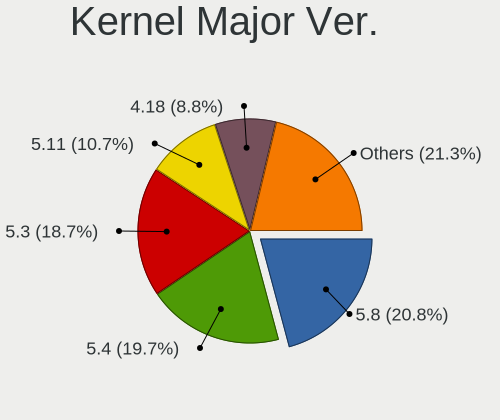

| Version | Computers | Percent |
|---------|-----------|---------|
| 5.8     | 786       | 21.87%  |
| 5.4     | 771       | 21.45%  |
| 5.3     | 734       | 20.42%  |
| 4.18    | 345       | 9.6%    |
| 5.11    | 332       | 9.24%   |
| 5.0     | 278       | 7.74%   |
| 4.15    | 161       | 4.48%   |
| 4.13    | 92        | 2.56%   |
| 4.16    | 48        | 1.34%   |
| 5.1     | 21        | 0.58%   |
| 5.6     | 9         | 0.25%   |
| 4.17    | 9         | 0.25%   |
| 5.10    | 5         | 0.14%   |
| 5.13    | 1         | 0.03%   |
| 4.14    | 1         | 0.03%   |
| Unknown | 1         | 0.03%   |

Arch
----

OS architecture (x86_64, i586, etc.)

| Name    | Computers | Percent |
|---------|-----------|---------|
| x86_64  | 3316      | 99.76%  |
| aarch64 | 8         | 0.24%   |

DE
--

Desktop Environment

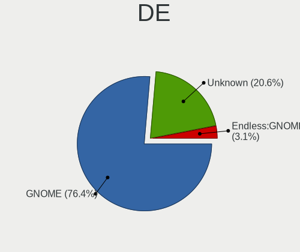

| Name    | Computers | Percent |
|---------|-----------|---------|
| GNOME   | 2626      | 77.65%  |
| Unknown | 756       | 22.35%  |

Display Server
--------------

X11 or Wayland

| Name    | Computers | Percent |
|---------|-----------|---------|
| X11     | 2620      | 77.49%  |
| Unknown | 760       | 22.48%  |
| Wayland | 1         | 0.03%   |

Display Manager
---------------

SDDM, LightDM, etc.

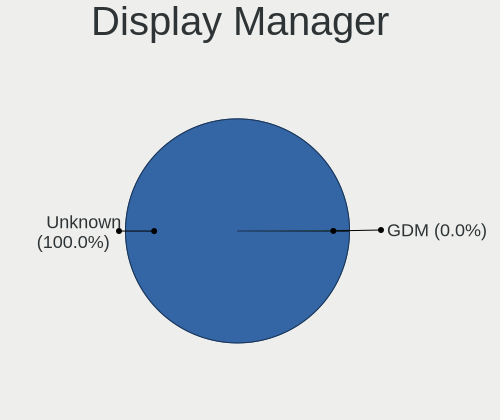

| Name    | Computers | Percent |
|---------|-----------|---------|
| Unknown | 3324      | 100%    |

OS Lang
-------

Language

| Lang        | Computers | Percent |
|-------------|-----------|---------|
| pt_BR       | 858       | 25.27%  |
| Unknown     | 767       | 22.59%  |
| en_US       | 669       | 19.71%  |
| ru_RU       | 180       | 5.3%    |
| ro_RO       | 93        | 2.74%   |
| es_ES       | 83        | 2.44%   |
| de_DE       | 83        | 2.44%   |
| es_MX       | 70        | 2.06%   |
| hu_HU       | 55        | 1.62%   |
| ru_RU.UTF_8 | 50        | 1.47%   |
| fr_FR       | 48        | 1.41%   |
| en_GB       | 44        | 1.3%    |
| it_IT       | 41        | 1.21%   |
| ru_UA       | 36        | 1.06%   |
| es_CO       | 31        | 0.91%   |
| pt_PT       | 23        | 0.68%   |
| pl_PL       | 23        | 0.68%   |
| es_AR       | 23        | 0.68%   |
| uk_UA       | 21        | 0.62%   |
| tr_TR       | 20        | 0.59%   |
| bg_BG       | 12        | 0.35%   |
| sr_RS@latin | 10        | 0.29%   |
| en_PH       | 10        | 0.29%   |
| id_ID       | 9         | 0.27%   |
| en_IN       | 9         | 0.27%   |
| cs_CZ       | 9         | 0.27%   |
| nl_NL       | 8         | 0.24%   |
| el_GR       | 8         | 0.24%   |
| hr_HR       | 7         | 0.21%   |
| de_AT       | 7         | 0.21%   |
| nl_BE       | 6         | 0.18%   |
| zh_TW       | 5         | 0.15%   |
| sl_SI       | 5         | 0.15%   |
| sk_SK       | 5         | 0.15%   |
| ca_ES       | 5         | 0.15%   |
| ko_KR       | 4         | 0.12%   |
| en_AU       | 4         | 0.12%   |
| vi_VN       | 3         | 0.09%   |
| sv_SE       | 3         | 0.09%   |
| lt_LT       | 3         | 0.09%   |

Boot Mode
---------

EFI or BIOS

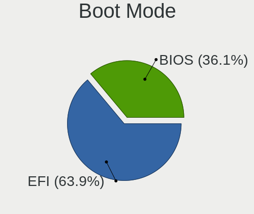

| Mode | Computers | Percent |
|------|-----------|---------|
| EFI  | 2154      | 63.22%  |
| BIOS | 1253      | 36.78%  |

Filesystem
----------

Type of filesystem

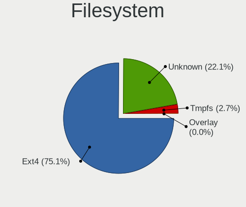

| Type    | Computers | Percent |
|---------|-----------|---------|
| Ext4    | 2475      | 73.2%   |
| Unknown | 810       | 23.96%  |
| Tmpfs   | 94        | 2.78%   |
| Overlay | 1         | 0.03%   |
| Btrfs   | 1         | 0.03%   |

Part. scheme
------------

Scheme of partitioning

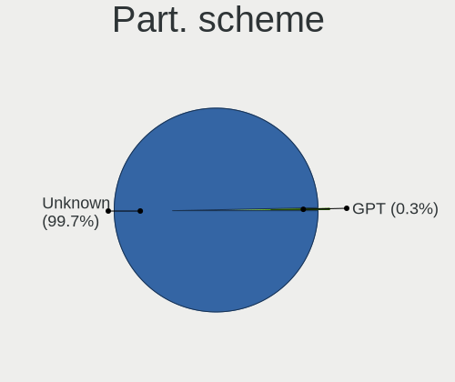

| Type    | Computers | Percent |
|---------|-----------|---------|
| Unknown | 3317      | 99.7%   |
| GPT     | 10        | 0.3%    |

Dual Boot with Linux/BSD
------------------------

Hosting more than one Linux/BSD

| Dual boot | Computers | Percent |
|-----------|-----------|---------|
| No        | 3323      | 99.97%  |
| Yes       | 1         | 0.03%   |

Dual Boot (Win)
---------------

Hosting Linux and Windows

| Dual boot | Computers | Percent |
|-----------|-----------|---------|
| No        | 3320      | 99.88%  |
| Yes       | 4         | 0.12%   |

Board
-----

Vendor
------

Motherboard manufacturer

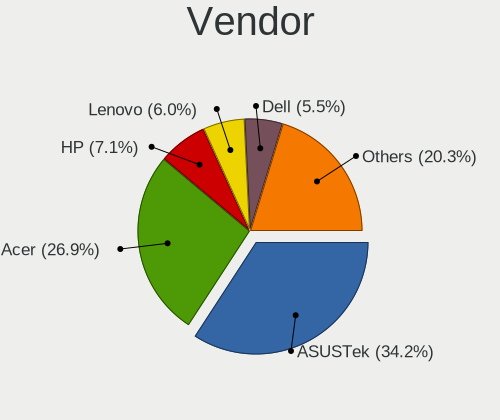

| Name                    | Computers | Percent |
|-------------------------|-----------|---------|
| ASUSTek Computer        | 1114      | 33.51%  |
| Acer                    | 925       | 27.83%  |
| Hewlett-Packard         | 230       | 6.92%   |
| Lenovo                  | 188       | 5.66%   |
| Dell                    | 180       | 5.42%   |
| Gigabyte Technology     | 95        | 2.86%   |
| Positivo                | 60        | 1.81%   |
| Toshiba                 | 50        | 1.5%    |
| MSI                     | 44        | 1.32%   |
| ASRock                  | 38        | 1.14%   |
| Intel                   | 35        | 1.05%   |
| Samsung Electronics     | 31        | 0.93%   |
| Sony                    | 22        | 0.66%   |
| Apple                   | 20        | 0.6%    |
| Foxconn                 | 18        | 0.54%   |
| Unknown                 | 18        | 0.54%   |
| ECS                     | 13        | 0.39%   |
| AMI                     | 12        | 0.36%   |
| Pegatron                | 11        | 0.33%   |
| LG Electronics          | 11        | 0.33%   |
| Packard Bell            | 10        | 0.3%    |
| Biostar                 | 10        | 0.3%    |
| Fujitsu                 | 9         | 0.27%   |
| Semp Toshiba            | 8         | 0.24%   |
| Raspberry Pi Foundation | 8         | 0.24%   |
| Medion                  | 8         | 0.24%   |
| Itautec                 | 8         | 0.24%   |
| Digibras                | 8         | 0.24%   |
| Fujitsu Siemens         | 7         | 0.21%   |
| eMachines               | 7         | 0.21%   |
| Google                  | 6         | 0.18%   |
| Megaware                | 5         | 0.15%   |
| Gateway                 | 5         | 0.15%   |
| ZOTAC                   | 4         | 0.12%   |
| Philco                  | 4         | 0.12%   |
| PCWare                  | 4         | 0.12%   |
| Microsoft               | 4         | 0.12%   |
| Chuwi                   | 4         | 0.12%   |
| OEM                     | 3         | 0.09%   |
| Notebook                | 3         | 0.09%   |

Model
-----

Motherboard model

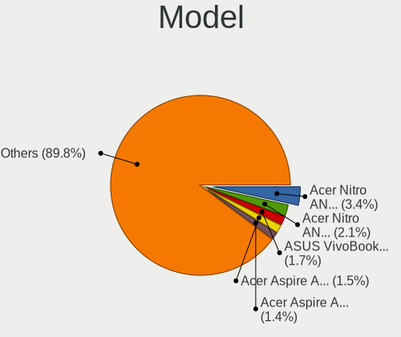

| Name                                       | Computers | Percent |
|--------------------------------------------|-----------|---------|
| Acer Nitro AN515-54                        | 122       | 3.67%   |
| Acer Nitro AN515-44                        | 65        | 1.96%   |
| ASUS VivoBook 15_ASUS Laptop X540UAR       | 59        | 1.77%   |
| Acer Aspire A315-53                        | 55        | 1.65%   |
| Acer Nitro AN517-51                        | 49        | 1.47%   |
| Acer Aspire A315-34                        | 48        | 1.44%   |
| ASUS X541NA                                | 43        | 1.29%   |
| ASUS VivoBook 15_ASUS Laptop X540MA_X543MA | 42        | 1.26%   |
| ASUS VivoBook 15_ASUS Laptop X540MA_X540MA | 40        | 1.2%    |
| Acer Nitro AN515-43                        | 40        | 1.2%    |
| ASUS VivoBook 15_ASUS Laptop X540BA        | 35        | 1.05%   |
| Unknown                                    | 27        | 0.81%   |
| ASUS ZenBook UX431DA_UM431DA               | 26        | 0.78%   |
| Acer Nitro AN515-52                        | 26        | 0.78%   |
| ASUS X540NA                                | 25        | 0.75%   |
| Acer Aspire A315-21                        | 21        | 0.63%   |
| Acer Aspire A315-51                        | 20        | 0.6%    |
| ASUS VivoBook 15_ASUS Laptop X540UBR       | 19        | 0.57%   |
| Acer Aspire A515-54G                       | 19        | 0.57%   |
| ASUS VivoBook_ASUSLaptop X509JA_X509JA     | 18        | 0.54%   |
| Acer Aspire A315-31                        | 17        | 0.51%   |
| ASUS VivoBook 15_ASUS Laptop X540MA_R540MA | 16        | 0.48%   |
| ASUS X541UAK                               | 15        | 0.45%   |
| Acer Aspire A515-51G                       | 15        | 0.45%   |
| Acer Aspire A315-54                        | 15        | 0.45%   |
| ASUS VivoBook_ASUSLaptop X570ZD_X570ZD     | 14        | 0.42%   |
| ASUS VivoBook_ASUS Laptop X505ZA_X505ZA    | 14        | 0.42%   |
| Acer Aspire A315-54K                       | 14        | 0.42%   |
| Positivo S14CT01                           | 13        | 0.39%   |
| HP Notebook                                | 13        | 0.39%   |
| ASUS VivoBook_ASUSLaptop X515JA_X515JA     | 13        | 0.39%   |
| ASUS VivoBook_ASUSLaptop X509FA_X509FA     | 12        | 0.36%   |
| ASUS VivoBook 15_ASUS Laptop X507MA_X507MA | 12        | 0.36%   |
| Acer Aspire A517-51G                       | 12        | 0.36%   |
| Acer Aspire A515-51                        | 12        | 0.36%   |
| ASUS All Series                            | 11        | 0.33%   |
| Acer Nitro AN515-51                        | 11        | 0.33%   |
| Acer Extensa 2540                          | 11        | 0.33%   |
| Acer Aspire XC-830                         | 11        | 0.33%   |
| Acer Aspire A315-33                        | 11        | 0.33%   |

Model Family
------------

Motherboard model prefix

| Name                  | Computers | Percent |
|-----------------------|-----------|---------|
| ASUS VivoBook         | 607       | 18.26%  |
| Acer Aspire           | 482       | 14.5%   |
| Acer Nitro            | 329       | 9.9%    |
| Dell Inspiron         | 71        | 2.14%   |
| Lenovo IdeaPad        | 58        | 1.74%   |
| HP Pavilion           | 47        | 1.41%   |
| Lenovo ThinkPad       | 46        | 1.38%   |
| Dell Latitude         | 44        | 1.32%   |
| Toshiba Satellite     | 43        | 1.29%   |
| ASUS X541NA           | 43        | 1.29%   |
| ASUS ZenBook          | 38        | 1.14%   |
| Dell OptiPlex         | 35        | 1.05%   |
| HP Compaq             | 27        | 0.81%   |
| Acer TravelMate       | 27        | 0.81%   |
| Unknown               | 27        | 0.81%   |
| ASUS X540NA           | 25        | 0.75%   |
| Lenovo ThinkCentre    | 21        | 0.63%   |
| HP ProBook            | 20        | 0.6%    |
| Acer Swift            | 20        | 0.6%    |
| HP Laptop             | 19        | 0.57%   |
| ASUS Vivo             | 19        | 0.57%   |
| Acer Extensa          | 18        | 0.54%   |
| Acer Veriton          | 16        | 0.48%   |
| Acer Predator         | 16        | 0.48%   |
| ASUS X541UAK          | 15        | 0.45%   |
| ASUS PRIME            | 14        | 0.42%   |
| ASUS ASUS             | 14        | 0.42%   |
| Positivo S14CT01      | 13        | 0.39%   |
| HP Notebook           | 13        | 0.39%   |
| HP EliteBook          | 13        | 0.39%   |
| ASUS ASUSPRO          | 13        | 0.39%   |
| Dell Vostro           | 12        | 0.36%   |
| ASUS All              | 11        | 0.33%   |
| Positivo Mobile       | 10        | 0.3%    |
| ASUS X540LA           | 10        | 0.3%    |
| Packard Bell EasyNote | 9         | 0.27%   |
| ASUS M5A78L-M         | 9         | 0.27%   |
| RPi Raspberry         | 8         | 0.24%   |
| Itautec Infoway       | 8         | 0.24%   |
| HP EliteDesk          | 7         | 0.21%   |

MFG Year
--------

Motherboard manufacture year

| Year    | Computers | Percent |
|---------|-----------|---------|
| 2018    | 624       | 18.77%  |
| 2019    | 619       | 18.62%  |
| 2017    | 434       | 13.06%  |
| 2020    | 207       | 6.23%   |
| 2011    | 190       | 5.72%   |
| 2016    | 168       | 5.05%   |
| 2012    | 157       | 4.72%   |
| 2013    | 145       | 4.36%   |
| 2010    | 144       | 4.33%   |
| 2014    | 123       | 3.7%    |
| 2008    | 119       | 3.58%   |
| 2015    | 118       | 3.55%   |
| 2009    | 114       | 3.43%   |
| 2007    | 69        | 2.08%   |
| 2021    | 67        | 2.02%   |
| 2006    | 17        | 0.51%   |
| 2022    | 3         | 0.09%   |
| 2005    | 3         | 0.09%   |
| 2004    | 2         | 0.06%   |
| Unknown | 1         | 0.03%   |

Form Factor
-----------

Physical design of the computer

| Name           | Computers | Percent |
|----------------|-----------|---------|
| Notebook       | 2531      | 76.14%  |
| Desktop        | 640       | 19.25%  |
| All in one     | 79        | 2.38%   |
| Tablet         | 22        | 0.66%   |
| Convertible    | 22        | 0.66%   |
| Mini pc        | 20        | 0.6%    |
| System on chip | 8         | 0.24%   |
| Server         | 2         | 0.06%   |

Secure Boot
-----------

Enabled or disabled

| State    | Computers | Percent |
|----------|-----------|---------|
| Disabled | 2563      | 76.39%  |
| Enabled  | 792       | 23.61%  |

Coreboot
--------

Have coreboot on board

| Used | Computers | Percent |
|------|-----------|---------|
| No   | 3318      | 99.82%  |
| Yes  | 6         | 0.18%   |

RAM Size
--------

Total RAM memory

| Size in GB  | Computers | Percent |
|-------------|-----------|---------|
| 3.01-4.0    | 1365      | 40.7%   |
| 4.01-8.0    | 1145      | 34.14%  |
| 8.01-16.0   | 317       | 9.45%   |
| 1.01-2.0    | 265       | 7.9%    |
| 16.01-24.0  | 167       | 4.98%   |
| 2.01-3.0    | 44        | 1.31%   |
| 32.01-64.0  | 20        | 0.6%    |
| 24.01-32.0  | 14        | 0.42%   |
| 0.51-1.0    | 10        | 0.3%    |
| 64.01-256.0 | 5         | 0.15%   |
| Unknown     | 2         | 0.06%   |

RAM Used
--------

Used RAM memory

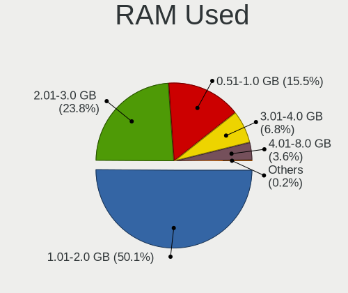

| Used GB   | Computers | Percent |
|-----------|-----------|---------|
| 1.01-2.0  | 1869      | 51%     |
| 2.01-3.0  | 841       | 22.95%  |
| 0.51-1.0  | 584       | 15.93%  |
| 3.01-4.0  | 240       | 6.55%   |
| 4.01-8.0  | 123       | 3.36%   |
| 0.01-0.5  | 4         | 0.11%   |
| 8.01-16.0 | 2         | 0.05%   |
| Unknown   | 2         | 0.05%   |

Total Drives
------------

Number of drives on board

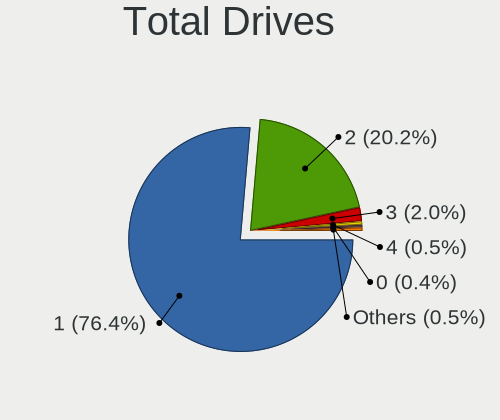

| Drives  | Computers | Percent |
|---------|-----------|---------|
| 1       | 2570      | 76.19%  |
| 2       | 694       | 20.58%  |
| 3       | 66        | 1.96%   |
| 4       | 16        | 0.47%   |
| 0       | 14        | 0.42%   |
| 6       | 5         | 0.15%   |
| 5       | 5         | 0.15%   |
| 7       | 2         | 0.06%   |
| Unknown | 1         | 0.03%   |

Has CD-ROM
----------

Has CD-ROM on board

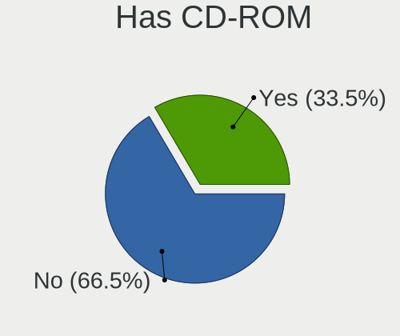

| Presented | Computers | Percent |
|-----------|-----------|---------|
| No        | 2199      | 65.78%  |
| Yes       | 1144      | 34.22%  |

Has Ethernet
------------

Has Ethernet on board

| Presented | Computers | Percent |
|-----------|-----------|---------|
| Yes       | 2520      | 75.65%  |
| No        | 811       | 24.35%  |

Has WiFi
--------

Has WiFi module

| Presented | Computers | Percent |
|-----------|-----------|---------|
| Yes       | 2872      | 86.09%  |
| No        | 464       | 13.91%  |

Has Bluetooth
-------------

Has Bluetooth module

| Presented | Computers | Percent |
|-----------|-----------|---------|
| Yes       | 2333      | 69.81%  |
| No        | 1009      | 30.19%  |

Location
--------

Country
-------

Geographic location (country)

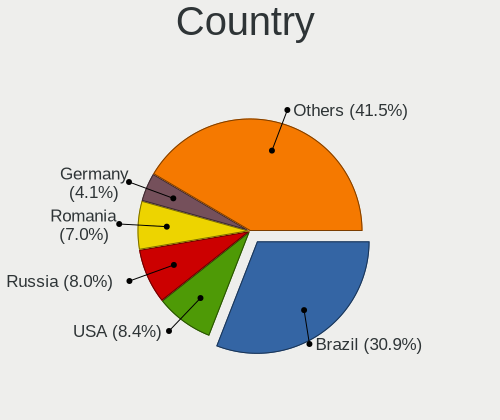

| Country      | Computers | Percent |
|--------------|-----------|---------|
| Brazil       | 1000      | 29.98%  |
| Russia       | 281       | 8.42%   |
| USA          | 280       | 8.39%   |
| Romania      | 245       | 7.34%   |
| Germany      | 137       | 4.11%   |
| Spain        | 123       | 3.69%   |
| Ukraine      | 116       | 3.48%   |
| Hungary      | 78        | 2.34%   |
| Colombia     | 67        | 2.01%   |
| UK           | 53        | 1.59%   |
| India        | 50        | 1.5%    |
| France       | 49        | 1.47%   |
| Italy        | 47        | 1.41%   |
| Mexico       | 46        | 1.38%   |
| Portugal     | 41        | 1.23%   |
| Belarus      | 38        | 1.14%   |
| Argentina    | 38        | 1.14%   |
| Poland       | 35        | 1.05%   |
| Canada       | 35        | 1.05%   |
| Serbia       | 34        | 1.02%   |
| Philippines  | 31        | 0.93%   |
| Indonesia    | 29        | 0.87%   |
| Bulgaria     | 27        | 0.81%   |
| Turkey       | 26        | 0.78%   |
| Croatia      | 23        | 0.69%   |
| Saudi Arabia | 18        | 0.54%   |
| Kazakhstan   | 18        | 0.54%   |
| Greece       | 17        | 0.51%   |
| Australia    | 17        | 0.51%   |
| Iran         | 16        | 0.48%   |
| New Zealand  | 15        | 0.45%   |
| Netherlands  | 15        | 0.45%   |
| Thailand     | 14        | 0.42%   |
| Georgia      | 13        | 0.39%   |
| Czechia      | 13        | 0.39%   |
| Austria      | 11        | 0.33%   |
| Slovenia     | 10        | 0.3%    |
| Kenya        | 10        | 0.3%    |
| Belgium      | 10        | 0.3%    |
| Sweden       | 9         | 0.27%   |

City
----

Geographic location (city)

| City             | Computers | Percent |
|------------------|-----------|---------|
| Sao Paulo        | 118       | 3.33%   |
| Moscow           | 89        | 2.51%   |
| Bucharest        | 79        | 2.23%   |
| Rio de Janeiro   | 55        | 1.55%   |
| Kyiv             | 37        | 1.04%   |
| Budapest         | 36        | 1.01%   |
| Braslia        | 35        | 0.99%   |
| St Petersburg    | 31        | 0.87%   |
| Bogot          | 28        | 0.79%   |
| Curitiba         | 25        | 0.7%    |
| Belgrade         | 24        | 0.68%   |
| Cluj-Napoca      | 23        | 0.65%   |
| Salvador         | 21        | 0.59%   |
| Fortaleza        | 19        | 0.54%   |
| Belo Horizonte   | 19        | 0.54%   |
| Porto Alegre     | 18        | 0.51%   |
| Minsk            | 16        | 0.45%   |
| Quezon City      | 15        | 0.42%   |
| Santo Andr     | 14        | 0.39%   |
| Warsaw           | 13        | 0.37%   |
| Sofia            | 13        | 0.37%   |
| Niteri         | 13        | 0.37%   |
| Madrid           | 13        | 0.37%   |
| Jakarta          | 13        | 0.37%   |
| Iasi             | 13        | 0.37%   |
| Istanbul         | 12        | 0.34%   |
| Campinas         | 12        | 0.34%   |
| Bucyrus          | 12        | 0.34%   |
| Berlin           | 12        | 0.34%   |
| Tehran           | 11        | 0.31%   |
| Popesti-Leordeni | 11        | 0.31%   |
| Lisbon           | 11        | 0.31%   |
| Goinia         | 11        | 0.31%   |
| Barcelona        | 11        | 0.31%   |
| Recife           | 10        | 0.28%   |
| Paris            | 10        | 0.28%   |
| Zagreb           | 9         | 0.25%   |
| Rome             | 9         | 0.25%   |
| Ploieti        | 9         | 0.25%   |
| Nairobi          | 9         | 0.25%   |

Drives
------

Drive Vendor
------------

Hard drive vendors

| Vendor                | Computers | Drives | Percent |
|-----------------------|-----------|--------|---------|
| WDC                   | 773       | 922    | 19.01%  |
| Seagate               | 656       | 846    | 16.13%  |
| Toshiba               | 408       | 500    | 10.03%  |
| SanDisk               | 303       | 367    | 7.45%   |
| Kingston              | 297       | 409    | 7.3%    |
| Intel                 | 295       | 355    | 7.26%   |
| Unknown               | 250       | 324    | 6.15%   |
| Samsung Electronics   | 235       | 295    | 5.78%   |
| SK hynix              | 116       | 142    | 2.85%   |
| Hitachi               | 103       | 109    | 2.53%   |
| HGST                  | 96        | 120    | 2.36%   |
| A-DATA Technology     | 94        | 107    | 2.31%   |
| Micron Technology     | 57        | 79     | 1.4%    |
| ADATA Technology      | 44        | 46     | 1.08%   |
| Crucial               | 42        | 54     | 1.03%   |
| China                 | 18        | 20     | 0.44%   |
| Phison                | 16        | 18     | 0.39%   |
| Fujitsu               | 16        | 16     | 0.39%   |
| OCZ                   | 15        | 15     | 0.37%   |
| Maxtor                | 15        | 17     | 0.37%   |
| SPCC                  | 14        | 15     | 0.34%   |
| Silicon Motion        | 14        | 14     | 0.34%   |
| Transcend             | 10        | 14     | 0.25%   |
| LITEON                | 10        | 12     | 0.25%   |
| Apple                 | 9         | 9      | 0.22%   |
| PNY                   | 8         | 9      | 0.2%    |
| Patriot               | 8         | 8      | 0.2%    |
| GOODRAM               | 7         | 7      | 0.17%   |
| Realtek Semiconductor | 6         | 7      | 0.15%   |
| Kingmax               | 6         | 7      | 0.15%   |
| Netac                 | 5         | 6      | 0.12%   |
| KingDian              | 5         | 6      | 0.12%   |
| Hewlett-Packard       | 5         | 19     | 0.12%   |
| LITEONIT              | 4         | 4      | 0.1%    |
| KingSpec              | 4         | 4      | 0.1%    |
| Intenso               | 4         | 4      | 0.1%    |
| Corsair               | 4         | 5      | 0.1%    |
| ASMT                  | 4         | 6      | 0.1%    |
| Team                  | 3         | 3      | 0.07%   |
| Mushkin               | 3         | 4      | 0.07%   |

Drive Model
-----------

Hard drive models

| Model                                  | Computers | Percent |
|----------------------------------------|-----------|---------|
| WDC WD10SPZX-21Z10T0 1TB               | 366       | 8.75%   |
| Seagate ST1000LM035-1RK172 1TB         | 185       | 4.42%   |
| Toshiba MQ01ABF050 500GB               | 139       | 3.32%   |
| Intel NVMe SSD Drive 512GB             | 126       | 3.01%   |
| Toshiba MQ04ABF100 1TB                 | 113       | 2.7%    |
| Unknown MMC Card  32GB                 | 95        | 2.27%   |
| Intel NVMe SSD Drive 256GB             | 77        | 1.84%   |
| SanDisk NVMe SSD Drive 512GB           | 75        | 1.79%   |
| Kingston RBUSC180DS37256GJ 256GB SSD   | 70        | 1.67%   |
| Intel SSDPEKKW256G7 256GB              | 69        | 1.65%   |
| A-DATA IM2S3338-128GD2 128GB SSD       | 68        | 1.63%   |
| Unknown MMC Card  64GB                 | 55        | 1.32%   |
| Seagate ST500LT012-1DG142 500GB        | 45        | 1.08%   |
| SK hynix NVMe SSD Drive 256GB          | 34        | 0.81%   |
| SanDisk NVMe SSD Drive 256GB           | 32        | 0.77%   |
| Kingston NVMe SSD Drive 256GB          | 32        | 0.77%   |
| WDC WD5000LPCX-21VHAT0 500GB           | 31        | 0.74%   |
| Seagate ST500DM002-1BD142 500GB        | 31        | 0.74%   |
| Kingston SA400S37240G 240GB SSD        | 31        | 0.74%   |
| Unknown SD/MMC/MS PRO 64GB             | 30        | 0.72%   |
| Seagate ST500LM030-1RK17D 500GB        | 29        | 0.69%   |
| Toshiba MQ01ABD100 1TB                 | 28        | 0.67%   |
| Micron 1100_MTFDDAV256TBN 256GB SSD    | 28        | 0.67%   |
| Unknown MMC Card  16GB                 | 27        | 0.65%   |
| Seagate ST500LM012 HN-M500MBB 500GB    | 27        | 0.65%   |
| SanDisk SD9SB8W256G1002 256GB SSD      | 25        | 0.6%    |
| Kingston SV300S37A120G 120GB SSD       | 24        | 0.57%   |
| Seagate ST1000DM010-2EP102 1TB         | 23        | 0.55%   |
| Samsung SM963 2.5" NVMe PCIe SSD 256GB | 23        | 0.55%   |
| SK hynix HFS256G39TND-N210A 256GB SSD  | 22        | 0.53%   |
| SK hynix NVMe SSD Drive 512GB          | 21        | 0.5%    |
| ADATA NVMe SSD Drive 128GB             | 21        | 0.5%    |
| SK hynix HFS128G39TND-N210A 128GB SSD  | 20        | 0.48%   |
| Toshiba DT01ACA100 1TB                 | 19        | 0.45%   |
| Seagate ST1000LM024 HN-M101MBB 1TB     | 19        | 0.45%   |
| Kingston SA400S37120G 120GB SSD        | 19        | 0.45%   |
| HGST HTS545050B7E660 500GB             | 19        | 0.45%   |
| HGST HTS541010B7E610 1TB               | 17        | 0.41%   |
| SanDisk SD9SN8W256G1102 256GB SSD      | 16        | 0.38%   |
| WDC WD5000LPCX-80VHAT1 500GB           | 15        | 0.36%   |

HDD Vendor
----------

Hard disk drive vendors

| Vendor              | Computers | Drives | Percent |
|---------------------|-----------|--------|---------|
| WDC                 | 737       | 868    | 34.28%  |
| Seagate             | 655       | 843    | 30.47%  |
| Toshiba             | 389       | 478    | 18.09%  |
| Hitachi             | 103       | 109    | 4.79%   |
| HGST                | 96        | 120    | 4.47%   |
| Samsung Electronics | 95        | 111    | 4.42%   |
| Unknown             | 31        | 39     | 1.44%   |
| Fujitsu             | 16        | 16     | 0.74%   |
| Maxtor              | 13        | 15     | 0.6%    |
| ASMT                | 4         | 6      | 0.19%   |
| Intenso             | 3         | 3      | 0.14%   |
| Apple               | 3         | 3      | 0.14%   |
| USB3.0              | 1         | 1      | 0.05%   |
| StoreJet            | 1         | 2      | 0.05%   |
| HGST HTS            | 1         | 1      | 0.05%   |
| Hewlett-Packard     | 1         | 2      | 0.05%   |
| ASMedia             | 1         | 2      | 0.05%   |

SSD Vendor
----------

Solid state drive vendors

| Vendor              | Computers | Drives | Percent |
|---------------------|-----------|--------|---------|
| Kingston            | 241       | 343    | 23.72%  |
| SanDisk             | 176       | 234    | 17.32%  |
| Samsung Electronics | 96        | 120    | 9.45%   |
| A-DATA Technology   | 94        | 107    | 9.25%   |
| SK hynix            | 57        | 80     | 5.61%   |
| Micron Technology   | 48        | 70     | 4.72%   |
| Crucial             | 42        | 54     | 4.13%   |
| WDC                 | 40        | 48     | 3.94%   |
| China               | 18        | 20     | 1.77%   |
| Toshiba             | 15        | 15     | 1.48%   |
| OCZ                 | 15        | 15     | 1.48%   |
| SPCC                | 14        | 15     | 1.38%   |
| Intel               | 14        | 24     | 1.38%   |
| Transcend           | 10        | 14     | 0.98%   |
| LITEON              | 10        | 12     | 0.98%   |
| Unknown             | 8         | 9      | 0.79%   |
| PNY                 | 8         | 9      | 0.79%   |
| Patriot             | 8         | 8      | 0.79%   |
| GOODRAM             | 7         | 7      | 0.69%   |
| Kingmax             | 6         | 7      | 0.59%   |
| Apple               | 6         | 6      | 0.59%   |
| Netac               | 5         | 6      | 0.49%   |
| KingDian            | 5         | 6      | 0.49%   |
| LITEONIT            | 4         | 4      | 0.39%   |
| KingSpec            | 4         | 4      | 0.39%   |
| Hewlett-Packard     | 4         | 17     | 0.39%   |
| Corsair             | 4         | 5      | 0.39%   |
| Team                | 3         | 3      | 0.3%    |
| Mushkin             | 3         | 4      | 0.3%    |
| JMicron Technology  | 3         | 3      | 0.3%    |
| Dogfish             | 3         | 3      | 0.3%    |
| Verbatim            | 2         | 2      | 0.2%    |
| TSA                 | 2         | 2      | 0.2%    |
| TO Exter            | 2         | 4      | 0.2%    |
| Seagate             | 2         | 2      | 0.2%    |
| Maxtor              | 2         | 2      | 0.2%    |
| Gigabyte Technology | 2         | 2      | 0.2%    |
| FORESEE             | 2         | 3      | 0.2%    |
| Emtec               | 2         | 2      | 0.2%    |
| Dell                | 2         | 2      | 0.2%    |

Drive Kind
----------

HDD or SSD

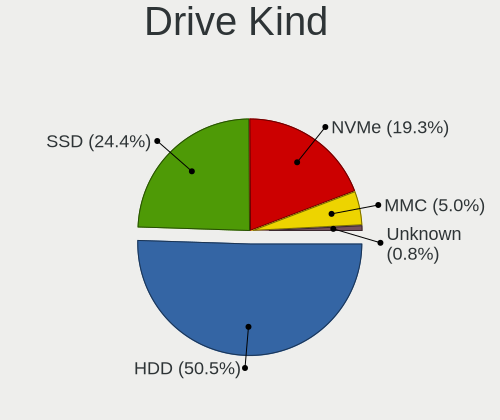

| Kind    | Computers | Drives | Percent |
|---------|-----------|--------|---------|
| HDD     | 2048      | 2619   | 52.18%  |
| SSD     | 962       | 1328   | 24.51%  |
| NVMe    | 687       | 780    | 17.5%   |
| MMC     | 197       | 256    | 5.02%   |
| Unknown | 31        | 42     | 0.79%   |

Drive Connector
---------------

SATA, SAS, NVMe, etc.

| Type | Computers | Drives | Percent |
|------|-----------|--------|---------|
| SATA | 2697      | 3879   | 73.49%  |
| NVMe | 686       | 779    | 18.69%  |
| MMC  | 197       | 256    | 5.37%   |
| SAS  | 90        | 111    | 2.45%   |

Drive Size
----------

Size of hard drive

| Size in TB | Computers | Drives | Percent |
|------------|-----------|--------|---------|
| 0.01-0.5   | 1855      | 2523   | 61.79%  |
| 0.51-1.0   | 1054      | 1303   | 35.11%  |
| 1.01-2.0   | 59        | 81     | 1.97%   |
| 2.01-3.0   | 12        | 13     | 0.4%    |
| 3.01-4.0   | 11        | 12     | 0.37%   |
| 4.01-10.0  | 10        | 14     | 0.33%   |
| 10.01-20.0 | 1         | 1      | 0.03%   |

Space Total
-----------

Amount of disk space available on the file system

| Size in GB     | Computers | Percent |
|----------------|-----------|---------|
| 101-250        | 995       | 29.22%  |
| 251-500        | 870       | 25.55%  |
| 501-1000       | 766       | 22.5%   |
| 21-50          | 256       | 7.52%   |
| 51-100         | 222       | 6.52%   |
| 1-20           | 140       | 4.11%   |
| 1001-2000      | 93        | 2.73%   |
| 2001-3000      | 36        | 1.06%   |
| More than 3000 | 15        | 0.44%   |
| Unknown        | 12        | 0.35%   |

Space Used
----------

Amount of used disk space

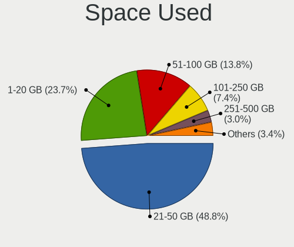

| Used GB        | Computers | Percent |
|----------------|-----------|---------|
| 21-50          | 1754      | 49.79%  |
| 1-20           | 851       | 24.16%  |
| 51-100         | 465       | 13.2%   |
| 101-250        | 245       | 6.95%   |
| 251-500        | 101       | 2.87%   |
| 501-1000       | 56        | 1.59%   |
| 1001-2000      | 27        | 0.77%   |
| Unknown        | 12        | 0.34%   |
| More than 3000 | 7         | 0.2%    |
| 2001-3000      | 5         | 0.14%   |

Malfunc. Drives
---------------

Drive models with a malfunction

| Model                                        | Computers | Drives | Percent |
|----------------------------------------------|-----------|--------|---------|
| Samsung Electronics MZVPW128HEGM-00000 128GB | 1         | 1      | 100%    |

Malfunc. Drive Vendor
---------------------

Vendors of faulty drives

| Vendor              | Computers | Drives | Percent |
|---------------------|-----------|--------|---------|
| Samsung Electronics | 1         | 1      | 100%    |

Malfunc. HDD Vendor
-------------------

Vendors of faulty HDD drives

Zero info for selected period =(

Malfunc. Drive Kind
-------------------

Kinds of faulty drives

| Kind | Computers | Drives | Percent |
|------|-----------|--------|---------|
| NVMe | 1         | 1      | 100%    |

Failed Drives
-------------

Failed drive models

Zero info for selected period =(

Failed Drive Vendor
-------------------

Failed drive vendors

Zero info for selected period =(

Drive Status
------------

Number of failed and malfunc. drives

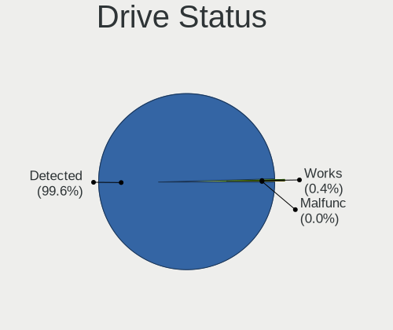

| Status   | Computers | Drives | Percent |
|----------|-----------|--------|---------|
| Detected | 3309      | 5009   | 99.58%  |
| Works    | 13        | 15     | 0.39%   |
| Malfunc  | 1         | 1      | 0.03%   |

Storage controller
------------------

Storage Vendor
--------------

Storage controller vendors

| Vendor                           | Computers | Percent |
|----------------------------------|-----------|---------|
| Intel                            | 2522      | 68.89%  |
| AMD                              | 595       | 16.25%  |
| SanDisk                          | 128       | 3.5%    |
| SK hynix                         | 59        | 1.61%   |
| Kingston Technology Company      | 59        | 1.61%   |
| Samsung Electronics              | 57        | 1.56%   |
| ADATA Technology                 | 54        | 1.48%   |
| Nvidia                           | 53        | 1.45%   |
| Phison Electronics               | 18        | 0.49%   |
| Marvell Technology Group         | 17        | 0.46%   |
| JMicron Technology               | 15        | 0.41%   |
| Silicon Motion                   | 14        | 0.38%   |
| VIA Technologies                 | 13        | 0.36%   |
| ASMedia Technology               | 11        | 0.3%    |
| Silicon Integrated Systems [SiS] | 10        | 0.27%   |
| Micron Technology                | 9         | 0.25%   |
| Toshiba America Info Systems     | 7         | 0.19%   |
| Realtek Semiconductor            | 7         | 0.19%   |
| Silicon Image                    | 2         | 0.05%   |
| LSI Logic / Symbios Logic        | 2         | 0.05%   |
| Lite-On Technology               | 2         | 0.05%   |
| KIOXIA                           | 2         | 0.05%   |
| Union Memory (Shenzhen)          | 1         | 0.03%   |
| Synopsys                         | 1         | 0.03%   |
| Shenzhen Longsys Electronics     | 1         | 0.03%   |
| OCZ Technology Group             | 1         | 0.03%   |
| Adaptec                          | 1         | 0.03%   |

Storage Model
-------------

Storage controller models

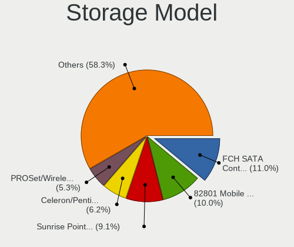

| Model                                                                                   | Computers | Percent |
|-----------------------------------------------------------------------------------------|-----------|---------|
| AMD FCH SATA Controller [AHCI mode]                                                     | 483       | 11.07%  |
| Intel 82801 Mobile SATA Controller [RAID mode]                                          | 453       | 10.38%  |
| Intel Sunrise Point-LP SATA Controller [AHCI mode]                                      | 425       | 9.74%   |
| Intel Celeron/Pentium Silver Processor SATA Controller                                  | 286       | 6.55%   |
| Intel PROSet/Wireless WiFi Software extension                                           | 250       | 5.73%   |
| Intel Celeron N3350/Pentium N4200/Atom E3900 Series SATA AHCI Controller                | 155       | 3.55%   |
| Intel 7 Series Chipset Family 6-port SATA Controller [AHCI mode]                        | 115       | 2.63%   |
| Intel NM10/ICH7 Family SATA Controller [IDE mode]                                       | 96        | 2.2%    |
| SanDisk WD Blue SN550 NVMe SSD                                                          | 85        | 1.95%   |
| Intel 82801IBM/IEM (ICH9M/ICH9M-E) 4 port SATA Controller [AHCI mode]                   | 80        | 1.83%   |
| Intel 82801G (ICH7 Family) IDE Controller                                               | 77        | 1.76%   |
| Intel 6 Series/C200 Series Chipset Family 6 port Mobile SATA AHCI Controller            | 77        | 1.76%   |
| Intel Atom/Celeron/Pentium Processor x5-E8000/J3xxx/N3xxx Series SATA Controller        | 63        | 1.44%   |
| AMD SB7x0/SB8x0/SB9x0 SATA Controller [AHCI mode]                                       | 63        | 1.44%   |
| Intel 8 Series/C220 Series Chipset Family 6-port SATA Controller 1 [AHCI mode]          | 53        | 1.21%   |
| Intel Volume Management Device NVMe RAID Controller                                     | 50        | 1.15%   |
| SK hynix BC501 NVMe Solid State Drive                                                   | 49        | 1.12%   |
| Intel Tiger Lake-LP SATA Controller                                                     | 48        | 1.1%    |
| Intel HM170/QM170 Chipset SATA Controller [AHCI Mode]                                   | 45        | 1.03%   |
| Intel 6 Series/C200 Series Chipset Family 6 port Desktop SATA AHCI Controller           | 44        | 1.01%   |
| Kingston Company U-SNS8154P3 NVMe SSD                                                   | 43        | 0.99%   |
| AMD SB7x0/SB8x0/SB9x0 IDE Controller                                                    | 43        | 0.99%   |
| Intel 82801HM/HEM (ICH8M/ICH8M-E) IDE Controller                                        | 42        | 0.96%   |
| Intel 8 Series SATA Controller 1 [AHCI mode]                                            | 42        | 0.96%   |
| Intel 5 Series/3400 Series Chipset 4 port SATA AHCI Controller                          | 39        | 0.89%   |
| Intel Cannon Lake PCH SATA AHCI Controller                                              | 37        | 0.85%   |
| Intel Atom Processor E3800 Series SATA AHCI Controller                                  | 37        | 0.85%   |
| Intel 82801HM/HEM (ICH8M/ICH8M-E) SATA Controller [AHCI mode]                           | 37        | 0.85%   |
| ADATA IM2P33F8ABR1 NVMe SSD                                                             | 37        | 0.85%   |
| SanDisk WD Blue SN500 / PC SN520 NVMe SSD                                               | 35        | 0.8%    |
| Intel Wildcat Point-LP SATA Controller [AHCI Mode]                                      | 35        | 0.8%    |
| Nvidia MCP61 SATA Controller                                                            | 29        | 0.66%   |
| Nvidia MCP61 IDE                                                                        | 27        | 0.62%   |
| AMD SB7x0/SB8x0/SB9x0 SATA Controller [IDE mode]                                        | 27        | 0.62%   |
| Intel Cannon Lake Mobile PCH SATA AHCI Controller                                       | 26        | 0.6%    |
| Samsung NVMe SSD Controller 980                                                         | 25        | 0.57%   |
| Intel SSD 660P Series                                                                   | 24        | 0.55%   |
| Intel 6 Series/C200 Series Chipset Family Desktop SATA Controller (IDE mode, ports 4-5) | 24        | 0.55%   |
| Intel 6 Series/C200 Series Chipset Family Desktop SATA Controller (IDE mode, ports 0-3) | 24        | 0.55%   |
| Intel NM10/ICH7 Family SATA Controller [AHCI mode]                                      | 22        | 0.5%    |

Storage Kind
------------

Kind of storage controller (IDE, SATA, NVMe, SAS, ...)

| Kind | Computers | Percent |
|------|-----------|---------|
| SATA | 2539      | 62.43%  |
| NVMe | 691       | 16.99%  |
| RAID | 438       | 10.77%  |
| IDE  | 395       | 9.71%   |
| SCSI | 3         | 0.07%   |
| SAS  | 1         | 0.02%   |

Processor
---------

CPU Vendor
----------

Processor vendors

| Vendor  | Computers | Percent |
|---------|-----------|---------|
| Intel   | 2670      | 80.32%  |
| AMD     | 645       | 19.4%   |
| ARM     | 8         | 0.24%   |
| Unknown | 1         | 0.03%   |

CPU Model
---------

Processor models

| Model                                         | Computers | Percent |
|-----------------------------------------------|-----------|---------|
| Intel Celeron N4000 CPU @ 1.10GHz             | 135       | 4.05%   |
| Intel Core i5-9300H CPU @ 2.40GHz             | 123       | 3.69%   |
| Intel Celeron CPU N3350 @ 1.10GHz             | 91        | 2.73%   |
| Intel Core i5-8250U CPU @ 1.60GHz             | 90        | 2.7%    |
| Intel Core i3-6006U CPU @ 2.00GHz             | 80        | 2.4%    |
| Intel Core i3-7020U CPU @ 2.30GHz             | 61        | 1.83%   |
| Intel Core i7-9750H CPU @ 2.60GHz             | 59        | 1.77%   |
| AMD Ryzen 5 3500U with Radeon Vega Mobile Gfx | 59        | 1.77%   |
| Intel Core i5-7200U CPU @ 2.50GHz             | 56        | 1.68%   |
| AMD Ryzen 7 4800H with Radeon Graphics        | 49        | 1.47%   |
| Intel Core i3-8130U CPU @ 2.20GHz             | 47        | 1.41%   |
| Intel Pentium Silver N5000 CPU @ 1.10GHz      | 42        | 1.26%   |
| Intel Celeron N4020 CPU @ 1.10GHz             | 40        | 1.2%    |
| Intel Atom x5-Z8350 CPU @ 1.44GHz             | 40        | 1.2%    |
| Intel Core i5-1035G1 CPU @ 1.00GHz            | 37        | 1.11%   |
| Intel Pentium CPU N4200 @ 1.10GHz             | 36        | 1.08%   |
| Intel Core i3-8145U CPU @ 2.10GHz             | 33        | 0.99%   |
| AMD Ryzen 7 3750H with Radeon Vega Mobile Gfx | 32        | 0.96%   |
| Intel Core i5-8265U CPU @ 1.60GHz             | 31        | 0.93%   |
| Intel Pentium CPU 4417U @ 2.30GHz             | 30        | 0.9%    |
| Intel Core i3-1005G1 CPU @ 1.20GHz            | 30        | 0.9%    |
| Intel Core i5-8300H CPU @ 2.30GHz             | 29        | 0.87%   |
| AMD Ryzen 5 2500U with Radeon Vega Mobile Gfx | 29        | 0.87%   |
| Intel Core i7-10510U CPU @ 1.80GHz            | 27        | 0.81%   |
| Intel Core i5-10210U CPU @ 1.60GHz            | 27        | 0.81%   |
| Intel Core i7-8550U CPU @ 1.80GHz             | 26        | 0.78%   |
| Intel Celeron CPU N3060 @ 1.60GHz             | 26        | 0.78%   |
| Intel Celeron N4000C CPU @ 1.10GHz            | 24        | 0.72%   |
| Intel Core i7-7700HQ CPU @ 2.80GHz            | 23        | 0.69%   |
| Intel Core i3-7100U CPU @ 2.40GHz             | 23        | 0.69%   |
| Intel Celeron CPU N3450 @ 1.10GHz             | 23        | 0.69%   |
| Intel 11th Gen Core i3-1115G4 @ 3.00GHz       | 20        | 0.6%    |
| AMD Ryzen 5 4600H with Radeon Graphics        | 20        | 0.6%    |
| AMD A6-9225 RADEON R4, 5 COMPUTE CORES 2C+3G  | 20        | 0.6%    |
| Intel Core i7-8565U CPU @ 1.80GHz             | 19        | 0.57%   |
| Intel Core i5-7300HQ CPU @ 2.50GHz            | 19        | 0.57%   |
| Intel Core i3-5005U CPU @ 2.00GHz             | 19        | 0.57%   |
| Intel Core i3-6100U CPU @ 2.30GHz             | 18        | 0.54%   |
| Intel Core i3-2310M CPU @ 2.10GHz             | 16        | 0.48%   |
| Intel Core i7-8750H CPU @ 2.20GHz             | 15        | 0.45%   |

CPU Model Family
----------------

Processor model prefix

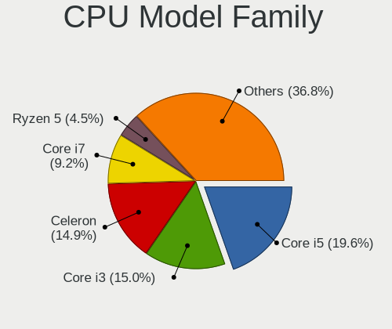

| Model                   | Computers | Percent |
|-------------------------|-----------|---------|
| Intel Core i5           | 672       | 20.19%  |
| Intel Celeron           | 506       | 15.2%   |
| Intel Core i3           | 500       | 15.02%  |
| Intel Core i7           | 310       | 9.31%   |
| Intel Pentium           | 144       | 4.33%   |
| Intel Core 2 Duo        | 141       | 4.24%   |
| AMD Ryzen 5             | 140       | 4.21%   |
| Intel Atom              | 118       | 3.54%   |
| AMD Ryzen 7             | 105       | 3.15%   |
| Other                   | 92        | 2.76%   |
| Intel Pentium Dual-Core | 57        | 1.71%   |
| Intel Pentium Silver    | 56        | 1.68%   |
| AMD A6                  | 54        | 1.62%   |
| AMD Ryzen 3             | 39        | 1.17%   |
| Intel Pentium Dual      | 31        | 0.93%   |
| AMD A4                  | 31        | 0.93%   |
| AMD FX                  | 26        | 0.78%   |
| AMD A8                  | 26        | 0.78%   |
| AMD E2                  | 22        | 0.66%   |
| AMD E                   | 22        | 0.66%   |
| Intel Xeon              | 18        | 0.54%   |
| Intel Core 2 Quad       | 18        | 0.54%   |
| Intel Core 2            | 15        | 0.45%   |
| AMD E1                  | 15        | 0.45%   |
| AMD A10                 | 15        | 0.45%   |
| AMD Athlon 64 X2        | 13        | 0.39%   |
| AMD Sempron             | 11        | 0.33%   |
| AMD Phenom II X4        | 11        | 0.33%   |
| Intel Genuine           | 10        | 0.3%    |
| AMD Athlon II X2        | 10        | 0.3%    |
| AMD C-70                | 7         | 0.21%   |
| AMD Phenom II X6        | 6         | 0.18%   |
| AMD Athlon              | 6         | 0.18%   |
| AMD A12                 | 6         | 0.18%   |
| Intel Pentium 4         | 5         | 0.15%   |
| Intel Pentium Gold      | 4         | 0.12%   |
| AMD Turion 64 X2 Mobile | 4         | 0.12%   |
| AMD Phenom              | 4         | 0.12%   |
| AMD Mobile Sempron      | 4         | 0.12%   |
| AMD Athlon II X4        | 4         | 0.12%   |

CPU Cores
---------

Number of processor cores

| Number  | Computers | Percent |
|---------|-----------|---------|
| 2       | 1833      | 55.11%  |
| 4       | 1166      | 35.06%  |
| 6       | 162       | 4.87%   |
| 1       | 83        | 2.5%    |
| 8       | 63        | 1.89%   |
| 3       | 13        | 0.39%   |
| 12      | 4         | 0.12%   |
| 16      | 1         | 0.03%   |
| Unknown | 1         | 0.03%   |

CPU Sockets
-----------

Number of sockets

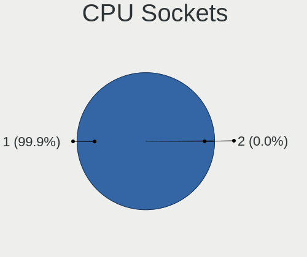

| Number  | Computers | Percent |
|---------|-----------|---------|
| 1       | 3322      | 99.94%  |
| 2       | 1         | 0.03%   |
| Unknown | 1         | 0.03%   |

CPU Threads
-----------

Threads per core (Hyper-Threading)

| Number  | Computers | Percent |
|---------|-----------|---------|
| 2       | 1843      | 55.41%  |
| 1       | 1482      | 44.56%  |
| Unknown | 1         | 0.03%   |

CPU Op-Modes
------------

CPU Operation Modes (32-bit, 64-bit)

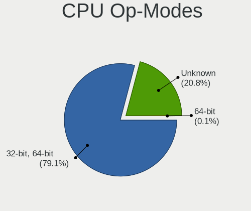

| Op mode        | Computers | Percent |
|----------------|-----------|---------|
| 32-bit, 64-bit | 2618      | 77.41%  |
| Unknown        | 761       | 22.5%   |
| 64-bit         | 3         | 0.09%   |

CPU Microcode
-------------

Microcode number

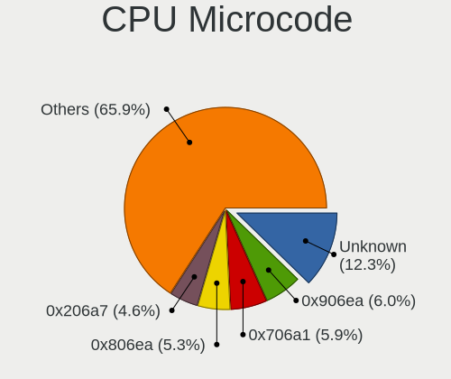

| Number     | Computers | Percent |
|------------|-----------|---------|
| Unknown    | 377       | 11.12%  |
| 0x906ea    | 217       | 6.4%    |
| 0x706a1    | 213       | 6.29%   |
| 0x806ea    | 189       | 5.58%   |
| 0x206a7    | 161       | 4.75%   |
| 0x806e9    | 149       | 4.4%    |
| 0x506c9    | 135       | 3.98%   |
| 0x1067a    | 134       | 3.95%   |
| 0x306a9    | 118       | 3.48%   |
| 0x406e3    | 110       | 3.25%   |
| 0x806ec    | 109       | 3.22%   |
| 0x406c4    | 94        | 2.77%   |
| 0x08108109 | 81        | 2.39%   |
| 0x08600103 | 67        | 1.98%   |
| 0x706e5    | 66        | 1.95%   |
| 0x06006705 | 61        | 1.8%    |
| 0x6fd      | 58        | 1.71%   |
| 0x306c3    | 58        | 1.71%   |
| 0x30678    | 57        | 1.68%   |
| 0x906e9    | 54        | 1.59%   |
| 0x08108102 | 52        | 1.53%   |
| 0x806c1    | 51        | 1.5%    |
| 0x906ed    | 49        | 1.45%   |
| 0x706a8    | 48        | 1.42%   |
| 0x40651    | 42        | 1.24%   |
| 0x20655    | 42        | 1.24%   |
| 0x306d4    | 37        | 1.09%   |
| 0x806eb    | 33        | 0.97%   |
| 0x406c3    | 33        | 0.97%   |
| 0x0810100b | 31        | 0.91%   |
| 0x05000119 | 29        | 0.86%   |
| 0x010000c8 | 27        | 0.8%    |
| 0x10676    | 26        | 0.77%   |
| 0x106ca    | 21        | 0.62%   |
| 0x08101007 | 21        | 0.62%   |
| 0x06001119 | 21        | 0.62%   |
| 0x06006704 | 19        | 0.56%   |
| 0x506e3    | 18        | 0.53%   |
| 0x6fb      | 16        | 0.47%   |
| 0x20652    | 15        | 0.44%   |

CPU Microarch
-------------

Microarchitecture

| Name            | Computers | Percent |
|-----------------|-----------|---------|
| KabyLake        | 848       | 25.48%  |
| Goldmont plus   | 290       | 8.71%   |
| Silvermont      | 204       | 6.13%   |
| Penryn          | 190       | 5.71%   |
| SandyBridge     | 186       | 5.59%   |
| Goldmont        | 155       | 4.66%   |
| Zen+            | 148       | 4.45%   |
| Skylake         | 141       | 4.24%   |
| IvyBridge       | 129       | 3.88%   |
| Haswell         | 117       | 3.52%   |
| Core            | 109       | 3.28%   |
| Excavator       | 107       | 3.22%   |
| Zen 2           | 78        | 2.34%   |
| IceLake         | 72        | 2.16%   |
| Westmere        | 68        | 2.04%   |
| Zen             | 63        | 1.89%   |
| K10             | 61        | 1.83%   |
| TigerLake       | 51        | 1.53%   |
| Bobcat          | 43        | 1.29%   |
| Broadwell       | 40        | 1.2%    |
| Piledriver      | 38        | 1.14%   |
| K8 Hammer       | 33        | 0.99%   |
| Bonnell         | 31        | 0.93%   |
| Puma            | 22        | 0.66%   |
| CometLake       | 18        | 0.54%   |
| Jaguar          | 17        | 0.51%   |
| Steamroller     | 16        | 0.48%   |
| Nehalem         | 13        | 0.39%   |
| K10 Llano       | 11        | 0.33%   |
| Unknown         | 10        | 0.3%    |
| NetBurst        | 8         | 0.24%   |
| Bulldozer       | 8         | 0.24%   |
| K8 & K10 hybrid | 3         | 0.09%   |

Graphics
--------

GPU Vendor
----------

Vendors of graphics cards

| Vendor                           | Computers | Percent |
|----------------------------------|-----------|---------|
| Intel                            | 2395      | 58.06%  |
| Nvidia                           | 1023      | 24.8%   |
| AMD                              | 690       | 16.73%  |
| Silicon Integrated Systems [SiS] | 10        | 0.24%   |
| VIA Technologies                 | 6         | 0.15%   |
| Silicon Motion                   | 1         | 0.02%   |

GPU Model
---------

Graphics card models

| Model                                                                                    | Computers | Percent |
|------------------------------------------------------------------------------------------|-----------|---------|
| Intel GeminiLake [UHD Graphics 600]                                                      | 234       | 5.51%   |
| Intel CoffeeLake-H GT2 [UHD Graphics 630]                                                | 224       | 5.28%   |
| Nvidia TU117M [GeForce GTX 1650 Mobile / Max-Q]                                          | 208       | 4.9%    |
| Intel UHD Graphics 620                                                                   | 164       | 3.86%   |
| Intel HD Graphics 620                                                                    | 159       | 3.75%   |
| Intel 2nd Generation Core Processor Family Integrated Graphics Controller                | 153       | 3.61%   |
| AMD Picasso/Raven 2 [Radeon Vega Series / Radeon Vega Mobile Series]                     | 140       | 3.3%    |
| Intel Atom/Celeron/Pentium Processor x5-E8000/J3xxx/N3xxx Integrated Graphics Controller | 132       | 3.11%   |
| Intel HD Graphics 500                                                                    | 118       | 2.78%   |
| Intel Skylake GT2 [HD Graphics 520]                                                      | 114       | 2.69%   |
| Nvidia GP107M [GeForce GTX 1050 Mobile]                                                  | 90        | 2.12%   |
| Intel 3rd Gen Core processor Graphics Controller                                         | 90        | 2.12%   |
| AMD Stoney [Radeon R2/R3/R4/R5 Graphics]                                                 | 88        | 2.07%   |
| Intel WhiskeyLake-U GT2 [UHD Graphics 620]                                               | 83        | 1.96%   |
| Nvidia GM108M [GeForce MX110]                                                            | 75        | 1.77%   |
| Intel Atom Processor Z36xxx/Z37xxx Series Graphics & Display                             | 71        | 1.67%   |
| AMD Renoir                                                                               | 71        | 1.67%   |
| Intel Mobile 4 Series Chipset Integrated Graphics Controller                             | 68        | 1.6%    |
| Intel Iris Plus Graphics G1 (Ice Lake)                                                   | 67        | 1.58%   |
| Nvidia TU117M                                                                            | 66        | 1.56%   |
| Intel CometLake-U GT2 [UHD Graphics]                                                     | 62        | 1.46%   |
| Intel GeminiLake [UHD Graphics 605]                                                      | 56        | 1.32%   |
| AMD Raven Ridge [Radeon Vega Series / Radeon Vega Mobile Series]                         | 53        | 1.25%   |
| Intel Core Processor Integrated Graphics Controller                                      | 51        | 1.2%    |
| Intel Haswell-ULT Integrated Graphics Controller                                         | 47        | 1.11%   |
| Intel HD Graphics 630                                                                    | 45        | 1.06%   |
| Nvidia GP108M [GeForce MX150]                                                            | 43        | 1.01%   |
| Intel 4 Series Chipset Integrated Graphics Controller                                    | 42        | 0.99%   |
| Nvidia GM108M [GeForce MX130]                                                            | 40        | 0.94%   |
| Intel Apollo Lake [HD Graphics 505]                                                      | 37        | 0.87%   |
| Intel HD Graphics 610                                                                    | 34        | 0.8%    |
| Intel HD Graphics 5500                                                                   | 34        | 0.8%    |
| Intel TigerLake-LP GT2 [Iris Xe Graphics]                                                | 30        | 0.71%   |
| Intel CoffeeLake-S GT2 [UHD Graphics 630]                                                | 29        | 0.68%   |
| Intel Mobile GM965/GL960 Integrated Graphics Controller (secondary)                      | 28        | 0.66%   |
| Intel Mobile GM965/GL960 Integrated Graphics Controller (primary)                        | 28        | 0.66%   |
| Nvidia GP108M [GeForce MX250]                                                            | 25        | 0.59%   |
| Intel Xeon E3-1200 v3/4th Gen Core Processor Integrated Graphics Controller              | 23        | 0.54%   |
| Intel Tiger Lake-LP GT2 [UHD Graphics G4]                                                | 21        | 0.49%   |
| Intel Atom Processor D4xx/D5xx/N4xx/N5xx Integrated Graphics Controller                  | 21        | 0.49%   |

GPU Combo
---------

Combinations of graphics cards

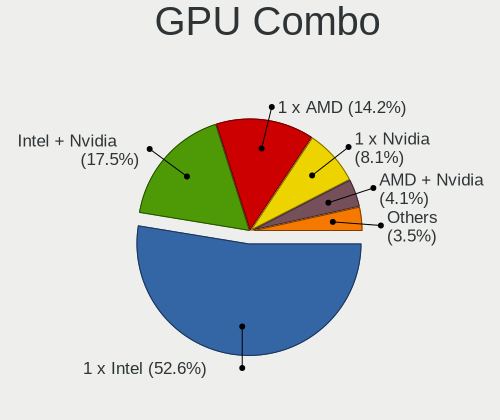

| Name                   | Computers | Percent |
|------------------------|-----------|---------|
| 1 x Intel              | 1740      | 52.11%  |
| Intel + Nvidia         | 609       | 18.24%  |
| 1 x AMD                | 462       | 13.84%  |
| 1 x Nvidia             | 274       | 8.21%   |
| AMD + Nvidia           | 135       | 4.04%   |
| 2 x AMD                | 57        | 1.71%   |
| Intel + AMD            | 36        | 1.08%   |
| 1 x SiS                | 10        | 0.3%    |
| Other                  | 9         | 0.27%   |
| 1 x VIA                | 5         | 0.15%   |
| 2 x Nvidia             | 1         | 0.03%   |
| Intel + Silicon Motion | 1         | 0.03%   |

GPU Driver
----------

Free vs proprietary

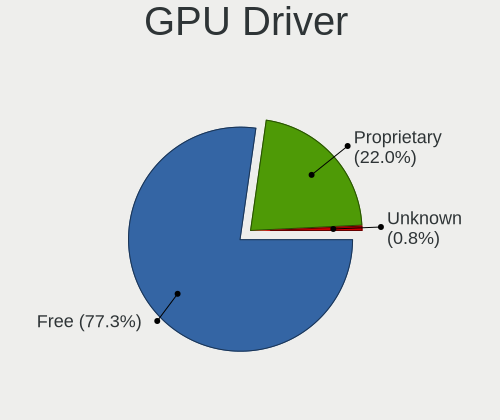

| Driver      | Computers | Percent |
|-------------|-----------|---------|
| Free        | 2553      | 76.53%  |
| Proprietary | 755       | 22.63%  |
| Unknown     | 28        | 0.84%   |

GPU Memory
----------

Total video memory

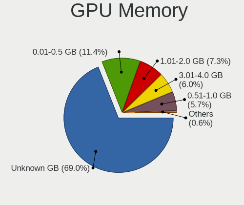

| Size in GB | Computers | Percent |
|------------|-----------|---------|
| Unknown    | 2331      | 68.96%  |
| 0.01-0.5   | 386       | 11.42%  |
| 1.01-2.0   | 232       | 6.86%   |
| 3.01-4.0   | 217       | 6.42%   |
| 0.51-1.0   | 196       | 5.8%    |
| 7.01-8.0   | 14        | 0.41%   |
| 2.01-3.0   | 3         | 0.09%   |
| 8.01-16.0  | 1         | 0.03%   |

Monitor
-------

Monitor Vendor
--------------

Monitor vendors

| Vendor                  | Computers | Percent |
|-------------------------|-----------|---------|
| AU Optronics            | 636       | 19.34%  |
| BOE                     | 633       | 19.25%  |
| Chimei Innolux          | 518       | 15.75%  |
| LG Display              | 309       | 9.39%   |
| Samsung Electronics     | 281       | 8.54%   |
| PANDA                   | 114       | 3.47%   |
| Goldstar                | 104       | 3.16%   |
| Dell                    | 78        | 2.37%   |
| Hewlett-Packard         | 60        | 1.82%   |
| AOC                     | 51        | 1.55%   |
| Acer                    | 51        | 1.55%   |
| Chi Mei Optoelectronics | 42        | 1.28%   |
| Lenovo                  | 31        | 0.94%   |
| Philips                 | 30        | 0.91%   |
| LG Philips              | 24        | 0.73%   |
| Sony                    | 23        | 0.7%    |
| Ancor Communications    | 22        | 0.67%   |
| BenQ                    | 19        | 0.58%   |
| Apple                   | 19        | 0.58%   |
| InfoVision              | 18        | 0.55%   |
| ASUSTek Computer        | 15        | 0.46%   |
| HannStar                | 12        | 0.36%   |
| RTK                     | 11        | 0.33%   |
| Vizio                   | 9         | 0.27%   |
| ViewSonic               | 9         | 0.27%   |
| Vestel Elektronik       | 8         | 0.24%   |
| Toshiba                 | 8         | 0.24%   |
| Sharp                   | 7         | 0.21%   |
| Panasonic               | 7         | 0.21%   |
| CPT                     | 7         | 0.21%   |
| NEC Computers           | 6         | 0.18%   |
| KDC                     | 6         | 0.18%   |
| Eizo                    | 6         | 0.18%   |
| HSI                     | 5         | 0.15%   |
| SAC                     | 4         | 0.12%   |
| MStar                   | 4         | 0.12%   |
| InnoLux Display         | 4         | 0.12%   |
| SLD                     | 3         | 0.09%   |
| SKY                     | 3         | 0.09%   |
| Seiki                   | 3         | 0.09%   |

Monitor Model
-------------

Monitor models

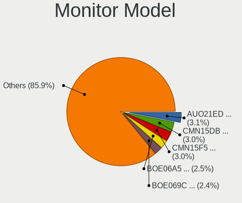

| Model                                                                | Computers | Percent |
|----------------------------------------------------------------------|-----------|---------|
| AU Optronics LCD Monitor AUO21ED 1920x1080 344x193mm 15.5-inch       | 105       | 3.17%   |
| Chimei Innolux LCD Monitor CMN15DB 1366x768 344x193mm 15.5-inch      | 103       | 3.11%   |
| AU Optronics LCD Monitor AUO61ED 1920x1080 344x194mm 15.5-inch       | 95        | 2.87%   |
| BOE LCD Monitor BOE06A5 1366x768 344x194mm 15.5-inch                 | 85        | 2.57%   |
| BOE LCD Monitor BOE069C 1920x1080 344x193mm 15.5-inch                | 83        | 2.51%   |
| AU Optronics LCD Monitor AUO38ED 1920x1080 344x193mm 15.5-inch       | 74        | 2.24%   |
| Chimei Innolux LCD Monitor CMN15F5 1920x1080 344x193mm 15.5-inch     | 64        | 1.93%   |
| Chimei Innolux LCD Monitor CMN15E6 1366x768 344x193mm 15.5-inch      | 60        | 1.81%   |
| BOE LCD Monitor BOE0818 1920x1080 344x194mm 15.5-inch                | 58        | 1.75%   |
| Chimei Innolux LCD Monitor CMN15DC 1366x768 344x193mm 15.5-inch      | 52        | 1.57%   |
| BOE LCD Monitor BOE06A4 1366x768 344x194mm 15.5-inch                 | 46        | 1.39%   |
| BOE LCD Monitor BOE07CE 1366x768 344x193mm 15.5-inch                 | 44        | 1.33%   |
| PANDA LCD Monitor NCP004D 1920x1080 344x194mm 15.5-inch              | 43        | 1.3%    |
| BOE LCD Monitor BOE0672 1366x768 344x194mm 15.5-inch                 | 43        | 1.3%    |
| AU Optronics LCD Monitor AUO70EC 1366x768 344x193mm 15.5-inch        | 43        | 1.3%    |
| Chimei Innolux LCD Monitor CMN15D5 1920x1080 344x193mm 15.5-inch     | 41        | 1.24%   |
| LG Display LCD Monitor LGD065A 1920x1080 344x194mm 15.5-inch         | 40        | 1.21%   |
| AU Optronics LCD Monitor AUO71EC 1366x768 344x193mm 15.5-inch        | 39        | 1.18%   |
| BOE LCD Monitor BOE0839 1920x1080 382x215mm 17.3-inch                | 32        | 0.97%   |
| AU Optronics LCD Monitor AUO81EC 1366x768 344x193mm 15.5-inch        | 32        | 0.97%   |
| PANDA LCD Monitor NCP0035 1920x1080 309x174mm 14.0-inch              | 28        | 0.85%   |
| BOE LCD Monitor BOE06BA 1920x1080 344x193mm 15.5-inch                | 24        | 0.73%   |
| LG Display LCD Monitor LGD04E8 1920x1080 382x215mm 17.3-inch         | 23        | 0.69%   |
| BOE LCD Monitor BOE07AA 1366x768 344x194mm 15.5-inch                 | 23        | 0.69%   |
| AU Optronics LCD Monitor AUOAF90 1920x1080 344x193mm 15.5-inch       | 23        | 0.69%   |
| BOE LCD Monitor BOE0675 1366x768 344x194mm 15.5-inch                 | 21        | 0.63%   |
| PANDA LCD Monitor NCP0046 1920x1080 344x194mm 15.5-inch              | 19        | 0.57%   |
| Samsung Electronics LCD Monitor SEC5441 1366x768 344x194mm 15.5-inch | 18        | 0.54%   |
| LG Display LCD Monitor LGD0621 1920x1080 382x215mm 17.3-inch         | 17        | 0.51%   |
| Chimei Innolux LCD Monitor CMN14D4 1920x1080 309x173mm 13.9-inch     | 16        | 0.48%   |
| Chimei Innolux LCD Monitor CMN1132 1366x768 256x144mm 11.6-inch      | 16        | 0.48%   |
| LG Display LCD Monitor LGD056D 1920x1080 382x215mm 17.3-inch         | 14        | 0.42%   |
| Chimei Innolux LCD Monitor CMN15CA 1366x768 344x193mm 15.5-inch      | 14        | 0.42%   |
| Chimei Innolux LCD Monitor CMN1493 1366x768 309x173mm 13.9-inch      | 13        | 0.39%   |
| LG Display LCD Monitor LGD02DC 1366x768 344x194mm 15.5-inch          | 12        | 0.36%   |
| Chimei Innolux LCD Monitor CMN14D6 1366x768 309x173mm 13.9-inch      | 12        | 0.36%   |
| BOE LCD Monitor BOE0704 1366x768 344x194mm 15.5-inch                 | 12        | 0.36%   |
| AU Optronics LCD Monitor AUO22EC 1366x768 344x193mm 15.5-inch        | 12        | 0.36%   |
| PANDA LM156LF1L03 NCP001C 1920x1080 344x194mm 15.5-inch              | 11        | 0.33%   |
| BOE LCD Monitor BOE0696 1366x768 309x173mm 13.9-inch                 | 10        | 0.3%    |

Monitor Resolution
------------------

Monitor screen resolution

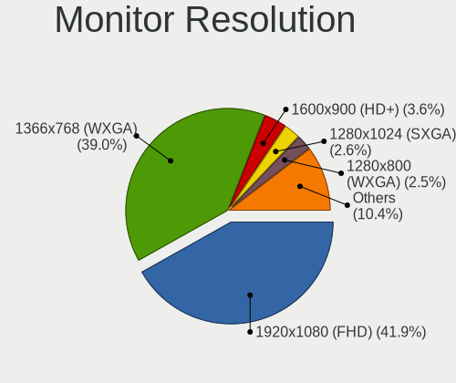

| Resolution         | Computers | Percent |
|--------------------|-----------|---------|
| 1920x1080 (FHD)    | 1394      | 42.98%  |
| 1366x768 (WXGA)    | 1259      | 38.82%  |
| 1600x900 (HD+)     | 118       | 3.64%   |
| 1280x1024 (SXGA)   | 87        | 2.68%   |
| 1280x800 (WXGA)    | 79        | 2.44%   |
| 3840x2160 (4K)     | 58        | 1.79%   |
| 1440x900 (WXGA+)   | 53        | 1.63%   |
| 1680x1050 (WSXGA+) | 38        | 1.17%   |
| 1360x768           | 30        | 0.93%   |
| 2560x1440 (QHD)    | 24        | 0.74%   |
| 1024x768 (XGA)     | 20        | 0.62%   |
| 1920x1200 (WUXGA)  | 16        | 0.49%   |
| 1920x540           | 11        | 0.34%   |
| 1024x600           | 11        | 0.34%   |
| 1280x720 (HD)      | 7         | 0.22%   |
| 2560x1080          | 6         | 0.19%   |
| 3200x1800 (QHD+)   | 5         | 0.15%   |
| 2288x1287          | 4         | 0.12%   |
| 2160x1440          | 4         | 0.12%   |
| 2560x1600          | 3         | 0.09%   |
| 1600x1200          | 3         | 0.09%   |
| 1400x1050          | 3         | 0.09%   |
| 3440x1440          | 2         | 0.06%   |
| 3840x1080          | 1         | 0.03%   |
| 3456x2160          | 1         | 0.03%   |
| 2880x1920          | 1         | 0.03%   |
| 2880x1800          | 1         | 0.03%   |
| 2256x1504          | 1         | 0.03%   |
| 1800x1200          | 1         | 0.03%   |
| 1680x945           | 1         | 0.03%   |
| 1280x960           | 1         | 0.03%   |

Monitor Diagonal
----------------

Diagonal size in inches

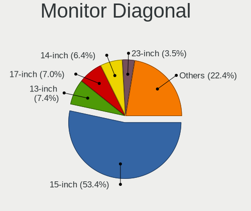

| Inches  | Computers | Percent |
|---------|-----------|---------|
| 15      | 1792      | 54.45%  |
| 17      | 237       | 7.2%    |
| 13      | 236       | 7.17%   |
| 14      | 204       | 6.2%    |
| 23      | 114       | 3.46%   |
| 21      | 88        | 2.67%   |
| 19      | 68        | 2.07%   |
| 11      | 67        | 2.04%   |
| 18      | 66        | 2.01%   |
| 24      | 61        | 1.85%   |
| 27      | 51        | 1.55%   |
| 20      | 49        | 1.49%   |
| 31      | 30        | 0.91%   |
| 12      | 25        | 0.76%   |
| 84      | 23        | 0.7%    |
| 22      | 23        | 0.7%    |
| 10      | 19        | 0.58%   |
| 72      | 15        | 0.46%   |
| 34      | 14        | 0.43%   |
| 54      | 12        | 0.36%   |
| 40      | 12        | 0.36%   |
| 52      | 9         | 0.27%   |
| 32      | 9         | 0.27%   |
| Unknown | 9         | 0.27%   |
| 46      | 7         | 0.21%   |
| 41      | 6         | 0.18%   |
| 37      | 5         | 0.15%   |
| 26      | 5         | 0.15%   |
| 16      | 5         | 0.15%   |
| 65      | 4         | 0.12%   |
| 60      | 3         | 0.09%   |
| 25      | 3         | 0.09%   |
| 58      | 2         | 0.06%   |
| 44      | 2         | 0.06%   |
| 42      | 2         | 0.06%   |
| 30      | 2         | 0.06%   |
| 74      | 1         | 0.03%   |
| 63      | 1         | 0.03%   |
| 57      | 1         | 0.03%   |
| 50      | 1         | 0.03%   |

Monitor Width
-------------

Physical width

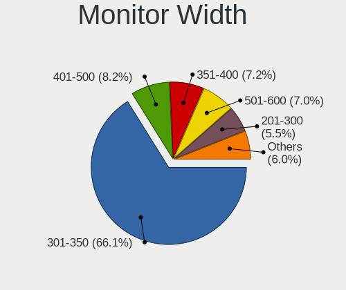

| Width in mm | Computers | Percent |
|-------------|-----------|---------|
| 301-350     | 2196      | 67.03%  |
| 401-500     | 267       | 8.15%   |
| 351-400     | 242       | 7.39%   |
| 501-600     | 212       | 6.47%   |
| 201-300     | 174       | 5.31%   |
| 1001-1500   | 43        | 1.31%   |
| 601-700     | 41        | 1.25%   |
| 1501-2000   | 39        | 1.19%   |
| 701-800     | 24        | 0.73%   |
| 801-900     | 19        | 0.58%   |
| 901-1000    | 10        | 0.31%   |
| Unknown     | 9         | 0.27%   |

Aspect Ratio
------------

Proportional relationship between the width and the height

| Ratio | Computers | Percent |
|-------|-----------|---------|
| 16/9  | 2836      | 89.46%  |
| 16/10 | 184       | 5.8%    |
| 5/4   | 85        | 2.68%   |
| 4/3   | 33        | 1.04%   |
| 3/2   | 15        | 0.47%   |
| 21/9  | 13        | 0.41%   |
| 6/5   | 3         | 0.09%   |
| 32/9  | 1         | 0.03%   |

Monitor Area
------------

Area in inch

| Area in inch | Computers | Percent |
|----------------|-----------|---------|
| 101-110        | 1784      | 54.36%  |
| 81-90          | 390       | 11.88%  |
| 201-250        | 245       | 7.46%   |
| 121-130        | 172       | 5.24%   |
| 151-200        | 145       | 4.42%   |
| 141-150        | 110       | 3.35%   |
| More than 1000 | 73        | 2.22%   |
| 51-60          | 67        | 2.04%   |
| 351-500        | 54        | 1.65%   |
| 301-350        | 54        | 1.65%   |
| 71-80          | 51        | 1.55%   |
| 501-1000       | 39        | 1.19%   |
| 61-70          | 23        | 0.7%    |
| 251-300        | 23        | 0.7%    |
| 41-50          | 19        | 0.58%   |
| 131-140        | 13        | 0.4%    |
| Unknown        | 9         | 0.27%   |
| 91-100         | 6         | 0.18%   |
| 111-120        | 5         | 0.15%   |

Pixel Density
-------------

Pixels per inch

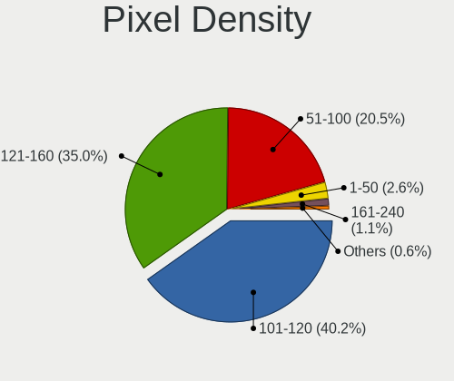

| Density       | Computers | Percent |
|---------------|-----------|---------|
| 101-120       | 1289      | 39.62%  |
| 121-160       | 1188      | 36.52%  |
| 51-100        | 643       | 19.77%  |
| 1-50          | 78        | 2.4%    |
| 161-240       | 35        | 1.08%   |
| More than 240 | 11        | 0.34%   |
| Unknown       | 9         | 0.28%   |

Multiple Monitors
-----------------

Total monitors connected

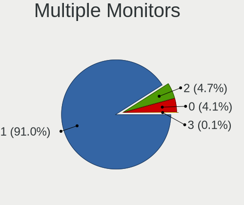

| Total | Computers | Percent |
|-------|-----------|---------|
| 1     | 3047      | 91.09%  |
| 2     | 148       | 4.42%   |
| 0     | 145       | 4.33%   |
| 3     | 5         | 0.15%   |

Network
-------

Net Controller Vendor
---------------------

Controller vendors

| Vendor                            | Computers | Percent |
|-----------------------------------|-----------|---------|
| Realtek Semiconductor             | 2290      | 44.66%  |
| Intel                             | 1140      | 22.23%  |
| Qualcomm Atheros                  | 981       | 19.13%  |
| Broadcom                          | 186       | 3.63%   |
| Ralink Technology                 | 89        | 1.74%   |
| Marvell Technology Group          | 53        | 1.03%   |
| Broadcom Limited                  | 53        | 1.03%   |
| Ralink                            | 46        | 0.9%    |
| Nvidia                            | 45        | 0.88%   |
| TP-Link                           | 22        | 0.43%   |
| JMicron Technology                | 20        | 0.39%   |
| Samsung Electronics               | 14        | 0.27%   |
| Qualcomm Atheros Communications   | 14        | 0.27%   |
| MediaTek                          | 14        | 0.27%   |
| Huawei Technologies               | 12        | 0.23%   |
| D-Link                            | 11        | 0.21%   |
| Xiaomi                            | 9         | 0.18%   |
| Silicon Integrated Systems [SiS]  | 9         | 0.18%   |
| ASIX Electronics                  | 9         | 0.18%   |
| VIA Technologies                  | 8         | 0.16%   |
| ASUSTek Computer                  | 8         | 0.16%   |
| NetGear                           | 7         | 0.14%   |
| Microsoft                         | 6         | 0.12%   |
| Ericsson Business Mobile Networks | 6         | 0.12%   |
| Edimax Technology                 | 6         | 0.12%   |
| Dell                              | 5         | 0.1%    |
| ICS Advent                        | 4         | 0.08%   |
| Hewlett-Packard                   | 4         | 0.08%   |
| Belkin Components                 | 4         | 0.08%   |
| Qualcomm                          | 3         | 0.06%   |
| OPPO Electronics                  | 3         | 0.06%   |
| Motorola PCS                      | 3         | 0.06%   |
| Linksys                           | 3         | 0.06%   |
| ZTE WCDMA Technologies MSM        | 2         | 0.04%   |
| Texas Instruments                 | 2         | 0.04%   |
| NTmore                            | 2         | 0.04%   |
| LG Electronics                    | 2         | 0.04%   |
| IMC Networks                      | 2         | 0.04%   |
| Hangzhou Silan Microelectronics   | 2         | 0.04%   |
| Giga-Byte Technology              | 2         | 0.04%   |

Net Controller Model
--------------------

Controller models

| Model                                                                   | Computers | Percent |
|-------------------------------------------------------------------------|-----------|---------|
| Realtek RTL8111/8168/8411 PCI Express Gigabit Ethernet Controller       | 1471      | 26.32%  |
| Qualcomm Atheros QCA9377 802.11ac Wireless Network Adapter              | 459       | 8.21%   |
| Realtek RTL810xE PCI Express Fast Ethernet controller                   | 345       | 6.17%   |
| Intel Wi-Fi 6 AX200                                                     | 244       | 4.37%   |
| Realtek RTL8821CE 802.11ac PCIe Wireless Network Adapter                | 217       | 3.88%   |
| Qualcomm Atheros QCA9565 / AR9565 Wireless Network Adapter              | 161       | 2.88%   |
| Intel Wireless 8265 / 8275                                              | 157       | 2.81%   |
| Realtek RTL8723BE PCIe Wireless Network Adapter                         | 114       | 2.04%   |
| Realtek RTL8822BE 802.11a/b/g/n/ac WiFi adapter                         | 88        | 1.57%   |
| Intel Wireless 7265                                                     | 77        | 1.38%   |
| Intel Dual Band Wireless-AC 3168NGW [Stone Peak]                        | 72        | 1.29%   |
| Realtek Killer E2600 Gigabit Ethernet Controller                        | 69        | 1.23%   |
| Qualcomm Atheros AR9285 Wireless Network Adapter (PCI-Express)          | 67        | 1.2%    |
| Qualcomm Atheros QCA6174 802.11ac Wireless Network Adapter              | 64        | 1.15%   |
| Qualcomm Atheros AR9485 Wireless Network Adapter                        | 60        | 1.07%   |
| Intel Cannon Lake PCH CNVi WiFi                                         | 59        | 1.06%   |
| Intel 82579LM Gigabit Network Connection (Lewisville)                   | 54        | 0.97%   |
| Ralink MT7601U Wireless Adapter                                         | 46        | 0.82%   |
| Intel Wi-Fi 6 AX201                                                     | 45        | 0.81%   |
| Intel Ice Lake-LP PCH CNVi WiFi                                         | 45        | 0.81%   |
| Intel Cannon Point-LP CNVi [Wireless-AC]                                | 44        | 0.79%   |
| Realtek RTL8188CE 802.11b/g/n WiFi Adapter                              | 42        | 0.75%   |
| Broadcom BCM43142 802.11b/g/n                                           | 41        | 0.73%   |
| Broadcom BCM4313 802.11bgn Wireless Network Adapter                     | 38        | 0.68%   |
| Qualcomm Atheros AR8151 v2.0 Gigabit Ethernet                           | 29        | 0.52%   |
| Realtek RTL8188EUS 802.11n Wireless Network Adapter                     | 28        | 0.5%    |
| Intel Wireless 7260                                                     | 28        | 0.5%    |
| Nvidia MCP61 Ethernet                                                   | 25        | 0.45%   |
| Intel Centrino Advanced-N 6205 [Taylor Peak]                            | 25        | 0.45%   |
| Intel Wireless 3165                                                     | 23        | 0.41%   |
| Intel Wireless 8260                                                     | 21        | 0.38%   |
| Intel Comet Lake PCH-LP CNVi WiFi                                       | 21        | 0.38%   |
| Realtek RTL8188EE Wireless Network Adapter                              | 20        | 0.36%   |
| Intel Gemini Lake PCH CNVi WiFi                                         | 18        | 0.32%   |
| Intel Ethernet Connection I217-LM                                       | 18        | 0.32%   |
| Broadcom BCM4312 802.11b/g LP-PHY                                       | 18        | 0.32%   |
| Qualcomm Atheros AR8152 v2.0 Fast Ethernet                              | 17        | 0.3%    |
| Qualcomm Atheros AR242x / AR542x Wireless Network Adapter (PCI-Express) | 17        | 0.3%    |
| Intel PRO/Wireless 4965 AG or AGN [Kedron] Network Connection           | 17        | 0.3%    |
| Realtek RTL8822CE 802.11ac PCIe Wireless Network Adapter                | 16        | 0.29%   |

Wireless Vendor
---------------

Wireless vendors

| Vendor                                | Computers | Percent |
|---------------------------------------|-----------|---------|
| Intel                                 | 1022      | 34.48%  |
| Qualcomm Atheros                      | 886       | 29.89%  |
| Realtek Semiconductor                 | 655       | 22.1%   |
| Broadcom                              | 133       | 4.49%   |
| Ralink Technology                     | 89        | 3%      |
| Ralink                                | 46        | 1.55%   |
| Broadcom Limited                      | 27        | 0.91%   |
| TP-Link                               | 17        | 0.57%   |
| Qualcomm Atheros Communications       | 14        | 0.47%   |
| MediaTek                              | 11        | 0.37%   |
| D-Link                                | 10        | 0.34%   |
| ASUSTek Computer                      | 7         | 0.24%   |
| NetGear                               | 6         | 0.2%    |
| Microsoft                             | 6         | 0.2%    |
| Edimax Technology                     | 6         | 0.2%    |
| Belkin Components                     | 4         | 0.13%   |
| Marvell Technology Group              | 3         | 0.1%    |
| Linksys                               | 3         | 0.1%    |
| Dell                                  | 3         | 0.1%    |
| IMC Networks                          | 2         | 0.07%   |
| Hewlett-Packard                       | 2         | 0.07%   |
| U.S. Robotics                         | 1         | 0.03%   |
| Texas Instruments                     | 1         | 0.03%   |
| Sitecom Europe                        | 1         | 0.03%   |
| Sierra Wireless                       | 1         | 0.03%   |
| Micro Star International              | 1         | 0.03%   |
| Elecom                                | 1         | 0.03%   |
| D-Link System                         | 1         | 0.03%   |
| AVM                                   | 1         | 0.03%   |
| AirTies Wireless Networks             | 1         | 0.03%   |
| Accton Technology                     | 1         | 0.03%   |
| AboCom Systems                        | 1         | 0.03%   |
| 802.11g Adapter [Linksys WUSB54GC v3] | 1         | 0.03%   |

Wireless Model
--------------

Wireless models

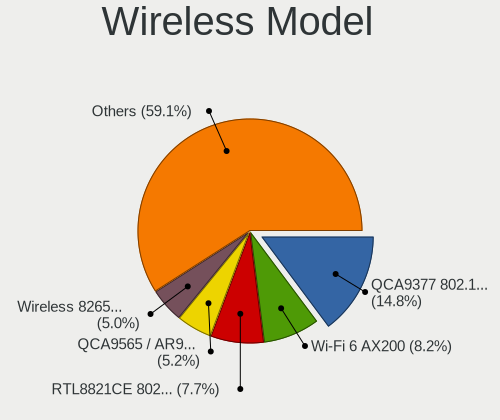

| Model                                                                   | Computers | Percent |
|-------------------------------------------------------------------------|-----------|---------|
| Qualcomm Atheros QCA9377 802.11ac Wireless Network Adapter              | 459       | 15.44%  |
| Intel Wi-Fi 6 AX200                                                     | 244       | 8.21%   |
| Realtek RTL8821CE 802.11ac PCIe Wireless Network Adapter                | 217       | 7.3%    |
| Qualcomm Atheros QCA9565 / AR9565 Wireless Network Adapter              | 161       | 5.42%   |
| Intel Wireless 8265 / 8275                                              | 157       | 5.28%   |
| Realtek RTL8723BE PCIe Wireless Network Adapter                         | 114       | 3.83%   |
| Realtek RTL8822BE 802.11a/b/g/n/ac WiFi adapter                         | 88        | 2.96%   |
| Intel Wireless 7265                                                     | 77        | 2.59%   |
| Intel Dual Band Wireless-AC 3168NGW [Stone Peak]                        | 72        | 2.42%   |
| Qualcomm Atheros AR9285 Wireless Network Adapter (PCI-Express)          | 67        | 2.25%   |
| Qualcomm Atheros QCA6174 802.11ac Wireless Network Adapter              | 64        | 2.15%   |
| Qualcomm Atheros AR9485 Wireless Network Adapter                        | 60        | 2.02%   |
| Intel Cannon Lake PCH CNVi WiFi                                         | 59        | 1.98%   |
| Ralink MT7601U Wireless Adapter                                         | 46        | 1.55%   |
| Intel Wi-Fi 6 AX201                                                     | 45        | 1.51%   |
| Intel Ice Lake-LP PCH CNVi WiFi                                         | 45        | 1.51%   |
| Intel Cannon Point-LP CNVi [Wireless-AC]                                | 44        | 1.48%   |
| Realtek RTL8188CE 802.11b/g/n WiFi Adapter                              | 42        | 1.41%   |
| Broadcom BCM43142 802.11b/g/n                                           | 41        | 1.38%   |
| Broadcom BCM4313 802.11bgn Wireless Network Adapter                     | 38        | 1.28%   |
| Realtek RTL8188EUS 802.11n Wireless Network Adapter                     | 28        | 0.94%   |
| Intel Wireless 7260                                                     | 28        | 0.94%   |
| Intel Centrino Advanced-N 6205 [Taylor Peak]                            | 25        | 0.84%   |
| Intel Wireless 3165                                                     | 23        | 0.77%   |
| Intel Wireless 8260                                                     | 21        | 0.71%   |
| Intel Comet Lake PCH-LP CNVi WiFi                                       | 21        | 0.71%   |
| Realtek RTL8188EE Wireless Network Adapter                              | 20        | 0.67%   |
| Intel Gemini Lake PCH CNVi WiFi                                         | 18        | 0.61%   |
| Broadcom BCM4312 802.11b/g LP-PHY                                       | 18        | 0.61%   |
| Qualcomm Atheros AR242x / AR542x Wireless Network Adapter (PCI-Express) | 17        | 0.57%   |
| Intel PRO/Wireless 4965 AG or AGN [Kedron] Network Connection           | 17        | 0.57%   |
| Realtek RTL8822CE 802.11ac PCIe Wireless Network Adapter                | 16        | 0.54%   |
| Qualcomm Atheros AR928X Wireless Network Adapter (PCI-Express)          | 16        | 0.54%   |
| Ralink RT2870/RT3070 Wireless Adapter                                   | 15        | 0.5%    |
| Realtek RTL8187B Wireless 802.11g 54Mbps Network Adapter                | 14        | 0.47%   |
| Ralink RT5370 Wireless Adapter                                          | 14        | 0.47%   |
| Qualcomm Atheros AR9462 Wireless Network Adapter                        | 14        | 0.47%   |
| Qualcomm Atheros AR9287 Wireless Network Adapter (PCI-Express)          | 14        | 0.47%   |
| Realtek RTL8821AE 802.11ac PCIe Wireless Network Adapter                | 13        | 0.44%   |
| Intel Centrino Wireless-N 1000 [Condor Peak]                            | 13        | 0.44%   |

Ethernet Vendor
---------------

Ethernet vendors

| Vendor                           | Computers | Percent |
|----------------------------------|-----------|---------|
| Realtek Semiconductor            | 1918      | 74.23%  |
| Intel                            | 221       | 8.55%   |
| Qualcomm Atheros                 | 142       | 5.5%    |
| Broadcom                         | 59        | 2.28%   |
| Marvell Technology Group         | 50        | 1.93%   |
| Nvidia                           | 45        | 1.74%   |
| Broadcom Limited                 | 27        | 1.04%   |
| JMicron Technology               | 20        | 0.77%   |
| Samsung Electronics              | 12        | 0.46%   |
| Xiaomi                           | 9         | 0.35%   |
| Silicon Integrated Systems [SiS] | 9         | 0.35%   |
| Huawei Technologies              | 9         | 0.35%   |
| ASIX Electronics                 | 9         | 0.35%   |
| VIA Technologies                 | 8         | 0.31%   |
| TP-Link                          | 5         | 0.19%   |
| ICS Advent                       | 4         | 0.15%   |
| Qualcomm                         | 3         | 0.12%   |
| OPPO Electronics                 | 3         | 0.12%   |
| MediaTek                         | 3         | 0.12%   |
| ZTE WCDMA Technologies MSM       | 2         | 0.08%   |
| NTmore                           | 2         | 0.08%   |
| Motorola PCS                     | 2         | 0.08%   |
| LG Electronics                   | 2         | 0.08%   |
| Hangzhou Silan Microelectronics  | 2         | 0.08%   |
| Giga-Byte Technology             | 2         | 0.08%   |
| Spreadtrum Communications        | 1         | 0.04%   |
| OnePlus Technology (Shenzhen)    | 1         | 0.04%   |
| NetGear                          | 1         | 0.04%   |
| Lenovo                           | 1         | 0.04%   |
| Hewlett-Packard                  | 1         | 0.04%   |
| Google                           | 1         | 0.04%   |
| Gemtek                           | 1         | 0.04%   |
| DisplayLink                      | 1         | 0.04%   |
| Digitech Systems                 | 1         | 0.04%   |
| D-Link                           | 1         | 0.04%   |
| Beceem Communications            | 1         | 0.04%   |
| Attansic Technology              | 1         | 0.04%   |
| ASUSTek Computer                 | 1         | 0.04%   |
| Apple                            | 1         | 0.04%   |
| AMD                              | 1         | 0.04%   |

Ethernet Model
--------------

Ethernet models

| Model                                                             | Computers | Percent |
|-------------------------------------------------------------------|-----------|---------|
| Realtek RTL8111/8168/8411 PCI Express Gigabit Ethernet Controller | 1471      | 56.69%  |
| Realtek RTL810xE PCI Express Fast Ethernet controller             | 345       | 13.29%  |
| Realtek Killer E2600 Gigabit Ethernet Controller                  | 69        | 2.66%   |
| Intel 82579LM Gigabit Network Connection (Lewisville)             | 54        | 2.08%   |
| Qualcomm Atheros AR8151 v2.0 Gigabit Ethernet                     | 29        | 1.12%   |
| Nvidia MCP61 Ethernet                                             | 25        | 0.96%   |
| Intel Ethernet Connection I217-LM                                 | 18        | 0.69%   |
| Qualcomm Atheros AR8152 v2.0 Fast Ethernet                        | 17        | 0.66%   |
| Marvell Group 88E8040 PCI-E Fast Ethernet Controller              | 15        | 0.58%   |
| Intel 82567LM-3 Gigabit Network Connection                        | 15        | 0.58%   |
| Qualcomm Atheros AR8161 Gigabit Ethernet                          | 14        | 0.54%   |
| JMicron JMC250 PCI Express Gigabit Ethernet Controller            | 14        | 0.54%   |
| Qualcomm Atheros AR8131 Gigabit Ethernet                          | 13        | 0.5%    |
| Broadcom NetLink BCM57785 Gigabit Ethernet PCIe                   | 12        | 0.46%   |
| Realtek RTL8153 Gigabit Ethernet Adapter                          | 11        | 0.42%   |
| Qualcomm Atheros Killer E2500 Gigabit Ethernet Controller         | 11        | 0.42%   |
| Realtek RTL-8100/8101L/8139 PCI Fast Ethernet Adapter             | 10        | 0.39%   |
| Qualcomm Atheros AR8132 Fast Ethernet                             | 10        | 0.39%   |
| Intel I211 Gigabit Network Connection                             | 10        | 0.39%   |
| Intel Ethernet Connection I219-LM                                 | 10        | 0.39%   |
| Intel Ethernet Connection (2) I219-V                              | 10        | 0.39%   |
| Intel 82577LM Gigabit Network Connection                          | 10        | 0.39%   |
| Broadcom Limited NetLink BCM57780 Gigabit Ethernet PCIe           | 10        | 0.39%   |
| Silicon Integrated Systems [SiS] 191 Gigabit Ethernet Adapter     | 9         | 0.35%   |
| Samsung Galaxy series, misc. (tethering mode)                     | 9         | 0.35%   |
| Realtek RTL8152 Fast Ethernet Adapter                             | 9         | 0.35%   |
| Qualcomm Atheros AR8121/AR8113/AR8114 Gigabit or Fast Ethernet    | 9         | 0.35%   |
| Intel 82579V Gigabit Network Connection                           | 9         | 0.35%   |
| Marvell Group 88E8055 PCI-E Gigabit Ethernet Controller           | 8         | 0.31%   |
| Intel 82567LM Gigabit Network Connection                          | 8         | 0.31%   |
| Broadcom NetXtreme BCM5761 Gigabit Ethernet PCIe                  | 8         | 0.31%   |
| Intel Ethernet Connection I218-LM                                 | 7         | 0.27%   |
| Intel Ethernet Connection (7) I219-V                              | 7         | 0.27%   |
| Broadcom NetLink BCM57780 Gigabit Ethernet PCIe                   | 7         | 0.27%   |
| Xiaomi Mi/Redmi series (RNDIS)                                    | 6         | 0.23%   |
| Qualcomm Atheros QCA8172 Fast Ethernet                            | 6         | 0.23%   |
| Qualcomm Atheros AR8162 Fast Ethernet                             | 6         | 0.23%   |
| Marvell Group 88E8058 PCI-E Gigabit Ethernet Controller           | 6         | 0.23%   |
| JMicron JMC260 PCI Express Fast Ethernet Controller               | 6         | 0.23%   |
| Intel Ethernet Connection I217-V                                  | 6         | 0.23%   |

Net Controller Kind
-------------------

Ethernet, WiFi or modem

| Kind     | Computers | Percent |
|----------|-----------|---------|
| WiFi     | 2873      | 53.17%  |
| Ethernet | 2510      | 46.46%  |
| Modem    | 19        | 0.35%   |
| Unknown  | 1         | 0.02%   |

Used Controller
---------------

Currently used network controller

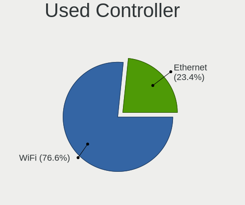

| Kind     | Computers | Percent |
|----------|-----------|---------|
| WiFi     | 2590      | 76.56%  |
| Ethernet | 793       | 23.44%  |

NICs
----

Total network controllers on board

| Total | Computers | Percent |
|-------|-----------|---------|
| 2     | 1933      | 58.03%  |
| 1     | 1292      | 38.79%  |
| 0     | 99        | 2.97%   |
| 3     | 6         | 0.18%   |
| 4     | 1         | 0.03%   |

IPv6
----

IPv6 vs IPv4

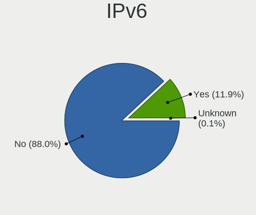

| Used    | Computers | Percent |
|---------|-----------|---------|
| No      | 3061      | 90.78%  |
| Yes     | 309       | 9.16%   |
| Unknown | 2         | 0.06%   |

Bluetooth
---------

Bluetooth Vendor
----------------

Controller vendors

| Vendor                          | Computers | Percent |
|---------------------------------|-----------|---------|
| Intel                           | 875       | 37.44%  |
| Lite-On Technology              | 468       | 20.03%  |
| IMC Networks                    | 459       | 19.64%  |
| Realtek Semiconductor           | 166       | 7.1%    |
| Qualcomm Atheros Communications | 99        | 4.24%   |
| Broadcom                        | 63        | 2.7%    |
| Cambridge Silicon Radio         | 62        | 2.65%   |
| Foxconn / Hon Hai               | 25        | 1.07%   |
| Dell                            | 23        | 0.98%   |
| Hewlett-Packard                 | 20        | 0.86%   |
| Apple                           | 20        | 0.86%   |
| Toshiba                         | 15        | 0.64%   |
| ASUSTek Computer                | 10        | 0.43%   |
| Ralink                          | 9         | 0.39%   |
| Foxconn International           | 7         | 0.3%    |
| Marvell Semiconductor           | 3         | 0.13%   |
| Alps Electric                   | 3         | 0.13%   |
| Ralink Technology               | 2         | 0.09%   |
| Qcom                            | 2         | 0.09%   |
| Unknown                         | 1         | 0.04%   |
| Realtek                         | 1         | 0.04%   |
| Micro Star International        | 1         | 0.04%   |
| Integrated System Solution      | 1         | 0.04%   |
| Chicony Electronics             | 1         | 0.04%   |
| Belkin Components               | 1         | 0.04%   |

Bluetooth Model
---------------

Controller models

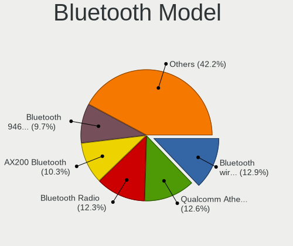

| Model                                                                               | Computers | Percent |
|-------------------------------------------------------------------------------------|-----------|---------|
| Lite-On Qualcomm Atheros QCA9377 Bluetooth                                          | 312       | 13.35%  |
| Intel Bluetooth wireless interface                                                  | 311       | 13.31%  |
| IMC Networks Bluetooth Radio                                                        | 284       | 12.15%  |
| Intel AX200 Bluetooth                                                               | 243       | 10.4%   |
| Intel Bluetooth 9460/9560 Jefferson Peak (JfP)                                      | 194       | 8.3%    |
| IMC Networks Bluetooth Device                                                       | 159       | 6.8%    |
| Lite-On Bluetooth Device                                                            | 124       | 5.31%   |
| Realtek Bluetooth Radio                                                             | 119       | 5.09%   |
| Intel Wireless-AC 3168 Bluetooth                                                    | 62        | 2.65%   |
| Cambridge Silicon Radio Bluetooth Dongle (HCI mode)                                 | 62        | 2.65%   |
| Qualcomm Atheros  Bluetooth Device                                                  | 43        | 1.84%   |
| Intel AX201 Bluetooth                                                               | 43        | 1.84%   |
| Realtek  Bluetooth 4.2 Adapter                                                      | 28        | 1.2%    |
| Qualcomm Atheros AR3011 Bluetooth                                                   | 22        | 0.94%   |
| Qualcomm Atheros AR3012 Bluetooth 4.0                                               | 20        | 0.86%   |
| Lite-On Atheros AR3012 Bluetooth                                                    | 15        | 0.64%   |
| Intel Centrino Bluetooth Wireless Transceiver                                       | 12        | 0.51%   |
| Realtek RTL8723B Bluetooth                                                          | 9         | 0.39%   |
| Ralink RT3290 Bluetooth                                                             | 9         | 0.39%   |
| HP Bluetooth 2.0 Interface [Broadcom BCM2045]                                       | 9         | 0.39%   |
| Broadcom BCM43142A0 Bluetooth 4.0                                                   | 9         | 0.39%   |
| Broadcom BCM2045B (BDC-2.1)                                                         | 9         | 0.39%   |
| Apple Bluetooth HCI                                                                 | 9         | 0.39%   |
| HP Broadcom 2070 Bluetooth Combo                                                    | 8         | 0.34%   |
| Realtek RTL8821A Bluetooth                                                          | 7         | 0.3%    |
| Lite-On Qualcomm Atheros Bluetooth                                                  | 7         | 0.3%    |
| Foxconn International BCM43142A0 Bluetooth module                                   | 7         | 0.3%    |
| Broadcom BCM43142A0 Bluetooth Device                                                | 7         | 0.3%    |
| Qualcomm Atheros AR9462 Bluetooth                                                   | 6         | 0.26%   |
| Intel Centrino Advanced-N 6230 Bluetooth adapter                                    | 6         | 0.26%   |
| Foxconn / Hon Hai Bluetooth Device                                                  | 6         | 0.26%   |
| Dell DW375 Bluetooth Module                                                         | 6         | 0.26%   |
| Apple Bluetooth USB Host Controller                                                 | 6         | 0.26%   |
| Toshiba BCM43142A0                                                                  | 5         | 0.21%   |
| IMC Networks Wireless_Device                                                        | 5         | 0.21%   |
| Dell BCM20702A0 Bluetooth Module                                                    | 5         | 0.21%   |
| Broadcom HP Portable SoftSailing                                                    | 5         | 0.21%   |
| Broadcom BCM2070 Bluetooth Device                                                   | 5         | 0.21%   |
| Toshiba Bluetooth Device                                                            | 4         | 0.17%   |
| Foxconn / Hon Hai Foxconn T77H114 BCM2070 [Single-Chip Bluetooth 2.1 + EDR Adapter] | 4         | 0.17%   |

Sound
-----

Sound Vendor
------------

Sound card vendors

| Vendor                                          | Computers | Percent |
|-------------------------------------------------|-----------|---------|
| Intel                                           | 2550      | 64.66%  |
| AMD                                             | 674       | 17.09%  |
| Nvidia                                          | 593       | 15.04%  |
| C-Media Electronics                             | 32        | 0.81%   |
| Creative Labs                                   | 11        | 0.28%   |
| Silicon Integrated Systems [SiS]                | 10        | 0.25%   |
| Generalplus Technology                          | 10        | 0.25%   |
| Logitech                                        | 9         | 0.23%   |
| JMTek                                           | 8         | 0.2%    |
| VIA Technologies                                | 7         | 0.18%   |
| Texas Instruments                               | 5         | 0.13%   |
| Creative Technology                             | 4         | 0.1%    |
| Plantronics                                     | 3         | 0.08%   |
| Corsair                                         | 3         | 0.08%   |
| ASUSTek Computer                                | 3         | 0.08%   |
| Dell                                            | 2         | 0.05%   |
| BEHRINGER International                         | 2         | 0.05%   |
| Tenx Technology                                 | 1         | 0.03%   |
| Tdlasunnic                                      | 1         | 0.03%   |
| SteelSeries ApS                                 | 1         | 0.03%   |
| Sony                                            | 1         | 0.03%   |
| Sennheiser Communications                       | 1         | 0.03%   |
| Samsung Electronics                             | 1         | 0.03%   |
| Samson Technologies                             | 1         | 0.03%   |
| Realtek Semiconductor                           | 1         | 0.03%   |
| Pioneer DJ                                      | 1         | 0.03%   |
| MVSI                                            | 1         | 0.03%   |
| Licensed by Sony Computer Entertainment America | 1         | 0.03%   |
| Lenovo                                          | 1         | 0.03%   |
| Kingston Technology                             | 1         | 0.03%   |
| Ensoniq                                         | 1         | 0.03%   |
| Elite Silicon                                   | 1         | 0.03%   |
| Edifier Technology                              | 1         | 0.03%   |
| EasyPass Industrial                             | 1         | 0.03%   |
| Blue Microphones                                | 1         | 0.03%   |

Sound Model
-----------

Sound card models

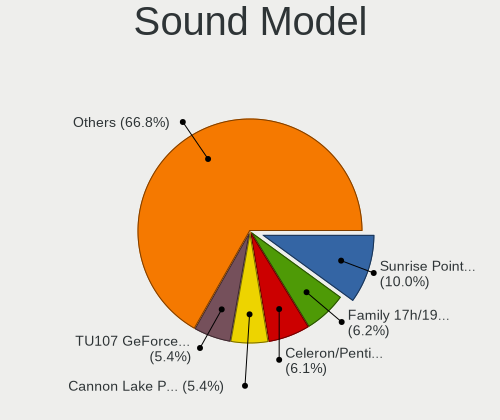

| Model                                                                                             | Computers | Percent |
|---------------------------------------------------------------------------------------------------|-----------|---------|
| Intel Sunrise Point-LP HD Audio                                                                   | 478       | 10.45%  |
| Intel Celeron/Pentium Silver Processor High Definition Audio                                      | 290       | 6.34%   |
| AMD Family 17h/19h HD Audio Controller                                                            | 268       | 5.86%   |
| Intel Cannon Lake PCH cAVS                                                                        | 263       | 5.75%   |
| Nvidia TU107 GeForce GTX 1650 High Definition Audio Controller                                    | 252       | 5.51%   |
| AMD Raven/Raven2/Fenghuang HDMI/DP Audio Controller                                               | 189       | 4.13%   |
| Intel 6 Series/C200 Series Chipset Family High Definition Audio Controller                        | 161       | 3.52%   |
| Intel Celeron N3350/Pentium N4200/Atom E3900 Series Audio Cluster                                 | 155       | 3.39%   |
| Intel 7 Series/C216 Chipset Family High Definition Audio Controller                               | 152       | 3.32%   |
| Intel NM10/ICH7 Family High Definition Audio Controller                                           | 123       | 2.69%   |
| AMD FCH Azalia Controller                                                                         | 109       | 2.38%   |
| AMD Family 15h (Models 60h-6fh) Audio Controller                                                  | 107       | 2.34%   |
| Intel 82801I (ICH9 Family) HD Audio Controller                                                    | 102       | 2.23%   |
| AMD SBx00 Azalia (Intel HDA)                                                                      | 97        | 2.12%   |
| Intel Cannon Point-LP High Definition Audio Controller                                            | 89        | 1.94%   |
| AMD High Definition Audio Controller                                                              | 88        | 1.92%   |
| Intel Atom/Celeron/Pentium Processor x5-E8000/J3xxx/N3xxx Series High Definition Audio Controller | 74        | 1.62%   |
| Intel 5 Series/3400 Series Chipset High Definition Audio                                          | 72        | 1.57%   |
| Intel Ice Lake-LP Smart Sound Technology Audio Controller                                         | 70        | 1.53%   |
| Nvidia GP107GL High Definition Audio Controller                                                   | 65        | 1.42%   |
| Intel Comet Lake PCH-LP cAVS                                                                      | 64        | 1.4%    |
| Intel 8 Series/C220 Series Chipset High Definition Audio Controller                               | 57        | 1.25%   |
| AMD Kabini HDMI/DP Audio                                                                          | 56        | 1.22%   |
| Intel Tiger Lake-LP Smart Sound Technology Audio Controller                                       | 51        | 1.11%   |
| Intel 82801H (ICH8 Family) HD Audio Controller                                                    | 51        | 1.11%   |
| Intel Xeon E3-1200 v3/4th Gen Core Processor HD Audio Controller                                  | 48        | 1.05%   |
| Intel Haswell-ULT HD Audio Controller                                                             | 47        | 1.03%   |
| Intel 8 Series HD Audio Controller                                                                | 47        | 1.03%   |
| Intel Atom Processor Z36xxx/Z37xxx Series High Definition Audio Controller                        | 46        | 1.01%   |
| Intel CM238 HD Audio Controller                                                                   | 43        | 0.94%   |
| Intel Broadwell-U Audio Controller                                                                | 40        | 0.87%   |
| Intel Wildcat Point-LP High Definition Audio Controller                                           | 39        | 0.85%   |
| AMD Wrestler HDMI Audio                                                                           | 34        | 0.74%   |
| Nvidia High Definition Audio Controller                                                           | 30        | 0.66%   |
| Nvidia GK208 HDMI/DP Audio Controller                                                             | 28        | 0.61%   |
| Nvidia MCP61 High Definition Audio                                                                | 27        | 0.59%   |
| Nvidia GF108 High Definition Audio Controller                                                     | 27        | 0.59%   |
| Intel 200 Series PCH HD Audio                                                                     | 25        | 0.55%   |
| Intel 100 Series/C230 Series Chipset Family HD Audio Controller                                   | 25        | 0.55%   |
| Nvidia GF119 HDMI Audio Controller                                                                | 23        | 0.5%    |

Memory
------

Memory Vendor
-------------

Memory module vendors

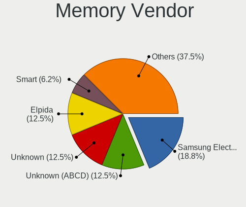

| Vendor              | Computers | Percent |
|---------------------|-----------|---------|
| Unknown (ABCD)      | 2         | 13.33%  |
| Unknown             | 2         | 13.33%  |
| Samsung Electronics | 2         | 13.33%  |
| Elpida              | 2         | 13.33%  |
| Smart               | 1         | 6.67%   |
| SK hynix            | 1         | 6.67%   |
| Patriot             | 1         | 6.67%   |
| Micron Technology   | 1         | 6.67%   |
| Kingston            | 1         | 6.67%   |
| G.Skill             | 1         | 6.67%   |
| Apacer              | 1         | 6.67%   |

Memory Model
------------

Memory module models

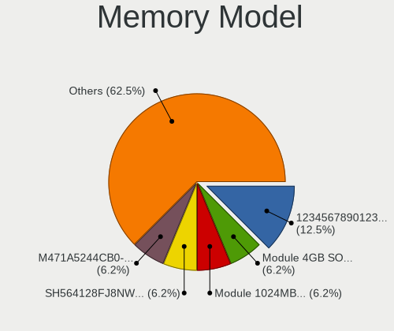

| Model                                                            | Computers | Percent |
|------------------------------------------------------------------|-----------|---------|
| Unknown (ABCD) RAM 123456789012345678 2GB SODIMM LPDDR4 2400MT/s | 2         | 13.33%  |
| Unknown RAM Module 4GB SODIMM DDR3 1600MT/s                      | 1         | 6.67%   |
| Unknown RAM Module 1024MB DIMM 667MT/s                           | 1         | 6.67%   |
| Smart RAM SH564128FJ8NWRNSQG 4GB SODIMM DDR3 1600MT/s            | 1         | 6.67%   |
| SK hynix RAM HMAA2GS6AJR8N-XN 16GB SODIMM DDR4 3200MT/s          | 1         | 6.67%   |
| Samsung RAM M471A5244CB0-CTD 4GB SODIMM DDR4 3266MT/s            | 1         | 6.67%   |
| Samsung RAM M471A1K43DB1-CTD 8GB SODIMM DDR4 2667MT/s            | 1         | 6.67%   |
| Patriot RAM PSD38G1600L2S 8GB SODIMM DDR3 1600MT/s               | 1         | 6.67%   |
| Micron RAM 8ATF51264HZ-2G3B1 4GB SODIMM DDR4 2400MT/s            | 1         | 6.67%   |
| Kingston RAM 99U5428-073.A00G 8GB SODIMM DDR3 1600MT/s           | 1         | 6.67%   |
| G.Skill RAM F4-4000C19-16GTZSW 16GB DIMM DDR4 3200MT/s           | 1         | 6.67%   |
| Elpida RAM Module 4096MB SODIMM LPDDR3 1600MT/s                  | 1         | 6.67%   |
| Elpida RAM EBJ40UG8EFU0-GN-F 4096MB SODIMM DDR3 1600MT/s         | 1         | 6.67%   |
| Apacer RAM 76.D305G.D390B 16GB SODIMM DDR4 2400MT/s              | 1         | 6.67%   |

Memory Kind
-----------

Memory module kinds

| Kind    | Computers | Percent |
|---------|-----------|---------|
| DDR4    | 6         | 40%     |
| DDR3    | 5         | 33.33%  |
| LPDDR4  | 2         | 13.33%  |
| LPDDR3  | 1         | 6.67%   |
| Unknown | 1         | 6.67%   |

Memory Form Factor
------------------

Physical design of the memory module

| Name   | Computers | Percent |
|--------|-----------|---------|
| SODIMM | 13        | 86.67%  |
| DIMM   | 2         | 13.33%  |

Memory Size
-----------

Memory module size

| Size  | Computers | Percent |
|-------|-----------|---------|
| 4096  | 6         | 40%     |
| 8192  | 5         | 33.33%  |
| 16384 | 3         | 20%     |
| 1024  | 1         | 6.67%   |

Memory Speed
------------

Memory module speed

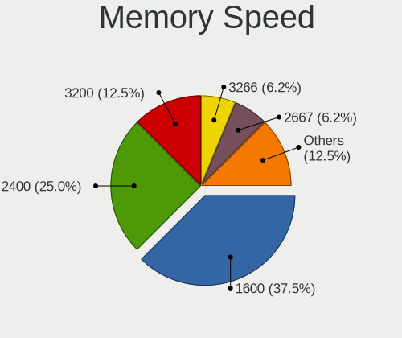

| Speed | Computers | Percent |
|-------|-----------|---------|
| 1600  | 6         | 40%     |
| 2400  | 4         | 26.67%  |
| 3200  | 2         | 13.33%  |
| 3266  | 1         | 6.67%   |
| 2667  | 1         | 6.67%   |
| 667   | 1         | 6.67%   |

Printers & scanners
-------------------

Printer Vendor
--------------

Printer device vendors

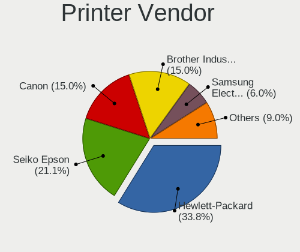

| Vendor                   | Computers | Percent |
|--------------------------|-----------|---------|
| Hewlett-Packard          | 43        | 34.4%   |
| Seiko Epson              | 23        | 18.4%   |
| Canon                    | 20        | 16%     |
| Brother Industries       | 20        | 16%     |
| Samsung Electronics      | 7         | 5.6%    |
| Pantum                   | 3         | 2.4%    |
| Xerox                    | 2         | 1.6%    |
| Panasonic (Matsushita)   | 2         | 1.6%    |
| STMicroelectronics       | 1         | 0.8%    |
| Ricoh                    | 1         | 0.8%    |
| Magic Control Technology | 1         | 0.8%    |
| ICS Advent               | 1         | 0.8%    |
| Dymo-CoStar              | 1         | 0.8%    |

Printer Model
-------------

Printer device models

| Model                                        | Computers | Percent |
|----------------------------------------------|-----------|---------|
| Seiko Epson L3150 Series                     | 6         | 4.8%    |
| HP LaserJet 1020                             | 4         | 3.2%    |
| Seiko Epson L120 Series                      | 3         | 2.4%    |
| Samsung M2020 Series                         | 3         | 2.4%    |
| HP LaserJet 1018                             | 3         | 2.4%    |
| HP DeskJet F4200 series                      | 3         | 2.4%    |
| HP Deskjet 2050 J510                         | 3         | 2.4%    |
| HP Deskjet 1510                              | 3         | 2.4%    |
| Xerox Phaser 3020                            | 2         | 1.6%    |
| Seiko Epson L355 Series                      | 2         | 1.6%    |
| Seiko Epson L210 Series                      | 2         | 1.6%    |
| Seiko Epson ET-2600 Series                   | 2         | 1.6%    |
| Panasonic (Matsushita) KX-MB1500RU           | 2         | 1.6%    |
| HP Deskjet 3050 J610 series                  | 2         | 1.6%    |
| HP Deskjet 2540 series                       | 2         | 1.6%    |
| HP DeskJet 2130 series                       | 2         | 1.6%    |
| HP Color Laser 150nw                         | 2         | 1.6%    |
| Canon PIXMA MX920 Series                     | 2         | 1.6%    |
| Canon PIXMA MG2500 Series                    | 2         | 1.6%    |
| Brother MFC-J470DW                           | 2         | 1.6%    |
| Brother HL-1110 series                       | 2         | 1.6%    |
| Brother DCP-T710W                            | 2         | 1.6%    |
| Brother DCP-T310                             | 2         | 1.6%    |
| Brother DCP-1510                             | 2         | 1.6%    |
| STMicroelectronics USB Printer P             | 1         | 0.8%    |
| Seiko Epson ME-100 Series                    | 1         | 0.8%    |
| Seiko Epson ME 320/330 Series [Stylus SX125] | 1         | 0.8%    |
| Seiko Epson L380 Series                      | 1         | 0.8%    |
| Seiko Epson L365 Series                      | 1         | 0.8%    |
| Seiko Epson L3200 Series                     | 1         | 0.8%    |
| Seiko Epson L3110 Series                     | 1         | 0.8%    |
| Seiko Epson ET-3750 Series                   | 1         | 0.8%    |
| Seiko Epson AcuLaser C1700                   | 1         | 0.8%    |
| Samsung ML-1660 Series                       | 1         | 0.8%    |
| Samsung M332x 382x 402x Series               | 1         | 0.8%    |
| Samsung M2070 Series                         | 1         | 0.8%    |
| Samsung Composite Device                     | 1         | 0.8%    |
| Ricoh SP 150SUw                              | 1         | 0.8%    |
| Pantum PMF22 series                          | 1         | 0.8%    |
| Pantum P2200 series                          | 1         | 0.8%    |

Scanner Vendor
--------------

Scanner device vendors

| Vendor                      | Computers | Percent |
|-----------------------------|-----------|---------|
| Canon                       | 3         | 42.86%  |
| Seiko Epson                 | 2         | 28.57%  |
| Mustek Systems              | 1         | 14.29%  |
| Acer Peripherals (now BenQ) | 1         | 14.29%  |

Scanner Model
-------------

Scanner device models

| Model                                                   | Computers | Percent |
|---------------------------------------------------------|-----------|---------|
| Seiko Epson GT-F730 [GT-S630/Perfection V33/V330 Photo] | 1         | 14.29%  |
| Seiko Epson GT-F670 [Perfection V200 Photo]             | 1         | 14.29%  |
| Mustek Systems ScanExpress 1200 UB                      | 1         | 14.29%  |
| Canon CanoScan N1240U/LiDE 30                           | 1         | 14.29%  |
| Canon CanoScan LiDE 210                                 | 1         | 14.29%  |
| Canon CanoScan LiDE 100                                 | 1         | 14.29%  |
| Acer Peripherals (now BenQ) Benq 5000                   | 1         | 14.29%  |

Camera
------

Camera Vendor
-------------

Camera device vendors

| Vendor                                 | Computers | Percent |
|----------------------------------------|-----------|---------|
| IMC Networks                           | 803       | 30.87%  |
| Chicony Electronics                    | 600       | 23.07%  |
| Quanta                                 | 462       | 17.76%  |
| Realtek Semiconductor                  | 113       | 4.34%   |
| Microdia                               | 82        | 3.15%   |
| Acer                                   | 76        | 2.92%   |
| Suyin                                  | 61        | 2.35%   |
| Sunplus Innovation Technology          | 56        | 2.15%   |
| Cheng Uei Precision Industry (Foxlink) | 35        | 1.35%   |
| Alcor Micro                            | 32        | 1.23%   |
| Silicon Motion                         | 31        | 1.19%   |
| Logitech                               | 30        | 1.15%   |
| Apple                                  | 26        | 1%      |
| Samsung Electronics                    | 25        | 0.96%   |
| Syntek                                 | 23        | 0.88%   |
| Sonix Technology                       | 18        | 0.69%   |
| Lite-On Technology                     | 14        | 0.54%   |
| Ricoh                                  | 13        | 0.5%    |
| Microsoft                              | 11        | 0.42%   |
| Z-Star Microelectronics                | 10        | 0.38%   |
| OmniVision Technologies                | 10        | 0.38%   |
| ALi                                    | 10        | 0.38%   |
| Lenovo                                 | 7         | 0.27%   |
| Luxvisions Innotech Limited            | 6         | 0.23%   |
| Importek                               | 6         | 0.23%   |
| GEMBIRD                                | 4         | 0.15%   |
| Primax Electronics                     | 3         | 0.12%   |
| Generalplus Technology                 | 3         | 0.12%   |
| Cubeternet                             | 3         | 0.12%   |
| Xiaomi                                 | 2         | 0.08%   |
| Unknown                                | 2         | 0.08%   |
| Sunplus Technology                     | 2         | 0.08%   |
| Aveo Technology                        | 2         | 0.08%   |
| USB Camera                             | 1         | 0.04%   |
| Pixart Imaging                         | 1         | 0.04%   |
| Philips (or NXP)                       | 1         | 0.04%   |
| Novatek Microelectronics               | 1         | 0.04%   |
| Nokia Mobile Phones                    | 1         | 0.04%   |
| Nebraska Furniture Mart                | 1         | 0.04%   |
| Linux Foundation                       | 1         | 0.04%   |

Camera Model
------------

Camera device models

| Model                                | Computers | Percent |
|--------------------------------------|-----------|---------|
| IMC Networks USB2.0 VGA UVC WebCam   | 568       | 21.82%  |
| Quanta HD User Facing                | 180       | 6.92%   |
| Chicony HD User Facing               | 166       | 6.38%   |
| Quanta VGA WebCam                    | 154       | 5.92%   |
| IMC Networks USB2.0 HD UVC WebCam    | 152       | 5.84%   |
| Chicony USB2.0 VGA UVC WebCam        | 90        | 3.46%   |
| Chicony VGA WebCam                   | 89        | 3.42%   |
| Quanta HD Webcam                     | 81        | 3.11%   |
| Chicony HD WebCam                    | 59        | 2.27%   |
| Samsung Galaxy A5 (MTP)              | 25        | 0.96%   |
| IMC Networks VGA UVC WebCam          | 20        | 0.77%   |
| Quanta USB2.0 HD UVC WebCam          | 17        | 0.65%   |
| Sonix USB2.0 HD UVC WebCam           | 16        | 0.61%   |
| Realtek Acer 640 x 480 laptop camera | 16        | 0.61%   |
| Alcor Micro USB 2.0 Camera           | 16        | 0.61%   |
| Realtek USB2.0 HD UVC WebCam         | 15        | 0.58%   |
| Microdia Integrated_Webcam_HD        | 15        | 0.58%   |
| Chicony USB2.0 HD UVC WebCam         | 15        | 0.58%   |
| Chicony Integrated Camera            | 15        | 0.58%   |
| Apple iPhone5/5C/5S/6                | 15        | 0.58%   |
| Realtek HD WebCam                    | 14        | 0.54%   |
| IMC Networks Integrated Camera       | 14        | 0.54%   |
| Chicony USB 2.0 Camera               | 13        | 0.5%    |
| Sunplus Integrated_Webcam_HD         | 12        | 0.46%   |
| Realtek Integrated_Webcam_HD         | 12        | 0.46%   |
| Sunplus HD WebCam                    | 11        | 0.42%   |
| Realtek USB Camera                   | 11        | 0.42%   |
| Quanta USB2.0 VGA UVC WebCam         | 11        | 0.42%   |
| Acer VGA WebCam                      | 11        | 0.42%   |
| OmniVision OV2640 Webcam             | 10        | 0.38%   |
| Microdia Integrated Webcam           | 10        | 0.38%   |
| IMC Networks USB2.0 HD IR UVC WebCam | 10        | 0.38%   |
| Chicony HP Truevision HD camera      | 10        | 0.38%   |
| Chicony HP Truevision HD             | 10        | 0.38%   |
| Acer Integrated Camera               | 10        | 0.38%   |
| Quanta HP Webcam                     | 9         | 0.35%   |
| Microdia Laptop_Integrated_Webcam_HD | 9         | 0.35%   |
| Logitech Webcam C270                 | 9         | 0.35%   |
| Chicony TOSHIBA Web Camera - HD      | 9         | 0.35%   |
| Chicony Lenovo EasyCamera            | 9         | 0.35%   |

Security
--------

Fingerprint Vendor
------------------

Fingerprint sensor vendors

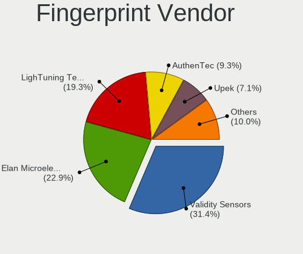

| Vendor                     | Computers | Percent |
|----------------------------|-----------|---------|
| Validity Sensors           | 40        | 30.08%  |
| Elan Microelectronics      | 32        | 24.06%  |
| LighTuning Technology      | 26        | 19.55%  |
| AuthenTec                  | 12        | 9.02%   |
| Upek                       | 10        | 7.52%   |
| Synaptics                  | 6         | 4.51%   |
| STMicroelectronics         | 4         | 3.01%   |
| Shenzhen Goodix Technology | 3         | 2.26%   |

Fingerprint Model
-----------------

Fingerprint sensor models

| Model                                                                      | Computers | Percent |
|----------------------------------------------------------------------------|-----------|---------|
| Elan ELAN:Fingerprint                                                      | 31        | 23.31%  |
| LighTuning EgisTec Touch Fingerprint Sensor                                | 21        | 15.79%  |
| Upek Biometric Touchchip/Touchstrip Fingerprint Sensor                     | 8         | 6.02%   |
| Validity Sensors VFS495 Fingerprint Reader                                 | 6         | 4.51%   |
| Validity Sensors VFS5011 Fingerprint Reader                                | 5         | 3.76%   |
| Validity Sensors VFS471 Fingerprint Reader                                 | 5         | 3.76%   |
| Validity Sensors VFS491                                                    | 4         | 3.01%   |
| Validity Sensors VFS 5011 fingerprint sensor                               | 4         | 3.01%   |
| STMicroelectronics Fingerprint Reader                                      | 4         | 3.01%   |
| AuthenTec Fingerprint Sensor                                               | 4         | 3.01%   |
| Validity Sensors VFS301 Fingerprint Reader                                 | 3         | 2.26%   |
| Validity Sensors VFS101 Fingerprint Reader                                 | 3         | 2.26%   |
| Synaptics  WBDI                                                            | 3         | 2.26%   |
| Shenzhen Goodix Fingerprint Reader                                         | 3         | 2.26%   |
| LighTuning ES603 Swipe Fingerprint Sensor                                  | 3         | 2.26%   |
| AuthenTec AES2810                                                          | 3         | 2.26%   |
| AuthenTec AES1600                                                          | 3         | 2.26%   |
| Validity Sensors VFS451 Fingerprint Reader                                 | 2         | 1.5%    |
| Validity Sensors VFS Fingerprint sensor                                    | 2         | 1.5%    |
| Validity Sensors Swipe Fingerprint Sensor                                  | 2         | 1.5%    |
| Upek TCS5B Fingerprint sensor                                              | 2         | 1.5%    |
| LighTuning Fingerprint Reader                                              | 2         | 1.5%    |
| AuthenTec AES2501 Fingerprint Sensor                                       | 2         | 1.5%    |
| Validity Sensors VFS7500 Touch Fingerprint Sensor                          | 1         | 0.75%   |
| Validity Sensors VFS300 Fingerprint Reader                                 | 1         | 0.75%   |
| Validity Sensors Synaptics WBDI                                            | 1         | 0.75%   |
| Validity Sensors Synaptics VFS7552 Touch Fingerprint Sensor with PurePrint | 1         | 0.75%   |
| Synaptics Prometheus MIS Touch Fingerprint Reader                          | 1         | 0.75%   |
| Synaptics Metallica MIS Touch Fingerprint Reader                           | 1         | 0.75%   |
| Elan ELAN:ARM-M4                                                           | 1         | 0.75%   |
| Unknown                                                                    | 1         | 0.75%   |

Chipcard Vendor
---------------

Chipcard module vendors

| Vendor                | Computers | Percent |
|-----------------------|-----------|---------|
| Broadcom              | 26        | 53.06%  |
| Alcor Micro           | 9         | 18.37%  |
| O2 Micro              | 8         | 16.33%  |
| Lenovo                | 3         | 6.12%   |
| Kobil Systems         | 1         | 2.04%   |
| Chicony Electronics   | 1         | 2.04%   |
| Advanced Card Systems | 1         | 2.04%   |

Chipcard Model
--------------

Chipcard module models

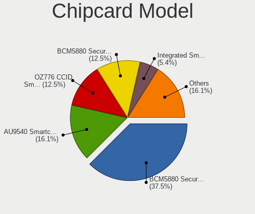

| Model                                                                        | Computers | Percent |
|------------------------------------------------------------------------------|-----------|---------|
| Broadcom BCM5880 Secure Applications Processor                               | 18        | 36.73%  |
| Alcor Micro AU9540 Smartcard Reader                                          | 9         | 18.37%  |
| O2 Micro OZ776 CCID Smartcard Reader                                         | 7         | 14.29%  |
| Broadcom BCM5880 Secure Applications Processor with fingerprint swipe sensor | 6         | 12.24%  |
| Lenovo Integrated Smart Card Reader                                          | 3         | 6.12%   |
| Broadcom 5880                                                                | 2         | 4.08%   |
| O2 Micro Oz776 SmartCard Reader                                              | 1         | 2.04%   |
| Kobil Systems KOBIL Class 3 Reader                                           | 1         | 2.04%   |
| Chicony Electronics HP Skylab USB Smartcard Keyboard                         | 1         | 2.04%   |
| Advanced Card Systems ACR122U                                                | 1         | 2.04%   |

Unsupported
-----------

Unsupported Devices
-------------------

Total unsupported devices on board

| Total | Computers | Percent |
|-------|-----------|---------|
| 0     | 2790      | 83.58%  |
| 1     | 484       | 14.5%   |
| 2     | 61        | 1.83%   |
| 3     | 2         | 0.06%   |
| 4     | 1         | 0.03%   |

Unsupported Device Types
------------------------

Types of unsupported devices

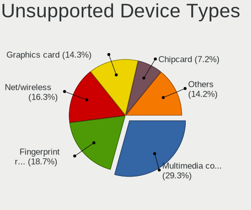

| Type                     | Computers | Percent |
|--------------------------|-----------|---------|
| Multimedia controller    | 189       | 30.68%  |
| Fingerprint reader       | 133       | 21.59%  |
| Net/wireless             | 108       | 17.53%  |
| Graphics card            | 48        | 7.79%   |
| Chipcard                 | 47        | 7.63%   |
| Communication controller | 26        | 4.22%   |
| Storage                  | 18        | 2.92%   |
| Bluetooth                | 13        | 2.11%   |
| Camera                   | 9         | 1.46%   |
| Storage/ide              | 5         | 0.81%   |
| Network                  | 4         | 0.65%   |
| Unassigned class         | 3         | 0.49%   |
| Net/ethernet             | 3         | 0.49%   |
| Storage/raid             | 2         | 0.32%   |
| Storage/nvme             | 2         | 0.32%   |
| Sound                    | 2         | 0.32%   |
| Modem                    | 2         | 0.32%   |
| Flash memory             | 1         | 0.16%   |
| Dvb card                 | 1         | 0.16%   |

