Endless - Tested Hardware & Statistics (Desktops)
-------------------------------------------------

A project to collect tested hardware configurations for Endless.

Anyone can contribute to this report by the [hw-probe](https://github.com/linuxhw/hw-probe) tool:

    sudo -E hw-probe -all -upload

Please contribute! Especially if your hardware is rare.

Contents
--------

* [ Test Cases ](#test-cases)

* [ System ](#system)
  - [ OS                       ](#os)
  - [ OS Family                ](#os-family)
  - [ Kernel                   ](#kernel)
  - [ Kernel Family            ](#kernel-family)
  - [ Kernel Major Ver.        ](#kernel-major-ver)
  - [ Arch                     ](#arch)
  - [ DE                       ](#de)
  - [ Display Server           ](#display-server)
  - [ Display Manager          ](#display-manager)
  - [ OS Lang                  ](#os-lang)
  - [ Boot Mode                ](#boot-mode)
  - [ Filesystem               ](#filesystem)
  - [ Part. scheme             ](#part-scheme)
  - [ Dual Boot with Linux/BSD ](#dual-boot-with-linuxbsd)
  - [ Dual Boot (Win)          ](#dual-boot-win)

* [ Board ](#board)
  - [ Vendor                   ](#vendor)
  - [ Model                    ](#model)
  - [ Model Family             ](#model-family)
  - [ MFG Year                 ](#mfg-year)
  - [ Form Factor              ](#form-factor)
  - [ Secure Boot              ](#secure-boot)
  - [ Coreboot                 ](#coreboot)
  - [ RAM Size                 ](#ram-size)
  - [ RAM Used                 ](#ram-used)
  - [ Total Drives             ](#total-drives)
  - [ Has CD-ROM               ](#has-cd-rom)
  - [ Has Ethernet             ](#has-ethernet)
  - [ Has WiFi                 ](#has-wifi)
  - [ Has Bluetooth            ](#has-bluetooth)

* [ Location ](#location)
  - [ Country                  ](#country)
  - [ City                     ](#city)

* [ Drives ](#drives)
  - [ Drive Vendor             ](#drive-vendor)
  - [ Drive Model              ](#drive-model)
  - [ HDD Vendor               ](#hdd-vendor)
  - [ SSD Vendor               ](#ssd-vendor)
  - [ Drive Kind               ](#drive-kind)
  - [ Drive Connector          ](#drive-connector)
  - [ Drive Size               ](#drive-size)
  - [ Space Total              ](#space-total)
  - [ Space Used               ](#space-used)
  - [ Malfunc. Drives          ](#malfunc-drives)
  - [ Malfunc. Drive Vendor    ](#malfunc-drive-vendor)
  - [ Malfunc. HDD Vendor      ](#malfunc-hdd-vendor)
  - [ Malfunc. Drive Kind      ](#malfunc-drive-kind)
  - [ Failed Drives            ](#failed-drives)
  - [ Failed Drive Vendor      ](#failed-drive-vendor)
  - [ Drive Status             ](#drive-status)

* [ Storage controller ](#storage-controller)
  - [ Storage Vendor           ](#storage-vendor)
  - [ Storage Model            ](#storage-model)
  - [ Storage Kind             ](#storage-kind)

* [ Processor ](#processor)
  - [ CPU Vendor               ](#cpu-vendor)
  - [ CPU Model                ](#cpu-model)
  - [ CPU Model Family         ](#cpu-model-family)
  - [ CPU Cores                ](#cpu-cores)
  - [ CPU Sockets              ](#cpu-sockets)
  - [ CPU Threads              ](#cpu-threads)
  - [ CPU Op-Modes             ](#cpu-op-modes)
  - [ CPU Microcode            ](#cpu-microcode)
  - [ CPU Microarch            ](#cpu-microarch)

* [ Graphics ](#graphics)
  - [ GPU Vendor               ](#gpu-vendor)
  - [ GPU Model                ](#gpu-model)
  - [ GPU Combo                ](#gpu-combo)
  - [ GPU Driver               ](#gpu-driver)
  - [ GPU Memory               ](#gpu-memory)

* [ Monitor ](#monitor)
  - [ Monitor Vendor           ](#monitor-vendor)
  - [ Monitor Model            ](#monitor-model)
  - [ Monitor Resolution       ](#monitor-resolution)
  - [ Monitor Diagonal         ](#monitor-diagonal)
  - [ Monitor Width            ](#monitor-width)
  - [ Aspect Ratio             ](#aspect-ratio)
  - [ Monitor Area             ](#monitor-area)
  - [ Pixel Density            ](#pixel-density)
  - [ Multiple Monitors        ](#multiple-monitors)

* [ Network ](#network)
  - [ Net Controller Vendor    ](#net-controller-vendor)
  - [ Net Controller Model     ](#net-controller-model)
  - [ Wireless Vendor          ](#wireless-vendor)
  - [ Wireless Model           ](#wireless-model)
  - [ Ethernet Vendor          ](#ethernet-vendor)
  - [ Ethernet Model           ](#ethernet-model)
  - [ Net Controller Kind      ](#net-controller-kind)
  - [ Used Controller          ](#used-controller)
  - [ NICs                     ](#nics)
  - [ IPv6                     ](#ipv6)

* [ Bluetooth ](#bluetooth)
  - [ Bluetooth Vendor         ](#bluetooth-vendor)
  - [ Bluetooth Model          ](#bluetooth-model)

* [ Sound ](#sound)
  - [ Sound Vendor             ](#sound-vendor)
  - [ Sound Model              ](#sound-model)

* [ Memory ](#memory)
  - [ Memory Vendor            ](#memory-vendor)
  - [ Memory Model             ](#memory-model)
  - [ Memory Kind              ](#memory-kind)
  - [ Memory Form Factor       ](#memory-form-factor)
  - [ Memory Size              ](#memory-size)
  - [ Memory Speed             ](#memory-speed)

* [ Printers & scanners ](#printers--scanners)
  - [ Printer Vendor           ](#printer-vendor)
  - [ Printer Model            ](#printer-model)
  - [ Scanner Vendor           ](#scanner-vendor)
  - [ Scanner Model            ](#scanner-model)

* [ Camera ](#camera)
  - [ Camera Vendor            ](#camera-vendor)
  - [ Camera Model             ](#camera-model)

* [ Security ](#security)
  - [ Fingerprint Vendor       ](#fingerprint-vendor)
  - [ Fingerprint Model        ](#fingerprint-model)
  - [ Chipcard Vendor          ](#chipcard-vendor)
  - [ Chipcard Model           ](#chipcard-model)

* [ Unsupported ](#unsupported)
  - [ Unsupported Devices      ](#unsupported-devices)
  - [ Unsupported Device Types ](#unsupported-device-types)

Test Cases
----------

Total: 1110

| Vendor        | Model                       | Probe                                                      | Date         |
|---------------|-----------------------------|------------------------------------------------------------|--------------|
| Acer          | Nitro N50-610               | [fdb09844e9](https://linux-hardware.org/?probe=fdb09844e9) | Dec 29, 2022 |
| Acer          | Nitro N50-610               | [9ff3461c31](https://linux-hardware.org/?probe=9ff3461c31) | Dec 29, 2022 |
| Acer          | Aspire XC-704               | [c4e808c172](https://linux-hardware.org/?probe=c4e808c172) | Dec 25, 2022 |
| Acer          | Aspire XC-704               | [9f3adaa228](https://linux-hardware.org/?probe=9f3adaa228) | Dec 25, 2022 |
| HP            | 3648h                       | [5b3a2d7e48](https://linux-hardware.org/?probe=5b3a2d7e48) | Dec 25, 2022 |
| ASUSTek       | M5A97 R2.0                  | [06f90011b2](https://linux-hardware.org/?probe=06f90011b2) | Dec 18, 2022 |
| HP            | 1998                        | [d237c6c5a3](https://linux-hardware.org/?probe=d237c6c5a3) | Dec 09, 2022 |
| Gigabyte      | B75M-D3H                    | [62348f8b41](https://linux-hardware.org/?probe=62348f8b41) | Nov 13, 2022 |
| Gigabyte      | X570 I AORUS PRO WIFI       | [d2a6ea0b28](https://linux-hardware.org/?probe=d2a6ea0b28) | Nov 04, 2022 |
| Gigabyte      | Z77X-UP4 TH                 | [5eabf4c6b3](https://linux-hardware.org/?probe=5eabf4c6b3) | Oct 31, 2022 |
| ASRock        | H61M-DGS                    | [732979f5a2](https://linux-hardware.org/?probe=732979f5a2) | Oct 16, 2022 |
| ASRock        | H61M-DGS                    | [bc42f70bc3](https://linux-hardware.org/?probe=bc42f70bc3) | Oct 16, 2022 |
| Dell          | 042P49 A01                  | [a9ce87fd47](https://linux-hardware.org/?probe=a9ce87fd47) | Oct 09, 2022 |
| ASRock        | A320M-DGS                   | [b602eb3419](https://linux-hardware.org/?probe=b602eb3419) | Oct 08, 2022 |
| Biostar       | G41D3C                      | [97ee103719](https://linux-hardware.org/?probe=97ee103719) | Sep 30, 2022 |
| ASUSTek       | M2N68                       | [4b23dadbca](https://linux-hardware.org/?probe=4b23dadbca) | Sep 23, 2022 |
| Intel         | H61                         | [923e50e023](https://linux-hardware.org/?probe=923e50e023) | Sep 18, 2022 |
| ASUSTek       | P5Q PRO TURBO               | [96564b490b](https://linux-hardware.org/?probe=96564b490b) | Sep 15, 2022 |
| ASUSTek       | P5Q PRO TURBO               | [846849e46c](https://linux-hardware.org/?probe=846849e46c) | Sep 15, 2022 |
| Biostar       | G41D3C                      | [280212d494](https://linux-hardware.org/?probe=280212d494) | Sep 13, 2022 |
| Biostar       | G41D3C                      | [6d15a54350](https://linux-hardware.org/?probe=6d15a54350) | Sep 13, 2022 |
| Biostar       | G41D3C                      | [09d42cd406](https://linux-hardware.org/?probe=09d42cd406) | Sep 13, 2022 |
| Biostar       | G41D3C                      | [c45809d681](https://linux-hardware.org/?probe=c45809d681) | Sep 13, 2022 |
| Biostar       | A780L3B                     | [bc83f32ddf](https://linux-hardware.org/?probe=bc83f32ddf) | Sep 12, 2022 |
| Biostar       | A780L3B                     | [61057dc040](https://linux-hardware.org/?probe=61057dc040) | Sep 12, 2022 |
| Biostar       | A780L3B                     | [6463bcc136](https://linux-hardware.org/?probe=6463bcc136) | Sep 10, 2022 |
| Biostar       | A780L3B                     | [f65db263d7](https://linux-hardware.org/?probe=f65db263d7) | Sep 10, 2022 |
| Gigabyte      | GA-990FXA-UD5               | [b77aa249c8](https://linux-hardware.org/?probe=b77aa249c8) | Sep 09, 2022 |
| Gigabyte      | GA-990FXA-UD5               | [dc69b9dde6](https://linux-hardware.org/?probe=dc69b9dde6) | Sep 09, 2022 |
| ASUSTek       | M5A78L-M/USB3               | [f61f170b4c](https://linux-hardware.org/?probe=f61f170b4c) | Sep 06, 2022 |
| ECS           | A320AM4-M3D                 | [685960846a](https://linux-hardware.org/?probe=685960846a) | Aug 26, 2022 |
| HP            | 0980h                       | [1b4bdc2dd3](https://linux-hardware.org/?probe=1b4bdc2dd3) | Aug 25, 2022 |
| HP            | 0980h                       | [28433ca1db](https://linux-hardware.org/?probe=28433ca1db) | Aug 25, 2022 |
| HP            | 805B                        | [e7fa1a7244](https://linux-hardware.org/?probe=e7fa1a7244) | Aug 21, 2022 |
| ASUSTek       | M5A78L-M/USB3               | [4242f8b9c2](https://linux-hardware.org/?probe=4242f8b9c2) | Aug 18, 2022 |
| ASUSTek       | M5A78L-M/USB3               | [bac870dd75](https://linux-hardware.org/?probe=bac870dd75) | Aug 18, 2022 |
| Gigabyte      | X570 I AORUS PRO WIFI       | [c2c1f93ff4](https://linux-hardware.org/?probe=c2c1f93ff4) | Aug 14, 2022 |
| Fujitsu       | D3041-A1 S26361-D3041-A1    | [1fe8a14d3b](https://linux-hardware.org/?probe=1fe8a14d3b) | Aug 06, 2022 |
| ASUSTek       | D340MC-C                    | [69ddbb7acd](https://linux-hardware.org/?probe=69ddbb7acd) | Aug 05, 2022 |
| ASUSTek       | D340MC-C                    | [a87fc1ec66](https://linux-hardware.org/?probe=a87fc1ec66) | Aug 05, 2022 |
| ASUSTek       | ROG Maximus X CODE          | [e4ec9f34aa](https://linux-hardware.org/?probe=e4ec9f34aa) | Aug 01, 2022 |
| Lenovo        | Bantry CRB SDK0J40709 WI... | [7d5090c75c](https://linux-hardware.org/?probe=7d5090c75c) | Jul 30, 2022 |
| Lenovo        | ThinkCentre M58 7359DHJ     | [46c2c1db62](https://linux-hardware.org/?probe=46c2c1db62) | Jul 26, 2022 |
| Acer          | Veriton S2665G              | [9bb3d975ef](https://linux-hardware.org/?probe=9bb3d975ef) | Jul 22, 2022 |
| ASUSTek       | M2N68                       | [e8b27563a2](https://linux-hardware.org/?probe=e8b27563a2) | Jul 22, 2022 |
| Gigabyte      | H61M-S2PH                   | [554f6e65ed](https://linux-hardware.org/?probe=554f6e65ed) | Jul 18, 2022 |
| Acer          | Veriton S2665G              | [d3d8a3519d](https://linux-hardware.org/?probe=d3d8a3519d) | Jul 15, 2022 |
| Acer          | Veriton S2665G              | [5857bd4a87](https://linux-hardware.org/?probe=5857bd4a87) | Jul 15, 2022 |
| Gigabyte      | H97M-D3H                    | [6e317fc17d](https://linux-hardware.org/?probe=6e317fc17d) | Jul 03, 2022 |
| ASUSTek       | M5A99X EVO R2.0             | [612da6d1eb](https://linux-hardware.org/?probe=612da6d1eb) | Jul 02, 2022 |
| Gigabyte      | GA-78LMT-S2P                | [ec2e52372f](https://linux-hardware.org/?probe=ec2e52372f) | Jun 10, 2022 |
| Kllisre       | B75 V1.1                    | [d9a9aa6243](https://linux-hardware.org/?probe=d9a9aa6243) | Jun 06, 2022 |
| Gigabyte      | H97M-D3H                    | [5159501e3a](https://linux-hardware.org/?probe=5159501e3a) | Jun 04, 2022 |
| Dell          | 0HY9JP A01                  | [ddaf2f5f45](https://linux-hardware.org/?probe=ddaf2f5f45) | May 31, 2022 |
| Dell          | 0T2HR0 A00                  | [bc174d82db](https://linux-hardware.org/?probe=bc174d82db) | May 23, 2022 |
| Dell          | 0T2HR0 A00                  | [3cd038705c](https://linux-hardware.org/?probe=3cd038705c) | May 23, 2022 |
| ASUSTek       | PRIME A320M-K/BR            | [ef49485481](https://linux-hardware.org/?probe=ef49485481) | May 16, 2022 |
| ASUSTek       | PRIME A320M-K/BR            | [e2b0f10f58](https://linux-hardware.org/?probe=e2b0f10f58) | May 15, 2022 |
| Dell          | 0VHWTR A02                  | [42d4e8089b](https://linux-hardware.org/?probe=42d4e8089b) | May 14, 2022 |
| Positivo      | POS-MI945AA                 | [dffab0e390](https://linux-hardware.org/?probe=dffab0e390) | May 07, 2022 |
| Dell          | 082WXT A01                  | [97fe4a05c4](https://linux-hardware.org/?probe=97fe4a05c4) | May 04, 2022 |
| Dell          | 082WXT A01                  | [fa58b1d93f](https://linux-hardware.org/?probe=fa58b1d93f) | May 04, 2022 |
| Lenovo        | SHARKBAY 0B98405 STD        | [4842f5aef2](https://linux-hardware.org/?probe=4842f5aef2) | Apr 30, 2022 |
| Gigabyte      | B360M AORUS Gaming 3-CF     | [6a5bc03a3a](https://linux-hardware.org/?probe=6a5bc03a3a) | Apr 29, 2022 |
| Dell          | 06NWYK A01                  | [14b3e7c65a](https://linux-hardware.org/?probe=14b3e7c65a) | Apr 24, 2022 |
| Lenovo        | SHARKBAY 31900058 STD       | [beab5308cb](https://linux-hardware.org/?probe=beab5308cb) | Apr 19, 2022 |
| HP            | 21F5 0A                     | [516f2dbc9e](https://linux-hardware.org/?probe=516f2dbc9e) | Apr 10, 2022 |
| ASUSTek       | PRIME A320M-K               | [e55b3bf73c](https://linux-hardware.org/?probe=e55b3bf73c) | Apr 10, 2022 |
| ASUSTek       | H61M-PRO                    | [c89c043120](https://linux-hardware.org/?probe=c89c043120) | Apr 10, 2022 |
| Unknown       | TIGD-CI4                    | [266aef8b2e](https://linux-hardware.org/?probe=266aef8b2e) | Apr 09, 2022 |
| Dell          | 09D2HH A00                  | [ed5450f496](https://linux-hardware.org/?probe=ed5450f496) | Apr 05, 2022 |
| Acer          | Nitro N50-610               | [17f97e88c0](https://linux-hardware.org/?probe=17f97e88c0) | Mar 29, 2022 |
| Lenovo        | 30D9 NOK                    | [c378cd6fd3](https://linux-hardware.org/?probe=c378cd6fd3) | Mar 27, 2022 |
| Gigabyte      | MZBAYAP-D9                  | [2c077e2993](https://linux-hardware.org/?probe=2c077e2993) | Mar 24, 2022 |
| Lenovo        | SHARKBAY 31900058 STD       | [73bf7d8080](https://linux-hardware.org/?probe=73bf7d8080) | Mar 19, 2022 |
| Intel         | G31                         | [02eaa5ef51](https://linux-hardware.org/?probe=02eaa5ef51) | Mar 14, 2022 |
| Intel         | DG31PR AAD97573-300         | [509c41b106](https://linux-hardware.org/?probe=509c41b106) | Mar 13, 2022 |
| Acer          | Nitro N50-610               | [c24379e7da](https://linux-hardware.org/?probe=c24379e7da) | Mar 13, 2022 |
| Gigabyte      | H110M-H-CF                  | [c8474e89b8](https://linux-hardware.org/?probe=c8474e89b8) | Mar 11, 2022 |
| HP            | 1497                        | [7965a1ed31](https://linux-hardware.org/?probe=7965a1ed31) | Mar 11, 2022 |
| ASUSTek       | CROSSBLADE RANGER           | [1a2a0418c9](https://linux-hardware.org/?probe=1a2a0418c9) | Mar 10, 2022 |
| Lenovo        | SHARKBAY 31900058 STD       | [a4335990af](https://linux-hardware.org/?probe=a4335990af) | Mar 05, 2022 |
| Lenovo        | SHARKBAY 31900058 STD       | [70405d9cb0](https://linux-hardware.org/?probe=70405d9cb0) | Mar 05, 2022 |
| Unknown       | Phitronics G31VS-M          | [0a32bd76ae](https://linux-hardware.org/?probe=0a32bd76ae) | Mar 01, 2022 |
| ASUSTek       | H97I-PLUS                   | [f476b9cb12](https://linux-hardware.org/?probe=f476b9cb12) | Feb 20, 2022 |
| ASUSTek       | H97I-PLUS                   | [17fb4ead54](https://linux-hardware.org/?probe=17fb4ead54) | Feb 18, 2022 |
| MSI           | 870A-G54                    | [3aa654a3fe](https://linux-hardware.org/?probe=3aa654a3fe) | Feb 14, 2022 |
| ASUSTek       | H97I-PLUS                   | [3453d341e6](https://linux-hardware.org/?probe=3453d341e6) | Feb 13, 2022 |
| ASUSTek       | H97I-PLUS                   | [90b23a1489](https://linux-hardware.org/?probe=90b23a1489) | Feb 11, 2022 |
| Inventec      | DQ Class A02                | [07853bea89](https://linux-hardware.org/?probe=07853bea89) | Feb 07, 2022 |
| Acer          | Revo RN86                   | [d0b5fa877f](https://linux-hardware.org/?probe=d0b5fa877f) | Feb 04, 2022 |
| Foxconn       | H67M-S/H67M-V/H67           | [a3f3367577](https://linux-hardware.org/?probe=a3f3367577) | Feb 02, 2022 |
| Acer          | Aspire XC-830               | [182ad67187](https://linux-hardware.org/?probe=182ad67187) | Feb 01, 2022 |
| ASRock        | A88M-G                      | [7a13313962](https://linux-hardware.org/?probe=7a13313962) | Jan 31, 2022 |
| ASUSTek       | P5Q SE2                     | [c599255dc5](https://linux-hardware.org/?probe=c599255dc5) | Jan 28, 2022 |
| Acer          | Revo RN86                   | [ce1dd8b1f9](https://linux-hardware.org/?probe=ce1dd8b1f9) | Jan 27, 2022 |
| Gigabyte      | B450M GAMING                | [9435764f10](https://linux-hardware.org/?probe=9435764f10) | Jan 11, 2022 |
| Acer          | ConceptD CT300-52A          | [c3ec9db0c9](https://linux-hardware.org/?probe=c3ec9db0c9) | Jan 11, 2022 |
| Acer          | ConceptD CT300-52A          | [115277b508](https://linux-hardware.org/?probe=115277b508) | Jan 11, 2022 |
| Intel         | DX58SO AAE29331-501         | [3718c8a46f](https://linux-hardware.org/?probe=3718c8a46f) | Jan 05, 2022 |
| Acer          | Aspire XC-830               | [ee050d2795](https://linux-hardware.org/?probe=ee050d2795) | Jan 02, 2022 |
| Dell          | 051FJ8 A02                  | [80f07e77e8](https://linux-hardware.org/?probe=80f07e77e8) | Jan 02, 2022 |
| Gigabyte      | P41T-D3P                    | [1c94714d99](https://linux-hardware.org/?probe=1c94714d99) | Jan 01, 2022 |
| ASUSTek       | M5A78L-M LX PLUS            | [10f27a2157](https://linux-hardware.org/?probe=10f27a2157) | Jan 01, 2022 |
| ASUSTek       | M5A78L-M LX PLUS            | [e5292385d7](https://linux-hardware.org/?probe=e5292385d7) | Dec 30, 2021 |
| ASUSTek       | B85M-G                      | [425c6b168a](https://linux-hardware.org/?probe=425c6b168a) | Dec 29, 2021 |
| Dell          | 051FJ8 A02                  | [e3445d6b60](https://linux-hardware.org/?probe=e3445d6b60) | Dec 25, 2021 |
| Megaware      | G41T-M7                     | [0962b3b7b4](https://linux-hardware.org/?probe=0962b3b7b4) | Dec 23, 2021 |
| Acer          | Aspire XC-830               | [ed3434147c](https://linux-hardware.org/?probe=ed3434147c) | Dec 22, 2021 |
| ASUSTek       | M4A77                       | [4231ac26aa](https://linux-hardware.org/?probe=4231ac26aa) | Dec 17, 2021 |
| Gigabyte      | B360M AORUS Gaming 3-CF     | [67ee599ec8](https://linux-hardware.org/?probe=67ee599ec8) | Dec 14, 2021 |
| ASRock        | A88M-G                      | [13316bacd8](https://linux-hardware.org/?probe=13316bacd8) | Dec 14, 2021 |
| ASRock        | A88M-G                      | [34baeeeb58](https://linux-hardware.org/?probe=34baeeeb58) | Dec 13, 2021 |
| Acer          | Aspire XC-830               | [a8e3e0e9d5](https://linux-hardware.org/?probe=a8e3e0e9d5) | Dec 12, 2021 |
| ASUSTek       | M5A78L-M LX3                | [43dc5e9e17](https://linux-hardware.org/?probe=43dc5e9e17) | Dec 11, 2021 |
| HP            | 2B2C                        | [af23ece925](https://linux-hardware.org/?probe=af23ece925) | Dec 11, 2021 |
| HP            | 2B2C                        | [0e518996a4](https://linux-hardware.org/?probe=0e518996a4) | Dec 10, 2021 |
| Medion        | D3F3-EM                     | [d9c377c7f5](https://linux-hardware.org/?probe=d9c377c7f5) | Dec 09, 2021 |
| Gigabyte      | B360M AORUS Gaming 3-CF     | [9312862519](https://linux-hardware.org/?probe=9312862519) | Dec 08, 2021 |
| Foxconn       | 17A0                        | [f3b593c1cf](https://linux-hardware.org/?probe=f3b593c1cf) | Dec 04, 2021 |
| Acer          | Nitro N50-600 V:1.1         | [63319937d0](https://linux-hardware.org/?probe=63319937d0) | Dec 04, 2021 |
| Gigabyte      | B360M AORUS Gaming 3-CF     | [e9247c2fb2](https://linux-hardware.org/?probe=e9247c2fb2) | Dec 03, 2021 |
| Foxconn       | 17A0                        | [9683f8f23c](https://linux-hardware.org/?probe=9683f8f23c) | Nov 29, 2021 |
| MSI           | H410M PRO-VH                | [da53c38fba](https://linux-hardware.org/?probe=da53c38fba) | Nov 28, 2021 |
| MSI           | H410M PRO-VH                | [65f9949ec4](https://linux-hardware.org/?probe=65f9949ec4) | Nov 28, 2021 |
| ASRock        | A88M-G                      | [8835b887d2](https://linux-hardware.org/?probe=8835b887d2) | Nov 22, 2021 |
| ASUSTek       | D300TA                      | [616be7f173](https://linux-hardware.org/?probe=616be7f173) | Nov 17, 2021 |
| Foxconn       | 17A0                        | [ed1128211e](https://linux-hardware.org/?probe=ed1128211e) | Nov 14, 2021 |
| Foxconn       | G41MXE/G41MXE-K             | [b7579cb355](https://linux-hardware.org/?probe=b7579cb355) | Nov 12, 2021 |
| Foxconn       | G41MXE/G41MXE-K             | [39e3c646ff](https://linux-hardware.org/?probe=39e3c646ff) | Nov 11, 2021 |
| Foxconn       | 17A0                        | [17ff85bc35](https://linux-hardware.org/?probe=17ff85bc35) | Nov 09, 2021 |
| HP            | 2B2C                        | [46aea5f545](https://linux-hardware.org/?probe=46aea5f545) | Nov 05, 2021 |
| ASUSTek       | PRIME H310M-E R2.0/BR       | [afcbc89406](https://linux-hardware.org/?probe=afcbc89406) | Nov 03, 2021 |
| ASUSTek       | PRIME H310M-E R2.0/BR       | [b5cdc4a164](https://linux-hardware.org/?probe=b5cdc4a164) | Nov 03, 2021 |
| Dell          | 0HY9JP A01                  | [3d53583503](https://linux-hardware.org/?probe=3d53583503) | Oct 30, 2021 |
| Lenovo        | SHARKBAY 0B98401 WIN        | [56c6f4c397](https://linux-hardware.org/?probe=56c6f4c397) | Oct 29, 2021 |
| Digiboard     | G41M-S                      | [4ec5cdcbd1](https://linux-hardware.org/?probe=4ec5cdcbd1) | Oct 27, 2021 |
| Lenovo        | SHARKBAY 0B98401 WIN        | [f87d6f598e](https://linux-hardware.org/?probe=f87d6f598e) | Oct 20, 2021 |
| ASUSTek       | PRIME B450M-GAMING/BR       | [f2a60e237e](https://linux-hardware.org/?probe=f2a60e237e) | Oct 18, 2021 |
| Gigabyte      | H310N x.x                   | [659221a869](https://linux-hardware.org/?probe=659221a869) | Oct 16, 2021 |
| ASUSTek       | H110M-D                     | [b0cc9343a8](https://linux-hardware.org/?probe=b0cc9343a8) | Oct 15, 2021 |
| Digiboard     | G41M-S                      | [4bba0c24db](https://linux-hardware.org/?probe=4bba0c24db) | Oct 14, 2021 |
| ASRock        | A88M-G                      | [6d2fb9e92a](https://linux-hardware.org/?probe=6d2fb9e92a) | Oct 14, 2021 |
| ASRock        | N73V-S                      | [01e398a327](https://linux-hardware.org/?probe=01e398a327) | Oct 11, 2021 |
| Lenovo        | SHARKBAY 0B98401 WIN        | [4130972fcf](https://linux-hardware.org/?probe=4130972fcf) | Oct 06, 2021 |
| ASRock        | A88M-G                      | [851b015368](https://linux-hardware.org/?probe=851b015368) | Oct 03, 2021 |
| ASUSTek       | P8H61-M LE/USB3             | [f13e4bf411](https://linux-hardware.org/?probe=f13e4bf411) | Sep 30, 2021 |
| ASUSTek       | P8H61-M LE                  | [53a17a1e4a](https://linux-hardware.org/?probe=53a17a1e4a) | Sep 28, 2021 |
| ASUSTek       | P8H61-M LE                  | [11cc7b69b3](https://linux-hardware.org/?probe=11cc7b69b3) | Sep 27, 2021 |
| Acer          | Aspire TC-885 V:1.1         | [71820e1f85](https://linux-hardware.org/?probe=71820e1f85) | Sep 18, 2021 |
| Gigabyte      | F2A68HM-DS2                 | [8ab840927b](https://linux-hardware.org/?probe=8ab840927b) | Sep 17, 2021 |
| Hardkernel    | ODROID-H2                   | [1187336092](https://linux-hardware.org/?probe=1187336092) | Sep 11, 2021 |
| Lenovo        | ThinkCentre M58e 7303AS6    | [467b83765f](https://linux-hardware.org/?probe=467b83765f) | Sep 10, 2021 |
| Gigabyte      | 970A-D3                     | [e7b06b1276](https://linux-hardware.org/?probe=e7b06b1276) | Sep 06, 2021 |
| Gigabyte      | 970A-D3                     | [df2dd7daca](https://linux-hardware.org/?probe=df2dd7daca) | Sep 06, 2021 |
| Lenovo        | Annapurna CRB NOK           | [2891fe25e6](https://linux-hardware.org/?probe=2891fe25e6) | Sep 03, 2021 |
| Acer          | Aspire TC-885 V:1.1         | [04e6db02f9](https://linux-hardware.org/?probe=04e6db02f9) | Sep 02, 2021 |
| MSI           | B85M-E45                    | [efde12be05](https://linux-hardware.org/?probe=efde12be05) | Sep 01, 2021 |
| Lenovo        | Annapurna CRB NOK           | [f1eec80b6a](https://linux-hardware.org/?probe=f1eec80b6a) | Aug 30, 2021 |
| Intel         | DX58SO AAE29331-501         | [465643c093](https://linux-hardware.org/?probe=465643c093) | Aug 24, 2021 |
| ASUSTek       | M2N68-AM Plus               | [57b648bd45](https://linux-hardware.org/?probe=57b648bd45) | Aug 23, 2021 |
| Pegatron      | 2AEE                        | [a3e6da7d21](https://linux-hardware.org/?probe=a3e6da7d21) | Aug 22, 2021 |
| Positivo      | P5VD2-MX                    | [dc90d66d16](https://linux-hardware.org/?probe=dc90d66d16) | Aug 21, 2021 |
| Gigabyte      | GA-78LMT-USB3               | [a27bddd9ab](https://linux-hardware.org/?probe=a27bddd9ab) | Aug 20, 2021 |
| HP            | 1905                        | [cce83a6aea](https://linux-hardware.org/?probe=cce83a6aea) | Aug 19, 2021 |
| HP            | 1905                        | [6d387ffc16](https://linux-hardware.org/?probe=6d387ffc16) | Aug 19, 2021 |
| Gigabyte      | GA-78LMT-USB3               | [6c09685b8d](https://linux-hardware.org/?probe=6c09685b8d) | Aug 19, 2021 |
| Acer          | Veriton N4660G              | [7ee989172f](https://linux-hardware.org/?probe=7ee989172f) | Aug 13, 2021 |
| ASUSTek       | K30BF_M32BF_A_F_K31BF       | [efd0171006](https://linux-hardware.org/?probe=efd0171006) | Aug 11, 2021 |
| HP            | 2AE2                        | [e8a9a769fe](https://linux-hardware.org/?probe=e8a9a769fe) | Aug 07, 2021 |
| ASRock        | A88M-G                      | [2d7d1f29ab](https://linux-hardware.org/?probe=2d7d1f29ab) | Aug 06, 2021 |
| Gigabyte      | P75-D3                      | [5f0bee42c2](https://linux-hardware.org/?probe=5f0bee42c2) | Aug 01, 2021 |
| HP            | 2AE2                        | [61acec4a9c](https://linux-hardware.org/?probe=61acec4a9c) | Aug 01, 2021 |
| HP            | 2AE2                        | [3de122823e](https://linux-hardware.org/?probe=3de122823e) | Aug 01, 2021 |
| Dell          | 0D6H9T A00                  | [3617be131a](https://linux-hardware.org/?probe=3617be131a) | Jul 31, 2021 |
| Gigabyte      | H110M-H-CF                  | [37ac6809ad](https://linux-hardware.org/?probe=37ac6809ad) | Jul 31, 2021 |
| Intel         | H61                         | [c12ca62833](https://linux-hardware.org/?probe=c12ca62833) | Jul 31, 2021 |
| Dell          | 0GDG8Y A00                  | [f9faa52858](https://linux-hardware.org/?probe=f9faa52858) | Jul 27, 2021 |
| ASUSTek       | PRIME H310T2 R2.0           | [0ea7ca0a7e](https://linux-hardware.org/?probe=0ea7ca0a7e) | Jul 24, 2021 |
| Acer          | Aspire XC-895 V:1.0         | [d8fcd18345](https://linux-hardware.org/?probe=d8fcd18345) | Jul 22, 2021 |
| ASUSTek       | D642MF                      | [e978b0f3b9](https://linux-hardware.org/?probe=e978b0f3b9) | Jul 21, 2021 |
| Gigabyte      | H81M-HD3                    | [72cf6d1ac2](https://linux-hardware.org/?probe=72cf6d1ac2) | Jul 20, 2021 |
| ASUSTek       | A68HM-PLUS                  | [449f7f1571](https://linux-hardware.org/?probe=449f7f1571) | Jul 19, 2021 |
| ASUSTek       | A68HM-PLUS                  | [3dfe4af6ab](https://linux-hardware.org/?probe=3dfe4af6ab) | Jul 19, 2021 |
| Gigabyte      | H410M S2                    | [58f64de8e9](https://linux-hardware.org/?probe=58f64de8e9) | Jul 18, 2021 |
| ASUSTek       | K30BF_M32BF_A_F_K31BF       | [3c2cedbf55](https://linux-hardware.org/?probe=3c2cedbf55) | Jul 16, 2021 |
| ASUSTek       | D642MF                      | [644c081ad3](https://linux-hardware.org/?probe=644c081ad3) | Jul 15, 2021 |
| ASUSTek       | K30BF_M32BF_A_F_K31BF       | [65ceb9f0ba](https://linux-hardware.org/?probe=65ceb9f0ba) | Jul 11, 2021 |
| ASUSTek       | M5A97 EVO                   | [5780498435](https://linux-hardware.org/?probe=5780498435) | Jul 10, 2021 |
| ASUSTek       | K30BF_M32BF_A_F_K31BF       | [28e0b604fe](https://linux-hardware.org/?probe=28e0b604fe) | Jul 04, 2021 |
| ASUSTek       | K30BF_M32BF_A_F_K31BF       | [8ff1044790](https://linux-hardware.org/?probe=8ff1044790) | Jul 04, 2021 |
| ASUSTek       | D642MF                      | [7abaed0ad5](https://linux-hardware.org/?probe=7abaed0ad5) | Jun 26, 2021 |
| ASUSTek       | D642MF                      | [3e17a01010](https://linux-hardware.org/?probe=3e17a01010) | Jun 25, 2021 |
| ASUSTek       | K30BF_M32BF_A_F_K31BF       | [3a3527c1f2](https://linux-hardware.org/?probe=3a3527c1f2) | Jun 25, 2021 |
| ASUSTek       | K30BF_M32BF_A_F_K31BF       | [f346dd05dc](https://linux-hardware.org/?probe=f346dd05dc) | Jun 23, 2021 |
| Unknown       | TIGD-CI4                    | [69bcee9ce8](https://linux-hardware.org/?probe=69bcee9ce8) | Jun 21, 2021 |
| ASRock        | A88M-G                      | [10ee8b0a28](https://linux-hardware.org/?probe=10ee8b0a28) | Jun 20, 2021 |
| ASUSTek       | F2A85-M LE                  | [53c57b744c](https://linux-hardware.org/?probe=53c57b744c) | Jun 19, 2021 |
| ASUSTek       | M5A78L-M LX PLUS            | [307bc144dd](https://linux-hardware.org/?probe=307bc144dd) | Jun 16, 2021 |
| Foxconn       | G31MX Series                | [d90cb77ac2](https://linux-hardware.org/?probe=d90cb77ac2) | Jun 13, 2021 |
| ASUSTek       | M5A78L-M LX PLUS            | [7f7aa94164](https://linux-hardware.org/?probe=7f7aa94164) | Jun 12, 2021 |
| ASRock        | A88M-G                      | [9bfd4d081d](https://linux-hardware.org/?probe=9bfd4d081d) | Jun 10, 2021 |
| Lenovo        | 3102 SDK0K13455 WIN 3273... | [414008f0a3](https://linux-hardware.org/?probe=414008f0a3) | Jun 08, 2021 |
| Lenovo        | 3102 SDK0K13455 WIN 3273... | [744392b18f](https://linux-hardware.org/?probe=744392b18f) | Jun 08, 2021 |
| Dell          | 0GDG8Y A00                  | [90c9163323](https://linux-hardware.org/?probe=90c9163323) | Jun 07, 2021 |
| Dell          | 0GDG8Y A00                  | [bebce06283](https://linux-hardware.org/?probe=bebce06283) | Jun 07, 2021 |
| ASRock        | A88M-G                      | [5df50e86be](https://linux-hardware.org/?probe=5df50e86be) | Jun 05, 2021 |
| Dell          | 0GDG8Y A00                  | [7bc9fd5174](https://linux-hardware.org/?probe=7bc9fd5174) | Jun 04, 2021 |
| Acer          | Nitro N50-610               | [0a08acc62d](https://linux-hardware.org/?probe=0a08acc62d) | Jun 02, 2021 |
| Toshiba       | STI 010432                  | [aab06f55bd](https://linux-hardware.org/?probe=aab06f55bd) | Jun 01, 2021 |
| Gigabyte      | 965GM-S2                    | [05ac3124f9](https://linux-hardware.org/?probe=05ac3124f9) | May 26, 2021 |
| Acer          | Nitro N50-610               | [a0a5bdf4ea](https://linux-hardware.org/?probe=a0a5bdf4ea) | May 22, 2021 |
| Gigabyte      | 965GM-S2                    | [7db6d2bc1a](https://linux-hardware.org/?probe=7db6d2bc1a) | May 20, 2021 |
| Acer          | Aspire X1900                | [c4e0203ed9](https://linux-hardware.org/?probe=c4e0203ed9) | May 19, 2021 |
| Gigabyte      | 945GCM-S2C                  | [f3533af5ac](https://linux-hardware.org/?probe=f3533af5ac) | May 18, 2021 |
| ASUSTek       | J1800I-C                    | [2554e9ed0c](https://linux-hardware.org/?probe=2554e9ed0c) | May 10, 2021 |
| Lenovo        | ThinkCentre M58e 7303AS6    | [b6029c290f](https://linux-hardware.org/?probe=b6029c290f) | May 08, 2021 |
| ECS           | APLD-I                      | [0684f7d10f](https://linux-hardware.org/?probe=0684f7d10f) | May 08, 2021 |
| Acer          | Veriton M2611 v1.0          | [82b2ea1868](https://linux-hardware.org/?probe=82b2ea1868) | May 06, 2021 |
| Acer          | Veriton M2611 v1.0          | [218de62b27](https://linux-hardware.org/?probe=218de62b27) | May 06, 2021 |
| MSI           | H110M PRO-VH PLUS           | [b1186d53e5](https://linux-hardware.org/?probe=b1186d53e5) | May 04, 2021 |
| ASUSTek       | EX-B365M-V5                 | [c169d54571](https://linux-hardware.org/?probe=c169d54571) | Apr 25, 2021 |
| ASRock        | A88M-G                      | [0232238ff9](https://linux-hardware.org/?probe=0232238ff9) | Apr 25, 2021 |
| AWOW          | AK41                        | [f0572bbd96](https://linux-hardware.org/?probe=f0572bbd96) | Apr 21, 2021 |
| Acer          | Veriton X2665G              | [f23ed8abd1](https://linux-hardware.org/?probe=f23ed8abd1) | Apr 20, 2021 |
| ASRock        | A88M-G                      | [4c3205dbba](https://linux-hardware.org/?probe=4c3205dbba) | Apr 18, 2021 |
| Acer          | Nitro N50-610               | [d526120c36](https://linux-hardware.org/?probe=d526120c36) | Apr 17, 2021 |
| Lenovo        | ThinkCentre A70 7099S3A     | [2fd4915fe8](https://linux-hardware.org/?probe=2fd4915fe8) | Apr 16, 2021 |
| ASUSTek       | P8Z77-M                     | [2b5ca07e9d](https://linux-hardware.org/?probe=2b5ca07e9d) | Apr 14, 2021 |
| ASUSTek       | P8Z77-M                     | [15b9b7189a](https://linux-hardware.org/?probe=15b9b7189a) | Apr 13, 2021 |
| Acer          | Aspire TC-895 V:1.0         | [25a5fd706c](https://linux-hardware.org/?probe=25a5fd706c) | Apr 10, 2021 |
| HP            | 86E9 A                      | [4391ffaa59](https://linux-hardware.org/?probe=4391ffaa59) | Apr 09, 2021 |
| Gigabyte      | H97M-D3H                    | [3579ed3e79](https://linux-hardware.org/?probe=3579ed3e79) | Apr 09, 2021 |
| ASUSTek       | PRIME A320M-K               | [55543e7a34](https://linux-hardware.org/?probe=55543e7a34) | Apr 08, 2021 |
| ASUSTek       | PRIME A320M-K               | [b2a38f23f6](https://linux-hardware.org/?probe=b2a38f23f6) | Apr 08, 2021 |
| ASUSTek       | P5Q SE                      | [325f4ca461](https://linux-hardware.org/?probe=325f4ca461) | Apr 05, 2021 |
| ASUSTek       | P5Q SE                      | [1c3958d998](https://linux-hardware.org/?probe=1c3958d998) | Apr 05, 2021 |
| ASUSTek       | M5A99X EVO R2.0             | [55a42476e9](https://linux-hardware.org/?probe=55a42476e9) | Apr 04, 2021 |
| ASUSTek       | M5A99X EVO R2.0             | [6f6bc45afa](https://linux-hardware.org/?probe=6f6bc45afa) | Apr 03, 2021 |
| Acer          | Aspire XC-605G              | [80cfc22c92](https://linux-hardware.org/?probe=80cfc22c92) | Apr 02, 2021 |
| Unknown       | G41T-M7                     | [1343611705](https://linux-hardware.org/?probe=1343611705) | Mar 31, 2021 |
| Pegatron      | 2AF0                        | [54077e8d9b](https://linux-hardware.org/?probe=54077e8d9b) | Mar 30, 2021 |
| ASUSTek       | P7H55-M                     | [c1b0a13e17](https://linux-hardware.org/?probe=c1b0a13e17) | Mar 30, 2021 |
| Fujitsu       | D3403-U1 S26361-D3403-U1    | [842e795b56](https://linux-hardware.org/?probe=842e795b56) | Mar 29, 2021 |
| Pegatron      | 2AF0                        | [67f3f8e016](https://linux-hardware.org/?probe=67f3f8e016) | Mar 29, 2021 |
| Lenovo        | ThinkCentre M91p 7033AP1    | [af055937af](https://linux-hardware.org/?probe=af055937af) | Mar 28, 2021 |
| MSI           | MS-7267                     | [517ed7c71a](https://linux-hardware.org/?probe=517ed7c71a) | Mar 26, 2021 |
| Dell          | 0T656F A02                  | [d4e142f9af](https://linux-hardware.org/?probe=d4e142f9af) | Mar 24, 2021 |
| Dell          | 0F373D A00                  | [69d783f71b](https://linux-hardware.org/?probe=69d783f71b) | Mar 23, 2021 |
| ASUSTek       | AM1M-A                      | [c3909a14fe](https://linux-hardware.org/?probe=c3909a14fe) | Mar 22, 2021 |
| Gigabyte      | G31M-S2L                    | [9d35a8d65d](https://linux-hardware.org/?probe=9d35a8d65d) | Mar 21, 2021 |
| ASUSTek       | ROG STRIX B360-I GAMING     | [bcbc95b3ad](https://linux-hardware.org/?probe=bcbc95b3ad) | Mar 21, 2021 |
| MSI           | B450 GAMING PLUS            | [9b273adf50](https://linux-hardware.org/?probe=9b273adf50) | Mar 21, 2021 |
| Intel         | H61                         | [6b5c357462](https://linux-hardware.org/?probe=6b5c357462) | Mar 16, 2021 |
| ASUSTek       | M32CD4-K                    | [4e742c32dd](https://linux-hardware.org/?probe=4e742c32dd) | Mar 16, 2021 |
| ASUSTek       | P8H77-M                     | [75989f5524](https://linux-hardware.org/?probe=75989f5524) | Mar 16, 2021 |
| ASUSTek       | P8H77-M                     | [a5d30fdac8](https://linux-hardware.org/?probe=a5d30fdac8) | Mar 16, 2021 |
| MSI           | P31 Neo-F V2                | [416e41abac](https://linux-hardware.org/?probe=416e41abac) | Mar 15, 2021 |
| ASUSTek       | P7H55-M                     | [cff1baf251](https://linux-hardware.org/?probe=cff1baf251) | Mar 14, 2021 |
| Gigabyte      | B550 AORUS ELITE V2         | [c06dace471](https://linux-hardware.org/?probe=c06dace471) | Mar 13, 2021 |
| HP            | 1998                        | [78e05b078e](https://linux-hardware.org/?probe=78e05b078e) | Mar 12, 2021 |
| HP            | 1998                        | [2d721136a1](https://linux-hardware.org/?probe=2d721136a1) | Mar 12, 2021 |
| Dell          | 0YXT71 A03                  | [a47aae8639](https://linux-hardware.org/?probe=a47aae8639) | Mar 04, 2021 |
| Pegatron      | Benicia                     | [bcb6a9c668](https://linux-hardware.org/?probe=bcb6a9c668) | Mar 03, 2021 |
| Gigabyte      | B75M-D3H                    | [ff15fd93df](https://linux-hardware.org/?probe=ff15fd93df) | Mar 01, 2021 |
| MSI           | MPG Z390I GAMING EDGE AC    | [bd17bcec26](https://linux-hardware.org/?probe=bd17bcec26) | Feb 28, 2021 |
| MSI           | MPG Z390I GAMING EDGE AC    | [3e501bf682](https://linux-hardware.org/?probe=3e501bf682) | Feb 28, 2021 |
| MSI           | MPG Z390I GAMING EDGE AC    | [79a437a7fa](https://linux-hardware.org/?probe=79a437a7fa) | Feb 28, 2021 |
| MSI           | MPG Z390I GAMING EDGE AC    | [6b1084fddf](https://linux-hardware.org/?probe=6b1084fddf) | Feb 28, 2021 |
| Dell          | 051FJ8 A02                  | [898390b224](https://linux-hardware.org/?probe=898390b224) | Feb 21, 2021 |
| Acer          | Veriton L4630G V:1.0        | [d5413884e0](https://linux-hardware.org/?probe=d5413884e0) | Feb 15, 2021 |
| ECS           | A320AM4-M3D                 | [8d2dbe8074](https://linux-hardware.org/?probe=8d2dbe8074) | Feb 15, 2021 |
| ECS           | A320AM4-M3D                 | [a610ba6866](https://linux-hardware.org/?probe=a610ba6866) | Feb 14, 2021 |
| Itautec       | ST 4250                     | [5c42052c25](https://linux-hardware.org/?probe=5c42052c25) | Feb 13, 2021 |
| Acer          | Aspire XC-886 V:2.0         | [6ef24a6ac7](https://linux-hardware.org/?probe=6ef24a6ac7) | Feb 13, 2021 |
| Gigabyte      | 970A-UD3P                   | [f25756ff19](https://linux-hardware.org/?probe=f25756ff19) | Feb 10, 2021 |
| Gigabyte      | 970A-UD3P                   | [2c75c7bfa8](https://linux-hardware.org/?probe=2c75c7bfa8) | Feb 07, 2021 |
| Pegatron      | BSW-P1                      | [e81b62130f](https://linux-hardware.org/?probe=e81b62130f) | Feb 07, 2021 |
| HP            | 0AA8h                       | [addb3feb8a](https://linux-hardware.org/?probe=addb3feb8a) | Feb 05, 2021 |
| Acer          | Aspire XC-830               | [7883f8adad](https://linux-hardware.org/?probe=7883f8adad) | Feb 04, 2021 |
| Acer          | Aspire XC-830               | [e316b80b98](https://linux-hardware.org/?probe=e316b80b98) | Feb 04, 2021 |
| Gigabyte      | 970A-UD3P                   | [33858f38b2](https://linux-hardware.org/?probe=33858f38b2) | Feb 04, 2021 |
| Acer          | Aspire XC-886 V:2.0         | [9b4519158f](https://linux-hardware.org/?probe=9b4519158f) | Feb 04, 2021 |
| Pegatron      | BSW-P1                      | [224f6f733b](https://linux-hardware.org/?probe=224f6f733b) | Feb 03, 2021 |
| Pegatron      | BSW-P1                      | [e42254b8d8](https://linux-hardware.org/?probe=e42254b8d8) | Feb 03, 2021 |
| Acer          | Veriton EX2620G             | [5910d11d96](https://linux-hardware.org/?probe=5910d11d96) | Feb 02, 2021 |
| Acer          | Aspire XC-830               | [46b1157222](https://linux-hardware.org/?probe=46b1157222) | Jan 31, 2021 |
| ASUSTek       | M5A78L-M LX PLUS            | [3ffe4b878d](https://linux-hardware.org/?probe=3ffe4b878d) | Jan 30, 2021 |
| ASUSTek       | Rampage III GENE            | [32605971fb](https://linux-hardware.org/?probe=32605971fb) | Jan 28, 2021 |
| ASUSTek       | Rampage III GENE            | [1ac6133a40](https://linux-hardware.org/?probe=1ac6133a40) | Jan 28, 2021 |
| Biostar       | A55MLC2                     | [786440ac7c](https://linux-hardware.org/?probe=786440ac7c) | Jan 27, 2021 |
| Biostar       | A55MLC2                     | [b3f0ec5588](https://linux-hardware.org/?probe=b3f0ec5588) | Jan 25, 2021 |
| Acer          | Aspire XC-830               | [fe1c66f2ad](https://linux-hardware.org/?probe=fe1c66f2ad) | Jan 25, 2021 |
| Lenovo        | ThinkServer TS140           | [f0782bac1e](https://linux-hardware.org/?probe=f0782bac1e) | Jan 25, 2021 |
| Intel         | DX58SO AAE29331-501         | [52cf72b2dd](https://linux-hardware.org/?probe=52cf72b2dd) | Jan 24, 2021 |
| Gigabyte      | GA-E6010N                   | [547a17b62b](https://linux-hardware.org/?probe=547a17b62b) | Jan 22, 2021 |
| Gigabyte      | GA-E6010N                   | [d8654fa020](https://linux-hardware.org/?probe=d8654fa020) | Jan 22, 2021 |
| ASRock        | A88M-G                      | [299f786c49](https://linux-hardware.org/?probe=299f786c49) | Jan 21, 2021 |
| Unknown       | G41T-M7                     | [bc31bd29e4](https://linux-hardware.org/?probe=bc31bd29e4) | Jan 20, 2021 |
| ASRock        | A88M-G                      | [dd5b410234](https://linux-hardware.org/?probe=dd5b410234) | Jan 16, 2021 |
| Acer          | Aspire XC-895 V:1.0         | [5b6c60b871](https://linux-hardware.org/?probe=5b6c60b871) | Jan 16, 2021 |
| ASUSTek       | M2N-E SLI                   | [b2513f813d](https://linux-hardware.org/?probe=b2513f813d) | Jan 16, 2021 |
| Acer          | Aspire X1900                | [d0a0250e62](https://linux-hardware.org/?probe=d0a0250e62) | Jan 15, 2021 |
| ASRock        | A88M-G                      | [f355d82eab](https://linux-hardware.org/?probe=f355d82eab) | Jan 15, 2021 |
| ASRock        | A88M-G                      | [8130cd5bc6](https://linux-hardware.org/?probe=8130cd5bc6) | Jan 12, 2021 |
| Gigabyte      | H77M-D3H                    | [d739cd559c](https://linux-hardware.org/?probe=d739cd559c) | Jan 11, 2021 |
| ECS           | A320AM4-M3D                 | [926f705d54](https://linux-hardware.org/?probe=926f705d54) | Jan 08, 2021 |
| Acer          | Veriton ES2735G V:2.0       | [c7f3ccb243](https://linux-hardware.org/?probe=c7f3ccb243) | Jan 03, 2021 |
| ASUSTek       | M2V                         | [7e00d89b6b](https://linux-hardware.org/?probe=7e00d89b6b) | Jan 02, 2021 |
| Gigabyte      | X570 GAMING X               | [0cd41636de](https://linux-hardware.org/?probe=0cd41636de) | Jan 02, 2021 |
| Gigabyte      | X570 AORUS ELITE            | [6acb021197](https://linux-hardware.org/?probe=6acb021197) | Dec 29, 2020 |
| ASUSTek       | M5A78L-M LX PLUS            | [9ed32cf283](https://linux-hardware.org/?probe=9ed32cf283) | Dec 26, 2020 |
| Megaware      | Unknown                     | [d5480c4f2d](https://linux-hardware.org/?probe=d5480c4f2d) | Dec 26, 2020 |
| Acer          | Veriton X2660G              | [fff23ee2b5](https://linux-hardware.org/?probe=fff23ee2b5) | Dec 26, 2020 |
| HP            | 1998                        | [9c4246a8cd](https://linux-hardware.org/?probe=9c4246a8cd) | Dec 25, 2020 |
| AMD           | ITX-E21800S BIOS Revisio... | [1cf63a2e3b](https://linux-hardware.org/?probe=1cf63a2e3b) | Dec 24, 2020 |
| AMD           | ITX-E21800S BIOS Revisio... | [9282ae84d3](https://linux-hardware.org/?probe=9282ae84d3) | Dec 23, 2020 |
| Acer          | Veriton X2660G              | [e90f394f62](https://linux-hardware.org/?probe=e90f394f62) | Dec 23, 2020 |
| Dell          | 051FJ8 A02                  | [ced1eb53c7](https://linux-hardware.org/?probe=ced1eb53c7) | Dec 22, 2020 |
| Gigabyte      | H61M-S2PV                   | [9eebe8974b](https://linux-hardware.org/?probe=9eebe8974b) | Dec 21, 2020 |
| Acer          | Extensa M2610 V:1.0         | [d00fae856f](https://linux-hardware.org/?probe=d00fae856f) | Dec 21, 2020 |
| Gigabyte      | B450M DS3H-CF               | [5d7b0d2245](https://linux-hardware.org/?probe=5d7b0d2245) | Dec 17, 2020 |
| PCWare        | PW-945GCX                   | [df621958dd](https://linux-hardware.org/?probe=df621958dd) | Dec 16, 2020 |
| ECS           | A320AM4-M3D                 | [aa3366e166](https://linux-hardware.org/?probe=aa3366e166) | Dec 15, 2020 |
| Acer          | Nitro GX50-600              | [ca40ac648d](https://linux-hardware.org/?probe=ca40ac648d) | Dec 14, 2020 |
| Positivo      | POS-MIG31AG                 | [4069e583e9](https://linux-hardware.org/?probe=4069e583e9) | Dec 14, 2020 |
| Acer          | Nitro GX50-600              | [61f4f9991a](https://linux-hardware.org/?probe=61f4f9991a) | Dec 13, 2020 |
| Gigabyte      | H77M-D3H                    | [d3da81020f](https://linux-hardware.org/?probe=d3da81020f) | Dec 13, 2020 |
| HP            | 1497                        | [29015e0a59](https://linux-hardware.org/?probe=29015e0a59) | Dec 13, 2020 |
| Acer          | Nitro N50-610               | [560e5d0b17](https://linux-hardware.org/?probe=560e5d0b17) | Dec 12, 2020 |
| Acer          | Aspire TC-780               | [5da324cd52](https://linux-hardware.org/?probe=5da324cd52) | Dec 12, 2020 |
| Acer          | Aspire TC-780               | [8126dfd770](https://linux-hardware.org/?probe=8126dfd770) | Dec 11, 2020 |
| Lenovo        | NO DPK                      | [24dc6ea07a](https://linux-hardware.org/?probe=24dc6ea07a) | Dec 09, 2020 |
| Dell          | 051FJ8 A02                  | [b7f1d350f6](https://linux-hardware.org/?probe=b7f1d350f6) | Dec 06, 2020 |
| Dell          | 051FJ8 A02                  | [736a755560](https://linux-hardware.org/?probe=736a755560) | Dec 06, 2020 |
| ASUSTek       | M5A78L-M LE/USB3            | [34f3881d2c](https://linux-hardware.org/?probe=34f3881d2c) | Dec 04, 2020 |
| ASUSTek       | M5A78L-M LE/USB3            | [f3630b888f](https://linux-hardware.org/?probe=f3630b888f) | Dec 04, 2020 |
| OEM_MB        | Acacia                      | [e6eacc1023](https://linux-hardware.org/?probe=e6eacc1023) | Dec 03, 2020 |
| LORD ELECT... | LORD G4x 775 ICH7 8712 A... | [3e44b38d7f](https://linux-hardware.org/?probe=3e44b38d7f) | Dec 03, 2020 |
| Acer          | Aspire TC-885 V:1.1         | [813b0a40eb](https://linux-hardware.org/?probe=813b0a40eb) | Dec 01, 2020 |
| ECS           | A320AM4-M3D                 | [0066c9c0f1](https://linux-hardware.org/?probe=0066c9c0f1) | Nov 30, 2020 |
| ASUSTek       | M3A78-EM                    | [921bc861d9](https://linux-hardware.org/?probe=921bc861d9) | Nov 30, 2020 |
| ECS           | A320AM4-M3D                 | [90490e92a3](https://linux-hardware.org/?probe=90490e92a3) | Nov 27, 2020 |
| Dell          | 0THJX5 A00                  | [8afcd02221](https://linux-hardware.org/?probe=8afcd02221) | Nov 24, 2020 |
| Dell          | 0THJX5 A00                  | [c545287894](https://linux-hardware.org/?probe=c545287894) | Nov 23, 2020 |
| ASRock        | H61M-DGS                    | [34b5e5db4f](https://linux-hardware.org/?probe=34b5e5db4f) | Nov 23, 2020 |
| Gigabyte      | X470 AORUS GAMING 5 WIFI... | [e2cf1f7d48](https://linux-hardware.org/?probe=e2cf1f7d48) | Nov 23, 2020 |
| Acer          | Aspire TC-895 V:1.0         | [c3c71b5e89](https://linux-hardware.org/?probe=c3c71b5e89) | Nov 22, 2020 |
| ASRock        | 960GM/U3S3 FX               | [ae1006c6e4](https://linux-hardware.org/?probe=ae1006c6e4) | Nov 21, 2020 |
| Dell          | 0THJX5 A00                  | [f2f5b654ee](https://linux-hardware.org/?probe=f2f5b654ee) | Nov 21, 2020 |
| Dell          | 0PT395                      | [e610ebac2c](https://linux-hardware.org/?probe=e610ebac2c) | Nov 20, 2020 |
| ASUSTek       | P8H61-M LX                  | [3bea549ad3](https://linux-hardware.org/?probe=3bea549ad3) | Nov 20, 2020 |
| PCWare        | PW-945GCX                   | [121ba46a18](https://linux-hardware.org/?probe=121ba46a18) | Nov 19, 2020 |
| HP            | 1998                        | [b2ec6fe3ac](https://linux-hardware.org/?probe=b2ec6fe3ac) | Nov 17, 2020 |
| HP            | 1998                        | [580984842e](https://linux-hardware.org/?probe=580984842e) | Nov 17, 2020 |
| ASUSTek       | M5A78L-M LX PLUS            | [e5f6eb68ad](https://linux-hardware.org/?probe=e5f6eb68ad) | Nov 16, 2020 |
| Megaware      | Unknown                     | [b710dd373e](https://linux-hardware.org/?probe=b710dd373e) | Nov 14, 2020 |
| Megaware      | Unknown                     | [562a31ace9](https://linux-hardware.org/?probe=562a31ace9) | Nov 14, 2020 |
| Acer          | FIH57                       | [c7f3d900b3](https://linux-hardware.org/?probe=c7f3d900b3) | Nov 14, 2020 |
| ASUSTek       | J1800I-C                    | [d93f8d1bbc](https://linux-hardware.org/?probe=d93f8d1bbc) | Nov 13, 2020 |
| Gigabyte      | H410M S2                    | [aabd247214](https://linux-hardware.org/?probe=aabd247214) | Nov 12, 2020 |
| HP            | 339A                        | [021ab07de1](https://linux-hardware.org/?probe=021ab07de1) | Nov 10, 2020 |
| ASUSTek       | P8H61-M LX                  | [96c14111f8](https://linux-hardware.org/?probe=96c14111f8) | Nov 10, 2020 |
| HP            | 843C                        | [fd8c0fa877](https://linux-hardware.org/?probe=fd8c0fa877) | Nov 10, 2020 |
| Gigabyte      | H410M S2                    | [55b04b9fe9](https://linux-hardware.org/?probe=55b04b9fe9) | Nov 10, 2020 |
| OEM           | B250                        | [f6bcb7135c](https://linux-hardware.org/?probe=f6bcb7135c) | Nov 10, 2020 |
| Fujitsu       | D3171-A1 S26361-D3171-A1    | [9fbbd0dfd2](https://linux-hardware.org/?probe=9fbbd0dfd2) | Nov 05, 2020 |
| Intel         | HM65DESK                    | [44518d3c32](https://linux-hardware.org/?probe=44518d3c32) | Nov 01, 2020 |
| MSI           | B250 GAMING M3              | [07e2abf8db](https://linux-hardware.org/?probe=07e2abf8db) | Oct 31, 2020 |
| Gigabyte      | B360M AORUS Gaming 3-CF     | [7dda6a6fec](https://linux-hardware.org/?probe=7dda6a6fec) | Oct 30, 2020 |
| Gigabyte      | B360M AORUS Gaming 3-CF     | [5b753f83dd](https://linux-hardware.org/?probe=5b753f83dd) | Oct 29, 2020 |
| Positivo      | POS-MIG31AG                 | [eeb27108b2](https://linux-hardware.org/?probe=eeb27108b2) | Oct 28, 2020 |
| Positivo      | POS-MIG31AG                 | [343a0664e7](https://linux-hardware.org/?probe=343a0664e7) | Oct 28, 2020 |
| Gigabyte      | 945PL-S3P                   | [b72f72f621](https://linux-hardware.org/?probe=b72f72f621) | Oct 26, 2020 |
| Foxconn       | G31MXP FAB:1.1              | [278d06d702](https://linux-hardware.org/?probe=278d06d702) | Oct 24, 2020 |
| ASRock        | N68C-GS FX                  | [c61dfc8661](https://linux-hardware.org/?probe=c61dfc8661) | Oct 21, 2020 |
| Gigabyte      | F2A75M-D3H                  | [7851a0c8a4](https://linux-hardware.org/?probe=7851a0c8a4) | Oct 21, 2020 |
| Positivo      | P5VD2-MX                    | [e508385b87](https://linux-hardware.org/?probe=e508385b87) | Oct 20, 2020 |
| Positivo      | P5VD2-MX                    | [49e1265e14](https://linux-hardware.org/?probe=49e1265e14) | Oct 20, 2020 |
| Gigabyte      | B360M AORUS Gaming 3-CF     | [f5e781446d](https://linux-hardware.org/?probe=f5e781446d) | Oct 20, 2020 |
| HP            | 3047h                       | [79b60290a1](https://linux-hardware.org/?probe=79b60290a1) | Oct 17, 2020 |
| PCWare        | IPX1800E2                   | [ebebbd05bd](https://linux-hardware.org/?probe=ebebbd05bd) | Oct 17, 2020 |
| ASUSTek       | M2V                         | [8cbf4addc8](https://linux-hardware.org/?probe=8cbf4addc8) | Oct 15, 2020 |
| Huanan        | X99-TF                      | [6af665cc1e](https://linux-hardware.org/?probe=6af665cc1e) | Oct 14, 2020 |
| Huanan        | X99-TF                      | [9b8681ba55](https://linux-hardware.org/?probe=9b8681ba55) | Oct 13, 2020 |
| ASUSTek       | M2V                         | [6add3dd25a](https://linux-hardware.org/?probe=6add3dd25a) | Oct 13, 2020 |
| ASRock        | A88M-G                      | [ff3f4c5b41](https://linux-hardware.org/?probe=ff3f4c5b41) | Oct 10, 2020 |
| Huanan        | X99-TF                      | [2ce6dc552d](https://linux-hardware.org/?probe=2ce6dc552d) | Oct 07, 2020 |
| Huanan        | X99-TF                      | [50a7a91f13](https://linux-hardware.org/?probe=50a7a91f13) | Oct 07, 2020 |
| ASUSTek       | Z87-A                       | [2d408481fe](https://linux-hardware.org/?probe=2d408481fe) | Oct 07, 2020 |
| ASUSTek       | P5KPL-AM EPU                | [091b86b414](https://linux-hardware.org/?probe=091b86b414) | Oct 06, 2020 |
| Gigabyte      | F2A75M-D3H                  | [222313e9d4](https://linux-hardware.org/?probe=222313e9d4) | Oct 06, 2020 |
| Lenovo        | MAHOBAY 0B98401 PRO         | [a76ce942d9](https://linux-hardware.org/?probe=a76ce942d9) | Oct 05, 2020 |
| Lenovo        | MAHOBAY 0B98401 PRO         | [bc9c41cf2e](https://linux-hardware.org/?probe=bc9c41cf2e) | Oct 03, 2020 |
| HP            | 3397                        | [8c34146692](https://linux-hardware.org/?probe=8c34146692) | Oct 03, 2020 |
| Dell          | 0C27VV A00                  | [fd9547e219](https://linux-hardware.org/?probe=fd9547e219) | Oct 01, 2020 |
| Gigabyte      | B360M AORUS Gaming 3-CF     | [29a9862656](https://linux-hardware.org/?probe=29a9862656) | Sep 30, 2020 |
| Gigabyte      | B360M AORUS Gaming 3-CF     | [97357760cc](https://linux-hardware.org/?probe=97357760cc) | Sep 30, 2020 |
| ECS           | BSWI-D2                     | [ba1dd949c3](https://linux-hardware.org/?probe=ba1dd949c3) | Sep 30, 2020 |
| Biostar       | G31M                        | [686d1d97d1](https://linux-hardware.org/?probe=686d1d97d1) | Sep 29, 2020 |
| Intel         | DQ67OW AAG28716-309         | [2c3f07791c](https://linux-hardware.org/?probe=2c3f07791c) | Sep 29, 2020 |
| Lenovo        | MAHOBAY 0B98401 PRO         | [c1da08d6a7](https://linux-hardware.org/?probe=c1da08d6a7) | Sep 28, 2020 |
| Intel         | DQ67OW AAG28716-309         | [0102e49127](https://linux-hardware.org/?probe=0102e49127) | Sep 28, 2020 |
| Lenovo        | MAHOBAY 0B98401 PRO         | [f9e66e65eb](https://linux-hardware.org/?probe=f9e66e65eb) | Sep 28, 2020 |
| ASUSTek       | P5VD2-VM SE                 | [6e3e7e3e30](https://linux-hardware.org/?probe=6e3e7e3e30) | Sep 28, 2020 |
| ASUSTek       | M2V                         | [65f1f04d94](https://linux-hardware.org/?probe=65f1f04d94) | Sep 27, 2020 |
| Dell          | 02YRK5 A01                  | [a75c94fbb7](https://linux-hardware.org/?probe=a75c94fbb7) | Sep 27, 2020 |
| ASUSTek       | P5VD2-VM SE                 | [50e74b7c70](https://linux-hardware.org/?probe=50e74b7c70) | Sep 26, 2020 |
| ASUSTek       | P5VD2-VM SE                 | [c108496d1e](https://linux-hardware.org/?probe=c108496d1e) | Sep 26, 2020 |
| ASUSTek       | M5A78L-M LX PLUS            | [040d7f6cfa](https://linux-hardware.org/?probe=040d7f6cfa) | Sep 25, 2020 |
| ASUSTek       | M2V                         | [95f99689e7](https://linux-hardware.org/?probe=95f99689e7) | Sep 25, 2020 |
| Positivo      | POS-PIG41BO                 | [1a163b1ee2](https://linux-hardware.org/?probe=1a163b1ee2) | Sep 23, 2020 |
| Positivo      | POS-PIG41BO                 | [14a5e2f9cf](https://linux-hardware.org/?probe=14a5e2f9cf) | Sep 22, 2020 |
| Biostar       | NM70I-1037U                 | [2f46e5d4b5](https://linux-hardware.org/?probe=2f46e5d4b5) | Sep 22, 2020 |
| Dell          | 0GXM1W A00                  | [c015d402cd](https://linux-hardware.org/?probe=c015d402cd) | Sep 22, 2020 |
| Phitronics    | P7I45GC-M+ ECS              | [0e406d31f2](https://linux-hardware.org/?probe=0e406d31f2) | Sep 20, 2020 |
| Phitronics    | P7I45GC-M+ ECS              | [8bf7e39d05](https://linux-hardware.org/?probe=8bf7e39d05) | Sep 20, 2020 |
| Gigabyte      | H81M-S2H                    | [cb2c7dcc47](https://linux-hardware.org/?probe=cb2c7dcc47) | Sep 16, 2020 |
| ASUSTek       | X99-A                       | [c33f2f4735](https://linux-hardware.org/?probe=c33f2f4735) | Sep 15, 2020 |
| Dell          | 0M5DCD A00                  | [0ee2d6a01c](https://linux-hardware.org/?probe=0ee2d6a01c) | Sep 14, 2020 |
| ASUSTek       | M2V                         | [5c55839c62](https://linux-hardware.org/?probe=5c55839c62) | Sep 13, 2020 |
| ASUSTek       | M2V                         | [8e27f97b4a](https://linux-hardware.org/?probe=8e27f97b4a) | Sep 13, 2020 |
| Fujitsu Si... | D2584-A1 S26361-D2584-A1    | [bdc2121d7e](https://linux-hardware.org/?probe=bdc2121d7e) | Sep 11, 2020 |
| PCWare        | CAPE7 847                   | [d36e0928c1](https://linux-hardware.org/?probe=d36e0928c1) | Sep 11, 2020 |
| ASUSTek       | M5A78L-M LX PLUS            | [c2b069f5c6](https://linux-hardware.org/?probe=c2b069f5c6) | Sep 11, 2020 |
| HP            | Capirona                    | [f2dc6038f3](https://linux-hardware.org/?probe=f2dc6038f3) | Sep 10, 2020 |
| Intel         | DH55PJ AAE93812-302         | [3cb30f9768](https://linux-hardware.org/?probe=3cb30f9768) | Sep 10, 2020 |
| Dell          | 02YRK5 A01                  | [215ac52b60](https://linux-hardware.org/?probe=215ac52b60) | Sep 08, 2020 |
| ASUSTek       | M2V                         | [c7b154cb8e](https://linux-hardware.org/?probe=c7b154cb8e) | Sep 03, 2020 |
| ASUSTek       | M2V                         | [ecb0a9e7ae](https://linux-hardware.org/?probe=ecb0a9e7ae) | Sep 03, 2020 |
| Megaware      | MW-G41T-M7                  | [21e23b90a1](https://linux-hardware.org/?probe=21e23b90a1) | Sep 02, 2020 |
| Megaware      | MW-G41T-M7                  | [373205ab3b](https://linux-hardware.org/?probe=373205ab3b) | Sep 02, 2020 |
| Dell          | 0M5DCD A00                  | [39c1113984](https://linux-hardware.org/?probe=39c1113984) | Sep 02, 2020 |
| PCWare        | CAPE7 847                   | [8351dc631d](https://linux-hardware.org/?probe=8351dc631d) | Sep 01, 2020 |
| ASUSTek       | P5G41T-M LX                 | [bb9f864c13](https://linux-hardware.org/?probe=bb9f864c13) | Aug 30, 2020 |
| ASUSTek       | P5GC-MX/1333                | [41933a8c3b](https://linux-hardware.org/?probe=41933a8c3b) | Aug 30, 2020 |
| Google        | Stumpy                      | [081df654a1](https://linux-hardware.org/?probe=081df654a1) | Aug 29, 2020 |
| ASUSTek       | M5A78L-M LX/BR              | [31eaa72c65](https://linux-hardware.org/?probe=31eaa72c65) | Aug 29, 2020 |
| Lenovo        | SHARKBAY 0C48431 PRO        | [66b428f855](https://linux-hardware.org/?probe=66b428f855) | Aug 29, 2020 |
| ASUSTek       | M5A78L-M LX/BR              | [1e436e7d0d](https://linux-hardware.org/?probe=1e436e7d0d) | Aug 29, 2020 |
| ASUSTek       | P5GC-MX/1333                | [9706337282](https://linux-hardware.org/?probe=9706337282) | Aug 29, 2020 |
| CCE           | G41T-M12                    | [b4837afd38](https://linux-hardware.org/?probe=b4837afd38) | Aug 28, 2020 |
| CCE           | G41T-M12                    | [fc210363d8](https://linux-hardware.org/?probe=fc210363d8) | Aug 28, 2020 |
| Acer          | Aspire XC-885 V:1.1         | [735c261918](https://linux-hardware.org/?probe=735c261918) | Aug 25, 2020 |
| Intel         | DH61HO AAG62445-102         | [31087c4200](https://linux-hardware.org/?probe=31087c4200) | Aug 24, 2020 |
| Lenovo        | ThinkCentre M58e 7408BA5    | [5c00a0d413](https://linux-hardware.org/?probe=5c00a0d413) | Aug 23, 2020 |
| Lenovo        | ThinkCentre M58e 7408BA5    | [0b4aa4ca34](https://linux-hardware.org/?probe=0b4aa4ca34) | Aug 23, 2020 |
| Gigabyte      | X570 GAMING X               | [b1a606c8af](https://linux-hardware.org/?probe=b1a606c8af) | Aug 23, 2020 |
| Gigabyte      | X570 GAMING X               | [a40b16e8f5](https://linux-hardware.org/?probe=a40b16e8f5) | Aug 23, 2020 |
| Gigabyte      | X570 GAMING X               | [3ce238614b](https://linux-hardware.org/?probe=3ce238614b) | Aug 21, 2020 |
| Acer          | Veriton N4660G              | [e3fb43377e](https://linux-hardware.org/?probe=e3fb43377e) | Aug 20, 2020 |
| ASRock        | N68-S3 FX                   | [946521b9b7](https://linux-hardware.org/?probe=946521b9b7) | Aug 19, 2020 |
| Gigabyte      | B250M-DS3H-CF               | [ac43bb640e](https://linux-hardware.org/?probe=ac43bb640e) | Aug 18, 2020 |
| HP            | 1998                        | [6e33604224](https://linux-hardware.org/?probe=6e33604224) | Aug 15, 2020 |
| Biostar       | G31M                        | [d2d06ad1b6](https://linux-hardware.org/?probe=d2d06ad1b6) | Aug 15, 2020 |
| ASUSTek       | M5A78L-M LX PLUS            | [7947569990](https://linux-hardware.org/?probe=7947569990) | Aug 14, 2020 |
| MSI           | 2A78h                       | [4271eb19fd](https://linux-hardware.org/?probe=4271eb19fd) | Aug 14, 2020 |
| Fujitsu       | D3171-A1 S26361-D3171-A1    | [d601e3b9ae](https://linux-hardware.org/?probe=d601e3b9ae) | Aug 12, 2020 |
| Fujitsu       | D3171-A1 S26361-D3171-A1    | [244a133b31](https://linux-hardware.org/?probe=244a133b31) | Aug 12, 2020 |
| HP            | 2AA7 G                      | [2552fcb0d8](https://linux-hardware.org/?probe=2552fcb0d8) | Aug 12, 2020 |
| Intel         | DQ965GF AAD41676-402        | [c3ceaf788a](https://linux-hardware.org/?probe=c3ceaf788a) | Aug 10, 2020 |
| Lenovo        | MAHOBAY 0B98401 PRO         | [e6d5a27897](https://linux-hardware.org/?probe=e6d5a27897) | Aug 09, 2020 |
| Intel         | H61                         | [a110ce2c29](https://linux-hardware.org/?probe=a110ce2c29) | Aug 07, 2020 |
| Intel         | H61                         | [aaad73bd87](https://linux-hardware.org/?probe=aaad73bd87) | Aug 07, 2020 |
| ASUSTek       | M5A78L-M LX PLUS            | [2b7ea6c661](https://linux-hardware.org/?probe=2b7ea6c661) | Aug 06, 2020 |
| Foxconn       | 2ABF                        | [d35ce8ed45](https://linux-hardware.org/?probe=d35ce8ed45) | Aug 05, 2020 |
| MSI           | H81M-P33                    | [f9cb52c02a](https://linux-hardware.org/?probe=f9cb52c02a) | Aug 05, 2020 |
| Lenovo        | SHARKBAY NOK                | [622900bbe3](https://linux-hardware.org/?probe=622900bbe3) | Aug 04, 2020 |
| ASRock        | N68-S3 FX                   | [cd832d5478](https://linux-hardware.org/?probe=cd832d5478) | Aug 04, 2020 |
| ASRock        | N68-S3 FX                   | [22c3b6e924](https://linux-hardware.org/?probe=22c3b6e924) | Aug 04, 2020 |
| ASUSTek       | M4A88TD-V EVO/USB3          | [3db3d5cbc4](https://linux-hardware.org/?probe=3db3d5cbc4) | Aug 03, 2020 |
| Dell          | 0M5DCD A02                  | [436588c55b](https://linux-hardware.org/?probe=436588c55b) | Aug 03, 2020 |
| ASUSTek       | M5A78L-M LX PLUS            | [88ee16297f](https://linux-hardware.org/?probe=88ee16297f) | Aug 02, 2020 |
| HP            | 18E7                        | [6c1c183fc6](https://linux-hardware.org/?probe=6c1c183fc6) | Jul 31, 2020 |
| ASUSTek       | P5GC-MX/1333                | [5beeddd395](https://linux-hardware.org/?probe=5beeddd395) | Jul 30, 2020 |
| ASUSTek       | P5GC-MX/1333                | [1e3b691408](https://linux-hardware.org/?probe=1e3b691408) | Jul 30, 2020 |
| ASUSTek       | P5N-T DELUXE                | [551746df07](https://linux-hardware.org/?probe=551746df07) | Jul 30, 2020 |
| Intel         | DG31PR AAE58249-301         | [ef78c45c9d](https://linux-hardware.org/?probe=ef78c45c9d) | Jul 30, 2020 |
| Intel         | DG31PR AAE58249-301         | [1ba55dde45](https://linux-hardware.org/?probe=1ba55dde45) | Jul 30, 2020 |
| Gigabyte      | H81M-HD3                    | [4b574045ce](https://linux-hardware.org/?probe=4b574045ce) | Jul 30, 2020 |
| Gigabyte      | H81M-HD3                    | [8b5a82ed70](https://linux-hardware.org/?probe=8b5a82ed70) | Jul 29, 2020 |
| ASUSTek       | M5A78L-M LX PLUS            | [24effc1eef](https://linux-hardware.org/?probe=24effc1eef) | Jul 25, 2020 |
| HP            | 2AA2                        | [3d5ab5199f](https://linux-hardware.org/?probe=3d5ab5199f) | Jul 24, 2020 |
| Intel         | DH61BF AAG81311-101         | [8c3ead6d20](https://linux-hardware.org/?probe=8c3ead6d20) | Jul 24, 2020 |
| ASRock        | G41M-VS3                    | [f8c988d901](https://linux-hardware.org/?probe=f8c988d901) | Jul 22, 2020 |
| ASRock        | G41M-VS3                    | [1ea1f6acd1](https://linux-hardware.org/?probe=1ea1f6acd1) | Jul 22, 2020 |
| Biostar       | G41D3C                      | [053d7e8017](https://linux-hardware.org/?probe=053d7e8017) | Jul 18, 2020 |
| Intel         | DH61BF AAG81311-101         | [2d47e57d04](https://linux-hardware.org/?probe=2d47e57d04) | Jul 15, 2020 |
| Intel         | DH61BF AAG81311-101         | [504e028b5f](https://linux-hardware.org/?probe=504e028b5f) | Jul 14, 2020 |
| ASUSTek       | P5QL PRO                    | [84fcdb52ef](https://linux-hardware.org/?probe=84fcdb52ef) | Jul 14, 2020 |
| Acer          | Veriton N2510G              | [c31d382cd1](https://linux-hardware.org/?probe=c31d382cd1) | Jul 13, 2020 |
| Gigabyte      | GA-78LMT-USB3 x.x           | [4e802964e8](https://linux-hardware.org/?probe=4e802964e8) | Jul 12, 2020 |
| ASUSTek       | M5A78L-M LX PLUS            | [68d9829c83](https://linux-hardware.org/?probe=68d9829c83) | Jul 12, 2020 |
| ASUSTek       | P5GPL-X                     | [e14e525406](https://linux-hardware.org/?probe=e14e525406) | Jul 10, 2020 |
| ASUSTek       | M2N-MX SE                   | [698f22bad5](https://linux-hardware.org/?probe=698f22bad5) | Jul 10, 2020 |
| ASUSTek       | M2N-MX SE                   | [66ac41df1c](https://linux-hardware.org/?probe=66ac41df1c) | Jul 10, 2020 |
| Positivo      | POS-PQ35AS                  | [0cfc87fcd1](https://linux-hardware.org/?probe=0cfc87fcd1) | Jul 08, 2020 |
| Unknown       | X99-D3                      | [50ec6b392e](https://linux-hardware.org/?probe=50ec6b392e) | Jul 08, 2020 |
| HP            | 2AA2                        | [53475d7955](https://linux-hardware.org/?probe=53475d7955) | Jul 06, 2020 |
| ASUSTek       | M5A78L-M LX PLUS            | [ffea576539](https://linux-hardware.org/?probe=ffea576539) | Jul 06, 2020 |
| ECS           | H61H2-M17                   | [6827ff76bb](https://linux-hardware.org/?probe=6827ff76bb) | Jul 01, 2020 |
| ASUSTek       | M5A78L-M LX PLUS            | [849dc67cfe](https://linux-hardware.org/?probe=849dc67cfe) | Jul 01, 2020 |
| Gigabyte      | E3000N                      | [7dc9b396a2](https://linux-hardware.org/?probe=7dc9b396a2) | Jun 30, 2020 |
| ASUSTek       | P5GPL-X                     | [be2f85b966](https://linux-hardware.org/?probe=be2f85b966) | Jun 30, 2020 |
| ASUSTek       | M5A78L-M LX PLUS            | [5aadf7c685](https://linux-hardware.org/?probe=5aadf7c685) | Jun 28, 2020 |
| ASUSTek       | S340MF                      | [e8b7344421](https://linux-hardware.org/?probe=e8b7344421) | Jun 24, 2020 |
| Dell          | 0R230R A00                  | [3891bf1065](https://linux-hardware.org/?probe=3891bf1065) | Jun 24, 2020 |
| Dell          | 0R230R A00                  | [7b88b16a4c](https://linux-hardware.org/?probe=7b88b16a4c) | Jun 23, 2020 |
| HP            | 1850                        | [14f677ad99](https://linux-hardware.org/?probe=14f677ad99) | Jun 17, 2020 |
| Unknown       | Unknown                     | [a0cbfac541](https://linux-hardware.org/?probe=a0cbfac541) | Jun 17, 2020 |
| ASRock        | H110M-HDV                   | [9a04c60269](https://linux-hardware.org/?probe=9a04c60269) | Jun 15, 2020 |
| HP            | 3032h                       | [8aa1dd8ecd](https://linux-hardware.org/?probe=8aa1dd8ecd) | Jun 13, 2020 |
| Gigabyte      | G41M-ES2L                   | [17b7c54f76](https://linux-hardware.org/?probe=17b7c54f76) | Jun 13, 2020 |
| eMachines     | EL1358                      | [dba2e242c8](https://linux-hardware.org/?probe=dba2e242c8) | Jun 11, 2020 |
| Pegatron      | 2ACF                        | [20028a441f](https://linux-hardware.org/?probe=20028a441f) | Jun 11, 2020 |
| Gigabyte      | F2A55M-DS2                  | [513c2189e4](https://linux-hardware.org/?probe=513c2189e4) | Jun 11, 2020 |
| VS Company    | MCP61M                      | [dc6c573049](https://linux-hardware.org/?probe=dc6c573049) | Jun 10, 2020 |
| Foxconn       | Napa HP P/N                 | [1de80fa8ac](https://linux-hardware.org/?probe=1de80fa8ac) | Jun 08, 2020 |
| Foxconn       | Napa HP P/N                 | [d43aed3f4b](https://linux-hardware.org/?probe=d43aed3f4b) | Jun 08, 2020 |
| HP            | 1850                        | [d427e66a14](https://linux-hardware.org/?probe=d427e66a14) | Jun 06, 2020 |
| Acer          | Aspire TC-885 V:1.1         | [79456b5994](https://linux-hardware.org/?probe=79456b5994) | Jun 05, 2020 |
| Acer          | Aspire TC-885 V:1.1         | [f839493f2c](https://linux-hardware.org/?probe=f839493f2c) | Jun 05, 2020 |
| ASUSTek       | P5G41T-M LX                 | [397b26ccfe](https://linux-hardware.org/?probe=397b26ccfe) | Jun 03, 2020 |
| MSI           | A68HM-E33 V2                | [623da7b05d](https://linux-hardware.org/?probe=623da7b05d) | Jun 02, 2020 |
| ASRock        | H81M-VG4 R3.0               | [4c6b3a3ff8](https://linux-hardware.org/?probe=4c6b3a3ff8) | Jun 02, 2020 |
| Acer          | Aspire XC-830               | [b260486efb](https://linux-hardware.org/?probe=b260486efb) | May 29, 2020 |
| Acer          | Aspire XC-830               | [90501ddf39](https://linux-hardware.org/?probe=90501ddf39) | May 27, 2020 |
| Acer          | Aspire XC-830               | [bb81a1b4c7](https://linux-hardware.org/?probe=bb81a1b4c7) | May 27, 2020 |
| Lenovo        | ThinkCentre M58 7359WK5     | [1b004d7746](https://linux-hardware.org/?probe=1b004d7746) | May 26, 2020 |
| Gigabyte      | H61M-S2P                    | [aecc9b0111](https://linux-hardware.org/?probe=aecc9b0111) | May 25, 2020 |
| Dell          | 0GTK4K A02                  | [dcd1c48cd9](https://linux-hardware.org/?probe=dcd1c48cd9) | May 24, 2020 |
| HP            | 81B3                        | [cea69954d4](https://linux-hardware.org/?probe=cea69954d4) | May 24, 2020 |
| HP            | 2ADE                        | [f602050d94](https://linux-hardware.org/?probe=f602050d94) | May 24, 2020 |
| AMD           | Inagua CRB                  | [abb83d9214](https://linux-hardware.org/?probe=abb83d9214) | May 23, 2020 |
| HP            | 2ADE                        | [52301dea6d](https://linux-hardware.org/?probe=52301dea6d) | May 22, 2020 |
| ASRock        | G31M-S                      | [200fc1596e](https://linux-hardware.org/?probe=200fc1596e) | May 22, 2020 |
| Pegatron      | EVE                         | [7669d59151](https://linux-hardware.org/?probe=7669d59151) | May 20, 2020 |
| Pegatron      | EVE                         | [8f283cfb62](https://linux-hardware.org/?probe=8f283cfb62) | May 20, 2020 |
| Pegatron      | EVE                         | [750ecabe3f](https://linux-hardware.org/?probe=750ecabe3f) | May 20, 2020 |
| ASRock        | Z77 Extreme4-M              | [abaac828a6](https://linux-hardware.org/?probe=abaac828a6) | May 20, 2020 |
| Lenovo        | MAHOBAY 0B98401 PRO         | [ca2fd89793](https://linux-hardware.org/?probe=ca2fd89793) | May 19, 2020 |
| Medion        | MS-7748                     | [c4706d1ce5](https://linux-hardware.org/?probe=c4706d1ce5) | May 19, 2020 |
| Dell          | 0T10XW A00                  | [5d808dab2c](https://linux-hardware.org/?probe=5d808dab2c) | May 18, 2020 |
| MSI           | Z270-A PRO                  | [4d1502c972](https://linux-hardware.org/?probe=4d1502c972) | May 18, 2020 |
| Intel         | MAHOBAY                     | [c1c2acde70](https://linux-hardware.org/?probe=c1c2acde70) | May 18, 2020 |
| Intel         | MAHOBAY                     | [047374f6f4](https://linux-hardware.org/?probe=047374f6f4) | May 17, 2020 |
| Intel         | MAHOBAY                     | [255b7715e7](https://linux-hardware.org/?probe=255b7715e7) | May 17, 2020 |
| Dell          | 0WMJ54 A01                  | [7065741d34](https://linux-hardware.org/?probe=7065741d34) | May 17, 2020 |
| Dell          | 0WMJ54 A01                  | [02a8f77574](https://linux-hardware.org/?probe=02a8f77574) | May 17, 2020 |
| HP            | 1998                        | [af33335ae7](https://linux-hardware.org/?probe=af33335ae7) | May 17, 2020 |
| Dell          | 0N4YC8 A00                  | [0a4534e776](https://linux-hardware.org/?probe=0a4534e776) | May 16, 2020 |
| Dell          | 0N4YC8 A00                  | [91c041db16](https://linux-hardware.org/?probe=91c041db16) | May 16, 2020 |
| Fujitsu       | D3223-A1 S26361-D3223-A1    | [8d2b1d5750](https://linux-hardware.org/?probe=8d2b1d5750) | May 16, 2020 |
| Fujitsu       | D3223-A1 S26361-D3223-A1    | [674f512aff](https://linux-hardware.org/?probe=674f512aff) | May 15, 2020 |
| OEM_MB        | Acacia                      | [728c9bcc6f](https://linux-hardware.org/?probe=728c9bcc6f) | May 13, 2020 |
| eMachines     | MCP61PM-GM                  | [a15c1148f1](https://linux-hardware.org/?probe=a15c1148f1) | May 10, 2020 |
| Gigabyte      | GA-78LMT-USB3 x.x           | [84c68e492a](https://linux-hardware.org/?probe=84c68e492a) | May 09, 2020 |
| ASRock        | A88M-G                      | [b051cdc517](https://linux-hardware.org/?probe=b051cdc517) | May 09, 2020 |
| Intel         | DG41RQ AAE54511-203         | [bcbb042adf](https://linux-hardware.org/?probe=bcbb042adf) | May 09, 2020 |
| MSI           | X58M                        | [8ad20970dc](https://linux-hardware.org/?probe=8ad20970dc) | May 08, 2020 |
| ASUSTek       | M5A78L-M PLUS/USB3          | [8521a0952f](https://linux-hardware.org/?probe=8521a0952f) | May 08, 2020 |
| ASRock        | A88M-G                      | [ad5743b3ee](https://linux-hardware.org/?probe=ad5743b3ee) | May 08, 2020 |
| ASRock        | A88M-G                      | [799e04e37e](https://linux-hardware.org/?probe=799e04e37e) | May 07, 2020 |
| HP            | 2ADE                        | [d9a2378c09](https://linux-hardware.org/?probe=d9a2378c09) | May 07, 2020 |
| MSI           | B250M MORTAR                | [9d5844eb5b](https://linux-hardware.org/?probe=9d5844eb5b) | May 04, 2020 |
| MSI           | B250M MORTAR                | [833d78c389](https://linux-hardware.org/?probe=833d78c389) | May 03, 2020 |
| ASUSTek       | PRIME B450M-K               | [c97de24b40](https://linux-hardware.org/?probe=c97de24b40) | May 02, 2020 |
| ASUSTek       | CM1740                      | [829e00bb39](https://linux-hardware.org/?probe=829e00bb39) | May 02, 2020 |
| Unknown       | Unknown                     | [644a09de84](https://linux-hardware.org/?probe=644a09de84) | May 01, 2020 |
| Unknown       | Unknown                     | [510e09968e](https://linux-hardware.org/?probe=510e09968e) | Apr 30, 2020 |
| Hardkernel    | ODROID-H2                   | [d2ee2964b9](https://linux-hardware.org/?probe=d2ee2964b9) | Apr 30, 2020 |
| Acer          | Veriton EX2620G             | [6d5f0f7da2](https://linux-hardware.org/?probe=6d5f0f7da2) | Apr 29, 2020 |
| Dell          | 00V62H A01                  | [d0912cc8ef](https://linux-hardware.org/?probe=d0912cc8ef) | Apr 29, 2020 |
| Dell          | 00V62H A01                  | [a99b284b1f](https://linux-hardware.org/?probe=a99b284b1f) | Apr 28, 2020 |
| HP            | 2ADE                        | [6fb7d28a8f](https://linux-hardware.org/?probe=6fb7d28a8f) | Apr 28, 2020 |
| Acer          | Veriton EX2620G             | [d13fb91925](https://linux-hardware.org/?probe=d13fb91925) | Apr 27, 2020 |
| MSI           | K9N6PGM2-V2                 | [e487e06d2c](https://linux-hardware.org/?probe=e487e06d2c) | Apr 26, 2020 |
| HP            | 8169                        | [0f4943b06e](https://linux-hardware.org/?probe=0f4943b06e) | Apr 25, 2020 |
| HP            | 1998                        | [82e5b777ad](https://linux-hardware.org/?probe=82e5b777ad) | Apr 23, 2020 |
| ASUSTek       | PRIME A320M-A               | [34f9e16f16](https://linux-hardware.org/?probe=34f9e16f16) | Apr 23, 2020 |
| eMachines     | MCP61PM-GM                  | [badc8d95a7](https://linux-hardware.org/?probe=badc8d95a7) | Apr 23, 2020 |
| Dell          | 0WMJ54 A00                  | [10ff6b3b37](https://linux-hardware.org/?probe=10ff6b3b37) | Apr 22, 2020 |
| Acer          | Veriton EX2620G             | [be0125fc35](https://linux-hardware.org/?probe=be0125fc35) | Apr 22, 2020 |
| Dell          | 0CU395                      | [9425d62e6c](https://linux-hardware.org/?probe=9425d62e6c) | Apr 22, 2020 |
| HP            | 2ADE                        | [bf6f423e7b](https://linux-hardware.org/?probe=bf6f423e7b) | Apr 22, 2020 |
| ASUSTek       | P8Z77-V LE PLUS             | [0cbe6fdb9b](https://linux-hardware.org/?probe=0cbe6fdb9b) | Apr 21, 2020 |
| MSI           | MS-7267                     | [678e22693c](https://linux-hardware.org/?probe=678e22693c) | Apr 21, 2020 |
| Dell          | 0M5DCD A02                  | [885b97fdc9](https://linux-hardware.org/?probe=885b97fdc9) | Apr 20, 2020 |
| Lenovo        | ThinkCentre A62 9625A71     | [a464c3c35b](https://linux-hardware.org/?probe=a464c3c35b) | Apr 19, 2020 |
| Gigabyte      | B450 I AORUS PRO WIFI-CF    | [ce9f856491](https://linux-hardware.org/?probe=ce9f856491) | Apr 18, 2020 |
| HP            | 2ADE                        | [e3fd29440b](https://linux-hardware.org/?probe=e3fd29440b) | Apr 18, 2020 |
| eMachines     | MCP61PM-GM                  | [cab2543920](https://linux-hardware.org/?probe=cab2543920) | Apr 17, 2020 |
| ASUSTek       | M4A87TD/USB3                | [d36aa4ed19](https://linux-hardware.org/?probe=d36aa4ed19) | Apr 17, 2020 |
| ASUSTek       | M4A87TD/USB3                | [099bea8eae](https://linux-hardware.org/?probe=099bea8eae) | Apr 17, 2020 |
| ASUSTek       | Maximus IV GENE-Z/GEN3      | [f09cf9535b](https://linux-hardware.org/?probe=f09cf9535b) | Apr 17, 2020 |
| Intel         | P61A-D3                     | [0f22534587](https://linux-hardware.org/?probe=0f22534587) | Apr 16, 2020 |
| ASRock        | H310CM-HG4                  | [a5932ac564](https://linux-hardware.org/?probe=a5932ac564) | Apr 16, 2020 |
| Dell          | 0M5DCD A00                  | [63442459c9](https://linux-hardware.org/?probe=63442459c9) | Apr 16, 2020 |
| Gigabyte      | GA-78LMT-USB3 x.x           | [eefb330371](https://linux-hardware.org/?probe=eefb330371) | Apr 15, 2020 |
| Gigabyte      | GA-78LMT-USB3 x.x           | [51ae04c380](https://linux-hardware.org/?probe=51ae04c380) | Apr 15, 2020 |
| HP            | 3031h                       | [b4638888cb](https://linux-hardware.org/?probe=b4638888cb) | Apr 14, 2020 |
| Gigabyte      | Z68X-UD3H-B3                | [0d9654cb48](https://linux-hardware.org/?probe=0d9654cb48) | Apr 14, 2020 |
| MSI           | K9N6PGM2-V2                 | [8eca04a69b](https://linux-hardware.org/?probe=8eca04a69b) | Apr 14, 2020 |
| MSI           | K9N6PGM2-V2                 | [576c3b1853](https://linux-hardware.org/?probe=576c3b1853) | Apr 13, 2020 |
| Gigabyte      | J3455N-D3H                  | [f53f7c550b](https://linux-hardware.org/?probe=f53f7c550b) | Apr 11, 2020 |
| Gigabyte      | Z68X-UD3H-B3                | [797d63547c](https://linux-hardware.org/?probe=797d63547c) | Apr 11, 2020 |
| Gigabyte      | Z68X-UD3H-B3                | [d24437cce5](https://linux-hardware.org/?probe=d24437cce5) | Apr 11, 2020 |
| ASRock        | A88M-G                      | [bba5e46be3](https://linux-hardware.org/?probe=bba5e46be3) | Apr 09, 2020 |
| TriGem Com... | DreamSys                    | [e5a22f4123](https://linux-hardware.org/?probe=e5a22f4123) | Apr 09, 2020 |
| MSI           | X58M                        | [65e21d16c7](https://linux-hardware.org/?probe=65e21d16c7) | Apr 08, 2020 |
| Dell          | 0D28YY A00                  | [df89132283](https://linux-hardware.org/?probe=df89132283) | Apr 07, 2020 |
| Megaware      | MW-H61H2-M2 03/21/2012 -... | [8d4af99fed](https://linux-hardware.org/?probe=8d4af99fed) | Apr 07, 2020 |
| ASRock        | A88M-G                      | [b01ecf9986](https://linux-hardware.org/?probe=b01ecf9986) | Apr 07, 2020 |
| Gigabyte      | F2A88XM-D3H                 | [e38e3b9abc](https://linux-hardware.org/?probe=e38e3b9abc) | Apr 06, 2020 |
| ASUSTek       | P8Z77-V LE PLUS             | [61d4286e96](https://linux-hardware.org/?probe=61d4286e96) | Apr 06, 2020 |
| eMachines     | EL1358                      | [1a3ee1b914](https://linux-hardware.org/?probe=1a3ee1b914) | Apr 05, 2020 |
| Intel         | DH77EB AAG39073-304         | [fcdb9f69df](https://linux-hardware.org/?probe=fcdb9f69df) | Apr 05, 2020 |
| Lenovo        | ThinkCentre M57p 6073BA4    | [bdbe169e81](https://linux-hardware.org/?probe=bdbe169e81) | Apr 05, 2020 |
| ECS           | BAT-MINI2                   | [5d91e7bf49](https://linux-hardware.org/?probe=5d91e7bf49) | Apr 05, 2020 |
| ASUSTek       | F1A75-V PRO                 | [abe59477d7](https://linux-hardware.org/?probe=abe59477d7) | Apr 05, 2020 |
| ECS           | BAT-MINI2                   | [dc3d7364b6](https://linux-hardware.org/?probe=dc3d7364b6) | Apr 04, 2020 |
| ASUSTek       | F1A75-V PRO                 | [41eee8b868](https://linux-hardware.org/?probe=41eee8b868) | Apr 04, 2020 |
| Intel         | DH77EB AAG39073-304         | [e482f59a9f](https://linux-hardware.org/?probe=e482f59a9f) | Apr 04, 2020 |
| HP            | 2AA7 G                      | [7f1c7b6ad0](https://linux-hardware.org/?probe=7f1c7b6ad0) | Apr 04, 2020 |
| ASRock        | AD525PV3                    | [77b1c57a41](https://linux-hardware.org/?probe=77b1c57a41) | Apr 03, 2020 |
| ASRock        | A88M-G                      | [bc52d9190e](https://linux-hardware.org/?probe=bc52d9190e) | Apr 03, 2020 |
| ASRock        | AD525PV3                    | [20936f064f](https://linux-hardware.org/?probe=20936f064f) | Apr 03, 2020 |
| Shuttle       | FG41 V20                    | [b3d7ad0710](https://linux-hardware.org/?probe=b3d7ad0710) | Apr 02, 2020 |
| ASUSTek       | M5A78L-M LX                 | [15ff9c1ced](https://linux-hardware.org/?probe=15ff9c1ced) | Apr 01, 2020 |
| Dell          | 0D28YY A00                  | [616bad5cf3](https://linux-hardware.org/?probe=616bad5cf3) | Apr 01, 2020 |
| Pegatron      | M2N-VM1394                  | [d9097d1147](https://linux-hardware.org/?probe=d9097d1147) | Apr 01, 2020 |
| HP            | 2ADE                        | [fac17f0177](https://linux-hardware.org/?probe=fac17f0177) | Mar 31, 2020 |
| AAEON         | MF-001 V1.0                 | [f5de50e07e](https://linux-hardware.org/?probe=f5de50e07e) | Mar 31, 2020 |
| ZOTAC         | AMD M1                      | [53d4e0707f](https://linux-hardware.org/?probe=53d4e0707f) | Mar 31, 2020 |
| HP            | 2ADE                        | [f8389d37a9](https://linux-hardware.org/?probe=f8389d37a9) | Mar 31, 2020 |
| AAEON         | MF-001 V1.0                 | [00066d59cb](https://linux-hardware.org/?probe=00066d59cb) | Mar 30, 2020 |
| Biostar       | N61PB-M2S                   | [e6b4886155](https://linux-hardware.org/?probe=e6b4886155) | Mar 30, 2020 |
| Biostar       | N61PB-M2S                   | [d879ce6287](https://linux-hardware.org/?probe=d879ce6287) | Mar 30, 2020 |
| Gigabyte      | MZGLKAP-00                  | [439ab1de5b](https://linux-hardware.org/?probe=439ab1de5b) | Mar 29, 2020 |
| ASUSTek       | A88XM-A                     | [91cd9c10ae](https://linux-hardware.org/?probe=91cd9c10ae) | Mar 29, 2020 |
| Dell          | 0J3C2F A00                  | [2d6c91cc3f](https://linux-hardware.org/?probe=2d6c91cc3f) | Mar 29, 2020 |
| Gigabyte      | 970A-DS3P                   | [a95a5f54fb](https://linux-hardware.org/?probe=a95a5f54fb) | Mar 29, 2020 |
| Dell          | 0RY007                      | [afa299e2a2](https://linux-hardware.org/?probe=afa299e2a2) | Mar 29, 2020 |
| Gigabyte      | MZGLKAP-00                  | [aeff039a17](https://linux-hardware.org/?probe=aeff039a17) | Mar 29, 2020 |
| Dell          | 0DFRFW A01                  | [fa6e0e9fe9](https://linux-hardware.org/?probe=fa6e0e9fe9) | Mar 28, 2020 |
| ASRock        | H81M-HDS R2.0               | [05fd0a57a4](https://linux-hardware.org/?probe=05fd0a57a4) | Mar 28, 2020 |
| Dell          | 0G261D A00                  | [f43a979587](https://linux-hardware.org/?probe=f43a979587) | Mar 28, 2020 |
| Dell          | 0G261D A00                  | [978c0e824f](https://linux-hardware.org/?probe=978c0e824f) | Mar 28, 2020 |
| Foxconn       | 2A92                        | [50051ed8aa](https://linux-hardware.org/?probe=50051ed8aa) | Mar 27, 2020 |
| ASRock        | H61M-DGS                    | [e969102b88](https://linux-hardware.org/?probe=e969102b88) | Mar 27, 2020 |
| ASUSTek       | P5G41T-M LX2/GB             | [fa5624c697](https://linux-hardware.org/?probe=fa5624c697) | Mar 27, 2020 |
| ASUSTek       | P5ND2-SLI                   | [2cc132f26f](https://linux-hardware.org/?probe=2cc132f26f) | Mar 27, 2020 |
| ASUSTek       | P5ND2-SLI                   | [6a31e4c95e](https://linux-hardware.org/?probe=6a31e4c95e) | Mar 27, 2020 |
| HP            | 1850                        | [6f635fe2fa](https://linux-hardware.org/?probe=6f635fe2fa) | Mar 27, 2020 |
| HP            | 1850                        | [c21341aa3a](https://linux-hardware.org/?probe=c21341aa3a) | Mar 26, 2020 |
| IBM           | 8215ZCL                     | [8f44ceaa1e](https://linux-hardware.org/?probe=8f44ceaa1e) | Mar 26, 2020 |
| Gigabyte      | H61M-S1                     | [ade023408c](https://linux-hardware.org/?probe=ade023408c) | Mar 26, 2020 |
| Gigabyte      | B450M DS3H-CF               | [63493eaa7c](https://linux-hardware.org/?probe=63493eaa7c) | Mar 26, 2020 |
| ASUSTek       | F1A55-M LE                  | [2c82e57bea](https://linux-hardware.org/?probe=2c82e57bea) | Mar 25, 2020 |
| ASUSTek       | A88XM-A/USB                 | [33c89dafc5](https://linux-hardware.org/?probe=33c89dafc5) | Mar 25, 2020 |
| ASUSTek       | A88XM-A                     | [3a0a133155](https://linux-hardware.org/?probe=3a0a133155) | Mar 25, 2020 |
| ASUSTek       | PRIME B450M-A               | [0872f27561](https://linux-hardware.org/?probe=0872f27561) | Mar 25, 2020 |
| Gigabyte      | A320M-S2H-CF                | [7f673748d3](https://linux-hardware.org/?probe=7f673748d3) | Mar 25, 2020 |
| Dell          | 09KPNV A00                  | [95061e0695](https://linux-hardware.org/?probe=95061e0695) | Mar 24, 2020 |
| Gigabyte      | B150N Phoenix-WIFI-CF       | [0152b2a75a](https://linux-hardware.org/?probe=0152b2a75a) | Mar 24, 2020 |
| Gigabyte      | B150N Phoenix-WIFI-CF       | [62dd3d2861](https://linux-hardware.org/?probe=62dd3d2861) | Mar 24, 2020 |
| ASUSTek       | P5G41T-M LX2/GB             | [84bed079c2](https://linux-hardware.org/?probe=84bed079c2) | Mar 23, 2020 |
| ASRock        | Z370 Pro4                   | [dbe816eeca](https://linux-hardware.org/?probe=dbe816eeca) | Mar 23, 2020 |
| AMI           | Cherry Trail FFD            | [564853bd92](https://linux-hardware.org/?probe=564853bd92) | Mar 23, 2020 |
| AMI           | Cherry Trail FFD            | [c57300926c](https://linux-hardware.org/?probe=c57300926c) | Mar 23, 2020 |
| Gigabyte      | G31M-ES2L                   | [23413521a8](https://linux-hardware.org/?probe=23413521a8) | Mar 23, 2020 |
| Acer          | WG43M                       | [fd5900b023](https://linux-hardware.org/?probe=fd5900b023) | Mar 23, 2020 |
| ASUSTek       | P5G41T-M LX2/GB             | [10793053f1](https://linux-hardware.org/?probe=10793053f1) | Mar 23, 2020 |
| AAEON         | MF-001 V1.0                 | [b11f6d82d8](https://linux-hardware.org/?probe=b11f6d82d8) | Mar 23, 2020 |
| AAEON         | MF-001 V1.0                 | [4d9405061e](https://linux-hardware.org/?probe=4d9405061e) | Mar 22, 2020 |
| AAEON         | MF-001 V1.0                 | [9e9632075e](https://linux-hardware.org/?probe=9e9632075e) | Mar 22, 2020 |
| MSI           | H97M-E35                    | [2519b0a192](https://linux-hardware.org/?probe=2519b0a192) | Mar 22, 2020 |
| Gigabyte      | GA-880GM-USB3               | [7b79c83edc](https://linux-hardware.org/?probe=7b79c83edc) | Mar 22, 2020 |
| Gigabyte      | GA-880GM-USB3               | [92594028e7](https://linux-hardware.org/?probe=92594028e7) | Mar 22, 2020 |
| ASUSTek       | PRIME B350M-A               | [88e661fe4a](https://linux-hardware.org/?probe=88e661fe4a) | Mar 22, 2020 |
| ASUSTek       | PRIME B450M-A               | [00fdf518c5](https://linux-hardware.org/?probe=00fdf518c5) | Mar 21, 2020 |
| ASUSTek       | Z87-PRO                     | [cf7a7cb442](https://linux-hardware.org/?probe=cf7a7cb442) | Mar 21, 2020 |
| ASUSTek       | M5A99FX PRO R2.0            | [ad0ff033a8](https://linux-hardware.org/?probe=ad0ff033a8) | Mar 21, 2020 |
| MSI           | A88XI AC V2                 | [a04c671f0b](https://linux-hardware.org/?probe=a04c671f0b) | Mar 21, 2020 |
| Intel         | H61                         | [36bb8cec72](https://linux-hardware.org/?probe=36bb8cec72) | Mar 20, 2020 |
| ASUSTek       | P8H61-M LX2 R2.0            | [425e289048](https://linux-hardware.org/?probe=425e289048) | Mar 20, 2020 |
| Gigabyte      | F2A58M-DS2                  | [b5c9d31ae9](https://linux-hardware.org/?probe=b5c9d31ae9) | Mar 18, 2020 |
| Fujitsu       | D3220-A1 S26361-D3220-A1    | [0f8b8cbf26](https://linux-hardware.org/?probe=0f8b8cbf26) | Mar 14, 2020 |
| Intel         | H61                         | [13113220ef](https://linux-hardware.org/?probe=13113220ef) | Mar 14, 2020 |
| Gigabyte      | B450M DS3H-CF               | [5f9a0dc8a8](https://linux-hardware.org/?probe=5f9a0dc8a8) | Mar 12, 2020 |
| MSI           | J1800I                      | [2e1db0836f](https://linux-hardware.org/?probe=2e1db0836f) | Mar 12, 2020 |
| Gigabyte      | H310M DS2                   | [529f84f7d1](https://linux-hardware.org/?probe=529f84f7d1) | Mar 12, 2020 |
| Gigabyte      | B150M-D3H-CF                | [c696b6e1bc](https://linux-hardware.org/?probe=c696b6e1bc) | Mar 11, 2020 |
| ASRock        | G41M-VS3                    | [43d28cf7a4](https://linux-hardware.org/?probe=43d28cf7a4) | Mar 11, 2020 |
| ECS           | Iris8                       | [45cf6b233c](https://linux-hardware.org/?probe=45cf6b233c) | Mar 10, 2020 |
| Acer          | Veriton EX2620G             | [c0c32f4e95](https://linux-hardware.org/?probe=c0c32f4e95) | Mar 10, 2020 |
| ECS           | Iris8                       | [e1290ce102](https://linux-hardware.org/?probe=e1290ce102) | Mar 10, 2020 |
| ASRock        | A88M-G                      | [aa56ea001e](https://linux-hardware.org/?probe=aa56ea001e) | Mar 09, 2020 |
| Packard Be... | IMEDIA S3730                | [8e1069c9b9](https://linux-hardware.org/?probe=8e1069c9b9) | Mar 08, 2020 |
| MSI           | MS-7309                     | [dff3f373f6](https://linux-hardware.org/?probe=dff3f373f6) | Mar 08, 2020 |
| MSI           | MS-7309                     | [e52b770dff](https://linux-hardware.org/?probe=e52b770dff) | Mar 08, 2020 |
| MSI           | MS-7309                     | [a06909608c](https://linux-hardware.org/?probe=a06909608c) | Mar 08, 2020 |
| MSI           | MS-7309                     | [b3e1633a13](https://linux-hardware.org/?probe=b3e1633a13) | Mar 08, 2020 |
| Gigabyte      | GA-MA770-UD3                | [530d99f1d6](https://linux-hardware.org/?probe=530d99f1d6) | Mar 05, 2020 |
| Lenovo        | ThinkCentre M58e 7408BA5    | [fa66cf47ae](https://linux-hardware.org/?probe=fa66cf47ae) | Mar 03, 2020 |
| Intel         | H61                         | [b741385a3d](https://linux-hardware.org/?probe=b741385a3d) | Feb 29, 2020 |
| Intel         | P61A-D3                     | [21fe352cc4](https://linux-hardware.org/?probe=21fe352cc4) | Feb 29, 2020 |
| Unknown       | PCWARE APMCP68              | [eda37a962e](https://linux-hardware.org/?probe=eda37a962e) | Feb 28, 2020 |
| Gigabyte      | H310M H x.x                 | [eda957239b](https://linux-hardware.org/?probe=eda957239b) | Feb 28, 2020 |
| Gigabyte      | H310M H x.x                 | [fddf47c493](https://linux-hardware.org/?probe=fddf47c493) | Feb 28, 2020 |
| ASUSTek       | CM1740                      | [c905ad5e2d](https://linux-hardware.org/?probe=c905ad5e2d) | Feb 28, 2020 |
| MSI           | IONA                        | [e084a2b0e3](https://linux-hardware.org/?probe=e084a2b0e3) | Feb 23, 2020 |
| ECS           | H61H2-M17                   | [580a41e037](https://linux-hardware.org/?probe=580a41e037) | Feb 22, 2020 |
| Foxconn       | G31MX Series                | [e3c94b5684](https://linux-hardware.org/?probe=e3c94b5684) | Feb 22, 2020 |
| HP            | 2B2C                        | [0af565cf2d](https://linux-hardware.org/?probe=0af565cf2d) | Feb 21, 2020 |
| Foxconn       | G31MX Series                | [c549e93013](https://linux-hardware.org/?probe=c549e93013) | Feb 21, 2020 |
| MSI           | MS-7309                     | [e63a056680](https://linux-hardware.org/?probe=e63a056680) | Feb 21, 2020 |
| ASUSTek       | M5A97 R2.0                  | [f3693b0fe8](https://linux-hardware.org/?probe=f3693b0fe8) | Feb 19, 2020 |
| ASUSTek       | M5A97 R2.0                  | [16403b3dc6](https://linux-hardware.org/?probe=16403b3dc6) | Feb 19, 2020 |
| Acer          | Aspire XC-830               | [7762441922](https://linux-hardware.org/?probe=7762441922) | Feb 19, 2020 |
| ASUSTek       | J1800I-C                    | [a1311f8998](https://linux-hardware.org/?probe=a1311f8998) | Feb 18, 2020 |
| ASUSTek       | J1800I-C                    | [35e0f9b772](https://linux-hardware.org/?probe=35e0f9b772) | Feb 18, 2020 |
| ASUSTek       | M2N68-AM SE2                | [be9ce95550](https://linux-hardware.org/?probe=be9ce95550) | Feb 17, 2020 |
| ASUSTek       | M2N68-AM SE2                | [2038ec8db0](https://linux-hardware.org/?probe=2038ec8db0) | Feb 17, 2020 |
| ASUSTek       | CM1740                      | [35ada443c5](https://linux-hardware.org/?probe=35ada443c5) | Feb 17, 2020 |
| ASUSTek       | M3A                         | [826e1e5f4a](https://linux-hardware.org/?probe=826e1e5f4a) | Feb 15, 2020 |
| ASUSTek       | M3A                         | [753acba06b](https://linux-hardware.org/?probe=753acba06b) | Feb 15, 2020 |
| Toshiba       | STI 014349                  | [084d677ad9](https://linux-hardware.org/?probe=084d677ad9) | Feb 15, 2020 |
| ASUSTek       | P8Z68-V LX                  | [2d24c5a932](https://linux-hardware.org/?probe=2d24c5a932) | Feb 15, 2020 |
| Unknown       | Unknown                     | [8048f2cafb](https://linux-hardware.org/?probe=8048f2cafb) | Feb 14, 2020 |
| ASRock        | H110M-DVS R2.0              | [7beaa49cca](https://linux-hardware.org/?probe=7beaa49cca) | Feb 13, 2020 |
| Toshiba       | STI 014349                  | [7ff54f250c](https://linux-hardware.org/?probe=7ff54f250c) | Feb 12, 2020 |
| Acer          | Aspire XC-330               | [168e69a32d](https://linux-hardware.org/?probe=168e69a32d) | Feb 11, 2020 |
| MSI           | X370 SLI PLUS               | [af970ce499](https://linux-hardware.org/?probe=af970ce499) | Feb 11, 2020 |
| Acer          | Aspire XC-330               | [f1cbd72914](https://linux-hardware.org/?probe=f1cbd72914) | Feb 10, 2020 |
| MSI           | X370 SLI PLUS               | [cf61f3e13c](https://linux-hardware.org/?probe=cf61f3e13c) | Feb 10, 2020 |
| ASUSTek       | CM1740                      | [79a22baca8](https://linux-hardware.org/?probe=79a22baca8) | Feb 09, 2020 |
| Acer          | Aspire XC-330               | [0e517066e2](https://linux-hardware.org/?probe=0e517066e2) | Feb 08, 2020 |
| Acer          | Aspire XC-330               | [687cbfa242](https://linux-hardware.org/?probe=687cbfa242) | Feb 08, 2020 |
| Dell          | 0D28YY A00                  | [5a2ab3690b](https://linux-hardware.org/?probe=5a2ab3690b) | Feb 06, 2020 |
| HP            | 3398                        | [8877f38532](https://linux-hardware.org/?probe=8877f38532) | Feb 06, 2020 |
| ASUSTek       | P5GC-MX/CKD/POST/SI         | [49380fd09d](https://linux-hardware.org/?probe=49380fd09d) | Feb 03, 2020 |
| ASRock        | A88M-G                      | [263d1f081f](https://linux-hardware.org/?probe=263d1f081f) | Feb 03, 2020 |
| ASUSTek       | P8H67                       | [8dbc06a595](https://linux-hardware.org/?probe=8dbc06a595) | Feb 02, 2020 |
| ASUSTek       | M5A97 R2.0                  | [f89f4e36eb](https://linux-hardware.org/?probe=f89f4e36eb) | Feb 02, 2020 |
| HP            | 1496                        | [d031f2ddb3](https://linux-hardware.org/?probe=d031f2ddb3) | Feb 02, 2020 |
| ASUSTek       | P5QL-ASUS-SE                | [16f6ff52f4](https://linux-hardware.org/?probe=16f6ff52f4) | Feb 02, 2020 |
| Foxconn       | G31MX Series                | [cb21aa111e](https://linux-hardware.org/?probe=cb21aa111e) | Jan 31, 2020 |
| ASRock        | A88M-G                      | [492a451aa2](https://linux-hardware.org/?probe=492a451aa2) | Jan 31, 2020 |
| Acer          | Aspire XC-830               | [d0a545b0fe](https://linux-hardware.org/?probe=d0a545b0fe) | Jan 30, 2020 |
| ASRock        | 990FX Killer                | [a930d30fb3](https://linux-hardware.org/?probe=a930d30fb3) | Jan 29, 2020 |
| Gigabyte      | M61SME-S2L                  | [9cec86b725](https://linux-hardware.org/?probe=9cec86b725) | Jan 28, 2020 |
| HP            | 2B2C                        | [c79c9601f9](https://linux-hardware.org/?probe=c79c9601f9) | Jan 26, 2020 |
| Foxconn       | 2A8C                        | [973270aee7](https://linux-hardware.org/?probe=973270aee7) | Jan 26, 2020 |
| Foxconn       | G31MX Series                | [459627eda2](https://linux-hardware.org/?probe=459627eda2) | Jan 26, 2020 |
| Foxconn       | G31MX Series                | [61dfac2df2](https://linux-hardware.org/?probe=61dfac2df2) | Jan 26, 2020 |
| Foxconn       | G31MX Series                | [880daf6c76](https://linux-hardware.org/?probe=880daf6c76) | Jan 26, 2020 |
| Toshiba       | STI 002503                  | [fb8cefc026](https://linux-hardware.org/?probe=fb8cefc026) | Jan 26, 2020 |
| Acer          | Aspire TC-885 V:1.1         | [ff1e6ce057](https://linux-hardware.org/?probe=ff1e6ce057) | Jan 25, 2020 |
| Foxconn       | 2A8C                        | [0d020faa5c](https://linux-hardware.org/?probe=0d020faa5c) | Jan 24, 2020 |
| Foxconn       | 2A8C                        | [e3389e7b39](https://linux-hardware.org/?probe=e3389e7b39) | Jan 23, 2020 |
| Digiboard     | MPxx                        | [11dfecf59a](https://linux-hardware.org/?probe=11dfecf59a) | Jan 15, 2020 |
| MSI           | X570-A PRO                  | [0f62503746](https://linux-hardware.org/?probe=0f62503746) | Jan 14, 2020 |
| MSI           | X570-A PRO                  | [e5e63a6c23](https://linux-hardware.org/?probe=e5e63a6c23) | Jan 14, 2020 |
| Huanan        | X79 VAA1                    | [bf970865ee](https://linux-hardware.org/?probe=bf970865ee) | Jan 13, 2020 |
| HP            | 8054                        | [b9f8081fe1](https://linux-hardware.org/?probe=b9f8081fe1) | Jan 06, 2020 |
| ASUSTek       | M5A78L-M PLUS/USB3          | [57e85bef8e](https://linux-hardware.org/?probe=57e85bef8e) | Jan 05, 2020 |
| Acer          | Aspire TC-885 V:1.1         | [02c480f1df](https://linux-hardware.org/?probe=02c480f1df) | Jan 04, 2020 |
| Acer          | Aspire XC-885 V:1.1         | [ee23d093d5](https://linux-hardware.org/?probe=ee23d093d5) | Dec 30, 2019 |
| Acer          | Aspire XC-830               | [30d186bb9c](https://linux-hardware.org/?probe=30d186bb9c) | Dec 30, 2019 |
| Acer          | Aspire XC-830               | [157bb4e719](https://linux-hardware.org/?probe=157bb4e719) | Dec 30, 2019 |
| Acer          | Aspire XC-885 V:1.1         | [401cf232ad](https://linux-hardware.org/?probe=401cf232ad) | Dec 29, 2019 |
| Acer          | Veriton N4660G              | [9afe548805](https://linux-hardware.org/?probe=9afe548805) | Dec 29, 2019 |
| Hardkernel    | ODROID-H2                   | [daede56dc8](https://linux-hardware.org/?probe=daede56dc8) | Dec 25, 2019 |
| Gigabyte      | 945GCM-S2C                  | [53b4651d22](https://linux-hardware.org/?probe=53b4651d22) | Dec 24, 2019 |
| Gigabyte      | 945GCM-S2C                  | [8cc897c6a2](https://linux-hardware.org/?probe=8cc897c6a2) | Dec 24, 2019 |
| Gigabyte      | 945GCMX-S2                  | [f176a74b87](https://linux-hardware.org/?probe=f176a74b87) | Dec 24, 2019 |
| MSI           | H61M-P20                    | [7fd884e502](https://linux-hardware.org/?probe=7fd884e502) | Dec 21, 2019 |
| MSI           | H61M-P20                    | [e50b6ba10c](https://linux-hardware.org/?probe=e50b6ba10c) | Dec 21, 2019 |
| Acer          | Veriton EX2620G             | [897135872a](https://linux-hardware.org/?probe=897135872a) | Dec 18, 2019 |
| Acer          | Veriton EX2620G             | [fcae0a2802](https://linux-hardware.org/?probe=fcae0a2802) | Dec 18, 2019 |
| MEGA          | G41T-M7 LGT                 | [00f769be8a](https://linux-hardware.org/?probe=00f769be8a) | Dec 18, 2019 |
| ASUSTek       | PRIME X370-A                | [dbac8bd679](https://linux-hardware.org/?probe=dbac8bd679) | Dec 17, 2019 |
| MSI           | H81M-P33                    | [ad72c20454](https://linux-hardware.org/?probe=ad72c20454) | Dec 15, 2019 |
| Acer          | RS740DVF                    | [bfa99152b0](https://linux-hardware.org/?probe=bfa99152b0) | Dec 14, 2019 |
| Acer          | Aspire XC-885 V:1.1         | [ff435389c9](https://linux-hardware.org/?probe=ff435389c9) | Dec 14, 2019 |
| Acer          | Aspire XC-830               | [ee27ce77c2](https://linux-hardware.org/?probe=ee27ce77c2) | Dec 09, 2019 |
| HP            | 1495                        | [d56240bfb5](https://linux-hardware.org/?probe=d56240bfb5) | Dec 07, 2019 |
| ASRock        | 960GC-GS FX                 | [3e7a8d31ef](https://linux-hardware.org/?probe=3e7a8d31ef) | Dec 03, 2019 |
| Dell          | 0M5DCD A02                  | [e7acd0856e](https://linux-hardware.org/?probe=e7acd0856e) | Dec 03, 2019 |
| Acer          | Aspire X3470                | [4d5a234113](https://linux-hardware.org/?probe=4d5a234113) | Dec 01, 2019 |
| ZOTAC         | AMD HUDSON-M1               | [d26292844b](https://linux-hardware.org/?probe=d26292844b) | Nov 29, 2019 |
| HP            | 18E7                        | [f728a63212](https://linux-hardware.org/?probe=f728a63212) | Nov 26, 2019 |
| Gigabyte      | Z170X-Gaming 7              | [444f70f3bf](https://linux-hardware.org/?probe=444f70f3bf) | Nov 23, 2019 |
| Gigabyte      | G31M-ES2L                   | [cc5e341359](https://linux-hardware.org/?probe=cc5e341359) | Nov 22, 2019 |
| HP            | 1495                        | [7517e7c74d](https://linux-hardware.org/?probe=7517e7c74d) | Nov 20, 2019 |
| HP            | 1495                        | [b4598c0e73](https://linux-hardware.org/?probe=b4598c0e73) | Nov 19, 2019 |
| Acer          | Veriton N2510G              | [fcc560caf6](https://linux-hardware.org/?probe=fcc560caf6) | Nov 18, 2019 |
| IBM           | 8215D1G                     | [cf146c4814](https://linux-hardware.org/?probe=cf146c4814) | Nov 17, 2019 |
| ASRock        | P67 Pro3 SE                 | [8c62d74dd3](https://linux-hardware.org/?probe=8c62d74dd3) | Nov 16, 2019 |
| Acer          | Aspire XC-830               | [b9ffbed11f](https://linux-hardware.org/?probe=b9ffbed11f) | Nov 14, 2019 |
| ASUSTek       | F1A55-M LX PLUS             | [875f14ed53](https://linux-hardware.org/?probe=875f14ed53) | Nov 13, 2019 |
| Foxconn       | nT-330i                     | [ba25c520e2](https://linux-hardware.org/?probe=ba25c520e2) | Nov 12, 2019 |
| Foxconn       | nT-330i                     | [170723bf31](https://linux-hardware.org/?probe=170723bf31) | Nov 12, 2019 |
| ASUSTek       | J1800I-C                    | [0f8348d5a2](https://linux-hardware.org/?probe=0f8348d5a2) | Nov 12, 2019 |
| Acer          | Nitro N50-600 V:1.1         | [ee7c4d9088](https://linux-hardware.org/?probe=ee7c4d9088) | Nov 10, 2019 |
| Acer          | Nitro N50-600 V:1.1         | [eb1a74883a](https://linux-hardware.org/?probe=eb1a74883a) | Nov 10, 2019 |
| Acer          | Nitro N50-600 V:1.1         | [64100163b8](https://linux-hardware.org/?probe=64100163b8) | Nov 10, 2019 |
| ASUSTek       | P7H55-M                     | [376e73248b](https://linux-hardware.org/?probe=376e73248b) | Nov 10, 2019 |
| ASUSTek       | P7H55-M                     | [79e7d0b350](https://linux-hardware.org/?probe=79e7d0b350) | Nov 10, 2019 |
| Acer          | Aspire XC-885 V:1.1         | [d37996ccb6](https://linux-hardware.org/?probe=d37996ccb6) | Nov 10, 2019 |
| Acer          | Aspire XC-885 V:1.1         | [79963147e5](https://linux-hardware.org/?probe=79963147e5) | Nov 10, 2019 |
| PCWare        | IPMH61R2                    | [d71447812e](https://linux-hardware.org/?probe=d71447812e) | Nov 08, 2019 |
| HP            | 3398                        | [ed6f4ce9fb](https://linux-hardware.org/?probe=ed6f4ce9fb) | Nov 07, 2019 |
| HP            | 3398                        | [75740e0131](https://linux-hardware.org/?probe=75740e0131) | Nov 07, 2019 |
| HP            | 1495                        | [ab3f7ddb42](https://linux-hardware.org/?probe=ab3f7ddb42) | Nov 05, 2019 |
| Acer          | Aspire XC-830               | [27a2a9daa3](https://linux-hardware.org/?probe=27a2a9daa3) | Nov 03, 2019 |
| MSI           | Boston                      | [898b642950](https://linux-hardware.org/?probe=898b642950) | Nov 02, 2019 |
| Login Info... | H61H2-M2                    | [9c2cf82f2a](https://linux-hardware.org/?probe=9c2cf82f2a) | Nov 02, 2019 |
| ASUSTek       | G11CD                       | [8c4c8a24df](https://linux-hardware.org/?probe=8c4c8a24df) | Oct 28, 2019 |
| Acer          | Aspire X3470                | [bb12fa0496](https://linux-hardware.org/?probe=bb12fa0496) | Oct 27, 2019 |
| ASUSTek       | P5G41T-M LX2/BR             | [755e936f1e](https://linux-hardware.org/?probe=755e936f1e) | Oct 25, 2019 |
| ASUSTek       | P5G41T-M LX2/BR             | [822ee5f06f](https://linux-hardware.org/?probe=822ee5f06f) | Oct 25, 2019 |
| ASUSTek       | M5A97 R2.0                  | [846cfa1057](https://linux-hardware.org/?probe=846cfa1057) | Oct 24, 2019 |
| ASUSTek       | M5A97 R2.0                  | [e377856904](https://linux-hardware.org/?probe=e377856904) | Oct 24, 2019 |
| Dell          | 0VXN67 A01                  | [51c5694e34](https://linux-hardware.org/?probe=51c5694e34) | Oct 23, 2019 |
| Unknown       | G41T-M                      | [9e064d4e8c](https://linux-hardware.org/?probe=9e064d4e8c) | Oct 23, 2019 |
| HP            | 2AA2                        | [744ee1496b](https://linux-hardware.org/?probe=744ee1496b) | Oct 22, 2019 |
| ASUSTek       | SABERTOOTH 990FX R3.0       | [ff55b53f26](https://linux-hardware.org/?probe=ff55b53f26) | Oct 21, 2019 |
| ASUSTek       | SABERTOOTH 990FX R3.0       | [683ad67088](https://linux-hardware.org/?probe=683ad67088) | Oct 21, 2019 |
| MSI           | H81M-P33                    | [2b781a9140](https://linux-hardware.org/?probe=2b781a9140) | Oct 16, 2019 |
| MSI           | H81M-P33                    | [ebec8ad331](https://linux-hardware.org/?probe=ebec8ad331) | Oct 16, 2019 |
| HP            | 304Bh                       | [16542643a0](https://linux-hardware.org/?probe=16542643a0) | Oct 15, 2019 |
| Dell          | 03NVJ6 A01                  | [2ebe664eef](https://linux-hardware.org/?probe=2ebe664eef) | Oct 15, 2019 |
| Dell          | 0Y644J A02                  | [ad4759323a](https://linux-hardware.org/?probe=ad4759323a) | Oct 13, 2019 |
| Dell          | 0Y644J A02                  | [6b4239bb87](https://linux-hardware.org/?probe=6b4239bb87) | Oct 13, 2019 |
| Gigabyte      | GA-MA78GM-US2H              | [2e1913401b](https://linux-hardware.org/?probe=2e1913401b) | Oct 11, 2019 |
| Gigabyte      | J1800M-D3P                  | [136395c194](https://linux-hardware.org/?probe=136395c194) | Oct 10, 2019 |
| HP            | 2B60 MVB                    | [a691d43b41](https://linux-hardware.org/?probe=a691d43b41) | Oct 06, 2019 |
| HP            | 2B60 MVB                    | [a3ba890d2b](https://linux-hardware.org/?probe=a3ba890d2b) | Oct 05, 2019 |
| Fujitsu Si... | D2824-A1 S26361-D2824-A1    | [44c4d203a8](https://linux-hardware.org/?probe=44c4d203a8) | Oct 05, 2019 |
| HP            | 1495                        | [75e4e80f87](https://linux-hardware.org/?probe=75e4e80f87) | Oct 04, 2019 |
| Unknown       | Phitronics N68C-M           | [bd0ac78d5f](https://linux-hardware.org/?probe=bd0ac78d5f) | Oct 02, 2019 |
| HP            | 1998                        | [14431adddc](https://linux-hardware.org/?probe=14431adddc) | Oct 02, 2019 |
| HP            | 1998                        | [9ea1d1e9a7](https://linux-hardware.org/?probe=9ea1d1e9a7) | Oct 01, 2019 |
| Dell          | 0Y958C A00                  | [f5b1443aa9](https://linux-hardware.org/?probe=f5b1443aa9) | Sep 29, 2019 |
| Dell          | 09KPNV A01                  | [952e382624](https://linux-hardware.org/?probe=952e382624) | Sep 26, 2019 |
| ASUSTek       | M5A78L LE                   | [238bd46fb8](https://linux-hardware.org/?probe=238bd46fb8) | Sep 21, 2019 |
| HP            | 1495                        | [470c7daaaa](https://linux-hardware.org/?probe=470c7daaaa) | Sep 20, 2019 |
| HP            | 18E4                        | [169718ec5d](https://linux-hardware.org/?probe=169718ec5d) | Sep 20, 2019 |
| ASRock        | K8NF4G-SATA2                | [57242e0c6d](https://linux-hardware.org/?probe=57242e0c6d) | Sep 18, 2019 |
| ECS           | A68F2P-M4                   | [9da00e895e](https://linux-hardware.org/?probe=9da00e895e) | Sep 17, 2019 |
| Gigabyte      | B450M GAMING                | [c52f0a2dca](https://linux-hardware.org/?probe=c52f0a2dca) | Sep 17, 2019 |
| HP            | 1495                        | [4f34ee60db](https://linux-hardware.org/?probe=4f34ee60db) | Sep 17, 2019 |
| ECS           | A68F2P-M4                   | [e6cccf5b52](https://linux-hardware.org/?probe=e6cccf5b52) | Sep 16, 2019 |
| ASUSTek       | NARRA3                      | [1e53bffe7f](https://linux-hardware.org/?probe=1e53bffe7f) | Sep 16, 2019 |
| Gigabyte      | EP45-UD3LR                  | [06b82328f2](https://linux-hardware.org/?probe=06b82328f2) | Sep 15, 2019 |
| HP            | 1998                        | [da21b56433](https://linux-hardware.org/?probe=da21b56433) | Sep 15, 2019 |
| HP            | 2AA2                        | [bda2eb82a8](https://linux-hardware.org/?probe=bda2eb82a8) | Sep 03, 2019 |
| Dell          | 0NWWY0 A00                  | [6ba63e69fc](https://linux-hardware.org/?probe=6ba63e69fc) | Sep 02, 2019 |
| Acer          | Aspire XC-830               | [76c00490ec](https://linux-hardware.org/?probe=76c00490ec) | Aug 26, 2019 |
| Acer          | Nitro N50-600 V:1.1         | [3dec81441b](https://linux-hardware.org/?probe=3dec81441b) | Aug 25, 2019 |
| MSI           | MS-7255 V1.2                | [a2fd5c9365](https://linux-hardware.org/?probe=a2fd5c9365) | Aug 24, 2019 |
| MSI           | MS-7255 V1.2                | [0960bc81ed](https://linux-hardware.org/?probe=0960bc81ed) | Aug 23, 2019 |
| MSI           | MS-7255 V1.2                | [cf3b9b0a07](https://linux-hardware.org/?probe=cf3b9b0a07) | Aug 23, 2019 |
| Gigabyte      | H81M-DS2V                   | [68069aeff1](https://linux-hardware.org/?probe=68069aeff1) | Aug 21, 2019 |
| HP            | 1998                        | [5f7a375d34](https://linux-hardware.org/?probe=5f7a375d34) | Aug 19, 2019 |
| ASUSTek       | PRIME B350M-K               | [84d06e8f77](https://linux-hardware.org/?probe=84d06e8f77) | Aug 15, 2019 |
| HP            | 821D                        | [1a5ae1397f](https://linux-hardware.org/?probe=1a5ae1397f) | Aug 14, 2019 |
| ASRock        | Wolfdale1333-D667           | [d0de0d104f](https://linux-hardware.org/?probe=d0de0d104f) | Aug 11, 2019 |
| ASRock        | Wolfdale1333-D667           | [575f10b201](https://linux-hardware.org/?probe=575f10b201) | Aug 11, 2019 |
| Trinity       | IPP9A-CP-TRIN               | [4ea9d337d7](https://linux-hardware.org/?probe=4ea9d337d7) | Aug 09, 2019 |
| Gigabyte      | B85-HD3-A                   | [49b5471963](https://linux-hardware.org/?probe=49b5471963) | Aug 06, 2019 |
| MSI           | MS-7255 V1.2                | [565afca8a1](https://linux-hardware.org/?probe=565afca8a1) | Aug 04, 2019 |
| Dell          | 0NWWY0 A00                  | [ced60b78e4](https://linux-hardware.org/?probe=ced60b78e4) | Aug 03, 2019 |
| ASRock        | H81M-VG4 R2.0               | [5df54937af](https://linux-hardware.org/?probe=5df54937af) | Aug 01, 2019 |
| ASRock        | H81M-VG4 R2.0               | [fde713212c](https://linux-hardware.org/?probe=fde713212c) | Aug 01, 2019 |
| ASRock        | H81M-VG4 R2.0               | [f59241f4fe](https://linux-hardware.org/?probe=f59241f4fe) | Aug 01, 2019 |
| Dell          | 0PU052                      | [814d12f43d](https://linux-hardware.org/?probe=814d12f43d) | Aug 01, 2019 |
| Pegatron      | Eureka3                     | [a6050dd558](https://linux-hardware.org/?probe=a6050dd558) | Jul 24, 2019 |
| ASRock        | AM1B-M                      | [54fb4ae774](https://linux-hardware.org/?probe=54fb4ae774) | Jul 23, 2019 |
| ASRock        | A320M-HDV R4.0              | [cce7f9292d](https://linux-hardware.org/?probe=cce7f9292d) | Jul 23, 2019 |
| ASUSTek       | H110M-C/BR                  | [9cede9d704](https://linux-hardware.org/?probe=9cede9d704) | Jul 22, 2019 |
| Gigabyte      | A320M-H-CF                  | [be4f0a278a](https://linux-hardware.org/?probe=be4f0a278a) | Jul 20, 2019 |
| ASRock        | ConRoe1333-D667             | [96fbd72727](https://linux-hardware.org/?probe=96fbd72727) | Jul 19, 2019 |
| HP            | 1998                        | [e747d8c526](https://linux-hardware.org/?probe=e747d8c526) | Jul 18, 2019 |
| ASRock        | ConRoe1333-D667             | [0ff40b8d09](https://linux-hardware.org/?probe=0ff40b8d09) | Jul 17, 2019 |
| Acer          | Aspire XC-885 V:1.1         | [1cc81789ac](https://linux-hardware.org/?probe=1cc81789ac) | Jul 17, 2019 |
| Acer          | Aspire XC-885 V:1.1         | [b83468a102](https://linux-hardware.org/?probe=b83468a102) | Jul 14, 2019 |
| Acer          | Aspire XC-885 V:1.1         | [3baef741d8](https://linux-hardware.org/?probe=3baef741d8) | Jul 14, 2019 |
| Intel         | D945GCPE AAD97209-200       | [8cc1f937c0](https://linux-hardware.org/?probe=8cc1f937c0) | Jul 13, 2019 |
| ASUSTek       | M4A78T-E                    | [5c690583ed](https://linux-hardware.org/?probe=5c690583ed) | Jul 12, 2019 |
| Gigabyte      | A320M-H-CF                  | [2179866533](https://linux-hardware.org/?probe=2179866533) | Jul 12, 2019 |
| HP            | 1998                        | [bc65412283](https://linux-hardware.org/?probe=bc65412283) | Jul 12, 2019 |
| PCWare        | IPX1800E1                   | [e0062e237b](https://linux-hardware.org/?probe=e0062e237b) | Jul 10, 2019 |
| HP            | 1998                        | [f4d39d6047](https://linux-hardware.org/?probe=f4d39d6047) | Jul 09, 2019 |
| Intel         | D945GCPE AAD97209-200       | [23f57fd802](https://linux-hardware.org/?probe=23f57fd802) | Jul 08, 2019 |
| Gigabyte      | A320M-S2H-CF                | [eb99b76371](https://linux-hardware.org/?probe=eb99b76371) | Jul 07, 2019 |
| Dell          | 0C27VV A02                  | [5ac3726e86](https://linux-hardware.org/?probe=5ac3726e86) | Jul 04, 2019 |
| ASUSTek       | PRIME X370-PRO              | [54c8f90b14](https://linux-hardware.org/?probe=54c8f90b14) | Jul 01, 2019 |
| Gigabyte      | H55M-USB3                   | [3af6ec9033](https://linux-hardware.org/?probe=3af6ec9033) | Jun 28, 2019 |
| ASRock        | A88M-G                      | [9ddae73cde](https://linux-hardware.org/?probe=9ddae73cde) | Jun 28, 2019 |
| Dell          | 0RY206                      | [aed7ab6e58](https://linux-hardware.org/?probe=aed7ab6e58) | Jun 28, 2019 |
| Hardkernel    | ODROID-H2                   | [777c9b958d](https://linux-hardware.org/?probe=777c9b958d) | Jun 27, 2019 |
| Positivo      | POS-MI945AA                 | [80ac248c74](https://linux-hardware.org/?probe=80ac248c74) | Jun 25, 2019 |
| Gigabyte      | A320M-S2H-CF                | [704346ee85](https://linux-hardware.org/?probe=704346ee85) | Jun 24, 2019 |
| Fujitsu       | D2950-A1 S26361-D2950-A1    | [587ae30dec](https://linux-hardware.org/?probe=587ae30dec) | Jun 24, 2019 |
| MSI           | 09AC                        | [5eb3096fad](https://linux-hardware.org/?probe=5eb3096fad) | Jun 24, 2019 |
| Gigabyte      | A320M-S2H-CF                | [3fb0bfffca](https://linux-hardware.org/?probe=3fb0bfffca) | Jun 24, 2019 |
| HP            | 0AECh D                     | [d790109d9a](https://linux-hardware.org/?probe=d790109d9a) | Jun 24, 2019 |
| ASUSTek       | X99-A                       | [e197432f23](https://linux-hardware.org/?probe=e197432f23) | Jun 24, 2019 |
| ASUSTek       | X99-A                       | [e348ad5078](https://linux-hardware.org/?probe=e348ad5078) | Jun 24, 2019 |
| Foxconn       | 2AB1                        | [22cb9d3af2](https://linux-hardware.org/?probe=22cb9d3af2) | Jun 23, 2019 |
| Gigabyte      | Z170-HD3 DDR3-CF            | [d8c3110cba](https://linux-hardware.org/?probe=d8c3110cba) | Jun 22, 2019 |
| Hardkernel    | ODROID-H2                   | [4f8d66c8f2](https://linux-hardware.org/?probe=4f8d66c8f2) | Jun 21, 2019 |
| ASRock        | A88M-G                      | [cd19a40732](https://linux-hardware.org/?probe=cd19a40732) | Jun 21, 2019 |
| Foxconn       | 2A8C                        | [928d183726](https://linux-hardware.org/?probe=928d183726) | Jun 21, 2019 |
| Gateway       | IPISB-VR                    | [ede121860b](https://linux-hardware.org/?probe=ede121860b) | Jun 20, 2019 |
| ASUSTek       | M4A78T-E                    | [fbc6f471b3](https://linux-hardware.org/?probe=fbc6f471b3) | Jun 20, 2019 |
| ASUSTek       | PRIME X470-PRO              | [c3052c67d6](https://linux-hardware.org/?probe=c3052c67d6) | Jun 14, 2019 |
| MSI           | 970 GAMING                  | [64b0aab8f2](https://linux-hardware.org/?probe=64b0aab8f2) | Jun 12, 2019 |
| MSI           | MS-7369                     | [2f38127d38](https://linux-hardware.org/?probe=2f38127d38) | Jun 08, 2019 |
| Hardkernel    | ODROID-H2                   | [dc52ce5642](https://linux-hardware.org/?probe=dc52ce5642) | Jun 08, 2019 |
| CCE           | NM70-I                      | [50b25d84fc](https://linux-hardware.org/?probe=50b25d84fc) | Jun 06, 2019 |
| Dell          | 0M5DCD A00                  | [4c2d54b4e5](https://linux-hardware.org/?probe=4c2d54b4e5) | Jun 06, 2019 |
| Login Info... | LOG-NM70-I                  | [7ecbf78151](https://linux-hardware.org/?probe=7ecbf78151) | Jun 05, 2019 |
| MSI           | GF615M-P33                  | [c749d298b7](https://linux-hardware.org/?probe=c749d298b7) | May 30, 2019 |
| Intel         | H61                         | [bb0eaf6f63](https://linux-hardware.org/?probe=bb0eaf6f63) | May 27, 2019 |
| ASUSTek       | M5A78L-M LX                 | [ed5d79e54d](https://linux-hardware.org/?probe=ed5d79e54d) | May 25, 2019 |
| ASUSTek       | E510                        | [c13d443bf5](https://linux-hardware.org/?probe=c13d443bf5) | May 25, 2019 |
| Gigabyte      | GA-MA78GM-UD2H              | [4b5d7e4dff](https://linux-hardware.org/?probe=4b5d7e4dff) | May 22, 2019 |
| Hardkernel    | ODROID-H2                   | [ef1f693dea](https://linux-hardware.org/?probe=ef1f693dea) | May 22, 2019 |
| Hardkernel    | ODROID-H2                   | [49d2326db1](https://linux-hardware.org/?probe=49d2326db1) | May 22, 2019 |
| Hardkernel    | ODROID-H2                   | [05ed07630e](https://linux-hardware.org/?probe=05ed07630e) | May 22, 2019 |
| Hardkernel    | ODROID-H2                   | [8b7eaeb8f5](https://linux-hardware.org/?probe=8b7eaeb8f5) | May 22, 2019 |
| ASUSTek       | A78M-A                      | [d6a95ef72f](https://linux-hardware.org/?probe=d6a95ef72f) | May 22, 2019 |
| ASUSTek       | A78M-A                      | [c1af50bc7c](https://linux-hardware.org/?probe=c1af50bc7c) | May 21, 2019 |
| ASUSTek       | A78M-A                      | [2abecf314b](https://linux-hardware.org/?probe=2abecf314b) | May 21, 2019 |
| Acer          | Nitro N50-600 V:1.1         | [ae6f83f149](https://linux-hardware.org/?probe=ae6f83f149) | May 20, 2019 |
| Acer          | Nitro N50-600 V:1.1         | [9eb80b6b6f](https://linux-hardware.org/?probe=9eb80b6b6f) | May 20, 2019 |
| Acer          | Nitro N50-600 V:1.1         | [ccbe2b3858](https://linux-hardware.org/?probe=ccbe2b3858) | May 20, 2019 |
| ASRock        | H97 Pro4                    | [3ce2141ee6](https://linux-hardware.org/?probe=3ce2141ee6) | May 20, 2019 |
| ALDO          | C2016-BSWI-D2               | [a4fb1e5351](https://linux-hardware.org/?probe=a4fb1e5351) | May 19, 2019 |
| Qbex          | G41T-M7                     | [c0524a0457](https://linux-hardware.org/?probe=c0524a0457) | May 18, 2019 |
| Lenovo        | MAHOBAY NOK                 | [2e7abfe281](https://linux-hardware.org/?probe=2e7abfe281) | May 18, 2019 |
| ASUSTek       | A78M-A                      | [1042735756](https://linux-hardware.org/?probe=1042735756) | May 17, 2019 |
| ASUSTek       | A78M-A                      | [55e37e4401](https://linux-hardware.org/?probe=55e37e4401) | May 17, 2019 |
| Gigabyte      | A320M-S2H V2-CF             | [719e599d42](https://linux-hardware.org/?probe=719e599d42) | May 13, 2019 |
| Gigabyte      | C847N                       | [07183070ed](https://linux-hardware.org/?probe=07183070ed) | May 13, 2019 |
| Hardkernel    | ODROID-H2                   | [33c6c191ad](https://linux-hardware.org/?probe=33c6c191ad) | May 12, 2019 |
| Hardkernel    | ODROID-H2                   | [e653ee2e50](https://linux-hardware.org/?probe=e653ee2e50) | May 12, 2019 |
| Gigabyte      | C847N                       | [10017878ae](https://linux-hardware.org/?probe=10017878ae) | May 12, 2019 |
| Hardkernel    | ODROID-H2                   | [fc2466de5a](https://linux-hardware.org/?probe=fc2466de5a) | May 11, 2019 |
| MSI           | H110M PRO-VH PLUS           | [03d1b5bad5](https://linux-hardware.org/?probe=03d1b5bad5) | May 11, 2019 |
| Dell          | 0M5DCD A00                  | [75dad15c54](https://linux-hardware.org/?probe=75dad15c54) | May 11, 2019 |
| Gigabyte      | E3000N                      | [afa9361034](https://linux-hardware.org/?probe=afa9361034) | May 10, 2019 |
| Dell          | 0M5DCD A00                  | [2744a9ac73](https://linux-hardware.org/?probe=2744a9ac73) | May 10, 2019 |
| Lenovo        | ThinkCentre A62 9625A71     | [0539d622a7](https://linux-hardware.org/?probe=0539d622a7) | May 09, 2019 |
| Gigabyte      | H67A-UD3H-B3                | [6a1fe65591](https://linux-hardware.org/?probe=6a1fe65591) | May 08, 2019 |
| Hardkernel    | ODROID-H2                   | [e6aba2e0fe](https://linux-hardware.org/?probe=e6aba2e0fe) | May 07, 2019 |
| ASUSTek       | A78M-A                      | [303094521d](https://linux-hardware.org/?probe=303094521d) | May 07, 2019 |
| Hardkernel    | ODROID-H2                   | [ba00e58568](https://linux-hardware.org/?probe=ba00e58568) | May 06, 2019 |
| Pegatron      | 2AF0                        | [bebc187dbd](https://linux-hardware.org/?probe=bebc187dbd) | May 05, 2019 |
| Gigabyte      | H67A-UD3H-B3                | [7f2ab1dcfe](https://linux-hardware.org/?probe=7f2ab1dcfe) | May 05, 2019 |
| ASUSTek       | A78M-A                      | [b63a00f285](https://linux-hardware.org/?probe=b63a00f285) | May 04, 2019 |
| Dell          | 0NWWY0 A00                  | [c0ce75f237](https://linux-hardware.org/?probe=c0ce75f237) | May 03, 2019 |
| Megaware      | MW-H55H-CM                  | [50b445ba68](https://linux-hardware.org/?probe=50b445ba68) | May 02, 2019 |
| Dell          | 0NWWY0 A00                  | [9ec4b121c9](https://linux-hardware.org/?probe=9ec4b121c9) | May 01, 2019 |
| HP            | 0B4Ch D                     | [895a75b0c5](https://linux-hardware.org/?probe=895a75b0c5) | May 01, 2019 |
| Gigabyte      | H67A-UD3H-B3                | [bca48cbf68](https://linux-hardware.org/?probe=bca48cbf68) | Apr 30, 2019 |
| ASUSTek       | A78M-A                      | [b8add48ed1](https://linux-hardware.org/?probe=b8add48ed1) | Apr 30, 2019 |
| ASRock        | D1800M                      | [61f9351d7a](https://linux-hardware.org/?probe=61f9351d7a) | Apr 29, 2019 |
| ASRock        | D1800M                      | [94f73e717e](https://linux-hardware.org/?probe=94f73e717e) | Apr 29, 2019 |
| ASUSTek       | A78M-A                      | [44f4a86de1](https://linux-hardware.org/?probe=44f4a86de1) | Apr 26, 2019 |
| ASUSTek       | H61M-A/BR                   | [1015f9da68](https://linux-hardware.org/?probe=1015f9da68) | Apr 26, 2019 |
| ASUSTek       | A78M-A                      | [042c8fc1c7](https://linux-hardware.org/?probe=042c8fc1c7) | Apr 26, 2019 |
| HP            | 18E7                        | [314a0e2775](https://linux-hardware.org/?probe=314a0e2775) | Apr 24, 2019 |
| Acer          | Aspire XC-885 V:1.1         | [f28c1cafea](https://linux-hardware.org/?probe=f28c1cafea) | Apr 23, 2019 |
| ECS           | G41T-M7                     | [1b62e99bc7](https://linux-hardware.org/?probe=1b62e99bc7) | Apr 23, 2019 |
| Gigabyte      | E3000N                      | [5f1e724667](https://linux-hardware.org/?probe=5f1e724667) | Apr 21, 2019 |
| Pegatron      | IPMH61P1                    | [b74d4e9b56](https://linux-hardware.org/?probe=b74d4e9b56) | Apr 18, 2019 |
| Pegatron      | IPMH61P1                    | [9b6f04df39](https://linux-hardware.org/?probe=9b6f04df39) | Apr 18, 2019 |
| Gigabyte      | F2A68HM-S1                  | [9d0fff503a](https://linux-hardware.org/?probe=9d0fff503a) | Apr 15, 2019 |
| Gigabyte      | Z370M AORUS Gaming-CF       | [03c50e8a6d](https://linux-hardware.org/?probe=03c50e8a6d) | Apr 14, 2019 |
| Foxconn       | G31MV/G31MV-K FAB           | [d692cb39fa](https://linux-hardware.org/?probe=d692cb39fa) | Apr 13, 2019 |
| ASRock        | 960GC-GS FX                 | [2ab4402059](https://linux-hardware.org/?probe=2ab4402059) | Apr 13, 2019 |
| eMachines     | MCP61PM-GM                  | [fb4241b41a](https://linux-hardware.org/?probe=fb4241b41a) | Apr 13, 2019 |
| ASUSTek       | P8H61-M LX2 R2.0            | [aea33fa250](https://linux-hardware.org/?probe=aea33fa250) | Apr 12, 2019 |
| ASUSTek       | P8H61-M LX2 R2.0            | [7ee074b397](https://linux-hardware.org/?probe=7ee074b397) | Apr 12, 2019 |
| Intel         | MAHOBAY                     | [53aac993e5](https://linux-hardware.org/?probe=53aac993e5) | Apr 12, 2019 |
| Positivo      | POS-ECIG41BSA               | [ca526c0cef](https://linux-hardware.org/?probe=ca526c0cef) | Apr 11, 2019 |
| ASUSTek       | P5K PRO                     | [a84b768f47](https://linux-hardware.org/?probe=a84b768f47) | Apr 11, 2019 |
| ASUSTek       | TUF B350M-PLUS GAMING       | [077f21c2fe](https://linux-hardware.org/?probe=077f21c2fe) | Apr 11, 2019 |
| ASRock        | 960GC-GS FX                 | [925ee04320](https://linux-hardware.org/?probe=925ee04320) | Apr 07, 2019 |
| Gigabyte      | E3000N                      | [067687839b](https://linux-hardware.org/?probe=067687839b) | Apr 07, 2019 |
| Gigabyte      | E3000N                      | [8c8c304ebe](https://linux-hardware.org/?probe=8c8c304ebe) | Apr 06, 2019 |
| Gigabyte      | Z77X-UD5H                   | [5ca60ce3ac](https://linux-hardware.org/?probe=5ca60ce3ac) | Apr 06, 2019 |
| ASUSTek       | A78M-A                      | [a44cb261d8](https://linux-hardware.org/?probe=a44cb261d8) | Apr 04, 2019 |
| ASUSTek       | A78M-A                      | [027991ab57](https://linux-hardware.org/?probe=027991ab57) | Mar 31, 2019 |
| Gigabyte      | G31M-ES2L                   | [504eaff698](https://linux-hardware.org/?probe=504eaff698) | Mar 31, 2019 |
| Gigabyte      | P35C-DS3R                   | [5fb24f6ddf](https://linux-hardware.org/?probe=5fb24f6ddf) | Mar 30, 2019 |

...

See full list of test cases in the file [Test_Cases.md](</Dist/Endless/Desktop/Test_Cases.md>).

System
------

OS
--

Installed operating systems

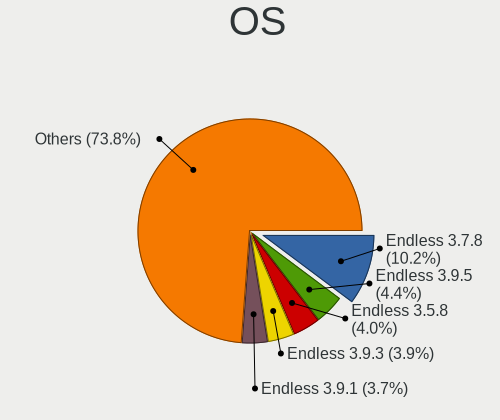

| Name          | Desktops | Percent |
|---------------|----------|---------|
| Endless 3.7.8 | 81       | 10.93%  |
| Endless 3.9.5 | 35       | 4.72%   |
| Endless 3.5.8 | 32       | 4.32%   |
| Endless 3.9.3 | 31       | 4.18%   |
| Endless 3.9.1 | 30       | 4.05%   |
| Endless 3.7.6 | 30       | 4.05%   |
| Endless 3.8.4 | 27       | 3.64%   |
| Endless 3.8.7 | 23       | 3.1%    |
| Endless 3.9.0 | 22       | 2.97%   |
| Endless 3.6.0 | 22       | 2.97%   |
| Endless 3.9.4 | 21       | 2.83%   |
| Endless 3.7.7 | 21       | 2.83%   |
| Endless 3.8.6 | 19       | 2.56%   |
| Endless 3.8.1 | 19       | 2.56%   |
| Endless 3.8.0 | 18       | 2.43%   |
| Endless 3.7.5 | 18       | 2.43%   |
| Endless 3.8.3 | 17       | 2.29%   |
| Endless 3.7.3 | 17       | 2.29%   |
| Endless 3.8.5 | 16       | 2.16%   |
| Endless 3.5.7 | 15       | 2.02%   |
| Endless 4.0.2 | 14       | 1.89%   |
| Endless 4.0.4 | 12       | 1.62%   |
| Endless 3.6.2 | 12       | 1.62%   |
| Endless 3.6.1 | 12       | 1.62%   |
| Endless 3.5.6 | 12       | 1.62%   |
| Endless 3.5.4 | 12       | 1.62%   |
| Endless 3.6.3 | 11       | 1.48%   |
| Endless 4.0.6 | 10       | 1.35%   |
| Endless 3.9.2 | 10       | 1.35%   |
| Endless 3.6.4 | 10       | 1.35%   |
| Endless 4.0.3 | 9        | 1.21%   |
| Endless 3.5.3 | 9        | 1.21%   |
| Endless 3.5.1 | 9        | 1.21%   |
| Endless 4.0.7 | 8        | 1.08%   |
| Endless 3.5.9 | 7        | 0.94%   |
| Endless 3.4.8 | 6        | 0.81%   |
| Endless 4.0.1 | 5        | 0.67%   |
| Endless 3.9.6 | 5        | 0.67%   |
| Endless 3.7.4 | 5        | 0.67%   |
| Endless 4.0.9 | 4        | 0.54%   |

OS Family
---------

OS without a version

| Name    | Desktops | Percent |
|---------|----------|---------|
| Endless | 640      | 100%    |

Kernel
------

Version of the Linux kernel

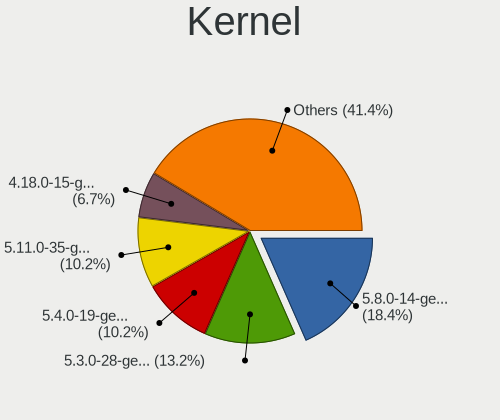

| Version           | Desktops | Percent |
|-------------------|----------|---------|
| 5.8.0-14-generic  | 138      | 19.46%  |
| 5.3.0-28-generic  | 100      | 14.1%   |
| 5.4.0-19-generic  | 77       | 10.86%  |
| 5.11.0-35-generic | 72       | 10.16%  |
| 4.18.0-15-generic | 51       | 7.19%   |
| 5.3.0-23-generic  | 47       | 6.63%   |
| 5.4.0-42-generic  | 42       | 5.92%   |
| 4.18.0-12-generic | 24       | 3.39%   |
| 5.0.0-15-generic  | 22       | 3.1%    |
| 5.0.0-25-generic  | 21       | 2.96%   |
| 5.3.0-12-generic  | 20       | 2.82%   |
| 5.4.0-39-generic  | 16       | 2.26%   |
| 5.0.0-20-generic  | 12       | 1.69%   |
| 5.0.0-17-generic  | 12       | 1.69%   |
| 4.18.0-11-generic | 10       | 1.41%   |
| 4.18.0-10-generic | 10       | 1.41%   |
| 4.15.0-34-generic | 6        | 0.85%   |
| 5.3.0-19-generic  | 5        | 0.71%   |
| 4.15.0-15-generic | 5        | 0.71%   |
| 4.15.0-12-generic | 5        | 0.71%   |
| 4.13.0-32-generic | 5        | 0.71%   |
| 4.15.0-23-generic | 2        | 0.28%   |
| 5.6.0-7-generic   | 1        | 0.14%   |
| 5.13.0-20-generic | 1        | 0.14%   |
| 5.1.0-2-generic   | 1        | 0.14%   |
| 4.17.0-4-generic  | 1        | 0.14%   |
| 4.15.0-33-generic | 1        | 0.14%   |
| 4.15.0-22-generic | 1        | 0.14%   |
| 4.13.0-19-generic | 1        | 0.14%   |

Kernel Family
-------------

Linux kernel without a distro release

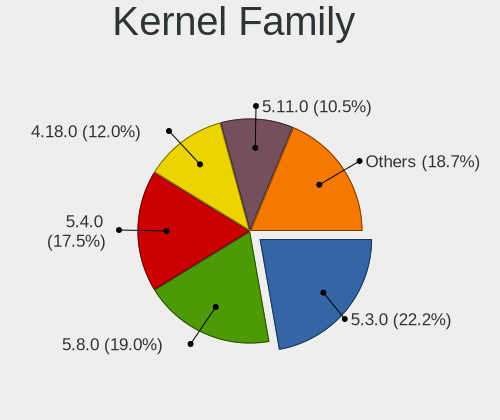

| Version | Desktops | Percent |
|---------|----------|---------|
| 5.3.0   | 164      | 23.94%  |
| 5.8.0   | 138      | 20.15%  |
| 5.4.0   | 129      | 18.83%  |
| 4.18.0  | 89       | 12.99%  |
| 5.11.0  | 72       | 10.51%  |
| 5.0.0   | 63       | 9.2%    |
| 4.15.0  | 20       | 2.92%   |
| 4.13.0  | 6        | 0.88%   |
| 5.6.0   | 1        | 0.15%   |
| 5.13.0  | 1        | 0.15%   |
| 5.1.0   | 1        | 0.15%   |
| 4.17.0  | 1        | 0.15%   |

Kernel Major Ver.
-----------------

Linux kernel major version

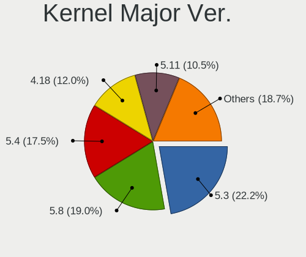

| Version | Desktops | Percent |
|---------|----------|---------|
| 5.3     | 164      | 23.94%  |
| 5.8     | 138      | 20.15%  |
| 5.4     | 129      | 18.83%  |
| 4.18    | 89       | 12.99%  |
| 5.11    | 72       | 10.51%  |
| 5.0     | 63       | 9.2%    |
| 4.15    | 20       | 2.92%   |
| 4.13    | 6        | 0.88%   |
| 5.6     | 1        | 0.15%   |
| 5.13    | 1        | 0.15%   |
| 5.1     | 1        | 0.15%   |
| 4.17    | 1        | 0.15%   |

Arch
----

OS architecture (x86_64, i586, etc.)

| Name   | Desktops | Percent |
|--------|----------|---------|
| x86_64 | 640      | 100%    |

DE
--

Desktop Environment

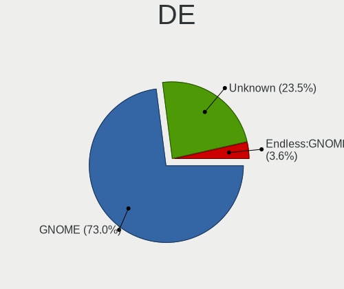

| Name    | Desktops | Percent |
|---------|----------|---------|
| GNOME   | 487      | 74.69%  |
| Unknown | 165      | 25.31%  |

Display Server
--------------

X11 or Wayland

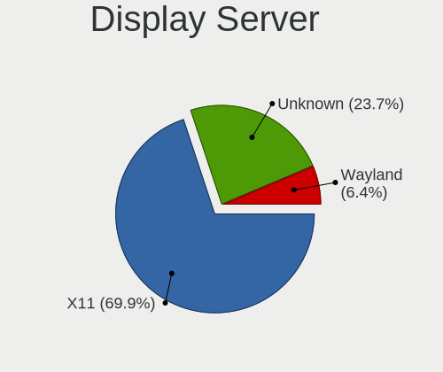

| Name    | Desktops | Percent |
|---------|----------|---------|
| X11     | 484      | 74.23%  |
| Unknown | 168      | 25.77%  |

Display Manager
---------------

SDDM, LightDM, etc.

| Name    | Desktops | Percent |
|---------|----------|---------|
| Unknown | 640      | 100%    |

OS Lang
-------

Language

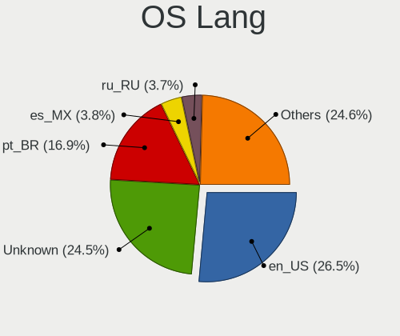

| Lang        | Desktops | Percent |
|-------------|----------|---------|
| Unknown     | 172      | 26.3%   |
| en_US       | 168      | 25.69%  |
| pt_BR       | 107      | 16.36%  |
| ru_RU       | 26       | 3.98%   |
| es_MX       | 25       | 3.82%   |
| de_DE       | 18       | 2.75%   |
| en_GB       | 15       | 2.29%   |
| es_ES       | 13       | 1.99%   |
| ru_RU.UTF_8 | 12       | 1.83%   |
| ro_RO       | 11       | 1.68%   |
| en_PH       | 9        | 1.38%   |
| pl_PL       | 8        | 1.22%   |
| it_IT       | 8        | 1.22%   |
| fr_FR       | 7        | 1.07%   |
| pt_PT       | 4        | 0.61%   |
| id_ID       | 4        | 0.61%   |
| hu_HU       | 4        | 0.61%   |
| en_IN       | 4        | 0.61%   |
| cs_CZ       | 4        | 0.61%   |
| uk_UA       | 3        | 0.46%   |
| tr_TR       | 3        | 0.46%   |
| ru_UA       | 3        | 0.46%   |
| nl_NL       | 3        | 0.46%   |
| en_AU       | 3        | 0.46%   |
| zh_TW       | 2        | 0.31%   |
| th_TH       | 2        | 0.31%   |
| ar_AE       | 2        | 0.31%   |
| sr_RS       | 1        | 0.15%   |
| sl_SI       | 1        | 0.15%   |
| sk_SK       | 1        | 0.15%   |
| si_LK       | 1        | 0.15%   |
| nl_BE       | 1        | 0.15%   |
| lt_LT       | 1        | 0.15%   |
| it_CH       | 1        | 0.15%   |
| fr_CH       | 1        | 0.15%   |
| fr_CA       | 1        | 0.15%   |
| es_CO       | 1        | 0.15%   |
| es_AR       | 1        | 0.15%   |
| en_IL       | 1        | 0.15%   |
| en_BW       | 1        | 0.15%   |

Boot Mode
---------

EFI or BIOS

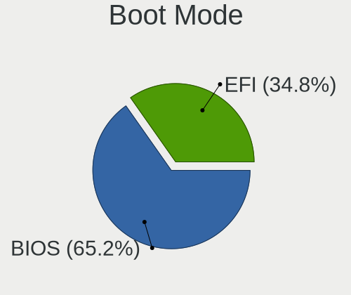

| Mode | Desktops | Percent |
|------|----------|---------|
| BIOS | 432      | 66.36%  |
| EFI  | 219      | 33.64%  |

Filesystem
----------

Type of filesystem

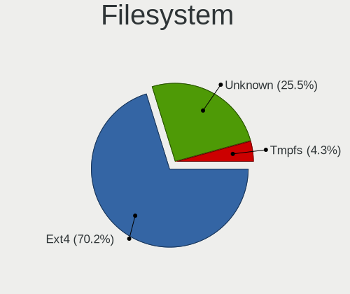

| Type    | Desktops | Percent |
|---------|----------|---------|
| Ext4    | 447      | 68.45%  |
| Unknown | 179      | 27.41%  |
| Tmpfs   | 27       | 4.13%   |

Part. scheme
------------

Scheme of partitioning

| Type    | Desktops | Percent |
|---------|----------|---------|
| Unknown | 639      | 99.84%  |
| GPT     | 1        | 0.16%   |

Dual Boot with Linux/BSD
------------------------

Hosting more than one Linux/BSD

| Dual boot | Desktops | Percent |
|-----------|----------|---------|
| No        | 640      | 100%    |

Dual Boot (Win)
---------------

Hosting Linux and Windows

| Dual boot | Desktops | Percent |
|-----------|----------|---------|
| No        | 639      | 99.84%  |
| Yes       | 1        | 0.16%   |

Board
-----

Vendor
------

Motherboard manufacturer

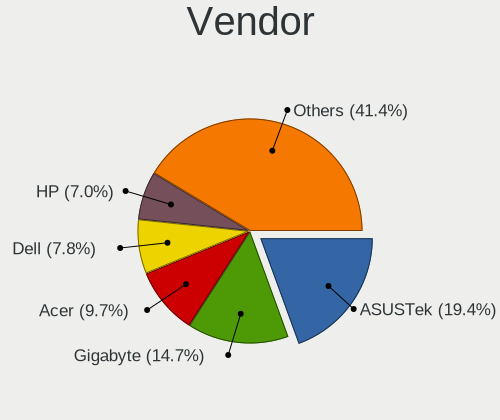

| Name                | Desktops | Percent |
|---------------------|----------|---------|
| ASUSTek Computer    | 122      | 19.06%  |
| Gigabyte Technology | 95       | 14.84%  |
| Acer                | 66       | 10.31%  |
| Dell                | 48       | 7.5%    |
| Hewlett-Packard     | 44       | 6.88%   |
| MSI                 | 40       | 6.25%   |
| ASRock              | 38       | 5.94%   |
| Lenovo              | 23       | 3.59%   |
| Intel               | 21       | 3.28%   |
| Foxconn             | 18       | 2.81%   |
| ECS                 | 13       | 2.03%   |
| Unknown             | 12       | 1.88%   |
| Pegatron            | 10       | 1.56%   |
| Biostar             | 10       | 1.56%   |
| Positivo            | 9        | 1.41%   |
| Fujitsu             | 7        | 1.09%   |
| Megaware            | 5        | 0.78%   |
| Semp Toshiba        | 4        | 0.63%   |
| PCWare              | 4        | 0.63%   |
| Medion              | 3        | 0.47%   |
| eMachines           | 3        | 0.47%   |
| AAEON               | 3        | 0.47%   |
| ZOTAC               | 2        | 0.31%   |
| VS Company          | 2        | 0.31%   |
| Shuttle             | 2        | 0.31%   |
| Login Informatica   | 2        | 0.31%   |
| IBM                 | 2        | 0.31%   |
| Huanan              | 2        | 0.31%   |
| Fujitsu Siemens     | 2        | 0.31%   |
| Digiboard           | 2        | 0.31%   |
| CCE                 | 2        | 0.31%   |
| AMD                 | 2        | 0.31%   |
| Trinity             | 1        | 0.16%   |
| TriGem Computer     | 1        | 0.16%   |
| Quanta              | 1        | 0.16%   |
| Qbex                | 1        | 0.16%   |
| Phitronics          | 1        | 0.16%   |
| Packard Bell        | 1        | 0.16%   |
| OEM_MB              | 1        | 0.16%   |
| OEM                 | 1        | 0.16%   |

Model
-----

Motherboard model

| Name                          | Desktops | Percent |
|-------------------------------|----------|---------|
| Unknown                       | 13       | 2.03%   |
| ASUS All Series               | 11       | 1.72%   |
| Acer Aspire XC-830            | 11       | 1.72%   |
| Acer Aspire XC-885            | 9        | 1.41%   |
| Dell OptiPlex 390             | 6        | 0.94%   |
| MSI MS-7309                   | 5        | 0.78%   |
| Gigabyte B360M AORUS Gaming 3 | 5        | 0.78%   |
| ECS A320AM4-M3D               | 5        | 0.78%   |
| Acer Veriton EX2620G          | 5        | 0.78%   |
| Acer Nitro N50-610            | 5        | 0.78%   |
| Acer Nitro N50-600            | 5        | 0.78%   |
| Semp Toshiba STI              | 4        | 0.63%   |
| MSI MS-7817                   | 4        | 0.63%   |
| Intel H61                     | 4        | 0.63%   |
| HP EliteDesk 800 G1 SFF       | 4        | 0.63%   |
| Foxconn G31MX Series          | 4        | 0.63%   |
| Dell OptiPlex 780             | 4        | 0.63%   |
| MSI MS-7267                   | 3        | 0.47%   |
| Gigabyte G31M-ES2L            | 3        | 0.47%   |
| Gigabyte A320M-S2H            | 3        | 0.47%   |
| Foxconn 500B Microtower       | 3        | 0.47%   |
| Dell OptiPlex 790             | 3        | 0.47%   |
| Dell OptiPlex 760             | 3        | 0.47%   |
| Dell OptiPlex 3020            | 3        | 0.47%   |
| ASUS P7H55-M                  | 3        | 0.47%   |
| Acer Aspire TC-885            | 3        | 0.47%   |
| AAEON MF-001                  | 3        | 0.47%   |
| Positivo POS-MIG31AG          | 2        | 0.31%   |
| Positivo POS-MI945AA          | 2        | 0.31%   |
| Positivo P5VD2-MX             | 2        | 0.31%   |
| MSI MS-7A15                   | 2        | 0.31%   |
| Intel MAHOBAY                 | 2        | 0.31%   |
| HP ProDesk 600 G1 SFF         | 2        | 0.31%   |
| HP Compaq Pro 6305 SFF        | 2        | 0.31%   |
| HP Compaq 6200 Pro SFF PC     | 2        | 0.31%   |
| Gigabyte Z77X-UD5H            | 2        | 0.31%   |
| Gigabyte Z68X-UD3H-B3         | 2        | 0.31%   |
| Gigabyte H61M-S1              | 2        | 0.31%   |
| Gigabyte GA-E6010N            | 2        | 0.31%   |
| Gigabyte GA-78LMT-USB3 6.0    | 2        | 0.31%   |

Model Family
------------

Motherboard model prefix

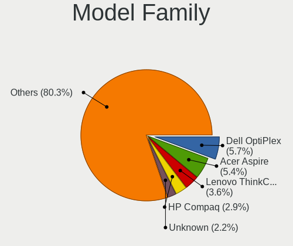

| Name                 | Desktops | Percent |
|----------------------|----------|---------|
| Acer Aspire          | 37       | 5.78%   |
| Dell OptiPlex        | 34       | 5.31%   |
| Lenovo ThinkCentre   | 19       | 2.97%   |
| HP Compaq            | 19       | 2.97%   |
| ASUS PRIME           | 14       | 2.19%   |
| Acer Veriton         | 14       | 2.19%   |
| Unknown              | 13       | 2.03%   |
| ASUS All             | 11       | 1.72%   |
| Acer Nitro           | 11       | 1.72%   |
| ASUS M5A78L-M        | 9        | 1.41%   |
| HP EliteDesk         | 7        | 1.09%   |
| Fujitsu ESPRIMO      | 7        | 1.09%   |
| ASUS P8H61-M         | 6        | 0.94%   |
| MSI MS-7309          | 5        | 0.78%   |
| Gigabyte B360M       | 5        | 0.78%   |
| ECS A320AM4-M3D      | 5        | 0.78%   |
| Dell Inspiron        | 5        | 0.78%   |
| Semp Toshiba STI     | 4        | 0.63%   |
| MSI MS-7817          | 4        | 0.63%   |
| Intel H61            | 4        | 0.63%   |
| HP ProDesk           | 4        | 0.63%   |
| Gigabyte B450M       | 4        | 0.63%   |
| Gigabyte A320M-S2H   | 4        | 0.63%   |
| Foxconn G31MX        | 4        | 0.63%   |
| Dell Precision       | 4        | 0.63%   |
| ASUS P5G41T-M        | 4        | 0.63%   |
| MSI MS-7267          | 3        | 0.47%   |
| Gigabyte X570        | 3        | 0.47%   |
| Gigabyte G31M-ES2L   | 3        | 0.47%   |
| Foxconn 500B         | 3        | 0.47%   |
| ASUS ROG             | 3        | 0.47%   |
| ASUS P7H55-M         | 3        | 0.47%   |
| ASUS P5Q             | 3        | 0.47%   |
| ASUS P5GC-MX         | 3        | 0.47%   |
| ASUS M5A97           | 3        | 0.47%   |
| ASUS M2N68-AM        | 3        | 0.47%   |
| ASUS ASUSPRO         | 3        | 0.47%   |
| AAEON MF-001         | 3        | 0.47%   |
| ZOTAC AMD            | 2        | 0.31%   |
| Positivo POS-MIG31AG | 2        | 0.31%   |

MFG Year
--------

Motherboard manufacture year

| Year | Desktops | Percent |
|------|----------|---------|
| 2018 | 72       | 11.25%  |
| 2012 | 67       | 10.47%  |
| 2011 | 65       | 10.16%  |
| 2010 | 53       | 8.28%   |
| 2009 | 51       | 7.97%   |
| 2017 | 46       | 7.19%   |
| 2013 | 46       | 7.19%   |
| 2008 | 45       | 7.03%   |
| 2014 | 44       | 6.88%   |
| 2007 | 37       | 5.78%   |
| 2016 | 29       | 4.53%   |
| 2019 | 25       | 3.91%   |
| 2020 | 21       | 3.28%   |
| 2015 | 16       | 2.5%    |
| 2006 | 13       | 2.03%   |
| 2021 | 6        | 0.94%   |
| 2005 | 3        | 0.47%   |
| 2004 | 1        | 0.16%   |

Form Factor
-----------

Physical design of the computer

| Name    | Desktops | Percent |
|---------|----------|---------|
| Desktop | 640      | 100%    |

Secure Boot
-----------

Enabled or disabled

| State    | Desktops | Percent |
|----------|----------|---------|
| Disabled | 617      | 95.96%  |
| Enabled  | 26       | 4.04%   |

Coreboot
--------

Have coreboot on board

| Used | Desktops | Percent |
|------|----------|---------|
| No   | 639      | 99.84%  |
| Yes  | 1        | 0.16%   |

RAM Size
--------

Total RAM memory

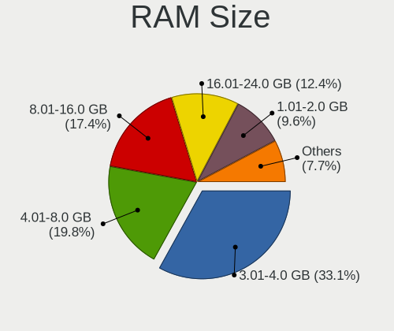

| Size in GB  | Desktops | Percent |
|-------------|----------|---------|
| 3.01-4.0    | 225      | 34.14%  |
| 4.01-8.0    | 127      | 19.27%  |
| 8.01-16.0   | 119      | 18.06%  |
| 16.01-24.0  | 74       | 11.23%  |
| 1.01-2.0    | 67       | 10.17%  |
| 32.01-64.0  | 17       | 2.58%   |
| 2.01-3.0    | 15       | 2.28%   |
| 24.01-32.0  | 8        | 1.21%   |
| 64.01-256.0 | 4        | 0.61%   |
| 0.51-1.0    | 2        | 0.3%    |
| Unknown     | 1        | 0.15%   |

RAM Used
--------

Used RAM memory

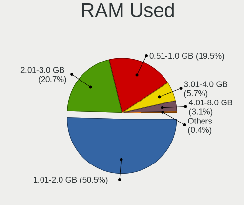

| Used GB  | Desktops | Percent |
|----------|----------|---------|
| 1.01-2.0 | 346      | 50.73%  |
| 2.01-3.0 | 143      | 20.97%  |
| 0.51-1.0 | 139      | 20.38%  |
| 3.01-4.0 | 34       | 4.99%   |
| 4.01-8.0 | 17       | 2.49%   |
| 0.01-0.5 | 2        | 0.29%   |
| Unknown  | 1        | 0.15%   |

Total Drives
------------

Number of drives on board

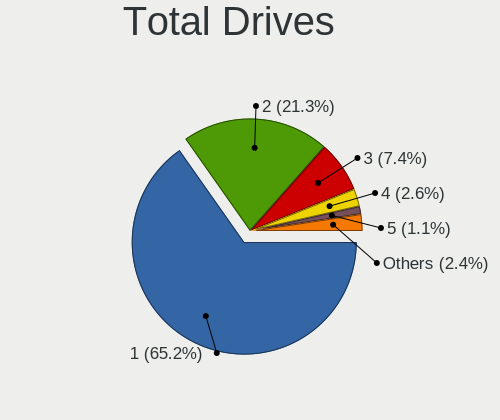

| Drives  | Desktops | Percent |
|---------|----------|---------|
| 1       | 431      | 65.9%   |
| 2       | 142      | 21.71%  |
| 3       | 46       | 7.03%   |
| 4       | 16       | 2.45%   |
| 0       | 7        | 1.07%   |
| 5       | 5        | 0.76%   |
| 6       | 4        | 0.61%   |
| 7       | 2        | 0.31%   |
| Unknown | 1        | 0.15%   |

Has CD-ROM
----------

Has CD-ROM on board

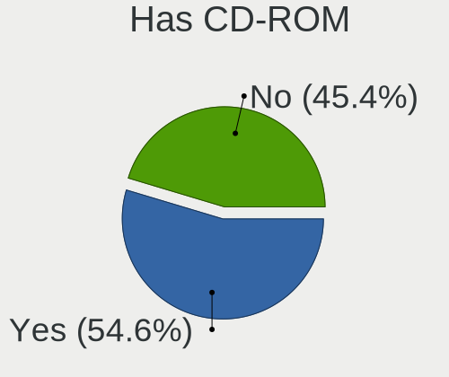

| Presented | Desktops | Percent |
|-----------|----------|---------|
| Yes       | 358      | 54.91%  |
| No        | 294      | 45.09%  |

Has Ethernet
------------

Has Ethernet on board

| Presented | Desktops | Percent |
|-----------|----------|---------|
| Yes       | 631      | 98.59%  |
| No        | 9        | 1.41%   |

Has WiFi
--------

Has WiFi module

| Presented | Desktops | Percent |
|-----------|----------|---------|
| No        | 373      | 57.38%  |
| Yes       | 277      | 42.62%  |

Has Bluetooth
-------------

Has Bluetooth module

| Presented | Desktops | Percent |
|-----------|----------|---------|
| No        | 530      | 82.43%  |
| Yes       | 113      | 17.57%  |

Location
--------

Country
-------

Geographic location (country)

| Country      | Desktops | Percent |
|--------------|----------|---------|
| Brazil       | 159      | 24.84%  |
| USA          | 101      | 15.78%  |
| Russia       | 53       | 8.28%   |
| Romania      | 29       | 4.53%   |
| Germany      | 29       | 4.53%   |
| Mexico       | 25       | 3.91%   |
| UK           | 17       | 2.66%   |
| Spain        | 16       | 2.5%    |
| Philippines  | 16       | 2.5%    |
| Ukraine      | 13       | 2.03%   |
| India        | 13       | 2.03%   |
| Poland       | 12       | 1.88%   |
| Canada       | 11       | 1.72%   |
| Italy        | 10       | 1.56%   |
| New Zealand  | 9        | 1.41%   |
| Indonesia    | 9        | 1.41%   |
| Portugal     | 7        | 1.09%   |
| France       | 7        | 1.09%   |
| Turkey       | 6        | 0.94%   |
| Thailand     | 6        | 0.94%   |
| Netherlands  | 6        | 0.94%   |
| Saudi Arabia | 5        | 0.78%   |
| Hungary      | 5        | 0.78%   |
| Czechia      | 5        | 0.78%   |
| Australia    | 5        | 0.78%   |
| Argentina    | 5        | 0.78%   |
| Taiwan       | 4        | 0.63%   |
| Serbia       | 3        | 0.47%   |
| Malaysia     | 3        | 0.47%   |
| Sri Lanka    | 2        | 0.31%   |
| South Africa | 2        | 0.31%   |
| Slovenia     | 2        | 0.31%   |
| Peru         | 2        | 0.31%   |
| Japan        | 2        | 0.31%   |
| Ireland      | 2        | 0.31%   |
| Iran         | 2        | 0.31%   |
| Greece       | 2        | 0.31%   |
| Colombia     | 2        | 0.31%   |
| Bulgaria     | 2        | 0.31%   |
| Austria      | 2        | 0.31%   |

City
----

Geographic location (city)

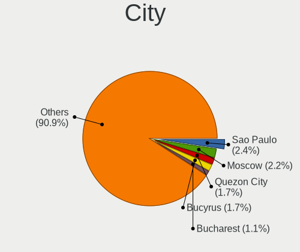

| City           | Desktops | Percent |
|----------------|----------|---------|
| Sao Paulo      | 17       | 2.58%   |
| Moscow         | 15       | 2.28%   |
| Quezon City    | 12       | 1.82%   |
| Bucyrus        | 12       | 1.82%   |
| Bucharest      | 8        | 1.21%   |
| St Petersburg  | 6        | 0.91%   |
| Rio de Janeiro | 5        | 0.76%   |
| Goinia       | 5        | 0.76%   |
| Christchurch   | 5        | 0.76%   |
| Warsaw         | 4        | 0.61%   |
| Queretaro      | 4        | 0.61%   |
| Mexico City    | 4        | 0.61%   |
| Jakarta        | 4        | 0.61%   |
| Braslia      | 4        | 0.61%   |
| Berlin         | 4        | 0.61%   |
| Santo Andr   | 3        | 0.46%   |
| San Francisco  | 3        | 0.46%   |
| Salvador       | 3        | 0.46%   |
| Rome           | 3        | 0.46%   |
| Redditch       | 3        | 0.46%   |
| Porto Alegre   | 3        | 0.46%   |
| Phoenix        | 3        | 0.46%   |
| Mumbai         | 3        | 0.46%   |
| Mesquita       | 3        | 0.46%   |
| Medina         | 3        | 0.46%   |
| Lenoir         | 3        | 0.46%   |
| Kaohsiung City | 3        | 0.46%   |
| Istanbul       | 3        | 0.46%   |
| Guadalajara    | 3        | 0.46%   |
| Belo Horizonte | 3        | 0.46%   |
| Auckland       | 3        | 0.46%   |
| Vitria       | 2        | 0.3%    |
| Viamao         | 2        | 0.3%    |
| Valencia       | 2        | 0.3%    |
| Thessaloniki   | 2        | 0.3%    |
| Tehran         | 2        | 0.3%    |
| Taubate        | 2        | 0.3%    |
| Sydney         | 2        | 0.3%    |
| Sumar        | 2        | 0.3%    |
| Shelbyville    | 2        | 0.3%    |

Drives
------

Drive Vendor
------------

Hard drive vendors

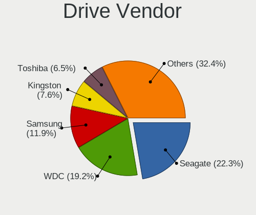

| Vendor                | Desktops | Drives | Percent |
|-----------------------|----------|--------|---------|
| Seagate               | 198      | 263    | 22.5%   |
| WDC                   | 169      | 209    | 19.2%   |
| Samsung Electronics   | 107      | 136    | 12.16%  |
| Kingston              | 69       | 109    | 7.84%   |
| Toshiba               | 57       | 64     | 6.48%   |
| Hitachi               | 49       | 52     | 5.57%   |
| SanDisk               | 39       | 58     | 4.43%   |
| Unknown               | 29       | 36     | 3.3%    |
| Crucial               | 20       | 30     | 2.27%   |
| Maxtor                | 13       | 15     | 1.48%   |
| SPCC                  | 9        | 9      | 1.02%   |
| OCZ                   | 8        | 8      | 0.91%   |
| Intel                 | 8        | 11     | 0.91%   |
| Phison                | 7        | 9      | 0.8%    |
| HGST                  | 7        | 8      | 0.8%    |
| A-DATA Technology     | 7        | 9      | 0.8%    |
| China                 | 5        | 6      | 0.57%   |
| Transcend             | 4        | 6      | 0.45%   |
| SK hynix              | 4        | 5      | 0.45%   |
| Silicon Motion        | 4        | 4      | 0.45%   |
| Patriot               | 4        | 4      | 0.45%   |
| Kingmax               | 4        | 5      | 0.45%   |
| GOODRAM               | 4        | 4      | 0.45%   |
| Realtek Semiconductor | 3        | 3      | 0.34%   |
| PNY                   | 3        | 3      | 0.34%   |
| Mushkin               | 3        | 4      | 0.34%   |
| KingDian              | 3        | 3      | 0.34%   |
| Fujitsu               | 3        | 3      | 0.34%   |
| ASMT                  | 3        | 3      | 0.34%   |
| KingSpec              | 2        | 2      | 0.23%   |
| Hewlett-Packard       | 2        | 6      | 0.23%   |
| Corsair               | 2        | 3      | 0.23%   |
| ZTE                   | 1        | 1      | 0.11%   |
| XPG                   | 1        | 1      | 0.11%   |
| V-GeN                 | 1        | 1      | 0.11%   |
| USB                   | 1        | 1      | 0.11%   |
| TSA                   | 1        | 1      | 0.11%   |
| TO Exter              | 1        | 1      | 0.11%   |
| Team                  | 1        | 1      | 0.11%   |
| TCSUNBOW              | 1        | 1      | 0.11%   |

Drive Model
-----------

Hard drive models

| Model                               | Desktops | Percent |
|-------------------------------------|----------|---------|
| Seagate ST500DM002-1BD142 500GB     | 29       | 3.02%   |
| Seagate ST1000DM010-2EP102 1TB      | 23       | 2.39%   |
| Toshiba DT01ACA100 1TB              | 19       | 1.98%   |
| Unknown SD/MMC/MS PRO 64GB          | 17       | 1.77%   |
| Kingston SV300S37A120G 120GB SSD    | 17       | 1.77%   |
| WDC WD10EZEX-08WN4A0 1TB            | 12       | 1.25%   |
| Kingston SA400S37120G 120GB SSD     | 10       | 1.04%   |
| Crucial CT240BX500SSD1 240GB        | 10       | 1.04%   |
| Samsung HD161HJ 160GB               | 9        | 0.94%   |
| Seagate ST3500312CS 500GB           | 8        | 0.83%   |
| Samsung HD161GJ 160GB               | 8        | 0.83%   |
| Kingston SA400S37240G 240GB SSD     | 8        | 0.83%   |
| WDC WDS240G2G0A-00JH30 240GB SSD    | 7        | 0.73%   |
| Samsung HD502HJ 500GB               | 7        | 0.73%   |
| Hitachi HDS721616PLA380 160GB       | 7        | 0.73%   |
| Toshiba DT01ACA050 500GB            | 6        | 0.62%   |
| Seagate ST3320418AS 320GB           | 6        | 0.62%   |
| Seagate ST3160318AS 160GB           | 6        | 0.62%   |
| Seagate ST2000DM001-1ER164 2TB      | 6        | 0.62%   |
| Seagate ST1000DM003-1CH162 1TB      | 6        | 0.62%   |
| Samsung NVMe SSD Drive 512GB        | 6        | 0.62%   |
| Kingston NVMe SSD Drive 128GB       | 6        | 0.62%   |
| WDC WD10EZEX-21WN4A0 1TB            | 5        | 0.52%   |
| Toshiba THNS128GG4BBAA 128GB SSD    | 5        | 0.52%   |
| SPCC Solid State Disk 64GB          | 5        | 0.52%   |
| Seagate ST500LM012 HN-M500MBB 500GB | 5        | 0.52%   |
| Seagate ST3500418AS 500GB           | 5        | 0.52%   |
| Seagate ST31000528AS 1TB            | 5        | 0.52%   |
| Seagate ST250DM000-1BD141 250GB     | 5        | 0.52%   |
| Seagate ST2000DM001-1CH164 2TB      | 5        | 0.52%   |
| Samsung SSD 860 EVO 500GB           | 5        | 0.52%   |
| Samsung HD322HJ 320GB               | 5        | 0.52%   |
| Samsung HD103SJ 1TB                 | 5        | 0.52%   |
| Samsung HD080HJ/ 80GB               | 5        | 0.52%   |
| Kingston NVMe SSD Drive 256GB       | 5        | 0.52%   |
| WDC WD5000AVDS-63U7B1 500GB         | 4        | 0.42%   |
| WDC WD5000AAKX-003CA0 500GB         | 4        | 0.42%   |
| WDC WD10EZEX-22BN5A0 1TB            | 4        | 0.42%   |
| Seagate ST3250318AS 250GB           | 4        | 0.42%   |
| Seagate ST31000524AS 1TB            | 4        | 0.42%   |

HDD Vendor
----------

Hard disk drive vendors

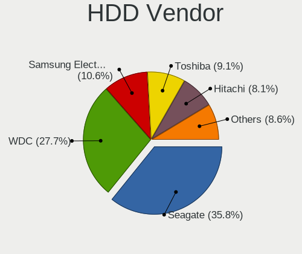

| Vendor              | Desktops | Drives | Percent |
|---------------------|----------|--------|---------|
| Seagate             | 197      | 261    | 35.43%  |
| WDC                 | 153      | 185    | 27.52%  |
| Samsung Electronics | 62       | 74     | 11.15%  |
| Toshiba             | 50       | 56     | 8.99%   |
| Hitachi             | 49       | 52     | 8.81%   |
| Unknown             | 17       | 19     | 3.06%   |
| Maxtor              | 12       | 14     | 2.16%   |
| HGST                | 7        | 8      | 1.26%   |
| Fujitsu             | 3        | 3      | 0.54%   |
| ASMT                | 3        | 3      | 0.54%   |
| Hewlett-Packard     | 1        | 2      | 0.18%   |
| ASMedia             | 1        | 2      | 0.18%   |
| Apple               | 1        | 1      | 0.18%   |

SSD Vendor
----------

Solid state drive vendors

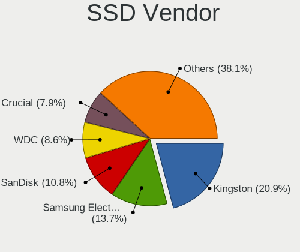

| Vendor              | Desktops | Drives | Percent |
|---------------------|----------|--------|---------|
| Kingston            | 54       | 92     | 21.6%   |
| Samsung Electronics | 36       | 42     | 14.4%   |
| SanDisk             | 28       | 45     | 11.2%   |
| Crucial             | 20       | 30     | 8%      |
| WDC                 | 19       | 21     | 7.6%    |
| SPCC                | 9        | 9      | 3.6%    |
| OCZ                 | 8        | 8      | 3.2%    |
| Toshiba             | 7        | 7      | 2.8%    |
| A-DATA Technology   | 7        | 9      | 2.8%    |
| Intel               | 5        | 8      | 2%      |
| China               | 5        | 6      | 2%      |
| Transcend           | 4        | 6      | 1.6%    |
| Patriot             | 4        | 4      | 1.6%    |
| Kingmax             | 4        | 5      | 1.6%    |
| GOODRAM             | 4        | 4      | 1.6%    |
| PNY                 | 3        | 3      | 1.2%    |
| Mushkin             | 3        | 4      | 1.2%    |
| KingDian            | 3        | 3      | 1.2%    |
| KingSpec            | 2        | 2      | 0.8%    |
| Corsair             | 2        | 3      | 0.8%    |
| Unknown             | 1        | 1      | 0.4%    |
| TSA                 | 1        | 1      | 0.4%    |
| TO Exter            | 1        | 1      | 0.4%    |
| Team                | 1        | 1      | 0.4%    |
| TCSUNBOW            | 1        | 1      | 0.4%    |
| SK hynix            | 1        | 2      | 0.4%    |
| Seagate             | 1        | 1      | 0.4%    |
| SABRENT             | 1        | 1      | 0.4%    |
| Netac               | 1        | 2      | 0.4%    |
| Maxtor              | 1        | 1      | 0.4%    |
| Londisk             | 1        | 1      | 0.4%    |
| LITEONIT            | 1        | 1      | 0.4%    |
| LITEON              | 1        | 2      | 0.4%    |
| Leven               | 1        | 1      | 0.4%    |
| KIOXIA-EXCERIA      | 1        | 1      | 0.4%    |
| Intenso             | 1        | 1      | 0.4%    |
| Hewlett-Packard     | 1        | 4      | 0.4%    |
| Gigabyte Technology | 1        | 1      | 0.4%    |
| Faspeed             | 1        | 1      | 0.4%    |
| Emtec               | 1        | 1      | 0.4%    |

Drive Kind
----------

HDD or SSD

| Kind    | Desktops | Drives | Percent |
|---------|----------|--------|---------|
| HDD     | 477      | 680    | 60.69%  |
| SSD     | 222      | 340    | 28.24%  |
| NVMe    | 64       | 77     | 8.14%   |
| Unknown | 17       | 21     | 2.16%   |
| MMC     | 6        | 6      | 0.76%   |

Drive Connector
---------------

SATA, SAS, NVMe, etc.

| Type | Desktops | Drives | Percent |
|------|----------|--------|---------|
| SATA | 594      | 991    | 84.26%  |
| NVMe | 63       | 76     | 8.94%   |
| SAS  | 42       | 51     | 5.96%   |
| MMC  | 6        | 6      | 0.85%   |

Drive Size
----------

Size of hard drive

| Size in TB | Desktops | Drives | Percent |
|------------|----------|--------|---------|
| 0.01-0.5   | 485      | 726    | 68.6%   |
| 0.51-1.0   | 166      | 226    | 23.48%  |
| 1.01-2.0   | 32       | 39     | 4.53%   |
| 2.01-3.0   | 12       | 13     | 1.7%    |
| 4.01-10.0  | 8        | 12     | 1.13%   |
| 3.01-4.0   | 3        | 3      | 0.42%   |
| 10.01-20.0 | 1        | 1      | 0.14%   |

Space Total
-----------

Amount of disk space available on the file system

| Size in GB     | Desktops | Percent |
|----------------|----------|---------|
| 101-250        | 209      | 31.57%  |
| 251-500        | 152      | 22.96%  |
| 501-1000       | 96       | 14.5%   |
| 51-100         | 72       | 10.88%  |
| 21-50          | 53       | 8.01%   |
| 1001-2000      | 29       | 4.38%   |
| 1-20           | 22       | 3.32%   |
| 2001-3000      | 14       | 2.11%   |
| More than 3000 | 12       | 1.81%   |
| Unknown        | 3        | 0.45%   |

Space Used
----------

Amount of used disk space

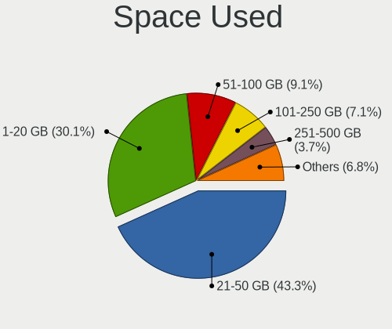

| Used GB        | Desktops | Percent |
|----------------|----------|---------|
| 21-50          | 303      | 44.49%  |
| 1-20           | 204      | 29.96%  |
| 51-100         | 62       | 9.1%    |
| 101-250        | 47       | 6.9%    |
| 251-500        | 26       | 3.82%   |
| 501-1000       | 20       | 2.94%   |
| 1001-2000      | 9        | 1.32%   |
| More than 3000 | 6        | 0.88%   |
| Unknown        | 3        | 0.44%   |
| 2001-3000      | 1        | 0.15%   |

Malfunc. Drives
---------------

Drive models with a malfunction

Zero info for selected period =(

Malfunc. Drive Vendor
---------------------

Vendors of faulty drives

Zero info for selected period =(

Malfunc. HDD Vendor
-------------------

Vendors of faulty HDD drives

Zero info for selected period =(

Malfunc. Drive Kind
-------------------

Kinds of faulty drives

Zero info for selected period =(

Failed Drives
-------------

Failed drive models

Zero info for selected period =(

Failed Drive Vendor
-------------------

Failed drive vendors

Zero info for selected period =(

Drive Status
------------

Number of failed and malfunc. drives

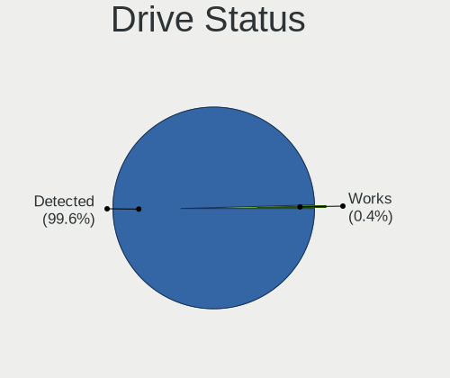

| Status   | Desktops | Drives | Percent |
|----------|----------|--------|---------|
| Detected | 634      | 1121   | 99.69%  |
| Works    | 2        | 3      | 0.31%   |

Storage controller
------------------

Storage Vendor
--------------

Storage controller vendors

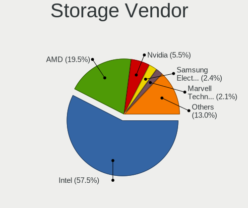

| Vendor                       | Desktops | Percent |
|------------------------------|----------|---------|
| Intel                        | 442      | 58.7%   |
| AMD                          | 146      | 19.39%  |
| Nvidia                       | 43       | 5.71%   |
| Marvell Technology Group     | 16       | 2.12%   |
| Samsung Electronics          | 15       | 1.99%   |
| Kingston Technology Company  | 15       | 1.99%   |
| JMicron Technology           | 14       | 1.86%   |
| SanDisk                      | 12       | 1.59%   |
| VIA Technologies             | 11       | 1.46%   |
| ASMedia Technology           | 11       | 1.46%   |
| Phison Electronics           | 7        | 0.93%   |
| Silicon Motion               | 4        | 0.53%   |
| SK hynix                     | 3        | 0.4%    |
| Realtek Semiconductor        | 3        | 0.4%    |
| Silicon Image                | 2        | 0.27%   |
| ADATA Technology             | 2        | 0.27%   |
| Toshiba America Info Systems | 1        | 0.13%   |
| Synopsys                     | 1        | 0.13%   |
| Shenzhen Longsys Electronics | 1        | 0.13%   |
| OCZ Technology Group         | 1        | 0.13%   |
| Micron Technology            | 1        | 0.13%   |
| LSI Logic / Symbios Logic    | 1        | 0.13%   |
| Adaptec                      | 1        | 0.13%   |

Storage Model
-------------

Storage controller models

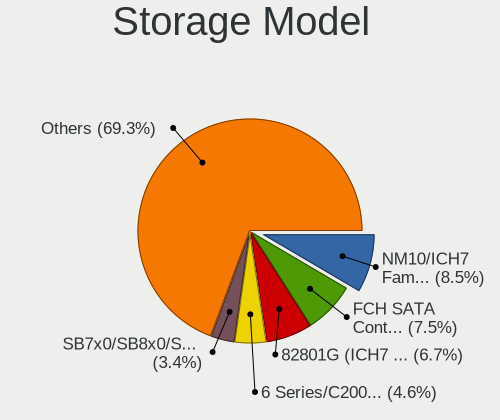

| Model                                                                                   | Desktops | Percent |
|-----------------------------------------------------------------------------------------|----------|---------|
| Intel NM10/ICH7 Family SATA Controller [IDE mode]                                       | 92       | 8.82%   |
| AMD FCH SATA Controller [AHCI mode]                                                     | 77       | 7.38%   |
| Intel 82801G (ICH7 Family) IDE Controller                                               | 72       | 6.9%    |
| Intel 6 Series/C200 Series Chipset Family 6 port Desktop SATA AHCI Controller           | 43       | 4.12%   |
| AMD SB7x0/SB8x0/SB9x0 IDE Controller                                                    | 38       | 3.64%   |
| Intel 8 Series/C220 Series Chipset Family 6-port SATA Controller 1 [AHCI mode]          | 35       | 3.36%   |
| Intel Cannon Lake PCH SATA AHCI Controller                                              | 34       | 3.26%   |
| AMD SB7x0/SB8x0/SB9x0 SATA Controller [AHCI mode]                                       | 30       | 2.88%   |
| Nvidia MCP61 SATA Controller                                                            | 29       | 2.78%   |
| Nvidia MCP61 IDE                                                                        | 27       | 2.59%   |
| Intel 6 Series/C200 Series Chipset Family Desktop SATA Controller (IDE mode, ports 4-5) | 24       | 2.3%    |
| Intel 6 Series/C200 Series Chipset Family Desktop SATA Controller (IDE mode, ports 0-3) | 24       | 2.3%    |
| AMD SB7x0/SB8x0/SB9x0 SATA Controller [IDE mode]                                        | 24       | 2.3%    |
| Intel 7 Series/C210 Series Chipset Family 6-port SATA Controller [AHCI mode]            | 21       | 2.01%   |
| Intel 200 Series PCH SATA controller [AHCI mode]                                        | 21       | 2.01%   |
| Intel Q170/Q150/B150/H170/H110/Z170/CM236 Chipset SATA Controller [AHCI Mode]           | 20       | 1.92%   |
| Intel Celeron/Pentium Silver Processor SATA Controller                                  | 19       | 1.82%   |
| Intel 4 Series Chipset PT IDER Controller                                               | 15       | 1.44%   |
| AMD FCH SATA Controller D                                                               | 15       | 1.44%   |
| Kingston Company U-SNS8154P3 NVMe SSD                                                   | 14       | 1.34%   |
| Intel SATA Controller [RAID mode]                                                       | 14       | 1.34%   |
| AMD FCH IDE Controller                                                                  | 12       | 1.15%   |
| Intel 82801JD/DO (ICH10 Family) SATA AHCI Controller                                    | 11       | 1.05%   |
| AMD 400 Series Chipset SATA Controller                                                  | 11       | 1.05%   |
| Samsung NVMe SSD Controller SM981/PM981/PM983                                           | 10       | 0.96%   |
| Intel Atom Processor E3800 Series SATA AHCI Controller                                  | 9        | 0.86%   |
| ASMedia ASM1062 Serial ATA Controller                                                   | 9        | 0.86%   |
| AMD FCH SATA Controller [IDE mode]                                                      | 9        | 0.86%   |
| Intel 82801JI (ICH10 Family) SATA AHCI Controller                                       | 8        | 0.77%   |
| Intel 82801JI (ICH10 Family) 4 port SATA IDE Controller #1                              | 8        | 0.77%   |
| JMicron JMB368 IDE controller                                                           | 7        | 0.67%   |
| Intel Atom/Celeron/Pentium Processor x5-E8000/J3xxx/N3xxx Series SATA Controller        | 7        | 0.67%   |
| Intel 82801JI (ICH10 Family) 2 port SATA IDE Controller #2                              | 7        | 0.67%   |
| Intel 82801IR/IO/IH (ICH9R/DO/DH) 4 port SATA Controller [IDE mode]                     | 7        | 0.67%   |
| Intel 82801I (ICH9 Family) 2 port SATA Controller [IDE mode]                            | 7        | 0.67%   |
| Intel 400 Series Chipset Family SATA AHCI Controller                                    | 7        | 0.67%   |
| Intel 5 Series/3400 Series Chipset 6 port SATA AHCI Controller                          | 6        | 0.58%   |
| VIA VT82C586A/B/VT82C686/A/B/VT823x/A/C PIPC Bus Master IDE                             | 5        | 0.48%   |
| VIA VT6415 PATA IDE Host Controller                                                     | 5        | 0.48%   |
| SanDisk WD Blue SN550 NVMe SSD                                                          | 5        | 0.48%   |

Storage Kind
------------

Kind of storage controller (IDE, SATA, NVMe, SAS, ...)

| Kind | Desktops | Percent |
|------|----------|---------|
| SATA | 422      | 53.69%  |
| IDE  | 275      | 34.99%  |
| NVMe | 66       | 8.4%    |
| RAID | 20       | 2.54%   |
| SCSI | 2        | 0.25%   |
| SAS  | 1        | 0.13%   |

Processor
---------

CPU Vendor
----------

Processor vendors

| Vendor  | Desktops | Percent |
|---------|----------|---------|
| Intel   | 458      | 71.56%  |
| AMD     | 181      | 28.28%  |
| Unknown | 1        | 0.16%   |

CPU Model
---------

Processor models

| Model                                           | Desktops | Percent |
|-------------------------------------------------|----------|---------|
| Intel Core 2 Duo CPU E8400 @ 3.00GHz            | 15       | 2.31%   |
| Intel Core i5-8400 CPU @ 2.80GHz                | 14       | 2.16%   |
| Intel Core 2 Duo CPU E7500 @ 2.93GHz            | 13       | 2.01%   |
| Intel Core i3-2120 CPU @ 3.30GHz                | 10       | 1.54%   |
| Intel Core i7-2600 CPU @ 3.40GHz                | 9        | 1.39%   |
| Intel Core i3-2100 CPU @ 3.10GHz                | 9        | 1.39%   |
| Intel Celeron CPU J1800 @ 2.41GHz               | 9        | 1.39%   |
| Intel Pentium Dual-Core CPU E5700 @ 3.00GHz     | 8        | 1.23%   |
| Intel Core i5-4570 CPU @ 3.20GHz                | 8        | 1.23%   |
| Intel Core i5-2400 CPU @ 3.10GHz                | 8        | 1.23%   |
| Intel Core i3-8100 CPU @ 3.60GHz                | 8        | 1.23%   |
| Intel Pentium Dual CPU E2140 @ 1.60GHz          | 7        | 1.08%   |
| Intel Core i3-3240 CPU @ 3.40GHz                | 7        | 1.08%   |
| Intel Celeron J4005 CPU @ 2.00GHz               | 7        | 1.08%   |
| Intel Pentium Silver J5005 CPU @ 1.50GHz        | 6        | 0.93%   |
| Intel Core i5-9400F CPU @ 2.90GHz               | 6        | 0.93%   |
| Intel Core i5-10400F CPU @ 2.90GHz              | 6        | 0.93%   |
| Intel Core 2 Quad CPU Q9400 @ 2.66GHz           | 6        | 0.93%   |
| Intel Core 2 Duo CPU E7400 @ 2.80GHz            | 6        | 0.93%   |
| AMD A8-9600 RADEON R7, 10 COMPUTE CORES 4C+6G   | 6        | 0.93%   |
| Intel Pentium Dual CPU E2180 @ 2.00GHz          | 5        | 0.77%   |
| Intel Core i7-3770 CPU @ 3.40GHz                | 5        | 0.77%   |
| Intel Core i5-7400 CPU @ 3.00GHz                | 5        | 0.77%   |
| Intel Core i5-3470 CPU @ 3.20GHz                | 5        | 0.77%   |
| Intel Core i5 CPU 650 @ 3.20GHz                 | 5        | 0.77%   |
| Intel Core i3-4160 CPU @ 3.60GHz                | 5        | 0.77%   |
| Intel Core i3-3220 CPU @ 3.30GHz                | 5        | 0.77%   |
| Intel Core 2 Quad CPU Q6600 @ 2.40GHz           | 5        | 0.77%   |
| Intel Core 2 Duo CPU E4500 @ 2.20GHz            | 5        | 0.77%   |
| Intel Celeron CPU E3400 @ 2.60GHz               | 5        | 0.77%   |
| AMD A10-7850K Radeon R7, 12 Compute Cores 4C+8G | 5        | 0.77%   |
| Intel Pentium Dual-Core CPU E5400 @ 2.70GHz     | 4        | 0.62%   |
| Intel Pentium CPU G620 @ 2.60GHz                | 4        | 0.62%   |
| Intel Pentium 4 CPU 3.00GHz                     | 4        | 0.62%   |
| Intel Core i7-4790 CPU @ 3.60GHz                | 4        | 0.62%   |
| Intel Core i5-6500 CPU @ 3.20GHz                | 4        | 0.62%   |
| Intel Core i5-2500K CPU @ 3.30GHz               | 4        | 0.62%   |
| Intel Core i5-2500 CPU @ 3.30GHz                | 4        | 0.62%   |
| Intel Core i3-4170 CPU @ 3.70GHz                | 4        | 0.62%   |
| Intel Celeron CPU J3060 @ 1.60GHz               | 4        | 0.62%   |

CPU Model Family
----------------

Processor model prefix

| Model                   | Desktops | Percent |
|-------------------------|----------|---------|
| Intel Core i5           | 110      | 17.05%  |
| Intel Core i3           | 69       | 10.7%   |
| Intel Core 2 Duo        | 53       | 8.22%   |
| Intel Celeron           | 51       | 7.91%   |
| Intel Core i7           | 41       | 6.36%   |
| Intel Pentium Dual-Core | 26       | 4.03%   |
| AMD FX                  | 22       | 3.41%   |
| Intel Pentium Dual      | 18       | 2.79%   |
| AMD Ryzen 5             | 18       | 2.79%   |
| Intel Pentium           | 17       | 2.64%   |
| Intel Core 2 Quad       | 17       | 2.64%   |
| Intel Xeon              | 16       | 2.48%   |
| AMD A8                  | 15       | 2.33%   |
| AMD A6                  | 14       | 2.17%   |
| Intel Atom              | 12       | 1.86%   |
| AMD Athlon 64 X2        | 12       | 1.86%   |
| AMD Sempron             | 11       | 1.71%   |
| AMD Phenom II X4        | 11       | 1.71%   |
| AMD Athlon II X2        | 10       | 1.55%   |
| AMD A10                 | 10       | 1.55%   |
| Intel Core 2            | 9        | 1.4%    |
| AMD Ryzen 3             | 8        | 1.24%   |
| Intel Pentium Silver    | 7        | 1.09%   |
| AMD Ryzen 7             | 6        | 0.93%   |
| AMD Phenom II X6        | 6        | 0.93%   |
| AMD A4                  | 6        | 0.93%   |
| Intel Pentium 4         | 5        | 0.78%   |
| AMD E2                  | 5        | 0.78%   |
| AMD Phenom              | 4        | 0.62%   |
| AMD E1                  | 4        | 0.62%   |
| AMD E                   | 4        | 0.62%   |
| AMD Athlon II X4        | 4        | 0.62%   |
| Other                   | 3        | 0.47%   |
| Intel Pentium D         | 3        | 0.47%   |
| AMD Phenom II X2        | 3        | 0.47%   |
| Intel Pentium Gold      | 2        | 0.31%   |
| AMD Athlon 64           | 2        | 0.31%   |
| Intel Genuine           | 1        | 0.16%   |
| AMD V160                | 1        | 0.16%   |
| AMD Ryzen 9             | 1        | 0.16%   |

CPU Cores
---------

Number of processor cores

| Number  | Desktops | Percent |
|---------|----------|---------|
| 2       | 305      | 47.51%  |
| 4       | 210      | 32.71%  |
| 6       | 61       | 9.5%    |
| 1       | 37       | 5.76%   |
| 3       | 12       | 1.87%   |
| 8       | 11       | 1.71%   |
| 12      | 4        | 0.62%   |
| 16      | 1        | 0.16%   |
| Unknown | 1        | 0.16%   |

CPU Sockets
-----------

Number of sockets

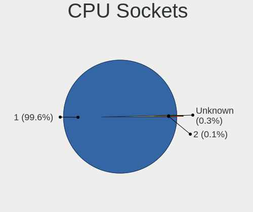

| Number  | Desktops | Percent |
|---------|----------|---------|
| 1       | 638      | 99.69%  |
| 2       | 1        | 0.16%   |
| Unknown | 1        | 0.16%   |

CPU Threads
-----------

Threads per core (Hyper-Threading)

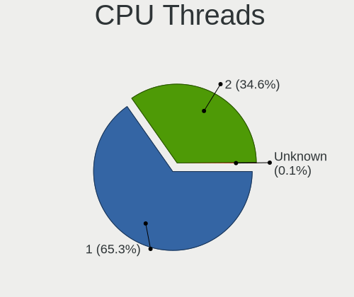

| Number  | Desktops | Percent |
|---------|----------|---------|
| 1       | 424      | 66.04%  |
| 2       | 217      | 33.8%   |
| Unknown | 1        | 0.16%   |

CPU Op-Modes
------------

CPU Operation Modes (32-bit, 64-bit)

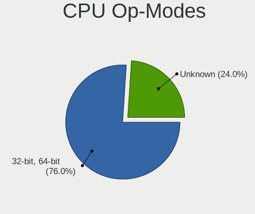

| Op mode        | Desktops | Percent |
|----------------|----------|---------|
| 32-bit, 64-bit | 484      | 74.23%  |
| Unknown        | 168      | 25.77%  |

CPU Microcode
-------------

Microcode number

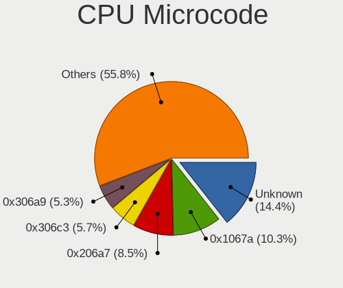

| Number     | Desktops | Percent |
|------------|----------|---------|
| Unknown    | 83       | 12.75%  |
| 0x1067a    | 70       | 10.75%  |
| 0x206a7    | 56       | 8.6%    |
| 0x306c3    | 38       | 5.84%   |
| 0x906ea    | 35       | 5.38%   |
| 0x306a9    | 35       | 5.38%   |
| 0x6fd      | 24       | 3.69%   |
| 0x010000c8 | 19       | 2.92%   |
| 0x706a1    | 15       | 2.3%    |
| 0x06001119 | 14       | 2.15%   |
| 0x506e3    | 13       | 2%      |
| 0x906e9    | 12       | 1.84%   |
| 0xa0653    | 11       | 1.69%   |
| 0x906eb    | 11       | 1.69%   |
| 0x10676    | 11       | 1.69%   |
| 0x06003106 | 11       | 1.69%   |
| 0x06000852 | 9        | 1.38%   |
| 0x406c4    | 8        | 1.23%   |
| 0x30678    | 8        | 1.23%   |
| 0x6fb      | 7        | 1.08%   |
| 0x0700010f | 7        | 1.08%   |
| 0x0600611a | 7        | 1.08%   |
| 0x0600063e | 7        | 1.08%   |
| 0x03000027 | 6        | 0.92%   |
| 0x010000db | 6        | 0.92%   |
| 0x6f2      | 5        | 0.77%   |
| 0x0810100b | 5        | 0.77%   |
| 0x0800820d | 5        | 0.77%   |
| 0x05000119 | 5        | 0.77%   |
| 0x010000dc | 5        | 0.77%   |
| 0xf65      | 4        | 0.61%   |
| 0x706a8    | 4        | 0.61%   |
| 0x20655    | 4        | 0.61%   |
| 0x20652    | 4        | 0.61%   |
| 0x106c2    | 4        | 0.61%   |
| 0x106a5    | 4        | 0.61%   |
| 0x08108109 | 4        | 0.61%   |
| 0x906ed    | 3        | 0.46%   |
| 0x6f6      | 3        | 0.46%   |
| 0x506c9    | 3        | 0.46%   |

CPU Microarch
-------------

Microarchitecture

| Name          | Desktops | Percent |
|---------------|----------|---------|
| Penryn        | 88       | 13.66%  |
| KabyLake      | 65       | 10.09%  |
| SandyBridge   | 63       | 9.78%   |
| Haswell       | 48       | 7.45%   |
| Core          | 47       | 7.3%    |
| K10           | 46       | 7.14%   |
| IvyBridge     | 39       | 6.06%   |
| Piledriver    | 29       | 4.5%    |
| Silvermont    | 22       | 3.42%   |
| K8 Hammer     | 20       | 3.11%   |
| Goldmont plus | 19       | 2.95%   |
| Skylake       | 16       | 2.48%   |
| Zen           | 15       | 2.33%   |
| Steamroller   | 14       | 2.17%   |
| Zen+          | 12       | 1.86%   |
| CometLake     | 12       | 1.86%   |
| Westmere      | 11       | 1.71%   |
| Excavator     | 9        | 1.4%    |
| NetBurst      | 8        | 1.24%   |
| Nehalem       | 8        | 1.24%   |
| K10 Llano     | 8        | 1.24%   |
| Bulldozer     | 8        | 1.24%   |
| Bonnell       | 8        | 1.24%   |
| Bobcat        | 8        | 1.24%   |
| Jaguar        | 7        | 1.09%   |
| Zen 2         | 6        | 0.93%   |
| Puma          | 3        | 0.47%   |
| Goldmont      | 3        | 0.47%   |
| Icelake       | 1        | 0.16%   |
| Unknown       | 1        | 0.16%   |

Graphics
--------

GPU Vendor
----------

Vendors of graphics cards

| Vendor           | Desktops | Percent |
|------------------|----------|---------|
| Intel            | 273      | 40.32%  |
| Nvidia           | 234      | 34.56%  |
| AMD              | 165      | 24.37%  |
| VIA Technologies | 4        | 0.59%   |
| Silicon Motion   | 1        | 0.15%   |

GPU Model
---------

Graphics card models

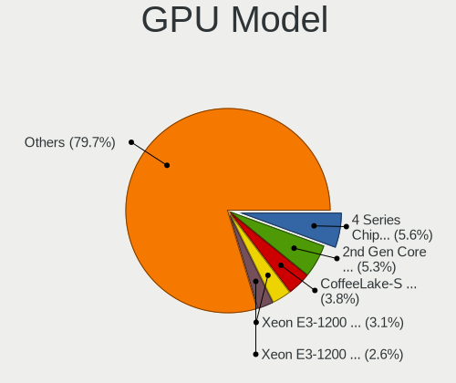

| Model                                                                                    | Desktops | Percent |
|------------------------------------------------------------------------------------------|----------|---------|
| Intel 4 Series Chipset Integrated Graphics Controller                                    | 40       | 5.56%   |
| Intel 2nd Generation Core Processor Family Integrated Graphics Controller                | 38       | 5.29%   |
| Intel CoffeeLake-S GT2 [UHD Graphics 630]                                                | 27       | 3.76%   |
| Intel Xeon E3-1200 v3/4th Gen Core Processor Integrated Graphics Controller              | 23       | 3.2%    |
| Intel 82945G/GZ Integrated Graphics Controller                                           | 19       | 2.64%   |
| Intel Xeon E3-1200 v2/3rd Gen Core processor Graphics Controller                         | 16       | 2.23%   |
| AMD Cedar [Radeon HD 5000/6000/7350/8350 Series]                                         | 16       | 2.23%   |
| Nvidia TU117 [GeForce GTX 1650]                                                          | 14       | 1.95%   |
| Nvidia GT218 [GeForce 210]                                                               | 14       | 1.95%   |
| Nvidia GK208B [GeForce GT 710]                                                           | 14       | 1.95%   |
| Nvidia GP107 [GeForce GTX 1050 Ti]                                                       | 13       | 1.81%   |
| Intel 82G33/G31 Express Integrated Graphics Controller                                   | 13       | 1.81%   |
| Intel GeminiLake [UHD Graphics 600]                                                      | 12       | 1.67%   |
| Nvidia GF119 [GeForce GT 610]                                                            | 11       | 1.53%   |
| Intel Atom/Celeron/Pentium Processor x5-E8000/J3xxx/N3xxx Integrated Graphics Controller | 11       | 1.53%   |
| Intel 4th Generation Core Processor Family Integrated Graphics Controller                | 11       | 1.53%   |
| AMD Ellesmere [Radeon RX 470/480/570/570X/580/580X/590]                                  | 11       | 1.53%   |
| Nvidia GP106 [GeForce GTX 1060 6GB]                                                      | 10       | 1.39%   |
| Nvidia C61 [GeForce 6150SE nForce 430]                                                   | 10       | 1.39%   |
| Intel Atom Processor Z36xxx/Z37xxx Series Graphics & Display                             | 10       | 1.39%   |
| Nvidia GF116 [GeForce GTX 550 Ti]                                                        | 9        | 1.25%   |
| Nvidia GF104 [GeForce GTX 460]                                                           | 8        | 1.11%   |
| Nvidia G72 [GeForce 7200 GS / 7300 SE]                                                   | 8        | 1.11%   |
| AMD Kaveri [Radeon R7 Graphics]                                                          | 8        | 1.11%   |
| AMD Cape Verde XT [Radeon HD 7770/8760 / R7 250X]                                        | 8        | 1.11%   |
| Nvidia GM107 [GeForce GTX 750 Ti]                                                        | 7        | 0.97%   |
| Intel GeminiLake [UHD Graphics 605]                                                      | 7        | 0.97%   |
| Nvidia GP108 [GeForce GT 1030]                                                           | 6        | 0.83%   |
| Nvidia GP106 [GeForce GTX 1060 3GB]                                                      | 6        | 0.83%   |
| Nvidia GM204 [GeForce GTX 970]                                                           | 6        | 0.83%   |
| AMD Wani [Radeon R5/R6/R7 Graphics]                                                      | 6        | 0.83%   |
| AMD RS780L [Radeon 3000]                                                                 | 6        | 0.83%   |
| AMD Raven Ridge [Radeon Vega Series / Radeon Vega Mobile Series]                         | 6        | 0.83%   |
| AMD Caicos [Radeon HD 6450/7450/8450 / R5 230 OEM]                                       | 6        | 0.83%   |
| Nvidia GT218 [GeForce 8400 GS Rev. 3]                                                    | 5        | 0.7%    |
| Nvidia GK208B [GeForce GT 730]                                                           | 5        | 0.7%    |
| Nvidia GF108 [GeForce GT 730]                                                            | 5        | 0.7%    |
| Nvidia GF108 [GeForce GT 630]                                                            | 5        | 0.7%    |
| Nvidia G96C [GeForce 9500 GT]                                                            | 5        | 0.7%    |
| Nvidia G92 [GeForce 9800 GT]                                                             | 5        | 0.7%    |

GPU Combo
---------

Combinations of graphics cards

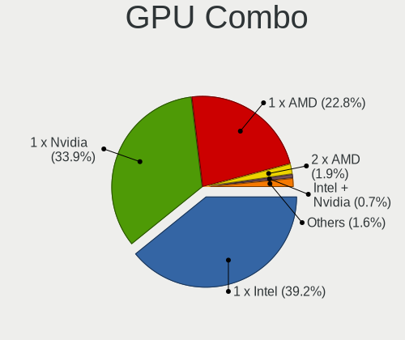

| Name                   | Desktops | Percent |
|------------------------|----------|---------|
| 1 x Intel              | 258      | 39.39%  |
| 1 x Nvidia             | 222      | 33.89%  |
| 1 x AMD                | 148      | 22.6%   |
| 2 x AMD                | 13       | 1.98%   |
| Intel + Nvidia         | 5        | 0.76%   |
| 1 x VIA                | 3        | 0.46%   |
| AMD + Nvidia           | 3        | 0.46%   |
| 2 x Nvidia             | 1        | 0.15%   |
| Intel + Silicon Motion | 1        | 0.15%   |
| Intel + AMD            | 1        | 0.15%   |

GPU Driver
----------

Free vs proprietary

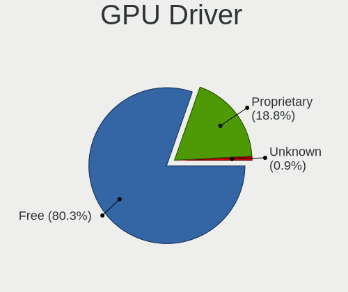

| Driver      | Desktops | Percent |
|-------------|----------|---------|
| Free        | 517      | 79.91%  |
| Proprietary | 124      | 19.17%  |
| Unknown     | 6        | 0.93%   |

GPU Memory
----------

Total video memory

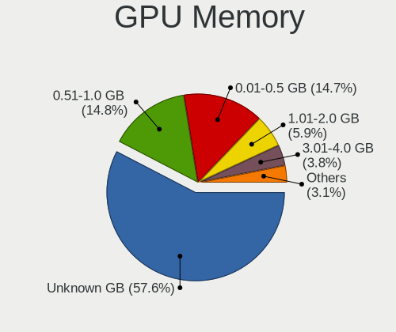

| Size in GB | Desktops | Percent |
|------------|----------|---------|
| Unknown    | 382      | 57.88%  |
| 0.51-1.0   | 101      | 15.3%   |
| 0.01-0.5   | 99       | 15%     |
| 1.01-2.0   | 34       | 5.15%   |
| 3.01-4.0   | 26       | 3.94%   |
| 7.01-8.0   | 14       | 2.12%   |
| 2.01-3.0   | 3        | 0.45%   |
| 8.01-16.0  | 1        | 0.15%   |

Monitor
-------

Monitor Vendor
--------------

Monitor vendors

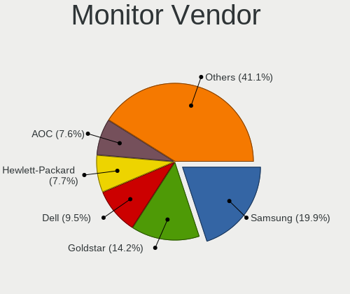

| Vendor               | Desktops | Percent |
|----------------------|----------|---------|
| Samsung Electronics  | 124      | 20.43%  |
| Goldstar             | 86       | 14.17%  |
| Dell                 | 59       | 9.72%   |
| Hewlett-Packard      | 46       | 7.58%   |
| AOC                  | 45       | 7.41%   |
| Acer                 | 38       | 6.26%   |
| Philips              | 24       | 3.95%   |
| Ancor Communications | 18       | 2.97%   |
| Sony                 | 13       | 2.14%   |
| BenQ                 | 13       | 2.14%   |
| Lenovo               | 11       | 1.81%   |
| ViewSonic            | 9        | 1.48%   |
| Vizio                | 8        | 1.32%   |
| Toshiba              | 6        | 0.99%   |
| NEC Computers        | 6        | 0.99%   |
| Eizo                 | 6        | 0.99%   |
| Vestel Elektronik    | 5        | 0.82%   |
| HSI                  | 5        | 0.82%   |
| RTK                  | 4        | 0.66%   |
| HannStar             | 4        | 0.66%   |
| ASUSTek Computer     | 4        | 0.66%   |
| Sceptre Tech         | 3        | 0.49%   |
| SAC                  | 3        | 0.49%   |
| Positivo             | 3        | 0.49%   |
| MStar                | 3        | 0.49%   |
| MiTAC                | 3        | 0.49%   |
| VOR                  | 2        | 0.33%   |
| Sharp                | 2        | 0.33%   |
| Seiki                | 2        | 0.33%   |
| PNP                  | 2        | 0.33%   |
| Panasonic            | 2        | 0.33%   |
| ONN                  | 2        | 0.33%   |
| KNK                  | 2        | 0.33%   |
| Insignia             | 2        | 0.33%   |
| Iiyama               | 2        | 0.33%   |
| GDH                  | 2        | 0.33%   |
| Fujitsu Siemens      | 2        | 0.33%   |
| Envision Peripherals | 2        | 0.33%   |
| eMachines            | 2        | 0.33%   |
| Belinea              | 2        | 0.33%   |

Monitor Model
-------------

Monitor models

| Model                                                                  | Desktops | Percent |
|------------------------------------------------------------------------|----------|---------|
| Goldstar HD GSM5ACB 1366x768 410x230mm 18.5-inch                       | 6        | 0.96%   |
| Vizio VL320M VIZ0050 1920x1080 698x393mm 31.5-inch                     | 5        | 0.8%    |
| Vestel Elektronik 40UHD_LCD_TV VES3700 3840x2160 890x500mm 40.2-inch   | 5        | 0.8%    |
| Samsung Electronics U28D590 SAM0B81 3840x2160 608x345mm 27.5-inch      | 5        | 0.8%    |
| HSI HiTV HSI0001 1920x1200 708x398mm 32.0-inch                         | 5        | 0.8%    |
| AOC LM522 AOCA522 1024x768 304x228mm 15.0-inch                         | 5        | 0.8%    |
| AOC 1970W AOC1970 1366x768 410x230mm 18.5-inch                         | 5        | 0.8%    |
| Samsung Electronics U28D590 SAM0B80 3840x2160 607x345mm 27.5-inch      | 4        | 0.64%   |
| Samsung Electronics C32F39M SAM100B 1920x1080 698x393mm 31.5-inch      | 4        | 0.64%   |
| Hewlett-Packard 27wm HWP3354 1920x1080 598x336mm 27.0-inch             | 4        | 0.64%   |
| Goldstar FULL HD GSM5AB9 1920x1080 480x270mm 21.7-inch                 | 4        | 0.64%   |
| Dell SE177FP DELF001 1280x1024 338x270mm 17.0-inch                     | 4        | 0.64%   |
| Dell P2418D DELD0C1 2560x1440 526x296mm 23.8-inch                      | 4        | 0.64%   |
| AOC F19 AOC1900 1366x768 410x230mm 18.5-inch                           | 4        | 0.64%   |
| Sony TV SNYEE01 1920x1080                                              | 3        | 0.48%   |
| Samsung Electronics SyncMaster SAM01CE 1024x768 304x228mm 15.0-inch    | 3        | 0.48%   |
| Samsung Electronics SyncMaster SAM01B7 1280x1024 338x270mm 17.0-inch   | 3        | 0.48%   |
| Samsung Electronics LCD Monitor SAM0C44 3840x2160 950x540mm 43.0-inch  | 3        | 0.48%   |
| Samsung Electronics C24F390 SAM0D2C 1920x1080 521x293mm 23.5-inch      | 3        | 0.48%   |
| SAC LED MONITOR SAC309A 1920x1080 443x249mm 20.0-inch                  | 3        | 0.48%   |
| MStar TV MST0030 1920x1080 708x398mm 32.0-inch                         | 3        | 0.48%   |
| Hewlett-Packard All-in-One HWP4218 1600x900 443x249mm 20.0-inch        | 3        | 0.48%   |
| Goldstar W2252 GSM567D 1680x1050 474x296mm 22.0-inch                   | 3        | 0.48%   |
| Dell SE2419HR DELF113 1920x1080 527x296mm 23.8-inch                    | 3        | 0.48%   |
| Dell P170S DEL4058 1280x1024 340x270mm 17.1-inch                       | 3        | 0.48%   |
| VOR LED21300 VOR2150 1920x1080 476x268mm 21.5-inch                     | 2        | 0.32%   |
| Vizio XVT553SV VIZ0063 1920x1080 1210x680mm 54.6-inch                  | 2        | 0.32%   |
| Samsung Electronics SyncMaster SAM0598 1360x768 410x230mm 18.5-inch    | 2        | 0.32%   |
| Samsung Electronics SyncMaster SAM0321 1440x900 428x255mm 19.6-inch    | 2        | 0.32%   |
| Samsung Electronics SyncMaster SAM0304 1680x1050 494x320mm 23.2-inch   | 2        | 0.32%   |
| Samsung Electronics SyncMaster SAM020C 1280x1024 338x270mm 17.0-inch   | 2        | 0.32%   |
| Samsung Electronics SyncMaster SAM011E 1280x1024 338x270mm 17.0-inch   | 2        | 0.32%   |
| Samsung Electronics SA300/SA350 SAM078E 1920x1080 477x268mm 21.5-inch  | 2        | 0.32%   |
| Samsung Electronics S24F350 SAM0D21 1920x1080 520x290mm 23.4-inch      | 2        | 0.32%   |
| Samsung Electronics LCD Monitor SAM0C26 1920x1080 1209x680mm 54.6-inch | 2        | 0.32%   |
| Samsung Electronics LCD Monitor SAM07C0 1920x1080 890x500mm 40.2-inch  | 2        | 0.32%   |
| Samsung Electronics C27F390 SAM0D32 1920x1080 598x336mm 27.0-inch      | 2        | 0.32%   |
| RTK LCD Monitor RTK1D1A 1920x1080 1020x570mm 46.0-inch                 | 2        | 0.32%   |
| Positivo LCD Monitor NON1801 1360x768 410x230mm 18.5-inch              | 2        | 0.32%   |
| PNP LCD Monitor PNP0010 1360x768                                       | 2        | 0.32%   |

Monitor Resolution
------------------

Monitor screen resolution

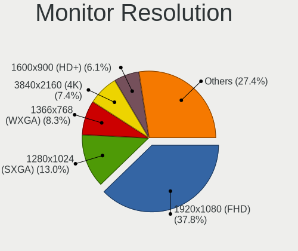

| Resolution         | Desktops | Percent |
|--------------------|----------|---------|
| 1920x1080 (FHD)    | 222      | 37.69%  |
| 1280x1024 (SXGA)   | 78       | 13.24%  |
| 1366x768 (WXGA)    | 57       | 9.68%   |
| 3840x2160 (4K)     | 41       | 6.96%   |
| 1600x900 (HD+)     | 38       | 6.45%   |
| 1680x1050 (WSXGA+) | 31       | 5.26%   |
| 1440x900 (WXGA+)   | 31       | 5.26%   |
| 2560x1440 (QHD)    | 22       | 3.74%   |
| 1360x768           | 20       | 3.4%    |
| 1024x768 (XGA)     | 17       | 2.89%   |
| 1920x1200 (WUXGA)  | 5        | 0.85%   |
| 2560x1080          | 4        | 0.68%   |
| 1280x720 (HD)      | 4        | 0.68%   |
| 2560x1600          | 3        | 0.51%   |
| 1920x540           | 3        | 0.51%   |
| 1600x1200          | 3        | 0.51%   |
| 1400x1050          | 3        | 0.51%   |
| 3440x1440          | 2        | 0.34%   |
| 2288x1287          | 2        | 0.34%   |
| 3840x1080          | 1        | 0.17%   |
| 1280x960           | 1        | 0.17%   |
| 1280x800 (WXGA)    | 1        | 0.17%   |

Monitor Diagonal
----------------

Diagonal size in inches

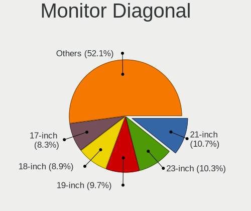

| Inches  | Desktops | Percent |
|---------|----------|---------|
| 21      | 68       | 11.2%   |
| 23      | 65       | 10.71%  |
| 18      | 59       | 9.72%   |
| 19      | 57       | 9.39%   |
| 17      | 54       | 8.9%    |
| 27      | 43       | 7.08%   |
| 20      | 43       | 7.08%   |
| 24      | 42       | 6.92%   |
| 15      | 33       | 5.44%   |
| 31      | 21       | 3.46%   |
| 22      | 20       | 3.29%   |
| 84      | 13       | 2.14%   |
| 34      | 11       | 1.81%   |
| 72      | 8        | 1.32%   |
| 40      | 7        | 1.15%   |
| 54      | 6        | 0.99%   |
| 52      | 6        | 0.99%   |
| 41      | 6        | 0.99%   |
| 46      | 5        | 0.82%   |
| 32      | 5        | 0.82%   |
| Unknown | 5        | 0.82%   |
| 65      | 3        | 0.49%   |
| 60      | 3        | 0.49%   |
| 42      | 2        | 0.33%   |
| 30      | 2        | 0.33%   |
| 26      | 2        | 0.33%   |
| 25      | 2        | 0.33%   |
| 16      | 2        | 0.33%   |
| 74      | 1        | 0.16%   |
| 58      | 1        | 0.16%   |
| 57      | 1        | 0.16%   |
| 50      | 1        | 0.16%   |
| 49      | 1        | 0.16%   |
| 47      | 1        | 0.16%   |
| 44      | 1        | 0.16%   |
| 39      | 1        | 0.16%   |
| 37      | 1        | 0.16%   |
| 35      | 1        | 0.16%   |
| 28      | 1        | 0.16%   |
| 13      | 1        | 0.16%   |

Monitor Width
-------------

Physical width

| Width in mm | Desktops | Percent |
|-------------|----------|---------|
| 401-500     | 223      | 37.29%  |
| 501-600     | 134      | 22.41%  |
| 301-350     | 81       | 13.55%  |
| 351-400     | 34       | 5.69%   |
| 601-700     | 31       | 5.18%   |
| 1001-1500   | 28       | 4.68%   |
| 1501-2000   | 22       | 3.68%   |
| 701-800     | 16       | 2.68%   |
| 801-900     | 10       | 1.67%   |
| 901-1000    | 9        | 1.51%   |
| 201-300     | 5        | 0.84%   |
| Unknown     | 5        | 0.84%   |

Aspect Ratio
------------

Proportional relationship between the width and the height

| Ratio | Desktops | Percent |
|-------|----------|---------|
| 16/9  | 388      | 67.13%  |
| 5/4   | 76       | 13.15%  |
| 16/10 | 64       | 11.07%  |
| 4/3   | 28       | 4.84%   |
| 21/9  | 11       | 1.9%    |
| 3/2   | 7        | 1.21%   |
| 6/5   | 3        | 0.52%   |
| 32/9  | 1        | 0.17%   |

Monitor Area
------------

Area in inch

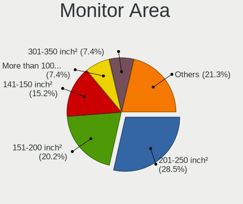

| Area in inch | Desktops | Percent |
|----------------|----------|---------|
| 201-250        | 168      | 28.05%  |
| 151-200        | 122      | 20.37%  |
| 141-150        | 100      | 16.69%  |
| 301-350        | 44       | 7.35%   |
| More than 1000 | 43       | 7.18%   |
| 351-500        | 37       | 6.18%   |
| 101-110        | 26       | 4.34%   |
| 501-1000       | 26       | 4.34%   |
| 251-300        | 13       | 2.17%   |
| Unknown        | 5        | 0.83%   |
| 121-130        | 4        | 0.67%   |
| 111-120        | 4        | 0.67%   |
| 131-140        | 2        | 0.33%   |
| 91-100         | 2        | 0.33%   |
| 81-90          | 1        | 0.17%   |
| 71-80          | 1        | 0.17%   |
| 51-60          | 1        | 0.17%   |

Pixel Density
-------------

Pixels per inch

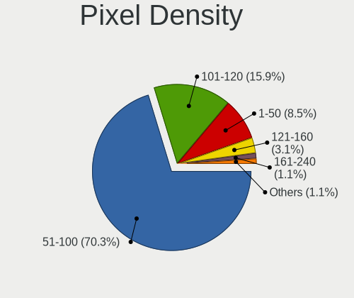

| Density       | Desktops | Percent |
|---------------|----------|---------|
| 51-100        | 410      | 70.81%  |
| 101-120       | 97       | 16.75%  |
| 1-50          | 42       | 7.25%   |
| 121-160       | 18       | 3.11%   |
| 161-240       | 6        | 1.04%   |
| Unknown       | 5        | 0.86%   |
| More than 240 | 1        | 0.17%   |

Multiple Monitors
-----------------

Total monitors connected

| Total | Desktops | Percent |
|-------|----------|---------|
| 1     | 557      | 86.9%   |
| 0     | 55       | 8.58%   |
| 2     | 27       | 4.21%   |
| 3     | 2        | 0.31%   |

Network
-------

Net Controller Vendor
---------------------

Controller vendors

| Vendor                          | Desktops | Percent |
|---------------------------------|----------|---------|
| Realtek Semiconductor           | 445      | 48.58%  |
| Intel                           | 140      | 15.28%  |
| Qualcomm Atheros                | 73       | 7.97%   |
| Ralink Technology               | 67       | 7.31%   |
| Nvidia                          | 36       | 3.93%   |
| Ralink                          | 19       | 2.07%   |
| Broadcom                        | 17       | 1.86%   |
| TP-Link                         | 10       | 1.09%   |
| Marvell Technology Group        | 8        | 0.87%   |
| Qualcomm Atheros Communications | 7        | 0.76%   |
| D-Link                          | 7        | 0.76%   |
| VIA Technologies                | 6        | 0.66%   |
| Samsung Electronics             | 6        | 0.66%   |
| Microsoft                       | 6        | 0.66%   |
| ASUSTek Computer                | 6        | 0.66%   |
| Huawei Technologies             | 5        | 0.55%   |
| Edimax Technology               | 5        | 0.55%   |
| Broadcom Limited                | 5        | 0.55%   |
| MediaTek                        | 4        | 0.44%   |
| Belkin Components               | 4        | 0.44%   |
| Qualcomm                        | 3        | 0.33%   |
| NetGear                         | 3        | 0.33%   |
| OPPO Electronics                | 2        | 0.22%   |
| NTmore                          | 2        | 0.22%   |
| Linksys                         | 2        | 0.22%   |
| IMC Networks                    | 2        | 0.22%   |
| Hangzhou Silan Microelectronics | 2        | 0.22%   |
| Giga-Byte Technology            | 2        | 0.22%   |
| ZTE WCDMA Technologies MSM      | 1        | 0.11%   |
| Xiaomi                          | 1        | 0.11%   |
| Texas Instruments               | 1        | 0.11%   |
| Spreadtrum Communications       | 1        | 0.11%   |
| Sitecom Europe                  | 1        | 0.11%   |
| Motorola PCS                    | 1        | 0.11%   |
| Microchip Technology            | 1        | 0.11%   |
| LSI                             | 1        | 0.11%   |
| LG Electronics                  | 1        | 0.11%   |
| JMicron Technology              | 1        | 0.11%   |
| Gemtek                          | 1        | 0.11%   |
| Elecom                          | 1        | 0.11%   |

Net Controller Model
--------------------

Controller models

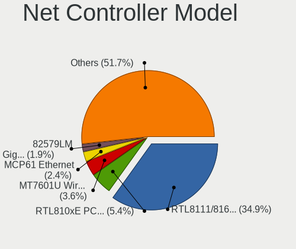

| Model                                                             | Desktops | Percent |
|-------------------------------------------------------------------|----------|---------|
| Realtek RTL8111/8168/8411 PCI Express Gigabit Ethernet Controller | 351      | 35.6%   |
| Realtek RTL810xE PCI Express Fast Ethernet controller             | 54       | 5.48%   |
| Ralink MT7601U Wireless Adapter                                   | 37       | 3.75%   |
| Nvidia MCP61 Ethernet                                             | 25       | 2.54%   |
| Intel 82579LM Gigabit Network Connection (Lewisville)             | 19       | 1.93%   |
| Realtek RTL8188EUS 802.11n Wireless Network Adapter               | 16       | 1.62%   |
| Intel 82567LM-3 Gigabit Network Connection                        | 15       | 1.52%   |
| Qualcomm Atheros AR8151 v2.0 Gigabit Ethernet                     | 12       | 1.22%   |
| Intel Ethernet Connection I217-LM                                 | 12       | 1.22%   |
| Intel Cannon Lake PCH CNVi WiFi                                   | 12       | 1.22%   |
| Ralink RT2870/RT3070 Wireless Adapter                             | 10       | 1.01%   |
| Intel I211 Gigabit Network Connection                             | 10       | 1.01%   |
| Intel Ethernet Connection (2) I219-V                              | 10       | 1.01%   |
| Realtek RTL8188FTV 802.11b/g/n 1T1R 2.4G WLAN Adapter             | 9        | 0.91%   |
| Ralink RT5370 Wireless Adapter                                    | 9        | 0.91%   |
| Realtek RTL8188CUS 802.11n WLAN Adapter                           | 7        | 0.71%   |
| Realtek RTL-8100/8101L/8139 PCI Fast Ethernet Adapter             | 7        | 0.71%   |
| Intel Ethernet Connection (7) I219-V                              | 7        | 0.71%   |
| Realtek RTL8188EE Wireless Network Adapter                        | 6        | 0.61%   |
| Ralink RT2790 Wireless 802.11n 1T/2R PCIe                         | 6        | 0.61%   |
| Qualcomm Atheros AR9485 Wireless Network Adapter                  | 6        | 0.61%   |
| Realtek RTL88x2bu [AC1200 Techkey]                                | 5        | 0.51%   |
| Ralink RT5572 Wireless Adapter                                    | 5        | 0.51%   |
| Qualcomm Atheros AR9271 802.11n                                   | 5        | 0.51%   |
| Qualcomm Atheros AR8152 v2.0 Fast Ethernet                        | 5        | 0.51%   |
| Qualcomm Atheros AR8131 Gigabit Ethernet                          | 5        | 0.51%   |
| Qualcomm Atheros AR8121/AR8113/AR8114 Gigabit or Fast Ethernet    | 5        | 0.51%   |
| Intel Dual Band Wireless-AC 3168NGW [Stone Peak]                  | 5        | 0.51%   |
| Intel Comet Lake PCH CNVi WiFi                                    | 5        | 0.51%   |
| Intel 82566DM-2 Gigabit Network Connection                        | 5        | 0.51%   |
| TP-Link TL-WN823N v2/v3 [Realtek RTL8192EU]                       | 4        | 0.41%   |
| Samsung Galaxy series, misc. (tethering mode)                     | 4        | 0.41%   |
| Realtek RTL8169 PCI Gigabit Ethernet Controller                   | 4        | 0.41%   |
| Qualcomm Atheros QCA9377 802.11ac Wireless Network Adapter        | 4        | 0.41%   |
| Qualcomm Atheros Attansic L2 Fast Ethernet                        | 4        | 0.41%   |
| Intel Wireless 8260                                               | 4        | 0.41%   |
| Intel Ethernet Connection I217-V                                  | 4        | 0.41%   |
| Intel 82579V Gigabit Network Connection                           | 4        | 0.41%   |
| Edimax EW-7811Un 802.11n Wireless Adapter [Realtek RTL8188CUS]    | 4        | 0.41%   |
| VIA VT6105/VT6106S [Rhine-III]                                    | 3        | 0.3%    |

Wireless Vendor
---------------

Wireless vendors

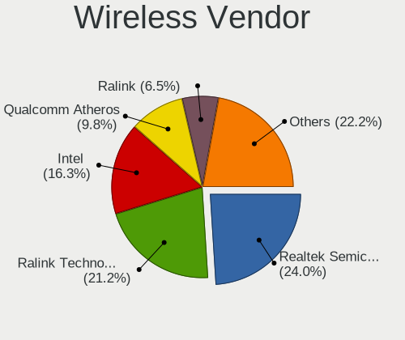

| Vendor                          | Desktops | Percent |
|---------------------------------|----------|---------|
| Realtek Semiconductor           | 70       | 23.65%  |
| Ralink Technology               | 67       | 22.64%  |
| Intel                           | 44       | 14.86%  |
| Qualcomm Atheros                | 32       | 10.81%  |
| Ralink                          | 19       | 6.42%   |
| TP-Link                         | 10       | 3.38%   |
| Qualcomm Atheros Communications | 7        | 2.36%   |
| D-Link                          | 7        | 2.36%   |
| Microsoft                       | 6        | 2.03%   |
| Edimax Technology               | 5        | 1.69%   |
| ASUSTek Computer                | 5        | 1.69%   |
| Broadcom                        | 4        | 1.35%   |
| Belkin Components               | 4        | 1.35%   |
| NetGear                         | 3        | 1.01%   |
| MediaTek                        | 3        | 1.01%   |
| Linksys                         | 2        | 0.68%   |
| IMC Networks                    | 2        | 0.68%   |
| Texas Instruments               | 1        | 0.34%   |
| Sitecom Europe                  | 1        | 0.34%   |
| Elecom                          | 1        | 0.34%   |
| D-Link System                   | 1        | 0.34%   |
| AVM                             | 1        | 0.34%   |
| AboCom Systems                  | 1        | 0.34%   |

Wireless Model
--------------

Wireless models

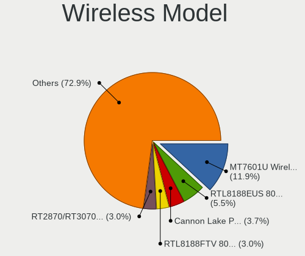

| Model                                                                | Desktops | Percent |
|----------------------------------------------------------------------|----------|---------|
| Ralink MT7601U Wireless Adapter                                      | 37       | 12.42%  |
| Realtek RTL8188EUS 802.11n Wireless Network Adapter                  | 16       | 5.37%   |
| Intel Cannon Lake PCH CNVi WiFi                                      | 12       | 4.03%   |
| Ralink RT2870/RT3070 Wireless Adapter                                | 10       | 3.36%   |
| Realtek RTL8188FTV 802.11b/g/n 1T1R 2.4G WLAN Adapter                | 9        | 3.02%   |
| Ralink RT5370 Wireless Adapter                                       | 9        | 3.02%   |
| Realtek RTL8188CUS 802.11n WLAN Adapter                              | 7        | 2.35%   |
| Realtek RTL8188EE Wireless Network Adapter                           | 6        | 2.01%   |
| Ralink RT2790 Wireless 802.11n 1T/2R PCIe                            | 6        | 2.01%   |
| Qualcomm Atheros AR9485 Wireless Network Adapter                     | 6        | 2.01%   |
| Realtek RTL88x2bu [AC1200 Techkey]                                   | 5        | 1.68%   |
| Ralink RT5572 Wireless Adapter                                       | 5        | 1.68%   |
| Qualcomm Atheros AR9271 802.11n                                      | 5        | 1.68%   |
| Intel Dual Band Wireless-AC 3168NGW [Stone Peak]                     | 5        | 1.68%   |
| Intel Comet Lake PCH CNVi WiFi                                       | 5        | 1.68%   |
| TP-Link TL-WN823N v2/v3 [Realtek RTL8192EU]                          | 4        | 1.34%   |
| Qualcomm Atheros QCA9377 802.11ac Wireless Network Adapter           | 4        | 1.34%   |
| Intel Wireless 8260                                                  | 4        | 1.34%   |
| Edimax EW-7811Un 802.11n Wireless Adapter [Realtek RTL8188CUS]       | 4        | 1.34%   |
| Realtek RTL8723BE PCIe Wireless Network Adapter                      | 3        | 1.01%   |
| Realtek RTL8192EE PCIe Wireless Network Adapter                      | 3        | 1.01%   |
| Ralink RT5390R 802.11bgn PCIe Wireless Network Adapter               | 3        | 1.01%   |
| Ralink RT3090 Wireless 802.11n 1T/1R PCIe                            | 3        | 1.01%   |
| Qualcomm Atheros AR93xx Wireless Network Adapter                     | 3        | 1.01%   |
| Qualcomm Atheros AR9285 Wireless Network Adapter (PCI-Express)       | 3        | 1.01%   |
| MediaTek WiFi                                                        | 3        | 1.01%   |
| Intel Wireless-AC 9260                                               | 3        | 1.01%   |
| Intel Wireless 7265                                                  | 3        | 1.01%   |
| Intel Wireless 7260                                                  | 3        | 1.01%   |
| D-Link DWA-131 Wireless N Nano Adapter (Rev. E1) [Realtek RTL8192EU] | 3        | 1.01%   |
| Realtek RTL8822BE 802.11a/b/g/n/ac WiFi adapter                      | 2        | 0.67%   |
| Realtek RTL8821CE 802.11ac PCIe Wireless Network Adapter             | 2        | 0.67%   |
| Realtek RTL8821AE 802.11ac PCIe Wireless Network Adapter             | 2        | 0.67%   |
| Realtek RTL8192EU 802.11b/g/n WLAN Adapter                           | 2        | 0.67%   |
| Realtek RTL8192CU 802.11n WLAN Adapter                               | 2        | 0.67%   |
| Realtek RTL8191SU 802.11n WLAN Adapter                               | 2        | 0.67%   |
| Realtek RTL8188CE 802.11b/g/n WiFi Adapter                           | 2        | 0.67%   |
| Realtek 802.11ac NIC                                                 | 2        | 0.67%   |
| Ralink RT2501/RT2573 Wireless Adapter                                | 2        | 0.67%   |
| Ralink MT7610U ("Archer T2U" 2.4G+5G WLAN Adapter                    | 2        | 0.67%   |

Ethernet Vendor
---------------

Ethernet vendors

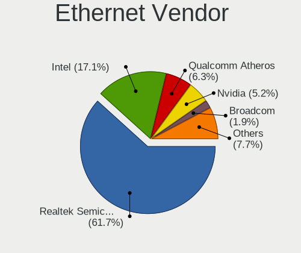

| Vendor                          | Desktops | Percent |
|---------------------------------|----------|---------|
| Realtek Semiconductor           | 419      | 62.35%  |
| Intel                           | 109      | 16.22%  |
| Qualcomm Atheros                | 43       | 6.4%    |
| Nvidia                          | 36       | 5.36%   |
| Broadcom                        | 13       | 1.93%   |
| Marvell Technology Group        | 8        | 1.19%   |
| VIA Technologies                | 6        | 0.89%   |
| Broadcom Limited                | 5        | 0.74%   |
| Samsung Electronics             | 4        | 0.6%    |
| Huawei Technologies             | 4        | 0.6%    |
| Qualcomm                        | 3        | 0.45%   |
| OPPO Electronics                | 2        | 0.3%    |
| NTmore                          | 2        | 0.3%    |
| Hangzhou Silan Microelectronics | 2        | 0.3%    |
| Giga-Byte Technology            | 2        | 0.3%    |
| ZTE WCDMA Technologies MSM      | 1        | 0.15%   |
| Xiaomi                          | 1        | 0.15%   |
| Spreadtrum Communications       | 1        | 0.15%   |
| Motorola PCS                    | 1        | 0.15%   |
| MediaTek                        | 1        | 0.15%   |
| LG Electronics                  | 1        | 0.15%   |
| JMicron Technology              | 1        | 0.15%   |
| Gemtek                          | 1        | 0.15%   |
| Beceem Communications           | 1        | 0.15%   |
| ASUSTek Computer                | 1        | 0.15%   |
| ASIX Electronics                | 1        | 0.15%   |
| Apple                           | 1        | 0.15%   |
| AMD                             | 1        | 0.15%   |
| ADMtek                          | 1        | 0.15%   |

Ethernet Model
--------------

Ethernet models

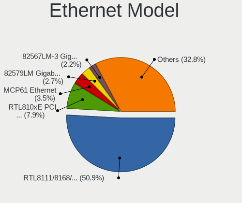

| Model                                                             | Desktops | Percent |
|-------------------------------------------------------------------|----------|---------|
| Realtek RTL8111/8168/8411 PCI Express Gigabit Ethernet Controller | 351      | 51.54%  |
| Realtek RTL810xE PCI Express Fast Ethernet controller             | 54       | 7.93%   |
| Nvidia MCP61 Ethernet                                             | 25       | 3.67%   |
| Intel 82579LM Gigabit Network Connection (Lewisville)             | 19       | 2.79%   |
| Intel 82567LM-3 Gigabit Network Connection                        | 15       | 2.2%    |
| Qualcomm Atheros AR8151 v2.0 Gigabit Ethernet                     | 12       | 1.76%   |
| Intel Ethernet Connection I217-LM                                 | 12       | 1.76%   |
| Intel I211 Gigabit Network Connection                             | 10       | 1.47%   |
| Intel Ethernet Connection (2) I219-V                              | 10       | 1.47%   |
| Realtek RTL-8100/8101L/8139 PCI Fast Ethernet Adapter             | 7        | 1.03%   |
| Intel Ethernet Connection (7) I219-V                              | 7        | 1.03%   |
| Qualcomm Atheros AR8152 v2.0 Fast Ethernet                        | 5        | 0.73%   |
| Qualcomm Atheros AR8131 Gigabit Ethernet                          | 5        | 0.73%   |
| Qualcomm Atheros AR8121/AR8113/AR8114 Gigabit or Fast Ethernet    | 5        | 0.73%   |
| Intel 82566DM-2 Gigabit Network Connection                        | 5        | 0.73%   |
| Samsung Galaxy series, misc. (tethering mode)                     | 4        | 0.59%   |
| Realtek RTL8169 PCI Gigabit Ethernet Controller                   | 4        | 0.59%   |
| Qualcomm Atheros Attansic L2 Fast Ethernet                        | 4        | 0.59%   |
| Intel Ethernet Connection I217-V                                  | 4        | 0.59%   |
| Intel 82579V Gigabit Network Connection                           | 4        | 0.59%   |
| VIA VT6105/VT6106S [Rhine-III]                                    | 3        | 0.44%   |
| VIA VT6102/VT6103 [Rhine-II]                                      | 3        | 0.44%   |
| Qualcomm MegaFon M150-4                                           | 3        | 0.44%   |
| Qualcomm Atheros AR8161 Gigabit Ethernet                          | 3        | 0.44%   |
| Nvidia MCP73 Ethernet                                             | 3        | 0.44%   |
| Marvell Group 88E8057 PCI-E Gigabit Ethernet Controller           | 3        | 0.44%   |
| Intel Ethernet Connection (2) I219-LM                             | 3        | 0.44%   |
| Intel Ethernet Connection (2) I218-V                              | 3        | 0.44%   |
| Intel 82578DC Gigabit Network Connection                          | 3        | 0.44%   |
| Intel 82574L Gigabit Network Connection                           | 3        | 0.44%   |
| Huawei STK-L21                                                    | 3        | 0.44%   |
| Broadcom NetXtreme BCM5761 Gigabit Ethernet PCIe                  | 3        | 0.44%   |
| Broadcom Limited NetXtreme BCM5761 Gigabit Ethernet PCIe          | 3        | 0.44%   |
| Realtek RTL8125 2.5GbE Controller                                 | 2        | 0.29%   |
| Realtek Killer E2600 Gigabit Ethernet Controller                  | 2        | 0.29%   |
| Qualcomm Atheros Killer E2400 Gigabit Ethernet Controller         | 2        | 0.29%   |
| Qualcomm Atheros Killer E220x Gigabit Ethernet Controller         | 2        | 0.29%   |
| Qualcomm Atheros Attansic L1 Gigabit Ethernet                     | 2        | 0.29%   |
| OPPO RMX3263                                                      | 2        | 0.29%   |
| Nvidia MCP67 Ethernet                                             | 2        | 0.29%   |

Net Controller Kind
-------------------

Ethernet, WiFi or modem

| Kind     | Desktops | Percent |
|----------|----------|---------|
| Ethernet | 631      | 68.89%  |
| WiFi     | 278      | 30.35%  |
| Modem    | 6        | 0.66%   |
| Unknown  | 1        | 0.11%   |

Used Controller
---------------

Currently used network controller

| Kind     | Desktops | Percent |
|----------|----------|---------|
| Ethernet | 471      | 70.61%  |
| WiFi     | 196      | 29.39%  |

NICs
----

Total network controllers on board

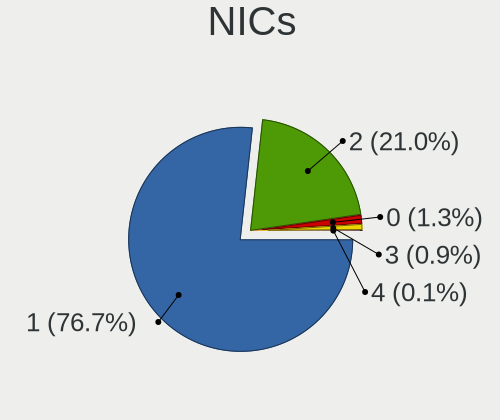

| Total | Desktops | Percent |
|-------|----------|---------|
| 1     | 494      | 76.95%  |
| 2     | 136      | 21.18%  |
| 0     | 8        | 1.25%   |
| 3     | 3        | 0.47%   |
| 4     | 1        | 0.16%   |

IPv6
----

IPv6 vs IPv4

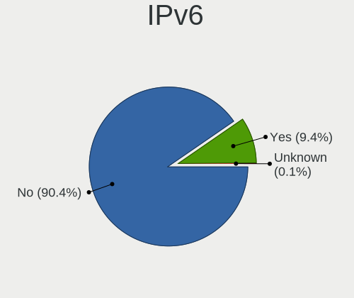

| Used    | Desktops | Percent |
|---------|----------|---------|
| No      | 605      | 93.08%  |
| Yes     | 44       | 6.77%   |
| Unknown | 1        | 0.15%   |

Bluetooth
---------

Bluetooth Vendor
----------------

Controller vendors

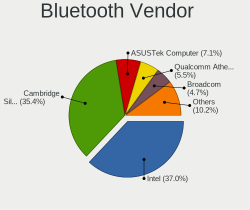

| Vendor                          | Desktops | Percent |
|---------------------------------|----------|---------|
| Cambridge Silicon Radio         | 42       | 37.17%  |
| Intel                           | 39       | 34.51%  |
| ASUSTek Computer                | 7        | 6.19%   |
| Qualcomm Atheros Communications | 6        | 5.31%   |
| Broadcom                        | 6        | 5.31%   |
| IMC Networks                    | 5        | 4.42%   |
| Lite-On Technology              | 4        | 3.54%   |
| Realtek Semiconductor           | 2        | 1.77%   |
| Integrated System Solution      | 1        | 0.88%   |
| Hewlett-Packard                 | 1        | 0.88%   |

Bluetooth Model
---------------

Controller models

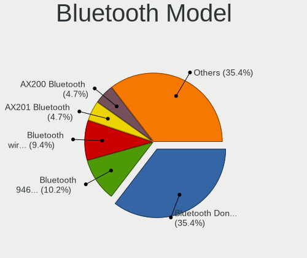

| Model                                                 | Desktops | Percent |
|-------------------------------------------------------|----------|---------|
| Cambridge Silicon Radio Bluetooth Dongle (HCI mode)   | 42       | 37.17%  |
| Intel Bluetooth 9460/9560 Jefferson Peak (JfP)        | 13       | 11.5%   |
| Intel Bluetooth wireless interface                    | 10       | 8.85%   |
| Intel AX201 Bluetooth                                 | 6        | 5.31%   |
| Intel Wireless-AC 3168 Bluetooth                      | 4        | 3.54%   |
| IMC Networks Bluetooth Radio                          | 4        | 3.54%   |
| ASUS Broadcom BCM20702A0 Bluetooth                    | 4        | 3.54%   |
| Qualcomm Atheros AR3011 Bluetooth                     | 3        | 2.65%   |
| Intel Wireless-AC 9260 Bluetooth Adapter              | 3        | 2.65%   |
| Qualcomm Atheros  Bluetooth Device                    | 2        | 1.77%   |
| Lite-On Qualcomm Atheros QCA9377 Bluetooth            | 2        | 1.77%   |
| Lite-On Bluetooth Device                              | 2        | 1.77%   |
| Intel AX200 Bluetooth                                 | 2        | 1.77%   |
| Broadcom BCM2035 Bluetooth                            | 2        | 1.77%   |
| ASUS Bluetooth Radio                                  | 2        | 1.77%   |
| Realtek RTL8821A Bluetooth                            | 1        | 0.88%   |
| Realtek Bluetooth Radio                               | 1        | 0.88%   |
| Qualcomm Atheros AR3012 Bluetooth 4.0                 | 1        | 0.88%   |
| Intel AX210 Bluetooth                                 | 1        | 0.88%   |
| Integrated System Solution KY-BT100 Bluetooth Adapter | 1        | 0.88%   |
| IMC Networks Bluetooth Device                         | 1        | 0.88%   |
| HP Bluetooth 2.0 Interface [Broadcom BCM2045]         | 1        | 0.88%   |
| Broadcom HP Bluethunder                               | 1        | 0.88%   |
| Broadcom BCM43142A0 Bluetooth Device                  | 1        | 0.88%   |
| Broadcom BCM43142A0 Bluetooth                         | 1        | 0.88%   |
| Broadcom BCM20702A0 Bluetooth 4.0                     | 1        | 0.88%   |
| ASUS Bluetooth Device                                 | 1        | 0.88%   |

Sound
-----

Sound Vendor
------------

Sound card vendors

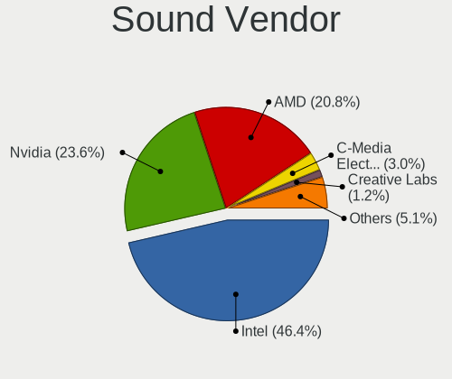

| Vendor                  | Desktops | Percent |
|-------------------------|----------|---------|
| Intel                   | 436      | 47.08%  |
| Nvidia                  | 221      | 23.87%  |
| AMD                     | 190      | 20.52%  |
| C-Media Electronics     | 27       | 2.92%   |
| Creative Labs           | 11       | 1.19%   |
| Logitech                | 6        | 0.65%   |
| Generalplus Technology  | 6        | 0.65%   |
| VIA Technologies        | 5        | 0.54%   |
| JMTek                   | 5        | 0.54%   |
| Texas Instruments       | 3        | 0.32%   |
| Creative Technology     | 3        | 0.32%   |
| ASUSTek Computer        | 3        | 0.32%   |
| BEHRINGER International | 2        | 0.22%   |
| Tenx Technology         | 1        | 0.11%   |
| SteelSeries ApS         | 1        | 0.11%   |
| Samson Technologies     | 1        | 0.11%   |
| MVSI                    | 1        | 0.11%   |
| Ensoniq                 | 1        | 0.11%   |
| Elite Silicon           | 1        | 0.11%   |
| Dell                    | 1        | 0.11%   |
| Corsair                 | 1        | 0.11%   |

Sound Model
-----------

Sound card models

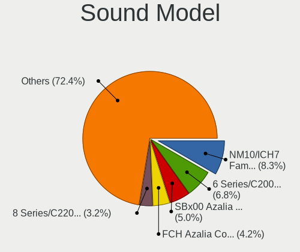

| Model                                                                                             | Desktops | Percent |
|---------------------------------------------------------------------------------------------------|----------|---------|
| Intel NM10/ICH7 Family High Definition Audio Controller                                           | 94       | 8.72%   |
| Intel 6 Series/C200 Series Chipset Family High Definition Audio Controller                        | 70       | 6.49%   |
| AMD SBx00 Azalia (Intel HDA)                                                                      | 55       | 5.1%    |
| AMD FCH Azalia Controller                                                                         | 47       | 4.36%   |
| Intel 8 Series/C220 Series Chipset High Definition Audio Controller                               | 35       | 3.25%   |
| Intel Cannon Lake PCH cAVS                                                                        | 34       | 3.15%   |
| Intel Xeon E3-1200 v3/4th Gen Core Processor HD Audio Controller                                  | 30       | 2.78%   |
| Intel 7 Series/C216 Chipset Family High Definition Audio Controller                               | 30       | 2.78%   |
| Nvidia MCP61 High Definition Audio                                                                | 27       | 2.5%    |
| Intel 200 Series PCH HD Audio                                                                     | 25       | 2.32%   |
| Nvidia High Definition Audio Controller                                                           | 21       | 1.95%   |
| Nvidia GK208 HDMI/DP Audio Controller                                                             | 20       | 1.86%   |
| Intel 100 Series/C230 Series Chipset Family HD Audio Controller                                   | 20       | 1.86%   |
| Intel Celeron/Pentium Silver Processor High Definition Audio                                      | 19       | 1.76%   |
| AMD Oland/Hainan/Cape Verde/Pitcairn HDMI Audio [Radeon HD 7000 Series]                           | 19       | 1.76%   |
| Nvidia GP107GL High Definition Audio Controller                                                   | 18       | 1.67%   |
| AMD Cedar HDMI Audio [Radeon HD 5400/6300/7300 Series]                                            | 18       | 1.67%   |
| Intel 82801JI (ICH10 Family) HD Audio Controller                                                  | 17       | 1.58%   |
| Nvidia GP106 High Definition Audio Controller                                                     | 16       | 1.48%   |
| Intel 82801JD/DO (ICH10 Family) HD Audio Controller                                               | 16       | 1.48%   |
| AMD Kabini HDMI/DP Audio                                                                          | 15       | 1.39%   |
| Nvidia TU107 GeForce GTX 1650 High Definition Audio Controller                                    | 14       | 1.3%    |
| Nvidia GF108 High Definition Audio Controller                                                     | 13       | 1.21%   |
| AMD Family 17h (Models 00h-0fh) HD Audio Controller                                               | 13       | 1.21%   |
| Nvidia GF119 HDMI Audio Controller                                                                | 12       | 1.11%   |
| AMD Family 17h/19h HD Audio Controller                                                            | 12       | 1.11%   |
| Intel Atom Processor Z36xxx/Z37xxx Series High Definition Audio Controller                        | 11       | 1.02%   |
| Intel 5 Series/3400 Series Chipset High Definition Audio                                          | 11       | 1.02%   |
| AMD Ellesmere HDMI Audio [Radeon RX 470/480 / 570/580/590]                                        | 11       | 1.02%   |
| Nvidia GF116 High Definition Audio Controller                                                     | 10       | 0.93%   |
| AMD Trinity HDMI Audio Controller                                                                 | 10       | 0.93%   |
| Nvidia GM107 High Definition Audio Controller [GeForce 940MX]                                     | 9        | 0.83%   |
| Intel 82801I (ICH9 Family) HD Audio Controller                                                    | 9        | 0.83%   |
| AMD Raven/Raven2/Fenghuang HDMI/DP Audio Controller                                               | 9        | 0.83%   |
| AMD Kaveri HDMI/DP Audio Controller                                                               | 9        | 0.83%   |
| AMD Family 15h (Models 60h-6fh) Audio Controller                                                  | 9        | 0.83%   |
| Nvidia GF104 High Definition Audio Controller                                                     | 8        | 0.74%   |
| Intel Comet Lake PCH-V cAVS                                                                       | 7        | 0.65%   |
| Intel Atom/Celeron/Pentium Processor x5-E8000/J3xxx/N3xxx Series High Definition Audio Controller | 7        | 0.65%   |
| AMD Caicos HDMI Audio [Radeon HD 6450 / 7450/8450/8490 OEM / R5 230/235/235X OEM]                 | 7        | 0.65%   |

Memory
------

Memory Vendor
-------------

Memory module vendors

| Vendor  | Desktops | Percent |
|---------|----------|---------|
| Unknown | 1        | 50%     |
| G.Skill | 1        | 50%     |

Memory Model
------------

Memory module models

| Model                                                  | Desktops | Percent |
|--------------------------------------------------------|----------|---------|
| Unknown RAM Module 1024MB DIMM 667MT/s                 | 1        | 50%     |
| G.Skill RAM F4-4000C19-16GTZSW 16GB DIMM DDR4 3200MT/s | 1        | 50%     |

Memory Kind
-----------

Memory module kinds

| Kind    | Desktops | Percent |
|---------|----------|---------|
| DDR4    | 1        | 50%     |
| Unknown | 1        | 50%     |

Memory Form Factor
------------------

Physical design of the memory module

| Name | Desktops | Percent |
|------|----------|---------|
| DIMM | 2        | 100%    |

Memory Size
-----------

Memory module size

| Size  | Desktops | Percent |
|-------|----------|---------|
| 16384 | 1        | 50%     |
| 1024  | 1        | 50%     |

Memory Speed
------------

Memory module speed

| Speed | Desktops | Percent |
|-------|----------|---------|
| 3200  | 1        | 50%     |
| 667   | 1        | 50%     |

Printers & scanners
-------------------

Printer Vendor
--------------

Printer device vendors

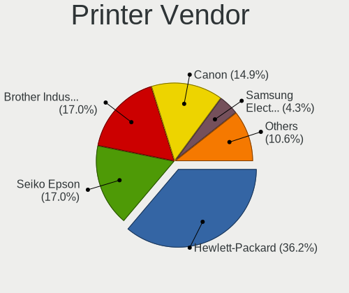

| Vendor                   | Desktops | Percent |
|--------------------------|----------|---------|
| Hewlett-Packard          | 16       | 35.56%  |
| Brother Industries       | 8        | 17.78%  |
| Seiko Epson              | 7        | 15.56%  |
| Canon                    | 7        | 15.56%  |
| Samsung Electronics      | 2        | 4.44%   |
| STMicroelectronics       | 1        | 2.22%   |
| Pantum                   | 1        | 2.22%   |
| Panasonic (Matsushita)   | 1        | 2.22%   |
| Magic Control Technology | 1        | 2.22%   |
| Dymo-CoStar              | 1        | 2.22%   |

Printer Model
-------------

Printer device models

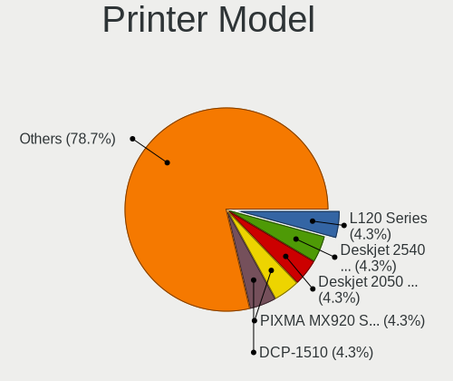

| Model                                       | Desktops | Percent |
|---------------------------------------------|----------|---------|
| Seiko Epson L120 Series                     | 2        | 4.44%   |
| HP Deskjet 2540 series                      | 2        | 4.44%   |
| HP Deskjet 2050 J510                        | 2        | 4.44%   |
| Canon PIXMA MX920 Series                    | 2        | 4.44%   |
| Brother DCP-1510                            | 2        | 4.44%   |
| STMicroelectronics USB Printer P            | 1        | 2.22%   |
| Seiko Epson L355 Series                     | 1        | 2.22%   |
| Seiko Epson L3200 Series                    | 1        | 2.22%   |
| Seiko Epson L3150 Series                    | 1        | 2.22%   |
| Seiko Epson L210 Series                     | 1        | 2.22%   |
| Seiko Epson ET-3750 Series                  | 1        | 2.22%   |
| Samsung ML-1660 Series                      | 1        | 2.22%   |
| Samsung M2020 Series                        | 1        | 2.22%   |
| Pantum P2200 series                         | 1        | 2.22%   |
| Panasonic (Matsushita) KX-MB1500RU          | 1        | 2.22%   |
| Magic Control BAY-3U1S1P Parallel Port      | 1        | 2.22%   |
| HP OfficeJet Pro 69                         | 1        | 2.22%   |
| HP OfficeJet 6950                           | 1        | 2.22%   |
| HP LaserJet P1006                           | 1        | 2.22%   |
| HP LaserJet M101-M106                       | 1        | 2.22%   |
| HP LaserJet 1320                            | 1        | 2.22%   |
| HP LaserJet 1020                            | 1        | 2.22%   |
| HP ENVY 4520 series                         | 1        | 2.22%   |
| HP DeskJet F4200 series                     | 1        | 2.22%   |
| HP Deskjet D1500 series                     | 1        | 2.22%   |
| HP Deskjet 3050 J610 series                 | 1        | 2.22%   |
| HP Deskjet 2000 J210 series                 | 1        | 2.22%   |
| HP Deskjet 1510                             | 1        | 2.22%   |
| Dymo-CoStar DYMO LabelWriter 450 Twin Turbo | 1        | 2.22%   |
| Canon PIXMA MP530                           | 1        | 2.22%   |
| Canon PIXMA MG2500 Series                   | 1        | 2.22%   |
| Canon MF3110                                | 1        | 2.22%   |
| Canon MF3010                                | 1        | 2.22%   |
| Canon LiDE 400                              | 1        | 2.22%   |
| Brother MFC-L2730DW series                  | 1        | 2.22%   |
| Brother MFC-J470DW                          | 1        | 2.22%   |
| Brother HL-52x0 series                      | 1        | 2.22%   |
| Brother HL-2130 series                      | 1        | 2.22%   |
| Brother DCP-T710W                           | 1        | 2.22%   |
| Brother DCP-L2540DW                         | 1        | 2.22%   |

Scanner Vendor
--------------

Scanner device vendors

| Vendor         | Desktops | Percent |
|----------------|----------|---------|
| Canon          | 3        | 60%     |
| Seiko Epson    | 1        | 20%     |
| Mustek Systems | 1        | 20%     |

Scanner Model
-------------

Scanner device models

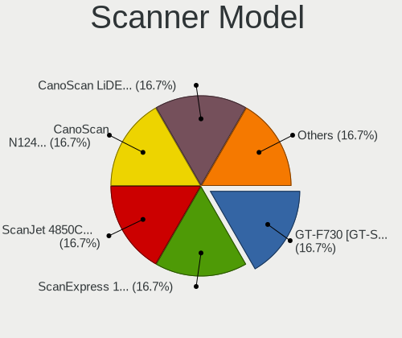

| Model                                                   | Desktops | Percent |
|---------------------------------------------------------|----------|---------|
| Seiko Epson GT-F730 [GT-S630/Perfection V33/V330 Photo] | 1        | 20%     |
| Mustek Systems ScanExpress 1200 UB                      | 1        | 20%     |
| Canon CanoScan N1240U/LiDE 30                           | 1        | 20%     |
| Canon CanoScan LiDE 210                                 | 1        | 20%     |
| Canon CanoScan LiDE 100                                 | 1        | 20%     |

Camera
------

Camera Vendor
-------------

Camera device vendors

| Vendor                        | Desktops | Percent |
|-------------------------------|----------|---------|
| Logitech                      | 23       | 27.38%  |
| Microdia                      | 11       | 13.1%   |
| Samsung Electronics           | 9        | 10.71%  |
| Chicony Electronics           | 8        | 9.52%   |
| Microsoft                     | 7        | 8.33%   |
| Z-Star Microelectronics       | 3        | 3.57%   |
| Apple                         | 3        | 3.57%   |
| Realtek Semiconductor         | 2        | 2.38%   |
| Generalplus Technology        | 2        | 2.38%   |
| Cubeternet                    | 2        | 2.38%   |
| Aveo Technology               | 2        | 2.38%   |
| Acer                          | 2        | 2.38%   |
| Unknown                       | 1        | 1.19%   |
| Sunplus Technology            | 1        | 1.19%   |
| Sunplus Innovation Technology | 1        | 1.19%   |
| Nokia Mobile Phones           | 1        | 1.19%   |
| Linux Foundation              | 1        | 1.19%   |
| KYE Systems (Mouse Systems)   | 1        | 1.19%   |
| Kinstone                      | 1        | 1.19%   |
| Huawei Technologies           | 1        | 1.19%   |
| GEMBIRD                       | 1        | 1.19%   |
| Elecom                        | 1        | 1.19%   |

Camera Model
------------

Camera device models

| Model                                       | Desktops | Percent |
|---------------------------------------------|----------|---------|
| Samsung Galaxy A5 (MTP)                     | 9        | 10.71%  |
| Microdia Integrated Camera                  | 6        | 7.14%   |
| Logitech Webcam C270                        | 6        | 7.14%   |
| Logitech Webcam C310                        | 3        | 3.57%   |
| Logitech HD Pro Webcam C920                 | 3        | 3.57%   |
| Chicony HP Webcam                           | 3        | 3.57%   |
| Apple iPhone5/5C/5S/6                       | 3        | 3.57%   |
| Realtek HP 1.0MP High Definition Webcam     | 2        | 2.38%   |
| Microsoft LifeCam VX-2000                   | 2        | 2.38%   |
| Microsoft LifeCam HD-3000                   | 2        | 2.38%   |
| Logitech Webcam Pro 9000                    | 2        | 2.38%   |
| Generalplus GENERAL WEBCAM                  | 2        | 2.38%   |
| Cubeternet GL-UPC822 UVC WebCam             | 2        | 2.38%   |
| Acer BisonCam, NB Pro                       | 2        | 2.38%   |
| Z-Star Vimicro USB Camera (Altair)          | 1        | 1.19%   |
| Z-Star Venus USB2.0 Camera                  | 1        | 1.19%   |
| Z-Star A4 TECH USB2.0 PC Camera J           | 1        | 1.19%   |
| Unknown HD camera                           | 1        | 1.19%   |
| Sunplus USB2.0 2M WebCam                    | 1        | 1.19%   |
| Sunplus Full HD webcam                      | 1        | 1.19%   |
| Nokia Mobile Phones Lumia 640 Phone         | 1        | 1.19%   |
| Microsoft LifeCam VX-800                    | 1        | 1.19%   |
| Microsoft LifeCam Studio                    | 1        | 1.19%   |
| Microsoft LifeCam Cinema                    | 1        | 1.19%   |
| Microdia Webcam Vitade AF                   | 1        | 1.19%   |
| Microdia USB camera                         | 1        | 1.19%   |
| Microdia USB 2.0 Camera                     | 1        | 1.19%   |
| Microdia Sonix USB 2.0 Camera               | 1        | 1.19%   |
| Microdia Defender G-Lens 2577 HD720p Camera | 1        | 1.19%   |
| Logitech Webcam C930e                       | 1        | 1.19%   |
| Logitech Webcam C170                        | 1        | 1.19%   |
| Logitech QuickCam Pro for Notebooks         | 1        | 1.19%   |
| Logitech QuickCam Pro 5000                  | 1        | 1.19%   |
| Logitech QuickCam Communicate MP/S5500      | 1        | 1.19%   |
| Logitech Logitech Webcam C100               | 1        | 1.19%   |
| Logitech HD Webcam C910                     | 1        | 1.19%   |
| Logitech HD Webcam C525                     | 1        | 1.19%   |
| Logitech HD Webcam C510                     | 1        | 1.19%   |
| Linux Foundation EEM Gadget                 | 1        | 1.19%   |
| KYE Systems (Mouse Systems) FaceCam 1000X   | 1        | 1.19%   |

Security
--------

Fingerprint Vendor
------------------

Fingerprint sensor vendors

Zero info for selected period =(

Fingerprint Model
-----------------

Fingerprint sensor models

Zero info for selected period =(

Chipcard Vendor
---------------

Chipcard module vendors

| Vendor                | Desktops | Percent |
|-----------------------|----------|---------|
| Alcor Micro           | 3        | 50%     |
| Kobil Systems         | 1        | 16.67%  |
| Chicony Electronics   | 1        | 16.67%  |
| Advanced Card Systems | 1        | 16.67%  |

Chipcard Model
--------------

Chipcard module models

| Model                                                | Desktops | Percent |
|------------------------------------------------------|----------|---------|
| Alcor Micro AU9540 Smartcard Reader                  | 3        | 50%     |
| Kobil Systems KOBIL Class 3 Reader                   | 1        | 16.67%  |
| Chicony Electronics HP Skylab USB Smartcard Keyboard | 1        | 16.67%  |
| Advanced Card Systems ACR122U                        | 1        | 16.67%  |

Unsupported
-----------

Unsupported Devices
-------------------

Total unsupported devices on board

| Total | Desktops | Percent |
|-------|----------|---------|
| 0     | 571      | 88.39%  |
| 1     | 73       | 11.3%   |
| 2     | 2        | 0.31%   |

Unsupported Device Types
------------------------

Types of unsupported devices

| Type                     | Desktops | Percent |
|--------------------------|----------|---------|
| Net/wireless             | 37       | 48.68%  |
| Graphics card            | 12       | 15.79%  |
| Communication controller | 7        | 9.21%   |
| Storage/ide              | 4        | 5.26%   |
| Chipcard                 | 4        | 5.26%   |
| Unassigned class         | 3        | 3.95%   |
| Network                  | 3        | 3.95%   |
| Storage/raid             | 2        | 2.63%   |
| Sound                    | 1        | 1.32%   |
| Multimedia controller    | 1        | 1.32%   |
| Modem                    | 1        | 1.32%   |
| Bluetooth                | 1        | 1.32%   |

