Endless - Tested Hardware & Statistics (Notebooks)
--------------------------------------------------

A project to collect tested hardware configurations for Endless.

Anyone can contribute to this report by the [hw-probe](https://github.com/linuxhw/hw-probe) tool:

    sudo -E hw-probe -all -upload

Please contribute! Especially if your hardware is rare.

Contents
--------

* [ Test Cases ](#test-cases)

* [ System ](#system)
  - [ OS                       ](#os)
  - [ OS Family                ](#os-family)
  - [ Kernel                   ](#kernel)
  - [ Kernel Family            ](#kernel-family)
  - [ Kernel Major Ver.        ](#kernel-major-ver)
  - [ Arch                     ](#arch)
  - [ DE                       ](#de)
  - [ Display Server           ](#display-server)
  - [ Display Manager          ](#display-manager)
  - [ OS Lang                  ](#os-lang)
  - [ Boot Mode                ](#boot-mode)
  - [ Filesystem               ](#filesystem)
  - [ Part. scheme             ](#part-scheme)
  - [ Dual Boot with Linux/BSD ](#dual-boot-with-linuxbsd)
  - [ Dual Boot (Win)          ](#dual-boot-win)

* [ Board ](#board)
  - [ Vendor                   ](#vendor)
  - [ Model                    ](#model)
  - [ Model Family             ](#model-family)
  - [ MFG Year                 ](#mfg-year)
  - [ Form Factor              ](#form-factor)
  - [ Secure Boot              ](#secure-boot)
  - [ Coreboot                 ](#coreboot)
  - [ RAM Size                 ](#ram-size)
  - [ RAM Used                 ](#ram-used)
  - [ Total Drives             ](#total-drives)
  - [ Has CD-ROM               ](#has-cd-rom)
  - [ Has Ethernet             ](#has-ethernet)
  - [ Has WiFi                 ](#has-wifi)
  - [ Has Bluetooth            ](#has-bluetooth)

* [ Location ](#location)
  - [ Country                  ](#country)
  - [ City                     ](#city)

* [ Drives ](#drives)
  - [ Drive Vendor             ](#drive-vendor)
  - [ Drive Model              ](#drive-model)
  - [ HDD Vendor               ](#hdd-vendor)
  - [ SSD Vendor               ](#ssd-vendor)
  - [ Drive Kind               ](#drive-kind)
  - [ Drive Connector          ](#drive-connector)
  - [ Drive Size               ](#drive-size)
  - [ Space Total              ](#space-total)
  - [ Space Used               ](#space-used)
  - [ Malfunc. Drives          ](#malfunc-drives)
  - [ Malfunc. Drive Vendor    ](#malfunc-drive-vendor)
  - [ Malfunc. HDD Vendor      ](#malfunc-hdd-vendor)
  - [ Malfunc. Drive Kind      ](#malfunc-drive-kind)
  - [ Failed Drives            ](#failed-drives)
  - [ Failed Drive Vendor      ](#failed-drive-vendor)
  - [ Drive Status             ](#drive-status)

* [ Storage controller ](#storage-controller)
  - [ Storage Vendor           ](#storage-vendor)
  - [ Storage Model            ](#storage-model)
  - [ Storage Kind             ](#storage-kind)

* [ Processor ](#processor)
  - [ CPU Vendor               ](#cpu-vendor)
  - [ CPU Model                ](#cpu-model)
  - [ CPU Model Family         ](#cpu-model-family)
  - [ CPU Cores                ](#cpu-cores)
  - [ CPU Sockets              ](#cpu-sockets)
  - [ CPU Threads              ](#cpu-threads)
  - [ CPU Op-Modes             ](#cpu-op-modes)
  - [ CPU Microcode            ](#cpu-microcode)
  - [ CPU Microarch            ](#cpu-microarch)

* [ Graphics ](#graphics)
  - [ GPU Vendor               ](#gpu-vendor)
  - [ GPU Model                ](#gpu-model)
  - [ GPU Combo                ](#gpu-combo)
  - [ GPU Driver               ](#gpu-driver)
  - [ GPU Memory               ](#gpu-memory)

* [ Monitor ](#monitor)
  - [ Monitor Vendor           ](#monitor-vendor)
  - [ Monitor Model            ](#monitor-model)
  - [ Monitor Resolution       ](#monitor-resolution)
  - [ Monitor Diagonal         ](#monitor-diagonal)
  - [ Monitor Width            ](#monitor-width)
  - [ Aspect Ratio             ](#aspect-ratio)
  - [ Monitor Area             ](#monitor-area)
  - [ Pixel Density            ](#pixel-density)
  - [ Multiple Monitors        ](#multiple-monitors)

* [ Network ](#network)
  - [ Net Controller Vendor    ](#net-controller-vendor)
  - [ Net Controller Model     ](#net-controller-model)
  - [ Wireless Vendor          ](#wireless-vendor)
  - [ Wireless Model           ](#wireless-model)
  - [ Ethernet Vendor          ](#ethernet-vendor)
  - [ Ethernet Model           ](#ethernet-model)
  - [ Net Controller Kind      ](#net-controller-kind)
  - [ Used Controller          ](#used-controller)
  - [ NICs                     ](#nics)
  - [ IPv6                     ](#ipv6)

* [ Bluetooth ](#bluetooth)
  - [ Bluetooth Vendor         ](#bluetooth-vendor)
  - [ Bluetooth Model          ](#bluetooth-model)

* [ Sound ](#sound)
  - [ Sound Vendor             ](#sound-vendor)
  - [ Sound Model              ](#sound-model)

* [ Memory ](#memory)
  - [ Memory Vendor            ](#memory-vendor)
  - [ Memory Model             ](#memory-model)
  - [ Memory Kind              ](#memory-kind)
  - [ Memory Form Factor       ](#memory-form-factor)
  - [ Memory Size              ](#memory-size)
  - [ Memory Speed             ](#memory-speed)

* [ Printers & scanners ](#printers--scanners)
  - [ Printer Vendor           ](#printer-vendor)
  - [ Printer Model            ](#printer-model)
  - [ Scanner Vendor           ](#scanner-vendor)
  - [ Scanner Model            ](#scanner-model)

* [ Camera ](#camera)
  - [ Camera Vendor            ](#camera-vendor)
  - [ Camera Model             ](#camera-model)

* [ Security ](#security)
  - [ Fingerprint Vendor       ](#fingerprint-vendor)
  - [ Fingerprint Model        ](#fingerprint-model)
  - [ Chipcard Vendor          ](#chipcard-vendor)
  - [ Chipcard Model           ](#chipcard-model)

* [ Unsupported ](#unsupported)
  - [ Unsupported Devices      ](#unsupported-devices)
  - [ Unsupported Device Types ](#unsupported-device-types)

Test Cases
----------

Total: 3990

| Vendor        | Model                       | Probe                                                      | Date         |
|---------------|-----------------------------|------------------------------------------------------------|--------------|
| ASUSTek       | VivoBook_ASUSLaptop X515... | [81fff806a4](https://linux-hardware.org/?probe=81fff806a4) | Jul 01, 2022 |
| ASUSTek       | VivoBook_ASUSLaptop X515... | [294f501cdd](https://linux-hardware.org/?probe=294f501cdd) | Jul 01, 2022 |
| ASUSTek       | VivoBook_ASUSLaptop X513... | [af946ca10b](https://linux-hardware.org/?probe=af946ca10b) | Jul 01, 2022 |
| ASUSTek       | VivoBook_ASUSLaptop X515... | [d68cd17ca2](https://linux-hardware.org/?probe=d68cd17ca2) | Jun 30, 2022 |
| Dell          | Inspiron 1525               | [8f507b2e8c](https://linux-hardware.org/?probe=8f507b2e8c) | Jun 29, 2022 |
| HP            | Pavilion dv7                | [6338462156](https://linux-hardware.org/?probe=6338462156) | Jun 27, 2022 |
| ASUSTek       | VivoBook 14_ASUS Laptop ... | [b56f69ff9c](https://linux-hardware.org/?probe=b56f69ff9c) | Jun 26, 2022 |
| Acer          | Nitro AN515-44              | [694f0baf86](https://linux-hardware.org/?probe=694f0baf86) | Jun 26, 2022 |
| AMI           | Cherry Trail CR             | [0ea2a1f20a](https://linux-hardware.org/?probe=0ea2a1f20a) | Jun 26, 2022 |
| ASUSTek       | X542UN                      | [56e348118b](https://linux-hardware.org/?probe=56e348118b) | Jun 26, 2022 |
| ASUSTek       | VivoBook_ASUSLaptop X515... | [87f6da99c4](https://linux-hardware.org/?probe=87f6da99c4) | Jun 25, 2022 |
| Acer          | Nitro AN515-54              | [7559b1f8fa](https://linux-hardware.org/?probe=7559b1f8fa) | Jun 24, 2022 |
| Acer          | Nitro AN515-54              | [eb8dbfaa92](https://linux-hardware.org/?probe=eb8dbfaa92) | Jun 23, 2022 |
| ASUSTek       | X542UN                      | [e1d53a776f](https://linux-hardware.org/?probe=e1d53a776f) | Jun 22, 2022 |
| ASUSTek       | VivoBook_ASUSLaptop X513... | [5eaea4e568](https://linux-hardware.org/?probe=5eaea4e568) | Jun 22, 2022 |
| Dell          | Latitude E6530              | [d456333df9](https://linux-hardware.org/?probe=d456333df9) | Jun 21, 2022 |
| Packard Be... | EasyNote MH36               | [ecd7a50e8e](https://linux-hardware.org/?probe=ecd7a50e8e) | Jun 20, 2022 |
| ASUSTek       | X542UN                      | [83a04b4dc4](https://linux-hardware.org/?probe=83a04b4dc4) | Jun 17, 2022 |
| Acer          | Nitro AN515-44              | [5b70211c3a](https://linux-hardware.org/?probe=5b70211c3a) | Jun 16, 2022 |
| Acer          | Nitro AN515-44              | [edf78ac5ae](https://linux-hardware.org/?probe=edf78ac5ae) | Jun 15, 2022 |
| Acer          | Nitro AN515-44              | [ce3588c536](https://linux-hardware.org/?probe=ce3588c536) | Jun 15, 2022 |
| ASUSTek       | Z550SA                      | [c1c96fa0a4](https://linux-hardware.org/?probe=c1c96fa0a4) | Jun 14, 2022 |
| Acer          | Aspire E1-421               | [7cbe6cfc8f](https://linux-hardware.org/?probe=7cbe6cfc8f) | Jun 13, 2022 |
| Acer          | Aspire E1-421               | [8ac8a79ce1](https://linux-hardware.org/?probe=8ac8a79ce1) | Jun 13, 2022 |
| Acer          | Aspire A514-54G             | [a74cd897c5](https://linux-hardware.org/?probe=a74cd897c5) | Jun 09, 2022 |
| ASUSTek       | VivoBook 15_ASUS Laptop ... | [35dc89f7ff](https://linux-hardware.org/?probe=35dc89f7ff) | Jun 09, 2022 |
| ASUSTek       | X541UAK                     | [92a20ee191](https://linux-hardware.org/?probe=92a20ee191) | Jun 08, 2022 |
| Positivo      | J14GL11                     | [62ab2ad5f4](https://linux-hardware.org/?probe=62ab2ad5f4) | Jun 08, 2022 |
| Dell          | Latitude E6530              | [f155f4f9a3](https://linux-hardware.org/?probe=f155f4f9a3) | Jun 08, 2022 |
| HP            | Laptop 17z-ca100            | [700d19ab97](https://linux-hardware.org/?probe=700d19ab97) | Jun 06, 2022 |
| ASUSTek       | VivoBook_ASUSLaptop X513... | [9801d8d5c3](https://linux-hardware.org/?probe=9801d8d5c3) | Jun 05, 2022 |
| Dell          | Latitude E6330              | [775f5f5b15](https://linux-hardware.org/?probe=775f5f5b15) | Jun 03, 2022 |
| Dell          | Latitude E6330              | [e471e0e49d](https://linux-hardware.org/?probe=e471e0e49d) | Jun 03, 2022 |
| Acer          | Aspire A514-54G             | [1019de0d68](https://linux-hardware.org/?probe=1019de0d68) | Jun 01, 2022 |
| Dell          | Inspiron 1525               | [246387e9bc](https://linux-hardware.org/?probe=246387e9bc) | Jun 01, 2022 |
| Dell          | Inspiron 1525               | [1b82b95b9a](https://linux-hardware.org/?probe=1b82b95b9a) | Jun 01, 2022 |
| ASUSTek       | VivoBook_ASUSLaptop X515... | [ce70b34b9e](https://linux-hardware.org/?probe=ce70b34b9e) | May 31, 2022 |
| Acer          | Aspire A315-34              | [8b9190338e](https://linux-hardware.org/?probe=8b9190338e) | May 31, 2022 |
| Acer          | Nitro AN515-44              | [c3c66e49ab](https://linux-hardware.org/?probe=c3c66e49ab) | May 30, 2022 |
| Acer          | Aspire A315-51              | [083e3a354a](https://linux-hardware.org/?probe=083e3a354a) | May 29, 2022 |
| Acer          | Nitro AN515-44              | [fd8554b3de](https://linux-hardware.org/?probe=fd8554b3de) | May 29, 2022 |
| Acer          | Nitro AN515-44              | [2383d77ab9](https://linux-hardware.org/?probe=2383d77ab9) | May 29, 2022 |
| ASUSTek       | VivoBook 12_ASUS Laptop ... | [ad2442631e](https://linux-hardware.org/?probe=ad2442631e) | May 28, 2022 |
| ASUSTek       | VivoBook 15_ASUS Laptop ... | [21c0d575b0](https://linux-hardware.org/?probe=21c0d575b0) | May 23, 2022 |
| ASUSTek       | VivoBook_ASUSLaptop X415... | [26d3a29dc1](https://linux-hardware.org/?probe=26d3a29dc1) | May 23, 2022 |
| Acer          | Nitro AN515-54              | [5408aee890](https://linux-hardware.org/?probe=5408aee890) | May 23, 2022 |
| ASUSTek       | VivoBook_ASUSLaptop X430... | [d972595598](https://linux-hardware.org/?probe=d972595598) | May 22, 2022 |
| ASUSTek       | VivoBook_ASUSLaptop X430... | [8f9ca8d66b](https://linux-hardware.org/?probe=8f9ca8d66b) | May 20, 2022 |
| Acer          | Nitro AN515-44              | [82a239d311](https://linux-hardware.org/?probe=82a239d311) | May 18, 2022 |
| Acer          | Nitro AN515-44              | [d93d2fe653](https://linux-hardware.org/?probe=d93d2fe653) | May 17, 2022 |
| Acer          | Nitro AN515-44              | [1752fe60cc](https://linux-hardware.org/?probe=1752fe60cc) | May 17, 2022 |
| Acer          | Nitro AN515-44              | [a9e249f407](https://linux-hardware.org/?probe=a9e249f407) | May 16, 2022 |
| Acer          | Nitro AN515-44              | [412fd25cbf](https://linux-hardware.org/?probe=412fd25cbf) | May 15, 2022 |
| Acer          | Swift SF314-54              | [1624fff74b](https://linux-hardware.org/?probe=1624fff74b) | May 15, 2022 |
| Lenovo        | S10-3                       | [b2eb29a65e](https://linux-hardware.org/?probe=b2eb29a65e) | May 14, 2022 |
| ASUSTek       | VivoBook 15_ASUS Laptop ... | [e7fcde8001](https://linux-hardware.org/?probe=e7fcde8001) | May 14, 2022 |
| ASUSTek       | VivoBook_ASUS Laptop X50... | [e633129a51](https://linux-hardware.org/?probe=e633129a51) | May 13, 2022 |
| Lenovo        | IdeaPad 3 14ALC6 82KT       | [e90b6752ba](https://linux-hardware.org/?probe=e90b6752ba) | May 12, 2022 |
| ASUSTek       | VivoBook_ASUSLaptop X515... | [47e5498b35](https://linux-hardware.org/?probe=47e5498b35) | May 12, 2022 |
| Acer          | Nitro AN515-44              | [e3b90bb036](https://linux-hardware.org/?probe=e3b90bb036) | May 11, 2022 |
| Acer          | Nitro AN515-44              | [241c777ac9](https://linux-hardware.org/?probe=241c777ac9) | May 11, 2022 |
| ASUSTek       | X541UAK                     | [50747765ef](https://linux-hardware.org/?probe=50747765ef) | May 10, 2022 |
| ASUSTek       | X541UAK                     | [c1c837e821](https://linux-hardware.org/?probe=c1c837e821) | May 10, 2022 |
| Lenovo        | V14-IGL 82C2                | [0d1e1d71ee](https://linux-hardware.org/?probe=0d1e1d71ee) | May 08, 2022 |
| Acer          | Aspire A514-54G             | [ec1fa8e360](https://linux-hardware.org/?probe=ec1fa8e360) | May 08, 2022 |
| Lenovo        | V14-IGL 82C2                | [3ad9fd00c2](https://linux-hardware.org/?probe=3ad9fd00c2) | May 08, 2022 |
| Lenovo        | ThinkPad X131e 33691J6      | [1f492cb261](https://linux-hardware.org/?probe=1f492cb261) | May 08, 2022 |
| Acer          | Aspire A514-54G             | [b4b52aad69](https://linux-hardware.org/?probe=b4b52aad69) | May 07, 2022 |
| Dell          | Inspiron 5558               | [3cab561b32](https://linux-hardware.org/?probe=3cab561b32) | May 04, 2022 |
| Dell          | Latitude E6420              | [77d218efc8](https://linux-hardware.org/?probe=77d218efc8) | May 03, 2022 |
| ASUSTek       | VivoBook_ASUSLaptop X515... | [4516542417](https://linux-hardware.org/?probe=4516542417) | May 03, 2022 |
| ASUSTek       | ASUS EXPERTBOOK B1400CEA... | [dcff76e99c](https://linux-hardware.org/?probe=dcff76e99c) | May 02, 2022 |
| HP            | 250 G5 Notebook PC          | [0e6717d54b](https://linux-hardware.org/?probe=0e6717d54b) | May 02, 2022 |
| ASUSTek       | ASUS EXPERTBOOK B1500CEA... | [112d0557c3](https://linux-hardware.org/?probe=112d0557c3) | May 01, 2022 |
| ASUSTek       | X540UA                      | [af0ed39935](https://linux-hardware.org/?probe=af0ed39935) | May 01, 2022 |
| Lenovo        | IdeaPad 3 14ALC6 82KT       | [633bddd44b](https://linux-hardware.org/?probe=633bddd44b) | Apr 30, 2022 |
| Google        | Fleex                       | [212ff0673f](https://linux-hardware.org/?probe=212ff0673f) | Apr 30, 2022 |
| Lenovo        | S10-3                       | [712c2dced9](https://linux-hardware.org/?probe=712c2dced9) | Apr 30, 2022 |
| ASUSTek       | X541UAK                     | [7bac9962d9](https://linux-hardware.org/?probe=7bac9962d9) | Apr 29, 2022 |
| HP            | Pavilion 14                 | [84bde5e223](https://linux-hardware.org/?probe=84bde5e223) | Apr 29, 2022 |
| HP            | Pavilion dv7                | [fd2d8cc4f6](https://linux-hardware.org/?probe=fd2d8cc4f6) | Apr 29, 2022 |
| Acer          | Nitro AN515-44              | [11b568f82d](https://linux-hardware.org/?probe=11b568f82d) | Apr 28, 2022 |
| Lenovo        | ThinkPad X131e 33683YG      | [58076aa8e9](https://linux-hardware.org/?probe=58076aa8e9) | Apr 28, 2022 |
| Acer          | Aspire A315-34              | [a49e25f2b8](https://linux-hardware.org/?probe=a49e25f2b8) | Apr 27, 2022 |
| ASUSTek       | VivoBook 15_ASUS Laptop ... | [bcc0c7612d](https://linux-hardware.org/?probe=bcc0c7612d) | Apr 26, 2022 |
| Acer          | Nitro AN515-44              | [319cbc94dd](https://linux-hardware.org/?probe=319cbc94dd) | Apr 25, 2022 |
| HP            | Notebook                    | [4772a69956](https://linux-hardware.org/?probe=4772a69956) | Apr 23, 2022 |
| Acer          | Nitro AN515-44              | [6e05fa6a88](https://linux-hardware.org/?probe=6e05fa6a88) | Apr 23, 2022 |
| ASUSTek       | X450CP                      | [2518b6daad](https://linux-hardware.org/?probe=2518b6daad) | Apr 22, 2022 |
| ASUSTek       | X450CP                      | [17d51c502f](https://linux-hardware.org/?probe=17d51c502f) | Apr 22, 2022 |
| Dell          | Inspiron 1525               | [b5dbaddd84](https://linux-hardware.org/?probe=b5dbaddd84) | Apr 22, 2022 |
| ASUSTek       | ASUSPRO P1440FAC_P1440FA    | [b53c2836e9](https://linux-hardware.org/?probe=b53c2836e9) | Apr 21, 2022 |
| ASUSTek       | ASUSPRO P1440FAC_P1440FA    | [cb2bc8f53e](https://linux-hardware.org/?probe=cb2bc8f53e) | Apr 21, 2022 |
| ASUSTek       | X541UAK                     | [8b54af493a](https://linux-hardware.org/?probe=8b54af493a) | Apr 19, 2022 |
| HP            | 250 G5 Notebook PC          | [5cb8325ed4](https://linux-hardware.org/?probe=5cb8325ed4) | Apr 18, 2022 |
| Lenovo        | ThinkPad X131e 33683YG      | [7855e19861](https://linux-hardware.org/?probe=7855e19861) | Apr 17, 2022 |
| ASUSTek       | X541UAK                     | [811e032c61](https://linux-hardware.org/?probe=811e032c61) | Apr 16, 2022 |
| Acer          | Aspire E1-572               | [27d5f97167](https://linux-hardware.org/?probe=27d5f97167) | Apr 16, 2022 |
| ASUSTek       | VivoBook_ASUS Laptop E40... | [ce5b3c38ab](https://linux-hardware.org/?probe=ce5b3c38ab) | Apr 13, 2022 |
| Fujitsu       | LIFEBOOK A512               | [a477479700](https://linux-hardware.org/?probe=a477479700) | Apr 12, 2022 |
| ASUSTek       | X451CA                      | [865aec543f](https://linux-hardware.org/?probe=865aec543f) | Apr 12, 2022 |
| ASUSTek       | VivoBook_ASUSLaptop X513... | [dcd1291b92](https://linux-hardware.org/?probe=dcd1291b92) | Apr 11, 2022 |
| Acer          | Nitro AN515-44              | [6748a96716](https://linux-hardware.org/?probe=6748a96716) | Apr 11, 2022 |
| Samsung       | 300V3A/300V4A/300V5A/200... | [e6adfda5ec](https://linux-hardware.org/?probe=e6adfda5ec) | Apr 11, 2022 |
| ASUSTek       | X541UAK                     | [ffb5635168](https://linux-hardware.org/?probe=ffb5635168) | Apr 10, 2022 |
| ASUSTek       | VivoBook_ASUSLaptop E410... | [ab7173f335](https://linux-hardware.org/?probe=ab7173f335) | Apr 10, 2022 |
| ASUSTek       | VivoBook 15_ASUS Laptop ... | [b86cec3f38](https://linux-hardware.org/?probe=b86cec3f38) | Apr 10, 2022 |
| ASUSTek       | X540LJ                      | [2eb11881fa](https://linux-hardware.org/?probe=2eb11881fa) | Apr 09, 2022 |
| ASUSTek       | VivoBook 14_ASUS Laptop ... | [4c367d8a9c](https://linux-hardware.org/?probe=4c367d8a9c) | Apr 08, 2022 |
| ASUSTek       | VivoBook_ASUSLaptop X515... | [54bc7d6864](https://linux-hardware.org/?probe=54bc7d6864) | Apr 07, 2022 |
| Acer          | Nitro AN515-44              | [8c8679b57b](https://linux-hardware.org/?probe=8c8679b57b) | Apr 06, 2022 |
| ASUSTek       | 1015PE                      | [0643abbf5b](https://linux-hardware.org/?probe=0643abbf5b) | Apr 05, 2022 |
| Acer          | Nitro AN515-44              | [e007605c2c](https://linux-hardware.org/?probe=e007605c2c) | Apr 05, 2022 |
| Acer          | Nitro AN515-44              | [ab77f43b05](https://linux-hardware.org/?probe=ab77f43b05) | Apr 03, 2022 |
| Acer          | Nitro AN515-44              | [53c0c6467d](https://linux-hardware.org/?probe=53c0c6467d) | Apr 01, 2022 |
| Acer          | Nitro AN515-44              | [6a7bc096c0](https://linux-hardware.org/?probe=6a7bc096c0) | Apr 01, 2022 |
| Multilaser    | PC13X                       | [d62e1676c3](https://linux-hardware.org/?probe=d62e1676c3) | Apr 01, 2022 |
| Samsung       | 300E5EV/300E4EV/270E5EV/... | [21a9f5c811](https://linux-hardware.org/?probe=21a9f5c811) | Apr 01, 2022 |
| Dell          | Latitude E5430 non-vPro     | [28ddf22c68](https://linux-hardware.org/?probe=28ddf22c68) | Mar 31, 2022 |
| Multilaser    | PC13X                       | [e0e93fcf81](https://linux-hardware.org/?probe=e0e93fcf81) | Mar 30, 2022 |
| ASUSTek       | VivoBook_ASUSLaptop X513... | [2d741207c5](https://linux-hardware.org/?probe=2d741207c5) | Mar 30, 2022 |
| Acer          | Aspire A515-54G             | [b4864a1611](https://linux-hardware.org/?probe=b4864a1611) | Mar 27, 2022 |
| Acer          | Nitro AN515-44              | [29d034d804](https://linux-hardware.org/?probe=29d034d804) | Mar 25, 2022 |
| Acer          | Nitro AN515-44              | [d2733b3c95](https://linux-hardware.org/?probe=d2733b3c95) | Mar 22, 2022 |
| ASUSTek       | VivoBook_ASUSLaptop X509... | [8d1c371df2](https://linux-hardware.org/?probe=8d1c371df2) | Mar 21, 2022 |
| ASUSTek       | VivoBook 15_ASUS Laptop ... | [99dc5cde41](https://linux-hardware.org/?probe=99dc5cde41) | Mar 20, 2022 |
| ASUSTek       | VivoBook 15_ASUS Laptop ... | [d74cd69ff9](https://linux-hardware.org/?probe=d74cd69ff9) | Mar 20, 2022 |
| Acer          | Nitro AN515-44              | [519b33398d](https://linux-hardware.org/?probe=519b33398d) | Mar 20, 2022 |
| Compal        | NCL60/61                    | [39c9e97e85](https://linux-hardware.org/?probe=39c9e97e85) | Mar 19, 2022 |
| HP            | Laptop 17z-ca100            | [048eff2daf](https://linux-hardware.org/?probe=048eff2daf) | Mar 19, 2022 |
| ASUSTek       | VivoBook 15_ASUS Laptop ... | [591f5cdcc0](https://linux-hardware.org/?probe=591f5cdcc0) | Mar 18, 2022 |
| Philco        | 14I                         | [ceefb7fc2f](https://linux-hardware.org/?probe=ceefb7fc2f) | Mar 18, 2022 |
| Acer          | Nitro AN515-44              | [be2d436df6](https://linux-hardware.org/?probe=be2d436df6) | Mar 17, 2022 |
| Acer          | Nitro AN515-44              | [05d071af74](https://linux-hardware.org/?probe=05d071af74) | Mar 16, 2022 |
| Acer          | Nitro AN515-44              | [83d37bb724](https://linux-hardware.org/?probe=83d37bb724) | Mar 16, 2022 |
| Acer          | Nitro AN515-44              | [e5d7cda06b](https://linux-hardware.org/?probe=e5d7cda06b) | Mar 16, 2022 |
| Intel         | powered classmate PC        | [6938945c70](https://linux-hardware.org/?probe=6938945c70) | Mar 15, 2022 |
| ASUSTek       | VivoBook_ASUSLaptop X515... | [373fa69bd1](https://linux-hardware.org/?probe=373fa69bd1) | Mar 14, 2022 |
| ASUSTek       | ASUSPRO P1440FAC_P1440FA    | [5ee92a3245](https://linux-hardware.org/?probe=5ee92a3245) | Mar 13, 2022 |
| HP            | 250 G5 Notebook PC          | [3e67ab27db](https://linux-hardware.org/?probe=3e67ab27db) | Mar 13, 2022 |
| ASUSTek       | VivoBook_ASUSLaptop X415... | [770f279722](https://linux-hardware.org/?probe=770f279722) | Mar 13, 2022 |
| ASUSTek       | VivoBook_ASUSLaptop X513... | [21dfbc138d](https://linux-hardware.org/?probe=21dfbc138d) | Mar 13, 2022 |
| Positivo      | S14CT01                     | [198fc329a3](https://linux-hardware.org/?probe=198fc329a3) | Mar 12, 2022 |
| Acer          | Aspire A114-31              | [aa9bcbb679](https://linux-hardware.org/?probe=aa9bcbb679) | Mar 11, 2022 |
| Acer          | Nitro AN515-54              | [cca64bfd46](https://linux-hardware.org/?probe=cca64bfd46) | Mar 10, 2022 |
| Acer          | Aspire A315-56              | [dbc222289c](https://linux-hardware.org/?probe=dbc222289c) | Mar 10, 2022 |
| Acer          | Aspire 4745Z                | [a3021ea674](https://linux-hardware.org/?probe=a3021ea674) | Mar 06, 2022 |
| Toshiba       | Satellite L755              | [1bb7472f87](https://linux-hardware.org/?probe=1bb7472f87) | Mar 06, 2022 |
| HP            | Laptop 17z-ca100            | [a646411afd](https://linux-hardware.org/?probe=a646411afd) | Mar 06, 2022 |
| Acer          | Aspire A515-54              | [5119ee3a39](https://linux-hardware.org/?probe=5119ee3a39) | Mar 05, 2022 |
| Acer          | Aspire A515-51              | [77e4345afe](https://linux-hardware.org/?probe=77e4345afe) | Mar 03, 2022 |
| ASUSTek       | VivoBook_ASUSLaptop X512... | [95296f29bb](https://linux-hardware.org/?probe=95296f29bb) | Mar 02, 2022 |
| ASUSTek       | X451CAP                     | [733cc22d43](https://linux-hardware.org/?probe=733cc22d43) | Feb 26, 2022 |
| Acer          | Nitro AN515-44              | [8340571f28](https://linux-hardware.org/?probe=8340571f28) | Feb 25, 2022 |
| Acer          | Aspire A315-53              | [903ce0415a](https://linux-hardware.org/?probe=903ce0415a) | Feb 25, 2022 |
| HP            | Pavilion dv7                | [46280b758c](https://linux-hardware.org/?probe=46280b758c) | Feb 25, 2022 |
| Acer          | Aspire A315-34              | [d02db54216](https://linux-hardware.org/?probe=d02db54216) | Feb 24, 2022 |
| ASUSTek       | VivoBook_ASUSLaptop X540... | [baa1d24da5](https://linux-hardware.org/?probe=baa1d24da5) | Feb 24, 2022 |
| ASUSTek       | VivoBook 15_ASUS Laptop ... | [34efccbe97](https://linux-hardware.org/?probe=34efccbe97) | Feb 22, 2022 |
| Toshiba       | Satellite C50-A-19T         | [c0735b93a0](https://linux-hardware.org/?probe=c0735b93a0) | Feb 22, 2022 |
| Toshiba       | Satellite C50-A-19T         | [c307c3abc8](https://linux-hardware.org/?probe=c307c3abc8) | Feb 22, 2022 |
| Acer          | Aspire A315-54              | [1a5f1021df](https://linux-hardware.org/?probe=1a5f1021df) | Feb 21, 2022 |
| HP            | Pavilion dv7                | [fd1bbe1769](https://linux-hardware.org/?probe=fd1bbe1769) | Feb 21, 2022 |
| HP            | Pavilion dv7                | [da9449422c](https://linux-hardware.org/?probe=da9449422c) | Feb 21, 2022 |
| DEXP          | NH5BT15                     | [c6ef26c1ae](https://linux-hardware.org/?probe=c6ef26c1ae) | Feb 20, 2022 |
| Acer          | Aspire A315-34              | [642e1f0705](https://linux-hardware.org/?probe=642e1f0705) | Feb 20, 2022 |
| Acer          | Aspire A315-34              | [8c976c5259](https://linux-hardware.org/?probe=8c976c5259) | Feb 20, 2022 |
| Acer          | Nitro AN515-44              | [198452fc15](https://linux-hardware.org/?probe=198452fc15) | Feb 20, 2022 |
| ASUSTek       | VivoBook_ASUSLaptop X515... | [86af1dc736](https://linux-hardware.org/?probe=86af1dc736) | Feb 19, 2022 |
| ASUSTek       | VivoBook 15_ASUS Laptop ... | [823e19e6d3](https://linux-hardware.org/?probe=823e19e6d3) | Feb 19, 2022 |
| Acer          | Nitro AN515-44              | [cce1f45d54](https://linux-hardware.org/?probe=cce1f45d54) | Feb 19, 2022 |
| Lenovo        | G700 20251                  | [2e68ddfdd3](https://linux-hardware.org/?probe=2e68ddfdd3) | Feb 18, 2022 |
| ASUSTek       | ROG Strix G713IH_G713IH     | [489854bd7b](https://linux-hardware.org/?probe=489854bd7b) | Feb 18, 2022 |
| ASUSTek       | T100TA                      | [9f0a454d8b](https://linux-hardware.org/?probe=9f0a454d8b) | Feb 18, 2022 |
| Lenovo        | IdeaPad 710S-13ISK 80SW     | [1582806778](https://linux-hardware.org/?probe=1582806778) | Feb 17, 2022 |
| ASUSTek       | VivoBook 15_ASUS Laptop ... | [ed75c609e4](https://linux-hardware.org/?probe=ed75c609e4) | Feb 16, 2022 |
| ASUSTek       | VivoBook 15_ASUS Laptop ... | [470a550d41](https://linux-hardware.org/?probe=470a550d41) | Feb 16, 2022 |
| Acer          | Nitro AN515-44              | [21d0529167](https://linux-hardware.org/?probe=21d0529167) | Feb 16, 2022 |
| HP            | Laptop 15s-gr0xxx           | [db6e83a4b8](https://linux-hardware.org/?probe=db6e83a4b8) | Feb 14, 2022 |
| Acer          | Aspire A315-53              | [2a2ca89607](https://linux-hardware.org/?probe=2a2ca89607) | Feb 13, 2022 |
| Acer          | Nitro AN515-44              | [dbacdb1c14](https://linux-hardware.org/?probe=dbacdb1c14) | Feb 11, 2022 |
| Acer          | Nitro AN515-44              | [f886f43d19](https://linux-hardware.org/?probe=f886f43d19) | Feb 11, 2022 |
| Acer          | Nitro AN515-54              | [3f2bbe863b](https://linux-hardware.org/?probe=3f2bbe863b) | Feb 09, 2022 |
| Acer          | Nitro AN515-44              | [74eb28f4a3](https://linux-hardware.org/?probe=74eb28f4a3) | Feb 08, 2022 |
| Acer          | Aspire A315-53              | [345a864747](https://linux-hardware.org/?probe=345a864747) | Feb 06, 2022 |
| ASUSTek       | VivoBook 12_ASUS Laptop ... | [14cfb63e15](https://linux-hardware.org/?probe=14cfb63e15) | Feb 06, 2022 |
| ASUSTek       | ASUS EXPERTBOOK B1500CEA... | [310e0596c7](https://linux-hardware.org/?probe=310e0596c7) | Feb 05, 2022 |
| ASUSTek       | VivoBook_ASUSLaptop X509... | [eed6d95df2](https://linux-hardware.org/?probe=eed6d95df2) | Feb 03, 2022 |
| Dell          | Vostro 2520                 | [a78ce3401f](https://linux-hardware.org/?probe=a78ce3401f) | Jan 31, 2022 |
| Acer          | Nitro AN515-44              | [313d4824d2](https://linux-hardware.org/?probe=313d4824d2) | Jan 29, 2022 |
| Acer          | Aspire A315-53              | [e0b0cbe190](https://linux-hardware.org/?probe=e0b0cbe190) | Jan 29, 2022 |
| Dell          | Inspiron 1525               | [cf0c5309ad](https://linux-hardware.org/?probe=cf0c5309ad) | Jan 29, 2022 |
| ASUSTek       | VivoBook 15_ASUS Laptop ... | [6ba91410f8](https://linux-hardware.org/?probe=6ba91410f8) | Jan 28, 2022 |
| ASUSTek       | VivoBook 15_ASUS Laptop ... | [48ad956cc2](https://linux-hardware.org/?probe=48ad956cc2) | Jan 28, 2022 |
| Acer          | Aspire A517-51              | [62a28ff4d9](https://linux-hardware.org/?probe=62a28ff4d9) | Jan 23, 2022 |
| Acer          | Aspire A315-34              | [8a843419b7](https://linux-hardware.org/?probe=8a843419b7) | Jan 23, 2022 |
| ASUSTek       | ASUS EXPERTBOOK B1400CEA... | [4c77e8f334](https://linux-hardware.org/?probe=4c77e8f334) | Jan 23, 2022 |
| ASUSTek       | VivoBook 15_ASUS Laptop ... | [f5e870f95b](https://linux-hardware.org/?probe=f5e870f95b) | Jan 21, 2022 |
| ASUSTek       | N55SF                       | [e800e249d1](https://linux-hardware.org/?probe=e800e249d1) | Jan 19, 2022 |
| ASUSTek       | X541UAK                     | [2f55e0a142](https://linux-hardware.org/?probe=2f55e0a142) | Jan 19, 2022 |
| ASUSTek       | N55SF                       | [104263a808](https://linux-hardware.org/?probe=104263a808) | Jan 19, 2022 |
| Acer          | Nitro AN517-51              | [fbcf7fffa8](https://linux-hardware.org/?probe=fbcf7fffa8) | Jan 19, 2022 |
| ASUSTek       | VivoBook 12_ASUS Laptop ... | [1d9c3b162d](https://linux-hardware.org/?probe=1d9c3b162d) | Jan 18, 2022 |
| Acer          | Nitro AN515-54              | [b6d4b36704](https://linux-hardware.org/?probe=b6d4b36704) | Jan 18, 2022 |
| ASUSTek       | ROG Strix G713IH_G713IH     | [a84625d725](https://linux-hardware.org/?probe=a84625d725) | Jan 18, 2022 |
| eMachines     | G640                        | [3d750908c7](https://linux-hardware.org/?probe=3d750908c7) | Jan 17, 2022 |
| ASUSTek       | VivoBook 15_ASUS Laptop ... | [3f953ad7f3](https://linux-hardware.org/?probe=3f953ad7f3) | Jan 14, 2022 |
| ASUSTek       | VivoBook 15_ASUS Laptop ... | [eecedd12b2](https://linux-hardware.org/?probe=eecedd12b2) | Jan 14, 2022 |
| Acer          | Aspire A515-54              | [3ea50d80ec](https://linux-hardware.org/?probe=3ea50d80ec) | Jan 14, 2022 |
| ASUSTek       | Z550SA                      | [322fa160ae](https://linux-hardware.org/?probe=322fa160ae) | Jan 11, 2022 |
| Acer          | Aspire A315-34              | [52197b0dea](https://linux-hardware.org/?probe=52197b0dea) | Jan 11, 2022 |
| ASUSTek       | VivoBook_ASUSLaptop X509... | [04cd3cf175](https://linux-hardware.org/?probe=04cd3cf175) | Jan 10, 2022 |
| ASUSTek       | VivoBook_ASUSLaptop X513... | [e23725a744](https://linux-hardware.org/?probe=e23725a744) | Jan 10, 2022 |
| Acer          | Aspire A315-34              | [609662084d](https://linux-hardware.org/?probe=609662084d) | Jan 09, 2022 |
| ASUSTek       | VivoBook_ASUSLaptop X509... | [56d6ea164b](https://linux-hardware.org/?probe=56d6ea164b) | Jan 09, 2022 |
| ASUSTek       | VivoBook_ASUSLaptop X513... | [d9bd1bab23](https://linux-hardware.org/?probe=d9bd1bab23) | Jan 09, 2022 |
| ASUSTek       | VivoBook_ASUSLaptop X513... | [0ca0e6ddd6](https://linux-hardware.org/?probe=0ca0e6ddd6) | Jan 08, 2022 |
| ASUSTek       | X541UAK                     | [353534e82a](https://linux-hardware.org/?probe=353534e82a) | Jan 08, 2022 |
| ASUSTek       | ROG Strix G713IH_G713IH     | [bdfe615a8e](https://linux-hardware.org/?probe=bdfe615a8e) | Jan 08, 2022 |
| ASUSTek       | VivoBook_ASUSLaptop X409... | [ca2b9fac6f](https://linux-hardware.org/?probe=ca2b9fac6f) | Jan 07, 2022 |
| HP            | EliteBook 1040 G2           | [ca6f52fbeb](https://linux-hardware.org/?probe=ca6f52fbeb) | Jan 06, 2022 |
| ASUSTek       | VivoBook_ASUSLaptop X513... | [d453a69dad](https://linux-hardware.org/?probe=d453a69dad) | Jan 06, 2022 |
| Acer          | Aspire A315-51              | [4f31432ca6](https://linux-hardware.org/?probe=4f31432ca6) | Jan 06, 2022 |
| ASUSTek       | VivoBook_ASUSLaptop X513... | [a43e15b7ad](https://linux-hardware.org/?probe=a43e15b7ad) | Jan 06, 2022 |
| Acer          | Aspire A315-21              | [91548d30f5](https://linux-hardware.org/?probe=91548d30f5) | Jan 06, 2022 |
| HP            | Compaq Mini CQ10-400        | [643f4e101f](https://linux-hardware.org/?probe=643f4e101f) | Jan 05, 2022 |
| ASUSTek       | ZenBook UX431DA_UM431DA     | [1533754d35](https://linux-hardware.org/?probe=1533754d35) | Jan 05, 2022 |
| ASUSTek       | VivoBook 15_ASUS Laptop ... | [bcc46e9fcb](https://linux-hardware.org/?probe=bcc46e9fcb) | Jan 05, 2022 |
| HP            | Compaq Mini CQ10-400        | [ca3df238bc](https://linux-hardware.org/?probe=ca3df238bc) | Jan 05, 2022 |
| ASUSTek       | VivoBook_ASUSLaptop X513... | [762281ace3](https://linux-hardware.org/?probe=762281ace3) | Jan 04, 2022 |
| ASUSTek       | X541UAK                     | [bd5145c8b1](https://linux-hardware.org/?probe=bd5145c8b1) | Jan 03, 2022 |
| ASUSTek       | ZenBook UX431DA_UM431DA     | [4e5ce73412](https://linux-hardware.org/?probe=4e5ce73412) | Jan 02, 2022 |
| Acer          | Swift SF113-31              | [7122c86d4f](https://linux-hardware.org/?probe=7122c86d4f) | Jan 02, 2022 |
| Acer          | Nitro AN515-44              | [be76922082](https://linux-hardware.org/?probe=be76922082) | Jan 02, 2022 |
| ASUSTek       | ASUS EXPERTBOOK B1400CEA... | [86160c79c7](https://linux-hardware.org/?probe=86160c79c7) | Jan 01, 2022 |
| Lenovo        | ThinkPad T15g Gen 1 20UR... | [46498e6c58](https://linux-hardware.org/?probe=46498e6c58) | Dec 30, 2021 |
| ASUSTek       | VivoBook_ASUSLaptop X515... | [0b4b86fd4d](https://linux-hardware.org/?probe=0b4b86fd4d) | Dec 30, 2021 |
| Sony          | SVF1521A7EB                 | [5d72995b21](https://linux-hardware.org/?probe=5d72995b21) | Dec 30, 2021 |
| Sony          | SVF1521A7EB                 | [7bb54a83fc](https://linux-hardware.org/?probe=7bb54a83fc) | Dec 30, 2021 |
| Acer          | Nitro AN515-54              | [deb4e10a41](https://linux-hardware.org/?probe=deb4e10a41) | Dec 29, 2021 |
| Acer          | Nitro AN515-44              | [0ba9ee7a74](https://linux-hardware.org/?probe=0ba9ee7a74) | Dec 29, 2021 |
| Acer          | Aspire A315-34              | [93ddeaab25](https://linux-hardware.org/?probe=93ddeaab25) | Dec 29, 2021 |
| Acer          | Aspire A315-54K             | [b662c9c046](https://linux-hardware.org/?probe=b662c9c046) | Dec 28, 2021 |
| Acer          | Aspire A315-34              | [af582ea780](https://linux-hardware.org/?probe=af582ea780) | Dec 28, 2021 |
| ASUSTek       | G74Sx                       | [7ae1568f36](https://linux-hardware.org/?probe=7ae1568f36) | Dec 27, 2021 |
| Positivo      | V142N_4G                    | [fb167e6518](https://linux-hardware.org/?probe=fb167e6518) | Dec 27, 2021 |
| Acer          | Nitro AN515-44              | [d0bf339bdf](https://linux-hardware.org/?probe=d0bf339bdf) | Dec 26, 2021 |
| Dell          | System Vostro 3450          | [9499015c46](https://linux-hardware.org/?probe=9499015c46) | Dec 23, 2021 |
| Acer          | Nitro AN515-54              | [3a101db74b](https://linux-hardware.org/?probe=3a101db74b) | Dec 23, 2021 |
| Acer          | Aspire A315-34              | [40e8ac4ece](https://linux-hardware.org/?probe=40e8ac4ece) | Dec 23, 2021 |
| Positivo      | CHT14B                      | [ae9f7801cf](https://linux-hardware.org/?probe=ae9f7801cf) | Dec 23, 2021 |
| Positivo      | CHT14B                      | [3efc353498](https://linux-hardware.org/?probe=3efc353498) | Dec 23, 2021 |
| ASUSTek       | VivoBook 15_ASUS Laptop ... | [492fc37142](https://linux-hardware.org/?probe=492fc37142) | Dec 22, 2021 |
| ASUSTek       | G74Sx                       | [ac5f615cbd](https://linux-hardware.org/?probe=ac5f615cbd) | Dec 22, 2021 |
| ASUSTek       | VivoBook_ASUSLaptop X509... | [da08b0d873](https://linux-hardware.org/?probe=da08b0d873) | Dec 22, 2021 |
| ASUSTek       | X540UA                      | [4d399918f0](https://linux-hardware.org/?probe=4d399918f0) | Dec 20, 2021 |
| HP            | Notebook                    | [f83e86b312](https://linux-hardware.org/?probe=f83e86b312) | Dec 19, 2021 |
| ASUSTek       | VivoBook 15_ASUS Laptop ... | [e8a4a4a5f4](https://linux-hardware.org/?probe=e8a4a4a5f4) | Dec 19, 2021 |
| ASUSTek       | VivoBook_ASUSLaptop X415... | [0642db16f6](https://linux-hardware.org/?probe=0642db16f6) | Dec 19, 2021 |
| ASUSTek       | VivoBook 15_ASUS Laptop ... | [ce1a1eb460](https://linux-hardware.org/?probe=ce1a1eb460) | Dec 17, 2021 |
| ASUSTek       | VivoBook 15_ASUS Laptop ... | [bfdb06c0ae](https://linux-hardware.org/?probe=bfdb06c0ae) | Dec 17, 2021 |
| ASUSTek       | VivoBook 15_ASUS Laptop ... | [75183b17a9](https://linux-hardware.org/?probe=75183b17a9) | Dec 16, 2021 |
| ASUSTek       | VivoBook_ASUSLaptop X515... | [d3de4858ff](https://linux-hardware.org/?probe=d3de4858ff) | Dec 16, 2021 |
| ASUSTek       | VivoBook 15_ASUS Laptop ... | [ecf858d3fa](https://linux-hardware.org/?probe=ecf858d3fa) | Dec 16, 2021 |
| ASUSTek       | VivoBook 15_ASUS Laptop ... | [baac720c6c](https://linux-hardware.org/?probe=baac720c6c) | Dec 16, 2021 |
| ASUSTek       | VivoBook_ASUSLaptop X513... | [ac40d89d27](https://linux-hardware.org/?probe=ac40d89d27) | Dec 16, 2021 |
| Acer          | Aspire A315-34              | [c76d68c4fd](https://linux-hardware.org/?probe=c76d68c4fd) | Dec 15, 2021 |
| Acer          | Nitro AN515-44              | [4a44000cf0](https://linux-hardware.org/?probe=4a44000cf0) | Dec 14, 2021 |
| Acer          | Nitro AN515-44              | [44d2be94f6](https://linux-hardware.org/?probe=44d2be94f6) | Dec 13, 2021 |
| ASUSTek       | VivoBook 15_ASUS Laptop ... | [e40a285a7e](https://linux-hardware.org/?probe=e40a285a7e) | Dec 13, 2021 |
| ASUSTek       | VivoBook 15_ASUS Laptop ... | [b2dc5e9741](https://linux-hardware.org/?probe=b2dc5e9741) | Dec 13, 2021 |
| ASUSTek       | VivoBook_ASUSLaptop X540... | [74591e1700](https://linux-hardware.org/?probe=74591e1700) | Dec 12, 2021 |
| Acer          | Nitro AN515-44              | [f5ae8cd0ac](https://linux-hardware.org/?probe=f5ae8cd0ac) | Dec 12, 2021 |
| ASUSTek       | VivoBook 15_ASUS Laptop ... | [b328ed77b4](https://linux-hardware.org/?probe=b328ed77b4) | Dec 11, 2021 |
| Dell          | Inspiron 3180               | [0a4edcaa69](https://linux-hardware.org/?probe=0a4edcaa69) | Dec 11, 2021 |
| Toshiba       | Satellite P75-A             | [a225156d55](https://linux-hardware.org/?probe=a225156d55) | Dec 11, 2021 |
| ASUSTek       | X705UAR                     | [74b8b78444](https://linux-hardware.org/?probe=74b8b78444) | Dec 11, 2021 |
| Acer          | Nitro AN515-44              | [1acc5eb194](https://linux-hardware.org/?probe=1acc5eb194) | Dec 10, 2021 |
| ASUSTek       | VivoBook 15_ASUS Laptop ... | [191c3b9c7e](https://linux-hardware.org/?probe=191c3b9c7e) | Dec 10, 2021 |
| ASUSTek       | VivoBook 15_ASUS Laptop ... | [c7efd05b73](https://linux-hardware.org/?probe=c7efd05b73) | Dec 10, 2021 |
| ASUSTek       | VivoBook_ASUS Laptop E41... | [18e35161ad](https://linux-hardware.org/?probe=18e35161ad) | Dec 10, 2021 |
| Acer          | Aspire A315-34              | [862ca9280c](https://linux-hardware.org/?probe=862ca9280c) | Dec 10, 2021 |
| Chuwi         | HeroBook Air                | [dd5567d4dc](https://linux-hardware.org/?probe=dd5567d4dc) | Dec 08, 2021 |
| Toshiba       | Satellite L300              | [a676b11b67](https://linux-hardware.org/?probe=a676b11b67) | Dec 08, 2021 |
| ASUSTek       | VivoBook_ASUSLaptop X515... | [2ac4810e93](https://linux-hardware.org/?probe=2ac4810e93) | Dec 08, 2021 |
| ASUSTek       | VivoBook_ASUSLaptop X515... | [5f9f761ed0](https://linux-hardware.org/?probe=5f9f761ed0) | Dec 08, 2021 |
| ASUSTek       | VivoBook_ASUSLaptop X515... | [669a87825e](https://linux-hardware.org/?probe=669a87825e) | Dec 08, 2021 |
| HP            | Unknown                     | [33ca2db025](https://linux-hardware.org/?probe=33ca2db025) | Dec 07, 2021 |
| ASUSTek       | VivoBook 15_ASUS Laptop ... | [db73d74107](https://linux-hardware.org/?probe=db73d74107) | Dec 07, 2021 |
| Acer          | Aspire A315-34              | [7fe252c0cd](https://linux-hardware.org/?probe=7fe252c0cd) | Dec 07, 2021 |
| ASUSTek       | VivoBook_ASUSLaptop X430... | [8ef0bff5e1](https://linux-hardware.org/?probe=8ef0bff5e1) | Dec 07, 2021 |
| Acer          | Nitro AN515-44              | [88d9ee29b4](https://linux-hardware.org/?probe=88d9ee29b4) | Dec 07, 2021 |
| ASUSTek       | VivoBook 15_ASUS Laptop ... | [059c42fd1a](https://linux-hardware.org/?probe=059c42fd1a) | Dec 06, 2021 |
| Acer          | Nitro AN515-54              | [7763d72707](https://linux-hardware.org/?probe=7763d72707) | Dec 06, 2021 |
| ASUSTek       | VivoBook 15_ASUS Laptop ... | [a838b63586](https://linux-hardware.org/?probe=a838b63586) | Dec 05, 2021 |
| Acer          | Aspire E1-572               | [a3524e5c56](https://linux-hardware.org/?probe=a3524e5c56) | Dec 05, 2021 |
| Lenovo        | IdeaPad 320-15AST 80XV      | [aa4d4e3b08](https://linux-hardware.org/?probe=aa4d4e3b08) | Dec 04, 2021 |
| Acer          | Nitro AN515-44              | [a824747d21](https://linux-hardware.org/?probe=a824747d21) | Dec 02, 2021 |
| Acer          | Aspire A315-34              | [9bbfd01bca](https://linux-hardware.org/?probe=9bbfd01bca) | Dec 01, 2021 |
| Acer          | Aspire A315-53              | [18d91295e1](https://linux-hardware.org/?probe=18d91295e1) | Dec 01, 2021 |
| Acer          | Nitro AN515-54              | [991967c2ff](https://linux-hardware.org/?probe=991967c2ff) | Nov 30, 2021 |
| Acer          | Nitro AN515-44              | [7edf9fe1b5](https://linux-hardware.org/?probe=7edf9fe1b5) | Nov 30, 2021 |
| Acer          | Nitro AN517-51              | [e7af37db76](https://linux-hardware.org/?probe=e7af37db76) | Nov 30, 2021 |
| ASUSTek       | VivoBook_ASUSLaptop X509... | [ea985c61da](https://linux-hardware.org/?probe=ea985c61da) | Nov 29, 2021 |
| Acer          | TravelMate P253             | [cc535c766a](https://linux-hardware.org/?probe=cc535c766a) | Nov 29, 2021 |
| Acer          | Nitro AN515-44              | [71e47d66a9](https://linux-hardware.org/?probe=71e47d66a9) | Nov 28, 2021 |
| Acer          | Nitro AN515-44              | [7add4c45f0](https://linux-hardware.org/?probe=7add4c45f0) | Nov 28, 2021 |
| Acer          | Nitro AN515-44              | [c3ac874c98](https://linux-hardware.org/?probe=c3ac874c98) | Nov 28, 2021 |
| Acer          | Nitro AN515-44              | [02b7a680cd](https://linux-hardware.org/?probe=02b7a680cd) | Nov 28, 2021 |
| ASUSTek       | X541UAK                     | [bb138385d2](https://linux-hardware.org/?probe=bb138385d2) | Nov 27, 2021 |
| Acer          | Nitro AN515-54              | [b63d468197](https://linux-hardware.org/?probe=b63d468197) | Nov 27, 2021 |
| Sony          | VPCCB35FG                   | [6e46b79e09](https://linux-hardware.org/?probe=6e46b79e09) | Nov 27, 2021 |
| ASUSTek       | VivoBook E14 E402YA_E402... | [d6acd43784](https://linux-hardware.org/?probe=d6acd43784) | Nov 25, 2021 |
| ASUSTek       | VivoBook E14 E402YA_E402... | [e820cb3456](https://linux-hardware.org/?probe=e820cb3456) | Nov 25, 2021 |
| ASUSTek       | VivoBook_ASUSLaptop X513... | [c420169ce7](https://linux-hardware.org/?probe=c420169ce7) | Nov 25, 2021 |
| Acer          | Nitro AN515-54              | [4766af9ef7](https://linux-hardware.org/?probe=4766af9ef7) | Nov 25, 2021 |
| Acer          | Aspire A315-53              | [9dcd5129ea](https://linux-hardware.org/?probe=9dcd5129ea) | Nov 24, 2021 |
| Dell          | Inspiron N5110              | [ea27790fc4](https://linux-hardware.org/?probe=ea27790fc4) | Nov 23, 2021 |
| Acer          | Nitro AN515-44              | [9fd987e7d8](https://linux-hardware.org/?probe=9fd987e7d8) | Nov 23, 2021 |
| Acer          | Nitro AN515-43              | [457a2ff293](https://linux-hardware.org/?probe=457a2ff293) | Nov 23, 2021 |
| Toshiba       | Satellite Pro C850-1D5      | [22ed560714](https://linux-hardware.org/?probe=22ed560714) | Nov 21, 2021 |
| ASUSTek       | X450CP                      | [7228a5157c](https://linux-hardware.org/?probe=7228a5157c) | Nov 20, 2021 |
| Toshiba       | IS 1462B                    | [682a8f788c](https://linux-hardware.org/?probe=682a8f788c) | Nov 20, 2021 |
| Acer          | Aspire 4745                 | [9edc4a1dd4](https://linux-hardware.org/?probe=9edc4a1dd4) | Nov 19, 2021 |
| HP            | ENVY 15                     | [31e0758aad](https://linux-hardware.org/?probe=31e0758aad) | Nov 18, 2021 |
| ASUSTek       | VivoBook_ASUSLaptop X513... | [1784f93056](https://linux-hardware.org/?probe=1784f93056) | Nov 18, 2021 |
| Acer          | Nitro AN515-44              | [d71fa6378d](https://linux-hardware.org/?probe=d71fa6378d) | Nov 17, 2021 |
| MSI           | VR610                       | [9dd3927cf1](https://linux-hardware.org/?probe=9dd3927cf1) | Nov 15, 2021 |
| MSI           | VR610                       | [fa0f1da6d7](https://linux-hardware.org/?probe=fa0f1da6d7) | Nov 15, 2021 |
| Acer          | Nitro AN515-44              | [328668f616](https://linux-hardware.org/?probe=328668f616) | Nov 14, 2021 |
| Acer          | Aspire A515-54              | [7f5b5d0c7a](https://linux-hardware.org/?probe=7f5b5d0c7a) | Nov 13, 2021 |
| Acer          | Aspire A315-34              | [e9840b2a27](https://linux-hardware.org/?probe=e9840b2a27) | Nov 13, 2021 |
| Acer          | Nitro AN515-54              | [2a98c5ad7b](https://linux-hardware.org/?probe=2a98c5ad7b) | Nov 13, 2021 |
| ASUSTek       | VivoBook_ASUS Laptop E40... | [e0c343709d](https://linux-hardware.org/?probe=e0c343709d) | Nov 12, 2021 |
| ASUSTek       | X540NA                      | [86bce5bb0d](https://linux-hardware.org/?probe=86bce5bb0d) | Nov 12, 2021 |
| Packard Be... | EasyNote TN36               | [17ebc64721](https://linux-hardware.org/?probe=17ebc64721) | Nov 11, 2021 |
| ASUSTek       | VivoBook_ASUSLaptop X712... | [b79aef683b](https://linux-hardware.org/?probe=b79aef683b) | Nov 11, 2021 |
| ASUSTek       | VivoBook 15_ASUS Laptop ... | [b2e5c211fc](https://linux-hardware.org/?probe=b2e5c211fc) | Nov 10, 2021 |
| HP            | Pavilion dv7                | [3c3e5bc872](https://linux-hardware.org/?probe=3c3e5bc872) | Nov 08, 2021 |
| ASUSTek       | ASUS EXPERTBOOK B1400CEP... | [4bc0687791](https://linux-hardware.org/?probe=4bc0687791) | Nov 08, 2021 |
| HP            | 255 G8 Notebook PC          | [8b35cac0f6](https://linux-hardware.org/?probe=8b35cac0f6) | Nov 07, 2021 |
| HP            | 255 G8 Notebook PC          | [fd582fb82b](https://linux-hardware.org/?probe=fd582fb82b) | Nov 07, 2021 |
| Dell          | Latitude E7440              | [816aaeac91](https://linux-hardware.org/?probe=816aaeac91) | Nov 06, 2021 |
| Dell          | Latitude E7440              | [bdd82f1a23](https://linux-hardware.org/?probe=bdd82f1a23) | Nov 06, 2021 |
| ASUSTek       | VivoBook 15_ASUS Laptop ... | [81d7a98b1a](https://linux-hardware.org/?probe=81d7a98b1a) | Nov 05, 2021 |
| Acer          | Aspire ES1-533              | [14a4c57e27](https://linux-hardware.org/?probe=14a4c57e27) | Nov 05, 2021 |
| Toshiba       | IS 1462B                    | [a5538db795](https://linux-hardware.org/?probe=a5538db795) | Nov 04, 2021 |
| ASUSTek       | X442UAR                     | [0db140fa3d](https://linux-hardware.org/?probe=0db140fa3d) | Nov 03, 2021 |
| Sony          | VPCYB1S1E                   | [bbe04676c1](https://linux-hardware.org/?probe=bbe04676c1) | Nov 02, 2021 |
| Sony          | VPCYB1S1E                   | [09eba8bb5f](https://linux-hardware.org/?probe=09eba8bb5f) | Nov 02, 2021 |
| Acer          | Nitro AN515-44              | [754d944557](https://linux-hardware.org/?probe=754d944557) | Nov 01, 2021 |
| Acer          | Aspire A315-53              | [4faa88a423](https://linux-hardware.org/?probe=4faa88a423) | Nov 01, 2021 |
| Acer          | Aspire A515-54G             | [807a8b23ce](https://linux-hardware.org/?probe=807a8b23ce) | Nov 01, 2021 |
| ASUSTek       | VivoBook_ASUSLaptop X513... | [8cdb34dbc8](https://linux-hardware.org/?probe=8cdb34dbc8) | Nov 01, 2021 |
| Standard      | AHV                         | [a960753588](https://linux-hardware.org/?probe=a960753588) | Oct 31, 2021 |
| ASUSTek       | VivoBook_ASUSLaptop X513... | [67a9ba5988](https://linux-hardware.org/?probe=67a9ba5988) | Oct 30, 2021 |
| ASUSTek       | VivoBook_ASUSLaptop X415... | [9145964032](https://linux-hardware.org/?probe=9145964032) | Oct 30, 2021 |
| ASUSTek       | VivoBook 15_ASUS Laptop ... | [34f2870a95](https://linux-hardware.org/?probe=34f2870a95) | Oct 30, 2021 |
| Acer          | Nitro AN515-54              | [bc9dc107d1](https://linux-hardware.org/?probe=bc9dc107d1) | Oct 30, 2021 |
| Acer          | Aspire A515-54G             | [7463facb20](https://linux-hardware.org/?probe=7463facb20) | Oct 29, 2021 |
| Acer          | Aspire A515-54G             | [270d4c1d21](https://linux-hardware.org/?probe=270d4c1d21) | Oct 28, 2021 |
| Dell          | Latitude E7240              | [18213a2e29](https://linux-hardware.org/?probe=18213a2e29) | Oct 28, 2021 |
| ASUSTek       | VivoBook_ASUSLaptop X509... | [c4ffe3d08b](https://linux-hardware.org/?probe=c4ffe3d08b) | Oct 28, 2021 |
| Chuwi         | GemiBook                    | [f40d5fd5a7](https://linux-hardware.org/?probe=f40d5fd5a7) | Oct 27, 2021 |
| Acer          | Nitro AN515-55              | [2b3ef0e291](https://linux-hardware.org/?probe=2b3ef0e291) | Oct 26, 2021 |
| ASUSTek       | X540LA                      | [c947e5b1ea](https://linux-hardware.org/?probe=c947e5b1ea) | Oct 26, 2021 |
| Acer          | Nitro AN515-55              | [2d7ac3338d](https://linux-hardware.org/?probe=2d7ac3338d) | Oct 26, 2021 |
| Acer          | Aspire A315-53              | [e348a818bd](https://linux-hardware.org/?probe=e348a818bd) | Oct 26, 2021 |
| Acer          | Nitro AN515-43              | [1e8a2612aa](https://linux-hardware.org/?probe=1e8a2612aa) | Oct 24, 2021 |
| ASUSTek       | VivoBook_ASUSLaptop X415... | [905ef359d4](https://linux-hardware.org/?probe=905ef359d4) | Oct 24, 2021 |
| HP            | 650                         | [22e5d1948a](https://linux-hardware.org/?probe=22e5d1948a) | Oct 24, 2021 |
| Acer          | Aspire A315-34              | [f901b7640e](https://linux-hardware.org/?probe=f901b7640e) | Oct 24, 2021 |
| Acer          | Nitro AN517-51              | [271c2188cb](https://linux-hardware.org/?probe=271c2188cb) | Oct 23, 2021 |
| ASUSTek       | VivoBook 15_ASUS Laptop ... | [2f6634b953](https://linux-hardware.org/?probe=2f6634b953) | Oct 22, 2021 |
| ASUSTek       | VivoBook 15_ASUS Laptop ... | [985d10d314](https://linux-hardware.org/?probe=985d10d314) | Oct 21, 2021 |
| ASUSTek       | VivoBook 15_ASUS Laptop ... | [35a40c6757](https://linux-hardware.org/?probe=35a40c6757) | Oct 21, 2021 |
| ASUSTek       | ZenBook UX431DA_UM431DA     | [21379aad70](https://linux-hardware.org/?probe=21379aad70) | Oct 21, 2021 |
| ASUSTek       | VivoBook 15_ASUS Laptop ... | [fb8b55960a](https://linux-hardware.org/?probe=fb8b55960a) | Oct 20, 2021 |
| Acer          | Nitro AN515-44              | [e00a2deae3](https://linux-hardware.org/?probe=e00a2deae3) | Oct 20, 2021 |
| Notebook      | W840SN Series               | [4baeb2cafc](https://linux-hardware.org/?probe=4baeb2cafc) | Oct 20, 2021 |
| ASUSTek       | VivoBook_ASUSLaptop X430... | [05fb4b3bb3](https://linux-hardware.org/?probe=05fb4b3bb3) | Oct 20, 2021 |
| Lenovo        | IdeaPad L340-17API 81LY     | [cc0290a8df](https://linux-hardware.org/?probe=cc0290a8df) | Oct 18, 2021 |
| ASUSTek       | X540NV                      | [9b9d65fa43](https://linux-hardware.org/?probe=9b9d65fa43) | Oct 17, 2021 |
| ASUSTek       | X540NV                      | [e6c44be17a](https://linux-hardware.org/?probe=e6c44be17a) | Oct 17, 2021 |
| Acer          | Aspire A515-54G             | [baebf9648a](https://linux-hardware.org/?probe=baebf9648a) | Oct 17, 2021 |
| Acer          | Aspire A515-54G             | [a306e628c3](https://linux-hardware.org/?probe=a306e628c3) | Oct 17, 2021 |
| Acer          | Nitro AN515-54              | [ec55317836](https://linux-hardware.org/?probe=ec55317836) | Oct 16, 2021 |
| ASUSTek       | Z550SA                      | [9728ec8a83](https://linux-hardware.org/?probe=9728ec8a83) | Oct 15, 2021 |
| Acer          | Nitro AN517-51              | [a6d2f51c46](https://linux-hardware.org/?probe=a6d2f51c46) | Oct 15, 2021 |
| LG Electro... | U460-G.BG31P1               | [082c923ad8](https://linux-hardware.org/?probe=082c923ad8) | Oct 15, 2021 |
| LG Electro... | U460-G.BG31P1               | [a2979e1c5f](https://linux-hardware.org/?probe=a2979e1c5f) | Oct 15, 2021 |
| Intel         | Unknown                     | [6173409d40](https://linux-hardware.org/?probe=6173409d40) | Oct 15, 2021 |
| HP            | 2000                        | [e46637441a](https://linux-hardware.org/?probe=e46637441a) | Oct 13, 2021 |
| Acer          | Aspire A315-53              | [0a00ed81de](https://linux-hardware.org/?probe=0a00ed81de) | Oct 12, 2021 |
| ASUSTek       | VivoBook_ASUSLaptop X415... | [13085adae8](https://linux-hardware.org/?probe=13085adae8) | Oct 12, 2021 |
| Acer          | Aspire A315-42G             | [5b667bff5d](https://linux-hardware.org/?probe=5b667bff5d) | Oct 12, 2021 |
| Acer          | Nitro AN515-43              | [e6eee85025](https://linux-hardware.org/?probe=e6eee85025) | Oct 11, 2021 |
| ASUSTek       | VivoBook_ASUSLaptop E510... | [0acb396573](https://linux-hardware.org/?probe=0acb396573) | Oct 11, 2021 |
| Acer          | Aspire A315-51              | [d79188a009](https://linux-hardware.org/?probe=d79188a009) | Oct 10, 2021 |
| Acer          | Aspire A315-51              | [aae51881da](https://linux-hardware.org/?probe=aae51881da) | Oct 10, 2021 |
| Acer          | Nitro AN515-54              | [47d670e622](https://linux-hardware.org/?probe=47d670e622) | Oct 10, 2021 |
| Acer          | Nitro AN515-54              | [5bba08307b](https://linux-hardware.org/?probe=5bba08307b) | Oct 10, 2021 |
| Acer          | Nitro AN515-54              | [f15efc966d](https://linux-hardware.org/?probe=f15efc966d) | Oct 08, 2021 |
| Acer          | Aspire A515-54              | [d5dbcb7130](https://linux-hardware.org/?probe=d5dbcb7130) | Oct 06, 2021 |
| Acer          | Aspire A515-54              | [4ca9b7c23a](https://linux-hardware.org/?probe=4ca9b7c23a) | Oct 06, 2021 |
| ASUSTek       | VivoBook_ASUSLaptop X415... | [008072f061](https://linux-hardware.org/?probe=008072f061) | Oct 05, 2021 |
| ASUSTek       | VivoBook_ASUSLaptop X509... | [0ea95296c3](https://linux-hardware.org/?probe=0ea95296c3) | Oct 05, 2021 |
| ASUSTek       | VivoBook_ASUSLaptop X509... | [9620b94a87](https://linux-hardware.org/?probe=9620b94a87) | Oct 05, 2021 |
| ASUSTek       | VivoBook_ASUSLaptop X509... | [de1fa7c989](https://linux-hardware.org/?probe=de1fa7c989) | Oct 03, 2021 |
| ASUSTek       | VivoBook_ASUSLaptop X509... | [44813d71e9](https://linux-hardware.org/?probe=44813d71e9) | Oct 03, 2021 |
| Acer          | Nitro AN515-54              | [f6aeb86bde](https://linux-hardware.org/?probe=f6aeb86bde) | Oct 02, 2021 |
| Acer          | Aspire A315-34              | [ffb9699d7a](https://linux-hardware.org/?probe=ffb9699d7a) | Oct 02, 2021 |
| ASUSTek       | ROG Strix G732LV_G732LV     | [3a0cd09aa4](https://linux-hardware.org/?probe=3a0cd09aa4) | Oct 01, 2021 |
| ASUSTek       | ROG Strix G732LV_G732LV     | [c69f22bca8](https://linux-hardware.org/?probe=c69f22bca8) | Oct 01, 2021 |
| Acer          | Aspire A315-21              | [1b6bb85e6b](https://linux-hardware.org/?probe=1b6bb85e6b) | Sep 30, 2021 |
| Acer          | Aspire A315-21              | [aa5e0ddd18](https://linux-hardware.org/?probe=aa5e0ddd18) | Sep 30, 2021 |
| Sony          | VPCCB3P1E                   | [963f47731d](https://linux-hardware.org/?probe=963f47731d) | Sep 28, 2021 |
| ASUSTek       | ZenBook UX431DA_UM431DA     | [032d34e75b](https://linux-hardware.org/?probe=032d34e75b) | Sep 28, 2021 |
| Dell          | Latitude E5520              | [9b959d4529](https://linux-hardware.org/?probe=9b959d4529) | Sep 28, 2021 |
| HP            | Pavilion g4                 | [bb0793d3ab](https://linux-hardware.org/?probe=bb0793d3ab) | Sep 27, 2021 |
| Sony          | VPCEA47FX                   | [630184b246](https://linux-hardware.org/?probe=630184b246) | Sep 27, 2021 |
| Acer          | Aspire A515-54G             | [65f21b6089](https://linux-hardware.org/?probe=65f21b6089) | Sep 26, 2021 |
| Acer          | Aspire 5715Z                | [a44995aac4](https://linux-hardware.org/?probe=a44995aac4) | Sep 25, 2021 |
| ASUSTek       | X510UN                      | [438b06795d](https://linux-hardware.org/?probe=438b06795d) | Sep 25, 2021 |
| ASUSTek       | VivoBook 15_ASUS Laptop ... | [5dc4b1b49b](https://linux-hardware.org/?probe=5dc4b1b49b) | Sep 25, 2021 |
| Acer          | Nitro AN515-54              | [1f03dc33de](https://linux-hardware.org/?probe=1f03dc33de) | Sep 23, 2021 |
| Acer          | Aspire A315-54              | [f06a523887](https://linux-hardware.org/?probe=f06a523887) | Sep 21, 2021 |
| Lenovo        | IdeaPad 3 14IIL05 81WD      | [1e0de1e13f](https://linux-hardware.org/?probe=1e0de1e13f) | Sep 20, 2021 |
| ASUSTek       | X541UAK                     | [c0303b03f0](https://linux-hardware.org/?probe=c0303b03f0) | Sep 20, 2021 |
| Positivo      | S14CT01                     | [0d1ab84e09](https://linux-hardware.org/?probe=0d1ab84e09) | Sep 19, 2021 |
| Acer          | Nitro AN515-54              | [25fd382b32](https://linux-hardware.org/?probe=25fd382b32) | Sep 19, 2021 |
| HP            | Pavilion x2 Detachable P... | [1332fd2ca2](https://linux-hardware.org/?probe=1332fd2ca2) | Sep 16, 2021 |
| HP            | Pavilion x2 Detachable P... | [bf8d32d4f7](https://linux-hardware.org/?probe=bf8d32d4f7) | Sep 16, 2021 |
| Gateway       | NV47H                       | [8cef362c2e](https://linux-hardware.org/?probe=8cef362c2e) | Sep 15, 2021 |
| Gateway       | NV47H                       | [0ad04889c5](https://linux-hardware.org/?probe=0ad04889c5) | Sep 15, 2021 |
| Acer          | Nitro AN515-54              | [6a3592ad63](https://linux-hardware.org/?probe=6a3592ad63) | Sep 15, 2021 |
| HP            | Pavilion x2 Detachable P... | [c33e445621](https://linux-hardware.org/?probe=c33e445621) | Sep 14, 2021 |
| ASUSTek       | VivoBook 15_ASUS Laptop ... | [4f393c5347](https://linux-hardware.org/?probe=4f393c5347) | Sep 13, 2021 |
| ASUSTek       | VivoBook 15_ASUS Laptop ... | [1465a2e9d6](https://linux-hardware.org/?probe=1465a2e9d6) | Sep 11, 2021 |
| ASUSTek       | VivoBook_ASUSLaptop X540... | [a6221df8f8](https://linux-hardware.org/?probe=a6221df8f8) | Sep 10, 2021 |
| Acer          | Nitro AN515-54              | [62020026f9](https://linux-hardware.org/?probe=62020026f9) | Sep 07, 2021 |
| Acer          | Nitro AN515-44              | [550876baee](https://linux-hardware.org/?probe=550876baee) | Sep 07, 2021 |
| Acer          | Nitro AN515-54              | [ff1e6a6f98](https://linux-hardware.org/?probe=ff1e6a6f98) | Sep 07, 2021 |
| ASUSTek       | VivoBook_ASUSLaptop X509... | [9e4676c4a4](https://linux-hardware.org/?probe=9e4676c4a4) | Sep 07, 2021 |
| ASUSTek       | VivoBook 15_ASUS Laptop ... | [c751938f66](https://linux-hardware.org/?probe=c751938f66) | Sep 03, 2021 |
| ASUSTek       | VivoBook 15_ASUS Laptop ... | [9df60e9850](https://linux-hardware.org/?probe=9df60e9850) | Sep 03, 2021 |
| Acer          | Nitro AN515-44              | [556461d567](https://linux-hardware.org/?probe=556461d567) | Sep 03, 2021 |
| ASUSTek       | VivoBook 15_ASUS Laptop ... | [0e9da9320c](https://linux-hardware.org/?probe=0e9da9320c) | Sep 03, 2021 |
| Acer          | Aspire A515-54              | [71929d46ed](https://linux-hardware.org/?probe=71929d46ed) | Sep 02, 2021 |
| Acer          | Extensa 2540                | [aadcdfe942](https://linux-hardware.org/?probe=aadcdfe942) | Sep 02, 2021 |
| Acer          | Unknown                     | [e05afa34e0](https://linux-hardware.org/?probe=e05afa34e0) | Sep 02, 2021 |
| Dell          | Latitude E7450              | [3bcc5591b8](https://linux-hardware.org/?probe=3bcc5591b8) | Sep 02, 2021 |
| ASUSTek       | VivoBook_ASUSLaptop X513... | [47c2053681](https://linux-hardware.org/?probe=47c2053681) | Sep 02, 2021 |
| Lenovo        | IdeaPad 330-15IGM 81D1      | [4765b87a68](https://linux-hardware.org/?probe=4765b87a68) | Sep 01, 2021 |
| HP            | Notebook                    | [7b28a98a35](https://linux-hardware.org/?probe=7b28a98a35) | Sep 01, 2021 |
| HP            | Notebook                    | [7fada0ab8c](https://linux-hardware.org/?probe=7fada0ab8c) | Sep 01, 2021 |
| Acer          | Nitro AN515-54              | [7a1f1f60c1](https://linux-hardware.org/?probe=7a1f1f60c1) | Aug 31, 2021 |
| Lenovo        | IdeaPad 330-15IGM 81D1      | [c2b7f1ee7c](https://linux-hardware.org/?probe=c2b7f1ee7c) | Aug 30, 2021 |
| HP            | Pavilion x2 Detachable      | [6624e2e100](https://linux-hardware.org/?probe=6624e2e100) | Aug 30, 2021 |
| Acer          | Aspire A515-54G             | [d072375b90](https://linux-hardware.org/?probe=d072375b90) | Aug 30, 2021 |
| Toshiba       | Satellite C55-C             | [ebe9f952cc](https://linux-hardware.org/?probe=ebe9f952cc) | Aug 29, 2021 |
| ASUSTek       | X450CP                      | [d646ffd8db](https://linux-hardware.org/?probe=d646ffd8db) | Aug 29, 2021 |
| Toshiba       | Satellite L850-B4S          | [f4f5b3c9aa](https://linux-hardware.org/?probe=f4f5b3c9aa) | Aug 28, 2021 |
| Fujitsu Si... | ESPRIMO Mobile M9410        | [954900ccc6](https://linux-hardware.org/?probe=954900ccc6) | Aug 28, 2021 |
| Acer          | Nitro AN515-44              | [b962febc08](https://linux-hardware.org/?probe=b962febc08) | Aug 27, 2021 |
| Acer          | Nitro AN515-44              | [9860810902](https://linux-hardware.org/?probe=9860810902) | Aug 27, 2021 |
| Acer          | Nitro AN515-43              | [051ab1f020](https://linux-hardware.org/?probe=051ab1f020) | Aug 25, 2021 |
| Acer          | Aspire A315-34              | [2bafe062e1](https://linux-hardware.org/?probe=2bafe062e1) | Aug 25, 2021 |
| ASUSTek       | VivoBook_ASUSLaptop X415... | [7e6a9f0430](https://linux-hardware.org/?probe=7e6a9f0430) | Aug 25, 2021 |
| HP            | 2000                        | [468208d07b](https://linux-hardware.org/?probe=468208d07b) | Aug 24, 2021 |
| Acer          | Nitro AN517-51              | [71ccda2082](https://linux-hardware.org/?probe=71ccda2082) | Aug 24, 2021 |
| Acer          | Nitro AN515-44              | [9d3109723f](https://linux-hardware.org/?probe=9d3109723f) | Aug 24, 2021 |
| Toshiba       | Satellite L850-B4S          | [c6554594e6](https://linux-hardware.org/?probe=c6554594e6) | Aug 23, 2021 |
| HP            | 2000                        | [51508a6277](https://linux-hardware.org/?probe=51508a6277) | Aug 23, 2021 |
| LG Electro... | N450-P.BE55P1               | [45e186ba9b](https://linux-hardware.org/?probe=45e186ba9b) | Aug 23, 2021 |
| LG Electro... | N450-P.BE55P1               | [c36379f182](https://linux-hardware.org/?probe=c36379f182) | Aug 23, 2021 |
| Unknown       | Unknown                     | [e492f61253](https://linux-hardware.org/?probe=e492f61253) | Aug 22, 2021 |
| Unknown       | Unknown                     | [cd6f08757d](https://linux-hardware.org/?probe=cd6f08757d) | Aug 22, 2021 |
| HP            | Pavilion Gaming Laptop 1... | [dd684f03ed](https://linux-hardware.org/?probe=dd684f03ed) | Aug 22, 2021 |
| ASUSTek       | VivoBook_ASUSLaptop X509... | [04b98d9bb1](https://linux-hardware.org/?probe=04b98d9bb1) | Aug 21, 2021 |
| Acer          | Nitro AN515-44              | [c8d4e3b3d3](https://linux-hardware.org/?probe=c8d4e3b3d3) | Aug 21, 2021 |
| ASUSTek       | VivoBook_ASUSLaptop X513... | [6c1165c1e8](https://linux-hardware.org/?probe=6c1165c1e8) | Aug 19, 2021 |
| ASUSTek       | VivoBook_ASUSLaptop X513... | [aac5b963b0](https://linux-hardware.org/?probe=aac5b963b0) | Aug 19, 2021 |
| Acer          | Aspire A315-34              | [a33d74d8e4](https://linux-hardware.org/?probe=a33d74d8e4) | Aug 19, 2021 |
| Acer          | Nitro AN515-44              | [4cb9827a7f](https://linux-hardware.org/?probe=4cb9827a7f) | Aug 19, 2021 |
| ASUSTek       | VivoBook 15_ASUS Laptop ... | [edb03c8635](https://linux-hardware.org/?probe=edb03c8635) | Aug 19, 2021 |
| Acer          | Nitro AN515-54              | [52732fb8ca](https://linux-hardware.org/?probe=52732fb8ca) | Aug 19, 2021 |
| Positivo      | WCBT1013                    | [83538351b9](https://linux-hardware.org/?probe=83538351b9) | Aug 18, 2021 |
| Acer          | Aspire A315-34              | [19982a455b](https://linux-hardware.org/?probe=19982a455b) | Aug 18, 2021 |
| Acer          | Nitro AN515-54              | [646a9b0d66](https://linux-hardware.org/?probe=646a9b0d66) | Aug 17, 2021 |
| Acer          | Predator G3-571             | [779126deb2](https://linux-hardware.org/?probe=779126deb2) | Aug 17, 2021 |
| Acer          | Aspire A315-33              | [a35ed6ad38](https://linux-hardware.org/?probe=a35ed6ad38) | Aug 15, 2021 |
| Acer          | Nitro AN515-44              | [d7303a008e](https://linux-hardware.org/?probe=d7303a008e) | Aug 15, 2021 |
| Acer          | Nitro AN515-44              | [c30f044292](https://linux-hardware.org/?probe=c30f044292) | Aug 15, 2021 |
| Acer          | Aspire A515-54G             | [b259e8a5e4](https://linux-hardware.org/?probe=b259e8a5e4) | Aug 15, 2021 |
| Fujitsu Si... | ESPRIMO Mobile V5535        | [f9bd04ed57](https://linux-hardware.org/?probe=f9bd04ed57) | Aug 14, 2021 |
| ASUSTek       | VivoBook 15_ASUS Laptop ... | [d2601ba1b4](https://linux-hardware.org/?probe=d2601ba1b4) | Aug 14, 2021 |
| ASUSTek       | VivoBook 15_ASUS Laptop ... | [92440ecd49](https://linux-hardware.org/?probe=92440ecd49) | Aug 14, 2021 |
| ASUSTek       | TUF Gaming FX505DT_FX505... | [c8b1a45676](https://linux-hardware.org/?probe=c8b1a45676) | Aug 13, 2021 |
| Acer          | Aspire A517-51G             | [6387ddee62](https://linux-hardware.org/?probe=6387ddee62) | Aug 13, 2021 |
| Acer          | Nitro AN515-44              | [be5e662b8b](https://linux-hardware.org/?probe=be5e662b8b) | Aug 12, 2021 |
| Acer          | Nitro AN515-54              | [59cbec874f](https://linux-hardware.org/?probe=59cbec874f) | Aug 12, 2021 |
| Acer          | Nitro AN515-54              | [278d8c1623](https://linux-hardware.org/?probe=278d8c1623) | Aug 12, 2021 |
| Acer          | Nitro AN515-54              | [80e53d2ec8](https://linux-hardware.org/?probe=80e53d2ec8) | Aug 12, 2021 |
| ASUSTek       | VivoBook_ASUSLaptop X509... | [20a828b938](https://linux-hardware.org/?probe=20a828b938) | Aug 11, 2021 |
| Positivo B... | VJFE41F11X                  | [4b6dfe8371](https://linux-hardware.org/?probe=4b6dfe8371) | Aug 11, 2021 |
| ASUSTek       | VivoBook_ASUS Laptop E41... | [f4a04901f8](https://linux-hardware.org/?probe=f4a04901f8) | Aug 10, 2021 |
| Sony          | VPCCB35FG                   | [6550f39d03](https://linux-hardware.org/?probe=6550f39d03) | Aug 10, 2021 |
| ASUSTek       | VivoBook 15_ASUS Laptop ... | [1f76a0939f](https://linux-hardware.org/?probe=1f76a0939f) | Aug 10, 2021 |
| ASUSTek       | VivoBook 15_ASUS Laptop ... | [ca859cbf25](https://linux-hardware.org/?probe=ca859cbf25) | Aug 08, 2021 |
| ASUSTek       | VivoBook 15_ASUS Laptop ... | [bc88ed9f71](https://linux-hardware.org/?probe=bc88ed9f71) | Aug 06, 2021 |
| ASUSTek       | VivoBook 15_ASUS Laptop ... | [8e20b8e1ff](https://linux-hardware.org/?probe=8e20b8e1ff) | Aug 06, 2021 |
| Acer          | Aspire A515-54              | [a1d988707a](https://linux-hardware.org/?probe=a1d988707a) | Aug 04, 2021 |
| Acer          | Aspire A515-54              | [f1c771a10e](https://linux-hardware.org/?probe=f1c771a10e) | Aug 04, 2021 |
| Acer          | Aspire A315-54K             | [9c4ca39872](https://linux-hardware.org/?probe=9c4ca39872) | Aug 03, 2021 |
| Samsung       | 800G5M/800G5W               | [72323e95ac](https://linux-hardware.org/?probe=72323e95ac) | Aug 01, 2021 |
| Acer          | Nitro AN515-43              | [a84b8b8484](https://linux-hardware.org/?probe=a84b8b8484) | Aug 01, 2021 |
| Acer          | Aspire A315-54K             | [494562b622](https://linux-hardware.org/?probe=494562b622) | Aug 01, 2021 |
| HP            | 15                          | [715128c8f0](https://linux-hardware.org/?probe=715128c8f0) | Jul 31, 2021 |
| Acer          | Nitro AN515-54              | [f70d19b81f](https://linux-hardware.org/?probe=f70d19b81f) | Jul 30, 2021 |
| Acer          | Nitro AN515-54              | [1978fa6aeb](https://linux-hardware.org/?probe=1978fa6aeb) | Jul 30, 2021 |
| Acer          | Nitro AN515-54              | [bd29363ad5](https://linux-hardware.org/?probe=bd29363ad5) | Jul 29, 2021 |
| Lenovo        | IdeaPad 3 15IIL05 81WE      | [77529337bc](https://linux-hardware.org/?probe=77529337bc) | Jul 29, 2021 |
| Lenovo        | IdeaPad 3 15IIL05 81WE      | [8279602440](https://linux-hardware.org/?probe=8279602440) | Jul 29, 2021 |
| Positivo      | H14BT58                     | [4bd1d4c963](https://linux-hardware.org/?probe=4bd1d4c963) | Jul 28, 2021 |
| Acer          | Aspire A315-21G             | [f6f7c5c935](https://linux-hardware.org/?probe=f6f7c5c935) | Jul 27, 2021 |
| ASUSTek       | VivoBook 15_ASUS Laptop ... | [a135d4a9cc](https://linux-hardware.org/?probe=a135d4a9cc) | Jul 25, 2021 |
| Dell          | Inspiron 1420               | [1dae73900e](https://linux-hardware.org/?probe=1dae73900e) | Jul 24, 2021 |
| Lenovo        | IdeaPad 330-15ARR 81D2      | [f281a6eac9](https://linux-hardware.org/?probe=f281a6eac9) | Jul 23, 2021 |
| Acer          | Aspire A315-34              | [69ef9cdbb5](https://linux-hardware.org/?probe=69ef9cdbb5) | Jul 23, 2021 |
| Acer          | Aspire A315-34              | [8f2809e187](https://linux-hardware.org/?probe=8f2809e187) | Jul 22, 2021 |
| Toshiba       | Satellite P775              | [bb08c4c4ff](https://linux-hardware.org/?probe=bb08c4c4ff) | Jul 22, 2021 |
| Lenovo        | IdeaPad 3 14IIL05 81WD      | [6679012f73](https://linux-hardware.org/?probe=6679012f73) | Jul 22, 2021 |
| Packard Be... | EasyNote TM98               | [abd6d053df](https://linux-hardware.org/?probe=abd6d053df) | Jul 19, 2021 |
| Acer          | Aspire A315-54K             | [10eac9e8d2](https://linux-hardware.org/?probe=10eac9e8d2) | Jul 18, 2021 |
| ASUSTek       | VivoBook 15_ASUS Laptop ... | [791281a212](https://linux-hardware.org/?probe=791281a212) | Jul 17, 2021 |
| ASUSTek       | X406UAR                     | [f50ab25a97](https://linux-hardware.org/?probe=f50ab25a97) | Jul 17, 2021 |
| ASUSTek       | X406UAR                     | [594955a00b](https://linux-hardware.org/?probe=594955a00b) | Jul 17, 2021 |
| Acer          | Aspire A315-53              | [734ffe5fc6](https://linux-hardware.org/?probe=734ffe5fc6) | Jul 17, 2021 |
| iRULU         | W1004                       | [61bd6bde50](https://linux-hardware.org/?probe=61bd6bde50) | Jul 17, 2021 |
| ASUSTek       | VivoBook_ASUSLaptop X415... | [36b0d241cd](https://linux-hardware.org/?probe=36b0d241cd) | Jul 16, 2021 |
| ASUSTek       | VivoBook_ASUSLaptop X415... | [3c938f74fd](https://linux-hardware.org/?probe=3c938f74fd) | Jul 16, 2021 |
| Acer          | Nitro AN515-54              | [c8642b1182](https://linux-hardware.org/?probe=c8642b1182) | Jul 14, 2021 |
| ASUSTek       | VivoBook_ASUSLaptop X513... | [876c8173d3](https://linux-hardware.org/?probe=876c8173d3) | Jul 13, 2021 |
| Toshiba       | Satellite P775              | [8d3294334b](https://linux-hardware.org/?probe=8d3294334b) | Jul 13, 2021 |
| ASUSTek       | N53SV                       | [8044015dd8](https://linux-hardware.org/?probe=8044015dd8) | Jul 12, 2021 |
| Toshiba       | Satellite L755              | [14bed35ae4](https://linux-hardware.org/?probe=14bed35ae4) | Jul 11, 2021 |
| Toshiba       | Satellite L755              | [d205c666da](https://linux-hardware.org/?probe=d205c666da) | Jul 11, 2021 |
| ASUSTek       | X441NA                      | [8e90e38d19](https://linux-hardware.org/?probe=8e90e38d19) | Jul 11, 2021 |
| Lenovo        | G460e 1049                  | [444c0fb58d](https://linux-hardware.org/?probe=444c0fb58d) | Jul 11, 2021 |
| Lenovo        | G460e 1049                  | [89b02002a5](https://linux-hardware.org/?probe=89b02002a5) | Jul 11, 2021 |
| ASUSTek       | VivoBook 15_ASUS Laptop ... | [5ba1737f70](https://linux-hardware.org/?probe=5ba1737f70) | Jul 11, 2021 |
| ASUSTek       | VivoBook 15_ASUS Laptop ... | [e3066c8ce2](https://linux-hardware.org/?probe=e3066c8ce2) | Jul 11, 2021 |
| ASUSTek       | VivoBook_ASUSLaptop X712... | [c9c8fdd393](https://linux-hardware.org/?probe=c9c8fdd393) | Jul 11, 2021 |
| Lenovo        | IdeaPad 3 14IIL05 81WD      | [b61460e3b1](https://linux-hardware.org/?probe=b61460e3b1) | Jul 11, 2021 |
| Lenovo        | ThinkPad X220 4286A35       | [690c11d9b2](https://linux-hardware.org/?probe=690c11d9b2) | Jul 10, 2021 |
| ASUSTek       | E203NA                      | [a4aa015f4e](https://linux-hardware.org/?probe=a4aa015f4e) | Jul 09, 2021 |
| Acer          | Aspire A515-54G             | [e7561debf6](https://linux-hardware.org/?probe=e7561debf6) | Jul 09, 2021 |
| ASUSTek       | VivoBook_ASUSLaptop X513... | [cca31087c0](https://linux-hardware.org/?probe=cca31087c0) | Jul 08, 2021 |
| Acer          | Nitro AN517-51              | [20e31ad5b3](https://linux-hardware.org/?probe=20e31ad5b3) | Jul 08, 2021 |
| Acer          | Nitro AN517-51              | [90e68f86cf](https://linux-hardware.org/?probe=90e68f86cf) | Jul 08, 2021 |
| Acer          | Nitro AN515-54              | [4b3c9afde7](https://linux-hardware.org/?probe=4b3c9afde7) | Jul 07, 2021 |
| Standard      | AHV                         | [b2c72bc162](https://linux-hardware.org/?probe=b2c72bc162) | Jul 07, 2021 |
| ASUSTek       | VivoBook_ASUSLaptop X513... | [8e3d43d0c9](https://linux-hardware.org/?probe=8e3d43d0c9) | Jul 07, 2021 |
| ASUSTek       | VivoBook_ASUSLaptop X513... | [307428e41c](https://linux-hardware.org/?probe=307428e41c) | Jul 07, 2021 |
| Lenovo        | IdeaPad Z500 20202          | [62f902e5b2](https://linux-hardware.org/?probe=62f902e5b2) | Jul 06, 2021 |
| Lenovo        | IdeaPad Z500 20202          | [98f068fb9d](https://linux-hardware.org/?probe=98f068fb9d) | Jul 06, 2021 |
| ASUSTek       | X540UA                      | [b9169c0ae3](https://linux-hardware.org/?probe=b9169c0ae3) | Jul 05, 2021 |
| Acer          | Predator PH315-52           | [9768281e5c](https://linux-hardware.org/?probe=9768281e5c) | Jul 05, 2021 |
| ASUSTek       | VivoBook_ASUSLaptop X515... | [048d10c013](https://linux-hardware.org/?probe=048d10c013) | Jul 04, 2021 |
| ASUSTek       | VivoBook_ASUSLaptop X513... | [f2d67e7bde](https://linux-hardware.org/?probe=f2d67e7bde) | Jul 04, 2021 |
| HP            | ProBook 450 G1              | [9b296f3c9c](https://linux-hardware.org/?probe=9b296f3c9c) | Jul 03, 2021 |
| HP            | 15                          | [b435e6f220](https://linux-hardware.org/?probe=b435e6f220) | Jul 02, 2021 |
| ASUSTek       | VivoBook_ASUSLaptop X509... | [035585af97](https://linux-hardware.org/?probe=035585af97) | Jul 02, 2021 |
| Positivo      | S14CT01                     | [a2a7c040a8](https://linux-hardware.org/?probe=a2a7c040a8) | Jul 01, 2021 |
| Positivo      | S14CT01                     | [2988ca2bae](https://linux-hardware.org/?probe=2988ca2bae) | Jul 01, 2021 |
| Acer          | Aspire A315-34              | [2e6400b3fb](https://linux-hardware.org/?probe=2e6400b3fb) | Jun 30, 2021 |
| Positivo      | Smash                       | [78aff01d49](https://linux-hardware.org/?probe=78aff01d49) | Jun 30, 2021 |
| Acer          | Predator PH315-52           | [fbe99870e9](https://linux-hardware.org/?probe=fbe99870e9) | Jun 29, 2021 |
| Dell          | Inspiron N5110              | [b24be80abf](https://linux-hardware.org/?probe=b24be80abf) | Jun 29, 2021 |
| Acer          | Aspire E5-473               | [4ee1cfe01b](https://linux-hardware.org/?probe=4ee1cfe01b) | Jun 28, 2021 |
| Lenovo        | IdeaPad Gaming 3 15IMH05... | [4a3a417531](https://linux-hardware.org/?probe=4a3a417531) | Jun 28, 2021 |
| Acer          | Nitro AN515-54              | [42e31b505d](https://linux-hardware.org/?probe=42e31b505d) | Jun 28, 2021 |
| Dell          | Vostro 1000                 | [9230a6f1a1](https://linux-hardware.org/?probe=9230a6f1a1) | Jun 28, 2021 |
| Acer          | Nitro AN515-54              | [db60dbc891](https://linux-hardware.org/?probe=db60dbc891) | Jun 27, 2021 |
| ASUSTek       | X441NA                      | [c3916da9d8](https://linux-hardware.org/?probe=c3916da9d8) | Jun 26, 2021 |
| Acer          | Aspire A517-51              | [816ec9e355](https://linux-hardware.org/?probe=816ec9e355) | Jun 26, 2021 |
| HP            | ProBook 4730s               | [7e3d750bcf](https://linux-hardware.org/?probe=7e3d750bcf) | Jun 26, 2021 |
| ASUSTek       | VivoBook_ASUSLaptop X509... | [383c88772d](https://linux-hardware.org/?probe=383c88772d) | Jun 26, 2021 |
| ASUSTek       | VivoBook_ASUSLaptop X509... | [5f09d7cbdd](https://linux-hardware.org/?probe=5f09d7cbdd) | Jun 26, 2021 |
| ASUSTek       | X441UA                      | [3574e8459f](https://linux-hardware.org/?probe=3574e8459f) | Jun 25, 2021 |
| Acer          | Nitro AN517-51              | [91a3c1eeed](https://linux-hardware.org/?probe=91a3c1eeed) | Jun 25, 2021 |
| Acer          | Nitro AN515-54              | [2d9860375c](https://linux-hardware.org/?probe=2d9860375c) | Jun 24, 2021 |
| Acer          | Nitro AN515-54              | [9d6c6de501](https://linux-hardware.org/?probe=9d6c6de501) | Jun 24, 2021 |
| Acer          | Nitro AN517-51              | [22656657b7](https://linux-hardware.org/?probe=22656657b7) | Jun 23, 2021 |
| Acer          | Aspire A515-54G             | [a655a71d5e](https://linux-hardware.org/?probe=a655a71d5e) | Jun 23, 2021 |
| Lenovo        | B50-30 80ES                 | [b9d0b5be2d](https://linux-hardware.org/?probe=b9d0b5be2d) | Jun 23, 2021 |
| Acer          | Nitro AN515-54              | [e3cd8efc89](https://linux-hardware.org/?probe=e3cd8efc89) | Jun 23, 2021 |
| Lenovo        | B50-30 80ES                 | [e2b40afe3c](https://linux-hardware.org/?probe=e2b40afe3c) | Jun 23, 2021 |
| Acer          | Aspire A515-54G             | [bda57ce6d5](https://linux-hardware.org/?probe=bda57ce6d5) | Jun 22, 2021 |
| Lenovo        | IdeaPad 3 17ADA05 81W2      | [f19497e31d](https://linux-hardware.org/?probe=f19497e31d) | Jun 22, 2021 |
| ASUSTek       | VivoBook 15_ASUS Laptop ... | [878096682f](https://linux-hardware.org/?probe=878096682f) | Jun 22, 2021 |
| Positivo      | WCBT1013                    | [58031e1391](https://linux-hardware.org/?probe=58031e1391) | Jun 21, 2021 |
| Lenovo        | IdeaPad 3 15IML05 81WB      | [07cc916c5e](https://linux-hardware.org/?probe=07cc916c5e) | Jun 21, 2021 |
| Lenovo        | IdeaPad S400 Touch VIUS3    | [3e980445c3](https://linux-hardware.org/?probe=3e980445c3) | Jun 20, 2021 |
| Dell          | Inspiron 3501               | [0fa2846047](https://linux-hardware.org/?probe=0fa2846047) | Jun 20, 2021 |
| ASUSTek       | VivoBook_ASUSLaptop X509... | [4be49a109b](https://linux-hardware.org/?probe=4be49a109b) | Jun 18, 2021 |
| Acer          | Extensa 2540                | [5b4619d24c](https://linux-hardware.org/?probe=5b4619d24c) | Jun 18, 2021 |
| Acer          | Nitro AN515-54              | [f6b425c110](https://linux-hardware.org/?probe=f6b425c110) | Jun 18, 2021 |
| ASUSTek       | G551JK                      | [aace05a48f](https://linux-hardware.org/?probe=aace05a48f) | Jun 17, 2021 |
| ASUSTek       | G551JK                      | [2947ae8fc2](https://linux-hardware.org/?probe=2947ae8fc2) | Jun 17, 2021 |
| Acer          | Nitro AN517-51              | [af372ea58f](https://linux-hardware.org/?probe=af372ea58f) | Jun 17, 2021 |
| Acer          | Nitro AN515-54              | [245cf00853](https://linux-hardware.org/?probe=245cf00853) | Jun 17, 2021 |
| ASUSTek       | VivoBook_ASUSLaptop X705... | [80b26a6c37](https://linux-hardware.org/?probe=80b26a6c37) | Jun 16, 2021 |
| Acer          | Aspire A315-53              | [e4943aaa7f](https://linux-hardware.org/?probe=e4943aaa7f) | Jun 16, 2021 |
| Acer          | Aspire A315-53              | [9ea373a7f8](https://linux-hardware.org/?probe=9ea373a7f8) | Jun 16, 2021 |
| Acer          | Nitro AN515-54              | [943e70a605](https://linux-hardware.org/?probe=943e70a605) | Jun 15, 2021 |
| Lenovo        | ThinkPad T440p 20AWS1TP0... | [ced1770bb4](https://linux-hardware.org/?probe=ced1770bb4) | Jun 15, 2021 |
| Lenovo        | ThinkPad T440p 20AN00DEU... | [1ba4841746](https://linux-hardware.org/?probe=1ba4841746) | Jun 15, 2021 |
| Lenovo        | ThinkPad T440p 20AWS1TP0... | [779877342f](https://linux-hardware.org/?probe=779877342f) | Jun 15, 2021 |
| Intel         | W7650                       | [05cc2213db](https://linux-hardware.org/?probe=05cc2213db) | Jun 15, 2021 |
| Acer          | Nitro AN515-54              | [d0a7fa08b3](https://linux-hardware.org/?probe=d0a7fa08b3) | Jun 13, 2021 |
| Lenovo        | IdeaPad 3 17ADA05 81W2      | [ef3ce7621e](https://linux-hardware.org/?probe=ef3ce7621e) | Jun 13, 2021 |
| HP            | Presario CQ56               | [8475580183](https://linux-hardware.org/?probe=8475580183) | Jun 12, 2021 |
| ASUSTek       | K73SV                       | [228feaed8e](https://linux-hardware.org/?probe=228feaed8e) | Jun 12, 2021 |
| Acer          | Nitro AN517-51              | [6a1ada92f8](https://linux-hardware.org/?probe=6a1ada92f8) | Jun 12, 2021 |
| Acer          | Nitro AN517-51              | [2ecd9ea4b7](https://linux-hardware.org/?probe=2ecd9ea4b7) | Jun 12, 2021 |
| HP            | 255 G8 Notebook PC          | [a671b3aae7](https://linux-hardware.org/?probe=a671b3aae7) | Jun 11, 2021 |
| Lenovo        | Legion 5 15ARH05H 82B1      | [82aa15746c](https://linux-hardware.org/?probe=82aa15746c) | Jun 11, 2021 |
| ASUSTek       | VivoBook 15_ASUS Laptop ... | [5f45108c0b](https://linux-hardware.org/?probe=5f45108c0b) | Jun 11, 2021 |
| ASUSTek       | 1015PE                      | [d1ee176a23](https://linux-hardware.org/?probe=d1ee176a23) | Jun 10, 2021 |
| ASUSTek       | VivoBook_ASUSLaptop X705... | [18fd922adc](https://linux-hardware.org/?probe=18fd922adc) | Jun 10, 2021 |
| Acer          | Aspire A315-54K             | [755664a6d6](https://linux-hardware.org/?probe=755664a6d6) | Jun 10, 2021 |
| Acer          | Nitro AN517-51              | [5cb8ba3d0d](https://linux-hardware.org/?probe=5cb8ba3d0d) | Jun 10, 2021 |
| Acer          | Nitro AN515-54              | [8c6e41fe04](https://linux-hardware.org/?probe=8c6e41fe04) | Jun 09, 2021 |
| Acer          | Nitro AN517-51              | [907bcbc57d](https://linux-hardware.org/?probe=907bcbc57d) | Jun 08, 2021 |
| Toshiba       | Satellite L750              | [e0c6618369](https://linux-hardware.org/?probe=e0c6618369) | Jun 07, 2021 |
| ASUSTek       | VivoBook 15_ASUS Laptop ... | [d8c1e89dd9](https://linux-hardware.org/?probe=d8c1e89dd9) | Jun 07, 2021 |
| Acer          | Aspire A315-34              | [da0e968ed6](https://linux-hardware.org/?probe=da0e968ed6) | Jun 07, 2021 |
| Acer          | Aspire A315-53              | [c54e5ca421](https://linux-hardware.org/?probe=c54e5ca421) | Jun 07, 2021 |
| Acer          | Nitro AN517-51              | [d087cc40ee](https://linux-hardware.org/?probe=d087cc40ee) | Jun 07, 2021 |
| Acer          | Extensa 2540                | [fd8ee74d2b](https://linux-hardware.org/?probe=fd8ee74d2b) | Jun 06, 2021 |
| LG Electro... | N450-P.BE55P1               | [0151392f82](https://linux-hardware.org/?probe=0151392f82) | Jun 05, 2021 |
| LG Electro... | N450-P.BE55P1               | [5665115bf7](https://linux-hardware.org/?probe=5665115bf7) | Jun 05, 2021 |
| HP            | Pavilion dv6                | [a22da50b18](https://linux-hardware.org/?probe=a22da50b18) | Jun 05, 2021 |
| Acer          | Nitro AN515-54              | [a55e132655](https://linux-hardware.org/?probe=a55e132655) | Jun 05, 2021 |
| Acer          | Swift SF314-51              | [9d864598e3](https://linux-hardware.org/?probe=9d864598e3) | Jun 04, 2021 |
| Acer          | Nitro AN517-51              | [c825606f49](https://linux-hardware.org/?probe=c825606f49) | Jun 02, 2021 |
| Acer          | Nitro AN517-51              | [895977603b](https://linux-hardware.org/?probe=895977603b) | Jun 01, 2021 |
| ASUSTek       | VivoBook 15_ASUS Laptop ... | [7d816dafe7](https://linux-hardware.org/?probe=7d816dafe7) | Jun 01, 2021 |
| Acer          | Aspire A315-56              | [883283c763](https://linux-hardware.org/?probe=883283c763) | May 31, 2021 |
| Positivo      | CHT14B                      | [1b5e908cff](https://linux-hardware.org/?probe=1b5e908cff) | May 31, 2021 |
| Acer          | Aspire A315-34              | [c4fa352d95](https://linux-hardware.org/?probe=c4fa352d95) | May 30, 2021 |
| ASUSTek       | VivoBook_ASUSLaptop X712... | [6aff8771b1](https://linux-hardware.org/?probe=6aff8771b1) | May 30, 2021 |
| ASUSTek       | VivoBook 15_ASUS Laptop ... | [570905286f](https://linux-hardware.org/?probe=570905286f) | May 29, 2021 |
| Acer          | Aspire A315-56              | [313b51bb15](https://linux-hardware.org/?probe=313b51bb15) | May 28, 2021 |
| Acer          | Nitro AN517-51              | [ce68155512](https://linux-hardware.org/?probe=ce68155512) | May 28, 2021 |
| Acer          | Nitro AN515-52              | [9971e42809](https://linux-hardware.org/?probe=9971e42809) | May 26, 2021 |
| Dell          | Latitude E6400              | [2a4c5f6eec](https://linux-hardware.org/?probe=2a4c5f6eec) | May 25, 2021 |
| ASUSTek       | VivoBook 15_ASUS Laptop ... | [f0e3c5b460](https://linux-hardware.org/?probe=f0e3c5b460) | May 25, 2021 |
| Acer          | Nitro AN517-51              | [f2d3447b1d](https://linux-hardware.org/?probe=f2d3447b1d) | May 25, 2021 |
| Acer          | Nitro AN517-51              | [a32823ebe7](https://linux-hardware.org/?probe=a32823ebe7) | May 25, 2021 |
| Acer          | Aspire A315-56              | [4dfcc836ea](https://linux-hardware.org/?probe=4dfcc836ea) | May 24, 2021 |
| Acer          | Aspire A315-56              | [afe3ba24b3](https://linux-hardware.org/?probe=afe3ba24b3) | May 24, 2021 |
| Acer          | Aspire A315-56              | [f1ec26a398](https://linux-hardware.org/?probe=f1ec26a398) | May 24, 2021 |
| Samsung       | RV415                       | [6b56b1d1ce](https://linux-hardware.org/?probe=6b56b1d1ce) | May 23, 2021 |
| ASUSTek       | VivoBook 15_ASUS Laptop ... | [170b220f5b](https://linux-hardware.org/?probe=170b220f5b) | May 23, 2021 |
| Acer          | Aspire A315-53              | [bedafbad9b](https://linux-hardware.org/?probe=bedafbad9b) | May 22, 2021 |
| ASUSTek       | VivoBook_ASUSLaptop X509... | [f94e0d5abc](https://linux-hardware.org/?probe=f94e0d5abc) | May 21, 2021 |
| ASUSTek       | VivoBook_ASUSLaptop X712... | [8fe5ffb1cc](https://linux-hardware.org/?probe=8fe5ffb1cc) | May 21, 2021 |
| Acer          | Aspire A315-53              | [a66bc12897](https://linux-hardware.org/?probe=a66bc12897) | May 21, 2021 |
| Acer          | Extensa 2519                | [3f648818a8](https://linux-hardware.org/?probe=3f648818a8) | May 19, 2021 |
| ASUSTek       | X550JX                      | [c837a795d7](https://linux-hardware.org/?probe=c837a795d7) | May 19, 2021 |
| Acer          | Okinawa                     | [9579ede8a9](https://linux-hardware.org/?probe=9579ede8a9) | May 19, 2021 |
| Acer          | Nitro AN515-54              | [38688703f4](https://linux-hardware.org/?probe=38688703f4) | May 18, 2021 |
| ASUSTek       | GL553VE                     | [c6ddc776ea](https://linux-hardware.org/?probe=c6ddc776ea) | May 18, 2021 |
| Positivo      | Smash                       | [044d8ca250](https://linux-hardware.org/?probe=044d8ca250) | May 17, 2021 |
| Acer          | Aspire A317-51G             | [da0502dc81](https://linux-hardware.org/?probe=da0502dc81) | May 16, 2021 |
| Acer          | Nitro AN515-54              | [4baf8ea323](https://linux-hardware.org/?probe=4baf8ea323) | May 16, 2021 |
| Acer          | TravelMate B117-M           | [71a7e75062](https://linux-hardware.org/?probe=71a7e75062) | May 16, 2021 |
| Acer          | TravelMate B117-M           | [2fe7972cdc](https://linux-hardware.org/?probe=2fe7972cdc) | May 16, 2021 |
| ASUSTek       | X541UJ                      | [22f4d0228f](https://linux-hardware.org/?probe=22f4d0228f) | May 16, 2021 |
| ASUSTek       | VivoBook 15_ASUS Laptop ... | [1ce350fb27](https://linux-hardware.org/?probe=1ce350fb27) | May 16, 2021 |
| ASUSTek       | X541NA                      | [9f12330c51](https://linux-hardware.org/?probe=9f12330c51) | May 15, 2021 |
| ASUSTek       | VivoBook_ASUSLaptop X509... | [d311e9743d](https://linux-hardware.org/?probe=d311e9743d) | May 15, 2021 |
| HP            | 255 G7 Notebook PC          | [527ebe7bde](https://linux-hardware.org/?probe=527ebe7bde) | May 15, 2021 |
| Acer          | Nitro AN517-51              | [3b3e402229](https://linux-hardware.org/?probe=3b3e402229) | May 14, 2021 |
| Acer          | Nitro AN517-51              | [6416e3f4cb](https://linux-hardware.org/?probe=6416e3f4cb) | May 14, 2021 |
| Acer          | Nitro AN517-51              | [8e75fa7a0c](https://linux-hardware.org/?probe=8e75fa7a0c) | May 14, 2021 |
| Acer          | Nitro AN517-51              | [af2e3e4bc4](https://linux-hardware.org/?probe=af2e3e4bc4) | May 13, 2021 |
| Acer          | Nitro AN517-51              | [ba44769424](https://linux-hardware.org/?probe=ba44769424) | May 13, 2021 |
| Acer          | Nitro AN517-51              | [36da7f6654](https://linux-hardware.org/?probe=36da7f6654) | May 13, 2021 |
| Acer          | Aspire V5-121               | [cc73e2b026](https://linux-hardware.org/?probe=cc73e2b026) | May 13, 2021 |
| ASUSTek       | VivoBook 15_ASUS Laptop ... | [16e2383aa3](https://linux-hardware.org/?probe=16e2383aa3) | May 12, 2021 |
| ASUSTek       | VivoBook 15_ASUS Laptop ... | [942ece6e49](https://linux-hardware.org/?probe=942ece6e49) | May 12, 2021 |
| Acer          | Aspire A517-51              | [17bfe0a4ea](https://linux-hardware.org/?probe=17bfe0a4ea) | May 11, 2021 |
| Samsung       | 340XAA/350XAA/550XAA        | [6617f76415](https://linux-hardware.org/?probe=6617f76415) | May 11, 2021 |
| ASUSTek       | VivoBook_ASUSLaptop X705... | [b57920ccda](https://linux-hardware.org/?probe=b57920ccda) | May 10, 2021 |
| ASUSTek       | VivoBook_ASUSLaptop X705... | [19bf5a98df](https://linux-hardware.org/?probe=19bf5a98df) | May 10, 2021 |
| ASUSTek       | X541NA                      | [7a0e366273](https://linux-hardware.org/?probe=7a0e366273) | May 09, 2021 |
| Acer          | Nitro AN515-54              | [c0e36c44f5](https://linux-hardware.org/?probe=c0e36c44f5) | May 08, 2021 |
| HP            | ProBook 445 G7              | [a5571a0922](https://linux-hardware.org/?probe=a5571a0922) | May 07, 2021 |
| Acer          | Nitro AN515-54              | [f2dc66dfb8](https://linux-hardware.org/?probe=f2dc66dfb8) | May 07, 2021 |
| ASUSTek       | VivoBook 15_ASUS Laptop ... | [0f19cf744c](https://linux-hardware.org/?probe=0f19cf744c) | May 07, 2021 |
| ASUSTek       | VivoBook 14_ASUS Laptop ... | [566133628f](https://linux-hardware.org/?probe=566133628f) | May 07, 2021 |
| Lenovo        | 720-15IKB 81CQ              | [d761210fe9](https://linux-hardware.org/?probe=d761210fe9) | May 05, 2021 |
| ASUSTek       | VivoBook 15_ASUS Laptop ... | [76b5d51559](https://linux-hardware.org/?probe=76b5d51559) | May 04, 2021 |
| Lenovo        | 720-15IKB 81CQ              | [94eee77f90](https://linux-hardware.org/?probe=94eee77f90) | May 04, 2021 |
| ASUSTek       | VivoBook 15_ASUS Laptop ... | [f90ca57fa0](https://linux-hardware.org/?probe=f90ca57fa0) | May 04, 2021 |
| Dell          | Latitude E7450              | [ffee376e78](https://linux-hardware.org/?probe=ffee376e78) | May 04, 2021 |
| Acer          | Aspire A315-33              | [b859199e22](https://linux-hardware.org/?probe=b859199e22) | May 03, 2021 |
| ASUSTek       | X541NA                      | [b7873074a1](https://linux-hardware.org/?probe=b7873074a1) | May 03, 2021 |
| ASUSTek       | X541NA                      | [e0e812c7a8](https://linux-hardware.org/?probe=e0e812c7a8) | May 03, 2021 |
| Acer          | Aspire A315-34              | [5c217da8c4](https://linux-hardware.org/?probe=5c217da8c4) | May 02, 2021 |
| HP            | Pavilion dv5                | [5bb8ef6423](https://linux-hardware.org/?probe=5bb8ef6423) | May 02, 2021 |
| Unknown       | Unknown                     | [e58f2fbca6](https://linux-hardware.org/?probe=e58f2fbca6) | May 02, 2021 |
| Toshiba       | Satellite P855              | [c9df2252fa](https://linux-hardware.org/?probe=c9df2252fa) | May 01, 2021 |
| Acer          | Aspire ES1-332              | [a0ebb17e2e](https://linux-hardware.org/?probe=a0ebb17e2e) | May 01, 2021 |
| ASUSTek       | X441NA                      | [5b1810687d](https://linux-hardware.org/?probe=5b1810687d) | May 01, 2021 |
| ASUSTek       | X441NA                      | [a834045a5b](https://linux-hardware.org/?probe=a834045a5b) | May 01, 2021 |
| Acer          | Nitro AN517-51              | [bf33efa182](https://linux-hardware.org/?probe=bf33efa182) | May 01, 2021 |
| ASUSTek       | X541UAK                     | [d0c8d6944c](https://linux-hardware.org/?probe=d0c8d6944c) | Apr 30, 2021 |
| ASUSTek       | VivoBook_ASUSLaptop X415... | [a3684657b1](https://linux-hardware.org/?probe=a3684657b1) | Apr 29, 2021 |
| Acer          | Aspire A315-21              | [fb5b8d0021](https://linux-hardware.org/?probe=fb5b8d0021) | Apr 29, 2021 |
| Acer          | Aspire A315-21              | [7ec9efef18](https://linux-hardware.org/?probe=7ec9efef18) | Apr 29, 2021 |
| ASUSTek       | VivoBook_ASUSLaptop X415... | [ebb0abb568](https://linux-hardware.org/?probe=ebb0abb568) | Apr 29, 2021 |
| Samsung       | 300E5EV/300E4EV/270E5EV/... | [ee57ec30cd](https://linux-hardware.org/?probe=ee57ec30cd) | Apr 28, 2021 |
| Samsung       | 300E5EV/300E4EV/270E5EV/... | [95c380139d](https://linux-hardware.org/?probe=95c380139d) | Apr 28, 2021 |
| ASUSTek       | K73SV                       | [d810797575](https://linux-hardware.org/?probe=d810797575) | Apr 28, 2021 |
| Acer          | Nitro AN515-54              | [3685e8d706](https://linux-hardware.org/?probe=3685e8d706) | Apr 27, 2021 |
| ASUSTek       | K73SV                       | [b70e4fe78b](https://linux-hardware.org/?probe=b70e4fe78b) | Apr 27, 2021 |
| Dell          | Latitude E6420              | [0827ec98c4](https://linux-hardware.org/?probe=0827ec98c4) | Apr 26, 2021 |
| ASUSTek       | VivoBook 15_ASUS Laptop ... | [32062fd103](https://linux-hardware.org/?probe=32062fd103) | Apr 25, 2021 |
| ASUSTek       | VivoBook 15_ASUS Laptop ... | [746aa0778d](https://linux-hardware.org/?probe=746aa0778d) | Apr 24, 2021 |
| ASUSTek       | X541NA                      | [8db0f5c7ac](https://linux-hardware.org/?probe=8db0f5c7ac) | Apr 24, 2021 |
| Acer          | Aspire A315-34              | [6ab7b315e3](https://linux-hardware.org/?probe=6ab7b315e3) | Apr 24, 2021 |
| Acer          | Aspire A315-34              | [7e0d6ec835](https://linux-hardware.org/?probe=7e0d6ec835) | Apr 24, 2021 |
| ASUSTek       | VivoBook 15_ASUS Laptop ... | [d6081e3a7f](https://linux-hardware.org/?probe=d6081e3a7f) | Apr 24, 2021 |
| Acer          | Nitro AN515-54              | [78740e55a7](https://linux-hardware.org/?probe=78740e55a7) | Apr 24, 2021 |
| ASUSTek       | VivoBook_ASUSLaptop X509... | [fe4ec3f923](https://linux-hardware.org/?probe=fe4ec3f923) | Apr 23, 2021 |
| ASUSTek       | X541UAK                     | [d5a5a8496d](https://linux-hardware.org/?probe=d5a5a8496d) | Apr 23, 2021 |
| HP            | G62                         | [d728a70b0b](https://linux-hardware.org/?probe=d728a70b0b) | Apr 23, 2021 |
| ASUSTek       | X541UAK                     | [83c7d6b0a2](https://linux-hardware.org/?probe=83c7d6b0a2) | Apr 22, 2021 |
| Acer          | Predator PH315-53           | [15549ca0ed](https://linux-hardware.org/?probe=15549ca0ed) | Apr 21, 2021 |
| Positivo      | C14CR21                     | [e396067726](https://linux-hardware.org/?probe=e396067726) | Apr 21, 2021 |
| ASUSTek       | GL552JX                     | [b2d0ddd950](https://linux-hardware.org/?probe=b2d0ddd950) | Apr 21, 2021 |
| HP            | 2000                        | [d8ce8df35a](https://linux-hardware.org/?probe=d8ce8df35a) | Apr 20, 2021 |
| Acer          | Aspire ES1-132              | [2e91d0c330](https://linux-hardware.org/?probe=2e91d0c330) | Apr 20, 2021 |
| ASUSTek       | VivoBook_ASUSLaptop X512... | [b60d916c33](https://linux-hardware.org/?probe=b60d916c33) | Apr 19, 2021 |
| Acer          | Aspire A315-34              | [90d9379d50](https://linux-hardware.org/?probe=90d9379d50) | Apr 18, 2021 |
| Acer          | Aspire A315-34              | [c10e0391bc](https://linux-hardware.org/?probe=c10e0391bc) | Apr 17, 2021 |
| Dell          | Latitude E7450              | [12583c4c1b](https://linux-hardware.org/?probe=12583c4c1b) | Apr 16, 2021 |
| Acer          | Aspire A315-56              | [8478d04872](https://linux-hardware.org/?probe=8478d04872) | Apr 15, 2021 |
| ASUSTek       | ASUSPRO P3540FB_P3540FB     | [6d630a6f52](https://linux-hardware.org/?probe=6d630a6f52) | Apr 15, 2021 |
| Acer          | Aspire A515-54G             | [aa70eaaaec](https://linux-hardware.org/?probe=aa70eaaaec) | Apr 14, 2021 |
| Acer          | Aspire A315-21              | [78550034b4](https://linux-hardware.org/?probe=78550034b4) | Apr 14, 2021 |
| Acer          | Aspire A315-31              | [2b821447d2](https://linux-hardware.org/?probe=2b821447d2) | Apr 14, 2021 |
| Acer          | Aspire A315-31              | [e7a7c4b64f](https://linux-hardware.org/?probe=e7a7c4b64f) | Apr 14, 2021 |
| Acer          | Aspire A515-54G             | [d1a0206cd7](https://linux-hardware.org/?probe=d1a0206cd7) | Apr 14, 2021 |
| ASUSTek       | VivoBook_ASUSLaptop X509... | [8b5a5a31fb](https://linux-hardware.org/?probe=8b5a5a31fb) | Apr 13, 2021 |
| ASUSTek       | VivoBook 15_ASUS Laptop ... | [d6b88752a0](https://linux-hardware.org/?probe=d6b88752a0) | Apr 12, 2021 |
| Lenovo        | ThinkPad S3-S440 20AYCTO... | [d2d3020f8b](https://linux-hardware.org/?probe=d2d3020f8b) | Apr 12, 2021 |
| ASUSTek       | ASUSPRO P1440FAC_P1440FA    | [3cc8c8b804](https://linux-hardware.org/?probe=3cc8c8b804) | Apr 12, 2021 |
| ASUSTek       | VivoBook_ASUSLaptop X509... | [81dd8d3541](https://linux-hardware.org/?probe=81dd8d3541) | Apr 11, 2021 |
| Acer          | Aspire A315-42G             | [1d914df010](https://linux-hardware.org/?probe=1d914df010) | Apr 11, 2021 |
| Lenovo        | IdeaPad 3 15IML05 81WB      | [ddc2874237](https://linux-hardware.org/?probe=ddc2874237) | Apr 10, 2021 |
| Lenovo        | IdeaPad 3 15IML05 81WB      | [d77816c092](https://linux-hardware.org/?probe=d77816c092) | Apr 10, 2021 |
| AMI           | Cherry Trail CR             | [a59406b41d](https://linux-hardware.org/?probe=a59406b41d) | Apr 10, 2021 |
| AMI           | Cherry Trail CR             | [43d335534a](https://linux-hardware.org/?probe=43d335534a) | Apr 10, 2021 |
| ASUSTek       | X541UAK                     | [79528a1998](https://linux-hardware.org/?probe=79528a1998) | Apr 09, 2021 |
| Acer          | Nitro AN515-54              | [3b5dcef6df](https://linux-hardware.org/?probe=3b5dcef6df) | Apr 09, 2021 |
| Acer          | Nitro AN515-54              | [489ee9ecfa](https://linux-hardware.org/?probe=489ee9ecfa) | Apr 09, 2021 |
| Dell          | Vostro 3500                 | [15a3be378c](https://linux-hardware.org/?probe=15a3be378c) | Apr 09, 2021 |
| Acer          | Nitro AN517-51              | [b316c15759](https://linux-hardware.org/?probe=b316c15759) | Apr 08, 2021 |
| Acer          | Nitro AN517-51              | [2b0aa43638](https://linux-hardware.org/?probe=2b0aa43638) | Apr 08, 2021 |
| ASUSTek       | VivoBook_ASUSLaptop X509... | [e560e1a2f0](https://linux-hardware.org/?probe=e560e1a2f0) | Apr 07, 2021 |
| Acer          | Aspire A314-31              | [909530d01e](https://linux-hardware.org/?probe=909530d01e) | Apr 06, 2021 |
| Acer          | Aspire A315-21              | [996a7d6ddd](https://linux-hardware.org/?probe=996a7d6ddd) | Apr 06, 2021 |
| ASUSTek       | VivoBook_ASUSLaptop X509... | [4bebbe14ce](https://linux-hardware.org/?probe=4bebbe14ce) | Apr 06, 2021 |
| Dell          | Vostro 3500                 | [1a9ea84d28](https://linux-hardware.org/?probe=1a9ea84d28) | Apr 06, 2021 |
| HP            | G62                         | [b706770f8d](https://linux-hardware.org/?probe=b706770f8d) | Apr 05, 2021 |
| ASUSTek       | VivoBook 17_ASUS Laptop ... | [359bf83027](https://linux-hardware.org/?probe=359bf83027) | Apr 05, 2021 |
| ASUSTek       | VivoBook 15_ASUS Laptop ... | [8aff583b26](https://linux-hardware.org/?probe=8aff583b26) | Apr 05, 2021 |
| Acer          | Aspire A314-31              | [b07eeea60b](https://linux-hardware.org/?probe=b07eeea60b) | Apr 04, 2021 |
| HP            | 2000                        | [3a159ee019](https://linux-hardware.org/?probe=3a159ee019) | Apr 04, 2021 |
| Acer          | Aspire A315-21              | [ba65bedf97](https://linux-hardware.org/?probe=ba65bedf97) | Apr 04, 2021 |
| Acer          | Nitro AN515-43              | [f017cd6b3e](https://linux-hardware.org/?probe=f017cd6b3e) | Apr 03, 2021 |
| ASUSTek       | X541UAK                     | [11d853a6cd](https://linux-hardware.org/?probe=11d853a6cd) | Apr 03, 2021 |
| Acer          | Aspire A315-34              | [6f1164f4e5](https://linux-hardware.org/?probe=6f1164f4e5) | Apr 03, 2021 |
| ASUSTek       | X541UAK                     | [b3c4cbf5d1](https://linux-hardware.org/?probe=b3c4cbf5d1) | Apr 03, 2021 |
| Acer          | Nitro AN517-51              | [323d36d669](https://linux-hardware.org/?probe=323d36d669) | Apr 02, 2021 |
| Acer          | Nitro AN517-51              | [81e6853d02](https://linux-hardware.org/?probe=81e6853d02) | Apr 02, 2021 |
| Positivo      | EC10IS1                     | [ea6a5a8bb7](https://linux-hardware.org/?probe=ea6a5a8bb7) | Apr 01, 2021 |
| Positivo      | EC10IS1                     | [cc45f109e9](https://linux-hardware.org/?probe=cc45f109e9) | Apr 01, 2021 |
| ASUSTek       | VivoBook_ASUSLaptop X515... | [895cfbdea8](https://linux-hardware.org/?probe=895cfbdea8) | Mar 31, 2021 |
| ASUSTek       | VivoBook_ASUSLaptop X509... | [23e5a9af34](https://linux-hardware.org/?probe=23e5a9af34) | Mar 30, 2021 |
| Samsung       | 550P5C/550P7C               | [e19c3cbf9e](https://linux-hardware.org/?probe=e19c3cbf9e) | Mar 30, 2021 |
| HP            | Pavilion 15                 | [52dd1e21f9](https://linux-hardware.org/?probe=52dd1e21f9) | Mar 30, 2021 |
| Acer          | Nitro AN517-51              | [707a0699e2](https://linux-hardware.org/?probe=707a0699e2) | Mar 30, 2021 |
| Acer          | Nitro AN515-43              | [dc6e19767d](https://linux-hardware.org/?probe=dc6e19767d) | Mar 29, 2021 |
| ASUSTek       | ZenBook UX431DA_UM431DA     | [c3bc72bfce](https://linux-hardware.org/?probe=c3bc72bfce) | Mar 29, 2021 |
| Acer          | Nitro AN515-54              | [ee960e7912](https://linux-hardware.org/?probe=ee960e7912) | Mar 29, 2021 |
| Lenovo        | IdeaPad 330-15IKB 81DE      | [27582a97c8](https://linux-hardware.org/?probe=27582a97c8) | Mar 28, 2021 |
| ASUSTek       | VivoBook_ASUSLaptop X509... | [4716b771e5](https://linux-hardware.org/?probe=4716b771e5) | Mar 28, 2021 |
| ASUSTek       | VivoBook_ASUSLaptop X509... | [2c67d604ff](https://linux-hardware.org/?probe=2c67d604ff) | Mar 28, 2021 |
| Acer          | Nitro AN515-43              | [3b8a613b72](https://linux-hardware.org/?probe=3b8a613b72) | Mar 28, 2021 |
| Acer          | Nitro AN515-43              | [98fa21e241](https://linux-hardware.org/?probe=98fa21e241) | Mar 27, 2021 |
| Acer          | Nitro AN515-43              | [f1f393ac04](https://linux-hardware.org/?probe=f1f393ac04) | Mar 27, 2021 |
| Acer          | Predator PH315-52           | [945f14ee4f](https://linux-hardware.org/?probe=945f14ee4f) | Mar 27, 2021 |
| ASUSTek       | VivoBook 15_ASUS Laptop ... | [c47ce432ee](https://linux-hardware.org/?probe=c47ce432ee) | Mar 27, 2021 |
| ASUSTek       | VivoBook 15_ASUS Laptop ... | [52d9d902dd](https://linux-hardware.org/?probe=52d9d902dd) | Mar 27, 2021 |
| Acer          | Aspire A315-34              | [44efa8d833](https://linux-hardware.org/?probe=44efa8d833) | Mar 27, 2021 |
| ASUSTek       | VivoBook_ASUSLaptop X512... | [20c7de685b](https://linux-hardware.org/?probe=20c7de685b) | Mar 26, 2021 |
| Acer          | TravelMate B117-M           | [c205b164c5](https://linux-hardware.org/?probe=c205b164c5) | Mar 26, 2021 |
| Acer          | Nitro AN515-43              | [1eeac3da96](https://linux-hardware.org/?probe=1eeac3da96) | Mar 25, 2021 |
| ASUSTek       | VivoBook_ASUSLaptop X712... | [3d13dd330c](https://linux-hardware.org/?probe=3d13dd330c) | Mar 25, 2021 |
| Dell          | Inspiron 7520               | [715fa1e491](https://linux-hardware.org/?probe=715fa1e491) | Mar 25, 2021 |
| Compal        | NCL60/61                    | [2081aad6ab](https://linux-hardware.org/?probe=2081aad6ab) | Mar 25, 2021 |
| ASUSTek       | X751SA                      | [08ec3e2e3d](https://linux-hardware.org/?probe=08ec3e2e3d) | Mar 25, 2021 |
| Acer          | Nitro AN515-54              | [6e6510a55c](https://linux-hardware.org/?probe=6e6510a55c) | Mar 25, 2021 |
| Acer          | Nitro AN515-54              | [7bbf14c51e](https://linux-hardware.org/?probe=7bbf14c51e) | Mar 25, 2021 |
| ASUSTek       | VivoBook_ASUSLaptop X705... | [47a75a82c2](https://linux-hardware.org/?probe=47a75a82c2) | Mar 24, 2021 |
| Acer          | Nitro AN515-54              | [6f7909b6b9](https://linux-hardware.org/?probe=6f7909b6b9) | Mar 24, 2021 |
| Acer          | Nitro AN515-54              | [77b4de947b](https://linux-hardware.org/?probe=77b4de947b) | Mar 24, 2021 |
| Acer          | TravelMate 8571             | [a4f34315e7](https://linux-hardware.org/?probe=a4f34315e7) | Mar 23, 2021 |
| Acer          | Nitro AN515-43              | [3ee9ae9baa](https://linux-hardware.org/?probe=3ee9ae9baa) | Mar 23, 2021 |
| Acer          | Aspire A315-23G             | [aef4923c8e](https://linux-hardware.org/?probe=aef4923c8e) | Mar 22, 2021 |
| Acer          | Predator PH315-52           | [8f0afca3de](https://linux-hardware.org/?probe=8f0afca3de) | Mar 22, 2021 |
| ASUSTek       | VivoBook 15_ASUS Laptop ... | [04a237b1eb](https://linux-hardware.org/?probe=04a237b1eb) | Mar 20, 2021 |
| ASUSTek       | VivoBook 15_ASUS Laptop ... | [35f9677ce6](https://linux-hardware.org/?probe=35f9677ce6) | Mar 19, 2021 |
| Acer          | Nitro AN515-43              | [2d8f13e103](https://linux-hardware.org/?probe=2d8f13e103) | Mar 19, 2021 |
| ASUSTek       | VivoBook 15_ASUS Laptop ... | [bcb52364ec](https://linux-hardware.org/?probe=bcb52364ec) | Mar 18, 2021 |
| ASUSTek       | VivoBook 15_ASUS Laptop ... | [0dd7142c8f](https://linux-hardware.org/?probe=0dd7142c8f) | Mar 18, 2021 |
| Acer          | Nitro AN515-43              | [838992725b](https://linux-hardware.org/?probe=838992725b) | Mar 16, 2021 |
| Lenovo        | ThinkPad L390 20NSS1JP00    | [4417bf82f8](https://linux-hardware.org/?probe=4417bf82f8) | Mar 16, 2021 |
| ASUSTek       | X510UN                      | [652f011108](https://linux-hardware.org/?probe=652f011108) | Mar 16, 2021 |
| Acer          | Nitro AN515-54              | [84904db7f7](https://linux-hardware.org/?probe=84904db7f7) | Mar 16, 2021 |
| Acer          | Nitro AN515-43              | [f555f52fe2](https://linux-hardware.org/?probe=f555f52fe2) | Mar 16, 2021 |
| Acer          | Aspire E3-112M              | [7f7af56989](https://linux-hardware.org/?probe=7f7af56989) | Mar 15, 2021 |
| Dell          | Inspiron 11 - 3147          | [cab0ac5b1e](https://linux-hardware.org/?probe=cab0ac5b1e) | Mar 15, 2021 |
| Dell          | Inspiron N5030              | [d2a9b2a319](https://linux-hardware.org/?probe=d2a9b2a319) | Mar 15, 2021 |
| Lenovo        | IdeaPad 320-15IKB 81G3      | [cdf292a24d](https://linux-hardware.org/?probe=cdf292a24d) | Mar 14, 2021 |
| ASUSTek       | VivoBook_ASUSLaptop X430... | [8bc72609a6](https://linux-hardware.org/?probe=8bc72609a6) | Mar 14, 2021 |
| Unknown       | Unknown                     | [452c065e24](https://linux-hardware.org/?probe=452c065e24) | Mar 14, 2021 |
| ASUSTek       | VivoBook_ASUSLaptop X509... | [1c68dc36aa](https://linux-hardware.org/?probe=1c68dc36aa) | Mar 13, 2021 |
| ASUSTek       | VivoBook_ASUSLaptop X509... | [e3489945bc](https://linux-hardware.org/?probe=e3489945bc) | Mar 13, 2021 |
| ASUSTek       | VivoBook 15_ASUS Laptop ... | [8514a44197](https://linux-hardware.org/?probe=8514a44197) | Mar 13, 2021 |
| Acer          | Predator PH315-52           | [57fee475fb](https://linux-hardware.org/?probe=57fee475fb) | Mar 13, 2021 |
| ASUSTek       | ZenBook UX431DA_UX431DA     | [685bece349](https://linux-hardware.org/?probe=685bece349) | Mar 12, 2021 |
| Toshiba       | Satellite P75-A             | [16e49325a6](https://linux-hardware.org/?probe=16e49325a6) | Mar 12, 2021 |
| ASUSTek       | VivoBook 15_ASUS Laptop ... | [6e439ffacb](https://linux-hardware.org/?probe=6e439ffacb) | Mar 11, 2021 |
| Dell          | Latitude E6420              | [2b452b7ad0](https://linux-hardware.org/?probe=2b452b7ad0) | Mar 10, 2021 |
| Dell          | Inspiron 5548               | [eef650ba42](https://linux-hardware.org/?probe=eef650ba42) | Mar 10, 2021 |
| Dell          | Inspiron 5548               | [80aa1e5daf](https://linux-hardware.org/?probe=80aa1e5daf) | Mar 10, 2021 |
| ASUSTek       | ZenBook UX431DA_UM431DA     | [fa166645b1](https://linux-hardware.org/?probe=fa166645b1) | Mar 09, 2021 |
| ASUSTek       | ZenBook UX431DA_UM431DA     | [b837b06a1c](https://linux-hardware.org/?probe=b837b06a1c) | Mar 09, 2021 |
| ASUSTek       | VivoBook_ASUSLaptop X509... | [cfcad21ae3](https://linux-hardware.org/?probe=cfcad21ae3) | Mar 08, 2021 |
| ASUSTek       | VivoBook_ASUSLaptop X509... | [b45966bc99](https://linux-hardware.org/?probe=b45966bc99) | Mar 08, 2021 |
| ASUSTek       | VivoBook_ASUSLaptop X712... | [3eab48365a](https://linux-hardware.org/?probe=3eab48365a) | Mar 08, 2021 |
| ASUSTek       | VivoBook 14_ASUS Laptop ... | [10c98c982d](https://linux-hardware.org/?probe=10c98c982d) | Mar 07, 2021 |
| Acer          | Aspire A315-53              | [0cc81884b4](https://linux-hardware.org/?probe=0cc81884b4) | Mar 07, 2021 |
| ASUSTek       | VivoBook 14_ASUS Laptop ... | [09037a0a1b](https://linux-hardware.org/?probe=09037a0a1b) | Mar 06, 2021 |
| Acer          | Nitro AN515-43              | [1835c0f5b4](https://linux-hardware.org/?probe=1835c0f5b4) | Mar 06, 2021 |
| Dell          | Inspiron 11-3162            | [e96d39bd90](https://linux-hardware.org/?probe=e96d39bd90) | Mar 06, 2021 |
| Dell          | Inspiron 11-3162            | [ba09fdbe0d](https://linux-hardware.org/?probe=ba09fdbe0d) | Mar 06, 2021 |
| Acer          | Nitro AN517-51              | [c778b6e658](https://linux-hardware.org/?probe=c778b6e658) | Mar 05, 2021 |
| Acer          | Aspire A315-56              | [d7992497a2](https://linux-hardware.org/?probe=d7992497a2) | Mar 05, 2021 |
| Acer          | Predator PH315-52           | [0ca5f5c0db](https://linux-hardware.org/?probe=0ca5f5c0db) | Mar 04, 2021 |
| Acer          | Predator PH315-52           | [799feadf30](https://linux-hardware.org/?probe=799feadf30) | Mar 04, 2021 |
| ASUSTek       | X442URR                     | [d8e04d832e](https://linux-hardware.org/?probe=d8e04d832e) | Mar 03, 2021 |
| Lenovo        | ThinkPad X220 4286A35       | [42d5a3fd1d](https://linux-hardware.org/?probe=42d5a3fd1d) | Mar 03, 2021 |
| Lenovo        | ThinkPad X220 4286A35       | [78f3ea399c](https://linux-hardware.org/?probe=78f3ea399c) | Mar 03, 2021 |
| Dell          | Inspiron 5548               | [9baa2f4d2b](https://linux-hardware.org/?probe=9baa2f4d2b) | Mar 02, 2021 |
| Acer          | Nitro AN515-54              | [ee0c176af3](https://linux-hardware.org/?probe=ee0c176af3) | Mar 02, 2021 |
| Dell          | Vostro 1015                 | [d5149e2722](https://linux-hardware.org/?probe=d5149e2722) | Mar 02, 2021 |
| ASUSTek       | VivoBook_ASUSLaptop X512... | [364a6e5a88](https://linux-hardware.org/?probe=364a6e5a88) | Mar 02, 2021 |
| Lenovo        | G500 20236                  | [0c0e57091a](https://linux-hardware.org/?probe=0c0e57091a) | Mar 01, 2021 |
| ASUSTek       | VivoBook 15_ASUS Laptop ... | [20f1346601](https://linux-hardware.org/?probe=20f1346601) | Mar 01, 2021 |
| Lenovo        | ThinkPad X200 Tablet 745... | [6ad3652621](https://linux-hardware.org/?probe=6ad3652621) | Feb 27, 2021 |
| Positivo      | EC10IS1                     | [cf1c2a4b27](https://linux-hardware.org/?probe=cf1c2a4b27) | Feb 26, 2021 |
| ASUSTek       | VivoBook_ASUSLaptop X509... | [2a8fa84ba0](https://linux-hardware.org/?probe=2a8fa84ba0) | Feb 26, 2021 |
| ASUSTek       | VivoBook 15_ASUS Laptop ... | [83e5173e36](https://linux-hardware.org/?probe=83e5173e36) | Feb 26, 2021 |
| Acer          | Nitro AN515-54              | [710b60a234](https://linux-hardware.org/?probe=710b60a234) | Feb 25, 2021 |
| Acer          | Nitro AN515-54              | [1c1e693ef0](https://linux-hardware.org/?probe=1c1e693ef0) | Feb 25, 2021 |
| Toshiba       | Satellite L755              | [4004c392dc](https://linux-hardware.org/?probe=4004c392dc) | Feb 25, 2021 |
| Toshiba       | Satellite L755              | [dabd47dca2](https://linux-hardware.org/?probe=dabd47dca2) | Feb 25, 2021 |
| Acer          | Aspire A315-53              | [a93ec7ff75](https://linux-hardware.org/?probe=a93ec7ff75) | Feb 25, 2021 |
| Acer          | Aspire A315-53              | [62feec0add](https://linux-hardware.org/?probe=62feec0add) | Feb 24, 2021 |
| Acer          | Aspire A315-53              | [b3b0e2df7c](https://linux-hardware.org/?probe=b3b0e2df7c) | Feb 24, 2021 |
| ASUSTek       | VivoBook_ASUSLaptop X540... | [ba0a5bfa29](https://linux-hardware.org/?probe=ba0a5bfa29) | Feb 24, 2021 |
| Acer          | Aspire A315-34              | [2ddbafe19e](https://linux-hardware.org/?probe=2ddbafe19e) | Feb 24, 2021 |
| Toshiba       | Satellite P75-A             | [109837ac60](https://linux-hardware.org/?probe=109837ac60) | Feb 24, 2021 |
| Sony          | VGN-CR41Z_R                 | [e012c971c6](https://linux-hardware.org/?probe=e012c971c6) | Feb 23, 2021 |
| Lenovo        | IdeaPad 320-14IAP 80XQ      | [4a94a7377c](https://linux-hardware.org/?probe=4a94a7377c) | Feb 23, 2021 |
| Acer          | Aspire A315-54              | [7aca41296b](https://linux-hardware.org/?probe=7aca41296b) | Feb 23, 2021 |
| Positivo      | A14CR6A                     | [5a68237ed4](https://linux-hardware.org/?probe=5a68237ed4) | Feb 23, 2021 |
| Acer          | Aspire A515-54G             | [57403b6c23](https://linux-hardware.org/?probe=57403b6c23) | Feb 23, 2021 |
| Acer          | Aspire A315-34              | [48015edc68](https://linux-hardware.org/?probe=48015edc68) | Feb 23, 2021 |
| Lenovo        | IdeaPad 5 15IIL05 81YK      | [af18b1ab87](https://linux-hardware.org/?probe=af18b1ab87) | Feb 22, 2021 |
| Lenovo        | IdeaPad 5 15IIL05 81YK      | [05ca50f28a](https://linux-hardware.org/?probe=05ca50f28a) | Feb 22, 2021 |
| ASUSTek       | VivoBook 15_ASUS Laptop ... | [c611764943](https://linux-hardware.org/?probe=c611764943) | Feb 21, 2021 |
| ASUSTek       | VivoBook_ASUSLaptop X509... | [a38fbc5ec5](https://linux-hardware.org/?probe=a38fbc5ec5) | Feb 21, 2021 |
| Acer          | Nitro AN515-54              | [3df438bb5c](https://linux-hardware.org/?probe=3df438bb5c) | Feb 21, 2021 |
| Dell          | Inspiron 3593               | [35e9e289c8](https://linux-hardware.org/?probe=35e9e289c8) | Feb 21, 2021 |
| ASUSTek       | VivoBook 15_ASUS Laptop ... | [fa3b7307bf](https://linux-hardware.org/?probe=fa3b7307bf) | Feb 21, 2021 |
| Lenovo        | IdeaPad 320-14IAP 80XQ      | [676acf093a](https://linux-hardware.org/?probe=676acf093a) | Feb 20, 2021 |
| ASUSTek       | VivoBook 15_ASUS Laptop ... | [c7dcffb8a1](https://linux-hardware.org/?probe=c7dcffb8a1) | Feb 20, 2021 |
| ASUSTek       | VivoBook_ASUS Laptop E40... | [9062cc5bc0](https://linux-hardware.org/?probe=9062cc5bc0) | Feb 20, 2021 |
| Acer          | Aspire A315-34              | [d67a8371ed](https://linux-hardware.org/?probe=d67a8371ed) | Feb 20, 2021 |
| ASUSTek       | VivoBook_ASUSLaptop X513... | [3f321d1a28](https://linux-hardware.org/?probe=3f321d1a28) | Feb 19, 2021 |
| Acer          | Predator PH315-52           | [7ea85c4c4c](https://linux-hardware.org/?probe=7ea85c4c4c) | Feb 18, 2021 |
| ASUSTek       | VivoBook 15_ASUS Laptop ... | [f35f504d4c](https://linux-hardware.org/?probe=f35f504d4c) | Feb 18, 2021 |
| ASUSTek       | VivoBook 15_ASUS Laptop ... | [5d1d62012e](https://linux-hardware.org/?probe=5d1d62012e) | Feb 18, 2021 |
| Acer          | Nitro AN515-54              | [3fb3b22055](https://linux-hardware.org/?probe=3fb3b22055) | Feb 18, 2021 |
| ASUSTek       | X540NA                      | [ffe6defb70](https://linux-hardware.org/?probe=ffe6defb70) | Feb 17, 2021 |
| Samsung       | 300E5EV/300E4EV/270E5EV/... | [b573c1e746](https://linux-hardware.org/?probe=b573c1e746) | Feb 17, 2021 |
| Acer          | Aspire A315-34              | [15b298990c](https://linux-hardware.org/?probe=15b298990c) | Feb 17, 2021 |
| ASUSTek       | X541UAK                     | [784536a677](https://linux-hardware.org/?probe=784536a677) | Feb 16, 2021 |
| Dell          | Latitude E5540              | [7832e1a3b7](https://linux-hardware.org/?probe=7832e1a3b7) | Feb 16, 2021 |
| ASUSTek       | UX310UAK                    | [47655e144b](https://linux-hardware.org/?probe=47655e144b) | Feb 16, 2021 |
| ASUSTek       | VivoBook 15_ASUS Laptop ... | [152203a2ba](https://linux-hardware.org/?probe=152203a2ba) | Feb 16, 2021 |
| Acer          | Nitro AN515-43              | [c2cc73c7a5](https://linux-hardware.org/?probe=c2cc73c7a5) | Feb 14, 2021 |
| Lenovo        | IdeaPad 320-15IKB 80YH      | [699e5e2aa1](https://linux-hardware.org/?probe=699e5e2aa1) | Feb 14, 2021 |
| HP            | ProBook 450 G2              | [b65638abd6](https://linux-hardware.org/?probe=b65638abd6) | Feb 14, 2021 |
| ASUSTek       | X541UA                      | [74216aff6a](https://linux-hardware.org/?probe=74216aff6a) | Feb 14, 2021 |
| ASUSTek       | 1015PN                      | [baf4b343fd](https://linux-hardware.org/?probe=baf4b343fd) | Feb 14, 2021 |
| Acer          | Nitro AN515-54              | [babf7eac24](https://linux-hardware.org/?probe=babf7eac24) | Feb 14, 2021 |
| Acer          | Nitro AN515-54              | [0724a5404e](https://linux-hardware.org/?probe=0724a5404e) | Feb 14, 2021 |
| Acer          | Nitro AN515-54              | [1ae8d24ce2](https://linux-hardware.org/?probe=1ae8d24ce2) | Feb 13, 2021 |
| ASUSTek       | X540NV                      | [3a64cfa43e](https://linux-hardware.org/?probe=3a64cfa43e) | Feb 13, 2021 |
| ASUSTek       | X540NV                      | [2e31ed1ec6](https://linux-hardware.org/?probe=2e31ed1ec6) | Feb 13, 2021 |
| Acer          | Extensa 2540                | [f5190904c4](https://linux-hardware.org/?probe=f5190904c4) | Feb 13, 2021 |
| Dell          | Latitude E5540              | [5584cf7f24](https://linux-hardware.org/?probe=5584cf7f24) | Feb 13, 2021 |
| ASUSTek       | VivoBook_ASUSLaptop X509... | [4ee1be31aa](https://linux-hardware.org/?probe=4ee1be31aa) | Feb 12, 2021 |
| ASUSTek       | VivoBook 15_ASUS Laptop ... | [991204278c](https://linux-hardware.org/?probe=991204278c) | Feb 12, 2021 |
| ASUSTek       | X541UAK                     | [8276f6c2bd](https://linux-hardware.org/?probe=8276f6c2bd) | Feb 11, 2021 |
| Acer          | Nitro AN517-51              | [66a89bf0ee](https://linux-hardware.org/?probe=66a89bf0ee) | Feb 11, 2021 |
| ASUSTek       | X751SA                      | [219da7feed](https://linux-hardware.org/?probe=219da7feed) | Feb 11, 2021 |
| ASUSTek       | VivoBook_ASUS Laptop E21... | [5c7f0fe0c0](https://linux-hardware.org/?probe=5c7f0fe0c0) | Feb 11, 2021 |
| HP            | ProBook 4730s               | [5ff33d4354](https://linux-hardware.org/?probe=5ff33d4354) | Feb 09, 2021 |
| Acer          | Nitro AN515-54              | [3bdb1b3a49](https://linux-hardware.org/?probe=3bdb1b3a49) | Feb 09, 2021 |
| HP            | ProBook 4730s               | [93d90c3fb1](https://linux-hardware.org/?probe=93d90c3fb1) | Feb 09, 2021 |
| Acer          | Nitro AN515-54              | [3e7c98d755](https://linux-hardware.org/?probe=3e7c98d755) | Feb 09, 2021 |
| Acer          | Nitro AN515-54              | [d9d168b5fc](https://linux-hardware.org/?probe=d9d168b5fc) | Feb 09, 2021 |
| ASUSTek       | ASUSPRO P2540FAC_P2540FA    | [abdca28e7c](https://linux-hardware.org/?probe=abdca28e7c) | Feb 09, 2021 |
| Acer          | Nitro AN515-54              | [1abf571280](https://linux-hardware.org/?probe=1abf571280) | Feb 09, 2021 |
| Acer          | Aspire E5-553G              | [0c9067579c](https://linux-hardware.org/?probe=0c9067579c) | Feb 09, 2021 |
| ASUSTek       | VivoBook 15_ASUS Laptop ... | [2e82a203ef](https://linux-hardware.org/?probe=2e82a203ef) | Feb 08, 2021 |
| ASUSTek       | GL553VE                     | [32fe0edcd8](https://linux-hardware.org/?probe=32fe0edcd8) | Feb 07, 2021 |
| Compal        | NCL60/61                    | [7a8978c1f4](https://linux-hardware.org/?probe=7a8978c1f4) | Feb 07, 2021 |
| Lenovo        | IdeaPad 330-15IKB 81DE      | [38d7cb1271](https://linux-hardware.org/?probe=38d7cb1271) | Feb 06, 2021 |
| Dell          | Latitude E6400              | [bca1a51547](https://linux-hardware.org/?probe=bca1a51547) | Feb 06, 2021 |
| Acer          | Aspire E5-553G              | [5e9aa1c3de](https://linux-hardware.org/?probe=5e9aa1c3de) | Feb 06, 2021 |
| Dell          | Latitude E6400              | [0463be5a39](https://linux-hardware.org/?probe=0463be5a39) | Feb 06, 2021 |
| Acer          | Nitro AN515-54              | [a35015796b](https://linux-hardware.org/?probe=a35015796b) | Feb 05, 2021 |
| Acer          | Aspire A517-51G             | [185f7b1417](https://linux-hardware.org/?probe=185f7b1417) | Feb 04, 2021 |
| Toshiba       | Satellite P75-A             | [e65a219671](https://linux-hardware.org/?probe=e65a219671) | Feb 04, 2021 |
| Acer          | Extensa 215-21G             | [81fda41eaa](https://linux-hardware.org/?probe=81fda41eaa) | Feb 04, 2021 |
| Acer          | Nitro AN515-54              | [24177e3b0f](https://linux-hardware.org/?probe=24177e3b0f) | Feb 04, 2021 |
| ASUSTek       | VivoBook 15_ASUS Laptop ... | [2e816edb98](https://linux-hardware.org/?probe=2e816edb98) | Feb 04, 2021 |
| MSI           | FX610                       | [7ebaf712e3](https://linux-hardware.org/?probe=7ebaf712e3) | Feb 04, 2021 |
| ASUSTek       | VivoBook 15_ASUS Laptop ... | [4a8f416d45](https://linux-hardware.org/?probe=4a8f416d45) | Feb 04, 2021 |
| ASUSTek       | X505BA                      | [8059f98337](https://linux-hardware.org/?probe=8059f98337) | Feb 03, 2021 |
| ASUSTek       | VivoBook_ASUSLaptop X712... | [2eb0c82f70](https://linux-hardware.org/?probe=2eb0c82f70) | Feb 03, 2021 |
| Acer          | Swift SF113-31              | [b9f7e42a01](https://linux-hardware.org/?probe=b9f7e42a01) | Feb 03, 2021 |
| Acer          | Nitro AN515-54              | [a76efa26d2](https://linux-hardware.org/?probe=a76efa26d2) | Feb 02, 2021 |
| Toshiba       | Satellite P75-A             | [423f3d05e1](https://linux-hardware.org/?probe=423f3d05e1) | Feb 02, 2021 |
| Dell          | Latitude E6420              | [cc73f3f82f](https://linux-hardware.org/?probe=cc73f3f82f) | Feb 02, 2021 |
| ASUSTek       | VivoBook_ASUSLaptop X509... | [109924ff6a](https://linux-hardware.org/?probe=109924ff6a) | Feb 02, 2021 |
| Acer          | Swift SF113-31              | [d6a2e6da4e](https://linux-hardware.org/?probe=d6a2e6da4e) | Feb 02, 2021 |
| HP            | EliteBook 8470p             | [d12cd6b4f0](https://linux-hardware.org/?probe=d12cd6b4f0) | Feb 01, 2021 |
| ASUSTek       | VivoBook 15_ASUS Laptop ... | [71d08f3561](https://linux-hardware.org/?probe=71d08f3561) | Feb 01, 2021 |
| ASUSTek       | VivoBook 15_ASUS Laptop ... | [30a34e64d6](https://linux-hardware.org/?probe=30a34e64d6) | Feb 01, 2021 |
| Acer          | Predator G3-571             | [e63f4e6ed1](https://linux-hardware.org/?probe=e63f4e6ed1) | Feb 01, 2021 |
| ASUSTek       | VivoBook 15_ASUS Laptop ... | [5210758a60](https://linux-hardware.org/?probe=5210758a60) | Jan 31, 2021 |
| Acer          | Aspire A515-51G             | [2c8dd459ff](https://linux-hardware.org/?probe=2c8dd459ff) | Jan 31, 2021 |
| ASUSTek       | VivoBook 15_ASUS Laptop ... | [37183dde35](https://linux-hardware.org/?probe=37183dde35) | Jan 31, 2021 |
| HP            | 250 G7 Notebook PC          | [0aeff90461](https://linux-hardware.org/?probe=0aeff90461) | Jan 31, 2021 |
| Acer          | Aspire A315-21              | [e86c3d781d](https://linux-hardware.org/?probe=e86c3d781d) | Jan 31, 2021 |
| Acer          | Nitro AN515-54              | [41f2883985](https://linux-hardware.org/?probe=41f2883985) | Jan 30, 2021 |
| Acer          | Nitro AN515-43              | [7a5d1b559d](https://linux-hardware.org/?probe=7a5d1b559d) | Jan 30, 2021 |
| Acer          | Nitro AN515-43              | [c714143665](https://linux-hardware.org/?probe=c714143665) | Jan 30, 2021 |
| MSI           | FX610                       | [36dff3b987](https://linux-hardware.org/?probe=36dff3b987) | Jan 30, 2021 |
| ASUSTek       | VivoBook_ASUSLaptop X712... | [ac311333ff](https://linux-hardware.org/?probe=ac311333ff) | Jan 30, 2021 |
| Acer          | Nitro AN515-54              | [fd42f811d3](https://linux-hardware.org/?probe=fd42f811d3) | Jan 30, 2021 |
| Acer          | Nitro AN515-54              | [3fa4a9654d](https://linux-hardware.org/?probe=3fa4a9654d) | Jan 30, 2021 |
| Acer          | Nitro AN515-54              | [785a5c4cd3](https://linux-hardware.org/?probe=785a5c4cd3) | Jan 30, 2021 |
| Acer          | Nitro AN517-51              | [fffac4056d](https://linux-hardware.org/?probe=fffac4056d) | Jan 30, 2021 |
| ASUSTek       | VivoBook 15_ASUS Laptop ... | [d4da3e2513](https://linux-hardware.org/?probe=d4da3e2513) | Jan 29, 2021 |
| Dell          | Inspiron 3593               | [aafe4a35a9](https://linux-hardware.org/?probe=aafe4a35a9) | Jan 29, 2021 |
| Acer          | Aspire E3-112M              | [2dcea34103](https://linux-hardware.org/?probe=2dcea34103) | Jan 29, 2021 |
| Dell          | Latitude E6400              | [b0a25214ff](https://linux-hardware.org/?probe=b0a25214ff) | Jan 28, 2021 |
| Acer          | Aspire A517-51G             | [7b7f7244e6](https://linux-hardware.org/?probe=7b7f7244e6) | Jan 28, 2021 |
| ASUSTek       | VivoBook 15_ASUS Laptop ... | [75f2a59d9f](https://linux-hardware.org/?probe=75f2a59d9f) | Jan 28, 2021 |
| Acer          | Aspire A315-34              | [0388502d8b](https://linux-hardware.org/?probe=0388502d8b) | Jan 27, 2021 |
| Lenovo        | G70-35 80Q5                 | [f3c89d149b](https://linux-hardware.org/?probe=f3c89d149b) | Jan 27, 2021 |
| ASUSTek       | X541UAK                     | [6a5476a3e1](https://linux-hardware.org/?probe=6a5476a3e1) | Jan 26, 2021 |
| Acer          | Nitro AN517-51              | [fc0d2d45ac](https://linux-hardware.org/?probe=fc0d2d45ac) | Jan 26, 2021 |
| Lenovo        | ThinkPad SL410 28423UG      | [a37a1b0ad6](https://linux-hardware.org/?probe=a37a1b0ad6) | Jan 25, 2021 |
| ASUSTek       | VivoBook 15_ASUS Laptop ... | [bafe61522f](https://linux-hardware.org/?probe=bafe61522f) | Jan 25, 2021 |
| Acer          | Nitro AN515-54              | [e2d039a8d3](https://linux-hardware.org/?probe=e2d039a8d3) | Jan 25, 2021 |
| HP            | 2000                        | [b737b7c282](https://linux-hardware.org/?probe=b737b7c282) | Jan 24, 2021 |
| ASUSTek       | VivoBook 12_ASUS Laptop ... | [d90261745f](https://linux-hardware.org/?probe=d90261745f) | Jan 24, 2021 |
| Acer          | Aspire A315-53              | [ce2c8b7b90](https://linux-hardware.org/?probe=ce2c8b7b90) | Jan 23, 2021 |
| ASUSTek       | ASUS TUF Gaming A17 FA70... | [828f2b7754](https://linux-hardware.org/?probe=828f2b7754) | Jan 23, 2021 |
| Acer          | Aspire A317-51G             | [13bf4701bf](https://linux-hardware.org/?probe=13bf4701bf) | Jan 23, 2021 |
| Positivo      | C14CU51                     | [43c5b53d6a](https://linux-hardware.org/?probe=43c5b53d6a) | Jan 23, 2021 |
| Acer          | Nitro AN517-51              | [b6b748f984](https://linux-hardware.org/?probe=b6b748f984) | Jan 23, 2021 |
| Acer          | Nitro AN517-51              | [77346fae59](https://linux-hardware.org/?probe=77346fae59) | Jan 23, 2021 |
| ASUSTek       | ASUS TUF Gaming A17 FA70... | [43ba8acee5](https://linux-hardware.org/?probe=43ba8acee5) | Jan 22, 2021 |
| Lenovo        | G480 20149                  | [a3efc8751c](https://linux-hardware.org/?probe=a3efc8751c) | Jan 22, 2021 |
| Dell          | Inspiron 1545               | [563df8da31](https://linux-hardware.org/?probe=563df8da31) | Jan 22, 2021 |
| Lenovo        | G480 20149                  | [379f0c0a01](https://linux-hardware.org/?probe=379f0c0a01) | Jan 22, 2021 |
| HP            | Pavilion dv2700             | [5110d15c86](https://linux-hardware.org/?probe=5110d15c86) | Jan 21, 2021 |
| Lenovo        | IdeaPad 330-15IKB 81DE      | [0f10632552](https://linux-hardware.org/?probe=0f10632552) | Jan 21, 2021 |
| Acer          | Nitro AN517-51              | [79970bd42b](https://linux-hardware.org/?probe=79970bd42b) | Jan 21, 2021 |
| ASUSTek       | VivoBook_ASUSLaptop X509... | [0ca25f14fb](https://linux-hardware.org/?probe=0ca25f14fb) | Jan 21, 2021 |
| ASUSTek       | VivoBook 15_ASUS Laptop ... | [ab4022efc8](https://linux-hardware.org/?probe=ab4022efc8) | Jan 21, 2021 |
| ASUSTek       | VivoBook_ASUSLaptop X509... | [419800f72d](https://linux-hardware.org/?probe=419800f72d) | Jan 21, 2021 |
| ASUSTek       | VivoBook_ASUSLaptop X509... | [844d185dae](https://linux-hardware.org/?probe=844d185dae) | Jan 21, 2021 |
| Acer          | Nitro AN517-51              | [f661136dee](https://linux-hardware.org/?probe=f661136dee) | Jan 21, 2021 |
| ASUSTek       | VivoBook 15_ASUS Laptop ... | [c7bcb5e5b6](https://linux-hardware.org/?probe=c7bcb5e5b6) | Jan 20, 2021 |
| ASUSTek       | VivoBook 17_ASUS Laptop ... | [7e828e295f](https://linux-hardware.org/?probe=7e828e295f) | Jan 20, 2021 |
| Acer          | Nitro AN515-54              | [263dbc32c3](https://linux-hardware.org/?probe=263dbc32c3) | Jan 20, 2021 |
| ASUSTek       | VivoBook_ASUSLaptop X430... | [f5ad363078](https://linux-hardware.org/?probe=f5ad363078) | Jan 20, 2021 |
| HP            | Pavilion dv2700             | [7e83104737](https://linux-hardware.org/?probe=7e83104737) | Jan 20, 2021 |
| HP            | 635                         | [4436f771da](https://linux-hardware.org/?probe=4436f771da) | Jan 19, 2021 |
| ASUSTek       | VivoBook_ASUSLaptop X509... | [7ecd680ee7](https://linux-hardware.org/?probe=7ecd680ee7) | Jan 18, 2021 |
| ASUSTek       | VivoBook_ASUSLaptop X509... | [0d90901a9b](https://linux-hardware.org/?probe=0d90901a9b) | Jan 18, 2021 |
| Dell          | Studio 1450                 | [dbfb3efeb8](https://linux-hardware.org/?probe=dbfb3efeb8) | Jan 18, 2021 |
| Toshiba       | Satellite A300              | [390a7a2445](https://linux-hardware.org/?probe=390a7a2445) | Jan 18, 2021 |
| Acer          | Aspire A315-34              | [6972bac958](https://linux-hardware.org/?probe=6972bac958) | Jan 18, 2021 |
| Acer          | Aspire A315-34              | [45ba727de1](https://linux-hardware.org/?probe=45ba727de1) | Jan 18, 2021 |
| Acer          | Nitro AN517-51              | [db9b3196a8](https://linux-hardware.org/?probe=db9b3196a8) | Jan 17, 2021 |
| Dell          | Inspiron 3593               | [dc74063491](https://linux-hardware.org/?probe=dc74063491) | Jan 17, 2021 |
| Acer          | Aspire A315-34              | [de4bc2a88c](https://linux-hardware.org/?probe=de4bc2a88c) | Jan 17, 2021 |
| Acer          | Aspire A315-34              | [a27a682c93](https://linux-hardware.org/?probe=a27a682c93) | Jan 17, 2021 |
| MSI           | GP60 2PE                    | [2f0ad65f95](https://linux-hardware.org/?probe=2f0ad65f95) | Jan 16, 2021 |
| MSI           | GP60 2PE                    | [676959ecd5](https://linux-hardware.org/?probe=676959ecd5) | Jan 16, 2021 |
| Acer          | Aspire A317-51G             | [984152be50](https://linux-hardware.org/?probe=984152be50) | Jan 16, 2021 |
| Acer          | Aspire ES1-132              | [1e55ffedfe](https://linux-hardware.org/?probe=1e55ffedfe) | Jan 15, 2021 |
| Acer          | Aspire ES1-132              | [6f9868755e](https://linux-hardware.org/?probe=6f9868755e) | Jan 15, 2021 |
| Acer          | Nitro AN517-51              | [4314103256](https://linux-hardware.org/?probe=4314103256) | Jan 15, 2021 |
| Positivo      | CHT12CP                     | [0b987ee743](https://linux-hardware.org/?probe=0b987ee743) | Jan 15, 2021 |
| ASUSTek       | VivoBook 15_ASUS Laptop ... | [a38e07df21](https://linux-hardware.org/?probe=a38e07df21) | Jan 14, 2021 |
| ASUSTek       | VivoBook 15_ASUS Laptop ... | [c67440cc6e](https://linux-hardware.org/?probe=c67440cc6e) | Jan 14, 2021 |
| ASUSTek       | ZenBook UX431DA_UM431DA     | [edcaecc674](https://linux-hardware.org/?probe=edcaecc674) | Jan 14, 2021 |
| Dell          | Inspiron N5110              | [77fdc8daae](https://linux-hardware.org/?probe=77fdc8daae) | Jan 14, 2021 |
| ASUSTek       | X540NA                      | [9b2af2d13c](https://linux-hardware.org/?probe=9b2af2d13c) | Jan 13, 2021 |
| ASUSTek       | X541UAK                     | [aa55f96c20](https://linux-hardware.org/?probe=aa55f96c20) | Jan 13, 2021 |
| Acer          | Nitro AN515-54              | [48ea93a912](https://linux-hardware.org/?probe=48ea93a912) | Jan 13, 2021 |
| ASUSTek       | X542UN                      | [44633c4ff2](https://linux-hardware.org/?probe=44633c4ff2) | Jan 13, 2021 |
| Acer          | Nitro AN515-54              | [9facff7c9b](https://linux-hardware.org/?probe=9facff7c9b) | Jan 12, 2021 |
| Acer          | Aspire A315-56              | [cf4f552367](https://linux-hardware.org/?probe=cf4f552367) | Jan 11, 2021 |
| HP            | ProBook 450 G2              | [315f5775f1](https://linux-hardware.org/?probe=315f5775f1) | Jan 11, 2021 |
| ASUSTek       | VivoBook_ASUSLaptop X509... | [47079d3d35](https://linux-hardware.org/?probe=47079d3d35) | Jan 11, 2021 |
| Acer          | Aspire E3-112M              | [f438408755](https://linux-hardware.org/?probe=f438408755) | Jan 11, 2021 |
| Acer          | Aspire E3-112M              | [78d2276d7d](https://linux-hardware.org/?probe=78d2276d7d) | Jan 11, 2021 |
| ASUSTek       | X705UAR                     | [8ecf7af82e](https://linux-hardware.org/?probe=8ecf7af82e) | Jan 10, 2021 |
| Acer          | Aspire A515-54G             | [ef24f39704](https://linux-hardware.org/?probe=ef24f39704) | Jan 10, 2021 |
| Acer          | Aspire A515-54G             | [e983120470](https://linux-hardware.org/?probe=e983120470) | Jan 09, 2021 |
| ASUSTek       | E502SA                      | [f234ba69b3](https://linux-hardware.org/?probe=f234ba69b3) | Jan 09, 2021 |
| ASUSTek       | X541NA                      | [6781408d67](https://linux-hardware.org/?probe=6781408d67) | Jan 09, 2021 |
| Toshiba       | Satellite P75-A             | [cbd07ccf6f](https://linux-hardware.org/?probe=cbd07ccf6f) | Jan 09, 2021 |
| HP            | 620                         | [729c0df418](https://linux-hardware.org/?probe=729c0df418) | Jan 08, 2021 |
| eMachines     | G640                        | [870c8fba6d](https://linux-hardware.org/?probe=870c8fba6d) | Jan 08, 2021 |
| ASUSTek       | VivoBook 15_ASUS Laptop ... | [07b306073c](https://linux-hardware.org/?probe=07b306073c) | Jan 08, 2021 |
| ASUSTek       | X540NA                      | [21c3f589fe](https://linux-hardware.org/?probe=21c3f589fe) | Jan 08, 2021 |
| Unknown       | Unknown                     | [bedd1f4a0f](https://linux-hardware.org/?probe=bedd1f4a0f) | Jan 08, 2021 |
| ASUSTek       | VivoBook_ASUSLaptop X509... | [d0e5cef961](https://linux-hardware.org/?probe=d0e5cef961) | Jan 07, 2021 |
| ASUSTek       | X540NA                      | [006e6e9217](https://linux-hardware.org/?probe=006e6e9217) | Jan 07, 2021 |
| ASUSTek       | VivoBook_ASUSLaptop X509... | [ae5845289c](https://linux-hardware.org/?probe=ae5845289c) | Jan 07, 2021 |
| Acer          | Extensa 2540                | [376e8614b4](https://linux-hardware.org/?probe=376e8614b4) | Jan 07, 2021 |
| ASUSTek       | X541NA                      | [427e488582](https://linux-hardware.org/?probe=427e488582) | Jan 06, 2021 |
| Lenovo        | ThinkPad X250 20CLS78300    | [fd874fe822](https://linux-hardware.org/?probe=fd874fe822) | Jan 06, 2021 |
| ASUSTek       | VivoBook_ASUSLaptop X712... | [d1f58ffd6c](https://linux-hardware.org/?probe=d1f58ffd6c) | Jan 05, 2021 |
| HP            | ProBook 450 G2              | [ce4d01f378](https://linux-hardware.org/?probe=ce4d01f378) | Jan 04, 2021 |
| Acer          | Nitro AN515-54              | [3ce4a0056f](https://linux-hardware.org/?probe=3ce4a0056f) | Jan 04, 2021 |
| Acer          | Aspire A315-34              | [0bfcc4b5d9](https://linux-hardware.org/?probe=0bfcc4b5d9) | Jan 04, 2021 |
| Acer          | Aspire A315-34              | [74837d57ca](https://linux-hardware.org/?probe=74837d57ca) | Jan 04, 2021 |
| Lenovo        | Unknown                     | [21043261cb](https://linux-hardware.org/?probe=21043261cb) | Jan 03, 2021 |
| Acer          | Nitro AN515-54              | [aa0916cd62](https://linux-hardware.org/?probe=aa0916cd62) | Jan 03, 2021 |
| Apple         | MacBookAir7,2               | [56355157e5](https://linux-hardware.org/?probe=56355157e5) | Jan 03, 2021 |
| Lenovo        | ThinkPad T420 4180GC6       | [2f3841a1b3](https://linux-hardware.org/?probe=2f3841a1b3) | Jan 03, 2021 |
| Lenovo        | Unknown                     | [c4cb7175f5](https://linux-hardware.org/?probe=c4cb7175f5) | Jan 01, 2021 |
| Acer          | Aspire A515-54G             | [3075409578](https://linux-hardware.org/?probe=3075409578) | Jan 01, 2021 |
| Sony          | VGN-CR41Z_R                 | [a193a8f1f2](https://linux-hardware.org/?probe=a193a8f1f2) | Dec 31, 2020 |
| Notebook      | NB50TJ1_TK1                 | [10d64eecc5](https://linux-hardware.org/?probe=10d64eecc5) | Dec 30, 2020 |
| Acer          | Nitro AN515-54              | [c014c0561c](https://linux-hardware.org/?probe=c014c0561c) | Dec 29, 2020 |
| Acer          | Nitro AN515-54              | [17e4e23dbf](https://linux-hardware.org/?probe=17e4e23dbf) | Dec 29, 2020 |
| Lenovo        | S10-3                       | [642fa35fec](https://linux-hardware.org/?probe=642fa35fec) | Dec 29, 2020 |
| ASUSTek       | Z550SA                      | [2236039461](https://linux-hardware.org/?probe=2236039461) | Dec 29, 2020 |
| Acer          | Extensa 2540                | [d8f5d62ca3](https://linux-hardware.org/?probe=d8f5d62ca3) | Dec 29, 2020 |
| ASUSTek       | VivoBook 15_ASUS Laptop ... | [de6fb7c6e1](https://linux-hardware.org/?probe=de6fb7c6e1) | Dec 28, 2020 |
| Acer          | Extensa 2540                | [177bc1c330](https://linux-hardware.org/?probe=177bc1c330) | Dec 28, 2020 |
| ASUSTek       | VivoBook 15_ASUS Laptop ... | [6e59604850](https://linux-hardware.org/?probe=6e59604850) | Dec 28, 2020 |
| ASUSTek       | X541UVK                     | [c98f2f7fa8](https://linux-hardware.org/?probe=c98f2f7fa8) | Dec 28, 2020 |
| ASUSTek       | X705UAR                     | [18aaff61d1](https://linux-hardware.org/?probe=18aaff61d1) | Dec 27, 2020 |
| Acer          | Aspire A315-42              | [9a7fd32ac5](https://linux-hardware.org/?probe=9a7fd32ac5) | Dec 26, 2020 |
| Samsung       | 550XCJ/550XCR               | [bc26e85276](https://linux-hardware.org/?probe=bc26e85276) | Dec 26, 2020 |
| ASUSTek       | VivoBook 17_ASUS Laptop ... | [cdc7e7e576](https://linux-hardware.org/?probe=cdc7e7e576) | Dec 25, 2020 |
| ASUSTek       | X541NA                      | [ce08535027](https://linux-hardware.org/?probe=ce08535027) | Dec 25, 2020 |
| ASUSTek       | X541NA                      | [a026c30d04](https://linux-hardware.org/?probe=a026c30d04) | Dec 25, 2020 |
| Acer          | Aspire A515-54G             | [bfc2bef95c](https://linux-hardware.org/?probe=bfc2bef95c) | Dec 24, 2020 |
| ASUSTek       | X541NA                      | [591ab86da4](https://linux-hardware.org/?probe=591ab86da4) | Dec 24, 2020 |
| ASUSTek       | VivoBook 15_ASUS Laptop ... | [305752cb5f](https://linux-hardware.org/?probe=305752cb5f) | Dec 24, 2020 |
| ASUSTek       | VivoBook 15_ASUS Laptop ... | [73e80991a4](https://linux-hardware.org/?probe=73e80991a4) | Dec 24, 2020 |
| ASUSTek       | VivoBook 15_ASUS Laptop ... | [0aaad8ee34](https://linux-hardware.org/?probe=0aaad8ee34) | Dec 24, 2020 |
| Acer          | Aspire A515-54G             | [189029173d](https://linux-hardware.org/?probe=189029173d) | Dec 23, 2020 |
| ASUSTek       | X541UJ                      | [fcbb29a9cf](https://linux-hardware.org/?probe=fcbb29a9cf) | Dec 23, 2020 |
| ASUSTek       | VivoBook_ASUSLaptop X509... | [99b7148d04](https://linux-hardware.org/?probe=99b7148d04) | Dec 23, 2020 |
| ASUSTek       | VivoBook 15_ASUS Laptop ... | [76261098a6](https://linux-hardware.org/?probe=76261098a6) | Dec 23, 2020 |
| Acer          | Aspire A315-53              | [5352f40506](https://linux-hardware.org/?probe=5352f40506) | Dec 23, 2020 |
| Acer          | Nitro AN517-51              | [a67be05f4a](https://linux-hardware.org/?probe=a67be05f4a) | Dec 23, 2020 |
| Acer          | Nitro AN517-51              | [01b3507a04](https://linux-hardware.org/?probe=01b3507a04) | Dec 23, 2020 |
| Acer          | Aspire A315-21              | [0ffe145e4c](https://linux-hardware.org/?probe=0ffe145e4c) | Dec 23, 2020 |
| Acer          | Aspire M5-481T              | [8482b56306](https://linux-hardware.org/?probe=8482b56306) | Dec 23, 2020 |
| Lenovo        | IdeaPad 330-15ARR 81D2      | [3372fd5612](https://linux-hardware.org/?probe=3372fd5612) | Dec 23, 2020 |
| Acer          | Nitro AN515-54              | [74963bb53a](https://linux-hardware.org/?probe=74963bb53a) | Dec 22, 2020 |
| HP            | 250 G7 Notebook PC          | [c282c0612b](https://linux-hardware.org/?probe=c282c0612b) | Dec 22, 2020 |
| HP            | 250 G7 Notebook PC          | [b69724eac9](https://linux-hardware.org/?probe=b69724eac9) | Dec 22, 2020 |
| ASUSTek       | VivoBook 15_ASUS Laptop ... | [8fb5fe2549](https://linux-hardware.org/?probe=8fb5fe2549) | Dec 22, 2020 |
| Dell          | Vostro 5470                 | [216df384d8](https://linux-hardware.org/?probe=216df384d8) | Dec 22, 2020 |
| Acer          | Aspire A315-31              | [d04453166b](https://linux-hardware.org/?probe=d04453166b) | Dec 21, 2020 |
| Dell          | Inspiron N5110              | [79dc0bb6e5](https://linux-hardware.org/?probe=79dc0bb6e5) | Dec 21, 2020 |
| ASUSTek       | VivoBook 15_ASUS Laptop ... | [c68261476a](https://linux-hardware.org/?probe=c68261476a) | Dec 21, 2020 |
| Endless       | EF20EA                      | [c216bffe9d](https://linux-hardware.org/?probe=c216bffe9d) | Dec 20, 2020 |
| ASUSTek       | VivoBook 14_ASUS Laptop ... | [c3c7909b48](https://linux-hardware.org/?probe=c3c7909b48) | Dec 20, 2020 |
| Acer          | Aspire A315-53              | [320c2e13a2](https://linux-hardware.org/?probe=320c2e13a2) | Dec 20, 2020 |
| Dell          | Latitude 3550               | [a04f3a171a](https://linux-hardware.org/?probe=a04f3a171a) | Dec 20, 2020 |
| Notebook      | NB50TJ1_TK1                 | [c23ae5c475](https://linux-hardware.org/?probe=c23ae5c475) | Dec 19, 2020 |
| Dell          | Inspiron 1545               | [eecca0bb5c](https://linux-hardware.org/?probe=eecca0bb5c) | Dec 19, 2020 |
| ASUSTek       | VivoBook_ASUSLaptop X509... | [7dfc8f5265](https://linux-hardware.org/?probe=7dfc8f5265) | Dec 19, 2020 |
| ASUSTek       | VivoBook_ASUSLaptop X509... | [9d8efea87f](https://linux-hardware.org/?probe=9d8efea87f) | Dec 19, 2020 |
| Acer          | Aspire A315-21              | [f3aaccf16d](https://linux-hardware.org/?probe=f3aaccf16d) | Dec 19, 2020 |
| Acer          | Aspire A315-42              | [40aceab974](https://linux-hardware.org/?probe=40aceab974) | Dec 19, 2020 |
| Acer          | Aspire A315-42              | [ced853e876](https://linux-hardware.org/?probe=ced853e876) | Dec 19, 2020 |
| Acer          | Aspire A315-56              | [6eb220f56d](https://linux-hardware.org/?probe=6eb220f56d) | Dec 18, 2020 |
| Acer          | Aspire A315-56              | [a8f526b182](https://linux-hardware.org/?probe=a8f526b182) | Dec 18, 2020 |
| ASUSTek       | VivoBook_ASUSLaptop X512... | [c6eba2bcf0](https://linux-hardware.org/?probe=c6eba2bcf0) | Dec 18, 2020 |
| Fusion5       | Lapbook T90B Pro            | [b2ccaf63fa](https://linux-hardware.org/?probe=b2ccaf63fa) | Dec 18, 2020 |
| ASUSTek       | VivoBook_ASUSLaptop X512... | [f2e5a3a9e1](https://linux-hardware.org/?probe=f2e5a3a9e1) | Dec 18, 2020 |
| Dell          | Latitude E5530 non-vPro     | [141cb1851f](https://linux-hardware.org/?probe=141cb1851f) | Dec 18, 2020 |
| Dell          | Latitude E5530 non-vPro     | [b113008ece](https://linux-hardware.org/?probe=b113008ece) | Dec 17, 2020 |
| Acer          | Aspire A315-31              | [3d19374493](https://linux-hardware.org/?probe=3d19374493) | Dec 17, 2020 |
| ASUSTek       | VivoBook_ASUS Laptop X50... | [5ad2754f9b](https://linux-hardware.org/?probe=5ad2754f9b) | Dec 17, 2020 |
| Acer          | Aspire A315-54K             | [4a57537b9c](https://linux-hardware.org/?probe=4a57537b9c) | Dec 17, 2020 |
| HP            | Compaq Presario A900        | [7190813d9f](https://linux-hardware.org/?probe=7190813d9f) | Dec 17, 2020 |
| Acer          | Nitro AN517-51              | [8592bd9b55](https://linux-hardware.org/?probe=8592bd9b55) | Dec 17, 2020 |
| Positivo      | S14CT01                     | [589328fa17](https://linux-hardware.org/?probe=589328fa17) | Dec 17, 2020 |
| Acer          | TravelMate P215-52          | [a8f38c7084](https://linux-hardware.org/?probe=a8f38c7084) | Dec 16, 2020 |
| ASUSTek       | VivoBook_ASUSLaptop X509... | [7bae88cc8f](https://linux-hardware.org/?probe=7bae88cc8f) | Dec 16, 2020 |
| Dell          | Vostro 5470                 | [69486e7882](https://linux-hardware.org/?probe=69486e7882) | Dec 16, 2020 |
| ASUSTek       | VivoBook 15_ASUS Laptop ... | [e665e888af](https://linux-hardware.org/?probe=e665e888af) | Dec 16, 2020 |
| ASUSTek       | VivoBook 15_ASUS Laptop ... | [c7d0c946dd](https://linux-hardware.org/?probe=c7d0c946dd) | Dec 15, 2020 |
| ASUSTek       | VivoBook_ASUSLaptop X509... | [19516bc732](https://linux-hardware.org/?probe=19516bc732) | Dec 15, 2020 |
| Dell          | Vostro 5470                 | [3fe5e1b04e](https://linux-hardware.org/?probe=3fe5e1b04e) | Dec 15, 2020 |
| ASUSTek       | VivoBook 15_ASUS Laptop ... | [f55e2642ef](https://linux-hardware.org/?probe=f55e2642ef) | Dec 15, 2020 |
| ASUSTek       | VivoBook 15_ASUS Laptop ... | [db277365ae](https://linux-hardware.org/?probe=db277365ae) | Dec 15, 2020 |
| Dell          | Latitude E4310              | [a0d1d8a1a0](https://linux-hardware.org/?probe=a0d1d8a1a0) | Dec 14, 2020 |
| ASUSTek       | X541UVK                     | [006e477f5f](https://linux-hardware.org/?probe=006e477f5f) | Dec 14, 2020 |
| Lenovo        | ThinkPad T470 W10DG 20JM... | [ecfc9f8867](https://linux-hardware.org/?probe=ecfc9f8867) | Dec 14, 2020 |
| Acer          | Aspire A315-34              | [f7f3266f5a](https://linux-hardware.org/?probe=f7f3266f5a) | Dec 14, 2020 |
| Acer          | Nitro AN515-54              | [e981a82f0d](https://linux-hardware.org/?probe=e981a82f0d) | Dec 13, 2020 |
| Acer          | Aspire A315-21              | [1eec63b277](https://linux-hardware.org/?probe=1eec63b277) | Dec 13, 2020 |
| ASUSTek       | VivoBook 15_ASUS Laptop ... | [cd65198133](https://linux-hardware.org/?probe=cd65198133) | Dec 13, 2020 |
| Acer          | AOD260                      | [dabc9bc556](https://linux-hardware.org/?probe=dabc9bc556) | Dec 13, 2020 |
| ASUSTek       | X541NA                      | [3682e9a5cb](https://linux-hardware.org/?probe=3682e9a5cb) | Dec 13, 2020 |
| HUAWEI        | WRTB-WXX9                   | [9d2b8b16ad](https://linux-hardware.org/?probe=9d2b8b16ad) | Dec 13, 2020 |
| ASUSTek       | VivoBook_ASUSLaptop X509... | [f0b1d1dfe8](https://linux-hardware.org/?probe=f0b1d1dfe8) | Dec 13, 2020 |
| Positivo      | S14CT01                     | [efb166a10a](https://linux-hardware.org/?probe=efb166a10a) | Dec 13, 2020 |
| ASUSTek       | VivoBook 15_ASUS Laptop ... | [58e995dbdb](https://linux-hardware.org/?probe=58e995dbdb) | Dec 12, 2020 |
| ASUSTek       | VivoBook 15_ASUS Laptop ... | [1f9b505d3b](https://linux-hardware.org/?probe=1f9b505d3b) | Dec 12, 2020 |
| Acer          | Nitro AN515-54              | [b6b0ba869f](https://linux-hardware.org/?probe=b6b0ba869f) | Dec 12, 2020 |
| ASUSTek       | VivoBook 15_ASUS Laptop ... | [6ed5f76193](https://linux-hardware.org/?probe=6ed5f76193) | Dec 12, 2020 |
| Notebook      | NB50TJ1_TK1                 | [246d659f60](https://linux-hardware.org/?probe=246d659f60) | Dec 11, 2020 |
| ASUSTek       | X541UAK                     | [6b32f6d525](https://linux-hardware.org/?probe=6b32f6d525) | Dec 11, 2020 |
| Acer          | Aspire A315-31              | [630a5fce15](https://linux-hardware.org/?probe=630a5fce15) | Dec 11, 2020 |
| Toshiba       | Satellite P75-A             | [d357fc70a1](https://linux-hardware.org/?probe=d357fc70a1) | Dec 11, 2020 |
| Acer          | Nitro AN517-51              | [bea32509be](https://linux-hardware.org/?probe=bea32509be) | Dec 09, 2020 |
| ASUSTek       | VivoBook 15_ASUS Laptop ... | [3febee8915](https://linux-hardware.org/?probe=3febee8915) | Dec 09, 2020 |
| Lenovo        | Legion 5 15ARH05 82B5       | [92fcd82cb6](https://linux-hardware.org/?probe=92fcd82cb6) | Dec 09, 2020 |
| Acer          | Nitro AN515-43              | [c8eafba316](https://linux-hardware.org/?probe=c8eafba316) | Dec 09, 2020 |
| ASUSTek       | X541UAK                     | [7c3bafdb03](https://linux-hardware.org/?probe=7c3bafdb03) | Dec 09, 2020 |
| Acer          | Aspire A315-33              | [5b67ac432d](https://linux-hardware.org/?probe=5b67ac432d) | Dec 09, 2020 |
| Acer          | Aspire A315-53              | [79f1bfcc56](https://linux-hardware.org/?probe=79f1bfcc56) | Dec 08, 2020 |
| Acer          | Aspire A315-34              | [a5349e811a](https://linux-hardware.org/?probe=a5349e811a) | Dec 08, 2020 |
| Lenovo        | G70-35 80Q5                 | [4f81abcc73](https://linux-hardware.org/?probe=4f81abcc73) | Dec 07, 2020 |
| ASUSTek       | X541SA                      | [0e47e06422](https://linux-hardware.org/?probe=0e47e06422) | Dec 07, 2020 |
| ASUSTek       | X541SA                      | [af75aa0b0a](https://linux-hardware.org/?probe=af75aa0b0a) | Dec 06, 2020 |
| Acer          | Nitro AN515-43              | [f83437550d](https://linux-hardware.org/?probe=f83437550d) | Dec 06, 2020 |
| Unknown       | Unknown                     | [09d5936dd0](https://linux-hardware.org/?probe=09d5936dd0) | Dec 05, 2020 |
| Toshiba       | Satellite C655              | [2f3994d3e2](https://linux-hardware.org/?probe=2f3994d3e2) | Dec 05, 2020 |
| GPU Compan... | GWTN156-2BK                 | [12c22fc691](https://linux-hardware.org/?probe=12c22fc691) | Dec 05, 2020 |
| ASUSTek       | ZenBook UX431DA_UM431DA     | [3962cbfb58](https://linux-hardware.org/?probe=3962cbfb58) | Dec 05, 2020 |
| ASUSTek       | E502SA                      | [8b9e3a522e](https://linux-hardware.org/?probe=8b9e3a522e) | Dec 05, 2020 |
| Acer          | Aspire A717-71G             | [f355a859fe](https://linux-hardware.org/?probe=f355a859fe) | Dec 05, 2020 |
| ASUSTek       | X541UAK                     | [f7463ea747](https://linux-hardware.org/?probe=f7463ea747) | Dec 05, 2020 |
| Apple         | MacBookPro9,2               | [54fc658015](https://linux-hardware.org/?probe=54fc658015) | Dec 05, 2020 |
| Toshiba       | Satellite C655              | [0410607acd](https://linux-hardware.org/?probe=0410607acd) | Dec 05, 2020 |
| Acer          | Nitro AN515-54              | [b2af1bebd8](https://linux-hardware.org/?probe=b2af1bebd8) | Dec 04, 2020 |
| Acer          | Nitro AN515-43              | [86168e0ec7](https://linux-hardware.org/?probe=86168e0ec7) | Dec 04, 2020 |
| GPU Compan... | GWTN156-2BK                 | [dc6a82ff7a](https://linux-hardware.org/?probe=dc6a82ff7a) | Dec 04, 2020 |
| Acer          | Nitro AN515-54              | [f199f0838c](https://linux-hardware.org/?probe=f199f0838c) | Dec 04, 2020 |
| Acer          | Nitro AN515-54              | [a7debb0455](https://linux-hardware.org/?probe=a7debb0455) | Dec 04, 2020 |
| Acer          | Nitro AN515-54              | [8d17c95417](https://linux-hardware.org/?probe=8d17c95417) | Dec 03, 2020 |
| Acer          | Aspire A315-34              | [6f51220333](https://linux-hardware.org/?probe=6f51220333) | Dec 03, 2020 |
| Acer          | Aspire A315-34              | [0eecd2b0f7](https://linux-hardware.org/?probe=0eecd2b0f7) | Dec 03, 2020 |
| Acer          | Nitro AN515-43              | [9c98c148ec](https://linux-hardware.org/?probe=9c98c148ec) | Dec 03, 2020 |
| ASUSTek       | VivoBook_ASUSLaptop X509... | [d084d420e0](https://linux-hardware.org/?probe=d084d420e0) | Dec 03, 2020 |
| Acer          | Nitro AN515-54              | [9fc2a19194](https://linux-hardware.org/?probe=9fc2a19194) | Dec 03, 2020 |
| ASUSTek       | VivoBook 15_ASUS Laptop ... | [8a7d4f4127](https://linux-hardware.org/?probe=8a7d4f4127) | Dec 03, 2020 |
| Acer          | Nitro AN515-54              | [0852dde6d8](https://linux-hardware.org/?probe=0852dde6d8) | Dec 02, 2020 |
| Acer          | Aspire A515-54G             | [540bcb8290](https://linux-hardware.org/?probe=540bcb8290) | Dec 02, 2020 |
| Acer          | Aspire A515-51G             | [0b6e28e374](https://linux-hardware.org/?probe=0b6e28e374) | Dec 02, 2020 |
| Acer          | Nitro AN515-54              | [0230ca3731](https://linux-hardware.org/?probe=0230ca3731) | Dec 02, 2020 |
| Acer          | Nitro AN515-54              | [e72ded8fcc](https://linux-hardware.org/?probe=e72ded8fcc) | Dec 02, 2020 |
| Acer          | Aspire A515-51G             | [5ef831db31](https://linux-hardware.org/?probe=5ef831db31) | Dec 02, 2020 |
| ASUSTek       | VivoBook 15_ASUS Laptop ... | [f9f0d6845f](https://linux-hardware.org/?probe=f9f0d6845f) | Dec 02, 2020 |
| ASUSTek       | E502SA                      | [19ad2b41f0](https://linux-hardware.org/?probe=19ad2b41f0) | Dec 02, 2020 |
| ASUSTek       | E502SA                      | [5fcb11c8cc](https://linux-hardware.org/?probe=5fcb11c8cc) | Dec 02, 2020 |
| ASUSTek       | E502SA                      | [17a41f14d5](https://linux-hardware.org/?probe=17a41f14d5) | Dec 02, 2020 |
| Acer          | Nitro AN515-54              | [e55feb4124](https://linux-hardware.org/?probe=e55feb4124) | Dec 02, 2020 |
| Acer          | Aspire A315-34              | [bcca0128e7](https://linux-hardware.org/?probe=bcca0128e7) | Dec 02, 2020 |
| Acer          | Aspire A315-34              | [8b3e521b37](https://linux-hardware.org/?probe=8b3e521b37) | Dec 01, 2020 |
| ASUSTek       | X541UAK                     | [2257ee2f39](https://linux-hardware.org/?probe=2257ee2f39) | Dec 01, 2020 |
| Acer          | Aspire A315-34              | [8afc0090e2](https://linux-hardware.org/?probe=8afc0090e2) | Dec 01, 2020 |
| ASUSTek       | VivoBook 15_ASUS Laptop ... | [e7be6f4844](https://linux-hardware.org/?probe=e7be6f4844) | Dec 01, 2020 |
| Lenovo        | Yoga 900-13ISK 80MK         | [b338d69f13](https://linux-hardware.org/?probe=b338d69f13) | Dec 01, 2020 |
| ASUSTek       | G60VX                       | [9ceb64cf54](https://linux-hardware.org/?probe=9ceb64cf54) | Dec 01, 2020 |
| ASUSTek       | VivoBook 15_ASUS Laptop ... | [3b1229f8a0](https://linux-hardware.org/?probe=3b1229f8a0) | Dec 01, 2020 |
| Positivo      | S14CT01                     | [2fc006b47b](https://linux-hardware.org/?probe=2fc006b47b) | Dec 01, 2020 |
| Samsung       | 270E5J/2570EJ               | [95bf1e52e6](https://linux-hardware.org/?probe=95bf1e52e6) | Dec 01, 2020 |
| Samsung       | 270E5J/2570EJ               | [e9db04dad1](https://linux-hardware.org/?probe=e9db04dad1) | Dec 01, 2020 |
| Dell          | Latitude E5530 non-vPro     | [7dcf0cebbe](https://linux-hardware.org/?probe=7dcf0cebbe) | Dec 01, 2020 |
| Acer          | Aspire 4810T                | [18b350fdbf](https://linux-hardware.org/?probe=18b350fdbf) | Nov 30, 2020 |
| ASUSTek       | X541UAK                     | [eb03062bc0](https://linux-hardware.org/?probe=eb03062bc0) | Nov 30, 2020 |
| ASUSTek       | X541UAK                     | [313e7118cc](https://linux-hardware.org/?probe=313e7118cc) | Nov 30, 2020 |
| ASUSTek       | VivoBook_ASUSLaptop X509... | [4f20504a63](https://linux-hardware.org/?probe=4f20504a63) | Nov 30, 2020 |
| ASUSTek       | VivoBook 15_ASUS Laptop ... | [c614d0579b](https://linux-hardware.org/?probe=c614d0579b) | Nov 29, 2020 |
| ASUSTek       | X541NA                      | [0ba1837c2d](https://linux-hardware.org/?probe=0ba1837c2d) | Nov 29, 2020 |
| ASUSTek       | X541UAK                     | [b527cf9243](https://linux-hardware.org/?probe=b527cf9243) | Nov 29, 2020 |
| ASUSTek       | X541UJ                      | [db16fe45e5](https://linux-hardware.org/?probe=db16fe45e5) | Nov 28, 2020 |
| Acer          | Nitro AN515-54              | [cefe3f09ee](https://linux-hardware.org/?probe=cefe3f09ee) | Nov 28, 2020 |
| Acer          | Nitro AN515-54              | [b0194cec86](https://linux-hardware.org/?probe=b0194cec86) | Nov 28, 2020 |
| Acer          | Nitro AN517-51              | [a9d5781824](https://linux-hardware.org/?probe=a9d5781824) | Nov 28, 2020 |
| Acer          | Aspire A315-34              | [1ee3bef0c6](https://linux-hardware.org/?probe=1ee3bef0c6) | Nov 28, 2020 |
| ASUSTek       | Strix GL703GM_GL703GM       | [a3c246506f](https://linux-hardware.org/?probe=a3c246506f) | Nov 28, 2020 |
| Acer          | Aspire A315-34              | [1bd85cad80](https://linux-hardware.org/?probe=1bd85cad80) | Nov 27, 2020 |
| ASUSTek       | VivoBook 15_ASUS Laptop ... | [8c059ee43a](https://linux-hardware.org/?probe=8c059ee43a) | Nov 27, 2020 |
| ASUSTek       | VivoBook 15_ASUS Laptop ... | [bee87843f6](https://linux-hardware.org/?probe=bee87843f6) | Nov 27, 2020 |
| ASUSTek       | 1015PE                      | [0c9502d243](https://linux-hardware.org/?probe=0c9502d243) | Nov 27, 2020 |
| Acer          | Nitro AN515-43              | [aaa8592d60](https://linux-hardware.org/?probe=aaa8592d60) | Nov 27, 2020 |
| Acer          | Nitro AN515-43              | [adfbe48fff](https://linux-hardware.org/?probe=adfbe48fff) | Nov 27, 2020 |
| Acer          | Nitro AN515-43              | [ef2c01c46f](https://linux-hardware.org/?probe=ef2c01c46f) | Nov 27, 2020 |
| ASUSTek       | VivoBook_ASUS Laptop X50... | [b4310b282d](https://linux-hardware.org/?probe=b4310b282d) | Nov 26, 2020 |
| Acer          | Nitro AN515-54              | [c375407fd2](https://linux-hardware.org/?probe=c375407fd2) | Nov 26, 2020 |
| Lenovo        | IdeaPad Slim 1-11AST-05 ... | [05988a9297](https://linux-hardware.org/?probe=05988a9297) | Nov 26, 2020 |
| Lenovo        | IdeaPad Slim 1-11AST-05 ... | [4516048552](https://linux-hardware.org/?probe=4516048552) | Nov 26, 2020 |
| ASUSTek       | VivoBook_ASUSLaptop X509... | [aade071fee](https://linux-hardware.org/?probe=aade071fee) | Nov 26, 2020 |
| Acer          | Aspire ES1-533              | [e20dc3c4e4](https://linux-hardware.org/?probe=e20dc3c4e4) | Nov 26, 2020 |
| Acer          | Aspire A515-41G             | [7302b67e75](https://linux-hardware.org/?probe=7302b67e75) | Nov 26, 2020 |
| Notebook      | NB50TJ1_TK1                 | [0c9f7ea289](https://linux-hardware.org/?probe=0c9f7ea289) | Nov 26, 2020 |
| Notebook      | NB50TJ1_TK1                 | [a5f5b59788](https://linux-hardware.org/?probe=a5f5b59788) | Nov 26, 2020 |
| Acer          | Aspire ES1-533              | [1ff481eb22](https://linux-hardware.org/?probe=1ff481eb22) | Nov 26, 2020 |
| ASUSTek       | VivoBook_ASUSLaptop X403... | [ee6d8b5ee8](https://linux-hardware.org/?probe=ee6d8b5ee8) | Nov 26, 2020 |
| ASUSTek       | UX410UAK                    | [ab7765d25c](https://linux-hardware.org/?probe=ab7765d25c) | Nov 25, 2020 |
| ASUSTek       | X441NA                      | [61a5d6947b](https://linux-hardware.org/?probe=61a5d6947b) | Nov 25, 2020 |
| Acer          | AO722                       | [925ce3c64f](https://linux-hardware.org/?probe=925ce3c64f) | Nov 24, 2020 |
| Lenovo        | IdeaPad 5 14IIL05 81YH      | [87ba3cd4ed](https://linux-hardware.org/?probe=87ba3cd4ed) | Nov 24, 2020 |
| Lenovo        | IdeaPad 5 14IIL05 81YH      | [4129c71a62](https://linux-hardware.org/?probe=4129c71a62) | Nov 23, 2020 |
| ASUSTek       | E402NA                      | [0d64040dbb](https://linux-hardware.org/?probe=0d64040dbb) | Nov 23, 2020 |
| Unknown       | Unknown                     | [b0c0ef90cd](https://linux-hardware.org/?probe=b0c0ef90cd) | Nov 23, 2020 |
| HP            | 250 G6 Notebook PC          | [4a17730369](https://linux-hardware.org/?probe=4a17730369) | Nov 23, 2020 |
| Acer          | Aspire A315-34              | [833555fb4f](https://linux-hardware.org/?probe=833555fb4f) | Nov 23, 2020 |
| ASUSTek       | VivoBook 15_ASUS Laptop ... | [3223df8ea8](https://linux-hardware.org/?probe=3223df8ea8) | Nov 22, 2020 |
| ASUSTek       | VivoBook 15_ASUS Laptop ... | [80dc6fa561](https://linux-hardware.org/?probe=80dc6fa561) | Nov 22, 2020 |
| HP            | 255 G7 Notebook PC          | [81764c3e35](https://linux-hardware.org/?probe=81764c3e35) | Nov 22, 2020 |
| Lenovo        | IdeaPad 330-15IKB 81DE      | [6e6b492e60](https://linux-hardware.org/?probe=6e6b492e60) | Nov 22, 2020 |
| ASUSTek       | ZenBook UX431DA_UM431DA     | [a997f8c186](https://linux-hardware.org/?probe=a997f8c186) | Nov 22, 2020 |
| ASUSTek       | X441NA                      | [e301cabf95](https://linux-hardware.org/?probe=e301cabf95) | Nov 21, 2020 |
| ASUSTek       | VivoBook 15_ASUS Laptop ... | [21df7cf0bf](https://linux-hardware.org/?probe=21df7cf0bf) | Nov 21, 2020 |
| HP            | EliteBook 8440p             | [4768760218](https://linux-hardware.org/?probe=4768760218) | Nov 21, 2020 |
| ASUSTek       | ZenBook UX431DA_UM431DA     | [f654019815](https://linux-hardware.org/?probe=f654019815) | Nov 21, 2020 |
| ASUSTek       | X541NA                      | [a66fe0e5c8](https://linux-hardware.org/?probe=a66fe0e5c8) | Nov 21, 2020 |
| ASUSTek       | X541UAK                     | [3bd09b046e](https://linux-hardware.org/?probe=3bd09b046e) | Nov 20, 2020 |
| ASUSTek       | X541UAK                     | [bada67f585](https://linux-hardware.org/?probe=bada67f585) | Nov 20, 2020 |
| ASUSTek       | X541UAK                     | [4d894cf44f](https://linux-hardware.org/?probe=4d894cf44f) | Nov 19, 2020 |
| ASUSTek       | X541UAK                     | [c914110be9](https://linux-hardware.org/?probe=c914110be9) | Nov 19, 2020 |
| ASUSTek       | VivoBook 15_ASUS Laptop ... | [5802598888](https://linux-hardware.org/?probe=5802598888) | Nov 19, 2020 |
| Acer          | Aspire A315-34              | [ed1a54006e](https://linux-hardware.org/?probe=ed1a54006e) | Nov 18, 2020 |
| ASUSTek       | VivoBook 15_ASUS Laptop ... | [266411c1ec](https://linux-hardware.org/?probe=266411c1ec) | Nov 18, 2020 |
| HP            | 250 G6 Notebook PC          | [41e3c16203](https://linux-hardware.org/?probe=41e3c16203) | Nov 18, 2020 |
| Acer          | Aspire A315-33              | [034f137f23](https://linux-hardware.org/?probe=034f137f23) | Nov 17, 2020 |
| Acer          | Aspire 7720G                | [cd8960bbf9](https://linux-hardware.org/?probe=cd8960bbf9) | Nov 17, 2020 |
| ASUSTek       | VivoBook 15_ASUS Laptop ... | [1d66ca08fc](https://linux-hardware.org/?probe=1d66ca08fc) | Nov 16, 2020 |
| IPRODA        | M1499C                      | [3bb81b0add](https://linux-hardware.org/?probe=3bb81b0add) | Nov 16, 2020 |
| ASUSTek       | VivoBook 15_ASUS Laptop ... | [1910ee7a5c](https://linux-hardware.org/?probe=1910ee7a5c) | Nov 16, 2020 |
| Acer          | Aspire A315-34              | [98cc5aac20](https://linux-hardware.org/?probe=98cc5aac20) | Nov 16, 2020 |
| ASUSTek       | VivoBook_ASUSLaptop X430... | [d213a59710](https://linux-hardware.org/?probe=d213a59710) | Nov 16, 2020 |
| Dell          | Latitude D430               | [61f87dff4c](https://linux-hardware.org/?probe=61f87dff4c) | Nov 16, 2020 |
| ASUSTek       | VivoBook 15_ASUS Laptop ... | [8783481f8a](https://linux-hardware.org/?probe=8783481f8a) | Nov 15, 2020 |
| ASUSTek       | B121                        | [b86782f74d](https://linux-hardware.org/?probe=b86782f74d) | Nov 15, 2020 |
| HP            | Unknown                     | [dd35cf47b7](https://linux-hardware.org/?probe=dd35cf47b7) | Nov 15, 2020 |
| HP            | ProBook 6450b               | [5d8ed87f26](https://linux-hardware.org/?probe=5d8ed87f26) | Nov 15, 2020 |
| HP            | ENVY Laptop 13-ah0xxx       | [a39aad8ab4](https://linux-hardware.org/?probe=a39aad8ab4) | Nov 15, 2020 |
| Dell          | Latitude E6430              | [e2971da8ea](https://linux-hardware.org/?probe=e2971da8ea) | Nov 14, 2020 |
| Acer          | Aspire A515-41G             | [3243d352d5](https://linux-hardware.org/?probe=3243d352d5) | Nov 14, 2020 |
| Acer          | Aspire A315-34              | [ceacb0122a](https://linux-hardware.org/?probe=ceacb0122a) | Nov 14, 2020 |
| IPRODA        | M1499C                      | [991d0fd194](https://linux-hardware.org/?probe=991d0fd194) | Nov 14, 2020 |
| ASUSTek       | VivoBook 15_ASUS Laptop ... | [c9c07553c1](https://linux-hardware.org/?probe=c9c07553c1) | Nov 13, 2020 |
| ASUSTek       | VivoBook 15_ASUS Laptop ... | [76b7d24b36](https://linux-hardware.org/?probe=76b7d24b36) | Nov 13, 2020 |
| ASUSTek       | VivoBook 17_ASUS Laptop ... | [a6b200eda6](https://linux-hardware.org/?probe=a6b200eda6) | Nov 13, 2020 |
| Acer          | Nitro AN515-43              | [b31128b300](https://linux-hardware.org/?probe=b31128b300) | Nov 13, 2020 |
| Acer          | Nitro AN515-43              | [76b9943ffe](https://linux-hardware.org/?probe=76b9943ffe) | Nov 13, 2020 |
| eMachines     | E725                        | [07eac12df2](https://linux-hardware.org/?probe=07eac12df2) | Nov 12, 2020 |
| eMachines     | E725                        | [1272cf2758](https://linux-hardware.org/?probe=1272cf2758) | Nov 12, 2020 |
| ASUSTek       | VivoBook_ASUSLaptop X509... | [eb6ede0831](https://linux-hardware.org/?probe=eb6ede0831) | Nov 12, 2020 |
| Acer          | Aspire A315-34              | [f90c1321c5](https://linux-hardware.org/?probe=f90c1321c5) | Nov 12, 2020 |
| ASUSTek       | VivoBook 15_ASUS Laptop ... | [405547cfaf](https://linux-hardware.org/?probe=405547cfaf) | Nov 12, 2020 |
| Dell          | Inspiron 3442               | [f38e62a6a6](https://linux-hardware.org/?probe=f38e62a6a6) | Nov 12, 2020 |
| Dell          | Inspiron 3442               | [5cebc36d6e](https://linux-hardware.org/?probe=5cebc36d6e) | Nov 12, 2020 |
| Acer          | Aspire 5551                 | [38065e1224](https://linux-hardware.org/?probe=38065e1224) | Nov 11, 2020 |
| ASUSTek       | VivoBook_ASUSLaptop X509... | [c6a59cd43b](https://linux-hardware.org/?probe=c6a59cd43b) | Nov 11, 2020 |
| ASUSTek       | VivoBook_ASUSLaptop X712... | [8c4f3792bb](https://linux-hardware.org/?probe=8c4f3792bb) | Nov 11, 2020 |
| Acer          | Nitro AN515-43              | [50dcbf7a69](https://linux-hardware.org/?probe=50dcbf7a69) | Nov 11, 2020 |
| ASUSTek       | VivoBook_ASUSLaptop X403... | [c2758eeabd](https://linux-hardware.org/?probe=c2758eeabd) | Nov 10, 2020 |
| ASUSTek       | GL553VD                     | [86837daf1c](https://linux-hardware.org/?probe=86837daf1c) | Nov 10, 2020 |
| Dell          | Vostro 1000                 | [7d412f54d8](https://linux-hardware.org/?probe=7d412f54d8) | Nov 10, 2020 |
| Dell          | Vostro 1000                 | [ad178995b6](https://linux-hardware.org/?probe=ad178995b6) | Nov 10, 2020 |
| Acer          | Nitro AN517-51              | [483b2a4c6e](https://linux-hardware.org/?probe=483b2a4c6e) | Nov 10, 2020 |
| Acer          | Nitro AN515-54              | [e7cadf184c](https://linux-hardware.org/?probe=e7cadf184c) | Nov 10, 2020 |
| Acer          | Nitro AN517-51              | [7491be5347](https://linux-hardware.org/?probe=7491be5347) | Nov 10, 2020 |
| Acer          | Nitro AN515-54              | [c5d34c073a](https://linux-hardware.org/?probe=c5d34c073a) | Nov 10, 2020 |
| ASUSTek       | VivoBook 15_ASUS Laptop ... | [ef208a8934](https://linux-hardware.org/?probe=ef208a8934) | Nov 09, 2020 |
| Sony          | VPCZ115FC                   | [7e886b81d0](https://linux-hardware.org/?probe=7e886b81d0) | Nov 09, 2020 |
| ASUSTek       | VivoBook_ASUSLaptop X712... | [30f3de963b](https://linux-hardware.org/?probe=30f3de963b) | Nov 09, 2020 |
| Acer          | Nitro AN517-51              | [fe928c285f](https://linux-hardware.org/?probe=fe928c285f) | Nov 09, 2020 |
| Acer          | Nitro AN515-43              | [4d7eff3aca](https://linux-hardware.org/?probe=4d7eff3aca) | Nov 09, 2020 |
| ASUSTek       | VivoBook 15_ASUS Laptop ... | [cee12c5d76](https://linux-hardware.org/?probe=cee12c5d76) | Nov 09, 2020 |
| ASUSTek       | VivoBook 15_ASUS Laptop ... | [b5aff9926a](https://linux-hardware.org/?probe=b5aff9926a) | Nov 09, 2020 |
| Acer          | Aspire A315-54K             | [796936cf92](https://linux-hardware.org/?probe=796936cf92) | Nov 09, 2020 |
| ASUSTek       | VivoBook_ASUSLaptop X430... | [85de6558ad](https://linux-hardware.org/?probe=85de6558ad) | Nov 09, 2020 |
| ASUSTek       | VivoBook_ASUS Laptop X50... | [0452d01d1a](https://linux-hardware.org/?probe=0452d01d1a) | Nov 08, 2020 |
| Acer          | Aspire A315-53              | [33074490f3](https://linux-hardware.org/?probe=33074490f3) | Nov 08, 2020 |
| Acer          | Aspire A315-53              | [b066f8c236](https://linux-hardware.org/?probe=b066f8c236) | Nov 08, 2020 |
| HP            | Pavilion dv4                | [3d736be635](https://linux-hardware.org/?probe=3d736be635) | Nov 08, 2020 |
| Lenovo        | IdeaPad 3 15ADA05 81W1      | [1b21b64248](https://linux-hardware.org/?probe=1b21b64248) | Nov 08, 2020 |
| ASUSTek       | ZenBook UX431DA_UM431DA     | [a5306af98c](https://linux-hardware.org/?probe=a5306af98c) | Nov 07, 2020 |
| Acer          | Aspire A517-51G             | [4d1cf55a45](https://linux-hardware.org/?probe=4d1cf55a45) | Nov 07, 2020 |
| Acer          | Nitro AN515-54              | [073aeb827b](https://linux-hardware.org/?probe=073aeb827b) | Nov 07, 2020 |
| ASUSTek       | ZenBook UX431DA_UM431DA     | [5da1ec78a0](https://linux-hardware.org/?probe=5da1ec78a0) | Nov 07, 2020 |
| Acer          | Aspire A315-54              | [98ece1e9cb](https://linux-hardware.org/?probe=98ece1e9cb) | Nov 06, 2020 |
| Acer          | Aspire A315-53              | [afb154a1c9](https://linux-hardware.org/?probe=afb154a1c9) | Nov 06, 2020 |
| Acer          | Aspire A114-31              | [675381f7b3](https://linux-hardware.org/?probe=675381f7b3) | Nov 06, 2020 |
| Unknown       | Unknown                     | [b39ccf3477](https://linux-hardware.org/?probe=b39ccf3477) | Nov 06, 2020 |
| ASUSTek       | VivoBook 15_ASUS Laptop ... | [523a482244](https://linux-hardware.org/?probe=523a482244) | Nov 06, 2020 |
| ASUSTek       | VivoBook 15_ASUS Laptop ... | [3dab4f82c9](https://linux-hardware.org/?probe=3dab4f82c9) | Nov 06, 2020 |
| HP            | Compaq 6735s                | [f98f79fcb8](https://linux-hardware.org/?probe=f98f79fcb8) | Nov 06, 2020 |
| ASUSTek       | VivoBook 14_ASUS Laptop ... | [6b0122d8c2](https://linux-hardware.org/?probe=6b0122d8c2) | Nov 06, 2020 |
| ASUSTek       | VivoBook_ASUSLaptop X512... | [e74fe5bd9e](https://linux-hardware.org/?probe=e74fe5bd9e) | Nov 05, 2020 |
| Dell          | Inspiron 3542               | [6dd030da31](https://linux-hardware.org/?probe=6dd030da31) | Nov 05, 2020 |
| ASUSTek       | K45A                        | [7431cef47e](https://linux-hardware.org/?probe=7431cef47e) | Nov 05, 2020 |
| ASUSTek       | X541NA                      | [4b61f9ffaa](https://linux-hardware.org/?probe=4b61f9ffaa) | Nov 05, 2020 |
| Acer          | Aspire 5551                 | [074f9f6db2](https://linux-hardware.org/?probe=074f9f6db2) | Nov 04, 2020 |
| Acer          | Aspire A315-54K             | [a1fb58989d](https://linux-hardware.org/?probe=a1fb58989d) | Nov 04, 2020 |
| ASUSTek       | VivoBook 15_ASUS Laptop ... | [e35da2ef25](https://linux-hardware.org/?probe=e35da2ef25) | Nov 04, 2020 |
| ASUSTek       | VivoBook_ASUSLaptop X403... | [1234862547](https://linux-hardware.org/?probe=1234862547) | Nov 04, 2020 |
| ASUSTek       | 1015PE                      | [2bcf0d8790](https://linux-hardware.org/?probe=2bcf0d8790) | Nov 03, 2020 |
| Acer          | Aspire 5750                 | [92bcbb0842](https://linux-hardware.org/?probe=92bcbb0842) | Nov 02, 2020 |
| ASUSTek       | X540NA                      | [7c1cb4cac0](https://linux-hardware.org/?probe=7c1cb4cac0) | Nov 02, 2020 |
| Acer          | Aspire 5750                 | [2f06a4e396](https://linux-hardware.org/?probe=2f06a4e396) | Nov 02, 2020 |
| ASUSTek       | VivoBook 14_ASUS Laptop ... | [e9ca4c8d42](https://linux-hardware.org/?probe=e9ca4c8d42) | Nov 02, 2020 |
| Sony          | VGN-CR320E                  | [cb99ee0c91](https://linux-hardware.org/?probe=cb99ee0c91) | Nov 01, 2020 |
| ASUSTek       | X541UAK                     | [971d72f3f2](https://linux-hardware.org/?probe=971d72f3f2) | Nov 01, 2020 |
| Acer          | Aspire A315-54K             | [958f77ce03](https://linux-hardware.org/?probe=958f77ce03) | Nov 01, 2020 |
| Toshiba       | Satellite P855              | [7f8bd1b45f](https://linux-hardware.org/?probe=7f8bd1b45f) | Nov 01, 2020 |
| Acer          | Aspire A315-54K             | [0f1bbe88e4](https://linux-hardware.org/?probe=0f1bbe88e4) | Nov 01, 2020 |
| Acer          | Aspire A315-54K             | [5ef46549d8](https://linux-hardware.org/?probe=5ef46549d8) | Nov 01, 2020 |
| Lenovo        | ThinkPad S3-S440 20AYCTO... | [85ed281e0a](https://linux-hardware.org/?probe=85ed281e0a) | Nov 01, 2020 |
| ASUSTek       | Z550SA                      | [e6d75f6749](https://linux-hardware.org/?probe=e6d75f6749) | Nov 01, 2020 |
| ASUSTek       | GL552JX                     | [3efd40a587](https://linux-hardware.org/?probe=3efd40a587) | Oct 31, 2020 |
| ASUSTek       | X541UAK                     | [80c9e12aad](https://linux-hardware.org/?probe=80c9e12aad) | Oct 30, 2020 |
| ASUSTek       | X550LN                      | [533010c639](https://linux-hardware.org/?probe=533010c639) | Oct 30, 2020 |
| Acer          | Nitro AN515-43              | [70fb0da529](https://linux-hardware.org/?probe=70fb0da529) | Oct 30, 2020 |
| Acer          | Nitro AN517-51              | [12efe6f5fb](https://linux-hardware.org/?probe=12efe6f5fb) | Oct 30, 2020 |
| Acer          | Nitro AN517-51              | [a0c1803dd1](https://linux-hardware.org/?probe=a0c1803dd1) | Oct 30, 2020 |
| Acer          | Aspire A315-33              | [329ae83af3](https://linux-hardware.org/?probe=329ae83af3) | Oct 29, 2020 |
| HP            | EliteBook 8440p             | [ae193889d8](https://linux-hardware.org/?probe=ae193889d8) | Oct 29, 2020 |
| Toshiba       | IS 1462B                    | [907c1feb99](https://linux-hardware.org/?probe=907c1feb99) | Oct 29, 2020 |
| ASUSTek       | X541UAK                     | [1235a5963f](https://linux-hardware.org/?probe=1235a5963f) | Oct 29, 2020 |
| ASUSTek       | X541UAK                     | [1a907fd694](https://linux-hardware.org/?probe=1a907fd694) | Oct 29, 2020 |
| ASUSTek       | VivoBook_ASUSLaptop X509... | [4df21abd9b](https://linux-hardware.org/?probe=4df21abd9b) | Oct 29, 2020 |
| Acer          | Nitro AN515-54              | [4d2e3f681d](https://linux-hardware.org/?probe=4d2e3f681d) | Oct 29, 2020 |
| Acer          | Nitro AN515-54              | [f9db00f36f](https://linux-hardware.org/?probe=f9db00f36f) | Oct 29, 2020 |
| Acer          | Aspire A315-34              | [f3a2f4c4e7](https://linux-hardware.org/?probe=f3a2f4c4e7) | Oct 28, 2020 |
| Acer          | Extensa 2540                | [7bdb5e2d70](https://linux-hardware.org/?probe=7bdb5e2d70) | Oct 28, 2020 |
| ASUSTek       | X541NA                      | [a4497b52bb](https://linux-hardware.org/?probe=a4497b52bb) | Oct 28, 2020 |
| ASUSTek       | VivoBook_ASUSLaptop X509... | [fc480bff8d](https://linux-hardware.org/?probe=fc480bff8d) | Oct 28, 2020 |
| ASUSTek       | VivoBook_ASUSLaptop X509... | [11d32a0612](https://linux-hardware.org/?probe=11d32a0612) | Oct 27, 2020 |
| ASUSTek       | VivoBook_ASUSLaptop X509... | [c3615e289f](https://linux-hardware.org/?probe=c3615e289f) | Oct 27, 2020 |
| Acer          | Nitro AN515-43              | [d293be89a0](https://linux-hardware.org/?probe=d293be89a0) | Oct 27, 2020 |
| ASUSTek       | Z550SA                      | [656604df68](https://linux-hardware.org/?probe=656604df68) | Oct 27, 2020 |
| ASUSTek       | VivoBook 15_ASUS Laptop ... | [19081a3c58](https://linux-hardware.org/?probe=19081a3c58) | Oct 27, 2020 |
| Acer          | Aspire A515-54G             | [a0a65b136d](https://linux-hardware.org/?probe=a0a65b136d) | Oct 26, 2020 |
| ASUSTek       | ZenBook UX431DA_UM431DA     | [cafb41376f](https://linux-hardware.org/?probe=cafb41376f) | Oct 26, 2020 |
| ASUSTek       | X540NA                      | [6c543228a9](https://linux-hardware.org/?probe=6c543228a9) | Oct 26, 2020 |
| Positivo      | Mobile                      | [0e33922af7](https://linux-hardware.org/?probe=0e33922af7) | Oct 25, 2020 |
| Positivo      | Mobile                      | [af39f0e887](https://linux-hardware.org/?probe=af39f0e887) | Oct 25, 2020 |
| ASUSTek       | VivoBook 15_ASUS Laptop ... | [793f844bb2](https://linux-hardware.org/?probe=793f844bb2) | Oct 25, 2020 |
| Acer          | Nitro AN515-43              | [6a627bd567](https://linux-hardware.org/?probe=6a627bd567) | Oct 25, 2020 |
| Acer          | Nitro AN515-43              | [2e5e923c17](https://linux-hardware.org/?probe=2e5e923c17) | Oct 25, 2020 |
| Lenovo        | ThinkPad X230 2325KZ5       | [34969c39b4](https://linux-hardware.org/?probe=34969c39b4) | Oct 24, 2020 |
| Pegatron      | C15A                        | [eb0f77ae4c](https://linux-hardware.org/?probe=eb0f77ae4c) | Oct 24, 2020 |
| Acer          | Nitro AN515-43              | [0b7d122009](https://linux-hardware.org/?probe=0b7d122009) | Oct 24, 2020 |
| Acer          | Nitro AN515-43              | [249a962c19](https://linux-hardware.org/?probe=249a962c19) | Oct 23, 2020 |
| Acer          | Aspire A515-54G             | [1e07659fb9](https://linux-hardware.org/?probe=1e07659fb9) | Oct 23, 2020 |
| Acer          | Aspire A515-54G             | [eafa83bd26](https://linux-hardware.org/?probe=eafa83bd26) | Oct 23, 2020 |
| ASUSTek       | VivoBook_ASUSLaptop X512... | [8f44afc001](https://linux-hardware.org/?probe=8f44afc001) | Oct 22, 2020 |
| Acer          | Nitro AN517-51              | [d88445db13](https://linux-hardware.org/?probe=d88445db13) | Oct 22, 2020 |
| Acer          | Aspire A315-53              | [067e0fb561](https://linux-hardware.org/?probe=067e0fb561) | Oct 22, 2020 |
| Acer          | Nitro AN517-51              | [bb8360722e](https://linux-hardware.org/?probe=bb8360722e) | Oct 21, 2020 |
| ASUSTek       | ZenBook UX431DA_UM431DA     | [b0e3f9ed28](https://linux-hardware.org/?probe=b0e3f9ed28) | Oct 21, 2020 |
| ASUSTek       | X541NA                      | [632eb67e6b](https://linux-hardware.org/?probe=632eb67e6b) | Oct 21, 2020 |
| ASUSTek       | ZenBook UX431DA_UM431DA     | [f21f5a008c](https://linux-hardware.org/?probe=f21f5a008c) | Oct 21, 2020 |
| ASUSTek       | X540LA                      | [115f22ec2d](https://linux-hardware.org/?probe=115f22ec2d) | Oct 21, 2020 |
| Acer          | Aspire ES1-132              | [ecf79444ac](https://linux-hardware.org/?probe=ecf79444ac) | Oct 21, 2020 |
| Acer          | Nitro AN515-43              | [865d03aec3](https://linux-hardware.org/?probe=865d03aec3) | Oct 21, 2020 |
| Lenovo        | ThinkPad X201 4492W3C       | [7bbde34f7a](https://linux-hardware.org/?probe=7bbde34f7a) | Oct 21, 2020 |
| Lenovo        | ThinkPad X201 4492W3C       | [60a136e9c6](https://linux-hardware.org/?probe=60a136e9c6) | Oct 21, 2020 |
| Acer          | Nitro AN515-43              | [2cc3f5a1c7](https://linux-hardware.org/?probe=2cc3f5a1c7) | Oct 20, 2020 |
| Acer          | Nitro AN515-43              | [96ca6f3373](https://linux-hardware.org/?probe=96ca6f3373) | Oct 20, 2020 |
| ASUSTek       | VivoBook 15_ASUS Laptop ... | [0be302e2dc](https://linux-hardware.org/?probe=0be302e2dc) | Oct 20, 2020 |
| Acer          | Nitro AN515-54              | [32e1adfc44](https://linux-hardware.org/?probe=32e1adfc44) | Oct 20, 2020 |
| Acer          | Nitro AN515-43              | [7acb1dc133](https://linux-hardware.org/?probe=7acb1dc133) | Oct 20, 2020 |
| ASUSTek       | X541NA                      | [6e16a63ab1](https://linux-hardware.org/?probe=6e16a63ab1) | Oct 20, 2020 |
| Dell          | Vostro 3350                 | [0790b14978](https://linux-hardware.org/?probe=0790b14978) | Oct 19, 2020 |
| Dell          | Vostro 3350                 | [632b09074e](https://linux-hardware.org/?probe=632b09074e) | Oct 19, 2020 |
| HP            | EliteBook 840 G1            | [87652a860a](https://linux-hardware.org/?probe=87652a860a) | Oct 19, 2020 |
| Acer          | Aspire A515-54G             | [a6e6ba74f4](https://linux-hardware.org/?probe=a6e6ba74f4) | Oct 18, 2020 |
| Acer          | Aspire 315-34               | [4e84c4600a](https://linux-hardware.org/?probe=4e84c4600a) | Oct 18, 2020 |
| ASUSTek       | VivoBook 15_ASUS Laptop ... | [a1a02fe851](https://linux-hardware.org/?probe=a1a02fe851) | Oct 18, 2020 |
| HP            | 635                         | [09de8d545e](https://linux-hardware.org/?probe=09de8d545e) | Oct 18, 2020 |
| HP            | 635                         | [18921c767e](https://linux-hardware.org/?probe=18921c767e) | Oct 18, 2020 |
| Acer          | Aspire A315-34              | [264c8f39b8](https://linux-hardware.org/?probe=264c8f39b8) | Oct 18, 2020 |
| ASUSTek       | X541NA                      | [a3067761af](https://linux-hardware.org/?probe=a3067761af) | Oct 18, 2020 |
| ASUSTek       | X541NA                      | [baf94800b6](https://linux-hardware.org/?probe=baf94800b6) | Oct 18, 2020 |
| Acer          | Aspire A515-54G             | [0dcd573492](https://linux-hardware.org/?probe=0dcd573492) | Oct 18, 2020 |
| ASUSTek       | VivoBook 15_ASUS Laptop ... | [4a4d4e8423](https://linux-hardware.org/?probe=4a4d4e8423) | Oct 18, 2020 |
| Positivo      | Mobile                      | [0eadca00f2](https://linux-hardware.org/?probe=0eadca00f2) | Oct 17, 2020 |
| Positivo      | Mobile                      | [b48c5fbb92](https://linux-hardware.org/?probe=b48c5fbb92) | Oct 17, 2020 |
| Acer          | Nitro AN515-54              | [8c3d649a6b](https://linux-hardware.org/?probe=8c3d649a6b) | Oct 17, 2020 |
| ASUSTek       | VivoBook_ASUSLaptop X509... | [70a35724ab](https://linux-hardware.org/?probe=70a35724ab) | Oct 17, 2020 |
| HP            | EliteBook 840 G1            | [531d20b156](https://linux-hardware.org/?probe=531d20b156) | Oct 17, 2020 |
| Fujitsu Si... | ESPRIMO Mobile V5535        | [38c87efbca](https://linux-hardware.org/?probe=38c87efbca) | Oct 16, 2020 |
| Positivo      | A14CR6A                     | [3fad840f6d](https://linux-hardware.org/?probe=3fad840f6d) | Oct 16, 2020 |
| HP            | Pavilion TS Sleekbook 15    | [0d3675b44f](https://linux-hardware.org/?probe=0d3675b44f) | Oct 16, 2020 |
| Fujitsu Si... | ESPRIMO Mobile D9510        | [9aaf0876a4](https://linux-hardware.org/?probe=9aaf0876a4) | Oct 16, 2020 |
| ASUSTek       | X540NA                      | [1f3026aede](https://linux-hardware.org/?probe=1f3026aede) | Oct 16, 2020 |
| ASUSTek       | VivoBook_ASUSLaptop X509... | [c760b0c229](https://linux-hardware.org/?probe=c760b0c229) | Oct 16, 2020 |
| Acer          | Aspire A315-31              | [eff06045f9](https://linux-hardware.org/?probe=eff06045f9) | Oct 15, 2020 |
| Acer          | Aspire A315-31              | [0ebdbd6f54](https://linux-hardware.org/?probe=0ebdbd6f54) | Oct 15, 2020 |
| Samsung       | 400B4B/400B5B/200B4B/200... | [64e01927a8](https://linux-hardware.org/?probe=64e01927a8) | Oct 14, 2020 |
| HP            | Compaq 6735s                | [6e8a85a125](https://linux-hardware.org/?probe=6e8a85a125) | Oct 14, 2020 |
| ASUSTek       | ASUSPRO P1440UA             | [fa061b6d7e](https://linux-hardware.org/?probe=fa061b6d7e) | Oct 13, 2020 |
| ASUSTek       | ASUSPRO P1440UA             | [dc9b667685](https://linux-hardware.org/?probe=dc9b667685) | Oct 13, 2020 |
| Acer          | TravelMate P259-M           | [f05827d50d](https://linux-hardware.org/?probe=f05827d50d) | Oct 13, 2020 |
| ASUSTek       | VivoBook_ASUSLaptop X509... | [4ccef20bb6](https://linux-hardware.org/?probe=4ccef20bb6) | Oct 13, 2020 |
| Samsung       | 400B4B/400B5B/200B4B/200... | [b47be1c534](https://linux-hardware.org/?probe=b47be1c534) | Oct 13, 2020 |
| ASUSTek       | VivoBook 15_ASUS Laptop ... | [34500fc62e](https://linux-hardware.org/?probe=34500fc62e) | Oct 13, 2020 |
| ASUSTek       | VivoBook_ASUSLaptop X509... | [43c0586dbe](https://linux-hardware.org/?probe=43c0586dbe) | Oct 12, 2020 |
| ASUSTek       | VivoBook_ASUSLaptop X403... | [57c9a2fdbb](https://linux-hardware.org/?probe=57c9a2fdbb) | Oct 12, 2020 |
| Acer          | Aspire A315-31              | [00686fcd7b](https://linux-hardware.org/?probe=00686fcd7b) | Oct 12, 2020 |
| Acer          | Swift SF314-52              | [a45adf668f](https://linux-hardware.org/?probe=a45adf668f) | Oct 12, 2020 |
| ASUSTek       | VivoBook_ASUSLaptop X409... | [8fb2a0621d](https://linux-hardware.org/?probe=8fb2a0621d) | Oct 12, 2020 |
| Acer          | Swift SF314-58              | [db73666889](https://linux-hardware.org/?probe=db73666889) | Oct 11, 2020 |
| ASUSTek       | VivoBook 15_ASUS Laptop ... | [ec5b4b8a15](https://linux-hardware.org/?probe=ec5b4b8a15) | Oct 11, 2020 |
| Digibras      | NH4CU53                     | [8602bcbf4b](https://linux-hardware.org/?probe=8602bcbf4b) | Oct 11, 2020 |
| Digibras      | NH4CU53                     | [9bb17f28b8](https://linux-hardware.org/?probe=9bb17f28b8) | Oct 11, 2020 |
| Lenovo        | IdeaPad 100S-14IBR 80R9     | [3fab3402e9](https://linux-hardware.org/?probe=3fab3402e9) | Oct 10, 2020 |
| ASUSTek       | VivoBook 15_ASUS Laptop ... | [4a1b89c181](https://linux-hardware.org/?probe=4a1b89c181) | Oct 10, 2020 |
| ASUSTek       | VivoBook 15_ASUS Laptop ... | [64e95b4174](https://linux-hardware.org/?probe=64e95b4174) | Oct 10, 2020 |
| ASUSTek       | VivoBook 15_ASUS Laptop ... | [d373706aa6](https://linux-hardware.org/?probe=d373706aa6) | Oct 10, 2020 |
| ASUSTek       | X540NA                      | [08d94f9bc7](https://linux-hardware.org/?probe=08d94f9bc7) | Oct 10, 2020 |
| ASUSTek       | VivoBook_ASUSLaptop X509... | [c69eafb008](https://linux-hardware.org/?probe=c69eafb008) | Oct 10, 2020 |
| ASUSTek       | VivoBook_ASUSLaptop X512... | [23bc8667bd](https://linux-hardware.org/?probe=23bc8667bd) | Oct 09, 2020 |
| ASUSTek       | VivoBook_ASUSLaptop X509... | [d1fec2d04a](https://linux-hardware.org/?probe=d1fec2d04a) | Oct 09, 2020 |
| HP            | TouchSmart tx2              | [b371f984d0](https://linux-hardware.org/?probe=b371f984d0) | Oct 09, 2020 |
| Acer          | Nitro AN517-51              | [0d34a926ad](https://linux-hardware.org/?probe=0d34a926ad) | Oct 09, 2020 |
| ASUSTek       | VivoBook 15_ASUS Laptop ... | [19b200a6e6](https://linux-hardware.org/?probe=19b200a6e6) | Oct 08, 2020 |
| Acer          | Nitro AN515-43              | [438f525ff3](https://linux-hardware.org/?probe=438f525ff3) | Oct 08, 2020 |
| ASUSTek       | VivoBook_ASUSLaptop X512... | [3aa6880fed](https://linux-hardware.org/?probe=3aa6880fed) | Oct 08, 2020 |
| Acer          | Nitro AN517-51              | [f1ef7b5dd1](https://linux-hardware.org/?probe=f1ef7b5dd1) | Oct 08, 2020 |
| Acer          | A315-53                     | [3e70c75b3d](https://linux-hardware.org/?probe=3e70c75b3d) | Oct 08, 2020 |
| ASUSTek       | VivoBook 15_ASUS Laptop ... | [01e3d6d6f8](https://linux-hardware.org/?probe=01e3d6d6f8) | Oct 08, 2020 |
| Acer          | Nitro AN515-43              | [c59f9c4733](https://linux-hardware.org/?probe=c59f9c4733) | Oct 07, 2020 |
| Acer          | Nitro AN515-43              | [3e47493c88](https://linux-hardware.org/?probe=3e47493c88) | Oct 07, 2020 |
| Lenovo        | IdeaPad 100S-14IBR 80R9     | [c07e71d09c](https://linux-hardware.org/?probe=c07e71d09c) | Oct 07, 2020 |
| ASUSTek       | VivoBook_ASUSLaptop X409... | [c376c39381](https://linux-hardware.org/?probe=c376c39381) | Oct 07, 2020 |
| ASUSTek       | VivoBook_ASUSLaptop X409... | [4e2c32a972](https://linux-hardware.org/?probe=4e2c32a972) | Oct 07, 2020 |
| ASUSTek       | VivoBook 15_ASUS Laptop ... | [afc930f82a](https://linux-hardware.org/?probe=afc930f82a) | Oct 07, 2020 |
| Acer          | Aspire A315-34              | [ad39351678](https://linux-hardware.org/?probe=ad39351678) | Oct 06, 2020 |
| Acer          | Nitro AN515-54              | [0e68fce8ed](https://linux-hardware.org/?probe=0e68fce8ed) | Oct 06, 2020 |
| Acer          | Nitro AN515-54              | [442e0b337f](https://linux-hardware.org/?probe=442e0b337f) | Oct 06, 2020 |
| Lenovo        | IdeaPad 100S-14IBR 80R9     | [aa0f04846a](https://linux-hardware.org/?probe=aa0f04846a) | Oct 06, 2020 |
| ASUSTek       | VivoBook 15_ASUS Laptop ... | [67d4805580](https://linux-hardware.org/?probe=67d4805580) | Oct 06, 2020 |
| Acer          | Nitro AN515-54              | [7d1f23d779](https://linux-hardware.org/?probe=7d1f23d779) | Oct 06, 2020 |
| ASUSTek       | VivoBook 15_ASUS Laptop ... | [3a52d9b063](https://linux-hardware.org/?probe=3a52d9b063) | Oct 05, 2020 |
| Positivo      | Mobile                      | [a82b81cd57](https://linux-hardware.org/?probe=a82b81cd57) | Oct 05, 2020 |
| ASUSTek       | X541NA                      | [acb389920c](https://linux-hardware.org/?probe=acb389920c) | Oct 05, 2020 |
| Acer          | Nitro AN515-43              | [4692f4c29c](https://linux-hardware.org/?probe=4692f4c29c) | Oct 05, 2020 |
| ASUSTek       | Z550SA                      | [2ca5b4d21b](https://linux-hardware.org/?probe=2ca5b4d21b) | Oct 04, 2020 |
| Dell          | Inspiron 1545               | [413bfe75ca](https://linux-hardware.org/?probe=413bfe75ca) | Oct 04, 2020 |
| ASUSTek       | S551LN                      | [5668b2f059](https://linux-hardware.org/?probe=5668b2f059) | Oct 04, 2020 |
| ASUSTek       | VivoBook 15_ASUS Laptop ... | [0ffffb855b](https://linux-hardware.org/?probe=0ffffb855b) | Oct 04, 2020 |
| ASUSTek       | VivoBook 15_ASUS Laptop ... | [7ddfb80220](https://linux-hardware.org/?probe=7ddfb80220) | Oct 04, 2020 |
| ASUSTek       | S551LN                      | [68fd29b9ee](https://linux-hardware.org/?probe=68fd29b9ee) | Oct 04, 2020 |
| ASUSTek       | X540NA                      | [fe32aad3f0](https://linux-hardware.org/?probe=fe32aad3f0) | Oct 03, 2020 |
| ASUSTek       | VivoBook 15_ASUS Laptop ... | [c7692c536b](https://linux-hardware.org/?probe=c7692c536b) | Oct 03, 2020 |
| MPS Mayori... | COIN ST800EDU               | [11e4ae4bfe](https://linux-hardware.org/?probe=11e4ae4bfe) | Oct 03, 2020 |
| MPS Mayori... | COIN ST800EDU               | [38a7d9f974](https://linux-hardware.org/?probe=38a7d9f974) | Oct 03, 2020 |
| Acer          | Nitro AN515-43              | [e5167f8fb4](https://linux-hardware.org/?probe=e5167f8fb4) | Oct 02, 2020 |
| ASUSTek       | U31SD                       | [6974ed81db](https://linux-hardware.org/?probe=6974ed81db) | Oct 02, 2020 |
| Acer          | Aspire A315-34              | [10d39c0ff6](https://linux-hardware.org/?probe=10d39c0ff6) | Oct 02, 2020 |
| Acer          | TravelMate P259-M           | [e79a6467d5](https://linux-hardware.org/?probe=e79a6467d5) | Oct 02, 2020 |
| Acer          | Nitro AN515-43              | [b1489ffa9e](https://linux-hardware.org/?probe=b1489ffa9e) | Oct 02, 2020 |
| ASUSTek       | X540NA                      | [a2cee62097](https://linux-hardware.org/?probe=a2cee62097) | Oct 02, 2020 |
| Toshiba       | STI NA 1402                 | [fd7246d076](https://linux-hardware.org/?probe=fd7246d076) | Oct 02, 2020 |
| Acer          | Nitro AN515-43              | [b3b911427a](https://linux-hardware.org/?probe=b3b911427a) | Oct 02, 2020 |
| Acer          | Nitro AN515-43              | [5fca899361](https://linux-hardware.org/?probe=5fca899361) | Oct 02, 2020 |
| Acer          | Nitro AN515-43              | [a1df35bfc3](https://linux-hardware.org/?probe=a1df35bfc3) | Oct 02, 2020 |
| Acer          | Nitro AN515-54              | [18527d72f2](https://linux-hardware.org/?probe=18527d72f2) | Oct 01, 2020 |
| Acer          | Nitro AN515-43              | [5682819190](https://linux-hardware.org/?probe=5682819190) | Oct 01, 2020 |
| Acer          | Nitro AN517-51              | [0e41bcbc63](https://linux-hardware.org/?probe=0e41bcbc63) | Oct 01, 2020 |
| Lenovo        | IdeaPad L340-15IRH Gamin... | [e8c50d0f3e](https://linux-hardware.org/?probe=e8c50d0f3e) | Sep 30, 2020 |
| Acer          | Aspire A315-54              | [eacfa2b424](https://linux-hardware.org/?probe=eacfa2b424) | Sep 30, 2020 |
| Acer          | Aspire A315-54              | [3290158f1b](https://linux-hardware.org/?probe=3290158f1b) | Sep 30, 2020 |
| Dell          | Latitude 3550               | [538a5a6627](https://linux-hardware.org/?probe=538a5a6627) | Sep 30, 2020 |
| ASUSTek       | VivoBook 15_ASUS Laptop ... | [b69e9ab53a](https://linux-hardware.org/?probe=b69e9ab53a) | Sep 30, 2020 |
| ASUSTek       | VivoBook_ASUSLaptop X712... | [4f97d73b64](https://linux-hardware.org/?probe=4f97d73b64) | Sep 30, 2020 |
| Lenovo        | IdeaPad L340-15IRH Gamin... | [384a029f52](https://linux-hardware.org/?probe=384a029f52) | Sep 30, 2020 |
| ASUSTek       | X541NA                      | [93bdfaf3db](https://linux-hardware.org/?probe=93bdfaf3db) | Sep 29, 2020 |
| ASUSTek       | VivoBook_ASUSLaptop X409... | [4ff7a5528c](https://linux-hardware.org/?probe=4ff7a5528c) | Sep 29, 2020 |
| Lenovo        | IdeaPad G485 QAWGE          | [5f621d4883](https://linux-hardware.org/?probe=5f621d4883) | Sep 29, 2020 |
| Acer          | Aspire A515-51G             | [4308201e9f](https://linux-hardware.org/?probe=4308201e9f) | Sep 28, 2020 |
| Dell          | Latitude E4300              | [e7ddc76bc7](https://linux-hardware.org/?probe=e7ddc76bc7) | Sep 28, 2020 |
| ASUSTek       | VivoBook_ASUSLaptop X409... | [7ec7b7dbb0](https://linux-hardware.org/?probe=7ec7b7dbb0) | Sep 27, 2020 |
| Acer          | Nitro AN515-54              | [f608b6ea26](https://linux-hardware.org/?probe=f608b6ea26) | Sep 27, 2020 |
| ASUSTek       | X541NA                      | [653b643c7a](https://linux-hardware.org/?probe=653b643c7a) | Sep 27, 2020 |
| Acer          | Nitro AN517-51              | [a3c117d203](https://linux-hardware.org/?probe=a3c117d203) | Sep 27, 2020 |
| Acer          | Nitro AN515-54              | [e6dc5ddc2c](https://linux-hardware.org/?probe=e6dc5ddc2c) | Sep 27, 2020 |
| Acer          | Nitro AN515-54              | [d221b18e88](https://linux-hardware.org/?probe=d221b18e88) | Sep 26, 2020 |
| Acer          | Nitro AN515-43              | [72d0ac0738](https://linux-hardware.org/?probe=72d0ac0738) | Sep 26, 2020 |
| Dell          | Inspiron 5555               | [4b0914c58e](https://linux-hardware.org/?probe=4b0914c58e) | Sep 26, 2020 |
| Fujitsu Si... | ESPRIMO Mobile V5535        | [181e06ec2e](https://linux-hardware.org/?probe=181e06ec2e) | Sep 26, 2020 |
| ASUSTek       | GL753VD                     | [bf5d7c9382](https://linux-hardware.org/?probe=bf5d7c9382) | Sep 26, 2020 |
| HP            | 2000                        | [ec4e5b06a5](https://linux-hardware.org/?probe=ec4e5b06a5) | Sep 26, 2020 |
| ASUSTek       | VivoBook_ASUSLaptop X570... | [70370d1e5c](https://linux-hardware.org/?probe=70370d1e5c) | Sep 26, 2020 |
| ASUSTek       | GL753VD                     | [b122636883](https://linux-hardware.org/?probe=b122636883) | Sep 25, 2020 |
| ASUSTek       | VivoBook 15_ASUS Laptop ... | [382de97334](https://linux-hardware.org/?probe=382de97334) | Sep 25, 2020 |
| ASUSTek       | VivoBook_ASUSLaptop X403... | [a8cbab13ef](https://linux-hardware.org/?probe=a8cbab13ef) | Sep 25, 2020 |
| ASUSTek       | VivoBook_ASUSLaptop X403... | [9e02133de7](https://linux-hardware.org/?probe=9e02133de7) | Sep 25, 2020 |
| Toshiba       | Satellite L730              | [28ff46aa6b](https://linux-hardware.org/?probe=28ff46aa6b) | Sep 25, 2020 |
| Compal        | PBL0001                     | [5aa41da313](https://linux-hardware.org/?probe=5aa41da313) | Sep 24, 2020 |
| ASUSTek       | VivoBook 15_ASUS Laptop ... | [fe4acc8978](https://linux-hardware.org/?probe=fe4acc8978) | Sep 24, 2020 |
| Acer          | Aspire A315-54              | [69e3a906cd](https://linux-hardware.org/?probe=69e3a906cd) | Sep 24, 2020 |
| HP            | 2000                        | [ebee244d05](https://linux-hardware.org/?probe=ebee244d05) | Sep 24, 2020 |
| ASUSTek       | VivoBook 17_ASUS Laptop ... | [92f22ced29](https://linux-hardware.org/?probe=92f22ced29) | Sep 24, 2020 |
| ASUSTek       | VivoBook_ASUSLaptop X509... | [9e488275fb](https://linux-hardware.org/?probe=9e488275fb) | Sep 23, 2020 |
| ASUSTek       | K50AB                       | [fa66c49c14](https://linux-hardware.org/?probe=fa66c49c14) | Sep 23, 2020 |
| Dell          | Latitude E5520              | [7ef600a07c](https://linux-hardware.org/?probe=7ef600a07c) | Sep 23, 2020 |
| Acer          | Nitro AN515-54              | [0ef1c85e5c](https://linux-hardware.org/?probe=0ef1c85e5c) | Sep 23, 2020 |
| Acer          | Aspire A315-53              | [11df640775](https://linux-hardware.org/?probe=11df640775) | Sep 23, 2020 |
| Acer          | Aspire A315-54              | [8ed7109814](https://linux-hardware.org/?probe=8ed7109814) | Sep 23, 2020 |
| Acer          | Nitro AN515-54              | [7d5b4c6c90](https://linux-hardware.org/?probe=7d5b4c6c90) | Sep 23, 2020 |
| Acer          | Aspire A315-34              | [ae6a310a55](https://linux-hardware.org/?probe=ae6a310a55) | Sep 22, 2020 |
| Acer          | Aspire A315-34              | [f3e06603bf](https://linux-hardware.org/?probe=f3e06603bf) | Sep 22, 2020 |
| ASUSTek       | VivoBook 15_ASUS Laptop ... | [513b61983c](https://linux-hardware.org/?probe=513b61983c) | Sep 22, 2020 |
| Samsung       | R519/R719                   | [8e87fe4011](https://linux-hardware.org/?probe=8e87fe4011) | Sep 22, 2020 |
| Acer          | Nitro AN515-44              | [18afb6b15d](https://linux-hardware.org/?probe=18afb6b15d) | Sep 22, 2020 |
| Positivo      | C14CU51                     | [a771823b16](https://linux-hardware.org/?probe=a771823b16) | Sep 22, 2020 |
| HP            | Pavilion dm1                | [68f4209e08](https://linux-hardware.org/?probe=68f4209e08) | Sep 22, 2020 |
| HP            | Pavilion dm1                | [8883917f69](https://linux-hardware.org/?probe=8883917f69) | Sep 22, 2020 |
| Acer          | Nitro AN515-54              | [c7553a044a](https://linux-hardware.org/?probe=c7553a044a) | Sep 22, 2020 |
| Acer          | Aspire one 1-431            | [636fcac442](https://linux-hardware.org/?probe=636fcac442) | Sep 22, 2020 |
| Acer          | Nitro AN515-54              | [0c41f13b70](https://linux-hardware.org/?probe=0c41f13b70) | Sep 22, 2020 |
| Acer          | Nitro AN517-51              | [c6039c7b15](https://linux-hardware.org/?probe=c6039c7b15) | Sep 22, 2020 |
| ASUSTek       | VivoBook 15_ASUS Laptop ... | [fc78b7d159](https://linux-hardware.org/?probe=fc78b7d159) | Sep 21, 2020 |
| ASUSTek       | VivoBook 15_ASUS Laptop ... | [6e1aa0a5ad](https://linux-hardware.org/?probe=6e1aa0a5ad) | Sep 21, 2020 |
| ASUSTek       | VivoBook 15_ASUS Laptop ... | [c118f72c5e](https://linux-hardware.org/?probe=c118f72c5e) | Sep 20, 2020 |
| Dell          | Inspiron 14-3452            | [92dc9e3474](https://linux-hardware.org/?probe=92dc9e3474) | Sep 20, 2020 |
| Sony          | VGN-Z570AN                  | [34ebafb3be](https://linux-hardware.org/?probe=34ebafb3be) | Sep 20, 2020 |
| Acer          | TravelMate 5730             | [263c747308](https://linux-hardware.org/?probe=263c747308) | Sep 20, 2020 |
| Sony          | VGN-Z570AN                  | [65d5b3f170](https://linux-hardware.org/?probe=65d5b3f170) | Sep 20, 2020 |
| Fujitsu Si... | ESPRIMO Mobile V5535        | [ea8e216968](https://linux-hardware.org/?probe=ea8e216968) | Sep 20, 2020 |
| Fujitsu Si... | ESPRIMO Mobile V5535        | [d93882e0b2](https://linux-hardware.org/?probe=d93882e0b2) | Sep 20, 2020 |
| ASUSTek       | VivoBook 15_ASUS Laptop ... | [bab13babaf](https://linux-hardware.org/?probe=bab13babaf) | Sep 20, 2020 |
| LG Electro... | A410-G.BC48P1               | [38c6527a0a](https://linux-hardware.org/?probe=38c6527a0a) | Sep 20, 2020 |
| ASUSTek       | VivoBook 15_ASUS Laptop ... | [0da96adf8d](https://linux-hardware.org/?probe=0da96adf8d) | Sep 20, 2020 |
| ASUSTek       | X541UAK                     | [d0712e5a04](https://linux-hardware.org/?probe=d0712e5a04) | Sep 19, 2020 |
| Acer          | Nitro AN517-51              | [07dd8137bb](https://linux-hardware.org/?probe=07dd8137bb) | Sep 19, 2020 |
| ASUSTek       | VivoBook_ASUSLaptop X509... | [7e1e02aabc](https://linux-hardware.org/?probe=7e1e02aabc) | Sep 19, 2020 |
| Acer          | Nitro AN515-54              | [49ddcedd62](https://linux-hardware.org/?probe=49ddcedd62) | Sep 19, 2020 |
| Acer          | Unknown                     | [4361d1170b](https://linux-hardware.org/?probe=4361d1170b) | Sep 19, 2020 |
| Acer          | Unknown                     | [52b0731496](https://linux-hardware.org/?probe=52b0731496) | Sep 19, 2020 |
| Acer          | Aspire A515-54G             | [e46a8b5358](https://linux-hardware.org/?probe=e46a8b5358) | Sep 19, 2020 |
| Lenovo        | B50-30 20382                | [c8701bcf4f](https://linux-hardware.org/?probe=c8701bcf4f) | Sep 19, 2020 |
| ASUSTek       | VivoBook 15_ASUS Laptop ... | [fc92ddb699](https://linux-hardware.org/?probe=fc92ddb699) | Sep 19, 2020 |
| Sony          | VPCSB2L1E                   | [4a06262603](https://linux-hardware.org/?probe=4a06262603) | Sep 18, 2020 |
| Acer          | Nitro AN517-51              | [027bb783d8](https://linux-hardware.org/?probe=027bb783d8) | Sep 18, 2020 |
| ASUSTek       | VivoBook_ASUSLaptop X409... | [335490808b](https://linux-hardware.org/?probe=335490808b) | Sep 18, 2020 |
| Acer          | Nitro AN517-51              | [0381c5827f](https://linux-hardware.org/?probe=0381c5827f) | Sep 18, 2020 |
| Acer          | Nitro AN517-51              | [7520e129d0](https://linux-hardware.org/?probe=7520e129d0) | Sep 18, 2020 |
| ASUSTek       | VivoBook_ASUSLaptop X512... | [b38b535569](https://linux-hardware.org/?probe=b38b535569) | Sep 18, 2020 |
| ASUSTek       | VivoBook_ASUSLaptop X421... | [87374cb692](https://linux-hardware.org/?probe=87374cb692) | Sep 18, 2020 |
| Toshiba       | Satellite C55-C             | [b2e485b94f](https://linux-hardware.org/?probe=b2e485b94f) | Sep 17, 2020 |
| ASUSTek       | VivoBook_ASUSLaptop X421... | [cbde92e63f](https://linux-hardware.org/?probe=cbde92e63f) | Sep 17, 2020 |
| ASUSTek       | VivoBook_ASUSLaptop X509... | [d33cfb7831](https://linux-hardware.org/?probe=d33cfb7831) | Sep 17, 2020 |
| HP            | ProBook 6570b               | [db08cfd499](https://linux-hardware.org/?probe=db08cfd499) | Sep 17, 2020 |
| Acer          | Aspire A315-53              | [f84996e00e](https://linux-hardware.org/?probe=f84996e00e) | Sep 17, 2020 |
| Itautec       | Infoway                     | [ecce74daa3](https://linux-hardware.org/?probe=ecce74daa3) | Sep 17, 2020 |
| Acer          | Aspire A315-34              | [1c2c8f6d3c](https://linux-hardware.org/?probe=1c2c8f6d3c) | Sep 17, 2020 |
| ASUSTek       | VivoBook_ASUSLaptop X403... | [461a4cc59f](https://linux-hardware.org/?probe=461a4cc59f) | Sep 16, 2020 |
| ASUSTek       | VivoBook_ASUSLaptop X403... | [c7bbfbc227](https://linux-hardware.org/?probe=c7bbfbc227) | Sep 16, 2020 |
| Acer          | Aspire one 1-431            | [fcb961c845](https://linux-hardware.org/?probe=fcb961c845) | Sep 16, 2020 |
| Acer          | Aspire A315-53              | [e80d5f2a28](https://linux-hardware.org/?probe=e80d5f2a28) | Sep 16, 2020 |
| Acer          | Aspire A315-54              | [f61d493241](https://linux-hardware.org/?probe=f61d493241) | Sep 15, 2020 |
| Lenovo        | IdeaPad S400 Touch VIUS3    | [00d447096a](https://linux-hardware.org/?probe=00d447096a) | Sep 15, 2020 |
| Acer          | Aspire A315-54              | [25df2071bc](https://linux-hardware.org/?probe=25df2071bc) | Sep 15, 2020 |
| Digibras      | NH4CU53                     | [74eddb35ca](https://linux-hardware.org/?probe=74eddb35ca) | Sep 14, 2020 |
| Acer          | Nitro AN517-51              | [238a0546cf](https://linux-hardware.org/?probe=238a0546cf) | Sep 14, 2020 |
| Acer          | Nitro AN515-54              | [74b6312267](https://linux-hardware.org/?probe=74b6312267) | Sep 13, 2020 |
| Acer          | Nitro AN515-54              | [0d01d3a4d2](https://linux-hardware.org/?probe=0d01d3a4d2) | Sep 13, 2020 |
| ASUSTek       | K50AB                       | [7a26a54f38](https://linux-hardware.org/?probe=7a26a54f38) | Sep 13, 2020 |
| Acer          | Nitro AN515-54              | [8a52e1a559](https://linux-hardware.org/?probe=8a52e1a559) | Sep 13, 2020 |
| Lenovo        | IdeaPad Z570 HuronRiver ... | [8fd6b4646a](https://linux-hardware.org/?probe=8fd6b4646a) | Sep 12, 2020 |
| Lenovo        | IdeaPad Z570 HuronRiver ... | [4799958e8d](https://linux-hardware.org/?probe=4799958e8d) | Sep 12, 2020 |
| Lenovo        | IdeaPad S400 Touch VIUS3    | [9bbd95a0eb](https://linux-hardware.org/?probe=9bbd95a0eb) | Sep 12, 2020 |
| Acer          | Swift SF113-31              | [ac61bcab0c](https://linux-hardware.org/?probe=ac61bcab0c) | Sep 12, 2020 |
| ASUSTek       | VivoBook_ASUSLaptop X509... | [ce3bebddd9](https://linux-hardware.org/?probe=ce3bebddd9) | Sep 12, 2020 |
| Acer          | Swift SF113-31              | [925efd5a48](https://linux-hardware.org/?probe=925efd5a48) | Sep 12, 2020 |
| ASUSTek       | VivoBook_ASUSLaptop X409... | [611b4d4515](https://linux-hardware.org/?probe=611b4d4515) | Sep 12, 2020 |
| Acer          | Aspire A114-31              | [81c45b7f48](https://linux-hardware.org/?probe=81c45b7f48) | Sep 12, 2020 |
| ASUSTek       | ZenBook UX431DA_UM431DA     | [f07e8eb7ee](https://linux-hardware.org/?probe=f07e8eb7ee) | Sep 11, 2020 |
| Acer          | Nitro AN515-43              | [9dd7612f53](https://linux-hardware.org/?probe=9dd7612f53) | Sep 11, 2020 |
| ASUSTek       | VivoBook_ASUSLaptop X509... | [eea494974a](https://linux-hardware.org/?probe=eea494974a) | Sep 11, 2020 |
| Lenovo        | IdeaPad S340-14API 81NB     | [652b191bb2](https://linux-hardware.org/?probe=652b191bb2) | Sep 11, 2020 |
| Lenovo        | ThinkPad S3-S440 20AYCTO... | [9b7beb4199](https://linux-hardware.org/?probe=9b7beb4199) | Sep 10, 2020 |
| Positivo      | S14CT01                     | [280dedebeb](https://linux-hardware.org/?probe=280dedebeb) | Sep 10, 2020 |
| Acer          | Aspire A315-34              | [9080eae64e](https://linux-hardware.org/?probe=9080eae64e) | Sep 10, 2020 |
| Acer          | Aspire A315-54              | [f5d2989a3f](https://linux-hardware.org/?probe=f5d2989a3f) | Sep 09, 2020 |
| Acer          | Aspire A315-54              | [9dab174bf3](https://linux-hardware.org/?probe=9dab174bf3) | Sep 09, 2020 |
| HP            | Notebook                    | [7acc883bc7](https://linux-hardware.org/?probe=7acc883bc7) | Sep 09, 2020 |
| ASUSTek       | K52JU                       | [5a5da0bf01](https://linux-hardware.org/?probe=5a5da0bf01) | Sep 08, 2020 |
| Acer          | TravelMate P246-M           | [b64771068f](https://linux-hardware.org/?probe=b64771068f) | Sep 07, 2020 |
| ASUSTek       | VivoBook_ASUSLaptop X712... | [a359d9bb3e](https://linux-hardware.org/?probe=a359d9bb3e) | Sep 07, 2020 |
| ASUSTek       | Z550SA                      | [ae6ce65bc1](https://linux-hardware.org/?probe=ae6ce65bc1) | Sep 07, 2020 |
| ASUSTek       | K50AB                       | [875022889d](https://linux-hardware.org/?probe=875022889d) | Sep 06, 2020 |
| ASUSTek       | VivoBook 15_ASUS Laptop ... | [29307cae60](https://linux-hardware.org/?probe=29307cae60) | Sep 06, 2020 |
| Acer          | Aspire A315-31              | [118b474cc3](https://linux-hardware.org/?probe=118b474cc3) | Sep 06, 2020 |
| HP            | ProBook 440 G3              | [3af7fb8714](https://linux-hardware.org/?probe=3af7fb8714) | Sep 06, 2020 |
| Apple         | MacBook2,1                  | [7f1bcb2254](https://linux-hardware.org/?probe=7f1bcb2254) | Sep 05, 2020 |
| Acer          | Aspire A315-54K             | [5edecfbf73](https://linux-hardware.org/?probe=5edecfbf73) | Sep 05, 2020 |
| ASUSTek       | X540LA                      | [7820fe4e13](https://linux-hardware.org/?probe=7820fe4e13) | Sep 05, 2020 |
| ASUSTek       | VivoBook 15_ASUS Laptop ... | [0c31084b3c](https://linux-hardware.org/?probe=0c31084b3c) | Sep 05, 2020 |
| Toshiba       | IS 1462B                    | [38809a77db](https://linux-hardware.org/?probe=38809a77db) | Sep 05, 2020 |
| ASUSTek       | X540LA                      | [6fe34272df](https://linux-hardware.org/?probe=6fe34272df) | Sep 05, 2020 |
| ASUSTek       | VivoBook 15_ASUS Laptop ... | [065daa204d](https://linux-hardware.org/?probe=065daa204d) | Sep 04, 2020 |
| ASUSTek       | VivoBook_ASUSLaptop X512... | [4f6fc6bba6](https://linux-hardware.org/?probe=4f6fc6bba6) | Sep 04, 2020 |
| Acer          | Aspire A315-53              | [c2d5971945](https://linux-hardware.org/?probe=c2d5971945) | Sep 04, 2020 |
| Acer          | Aspire A315-54              | [922bfb635f](https://linux-hardware.org/?probe=922bfb635f) | Sep 04, 2020 |
| ASUSTek       | VivoBook 15_ASUS Laptop ... | [4964fc342a](https://linux-hardware.org/?probe=4964fc342a) | Sep 04, 2020 |
| ASUSTek       | X542UQR                     | [7782f01f3c](https://linux-hardware.org/?probe=7782f01f3c) | Sep 04, 2020 |
| Acer          | Aspire A315-54              | [9147c066ee](https://linux-hardware.org/?probe=9147c066ee) | Sep 03, 2020 |
| Acer          | Aspire A315-53              | [6339bfb1ba](https://linux-hardware.org/?probe=6339bfb1ba) | Sep 03, 2020 |
| Acer          | Aspire 5251                 | [a0c14bb600](https://linux-hardware.org/?probe=a0c14bb600) | Sep 03, 2020 |
| Acer          | Aspire 5251                 | [42adf1a20e](https://linux-hardware.org/?probe=42adf1a20e) | Sep 03, 2020 |
| ASUSTek       | VivoBook 12_ASUS Laptop ... | [c3d6bf727b](https://linux-hardware.org/?probe=c3d6bf727b) | Sep 03, 2020 |
| Acer          | Nitro AN515-54              | [8222fa288a](https://linux-hardware.org/?probe=8222fa288a) | Sep 01, 2020 |
| Acer          | Aspire A315-54              | [128ed342f0](https://linux-hardware.org/?probe=128ed342f0) | Sep 01, 2020 |
| HP            | Pavilion g6                 | [ffd9afb017](https://linux-hardware.org/?probe=ffd9afb017) | Sep 01, 2020 |
| Acer          | Aspire A315-54              | [e50de3b414](https://linux-hardware.org/?probe=e50de3b414) | Sep 01, 2020 |
| Lenovo        | V15-IWL 81YE                | [2e26a6fd67](https://linux-hardware.org/?probe=2e26a6fd67) | Aug 31, 2020 |
| ASUSTek       | Z550SA                      | [352b51bf1a](https://linux-hardware.org/?probe=352b51bf1a) | Aug 31, 2020 |
| Lenovo        | V15-IWL 81YE                | [6b077e7171](https://linux-hardware.org/?probe=6b077e7171) | Aug 31, 2020 |
| ASUSTek       | VivoBook 15_ASUS Laptop ... | [34454e52e1](https://linux-hardware.org/?probe=34454e52e1) | Aug 31, 2020 |
| Acer          | Aspire A315-54              | [21ad7d594a](https://linux-hardware.org/?probe=21ad7d594a) | Aug 31, 2020 |
| Acer          | Aspire A315-54              | [4fcdad007b](https://linux-hardware.org/?probe=4fcdad007b) | Aug 31, 2020 |
| ASUSTek       | VivoBook 15_ASUS Laptop ... | [d815122623](https://linux-hardware.org/?probe=d815122623) | Aug 30, 2020 |
| ASUSTek       | VivoBook 15_ASUS Laptop ... | [5518768722](https://linux-hardware.org/?probe=5518768722) | Aug 30, 2020 |
| ASUSTek       | K55A                        | [400fa6f654](https://linux-hardware.org/?probe=400fa6f654) | Aug 30, 2020 |
| Acer          | Extensa 2540                | [2778abb52e](https://linux-hardware.org/?probe=2778abb52e) | Aug 29, 2020 |
| Acer          | Nitro AN515-43              | [f330fa25ba](https://linux-hardware.org/?probe=f330fa25ba) | Aug 29, 2020 |
| Acer          | Aspire A315-54K             | [650f538af4](https://linux-hardware.org/?probe=650f538af4) | Aug 28, 2020 |
| Acer          | Aspire A315-54K             | [817d311a02](https://linux-hardware.org/?probe=817d311a02) | Aug 28, 2020 |
| HP            | Laptop 15-rb0xx             | [d3dc2537e3](https://linux-hardware.org/?probe=d3dc2537e3) | Aug 27, 2020 |
| ASUSTek       | VivoBook 15_ASUS Laptop ... | [7e5b70d923](https://linux-hardware.org/?probe=7e5b70d923) | Aug 27, 2020 |
| Apple         | MacBook2,1                  | [845d7083b8](https://linux-hardware.org/?probe=845d7083b8) | Aug 27, 2020 |
| ASUSTek       | VivoBook 15_ASUS Laptop ... | [4266efe21d](https://linux-hardware.org/?probe=4266efe21d) | Aug 27, 2020 |
| Acer          | Gateway NE46Rs              | [9c9fa36645](https://linux-hardware.org/?probe=9c9fa36645) | Aug 27, 2020 |
| Toshiba       | Satellite P75-A             | [8290117196](https://linux-hardware.org/?probe=8290117196) | Aug 27, 2020 |
| Acer          | Aspire A515-44G             | [84f8e37342](https://linux-hardware.org/?probe=84f8e37342) | Aug 26, 2020 |
| ASUSTek       | VivoBook 17_ASUS Laptop ... | [8e25577b95](https://linux-hardware.org/?probe=8e25577b95) | Aug 26, 2020 |
| Acer          | Gateway NE46Rs              | [f7fa716a31](https://linux-hardware.org/?probe=f7fa716a31) | Aug 26, 2020 |
| ASUSTek       | VivoBook 15_ASUS Laptop ... | [d6cd9c338b](https://linux-hardware.org/?probe=d6cd9c338b) | Aug 26, 2020 |
| Acer          | Aspire A315-54K             | [05a9e2f371](https://linux-hardware.org/?probe=05a9e2f371) | Aug 26, 2020 |
| Positivo      | Mobile                      | [760f8b95c0](https://linux-hardware.org/?probe=760f8b95c0) | Aug 26, 2020 |
| Acer          | Aspire A315-34              | [4f826baeed](https://linux-hardware.org/?probe=4f826baeed) | Aug 26, 2020 |
| Acer          | Aspire A315-53              | [1c1c73e0eb](https://linux-hardware.org/?probe=1c1c73e0eb) | Aug 25, 2020 |
| ASUSTek       | VivoBook 15_ASUS Laptop ... | [9968af0598](https://linux-hardware.org/?probe=9968af0598) | Aug 25, 2020 |
| Acer          | Nitro AN515-54              | [73c42c6ddc](https://linux-hardware.org/?probe=73c42c6ddc) | Aug 25, 2020 |
| Acer          | Nitro AN515-54              | [006806b35f](https://linux-hardware.org/?probe=006806b35f) | Aug 25, 2020 |
| Acer          | Nitro AN515-54              | [ff2e7e0128](https://linux-hardware.org/?probe=ff2e7e0128) | Aug 25, 2020 |
| HP            | Pavilion Notebook           | [341b0f6231](https://linux-hardware.org/?probe=341b0f6231) | Aug 24, 2020 |
| ASUSTek       | GL753VD                     | [aa1dc9827d](https://linux-hardware.org/?probe=aa1dc9827d) | Aug 24, 2020 |
| Acer          | Nitro AN515-54              | [8d15bf8f65](https://linux-hardware.org/?probe=8d15bf8f65) | Aug 24, 2020 |
| ASUSTek       | VivoBook_ASUSLaptop X509... | [99c5924655](https://linux-hardware.org/?probe=99c5924655) | Aug 23, 2020 |
| Lenovo        | ThinkPad S3-S440 20AYCTO... | [c7b50f684e](https://linux-hardware.org/?probe=c7b50f684e) | Aug 23, 2020 |
| ASUSTek       | VivoBook_ASUSLaptop X412... | [96de1e7935](https://linux-hardware.org/?probe=96de1e7935) | Aug 22, 2020 |
| Lenovo        | ThinkPad X220 4286C12       | [9f54f2c61a](https://linux-hardware.org/?probe=9f54f2c61a) | Aug 22, 2020 |
| ASUSTek       | VivoBook_ASUSLaptop X412... | [42a29c8ce1](https://linux-hardware.org/?probe=42a29c8ce1) | Aug 22, 2020 |
| Acer          | Aspire A315-54K             | [b8243fa0bb](https://linux-hardware.org/?probe=b8243fa0bb) | Aug 22, 2020 |
| Acer          | Aspire A315-21              | [3edf866f94](https://linux-hardware.org/?probe=3edf866f94) | Aug 22, 2020 |
| ASUSTek       | GL753VD                     | [c47330a9a1](https://linux-hardware.org/?probe=c47330a9a1) | Aug 22, 2020 |
| ASUSTek       | VivoBook 15_ASUS Laptop ... | [01bc1d51cf](https://linux-hardware.org/?probe=01bc1d51cf) | Aug 22, 2020 |
| ASUSTek       | X540NA                      | [8747f9eb75](https://linux-hardware.org/?probe=8747f9eb75) | Aug 22, 2020 |
| Acer          | Nitro AN515-54              | [cc879d53c2](https://linux-hardware.org/?probe=cc879d53c2) | Aug 21, 2020 |
| Acer          | Nitro AN515-54              | [44921d0fbb](https://linux-hardware.org/?probe=44921d0fbb) | Aug 21, 2020 |
| ASUSTek       | X540NA                      | [b1d91b9932](https://linux-hardware.org/?probe=b1d91b9932) | Aug 21, 2020 |
| Acer          | Aspire A315-51              | [be4e202300](https://linux-hardware.org/?probe=be4e202300) | Aug 21, 2020 |
| HP            | Laptop 15-rb0xx             | [4413cccf16](https://linux-hardware.org/?probe=4413cccf16) | Aug 21, 2020 |
| Apple         | MacBookAir7,2               | [41e0fa9413](https://linux-hardware.org/?probe=41e0fa9413) | Aug 21, 2020 |
| Acer          | Aspire ES1-572              | [098fecdf10](https://linux-hardware.org/?probe=098fecdf10) | Aug 21, 2020 |
| Acer          | Nitro AN515-43              | [75f1925244](https://linux-hardware.org/?probe=75f1925244) | Aug 20, 2020 |
| Acer          | Aspire A315-54              | [92f4068fff](https://linux-hardware.org/?probe=92f4068fff) | Aug 20, 2020 |
| Acer          | Nitro AN515-43              | [af5984050d](https://linux-hardware.org/?probe=af5984050d) | Aug 20, 2020 |
| ASUSTek       | VivoBook_ASUSLaptop X512... | [dbf2a79283](https://linux-hardware.org/?probe=dbf2a79283) | Aug 20, 2020 |
| ASUSTek       | VivoBook 15_ASUS Laptop ... | [949b856ce9](https://linux-hardware.org/?probe=949b856ce9) | Aug 20, 2020 |
| Acer          | Nitro AN515-54              | [223b660e46](https://linux-hardware.org/?probe=223b660e46) | Aug 19, 2020 |
| Samsung       | 300E5EV/300E4EV/270E5EV/... | [e7ce064637](https://linux-hardware.org/?probe=e7ce064637) | Aug 19, 2020 |
| Acer          | Aspire V5-472               | [34addab1bf](https://linux-hardware.org/?probe=34addab1bf) | Aug 19, 2020 |
| ASUSTek       | X541NA                      | [1483a4faf9](https://linux-hardware.org/?probe=1483a4faf9) | Aug 19, 2020 |
| ASUSTek       | VivoBook_ASUSLaptop X509... | [635a148f20](https://linux-hardware.org/?probe=635a148f20) | Aug 19, 2020 |
| Acer          | Aspire 4560                 | [1a272e0f1b](https://linux-hardware.org/?probe=1a272e0f1b) | Aug 19, 2020 |
| Acer          | Aspire 4560                 | [f4171207f6](https://linux-hardware.org/?probe=f4171207f6) | Aug 19, 2020 |
| ASUSTek       | VivoBook_ASUSLaptop X509... | [a54e882e31](https://linux-hardware.org/?probe=a54e882e31) | Aug 18, 2020 |
| ASUSTek       | VivoBook 15_ASUS Laptop ... | [d18dc644da](https://linux-hardware.org/?probe=d18dc644da) | Aug 18, 2020 |
| ASUSTek       | VivoBook 15_ASUS Laptop ... | [b6224c4451](https://linux-hardware.org/?probe=b6224c4451) | Aug 18, 2020 |
| Acer          | Predator PH315-52           | [14c9cafc16](https://linux-hardware.org/?probe=14c9cafc16) | Aug 18, 2020 |
| Acer          | Predator PH315-52           | [ffeb5d10e0](https://linux-hardware.org/?probe=ffeb5d10e0) | Aug 18, 2020 |
| ASUSTek       | K52JU                       | [e5da0afa90](https://linux-hardware.org/?probe=e5da0afa90) | Aug 18, 2020 |
| ASUSTek       | K52JU                       | [f8b66ba7f3](https://linux-hardware.org/?probe=f8b66ba7f3) | Aug 18, 2020 |
| ASUSTek       | K52JU                       | [7c0ca84517](https://linux-hardware.org/?probe=7c0ca84517) | Aug 18, 2020 |
| Acer          | Predator PH315-52           | [4cb33a0e90](https://linux-hardware.org/?probe=4cb33a0e90) | Aug 17, 2020 |
| HP            | Pavilion g6                 | [8622ed021c](https://linux-hardware.org/?probe=8622ed021c) | Aug 17, 2020 |
| Toshiba       | Satellite P75-A             | [cabe3435ff](https://linux-hardware.org/?probe=cabe3435ff) | Aug 16, 2020 |
| ASUSTek       | VivoBook 15_ASUS Laptop ... | [d60737fbdd](https://linux-hardware.org/?probe=d60737fbdd) | Aug 16, 2020 |
| Acer          | Aspire A315-54              | [09620a4440](https://linux-hardware.org/?probe=09620a4440) | Aug 15, 2020 |
| ASUSTek       | ZenBook UX431DA_UM431DA     | [5d278b1c91](https://linux-hardware.org/?probe=5d278b1c91) | Aug 15, 2020 |
| Samsung       | 300E5M/300E5L               | [40d62f87a4](https://linux-hardware.org/?probe=40d62f87a4) | Aug 15, 2020 |
| Acer          | Aspire E5-573               | [3be039ca91](https://linux-hardware.org/?probe=3be039ca91) | Aug 15, 2020 |
| ASUSTek       | ZenBook UX431DA_UM431DA     | [42cfca7021](https://linux-hardware.org/?probe=42cfca7021) | Aug 14, 2020 |
| Acer          | Aspire E5-573               | [ddb2c50a26](https://linux-hardware.org/?probe=ddb2c50a26) | Aug 14, 2020 |
| Acer          | Nitro AN515-54              | [447f4452f8](https://linux-hardware.org/?probe=447f4452f8) | Aug 14, 2020 |
| ASUSTek       | UX31E                       | [107d53bd73](https://linux-hardware.org/?probe=107d53bd73) | Aug 14, 2020 |
| Acer          | Nitro AN515-54              | [e67966c14d](https://linux-hardware.org/?probe=e67966c14d) | Aug 14, 2020 |
| HP            | ProBook 650 G1              | [e978e92b30](https://linux-hardware.org/?probe=e978e92b30) | Aug 13, 2020 |
| HP            | 14                          | [39870f4137](https://linux-hardware.org/?probe=39870f4137) | Aug 13, 2020 |
| ASUSTek       | ASUSPRO P2540FAC_P2540FA    | [3a7aa036e3](https://linux-hardware.org/?probe=3a7aa036e3) | Aug 12, 2020 |
| Acer          | Nitro AN515-54              | [34fe0c727b](https://linux-hardware.org/?probe=34fe0c727b) | Aug 12, 2020 |
| Acer          | TravelMate 5730             | [348008255f](https://linux-hardware.org/?probe=348008255f) | Aug 12, 2020 |
| ASUSTek       | ZenBook UX431DA_UM431DA     | [e725e0a037](https://linux-hardware.org/?probe=e725e0a037) | Aug 12, 2020 |
| ASUSTek       | VivoBook 15_ASUS Laptop ... | [f056c26050](https://linux-hardware.org/?probe=f056c26050) | Aug 12, 2020 |
| HP            | Pavilion g6                 | [53e99a69ad](https://linux-hardware.org/?probe=53e99a69ad) | Aug 11, 2020 |
| Acer          | Aspire A315-31              | [108f842a53](https://linux-hardware.org/?probe=108f842a53) | Aug 11, 2020 |
| ASUSTek       | Z550SA                      | [f9f28a0f45](https://linux-hardware.org/?probe=f9f28a0f45) | Aug 11, 2020 |
| ASUSTek       | K55A                        | [84048be57b](https://linux-hardware.org/?probe=84048be57b) | Aug 10, 2020 |
| ASUSTek       | VivoBook_ASUSLaptop X512... | [5dd203a5ed](https://linux-hardware.org/?probe=5dd203a5ed) | Aug 10, 2020 |
| ASUSTek       | VivoBook_ASUSLaptop X512... | [926b06d9d6](https://linux-hardware.org/?probe=926b06d9d6) | Aug 10, 2020 |
| ASUSTek       | VivoBook 15_ASUS Laptop ... | [af595ebfde](https://linux-hardware.org/?probe=af595ebfde) | Aug 10, 2020 |
| Acer          | TravelMate B117-M           | [5b7a29ec68](https://linux-hardware.org/?probe=5b7a29ec68) | Aug 10, 2020 |
| HP            | Laptop 15-bs0xx             | [58baf2bc12](https://linux-hardware.org/?probe=58baf2bc12) | Aug 10, 2020 |
| ASUSTek       | VivoBook_ASUSLaptop X430... | [206cc4c1a5](https://linux-hardware.org/?probe=206cc4c1a5) | Aug 09, 2020 |
| ASUSTek       | VivoBook_ASUSLaptop X430... | [3a72efef03](https://linux-hardware.org/?probe=3a72efef03) | Aug 09, 2020 |
| ASUSTek       | VivoBook_ASUSLaptop X509... | [ac29763e26](https://linux-hardware.org/?probe=ac29763e26) | Aug 09, 2020 |
| Acer          | Nitro AN515-54              | [b561c556bc](https://linux-hardware.org/?probe=b561c556bc) | Aug 09, 2020 |
| ASUSTek       | VivoBook_ASUSLaptop X412... | [bfce1a5904](https://linux-hardware.org/?probe=bfce1a5904) | Aug 09, 2020 |
| Acer          | Aspire M5-481PT             | [bc7786f0bc](https://linux-hardware.org/?probe=bc7786f0bc) | Aug 08, 2020 |
| Acer          | Nitro AN515-54              | [f1bb778ec5](https://linux-hardware.org/?probe=f1bb778ec5) | Aug 08, 2020 |
| Acer          | Nitro AN515-54              | [6630789290](https://linux-hardware.org/?probe=6630789290) | Aug 08, 2020 |
| ASUSTek       | VivoBook_ASUSLaptop X412... | [af0796c69a](https://linux-hardware.org/?probe=af0796c69a) | Aug 08, 2020 |
| Positivo      | Mobile                      | [960a656147](https://linux-hardware.org/?probe=960a656147) | Aug 07, 2020 |
| Acer          | Aspire A315-54K             | [0d7859de20](https://linux-hardware.org/?probe=0d7859de20) | Aug 07, 2020 |
| Acer          | Nitro AN515-54              | [f0c4bd5f05](https://linux-hardware.org/?probe=f0c4bd5f05) | Aug 07, 2020 |
| Toshiba       | Satellite A505              | [1975fd0d7d](https://linux-hardware.org/?probe=1975fd0d7d) | Aug 06, 2020 |
| DATABOX       | BusinessTab A10             | [40935402ee](https://linux-hardware.org/?probe=40935402ee) | Aug 06, 2020 |
| ASUSTek       | VivoBook_ASUSLaptop X412... | [1204c0beec](https://linux-hardware.org/?probe=1204c0beec) | Aug 05, 2020 |
| DATABOX       | BusinessTab A10             | [3c57bb6b77](https://linux-hardware.org/?probe=3c57bb6b77) | Aug 05, 2020 |
| ASUSTek       | X510UN                      | [43b76e05ba](https://linux-hardware.org/?probe=43b76e05ba) | Aug 04, 2020 |
| Acer          | Aspire A315-54K             | [4e8ce8e4d0](https://linux-hardware.org/?probe=4e8ce8e4d0) | Aug 04, 2020 |
| Acer          | Aspire A315-54K             | [958a58c41b](https://linux-hardware.org/?probe=958a58c41b) | Aug 04, 2020 |
| LG Electro... | A410-G.BC48P1               | [3d0513b6ab](https://linux-hardware.org/?probe=3d0513b6ab) | Aug 04, 2020 |
| ASUSTek       | ASUSPRO P2540FAC_P2540FA    | [16345eadec](https://linux-hardware.org/?probe=16345eadec) | Aug 04, 2020 |
| HP            | Pavilion dv6                | [98625e067b](https://linux-hardware.org/?probe=98625e067b) | Aug 04, 2020 |
| ASUSTek       | VivoBook_ASUSLaptop X512... | [d21a8b81dd](https://linux-hardware.org/?probe=d21a8b81dd) | Aug 04, 2020 |
| Acer          | Aspire E5-571               | [8fd3cad52d](https://linux-hardware.org/?probe=8fd3cad52d) | Aug 04, 2020 |
| Acer          | Aspire E5-571               | [fe2f5a41ac](https://linux-hardware.org/?probe=fe2f5a41ac) | Aug 04, 2020 |
| ASUSTek       | VivoBook_ASUSLaptop X509... | [75d82c05ae](https://linux-hardware.org/?probe=75d82c05ae) | Aug 03, 2020 |
| Acer          | Aspire A315-53              | [032238af0a](https://linux-hardware.org/?probe=032238af0a) | Aug 03, 2020 |
| ASUSTek       | X705UAR                     | [501fe6cd4b](https://linux-hardware.org/?probe=501fe6cd4b) | Aug 03, 2020 |
| ASUSTek       | VivoBook 15_ASUS Laptop ... | [69197b5299](https://linux-hardware.org/?probe=69197b5299) | Aug 03, 2020 |
| Acer          | Nitro AN515-54              | [5b547a5f03](https://linux-hardware.org/?probe=5b547a5f03) | Aug 03, 2020 |
| Acer          | Nitro AN515-54              | [d3799f3fb4](https://linux-hardware.org/?probe=d3799f3fb4) | Aug 02, 2020 |
| Dell          | Inspiron 5565               | [8b74fa9510](https://linux-hardware.org/?probe=8b74fa9510) | Aug 02, 2020 |
| Dell          | Inspiron 5565               | [88daef9cd7](https://linux-hardware.org/?probe=88daef9cd7) | Aug 02, 2020 |
| Dell          | Latitude E5520              | [a3cb51ad9f](https://linux-hardware.org/?probe=a3cb51ad9f) | Aug 02, 2020 |
| Acer          | Nitro AN515-54              | [9e5e2745bf](https://linux-hardware.org/?probe=9e5e2745bf) | Aug 02, 2020 |
| ASUSTek       | TUF Gaming FX504GM_FX80G... | [4091c52c2d](https://linux-hardware.org/?probe=4091c52c2d) | Aug 01, 2020 |
| ASUSTek       | TUF Gaming FX504GM_FX80G... | [4bec24ecd4](https://linux-hardware.org/?probe=4bec24ecd4) | Aug 01, 2020 |
| Acer          | Nitro AN515-54              | [852890dff9](https://linux-hardware.org/?probe=852890dff9) | Aug 01, 2020 |
| Acer          | Nitro AN515-54              | [d3e24de09e](https://linux-hardware.org/?probe=d3e24de09e) | Aug 01, 2020 |
| Acer          | Nitro AN515-54              | [ef807fcaa4](https://linux-hardware.org/?probe=ef807fcaa4) | Aug 01, 2020 |
| HP            | OMEN by Laptop 15-ce0xx     | [a16817e30b](https://linux-hardware.org/?probe=a16817e30b) | Jul 31, 2020 |
| ASUSTek       | VivoBook 15_ASUS Laptop ... | [0300ce6467](https://linux-hardware.org/?probe=0300ce6467) | Jul 31, 2020 |
| Acer          | Aspire A315-34              | [1adef5793f](https://linux-hardware.org/?probe=1adef5793f) | Jul 31, 2020 |
| Acer          | Aspire A315-51              | [9b997d2e7e](https://linux-hardware.org/?probe=9b997d2e7e) | Jul 30, 2020 |
| Acer          | Aspire A315-51              | [f973e0a683](https://linux-hardware.org/?probe=f973e0a683) | Jul 30, 2020 |
| Acer          | Aspire A315-53              | [fb1f112f5b](https://linux-hardware.org/?probe=fb1f112f5b) | Jul 30, 2020 |
| HP            | OMEN by Laptop 15-ce0xx     | [5e32bd533e](https://linux-hardware.org/?probe=5e32bd533e) | Jul 29, 2020 |
| Acer          | Aspire A315-54              | [6f6fb4c538](https://linux-hardware.org/?probe=6f6fb4c538) | Jul 29, 2020 |
| Acer          | Aspire A315-54              | [54cdfbb98b](https://linux-hardware.org/?probe=54cdfbb98b) | Jul 29, 2020 |
| HP            | Laptop 14-dk1xxx            | [63c78b1cd9](https://linux-hardware.org/?probe=63c78b1cd9) | Jul 29, 2020 |
| HP            | Pavilion dv2                | [8b119b3b2e](https://linux-hardware.org/?probe=8b119b3b2e) | Jul 29, 2020 |
| Acer          | Nitro AN515-54              | [e801dc0abc](https://linux-hardware.org/?probe=e801dc0abc) | Jul 29, 2020 |
| HP            | Pavilion dv2                | [872f8d83ab](https://linux-hardware.org/?probe=872f8d83ab) | Jul 29, 2020 |
| Acer          | Nitro AN515-54              | [a29de3a91d](https://linux-hardware.org/?probe=a29de3a91d) | Jul 28, 2020 |
| ASUSTek       | VivoBook 15_ASUS Laptop ... | [5b7f6c04b1](https://linux-hardware.org/?probe=5b7f6c04b1) | Jul 28, 2020 |
| Toshiba       | Satellite Pro NB10-A-12Q    | [f5902b0ad0](https://linux-hardware.org/?probe=f5902b0ad0) | Jul 28, 2020 |
| ASUSTek       | VivoBook_ASUSLaptop X530... | [ed0bffa8e4](https://linux-hardware.org/?probe=ed0bffa8e4) | Jul 27, 2020 |
| Dell          | Inspiron 1545               | [0baba97fb4](https://linux-hardware.org/?probe=0baba97fb4) | Jul 27, 2020 |
| ASUSTek       | VivoBook 15_ASUS Laptop ... | [c927e8769c](https://linux-hardware.org/?probe=c927e8769c) | Jul 27, 2020 |
| Digibras      | NH4CU53                     | [2755900d71](https://linux-hardware.org/?probe=2755900d71) | Jul 27, 2020 |
| Acer          | Aspire 5551                 | [f97b284cf4](https://linux-hardware.org/?probe=f97b284cf4) | Jul 27, 2020 |
| HP            | Compaq CQ45                 | [26022f582b](https://linux-hardware.org/?probe=26022f582b) | Jul 26, 2020 |
| HP            | Compaq CQ45                 | [74cad2f13e](https://linux-hardware.org/?probe=74cad2f13e) | Jul 26, 2020 |
| Acer          | Aspire E5-473               | [27a9cd08a6](https://linux-hardware.org/?probe=27a9cd08a6) | Jul 26, 2020 |
| ASUSTek       | VivoBook 15_ASUS Laptop ... | [998b207f3b](https://linux-hardware.org/?probe=998b207f3b) | Jul 26, 2020 |
| ASUSTek       | VivoBook 15_ASUS Laptop ... | [8dd1c5d713](https://linux-hardware.org/?probe=8dd1c5d713) | Jul 26, 2020 |
| Acer          | Aspire A315-34              | [50b5ee550a](https://linux-hardware.org/?probe=50b5ee550a) | Jul 25, 2020 |
| ASUSTek       | VivoBook 15_ASUS Laptop ... | [06120056c3](https://linux-hardware.org/?probe=06120056c3) | Jul 25, 2020 |
| ASUSTek       | X540NA                      | [0b7875ea24](https://linux-hardware.org/?probe=0b7875ea24) | Jul 25, 2020 |
| Acer          | Aspire A315-34              | [7b1a92b095](https://linux-hardware.org/?probe=7b1a92b095) | Jul 25, 2020 |
| Acer          | Aspire A315-34              | [3a80ab5fa4](https://linux-hardware.org/?probe=3a80ab5fa4) | Jul 25, 2020 |
| ASUSTek       | X541UA                      | [819a4ae9aa](https://linux-hardware.org/?probe=819a4ae9aa) | Jul 25, 2020 |
| ASUSTek       | Z550SA                      | [c29e01f177](https://linux-hardware.org/?probe=c29e01f177) | Jul 24, 2020 |
| HP            | Pavilion dv4                | [7a2a820594](https://linux-hardware.org/?probe=7a2a820594) | Jul 24, 2020 |
| ASUSTek       | VivoBook 15_ASUS Laptop ... | [48a5732b55](https://linux-hardware.org/?probe=48a5732b55) | Jul 24, 2020 |
| Acer          | Aspire E5-473               | [9c3656a710](https://linux-hardware.org/?probe=9c3656a710) | Jul 24, 2020 |
| Acer          | Nitro AN515-54              | [79b95e8053](https://linux-hardware.org/?probe=79b95e8053) | Jul 24, 2020 |
| ASUSTek       | VivoBook 15_ASUS Laptop ... | [fe429f7077](https://linux-hardware.org/?probe=fe429f7077) | Jul 24, 2020 |
| ASUSTek       | VivoBook 17_ASUS Laptop ... | [d594314067](https://linux-hardware.org/?probe=d594314067) | Jul 24, 2020 |
| Acer          | Aspire A315-53              | [ad60eac458](https://linux-hardware.org/?probe=ad60eac458) | Jul 24, 2020 |
| Toshiba       | Satellite C70D-B            | [21c6ec5cef](https://linux-hardware.org/?probe=21c6ec5cef) | Jul 24, 2020 |
| Acer          | Aspire A315-53              | [0a246ecd76](https://linux-hardware.org/?probe=0a246ecd76) | Jul 23, 2020 |
| Acer          | Nitro AN515-54              | [0a8a4d2f0f](https://linux-hardware.org/?probe=0a8a4d2f0f) | Jul 23, 2020 |
| Acer          | Aspire A315-53              | [da9d963fc3](https://linux-hardware.org/?probe=da9d963fc3) | Jul 23, 2020 |
| ASUSTek       | VivoBook 15_ASUS Laptop ... | [57759140a9](https://linux-hardware.org/?probe=57759140a9) | Jul 23, 2020 |
| Acer          | Aspire A515-51G             | [95225ea41e](https://linux-hardware.org/?probe=95225ea41e) | Jul 23, 2020 |
| Acer          | Aspire A315-54              | [00132a8fb2](https://linux-hardware.org/?probe=00132a8fb2) | Jul 23, 2020 |
| Lenovo        | ThinkPad S3-S440 20AYCTO... | [fd2179a1f5](https://linux-hardware.org/?probe=fd2179a1f5) | Jul 23, 2020 |
| ASUSTek       | VivoBook 15_ASUS Laptop ... | [f9c494b96b](https://linux-hardware.org/?probe=f9c494b96b) | Jul 22, 2020 |
| Samsung       | 300E4C/300E5C/300E7C        | [c10b5a9e8b](https://linux-hardware.org/?probe=c10b5a9e8b) | Jul 22, 2020 |
| Samsung       | 300E4C/300E5C/300E7C        | [e4d0b3fb4c](https://linux-hardware.org/?probe=e4d0b3fb4c) | Jul 22, 2020 |
| Acer          | Nitro AN515-54              | [87910d5178](https://linux-hardware.org/?probe=87910d5178) | Jul 22, 2020 |
| Acer          | Nitro AN515-54              | [098d2a0a08](https://linux-hardware.org/?probe=098d2a0a08) | Jul 21, 2020 |
| Acer          | Aspire A315-53              | [d16205f04a](https://linux-hardware.org/?probe=d16205f04a) | Jul 21, 2020 |
| Lenovo        | ThinkPad Edge 13 01962BY    | [adc3fbd841](https://linux-hardware.org/?probe=adc3fbd841) | Jul 21, 2020 |
| Lenovo        | ThinkPad Edge 13 01962BY    | [bee144dbad](https://linux-hardware.org/?probe=bee144dbad) | Jul 21, 2020 |
| Acer          | Aspire E5-571               | [042d2d3aee](https://linux-hardware.org/?probe=042d2d3aee) | Jul 21, 2020 |
| ASUSTek       | ZenBook UX434DA_UM433DA     | [6dcfd22308](https://linux-hardware.org/?probe=6dcfd22308) | Jul 21, 2020 |
| ASUSTek       | K56CM                       | [8a28e87bfb](https://linux-hardware.org/?probe=8a28e87bfb) | Jul 20, 2020 |
| ASUSTek       | VivoBook_ASUSLaptop X530... | [ac9895ec45](https://linux-hardware.org/?probe=ac9895ec45) | Jul 20, 2020 |
| Acer          | Nitro AN515-54              | [dc5d706726](https://linux-hardware.org/?probe=dc5d706726) | Jul 20, 2020 |
| ASUSTek       | VivoBook_ASUSLaptop X509... | [c55577e14f](https://linux-hardware.org/?probe=c55577e14f) | Jul 19, 2020 |
| ASUSTek       | VivoBook_ASUSLaptop X509... | [0311da785f](https://linux-hardware.org/?probe=0311da785f) | Jul 19, 2020 |
| ASUSTek       | VivoBook 15_ASUS Laptop ... | [486bb99a5b](https://linux-hardware.org/?probe=486bb99a5b) | Jul 19, 2020 |
| ASUSTek       | VivoBook 15_ASUS Laptop ... | [dec4ec789c](https://linux-hardware.org/?probe=dec4ec789c) | Jul 19, 2020 |
| ASUSTek       | VivoBook_ASUSLaptop X509... | [1839ba41d3](https://linux-hardware.org/?probe=1839ba41d3) | Jul 19, 2020 |
| Lenovo        | IdeaPad S145-15IWL 81S9     | [879acd97f9](https://linux-hardware.org/?probe=879acd97f9) | Jul 19, 2020 |
| Acer          | Predator PH315-52           | [b1eface846](https://linux-hardware.org/?probe=b1eface846) | Jul 19, 2020 |
| ASUSTek       | VivoBook_ASUSLaptop X509... | [f179e69271](https://linux-hardware.org/?probe=f179e69271) | Jul 19, 2020 |
| ASUSTek       | VivoBook_ASUSLaptop X512... | [804a158490](https://linux-hardware.org/?probe=804a158490) | Jul 18, 2020 |
| ASUSTek       | VivoBook 14_ASUS Laptop ... | [3216dbc594](https://linux-hardware.org/?probe=3216dbc594) | Jul 18, 2020 |
| ASUSTek       | VivoBook 14_ASUS Laptop ... | [f8c9b50bc3](https://linux-hardware.org/?probe=f8c9b50bc3) | Jul 18, 2020 |
| ASUSTek       | VivoBook 15_ASUS Laptop ... | [801d10cca6](https://linux-hardware.org/?probe=801d10cca6) | Jul 18, 2020 |
| Acer          | Aspire A315-53              | [8f42f8488e](https://linux-hardware.org/?probe=8f42f8488e) | Jul 18, 2020 |
| ASUSTek       | TUF Gaming FX505DT_FX505... | [543185b30a](https://linux-hardware.org/?probe=543185b30a) | Jul 18, 2020 |
| ASUSTek       | VivoBook_ASUS Laptop E40... | [dbe3ca2353](https://linux-hardware.org/?probe=dbe3ca2353) | Jul 18, 2020 |
| Acer          | Nitro AN515-54              | [3d480227c4](https://linux-hardware.org/?probe=3d480227c4) | Jul 18, 2020 |
| Acer          | Aspire E5-571               | [fef842b4b3](https://linux-hardware.org/?probe=fef842b4b3) | Jul 18, 2020 |
| Lenovo        | B490 37722LP                | [a758cd0b9c](https://linux-hardware.org/?probe=a758cd0b9c) | Jul 18, 2020 |
| ASUSTek       | VivoBook_ASUSLaptop X509... | [e66cd74e47](https://linux-hardware.org/?probe=e66cd74e47) | Jul 18, 2020 |
| Lenovo        | B490 37722LP                | [6ea015c03d](https://linux-hardware.org/?probe=6ea015c03d) | Jul 18, 2020 |
| ASUSTek       | VivoBook 15_ASUS Laptop ... | [968247c419](https://linux-hardware.org/?probe=968247c419) | Jul 17, 2020 |
| ASUSTek       | VivoBook 15_ASUS Laptop ... | [c1fb882fc5](https://linux-hardware.org/?probe=c1fb882fc5) | Jul 17, 2020 |
| ASUSTek       | VivoBook 15_ASUS Laptop ... | [c975f7ce3e](https://linux-hardware.org/?probe=c975f7ce3e) | Jul 17, 2020 |
| ASUSTek       | VivoBook 15_ASUS Laptop ... | [da3178714a](https://linux-hardware.org/?probe=da3178714a) | Jul 16, 2020 |
| ASUSTek       | 1015PE                      | [4d4fba237a](https://linux-hardware.org/?probe=4d4fba237a) | Jul 16, 2020 |
| ASUSTek       | X751NV                      | [f94768a5e6](https://linux-hardware.org/?probe=f94768a5e6) | Jul 15, 2020 |
| Lenovo        | ThinkPad T530 2359CTO       | [cf3f7346bf](https://linux-hardware.org/?probe=cf3f7346bf) | Jul 15, 2020 |
| ASUSTek       | VivoBook_ASUS Laptop X50... | [7b1a8c614d](https://linux-hardware.org/?probe=7b1a8c614d) | Jul 15, 2020 |
| HP            | Laptop 15-db0xxx            | [8a858d88d0](https://linux-hardware.org/?probe=8a858d88d0) | Jul 15, 2020 |
| HP            | Laptop 15-db0xxx            | [260563b336](https://linux-hardware.org/?probe=260563b336) | Jul 15, 2020 |
| Acer          | Nitro AN515-54              | [d76048de6c](https://linux-hardware.org/?probe=d76048de6c) | Jul 14, 2020 |
| Acer          | Nitro AN515-54              | [f9018ae694](https://linux-hardware.org/?probe=f9018ae694) | Jul 14, 2020 |
| ASUSTek       | VivoBook 15_ASUS Laptop ... | [86201a78a8](https://linux-hardware.org/?probe=86201a78a8) | Jul 13, 2020 |
| Acer          | Aspire ES1-533              | [3dbc9a967d](https://linux-hardware.org/?probe=3dbc9a967d) | Jul 13, 2020 |
| ASUSTek       | VivoBook 15_ASUS Laptop ... | [ba34e9aa89](https://linux-hardware.org/?probe=ba34e9aa89) | Jul 13, 2020 |
| Toshiba       | Satellite L745              | [d6ea08fc20](https://linux-hardware.org/?probe=d6ea08fc20) | Jul 13, 2020 |
| ASUSTek       | E502NA                      | [8e6864c4cd](https://linux-hardware.org/?probe=8e6864c4cd) | Jul 13, 2020 |
| Acer          | Aspire ES1-533              | [2361e68a02](https://linux-hardware.org/?probe=2361e68a02) | Jul 13, 2020 |
| ASUSTek       | VivoBook 15_ASUS Laptop ... | [dafe61ecd8](https://linux-hardware.org/?probe=dafe61ecd8) | Jul 13, 2020 |
| ASUSTek       | VivoBook 15_ASUS Laptop ... | [936d32cb05](https://linux-hardware.org/?probe=936d32cb05) | Jul 13, 2020 |
| ASUSTek       | VivoBook 15_ASUS Laptop ... | [ac0d845ddb](https://linux-hardware.org/?probe=ac0d845ddb) | Jul 13, 2020 |
| Acer          | TravelMate P259-MG          | [6660ede526](https://linux-hardware.org/?probe=6660ede526) | Jul 12, 2020 |
| Acer          | TravelMate P259-MG          | [eef6ad5270](https://linux-hardware.org/?probe=eef6ad5270) | Jul 12, 2020 |
| Acer          | Aspire A315-42              | [b5aacd7b39](https://linux-hardware.org/?probe=b5aacd7b39) | Jul 12, 2020 |
| Acer          | Swift SF315-52G             | [8f64e7f2ff](https://linux-hardware.org/?probe=8f64e7f2ff) | Jul 12, 2020 |
| Acer          | Swift SF315-52G             | [59cabcf7d5](https://linux-hardware.org/?probe=59cabcf7d5) | Jul 12, 2020 |
| ASUSTek       | VivoBook 15_ASUS Laptop ... | [24f82c9e3f](https://linux-hardware.org/?probe=24f82c9e3f) | Jul 12, 2020 |
| ASUSTek       | VivoBook 15_ASUS Laptop ... | [22614d5608](https://linux-hardware.org/?probe=22614d5608) | Jul 12, 2020 |
| Lenovo        | IdeaPad S145-15IIL 81W8     | [a10a13d801](https://linux-hardware.org/?probe=a10a13d801) | Jul 12, 2020 |
| ASUSTek       | X541NA                      | [760dd006db](https://linux-hardware.org/?probe=760dd006db) | Jul 12, 2020 |
| Acer          | Aspire A315-53              | [ab1b3a0969](https://linux-hardware.org/?probe=ab1b3a0969) | Jul 11, 2020 |
| Acer          | Aspire A315-42              | [88afcfbe5b](https://linux-hardware.org/?probe=88afcfbe5b) | Jul 11, 2020 |
| ASUSTek       | E203NA                      | [818318440a](https://linux-hardware.org/?probe=818318440a) | Jul 11, 2020 |
| ASUSTek       | VivoBook_ASUS Laptop X50... | [858cd73913](https://linux-hardware.org/?probe=858cd73913) | Jul 11, 2020 |
| ASUSTek       | VivoBook_ASUSLaptop X712... | [bde62709f3](https://linux-hardware.org/?probe=bde62709f3) | Jul 10, 2020 |
| Acer          | Aspire ES1-132              | [d1bc3c3a8a](https://linux-hardware.org/?probe=d1bc3c3a8a) | Jul 10, 2020 |
| Acer          | Nitro AN515-54              | [4a5340eb12](https://linux-hardware.org/?probe=4a5340eb12) | Jul 10, 2020 |
| ASUSTek       | VivoBook 14_ASUS Laptop ... | [fc5d45e94a](https://linux-hardware.org/?probe=fc5d45e94a) | Jul 10, 2020 |
| Acer          | Aspire A515-51G             | [14d88e85eb](https://linux-hardware.org/?probe=14d88e85eb) | Jul 09, 2020 |
| Acer          | Aspire ES1-132              | [cb26f9925f](https://linux-hardware.org/?probe=cb26f9925f) | Jul 09, 2020 |
| Acer          | Nitro AN515-54              | [fc059f61e3](https://linux-hardware.org/?probe=fc059f61e3) | Jul 09, 2020 |
| ASUSTek       | VivoBook 15_ASUS Laptop ... | [2fa2524d48](https://linux-hardware.org/?probe=2fa2524d48) | Jul 08, 2020 |
| Acer          | Aspire A517-51              | [66ba58c6b2](https://linux-hardware.org/?probe=66ba58c6b2) | Jul 08, 2020 |
| ASUSTek       | VivoBook_ASUSLaptop X509... | [b762726155](https://linux-hardware.org/?probe=b762726155) | Jul 08, 2020 |
| ASUSTek       | VivoBook 15_ASUS Laptop ... | [7a2618fa45](https://linux-hardware.org/?probe=7a2618fa45) | Jul 08, 2020 |
| ASUSTek       | VivoBook_ASUSLaptop X509... | [a4e10489a6](https://linux-hardware.org/?probe=a4e10489a6) | Jul 08, 2020 |
| ASUSTek       | ZenBook UX431DA_UM431DA     | [ef2ed3cc8e](https://linux-hardware.org/?probe=ef2ed3cc8e) | Jul 07, 2020 |
| Acer          | Nitro AN515-54              | [61d570892d](https://linux-hardware.org/?probe=61d570892d) | Jul 07, 2020 |
| Acer          | Nitro AN515-54              | [a80459c446](https://linux-hardware.org/?probe=a80459c446) | Jul 07, 2020 |
| ASUSTek       | VivoBook_ASUSLaptop X712... | [ffbe8afd9a](https://linux-hardware.org/?probe=ffbe8afd9a) | Jul 07, 2020 |
| Fujitsu Si... | AMILO Pi 3540               | [fef6441214](https://linux-hardware.org/?probe=fef6441214) | Jul 07, 2020 |
| Acer          | Aspire ES1-711              | [aaf8218cc3](https://linux-hardware.org/?probe=aaf8218cc3) | Jul 07, 2020 |
| Acer          | Nitro AN515-54              | [5ea9a6a90e](https://linux-hardware.org/?probe=5ea9a6a90e) | Jul 07, 2020 |
| ASUSTek       | VivoBook_ASUSLaptop X512... | [d8dd90bb8e](https://linux-hardware.org/?probe=d8dd90bb8e) | Jul 06, 2020 |
| ASUSTek       | VivoBook 15_ASUS Laptop ... | [b99b1022e0](https://linux-hardware.org/?probe=b99b1022e0) | Jul 06, 2020 |
| ASUSTek       | VivoBook_ASUSLaptop X512... | [8a99f72559](https://linux-hardware.org/?probe=8a99f72559) | Jul 06, 2020 |
| ASUSTek       | VivoBook 15_ASUS Laptop ... | [f0ed82358a](https://linux-hardware.org/?probe=f0ed82358a) | Jul 05, 2020 |
| ASUSTek       | VivoBook 15_ASUS Laptop ... | [949119dda0](https://linux-hardware.org/?probe=949119dda0) | Jul 05, 2020 |
| ASUSTek       | VivoBook_ASUSLaptop X409... | [d727487c94](https://linux-hardware.org/?probe=d727487c94) | Jul 05, 2020 |
| ASUSTek       | VivoBook_ASUSLaptop X409... | [cdcea83bb3](https://linux-hardware.org/?probe=cdcea83bb3) | Jul 05, 2020 |
| Apple         | MacBookAir7,2               | [7e5865ca69](https://linux-hardware.org/?probe=7e5865ca69) | Jul 05, 2020 |
| Apple         | MacBookAir7,2               | [a0c86f1a5d](https://linux-hardware.org/?probe=a0c86f1a5d) | Jul 05, 2020 |
| ASUSTek       | VivoBook 15_ASUS Laptop ... | [a637171864](https://linux-hardware.org/?probe=a637171864) | Jul 05, 2020 |
| Acer          | Aspire A315-31              | [3ab4bed99e](https://linux-hardware.org/?probe=3ab4bed99e) | Jul 05, 2020 |
| Acer          | Extensa 5620                | [acea261722](https://linux-hardware.org/?probe=acea261722) | Jul 05, 2020 |
| Acer          | Nitro AN515-54              | [5a838de2c1](https://linux-hardware.org/?probe=5a838de2c1) | Jul 04, 2020 |
| ASUSTek       | VivoBook_ASUSLaptop X509... | [daf968477c](https://linux-hardware.org/?probe=daf968477c) | Jul 04, 2020 |
| Acer          | Nitro AN515-54              | [0b778df49d](https://linux-hardware.org/?probe=0b778df49d) | Jul 04, 2020 |
| Acer          | Extensa 5620                | [75671b7c65](https://linux-hardware.org/?probe=75671b7c65) | Jul 04, 2020 |
| Acer          | Nitro AN515-54              | [c603bc1f14](https://linux-hardware.org/?probe=c603bc1f14) | Jul 04, 2020 |
| Acer          | Nitro AN515-54              | [3de2492324](https://linux-hardware.org/?probe=3de2492324) | Jul 04, 2020 |
| ASUSTek       | X705UQR                     | [caebcd4a78](https://linux-hardware.org/?probe=caebcd4a78) | Jul 03, 2020 |
| Acer          | Nitro AN515-54              | [e942726d70](https://linux-hardware.org/?probe=e942726d70) | Jul 03, 2020 |
| Acer          | Nitro AN515-54              | [227f48fcd1](https://linux-hardware.org/?probe=227f48fcd1) | Jul 03, 2020 |
| ASUSTek       | VivoBook_ASUSLaptop X512... | [dd5e302721](https://linux-hardware.org/?probe=dd5e302721) | Jul 03, 2020 |
| Acer          | Nitro AN515-54              | [59e0ccec0b](https://linux-hardware.org/?probe=59e0ccec0b) | Jul 02, 2020 |
| HP            | 2000                        | [faa1a55d16](https://linux-hardware.org/?probe=faa1a55d16) | Jul 02, 2020 |
| Acer          | Aspire A315-21              | [e8be3d4a45](https://linux-hardware.org/?probe=e8be3d4a45) | Jul 02, 2020 |
| ASUSTek       | VivoBook_ASUS Laptop E40... | [3a51b28570](https://linux-hardware.org/?probe=3a51b28570) | Jul 02, 2020 |
| ASUSTek       | VivoBook 15_ASUS Laptop ... | [3477201b1a](https://linux-hardware.org/?probe=3477201b1a) | Jul 02, 2020 |
| ASUSTek       | X540NA                      | [2e3aac14fe](https://linux-hardware.org/?probe=2e3aac14fe) | Jul 02, 2020 |
| Acer          | Aspire A315-54K             | [69bc683989](https://linux-hardware.org/?probe=69bc683989) | Jul 02, 2020 |
| Acer          | Nitro AN515-54              | [259b7621e9](https://linux-hardware.org/?probe=259b7621e9) | Jul 02, 2020 |
| ASUSTek       | VivoBook_ASUSLaptop X509... | [88cb0cf9be](https://linux-hardware.org/?probe=88cb0cf9be) | Jul 01, 2020 |
| Dell          | Inspiron 14-3452            | [31bf419dfd](https://linux-hardware.org/?probe=31bf419dfd) | Jul 01, 2020 |
| ASUSTek       | VivoBook 15_ASUS Laptop ... | [7af261c29f](https://linux-hardware.org/?probe=7af261c29f) | Jul 01, 2020 |
| ASUSTek       | VivoBook 15_ASUS Laptop ... | [dbf2893295](https://linux-hardware.org/?probe=dbf2893295) | Jul 01, 2020 |
| Apple         | MacBookPro5,5               | [63a7febc89](https://linux-hardware.org/?probe=63a7febc89) | Jun 30, 2020 |
| Apple         | MacBookPro5,5               | [50768da36b](https://linux-hardware.org/?probe=50768da36b) | Jun 30, 2020 |
| Dell          | Inspiron N4050              | [9726187135](https://linux-hardware.org/?probe=9726187135) | Jun 30, 2020 |
| ASUSTek       | VivoBook 15_ASUS Laptop ... | [6f383af237](https://linux-hardware.org/?probe=6f383af237) | Jun 30, 2020 |
| Acer          | Nitro AN515-52              | [9d4976d834](https://linux-hardware.org/?probe=9d4976d834) | Jun 29, 2020 |
| Lenovo        | ThinkPad X201 3680DV9       | [ed63d644f6](https://linux-hardware.org/?probe=ed63d644f6) | Jun 29, 2020 |
| ASUSTek       | VivoBook 15_ASUS Laptop ... | [e41886bb0b](https://linux-hardware.org/?probe=e41886bb0b) | Jun 29, 2020 |
| OEM           | U50SI1                      | [7d71cf9aba](https://linux-hardware.org/?probe=7d71cf9aba) | Jun 29, 2020 |
| ASUSTek       | VivoBook 15_ASUS Laptop ... | [71bc483322](https://linux-hardware.org/?probe=71bc483322) | Jun 29, 2020 |
| Acer          | TravelMate P259-MG          | [eb108be003](https://linux-hardware.org/?probe=eb108be003) | Jun 29, 2020 |
| ASUSTek       | VivoBook 15_ASUS Laptop ... | [16807543db](https://linux-hardware.org/?probe=16807543db) | Jun 29, 2020 |
| ASUSTek       | VivoBook 15_ASUS Laptop ... | [1eed99854e](https://linux-hardware.org/?probe=1eed99854e) | Jun 29, 2020 |
| Acer          | Nitro AN515-54              | [2826474367](https://linux-hardware.org/?probe=2826474367) | Jun 29, 2020 |
| HP            | Pavilion dv2700             | [ccbb2b3ef3](https://linux-hardware.org/?probe=ccbb2b3ef3) | Jun 28, 2020 |
| HP            | EliteBook 8540w             | [4278505c40](https://linux-hardware.org/?probe=4278505c40) | Jun 28, 2020 |
| Dell          | Inspiron 1720               | [54da7f6e61](https://linux-hardware.org/?probe=54da7f6e61) | Jun 28, 2020 |
| Acer          | Nitro AN515-54              | [a9f9b159e1](https://linux-hardware.org/?probe=a9f9b159e1) | Jun 28, 2020 |
| Digibras      | NH4CU53                     | [e1cdb61ff1](https://linux-hardware.org/?probe=e1cdb61ff1) | Jun 28, 2020 |
| Acer          | Aspire A315-53              | [472cfd55fb](https://linux-hardware.org/?probe=472cfd55fb) | Jun 28, 2020 |
| Acer          | Aspire A315-53              | [3e60ce5ee7](https://linux-hardware.org/?probe=3e60ce5ee7) | Jun 27, 2020 |
| Acer          | Aspire A315-53              | [2213800fe1](https://linux-hardware.org/?probe=2213800fe1) | Jun 27, 2020 |
| ASUSTek       | VivoBook 15_ASUS Laptop ... | [455785e048](https://linux-hardware.org/?probe=455785e048) | Jun 27, 2020 |
| ASUSTek       | VivoBook_ASUSLaptop X409... | [a54dfa2b8b](https://linux-hardware.org/?probe=a54dfa2b8b) | Jun 27, 2020 |
| Acer          | Nitro AN515-54              | [c424f1673a](https://linux-hardware.org/?probe=c424f1673a) | Jun 27, 2020 |
| Acer          | Nitro AN515-54              | [7767735cd8](https://linux-hardware.org/?probe=7767735cd8) | Jun 26, 2020 |
| Acer          | Aspire A315-53              | [1869e0aef2](https://linux-hardware.org/?probe=1869e0aef2) | Jun 26, 2020 |
| ASUSTek       | T100TA                      | [f6884bd3db](https://linux-hardware.org/?probe=f6884bd3db) | Jun 26, 2020 |
| ASUSTek       | X540NA                      | [f89e6559e3](https://linux-hardware.org/?probe=f89e6559e3) | Jun 26, 2020 |
| ASUSTek       | X540NA                      | [e16f97471f](https://linux-hardware.org/?probe=e16f97471f) | Jun 26, 2020 |
| HP            | Pavilion dv4                | [2db321c08f](https://linux-hardware.org/?probe=2db321c08f) | Jun 26, 2020 |
| Acer          | Aspire A315-53              | [2f509083c6](https://linux-hardware.org/?probe=2f509083c6) | Jun 25, 2020 |
| Dell          | Latitude 3550               | [62d62e7d32](https://linux-hardware.org/?probe=62d62e7d32) | Jun 25, 2020 |
| Acer          | Nitro AN515-54              | [e78ec17207](https://linux-hardware.org/?probe=e78ec17207) | Jun 25, 2020 |
| Acer          | Nitro AN515-54              | [206c0cdb5c](https://linux-hardware.org/?probe=206c0cdb5c) | Jun 25, 2020 |
| Acer          | Aspire A315-53              | [cce8749add](https://linux-hardware.org/?probe=cce8749add) | Jun 24, 2020 |
| ASUSTek       | VivoBook 15_ASUS Laptop ... | [31b59ae094](https://linux-hardware.org/?probe=31b59ae094) | Jun 24, 2020 |
| Acer          | Aspire E5-576               | [3d73548d53](https://linux-hardware.org/?probe=3d73548d53) | Jun 24, 2020 |
| Positivo      | Mobile                      | [259b422585](https://linux-hardware.org/?probe=259b422585) | Jun 24, 2020 |
| Samsung       | 300E4C/300E5C/300E7C        | [abd4a5d534](https://linux-hardware.org/?probe=abd4a5d534) | Jun 24, 2020 |
| ASUSTek       | T100TA                      | [1a288de2c5](https://linux-hardware.org/?probe=1a288de2c5) | Jun 24, 2020 |
| Acer          | Aspire A315-53              | [28a6efe7f1](https://linux-hardware.org/?probe=28a6efe7f1) | Jun 23, 2020 |
| HP            | Pavilion dv6                | [4833031b9b](https://linux-hardware.org/?probe=4833031b9b) | Jun 23, 2020 |
| ASUSTek       | T100TA                      | [aa1c1587d1](https://linux-hardware.org/?probe=aa1c1587d1) | Jun 23, 2020 |
| Toshiba       | Satellite C655D             | [97d11f0dd2](https://linux-hardware.org/?probe=97d11f0dd2) | Jun 23, 2020 |
| Acer          | Aspire A315-53              | [501664bf71](https://linux-hardware.org/?probe=501664bf71) | Jun 22, 2020 |
| ASUSTek       | X751NV                      | [08c5775f88](https://linux-hardware.org/?probe=08c5775f88) | Jun 22, 2020 |
| HP            | Pavilion Notebook           | [866c72927a](https://linux-hardware.org/?probe=866c72927a) | Jun 22, 2020 |
| ASUSTek       | VivoBook 15_ASUS Laptop ... | [5afb85c2c7](https://linux-hardware.org/?probe=5afb85c2c7) | Jun 22, 2020 |
| Acer          | Nitro AN515-54              | [8dc4829856](https://linux-hardware.org/?probe=8dc4829856) | Jun 22, 2020 |
| HP            | EliteBook 820 G3            | [3bb00e6888](https://linux-hardware.org/?probe=3bb00e6888) | Jun 22, 2020 |
| Acer          | Predator PH317-52           | [44a505fdce](https://linux-hardware.org/?probe=44a505fdce) | Jun 21, 2020 |
| ASUSTek       | VivoBook 15_ASUS Laptop ... | [61e6865f93](https://linux-hardware.org/?probe=61e6865f93) | Jun 21, 2020 |
| ASUSTek       | X540NA                      | [bb52e41d78](https://linux-hardware.org/?probe=bb52e41d78) | Jun 20, 2020 |
| Acer          | Nitro AN515-54              | [7e9a92a875](https://linux-hardware.org/?probe=7e9a92a875) | Jun 19, 2020 |
| Dell          | Inspiron 7559               | [1186164e3d](https://linux-hardware.org/?probe=1186164e3d) | Jun 19, 2020 |
| Dell          | Inspiron 7559               | [174808e4b0](https://linux-hardware.org/?probe=174808e4b0) | Jun 19, 2020 |
| Acer          | Nitro AN515-54              | [09f6674198](https://linux-hardware.org/?probe=09f6674198) | Jun 19, 2020 |
| ASUSTek       | VivoBook 15_ASUS Laptop ... | [129dd42273](https://linux-hardware.org/?probe=129dd42273) | Jun 19, 2020 |
| Positivo      | Mobile                      | [524fe2ec89](https://linux-hardware.org/?probe=524fe2ec89) | Jun 18, 2020 |
| HP            | EliteBook 8540w             | [0c8bfb2cf5](https://linux-hardware.org/?probe=0c8bfb2cf5) | Jun 18, 2020 |
| Acer          | Nitro AN515-54              | [f13d376b36](https://linux-hardware.org/?probe=f13d376b36) | Jun 18, 2020 |
| Acer          | Aspire A315-53              | [e4b137ffe9](https://linux-hardware.org/?probe=e4b137ffe9) | Jun 18, 2020 |
| Acer          | Aspire A315-53              | [8b919aabe4](https://linux-hardware.org/?probe=8b919aabe4) | Jun 18, 2020 |
| ASUSTek       | VivoBook_ASUS Laptop E40... | [7ce50c60b7](https://linux-hardware.org/?probe=7ce50c60b7) | Jun 18, 2020 |
| ASUSTek       | VivoBook_ASUSLaptop X512... | [a7d7f2f4f3](https://linux-hardware.org/?probe=a7d7f2f4f3) | Jun 18, 2020 |
| Acer          | TravelMate P259-MG          | [fb948fcc44](https://linux-hardware.org/?probe=fb948fcc44) | Jun 18, 2020 |
| Acer          | Nitro AN515-54              | [e64e61e283](https://linux-hardware.org/?probe=e64e61e283) | Jun 18, 2020 |
| ASUSTek       | VivoBook_ASUSLaptop X512... | [d194146ff8](https://linux-hardware.org/?probe=d194146ff8) | Jun 18, 2020 |
| ASUSTek       | VivoBook_ASUSLaptop X512... | [5b4fdab686](https://linux-hardware.org/?probe=5b4fdab686) | Jun 18, 2020 |
| Acer          | Aspire A715-72G             | [70acf4ea22](https://linux-hardware.org/?probe=70acf4ea22) | Jun 18, 2020 |
| ASUSTek       | X540NA                      | [530934acb0](https://linux-hardware.org/?probe=530934acb0) | Jun 17, 2020 |
| ASUSTek       | K53E                        | [e450a9ba4b](https://linux-hardware.org/?probe=e450a9ba4b) | Jun 17, 2020 |
| Acer          | Nitro AN515-54              | [f97cf23699](https://linux-hardware.org/?probe=f97cf23699) | Jun 17, 2020 |
| Lenovo        | ThinkPad S3-S440 20AYCTO... | [7e078e6c51](https://linux-hardware.org/?probe=7e078e6c51) | Jun 16, 2020 |
| ASUSTek       | X540UA                      | [7f0afeb60e](https://linux-hardware.org/?probe=7f0afeb60e) | Jun 16, 2020 |
| Lenovo        | Z50-75 80EC                 | [b1e50816f4](https://linux-hardware.org/?probe=b1e50816f4) | Jun 16, 2020 |
| ASUSTek       | VivoBook 15_ASUS Laptop ... | [5c712a0296](https://linux-hardware.org/?probe=5c712a0296) | Jun 16, 2020 |
| ASUSTek       | VivoBook 15_ASUS Laptop ... | [040fcd9f9c](https://linux-hardware.org/?probe=040fcd9f9c) | Jun 16, 2020 |
| ASUSTek       | VivoBook_ASUSLaptop X512... | [51cf41146c](https://linux-hardware.org/?probe=51cf41146c) | Jun 16, 2020 |
| HP            | Notebook                    | [27eee4d6ad](https://linux-hardware.org/?probe=27eee4d6ad) | Jun 16, 2020 |
| HP            | 620                         | [51d3a6bea1](https://linux-hardware.org/?probe=51d3a6bea1) | Jun 16, 2020 |
| Acer          | Aspire ES1-111M             | [618a210720](https://linux-hardware.org/?probe=618a210720) | Jun 16, 2020 |
| Lenovo        | IdeaPad 330S-15ARR 81FB     | [e46b59c4d2](https://linux-hardware.org/?probe=e46b59c4d2) | Jun 15, 2020 |
| Acer          | Aspire E5-573G              | [66d42d625f](https://linux-hardware.org/?probe=66d42d625f) | Jun 15, 2020 |
| Acer          | Nitro AN515-54              | [09db9e68d3](https://linux-hardware.org/?probe=09db9e68d3) | Jun 15, 2020 |
| ASUSTek       | X541UAK                     | [9b14125916](https://linux-hardware.org/?probe=9b14125916) | Jun 14, 2020 |
| ASUSTek       | VivoBook_ASUSLaptop X509... | [8d483d69e4](https://linux-hardware.org/?probe=8d483d69e4) | Jun 14, 2020 |
| ASUSTek       | X541UAK                     | [d11f0a75f2](https://linux-hardware.org/?probe=d11f0a75f2) | Jun 14, 2020 |
| ASUSTek       | X541NA                      | [a005b53fbe](https://linux-hardware.org/?probe=a005b53fbe) | Jun 14, 2020 |
| ASUSTek       | VivoBook 15_ASUS Laptop ... | [376ebf1819](https://linux-hardware.org/?probe=376ebf1819) | Jun 14, 2020 |
| Acer          | Nitro AN515-54              | [7a9f9fe8be](https://linux-hardware.org/?probe=7a9f9fe8be) | Jun 14, 2020 |
| ASUSTek       | VivoBook_ASUS Laptop X50... | [39e7b7b9ca](https://linux-hardware.org/?probe=39e7b7b9ca) | Jun 14, 2020 |
| ASUSTek       | VivoBook 15_ASUS Laptop ... | [58377a60a8](https://linux-hardware.org/?probe=58377a60a8) | Jun 13, 2020 |
| Dell          | Inspiron N4010              | [a1ae232e58](https://linux-hardware.org/?probe=a1ae232e58) | Jun 13, 2020 |
| Acer          | Nitro AN515-51              | [32dc803d55](https://linux-hardware.org/?probe=32dc803d55) | Jun 13, 2020 |
| Lenovo        | ThinkPad T530 2434A43       | [eafc623ea9](https://linux-hardware.org/?probe=eafc623ea9) | Jun 12, 2020 |
| Acer          | Swift SF314-51              | [b4c70b48c0](https://linux-hardware.org/?probe=b4c70b48c0) | Jun 12, 2020 |
| Acer          | Aspire ES1-132              | [7c1783588a](https://linux-hardware.org/?probe=7c1783588a) | Jun 12, 2020 |
| Acer          | Aspire ES1-132              | [cbbefff0a6](https://linux-hardware.org/?probe=cbbefff0a6) | Jun 12, 2020 |
| ASUSTek       | VivoBook_ASUSLaptop X509... | [d8f6992b1e](https://linux-hardware.org/?probe=d8f6992b1e) | Jun 12, 2020 |
| ASUSTek       | VivoBook 15_ASUS Laptop ... | [bc3a313d17](https://linux-hardware.org/?probe=bc3a313d17) | Jun 12, 2020 |
| ASUSTek       | VivoBook 15_ASUS Laptop ... | [b58c093b31](https://linux-hardware.org/?probe=b58c093b31) | Jun 12, 2020 |
| Acer          | Swift SF314-52              | [cf676bea46](https://linux-hardware.org/?probe=cf676bea46) | Jun 12, 2020 |
| Acer          | Swift SF314-52              | [d60f5d1cc4](https://linux-hardware.org/?probe=d60f5d1cc4) | Jun 12, 2020 |
| Dell          | Latitude E5530 non-vPro     | [42fb4f2d10](https://linux-hardware.org/?probe=42fb4f2d10) | Jun 11, 2020 |
| ASUSTek       | VivoBook_ASUSLaptop X512... | [6a51aba2b0](https://linux-hardware.org/?probe=6a51aba2b0) | Jun 11, 2020 |
| ASUSTek       | VivoBook_ASUSLaptop X512... | [0275f1e70a](https://linux-hardware.org/?probe=0275f1e70a) | Jun 11, 2020 |
| ASUSTek       | VivoBook_ASUSLaptop X512... | [7312aab899](https://linux-hardware.org/?probe=7312aab899) | Jun 11, 2020 |
| ASUSTek       | VivoBook 15_ASUS Laptop ... | [97237c08ac](https://linux-hardware.org/?probe=97237c08ac) | Jun 11, 2020 |
| ASUSTek       | VivoBook 15_ASUS Laptop ... | [22066c778b](https://linux-hardware.org/?probe=22066c778b) | Jun 11, 2020 |
| Acer          | Aspire 4810T                | [80254d72ed](https://linux-hardware.org/?probe=80254d72ed) | Jun 10, 2020 |
| Dell          | Latitude E7470              | [8caa0aa306](https://linux-hardware.org/?probe=8caa0aa306) | Jun 09, 2020 |
| ASUSTek       | VivoBook 15_ASUS Laptop ... | [11a9544569](https://linux-hardware.org/?probe=11a9544569) | Jun 09, 2020 |
| Packard Be... | EasyNote TE69KB             | [366d90da94](https://linux-hardware.org/?probe=366d90da94) | Jun 09, 2020 |
| ASUSTek       | VivoBook_ASUSLaptop X580... | [52c8b6876e](https://linux-hardware.org/?probe=52c8b6876e) | Jun 08, 2020 |
| ASUSTek       | VivoBook 15_ASUS Laptop ... | [048f6e7162](https://linux-hardware.org/?probe=048f6e7162) | Jun 08, 2020 |
| Acer          | Aspire A315-21G             | [c92b7b9b31](https://linux-hardware.org/?probe=c92b7b9b31) | Jun 08, 2020 |
| ASUSTek       | VivoBook 15_ASUS Laptop ... | [90f8dc3206](https://linux-hardware.org/?probe=90f8dc3206) | Jun 08, 2020 |
| Lenovo        | Z50-75 80EC                 | [420daab414](https://linux-hardware.org/?probe=420daab414) | Jun 07, 2020 |
| Acer          | Nitro AN515-52              | [40f56a3efb](https://linux-hardware.org/?probe=40f56a3efb) | Jun 07, 2020 |
| ASUSTek       | T100TA                      | [aad1de590c](https://linux-hardware.org/?probe=aad1de590c) | Jun 07, 2020 |
| Acer          | Swift SF314-52              | [fa00080df2](https://linux-hardware.org/?probe=fa00080df2) | Jun 06, 2020 |
| HP            | 15                          | [d089b4bb58](https://linux-hardware.org/?probe=d089b4bb58) | Jun 06, 2020 |
| Acer          | Aspire A315-21              | [0690307575](https://linux-hardware.org/?probe=0690307575) | Jun 06, 2020 |
| Itautec       | Infoway                     | [528c17d9f9](https://linux-hardware.org/?probe=528c17d9f9) | Jun 06, 2020 |
| Itautec       | Infoway                     | [d82c3becd8](https://linux-hardware.org/?probe=d82c3becd8) | Jun 06, 2020 |
| Acer          | Nitro AN515-51              | [390dca506b](https://linux-hardware.org/?probe=390dca506b) | Jun 06, 2020 |
| Acer          | Aspire A315-53              | [d93d3e4ee9](https://linux-hardware.org/?probe=d93d3e4ee9) | Jun 06, 2020 |
| Acer          | Aspire A315-53              | [18a81788da](https://linux-hardware.org/?probe=18a81788da) | Jun 06, 2020 |
| ASUSTek       | X540NV                      | [f1a595ed8a](https://linux-hardware.org/?probe=f1a595ed8a) | Jun 05, 2020 |
| Acer          | Nitro AN515-54              | [1de31ec947](https://linux-hardware.org/?probe=1de31ec947) | Jun 05, 2020 |
| Acer          | Nitro AN515-43              | [af67755b03](https://linux-hardware.org/?probe=af67755b03) | Jun 05, 2020 |
| ASUSTek       | VivoBook_ASUSLaptop X512... | [937740b664](https://linux-hardware.org/?probe=937740b664) | Jun 05, 2020 |
| ASUSTek       | VivoBook_ASUSLaptop X512... | [a3d001cc0b](https://linux-hardware.org/?probe=a3d001cc0b) | Jun 05, 2020 |
| Acer          | Aspire A315-21              | [2d68573dcb](https://linux-hardware.org/?probe=2d68573dcb) | Jun 04, 2020 |
| Acer          | Nitro AN515-43              | [e72e8750e2](https://linux-hardware.org/?probe=e72e8750e2) | Jun 04, 2020 |
| HP            | 2000                        | [f2eb227f16](https://linux-hardware.org/?probe=f2eb227f16) | Jun 04, 2020 |
| ASUSTek       | X541UAK                     | [c6cb3d4ab2](https://linux-hardware.org/?probe=c6cb3d4ab2) | Jun 04, 2020 |
| ASUSTek       | X541UAK                     | [e9567f698e](https://linux-hardware.org/?probe=e9567f698e) | Jun 04, 2020 |
| ASUSTek       | X541UJ                      | [4116c24ad8](https://linux-hardware.org/?probe=4116c24ad8) | Jun 03, 2020 |
| Lenovo        | IdeaPad L340-17API 81LY     | [bebe74edbc](https://linux-hardware.org/?probe=bebe74edbc) | Jun 03, 2020 |
| Acer          | Aspire A315-53              | [33869baaa7](https://linux-hardware.org/?probe=33869baaa7) | Jun 03, 2020 |
| Lenovo        | IdeaPad L340-17API 81LY     | [7797a08e6f](https://linux-hardware.org/?probe=7797a08e6f) | Jun 03, 2020 |
| Acer          | Aspire A315-33              | [c0eeb5a67b](https://linux-hardware.org/?probe=c0eeb5a67b) | Jun 03, 2020 |
| LG Electro... | E500-S.AP19B                | [da33747d00](https://linux-hardware.org/?probe=da33747d00) | Jun 03, 2020 |
| Lenovo        | ThinkPad X220 42914CG       | [bb597b82e8](https://linux-hardware.org/?probe=bb597b82e8) | Jun 03, 2020 |
| ASUSTek       | VivoBook_ASUSLaptop X712... | [e88d091d3d](https://linux-hardware.org/?probe=e88d091d3d) | Jun 03, 2020 |
| Haier         | T68D                        | [3d1668f30a](https://linux-hardware.org/?probe=3d1668f30a) | Jun 02, 2020 |
| ASUSTek       | Z550SA                      | [0d3a711118](https://linux-hardware.org/?probe=0d3a711118) | Jun 02, 2020 |
| ASUSTek       | VivoBook_ASUS Laptop E40... | [854daf0676](https://linux-hardware.org/?probe=854daf0676) | Jun 02, 2020 |
| Lenovo        | Z50-75 80EC                 | [f93b9c01d6](https://linux-hardware.org/?probe=f93b9c01d6) | Jun 02, 2020 |
| Haier         | T68D                        | [055b6ac825](https://linux-hardware.org/?probe=055b6ac825) | Jun 02, 2020 |
| Samsung       | RV411/RV511/E3511/S3511/... | [e24bd065b8](https://linux-hardware.org/?probe=e24bd065b8) | Jun 02, 2020 |
| ASUSTek       | VivoBook 15_ASUS Laptop ... | [52200cc65a](https://linux-hardware.org/?probe=52200cc65a) | Jun 01, 2020 |
| ASUSTek       | X510UQR                     | [8fd66dd600](https://linux-hardware.org/?probe=8fd66dd600) | Jun 01, 2020 |
| ASUSTek       | X510UQR                     | [fbd9ae49c7](https://linux-hardware.org/?probe=fbd9ae49c7) | Jun 01, 2020 |
| Acer          | Aspire A315-34              | [88626b857c](https://linux-hardware.org/?probe=88626b857c) | Jun 01, 2020 |
| ASUSTek       | GL503VD                     | [2afb4106f4](https://linux-hardware.org/?probe=2afb4106f4) | Jun 01, 2020 |
| Lenovo        | B50-10 80QR                 | [c45530245e](https://linux-hardware.org/?probe=c45530245e) | May 31, 2020 |
| HP            | Mini 210-1000               | [96aa9165e7](https://linux-hardware.org/?probe=96aa9165e7) | May 31, 2020 |
| Lenovo        | ThinkPad E585 20KVCTO1WW    | [cf889ffa9b](https://linux-hardware.org/?probe=cf889ffa9b) | May 30, 2020 |
| Acer          | Aspire A315-53              | [b45affb0d2](https://linux-hardware.org/?probe=b45affb0d2) | May 30, 2020 |
| ASUSTek       | X541NA                      | [9e809ec715](https://linux-hardware.org/?probe=9e809ec715) | May 30, 2020 |
| Acer          | Nitro AN515-54              | [0511838bfd](https://linux-hardware.org/?probe=0511838bfd) | May 30, 2020 |
| Acer          | Nitro AN515-54              | [e89320c6bd](https://linux-hardware.org/?probe=e89320c6bd) | May 30, 2020 |
| ASUSTek       | VivoBook_ASUS Laptop E40... | [24ae84e2b5](https://linux-hardware.org/?probe=24ae84e2b5) | May 30, 2020 |
| Lenovo        | ThinkPad T430 23474C3       | [4fa7520170](https://linux-hardware.org/?probe=4fa7520170) | May 29, 2020 |
| ASUSTek       | VivoBook_ASUSLaptop X570... | [5e06bd6834](https://linux-hardware.org/?probe=5e06bd6834) | May 29, 2020 |
| ASUSTek       | VivoBook_ASUSLaptop X570... | [635a0ee4c8](https://linux-hardware.org/?probe=635a0ee4c8) | May 28, 2020 |
| ASUSTek       | VivoBook_ASUS Laptop E40... | [96c5902e84](https://linux-hardware.org/?probe=96c5902e84) | May 28, 2020 |
| Acer          | Aspire A315-53              | [71dd7291c5](https://linux-hardware.org/?probe=71dd7291c5) | May 27, 2020 |
| HP            | Notebook                    | [f213d16023](https://linux-hardware.org/?probe=f213d16023) | May 27, 2020 |
| Lenovo        | G475 20080                  | [213b0f2c75](https://linux-hardware.org/?probe=213b0f2c75) | May 27, 2020 |
| HP            | 2000                        | [a8a5936eab](https://linux-hardware.org/?probe=a8a5936eab) | May 26, 2020 |
| ASUSTek       | X541NA                      | [2b1ef7d7ca](https://linux-hardware.org/?probe=2b1ef7d7ca) | May 26, 2020 |
| Positivo      | WCBT1013                    | [6567e5d0ce](https://linux-hardware.org/?probe=6567e5d0ce) | May 25, 2020 |
| Acer          | Aspire A315-53              | [d502171975](https://linux-hardware.org/?probe=d502171975) | May 25, 2020 |
| ASUSTek       | VivoBook_ASUSLaptop X403... | [4e45bc4b06](https://linux-hardware.org/?probe=4e45bc4b06) | May 25, 2020 |
| ASUSTek       | K50IJ                       | [28b8e0c435](https://linux-hardware.org/?probe=28b8e0c435) | May 24, 2020 |
| Toshiba       | Satellite P300              | [a49062fec8](https://linux-hardware.org/?probe=a49062fec8) | May 24, 2020 |
| ASUSTek       | X540NA                      | [8c6665059f](https://linux-hardware.org/?probe=8c6665059f) | May 24, 2020 |
| ASUSTek       | X540NA                      | [ba122a0e9f](https://linux-hardware.org/?probe=ba122a0e9f) | May 24, 2020 |
| Lenovo        | ThinkPad T470 W10DG 20JM... | [06a3ff093a](https://linux-hardware.org/?probe=06a3ff093a) | May 23, 2020 |
| Lenovo        | ThinkPad T470 W10DG 20JM... | [42843b3e4a](https://linux-hardware.org/?probe=42843b3e4a) | May 23, 2020 |
| ASUSTek       | VivoBook_ASUSLaptop X509... | [c4c76cecbd](https://linux-hardware.org/?probe=c4c76cecbd) | May 23, 2020 |
| HP            | EliteBook 820 G3            | [f01c9a5e65](https://linux-hardware.org/?probe=f01c9a5e65) | May 23, 2020 |
| ASUSTek       | VivoBook 17_ASUS Laptop ... | [619620632a](https://linux-hardware.org/?probe=619620632a) | May 23, 2020 |
| ASUSTek       | VivoBook 15_ASUS Laptop ... | [e7d85f0707](https://linux-hardware.org/?probe=e7d85f0707) | May 23, 2020 |
| HP            | EliteBook 820 G3            | [28034db2bc](https://linux-hardware.org/?probe=28034db2bc) | May 23, 2020 |
| ASUSTek       | VivoBook 15_ASUS Laptop ... | [a12fb2cc03](https://linux-hardware.org/?probe=a12fb2cc03) | May 23, 2020 |
| Acer          | Aspire A315-51              | [8d5860b41f](https://linux-hardware.org/?probe=8d5860b41f) | May 23, 2020 |
| Acer          | Aspire A315-51              | [931084ae9c](https://linux-hardware.org/?probe=931084ae9c) | May 23, 2020 |
| Lenovo        | IdeaPad 120S-11IAP 81A4     | [2fecd2ab6f](https://linux-hardware.org/?probe=2fecd2ab6f) | May 23, 2020 |
| Acer          | Predator G3-571             | [6ab61a1f90](https://linux-hardware.org/?probe=6ab61a1f90) | May 22, 2020 |
| Apple         | MacBookPro11,2              | [b6db191ced](https://linux-hardware.org/?probe=b6db191ced) | May 22, 2020 |
| Acer          | Aspire A514-52              | [cd55281b56](https://linux-hardware.org/?probe=cd55281b56) | May 22, 2020 |
| HP            | EliteBook 820 G3            | [93b518b916](https://linux-hardware.org/?probe=93b518b916) | May 22, 2020 |
| ASUSTek       | X705UNR                     | [015957a390](https://linux-hardware.org/?probe=015957a390) | May 22, 2020 |
| HP            | EliteBook 820 G3            | [319743ab64](https://linux-hardware.org/?probe=319743ab64) | May 22, 2020 |
| Dell          | Precision M4500             | [e2da8bdf90](https://linux-hardware.org/?probe=e2da8bdf90) | May 22, 2020 |
| Dell          | Precision M4500             | [b1aff5e98d](https://linux-hardware.org/?probe=b1aff5e98d) | May 22, 2020 |
| Acer          | Aspire 5251                 | [a78a8f7bcf](https://linux-hardware.org/?probe=a78a8f7bcf) | May 22, 2020 |
| Acer          | Aspire 5251                 | [9db2311c01](https://linux-hardware.org/?probe=9db2311c01) | May 22, 2020 |
| Toshiba       | Satellite C75D-B            | [0fa182c87b](https://linux-hardware.org/?probe=0fa182c87b) | May 22, 2020 |
| Acer          | Aspire A315-53              | [7945bc1c39](https://linux-hardware.org/?probe=7945bc1c39) | May 21, 2020 |
| Acer          | Aspire A315-53              | [7eb09a386e](https://linux-hardware.org/?probe=7eb09a386e) | May 21, 2020 |
| Samsung       | RV411/RV511/E3511/S3511/... | [305584e674](https://linux-hardware.org/?probe=305584e674) | May 21, 2020 |
| Samsung       | RV411/RV511/E3511/S3511/... | [fb7cfbebc6](https://linux-hardware.org/?probe=fb7cfbebc6) | May 21, 2020 |
| ASUSTek       | VivoBook 15_ASUS Laptop ... | [eeb0ec95b4](https://linux-hardware.org/?probe=eeb0ec95b4) | May 21, 2020 |
| ASUSTek       | X540LA                      | [5815b5c4b7](https://linux-hardware.org/?probe=5815b5c4b7) | May 20, 2020 |
| ASUSTek       | X540LA                      | [6d37592fea](https://linux-hardware.org/?probe=6d37592fea) | May 20, 2020 |
| ASUSTek       | VivoBook_ASUS Laptop E40... | [d2b5c06c94](https://linux-hardware.org/?probe=d2b5c06c94) | May 20, 2020 |
| ASUSTek       | VivoBook_ASUS Laptop E40... | [d4deaeb442](https://linux-hardware.org/?probe=d4deaeb442) | May 20, 2020 |
| Packard Be... | EasyNote TS44HR             | [6eef0ecf19](https://linux-hardware.org/?probe=6eef0ecf19) | May 19, 2020 |
| HP            | Notebook                    | [d6f1dfe273](https://linux-hardware.org/?probe=d6f1dfe273) | May 19, 2020 |
| ASUSTek       | VivoBook_ASUSLaptop X509... | [a7bc42a370](https://linux-hardware.org/?probe=a7bc42a370) | May 18, 2020 |
| ASUSTek       | VivoBook 15_ASUS Laptop ... | [a53eb95fd9](https://linux-hardware.org/?probe=a53eb95fd9) | May 18, 2020 |
| ASUSTek       | X541NA                      | [8664f78348](https://linux-hardware.org/?probe=8664f78348) | May 18, 2020 |
| Acer          | Aspire A315-53              | [30dd3b1f35](https://linux-hardware.org/?probe=30dd3b1f35) | May 18, 2020 |
| MODECOM       | FreeONE ALIBABA             | [751f1c0877](https://linux-hardware.org/?probe=751f1c0877) | May 17, 2020 |
| Dell          | Inspiron N4010              | [fe9c89b85a](https://linux-hardware.org/?probe=fe9c89b85a) | May 17, 2020 |
| HP            | 250 G6 Notebook PC          | [2e8b8d3bf5](https://linux-hardware.org/?probe=2e8b8d3bf5) | May 17, 2020 |
| Acer          | Aspire E1-421               | [120cf4ba2a](https://linux-hardware.org/?probe=120cf4ba2a) | May 17, 2020 |
| Positivo      | C14CU41TV                   | [f7f3a52a77](https://linux-hardware.org/?probe=f7f3a52a77) | May 17, 2020 |
| ASUSTek       | VivoBook 15_ASUS Laptop ... | [117bc7af0e](https://linux-hardware.org/?probe=117bc7af0e) | May 17, 2020 |
| MODECOM       | FreeONE ALIBABA             | [f6f76f2531](https://linux-hardware.org/?probe=f6f76f2531) | May 16, 2020 |
| Acer          | Aspire A315-53              | [a0099d06dd](https://linux-hardware.org/?probe=a0099d06dd) | May 16, 2020 |
| ASUSTek       | VivoBook 15_ASUS Laptop ... | [abe31aec03](https://linux-hardware.org/?probe=abe31aec03) | May 16, 2020 |
| Acer          | Nitro AN515-52              | [63e4be0ecf](https://linux-hardware.org/?probe=63e4be0ecf) | May 16, 2020 |
| Toshiba       | Satellite C70D-A            | [27d8886ed2](https://linux-hardware.org/?probe=27d8886ed2) | May 16, 2020 |
| ASUSTek       | VivoBook 15_ASUS Laptop ... | [675713472d](https://linux-hardware.org/?probe=675713472d) | May 16, 2020 |
| ASUSTek       | VivoBook 15_ASUS Laptop ... | [fdde6fdb59](https://linux-hardware.org/?probe=fdde6fdb59) | May 16, 2020 |
| Acer          | Aspire A315-53              | [254be6ca93](https://linux-hardware.org/?probe=254be6ca93) | May 15, 2020 |
| Acer          | Aspire A315-53              | [682c21137e](https://linux-hardware.org/?probe=682c21137e) | May 15, 2020 |
| ASUSTek       | VivoBook_ASUS Laptop E40... | [25d3ce4bca](https://linux-hardware.org/?probe=25d3ce4bca) | May 15, 2020 |
| Dell          | Inspiron 7520               | [f400730782](https://linux-hardware.org/?probe=f400730782) | May 15, 2020 |
| Acer          | Nitro AN515-52              | [76a97acbc7](https://linux-hardware.org/?probe=76a97acbc7) | May 15, 2020 |
| ASUSTek       | X45U                        | [70f32c9e39](https://linux-hardware.org/?probe=70f32c9e39) | May 15, 2020 |
| Lenovo        | IdeaPad 110-15IBR 80T7      | [5f92a46181](https://linux-hardware.org/?probe=5f92a46181) | May 14, 2020 |
| ASUSTek       | VivoBook 15_ASUS Laptop ... | [b4ffbfb1d0](https://linux-hardware.org/?probe=b4ffbfb1d0) | May 14, 2020 |
| ASUSTek       | G551JK                      | [1d29493d79](https://linux-hardware.org/?probe=1d29493d79) | May 14, 2020 |
| ASUSTek       | G551JK                      | [2aa55f08d0](https://linux-hardware.org/?probe=2aa55f08d0) | May 14, 2020 |
| HP            | Pavilion dv6                | [901d1ae14e](https://linux-hardware.org/?probe=901d1ae14e) | May 14, 2020 |
| Toshiba       | PORTEGE R835                | [48497e3c6a](https://linux-hardware.org/?probe=48497e3c6a) | May 14, 2020 |
| HP            | Pavilion dv6                | [a8d9125b08](https://linux-hardware.org/?probe=a8d9125b08) | May 13, 2020 |
| ASUSTek       | VivoBook 15_ASUS Laptop ... | [03ba757adf](https://linux-hardware.org/?probe=03ba757adf) | May 13, 2020 |
| ASUSTek       | VivoBook_ASUSLaptop X509... | [33722345b4](https://linux-hardware.org/?probe=33722345b4) | May 13, 2020 |
| ASUSTek       | VivoBook 15_ASUS Laptop ... | [4fdb9d8484](https://linux-hardware.org/?probe=4fdb9d8484) | May 13, 2020 |
| ASUSTek       | VivoBook 15_ASUS Laptop ... | [d1864b7286](https://linux-hardware.org/?probe=d1864b7286) | May 13, 2020 |
| ASUSTek       | VivoBook 15_ASUS Laptop ... | [36026e8ba9](https://linux-hardware.org/?probe=36026e8ba9) | May 13, 2020 |
| ASUSTek       | VivoBook 15_ASUS Laptop ... | [e34df8aa1b](https://linux-hardware.org/?probe=e34df8aa1b) | May 13, 2020 |
| ASUSTek       | VivoBook 15_ASUS Laptop ... | [9a1c01eced](https://linux-hardware.org/?probe=9a1c01eced) | May 13, 2020 |
| Acer          | Aspire A315-51              | [5d43c08894](https://linux-hardware.org/?probe=5d43c08894) | May 12, 2020 |
| Acer          | Aspire A315-51              | [e17bf3d32f](https://linux-hardware.org/?probe=e17bf3d32f) | May 12, 2020 |
| Acer          | Aspire A315-21G             | [d32294d929](https://linux-hardware.org/?probe=d32294d929) | May 12, 2020 |
| Lenovo        | ThinkPad W510 4389AC1       | [f05879815d](https://linux-hardware.org/?probe=f05879815d) | May 12, 2020 |
| Acer          | Aspire A315-21G             | [bd8c0f414b](https://linux-hardware.org/?probe=bd8c0f414b) | May 12, 2020 |
| ASUSTek       | VivoBook 15_ASUS Laptop ... | [fb3455e129](https://linux-hardware.org/?probe=fb3455e129) | May 12, 2020 |
| Positivo      | S14CT01                     | [b937bacb9f](https://linux-hardware.org/?probe=b937bacb9f) | May 12, 2020 |
| Acer          | Nitro AN515-51              | [b2fed8ebfb](https://linux-hardware.org/?probe=b2fed8ebfb) | May 12, 2020 |
| ASUSTek       | VivoBook 15_ASUS Laptop ... | [e82eb79af2](https://linux-hardware.org/?probe=e82eb79af2) | May 11, 2020 |
| Acer          | Aspire A515-51              | [3c5bfe30a2](https://linux-hardware.org/?probe=3c5bfe30a2) | May 11, 2020 |
| ASUSTek       | VivoBook 15_ASUS Laptop ... | [77e8562103](https://linux-hardware.org/?probe=77e8562103) | May 11, 2020 |
| ASUSTek       | VivoBook 15_ASUS Laptop ... | [06d027143f](https://linux-hardware.org/?probe=06d027143f) | May 11, 2020 |
| Gateway       | LT31                        | [b93204f9ef](https://linux-hardware.org/?probe=b93204f9ef) | May 11, 2020 |
| ASUSTek       | X541NA                      | [0f64cb0bb2](https://linux-hardware.org/?probe=0f64cb0bb2) | May 11, 2020 |
| ASUSTek       | X541NA                      | [8f1e4e6ac0](https://linux-hardware.org/?probe=8f1e4e6ac0) | May 11, 2020 |
| Acer          | Nitro AN515-52              | [307e9067f8](https://linux-hardware.org/?probe=307e9067f8) | May 11, 2020 |
| Acer          | Nitro AN515-52              | [dc6178ddee](https://linux-hardware.org/?probe=dc6178ddee) | May 11, 2020 |
| Acer          | Aspire ES1-711              | [0fbaa1e5df](https://linux-hardware.org/?probe=0fbaa1e5df) | May 11, 2020 |
| Toshiba       | PORTEGE T110                | [8c8ec8db54](https://linux-hardware.org/?probe=8c8ec8db54) | May 10, 2020 |
| HP            | Notebook                    | [ae11af2244](https://linux-hardware.org/?probe=ae11af2244) | May 10, 2020 |
| Acer          | Nitro AN515-52              | [14f2d0e915](https://linux-hardware.org/?probe=14f2d0e915) | May 10, 2020 |
| ASUSTek       | F5RL                        | [4330efb9ee](https://linux-hardware.org/?probe=4330efb9ee) | May 10, 2020 |
| ASUSTek       | VivoBook_ASUSLaptop X430... | [6561a91b6e](https://linux-hardware.org/?probe=6561a91b6e) | May 10, 2020 |
| Acer          | Aspire A315-55G             | [55efb925f2](https://linux-hardware.org/?probe=55efb925f2) | May 10, 2020 |
| Packard Be... | EasyNote TE69KB             | [85b7c6f1e1](https://linux-hardware.org/?probe=85b7c6f1e1) | May 10, 2020 |
| Samsung       | 300E5K/300E5Q               | [8bcc59eb0f](https://linux-hardware.org/?probe=8bcc59eb0f) | May 10, 2020 |
| ASUSTek       | F5RL                        | [70f9e2b659](https://linux-hardware.org/?probe=70f9e2b659) | May 10, 2020 |
| Lenovo        | Y520-15IKBN 80WK            | [9ff3f83146](https://linux-hardware.org/?probe=9ff3f83146) | May 10, 2020 |
| Lenovo        | Y520-15IKBN 80WK            | [cbf0677f48](https://linux-hardware.org/?probe=cbf0677f48) | May 10, 2020 |
| Dell          | Latitude E6320              | [cedc2c5001](https://linux-hardware.org/?probe=cedc2c5001) | May 10, 2020 |
| Intel         | W7645                       | [2ab5f8b9b7](https://linux-hardware.org/?probe=2ab5f8b9b7) | May 09, 2020 |
| ASUSTek       | VivoBook 15_ASUS Laptop ... | [0444dd48d1](https://linux-hardware.org/?probe=0444dd48d1) | May 09, 2020 |
| HP            | Compaq 8510p                | [c32fcd0277](https://linux-hardware.org/?probe=c32fcd0277) | May 09, 2020 |
| Acer          | Aspire A315-51              | [226717c68e](https://linux-hardware.org/?probe=226717c68e) | May 09, 2020 |
| Acer          | Aspire A315-51              | [9f734e2f81](https://linux-hardware.org/?probe=9f734e2f81) | May 08, 2020 |
| Samsung       | 300E5K/300E5Q               | [c6c5a64f59](https://linux-hardware.org/?probe=c6c5a64f59) | May 08, 2020 |
| ASUSTek       | VivoBook_ASUSLaptop X509... | [72d2eb8ee2](https://linux-hardware.org/?probe=72d2eb8ee2) | May 08, 2020 |
| HP            | Notebook                    | [915c735cd9](https://linux-hardware.org/?probe=915c735cd9) | May 08, 2020 |
| HP            | Notebook                    | [c2839b0dbe](https://linux-hardware.org/?probe=c2839b0dbe) | May 08, 2020 |
| ASUSTek       | K52F                        | [09ec33f17a](https://linux-hardware.org/?probe=09ec33f17a) | May 08, 2020 |
| ASUSTek       | K52F                        | [6903278a7f](https://linux-hardware.org/?probe=6903278a7f) | May 08, 2020 |
| Toshiba       | Satellite L875D             | [22e4c40df8](https://linux-hardware.org/?probe=22e4c40df8) | May 08, 2020 |
| Apple         | MacBook2,1                  | [cf71eca998](https://linux-hardware.org/?probe=cf71eca998) | May 08, 2020 |
| Apple         | MacBook2,1                  | [724585734c](https://linux-hardware.org/?probe=724585734c) | May 08, 2020 |
| Lenovo        | IdeaPad 330-15IKB 81DE      | [1252a466c2](https://linux-hardware.org/?probe=1252a466c2) | May 08, 2020 |
| Acer          | TravelMate P278-M           | [d2ea92b854](https://linux-hardware.org/?probe=d2ea92b854) | May 08, 2020 |
| Acer          | TravelMate P278-M           | [f87249ebac](https://linux-hardware.org/?probe=f87249ebac) | May 08, 2020 |
| Gateway       | N-10                        | [1178cc8597](https://linux-hardware.org/?probe=1178cc8597) | May 07, 2020 |
| Gateway       | N-10                        | [1c8017b7d8](https://linux-hardware.org/?probe=1c8017b7d8) | May 07, 2020 |
| Acer          | Aspire A315-31              | [06d5d363cc](https://linux-hardware.org/?probe=06d5d363cc) | May 07, 2020 |
| Toshiba       | Satellite C70D-B            | [ef6780759e](https://linux-hardware.org/?probe=ef6780759e) | May 07, 2020 |
| Acer          | Aspire 5742G                | [9e429d595d](https://linux-hardware.org/?probe=9e429d595d) | May 07, 2020 |
| ASUSTek       | VivoBook_ASUSLaptop X403... | [c6a8f5c90f](https://linux-hardware.org/?probe=c6a8f5c90f) | May 06, 2020 |
| ASUSTek       | VivoBook_ASUSLaptop X509... | [ea793cbae5](https://linux-hardware.org/?probe=ea793cbae5) | May 06, 2020 |
| Acer          | Aspire ES1-521              | [5db09ae3f4](https://linux-hardware.org/?probe=5db09ae3f4) | May 06, 2020 |
| ASUSTek       | X541NA                      | [241a24dc87](https://linux-hardware.org/?probe=241a24dc87) | May 06, 2020 |
| ASUSTek       | ZenBook UX431DA_UM431DA     | [f9d97320d0](https://linux-hardware.org/?probe=f9d97320d0) | May 05, 2020 |
| HP            | Notebook                    | [b181cd3ea7](https://linux-hardware.org/?probe=b181cd3ea7) | May 05, 2020 |
| Toshiba       | Satellite L755              | [a55211cfda](https://linux-hardware.org/?probe=a55211cfda) | May 05, 2020 |
| HP            | Laptop 15-da1xxx            | [a4226326fe](https://linux-hardware.org/?probe=a4226326fe) | May 05, 2020 |
| Acer          | Aspire A315-21              | [dcd8bd4861](https://linux-hardware.org/?probe=dcd8bd4861) | May 05, 2020 |
| ASUSTek       | VivoBook_ASUSLaptop X403... | [c2af1d8149](https://linux-hardware.org/?probe=c2af1d8149) | May 05, 2020 |
| Acer          | Aspire A315-21              | [ccd2772568](https://linux-hardware.org/?probe=ccd2772568) | May 05, 2020 |
| Positivo      | S14CT01                     | [91e0502fd9](https://linux-hardware.org/?probe=91e0502fd9) | May 05, 2020 |
| Acer          | Aspire A315-21              | [61264359a7](https://linux-hardware.org/?probe=61264359a7) | May 05, 2020 |
| ASUSTek       | K50C                        | [f8c1ec1bcb](https://linux-hardware.org/?probe=f8c1ec1bcb) | May 05, 2020 |
| ASUSTek       | K50C                        | [0d07dc6b29](https://linux-hardware.org/?probe=0d07dc6b29) | May 05, 2020 |
| Unknown       | Unknown                     | [2edd304986](https://linux-hardware.org/?probe=2edd304986) | May 05, 2020 |
| Unknown       | Unknown                     | [62fa7dc4fc](https://linux-hardware.org/?probe=62fa7dc4fc) | May 04, 2020 |
| Lenovo        | IdeaPad Y530                | [44c0ed02ee](https://linux-hardware.org/?probe=44c0ed02ee) | May 04, 2020 |
| Lenovo        | IdeaPad Y530                | [614b3dd108](https://linux-hardware.org/?probe=614b3dd108) | May 04, 2020 |
| ASUSTek       | VivoBook_ASUSLaptop X403... | [241eed4f84](https://linux-hardware.org/?probe=241eed4f84) | May 04, 2020 |
| ASUSTek       | VivoBook 15_ASUS Laptop ... | [fea80c5b0e](https://linux-hardware.org/?probe=fea80c5b0e) | May 03, 2020 |
| Acer          | Swift SF113-31              | [4a6a713ef8](https://linux-hardware.org/?probe=4a6a713ef8) | May 03, 2020 |
| ASUSTek       | X541UJ                      | [e4e3919a20](https://linux-hardware.org/?probe=e4e3919a20) | May 03, 2020 |
| Acer          | Aspire A315-53              | [c6f4cad3de](https://linux-hardware.org/?probe=c6f4cad3de) | May 03, 2020 |
| Dell          | Latitude E5520              | [5715853c25](https://linux-hardware.org/?probe=5715853c25) | May 03, 2020 |
| ASUSTek       | VivoBook_ASUSLaptop X509... | [7d8b34f96f](https://linux-hardware.org/?probe=7d8b34f96f) | May 03, 2020 |
| Lenovo        | IdeaPad L340-17API 81LY     | [8f609123c9](https://linux-hardware.org/?probe=8f609123c9) | May 03, 2020 |
| Lenovo        | IdeaPad L340-17API 81LY     | [6f4803dd72](https://linux-hardware.org/?probe=6f4803dd72) | May 03, 2020 |
| ASUSTek       | X541NA                      | [85b249b1c8](https://linux-hardware.org/?probe=85b249b1c8) | May 03, 2020 |
| Toshiba       | Satellite C70D-B            | [32e0c5a6d0](https://linux-hardware.org/?probe=32e0c5a6d0) | May 03, 2020 |
| ASUSTek       | VivoBook 15_ASUS Laptop ... | [ec0fbace1b](https://linux-hardware.org/?probe=ec0fbace1b) | May 03, 2020 |
| Acer          | Aspire A315-51              | [c5c02e1984](https://linux-hardware.org/?probe=c5c02e1984) | May 03, 2020 |
| Acer          | Aspire E5-411               | [6a02e2d796](https://linux-hardware.org/?probe=6a02e2d796) | May 02, 2020 |
| Acer          | Aspire E5-411               | [b98fbe6a79](https://linux-hardware.org/?probe=b98fbe6a79) | May 02, 2020 |
| Acer          | Swift SF113-31              | [a18aef0081](https://linux-hardware.org/?probe=a18aef0081) | May 02, 2020 |
| Acer          | Aspire A517-51G             | [cc90c28a28](https://linux-hardware.org/?probe=cc90c28a28) | May 02, 2020 |
| Acer          | Swift SF113-31              | [a05dca78c7](https://linux-hardware.org/?probe=a05dca78c7) | May 02, 2020 |
| Acer          | Aspire A315-53              | [2627ce58ca](https://linux-hardware.org/?probe=2627ce58ca) | May 02, 2020 |
| Acer          | Aspire A517-51G             | [157b18db83](https://linux-hardware.org/?probe=157b18db83) | May 02, 2020 |
| HP            | Laptop 15-bw0xx             | [47cad3fbb9](https://linux-hardware.org/?probe=47cad3fbb9) | May 02, 2020 |
| Acer          | Aspire A315-51              | [5f8f6e1f17](https://linux-hardware.org/?probe=5f8f6e1f17) | May 02, 2020 |
| Acer          | TravelMate P259-MG          | [c06bce148a](https://linux-hardware.org/?probe=c06bce148a) | May 01, 2020 |
| HP            | ProBook 4330s               | [9731571ec7](https://linux-hardware.org/?probe=9731571ec7) | May 01, 2020 |
| HP            | 250 G6 Notebook PC          | [1a10109254](https://linux-hardware.org/?probe=1a10109254) | May 01, 2020 |
| Acer          | Aspire A315-33              | [a2bcbdbf7f](https://linux-hardware.org/?probe=a2bcbdbf7f) | May 01, 2020 |
| Positivo      | Mobile                      | [a6bedbe1e7](https://linux-hardware.org/?probe=a6bedbe1e7) | May 01, 2020 |
| ASUSTek       | VivoBook 15_ASUS Laptop ... | [e827ba7bff](https://linux-hardware.org/?probe=e827ba7bff) | Apr 30, 2020 |
| HP            | 250 G6 Notebook PC          | [f1f74defd1](https://linux-hardware.org/?probe=f1f74defd1) | Apr 30, 2020 |
| ASUSTek       | GL553VD                     | [010df3967b](https://linux-hardware.org/?probe=010df3967b) | Apr 30, 2020 |
| ASUSTek       | X541NA                      | [7b82521098](https://linux-hardware.org/?probe=7b82521098) | Apr 30, 2020 |
| Itautec       | Infoway                     | [5fa9ca9acf](https://linux-hardware.org/?probe=5fa9ca9acf) | Apr 30, 2020 |
| ASUSTek       | TUF Gaming FX705GM_FX705... | [4378118c71](https://linux-hardware.org/?probe=4378118c71) | Apr 30, 2020 |
| Sony          | VGN-CR320E                  | [3214d06f2c](https://linux-hardware.org/?probe=3214d06f2c) | Apr 30, 2020 |
| ASUSTek       | VivoBook 15_ASUS Laptop ... | [0ae7c20197](https://linux-hardware.org/?probe=0ae7c20197) | Apr 29, 2020 |
| ASUSTek       | X541NA                      | [8826e140f4](https://linux-hardware.org/?probe=8826e140f4) | Apr 29, 2020 |
| ASUSTek       | VivoBook 15_ASUS Laptop ... | [bc0fa71ded](https://linux-hardware.org/?probe=bc0fa71ded) | Apr 29, 2020 |
| ASUSTek       | VivoBook 15_ASUS Laptop ... | [4abf464e13](https://linux-hardware.org/?probe=4abf464e13) | Apr 29, 2020 |
| Acer          | Nitro AN515-52              | [4cfee61090](https://linux-hardware.org/?probe=4cfee61090) | Apr 29, 2020 |
| ASUSTek       | VivoBook 14_ASUS Laptop ... | [bff527c13e](https://linux-hardware.org/?probe=bff527c13e) | Apr 29, 2020 |
| Dell          | Latitude D830               | [0c37470b94](https://linux-hardware.org/?probe=0c37470b94) | Apr 28, 2020 |
| Samsung       | RV420/RV520/RV720/E3530/... | [03ff641da7](https://linux-hardware.org/?probe=03ff641da7) | Apr 28, 2020 |
| Dell          | Latitude D830               | [5919af9c49](https://linux-hardware.org/?probe=5919af9c49) | Apr 28, 2020 |
| ASUSTek       | VivoBook 15_ASUS Laptop ... | [2c9d0da604](https://linux-hardware.org/?probe=2c9d0da604) | Apr 28, 2020 |
| ASUSTek       | X705UAR                     | [704ec9b98c](https://linux-hardware.org/?probe=704ec9b98c) | Apr 28, 2020 |
| ASUSTek       | VivoBook 15_ASUS Laptop ... | [9c9428a01e](https://linux-hardware.org/?probe=9c9428a01e) | Apr 28, 2020 |
| Lenovo        | IdeaPad Flex-14API 81SS     | [654460da6f](https://linux-hardware.org/?probe=654460da6f) | Apr 28, 2020 |
| Dell          | Latitude E6320              | [f6a56ee2b9](https://linux-hardware.org/?probe=f6a56ee2b9) | Apr 28, 2020 |
| Lenovo        | ThinkPad T410 2516CTO       | [7eb522f458](https://linux-hardware.org/?probe=7eb522f458) | Apr 28, 2020 |
| ASUSTek       | ZenBook UX431DA_UM431DA     | [2653f495c9](https://linux-hardware.org/?probe=2653f495c9) | Apr 28, 2020 |
| ASUSTek       | X555QA                      | [59fd851ed7](https://linux-hardware.org/?probe=59fd851ed7) | Apr 28, 2020 |
| Acer          | Aspire A517-51              | [965bc3fca4](https://linux-hardware.org/?probe=965bc3fca4) | Apr 28, 2020 |
| Lenovo        | ThinkPad E420 114157U       | [bc8f636a8f](https://linux-hardware.org/?probe=bc8f636a8f) | Apr 27, 2020 |
| ASUSTek       | VivoBook 15_ASUS Laptop ... | [47bf81f534](https://linux-hardware.org/?probe=47bf81f534) | Apr 27, 2020 |
| ASUSTek       | VivoBook 15_ASUS Laptop ... | [3c635660de](https://linux-hardware.org/?probe=3c635660de) | Apr 27, 2020 |
| ASUSTek       | ZenBook UX431DA_UM431DA     | [361d6dd086](https://linux-hardware.org/?probe=361d6dd086) | Apr 27, 2020 |
| ASUSTek       | ZenBook UX431DA_UM431DA     | [6a94583777](https://linux-hardware.org/?probe=6a94583777) | Apr 27, 2020 |
| Apple         | MacBook4,1                  | [1dc49e787d](https://linux-hardware.org/?probe=1dc49e787d) | Apr 27, 2020 |
| Acer          | Nitro AN515-52              | [89e8d20eb0](https://linux-hardware.org/?probe=89e8d20eb0) | Apr 26, 2020 |
| Acer          | Swift SF314-56              | [3c441b6b80](https://linux-hardware.org/?probe=3c441b6b80) | Apr 26, 2020 |
| Dell          | Inspiron 1545               | [6f005cf347](https://linux-hardware.org/?probe=6f005cf347) | Apr 26, 2020 |
| Acer          | Swift SF314-56              | [f6a4b985c9](https://linux-hardware.org/?probe=f6a4b985c9) | Apr 26, 2020 |
| Acer          | Swift SF314-56              | [f701b5176b](https://linux-hardware.org/?probe=f701b5176b) | Apr 26, 2020 |
| ASUSTek       | VivoBook 14_ASUS Laptop ... | [8b02fac19f](https://linux-hardware.org/?probe=8b02fac19f) | Apr 26, 2020 |
| ASUSTek       | VivoBook_ASUS Laptop E40... | [fca410ca28](https://linux-hardware.org/?probe=fca410ca28) | Apr 26, 2020 |
| ASUSTek       | VivoBook_ASUSLaptop X403... | [e367d8e558](https://linux-hardware.org/?probe=e367d8e558) | Apr 25, 2020 |
| ASUSTek       | VivoBook_ASUSLaptop X512... | [927ab05a65](https://linux-hardware.org/?probe=927ab05a65) | Apr 25, 2020 |
| Acer          | Swift SF315-52G             | [cffc3b39f9](https://linux-hardware.org/?probe=cffc3b39f9) | Apr 25, 2020 |
| Packard Be... | EasyNote TS44HR             | [f761229cd6](https://linux-hardware.org/?probe=f761229cd6) | Apr 25, 2020 |
| ASUSTek       | X542UN                      | [deab9a0e42](https://linux-hardware.org/?probe=deab9a0e42) | Apr 25, 2020 |
| Acer          | Aspire A315-31              | [fa266f976c](https://linux-hardware.org/?probe=fa266f976c) | Apr 25, 2020 |
| ASUSTek       | VivoBook 15_ASUS Laptop ... | [5ec8b8b3b7](https://linux-hardware.org/?probe=5ec8b8b3b7) | Apr 25, 2020 |
| ASUSTek       | VivoBook 15_ASUS Laptop ... | [02e0c87cf1](https://linux-hardware.org/?probe=02e0c87cf1) | Apr 24, 2020 |
| HP            | 14                          | [529183d863](https://linux-hardware.org/?probe=529183d863) | Apr 24, 2020 |
| Apple         | MacBook4,1                  | [c2344e77cf](https://linux-hardware.org/?probe=c2344e77cf) | Apr 24, 2020 |
| Acer          | Aspire 7741                 | [85a10d5a0c](https://linux-hardware.org/?probe=85a10d5a0c) | Apr 24, 2020 |
| Acer          | Aspire A315-21G             | [e5d998cd61](https://linux-hardware.org/?probe=e5d998cd61) | Apr 23, 2020 |
| Acer          | Swift SF314-52              | [72ece5cb6b](https://linux-hardware.org/?probe=72ece5cb6b) | Apr 23, 2020 |
| HP            | Laptop 15-da0xxx            | [bae1490e3c](https://linux-hardware.org/?probe=bae1490e3c) | Apr 23, 2020 |
| Dell          | Latitude E6430              | [fad051c3e7](https://linux-hardware.org/?probe=fad051c3e7) | Apr 23, 2020 |
| Samsung       | 300E5K/300E5Q               | [130c47a1ac](https://linux-hardware.org/?probe=130c47a1ac) | Apr 23, 2020 |
| Cube          | i18-B                       | [c9f4b09a86](https://linux-hardware.org/?probe=c9f4b09a86) | Apr 22, 2020 |
| Unknown       | Unknown                     | [3051274f4e](https://linux-hardware.org/?probe=3051274f4e) | Apr 22, 2020 |
| ASUSTek       | X540NA                      | [19f14a9109](https://linux-hardware.org/?probe=19f14a9109) | Apr 22, 2020 |
| ASUSTek       | ZenBook UX534FTC_UX534FT    | [91770bcd78](https://linux-hardware.org/?probe=91770bcd78) | Apr 22, 2020 |
| Dell          | Latitude E6430              | [d3be278d4a](https://linux-hardware.org/?probe=d3be278d4a) | Apr 22, 2020 |
| Toshiba       | Satellite L300              | [8946491ca8](https://linux-hardware.org/?probe=8946491ca8) | Apr 22, 2020 |
| ASUSTek       | VivoBook 15_ASUS Laptop ... | [e403af9fb1](https://linux-hardware.org/?probe=e403af9fb1) | Apr 22, 2020 |
| HP            | Laptop 15-bs1xx             | [e4454c4687](https://linux-hardware.org/?probe=e4454c4687) | Apr 22, 2020 |
| ASUSTek       | X540NA                      | [8c8f8a834d](https://linux-hardware.org/?probe=8c8f8a834d) | Apr 21, 2020 |
| ASUSTek       | VivoBook_ASUS Laptop X50... | [a0a48258da](https://linux-hardware.org/?probe=a0a48258da) | Apr 21, 2020 |
| ASUSTek       | VivoBook 15_ASUS Laptop ... | [486fdbe6f9](https://linux-hardware.org/?probe=486fdbe6f9) | Apr 21, 2020 |
| Acer          | Aspire A515-51              | [991be62c5e](https://linux-hardware.org/?probe=991be62c5e) | Apr 20, 2020 |
| Toshiba       | Satellite L40               | [5214a557cb](https://linux-hardware.org/?probe=5214a557cb) | Apr 20, 2020 |
| HP            | EliteBook 8460p             | [f735cb638c](https://linux-hardware.org/?probe=f735cb638c) | Apr 20, 2020 |
| HP            | EliteBook 8460p             | [ceec6fb378](https://linux-hardware.org/?probe=ceec6fb378) | Apr 20, 2020 |
| Toshiba       | Satellite L40               | [99b40b81a1](https://linux-hardware.org/?probe=99b40b81a1) | Apr 20, 2020 |
| ASUSTek       | VivoBook 15_ASUS Laptop ... | [e9c4719040](https://linux-hardware.org/?probe=e9c4719040) | Apr 20, 2020 |
| HP            | Laptop 15-db0xxx            | [c39e9756a1](https://linux-hardware.org/?probe=c39e9756a1) | Apr 20, 2020 |
| Acer          | Ferrari One 200             | [0ee5aa6090](https://linux-hardware.org/?probe=0ee5aa6090) | Apr 20, 2020 |
| Acer          | Ferrari One 200             | [1e34d63f6b](https://linux-hardware.org/?probe=1e34d63f6b) | Apr 19, 2020 |
| Unknown       | Unknown                     | [5ae0018f09](https://linux-hardware.org/?probe=5ae0018f09) | Apr 19, 2020 |
| ASUSTek       | VivoBook 15_ASUS Laptop ... | [dc0887ba9a](https://linux-hardware.org/?probe=dc0887ba9a) | Apr 19, 2020 |
| Acer          | Aspire E5-576               | [581af37cda](https://linux-hardware.org/?probe=581af37cda) | Apr 19, 2020 |
| Dell          | Inspiron N5010              | [256cce3479](https://linux-hardware.org/?probe=256cce3479) | Apr 19, 2020 |
| Dell          | Inspiron N5010              | [23bbed2e16](https://linux-hardware.org/?probe=23bbed2e16) | Apr 19, 2020 |
| Toshiba       | Satellite P75-A             | [d321564665](https://linux-hardware.org/?probe=d321564665) | Apr 18, 2020 |
| ASUSTek       | VivoBook_ASUSLaptop X509... | [144f5808fb](https://linux-hardware.org/?probe=144f5808fb) | Apr 18, 2020 |
| ASUSTek       | VivoBook 15_ASUS Laptop ... | [427eb0ced1](https://linux-hardware.org/?probe=427eb0ced1) | Apr 18, 2020 |
| ASUSTek       | X451CA                      | [fe18d88680](https://linux-hardware.org/?probe=fe18d88680) | Apr 18, 2020 |
| ASUSTek       | VivoBook_ASUS Laptop E40... | [d87d1cad24](https://linux-hardware.org/?probe=d87d1cad24) | Apr 18, 2020 |
| HP            | 250 G7 Notebook PC          | [4c86d4f513](https://linux-hardware.org/?probe=4c86d4f513) | Apr 18, 2020 |
| HP            | Laptop 15-bs1xx             | [05b0c6786d](https://linux-hardware.org/?probe=05b0c6786d) | Apr 18, 2020 |
| HP            | 250 G7 Notebook PC          | [9a6b7fa423](https://linux-hardware.org/?probe=9a6b7fa423) | Apr 17, 2020 |
| ASUSTek       | VivoBook 15_ASUS Laptop ... | [9dc421fca7](https://linux-hardware.org/?probe=9dc421fca7) | Apr 17, 2020 |
| ASUSTek       | VivoBook 15_ASUS Laptop ... | [847d7d1edc](https://linux-hardware.org/?probe=847d7d1edc) | Apr 17, 2020 |
| HP            | Pavilion Notebook           | [cd641ec5c7](https://linux-hardware.org/?probe=cd641ec5c7) | Apr 17, 2020 |
| HP            | Pavilion Notebook           | [7e17ce97e9](https://linux-hardware.org/?probe=7e17ce97e9) | Apr 17, 2020 |
| Acer          | Aspire A315-53              | [4df837b9ea](https://linux-hardware.org/?probe=4df837b9ea) | Apr 17, 2020 |
| Philco        | 14M-W549                    | [577ea56467](https://linux-hardware.org/?probe=577ea56467) | Apr 17, 2020 |
| ASUSTek       | VivoBook 15_ASUS Laptop ... | [2ddea4b58a](https://linux-hardware.org/?probe=2ddea4b58a) | Apr 17, 2020 |
| ASUSTek       | VivoBook 15_ASUS Laptop ... | [640431a321](https://linux-hardware.org/?probe=640431a321) | Apr 16, 2020 |
| ASUSTek       | VivoBook 15_ASUS Laptop ... | [095b8a5cdc](https://linux-hardware.org/?probe=095b8a5cdc) | Apr 16, 2020 |
| Toshiba       | Satellite P70-A             | [145d93be8b](https://linux-hardware.org/?probe=145d93be8b) | Apr 16, 2020 |
| ASUSTek       | X540SAA                     | [8805cd4168](https://linux-hardware.org/?probe=8805cd4168) | Apr 16, 2020 |
| ASUSTek       | VivoBook 15_ASUS Laptop ... | [beca512042](https://linux-hardware.org/?probe=beca512042) | Apr 16, 2020 |
| ASUSTek       | VivoBook 15_ASUS Laptop ... | [12608db6d4](https://linux-hardware.org/?probe=12608db6d4) | Apr 16, 2020 |
| ASUSTek       | VivoBook 15_ASUS Laptop ... | [2c20fd40fb](https://linux-hardware.org/?probe=2c20fd40fb) | Apr 16, 2020 |
| ASUSTek       | VivoBook 14_ASUS Laptop ... | [874b42a4b7](https://linux-hardware.org/?probe=874b42a4b7) | Apr 16, 2020 |
| Lenovo        | G40-45 80E1                 | [c31674e2dc](https://linux-hardware.org/?probe=c31674e2dc) | Apr 16, 2020 |
| Lenovo        | G40-45 80E1                 | [58b221719b](https://linux-hardware.org/?probe=58b221719b) | Apr 16, 2020 |
| Positivo      | Mobile                      | [7f6bca365f](https://linux-hardware.org/?probe=7f6bca365f) | Apr 16, 2020 |
| Acer          | Aspire A315-53              | [b4bffa7fdd](https://linux-hardware.org/?probe=b4bffa7fdd) | Apr 15, 2020 |
| ASUSTek       | X401U                       | [b76f6a0ac9](https://linux-hardware.org/?probe=b76f6a0ac9) | Apr 15, 2020 |
| Acer          | Aspire 4520                 | [0d272a5910](https://linux-hardware.org/?probe=0d272a5910) | Apr 15, 2020 |
| ASUSTek       | VivoBook 15_ASUS Laptop ... | [a02a309bd4](https://linux-hardware.org/?probe=a02a309bd4) | Apr 15, 2020 |
| Unknown       | Unknown                     | [718f8df47b](https://linux-hardware.org/?probe=718f8df47b) | Apr 15, 2020 |
| ASUSTek       | ASUSPRO P2540FB_P2540FB     | [eae037c58c](https://linux-hardware.org/?probe=eae037c58c) | Apr 15, 2020 |
| Acer          | Aspire VN7-793G             | [bf0ca97940](https://linux-hardware.org/?probe=bf0ca97940) | Apr 14, 2020 |
| ASUSTek       | VivoBook 15_ASUS Laptop ... | [ca750eb568](https://linux-hardware.org/?probe=ca750eb568) | Apr 14, 2020 |
| Acer          | Aspire E1-571               | [0b44bb54c1](https://linux-hardware.org/?probe=0b44bb54c1) | Apr 14, 2020 |
| Acer          | Aspire E1-571               | [2f5b439403](https://linux-hardware.org/?probe=2f5b439403) | Apr 14, 2020 |
| HP            | Pavilion dv2700             | [f8e8c4d463](https://linux-hardware.org/?probe=f8e8c4d463) | Apr 14, 2020 |
| ASUSTek       | VivoBook_ASUSLaptop X509... | [2d73da3234](https://linux-hardware.org/?probe=2d73da3234) | Apr 14, 2020 |
| Lenovo        | ThinkPad SL410 2842A67      | [3c9b38c20a](https://linux-hardware.org/?probe=3c9b38c20a) | Apr 14, 2020 |
| ASUSTek       | VivoBook 17_ASUS Laptop ... | [fd52113493](https://linux-hardware.org/?probe=fd52113493) | Apr 13, 2020 |
| ASUSTek       | VivoBook 17_ASUS Laptop ... | [161253935b](https://linux-hardware.org/?probe=161253935b) | Apr 13, 2020 |
| Acer          | TravelMate 5720             | [abe0bb39fb](https://linux-hardware.org/?probe=abe0bb39fb) | Apr 13, 2020 |
| Lenovo        | ThinkPad X220 42914CG       | [42f048bae1](https://linux-hardware.org/?probe=42f048bae1) | Apr 13, 2020 |
| ASUSTek       | VivoBook_ASUSLaptop X512... | [463ae1744d](https://linux-hardware.org/?probe=463ae1744d) | Apr 13, 2020 |
| Lenovo        | ThinkPad X220 42914CG       | [01b8ae7764](https://linux-hardware.org/?probe=01b8ae7764) | Apr 13, 2020 |
| HP            | 620                         | [812b274fd4](https://linux-hardware.org/?probe=812b274fd4) | Apr 13, 2020 |
| HP            | 620                         | [ca26b96168](https://linux-hardware.org/?probe=ca26b96168) | Apr 13, 2020 |
| Dell          | Latitude E6540              | [2ad649ff97](https://linux-hardware.org/?probe=2ad649ff97) | Apr 13, 2020 |
| Lenovo        | G405                        | [8503f927c3](https://linux-hardware.org/?probe=8503f927c3) | Apr 12, 2020 |
| Toshiba       | Satellite P870              | [075deedc74](https://linux-hardware.org/?probe=075deedc74) | Apr 12, 2020 |
| Dell          | Inspiron 11-3168            | [b82fc444c4](https://linux-hardware.org/?probe=b82fc444c4) | Apr 12, 2020 |
| ASUSTek       | ASUSPRO P2540FB_P2540FB     | [2205ff30fa](https://linux-hardware.org/?probe=2205ff30fa) | Apr 11, 2020 |
| Toshiba       | Satellite P75-A             | [dac34d19fe](https://linux-hardware.org/?probe=dac34d19fe) | Apr 11, 2020 |
| Apple         | MacBookPro3,1               | [b09d461e23](https://linux-hardware.org/?probe=b09d461e23) | Apr 11, 2020 |
| Apple         | MacBookPro3,1               | [fc2d290647](https://linux-hardware.org/?probe=fc2d290647) | Apr 11, 2020 |
| Lenovo        | ThinkPad T500 2055RU3       | [b915a08d73](https://linux-hardware.org/?probe=b915a08d73) | Apr 11, 2020 |
| HP            | ProBook 430 G3              | [e7ac09efd3](https://linux-hardware.org/?probe=e7ac09efd3) | Apr 11, 2020 |
| ASUSTek       | VivoBook_ASUSLaptop X509... | [e25ea8fcd3](https://linux-hardware.org/?probe=e25ea8fcd3) | Apr 11, 2020 |
| ASUSTek       | VivoBook_ASUS Laptop X50... | [a53d591641](https://linux-hardware.org/?probe=a53d591641) | Apr 10, 2020 |
| ASUSTek       | VivoBook 15_ASUS Laptop ... | [78e9b586e6](https://linux-hardware.org/?probe=78e9b586e6) | Apr 10, 2020 |
| ASUSTek       | VivoBook 15_ASUS Laptop ... | [5401d68fdc](https://linux-hardware.org/?probe=5401d68fdc) | Apr 10, 2020 |
| ASUSTek       | M50SA                       | [a7381b478e](https://linux-hardware.org/?probe=a7381b478e) | Apr 10, 2020 |
| ASUSTek       | VivoBook_ASUSLaptop X509... | [0ef5318c61](https://linux-hardware.org/?probe=0ef5318c61) | Apr 10, 2020 |
| Dell          | Inspiron 3541               | [a1569c7977](https://linux-hardware.org/?probe=a1569c7977) | Apr 09, 2020 |
| Dell          | Inspiron 3541               | [6c900e8ddf](https://linux-hardware.org/?probe=6c900e8ddf) | Apr 09, 2020 |
| Dell          | Latitude E6420              | [ffd326de8b](https://linux-hardware.org/?probe=ffd326de8b) | Apr 09, 2020 |
| Toshiba       | Satellite P870              | [50c0ef0073](https://linux-hardware.org/?probe=50c0ef0073) | Apr 09, 2020 |
| Clevo         | E412X                       | [0cca012f20](https://linux-hardware.org/?probe=0cca012f20) | Apr 09, 2020 |
| ASUSTek       | ZenBook UX431DA_UM431DA     | [c720fd8cc8](https://linux-hardware.org/?probe=c720fd8cc8) | Apr 08, 2020 |
| Acer          | Aspire ES1-512              | [48b2568de9](https://linux-hardware.org/?probe=48b2568de9) | Apr 08, 2020 |
| Acer          | Aspire A515-51              | [f3a48aebe3](https://linux-hardware.org/?probe=f3a48aebe3) | Apr 08, 2020 |
| HP            | Compaq 6730s                | [d5fc971a36](https://linux-hardware.org/?probe=d5fc971a36) | Apr 08, 2020 |
| ASUSTek       | VivoBook 15_ASUS Laptop ... | [9166ed8b1c](https://linux-hardware.org/?probe=9166ed8b1c) | Apr 08, 2020 |
| ASUSTek       | VivoBook 15_ASUS Laptop ... | [cc412bd3a4](https://linux-hardware.org/?probe=cc412bd3a4) | Apr 07, 2020 |
| ASUSTek       | VivoBook 15_ASUS Laptop ... | [3e2b569a07](https://linux-hardware.org/?probe=3e2b569a07) | Apr 07, 2020 |
| Unknown       | Unknown                     | [13872ca68e](https://linux-hardware.org/?probe=13872ca68e) | Apr 07, 2020 |
| ASUSTek       | VivoBook 15_ASUS Laptop ... | [3447aabc49](https://linux-hardware.org/?probe=3447aabc49) | Apr 06, 2020 |
| Acer          | Aspire 1410                 | [6cba695c63](https://linux-hardware.org/?probe=6cba695c63) | Apr 06, 2020 |
| ASUSTek       | X502CA                      | [f2e921210c](https://linux-hardware.org/?probe=f2e921210c) | Apr 06, 2020 |
| ASUSTek       | T100TAF                     | [19e2ed1cd6](https://linux-hardware.org/?probe=19e2ed1cd6) | Apr 06, 2020 |
| ASUSTek       | VivoBook 15_ASUS Laptop ... | [ef9088df20](https://linux-hardware.org/?probe=ef9088df20) | Apr 06, 2020 |
| Toshiba       | NB255                       | [6055b08d62](https://linux-hardware.org/?probe=6055b08d62) | Apr 06, 2020 |
| ASUSTek       | X205TA                      | [497fad4875](https://linux-hardware.org/?probe=497fad4875) | Apr 06, 2020 |
| Toshiba       | Satellite C855D             | [f42802b4d9](https://linux-hardware.org/?probe=f42802b4d9) | Apr 05, 2020 |
| HP            | Pavilion dv6                | [4a4eb7d1e4](https://linux-hardware.org/?probe=4a4eb7d1e4) | Apr 05, 2020 |
| eMachines     | E725                        | [b4f225dd7c](https://linux-hardware.org/?probe=b4f225dd7c) | Apr 04, 2020 |
| Acer          | Aspire A315-53              | [f4bbe600aa](https://linux-hardware.org/?probe=f4bbe600aa) | Apr 04, 2020 |
| Acer          | Aspire A314-31              | [840b7a8561](https://linux-hardware.org/?probe=840b7a8561) | Apr 04, 2020 |
| Acer          | Aspire A314-31              | [9202432827](https://linux-hardware.org/?probe=9202432827) | Apr 04, 2020 |
| BESSTAR Te... | T3 MRD                      | [0b8ebc2909](https://linux-hardware.org/?probe=0b8ebc2909) | Apr 04, 2020 |
| Toshiba       | Satellite C855D             | [60a37fbcca](https://linux-hardware.org/?probe=60a37fbcca) | Apr 04, 2020 |
| Dell          | Inspiron 11-3168            | [20a4b50a8d](https://linux-hardware.org/?probe=20a4b50a8d) | Apr 04, 2020 |
| ASUSTek       | ZenBook UX431DA_UM431DA     | [be7da9258c](https://linux-hardware.org/?probe=be7da9258c) | Apr 03, 2020 |
| Acer          | Nitro AN515-52              | [a39e028d5b](https://linux-hardware.org/?probe=a39e028d5b) | Apr 03, 2020 |
| Positivo      | C14CU51                     | [e1a4f82494](https://linux-hardware.org/?probe=e1a4f82494) | Apr 03, 2020 |
| Positivo      | C14CU51                     | [6af4db5b66](https://linux-hardware.org/?probe=6af4db5b66) | Apr 03, 2020 |
| Dell          | Inspiron 1525               | [71c573f6c1](https://linux-hardware.org/?probe=71c573f6c1) | Apr 03, 2020 |
| Positivo      | C14CU51                     | [036c53775c](https://linux-hardware.org/?probe=036c53775c) | Apr 03, 2020 |
| Dell          | Inspiron 11-3168            | [5d698031f2](https://linux-hardware.org/?probe=5d698031f2) | Apr 03, 2020 |
| ASUSTek       | T100TAF                     | [8d2fb77044](https://linux-hardware.org/?probe=8d2fb77044) | Apr 03, 2020 |
| ASUSTek       | T100TAF                     | [12499d60b2](https://linux-hardware.org/?probe=12499d60b2) | Apr 03, 2020 |
| Toshiba       | Satellite L750              | [391a50ded4](https://linux-hardware.org/?probe=391a50ded4) | Apr 03, 2020 |
| HP            | 2000                        | [93e191b3ac](https://linux-hardware.org/?probe=93e191b3ac) | Apr 03, 2020 |
| HP            | 2000                        | [650099605e](https://linux-hardware.org/?probe=650099605e) | Apr 03, 2020 |
| ASUSTek       | VivoBook 15_ASUS Laptop ... | [31ae72c9fc](https://linux-hardware.org/?probe=31ae72c9fc) | Apr 03, 2020 |
| Dell          | XPS M1530                   | [7a0bf217e3](https://linux-hardware.org/?probe=7a0bf217e3) | Apr 03, 2020 |
| ASUSTek       | X542UAR                     | [1597291755](https://linux-hardware.org/?probe=1597291755) | Apr 03, 2020 |
| HP            | OMEN X by Laptop            | [e623b47460](https://linux-hardware.org/?probe=e623b47460) | Apr 02, 2020 |
| Dell          | Inspiron 11-3168            | [c70433428d](https://linux-hardware.org/?probe=c70433428d) | Apr 02, 2020 |
| Dell          | Inspiron 11-3168            | [d8ad37dfcb](https://linux-hardware.org/?probe=d8ad37dfcb) | Apr 02, 2020 |
| ASUSTek       | VivoBook 15_ASUS Laptop ... | [258ba77344](https://linux-hardware.org/?probe=258ba77344) | Apr 02, 2020 |
| ASUSTek       | VivoBook_ASUS Laptop X50... | [f9921167fc](https://linux-hardware.org/?probe=f9921167fc) | Apr 02, 2020 |
| Acer          | Nitro AN515-52              | [920951015d](https://linux-hardware.org/?probe=920951015d) | Apr 02, 2020 |
| ASUSTek       | VivoBook 15_ASUS Laptop ... | [f70354acf8](https://linux-hardware.org/?probe=f70354acf8) | Apr 02, 2020 |
| Acer          | Nitro AN515-52              | [bb94bf1953](https://linux-hardware.org/?probe=bb94bf1953) | Apr 02, 2020 |
| ASUSTek       | X401U                       | [fefcf1f55e](https://linux-hardware.org/?probe=fefcf1f55e) | Apr 02, 2020 |
| Dell          | Latitude 7480               | [02a1e27942](https://linux-hardware.org/?probe=02a1e27942) | Apr 01, 2020 |
| ASUSTek       | GL753VD                     | [efdbb8298e](https://linux-hardware.org/?probe=efdbb8298e) | Apr 01, 2020 |
| Acer          | Nitro AN515-52              | [ea2620a1e7](https://linux-hardware.org/?probe=ea2620a1e7) | Apr 01, 2020 |
| Acer          | Nitro AN515-52              | [a9d563ae15](https://linux-hardware.org/?probe=a9d563ae15) | Apr 01, 2020 |
| ASUSTek       | VivoBook 15_ASUS Laptop ... | [12f30ca89c](https://linux-hardware.org/?probe=12f30ca89c) | Apr 01, 2020 |
| Packard Be... | EasyNote TS44HR             | [82ddbf9984](https://linux-hardware.org/?probe=82ddbf9984) | Apr 01, 2020 |
| HP            | EliteBook 8560p             | [e370b463b1](https://linux-hardware.org/?probe=e370b463b1) | Apr 01, 2020 |
| Dell          | Latitude 7480               | [00775cd909](https://linux-hardware.org/?probe=00775cd909) | Mar 31, 2020 |
| Dell          | Inspiron 11-3168            | [6db88e8bcc](https://linux-hardware.org/?probe=6db88e8bcc) | Mar 31, 2020 |
| ASUSTek       | VivoBook 15_ASUS Laptop ... | [13d369fa1e](https://linux-hardware.org/?probe=13d369fa1e) | Mar 31, 2020 |
| HP            | 15                          | [54e24a1f02](https://linux-hardware.org/?probe=54e24a1f02) | Mar 31, 2020 |
| HP            | 15                          | [4f8d90ae1f](https://linux-hardware.org/?probe=4f8d90ae1f) | Mar 31, 2020 |
| HP            | ProBook 4530s               | [26c6f108a2](https://linux-hardware.org/?probe=26c6f108a2) | Mar 31, 2020 |
| HP            | ProBook 4530s               | [47ff755db2](https://linux-hardware.org/?probe=47ff755db2) | Mar 31, 2020 |
| Acer          | Aspire A515-41G             | [4482daf943](https://linux-hardware.org/?probe=4482daf943) | Mar 31, 2020 |
| Lenovo        | G550 20023                  | [0aceab1235](https://linux-hardware.org/?probe=0aceab1235) | Mar 31, 2020 |
| HP            | G71                         | [dbc2a206c3](https://linux-hardware.org/?probe=dbc2a206c3) | Mar 31, 2020 |
| HP            | G71                         | [f8f887e0e9](https://linux-hardware.org/?probe=f8f887e0e9) | Mar 31, 2020 |
| HP            | Laptop 15-da0xxx            | [783fcb079c](https://linux-hardware.org/?probe=783fcb079c) | Mar 31, 2020 |
| HP            | Laptop 15-da0xxx            | [ab1780a2e0](https://linux-hardware.org/?probe=ab1780a2e0) | Mar 31, 2020 |
| Acer          | Aspire 4520                 | [c77697dfd7](https://linux-hardware.org/?probe=c77697dfd7) | Mar 31, 2020 |
| Acer          | Aspire R3-131T              | [f6b0c9bc94](https://linux-hardware.org/?probe=f6b0c9bc94) | Mar 30, 2020 |
| Lenovo        | IdeaPad Z510 20287          | [fc0b8ec61b](https://linux-hardware.org/?probe=fc0b8ec61b) | Mar 30, 2020 |
| Acer          | Aspire A315-31              | [d5275ac01f](https://linux-hardware.org/?probe=d5275ac01f) | Mar 30, 2020 |
| Acer          | TravelMate P259-M           | [1cf2bdd21d](https://linux-hardware.org/?probe=1cf2bdd21d) | Mar 30, 2020 |
| Acer          | Aspire R3-131T              | [44fb551924](https://linux-hardware.org/?probe=44fb551924) | Mar 29, 2020 |
| ASUSTek       | VivoBook_ASUS Laptop E40... | [914a0e0965](https://linux-hardware.org/?probe=914a0e0965) | Mar 29, 2020 |
| HP            | Pavilion dv2700             | [35f627c254](https://linux-hardware.org/?probe=35f627c254) | Mar 29, 2020 |
| ASUSTek       | ZenBook UX431DA_UM431DA     | [275cef36de](https://linux-hardware.org/?probe=275cef36de) | Mar 29, 2020 |
| Dell          | Inspiron N5110              | [dcacb3ef77](https://linux-hardware.org/?probe=dcacb3ef77) | Mar 29, 2020 |
| Dell          | Inspiron N5110              | [2bec4f73d4](https://linux-hardware.org/?probe=2bec4f73d4) | Mar 29, 2020 |
| HP            | Pavilion dv6                | [348977e88b](https://linux-hardware.org/?probe=348977e88b) | Mar 29, 2020 |
| HP            | Stream Laptop 14-ds0xxx     | [89b13a73e8](https://linux-hardware.org/?probe=89b13a73e8) | Mar 29, 2020 |
| HP            | Laptop 14-ck0xxx            | [3b539b7535](https://linux-hardware.org/?probe=3b539b7535) | Mar 29, 2020 |
| ASUSTek       | Q502LA                      | [8a125abeff](https://linux-hardware.org/?probe=8a125abeff) | Mar 28, 2020 |
| ASUSTek       | X705UAR                     | [4cfd09c319](https://linux-hardware.org/?probe=4cfd09c319) | Mar 28, 2020 |
| ASUSTek       | VivoBook 15_ASUS Laptop ... | [f634d27779](https://linux-hardware.org/?probe=f634d27779) | Mar 28, 2020 |
| Lenovo        | B570 1068A8U                | [e5f1030cdd](https://linux-hardware.org/?probe=e5f1030cdd) | Mar 28, 2020 |
| Lenovo        | ThinkPad T61 765912G        | [b0f13713a3](https://linux-hardware.org/?probe=b0f13713a3) | Mar 28, 2020 |
| HP            | Stream Laptop 14-ds0xxx     | [e3ad2bb6da](https://linux-hardware.org/?probe=e3ad2bb6da) | Mar 28, 2020 |
| Toshiba       | Satellite L755D             | [34f56716e0](https://linux-hardware.org/?probe=34f56716e0) | Mar 28, 2020 |
| Acer          | Aspire R3-131T              | [3f344427ee](https://linux-hardware.org/?probe=3f344427ee) | Mar 27, 2020 |
| ASUSTek       | VivoBook_ASUSLaptop X705... | [72c0b81b89](https://linux-hardware.org/?probe=72c0b81b89) | Mar 27, 2020 |
| ASUSTek       | ZenBook UX431DA_UM431DA     | [f5cba7a851](https://linux-hardware.org/?probe=f5cba7a851) | Mar 27, 2020 |
| Positivo      | C14CR21                     | [a36cc7cc7e](https://linux-hardware.org/?probe=a36cc7cc7e) | Mar 27, 2020 |
| Positivo      | C14CR21                     | [2dc6739da4](https://linux-hardware.org/?probe=2dc6739da4) | Mar 27, 2020 |
| ASUSTek       | VivoBook_ASUSLaptop X570... | [500f9502bc](https://linux-hardware.org/?probe=500f9502bc) | Mar 27, 2020 |
| ASUSTek       | VivoBook 15_ASUS Laptop ... | [dd21c3aba3](https://linux-hardware.org/?probe=dd21c3aba3) | Mar 27, 2020 |
| ASUSTek       | VivoBook_ASUSLaptop X570... | [4682271629](https://linux-hardware.org/?probe=4682271629) | Mar 27, 2020 |
| ASUSTek       | VivoBook 15_ASUS Laptop ... | [08877854bc](https://linux-hardware.org/?probe=08877854bc) | Mar 27, 2020 |
| Dell          | Latitude E6420              | [233409d85a](https://linux-hardware.org/?probe=233409d85a) | Mar 27, 2020 |
| ASUSTek       | X550JX                      | [71dbec47eb](https://linux-hardware.org/?probe=71dbec47eb) | Mar 27, 2020 |
| ASUSTek       | X550JX                      | [cc439d9e0f](https://linux-hardware.org/?probe=cc439d9e0f) | Mar 27, 2020 |
| Lenovo        | B570 1068A8U                | [64a49850ec](https://linux-hardware.org/?probe=64a49850ec) | Mar 27, 2020 |
| Dell          | Latitude E6400              | [49efa544ee](https://linux-hardware.org/?probe=49efa544ee) | Mar 27, 2020 |
| HP            | Stream Laptop 14-cb1xxx     | [6d084bf849](https://linux-hardware.org/?probe=6d084bf849) | Mar 27, 2020 |
| HP            | Pavilion dv7                | [8614174567](https://linux-hardware.org/?probe=8614174567) | Mar 27, 2020 |
| LIVEFAN       | Cherry Trail CR WS_reser... | [522dae6692](https://linux-hardware.org/?probe=522dae6692) | Mar 27, 2020 |
| Toshiba       | Satellite L850              | [7ecc1ef44d](https://linux-hardware.org/?probe=7ecc1ef44d) | Mar 27, 2020 |
| Acer          | Swift SF113-31              | [29602fbb71](https://linux-hardware.org/?probe=29602fbb71) | Mar 26, 2020 |
| Acer          | Aspire 9300                 | [de8a03d251](https://linux-hardware.org/?probe=de8a03d251) | Mar 26, 2020 |
| Dell          | Latitude E6400              | [99d411fbf0](https://linux-hardware.org/?probe=99d411fbf0) | Mar 26, 2020 |
| Acer          | Nitro AN515-52              | [02aa7214b9](https://linux-hardware.org/?probe=02aa7214b9) | Mar 26, 2020 |
| HP            | Laptop 17-ca0xxx            | [bcbe9d5db4](https://linux-hardware.org/?probe=bcbe9d5db4) | Mar 26, 2020 |
| Acer          | Aspire A315-53              | [f556157e0a](https://linux-hardware.org/?probe=f556157e0a) | Mar 26, 2020 |
| Acer          | Aspire A315-53              | [1ac357f228](https://linux-hardware.org/?probe=1ac357f228) | Mar 26, 2020 |
| Dell          | Inspiron 7352               | [9c5015c9f5](https://linux-hardware.org/?probe=9c5015c9f5) | Mar 26, 2020 |
| OEM           | Unknown                     | [d9b294b054](https://linux-hardware.org/?probe=d9b294b054) | Mar 26, 2020 |
| HP            | 255 G1                      | [5694901338](https://linux-hardware.org/?probe=5694901338) | Mar 26, 2020 |
| Dell          | Latitude E5540              | [b7f543263c](https://linux-hardware.org/?probe=b7f543263c) | Mar 26, 2020 |
| Dell          | Latitude E5540              | [4f94a26fa1](https://linux-hardware.org/?probe=4f94a26fa1) | Mar 26, 2020 |
| Acer          | Aspire A515-51              | [2819b66562](https://linux-hardware.org/?probe=2819b66562) | Mar 26, 2020 |
| ASUSTek       | VivoBook_ASUSLaptop X509... | [0518aa245a](https://linux-hardware.org/?probe=0518aa245a) | Mar 26, 2020 |
| Acer          | Aspire A515-51              | [d298dbc353](https://linux-hardware.org/?probe=d298dbc353) | Mar 26, 2020 |
| Acer          | Nitro AN515-52              | [0ed8de5d8f](https://linux-hardware.org/?probe=0ed8de5d8f) | Mar 26, 2020 |
| ASUSTek       | VivoBook_ASUSLaptop X509... | [2ff01494b1](https://linux-hardware.org/?probe=2ff01494b1) | Mar 26, 2020 |
| HP            | 2000                        | [1e4d519ecb](https://linux-hardware.org/?probe=1e4d519ecb) | Mar 25, 2020 |
| Lenovo        | IdeaPad S145-14AST 81ST     | [3f0773955d](https://linux-hardware.org/?probe=3f0773955d) | Mar 25, 2020 |
| ASUSTek       | X541NA                      | [44a3a4cdc6](https://linux-hardware.org/?probe=44a3a4cdc6) | Mar 25, 2020 |
| Lenovo        | ThinkPad T480 20L5S1S100    | [5c5616a0f5](https://linux-hardware.org/?probe=5c5616a0f5) | Mar 25, 2020 |
| Lenovo        | ThinkPad X1 Carbon 3rd 2... | [0c505fcd69](https://linux-hardware.org/?probe=0c505fcd69) | Mar 25, 2020 |
| Lenovo        | ThinkPad X1 Carbon 3rd 2... | [fc12fa3a4d](https://linux-hardware.org/?probe=fc12fa3a4d) | Mar 25, 2020 |
| HP            | 2000                        | [6c62c87b25](https://linux-hardware.org/?probe=6c62c87b25) | Mar 25, 2020 |
| HP            | Pavilion dm3                | [93e2945746](https://linux-hardware.org/?probe=93e2945746) | Mar 24, 2020 |
| ASUSTek       | N76VB                       | [a771ac7748](https://linux-hardware.org/?probe=a771ac7748) | Mar 24, 2020 |
| Acer          | Aspire A315-53              | [2c1679a134](https://linux-hardware.org/?probe=2c1679a134) | Mar 24, 2020 |
| Toshiba       | Satellite C650D             | [abf1ca22e4](https://linux-hardware.org/?probe=abf1ca22e4) | Mar 24, 2020 |
| HP            | Laptop 15-da0xxx            | [231a07321a](https://linux-hardware.org/?probe=231a07321a) | Mar 24, 2020 |
| Acer          | Aspire A315-53              | [4449be50b5](https://linux-hardware.org/?probe=4449be50b5) | Mar 24, 2020 |
| ASUSTek       | S451LA                      | [4f3ca524d0](https://linux-hardware.org/?probe=4f3ca524d0) | Mar 24, 2020 |
| Toshiba       | Satellite C55-B             | [60445f34f5](https://linux-hardware.org/?probe=60445f34f5) | Mar 24, 2020 |
| Toshiba       | Satellite C55-B             | [7afeeb99c2](https://linux-hardware.org/?probe=7afeeb99c2) | Mar 24, 2020 |
| ASUSTek       | ZenBook UX434DA_UM433DA     | [98fe8e2b61](https://linux-hardware.org/?probe=98fe8e2b61) | Mar 24, 2020 |
| Sony          | VPCEH35FM                   | [b682a7f5c4](https://linux-hardware.org/?probe=b682a7f5c4) | Mar 23, 2020 |
| Dell          | Vostro 15-3568              | [95bfa61428](https://linux-hardware.org/?probe=95bfa61428) | Mar 23, 2020 |
| Toshiba       | Satellite C55-C             | [4b39332fe8](https://linux-hardware.org/?probe=4b39332fe8) | Mar 23, 2020 |
| Toshiba       | Satellite C55-C             | [9ef08342ae](https://linux-hardware.org/?probe=9ef08342ae) | Mar 23, 2020 |
| ASUSTek       | VivoBook_ASUSLaptop X403... | [8f21974eeb](https://linux-hardware.org/?probe=8f21974eeb) | Mar 23, 2020 |
| ASUSTek       | VivoBook 15_ASUS Laptop ... | [aa7093b56c](https://linux-hardware.org/?probe=aa7093b56c) | Mar 23, 2020 |
| Samsung       | 300E5EV/300E4EV/270E5EV/... | [acba76e52e](https://linux-hardware.org/?probe=acba76e52e) | Mar 23, 2020 |
| Positivo      | S14BW01                     | [a91a386656](https://linux-hardware.org/?probe=a91a386656) | Mar 23, 2020 |
| Notebook      | W65_W67RB                   | [b0e770d2fb](https://linux-hardware.org/?probe=b0e770d2fb) | Mar 22, 2020 |
| ASUSTek       | N45SF                       | [17ec9504f1](https://linux-hardware.org/?probe=17ec9504f1) | Mar 22, 2020 |
| HP            | Stream Notebook             | [f77c297b04](https://linux-hardware.org/?probe=f77c297b04) | Mar 22, 2020 |
| HP            | Stream Notebook             | [a6101c4a11](https://linux-hardware.org/?probe=a6101c4a11) | Mar 22, 2020 |
| Dell          | Latitude E6520              | [714ac455b2](https://linux-hardware.org/?probe=714ac455b2) | Mar 22, 2020 |
| Dell          | Latitude E6520              | [7590d522c1](https://linux-hardware.org/?probe=7590d522c1) | Mar 22, 2020 |
| HP            | Stream Laptop 14-ax0XX      | [cdc7558db7](https://linux-hardware.org/?probe=cdc7558db7) | Mar 22, 2020 |
| Lenovo        | ThinkPad T61 765912G        | [9fed8f6361](https://linux-hardware.org/?probe=9fed8f6361) | Mar 22, 2020 |
| HUAWEI        | KPL-W0X                     | [6b56e3f995](https://linux-hardware.org/?probe=6b56e3f995) | Mar 22, 2020 |
| Dell          | Inspiron 3542               | [b5d124ab15](https://linux-hardware.org/?probe=b5d124ab15) | Mar 22, 2020 |
| Fujitsu Si... | ESPRIMO Mobile V5505        | [57ade58668](https://linux-hardware.org/?probe=57ade58668) | Mar 22, 2020 |
| Lenovo        | Yoga 3 Pro-1370 80HE        | [549bf15787](https://linux-hardware.org/?probe=549bf15787) | Mar 22, 2020 |
| Lenovo        | Yoga 3 Pro-1370 80HE        | [b667968957](https://linux-hardware.org/?probe=b667968957) | Mar 22, 2020 |
| Sony          | VPCEH1AFX                   | [04333f2fe4](https://linux-hardware.org/?probe=04333f2fe4) | Mar 22, 2020 |
| ASUSTek       | VivoBook 15_ASUS Laptop ... | [b5765e1a9f](https://linux-hardware.org/?probe=b5765e1a9f) | Mar 22, 2020 |
| ASUSTek       | GL553VE                     | [1238bea224](https://linux-hardware.org/?probe=1238bea224) | Mar 21, 2020 |
| ASUSTek       | VivoBook 15_ASUS Laptop ... | [3c36d4bdc9](https://linux-hardware.org/?probe=3c36d4bdc9) | Mar 21, 2020 |
| Lenovo        | ThinkPad T420 4180JH1       | [4d0e9109bb](https://linux-hardware.org/?probe=4d0e9109bb) | Mar 21, 2020 |
| ASUSTek       | VivoBook_ASUSLaptop X712... | [945a4d4691](https://linux-hardware.org/?probe=945a4d4691) | Mar 21, 2020 |
| ASUSTek       | ZenBook UX431DA_UM431DA     | [10fc670de9](https://linux-hardware.org/?probe=10fc670de9) | Mar 21, 2020 |
| Medion        | P6618                       | [cd6a2e684b](https://linux-hardware.org/?probe=cd6a2e684b) | Mar 20, 2020 |
| Lenovo        | IdeaPad 330-15IKB 81DE      | [eef3a5e272](https://linux-hardware.org/?probe=eef3a5e272) | Mar 20, 2020 |
| ASUSTek       | VivoBook 15_ASUS Laptop ... | [2b29fb1ae7](https://linux-hardware.org/?probe=2b29fb1ae7) | Mar 20, 2020 |
| ASUSTek       | VivoBook 15_ASUS Laptop ... | [b25c0b22cf](https://linux-hardware.org/?probe=b25c0b22cf) | Mar 20, 2020 |
| Lenovo        | S21e-20 80M4                | [2880a39812](https://linux-hardware.org/?probe=2880a39812) | Mar 20, 2020 |
| Toshiba       | Satellite L305              | [e02d569244](https://linux-hardware.org/?probe=e02d569244) | Mar 19, 2020 |
| Acer          | Swift SF315-52G             | [b357e4a43d](https://linux-hardware.org/?probe=b357e4a43d) | Mar 19, 2020 |
| DNS           | W9x0LU                      | [78f2c3136c](https://linux-hardware.org/?probe=78f2c3136c) | Mar 19, 2020 |
| Toshiba       | Satellite L305              | [b6ac1b321f](https://linux-hardware.org/?probe=b6ac1b321f) | Mar 19, 2020 |
| Packard Be... | EasyNote TS44HR             | [31afcbe023](https://linux-hardware.org/?probe=31afcbe023) | Mar 19, 2020 |
| Lenovo        | S21e-20 80M4                | [954e34d559](https://linux-hardware.org/?probe=954e34d559) | Mar 19, 2020 |
| Acer          | Nitro AN515-51              | [35f351df6e](https://linux-hardware.org/?probe=35f351df6e) | Mar 18, 2020 |
| Dell          | Inspiron 5570               | [561dd7ec08](https://linux-hardware.org/?probe=561dd7ec08) | Mar 17, 2020 |
| Acer          | Aspire A315-51              | [08bc7f9138](https://linux-hardware.org/?probe=08bc7f9138) | Mar 17, 2020 |
| ASUSTek       | VivoBook 17_ASUS Laptop ... | [c81178d09e](https://linux-hardware.org/?probe=c81178d09e) | Mar 17, 2020 |
| Acer          | Aspire A315-51              | [affe3b3086](https://linux-hardware.org/?probe=affe3b3086) | Mar 17, 2020 |
| ASUSTek       | VivoBook 15_ASUS Laptop ... | [6c3da9907e](https://linux-hardware.org/?probe=6c3da9907e) | Mar 17, 2020 |
| ASUSTek       | VivoBook 15_ASUS Laptop ... | [0e0fa6f7e5](https://linux-hardware.org/?probe=0e0fa6f7e5) | Mar 17, 2020 |
| ASUSTek       | VivoBook 15_ASUS Laptop ... | [0c7024795f](https://linux-hardware.org/?probe=0c7024795f) | Mar 17, 2020 |
| Sony          | SVT1311M1RS                 | [a3ac21d563](https://linux-hardware.org/?probe=a3ac21d563) | Mar 15, 2020 |
| Acer          | Aspire V3-571G              | [3e7f27bbc5](https://linux-hardware.org/?probe=3e7f27bbc5) | Mar 15, 2020 |
| Acer          | Aspire V3-571G              | [7f65a5bf1b](https://linux-hardware.org/?probe=7f65a5bf1b) | Mar 15, 2020 |
| Acer          | Aspire A315-33              | [77b41a3a79](https://linux-hardware.org/?probe=77b41a3a79) | Mar 15, 2020 |
| ASUSTek       | VivoBook 15_ASUS Laptop ... | [ca150e2e4d](https://linux-hardware.org/?probe=ca150e2e4d) | Mar 15, 2020 |
| ASUSTek       | VivoBook 15_ASUS Laptop ... | [8a7b205fac](https://linux-hardware.org/?probe=8a7b205fac) | Mar 15, 2020 |
| Lenovo        | IdeaPad S145-15IWL 81MV     | [29a480fbc3](https://linux-hardware.org/?probe=29a480fbc3) | Mar 15, 2020 |
| ASUSTek       | VivoBook_ASUSLaptop X509... | [65c752bef5](https://linux-hardware.org/?probe=65c752bef5) | Mar 15, 2020 |
| ASUSTek       | VivoBook 15_ASUS Laptop ... | [eac03714df](https://linux-hardware.org/?probe=eac03714df) | Mar 15, 2020 |
| ASUSTek       | GL553VE                     | [810b827dfe](https://linux-hardware.org/?probe=810b827dfe) | Mar 15, 2020 |
| Acer          | Aspire A517-51              | [3097af74af](https://linux-hardware.org/?probe=3097af74af) | Mar 15, 2020 |
| ASUSTek       | VivoBook_ASUSLaptop X512... | [53d4e2c5a6](https://linux-hardware.org/?probe=53d4e2c5a6) | Mar 14, 2020 |
| ASUSTek       | VivoBook 15_ASUS Laptop ... | [435bc7ba91](https://linux-hardware.org/?probe=435bc7ba91) | Mar 14, 2020 |
| ASUSTek       | ZenBook UX433FA_UX433FA     | [0af5958268](https://linux-hardware.org/?probe=0af5958268) | Mar 13, 2020 |
| ASUSTek       | VivoBook_ASUSLaptop X509... | [416733af01](https://linux-hardware.org/?probe=416733af01) | Mar 13, 2020 |
| ASUSTek       | VivoBook_ASUSLaptop X509... | [f12b8462af](https://linux-hardware.org/?probe=f12b8462af) | Mar 13, 2020 |
| Packard Be... | EasyNote ML65               | [d49593181c](https://linux-hardware.org/?probe=d49593181c) | Mar 12, 2020 |
| Packard Be... | EasyNote ML65               | [724f36ef97](https://linux-hardware.org/?probe=724f36ef97) | Mar 12, 2020 |
| ASUSTek       | VivoBook_ASUSLaptop X509... | [ed304c4146](https://linux-hardware.org/?probe=ed304c4146) | Mar 11, 2020 |
| ASUSTek       | VivoBook_ASUSLaptop X509... | [56e39dc713](https://linux-hardware.org/?probe=56e39dc713) | Mar 11, 2020 |
| ASUSTek       | VivoBook_ASUSLaptop X712... | [1011e24daf](https://linux-hardware.org/?probe=1011e24daf) | Mar 11, 2020 |
| ASUSTek       | X540NV                      | [e37fc99e67](https://linux-hardware.org/?probe=e37fc99e67) | Mar 11, 2020 |
| Acer          | Aspire A515-51              | [639f90457b](https://linux-hardware.org/?probe=639f90457b) | Mar 09, 2020 |
| ASUSTek       | VivoBook 15_ASUS Laptop ... | [cedeb546bf](https://linux-hardware.org/?probe=cedeb546bf) | Mar 08, 2020 |
| ASUSTek       | X540NA                      | [c972f81fa8](https://linux-hardware.org/?probe=c972f81fa8) | Mar 08, 2020 |
| Toshiba       | NB510                       | [6d5f5036ee](https://linux-hardware.org/?probe=6d5f5036ee) | Mar 08, 2020 |
| ASUSTek       | VivoBook 15_ASUS Laptop ... | [4174cb630e](https://linux-hardware.org/?probe=4174cb630e) | Mar 08, 2020 |
| ASUSTek       | X540NV                      | [123e49a129](https://linux-hardware.org/?probe=123e49a129) | Mar 07, 2020 |
| ASUSTek       | VivoBook 15_ASUS Laptop ... | [214b58f09b](https://linux-hardware.org/?probe=214b58f09b) | Mar 07, 2020 |
| Acer          | TravelMate P259-MG          | [852d626f74](https://linux-hardware.org/?probe=852d626f74) | Mar 07, 2020 |
| ASUSTek       | VivoBook_ASUSLaptop X512... | [f88270c012](https://linux-hardware.org/?probe=f88270c012) | Mar 07, 2020 |
| Phoenix/Si... | M7x0S                       | [2cc8be0a8b](https://linux-hardware.org/?probe=2cc8be0a8b) | Mar 06, 2020 |
| Dell          | Inspiron 5537               | [239b1aab4f](https://linux-hardware.org/?probe=239b1aab4f) | Mar 06, 2020 |
| ASUSTek       | VivoBook 15_ASUS Laptop ... | [958514b01d](https://linux-hardware.org/?probe=958514b01d) | Mar 06, 2020 |
| Dell          | Inspiron 5537               | [cd8b21fa70](https://linux-hardware.org/?probe=cd8b21fa70) | Mar 06, 2020 |
| Samsung       | NC208/NC108                 | [d577b178a1](https://linux-hardware.org/?probe=d577b178a1) | Mar 06, 2020 |
| ASUSTek       | VivoBook 15_ASUS Laptop ... | [5d80dd1edf](https://linux-hardware.org/?probe=5d80dd1edf) | Mar 06, 2020 |
| Samsung       | NC208/NC108                 | [cc28243d3d](https://linux-hardware.org/?probe=cc28243d3d) | Mar 06, 2020 |
| Positivo      | S14CT01                     | [2aeff6594a](https://linux-hardware.org/?probe=2aeff6594a) | Mar 06, 2020 |
| Positivo      | S14CT01                     | [b1ef322f3b](https://linux-hardware.org/?probe=b1ef322f3b) | Mar 05, 2020 |
| HP            | Pavilion tx2000             | [a070611109](https://linux-hardware.org/?probe=a070611109) | Mar 05, 2020 |
| Acer          | Aspire E5-571G              | [b7c23a5d5f](https://linux-hardware.org/?probe=b7c23a5d5f) | Mar 05, 2020 |
| Acer          | Aspire E5-571G              | [31a8139552](https://linux-hardware.org/?probe=31a8139552) | Mar 05, 2020 |
| Acer          | Aspire A515-51G             | [f61491f270](https://linux-hardware.org/?probe=f61491f270) | Mar 03, 2020 |
| ASUSTek       | VivoBook 15_ASUS Laptop ... | [cdbf93f4e2](https://linux-hardware.org/?probe=cdbf93f4e2) | Mar 02, 2020 |
| Acer          | Aspire A315-31              | [01f37baee2](https://linux-hardware.org/?probe=01f37baee2) | Mar 02, 2020 |
| ASUSTek       | VivoBook 15_ASUS Laptop ... | [c34c510472](https://linux-hardware.org/?probe=c34c510472) | Mar 02, 2020 |
| Lenovo        | IdeaPad 330-15ARR 81D2      | [9ce717b414](https://linux-hardware.org/?probe=9ce717b414) | Mar 02, 2020 |
| Toshiba       | Satellite C855D             | [9246f32b7e](https://linux-hardware.org/?probe=9246f32b7e) | Mar 01, 2020 |
| ASUSTek       | VivoBook 15_ASUS Laptop ... | [29386cf1f4](https://linux-hardware.org/?probe=29386cf1f4) | Mar 01, 2020 |
| ASUSTek       | VivoBook_ASUSLaptop X509... | [dc2a796221](https://linux-hardware.org/?probe=dc2a796221) | Mar 01, 2020 |
| Acer          | Nitro AN515-51              | [d4b253b48c](https://linux-hardware.org/?probe=d4b253b48c) | Mar 01, 2020 |
| Lenovo        | 100-14IBY 80R7              | [d322ed970f](https://linux-hardware.org/?probe=d322ed970f) | Mar 01, 2020 |
| Lenovo        | 100-14IBY 80R7              | [451fe070f8](https://linux-hardware.org/?probe=451fe070f8) | Mar 01, 2020 |
| ASUSTek       | S451LA                      | [e08bde8233](https://linux-hardware.org/?probe=e08bde8233) | Mar 01, 2020 |
| ASUSTek       | VivoBook 15_ASUS Laptop ... | [2a761283b8](https://linux-hardware.org/?probe=2a761283b8) | Feb 29, 2020 |
| ASUSTek       | X705UQR                     | [a5cca23283](https://linux-hardware.org/?probe=a5cca23283) | Feb 29, 2020 |
| Lenovo        | G405                        | [f109c418db](https://linux-hardware.org/?probe=f109c418db) | Feb 29, 2020 |
| Acer          | Aspire A517-51              | [670b6c3a73](https://linux-hardware.org/?probe=670b6c3a73) | Feb 28, 2020 |
| Acer          | Nitro AN515-52              | [3dc2239514](https://linux-hardware.org/?probe=3dc2239514) | Feb 28, 2020 |
| HP            | Laptop 14-bs0xx             | [3740504388](https://linux-hardware.org/?probe=3740504388) | Feb 28, 2020 |
| Acer          | Nitro AN515-52              | [fd0b8b8c7d](https://linux-hardware.org/?probe=fd0b8b8c7d) | Feb 27, 2020 |
| HP            | Pavilion Laptop 14-ce0xx... | [0d78d8288e](https://linux-hardware.org/?probe=0d78d8288e) | Feb 26, 2020 |
| Lenovo        | G405                        | [de6156c7ff](https://linux-hardware.org/?probe=de6156c7ff) | Feb 26, 2020 |
| ASUSTek       | X406UAR                     | [99c56d6f68](https://linux-hardware.org/?probe=99c56d6f68) | Feb 25, 2020 |
| ASUSTek       | VivoBook_ASUS Laptop X50... | [dba5342f6c](https://linux-hardware.org/?probe=dba5342f6c) | Feb 24, 2020 |
| ASUSTek       | VivoBook_ASUS Laptop X50... | [8e0229807b](https://linux-hardware.org/?probe=8e0229807b) | Feb 24, 2020 |
| HP            | x2 210                      | [f487e91bf8](https://linux-hardware.org/?probe=f487e91bf8) | Feb 24, 2020 |
| HP            | x2 210                      | [2667e1be46](https://linux-hardware.org/?probe=2667e1be46) | Feb 24, 2020 |
| Lenovo        | Z50-75 80EC                 | [91dbeefdeb](https://linux-hardware.org/?probe=91dbeefdeb) | Feb 24, 2020 |
| Acer          | Aspire E1-522               | [ebccc9ed54](https://linux-hardware.org/?probe=ebccc9ed54) | Feb 23, 2020 |
| Acer          | Nitro AN515-52              | [ac9e60bc09](https://linux-hardware.org/?probe=ac9e60bc09) | Feb 23, 2020 |
| Samsung       | NC208/NC108                 | [8d16cc2992](https://linux-hardware.org/?probe=8d16cc2992) | Feb 23, 2020 |
| Samsung       | NC208/NC108                 | [ffbfac004c](https://linux-hardware.org/?probe=ffbfac004c) | Feb 23, 2020 |
| Acer          | Aspire A515-51G             | [7cf354bf4b](https://linux-hardware.org/?probe=7cf354bf4b) | Feb 23, 2020 |
| ASUSTek       | VivoBook 15_ASUS Laptop ... | [ad22aab2d9](https://linux-hardware.org/?probe=ad22aab2d9) | Feb 23, 2020 |
| ASUSTek       | VivoBook 15_ASUS Laptop ... | [c8e8f4eb01](https://linux-hardware.org/?probe=c8e8f4eb01) | Feb 23, 2020 |
| Acer          | Aspire A517-51              | [925c107f41](https://linux-hardware.org/?probe=925c107f41) | Feb 23, 2020 |
| HP            | 14                          | [067e9cdbca](https://linux-hardware.org/?probe=067e9cdbca) | Feb 22, 2020 |
| Samsung       | RV409/RV509/RV709           | [8cf4c7fff4](https://linux-hardware.org/?probe=8cf4c7fff4) | Feb 22, 2020 |
| Acer          | Nitro AN515-52              | [c0311ab22d](https://linux-hardware.org/?probe=c0311ab22d) | Feb 21, 2020 |
| Acer          | Nitro AN515-52              | [b6cce9259c](https://linux-hardware.org/?probe=b6cce9259c) | Feb 21, 2020 |
| Acer          | Aspire ES1-132              | [7994c923a0](https://linux-hardware.org/?probe=7994c923a0) | Feb 21, 2020 |
| Acer          | Nitro AN515-51              | [a4d10e3900](https://linux-hardware.org/?probe=a4d10e3900) | Feb 21, 2020 |
| Dell          | XPS 13 9380                 | [417629338a](https://linux-hardware.org/?probe=417629338a) | Feb 20, 2020 |
| ASUSTek       | VivoBook 15_ASUS Laptop ... | [3c11fbee3d](https://linux-hardware.org/?probe=3c11fbee3d) | Feb 20, 2020 |
| Acer          | Aspire A315-51              | [77543de863](https://linux-hardware.org/?probe=77543de863) | Feb 19, 2020 |
| ASUSTek       | VivoBook 15_ASUS Laptop ... | [3f3185269f](https://linux-hardware.org/?probe=3f3185269f) | Feb 18, 2020 |
| Toshiba       | PORTEGE R700                | [7b9936c8ea](https://linux-hardware.org/?probe=7b9936c8ea) | Feb 18, 2020 |
| ASUSTek       | X541NA                      | [3b254ed32c](https://linux-hardware.org/?probe=3b254ed32c) | Feb 18, 2020 |
| ASUSTek       | GL553VD                     | [56f42a1bc9](https://linux-hardware.org/?probe=56f42a1bc9) | Feb 18, 2020 |
| Digibras      | NH4CU53                     | [3c242fdd0e](https://linux-hardware.org/?probe=3c242fdd0e) | Feb 18, 2020 |
| ASUSTek       | VivoBook_ASUSLaptop X512... | [d3411b4b91](https://linux-hardware.org/?probe=d3411b4b91) | Feb 17, 2020 |
| ASUSTek       | VivoBook 15_ASUS Laptop ... | [45093719ce](https://linux-hardware.org/?probe=45093719ce) | Feb 17, 2020 |
| ASUSTek       | VivoBook 15_ASUS Laptop ... | [2a501a4ce5](https://linux-hardware.org/?probe=2a501a4ce5) | Feb 17, 2020 |
| ASUSTek       | VivoBook 15_ASUS Laptop ... | [ca1ac93ddb](https://linux-hardware.org/?probe=ca1ac93ddb) | Feb 16, 2020 |
| Acer          | Aspire A315-53              | [3c34e7271c](https://linux-hardware.org/?probe=3c34e7271c) | Feb 16, 2020 |
| ASUSTek       | VivoBook_ASUSLaptop X570... | [9147548d2e](https://linux-hardware.org/?probe=9147548d2e) | Feb 16, 2020 |
| ASUSTek       | X580VN                      | [8c49808e5f](https://linux-hardware.org/?probe=8c49808e5f) | Feb 16, 2020 |
| Acer          | Aspire A315-33              | [e7256e7cb7](https://linux-hardware.org/?probe=e7256e7cb7) | Feb 15, 2020 |
| Acer          | Aspire 5541                 | [6bf6d1c16b](https://linux-hardware.org/?probe=6bf6d1c16b) | Feb 15, 2020 |
| ASUSTek       | VivoBook 15_ASUS Laptop ... | [eaee0e6ebb](https://linux-hardware.org/?probe=eaee0e6ebb) | Feb 14, 2020 |
| ASUSTek       | VivoBook 15_ASUS Laptop ... | [2923d01a55](https://linux-hardware.org/?probe=2923d01a55) | Feb 14, 2020 |
| ASUSTek       | VivoBook 15_ASUS Laptop ... | [60281c26f1](https://linux-hardware.org/?probe=60281c26f1) | Feb 14, 2020 |
| ASUSTek       | VivoBook 15_ASUS Laptop ... | [c4e0c28e6a](https://linux-hardware.org/?probe=c4e0c28e6a) | Feb 14, 2020 |
| Acer          | Aspire A717-71G             | [9ec01d71b6](https://linux-hardware.org/?probe=9ec01d71b6) | Feb 13, 2020 |
| Lenovo        | IdeaPad 120S-11IAP 81A4     | [94db5dc195](https://linux-hardware.org/?probe=94db5dc195) | Feb 13, 2020 |
| Acer          | Aspire A517-51G             | [fcaecdfbfa](https://linux-hardware.org/?probe=fcaecdfbfa) | Feb 13, 2020 |
| Acer          | Aspire A517-51G             | [54503abfc2](https://linux-hardware.org/?probe=54503abfc2) | Feb 13, 2020 |
| ASUSTek       | X541NA                      | [24517fbcf8](https://linux-hardware.org/?probe=24517fbcf8) | Feb 13, 2020 |
| Acer          | Nitro AN515-52              | [3e28b77ba0](https://linux-hardware.org/?probe=3e28b77ba0) | Feb 12, 2020 |
| Acer          | Aspire A717-71G             | [14be505b21](https://linux-hardware.org/?probe=14be505b21) | Feb 12, 2020 |
| Lenovo        | IdeaPad Y510P 20217         | [2566a4a0a2](https://linux-hardware.org/?probe=2566a4a0a2) | Feb 11, 2020 |
| ASUSTek       | VivoBook 15_ASUS Laptop ... | [cf629c2c82](https://linux-hardware.org/?probe=cf629c2c82) | Feb 11, 2020 |
| ASUSTek       | VivoBook 15_ASUS Laptop ... | [41c2ef0e6a](https://linux-hardware.org/?probe=41c2ef0e6a) | Feb 11, 2020 |
| Acer          | Nitro AN515-31              | [d3811f6f80](https://linux-hardware.org/?probe=d3811f6f80) | Feb 11, 2020 |
| ASUSTek       | X555QA                      | [2f0a038eaf](https://linux-hardware.org/?probe=2f0a038eaf) | Feb 11, 2020 |
| Acer          | Aspire A315-51              | [7262a55114](https://linux-hardware.org/?probe=7262a55114) | Feb 10, 2020 |
| ASUSTek       | X555QA                      | [e8062aced5](https://linux-hardware.org/?probe=e8062aced5) | Feb 10, 2020 |
| ASUSTek       | X705UAR                     | [2bd967d809](https://linux-hardware.org/?probe=2bd967d809) | Feb 10, 2020 |
| ASUSTek       | VivoBook 15_ASUS Laptop ... | [4f11e9a3ce](https://linux-hardware.org/?probe=4f11e9a3ce) | Feb 10, 2020 |
| Acer          | Aspire A315-51              | [1d69448de6](https://linux-hardware.org/?probe=1d69448de6) | Feb 09, 2020 |
| Acer          | Aspire A315-51              | [6d4ecdb510](https://linux-hardware.org/?probe=6d4ecdb510) | Feb 09, 2020 |
| ASUSTek       | VivoBook 15_ASUS Laptop ... | [7c98543b8e](https://linux-hardware.org/?probe=7c98543b8e) | Feb 09, 2020 |
| Positivo      | Mobile                      | [aa1db8f02e](https://linux-hardware.org/?probe=aa1db8f02e) | Feb 09, 2020 |
| Lenovo        | ThinkPad Twist 33474HU      | [7b97faef7a](https://linux-hardware.org/?probe=7b97faef7a) | Feb 09, 2020 |
| Acer          | Aspire A315-53              | [1362a520f4](https://linux-hardware.org/?probe=1362a520f4) | Feb 09, 2020 |
| ASUSTek       | VivoBook 15_ASUS Laptop ... | [f341b1d3ca](https://linux-hardware.org/?probe=f341b1d3ca) | Feb 09, 2020 |
| ASUSTek       | VivoBook 15_ASUS Laptop ... | [cbdadccd15](https://linux-hardware.org/?probe=cbdadccd15) | Feb 09, 2020 |
| Acer          | Aspire M5-481T              | [4bc9e3e8e8](https://linux-hardware.org/?probe=4bc9e3e8e8) | Feb 09, 2020 |
| HP            | Pavilion dm1                | [68be4a1b20](https://linux-hardware.org/?probe=68be4a1b20) | Feb 07, 2020 |
| ASUSTek       | VivoBook_ASUSLaptop X509... | [50a9bf4bc6](https://linux-hardware.org/?probe=50a9bf4bc6) | Feb 07, 2020 |
| eMachines     | D525                        | [2786fec5bf](https://linux-hardware.org/?probe=2786fec5bf) | Feb 07, 2020 |
| Acer          | Aspire A315-21              | [631fa2e3d9](https://linux-hardware.org/?probe=631fa2e3d9) | Feb 07, 2020 |
| Lenovo        | ThinkPad X220 Tablet 429... | [896cef3469](https://linux-hardware.org/?probe=896cef3469) | Feb 07, 2020 |
| ASUSTek       | VivoBook_ASUSLaptop X509... | [f4743bbe0b](https://linux-hardware.org/?probe=f4743bbe0b) | Feb 07, 2020 |
| ASUSTek       | X541UVK                     | [9e44db3513](https://linux-hardware.org/?probe=9e44db3513) | Feb 06, 2020 |
| Acer          | Aspire A315-53              | [a7778c8a7f](https://linux-hardware.org/?probe=a7778c8a7f) | Feb 06, 2020 |
| HP            | Pavilion g6                 | [b267259edc](https://linux-hardware.org/?probe=b267259edc) | Feb 06, 2020 |
| Samsung       | 700Z3A/700Z4A/700Z5A/700... | [5d325bb00b](https://linux-hardware.org/?probe=5d325bb00b) | Feb 05, 2020 |
| ASUSTek       | ZenBook UX431DA_UM431DA     | [0d8adf9bad](https://linux-hardware.org/?probe=0d8adf9bad) | Feb 04, 2020 |
| HP            | ProBook 645 G1              | [18fb680615](https://linux-hardware.org/?probe=18fb680615) | Feb 04, 2020 |
| Acer          | Aspire A315-53              | [1a49f06806](https://linux-hardware.org/?probe=1a49f06806) | Feb 04, 2020 |
| ASUSTek       | X705UAR                     | [7221a19b7b](https://linux-hardware.org/?probe=7221a19b7b) | Feb 03, 2020 |
| Acer          | TravelMate P259-MG          | [4f329e8177](https://linux-hardware.org/?probe=4f329e8177) | Feb 03, 2020 |
| Acer          | Aspire ES1-572              | [e1b3caf5f3](https://linux-hardware.org/?probe=e1b3caf5f3) | Feb 02, 2020 |
| Acer          | Aspire A515-51              | [442c40c059](https://linux-hardware.org/?probe=442c40c059) | Feb 02, 2020 |
| Acer          | Aspire A515-51              | [3507a28ddf](https://linux-hardware.org/?probe=3507a28ddf) | Feb 02, 2020 |
| ASUSTek       | VivoBook 15_ASUS Laptop ... | [7c87c817eb](https://linux-hardware.org/?probe=7c87c817eb) | Feb 02, 2020 |
| Samsung       | RV415                       | [91095b81fb](https://linux-hardware.org/?probe=91095b81fb) | Feb 01, 2020 |
| ASUSTek       | VivoBook_ASUSLaptop X509... | [208250f142](https://linux-hardware.org/?probe=208250f142) | Feb 01, 2020 |
| Lenovo        | Legion Y540-15IRH 81SX      | [bb8f37fa4e](https://linux-hardware.org/?probe=bb8f37fa4e) | Feb 01, 2020 |
| HP            | Pavilion Laptop 14-ce0xx... | [5f546c9bac](https://linux-hardware.org/?probe=5f546c9bac) | Feb 01, 2020 |
| ASUSTek       | X705UAR                     | [f98cfd619d](https://linux-hardware.org/?probe=f98cfd619d) | Feb 01, 2020 |
| ASUSTek       | TUF Gaming FX505DU_FX505... | [9c797156f9](https://linux-hardware.org/?probe=9c797156f9) | Feb 01, 2020 |
| ASUSTek       | X705UQR                     | [8b15a6370b](https://linux-hardware.org/?probe=8b15a6370b) | Feb 01, 2020 |
| HP            | Pavilion Laptop 14-ce0xx... | [ac0fc68eed](https://linux-hardware.org/?probe=ac0fc68eed) | Feb 01, 2020 |
| Acer          | Extensa 2540                | [dda1f29bf6](https://linux-hardware.org/?probe=dda1f29bf6) | Jan 31, 2020 |
| ASUSTek       | VivoBook 15_ASUS Laptop ... | [5c76a3edfe](https://linux-hardware.org/?probe=5c76a3edfe) | Jan 30, 2020 |
| ASUSTek       | VivoBook 15_ASUS Laptop ... | [a015866ae2](https://linux-hardware.org/?probe=a015866ae2) | Jan 30, 2020 |
| HP            | ENVY m4                     | [0687743084](https://linux-hardware.org/?probe=0687743084) | Jan 29, 2020 |
| Acer          | Aspire A517-51              | [fe4e0744b9](https://linux-hardware.org/?probe=fe4e0744b9) | Jan 28, 2020 |
| Dell          | Latitude E6440              | [f3299aeb35](https://linux-hardware.org/?probe=f3299aeb35) | Jan 28, 2020 |
| HP            | ENVY m4                     | [c00e954b01](https://linux-hardware.org/?probe=c00e954b01) | Jan 28, 2020 |
| Toshiba       | Satellite P855              | [e6d3d50d4b](https://linux-hardware.org/?probe=e6d3d50d4b) | Jan 28, 2020 |
| Acer          | Aspire A515-52              | [b9c1b87f13](https://linux-hardware.org/?probe=b9c1b87f13) | Jan 28, 2020 |
| ASUSTek       | GL553VD                     | [b7a3ae6e53](https://linux-hardware.org/?probe=b7a3ae6e53) | Jan 28, 2020 |
| ASUSTek       | VivoBook 15_ASUS Laptop ... | [148f71fd3b](https://linux-hardware.org/?probe=148f71fd3b) | Jan 27, 2020 |
| Acer          | Nitro AN515-51              | [b957a7ce47](https://linux-hardware.org/?probe=b957a7ce47) | Jan 27, 2020 |
| ASUSTek       | VivoBook 15_ASUS Laptop ... | [226b976601](https://linux-hardware.org/?probe=226b976601) | Jan 27, 2020 |
| ASUSTek       | VivoBook 15_ASUS Laptop ... | [89bc4aa920](https://linux-hardware.org/?probe=89bc4aa920) | Jan 27, 2020 |
| Acer          | Aspire A515-52              | [f22c9290d4](https://linux-hardware.org/?probe=f22c9290d4) | Jan 26, 2020 |
| Lenovo        | Legion Y540-15IRH 81SX      | [6cb81d39c6](https://linux-hardware.org/?probe=6cb81d39c6) | Jan 26, 2020 |
| Acer          | Aspire A715-72G             | [ab7755f79b](https://linux-hardware.org/?probe=ab7755f79b) | Jan 26, 2020 |
| Acer          | Aspire A315-31              | [b482e7ef86](https://linux-hardware.org/?probe=b482e7ef86) | Jan 25, 2020 |
| ASUSTek       | VivoBook 15_ASUS Laptop ... | [6973864306](https://linux-hardware.org/?probe=6973864306) | Jan 25, 2020 |
| ASUSTek       | VivoBook_ASUSLaptop X509... | [3573144998](https://linux-hardware.org/?probe=3573144998) | Jan 23, 2020 |
| nJoy Roman... | Aerial                      | [4b68309cef](https://linux-hardware.org/?probe=4b68309cef) | Jan 23, 2020 |
| ASUSTek       | X540NA                      | [d377d955c0](https://linux-hardware.org/?probe=d377d955c0) | Jan 23, 2020 |
| ASUSTek       | VivoBook 15_ASUS Laptop ... | [407a326ac9](https://linux-hardware.org/?probe=407a326ac9) | Jan 23, 2020 |
| Toshiba       | Satellite C870-1GU          | [81b63a4cab](https://linux-hardware.org/?probe=81b63a4cab) | Jan 23, 2020 |
| Acer          | Nitro AN515-52              | [2b5c87b1b9](https://linux-hardware.org/?probe=2b5c87b1b9) | Jan 23, 2020 |
| Toshiba       | IS 1414                     | [fed3dda976](https://linux-hardware.org/?probe=fed3dda976) | Jan 22, 2020 |
| Dell          | Latitude E6420              | [8391fc16d4](https://linux-hardware.org/?probe=8391fc16d4) | Jan 22, 2020 |
| Acer          | Predator PH317-53           | [553a1a04cd](https://linux-hardware.org/?probe=553a1a04cd) | Jan 21, 2020 |
| Acer          | Predator PH317-53           | [c515f18bdf](https://linux-hardware.org/?probe=c515f18bdf) | Jan 21, 2020 |
| ASUSTek       | X541NA                      | [a6269867a6](https://linux-hardware.org/?probe=a6269867a6) | Jan 20, 2020 |
| Acer          | Aspire A315-31              | [17d3b5f2c3](https://linux-hardware.org/?probe=17d3b5f2c3) | Jan 20, 2020 |
| Acer          | Aspire A315-31              | [fa88f79b1b](https://linux-hardware.org/?probe=fa88f79b1b) | Jan 20, 2020 |
| ASUSTek       | X451CAP                     | [bd67545c5a](https://linux-hardware.org/?probe=bd67545c5a) | Jan 20, 2020 |
| ASUSTek       | X451CAP                     | [01b0a9f8ad](https://linux-hardware.org/?probe=01b0a9f8ad) | Jan 20, 2020 |
| ASUSTek       | X705UQR                     | [87c3bdc009](https://linux-hardware.org/?probe=87c3bdc009) | Jan 19, 2020 |
| ASUSTek       | X705UQR                     | [bc34d4d0e9](https://linux-hardware.org/?probe=bc34d4d0e9) | Jan 19, 2020 |
| ASUSTek       | VivoBook 15_ASUS Laptop ... | [51ad1a1b1a](https://linux-hardware.org/?probe=51ad1a1b1a) | Jan 19, 2020 |
| Acer          | Aspire 5742                 | [ca2ccf3069](https://linux-hardware.org/?probe=ca2ccf3069) | Jan 19, 2020 |
| ASUSTek       | X705UAR                     | [c5b8c9ad1f](https://linux-hardware.org/?probe=c5b8c9ad1f) | Jan 18, 2020 |
| Lenovo        | IdeaPad 520-15IKB 80YL      | [52a8c0c204](https://linux-hardware.org/?probe=52a8c0c204) | Jan 18, 2020 |
| Acer          | TravelMate P259-MG          | [8d1748ce4f](https://linux-hardware.org/?probe=8d1748ce4f) | Jan 18, 2020 |
| Positivo      | S14CT01                     | [cc8e957e49](https://linux-hardware.org/?probe=cc8e957e49) | Jan 18, 2020 |
| Toshiba       | Satellite P75-A             | [3a133d8f5a](https://linux-hardware.org/?probe=3a133d8f5a) | Jan 18, 2020 |
| Acer          | Aspire 4752                 | [9c9c7b0aab](https://linux-hardware.org/?probe=9c9c7b0aab) | Jan 17, 2020 |
| ASUSTek       | VivoBook 15_ASUS Laptop ... | [9eafe9a4f6](https://linux-hardware.org/?probe=9eafe9a4f6) | Jan 16, 2020 |
| ASUSTek       | VivoBook 15_ASUS Laptop ... | [84bf577e7d](https://linux-hardware.org/?probe=84bf577e7d) | Jan 16, 2020 |
| Acer          | Aspire A315-31              | [36dcda44ba](https://linux-hardware.org/?probe=36dcda44ba) | Jan 15, 2020 |
| Acer          | Aspire 5742                 | [80369f0791](https://linux-hardware.org/?probe=80369f0791) | Jan 15, 2020 |
| ASUSTek       | VivoBook_ASUSLaptop X570... | [cc4a9ba559](https://linux-hardware.org/?probe=cc4a9ba559) | Jan 15, 2020 |
| ASUSTek       | VivoBook_ASUSLaptop X570... | [72f2c4c12a](https://linux-hardware.org/?probe=72f2c4c12a) | Jan 15, 2020 |
| ASUSTek       | VivoBook 15_ASUS Laptop ... | [b5d63aec77](https://linux-hardware.org/?probe=b5d63aec77) | Jan 15, 2020 |
| ASUSTek       | VivoBook 15_ASUS Laptop ... | [7d389b1fcb](https://linux-hardware.org/?probe=7d389b1fcb) | Jan 15, 2020 |
| ASUSTek       | X510UN                      | [962eebba43](https://linux-hardware.org/?probe=962eebba43) | Jan 15, 2020 |
| ASUSTek       | X510UN                      | [cd8848b1bd](https://linux-hardware.org/?probe=cd8848b1bd) | Jan 14, 2020 |
| ASUSTek       | VivoBook 15_ASUS Laptop ... | [6dcbb25192](https://linux-hardware.org/?probe=6dcbb25192) | Jan 12, 2020 |
| ASUSTek       | VivoBook 15_ASUS Laptop ... | [6765b27ee4](https://linux-hardware.org/?probe=6765b27ee4) | Jan 12, 2020 |
| ASUSTek       | VivoBook 15_ASUS Laptop ... | [9a80bca002](https://linux-hardware.org/?probe=9a80bca002) | Jan 12, 2020 |
| Acer          | Aspire A515-51              | [76a2aac574](https://linux-hardware.org/?probe=76a2aac574) | Jan 12, 2020 |
| Lenovo        | ACLU12                      | [0afe54e329](https://linux-hardware.org/?probe=0afe54e329) | Jan 12, 2020 |
| Unknown       | Unknown                     | [25f6d11655](https://linux-hardware.org/?probe=25f6d11655) | Jan 11, 2020 |
| ASUSTek       | VivoBook_ASUSLaptop X509... | [2685fc180e](https://linux-hardware.org/?probe=2685fc180e) | Jan 10, 2020 |
| Acer          | Nitro AN515-52              | [6401436c6a](https://linux-hardware.org/?probe=6401436c6a) | Jan 10, 2020 |
| Lenovo        | Legion Y540-15IRH 81SX      | [9805c5e520](https://linux-hardware.org/?probe=9805c5e520) | Jan 09, 2020 |
| ASUSTek       | GL553VD                     | [b6c7e50c19](https://linux-hardware.org/?probe=b6c7e50c19) | Jan 08, 2020 |
| Acer          | Aspire A517-51              | [546941353a](https://linux-hardware.org/?probe=546941353a) | Jan 08, 2020 |
| HP            | Notebook                    | [733707e67d](https://linux-hardware.org/?probe=733707e67d) | Jan 08, 2020 |
| ASUSTek       | GL553VD                     | [247a02d98e](https://linux-hardware.org/?probe=247a02d98e) | Jan 07, 2020 |
| ASUSTek       | VivoBook_ASUSLaptop X430... | [1f3722fefa](https://linux-hardware.org/?probe=1f3722fefa) | Jan 06, 2020 |
| ASUSTek       | VivoBook 15_ASUS Laptop ... | [cd4ab3272a](https://linux-hardware.org/?probe=cd4ab3272a) | Jan 06, 2020 |
| Lenovo        | IdeaPad 330-15ARR 81D2      | [7951b49333](https://linux-hardware.org/?probe=7951b49333) | Jan 04, 2020 |
| Acer          | Nitro AN515-31              | [4b798e1010](https://linux-hardware.org/?probe=4b798e1010) | Jan 03, 2020 |
| Acer          | Nitro AN515-52              | [9ea7bbd594](https://linux-hardware.org/?probe=9ea7bbd594) | Jan 03, 2020 |
| HP            | ProBook 455 G1              | [08dcbaa82a](https://linux-hardware.org/?probe=08dcbaa82a) | Jan 02, 2020 |
| ASUSTek       | VivoBook 15_ASUS Laptop ... | [9a3ad2ee61](https://linux-hardware.org/?probe=9a3ad2ee61) | Jan 02, 2020 |
| Google        | Parrot                      | [496287d3ab](https://linux-hardware.org/?probe=496287d3ab) | Jan 02, 2020 |
| HP            | ProBook 650 G1              | [023556890d](https://linux-hardware.org/?probe=023556890d) | Jan 02, 2020 |
| ASUSTek       | X540NV                      | [6bca5f0ae4](https://linux-hardware.org/?probe=6bca5f0ae4) | Jan 01, 2020 |
| ASUSTek       | GL553VD                     | [1e9eb40e82](https://linux-hardware.org/?probe=1e9eb40e82) | Jan 01, 2020 |
| ASUSTek       | U46E                        | [a13aa38bde](https://linux-hardware.org/?probe=a13aa38bde) | Dec 31, 2019 |
| ASUSTek       | U46E                        | [1d688f55c7](https://linux-hardware.org/?probe=1d688f55c7) | Dec 31, 2019 |
| ASUSTek       | X540UA                      | [714b86d8a5](https://linux-hardware.org/?probe=714b86d8a5) | Dec 31, 2019 |
| ASUSTek       | VivoBook 15_ASUS Laptop ... | [2c2a4f2949](https://linux-hardware.org/?probe=2c2a4f2949) | Dec 31, 2019 |
| Acer          | Aspire A315-21              | [5519f13455](https://linux-hardware.org/?probe=5519f13455) | Dec 30, 2019 |
| Acer          | Aspire A315-51              | [fb858f1586](https://linux-hardware.org/?probe=fb858f1586) | Dec 30, 2019 |
| Acer          | Aspire A315-51              | [0dfa591b1c](https://linux-hardware.org/?probe=0dfa591b1c) | Dec 30, 2019 |
| HP            | ProBook 650 G1              | [0085227124](https://linux-hardware.org/?probe=0085227124) | Dec 30, 2019 |
| ASUSTek       | VivoBook_ASUSLaptop X530... | [2d0bca85ea](https://linux-hardware.org/?probe=2d0bca85ea) | Dec 29, 2019 |
| ASUSTek       | VivoBook 15_ASUS Laptop ... | [dfac3d950c](https://linux-hardware.org/?probe=dfac3d950c) | Dec 29, 2019 |
| ASUSTek       | K53U                        | [457e4946f9](https://linux-hardware.org/?probe=457e4946f9) | Dec 29, 2019 |
| Positivo      | SW6H                        | [f9b0c39cff](https://linux-hardware.org/?probe=f9b0c39cff) | Dec 29, 2019 |
| Positivo      | SW6H                        | [e5fae3e3e9](https://linux-hardware.org/?probe=e5fae3e3e9) | Dec 29, 2019 |
| ASUSTek       | VivoBook 14_ASUS Laptop ... | [b6846dfd95](https://linux-hardware.org/?probe=b6846dfd95) | Dec 28, 2019 |
| ASUSTek       | VivoBook 14_ASUS Laptop ... | [75a94cfe2f](https://linux-hardware.org/?probe=75a94cfe2f) | Dec 28, 2019 |
| ASUSTek       | VivoBook_ASUSLaptop X570... | [e96c98384b](https://linux-hardware.org/?probe=e96c98384b) | Dec 28, 2019 |
| ASUSTek       | VivoBook_ASUSLaptop X570... | [9f38052441](https://linux-hardware.org/?probe=9f38052441) | Dec 28, 2019 |
| ASUSTek       | VivoBook_ASUSLaptop X705... | [9e6dfc3316](https://linux-hardware.org/?probe=9e6dfc3316) | Dec 27, 2019 |
| ASUSTek       | VivoBook_ASUSLaptop X509... | [fbb7e34a3d](https://linux-hardware.org/?probe=fbb7e34a3d) | Dec 27, 2019 |
| ASUSTek       | VivoBook_ASUSLaptop X509... | [aa84f9bd1b](https://linux-hardware.org/?probe=aa84f9bd1b) | Dec 27, 2019 |
| Acer          | Aspire A515-51G             | [88f8ae0302](https://linux-hardware.org/?probe=88f8ae0302) | Dec 27, 2019 |
| ASUSTek       | X540NA                      | [6391f5ed0e](https://linux-hardware.org/?probe=6391f5ed0e) | Dec 26, 2019 |
| ASUSTek       | VivoBook 15_ASUS Laptop ... | [59974c206c](https://linux-hardware.org/?probe=59974c206c) | Dec 26, 2019 |
| ASUSTek       | VivoBook 15_ASUS Laptop ... | [e8194fe27b](https://linux-hardware.org/?probe=e8194fe27b) | Dec 26, 2019 |
| ASUSTek       | VivoBook_ASUSLaptop X430... | [24f8864fb8](https://linux-hardware.org/?probe=24f8864fb8) | Dec 26, 2019 |
| ASUSTek       | UL20A                       | [429a82d3c7](https://linux-hardware.org/?probe=429a82d3c7) | Dec 25, 2019 |
| Acer          | Aspire A315-53              | [ce1098a7f5](https://linux-hardware.org/?probe=ce1098a7f5) | Dec 25, 2019 |
| Lenovo        | IdeaPad 520-15IKB 80YL      | [ad1f14d1a1](https://linux-hardware.org/?probe=ad1f14d1a1) | Dec 25, 2019 |
| Acer          | Aspire A315-53              | [6dba0943dd](https://linux-hardware.org/?probe=6dba0943dd) | Dec 24, 2019 |
| Acer          | Aspire A311-31              | [1db743caaf](https://linux-hardware.org/?probe=1db743caaf) | Dec 24, 2019 |
| Acer          | Aspire A517-51              | [e1d731f58d](https://linux-hardware.org/?probe=e1d731f58d) | Dec 24, 2019 |
| HP            | Notebook                    | [a0c06307ba](https://linux-hardware.org/?probe=a0c06307ba) | Dec 23, 2019 |
| ASUSTek       | Z550SA                      | [54a0b1be15](https://linux-hardware.org/?probe=54a0b1be15) | Dec 23, 2019 |
| Acer          | TravelMate B117-M           | [283c5fd2d1](https://linux-hardware.org/?probe=283c5fd2d1) | Dec 23, 2019 |
| ASUSTek       | X541NA                      | [f885d0ee5f](https://linux-hardware.org/?probe=f885d0ee5f) | Dec 23, 2019 |
| ASUSTek       | X540NA                      | [cb7e00207b](https://linux-hardware.org/?probe=cb7e00207b) | Dec 23, 2019 |
| Acer          | Aspire 3820                 | [cef0b9ce71](https://linux-hardware.org/?probe=cef0b9ce71) | Dec 22, 2019 |
| Lenovo        | IdeaPad 520-15IKB 80YL      | [317f20ac53](https://linux-hardware.org/?probe=317f20ac53) | Dec 22, 2019 |
| ASUSTek       | VivoBook 15_ASUS Laptop ... | [d720b44576](https://linux-hardware.org/?probe=d720b44576) | Dec 22, 2019 |
| ASUSTek       | X540NV                      | [079c504f7c](https://linux-hardware.org/?probe=079c504f7c) | Dec 21, 2019 |
| ASUSTek       | X540LA                      | [cf2d08be47](https://linux-hardware.org/?probe=cf2d08be47) | Dec 21, 2019 |
| Toshiba       | Satellite P75-A             | [9da6060143](https://linux-hardware.org/?probe=9da6060143) | Dec 20, 2019 |
| Acer          | Aspire A315-51              | [0b7890a8fc](https://linux-hardware.org/?probe=0b7890a8fc) | Dec 20, 2019 |
| Dell          | Inspiron 3543               | [4ab980d7c1](https://linux-hardware.org/?probe=4ab980d7c1) | Dec 20, 2019 |
| Dell          | Inspiron 3543               | [0b3bf7e369](https://linux-hardware.org/?probe=0b3bf7e369) | Dec 20, 2019 |
| Acer          | Aspire E5-576G              | [c805dba7c0](https://linux-hardware.org/?probe=c805dba7c0) | Dec 20, 2019 |
| ASUSTek       | VivoBook_ASUSLaptop X705... | [b0d6438df8](https://linux-hardware.org/?probe=b0d6438df8) | Dec 20, 2019 |
| ASUSTek       | VivoBook_ASUSLaptop X512... | [8bb920fcfd](https://linux-hardware.org/?probe=8bb920fcfd) | Dec 20, 2019 |
| Packard Be... | EasyNote TK85               | [c2e890f615](https://linux-hardware.org/?probe=c2e890f615) | Dec 18, 2019 |
| Packard Be... | EasyNote TK85               | [8633382e78](https://linux-hardware.org/?probe=8633382e78) | Dec 18, 2019 |
| Acer          | Aspire A315-31              | [702d379dd6](https://linux-hardware.org/?probe=702d379dd6) | Dec 17, 2019 |
| Positivo      | S14CT01                     | [ebfa71dd99](https://linux-hardware.org/?probe=ebfa71dd99) | Dec 17, 2019 |
| Positivo      | S14CT01                     | [5ba01434ec](https://linux-hardware.org/?probe=5ba01434ec) | Dec 17, 2019 |
| Sony          | SVF1521C6EW                 | [b9133671a8](https://linux-hardware.org/?probe=b9133671a8) | Dec 17, 2019 |
| Positivo      | S14CT01                     | [dac60cd0a4](https://linux-hardware.org/?probe=dac60cd0a4) | Dec 16, 2019 |
| Acer          | Nitro AN515-52              | [ff5a6b10f9](https://linux-hardware.org/?probe=ff5a6b10f9) | Dec 16, 2019 |
| Philco        | O E M                       | [8f6ed609dd](https://linux-hardware.org/?probe=8f6ed609dd) | Dec 16, 2019 |
| Philco        | O E M                       | [000dee6517](https://linux-hardware.org/?probe=000dee6517) | Dec 16, 2019 |
| ASUSTek       | 1215N                       | [a6b1293f94](https://linux-hardware.org/?probe=a6b1293f94) | Dec 16, 2019 |
| Acer          | Nitro AN515-52              | [9030b49bb9](https://linux-hardware.org/?probe=9030b49bb9) | Dec 16, 2019 |
| Acer          | Nitro AN515-52              | [59d8927e16](https://linux-hardware.org/?probe=59d8927e16) | Dec 15, 2019 |
| ASUSTek       | X542UR                      | [8c29a78852](https://linux-hardware.org/?probe=8c29a78852) | Dec 15, 2019 |
| ASUSTek       | X541UA                      | [a54e52efe8](https://linux-hardware.org/?probe=a54e52efe8) | Dec 15, 2019 |
| Acer          | Nitro AN515-52              | [e16fc2259e](https://linux-hardware.org/?probe=e16fc2259e) | Dec 15, 2019 |
| ASUSTek       | X542UN                      | [4b7f71d936](https://linux-hardware.org/?probe=4b7f71d936) | Dec 14, 2019 |
| ASUSTek       | VivoBook 15_ASUS Laptop ... | [d7f1320909](https://linux-hardware.org/?probe=d7f1320909) | Dec 14, 2019 |
| ASUSTek       | X541NA                      | [1b6fcc3fdf](https://linux-hardware.org/?probe=1b6fcc3fdf) | Dec 14, 2019 |
| Acer          | Nitro AN515-52              | [26a0c88c37](https://linux-hardware.org/?probe=26a0c88c37) | Dec 13, 2019 |
| Acer          | Aspire E5-471               | [fca74860df](https://linux-hardware.org/?probe=fca74860df) | Dec 13, 2019 |
| Acer          | Aspire A315-21              | [af6659252e](https://linux-hardware.org/?probe=af6659252e) | Dec 12, 2019 |
| Acer          | Aspire 5741G                | [d16ffc45f1](https://linux-hardware.org/?probe=d16ffc45f1) | Dec 12, 2019 |
| Acer          | Aspire 5741G                | [f4c3832746](https://linux-hardware.org/?probe=f4c3832746) | Dec 12, 2019 |
| Acer          | Aspire A315-53              | [0e0a0c32d3](https://linux-hardware.org/?probe=0e0a0c32d3) | Dec 12, 2019 |
| Acer          | Aspire A315-53              | [384bab531e](https://linux-hardware.org/?probe=384bab531e) | Dec 12, 2019 |
| Acer          | Aspire A315-51              | [44ecc526a8](https://linux-hardware.org/?probe=44ecc526a8) | Dec 12, 2019 |
| ASUSTek       | VivoBook_ASUSLaptop X712... | [af6bebf607](https://linux-hardware.org/?probe=af6bebf607) | Dec 11, 2019 |
| ASUSTek       | X540NV                      | [e1396088af](https://linux-hardware.org/?probe=e1396088af) | Dec 11, 2019 |
| ASUSTek       | X540NV                      | [0649347201](https://linux-hardware.org/?probe=0649347201) | Dec 11, 2019 |
| ASUSTek       | VivoBook_ASUSLaptop X712... | [b65dc5f5a1](https://linux-hardware.org/?probe=b65dc5f5a1) | Dec 11, 2019 |
| Acer          | Nitro AN515-52              | [2af5f7c742](https://linux-hardware.org/?probe=2af5f7c742) | Dec 11, 2019 |
| Acer          | Nitro AN515-52              | [027786299c](https://linux-hardware.org/?probe=027786299c) | Dec 11, 2019 |
| Packard Be... | EasyNote TK85               | [9cd87ecf93](https://linux-hardware.org/?probe=9cd87ecf93) | Dec 11, 2019 |
| Acer          | Aspire A315-53              | [df714a887d](https://linux-hardware.org/?probe=df714a887d) | Dec 11, 2019 |
| ASUSTek       | VivoBook_ASUSLaptop X509... | [baee55fb37](https://linux-hardware.org/?probe=baee55fb37) | Dec 10, 2019 |
| HP            | Pavilion g4                 | [8afe6919fd](https://linux-hardware.org/?probe=8afe6919fd) | Dec 10, 2019 |
| LG Electro... | A510-G.BE41P1               | [32c7e07a9a](https://linux-hardware.org/?probe=32c7e07a9a) | Dec 09, 2019 |
| ASUSTek       | VivoBook 17_ASUS Laptop ... | [d853ff31e4](https://linux-hardware.org/?probe=d853ff31e4) | Dec 08, 2019 |
| ASUSTek       | VivoBook 17_ASUS Laptop ... | [25e0799d44](https://linux-hardware.org/?probe=25e0799d44) | Dec 08, 2019 |
| LG Electro... | A510-G.BE41P1               | [10c642df2d](https://linux-hardware.org/?probe=10c642df2d) | Dec 08, 2019 |
| Acer          | Aspire A515-51              | [02eeec88c4](https://linux-hardware.org/?probe=02eeec88c4) | Dec 07, 2019 |
| Insyde        | CherryTrail                 | [deeda709d2](https://linux-hardware.org/?probe=deeda709d2) | Dec 07, 2019 |

...

See full list of test cases in the file [Test_Cases.md](</Dist/Endless/Notebook/Test_Cases.md>).

System
------

OS
--

Installed operating systems

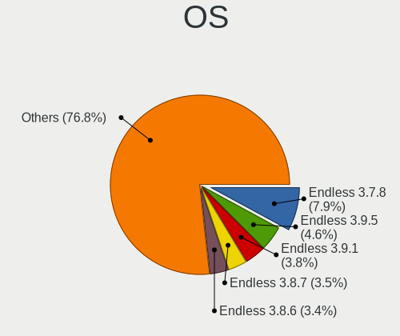

| Name                   | Notebooks | Percent |
|------------------------|-----------|---------|
| Endless 3.7.8          | 256       | 9.04%   |
| Endless 3.9.5          | 146       | 5.16%   |
| Endless 3.9.1          | 122       | 4.31%   |
| Endless 3.8.7          | 112       | 3.95%   |
| Endless 3.8.6          | 111       | 3.92%   |
| Endless 3.8.0          | 110       | 3.88%   |
| Endless 3.8.4          | 106       | 3.74%   |
| Endless 3.9.4          | 104       | 3.67%   |
| Endless 3.9.3          | 104       | 3.67%   |
| Endless 3.8.3          | 82        | 2.9%    |
| Endless 3.9.0          | 81        | 2.86%   |
| Endless 3.5.8          | 66        | 2.33%   |
| Endless 3.7.4          | 65        | 2.3%    |
| Endless 3.7.5          | 64        | 2.26%   |
| Endless 3.8.5          | 61        | 2.15%   |
| Endless 3.8.1          | 60        | 2.12%   |
| Endless 3.7.6          | 59        | 2.08%   |
| Endless 3.7.7          | 57        | 2.01%   |
| Endless 4.0.2          | 56        | 1.98%   |
| Endless 3.3.19         | 53        | 1.87%   |
| Endless 3.9.2          | 51        | 1.8%    |
| Endless 3.6.4          | 46        | 1.62%   |
| Endless 3.6.2          | 46        | 1.62%   |
| Endless 3.3.19-nexthw1 | 44        | 1.55%   |
| Endless 3.5.7          | 42        | 1.48%   |
| Endless 3.7.3          | 40        | 1.41%   |
| Endless 3.6.1          | 39        | 1.38%   |
| Endless 3.6.0          | 38        | 1.34%   |
| Endless 3.6.3          | 34        | 1.2%    |
| Endless 4.0.6          | 33        | 1.17%   |
| Endless 3.3.20-nexthw1 | 32        | 1.13%   |
| Endless 3.5.4          | 31        | 1.09%   |
| Endless 3.4.2-nexthw1  | 31        | 1.09%   |
| Endless 3.5.3          | 28        | 0.99%   |
| Endless 4.0.0          | 27        | 0.95%   |
| Endless 3.9.6          | 26        | 0.92%   |
| Endless 3.5.6          | 24        | 0.85%   |
| Endless 3.4.8          | 24        | 0.85%   |
| Endless 4.0.3          | 23        | 0.81%   |
| Endless 3.5.9          | 23        | 0.81%   |
| Endless 3.5.1          | 22        | 0.78%   |
| Endless 3.3.16-nexthw1 | 18        | 0.64%   |
| Endless 4.0.4          | 17        | 0.6%    |
| Endless 3.4.3-nexthw1  | 17        | 0.6%    |
| Endless 3.9.7          | 16        | 0.56%   |
| Endless 3.6.0-nexthw1  | 11        | 0.39%   |
| Endless 3.9.3-nexthw1  | 10        | 0.35%   |
| Endless 3.6.3-nexthw1  | 10        | 0.35%   |
| Endless 3.4.8-nexthw1  | 10        | 0.35%   |
| Endless 3.6.1-nexthw1  | 9         | 0.32%   |
| Endless 3.5.7-nexthw1  | 9         | 0.32%   |
| Endless 3.3.15         | 9         | 0.32%   |
| Endless 3.5.2          | 8         | 0.28%   |
| Endless 3.5.0          | 8         | 0.28%   |
| Endless 3.4.6-nexthw2  | 8         | 0.28%   |
| Endless 3.4.4-nexthw1  | 8         | 0.28%   |
| Endless 3.3.20         | 8         | 0.28%   |
| Endless 3.8.7-nexthw2  | 7         | 0.25%   |
| Endless 3.8.3-nexthw1  | 7         | 0.25%   |
| Endless 3.7.7-nexthw1  | 7         | 0.25%   |

OS Family
---------

OS without a version

| Name    | Notebooks | Percent |
|---------|-----------|---------|
| Endless | 2421      | 100%    |

Kernel
------

Version of the Linux kernel

| Version           | Notebooks | Percent |
|-------------------|-----------|---------|
| 5.8.0-14-generic  | 583       | 21.58%  |
| 5.4.0-19-generic  | 339       | 12.55%  |
| 5.3.0-28-generic  | 308       | 11.4%   |
| 5.4.0-42-generic  | 219       | 8.11%   |
| 5.11.0-35-generic | 150       | 5.55%   |
| 5.3.0-23-generic  | 126       | 4.66%   |
| 4.18.0-15-generic | 123       | 4.55%   |
| 4.15.0-15-generic | 79        | 2.92%   |
| 4.13.0-32-generic | 79        | 2.92%   |
| 5.0.0-25-generic  | 78        | 2.89%   |
| 5.3.0-19-generic  | 65        | 2.41%   |
| 5.4.0-39-generic  | 61        | 2.26%   |
| 4.18.0-12-generic | 58        | 2.15%   |
| 5.3.0-12-generic  | 54        | 2%      |
| 4.16.0-4-generic  | 48        | 1.78%   |
| 5.0.0-20-generic  | 46        | 1.7%    |
| 4.18.0-10-generic | 40        | 1.48%   |
| 5.0.0-17-generic  | 39        | 1.44%   |
| 5.0.0-15-generic  | 38        | 1.41%   |
| 4.18.0-11-generic | 36        | 1.33%   |
| 4.15.0-34-generic | 24        | 0.89%   |
| 5.1.0-2-generic   | 20        | 0.74%   |
| 4.15.0-12-generic | 18        | 0.67%   |
| 5.11.0-12-generic | 10        | 0.37%   |
| 5.0.0-7-generic   | 9         | 0.33%   |
| 5.4.0-7-generic   | 8         | 0.3%    |
| 4.18.0-7-generic  | 8         | 0.3%    |
| 4.17.0-4-generic  | 8         | 0.3%    |
| 5.6.0-7-generic   | 7         | 0.26%   |
| 4.15.0-23-generic | 6         | 0.22%   |
| 5.10.0-10-generic | 4         | 0.15%   |
| 4.13.0-19-generic | 4         | 0.15%   |
| 5.0.0-8-generic   | 2         | 0.07%   |
| 4.15.0-22-generic | 2         | 0.07%   |
| 4.15.0-33-generic | 1         | 0.04%   |
| 4.14.0-16-generic | 1         | 0.04%   |
| Unknown           | 1         | 0.04%   |

Kernel Family
-------------

Linux kernel without a distro release

| Version | Notebooks | Percent |
|---------|-----------|---------|
| 5.4.0   | 595       | 22.66%  |
| 5.8.0   | 583       | 22.2%   |
| 5.3.0   | 535       | 20.37%  |
| 4.18.0  | 247       | 9.41%   |
| 5.0.0   | 204       | 7.77%   |
| 5.11.0  | 160       | 6.09%   |
| 4.15.0  | 130       | 4.95%   |
| 4.13.0  | 83        | 3.16%   |
| 4.16.0  | 48        | 1.83%   |
| 5.1.0   | 20        | 0.76%   |
| 4.17.0  | 8         | 0.3%    |
| 5.6.0   | 7         | 0.27%   |
| 5.10.0  | 4         | 0.15%   |
| 4.14.0  | 1         | 0.04%   |
| Unknown | 1         | 0.04%   |

Kernel Major Ver.
-----------------

Linux kernel major version

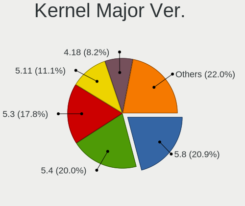

| Version | Notebooks | Percent |
|---------|-----------|---------|
| 5.4     | 595       | 22.66%  |
| 5.8     | 583       | 22.2%   |
| 5.3     | 535       | 20.37%  |
| 4.18    | 247       | 9.41%   |
| 5.0     | 204       | 7.77%   |
| 5.11    | 160       | 6.09%   |
| 4.15    | 130       | 4.95%   |
| 4.13    | 83        | 3.16%   |
| 4.16    | 48        | 1.83%   |
| 5.1     | 20        | 0.76%   |
| 4.17    | 8         | 0.3%    |
| 5.6     | 7         | 0.27%   |
| 5.10    | 4         | 0.15%   |
| 4.14    | 1         | 0.04%   |
| Unknown | 1         | 0.04%   |

Arch
----

OS architecture (x86_64, i586, etc.)

| Name   | Notebooks | Percent |
|--------|-----------|---------|
| x86_64 | 2421      | 100%    |

DE
--

Desktop Environment

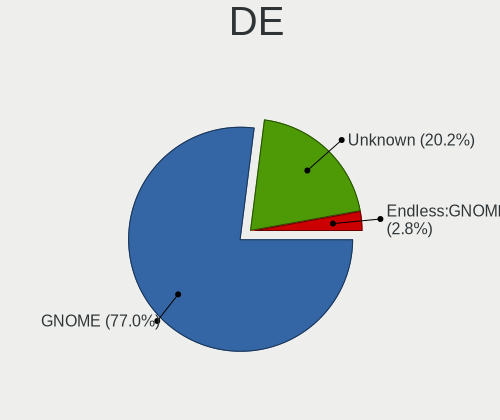

| Name    | Notebooks | Percent |
|---------|-----------|---------|
| GNOME   | 1900      | 77.08%  |
| Unknown | 565       | 22.92%  |

Display Server
--------------

X11 or Wayland

| Name    | Notebooks | Percent |
|---------|-----------|---------|
| X11     | 1898      | 77.03%  |
| Unknown | 566       | 22.97%  |

Display Manager
---------------

SDDM, LightDM, etc.

| Name    | Notebooks | Percent |
|---------|-----------|---------|
| Unknown | 2421      | 100%    |

OS Lang
-------

Language

| Lang        | Notebooks | Percent |
|-------------|-----------|---------|
| pt_BR       | 696       | 28.14%  |
| Unknown     | 568       | 22.97%  |
| en_US       | 435       | 17.59%  |
| ru_RU       | 137       | 5.54%   |
| ro_RO       | 72        | 2.91%   |
| es_ES       | 61        | 2.47%   |
| de_DE       | 51        | 2.06%   |
| hu_HU       | 48        | 1.94%   |
| fr_FR       | 35        | 1.42%   |
| ru_UA       | 33        | 1.33%   |
| ru_RU.UTF_8 | 33        | 1.33%   |
| es_MX       | 33        | 1.33%   |
| it_IT       | 30        | 1.21%   |
| es_CO       | 25        | 1.01%   |
| en_GB       | 23        | 0.93%   |
| es_AR       | 21        | 0.85%   |
| tr_TR       | 15        | 0.61%   |
| pt_PT       | 15        | 0.61%   |
| uk_UA       | 14        | 0.57%   |
| pl_PL       | 14        | 0.57%   |
| bg_BG       | 11        | 0.44%   |
| sr_RS@latin | 9         | 0.36%   |
| el_GR       | 7         | 0.28%   |
| hr_HR       | 6         | 0.24%   |
| de_AT       | 6         | 0.24%   |
| nl_NL       | 5         | 0.2%    |
| id_ID       | 5         | 0.2%    |
| en_IN       | 4         | 0.16%   |
| cs_CZ       | 4         | 0.16%   |
| ca_ES       | 4         | 0.16%   |
| vi_VN       | 3         | 0.12%   |
| sv_SE       | 3         | 0.12%   |
| sl_SI       | 3         | 0.12%   |
| nl_BE       | 3         | 0.12%   |
| es_CL       | 3         | 0.12%   |
| en_CA       | 3         | 0.12%   |
| zh_TW       | 2         | 0.08%   |
| sk_SK       | 2         | 0.08%   |
| nds_DE      | 2         | 0.08%   |
| lt_LT       | 2         | 0.08%   |
| ko_KR       | 2         | 0.08%   |
| fr_BE       | 2         | 0.08%   |
| fi_FI       | 2         | 0.08%   |
| es_BO       | 2         | 0.08%   |
| en_IE       | 2         | 0.08%   |
| ar_EG       | 2         | 0.08%   |
| zh_SG       | 1         | 0.04%   |
| zh_CN       | 1         | 0.04%   |
| he_IL       | 1         | 0.04%   |
| fr_CA       | 1         | 0.04%   |
| et_EE       | 1         | 0.04%   |
| es_VE       | 1         | 0.04%   |
| es_UY       | 1         | 0.04%   |
| es_EC       | 1         | 0.04%   |
| en_ZA       | 1         | 0.04%   |
| en_PH       | 1         | 0.04%   |
| de_LU       | 1         | 0.04%   |
| de_CH       | 1         | 0.04%   |
| de_BE       | 1         | 0.04%   |
| ar_AE       | 1         | 0.04%   |

Boot Mode
---------

EFI or BIOS

| Mode | Notebooks | Percent |
|------|-----------|---------|
| EFI  | 1731      | 69.6%   |
| BIOS | 756       | 30.4%   |

Filesystem
----------

Type of filesystem

| Type    | Notebooks | Percent |
|---------|-----------|---------|
| Ext4    | 1801      | 73.12%  |
| Unknown | 603       | 24.48%  |
| Tmpfs   | 58        | 2.35%   |
| Overlay | 1         | 0.04%   |

Part. scheme
------------

Scheme of partitioning

| Type    | Notebooks | Percent |
|---------|-----------|---------|
| Unknown | 2415      | 99.71%  |
| GPT     | 7         | 0.29%   |

Dual Boot with Linux/BSD
------------------------

Hosting more than one Linux/BSD

| Dual boot | Notebooks | Percent |
|-----------|-----------|---------|
| No        | 2420      | 99.96%  |
| Yes       | 1         | 0.04%   |

Dual Boot (Win)
---------------

Hosting Linux and Windows

| Dual boot | Notebooks | Percent |
|-----------|-----------|---------|
| No        | 2418      | 99.88%  |
| Yes       | 3         | 0.12%   |

Board
-----

Vendor
------

Motherboard manufacturer

| Name                         | Notebooks | Percent |
|------------------------------|-----------|---------|
| ASUSTek Computer             | 913       | 37.71%  |
| Acer                         | 803       | 33.17%  |
| Hewlett-Packard              | 166       | 6.86%   |
| Lenovo                       | 142       | 5.87%   |
| Dell                         | 118       | 4.87%   |
| Toshiba                      | 49        | 2.02%   |
| Positivo                     | 45        | 1.86%   |
| Samsung Electronics          | 29        | 1.2%    |
| Sony                         | 17        | 0.7%    |
| Apple                        | 11        | 0.45%   |
| Packard Bell                 | 9         | 0.37%   |
| LG Electronics               | 8         | 0.33%   |
| Intel                        | 8         | 0.33%   |
| Digibras                     | 8         | 0.33%   |
| Itautec                      | 7         | 0.29%   |
| Fujitsu Siemens              | 5         | 0.21%   |
| Semp Toshiba                 | 4         | 0.17%   |
| Philco                       | 4         | 0.17%   |
| MSI                          | 4         | 0.17%   |
| Google                       | 4         | 0.17%   |
| Gateway                      | 4         | 0.17%   |
| eMachines                    | 4         | 0.17%   |
| Unknown                      | 4         | 0.17%   |
| Notebook                     | 3         | 0.12%   |
| Medion                       | 3         | 0.12%   |
| Chuwi                        | 3         | 0.12%   |
| OEM                          | 2         | 0.08%   |
| Multilaser                   | 2         | 0.08%   |
| MODECOM                      | 2         | 0.08%   |
| HUAWEI                       | 2         | 0.08%   |
| Fujitsu                      | 2         | 0.08%   |
| Compal                       | 2         | 0.08%   |
| Clevo                        | 2         | 0.08%   |
| AMI                          | 2         | 0.08%   |
| TPVAOC                       | 1         | 0.04%   |
| Standard                     | 1         | 0.04%   |
| Positivo Bahia - VAIO        | 1         | 0.04%   |
| Phoenix/SiS                  | 1         | 0.04%   |
| Pegatron                     | 1         | 0.04%   |
| Panasonic                    | 1         | 0.04%   |
| nJoy Romania                 | 1         | 0.04%   |
| MPS Mayorista de Colombia SA | 1         | 0.04%   |
| MPMAN                        | 1         | 0.04%   |
| Mediacom                     | 1         | 0.04%   |
| LIVEFAN                      | 1         | 0.04%   |
| Kennex                       | 1         | 0.04%   |
| Jumper                       | 1         | 0.04%   |
| iRULU                        | 1         | 0.04%   |
| IPRODA                       | 1         | 0.04%   |
| Insyde                       | 1         | 0.04%   |
| Hampoo                       | 1         | 0.04%   |
| Haier                        | 1         | 0.04%   |
| Fusion5                      | 1         | 0.04%   |
| Endless                      | 1         | 0.04%   |
| DEXP                         | 1         | 0.04%   |
| DATABOX                      | 1         | 0.04%   |
| Cube                         | 1         | 0.04%   |
| Complet                      | 1         | 0.04%   |
| CCE                          | 1         | 0.04%   |
| BESSTAR Tech                 | 1         | 0.04%   |

Model
-----

Motherboard model

| Name                                       | Notebooks | Percent |
|--------------------------------------------|-----------|---------|
| Acer Nitro AN515-54                        | 121       | 5%      |
| ASUS VivoBook 15_ASUS Laptop X540UAR       | 57        | 2.35%   |
| Acer Aspire A315-53                        | 54        | 2.23%   |
| Acer Nitro AN515-44                        | 52        | 2.15%   |
| Acer Nitro AN517-51                        | 48        | 1.98%   |
| Acer Aspire A315-34                        | 47        | 1.94%   |
| ASUS X541NA                                | 43        | 1.78%   |
| ASUS VivoBook 15_ASUS Laptop X540MA_X543MA | 40        | 1.65%   |
| Acer Nitro AN515-43                        | 40        | 1.65%   |
| ASUS VivoBook 15_ASUS Laptop X540MA_X540MA | 39        | 1.61%   |
| ASUS VivoBook 15_ASUS Laptop X540BA        | 34        | 1.4%    |
| ASUS ZenBook UX431DA_UM431DA               | 26        | 1.07%   |
| Acer Nitro AN515-52                        | 26        | 1.07%   |
| ASUS X540NA                                | 24        | 0.99%   |
| Acer Aspire A315-21                        | 21        | 0.87%   |
| Acer Aspire A315-51                        | 20        | 0.83%   |
| ASUS VivoBook 15_ASUS Laptop X540UBR       | 19        | 0.78%   |
| ASUS VivoBook_ASUSLaptop X509JA_X509JA     | 18        | 0.74%   |
| Acer Aspire A515-54G                       | 18        | 0.74%   |
| Acer Aspire A315-31                        | 17        | 0.7%    |
| ASUS X541UAK                               | 15        | 0.62%   |
| Acer Aspire A515-51G                       | 15        | 0.62%   |
| Acer Aspire A315-54                        | 15        | 0.62%   |
| ASUS VivoBook_ASUSLaptop X570ZD_X570ZD     | 14        | 0.58%   |
| ASUS VivoBook_ASUS Laptop X505ZA_X505ZA    | 14        | 0.58%   |
| ASUS VivoBook 15_ASUS Laptop X540MA_R540MA | 14        | 0.58%   |
| Acer Aspire A315-54K                       | 14        | 0.58%   |
| HP Notebook                                | 13        | 0.54%   |
| ASUS VivoBook_ASUSLaptop X509FA_X509FA     | 12        | 0.5%    |
| Acer Aspire A517-51G                       | 12        | 0.5%    |
| Acer Aspire A515-51                        | 12        | 0.5%    |
| Unknown                                    | 12        | 0.5%    |
| Positivo S14CT01                           | 11        | 0.45%   |
| ASUS VivoBook 15_ASUS Laptop X507MA_X507MA | 11        | 0.45%   |
| Acer Nitro AN515-51                        | 11        | 0.45%   |
| Acer Extensa 2540                          | 11        | 0.45%   |
| Acer Aspire A315-33                        | 11        | 0.45%   |
| Positivo Mobile                            | 10        | 0.41%   |
| ASUS X540LA                                | 10        | 0.41%   |
| ASUS VivoBook 15_ASUS Laptop X540MB_X540MB | 10        | 0.41%   |
| ASUS VivoBook 15_ASUS Laptop X507UAR       | 10        | 0.41%   |
| ASUS VivoBook_ASUSLaptop X515JA_X515JA     | 9         | 0.37%   |
| ASUS VivoBook_ASUSLaptop X509DA_M509DA     | 9         | 0.37%   |
| ASUS VivoBook 15_ASUS Laptop X540MA_A540MA | 9         | 0.37%   |
| Acer Predator PH315-52                     | 9         | 0.37%   |
| ASUS VivoBook_ASUSLaptop X580GD_N580GD     | 8         | 0.33%   |
| ASUS VivoBook_ASUS Laptop E406MA_E406MA    | 8         | 0.33%   |
| Acer Aspire ES1-132                        | 8         | 0.33%   |
| Acer Aspire A315-56                        | 8         | 0.33%   |
| Acer Aspire A315-21G                       | 8         | 0.33%   |
| HP Pavilion dv6                            | 7         | 0.29%   |
| Dell Latitude E6420                        | 7         | 0.29%   |
| ASUS Z550SA                                | 7         | 0.29%   |
| ASUS X542UN                                | 7         | 0.29%   |
| ASUS X540NV                                | 7         | 0.29%   |
| ASUS VivoBook_ASUSLaptop X513EA_K513EA     | 7         | 0.29%   |
| ASUS VivoBook_ASUSLaptop X512DA_X512DA     | 7         | 0.29%   |
| ASUS VivoBook 15_ASUS Laptop X540UB        | 7         | 0.29%   |
| ASUS VivoBook 14_ASUS Laptop X441MA_X441MA | 7         | 0.29%   |
| HP 2000                                    | 6         | 0.25%   |

Model Family
------------

Motherboard model prefix

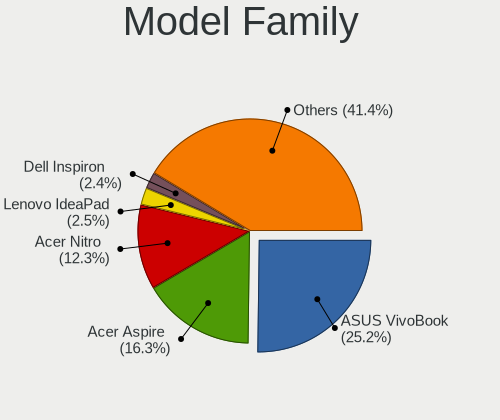

| Name                    | Notebooks | Percent |
|-------------------------|-----------|---------|
| ASUS VivoBook           | 566       | 23.38%  |
| Acer Aspire             | 415       | 17.14%  |
| Acer Nitro              | 303       | 12.52%  |
| Dell Inspiron           | 59        | 2.44%   |
| Lenovo IdeaPad          | 56        | 2.31%   |
| Toshiba Satellite       | 43        | 1.78%   |
| HP Pavilion             | 43        | 1.78%   |
| ASUS X541NA             | 43        | 1.78%   |
| Dell Latitude           | 42        | 1.73%   |
| Lenovo ThinkPad         | 41        | 1.69%   |
| ASUS ZenBook            | 35        | 1.45%   |
| Acer TravelMate         | 25        | 1.03%   |
| ASUS X540NA             | 24        | 0.99%   |
| HP ProBook              | 20        | 0.83%   |
| HP Laptop               | 18        | 0.74%   |
| Acer Swift              | 18        | 0.74%   |
| Acer Extensa            | 17        | 0.7%    |
| Acer Predator           | 16        | 0.66%   |
| ASUS X541UAK            | 15        | 0.62%   |
| HP Notebook             | 13        | 0.54%   |
| HP EliteBook            | 12        | 0.5%    |
| Unknown                 | 12        | 0.5%    |
| Positivo S14CT01        | 11        | 0.45%   |
| Dell Vostro             | 11        | 0.45%   |
| Positivo Mobile         | 10        | 0.41%   |
| ASUS X540LA             | 10        | 0.41%   |
| Packard Bell EasyNote   | 9         | 0.37%   |
| ASUS ASUSPRO            | 9         | 0.37%   |
| HP Compaq               | 8         | 0.33%   |
| Itautec Infoway         | 7         | 0.29%   |
| ASUS Z550SA             | 7         | 0.29%   |
| ASUS X542UN             | 7         | 0.29%   |
| ASUS X540NV             | 7         | 0.29%   |
| ASUS ASUS               | 7         | 0.29%   |
| HP 250                  | 6         | 0.25%   |
| HP 2000                 | 6         | 0.25%   |
| Digibras NH4CU53        | 6         | 0.25%   |
| ASUS TUF                | 6         | 0.25%   |
| ASUS GL753VD            | 6         | 0.25%   |
| HP 255                  | 5         | 0.21%   |
| ASUS X541UVK            | 5         | 0.21%   |
| ASUS X540UA             | 5         | 0.21%   |
| ASUS GL553VD            | 5         | 0.21%   |
| Toshiba PORTEGE         | 4         | 0.17%   |
| Lenovo Yoga             | 4         | 0.17%   |
| Lenovo Legion           | 4         | 0.17%   |
| Intel Infoway           | 4         | 0.17%   |
| Fujitsu Siemens ESPRIMO | 4         | 0.17%   |
| ASUS X542UAR            | 4         | 0.17%   |
| ASUS X541UJ             | 4         | 0.17%   |
| ASUS X510UN             | 4         | 0.17%   |
| ASUS X406UAR            | 4         | 0.17%   |
| ASUS GL553VE            | 4         | 0.17%   |
| Semp Toshiba IS         | 3         | 0.12%   |
| Samsung 300E5EV         | 3         | 0.12%   |
| Positivo WCBT1013       | 3         | 0.12%   |
| Positivo CHT14B         | 3         | 0.12%   |
| Positivo C14CU51        | 3         | 0.12%   |
| Lenovo B50-30           | 3         | 0.12%   |
| HP Stream               | 3         | 0.12%   |

MFG Year
--------

Motherboard manufacture year

| Year    | Notebooks | Percent |
|---------|-----------|---------|
| 2019    | 549       | 22.68%  |
| 2018    | 512       | 21.15%  |
| 2017    | 360       | 14.87%  |
| 2020    | 141       | 5.82%   |
| 2016    | 134       | 5.53%   |
| 2011    | 111       | 4.58%   |
| 2013    | 91        | 3.76%   |
| 2012    | 87        | 3.59%   |
| 2010    | 85        | 3.51%   |
| 2015    | 84        | 3.47%   |
| 2008    | 70        | 2.89%   |
| 2014    | 67        | 2.77%   |
| 2009    | 56        | 2.31%   |
| 2021    | 40        | 1.65%   |
| 2007    | 27        | 1.12%   |
| 2006    | 4         | 0.17%   |
| 2022    | 1         | 0.04%   |
| 2004    | 1         | 0.04%   |
| Unknown | 1         | 0.04%   |

Form Factor
-----------

Physical design of the computer

| Name     | Notebooks | Percent |
|----------|-----------|---------|
| Notebook | 2421      | 100%    |

Secure Boot
-----------

Enabled or disabled

| State    | Notebooks | Percent |
|----------|-----------|---------|
| Disabled | 1725      | 70.55%  |
| Enabled  | 720       | 29.45%  |

Coreboot
--------

Have coreboot on board

| Used | Notebooks | Percent |
|------|-----------|---------|
| No   | 2417      | 99.83%  |
| Yes  | 4         | 0.17%   |

RAM Size
--------

Total RAM memory

| Size in GB  | Notebooks | Percent |
|-------------|-----------|---------|
| 3.01-4.0    | 1032      | 42.45%  |
| 4.01-8.0    | 923       | 37.97%  |
| 8.01-16.0   | 177       | 7.28%   |
| 1.01-2.0    | 168       | 6.91%   |
| 16.01-24.0  | 85        | 3.5%    |
| 2.01-3.0    | 28        | 1.15%   |
| 0.51-1.0    | 7         | 0.29%   |
| 24.01-32.0  | 6         | 0.25%   |
| 32.01-64.0  | 3         | 0.12%   |
| 64.01-256.0 | 1         | 0.04%   |
| Unknown     | 1         | 0.04%   |

RAM Used
--------

Used RAM memory

| Used GB   | Notebooks | Percent |
|-----------|-----------|---------|
| 1.01-2.0  | 1364      | 50.76%  |
| 2.01-3.0  | 632       | 23.52%  |
| 0.51-1.0  | 403       | 15%     |
| 3.01-4.0  | 188       | 7%      |
| 4.01-8.0  | 96        | 3.57%   |
| 0.01-0.5  | 2         | 0.07%   |
| 8.01-16.0 | 1         | 0.04%   |
| Unknown   | 1         | 0.04%   |

Total Drives
------------

Number of drives on board

| Drives | Notebooks | Percent |
|--------|-----------|---------|
| 1      | 1927      | 78.65%  |
| 2      | 499       | 20.37%  |
| 3      | 18        | 0.73%   |
| 0      | 6         | 0.24%   |

Has CD-ROM
----------

Has CD-ROM on board

| Presented | Notebooks | Percent |
|-----------|-----------|---------|
| No        | 1694      | 69.83%  |
| Yes       | 732       | 30.17%  |

Has Ethernet
------------

Has Ethernet on board

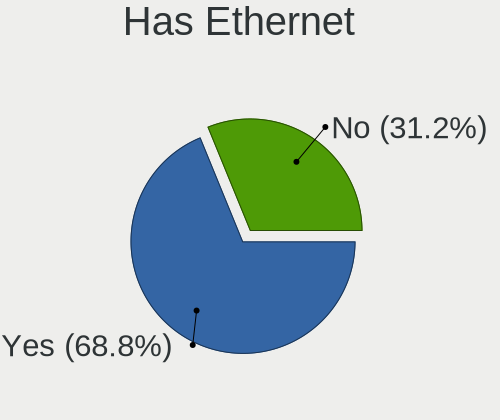

| Presented | Notebooks | Percent |
|-----------|-----------|---------|
| Yes       | 1726      | 71.09%  |
| No        | 702       | 28.91%  |

Has WiFi
--------

Has WiFi module

| Presented | Notebooks | Percent |
|-----------|-----------|---------|
| Yes       | 2365      | 97.65%  |
| No        | 57        | 2.35%   |

Has Bluetooth
-------------

Has Bluetooth module

| Presented | Notebooks | Percent |
|-----------|-----------|---------|
| Yes       | 2016      | 82.93%  |
| No        | 415       | 17.07%  |

Location
--------

Country
-------

Geographic location (country)

| Country         | Notebooks | Percent |
|-----------------|-----------|---------|
| Brazil          | 785       | 32.26%  |
| Russia          | 206       | 8.47%   |
| Romania         | 199       | 8.18%   |
| USA             | 152       | 6.25%   |
| Ukraine         | 97        | 3.99%   |
| Spain           | 94        | 3.86%   |
| Germany         | 93        | 3.82%   |
| Hungary         | 69        | 2.84%   |
| Colombia        | 55        | 2.26%   |
| France          | 37        | 1.52%   |
| Italy           | 35        | 1.44%   |
| Belarus         | 35        | 1.44%   |
| India           | 34        | 1.4%    |
| Portugal        | 31        | 1.27%   |
| Argentina       | 31        | 1.27%   |
| Serbia          | 30        | 1.23%   |
| UK              | 27        | 1.11%   |
| Bulgaria        | 23        | 0.95%   |
| Poland          | 22        | 0.9%    |
| Croatia         | 21        | 0.86%   |
| Turkey          | 17        | 0.7%    |
| Kazakhstan      | 17        | 0.7%    |
| Indonesia       | 16        | 0.66%   |
| Canada          | 16        | 0.66%   |
| Philippines     | 14        | 0.58%   |
| Iran            | 14        | 0.58%   |
| Greece          | 14        | 0.58%   |
| Saudi Arabia    | 13        | 0.53%   |
| Mexico          | 11        | 0.45%   |
| Australia       | 10        | 0.41%   |
| Georgia         | 9         | 0.37%   |
| Austria         | 9         | 0.37%   |
| Sweden          | 8         | 0.33%   |
| North Macedonia | 8         | 0.33%   |
| Kenya           | 8         | 0.33%   |
| Vietnam         | 7         | 0.29%   |
| South Africa    | 7         | 0.29%   |
| Slovenia        | 7         | 0.29%   |
| Netherlands     | 7         | 0.29%   |
| Israel          | 7         | 0.29%   |
| Egypt           | 7         | 0.29%   |
| Czechia         | 7         | 0.29%   |
| Thailand        | 6         | 0.25%   |
| Switzerland     | 6         | 0.25%   |
| Chile           | 6         | 0.25%   |
| South Korea     | 5         | 0.21%   |
| New Zealand     | 5         | 0.21%   |
| Malaysia        | 5         | 0.21%   |
| Belgium         | 5         | 0.21%   |
| Uruguay         | 4         | 0.16%   |
| Finland         | 4         | 0.16%   |
| Bangladesh      | 4         | 0.16%   |
| Tunisia         | 3         | 0.12%   |
| Slovakia        | 3         | 0.12%   |
| Peru            | 3         | 0.12%   |
| Morocco         | 3         | 0.12%   |
| Moldova         | 3         | 0.12%   |
| Lithuania       | 3         | 0.12%   |
| Ireland         | 3         | 0.12%   |
| Estonia         | 3         | 0.12%   |

City
----

Geographic location (city)

| City                 | Notebooks | Percent |
|----------------------|-----------|---------|
| Sao Paulo            | 93        | 3.56%   |
| Moscow               | 69        | 2.64%   |
| Bucharest            | 67        | 2.57%   |
| Rio de Janeiro       | 46        | 1.76%   |
| Budapest             | 34        | 1.3%    |
| Kyiv                 | 33        | 1.26%   |
| Braslia            | 31        | 1.19%   |
| St Petersburg        | 23        | 0.88%   |
| Curitiba             | 22        | 0.84%   |
| Belgrade             | 22        | 0.84%   |
| Cluj-Napoca          | 20        | 0.77%   |
| Bogot              | 20        | 0.77%   |
| Salvador             | 17        | 0.65%   |
| Belo Horizonte       | 16        | 0.61%   |
| Fortaleza            | 15        | 0.57%   |
| Porto Alegre         | 14        | 0.54%   |
| Minsk                | 14        | 0.54%   |
| Sofia                | 12        | 0.46%   |
| Niteri             | 11        | 0.42%   |
| Iasi                 | 11        | 0.42%   |
| Santo Andr         | 10        | 0.38%   |
| Madrid               | 10        | 0.38%   |
| Campinas             | 10        | 0.38%   |
| Barcelona            | 10        | 0.38%   |
| Tehran               | 9         | 0.34%   |
| Paris                | 9         | 0.34%   |
| Warsaw               | 8         | 0.31%   |
| Recife               | 8         | 0.31%   |
| Popesti-Leordeni     | 8         | 0.31%   |
| Ploieti            | 8         | 0.31%   |
| Osasco               | 8         | 0.31%   |
| Medelln            | 8         | 0.31%   |
| Lisbon               | 8         | 0.31%   |
| Istanbul             | 8         | 0.31%   |
| Florianpolis       | 8         | 0.31%   |
| Campo Grande         | 8         | 0.31%   |
| Buenos Aires         | 8         | 0.31%   |
| Zagreb               | 7         | 0.27%   |
| Sao Carlos           | 7         | 0.27%   |
| Sacramento           | 7         | 0.27%   |
| Nairobi              | 7         | 0.27%   |
| Manaus               | 7         | 0.27%   |
| Krasnodar            | 7         | 0.27%   |
| Guarulhos            | 7         | 0.27%   |
| Chelyabinsk          | 7         | 0.27%   |
| Athens               | 7         | 0.27%   |
| Almaty               | 7         | 0.27%   |
| Vienna               | 6         | 0.23%   |
| Trgu Mure        | 6         | 0.23%   |
| Sao Lus            | 6         | 0.23%   |
| Sao Jos dos Campos | 6         | 0.23%   |
| Rome                 | 6         | 0.23%   |
| Maring             | 6         | 0.23%   |
| Jakarta              | 6         | 0.23%   |
| Itu                  | 6         | 0.23%   |
| Hamburg              | 6         | 0.23%   |
| Contagem             | 6         | 0.23%   |
| Brisbane             | 6         | 0.23%   |
| Aracaju              | 6         | 0.23%   |
| Zaporizhzhya         | 5         | 0.19%   |

Drives
------

Drive Vendor
------------

Hard drive vendors

| Vendor                | Notebooks | Drives | Percent |
|-----------------------|-----------|--------|---------|
| WDC                   | 579       | 684    | 20.13%  |
| Seagate               | 423       | 528    | 14.7%   |
| Toshiba               | 326       | 408    | 11.33%  |
| Intel                 | 277       | 332    | 9.63%   |
| SanDisk               | 236       | 276    | 8.2%    |
| Kingston              | 200       | 261    | 6.95%   |
| Unknown               | 165       | 205    | 5.74%   |
| Samsung Electronics   | 108       | 130    | 3.75%   |
| SK hynix              | 99        | 122    | 3.44%   |
| HGST                  | 89        | 112    | 3.09%   |
| A-DATA Technology     | 84        | 95     | 2.92%   |
| Hitachi               | 51        | 53     | 1.77%   |
| Micron Technology     | 48        | 68     | 1.67%   |
| ADATA Technology      | 30        | 32     | 1.04%   |
| Crucial               | 19        | 21     | 0.66%   |
| Fujitsu               | 12        | 12     | 0.42%   |
| Silicon Motion        | 9         | 9      | 0.31%   |
| LITEON                | 9         | 10     | 0.31%   |
| China                 | 9         | 10     | 0.31%   |
| OCZ                   | 7         | 7      | 0.24%   |
| Apple                 | 7         | 7      | 0.24%   |
| Phison                | 6         | 6      | 0.21%   |
| Transcend             | 5         | 7      | 0.17%   |
| SPCC                  | 4         | 5      | 0.14%   |
| Netac                 | 4         | 4      | 0.14%   |
| Realtek Semiconductor | 3         | 4      | 0.1%    |
| PNY                   | 3         | 4      | 0.1%    |
| Patriot               | 3         | 3      | 0.1%    |
| Intenso               | 3         | 3      | 0.1%    |
| Hewlett-Packard       | 3         | 13     | 0.1%    |
| Goodram               | 3         | 3      | 0.1%    |
| Verbatim              | 2         | 2      | 0.07%   |
| Team                  | 2         | 2      | 0.07%   |
| StoreJet              | 2         | 3      | 0.07%   |
| LITEONIT              | 2         | 2      | 0.07%   |
| Lite-On               | 2         | 2      | 0.07%   |
| KIOXIA                | 2         | 2      | 0.07%   |
| Kingmax               | 2         | 2      | 0.07%   |
| KingFast              | 2         | 4      | 0.07%   |
| FORESEE               | 2         | 3      | 0.07%   |
| Dell                  | 2         | 2      | 0.07%   |
| Corsair               | 2         | 2      | 0.07%   |
| Zheino                | 1         | 1      | 0.03%   |
| XPG                   | 1         | 1      | 0.03%   |
| Vaseky                | 1         | 1      | 0.03%   |
| USB3.0                | 1         | 1      | 0.03%   |
| Union Memory          | 1         | 1      | 0.03%   |
| TO Exter              | 1         | 3      | 0.03%   |
| SPCC Sol              | 1         | 1      | 0.03%   |
| S3+                   | 1         | 4      | 0.03%   |
| Plextor               | 1         | 1      | 0.03%   |
| OSC                   | 1         | 1      | 0.03%   |
| Neo Forza             | 1         | 1      | 0.03%   |
| MidasForce            | 1         | 2      | 0.03%   |
| lntenso               | 1         | 1      | 0.03%   |
| Lexar                 | 1         | 1      | 0.03%   |
| KingDian              | 1         | 2      | 0.03%   |
| JMicron Technology    | 1         | 1      | 0.03%   |
| Integral              | 1         | 1      | 0.03%   |
| HUAWEI                | 1         | 1      | 0.03%   |

Drive Model
-----------

Hard drive models

| Model                                 | Notebooks | Percent |
|---------------------------------------|-----------|---------|
| WDC WD10SPZX-21Z10T0 1TB              | 354       | 12.21%  |
| Seagate ST1000LM035-1RK172 1TB        | 178       | 6.14%   |
| Toshiba MQ01ABF050 500GB              | 129       | 4.45%   |
| Intel NVMe SSD Drive 512GB            | 121       | 4.17%   |
| Toshiba MQ04ABF100 1TB                | 105       | 3.62%   |
| Unknown MMC Card  32GB                | 74        | 2.55%   |
| Intel SSDPEKKW256G7 256GB             | 72        | 2.48%   |
| Intel NVMe SSD Drive 128GB            | 69        | 2.38%   |
| A-DATA IM2S3338-128GD2 128GB SSD      | 68        | 2.35%   |
| SanDisk NVMe SSD Drive 512GB          | 65        | 2.24%   |
| Kingston RBUSC180DS37256GJ 256GB SSD  | 63        | 2.17%   |
| Seagate ST500LT012-1DG142 500GB       | 44        | 1.52%   |
| Unknown MMC Card  64GB                | 34        | 1.17%   |
| WDC WD5000LPCX-21VHAT0 500GB          | 29        | 1%      |
| Micron 1100_MTFDDAV256TBN 256GB SSD   | 28        | 0.97%   |
| SK hynix NVMe SSD Drive 256GB         | 27        | 0.93%   |
| Seagate ST500LM030-1RK17D 500GB       | 27        | 0.93%   |
| SanDisk NVMe SSD Drive 256GB          | 26        | 0.9%    |
| Kingston NVMe SSD Drive 256GB         | 26        | 0.9%    |
| SanDisk SD9SB8W256G1002 256GB SSD     | 25        | 0.86%   |
| Toshiba MQ01ABD100 1TB                | 24        | 0.83%   |
| Seagate ST500LM012 HN-M500MBB 500GB   | 22        | 0.76%   |
| SK hynix NVMe SSD Drive 512GB         | 21        | 0.72%   |
| Kingston SA400S37240G 240GB SSD       | 20        | 0.69%   |
| ADATA NVMe SSD Drive 128GB            | 20        | 0.69%   |
| SK hynix HFS256G39TND-N210A 256GB SSD | 19        | 0.66%   |
| SK hynix HFS128G39TND-N210A 128GB SSD | 19        | 0.66%   |
| HGST HTS545050B7E660 500GB            | 19        | 0.66%   |
| Seagate ST1000LM024 HN-M101MBB 1TB    | 18        | 0.62%   |
| HGST HTS541010B7E610 1TB              | 17        | 0.59%   |
| Unknown MMC Card  16GB                | 16        | 0.55%   |
| SanDisk SD9SN8W256G1102 256GB SSD     | 16        | 0.55%   |
| WDC WD5000LPCX-80VHAT1 500GB          | 15        | 0.52%   |
| Samsung NVMe SSD Drive 256GB          | 15        | 0.52%   |
| Kingston RBUSNS8180DS3256GJ 256GB SSD | 14        | 0.48%   |
| Seagate ST9500325AS 500GB             | 13        | 0.45%   |
| Seagate ST2000LM007-1R8174 2TB        | 12        | 0.41%   |
| HGST HTS721010A9E630 1TB              | 12        | 0.41%   |
| HGST HTS541010A9E680 1TB              | 12        | 0.41%   |
| SanDisk SD9SN8W128G1102 128GB SSD     | 11        | 0.38%   |
| SanDisk SD9SB8W256G1102 256GB SSD     | 10        | 0.34%   |
| SanDisk SD8SN8U128G1002 128GB SSD     | 10        | 0.34%   |
| ADATA NVMe SSD Drive 256GB            | 10        | 0.34%   |
| WDC WD10SPZX-80Z10T2 1TB              | 9         | 0.31%   |
| Kingston SA400S37120G 120GB SSD       | 9         | 0.31%   |
| HGST HTS545050A7E680 500GB            | 9         | 0.31%   |
| WDC WD5000LPVX-22V0TT0 500GB          | 8         | 0.28%   |
| Seagate ST9320325AS 320GB             | 8         | 0.28%   |
| Seagate ST500LT012-9WS142 500GB       | 8         | 0.28%   |
| Seagate ST320LM001 HN-M320MBB 320GB   | 8         | 0.28%   |
| SanDisk SD9SN8W256G1014 256GB SSD     | 8         | 0.28%   |
| SanDisk SD9SN8W256G1002 256GB SSD     | 8         | 0.28%   |
| Samsung HM321HI 320GB                 | 8         | 0.28%   |
| Micron 1300_MTFDDAK256TDL 256GB SSD   | 8         | 0.28%   |
| WDC WDS120G2G0A-00JH30 120GB SSD      | 7         | 0.24%   |
| WDC WD5000LPCX-80VHAT0 500GB          | 7         | 0.24%   |
| Unknown SD/MMC/MS PRO 128GB           | 7         | 0.24%   |
| Silicon Motion NVMe SSD Drive 256GB   | 7         | 0.24%   |
| Seagate Expansion 1TB                 | 7         | 0.24%   |
| SanDisk SSD PLUS 240GB                | 7         | 0.24%   |

HDD Vendor
----------

Hard disk drive vendors

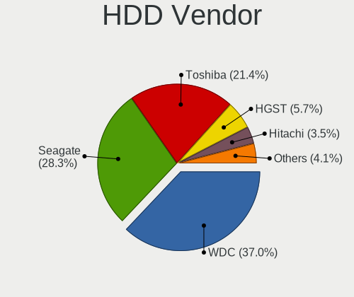

| Vendor              | Notebooks | Drives | Percent |
|---------------------|-----------|--------|---------|
| WDC                 | 560       | 655    | 37.38%  |
| Seagate             | 423       | 527    | 28.24%  |
| Toshiba             | 316       | 396    | 21.09%  |
| HGST                | 89        | 112    | 5.94%   |
| Hitachi             | 51        | 53     | 3.4%    |
| Samsung Electronics | 31        | 35     | 2.07%   |
| Fujitsu             | 12        | 12     | 0.8%    |
| Unknown             | 8         | 8      | 0.53%   |
| Intenso             | 3         | 3      | 0.2%    |
| StoreJet            | 1         | 2      | 0.07%   |
| JMicron Technology  | 1         | 1      | 0.07%   |
| HGST HTS            | 1         | 1      | 0.07%   |
| ASMT                | 1         | 3      | 0.07%   |
| Apple               | 1         | 1      | 0.07%   |

SSD Vendor
----------

Solid state drive vendors

| Vendor              | Notebooks | Drives | Percent |
|---------------------|-----------|--------|---------|
| Kingston            | 164       | 219    | 23.91%  |
| SanDisk             | 140       | 178    | 20.41%  |
| A-DATA Technology   | 84        | 95     | 12.24%  |
| SK hynix            | 50        | 70     | 7.29%   |
| Samsung Electronics | 50        | 63     | 7.29%   |
| Micron Technology   | 45        | 65     | 6.56%   |
| WDC                 | 20        | 26     | 2.92%   |
| Crucial             | 19        | 21     | 2.77%   |
| LITEON              | 9         | 10     | 1.31%   |
| Intel               | 9         | 16     | 1.31%   |
| China               | 9         | 10     | 1.31%   |
| Unknown             | 7         | 8      | 1.02%   |
| Toshiba             | 7         | 7      | 1.02%   |
| OCZ                 | 7         | 7      | 1.02%   |
| Apple               | 6         | 6      | 0.87%   |
| Transcend           | 5         | 7      | 0.73%   |
| SPCC                | 4         | 5      | 0.58%   |
| Netac               | 4         | 4      | 0.58%   |
| PNY                 | 3         | 4      | 0.44%   |
| Patriot             | 3         | 3      | 0.44%   |
| Hewlett-Packard     | 3         | 13     | 0.44%   |
| Goodram             | 3         | 3      | 0.44%   |
| Verbatim            | 2         | 2      | 0.29%   |
| Team                | 2         | 2      | 0.29%   |
| LITEONIT            | 2         | 2      | 0.29%   |
| Kingmax             | 2         | 2      | 0.29%   |
| FORESEE             | 2         | 3      | 0.29%   |
| Dell                | 2         | 2      | 0.29%   |
| Corsair             | 2         | 2      | 0.29%   |
| USB3.0              | 1         | 1      | 0.15%   |
| Union Memory        | 1         | 1      | 0.15%   |
| TO Exter            | 1         | 3      | 0.15%   |
| StoreJet            | 1         | 1      | 0.15%   |
| SPCC Sol            | 1         | 1      | 0.15%   |
| Seagate             | 1         | 1      | 0.15%   |
| S3+                 | 1         | 4      | 0.15%   |
| Plextor             | 1         | 1      | 0.15%   |
| Neo Forza           | 1         | 1      | 0.15%   |
| MidasForce          | 1         | 2      | 0.15%   |
| lntenso             | 1         | 1      | 0.15%   |
| Lexar               | 1         | 1      | 0.15%   |
| KingDian            | 1         | 2      | 0.15%   |
| Integral            | 1         | 1      | 0.15%   |
| GLOWAY              | 1         | 1      | 0.15%   |
| Gigabyte Technology | 1         | 1      | 0.15%   |
| EMTEC               | 1         | 1      | 0.15%   |
| Dogfish             | 1         | 1      | 0.15%   |
| Apacer              | 1         | 3      | 0.15%   |
| AMD                 | 1         | 1      | 0.15%   |
| ADATA SU            | 1         | 1      | 0.15%   |

Drive Kind
----------

HDD or SSD

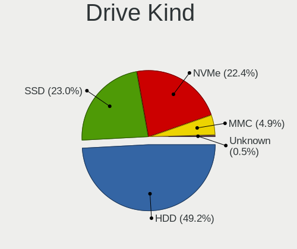

| Kind    | Notebooks | Drives | Percent |
|---------|-----------|--------|---------|
| HDD     | 1482      | 1809   | 52.15%  |
| SSD     | 665       | 885    | 23.4%   |
| NVMe    | 544       | 614    | 19.14%  |
| MMC     | 141       | 179    | 4.96%   |
| Unknown | 10        | 16     | 0.35%   |

Drive Connector
---------------

SATA, SAS, NVMe, etc.

| Type | Notebooks | Drives | Percent |
|------|-----------|--------|---------|
| SATA | 1951      | 2668   | 73.02%  |
| NVMe | 544       | 614    | 20.36%  |
| MMC  | 141       | 179    | 5.28%   |
| SAS  | 36        | 42     | 1.35%   |

Drive Size
----------

Size of hard drive

| Size in TB | Notebooks | Drives | Percent |
|------------|-----------|--------|---------|
| 0.01-0.5   | 1259      | 1643   | 59.16%  |
| 0.51-1.0   | 842       | 1009   | 39.57%  |
| 1.01-2.0   | 25        | 40     | 1.17%   |
| 3.01-4.0   | 2         | 2      | 0.09%   |

Space Total
-----------

Amount of disk space available on the file system

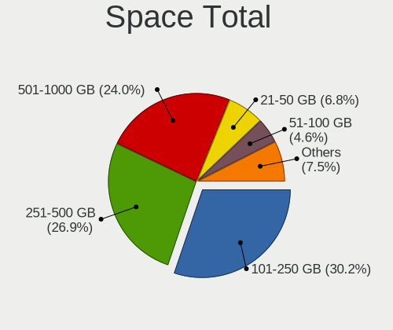

| Size in GB     | Notebooks | Percent |
|----------------|-----------|---------|
| 101-250        | 693       | 28.03%  |
| 251-500        | 662       | 26.78%  |
| 501-1000       | 630       | 25.49%  |
| 21-50          | 177       | 7.16%   |
| 51-100         | 125       | 5.06%   |
| 1-20           | 102       | 4.13%   |
| 1001-2000      | 53        | 2.14%   |
| 2001-3000      | 21        | 0.85%   |
| Unknown        | 6         | 0.24%   |
| More than 3000 | 3         | 0.12%   |

Space Used
----------

Amount of used disk space

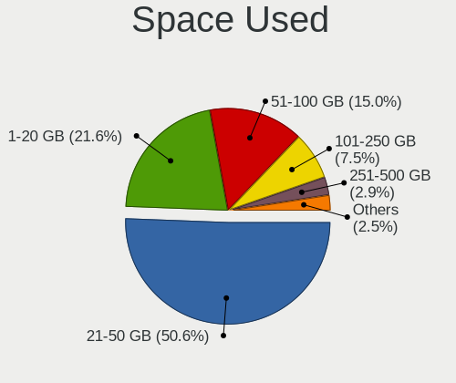

| Used GB        | Notebooks | Percent |
|----------------|-----------|---------|
| 21-50          | 1333      | 51.97%  |
| 1-20           | 570       | 22.22%  |
| 51-100         | 361       | 14.07%  |
| 101-250        | 175       | 6.82%   |
| 251-500        | 66        | 2.57%   |
| 501-1000       | 32        | 1.25%   |
| 1001-2000      | 17        | 0.66%   |
| Unknown        | 6         | 0.23%   |
| 2001-3000      | 4         | 0.16%   |
| More than 3000 | 1         | 0.04%   |

Malfunc. Drives
---------------

Drive models with a malfunction

| Model                                        | Notebooks | Drives | Percent |
|----------------------------------------------|-----------|--------|---------|
| Samsung Electronics MZVPW128HEGM-00000 128GB | 1         | 1      | 100%    |

Malfunc. Drive Vendor
---------------------

Vendors of faulty drives

| Vendor              | Notebooks | Drives | Percent |
|---------------------|-----------|--------|---------|
| Samsung Electronics | 1         | 1      | 100%    |

Malfunc. HDD Vendor
-------------------

Vendors of faulty HDD drives

Zero info for selected period =(

Malfunc. Drive Kind
-------------------

Kinds of faulty drives

| Kind | Notebooks | Drives | Percent |
|------|-----------|--------|---------|
| NVMe | 1         | 1      | 100%    |

Failed Drives
-------------

Failed drive models

Zero info for selected period =(

Failed Drive Vendor
-------------------

Failed drive vendors

Zero info for selected period =(

Drive Status
------------

Number of failed and malfunc. drives

| Status   | Notebooks | Drives | Percent |
|----------|-----------|--------|---------|
| Detected | 2413      | 3492   | 99.59%  |
| Works    | 9         | 10     | 0.37%   |
| Malfunc  | 1         | 1      | 0.04%   |

Storage controller
------------------

Storage Vendor
--------------

Storage controller vendors

| Vendor                           | Notebooks | Percent |
|----------------------------------|-----------|---------|
| Intel                            | 1903      | 72.72%  |
| AMD                              | 409       | 15.63%  |
| SanDisk                          | 96        | 3.67%   |
| SK hynix                         | 49        | 1.87%   |
| ADATA Technology                 | 38        | 1.45%   |
| Kingston Technology Company      | 36        | 1.38%   |
| Samsung Electronics              | 32        | 1.22%   |
| Silicon Integrated Systems [SiS] | 10        | 0.38%   |
| Silicon Motion                   | 9         | 0.34%   |
| Nvidia                           | 8         | 0.31%   |
| Phison Electronics               | 6         | 0.23%   |
| Toshiba America Info Systems     | 5         | 0.19%   |
| Realtek Semiconductor            | 4         | 0.15%   |
| Micron Technology                | 3         | 0.11%   |
| VIA Technologies                 | 2         | 0.08%   |
| Lite-On Technology               | 2         | 0.08%   |
| KIOXIA                           | 2         | 0.08%   |
| Union Memory (Shenzhen)          | 1         | 0.04%   |
| Marvell Technology Group         | 1         | 0.04%   |
| JMicron Technology               | 1         | 0.04%   |

Storage Model
-------------

Storage controller models

| Model                                                                                  | Notebooks | Percent |
|----------------------------------------------------------------------------------------|-----------|---------|
| Intel 82801 Mobile SATA Controller [RAID mode]                                         | 428       | 14.29%  |
| Intel Sunrise Point-LP SATA Controller [AHCI mode]                                     | 401       | 13.38%  |
| AMD FCH SATA Controller [AHCI mode]                                                    | 368       | 12.28%  |
| Intel PROSet/Wireless WiFi Software extension                                          | 241       | 8.04%   |
| Intel Celeron/Pentium Silver Processor SATA Controller                                 | 234       | 7.81%   |
| Intel Celeron N3350/Pentium N4200/Atom E3900 Series SATA AHCI Controller               | 143       | 4.77%   |
| Intel 7 Series Chipset Family 6-port SATA Controller [AHCI mode]                       | 104       | 3.47%   |
| Intel 82801IBM/IEM (ICH9M/ICH9M-E) 4 port SATA Controller [AHCI mode]                  | 77        | 2.57%   |
| Intel 6 Series/C200 Series Chipset Family 6 port Mobile SATA AHCI Controller           | 69        | 2.3%    |
| SanDisk WD Blue SN550 NVMe SSD                                                         | 64        | 2.14%   |
| Intel Atom/Celeron/Pentium Processor x5-E8000/J3xxx/N3xxx Series SATA Controller       | 48        | 1.6%    |
| Intel HM170/QM170 Chipset SATA Controller [AHCI Mode]                                  | 44        | 1.47%   |
| SK hynix BC501 NVMe Solid State Drive                                                  | 42        | 1.4%    |
| Intel 8 Series SATA Controller 1 [AHCI mode]                                           | 37        | 1.23%   |
| Intel 82801HM/HEM (ICH8M/ICH8M-E) IDE Controller                                       | 36        | 1.2%    |
| Intel 5 Series/3400 Series Chipset 4 port SATA AHCI Controller                         | 35        | 1.17%   |
| ADATA Non-Volatile memory controller                                                   | 35        | 1.17%   |
| Intel Wildcat Point-LP SATA Controller [AHCI Mode]                                     | 34        | 1.13%   |
| Intel Tiger Lake-LP SATA Controller [AHCI mode]                                        | 33        | 1.1%    |
| Intel Volume Management Device NVMe RAID Controller                                    | 32        | 1.07%   |
| Intel 82801HM/HEM (ICH8M/ICH8M-E) SATA Controller [AHCI mode]                          | 31        | 1.03%   |
| AMD SB7x0/SB8x0/SB9x0 SATA Controller [AHCI mode]                                      | 31        | 1.03%   |
| SanDisk WD Blue SN500 / PC SN520 NVMe SSD                                              | 27        | 0.9%    |
| Kingston Company U-SNS8154P3 NVMe SSD                                                  | 27        | 0.9%    |
| Intel Cannon Lake Mobile PCH SATA AHCI Controller                                      | 25        | 0.83%   |
| Intel Atom Processor E3800 Series SATA AHCI Controller                                 | 23        | 0.77%   |
| Intel SSD 660P Series                                                                  | 21        | 0.7%    |
| Intel NM10/ICH7 Family SATA Controller [AHCI mode]                                     | 19        | 0.63%   |
| Samsung NVMe SSD Controller 980                                                        | 18        | 0.6%    |
| Intel Cannon Point-LP SATA Controller [AHCI Mode]                                      | 18        | 0.6%    |
| Intel 8 Series/C220 Series Chipset Family 6-port SATA Controller 1 [AHCI mode]         | 17        | 0.57%   |
| Intel 5 Series/3400 Series Chipset 6 port SATA AHCI Controller                         | 14        | 0.47%   |
| Intel Comet Lake SATA AHCI Controller                                                  | 11        | 0.37%   |
| Silicon Integrated Systems [SiS] 5513 IDE Controller                                   | 10        | 0.33%   |
| Intel 82801HM/HEM (ICH8M/ICH8M-E) SATA Controller [IDE mode]                           | 10        | 0.33%   |
| Silicon Motion SM2263EN/SM2263XT SSD Controller                                        | 9         | 0.3%    |
| Silicon Integrated Systems [SiS] SATA Controller / IDE mode                            | 9         | 0.3%    |
| Samsung NVMe SSD Controller SM981/PM981/PM983                                          | 8         | 0.27%   |
| Intel 82801IBM/IEM (ICH9M/ICH9M-E) 2 port SATA Controller [IDE mode]                   | 8         | 0.27%   |
| Intel Ice Lake-LP SATA Controller [AHCI mode]                                          | 7         | 0.23%   |
| Intel 6 Series/C200 Series Chipset Family Mobile SATA Controller (IDE mode, ports 4-5) | 7         | 0.23%   |
| Intel 6 Series/C200 Series Chipset Family Mobile SATA Controller (IDE mode, ports 0-3) | 7         | 0.23%   |
| Phison PS5013 E13 NVMe Controller                                                      | 6         | 0.2%    |
| AMD SB600 Non-Raid-5 SATA                                                              | 6         | 0.2%    |
| AMD SB600 IDE                                                                          | 6         | 0.2%    |
| SK hynix BC511                                                                         | 5         | 0.17%   |
| Kingston Company OM3PDP3 NVMe SSD                                                      | 5         | 0.17%   |
| Samsung Electronics SATA controller                                                    | 4         | 0.13%   |
| Intel Mobile 4 Series Chipset PT IDER Controller                                       | 4         | 0.13%   |
| Intel 5 Series/3400 Series Chipset 4 port SATA IDE Controller                          | 4         | 0.13%   |
| AMD SB7x0/SB8x0/SB9x0 IDE Controller                                                   | 4         | 0.13%   |
| Nvidia MCP51 IDE                                                                       | 3         | 0.1%    |
| Micron Non-Volatile memory controller                                                  | 3         | 0.1%    |
| Kingston Company Company Non-Volatile memory controller                                | 3         | 0.1%    |
| Intel SSD 600P Series                                                                  | 3         | 0.1%    |
| Intel Comet Lake PCH-LP SATA RAID Premium Controller                                   | 3         | 0.1%    |
| Intel 82801G (ICH7 Family) IDE Controller                                              | 3         | 0.1%    |
| Intel 7 Series Chipset Family 4-port SATA Controller [IDE mode]                        | 3         | 0.1%    |
| Intel 7 Series Chipset Family 2-port SATA Controller [IDE mode]                        | 3         | 0.1%    |
| Intel 5 Series/3400 Series Chipset 2 port SATA IDE Controller                          | 3         | 0.1%    |

Storage Kind
------------

Kind of storage controller (IDE, SATA, NVMe, SAS, ...)

| Kind | Notebooks | Percent |
|------|-----------|---------|
| SATA | 2028      | 68.56%  |
| NVMe | 545       | 18.42%  |
| RAID | 280       | 9.47%   |
| IDE  | 105       | 3.55%   |

Processor
---------

CPU Vendor
----------

Processor vendors

| Vendor | Notebooks | Percent |
|--------|-----------|---------|
| Intel  | 1999      | 82.57%  |
| AMD    | 422       | 17.43%  |

CPU Model
---------

Processor models

| Model                                         | Notebooks | Percent |
|-----------------------------------------------|-----------|---------|
| Intel Celeron N4000 CPU @ 1.10GHz             | 128       | 5.29%   |
| Intel Core i5-9300H CPU @ 2.40GHz             | 122       | 5.04%   |
| Intel Celeron CPU N3350 @ 1.10GHz             | 87        | 3.59%   |
| Intel Core i5-8250U CPU @ 1.60GHz             | 85        | 3.51%   |
| Intel Core i3-6006U CPU @ 2.00GHz             | 77        | 3.18%   |
| Intel Core i3-7020U CPU @ 2.30GHz             | 60        | 2.48%   |
| Intel Core i7-9750H CPU @ 2.60GHz             | 58        | 2.4%    |
| Intel Core i5-7200U CPU @ 2.50GHz             | 54        | 2.23%   |
| AMD Ryzen 5 3500U with Radeon Vega Mobile Gfx | 48        | 1.98%   |
| Intel Pentium Silver N5000 CPU @ 1.10GHz      | 41        | 1.69%   |
| Intel Core i3-8130U CPU @ 2.20GHz             | 41        | 1.69%   |
| AMD Ryzen 7 4800H with Radeon Graphics        | 37        | 1.53%   |
| Intel Pentium CPU N4200 @ 1.10GHz             | 34        | 1.4%    |
| Intel Celeron N4020 CPU @ 1.10GHz             | 34        | 1.4%    |
| AMD Ryzen 7 3750H with Radeon Vega Mobile Gfx | 32        | 1.32%   |
| Intel Core i5-1035G1 CPU @ 1.00GHz            | 31        | 1.28%   |
| Intel Core i3-8145U CPU @ 2.10GHz             | 31        | 1.28%   |
| Intel Pentium CPU 4417U @ 2.30GHz             | 29        | 1.2%    |
| Intel Core i5-8300H CPU @ 2.30GHz             | 29        | 1.2%    |
| AMD Ryzen 5 2500U with Radeon Vega Mobile Gfx | 29        | 1.2%    |
| Intel Core i5-8265U CPU @ 1.60GHz             | 28        | 1.16%   |
| Intel Core i3-1005G1 CPU @ 1.20GHz            | 26        | 1.07%   |
| Intel Core i7-10510U CPU @ 1.80GHz            | 25        | 1.03%   |
| Intel Core i7-8550U CPU @ 1.80GHz             | 24        | 0.99%   |
| Intel Core i5-10210U CPU @ 1.60GHz            | 24        | 0.99%   |
| Intel Celeron CPU N3060 @ 1.60GHz             | 24        | 0.99%   |
| Intel Core i7-7700HQ CPU @ 2.80GHz            | 23        | 0.95%   |
| Intel Celeron N4000C CPU @ 1.10GHz            | 23        | 0.95%   |
| Intel Core i3-7100U CPU @ 2.40GHz             | 21        | 0.87%   |
| Intel Celeron CPU N3450 @ 1.10GHz             | 21        | 0.87%   |
| Intel Core i3-5005U CPU @ 2.00GHz             | 19        | 0.78%   |
| Intel Atom x5-Z8350 CPU @ 1.44GHz             | 19        | 0.78%   |
| AMD Ryzen 5 4600H with Radeon Graphics        | 19        | 0.78%   |
| AMD A6-9225 RADEON R4, 5 COMPUTE CORES 2C+3G  | 19        | 0.78%   |
| Intel Core i5-7300HQ CPU @ 2.50GHz            | 18        | 0.74%   |
| Intel Core i7-8565U CPU @ 1.80GHz             | 17        | 0.7%    |
| Intel Core i3-6100U CPU @ 2.30GHz             | 16        | 0.66%   |
| Intel Core i7-8750H CPU @ 2.20GHz             | 15        | 0.62%   |
| Intel Core i3-2310M CPU @ 2.10GHz             | 15        | 0.62%   |
| Intel Atom x5-Z8300 CPU @ 1.44GHz             | 15        | 0.62%   |
| AMD Ryzen 7 3700U with Radeon Vega Mobile Gfx | 15        | 0.62%   |
| AMD Ryzen 3 2200U with Radeon Vega Mobile Gfx | 15        | 0.62%   |
| Intel Celeron CPU N2840 @ 2.16GHz             | 14        | 0.58%   |
| Intel 11th Gen Core i3-1115G4 @ 3.00GHz       | 14        | 0.58%   |
| Intel Core i7-7500U CPU @ 2.70GHz             | 13        | 0.54%   |
| Intel Core i5-2410M CPU @ 2.30GHz             | 12        | 0.5%    |
| AMD E2-9000 RADEON R2, 4 COMPUTE CORES 2C+2G  | 12        | 0.5%    |
| Intel Celeron CPU N3160 @ 1.60GHz             | 11        | 0.45%   |
| Intel Atom CPU Z3735F @ 1.33GHz               | 11        | 0.45%   |
| AMD Ryzen 5 3550H with Radeon Vega Mobile Gfx | 11        | 0.45%   |
| AMD A9-9425 RADEON R5, 5 COMPUTE CORES 2C+3G  | 11        | 0.45%   |
| AMD A4-9125 RADEON R3, 4 COMPUTE CORES 2C+2G  | 11        | 0.45%   |
| Intel Pentium Dual-Core CPU T4500 @ 2.30GHz   | 10        | 0.41%   |
| Intel Core i5-4210U CPU @ 1.70GHz             | 10        | 0.41%   |
| Intel Core i5-3210M CPU @ 2.50GHz             | 10        | 0.41%   |
| Intel Core i5-2520M CPU @ 2.50GHz             | 10        | 0.41%   |
| Intel Core i3-4005U CPU @ 1.70GHz             | 10        | 0.41%   |
| Intel 11th Gen Core i5-1135G7 @ 2.40GHz       | 10        | 0.41%   |
| AMD Ryzen 3 3200U with Radeon Vega Mobile Gfx | 10        | 0.41%   |
| AMD E-300 APU with Radeon HD Graphics         | 10        | 0.41%   |

CPU Model Family
----------------

Processor model prefix

| Model                                | Notebooks | Percent |
|--------------------------------------|-----------|---------|
| Intel Core i5                        | 529       | 21.85%  |
| Intel Celeron                        | 407       | 16.81%  |
| Intel Core i3                        | 395       | 16.32%  |
| Intel Core i7                        | 255       | 10.53%  |
| Intel Pentium                        | 118       | 4.87%   |
| AMD Ryzen 5                          | 108       | 4.46%   |
| AMD Ryzen 7                          | 87        | 3.59%   |
| Intel Core 2 Duo                     | 80        | 3.3%    |
| Intel Atom                           | 77        | 3.18%   |
| Other                                | 59        | 2.44%   |
| Intel Pentium Silver                 | 43        | 1.78%   |
| AMD A6                               | 37        | 1.53%   |
| AMD Ryzen 3                          | 29        | 1.2%    |
| Intel Pentium Dual-Core              | 28        | 1.16%   |
| AMD A4                               | 23        | 0.95%   |
| AMD E2                               | 17        | 0.7%    |
| AMD E                                | 17        | 0.7%    |
| Intel Pentium Dual                   | 12        | 0.5%    |
| AMD E1                               | 10        | 0.41%   |
| Intel Genuine                        | 9         | 0.37%   |
| AMD A8                               | 8         | 0.33%   |
| AMD C-70                             | 6         | 0.25%   |
| AMD A12                              | 6         | 0.25%   |
| AMD Athlon                           | 5         | 0.21%   |
| AMD A10                              | 5         | 0.21%   |
| Intel Core 2                         | 4         | 0.17%   |
| AMD Turion 64 X2 Mobile              | 4         | 0.17%   |
| AMD Mobile Sempron                   | 4         | 0.17%   |
| AMD FX                               | 4         | 0.17%   |
| Intel Celeron Dual-Core              | 3         | 0.12%   |
| AMD V120                             | 3         | 0.12%   |
| AMD Turion X2 Dual-Core Mobile       | 2         | 0.08%   |
| AMD Turion II Ultra Dual-Core Mobile | 2         | 0.08%   |
| AMD Phenom II                        | 2         | 0.08%   |
| AMD C-50                             | 2         | 0.08%   |
| AMD Athlon II Dual-Core              | 2         | 0.08%   |
| AMD Athlon II                        | 2         | 0.08%   |
| Intel Pentium Gold                   | 1         | 0.04%   |
| Intel Core m3                        | 1         | 0.04%   |
| Intel Core M                         | 1         | 0.04%   |
| Intel Core i9                        | 1         | 0.04%   |
| Intel Core 2 Solo                    | 1         | 0.04%   |
| Intel Core 2 Quad                    | 1         | 0.04%   |
| Intel Celeron M                      | 1         | 0.04%   |
| AMD Turion II Dual-Core              | 1         | 0.04%   |
| AMD Turion II                        | 1         | 0.04%   |
| AMD Turion 64 Mobile                 | 1         | 0.04%   |
| AMD Turion                           | 1         | 0.04%   |
| AMD QC                               | 1         | 0.04%   |
| AMD C-60                             | 1         | 0.04%   |
| AMD Athlon X2                        | 1         | 0.04%   |
| AMD Athlon Neo X2                    | 1         | 0.04%   |
| AMD Athlon II Neo                    | 1         | 0.04%   |
| AMD Athlon 64 X2                     | 1         | 0.04%   |

CPU Cores
---------

Number of processor cores

| Number | Notebooks | Percent |
|--------|-----------|---------|
| 2      | 1395      | 57.62%  |
| 4      | 844       | 34.86%  |
| 6      | 96        | 3.97%   |
| 1      | 45        | 1.86%   |
| 8      | 40        | 1.65%   |
| 3      | 1         | 0.04%   |

CPU Sockets
-----------

Number of sockets

| Number | Notebooks | Percent |
|--------|-----------|---------|
| 1      | 2421      | 100%    |

CPU Threads
-----------

Threads per core (Hyper-Threading)

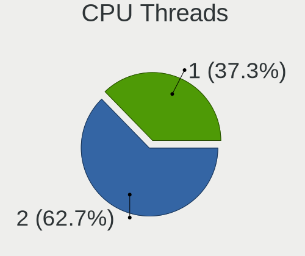

| Number | Notebooks | Percent |
|--------|-----------|---------|
| 2      | 1494      | 61.71%  |
| 1      | 927       | 38.29%  |

CPU Op-Modes
------------

CPU Operation Modes (32-bit, 64-bit)

| Op mode        | Notebooks | Percent |
|----------------|-----------|---------|
| 32-bit, 64-bit | 1903      | 77.2%   |
| Unknown        | 562       | 22.8%   |

CPU Microcode
-------------

Microcode number

| Number     | Notebooks | Percent |
|------------|-----------|---------|
| Unknown    | 274       | 11.08%  |
| 0x906ea    | 180       | 7.28%   |
| 0x706a1    | 176       | 7.12%   |
| 0x806ea    | 174       | 7.04%   |
| 0x806e9    | 140       | 5.66%   |
| 0x506c9    | 123       | 4.98%   |
| 0x406e3    | 103       | 4.17%   |
| 0x806ec    | 97        | 3.92%   |
| 0x206a7    | 96        | 3.88%   |
| 0x306a9    | 78        | 3.16%   |
| 0x08108109 | 69        | 2.79%   |
| 0x406c4    | 61        | 2.47%   |
| 0x1067a    | 57        | 2.31%   |
| 0x06006705 | 56        | 2.27%   |
| 0x706e5    | 55        | 2.22%   |
| 0x08600103 | 54        | 2.18%   |
| 0x08108102 | 49        | 1.98%   |
| 0x906ed    | 44        | 1.78%   |
| 0x906e9    | 41        | 1.66%   |
| 0x30678    | 38        | 1.54%   |
| 0x40651    | 37        | 1.5%    |
| 0x306d4    | 36        | 1.46%   |
| 0x706a8    | 34        | 1.38%   |
| 0x20655    | 34        | 1.38%   |
| 0x806c1    | 33        | 1.33%   |
| 0x6fd      | 33        | 1.33%   |
| 0x806eb    | 32        | 1.29%   |
| 0x406c3    | 29        | 1.17%   |
| 0x0810100b | 26        | 1.05%   |
| 0x05000119 | 24        | 0.97%   |
| 0x08101007 | 21        | 0.85%   |
| 0x306c3    | 19        | 0.77%   |
| 0x106ca    | 17        | 0.69%   |
| 0x06006704 | 17        | 0.69%   |
| 0x10676    | 13        | 0.53%   |
| 0x20652    | 9         | 0.36%   |
| 0x07030105 | 9         | 0.36%   |
| 0x6fb      | 8         | 0.32%   |
| 0x010000c8 | 8         | 0.32%   |
| 0x06001119 | 7         | 0.28%   |
| 0x0700010f | 6         | 0.24%   |
| 0xa0652    | 5         | 0.2%    |
| 0x506e3    | 5         | 0.2%    |
| 0x30673    | 5         | 0.2%    |
| 0x0600611a | 5         | 0.2%    |
| 0x05000029 | 4         | 0.16%   |
| 0x30661    | 3         | 0.12%   |
| 0x106e5    | 3         | 0.12%   |
| 0x6fa      | 2         | 0.08%   |
| 0x6f6      | 2         | 0.08%   |
| 0x10661    | 2         | 0.08%   |
| 0x08600106 | 2         | 0.08%   |
| 0x08600104 | 2         | 0.08%   |
| 0x07030106 | 2         | 0.08%   |
| 0x0600111f | 2         | 0.08%   |
| 0x03000027 | 2         | 0.08%   |
| 0x6f2      | 1         | 0.04%   |
| 0x40661    | 1         | 0.04%   |
| 0x08608103 | 1         | 0.04%   |
| 0x08608102 | 1         | 0.04%   |

CPU Microarch
-------------

Microarchitecture

| Name            | Notebooks | Percent |
|-----------------|-----------|---------|
| KabyLake        | 739       | 30.52%  |
| Goldmont plus   | 238       | 9.83%   |
| Goldmont        | 143       | 5.91%   |
| Silvermont      | 140       | 5.78%   |
| Zen+            | 122       | 5.04%   |
| Skylake         | 119       | 4.92%   |
| SandyBridge     | 113       | 4.67%   |
| Penryn          | 93        | 3.84%   |
| Excavator       | 93        | 3.84%   |
| IvyBridge       | 84        | 3.47%   |
| Haswell         | 63        | 2.6%    |
| IceLake         | 59        | 2.44%   |
| Zen 2           | 58        | 2.4%    |
| Core            | 55        | 2.27%   |
| Westmere        | 51        | 2.11%   |
| Zen             | 47        | 1.94%   |
| Broadwell       | 39        | 1.61%   |
| TigerLake       | 33        | 1.36%   |
| Bobcat          | 33        | 1.36%   |
| Bonnell         | 21        | 0.87%   |
| Puma            | 15        | 0.62%   |
| K10             | 15        | 0.62%   |
| K8 Hammer       | 13        | 0.54%   |
| Piledriver      | 9         | 0.37%   |
| Jaguar          | 9         | 0.37%   |
| CometLake       | 5         | 0.21%   |
| Nehalem         | 4         | 0.17%   |
| K8 & K10 hybrid | 3         | 0.12%   |
| Steamroller     | 2         | 0.08%   |
| K10 Llano       | 2         | 0.08%   |
| Unknown         | 1         | 0.04%   |

Graphics
--------

GPU Vendor
----------

Vendors of graphics cards

| Vendor                           | Notebooks | Percent |
|----------------------------------|-----------|---------|
| Intel                            | 1926      | 61.01%  |
| Nvidia                           | 747       | 23.66%  |
| AMD                              | 472       | 14.95%  |
| Silicon Integrated Systems [SiS] | 10        | 0.32%   |
| VIA Technologies                 | 2         | 0.06%   |

GPU Model
---------

Graphics card models

| Model                                                                                    | Notebooks | Percent |
|------------------------------------------------------------------------------------------|-----------|---------|
| Intel CoffeeLake-H GT2 [UHD Graphics 630]                                                | 222       | 6.88%   |
| Nvidia TU117M [GeForce GTX 1650 Mobile / Max-Q]                                          | 206       | 6.38%   |
| Intel GeminiLake [UHD Graphics 600]                                                      | 195       | 6.04%   |
| Intel UHD Graphics 620                                                                   | 150       | 4.65%   |
| AMD Picasso/Raven 2 [Radeon Vega Series / Radeon Vega Mobile Series]                     | 122       | 3.78%   |
| Intel Skylake GT2 [HD Graphics 520]                                                      | 108       | 3.35%   |
| Intel HD Graphics 620                                                                    | 108       | 3.35%   |
| Intel HD Graphics 500                                                                    | 108       | 3.35%   |
| Intel 2nd Generation Core Processor Family Integrated Graphics Controller                | 108       | 3.35%   |
| Intel Atom/Celeron/Pentium Processor x5-E8000/J3xxx/N3xxx Integrated Graphics Controller | 94        | 2.91%   |
| Nvidia GP107M [GeForce GTX 1050 Mobile]                                                  | 88        | 2.73%   |
| Intel 3rd Gen Core processor Graphics Controller                                         | 83        | 2.57%   |
| AMD Stoney [Radeon R2/R3/R4/R5 Graphics]                                                 | 81        | 2.51%   |
| Intel WhiskeyLake-U GT2 [UHD Graphics 620]                                               | 76        | 2.35%   |
| Nvidia GM108M [GeForce MX110]                                                            | 72        | 2.23%   |
| Intel Mobile 4 Series Chipset Integrated Graphics Controller                             | 66        | 2.04%   |
| Intel Iris Plus Graphics G1 (Ice Lake)                                                   | 57        | 1.77%   |
| AMD Renoir                                                                               | 57        | 1.77%   |
| Intel CometLake-U GT2 [UHD Graphics]                                                     | 55        | 1.7%    |
| Nvidia TU117M                                                                            | 53        | 1.64%   |
| AMD Raven Ridge [Radeon Vega Series / Radeon Vega Mobile Series]                         | 47        | 1.46%   |
| Intel Atom Processor Z36xxx/Z37xxx Series Graphics & Display                             | 46        | 1.43%   |
| Nvidia GP108M [GeForce MX150]                                                            | 43        | 1.33%   |
| Intel Kaby Lake-U GT2f HD 620 Graphics Controller                                        | 43        | 1.33%   |
| Intel GeminiLake [UHD Graphics 605]                                                      | 43        | 1.33%   |
| Intel Core Processor Integrated Graphics Controller                                      | 43        | 1.33%   |
| Intel Haswell-ULT Integrated Graphics Controller                                         | 42        | 1.3%    |
| Intel HD Graphics 630                                                                    | 41        | 1.27%   |
| Intel Celeron N3350/Pentium N4200/Atom E3900 Series Integrated Graphics Controller       | 35        | 1.08%   |
| Nvidia GM108M [GeForce MX130]                                                            | 34        | 1.05%   |
| Intel HD Graphics 5500                                                                   | 34        | 1.05%   |
| Intel Kaby Lake-U GT1 Integrated Graphics Controller                                     | 32        | 0.99%   |
| Intel Mobile GM965/GL960 Integrated Graphics Controller (secondary)                      | 28        | 0.87%   |
| Intel Mobile GM965/GL960 Integrated Graphics Controller (primary)                        | 28        | 0.87%   |
| Nvidia GP108M [GeForce MX250]                                                            | 23        | 0.71%   |
| Nvidia GP107M [GeForce GTX 1050 Ti Mobile]                                               | 18        | 0.56%   |
| Nvidia GM108M [GeForce 920MX]                                                            | 18        | 0.56%   |
| Intel TigerLake-LP GT2 [Iris Xe Graphics]                                                | 18        | 0.56%   |
| Intel 4th Gen Core Processor Integrated Graphics Controller                              | 18        | 0.56%   |
| Nvidia GM108M [GeForce 940MX]                                                            | 17        | 0.53%   |
| Intel Atom Processor D4xx/D5xx/N4xx/N5xx Integrated Graphics Controller                  | 17        | 0.53%   |
| Intel Tiger Lake UHD Graphics                                                            | 15        | 0.46%   |
| AMD Wrestler [Radeon HD 6310]                                                            | 14        | 0.43%   |
| AMD Topaz XT [Radeon R7 M260/M265 / M340/M360 / M440/M445 / 530/535 / 620/625 Mobile]    | 13        | 0.4%    |
| AMD Wani [Radeon R5/R6/R7 Graphics]                                                      | 12        | 0.37%   |
| AMD RS880M [Mobility Radeon HD 4225/4250]                                                | 12        | 0.37%   |
| AMD Mullins [Radeon R4/R5 Graphics]                                                      | 12        | 0.37%   |
| Silicon Integrated Systems [SiS] 771/671 PCIE VGA Display Adapter                        | 10        | 0.31%   |
| AMD Seymour [Radeon HD 6400M/7400M Series]                                               | 10        | 0.31%   |
| AMD Jet PRO [Radeon R5 M230 / R7 M260DX / Radeon 520 Mobile]                             | 10        | 0.31%   |
| Nvidia TU106M [GeForce RTX 2060 Mobile]                                                  | 9         | 0.28%   |
| Nvidia GK208BM [GeForce 920M]                                                            | 9         | 0.28%   |
| Nvidia GP106M [GeForce GTX 1060 Mobile]                                                  | 8         | 0.25%   |
| Nvidia GM107M [GeForce GTX 950M]                                                         | 8         | 0.25%   |
| Nvidia GF117M [GeForce 610M/710M/810M/820M / GT 620M/625M/630M/720M]                     | 8         | 0.25%   |
| AMD Lexa PRO [Radeon 540/540X/550/550X / RX 540X/550/550X]                               | 8         | 0.25%   |
| Nvidia GP108M [GeForce MX330]                                                            | 7         | 0.22%   |
| AMD Sun LE [Radeon HD 8550M / R5 M230]                                                   | 7         | 0.22%   |
| AMD RV710/M92 [Mobility Radeon HD 4530/4570/545v]                                        | 7         | 0.22%   |
| Nvidia GP108M [GeForce MX230]                                                            | 6         | 0.19%   |

GPU Combo
---------

Combinations of graphics cards

| Name           | Notebooks | Percent |
|----------------|-----------|---------|
| 1 x Intel      | 1309      | 54.07%  |
| Intel + Nvidia | 584       | 24.12%  |
| 1 x AMD        | 281       | 11.61%  |
| AMD + Nvidia   | 119       | 4.92%   |
| 1 x Nvidia     | 43        | 1.78%   |
| 2 x AMD        | 40        | 1.65%   |
| Intel + AMD    | 32        | 1.32%   |
| 1 x SiS        | 10        | 0.41%   |
| 1 x VIA        | 2         | 0.08%   |
| Other          | 1         | 0.04%   |

GPU Driver
----------

Free vs proprietary

| Driver      | Notebooks | Percent |
|-------------|-----------|---------|
| Free        | 1811      | 74.65%  |
| Proprietary | 601       | 24.77%  |
| Unknown     | 14        | 0.58%   |

GPU Memory
----------

Total video memory

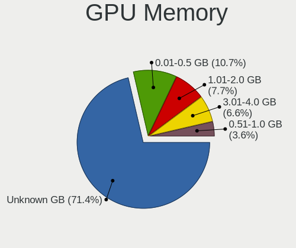

| Size in GB | Notebooks | Percent |
|------------|-----------|---------|
| Unknown    | 1756      | 71.53%  |
| 0.01-0.5   | 252       | 10.26%  |
| 3.01-4.0   | 180       | 7.33%   |
| 1.01-2.0   | 179       | 7.29%   |
| 0.51-1.0   | 88        | 3.58%   |

Monitor
-------

Monitor Vendor
--------------

Monitor vendors

| Vendor                  | Notebooks | Percent |
|-------------------------|-----------|---------|
| AU Optronics            | 609       | 24.73%  |
| BOE                     | 597       | 24.24%  |
| Chimei Innolux          | 492       | 19.98%  |
| LG Display              | 293       | 11.9%   |
| Samsung Electronics     | 145       | 5.89%   |
| PANDA                   | 101       | 4.1%    |
| Chi Mei Optoelectronics | 40        | 1.62%   |
| LG Philips              | 24        | 0.97%   |
| InfoVision              | 16        | 0.65%   |
| Goldstar                | 14        | 0.57%   |
| Lenovo                  | 13        | 0.53%   |
| Apple                   | 11        | 0.45%   |
| Dell                    | 9         | 0.37%   |
| Sony                    | 8         | 0.32%   |
| HannStar                | 8         | 0.32%   |
| CPT                     | 7         | 0.28%   |
| AOC                     | 6         | 0.24%   |
| KDC                     | 5         | 0.2%    |
| Acer                    | 5         | 0.2%    |
| Philips                 | 4         | 0.16%   |
| InnoLux Display         | 4         | 0.16%   |
| BenQ                    | 4         | 0.16%   |
| Ancor Communications    | 4         | 0.16%   |
| Vestel Elektronik       | 3         | 0.12%   |
| SLD                     | 3         | 0.12%   |
| RTK                     | 3         | 0.12%   |
| Panasonic               | 3         | 0.12%   |
| Hewlett-Packard         | 3         | 0.12%   |
| Toshiba                 | 2         | 0.08%   |
| SKY                     | 2         | 0.08%   |
| Sharp                   | 2         | 0.08%   |
| MTD                     | 2         | 0.08%   |
| Vizio                   | 1         | 0.04%   |
| Unknown                 | 1         | 0.04%   |
| STA                     | 1         | 0.04%   |
| Seiki                   | 1         | 0.04%   |
| Optoma                  | 1         | 0.04%   |
| OEM                     | 1         | 0.04%   |
| MUL                     | 1         | 0.04%   |
| MStar                   | 1         | 0.04%   |
| LOE                     | 1         | 0.04%   |
| LED                     | 1         | 0.04%   |
| Insignia                | 1         | 0.04%   |
| IBM                     | 1         | 0.04%   |
| Hitachi                 | 1         | 0.04%   |
| HBTV-29D07HD            | 1         | 0.04%   |
| HB@                     | 1         | 0.04%   |
| GDH                     | 1         | 0.04%   |
| Gateway                 | 1         | 0.04%   |
| DTV                     | 1         | 0.04%   |
| DENON                   | 1         | 0.04%   |
| CHO                     | 1         | 0.04%   |
| ASUSTek Computer        | 1         | 0.04%   |

Monitor Model
-------------

Monitor models

| Model                                                                | Notebooks | Percent |
|----------------------------------------------------------------------|-----------|---------|
| AU Optronics LCD Monitor AUO21ED 1920x1080 344x193mm 15.5-inch       | 104       | 4.22%   |
| Chimei Innolux LCD Monitor CMN15DB 1366x768 344x193mm 15.5-inch      | 98        | 3.97%   |
| AU Optronics LCD Monitor AUO61ED 1920x1080 344x194mm 15.5-inch       | 94        | 3.81%   |
| BOE LCD Monitor BOE069C 1920x1080 344x193mm 15.5-inch                | 82        | 3.33%   |
| BOE LCD Monitor BOE06A5 1366x768 344x194mm 15.5-inch                 | 80        | 3.24%   |
| AU Optronics LCD Monitor AUO38ED 1920x1080 344x193mm 15.5-inch       | 74        | 3%      |
| BOE LCD Monitor BOE0818 1920x1080 344x194mm 15.5-inch                | 58        | 2.35%   |
| Chimei Innolux LCD Monitor CMN15E6 1366x768 344x193mm 15.5-inch      | 57        | 2.31%   |
| Chimei Innolux LCD Monitor CMN15F5 1920x1080 344x193mm 15.5-inch     | 52        | 2.11%   |
| Chimei Innolux LCD Monitor CMN15DC 1366x768 340x190mm 15.3-inch      | 52        | 2.11%   |
| BOE LCD Monitor BOE06A4 1366x768 344x194mm 15.5-inch                 | 45        | 1.82%   |
| BOE LCD Monitor BOE07CE 1366x768 344x193mm 15.5-inch                 | 43        | 1.74%   |
| BOE LCD Monitor BOE0672 1366x768 344x194mm 15.5-inch                 | 42        | 1.7%    |
| AU Optronics LCD Monitor AUO70EC 1366x768 344x193mm 15.5-inch        | 42        | 1.7%    |
| Chimei Innolux LCD Monitor CMN15D5 1920x1080 344x193mm 15.5-inch     | 41        | 1.66%   |
| LG Display LCD Monitor LGD065A 1920x1080 344x194mm 15.5-inch         | 39        | 1.58%   |
| AU Optronics LCD Monitor AUO71EC 1366x768 344x193mm 15.5-inch        | 36        | 1.46%   |
| PANDA LCD Monitor NCP004D 1920x1080 344x194mm 15.5-inch              | 35        | 1.42%   |
| AU Optronics LCD Monitor AUO81EC 1366x768 344x193mm 15.5-inch        | 32        | 1.3%    |
| BOE LCD Monitor BOE0839 1920x1080 382x215mm 17.3-inch                | 31        | 1.26%   |
| PANDA LCD Monitor NCP0035 1920x1080 309x174mm 14.0-inch              | 28        | 1.14%   |
| BOE LCD Monitor BOE06BA 1920x1080 344x193mm 15.5-inch                | 24        | 0.97%   |
| LG Display LCD Monitor LGD04E8 1920x1080 380x210mm 17.1-inch         | 23        | 0.93%   |
| BOE LCD Monitor BOE0675 1366x768 344x194mm 15.5-inch                 | 21        | 0.85%   |
| AU Optronics LCD Monitor AUOAF90 1920x1080 344x193mm 15.5-inch       | 18        | 0.73%   |
| LG Display LCD Monitor LGD0621 1920x1080 382x215mm 17.3-inch         | 17        | 0.69%   |
| Samsung Electronics LCD Monitor SEC5441 1366x768 344x194mm 15.5-inch | 16        | 0.65%   |
| PANDA LCD Monitor NCP0046 1920x1080 344x194mm 15.5-inch              | 16        | 0.65%   |
| Chimei Innolux LCD Monitor CMN1132 1366x768 256x144mm 11.6-inch      | 16        | 0.65%   |
| LG Display LCD Monitor LGD056D 1920x1080 382x215mm 17.3-inch         | 14        | 0.57%   |
| Chimei Innolux LCD Monitor CMN15CA 1366x768 344x193mm 15.5-inch      | 14        | 0.57%   |
| Chimei Innolux LCD Monitor CMN14D4 1920x1080 309x173mm 13.9-inch     | 14        | 0.57%   |
| BOE LCD Monitor BOE07AA 1366x768 344x194mm 15.5-inch                 | 14        | 0.57%   |
| Chimei Innolux LCD Monitor CMN1493 1366x768 309x173mm 13.9-inch      | 13        | 0.53%   |
| PANDA LM156LF1L03 NCP001C 1920x1080 344x194mm 15.5-inch              | 11        | 0.45%   |
| Chimei Innolux LCD Monitor CMN14D6 1366x768 309x173mm 13.9-inch      | 11        | 0.45%   |
| BOE LCD Monitor BOE0704 1366x768 344x194mm 15.5-inch                 | 11        | 0.45%   |
| AU Optronics LCD Monitor AUO22EC 1366x768 344x193mm 15.5-inch        | 11        | 0.45%   |
| LG Display LCD Monitor LGD02DC 1366x768 344x194mm 15.5-inch          | 10        | 0.41%   |
| Chimei Innolux LCD Monitor CMN14E5 1920x1080 309x173mm 13.9-inch     | 9         | 0.36%   |
| AU Optronics LCD Monitor AUO183C 1366x768 310x170mm 13.9-inch        | 9         | 0.36%   |
| LG Display LCD Monitor LGD0563 1920x1080 344x194mm 15.5-inch         | 8         | 0.32%   |
| InfoVision LCD Monitor IVO057A 1366x768 309x174mm 14.0-inch          | 8         | 0.32%   |
| Chimei Innolux LCD Monitor CMN1745 1600x900 382x214mm 17.2-inch      | 8         | 0.32%   |
| Chimei Innolux LCD Monitor CMN15E8 1920x1080 340x190mm 15.3-inch     | 8         | 0.32%   |
| Chimei Innolux LCD Monitor CMN1470 1366x768 309x174mm 14.0-inch      | 8         | 0.32%   |
| BOE LCD Monitor BOE0696 1366x768 309x173mm 13.9-inch                 | 8         | 0.32%   |
| AU Optronics LCD Monitor AUO2D3C 1366x768 309x173mm 13.9-inch        | 8         | 0.32%   |
| Samsung Electronics LCD Monitor SEC3358 1280x800 330x210mm 15.4-inch | 7         | 0.28%   |
| LG Display LCD Monitor LGD05AB 1920x1080 309x174mm 14.0-inch         | 7         | 0.28%   |
| LG Display LCD Monitor LGD0590 1920x1080 344x194mm 15.5-inch         | 7         | 0.28%   |
| LG Display LCD Monitor LGD0573 1920x1080 344x194mm 15.5-inch         | 7         | 0.28%   |
| LG Display LCD Monitor LGD0385 1366x768 309x174mm 14.0-inch          | 7         | 0.28%   |
| LG Display LCD Monitor LGD033A 1366x768 344x194mm 15.5-inch          | 7         | 0.28%   |
| Chimei Innolux LCD Monitor CMN14C4 1366x768 309x173mm 13.9-inch      | 7         | 0.28%   |
| PANDA LM133LF5L01 NCP0020 1920x1080 294x165mm 13.3-inch              | 6         | 0.24%   |
| LG Display LCD Monitor LGD033C 1366x768 309x174mm 14.0-inch          | 6         | 0.24%   |
| Chimei Innolux LCD Monitor CMN15C4 1920x1080 344x193mm 15.5-inch     | 6         | 0.24%   |
| BOE LCD Monitor BOE0903 1920x1080 344x194mm 15.5-inch                | 6         | 0.24%   |
| BOE LCD Monitor BOE084E 1920x1080 382x215mm 17.3-inch                | 6         | 0.24%   |

Monitor Resolution
------------------

Monitor screen resolution

| Resolution         | Notebooks | Percent |
|--------------------|-----------|---------|
| 1366x768 (WXGA)    | 1140      | 46.76%  |
| 1920x1080 (FHD)    | 1061      | 43.52%  |
| 1280x800 (WXGA)    | 74        | 3.04%   |
| 1600x900 (HD+)     | 73        | 2.99%   |
| 1440x900 (WXGA+)   | 18        | 0.74%   |
| 3840x2160 (4K)     | 13        | 0.53%   |
| 1024x600           | 10        | 0.41%   |
| 1920x540           | 8         | 0.33%   |
| 1360x768           | 8         | 0.33%   |
| 1280x1024 (SXGA)   | 7         | 0.29%   |
| 1680x1050 (WSXGA+) | 5         | 0.21%   |
| 3200x1800 (QHD+)   | 4         | 0.16%   |
| 1920x1200 (WUXGA)  | 3         | 0.12%   |
| 2560x1080          | 2         | 0.08%   |
| 2160x1440          | 2         | 0.08%   |
| 1280x720 (HD)      | 2         | 0.08%   |
| 1024x768 (XGA)     | 2         | 0.08%   |
| 3456x2160          | 1         | 0.04%   |
| 2880x1920          | 1         | 0.04%   |
| 2880x1800          | 1         | 0.04%   |
| 2560x1440 (QHD)    | 1         | 0.04%   |
| 2288x1287          | 1         | 0.04%   |
| 1680x945           | 1         | 0.04%   |

Monitor Diagonal
----------------

Diagonal size in inches

| Inches  | Notebooks | Percent |
|---------|-----------|---------|
| 15      | 1666      | 67.64%  |
| 13      | 218       | 8.85%   |
| 14      | 190       | 7.71%   |
| 17      | 175       | 7.11%   |
| 11      | 64        | 2.6%    |
| 12      | 21        | 0.85%   |
| 23      | 17        | 0.69%   |
| 10      | 16        | 0.65%   |
| 21      | 13        | 0.53%   |
| 84      | 9         | 0.37%   |
| 31      | 9         | 0.37%   |
| 24      | 7         | 0.28%   |
| 72      | 6         | 0.24%   |
| 40      | 6         | 0.24%   |
| 18      | 6         | 0.24%   |
| 54      | 5         | 0.2%    |
| 32      | 5         | 0.2%    |
| 27      | 5         | 0.2%    |
| 19      | 4         | 0.16%   |
| 52      | 3         | 0.12%   |
| 22      | 3         | 0.12%   |
| Unknown | 3         | 0.12%   |
| 46      | 2         | 0.08%   |
| 37      | 2         | 0.08%   |
| 34      | 2         | 0.08%   |
| 65      | 1         | 0.04%   |
| 48      | 1         | 0.04%   |
| 33      | 1         | 0.04%   |
| 29      | 1         | 0.04%   |
| 26      | 1         | 0.04%   |
| 16      | 1         | 0.04%   |

Monitor Width
-------------

Physical width

| Width in mm | Notebooks | Percent |
|-------------|-----------|---------|
| 301-350     | 2000      | 81.37%  |
| 351-400     | 195       | 7.93%   |
| 201-300     | 153       | 6.22%   |
| 501-600     | 30        | 1.22%   |
| 401-500     | 24        | 0.98%   |
| 1501-2000   | 15        | 0.61%   |
| 1001-1500   | 12        | 0.49%   |
| 601-700     | 10        | 0.41%   |
| 801-900     | 8         | 0.33%   |
| 701-800     | 8         | 0.33%   |
| Unknown     | 3         | 0.12%   |

Aspect Ratio
------------

Proportional relationship between the width and the height

| Ratio | Notebooks | Percent |
|-------|-----------|---------|
| 16/9  | 2264      | 95.09%  |
| 16/10 | 101       | 4.24%   |
| 5/4   | 6         | 0.25%   |
| 3/2   | 5         | 0.21%   |
| 4/3   | 3         | 0.13%   |
| 21/9  | 2         | 0.08%   |

Monitor Area
------------

Area in inch

| Area in inch | Notebooks | Percent |
|----------------|-----------|---------|
| 101-110        | 1664      | 67.56%  |
| 81-90          | 366       | 14.86%  |
| 121-130        | 162       | 6.58%   |
| 51-60          | 64        | 2.6%    |
| 71-80          | 42        | 1.71%   |
| 201-250        | 37        | 1.5%    |
| More than 1000 | 25        | 1.02%   |
| 61-70          | 21        | 0.85%   |
| 351-500        | 18        | 0.73%   |
| 41-50          | 16        | 0.65%   |
| 131-140        | 10        | 0.41%   |
| 501-1000       | 10        | 0.41%   |
| 141-150        | 8         | 0.32%   |
| 151-200        | 7         | 0.28%   |
| 301-350        | 6         | 0.24%   |
| 91-100         | 3         | 0.12%   |
| Unknown        | 3         | 0.12%   |
| 111-120        | 1         | 0.04%   |

Pixel Density
-------------

Pixels per inch

| Density       | Notebooks | Percent |
|---------------|-----------|---------|
| 101-120       | 1118      | 45.54%  |
| 121-160       | 1109      | 45.17%  |
| 51-100        | 167       | 6.8%    |
| 1-50          | 30        | 1.22%   |
| 161-240       | 21        | 0.86%   |
| More than 240 | 7         | 0.29%   |
| Unknown       | 3         | 0.12%   |

Multiple Monitors
-----------------

Total monitors connected

| Total | Notebooks | Percent |
|-------|-----------|---------|
| 1     | 2278      | 93.36%  |
| 2     | 109       | 4.47%   |
| 0     | 50        | 2.05%   |
| 3     | 3         | 0.12%   |

Network
-------

Net Controller Vendor
---------------------

Controller vendors

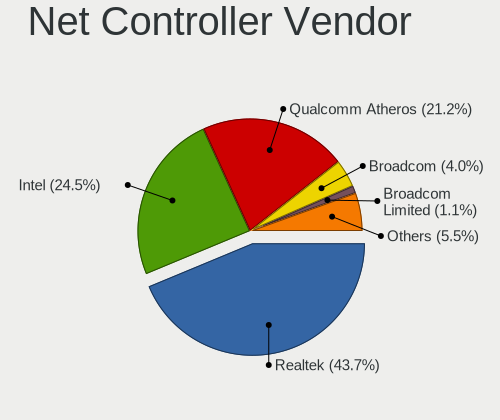

| Vendor                                | Notebooks | Percent |
|---------------------------------------|-----------|---------|
| Realtek Semiconductor                 | 1689      | 44.01%  |
| Intel                                 | 894       | 23.29%  |
| Qualcomm Atheros                      | 852       | 22.2%   |
| Broadcom                              | 153       | 3.99%   |
| Broadcom Limited                      | 42        | 1.09%   |
| Marvell Technology Group              | 33        | 0.86%   |
| Ralink                                | 25        | 0.65%   |
| Ralink Technology                     | 19        | 0.5%    |
| JMicron Technology                    | 16        | 0.42%   |
| TP-Link                               | 11        | 0.29%   |
| MediaTek                              | 10        | 0.26%   |
| Silicon Integrated Systems [SiS]      | 9         | 0.23%   |
| Xiaomi                                | 8         | 0.21%   |
| Samsung Electronics                   | 7         | 0.18%   |
| Nvidia                                | 7         | 0.18%   |
| Huawei Technologies                   | 6         | 0.16%   |
| Ericsson Business Mobile Networks     | 6         | 0.16%   |
| ASIX Electronics                      | 6         | 0.16%   |
| Dell                                  | 5         | 0.13%   |
| Qualcomm Atheros Communications       | 4         | 0.1%    |
| NetGear                               | 4         | 0.1%    |
| Hewlett-Packard                       | 4         | 0.1%    |
| D-Link                                | 4         | 0.1%    |
| VIA Technologies                      | 2         | 0.05%   |
| Motorola PCS                          | 2         | 0.05%   |
| ICS Advent                            | 2         | 0.05%   |
| ASUSTek Computer                      | 2         | 0.05%   |
| ZTE WCDMA Technologies MSM            | 1         | 0.03%   |
| U.S. Robotics                         | 1         | 0.03%   |
| Texas Instruments                     | 1         | 0.03%   |
| Sierra Wireless                       | 1         | 0.03%   |
| OPPO Electronics                      | 1         | 0.03%   |
| Micro Star International              | 1         | 0.03%   |
| Linksys                               | 1         | 0.03%   |
| LG Electronics                        | 1         | 0.03%   |
| Lenovo                                | 1         | 0.03%   |
| Google                                | 1         | 0.03%   |
| Edimax Technology                     | 1         | 0.03%   |
| Digitech Systems                      | 1         | 0.03%   |
| Attansic Technology                   | 1         | 0.03%   |
| AirTies Wireless Networks             | 1         | 0.03%   |
| Accton Technology                     | 1         | 0.03%   |
| 802.11g Adapter [Linksys WUSB54GC v3] | 1         | 0.03%   |

Net Controller Model
--------------------

Controller models

| Model                                                                   | Notebooks | Percent |
|-------------------------------------------------------------------------|-----------|---------|
| Realtek RTL8111/8168/8411 PCI Express Gigabit Ethernet Controller       | 1023      | 24.38%  |
| Qualcomm Atheros QCA9377 802.11ac Wireless Network Adapter              | 430       | 10.25%  |
| Realtek RTL810xE PCI Express Fast Ethernet controller                   | 280       | 6.67%   |
| Intel Wi-Fi 6 AX200                                                     | 226       | 5.39%   |
| Realtek RTL8821CE 802.11ac PCIe Wireless Network Adapter                | 188       | 4.48%   |
| Qualcomm Atheros QCA9565 / AR9565 Wireless Network Adapter              | 154       | 3.67%   |
| Intel Wireless 8265 / 8275                                              | 149       | 3.55%   |
| Realtek RTL8723BE PCIe Wireless Network Adapter                         | 103       | 2.45%   |
| Realtek RTL8822BE 802.11a/b/g/n/ac WiFi adapter                         | 80        | 1.91%   |
| Intel Wireless 7265                                                     | 68        | 1.62%   |
| Qualcomm Atheros QCA6174 802.11ac Wireless Network Adapter              | 61        | 1.45%   |
| Qualcomm Atheros AR9285 Wireless Network Adapter (PCI-Express)          | 55        | 1.31%   |
| Realtek Killer E2600 Gigabit Ethernet Controller                        | 54        | 1.29%   |
| Intel Dual Band Wireless-AC 3168NGW [Stone Peak]                        | 53        | 1.26%   |
| Qualcomm Atheros AR9485 Wireless Network Adapter                        | 51        | 1.22%   |
| Intel Cannon Lake PCH CNVi WiFi                                         | 46        | 1.1%    |
| Intel Ice Lake-LP PCH CNVi WiFi                                         | 39        | 0.93%   |
| Broadcom BCM43142 802.11b/g/n                                           | 38        | 0.91%   |
| Intel Cannon Point-LP CNVi [Wireless-AC]                                | 37        | 0.88%   |
| Broadcom BCM4313 802.11bgn Wireless Network Adapter                     | 37        | 0.88%   |
| Realtek RTL8188CE 802.11b/g/n WiFi Adapter                              | 36        | 0.86%   |
| Intel 82579LM Gigabit Network Connection (Lewisville)                   | 34        | 0.81%   |
| Intel Wi-Fi 6 AX201                                                     | 28        | 0.67%   |
| Intel Wireless 7260                                                     | 24        | 0.57%   |
| Intel Centrino Advanced-N 6205 [Taylor Peak]                            | 24        | 0.57%   |
| Broadcom BCM4312 802.11b/g LP-PHY                                       | 18        | 0.43%   |
| Intel Wireless 8260                                                     | 17        | 0.41%   |
| Intel Comet Lake PCH-LP CNVi WiFi                                       | 17        | 0.41%   |
| Realtek RTL8822CE 802.11ac PCIe Wireless Network Adapter                | 15        | 0.36%   |
| Qualcomm Atheros AR8151 v2.0 Gigabit Ethernet                           | 15        | 0.36%   |
| Intel PRO/Wireless 4965 AG or AGN [Kedron] Network Connection           | 15        | 0.36%   |
| Intel Gemini Lake PCH CNVi WiFi                                         | 15        | 0.36%   |
| Realtek RTL8187B Wireless 802.11g 54Mbps Network Adapter                | 14        | 0.33%   |
| Qualcomm Atheros AR242x / AR542x Wireless Network Adapter (PCI-Express) | 14        | 0.33%   |
| Marvell Group 88E8040 PCI-E Fast Ethernet Controller                    | 14        | 0.33%   |
| Realtek RTL8723DE Wireless Network Adapter                              | 12        | 0.29%   |
| Qualcomm Atheros AR928X Wireless Network Adapter (PCI-Express)          | 12        | 0.29%   |
| Qualcomm Atheros AR8152 v2.0 Fast Ethernet                              | 12        | 0.29%   |
| Intel Centrino Wireless-N 1000 [Condor Peak]                            | 12        | 0.29%   |
| Realtek RTL8188EE Wireless Network Adapter                              | 11        | 0.26%   |
| Qualcomm Atheros AR9287 Wireless Network Adapter (PCI-Express)          | 11        | 0.26%   |
| JMicron JMC250 PCI Express Gigabit Ethernet Controller                  | 11        | 0.26%   |
| Intel Wireless 3165                                                     | 11        | 0.26%   |
| Intel WiFi Link 5100                                                    | 11        | 0.26%   |
| Realtek RTL8191SEvB Wireless LAN Controller                             | 10        | 0.24%   |
| Realtek RTL8188EUS 802.11n Wireless Network Adapter                     | 10        | 0.24%   |
| Qualcomm Atheros Killer E2500 Gigabit Ethernet Controller               | 10        | 0.24%   |
| Qualcomm Atheros AR9462 Wireless Network Adapter                        | 10        | 0.24%   |
| Qualcomm Atheros AR8161 Gigabit Ethernet                                | 10        | 0.24%   |
| Intel PRO/Wireless 5100 AGN [Shiloh] Network Connection                 | 10        | 0.24%   |
| Intel Centrino Ultimate-N 6300                                          | 10        | 0.24%   |
| Intel 82577LM Gigabit Network Connection                                | 10        | 0.24%   |
| Broadcom NetLink BCM57785 Gigabit Ethernet PCIe                         | 10        | 0.24%   |
| Broadcom Limited NetLink BCM57780 Gigabit Ethernet PCIe                 | 10        | 0.24%   |
| Broadcom Limited BCM4312 802.11b/g LP-PHY                               | 10        | 0.24%   |
| Silicon Integrated Systems [SiS] 191 Gigabit Ethernet Adapter           | 9         | 0.21%   |
| Realtek RTL8723AE PCIe Wireless Network Adapter                         | 9         | 0.21%   |
| Realtek RTL8153 Gigabit Ethernet Adapter                                | 9         | 0.21%   |
| Ralink RT3290 Wireless 802.11n 1T/1R PCIe                               | 9         | 0.21%   |
| Qualcomm Atheros AR8132 Fast Ethernet                                   | 9         | 0.21%   |

Wireless Vendor
---------------

Wireless vendors

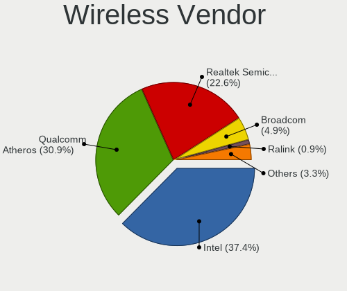

| Vendor                                | Notebooks | Percent |
|---------------------------------------|-----------|---------|
| Intel                                 | 874       | 35.98%  |
| Qualcomm Atheros                      | 801       | 32.98%  |
| Realtek Semiconductor                 | 528       | 21.74%  |
| Broadcom                              | 121       | 4.98%   |
| Ralink                                | 25        | 1.03%   |
| Broadcom Limited                      | 22        | 0.91%   |
| Ralink Technology                     | 19        | 0.78%   |
| MediaTek                              | 8         | 0.33%   |
| TP-Link                               | 6         | 0.25%   |
| Qualcomm Atheros Communications       | 4         | 0.16%   |
| NetGear                               | 3         | 0.12%   |
| Dell                                  | 3         | 0.12%   |
| D-Link                                | 3         | 0.12%   |
| Hewlett-Packard                       | 2         | 0.08%   |
| ASUSTek Computer                      | 2         | 0.08%   |
| U.S. Robotics                         | 1         | 0.04%   |
| Sierra Wireless                       | 1         | 0.04%   |
| Micro Star International              | 1         | 0.04%   |
| Linksys                               | 1         | 0.04%   |
| Edimax Technology                     | 1         | 0.04%   |
| AirTies Wireless Networks             | 1         | 0.04%   |
| Accton Technology                     | 1         | 0.04%   |
| 802.11g Adapter [Linksys WUSB54GC v3] | 1         | 0.04%   |

Wireless Model
--------------

Wireless models

| Model                                                                   | Notebooks | Percent |
|-------------------------------------------------------------------------|-----------|---------|
| Qualcomm Atheros QCA9377 802.11ac Wireless Network Adapter              | 430       | 17.65%  |
| Intel Wi-Fi 6 AX200                                                     | 226       | 9.28%   |
| Realtek RTL8821CE 802.11ac PCIe Wireless Network Adapter                | 188       | 7.72%   |
| Qualcomm Atheros QCA9565 / AR9565 Wireless Network Adapter              | 154       | 6.32%   |
| Intel Wireless 8265 / 8275                                              | 149       | 6.12%   |
| Realtek RTL8723BE PCIe Wireless Network Adapter                         | 103       | 4.23%   |
| Realtek RTL8822BE 802.11a/b/g/n/ac WiFi adapter                         | 80        | 3.28%   |
| Intel Wireless 7265                                                     | 68        | 2.79%   |
| Qualcomm Atheros QCA6174 802.11ac Wireless Network Adapter              | 61        | 2.5%    |
| Qualcomm Atheros AR9285 Wireless Network Adapter (PCI-Express)          | 55        | 2.26%   |
| Intel Dual Band Wireless-AC 3168NGW [Stone Peak]                        | 53        | 2.18%   |
| Qualcomm Atheros AR9485 Wireless Network Adapter                        | 51        | 2.09%   |
| Intel Cannon Lake PCH CNVi WiFi                                         | 46        | 1.89%   |
| Intel Ice Lake-LP PCH CNVi WiFi                                         | 39        | 1.6%    |
| Broadcom BCM43142 802.11b/g/n                                           | 38        | 1.56%   |
| Intel Cannon Point-LP CNVi [Wireless-AC]                                | 37        | 1.52%   |
| Broadcom BCM4313 802.11bgn Wireless Network Adapter                     | 37        | 1.52%   |
| Realtek RTL8188CE 802.11b/g/n WiFi Adapter                              | 36        | 1.48%   |
| Intel Wi-Fi 6 AX201                                                     | 28        | 1.15%   |
| Intel Wireless 7260                                                     | 24        | 0.99%   |
| Intel Centrino Advanced-N 6205 [Taylor Peak]                            | 24        | 0.99%   |
| Broadcom BCM4312 802.11b/g LP-PHY                                       | 18        | 0.74%   |
| Intel Wireless 8260                                                     | 17        | 0.7%    |
| Intel Comet Lake PCH-LP CNVi WiFi                                       | 17        | 0.7%    |
| Realtek RTL8822CE 802.11ac PCIe Wireless Network Adapter                | 15        | 0.62%   |
| Intel PRO/Wireless 4965 AG or AGN [Kedron] Network Connection           | 15        | 0.62%   |
| Intel Gemini Lake PCH CNVi WiFi                                         | 15        | 0.62%   |
| Realtek RTL8187B Wireless 802.11g 54Mbps Network Adapter                | 14        | 0.57%   |
| Qualcomm Atheros AR242x / AR542x Wireless Network Adapter (PCI-Express) | 14        | 0.57%   |
| Realtek RTL8723DE Wireless Network Adapter                              | 12        | 0.49%   |
| Qualcomm Atheros AR928X Wireless Network Adapter (PCI-Express)          | 12        | 0.49%   |
| Intel Centrino Wireless-N 1000 [Condor Peak]                            | 12        | 0.49%   |
| Realtek RTL8188EE Wireless Network Adapter                              | 11        | 0.45%   |
| Qualcomm Atheros AR9287 Wireless Network Adapter (PCI-Express)          | 11        | 0.45%   |
| Intel Wireless 3165                                                     | 11        | 0.45%   |
| Intel WiFi Link 5100                                                    | 11        | 0.45%   |
| Realtek RTL8191SEvB Wireless LAN Controller                             | 10        | 0.41%   |
| Realtek RTL8188EUS 802.11n Wireless Network Adapter                     | 10        | 0.41%   |
| Qualcomm Atheros AR9462 Wireless Network Adapter                        | 10        | 0.41%   |
| Intel PRO/Wireless 5100 AGN [Shiloh] Network Connection                 | 10        | 0.41%   |
| Intel Centrino Ultimate-N 6300                                          | 10        | 0.41%   |
| Broadcom Limited BCM4312 802.11b/g LP-PHY                               | 10        | 0.41%   |
| Realtek RTL8723AE PCIe Wireless Network Adapter                         | 9         | 0.37%   |
| Ralink RT3290 Wireless 802.11n 1T/1R PCIe                               | 9         | 0.37%   |
| Realtek RTL8821AE 802.11ac PCIe Wireless Network Adapter                | 8         | 0.33%   |
| Intel Wireless 3160                                                     | 8         | 0.33%   |
| Ralink MT7601U Wireless Adapter                                         | 7         | 0.29%   |
| Ralink RT5390 Wireless 802.11n 1T/1R PCIe                               | 7         | 0.29%   |
| Intel Dual Band Wireless-AC 3165 Plus Bluetooth                         | 7         | 0.29%   |
| Intel Centrino Advanced-N 6200                                          | 7         | 0.29%   |
| Realtek RTL8191SEvA Wireless LAN Controller                             | 6         | 0.25%   |
| MediaTek MT7921 802.11ax PCI Express Wireless Network Adapter           | 6         | 0.25%   |
| Intel Centrino Wireless-N 1030 [Rainbow Peak]                           | 6         | 0.25%   |
| Realtek RTL8723BU 802.11b/g/n WLAN Adapter                              | 5         | 0.21%   |
| Ralink RT2870/RT3070 Wireless Adapter                                   | 5         | 0.21%   |
| Ralink RT3090 Wireless 802.11n 1T/1R PCIe                               | 5         | 0.21%   |
| Intel Centrino Wireless-N 2230                                          | 5         | 0.21%   |
| Broadcom BCM43228 802.11a/b/g/n                                         | 5         | 0.21%   |
| Broadcom BCM43225 802.11b/g/n                                           | 5         | 0.21%   |
| Broadcom BCM4311 802.11b/g WLAN                                         | 5         | 0.21%   |

Ethernet Vendor
---------------

Ethernet vendors

| Vendor                           | Notebooks | Percent |
|----------------------------------|-----------|---------|
| Realtek Semiconductor            | 1374      | 78.74%  |
| Intel                            | 107       | 6.13%   |
| Qualcomm Atheros                 | 93        | 5.33%   |
| Broadcom                         | 38        | 2.18%   |
| Marvell Technology Group         | 33        | 1.89%   |
| Broadcom Limited                 | 21        | 1.2%    |
| JMicron Technology               | 16        | 0.92%   |
| Silicon Integrated Systems [SiS] | 9         | 0.52%   |
| Xiaomi                           | 8         | 0.46%   |
| Samsung Electronics              | 7         | 0.4%    |
| Nvidia                           | 7         | 0.4%    |
| ASIX Electronics                 | 6         | 0.34%   |
| TP-Link                          | 5         | 0.29%   |
| Huawei Technologies              | 4         | 0.23%   |
| VIA Technologies                 | 2         | 0.11%   |
| MediaTek                         | 2         | 0.11%   |
| ICS Advent                       | 2         | 0.11%   |
| ZTE WCDMA Technologies MSM       | 1         | 0.06%   |
| OPPO Electronics                 | 1         | 0.06%   |
| NetGear                          | 1         | 0.06%   |
| Motorola PCS                     | 1         | 0.06%   |
| LG Electronics                   | 1         | 0.06%   |
| Lenovo                           | 1         | 0.06%   |
| Hewlett-Packard                  | 1         | 0.06%   |
| Google                           | 1         | 0.06%   |
| Digitech Systems                 | 1         | 0.06%   |
| D-Link                           | 1         | 0.06%   |
| Attansic Technology              | 1         | 0.06%   |

Ethernet Model
--------------

Ethernet models

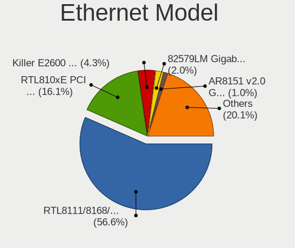

| Model                                                                          | Notebooks | Percent |
|--------------------------------------------------------------------------------|-----------|---------|
| Realtek RTL8111/8168/8411 PCI Express Gigabit Ethernet Controller              | 1023      | 58.56%  |
| Realtek RTL810xE PCI Express Fast Ethernet controller                          | 280       | 16.03%  |
| Realtek Killer E2600 Gigabit Ethernet Controller                               | 54        | 3.09%   |
| Intel 82579LM Gigabit Network Connection (Lewisville)                          | 34        | 1.95%   |
| Qualcomm Atheros AR8151 v2.0 Gigabit Ethernet                                  | 15        | 0.86%   |
| Marvell Group 88E8040 PCI-E Fast Ethernet Controller                           | 14        | 0.8%    |
| Qualcomm Atheros AR8152 v2.0 Fast Ethernet                                     | 12        | 0.69%   |
| JMicron JMC250 PCI Express Gigabit Ethernet Controller                         | 11        | 0.63%   |
| Qualcomm Atheros Killer E2500 Gigabit Ethernet Controller                      | 10        | 0.57%   |
| Qualcomm Atheros AR8161 Gigabit Ethernet                                       | 10        | 0.57%   |
| Intel 82577LM Gigabit Network Connection                                       | 10        | 0.57%   |
| Broadcom NetLink BCM57785 Gigabit Ethernet PCIe                                | 10        | 0.57%   |
| Broadcom Limited NetLink BCM57780 Gigabit Ethernet PCIe                        | 10        | 0.57%   |
| Silicon Integrated Systems [SiS] 191 Gigabit Ethernet Adapter                  | 9         | 0.52%   |
| Realtek RTL8153 Gigabit Ethernet Adapter                                       | 9         | 0.52%   |
| Qualcomm Atheros AR8132 Fast Ethernet                                          | 9         | 0.52%   |
| Marvell Group 88E8055 PCI-E Gigabit Ethernet Controller                        | 8         | 0.46%   |
| Intel Ethernet Connection I219-LM                                              | 8         | 0.46%   |
| Intel 82567LM Gigabit Network Connection                                       | 8         | 0.46%   |
| Qualcomm Atheros AR8131 Gigabit Ethernet                                       | 7         | 0.4%    |
| Broadcom NetLink BCM57780 Gigabit Ethernet PCIe                                | 7         | 0.4%    |
| Xiaomi Mi/Redmi series (RNDIS)                                                 | 6         | 0.34%   |
| Realtek RTL8152 Fast Ethernet Adapter                                          | 6         | 0.34%   |
| Qualcomm Atheros AR8162 Fast Ethernet                                          | 6         | 0.34%   |
| Intel Ethernet Connection I218-LM                                              | 6         | 0.34%   |
| Intel Ethernet Connection I217-LM                                              | 6         | 0.34%   |
| Intel Ethernet Connection (13) I219-V                                          | 6         | 0.34%   |
| TP-Link UE300 10/100/1000 LAN (ethernet mode) [Realtek RTL8153]                | 5         | 0.29%   |
| Samsung Galaxy series, misc. (tethering mode)                                  | 5         | 0.29%   |
| Qualcomm Atheros QCA8172 Fast Ethernet                                         | 5         | 0.29%   |
| Qualcomm Atheros AR8152 v1.1 Fast Ethernet                                     | 5         | 0.29%   |
| JMicron JMC260 PCI Express Fast Ethernet Controller                            | 5         | 0.29%   |
| Intel 82579V Gigabit Network Connection                                        | 5         | 0.29%   |
| Broadcom NetXtreme BCM5761 Gigabit Ethernet PCIe                               | 5         | 0.29%   |
| Qualcomm Atheros QCA8171 Gigabit Ethernet                                      | 4         | 0.23%   |
| Qualcomm Atheros AR8121/AR8113/AR8114 Gigabit or Fast Ethernet                 | 4         | 0.23%   |
| Intel 82566MM Gigabit Network Connection                                       | 4         | 0.23%   |
| Broadcom NetLink BCM5787M Gigabit Ethernet PCI Express                         | 4         | 0.23%   |
| Broadcom Limited BCM4401-B0 100Base-TX                                         | 4         | 0.23%   |
| ASIX AX88179 Gigabit Ethernet                                                  | 4         | 0.23%   |
| Realtek RTL-8100/8101L/8139 PCI Fast Ethernet Adapter                          | 3         | 0.17%   |
| Qualcomm Atheros AR8151 v1.0 Gigabit Ethernet                                  | 3         | 0.17%   |
| Nvidia MCP51 Ethernet Controller                                               | 3         | 0.17%   |
| Intel WiMAX Connection 2400m                                                   | 3         | 0.17%   |
| Intel Ethernet Connection (3) I218-LM                                          | 3         | 0.17%   |
| Intel 82577LC Gigabit Network Connection                                       | 3         | 0.17%   |
| Huawei COL-L29                                                                 | 3         | 0.17%   |
| Broadcom NetLink BCM5906M Fast Ethernet PCI Express                            | 3         | 0.17%   |
| Xiaomi Mi/Redmi series (RNDIS + ADB)                                           | 2         | 0.11%   |
| VIA VT6102/VT6103 [Rhine-II]                                                   | 2         | 0.11%   |
| Nvidia MCP67 Ethernet                                                          | 2         | 0.11%   |
| MediaTek TECNO SPARK 3                                                         | 2         | 0.11%   |
| Marvell Group Yukon Optima 88E8059 [PCIe Gigabit Ethernet Controller with AVB] | 2         | 0.11%   |
| Marvell Group 88E8072 PCI-E Gigabit Ethernet Controller                        | 2         | 0.11%   |
| Marvell Group 88E8058 PCI-E Gigabit Ethernet Controller                        | 2         | 0.11%   |
| Marvell Group 88E8039 PCI-E Fast Ethernet Controller                           | 2         | 0.11%   |
| Intel Ethernet Connection I217-V                                               | 2         | 0.11%   |
| Intel 82567LF Gigabit Network Connection                                       | 2         | 0.11%   |
| ICS Advent DM9601 Fast Ethernet Adapter                                        | 2         | 0.11%   |
| Broadcom NetXtreme BCM57786 Gigabit Ethernet PCIe                              | 2         | 0.11%   |

Net Controller Kind
-------------------

Ethernet, WiFi or modem

| Kind     | Notebooks | Percent |
|----------|-----------|---------|
| WiFi     | 2365      | 57.74%  |
| Ethernet | 1718      | 41.94%  |
| Modem    | 13        | 0.32%   |

Used Controller
---------------

Currently used network controller

| Kind     | Notebooks | Percent |
|----------|-----------|---------|
| WiFi     | 2189      | 89.06%  |
| Ethernet | 269       | 10.94%  |

NICs
----

Total network controllers on board

| Total | Notebooks | Percent |
|-------|-----------|---------|
| 2     | 1649      | 68.06%  |
| 1     | 710       | 29.3%   |
| 0     | 62        | 2.56%   |
| 3     | 2         | 0.08%   |

IPv6
----

IPv6 vs IPv4

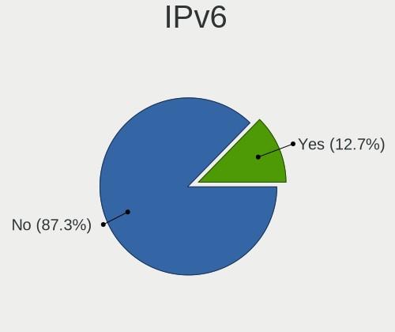

| Used | Notebooks | Percent |
|------|-----------|---------|
| No   | 2250      | 91.84%  |
| Yes  | 200       | 8.16%   |

Bluetooth
---------

Bluetooth Vendor
----------------

Controller vendors

| Vendor                          | Notebooks | Percent |
|---------------------------------|-----------|---------|
| Intel                           | 739       | 36.62%  |
| Lite-On Technology              | 453       | 22.45%  |
| IMC Networks                    | 413       | 20.47%  |
| Realtek Semiconductor           | 144       | 7.14%   |
| Qualcomm Atheros Communications | 82        | 4.06%   |
| Broadcom                        | 55        | 2.73%   |
| Dell                            | 22        | 1.09%   |
| Foxconn / Hon Hai               | 20        | 0.99%   |
| Hewlett-Packard                 | 18        | 0.89%   |
| Cambridge Silicon Radio         | 17        | 0.84%   |
| Toshiba                         | 14        | 0.69%   |
| Apple                           | 12        | 0.59%   |
| Ralink                          | 9         | 0.45%   |
| Foxconn International           | 6         | 0.3%    |
| ASUSTek Computer                | 3         | 0.15%   |
| Alps Electric                   | 3         | 0.15%   |
| Qcom                            | 2         | 0.1%    |
| Unknown                         | 1         | 0.05%   |
| Realtek                         | 1         | 0.05%   |
| Ralink Technology               | 1         | 0.05%   |
| Micro Star International        | 1         | 0.05%   |
| Chicony Electronics             | 1         | 0.05%   |
| Belkin Components               | 1         | 0.05%   |

Bluetooth Model
---------------

Controller models

| Model                                                                               | Notebooks | Percent |
|-------------------------------------------------------------------------------------|-----------|---------|
| Lite-On Qualcomm Atheros QCA9377 Bluetooth                                          | 299       | 14.82%  |
| Intel Bluetooth wireless interface                                                  | 273       | 13.53%  |
| IMC Networks Bluetooth Radio                                                        | 256       | 12.69%  |
| Intel AX200 Bluetooth                                                               | 225       | 11.15%  |
| Intel Bluetooth 9460/9560 Jefferson Peak (JfP)                                      | 151       | 7.48%   |
| IMC Networks Bluetooth Device                                                       | 142       | 7.04%   |
| Lite-On Bluetooth Device                                                            | 122       | 6.05%   |
| Realtek Bluetooth Radio                                                             | 108       | 5.35%   |
| Intel Wireless-AC 3168 Bluetooth                                                    | 44        | 2.18%   |
| Qualcomm Atheros  Bluetooth Device                                                  | 36        | 1.78%   |
| Intel Bluetooth Device                                                              | 29        | 1.44%   |
| Realtek  Bluetooth 4.2 Adapter                                                      | 23        | 1.14%   |
| Qualcomm Atheros AR3012 Bluetooth 4.0                                               | 19        | 0.94%   |
| Cambridge Silicon Radio Bluetooth Dongle (HCI mode)                                 | 17        | 0.84%   |
| Qualcomm Atheros AR3011 Bluetooth                                                   | 16        | 0.79%   |
| Lite-On Atheros AR3012 Bluetooth                                                    | 15        | 0.74%   |
| Intel Centrino Bluetooth Wireless Transceiver                                       | 11        | 0.55%   |
| Ralink RT3290 Bluetooth                                                             | 9         | 0.45%   |
| Broadcom BCM43142A0 Bluetooth 4.0                                                   | 9         | 0.45%   |
| Broadcom BCM2045B (BDC-2.1)                                                         | 9         | 0.45%   |
| HP Broadcom 2070 Bluetooth Combo                                                    | 8         | 0.4%    |
| HP Bluetooth 2.0 Interface [Broadcom BCM2045]                                       | 8         | 0.4%    |
| Lite-On Qualcomm Atheros Bluetooth                                                  | 7         | 0.35%   |
| Intel Centrino Advanced-N 6230 Bluetooth adapter                                    | 6         | 0.3%    |
| Foxconn International BCM43142A0 Bluetooth module                                   | 6         | 0.3%    |
| Apple Bluetooth USB Host Controller                                                 | 6         | 0.3%    |
| Toshiba BCM43142A0                                                                  | 5         | 0.25%   |
| IMC Networks Wireless_Device                                                        | 5         | 0.25%   |
| Foxconn / Hon Hai Bluetooth Device                                                  | 5         | 0.25%   |
| Dell DW375 Bluetooth Module                                                         | 5         | 0.25%   |
| Dell BCM20702A0 Bluetooth Module                                                    | 5         | 0.25%   |
| Broadcom HP Portable SoftSailing                                                    | 5         | 0.25%   |
| Broadcom BCM43142A0 Bluetooth Device                                                | 5         | 0.25%   |
| Toshiba Bluetooth Device                                                            | 4         | 0.2%    |
| Realtek RTL8723B Bluetooth                                                          | 4         | 0.2%    |
| Qualcomm Atheros AR9462 Bluetooth                                                   | 4         | 0.2%    |
| Foxconn / Hon Hai BCM43142A0                                                        | 4         | 0.2%    |
| Dell Wireless 355 Bluetooth                                                         | 4         | 0.2%    |
| Broadcom BCM43142 Bluetooth 4.0                                                     | 4         | 0.2%    |
| Broadcom BCM2070 Bluetooth Device                                                   | 4         | 0.2%    |
| Toshiba RT Bluetooth Radio                                                          | 3         | 0.15%   |
| Realtek RTL8822BE Bluetooth 4.2 Adapter                                             | 3         | 0.15%   |
| Realtek RTL8821A Bluetooth                                                          | 3         | 0.15%   |
| Realtek RTL8723A Bluetooth                                                          | 3         | 0.15%   |
| Lite-On Broadcom BCM43142A0 Bluetooth Device                                        | 3         | 0.15%   |
| Lite-On Bluetooth Radio                                                             | 3         | 0.15%   |
| IMC Networks Bluetooth module                                                       | 3         | 0.15%   |
| Foxconn / Hon Hai Foxconn T77H114 BCM2070 [Single-Chip Bluetooth 2.1 + EDR Adapter] | 3         | 0.15%   |
| Dell Wireless 365 Bluetooth                                                         | 3         | 0.15%   |
| Dell Wireless 360 Bluetooth                                                         | 3         | 0.15%   |
| Broadcom HP Portable Valentine                                                      | 3         | 0.15%   |
| Broadcom BCM20702A0 Bluetooth 4.0                                                   | 3         | 0.15%   |
| Apple Bluetooth Host Controller                                                     | 3         | 0.15%   |
| Apple Bluetooth HCI                                                                 | 3         | 0.15%   |
| Qualcomm Atheros QCA61x4 Bluetooth 4.0                                              | 2         | 0.1%    |
| Qualcomm Atheros Bluetooth USB Host Controller                                      | 2         | 0.1%    |
| Qualcomm Atheros AR3012 Bluetooth                                                   | 2         | 0.1%    |
| Qcom Bluetooth USB                                                                  | 2         | 0.1%    |
| IMC Networks Bluetooth USB Host Controller                                          | 2         | 0.1%    |
| IMC Networks Bluetooth                                                              | 2         | 0.1%    |

Sound
-----

Sound Vendor
------------

Sound card vendors

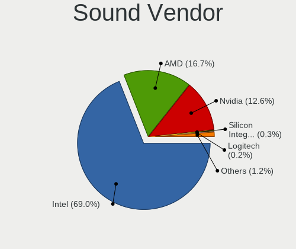

| Vendor                                          | Notebooks | Percent |
|-------------------------------------------------|-----------|---------|
| Intel                                           | 1931      | 69.89%  |
| AMD                                             | 439       | 15.89%  |
| Nvidia                                          | 348       | 12.6%   |
| Silicon Integrated Systems [SiS]                | 10        | 0.36%   |
| Generalplus Technology                          | 4         | 0.14%   |
| Plantronics                                     | 3         | 0.11%   |
| Logitech                                        | 3         | 0.11%   |
| JMTek                                           | 3         | 0.11%   |
| VIA Technologies                                | 2         | 0.07%   |
| Texas Instruments                               | 2         | 0.07%   |
| Corsair                                         | 2         | 0.07%   |
| C-Media Electronics                             | 2         | 0.07%   |
| Tdlasunnic                                      | 1         | 0.04%   |
| Sony                                            | 1         | 0.04%   |
| Sennheiser Communications                       | 1         | 0.04%   |
| Samsung Electronics                             | 1         | 0.04%   |
| Realtek Semiconductor                           | 1         | 0.04%   |
| Pioneer DJ                                      | 1         | 0.04%   |
| Licensed by Sony Computer Entertainment America | 1         | 0.04%   |
| Lenovo                                          | 1         | 0.04%   |
| Kingston Technology                             | 1         | 0.04%   |
| Edifier Technology                              | 1         | 0.04%   |
| EasyPass Industrial                             | 1         | 0.04%   |
| Dell                                            | 1         | 0.04%   |
| Creative Technology                             | 1         | 0.04%   |
| Blue Microphones                                | 1         | 0.04%   |

Sound Model
-----------

Sound card models

| Model                                                                                             | Notebooks | Percent |
|---------------------------------------------------------------------------------------------------|-----------|---------|
| Intel Sunrise Point-LP HD Audio                                                                   | 447       | 13.93%  |
| Intel Celeron/Pentium Silver Processor High Definition Audio                                      | 238       | 7.42%   |
| AMD Family 17h/19h HD Audio Controller                                                            | 227       | 7.07%   |
| Intel Cannon Lake PCH cAVS                                                                        | 225       | 7.01%   |
| Nvidia TU107 GeForce GTX 1650 High Definition Audio Controller                                    | 222       | 6.92%   |
| AMD Raven/Raven2/Fenghuang HDMI/DP Audio Controller                                               | 165       | 5.14%   |
| Intel Celeron N3350/Pentium N4200/Atom E3900 Series Audio Cluster                                 | 143       | 4.46%   |
| Intel 7 Series/C216 Chipset Family High Definition Audio Controller                               | 114       | 3.55%   |
| AMD Family 15h (Models 60h-6fh) Audio Controller                                                  | 93        | 2.9%    |
| Intel 82801I (ICH9 Family) HD Audio Controller                                                    | 89        | 2.77%   |
| Intel 6 Series/C200 Series Chipset Family High Definition Audio Controller                        | 83        | 2.59%   |
| Intel Cannon Point-LP High Definition Audio Controller                                            | 81        | 2.52%   |
| AMD High Definition Audio Controller                                                              | 81        | 2.52%   |
| Intel Ice Lake-LP Smart Sound Technology Audio Controller                                         | 59        | 1.84%   |
| Intel Atom/Celeron/Pentium Processor x5-E8000/J3xxx/N3xxx Series High Definition Audio Controller | 59        | 1.84%   |
| Intel Comet Lake PCH-LP cAVS                                                                      | 57        | 1.78%   |
| AMD FCH Azalia Controller                                                                         | 56        | 1.75%   |
| Intel 5 Series/3400 Series Chipset High Definition Audio                                          | 55        | 1.71%   |
| Nvidia GP107GL High Definition Audio Controller                                                   | 47        | 1.46%   |
| Intel Haswell-ULT HD Audio Controller                                                             | 42        | 1.31%   |
| Intel CM238 HD Audio Controller                                                                   | 42        | 1.31%   |
| Intel 8 Series HD Audio Controller                                                                | 42        | 1.31%   |
| Intel 82801H (ICH8 Family) HD Audio Controller                                                    | 41        | 1.28%   |
| AMD SBx00 Azalia (Intel HDA)                                                                      | 40        | 1.25%   |
| Intel Broadwell-U Audio Controller                                                                | 39        | 1.22%   |
| Intel Wildcat Point-LP High Definition Audio Controller                                           | 38        | 1.18%   |
| AMD Kabini HDMI/DP Audio                                                                          | 36        | 1.12%   |
| Intel Tiger Lake-LP Smart Sound Technology Audio Controller                                       | 33        | 1.03%   |
| AMD Wrestler HDMI Audio                                                                           | 29        | 0.9%    |
| Intel Atom Processor Z36xxx/Z37xxx Series High Definition Audio Controller                        | 28        | 0.87%   |
| Intel NM10/ICH7 Family High Definition Audio Controller                                           | 24        | 0.75%   |
| Intel 8 Series/C220 Series Chipset High Definition Audio Controller                               | 21        | 0.65%   |
| Intel Xeon E3-1200 v3/4th Gen Core Processor HD Audio Controller                                  | 18        | 0.56%   |
| Nvidia GF108 High Definition Audio Controller                                                     | 13        | 0.41%   |
| Silicon Integrated Systems [SiS] Azalia Audio Controller                                          | 10        | 0.31%   |
| Nvidia TU106 High Definition Audio Controller                                                     | 10        | 0.31%   |
| AMD RV710/730 HDMI Audio [Radeon HD 4000 series]                                                  | 10        | 0.31%   |
| AMD RS880 HDMI Audio [Radeon HD 4200 Series]                                                      | 10        | 0.31%   |
| Nvidia GF119 HDMI Audio Controller                                                                | 9         | 0.28%   |
| AMD Trinity HDMI Audio Controller                                                                 | 9         | 0.28%   |
| Nvidia High Definition Audio Controller                                                           | 8         | 0.25%   |
| Nvidia GK208 HDMI/DP Audio Controller                                                             | 8         | 0.25%   |
| Nvidia GP106 High Definition Audio Controller                                                     | 6         | 0.19%   |
| Nvidia GT216 HDMI Audio Controller                                                                | 5         | 0.16%   |
| Intel Comet Lake PCH cAVS                                                                         | 5         | 0.16%   |
| Intel 100 Series/C230 Series Chipset Family HD Audio Controller                                   | 5         | 0.16%   |
| AMD Renoir Radeon High Definition Audio Controller                                                | 5         | 0.16%   |
| AMD Cedar HDMI Audio [Radeon HD 5400/6300/7300 Series]                                            | 5         | 0.16%   |
| Nvidia TU116 High Definition Audio Controller                                                     | 4         | 0.12%   |
| Intel USB PnP Sound Device                                                                        | 4         | 0.12%   |
| Generalplus Technology IMYB 7.1 Channel                                                           | 4         | 0.12%   |
| Nvidia MCP51 High Definition Audio                                                                | 3         | 0.09%   |
| Nvidia GF116 High Definition Audio Controller                                                     | 3         | 0.09%   |
| AMD Redwood HDMI Audio [Radeon HD 5000 Series]                                                    | 3         | 0.09%   |
| AMD Caicos HDMI Audio [Radeon HD 6450 / 7450/8450/8490 OEM / R5 230/235/235X OEM]                 | 3         | 0.09%   |
| VIA Technologies VX900/VT8xxx High Definition Audio Controller                                    | 2         | 0.06%   |
| Nvidia MCP79 High Definition Audio                                                                | 2         | 0.06%   |
| Nvidia MCP67 High Definition Audio                                                                | 2         | 0.06%   |
| Nvidia GK107 HDMI Audio Controller                                                                | 2         | 0.06%   |
| Logitech USB Headset                                                                              | 2         | 0.06%   |

Memory
------

Memory Vendor
-------------

Memory module vendors

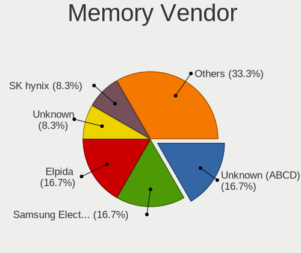

| Vendor              | Notebooks | Percent |
|---------------------|-----------|---------|
| Unknown (ABCD)      | 2         | 18.18%  |
| Elpida              | 2         | 18.18%  |
| Unknown             | 1         | 9.09%   |
| SK hynix            | 1         | 9.09%   |
| Samsung Electronics | 1         | 9.09%   |
| Patriot             | 1         | 9.09%   |
| Micron Technology   | 1         | 9.09%   |
| Kingston            | 1         | 9.09%   |
| Apacer              | 1         | 9.09%   |

Memory Model
------------

Memory module models

| Model                                                               | Notebooks | Percent |
|---------------------------------------------------------------------|-----------|---------|
| Unknown (ABCD) RAM 123456789012345678 2048MB SODIMM LPDDR4 2400MT/s | 2         | 18.18%  |
| Unknown RAM Module 4GB SODIMM DDR3 1600MT/s                         | 1         | 9.09%   |
| SK hynix RAM HMAA2GS6AJR8N-XN 16GB SODIMM DDR4 3200MT/s             | 1         | 9.09%   |
| Samsung RAM M471A5244CB0-CTD 4GB SODIMM DDR4 3266MT/s               | 1         | 9.09%   |
| Patriot RAM PSD38G1600L2S 8GB SODIMM DDR3 1600MT/s                  | 1         | 9.09%   |
| Micron RAM 8ATF51264HZ-2G3B1 4GB SODIMM DDR4 2400MT/s               | 1         | 9.09%   |
| Kingston RAM 99U5428-073.A00G 8GB SODIMM DDR3 1600MT/s              | 1         | 9.09%   |
| Elpida RAM Module 4096MB SODIMM LPDDR3 1600MT/s                     | 1         | 9.09%   |
| Elpida RAM EBJ40UG8EFU0-GN-F 4GB SODIMM DDR3 1600MT/s               | 1         | 9.09%   |
| Apacer RAM 76.D305G.D390B 16GB SODIMM DDR4 2400MT/s                 | 1         | 9.09%   |

Memory Kind
-----------

Memory module kinds

| Kind   | Notebooks | Percent |
|--------|-----------|---------|
| DDR4   | 4         | 36.36%  |
| DDR3   | 4         | 36.36%  |
| LPDDR4 | 2         | 18.18%  |
| LPDDR3 | 1         | 9.09%   |

Memory Form Factor
------------------

Physical design of the memory module

| Name   | Notebooks | Percent |
|--------|-----------|---------|
| SODIMM | 11        | 100%    |

Memory Size
-----------

Memory module size

| Size  | Notebooks | Percent |
|-------|-----------|---------|
| 4096  | 7         | 63.64%  |
| 16384 | 2         | 18.18%  |
| 8192  | 2         | 18.18%  |

Memory Speed
------------

Memory module speed

| Speed | Notebooks | Percent |
|-------|-----------|---------|
| 1600  | 5         | 45.45%  |
| 2400  | 4         | 36.36%  |
| 3266  | 1         | 9.09%   |
| 3200  | 1         | 9.09%   |

Printers & scanners
-------------------

Printer Vendor
--------------

Printer device vendors

| Vendor                 | Notebooks | Percent |
|------------------------|-----------|---------|
| Hewlett-Packard        | 25        | 35.21%  |
| Seiko Epson            | 14        | 19.72%  |
| Canon                  | 13        | 18.31%  |
| Brother Industries     | 10        | 14.08%  |
| Samsung Electronics    | 4         | 5.63%   |
| Xerox                  | 2         | 2.82%   |
| Ricoh                  | 1         | 1.41%   |
| Pantum                 | 1         | 1.41%   |
| Panasonic (Matsushita) | 1         | 1.41%   |

Printer Model
-------------

Printer device models

| Model                                        | Notebooks | Percent |
|----------------------------------------------|-----------|---------|
| Seiko Epson L3150 Series                     | 4         | 5.63%   |
| HP LaserJet 1020                             | 3         | 4.23%   |
| HP LaserJet 1018                             | 3         | 4.23%   |
| Xerox Phaser 3020                            | 2         | 2.82%   |
| Seiko Epson L395 Series                      | 2         | 2.82%   |
| HP DeskJet F4200 series                      | 2         | 2.82%   |
| HP DeskJet 2130 series                       | 2         | 2.82%   |
| HP Deskjet 1510                              | 2         | 2.82%   |
| HP Color Laser 150nw                         | 2         | 2.82%   |
| Brother DCP-T310                             | 2         | 2.82%   |
| Seiko Epson ME-100 Series                    | 1         | 1.41%   |
| Seiko Epson ME 320/330 Series [Stylus SX125] | 1         | 1.41%   |
| Seiko Epson L380 Series                      | 1         | 1.41%   |
| Seiko Epson L365 Series                      | 1         | 1.41%   |
| Seiko Epson L3110 Series                     | 1         | 1.41%   |
| Seiko Epson L210 Series                      | 1         | 1.41%   |
| Seiko Epson L120 Series                      | 1         | 1.41%   |
| Seiko Epson AcuLaser C1700                   | 1         | 1.41%   |
| Samsung M332x 382x 402x Series               | 1         | 1.41%   |
| Samsung M2070 Series                         | 1         | 1.41%   |
| Samsung M2020 Series                         | 1         | 1.41%   |
| Samsung Composite Device                     | 1         | 1.41%   |
| Ricoh SP 150SUw                              | 1         | 1.41%   |
| Pantum M6500W series                         | 1         | 1.41%   |
| Panasonic (Matsushita) KX-MB1500CX           | 1         | 1.41%   |
| HP OfficeJet 4650 series                     | 1         | 1.41%   |
| HP Officejet 4620 series                     | 1         | 1.41%   |
| HP LaserJet Professional P1102w              | 1         | 1.41%   |
| HP LaserJet Pro M148f-M149f                  | 1         | 1.41%   |
| HP Laser 107a                                | 1         | 1.41%   |
| HP ENVY Pro 6400 series                      | 1         | 1.41%   |
| HP DeskJet F300 series                       | 1         | 1.41%   |
| HP DeskJet 3630 series                       | 1         | 1.41%   |
| HP Deskjet 3050 J610 series                  | 1         | 1.41%   |
| HP DeskJet 2620 All-in-One Printer           | 1         | 1.41%   |
| HP Deskjet 2050 J510                         | 1         | 1.41%   |
| Canon TS3100 series                          | 1         | 1.41%   |
| Canon PIXMA MP240                            | 1         | 1.41%   |
| Canon PIXMA MG5600 Series                    | 1         | 1.41%   |
| Canon PIXMA MG2500 Series                    | 1         | 1.41%   |
| Canon PIXMA iP4300 Printer                   | 1         | 1.41%   |
| Canon MF4320-4350                            | 1         | 1.41%   |
| Canon MF3200 series                          | 1         | 1.41%   |
| Canon MB2300 series                          | 1         | 1.41%   |
| Canon LBP6670 UFR II                         | 1         | 1.41%   |
| Canon LBP6030/6030B/6018L                    | 1         | 1.41%   |
| Canon LBP6020                                | 1         | 1.41%   |
| Canon LBP2900                                | 1         | 1.41%   |
| Canon G3000 series                           | 1         | 1.41%   |
| Brother Printer                              | 1         | 1.41%   |
| Brother MFC-L2710DW series                   | 1         | 1.41%   |
| Brother MFC-J470DW                           | 1         | 1.41%   |
| Brother MFC-1810                             | 1         | 1.41%   |
| Brother HL-3140CW series                     | 1         | 1.41%   |
| Brother HL-1200 series                       | 1         | 1.41%   |
| Brother HL-1110 series                       | 1         | 1.41%   |
| Brother DCP-T710W                            | 1         | 1.41%   |

Scanner Vendor
--------------

Scanner device vendors

| Vendor                      | Notebooks | Percent |
|-----------------------------|-----------|---------|
| Seiko Epson                 | 1         | 50%     |
| Acer Peripherals (now BenQ) | 1         | 50%     |

Scanner Model
-------------

Scanner device models

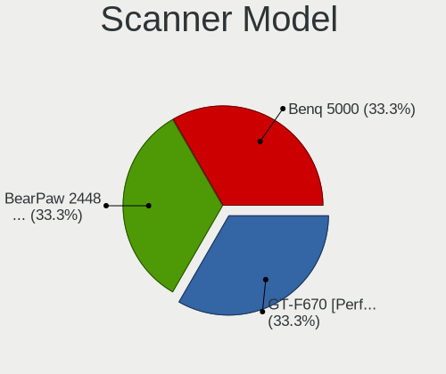

| Model                                       | Notebooks | Percent |
|---------------------------------------------|-----------|---------|
| Seiko Epson GT-F670 [Perfection V200 Photo] | 1         | 50%     |
| Acer Peripherals (now BenQ) Benq 5000       | 1         | 50%     |

Camera
------

Camera Vendor
-------------

Camera device vendors

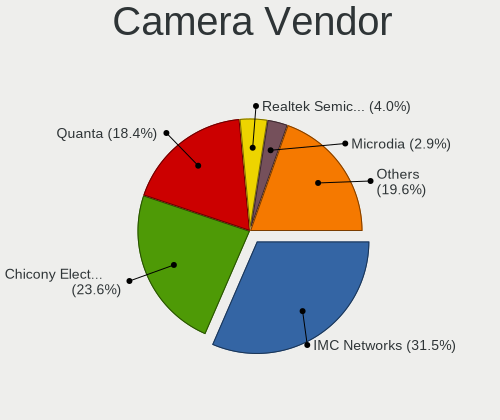

| Vendor                                 | Notebooks | Percent |
|----------------------------------------|-----------|---------|
| IMC Networks                           | 758       | 32.86%  |
| Chicony Electronics                    | 561       | 24.32%  |
| Quanta                                 | 431       | 18.68%  |
| Realtek Semiconductor                  | 96        | 4.16%   |
| Acer                                   | 66        | 2.86%   |
| Microdia                               | 62        | 2.69%   |
| Suyin                                  | 54        | 2.34%   |
| Sunplus Innovation Technology          | 51        | 2.21%   |
| Cheng Uei Precision Industry (Foxlink) | 30        | 1.3%    |
| Silicon Motion                         | 28        | 1.21%   |
| Alcor Micro                            | 23        | 1%      |
| Syntek                                 | 19        | 0.82%   |
| Samsung Electronics                    | 16        | 0.69%   |
| Apple                                  | 14        | 0.61%   |
| Lite-On Technology                     | 13        | 0.56%   |
| Ricoh                                  | 10        | 0.43%   |
| OmniVision Technologies                | 10        | 0.43%   |
| ALi                                    | 10        | 0.43%   |
| Lenovo                                 | 7         | 0.3%    |
| Logitech                               | 6         | 0.26%   |
| Importek                               | 6         | 0.26%   |
| Sonix Technology                       | 4         | 0.17%   |
| Z-Star Microelectronics                | 3         | 0.13%   |
| Primax Electronics                     | 3         | 0.13%   |
| Microsoft                              | 3         | 0.13%   |
| Luxvisions Innotech Limited            | 3         | 0.13%   |
| GEMBIRD                                | 2         | 0.09%   |
| Unknown                                | 1         | 0.04%   |
| Sunplus Technology                     | 1         | 0.04%   |
| Pixart Imaging                         | 1         | 0.04%   |
| Philips (or NXP)                       | 1         | 0.04%   |
| Novatek Microelectronics               | 1         | 0.04%   |
| Nebraska Furniture Mart                | 1         | 0.04%   |
| LG Electronics                         | 1         | 0.04%   |
| JMicron Technology                     | 1         | 0.04%   |
| Intel                                  | 1         | 0.04%   |
| Image Processor                        | 1         | 0.04%   |
| icSpring                               | 1         | 0.04%   |
| Holitech                               | 1         | 0.04%   |
| GoPro                                  | 1         | 0.04%   |
| Goertek Electronics                    | 1         | 0.04%   |
| Genesys Logic                          | 1         | 0.04%   |
| Generalplus Technology                 | 1         | 0.04%   |
| DigiTech                               | 1         | 0.04%   |
| Cubeternet                             | 1         | 0.04%   |

Camera Model
------------

Camera device models

| Model                                                   | Notebooks | Percent |
|---------------------------------------------------------|-----------|---------|
| IMC Networks USB2.0 VGA UVC WebCam                      | 547       | 23.7%   |
| Quanta VGA WebCam                                       | 181       | 7.84%   |
| Quanta HD User Facing                                   | 166       | 7.19%   |
| Chicony HD User Facing                                  | 160       | 6.93%   |
| IMC Networks USB2.0 HD UVC WebCam                       | 132       | 5.72%   |
| Chicony USB2.0 VGA UVC WebCam                           | 89        | 3.86%   |
| Chicony VGA WebCam                                      | 87        | 3.77%   |
| Chicony HD WebCam                                       | 59        | 2.56%   |
| Quanta HD Webcam                                        | 52        | 2.25%   |
| IMC Networks VGA UVC WebCam                             | 20        | 0.87%   |
| Samsung Galaxy series, misc. (MTP mode)                 | 16        | 0.69%   |
| Realtek Acer 640 x 480 laptop camera                    | 16        | 0.69%   |
| Chicony Integrated Camera                               | 15        | 0.65%   |
| Chicony USB2.0 HD UVC WebCam                            | 14        | 0.61%   |
| IMC Networks Integrated Camera                          | 13        | 0.56%   |
| Alcor Micro USB 2.0 Camera                              | 13        | 0.56%   |
| Realtek USB2.0 HD UVC WebCam                            | 12        | 0.52%   |
| Realtek HD WebCam                                       | 12        | 0.52%   |
| Sunplus HD WebCam                                       | 11        | 0.48%   |
| Microdia Integrated_Webcam_HD                           | 11        | 0.48%   |
| Sunplus Integrated_Webcam_HD                            | 10        | 0.43%   |
| Realtek USB Camera                                      | 10        | 0.43%   |
| Quanta USB2.0 VGA UVC WebCam                            | 10        | 0.43%   |
| OmniVision OV2640 Webcam                                | 10        | 0.43%   |
| Apple iPhone 5/5C/5S/6/SE                               | 10        | 0.43%   |
| Acer VGA WebCam                                         | 10        | 0.43%   |
| Quanta HP Webcam                                        | 9         | 0.39%   |
| Microdia Laptop_Integrated_Webcam_HD                    | 9         | 0.39%   |
| Microdia Integrated Webcam                              | 9         | 0.39%   |
| Chicony USB 2.0 Camera                                  | 9         | 0.39%   |
| Chicony TOSHIBA Web Camera - HD                         | 9         | 0.39%   |
| Chicony Lenovo EasyCamera                               | 9         | 0.39%   |
| Chicony HP Truevision HD                                | 9         | 0.39%   |
| Cheng Uei Precision Industry (Foxlink) HP Truevision HD | 9         | 0.39%   |
| ALi Gateway Webcam                                      | 9         | 0.39%   |
| Acer Lenovo EasyCamera                                  | 9         | 0.39%   |
| Realtek USB2.0 VGA UVC WebCam                           | 8         | 0.35%   |
| Realtek Integrated_Webcam_HD                            | 8         | 0.35%   |
| IMC Networks Lenovo EasyCamera                          | 8         | 0.35%   |
| Chicony HP TrueVision HD Camera                         | 8         | 0.35%   |
| Syntek Lenovo EasyCamera                                | 7         | 0.3%    |
| Suyin Acer/HP Integrated Webcam [CN0314]                | 7         | 0.3%    |
| IMC Networks USB2.0 UVC HD Webcam                       | 7         | 0.3%    |
| IMC Networks USB2.0 HD IR UVC WebCam                    | 7         | 0.3%    |
| Acer EasyCamera                                         | 7         | 0.3%    |
| Sunplus ASUS Webcam                                     | 6         | 0.26%   |
| Lite-On TOSHIBA Web Camera - HD                         | 6         | 0.26%   |
| IMC Networks UVC VGA Webcam                             | 6         | 0.26%   |
| Chicony HP HD Webcam                                    | 6         | 0.26%   |
| Chicony EasyCamera                                      | 6         | 0.26%   |
| Cheng Uei Precision Industry (Foxlink) HP Webcam        | 6         | 0.26%   |
| Acer Integrated Camera                                  | 6         | 0.26%   |
| Suyin HP Truevision HD                                  | 5         | 0.22%   |
| Silicon Motion Web Camera                               | 5         | 0.22%   |
| Realtek VGA WebCam                                      | 5         | 0.22%   |
| Quanta USB2.0 HD UVC WebCam                             | 5         | 0.22%   |
| Quanta HP TrueVision HD Camera                          | 5         | 0.22%   |
| IMC Networks EasyCamera                                 | 5         | 0.22%   |
| Chicony Integrated HP HD Webcam                         | 5         | 0.22%   |
| Acer BisonCam, NB Pro                                   | 5         | 0.22%   |

Security
--------

Fingerprint Vendor
------------------

Fingerprint sensor vendors

| Vendor                     | Notebooks | Percent |
|----------------------------|-----------|---------|
| Validity Sensors           | 39        | 31.2%   |
| Elan Microelectronics      | 31        | 24.8%   |
| LighTuning Technology      | 23        | 18.4%   |
| AuthenTec                  | 12        | 9.6%    |
| Upek                       | 10        | 8%      |
| Synaptics                  | 4         | 3.2%    |
| STMicroelectronics         | 4         | 3.2%    |
| Shenzhen Goodix Technology | 2         | 1.6%    |

Fingerprint Model
-----------------

Fingerprint sensor models

| Model                                                  | Notebooks | Percent |
|--------------------------------------------------------|-----------|---------|
| Elan ELAN:Fingerprint                                  | 31        | 24.8%   |
| LighTuning EgisTec Touch Fingerprint Sensor            | 19        | 15.2%   |
| Upek Biometric Touchchip/Touchstrip Fingerprint Sensor | 8         | 6.4%    |
| Validity Sensors VFS495 Fingerprint Reader             | 6         | 4.8%    |
| Validity Sensors VFS5011 Fingerprint Reader            | 5         | 4%      |
| Validity Sensors VFS471 Fingerprint Reader             | 5         | 4%      |
| Validity Sensors VFS491                                | 4         | 3.2%    |
| Validity Sensors VFS 5011 fingerprint sensor           | 4         | 3.2%    |
| STMicroelectronics Fingerprint Reader                  | 4         | 3.2%    |
| AuthenTec Fingerprint Sensor                           | 4         | 3.2%    |
| Validity Sensors VFS301 Fingerprint Reader             | 3         | 2.4%    |
| Validity Sensors VFS101 Fingerprint Reader             | 3         | 2.4%    |
| LighTuning ES603 Swipe Fingerprint Sensor              | 3         | 2.4%    |
| AuthenTec AES2810                                      | 3         | 2.4%    |
| AuthenTec AES1600                                      | 3         | 2.4%    |
| Validity Sensors VFS451 Fingerprint Reader             | 2         | 1.6%    |
| Validity Sensors VFS Fingerprint sensor                | 2         | 1.6%    |
| Validity Sensors Swipe Fingerprint Sensor              | 2         | 1.6%    |
| Upek TCS5B Fingerprint sensor                          | 2         | 1.6%    |
| Synaptics  WBDI                                        | 2         | 1.6%    |
| Shenzhen Goodix Fingerprint Reader                     | 2         | 1.6%    |
| AuthenTec AES2501 Fingerprint Sensor                   | 2         | 1.6%    |
| Validity Sensors VFS7500 Touch Fingerprint Sensor      | 1         | 0.8%    |
| Validity Sensors VFS300 Fingerprint Reader             | 1         | 0.8%    |
| Validity Sensors Synaptics WBDI                        | 1         | 0.8%    |
| Synaptics Prometheus MIS Touch Fingerprint Reader      | 1         | 0.8%    |
| Synaptics Metallica MIS Touch Fingerprint Reader       | 1         | 0.8%    |
| LighTuning Fingerprint Reader                          | 1         | 0.8%    |

Chipcard Vendor
---------------

Chipcard module vendors

| Vendor      | Notebooks | Percent |
|-------------|-----------|---------|
| Broadcom    | 24        | 60%     |
| O2 Micro    | 8         | 20%     |
| Alcor Micro | 5         | 12.5%   |
| Lenovo      | 3         | 7.5%    |

Chipcard Model
--------------

Chipcard module models

| Model                                                                        | Notebooks | Percent |
|------------------------------------------------------------------------------|-----------|---------|
| Broadcom BCM5880 Secure Applications Processor                               | 17        | 42.5%   |
| O2 Micro OZ776 CCID Smartcard Reader                                         | 7         | 17.5%   |
| Broadcom BCM5880 Secure Applications Processor with fingerprint swipe sensor | 5         | 12.5%   |
| Alcor Micro AU9540 Smartcard Reader                                          | 5         | 12.5%   |
| Lenovo Integrated Smart Card Reader                                          | 3         | 7.5%    |
| Broadcom 5880                                                                | 2         | 5%      |
| O2 Micro Oz776 SmartCard Reader                                              | 1         | 2.5%    |

Unsupported
-----------

Unsupported Devices
-------------------

Total unsupported devices on board

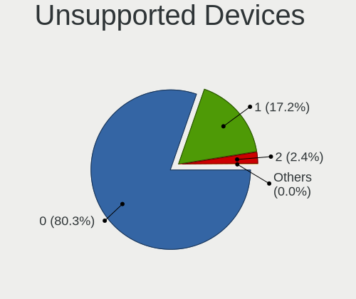

| Total | Notebooks | Percent |
|-------|-----------|---------|
| 0     | 2017      | 83.11%  |
| 1     | 353       | 14.54%  |
| 2     | 55        | 2.27%   |
| 4     | 1         | 0.04%   |
| 3     | 1         | 0.04%   |

Unsupported Device Types
------------------------

Types of unsupported devices

| Type                     | Notebooks | Percent |
|--------------------------|-----------|---------|
| Multimedia controller    | 150       | 31.71%  |
| Fingerprint reader       | 125       | 26.43%  |
| Net/wireless             | 67        | 14.16%  |
| Chipcard                 | 40        | 8.46%   |
| Graphics card            | 32        | 6.77%   |
| Communication controller | 17        | 3.59%   |
| Storage                  | 16        | 3.38%   |
| Bluetooth                | 10        | 2.11%   |
| Camera                   | 8         | 1.69%   |
| Net/ethernet             | 2         | 0.42%   |
| Storage/nvme             | 1         | 0.21%   |
| Storage/ide              | 1         | 0.21%   |
| Sound                    | 1         | 0.21%   |
| Network                  | 1         | 0.21%   |
| Modem                    | 1         | 0.21%   |
| Flash memory             | 1         | 0.21%   |

