Endless - Tested Hardware & Statistics
--------------------------------------

A project to collect tested hardware configurations for Endless.

Anyone can contribute to this report by the [hw-probe](https://github.com/linuxhw/hw-probe) tool:

    sudo -E hw-probe -all -upload

Please contribute! Especially if your hardware is rare.

This is a report for all computer types. See also reports for [desktops](/Dist/Endless/Desktop/README.md) and [notebooks](/Dist/Endless/Notebook/README.md).

Contents
--------

* [ Test Cases ](#test-cases)

* [ System ](#system)
  - [ OS                       ](#os)
  - [ OS Family                ](#os-family)
  - [ Kernel                   ](#kernel)
  - [ Kernel Family            ](#kernel-family)
  - [ Kernel Major Ver.        ](#kernel-major-ver)
  - [ Arch                     ](#arch)
  - [ DE                       ](#de)
  - [ Display Server           ](#display-server)
  - [ Display Manager          ](#display-manager)
  - [ OS Lang                  ](#os-lang)
  - [ Boot Mode                ](#boot-mode)
  - [ Filesystem               ](#filesystem)
  - [ Part. scheme             ](#part-scheme)
  - [ Dual Boot with Linux/BSD ](#dual-boot-with-linuxbsd)
  - [ Dual Boot (Win)          ](#dual-boot-win)

* [ Board ](#board)
  - [ Vendor                   ](#vendor)
  - [ Model                    ](#model)
  - [ Model Family             ](#model-family)
  - [ MFG Year                 ](#mfg-year)
  - [ Form Factor              ](#form-factor)
  - [ Secure Boot              ](#secure-boot)
  - [ Coreboot                 ](#coreboot)
  - [ RAM Size                 ](#ram-size)
  - [ RAM Used                 ](#ram-used)
  - [ Total Drives             ](#total-drives)
  - [ Has CD-ROM               ](#has-cd-rom)
  - [ Has Ethernet             ](#has-ethernet)
  - [ Has WiFi                 ](#has-wifi)
  - [ Has Bluetooth            ](#has-bluetooth)

* [ Location ](#location)
  - [ Country                  ](#country)
  - [ City                     ](#city)

* [ Drives ](#drives)
  - [ Drive Vendor             ](#drive-vendor)
  - [ Drive Model              ](#drive-model)
  - [ HDD Vendor               ](#hdd-vendor)
  - [ SSD Vendor               ](#ssd-vendor)
  - [ Drive Kind               ](#drive-kind)
  - [ Drive Connector          ](#drive-connector)
  - [ Drive Size               ](#drive-size)
  - [ Space Total              ](#space-total)
  - [ Space Used               ](#space-used)
  - [ Malfunc. Drives          ](#malfunc-drives)
  - [ Malfunc. Drive Vendor    ](#malfunc-drive-vendor)
  - [ Malfunc. HDD Vendor      ](#malfunc-hdd-vendor)
  - [ Malfunc. Drive Kind      ](#malfunc-drive-kind)
  - [ Failed Drives            ](#failed-drives)
  - [ Failed Drive Vendor      ](#failed-drive-vendor)
  - [ Drive Status             ](#drive-status)

* [ Storage controller ](#storage-controller)
  - [ Storage Vendor           ](#storage-vendor)
  - [ Storage Model            ](#storage-model)
  - [ Storage Kind             ](#storage-kind)

* [ Processor ](#processor)
  - [ CPU Vendor               ](#cpu-vendor)
  - [ CPU Model                ](#cpu-model)
  - [ CPU Model Family         ](#cpu-model-family)
  - [ CPU Cores                ](#cpu-cores)
  - [ CPU Sockets              ](#cpu-sockets)
  - [ CPU Threads              ](#cpu-threads)
  - [ CPU Op-Modes             ](#cpu-op-modes)
  - [ CPU Microcode            ](#cpu-microcode)
  - [ CPU Microarch            ](#cpu-microarch)

* [ Graphics ](#graphics)
  - [ GPU Vendor               ](#gpu-vendor)
  - [ GPU Model                ](#gpu-model)
  - [ GPU Combo                ](#gpu-combo)
  - [ GPU Driver               ](#gpu-driver)
  - [ GPU Memory               ](#gpu-memory)

* [ Monitor ](#monitor)
  - [ Monitor Vendor           ](#monitor-vendor)
  - [ Monitor Model            ](#monitor-model)
  - [ Monitor Resolution       ](#monitor-resolution)
  - [ Monitor Diagonal         ](#monitor-diagonal)
  - [ Monitor Width            ](#monitor-width)
  - [ Aspect Ratio             ](#aspect-ratio)
  - [ Monitor Area             ](#monitor-area)
  - [ Pixel Density            ](#pixel-density)
  - [ Multiple Monitors        ](#multiple-monitors)

* [ Network ](#network)
  - [ Net Controller Vendor    ](#net-controller-vendor)
  - [ Net Controller Model     ](#net-controller-model)
  - [ Wireless Vendor          ](#wireless-vendor)
  - [ Wireless Model           ](#wireless-model)
  - [ Ethernet Vendor          ](#ethernet-vendor)
  - [ Ethernet Model           ](#ethernet-model)
  - [ Net Controller Kind      ](#net-controller-kind)
  - [ Used Controller          ](#used-controller)
  - [ NICs                     ](#nics)
  - [ IPv6                     ](#ipv6)

* [ Bluetooth ](#bluetooth)
  - [ Bluetooth Vendor         ](#bluetooth-vendor)
  - [ Bluetooth Model          ](#bluetooth-model)

* [ Sound ](#sound)
  - [ Sound Vendor             ](#sound-vendor)
  - [ Sound Model              ](#sound-model)

* [ Memory ](#memory)
  - [ Memory Vendor            ](#memory-vendor)
  - [ Memory Model             ](#memory-model)
  - [ Memory Kind              ](#memory-kind)
  - [ Memory Form Factor       ](#memory-form-factor)
  - [ Memory Size              ](#memory-size)
  - [ Memory Speed             ](#memory-speed)

* [ Printers & scanners ](#printers--scanners)
  - [ Printer Vendor           ](#printer-vendor)
  - [ Printer Model            ](#printer-model)
  - [ Scanner Vendor           ](#scanner-vendor)
  - [ Scanner Model            ](#scanner-model)

* [ Camera ](#camera)
  - [ Camera Vendor            ](#camera-vendor)
  - [ Camera Model             ](#camera-model)

* [ Security ](#security)
  - [ Fingerprint Vendor       ](#fingerprint-vendor)
  - [ Fingerprint Model        ](#fingerprint-model)
  - [ Chipcard Vendor          ](#chipcard-vendor)
  - [ Chipcard Model           ](#chipcard-model)

* [ Unsupported ](#unsupported)
  - [ Unsupported Devices      ](#unsupported-devices)
  - [ Unsupported Device Types ](#unsupported-device-types)

Test Cases
----------

Total: 6113

| Vendor        | Model                       | Form-Factor | Probe                                                      | Date         |
|---------------|-----------------------------|-------------|------------------------------------------------------------|--------------|
| Acer          | Aspire A315-53              | Notebook    | [e21cdc2b24](https://linux-hardware.org/?probe=e21cdc2b24) | Dec 16, 2025 |
| Toshiba       | Satellite C50-C             | Notebook    | [774214cc4c](https://linux-hardware.org/?probe=774214cc4c) | Dec 14, 2025 |
| Toshiba       | Satellite C50-C             | Notebook    | [fdd9560c98](https://linux-hardware.org/?probe=fdd9560c98) | Dec 14, 2025 |
| Dell          | 03NVJ6 A01                  | Desktop     | [6a06b3c989](https://linux-hardware.org/?probe=6a06b3c989) | Dec 09, 2025 |
| ASUSTek       | VivoBook_ASUSLaptop X515... | Notebook    | [a585a186ce](https://linux-hardware.org/?probe=a585a186ce) | Dec 09, 2025 |
| Medion        | TJ4125                      | Desktop     | [73026ab6f5](https://linux-hardware.org/?probe=73026ab6f5) | Dec 01, 2025 |
| Microtech     | CoreBook                    | Notebook    | [a1477e9883](https://linux-hardware.org/?probe=a1477e9883) | Nov 22, 2025 |
| Acer          | Extensa 5230                | Notebook    | [2d0ffe0b6f](https://linux-hardware.org/?probe=2d0ffe0b6f) | Nov 16, 2025 |
| Acer          | Aspire ES1-132              | Notebook    | [5439048149](https://linux-hardware.org/?probe=5439048149) | Nov 16, 2025 |
| Dell          | Latitude E4310              | Notebook    | [ae4341575b](https://linux-hardware.org/?probe=ae4341575b) | Nov 13, 2025 |
| Dell          | Latitude E4310              | Notebook    | [d7948e3eac](https://linux-hardware.org/?probe=d7948e3eac) | Nov 12, 2025 |
| MAXSUN        | MS-TZZ A520M                | Desktop     | [d65008bce9](https://linux-hardware.org/?probe=d65008bce9) | Nov 06, 2025 |
| MAXSUN        | MS-TZZ A520M                | Desktop     | [96b5296f35](https://linux-hardware.org/?probe=96b5296f35) | Nov 03, 2025 |
| HP            | 2B42 100                    | All in one  | [e2922ed0b2](https://linux-hardware.org/?probe=e2922ed0b2) | Oct 27, 2025 |
| ASUSTek       | ZenBook UX425EA_UX425EA     | Notebook    | [2fd54bdb64](https://linux-hardware.org/?probe=2fd54bdb64) | Oct 20, 2025 |
| ASUSTek       | VivoBook_ASUSLaptop X515... | Notebook    | [d5ade82cec](https://linux-hardware.org/?probe=d5ade82cec) | Oct 01, 2025 |
| HP            | 3397                        | Desktop     | [c2c10663cd](https://linux-hardware.org/?probe=c2c10663cd) | Sep 15, 2025 |
| Gigabyte      | Z77X-UP4 TH                 | Desktop     | [d4ef591d65](https://linux-hardware.org/?probe=d4ef591d65) | Sep 14, 2025 |
| ASUSTek       | VivoBook_ASUSLaptop X515... | Notebook    | [ad99fec91d](https://linux-hardware.org/?probe=ad99fec91d) | Sep 14, 2025 |
| ASRock        | X99 WS                      | Desktop     | [cccacdaf17](https://linux-hardware.org/?probe=cccacdaf17) | Sep 04, 2025 |
| ASUSTek       | VivoBook_ASUSLaptop X150... | Notebook    | [21045a1580](https://linux-hardware.org/?probe=21045a1580) | Aug 29, 2025 |
| ASUSTek       | X540NA                      | Notebook    | [e4974dee02](https://linux-hardware.org/?probe=e4974dee02) | Aug 27, 2025 |
| ASUSTek       | X540NA                      | Notebook    | [b8f786f6f1](https://linux-hardware.org/?probe=b8f786f6f1) | Aug 27, 2025 |
| Acer          | Aspire 5732Z                | Notebook    | [3e5ea8b92f](https://linux-hardware.org/?probe=3e5ea8b92f) | Aug 15, 2025 |
| Toshiba       | Satellite L355D             | Notebook    | [af4d0b5710](https://linux-hardware.org/?probe=af4d0b5710) | Aug 05, 2025 |
| ASUSTek       | X541UAK                     | Notebook    | [df0053f97f](https://linux-hardware.org/?probe=df0053f97f) | Aug 02, 2025 |
| ASUSTek       | X541UAK                     | Notebook    | [eb9a6b1027](https://linux-hardware.org/?probe=eb9a6b1027) | Aug 02, 2025 |
| ASUSTek       | TUF Gaming FX505DT_FX505... | Notebook    | [f8ad33d302](https://linux-hardware.org/?probe=f8ad33d302) | Jul 17, 2025 |
| Positivo      | Charles                     | Convertible | [179f614215](https://linux-hardware.org/?probe=179f614215) | Jul 11, 2025 |
| Intel         | NUC6CAYB J23203-402         | Mini pc     | [bcc9b1880a](https://linux-hardware.org/?probe=bcc9b1880a) | Jul 10, 2025 |
| Pegatron      | 2AD5                        | Desktop     | [59333da22e](https://linux-hardware.org/?probe=59333da22e) | Jul 05, 2025 |
| ASUSTek       | VivoBook_ASUSLaptop X515... | Notebook    | [250f8b9bb4](https://linux-hardware.org/?probe=250f8b9bb4) | Jul 03, 2025 |
| ASUSTek       | VivoBook_ASUSLaptop X515... | Notebook    | [b4d9280c15](https://linux-hardware.org/?probe=b4d9280c15) | Jul 03, 2025 |
| ASUSTek       | VivoBook 17_ASUS Laptop ... | Notebook    | [0598cec32f](https://linux-hardware.org/?probe=0598cec32f) | Jun 30, 2025 |
| HP            | 1497                        | Desktop     | [f90f5ab185](https://linux-hardware.org/?probe=f90f5ab185) | Jun 29, 2025 |
| Positivo      | POS-EIH610EX 11210377       | Desktop     | [16188feca3](https://linux-hardware.org/?probe=16188feca3) | Jun 28, 2025 |
| Notebook      | N150SD/N155SD               | Notebook    | [c0fb6166f0](https://linux-hardware.org/?probe=c0fb6166f0) | Jun 21, 2025 |
| MSI           | Z270-A PRO                  | Desktop     | [16faa0cccd](https://linux-hardware.org/?probe=16faa0cccd) | Jun 19, 2025 |
| ASUSTek       | VivoBook_ASUSLaptop X515... | Notebook    | [6d50762c78](https://linux-hardware.org/?probe=6d50762c78) | Jun 15, 2025 |
| ASUSTek       | VivoBook_ASUSLaptop X515... | Notebook    | [7a28822b71](https://linux-hardware.org/?probe=7a28822b71) | Jun 15, 2025 |
| ASUSTek       | VivoBook 15_ASUS Laptop ... | Notebook    | [68668100e3](https://linux-hardware.org/?probe=68668100e3) | Jun 11, 2025 |
| ASUSTek       | VivoBook_ASUSLaptop X421... | Notebook    | [11a30aeac3](https://linux-hardware.org/?probe=11a30aeac3) | Jun 02, 2025 |
| Acer          | Aspire A515-54G             | Notebook    | [9df7c25df1](https://linux-hardware.org/?probe=9df7c25df1) | May 20, 2025 |
| Positivo      | CHT14B                      | Notebook    | [54eb009f20](https://linux-hardware.org/?probe=54eb009f20) | May 20, 2025 |
| Positivo      | CHT14B                      | Notebook    | [dd56acbb8c](https://linux-hardware.org/?probe=dd56acbb8c) | May 20, 2025 |
| Positivo      | Master N130i                | Notebook    | [fb88e448cc](https://linux-hardware.org/?probe=fb88e448cc) | May 12, 2025 |
| ASUSTek       | X455LD                      | Notebook    | [f894a1beb5](https://linux-hardware.org/?probe=f894a1beb5) | May 10, 2025 |
| Acer          | Aspire ES1-111M             | Notebook    | [d12ec9a3ac](https://linux-hardware.org/?probe=d12ec9a3ac) | May 10, 2025 |
| HP            | 255 15.6 inch G10 Notebo... | Notebook    | [a04bfa844a](https://linux-hardware.org/?probe=a04bfa844a) | May 03, 2025 |
| Toshiba       | HybridCD2017                | Tablet      | [fa89921373](https://linux-hardware.org/?probe=fa89921373) | Apr 28, 2025 |
| ASUSTek       | VivoBook_ASUSLaptop X421... | Notebook    | [22eb421620](https://linux-hardware.org/?probe=22eb421620) | Apr 26, 2025 |
| ASUSTek       | VivoBook_ASUSLaptop X515... | Notebook    | [3c8a62739b](https://linux-hardware.org/?probe=3c8a62739b) | Apr 26, 2025 |
| ASUSTek       | VivoBook_ASUSLaptop X515... | Notebook    | [e1e9f5250d](https://linux-hardware.org/?probe=e1e9f5250d) | Apr 26, 2025 |
| HP            | 255 15.6 inch G10 Notebo... | Notebook    | [ce6717c7ea](https://linux-hardware.org/?probe=ce6717c7ea) | Apr 25, 2025 |
| HP            | 255 15.6 inch G10 Notebo... | Notebook    | [aaeb216ee2](https://linux-hardware.org/?probe=aaeb216ee2) | Apr 25, 2025 |
| Medion        | TJ4125                      | Desktop     | [f940530a41](https://linux-hardware.org/?probe=f940530a41) | Apr 18, 2025 |
| HP            | Pavilion dv6                | Notebook    | [38dc311890](https://linux-hardware.org/?probe=38dc311890) | Apr 13, 2025 |
| ASUSTek       | VivoBook_ASUSLaptop X515... | Notebook    | [4cc81cd409](https://linux-hardware.org/?probe=4cc81cd409) | Apr 13, 2025 |
| ASUSTek       | VivoBook 15_ASUS Laptop ... | Notebook    | [0f40c1c922](https://linux-hardware.org/?probe=0f40c1c922) | Apr 12, 2025 |
| Intel         | H55                         | Desktop     | [7605ba8dad](https://linux-hardware.org/?probe=7605ba8dad) | Apr 12, 2025 |
| Acer          | Aspire ES1-732              | Notebook    | [c0fb610863](https://linux-hardware.org/?probe=c0fb610863) | Apr 05, 2025 |
| Compaq        | Presario CQ-31              | Notebook    | [0f122c9159](https://linux-hardware.org/?probe=0f122c9159) | Apr 04, 2025 |
| Lenovo        | ThinkPad E520 1143KDG       | Notebook    | [2d851e190c](https://linux-hardware.org/?probe=2d851e190c) | Apr 03, 2025 |
| Lenovo        | ThinkPad E520 1143KDG       | Notebook    | [1472ec0d73](https://linux-hardware.org/?probe=1472ec0d73) | Apr 03, 2025 |
| ASUSTek       | VivoBook_ASUSLaptop X515... | Notebook    | [4d2791516a](https://linux-hardware.org/?probe=4d2791516a) | Apr 01, 2025 |
| Dell          | XPS 15 9570                 | Notebook    | [9cf10a17a2](https://linux-hardware.org/?probe=9cf10a17a2) | Mar 27, 2025 |
| Lenovo        | Yoga 2 11 20332             | Notebook    | [d1fbb31a2a](https://linux-hardware.org/?probe=d1fbb31a2a) | Mar 22, 2025 |
| Lenovo        | Yoga 2 11 20332             | Notebook    | [151a2927f1](https://linux-hardware.org/?probe=151a2927f1) | Mar 22, 2025 |
| ASUSTek       | VivoBook_ASUS Laptop E21... | Notebook    | [1efda9aabf](https://linux-hardware.org/?probe=1efda9aabf) | Mar 18, 2025 |
| ASUSTek       | VivoBook_ASUS Laptop E21... | Notebook    | [3ad5d28cab](https://linux-hardware.org/?probe=3ad5d28cab) | Mar 18, 2025 |
| Microtech     | CoreBook                    | Notebook    | [6c4dfb0dc2](https://linux-hardware.org/?probe=6c4dfb0dc2) | Mar 16, 2025 |
| Dell          | Precision 3530              | Notebook    | [91c23372a4](https://linux-hardware.org/?probe=91c23372a4) | Mar 15, 2025 |
| ASUSTek       | VivoBook_ASUSLaptop X415... | Notebook    | [d139fa0e2b](https://linux-hardware.org/?probe=d139fa0e2b) | Mar 15, 2025 |
| Unknown       | FAY-002                     | Desktop     | [be524ef9e3](https://linux-hardware.org/?probe=be524ef9e3) | Mar 14, 2025 |
| Dell          | Latitude E6530              | Notebook    | [50ed736590](https://linux-hardware.org/?probe=50ed736590) | Mar 09, 2025 |
| Acer          | Aspire A515-54              | Notebook    | [3c953f2d72](https://linux-hardware.org/?probe=3c953f2d72) | Mar 09, 2025 |
| EVGA          | 132-BL-E758 Tylersburg      | Desktop     | [4f5c629157](https://linux-hardware.org/?probe=4f5c629157) | Mar 08, 2025 |
| Acer          | TravelMate B118-M           | Notebook    | [0bd269c39b](https://linux-hardware.org/?probe=0bd269c39b) | Feb 25, 2025 |
| Acer          | Nitro AN515-54              | Notebook    | [e2023f56ca](https://linux-hardware.org/?probe=e2023f56ca) | Feb 24, 2025 |
| ASUSTek       | X541UVK                     | Notebook    | [d19dd1844f](https://linux-hardware.org/?probe=d19dd1844f) | Feb 23, 2025 |
| ASUSTek       | VivoBook 15_ASUS Laptop ... | Notebook    | [6e65ad4bd6](https://linux-hardware.org/?probe=6e65ad4bd6) | Feb 20, 2025 |
| Dell          | Inspiron 14 7435 2-in-1     | Convertible | [82215ca372](https://linux-hardware.org/?probe=82215ca372) | Feb 17, 2025 |
| HP            | Laptop 15-bw0xx             | Notebook    | [90da992c8f](https://linux-hardware.org/?probe=90da992c8f) | Feb 16, 2025 |
| HP            | Laptop 15-bw0xx             | Notebook    | [b148b97371](https://linux-hardware.org/?probe=b148b97371) | Feb 15, 2025 |
| Lenovo        | 3000 N500 423346G           | Notebook    | [a419d328d2](https://linux-hardware.org/?probe=a419d328d2) | Feb 14, 2025 |
| Acer          | Nitro AN517-54              | Notebook    | [9425e1b40d](https://linux-hardware.org/?probe=9425e1b40d) | Feb 11, 2025 |
| HP            | Laptop 15-db0xxx            | Notebook    | [d346ae8874](https://linux-hardware.org/?probe=d346ae8874) | Feb 07, 2025 |
| Lenovo        | ThinkPad T430 2349L29       | Notebook    | [f67f6be3c3](https://linux-hardware.org/?probe=f67f6be3c3) | Feb 06, 2025 |
| Intel         | NUC6CAYB J23203-402         | Mini pc     | [4dc4179308](https://linux-hardware.org/?probe=4dc4179308) | Feb 05, 2025 |
| ASUSTek       | VivoBook_ASUSLaptop X515... | Notebook    | [5db5c40620](https://linux-hardware.org/?probe=5db5c40620) | Feb 03, 2025 |
| ASUSTek       | VivoBook_ASUSLaptop X515... | Notebook    | [183f99a22b](https://linux-hardware.org/?probe=183f99a22b) | Feb 03, 2025 |
| Apple         | Mac-F42386C8 PVT            | All in one  | [25de5410e8](https://linux-hardware.org/?probe=25de5410e8) | Jan 29, 2025 |
| Acer          | Aspire A115-32              | Notebook    | [a33977d70a](https://linux-hardware.org/?probe=a33977d70a) | Jan 29, 2025 |
| Acer          | Nitro AN515-54              | Notebook    | [43a30aeafd](https://linux-hardware.org/?probe=43a30aeafd) | Jan 28, 2025 |
| ASRock        | H77M                        | Desktop     | [4ae97924b1](https://linux-hardware.org/?probe=4ae97924b1) | Jan 27, 2025 |
| ASRock        | H77M                        | Desktop     | [85fd38356c](https://linux-hardware.org/?probe=85fd38356c) | Jan 27, 2025 |
| Lenovo        | G50-70 20351                | Notebook    | [0aab701d35](https://linux-hardware.org/?probe=0aab701d35) | Jan 25, 2025 |
| Acer          | Aspire A315-53              | Notebook    | [063842130a](https://linux-hardware.org/?probe=063842130a) | Jan 15, 2025 |
| AMI           | Cherry Trail CR             | Desktop     | [c606f24860](https://linux-hardware.org/?probe=c606f24860) | Jan 14, 2025 |
| Gigabyte      | 970A-D3P                    | Desktop     | [a1178b6d96](https://linux-hardware.org/?probe=a1178b6d96) | Jan 13, 2025 |
| Acer          | Predator PHN16-72           | Notebook    | [90c78ec2cc](https://linux-hardware.org/?probe=90c78ec2cc) | Jan 09, 2025 |
| Acer          | Aspire XC-830               | Desktop     | [1a9f6c2b88](https://linux-hardware.org/?probe=1a9f6c2b88) | Jan 05, 2025 |
| HP            | Laptop 15-db0xxx            | Notebook    | [df331d8cb3](https://linux-hardware.org/?probe=df331d8cb3) | Jan 05, 2025 |
| ASUSTek       | X541UVK                     | Notebook    | [84cde5a12c](https://linux-hardware.org/?probe=84cde5a12c) | Dec 30, 2024 |
| HP            | 250 G8 Notebook PC          | Notebook    | [2163561381](https://linux-hardware.org/?probe=2163561381) | Dec 27, 2024 |
| Acer          | Aspire A517-51G             | Notebook    | [4c16c27b7b](https://linux-hardware.org/?probe=4c16c27b7b) | Dec 25, 2024 |
| Acer          | Aspire XC-830               | Desktop     | [35a7b3f08c](https://linux-hardware.org/?probe=35a7b3f08c) | Dec 25, 2024 |
| HP            | ProBook 645 G2              | Notebook    | [fdd8177594](https://linux-hardware.org/?probe=fdd8177594) | Dec 23, 2024 |
| HP            | ProBook 645 G2              | Notebook    | [6042ac6425](https://linux-hardware.org/?probe=6042ac6425) | Dec 23, 2024 |
| ASUSTek       | X541UAK                     | Notebook    | [3b5b163084](https://linux-hardware.org/?probe=3b5b163084) | Dec 14, 2024 |
| ASUSTek       | P5KPL-AM-CKD-VISUM-SI       | Desktop     | [07da9c9689](https://linux-hardware.org/?probe=07da9c9689) | Dec 11, 2024 |
| ASUSTek       | P5KPL-AM-CKD-VISUM-SI       | Desktop     | [30c1252fa2](https://linux-hardware.org/?probe=30c1252fa2) | Dec 10, 2024 |
| ASUSTek       | X541UAK                     | Notebook    | [b0c9088b05](https://linux-hardware.org/?probe=b0c9088b05) | Dec 10, 2024 |
| ASUSTek       | VivoBook_ASUSLaptop X515... | Notebook    | [183432796c](https://linux-hardware.org/?probe=183432796c) | Dec 08, 2024 |
| ASUSTek       | X441NA                      | Notebook    | [a093d05841](https://linux-hardware.org/?probe=a093d05841) | Dec 08, 2024 |
| Acer          | Swift SF113-31              | Notebook    | [2e080ea3c1](https://linux-hardware.org/?probe=2e080ea3c1) | Dec 06, 2024 |
| Lenovo        | IdeaPad L340-15IRH Gamin... | Notebook    | [8a76df0398](https://linux-hardware.org/?probe=8a76df0398) | Dec 04, 2024 |
| Lenovo        | IdeaPad 3 15ALC6 82MF       | Notebook    | [59d4f74fbf](https://linux-hardware.org/?probe=59d4f74fbf) | Dec 03, 2024 |
| Acer          | Aspire XC-830               | Desktop     | [3129a0d3da](https://linux-hardware.org/?probe=3129a0d3da) | Dec 01, 2024 |
| ASUSTek       | X541UAK                     | Notebook    | [f1806e93b3](https://linux-hardware.org/?probe=f1806e93b3) | Nov 30, 2024 |
| ASUSTek       | VivoBook 15_ASUS Laptop ... | Notebook    | [49f7b2645e](https://linux-hardware.org/?probe=49f7b2645e) | Nov 28, 2024 |
| HP            | Laptop 15-db0xxx            | Notebook    | [f8201ecab7](https://linux-hardware.org/?probe=f8201ecab7) | Nov 24, 2024 |
| ASUSTek       | M4A89GTD-PRO/USB3           | Desktop     | [08b58cdd9a](https://linux-hardware.org/?probe=08b58cdd9a) | Nov 20, 2024 |
| HP            | x2 Detachable 10-p0XX       | Tablet      | [37ced1597c](https://linux-hardware.org/?probe=37ced1597c) | Nov 20, 2024 |
| HP            | Notebook                    | Notebook    | [a9643205fd](https://linux-hardware.org/?probe=a9643205fd) | Nov 17, 2024 |
| ASUSTek       | VivoBook_ASUSLaptop X515... | Notebook    | [32b8993767](https://linux-hardware.org/?probe=32b8993767) | Nov 15, 2024 |
| Dell          | Latitude E5550              | Notebook    | [3ba03e0a00](https://linux-hardware.org/?probe=3ba03e0a00) | Nov 14, 2024 |
| Acer          | Aspire A515-52G             | Notebook    | [9493eace9d](https://linux-hardware.org/?probe=9493eace9d) | Nov 11, 2024 |
| Acer          | Revo RN76 V:1.2             | Desktop     | [8c94b62612](https://linux-hardware.org/?probe=8c94b62612) | Nov 10, 2024 |
| Acer          | Revo RN76 V:1.2             | Desktop     | [e46481788a](https://linux-hardware.org/?probe=e46481788a) | Nov 10, 2024 |
| Toshiba       | Satellite L305              | Notebook    | [5cf5602102](https://linux-hardware.org/?probe=5cf5602102) | Nov 07, 2024 |
| Intel         | NUC6CAYB J23203-402         | Mini pc     | [8c9f39579f](https://linux-hardware.org/?probe=8c9f39579f) | Nov 05, 2024 |
| ASUSTek       | VivoBook_ASUSLaptop X515... | Notebook    | [4c355fc31c](https://linux-hardware.org/?probe=4c355fc31c) | Nov 02, 2024 |
| ASUSTek       | X541UVK                     | Notebook    | [1bec944a0f](https://linux-hardware.org/?probe=1bec944a0f) | Oct 29, 2024 |
| ASUSTek       | X541UVK                     | Notebook    | [308efea806](https://linux-hardware.org/?probe=308efea806) | Oct 29, 2024 |
| Unknown       | 10-WLAN-1                   | Notebook    | [3a578a0d19](https://linux-hardware.org/?probe=3a578a0d19) | Oct 24, 2024 |
| Quanta        | 2AC7 011                    | Desktop     | [36d655acf6](https://linux-hardware.org/?probe=36d655acf6) | Oct 16, 2024 |
| HP            | 1998                        | Desktop     | [f500d5fdb6](https://linux-hardware.org/?probe=f500d5fdb6) | Oct 15, 2024 |
| HP            | EliteBook 830 G5            | Notebook    | [bab49b9805](https://linux-hardware.org/?probe=bab49b9805) | Oct 14, 2024 |
| ASUSTek       | ROG STRIX B550-F GAMING     | Desktop     | [cc9dd1c12e](https://linux-hardware.org/?probe=cc9dd1c12e) | Oct 12, 2024 |
| Lenovo        | ThinkPad L14 Gen 1 20U6S... | Notebook    | [ce6934ccc8](https://linux-hardware.org/?probe=ce6934ccc8) | Oct 11, 2024 |
| Lenovo        | ThinkPad L14 Gen 1 20U6S... | Notebook    | [56346796f8](https://linux-hardware.org/?probe=56346796f8) | Oct 11, 2024 |
| ASUSTek       | VivoBook_ASUSLaptop X515... | Notebook    | [f53a768cc3](https://linux-hardware.org/?probe=f53a768cc3) | Oct 09, 2024 |
| ASUSTek       | X541UVK                     | Notebook    | [b5ad97117b](https://linux-hardware.org/?probe=b5ad97117b) | Oct 07, 2024 |
| Acer          | Aspire 5520                 | Notebook    | [b16f7a6aba](https://linux-hardware.org/?probe=b16f7a6aba) | Oct 06, 2024 |
| HP            | 250 G5 Notebook PC          | Notebook    | [7eb76fb226](https://linux-hardware.org/?probe=7eb76fb226) | Oct 05, 2024 |
| ASUSTek       | X541UAK                     | Notebook    | [c8b9cbde59](https://linux-hardware.org/?probe=c8b9cbde59) | Sep 25, 2024 |
| Lenovo        | Bantry CRB SDK0J40705 WI... | Desktop     | [0af4bece40](https://linux-hardware.org/?probe=0af4bece40) | Sep 22, 2024 |
| ASUSTek       | VivoBook_ASUSLaptop X515... | Notebook    | [c504205882](https://linux-hardware.org/?probe=c504205882) | Sep 21, 2024 |
| Dell          | Inspiron 3558               | Notebook    | [5bf9d94642](https://linux-hardware.org/?probe=5bf9d94642) | Sep 19, 2024 |
| Acer          | Aspire A315-34              | Notebook    | [a199f003d9](https://linux-hardware.org/?probe=a199f003d9) | Sep 15, 2024 |
| HP            | 83E8                        | Desktop     | [e2f0a2a950](https://linux-hardware.org/?probe=e2f0a2a950) | Sep 15, 2024 |
| Dell          | Precision M6500             | Notebook    | [f33e0f389f](https://linux-hardware.org/?probe=f33e0f389f) | Sep 10, 2024 |
| Intel         | NUC6CAYB J23203-402         | Mini pc     | [30f1621d29](https://linux-hardware.org/?probe=30f1621d29) | Sep 09, 2024 |
| Unknown       | G41                         | Desktop     | [58106ba597](https://linux-hardware.org/?probe=58106ba597) | Sep 05, 2024 |
| ASUSTek       | VivoBook_ASUSLaptop X521... | Notebook    | [27d62581b6](https://linux-hardware.org/?probe=27d62581b6) | Sep 02, 2024 |
| ASUSTek       | VivoBook_ASUSLaptop X521... | Notebook    | [264b39ca1e](https://linux-hardware.org/?probe=264b39ca1e) | Sep 02, 2024 |
| Pegatron      | 2AD5                        | Desktop     | [3c2e1a2fad](https://linux-hardware.org/?probe=3c2e1a2fad) | Sep 01, 2024 |
| ASUSTek       | VivoBook_ASUSLaptop X515... | Notebook    | [f46290e3ed](https://linux-hardware.org/?probe=f46290e3ed) | Aug 28, 2024 |
| Acer          | Aspire E5-551G              | Notebook    | [c28309e2cf](https://linux-hardware.org/?probe=c28309e2cf) | Aug 27, 2024 |
| HP            | Pavilion Notebook           | Notebook    | [d1075026d7](https://linux-hardware.org/?probe=d1075026d7) | Aug 27, 2024 |
| ASUSTek       | VivoBook_ASUSLaptop X515... | Notebook    | [f922356011](https://linux-hardware.org/?probe=f922356011) | Aug 26, 2024 |
| ASUSTek       | VivoBook_ASUSLaptop X515... | Notebook    | [c3bc0d70a0](https://linux-hardware.org/?probe=c3bc0d70a0) | Aug 26, 2024 |
| Intel         | NUC6CAYB J23203-402         | Mini pc     | [2baf3dd490](https://linux-hardware.org/?probe=2baf3dd490) | Aug 25, 2024 |
| ASUSTek       | VivoBook_ASUSLaptop X540... | Notebook    | [2942fe4c28](https://linux-hardware.org/?probe=2942fe4c28) | Aug 23, 2024 |
| Intel         | NUC6CAYB J23203-402         | Mini pc     | [cd9b79778e](https://linux-hardware.org/?probe=cd9b79778e) | Aug 17, 2024 |
| ASUSTek       | VivoBook_ASUSLaptop X515... | Notebook    | [00ff3f6969](https://linux-hardware.org/?probe=00ff3f6969) | Aug 13, 2024 |
| ASUSTek       | VivoBook 15_ASUS Laptop ... | Notebook    | [9cd2d183ac](https://linux-hardware.org/?probe=9cd2d183ac) | Aug 11, 2024 |
| ASUSTek       | VivoBook 15_ASUS Laptop ... | Notebook    | [0cd104e585](https://linux-hardware.org/?probe=0cd104e585) | Aug 09, 2024 |
| ASUSTek       | VivoBook 15_ASUS Laptop ... | Notebook    | [2e6a748862](https://linux-hardware.org/?probe=2e6a748862) | Aug 08, 2024 |
| AZW           | SER V10                     | Mini pc     | [827773d957](https://linux-hardware.org/?probe=827773d957) | Aug 08, 2024 |
| AZW           | SER V10                     | Mini pc     | [5fe615291a](https://linux-hardware.org/?probe=5fe615291a) | Aug 08, 2024 |
| ASUSTek       | ZenBook UX431DA_UX431DA     | Notebook    | [118fd7e8da](https://linux-hardware.org/?probe=118fd7e8da) | Jul 31, 2024 |
| Acer          | Aspire A315-53              | Notebook    | [c63f2333ce](https://linux-hardware.org/?probe=c63f2333ce) | Jul 30, 2024 |
| ASUSTek       | VivoBook_ASUSLaptop X415... | Notebook    | [5c1d1b5170](https://linux-hardware.org/?probe=5c1d1b5170) | Jul 29, 2024 |
| HP            | Notebook                    | Notebook    | [566987604c](https://linux-hardware.org/?probe=566987604c) | Jul 29, 2024 |
| ASUSTek       | VivoBook_ASUSLaptop X515... | Notebook    | [1b26a5bcd4](https://linux-hardware.org/?probe=1b26a5bcd4) | Jul 26, 2024 |
| ASUSTek       | VivoBook_ASUSLaptop X540... | Notebook    | [ba66d077e7](https://linux-hardware.org/?probe=ba66d077e7) | Jul 26, 2024 |
| ASRock        | H61M-HG4                    | Desktop     | [4c69e9c1f0](https://linux-hardware.org/?probe=4c69e9c1f0) | Jul 23, 2024 |
| Acer          | Nitro AN515-44              | Notebook    | [9e1fa0814a](https://linux-hardware.org/?probe=9e1fa0814a) | Jul 22, 2024 |
| Dell          | Inspiron 3521               | Notebook    | [f95de50c5b](https://linux-hardware.org/?probe=f95de50c5b) | Jul 19, 2024 |
| ASUSTek       | VivoBook_ASUSLaptop X515... | Notebook    | [b450d3ac07](https://linux-hardware.org/?probe=b450d3ac07) | Jul 19, 2024 |
| Dell          | Latitude E4300              | Notebook    | [8a938d1b3a](https://linux-hardware.org/?probe=8a938d1b3a) | Jul 19, 2024 |
| ASUSTek       | VivoBook_ASUSLaptop X515... | Notebook    | [20cf6445c3](https://linux-hardware.org/?probe=20cf6445c3) | Jul 17, 2024 |
| ASRock        | H61M-HG4                    | Desktop     | [3f9d3d898c](https://linux-hardware.org/?probe=3f9d3d898c) | Jul 17, 2024 |
| Gigabyte      | H110M-S2V-CF                | Desktop     | [ffc465b7ab](https://linux-hardware.org/?probe=ffc465b7ab) | Jul 14, 2024 |
| ASUSTek       | P8Z68-V LX                  | Desktop     | [636e0f4a1b](https://linux-hardware.org/?probe=636e0f4a1b) | Jul 13, 2024 |
| Lenovo        | ThinkPad L14 Gen 1 20U6S... | Notebook    | [40f76af578](https://linux-hardware.org/?probe=40f76af578) | Jul 13, 2024 |
| HP            | Pavilion dm4                | Notebook    | [9dedf9e182](https://linux-hardware.org/?probe=9dedf9e182) | Jun 27, 2024 |
| HP            | Pavilion dm4                | Notebook    | [1cf90c63d0](https://linux-hardware.org/?probe=1cf90c63d0) | Jun 27, 2024 |
| Google        | Volet                       | Notebook    | [d6110ef2f0](https://linux-hardware.org/?probe=d6110ef2f0) | Jun 22, 2024 |
| Google        | Volet                       | Notebook    | [532f047a12](https://linux-hardware.org/?probe=532f047a12) | Jun 22, 2024 |
| ASUSTek       | VivoBook 15_ASUS Laptop ... | Notebook    | [f0905083d1](https://linux-hardware.org/?probe=f0905083d1) | Jun 22, 2024 |
| HP            | Pavilion 15                 | Notebook    | [7db8fc91af](https://linux-hardware.org/?probe=7db8fc91af) | Jun 21, 2024 |
| ASUSTek       | VivoBook_ASUSLaptop X515... | Notebook    | [c4c7ed4510](https://linux-hardware.org/?probe=c4c7ed4510) | Jun 21, 2024 |
| ASUSTek       | P5K                         | Desktop     | [e6c10c5e9a](https://linux-hardware.org/?probe=e6c10c5e9a) | Jun 08, 2024 |
| Intel         | H110                        | Desktop     | [7790819dc4](https://linux-hardware.org/?probe=7790819dc4) | Jun 05, 2024 |
| ASUSTek       | X555LB                      | Notebook    | [9c9451d483](https://linux-hardware.org/?probe=9c9451d483) | Jun 04, 2024 |
| ASUSTek       | X555LB                      | Notebook    | [5212c48bcc](https://linux-hardware.org/?probe=5212c48bcc) | Jun 04, 2024 |
| Lenovo        | IdeaPad 120S-11IAP 81A4     | Notebook    | [d615511255](https://linux-hardware.org/?probe=d615511255) | Jun 03, 2024 |
| ASUSTek       | X541UAK                     | Notebook    | [1acb106c74](https://linux-hardware.org/?probe=1acb106c74) | Jun 02, 2024 |
| HP            | 250 G5 Notebook PC          | Notebook    | [c1d79d8650](https://linux-hardware.org/?probe=c1d79d8650) | May 31, 2024 |
| Pegatron      | 2A9A                        | Desktop     | [00fc6647ba](https://linux-hardware.org/?probe=00fc6647ba) | May 28, 2024 |
| Acer          | Swift SF713-51              | Notebook    | [b0f444cfe8](https://linux-hardware.org/?probe=b0f444cfe8) | May 25, 2024 |
| Positivo      | H14BT58                     | Notebook    | [29a953f416](https://linux-hardware.org/?probe=29a953f416) | May 23, 2024 |
| Acer          | Aspire A315-33              | Notebook    | [e8d32de86b](https://linux-hardware.org/?probe=e8d32de86b) | May 23, 2024 |
| Positivo      | H14BT58                     | Notebook    | [10028d0bfb](https://linux-hardware.org/?probe=10028d0bfb) | May 22, 2024 |
| Acer          | Aspire A315-33              | Notebook    | [e8369b1866](https://linux-hardware.org/?probe=e8369b1866) | May 20, 2024 |
| ASUSTek       | VivoBook_ASUSLaptop X540... | Notebook    | [deea96eb1c](https://linux-hardware.org/?probe=deea96eb1c) | May 19, 2024 |
| ASUSTek       | VivoBook_ASUSLaptop X515... | Notebook    | [3b2d3440fb](https://linux-hardware.org/?probe=3b2d3440fb) | May 18, 2024 |
| Lenovo        | IdeaPad 3 15ALC6 82KU       | Notebook    | [35fbf44c91](https://linux-hardware.org/?probe=35fbf44c91) | May 11, 2024 |
| ASUSTek       | TUF Gaming X570-PLUS        | Desktop     | [f0e6546433](https://linux-hardware.org/?probe=f0e6546433) | May 05, 2024 |
| ASRock        | A520M-HDV                   | Desktop     | [f0d3e66a28](https://linux-hardware.org/?probe=f0d3e66a28) | May 04, 2024 |
| Acer          | Aspire A315-33              | Notebook    | [5f7edad747](https://linux-hardware.org/?probe=5f7edad747) | Apr 25, 2024 |
| Acer          | Aspire A315-33              | Notebook    | [8f762b36cd](https://linux-hardware.org/?probe=8f762b36cd) | Apr 25, 2024 |
| Acer          | Aspire 5720                 | Notebook    | [015bf8aebc](https://linux-hardware.org/?probe=015bf8aebc) | Apr 13, 2024 |
| Dell          | 0PU052                      | Desktop     | [077bc56832](https://linux-hardware.org/?probe=077bc56832) | Apr 11, 2024 |
| ASUSTek       | VivoBook 15_ASUS Laptop ... | Notebook    | [5b6ccc400c](https://linux-hardware.org/?probe=5b6ccc400c) | Apr 06, 2024 |
| ASUSTek       | VivoBook_ASUSLaptop X515... | Notebook    | [8cc539a26d](https://linux-hardware.org/?probe=8cc539a26d) | Apr 05, 2024 |
| Lenovo        | ThinkPad Twist 33474HU      | Notebook    | [3cab864002](https://linux-hardware.org/?probe=3cab864002) | Apr 04, 2024 |
| XFX           | MB-750I-72P9                | Desktop     | [fc5cf282c8](https://linux-hardware.org/?probe=fc5cf282c8) | Mar 27, 2024 |
| MSI           | Z87-G45 GAMING              | Desktop     | [9d1882967c](https://linux-hardware.org/?probe=9d1882967c) | Mar 27, 2024 |
| Lenovo        | Flex 2-15 20405             | Notebook    | [d3439cdb4e](https://linux-hardware.org/?probe=d3439cdb4e) | Mar 27, 2024 |
| ASUSTek       | VivoBook_ASUSLaptop X515... | Notebook    | [4f333791ed](https://linux-hardware.org/?probe=4f333791ed) | Mar 23, 2024 |
| ASUSTek       | X541NA                      | Notebook    | [032929e502](https://linux-hardware.org/?probe=032929e502) | Mar 23, 2024 |
| ASUSTek       | VivoBook_ASUSLaptop X515... | Notebook    | [90adc9f40e](https://linux-hardware.org/?probe=90adc9f40e) | Mar 20, 2024 |
| Gigabyte      | B450M GAMING                | Desktop     | [77e9ae35fd](https://linux-hardware.org/?probe=77e9ae35fd) | Mar 12, 2024 |
| Lenovo        | IdeaPad 1 14ADA7 82R0       | Notebook    | [2e420dae7e](https://linux-hardware.org/?probe=2e420dae7e) | Mar 09, 2024 |
| Lenovo        | IdeaPad 1 14ADA7 82R0       | Notebook    | [321f40d2d0](https://linux-hardware.org/?probe=321f40d2d0) | Mar 08, 2024 |
| Gigabyte      | 970A-D3                     | Desktop     | [655090e5a1](https://linux-hardware.org/?probe=655090e5a1) | Mar 06, 2024 |
| Gigabyte      | 970A-D3                     | Desktop     | [010b7bcfd1](https://linux-hardware.org/?probe=010b7bcfd1) | Mar 06, 2024 |
| ASUSTek       | VivoBook 15_ASUS Laptop ... | Notebook    | [84de25fe23](https://linux-hardware.org/?probe=84de25fe23) | Mar 03, 2024 |
| ASUSTek       | VivoBook_ASUSLaptop X515... | Notebook    | [5af612903d](https://linux-hardware.org/?probe=5af612903d) | Mar 01, 2024 |
| ASUSTek       | VivoBook_ASUSLaptop X515... | Notebook    | [bebd4ae82b](https://linux-hardware.org/?probe=bebd4ae82b) | Mar 01, 2024 |
| ASUSTek       | VivoBook_ASUSLaptop X430... | Notebook    | [907e9cecbc](https://linux-hardware.org/?probe=907e9cecbc) | Feb 29, 2024 |
| HP            | 250 G5 Notebook PC          | Notebook    | [6ed95e8c32](https://linux-hardware.org/?probe=6ed95e8c32) | Feb 26, 2024 |
| ASUSTek       | ZenBook UX431FA_UX431FA     | Notebook    | [0f8823b5f0](https://linux-hardware.org/?probe=0f8823b5f0) | Feb 22, 2024 |
| Acer          | Nitro AN515-44              | Notebook    | [f0d7ba3ff2](https://linux-hardware.org/?probe=f0d7ba3ff2) | Feb 21, 2024 |
| Acer          | Aspire A315-56              | Notebook    | [a7f440e11c](https://linux-hardware.org/?probe=a7f440e11c) | Feb 20, 2024 |
| Acer          | Aspire A315-56              | Notebook    | [57497aae34](https://linux-hardware.org/?probe=57497aae34) | Feb 20, 2024 |
| HP            | 255 G4                      | Notebook    | [0a2efa88c9](https://linux-hardware.org/?probe=0a2efa88c9) | Feb 17, 2024 |
| Dell          | 0H634K A00                  | Desktop     | [09ca1ba335](https://linux-hardware.org/?probe=09ca1ba335) | Feb 16, 2024 |
| Acer          | Aspire A515-54              | Notebook    | [1727f6552e](https://linux-hardware.org/?probe=1727f6552e) | Feb 13, 2024 |
| Toshiba       | Satellite C855              | Notebook    | [a4d195a4f4](https://linux-hardware.org/?probe=a4d195a4f4) | Feb 13, 2024 |
| Lenovo        | ThinkPad X250 20CLS78300    | Notebook    | [a930329831](https://linux-hardware.org/?probe=a930329831) | Feb 10, 2024 |
| Samsung       | 300E5EV/300E4EV/270E5EV/... | Notebook    | [d535f3f49d](https://linux-hardware.org/?probe=d535f3f49d) | Feb 06, 2024 |
| Samsung       | 300E5EV/300E4EV/270E5EV/... | Notebook    | [67cec052d1](https://linux-hardware.org/?probe=67cec052d1) | Feb 06, 2024 |
| ASUSTek       | ASUS EXPERTBOOK B1500CEA... | Notebook    | [40fbd1acd6](https://linux-hardware.org/?probe=40fbd1acd6) | Feb 06, 2024 |
| ASUSTek       | VivoBook 17_ASUS Laptop ... | Notebook    | [51c4f07d2f](https://linux-hardware.org/?probe=51c4f07d2f) | Feb 04, 2024 |
| ASUSTek       | VivoBook 17_ASUS Laptop ... | Notebook    | [ba4fdf1b5b](https://linux-hardware.org/?probe=ba4fdf1b5b) | Feb 04, 2024 |
| ASUSTek       | VivoBook_ASUSLaptop X515... | Notebook    | [e5bbf9598f](https://linux-hardware.org/?probe=e5bbf9598f) | Feb 01, 2024 |
| Infinix       | INBOOK X1 NEO               | Notebook    | [aca7de6cf8](https://linux-hardware.org/?probe=aca7de6cf8) | Jan 31, 2024 |
| Acer          | Nitro AN515-44              | Notebook    | [05ec6529d7](https://linux-hardware.org/?probe=05ec6529d7) | Jan 29, 2024 |
| ASUSTek       | VivoBook_ASUSLaptop X515... | Notebook    | [7dd8607755](https://linux-hardware.org/?probe=7dd8607755) | Jan 26, 2024 |
| Acer          | Aspire A315-35              | Notebook    | [40bb0f1f4d](https://linux-hardware.org/?probe=40bb0f1f4d) | Jan 24, 2024 |
| ASUSTek       | VivoBook_ASUSLaptop X509... | Notebook    | [2e2349c377](https://linux-hardware.org/?probe=2e2349c377) | Jan 24, 2024 |
| Acer          | Aspire A315-54              | Notebook    | [83570af6ad](https://linux-hardware.org/?probe=83570af6ad) | Jan 23, 2024 |
| Samsung       | RV415/RV515                 | Notebook    | [5002fd9959](https://linux-hardware.org/?probe=5002fd9959) | Jan 19, 2024 |
| Samsung       | RV415/RV515                 | Notebook    | [282ae0ae50](https://linux-hardware.org/?probe=282ae0ae50) | Jan 18, 2024 |
| ASUSTek       | X541UJ                      | Notebook    | [106a1e0cd4](https://linux-hardware.org/?probe=106a1e0cd4) | Jan 17, 2024 |
| ASUSTek       | X540NA                      | Notebook    | [1f6d0e42df](https://linux-hardware.org/?probe=1f6d0e42df) | Jan 10, 2024 |
| Microsoft     | Surface Pro                 | Tablet      | [3445d9a5ad](https://linux-hardware.org/?probe=3445d9a5ad) | Jan 06, 2024 |
| HP            | 255 G4                      | Notebook    | [ad9ff6e782](https://linux-hardware.org/?probe=ad9ff6e782) | Jan 04, 2024 |
| HP            | 255 G4                      | Notebook    | [8afdfb35cc](https://linux-hardware.org/?probe=8afdfb35cc) | Jan 04, 2024 |
| Dell          | 0D24M8 A02                  | Desktop     | [7aacff6afb](https://linux-hardware.org/?probe=7aacff6afb) | Jan 04, 2024 |
| Lenovo        | 3111 SDK0L22692 WIN 3306... | Mini pc     | [b92aadb9b6](https://linux-hardware.org/?probe=b92aadb9b6) | Jan 04, 2024 |
| Acer          | Nitro AN515-44              | Notebook    | [9ac5286530](https://linux-hardware.org/?probe=9ac5286530) | Jan 02, 2024 |
| Dell          | Latitude 5511               | Notebook    | [3b186725e3](https://linux-hardware.org/?probe=3b186725e3) | Jan 01, 2024 |
| Acer          | Aspire A315-54K             | Notebook    | [d0fa49f90a](https://linux-hardware.org/?probe=d0fa49f90a) | Jan 01, 2024 |
| ASUSTek       | VivoBook 17_ASUS Laptop ... | Notebook    | [156c23e1d0](https://linux-hardware.org/?probe=156c23e1d0) | Jan 01, 2024 |
| ASUSTek       | VivoBook_ASUSLaptop X515... | Notebook    | [09d63b8472](https://linux-hardware.org/?probe=09d63b8472) | Dec 28, 2023 |
| Lenovo        | Yoga C930-13IKB 81C4        | Convertible | [20743d404d](https://linux-hardware.org/?probe=20743d404d) | Dec 27, 2023 |
| Lenovo        | 3111 SDK0L22692 WIN 3306... | Mini pc     | [b9c892ba9d](https://linux-hardware.org/?probe=b9c892ba9d) | Dec 26, 2023 |
| ASUSTek       | VivoBook_ASUSLaptop X515... | Notebook    | [971e3fe3eb](https://linux-hardware.org/?probe=971e3fe3eb) | Dec 26, 2023 |
| ASUSTek       | VivoBook_ASUSLaptop X515... | Notebook    | [7d873eb94f](https://linux-hardware.org/?probe=7d873eb94f) | Dec 26, 2023 |
| Lenovo        | 3111 SDK0L22692 WIN 3306... | Mini pc     | [51976d3313](https://linux-hardware.org/?probe=51976d3313) | Dec 25, 2023 |
| ASUSTek       | VivoBook_ASUSLaptop X515... | Notebook    | [850fedd929](https://linux-hardware.org/?probe=850fedd929) | Dec 25, 2023 |
| Acer          | Nitro AN515-57              | Notebook    | [1bd5e5e36f](https://linux-hardware.org/?probe=1bd5e5e36f) | Dec 18, 2023 |
| ASUSTek       | X541UJ                      | Notebook    | [4aeb75b734](https://linux-hardware.org/?probe=4aeb75b734) | Dec 17, 2023 |
| ASUSTek       | X705UAR                     | Notebook    | [0ab56df890](https://linux-hardware.org/?probe=0ab56df890) | Dec 15, 2023 |
| ASUSTek       | X705UAR                     | Notebook    | [9f0e2069b1](https://linux-hardware.org/?probe=9f0e2069b1) | Dec 15, 2023 |
| ASUSTek       | VivoBook_ASUSLaptop X509... | Notebook    | [c839de638b](https://linux-hardware.org/?probe=c839de638b) | Dec 15, 2023 |
| Acer          | Aspire A315-35              | Notebook    | [f7b0d4b746](https://linux-hardware.org/?probe=f7b0d4b746) | Dec 14, 2023 |
| ASUSTek       | P8Z77-V DELUXE              | Desktop     | [6e57197ce6](https://linux-hardware.org/?probe=6e57197ce6) | Dec 10, 2023 |
| ASUSTek       | VivoBook_ASUSLaptop X513... | Notebook    | [9f878d8d30](https://linux-hardware.org/?probe=9f878d8d30) | Dec 08, 2023 |
| Dell          | Vostro 1520                 | Notebook    | [ac1c78d3a4](https://linux-hardware.org/?probe=ac1c78d3a4) | Dec 07, 2023 |
| ASUSTek       | VivoBook_ASUSLaptop X513... | Notebook    | [88ed0c98a0](https://linux-hardware.org/?probe=88ed0c98a0) | Dec 07, 2023 |
| ASUSTek       | V161GAR                     | All in one  | [e0032832bd](https://linux-hardware.org/?probe=e0032832bd) | Nov 30, 2023 |
| ASUSTek       | VivoBook_ASUSLaptop X515... | Notebook    | [199f9814a0](https://linux-hardware.org/?probe=199f9814a0) | Nov 24, 2023 |
| HP            | 430                         | Notebook    | [a5ad87647a](https://linux-hardware.org/?probe=a5ad87647a) | Nov 23, 2023 |
| ASUSTek       | VivoBook_ASUSLaptop X515... | Notebook    | [0a82a8edc6](https://linux-hardware.org/?probe=0a82a8edc6) | Nov 22, 2023 |
| ASUSTek       | VivoBook_ASUSLaptop X515... | Notebook    | [f30de31399](https://linux-hardware.org/?probe=f30de31399) | Nov 22, 2023 |
| Positivo      | S14CT01                     | Notebook    | [dab6f65392](https://linux-hardware.org/?probe=dab6f65392) | Nov 22, 2023 |
| Positivo      | S14CT01                     | Notebook    | [b92cdc7457](https://linux-hardware.org/?probe=b92cdc7457) | Nov 22, 2023 |
| HP            | 430                         | Notebook    | [65a26f2a32](https://linux-hardware.org/?probe=65a26f2a32) | Nov 21, 2023 |
| Acer          | Nitro AN517-54              | Notebook    | [b93c6fb412](https://linux-hardware.org/?probe=b93c6fb412) | Nov 20, 2023 |
| ASUSTek       | VivoBook_ASUSLaptop X515... | Notebook    | [e26c4bc5ff](https://linux-hardware.org/?probe=e26c4bc5ff) | Nov 19, 2023 |
| Acer          | Nitro AN515-52              | Notebook    | [a9b37fa8a9](https://linux-hardware.org/?probe=a9b37fa8a9) | Nov 19, 2023 |
| Acer          | Nitro AN515-52              | Notebook    | [0e1fa61401](https://linux-hardware.org/?probe=0e1fa61401) | Nov 19, 2023 |
| Acer          | Nitro AN515-54              | Notebook    | [0ab66fd189](https://linux-hardware.org/?probe=0ab66fd189) | Nov 16, 2023 |
| ASUSTek       | VivoBook_ASUSLaptop X515... | Notebook    | [1fa32b3cb7](https://linux-hardware.org/?probe=1fa32b3cb7) | Nov 15, 2023 |
| ADVAN         | 1405                        | Notebook    | [55a639a506](https://linux-hardware.org/?probe=55a639a506) | Nov 14, 2023 |
| Acer          | Nitro AN517-54              | Notebook    | [37423cedf9](https://linux-hardware.org/?probe=37423cedf9) | Nov 13, 2023 |
| Unknown       | Unknown                     | Notebook    | [be77c5477d](https://linux-hardware.org/?probe=be77c5477d) | Nov 12, 2023 |
| Unknown       | Unknown                     | Notebook    | [d93ab747bb](https://linux-hardware.org/?probe=d93ab747bb) | Nov 12, 2023 |
| ASUSTek       | VivoBook_ASUSLaptop X515... | Notebook    | [193098a1ea](https://linux-hardware.org/?probe=193098a1ea) | Nov 08, 2023 |
| Fujitsu       | LIFEBOOK AH544              | Notebook    | [31fbaa3897](https://linux-hardware.org/?probe=31fbaa3897) | Oct 30, 2023 |
| ASUSTek       | VivoBook_ASUSLaptop X515... | Notebook    | [931f0ed896](https://linux-hardware.org/?probe=931f0ed896) | Oct 30, 2023 |
| ASUSTek       | VivoBook 15_ASUS Laptop ... | Notebook    | [d443352482](https://linux-hardware.org/?probe=d443352482) | Oct 29, 2023 |
| ASUSTek       | V241FA                      | All in one  | [92f8ffc191](https://linux-hardware.org/?probe=92f8ffc191) | Oct 27, 2023 |
| ASUSTek       | VivoBook_ASUSLaptop X515... | Notebook    | [c9e8482167](https://linux-hardware.org/?probe=c9e8482167) | Oct 26, 2023 |
| Acer          | Nitro AN515-54              | Notebook    | [877ec2dd85](https://linux-hardware.org/?probe=877ec2dd85) | Oct 18, 2023 |
| ASUSTek       | VivoBook_ASUSLaptop X515... | Notebook    | [33a143a23d](https://linux-hardware.org/?probe=33a143a23d) | Oct 15, 2023 |
| ASUSTek       | VivoBook 15_ASUS Laptop ... | Notebook    | [20b1614237](https://linux-hardware.org/?probe=20b1614237) | Oct 12, 2023 |
| Gigabyte      | 970A-UD3P                   | Desktop     | [34792695eb](https://linux-hardware.org/?probe=34792695eb) | Oct 12, 2023 |
| HP            | Unknown                     | Notebook    | [c64a37f28f](https://linux-hardware.org/?probe=c64a37f28f) | Oct 12, 2023 |
| ASUSTek       | VivoBook_ASUSLaptop X515... | Notebook    | [508c438c6a](https://linux-hardware.org/?probe=508c438c6a) | Oct 09, 2023 |
| ASUSTek       | VivoBook 15_ASUS Laptop ... | Notebook    | [3cfe6c7d0c](https://linux-hardware.org/?probe=3cfe6c7d0c) | Oct 08, 2023 |
| ASUSTek       | ASUS EXPERTBOOK B1500CEA... | Notebook    | [60d5b8f4c0](https://linux-hardware.org/?probe=60d5b8f4c0) | Oct 06, 2023 |
| ASUSTek       | ASUS EXPERTBOOK B1500CEA... | Notebook    | [99f8282319](https://linux-hardware.org/?probe=99f8282319) | Oct 06, 2023 |
| Acer          | Aspire 5720                 | Notebook    | [6009fced37](https://linux-hardware.org/?probe=6009fced37) | Oct 03, 2023 |
| ASUSTek       | VivoBook 15_ASUS Laptop ... | Notebook    | [a0e4942d9f](https://linux-hardware.org/?probe=a0e4942d9f) | Sep 30, 2023 |
| Lenovo        | YB1-X91F                    | Convertible | [36523ad102](https://linux-hardware.org/?probe=36523ad102) | Sep 30, 2023 |
| ASUSTek       | VivoBook_ASUSLaptop X515... | Notebook    | [772e866a05](https://linux-hardware.org/?probe=772e866a05) | Sep 29, 2023 |
| ASUSTek       | X441NA                      | Notebook    | [e44f45e8d6](https://linux-hardware.org/?probe=e44f45e8d6) | Sep 28, 2023 |
| Lenovo        | YB1-X91F                    | Convertible | [f5fa6cb83d](https://linux-hardware.org/?probe=f5fa6cb83d) | Sep 27, 2023 |
| ASUSTek       | VivoBook_ASUSLaptop X515... | Notebook    | [d71e760b5c](https://linux-hardware.org/?probe=d71e760b5c) | Sep 24, 2023 |
| Endless       | EF20EA                      | Notebook    | [492a9e4f5e](https://linux-hardware.org/?probe=492a9e4f5e) | Sep 23, 2023 |
| Acer          | Aspire A517-51              | Notebook    | [fdeb61b7c3](https://linux-hardware.org/?probe=fdeb61b7c3) | Sep 22, 2023 |
| Intel         | DZ68PL AAG42750-301         | Desktop     | [c16c7202a1](https://linux-hardware.org/?probe=c16c7202a1) | Sep 20, 2023 |
| ASUSTek       | VivoBook_ASUSLaptop X515... | Notebook    | [0b036a6058](https://linux-hardware.org/?probe=0b036a6058) | Sep 18, 2023 |
| ASUSTek       | VivoBook_ASUSLaptop X415... | Notebook    | [47e95a92cc](https://linux-hardware.org/?probe=47e95a92cc) | Sep 17, 2023 |
| Acer          | Aspire 5720                 | Notebook    | [9bfcaaa71a](https://linux-hardware.org/?probe=9bfcaaa71a) | Sep 16, 2023 |
| Acer          | Aspire 5720                 | Notebook    | [bad46323d7](https://linux-hardware.org/?probe=bad46323d7) | Sep 16, 2023 |
| ASUSTek       | VivoBook 15_ASUS Laptop ... | Notebook    | [9915642af4](https://linux-hardware.org/?probe=9915642af4) | Sep 16, 2023 |
| Acer          | Aspire A315-35              | Notebook    | [356d6d3e13](https://linux-hardware.org/?probe=356d6d3e13) | Sep 15, 2023 |
| Acer          | Aspire A315-35              | Notebook    | [7ae470ffa8](https://linux-hardware.org/?probe=7ae470ffa8) | Sep 14, 2023 |
| Gigabyte      | Z390 M GAMING-CF            | Desktop     | [3c36dccf79](https://linux-hardware.org/?probe=3c36dccf79) | Sep 12, 2023 |
| ASUSTek       | VivoBook 15_ASUS Laptop ... | Notebook    | [27b430aa3f](https://linux-hardware.org/?probe=27b430aa3f) | Sep 11, 2023 |
| Intel         | DX58SO AAE29331-501         | Desktop     | [26d87ed353](https://linux-hardware.org/?probe=26d87ed353) | Sep 09, 2023 |
| ASUSTek       | VivoBook 15_ASUS Laptop ... | Notebook    | [ee89a78be0](https://linux-hardware.org/?probe=ee89a78be0) | Sep 08, 2023 |
| ASUSTek       | VivoBook_ASUSLaptop X513... | Notebook    | [29f1d7759a](https://linux-hardware.org/?probe=29f1d7759a) | Sep 06, 2023 |
| ASUSTek       | VivoBook_ASUSLaptop X513... | Notebook    | [344a00d524](https://linux-hardware.org/?probe=344a00d524) | Sep 06, 2023 |
| Acer          | Predator G3-571             | Notebook    | [972f320a9d](https://linux-hardware.org/?probe=972f320a9d) | Sep 04, 2023 |
| ASUSTek       | VivoBook_ASUSLaptop X515... | Notebook    | [aeebc4664f](https://linux-hardware.org/?probe=aeebc4664f) | Sep 04, 2023 |
| ASUSTek       | VivoBook_ASUSLaptop X513... | Notebook    | [76b9023610](https://linux-hardware.org/?probe=76b9023610) | Sep 02, 2023 |
| ASUSTek       | VivoBook_ASUSLaptop X515... | Notebook    | [f5f8737b58](https://linux-hardware.org/?probe=f5f8737b58) | Sep 02, 2023 |
| ASUSTek       | ASUS EXPERTBOOK B1400CEA... | Notebook    | [5e95785b8e](https://linux-hardware.org/?probe=5e95785b8e) | Sep 01, 2023 |
| ASUSTek       | VivoBook 15_ASUS Laptop ... | Notebook    | [4bc3ed94ce](https://linux-hardware.org/?probe=4bc3ed94ce) | Aug 28, 2023 |
| ASUSTek       | VivoBook_ASUSLaptop X515... | Notebook    | [30006f030a](https://linux-hardware.org/?probe=30006f030a) | Aug 28, 2023 |
| ASUSTek       | VivoBook_ASUSLaptop X509... | Notebook    | [73855ebfdf](https://linux-hardware.org/?probe=73855ebfdf) | Aug 27, 2023 |
| HP            | 3047h                       | Desktop     | [28037f3ded](https://linux-hardware.org/?probe=28037f3ded) | Aug 26, 2023 |
| HP            | 3047h                       | Desktop     | [dd6e5ce100](https://linux-hardware.org/?probe=dd6e5ce100) | Aug 26, 2023 |
| ASUSTek       | VivoBook_ASUSLaptop X513... | Notebook    | [6fe5efa24c](https://linux-hardware.org/?probe=6fe5efa24c) | Aug 26, 2023 |
| ASUSTek       | VivoBook_ASUSLaptop X515... | Notebook    | [878476c63f](https://linux-hardware.org/?probe=878476c63f) | Aug 25, 2023 |
| ASUSTek       | VivoBook_ASUSLaptop X515... | Notebook    | [f2d55c9619](https://linux-hardware.org/?probe=f2d55c9619) | Aug 22, 2023 |
| Lenovo        | B590 20206                  | Notebook    | [d3b3052832](https://linux-hardware.org/?probe=d3b3052832) | Aug 22, 2023 |
| HP            | 18E7                        | Desktop     | [c750e8d3e6](https://linux-hardware.org/?probe=c750e8d3e6) | Aug 22, 2023 |
| Dell          | 0VNGWR A00                  | All in one  | [51aaf9d1fa](https://linux-hardware.org/?probe=51aaf9d1fa) | Aug 22, 2023 |
| ASUSTek       | VivoBook 15_ASUS Laptop ... | Notebook    | [b3f1d927a1](https://linux-hardware.org/?probe=b3f1d927a1) | Aug 21, 2023 |
| ASUSTek       | VivoBook 15_ASUS Laptop ... | Notebook    | [d7b6d2a997](https://linux-hardware.org/?probe=d7b6d2a997) | Aug 21, 2023 |
| ASUSTek       | VivoBook_ASUSLaptop X515... | Notebook    | [b86411b8b0](https://linux-hardware.org/?probe=b86411b8b0) | Aug 21, 2023 |
| Lenovo        | Win8 Pro DPK TPG            | Desktop     | [455882ed8d](https://linux-hardware.org/?probe=455882ed8d) | Aug 20, 2023 |
| Samsung       | 550XBE/350XBE               | Notebook    | [1d08f612ba](https://linux-hardware.org/?probe=1d08f612ba) | Aug 19, 2023 |
| ASUSTek       | VivoBook_ASUSLaptop X513... | Notebook    | [f44bc6c057](https://linux-hardware.org/?probe=f44bc6c057) | Aug 19, 2023 |
| Toshiba       | Satellite L550              | Notebook    | [4c331017e2](https://linux-hardware.org/?probe=4c331017e2) | Aug 18, 2023 |
| Lenovo        | S10-3                       | Notebook    | [d1c8fb66ec](https://linux-hardware.org/?probe=d1c8fb66ec) | Aug 18, 2023 |
| ASUSTek       | VivoBook_ASUSLaptop X515... | Notebook    | [35b8929f7f](https://linux-hardware.org/?probe=35b8929f7f) | Aug 17, 2023 |
| Lenovo        | YB1-X91F                    | Convertible | [6fec30634b](https://linux-hardware.org/?probe=6fec30634b) | Aug 16, 2023 |
| Acer          | Nitro AN515-52              | Notebook    | [30748e95eb](https://linux-hardware.org/?probe=30748e95eb) | Aug 11, 2023 |
| ASUSTek       | VivoBook_ASUSLaptop X515... | Notebook    | [dd127ca2df](https://linux-hardware.org/?probe=dd127ca2df) | Aug 08, 2023 |
| Lenovo        | Y520-15IKBN 80WK            | Notebook    | [ae5361d56f](https://linux-hardware.org/?probe=ae5361d56f) | Aug 05, 2023 |
| Acer          | Aspire VN7-793G             | Notebook    | [c7e996a3c2](https://linux-hardware.org/?probe=c7e996a3c2) | Aug 03, 2023 |
| ASUSTek       | VivoBook 15_ASUS Laptop ... | Notebook    | [ee147b0313](https://linux-hardware.org/?probe=ee147b0313) | Aug 03, 2023 |
| HP            | ProBook 445 G7              | Notebook    | [96e95e4bd2](https://linux-hardware.org/?probe=96e95e4bd2) | Jul 31, 2023 |
| Acer          | Nitro AN515-52              | Notebook    | [393c4b7fd3](https://linux-hardware.org/?probe=393c4b7fd3) | Jul 29, 2023 |
| Gigabyte      | X570 AORUS ULTRA            | Desktop     | [bfa56fe825](https://linux-hardware.org/?probe=bfa56fe825) | Jul 25, 2023 |
| HP            | 250 G5 Notebook PC          | Notebook    | [572537c287](https://linux-hardware.org/?probe=572537c287) | Jul 19, 2023 |
| ASUSTek       | H61M-K                      | Desktop     | [b986a103da](https://linux-hardware.org/?probe=b986a103da) | Jul 18, 2023 |
| ASUSTek       | VivoBook 15_ASUS Laptop ... | Notebook    | [501969ed00](https://linux-hardware.org/?probe=501969ed00) | Jul 15, 2023 |
| Lenovo        | SHARKBAY SDK0E50510 PRO     | Desktop     | [2b9ee1f8b7](https://linux-hardware.org/?probe=2b9ee1f8b7) | Jul 14, 2023 |
| Dell          | XPS 13 9380                 | Notebook    | [ad75f0a6e0](https://linux-hardware.org/?probe=ad75f0a6e0) | Jul 12, 2023 |
| Acer          | Aspire A515-54              | Notebook    | [64e1f03cea](https://linux-hardware.org/?probe=64e1f03cea) | Jul 12, 2023 |
| Acer          | Aspire A315-53              | Notebook    | [488366cee5](https://linux-hardware.org/?probe=488366cee5) | Jul 08, 2023 |
| Acer          | Nitro AN515-44              | Notebook    | [d695952680](https://linux-hardware.org/?probe=d695952680) | Jul 07, 2023 |
| ASUSTek       | VivoBook_ASUSLaptop X515... | Notebook    | [f7991ee84b](https://linux-hardware.org/?probe=f7991ee84b) | Jul 06, 2023 |
| Acer          | Nitro AN517-54              | Notebook    | [2943ff2787](https://linux-hardware.org/?probe=2943ff2787) | Jul 06, 2023 |
| ASUSTek       | VivoBook_ASUSLaptop X515... | Notebook    | [708fb65c2c](https://linux-hardware.org/?probe=708fb65c2c) | Jul 05, 2023 |
| Acer          | Aspire ES1-411              | Notebook    | [898ea84872](https://linux-hardware.org/?probe=898ea84872) | Jul 04, 2023 |
| ASRock        | H310CM-HG4                  | Desktop     | [8147961b6c](https://linux-hardware.org/?probe=8147961b6c) | Jun 28, 2023 |
| ASRock        | H310CM-HG4                  | Desktop     | [16c2222f50](https://linux-hardware.org/?probe=16c2222f50) | Jun 27, 2023 |
| Toshiba       | Satellite L550              | Notebook    | [321ec36f85](https://linux-hardware.org/?probe=321ec36f85) | Jun 25, 2023 |
| Acer          | Aspire A517-51              | Notebook    | [7f4ad14efb](https://linux-hardware.org/?probe=7f4ad14efb) | Jun 25, 2023 |
| Acer          | Aspire A517-51G             | Notebook    | [dc2aebbc48](https://linux-hardware.org/?probe=dc2aebbc48) | Jun 24, 2023 |
| Lenovo        | ThinkPad T430 2347BS4       | Notebook    | [a8a9689ea6](https://linux-hardware.org/?probe=a8a9689ea6) | Jun 24, 2023 |
| ASUSTek       | VivoBook_ASUSLaptop X415... | Notebook    | [84239b2594](https://linux-hardware.org/?probe=84239b2594) | Jun 23, 2023 |
| Acer          | Nitro AN515-44              | Notebook    | [d43ff293c1](https://linux-hardware.org/?probe=d43ff293c1) | Jun 22, 2023 |
| ASUSTek       | VivoBook_ASUSLaptop X515... | Notebook    | [817361caf5](https://linux-hardware.org/?probe=817361caf5) | Jun 21, 2023 |
| ASUSTek       | VivoBook_ASUSLaptop X515... | Notebook    | [c0dc86bdc1](https://linux-hardware.org/?probe=c0dc86bdc1) | Jun 19, 2023 |
| Lenovo        | G550 20023                  | Notebook    | [a1eac5da7c](https://linux-hardware.org/?probe=a1eac5da7c) | Jun 18, 2023 |
| HP            | ProBook 445 G7              | Notebook    | [71c3b52599](https://linux-hardware.org/?probe=71c3b52599) | Jun 17, 2023 |
| ASUSTek       | K30DA                       | Desktop     | [b7a8c584c2](https://linux-hardware.org/?probe=b7a8c584c2) | Jun 13, 2023 |
| ASUSTek       | GL552VW                     | Notebook    | [f3b0b03ace](https://linux-hardware.org/?probe=f3b0b03ace) | Jun 12, 2023 |
| Acer          | Aspire A517-51              | Notebook    | [01cfb1c93f](https://linux-hardware.org/?probe=01cfb1c93f) | Jun 10, 2023 |
| Acer          | Nitro AN515-44              | Notebook    | [b3531502a8](https://linux-hardware.org/?probe=b3531502a8) | Jun 10, 2023 |
| Dell          | Vostro 1310                 | Notebook    | [05fc6f167c](https://linux-hardware.org/?probe=05fc6f167c) | Jun 09, 2023 |
| Lenovo        | IdeaPad 110-14IBR 80T6      | Notebook    | [5c63c42a5c](https://linux-hardware.org/?probe=5c63c42a5c) | Jun 04, 2023 |
| Acer          | Aspire A517-51G             | Notebook    | [dc0e29f0bb](https://linux-hardware.org/?probe=dc0e29f0bb) | Jun 02, 2023 |
| Acer          | Aspire A517-51G             | Notebook    | [693005f5b4](https://linux-hardware.org/?probe=693005f5b4) | Jun 02, 2023 |
| Acer          | AO756                       | Notebook    | [e135dbe37e](https://linux-hardware.org/?probe=e135dbe37e) | Jun 01, 2023 |
| Dell          | 0H6C3V A00                  | All in one  | [16ce047abb](https://linux-hardware.org/?probe=16ce047abb) | May 26, 2023 |
| Dell          | 0H6C3V A00                  | All in one  | [a6b57b9588](https://linux-hardware.org/?probe=a6b57b9588) | May 25, 2023 |
| ASUSTek       | VivoBook_ASUSLaptop X515... | Notebook    | [86666c3371](https://linux-hardware.org/?probe=86666c3371) | May 24, 2023 |
| ASUSTek       | VivoBook_ASUSLaptop X515... | Notebook    | [8fb981666f](https://linux-hardware.org/?probe=8fb981666f) | May 24, 2023 |
| ASUSTek       | VivoBook_ASUSLaptop X515... | Notebook    | [84717aefdf](https://linux-hardware.org/?probe=84717aefdf) | May 22, 2023 |
| HP            | 2000                        | Notebook    | [f0abebdc1e](https://linux-hardware.org/?probe=f0abebdc1e) | May 18, 2023 |
| Sony          | VPCF11M1E                   | Notebook    | [b42c56ac73](https://linux-hardware.org/?probe=b42c56ac73) | May 14, 2023 |
| ASUSTek       | ROG CROSSHAIR VIII HERO     | Desktop     | [6728d8a3e6](https://linux-hardware.org/?probe=6728d8a3e6) | May 09, 2023 |
| Lenovo        | G550 20023                  | Notebook    | [33cc483e77](https://linux-hardware.org/?probe=33cc483e77) | May 09, 2023 |
| MSI           | GE75 Raider 10SF            | Notebook    | [e10ccc96bd](https://linux-hardware.org/?probe=e10ccc96bd) | May 07, 2023 |
| MSI           | GE75 Raider 10SF            | Notebook    | [edcaaeed46](https://linux-hardware.org/?probe=edcaaeed46) | May 07, 2023 |
| HP            | Pavilion g6                 | Notebook    | [26830f860f](https://linux-hardware.org/?probe=26830f860f) | May 06, 2023 |
| HP            | Pavilion g6                 | Notebook    | [a78e3941f5](https://linux-hardware.org/?probe=a78e3941f5) | May 05, 2023 |
| ASUSTek       | VivoBook_ASUSLaptop X515... | Notebook    | [f2c390eb7e](https://linux-hardware.org/?probe=f2c390eb7e) | May 05, 2023 |
| ASUSTek       | VivoBook_ASUSLaptop X515... | Notebook    | [f7046c6c99](https://linux-hardware.org/?probe=f7046c6c99) | May 05, 2023 |
| Acer          | Aspire E1-421               | Notebook    | [45bca26278](https://linux-hardware.org/?probe=45bca26278) | May 05, 2023 |
| Fujitsu       | D3061-A1 S26361-D3061-A1    | Desktop     | [8fab6deff5](https://linux-hardware.org/?probe=8fab6deff5) | May 03, 2023 |
| Hampoo        | I1D6_C109S_Hi10Pro          | Tablet      | [9ca19209fd](https://linux-hardware.org/?probe=9ca19209fd) | May 01, 2023 |
| HP            | 255 G8 Notebook PC          | Notebook    | [b1429990db](https://linux-hardware.org/?probe=b1429990db) | May 01, 2023 |
| HP            | 255 G8 Notebook PC          | Notebook    | [6d1a7c83c5](https://linux-hardware.org/?probe=6d1a7c83c5) | May 01, 2023 |
| Acer          | Aspire A515-51G             | Notebook    | [388b693b6d](https://linux-hardware.org/?probe=388b693b6d) | May 01, 2023 |
| Dell          | 042P49 A01                  | Desktop     | [6190be123c](https://linux-hardware.org/?probe=6190be123c) | Apr 30, 2023 |
| Sony          | VPCF11M1E                   | Notebook    | [16772fe220](https://linux-hardware.org/?probe=16772fe220) | Apr 29, 2023 |
| Lenovo        | MIIX 310-10ICR 80SG         | Tablet      | [a817b0fcaf](https://linux-hardware.org/?probe=a817b0fcaf) | Apr 14, 2023 |
| Dell          | 042P49 A01                  | Desktop     | [a28bfb5407](https://linux-hardware.org/?probe=a28bfb5407) | Apr 14, 2023 |
| Acer          | Nitro AN515-44              | Notebook    | [12ca37afd3](https://linux-hardware.org/?probe=12ca37afd3) | Apr 12, 2023 |
| ASUSTek       | VivoBook_ASUSLaptop X515... | Notebook    | [cd6431fbf5](https://linux-hardware.org/?probe=cd6431fbf5) | Apr 05, 2023 |
| ASUSTek       | VivoBook_ASUSLaptop X513... | Notebook    | [8a7681ab18](https://linux-hardware.org/?probe=8a7681ab18) | Apr 03, 2023 |
| ASUSTek       | M5A99X EVO R2.0             | Desktop     | [45efe0b0bb](https://linux-hardware.org/?probe=45efe0b0bb) | Apr 03, 2023 |
| ASUSTek       | J1900I-C                    | Desktop     | [0fbd47b12e](https://linux-hardware.org/?probe=0fbd47b12e) | Apr 02, 2023 |
| Acer          | Aspire A515-51G             | Notebook    | [efc8399ce9](https://linux-hardware.org/?probe=efc8399ce9) | Apr 01, 2023 |
| ASUSTek       | VivoBook_ASUSLaptop X515... | Notebook    | [7597a96654](https://linux-hardware.org/?probe=7597a96654) | Mar 31, 2023 |
| ASUSTek       | VivoBook_ASUSLaptop X515... | Notebook    | [2df4a612b4](https://linux-hardware.org/?probe=2df4a612b4) | Mar 25, 2023 |
| ASUSTek       | VivoBook 15_ASUS Laptop ... | Notebook    | [27ff485a92](https://linux-hardware.org/?probe=27ff485a92) | Mar 25, 2023 |
| Lenovo        | IdeaPad 110-14IBR 80T6      | Notebook    | [117d507724](https://linux-hardware.org/?probe=117d507724) | Mar 24, 2023 |
| ASUSTek       | VivoBook_ASUSLaptop X515... | Notebook    | [a9ffd21a7f](https://linux-hardware.org/?probe=a9ffd21a7f) | Mar 24, 2023 |
| Gigabyte      | G5 KD                       | Notebook    | [32afc6a4cf](https://linux-hardware.org/?probe=32afc6a4cf) | Mar 23, 2023 |
| HP            | EliteBook 840 G3            | Notebook    | [35e1ff95a5](https://linux-hardware.org/?probe=35e1ff95a5) | Mar 23, 2023 |
| HP            | EliteBook 840 G3            | Notebook    | [1a75f9d839](https://linux-hardware.org/?probe=1a75f9d839) | Mar 23, 2023 |
| Acer          | Nitro AN515-44              | Notebook    | [fca39bd9eb](https://linux-hardware.org/?probe=fca39bd9eb) | Mar 22, 2023 |
| Acer          | Nitro AN515-44              | Notebook    | [e07e3320b1](https://linux-hardware.org/?probe=e07e3320b1) | Mar 22, 2023 |
| Dell          | 082WXT A01                  | Desktop     | [f97f117502](https://linux-hardware.org/?probe=f97f117502) | Mar 22, 2023 |
| HP            | Pavilion 17                 | Notebook    | [cb6b6bc8d2](https://linux-hardware.org/?probe=cb6b6bc8d2) | Mar 22, 2023 |
| Dell          | 042P49 A01                  | Desktop     | [935f81d160](https://linux-hardware.org/?probe=935f81d160) | Mar 21, 2023 |
| Lenovo        | S20-30 20421                | Notebook    | [3c1dd3564d](https://linux-hardware.org/?probe=3c1dd3564d) | Mar 19, 2023 |
| ASUSTek       | VivoBook_ASUSLaptop X515... | Notebook    | [1292539ef0](https://linux-hardware.org/?probe=1292539ef0) | Mar 19, 2023 |
| Lenovo        | G550 20023                  | Notebook    | [6296457407](https://linux-hardware.org/?probe=6296457407) | Mar 18, 2023 |
| Lenovo        | G550 20023                  | Notebook    | [f5bd764775](https://linux-hardware.org/?probe=f5bd764775) | Mar 18, 2023 |
| Acer          | Nitro AN515-44              | Notebook    | [dd12b2101e](https://linux-hardware.org/?probe=dd12b2101e) | Mar 17, 2023 |
| Lenovo        | G550 20023                  | Notebook    | [c356d98a54](https://linux-hardware.org/?probe=c356d98a54) | Mar 17, 2023 |
| Acer          | Aspire A315-34              | Notebook    | [63676e7012](https://linux-hardware.org/?probe=63676e7012) | Mar 16, 2023 |
| Acer          | Aspire A515-51              | Notebook    | [6e1d22df26](https://linux-hardware.org/?probe=6e1d22df26) | Mar 15, 2023 |
| Acer          | Aspire C24-420              | All in one  | [04c483ee9b](https://linux-hardware.org/?probe=04c483ee9b) | Mar 14, 2023 |
| Acer          | Aspire A315-34              | Notebook    | [bbb4128793](https://linux-hardware.org/?probe=bbb4128793) | Mar 14, 2023 |
| ASUSTek       | ASUS EXPERTBOOK B1500CEA... | Notebook    | [1169593829](https://linux-hardware.org/?probe=1169593829) | Mar 12, 2023 |
| ASUSTek       | ASUS EXPERTBOOK B1500CEA... | Notebook    | [76e4cc71f5](https://linux-hardware.org/?probe=76e4cc71f5) | Mar 12, 2023 |
| Gigabyte      | A520M H                     | Desktop     | [d841d9761a](https://linux-hardware.org/?probe=d841d9761a) | Mar 11, 2023 |
| ASUSTek       | VivoBook 14_ASUS Laptop ... | Notebook    | [8e12f88524](https://linux-hardware.org/?probe=8e12f88524) | Mar 11, 2023 |
| ASUSTek       | VivoBook 15_ASUS Laptop ... | Notebook    | [06814e6afa](https://linux-hardware.org/?probe=06814e6afa) | Mar 11, 2023 |
| ASUSTek       | VivoBook_ASUSLaptop X515... | Notebook    | [15dd4409fc](https://linux-hardware.org/?probe=15dd4409fc) | Mar 11, 2023 |
| Gigabyte      | A520M H                     | Desktop     | [9bcfd20d80](https://linux-hardware.org/?probe=9bcfd20d80) | Mar 10, 2023 |
| HP            | ProBook 450 15.6 inch G9... | Notebook    | [3f007adfc7](https://linux-hardware.org/?probe=3f007adfc7) | Mar 10, 2023 |
| ASUSTek       | VivoBook_ASUSLaptop X513... | Notebook    | [6ae7081970](https://linux-hardware.org/?probe=6ae7081970) | Mar 10, 2023 |
| Dell          | 0TW904                      | Desktop     | [19f37f2901](https://linux-hardware.org/?probe=19f37f2901) | Mar 09, 2023 |
| ASUSTek       | VivoBook 15_ASUS Laptop ... | Notebook    | [e7429f9be3](https://linux-hardware.org/?probe=e7429f9be3) | Mar 09, 2023 |
| Dell          | 0TW904                      | Desktop     | [20e3b7cc23](https://linux-hardware.org/?probe=20e3b7cc23) | Mar 08, 2023 |
| ASUSTek       | X541SA                      | Notebook    | [4adcb5ab0f](https://linux-hardware.org/?probe=4adcb5ab0f) | Mar 08, 2023 |
| VTEX          | NOTEBOOK                    | Notebook    | [0b91c54846](https://linux-hardware.org/?probe=0b91c54846) | Mar 07, 2023 |
| VTEX          | NOTEBOOK                    | Notebook    | [4687219ca3](https://linux-hardware.org/?probe=4687219ca3) | Mar 07, 2023 |
| Lenovo        | ThinkCentre M91P 4518NR1    | Desktop     | [dfea3b8d9f](https://linux-hardware.org/?probe=dfea3b8d9f) | Mar 06, 2023 |
| VTEX          | NOTEBOOK                    | Notebook    | [687328ccb0](https://linux-hardware.org/?probe=687328ccb0) | Mar 06, 2023 |
| VTEX          | NOTEBOOK                    | Notebook    | [b12a53ec1e](https://linux-hardware.org/?probe=b12a53ec1e) | Mar 06, 2023 |
| HP            | EliteBook 2560p             | Notebook    | [e7040c89e1](https://linux-hardware.org/?probe=e7040c89e1) | Mar 06, 2023 |
| Dell          | Inspiron 5523               | Notebook    | [495dfc19dc](https://linux-hardware.org/?probe=495dfc19dc) | Mar 06, 2023 |
| ASUSTek       | VivoBook_ASUSLaptop X513... | Notebook    | [2e4f2069e8](https://linux-hardware.org/?probe=2e4f2069e8) | Mar 06, 2023 |
| Acer          | Aspire A515-54              | Notebook    | [a544ef69d8](https://linux-hardware.org/?probe=a544ef69d8) | Mar 05, 2023 |
| Acer          | Aspire A515-54              | Notebook    | [6c190c594b](https://linux-hardware.org/?probe=6c190c594b) | Mar 05, 2023 |
| ASUSTek       | VivoBook_ASUSLaptop E410... | Notebook    | [4cb7f38354](https://linux-hardware.org/?probe=4cb7f38354) | Mar 05, 2023 |
| Gigabyte      | GA-78LMT-S2P                | Desktop     | [62309a2dac](https://linux-hardware.org/?probe=62309a2dac) | Mar 04, 2023 |
| Acer          | Nitro AN515-54              | Notebook    | [463de722cd](https://linux-hardware.org/?probe=463de722cd) | Mar 04, 2023 |
| Acer          | Aspire A315-53              | Notebook    | [d16e7dcded](https://linux-hardware.org/?probe=d16e7dcded) | Mar 03, 2023 |
| Dell          | 0RY206                      | Desktop     | [1457b1b84a](https://linux-hardware.org/?probe=1457b1b84a) | Mar 03, 2023 |
| Dell          | 0RY206                      | Desktop     | [03b1c169ec](https://linux-hardware.org/?probe=03b1c169ec) | Mar 03, 2023 |
| ASUSTek       | V161GA                      | All in one  | [2f11e3e79d](https://linux-hardware.org/?probe=2f11e3e79d) | Mar 02, 2023 |
| Dell          | Inspiron 5523               | Notebook    | [09ccf58a6b](https://linux-hardware.org/?probe=09ccf58a6b) | Feb 28, 2023 |
| Dell          | 0F6X5P A00                  | Desktop     | [de72247b2d](https://linux-hardware.org/?probe=de72247b2d) | Feb 28, 2023 |
| ASUSTek       | VivoBook_ASUSLaptop X515... | Notebook    | [86fac430ca](https://linux-hardware.org/?probe=86fac430ca) | Feb 26, 2023 |
| ASUSTek       | VivoBook_ASUSLaptop X515... | Notebook    | [5c3d39f884](https://linux-hardware.org/?probe=5c3d39f884) | Feb 25, 2023 |
| Dell          | Latitude E6440              | Notebook    | [003611b4c7](https://linux-hardware.org/?probe=003611b4c7) | Feb 24, 2023 |
| ASUSTek       | VivoBook_ASUSLaptop X515... | Notebook    | [6dd01c6a20](https://linux-hardware.org/?probe=6dd01c6a20) | Feb 24, 2023 |
| ASUSTek       | VivoBook_ASUSLaptop X515... | Notebook    | [1b5b668cea](https://linux-hardware.org/?probe=1b5b668cea) | Feb 24, 2023 |
| ASUSTek       | VivoBook_ASUSLaptop E410... | Notebook    | [39f48414bc](https://linux-hardware.org/?probe=39f48414bc) | Feb 23, 2023 |
| ASUSTek       | VivoBook_ASUSLaptop X515... | Notebook    | [fe9944c457](https://linux-hardware.org/?probe=fe9944c457) | Feb 23, 2023 |
| Dell          | Vostro 3446                 | Notebook    | [c6df0f1b65](https://linux-hardware.org/?probe=c6df0f1b65) | Feb 23, 2023 |
| ASUSTek       | VivoBook_ASUSLaptop X515... | Notebook    | [c99d1595ec](https://linux-hardware.org/?probe=c99d1595ec) | Feb 22, 2023 |
| ASUSTek       | VivoBook_ASUSLaptop X515... | Notebook    | [caccb434d2](https://linux-hardware.org/?probe=caccb434d2) | Feb 21, 2023 |
| ASUSTek       | V161GAR                     | All in one  | [e8277425a5](https://linux-hardware.org/?probe=e8277425a5) | Feb 20, 2023 |
| Dell          | 0PU052                      | Desktop     | [0e80151ed5](https://linux-hardware.org/?probe=0e80151ed5) | Feb 20, 2023 |
| Lenovo        | IdeaPad L340-15IRH Gamin... | Notebook    | [6c02ec2d87](https://linux-hardware.org/?probe=6c02ec2d87) | Feb 19, 2023 |
| HP            | 250 G5 Notebook PC          | Notebook    | [ca676dc566](https://linux-hardware.org/?probe=ca676dc566) | Feb 19, 2023 |
| Lenovo        | IdeaPad 110-14AST 80TQ      | Notebook    | [2953555c08](https://linux-hardware.org/?probe=2953555c08) | Feb 19, 2023 |
| Acer          | Aspire A315-21              | Notebook    | [fe42379585](https://linux-hardware.org/?probe=fe42379585) | Feb 18, 2023 |
| Lenovo        | IdeaPad 1 15ADA7 82R1       | Notebook    | [f53b1c8aeb](https://linux-hardware.org/?probe=f53b1c8aeb) | Feb 18, 2023 |
| ASUSTek       | VivoBook 12_ASUS Laptop ... | Notebook    | [6d7740ca9d](https://linux-hardware.org/?probe=6d7740ca9d) | Feb 17, 2023 |
| Acer          | Nitro AN515-54              | Notebook    | [4e0f0e0310](https://linux-hardware.org/?probe=4e0f0e0310) | Feb 15, 2023 |
| ASUSTek       | X200MA                      | Notebook    | [b01624da44](https://linux-hardware.org/?probe=b01624da44) | Feb 15, 2023 |
| ASUSTek       | ZenBook UX431DA_UM431DA     | Notebook    | [d177dc7b4d](https://linux-hardware.org/?probe=d177dc7b4d) | Feb 15, 2023 |
| ASUSTek       | X540NA                      | Notebook    | [706e39729c](https://linux-hardware.org/?probe=706e39729c) | Feb 14, 2023 |
| Unknown       | Unknown                     | Desktop     | [515525584c](https://linux-hardware.org/?probe=515525584c) | Feb 14, 2023 |
| Lenovo        | IdeaPad 1 15ADA7 82R1       | Notebook    | [76621da580](https://linux-hardware.org/?probe=76621da580) | Feb 14, 2023 |
| ASUSTek       | VivoBook_ASUSLaptop X515... | Notebook    | [03f90da8d3](https://linux-hardware.org/?probe=03f90da8d3) | Feb 14, 2023 |
| Lenovo        | IdeaPad 110-14AST 80TQ      | Notebook    | [a8a5ef19de](https://linux-hardware.org/?probe=a8a5ef19de) | Feb 13, 2023 |
| Unknown       | Unknown                     | Desktop     | [46981444b1](https://linux-hardware.org/?probe=46981444b1) | Feb 13, 2023 |
| Lenovo        | ThinkCentre M57p 6073AG7    | Desktop     | [56411004d4](https://linux-hardware.org/?probe=56411004d4) | Feb 13, 2023 |
| Lenovo        | IdeaPad 110-14AST 80TQ      | Notebook    | [608ce76690](https://linux-hardware.org/?probe=608ce76690) | Feb 13, 2023 |
| Acer          | Aspire ES1-572              | Notebook    | [24c1c37b05](https://linux-hardware.org/?probe=24c1c37b05) | Feb 13, 2023 |
| HP            | 843F                        | Desktop     | [3047a0ff5b](https://linux-hardware.org/?probe=3047a0ff5b) | Feb 13, 2023 |
| ASUSTek       | ROG STRIX X570-E GAMING     | Desktop     | [f61d527ad8](https://linux-hardware.org/?probe=f61d527ad8) | Feb 12, 2023 |
| ASUSTek       | X541UAK                     | Notebook    | [e27e733bc0](https://linux-hardware.org/?probe=e27e733bc0) | Feb 12, 2023 |
| Lenovo        | ThinkPad T430 2347BS4       | Notebook    | [682be07637](https://linux-hardware.org/?probe=682be07637) | Feb 11, 2023 |
| Lenovo        | ThinkPad W520 4284Y54       | Notebook    | [f8f0fb1a21](https://linux-hardware.org/?probe=f8f0fb1a21) | Feb 11, 2023 |
| HP            | 250 G5 Notebook PC          | Notebook    | [72b0ba099a](https://linux-hardware.org/?probe=72b0ba099a) | Feb 11, 2023 |
| Dell          | 0TW904                      | Desktop     | [01c887764a](https://linux-hardware.org/?probe=01c887764a) | Feb 08, 2023 |
| Toshiba       | Satellite L450              | Notebook    | [5a16ded274](https://linux-hardware.org/?probe=5a16ded274) | Feb 08, 2023 |
| HP            | Pavilion Laptop 15-eh1xx... | Notebook    | [87b269febc](https://linux-hardware.org/?probe=87b269febc) | Feb 08, 2023 |
| Acer          | Aspire A517-51              | Notebook    | [ab27353a60](https://linux-hardware.org/?probe=ab27353a60) | Feb 08, 2023 |
| Lenovo        | ThinkPad W520 4284Y54       | Notebook    | [06ffbacba3](https://linux-hardware.org/?probe=06ffbacba3) | Feb 08, 2023 |
| Dell          | 0TW904                      | Desktop     | [f88778be48](https://linux-hardware.org/?probe=f88778be48) | Feb 07, 2023 |
| HP            | Notebook                    | Notebook    | [eb0699bb89](https://linux-hardware.org/?probe=eb0699bb89) | Feb 07, 2023 |
| ASUSTek       | X541UAK                     | Notebook    | [62acbef04d](https://linux-hardware.org/?probe=62acbef04d) | Feb 07, 2023 |
| Lenovo        | ThinkPad W520 4284Y54       | Notebook    | [6fcc29607c](https://linux-hardware.org/?probe=6fcc29607c) | Feb 06, 2023 |
| Acer          | Aspire E5-476G              | Notebook    | [3b8e69dd3a](https://linux-hardware.org/?probe=3b8e69dd3a) | Feb 06, 2023 |
| Lenovo        | ThinkPad W520 4284Y54       | Notebook    | [cfc187a64c](https://linux-hardware.org/?probe=cfc187a64c) | Feb 05, 2023 |
| Acer          | Aspire A515-51G             | Notebook    | [2b37c84303](https://linux-hardware.org/?probe=2b37c84303) | Feb 04, 2023 |
| Lenovo        | ThinkCentre M57p 6073AG7    | Desktop     | [01a8e618f5](https://linux-hardware.org/?probe=01a8e618f5) | Feb 04, 2023 |
| Microtech     | CoreBook                    | Notebook    | [2ee0649a6e](https://linux-hardware.org/?probe=2ee0649a6e) | Feb 03, 2023 |
| Dell          | 0TW904                      | Desktop     | [83d5b82840](https://linux-hardware.org/?probe=83d5b82840) | Feb 03, 2023 |
| HP            | Stream Notebook PC 14       | Notebook    | [69628da41b](https://linux-hardware.org/?probe=69628da41b) | Feb 03, 2023 |
| HP            | 250 G5 Notebook PC          | Notebook    | [687b1ec2d7](https://linux-hardware.org/?probe=687b1ec2d7) | Feb 02, 2023 |
| Acer          | Nitro AN515-54              | Notebook    | [9aee0a798c](https://linux-hardware.org/?probe=9aee0a798c) | Feb 01, 2023 |
| ASUSTek       | ZenBook UX425UA_UM425UA     | Notebook    | [4febaa325b](https://linux-hardware.org/?probe=4febaa325b) | Jan 31, 2023 |
| Acer          | Aspire A517-51              | Notebook    | [cb65ba4ce5](https://linux-hardware.org/?probe=cb65ba4ce5) | Jan 31, 2023 |
| ASUSTek       | VivoBook_ASUSLaptop X515... | Notebook    | [f1f5def619](https://linux-hardware.org/?probe=f1f5def619) | Jan 28, 2023 |
| Lenovo        | IdeaPad 320-15IKB 80YH      | Notebook    | [5a32be51f4](https://linux-hardware.org/?probe=5a32be51f4) | Jan 27, 2023 |
| Lenovo        | ThinkPad W520 4284Y54       | Notebook    | [3b41afb262](https://linux-hardware.org/?probe=3b41afb262) | Jan 27, 2023 |
| Lenovo        | IdeaPad S145-14IWL 81MU     | Notebook    | [5d58c53672](https://linux-hardware.org/?probe=5d58c53672) | Jan 27, 2023 |
| Lenovo        | IdeaPad S145-14IWL 81MU     | Notebook    | [b352f0af44](https://linux-hardware.org/?probe=b352f0af44) | Jan 27, 2023 |
| Lenovo        | ThinkPad W520 4284Y54       | Notebook    | [acf75dbe88](https://linux-hardware.org/?probe=acf75dbe88) | Jan 26, 2023 |
| ASUSTek       | Z550SA                      | Notebook    | [f5ac147c1e](https://linux-hardware.org/?probe=f5ac147c1e) | Jan 26, 2023 |
| ASUSTek       | VivoBook_ASUSLaptop X513... | Notebook    | [364a07a435](https://linux-hardware.org/?probe=364a07a435) | Jan 23, 2023 |
| ASUSTek       | VivoBook_ASUSLaptop X415... | Notebook    | [546a896e7f](https://linux-hardware.org/?probe=546a896e7f) | Jan 22, 2023 |
| ASUSTek       | VivoBook 12_ASUS Laptop ... | Notebook    | [53fb561c53](https://linux-hardware.org/?probe=53fb561c53) | Jan 21, 2023 |
| ASUSTek       | VivoBook_ASUSLaptop X515... | Notebook    | [ed9d60d9b7](https://linux-hardware.org/?probe=ed9d60d9b7) | Jan 21, 2023 |
| ASUSTek       | VivoBook_ASUSLaptop X515... | Notebook    | [183de4d0f6](https://linux-hardware.org/?probe=183de4d0f6) | Jan 19, 2023 |
| ASUSTek       | VivoBook_ASUSLaptop X515... | Notebook    | [62aa341472](https://linux-hardware.org/?probe=62aa341472) | Jan 19, 2023 |
| ASUSTek       | VivoBook_ASUSLaptop X515... | Notebook    | [22d07dfddf](https://linux-hardware.org/?probe=22d07dfddf) | Jan 18, 2023 |
| Dell          | XPS 13 9360                 | Notebook    | [7302e1ecb2](https://linux-hardware.org/?probe=7302e1ecb2) | Jan 17, 2023 |
| Lenovo        | G450 2949                   | Notebook    | [f9141ba069](https://linux-hardware.org/?probe=f9141ba069) | Jan 17, 2023 |
| Lenovo        | G450 2949                   | Notebook    | [923765c4aa](https://linux-hardware.org/?probe=923765c4aa) | Jan 17, 2023 |
| Acer          | Aspire A315-21              | Notebook    | [b035fd60cd](https://linux-hardware.org/?probe=b035fd60cd) | Jan 15, 2023 |
| Lenovo        | ThinkCentre M58e 7303BZ2    | Desktop     | [af99ffb577](https://linux-hardware.org/?probe=af99ffb577) | Jan 15, 2023 |
| Packard Be... | EasyNote ML65               | Notebook    | [e3599cb723](https://linux-hardware.org/?probe=e3599cb723) | Jan 15, 2023 |
| ASUSTek       | ASUS EXPERTBOOK B1500CEA... | Notebook    | [f32463429a](https://linux-hardware.org/?probe=f32463429a) | Jan 14, 2023 |
| ASUSTek       | J1900I-C                    | Desktop     | [f12439ce42](https://linux-hardware.org/?probe=f12439ce42) | Jan 13, 2023 |
| Acer          | Nitro AN515-44              | Notebook    | [66d71f6da1](https://linux-hardware.org/?probe=66d71f6da1) | Jan 12, 2023 |
| ASUSTek       | VivoBook_ASUSLaptop X513... | Notebook    | [a33cdf7213](https://linux-hardware.org/?probe=a33cdf7213) | Jan 11, 2023 |
| ASUSTek       | VivoBook_ASUSLaptop X513... | Notebook    | [83f2f14d5c](https://linux-hardware.org/?probe=83f2f14d5c) | Jan 10, 2023 |
| ASUSTek       | VivoBook 15_ASUS Laptop ... | Notebook    | [ef10fbe492](https://linux-hardware.org/?probe=ef10fbe492) | Jan 09, 2023 |
| ASUSTek       | S301LA                      | Notebook    | [9745e5ae33](https://linux-hardware.org/?probe=9745e5ae33) | Jan 08, 2023 |
| ASUSTek       | VivoBook_ASUSLaptop X513... | Notebook    | [313f5897bd](https://linux-hardware.org/?probe=313f5897bd) | Jan 07, 2023 |
| ASUSTek       | VivoBook_ASUSLaptop X515... | Notebook    | [79c60c460a](https://linux-hardware.org/?probe=79c60c460a) | Jan 07, 2023 |
| Acer          | Nitro AN515-44              | Notebook    | [1e24b872bd](https://linux-hardware.org/?probe=1e24b872bd) | Jan 06, 2023 |
| Acer          | Nitro AN515-44              | Notebook    | [758acf54ff](https://linux-hardware.org/?probe=758acf54ff) | Jan 06, 2023 |
| ASUSTek       | VivoBook 15_ASUS Laptop ... | Notebook    | [6e3d10ba74](https://linux-hardware.org/?probe=6e3d10ba74) | Jan 06, 2023 |
| Acer          | Nitro AN515-44              | Notebook    | [caa3df2f1c](https://linux-hardware.org/?probe=caa3df2f1c) | Jan 05, 2023 |
| Acer          | Nitro AN515-44              | Notebook    | [c1375455dc](https://linux-hardware.org/?probe=c1375455dc) | Jan 05, 2023 |
| Acer          | Aspire A315-54              | Notebook    | [22b6517ed2](https://linux-hardware.org/?probe=22b6517ed2) | Jan 05, 2023 |
| Acer          | Nitro AN515-54              | Notebook    | [26165b2acb](https://linux-hardware.org/?probe=26165b2acb) | Jan 04, 2023 |
| Acer          | Nitro AN515-54              | Notebook    | [1fd86a44c5](https://linux-hardware.org/?probe=1fd86a44c5) | Jan 04, 2023 |
| ASUSTek       | X510UNR                     | Notebook    | [5ac1da09ba](https://linux-hardware.org/?probe=5ac1da09ba) | Jan 03, 2023 |
| ASUSTek       | VivoBook_ASUSLaptop X515... | Notebook    | [37cbf7c1a4](https://linux-hardware.org/?probe=37cbf7c1a4) | Jan 03, 2023 |
| Lenovo        | Y520-15IKBN 80WK            | Notebook    | [d44828a455](https://linux-hardware.org/?probe=d44828a455) | Dec 30, 2022 |
| Samsung       | RV420/RV520/RV720/E3530/... | Notebook    | [8db34630c3](https://linux-hardware.org/?probe=8db34630c3) | Dec 29, 2022 |
| Acer          | Nitro N50-610               | Desktop     | [fdb09844e9](https://linux-hardware.org/?probe=fdb09844e9) | Dec 29, 2022 |
| Acer          | Nitro N50-610               | Desktop     | [9ff3461c31](https://linux-hardware.org/?probe=9ff3461c31) | Dec 29, 2022 |
| HP            | Pavilion 17                 | Notebook    | [03976dea5a](https://linux-hardware.org/?probe=03976dea5a) | Dec 28, 2022 |
| ASUSTek       | VivoBook 15_ASUS Laptop ... | Notebook    | [942fbb1ccb](https://linux-hardware.org/?probe=942fbb1ccb) | Dec 27, 2022 |
| ASUSTek       | VivoBook 15_ASUS Laptop ... | Notebook    | [d702a6b606](https://linux-hardware.org/?probe=d702a6b606) | Dec 27, 2022 |
| Acer          | Aspire XC-704               | Desktop     | [c4e808c172](https://linux-hardware.org/?probe=c4e808c172) | Dec 25, 2022 |
| Acer          | Aspire XC-704               | Desktop     | [9f3adaa228](https://linux-hardware.org/?probe=9f3adaa228) | Dec 25, 2022 |
| ASUSTek       | T101HA                      | Tablet      | [68963cb64b](https://linux-hardware.org/?probe=68963cb64b) | Dec 25, 2022 |
| HP            | 3648h                       | Desktop     | [5b3a2d7e48](https://linux-hardware.org/?probe=5b3a2d7e48) | Dec 25, 2022 |
| ASUSTek       | VivoBook_ASUSLaptop X515... | Notebook    | [28b89e2321](https://linux-hardware.org/?probe=28b89e2321) | Dec 24, 2022 |
| Samsung       | RV420/RV520/RV720/E3530/... | Notebook    | [81f7e4d804](https://linux-hardware.org/?probe=81f7e4d804) | Dec 22, 2022 |
| Acer          | Aspire 5735                 | Notebook    | [d2850b2e08](https://linux-hardware.org/?probe=d2850b2e08) | Dec 21, 2022 |
| ASUSTek       | VivoBook_ASUSLaptop X515... | Notebook    | [751834957d](https://linux-hardware.org/?probe=751834957d) | Dec 20, 2022 |
| Acer          | Nitro AN515-54              | Notebook    | [5254697dbb](https://linux-hardware.org/?probe=5254697dbb) | Dec 19, 2022 |
| ASUSTek       | X451CAP                     | Notebook    | [358fa50e0c](https://linux-hardware.org/?probe=358fa50e0c) | Dec 18, 2022 |
| ASUSTek       | VivoBook_ASUSLaptop X515... | Notebook    | [7b1655d054](https://linux-hardware.org/?probe=7b1655d054) | Dec 18, 2022 |
| ASUSTek       | VivoBook_ASUSLaptop X515... | Notebook    | [07ae580adc](https://linux-hardware.org/?probe=07ae580adc) | Dec 18, 2022 |
| ASUSTek       | M5A97 R2.0                  | Desktop     | [06f90011b2](https://linux-hardware.org/?probe=06f90011b2) | Dec 18, 2022 |
| ASUSTek       | VivoBook_ASUSLaptop X515... | Notebook    | [5c0150b6ae](https://linux-hardware.org/?probe=5c0150b6ae) | Dec 17, 2022 |
| ASUSTek       | VivoBook 15_ASUS Laptop ... | Notebook    | [7bcd1aa991](https://linux-hardware.org/?probe=7bcd1aa991) | Dec 15, 2022 |
| ASUSTek       | VivoBook 15_ASUS Laptop ... | Notebook    | [711364b4dd](https://linux-hardware.org/?probe=711364b4dd) | Dec 15, 2022 |
| ASUSTek       | VivoBook_ASUSLaptop X515... | Notebook    | [0da6ba8094](https://linux-hardware.org/?probe=0da6ba8094) | Dec 15, 2022 |
| ASUSTek       | N71Vn                       | Notebook    | [579adf052e](https://linux-hardware.org/?probe=579adf052e) | Dec 15, 2022 |
| Acer          | Nitro AN517-51              | Notebook    | [a621dbb00e](https://linux-hardware.org/?probe=a621dbb00e) | Dec 15, 2022 |
| ASUSTek       | VivoBook_ASUSLaptop E410... | Notebook    | [a1f1288337](https://linux-hardware.org/?probe=a1f1288337) | Dec 13, 2022 |
| ASUSTek       | VivoBook_ASUSLaptop X515... | Notebook    | [726380956e](https://linux-hardware.org/?probe=726380956e) | Dec 13, 2022 |
| ASUSTek       | VivoBook_ASUSLaptop X409... | Notebook    | [d262eae22d](https://linux-hardware.org/?probe=d262eae22d) | Dec 12, 2022 |
| Dell          | Inspiron 3542               | Notebook    | [eb1d437253](https://linux-hardware.org/?probe=eb1d437253) | Dec 10, 2022 |
| HP            | 1998                        | Desktop     | [d237c6c5a3](https://linux-hardware.org/?probe=d237c6c5a3) | Dec 09, 2022 |
| Dell          | Latitude E6520              | Notebook    | [ec32b72261](https://linux-hardware.org/?probe=ec32b72261) | Dec 09, 2022 |
| Lenovo        | IdeaPad 110-14IBR 80T6      | Notebook    | [660fe07867](https://linux-hardware.org/?probe=660fe07867) | Dec 07, 2022 |
| Acer          | Aspire A515-54G             | Notebook    | [0bcc1e2664](https://linux-hardware.org/?probe=0bcc1e2664) | Dec 02, 2022 |
| ASUSTek       | VivoBook_ASUSLaptop X515... | Notebook    | [2bde4950e9](https://linux-hardware.org/?probe=2bde4950e9) | Dec 02, 2022 |
| Dell          | Latitude E6530              | Notebook    | [c90145516a](https://linux-hardware.org/?probe=c90145516a) | Nov 30, 2022 |
| PCBOX-H       | BayTrail                    | Notebook    | [81eca2f60e](https://linux-hardware.org/?probe=81eca2f60e) | Nov 30, 2022 |
| PCBOX-H       | BayTrail                    | Notebook    | [5841aa11f1](https://linux-hardware.org/?probe=5841aa11f1) | Nov 30, 2022 |
| HP            | Pavilion g6                 | Notebook    | [c552ca011c](https://linux-hardware.org/?probe=c552ca011c) | Nov 30, 2022 |
| Acer          | Aspire 5738                 | Notebook    | [a9697f1e7a](https://linux-hardware.org/?probe=a9697f1e7a) | Nov 28, 2022 |
| ASUSTek       | VivoBook_ASUSLaptop X515... | Notebook    | [c3e10b2149](https://linux-hardware.org/?probe=c3e10b2149) | Nov 26, 2022 |
| Dell          | Latitude E6530              | Notebook    | [9f1bcb6f10](https://linux-hardware.org/?probe=9f1bcb6f10) | Nov 25, 2022 |
| ASUSTek       | VivoBook_ASUSLaptop X515... | Notebook    | [9836f71cb7](https://linux-hardware.org/?probe=9836f71cb7) | Nov 24, 2022 |
| ASUSTek       | VivoBook_ASUSLaptop X515... | Notebook    | [9b9a13f34f](https://linux-hardware.org/?probe=9b9a13f34f) | Nov 24, 2022 |
| ASUSTek       | VivoBook_ASUSLaptop X513... | Notebook    | [47116ddd3e](https://linux-hardware.org/?probe=47116ddd3e) | Nov 24, 2022 |
| Medion        | Akoya P2214T                | Notebook    | [eb9e0cfbf8](https://linux-hardware.org/?probe=eb9e0cfbf8) | Nov 20, 2022 |
| ASUSTek       | X541UAK                     | Notebook    | [75af06e026](https://linux-hardware.org/?probe=75af06e026) | Nov 20, 2022 |
| Acer          | Nitro AN515-44              | Notebook    | [c6b85f956a](https://linux-hardware.org/?probe=c6b85f956a) | Nov 20, 2022 |
| ASUSTek       | VivoBook_ASUSLaptop X513... | Notebook    | [e777561ba5](https://linux-hardware.org/?probe=e777561ba5) | Nov 19, 2022 |
| HP            | 255 G8 Notebook PC          | Notebook    | [218b12df90](https://linux-hardware.org/?probe=218b12df90) | Nov 19, 2022 |
| ASUSTek       | ASUSPRO P1440FAC_P1440FA    | Notebook    | [5605c0fd97](https://linux-hardware.org/?probe=5605c0fd97) | Nov 19, 2022 |
| HP            | Laptop 15-dy2xxx            | Notebook    | [a49a9f72c4](https://linux-hardware.org/?probe=a49a9f72c4) | Nov 14, 2022 |
| Gigabyte      | B75M-D3H                    | Desktop     | [62348f8b41](https://linux-hardware.org/?probe=62348f8b41) | Nov 13, 2022 |
| ASUSTek       | VivoBook 15_ASUS Laptop ... | Notebook    | [61bcea3891](https://linux-hardware.org/?probe=61bcea3891) | Nov 13, 2022 |
| Acer          | Aspire 5720Z                | Notebook    | [264c30fac3](https://linux-hardware.org/?probe=264c30fac3) | Nov 13, 2022 |
| Acer          | Aspire 5720Z                | Notebook    | [6e596d88da](https://linux-hardware.org/?probe=6e596d88da) | Nov 12, 2022 |
| Google        | Volet                       | Notebook    | [ad7d4384bc](https://linux-hardware.org/?probe=ad7d4384bc) | Nov 11, 2022 |
| Acer          | Nitro AN515-44              | Notebook    | [91851e068d](https://linux-hardware.org/?probe=91851e068d) | Nov 06, 2022 |
| Gigabyte      | X570 I AORUS PRO WIFI       | Desktop     | [d2a6ea0b28](https://linux-hardware.org/?probe=d2a6ea0b28) | Nov 04, 2022 |
| Intel         | powered classmate PC        | Notebook    | [5e9392864a](https://linux-hardware.org/?probe=5e9392864a) | Nov 03, 2022 |
| ASUSTek       | VivoBook 12_ASUS Laptop ... | Notebook    | [c83f37c114](https://linux-hardware.org/?probe=c83f37c114) | Nov 01, 2022 |
| Dell          | Latitude E6530              | Notebook    | [5f82f9b682](https://linux-hardware.org/?probe=5f82f9b682) | Oct 31, 2022 |
| Gigabyte      | Z77X-UP4 TH                 | Desktop     | [5eabf4c6b3](https://linux-hardware.org/?probe=5eabf4c6b3) | Oct 31, 2022 |
| Acer          | Predator G3-571             | Notebook    | [a5c2027983](https://linux-hardware.org/?probe=a5c2027983) | Oct 28, 2022 |
| Acer          | Nitro AN515-44              | Notebook    | [189ac65e5b](https://linux-hardware.org/?probe=189ac65e5b) | Oct 27, 2022 |
| HP            | G71                         | Notebook    | [3223e2fcc8](https://linux-hardware.org/?probe=3223e2fcc8) | Oct 27, 2022 |
| ASUSTek       | VivoBook 15_ASUS Laptop ... | Notebook    | [7daabab955](https://linux-hardware.org/?probe=7daabab955) | Oct 27, 2022 |
| Lenovo        | G500 20236                  | Notebook    | [b5508a855e](https://linux-hardware.org/?probe=b5508a855e) | Oct 26, 2022 |
| Toshiba       | NB300                       | Notebook    | [c5aa7d3c5f](https://linux-hardware.org/?probe=c5aa7d3c5f) | Oct 25, 2022 |
| ASUSTek       | VivoBook_ASUSLaptop X415... | Notebook    | [7274eca48b](https://linux-hardware.org/?probe=7274eca48b) | Oct 23, 2022 |
| ASUSTek       | X540NA                      | Notebook    | [73799d57b3](https://linux-hardware.org/?probe=73799d57b3) | Oct 22, 2022 |
| ASUSTek       | X540NA                      | Notebook    | [bef64e98af](https://linux-hardware.org/?probe=bef64e98af) | Oct 21, 2022 |
| HP            | G71                         | Notebook    | [46b6033e1e](https://linux-hardware.org/?probe=46b6033e1e) | Oct 17, 2022 |
| Acer          | Aspire 5750                 | Notebook    | [4e90ad293c](https://linux-hardware.org/?probe=4e90ad293c) | Oct 17, 2022 |
| ASRock        | H61M-DGS                    | Desktop     | [732979f5a2](https://linux-hardware.org/?probe=732979f5a2) | Oct 16, 2022 |
| ASRock        | H61M-DGS                    | Desktop     | [bc42f70bc3](https://linux-hardware.org/?probe=bc42f70bc3) | Oct 16, 2022 |
| Acer          | Nitro AN515-44              | Notebook    | [7293f219d8](https://linux-hardware.org/?probe=7293f219d8) | Oct 16, 2022 |
| Dell          | Latitude E6530              | Notebook    | [174d5aa79f](https://linux-hardware.org/?probe=174d5aa79f) | Oct 16, 2022 |
| ASUSTek       | VivoBook 15_ASUS Laptop ... | Notebook    | [a2e0ee2043](https://linux-hardware.org/?probe=a2e0ee2043) | Oct 15, 2022 |
| Acer          | Aspire A315-34              | Notebook    | [a95d9e55ba](https://linux-hardware.org/?probe=a95d9e55ba) | Oct 14, 2022 |
| ASUSTek       | V222GAR                     | All in one  | [e7e07dca5c](https://linux-hardware.org/?probe=e7e07dca5c) | Oct 12, 2022 |
| ASUSTek       | VivoBook_ASUSLaptop X513... | Notebook    | [62dbb6973e](https://linux-hardware.org/?probe=62dbb6973e) | Oct 11, 2022 |
| Acer          | Aspire A317-52              | Notebook    | [af63fa24cb](https://linux-hardware.org/?probe=af63fa24cb) | Oct 09, 2022 |
| Dell          | 042P49 A01                  | Desktop     | [a9ce87fd47](https://linux-hardware.org/?probe=a9ce87fd47) | Oct 09, 2022 |
| Acer          | Swift SF314-511             | Notebook    | [6270245e93](https://linux-hardware.org/?probe=6270245e93) | Oct 08, 2022 |
| ASRock        | A320M-DGS                   | Desktop     | [b602eb3419](https://linux-hardware.org/?probe=b602eb3419) | Oct 08, 2022 |
| ASUSTek       | X505BP                      | Notebook    | [3ebba89d5e](https://linux-hardware.org/?probe=3ebba89d5e) | Oct 07, 2022 |
| Dell          | Inspiron 3542               | Notebook    | [f8d7d79e14](https://linux-hardware.org/?probe=f8d7d79e14) | Oct 07, 2022 |
| Acer          | Aspire A317-52              | Notebook    | [9e6708de22](https://linux-hardware.org/?probe=9e6708de22) | Oct 06, 2022 |
| Acer          | Swift SF113-31              | Notebook    | [be00c7fd40](https://linux-hardware.org/?probe=be00c7fd40) | Oct 06, 2022 |
| Acer          | Swift SF113-31              | Notebook    | [6821710730](https://linux-hardware.org/?probe=6821710730) | Oct 06, 2022 |
| Dell          | XPS 13 9360                 | Notebook    | [1454b8225c](https://linux-hardware.org/?probe=1454b8225c) | Oct 04, 2022 |
| Acer          | Nitro AN515-44              | Notebook    | [10fec0d039](https://linux-hardware.org/?probe=10fec0d039) | Oct 04, 2022 |
| Acer          | Nitro AN515-44              | Notebook    | [f30bf7e978](https://linux-hardware.org/?probe=f30bf7e978) | Oct 04, 2022 |
| ASUSTek       | VivoBook 15_ASUS Laptop ... | Notebook    | [c277d88bb6](https://linux-hardware.org/?probe=c277d88bb6) | Oct 03, 2022 |
| ASUSTek       | VivoBook_ASUSLaptop E510... | Notebook    | [bec157dc7a](https://linux-hardware.org/?probe=bec157dc7a) | Oct 03, 2022 |
| ASUSTek       | VivoBook_ASUSLaptop E510... | Notebook    | [d209f29b89](https://linux-hardware.org/?probe=d209f29b89) | Oct 03, 2022 |
| Acer          | Aspire A317-52              | Notebook    | [c59c599497](https://linux-hardware.org/?probe=c59c599497) | Oct 02, 2022 |
| Biostar       | G41D3C                      | Desktop     | [97ee103719](https://linux-hardware.org/?probe=97ee103719) | Sep 30, 2022 |
| Acer          | TravelMate 8572T            | Notebook    | [927bf01e34](https://linux-hardware.org/?probe=927bf01e34) | Sep 30, 2022 |
| Acer          | Nitro AN515-44              | Notebook    | [149337514c](https://linux-hardware.org/?probe=149337514c) | Sep 30, 2022 |
| ASUSTek       | VivoBook_ASUSLaptop X513... | Notebook    | [fa00f3d0ca](https://linux-hardware.org/?probe=fa00f3d0ca) | Sep 30, 2022 |
| HP            | Pavilion Gaming Laptop 1... | Notebook    | [05927ed93f](https://linux-hardware.org/?probe=05927ed93f) | Sep 28, 2022 |
| HP            | Pavilion Gaming Laptop 1... | Notebook    | [53cedccf43](https://linux-hardware.org/?probe=53cedccf43) | Sep 28, 2022 |
| Acer          | Aspire A317-52              | Notebook    | [6cc6160f7c](https://linux-hardware.org/?probe=6cc6160f7c) | Sep 27, 2022 |
| Positivo      | S14CT01                     | Notebook    | [2191cd2dd1](https://linux-hardware.org/?probe=2191cd2dd1) | Sep 26, 2022 |
| ASUSTek       | VivoBook_ASUSLaptop X513... | Notebook    | [de8412e05c](https://linux-hardware.org/?probe=de8412e05c) | Sep 25, 2022 |
| Dell          | Latitude E7240              | Notebook    | [75501a47b5](https://linux-hardware.org/?probe=75501a47b5) | Sep 24, 2022 |
| ASUSTek       | M2N68                       | Desktop     | [4b23dadbca](https://linux-hardware.org/?probe=4b23dadbca) | Sep 23, 2022 |
| Acer          | Nitro AN515-44              | Notebook    | [b02d161acb](https://linux-hardware.org/?probe=b02d161acb) | Sep 23, 2022 |
| ASUSTek       | VivoBook 15_ASUS Laptop ... | Notebook    | [b73b2224d1](https://linux-hardware.org/?probe=b73b2224d1) | Sep 23, 2022 |
| Lenovo        | Yoga 3 Pro-1370 80HE        | Notebook    | [65d258e56a](https://linux-hardware.org/?probe=65d258e56a) | Sep 21, 2022 |
| ASUSTek       | X541UAK                     | Notebook    | [b5a6e3ca5e](https://linux-hardware.org/?probe=b5a6e3ca5e) | Sep 20, 2022 |
| Dell          | XPS 13 9360                 | Notebook    | [2b0c376f77](https://linux-hardware.org/?probe=2b0c376f77) | Sep 20, 2022 |
| ASUSTek       | X441NA                      | Notebook    | [282f984233](https://linux-hardware.org/?probe=282f984233) | Sep 19, 2022 |
| Intel         | H61                         | Desktop     | [923e50e023](https://linux-hardware.org/?probe=923e50e023) | Sep 18, 2022 |
| ASUSTek       | P5Q PRO TURBO               | Desktop     | [96564b490b](https://linux-hardware.org/?probe=96564b490b) | Sep 15, 2022 |
| ASUSTek       | P5Q PRO TURBO               | Desktop     | [846849e46c](https://linux-hardware.org/?probe=846849e46c) | Sep 15, 2022 |
| Dell          | XPS 13 9360                 | Notebook    | [01aee97dbd](https://linux-hardware.org/?probe=01aee97dbd) | Sep 15, 2022 |
| HP            | 255 G8 Notebook PC          | Notebook    | [37effb8b3c](https://linux-hardware.org/?probe=37effb8b3c) | Sep 14, 2022 |
| ASUSTek       | VivoBook 15_ASUS Laptop ... | Notebook    | [e2c85682b5](https://linux-hardware.org/?probe=e2c85682b5) | Sep 13, 2022 |
| Biostar       | G41D3C                      | Desktop     | [280212d494](https://linux-hardware.org/?probe=280212d494) | Sep 13, 2022 |
| Biostar       | G41D3C                      | Desktop     | [6d15a54350](https://linux-hardware.org/?probe=6d15a54350) | Sep 13, 2022 |
| Biostar       | G41D3C                      | Desktop     | [09d42cd406](https://linux-hardware.org/?probe=09d42cd406) | Sep 13, 2022 |
| Sony          | SVE1712L1EW                 | Notebook    | [18400c7a0d](https://linux-hardware.org/?probe=18400c7a0d) | Sep 13, 2022 |
| ASUSTek       | VivoBook_ASUSLaptop X515... | Notebook    | [16cf967fc8](https://linux-hardware.org/?probe=16cf967fc8) | Sep 13, 2022 |
| Biostar       | G41D3C                      | Desktop     | [c45809d681](https://linux-hardware.org/?probe=c45809d681) | Sep 13, 2022 |
| Sony          | SVE1712L1EW                 | Notebook    | [6a797dc1cf](https://linux-hardware.org/?probe=6a797dc1cf) | Sep 12, 2022 |
| Biostar       | A780L3B                     | Desktop     | [bc83f32ddf](https://linux-hardware.org/?probe=bc83f32ddf) | Sep 12, 2022 |
| Biostar       | A780L3B                     | Desktop     | [61057dc040](https://linux-hardware.org/?probe=61057dc040) | Sep 12, 2022 |
| Biostar       | A780L3B                     | Desktop     | [6463bcc136](https://linux-hardware.org/?probe=6463bcc136) | Sep 10, 2022 |
| Biostar       | A780L3B                     | Desktop     | [f65db263d7](https://linux-hardware.org/?probe=f65db263d7) | Sep 10, 2022 |
| Acer          | Nitro AN515-44              | Notebook    | [9f5bc258b6](https://linux-hardware.org/?probe=9f5bc258b6) | Sep 10, 2022 |
| Acer          | TravelMate P449-G3-MG       | Notebook    | [25d82e82b7](https://linux-hardware.org/?probe=25d82e82b7) | Sep 09, 2022 |
| Acer          | Aspire A515-54              | Notebook    | [745c098d8a](https://linux-hardware.org/?probe=745c098d8a) | Sep 09, 2022 |
| Gigabyte      | GA-990FXA-UD5               | Desktop     | [b77aa249c8](https://linux-hardware.org/?probe=b77aa249c8) | Sep 09, 2022 |
| Gigabyte      | GA-990FXA-UD5               | Desktop     | [dc69b9dde6](https://linux-hardware.org/?probe=dc69b9dde6) | Sep 09, 2022 |
| ASUSTek       | VivoBook_ASUSLaptop X515... | Notebook    | [cc0a825c8e](https://linux-hardware.org/?probe=cc0a825c8e) | Sep 09, 2022 |
| ASUSTek       | VivoBook 15_ASUS Laptop ... | Notebook    | [2959121934](https://linux-hardware.org/?probe=2959121934) | Sep 07, 2022 |
| ASUSTek       | M5A78L-M/USB3               | Desktop     | [f61f170b4c](https://linux-hardware.org/?probe=f61f170b4c) | Sep 06, 2022 |
| ASUSTek       | VivoBook 15_ASUS Laptop ... | Notebook    | [0356a8d7a1](https://linux-hardware.org/?probe=0356a8d7a1) | Sep 05, 2022 |
| ASUSTek       | VivoBook_ASUSLaptop X515... | Notebook    | [f3dcbfead7](https://linux-hardware.org/?probe=f3dcbfead7) | Sep 02, 2022 |
| ASUSTek       | VivoBook 15_ASUS Laptop ... | Notebook    | [93980a32fc](https://linux-hardware.org/?probe=93980a32fc) | Sep 02, 2022 |
| Dell          | Inspiron 1545               | Notebook    | [6cd44f1137](https://linux-hardware.org/?probe=6cd44f1137) | Sep 02, 2022 |
| Acer          | Nitro AN515-54              | Notebook    | [211edd7b18](https://linux-hardware.org/?probe=211edd7b18) | Aug 28, 2022 |
| Acer          | Aspire A315-53              | Notebook    | [6ba36ee616](https://linux-hardware.org/?probe=6ba36ee616) | Aug 28, 2022 |
| Dell          | Inspiron 1545               | Notebook    | [ff02214b7f](https://linux-hardware.org/?probe=ff02214b7f) | Aug 28, 2022 |
| Acer          | Nitro AN515-44              | Notebook    | [7d3e13cfa9](https://linux-hardware.org/?probe=7d3e13cfa9) | Aug 27, 2022 |
| ASUSTek       | VivoBook_ASUSLaptop X513... | Notebook    | [0cadff108e](https://linux-hardware.org/?probe=0cadff108e) | Aug 27, 2022 |
| ASUSTek       | VivoBook_ASUSLaptop X513... | Notebook    | [cc7a3508d4](https://linux-hardware.org/?probe=cc7a3508d4) | Aug 27, 2022 |
| ECS           | A320AM4-M3D                 | Desktop     | [685960846a](https://linux-hardware.org/?probe=685960846a) | Aug 26, 2022 |
| HP            | 0980h                       | Desktop     | [1b4bdc2dd3](https://linux-hardware.org/?probe=1b4bdc2dd3) | Aug 25, 2022 |
| HP            | 0980h                       | Desktop     | [28433ca1db](https://linux-hardware.org/?probe=28433ca1db) | Aug 25, 2022 |
| Acer          | Nitro AN515-44              | Notebook    | [b456a14fe0](https://linux-hardware.org/?probe=b456a14fe0) | Aug 24, 2022 |
| Acer          | Nitro AN515-44              | Notebook    | [092dcdf5b7](https://linux-hardware.org/?probe=092dcdf5b7) | Aug 23, 2022 |
| ASUSTek       | VivoBook_ASUSLaptop X513... | Notebook    | [d64f8a64fa](https://linux-hardware.org/?probe=d64f8a64fa) | Aug 23, 2022 |
| ASUSTek       | VivoBook_ASUSLaptop X513... | Notebook    | [bb928725a6](https://linux-hardware.org/?probe=bb928725a6) | Aug 23, 2022 |
| Dell          | Latitude E6530              | Notebook    | [2dc6598431](https://linux-hardware.org/?probe=2dc6598431) | Aug 21, 2022 |
| HP            | 805B                        | Desktop     | [e7fa1a7244](https://linux-hardware.org/?probe=e7fa1a7244) | Aug 21, 2022 |
| HP            | OMEN by Laptop 16-b0xxx     | Notebook    | [ce5ed849b0](https://linux-hardware.org/?probe=ce5ed849b0) | Aug 21, 2022 |
| Acer          | Aspire 7750ZG               | Notebook    | [e0d514dd08](https://linux-hardware.org/?probe=e0d514dd08) | Aug 21, 2022 |
| Acer          | Aspire A517-51              | Notebook    | [0cff943f6b](https://linux-hardware.org/?probe=0cff943f6b) | Aug 20, 2022 |
| Lenovo        | G50-45 80E3                 | Notebook    | [0ed8a39444](https://linux-hardware.org/?probe=0ed8a39444) | Aug 19, 2022 |
| ASUSTek       | M5A78L-M/USB3               | Desktop     | [4242f8b9c2](https://linux-hardware.org/?probe=4242f8b9c2) | Aug 18, 2022 |
| ASUSTek       | M5A78L-M/USB3               | Desktop     | [bac870dd75](https://linux-hardware.org/?probe=bac870dd75) | Aug 18, 2022 |
| Acer          | Nitro AN515-44              | Notebook    | [aa18fee893](https://linux-hardware.org/?probe=aa18fee893) | Aug 18, 2022 |
| Positivo      | S14CT01                     | Notebook    | [22d8d4f3a2](https://linux-hardware.org/?probe=22d8d4f3a2) | Aug 17, 2022 |
| Positivo      | S14CT01                     | Notebook    | [2b561def97](https://linux-hardware.org/?probe=2b561def97) | Aug 17, 2022 |
| Gigabyte      | X570 I AORUS PRO WIFI       | Desktop     | [c2c1f93ff4](https://linux-hardware.org/?probe=c2c1f93ff4) | Aug 14, 2022 |
| ASUSTek       | VivoBook_ASUSLaptop X515... | Notebook    | [837e6e891d](https://linux-hardware.org/?probe=837e6e891d) | Aug 13, 2022 |
| Acer          | Aspire V3-571G              | Notebook    | [f45a97ca40](https://linux-hardware.org/?probe=f45a97ca40) | Aug 12, 2022 |
| ASUSTek       | VivoBook_ASUSLaptop X515... | Notebook    | [074b25e3a3](https://linux-hardware.org/?probe=074b25e3a3) | Aug 12, 2022 |
| Positivo      | C14CR21                     | Notebook    | [6e7b0da365](https://linux-hardware.org/?probe=6e7b0da365) | Aug 12, 2022 |
| ASUSTek       | VivoBook 15_ASUS Laptop ... | Notebook    | [e97781a7cc](https://linux-hardware.org/?probe=e97781a7cc) | Aug 11, 2022 |
| ASUSTek       | VivoBook 15_ASUS Laptop ... | Notebook    | [19c10fbafb](https://linux-hardware.org/?probe=19c10fbafb) | Aug 10, 2022 |
| ASUSTek       | VivoBook_ASUSLaptop X515... | Notebook    | [d34fcfc4f7](https://linux-hardware.org/?probe=d34fcfc4f7) | Aug 09, 2022 |
| ASUSTek       | VivoBook_ASUSLaptop X515... | Notebook    | [350a6d8583](https://linux-hardware.org/?probe=350a6d8583) | Aug 09, 2022 |
| ASUSTek       | VivoBook 15_ASUS Laptop ... | Notebook    | [abe7afa30f](https://linux-hardware.org/?probe=abe7afa30f) | Aug 09, 2022 |
| Acer          | Nitro AN515-54              | Notebook    | [221d7636db](https://linux-hardware.org/?probe=221d7636db) | Aug 08, 2022 |
| Fujitsu       | D3041-A1 S26361-D3041-A1    | Desktop     | [1fe8a14d3b](https://linux-hardware.org/?probe=1fe8a14d3b) | Aug 06, 2022 |
| ASUSTek       | D340MC-C                    | Desktop     | [69ddbb7acd](https://linux-hardware.org/?probe=69ddbb7acd) | Aug 05, 2022 |
| ASUSTek       | D340MC-C                    | Desktop     | [a87fc1ec66](https://linux-hardware.org/?probe=a87fc1ec66) | Aug 05, 2022 |
| Lenovo        | ThinkPad Edge 0578A25       | Notebook    | [ef0500a1f2](https://linux-hardware.org/?probe=ef0500a1f2) | Aug 04, 2022 |
| Lenovo        | ThinkPad Edge 0578A25       | Notebook    | [b7bd71930c](https://linux-hardware.org/?probe=b7bd71930c) | Aug 04, 2022 |
| ASUSTek       | VivoBook_ASUSLaptop X515... | Notebook    | [03770f280e](https://linux-hardware.org/?probe=03770f280e) | Aug 02, 2022 |
| ASUSTek       | ROG Maximus X CODE          | Desktop     | [e4ec9f34aa](https://linux-hardware.org/?probe=e4ec9f34aa) | Aug 01, 2022 |
| Sony          | VPCEG33FL                   | Notebook    | [6d371d6c32](https://linux-hardware.org/?probe=6d371d6c32) | Jul 31, 2022 |
| Acer          | Nitro AN515-44              | Notebook    | [1c907403d4](https://linux-hardware.org/?probe=1c907403d4) | Jul 30, 2022 |
| Lenovo        | Bantry CRB SDK0J40709 WI... | Desktop     | [7d5090c75c](https://linux-hardware.org/?probe=7d5090c75c) | Jul 30, 2022 |
| ASUSTek       | VivoBook 15_ASUS Laptop ... | Notebook    | [8b3fd99e18](https://linux-hardware.org/?probe=8b3fd99e18) | Jul 27, 2022 |
| Sony          | VPCEG33FL                   | Notebook    | [886dfc7777](https://linux-hardware.org/?probe=886dfc7777) | Jul 27, 2022 |
| ASUSTek       | V161GAR                     | All in one  | [55e2c27aaa](https://linux-hardware.org/?probe=55e2c27aaa) | Jul 27, 2022 |
| Lenovo        | ThinkCentre M58 7359DHJ     | Desktop     | [46c2c1db62](https://linux-hardware.org/?probe=46c2c1db62) | Jul 26, 2022 |
| ASUSTek       | VivoBook 15_ASUS Laptop ... | Notebook    | [4ee4fc0689](https://linux-hardware.org/?probe=4ee4fc0689) | Jul 26, 2022 |
| Sony          | VPCEG33FL                   | Notebook    | [8767e87e9e](https://linux-hardware.org/?probe=8767e87e9e) | Jul 24, 2022 |
| Lenovo        | MIIX 2 8 20326              | Tablet      | [4e4d2ed404](https://linux-hardware.org/?probe=4e4d2ed404) | Jul 22, 2022 |
| Acer          | Veriton S2665G              | Desktop     | [9bb3d975ef](https://linux-hardware.org/?probe=9bb3d975ef) | Jul 22, 2022 |
| ASUSTek       | M2N68                       | Desktop     | [e8b27563a2](https://linux-hardware.org/?probe=e8b27563a2) | Jul 22, 2022 |
| Gigabyte      | H61M-S2PH                   | Desktop     | [554f6e65ed](https://linux-hardware.org/?probe=554f6e65ed) | Jul 18, 2022 |
| Acer          | TravelMate 8572T            | Notebook    | [54e7b50fc7](https://linux-hardware.org/?probe=54e7b50fc7) | Jul 18, 2022 |
| Acer          | Aspire A515-54              | Notebook    | [bffac60888](https://linux-hardware.org/?probe=bffac60888) | Jul 16, 2022 |
| Acer          | Aspire A515-54              | Notebook    | [d52eabbac8](https://linux-hardware.org/?probe=d52eabbac8) | Jul 16, 2022 |
| ASUSTek       | VivoBook_ASUSLaptop X515... | Notebook    | [046794ca90](https://linux-hardware.org/?probe=046794ca90) | Jul 15, 2022 |
| Acer          | Veriton S2665G              | Desktop     | [d3d8a3519d](https://linux-hardware.org/?probe=d3d8a3519d) | Jul 15, 2022 |
| Acer          | Veriton S2665G              | Desktop     | [5857bd4a87](https://linux-hardware.org/?probe=5857bd4a87) | Jul 15, 2022 |
| Chuwi         | LarkBook                    | Notebook    | [501967d2e1](https://linux-hardware.org/?probe=501967d2e1) | Jul 14, 2022 |
| ASUSTek       | VivoBook_ASUSLaptop X712... | Notebook    | [55efce6cdc](https://linux-hardware.org/?probe=55efce6cdc) | Jul 13, 2022 |
| ASUSTek       | VivoBook 15_ASUS Laptop ... | Notebook    | [6231802178](https://linux-hardware.org/?probe=6231802178) | Jul 12, 2022 |
| ASUSTek       | VivoBook_ASUSLaptop X513... | Notebook    | [1b31625c12](https://linux-hardware.org/?probe=1b31625c12) | Jul 12, 2022 |
| AMI           | Cherry Trail CR             | Notebook    | [b89687ff8f](https://linux-hardware.org/?probe=b89687ff8f) | Jul 12, 2022 |
| Sony          | VPCEA26FG                   | Notebook    | [c5432e157a](https://linux-hardware.org/?probe=c5432e157a) | Jul 11, 2022 |
| ASUSTek       | VivoBook_ASUSLaptop X409... | Notebook    | [d25b4ecc69](https://linux-hardware.org/?probe=d25b4ecc69) | Jul 11, 2022 |
| ASUSTek       | VivoBook 15_ASUS Laptop ... | Notebook    | [1f42376321](https://linux-hardware.org/?probe=1f42376321) | Jul 09, 2022 |
| ASUSTek       | VivoBook 15_ASUS Laptop ... | Notebook    | [a5c61fc1cf](https://linux-hardware.org/?probe=a5c61fc1cf) | Jul 08, 2022 |
| ASUSTek       | VivoBook 15_ASUS Laptop ... | Notebook    | [41840a0102](https://linux-hardware.org/?probe=41840a0102) | Jul 08, 2022 |
| Acer          | Nitro AN515-44              | Notebook    | [d52a3dc4ed](https://linux-hardware.org/?probe=d52a3dc4ed) | Jul 06, 2022 |
| Acer          | Aspire F5-573G              | Notebook    | [c1978d81c7](https://linux-hardware.org/?probe=c1978d81c7) | Jul 05, 2022 |
| Samsung       | RV411/RV511/E3511/S3511/... | Notebook    | [bc1f4a78a2](https://linux-hardware.org/?probe=bc1f4a78a2) | Jul 04, 2022 |
| Gigabyte      | H97M-D3H                    | Desktop     | [6e317fc17d](https://linux-hardware.org/?probe=6e317fc17d) | Jul 03, 2022 |
| Sony          | VPCEA26FG                   | Notebook    | [2075c04c4c](https://linux-hardware.org/?probe=2075c04c4c) | Jul 03, 2022 |
| ASUSTek       | M5A99X EVO R2.0             | Desktop     | [612da6d1eb](https://linux-hardware.org/?probe=612da6d1eb) | Jul 02, 2022 |
| ASUSTek       | VivoBook_ASUSLaptop X515... | Notebook    | [81fff806a4](https://linux-hardware.org/?probe=81fff806a4) | Jul 01, 2022 |
| ASUSTek       | VivoBook_ASUSLaptop X515... | Notebook    | [294f501cdd](https://linux-hardware.org/?probe=294f501cdd) | Jul 01, 2022 |
| ASUSTek       | VivoBook_ASUSLaptop X513... | Notebook    | [af946ca10b](https://linux-hardware.org/?probe=af946ca10b) | Jul 01, 2022 |
| ASUSTek       | VivoBook_ASUSLaptop X515... | Notebook    | [d68cd17ca2](https://linux-hardware.org/?probe=d68cd17ca2) | Jun 30, 2022 |
| Dell          | Inspiron 1525               | Notebook    | [8f507b2e8c](https://linux-hardware.org/?probe=8f507b2e8c) | Jun 29, 2022 |
| HP            | Pavilion dv7                | Notebook    | [6338462156](https://linux-hardware.org/?probe=6338462156) | Jun 27, 2022 |
| ASUSTek       | VivoBook 14_ASUS Laptop ... | Notebook    | [b56f69ff9c](https://linux-hardware.org/?probe=b56f69ff9c) | Jun 26, 2022 |
| Acer          | Nitro AN515-44              | Notebook    | [694f0baf86](https://linux-hardware.org/?probe=694f0baf86) | Jun 26, 2022 |
| AMI           | Cherry Trail CR             | Notebook    | [0ea2a1f20a](https://linux-hardware.org/?probe=0ea2a1f20a) | Jun 26, 2022 |
| ASUSTek       | X542UN                      | Notebook    | [56e348118b](https://linux-hardware.org/?probe=56e348118b) | Jun 26, 2022 |
| Dell          | 0YM158 A02                  | Server      | [ec0a133cdf](https://linux-hardware.org/?probe=ec0a133cdf) | Jun 26, 2022 |
| ASUSTek       | VivoBook_ASUSLaptop X515... | Notebook    | [87f6da99c4](https://linux-hardware.org/?probe=87f6da99c4) | Jun 25, 2022 |
| Acer          | Nitro AN515-54              | Notebook    | [7559b1f8fa](https://linux-hardware.org/?probe=7559b1f8fa) | Jun 24, 2022 |
| HP            | 81BB                        | All in one  | [6586fa1ae2](https://linux-hardware.org/?probe=6586fa1ae2) | Jun 24, 2022 |
| Acer          | Nitro AN515-54              | Notebook    | [eb8dbfaa92](https://linux-hardware.org/?probe=eb8dbfaa92) | Jun 23, 2022 |
| ASUSTek       | VivoBook_ASUSLaptop X513... | Notebook    | [5eaea4e568](https://linux-hardware.org/?probe=5eaea4e568) | Jun 22, 2022 |
| Dell          | Latitude E6530              | Notebook    | [d456333df9](https://linux-hardware.org/?probe=d456333df9) | Jun 21, 2022 |
| Packard Be... | EasyNote MH36               | Notebook    | [ecd7a50e8e](https://linux-hardware.org/?probe=ecd7a50e8e) | Jun 20, 2022 |
| ASUSTek       | X542UN                      | Notebook    | [83a04b4dc4](https://linux-hardware.org/?probe=83a04b4dc4) | Jun 17, 2022 |
| Acer          | Nitro AN515-44              | Notebook    | [5b70211c3a](https://linux-hardware.org/?probe=5b70211c3a) | Jun 16, 2022 |
| Acer          | Nitro AN515-44              | Notebook    | [edf78ac5ae](https://linux-hardware.org/?probe=edf78ac5ae) | Jun 15, 2022 |
| Acer          | Nitro AN515-44              | Notebook    | [ce3588c536](https://linux-hardware.org/?probe=ce3588c536) | Jun 15, 2022 |
| ASUSTek       | Z550SA                      | Notebook    | [c1c96fa0a4](https://linux-hardware.org/?probe=c1c96fa0a4) | Jun 14, 2022 |
| Acer          | Aspire E1-421               | Notebook    | [7cbe6cfc8f](https://linux-hardware.org/?probe=7cbe6cfc8f) | Jun 13, 2022 |
| Acer          | Aspire E1-421               | Notebook    | [8ac8a79ce1](https://linux-hardware.org/?probe=8ac8a79ce1) | Jun 13, 2022 |
| Gigabyte      | GA-78LMT-S2P                | Desktop     | [ec2e52372f](https://linux-hardware.org/?probe=ec2e52372f) | Jun 10, 2022 |
| Acer          | Aspire A514-54G             | Notebook    | [a74cd897c5](https://linux-hardware.org/?probe=a74cd897c5) | Jun 09, 2022 |
| ASUSTek       | VivoBook 15_ASUS Laptop ... | Notebook    | [35dc89f7ff](https://linux-hardware.org/?probe=35dc89f7ff) | Jun 09, 2022 |
| ASUSTek       | X541UAK                     | Notebook    | [92a20ee191](https://linux-hardware.org/?probe=92a20ee191) | Jun 08, 2022 |
| Positivo      | J14GL11                     | Notebook    | [62ab2ad5f4](https://linux-hardware.org/?probe=62ab2ad5f4) | Jun 08, 2022 |
| Dell          | Latitude E6530              | Notebook    | [f155f4f9a3](https://linux-hardware.org/?probe=f155f4f9a3) | Jun 08, 2022 |
| HP            | 81BB                        | All in one  | [c6557e74bd](https://linux-hardware.org/?probe=c6557e74bd) | Jun 07, 2022 |
| Kllisre       | B75 V1.1                    | Desktop     | [d9a9aa6243](https://linux-hardware.org/?probe=d9a9aa6243) | Jun 06, 2022 |
| HP            | Laptop 17z-ca100            | Notebook    | [700d19ab97](https://linux-hardware.org/?probe=700d19ab97) | Jun 06, 2022 |
| ASUSTek       | VivoBook_ASUSLaptop X513... | Notebook    | [9801d8d5c3](https://linux-hardware.org/?probe=9801d8d5c3) | Jun 05, 2022 |
| Gigabyte      | H97M-D3H                    | Desktop     | [5159501e3a](https://linux-hardware.org/?probe=5159501e3a) | Jun 04, 2022 |
| Dell          | Latitude E6330              | Notebook    | [775f5f5b15](https://linux-hardware.org/?probe=775f5f5b15) | Jun 03, 2022 |
| Dell          | Latitude E6330              | Notebook    | [e471e0e49d](https://linux-hardware.org/?probe=e471e0e49d) | Jun 03, 2022 |
| Microsoft     | Surface Book 2              | Tablet      | [39e5f4ba2a](https://linux-hardware.org/?probe=39e5f4ba2a) | Jun 01, 2022 |
| Acer          | Aspire A514-54G             | Notebook    | [1019de0d68](https://linux-hardware.org/?probe=1019de0d68) | Jun 01, 2022 |
| Dell          | Inspiron 1525               | Notebook    | [246387e9bc](https://linux-hardware.org/?probe=246387e9bc) | Jun 01, 2022 |
| Dell          | Inspiron 1525               | Notebook    | [1b82b95b9a](https://linux-hardware.org/?probe=1b82b95b9a) | Jun 01, 2022 |
| ASUSTek       | VivoBook_ASUSLaptop X515... | Notebook    | [ce70b34b9e](https://linux-hardware.org/?probe=ce70b34b9e) | May 31, 2022 |
| Dell          | 0HY9JP A01                  | Desktop     | [ddaf2f5f45](https://linux-hardware.org/?probe=ddaf2f5f45) | May 31, 2022 |
| Acer          | Aspire A315-34              | Notebook    | [8b9190338e](https://linux-hardware.org/?probe=8b9190338e) | May 31, 2022 |
| Acer          | Nitro AN515-44              | Notebook    | [c3c66e49ab](https://linux-hardware.org/?probe=c3c66e49ab) | May 30, 2022 |
| Acer          | Aspire A315-51              | Notebook    | [083e3a354a](https://linux-hardware.org/?probe=083e3a354a) | May 29, 2022 |
| Acer          | Nitro AN515-44              | Notebook    | [2383d77ab9](https://linux-hardware.org/?probe=2383d77ab9) | May 29, 2022 |
| ASUSTek       | VivoBook 12_ASUS Laptop ... | Notebook    | [ad2442631e](https://linux-hardware.org/?probe=ad2442631e) | May 28, 2022 |
| Microsoft     | Surface Book 2              | Tablet      | [bc517297a6](https://linux-hardware.org/?probe=bc517297a6) | May 27, 2022 |
| ASUSTek       | VivoBook 15_ASUS Laptop ... | Notebook    | [21c0d575b0](https://linux-hardware.org/?probe=21c0d575b0) | May 23, 2022 |
| ASUSTek       | VivoBook_ASUSLaptop X415... | Notebook    | [26d3a29dc1](https://linux-hardware.org/?probe=26d3a29dc1) | May 23, 2022 |
| Dell          | 0T2HR0 A00                  | Desktop     | [bc174d82db](https://linux-hardware.org/?probe=bc174d82db) | May 23, 2022 |
| Dell          | 0T2HR0 A00                  | Desktop     | [3cd038705c](https://linux-hardware.org/?probe=3cd038705c) | May 23, 2022 |
| Acer          | Nitro AN515-54              | Notebook    | [5408aee890](https://linux-hardware.org/?probe=5408aee890) | May 23, 2022 |
| ASUSTek       | VivoBook_ASUSLaptop X430... | Notebook    | [d972595598](https://linux-hardware.org/?probe=d972595598) | May 22, 2022 |
| Microsoft     | Surface Book 2              | Tablet      | [6668780f77](https://linux-hardware.org/?probe=6668780f77) | May 22, 2022 |
| ASUSTek       | VivoBook_ASUSLaptop X430... | Notebook    | [8f9ca8d66b](https://linux-hardware.org/?probe=8f9ca8d66b) | May 20, 2022 |
| Acer          | Nitro AN515-44              | Notebook    | [82a239d311](https://linux-hardware.org/?probe=82a239d311) | May 18, 2022 |
| Acer          | Nitro AN515-44              | Notebook    | [d93d2fe653](https://linux-hardware.org/?probe=d93d2fe653) | May 17, 2022 |
| Acer          | Nitro AN515-44              | Notebook    | [1752fe60cc](https://linux-hardware.org/?probe=1752fe60cc) | May 17, 2022 |
| Acer          | Nitro AN515-44              | Notebook    | [a9e249f407](https://linux-hardware.org/?probe=a9e249f407) | May 16, 2022 |
| ASUSTek       | PRIME A320M-K/BR            | Desktop     | [ef49485481](https://linux-hardware.org/?probe=ef49485481) | May 16, 2022 |
| ASUSTek       | PRIME A320M-K/BR            | Desktop     | [e2b0f10f58](https://linux-hardware.org/?probe=e2b0f10f58) | May 15, 2022 |
| Acer          | Nitro AN515-44              | Notebook    | [412fd25cbf](https://linux-hardware.org/?probe=412fd25cbf) | May 15, 2022 |
| Acer          | Swift SF314-54              | Notebook    | [1624fff74b](https://linux-hardware.org/?probe=1624fff74b) | May 15, 2022 |
| Lenovo        | S10-3                       | Notebook    | [b2eb29a65e](https://linux-hardware.org/?probe=b2eb29a65e) | May 14, 2022 |
| ASUSTek       | VivoBook 15_ASUS Laptop ... | Notebook    | [e7fcde8001](https://linux-hardware.org/?probe=e7fcde8001) | May 14, 2022 |
| Dell          | 0VHWTR A02                  | Desktop     | [42d4e8089b](https://linux-hardware.org/?probe=42d4e8089b) | May 14, 2022 |
| ASUSTek       | VivoBook_ASUS Laptop X50... | Notebook    | [e633129a51](https://linux-hardware.org/?probe=e633129a51) | May 13, 2022 |
| Lenovo        | IdeaPad 3 14ALC6 82KT       | Notebook    | [e90b6752ba](https://linux-hardware.org/?probe=e90b6752ba) | May 12, 2022 |
| ASUSTek       | VivoBook_ASUSLaptop X515... | Notebook    | [47e5498b35](https://linux-hardware.org/?probe=47e5498b35) | May 12, 2022 |
| Acer          | Nitro AN515-44              | Notebook    | [e3b90bb036](https://linux-hardware.org/?probe=e3b90bb036) | May 11, 2022 |
| Acer          | Nitro AN515-44              | Notebook    | [241c777ac9](https://linux-hardware.org/?probe=241c777ac9) | May 11, 2022 |
| ASUSTek       | X541UAK                     | Notebook    | [50747765ef](https://linux-hardware.org/?probe=50747765ef) | May 10, 2022 |
| ASUSTek       | X541UAK                     | Notebook    | [c1c837e821](https://linux-hardware.org/?probe=c1c837e821) | May 10, 2022 |
| Lenovo        | V14-IGL 82C2                | Notebook    | [0d1e1d71ee](https://linux-hardware.org/?probe=0d1e1d71ee) | May 08, 2022 |
| Acer          | Aspire A514-54G             | Notebook    | [ec1fa8e360](https://linux-hardware.org/?probe=ec1fa8e360) | May 08, 2022 |
| Lenovo        | V14-IGL 82C2                | Notebook    | [3ad9fd00c2](https://linux-hardware.org/?probe=3ad9fd00c2) | May 08, 2022 |
| Lenovo        | ThinkPad X131e 33691J6      | Notebook    | [1f492cb261](https://linux-hardware.org/?probe=1f492cb261) | May 08, 2022 |
| Acer          | Aspire A514-54G             | Notebook    | [b4b52aad69](https://linux-hardware.org/?probe=b4b52aad69) | May 07, 2022 |
| Positivo      | POS-MI945AA                 | Desktop     | [dffab0e390](https://linux-hardware.org/?probe=dffab0e390) | May 07, 2022 |
| Dell          | 082WXT A01                  | Desktop     | [97fe4a05c4](https://linux-hardware.org/?probe=97fe4a05c4) | May 04, 2022 |
| Dell          | Inspiron 5558               | Notebook    | [3cab561b32](https://linux-hardware.org/?probe=3cab561b32) | May 04, 2022 |
| Dell          | 082WXT A01                  | Desktop     | [fa58b1d93f](https://linux-hardware.org/?probe=fa58b1d93f) | May 04, 2022 |
| Dell          | Latitude E6420              | Notebook    | [77d218efc8](https://linux-hardware.org/?probe=77d218efc8) | May 03, 2022 |
| ASUSTek       | VivoBook_ASUSLaptop X515... | Notebook    | [4516542417](https://linux-hardware.org/?probe=4516542417) | May 03, 2022 |
| ASUSTek       | ASUS EXPERTBOOK B1400CEA... | Notebook    | [dcff76e99c](https://linux-hardware.org/?probe=dcff76e99c) | May 02, 2022 |
| HP            | 250 G5 Notebook PC          | Notebook    | [0e6717d54b](https://linux-hardware.org/?probe=0e6717d54b) | May 02, 2022 |
| Lenovo        | SHARKBAY NO DPK             | All in one  | [e23317d53c](https://linux-hardware.org/?probe=e23317d53c) | May 01, 2022 |
| ASUSTek       | ASUS EXPERTBOOK B1500CEA... | Notebook    | [112d0557c3](https://linux-hardware.org/?probe=112d0557c3) | May 01, 2022 |
| ASUSTek       | X540UA                      | Notebook    | [af0ed39935](https://linux-hardware.org/?probe=af0ed39935) | May 01, 2022 |
| Lenovo        | IdeaPad 3 14ALC6 82KT       | Notebook    | [633bddd44b](https://linux-hardware.org/?probe=633bddd44b) | Apr 30, 2022 |
| Google        | Fleex                       | Notebook    | [212ff0673f](https://linux-hardware.org/?probe=212ff0673f) | Apr 30, 2022 |
| Lenovo        | S10-3                       | Notebook    | [712c2dced9](https://linux-hardware.org/?probe=712c2dced9) | Apr 30, 2022 |
| Lenovo        | SHARKBAY 0B98405 STD        | Desktop     | [4842f5aef2](https://linux-hardware.org/?probe=4842f5aef2) | Apr 30, 2022 |
| ASUSTek       | X541UAK                     | Notebook    | [7bac9962d9](https://linux-hardware.org/?probe=7bac9962d9) | Apr 29, 2022 |
| Gigabyte      | B360M AORUS Gaming 3-CF     | Desktop     | [6a5bc03a3a](https://linux-hardware.org/?probe=6a5bc03a3a) | Apr 29, 2022 |
| HP            | Pavilion 14                 | Notebook    | [84bde5e223](https://linux-hardware.org/?probe=84bde5e223) | Apr 29, 2022 |
| HP            | Pavilion dv7                | Notebook    | [fd2d8cc4f6](https://linux-hardware.org/?probe=fd2d8cc4f6) | Apr 29, 2022 |
| Acer          | Nitro AN515-44              | Notebook    | [11b568f82d](https://linux-hardware.org/?probe=11b568f82d) | Apr 28, 2022 |
| Lenovo        | ThinkPad X131e 33683YG      | Notebook    | [58076aa8e9](https://linux-hardware.org/?probe=58076aa8e9) | Apr 28, 2022 |
| Acer          | Aspire A315-34              | Notebook    | [a49e25f2b8](https://linux-hardware.org/?probe=a49e25f2b8) | Apr 27, 2022 |
| ASUSTek       | VivoBook 15_ASUS Laptop ... | Notebook    | [bcc0c7612d](https://linux-hardware.org/?probe=bcc0c7612d) | Apr 26, 2022 |
| Acer          | Nitro AN515-44              | Notebook    | [319cbc94dd](https://linux-hardware.org/?probe=319cbc94dd) | Apr 25, 2022 |
| Dell          | 06NWYK A01                  | Desktop     | [14b3e7c65a](https://linux-hardware.org/?probe=14b3e7c65a) | Apr 24, 2022 |
| HP            | Notebook                    | Notebook    | [4772a69956](https://linux-hardware.org/?probe=4772a69956) | Apr 23, 2022 |
| Acer          | Nitro AN515-44              | Notebook    | [6e05fa6a88](https://linux-hardware.org/?probe=6e05fa6a88) | Apr 23, 2022 |
| ASUSTek       | X450CP                      | Notebook    | [2518b6daad](https://linux-hardware.org/?probe=2518b6daad) | Apr 22, 2022 |
| ASUSTek       | X450CP                      | Notebook    | [17d51c502f](https://linux-hardware.org/?probe=17d51c502f) | Apr 22, 2022 |
| Dell          | Inspiron 1525               | Notebook    | [b5dbaddd84](https://linux-hardware.org/?probe=b5dbaddd84) | Apr 22, 2022 |
| ASUSTek       | ASUSPRO P1440FAC_P1440FA    | Notebook    | [b53c2836e9](https://linux-hardware.org/?probe=b53c2836e9) | Apr 21, 2022 |
| ASUSTek       | ASUSPRO P1440FAC_P1440FA    | Notebook    | [cb2bc8f53e](https://linux-hardware.org/?probe=cb2bc8f53e) | Apr 21, 2022 |
| Lenovo        | SHARKBAY 31900058 STD       | Desktop     | [beab5308cb](https://linux-hardware.org/?probe=beab5308cb) | Apr 19, 2022 |
| ASUSTek       | X541UAK                     | Notebook    | [8b54af493a](https://linux-hardware.org/?probe=8b54af493a) | Apr 19, 2022 |
| HP            | 250 G5 Notebook PC          | Notebook    | [5cb8325ed4](https://linux-hardware.org/?probe=5cb8325ed4) | Apr 18, 2022 |
| Lenovo        | ThinkPad X131e 33683YG      | Notebook    | [7855e19861](https://linux-hardware.org/?probe=7855e19861) | Apr 17, 2022 |
| ASUSTek       | X541UAK                     | Notebook    | [811e032c61](https://linux-hardware.org/?probe=811e032c61) | Apr 16, 2022 |
| Acer          | Aspire E1-572               | Notebook    | [27d5f97167](https://linux-hardware.org/?probe=27d5f97167) | Apr 16, 2022 |
| ASUSTek       | VivoBook_ASUS Laptop E40... | Notebook    | [ce5b3c38ab](https://linux-hardware.org/?probe=ce5b3c38ab) | Apr 13, 2022 |
| Fujitsu       | LIFEBOOK A512               | Notebook    | [a477479700](https://linux-hardware.org/?probe=a477479700) | Apr 12, 2022 |
| ASUSTek       | X451CA                      | Notebook    | [865aec543f](https://linux-hardware.org/?probe=865aec543f) | Apr 12, 2022 |
| ASUSTek       | VivoBook_ASUSLaptop X513... | Notebook    | [dcd1291b92](https://linux-hardware.org/?probe=dcd1291b92) | Apr 11, 2022 |
| Acer          | Nitro AN515-44              | Notebook    | [6748a96716](https://linux-hardware.org/?probe=6748a96716) | Apr 11, 2022 |
| Samsung       | 300V3A/300V4A/300V5A/200... | Notebook    | [e6adfda5ec](https://linux-hardware.org/?probe=e6adfda5ec) | Apr 11, 2022 |
| ASUSTek       | X541UAK                     | Notebook    | [ffb5635168](https://linux-hardware.org/?probe=ffb5635168) | Apr 10, 2022 |
| HP            | 21F5 0A                     | Desktop     | [516f2dbc9e](https://linux-hardware.org/?probe=516f2dbc9e) | Apr 10, 2022 |
| ASUSTek       | PRIME A320M-K               | Desktop     | [e55b3bf73c](https://linux-hardware.org/?probe=e55b3bf73c) | Apr 10, 2022 |
| ASUSTek       | VivoBook_ASUSLaptop E410... | Notebook    | [ab7173f335](https://linux-hardware.org/?probe=ab7173f335) | Apr 10, 2022 |
| ASUSTek       | VivoBook 15_ASUS Laptop ... | Notebook    | [b86cec3f38](https://linux-hardware.org/?probe=b86cec3f38) | Apr 10, 2022 |
| ASUSTek       | H61M-PRO                    | Desktop     | [c89c043120](https://linux-hardware.org/?probe=c89c043120) | Apr 10, 2022 |
| Unknown       | TIGD-CI4                    | Desktop     | [266aef8b2e](https://linux-hardware.org/?probe=266aef8b2e) | Apr 09, 2022 |
| ASUSTek       | X540LJ                      | Notebook    | [2eb11881fa](https://linux-hardware.org/?probe=2eb11881fa) | Apr 09, 2022 |
| ASUSTek       | VivoBook 14_ASUS Laptop ... | Notebook    | [4c367d8a9c](https://linux-hardware.org/?probe=4c367d8a9c) | Apr 08, 2022 |
| ASUSTek       | VivoBook_ASUSLaptop X515... | Notebook    | [54bc7d6864](https://linux-hardware.org/?probe=54bc7d6864) | Apr 07, 2022 |
| Acer          | Nitro AN515-44              | Notebook    | [8c8679b57b](https://linux-hardware.org/?probe=8c8679b57b) | Apr 06, 2022 |
| ASUSTek       | 1015PE                      | Notebook    | [0643abbf5b](https://linux-hardware.org/?probe=0643abbf5b) | Apr 05, 2022 |
| Dell          | 09D2HH A00                  | Desktop     | [ed5450f496](https://linux-hardware.org/?probe=ed5450f496) | Apr 05, 2022 |
| Acer          | Nitro AN515-44              | Notebook    | [e007605c2c](https://linux-hardware.org/?probe=e007605c2c) | Apr 05, 2022 |
| Acer          | Nitro AN515-44              | Notebook    | [ab77f43b05](https://linux-hardware.org/?probe=ab77f43b05) | Apr 03, 2022 |
| Acer          | Nitro AN515-44              | Notebook    | [53c0c6467d](https://linux-hardware.org/?probe=53c0c6467d) | Apr 01, 2022 |
| Acer          | Nitro AN515-44              | Notebook    | [6a7bc096c0](https://linux-hardware.org/?probe=6a7bc096c0) | Apr 01, 2022 |
| Multilaser    | PC13X                       | Notebook    | [d62e1676c3](https://linux-hardware.org/?probe=d62e1676c3) | Apr 01, 2022 |
| Samsung       | 300E5EV/300E4EV/270E5EV/... | Notebook    | [21a9f5c811](https://linux-hardware.org/?probe=21a9f5c811) | Apr 01, 2022 |
| Dell          | Latitude E5430 non-vPro     | Notebook    | [28ddf22c68](https://linux-hardware.org/?probe=28ddf22c68) | Mar 31, 2022 |
| Multilaser    | PC13X                       | Notebook    | [e0e93fcf81](https://linux-hardware.org/?probe=e0e93fcf81) | Mar 30, 2022 |
| ASUSTek       | VivoBook_ASUSLaptop X513... | Notebook    | [2d741207c5](https://linux-hardware.org/?probe=2d741207c5) | Mar 30, 2022 |
| Acer          | Nitro N50-610               | Desktop     | [17f97e88c0](https://linux-hardware.org/?probe=17f97e88c0) | Mar 29, 2022 |
| Lenovo        | SHARKBAY NO DPK             | All in one  | [7d0de80b18](https://linux-hardware.org/?probe=7d0de80b18) | Mar 29, 2022 |
| Acer          | Aspire A515-54G             | Notebook    | [b4864a1611](https://linux-hardware.org/?probe=b4864a1611) | Mar 27, 2022 |
| Lenovo        | 30D9 NOK                    | Desktop     | [c378cd6fd3](https://linux-hardware.org/?probe=c378cd6fd3) | Mar 27, 2022 |
| Positivo      | Q432A                       | Convertible | [754afa9c8c](https://linux-hardware.org/?probe=754afa9c8c) | Mar 25, 2022 |
| Acer          | Nitro AN515-44              | Notebook    | [29d034d804](https://linux-hardware.org/?probe=29d034d804) | Mar 25, 2022 |
| Positivo      | Q432A                       | Convertible | [883395b0e7](https://linux-hardware.org/?probe=883395b0e7) | Mar 24, 2022 |
| Gigabyte      | MZBAYAP-D9                  | Desktop     | [2c077e2993](https://linux-hardware.org/?probe=2c077e2993) | Mar 24, 2022 |
| Acer          | Nitro AN515-44              | Notebook    | [d2733b3c95](https://linux-hardware.org/?probe=d2733b3c95) | Mar 22, 2022 |
| ASUSTek       | VivoBook_ASUSLaptop X509... | Notebook    | [8d1c371df2](https://linux-hardware.org/?probe=8d1c371df2) | Mar 21, 2022 |
| ASUSTek       | VivoBook 15_ASUS Laptop ... | Notebook    | [99dc5cde41](https://linux-hardware.org/?probe=99dc5cde41) | Mar 20, 2022 |
| ASUSTek       | VivoBook 15_ASUS Laptop ... | Notebook    | [d74cd69ff9](https://linux-hardware.org/?probe=d74cd69ff9) | Mar 20, 2022 |
| Acer          | Nitro AN515-44              | Notebook    | [519b33398d](https://linux-hardware.org/?probe=519b33398d) | Mar 20, 2022 |
| Compal        | NCL60/61                    | Notebook    | [39c9e97e85](https://linux-hardware.org/?probe=39c9e97e85) | Mar 19, 2022 |
| HP            | Laptop 17z-ca100            | Notebook    | [048eff2daf](https://linux-hardware.org/?probe=048eff2daf) | Mar 19, 2022 |
| Lenovo        | SHARKBAY 31900058 STD       | Desktop     | [73bf7d8080](https://linux-hardware.org/?probe=73bf7d8080) | Mar 19, 2022 |
| ASUSTek       | VivoBook 15_ASUS Laptop ... | Notebook    | [591f5cdcc0](https://linux-hardware.org/?probe=591f5cdcc0) | Mar 18, 2022 |
| Philco        | 14I                         | Notebook    | [ceefb7fc2f](https://linux-hardware.org/?probe=ceefb7fc2f) | Mar 18, 2022 |
| Acer          | Nitro AN515-44              | Notebook    | [be2d436df6](https://linux-hardware.org/?probe=be2d436df6) | Mar 17, 2022 |
| Acer          | Nitro AN515-44              | Notebook    | [05d071af74](https://linux-hardware.org/?probe=05d071af74) | Mar 16, 2022 |
| Acer          | Nitro AN515-44              | Notebook    | [83d37bb724](https://linux-hardware.org/?probe=83d37bb724) | Mar 16, 2022 |
| Acer          | Nitro AN515-44              | Notebook    | [e5d7cda06b](https://linux-hardware.org/?probe=e5d7cda06b) | Mar 16, 2022 |
| Intel         | powered classmate PC        | Notebook    | [6938945c70](https://linux-hardware.org/?probe=6938945c70) | Mar 15, 2022 |
| ASUSTek       | VivoBook_ASUSLaptop X515... | Notebook    | [373fa69bd1](https://linux-hardware.org/?probe=373fa69bd1) | Mar 14, 2022 |
| Intel         | G31                         | Desktop     | [02eaa5ef51](https://linux-hardware.org/?probe=02eaa5ef51) | Mar 14, 2022 |
| Intel         | DG31PR AAD97573-300         | Desktop     | [509c41b106](https://linux-hardware.org/?probe=509c41b106) | Mar 13, 2022 |
| ASUSTek       | ASUSPRO P1440FAC_P1440FA    | Notebook    | [5ee92a3245](https://linux-hardware.org/?probe=5ee92a3245) | Mar 13, 2022 |
| HP            | 250 G5 Notebook PC          | Notebook    | [3e67ab27db](https://linux-hardware.org/?probe=3e67ab27db) | Mar 13, 2022 |
| ASUSTek       | VivoBook_ASUSLaptop X415... | Notebook    | [770f279722](https://linux-hardware.org/?probe=770f279722) | Mar 13, 2022 |
| Acer          | Nitro N50-610               | Desktop     | [c24379e7da](https://linux-hardware.org/?probe=c24379e7da) | Mar 13, 2022 |
| ASUSTek       | VivoBook_ASUSLaptop X513... | Notebook    | [21dfbc138d](https://linux-hardware.org/?probe=21dfbc138d) | Mar 13, 2022 |
| Positivo      | S14CT01                     | Notebook    | [198fc329a3](https://linux-hardware.org/?probe=198fc329a3) | Mar 12, 2022 |
| Acer          | Aspire A114-31              | Notebook    | [aa9bcbb679](https://linux-hardware.org/?probe=aa9bcbb679) | Mar 11, 2022 |
| Lenovo        | SHARKBAY NO DPK             | All in one  | [951ea7a2b4](https://linux-hardware.org/?probe=951ea7a2b4) | Mar 11, 2022 |
| Gigabyte      | H110M-H-CF                  | Desktop     | [c8474e89b8](https://linux-hardware.org/?probe=c8474e89b8) | Mar 11, 2022 |
| HP            | 1497                        | Desktop     | [7965a1ed31](https://linux-hardware.org/?probe=7965a1ed31) | Mar 11, 2022 |
| Acer          | Nitro AN515-54              | Notebook    | [cca64bfd46](https://linux-hardware.org/?probe=cca64bfd46) | Mar 10, 2022 |
| ASUSTek       | CROSSBLADE RANGER           | Desktop     | [1a2a0418c9](https://linux-hardware.org/?probe=1a2a0418c9) | Mar 10, 2022 |
| Acer          | Aspire A315-56              | Notebook    | [dbc222289c](https://linux-hardware.org/?probe=dbc222289c) | Mar 10, 2022 |
| Acer          | Aspire 4745Z                | Notebook    | [a3021ea674](https://linux-hardware.org/?probe=a3021ea674) | Mar 06, 2022 |
| Toshiba       | Satellite L755              | Notebook    | [1bb7472f87](https://linux-hardware.org/?probe=1bb7472f87) | Mar 06, 2022 |
| HP            | Laptop 17z-ca100            | Notebook    | [a646411afd](https://linux-hardware.org/?probe=a646411afd) | Mar 06, 2022 |

...

See full list of test cases in the file [Test_Cases.md](</Dist/Endless/All/Test_Cases.md>).

System
------

OS
--

Installed operating systems

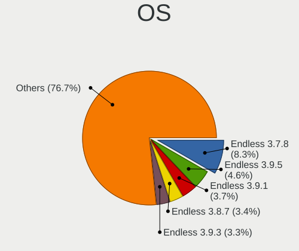

| Name                   | Computers | Percent |
|------------------------|-----------|---------|
| Endless 3.7.8          | 360       | 8.33%   |
| Endless 3.9.5          | 200       | 4.63%   |
| Endless 3.9.1          | 162       | 3.75%   |
| Endless 3.8.7          | 145       | 3.35%   |
| Endless 3.9.3          | 142       | 3.28%   |
| Endless 3.8.6          | 140       | 3.24%   |
| Endless 3.8.4          | 137       | 3.17%   |
| Endless 3.8.0          | 137       | 3.17%   |
| Endless 3.9.4          | 134       | 3.1%    |
| Endless 3.9.0          | 114       | 2.64%   |
| Endless 3.8.3          | 106       | 2.45%   |
| Endless 3.5.8          | 100       | 2.31%   |
| Endless 3.7.6          | 93        | 2.15%   |
| Endless 3.7.5          | 87        | 2.01%   |
| Endless 3.7.7          | 83        | 1.92%   |
| Endless 3.8.1          | 82        | 1.9%    |
| Endless 3.8.5          | 80        | 1.85%   |
| Endless 4.0.2          | 71        | 1.64%   |
| Endless 3.7.4          | 71        | 1.64%   |
| Endless 3.9.2          | 65        | 1.5%    |
| Endless 3.6.0          | 62        | 1.43%   |
| Endless 3.9.7          | 61        | 1.41%   |
| Endless 3.6.4          | 61        | 1.41%   |
| Endless 3.6.2          | 59        | 1.36%   |
| Endless 3.7.3          | 58        | 1.34%   |
| Endless 3.5.7          | 58        | 1.34%   |
| Endless 3.3.19         | 58        | 1.34%   |
| Endless 3.6.1          | 53        | 1.23%   |
| Endless 3.3.19-nexthw1 | 50        | 1.16%   |
| Endless 4.0.13         | 48        | 1.11%   |
| Endless 3.6.3          | 48        | 1.11%   |
| Endless 4.0.6          | 46        | 1.06%   |
| Endless 3.9.3-nexthw1  | 46        | 1.06%   |
| Endless 3.5.4          | 44        | 1.02%   |
| Endless 3.5.3          | 39        | 0.9%    |
| Endless 6.0.5          | 36        | 0.83%   |
| Endless 4.0.4          | 36        | 0.83%   |
| Endless 4.0.14         | 36        | 0.83%   |
| Endless 3.5.6          | 36        | 0.83%   |
| Endless 4.0.3          | 35        | 0.81%   |

OS Family
---------

OS without a version

| Name    | Computers | Percent |
|---------|-----------|---------|
| Endless | 3670      | 100%    |

Kernel
------

Version of the Linux kernel

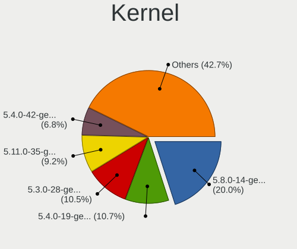

| Version           | Computers | Percent |
|-------------------|-----------|---------|
| 5.8.0-14-generic  | 823       | 20.04%  |
| 5.4.0-19-generic  | 438       | 10.66%  |
| 5.3.0-28-generic  | 433       | 10.54%  |
| 5.11.0-35-generic | 377       | 9.18%   |
| 5.4.0-42-generic  | 281       | 6.84%   |
| 5.3.0-23-generic  | 183       | 4.46%   |
| 4.18.0-15-generic | 180       | 4.38%   |
| 6.5.0-10-generic  | 133       | 3.24%   |
| 5.0.0-25-generic  | 107       | 2.61%   |
| 5.15.0-47-generic | 105       | 2.56%   |
| 4.15.0-15-generic | 90        | 2.19%   |
| 4.13.0-32-generic | 88        | 2.14%   |
| 4.18.0-12-generic | 83        | 2.02%   |
| 5.4.0-39-generic  | 80        | 1.95%   |
| 5.3.0-12-generic  | 75        | 1.83%   |
| 5.3.0-19-generic  | 71        | 1.73%   |
| 5.0.0-15-generic  | 62        | 1.51%   |
| 5.0.0-20-generic  | 59        | 1.44%   |
| 5.0.0-17-generic  | 53        | 1.29%   |
| 4.18.0-10-generic | 51        | 1.24%   |
| 4.18.0-11-generic | 48        | 1.17%   |
| 4.16.0-4-generic  | 48        | 1.17%   |
| 5.11.0-12-generic | 46        | 1.12%   |
| 4.15.0-34-generic | 31        | 0.75%   |
| 6.14.0-17-generic | 27        | 0.66%   |
| 4.15.0-12-generic | 24        | 0.58%   |
| 5.1.0-2-generic   | 21        | 0.51%   |
| 5.4.0-7-generic   | 14        | 0.34%   |
| 5.6.0-7-generic   | 11        | 0.27%   |
| 4.15.0-23-generic | 11        | 0.27%   |
| 5.10.0-10-generic | 10        | 0.24%   |
| 5.0.0-7-generic   | 9         | 0.22%   |
| 4.17.0-4-generic  | 9         | 0.22%   |
| 4.18.0-7-generic  | 8         | 0.19%   |
| 4.13.0-19-generic | 5         | 0.12%   |
| 4.15.0-22-generic | 4         | 0.1%    |
| 6.1.0-14-generic  | 2         | 0.05%   |
| 5.0.0-8-generic   | 2         | 0.05%   |
| 4.15.0-33-generic | 2         | 0.05%   |
| 5.13.0-20-generic | 1         | 0.02%   |

Kernel Family
-------------

Linux kernel without a distro release

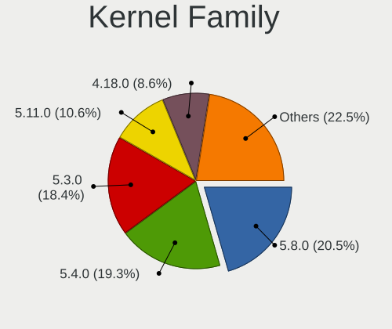

| Version | Computers | Percent |
|---------|-----------|---------|
| 5.8.0   | 823       | 20.55%  |
| 5.4.0   | 774       | 19.33%  |
| 5.3.0   | 736       | 18.38%  |
| 5.11.0  | 423       | 10.56%  |
| 4.18.0  | 346       | 8.64%   |
| 5.0.0   | 279       | 6.97%   |
| 4.15.0  | 162       | 4.04%   |
| 6.5.0   | 133       | 3.32%   |
| 5.15.0  | 105       | 2.62%   |
| 4.13.0  | 93        | 2.32%   |
| 4.16.0  | 48        | 1.2%    |
| 6.14.0  | 27        | 0.67%   |
| 5.1.0   | 21        | 0.52%   |
| 5.6.0   | 11        | 0.27%   |
| 5.10.0  | 10        | 0.25%   |
| 4.17.0  | 9         | 0.22%   |
| 6.1.0   | 2         | 0.05%   |
| 5.13.0  | 1         | 0.02%   |
| 4.14.0  | 1         | 0.02%   |
| Unknown | 1         | 0.02%   |

Kernel Major Ver.
-----------------

Linux kernel major version

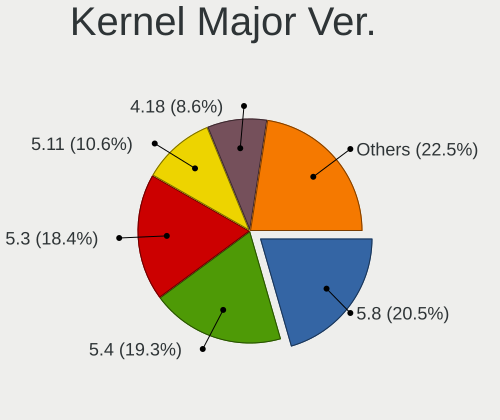

| Version | Computers | Percent |
|---------|-----------|---------|
| 5.8     | 823       | 20.55%  |
| 5.4     | 774       | 19.33%  |
| 5.3     | 736       | 18.38%  |
| 5.11    | 423       | 10.56%  |
| 4.18    | 346       | 8.64%   |
| 5.0     | 279       | 6.97%   |
| 4.15    | 162       | 4.04%   |
| 6.5     | 133       | 3.32%   |
| 5.15    | 105       | 2.62%   |
| 4.13    | 93        | 2.32%   |
| 4.16    | 48        | 1.2%    |
| 6.14    | 27        | 0.67%   |
| 5.1     | 21        | 0.52%   |
| 5.6     | 11        | 0.27%   |
| 5.10    | 10        | 0.25%   |
| 4.17    | 9         | 0.22%   |
| 6.1     | 2         | 0.05%   |
| 5.13    | 1         | 0.02%   |
| 4.14    | 1         | 0.02%   |
| Unknown | 1         | 0.02%   |

Arch
----

OS architecture (x86_64, i586, etc.)

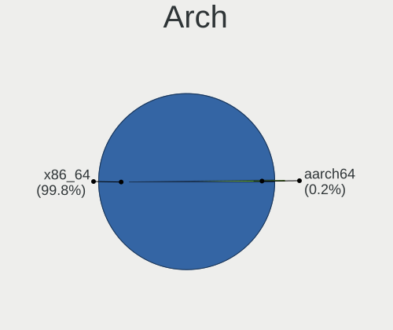

| Name    | Computers | Percent |
|---------|-----------|---------|
| x86_64  | 3662      | 99.78%  |
| aarch64 | 8         | 0.22%   |

DE
--

Desktop Environment

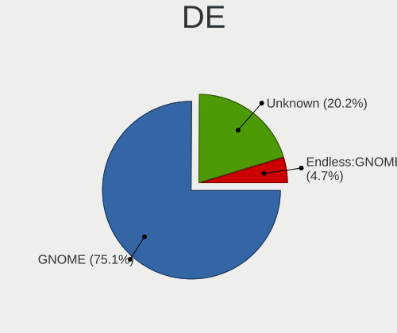

| Name          | Computers | Percent |
|---------------|-----------|---------|
| GNOME         | 2820      | 75.1%   |
| Unknown       | 758       | 20.19%  |
| Endless:GNOME | 177       | 4.71%   |

Display Server
--------------

X11 or Wayland

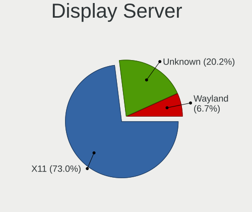

| Name    | Computers | Percent |
|---------|-----------|---------|
| X11     | 2754      | 73.03%  |
| Unknown | 763       | 20.23%  |
| Wayland | 254       | 6.74%   |

Display Manager
---------------

SDDM, LightDM, etc.

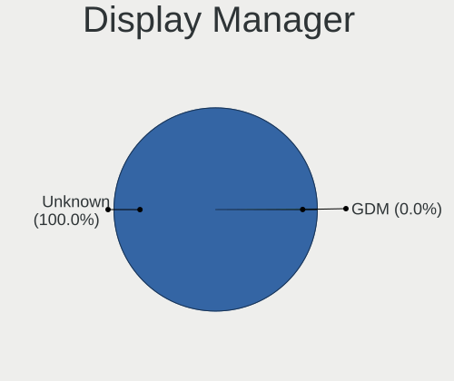

| Name    | Computers | Percent |
|---------|-----------|---------|
| Unknown | 3669      | 99.97%  |
| GDM     | 1         | 0.03%   |

OS Lang
-------

Language

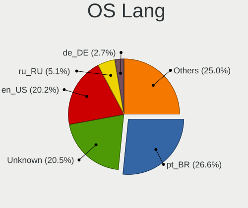

| Lang        | Computers | Percent |
|-------------|-----------|---------|
| pt_BR       | 995       | 26.58%  |
| Unknown     | 768       | 20.51%  |
| en_US       | 755       | 20.17%  |
| ru_RU       | 190       | 5.07%   |
| de_DE       | 100       | 2.67%   |
| ro_RO       | 98        | 2.62%   |
| es_ES       | 91        | 2.43%   |
| es_MX       | 76        | 2.03%   |
| hu_HU       | 65        | 1.74%   |
| fr_FR       | 56        | 1.5%    |
| en_GB       | 53        | 1.42%   |
| ru_RU.UTF_8 | 50        | 1.34%   |
| it_IT       | 47        | 1.26%   |
| es_CO       | 39        | 1.04%   |
| ru_UA       | 38        | 1.01%   |
| es_AR       | 26        | 0.69%   |
| pt_PT       | 25        | 0.67%   |
| pl_PL       | 25        | 0.67%   |
| uk_UA       | 22        | 0.59%   |
| tr_TR       | 21        | 0.56%   |
| bg_BG       | 14        | 0.37%   |
| sr_RS@latin | 11        | 0.29%   |
| nl_NL       | 11        | 0.29%   |
| en_PH       | 10        | 0.27%   |
| cs_CZ       | 10        | 0.27%   |
| id_ID       | 9         | 0.24%   |
| en_IN       | 9         | 0.24%   |
| sl_SI       | 8         | 0.21%   |
| hr_HR       | 8         | 0.21%   |
| el_GR       | 8         | 0.21%   |
| de_AT       | 8         | 0.21%   |
| sk_SK       | 6         | 0.16%   |
| nl_BE       | 6         | 0.16%   |
| zh_TW       | 5         | 0.13%   |
| ko_KR       | 5         | 0.13%   |
| en_AU       | 5         | 0.13%   |
| ca_ES       | 5         | 0.13%   |
| sv_SE       | 4         | 0.11%   |
| lt_LT       | 4         | 0.11%   |
| fr_CA       | 4         | 0.11%   |

Boot Mode
---------

EFI or BIOS

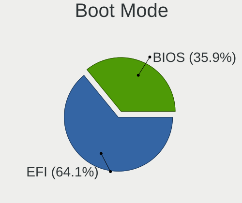

| Mode | Computers | Percent |
|------|-----------|---------|
| EFI  | 2411      | 64.11%  |
| BIOS | 1350      | 35.89%  |

Filesystem
----------

Type of filesystem

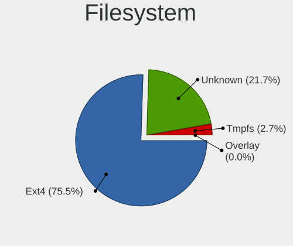

| Type    | Computers | Percent |
|---------|-----------|---------|
| Ext4    | 2816      | 75.5%   |
| Unknown | 810       | 21.72%  |
| Tmpfs   | 101       | 2.71%   |
| Btrfs   | 2         | 0.05%   |
| Overlay | 1         | 0.03%   |

Part. scheme
------------

Scheme of partitioning

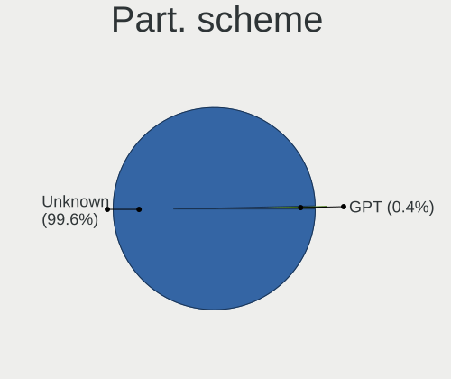

| Type    | Computers | Percent |
|---------|-----------|---------|
| Unknown | 3660      | 99.65%  |
| GPT     | 13        | 0.35%   |

Dual Boot with Linux/BSD
------------------------

Hosting more than one Linux/BSD

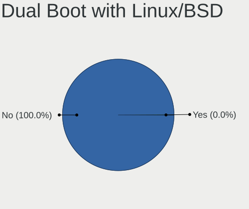

| Dual boot | Computers | Percent |
|-----------|-----------|---------|
| No        | 3669      | 99.97%  |
| Yes       | 1         | 0.03%   |

Dual Boot (Win)
---------------

Hosting Linux and Windows

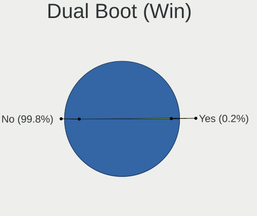

| Dual boot | Computers | Percent |
|-----------|-----------|---------|
| No        | 3664      | 99.84%  |
| Yes       | 6         | 0.16%   |

Board
-----

Vendor
------

Motherboard manufacturer

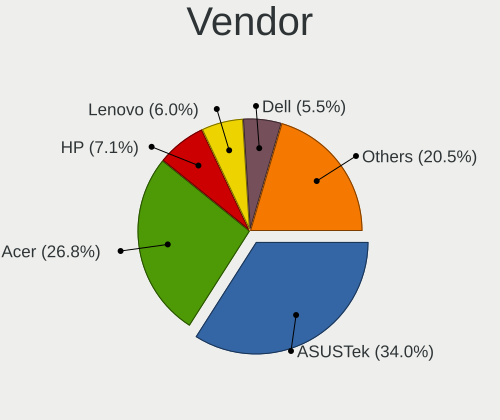

| Name                    | Computers | Percent |
|-------------------------|-----------|---------|
| ASUSTek Computer        | 1249      | 34.03%  |
| Acer                    | 983       | 26.78%  |
| Hewlett-Packard         | 262       | 7.14%   |
| Lenovo                  | 222       | 6.05%   |
| Dell                    | 203       | 5.53%   |
| Gigabyte Technology     | 103       | 2.81%   |
| Positivo                | 66        | 1.8%    |
| Toshiba                 | 57        | 1.55%   |
| MSI                     | 47        | 1.28%   |
| ASRock                  | 44        | 1.2%    |
| Intel                   | 39        | 1.06%   |
| Samsung Electronics     | 34        | 0.93%   |
| Sony                    | 23        | 0.63%   |
| Unknown                 | 23        | 0.63%   |
| Apple                   | 21        | 0.57%   |
| Foxconn                 | 18        | 0.49%   |
| Pegatron                | 14        | 0.38%   |
| ECS                     | 13        | 0.35%   |
| AMI                     | 12        | 0.33%   |
| Packard Bell            | 11        | 0.3%    |
| LG Electronics          | 11        | 0.3%    |
| Fujitsu                 | 11        | 0.3%    |
| Biostar                 | 10        | 0.27%   |
| Medion                  | 9         | 0.25%   |
| Semp Toshiba            | 8         | 0.22%   |
| Raspberry Pi Foundation | 8         | 0.22%   |
| Itautec                 | 8         | 0.22%   |
| Digibras                | 8         | 0.22%   |
| Fujitsu Siemens         | 7         | 0.19%   |
| eMachines               | 7         | 0.19%   |
| Google                  | 6         | 0.16%   |
| Microsoft               | 5         | 0.14%   |
| Megaware                | 5         | 0.14%   |
| Gateway                 | 5         | 0.14%   |
| ZOTAC                   | 4         | 0.11%   |
| Philco                  | 4         | 0.11%   |
| PCWare                  | 4         | 0.11%   |
| Notebook                | 4         | 0.11%   |
| Chuwi                   | 4         | 0.11%   |
| OEM                     | 3         | 0.08%   |

Model
-----

Motherboard model

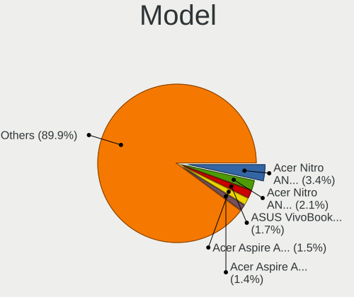

| Name                                       | Computers | Percent |
|--------------------------------------------|-----------|---------|
| Acer Nitro AN515-54                        | 126       | 3.43%   |
| Acer Nitro AN515-44                        | 77        | 2.1%    |
| ASUS VivoBook 15_ASUS Laptop X540UAR       | 63        | 1.72%   |
| Acer Aspire A315-53                        | 56        | 1.53%   |
| Acer Aspire A315-34                        | 50        | 1.36%   |
| Acer Nitro AN517-51                        | 49        | 1.34%   |
| ASUS VivoBook 15_ASUS Laptop X540MA_X543MA | 45        | 1.23%   |
| ASUS X541NA                                | 44        | 1.2%    |
| ASUS VivoBook 15_ASUS Laptop X540MA_X540MA | 41        | 1.12%   |
| Acer Nitro AN515-43                        | 40        | 1.09%   |
| ASUS VivoBook 15_ASUS Laptop X540BA        | 37        | 1.01%   |
| ASUS VivoBook_ASUSLaptop X515EA_X515EA     | 34        | 0.93%   |
| Unknown                                    | 33        | 0.9%    |
| ASUS VivoBook_ASUSLaptop X515JA_X515JA     | 30        | 0.82%   |
| ASUS X540NA                                | 28        | 0.76%   |
| Acer Nitro AN515-52                        | 28        | 0.76%   |
| ASUS ZenBook UX431DA_UM431DA               | 26        | 0.71%   |
| ASUS VivoBook_ASUSLaptop X515DA_X515DA     | 25        | 0.68%   |
| Acer Aspire A315-21                        | 22        | 0.6%    |
| ASUS VivoBook 15_ASUS Laptop X540UBR       | 20        | 0.54%   |
| Acer Aspire A315-51                        | 20        | 0.54%   |
| ASUS VivoBook_ASUSLaptop X509JA_X509JA     | 19        | 0.52%   |
| Acer Aspire A515-54G                       | 19        | 0.52%   |
| ASUS VivoBook 15_ASUS Laptop X540MA_R540MA | 17        | 0.46%   |
| Acer Aspire A515-51G                       | 17        | 0.46%   |
| Acer Aspire A315-31                        | 17        | 0.46%   |
| HP Notebook                                | 16        | 0.44%   |
| Acer Aspire A315-54                        | 16        | 0.44%   |
| ASUS X541UAK                               | 15        | 0.41%   |
| Acer Aspire A315-54K                       | 15        | 0.41%   |
| Positivo S14CT01                           | 14        | 0.38%   |
| ASUS VivoBook_ASUSLaptop X570ZD_X570ZD     | 14        | 0.38%   |
| ASUS VivoBook_ASUS Laptop X505ZA_X505ZA    | 14        | 0.38%   |
| Acer Aspire A517-51G                       | 13        | 0.35%   |
| Acer Aspire A515-51                        | 13        | 0.35%   |
| ASUS VivoBook_ASUSLaptop X509FA_X509FA     | 12        | 0.33%   |
| ASUS VivoBook 15_ASUS Laptop X507MA_X507MA | 12        | 0.33%   |
| ASUS All Series                            | 12        | 0.33%   |
| ASUS VivoBook_ASUSLaptop X513EAN_X513EAN   | 11        | 0.3%    |
| Acer Nitro AN515-51                        | 11        | 0.3%    |

Model Family
------------

Motherboard model prefix

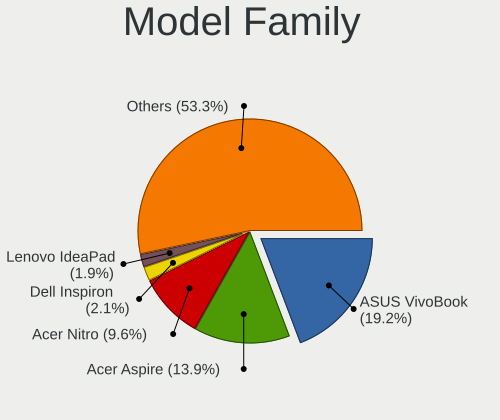

| Name                  | Computers | Percent |
|-----------------------|-----------|---------|
| ASUS VivoBook         | 706       | 19.24%  |
| Acer Aspire           | 511       | 13.92%  |
| Acer Nitro            | 351       | 9.56%   |
| Dell Inspiron         | 76        | 2.07%   |
| Lenovo IdeaPad        | 69        | 1.88%   |
| HP Pavilion           | 52        | 1.42%   |
| Lenovo ThinkPad       | 51        | 1.39%   |
| Toshiba Satellite     | 49        | 1.34%   |
| Dell Latitude         | 49        | 1.34%   |
| ASUS X541NA           | 44        | 1.2%    |
| Dell OptiPlex         | 42        | 1.14%   |
| ASUS ZenBook          | 41        | 1.12%   |
| Unknown               | 33        | 0.9%    |
| HP Compaq             | 30        | 0.82%   |
| Lenovo ThinkCentre    | 28        | 0.76%   |
| ASUS X540NA           | 28        | 0.76%   |
| Acer TravelMate       | 28        | 0.76%   |
| HP ProBook            | 23        | 0.63%   |
| ASUS Vivo             | 22        | 0.6%    |
| Acer Swift            | 22        | 0.6%    |
| HP Laptop             | 21        | 0.57%   |
| ASUS ASUS             | 19        | 0.52%   |
| Acer Extensa          | 19        | 0.52%   |
| Acer Predator         | 17        | 0.46%   |
| HP Notebook           | 16        | 0.44%   |
| HP EliteBook          | 16        | 0.44%   |
| Acer Veriton          | 16        | 0.44%   |
| Dell Vostro           | 15        | 0.41%   |
| ASUS X541UAK          | 15        | 0.41%   |
| Positivo S14CT01      | 14        | 0.38%   |
| ASUS PRIME            | 14        | 0.38%   |
| ASUS ASUSPRO          | 13        | 0.35%   |
| ASUS All              | 12        | 0.33%   |
| Positivo Mobile       | 10        | 0.27%   |
| Packard Bell EasyNote | 10        | 0.27%   |
| ASUS X540LA           | 10        | 0.27%   |
| HP 255                | 9         | 0.25%   |
| ASUS TUF              | 9         | 0.25%   |
| ASUS M5A78L-M         | 9         | 0.25%   |
| RPi Raspberry         | 8         | 0.22%   |

MFG Year
--------

Motherboard manufacture year

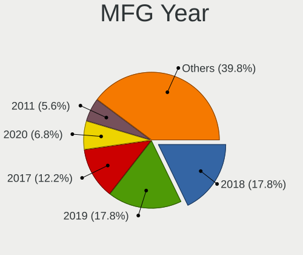

| Year    | Computers | Percent |
|---------|-----------|---------|
| 2018    | 653       | 17.79%  |
| 2019    | 652       | 17.77%  |
| 2017    | 449       | 12.23%  |
| 2020    | 250       | 6.81%   |
| 2011    | 205       | 5.59%   |
| 2016    | 187       | 5.1%    |
| 2012    | 176       | 4.8%    |
| 2013    | 158       | 4.31%   |
| 2010    | 148       | 4.03%   |
| 2021    | 146       | 3.98%   |
| 2014    | 140       | 3.81%   |
| 2009    | 133       | 3.62%   |
| 2008    | 130       | 3.54%   |
| 2015    | 124       | 3.38%   |
| 2007    | 77        | 2.1%    |
| 2006    | 20        | 0.54%   |
| 2022    | 11        | 0.3%    |
| 2023    | 3         | 0.08%   |
| 2005    | 3         | 0.08%   |
| 2024    | 2         | 0.05%   |
| 2004    | 2         | 0.05%   |
| Unknown | 1         | 0.03%   |

Form Factor
-----------

Physical design of the computer

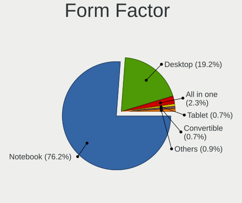

| Name           | Computers | Percent |
|----------------|-----------|---------|
| Notebook       | 2796      | 76.19%  |
| Desktop        | 703       | 19.16%  |
| All in one     | 86        | 2.34%   |
| Tablet         | 26        | 0.71%   |
| Convertible    | 26        | 0.71%   |
| Mini pc        | 23        | 0.63%   |
| System on chip | 8         | 0.22%   |
| Server         | 2         | 0.05%   |

Secure Boot
-----------

Enabled or disabled

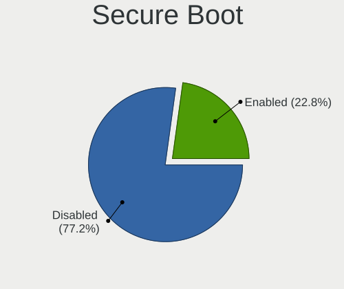

| State    | Computers | Percent |
|----------|-----------|---------|
| Disabled | 2861      | 77.18%  |
| Enabled  | 846       | 22.82%  |

Coreboot
--------

Have coreboot on board

| Used | Computers | Percent |
|------|-----------|---------|
| No   | 3664      | 99.84%  |
| Yes  | 6         | 0.16%   |

RAM Size
--------

Total RAM memory

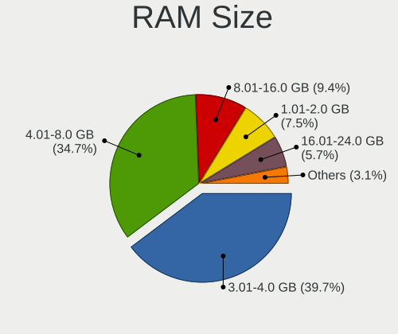

| Size in GB  | Computers | Percent |
|-------------|-----------|---------|
| 3.01-4.0    | 1473      | 39.72%  |
| 4.01-8.0    | 1286      | 34.68%  |
| 8.01-16.0   | 347       | 9.36%   |
| 1.01-2.0    | 277       | 7.47%   |
| 16.01-24.0  | 211       | 5.69%   |
| 2.01-3.0    | 50        | 1.35%   |
| 32.01-64.0  | 28        | 0.76%   |
| 24.01-32.0  | 17        | 0.46%   |
| 0.51-1.0    | 10        | 0.27%   |
| 64.01-256.0 | 7         | 0.19%   |
| Unknown     | 2         | 0.05%   |

RAM Used
--------

Used RAM memory

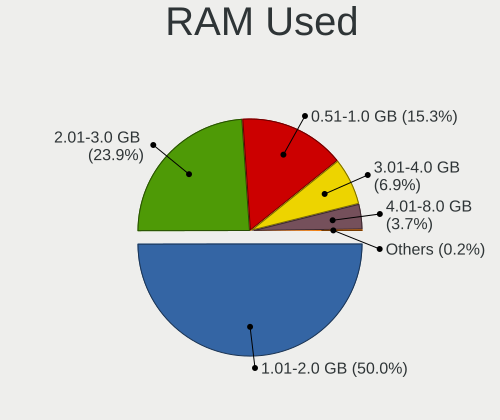

| Used GB   | Computers | Percent |
|-----------|-----------|---------|
| 1.01-2.0  | 2028      | 49.98%  |
| 2.01-3.0  | 971       | 23.93%  |
| 0.51-1.0  | 622       | 15.33%  |
| 3.01-4.0  | 279       | 6.88%   |
| 4.01-8.0  | 149       | 3.67%   |
| 0.01-0.5  | 4         | 0.1%    |
| 8.01-16.0 | 3         | 0.07%   |
| Unknown   | 2         | 0.05%   |

Total Drives
------------

Number of drives on board

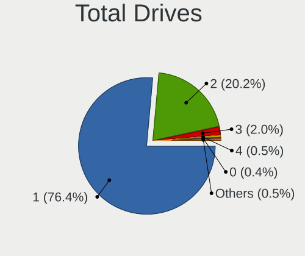

| Drives  | Computers | Percent |
|---------|-----------|---------|
| 1       | 2848      | 76.44%  |
| 2       | 752       | 20.18%  |
| 3       | 75        | 2.01%   |
| 4       | 18        | 0.48%   |
| 0       | 14        | 0.38%   |
| 5       | 8         | 0.21%   |
| 6       | 7         | 0.19%   |
| 7       | 2         | 0.05%   |
| 9       | 1         | 0.03%   |
| Unknown | 1         | 0.03%   |

Has CD-ROM
----------

Has CD-ROM on board

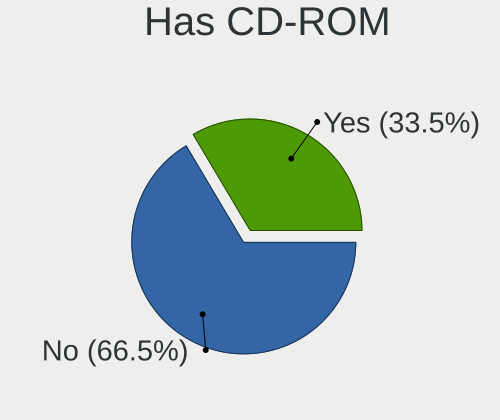

| Presented | Computers | Percent |
|-----------|-----------|---------|
| No        | 2452      | 66.47%  |
| Yes       | 1237      | 33.53%  |

Has Ethernet
------------

Has Ethernet on board

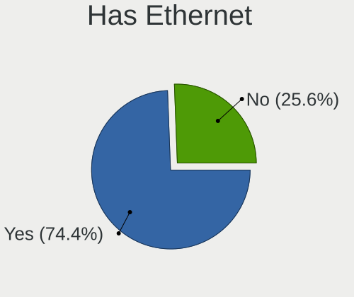

| Presented | Computers | Percent |
|-----------|-----------|---------|
| Yes       | 2738      | 74.4%   |
| No        | 942       | 25.6%   |

Has WiFi
--------

Has WiFi module

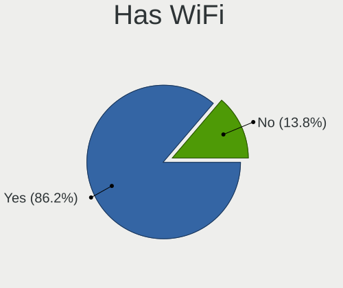

| Presented | Computers | Percent |
|-----------|-----------|---------|
| Yes       | 3177      | 86.24%  |
| No        | 507       | 13.76%  |

Has Bluetooth
-------------

Has Bluetooth module

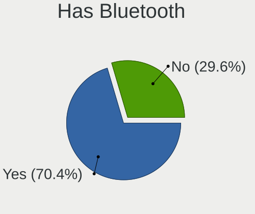

| Presented | Computers | Percent |
|-----------|-----------|---------|
| Yes       | 2600      | 70.44%  |
| No        | 1091      | 29.56%  |

Location
--------

Country
-------

Geographic location (country)

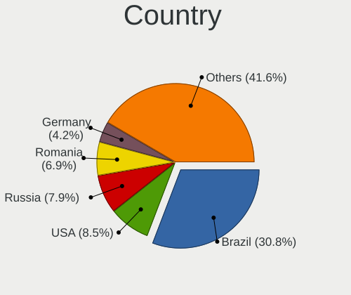

| Country      | Computers | Percent |
|--------------|-----------|---------|
| Brazil       | 1136      | 30.82%  |
| USA          | 315       | 8.55%   |
| Russia       | 292       | 7.92%   |
| Romania      | 254       | 6.89%   |
| Germany      | 156       | 4.23%   |
| Spain        | 130       | 3.53%   |
| Ukraine      | 117       | 3.17%   |
| Hungary      | 88        | 2.39%   |
| Colombia     | 79        | 2.14%   |
| UK           | 61        | 1.65%   |
| France       | 55        | 1.49%   |
| Italy        | 54        | 1.47%   |
| India        | 54        | 1.47%   |
| Mexico       | 48        | 1.3%    |
| Canada       | 46        | 1.25%   |
| Portugal     | 43        | 1.17%   |
| Argentina    | 43        | 1.17%   |
| Poland       | 38        | 1.03%   |
| Belarus      | 38        | 1.03%   |
| Serbia       | 35        | 0.95%   |
| Indonesia    | 35        | 0.95%   |
| Philippines  | 34        | 0.92%   |
| Bulgaria     | 29        | 0.79%   |
| Turkey       | 27        | 0.73%   |
| Croatia      | 24        | 0.65%   |
| Netherlands  | 19        | 0.52%   |
| Greece       | 19        | 0.52%   |
| Australia    | 19        | 0.52%   |
| Saudi Arabia | 18        | 0.49%   |
| Kazakhstan   | 18        | 0.49%   |
| Iran         | 17        | 0.46%   |
| New Zealand  | 16        | 0.43%   |
| Thailand     | 14        | 0.38%   |
| Georgia      | 14        | 0.38%   |
| Czechia      | 14        | 0.38%   |
| Slovenia     | 13        | 0.35%   |
| Sweden       | 12        | 0.33%   |
| Kenya        | 12        | 0.33%   |
| Austria      | 12        | 0.33%   |
| South Africa | 11        | 0.3%    |

City
----

Geographic location (city)

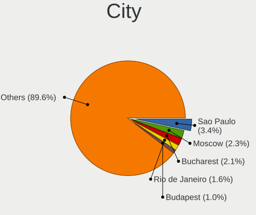

| City             | Computers | Percent |
|------------------|-----------|---------|
| Sao Paulo        | 133       | 3.37%   |
| Moscow           | 92        | 2.33%   |
| Bucharest        | 83        | 2.11%   |
| Rio de Janeiro   | 62        | 1.57%   |
| Budapest         | 39        | 0.99%   |
| Brasília        | 39        | 0.99%   |
| Kyiv             | 37        | 0.94%   |
| St Petersburg    | 33        | 0.84%   |
| Bogotá          | 33        | 0.84%   |
| Curitiba         | 28        | 0.71%   |
| Belo Horizonte   | 24        | 0.61%   |
| Belgrade         | 24        | 0.61%   |
| Cluj-Napoca      | 23        | 0.58%   |
| Salvador         | 22        | 0.56%   |
| Porto Alegre     | 22        | 0.56%   |
| Fortaleza        | 22        | 0.56%   |
| Minsk            | 16        | 0.41%   |
| Jakarta          | 16        | 0.41%   |
| Warsaw           | 15        | 0.38%   |
| Santo André     | 15        | 0.38%   |
| Quezon City      | 15        | 0.38%   |
| Berlin           | 15        | 0.38%   |
| Sofia            | 14        | 0.36%   |
| Niterói         | 14        | 0.36%   |
| Madrid           | 14        | 0.36%   |
| Campinas         | 14        | 0.36%   |
| Recife           | 13        | 0.33%   |
| Istanbul         | 13        | 0.33%   |
| Iasi             | 13        | 0.33%   |
| Tehran           | 12        | 0.3%    |
| Popesti-Leordeni | 12        | 0.3%    |
| Goiânia         | 12        | 0.3%    |
| Bucyrus          | 12        | 0.3%    |
| Paris            | 11        | 0.28%   |
| Osasco           | 11        | 0.28%   |
| Nairobi          | 11        | 0.28%   |
| Lisbon           | 11        | 0.28%   |
| Barcelona        | 11        | 0.28%   |
| Rome             | 10        | 0.25%   |
| Maringá         | 10        | 0.25%   |

Drives
------

Drive Vendor
------------

Hard drive vendors

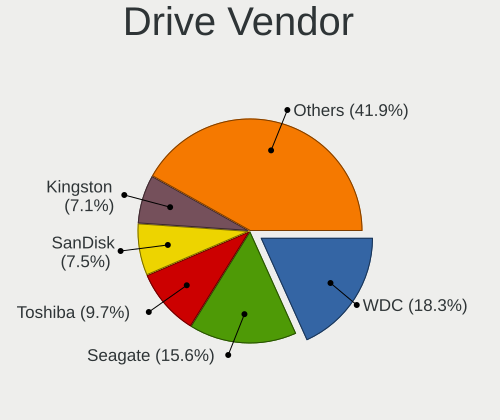

| Vendor                      | Computers | Drives | Percent |
|-----------------------------|-----------|--------|---------|
| WDC                         | 825       | 1002   | 18.26%  |
| Seagate                     | 705       | 928    | 15.6%   |
| Toshiba                     | 438       | 545    | 9.69%   |
| SanDisk                     | 340       | 417    | 7.53%   |
| Kingston                    | 319       | 443    | 7.06%   |
| Intel                       | 310       | 380    | 6.86%   |
| Unknown                     | 273       | 352    | 6.04%   |
| Samsung Electronics         | 268       | 336    | 5.93%   |
| SK hynix                    | 140       | 174    | 3.1%    |
| Hitachi                     | 109       | 119    | 2.41%   |
| A-DATA Technology           | 101       | 120    | 2.24%   |
| HGST                        | 100       | 124    | 2.21%   |
| ADATA Technology            | 100       | 108    | 2.21%   |
| Micron Technology           | 63        | 89     | 1.39%   |
| Crucial                     | 47        | 59     | 1.04%   |
| China                       | 33        | 37     | 0.73%   |
| Silicon Motion              | 17        | 17     | 0.38%   |
| Phison                      | 17        | 20     | 0.38%   |
| OCZ                         | 16        | 16     | 0.35%   |
| Fujitsu                     | 16        | 16     | 0.35%   |
| Maxtor                      | 15        | 17     | 0.33%   |
| SPCC                        | 14        | 15     | 0.31%   |
| PNY                         | 11        | 13     | 0.24%   |
| Patriot                     | 11        | 11     | 0.24%   |
| LITEON                      | 11        | 13     | 0.24%   |
| Apple                       | 11        | 11     | 0.24%   |
| Transcend                   | 10        | 14     | 0.22%   |
| Kingston Technology Company | 9         | 11     | 0.2%    |
| Intenso                     | 9         | 9      | 0.2%    |
| Realtek Semiconductor       | 8         | 9      | 0.18%   |
| Phison Electronics          | 8         | 8      | 0.18%   |
| GOODRAM                     | 7         | 7      | 0.15%   |
| Kingmax                     | 6         | 7      | 0.13%   |
| KingDian                    | 6         | 7      | 0.13%   |
| JMicron Technology          | 6         | 7      | 0.13%   |
| Netac                       | 5         | 6      | 0.11%   |
| LITEONIT                    | 5         | 6      | 0.11%   |
| KingSpec                    | 5         | 5      | 0.11%   |
| Hewlett-Packard             | 5         | 19     | 0.11%   |
| Corsair                     | 5         | 6      | 0.11%   |

Drive Model
-----------

Hard drive models

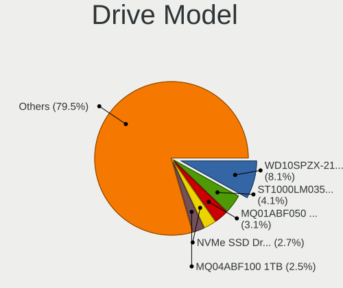

| Model                                 | Computers | Percent |
|---------------------------------------|-----------|---------|
| WDC WD10SPZX-21Z10T0 1TB              | 377       | 8.09%   |
| Seagate ST1000LM035-1RK172 1TB        | 191       | 4.1%    |
| Toshiba MQ01ABF050 500GB              | 144       | 3.09%   |
| Intel NVMe SSD Drive 512GB            | 126       | 2.71%   |
| Toshiba MQ04ABF100 1TB                | 118       | 2.53%   |
| Unknown MMC Card  32GB                | 100       | 2.15%   |
| Intel NVMe SSD Drive 256GB            | 77        | 1.65%   |
| SanDisk NVMe SSD Drive 512GB          | 75        | 1.61%   |
| Kingston RBUSC180DS37256GJ 256GB SSD  | 73        | 1.57%   |
| A-DATA IM2S3338-128GD2 128GB SSD      | 70        | 1.5%    |
| Intel SSDPEKKW256G7 256GB             | 69        | 1.48%   |
| Unknown MMC Card  64GB                | 61        | 1.31%   |
| ADATA SM2P32A8-256GC1 256GB           | 60        | 1.29%   |
| Seagate ST500LT012-1DG142 500GB       | 49        | 1.05%   |
| Toshiba MQ01ABD100 1TB                | 37        | 0.79%   |
| Kingston SA400S37240G 240GB SSD       | 35        | 0.75%   |
| SK hynix NVMe SSD Drive 256GB         | 34        | 0.73%   |
| Seagate ST500DM002-1BD142 500GB       | 34        | 0.73%   |
| WDC WD5000LPCX-21VHAT0 500GB          | 33        | 0.71%   |
| SanDisk NVMe SSD Drive 256GB          | 32        | 0.69%   |
| Kingston NVMe SSD Drive 256GB         | 32        | 0.69%   |
| Unknown SD/MMC/MS PRO 2GB             | 31        | 0.67%   |
| Sandisk WD Blue SN550 NVMe SSD 1024GB | 31        | 0.67%   |
| Seagate ST500LM030-1RK17D 500GB       | 30        | 0.64%   |
| Seagate ST500LM012 HN-M500MBB 500GB   | 28        | 0.6%    |
| Micron 1100_MTFDDAV256TBN 256GB SSD   | 28        | 0.6%    |
| Unknown MMC Card  16GB                | 27        | 0.58%   |
| SanDisk SD9SB8W256G1002 256GB SSD     | 27        | 0.58%   |
| Kingston SV300S37A120G 120GB SSD      | 26        | 0.56%   |
| Seagate ST1000DM010-2EP102 1TB        | 24        | 0.52%   |
| SK hynix HFS256G39TND-N210A 256GB SSD | 23        | 0.49%   |
| Seagate ST1000LM024 HN-M101MBB 1TB    | 23        | 0.49%   |
| Samsung NVMe SSD Drive 256GB          | 23        | 0.49%   |
| SK hynix HFS128G39TND-N210A 128GB SSD | 22        | 0.47%   |
| SK hynix NVMe SSD Drive 512GB         | 21        | 0.45%   |
| ADATA NVMe SSD Drive 128GB            | 21        | 0.45%   |
| Kingston SA400S37120G 120GB SSD       | 20        | 0.43%   |
| HGST HTS545050B7E660 500GB            | 20        | 0.43%   |
| Unknown MMC Card  128GB               | 19        | 0.41%   |
| Toshiba DT01ACA100 1TB                | 19        | 0.41%   |

HDD Vendor
----------

Hard disk drive vendors

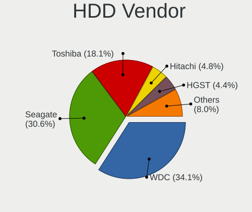

| Vendor              | Computers | Drives | Percent |
|---------------------|-----------|--------|---------|
| WDC                 | 782       | 932    | 34.09%  |
| Seagate             | 703       | 924    | 30.65%  |
| Toshiba             | 416       | 519    | 18.13%  |
| Hitachi             | 109       | 119    | 4.75%   |
| HGST                | 100       | 124    | 4.36%   |
| Samsung Electronics | 99        | 115    | 4.32%   |
| Unknown             | 34        | 44     | 1.48%   |
| Fujitsu             | 16        | 16     | 0.7%    |
| Maxtor              | 13        | 15     | 0.57%   |
| Apple               | 5         | 5      | 0.22%   |
| JMicron Technology  | 4         | 5      | 0.17%   |
| Intenso             | 3         | 3      | 0.13%   |
| TO Exter            | 2         | 4      | 0.09%   |
| ASMT                | 2         | 2      | 0.09%   |
| USB3.0              | 1         | 1      | 0.04%   |
| StoreJet            | 1         | 2      | 0.04%   |
| HGST HTS            | 1         | 1      | 0.04%   |
| Hewlett-Packard     | 1         | 2      | 0.04%   |
| External            | 1         | 1      | 0.04%   |
| ASMedia             | 1         | 2      | 0.04%   |

SSD Vendor
----------

Solid state drive vendors

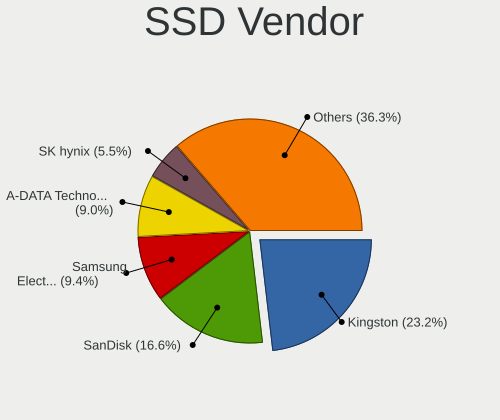

| Vendor              | Computers | Drives | Percent |
|---------------------|-----------|--------|---------|
| Kingston            | 260       | 373    | 23.15%  |
| SanDisk             | 186       | 254    | 16.56%  |
| Samsung Electronics | 106       | 133    | 9.44%   |
| A-DATA Technology   | 101       | 120    | 8.99%   |
| SK hynix            | 62        | 88     | 5.52%   |
| Micron Technology   | 50        | 76     | 4.45%   |
| WDC                 | 48        | 63     | 4.27%   |
| Crucial             | 47        | 59     | 4.19%   |
| China               | 33        | 37     | 2.94%   |
| OCZ                 | 16        | 16     | 1.42%   |
| Toshiba             | 15        | 15     | 1.34%   |
| SPCC                | 14        | 15     | 1.25%   |
| Intel               | 14        | 25     | 1.25%   |
| PNY                 | 11        | 13     | 0.98%   |
| Patriot             | 11        | 11     | 0.98%   |
| LITEON              | 11        | 13     | 0.98%   |
| Transcend           | 10        | 14     | 0.89%   |
| Unknown             | 7         | 8      | 0.62%   |
| GOODRAM             | 7         | 7      | 0.62%   |
| Kingmax             | 6         | 7      | 0.53%   |
| KingDian            | 6         | 7      | 0.53%   |
| Apple               | 6         | 6      | 0.53%   |
| Netac               | 5         | 6      | 0.45%   |
| LITEONIT            | 5         | 6      | 0.45%   |
| KingSpec            | 5         | 5      | 0.45%   |
| Corsair             | 5         | 6      | 0.45%   |
| Mushkin             | 4         | 5      | 0.36%   |
| Intenso             | 4         | 4      | 0.36%   |
| Hewlett-Packard     | 4         | 17     | 0.36%   |
| Win Memory          | 3         | 4      | 0.27%   |
| Team                | 3         | 3      | 0.27%   |
| Dogfish             | 3         | 3      | 0.27%   |
| AMD                 | 3         | 3      | 0.27%   |
| Verbatim            | 2         | 2      | 0.18%   |
| TSA                 | 2         | 2      | 0.18%   |
| Teclast             | 2         | 2      | 0.18%   |
| Seagate             | 2         | 2      | 0.18%   |
| Maxtor              | 2         | 2      | 0.18%   |
| Gigabyte Technology | 2         | 2      | 0.18%   |
| FORESEE             | 2         | 3      | 0.18%   |

Drive Kind
----------

HDD or SSD

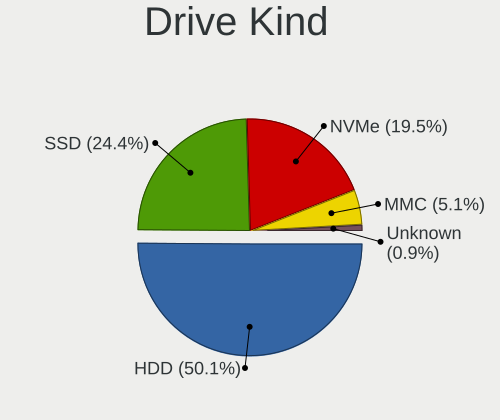

| Kind    | Computers | Drives | Percent |
|---------|-----------|--------|---------|
| HDD     | 2176      | 2836   | 50.12%  |
| SSD     | 1060      | 1486   | 24.41%  |
| NVMe    | 847       | 985    | 19.51%  |
| MMC     | 220       | 282    | 5.07%   |
| Unknown | 39        | 48     | 0.9%    |

Drive Connector
---------------

SATA, SAS, NVMe, etc.

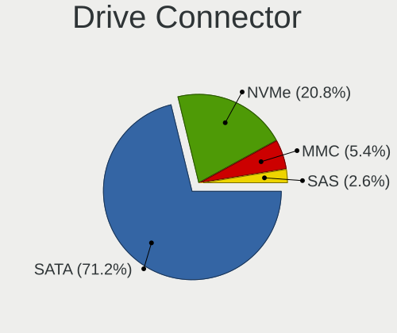

| Type | Computers | Drives | Percent |
|------|-----------|--------|---------|
| SATA | 2894      | 4245   | 71.21%  |
| NVMe | 846       | 982    | 20.82%  |
| MMC  | 220       | 282    | 5.41%   |
| SAS  | 104       | 128    | 2.56%   |

Drive Size
----------

Size of hard drive

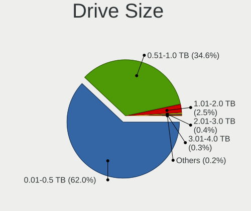

| Size in TB | Computers | Drives | Percent |
|------------|-----------|--------|---------|
| 0.01-0.5   | 1997      | 2780   | 62%     |
| 0.51-1.0   | 1115      | 1398   | 34.62%  |
| 1.01-2.0   | 79        | 108    | 2.45%   |
| 2.01-3.0   | 12        | 15     | 0.37%   |
| 3.01-4.0   | 11        | 11     | 0.34%   |
| 4.01-10.0  | 6         | 9      | 0.19%   |
| 10.01-20.0 | 1         | 1      | 0.03%   |

Space Total
-----------

Amount of disk space available on the file system

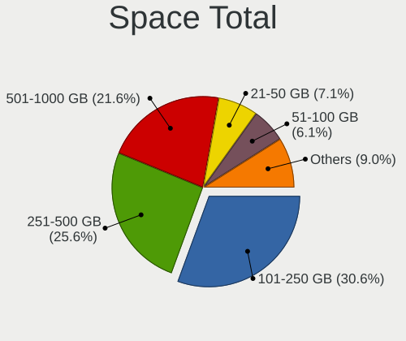

| Size in GB     | Computers | Percent |
|----------------|-----------|---------|
| 101-250        | 1151      | 30.59%  |
| 251-500        | 964       | 25.62%  |
| 501-1000       | 812       | 21.58%  |
| 21-50          | 268       | 7.12%   |
| 51-100         | 231       | 6.14%   |
| 1-20           | 151       | 4.01%   |
| 1001-2000      | 102       | 2.71%   |
| 2001-3000      | 42        | 1.12%   |
| Unknown        | 24        | 0.64%   |
| More than 3000 | 18        | 0.48%   |

Space Used
----------

Amount of used disk space

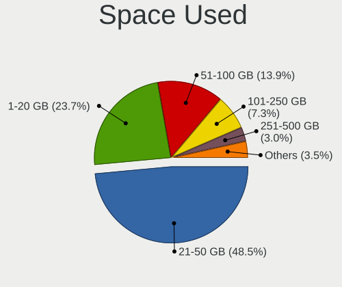

| Used GB        | Computers | Percent |
|----------------|-----------|---------|
| 21-50          | 1900      | 48.53%  |
| 1-20           | 928       | 23.7%   |
| 51-100         | 545       | 13.92%  |
| 101-250        | 287       | 7.33%   |
| 251-500        | 118       | 3.01%   |
| 501-1000       | 66        | 1.69%   |
| 1001-2000      | 32        | 0.82%   |
| Unknown        | 24        | 0.61%   |
| More than 3000 | 9         | 0.23%   |
| 2001-3000      | 6         | 0.15%   |

Malfunc. Drives
---------------

Drive models with a malfunction

| Model                                        | Computers | Drives | Percent |
|----------------------------------------------|-----------|--------|---------|
| Samsung Electronics MZVPW128HEGM-00000 128GB | 1         | 1      | 100%    |

Malfunc. Drive Vendor
---------------------

Vendors of faulty drives

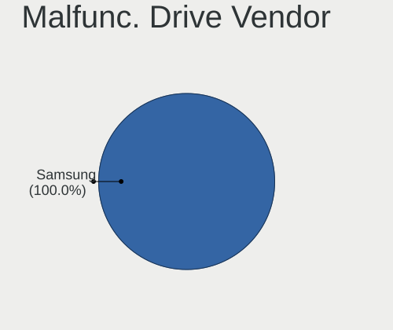

| Vendor              | Computers | Drives | Percent |
|---------------------|-----------|--------|---------|
| Samsung Electronics | 1         | 1      | 100%    |

Malfunc. HDD Vendor
-------------------

Vendors of faulty HDD drives

Zero info for selected period =(

Malfunc. Drive Kind
-------------------

Kinds of faulty drives

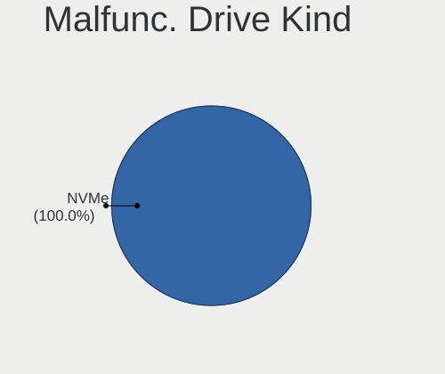

| Kind | Computers | Drives | Percent |
|------|-----------|--------|---------|
| NVMe | 1         | 1      | 100%    |

Failed Drives
-------------

Failed drive models

Zero info for selected period =(

Failed Drive Vendor
-------------------

Failed drive vendors

Zero info for selected period =(

Drive Status
------------

Number of failed and malfunc. drives

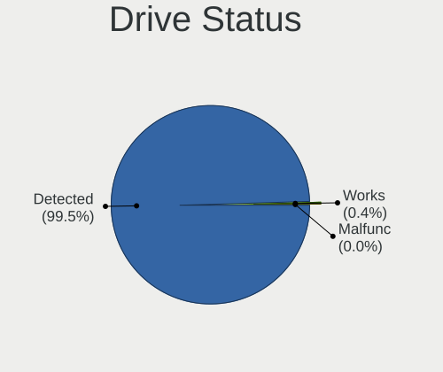

| Status   | Computers | Drives | Percent |
|----------|-----------|--------|---------|
| Detected | 3653      | 5617   | 99.54%  |
| Works    | 16        | 19     | 0.44%   |
| Malfunc  | 1         | 1      | 0.03%   |

Storage controller
------------------

Storage Vendor
--------------

Storage controller vendors

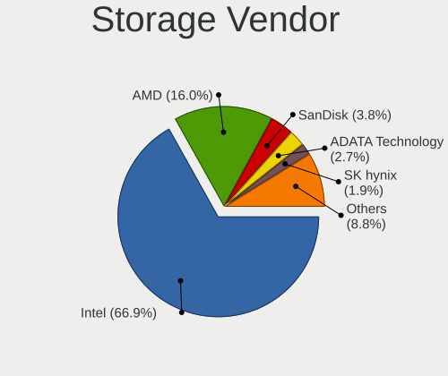

| Vendor                           | Computers | Percent |
|----------------------------------|-----------|---------|
| Intel                            | 2774      | 66.89%  |
| AMD                              | 664       | 16.01%  |
| SanDisk                          | 156       | 3.76%   |
| ADATA Technology                 | 110       | 2.65%   |
| SK hynix                         | 77        | 1.86%   |
| Samsung Electronics              | 76        | 1.83%   |
| Kingston Technology Company      | 66        | 1.59%   |
| Nvidia                           | 56        | 1.35%   |
| Phison Electronics               | 24        | 0.58%   |
| JMicron Technology               | 19        | 0.46%   |
| Marvell Technology Group         | 18        | 0.43%   |
| Silicon Motion                   | 17        | 0.41%   |
| VIA Technologies                 | 13        | 0.31%   |
| Micron Technology                | 13        | 0.31%   |
| ASMedia Technology               | 13        | 0.31%   |
| Toshiba America Info Systems     | 10        | 0.24%   |
| Silicon Integrated Systems [SiS] | 10        | 0.24%   |
| Realtek Semiconductor            | 9         | 0.22%   |
| Silicon Image                    | 4         | 0.1%    |
| KIOXIA                           | 4         | 0.1%    |
| Shenzhen Longsys Electronics     | 3         | 0.07%   |
| Union Memory (Shenzhen)          | 2         | 0.05%   |
| LSI Logic / Symbios Logic        | 2         | 0.05%   |
| Lite-On Technology               | 2         | 0.05%   |
| Synopsys                         | 1         | 0.02%   |
| Solid State Storage Technology   | 1         | 0.02%   |
| OCZ Technology Group             | 1         | 0.02%   |
| Micron/Crucial Technology        | 1         | 0.02%   |
| Adaptec                          | 1         | 0.02%   |

Storage Model
-------------

Storage controller models

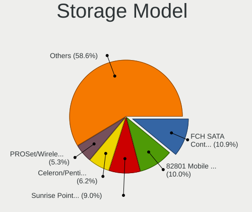

| Model                                                                            | Computers | Percent |
|----------------------------------------------------------------------------------|-----------|---------|
| AMD FCH SATA Controller [AHCI mode]                                              | 541       | 10.95%  |
| Intel 82801 Mobile SATA Controller [RAID mode]                                   | 492       | 9.96%   |
| Intel Sunrise Point-LP SATA Controller [AHCI mode]                               | 445       | 9%      |
| Intel Celeron/Pentium Silver Processor SATA Controller                           | 307       | 6.21%   |
| Intel PROSet/Wireless WiFi Software extension                                    | 260       | 5.26%   |
| Intel Celeron N3350/Pentium N4200/Atom E3900 Series SATA AHCI Controller         | 165       | 3.34%   |
| Intel 7 Series Chipset Family 6-port SATA Controller [AHCI mode]                 | 123       | 2.49%   |
| SanDisk Ultra 3D / WD PC SN530, IX SN530, Blue SN550 NVMe SSD (DRAM-less)        | 107       | 2.17%   |
| Intel NM10/ICH7 Family SATA Controller [IDE mode]                                | 100       | 2.02%   |
| Intel Volume Management Device NVMe RAID Controller                              | 94        | 1.9%    |
| Intel Tiger Lake-LP SATA Controller                                              | 93        | 1.88%   |
| Intel 82801IBM/IEM (ICH9M/ICH9M-E) 4 port SATA Controller [AHCI mode]            | 90        | 1.82%   |
| Intel 82801G (ICH7 Family) IDE Controller                                        | 81        | 1.64%   |
| Intel 6 Series/C200 Series Chipset Family 6 port Mobile SATA AHCI Controller     | 81        | 1.64%   |
| AMD SB7x0/SB8x0/SB9x0 SATA Controller [AHCI mode]                                | 68        | 1.38%   |
| Intel Atom/Celeron/Pentium Processor x5-E8000/J3xxx/N3xxx Series SATA Controller | 65        | 1.32%   |
| ADATA SM2P32A8 NVMe SSD (DRAM-less)                                              | 65        | 1.32%   |
| Intel 8 Series/C220 Series Chipset Family 6-port SATA Controller 1 [AHCI mode]   | 58        | 1.17%   |
| Intel 6 Series/C200 Series Chipset Family 6 port Desktop SATA AHCI Controller    | 54        | 1.09%   |
| SK hynix BC501 NVMe Solid State Drive                                            | 50        | 1.01%   |
| Intel 8 Series SATA Controller 1 [AHCI mode]                                     | 48        | 0.97%   |
| Intel HM170/QM170 Chipset SATA Controller [AHCI Mode]                            | 46        | 0.93%   |
| Intel 82801HM/HEM (ICH8M/ICH8M-E) IDE Controller                                 | 46        | 0.93%   |
| Intel Atom Processor E3800 Series SATA AHCI Controller                           | 45        | 0.91%   |
| AMD SB7x0/SB8x0/SB9x0 IDE Controller                                             | 45        | 0.91%   |
| Kingston Company A1000/U-SNS8154P3 x2 NVMe SSD [E8]                              | 43        | 0.87%   |
| Intel 5 Series/3400 Series Chipset 4 port SATA AHCI Controller                   | 41        | 0.83%   |
| Intel 82801HM/HEM (ICH8M/ICH8M-E) SATA Controller [AHCI mode]                    | 40        | 0.81%   |
| ADATA IM2P33F8 series NVMe SSD (DRAM-less)                                       | 40        | 0.81%   |
| Intel Wildcat Point-LP SATA Controller [AHCI Mode]                               | 39        | 0.79%   |
| Intel Cannon Lake PCH SATA AHCI Controller                                       | 39        | 0.79%   |
| SanDisk WD Blue SN500 / PC SN520 x2 M.2 2280 NVMe SSD                            | 36        | 0.73%   |
| Nvidia MCP61 SATA Controller                                                     | 30        | 0.61%   |
| Intel Cannon Lake Mobile PCH SATA AHCI Controller                                | 30        | 0.61%   |
| Samsung NVMe SSD Controller 980 (DRAM-less)                                      | 29        | 0.59%   |
| Nvidia MCP61 IDE                                                                 | 28        | 0.57%   |
| AMD SB7x0/SB8x0/SB9x0 SATA Controller [IDE mode]                                 | 28        | 0.57%   |
| Samsung NVMe SSD Controller SM981/PM981/PM983                                    | 27        | 0.55%   |
| Intel 7 Series/C210 Series Chipset Family 6-port SATA Controller [AHCI mode]     | 27        | 0.55%   |
| Intel SSD 660P Series                                                            | 26        | 0.53%   |

Storage Kind
------------

Kind of storage controller (IDE, SATA, NVMe, SAS, ...)

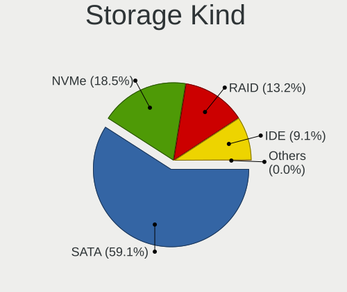

| Kind | Computers | Percent |
|------|-----------|---------|
| SATA | 2721      | 59.08%  |
| NVMe | 851       | 18.48%  |
| RAID | 610       | 13.24%  |
| IDE  | 420       | 9.12%   |
| SCSI | 3         | 0.07%   |
| SAS  | 1         | 0.02%   |

Processor
---------

CPU Vendor
----------

Processor vendors

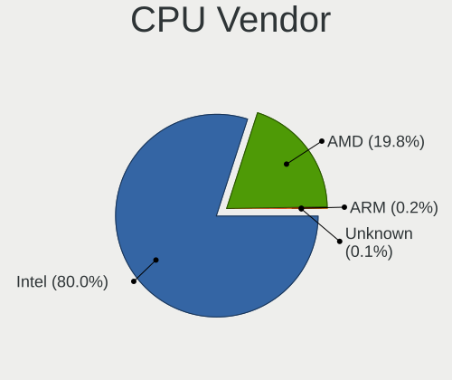

| Vendor  | Computers | Percent |
|---------|-----------|---------|
| Intel   | 2935      | 79.97%  |
| AMD     | 725       | 19.75%  |
| ARM     | 8         | 0.22%   |
| Unknown | 2         | 0.05%   |

CPU Model
---------

Processor models

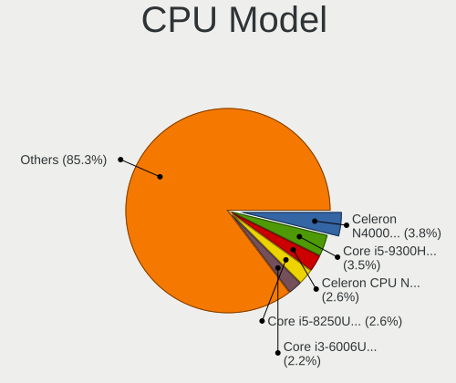

| Model                                         | Computers | Percent |
|-----------------------------------------------|-----------|---------|
| Intel Celeron N4000 CPU @ 1.10GHz             | 141       | 3.83%   |
| Intel Core i5-9300H CPU @ 2.40GHz             | 127       | 3.45%   |
| Intel Celeron CPU N3350 @ 1.10GHz             | 97        | 2.64%   |
| Intel Core i5-8250U CPU @ 1.60GHz             | 94        | 2.56%   |
| Intel Core i3-6006U CPU @ 2.00GHz             | 82        | 2.23%   |
| AMD Ryzen 5 3500U with Radeon Vega Mobile Gfx | 75        | 2.04%   |
| Intel Core i3-7020U CPU @ 2.30GHz             | 65        | 1.77%   |
| Intel Core i7-9750H CPU @ 2.60GHz             | 61        | 1.66%   |
| Intel Core i5-7200U CPU @ 2.50GHz             | 60        | 1.63%   |
| AMD Ryzen 7 4800H with Radeon Graphics        | 58        | 1.58%   |
| Intel Celeron N4020 CPU @ 1.10GHz             | 50        | 1.36%   |
| Intel Core i3-8130U CPU @ 2.20GHz             | 48        | 1.31%   |
| Intel Core i3-1005G1 CPU @ 1.20GHz            | 45        | 1.22%   |
| Intel Atom x5-Z8350 CPU @ 1.44GHz             | 45        | 1.22%   |
| Intel Core i5-1035G1 CPU @ 1.00GHz            | 44        | 1.2%    |
| Intel Pentium Silver N5000 CPU @ 1.10GHz      | 42        | 1.14%   |
| Intel Pentium CPU N4200 @ 1.10GHz             | 37        | 1.01%   |
| Intel 11th Gen Core i5-1135G7 @ 2.40GHz       | 36        | 0.98%   |
| Intel 11th Gen Core i3-1115G4 @ 3.00GHz       | 36        | 0.98%   |
| Intel Core i3-8145U CPU @ 2.10GHz             | 34        | 0.92%   |
| AMD Ryzen 7 3750H with Radeon Vega Mobile Gfx | 33        | 0.9%    |
| Intel Core i5-8265U CPU @ 1.60GHz             | 32        | 0.87%   |
| Intel Pentium CPU 4417U @ 2.30GHz             | 30        | 0.82%   |
| Intel Core i7-10510U CPU @ 1.80GHz            | 29        | 0.79%   |
| Intel Core i5-8300H CPU @ 2.30GHz             | 29        | 0.79%   |
| Intel Core i5-10210U CPU @ 1.60GHz            | 29        | 0.79%   |
| AMD Ryzen 5 2500U with Radeon Vega Mobile Gfx | 29        | 0.79%   |
| Intel Core i7-8550U CPU @ 1.80GHz             | 28        | 0.76%   |
| Intel Celeron CPU N3060 @ 1.60GHz             | 27        | 0.73%   |
| Intel Celeron N4000C CPU @ 1.10GHz            | 25        | 0.68%   |
| Intel Celeron CPU N3450 @ 1.10GHz             | 25        | 0.68%   |
| Intel 11th Gen Core i7-1165G7 @ 2.80GHz       | 24        | 0.65%   |
| Intel Core i7-7700HQ CPU @ 2.80GHz            | 23        | 0.63%   |
| Intel Core i3-7100U CPU @ 2.40GHz             | 23        | 0.63%   |
| AMD Ryzen 5 4600H with Radeon Graphics        | 23        | 0.63%   |
| Intel Core i7-8565U CPU @ 1.80GHz             | 21        | 0.57%   |
| AMD A6-9225 RADEON R4, 5 COMPUTE CORES 2C+3G  | 21        | 0.57%   |
| Intel Core i3-5005U CPU @ 2.00GHz             | 20        | 0.54%   |
| Intel Core i5-7300HQ CPU @ 2.50GHz            | 19        | 0.52%   |
| Intel Core i3-6100U CPU @ 2.30GHz             | 19        | 0.52%   |

CPU Model Family
----------------

Processor model prefix

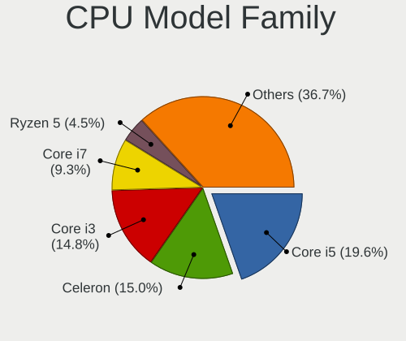

| Model                   | Computers | Percent |
|-------------------------|-----------|---------|
| Intel Core i5           | 722       | 19.65%  |
| Intel Celeron           | 553       | 15.05%  |
| Intel Core i3           | 545       | 14.83%  |
| Intel Core i7           | 340       | 9.25%   |
| AMD Ryzen 5             | 165       | 4.49%   |
| Intel Core 2 Duo        | 155       | 4.22%   |
| Other                   | 149       | 4.05%   |
| Intel Pentium           | 149       | 4.05%   |
| Intel Atom              | 126       | 3.43%   |
| AMD Ryzen 7             | 120       | 3.27%   |
| Intel Pentium Dual-Core | 60        | 1.63%   |
| Intel Pentium Silver    | 57        | 1.55%   |
| AMD A6                  | 57        | 1.55%   |
| AMD Ryzen 3             | 45        | 1.22%   |
| Intel Pentium Dual      | 33        | 0.9%    |
| AMD A4                  | 33        | 0.9%    |
| AMD A8                  | 30        | 0.82%   |
| AMD FX                  | 28        | 0.76%   |
| AMD E                   | 25        | 0.68%   |
| AMD E2                  | 23        | 0.63%   |
| Intel Core 2 Quad       | 21        | 0.57%   |
| Intel Xeon              | 18        | 0.49%   |
| AMD E1                  | 18        | 0.49%   |
| Intel Core 2            | 16        | 0.44%   |
| AMD Athlon 64 X2        | 15        | 0.41%   |
| AMD A10                 | 15        | 0.41%   |
| Intel Genuine           | 11        | 0.3%    |
| AMD Sempron             | 11        | 0.3%    |
| AMD Phenom II X4        | 11        | 0.3%    |
| AMD Athlon II X2        | 11        | 0.3%    |
| AMD Athlon              | 9         | 0.24%   |
| AMD Phenom II X6        | 7         | 0.19%   |
| AMD C-70                | 7         | 0.19%   |
| AMD A12                 | 6         | 0.16%   |
| Intel Pentium Gold      | 5         | 0.14%   |
| Intel Pentium 4         | 5         | 0.14%   |
| AMD Turion 64 X2 Mobile | 5         | 0.14%   |
| AMD Ryzen 9             | 4         | 0.11%   |
| AMD Phenom              | 4         | 0.11%   |
| AMD Mobile Sempron      | 4         | 0.11%   |

CPU Cores
---------

Number of processor cores

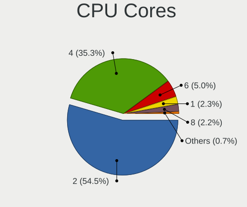

| Number  | Computers | Percent |
|---------|-----------|---------|
| 2       | 2003      | 54.55%  |
| 4       | 1298      | 35.35%  |
| 6       | 183       | 4.98%   |
| 1       | 84        | 2.29%   |
| 8       | 80        | 2.18%   |
| 3       | 13        | 0.35%   |
| 12      | 6         | 0.16%   |
| 10      | 2         | 0.05%   |
| Unknown | 2         | 0.05%   |
| 16      | 1         | 0.03%   |

CPU Sockets
-----------

Number of sockets

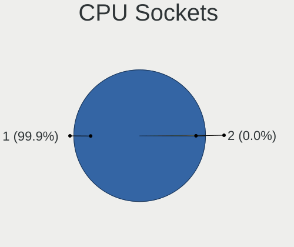

| Number  | Computers | Percent |
|---------|-----------|---------|
| 1       | 3667      | 99.92%  |
| Unknown | 2         | 0.05%   |
| 2       | 1         | 0.03%   |

CPU Threads
-----------

Threads per core (Hyper-Threading)

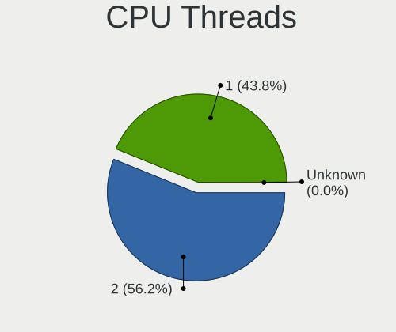

| Number  | Computers | Percent |
|---------|-----------|---------|
| 2       | 2062      | 56.15%  |
| 1       | 1609      | 43.82%  |
| Unknown | 1         | 0.03%   |

CPU Op-Modes
------------

CPU Operation Modes (32-bit, 64-bit)

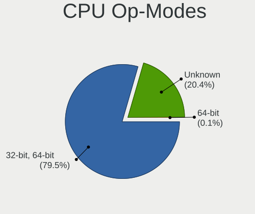

| Op mode        | Computers | Percent |
|----------------|-----------|---------|
| 32-bit, 64-bit | 2963      | 79.48%  |
| Unknown        | 762       | 20.44%  |
| 64-bit         | 3         | 0.08%   |

CPU Microcode
-------------

Microcode number

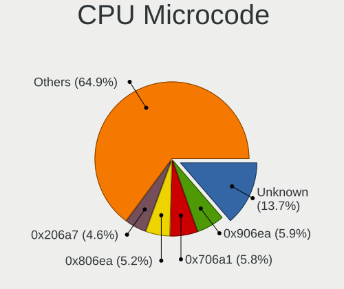

| Number     | Computers | Percent |
|------------|-----------|---------|
| Unknown    | 513       | 13.67%  |
| 0x906ea    | 223       | 5.94%   |
| 0x706a1    | 218       | 5.81%   |
| 0x806ea    | 194       | 5.17%   |
| 0x206a7    | 171       | 4.56%   |
| 0x806e9    | 153       | 4.08%   |
| 0x1067a    | 142       | 3.78%   |
| 0x506c9    | 139       | 3.7%    |
| 0x306a9    | 123       | 3.28%   |
| 0x806ec    | 114       | 3.04%   |
| 0x406e3    | 114       | 3.04%   |
| 0x08108109 | 103       | 2.74%   |
| 0x406c4    | 97        | 2.58%   |
| 0x806c1    | 93        | 2.48%   |
| 0x706e5    | 81        | 2.16%   |
| 0x08600103 | 78        | 2.08%   |
| 0x06006705 | 65        | 1.73%   |
| 0x306c3    | 63        | 1.68%   |
| 0x30678    | 61        | 1.62%   |
| 0x6fd      | 59        | 1.57%   |
| 0x706a8    | 56        | 1.49%   |
| 0x906e9    | 54        | 1.44%   |
| 0x08108102 | 52        | 1.39%   |
| 0x906ed    | 50        | 1.33%   |
| 0x40651    | 44        | 1.17%   |
| 0x20655    | 43        | 1.15%   |
| 0x306d4    | 37        | 0.99%   |
| 0x806eb    | 35        | 0.93%   |
| 0x406c3    | 35        | 0.93%   |
| 0x05000119 | 32        | 0.85%   |
| 0x0810100b | 31        | 0.83%   |
| 0x10676    | 27        | 0.72%   |
| 0x010000c8 | 27        | 0.72%   |
| 0x106ca    | 21        | 0.56%   |
| 0x08101007 | 21        | 0.56%   |
| 0x06006704 | 21        | 0.56%   |
| 0x06001119 | 21        | 0.56%   |
| 0x506e3    | 19        | 0.51%   |
| 0x6fb      | 18        | 0.48%   |
| 0x20652    | 16        | 0.43%   |

CPU Microarch
-------------

Microarchitecture

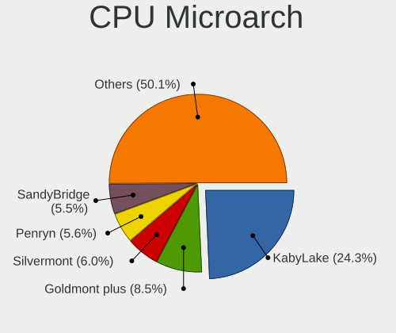

| Name             | Computers | Percent |
|------------------|-----------|---------|
| KabyLake         | 892       | 24.28%  |
| Goldmont plus    | 311       | 8.46%   |
| Silvermont       | 222       | 6.04%   |
| Penryn           | 205       | 5.58%   |
| SandyBridge      | 203       | 5.53%   |
| Zen+             | 173       | 4.71%   |
| Goldmont         | 165       | 4.49%   |
| Skylake          | 149       | 4.06%   |
| IvyBridge        | 142       | 3.86%   |
| Haswell          | 131       | 3.57%   |
| Core             | 119       | 3.24%   |
| Excavator        | 114       | 3.1%    |
| IceLake          | 99        | 2.69%   |
| TigerLake        | 98        | 2.67%   |
| Zen 2            | 96        | 2.61%   |
| Westmere         | 72        | 1.96%   |
| Zen              | 64        | 1.74%   |
| K10              | 63        | 1.71%   |
| Bobcat           | 47        | 1.28%   |
| Broadwell        | 45        | 1.22%   |
| Piledriver       | 39        | 1.06%   |
| K8 Hammer        | 36        | 0.98%   |
| Bonnell          | 31        | 0.84%   |
| Puma             | 27        | 0.73%   |
| CometLake        | 21        | 0.57%   |
| Steamroller      | 18        | 0.49%   |
| Jaguar           | 18        | 0.49%   |
| Nehalem          | 16        | 0.44%   |
| Unknown          | 16        | 0.44%   |
| K10 Llano        | 11        | 0.3%    |
| Bulldozer        | 9         | 0.24%   |
| NetBurst         | 8         | 0.22%   |
| Zen 3            | 6         | 0.16%   |
| Alderlake Hybrid | 4         | 0.11%   |
| K8 & K10 hybrid  | 3         | 0.08%   |
| Tremont          | 1         | 0.03%   |

Graphics
--------

GPU Vendor
----------

Vendors of graphics cards

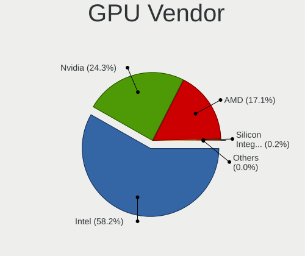

| Vendor                           | Computers | Percent |
|----------------------------------|-----------|---------|
| Intel                            | 2634      | 58.22%  |
| Nvidia                           | 1098      | 24.27%  |
| AMD                              | 775       | 17.13%  |
| Silicon Integrated Systems [SiS] | 10        | 0.22%   |
| VIA Technologies                 | 6         | 0.13%   |
| Silicon Motion                   | 1         | 0.02%   |

GPU Model
---------

Graphics card models

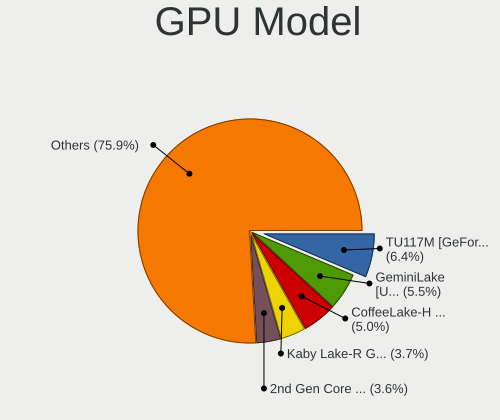

| Model                                                                                    | Computers | Percent |
|------------------------------------------------------------------------------------------|-----------|---------|
| Nvidia TU117M [GeForce GTX 1650 Mobile / Max-Q]                                          | 296       | 6.37%   |
| Intel GeminiLake [UHD Graphics 600]                                                      | 254       | 5.46%   |
| Intel CoffeeLake-H GT2 [UHD Graphics 630]                                                | 234       | 5.03%   |
| Intel Kaby Lake-R GT2 [UHD Graphics 620]                                                 | 171       | 3.68%   |
| Intel 2nd Generation Core Processor Family Integrated Graphics Controller                | 166       | 3.57%   |
| AMD Picasso/Raven 2 [Radeon Vega Series / Radeon Vega Mobile Series]                     | 164       | 3.53%   |
| Intel Atom/Celeron/Pentium Processor x5-E8000/J3xxx/N3xxx Integrated Graphics Controller | 141       | 3.03%   |
| Intel Apollo Lake GT1 [HD Graphics 500]                                                  | 127       | 2.73%   |
| Intel Kaby Lake-U GT2 [HD Graphics 620]                                                  | 125       | 2.69%   |
| Intel Skylake-U GT2 [HD Graphics 520]                                                    | 118       | 2.54%   |
| Intel 3rd Gen Core processor Graphics Controller                                         | 95        | 2.04%   |
| AMD Stoney [Radeon R2/R3/R4/R5 Graphics]                                                 | 94        | 2.02%   |
| Nvidia GP107M [GeForce GTX 1050 Mobile]                                                  | 90        | 1.94%   |
| Intel Iris Plus Graphics G1 (Ice Lake)                                                   | 89        | 1.91%   |
| Intel WhiskeyLake-U GT2 [UHD Graphics 620]                                               | 87        | 1.87%   |
| AMD Renoir [Radeon Vega Series / Radeon Vega Mobile Series]                              | 86        | 1.85%   |
| Intel Atom Processor Z36xxx/Z37xxx Series Graphics & Display                             | 80        | 1.72%   |
| Nvidia GM108M [GeForce MX110]                                                            | 77        | 1.66%   |
| Intel Mobile 4 Series Chipset Integrated Graphics Controller                             | 76        | 1.63%   |
| Intel CometLake-U GT2 [UHD Graphics]                                                     | 66        | 1.42%   |
| Intel TigerLake-LP GT2 [Iris Xe Graphics]                                                | 60        | 1.29%   |
| Intel GeminiLake [UHD Graphics 605]                                                      | 57        | 1.23%   |
| Intel Core Processor Integrated Graphics Controller                                      | 54        | 1.16%   |
| AMD Raven Ridge [Radeon Vega Series / Radeon Vega Mobile Series]                         | 54        | 1.16%   |
| Intel Haswell-ULT Integrated Graphics Controller                                         | 53        | 1.14%   |
| Nvidia GP108M [GeForce MX150]                                                            | 46        | 0.99%   |
| Intel 4 Series Chipset Integrated Graphics Controller                                    | 45        | 0.97%   |
| Intel HD Graphics 620                                                                    | 44        | 0.95%   |
| Nvidia GM108M [GeForce MX130]                                                            | 43        | 0.92%   |
| Intel Kaby Lake-H GT2 [HD Graphics 630]                                                  | 42        | 0.9%    |
| Intel Broadwell-U GT2 [HD Graphics 5500]                                                 | 39        | 0.84%   |
| Intel Tiger Lake-LP GT2 [UHD Graphics G4]                                                | 38        | 0.82%   |
| Intel Apollo Lake [HD Graphics 505]                                                      | 38        | 0.82%   |
| Intel Kaby Lake-U GT1 [HD Graphics 610]                                                  | 33        | 0.71%   |
| Intel CoffeeLake-S GT2 [UHD Graphics 630]                                                | 31        | 0.67%   |
| Intel Mobile GM965/GL960 Integrated Graphics Controller (secondary)                      | 30        | 0.65%   |
| Intel Mobile GM965/GL960 Integrated Graphics Controller (primary)                        | 30        | 0.65%   |
| Nvidia GP108M [GeForce MX250]                                                            | 25        | 0.54%   |
| Intel Xeon E3-1200 v3/4th Gen Core Processor Integrated Graphics Controller              | 25        | 0.54%   |
| Intel Xeon E3-1200 v2/3rd Gen Core processor Graphics Controller                         | 23        | 0.49%   |

GPU Combo
---------

Combinations of graphics cards

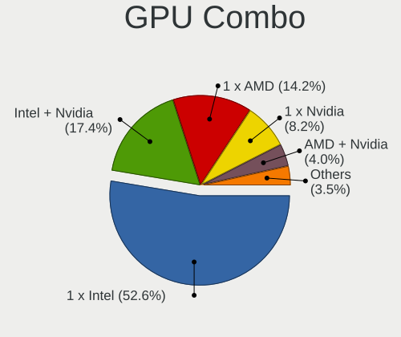

| Name                   | Computers | Percent |
|------------------------|-----------|---------|
| 1 x Intel              | 1939      | 52.63%  |
| Intel + Nvidia         | 642       | 17.43%  |
| 1 x AMD                | 524       | 14.22%  |
| 1 x Nvidia             | 303       | 8.22%   |
| AMD + Nvidia           | 148       | 4.02%   |
| 2 x AMD                | 60        | 1.63%   |
| Intel + AMD            | 41        | 1.11%   |
| 1 x SiS                | 10        | 0.27%   |
| Other                  | 9         | 0.24%   |
| 1 x VIA                | 5         | 0.14%   |
| 3 x AMD                | 1         | 0.03%   |
| 2 x Nvidia             | 1         | 0.03%   |
| Intel + Silicon Motion | 1         | 0.03%   |

GPU Driver
----------

Free vs proprietary

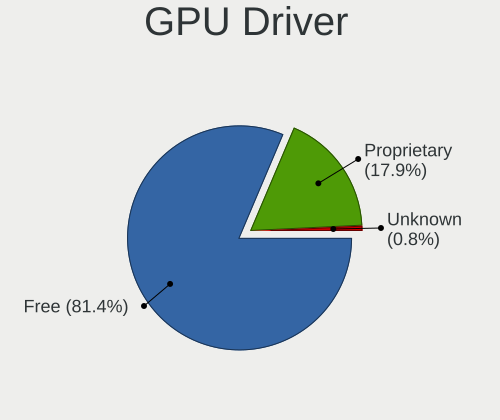

| Driver      | Computers | Percent |
|-------------|-----------|---------|
| Free        | 2998      | 81.38%  |
| Proprietary | 658       | 17.86%  |
| Unknown     | 28        | 0.76%   |

GPU Memory
----------

Total video memory

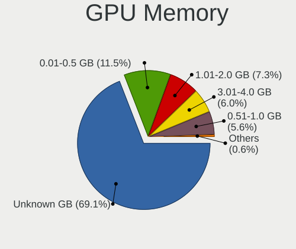

| Size in GB | Computers | Percent |
|------------|-----------|---------|
| Unknown    | 2576      | 69.1%   |
| 0.01-0.5   | 427       | 11.45%  |
| 1.01-2.0   | 271       | 7.27%   |
| 3.01-4.0   | 222       | 5.95%   |
| 0.51-1.0   | 210       | 5.63%   |
| 7.01-8.0   | 16        | 0.43%   |
| 2.01-3.0   | 3         | 0.08%   |
| 8.01-16.0  | 3         | 0.08%   |

Monitor
-------

Monitor Vendor
--------------

Monitor vendors

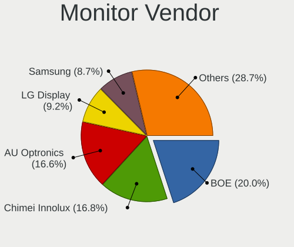

| Vendor                  | Computers | Percent |
|-------------------------|-----------|---------|
| BOE                     | 711       | 19.98%  |
| Chimei Innolux          | 599       | 16.84%  |
| AU Optronics            | 591       | 16.61%  |
| LG Display              | 327       | 9.19%   |
| Samsung Electronics     | 309       | 8.68%   |
| PANDA                   | 128       | 3.6%    |
| Goldstar                | 117       | 3.29%   |
| Dell                    | 88        | 2.47%   |
| Hewlett-Packard         | 69        | 1.94%   |
| Acer                    | 63        | 1.77%   |
| AOC                     | 57        | 1.6%    |
| Chi Mei Optoelectronics | 46        | 1.29%   |
| Lenovo                  | 36        | 1.01%   |
| Philips                 | 34        | 0.96%   |
| LG Philips              | 25        | 0.7%    |
| Sony                    | 24        | 0.67%   |
| Apple                   | 22        | 0.62%   |
| Ancor Communications    | 22        | 0.62%   |
| BenQ                    | 20        | 0.56%   |
| InfoVision              | 19        | 0.53%   |
| ASUSTek Computer        | 17        | 0.48%   |
| HannStar                | 12        | 0.34%   |
| RTK                     | 11        | 0.31%   |
| Toshiba                 | 10        | 0.28%   |
| Vizio                   | 9         | 0.25%   |
| ViewSonic               | 9         | 0.25%   |
| Vestel Elektronik       | 8         | 0.22%   |
| Sharp                   | 8         | 0.22%   |
| KDC                     | 8         | 0.22%   |
| Panasonic               | 7         | 0.2%    |
| NEC Computers           | 7         | 0.2%    |
| CPT                     | 7         | 0.2%    |
| Eizo                    | 6         | 0.17%   |
| InnoLux Display         | 5         | 0.14%   |
| HSI                     | 5         | 0.14%   |
| SAC                     | 4         | 0.11%   |
| MStar                   | 4         | 0.11%   |
| MiTAC                   | 4         | 0.11%   |
| Unknown                 | 3         | 0.08%   |
| SLD                     | 3         | 0.08%   |

Monitor Model
-------------

Monitor models

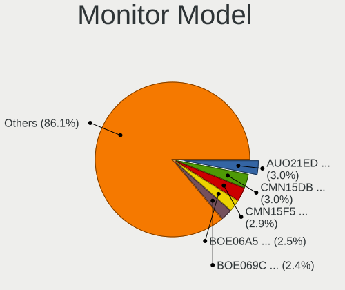

| Model                                                                | Computers | Percent |
|----------------------------------------------------------------------|-----------|---------|
| AU Optronics LCD Monitor AUO21ED 1920x1080 344x193mm 15.5-inch       | 108       | 3.02%   |
| Chimei Innolux LCD Monitor CMN15DB 1366x768 344x193mm 15.5-inch      | 107       | 2.99%   |
| Chimei Innolux LCD Monitor CMN15F5 1920x1080 344x193mm 15.5-inch     | 105       | 2.93%   |
| BOE LCD Monitor BOE06A5 1366x768 344x194mm 15.5-inch                 | 91        | 2.54%   |
| BOE LCD Monitor BOE069C 1920x1080 344x193mm 15.5-inch                | 87        | 2.43%   |
| AU Optronics LCD Monitor AUO38ED 1920x1080 344x193mm 15.5-inch       | 78        | 2.18%   |
| Chimei Innolux LCD Monitor CMN15E6 1366x768 344x193mm 15.5-inch      | 72        | 2.01%   |
| BOE LCD Monitor BOE0818 1920x1080 344x194mm 15.5-inch                | 59        | 1.65%   |
| Chimei Innolux LCD Monitor CMN15DC 1366x768 344x193mm 15.5-inch      | 53        | 1.48%   |
| PANDA LCD Monitor NCP004D 1920x1080 344x194mm 15.5-inch              | 50        | 1.4%    |
| BOE LCD Monitor BOE07CE 1366x768 344x193mm 15.5-inch                 | 49        | 1.37%   |
| BOE LCD Monitor BOE06A4 1366x768 344x194mm 15.5-inch                 | 46        | 1.28%   |
| BOE LCD Monitor BOE0672 1366x768 344x194mm 15.5-inch                 | 45        | 1.26%   |
| AU Optronics LCD Monitor AUO71EC 1366x768 344x193mm 15.5-inch        | 44        | 1.23%   |
| Chimei Innolux LCD Monitor CMN15D5 1920x1080 344x193mm 15.5-inch     | 43        | 1.2%    |
| AU Optronics LCD Monitor AUO70EC 1366x768 344x193mm 15.5-inch        | 43        | 1.2%    |
| LG Display LCD Monitor LGD065A 1920x1080 344x194mm 15.5-inch         | 42        | 1.17%   |
| BOE LCD Monitor BOE07AA 1366x768 344x194mm 15.5-inch                 | 41        | 1.14%   |
| AU Optronics LCD Monitor AUO81EC 1366x768 344x193mm 15.5-inch        | 33        | 0.92%   |
| BOE LCD Monitor BOE0839 1920x1080 382x215mm 17.3-inch                | 32        | 0.89%   |
| PANDA LCD Monitor NCP0035 1920x1080 344x194mm 15.5-inch              | 29        | 0.81%   |
| AU Optronics LCD Monitor AUOAF90 1920x1080 344x193mm 15.5-inch       | 29        | 0.81%   |
| BOE LCD Monitor BOE06BA 1920x1080 344x193mm 15.5-inch                | 26        | 0.73%   |
| PANDA LCD Monitor NCP0046 1920x1080 344x194mm 15.5-inch              | 23        | 0.64%   |
| LG Display LCD Monitor LGD04E8 1920x1080 382x215mm 17.3-inch         | 23        | 0.64%   |
| BOE LCD Monitor BOE0675 1366x768 344x194mm 15.5-inch                 | 22        | 0.61%   |
| Samsung Electronics LCD Monitor SEC5441 1280x800 331x207mm 15.4-inch | 19        | 0.53%   |
| Chimei Innolux LCD Monitor CMN14D4 1920x1080 309x173mm 13.9-inch     | 18        | 0.5%    |
| LG Display LCD Monitor LGD0621 1920x1080 382x215mm 17.3-inch         | 17        | 0.47%   |
| Chimei Innolux LCD Monitor CMN1132 1366x768 256x144mm 11.6-inch      | 17        | 0.47%   |
| LG Display LCD Monitor LGD056D 1920x1080 382x215mm 17.3-inch         | 14        | 0.39%   |
| Chimei Innolux LCD Monitor CMN15CA 1366x768 344x193mm 15.5-inch      | 14        | 0.39%   |
| Chimei Innolux LCD Monitor CMN1493 1366x768 309x173mm 13.9-inch      | 14        | 0.39%   |
| AU Optronics LCD Monitor AUO22EC 1366x768 344x193mm 15.5-inch        | 13        | 0.36%   |
| LG Display LCD Monitor LGD02DC 1366x768 344x194mm 15.5-inch          | 12        | 0.34%   |
| Chimei Innolux LCD Monitor CMN14D6 1366x768 309x173mm 13.9-inch      | 12        | 0.34%   |
| BOE LCD Monitor BOE0704 1366x768 344x194mm 15.5-inch                 | 12        | 0.34%   |
| PANDA LM156LF1L03 NCP001C 1920x1080 344x194mm 15.5-inch              | 11        | 0.31%   |
| ASUSTek Computer V241FF ASU282C 1920x1080 527x296mm 23.8-inch        | 11        | 0.31%   |
| BOE LCD Monitor BOE0696 1366x768 309x173mm 13.9-inch                 | 10        | 0.28%   |

Monitor Resolution
------------------

Monitor screen resolution

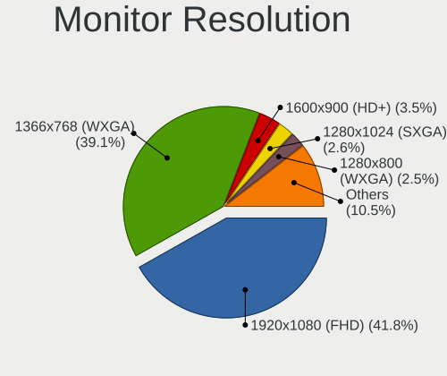

| Resolution         | Computers | Percent |
|--------------------|-----------|---------|
| 1920x1080 (FHD)    | 1465      | 41.83%  |
| 1366x768 (WXGA)    | 1368      | 39.06%  |
| 1600x900 (HD+)     | 124       | 3.54%   |
| 1280x1024 (SXGA)   | 92        | 2.63%   |
| 1280x800 (WXGA)    | 86        | 2.46%   |
| 3840x2160 (4K)     | 69        | 1.97%   |
| 1440x900 (WXGA+)   | 62        | 1.77%   |
| 1680x1050 (WSXGA+) | 44        | 1.26%   |
| 2560x1440 (QHD)    | 33        | 0.94%   |
| 1920x1200 (WUXGA)  | 32        | 0.91%   |
| 1360x768           | 30        | 0.86%   |
| 1024x768 (XGA)     | 21        | 0.6%    |
| 1920x540           | 12        | 0.34%   |
| 1024x600           | 11        | 0.31%   |
| 2560x1080          | 10        | 0.29%   |
| 1280x720 (HD)      | 9         | 0.26%   |
| 3200x1800 (QHD+)   | 5         | 0.14%   |
| 2288x1287          | 4         | 0.11%   |
| 2160x1440          | 4         | 0.11%   |
| 1400x1050          | 4         | 0.11%   |
| 1600x1200          | 3         | 0.09%   |
| 3840x1080          | 2         | 0.06%   |
| 3440x1440          | 2         | 0.06%   |
| 2880x1920          | 2         | 0.06%   |
| 2560x1600          | 2         | 0.06%   |
| 3456x2160          | 1         | 0.03%   |
| 2880x1800          | 1         | 0.03%   |
| 2256x1504          | 1         | 0.03%   |
| 1800x1200          | 1         | 0.03%   |
| 1680x945           | 1         | 0.03%   |
| 1280x960           | 1         | 0.03%   |

Monitor Diagonal
----------------

Diagonal size in inches

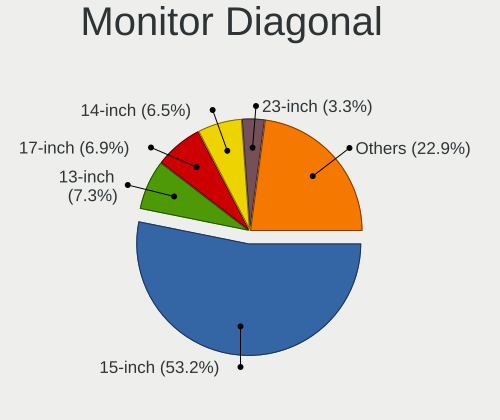

| Inches  | Computers | Percent |
|---------|-----------|---------|
| 15      | 1892      | 53.16%  |
| 13      | 259       | 7.28%   |
| 17      | 247       | 6.94%   |
| 14      | 230       | 6.46%   |
| 23      | 117       | 3.29%   |
| 21      | 93        | 2.61%   |
| 24      | 88        | 2.47%   |
| 19      | 77        | 2.16%   |
| 11      | 77        | 2.16%   |
| 18      | 69        | 1.94%   |
| 27      | 67        | 1.88%   |
| 20      | 50        | 1.4%    |
| 31      | 40        | 1.12%   |
| 22      | 27        | 0.76%   |
| 84      | 26        | 0.73%   |
| 12      | 26        | 0.73%   |
| 10      | 20        | 0.56%   |
| 34      | 17        | 0.48%   |
| 72      | 16        | 0.45%   |
| 54      | 14        | 0.39%   |
| 40      | 13        | 0.37%   |
| 32      | 11        | 0.31%   |
| Unknown | 11        | 0.31%   |
| 52      | 9         | 0.25%   |
| 46      | 9         | 0.25%   |
| 16      | 6         | 0.17%   |
| 47      | 5         | 0.14%   |
| 37      | 5         | 0.14%   |
| 26      | 4         | 0.11%   |
| 25      | 4         | 0.11%   |
| 65      | 3         | 0.08%   |
| 60      | 3         | 0.08%   |
| 63      | 2         | 0.06%   |
| 58      | 2         | 0.06%   |
| 49      | 2         | 0.06%   |
| 44      | 2         | 0.06%   |
| 42      | 2         | 0.06%   |
| 30      | 2         | 0.06%   |
| 86      | 1         | 0.03%   |
| 85      | 1         | 0.03%   |

Monitor Width
-------------

Physical width

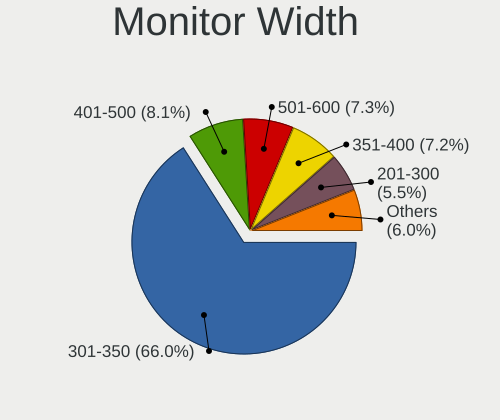

| Width in mm | Computers | Percent |
|-------------|-----------|---------|
| 301-350     | 2338      | 65.95%  |
| 401-500     | 286       | 8.07%   |
| 501-600     | 258       | 7.28%   |
| 351-400     | 255       | 7.19%   |
| 201-300     | 195       | 5.5%    |
| 1001-1500   | 53        | 1.5%    |
| 601-700     | 51        | 1.44%   |
| 1501-2000   | 44        | 1.24%   |
| 701-800     | 29        | 0.82%   |
| 801-900     | 20        | 0.56%   |
| Unknown     | 11        | 0.31%   |
| 901-1000    | 5         | 0.14%   |

Aspect Ratio
------------

Proportional relationship between the width and the height

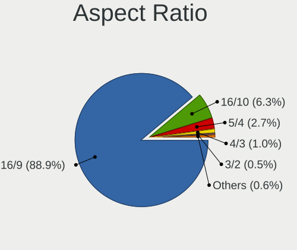

| Ratio | Computers | Percent |
|-------|-----------|---------|
| 16/9  | 3040      | 88.91%  |
| 16/10 | 216       | 6.32%   |
| 5/4   | 91        | 2.66%   |
| 4/3   | 34        | 0.99%   |
| 3/2   | 16        | 0.47%   |
| 21/9  | 16        | 0.47%   |
| 6/5   | 3         | 0.09%   |
| 32/9  | 2         | 0.06%   |
| 0.56  | 1         | 0.03%   |

Monitor Area
------------

Area in inch²

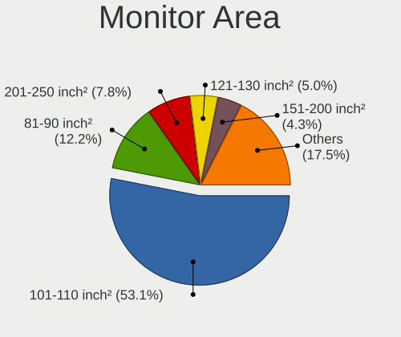

| Area in inch² | Computers | Percent |
|----------------|-----------|---------|
| 101-110        | 1883      | 53.07%  |
| 81-90          | 432       | 12.18%  |
| 201-250        | 278       | 7.84%   |
| 121-130        | 179       | 5.05%   |
| 151-200        | 154       | 4.34%   |
| 141-150        | 111       | 3.13%   |
| More than 1000 | 81        | 2.28%   |
| 51-60          | 77        | 2.17%   |
| 301-350        | 69        | 1.94%   |
| 351-500        | 68        | 1.92%   |
| 71-80          | 59        | 1.66%   |
| 501-1000       | 43        | 1.21%   |
| 251-300        | 32        | 0.9%    |
| 61-70          | 23        | 0.65%   |
| 41-50          | 20        | 0.56%   |
| 131-140        | 15        | 0.42%   |
| Unknown        | 11        | 0.31%   |
| 91-100         | 7         | 0.2%    |
| 111-120        | 6         | 0.17%   |

Pixel Density
-------------

Pixels per inch

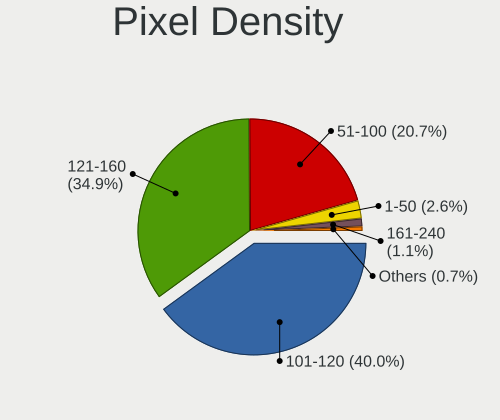

| Density       | Computers | Percent |
|---------------|-----------|---------|
| 101-120       | 1407      | 39.97%  |
| 121-160       | 1230      | 34.94%  |
| 51-100        | 728       | 20.68%  |
| 1-50          | 92        | 2.61%   |
| 161-240       | 40        | 1.14%   |
| More than 240 | 12        | 0.34%   |
| Unknown       | 11        | 0.31%   |

Multiple Monitors
-----------------

Total monitors connected

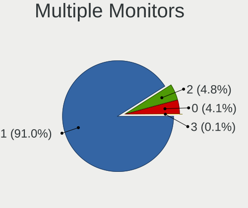

| Total | Computers | Percent |
|-------|-----------|---------|
| 1     | 3363      | 90.99%  |
| 2     | 177       | 4.79%   |
| 0     | 151       | 4.09%   |
| 3     | 5         | 0.14%   |

Network
-------

Net Controller Vendor
---------------------

Controller vendors

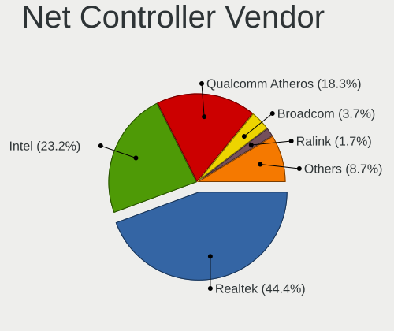

| Vendor                            | Computers | Percent |
|-----------------------------------|-----------|---------|
| Realtek Semiconductor             | 2494      | 44.36%  |
| Intel                             | 1305      | 23.21%  |
| Qualcomm Atheros                  | 1031      | 18.34%  |
| Broadcom                          | 208       | 3.7%    |
| Ralink Technology                 | 95        | 1.69%   |
| Marvell Technology Group          | 58        | 1.03%   |
| Broadcom Limited                  | 56        | 1%      |
| Ralink                            | 49        | 0.87%   |
| Nvidia                            | 48        | 0.85%   |
| TP-Link                           | 26        | 0.46%   |
| JMicron Technology                | 20        | 0.36%   |
| MediaTek                          | 19        | 0.34%   |
| Samsung Electronics               | 18        | 0.32%   |
| Qualcomm Atheros Communications   | 17        | 0.3%    |
| Xiaomi                            | 12        | 0.21%   |
| Huawei Technologies               | 12        | 0.21%   |
| D-Link                            | 12        | 0.21%   |
| ASIX Electronics                  | 11        | 0.2%    |
| Silicon Integrated Systems [SiS]  | 9         | 0.16%   |
| VIA Technologies                  | 8         | 0.14%   |
| ASUSTek Computer                  | 8         | 0.14%   |
| NetGear                           | 7         | 0.12%   |
| Microsoft                         | 7         | 0.12%   |
| Ericsson Business Mobile Networks | 7         | 0.12%   |
| Dell                              | 7         | 0.12%   |
| Edimax Technology                 | 6         | 0.11%   |
| ICS Advent                        | 5         | 0.09%   |
| Qualcomm                          | 4         | 0.07%   |
| OPPO Electronics                  | 4         | 0.07%   |
| Motorola PCS                      | 4         | 0.07%   |
| Hewlett-Packard                   | 4         | 0.07%   |
| Belkin Components                 | 4         | 0.07%   |
| ZTE WCDMA Technologies MSM        | 2         | 0.04%   |
| Texas Instruments                 | 2         | 0.04%   |
| T & A Mobile Phones               | 2         | 0.04%   |
| Linksys                           | 2         | 0.04%   |
| LG Electronics                    | 2         | 0.04%   |
| IMC Networks                      | 2         | 0.04%   |
| Hangzhou Silan Microelectronics   | 2         | 0.04%   |
| Giga-Byte Technology              | 2         | 0.04%   |

Net Controller Model
--------------------

Controller models

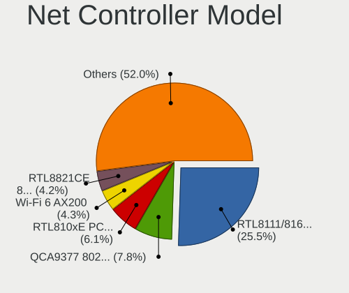

| Model                                                                   | Computers | Percent |
|-------------------------------------------------------------------------|-----------|---------|
| Realtek RTL8111/8168/8211/8411 PCI Express Gigabit Ethernet Controller  | 1567      | 25.51%  |
| Qualcomm Atheros QCA9377 802.11ac Wireless Network Adapter              | 481       | 7.83%   |
| Realtek RTL810xE PCI Express Fast Ethernet controller                   | 375       | 6.1%    |
| Intel Wi-Fi 6 AX200                                                     | 267       | 4.35%   |
| Realtek RTL8821CE 802.11ac PCIe Wireless Network Adapter                | 256       | 4.17%   |
| Qualcomm Atheros QCA9565 / AR9565 Wireless Network Adapter              | 170       | 2.77%   |
| Intel Wireless 8265 / 8275                                              | 167       | 2.72%   |
| Realtek RTL8723BE PCIe Wireless Network Adapter                         | 123       | 2%      |
| Realtek RTL8822BE 802.11a/b/g/n/ac WiFi adapter                         | 92        | 1.5%    |
| Intel Wi-Fi 6 AX201                                                     | 89        | 1.45%   |
| Realtek Killer E2600 GbE Controller                                     | 85        | 1.38%   |
| Intel Wireless 7265                                                     | 83        | 1.35%   |
| Intel Dual Band Wireless-AC 3168NGW [Stone Peak]                        | 79        | 1.29%   |
| Qualcomm Atheros AR9285 Wireless Network Adapter (PCI-Express)          | 69        | 1.12%   |
| Qualcomm Atheros QCA6174 802.11ac Wireless Network Adapter              | 65        | 1.06%   |
| Qualcomm Atheros AR9485 Wireless Network Adapter                        | 63        | 1.03%   |
| Intel Cannon Lake PCH CNVi WiFi                                         | 63        | 1.03%   |
| Intel 82579LM Gigabit Network Connection (Lewisville)                   | 61        | 0.99%   |
| Intel Ice Lake-LP PCH CNVi WiFi                                         | 55        | 0.9%    |
| Ralink MT7601U Wireless Adapter                                         | 50        | 0.81%   |
| Broadcom BCM43142 802.11b/g/n                                           | 49        | 0.8%    |
| Intel Cannon Point-LP CNVi [Wireless-AC]                                | 47        | 0.77%   |
| Realtek RTL8188CE 802.11b/g/n WiFi Adapter                              | 43        | 0.7%    |
| Broadcom BCM4313 802.11bgn Wireless Network Adapter                     | 40        | 0.65%   |
| Realtek RTL8188EUS 802.11n Wireless Network Adapter                     | 33        | 0.54%   |
| Intel Wireless 7260                                                     | 32        | 0.52%   |
| Qualcomm Atheros AR8151 v2.0 Gigabit Ethernet                           | 31        | 0.5%    |
| Intel Centrino Advanced-N 6205 [Taylor Peak]                            | 28        | 0.46%   |
| Nvidia MCP61 Ethernet                                                   | 26        | 0.42%   |
| Intel Wireless 3165                                                     | 26        | 0.42%   |
| Realtek RTL8822CE 802.11ac PCIe Wireless Network Adapter                | 23        | 0.37%   |
| Intel Wireless 8260                                                     | 22        | 0.36%   |
| Intel Ethernet Connection I217-LM                                       | 22        | 0.36%   |
| Intel Comet Lake PCH-LP CNVi WiFi                                       | 22        | 0.36%   |
| Realtek RTL8188EE Wireless Network Adapter                              | 21        | 0.34%   |
| Intel Gemini Lake PCH CNVi WiFi                                         | 21        | 0.34%   |
| Broadcom BCM4312 802.11b/g LP-PHY                                       | 20        | 0.33%   |
| Qualcomm Atheros AR242x / AR542x Wireless Network Adapter (PCI-Express) | 19        | 0.31%   |
| Qualcomm Atheros AR928X Wireless Network Adapter (PCI-Express)          | 18        | 0.29%   |
| Qualcomm Atheros AR8161 Gigabit Ethernet                                | 17        | 0.28%   |

Wireless Vendor
---------------

Wireless vendors

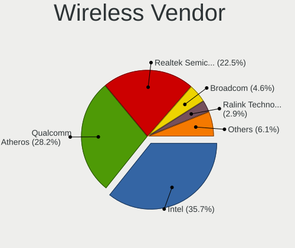

| Vendor                                | Computers | Percent |
|---------------------------------------|-----------|---------|
| Intel                                 | 1173      | 35.73%  |
| Qualcomm Atheros                      | 927       | 28.24%  |
| Realtek Semiconductor                 | 738       | 22.48%  |
| Broadcom                              | 150       | 4.57%   |
| Ralink Technology                     | 95        | 2.89%   |
| Ralink                                | 49        | 1.49%   |
| Broadcom Limited                      | 29        | 0.88%   |
| TP-Link                               | 21        | 0.64%   |
| Qualcomm Atheros Communications       | 17        | 0.52%   |
| MediaTek                              | 15        | 0.46%   |
| D-Link                                | 11        | 0.34%   |
| Microsoft                             | 7         | 0.21%   |
| ASUSTek Computer                      | 7         | 0.21%   |
| NetGear                               | 6         | 0.18%   |
| Edimax Technology                     | 6         | 0.18%   |
| Dell                                  | 5         | 0.15%   |
| Marvell Technology Group              | 4         | 0.12%   |
| Belkin Components                     | 4         | 0.12%   |
| Linksys                               | 2         | 0.06%   |
| IMC Networks                          | 2         | 0.06%   |
| Hewlett-Packard                       | 2         | 0.06%   |
| 802.11g Adapter [Linksys WUSB54GC v3] | 2         | 0.06%   |
| U.S. Robotics                         | 1         | 0.03%   |
| Texas Instruments                     | 1         | 0.03%   |
| Sitecom Europe                        | 1         | 0.03%   |
| Sierra Wireless                       | 1         | 0.03%   |
| Micro Star International              | 1         | 0.03%   |
| Elecom                                | 1         | 0.03%   |
| D-Link System                         | 1         | 0.03%   |
| AVM                                   | 1         | 0.03%   |
| AirTies Wireless Networks             | 1         | 0.03%   |
| Accton Technology                     | 1         | 0.03%   |
| AboCom Systems                        | 1         | 0.03%   |

Wireless Model
--------------

Wireless models

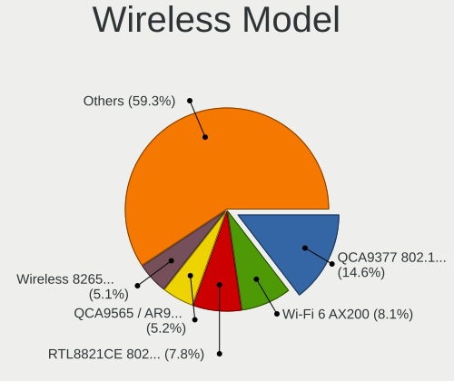

| Model                                                                   | Computers | Percent |
|-------------------------------------------------------------------------|-----------|---------|
| Qualcomm Atheros QCA9377 802.11ac Wireless Network Adapter              | 481       | 14.6%   |
| Intel Wi-Fi 6 AX200                                                     | 267       | 8.1%    |
| Realtek RTL8821CE 802.11ac PCIe Wireless Network Adapter                | 256       | 7.77%   |
| Qualcomm Atheros QCA9565 / AR9565 Wireless Network Adapter              | 170       | 5.16%   |
| Intel Wireless 8265 / 8275                                              | 167       | 5.07%   |
| Realtek RTL8723BE PCIe Wireless Network Adapter                         | 123       | 3.73%   |
| Realtek RTL8822BE 802.11a/b/g/n/ac WiFi adapter                         | 92        | 2.79%   |
| Intel Wi-Fi 6 AX201                                                     | 89        | 2.7%    |
| Intel Wireless 7265                                                     | 83        | 2.52%   |
| Intel Dual Band Wireless-AC 3168NGW [Stone Peak]                        | 79        | 2.4%    |
| Qualcomm Atheros AR9285 Wireless Network Adapter (PCI-Express)          | 69        | 2.09%   |
| Qualcomm Atheros QCA6174 802.11ac Wireless Network Adapter              | 65        | 1.97%   |
| Qualcomm Atheros AR9485 Wireless Network Adapter                        | 63        | 1.91%   |
| Intel Cannon Lake PCH CNVi WiFi                                         | 63        | 1.91%   |
| Intel Ice Lake-LP PCH CNVi WiFi                                         | 55        | 1.67%   |
| Ralink MT7601U Wireless Adapter                                         | 50        | 1.52%   |
| Broadcom BCM43142 802.11b/g/n                                           | 49        | 1.49%   |
| Intel Cannon Point-LP CNVi [Wireless-AC]                                | 47        | 1.43%   |
| Realtek RTL8188CE 802.11b/g/n WiFi Adapter                              | 43        | 1.31%   |
| Broadcom BCM4313 802.11bgn Wireless Network Adapter                     | 40        | 1.21%   |
| Realtek RTL8188EUS 802.11n Wireless Network Adapter                     | 33        | 1%      |
| Intel Wireless 7260                                                     | 32        | 0.97%   |
| Intel Centrino Advanced-N 6205 [Taylor Peak]                            | 28        | 0.85%   |
| Intel Wireless 3165                                                     | 26        | 0.79%   |
| Realtek RTL8822CE 802.11ac PCIe Wireless Network Adapter                | 23        | 0.7%    |
| Intel Wireless 8260                                                     | 22        | 0.67%   |
| Intel Comet Lake PCH-LP CNVi WiFi                                       | 22        | 0.67%   |
| Realtek RTL8188EE Wireless Network Adapter                              | 21        | 0.64%   |
| Intel Gemini Lake PCH CNVi WiFi                                         | 21        | 0.64%   |
| Broadcom BCM4312 802.11b/g LP-PHY                                       | 20        | 0.61%   |
| Qualcomm Atheros AR242x / AR542x Wireless Network Adapter (PCI-Express) | 19        | 0.58%   |
| Qualcomm Atheros AR928X Wireless Network Adapter (PCI-Express)          | 18        | 0.55%   |
| Intel PRO/Wireless 4965 AG or AGN [Kedron] Network Connection           | 17        | 0.52%   |
| Ralink RT2870/RT3070 Wireless Adapter                                   | 16        | 0.49%   |
| Realtek RTL8187B Wireless 802.11g 54Mbps Network Adapter                | 15        | 0.46%   |
| Intel Centrino Wireless-N 1000 [Condor Peak]                            | 15        | 0.46%   |
| Realtek RTL8821AE 802.11ac PCIe Wireless Network Adapter                | 14        | 0.42%   |
| Ralink RT5370 Wireless Adapter                                          | 14        | 0.42%   |
| Qualcomm Atheros AR9271 802.11n                                         | 14        | 0.42%   |
| Qualcomm Atheros AR9462 Wireless Network Adapter                        | 14        | 0.42%   |

Ethernet Vendor
---------------

Ethernet vendors

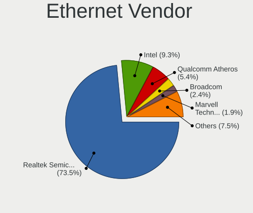

| Vendor                           | Computers | Percent |
|----------------------------------|-----------|---------|
| Realtek Semiconductor            | 2066      | 73.5%   |
| Intel                            | 261       | 9.28%   |
| Qualcomm Atheros                 | 152       | 5.41%   |
| Broadcom                         | 67        | 2.38%   |
| Marvell Technology Group         | 54        | 1.92%   |
| Nvidia                           | 48        | 1.71%   |
| Broadcom Limited                 | 28        | 1%      |
| JMicron Technology               | 20        | 0.71%   |
| Samsung Electronics              | 15        | 0.53%   |
| Xiaomi                           | 12        | 0.43%   |
| ASIX Electronics                 | 11        | 0.39%   |
| Silicon Integrated Systems [SiS] | 9         | 0.32%   |
| Huawei Technologies              | 9         | 0.32%   |
| VIA Technologies                 | 8         | 0.28%   |
| TP-Link                          | 5         | 0.18%   |
| ICS Advent                       | 5         | 0.18%   |
| Qualcomm                         | 4         | 0.14%   |
| OPPO Electronics                 | 4         | 0.14%   |
| MediaTek                         | 4         | 0.14%   |
| Motorola PCS                     | 3         | 0.11%   |
| T & A Mobile Phones              | 2         | 0.07%   |
| LG Electronics                   | 2         | 0.07%   |
| Hangzhou Silan Microelectronics  | 2         | 0.07%   |
| Giga-Byte Technology             | 2         | 0.07%   |
| Altair Semiconductor             | 2         | 0.07%   |
| Spreadtrum Communications        | 1         | 0.04%   |
| OnePlus Technology (Shenzhen)    | 1         | 0.04%   |
| NetGear                          | 1         | 0.04%   |
| Lenovo                           | 1         | 0.04%   |
| Hewlett-Packard                  | 1         | 0.04%   |
| Google                           | 1         | 0.04%   |
| Gemtek                           | 1         | 0.04%   |
| DisplayLink                      | 1         | 0.04%   |
| Digitech Systems                 | 1         | 0.04%   |
| D-Link                           | 1         | 0.04%   |
| Beceem Communications            | 1         | 0.04%   |
| Attansic Technology              | 1         | 0.04%   |
| ASUSTek Computer                 | 1         | 0.04%   |
| Apple                            | 1         | 0.04%   |
| AMD                              | 1         | 0.04%   |

Ethernet Model
--------------

Ethernet models

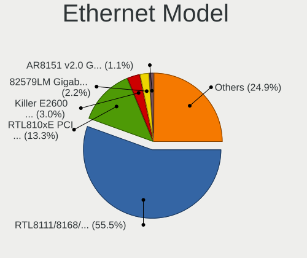

| Model                                                                  | Computers | Percent |
|------------------------------------------------------------------------|-----------|---------|
| Realtek RTL8111/8168/8211/8411 PCI Express Gigabit Ethernet Controller | 1567      | 55.51%  |
| Realtek RTL810xE PCI Express Fast Ethernet controller                  | 375       | 13.28%  |
| Realtek Killer E2600 GbE Controller                                    | 85        | 3.01%   |
| Intel 82579LM Gigabit Network Connection (Lewisville)                  | 61        | 2.16%   |
| Qualcomm Atheros AR8151 v2.0 Gigabit Ethernet                          | 31        | 1.1%    |
| Nvidia MCP61 Ethernet                                                  | 26        | 0.92%   |
| Intel Ethernet Connection I217-LM                                      | 22        | 0.78%   |
| Qualcomm Atheros AR8161 Gigabit Ethernet                               | 17        | 0.6%    |
| Qualcomm Atheros AR8152 v2.0 Fast Ethernet                             | 17        | 0.6%    |
| Intel 82567LM-3 Gigabit Network Connection                             | 17        | 0.6%    |
| Marvell Group 88E8040 PCI-E Fast Ethernet Controller                   | 15        | 0.53%   |
| JMicron JMC250 PCI Express Gigabit Ethernet Controller                 | 14        | 0.5%    |
| Intel I211 Gigabit Network Connection                                  | 14        | 0.5%    |
| Qualcomm Atheros AR8131 Gigabit Ethernet                               | 13        | 0.46%   |
| Broadcom NetLink BCM57785 Gigabit Ethernet PCIe                        | 13        | 0.46%   |
| Samsung Galaxy series, misc. (tethering mode)                          | 12        | 0.43%   |
| Qualcomm Atheros Killer E2500 Gigabit Ethernet Controller              | 12        | 0.43%   |
| Intel 82579V Gigabit Network Connection                                | 12        | 0.43%   |
| Realtek RTL8153 Gigabit Ethernet Adapter                               | 11        | 0.39%   |
| Qualcomm Atheros AR8132 Fast Ethernet                                  | 11        | 0.39%   |
| Intel Ethernet Connection (2) I219-V                                   | 11        | 0.39%   |
| Intel Ethernet Connection (13) I219-V                                  | 11        | 0.39%   |
| Intel 82577LM Gigabit Network Connection                               | 11        | 0.39%   |
| Realtek RTL8152 Fast Ethernet Adapter                                  | 10        | 0.35%   |
| Realtek RTL-8100/8101L/8139 PCI Fast Ethernet Adapter                  | 10        | 0.35%   |
| Intel Ethernet Connection I219-LM                                      | 10        | 0.35%   |
| Broadcom Limited NetLink BCM57780 Gigabit Ethernet PCIe                | 10        | 0.35%   |
| Silicon Integrated Systems [SiS] 191 Gigabit Ethernet Adapter          | 9         | 0.32%   |
| Qualcomm Atheros AR8121/AR8113/AR8114 Gigabit or Fast Ethernet         | 9         | 0.32%   |
| Marvell Group 88E8055 PCI-E Gigabit Ethernet Controller                | 9         | 0.32%   |
| Intel 82567LM Gigabit Network Connection                               | 9         | 0.32%   |
| Broadcom NetXtreme BCM5761 Gigabit Ethernet PCIe                       | 9         | 0.32%   |
| Xiaomi Mi/Redmi series (RNDIS)                                         | 8         | 0.28%   |
| Intel Ethernet Connection (7) I219-V                                   | 8         | 0.28%   |
| Qualcomm Atheros AR8162 Fast Ethernet                                  | 7         | 0.25%   |
| Marvell Group 88E8058 PCI-E Gigabit Ethernet Controller                | 7         | 0.25%   |
| Intel Ethernet Connection I218-LM                                      | 7         | 0.25%   |
| Intel Ethernet Connection I217-V                                       | 7         | 0.25%   |
| Intel 82566DM-2 Gigabit Network Connection                             | 7         | 0.25%   |
| Broadcom NetLink BCM57780 Gigabit Ethernet PCIe                        | 7         | 0.25%   |

Net Controller Kind
-------------------

Ethernet, WiFi or modem

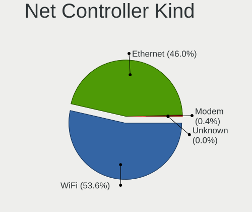

| Kind     | Computers | Percent |
|----------|-----------|---------|
| WiFi     | 3178      | 53.57%  |
| Ethernet | 2729      | 46%     |
| Modem    | 24        | 0.4%    |
| Unknown  | 1         | 0.02%   |

Used Controller
---------------

Currently used network controller

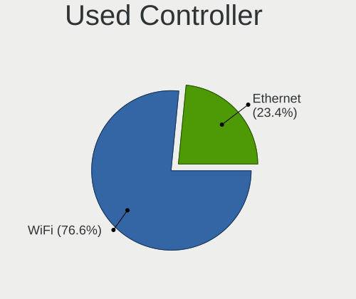

| Kind     | Computers | Percent |
|----------|-----------|---------|
| WiFi     | 2864      | 76.56%  |
| Ethernet | 877       | 23.44%  |

NICs
----

Total network controllers on board

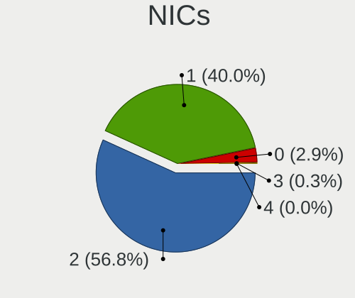

| Total | Computers | Percent |
|-------|-----------|---------|
| 2     | 2089      | 56.8%   |
| 1     | 1470      | 39.97%  |
| 0     | 108       | 2.94%   |
| 3     | 10        | 0.27%   |
| 4     | 1         | 0.03%   |

IPv6
----

IPv6 vs IPv4

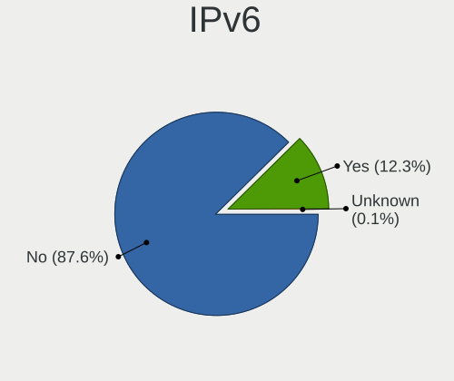

| Used    | Computers | Percent |
|---------|-----------|---------|
| No      | 3273      | 87.61%  |
| Yes     | 461       | 12.34%  |
| Unknown | 2         | 0.05%   |

Bluetooth
---------

Bluetooth Vendor
----------------

Controller vendors

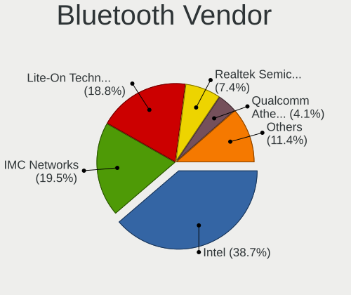

| Vendor                          | Computers | Percent |
|---------------------------------|-----------|---------|
| Intel                           | 1009      | 38.72%  |
| IMC Networks                    | 508       | 19.49%  |
| Lite-On Technology              | 491       | 18.84%  |
| Realtek Semiconductor           | 192       | 7.37%   |
| Qualcomm Atheros Communications | 108       | 4.14%   |
| Broadcom                        | 72        | 2.76%   |
| Cambridge Silicon Radio         | 68        | 2.61%   |
| Foxconn / Hon Hai               | 28        | 1.07%   |
| Dell                            | 25        | 0.96%   |
| Hewlett-Packard                 | 21        | 0.81%   |
| Apple                           | 21        | 0.81%   |
| Toshiba                         | 16        | 0.61%   |
| ASUSTek Computer                | 12        | 0.46%   |
| Ralink                          | 10        | 0.38%   |
| Foxconn International           | 8         | 0.31%   |
| Marvell Semiconductor           | 4         | 0.15%   |
| Alps Electric                   | 3         | 0.12%   |
| Ralink Technology               | 2         | 0.08%   |
| Qcom                            | 2         | 0.08%   |
| Smart Modular Technologies      | 1         | 0.04%   |
| Realtek                         | 1         | 0.04%   |
| Micro Star International        | 1         | 0.04%   |
| Integrated System Solution      | 1         | 0.04%   |
| Chicony Electronics             | 1         | 0.04%   |
| Belkin Components               | 1         | 0.04%   |

Bluetooth Model
---------------

Controller models

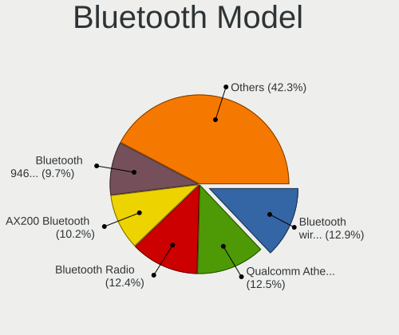

| Model                                                                               | Computers | Percent |
|-------------------------------------------------------------------------------------|-----------|---------|
| Intel Bluetooth wireless interface                                                  | 337       | 12.93%  |
| Lite-On Qualcomm Atheros QCA9377 Bluetooth                                          | 325       | 12.47%  |
| IMC Networks Bluetooth Radio                                                        | 324       | 12.43%  |
| Intel AX200 Bluetooth                                                               | 266       | 10.21%  |
| Intel Bluetooth 9460/9560 Jefferson Peak (JfP)                                      | 252       | 9.67%   |
| IMC Networks Bluetooth Device                                                       | 166       | 6.37%   |
| Realtek Bluetooth Radio                                                             | 135       | 5.18%   |
| Lite-On Bluetooth Device                                                            | 130       | 4.99%   |
| Intel Wireless-AC 3168 Bluetooth                                                    | 68        | 2.61%   |
| Cambridge Silicon Radio Bluetooth Dongle (HCI mode)                                 | 68        | 2.61%   |
| Intel AX201 Bluetooth                                                               | 58        | 2.23%   |
| Qualcomm Atheros  Bluetooth Device                                                  | 45        | 1.73%   |
| Realtek  Bluetooth 4.2 Adapter                                                      | 31        | 1.19%   |
| Qualcomm Atheros AR3011 Bluetooth                                                   | 24        | 0.92%   |
| Qualcomm Atheros AR3012 Bluetooth 4.0                                               | 23        | 0.88%   |
| Lite-On Atheros AR3012 Bluetooth                                                    | 15        | 0.58%   |
| Intel Centrino Bluetooth Wireless Transceiver                                       | 14        | 0.54%   |
| Broadcom BCM43142A0 Bluetooth 4.0                                                   | 12        | 0.46%   |
| Realtek RTL8723B Bluetooth                                                          | 10        | 0.38%   |
| Ralink RT3290 Bluetooth                                                             | 10        | 0.38%   |
| Broadcom BCM2045B (BDC-2.1)                                                         | 10        | 0.38%   |
| Apple Bluetooth HCI                                                                 | 10        | 0.38%   |
| HP Broadcom 2070 Bluetooth Combo                                                    | 9         | 0.35%   |
| HP Bluetooth 2.0 Interface [Broadcom BCM2045]                                       | 9         | 0.35%   |
| Realtek RTL8821A Bluetooth                                                          | 8         | 0.31%   |
| Foxconn International BCM43142A0 Bluetooth module                                   | 8         | 0.31%   |
| Qualcomm Atheros AR9462 Bluetooth                                                   | 7         | 0.27%   |
| Lite-On Qualcomm Atheros Bluetooth                                                  | 7         | 0.27%   |
| Intel Centrino Advanced-N 6230 Bluetooth adapter                                    | 7         | 0.27%   |
| IMC Networks Wireless_Device                                                        | 7         | 0.27%   |
| Dell DW375 Bluetooth Module                                                         | 7         | 0.27%   |
| Broadcom BCM43142A0 Bluetooth Device                                                | 7         | 0.27%   |
| Toshiba BCM43142A0                                                                  | 6         | 0.23%   |
| Foxconn / Hon Hai Bluetooth Device                                                  | 6         | 0.23%   |
| Apple Bluetooth USB Host Controller                                                 | 6         | 0.23%   |
| Intel Wireless-AC 9260 Bluetooth Adapter                                            | 5         | 0.19%   |
| Foxconn / Hon Hai Foxconn T77H114 BCM2070 [Single-Chip Bluetooth 2.1 + EDR Adapter] | 5         | 0.19%   |
| Dell BCM20702A0 Bluetooth Module                                                    | 5         | 0.19%   |
| Broadcom HP Portable SoftSailing                                                    | 5         | 0.19%   |
| Broadcom BCM2070 Bluetooth Device                                                   | 5         | 0.19%   |

Sound
-----

Sound Vendor
------------

Sound card vendors

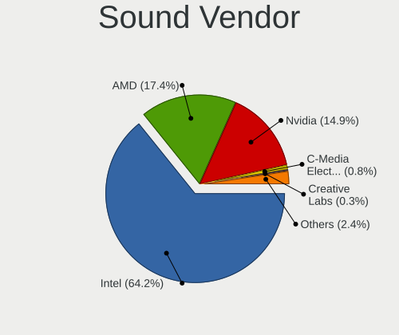

| Vendor                                          | Computers | Percent |
|-------------------------------------------------|-----------|---------|
| Intel                                           | 2807      | 64.22%  |
| AMD                                             | 762       | 17.43%  |
| Nvidia                                          | 650       | 14.87%  |
| C-Media Electronics                             | 35        | 0.8%    |
| Creative Labs                                   | 13        | 0.3%    |
| Logitech                                        | 11        | 0.25%   |
| Generalplus Technology                          | 11        | 0.25%   |
| Silicon Integrated Systems [SiS]                | 10        | 0.23%   |
| JMTek                                           | 9         | 0.21%   |
| VIA Technologies                                | 7         | 0.16%   |
| ASUSTek Computer                                | 7         | 0.16%   |
| Creative Technology                             | 6         | 0.14%   |
| Texas Instruments                               | 5         | 0.11%   |
| Plantronics                                     | 4         | 0.09%   |
| Dell                                            | 3         | 0.07%   |
| Corsair                                         | 3         | 0.07%   |
| Lenovo                                          | 2         | 0.05%   |
| BEHRINGER International                         | 2         | 0.05%   |
| Walmart                                         | 1         | 0.02%   |
| Tenx Technology                                 | 1         | 0.02%   |
| Tdlasunnic                                      | 1         | 0.02%   |
| SteelSeries ApS                                 | 1         | 0.02%   |
| Sony                                            | 1         | 0.02%   |
| Samsung Electronics                             | 1         | 0.02%   |
| Samson Technologies                             | 1         | 0.02%   |
| Realtek Semiconductor                           | 1         | 0.02%   |
| Razer USA                                       | 1         | 0.02%   |
| Pioneer DJ                                      | 1         | 0.02%   |
| Licensed by Sony Computer Entertainment America | 1         | 0.02%   |
| Kingston Technology                             | 1         | 0.02%   |
| Harman                                          | 1         | 0.02%   |
| Google                                          | 1         | 0.02%   |
| FiiO Electronics Technology                     | 1         | 0.02%   |
| Ensoniq                                         | 1         | 0.02%   |
| Elite Silicon                                   | 1         | 0.02%   |
| Edifier Technology                              | 1         | 0.02%   |
| EasyPass Industrial                             | 1         | 0.02%   |
| DSEA A/S                                        | 1         | 0.02%   |
| D&M Holdings (Denon/Marantz)                    | 1         | 0.02%   |
| Blue Microphones                                | 1         | 0.02%   |

Sound Model
-----------

Sound card models

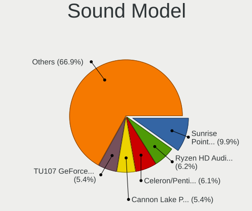

| Model                                                                                             | Computers | Percent |
|---------------------------------------------------------------------------------------------------|-----------|---------|
| Intel Sunrise Point-LP HD Audio                                                                   | 502       | 9.88%   |
| AMD Ryzen HD Audio Controller                                                                     | 317       | 6.24%   |
| Intel Celeron/Pentium Silver Processor High Definition Audio                                      | 311       | 6.12%   |
| Intel Cannon Lake PCH cAVS                                                                        | 275       | 5.41%   |
| Nvidia TU107 GeForce GTX 1650 High Definition Audio Controller                                    | 274       | 5.39%   |
| AMD Raven/Raven2/Fenghuang HDMI/DP Audio Controller                                               | 213       | 4.19%   |
| Intel 6 Series/C200 Series Chipset Family High Definition Audio Controller                        | 177       | 3.48%   |
| Intel 7 Series/C216 Chipset Family High Definition Audio Controller                               | 166       | 3.27%   |
| Intel Celeron N3350/Pentium N4200/Atom E3900 Series Audio Cluster                                 | 165       | 3.25%   |
| Intel NM10/ICH7 Family High Definition Audio Controller                                           | 127       | 2.5%    |
| AMD FCH Azalia Controller                                                                         | 119       | 2.34%   |
| Intel 82801I (ICH9 Family) HD Audio Controller                                                    | 116       | 2.28%   |
| AMD Family 15h (Models 60h-6fh) Audio Controller                                                  | 114       | 2.24%   |
| AMD SBx00 Azalia (Intel HDA)                                                                      | 104       | 2.05%   |
| Intel Tiger Lake-LP Smart Sound Technology Audio Controller                                       | 98        | 1.93%   |
| Intel Cannon Point-LP High Definition Audio Controller                                            | 94        | 1.85%   |
| AMD High Definition Audio Controller                                                              | 94        | 1.85%   |
| Intel Ice Lake-LP Smart Sound Technology Audio Controller                                         | 92        | 1.81%   |
| Intel 5 Series/3400 Series Chipset High Definition Audio                                          | 78        | 1.54%   |
| Intel Atom/Celeron/Pentium Processor x5-E8000/J3xxx/N3xxx Series High Definition Audio Controller | 76        | 1.5%    |
| Intel Comet Lake PCH-LP cAVS                                                                      | 69        | 1.36%   |
| Nvidia GP107GL High Definition Audio Controller                                                   | 68        | 1.34%   |
| Intel 8 Series/C220 Series Chipset High Definition Audio Controller                               | 64        | 1.26%   |
| AMD Kabini HDMI/DP Audio                                                                          | 62        | 1.22%   |
| Intel 82801H (ICH8 Family) HD Audio Controller                                                    | 55        | 1.08%   |
| Intel Atom Processor Z36xxx/Z37xxx Series High Definition Audio Controller                        | 54        | 1.06%   |
| Intel Xeon E3-1200 v3/4th Gen Core Processor HD Audio Controller                                  | 53        | 1.04%   |
| Intel Haswell-ULT HD Audio Controller                                                             | 53        | 1.04%   |
| Intel 8 Series HD Audio Controller                                                                | 53        | 1.04%   |
| Intel Broadwell-U Audio Controller                                                                | 45        | 0.89%   |
| Intel Wildcat Point-LP High Definition Audio Controller                                           | 44        | 0.87%   |
| Intel CM238 HD Audio Controller                                                                   | 43        | 0.85%   |
| AMD Wrestler HDMI Audio                                                                           | 37        | 0.73%   |
| Nvidia High Definition Audio Controller                                                           | 33        | 0.65%   |
| Nvidia GK208 HDMI/DP Audio Controller                                                             | 32        | 0.63%   |
| Nvidia GF108 High Definition Audio Controller                                                     | 29        | 0.57%   |
| Intel 200 Series PCH HD Audio                                                                     | 29        | 0.57%   |
| Nvidia MCP61 High Definition Audio                                                                | 28        | 0.55%   |
| Intel 100 Series/C230 Series Chipset Family HD Audio Controller                                   | 28        | 0.55%   |
| Nvidia GF119 HDMI Audio Controller                                                                | 26        | 0.51%   |

Memory
------

Memory Vendor
-------------

Memory module vendors

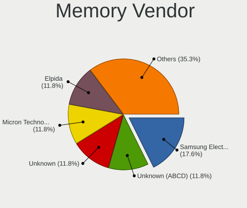

| Vendor              | Computers | Percent |
|---------------------|-----------|---------|
| Samsung Electronics | 3         | 17.65%  |
| Unknown (ABCD)      | 2         | 11.76%  |
| Unknown             | 2         | 11.76%  |
| Micron Technology   | 2         | 11.76%  |
| Elpida              | 2         | 11.76%  |
| Smart               | 1         | 5.88%   |
| SK hynix            | 1         | 5.88%   |
| Patriot             | 1         | 5.88%   |
| Kingston            | 1         | 5.88%   |
| G.Skill             | 1         | 5.88%   |
| Apacer              | 1         | 5.88%   |

Memory Model
------------

Memory module models

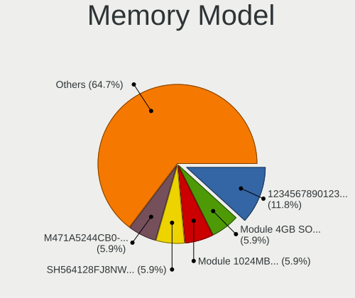

| Model                                                            | Computers | Percent |
|------------------------------------------------------------------|-----------|---------|
| Unknown (ABCD) RAM 123456789012345678 2GB SODIMM LPDDR4 2400MT/s | 2         | 11.76%  |
| Unknown RAM Module 4GB SODIMM DDR3 1600MT/s                      | 1         | 5.88%   |
| Unknown RAM Module 1024MB DIMM 667MT/s                           | 1         | 5.88%   |
| Smart RAM SH564128FJ8NWRNSQG 4GB SODIMM DDR3 1600MT/s            | 1         | 5.88%   |
| SK hynix RAM HMAA2GS6AJR8N-XN 16GB SODIMM DDR4 3200MT/s          | 1         | 5.88%   |
| Samsung RAM M471A5244CB0-CTD 4GB SODIMM DDR4 3266MT/s            | 1         | 5.88%   |
| Samsung RAM M471A1K43DB1-CTD 8GB SODIMM DDR4 2667MT/s            | 1         | 5.88%   |
| Samsung RAM K4E6E304EC-EGCG 4GB Row Of Chips LPDDR3 2133MT/s     | 1         | 5.88%   |
| Patriot RAM PSD38G1600L2S 8GB SODIMM DDR3 1600MT/s               | 1         | 5.88%   |
| Micron RAM 8ATF51264HZ-2G3B1 4GB SODIMM DDR4 2400MT/s            | 1         | 5.88%   |
| Micron RAM 53E512M32D2NP-046 1GB Row Of Chips LPDDR4 4267MT/s    | 1         | 5.88%   |
| Kingston RAM 99U5428-073.A00G 8GB SODIMM DDR3 1600MT/s           | 1         | 5.88%   |
| G.Skill RAM F4-4000C19-16GTZSW 16GB DIMM DDR4 3200MT/s           | 1         | 5.88%   |
| Elpida RAM Module 4096MB SODIMM LPDDR3 1600MT/s                  | 1         | 5.88%   |
| Elpida RAM EBJ40UG8EFU0-GN-F 4GB SODIMM DDR3 1600MT/s            | 1         | 5.88%   |
| Apacer RAM 76.D305G.D390B 16GB SODIMM DDR4 2400MT/s              | 1         | 5.88%   |

Memory Kind
-----------

Memory module kinds

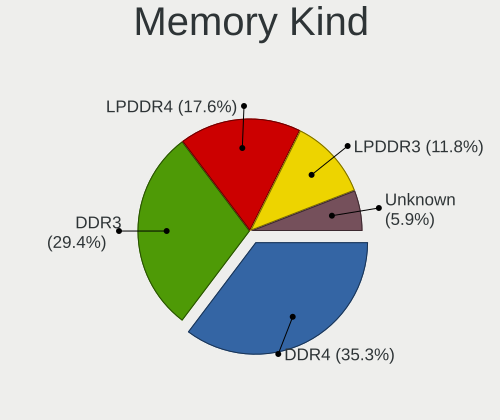

| Kind    | Computers | Percent |
|---------|-----------|---------|
| DDR4    | 6         | 35.29%  |
| DDR3    | 5         | 29.41%  |
| LPDDR4  | 3         | 17.65%  |
| LPDDR3  | 2         | 11.76%  |
| Unknown | 1         | 5.88%   |

Memory Form Factor
------------------

Physical design of the memory module

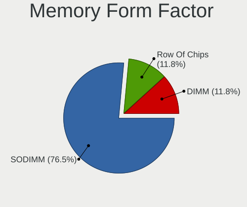

| Name         | Computers | Percent |
|--------------|-----------|---------|
| SODIMM       | 13        | 76.47%  |
| Row Of Chips | 2         | 11.76%  |
| DIMM         | 2         | 11.76%  |

Memory Size
-----------

Memory module size

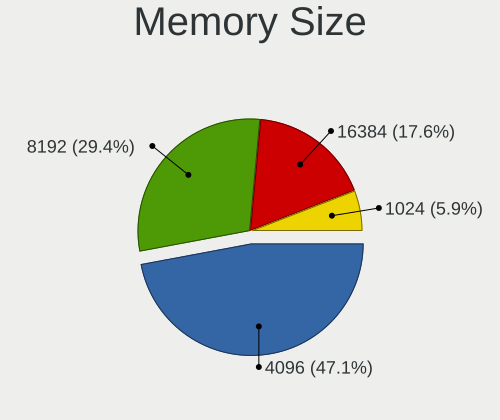

| Size  | Computers | Percent |
|-------|-----------|---------|
| 4096  | 8         | 47.06%  |
| 8192  | 5         | 29.41%  |
| 16384 | 3         | 17.65%  |
| 1024  | 1         | 5.88%   |

Memory Speed
------------

Memory module speed

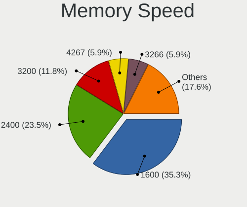

| Speed | Computers | Percent |
|-------|-----------|---------|
| 1600  | 6         | 35.29%  |
| 2400  | 4         | 23.53%  |
| 3200  | 2         | 11.76%  |
| 4267  | 1         | 5.88%   |
| 3266  | 1         | 5.88%   |
| 2667  | 1         | 5.88%   |
| 2133  | 1         | 5.88%   |
| 667   | 1         | 5.88%   |

Printers & scanners
-------------------

Printer Vendor
--------------

Printer device vendors

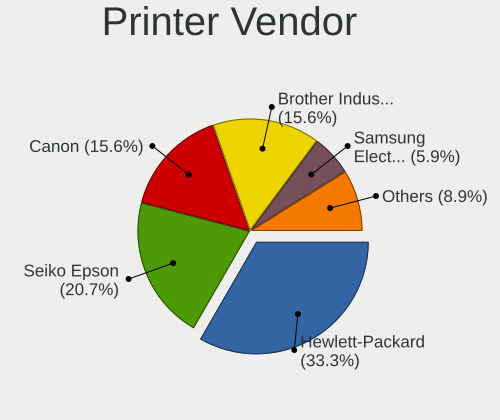

| Vendor                   | Computers | Percent |
|--------------------------|-----------|---------|
| Hewlett-Packard          | 45        | 33.33%  |
| Seiko Epson              | 28        | 20.74%  |
| Canon                    | 21        | 15.56%  |
| Brother Industries       | 21        | 15.56%  |
| Samsung Electronics      | 8         | 5.93%   |
| Pantum                   | 3         | 2.22%   |
| Xerox                    | 2         | 1.48%   |
| Panasonic (Matsushita)   | 2         | 1.48%   |
| STMicroelectronics       | 1         | 0.74%   |
| Ricoh                    | 1         | 0.74%   |
| Magic Control Technology | 1         | 0.74%   |
| ICS Advent               | 1         | 0.74%   |
| Dymo-CoStar              | 1         | 0.74%   |

Printer Model
-------------

Printer device models

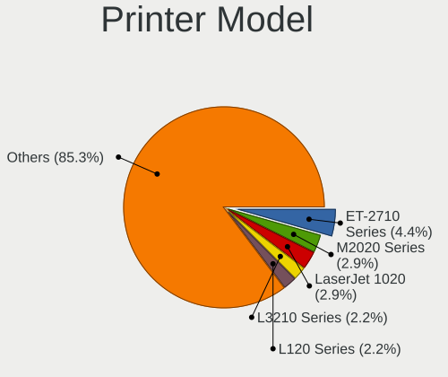

| Model                                         | Computers | Percent |
|-----------------------------------------------|-----------|---------|
| Seiko Epson ET-2710 Series                    | 6         | 4.41%   |
| Samsung M2020 Series                          | 4         | 2.94%   |
| HP LaserJet 1020                              | 4         | 2.94%   |
| Seiko Epson L3210 Series                      | 3         | 2.21%   |
| Seiko Epson L120 Series                       | 3         | 2.21%   |
| HP LaserJet 1018                              | 3         | 2.21%   |
| HP DeskJet F4200 series                       | 3         | 2.21%   |
| HP Deskjet 2050 J510                          | 3         | 2.21%   |
| HP Deskjet 1510                               | 3         | 2.21%   |
| Xerox Phaser 3020                             | 2         | 1.47%   |
| Seiko Epson L355 Series                       | 2         | 1.47%   |
| Seiko Epson L3050 Series                      | 2         | 1.47%   |
| Seiko Epson L210 Series                       | 2         | 1.47%   |
| Panasonic (Matsushita) KX-MB1500RU            | 2         | 1.47%   |
| HP Deskjet 3050 J610 series                   | 2         | 1.47%   |
| HP Deskjet 2540 series                        | 2         | 1.47%   |
| HP DeskJet 2130 series                        | 2         | 1.47%   |
| HP Color Laser 150nw                          | 2         | 1.47%   |
| Canon PIXMA MX920 Series                      | 2         | 1.47%   |
| Canon PIXMA MG2500 Series                     | 2         | 1.47%   |
| Canon MF3010                                  | 2         | 1.47%   |
| Brother MFC-J470DW                            | 2         | 1.47%   |
| Brother HL-1110 series                        | 2         | 1.47%   |
| Brother DCP-T710W                             | 2         | 1.47%   |
| Brother DCP-T310                              | 2         | 1.47%   |
| Brother DCP-1510                              | 2         | 1.47%   |
| STMicroelectronics USB Printing Support       | 1         | 0.74%   |
| Seiko Epson ME-100 Series                     | 1         | 0.74%   |
| Seiko Epson ME 340 Series/Stylus NX130 Series | 1         | 0.74%   |
| Seiko Epson ME 320/330 Series [Stylus SX125]  | 1         | 0.74%   |
| Seiko Epson L380 Series                       | 1         | 0.74%   |
| Seiko Epson L365 Series                       | 1         | 0.74%   |
| Seiko Epson L3200 Series                      | 1         | 0.74%   |
| Seiko Epson L3110 Series                      | 1         | 0.74%   |
| Seiko Epson ET-3750 Series                    | 1         | 0.74%   |
| Seiko Epson EPSON L220 Series                 | 1         | 0.74%   |
| Seiko Epson AcuLaser C1700                    | 1         | 0.74%   |
| Samsung ML-1660 Series                        | 1         | 0.74%   |
| Samsung M332x 382x 402x Series                | 1         | 0.74%   |
| Samsung M2070 Series                          | 1         | 0.74%   |

Scanner Vendor
--------------

Scanner device vendors

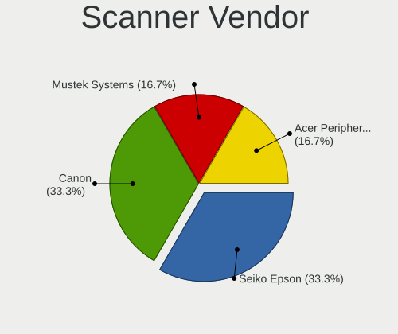

| Vendor                      | Computers | Percent |
|-----------------------------|-----------|---------|
| Canon                       | 3         | 33.33%  |
| Seiko Epson                 | 2         | 22.22%  |
| Mustek Systems              | 2         | 22.22%  |
| Hewlett-Packard             | 1         | 11.11%  |
| Acer Peripherals (now BenQ) | 1         | 11.11%  |

Scanner Model
-------------

Scanner device models

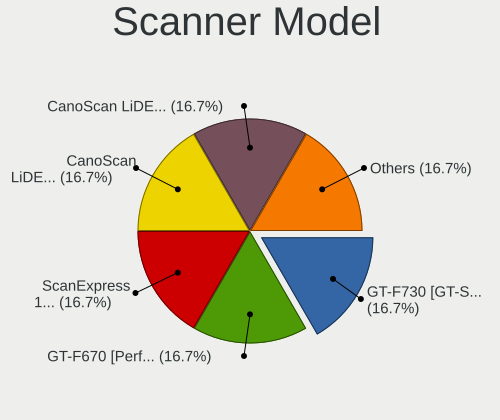

| Model                                                   | Computers | Percent |
|---------------------------------------------------------|-----------|---------|
| Seiko Epson GT-F730 [GT-S630/Perfection V33/V330 Photo] | 1         | 11.11%  |
| Seiko Epson GT-F670 [Perfection V200 Photo]             | 1         | 11.11%  |
| Mustek Systems ScanExpress 1200 UB                      | 1         | 11.11%  |
| Mustek Systems BearPaw 2448 TA Plus                     | 1         | 11.11%  |
| HP ScanJet 4850C/4890C                                  | 1         | 11.11%  |
| Canon CanoScan N1240U/LiDE 30                           | 1         | 11.11%  |
| Canon CanoScan LiDE 210                                 | 1         | 11.11%  |
| Canon CanoScan LiDE 100                                 | 1         | 11.11%  |
| Acer Peripherals (now BenQ) Benq 5000                   | 1         | 11.11%  |

Camera
------

Camera Vendor
-------------

Camera device vendors

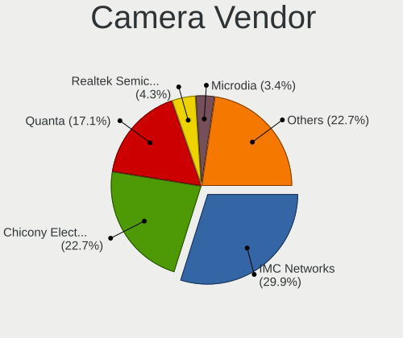

| Vendor                                 | Computers | Percent |
|----------------------------------------|-----------|---------|
| IMC Networks                           | 862       | 29.86%  |
| Chicony Electronics                    | 655       | 22.69%  |
| Quanta                                 | 495       | 17.15%  |
| Realtek Semiconductor                  | 123       | 4.26%   |
| Microdia                               | 98        | 3.39%   |
| Bison Electronics                      | 72        | 2.49%   |
| Sonix Technology                       | 71        | 2.46%   |
| Suyin                                  | 68        | 2.36%   |
| Sunplus Innovation Technology          | 62        | 2.15%   |
| Cheng Uei Precision Industry (Foxlink) | 38        | 1.32%   |
| Silicon Motion                         | 35        | 1.21%   |
| Logitech                               | 35        | 1.21%   |
| Alcor Micro                            | 33        | 1.14%   |
| Apple                                  | 28        | 0.97%   |
| Samsung Electronics                    | 27        | 0.94%   |
| Syntek                                 | 24        | 0.83%   |
| Lite-On Technology                     | 16        | 0.55%   |
| Ricoh                                  | 13        | 0.45%   |
| Microsoft                              | 12        | 0.42%   |
| Z-Star Microelectronics                | 11        | 0.38%   |
| Acer                                   | 11        | 0.38%   |
| OmniVision Technologies                | 10        | 0.35%   |
| Luxvisions Innotech Limited            | 10        | 0.35%   |
| ALi                                    | 10        | 0.35%   |
| Lenovo                                 | 7         | 0.24%   |
| Importek                               | 7         | 0.24%   |
| Primax Electronics                     | 5         | 0.17%   |
| Unknown                                | 4         | 0.14%   |
| GEMBIRD                                | 4         | 0.14%   |
| Cubeternet                             | 4         | 0.14%   |
| Generalplus Technology                 | 3         | 0.1%    |
| Xiaomi                                 | 2         | 0.07%   |
| Sunplus Technology                     | 2         | 0.07%   |
| Motorola PCS                           | 2         | 0.07%   |
| LG Electronics                         | 2         | 0.07%   |
| icSpring                               | 2         | 0.07%   |
| Aveo Technology                        | 2         | 0.07%   |
| vivo                                   | 1         | 0.03%   |
| Sony                                   | 1         | 0.03%   |
| ShineTech                              | 1         | 0.03%   |

Camera Model
------------

Camera device models

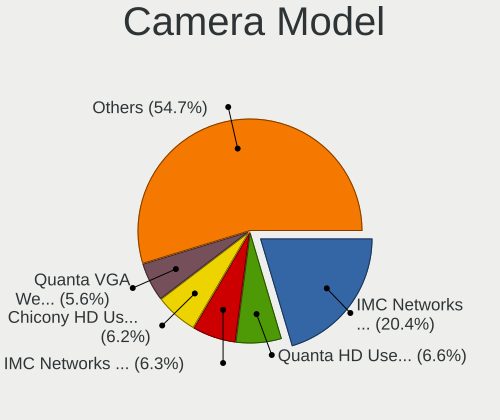

| Model                                                   | Computers | Percent |
|---------------------------------------------------------|-----------|---------|
| IMC Networks USB2.0 VGA UVC WebCam                      | 590       | 20.42%  |
| Quanta HD User Facing                                   | 192       | 6.65%   |
| IMC Networks USB2.0 HD UVC WebCam                       | 183       | 6.33%   |
| Chicony HD User Facing                                  | 180       | 6.23%   |
| Quanta VGA WebCam                                       | 163       | 5.64%   |
| Chicony USB2.0 VGA UVC WebCam                           | 94        | 3.25%   |
| Chicony VGA WebCam                                      | 90        | 3.12%   |
| Quanta HD Webcam                                        | 86        | 2.98%   |
| Sonix USB2.0 HD UVC WebCam                              | 68        | 2.35%   |
| Chicony HD WebCam                                       | 67        | 2.32%   |
| Samsung Galaxy series, misc. (MTP mode)                 | 27        | 0.93%   |
| Quanta USB2.0 HD UVC WebCam                             | 22        | 0.76%   |
| IMC Networks VGA UVC WebCam                             | 21        | 0.73%   |
| Chicony Integrated Camera                               | 20        | 0.69%   |
| Realtek Acer 640 x 480 laptop camera                    | 18        | 0.62%   |
| Microdia Integrated_Webcam_HD                           | 17        | 0.59%   |
| Chicony USB2.0 HD UVC WebCam                            | 17        | 0.59%   |
| Alcor Micro USB 2.0 Camera                              | 17        | 0.59%   |
| Apple iPhone 5/5C/5S/6/SE/7/8/X                         | 16        | 0.55%   |
| Realtek HD WebCam                                       | 15        | 0.52%   |
| IMC Networks Integrated Camera                          | 15        | 0.52%   |
| Realtek USB2.0 HD UVC WebCam                            | 14        | 0.48%   |
| Sunplus HD WebCam                                       | 13        | 0.45%   |
| Sunplus Integrated_Webcam_HD                            | 12        | 0.42%   |
| Chicony HP TrueVision HD                                | 12        | 0.42%   |
| Bison VGA WebCam                                        | 12        | 0.42%   |
| Realtek USB Camera                                      | 11        | 0.38%   |
| Realtek Integrated_Webcam_HD                            | 11        | 0.38%   |
| Quanta USB2.0 VGA UVC WebCam                            | 11        | 0.38%   |
| Microdia Laptop_Integrated_Webcam_HD                    | 11        | 0.38%   |
| Microdia Integrated Webcam                              | 11        | 0.38%   |
| Chicony HP Truevision HD camera                         | 11        | 0.38%   |
| Bison Lenovo EasyCamera                                 | 11        | 0.38%   |
| OmniVision OV2640 Webcam                                | 10        | 0.35%   |
| Logitech Webcam C270                                    | 10        | 0.35%   |
| IMC Networks USB2.0 HD IR UVC WebCam                    | 10        | 0.35%   |
| Chicony USB 2.0 Camera                                  | 10        | 0.35%   |
| Chicony TOSHIBA Web Camera - HD                         | 10        | 0.35%   |
| Chicony HP Webcam                                       | 10        | 0.35%   |
| Cheng Uei Precision Industry (Foxlink) HP TrueVision HD | 10        | 0.35%   |

Security
--------

Fingerprint Vendor
------------------

Fingerprint sensor vendors

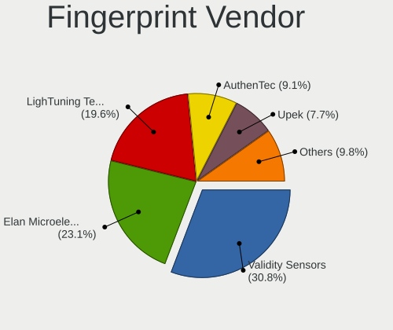

| Vendor                     | Computers | Percent |
|----------------------------|-----------|---------|
| Validity Sensors           | 44        | 30.77%  |
| Elan Microelectronics      | 33        | 23.08%  |
| LighTuning Technology      | 28        | 19.58%  |
| AuthenTec                  | 13        | 9.09%   |
| Upek                       | 11        | 7.69%   |
| Synaptics                  | 7         | 4.9%    |
| STMicroelectronics         | 4         | 2.8%    |
| Shenzhen Goodix Technology | 3         | 2.1%    |

Fingerprint Model
-----------------

Fingerprint sensor models

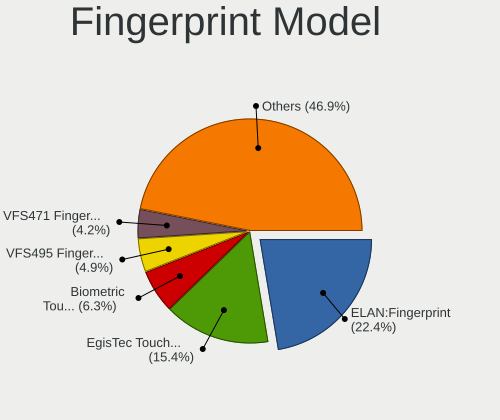

| Model                                                                      | Computers | Percent |
|----------------------------------------------------------------------------|-----------|---------|
| Elan ELAN:Fingerprint                                                      | 32        | 22.38%  |
| LighTuning EgisTec Touch Fingerprint Sensor                                | 22        | 15.38%  |
| Upek Biometric Touchchip/Touchstrip Fingerprint Sensor                     | 9         | 6.29%   |
| Validity Sensors VFS495 Fingerprint Reader                                 | 7         | 4.9%    |
| Validity Sensors VFS471 Fingerprint Reader                                 | 6         | 4.2%    |
| Validity Sensors VFS5011 Fingerprint Reader                                | 5         | 3.5%    |
| Validity Sensors VFS491                                                    | 4         | 2.8%    |
| Validity Sensors VFS 5011 fingerprint sensor                               | 4         | 2.8%    |
| Synaptics  WBDI                                                            | 4         | 2.8%    |
| STMicroelectronics Fingerprint Reader                                      | 4         | 2.8%    |
| LighTuning ES603 Swipe Fingerprint Sensor                                  | 4         | 2.8%    |
| AuthenTec Fingerprint Sensor                                               | 4         | 2.8%    |
| Validity Sensors VFS301 Fingerprint Reader                                 | 3         | 2.1%    |
| Validity Sensors VFS101 Fingerprint Reader                                 | 3         | 2.1%    |
| Shenzhen Goodix Fingerprint Reader                                         | 3         | 2.1%    |
| AuthenTec AES2810                                                          | 3         | 2.1%    |
| AuthenTec AES2501 Fingerprint Sensor                                       | 3         | 2.1%    |
| AuthenTec AES1600                                                          | 3         | 2.1%    |
| Validity Sensors VFS451 Fingerprint Reader                                 | 2         | 1.4%    |
| Validity Sensors VFS Fingerprint sensor                                    | 2         | 1.4%    |
| Validity Sensors Synaptics VFS7552 Touch Fingerprint Sensor with PurePrint | 2         | 1.4%    |
| Validity Sensors Swipe Fingerprint Sensor                                  | 2         | 1.4%    |
| Upek TCS5B Fingerprint sensor                                              | 2         | 1.4%    |
| LighTuning Fingerprint Reader                                              | 2         | 1.4%    |
| Validity Sensors VFS7500 Touch Fingerprint Sensor                          | 1         | 0.7%    |
| Validity Sensors VFS300 Fingerprint Reader                                 | 1         | 0.7%    |
| Validity Sensors Synaptics WBDI                                            | 1         | 0.7%    |
| Validity Sensors Fingerprint scanner                                       | 1         | 0.7%    |
| Synaptics UWP WBDI                                                         | 1         | 0.7%    |
| Synaptics Prometheus MIS Touch Fingerprint Reader                          | 1         | 0.7%    |
| Synaptics Metallica MIS Touch Fingerprint Reader                           | 1         | 0.7%    |
| Elan ELAN:ARM-M4                                                           | 1         | 0.7%    |

Chipcard Vendor
---------------

Chipcard module vendors

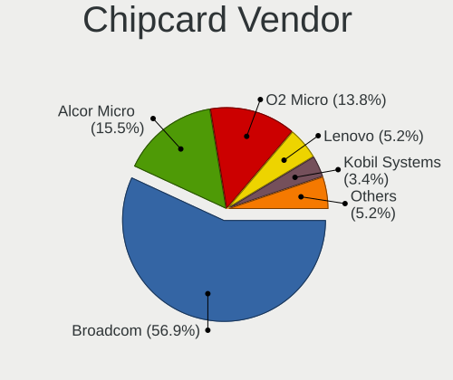

| Vendor                | Computers | Percent |
|-----------------------|-----------|---------|
| Broadcom              | 33        | 56.9%   |
| Alcor Micro           | 9         | 15.52%  |
| O2 Micro              | 8         | 13.79%  |
| Lenovo                | 3         | 5.17%   |
| Kobil Systems         | 2         | 3.45%   |
| Advanced Card Systems | 2         | 3.45%   |
| Chicony Electronics   | 1         | 1.72%   |

Chipcard Model
--------------

Chipcard module models

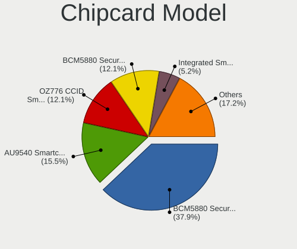

| Model                                                                        | Computers | Percent |
|------------------------------------------------------------------------------|-----------|---------|
| Broadcom BCM5880 Secure Applications Processor                               | 22        | 37.93%  |
| Alcor Micro AU9540 Smartcard Reader                                          | 9         | 15.52%  |
| O2 Micro OZ776 CCID Smartcard Reader                                         | 7         | 12.07%  |
| Broadcom BCM5880 Secure Applications Processor with fingerprint swipe sensor | 7         | 12.07%  |
| Lenovo Integrated Smart Card Reader                                          | 3         | 5.17%   |
| Broadcom 5880                                                                | 3         | 5.17%   |
| Kobil Systems KOBIL Class 3 Reader                                           | 2         | 3.45%   |
| O2 Micro Oz776 SmartCard Reader                                              | 1         | 1.72%   |
| Chicony Electronics HP Skylab USB Smartcard Keyboard                         | 1         | 1.72%   |
| Broadcom BCM58200 ControlVault 3 (FingerPrint sensor + Contacted SmartCard)  | 1         | 1.72%   |
| Advanced Card Systems ACR39U                                                 | 1         | 1.72%   |
| Advanced Card Systems ACR122U                                                | 1         | 1.72%   |

Unsupported
-----------

Unsupported Devices
-------------------

Total unsupported devices on board

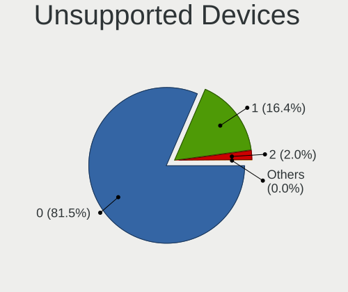

| Total | Computers | Percent |
|-------|-----------|---------|
| 0     | 3008      | 81.5%   |
| 1     | 604       | 16.36%  |
| 2     | 74        | 2%      |
| 4     | 2         | 0.05%   |
| 3     | 2         | 0.05%   |
| 5     | 1         | 0.03%   |

Unsupported Device Types
------------------------

Types of unsupported devices

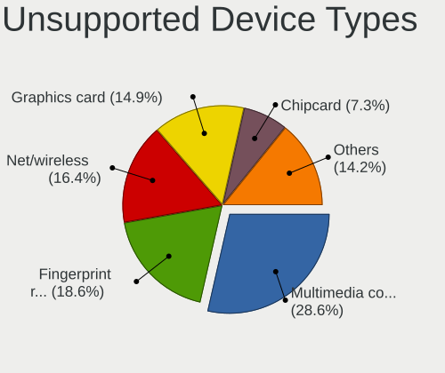

| Type                     | Computers | Percent |
|--------------------------|-----------|---------|
| Multimedia controller    | 219       | 28.55%  |
| Fingerprint reader       | 143       | 18.64%  |
| Net/wireless             | 126       | 16.43%  |
| Graphics card            | 114       | 14.86%  |
| Chipcard                 | 56        | 7.3%    |
| Communication controller | 30        | 3.91%   |
| Storage                  | 22        | 2.87%   |
| Bluetooth                | 16        | 2.09%   |
| Camera                   | 11        | 1.43%   |
| Storage/ide              | 7         | 0.91%   |
| Unassigned class         | 4         | 0.52%   |
| Network                  | 4         | 0.52%   |
| Sound                    | 3         | 0.39%   |
| Net/ethernet             | 3         | 0.39%   |
| Modem                    | 3         | 0.39%   |
| Storage/raid             | 2         | 0.26%   |
| Storage/nvme             | 2         | 0.26%   |
| Flash memory             | 1         | 0.13%   |
| Dvb card                 | 1         | 0.13%   |

