Endless - Tested Hardware & Statistics
--------------------------------------

A project to collect tested hardware configurations for Endless.

Anyone can contribute to this report by the [hw-probe](https://github.com/linuxhw/hw-probe) tool:

    sudo -E hw-probe -all -upload

Please contribute! Especially if your hardware is rare.

This is a report for all computer types. See also reports for [desktops](/Dist/Endless/Desktop/README.md) and [notebooks](/Dist/Endless/Notebook/README.md).

Contents
--------

* [ Test Cases ](#test-cases)

* [ System ](#system)
  - [ OS                       ](#os)
  - [ OS Family                ](#os-family)
  - [ Kernel                   ](#kernel)
  - [ Kernel Family            ](#kernel-family)
  - [ Kernel Major Ver.        ](#kernel-major-ver)
  - [ Arch                     ](#arch)
  - [ DE                       ](#de)
  - [ Display Server           ](#display-server)
  - [ Display Manager          ](#display-manager)
  - [ OS Lang                  ](#os-lang)
  - [ Boot Mode                ](#boot-mode)
  - [ Filesystem               ](#filesystem)
  - [ Part. scheme             ](#part-scheme)
  - [ Dual Boot with Linux/BSD ](#dual-boot-with-linuxbsd)
  - [ Dual Boot (Win)          ](#dual-boot-win)

* [ Board ](#board)
  - [ Vendor                   ](#vendor)
  - [ Model                    ](#model)
  - [ Model Family             ](#model-family)
  - [ MFG Year                 ](#mfg-year)
  - [ Form Factor              ](#form-factor)
  - [ Secure Boot              ](#secure-boot)
  - [ Coreboot                 ](#coreboot)
  - [ RAM Size                 ](#ram-size)
  - [ RAM Used                 ](#ram-used)
  - [ Total Drives             ](#total-drives)
  - [ Has CD-ROM               ](#has-cd-rom)
  - [ Has Ethernet             ](#has-ethernet)
  - [ Has WiFi                 ](#has-wifi)
  - [ Has Bluetooth            ](#has-bluetooth)

* [ Location ](#location)
  - [ Country                  ](#country)
  - [ City                     ](#city)

* [ Drives ](#drives)
  - [ Drive Vendor             ](#drive-vendor)
  - [ Drive Model              ](#drive-model)
  - [ HDD Vendor               ](#hdd-vendor)
  - [ SSD Vendor               ](#ssd-vendor)
  - [ Drive Kind               ](#drive-kind)
  - [ Drive Connector          ](#drive-connector)
  - [ Drive Size               ](#drive-size)
  - [ Space Total              ](#space-total)
  - [ Space Used               ](#space-used)
  - [ Malfunc. Drives          ](#malfunc-drives)
  - [ Malfunc. Drive Vendor    ](#malfunc-drive-vendor)
  - [ Malfunc. HDD Vendor      ](#malfunc-hdd-vendor)
  - [ Malfunc. Drive Kind      ](#malfunc-drive-kind)
  - [ Failed Drives            ](#failed-drives)
  - [ Failed Drive Vendor      ](#failed-drive-vendor)
  - [ Drive Status             ](#drive-status)

* [ Storage controller ](#storage-controller)
  - [ Storage Vendor           ](#storage-vendor)
  - [ Storage Model            ](#storage-model)
  - [ Storage Kind             ](#storage-kind)

* [ Processor ](#processor)
  - [ CPU Vendor               ](#cpu-vendor)
  - [ CPU Model                ](#cpu-model)
  - [ CPU Model Family         ](#cpu-model-family)
  - [ CPU Cores                ](#cpu-cores)
  - [ CPU Sockets              ](#cpu-sockets)
  - [ CPU Threads              ](#cpu-threads)
  - [ CPU Op-Modes             ](#cpu-op-modes)
  - [ CPU Microcode            ](#cpu-microcode)
  - [ CPU Microarch            ](#cpu-microarch)

* [ Graphics ](#graphics)
  - [ GPU Vendor               ](#gpu-vendor)
  - [ GPU Model                ](#gpu-model)
  - [ GPU Combo                ](#gpu-combo)
  - [ GPU Driver               ](#gpu-driver)
  - [ GPU Memory               ](#gpu-memory)

* [ Monitor ](#monitor)
  - [ Monitor Vendor           ](#monitor-vendor)
  - [ Monitor Model            ](#monitor-model)
  - [ Monitor Resolution       ](#monitor-resolution)
  - [ Monitor Diagonal         ](#monitor-diagonal)
  - [ Monitor Width            ](#monitor-width)
  - [ Aspect Ratio             ](#aspect-ratio)
  - [ Monitor Area             ](#monitor-area)
  - [ Pixel Density            ](#pixel-density)
  - [ Multiple Monitors        ](#multiple-monitors)

* [ Network ](#network)
  - [ Net Controller Vendor    ](#net-controller-vendor)
  - [ Net Controller Model     ](#net-controller-model)
  - [ Wireless Vendor          ](#wireless-vendor)
  - [ Wireless Model           ](#wireless-model)
  - [ Ethernet Vendor          ](#ethernet-vendor)
  - [ Ethernet Model           ](#ethernet-model)
  - [ Net Controller Kind      ](#net-controller-kind)
  - [ Used Controller          ](#used-controller)
  - [ NICs                     ](#nics)
  - [ IPv6                     ](#ipv6)

* [ Bluetooth ](#bluetooth)
  - [ Bluetooth Vendor         ](#bluetooth-vendor)
  - [ Bluetooth Model          ](#bluetooth-model)

* [ Sound ](#sound)
  - [ Sound Vendor             ](#sound-vendor)
  - [ Sound Model              ](#sound-model)

* [ Memory ](#memory)
  - [ Memory Vendor            ](#memory-vendor)
  - [ Memory Model             ](#memory-model)
  - [ Memory Kind              ](#memory-kind)
  - [ Memory Form Factor       ](#memory-form-factor)
  - [ Memory Size              ](#memory-size)
  - [ Memory Speed             ](#memory-speed)

* [ Printers & scanners ](#printers--scanners)
  - [ Printer Vendor           ](#printer-vendor)
  - [ Printer Model            ](#printer-model)
  - [ Scanner Vendor           ](#scanner-vendor)
  - [ Scanner Model            ](#scanner-model)

* [ Camera ](#camera)
  - [ Camera Vendor            ](#camera-vendor)
  - [ Camera Model             ](#camera-model)

* [ Security ](#security)
  - [ Fingerprint Vendor       ](#fingerprint-vendor)
  - [ Fingerprint Model        ](#fingerprint-model)
  - [ Chipcard Vendor          ](#chipcard-vendor)
  - [ Chipcard Model           ](#chipcard-model)

* [ Unsupported ](#unsupported)
  - [ Unsupported Devices      ](#unsupported-devices)
  - [ Unsupported Device Types ](#unsupported-device-types)

Test Cases
----------

Total: 5382

| Vendor        | Model                       | Form-Factor | Probe                                                      | Date         |
|---------------|-----------------------------|-------------|------------------------------------------------------------|--------------|
| Dell          | Inspiron 1545               | Notebook    | [611306b3c0](https://linux-hardware.org/?probe=611306b3c0) | Sep 01, 2022 |
| Acer          | Nitro AN515-54              | Notebook    | [211edd7b18](https://linux-hardware.org/?probe=211edd7b18) | Aug 28, 2022 |
| Acer          | Aspire A315-53              | Notebook    | [6ba36ee616](https://linux-hardware.org/?probe=6ba36ee616) | Aug 28, 2022 |
| Dell          | Inspiron 1545               | Notebook    | [ff02214b7f](https://linux-hardware.org/?probe=ff02214b7f) | Aug 28, 2022 |
| Acer          | Nitro AN515-44              | Notebook    | [7d3e13cfa9](https://linux-hardware.org/?probe=7d3e13cfa9) | Aug 27, 2022 |
| ASUSTek       | VivoBook_ASUSLaptop X513... | Notebook    | [0cadff108e](https://linux-hardware.org/?probe=0cadff108e) | Aug 27, 2022 |
| ASUSTek       | VivoBook_ASUSLaptop X513... | Notebook    | [cc7a3508d4](https://linux-hardware.org/?probe=cc7a3508d4) | Aug 27, 2022 |
| ECS           | A320AM4-M3D                 | Desktop     | [685960846a](https://linux-hardware.org/?probe=685960846a) | Aug 26, 2022 |
| HP            | 0980h                       | Desktop     | [1b4bdc2dd3](https://linux-hardware.org/?probe=1b4bdc2dd3) | Aug 25, 2022 |
| HP            | 0980h                       | Desktop     | [28433ca1db](https://linux-hardware.org/?probe=28433ca1db) | Aug 25, 2022 |
| Acer          | Nitro AN515-44              | Notebook    | [b456a14fe0](https://linux-hardware.org/?probe=b456a14fe0) | Aug 24, 2022 |
| Acer          | Nitro AN515-44              | Notebook    | [092dcdf5b7](https://linux-hardware.org/?probe=092dcdf5b7) | Aug 23, 2022 |
| ASUSTek       | VivoBook_ASUSLaptop X513... | Notebook    | [d64f8a64fa](https://linux-hardware.org/?probe=d64f8a64fa) | Aug 23, 2022 |
| ASUSTek       | VivoBook_ASUSLaptop X513... | Notebook    | [bb928725a6](https://linux-hardware.org/?probe=bb928725a6) | Aug 23, 2022 |
| Dell          | Latitude E6530              | Notebook    | [2dc6598431](https://linux-hardware.org/?probe=2dc6598431) | Aug 21, 2022 |
| HP            | 805B                        | Desktop     | [e7fa1a7244](https://linux-hardware.org/?probe=e7fa1a7244) | Aug 21, 2022 |
| HP            | OMEN by Laptop 16-b0xxx     | Notebook    | [ce5ed849b0](https://linux-hardware.org/?probe=ce5ed849b0) | Aug 21, 2022 |
| Acer          | Aspire 7750ZG               | Notebook    | [e0d514dd08](https://linux-hardware.org/?probe=e0d514dd08) | Aug 21, 2022 |
| Acer          | Aspire A517-51              | Notebook    | [0cff943f6b](https://linux-hardware.org/?probe=0cff943f6b) | Aug 20, 2022 |
| Lenovo        | G50-45 80E3                 | Notebook    | [0ed8a39444](https://linux-hardware.org/?probe=0ed8a39444) | Aug 19, 2022 |
| ASUSTek       | M5A78L-M/USB3               | Desktop     | [4242f8b9c2](https://linux-hardware.org/?probe=4242f8b9c2) | Aug 18, 2022 |
| ASUSTek       | M5A78L-M/USB3               | Desktop     | [bac870dd75](https://linux-hardware.org/?probe=bac870dd75) | Aug 18, 2022 |
| Acer          | Nitro AN515-44              | Notebook    | [aa18fee893](https://linux-hardware.org/?probe=aa18fee893) | Aug 18, 2022 |
| Positivo      | S14CT01                     | Notebook    | [22d8d4f3a2](https://linux-hardware.org/?probe=22d8d4f3a2) | Aug 17, 2022 |
| Positivo      | S14CT01                     | Notebook    | [2b561def97](https://linux-hardware.org/?probe=2b561def97) | Aug 17, 2022 |
| Gigabyte      | X570 I AORUS PRO WIFI       | Desktop     | [c2c1f93ff4](https://linux-hardware.org/?probe=c2c1f93ff4) | Aug 14, 2022 |
| ASUSTek       | VivoBook_ASUSLaptop X515... | Notebook    | [837e6e891d](https://linux-hardware.org/?probe=837e6e891d) | Aug 13, 2022 |
| Acer          | Aspire V3-571G              | Notebook    | [f45a97ca40](https://linux-hardware.org/?probe=f45a97ca40) | Aug 12, 2022 |
| ASUSTek       | VivoBook_ASUSLaptop X515... | Notebook    | [074b25e3a3](https://linux-hardware.org/?probe=074b25e3a3) | Aug 12, 2022 |
| Positivo      | C14CR21                     | Notebook    | [6e7b0da365](https://linux-hardware.org/?probe=6e7b0da365) | Aug 12, 2022 |
| ASUSTek       | VivoBook 15_ASUS Laptop ... | Notebook    | [e97781a7cc](https://linux-hardware.org/?probe=e97781a7cc) | Aug 11, 2022 |
| ASUSTek       | VivoBook 15_ASUS Laptop ... | Notebook    | [19c10fbafb](https://linux-hardware.org/?probe=19c10fbafb) | Aug 10, 2022 |
| ASUSTek       | VivoBook_ASUSLaptop X515... | Notebook    | [d34fcfc4f7](https://linux-hardware.org/?probe=d34fcfc4f7) | Aug 09, 2022 |
| ASUSTek       | VivoBook_ASUSLaptop X515... | Notebook    | [350a6d8583](https://linux-hardware.org/?probe=350a6d8583) | Aug 09, 2022 |
| ASUSTek       | VivoBook 15_ASUS Laptop ... | Notebook    | [abe7afa30f](https://linux-hardware.org/?probe=abe7afa30f) | Aug 09, 2022 |
| Acer          | Nitro AN515-54              | Notebook    | [221d7636db](https://linux-hardware.org/?probe=221d7636db) | Aug 08, 2022 |
| Fujitsu       | D3041-A1 S26361-D3041-A1    | Desktop     | [1fe8a14d3b](https://linux-hardware.org/?probe=1fe8a14d3b) | Aug 06, 2022 |
| ASUSTek       | D340MC-C                    | Desktop     | [69ddbb7acd](https://linux-hardware.org/?probe=69ddbb7acd) | Aug 05, 2022 |
| ASUSTek       | D340MC-C                    | Desktop     | [a87fc1ec66](https://linux-hardware.org/?probe=a87fc1ec66) | Aug 05, 2022 |
| Lenovo        | ThinkPad Edge 0578A25       | Notebook    | [ef0500a1f2](https://linux-hardware.org/?probe=ef0500a1f2) | Aug 04, 2022 |
| Lenovo        | ThinkPad Edge 0578A25       | Notebook    | [b7bd71930c](https://linux-hardware.org/?probe=b7bd71930c) | Aug 04, 2022 |
| ASUSTek       | VivoBook_ASUSLaptop X515... | Notebook    | [03770f280e](https://linux-hardware.org/?probe=03770f280e) | Aug 02, 2022 |
| ASUSTek       | ROG Maximus X CODE          | Desktop     | [e4ec9f34aa](https://linux-hardware.org/?probe=e4ec9f34aa) | Aug 01, 2022 |
| Sony          | VPCEG33FL                   | Notebook    | [6d371d6c32](https://linux-hardware.org/?probe=6d371d6c32) | Jul 31, 2022 |
| Acer          | Nitro AN515-44              | Notebook    | [1c907403d4](https://linux-hardware.org/?probe=1c907403d4) | Jul 30, 2022 |
| Lenovo        | Bantry CRB SDK0J40709 WI... | Desktop     | [7d5090c75c](https://linux-hardware.org/?probe=7d5090c75c) | Jul 30, 2022 |
| ASUSTek       | VivoBook 15_ASUS Laptop ... | Notebook    | [8b3fd99e18](https://linux-hardware.org/?probe=8b3fd99e18) | Jul 27, 2022 |
| Sony          | VPCEG33FL                   | Notebook    | [886dfc7777](https://linux-hardware.org/?probe=886dfc7777) | Jul 27, 2022 |
| ASUSTek       | V161GAR                     | All in one  | [55e2c27aaa](https://linux-hardware.org/?probe=55e2c27aaa) | Jul 27, 2022 |
| Lenovo        | ThinkCentre M58 7359DHJ     | Desktop     | [46c2c1db62](https://linux-hardware.org/?probe=46c2c1db62) | Jul 26, 2022 |
| ASUSTek       | VivoBook 15_ASUS Laptop ... | Notebook    | [4ee4fc0689](https://linux-hardware.org/?probe=4ee4fc0689) | Jul 26, 2022 |
| Sony          | VPCEG33FL                   | Notebook    | [8767e87e9e](https://linux-hardware.org/?probe=8767e87e9e) | Jul 24, 2022 |
| Lenovo        | MIIX 2 8 20326              | Tablet      | [4e4d2ed404](https://linux-hardware.org/?probe=4e4d2ed404) | Jul 22, 2022 |
| Acer          | Veriton S2665G              | Desktop     | [9bb3d975ef](https://linux-hardware.org/?probe=9bb3d975ef) | Jul 22, 2022 |
| ASUSTek       | M2N68                       | Desktop     | [e8b27563a2](https://linux-hardware.org/?probe=e8b27563a2) | Jul 22, 2022 |
| Gigabyte      | H61M-S2PH                   | Desktop     | [554f6e65ed](https://linux-hardware.org/?probe=554f6e65ed) | Jul 18, 2022 |
| Acer          | TravelMate 8572T            | Notebook    | [54e7b50fc7](https://linux-hardware.org/?probe=54e7b50fc7) | Jul 18, 2022 |
| Acer          | Aspire A515-54              | Notebook    | [bffac60888](https://linux-hardware.org/?probe=bffac60888) | Jul 16, 2022 |
| Acer          | Aspire A515-54              | Notebook    | [d52eabbac8](https://linux-hardware.org/?probe=d52eabbac8) | Jul 16, 2022 |
| ASUSTek       | VivoBook_ASUSLaptop X515... | Notebook    | [046794ca90](https://linux-hardware.org/?probe=046794ca90) | Jul 15, 2022 |
| Acer          | Veriton S2665G              | Desktop     | [4d5546720e](https://linux-hardware.org/?probe=4d5546720e) | Jul 15, 2022 |
| Acer          | Veriton S2665G              | Desktop     | [d3d8a3519d](https://linux-hardware.org/?probe=d3d8a3519d) | Jul 15, 2022 |
| Acer          | Veriton S2665G              | Desktop     | [5857bd4a87](https://linux-hardware.org/?probe=5857bd4a87) | Jul 15, 2022 |
| Chuwi         | LarkBook                    | Notebook    | [501967d2e1](https://linux-hardware.org/?probe=501967d2e1) | Jul 14, 2022 |
| ASUSTek       | VivoBook_ASUSLaptop X712... | Notebook    | [55efce6cdc](https://linux-hardware.org/?probe=55efce6cdc) | Jul 13, 2022 |
| ASUSTek       | VivoBook 15_ASUS Laptop ... | Notebook    | [6231802178](https://linux-hardware.org/?probe=6231802178) | Jul 12, 2022 |
| ASUSTek       | VivoBook_ASUSLaptop X513... | Notebook    | [1b31625c12](https://linux-hardware.org/?probe=1b31625c12) | Jul 12, 2022 |
| AMI           | Cherry Trail CR             | Notebook    | [b89687ff8f](https://linux-hardware.org/?probe=b89687ff8f) | Jul 12, 2022 |
| Sony          | VPCEA26FG                   | Notebook    | [c5432e157a](https://linux-hardware.org/?probe=c5432e157a) | Jul 11, 2022 |
| ASUSTek       | VivoBook_ASUSLaptop X409... | Notebook    | [d25b4ecc69](https://linux-hardware.org/?probe=d25b4ecc69) | Jul 11, 2022 |
| ASUSTek       | VivoBook 15_ASUS Laptop ... | Notebook    | [1f42376321](https://linux-hardware.org/?probe=1f42376321) | Jul 09, 2022 |
| ASUSTek       | VivoBook 15_ASUS Laptop ... | Notebook    | [a5c61fc1cf](https://linux-hardware.org/?probe=a5c61fc1cf) | Jul 08, 2022 |
| ASUSTek       | VivoBook 15_ASUS Laptop ... | Notebook    | [41840a0102](https://linux-hardware.org/?probe=41840a0102) | Jul 08, 2022 |
| Acer          | Nitro AN515-44              | Notebook    | [d52a3dc4ed](https://linux-hardware.org/?probe=d52a3dc4ed) | Jul 06, 2022 |
| Acer          | Aspire F5-573G              | Notebook    | [c1978d81c7](https://linux-hardware.org/?probe=c1978d81c7) | Jul 05, 2022 |
| Samsung       | RV411/RV511/E3511/S3511/... | Notebook    | [bc1f4a78a2](https://linux-hardware.org/?probe=bc1f4a78a2) | Jul 04, 2022 |
| Gigabyte      | H97M-D3H                    | Desktop     | [6e317fc17d](https://linux-hardware.org/?probe=6e317fc17d) | Jul 03, 2022 |
| Sony          | VPCEA26FG                   | Notebook    | [2075c04c4c](https://linux-hardware.org/?probe=2075c04c4c) | Jul 03, 2022 |
| ASUSTek       | M5A99X EVO R2.0             | Desktop     | [612da6d1eb](https://linux-hardware.org/?probe=612da6d1eb) | Jul 02, 2022 |
| ASUSTek       | VivoBook_ASUSLaptop X515... | Notebook    | [81fff806a4](https://linux-hardware.org/?probe=81fff806a4) | Jul 01, 2022 |
| ASUSTek       | VivoBook_ASUSLaptop X515... | Notebook    | [294f501cdd](https://linux-hardware.org/?probe=294f501cdd) | Jul 01, 2022 |
| ASUSTek       | VivoBook_ASUSLaptop X513... | Notebook    | [af946ca10b](https://linux-hardware.org/?probe=af946ca10b) | Jul 01, 2022 |
| ASUSTek       | VivoBook_ASUSLaptop X515... | Notebook    | [d68cd17ca2](https://linux-hardware.org/?probe=d68cd17ca2) | Jun 30, 2022 |
| Dell          | Inspiron 1525               | Notebook    | [8f507b2e8c](https://linux-hardware.org/?probe=8f507b2e8c) | Jun 29, 2022 |
| HP            | Pavilion dv7                | Notebook    | [6338462156](https://linux-hardware.org/?probe=6338462156) | Jun 27, 2022 |
| ASUSTek       | VivoBook 14_ASUS Laptop ... | Notebook    | [b56f69ff9c](https://linux-hardware.org/?probe=b56f69ff9c) | Jun 26, 2022 |
| Acer          | Nitro AN515-44              | Notebook    | [694f0baf86](https://linux-hardware.org/?probe=694f0baf86) | Jun 26, 2022 |
| AMI           | Cherry Trail CR             | Notebook    | [0ea2a1f20a](https://linux-hardware.org/?probe=0ea2a1f20a) | Jun 26, 2022 |
| ASUSTek       | X542UN                      | Notebook    | [56e348118b](https://linux-hardware.org/?probe=56e348118b) | Jun 26, 2022 |
| Dell          | 0YM158 A02                  | Server      | [ec0a133cdf](https://linux-hardware.org/?probe=ec0a133cdf) | Jun 26, 2022 |
| ASUSTek       | VivoBook_ASUSLaptop X515... | Notebook    | [87f6da99c4](https://linux-hardware.org/?probe=87f6da99c4) | Jun 25, 2022 |
| Acer          | Nitro AN515-54              | Notebook    | [7559b1f8fa](https://linux-hardware.org/?probe=7559b1f8fa) | Jun 24, 2022 |
| HP            | 81BB                        | All in one  | [6586fa1ae2](https://linux-hardware.org/?probe=6586fa1ae2) | Jun 24, 2022 |
| Acer          | Nitro AN515-54              | Notebook    | [eb8dbfaa92](https://linux-hardware.org/?probe=eb8dbfaa92) | Jun 23, 2022 |
| ASUSTek       | X542UN                      | Notebook    | [e1d53a776f](https://linux-hardware.org/?probe=e1d53a776f) | Jun 22, 2022 |
| ASUSTek       | VivoBook_ASUSLaptop X513... | Notebook    | [5eaea4e568](https://linux-hardware.org/?probe=5eaea4e568) | Jun 22, 2022 |
| Dell          | Latitude E6530              | Notebook    | [d456333df9](https://linux-hardware.org/?probe=d456333df9) | Jun 21, 2022 |
| Packard Be... | EasyNote MH36               | Notebook    | [ecd7a50e8e](https://linux-hardware.org/?probe=ecd7a50e8e) | Jun 20, 2022 |
| ASUSTek       | X542UN                      | Notebook    | [83a04b4dc4](https://linux-hardware.org/?probe=83a04b4dc4) | Jun 17, 2022 |
| Acer          | Nitro AN515-44              | Notebook    | [5b70211c3a](https://linux-hardware.org/?probe=5b70211c3a) | Jun 16, 2022 |
| Acer          | Nitro AN515-44              | Notebook    | [edf78ac5ae](https://linux-hardware.org/?probe=edf78ac5ae) | Jun 15, 2022 |
| Acer          | Nitro AN515-44              | Notebook    | [ce3588c536](https://linux-hardware.org/?probe=ce3588c536) | Jun 15, 2022 |
| ASUSTek       | Z550SA                      | Notebook    | [c1c96fa0a4](https://linux-hardware.org/?probe=c1c96fa0a4) | Jun 14, 2022 |
| Acer          | Aspire E1-421               | Notebook    | [7cbe6cfc8f](https://linux-hardware.org/?probe=7cbe6cfc8f) | Jun 13, 2022 |
| Acer          | Aspire E1-421               | Notebook    | [8ac8a79ce1](https://linux-hardware.org/?probe=8ac8a79ce1) | Jun 13, 2022 |
| Gigabyte      | GA-78LMT-S2P                | Desktop     | [ec2e52372f](https://linux-hardware.org/?probe=ec2e52372f) | Jun 10, 2022 |
| Acer          | Aspire A514-54G             | Notebook    | [a74cd897c5](https://linux-hardware.org/?probe=a74cd897c5) | Jun 09, 2022 |
| ASUSTek       | VivoBook 15_ASUS Laptop ... | Notebook    | [35dc89f7ff](https://linux-hardware.org/?probe=35dc89f7ff) | Jun 09, 2022 |
| ASUSTek       | X541UAK                     | Notebook    | [92a20ee191](https://linux-hardware.org/?probe=92a20ee191) | Jun 08, 2022 |
| Positivo      | J14GL11                     | Notebook    | [62ab2ad5f4](https://linux-hardware.org/?probe=62ab2ad5f4) | Jun 08, 2022 |
| Dell          | Latitude E6530              | Notebook    | [f155f4f9a3](https://linux-hardware.org/?probe=f155f4f9a3) | Jun 08, 2022 |
| HP            | 81BB                        | All in one  | [c6557e74bd](https://linux-hardware.org/?probe=c6557e74bd) | Jun 07, 2022 |
| Kllisre       | B75 V1.1                    | Desktop     | [d9a9aa6243](https://linux-hardware.org/?probe=d9a9aa6243) | Jun 06, 2022 |
| HP            | Laptop 17z-ca100            | Notebook    | [700d19ab97](https://linux-hardware.org/?probe=700d19ab97) | Jun 06, 2022 |
| ASUSTek       | VivoBook_ASUSLaptop X513... | Notebook    | [9801d8d5c3](https://linux-hardware.org/?probe=9801d8d5c3) | Jun 05, 2022 |
| Gigabyte      | H97M-D3H                    | Desktop     | [5159501e3a](https://linux-hardware.org/?probe=5159501e3a) | Jun 04, 2022 |
| Dell          | Latitude E6330              | Notebook    | [775f5f5b15](https://linux-hardware.org/?probe=775f5f5b15) | Jun 03, 2022 |
| Dell          | Latitude E6330              | Notebook    | [e471e0e49d](https://linux-hardware.org/?probe=e471e0e49d) | Jun 03, 2022 |
| Microsoft     | Surface Book 2              | Tablet      | [39e5f4ba2a](https://linux-hardware.org/?probe=39e5f4ba2a) | Jun 01, 2022 |
| Acer          | Aspire A514-54G             | Notebook    | [1019de0d68](https://linux-hardware.org/?probe=1019de0d68) | Jun 01, 2022 |
| Dell          | Inspiron 1525               | Notebook    | [246387e9bc](https://linux-hardware.org/?probe=246387e9bc) | Jun 01, 2022 |
| Dell          | Inspiron 1525               | Notebook    | [1b82b95b9a](https://linux-hardware.org/?probe=1b82b95b9a) | Jun 01, 2022 |
| ASUSTek       | VivoBook_ASUSLaptop X515... | Notebook    | [ce70b34b9e](https://linux-hardware.org/?probe=ce70b34b9e) | May 31, 2022 |
| Dell          | 0HY9JP A01                  | Desktop     | [ddaf2f5f45](https://linux-hardware.org/?probe=ddaf2f5f45) | May 31, 2022 |
| Acer          | Aspire A315-34              | Notebook    | [8b9190338e](https://linux-hardware.org/?probe=8b9190338e) | May 31, 2022 |
| Acer          | Nitro AN515-44              | Notebook    | [c3c66e49ab](https://linux-hardware.org/?probe=c3c66e49ab) | May 30, 2022 |
| Acer          | Aspire A315-51              | Notebook    | [083e3a354a](https://linux-hardware.org/?probe=083e3a354a) | May 29, 2022 |
| Acer          | Nitro AN515-44              | Notebook    | [fd8554b3de](https://linux-hardware.org/?probe=fd8554b3de) | May 29, 2022 |
| Acer          | Nitro AN515-44              | Notebook    | [2383d77ab9](https://linux-hardware.org/?probe=2383d77ab9) | May 29, 2022 |
| ASUSTek       | VivoBook 12_ASUS Laptop ... | Notebook    | [ad2442631e](https://linux-hardware.org/?probe=ad2442631e) | May 28, 2022 |
| Microsoft     | Surface Book 2              | Tablet      | [bc517297a6](https://linux-hardware.org/?probe=bc517297a6) | May 27, 2022 |
| ASUSTek       | VivoBook 15_ASUS Laptop ... | Notebook    | [21c0d575b0](https://linux-hardware.org/?probe=21c0d575b0) | May 23, 2022 |
| ASUSTek       | VivoBook_ASUSLaptop X415... | Notebook    | [26d3a29dc1](https://linux-hardware.org/?probe=26d3a29dc1) | May 23, 2022 |
| Dell          | 0T2HR0 A00                  | Desktop     | [bc174d82db](https://linux-hardware.org/?probe=bc174d82db) | May 23, 2022 |
| Dell          | 0T2HR0 A00                  | Desktop     | [3cd038705c](https://linux-hardware.org/?probe=3cd038705c) | May 23, 2022 |
| Acer          | Nitro AN515-54              | Notebook    | [5408aee890](https://linux-hardware.org/?probe=5408aee890) | May 23, 2022 |
| ASUSTek       | VivoBook_ASUSLaptop X430... | Notebook    | [d972595598](https://linux-hardware.org/?probe=d972595598) | May 22, 2022 |
| Microsoft     | Surface Book 2              | Tablet      | [6668780f77](https://linux-hardware.org/?probe=6668780f77) | May 22, 2022 |
| ASUSTek       | VivoBook_ASUSLaptop X430... | Notebook    | [8f9ca8d66b](https://linux-hardware.org/?probe=8f9ca8d66b) | May 20, 2022 |
| Acer          | Nitro AN515-44              | Notebook    | [82a239d311](https://linux-hardware.org/?probe=82a239d311) | May 18, 2022 |
| Acer          | Nitro AN515-44              | Notebook    | [d93d2fe653](https://linux-hardware.org/?probe=d93d2fe653) | May 17, 2022 |
| Acer          | Nitro AN515-44              | Notebook    | [1752fe60cc](https://linux-hardware.org/?probe=1752fe60cc) | May 17, 2022 |
| Acer          | Nitro AN515-44              | Notebook    | [a9e249f407](https://linux-hardware.org/?probe=a9e249f407) | May 16, 2022 |
| ASUSTek       | PRIME A320M-K/BR            | Desktop     | [ef49485481](https://linux-hardware.org/?probe=ef49485481) | May 16, 2022 |
| ASUSTek       | PRIME A320M-K/BR            | Desktop     | [e2b0f10f58](https://linux-hardware.org/?probe=e2b0f10f58) | May 15, 2022 |
| Acer          | Nitro AN515-44              | Notebook    | [412fd25cbf](https://linux-hardware.org/?probe=412fd25cbf) | May 15, 2022 |
| Acer          | Swift SF314-54              | Notebook    | [1624fff74b](https://linux-hardware.org/?probe=1624fff74b) | May 15, 2022 |
| Lenovo        | S10-3                       | Notebook    | [b2eb29a65e](https://linux-hardware.org/?probe=b2eb29a65e) | May 14, 2022 |
| ASUSTek       | VivoBook 15_ASUS Laptop ... | Notebook    | [e7fcde8001](https://linux-hardware.org/?probe=e7fcde8001) | May 14, 2022 |
| Dell          | 0VHWTR A02                  | Desktop     | [42d4e8089b](https://linux-hardware.org/?probe=42d4e8089b) | May 14, 2022 |
| ASUSTek       | VivoBook_ASUS Laptop X50... | Notebook    | [e633129a51](https://linux-hardware.org/?probe=e633129a51) | May 13, 2022 |
| Lenovo        | IdeaPad 3 14ALC6 82KT       | Notebook    | [e90b6752ba](https://linux-hardware.org/?probe=e90b6752ba) | May 12, 2022 |
| ASUSTek       | VivoBook_ASUSLaptop X515... | Notebook    | [47e5498b35](https://linux-hardware.org/?probe=47e5498b35) | May 12, 2022 |
| Acer          | Nitro AN515-44              | Notebook    | [e3b90bb036](https://linux-hardware.org/?probe=e3b90bb036) | May 11, 2022 |
| Acer          | Nitro AN515-44              | Notebook    | [241c777ac9](https://linux-hardware.org/?probe=241c777ac9) | May 11, 2022 |
| ASUSTek       | X541UAK                     | Notebook    | [50747765ef](https://linux-hardware.org/?probe=50747765ef) | May 10, 2022 |
| ASUSTek       | X541UAK                     | Notebook    | [c1c837e821](https://linux-hardware.org/?probe=c1c837e821) | May 10, 2022 |
| Lenovo        | V14-IGL 82C2                | Notebook    | [0d1e1d71ee](https://linux-hardware.org/?probe=0d1e1d71ee) | May 08, 2022 |
| Acer          | Aspire A514-54G             | Notebook    | [ec1fa8e360](https://linux-hardware.org/?probe=ec1fa8e360) | May 08, 2022 |
| Lenovo        | V14-IGL 82C2                | Notebook    | [3ad9fd00c2](https://linux-hardware.org/?probe=3ad9fd00c2) | May 08, 2022 |
| Lenovo        | ThinkPad X131e 33691J6      | Notebook    | [1f492cb261](https://linux-hardware.org/?probe=1f492cb261) | May 08, 2022 |
| Acer          | Aspire A514-54G             | Notebook    | [b4b52aad69](https://linux-hardware.org/?probe=b4b52aad69) | May 07, 2022 |
| Positivo      | POS-MI945AA                 | Desktop     | [dffab0e390](https://linux-hardware.org/?probe=dffab0e390) | May 07, 2022 |
| Dell          | 082WXT A01                  | Desktop     | [97fe4a05c4](https://linux-hardware.org/?probe=97fe4a05c4) | May 04, 2022 |
| Dell          | Inspiron 5558               | Notebook    | [3cab561b32](https://linux-hardware.org/?probe=3cab561b32) | May 04, 2022 |
| Dell          | 082WXT A01                  | Desktop     | [fa58b1d93f](https://linux-hardware.org/?probe=fa58b1d93f) | May 04, 2022 |
| Dell          | Latitude E6420              | Notebook    | [77d218efc8](https://linux-hardware.org/?probe=77d218efc8) | May 03, 2022 |
| ASUSTek       | VivoBook_ASUSLaptop X515... | Notebook    | [4516542417](https://linux-hardware.org/?probe=4516542417) | May 03, 2022 |
| ASUSTek       | ASUS EXPERTBOOK B1400CEA... | Notebook    | [dcff76e99c](https://linux-hardware.org/?probe=dcff76e99c) | May 02, 2022 |
| HP            | 250 G5 Notebook PC          | Notebook    | [0e6717d54b](https://linux-hardware.org/?probe=0e6717d54b) | May 02, 2022 |
| Lenovo        | SHARKBAY NO DPK             | All in one  | [e23317d53c](https://linux-hardware.org/?probe=e23317d53c) | May 01, 2022 |
| ASUSTek       | ASUS EXPERTBOOK B1500CEA... | Notebook    | [112d0557c3](https://linux-hardware.org/?probe=112d0557c3) | May 01, 2022 |
| ASUSTek       | X540UA                      | Notebook    | [af0ed39935](https://linux-hardware.org/?probe=af0ed39935) | May 01, 2022 |
| Lenovo        | IdeaPad 3 14ALC6 82KT       | Notebook    | [633bddd44b](https://linux-hardware.org/?probe=633bddd44b) | Apr 30, 2022 |
| Google        | Fleex                       | Notebook    | [212ff0673f](https://linux-hardware.org/?probe=212ff0673f) | Apr 30, 2022 |
| Lenovo        | S10-3                       | Notebook    | [712c2dced9](https://linux-hardware.org/?probe=712c2dced9) | Apr 30, 2022 |
| Lenovo        | SHARKBAY 0B98405 STD        | Desktop     | [4842f5aef2](https://linux-hardware.org/?probe=4842f5aef2) | Apr 30, 2022 |
| ASUSTek       | X541UAK                     | Notebook    | [7bac9962d9](https://linux-hardware.org/?probe=7bac9962d9) | Apr 29, 2022 |
| Gigabyte      | B360M AORUS Gaming 3-CF     | Desktop     | [6a5bc03a3a](https://linux-hardware.org/?probe=6a5bc03a3a) | Apr 29, 2022 |
| HP            | Pavilion 14                 | Notebook    | [84bde5e223](https://linux-hardware.org/?probe=84bde5e223) | Apr 29, 2022 |
| HP            | Pavilion dv7                | Notebook    | [fd2d8cc4f6](https://linux-hardware.org/?probe=fd2d8cc4f6) | Apr 29, 2022 |
| Acer          | Nitro AN515-44              | Notebook    | [11b568f82d](https://linux-hardware.org/?probe=11b568f82d) | Apr 28, 2022 |
| Lenovo        | ThinkPad X131e 33683YG      | Notebook    | [58076aa8e9](https://linux-hardware.org/?probe=58076aa8e9) | Apr 28, 2022 |
| Acer          | Aspire A315-34              | Notebook    | [a49e25f2b8](https://linux-hardware.org/?probe=a49e25f2b8) | Apr 27, 2022 |
| ASUSTek       | VivoBook 15_ASUS Laptop ... | Notebook    | [bcc0c7612d](https://linux-hardware.org/?probe=bcc0c7612d) | Apr 26, 2022 |
| Acer          | Nitro AN515-44              | Notebook    | [319cbc94dd](https://linux-hardware.org/?probe=319cbc94dd) | Apr 25, 2022 |
| Dell          | 06NWYK A01                  | Desktop     | [14b3e7c65a](https://linux-hardware.org/?probe=14b3e7c65a) | Apr 24, 2022 |
| HP            | Notebook                    | Notebook    | [4772a69956](https://linux-hardware.org/?probe=4772a69956) | Apr 23, 2022 |
| Acer          | Nitro AN515-44              | Notebook    | [6e05fa6a88](https://linux-hardware.org/?probe=6e05fa6a88) | Apr 23, 2022 |
| ASUSTek       | X450CP                      | Notebook    | [2518b6daad](https://linux-hardware.org/?probe=2518b6daad) | Apr 22, 2022 |
| ASUSTek       | X450CP                      | Notebook    | [17d51c502f](https://linux-hardware.org/?probe=17d51c502f) | Apr 22, 2022 |
| Dell          | Inspiron 1525               | Notebook    | [b5dbaddd84](https://linux-hardware.org/?probe=b5dbaddd84) | Apr 22, 2022 |
| ASUSTek       | ASUSPRO P1440FAC_P1440FA    | Notebook    | [b53c2836e9](https://linux-hardware.org/?probe=b53c2836e9) | Apr 21, 2022 |
| ASUSTek       | ASUSPRO P1440FAC_P1440FA    | Notebook    | [cb2bc8f53e](https://linux-hardware.org/?probe=cb2bc8f53e) | Apr 21, 2022 |
| Lenovo        | SHARKBAY 31900058 STD       | Desktop     | [beab5308cb](https://linux-hardware.org/?probe=beab5308cb) | Apr 19, 2022 |
| ASUSTek       | X541UAK                     | Notebook    | [8b54af493a](https://linux-hardware.org/?probe=8b54af493a) | Apr 19, 2022 |
| HP            | 250 G5 Notebook PC          | Notebook    | [5cb8325ed4](https://linux-hardware.org/?probe=5cb8325ed4) | Apr 18, 2022 |
| Lenovo        | ThinkPad X131e 33683YG      | Notebook    | [7855e19861](https://linux-hardware.org/?probe=7855e19861) | Apr 17, 2022 |
| ASUSTek       | X541UAK                     | Notebook    | [811e032c61](https://linux-hardware.org/?probe=811e032c61) | Apr 16, 2022 |
| Acer          | Aspire E1-572               | Notebook    | [27d5f97167](https://linux-hardware.org/?probe=27d5f97167) | Apr 16, 2022 |
| ASUSTek       | VivoBook_ASUS Laptop E40... | Notebook    | [ce5b3c38ab](https://linux-hardware.org/?probe=ce5b3c38ab) | Apr 13, 2022 |
| Fujitsu       | LIFEBOOK A512               | Notebook    | [a477479700](https://linux-hardware.org/?probe=a477479700) | Apr 12, 2022 |
| ASUSTek       | X451CA                      | Notebook    | [865aec543f](https://linux-hardware.org/?probe=865aec543f) | Apr 12, 2022 |
| ASUSTek       | VivoBook_ASUSLaptop X513... | Notebook    | [dcd1291b92](https://linux-hardware.org/?probe=dcd1291b92) | Apr 11, 2022 |
| Acer          | Nitro AN515-44              | Notebook    | [6748a96716](https://linux-hardware.org/?probe=6748a96716) | Apr 11, 2022 |
| Samsung       | 300V3A/300V4A/300V5A/200... | Notebook    | [e6adfda5ec](https://linux-hardware.org/?probe=e6adfda5ec) | Apr 11, 2022 |
| ASUSTek       | X541UAK                     | Notebook    | [ffb5635168](https://linux-hardware.org/?probe=ffb5635168) | Apr 10, 2022 |
| HP            | 21F5 0A                     | Desktop     | [516f2dbc9e](https://linux-hardware.org/?probe=516f2dbc9e) | Apr 10, 2022 |
| ASUSTek       | PRIME A320M-K               | Desktop     | [e55b3bf73c](https://linux-hardware.org/?probe=e55b3bf73c) | Apr 10, 2022 |
| ASUSTek       | VivoBook_ASUSLaptop E410... | Notebook    | [ab7173f335](https://linux-hardware.org/?probe=ab7173f335) | Apr 10, 2022 |
| ASUSTek       | VivoBook 15_ASUS Laptop ... | Notebook    | [b86cec3f38](https://linux-hardware.org/?probe=b86cec3f38) | Apr 10, 2022 |
| ASUSTek       | H61M-PRO                    | Desktop     | [c89c043120](https://linux-hardware.org/?probe=c89c043120) | Apr 10, 2022 |
| Unknown       | TIGD-CI4                    | Desktop     | [266aef8b2e](https://linux-hardware.org/?probe=266aef8b2e) | Apr 09, 2022 |
| ASUSTek       | X540LJ                      | Notebook    | [2eb11881fa](https://linux-hardware.org/?probe=2eb11881fa) | Apr 09, 2022 |
| ASUSTek       | VivoBook 14_ASUS Laptop ... | Notebook    | [4c367d8a9c](https://linux-hardware.org/?probe=4c367d8a9c) | Apr 08, 2022 |
| ASUSTek       | VivoBook_ASUSLaptop X515... | Notebook    | [54bc7d6864](https://linux-hardware.org/?probe=54bc7d6864) | Apr 07, 2022 |
| Acer          | Nitro AN515-44              | Notebook    | [8c8679b57b](https://linux-hardware.org/?probe=8c8679b57b) | Apr 06, 2022 |
| ASUSTek       | 1015PE                      | Notebook    | [0643abbf5b](https://linux-hardware.org/?probe=0643abbf5b) | Apr 05, 2022 |
| Dell          | 09D2HH A00                  | Desktop     | [ed5450f496](https://linux-hardware.org/?probe=ed5450f496) | Apr 05, 2022 |
| Acer          | Nitro AN515-44              | Notebook    | [e007605c2c](https://linux-hardware.org/?probe=e007605c2c) | Apr 05, 2022 |
| Acer          | Nitro AN515-44              | Notebook    | [ab77f43b05](https://linux-hardware.org/?probe=ab77f43b05) | Apr 03, 2022 |
| Acer          | Nitro AN515-44              | Notebook    | [53c0c6467d](https://linux-hardware.org/?probe=53c0c6467d) | Apr 01, 2022 |
| Acer          | Nitro AN515-44              | Notebook    | [6a7bc096c0](https://linux-hardware.org/?probe=6a7bc096c0) | Apr 01, 2022 |
| Multilaser    | PC13X                       | Notebook    | [d62e1676c3](https://linux-hardware.org/?probe=d62e1676c3) | Apr 01, 2022 |
| Samsung       | 300E5EV/300E4EV/270E5EV/... | Notebook    | [21a9f5c811](https://linux-hardware.org/?probe=21a9f5c811) | Apr 01, 2022 |
| Dell          | Latitude E5430 non-vPro     | Notebook    | [28ddf22c68](https://linux-hardware.org/?probe=28ddf22c68) | Mar 31, 2022 |
| Multilaser    | PC13X                       | Notebook    | [e0e93fcf81](https://linux-hardware.org/?probe=e0e93fcf81) | Mar 30, 2022 |
| ASUSTek       | VivoBook_ASUSLaptop X513... | Notebook    | [2d741207c5](https://linux-hardware.org/?probe=2d741207c5) | Mar 30, 2022 |
| Acer          | Nitro N50-610               | Desktop     | [17f97e88c0](https://linux-hardware.org/?probe=17f97e88c0) | Mar 29, 2022 |
| Lenovo        | SHARKBAY NO DPK             | All in one  | [7d0de80b18](https://linux-hardware.org/?probe=7d0de80b18) | Mar 29, 2022 |
| Acer          | Aspire A515-54G             | Notebook    | [b4864a1611](https://linux-hardware.org/?probe=b4864a1611) | Mar 27, 2022 |
| Lenovo        | 30D9 NOK                    | Desktop     | [c378cd6fd3](https://linux-hardware.org/?probe=c378cd6fd3) | Mar 27, 2022 |
| Positivo      | Q432A                       | Convertible | [754afa9c8c](https://linux-hardware.org/?probe=754afa9c8c) | Mar 25, 2022 |
| Acer          | Nitro AN515-44              | Notebook    | [29d034d804](https://linux-hardware.org/?probe=29d034d804) | Mar 25, 2022 |
| Positivo      | Q432A                       | Convertible | [883395b0e7](https://linux-hardware.org/?probe=883395b0e7) | Mar 24, 2022 |
| Gigabyte      | MZBAYAP-D9                  | Desktop     | [2c077e2993](https://linux-hardware.org/?probe=2c077e2993) | Mar 24, 2022 |
| Acer          | Nitro AN515-44              | Notebook    | [d2733b3c95](https://linux-hardware.org/?probe=d2733b3c95) | Mar 22, 2022 |
| ASUSTek       | VivoBook_ASUSLaptop X509... | Notebook    | [8d1c371df2](https://linux-hardware.org/?probe=8d1c371df2) | Mar 21, 2022 |
| ASUSTek       | VivoBook 15_ASUS Laptop ... | Notebook    | [99dc5cde41](https://linux-hardware.org/?probe=99dc5cde41) | Mar 20, 2022 |
| ASUSTek       | VivoBook 15_ASUS Laptop ... | Notebook    | [d74cd69ff9](https://linux-hardware.org/?probe=d74cd69ff9) | Mar 20, 2022 |
| Acer          | Nitro AN515-44              | Notebook    | [519b33398d](https://linux-hardware.org/?probe=519b33398d) | Mar 20, 2022 |
| Compal        | NCL60/61                    | Notebook    | [39c9e97e85](https://linux-hardware.org/?probe=39c9e97e85) | Mar 19, 2022 |
| HP            | Laptop 17z-ca100            | Notebook    | [048eff2daf](https://linux-hardware.org/?probe=048eff2daf) | Mar 19, 2022 |
| Lenovo        | SHARKBAY 31900058 STD       | Desktop     | [73bf7d8080](https://linux-hardware.org/?probe=73bf7d8080) | Mar 19, 2022 |
| ASUSTek       | VivoBook 15_ASUS Laptop ... | Notebook    | [591f5cdcc0](https://linux-hardware.org/?probe=591f5cdcc0) | Mar 18, 2022 |
| Philco        | 14I                         | Notebook    | [ceefb7fc2f](https://linux-hardware.org/?probe=ceefb7fc2f) | Mar 18, 2022 |
| Acer          | Nitro AN515-44              | Notebook    | [be2d436df6](https://linux-hardware.org/?probe=be2d436df6) | Mar 17, 2022 |
| Acer          | Nitro AN515-44              | Notebook    | [05d071af74](https://linux-hardware.org/?probe=05d071af74) | Mar 16, 2022 |
| Acer          | Nitro AN515-44              | Notebook    | [83d37bb724](https://linux-hardware.org/?probe=83d37bb724) | Mar 16, 2022 |
| Acer          | Nitro AN515-44              | Notebook    | [e5d7cda06b](https://linux-hardware.org/?probe=e5d7cda06b) | Mar 16, 2022 |
| Intel         | powered classmate PC        | Notebook    | [6938945c70](https://linux-hardware.org/?probe=6938945c70) | Mar 15, 2022 |
| ASUSTek       | VivoBook_ASUSLaptop X515... | Notebook    | [373fa69bd1](https://linux-hardware.org/?probe=373fa69bd1) | Mar 14, 2022 |
| Intel         | G31                         | Desktop     | [02eaa5ef51](https://linux-hardware.org/?probe=02eaa5ef51) | Mar 14, 2022 |
| Intel         | DG31PR AAD97573-300         | Desktop     | [509c41b106](https://linux-hardware.org/?probe=509c41b106) | Mar 13, 2022 |
| ASUSTek       | ASUSPRO P1440FAC_P1440FA    | Notebook    | [5ee92a3245](https://linux-hardware.org/?probe=5ee92a3245) | Mar 13, 2022 |
| HP            | 250 G5 Notebook PC          | Notebook    | [3e67ab27db](https://linux-hardware.org/?probe=3e67ab27db) | Mar 13, 2022 |
| ASUSTek       | VivoBook_ASUSLaptop X415... | Notebook    | [770f279722](https://linux-hardware.org/?probe=770f279722) | Mar 13, 2022 |
| Acer          | Nitro N50-610               | Desktop     | [c24379e7da](https://linux-hardware.org/?probe=c24379e7da) | Mar 13, 2022 |
| ASUSTek       | VivoBook_ASUSLaptop X513... | Notebook    | [21dfbc138d](https://linux-hardware.org/?probe=21dfbc138d) | Mar 13, 2022 |
| Positivo      | S14CT01                     | Notebook    | [198fc329a3](https://linux-hardware.org/?probe=198fc329a3) | Mar 12, 2022 |
| Acer          | Aspire A114-31              | Notebook    | [aa9bcbb679](https://linux-hardware.org/?probe=aa9bcbb679) | Mar 11, 2022 |
| Lenovo        | SHARKBAY NO DPK             | All in one  | [951ea7a2b4](https://linux-hardware.org/?probe=951ea7a2b4) | Mar 11, 2022 |
| Gigabyte      | H110M-H-CF                  | Desktop     | [c8474e89b8](https://linux-hardware.org/?probe=c8474e89b8) | Mar 11, 2022 |
| HP            | 1497                        | Desktop     | [7965a1ed31](https://linux-hardware.org/?probe=7965a1ed31) | Mar 11, 2022 |
| Acer          | Nitro AN515-54              | Notebook    | [cca64bfd46](https://linux-hardware.org/?probe=cca64bfd46) | Mar 10, 2022 |
| ASUSTek       | CROSSBLADE RANGER           | Desktop     | [1a2a0418c9](https://linux-hardware.org/?probe=1a2a0418c9) | Mar 10, 2022 |
| Acer          | Aspire A315-56              | Notebook    | [dbc222289c](https://linux-hardware.org/?probe=dbc222289c) | Mar 10, 2022 |
| Acer          | Aspire 4745Z                | Notebook    | [a3021ea674](https://linux-hardware.org/?probe=a3021ea674) | Mar 06, 2022 |
| Toshiba       | Satellite L755              | Notebook    | [1bb7472f87](https://linux-hardware.org/?probe=1bb7472f87) | Mar 06, 2022 |
| HP            | Laptop 17z-ca100            | Notebook    | [a646411afd](https://linux-hardware.org/?probe=a646411afd) | Mar 06, 2022 |
| Lenovo        | SHARKBAY 31900058 STD       | Desktop     | [a4335990af](https://linux-hardware.org/?probe=a4335990af) | Mar 05, 2022 |
| Lenovo        | SHARKBAY 31900058 STD       | Desktop     | [70405d9cb0](https://linux-hardware.org/?probe=70405d9cb0) | Mar 05, 2022 |
| Acer          | Aspire A515-54              | Notebook    | [5119ee3a39](https://linux-hardware.org/?probe=5119ee3a39) | Mar 05, 2022 |
| Acer          | Aspire A515-51              | Notebook    | [77e4345afe](https://linux-hardware.org/?probe=77e4345afe) | Mar 03, 2022 |
| ASUSTek       | VivoBook_ASUSLaptop X512... | Notebook    | [95296f29bb](https://linux-hardware.org/?probe=95296f29bb) | Mar 02, 2022 |
| Unknown       | Phitronics G31VS-M          | Desktop     | [0a32bd76ae](https://linux-hardware.org/?probe=0a32bd76ae) | Mar 01, 2022 |
| ASUSTek       | X451CAP                     | Notebook    | [733cc22d43](https://linux-hardware.org/?probe=733cc22d43) | Feb 26, 2022 |
| Acer          | Nitro AN515-44              | Notebook    | [8340571f28](https://linux-hardware.org/?probe=8340571f28) | Feb 25, 2022 |
| Acer          | Aspire A315-53              | Notebook    | [903ce0415a](https://linux-hardware.org/?probe=903ce0415a) | Feb 25, 2022 |
| HP            | Pavilion dv7                | Notebook    | [46280b758c](https://linux-hardware.org/?probe=46280b758c) | Feb 25, 2022 |
| Acer          | Aspire A315-34              | Notebook    | [d02db54216](https://linux-hardware.org/?probe=d02db54216) | Feb 24, 2022 |
| ASUSTek       | VivoBook_ASUSLaptop X540... | Notebook    | [baa1d24da5](https://linux-hardware.org/?probe=baa1d24da5) | Feb 24, 2022 |
| ASUSTek       | VivoBook 15_ASUS Laptop ... | Notebook    | [34efccbe97](https://linux-hardware.org/?probe=34efccbe97) | Feb 22, 2022 |
| Toshiba       | Satellite C50-A-19T         | Notebook    | [c0735b93a0](https://linux-hardware.org/?probe=c0735b93a0) | Feb 22, 2022 |
| Toshiba       | Satellite C50-A-19T         | Notebook    | [c307c3abc8](https://linux-hardware.org/?probe=c307c3abc8) | Feb 22, 2022 |
| Acer          | Aspire A315-54              | Notebook    | [1a5f1021df](https://linux-hardware.org/?probe=1a5f1021df) | Feb 21, 2022 |
| HP            | Pavilion dv7                | Notebook    | [fd1bbe1769](https://linux-hardware.org/?probe=fd1bbe1769) | Feb 21, 2022 |
| HP            | Pavilion dv7                | Notebook    | [da9449422c](https://linux-hardware.org/?probe=da9449422c) | Feb 21, 2022 |
| DEXP          | NH5BT15                     | Notebook    | [c6ef26c1ae](https://linux-hardware.org/?probe=c6ef26c1ae) | Feb 20, 2022 |
| ASUSTek       | H97I-PLUS                   | Desktop     | [f476b9cb12](https://linux-hardware.org/?probe=f476b9cb12) | Feb 20, 2022 |
| Acer          | Aspire A315-34              | Notebook    | [642e1f0705](https://linux-hardware.org/?probe=642e1f0705) | Feb 20, 2022 |
| Acer          | Aspire A315-34              | Notebook    | [8c976c5259](https://linux-hardware.org/?probe=8c976c5259) | Feb 20, 2022 |
| Acer          | Nitro AN515-44              | Notebook    | [198452fc15](https://linux-hardware.org/?probe=198452fc15) | Feb 20, 2022 |
| ASUSTek       | VivoBook_ASUSLaptop X515... | Notebook    | [86af1dc736](https://linux-hardware.org/?probe=86af1dc736) | Feb 19, 2022 |
| ASUSTek       | VivoBook 15_ASUS Laptop ... | Notebook    | [823e19e6d3](https://linux-hardware.org/?probe=823e19e6d3) | Feb 19, 2022 |
| Acer          | Nitro AN515-44              | Notebook    | [cce1f45d54](https://linux-hardware.org/?probe=cce1f45d54) | Feb 19, 2022 |
| Lenovo        | G700 20251                  | Notebook    | [2e68ddfdd3](https://linux-hardware.org/?probe=2e68ddfdd3) | Feb 18, 2022 |
| ASUSTek       | ROG Strix G713IH_G713IH     | Notebook    | [489854bd7b](https://linux-hardware.org/?probe=489854bd7b) | Feb 18, 2022 |
| ASUSTek       | H97I-PLUS                   | Desktop     | [17fb4ead54](https://linux-hardware.org/?probe=17fb4ead54) | Feb 18, 2022 |
| ASUSTek       | T100TA                      | Notebook    | [9f0a454d8b](https://linux-hardware.org/?probe=9f0a454d8b) | Feb 18, 2022 |
| Lenovo        | IdeaPad 710S-13ISK 80SW     | Notebook    | [1582806778](https://linux-hardware.org/?probe=1582806778) | Feb 17, 2022 |
| ASUSTek       | VivoBook 15_ASUS Laptop ... | Notebook    | [ed75c609e4](https://linux-hardware.org/?probe=ed75c609e4) | Feb 16, 2022 |
| ASUSTek       | VivoBook 15_ASUS Laptop ... | Notebook    | [470a550d41](https://linux-hardware.org/?probe=470a550d41) | Feb 16, 2022 |
| Acer          | Nitro AN515-44              | Notebook    | [21d0529167](https://linux-hardware.org/?probe=21d0529167) | Feb 16, 2022 |
| MSI           | 870A-G54                    | Desktop     | [3aa654a3fe](https://linux-hardware.org/?probe=3aa654a3fe) | Feb 14, 2022 |
| HP            | Laptop 15s-gr0xxx           | Notebook    | [db6e83a4b8](https://linux-hardware.org/?probe=db6e83a4b8) | Feb 14, 2022 |
| ASUSTek       | H97I-PLUS                   | Desktop     | [3453d341e6](https://linux-hardware.org/?probe=3453d341e6) | Feb 13, 2022 |
| Acer          | Aspire A315-53              | Notebook    | [2a2ca89607](https://linux-hardware.org/?probe=2a2ca89607) | Feb 13, 2022 |
| Acer          | Nitro AN515-44              | Notebook    | [dbacdb1c14](https://linux-hardware.org/?probe=dbacdb1c14) | Feb 11, 2022 |
| Acer          | Nitro AN515-44              | Notebook    | [f886f43d19](https://linux-hardware.org/?probe=f886f43d19) | Feb 11, 2022 |
| ASUSTek       | H97I-PLUS                   | Desktop     | [90b23a1489](https://linux-hardware.org/?probe=90b23a1489) | Feb 11, 2022 |
| Acer          | Nitro AN515-54              | Notebook    | [3f2bbe863b](https://linux-hardware.org/?probe=3f2bbe863b) | Feb 09, 2022 |
| Acer          | Nitro AN515-44              | Notebook    | [74eb28f4a3](https://linux-hardware.org/?probe=74eb28f4a3) | Feb 08, 2022 |
| Inventec      | DQ Class A02                | Desktop     | [07853bea89](https://linux-hardware.org/?probe=07853bea89) | Feb 07, 2022 |
| Acer          | Aspire A315-53              | Notebook    | [345a864747](https://linux-hardware.org/?probe=345a864747) | Feb 06, 2022 |
| ASUSTek       | VivoBook 12_ASUS Laptop ... | Notebook    | [14cfb63e15](https://linux-hardware.org/?probe=14cfb63e15) | Feb 06, 2022 |
| ASUSTek       | ASUS EXPERTBOOK B1500CEA... | Notebook    | [310e0596c7](https://linux-hardware.org/?probe=310e0596c7) | Feb 05, 2022 |
| Raspberry ... | Raspberry Pi 4 Model B      | Soc         | [ff4d3f33c9](https://linux-hardware.org/?probe=ff4d3f33c9) | Feb 04, 2022 |
| Acer          | Revo RN86                   | Desktop     | [d0b5fa877f](https://linux-hardware.org/?probe=d0b5fa877f) | Feb 04, 2022 |
| ASUSTek       | VivoBook_ASUSLaptop X509... | Notebook    | [eed6d95df2](https://linux-hardware.org/?probe=eed6d95df2) | Feb 03, 2022 |
| Foxconn       | H67M-S/H67M-V/H67           | Desktop     | [a3f3367577](https://linux-hardware.org/?probe=a3f3367577) | Feb 02, 2022 |
| Acer          | Aspire XC-830               | Desktop     | [182ad67187](https://linux-hardware.org/?probe=182ad67187) | Feb 01, 2022 |
| Dell          | Vostro 2520                 | Notebook    | [a78ce3401f](https://linux-hardware.org/?probe=a78ce3401f) | Jan 31, 2022 |
| ASRock        | A88M-G                      | Desktop     | [7a13313962](https://linux-hardware.org/?probe=7a13313962) | Jan 31, 2022 |
| Acer          | Nitro AN515-44              | Notebook    | [313d4824d2](https://linux-hardware.org/?probe=313d4824d2) | Jan 29, 2022 |
| Acer          | Aspire A315-53              | Notebook    | [e0b0cbe190](https://linux-hardware.org/?probe=e0b0cbe190) | Jan 29, 2022 |
| Dell          | Inspiron 1525               | Notebook    | [cf0c5309ad](https://linux-hardware.org/?probe=cf0c5309ad) | Jan 29, 2022 |
| ASUSTek       | VivoBook 15_ASUS Laptop ... | Notebook    | [6ba91410f8](https://linux-hardware.org/?probe=6ba91410f8) | Jan 28, 2022 |
| ASUSTek       | VivoBook 15_ASUS Laptop ... | Notebook    | [48ad956cc2](https://linux-hardware.org/?probe=48ad956cc2) | Jan 28, 2022 |
| ASUSTek       | P5Q SE2                     | Desktop     | [c599255dc5](https://linux-hardware.org/?probe=c599255dc5) | Jan 28, 2022 |
| Acer          | Revo RN86                   | Desktop     | [ce1dd8b1f9](https://linux-hardware.org/?probe=ce1dd8b1f9) | Jan 27, 2022 |
| Acer          | Aspire A517-51              | Notebook    | [62a28ff4d9](https://linux-hardware.org/?probe=62a28ff4d9) | Jan 23, 2022 |
| Acer          | Aspire A315-34              | Notebook    | [8a843419b7](https://linux-hardware.org/?probe=8a843419b7) | Jan 23, 2022 |
| ASUSTek       | ASUS EXPERTBOOK B1400CEA... | Notebook    | [4c77e8f334](https://linux-hardware.org/?probe=4c77e8f334) | Jan 23, 2022 |
| ASUSTek       | VivoBook 15_ASUS Laptop ... | Notebook    | [f5e870f95b](https://linux-hardware.org/?probe=f5e870f95b) | Jan 21, 2022 |
| ASUSTek       | N55SF                       | Notebook    | [e800e249d1](https://linux-hardware.org/?probe=e800e249d1) | Jan 19, 2022 |
| ASUSTek       | X541UAK                     | Notebook    | [2f55e0a142](https://linux-hardware.org/?probe=2f55e0a142) | Jan 19, 2022 |
| ASUSTek       | N55SF                       | Notebook    | [104263a808](https://linux-hardware.org/?probe=104263a808) | Jan 19, 2022 |
| Acer          | Nitro AN517-51              | Notebook    | [fbcf7fffa8](https://linux-hardware.org/?probe=fbcf7fffa8) | Jan 19, 2022 |
| ASUSTek       | VivoBook 12_ASUS Laptop ... | Notebook    | [1d9c3b162d](https://linux-hardware.org/?probe=1d9c3b162d) | Jan 18, 2022 |
| Acer          | Nitro AN515-54              | Notebook    | [b6d4b36704](https://linux-hardware.org/?probe=b6d4b36704) | Jan 18, 2022 |
| ASUSTek       | ROG Strix G713IH_G713IH     | Notebook    | [a84625d725](https://linux-hardware.org/?probe=a84625d725) | Jan 18, 2022 |
| eMachines     | G640                        | Notebook    | [3d750908c7](https://linux-hardware.org/?probe=3d750908c7) | Jan 17, 2022 |
| ASUSTek       | VivoBook 15_ASUS Laptop ... | Notebook    | [3f953ad7f3](https://linux-hardware.org/?probe=3f953ad7f3) | Jan 14, 2022 |
| ASUSTek       | VivoBook 15_ASUS Laptop ... | Notebook    | [eecedd12b2](https://linux-hardware.org/?probe=eecedd12b2) | Jan 14, 2022 |
| Acer          | Aspire A515-54              | Notebook    | [3ea50d80ec](https://linux-hardware.org/?probe=3ea50d80ec) | Jan 14, 2022 |
| Gigabyte      | B450M GAMING                | Desktop     | [9435764f10](https://linux-hardware.org/?probe=9435764f10) | Jan 11, 2022 |
| ASUSTek       | Z550SA                      | Notebook    | [322fa160ae](https://linux-hardware.org/?probe=322fa160ae) | Jan 11, 2022 |
| Acer          | ConceptD CT300-52A          | Desktop     | [c3ec9db0c9](https://linux-hardware.org/?probe=c3ec9db0c9) | Jan 11, 2022 |
| Acer          | Aspire A315-34              | Notebook    | [52197b0dea](https://linux-hardware.org/?probe=52197b0dea) | Jan 11, 2022 |
| Acer          | ConceptD CT300-52A          | Desktop     | [115277b508](https://linux-hardware.org/?probe=115277b508) | Jan 11, 2022 |
| ASUSTek       | VivoBook_ASUSLaptop X509... | Notebook    | [04cd3cf175](https://linux-hardware.org/?probe=04cd3cf175) | Jan 10, 2022 |
| ASUSTek       | VivoBook_ASUSLaptop X513... | Notebook    | [e23725a744](https://linux-hardware.org/?probe=e23725a744) | Jan 10, 2022 |
| Acer          | Aspire A315-34              | Notebook    | [609662084d](https://linux-hardware.org/?probe=609662084d) | Jan 09, 2022 |
| ASUSTek       | VivoBook_ASUSLaptop X509... | Notebook    | [56d6ea164b](https://linux-hardware.org/?probe=56d6ea164b) | Jan 09, 2022 |
| ASUSTek       | VivoBook_ASUSLaptop X513... | Notebook    | [d9bd1bab23](https://linux-hardware.org/?probe=d9bd1bab23) | Jan 09, 2022 |
| ASUSTek       | VivoBook_ASUSLaptop X513... | Notebook    | [0ca0e6ddd6](https://linux-hardware.org/?probe=0ca0e6ddd6) | Jan 08, 2022 |
| ASUSTek       | X541UAK                     | Notebook    | [353534e82a](https://linux-hardware.org/?probe=353534e82a) | Jan 08, 2022 |
| ASUSTek       | ROG Strix G713IH_G713IH     | Notebook    | [bdfe615a8e](https://linux-hardware.org/?probe=bdfe615a8e) | Jan 08, 2022 |
| ASUSTek       | VivoBook_ASUSLaptop X409... | Notebook    | [ca2b9fac6f](https://linux-hardware.org/?probe=ca2b9fac6f) | Jan 07, 2022 |
| HP            | EliteBook 1040 G2           | Notebook    | [ca6f52fbeb](https://linux-hardware.org/?probe=ca6f52fbeb) | Jan 06, 2022 |
| ASUSTek       | VivoBook_ASUSLaptop X513... | Notebook    | [d453a69dad](https://linux-hardware.org/?probe=d453a69dad) | Jan 06, 2022 |
| Acer          | Aspire A315-51              | Notebook    | [4f31432ca6](https://linux-hardware.org/?probe=4f31432ca6) | Jan 06, 2022 |
| ASUSTek       | VivoBook_ASUSLaptop X513... | Notebook    | [a43e15b7ad](https://linux-hardware.org/?probe=a43e15b7ad) | Jan 06, 2022 |
| Acer          | Aspire A315-21              | Notebook    | [91548d30f5](https://linux-hardware.org/?probe=91548d30f5) | Jan 06, 2022 |
| HP            | Compaq Mini CQ10-400        | Notebook    | [643f4e101f](https://linux-hardware.org/?probe=643f4e101f) | Jan 05, 2022 |
| ASUSTek       | ZenBook UX431DA_UM431DA     | Notebook    | [1533754d35](https://linux-hardware.org/?probe=1533754d35) | Jan 05, 2022 |
| ASUSTek       | VivoBook 15_ASUS Laptop ... | Notebook    | [bcc46e9fcb](https://linux-hardware.org/?probe=bcc46e9fcb) | Jan 05, 2022 |
| Intel         | DX58SO AAE29331-501         | Desktop     | [3718c8a46f](https://linux-hardware.org/?probe=3718c8a46f) | Jan 05, 2022 |
| HP            | Compaq Mini CQ10-400        | Notebook    | [ca3df238bc](https://linux-hardware.org/?probe=ca3df238bc) | Jan 05, 2022 |
| ASUSTek       | VivoBook_ASUSLaptop X513... | Notebook    | [762281ace3](https://linux-hardware.org/?probe=762281ace3) | Jan 04, 2022 |
| ASUSTek       | X541UAK                     | Notebook    | [bd5145c8b1](https://linux-hardware.org/?probe=bd5145c8b1) | Jan 03, 2022 |
| Acer          | Aspire XC-830               | Desktop     | [ee050d2795](https://linux-hardware.org/?probe=ee050d2795) | Jan 02, 2022 |
| ASUSTek       | ZenBook UX431DA_UM431DA     | Notebook    | [4e5ce73412](https://linux-hardware.org/?probe=4e5ce73412) | Jan 02, 2022 |
| Dell          | 051FJ8 A02                  | Desktop     | [80f07e77e8](https://linux-hardware.org/?probe=80f07e77e8) | Jan 02, 2022 |
| Acer          | Swift SF113-31              | Notebook    | [7122c86d4f](https://linux-hardware.org/?probe=7122c86d4f) | Jan 02, 2022 |
| Acer          | Nitro AN515-44              | Notebook    | [be76922082](https://linux-hardware.org/?probe=be76922082) | Jan 02, 2022 |
| Gigabyte      | P41T-D3P                    | Desktop     | [1c94714d99](https://linux-hardware.org/?probe=1c94714d99) | Jan 01, 2022 |
| ASUSTek       | ASUS EXPERTBOOK B1400CEA... | Notebook    | [86160c79c7](https://linux-hardware.org/?probe=86160c79c7) | Jan 01, 2022 |
| ASUSTek       | M5A78L-M LX PLUS            | Desktop     | [10f27a2157](https://linux-hardware.org/?probe=10f27a2157) | Jan 01, 2022 |
| ASUSTek       | M5A78L-M LX PLUS            | Desktop     | [e5292385d7](https://linux-hardware.org/?probe=e5292385d7) | Dec 30, 2021 |
| Lenovo        | ThinkPad T15g Gen 1 20UR... | Notebook    | [46498e6c58](https://linux-hardware.org/?probe=46498e6c58) | Dec 30, 2021 |
| ASUSTek       | VivoBook_ASUSLaptop X515... | Notebook    | [0b4b86fd4d](https://linux-hardware.org/?probe=0b4b86fd4d) | Dec 30, 2021 |
| Sony          | SVF1521A7EB                 | Notebook    | [5d72995b21](https://linux-hardware.org/?probe=5d72995b21) | Dec 30, 2021 |
| Sony          | SVF1521A7EB                 | Notebook    | [7bb54a83fc](https://linux-hardware.org/?probe=7bb54a83fc) | Dec 30, 2021 |
| Acer          | Nitro AN515-54              | Notebook    | [deb4e10a41](https://linux-hardware.org/?probe=deb4e10a41) | Dec 29, 2021 |
| ASUSTek       | B85M-G                      | Desktop     | [425c6b168a](https://linux-hardware.org/?probe=425c6b168a) | Dec 29, 2021 |
| Acer          | Nitro AN515-44              | Notebook    | [0ba9ee7a74](https://linux-hardware.org/?probe=0ba9ee7a74) | Dec 29, 2021 |
| Acer          | Aspire A315-34              | Notebook    | [93ddeaab25](https://linux-hardware.org/?probe=93ddeaab25) | Dec 29, 2021 |
| Acer          | Aspire A315-54K             | Notebook    | [b662c9c046](https://linux-hardware.org/?probe=b662c9c046) | Dec 28, 2021 |
| Acer          | Aspire A315-34              | Notebook    | [af582ea780](https://linux-hardware.org/?probe=af582ea780) | Dec 28, 2021 |
| ASUSTek       | G74Sx                       | Notebook    | [7ae1568f36](https://linux-hardware.org/?probe=7ae1568f36) | Dec 27, 2021 |
| Positivo      | V142N_4G                    | Notebook    | [fb167e6518](https://linux-hardware.org/?probe=fb167e6518) | Dec 27, 2021 |
| Acer          | Nitro AN515-44              | Notebook    | [d0bf339bdf](https://linux-hardware.org/?probe=d0bf339bdf) | Dec 26, 2021 |
| Dell          | 051FJ8 A02                  | Desktop     | [e3445d6b60](https://linux-hardware.org/?probe=e3445d6b60) | Dec 25, 2021 |
| Megaware      | G41T-M7                     | Desktop     | [0962b3b7b4](https://linux-hardware.org/?probe=0962b3b7b4) | Dec 23, 2021 |
| Dell          | System Vostro 3450          | Notebook    | [9499015c46](https://linux-hardware.org/?probe=9499015c46) | Dec 23, 2021 |
| Acer          | Nitro AN515-54              | Notebook    | [3a101db74b](https://linux-hardware.org/?probe=3a101db74b) | Dec 23, 2021 |
| Acer          | Aspire A315-34              | Notebook    | [40e8ac4ece](https://linux-hardware.org/?probe=40e8ac4ece) | Dec 23, 2021 |
| Positivo      | CHT14B                      | Notebook    | [ae9f7801cf](https://linux-hardware.org/?probe=ae9f7801cf) | Dec 23, 2021 |
| Positivo      | CHT14B                      | Notebook    | [3efc353498](https://linux-hardware.org/?probe=3efc353498) | Dec 23, 2021 |
| Acer          | Aspire XC-830               | Desktop     | [ed3434147c](https://linux-hardware.org/?probe=ed3434147c) | Dec 22, 2021 |
| ASUSTek       | VivoBook 15_ASUS Laptop ... | Notebook    | [492fc37142](https://linux-hardware.org/?probe=492fc37142) | Dec 22, 2021 |
| ASUSTek       | G74Sx                       | Notebook    | [ac5f615cbd](https://linux-hardware.org/?probe=ac5f615cbd) | Dec 22, 2021 |
| ASUSTek       | VivoBook_ASUSLaptop X509... | Notebook    | [da08b0d873](https://linux-hardware.org/?probe=da08b0d873) | Dec 22, 2021 |
| ASUSTek       | X540UA                      | Notebook    | [4d399918f0](https://linux-hardware.org/?probe=4d399918f0) | Dec 20, 2021 |
| HP            | Notebook                    | Notebook    | [f83e86b312](https://linux-hardware.org/?probe=f83e86b312) | Dec 19, 2021 |
| ASUSTek       | VivoBook 15_ASUS Laptop ... | Notebook    | [e8a4a4a5f4](https://linux-hardware.org/?probe=e8a4a4a5f4) | Dec 19, 2021 |
| ASUSTek       | VivoBook_ASUSLaptop X415... | Notebook    | [0642db16f6](https://linux-hardware.org/?probe=0642db16f6) | Dec 19, 2021 |
| ASUSTek       | VivoBook 15_ASUS Laptop ... | Notebook    | [ce1a1eb460](https://linux-hardware.org/?probe=ce1a1eb460) | Dec 17, 2021 |
| ASUSTek       | VivoBook 15_ASUS Laptop ... | Notebook    | [bfdb06c0ae](https://linux-hardware.org/?probe=bfdb06c0ae) | Dec 17, 2021 |
| ASUSTek       | M4A77                       | Desktop     | [4231ac26aa](https://linux-hardware.org/?probe=4231ac26aa) | Dec 17, 2021 |
| ASUSTek       | VivoBook 15_ASUS Laptop ... | Notebook    | [75183b17a9](https://linux-hardware.org/?probe=75183b17a9) | Dec 16, 2021 |
| ASUSTek       | VivoBook_ASUSLaptop X515... | Notebook    | [d3de4858ff](https://linux-hardware.org/?probe=d3de4858ff) | Dec 16, 2021 |
| ASUSTek       | VivoBook 15_ASUS Laptop ... | Notebook    | [ecf858d3fa](https://linux-hardware.org/?probe=ecf858d3fa) | Dec 16, 2021 |
| ASUSTek       | VivoBook 15_ASUS Laptop ... | Notebook    | [baac720c6c](https://linux-hardware.org/?probe=baac720c6c) | Dec 16, 2021 |
| ASUSTek       | VivoBook_ASUSLaptop X513... | Notebook    | [ac40d89d27](https://linux-hardware.org/?probe=ac40d89d27) | Dec 16, 2021 |
| Acer          | Aspire A315-34              | Notebook    | [c76d68c4fd](https://linux-hardware.org/?probe=c76d68c4fd) | Dec 15, 2021 |
| Acer          | Nitro AN515-44              | Notebook    | [4a44000cf0](https://linux-hardware.org/?probe=4a44000cf0) | Dec 14, 2021 |
| Gigabyte      | B360M AORUS Gaming 3-CF     | Desktop     | [67ee599ec8](https://linux-hardware.org/?probe=67ee599ec8) | Dec 14, 2021 |
| ASRock        | A88M-G                      | Desktop     | [13316bacd8](https://linux-hardware.org/?probe=13316bacd8) | Dec 14, 2021 |
| Acer          | Nitro AN515-44              | Notebook    | [44d2be94f6](https://linux-hardware.org/?probe=44d2be94f6) | Dec 13, 2021 |
| ASUSTek       | VivoBook 15_ASUS Laptop ... | Notebook    | [e40a285a7e](https://linux-hardware.org/?probe=e40a285a7e) | Dec 13, 2021 |
| ASUSTek       | VivoBook 15_ASUS Laptop ... | Notebook    | [b2dc5e9741](https://linux-hardware.org/?probe=b2dc5e9741) | Dec 13, 2021 |
| ASRock        | A88M-G                      | Desktop     | [34baeeeb58](https://linux-hardware.org/?probe=34baeeeb58) | Dec 13, 2021 |
| ASUSTek       | VivoBook_ASUSLaptop X540... | Notebook    | [74591e1700](https://linux-hardware.org/?probe=74591e1700) | Dec 12, 2021 |
| Acer          | Aspire XC-830               | Desktop     | [a8e3e0e9d5](https://linux-hardware.org/?probe=a8e3e0e9d5) | Dec 12, 2021 |
| Acer          | Nitro AN515-44              | Notebook    | [f5ae8cd0ac](https://linux-hardware.org/?probe=f5ae8cd0ac) | Dec 12, 2021 |
| ASUSTek       | VivoBook 15_ASUS Laptop ... | Notebook    | [b328ed77b4](https://linux-hardware.org/?probe=b328ed77b4) | Dec 11, 2021 |
| Dell          | Inspiron 3180               | Notebook    | [0a4edcaa69](https://linux-hardware.org/?probe=0a4edcaa69) | Dec 11, 2021 |
| Toshiba       | Satellite P75-A             | Notebook    | [a225156d55](https://linux-hardware.org/?probe=a225156d55) | Dec 11, 2021 |
| ASUSTek       | M5A78L-M LX3                | Desktop     | [43dc5e9e17](https://linux-hardware.org/?probe=43dc5e9e17) | Dec 11, 2021 |
| HP            | 2B2C                        | Desktop     | [af23ece925](https://linux-hardware.org/?probe=af23ece925) | Dec 11, 2021 |
| ASUSTek       | X705UAR                     | Notebook    | [74b8b78444](https://linux-hardware.org/?probe=74b8b78444) | Dec 11, 2021 |
| Acer          | Nitro AN515-44              | Notebook    | [1acc5eb194](https://linux-hardware.org/?probe=1acc5eb194) | Dec 10, 2021 |
| ASUSTek       | VivoBook 15_ASUS Laptop ... | Notebook    | [191c3b9c7e](https://linux-hardware.org/?probe=191c3b9c7e) | Dec 10, 2021 |
| ASUSTek       | VivoBook 15_ASUS Laptop ... | Notebook    | [c7efd05b73](https://linux-hardware.org/?probe=c7efd05b73) | Dec 10, 2021 |
| ASUSTek       | VivoBook_ASUS Laptop E41... | Notebook    | [18e35161ad](https://linux-hardware.org/?probe=18e35161ad) | Dec 10, 2021 |
| HP            | 2B2C                        | Desktop     | [0e518996a4](https://linux-hardware.org/?probe=0e518996a4) | Dec 10, 2021 |
| Acer          | Aspire A315-34              | Notebook    | [862ca9280c](https://linux-hardware.org/?probe=862ca9280c) | Dec 10, 2021 |
| Medion        | D3F3-EM                     | Desktop     | [d9c377c7f5](https://linux-hardware.org/?probe=d9c377c7f5) | Dec 09, 2021 |
| Chuwi         | HeroBook Air                | Notebook    | [dd5567d4dc](https://linux-hardware.org/?probe=dd5567d4dc) | Dec 08, 2021 |
| ASUSTek       | V241FA                      | All in one  | [60c6c7ea7c](https://linux-hardware.org/?probe=60c6c7ea7c) | Dec 08, 2021 |
| Toshiba       | Satellite L300              | Notebook    | [a676b11b67](https://linux-hardware.org/?probe=a676b11b67) | Dec 08, 2021 |
| Gigabyte      | B360M AORUS Gaming 3-CF     | Desktop     | [9312862519](https://linux-hardware.org/?probe=9312862519) | Dec 08, 2021 |
| ASUSTek       | VivoBook_ASUSLaptop X515... | Notebook    | [2ac4810e93](https://linux-hardware.org/?probe=2ac4810e93) | Dec 08, 2021 |
| ASUSTek       | VivoBook_ASUSLaptop X515... | Notebook    | [5f9f761ed0](https://linux-hardware.org/?probe=5f9f761ed0) | Dec 08, 2021 |
| ASUSTek       | VivoBook_ASUSLaptop X515... | Notebook    | [669a87825e](https://linux-hardware.org/?probe=669a87825e) | Dec 08, 2021 |
| HP            | Unknown                     | Notebook    | [33ca2db025](https://linux-hardware.org/?probe=33ca2db025) | Dec 07, 2021 |
| ASUSTek       | VivoBook 15_ASUS Laptop ... | Notebook    | [db73d74107](https://linux-hardware.org/?probe=db73d74107) | Dec 07, 2021 |
| Acer          | Aspire A315-34              | Notebook    | [7fe252c0cd](https://linux-hardware.org/?probe=7fe252c0cd) | Dec 07, 2021 |
| ASUSTek       | VivoBook_ASUSLaptop X430... | Notebook    | [8ef0bff5e1](https://linux-hardware.org/?probe=8ef0bff5e1) | Dec 07, 2021 |
| Acer          | Nitro AN515-44              | Notebook    | [88d9ee29b4](https://linux-hardware.org/?probe=88d9ee29b4) | Dec 07, 2021 |
| ASUSTek       | VivoBook 15_ASUS Laptop ... | Notebook    | [059c42fd1a](https://linux-hardware.org/?probe=059c42fd1a) | Dec 06, 2021 |
| Acer          | Nitro AN515-54              | Notebook    | [7763d72707](https://linux-hardware.org/?probe=7763d72707) | Dec 06, 2021 |
| ASUSTek       | VivoBook 15_ASUS Laptop ... | Notebook    | [a838b63586](https://linux-hardware.org/?probe=a838b63586) | Dec 05, 2021 |
| Acer          | Aspire E1-572               | Notebook    | [a3524e5c56](https://linux-hardware.org/?probe=a3524e5c56) | Dec 05, 2021 |
| Foxconn       | 17A0                        | Desktop     | [f3b593c1cf](https://linux-hardware.org/?probe=f3b593c1cf) | Dec 04, 2021 |
| Acer          | Nitro N50-600 V:1.1         | Desktop     | [63319937d0](https://linux-hardware.org/?probe=63319937d0) | Dec 04, 2021 |
| Lenovo        | IdeaPad 320-15AST 80XV      | Notebook    | [aa4d4e3b08](https://linux-hardware.org/?probe=aa4d4e3b08) | Dec 04, 2021 |
| Gigabyte      | B360M AORUS Gaming 3-CF     | Desktop     | [e9247c2fb2](https://linux-hardware.org/?probe=e9247c2fb2) | Dec 03, 2021 |
| Acer          | Nitro AN515-44              | Notebook    | [a824747d21](https://linux-hardware.org/?probe=a824747d21) | Dec 02, 2021 |
| Acer          | Aspire A315-34              | Notebook    | [9bbfd01bca](https://linux-hardware.org/?probe=9bbfd01bca) | Dec 01, 2021 |
| Acer          | Aspire A315-53              | Notebook    | [18d91295e1](https://linux-hardware.org/?probe=18d91295e1) | Dec 01, 2021 |
| Acer          | Nitro AN515-54              | Notebook    | [991967c2ff](https://linux-hardware.org/?probe=991967c2ff) | Nov 30, 2021 |
| Acer          | Nitro AN515-44              | Notebook    | [7edf9fe1b5](https://linux-hardware.org/?probe=7edf9fe1b5) | Nov 30, 2021 |
| Acer          | Nitro AN517-51              | Notebook    | [e7af37db76](https://linux-hardware.org/?probe=e7af37db76) | Nov 30, 2021 |
| Foxconn       | 17A0                        | Desktop     | [9683f8f23c](https://linux-hardware.org/?probe=9683f8f23c) | Nov 29, 2021 |
| ASUSTek       | VivoBook_ASUSLaptop X509... | Notebook    | [ea985c61da](https://linux-hardware.org/?probe=ea985c61da) | Nov 29, 2021 |
| Acer          | TravelMate P253             | Notebook    | [cc535c766a](https://linux-hardware.org/?probe=cc535c766a) | Nov 29, 2021 |
| Acer          | Nitro AN515-44              | Notebook    | [71e47d66a9](https://linux-hardware.org/?probe=71e47d66a9) | Nov 28, 2021 |
| Acer          | Nitro AN515-44              | Notebook    | [7add4c45f0](https://linux-hardware.org/?probe=7add4c45f0) | Nov 28, 2021 |
| Acer          | Nitro AN515-44              | Notebook    | [c3ac874c98](https://linux-hardware.org/?probe=c3ac874c98) | Nov 28, 2021 |
| MSI           | H410M PRO-VH                | Desktop     | [da53c38fba](https://linux-hardware.org/?probe=da53c38fba) | Nov 28, 2021 |
| MSI           | H410M PRO-VH                | Desktop     | [65f9949ec4](https://linux-hardware.org/?probe=65f9949ec4) | Nov 28, 2021 |
| Acer          | Nitro AN515-44              | Notebook    | [02b7a680cd](https://linux-hardware.org/?probe=02b7a680cd) | Nov 28, 2021 |
| ASUSTek       | X541UAK                     | Notebook    | [bb138385d2](https://linux-hardware.org/?probe=bb138385d2) | Nov 27, 2021 |
| Acer          | Nitro AN515-54              | Notebook    | [b63d468197](https://linux-hardware.org/?probe=b63d468197) | Nov 27, 2021 |
| Sony          | VPCCB35FG                   | Notebook    | [6e46b79e09](https://linux-hardware.org/?probe=6e46b79e09) | Nov 27, 2021 |
| Acer          | Aspire C22-865              | All in one  | [70014ea10e](https://linux-hardware.org/?probe=70014ea10e) | Nov 26, 2021 |
| ASUSTek       | VivoBook E14 E402YA_E402... | Notebook    | [d6acd43784](https://linux-hardware.org/?probe=d6acd43784) | Nov 25, 2021 |
| ASUSTek       | VivoBook E14 E402YA_E402... | Notebook    | [e820cb3456](https://linux-hardware.org/?probe=e820cb3456) | Nov 25, 2021 |
| ASUSTek       | VivoBook_ASUSLaptop X513... | Notebook    | [c420169ce7](https://linux-hardware.org/?probe=c420169ce7) | Nov 25, 2021 |
| Acer          | Nitro AN515-54              | Notebook    | [4766af9ef7](https://linux-hardware.org/?probe=4766af9ef7) | Nov 25, 2021 |
| Acer          | Aspire A315-53              | Notebook    | [9dcd5129ea](https://linux-hardware.org/?probe=9dcd5129ea) | Nov 24, 2021 |
| Dell          | Inspiron N5110              | Notebook    | [ea27790fc4](https://linux-hardware.org/?probe=ea27790fc4) | Nov 23, 2021 |
| Acer          | Nitro AN515-44              | Notebook    | [9fd987e7d8](https://linux-hardware.org/?probe=9fd987e7d8) | Nov 23, 2021 |
| Acer          | Nitro AN515-43              | Notebook    | [457a2ff293](https://linux-hardware.org/?probe=457a2ff293) | Nov 23, 2021 |
| ASRock        | A88M-G                      | Desktop     | [8835b887d2](https://linux-hardware.org/?probe=8835b887d2) | Nov 22, 2021 |
| Toshiba       | Satellite Pro C850-1D5      | Notebook    | [22ed560714](https://linux-hardware.org/?probe=22ed560714) | Nov 21, 2021 |
| ASUSTek       | X450CP                      | Notebook    | [7228a5157c](https://linux-hardware.org/?probe=7228a5157c) | Nov 20, 2021 |
| Toshiba       | IS 1462B                    | Notebook    | [682a8f788c](https://linux-hardware.org/?probe=682a8f788c) | Nov 20, 2021 |
| Acer          | Aspire 4745                 | Notebook    | [9edc4a1dd4](https://linux-hardware.org/?probe=9edc4a1dd4) | Nov 19, 2021 |
| HP            | ENVY 15                     | Notebook    | [31e0758aad](https://linux-hardware.org/?probe=31e0758aad) | Nov 18, 2021 |
| ASUSTek       | VivoBook_ASUSLaptop X513... | Notebook    | [1784f93056](https://linux-hardware.org/?probe=1784f93056) | Nov 18, 2021 |
| ASUSTek       | D300TA                      | Desktop     | [616be7f173](https://linux-hardware.org/?probe=616be7f173) | Nov 17, 2021 |
| Acer          | Nitro AN515-44              | Notebook    | [d71fa6378d](https://linux-hardware.org/?probe=d71fa6378d) | Nov 17, 2021 |
| MSI           | VR610                       | Notebook    | [9dd3927cf1](https://linux-hardware.org/?probe=9dd3927cf1) | Nov 15, 2021 |
| MSI           | VR610                       | Notebook    | [fa0f1da6d7](https://linux-hardware.org/?probe=fa0f1da6d7) | Nov 15, 2021 |
| Acer          | Nitro AN515-44              | Notebook    | [328668f616](https://linux-hardware.org/?probe=328668f616) | Nov 14, 2021 |
| Foxconn       | 17A0                        | Desktop     | [ed1128211e](https://linux-hardware.org/?probe=ed1128211e) | Nov 14, 2021 |
| Acer          | Aspire A515-54              | Notebook    | [7f5b5d0c7a](https://linux-hardware.org/?probe=7f5b5d0c7a) | Nov 13, 2021 |
| Acer          | Aspire A315-34              | Notebook    | [e9840b2a27](https://linux-hardware.org/?probe=e9840b2a27) | Nov 13, 2021 |
| Acer          | Nitro AN515-54              | Notebook    | [2a98c5ad7b](https://linux-hardware.org/?probe=2a98c5ad7b) | Nov 13, 2021 |
| ASUSTek       | VivoBook_ASUS Laptop E40... | Notebook    | [e0c343709d](https://linux-hardware.org/?probe=e0c343709d) | Nov 12, 2021 |
| ASUSTek       | X540NA                      | Notebook    | [86bce5bb0d](https://linux-hardware.org/?probe=86bce5bb0d) | Nov 12, 2021 |
| Foxconn       | G41MXE/G41MXE-K             | Desktop     | [b7579cb355](https://linux-hardware.org/?probe=b7579cb355) | Nov 12, 2021 |
| Foxconn       | G41MXE/G41MXE-K             | Desktop     | [39e3c646ff](https://linux-hardware.org/?probe=39e3c646ff) | Nov 11, 2021 |
| Packard Be... | EasyNote TN36               | Notebook    | [17ebc64721](https://linux-hardware.org/?probe=17ebc64721) | Nov 11, 2021 |
| ASUSTek       | VivoBook_ASUSLaptop X712... | Notebook    | [b79aef683b](https://linux-hardware.org/?probe=b79aef683b) | Nov 11, 2021 |
| ASUSTek       | VivoBook 15_ASUS Laptop ... | Notebook    | [b2e5c211fc](https://linux-hardware.org/?probe=b2e5c211fc) | Nov 10, 2021 |
| Foxconn       | 17A0                        | Desktop     | [17ff85bc35](https://linux-hardware.org/?probe=17ff85bc35) | Nov 09, 2021 |
| HP            | Pavilion dv7                | Notebook    | [3c3e5bc872](https://linux-hardware.org/?probe=3c3e5bc872) | Nov 08, 2021 |
| ASUSTek       | ASUS EXPERTBOOK B1400CEP... | Notebook    | [4bc0687791](https://linux-hardware.org/?probe=4bc0687791) | Nov 08, 2021 |
| HP            | 255 G8 Notebook PC          | Notebook    | [8b35cac0f6](https://linux-hardware.org/?probe=8b35cac0f6) | Nov 07, 2021 |
| HP            | 255 G8 Notebook PC          | Notebook    | [fd582fb82b](https://linux-hardware.org/?probe=fd582fb82b) | Nov 07, 2021 |
| Dell          | Latitude E7440              | Notebook    | [816aaeac91](https://linux-hardware.org/?probe=816aaeac91) | Nov 06, 2021 |
| Dell          | Latitude E7440              | Notebook    | [bdd82f1a23](https://linux-hardware.org/?probe=bdd82f1a23) | Nov 06, 2021 |
| IP3 Tech      | AB3                         | Mini pc     | [25cbd96c5f](https://linux-hardware.org/?probe=25cbd96c5f) | Nov 06, 2021 |
| ASUSTek       | VivoBook 15_ASUS Laptop ... | Notebook    | [81d7a98b1a](https://linux-hardware.org/?probe=81d7a98b1a) | Nov 05, 2021 |
| Acer          | Aspire ES1-533              | Notebook    | [14a4c57e27](https://linux-hardware.org/?probe=14a4c57e27) | Nov 05, 2021 |
| HP            | 2B2C                        | Desktop     | [46aea5f545](https://linux-hardware.org/?probe=46aea5f545) | Nov 05, 2021 |
| Toshiba       | IS 1462B                    | Notebook    | [a5538db795](https://linux-hardware.org/?probe=a5538db795) | Nov 04, 2021 |
| ASUSTek       | X442UAR                     | Notebook    | [0db140fa3d](https://linux-hardware.org/?probe=0db140fa3d) | Nov 03, 2021 |
| ASUSTek       | PRIME H310M-E R2.0/BR       | Desktop     | [afcbc89406](https://linux-hardware.org/?probe=afcbc89406) | Nov 03, 2021 |
| ASUSTek       | PRIME H310M-E R2.0/BR       | Desktop     | [b5cdc4a164](https://linux-hardware.org/?probe=b5cdc4a164) | Nov 03, 2021 |
| Acer          | Aspire C22-865              | All in one  | [2cc529923f](https://linux-hardware.org/?probe=2cc529923f) | Nov 02, 2021 |
| Sony          | VPCYB1S1E                   | Notebook    | [bbe04676c1](https://linux-hardware.org/?probe=bbe04676c1) | Nov 02, 2021 |
| Sony          | VPCYB1S1E                   | Notebook    | [09eba8bb5f](https://linux-hardware.org/?probe=09eba8bb5f) | Nov 02, 2021 |
| ASUSTek       | V241EA                      | All in one  | [ffb4ed2207](https://linux-hardware.org/?probe=ffb4ed2207) | Nov 02, 2021 |
| Acer          | Nitro AN515-44              | Notebook    | [754d944557](https://linux-hardware.org/?probe=754d944557) | Nov 01, 2021 |
| Acer          | Aspire A315-53              | Notebook    | [4faa88a423](https://linux-hardware.org/?probe=4faa88a423) | Nov 01, 2021 |
| Acer          | Aspire A515-54G             | Notebook    | [807a8b23ce](https://linux-hardware.org/?probe=807a8b23ce) | Nov 01, 2021 |
| ASUSTek       | VivoBook_ASUSLaptop X513... | Notebook    | [8cdb34dbc8](https://linux-hardware.org/?probe=8cdb34dbc8) | Nov 01, 2021 |
| Standard      | AHV                         | Notebook    | [a960753588](https://linux-hardware.org/?probe=a960753588) | Oct 31, 2021 |
| ASUSTek       | VivoBook_ASUSLaptop X513... | Notebook    | [67a9ba5988](https://linux-hardware.org/?probe=67a9ba5988) | Oct 30, 2021 |
| ASUSTek       | VivoBook_ASUSLaptop X415... | Notebook    | [9145964032](https://linux-hardware.org/?probe=9145964032) | Oct 30, 2021 |
| ASUSTek       | VivoBook 15_ASUS Laptop ... | Notebook    | [34f2870a95](https://linux-hardware.org/?probe=34f2870a95) | Oct 30, 2021 |
| Dell          | 0HY9JP A01                  | Desktop     | [3d53583503](https://linux-hardware.org/?probe=3d53583503) | Oct 30, 2021 |
| Acer          | Nitro AN515-54              | Notebook    | [bc9dc107d1](https://linux-hardware.org/?probe=bc9dc107d1) | Oct 30, 2021 |
| Lenovo        | SHARKBAY 0B98401 WIN        | Desktop     | [56c6f4c397](https://linux-hardware.org/?probe=56c6f4c397) | Oct 29, 2021 |
| Acer          | Aspire A515-54G             | Notebook    | [7463facb20](https://linux-hardware.org/?probe=7463facb20) | Oct 29, 2021 |
| Acer          | Aspire A515-54G             | Notebook    | [270d4c1d21](https://linux-hardware.org/?probe=270d4c1d21) | Oct 28, 2021 |
| ASUSTek       | V241EA                      | All in one  | [243713e97a](https://linux-hardware.org/?probe=243713e97a) | Oct 28, 2021 |
| Dell          | Latitude E7240              | Notebook    | [18213a2e29](https://linux-hardware.org/?probe=18213a2e29) | Oct 28, 2021 |
| ASUSTek       | VivoBook_ASUSLaptop X509... | Notebook    | [c4ffe3d08b](https://linux-hardware.org/?probe=c4ffe3d08b) | Oct 28, 2021 |
| Chuwi         | GemiBook                    | Notebook    | [f40d5fd5a7](https://linux-hardware.org/?probe=f40d5fd5a7) | Oct 27, 2021 |
| Digiboard     | G41M-S                      | Desktop     | [4ec5cdcbd1](https://linux-hardware.org/?probe=4ec5cdcbd1) | Oct 27, 2021 |
| Acer          | Nitro AN515-55              | Notebook    | [2b3ef0e291](https://linux-hardware.org/?probe=2b3ef0e291) | Oct 26, 2021 |
| ASUSTek       | X540LA                      | Notebook    | [c947e5b1ea](https://linux-hardware.org/?probe=c947e5b1ea) | Oct 26, 2021 |
| Acer          | Nitro AN515-55              | Notebook    | [2d7ac3338d](https://linux-hardware.org/?probe=2d7ac3338d) | Oct 26, 2021 |
| Acer          | Aspire A315-53              | Notebook    | [e348a818bd](https://linux-hardware.org/?probe=e348a818bd) | Oct 26, 2021 |
| Acer          | Nitro AN515-43              | Notebook    | [1e8a2612aa](https://linux-hardware.org/?probe=1e8a2612aa) | Oct 24, 2021 |
| ASUSTek       | VivoBook_ASUSLaptop X415... | Notebook    | [905ef359d4](https://linux-hardware.org/?probe=905ef359d4) | Oct 24, 2021 |
| HP            | 650                         | Notebook    | [22e5d1948a](https://linux-hardware.org/?probe=22e5d1948a) | Oct 24, 2021 |
| Acer          | Aspire A315-34              | Notebook    | [f901b7640e](https://linux-hardware.org/?probe=f901b7640e) | Oct 24, 2021 |
| Acer          | Nitro AN517-51              | Notebook    | [271c2188cb](https://linux-hardware.org/?probe=271c2188cb) | Oct 23, 2021 |
| ASUSTek       | VivoBook 15_ASUS Laptop ... | Notebook    | [2f6634b953](https://linux-hardware.org/?probe=2f6634b953) | Oct 22, 2021 |
| ASUSTek       | VivoBook 15_ASUS Laptop ... | Notebook    | [985d10d314](https://linux-hardware.org/?probe=985d10d314) | Oct 21, 2021 |
| ASUSTek       | VivoBook 15_ASUS Laptop ... | Notebook    | [35a40c6757](https://linux-hardware.org/?probe=35a40c6757) | Oct 21, 2021 |
| ASUSTek       | ZenBook UX431DA_UM431DA     | Notebook    | [21379aad70](https://linux-hardware.org/?probe=21379aad70) | Oct 21, 2021 |
| ASUSTek       | VivoBook 15_ASUS Laptop ... | Notebook    | [fb8b55960a](https://linux-hardware.org/?probe=fb8b55960a) | Oct 20, 2021 |
| Acer          | Nitro AN515-44              | Notebook    | [e00a2deae3](https://linux-hardware.org/?probe=e00a2deae3) | Oct 20, 2021 |
| Notebook      | W840SN Series               | Notebook    | [4baeb2cafc](https://linux-hardware.org/?probe=4baeb2cafc) | Oct 20, 2021 |
| Lenovo        | SHARKBAY 0B98401 WIN        | Desktop     | [f87d6f598e](https://linux-hardware.org/?probe=f87d6f598e) | Oct 20, 2021 |
| ASUSTek       | VivoBook_ASUSLaptop X430... | Notebook    | [05fb4b3bb3](https://linux-hardware.org/?probe=05fb4b3bb3) | Oct 20, 2021 |
| Lenovo        | IdeaPad L340-17API 81LY     | Notebook    | [cc0290a8df](https://linux-hardware.org/?probe=cc0290a8df) | Oct 18, 2021 |
| ASUSTek       | PRIME B450M-GAMING/BR       | Desktop     | [f2a60e237e](https://linux-hardware.org/?probe=f2a60e237e) | Oct 18, 2021 |
| ASUSTek       | X540NV                      | Notebook    | [9b9d65fa43](https://linux-hardware.org/?probe=9b9d65fa43) | Oct 17, 2021 |
| ASUSTek       | X540NV                      | Notebook    | [e6c44be17a](https://linux-hardware.org/?probe=e6c44be17a) | Oct 17, 2021 |
| Acer          | Aspire A515-54G             | Notebook    | [baebf9648a](https://linux-hardware.org/?probe=baebf9648a) | Oct 17, 2021 |
| Acer          | Aspire A515-54G             | Notebook    | [a306e628c3](https://linux-hardware.org/?probe=a306e628c3) | Oct 17, 2021 |
| Gigabyte      | H310N x.x                   | Desktop     | [659221a869](https://linux-hardware.org/?probe=659221a869) | Oct 16, 2021 |
| Acer          | Nitro AN515-54              | Notebook    | [ec55317836](https://linux-hardware.org/?probe=ec55317836) | Oct 16, 2021 |
| ASUSTek       | Z550SA                      | Notebook    | [9728ec8a83](https://linux-hardware.org/?probe=9728ec8a83) | Oct 15, 2021 |
| Acer          | Nitro AN517-51              | Notebook    | [a6d2f51c46](https://linux-hardware.org/?probe=a6d2f51c46) | Oct 15, 2021 |
| LG Electro... | U460-G.BG31P1               | Notebook    | [082c923ad8](https://linux-hardware.org/?probe=082c923ad8) | Oct 15, 2021 |
| LG Electro... | U460-G.BG31P1               | Notebook    | [a2979e1c5f](https://linux-hardware.org/?probe=a2979e1c5f) | Oct 15, 2021 |
| Intel         | Unknown                     | Notebook    | [6173409d40](https://linux-hardware.org/?probe=6173409d40) | Oct 15, 2021 |
| ASUSTek       | H110M-D                     | Desktop     | [b0cc9343a8](https://linux-hardware.org/?probe=b0cc9343a8) | Oct 15, 2021 |
| Digiboard     | G41M-S                      | Desktop     | [4bba0c24db](https://linux-hardware.org/?probe=4bba0c24db) | Oct 14, 2021 |
| ASRock        | A88M-G                      | Desktop     | [6d2fb9e92a](https://linux-hardware.org/?probe=6d2fb9e92a) | Oct 14, 2021 |
| HP            | 2000                        | Notebook    | [e46637441a](https://linux-hardware.org/?probe=e46637441a) | Oct 13, 2021 |
| Acer          | Aspire A315-53              | Notebook    | [0a00ed81de](https://linux-hardware.org/?probe=0a00ed81de) | Oct 12, 2021 |
| ASUSTek       | VivoBook_ASUSLaptop X415... | Notebook    | [13085adae8](https://linux-hardware.org/?probe=13085adae8) | Oct 12, 2021 |
| Acer          | Aspire A315-42G             | Notebook    | [5b667bff5d](https://linux-hardware.org/?probe=5b667bff5d) | Oct 12, 2021 |
| Acer          | Nitro AN515-43              | Notebook    | [e6eee85025](https://linux-hardware.org/?probe=e6eee85025) | Oct 11, 2021 |
| ASRock        | N73V-S                      | Desktop     | [01e398a327](https://linux-hardware.org/?probe=01e398a327) | Oct 11, 2021 |
| ASUSTek       | VivoBook_ASUSLaptop E510... | Notebook    | [0acb396573](https://linux-hardware.org/?probe=0acb396573) | Oct 11, 2021 |
| Acer          | Aspire A315-51              | Notebook    | [d79188a009](https://linux-hardware.org/?probe=d79188a009) | Oct 10, 2021 |
| Acer          | Aspire A315-51              | Notebook    | [aae51881da](https://linux-hardware.org/?probe=aae51881da) | Oct 10, 2021 |
| Acer          | Nitro AN515-54              | Notebook    | [47d670e622](https://linux-hardware.org/?probe=47d670e622) | Oct 10, 2021 |
| Acer          | Nitro AN515-54              | Notebook    | [5bba08307b](https://linux-hardware.org/?probe=5bba08307b) | Oct 10, 2021 |
| Acer          | Nitro AN515-54              | Notebook    | [f15efc966d](https://linux-hardware.org/?probe=f15efc966d) | Oct 08, 2021 |
| Lenovo        | SHARKBAY 0B98401 WIN        | Desktop     | [4130972fcf](https://linux-hardware.org/?probe=4130972fcf) | Oct 06, 2021 |
| Acer          | Aspire A515-54              | Notebook    | [d5dbcb7130](https://linux-hardware.org/?probe=d5dbcb7130) | Oct 06, 2021 |
| Acer          | Aspire A515-54              | Notebook    | [4ca9b7c23a](https://linux-hardware.org/?probe=4ca9b7c23a) | Oct 06, 2021 |
| ASUSTek       | VivoBook_ASUSLaptop X415... | Notebook    | [008072f061](https://linux-hardware.org/?probe=008072f061) | Oct 05, 2021 |
| ASUSTek       | VivoBook_ASUSLaptop X509... | Notebook    | [0ea95296c3](https://linux-hardware.org/?probe=0ea95296c3) | Oct 05, 2021 |
| ASUSTek       | VivoBook_ASUSLaptop X509... | Notebook    | [9620b94a87](https://linux-hardware.org/?probe=9620b94a87) | Oct 05, 2021 |
| ASUSTek       | V241EA                      | All in one  | [c7a2808c72](https://linux-hardware.org/?probe=c7a2808c72) | Oct 04, 2021 |
| ASRock        | A88M-G                      | Desktop     | [851b015368](https://linux-hardware.org/?probe=851b015368) | Oct 03, 2021 |
| ASUSTek       | VivoBook_ASUSLaptop X509... | Notebook    | [de1fa7c989](https://linux-hardware.org/?probe=de1fa7c989) | Oct 03, 2021 |
| ASUSTek       | VivoBook_ASUSLaptop X509... | Notebook    | [44813d71e9](https://linux-hardware.org/?probe=44813d71e9) | Oct 03, 2021 |
| Acer          | Nitro AN515-54              | Notebook    | [f6aeb86bde](https://linux-hardware.org/?probe=f6aeb86bde) | Oct 02, 2021 |
| Acer          | Aspire A315-34              | Notebook    | [ffb9699d7a](https://linux-hardware.org/?probe=ffb9699d7a) | Oct 02, 2021 |
| ASUSTek       | ROG Strix G732LV_G732LV     | Notebook    | [3a0cd09aa4](https://linux-hardware.org/?probe=3a0cd09aa4) | Oct 01, 2021 |
| ASUSTek       | ROG Strix G732LV_G732LV     | Notebook    | [c69f22bca8](https://linux-hardware.org/?probe=c69f22bca8) | Oct 01, 2021 |
| Acer          | Aspire C22-963              | All in one  | [30f1b16098](https://linux-hardware.org/?probe=30f1b16098) | Sep 30, 2021 |
| ASUSTek       | P8H61-M LE/USB3             | Desktop     | [f13e4bf411](https://linux-hardware.org/?probe=f13e4bf411) | Sep 30, 2021 |
| Acer          | Aspire A315-21              | Notebook    | [1b6bb85e6b](https://linux-hardware.org/?probe=1b6bb85e6b) | Sep 30, 2021 |
| Acer          | Aspire A315-21              | Notebook    | [aa5e0ddd18](https://linux-hardware.org/?probe=aa5e0ddd18) | Sep 30, 2021 |
| Acer          | Aspire C22-963              | All in one  | [9ac8d3d065](https://linux-hardware.org/?probe=9ac8d3d065) | Sep 29, 2021 |
| Sony          | VPCCB3P1E                   | Notebook    | [963f47731d](https://linux-hardware.org/?probe=963f47731d) | Sep 28, 2021 |
| ASUSTek       | ZenBook UX431DA_UM431DA     | Notebook    | [032d34e75b](https://linux-hardware.org/?probe=032d34e75b) | Sep 28, 2021 |
| Dell          | Latitude E5520              | Notebook    | [9b959d4529](https://linux-hardware.org/?probe=9b959d4529) | Sep 28, 2021 |
| ASUSTek       | P8H61-M LE                  | Desktop     | [53a17a1e4a](https://linux-hardware.org/?probe=53a17a1e4a) | Sep 28, 2021 |
| ASUSTek       | P8H61-M LE                  | Desktop     | [11cc7b69b3](https://linux-hardware.org/?probe=11cc7b69b3) | Sep 27, 2021 |
| HP            | Pavilion g4                 | Notebook    | [bb0793d3ab](https://linux-hardware.org/?probe=bb0793d3ab) | Sep 27, 2021 |
| Sony          | VPCEA47FX                   | Notebook    | [630184b246](https://linux-hardware.org/?probe=630184b246) | Sep 27, 2021 |
| Acer          | Aspire A515-54G             | Notebook    | [65f21b6089](https://linux-hardware.org/?probe=65f21b6089) | Sep 26, 2021 |
| ASUSTek       | V241FF                      | All in one  | [52140ceec0](https://linux-hardware.org/?probe=52140ceec0) | Sep 25, 2021 |
| ASUSTek       | V241FF                      | All in one  | [702c97c47b](https://linux-hardware.org/?probe=702c97c47b) | Sep 25, 2021 |
| Acer          | Aspire 5715Z                | Notebook    | [a44995aac4](https://linux-hardware.org/?probe=a44995aac4) | Sep 25, 2021 |
| ASUSTek       | X510UN                      | Notebook    | [438b06795d](https://linux-hardware.org/?probe=438b06795d) | Sep 25, 2021 |
| ASUSTek       | VivoBook 15_ASUS Laptop ... | Notebook    | [5dc4b1b49b](https://linux-hardware.org/?probe=5dc4b1b49b) | Sep 25, 2021 |
| Acer          | Nitro AN515-54              | Notebook    | [1f03dc33de](https://linux-hardware.org/?probe=1f03dc33de) | Sep 23, 2021 |
| Acer          | Aspire A315-54              | Notebook    | [f06a523887](https://linux-hardware.org/?probe=f06a523887) | Sep 21, 2021 |
| Lenovo        | IdeaPad 3 14IIL05 81WD      | Notebook    | [1e0de1e13f](https://linux-hardware.org/?probe=1e0de1e13f) | Sep 20, 2021 |
| ASUSTek       | X541UAK                     | Notebook    | [c0303b03f0](https://linux-hardware.org/?probe=c0303b03f0) | Sep 20, 2021 |
| Positivo      | S14CT01                     | Notebook    | [0d1ab84e09](https://linux-hardware.org/?probe=0d1ab84e09) | Sep 19, 2021 |
| Acer          | Nitro AN515-54              | Notebook    | [25fd382b32](https://linux-hardware.org/?probe=25fd382b32) | Sep 19, 2021 |
| Acer          | Aspire TC-885 V:1.1         | Desktop     | [71820e1f85](https://linux-hardware.org/?probe=71820e1f85) | Sep 18, 2021 |
| Dell          | 02P9X9 A03                  | Server      | [56b5e62268](https://linux-hardware.org/?probe=56b5e62268) | Sep 17, 2021 |
| Dell          | 02P9X9 A03                  | Server      | [cb07eeaf33](https://linux-hardware.org/?probe=cb07eeaf33) | Sep 17, 2021 |
| Gigabyte      | F2A68HM-DS2                 | Desktop     | [8ab840927b](https://linux-hardware.org/?probe=8ab840927b) | Sep 17, 2021 |
| HP            | Pavilion x2 Detachable P... | Notebook    | [1332fd2ca2](https://linux-hardware.org/?probe=1332fd2ca2) | Sep 16, 2021 |
| HP            | Pavilion x2 Detachable P... | Notebook    | [bf8d32d4f7](https://linux-hardware.org/?probe=bf8d32d4f7) | Sep 16, 2021 |
| Gateway       | NV47H                       | Notebook    | [8cef362c2e](https://linux-hardware.org/?probe=8cef362c2e) | Sep 15, 2021 |
| Gateway       | NV47H                       | Notebook    | [0ad04889c5](https://linux-hardware.org/?probe=0ad04889c5) | Sep 15, 2021 |
| Acer          | Nitro AN515-54              | Notebook    | [6a3592ad63](https://linux-hardware.org/?probe=6a3592ad63) | Sep 15, 2021 |
| HP            | Pavilion x2 Detachable P... | Notebook    | [c33e445621](https://linux-hardware.org/?probe=c33e445621) | Sep 14, 2021 |
| ASUSTek       | VivoBook 15_ASUS Laptop ... | Notebook    | [4f393c5347](https://linux-hardware.org/?probe=4f393c5347) | Sep 13, 2021 |
| Hardkernel    | ODROID-H2                   | Desktop     | [1187336092](https://linux-hardware.org/?probe=1187336092) | Sep 11, 2021 |
| ASUSTek       | VivoBook 15_ASUS Laptop ... | Notebook    | [1465a2e9d6](https://linux-hardware.org/?probe=1465a2e9d6) | Sep 11, 2021 |
| HP            | Stream x360 Convertible ... | Convertible | [4e86625634](https://linux-hardware.org/?probe=4e86625634) | Sep 10, 2021 |
| HP            | Stream x360 Convertible ... | Convertible | [e0e7daf6f8](https://linux-hardware.org/?probe=e0e7daf6f8) | Sep 10, 2021 |
| ASUSTek       | VivoBook_ASUSLaptop X540... | Notebook    | [a6221df8f8](https://linux-hardware.org/?probe=a6221df8f8) | Sep 10, 2021 |
| Lenovo        | ThinkCentre M58e 7303AS6    | Desktop     | [467b83765f](https://linux-hardware.org/?probe=467b83765f) | Sep 10, 2021 |
| Microsoft     | Surface Pro 3               | Tablet      | [9b620ade68](https://linux-hardware.org/?probe=9b620ade68) | Sep 08, 2021 |
| Acer          | Nitro AN515-54              | Notebook    | [62020026f9](https://linux-hardware.org/?probe=62020026f9) | Sep 07, 2021 |
| Acer          | Nitro AN515-44              | Notebook    | [550876baee](https://linux-hardware.org/?probe=550876baee) | Sep 07, 2021 |
| Acer          | Nitro AN515-54              | Notebook    | [ff1e6a6f98](https://linux-hardware.org/?probe=ff1e6a6f98) | Sep 07, 2021 |
| ASUSTek       | VivoBook_ASUSLaptop X509... | Notebook    | [9e4676c4a4](https://linux-hardware.org/?probe=9e4676c4a4) | Sep 07, 2021 |
| HP            | 84DE                        | All in one  | [995c565e2c](https://linux-hardware.org/?probe=995c565e2c) | Sep 07, 2021 |
| Gigabyte      | 970A-D3                     | Desktop     | [e7b06b1276](https://linux-hardware.org/?probe=e7b06b1276) | Sep 06, 2021 |
| Gigabyte      | 970A-D3                     | Desktop     | [df2dd7daca](https://linux-hardware.org/?probe=df2dd7daca) | Sep 06, 2021 |
| ASUSTek       | VivoBook 15_ASUS Laptop ... | Notebook    | [c751938f66](https://linux-hardware.org/?probe=c751938f66) | Sep 03, 2021 |
| ASUSTek       | VivoBook 15_ASUS Laptop ... | Notebook    | [9df60e9850](https://linux-hardware.org/?probe=9df60e9850) | Sep 03, 2021 |
| Lenovo        | Annapurna CRB NOK           | Desktop     | [2891fe25e6](https://linux-hardware.org/?probe=2891fe25e6) | Sep 03, 2021 |
| Acer          | Nitro AN515-44              | Notebook    | [556461d567](https://linux-hardware.org/?probe=556461d567) | Sep 03, 2021 |
| ASUSTek       | VivoBook 15_ASUS Laptop ... | Notebook    | [0e9da9320c](https://linux-hardware.org/?probe=0e9da9320c) | Sep 03, 2021 |
| ASUSTek       | V222FA                      | All in one  | [9e72716f96](https://linux-hardware.org/?probe=9e72716f96) | Sep 02, 2021 |
| Acer          | Aspire TC-885 V:1.1         | Desktop     | [04e6db02f9](https://linux-hardware.org/?probe=04e6db02f9) | Sep 02, 2021 |
| Acer          | Aspire A515-54              | Notebook    | [71929d46ed](https://linux-hardware.org/?probe=71929d46ed) | Sep 02, 2021 |
| Acer          | Extensa 2540                | Notebook    | [aadcdfe942](https://linux-hardware.org/?probe=aadcdfe942) | Sep 02, 2021 |
| Acer          | Unknown                     | Notebook    | [e05afa34e0](https://linux-hardware.org/?probe=e05afa34e0) | Sep 02, 2021 |
| Dell          | Latitude E7450              | Notebook    | [3bcc5591b8](https://linux-hardware.org/?probe=3bcc5591b8) | Sep 02, 2021 |
| ASUSTek       | VivoBook_ASUSLaptop X513... | Notebook    | [47c2053681](https://linux-hardware.org/?probe=47c2053681) | Sep 02, 2021 |
| Lenovo        | IdeaPad 330-15IGM 81D1      | Notebook    | [4765b87a68](https://linux-hardware.org/?probe=4765b87a68) | Sep 01, 2021 |
| HP            | Notebook                    | Notebook    | [7b28a98a35](https://linux-hardware.org/?probe=7b28a98a35) | Sep 01, 2021 |
| HP            | Notebook                    | Notebook    | [7fada0ab8c](https://linux-hardware.org/?probe=7fada0ab8c) | Sep 01, 2021 |
| MSI           | B85M-E45                    | Desktop     | [efde12be05](https://linux-hardware.org/?probe=efde12be05) | Sep 01, 2021 |
| Acer          | Nitro AN515-54              | Notebook    | [7a1f1f60c1](https://linux-hardware.org/?probe=7a1f1f60c1) | Aug 31, 2021 |
| Lenovo        | Annapurna CRB NOK           | Desktop     | [f1eec80b6a](https://linux-hardware.org/?probe=f1eec80b6a) | Aug 30, 2021 |
| Lenovo        | IdeaPad 330-15IGM 81D1      | Notebook    | [c2b7f1ee7c](https://linux-hardware.org/?probe=c2b7f1ee7c) | Aug 30, 2021 |
| HP            | Pavilion x2 Detachable      | Notebook    | [6624e2e100](https://linux-hardware.org/?probe=6624e2e100) | Aug 30, 2021 |
| Acer          | Aspire A515-54G             | Notebook    | [d072375b90](https://linux-hardware.org/?probe=d072375b90) | Aug 30, 2021 |
| Toshiba       | Satellite C55-C             | Notebook    | [ebe9f952cc](https://linux-hardware.org/?probe=ebe9f952cc) | Aug 29, 2021 |
| ASUSTek       | X450CP                      | Notebook    | [d646ffd8db](https://linux-hardware.org/?probe=d646ffd8db) | Aug 29, 2021 |
| Toshiba       | Satellite L850-B4S          | Notebook    | [f4f5b3c9aa](https://linux-hardware.org/?probe=f4f5b3c9aa) | Aug 28, 2021 |
| Fujitsu Si... | ESPRIMO Mobile M9410        | Notebook    | [954900ccc6](https://linux-hardware.org/?probe=954900ccc6) | Aug 28, 2021 |
| Acer          | Nitro AN515-44              | Notebook    | [b962febc08](https://linux-hardware.org/?probe=b962febc08) | Aug 27, 2021 |
| Acer          | Nitro AN515-44              | Notebook    | [9860810902](https://linux-hardware.org/?probe=9860810902) | Aug 27, 2021 |
| Acer          | Nitro AN515-43              | Notebook    | [051ab1f020](https://linux-hardware.org/?probe=051ab1f020) | Aug 25, 2021 |
| Acer          | Aspire A315-34              | Notebook    | [2bafe062e1](https://linux-hardware.org/?probe=2bafe062e1) | Aug 25, 2021 |
| ASUSTek       | VivoBook_ASUSLaptop X415... | Notebook    | [7e6a9f0430](https://linux-hardware.org/?probe=7e6a9f0430) | Aug 25, 2021 |
| Intel         | DX58SO AAE29331-501         | Desktop     | [465643c093](https://linux-hardware.org/?probe=465643c093) | Aug 24, 2021 |
| HP            | 2000                        | Notebook    | [468208d07b](https://linux-hardware.org/?probe=468208d07b) | Aug 24, 2021 |
| Acer          | Nitro AN517-51              | Notebook    | [71ccda2082](https://linux-hardware.org/?probe=71ccda2082) | Aug 24, 2021 |
| Acer          | Nitro AN515-44              | Notebook    | [9d3109723f](https://linux-hardware.org/?probe=9d3109723f) | Aug 24, 2021 |
| Toshiba       | Satellite L850-B4S          | Notebook    | [c6554594e6](https://linux-hardware.org/?probe=c6554594e6) | Aug 23, 2021 |
| HP            | 2000                        | Notebook    | [51508a6277](https://linux-hardware.org/?probe=51508a6277) | Aug 23, 2021 |
| ASUSTek       | M2N68-AM Plus               | Desktop     | [57b648bd45](https://linux-hardware.org/?probe=57b648bd45) | Aug 23, 2021 |
| LG Electro... | N450-P.BE55P1               | Notebook    | [45e186ba9b](https://linux-hardware.org/?probe=45e186ba9b) | Aug 23, 2021 |
| LG Electro... | N450-P.BE55P1               | Notebook    | [c36379f182](https://linux-hardware.org/?probe=c36379f182) | Aug 23, 2021 |
| Unknown       | Unknown                     | Notebook    | [e492f61253](https://linux-hardware.org/?probe=e492f61253) | Aug 22, 2021 |
| Unknown       | Unknown                     | Notebook    | [cd6f08757d](https://linux-hardware.org/?probe=cd6f08757d) | Aug 22, 2021 |
| Pegatron      | 2AEE                        | Desktop     | [a3e6da7d21](https://linux-hardware.org/?probe=a3e6da7d21) | Aug 22, 2021 |
| HP            | Pavilion Gaming Laptop 1... | Notebook    | [dd684f03ed](https://linux-hardware.org/?probe=dd684f03ed) | Aug 22, 2021 |
| Positivo      | P5VD2-MX                    | Desktop     | [dc90d66d16](https://linux-hardware.org/?probe=dc90d66d16) | Aug 21, 2021 |
| ASUSTek       | VivoBook_ASUSLaptop X509... | Notebook    | [04b98d9bb1](https://linux-hardware.org/?probe=04b98d9bb1) | Aug 21, 2021 |
| Acer          | Nitro AN515-44              | Notebook    | [c8d4e3b3d3](https://linux-hardware.org/?probe=c8d4e3b3d3) | Aug 21, 2021 |
| Gigabyte      | GA-78LMT-USB3               | Desktop     | [a27bddd9ab](https://linux-hardware.org/?probe=a27bddd9ab) | Aug 20, 2021 |
| HP            | 8432                        | All in one  | [8564d3491b](https://linux-hardware.org/?probe=8564d3491b) | Aug 20, 2021 |
| ASUSTek       | VivoBook_ASUSLaptop X513... | Notebook    | [6c1165c1e8](https://linux-hardware.org/?probe=6c1165c1e8) | Aug 19, 2021 |
| ASUSTek       | VivoBook_ASUSLaptop X513... | Notebook    | [aac5b963b0](https://linux-hardware.org/?probe=aac5b963b0) | Aug 19, 2021 |
| HP            | 1905                        | Desktop     | [cce83a6aea](https://linux-hardware.org/?probe=cce83a6aea) | Aug 19, 2021 |
| HP            | 1905                        | Desktop     | [6d387ffc16](https://linux-hardware.org/?probe=6d387ffc16) | Aug 19, 2021 |
| Gigabyte      | GA-78LMT-USB3               | Desktop     | [6c09685b8d](https://linux-hardware.org/?probe=6c09685b8d) | Aug 19, 2021 |
| Acer          | Aspire A315-34              | Notebook    | [a33d74d8e4](https://linux-hardware.org/?probe=a33d74d8e4) | Aug 19, 2021 |
| Acer          | Nitro AN515-44              | Notebook    | [4cb9827a7f](https://linux-hardware.org/?probe=4cb9827a7f) | Aug 19, 2021 |
| ASUSTek       | VivoBook 15_ASUS Laptop ... | Notebook    | [edb03c8635](https://linux-hardware.org/?probe=edb03c8635) | Aug 19, 2021 |
| Acer          | Nitro AN515-54              | Notebook    | [52732fb8ca](https://linux-hardware.org/?probe=52732fb8ca) | Aug 19, 2021 |
| Positivo      | WCBT1013                    | Notebook    | [83538351b9](https://linux-hardware.org/?probe=83538351b9) | Aug 18, 2021 |
| Acer          | Aspire A315-34              | Notebook    | [19982a455b](https://linux-hardware.org/?probe=19982a455b) | Aug 18, 2021 |
| iRU           | J231                        | All in one  | [1450739431](https://linux-hardware.org/?probe=1450739431) | Aug 17, 2021 |
| Acer          | Nitro AN515-54              | Notebook    | [646a9b0d66](https://linux-hardware.org/?probe=646a9b0d66) | Aug 17, 2021 |
| Acer          | Predator G3-571             | Notebook    | [779126deb2](https://linux-hardware.org/?probe=779126deb2) | Aug 17, 2021 |
| Acer          | Aspire A315-33              | Notebook    | [a35ed6ad38](https://linux-hardware.org/?probe=a35ed6ad38) | Aug 15, 2021 |
| Acer          | Nitro AN515-44              | Notebook    | [d7303a008e](https://linux-hardware.org/?probe=d7303a008e) | Aug 15, 2021 |
| Acer          | Nitro AN515-44              | Notebook    | [c30f044292](https://linux-hardware.org/?probe=c30f044292) | Aug 15, 2021 |
| Acer          | Aspire A515-54G             | Notebook    | [b259e8a5e4](https://linux-hardware.org/?probe=b259e8a5e4) | Aug 15, 2021 |
| Fujitsu Si... | ESPRIMO Mobile V5535        | Notebook    | [f9bd04ed57](https://linux-hardware.org/?probe=f9bd04ed57) | Aug 14, 2021 |
| ASUSTek       | VivoBook 15_ASUS Laptop ... | Notebook    | [d2601ba1b4](https://linux-hardware.org/?probe=d2601ba1b4) | Aug 14, 2021 |
| ASUSTek       | VivoBook 15_ASUS Laptop ... | Notebook    | [92440ecd49](https://linux-hardware.org/?probe=92440ecd49) | Aug 14, 2021 |
| ASUSTek       | TUF Gaming FX505DT_FX505... | Notebook    | [c8b1a45676](https://linux-hardware.org/?probe=c8b1a45676) | Aug 13, 2021 |
| Acer          | Veriton N4660G              | Desktop     | [7ee989172f](https://linux-hardware.org/?probe=7ee989172f) | Aug 13, 2021 |
| Acer          | Aspire A517-51G             | Notebook    | [6387ddee62](https://linux-hardware.org/?probe=6387ddee62) | Aug 13, 2021 |
| Acer          | Nitro AN515-44              | Notebook    | [be5e662b8b](https://linux-hardware.org/?probe=be5e662b8b) | Aug 12, 2021 |
| Acer          | Nitro AN515-54              | Notebook    | [59cbec874f](https://linux-hardware.org/?probe=59cbec874f) | Aug 12, 2021 |
| Acer          | Nitro AN515-54              | Notebook    | [278d8c1623](https://linux-hardware.org/?probe=278d8c1623) | Aug 12, 2021 |
| Acer          | Nitro AN515-54              | Notebook    | [80e53d2ec8](https://linux-hardware.org/?probe=80e53d2ec8) | Aug 12, 2021 |
| ASUSTek       | VivoBook_ASUSLaptop X509... | Notebook    | [20a828b938](https://linux-hardware.org/?probe=20a828b938) | Aug 11, 2021 |
| Positivo B... | VJFE41F11X                  | Notebook    | [4b6dfe8371](https://linux-hardware.org/?probe=4b6dfe8371) | Aug 11, 2021 |
| ASUSTek       | K30BF_M32BF_A_F_K31BF       | Desktop     | [efd0171006](https://linux-hardware.org/?probe=efd0171006) | Aug 11, 2021 |
| ASUSTek       | VivoBook_ASUS Laptop E41... | Notebook    | [f4a04901f8](https://linux-hardware.org/?probe=f4a04901f8) | Aug 10, 2021 |
| Sony          | VPCCB35FG                   | Notebook    | [6550f39d03](https://linux-hardware.org/?probe=6550f39d03) | Aug 10, 2021 |
| ASUSTek       | VivoBook 15_ASUS Laptop ... | Notebook    | [1f76a0939f](https://linux-hardware.org/?probe=1f76a0939f) | Aug 10, 2021 |
| Dell          | 0CXTWJ A00                  | All in one  | [55b0b947be](https://linux-hardware.org/?probe=55b0b947be) | Aug 09, 2021 |
| ASUSTek       | VivoBook 15_ASUS Laptop ... | Notebook    | [ca859cbf25](https://linux-hardware.org/?probe=ca859cbf25) | Aug 08, 2021 |
| HP            | 2AE2                        | Desktop     | [e8a9a769fe](https://linux-hardware.org/?probe=e8a9a769fe) | Aug 07, 2021 |
| ASUSTek       | VivoBook 15_ASUS Laptop ... | Notebook    | [bc88ed9f71](https://linux-hardware.org/?probe=bc88ed9f71) | Aug 06, 2021 |
| ASRock        | A88M-G                      | Desktop     | [2d7d1f29ab](https://linux-hardware.org/?probe=2d7d1f29ab) | Aug 06, 2021 |
| ASUSTek       | VivoBook 15_ASUS Laptop ... | Notebook    | [8e20b8e1ff](https://linux-hardware.org/?probe=8e20b8e1ff) | Aug 06, 2021 |
| Acer          | Aspire A515-54              | Notebook    | [a1d988707a](https://linux-hardware.org/?probe=a1d988707a) | Aug 04, 2021 |
| Acer          | Aspire A515-54              | Notebook    | [f1c771a10e](https://linux-hardware.org/?probe=f1c771a10e) | Aug 04, 2021 |
| Acer          | Aspire A315-54K             | Notebook    | [9c4ca39872](https://linux-hardware.org/?probe=9c4ca39872) | Aug 03, 2021 |
| Samsung       | 800G5M/800G5W               | Notebook    | [72323e95ac](https://linux-hardware.org/?probe=72323e95ac) | Aug 01, 2021 |
| Gigabyte      | P75-D3                      | Desktop     | [5f0bee42c2](https://linux-hardware.org/?probe=5f0bee42c2) | Aug 01, 2021 |
| Acer          | Nitro AN515-43              | Notebook    | [a84b8b8484](https://linux-hardware.org/?probe=a84b8b8484) | Aug 01, 2021 |
| HP            | 2AE2                        | Desktop     | [61acec4a9c](https://linux-hardware.org/?probe=61acec4a9c) | Aug 01, 2021 |
| HP            | 2AE2                        | Desktop     | [3de122823e](https://linux-hardware.org/?probe=3de122823e) | Aug 01, 2021 |
| Acer          | Aspire A315-54K             | Notebook    | [494562b622](https://linux-hardware.org/?probe=494562b622) | Aug 01, 2021 |
| Dell          | 0D6H9T A00                  | Desktop     | [3617be131a](https://linux-hardware.org/?probe=3617be131a) | Jul 31, 2021 |
| Gigabyte      | H110M-H-CF                  | Desktop     | [37ac6809ad](https://linux-hardware.org/?probe=37ac6809ad) | Jul 31, 2021 |
| Intel         | H61                         | Desktop     | [c12ca62833](https://linux-hardware.org/?probe=c12ca62833) | Jul 31, 2021 |
| HP            | 15                          | Notebook    | [715128c8f0](https://linux-hardware.org/?probe=715128c8f0) | Jul 31, 2021 |
| Acer          | Nitro AN515-54              | Notebook    | [f70d19b81f](https://linux-hardware.org/?probe=f70d19b81f) | Jul 30, 2021 |
| Acer          | Nitro AN515-54              | Notebook    | [1978fa6aeb](https://linux-hardware.org/?probe=1978fa6aeb) | Jul 30, 2021 |
| Acer          | Nitro AN515-54              | Notebook    | [bd29363ad5](https://linux-hardware.org/?probe=bd29363ad5) | Jul 29, 2021 |
| Lenovo        | IdeaPad 3 15IIL05 81WE      | Notebook    | [77529337bc](https://linux-hardware.org/?probe=77529337bc) | Jul 29, 2021 |
| Lenovo        | IdeaPad 3 15IIL05 81WE      | Notebook    | [8279602440](https://linux-hardware.org/?probe=8279602440) | Jul 29, 2021 |
| Positivo      | H14BT58                     | Notebook    | [4bd1d4c963](https://linux-hardware.org/?probe=4bd1d4c963) | Jul 28, 2021 |
| Acer          | Aspire A315-21G             | Notebook    | [f6f7c5c935](https://linux-hardware.org/?probe=f6f7c5c935) | Jul 27, 2021 |
| Dell          | 0GDG8Y A00                  | Desktop     | [f9faa52858](https://linux-hardware.org/?probe=f9faa52858) | Jul 27, 2021 |
| Acer          | Aspire C22-865              | All in one  | [207d9f3df9](https://linux-hardware.org/?probe=207d9f3df9) | Jul 26, 2021 |
| ASUSTek       | VivoBook 15_ASUS Laptop ... | Notebook    | [a135d4a9cc](https://linux-hardware.org/?probe=a135d4a9cc) | Jul 25, 2021 |
| ASUSTek       | PRIME H310T2 R2.0           | Desktop     | [0ea7ca0a7e](https://linux-hardware.org/?probe=0ea7ca0a7e) | Jul 24, 2021 |
| Dell          | Inspiron 1420               | Notebook    | [1dae73900e](https://linux-hardware.org/?probe=1dae73900e) | Jul 24, 2021 |
| AMI           | Aptio CRB                   | Mini pc     | [a346751093](https://linux-hardware.org/?probe=a346751093) | Jul 24, 2021 |
| Lenovo        | IdeaPad 330-15ARR 81D2      | Notebook    | [f281a6eac9](https://linux-hardware.org/?probe=f281a6eac9) | Jul 23, 2021 |
| Acer          | Aspire A315-34              | Notebook    | [69ef9cdbb5](https://linux-hardware.org/?probe=69ef9cdbb5) | Jul 23, 2021 |
| Acer          | Aspire A315-34              | Notebook    | [8f2809e187](https://linux-hardware.org/?probe=8f2809e187) | Jul 22, 2021 |
| Acer          | Aspire XC-895 V:1.0         | Desktop     | [d8fcd18345](https://linux-hardware.org/?probe=d8fcd18345) | Jul 22, 2021 |
| Toshiba       | Satellite P775              | Notebook    | [bb08c4c4ff](https://linux-hardware.org/?probe=bb08c4c4ff) | Jul 22, 2021 |
| Lenovo        | IdeaPad 3 14IIL05 81WD      | Notebook    | [6679012f73](https://linux-hardware.org/?probe=6679012f73) | Jul 22, 2021 |
| ASUSTek       | D642MF                      | Desktop     | [e978b0f3b9](https://linux-hardware.org/?probe=e978b0f3b9) | Jul 21, 2021 |
| Gigabyte      | H81M-HD3                    | Desktop     | [72cf6d1ac2](https://linux-hardware.org/?probe=72cf6d1ac2) | Jul 20, 2021 |
| Packard Be... | EasyNote TM98               | Notebook    | [abd6d053df](https://linux-hardware.org/?probe=abd6d053df) | Jul 19, 2021 |
| ASUSTek       | A68HM-PLUS                  | Desktop     | [449f7f1571](https://linux-hardware.org/?probe=449f7f1571) | Jul 19, 2021 |
| ASUSTek       | A68HM-PLUS                  | Desktop     | [3dfe4af6ab](https://linux-hardware.org/?probe=3dfe4af6ab) | Jul 19, 2021 |
| Acer          | Aspire A315-54K             | Notebook    | [10eac9e8d2](https://linux-hardware.org/?probe=10eac9e8d2) | Jul 18, 2021 |
| Gigabyte      | H410M S2                    | Desktop     | [58f64de8e9](https://linux-hardware.org/?probe=58f64de8e9) | Jul 18, 2021 |
| ASUSTek       | VivoBook 15_ASUS Laptop ... | Notebook    | [791281a212](https://linux-hardware.org/?probe=791281a212) | Jul 17, 2021 |
| ASUSTek       | X406UAR                     | Notebook    | [f50ab25a97](https://linux-hardware.org/?probe=f50ab25a97) | Jul 17, 2021 |
| ASUSTek       | X406UAR                     | Notebook    | [594955a00b](https://linux-hardware.org/?probe=594955a00b) | Jul 17, 2021 |
| Acer          | Aspire A315-53              | Notebook    | [734ffe5fc6](https://linux-hardware.org/?probe=734ffe5fc6) | Jul 17, 2021 |
| iRULU         | W1004                       | Notebook    | [61bd6bde50](https://linux-hardware.org/?probe=61bd6bde50) | Jul 17, 2021 |
| ASUSTek       | K30BF_M32BF_A_F_K31BF       | Desktop     | [3c2cedbf55](https://linux-hardware.org/?probe=3c2cedbf55) | Jul 16, 2021 |
| ASUSTek       | VivoBook_ASUSLaptop X415... | Notebook    | [36b0d241cd](https://linux-hardware.org/?probe=36b0d241cd) | Jul 16, 2021 |
| ASUSTek       | VivoBook_ASUSLaptop X415... | Notebook    | [3c938f74fd](https://linux-hardware.org/?probe=3c938f74fd) | Jul 16, 2021 |
| ASUSTek       | D642MF                      | Desktop     | [644c081ad3](https://linux-hardware.org/?probe=644c081ad3) | Jul 15, 2021 |
| Acer          | Nitro AN515-54              | Notebook    | [c8642b1182](https://linux-hardware.org/?probe=c8642b1182) | Jul 14, 2021 |
| Positivo      | DC8CR01 POSITIVO            | All in one  | [62d3132c1e](https://linux-hardware.org/?probe=62d3132c1e) | Jul 13, 2021 |
| ASUSTek       | VivoBook_ASUSLaptop X513... | Notebook    | [876c8173d3](https://linux-hardware.org/?probe=876c8173d3) | Jul 13, 2021 |
| Toshiba       | Satellite P775              | Notebook    | [8d3294334b](https://linux-hardware.org/?probe=8d3294334b) | Jul 13, 2021 |
| ASUSTek       | N53SV                       | Notebook    | [8044015dd8](https://linux-hardware.org/?probe=8044015dd8) | Jul 12, 2021 |
| ASUSTek       | K30BF_M32BF_A_F_K31BF       | Desktop     | [65ceb9f0ba](https://linux-hardware.org/?probe=65ceb9f0ba) | Jul 11, 2021 |
| Toshiba       | Satellite L755              | Notebook    | [14bed35ae4](https://linux-hardware.org/?probe=14bed35ae4) | Jul 11, 2021 |
| Toshiba       | Satellite L755              | Notebook    | [d205c666da](https://linux-hardware.org/?probe=d205c666da) | Jul 11, 2021 |
| ASUSTek       | X441NA                      | Notebook    | [8e90e38d19](https://linux-hardware.org/?probe=8e90e38d19) | Jul 11, 2021 |
| Lenovo        | G460e 1049                  | Notebook    | [444c0fb58d](https://linux-hardware.org/?probe=444c0fb58d) | Jul 11, 2021 |
| Lenovo        | G460e 1049                  | Notebook    | [89b02002a5](https://linux-hardware.org/?probe=89b02002a5) | Jul 11, 2021 |
| ASUSTek       | VivoBook 15_ASUS Laptop ... | Notebook    | [5ba1737f70](https://linux-hardware.org/?probe=5ba1737f70) | Jul 11, 2021 |
| ASUSTek       | VivoBook 15_ASUS Laptop ... | Notebook    | [e3066c8ce2](https://linux-hardware.org/?probe=e3066c8ce2) | Jul 11, 2021 |
| ASUSTek       | VivoBook_ASUSLaptop X712... | Notebook    | [c9c8fdd393](https://linux-hardware.org/?probe=c9c8fdd393) | Jul 11, 2021 |
| Lenovo        | IdeaPad 3 14IIL05 81WD      | Notebook    | [b61460e3b1](https://linux-hardware.org/?probe=b61460e3b1) | Jul 11, 2021 |
| ASUSTek       | M5A97 EVO                   | Desktop     | [5780498435](https://linux-hardware.org/?probe=5780498435) | Jul 10, 2021 |
| Lenovo        | ThinkPad X220 4286A35       | Notebook    | [690c11d9b2](https://linux-hardware.org/?probe=690c11d9b2) | Jul 10, 2021 |
| ASUSTek       | E203NA                      | Notebook    | [a4aa015f4e](https://linux-hardware.org/?probe=a4aa015f4e) | Jul 09, 2021 |
| Acer          | Aspire A515-54G             | Notebook    | [e7561debf6](https://linux-hardware.org/?probe=e7561debf6) | Jul 09, 2021 |
| ASUSTek       | VivoBook_ASUSLaptop X513... | Notebook    | [cca31087c0](https://linux-hardware.org/?probe=cca31087c0) | Jul 08, 2021 |
| Acer          | Nitro AN517-51              | Notebook    | [20e31ad5b3](https://linux-hardware.org/?probe=20e31ad5b3) | Jul 08, 2021 |
| Acer          | Nitro AN517-51              | Notebook    | [90e68f86cf](https://linux-hardware.org/?probe=90e68f86cf) | Jul 08, 2021 |
| Acer          | Nitro AN515-54              | Notebook    | [4b3c9afde7](https://linux-hardware.org/?probe=4b3c9afde7) | Jul 07, 2021 |
| Standard      | AHV                         | Notebook    | [b2c72bc162](https://linux-hardware.org/?probe=b2c72bc162) | Jul 07, 2021 |
| ASUSTek       | VivoBook_ASUSLaptop X513... | Notebook    | [8e3d43d0c9](https://linux-hardware.org/?probe=8e3d43d0c9) | Jul 07, 2021 |
| Dell          | 0CXTWJ A00                  | All in one  | [c8d344a37f](https://linux-hardware.org/?probe=c8d344a37f) | Jul 07, 2021 |
| ASUSTek       | VivoBook_ASUSLaptop X513... | Notebook    | [307428e41c](https://linux-hardware.org/?probe=307428e41c) | Jul 07, 2021 |
| HP            | 84DE                        | All in one  | [34723e30ec](https://linux-hardware.org/?probe=34723e30ec) | Jul 06, 2021 |
| Lenovo        | IdeaPad Z500 20202          | Notebook    | [62f902e5b2](https://linux-hardware.org/?probe=62f902e5b2) | Jul 06, 2021 |
| Lenovo        | IdeaPad Z500 20202          | Notebook    | [98f068fb9d](https://linux-hardware.org/?probe=98f068fb9d) | Jul 06, 2021 |
| ASUSTek       | X540UA                      | Notebook    | [b9169c0ae3](https://linux-hardware.org/?probe=b9169c0ae3) | Jul 05, 2021 |
| Acer          | Predator PH315-52           | Notebook    | [9768281e5c](https://linux-hardware.org/?probe=9768281e5c) | Jul 05, 2021 |
| ASUSTek       | K30BF_M32BF_A_F_K31BF       | Desktop     | [28e0b604fe](https://linux-hardware.org/?probe=28e0b604fe) | Jul 04, 2021 |
| ASUSTek       | VivoBook_ASUSLaptop X515... | Notebook    | [048d10c013](https://linux-hardware.org/?probe=048d10c013) | Jul 04, 2021 |
| ASUSTek       | K30BF_M32BF_A_F_K31BF       | Desktop     | [8ff1044790](https://linux-hardware.org/?probe=8ff1044790) | Jul 04, 2021 |
| ASUSTek       | VivoBook_ASUSLaptop X513... | Notebook    | [f2d67e7bde](https://linux-hardware.org/?probe=f2d67e7bde) | Jul 04, 2021 |
| HP            | ProBook 450 G1              | Notebook    | [9b296f3c9c](https://linux-hardware.org/?probe=9b296f3c9c) | Jul 03, 2021 |
| HP            | 15                          | Notebook    | [b435e6f220](https://linux-hardware.org/?probe=b435e6f220) | Jul 02, 2021 |
| ASUSTek       | VivoBook_ASUSLaptop X509... | Notebook    | [035585af97](https://linux-hardware.org/?probe=035585af97) | Jul 02, 2021 |
| Positivo      | S14CT01                     | Notebook    | [a2a7c040a8](https://linux-hardware.org/?probe=a2a7c040a8) | Jul 01, 2021 |
| Positivo      | S14CT01                     | Notebook    | [2988ca2bae](https://linux-hardware.org/?probe=2988ca2bae) | Jul 01, 2021 |
| Acer          | Aspire A315-34              | Notebook    | [2e6400b3fb](https://linux-hardware.org/?probe=2e6400b3fb) | Jun 30, 2021 |
| Positivo      | Smash                       | Notebook    | [78aff01d49](https://linux-hardware.org/?probe=78aff01d49) | Jun 30, 2021 |
| Acer          | Predator PH315-52           | Notebook    | [fbe99870e9](https://linux-hardware.org/?probe=fbe99870e9) | Jun 29, 2021 |
| Dell          | Inspiron N5110              | Notebook    | [b24be80abf](https://linux-hardware.org/?probe=b24be80abf) | Jun 29, 2021 |
| Acer          | Aspire E5-473               | Notebook    | [4ee1cfe01b](https://linux-hardware.org/?probe=4ee1cfe01b) | Jun 28, 2021 |
| Lenovo        | IdeaPad Gaming 3 15IMH05... | Notebook    | [4a3a417531](https://linux-hardware.org/?probe=4a3a417531) | Jun 28, 2021 |
| Acer          | Nitro AN515-54              | Notebook    | [42e31b505d](https://linux-hardware.org/?probe=42e31b505d) | Jun 28, 2021 |
| Dell          | Vostro 1000                 | Notebook    | [9230a6f1a1](https://linux-hardware.org/?probe=9230a6f1a1) | Jun 28, 2021 |
| Acer          | Nitro AN515-54              | Notebook    | [db60dbc891](https://linux-hardware.org/?probe=db60dbc891) | Jun 27, 2021 |
| ASUSTek       | X441NA                      | Notebook    | [c3916da9d8](https://linux-hardware.org/?probe=c3916da9d8) | Jun 26, 2021 |
| Acer          | Aspire A517-51              | Notebook    | [816ec9e355](https://linux-hardware.org/?probe=816ec9e355) | Jun 26, 2021 |
| ASUSTek       | D642MF                      | Desktop     | [7abaed0ad5](https://linux-hardware.org/?probe=7abaed0ad5) | Jun 26, 2021 |
| HP            | ProBook 4730s               | Notebook    | [7e3d750bcf](https://linux-hardware.org/?probe=7e3d750bcf) | Jun 26, 2021 |
| ASUSTek       | VivoBook_ASUSLaptop X509... | Notebook    | [383c88772d](https://linux-hardware.org/?probe=383c88772d) | Jun 26, 2021 |
| ASUSTek       | VivoBook_ASUSLaptop X509... | Notebook    | [5f09d7cbdd](https://linux-hardware.org/?probe=5f09d7cbdd) | Jun 26, 2021 |
| ASUSTek       | X441UA                      | Notebook    | [3574e8459f](https://linux-hardware.org/?probe=3574e8459f) | Jun 25, 2021 |
| ASUSTek       | D642MF                      | Desktop     | [3e17a01010](https://linux-hardware.org/?probe=3e17a01010) | Jun 25, 2021 |
| ASUSTek       | V241FF                      | All in one  | [a9a286f67b](https://linux-hardware.org/?probe=a9a286f67b) | Jun 25, 2021 |
| Acer          | Nitro AN517-51              | Notebook    | [91a3c1eeed](https://linux-hardware.org/?probe=91a3c1eeed) | Jun 25, 2021 |
| ASUSTek       | K30BF_M32BF_A_F_K31BF       | Desktop     | [3a3527c1f2](https://linux-hardware.org/?probe=3a3527c1f2) | Jun 25, 2021 |
| Acer          | Nitro AN515-54              | Notebook    | [2d9860375c](https://linux-hardware.org/?probe=2d9860375c) | Jun 24, 2021 |
| Acer          | Nitro AN515-54              | Notebook    | [9d6c6de501](https://linux-hardware.org/?probe=9d6c6de501) | Jun 24, 2021 |
| Acer          | Nitro AN517-51              | Notebook    | [22656657b7](https://linux-hardware.org/?probe=22656657b7) | Jun 23, 2021 |
| Acer          | Aspire A515-54G             | Notebook    | [a655a71d5e](https://linux-hardware.org/?probe=a655a71d5e) | Jun 23, 2021 |
| Lenovo        | B50-30 80ES                 | Notebook    | [b9d0b5be2d](https://linux-hardware.org/?probe=b9d0b5be2d) | Jun 23, 2021 |
| Acer          | Nitro AN515-54              | Notebook    | [e3cd8efc89](https://linux-hardware.org/?probe=e3cd8efc89) | Jun 23, 2021 |
| Lenovo        | B50-30 80ES                 | Notebook    | [e2b40afe3c](https://linux-hardware.org/?probe=e2b40afe3c) | Jun 23, 2021 |
| ASUSTek       | K30BF_M32BF_A_F_K31BF       | Desktop     | [f346dd05dc](https://linux-hardware.org/?probe=f346dd05dc) | Jun 23, 2021 |
| Acer          | Aspire A515-54G             | Notebook    | [bda57ce6d5](https://linux-hardware.org/?probe=bda57ce6d5) | Jun 22, 2021 |
| Lenovo        | IdeaPad 3 17ADA05 81W2      | Notebook    | [f19497e31d](https://linux-hardware.org/?probe=f19497e31d) | Jun 22, 2021 |
| ASUSTek       | VivoBook 15_ASUS Laptop ... | Notebook    | [878096682f](https://linux-hardware.org/?probe=878096682f) | Jun 22, 2021 |
| Positivo      | WCBT1013                    | Notebook    | [58031e1391](https://linux-hardware.org/?probe=58031e1391) | Jun 21, 2021 |
| Unknown       | TIGD-CI4                    | Desktop     | [69bcee9ce8](https://linux-hardware.org/?probe=69bcee9ce8) | Jun 21, 2021 |
| Lenovo        | IdeaPad 3 15IML05 81WB      | Notebook    | [07cc916c5e](https://linux-hardware.org/?probe=07cc916c5e) | Jun 21, 2021 |
| Lenovo        | IdeaPad S400 Touch VIUS3    | Notebook    | [3e980445c3](https://linux-hardware.org/?probe=3e980445c3) | Jun 20, 2021 |
| ASRock        | A88M-G                      | Desktop     | [10ee8b0a28](https://linux-hardware.org/?probe=10ee8b0a28) | Jun 20, 2021 |
| Dell          | Inspiron 3501               | Notebook    | [0fa2846047](https://linux-hardware.org/?probe=0fa2846047) | Jun 20, 2021 |
| ASUSTek       | T101HA                      | Tablet      | [ae0e0904db](https://linux-hardware.org/?probe=ae0e0904db) | Jun 20, 2021 |
| ASUSTek       | F2A85-M LE                  | Desktop     | [53c57b744c](https://linux-hardware.org/?probe=53c57b744c) | Jun 19, 2021 |
| ASUSTek       | VivoBook_ASUSLaptop X509... | Notebook    | [4be49a109b](https://linux-hardware.org/?probe=4be49a109b) | Jun 18, 2021 |
| Acer          | Extensa 2540                | Notebook    | [5b4619d24c](https://linux-hardware.org/?probe=5b4619d24c) | Jun 18, 2021 |
| ASUSTek       | T101HA                      | Tablet      | [5482959345](https://linux-hardware.org/?probe=5482959345) | Jun 18, 2021 |
| Acer          | Nitro AN515-54              | Notebook    | [f6b425c110](https://linux-hardware.org/?probe=f6b425c110) | Jun 18, 2021 |
| ASUSTek       | G551JK                      | Notebook    | [aace05a48f](https://linux-hardware.org/?probe=aace05a48f) | Jun 17, 2021 |
| ASUSTek       | G551JK                      | Notebook    | [2947ae8fc2](https://linux-hardware.org/?probe=2947ae8fc2) | Jun 17, 2021 |
| Acer          | Nitro AN517-51              | Notebook    | [af372ea58f](https://linux-hardware.org/?probe=af372ea58f) | Jun 17, 2021 |
| Acer          | Nitro AN515-54              | Notebook    | [245cf00853](https://linux-hardware.org/?probe=245cf00853) | Jun 17, 2021 |
| ASUSTek       | VivoBook_ASUSLaptop X705... | Notebook    | [80b26a6c37](https://linux-hardware.org/?probe=80b26a6c37) | Jun 16, 2021 |
| Acer          | Aspire A315-53              | Notebook    | [e4943aaa7f](https://linux-hardware.org/?probe=e4943aaa7f) | Jun 16, 2021 |
| Acer          | Aspire A315-53              | Notebook    | [9ea373a7f8](https://linux-hardware.org/?probe=9ea373a7f8) | Jun 16, 2021 |
| ASUSTek       | M5A78L-M LX PLUS            | Desktop     | [307bc144dd](https://linux-hardware.org/?probe=307bc144dd) | Jun 16, 2021 |
| Acer          | Nitro AN515-54              | Notebook    | [943e70a605](https://linux-hardware.org/?probe=943e70a605) | Jun 15, 2021 |
| Lenovo        | ThinkPad T440p 20AWS1TP0... | Notebook    | [ced1770bb4](https://linux-hardware.org/?probe=ced1770bb4) | Jun 15, 2021 |
| Lenovo        | ThinkPad T440p 20AN00DEU... | Notebook    | [1ba4841746](https://linux-hardware.org/?probe=1ba4841746) | Jun 15, 2021 |
| Lenovo        | ThinkPad T440p 20AWS1TP0... | Notebook    | [779877342f](https://linux-hardware.org/?probe=779877342f) | Jun 15, 2021 |
| Intel         | W7650                       | Notebook    | [05cc2213db](https://linux-hardware.org/?probe=05cc2213db) | Jun 15, 2021 |
| Acer          | Nitro AN515-54              | Notebook    | [d0a7fa08b3](https://linux-hardware.org/?probe=d0a7fa08b3) | Jun 13, 2021 |
| Lenovo        | IdeaPad 3 17ADA05 81W2      | Notebook    | [ef3ce7621e](https://linux-hardware.org/?probe=ef3ce7621e) | Jun 13, 2021 |
| Foxconn       | G31MX Series                | Desktop     | [d90cb77ac2](https://linux-hardware.org/?probe=d90cb77ac2) | Jun 13, 2021 |
| HP            | Presario CQ56               | Notebook    | [8475580183](https://linux-hardware.org/?probe=8475580183) | Jun 12, 2021 |
| ASUSTek       | M5A78L-M LX PLUS            | Desktop     | [7f7aa94164](https://linux-hardware.org/?probe=7f7aa94164) | Jun 12, 2021 |
| ASUSTek       | K73SV                       | Notebook    | [228feaed8e](https://linux-hardware.org/?probe=228feaed8e) | Jun 12, 2021 |
| Acer          | Nitro AN517-51              | Notebook    | [6a1ada92f8](https://linux-hardware.org/?probe=6a1ada92f8) | Jun 12, 2021 |
| Acer          | Nitro AN517-51              | Notebook    | [2ecd9ea4b7](https://linux-hardware.org/?probe=2ecd9ea4b7) | Jun 12, 2021 |
| HP            | 255 G8 Notebook PC          | Notebook    | [a671b3aae7](https://linux-hardware.org/?probe=a671b3aae7) | Jun 11, 2021 |
| Lenovo        | Legion 5 15ARH05H 82B1      | Notebook    | [82aa15746c](https://linux-hardware.org/?probe=82aa15746c) | Jun 11, 2021 |
| ASUSTek       | VivoBook 15_ASUS Laptop ... | Notebook    | [5f45108c0b](https://linux-hardware.org/?probe=5f45108c0b) | Jun 11, 2021 |
| ASUSTek       | V241FA                      | All in one  | [ab5720591e](https://linux-hardware.org/?probe=ab5720591e) | Jun 11, 2021 |
| IP3 Tech      | AB3                         | Mini pc     | [9aa58951ea](https://linux-hardware.org/?probe=9aa58951ea) | Jun 11, 2021 |
| ASRock        | A88M-G                      | Desktop     | [9bfd4d081d](https://linux-hardware.org/?probe=9bfd4d081d) | Jun 10, 2021 |
| ASUSTek       | 1015PE                      | Notebook    | [d1ee176a23](https://linux-hardware.org/?probe=d1ee176a23) | Jun 10, 2021 |
| ASUSTek       | VivoBook_ASUSLaptop X705... | Notebook    | [18fd922adc](https://linux-hardware.org/?probe=18fd922adc) | Jun 10, 2021 |
| Acer          | Aspire A315-54K             | Notebook    | [755664a6d6](https://linux-hardware.org/?probe=755664a6d6) | Jun 10, 2021 |
| Acer          | Nitro AN517-51              | Notebook    | [5cb8ba3d0d](https://linux-hardware.org/?probe=5cb8ba3d0d) | Jun 10, 2021 |
| Acer          | Nitro AN515-54              | Notebook    | [8c6e41fe04](https://linux-hardware.org/?probe=8c6e41fe04) | Jun 09, 2021 |
| Lenovo        | 3102 SDK0K13455 WIN 3273... | Desktop     | [414008f0a3](https://linux-hardware.org/?probe=414008f0a3) | Jun 08, 2021 |
| Lenovo        | 3102 SDK0K13455 WIN 3273... | Desktop     | [744392b18f](https://linux-hardware.org/?probe=744392b18f) | Jun 08, 2021 |
| Acer          | Nitro AN517-51              | Notebook    | [907bcbc57d](https://linux-hardware.org/?probe=907bcbc57d) | Jun 08, 2021 |
| Toshiba       | Satellite L750              | Notebook    | [e0c6618369](https://linux-hardware.org/?probe=e0c6618369) | Jun 07, 2021 |
| ASUSTek       | VivoBook 15_ASUS Laptop ... | Notebook    | [d8c1e89dd9](https://linux-hardware.org/?probe=d8c1e89dd9) | Jun 07, 2021 |
| Acer          | Aspire A315-34              | Notebook    | [da0e968ed6](https://linux-hardware.org/?probe=da0e968ed6) | Jun 07, 2021 |
| Acer          | Aspire A315-53              | Notebook    | [c54e5ca421](https://linux-hardware.org/?probe=c54e5ca421) | Jun 07, 2021 |
| Dell          | 0GDG8Y A00                  | Desktop     | [90c9163323](https://linux-hardware.org/?probe=90c9163323) | Jun 07, 2021 |
| Acer          | Nitro AN517-51              | Notebook    | [d087cc40ee](https://linux-hardware.org/?probe=d087cc40ee) | Jun 07, 2021 |
| Dell          | 0GDG8Y A00                  | Desktop     | [bebce06283](https://linux-hardware.org/?probe=bebce06283) | Jun 07, 2021 |
| Acer          | Extensa 2540                | Notebook    | [fd8ee74d2b](https://linux-hardware.org/?probe=fd8ee74d2b) | Jun 06, 2021 |
| LG Electro... | N450-P.BE55P1               | Notebook    | [0151392f82](https://linux-hardware.org/?probe=0151392f82) | Jun 05, 2021 |
| LG Electro... | N450-P.BE55P1               | Notebook    | [5665115bf7](https://linux-hardware.org/?probe=5665115bf7) | Jun 05, 2021 |
| ASRock        | A88M-G                      | Desktop     | [5df50e86be](https://linux-hardware.org/?probe=5df50e86be) | Jun 05, 2021 |
| HP            | Pavilion dv6                | Notebook    | [a22da50b18](https://linux-hardware.org/?probe=a22da50b18) | Jun 05, 2021 |
| Acer          | Nitro AN515-54              | Notebook    | [a55e132655](https://linux-hardware.org/?probe=a55e132655) | Jun 05, 2021 |
| Acer          | Swift SF314-51              | Notebook    | [9d864598e3](https://linux-hardware.org/?probe=9d864598e3) | Jun 04, 2021 |
| Dell          | 0GDG8Y A00                  | Desktop     | [7bc9fd5174](https://linux-hardware.org/?probe=7bc9fd5174) | Jun 04, 2021 |
| Acer          | Nitro N50-610               | Desktop     | [0a08acc62d](https://linux-hardware.org/?probe=0a08acc62d) | Jun 02, 2021 |
| Acer          | Nitro AN517-51              | Notebook    | [c825606f49](https://linux-hardware.org/?probe=c825606f49) | Jun 02, 2021 |
| Acer          | Nitro AN517-51              | Notebook    | [895977603b](https://linux-hardware.org/?probe=895977603b) | Jun 01, 2021 |
| ASUSTek       | VivoBook 15_ASUS Laptop ... | Notebook    | [7d816dafe7](https://linux-hardware.org/?probe=7d816dafe7) | Jun 01, 2021 |
| Toshiba       | STI 010432                  | Desktop     | [aab06f55bd](https://linux-hardware.org/?probe=aab06f55bd) | Jun 01, 2021 |
| Acer          | Aspire A315-56              | Notebook    | [883283c763](https://linux-hardware.org/?probe=883283c763) | May 31, 2021 |
| Positivo      | CHT14B                      | Notebook    | [1b5e908cff](https://linux-hardware.org/?probe=1b5e908cff) | May 31, 2021 |
| Acer          | Aspire A315-34              | Notebook    | [c4fa352d95](https://linux-hardware.org/?probe=c4fa352d95) | May 30, 2021 |
| ASUSTek       | VivoBook_ASUSLaptop X712... | Notebook    | [6aff8771b1](https://linux-hardware.org/?probe=6aff8771b1) | May 30, 2021 |
| ASUSTek       | VivoBook 15_ASUS Laptop ... | Notebook    | [570905286f](https://linux-hardware.org/?probe=570905286f) | May 29, 2021 |
| IP3 Tech      | AB3                         | Mini pc     | [161e6b136e](https://linux-hardware.org/?probe=161e6b136e) | May 29, 2021 |
| Acer          | Aspire A315-56              | Notebook    | [313b51bb15](https://linux-hardware.org/?probe=313b51bb15) | May 28, 2021 |
| Acer          | Nitro AN517-51              | Notebook    | [ce68155512](https://linux-hardware.org/?probe=ce68155512) | May 28, 2021 |
| Acer          | Nitro AN515-52              | Notebook    | [9971e42809](https://linux-hardware.org/?probe=9971e42809) | May 26, 2021 |
| Gigabyte      | 965GM-S2                    | Desktop     | [05ac3124f9](https://linux-hardware.org/?probe=05ac3124f9) | May 26, 2021 |
| Dell          | Latitude E6400              | Notebook    | [2a4c5f6eec](https://linux-hardware.org/?probe=2a4c5f6eec) | May 25, 2021 |
| ASUSTek       | VivoBook 15_ASUS Laptop ... | Notebook    | [f0e3c5b460](https://linux-hardware.org/?probe=f0e3c5b460) | May 25, 2021 |
| Acer          | Nitro AN517-51              | Notebook    | [f2d3447b1d](https://linux-hardware.org/?probe=f2d3447b1d) | May 25, 2021 |
| Acer          | Nitro AN517-51              | Notebook    | [a32823ebe7](https://linux-hardware.org/?probe=a32823ebe7) | May 25, 2021 |
| Acer          | Aspire A315-56              | Notebook    | [4dfcc836ea](https://linux-hardware.org/?probe=4dfcc836ea) | May 24, 2021 |
| Acer          | Aspire A315-56              | Notebook    | [afe3ba24b3](https://linux-hardware.org/?probe=afe3ba24b3) | May 24, 2021 |
| Acer          | Aspire A315-56              | Notebook    | [f1ec26a398](https://linux-hardware.org/?probe=f1ec26a398) | May 24, 2021 |
| Samsung       | RV415                       | Notebook    | [6b56b1d1ce](https://linux-hardware.org/?probe=6b56b1d1ce) | May 23, 2021 |
| ASUSTek       | VivoBook 15_ASUS Laptop ... | Notebook    | [170b220f5b](https://linux-hardware.org/?probe=170b220f5b) | May 23, 2021 |
| Acer          | Nitro N50-610               | Desktop     | [a0a5bdf4ea](https://linux-hardware.org/?probe=a0a5bdf4ea) | May 22, 2021 |
| Acer          | Aspire A315-53              | Notebook    | [bedafbad9b](https://linux-hardware.org/?probe=bedafbad9b) | May 22, 2021 |
| ASUSTek       | VivoBook_ASUSLaptop X509... | Notebook    | [f94e0d5abc](https://linux-hardware.org/?probe=f94e0d5abc) | May 21, 2021 |
| ASUSTek       | VivoBook_ASUSLaptop X712... | Notebook    | [8fe5ffb1cc](https://linux-hardware.org/?probe=8fe5ffb1cc) | May 21, 2021 |
| Acer          | Aspire A315-53              | Notebook    | [a66bc12897](https://linux-hardware.org/?probe=a66bc12897) | May 21, 2021 |
| Gigabyte      | 965GM-S2                    | Desktop     | [7db6d2bc1a](https://linux-hardware.org/?probe=7db6d2bc1a) | May 20, 2021 |
| Acer          | Extensa 2519                | Notebook    | [3f648818a8](https://linux-hardware.org/?probe=3f648818a8) | May 19, 2021 |
| ASUSTek       | X550JX                      | Notebook    | [c837a795d7](https://linux-hardware.org/?probe=c837a795d7) | May 19, 2021 |
| Acer          | Aspire X1900                | Desktop     | [c4e0203ed9](https://linux-hardware.org/?probe=c4e0203ed9) | May 19, 2021 |
| Acer          | Okinawa                     | Notebook    | [9579ede8a9](https://linux-hardware.org/?probe=9579ede8a9) | May 19, 2021 |
| Acer          | Nitro AN515-54              | Notebook    | [38688703f4](https://linux-hardware.org/?probe=38688703f4) | May 18, 2021 |
| ASUSTek       | GL553VE                     | Notebook    | [c6ddc776ea](https://linux-hardware.org/?probe=c6ddc776ea) | May 18, 2021 |
| ASUSTek       | V241EA                      | All in one  | [8d0477ea03](https://linux-hardware.org/?probe=8d0477ea03) | May 18, 2021 |
| Gigabyte      | 945GCM-S2C                  | Desktop     | [f3533af5ac](https://linux-hardware.org/?probe=f3533af5ac) | May 18, 2021 |
| Positivo      | Smash                       | Notebook    | [044d8ca250](https://linux-hardware.org/?probe=044d8ca250) | May 17, 2021 |
| Acer          | Aspire A317-51G             | Notebook    | [da0502dc81](https://linux-hardware.org/?probe=da0502dc81) | May 16, 2021 |
| Acer          | Nitro AN515-54              | Notebook    | [4baf8ea323](https://linux-hardware.org/?probe=4baf8ea323) | May 16, 2021 |
| Acer          | TravelMate B117-M           | Notebook    | [71a7e75062](https://linux-hardware.org/?probe=71a7e75062) | May 16, 2021 |
| Acer          | TravelMate B117-M           | Notebook    | [2fe7972cdc](https://linux-hardware.org/?probe=2fe7972cdc) | May 16, 2021 |
| ASUSTek       | X541UJ                      | Notebook    | [22f4d0228f](https://linux-hardware.org/?probe=22f4d0228f) | May 16, 2021 |
| ASUSTek       | VivoBook 15_ASUS Laptop ... | Notebook    | [1ce350fb27](https://linux-hardware.org/?probe=1ce350fb27) | May 16, 2021 |
| ASUSTek       | X541NA                      | Notebook    | [9f12330c51](https://linux-hardware.org/?probe=9f12330c51) | May 15, 2021 |
| ASUSTek       | VivoBook_ASUSLaptop X509... | Notebook    | [d311e9743d](https://linux-hardware.org/?probe=d311e9743d) | May 15, 2021 |
| HP            | 255 G7 Notebook PC          | Notebook    | [527ebe7bde](https://linux-hardware.org/?probe=527ebe7bde) | May 15, 2021 |
| Acer          | Nitro AN517-51              | Notebook    | [3b3e402229](https://linux-hardware.org/?probe=3b3e402229) | May 14, 2021 |
| Acer          | Nitro AN517-51              | Notebook    | [6416e3f4cb](https://linux-hardware.org/?probe=6416e3f4cb) | May 14, 2021 |
| Acer          | Nitro AN517-51              | Notebook    | [8e75fa7a0c](https://linux-hardware.org/?probe=8e75fa7a0c) | May 14, 2021 |
| Acer          | Nitro AN517-51              | Notebook    | [af2e3e4bc4](https://linux-hardware.org/?probe=af2e3e4bc4) | May 13, 2021 |
| Acer          | Nitro AN517-51              | Notebook    | [ba44769424](https://linux-hardware.org/?probe=ba44769424) | May 13, 2021 |
| Acer          | Nitro AN517-51              | Notebook    | [36da7f6654](https://linux-hardware.org/?probe=36da7f6654) | May 13, 2021 |
| Acer          | Aspire V5-121               | Notebook    | [cc73e2b026](https://linux-hardware.org/?probe=cc73e2b026) | May 13, 2021 |
| ASUSTek       | VivoBook 15_ASUS Laptop ... | Notebook    | [16e2383aa3](https://linux-hardware.org/?probe=16e2383aa3) | May 12, 2021 |
| Apple         | Mac-F42386C8 PVT            | All in one  | [b513dfd9c0](https://linux-hardware.org/?probe=b513dfd9c0) | May 12, 2021 |
| ASUSTek       | VivoBook 15_ASUS Laptop ... | Notebook    | [942ece6e49](https://linux-hardware.org/?probe=942ece6e49) | May 12, 2021 |
| Apple         | Mac-F2268CC8                | All in one  | [5ab2a08577](https://linux-hardware.org/?probe=5ab2a08577) | May 12, 2021 |
| Apple         | Mac-F2268CC8                | All in one  | [984286f78c](https://linux-hardware.org/?probe=984286f78c) | May 12, 2021 |
| Apple         | Mac-F42386C8 PVT            | All in one  | [1b38ac465b](https://linux-hardware.org/?probe=1b38ac465b) | May 12, 2021 |
| Acer          | Aspire A517-51              | Notebook    | [17bfe0a4ea](https://linux-hardware.org/?probe=17bfe0a4ea) | May 11, 2021 |
| Samsung       | 340XAA/350XAA/550XAA        | Notebook    | [6617f76415](https://linux-hardware.org/?probe=6617f76415) | May 11, 2021 |
| ASUSTek       | VivoBook_ASUSLaptop X705... | Notebook    | [b57920ccda](https://linux-hardware.org/?probe=b57920ccda) | May 10, 2021 |
| ASUSTek       | VivoBook_ASUSLaptop X705... | Notebook    | [19bf5a98df](https://linux-hardware.org/?probe=19bf5a98df) | May 10, 2021 |
| ASUSTek       | J1800I-C                    | Desktop     | [2554e9ed0c](https://linux-hardware.org/?probe=2554e9ed0c) | May 10, 2021 |
| ASUSTek       | X541NA                      | Notebook    | [7a0e366273](https://linux-hardware.org/?probe=7a0e366273) | May 09, 2021 |
| Lenovo        | ThinkCentre M58e 7303AS6    | Desktop     | [b6029c290f](https://linux-hardware.org/?probe=b6029c290f) | May 08, 2021 |
| Acer          | Nitro AN515-54              | Notebook    | [c0e36c44f5](https://linux-hardware.org/?probe=c0e36c44f5) | May 08, 2021 |
| ECS           | APLD-I                      | Desktop     | [0684f7d10f](https://linux-hardware.org/?probe=0684f7d10f) | May 08, 2021 |
| Acer          | Aspire C22-865              | All in one  | [66808639c4](https://linux-hardware.org/?probe=66808639c4) | May 07, 2021 |
| HP            | ProBook 445 G7              | Notebook    | [a5571a0922](https://linux-hardware.org/?probe=a5571a0922) | May 07, 2021 |
| Acer          | Nitro AN515-54              | Notebook    | [f2dc66dfb8](https://linux-hardware.org/?probe=f2dc66dfb8) | May 07, 2021 |
| ASUSTek       | VivoBook 15_ASUS Laptop ... | Notebook    | [0f19cf744c](https://linux-hardware.org/?probe=0f19cf744c) | May 07, 2021 |
| ASUSTek       | VivoBook 14_ASUS Laptop ... | Notebook    | [566133628f](https://linux-hardware.org/?probe=566133628f) | May 07, 2021 |
| Acer          | Veriton M2611 v1.0          | Desktop     | [82b2ea1868](https://linux-hardware.org/?probe=82b2ea1868) | May 06, 2021 |
| Acer          | Veriton M2611 v1.0          | Desktop     | [218de62b27](https://linux-hardware.org/?probe=218de62b27) | May 06, 2021 |
| Lenovo        | 720-15IKB 81CQ              | Notebook    | [d761210fe9](https://linux-hardware.org/?probe=d761210fe9) | May 05, 2021 |
| MSI           | H110M PRO-VH PLUS           | Desktop     | [b1186d53e5](https://linux-hardware.org/?probe=b1186d53e5) | May 04, 2021 |
| ASUSTek       | VivoBook 15_ASUS Laptop ... | Notebook    | [76b5d51559](https://linux-hardware.org/?probe=76b5d51559) | May 04, 2021 |
| Lenovo        | 720-15IKB 81CQ              | Notebook    | [94eee77f90](https://linux-hardware.org/?probe=94eee77f90) | May 04, 2021 |
| ASUSTek       | VivoBook 15_ASUS Laptop ... | Notebook    | [f90ca57fa0](https://linux-hardware.org/?probe=f90ca57fa0) | May 04, 2021 |
| Dell          | Latitude E7450              | Notebook    | [ffee376e78](https://linux-hardware.org/?probe=ffee376e78) | May 04, 2021 |
| Acer          | Aspire A315-33              | Notebook    | [b859199e22](https://linux-hardware.org/?probe=b859199e22) | May 03, 2021 |
| ASUSTek       | X541NA                      | Notebook    | [b7873074a1](https://linux-hardware.org/?probe=b7873074a1) | May 03, 2021 |
| ASUSTek       | X541NA                      | Notebook    | [e0e812c7a8](https://linux-hardware.org/?probe=e0e812c7a8) | May 03, 2021 |
| Acer          | Aspire A315-34              | Notebook    | [5c217da8c4](https://linux-hardware.org/?probe=5c217da8c4) | May 02, 2021 |
| HP            | Pavilion dv5                | Notebook    | [5bb8ef6423](https://linux-hardware.org/?probe=5bb8ef6423) | May 02, 2021 |
| Unknown       | Unknown                     | Notebook    | [e58f2fbca6](https://linux-hardware.org/?probe=e58f2fbca6) | May 02, 2021 |
| Toshiba       | Satellite P855              | Notebook    | [c9df2252fa](https://linux-hardware.org/?probe=c9df2252fa) | May 01, 2021 |
| Acer          | Aspire ES1-332              | Notebook    | [a0ebb17e2e](https://linux-hardware.org/?probe=a0ebb17e2e) | May 01, 2021 |
| ASUSTek       | X441NA                      | Notebook    | [5b1810687d](https://linux-hardware.org/?probe=5b1810687d) | May 01, 2021 |
| ASUSTek       | X441NA                      | Notebook    | [a834045a5b](https://linux-hardware.org/?probe=a834045a5b) | May 01, 2021 |
| Acer          | Nitro AN517-51              | Notebook    | [bf33efa182](https://linux-hardware.org/?probe=bf33efa182) | May 01, 2021 |
| Acer          | Aspire C27-962              | All in one  | [5820a2d4c3](https://linux-hardware.org/?probe=5820a2d4c3) | Apr 30, 2021 |
| ASUSTek       | X541UAK                     | Notebook    | [d0c8d6944c](https://linux-hardware.org/?probe=d0c8d6944c) | Apr 30, 2021 |
| ASUSTek       | VivoBook_ASUSLaptop X415... | Notebook    | [a3684657b1](https://linux-hardware.org/?probe=a3684657b1) | Apr 29, 2021 |
| Acer          | Aspire A315-21              | Notebook    | [fb5b8d0021](https://linux-hardware.org/?probe=fb5b8d0021) | Apr 29, 2021 |
| Acer          | Aspire A315-21              | Notebook    | [7ec9efef18](https://linux-hardware.org/?probe=7ec9efef18) | Apr 29, 2021 |
| ASUSTek       | VivoBook_ASUSLaptop X415... | Notebook    | [ebb0abb568](https://linux-hardware.org/?probe=ebb0abb568) | Apr 29, 2021 |
| Samsung       | 300E5EV/300E4EV/270E5EV/... | Notebook    | [ee57ec30cd](https://linux-hardware.org/?probe=ee57ec30cd) | Apr 28, 2021 |
| Samsung       | 300E5EV/300E4EV/270E5EV/... | Notebook    | [95c380139d](https://linux-hardware.org/?probe=95c380139d) | Apr 28, 2021 |
| ASUSTek       | K73SV                       | Notebook    | [d810797575](https://linux-hardware.org/?probe=d810797575) | Apr 28, 2021 |
| Acer          | Nitro AN515-54              | Notebook    | [3685e8d706](https://linux-hardware.org/?probe=3685e8d706) | Apr 27, 2021 |
| ASUSTek       | K73SV                       | Notebook    | [b70e4fe78b](https://linux-hardware.org/?probe=b70e4fe78b) | Apr 27, 2021 |
| Dell          | Latitude E6420              | Notebook    | [0827ec98c4](https://linux-hardware.org/?probe=0827ec98c4) | Apr 26, 2021 |
| ASUSTek       | EX-B365M-V5                 | Desktop     | [c169d54571](https://linux-hardware.org/?probe=c169d54571) | Apr 25, 2021 |
| ASUSTek       | VivoBook 15_ASUS Laptop ... | Notebook    | [32062fd103](https://linux-hardware.org/?probe=32062fd103) | Apr 25, 2021 |
| ASRock        | A88M-G                      | Desktop     | [0232238ff9](https://linux-hardware.org/?probe=0232238ff9) | Apr 25, 2021 |
| ASUSTek       | VivoBook 15_ASUS Laptop ... | Notebook    | [746aa0778d](https://linux-hardware.org/?probe=746aa0778d) | Apr 24, 2021 |
| ASUSTek       | X541NA                      | Notebook    | [8db0f5c7ac](https://linux-hardware.org/?probe=8db0f5c7ac) | Apr 24, 2021 |
| Acer          | Aspire A315-34              | Notebook    | [6ab7b315e3](https://linux-hardware.org/?probe=6ab7b315e3) | Apr 24, 2021 |
| Acer          | Aspire A315-34              | Notebook    | [7e0d6ec835](https://linux-hardware.org/?probe=7e0d6ec835) | Apr 24, 2021 |
| Acer          | Aspire C27-962              | All in one  | [17e53bfe31](https://linux-hardware.org/?probe=17e53bfe31) | Apr 24, 2021 |
| ASUSTek       | VivoBook 15_ASUS Laptop ... | Notebook    | [d6081e3a7f](https://linux-hardware.org/?probe=d6081e3a7f) | Apr 24, 2021 |
| Acer          | Nitro AN515-54              | Notebook    | [78740e55a7](https://linux-hardware.org/?probe=78740e55a7) | Apr 24, 2021 |
| ASUSTek       | VivoBook_ASUSLaptop X509... | Notebook    | [fe4ec3f923](https://linux-hardware.org/?probe=fe4ec3f923) | Apr 23, 2021 |
| ASUSTek       | X541UAK                     | Notebook    | [d5a5a8496d](https://linux-hardware.org/?probe=d5a5a8496d) | Apr 23, 2021 |
| HP            | G62                         | Notebook    | [d728a70b0b](https://linux-hardware.org/?probe=d728a70b0b) | Apr 23, 2021 |
| ASUSTek       | X541UAK                     | Notebook    | [83c7d6b0a2](https://linux-hardware.org/?probe=83c7d6b0a2) | Apr 22, 2021 |
| Acer          | Predator PH315-53           | Notebook    | [15549ca0ed](https://linux-hardware.org/?probe=15549ca0ed) | Apr 21, 2021 |
| Positivo      | C14CR21                     | Notebook    | [e396067726](https://linux-hardware.org/?probe=e396067726) | Apr 21, 2021 |
| ASUSTek       | GL552JX                     | Notebook    | [b2d0ddd950](https://linux-hardware.org/?probe=b2d0ddd950) | Apr 21, 2021 |
| AWOW          | AK41                        | Desktop     | [f0572bbd96](https://linux-hardware.org/?probe=f0572bbd96) | Apr 21, 2021 |
| HP            | 2000                        | Notebook    | [d8ce8df35a](https://linux-hardware.org/?probe=d8ce8df35a) | Apr 20, 2021 |
| Acer          | Veriton X2665G              | Desktop     | [f23ed8abd1](https://linux-hardware.org/?probe=f23ed8abd1) | Apr 20, 2021 |
| Acer          | Aspire ES1-132              | Notebook    | [2e91d0c330](https://linux-hardware.org/?probe=2e91d0c330) | Apr 20, 2021 |
| ASUSTek       | VivoBook_ASUSLaptop X512... | Notebook    | [b60d916c33](https://linux-hardware.org/?probe=b60d916c33) | Apr 19, 2021 |
| ASRock        | A88M-G                      | Desktop     | [4c3205dbba](https://linux-hardware.org/?probe=4c3205dbba) | Apr 18, 2021 |
| Acer          | Aspire A315-34              | Notebook    | [90d9379d50](https://linux-hardware.org/?probe=90d9379d50) | Apr 18, 2021 |
| Acer          | Aspire A315-34              | Notebook    | [c10e0391bc](https://linux-hardware.org/?probe=c10e0391bc) | Apr 17, 2021 |
| Acer          | Nitro N50-610               | Desktop     | [d526120c36](https://linux-hardware.org/?probe=d526120c36) | Apr 17, 2021 |
| Lenovo        | ThinkCentre A70 7099S3A     | Desktop     | [2fd4915fe8](https://linux-hardware.org/?probe=2fd4915fe8) | Apr 16, 2021 |
| Dell          | Latitude E7450              | Notebook    | [12583c4c1b](https://linux-hardware.org/?probe=12583c4c1b) | Apr 16, 2021 |
| Acer          | Aspire A315-56              | Notebook    | [8478d04872](https://linux-hardware.org/?probe=8478d04872) | Apr 15, 2021 |
| ASUSTek       | ASUSPRO P3540FB_P3540FB     | Notebook    | [6d630a6f52](https://linux-hardware.org/?probe=6d630a6f52) | Apr 15, 2021 |
| Acer          | Aspire A515-54G             | Notebook    | [aa70eaaaec](https://linux-hardware.org/?probe=aa70eaaaec) | Apr 14, 2021 |
| Acer          | Aspire A315-21              | Notebook    | [78550034b4](https://linux-hardware.org/?probe=78550034b4) | Apr 14, 2021 |
| Acer          | Aspire A315-31              | Notebook    | [2b821447d2](https://linux-hardware.org/?probe=2b821447d2) | Apr 14, 2021 |
| Acer          | Aspire A315-31              | Notebook    | [e7a7c4b64f](https://linux-hardware.org/?probe=e7a7c4b64f) | Apr 14, 2021 |
| ASUSTek       | P8Z77-M                     | Desktop     | [2b5ca07e9d](https://linux-hardware.org/?probe=2b5ca07e9d) | Apr 14, 2021 |
| Acer          | Aspire A515-54G             | Notebook    | [d1a0206cd7](https://linux-hardware.org/?probe=d1a0206cd7) | Apr 14, 2021 |
| ASUSTek       | VivoBook_ASUSLaptop X509... | Notebook    | [8b5a5a31fb](https://linux-hardware.org/?probe=8b5a5a31fb) | Apr 13, 2021 |
| ASUSTek       | P8Z77-M                     | Desktop     | [15b9b7189a](https://linux-hardware.org/?probe=15b9b7189a) | Apr 13, 2021 |
| ASUSTek       | VivoBook 15_ASUS Laptop ... | Notebook    | [d6b88752a0](https://linux-hardware.org/?probe=d6b88752a0) | Apr 12, 2021 |
| Lenovo        | ThinkPad S3-S440 20AYCTO... | Notebook    | [d2d3020f8b](https://linux-hardware.org/?probe=d2d3020f8b) | Apr 12, 2021 |
| ASUSTek       | ASUSPRO P1440FAC_P1440FA    | Notebook    | [3cc8c8b804](https://linux-hardware.org/?probe=3cc8c8b804) | Apr 12, 2021 |
| ASUSTek       | VivoBook_ASUSLaptop X509... | Notebook    | [81dd8d3541](https://linux-hardware.org/?probe=81dd8d3541) | Apr 11, 2021 |
| Acer          | Aspire A315-42G             | Notebook    | [1d914df010](https://linux-hardware.org/?probe=1d914df010) | Apr 11, 2021 |
| Acer          | Aspire TC-895 V:1.0         | Desktop     | [25a5fd706c](https://linux-hardware.org/?probe=25a5fd706c) | Apr 10, 2021 |
| Lenovo        | IdeaPad 3 15IML05 81WB      | Notebook    | [ddc2874237](https://linux-hardware.org/?probe=ddc2874237) | Apr 10, 2021 |
| Lenovo        | IdeaPad 3 15IML05 81WB      | Notebook    | [d77816c092](https://linux-hardware.org/?probe=d77816c092) | Apr 10, 2021 |
| AMI           | Cherry Trail CR             | Notebook    | [a59406b41d](https://linux-hardware.org/?probe=a59406b41d) | Apr 10, 2021 |
| AMI           | Cherry Trail CR             | Notebook    | [43d335534a](https://linux-hardware.org/?probe=43d335534a) | Apr 10, 2021 |
| ASUSTek       | X541UAK                     | Notebook    | [79528a1998](https://linux-hardware.org/?probe=79528a1998) | Apr 09, 2021 |
| HP            | 86E9 A                      | Desktop     | [4391ffaa59](https://linux-hardware.org/?probe=4391ffaa59) | Apr 09, 2021 |
| Acer          | Nitro AN515-54              | Notebook    | [3b5dcef6df](https://linux-hardware.org/?probe=3b5dcef6df) | Apr 09, 2021 |
| Acer          | Nitro AN515-54              | Notebook    | [489ee9ecfa](https://linux-hardware.org/?probe=489ee9ecfa) | Apr 09, 2021 |
| Dell          | Vostro 3500                 | Notebook    | [15a3be378c](https://linux-hardware.org/?probe=15a3be378c) | Apr 09, 2021 |
| Gigabyte      | H97M-D3H                    | Desktop     | [3579ed3e79](https://linux-hardware.org/?probe=3579ed3e79) | Apr 09, 2021 |
| Acer          | Nitro AN517-51              | Notebook    | [b316c15759](https://linux-hardware.org/?probe=b316c15759) | Apr 08, 2021 |
| Acer          | Nitro AN517-51              | Notebook    | [2b0aa43638](https://linux-hardware.org/?probe=2b0aa43638) | Apr 08, 2021 |
| ASUSTek       | PRIME A320M-K               | Desktop     | [55543e7a34](https://linux-hardware.org/?probe=55543e7a34) | Apr 08, 2021 |
| ASUSTek       | PRIME A320M-K               | Desktop     | [b2a38f23f6](https://linux-hardware.org/?probe=b2a38f23f6) | Apr 08, 2021 |
| ASUSTek       | VivoBook_ASUSLaptop X509... | Notebook    | [e560e1a2f0](https://linux-hardware.org/?probe=e560e1a2f0) | Apr 07, 2021 |
| Acer          | Aspire A314-31              | Notebook    | [909530d01e](https://linux-hardware.org/?probe=909530d01e) | Apr 06, 2021 |
| Acer          | Aspire A315-21              | Notebook    | [996a7d6ddd](https://linux-hardware.org/?probe=996a7d6ddd) | Apr 06, 2021 |
| ASUSTek       | VivoBook_ASUSLaptop X509... | Notebook    | [4bebbe14ce](https://linux-hardware.org/?probe=4bebbe14ce) | Apr 06, 2021 |
| HP            | x2 210 G2                   | Tablet      | [1c188b150f](https://linux-hardware.org/?probe=1c188b150f) | Apr 06, 2021 |
| Dell          | Vostro 3500                 | Notebook    | [1a9ea84d28](https://linux-hardware.org/?probe=1a9ea84d28) | Apr 06, 2021 |
| HP            | G62                         | Notebook    | [b706770f8d](https://linux-hardware.org/?probe=b706770f8d) | Apr 05, 2021 |
| ASUSTek       | VivoBook 17_ASUS Laptop ... | Notebook    | [359bf83027](https://linux-hardware.org/?probe=359bf83027) | Apr 05, 2021 |
| ASUSTek       | P5Q SE                      | Desktop     | [325f4ca461](https://linux-hardware.org/?probe=325f4ca461) | Apr 05, 2021 |
| ASUSTek       | P5Q SE                      | Desktop     | [1c3958d998](https://linux-hardware.org/?probe=1c3958d998) | Apr 05, 2021 |
| ASUSTek       | VivoBook 15_ASUS Laptop ... | Notebook    | [8aff583b26](https://linux-hardware.org/?probe=8aff583b26) | Apr 05, 2021 |
| Acer          | Aspire A314-31              | Notebook    | [b07eeea60b](https://linux-hardware.org/?probe=b07eeea60b) | Apr 04, 2021 |
| ASUSTek       | M5A99X EVO R2.0             | Desktop     | [55a42476e9](https://linux-hardware.org/?probe=55a42476e9) | Apr 04, 2021 |
| HP            | 2000                        | Notebook    | [3a159ee019](https://linux-hardware.org/?probe=3a159ee019) | Apr 04, 2021 |
| Acer          | Aspire A315-21              | Notebook    | [ba65bedf97](https://linux-hardware.org/?probe=ba65bedf97) | Apr 04, 2021 |
| Acer          | Nitro AN515-43              | Notebook    | [f017cd6b3e](https://linux-hardware.org/?probe=f017cd6b3e) | Apr 03, 2021 |
| Lenovo        | YB1-X91F                    | Convertible | [78ca0e0334](https://linux-hardware.org/?probe=78ca0e0334) | Apr 03, 2021 |
| ASUSTek       | X541UAK                     | Notebook    | [11d853a6cd](https://linux-hardware.org/?probe=11d853a6cd) | Apr 03, 2021 |
| ASUSTek       | M5A99X EVO R2.0             | Desktop     | [6f6bc45afa](https://linux-hardware.org/?probe=6f6bc45afa) | Apr 03, 2021 |
| Acer          | Aspire A315-34              | Notebook    | [6f1164f4e5](https://linux-hardware.org/?probe=6f1164f4e5) | Apr 03, 2021 |
| ASUSTek       | X541UAK                     | Notebook    | [b3c4cbf5d1](https://linux-hardware.org/?probe=b3c4cbf5d1) | Apr 03, 2021 |
| Acer          | Nitro AN517-51              | Notebook    | [323d36d669](https://linux-hardware.org/?probe=323d36d669) | Apr 02, 2021 |
| Acer          | Nitro AN517-51              | Notebook    | [81e6853d02](https://linux-hardware.org/?probe=81e6853d02) | Apr 02, 2021 |
| Acer          | Aspire XC-605G              | Desktop     | [80cfc22c92](https://linux-hardware.org/?probe=80cfc22c92) | Apr 02, 2021 |
| Positivo      | EC10IS1                     | Notebook    | [ea6a5a8bb7](https://linux-hardware.org/?probe=ea6a5a8bb7) | Apr 01, 2021 |
| Positivo      | EC10IS1                     | Notebook    | [cc45f109e9](https://linux-hardware.org/?probe=cc45f109e9) | Apr 01, 2021 |
| ASUSTek       | VivoBook_ASUSLaptop X515... | Notebook    | [895cfbdea8](https://linux-hardware.org/?probe=895cfbdea8) | Mar 31, 2021 |
| Unknown       | G41T-M7                     | Desktop     | [1343611705](https://linux-hardware.org/?probe=1343611705) | Mar 31, 2021 |
| Pegatron      | 2AF0                        | Desktop     | [54077e8d9b](https://linux-hardware.org/?probe=54077e8d9b) | Mar 30, 2021 |
| ASUSTek       | VivoBook_ASUSLaptop X509... | Notebook    | [23e5a9af34](https://linux-hardware.org/?probe=23e5a9af34) | Mar 30, 2021 |
| ASUSTek       | P7H55-M                     | Desktop     | [c1b0a13e17](https://linux-hardware.org/?probe=c1b0a13e17) | Mar 30, 2021 |
| Samsung       | 550P5C/550P7C               | Notebook    | [e19c3cbf9e](https://linux-hardware.org/?probe=e19c3cbf9e) | Mar 30, 2021 |
| HP            | Pavilion 15                 | Notebook    | [52dd1e21f9](https://linux-hardware.org/?probe=52dd1e21f9) | Mar 30, 2021 |
| Acer          | Nitro AN517-51              | Notebook    | [707a0699e2](https://linux-hardware.org/?probe=707a0699e2) | Mar 30, 2021 |
| Fujitsu       | D3403-U1 S26361-D3403-U1    | Desktop     | [842e795b56](https://linux-hardware.org/?probe=842e795b56) | Mar 29, 2021 |
| Acer          | Nitro AN515-43              | Notebook    | [dc6e19767d](https://linux-hardware.org/?probe=dc6e19767d) | Mar 29, 2021 |
| ASUSTek       | ZenBook UX431DA_UM431DA     | Notebook    | [c3bc72bfce](https://linux-hardware.org/?probe=c3bc72bfce) | Mar 29, 2021 |
| Pegatron      | 2AF0                        | Desktop     | [67f3f8e016](https://linux-hardware.org/?probe=67f3f8e016) | Mar 29, 2021 |
| Acer          | Nitro AN515-54              | Notebook    | [ee960e7912](https://linux-hardware.org/?probe=ee960e7912) | Mar 29, 2021 |
| Lenovo        | IdeaPad 330-15IKB 81DE      | Notebook    | [27582a97c8](https://linux-hardware.org/?probe=27582a97c8) | Mar 28, 2021 |
| ASUSTek       | VivoBook_ASUSLaptop X509... | Notebook    | [4716b771e5](https://linux-hardware.org/?probe=4716b771e5) | Mar 28, 2021 |
| ASUSTek       | VivoBook_ASUSLaptop X509... | Notebook    | [2c67d604ff](https://linux-hardware.org/?probe=2c67d604ff) | Mar 28, 2021 |
| Lenovo        | ThinkCentre M91p 7033AP1    | Desktop     | [af055937af](https://linux-hardware.org/?probe=af055937af) | Mar 28, 2021 |
| Acer          | Nitro AN515-43              | Notebook    | [3b8a613b72](https://linux-hardware.org/?probe=3b8a613b72) | Mar 28, 2021 |
| Acer          | Nitro AN515-43              | Notebook    | [98fa21e241](https://linux-hardware.org/?probe=98fa21e241) | Mar 27, 2021 |
| Acer          | Nitro AN515-43              | Notebook    | [f1f393ac04](https://linux-hardware.org/?probe=f1f393ac04) | Mar 27, 2021 |
| Acer          | Predator PH315-52           | Notebook    | [945f14ee4f](https://linux-hardware.org/?probe=945f14ee4f) | Mar 27, 2021 |
| ASUSTek       | VivoBook 15_ASUS Laptop ... | Notebook    | [c47ce432ee](https://linux-hardware.org/?probe=c47ce432ee) | Mar 27, 2021 |
| ASUSTek       | VivoBook 15_ASUS Laptop ... | Notebook    | [52d9d902dd](https://linux-hardware.org/?probe=52d9d902dd) | Mar 27, 2021 |
| Acer          | Aspire A315-34              | Notebook    | [44efa8d833](https://linux-hardware.org/?probe=44efa8d833) | Mar 27, 2021 |
| ASUSTek       | VivoBook_ASUSLaptop X512... | Notebook    | [20c7de685b](https://linux-hardware.org/?probe=20c7de685b) | Mar 26, 2021 |
| MSI           | MS-7267                     | Desktop     | [517ed7c71a](https://linux-hardware.org/?probe=517ed7c71a) | Mar 26, 2021 |
| Acer          | TravelMate B117-M           | Notebook    | [c205b164c5](https://linux-hardware.org/?probe=c205b164c5) | Mar 26, 2021 |
| Acer          | Nitro AN515-43              | Notebook    | [1eeac3da96](https://linux-hardware.org/?probe=1eeac3da96) | Mar 25, 2021 |
| ASUSTek       | VivoBook_ASUSLaptop X712... | Notebook    | [3d13dd330c](https://linux-hardware.org/?probe=3d13dd330c) | Mar 25, 2021 |
| Dell          | Inspiron 7520               | Notebook    | [715fa1e491](https://linux-hardware.org/?probe=715fa1e491) | Mar 25, 2021 |
| Compal        | NCL60/61                    | Notebook    | [2081aad6ab](https://linux-hardware.org/?probe=2081aad6ab) | Mar 25, 2021 |
| ASUSTek       | X751SA                      | Notebook    | [08ec3e2e3d](https://linux-hardware.org/?probe=08ec3e2e3d) | Mar 25, 2021 |
| Acer          | Nitro AN515-54              | Notebook    | [6e6510a55c](https://linux-hardware.org/?probe=6e6510a55c) | Mar 25, 2021 |
| Acer          | Nitro AN515-54              | Notebook    | [7bbf14c51e](https://linux-hardware.org/?probe=7bbf14c51e) | Mar 25, 2021 |
| ASUSTek       | VivoBook_ASUSLaptop X705... | Notebook    | [47a75a82c2](https://linux-hardware.org/?probe=47a75a82c2) | Mar 24, 2021 |
| Acer          | Nitro AN515-54              | Notebook    | [6f7909b6b9](https://linux-hardware.org/?probe=6f7909b6b9) | Mar 24, 2021 |
| Dell          | 0T656F A02                  | Desktop     | [d4e142f9af](https://linux-hardware.org/?probe=d4e142f9af) | Mar 24, 2021 |
| Acer          | Nitro AN515-54              | Notebook    | [77b4de947b](https://linux-hardware.org/?probe=77b4de947b) | Mar 24, 2021 |
| Acer          | TravelMate 8571             | Notebook    | [a4f34315e7](https://linux-hardware.org/?probe=a4f34315e7) | Mar 23, 2021 |
| Dell          | 0F373D A00                  | Desktop     | [69d783f71b](https://linux-hardware.org/?probe=69d783f71b) | Mar 23, 2021 |
| Acer          | Nitro AN515-43              | Notebook    | [3ee9ae9baa](https://linux-hardware.org/?probe=3ee9ae9baa) | Mar 23, 2021 |
| ASUSTek       | AM1M-A                      | Desktop     | [c3909a14fe](https://linux-hardware.org/?probe=c3909a14fe) | Mar 22, 2021 |
| Acer          | Aspire A315-23G             | Notebook    | [aef4923c8e](https://linux-hardware.org/?probe=aef4923c8e) | Mar 22, 2021 |
| Acer          | Predator PH315-52           | Notebook    | [8f0afca3de](https://linux-hardware.org/?probe=8f0afca3de) | Mar 22, 2021 |
| Gigabyte      | G31M-S2L                    | Desktop     | [9d35a8d65d](https://linux-hardware.org/?probe=9d35a8d65d) | Mar 21, 2021 |
| ASUSTek       | ROG STRIX B360-I GAMING     | Desktop     | [bcbc95b3ad](https://linux-hardware.org/?probe=bcbc95b3ad) | Mar 21, 2021 |
| MSI           | B450 GAMING PLUS            | Desktop     | [9b273adf50](https://linux-hardware.org/?probe=9b273adf50) | Mar 21, 2021 |
| ASUSTek       | VivoBook 15_ASUS Laptop ... | Notebook    | [04a237b1eb](https://linux-hardware.org/?probe=04a237b1eb) | Mar 20, 2021 |
| ASUSTek       | VivoBook 15_ASUS Laptop ... | Notebook    | [35f9677ce6](https://linux-hardware.org/?probe=35f9677ce6) | Mar 19, 2021 |
| Acer          | Nitro AN515-43              | Notebook    | [2d8f13e103](https://linux-hardware.org/?probe=2d8f13e103) | Mar 19, 2021 |
| ASUSTek       | VivoBook 15_ASUS Laptop ... | Notebook    | [bcb52364ec](https://linux-hardware.org/?probe=bcb52364ec) | Mar 18, 2021 |
| ASUSTek       | VivoBook 15_ASUS Laptop ... | Notebook    | [0dd7142c8f](https://linux-hardware.org/?probe=0dd7142c8f) | Mar 18, 2021 |
| Intel         | H61                         | Desktop     | [6b5c357462](https://linux-hardware.org/?probe=6b5c357462) | Mar 16, 2021 |
| Acer          | Nitro AN515-43              | Notebook    | [838992725b](https://linux-hardware.org/?probe=838992725b) | Mar 16, 2021 |
| Lenovo        | ThinkPad L390 20NSS1JP00    | Notebook    | [4417bf82f8](https://linux-hardware.org/?probe=4417bf82f8) | Mar 16, 2021 |
| ASUSTek       | X510UN                      | Notebook    | [652f011108](https://linux-hardware.org/?probe=652f011108) | Mar 16, 2021 |
| ASUSTek       | M32CD4-K                    | Desktop     | [4e742c32dd](https://linux-hardware.org/?probe=4e742c32dd) | Mar 16, 2021 |
| Acer          | Nitro AN515-54              | Notebook    | [84904db7f7](https://linux-hardware.org/?probe=84904db7f7) | Mar 16, 2021 |
| ASUSTek       | P8H77-M                     | Desktop     | [75989f5524](https://linux-hardware.org/?probe=75989f5524) | Mar 16, 2021 |
| ASUSTek       | P8H77-M                     | Desktop     | [a5d30fdac8](https://linux-hardware.org/?probe=a5d30fdac8) | Mar 16, 2021 |
| Acer          | Nitro AN515-43              | Notebook    | [f555f52fe2](https://linux-hardware.org/?probe=f555f52fe2) | Mar 16, 2021 |
| Acer          | Aspire E3-112M              | Notebook    | [7f7af56989](https://linux-hardware.org/?probe=7f7af56989) | Mar 15, 2021 |
| MSI           | P31 Neo-F V2                | Desktop     | [416e41abac](https://linux-hardware.org/?probe=416e41abac) | Mar 15, 2021 |
| Dell          | Inspiron 11 - 3147          | Notebook    | [cab0ac5b1e](https://linux-hardware.org/?probe=cab0ac5b1e) | Mar 15, 2021 |
| Dell          | Inspiron N5030              | Notebook    | [d2a9b2a319](https://linux-hardware.org/?probe=d2a9b2a319) | Mar 15, 2021 |
| Lenovo        | IdeaPad 320-15IKB 81G3      | Notebook    | [cdf292a24d](https://linux-hardware.org/?probe=cdf292a24d) | Mar 14, 2021 |
| ASUSTek       | VivoBook_ASUSLaptop X430... | Notebook    | [8bc72609a6](https://linux-hardware.org/?probe=8bc72609a6) | Mar 14, 2021 |
| Unknown       | Unknown                     | Notebook    | [452c065e24](https://linux-hardware.org/?probe=452c065e24) | Mar 14, 2021 |
| ASUSTek       | P7H55-M                     | Desktop     | [cff1baf251](https://linux-hardware.org/?probe=cff1baf251) | Mar 14, 2021 |
| ASUSTek       | V241FF                      | All in one  | [72fcc11e52](https://linux-hardware.org/?probe=72fcc11e52) | Mar 14, 2021 |
| Gigabyte      | B550 AORUS ELITE V2         | Desktop     | [c06dace471](https://linux-hardware.org/?probe=c06dace471) | Mar 13, 2021 |
| ASUSTek       | VivoBook_ASUSLaptop X509... | Notebook    | [1c68dc36aa](https://linux-hardware.org/?probe=1c68dc36aa) | Mar 13, 2021 |
| ASUSTek       | VivoBook_ASUSLaptop X509... | Notebook    | [e3489945bc](https://linux-hardware.org/?probe=e3489945bc) | Mar 13, 2021 |
| ASUSTek       | VivoBook 15_ASUS Laptop ... | Notebook    | [8514a44197](https://linux-hardware.org/?probe=8514a44197) | Mar 13, 2021 |
| Acer          | Predator PH315-52           | Notebook    | [57fee475fb](https://linux-hardware.org/?probe=57fee475fb) | Mar 13, 2021 |
| ASUSTek       | ZenBook UX431DA_UX431DA     | Notebook    | [685bece349](https://linux-hardware.org/?probe=685bece349) | Mar 12, 2021 |
| HP            | 1998                        | Desktop     | [78e05b078e](https://linux-hardware.org/?probe=78e05b078e) | Mar 12, 2021 |
| HP            | 1998                        | Desktop     | [2d721136a1](https://linux-hardware.org/?probe=2d721136a1) | Mar 12, 2021 |
| Toshiba       | Satellite P75-A             | Notebook    | [16e49325a6](https://linux-hardware.org/?probe=16e49325a6) | Mar 12, 2021 |
| ASUSTek       | VivoBook 15_ASUS Laptop ... | Notebook    | [6e439ffacb](https://linux-hardware.org/?probe=6e439ffacb) | Mar 11, 2021 |
| Dell          | Latitude E6420              | Notebook    | [2b452b7ad0](https://linux-hardware.org/?probe=2b452b7ad0) | Mar 10, 2021 |
| Dell          | Inspiron 5548               | Notebook    | [eef650ba42](https://linux-hardware.org/?probe=eef650ba42) | Mar 10, 2021 |
| Dell          | Inspiron 5548               | Notebook    | [80aa1e5daf](https://linux-hardware.org/?probe=80aa1e5daf) | Mar 10, 2021 |
| ASUSTek       | ZenBook UX431DA_UM431DA     | Notebook    | [fa166645b1](https://linux-hardware.org/?probe=fa166645b1) | Mar 09, 2021 |
| ASUSTek       | ZenBook UX431DA_UM431DA     | Notebook    | [b837b06a1c](https://linux-hardware.org/?probe=b837b06a1c) | Mar 09, 2021 |
| ASUSTek       | VivoBook_ASUSLaptop X509... | Notebook    | [cfcad21ae3](https://linux-hardware.org/?probe=cfcad21ae3) | Mar 08, 2021 |
| ASUSTek       | VivoBook_ASUSLaptop X509... | Notebook    | [b45966bc99](https://linux-hardware.org/?probe=b45966bc99) | Mar 08, 2021 |
| ASUSTek       | VivoBook_ASUSLaptop X712... | Notebook    | [3eab48365a](https://linux-hardware.org/?probe=3eab48365a) | Mar 08, 2021 |
| ASUSTek       | VivoBook 14_ASUS Laptop ... | Notebook    | [10c98c982d](https://linux-hardware.org/?probe=10c98c982d) | Mar 07, 2021 |
| Acer          | Aspire A315-53              | Notebook    | [0cc81884b4](https://linux-hardware.org/?probe=0cc81884b4) | Mar 07, 2021 |
| ASUSTek       | VivoBook 14_ASUS Laptop ... | Notebook    | [09037a0a1b](https://linux-hardware.org/?probe=09037a0a1b) | Mar 06, 2021 |
| Acer          | Nitro AN515-43              | Notebook    | [1835c0f5b4](https://linux-hardware.org/?probe=1835c0f5b4) | Mar 06, 2021 |
| Dell          | Inspiron 11-3162            | Notebook    | [e96d39bd90](https://linux-hardware.org/?probe=e96d39bd90) | Mar 06, 2021 |
| Dell          | Inspiron 11-3162            | Notebook    | [ba09fdbe0d](https://linux-hardware.org/?probe=ba09fdbe0d) | Mar 06, 2021 |
| Acer          | Nitro AN517-51              | Notebook    | [c778b6e658](https://linux-hardware.org/?probe=c778b6e658) | Mar 05, 2021 |
| Acer          | Aspire A315-56              | Notebook    | [d7992497a2](https://linux-hardware.org/?probe=d7992497a2) | Mar 05, 2021 |
| Dell          | 0YXT71 A03                  | Desktop     | [a47aae8639](https://linux-hardware.org/?probe=a47aae8639) | Mar 04, 2021 |
| Acer          | Predator PH315-52           | Notebook    | [0ca5f5c0db](https://linux-hardware.org/?probe=0ca5f5c0db) | Mar 04, 2021 |
| Acer          | Predator PH315-52           | Notebook    | [799feadf30](https://linux-hardware.org/?probe=799feadf30) | Mar 04, 2021 |
| Pegatron      | Benicia                     | Desktop     | [bcb6a9c668](https://linux-hardware.org/?probe=bcb6a9c668) | Mar 03, 2021 |
| ASUSTek       | X442URR                     | Notebook    | [d8e04d832e](https://linux-hardware.org/?probe=d8e04d832e) | Mar 03, 2021 |
| Lenovo        | ThinkCentre M90z 3429D6U    | All in one  | [db8bcd4812](https://linux-hardware.org/?probe=db8bcd4812) | Mar 03, 2021 |
| Lenovo        | ThinkPad X220 4286A35       | Notebook    | [42d5a3fd1d](https://linux-hardware.org/?probe=42d5a3fd1d) | Mar 03, 2021 |
| Lenovo        | ThinkPad X220 4286A35       | Notebook    | [78f3ea399c](https://linux-hardware.org/?probe=78f3ea399c) | Mar 03, 2021 |
| ASUSTek       | V222FB                      | All in one  | [19963e0f47](https://linux-hardware.org/?probe=19963e0f47) | Mar 02, 2021 |
| Dell          | Inspiron 5548               | Notebook    | [9baa2f4d2b](https://linux-hardware.org/?probe=9baa2f4d2b) | Mar 02, 2021 |
| Acer          | Nitro AN515-54              | Notebook    | [ee0c176af3](https://linux-hardware.org/?probe=ee0c176af3) | Mar 02, 2021 |
| Dell          | Vostro 1015                 | Notebook    | [d5149e2722](https://linux-hardware.org/?probe=d5149e2722) | Mar 02, 2021 |
| ASUSTek       | VivoBook_ASUSLaptop X512... | Notebook    | [364a6e5a88](https://linux-hardware.org/?probe=364a6e5a88) | Mar 02, 2021 |
| Lenovo        | G500 20236                  | Notebook    | [0c0e57091a](https://linux-hardware.org/?probe=0c0e57091a) | Mar 01, 2021 |
| ASUSTek       | VivoBook 15_ASUS Laptop ... | Notebook    | [20f1346601](https://linux-hardware.org/?probe=20f1346601) | Mar 01, 2021 |
| Gigabyte      | B75M-D3H                    | Desktop     | [ff15fd93df](https://linux-hardware.org/?probe=ff15fd93df) | Mar 01, 2021 |
| MSI           | MPG Z390I GAMING EDGE AC    | Desktop     | [bd17bcec26](https://linux-hardware.org/?probe=bd17bcec26) | Feb 28, 2021 |
| MSI           | MPG Z390I GAMING EDGE AC    | Desktop     | [3e501bf682](https://linux-hardware.org/?probe=3e501bf682) | Feb 28, 2021 |
| MSI           | MPG Z390I GAMING EDGE AC    | Desktop     | [79a437a7fa](https://linux-hardware.org/?probe=79a437a7fa) | Feb 28, 2021 |
| MSI           | MPG Z390I GAMING EDGE AC    | Desktop     | [6b1084fddf](https://linux-hardware.org/?probe=6b1084fddf) | Feb 28, 2021 |
| Lenovo        | ThinkPad X200 Tablet 745... | Notebook    | [6ad3652621](https://linux-hardware.org/?probe=6ad3652621) | Feb 27, 2021 |
| Positivo      | EC10IS1                     | Notebook    | [cf1c2a4b27](https://linux-hardware.org/?probe=cf1c2a4b27) | Feb 26, 2021 |
| ASUSTek       | VivoBook_ASUSLaptop X509... | Notebook    | [2a8fa84ba0](https://linux-hardware.org/?probe=2a8fa84ba0) | Feb 26, 2021 |
| Acer          | Aspire C24-860              | All in one  | [e470b33078](https://linux-hardware.org/?probe=e470b33078) | Feb 26, 2021 |
| Acer          | Aspire C24-860              | All in one  | [ee48661ced](https://linux-hardware.org/?probe=ee48661ced) | Feb 26, 2021 |
| ASUSTek       | VivoBook 15_ASUS Laptop ... | Notebook    | [83e5173e36](https://linux-hardware.org/?probe=83e5173e36) | Feb 26, 2021 |
| Acer          | Nitro AN515-54              | Notebook    | [710b60a234](https://linux-hardware.org/?probe=710b60a234) | Feb 25, 2021 |
| Acer          | Nitro AN515-54              | Notebook    | [1c1e693ef0](https://linux-hardware.org/?probe=1c1e693ef0) | Feb 25, 2021 |
| Toshiba       | Satellite L755              | Notebook    | [4004c392dc](https://linux-hardware.org/?probe=4004c392dc) | Feb 25, 2021 |
| Toshiba       | Satellite L755              | Notebook    | [dabd47dca2](https://linux-hardware.org/?probe=dabd47dca2) | Feb 25, 2021 |
| Acer          | Aspire A315-53              | Notebook    | [a93ec7ff75](https://linux-hardware.org/?probe=a93ec7ff75) | Feb 25, 2021 |
| Acer          | Aspire A315-53              | Notebook    | [62feec0add](https://linux-hardware.org/?probe=62feec0add) | Feb 24, 2021 |
| Acer          | Aspire A315-53              | Notebook    | [b3b0e2df7c](https://linux-hardware.org/?probe=b3b0e2df7c) | Feb 24, 2021 |
| ASUSTek       | VivoBook_ASUSLaptop X540... | Notebook    | [ba0a5bfa29](https://linux-hardware.org/?probe=ba0a5bfa29) | Feb 24, 2021 |
| Acer          | Aspire A315-34              | Notebook    | [2ddbafe19e](https://linux-hardware.org/?probe=2ddbafe19e) | Feb 24, 2021 |
| Toshiba       | Satellite P75-A             | Notebook    | [109837ac60](https://linux-hardware.org/?probe=109837ac60) | Feb 24, 2021 |
| Dell          | 0H6C3V A00                  | All in one  | [83612fbdee](https://linux-hardware.org/?probe=83612fbdee) | Feb 23, 2021 |
| Sony          | VGN-CR41Z_R                 | Notebook    | [e012c971c6](https://linux-hardware.org/?probe=e012c971c6) | Feb 23, 2021 |
| Lenovo        | IdeaPad 320-14IAP 80XQ      | Notebook    | [4a94a7377c](https://linux-hardware.org/?probe=4a94a7377c) | Feb 23, 2021 |
| Acer          | Aspire A315-54              | Notebook    | [7aca41296b](https://linux-hardware.org/?probe=7aca41296b) | Feb 23, 2021 |
| Positivo      | A14CR6A                     | Notebook    | [5a68237ed4](https://linux-hardware.org/?probe=5a68237ed4) | Feb 23, 2021 |
| Acer          | Aspire A515-54G             | Notebook    | [57403b6c23](https://linux-hardware.org/?probe=57403b6c23) | Feb 23, 2021 |
| Acer          | Aspire A315-34              | Notebook    | [48015edc68](https://linux-hardware.org/?probe=48015edc68) | Feb 23, 2021 |
| Lenovo        | IdeaPad 5 15IIL05 81YK      | Notebook    | [af18b1ab87](https://linux-hardware.org/?probe=af18b1ab87) | Feb 22, 2021 |
| Lenovo        | IdeaPad 5 15IIL05 81YK      | Notebook    | [05ca50f28a](https://linux-hardware.org/?probe=05ca50f28a) | Feb 22, 2021 |
| AMI           | Aptio CRB                   | Mini pc     | [1af5471f63](https://linux-hardware.org/?probe=1af5471f63) | Feb 22, 2021 |
| ASUSTek       | VivoBook 15_ASUS Laptop ... | Notebook    | [c611764943](https://linux-hardware.org/?probe=c611764943) | Feb 21, 2021 |
| Dell          | 051FJ8 A02                  | Desktop     | [898390b224](https://linux-hardware.org/?probe=898390b224) | Feb 21, 2021 |
| ASUSTek       | VivoBook_ASUSLaptop X509... | Notebook    | [a38fbc5ec5](https://linux-hardware.org/?probe=a38fbc5ec5) | Feb 21, 2021 |
| Acer          | Nitro AN515-54              | Notebook    | [3df438bb5c](https://linux-hardware.org/?probe=3df438bb5c) | Feb 21, 2021 |
| Dell          | Inspiron 3593               | Notebook    | [35e9e289c8](https://linux-hardware.org/?probe=35e9e289c8) | Feb 21, 2021 |
| ASUSTek       | VivoBook 15_ASUS Laptop ... | Notebook    | [fa3b7307bf](https://linux-hardware.org/?probe=fa3b7307bf) | Feb 21, 2021 |
| Lenovo        | IdeaPad 320-14IAP 80XQ      | Notebook    | [676acf093a](https://linux-hardware.org/?probe=676acf093a) | Feb 20, 2021 |
| ASUSTek       | VivoBook 15_ASUS Laptop ... | Notebook    | [c7dcffb8a1](https://linux-hardware.org/?probe=c7dcffb8a1) | Feb 20, 2021 |
| ASUSTek       | VivoBook_ASUS Laptop E40... | Notebook    | [9062cc5bc0](https://linux-hardware.org/?probe=9062cc5bc0) | Feb 20, 2021 |
| Acer          | Aspire A315-34              | Notebook    | [d67a8371ed](https://linux-hardware.org/?probe=d67a8371ed) | Feb 20, 2021 |
| ASUSTek       | VivoBook_ASUSLaptop X513... | Notebook    | [3f321d1a28](https://linux-hardware.org/?probe=3f321d1a28) | Feb 19, 2021 |
| Acer          | Predator PH315-52           | Notebook    | [7ea85c4c4c](https://linux-hardware.org/?probe=7ea85c4c4c) | Feb 18, 2021 |
| ASUSTek       | VivoBook 15_ASUS Laptop ... | Notebook    | [f35f504d4c](https://linux-hardware.org/?probe=f35f504d4c) | Feb 18, 2021 |
| ASUSTek       | VivoBook 15_ASUS Laptop ... | Notebook    | [5d1d62012e](https://linux-hardware.org/?probe=5d1d62012e) | Feb 18, 2021 |
| Acer          | Nitro AN515-54              | Notebook    | [3fb3b22055](https://linux-hardware.org/?probe=3fb3b22055) | Feb 18, 2021 |
| ASUSTek       | X540NA                      | Notebook    | [ffe6defb70](https://linux-hardware.org/?probe=ffe6defb70) | Feb 17, 2021 |
| Samsung       | 300E5EV/300E4EV/270E5EV/... | Notebook    | [b573c1e746](https://linux-hardware.org/?probe=b573c1e746) | Feb 17, 2021 |
| Acer          | Aspire A315-34              | Notebook    | [15b298990c](https://linux-hardware.org/?probe=15b298990c) | Feb 17, 2021 |
| ASUSTek       | X541UAK                     | Notebook    | [784536a677](https://linux-hardware.org/?probe=784536a677) | Feb 16, 2021 |
| Dell          | Latitude E5540              | Notebook    | [7832e1a3b7](https://linux-hardware.org/?probe=7832e1a3b7) | Feb 16, 2021 |
| ASUSTek       | UX310UAK                    | Notebook    | [47655e144b](https://linux-hardware.org/?probe=47655e144b) | Feb 16, 2021 |
| ASUSTek       | VivoBook 15_ASUS Laptop ... | Notebook    | [152203a2ba](https://linux-hardware.org/?probe=152203a2ba) | Feb 16, 2021 |
| Acer          | Veriton L4630G V:1.0        | Desktop     | [d5413884e0](https://linux-hardware.org/?probe=d5413884e0) | Feb 15, 2021 |
| ECS           | A320AM4-M3D                 | Desktop     | [8d2dbe8074](https://linux-hardware.org/?probe=8d2dbe8074) | Feb 15, 2021 |
| Acer          | Nitro AN515-43              | Notebook    | [c2cc73c7a5](https://linux-hardware.org/?probe=c2cc73c7a5) | Feb 14, 2021 |
| Lenovo        | IdeaPad 320-15IKB 80YH      | Notebook    | [699e5e2aa1](https://linux-hardware.org/?probe=699e5e2aa1) | Feb 14, 2021 |
| HP            | ProBook 450 G2              | Notebook    | [b65638abd6](https://linux-hardware.org/?probe=b65638abd6) | Feb 14, 2021 |
| ASUSTek       | X541UA                      | Notebook    | [74216aff6a](https://linux-hardware.org/?probe=74216aff6a) | Feb 14, 2021 |
| ASUSTek       | 1015PN                      | Notebook    | [baf4b343fd](https://linux-hardware.org/?probe=baf4b343fd) | Feb 14, 2021 |
| Acer          | Nitro AN515-54              | Notebook    | [babf7eac24](https://linux-hardware.org/?probe=babf7eac24) | Feb 14, 2021 |
| ECS           | A320AM4-M3D                 | Desktop     | [a610ba6866](https://linux-hardware.org/?probe=a610ba6866) | Feb 14, 2021 |
| Acer          | Nitro AN515-54              | Notebook    | [0724a5404e](https://linux-hardware.org/?probe=0724a5404e) | Feb 14, 2021 |
| Acer          | Nitro AN515-54              | Notebook    | [1ae8d24ce2](https://linux-hardware.org/?probe=1ae8d24ce2) | Feb 13, 2021 |
| ASUSTek       | X540NV                      | Notebook    | [3a64cfa43e](https://linux-hardware.org/?probe=3a64cfa43e) | Feb 13, 2021 |
| ASUSTek       | X540NV                      | Notebook    | [2e31ed1ec6](https://linux-hardware.org/?probe=2e31ed1ec6) | Feb 13, 2021 |
| Itautec       | ST 4250                     | Desktop     | [5c42052c25](https://linux-hardware.org/?probe=5c42052c25) | Feb 13, 2021 |
| Acer          | Extensa 2540                | Notebook    | [f5190904c4](https://linux-hardware.org/?probe=f5190904c4) | Feb 13, 2021 |
| Dell          | Latitude E5540              | Notebook    | [5584cf7f24](https://linux-hardware.org/?probe=5584cf7f24) | Feb 13, 2021 |
| Acer          | Aspire XC-886 V:2.0         | Desktop     | [6ef24a6ac7](https://linux-hardware.org/?probe=6ef24a6ac7) | Feb 13, 2021 |
| ASUSTek       | VivoBook_ASUSLaptop X509... | Notebook    | [4ee1be31aa](https://linux-hardware.org/?probe=4ee1be31aa) | Feb 12, 2021 |
| ASUSTek       | VivoBook 15_ASUS Laptop ... | Notebook    | [991204278c](https://linux-hardware.org/?probe=991204278c) | Feb 12, 2021 |
| ASUSTek       | X541UAK                     | Notebook    | [8276f6c2bd](https://linux-hardware.org/?probe=8276f6c2bd) | Feb 11, 2021 |
| Acer          | Nitro AN517-51              | Notebook    | [66a89bf0ee](https://linux-hardware.org/?probe=66a89bf0ee) | Feb 11, 2021 |
| ASUSTek       | X751SA                      | Notebook    | [219da7feed](https://linux-hardware.org/?probe=219da7feed) | Feb 11, 2021 |
| ASUSTek       | VivoBook_ASUS Laptop E21... | Notebook    | [5c7f0fe0c0](https://linux-hardware.org/?probe=5c7f0fe0c0) | Feb 11, 2021 |
| Gigabyte      | 970A-UD3P                   | Desktop     | [f25756ff19](https://linux-hardware.org/?probe=f25756ff19) | Feb 10, 2021 |
| HP            | 84DE                        | All in one  | [428c6266cb](https://linux-hardware.org/?probe=428c6266cb) | Feb 10, 2021 |
| HP            | ProBook 4730s               | Notebook    | [5ff33d4354](https://linux-hardware.org/?probe=5ff33d4354) | Feb 09, 2021 |
| Acer          | Nitro AN515-54              | Notebook    | [3bdb1b3a49](https://linux-hardware.org/?probe=3bdb1b3a49) | Feb 09, 2021 |
| HP            | ProBook 4730s               | Notebook    | [93d90c3fb1](https://linux-hardware.org/?probe=93d90c3fb1) | Feb 09, 2021 |
| Acer          | Nitro AN515-54              | Notebook    | [3e7c98d755](https://linux-hardware.org/?probe=3e7c98d755) | Feb 09, 2021 |
| Acer          | Nitro AN515-54              | Notebook    | [d9d168b5fc](https://linux-hardware.org/?probe=d9d168b5fc) | Feb 09, 2021 |
| ASUSTek       | ASUSPRO P2540FAC_P2540FA    | Notebook    | [abdca28e7c](https://linux-hardware.org/?probe=abdca28e7c) | Feb 09, 2021 |
| Acer          | Nitro AN515-54              | Notebook    | [1abf571280](https://linux-hardware.org/?probe=1abf571280) | Feb 09, 2021 |
| Acer          | Aspire E5-553G              | Notebook    | [0c9067579c](https://linux-hardware.org/?probe=0c9067579c) | Feb 09, 2021 |
| Dell          | 0F96C8 A00                  | All in one  | [47041042c3](https://linux-hardware.org/?probe=47041042c3) | Feb 08, 2021 |
| ASUSTek       | VivoBook 15_ASUS Laptop ... | Notebook    | [2e82a203ef](https://linux-hardware.org/?probe=2e82a203ef) | Feb 08, 2021 |
| ASUSTek       | GL553VE                     | Notebook    | [32fe0edcd8](https://linux-hardware.org/?probe=32fe0edcd8) | Feb 07, 2021 |
| Gigabyte      | 970A-UD3P                   | Desktop     | [2c75c7bfa8](https://linux-hardware.org/?probe=2c75c7bfa8) | Feb 07, 2021 |
| Compal        | NCL60/61                    | Notebook    | [7a8978c1f4](https://linux-hardware.org/?probe=7a8978c1f4) | Feb 07, 2021 |
| Pegatron      | BSW-P1                      | Desktop     | [e81b62130f](https://linux-hardware.org/?probe=e81b62130f) | Feb 07, 2021 |
| Lenovo        | IdeaPad 330-15IKB 81DE      | Notebook    | [38d7cb1271](https://linux-hardware.org/?probe=38d7cb1271) | Feb 06, 2021 |
| Dell          | Latitude E6400              | Notebook    | [bca1a51547](https://linux-hardware.org/?probe=bca1a51547) | Feb 06, 2021 |
| Acer          | Aspire E5-553G              | Notebook    | [5e9aa1c3de](https://linux-hardware.org/?probe=5e9aa1c3de) | Feb 06, 2021 |
| Dell          | Latitude E6400              | Notebook    | [0463be5a39](https://linux-hardware.org/?probe=0463be5a39) | Feb 06, 2021 |
| Acer          | Nitro AN515-54              | Notebook    | [a35015796b](https://linux-hardware.org/?probe=a35015796b) | Feb 05, 2021 |
| HP            | 0AA8h                       | Desktop     | [addb3feb8a](https://linux-hardware.org/?probe=addb3feb8a) | Feb 05, 2021 |
| Acer          | Aspire A517-51G             | Notebook    | [185f7b1417](https://linux-hardware.org/?probe=185f7b1417) | Feb 04, 2021 |
| Toshiba       | Satellite P75-A             | Notebook    | [e65a219671](https://linux-hardware.org/?probe=e65a219671) | Feb 04, 2021 |
| Acer          | Aspire XC-830               | Desktop     | [7883f8adad](https://linux-hardware.org/?probe=7883f8adad) | Feb 04, 2021 |
| Acer          | Extensa 215-21G             | Notebook    | [81fda41eaa](https://linux-hardware.org/?probe=81fda41eaa) | Feb 04, 2021 |
| Acer          | Nitro AN515-54              | Notebook    | [24177e3b0f](https://linux-hardware.org/?probe=24177e3b0f) | Feb 04, 2021 |
| Acer          | Aspire XC-830               | Desktop     | [e316b80b98](https://linux-hardware.org/?probe=e316b80b98) | Feb 04, 2021 |
| Gigabyte      | 970A-UD3P                   | Desktop     | [33858f38b2](https://linux-hardware.org/?probe=33858f38b2) | Feb 04, 2021 |
| Acer          | Aspire XC-886 V:2.0         | Desktop     | [9b4519158f](https://linux-hardware.org/?probe=9b4519158f) | Feb 04, 2021 |
| ASUSTek       | VivoBook 15_ASUS Laptop ... | Notebook    | [2e816edb98](https://linux-hardware.org/?probe=2e816edb98) | Feb 04, 2021 |
| MSI           | FX610                       | Notebook    | [7ebaf712e3](https://linux-hardware.org/?probe=7ebaf712e3) | Feb 04, 2021 |
| ASUSTek       | VivoBook 15_ASUS Laptop ... | Notebook    | [4a8f416d45](https://linux-hardware.org/?probe=4a8f416d45) | Feb 04, 2021 |
| ASUSTek       | X505BA                      | Notebook    | [8059f98337](https://linux-hardware.org/?probe=8059f98337) | Feb 03, 2021 |
| ASUSTek       | VivoBook_ASUSLaptop X712... | Notebook    | [2eb0c82f70](https://linux-hardware.org/?probe=2eb0c82f70) | Feb 03, 2021 |
| Acer          | Swift SF113-31              | Notebook    | [b9f7e42a01](https://linux-hardware.org/?probe=b9f7e42a01) | Feb 03, 2021 |
| Pegatron      | BSW-P1                      | Desktop     | [224f6f733b](https://linux-hardware.org/?probe=224f6f733b) | Feb 03, 2021 |
| Pegatron      | BSW-P1                      | Desktop     | [e42254b8d8](https://linux-hardware.org/?probe=e42254b8d8) | Feb 03, 2021 |
| Acer          | Nitro AN515-54              | Notebook    | [a76efa26d2](https://linux-hardware.org/?probe=a76efa26d2) | Feb 02, 2021 |
| Toshiba       | Satellite P75-A             | Notebook    | [423f3d05e1](https://linux-hardware.org/?probe=423f3d05e1) | Feb 02, 2021 |
| Acer          | Veriton EX2620G             | Desktop     | [5910d11d96](https://linux-hardware.org/?probe=5910d11d96) | Feb 02, 2021 |
| Dell          | Latitude E6420              | Notebook    | [cc73f3f82f](https://linux-hardware.org/?probe=cc73f3f82f) | Feb 02, 2021 |
| ASUSTek       | VivoBook_ASUSLaptop X509... | Notebook    | [109924ff6a](https://linux-hardware.org/?probe=109924ff6a) | Feb 02, 2021 |
| Acer          | Swift SF113-31              | Notebook    | [d6a2e6da4e](https://linux-hardware.org/?probe=d6a2e6da4e) | Feb 02, 2021 |
| HP            | EliteBook 8470p             | Notebook    | [d12cd6b4f0](https://linux-hardware.org/?probe=d12cd6b4f0) | Feb 01, 2021 |
| ASUSTek       | VivoBook 15_ASUS Laptop ... | Notebook    | [71d08f3561](https://linux-hardware.org/?probe=71d08f3561) | Feb 01, 2021 |
| ASUSTek       | VivoBook 15_ASUS Laptop ... | Notebook    | [30a34e64d6](https://linux-hardware.org/?probe=30a34e64d6) | Feb 01, 2021 |
| Acer          | Predator G3-571             | Notebook    | [e63f4e6ed1](https://linux-hardware.org/?probe=e63f4e6ed1) | Feb 01, 2021 |
| ASUSTek       | VivoBook 15_ASUS Laptop ... | Notebook    | [5210758a60](https://linux-hardware.org/?probe=5210758a60) | Jan 31, 2021 |
| Acer          | Aspire A515-51G             | Notebook    | [2c8dd459ff](https://linux-hardware.org/?probe=2c8dd459ff) | Jan 31, 2021 |
| Acer          | Aspire XC-830               | Desktop     | [46b1157222](https://linux-hardware.org/?probe=46b1157222) | Jan 31, 2021 |
| Lenovo        | MIIX 320-10ICR 80XF         | Tablet      | [fbd1cdbb19](https://linux-hardware.org/?probe=fbd1cdbb19) | Jan 31, 2021 |
| ASUSTek       | VivoBook 15_ASUS Laptop ... | Notebook    | [37183dde35](https://linux-hardware.org/?probe=37183dde35) | Jan 31, 2021 |
| HP            | 250 G7 Notebook PC          | Notebook    | [0aeff90461](https://linux-hardware.org/?probe=0aeff90461) | Jan 31, 2021 |
| Acer          | Aspire A315-21              | Notebook    | [e86c3d781d](https://linux-hardware.org/?probe=e86c3d781d) | Jan 31, 2021 |
| Acer          | Nitro AN515-54              | Notebook    | [41f2883985](https://linux-hardware.org/?probe=41f2883985) | Jan 30, 2021 |
| ASUSTek       | M5A78L-M LX PLUS            | Desktop     | [3ffe4b878d](https://linux-hardware.org/?probe=3ffe4b878d) | Jan 30, 2021 |
| Acer          | Nitro AN515-43              | Notebook    | [7a5d1b559d](https://linux-hardware.org/?probe=7a5d1b559d) | Jan 30, 2021 |
| Acer          | Nitro AN515-43              | Notebook    | [c714143665](https://linux-hardware.org/?probe=c714143665) | Jan 30, 2021 |
| MSI           | FX610                       | Notebook    | [36dff3b987](https://linux-hardware.org/?probe=36dff3b987) | Jan 30, 2021 |
| ASUSTek       | VivoBook_ASUSLaptop X712... | Notebook    | [ac311333ff](https://linux-hardware.org/?probe=ac311333ff) | Jan 30, 2021 |
| Acer          | Nitro AN515-54              | Notebook    | [fd42f811d3](https://linux-hardware.org/?probe=fd42f811d3) | Jan 30, 2021 |
| Acer          | Nitro AN515-54              | Notebook    | [3fa4a9654d](https://linux-hardware.org/?probe=3fa4a9654d) | Jan 30, 2021 |
| Acer          | Nitro AN515-54              | Notebook    | [785a5c4cd3](https://linux-hardware.org/?probe=785a5c4cd3) | Jan 30, 2021 |
| Acer          | Nitro AN517-51              | Notebook    | [fffac4056d](https://linux-hardware.org/?probe=fffac4056d) | Jan 30, 2021 |
| Unknown       | Unknown                     | All in one  | [55974ee5e9](https://linux-hardware.org/?probe=55974ee5e9) | Jan 30, 2021 |
| ASUSTek       | VivoBook 15_ASUS Laptop ... | Notebook    | [d4da3e2513](https://linux-hardware.org/?probe=d4da3e2513) | Jan 29, 2021 |
| Dell          | Inspiron 3593               | Notebook    | [aafe4a35a9](https://linux-hardware.org/?probe=aafe4a35a9) | Jan 29, 2021 |
| Acer          | Aspire E3-112M              | Notebook    | [2dcea34103](https://linux-hardware.org/?probe=2dcea34103) | Jan 29, 2021 |
| Lenovo        | MIIX 320-10ICR 80XF         | Tablet      | [a5f239b35f](https://linux-hardware.org/?probe=a5f239b35f) | Jan 29, 2021 |
| Dell          | Latitude E6400              | Notebook    | [b0a25214ff](https://linux-hardware.org/?probe=b0a25214ff) | Jan 28, 2021 |
| Acer          | Aspire A517-51G             | Notebook    | [7b7f7244e6](https://linux-hardware.org/?probe=7b7f7244e6) | Jan 28, 2021 |
| ASUSTek       | VivoBook 15_ASUS Laptop ... | Notebook    | [75f2a59d9f](https://linux-hardware.org/?probe=75f2a59d9f) | Jan 28, 2021 |
| ASUSTek       | Rampage III GENE            | Desktop     | [32605971fb](https://linux-hardware.org/?probe=32605971fb) | Jan 28, 2021 |
| ASUSTek       | Rampage III GENE            | Desktop     | [1ac6133a40](https://linux-hardware.org/?probe=1ac6133a40) | Jan 28, 2021 |
| Acer          | Aspire A315-34              | Notebook    | [0388502d8b](https://linux-hardware.org/?probe=0388502d8b) | Jan 27, 2021 |
| Biostar       | A55MLC2                     | Desktop     | [786440ac7c](https://linux-hardware.org/?probe=786440ac7c) | Jan 27, 2021 |
| Positivo      | Q432A                       | Convertible | [d423bba02b](https://linux-hardware.org/?probe=d423bba02b) | Jan 27, 2021 |
| Positivo      | Q432A                       | Convertible | [e57c1f7752](https://linux-hardware.org/?probe=e57c1f7752) | Jan 27, 2021 |
| Lenovo        | G70-35 80Q5                 | Notebook    | [f3c89d149b](https://linux-hardware.org/?probe=f3c89d149b) | Jan 27, 2021 |
| ASUSTek       | X541UAK                     | Notebook    | [6a5476a3e1](https://linux-hardware.org/?probe=6a5476a3e1) | Jan 26, 2021 |
| Acer          | Nitro AN517-51              | Notebook    | [fc0d2d45ac](https://linux-hardware.org/?probe=fc0d2d45ac) | Jan 26, 2021 |
| Lenovo        | ThinkPad SL410 28423UG      | Notebook    | [a37a1b0ad6](https://linux-hardware.org/?probe=a37a1b0ad6) | Jan 25, 2021 |
| ASUSTek       | VivoBook 15_ASUS Laptop ... | Notebook    | [bafe61522f](https://linux-hardware.org/?probe=bafe61522f) | Jan 25, 2021 |
| Biostar       | A55MLC2                     | Desktop     | [b3f0ec5588](https://linux-hardware.org/?probe=b3f0ec5588) | Jan 25, 2021 |
| Acer          | Aspire XC-830               | Desktop     | [fe1c66f2ad](https://linux-hardware.org/?probe=fe1c66f2ad) | Jan 25, 2021 |
| Lenovo        | ThinkServer TS140           | Desktop     | [f0782bac1e](https://linux-hardware.org/?probe=f0782bac1e) | Jan 25, 2021 |
| Acer          | Nitro AN515-54              | Notebook    | [e2d039a8d3](https://linux-hardware.org/?probe=e2d039a8d3) | Jan 25, 2021 |
| Intel         | DX58SO AAE29331-501         | Desktop     | [52cf72b2dd](https://linux-hardware.org/?probe=52cf72b2dd) | Jan 24, 2021 |
| HP            | 2000                        | Notebook    | [b737b7c282](https://linux-hardware.org/?probe=b737b7c282) | Jan 24, 2021 |
| ASUSTek       | VivoBook 12_ASUS Laptop ... | Notebook    | [d90261745f](https://linux-hardware.org/?probe=d90261745f) | Jan 24, 2021 |
| Acer          | Aspire A315-53              | Notebook    | [ce2c8b7b90](https://linux-hardware.org/?probe=ce2c8b7b90) | Jan 23, 2021 |
| ASUSTek       | ASUS TUF Gaming A17 FA70... | Notebook    | [828f2b7754](https://linux-hardware.org/?probe=828f2b7754) | Jan 23, 2021 |
| Acer          | Aspire A317-51G             | Notebook    | [13bf4701bf](https://linux-hardware.org/?probe=13bf4701bf) | Jan 23, 2021 |
| Positivo      | C14CU51                     | Notebook    | [43c5b53d6a](https://linux-hardware.org/?probe=43c5b53d6a) | Jan 23, 2021 |
| Acer          | Nitro AN517-51              | Notebook    | [b6b748f984](https://linux-hardware.org/?probe=b6b748f984) | Jan 23, 2021 |
| Acer          | Nitro AN517-51              | Notebook    | [77346fae59](https://linux-hardware.org/?probe=77346fae59) | Jan 23, 2021 |
| ASUSTek       | ASUS TUF Gaming A17 FA70... | Notebook    | [43ba8acee5](https://linux-hardware.org/?probe=43ba8acee5) | Jan 22, 2021 |
| Gigabyte      | GA-E6010N                   | Desktop     | [547a17b62b](https://linux-hardware.org/?probe=547a17b62b) | Jan 22, 2021 |
| Gigabyte      | GA-E6010N                   | Desktop     | [d8654fa020](https://linux-hardware.org/?probe=d8654fa020) | Jan 22, 2021 |
| Lenovo        | G480 20149                  | Notebook    | [a3efc8751c](https://linux-hardware.org/?probe=a3efc8751c) | Jan 22, 2021 |
| Dell          | Inspiron 1545               | Notebook    | [563df8da31](https://linux-hardware.org/?probe=563df8da31) | Jan 22, 2021 |
| Lenovo        | G480 20149                  | Notebook    | [379f0c0a01](https://linux-hardware.org/?probe=379f0c0a01) | Jan 22, 2021 |
| HP            | Pavilion dv2700             | Notebook    | [5110d15c86](https://linux-hardware.org/?probe=5110d15c86) | Jan 21, 2021 |
| Lenovo        | IdeaPad 330-15IKB 81DE      | Notebook    | [0f10632552](https://linux-hardware.org/?probe=0f10632552) | Jan 21, 2021 |
| Acer          | Nitro AN517-51              | Notebook    | [79970bd42b](https://linux-hardware.org/?probe=79970bd42b) | Jan 21, 2021 |
| ASUSTek       | VivoBook_ASUSLaptop X509... | Notebook    | [0ca25f14fb](https://linux-hardware.org/?probe=0ca25f14fb) | Jan 21, 2021 |
| ASUSTek       | VivoBook 15_ASUS Laptop ... | Notebook    | [ab4022efc8](https://linux-hardware.org/?probe=ab4022efc8) | Jan 21, 2021 |
| ASUSTek       | VivoBook_ASUSLaptop X509... | Notebook    | [419800f72d](https://linux-hardware.org/?probe=419800f72d) | Jan 21, 2021 |
| ASUSTek       | VivoBook_ASUSLaptop X509... | Notebook    | [844d185dae](https://linux-hardware.org/?probe=844d185dae) | Jan 21, 2021 |
| Acer          | Nitro AN517-51              | Notebook    | [f661136dee](https://linux-hardware.org/?probe=f661136dee) | Jan 21, 2021 |
| ASRock        | A88M-G                      | Desktop     | [299f786c49](https://linux-hardware.org/?probe=299f786c49) | Jan 21, 2021 |
| Unknown       | G41T-M7                     | Desktop     | [bc31bd29e4](https://linux-hardware.org/?probe=bc31bd29e4) | Jan 20, 2021 |
| ASUSTek       | VivoBook 15_ASUS Laptop ... | Notebook    | [c7bcb5e5b6](https://linux-hardware.org/?probe=c7bcb5e5b6) | Jan 20, 2021 |
| ASUSTek       | VivoBook 17_ASUS Laptop ... | Notebook    | [7e828e295f](https://linux-hardware.org/?probe=7e828e295f) | Jan 20, 2021 |
| Acer          | Nitro AN515-54              | Notebook    | [263dbc32c3](https://linux-hardware.org/?probe=263dbc32c3) | Jan 20, 2021 |
| ASUSTek       | VivoBook_ASUSLaptop X430... | Notebook    | [f5ad363078](https://linux-hardware.org/?probe=f5ad363078) | Jan 20, 2021 |
| HP            | Pavilion dv2700             | Notebook    | [7e83104737](https://linux-hardware.org/?probe=7e83104737) | Jan 20, 2021 |
| HP            | 635                         | Notebook    | [4436f771da](https://linux-hardware.org/?probe=4436f771da) | Jan 19, 2021 |
| ASUSTek       | VivoBook_ASUSLaptop X509... | Notebook    | [7ecd680ee7](https://linux-hardware.org/?probe=7ecd680ee7) | Jan 18, 2021 |
| ASUSTek       | VivoBook_ASUSLaptop X509... | Notebook    | [0d90901a9b](https://linux-hardware.org/?probe=0d90901a9b) | Jan 18, 2021 |
| Dell          | Studio 1450                 | Notebook    | [dbfb3efeb8](https://linux-hardware.org/?probe=dbfb3efeb8) | Jan 18, 2021 |
| Toshiba       | Satellite A300              | Notebook    | [390a7a2445](https://linux-hardware.org/?probe=390a7a2445) | Jan 18, 2021 |
| Acer          | Aspire A315-34              | Notebook    | [6972bac958](https://linux-hardware.org/?probe=6972bac958) | Jan 18, 2021 |
| Acer          | Aspire A315-34              | Notebook    | [45ba727de1](https://linux-hardware.org/?probe=45ba727de1) | Jan 18, 2021 |
| Acer          | Nitro AN517-51              | Notebook    | [db9b3196a8](https://linux-hardware.org/?probe=db9b3196a8) | Jan 17, 2021 |
| Dell          | Inspiron 3593               | Notebook    | [dc74063491](https://linux-hardware.org/?probe=dc74063491) | Jan 17, 2021 |
| Acer          | Aspire A315-34              | Notebook    | [de4bc2a88c](https://linux-hardware.org/?probe=de4bc2a88c) | Jan 17, 2021 |
| Acer          | Aspire A315-34              | Notebook    | [a27a682c93](https://linux-hardware.org/?probe=a27a682c93) | Jan 17, 2021 |
| MSI           | GP60 2PE                    | Notebook    | [2f0ad65f95](https://linux-hardware.org/?probe=2f0ad65f95) | Jan 16, 2021 |
| ASRock        | A88M-G                      | Desktop     | [dd5b410234](https://linux-hardware.org/?probe=dd5b410234) | Jan 16, 2021 |
| Acer          | Aspire XC-895 V:1.0         | Desktop     | [5b6c60b871](https://linux-hardware.org/?probe=5b6c60b871) | Jan 16, 2021 |
| MSI           | GP60 2PE                    | Notebook    | [676959ecd5](https://linux-hardware.org/?probe=676959ecd5) | Jan 16, 2021 |
| ASUSTek       | M2N-E SLI                   | Desktop     | [b2513f813d](https://linux-hardware.org/?probe=b2513f813d) | Jan 16, 2021 |
| Acer          | Aspire A317-51G             | Notebook    | [984152be50](https://linux-hardware.org/?probe=984152be50) | Jan 16, 2021 |
| Acer          | Aspire X1900                | Desktop     | [d0a0250e62](https://linux-hardware.org/?probe=d0a0250e62) | Jan 15, 2021 |
| ASRock        | A88M-G                      | Desktop     | [f355d82eab](https://linux-hardware.org/?probe=f355d82eab) | Jan 15, 2021 |
| Acer          | Veriton Z4860G              | All in one  | [a27363041a](https://linux-hardware.org/?probe=a27363041a) | Jan 15, 2021 |
| Acer          | Aspire ES1-132              | Notebook    | [1e55ffedfe](https://linux-hardware.org/?probe=1e55ffedfe) | Jan 15, 2021 |
| Acer          | Veriton Z4860G              | All in one  | [dcfbe429ca](https://linux-hardware.org/?probe=dcfbe429ca) | Jan 15, 2021 |
| Acer          | Aspire ES1-132              | Notebook    | [6f9868755e](https://linux-hardware.org/?probe=6f9868755e) | Jan 15, 2021 |
| Acer          | Veriton Z4860G              | All in one  | [2f29a7086e](https://linux-hardware.org/?probe=2f29a7086e) | Jan 15, 2021 |
| Acer          | Nitro AN517-51              | Notebook    | [4314103256](https://linux-hardware.org/?probe=4314103256) | Jan 15, 2021 |
| Positivo      | CHT12CP                     | Notebook    | [0b987ee743](https://linux-hardware.org/?probe=0b987ee743) | Jan 15, 2021 |
| ASUSTek       | VivoBook 15_ASUS Laptop ... | Notebook    | [a38e07df21](https://linux-hardware.org/?probe=a38e07df21) | Jan 14, 2021 |
| ASUSTek       | VivoBook 15_ASUS Laptop ... | Notebook    | [c67440cc6e](https://linux-hardware.org/?probe=c67440cc6e) | Jan 14, 2021 |
| ASUSTek       | ZenBook UX431DA_UM431DA     | Notebook    | [edcaecc674](https://linux-hardware.org/?probe=edcaecc674) | Jan 14, 2021 |
| HP            | ENVY x360 Convertible 15... | Convertible | [162990d035](https://linux-hardware.org/?probe=162990d035) | Jan 14, 2021 |
| Dell          | Inspiron N5110              | Notebook    | [77fdc8daae](https://linux-hardware.org/?probe=77fdc8daae) | Jan 14, 2021 |
| ASUSTek       | X540NA                      | Notebook    | [9b2af2d13c](https://linux-hardware.org/?probe=9b2af2d13c) | Jan 13, 2021 |
| ASUSTek       | X541UAK                     | Notebook    | [aa55f96c20](https://linux-hardware.org/?probe=aa55f96c20) | Jan 13, 2021 |
| Acer          | Nitro AN515-54              | Notebook    | [48ea93a912](https://linux-hardware.org/?probe=48ea93a912) | Jan 13, 2021 |
| ASUSTek       | X542UN                      | Notebook    | [44633c4ff2](https://linux-hardware.org/?probe=44633c4ff2) | Jan 13, 2021 |
| Unknown       | Unknown                     | Convertible | [afad2df1f8](https://linux-hardware.org/?probe=afad2df1f8) | Jan 13, 2021 |
| Acer          | Nitro AN515-54              | Notebook    | [9facff7c9b](https://linux-hardware.org/?probe=9facff7c9b) | Jan 12, 2021 |
| ASRock        | A88M-G                      | Desktop     | [8130cd5bc6](https://linux-hardware.org/?probe=8130cd5bc6) | Jan 12, 2021 |
| Acer          | Aspire A315-56              | Notebook    | [cf4f552367](https://linux-hardware.org/?probe=cf4f552367) | Jan 11, 2021 |
| HP            | ProBook 450 G2              | Notebook    | [315f5775f1](https://linux-hardware.org/?probe=315f5775f1) | Jan 11, 2021 |
| ASUSTek       | VivoBook_ASUSLaptop X509... | Notebook    | [47079d3d35](https://linux-hardware.org/?probe=47079d3d35) | Jan 11, 2021 |
| Gigabyte      | H77M-D3H                    | Desktop     | [d739cd559c](https://linux-hardware.org/?probe=d739cd559c) | Jan 11, 2021 |
| Acer          | Aspire E3-112M              | Notebook    | [f438408755](https://linux-hardware.org/?probe=f438408755) | Jan 11, 2021 |
| Acer          | Aspire E3-112M              | Notebook    | [78d2276d7d](https://linux-hardware.org/?probe=78d2276d7d) | Jan 11, 2021 |
| ASUSTek       | X705UAR                     | Notebook    | [8ecf7af82e](https://linux-hardware.org/?probe=8ecf7af82e) | Jan 10, 2021 |
| Acer          | Aspire A515-54G             | Notebook    | [ef24f39704](https://linux-hardware.org/?probe=ef24f39704) | Jan 10, 2021 |
| Acer          | Aspire A515-54G             | Notebook    | [e983120470](https://linux-hardware.org/?probe=e983120470) | Jan 09, 2021 |
| ASUSTek       | V161GA                      | All in one  | [3b910e6a74](https://linux-hardware.org/?probe=3b910e6a74) | Jan 09, 2021 |
| ASUSTek       | E502SA                      | Notebook    | [f234ba69b3](https://linux-hardware.org/?probe=f234ba69b3) | Jan 09, 2021 |
| ASUSTek       | X541NA                      | Notebook    | [6781408d67](https://linux-hardware.org/?probe=6781408d67) | Jan 09, 2021 |
| Toshiba       | Satellite P75-A             | Notebook    | [cbd07ccf6f](https://linux-hardware.org/?probe=cbd07ccf6f) | Jan 09, 2021 |
| HP            | 620                         | Notebook    | [729c0df418](https://linux-hardware.org/?probe=729c0df418) | Jan 08, 2021 |
| HP            | ENVY x360 Convertible 15... | Convertible | [978f36f17d](https://linux-hardware.org/?probe=978f36f17d) | Jan 08, 2021 |
| HP            | ENVY x360 Convertible 15... | Convertible | [72a70dc061](https://linux-hardware.org/?probe=72a70dc061) | Jan 08, 2021 |
| eMachines     | G640                        | Notebook    | [870c8fba6d](https://linux-hardware.org/?probe=870c8fba6d) | Jan 08, 2021 |
| ASUSTek       | VivoBook 15_ASUS Laptop ... | Notebook    | [07b306073c](https://linux-hardware.org/?probe=07b306073c) | Jan 08, 2021 |
| ASUSTek       | X540NA                      | Notebook    | [21c3f589fe](https://linux-hardware.org/?probe=21c3f589fe) | Jan 08, 2021 |
| Unknown       | Unknown                     | Notebook    | [bedd1f4a0f](https://linux-hardware.org/?probe=bedd1f4a0f) | Jan 08, 2021 |
| ECS           | A320AM4-M3D                 | Desktop     | [926f705d54](https://linux-hardware.org/?probe=926f705d54) | Jan 08, 2021 |
| ASUSTek       | VivoBook_ASUSLaptop X509... | Notebook    | [d0e5cef961](https://linux-hardware.org/?probe=d0e5cef961) | Jan 07, 2021 |
| ASUSTek       | X540NA                      | Notebook    | [006e6e9217](https://linux-hardware.org/?probe=006e6e9217) | Jan 07, 2021 |
| ASUSTek       | V161GA                      | All in one  | [2c75b01925](https://linux-hardware.org/?probe=2c75b01925) | Jan 07, 2021 |
| ASUSTek       | VivoBook_ASUSLaptop X509... | Notebook    | [ae5845289c](https://linux-hardware.org/?probe=ae5845289c) | Jan 07, 2021 |
| Acer          | Extensa 2540                | Notebook    | [376e8614b4](https://linux-hardware.org/?probe=376e8614b4) | Jan 07, 2021 |
| ASUSTek       | X541NA                      | Notebook    | [427e488582](https://linux-hardware.org/?probe=427e488582) | Jan 06, 2021 |
| Lenovo        | ThinkPad X250 20CLS78300    | Notebook    | [fd874fe822](https://linux-hardware.org/?probe=fd874fe822) | Jan 06, 2021 |
| ASUSTek       | VivoBook_ASUSLaptop X712... | Notebook    | [d1f58ffd6c](https://linux-hardware.org/?probe=d1f58ffd6c) | Jan 05, 2021 |
| HP            | ProBook 450 G2              | Notebook    | [ce4d01f378](https://linux-hardware.org/?probe=ce4d01f378) | Jan 04, 2021 |
| Acer          | Nitro AN515-54              | Notebook    | [3ce4a0056f](https://linux-hardware.org/?probe=3ce4a0056f) | Jan 04, 2021 |
| Acer          | Aspire A315-34              | Notebook    | [0bfcc4b5d9](https://linux-hardware.org/?probe=0bfcc4b5d9) | Jan 04, 2021 |
| Acer          | Aspire A315-34              | Notebook    | [74837d57ca](https://linux-hardware.org/?probe=74837d57ca) | Jan 04, 2021 |
| Lenovo        | Unknown                     | Notebook    | [21043261cb](https://linux-hardware.org/?probe=21043261cb) | Jan 03, 2021 |
| Acer          | Nitro AN515-54              | Notebook    | [aa0916cd62](https://linux-hardware.org/?probe=aa0916cd62) | Jan 03, 2021 |
| Apple         | MacBookAir7,2               | Notebook    | [56355157e5](https://linux-hardware.org/?probe=56355157e5) | Jan 03, 2021 |
| Acer          | Veriton ES2735G V:2.0       | Desktop     | [c7f3ccb243](https://linux-hardware.org/?probe=c7f3ccb243) | Jan 03, 2021 |
| Lenovo        | ThinkPad T420 4180GC6       | Notebook    | [2f3841a1b3](https://linux-hardware.org/?probe=2f3841a1b3) | Jan 03, 2021 |
| ASUSTek       | M2V                         | Desktop     | [7e00d89b6b](https://linux-hardware.org/?probe=7e00d89b6b) | Jan 02, 2021 |
| Gigabyte      | X570 GAMING X               | Desktop     | [0cd41636de](https://linux-hardware.org/?probe=0cd41636de) | Jan 02, 2021 |
| Lenovo        | Unknown                     | Notebook    | [c4cb7175f5](https://linux-hardware.org/?probe=c4cb7175f5) | Jan 01, 2021 |
| Acer          | Aspire A515-54G             | Notebook    | [3075409578](https://linux-hardware.org/?probe=3075409578) | Jan 01, 2021 |
| LG Electro... | 10T370-L860K                | Tablet      | [a6ab074bb5](https://linux-hardware.org/?probe=a6ab074bb5) | Jan 01, 2021 |
| LG Electro... | 10T370-L860K                | Tablet      | [7a21765d3b](https://linux-hardware.org/?probe=7a21765d3b) | Jan 01, 2021 |
| ASUSTek       | V241FA                      | All in one  | [9a5f760ec7](https://linux-hardware.org/?probe=9a5f760ec7) | Dec 31, 2020 |
| Sony          | VGN-CR41Z_R                 | Notebook    | [a193a8f1f2](https://linux-hardware.org/?probe=a193a8f1f2) | Dec 31, 2020 |
| Notebook      | NB50TJ1_TK1                 | Notebook    | [10d64eecc5](https://linux-hardware.org/?probe=10d64eecc5) | Dec 30, 2020 |
| ASUSTek       | V161GAR                     | All in one  | [73bf014d38](https://linux-hardware.org/?probe=73bf014d38) | Dec 30, 2020 |
| Acer          | Nitro AN515-54              | Notebook    | [c014c0561c](https://linux-hardware.org/?probe=c014c0561c) | Dec 29, 2020 |
| Acer          | Nitro AN515-54              | Notebook    | [17e4e23dbf](https://linux-hardware.org/?probe=17e4e23dbf) | Dec 29, 2020 |
| Gigabyte      | X570 AORUS ELITE            | Desktop     | [6acb021197](https://linux-hardware.org/?probe=6acb021197) | Dec 29, 2020 |
| Lenovo        | S10-3                       | Notebook    | [642fa35fec](https://linux-hardware.org/?probe=642fa35fec) | Dec 29, 2020 |
| ASUSTek       | Z550SA                      | Notebook    | [2236039461](https://linux-hardware.org/?probe=2236039461) | Dec 29, 2020 |
| Acer          | Extensa 2540                | Notebook    | [d8f5d62ca3](https://linux-hardware.org/?probe=d8f5d62ca3) | Dec 29, 2020 |
| ASUSTek       | VivoBook 15_ASUS Laptop ... | Notebook    | [de6fb7c6e1](https://linux-hardware.org/?probe=de6fb7c6e1) | Dec 28, 2020 |
| Acer          | Extensa 2540                | Notebook    | [177bc1c330](https://linux-hardware.org/?probe=177bc1c330) | Dec 28, 2020 |
| ASUSTek       | VivoBook 15_ASUS Laptop ... | Notebook    | [6e59604850](https://linux-hardware.org/?probe=6e59604850) | Dec 28, 2020 |
| ASUSTek       | X541UVK                     | Notebook    | [c98f2f7fa8](https://linux-hardware.org/?probe=c98f2f7fa8) | Dec 28, 2020 |
| ASUSTek       | X705UAR                     | Notebook    | [18aaff61d1](https://linux-hardware.org/?probe=18aaff61d1) | Dec 27, 2020 |
| ASUSTek       | M5A78L-M LX PLUS            | Desktop     | [9ed32cf283](https://linux-hardware.org/?probe=9ed32cf283) | Dec 26, 2020 |
| Megaware      | Unknown                     | Desktop     | [d5480c4f2d](https://linux-hardware.org/?probe=d5480c4f2d) | Dec 26, 2020 |
| Acer          | Veriton X2660G              | Desktop     | [fff23ee2b5](https://linux-hardware.org/?probe=fff23ee2b5) | Dec 26, 2020 |
| Acer          | Aspire A315-42              | Notebook    | [9a7fd32ac5](https://linux-hardware.org/?probe=9a7fd32ac5) | Dec 26, 2020 |
| Samsung       | 550XCJ/550XCR               | Notebook    | [bc26e85276](https://linux-hardware.org/?probe=bc26e85276) | Dec 26, 2020 |
| ASUSTek       | VivoBook 17_ASUS Laptop ... | Notebook    | [cdc7e7e576](https://linux-hardware.org/?probe=cdc7e7e576) | Dec 25, 2020 |
| ASUSTek       | X541NA                      | Notebook    | [ce08535027](https://linux-hardware.org/?probe=ce08535027) | Dec 25, 2020 |
| ASUSTek       | X541NA                      | Notebook    | [a026c30d04](https://linux-hardware.org/?probe=a026c30d04) | Dec 25, 2020 |
| HP            | 1998                        | Desktop     | [9c4246a8cd](https://linux-hardware.org/?probe=9c4246a8cd) | Dec 25, 2020 |
| Acer          | Aspire A515-54G             | Notebook    | [bfc2bef95c](https://linux-hardware.org/?probe=bfc2bef95c) | Dec 24, 2020 |
| ASUSTek       | X541NA                      | Notebook    | [591ab86da4](https://linux-hardware.org/?probe=591ab86da4) | Dec 24, 2020 |
| ASUSTek       | VivoBook 15_ASUS Laptop ... | Notebook    | [305752cb5f](https://linux-hardware.org/?probe=305752cb5f) | Dec 24, 2020 |
| AMD           | ITX-E21800S BIOS Revisio... | Desktop     | [1cf63a2e3b](https://linux-hardware.org/?probe=1cf63a2e3b) | Dec 24, 2020 |
| ASUSTek       | VivoBook 15_ASUS Laptop ... | Notebook    | [73e80991a4](https://linux-hardware.org/?probe=73e80991a4) | Dec 24, 2020 |
| ASUSTek       | VivoBook 15_ASUS Laptop ... | Notebook    | [0aaad8ee34](https://linux-hardware.org/?probe=0aaad8ee34) | Dec 24, 2020 |
| Acer          | Aspire A515-54G             | Notebook    | [189029173d](https://linux-hardware.org/?probe=189029173d) | Dec 23, 2020 |
| AMD           | ITX-E21800S BIOS Revisio... | Desktop     | [9282ae84d3](https://linux-hardware.org/?probe=9282ae84d3) | Dec 23, 2020 |
| ASUSTek       | X541UJ                      | Notebook    | [fcbb29a9cf](https://linux-hardware.org/?probe=fcbb29a9cf) | Dec 23, 2020 |
| ASUSTek       | VivoBook_ASUSLaptop X509... | Notebook    | [99b7148d04](https://linux-hardware.org/?probe=99b7148d04) | Dec 23, 2020 |
| Acer          | Veriton X2660G              | Desktop     | [e90f394f62](https://linux-hardware.org/?probe=e90f394f62) | Dec 23, 2020 |
| ASUSTek       | VivoBook 15_ASUS Laptop ... | Notebook    | [76261098a6](https://linux-hardware.org/?probe=76261098a6) | Dec 23, 2020 |
| Acer          | Aspire A315-53              | Notebook    | [5352f40506](https://linux-hardware.org/?probe=5352f40506) | Dec 23, 2020 |
| Acer          | Nitro AN517-51              | Notebook    | [a67be05f4a](https://linux-hardware.org/?probe=a67be05f4a) | Dec 23, 2020 |
| Acer          | Nitro AN517-51              | Notebook    | [01b3507a04](https://linux-hardware.org/?probe=01b3507a04) | Dec 23, 2020 |
| Acer          | Aspire A315-21              | Notebook    | [0ffe145e4c](https://linux-hardware.org/?probe=0ffe145e4c) | Dec 23, 2020 |
| Acer          | Aspire M5-481T              | Notebook    | [8482b56306](https://linux-hardware.org/?probe=8482b56306) | Dec 23, 2020 |
| Lenovo        | IdeaPad 330-15ARR 81D2      | Notebook    | [3372fd5612](https://linux-hardware.org/?probe=3372fd5612) | Dec 23, 2020 |
| Acer          | Nitro AN515-54              | Notebook    | [74963bb53a](https://linux-hardware.org/?probe=74963bb53a) | Dec 22, 2020 |
| HP            | 250 G7 Notebook PC          | Notebook    | [c282c0612b](https://linux-hardware.org/?probe=c282c0612b) | Dec 22, 2020 |
| HP            | 250 G7 Notebook PC          | Notebook    | [b69724eac9](https://linux-hardware.org/?probe=b69724eac9) | Dec 22, 2020 |
| ASUSTek       | VivoBook 15_ASUS Laptop ... | Notebook    | [8fb5fe2549](https://linux-hardware.org/?probe=8fb5fe2549) | Dec 22, 2020 |
| Dell          | Vostro 5470                 | Notebook    | [216df384d8](https://linux-hardware.org/?probe=216df384d8) | Dec 22, 2020 |
| Dell          | 051FJ8 A02                  | Desktop     | [ced1eb53c7](https://linux-hardware.org/?probe=ced1eb53c7) | Dec 22, 2020 |
| Acer          | Aspire A315-31              | Notebook    | [d04453166b](https://linux-hardware.org/?probe=d04453166b) | Dec 21, 2020 |
| Dell          | Inspiron N5110              | Notebook    | [79dc0bb6e5](https://linux-hardware.org/?probe=79dc0bb6e5) | Dec 21, 2020 |
| ASUSTek       | VivoBook 15_ASUS Laptop ... | Notebook    | [c68261476a](https://linux-hardware.org/?probe=c68261476a) | Dec 21, 2020 |
| Gigabyte      | H61M-S2PV                   | Desktop     | [9eebe8974b](https://linux-hardware.org/?probe=9eebe8974b) | Dec 21, 2020 |
| Acer          | Extensa M2610 V:1.0         | Desktop     | [d00fae856f](https://linux-hardware.org/?probe=d00fae856f) | Dec 21, 2020 |
| Endless       | EF20EA                      | Notebook    | [c216bffe9d](https://linux-hardware.org/?probe=c216bffe9d) | Dec 20, 2020 |
| Unknown       | Unknown                     | All in one  | [aa872ebfc8](https://linux-hardware.org/?probe=aa872ebfc8) | Dec 20, 2020 |
| ASUSTek       | VivoBook 14_ASUS Laptop ... | Notebook    | [c3c7909b48](https://linux-hardware.org/?probe=c3c7909b48) | Dec 20, 2020 |
| Acer          | Aspire A315-53              | Notebook    | [320c2e13a2](https://linux-hardware.org/?probe=320c2e13a2) | Dec 20, 2020 |
| Dell          | Latitude 3550               | Notebook    | [a04f3a171a](https://linux-hardware.org/?probe=a04f3a171a) | Dec 20, 2020 |
| Notebook      | NB50TJ1_TK1                 | Notebook    | [c23ae5c475](https://linux-hardware.org/?probe=c23ae5c475) | Dec 19, 2020 |
| Dell          | Inspiron 1545               | Notebook    | [eecca0bb5c](https://linux-hardware.org/?probe=eecca0bb5c) | Dec 19, 2020 |
| ASUSTek       | VivoBook_ASUSLaptop X509... | Notebook    | [7dfc8f5265](https://linux-hardware.org/?probe=7dfc8f5265) | Dec 19, 2020 |
| ASUSTek       | VivoBook_ASUSLaptop X509... | Notebook    | [9d8efea87f](https://linux-hardware.org/?probe=9d8efea87f) | Dec 19, 2020 |
| Acer          | Aspire A315-21              | Notebook    | [f3aaccf16d](https://linux-hardware.org/?probe=f3aaccf16d) | Dec 19, 2020 |
| Acer          | Aspire A315-42              | Notebook    | [40aceab974](https://linux-hardware.org/?probe=40aceab974) | Dec 19, 2020 |
| Acer          | Aspire A315-42              | Notebook    | [ced853e876](https://linux-hardware.org/?probe=ced853e876) | Dec 19, 2020 |
| Acer          | Aspire A315-56              | Notebook    | [6eb220f56d](https://linux-hardware.org/?probe=6eb220f56d) | Dec 18, 2020 |
| Acer          | Aspire A315-56              | Notebook    | [a8f526b182](https://linux-hardware.org/?probe=a8f526b182) | Dec 18, 2020 |
| ASUSTek       | VivoBook_ASUSLaptop X512... | Notebook    | [c6eba2bcf0](https://linux-hardware.org/?probe=c6eba2bcf0) | Dec 18, 2020 |
| Fusion5       | Lapbook T90B Pro            | Notebook    | [b2ccaf63fa](https://linux-hardware.org/?probe=b2ccaf63fa) | Dec 18, 2020 |
| ASUSTek       | VivoBook_ASUSLaptop X512... | Notebook    | [f2e5a3a9e1](https://linux-hardware.org/?probe=f2e5a3a9e1) | Dec 18, 2020 |
| Dell          | Latitude E5530 non-vPro     | Notebook    | [141cb1851f](https://linux-hardware.org/?probe=141cb1851f) | Dec 18, 2020 |
| Dell          | Latitude E5530 non-vPro     | Notebook    | [b113008ece](https://linux-hardware.org/?probe=b113008ece) | Dec 17, 2020 |
| Acer          | Aspire A315-31              | Notebook    | [3d19374493](https://linux-hardware.org/?probe=3d19374493) | Dec 17, 2020 |
| Gigabyte      | B450M DS3H-CF               | Desktop     | [5d7b0d2245](https://linux-hardware.org/?probe=5d7b0d2245) | Dec 17, 2020 |
| ASUSTek       | VivoBook_ASUS Laptop X50... | Notebook    | [5ad2754f9b](https://linux-hardware.org/?probe=5ad2754f9b) | Dec 17, 2020 |
| Acer          | Aspire A315-54K             | Notebook    | [4a57537b9c](https://linux-hardware.org/?probe=4a57537b9c) | Dec 17, 2020 |
| HP            | Compaq Presario A900        | Notebook    | [7190813d9f](https://linux-hardware.org/?probe=7190813d9f) | Dec 17, 2020 |
| Acer          | Nitro AN517-51              | Notebook    | [8592bd9b55](https://linux-hardware.org/?probe=8592bd9b55) | Dec 17, 2020 |
| Positivo      | S14CT01                     | Notebook    | [589328fa17](https://linux-hardware.org/?probe=589328fa17) | Dec 17, 2020 |
| Acer          | TravelMate P215-52          | Notebook    | [a8f38c7084](https://linux-hardware.org/?probe=a8f38c7084) | Dec 16, 2020 |
| ASUSTek       | VivoBook_ASUSLaptop X509... | Notebook    | [7bae88cc8f](https://linux-hardware.org/?probe=7bae88cc8f) | Dec 16, 2020 |
| PCWare        | PW-945GCX                   | Desktop     | [df621958dd](https://linux-hardware.org/?probe=df621958dd) | Dec 16, 2020 |
| AMI           | Aptio CRB                   | Mini pc     | [7dbef78a4a](https://linux-hardware.org/?probe=7dbef78a4a) | Dec 16, 2020 |
| Dell          | Vostro 5470                 | Notebook    | [69486e7882](https://linux-hardware.org/?probe=69486e7882) | Dec 16, 2020 |
| ASUSTek       | VivoBook 15_ASUS Laptop ... | Notebook    | [e665e888af](https://linux-hardware.org/?probe=e665e888af) | Dec 16, 2020 |
| ECS           | A320AM4-M3D                 | Desktop     | [aa3366e166](https://linux-hardware.org/?probe=aa3366e166) | Dec 15, 2020 |
| ASUSTek       | VivoBook 15_ASUS Laptop ... | Notebook    | [c7d0c946dd](https://linux-hardware.org/?probe=c7d0c946dd) | Dec 15, 2020 |
| ASUSTek       | VivoBook_ASUSLaptop X509... | Notebook    | [19516bc732](https://linux-hardware.org/?probe=19516bc732) | Dec 15, 2020 |
| Dell          | Vostro 5470                 | Notebook    | [3fe5e1b04e](https://linux-hardware.org/?probe=3fe5e1b04e) | Dec 15, 2020 |
| ASUSTek       | VivoBook 15_ASUS Laptop ... | Notebook    | [f55e2642ef](https://linux-hardware.org/?probe=f55e2642ef) | Dec 15, 2020 |
| ASUSTek       | VivoBook 15_ASUS Laptop ... | Notebook    | [db277365ae](https://linux-hardware.org/?probe=db277365ae) | Dec 15, 2020 |
| Dell          | Latitude E4310              | Notebook    | [a0d1d8a1a0](https://linux-hardware.org/?probe=a0d1d8a1a0) | Dec 14, 2020 |
| Acer          | Nitro GX50-600              | Desktop     | [ca40ac648d](https://linux-hardware.org/?probe=ca40ac648d) | Dec 14, 2020 |
| ASUSTek       | X541UVK                     | Notebook    | [006e477f5f](https://linux-hardware.org/?probe=006e477f5f) | Dec 14, 2020 |
| Lenovo        | ThinkPad T470 W10DG 20JM... | Notebook    | [ecfc9f8867](https://linux-hardware.org/?probe=ecfc9f8867) | Dec 14, 2020 |
| Positivo      | POS-MIG31AG                 | Desktop     | [4069e583e9](https://linux-hardware.org/?probe=4069e583e9) | Dec 14, 2020 |
| Acer          | Aspire A315-34              | Notebook    | [f7f3266f5a](https://linux-hardware.org/?probe=f7f3266f5a) | Dec 14, 2020 |
| Acer          | Nitro AN515-54              | Notebook    | [e981a82f0d](https://linux-hardware.org/?probe=e981a82f0d) | Dec 13, 2020 |
| Acer          | Nitro GX50-600              | Desktop     | [61f4f9991a](https://linux-hardware.org/?probe=61f4f9991a) | Dec 13, 2020 |
| Acer          | Aspire A315-21              | Notebook    | [1eec63b277](https://linux-hardware.org/?probe=1eec63b277) | Dec 13, 2020 |
| ASUSTek       | VivoBook 15_ASUS Laptop ... | Notebook    | [cd65198133](https://linux-hardware.org/?probe=cd65198133) | Dec 13, 2020 |
| Acer          | AOD260                      | Notebook    | [dabc9bc556](https://linux-hardware.org/?probe=dabc9bc556) | Dec 13, 2020 |
| Gigabyte      | H77M-D3H                    | Desktop     | [d3da81020f](https://linux-hardware.org/?probe=d3da81020f) | Dec 13, 2020 |
| ASUSTek       | X541NA                      | Notebook    | [3682e9a5cb](https://linux-hardware.org/?probe=3682e9a5cb) | Dec 13, 2020 |
| HUAWEI        | WRTB-WXX9                   | Notebook    | [9d2b8b16ad](https://linux-hardware.org/?probe=9d2b8b16ad) | Dec 13, 2020 |
| ASUSTek       | VivoBook_ASUSLaptop X509... | Notebook    | [f0b1d1dfe8](https://linux-hardware.org/?probe=f0b1d1dfe8) | Dec 13, 2020 |
| Positivo      | S14CT01                     | Notebook    | [efb166a10a](https://linux-hardware.org/?probe=efb166a10a) | Dec 13, 2020 |
| HP            | 1497                        | Desktop     | [29015e0a59](https://linux-hardware.org/?probe=29015e0a59) | Dec 13, 2020 |
| ASUSTek       | VivoBook 15_ASUS Laptop ... | Notebook    | [58e995dbdb](https://linux-hardware.org/?probe=58e995dbdb) | Dec 12, 2020 |
| ASUSTek       | VivoBook 15_ASUS Laptop ... | Notebook    | [1f9b505d3b](https://linux-hardware.org/?probe=1f9b505d3b) | Dec 12, 2020 |
| Acer          | Nitro AN515-54              | Notebook    | [b6b0ba869f](https://linux-hardware.org/?probe=b6b0ba869f) | Dec 12, 2020 |
| Acer          | Nitro N50-610               | Desktop     | [560e5d0b17](https://linux-hardware.org/?probe=560e5d0b17) | Dec 12, 2020 |
| Acer          | Aspire TC-780               | Desktop     | [5da324cd52](https://linux-hardware.org/?probe=5da324cd52) | Dec 12, 2020 |
| ASUSTek       | VivoBook 15_ASUS Laptop ... | Notebook    | [6ed5f76193](https://linux-hardware.org/?probe=6ed5f76193) | Dec 12, 2020 |
| Notebook      | NB50TJ1_TK1                 | Notebook    | [246d659f60](https://linux-hardware.org/?probe=246d659f60) | Dec 11, 2020 |
| ASUSTek       | X541UAK                     | Notebook    | [6b32f6d525](https://linux-hardware.org/?probe=6b32f6d525) | Dec 11, 2020 |
| Acer          | Aspire TC-780               | Desktop     | [8126dfd770](https://linux-hardware.org/?probe=8126dfd770) | Dec 11, 2020 |
| Acer          | Aspire A315-31              | Notebook    | [630a5fce15](https://linux-hardware.org/?probe=630a5fce15) | Dec 11, 2020 |
| Acer          | Aspire C27-962              | All in one  | [b886538a18](https://linux-hardware.org/?probe=b886538a18) | Dec 11, 2020 |
| Toshiba       | Satellite P75-A             | Notebook    | [d357fc70a1](https://linux-hardware.org/?probe=d357fc70a1) | Dec 11, 2020 |
| Acer          | Nitro AN517-51              | Notebook    | [bea32509be](https://linux-hardware.org/?probe=bea32509be) | Dec 09, 2020 |
| ASUSTek       | VivoBook 15_ASUS Laptop ... | Notebook    | [3febee8915](https://linux-hardware.org/?probe=3febee8915) | Dec 09, 2020 |
| Lenovo        | Legion 5 15ARH05 82B5       | Notebook    | [92fcd82cb6](https://linux-hardware.org/?probe=92fcd82cb6) | Dec 09, 2020 |
| Acer          | Nitro AN515-43              | Notebook    | [c8eafba316](https://linux-hardware.org/?probe=c8eafba316) | Dec 09, 2020 |
| Lenovo        | NO DPK                      | Desktop     | [24dc6ea07a](https://linux-hardware.org/?probe=24dc6ea07a) | Dec 09, 2020 |
| ASUSTek       | X541UAK                     | Notebook    | [7c3bafdb03](https://linux-hardware.org/?probe=7c3bafdb03) | Dec 09, 2020 |
| Acer          | Aspire A315-33              | Notebook    | [5b67ac432d](https://linux-hardware.org/?probe=5b67ac432d) | Dec 09, 2020 |
| Acer          | Aspire A315-53              | Notebook    | [79f1bfcc56](https://linux-hardware.org/?probe=79f1bfcc56) | Dec 08, 2020 |
| Acer          | Aspire A315-34              | Notebook    | [a5349e811a](https://linux-hardware.org/?probe=a5349e811a) | Dec 08, 2020 |
| Lenovo        | G70-35 80Q5                 | Notebook    | [4f81abcc73](https://linux-hardware.org/?probe=4f81abcc73) | Dec 07, 2020 |
| ASUSTek       | X541SA                      | Notebook    | [0e47e06422](https://linux-hardware.org/?probe=0e47e06422) | Dec 07, 2020 |
| ASUSTek       | X541SA                      | Notebook    | [af75aa0b0a](https://linux-hardware.org/?probe=af75aa0b0a) | Dec 06, 2020 |
| Acer          | Nitro AN515-43              | Notebook    | [f83437550d](https://linux-hardware.org/?probe=f83437550d) | Dec 06, 2020 |
| Dell          | 051FJ8 A02                  | Desktop     | [b7f1d350f6](https://linux-hardware.org/?probe=b7f1d350f6) | Dec 06, 2020 |
| Dell          | 051FJ8 A02                  | Desktop     | [736a755560](https://linux-hardware.org/?probe=736a755560) | Dec 06, 2020 |
| Raspberry ... | Raspberry Pi 4 Model B      | Soc         | [0060601b5b](https://linux-hardware.org/?probe=0060601b5b) | Dec 05, 2020 |
| Unknown       | Unknown                     | Notebook    | [09d5936dd0](https://linux-hardware.org/?probe=09d5936dd0) | Dec 05, 2020 |
| Toshiba       | Satellite C655              | Notebook    | [2f3994d3e2](https://linux-hardware.org/?probe=2f3994d3e2) | Dec 05, 2020 |
| GPU Compan... | GWTN156-2BK                 | Notebook    | [12c22fc691](https://linux-hardware.org/?probe=12c22fc691) | Dec 05, 2020 |
| ASUSTek       | ZenBook UX431DA_UM431DA     | Notebook    | [3962cbfb58](https://linux-hardware.org/?probe=3962cbfb58) | Dec 05, 2020 |
| ASUSTek       | E502SA                      | Notebook    | [8b9e3a522e](https://linux-hardware.org/?probe=8b9e3a522e) | Dec 05, 2020 |
| Acer          | Aspire A717-71G             | Notebook    | [f355a859fe](https://linux-hardware.org/?probe=f355a859fe) | Dec 05, 2020 |
| ASUSTek       | X541UAK                     | Notebook    | [f7463ea747](https://linux-hardware.org/?probe=f7463ea747) | Dec 05, 2020 |
| Apple         | MacBookPro9,2               | Notebook    | [54fc658015](https://linux-hardware.org/?probe=54fc658015) | Dec 05, 2020 |
| Toshiba       | Satellite C655              | Notebook    | [0410607acd](https://linux-hardware.org/?probe=0410607acd) | Dec 05, 2020 |
| Acer          | Nitro AN515-54              | Notebook    | [b2af1bebd8](https://linux-hardware.org/?probe=b2af1bebd8) | Dec 04, 2020 |
| ASUSTek       | M5A78L-M LE/USB3            | Desktop     | [34f3881d2c](https://linux-hardware.org/?probe=34f3881d2c) | Dec 04, 2020 |
| ASUSTek       | M5A78L-M LE/USB3            | Desktop     | [f3630b888f](https://linux-hardware.org/?probe=f3630b888f) | Dec 04, 2020 |
| HP            | 84DE                        | All in one  | [2188c49959](https://linux-hardware.org/?probe=2188c49959) | Dec 04, 2020 |
| Acer          | Nitro AN515-43              | Notebook    | [86168e0ec7](https://linux-hardware.org/?probe=86168e0ec7) | Dec 04, 2020 |
| GPU Compan... | GWTN156-2BK                 | Notebook    | [dc6a82ff7a](https://linux-hardware.org/?probe=dc6a82ff7a) | Dec 04, 2020 |
| Acer          | Nitro AN515-54              | Notebook    | [f199f0838c](https://linux-hardware.org/?probe=f199f0838c) | Dec 04, 2020 |
| Acer          | Nitro AN515-54              | Notebook    | [a7debb0455](https://linux-hardware.org/?probe=a7debb0455) | Dec 04, 2020 |
| Acer          | Nitro AN515-54              | Notebook    | [8d17c95417](https://linux-hardware.org/?probe=8d17c95417) | Dec 03, 2020 |
| Acer          | Aspire A315-34              | Notebook    | [6f51220333](https://linux-hardware.org/?probe=6f51220333) | Dec 03, 2020 |
| Acer          | Aspire A315-34              | Notebook    | [0eecd2b0f7](https://linux-hardware.org/?probe=0eecd2b0f7) | Dec 03, 2020 |
| HP            | 84DE                        | All in one  | [38e2c27789](https://linux-hardware.org/?probe=38e2c27789) | Dec 03, 2020 |
| OEM_MB        | Acacia                      | Desktop     | [e6eacc1023](https://linux-hardware.org/?probe=e6eacc1023) | Dec 03, 2020 |
| Acer          | Nitro AN515-43              | Notebook    | [9c98c148ec](https://linux-hardware.org/?probe=9c98c148ec) | Dec 03, 2020 |
| ASUSTek       | VivoBook_ASUSLaptop X509... | Notebook    | [d084d420e0](https://linux-hardware.org/?probe=d084d420e0) | Dec 03, 2020 |
| Acer          | Nitro AN515-54              | Notebook    | [9fc2a19194](https://linux-hardware.org/?probe=9fc2a19194) | Dec 03, 2020 |
| LORD ELECT... | LORD G4x 775 ICH7 8712 A... | Desktop     | [3e44b38d7f](https://linux-hardware.org/?probe=3e44b38d7f) | Dec 03, 2020 |
| ASUSTek       | VivoBook 15_ASUS Laptop ... | Notebook    | [8a7d4f4127](https://linux-hardware.org/?probe=8a7d4f4127) | Dec 03, 2020 |
| Raspberry ... | Raspberry Pi 4 Model B      | Soc         | [730e92c1e2](https://linux-hardware.org/?probe=730e92c1e2) | Dec 02, 2020 |
| Acer          | Nitro AN515-54              | Notebook    | [0852dde6d8](https://linux-hardware.org/?probe=0852dde6d8) | Dec 02, 2020 |
| Acer          | Aspire A515-54G             | Notebook    | [540bcb8290](https://linux-hardware.org/?probe=540bcb8290) | Dec 02, 2020 |
| Acer          | Aspire A515-51G             | Notebook    | [0b6e28e374](https://linux-hardware.org/?probe=0b6e28e374) | Dec 02, 2020 |
| Acer          | Nitro AN515-54              | Notebook    | [0230ca3731](https://linux-hardware.org/?probe=0230ca3731) | Dec 02, 2020 |
| Acer          | Nitro AN515-54              | Notebook    | [e72ded8fcc](https://linux-hardware.org/?probe=e72ded8fcc) | Dec 02, 2020 |
| Acer          | Aspire A515-51G             | Notebook    | [5ef831db31](https://linux-hardware.org/?probe=5ef831db31) | Dec 02, 2020 |
| ASUSTek       | VivoBook 15_ASUS Laptop ... | Notebook    | [f9f0d6845f](https://linux-hardware.org/?probe=f9f0d6845f) | Dec 02, 2020 |
| ASUSTek       | E502SA                      | Notebook    | [19ad2b41f0](https://linux-hardware.org/?probe=19ad2b41f0) | Dec 02, 2020 |
| ASUSTek       | E502SA                      | Notebook    | [5fcb11c8cc](https://linux-hardware.org/?probe=5fcb11c8cc) | Dec 02, 2020 |
| ASUSTek       | E502SA                      | Notebook    | [17a41f14d5](https://linux-hardware.org/?probe=17a41f14d5) | Dec 02, 2020 |
| Acer          | Nitro AN515-54              | Notebook    | [e55feb4124](https://linux-hardware.org/?probe=e55feb4124) | Dec 02, 2020 |
| Acer          | Aspire A315-34              | Notebook    | [bcca0128e7](https://linux-hardware.org/?probe=bcca0128e7) | Dec 02, 2020 |
| Acer          | Aspire A315-34              | Notebook    | [8b3e521b37](https://linux-hardware.org/?probe=8b3e521b37) | Dec 01, 2020 |
| ASUSTek       | X541UAK                     | Notebook    | [2257ee2f39](https://linux-hardware.org/?probe=2257ee2f39) | Dec 01, 2020 |
| Acer          | Aspire A315-34              | Notebook    | [8afc0090e2](https://linux-hardware.org/?probe=8afc0090e2) | Dec 01, 2020 |
| ASUSTek       | VivoBook 15_ASUS Laptop ... | Notebook    | [e7be6f4844](https://linux-hardware.org/?probe=e7be6f4844) | Dec 01, 2020 |
| Acer          | Aspire TC-885 V:1.1         | Desktop     | [813b0a40eb](https://linux-hardware.org/?probe=813b0a40eb) | Dec 01, 2020 |
| Lenovo        | Yoga 900-13ISK 80MK         | Notebook    | [b338d69f13](https://linux-hardware.org/?probe=b338d69f13) | Dec 01, 2020 |
| ASUSTek       | G60VX                       | Notebook    | [9ceb64cf54](https://linux-hardware.org/?probe=9ceb64cf54) | Dec 01, 2020 |
| ASUSTek       | VivoBook 15_ASUS Laptop ... | Notebook    | [3b1229f8a0](https://linux-hardware.org/?probe=3b1229f8a0) | Dec 01, 2020 |
| Positivo      | S14CT01                     | Notebook    | [2fc006b47b](https://linux-hardware.org/?probe=2fc006b47b) | Dec 01, 2020 |
| Samsung       | 270E5J/2570EJ               | Notebook    | [95bf1e52e6](https://linux-hardware.org/?probe=95bf1e52e6) | Dec 01, 2020 |
| Samsung       | 270E5J/2570EJ               | Notebook    | [e9db04dad1](https://linux-hardware.org/?probe=e9db04dad1) | Dec 01, 2020 |
| Dell          | Latitude E5530 non-vPro     | Notebook    | [7dcf0cebbe](https://linux-hardware.org/?probe=7dcf0cebbe) | Dec 01, 2020 |
| ECS           | A320AM4-M3D                 | Desktop     | [0066c9c0f1](https://linux-hardware.org/?probe=0066c9c0f1) | Nov 30, 2020 |
| Acer          | Aspire 4810T                | Notebook    | [18b350fdbf](https://linux-hardware.org/?probe=18b350fdbf) | Nov 30, 2020 |
| ASUSTek       | X541UAK                     | Notebook    | [eb03062bc0](https://linux-hardware.org/?probe=eb03062bc0) | Nov 30, 2020 |
| ASUSTek       | X541UAK                     | Notebook    | [313e7118cc](https://linux-hardware.org/?probe=313e7118cc) | Nov 30, 2020 |
| ASUSTek       | VivoBook_ASUSLaptop X509... | Notebook    | [4f20504a63](https://linux-hardware.org/?probe=4f20504a63) | Nov 30, 2020 |
| ASUSTek       | M3A78-EM                    | Desktop     | [921bc861d9](https://linux-hardware.org/?probe=921bc861d9) | Nov 30, 2020 |
| ASUSTek       | V222GA                      | All in one  | [ba03906eb8](https://linux-hardware.org/?probe=ba03906eb8) | Nov 29, 2020 |
| ASUSTek       | VivoBook 15_ASUS Laptop ... | Notebook    | [c614d0579b](https://linux-hardware.org/?probe=c614d0579b) | Nov 29, 2020 |
| ASUSTek       | X541NA                      | Notebook    | [0ba1837c2d](https://linux-hardware.org/?probe=0ba1837c2d) | Nov 29, 2020 |
| ASUSTek       | X541UAK                     | Notebook    | [b527cf9243](https://linux-hardware.org/?probe=b527cf9243) | Nov 29, 2020 |
| ASUSTek       | X541UJ                      | Notebook    | [db16fe45e5](https://linux-hardware.org/?probe=db16fe45e5) | Nov 28, 2020 |
| Acer          | Nitro AN515-54              | Notebook    | [cefe3f09ee](https://linux-hardware.org/?probe=cefe3f09ee) | Nov 28, 2020 |
| Acer          | Nitro AN515-54              | Notebook    | [b0194cec86](https://linux-hardware.org/?probe=b0194cec86) | Nov 28, 2020 |
| Acer          | Nitro AN517-51              | Notebook    | [a9d5781824](https://linux-hardware.org/?probe=a9d5781824) | Nov 28, 2020 |
| Acer          | Aspire A315-34              | Notebook    | [1ee3bef0c6](https://linux-hardware.org/?probe=1ee3bef0c6) | Nov 28, 2020 |
| ASUSTek       | Strix GL703GM_GL703GM       | Notebook    | [a3c246506f](https://linux-hardware.org/?probe=a3c246506f) | Nov 28, 2020 |
| Acer          | Aspire A315-34              | Notebook    | [1bd85cad80](https://linux-hardware.org/?probe=1bd85cad80) | Nov 27, 2020 |
| ASUSTek       | VivoBook 15_ASUS Laptop ... | Notebook    | [8c059ee43a](https://linux-hardware.org/?probe=8c059ee43a) | Nov 27, 2020 |
| ECS           | A320AM4-M3D                 | Desktop     | [90490e92a3](https://linux-hardware.org/?probe=90490e92a3) | Nov 27, 2020 |
| ASUSTek       | VivoBook 15_ASUS Laptop ... | Notebook    | [bee87843f6](https://linux-hardware.org/?probe=bee87843f6) | Nov 27, 2020 |
| ASUSTek       | 1015PE                      | Notebook    | [0c9502d243](https://linux-hardware.org/?probe=0c9502d243) | Nov 27, 2020 |
| Acer          | Nitro AN515-43              | Notebook    | [aaa8592d60](https://linux-hardware.org/?probe=aaa8592d60) | Nov 27, 2020 |
| Acer          | Nitro AN515-43              | Notebook    | [adfbe48fff](https://linux-hardware.org/?probe=adfbe48fff) | Nov 27, 2020 |
| Acer          | Nitro AN515-43              | Notebook    | [ef2c01c46f](https://linux-hardware.org/?probe=ef2c01c46f) | Nov 27, 2020 |
| ASUSTek       | VivoBook_ASUS Laptop X50... | Notebook    | [b4310b282d](https://linux-hardware.org/?probe=b4310b282d) | Nov 26, 2020 |
| Acer          | Nitro AN515-54              | Notebook    | [c375407fd2](https://linux-hardware.org/?probe=c375407fd2) | Nov 26, 2020 |
| Lenovo        | IdeaPad Slim 1-11AST-05 ... | Notebook    | [05988a9297](https://linux-hardware.org/?probe=05988a9297) | Nov 26, 2020 |
| Lenovo        | IdeaPad Slim 1-11AST-05 ... | Notebook    | [4516048552](https://linux-hardware.org/?probe=4516048552) | Nov 26, 2020 |
| ASUSTek       | VivoBook_ASUSLaptop X509... | Notebook    | [aade071fee](https://linux-hardware.org/?probe=aade071fee) | Nov 26, 2020 |
| Acer          | Aspire ES1-533              | Notebook    | [e20dc3c4e4](https://linux-hardware.org/?probe=e20dc3c4e4) | Nov 26, 2020 |
| Apple         | Mac-F4238CC8 PVT            | All in one  | [eec2a32b1a](https://linux-hardware.org/?probe=eec2a32b1a) | Nov 26, 2020 |
| Acer          | Aspire A515-41G             | Notebook    | [7302b67e75](https://linux-hardware.org/?probe=7302b67e75) | Nov 26, 2020 |
| Notebook      | NB50TJ1_TK1                 | Notebook    | [0c9f7ea289](https://linux-hardware.org/?probe=0c9f7ea289) | Nov 26, 2020 |
| Notebook      | NB50TJ1_TK1                 | Notebook    | [a5f5b59788](https://linux-hardware.org/?probe=a5f5b59788) | Nov 26, 2020 |
| Acer          | Aspire ES1-533              | Notebook    | [1ff481eb22](https://linux-hardware.org/?probe=1ff481eb22) | Nov 26, 2020 |
| ASUSTek       | VivoBook_ASUSLaptop X403... | Notebook    | [ee6d8b5ee8](https://linux-hardware.org/?probe=ee6d8b5ee8) | Nov 26, 2020 |
| ASUSTek       | UX410UAK                    | Notebook    | [ab7765d25c](https://linux-hardware.org/?probe=ab7765d25c) | Nov 25, 2020 |
| ASUSTek       | X441NA                      | Notebook    | [61a5d6947b](https://linux-hardware.org/?probe=61a5d6947b) | Nov 25, 2020 |
| Medion        | E1239T MD60791              | Tablet      | [1ba20022cb](https://linux-hardware.org/?probe=1ba20022cb) | Nov 24, 2020 |
| Medion        | E1239T MD60791              | Tablet      | [29a1369063](https://linux-hardware.org/?probe=29a1369063) | Nov 24, 2020 |
| Dell          | 0THJX5 A00                  | Desktop     | [8afcd02221](https://linux-hardware.org/?probe=8afcd02221) | Nov 24, 2020 |
| Acer          | AO722                       | Notebook    | [925ce3c64f](https://linux-hardware.org/?probe=925ce3c64f) | Nov 24, 2020 |
| Lenovo        | IdeaPad 5 14IIL05 81YH      | Notebook    | [87ba3cd4ed](https://linux-hardware.org/?probe=87ba3cd4ed) | Nov 24, 2020 |
| Lenovo        | IdeaPad 5 14IIL05 81YH      | Notebook    | [4129c71a62](https://linux-hardware.org/?probe=4129c71a62) | Nov 23, 2020 |
| Dell          | 0THJX5 A00                  | Desktop     | [c545287894](https://linux-hardware.org/?probe=c545287894) | Nov 23, 2020 |
| ASUSTek       | E402NA                      | Notebook    | [0d64040dbb](https://linux-hardware.org/?probe=0d64040dbb) | Nov 23, 2020 |
| Unknown       | Unknown                     | Notebook    | [b0c0ef90cd](https://linux-hardware.org/?probe=b0c0ef90cd) | Nov 23, 2020 |
| ASRock        | H61M-DGS                    | Desktop     | [34b5e5db4f](https://linux-hardware.org/?probe=34b5e5db4f) | Nov 23, 2020 |
| Gigabyte      | X470 AORUS GAMING 5 WIFI... | Desktop     | [e2cf1f7d48](https://linux-hardware.org/?probe=e2cf1f7d48) | Nov 23, 2020 |
| HP            | 250 G6 Notebook PC          | Notebook    | [4a17730369](https://linux-hardware.org/?probe=4a17730369) | Nov 23, 2020 |
| Acer          | Aspire C22-820              | All in one  | [5376275026](https://linux-hardware.org/?probe=5376275026) | Nov 23, 2020 |
| Acer          | Aspire A315-34              | Notebook    | [833555fb4f](https://linux-hardware.org/?probe=833555fb4f) | Nov 23, 2020 |
| Acer          | Aspire TC-895 V:1.0         | Desktop     | [c3c71b5e89](https://linux-hardware.org/?probe=c3c71b5e89) | Nov 22, 2020 |
| ASUSTek       | VivoBook 15_ASUS Laptop ... | Notebook    | [3223df8ea8](https://linux-hardware.org/?probe=3223df8ea8) | Nov 22, 2020 |
| ASUSTek       | VivoBook 15_ASUS Laptop ... | Notebook    | [80dc6fa561](https://linux-hardware.org/?probe=80dc6fa561) | Nov 22, 2020 |
| HP            | 255 G7 Notebook PC          | Notebook    | [81764c3e35](https://linux-hardware.org/?probe=81764c3e35) | Nov 22, 2020 |
| Lenovo        | IdeaPad 330-15IKB 81DE      | Notebook    | [6e6b492e60](https://linux-hardware.org/?probe=6e6b492e60) | Nov 22, 2020 |
| ASUSTek       | ZenBook UX431DA_UM431DA     | Notebook    | [a997f8c186](https://linux-hardware.org/?probe=a997f8c186) | Nov 22, 2020 |
| ASUSTek       | V222GA                      | All in one  | [2f7819cc84](https://linux-hardware.org/?probe=2f7819cc84) | Nov 22, 2020 |
| ASUSTek       | X441NA                      | Notebook    | [e301cabf95](https://linux-hardware.org/?probe=e301cabf95) | Nov 21, 2020 |
| ASRock        | 960GM/U3S3 FX               | Desktop     | [ae1006c6e4](https://linux-hardware.org/?probe=ae1006c6e4) | Nov 21, 2020 |
| ASUSTek       | VivoBook 15_ASUS Laptop ... | Notebook    | [21df7cf0bf](https://linux-hardware.org/?probe=21df7cf0bf) | Nov 21, 2020 |
| HP            | EliteBook 8440p             | Notebook    | [4768760218](https://linux-hardware.org/?probe=4768760218) | Nov 21, 2020 |
| ASUSTek       | ZenBook UX431DA_UM431DA     | Notebook    | [f654019815](https://linux-hardware.org/?probe=f654019815) | Nov 21, 2020 |
| ASUSTek       | X541NA                      | Notebook    | [a66fe0e5c8](https://linux-hardware.org/?probe=a66fe0e5c8) | Nov 21, 2020 |
| Dell          | 0THJX5 A00                  | Desktop     | [f2f5b654ee](https://linux-hardware.org/?probe=f2f5b654ee) | Nov 21, 2020 |
| Dell          | 0PT395                      | Desktop     | [e610ebac2c](https://linux-hardware.org/?probe=e610ebac2c) | Nov 20, 2020 |
| ASUSTek       | P8H61-M LX                  | Desktop     | [3bea549ad3](https://linux-hardware.org/?probe=3bea549ad3) | Nov 20, 2020 |
| ASUSTek       | X541UAK                     | Notebook    | [3bd09b046e](https://linux-hardware.org/?probe=3bd09b046e) | Nov 20, 2020 |
| ASUSTek       | X541UAK                     | Notebook    | [bada67f585](https://linux-hardware.org/?probe=bada67f585) | Nov 20, 2020 |
| ASUSTek       | X541UAK                     | Notebook    | [4d894cf44f](https://linux-hardware.org/?probe=4d894cf44f) | Nov 19, 2020 |
| PCWare        | PW-945GCX                   | Desktop     | [121ba46a18](https://linux-hardware.org/?probe=121ba46a18) | Nov 19, 2020 |
| ASUSTek       | X541UAK                     | Notebook    | [c914110be9](https://linux-hardware.org/?probe=c914110be9) | Nov 19, 2020 |
| ASUSTek       | VivoBook 15_ASUS Laptop ... | Notebook    | [5802598888](https://linux-hardware.org/?probe=5802598888) | Nov 19, 2020 |
| Acer          | Aspire A315-34              | Notebook    | [ed1a54006e](https://linux-hardware.org/?probe=ed1a54006e) | Nov 18, 2020 |
| ASUSTek       | VivoBook 15_ASUS Laptop ... | Notebook    | [266411c1ec](https://linux-hardware.org/?probe=266411c1ec) | Nov 18, 2020 |
| HP            | 250 G6 Notebook PC          | Notebook    | [41e3c16203](https://linux-hardware.org/?probe=41e3c16203) | Nov 18, 2020 |
| Acer          | Aspire A315-33              | Notebook    | [034f137f23](https://linux-hardware.org/?probe=034f137f23) | Nov 17, 2020 |
| Acer          | Aspire 7720G                | Notebook    | [cd8960bbf9](https://linux-hardware.org/?probe=cd8960bbf9) | Nov 17, 2020 |
| Raspberry ... | Raspberry Pi 4 Model B      | Soc         | [f2f6bcc691](https://linux-hardware.org/?probe=f2f6bcc691) | Nov 17, 2020 |
| HP            | 1998                        | Desktop     | [b2ec6fe3ac](https://linux-hardware.org/?probe=b2ec6fe3ac) | Nov 17, 2020 |
| HP            | 1998                        | Desktop     | [580984842e](https://linux-hardware.org/?probe=580984842e) | Nov 17, 2020 |
| ASUSTek       | VivoBook 15_ASUS Laptop ... | Notebook    | [1d66ca08fc](https://linux-hardware.org/?probe=1d66ca08fc) | Nov 16, 2020 |
| IPRODA        | M1499C                      | Notebook    | [3bb81b0add](https://linux-hardware.org/?probe=3bb81b0add) | Nov 16, 2020 |
| Lenovo        | 3127                        | All in one  | [df28137212](https://linux-hardware.org/?probe=df28137212) | Nov 16, 2020 |
| ASUSTek       | VivoBook 15_ASUS Laptop ... | Notebook    | [1910ee7a5c](https://linux-hardware.org/?probe=1910ee7a5c) | Nov 16, 2020 |
| Acer          | Aspire A315-34              | Notebook    | [98cc5aac20](https://linux-hardware.org/?probe=98cc5aac20) | Nov 16, 2020 |
| ASUSTek       | VivoBook_ASUSLaptop X430... | Notebook    | [d213a59710](https://linux-hardware.org/?probe=d213a59710) | Nov 16, 2020 |
| ASUSTek       | M5A78L-M LX PLUS            | Desktop     | [e5f6eb68ad](https://linux-hardware.org/?probe=e5f6eb68ad) | Nov 16, 2020 |
| Dell          | Latitude D430               | Notebook    | [61f87dff4c](https://linux-hardware.org/?probe=61f87dff4c) | Nov 16, 2020 |
| Unknown       | Unknown                     | Tablet      | [920b712aa5](https://linux-hardware.org/?probe=920b712aa5) | Nov 15, 2020 |
| Acer          | Aspire C22-820              | All in one  | [6c97e389f7](https://linux-hardware.org/?probe=6c97e389f7) | Nov 15, 2020 |
| ASUSTek       | VivoBook 15_ASUS Laptop ... | Notebook    | [8783481f8a](https://linux-hardware.org/?probe=8783481f8a) | Nov 15, 2020 |
| ASUSTek       | B121                        | Notebook    | [b86782f74d](https://linux-hardware.org/?probe=b86782f74d) | Nov 15, 2020 |
| Apple         | Mac-F4238CC8 PVT            | All in one  | [48f2a01d63](https://linux-hardware.org/?probe=48f2a01d63) | Nov 15, 2020 |
| HP            | Unknown                     | Notebook    | [dd35cf47b7](https://linux-hardware.org/?probe=dd35cf47b7) | Nov 15, 2020 |
| HP            | ProBook 6450b               | Notebook    | [5d8ed87f26](https://linux-hardware.org/?probe=5d8ed87f26) | Nov 15, 2020 |
| HP            | ENVY Laptop 13-ah0xxx       | Notebook    | [a39aad8ab4](https://linux-hardware.org/?probe=a39aad8ab4) | Nov 15, 2020 |
| Dell          | Latitude E6430              | Notebook    | [e2971da8ea](https://linux-hardware.org/?probe=e2971da8ea) | Nov 14, 2020 |
| Megaware      | Unknown                     | Desktop     | [b710dd373e](https://linux-hardware.org/?probe=b710dd373e) | Nov 14, 2020 |
| Megaware      | Unknown                     | Desktop     | [562a31ace9](https://linux-hardware.org/?probe=562a31ace9) | Nov 14, 2020 |
| Acer          | Aspire A515-41G             | Notebook    | [3243d352d5](https://linux-hardware.org/?probe=3243d352d5) | Nov 14, 2020 |
| Acer          | FIH57                       | Desktop     | [c7f3d900b3](https://linux-hardware.org/?probe=c7f3d900b3) | Nov 14, 2020 |
| Acer          | Aspire A315-34              | Notebook    | [ceacb0122a](https://linux-hardware.org/?probe=ceacb0122a) | Nov 14, 2020 |
| IPRODA        | M1499C                      | Notebook    | [991d0fd194](https://linux-hardware.org/?probe=991d0fd194) | Nov 14, 2020 |
| ASUSTek       | J1800I-C                    | Desktop     | [d93f8d1bbc](https://linux-hardware.org/?probe=d93f8d1bbc) | Nov 13, 2020 |
| ASUSTek       | VivoBook 15_ASUS Laptop ... | Notebook    | [c9c07553c1](https://linux-hardware.org/?probe=c9c07553c1) | Nov 13, 2020 |
| ASUSTek       | VivoBook 15_ASUS Laptop ... | Notebook    | [76b7d24b36](https://linux-hardware.org/?probe=76b7d24b36) | Nov 13, 2020 |
| ASUSTek       | VivoBook 17_ASUS Laptop ... | Notebook    | [a6b200eda6](https://linux-hardware.org/?probe=a6b200eda6) | Nov 13, 2020 |
| Acer          | Nitro AN515-43              | Notebook    | [b31128b300](https://linux-hardware.org/?probe=b31128b300) | Nov 13, 2020 |
| Acer          | Nitro AN515-43              | Notebook    | [76b9943ffe](https://linux-hardware.org/?probe=76b9943ffe) | Nov 13, 2020 |
| eMachines     | E725                        | Notebook    | [07eac12df2](https://linux-hardware.org/?probe=07eac12df2) | Nov 12, 2020 |
| eMachines     | E725                        | Notebook    | [1272cf2758](https://linux-hardware.org/?probe=1272cf2758) | Nov 12, 2020 |
| ASUSTek       | VivoBook_ASUSLaptop X509... | Notebook    | [eb6ede0831](https://linux-hardware.org/?probe=eb6ede0831) | Nov 12, 2020 |
| Gigabyte      | H410M S2                    | Desktop     | [aabd247214](https://linux-hardware.org/?probe=aabd247214) | Nov 12, 2020 |
| Acer          | Aspire A315-34              | Notebook    | [f90c1321c5](https://linux-hardware.org/?probe=f90c1321c5) | Nov 12, 2020 |
| ASUSTek       | VivoBook 15_ASUS Laptop ... | Notebook    | [405547cfaf](https://linux-hardware.org/?probe=405547cfaf) | Nov 12, 2020 |
| Dell          | Inspiron 3442               | Notebook    | [f38e62a6a6](https://linux-hardware.org/?probe=f38e62a6a6) | Nov 12, 2020 |
| Dell          | Inspiron 3442               | Notebook    | [5cebc36d6e](https://linux-hardware.org/?probe=5cebc36d6e) | Nov 12, 2020 |
| Acer          | Aspire 5551                 | Notebook    | [38065e1224](https://linux-hardware.org/?probe=38065e1224) | Nov 11, 2020 |
| ASUSTek       | VivoBook_ASUSLaptop X509... | Notebook    | [c6a59cd43b](https://linux-hardware.org/?probe=c6a59cd43b) | Nov 11, 2020 |
| ASUSTek       | VivoBook_ASUSLaptop X712... | Notebook    | [8c4f3792bb](https://linux-hardware.org/?probe=8c4f3792bb) | Nov 11, 2020 |
| Acer          | Nitro AN515-43              | Notebook    | [50dcbf7a69](https://linux-hardware.org/?probe=50dcbf7a69) | Nov 11, 2020 |
| ASUSTek       | VivoBook_ASUSLaptop X403... | Notebook    | [c2758eeabd](https://linux-hardware.org/?probe=c2758eeabd) | Nov 10, 2020 |
| HP            | 339A                        | Desktop     | [021ab07de1](https://linux-hardware.org/?probe=021ab07de1) | Nov 10, 2020 |
| ASUSTek       | P8H61-M LX                  | Desktop     | [96c14111f8](https://linux-hardware.org/?probe=96c14111f8) | Nov 10, 2020 |
| HP            | 843C                        | Desktop     | [fd8c0fa877](https://linux-hardware.org/?probe=fd8c0fa877) | Nov 10, 2020 |
| Gigabyte      | H410M S2                    | Desktop     | [55b04b9fe9](https://linux-hardware.org/?probe=55b04b9fe9) | Nov 10, 2020 |
| OEM           | B250                        | Desktop     | [f6bcb7135c](https://linux-hardware.org/?probe=f6bcb7135c) | Nov 10, 2020 |
| ASUSTek       | GL553VD                     | Notebook    | [86837daf1c](https://linux-hardware.org/?probe=86837daf1c) | Nov 10, 2020 |
| Apple         | Mac-F2218EA9                | All in one  | [31bacc2324](https://linux-hardware.org/?probe=31bacc2324) | Nov 10, 2020 |
| Dell          | Vostro 1000                 | Notebook    | [7d412f54d8](https://linux-hardware.org/?probe=7d412f54d8) | Nov 10, 2020 |
| Dell          | Vostro 1000                 | Notebook    | [ad178995b6](https://linux-hardware.org/?probe=ad178995b6) | Nov 10, 2020 |
| Acer          | Nitro AN517-51              | Notebook    | [483b2a4c6e](https://linux-hardware.org/?probe=483b2a4c6e) | Nov 10, 2020 |
| Acer          | Nitro AN515-54              | Notebook    | [e7cadf184c](https://linux-hardware.org/?probe=e7cadf184c) | Nov 10, 2020 |
| Acer          | Nitro AN517-51              | Notebook    | [7491be5347](https://linux-hardware.org/?probe=7491be5347) | Nov 10, 2020 |
| Acer          | Nitro AN515-54              | Notebook    | [c5d34c073a](https://linux-hardware.org/?probe=c5d34c073a) | Nov 10, 2020 |
| ASUSTek       | VivoBook 15_ASUS Laptop ... | Notebook    | [ef208a8934](https://linux-hardware.org/?probe=ef208a8934) | Nov 09, 2020 |
| Sony          | VPCZ115FC                   | Notebook    | [7e886b81d0](https://linux-hardware.org/?probe=7e886b81d0) | Nov 09, 2020 |
| ASUSTek       | VivoBook_ASUSLaptop X712... | Notebook    | [30f3de963b](https://linux-hardware.org/?probe=30f3de963b) | Nov 09, 2020 |
| Acer          | Nitro AN517-51              | Notebook    | [fe928c285f](https://linux-hardware.org/?probe=fe928c285f) | Nov 09, 2020 |
| Acer          | Nitro AN515-43              | Notebook    | [4d7eff3aca](https://linux-hardware.org/?probe=4d7eff3aca) | Nov 09, 2020 |
| ASUSTek       | VivoBook 15_ASUS Laptop ... | Notebook    | [cee12c5d76](https://linux-hardware.org/?probe=cee12c5d76) | Nov 09, 2020 |
| ASUSTek       | VivoBook 15_ASUS Laptop ... | Notebook    | [b5aff9926a](https://linux-hardware.org/?probe=b5aff9926a) | Nov 09, 2020 |
| Acer          | Aspire A315-54K             | Notebook    | [796936cf92](https://linux-hardware.org/?probe=796936cf92) | Nov 09, 2020 |
| ASUSTek       | VivoBook_ASUSLaptop X430... | Notebook    | [85de6558ad](https://linux-hardware.org/?probe=85de6558ad) | Nov 09, 2020 |
| ASUSTek       | VivoBook_ASUS Laptop X50... | Notebook    | [0452d01d1a](https://linux-hardware.org/?probe=0452d01d1a) | Nov 08, 2020 |
| Acer          | Aspire A315-53              | Notebook    | [33074490f3](https://linux-hardware.org/?probe=33074490f3) | Nov 08, 2020 |
| Acer          | Aspire A315-53              | Notebook    | [b066f8c236](https://linux-hardware.org/?probe=b066f8c236) | Nov 08, 2020 |
| HP            | Pavilion dv4                | Notebook    | [3d736be635](https://linux-hardware.org/?probe=3d736be635) | Nov 08, 2020 |
| Lenovo        | IdeaPad 3 15ADA05 81W1      | Notebook    | [1b21b64248](https://linux-hardware.org/?probe=1b21b64248) | Nov 08, 2020 |
| ASUSTek       | ZenBook UX431DA_UM431DA     | Notebook    | [a5306af98c](https://linux-hardware.org/?probe=a5306af98c) | Nov 07, 2020 |
| Apple         | Mac-F4238CC8 PVT            | All in one  | [cddefede8a](https://linux-hardware.org/?probe=cddefede8a) | Nov 07, 2020 |
| Acer          | Aspire A517-51G             | Notebook    | [4d1cf55a45](https://linux-hardware.org/?probe=4d1cf55a45) | Nov 07, 2020 |
| Acer          | Nitro AN515-54              | Notebook    | [073aeb827b](https://linux-hardware.org/?probe=073aeb827b) | Nov 07, 2020 |
| ASUSTek       | ZenBook UX431DA_UM431DA     | Notebook    | [5da1ec78a0](https://linux-hardware.org/?probe=5da1ec78a0) | Nov 07, 2020 |
| Acer          | Aspire A315-54              | Notebook    | [98ece1e9cb](https://linux-hardware.org/?probe=98ece1e9cb) | Nov 06, 2020 |
| Acer          | Aspire A315-53              | Notebook    | [afb154a1c9](https://linux-hardware.org/?probe=afb154a1c9) | Nov 06, 2020 |
| Acer          | Aspire A114-31              | Notebook    | [675381f7b3](https://linux-hardware.org/?probe=675381f7b3) | Nov 06, 2020 |
| Unknown       | Unknown                     | Notebook    | [b39ccf3477](https://linux-hardware.org/?probe=b39ccf3477) | Nov 06, 2020 |
| ASUSTek       | VivoBook 15_ASUS Laptop ... | Notebook    | [523a482244](https://linux-hardware.org/?probe=523a482244) | Nov 06, 2020 |
| ASUSTek       | VivoBook 15_ASUS Laptop ... | Notebook    | [3dab4f82c9](https://linux-hardware.org/?probe=3dab4f82c9) | Nov 06, 2020 |
| HP            | Compaq 6735s                | Notebook    | [f98f79fcb8](https://linux-hardware.org/?probe=f98f79fcb8) | Nov 06, 2020 |
| ASUSTek       | VivoBook 14_ASUS Laptop ... | Notebook    | [6b0122d8c2](https://linux-hardware.org/?probe=6b0122d8c2) | Nov 06, 2020 |
| Acer          | Aspire C24-963              | All in one  | [d8ffd8a934](https://linux-hardware.org/?probe=d8ffd8a934) | Nov 05, 2020 |
| Fujitsu       | D3171-A1 S26361-D3171-A1    | Desktop     | [9fbbd0dfd2](https://linux-hardware.org/?probe=9fbbd0dfd2) | Nov 05, 2020 |
| ASUSTek       | VivoBook_ASUSLaptop X512... | Notebook    | [e74fe5bd9e](https://linux-hardware.org/?probe=e74fe5bd9e) | Nov 05, 2020 |
| Apple         | Mac-F4238CC8 PVT            | All in one  | [ed65c7f681](https://linux-hardware.org/?probe=ed65c7f681) | Nov 05, 2020 |
| Dell          | Inspiron 3542               | Notebook    | [6dd030da31](https://linux-hardware.org/?probe=6dd030da31) | Nov 05, 2020 |
| ASUSTek       | K45A                        | Notebook    | [7431cef47e](https://linux-hardware.org/?probe=7431cef47e) | Nov 05, 2020 |
| ASUSTek       | X541NA                      | Notebook    | [4b61f9ffaa](https://linux-hardware.org/?probe=4b61f9ffaa) | Nov 05, 2020 |
| Acer          | Aspire 5551                 | Notebook    | [074f9f6db2](https://linux-hardware.org/?probe=074f9f6db2) | Nov 04, 2020 |
| Acer          | Aspire A315-54K             | Notebook    | [a1fb58989d](https://linux-hardware.org/?probe=a1fb58989d) | Nov 04, 2020 |
| ASUSTek       | VivoBook 15_ASUS Laptop ... | Notebook    | [e35da2ef25](https://linux-hardware.org/?probe=e35da2ef25) | Nov 04, 2020 |
| ASUSTek       | VivoBook_ASUSLaptop X403... | Notebook    | [1234862547](https://linux-hardware.org/?probe=1234862547) | Nov 04, 2020 |
| ASUSTek       | 1015PE                      | Notebook    | [2bcf0d8790](https://linux-hardware.org/?probe=2bcf0d8790) | Nov 03, 2020 |
| Acer          | Aspire 5750                 | Notebook    | [92bcbb0842](https://linux-hardware.org/?probe=92bcbb0842) | Nov 02, 2020 |
| ASUSTek       | X540NA                      | Notebook    | [7c1cb4cac0](https://linux-hardware.org/?probe=7c1cb4cac0) | Nov 02, 2020 |
| Acer          | Aspire 5750                 | Notebook    | [2f06a4e396](https://linux-hardware.org/?probe=2f06a4e396) | Nov 02, 2020 |
| ASUSTek       | VivoBook 14_ASUS Laptop ... | Notebook    | [e9ca4c8d42](https://linux-hardware.org/?probe=e9ca4c8d42) | Nov 02, 2020 |
| Apple         | Mac-F4238CC8 PVT            | All in one  | [ad3c486a6e](https://linux-hardware.org/?probe=ad3c486a6e) | Nov 02, 2020 |
| Sony          | VGN-CR320E                  | Notebook    | [cb99ee0c91](https://linux-hardware.org/?probe=cb99ee0c91) | Nov 01, 2020 |
| ASUSTek       | X541UAK                     | Notebook    | [971d72f3f2](https://linux-hardware.org/?probe=971d72f3f2) | Nov 01, 2020 |
| Acer          | Aspire A315-54K             | Notebook    | [958f77ce03](https://linux-hardware.org/?probe=958f77ce03) | Nov 01, 2020 |
| Toshiba       | Satellite P855              | Notebook    | [7f8bd1b45f](https://linux-hardware.org/?probe=7f8bd1b45f) | Nov 01, 2020 |
| Acer          | Aspire A315-54K             | Notebook    | [0f1bbe88e4](https://linux-hardware.org/?probe=0f1bbe88e4) | Nov 01, 2020 |
| Intel         | HM65DESK                    | Desktop     | [44518d3c32](https://linux-hardware.org/?probe=44518d3c32) | Nov 01, 2020 |
| Acer          | Aspire A315-54K             | Notebook    | [5ef46549d8](https://linux-hardware.org/?probe=5ef46549d8) | Nov 01, 2020 |
| Lenovo        | ThinkPad S3-S440 20AYCTO... | Notebook    | [85ed281e0a](https://linux-hardware.org/?probe=85ed281e0a) | Nov 01, 2020 |
| ASUSTek       | Z550SA                      | Notebook    | [e6d75f6749](https://linux-hardware.org/?probe=e6d75f6749) | Nov 01, 2020 |
| Apple         | Mac-F4238CC8 PVT            | All in one  | [3eded50a26](https://linux-hardware.org/?probe=3eded50a26) | Oct 31, 2020 |
| MSI           | B250 GAMING M3              | Desktop     | [07e2abf8db](https://linux-hardware.org/?probe=07e2abf8db) | Oct 31, 2020 |
| ASUSTek       | GL552JX                     | Notebook    | [3efd40a587](https://linux-hardware.org/?probe=3efd40a587) | Oct 31, 2020 |
| ASUSTek       | ZenBook UX462DA             | Convertible | [d65f33eb9d](https://linux-hardware.org/?probe=d65f33eb9d) | Oct 30, 2020 |
| ASUSTek       | X541UAK                     | Notebook    | [80c9e12aad](https://linux-hardware.org/?probe=80c9e12aad) | Oct 30, 2020 |
| ASUSTek       | V222GA                      | All in one  | [6792dcd0de](https://linux-hardware.org/?probe=6792dcd0de) | Oct 30, 2020 |
| Gigabyte      | B360M AORUS Gaming 3-CF     | Desktop     | [7dda6a6fec](https://linux-hardware.org/?probe=7dda6a6fec) | Oct 30, 2020 |
| ASUSTek       | X550LN                      | Notebook    | [533010c639](https://linux-hardware.org/?probe=533010c639) | Oct 30, 2020 |
| Acer          | Nitro AN515-43              | Notebook    | [70fb0da529](https://linux-hardware.org/?probe=70fb0da529) | Oct 30, 2020 |
| Acer          | Nitro AN517-51              | Notebook    | [12efe6f5fb](https://linux-hardware.org/?probe=12efe6f5fb) | Oct 30, 2020 |
| Acer          | Nitro AN517-51              | Notebook    | [a0c1803dd1](https://linux-hardware.org/?probe=a0c1803dd1) | Oct 30, 2020 |
| Acer          | Aspire A315-33              | Notebook    | [329ae83af3](https://linux-hardware.org/?probe=329ae83af3) | Oct 29, 2020 |
| HP            | EliteBook 8440p             | Notebook    | [ae193889d8](https://linux-hardware.org/?probe=ae193889d8) | Oct 29, 2020 |
| Toshiba       | IS 1462B                    | Notebook    | [907c1feb99](https://linux-hardware.org/?probe=907c1feb99) | Oct 29, 2020 |
| Dell          | 0H6C3V A00                  | All in one  | [9f7e711061](https://linux-hardware.org/?probe=9f7e711061) | Oct 29, 2020 |
| ASUSTek       | X541UAK                     | Notebook    | [1235a5963f](https://linux-hardware.org/?probe=1235a5963f) | Oct 29, 2020 |
| ASUSTek       | X541UAK                     | Notebook    | [1a907fd694](https://linux-hardware.org/?probe=1a907fd694) | Oct 29, 2020 |
| Gigabyte      | B360M AORUS Gaming 3-CF     | Desktop     | [5b753f83dd](https://linux-hardware.org/?probe=5b753f83dd) | Oct 29, 2020 |
| ASUSTek       | VivoBook_ASUSLaptop X509... | Notebook    | [4df21abd9b](https://linux-hardware.org/?probe=4df21abd9b) | Oct 29, 2020 |
| Acer          | Nitro AN515-54              | Notebook    | [4d2e3f681d](https://linux-hardware.org/?probe=4d2e3f681d) | Oct 29, 2020 |
| Acer          | Nitro AN515-54              | Notebook    | [f9db00f36f](https://linux-hardware.org/?probe=f9db00f36f) | Oct 29, 2020 |
| Positivo      | POS-MIG31AG                 | Desktop     | [eeb27108b2](https://linux-hardware.org/?probe=eeb27108b2) | Oct 28, 2020 |
| Positivo      | POS-MIG31AG                 | Desktop     | [343a0664e7](https://linux-hardware.org/?probe=343a0664e7) | Oct 28, 2020 |
| Acer          | Aspire A315-34              | Notebook    | [f3a2f4c4e7](https://linux-hardware.org/?probe=f3a2f4c4e7) | Oct 28, 2020 |
| Acer          | Extensa 2540                | Notebook    | [7bdb5e2d70](https://linux-hardware.org/?probe=7bdb5e2d70) | Oct 28, 2020 |
| ASUSTek       | X541NA                      | Notebook    | [a4497b52bb](https://linux-hardware.org/?probe=a4497b52bb) | Oct 28, 2020 |
| ASUSTek       | VivoBook_ASUSLaptop X509... | Notebook    | [fc480bff8d](https://linux-hardware.org/?probe=fc480bff8d) | Oct 28, 2020 |
| ASUSTek       | VivoBook_ASUSLaptop X509... | Notebook    | [11d32a0612](https://linux-hardware.org/?probe=11d32a0612) | Oct 27, 2020 |
| ASUSTek       | VivoBook_ASUSLaptop X509... | Notebook    | [c3615e289f](https://linux-hardware.org/?probe=c3615e289f) | Oct 27, 2020 |
| Acer          | Nitro AN515-43              | Notebook    | [d293be89a0](https://linux-hardware.org/?probe=d293be89a0) | Oct 27, 2020 |
| ASUSTek       | Z550SA                      | Notebook    | [656604df68](https://linux-hardware.org/?probe=656604df68) | Oct 27, 2020 |
| ASUSTek       | VivoBook 15_ASUS Laptop ... | Notebook    | [19081a3c58](https://linux-hardware.org/?probe=19081a3c58) | Oct 27, 2020 |
| Acer          | Aspire A515-54G             | Notebook    | [a0a65b136d](https://linux-hardware.org/?probe=a0a65b136d) | Oct 26, 2020 |
| ASUSTek       | ZenBook UX431DA_UM431DA     | Notebook    | [cafb41376f](https://linux-hardware.org/?probe=cafb41376f) | Oct 26, 2020 |
| Gigabyte      | 945PL-S3P                   | Desktop     | [b72f72f621](https://linux-hardware.org/?probe=b72f72f621) | Oct 26, 2020 |
| Apple         | Mac-F4238CC8 PVT            | All in one  | [1881cd5c22](https://linux-hardware.org/?probe=1881cd5c22) | Oct 26, 2020 |
| ASUSTek       | X540NA                      | Notebook    | [6c543228a9](https://linux-hardware.org/?probe=6c543228a9) | Oct 26, 2020 |
| Apple         | Mac-F4238CC8 PVT            | All in one  | [1e1ff14a47](https://linux-hardware.org/?probe=1e1ff14a47) | Oct 26, 2020 |
| Positivo      | Mobile                      | Notebook    | [0e33922af7](https://linux-hardware.org/?probe=0e33922af7) | Oct 25, 2020 |
| Positivo      | Mobile                      | Notebook    | [af39f0e887](https://linux-hardware.org/?probe=af39f0e887) | Oct 25, 2020 |
| ASUSTek       | VivoBook 15_ASUS Laptop ... | Notebook    | [793f844bb2](https://linux-hardware.org/?probe=793f844bb2) | Oct 25, 2020 |
| ASUSTek       | ZenBook UX462DA             | Convertible | [2e937724e4](https://linux-hardware.org/?probe=2e937724e4) | Oct 25, 2020 |
| Acer          | Nitro AN515-43              | Notebook    | [6a627bd567](https://linux-hardware.org/?probe=6a627bd567) | Oct 25, 2020 |
| Acer          | Nitro AN515-43              | Notebook    | [2e5e923c17](https://linux-hardware.org/?probe=2e5e923c17) | Oct 25, 2020 |
| Lenovo        | ThinkPad X230 2325KZ5       | Notebook    | [34969c39b4](https://linux-hardware.org/?probe=34969c39b4) | Oct 24, 2020 |
| Pegatron      | C15A                        | Notebook    | [eb0f77ae4c](https://linux-hardware.org/?probe=eb0f77ae4c) | Oct 24, 2020 |
| Acer          | Nitro AN515-43              | Notebook    | [0b7d122009](https://linux-hardware.org/?probe=0b7d122009) | Oct 24, 2020 |
| Foxconn       | G31MXP FAB:1.1              | Desktop     | [278d06d702](https://linux-hardware.org/?probe=278d06d702) | Oct 24, 2020 |
| Acer          | Nitro AN515-43              | Notebook    | [249a962c19](https://linux-hardware.org/?probe=249a962c19) | Oct 23, 2020 |
| Acer          | Aspire A515-54G             | Notebook    | [1e07659fb9](https://linux-hardware.org/?probe=1e07659fb9) | Oct 23, 2020 |
| Acer          | Aspire A515-54G             | Notebook    | [eafa83bd26](https://linux-hardware.org/?probe=eafa83bd26) | Oct 23, 2020 |
| ASUSTek       | VivoBook_ASUSLaptop X512... | Notebook    | [8f44afc001](https://linux-hardware.org/?probe=8f44afc001) | Oct 22, 2020 |
| Acer          | Nitro AN517-51              | Notebook    | [d88445db13](https://linux-hardware.org/?probe=d88445db13) | Oct 22, 2020 |
| Acer          | Aspire A315-53              | Notebook    | [067e0fb561](https://linux-hardware.org/?probe=067e0fb561) | Oct 22, 2020 |
| Acer          | Nitro AN517-51              | Notebook    | [bb8360722e](https://linux-hardware.org/?probe=bb8360722e) | Oct 21, 2020 |
| ASUSTek       | ZenBook UX431DA_UM431DA     | Notebook    | [b0e3f9ed28](https://linux-hardware.org/?probe=b0e3f9ed28) | Oct 21, 2020 |
| ASUSTek       | X541NA                      | Notebook    | [632eb67e6b](https://linux-hardware.org/?probe=632eb67e6b) | Oct 21, 2020 |
| ASUSTek       | ZenBook UX431DA_UM431DA     | Notebook    | [f21f5a008c](https://linux-hardware.org/?probe=f21f5a008c) | Oct 21, 2020 |
| ASUSTek       | X540LA                      | Notebook    | [115f22ec2d](https://linux-hardware.org/?probe=115f22ec2d) | Oct 21, 2020 |
| Acer          | Aspire ES1-132              | Notebook    | [ecf79444ac](https://linux-hardware.org/?probe=ecf79444ac) | Oct 21, 2020 |
| ASRock        | N68C-GS FX                  | Desktop     | [c61dfc8661](https://linux-hardware.org/?probe=c61dfc8661) | Oct 21, 2020 |
| Gigabyte      | F2A75M-D3H                  | Desktop     | [7851a0c8a4](https://linux-hardware.org/?probe=7851a0c8a4) | Oct 21, 2020 |
| Acer          | Nitro AN515-43              | Notebook    | [865d03aec3](https://linux-hardware.org/?probe=865d03aec3) | Oct 21, 2020 |
| Lenovo        | ThinkPad X201 4492W3C       | Notebook    | [7bbde34f7a](https://linux-hardware.org/?probe=7bbde34f7a) | Oct 21, 2020 |
| Lenovo        | ThinkPad X201 4492W3C       | Notebook    | [60a136e9c6](https://linux-hardware.org/?probe=60a136e9c6) | Oct 21, 2020 |
| Acer          | Nitro AN515-43              | Notebook    | [2cc3f5a1c7](https://linux-hardware.org/?probe=2cc3f5a1c7) | Oct 20, 2020 |
| Acer          | Nitro AN515-43              | Notebook    | [96ca6f3373](https://linux-hardware.org/?probe=96ca6f3373) | Oct 20, 2020 |
| Positivo      | P5VD2-MX                    | Desktop     | [e508385b87](https://linux-hardware.org/?probe=e508385b87) | Oct 20, 2020 |
| ASUSTek       | VivoBook 15_ASUS Laptop ... | Notebook    | [0be302e2dc](https://linux-hardware.org/?probe=0be302e2dc) | Oct 20, 2020 |
| Positivo      | P5VD2-MX                    | Desktop     | [49e1265e14](https://linux-hardware.org/?probe=49e1265e14) | Oct 20, 2020 |
| Gigabyte      | B360M AORUS Gaming 3-CF     | Desktop     | [f5e781446d](https://linux-hardware.org/?probe=f5e781446d) | Oct 20, 2020 |
| Acer          | Nitro AN515-54              | Notebook    | [32e1adfc44](https://linux-hardware.org/?probe=32e1adfc44) | Oct 20, 2020 |
| Acer          | Nitro AN515-43              | Notebook    | [7acb1dc133](https://linux-hardware.org/?probe=7acb1dc133) | Oct 20, 2020 |
| ASUSTek       | X541NA                      | Notebook    | [6e16a63ab1](https://linux-hardware.org/?probe=6e16a63ab1) | Oct 20, 2020 |
| Dell          | Vostro 3350                 | Notebook    | [0790b14978](https://linux-hardware.org/?probe=0790b14978) | Oct 19, 2020 |
| Dell          | Vostro 3350                 | Notebook    | [632b09074e](https://linux-hardware.org/?probe=632b09074e) | Oct 19, 2020 |
| HP            | EliteBook 840 G1            | Notebook    | [87652a860a](https://linux-hardware.org/?probe=87652a860a) | Oct 19, 2020 |
| Acer          | Aspire A515-54G             | Notebook    | [a6e6ba74f4](https://linux-hardware.org/?probe=a6e6ba74f4) | Oct 18, 2020 |
| Intel         | Education Tablet            | Tablet      | [b09fe8903a](https://linux-hardware.org/?probe=b09fe8903a) | Oct 18, 2020 |
| Acer          | Aspire 315-34               | Notebook    | [4e84c4600a](https://linux-hardware.org/?probe=4e84c4600a) | Oct 18, 2020 |
| Acer          | Aspire C27-962              | All in one  | [cc29336bb3](https://linux-hardware.org/?probe=cc29336bb3) | Oct 18, 2020 |
| ASUSTek       | VivoBook 15_ASUS Laptop ... | Notebook    | [a1a02fe851](https://linux-hardware.org/?probe=a1a02fe851) | Oct 18, 2020 |
| HP            | 635                         | Notebook    | [09de8d545e](https://linux-hardware.org/?probe=09de8d545e) | Oct 18, 2020 |
| HP            | 635                         | Notebook    | [18921c767e](https://linux-hardware.org/?probe=18921c767e) | Oct 18, 2020 |
| Acer          | Aspire A315-34              | Notebook    | [264c8f39b8](https://linux-hardware.org/?probe=264c8f39b8) | Oct 18, 2020 |
| ASUSTek       | X541NA                      | Notebook    | [a3067761af](https://linux-hardware.org/?probe=a3067761af) | Oct 18, 2020 |
| ASUSTek       | X541NA                      | Notebook    | [baf94800b6](https://linux-hardware.org/?probe=baf94800b6) | Oct 18, 2020 |
| Acer          | Aspire A515-54G             | Notebook    | [0dcd573492](https://linux-hardware.org/?probe=0dcd573492) | Oct 18, 2020 |
| ASUSTek       | VivoBook 15_ASUS Laptop ... | Notebook    | [4a4d4e8423](https://linux-hardware.org/?probe=4a4d4e8423) | Oct 18, 2020 |
| Positivo      | Mobile                      | Notebook    | [0eadca00f2](https://linux-hardware.org/?probe=0eadca00f2) | Oct 17, 2020 |
| Positivo      | Mobile                      | Notebook    | [b48c5fbb92](https://linux-hardware.org/?probe=b48c5fbb92) | Oct 17, 2020 |
| Acer          | Nitro AN515-54              | Notebook    | [8c3d649a6b](https://linux-hardware.org/?probe=8c3d649a6b) | Oct 17, 2020 |
| ASUSTek       | VivoBook_ASUSLaptop X509... | Notebook    | [70a35724ab](https://linux-hardware.org/?probe=70a35724ab) | Oct 17, 2020 |
| HP            | EliteBook 840 G1            | Notebook    | [531d20b156](https://linux-hardware.org/?probe=531d20b156) | Oct 17, 2020 |
| HP            | 3047h                       | Desktop     | [79b60290a1](https://linux-hardware.org/?probe=79b60290a1) | Oct 17, 2020 |
| PCWare        | IPX1800E2                   | Desktop     | [ebebbd05bd](https://linux-hardware.org/?probe=ebebbd05bd) | Oct 17, 2020 |
| Fujitsu Si... | ESPRIMO Mobile V5535        | Notebook    | [38c87efbca](https://linux-hardware.org/?probe=38c87efbca) | Oct 16, 2020 |
| Positivo      | A14CR6A                     | Notebook    | [3fad840f6d](https://linux-hardware.org/?probe=3fad840f6d) | Oct 16, 2020 |
| Acer          | Aspire C27-962              | All in one  | [0fd8d844c5](https://linux-hardware.org/?probe=0fd8d844c5) | Oct 16, 2020 |
| HP            | Pavilion TS Sleekbook 15    | Notebook    | [0d3675b44f](https://linux-hardware.org/?probe=0d3675b44f) | Oct 16, 2020 |
| Fujitsu Si... | ESPRIMO Mobile D9510        | Notebook    | [9aaf0876a4](https://linux-hardware.org/?probe=9aaf0876a4) | Oct 16, 2020 |
| ASUSTek       | X540NA                      | Notebook    | [1f3026aede](https://linux-hardware.org/?probe=1f3026aede) | Oct 16, 2020 |
| ASUSTek       | VivoBook_ASUSLaptop X509... | Notebook    | [c760b0c229](https://linux-hardware.org/?probe=c760b0c229) | Oct 16, 2020 |
| Acer          | Aspire A315-31              | Notebook    | [eff06045f9](https://linux-hardware.org/?probe=eff06045f9) | Oct 15, 2020 |
| Acer          | Aspire A315-31              | Notebook    | [0ebdbd6f54](https://linux-hardware.org/?probe=0ebdbd6f54) | Oct 15, 2020 |
| ASUSTek       | M2V                         | Desktop     | [8cbf4addc8](https://linux-hardware.org/?probe=8cbf4addc8) | Oct 15, 2020 |
| Samsung       | 400B4B/400B5B/200B4B/200... | Notebook    | [64e01927a8](https://linux-hardware.org/?probe=64e01927a8) | Oct 14, 2020 |
| HP            | Compaq 6735s                | Notebook    | [6e8a85a125](https://linux-hardware.org/?probe=6e8a85a125) | Oct 14, 2020 |
| Dell          | 0H6C3V A00                  | All in one  | [efb9d4bef8](https://linux-hardware.org/?probe=efb9d4bef8) | Oct 14, 2020 |
| Huanan        | X99-TF                      | Desktop     | [6af665cc1e](https://linux-hardware.org/?probe=6af665cc1e) | Oct 14, 2020 |
| ASUSTek       | ASUSPRO P1440UA             | Notebook    | [fa061b6d7e](https://linux-hardware.org/?probe=fa061b6d7e) | Oct 13, 2020 |
| ASUSTek       | ASUSPRO P1440UA             | Notebook    | [dc9b667685](https://linux-hardware.org/?probe=dc9b667685) | Oct 13, 2020 |
| Acer          | TravelMate P259-M           | Notebook    | [f05827d50d](https://linux-hardware.org/?probe=f05827d50d) | Oct 13, 2020 |
| ASUSTek       | VivoBook_ASUSLaptop X509... | Notebook    | [4ccef20bb6](https://linux-hardware.org/?probe=4ccef20bb6) | Oct 13, 2020 |
| Samsung       | 400B4B/400B5B/200B4B/200... | Notebook    | [b47be1c534](https://linux-hardware.org/?probe=b47be1c534) | Oct 13, 2020 |
| ASUSTek       | VivoBook 15_ASUS Laptop ... | Notebook    | [34500fc62e](https://linux-hardware.org/?probe=34500fc62e) | Oct 13, 2020 |
| Huanan        | X99-TF                      | Desktop     | [9b8681ba55](https://linux-hardware.org/?probe=9b8681ba55) | Oct 13, 2020 |
| ASUSTek       | M2V                         | Desktop     | [6add3dd25a](https://linux-hardware.org/?probe=6add3dd25a) | Oct 13, 2020 |
| ASUSTek       | VivoBook_ASUSLaptop X509... | Notebook    | [43c0586dbe](https://linux-hardware.org/?probe=43c0586dbe) | Oct 12, 2020 |
| ASUSTek       | VivoBook_ASUSLaptop X403... | Notebook    | [57c9a2fdbb](https://linux-hardware.org/?probe=57c9a2fdbb) | Oct 12, 2020 |
| Acer          | Aspire A315-31              | Notebook    | [00686fcd7b](https://linux-hardware.org/?probe=00686fcd7b) | Oct 12, 2020 |
| Acer          | Swift SF314-52              | Notebook    | [a45adf668f](https://linux-hardware.org/?probe=a45adf668f) | Oct 12, 2020 |
| ASUSTek       | VivoBook_ASUSLaptop X409... | Notebook    | [8fb2a0621d](https://linux-hardware.org/?probe=8fb2a0621d) | Oct 12, 2020 |
| Acer          | Swift SF314-58              | Notebook    | [db73666889](https://linux-hardware.org/?probe=db73666889) | Oct 11, 2020 |
| ASUSTek       | VivoBook 15_ASUS Laptop ... | Notebook    | [ec5b4b8a15](https://linux-hardware.org/?probe=ec5b4b8a15) | Oct 11, 2020 |
| Digibras      | NH4CU53                     | Notebook    | [8602bcbf4b](https://linux-hardware.org/?probe=8602bcbf4b) | Oct 11, 2020 |
| Digibras      | NH4CU53                     | Notebook    | [9bb17f28b8](https://linux-hardware.org/?probe=9bb17f28b8) | Oct 11, 2020 |
| Lenovo        | IdeaPad 100S-14IBR 80R9     | Notebook    | [3fab3402e9](https://linux-hardware.org/?probe=3fab3402e9) | Oct 10, 2020 |
| ASRock        | A88M-G                      | Desktop     | [ff3f4c5b41](https://linux-hardware.org/?probe=ff3f4c5b41) | Oct 10, 2020 |
| ASUSTek       | VivoBook 15_ASUS Laptop ... | Notebook    | [4a1b89c181](https://linux-hardware.org/?probe=4a1b89c181) | Oct 10, 2020 |
| Acer          | Spin SP513-54N              | Convertible | [086ec09ee4](https://linux-hardware.org/?probe=086ec09ee4) | Oct 10, 2020 |
| ASUSTek       | VivoBook 15_ASUS Laptop ... | Notebook    | [64e95b4174](https://linux-hardware.org/?probe=64e95b4174) | Oct 10, 2020 |
| ASUSTek       | VivoBook 15_ASUS Laptop ... | Notebook    | [d373706aa6](https://linux-hardware.org/?probe=d373706aa6) | Oct 10, 2020 |
| ASUSTek       | X540NA                      | Notebook    | [08d94f9bc7](https://linux-hardware.org/?probe=08d94f9bc7) | Oct 10, 2020 |
| ASUSTek       | V241FA                      | All in one  | [0ea91e4e6b](https://linux-hardware.org/?probe=0ea91e4e6b) | Oct 10, 2020 |
| ASUSTek       | VivoBook_ASUSLaptop X509... | Notebook    | [c69eafb008](https://linux-hardware.org/?probe=c69eafb008) | Oct 10, 2020 |
| ASUSTek       | VivoBook_ASUSLaptop X512... | Notebook    | [23bc8667bd](https://linux-hardware.org/?probe=23bc8667bd) | Oct 09, 2020 |
| ASUSTek       | VivoBook_ASUSLaptop X509... | Notebook    | [d1fec2d04a](https://linux-hardware.org/?probe=d1fec2d04a) | Oct 09, 2020 |
| HP            | TouchSmart tx2              | Notebook    | [b371f984d0](https://linux-hardware.org/?probe=b371f984d0) | Oct 09, 2020 |
| Acer          | Nitro AN517-51              | Notebook    | [0d34a926ad](https://linux-hardware.org/?probe=0d34a926ad) | Oct 09, 2020 |
| ASUSTek       | VivoBook 15_ASUS Laptop ... | Notebook    | [19b200a6e6](https://linux-hardware.org/?probe=19b200a6e6) | Oct 08, 2020 |
| Acer          | Nitro AN515-43              | Notebook    | [438f525ff3](https://linux-hardware.org/?probe=438f525ff3) | Oct 08, 2020 |
| ASUSTek       | VivoBook_ASUSLaptop X512... | Notebook    | [3aa6880fed](https://linux-hardware.org/?probe=3aa6880fed) | Oct 08, 2020 |
| Acer          | Nitro AN517-51              | Notebook    | [f1ef7b5dd1](https://linux-hardware.org/?probe=f1ef7b5dd1) | Oct 08, 2020 |
| Acer          | A315-53                     | Notebook    | [3e70c75b3d](https://linux-hardware.org/?probe=3e70c75b3d) | Oct 08, 2020 |
| ASUSTek       | VivoBook 15_ASUS Laptop ... | Notebook    | [01e3d6d6f8](https://linux-hardware.org/?probe=01e3d6d6f8) | Oct 08, 2020 |
| Acer          | Nitro AN515-43              | Notebook    | [c59f9c4733](https://linux-hardware.org/?probe=c59f9c4733) | Oct 07, 2020 |
| Acer          | Nitro AN515-43              | Notebook    | [3e47493c88](https://linux-hardware.org/?probe=3e47493c88) | Oct 07, 2020 |
| Huanan        | X99-TF                      | Desktop     | [2ce6dc552d](https://linux-hardware.org/?probe=2ce6dc552d) | Oct 07, 2020 |
| Huanan        | X99-TF                      | Desktop     | [50a7a91f13](https://linux-hardware.org/?probe=50a7a91f13) | Oct 07, 2020 |
| Lenovo        | IdeaPad 100S-14IBR 80R9     | Notebook    | [c07e71d09c](https://linux-hardware.org/?probe=c07e71d09c) | Oct 07, 2020 |
| ASUSTek       | Z87-A                       | Desktop     | [2d408481fe](https://linux-hardware.org/?probe=2d408481fe) | Oct 07, 2020 |
| ASUSTek       | VivoBook_ASUSLaptop X409... | Notebook    | [c376c39381](https://linux-hardware.org/?probe=c376c39381) | Oct 07, 2020 |
| ASUSTek       | VivoBook_ASUSLaptop X409... | Notebook    | [4e2c32a972](https://linux-hardware.org/?probe=4e2c32a972) | Oct 07, 2020 |
| ASUSTek       | VivoBook 15_ASUS Laptop ... | Notebook    | [afc930f82a](https://linux-hardware.org/?probe=afc930f82a) | Oct 07, 2020 |
| Acer          | Aspire A315-34              | Notebook    | [ad39351678](https://linux-hardware.org/?probe=ad39351678) | Oct 06, 2020 |
| Acer          | Nitro AN515-54              | Notebook    | [0e68fce8ed](https://linux-hardware.org/?probe=0e68fce8ed) | Oct 06, 2020 |
| Acer          | Nitro AN515-54              | Notebook    | [442e0b337f](https://linux-hardware.org/?probe=442e0b337f) | Oct 06, 2020 |
| ASUSTek       | P5KPL-AM EPU                | Desktop     | [091b86b414](https://linux-hardware.org/?probe=091b86b414) | Oct 06, 2020 |
| Lenovo        | IdeaPad 100S-14IBR 80R9     | Notebook    | [aa0f04846a](https://linux-hardware.org/?probe=aa0f04846a) | Oct 06, 2020 |
| ASUSTek       | VivoBook 15_ASUS Laptop ... | Notebook    | [67d4805580](https://linux-hardware.org/?probe=67d4805580) | Oct 06, 2020 |
| Gigabyte      | F2A75M-D3H                  | Desktop     | [222313e9d4](https://linux-hardware.org/?probe=222313e9d4) | Oct 06, 2020 |
| Acer          | Nitro AN515-54              | Notebook    | [7d1f23d779](https://linux-hardware.org/?probe=7d1f23d779) | Oct 06, 2020 |
| Dell          | 0CXTWJ A00                  | All in one  | [d90e79c0b2](https://linux-hardware.org/?probe=d90e79c0b2) | Oct 05, 2020 |
| Lenovo        | MAHOBAY 0B98401 PRO         | Desktop     | [a76ce942d9](https://linux-hardware.org/?probe=a76ce942d9) | Oct 05, 2020 |
| Acer          | Aspire C22-820              | All in one  | [6e83524fdc](https://linux-hardware.org/?probe=6e83524fdc) | Oct 05, 2020 |
| Acer          | Aspire C22-820              | All in one  | [8b08b78c3b](https://linux-hardware.org/?probe=8b08b78c3b) | Oct 05, 2020 |
| ASUSTek       | VivoBook 15_ASUS Laptop ... | Notebook    | [3a52d9b063](https://linux-hardware.org/?probe=3a52d9b063) | Oct 05, 2020 |
| Positivo      | Mobile                      | Notebook    | [a82b81cd57](https://linux-hardware.org/?probe=a82b81cd57) | Oct 05, 2020 |
| ASUSTek       | V221IC                      | All in one  | [8d09076156](https://linux-hardware.org/?probe=8d09076156) | Oct 05, 2020 |
| ASUSTek       | X541NA                      | Notebook    | [acb389920c](https://linux-hardware.org/?probe=acb389920c) | Oct 05, 2020 |
| Acer          | Nitro AN515-43              | Notebook    | [4692f4c29c](https://linux-hardware.org/?probe=4692f4c29c) | Oct 05, 2020 |
| ASUSTek       | ZenBook UX462DA             | Convertible | [f2b3e73a8e](https://linux-hardware.org/?probe=f2b3e73a8e) | Oct 04, 2020 |
| ASUSTek       | Z550SA                      | Notebook    | [2ca5b4d21b](https://linux-hardware.org/?probe=2ca5b4d21b) | Oct 04, 2020 |
| Dell          | Inspiron 1545               | Notebook    | [413bfe75ca](https://linux-hardware.org/?probe=413bfe75ca) | Oct 04, 2020 |
| ASUSTek       | S551LN                      | Notebook    | [5668b2f059](https://linux-hardware.org/?probe=5668b2f059) | Oct 04, 2020 |
| ASUSTek       | VivoBook 15_ASUS Laptop ... | Notebook    | [0ffffb855b](https://linux-hardware.org/?probe=0ffffb855b) | Oct 04, 2020 |
| ASUSTek       | VivoBook 15_ASUS Laptop ... | Notebook    | [7ddfb80220](https://linux-hardware.org/?probe=7ddfb80220) | Oct 04, 2020 |
| ASUSTek       | S551LN                      | Notebook    | [68fd29b9ee](https://linux-hardware.org/?probe=68fd29b9ee) | Oct 04, 2020 |
| Lenovo        | MAHOBAY 0B98401 PRO         | Desktop     | [bc9c41cf2e](https://linux-hardware.org/?probe=bc9c41cf2e) | Oct 03, 2020 |
| HP            | 3397                        | Desktop     | [8c34146692](https://linux-hardware.org/?probe=8c34146692) | Oct 03, 2020 |
| ASUSTek       | X540NA                      | Notebook    | [fe32aad3f0](https://linux-hardware.org/?probe=fe32aad3f0) | Oct 03, 2020 |
| ASUSTek       | VivoBook 15_ASUS Laptop ... | Notebook    | [c7692c536b](https://linux-hardware.org/?probe=c7692c536b) | Oct 03, 2020 |
| MPS Mayori... | COIN ST800EDU               | Notebook    | [11e4ae4bfe](https://linux-hardware.org/?probe=11e4ae4bfe) | Oct 03, 2020 |
| MPS Mayori... | COIN ST800EDU               | Notebook    | [38a7d9f974](https://linux-hardware.org/?probe=38a7d9f974) | Oct 03, 2020 |
| Acer          | Nitro AN515-43              | Notebook    | [e5167f8fb4](https://linux-hardware.org/?probe=e5167f8fb4) | Oct 02, 2020 |
| ASUSTek       | U31SD                       | Notebook    | [6974ed81db](https://linux-hardware.org/?probe=6974ed81db) | Oct 02, 2020 |
| Acer          | Aspire A315-34              | Notebook    | [10d39c0ff6](https://linux-hardware.org/?probe=10d39c0ff6) | Oct 02, 2020 |
| Acer          | TravelMate P259-M           | Notebook    | [e79a6467d5](https://linux-hardware.org/?probe=e79a6467d5) | Oct 02, 2020 |
| Acer          | Nitro AN515-43              | Notebook    | [b1489ffa9e](https://linux-hardware.org/?probe=b1489ffa9e) | Oct 02, 2020 |
| ASUSTek       | X540NA                      | Notebook    | [a2cee62097](https://linux-hardware.org/?probe=a2cee62097) | Oct 02, 2020 |
| Toshiba       | STI NA 1402                 | Notebook    | [fd7246d076](https://linux-hardware.org/?probe=fd7246d076) | Oct 02, 2020 |
| Acer          | Nitro AN515-43              | Notebook    | [b3b911427a](https://linux-hardware.org/?probe=b3b911427a) | Oct 02, 2020 |
| Acer          | Nitro AN515-43              | Notebook    | [5fca899361](https://linux-hardware.org/?probe=5fca899361) | Oct 02, 2020 |
| Acer          | Nitro AN515-43              | Notebook    | [a1df35bfc3](https://linux-hardware.org/?probe=a1df35bfc3) | Oct 02, 2020 |
| Acer          | Nitro AN515-54              | Notebook    | [18527d72f2](https://linux-hardware.org/?probe=18527d72f2) | Oct 01, 2020 |
| Dell          | 0C27VV A00                  | Desktop     | [fd9547e219](https://linux-hardware.org/?probe=fd9547e219) | Oct 01, 2020 |
| Acer          | Nitro AN515-43              | Notebook    | [5682819190](https://linux-hardware.org/?probe=5682819190) | Oct 01, 2020 |
| Acer          | Nitro AN517-51              | Notebook    | [0e41bcbc63](https://linux-hardware.org/?probe=0e41bcbc63) | Oct 01, 2020 |
| Lenovo        | IdeaPad L340-15IRH Gamin... | Notebook    | [e8c50d0f3e](https://linux-hardware.org/?probe=e8c50d0f3e) | Sep 30, 2020 |
| Acer          | Aspire A315-54              | Notebook    | [eacfa2b424](https://linux-hardware.org/?probe=eacfa2b424) | Sep 30, 2020 |
| Acer          | Aspire A315-54              | Notebook    | [3290158f1b](https://linux-hardware.org/?probe=3290158f1b) | Sep 30, 2020 |
| Dell          | Latitude 3550               | Notebook    | [538a5a6627](https://linux-hardware.org/?probe=538a5a6627) | Sep 30, 2020 |
| ASUSTek       | VivoBook 15_ASUS Laptop ... | Notebook    | [b69e9ab53a](https://linux-hardware.org/?probe=b69e9ab53a) | Sep 30, 2020 |
| ASUSTek       | VivoBook_ASUSLaptop X712... | Notebook    | [4f97d73b64](https://linux-hardware.org/?probe=4f97d73b64) | Sep 30, 2020 |
| Lenovo        | IdeaPad L340-15IRH Gamin... | Notebook    | [384a029f52](https://linux-hardware.org/?probe=384a029f52) | Sep 30, 2020 |
| Gigabyte      | B360M AORUS Gaming 3-CF     | Desktop     | [29a9862656](https://linux-hardware.org/?probe=29a9862656) | Sep 30, 2020 |
| Gigabyte      | B360M AORUS Gaming 3-CF     | Desktop     | [97357760cc](https://linux-hardware.org/?probe=97357760cc) | Sep 30, 2020 |
| ECS           | BSWI-D2                     | Desktop     | [ba1dd949c3](https://linux-hardware.org/?probe=ba1dd949c3) | Sep 30, 2020 |
| ASUSTek       | X541NA                      | Notebook    | [93bdfaf3db](https://linux-hardware.org/?probe=93bdfaf3db) | Sep 29, 2020 |
| Biostar       | G31M                        | Desktop     | [686d1d97d1](https://linux-hardware.org/?probe=686d1d97d1) | Sep 29, 2020 |
| ASUSTek       | VivoBook_ASUSLaptop X409... | Notebook    | [4ff7a5528c](https://linux-hardware.org/?probe=4ff7a5528c) | Sep 29, 2020 |
| Lenovo        | IdeaPad G485 QAWGE          | Notebook    | [5f621d4883](https://linux-hardware.org/?probe=5f621d4883) | Sep 29, 2020 |
| Intel         | DQ67OW AAG28716-309         | Desktop     | [2c3f07791c](https://linux-hardware.org/?probe=2c3f07791c) | Sep 29, 2020 |
| Lenovo        | MAHOBAY 0B98401 PRO         | Desktop     | [c1da08d6a7](https://linux-hardware.org/?probe=c1da08d6a7) | Sep 28, 2020 |
| Intel         | DQ67OW AAG28716-309         | Desktop     | [0102e49127](https://linux-hardware.org/?probe=0102e49127) | Sep 28, 2020 |
| Acer          | Aspire A515-51G             | Notebook    | [4308201e9f](https://linux-hardware.org/?probe=4308201e9f) | Sep 28, 2020 |
| Lenovo        | MAHOBAY 0B98401 PRO         | Desktop     | [f9e66e65eb](https://linux-hardware.org/?probe=f9e66e65eb) | Sep 28, 2020 |
| ASUSTek       | P5VD2-VM SE                 | Desktop     | [6e3e7e3e30](https://linux-hardware.org/?probe=6e3e7e3e30) | Sep 28, 2020 |
| Dell          | Latitude E4300              | Notebook    | [e7ddc76bc7](https://linux-hardware.org/?probe=e7ddc76bc7) | Sep 28, 2020 |
| ASUSTek       | VivoBook_ASUSLaptop X409... | Notebook    | [7ec7b7dbb0](https://linux-hardware.org/?probe=7ec7b7dbb0) | Sep 27, 2020 |
| ASUSTek       | M2V                         | Desktop     | [65f1f04d94](https://linux-hardware.org/?probe=65f1f04d94) | Sep 27, 2020 |
| Acer          | Nitro AN515-54              | Notebook    | [f608b6ea26](https://linux-hardware.org/?probe=f608b6ea26) | Sep 27, 2020 |
| ASUSTek       | X541NA                      | Notebook    | [653b643c7a](https://linux-hardware.org/?probe=653b643c7a) | Sep 27, 2020 |
| Acer          | Nitro AN517-51              | Notebook    | [a3c117d203](https://linux-hardware.org/?probe=a3c117d203) | Sep 27, 2020 |
| Dell          | 02YRK5 A01                  | Desktop     | [a75c94fbb7](https://linux-hardware.org/?probe=a75c94fbb7) | Sep 27, 2020 |
| Acer          | Nitro AN515-54              | Notebook    | [e6dc5ddc2c](https://linux-hardware.org/?probe=e6dc5ddc2c) | Sep 27, 2020 |
| Acer          | Nitro AN515-54              | Notebook    | [d221b18e88](https://linux-hardware.org/?probe=d221b18e88) | Sep 26, 2020 |
| Acer          | Nitro AN515-43              | Notebook    | [72d0ac0738](https://linux-hardware.org/?probe=72d0ac0738) | Sep 26, 2020 |
| Dell          | Inspiron 5555               | Notebook    | [4b0914c58e](https://linux-hardware.org/?probe=4b0914c58e) | Sep 26, 2020 |
| Fujitsu Si... | ESPRIMO Mobile V5535        | Notebook    | [181e06ec2e](https://linux-hardware.org/?probe=181e06ec2e) | Sep 26, 2020 |
| ASUSTek       | GL753VD                     | Notebook    | [bf5d7c9382](https://linux-hardware.org/?probe=bf5d7c9382) | Sep 26, 2020 |
| HP            | 2000                        | Notebook    | [ec4e5b06a5](https://linux-hardware.org/?probe=ec4e5b06a5) | Sep 26, 2020 |
| ASUSTek       | VivoBook_ASUSLaptop X570... | Notebook    | [70370d1e5c](https://linux-hardware.org/?probe=70370d1e5c) | Sep 26, 2020 |
| ASUSTek       | P5VD2-VM SE                 | Desktop     | [50e74b7c70](https://linux-hardware.org/?probe=50e74b7c70) | Sep 26, 2020 |
| ASUSTek       | P5VD2-VM SE                 | Desktop     | [c108496d1e](https://linux-hardware.org/?probe=c108496d1e) | Sep 26, 2020 |
| ASUSTek       | GL753VD                     | Notebook    | [b122636883](https://linux-hardware.org/?probe=b122636883) | Sep 25, 2020 |
| ASUSTek       | VivoBook 15_ASUS Laptop ... | Notebook    | [382de97334](https://linux-hardware.org/?probe=382de97334) | Sep 25, 2020 |
| ASUSTek       | VivoBook_ASUSLaptop X403... | Notebook    | [a8cbab13ef](https://linux-hardware.org/?probe=a8cbab13ef) | Sep 25, 2020 |
| ASUSTek       | M5A78L-M LX PLUS            | Desktop     | [040d7f6cfa](https://linux-hardware.org/?probe=040d7f6cfa) | Sep 25, 2020 |
| ASUSTek       | VivoBook_ASUSLaptop X403... | Notebook    | [9e02133de7](https://linux-hardware.org/?probe=9e02133de7) | Sep 25, 2020 |
| Toshiba       | Satellite L730              | Notebook    | [28ff46aa6b](https://linux-hardware.org/?probe=28ff46aa6b) | Sep 25, 2020 |
| ASUSTek       | M2V                         | Desktop     | [95f99689e7](https://linux-hardware.org/?probe=95f99689e7) | Sep 25, 2020 |
| Compal        | PBL0001                     | Notebook    | [5aa41da313](https://linux-hardware.org/?probe=5aa41da313) | Sep 24, 2020 |
| ASUSTek       | VivoBook 15_ASUS Laptop ... | Notebook    | [fe4acc8978](https://linux-hardware.org/?probe=fe4acc8978) | Sep 24, 2020 |
| Acer          | Aspire A315-54              | Notebook    | [69e3a906cd](https://linux-hardware.org/?probe=69e3a906cd) | Sep 24, 2020 |
| ASUSTek       | ZenBook UX462DA             | Convertible | [9013777a9d](https://linux-hardware.org/?probe=9013777a9d) | Sep 24, 2020 |
| HP            | 2000                        | Notebook    | [ebee244d05](https://linux-hardware.org/?probe=ebee244d05) | Sep 24, 2020 |
| ASUSTek       | VivoBook 17_ASUS Laptop ... | Notebook    | [92f22ced29](https://linux-hardware.org/?probe=92f22ced29) | Sep 24, 2020 |
| ASUSTek       | VivoBook_ASUSLaptop X509... | Notebook    | [9e488275fb](https://linux-hardware.org/?probe=9e488275fb) | Sep 23, 2020 |
| ASUSTek       | K50AB                       | Notebook    | [fa66c49c14](https://linux-hardware.org/?probe=fa66c49c14) | Sep 23, 2020 |
| Dell          | Latitude E5520              | Notebook    | [7ef600a07c](https://linux-hardware.org/?probe=7ef600a07c) | Sep 23, 2020 |
| Acer          | Nitro AN515-54              | Notebook    | [0ef1c85e5c](https://linux-hardware.org/?probe=0ef1c85e5c) | Sep 23, 2020 |
| Acer          | Aspire A315-53              | Notebook    | [11df640775](https://linux-hardware.org/?probe=11df640775) | Sep 23, 2020 |
| Acer          | Aspire A315-54              | Notebook    | [8ed7109814](https://linux-hardware.org/?probe=8ed7109814) | Sep 23, 2020 |
| Acer          | Nitro AN515-54              | Notebook    | [7d5b4c6c90](https://linux-hardware.org/?probe=7d5b4c6c90) | Sep 23, 2020 |
| Positivo      | POS-PIG41BO                 | Desktop     | [1a163b1ee2](https://linux-hardware.org/?probe=1a163b1ee2) | Sep 23, 2020 |
| AMI           | Aptio CRB                   | Mini pc     | [5b3d6e18e7](https://linux-hardware.org/?probe=5b3d6e18e7) | Sep 22, 2020 |
| Positivo      | POS-PIG41BO                 | Desktop     | [14a5e2f9cf](https://linux-hardware.org/?probe=14a5e2f9cf) | Sep 22, 2020 |
| Acer          | Aspire A315-34              | Notebook    | [ae6a310a55](https://linux-hardware.org/?probe=ae6a310a55) | Sep 22, 2020 |
| Acer          | Aspire A315-34              | Notebook    | [f3e06603bf](https://linux-hardware.org/?probe=f3e06603bf) | Sep 22, 2020 |
| ASUSTek       | VivoBook 15_ASUS Laptop ... | Notebook    | [513b61983c](https://linux-hardware.org/?probe=513b61983c) | Sep 22, 2020 |
| Samsung       | R519/R719                   | Notebook    | [8e87fe4011](https://linux-hardware.org/?probe=8e87fe4011) | Sep 22, 2020 |
| Acer          | Nitro AN515-44              | Notebook    | [18afb6b15d](https://linux-hardware.org/?probe=18afb6b15d) | Sep 22, 2020 |
| Biostar       | NM70I-1037U                 | Desktop     | [2f46e5d4b5](https://linux-hardware.org/?probe=2f46e5d4b5) | Sep 22, 2020 |
| Positivo      | C14CU51                     | Notebook    | [a771823b16](https://linux-hardware.org/?probe=a771823b16) | Sep 22, 2020 |
| HP            | Pavilion dm1                | Notebook    | [68f4209e08](https://linux-hardware.org/?probe=68f4209e08) | Sep 22, 2020 |
| HP            | Pavilion dm1                | Notebook    | [8883917f69](https://linux-hardware.org/?probe=8883917f69) | Sep 22, 2020 |
| Acer          | Nitro AN515-54              | Notebook    | [c7553a044a](https://linux-hardware.org/?probe=c7553a044a) | Sep 22, 2020 |
| Acer          | Aspire one 1-431            | Notebook    | [636fcac442](https://linux-hardware.org/?probe=636fcac442) | Sep 22, 2020 |
| Acer          | Nitro AN515-54              | Notebook    | [0c41f13b70](https://linux-hardware.org/?probe=0c41f13b70) | Sep 22, 2020 |
| Acer          | Nitro AN517-51              | Notebook    | [c6039c7b15](https://linux-hardware.org/?probe=c6039c7b15) | Sep 22, 2020 |
| Dell          | 0GXM1W A00                  | Desktop     | [c015d402cd](https://linux-hardware.org/?probe=c015d402cd) | Sep 22, 2020 |
| ASUSTek       | VivoBook 15_ASUS Laptop ... | Notebook    | [fc78b7d159](https://linux-hardware.org/?probe=fc78b7d159) | Sep 21, 2020 |
| ASUSTek       | VivoBook 15_ASUS Laptop ... | Notebook    | [6e1aa0a5ad](https://linux-hardware.org/?probe=6e1aa0a5ad) | Sep 21, 2020 |
| ASUSTek       | VivoBook 15_ASUS Laptop ... | Notebook    | [c118f72c5e](https://linux-hardware.org/?probe=c118f72c5e) | Sep 20, 2020 |
| Dell          | Inspiron 14-3452            | Notebook    | [92dc9e3474](https://linux-hardware.org/?probe=92dc9e3474) | Sep 20, 2020 |
| Sony          | VGN-Z570AN                  | Notebook    | [34ebafb3be](https://linux-hardware.org/?probe=34ebafb3be) | Sep 20, 2020 |
| Phitronics    | P7I45GC-M+ ECS              | Desktop     | [0e406d31f2](https://linux-hardware.org/?probe=0e406d31f2) | Sep 20, 2020 |
| Phitronics    | P7I45GC-M+ ECS              | Desktop     | [8bf7e39d05](https://linux-hardware.org/?probe=8bf7e39d05) | Sep 20, 2020 |
| Acer          | TravelMate 5730             | Notebook    | [263c747308](https://linux-hardware.org/?probe=263c747308) | Sep 20, 2020 |
| Sony          | VGN-Z570AN                  | Notebook    | [65d5b3f170](https://linux-hardware.org/?probe=65d5b3f170) | Sep 20, 2020 |
| Fujitsu Si... | ESPRIMO Mobile V5535        | Notebook    | [ea8e216968](https://linux-hardware.org/?probe=ea8e216968) | Sep 20, 2020 |
| Fujitsu Si... | ESPRIMO Mobile V5535        | Notebook    | [d93882e0b2](https://linux-hardware.org/?probe=d93882e0b2) | Sep 20, 2020 |
| ASUSTek       | VivoBook 15_ASUS Laptop ... | Notebook    | [bab13babaf](https://linux-hardware.org/?probe=bab13babaf) | Sep 20, 2020 |
| LG Electro... | A410-G.BC48P1               | Notebook    | [38c6527a0a](https://linux-hardware.org/?probe=38c6527a0a) | Sep 20, 2020 |
| ASUSTek       | VivoBook 15_ASUS Laptop ... | Notebook    | [0da96adf8d](https://linux-hardware.org/?probe=0da96adf8d) | Sep 20, 2020 |
| ASUSTek       | X541UAK                     | Notebook    | [d0712e5a04](https://linux-hardware.org/?probe=d0712e5a04) | Sep 19, 2020 |
| Acer          | Nitro AN517-51              | Notebook    | [07dd8137bb](https://linux-hardware.org/?probe=07dd8137bb) | Sep 19, 2020 |
| ASUSTek       | VivoBook_ASUSLaptop X509... | Notebook    | [7e1e02aabc](https://linux-hardware.org/?probe=7e1e02aabc) | Sep 19, 2020 |
| Acer          | Nitro AN515-54              | Notebook    | [49ddcedd62](https://linux-hardware.org/?probe=49ddcedd62) | Sep 19, 2020 |
| Acer          | Unknown                     | Notebook    | [4361d1170b](https://linux-hardware.org/?probe=4361d1170b) | Sep 19, 2020 |
| Acer          | Unknown                     | Notebook    | [52b0731496](https://linux-hardware.org/?probe=52b0731496) | Sep 19, 2020 |
| Acer          | Aspire A515-54G             | Notebook    | [e46a8b5358](https://linux-hardware.org/?probe=e46a8b5358) | Sep 19, 2020 |
| Lenovo        | B50-30 20382                | Notebook    | [c8701bcf4f](https://linux-hardware.org/?probe=c8701bcf4f) | Sep 19, 2020 |
| ASUSTek       | VivoBook 15_ASUS Laptop ... | Notebook    | [fc92ddb699](https://linux-hardware.org/?probe=fc92ddb699) | Sep 19, 2020 |
| Lenovo        | IdeaCentre B300 10051       | All in one  | [c25fdfe643](https://linux-hardware.org/?probe=c25fdfe643) | Sep 19, 2020 |
| Sony          | VPCSB2L1E                   | Notebook    | [4a06262603](https://linux-hardware.org/?probe=4a06262603) | Sep 18, 2020 |
| Acer          | Nitro AN517-51              | Notebook    | [027bb783d8](https://linux-hardware.org/?probe=027bb783d8) | Sep 18, 2020 |
| ASUSTek       | VivoBook_ASUSLaptop X409... | Notebook    | [335490808b](https://linux-hardware.org/?probe=335490808b) | Sep 18, 2020 |
| Acer          | Nitro AN517-51              | Notebook    | [0381c5827f](https://linux-hardware.org/?probe=0381c5827f) | Sep 18, 2020 |
| Acer          | Nitro AN517-51              | Notebook    | [7520e129d0](https://linux-hardware.org/?probe=7520e129d0) | Sep 18, 2020 |
| ASUSTek       | VivoBook_ASUSLaptop X512... | Notebook    | [b38b535569](https://linux-hardware.org/?probe=b38b535569) | Sep 18, 2020 |
| ASUSTek       | VivoBook_ASUSLaptop X421... | Notebook    | [87374cb692](https://linux-hardware.org/?probe=87374cb692) | Sep 18, 2020 |
| Acer          | Aspire C27-962              | All in one  | [bf2053e277](https://linux-hardware.org/?probe=bf2053e277) | Sep 18, 2020 |
| Toshiba       | Satellite C55-C             | Notebook    | [b2e485b94f](https://linux-hardware.org/?probe=b2e485b94f) | Sep 17, 2020 |
| ASUSTek       | VivoBook_ASUSLaptop X421... | Notebook    | [cbde92e63f](https://linux-hardware.org/?probe=cbde92e63f) | Sep 17, 2020 |
| ASUSTek       | VivoBook_ASUSLaptop X509... | Notebook    | [d33cfb7831](https://linux-hardware.org/?probe=d33cfb7831) | Sep 17, 2020 |
| HP            | ProBook 6570b               | Notebook    | [db08cfd499](https://linux-hardware.org/?probe=db08cfd499) | Sep 17, 2020 |
| Acer          | Aspire A315-53              | Notebook    | [f84996e00e](https://linux-hardware.org/?probe=f84996e00e) | Sep 17, 2020 |
| Itautec       | Infoway                     | Notebook    | [ecce74daa3](https://linux-hardware.org/?probe=ecce74daa3) | Sep 17, 2020 |
| Acer          | Aspire A315-34              | Notebook    | [1c2c8f6d3c](https://linux-hardware.org/?probe=1c2c8f6d3c) | Sep 17, 2020 |
| ASUSTek       | VivoBook_ASUSLaptop X403... | Notebook    | [461a4cc59f](https://linux-hardware.org/?probe=461a4cc59f) | Sep 16, 2020 |
| Sony          | VAIO                        | All in one  | [eb74857893](https://linux-hardware.org/?probe=eb74857893) | Sep 16, 2020 |
| ASUSTek       | VivoBook_ASUSLaptop X403... | Notebook    | [c7bbfbc227](https://linux-hardware.org/?probe=c7bbfbc227) | Sep 16, 2020 |
| Acer          | Aspire one 1-431            | Notebook    | [fcb961c845](https://linux-hardware.org/?probe=fcb961c845) | Sep 16, 2020 |
| Gigabyte      | H81M-S2H                    | Desktop     | [cb2c7dcc47](https://linux-hardware.org/?probe=cb2c7dcc47) | Sep 16, 2020 |
| Acer          | Aspire A315-53              | Notebook    | [e80d5f2a28](https://linux-hardware.org/?probe=e80d5f2a28) | Sep 16, 2020 |
| Acer          | Aspire A315-54              | Notebook    | [f61d493241](https://linux-hardware.org/?probe=f61d493241) | Sep 15, 2020 |
| Lenovo        | IdeaPad S400 Touch VIUS3    | Notebook    | [00d447096a](https://linux-hardware.org/?probe=00d447096a) | Sep 15, 2020 |
| ASUSTek       | X99-A                       | Desktop     | [c33f2f4735](https://linux-hardware.org/?probe=c33f2f4735) | Sep 15, 2020 |
| Acer          | Aspire A315-54              | Notebook    | [25df2071bc](https://linux-hardware.org/?probe=25df2071bc) | Sep 15, 2020 |
| Digibras      | NH4CU53                     | Notebook    | [74eddb35ca](https://linux-hardware.org/?probe=74eddb35ca) | Sep 14, 2020 |
| Acer          | Nitro AN517-51              | Notebook    | [238a0546cf](https://linux-hardware.org/?probe=238a0546cf) | Sep 14, 2020 |
| Dell          | 0M5DCD A00                  | Desktop     | [0ee2d6a01c](https://linux-hardware.org/?probe=0ee2d6a01c) | Sep 14, 2020 |
| ASUSTek       | TP410UAR                    | Convertible | [dc1f008785](https://linux-hardware.org/?probe=dc1f008785) | Sep 14, 2020 |
| ASUSTek       | TP410UAR                    | Convertible | [0a4b1f51b3](https://linux-hardware.org/?probe=0a4b1f51b3) | Sep 14, 2020 |
| Acer          | Nitro AN515-54              | Notebook    | [74b6312267](https://linux-hardware.org/?probe=74b6312267) | Sep 13, 2020 |
| Acer          | Nitro AN515-54              | Notebook    | [0d01d3a4d2](https://linux-hardware.org/?probe=0d01d3a4d2) | Sep 13, 2020 |
| ASUSTek       | K50AB                       | Notebook    | [7a26a54f38](https://linux-hardware.org/?probe=7a26a54f38) | Sep 13, 2020 |
| ASUSTek       | M2V                         | Desktop     | [5c55839c62](https://linux-hardware.org/?probe=5c55839c62) | Sep 13, 2020 |
| ASUSTek       | M2V                         | Desktop     | [8e27f97b4a](https://linux-hardware.org/?probe=8e27f97b4a) | Sep 13, 2020 |
| Acer          | Nitro AN515-54              | Notebook    | [8a52e1a559](https://linux-hardware.org/?probe=8a52e1a559) | Sep 13, 2020 |
| Lenovo        | IdeaPad Z570 HuronRiver ... | Notebook    | [8fd6b4646a](https://linux-hardware.org/?probe=8fd6b4646a) | Sep 12, 2020 |
| Lenovo        | IdeaPad Z570 HuronRiver ... | Notebook    | [4799958e8d](https://linux-hardware.org/?probe=4799958e8d) | Sep 12, 2020 |
| Lenovo        | IdeaPad S400 Touch VIUS3    | Notebook    | [9bbd95a0eb](https://linux-hardware.org/?probe=9bbd95a0eb) | Sep 12, 2020 |
| HP            | 2B2F MVB,A                  | All in one  | [efdfeb95d2](https://linux-hardware.org/?probe=efdfeb95d2) | Sep 12, 2020 |
| Acer          | Swift SF113-31              | Notebook    | [ac61bcab0c](https://linux-hardware.org/?probe=ac61bcab0c) | Sep 12, 2020 |
| ASUSTek       | VivoBook_ASUSLaptop X509... | Notebook    | [ce3bebddd9](https://linux-hardware.org/?probe=ce3bebddd9) | Sep 12, 2020 |
| Acer          | Swift SF113-31              | Notebook    | [925efd5a48](https://linux-hardware.org/?probe=925efd5a48) | Sep 12, 2020 |
| ASUSTek       | VivoBook_ASUSLaptop X409... | Notebook    | [611b4d4515](https://linux-hardware.org/?probe=611b4d4515) | Sep 12, 2020 |
| Acer          | Aspire A114-31              | Notebook    | [81c45b7f48](https://linux-hardware.org/?probe=81c45b7f48) | Sep 12, 2020 |
| ASUSTek       | ZenBook UX431DA_UM431DA     | Notebook    | [f07e8eb7ee](https://linux-hardware.org/?probe=f07e8eb7ee) | Sep 11, 2020 |
| Acer          | Nitro AN515-43              | Notebook    | [9dd7612f53](https://linux-hardware.org/?probe=9dd7612f53) | Sep 11, 2020 |
| ASUSTek       | VivoBook_ASUSLaptop X509... | Notebook    | [eea494974a](https://linux-hardware.org/?probe=eea494974a) | Sep 11, 2020 |
| Lenovo        | IdeaPad S340-14API 81NB     | Notebook    | [652b191bb2](https://linux-hardware.org/?probe=652b191bb2) | Sep 11, 2020 |
| Fujitsu Si... | D2584-A1 S26361-D2584-A1    | Desktop     | [bdc2121d7e](https://linux-hardware.org/?probe=bdc2121d7e) | Sep 11, 2020 |
| PCWare        | CAPE7 847                   | Desktop     | [d36e0928c1](https://linux-hardware.org/?probe=d36e0928c1) | Sep 11, 2020 |
| ASUSTek       | M5A78L-M LX PLUS            | Desktop     | [c2b069f5c6](https://linux-hardware.org/?probe=c2b069f5c6) | Sep 11, 2020 |
| Lenovo        | ThinkPad S3-S440 20AYCTO... | Notebook    | [9b7beb4199](https://linux-hardware.org/?probe=9b7beb4199) | Sep 10, 2020 |
| HP            | Capirona                    | Desktop     | [f2dc6038f3](https://linux-hardware.org/?probe=f2dc6038f3) | Sep 10, 2020 |
| Intel         | DH55PJ AAE93812-302         | Desktop     | [3cb30f9768](https://linux-hardware.org/?probe=3cb30f9768) | Sep 10, 2020 |
| Positivo      | S14CT01                     | Notebook    | [280dedebeb](https://linux-hardware.org/?probe=280dedebeb) | Sep 10, 2020 |
| Acer          | Aspire A315-34              | Notebook    | [9080eae64e](https://linux-hardware.org/?probe=9080eae64e) | Sep 10, 2020 |
| Acer          | Aspire A315-54              | Notebook    | [f5d2989a3f](https://linux-hardware.org/?probe=f5d2989a3f) | Sep 09, 2020 |
| Acer          | Aspire A315-54              | Notebook    | [9dab174bf3](https://linux-hardware.org/?probe=9dab174bf3) | Sep 09, 2020 |
| HP            | Notebook                    | Notebook    | [7acc883bc7](https://linux-hardware.org/?probe=7acc883bc7) | Sep 09, 2020 |
| Dell          | 02YRK5 A01                  | Desktop     | [215ac52b60](https://linux-hardware.org/?probe=215ac52b60) | Sep 08, 2020 |
| ASUSTek       | K52JU                       | Notebook    | [5a5da0bf01](https://linux-hardware.org/?probe=5a5da0bf01) | Sep 08, 2020 |
| Acer          | TravelMate P246-M           | Notebook    | [b64771068f](https://linux-hardware.org/?probe=b64771068f) | Sep 07, 2020 |
| ASUSTek       | VivoBook_ASUSLaptop X712... | Notebook    | [a359d9bb3e](https://linux-hardware.org/?probe=a359d9bb3e) | Sep 07, 2020 |
| ASUSTek       | Z550SA                      | Notebook    | [ae6ce65bc1](https://linux-hardware.org/?probe=ae6ce65bc1) | Sep 07, 2020 |
| ASUSTek       | ZenBook UX462DA             | Convertible | [6e74c4f2a9](https://linux-hardware.org/?probe=6e74c4f2a9) | Sep 06, 2020 |
| ASUSTek       | K50AB                       | Notebook    | [875022889d](https://linux-hardware.org/?probe=875022889d) | Sep 06, 2020 |
| ASUSTek       | VivoBook 15_ASUS Laptop ... | Notebook    | [29307cae60](https://linux-hardware.org/?probe=29307cae60) | Sep 06, 2020 |
| Acer          | Aspire A315-31              | Notebook    | [118b474cc3](https://linux-hardware.org/?probe=118b474cc3) | Sep 06, 2020 |
| HP            | ProBook 440 G3              | Notebook    | [3af7fb8714](https://linux-hardware.org/?probe=3af7fb8714) | Sep 06, 2020 |
| Apple         | MacBook2,1                  | Notebook    | [7f1bcb2254](https://linux-hardware.org/?probe=7f1bcb2254) | Sep 05, 2020 |
| Acer          | Aspire A315-54K             | Notebook    | [5edecfbf73](https://linux-hardware.org/?probe=5edecfbf73) | Sep 05, 2020 |
| ASUSTek       | X540LA                      | Notebook    | [7820fe4e13](https://linux-hardware.org/?probe=7820fe4e13) | Sep 05, 2020 |
| ASUSTek       | VivoBook 15_ASUS Laptop ... | Notebook    | [0c31084b3c](https://linux-hardware.org/?probe=0c31084b3c) | Sep 05, 2020 |
| Toshiba       | IS 1462B                    | Notebook    | [38809a77db](https://linux-hardware.org/?probe=38809a77db) | Sep 05, 2020 |
| ASUSTek       | X540LA                      | Notebook    | [6fe34272df](https://linux-hardware.org/?probe=6fe34272df) | Sep 05, 2020 |
| ASUSTek       | VivoBook 15_ASUS Laptop ... | Notebook    | [065daa204d](https://linux-hardware.org/?probe=065daa204d) | Sep 04, 2020 |
| ASUSTek       | VivoBook_ASUSLaptop X512... | Notebook    | [4f6fc6bba6](https://linux-hardware.org/?probe=4f6fc6bba6) | Sep 04, 2020 |
| Acer          | Aspire A315-53              | Notebook    | [c2d5971945](https://linux-hardware.org/?probe=c2d5971945) | Sep 04, 2020 |
| Acer          | Aspire A315-54              | Notebook    | [922bfb635f](https://linux-hardware.org/?probe=922bfb635f) | Sep 04, 2020 |
| ASUSTek       | VivoBook 15_ASUS Laptop ... | Notebook    | [4964fc342a](https://linux-hardware.org/?probe=4964fc342a) | Sep 04, 2020 |
| ASUSTek       | X542UQR                     | Notebook    | [7782f01f3c](https://linux-hardware.org/?probe=7782f01f3c) | Sep 04, 2020 |
| Acer          | Aspire C22-820              | All in one  | [81cb1b515d](https://linux-hardware.org/?probe=81cb1b515d) | Sep 04, 2020 |
| Acer          | Aspire A315-54              | Notebook    | [9147c066ee](https://linux-hardware.org/?probe=9147c066ee) | Sep 03, 2020 |
| Acer          | Aspire A315-53              | Notebook    | [6339bfb1ba](https://linux-hardware.org/?probe=6339bfb1ba) | Sep 03, 2020 |
| ASUSTek       | M2V                         | Desktop     | [c7b154cb8e](https://linux-hardware.org/?probe=c7b154cb8e) | Sep 03, 2020 |
| Acer          | Aspire 5251                 | Notebook    | [a0c14bb600](https://linux-hardware.org/?probe=a0c14bb600) | Sep 03, 2020 |
| Acer          | Aspire 5251                 | Notebook    | [42adf1a20e](https://linux-hardware.org/?probe=42adf1a20e) | Sep 03, 2020 |
| ASUSTek       | VivoBook 12_ASUS Laptop ... | Notebook    | [c3d6bf727b](https://linux-hardware.org/?probe=c3d6bf727b) | Sep 03, 2020 |
| ASUSTek       | M2V                         | Desktop     | [ecb0a9e7ae](https://linux-hardware.org/?probe=ecb0a9e7ae) | Sep 03, 2020 |
| Megaware      | MW-G41T-M7                  | Desktop     | [21e23b90a1](https://linux-hardware.org/?probe=21e23b90a1) | Sep 02, 2020 |
| Megaware      | MW-G41T-M7                  | Desktop     | [373205ab3b](https://linux-hardware.org/?probe=373205ab3b) | Sep 02, 2020 |
| Dell          | 0M5DCD A00                  | Desktop     | [39c1113984](https://linux-hardware.org/?probe=39c1113984) | Sep 02, 2020 |
| ASUSTek       | V241FA                      | All in one  | [653fdb0ee6](https://linux-hardware.org/?probe=653fdb0ee6) | Sep 01, 2020 |
| Acer          | Nitro AN515-54              | Notebook    | [8222fa288a](https://linux-hardware.org/?probe=8222fa288a) | Sep 01, 2020 |
| PCWare        | CAPE7 847                   | Desktop     | [8351dc631d](https://linux-hardware.org/?probe=8351dc631d) | Sep 01, 2020 |
| Acer          | Aspire A315-54              | Notebook    | [128ed342f0](https://linux-hardware.org/?probe=128ed342f0) | Sep 01, 2020 |
| HP            | Pavilion g6                 | Notebook    | [ffd9afb017](https://linux-hardware.org/?probe=ffd9afb017) | Sep 01, 2020 |
| Acer          | Aspire A315-54              | Notebook    | [e50de3b414](https://linux-hardware.org/?probe=e50de3b414) | Sep 01, 2020 |
| Lenovo        | V15-IWL 81YE                | Notebook    | [2e26a6fd67](https://linux-hardware.org/?probe=2e26a6fd67) | Aug 31, 2020 |
| ASUSTek       | Z550SA                      | Notebook    | [352b51bf1a](https://linux-hardware.org/?probe=352b51bf1a) | Aug 31, 2020 |
| Lenovo        | V15-IWL 81YE                | Notebook    | [6b077e7171](https://linux-hardware.org/?probe=6b077e7171) | Aug 31, 2020 |
| ASUSTek       | VivoBook 15_ASUS Laptop ... | Notebook    | [34454e52e1](https://linux-hardware.org/?probe=34454e52e1) | Aug 31, 2020 |
| Acer          | Aspire A315-54              | Notebook    | [21ad7d594a](https://linux-hardware.org/?probe=21ad7d594a) | Aug 31, 2020 |
| Acer          | Aspire A315-54              | Notebook    | [4fcdad007b](https://linux-hardware.org/?probe=4fcdad007b) | Aug 31, 2020 |
| ASUSTek       | VivoBook 15_ASUS Laptop ... | Notebook    | [d815122623](https://linux-hardware.org/?probe=d815122623) | Aug 30, 2020 |
| ASUSTek       | VivoBook 15_ASUS Laptop ... | Notebook    | [5518768722](https://linux-hardware.org/?probe=5518768722) | Aug 30, 2020 |
| ASUSTek       | P5G41T-M LX                 | Desktop     | [bb9f864c13](https://linux-hardware.org/?probe=bb9f864c13) | Aug 30, 2020 |
| ASUSTek       | P5GC-MX/1333                | Desktop     | [41933a8c3b](https://linux-hardware.org/?probe=41933a8c3b) | Aug 30, 2020 |
| ASUSTek       | K55A                        | Notebook    | [400fa6f654](https://linux-hardware.org/?probe=400fa6f654) | Aug 30, 2020 |
| Acer          | Extensa 2540                | Notebook    | [2778abb52e](https://linux-hardware.org/?probe=2778abb52e) | Aug 29, 2020 |
| Google        | Stumpy                      | Desktop     | [081df654a1](https://linux-hardware.org/?probe=081df654a1) | Aug 29, 2020 |
| ASUSTek       | M5A78L-M LX/BR              | Desktop     | [31eaa72c65](https://linux-hardware.org/?probe=31eaa72c65) | Aug 29, 2020 |
| Lenovo        | SHARKBAY 0C48431 PRO        | Desktop     | [66b428f855](https://linux-hardware.org/?probe=66b428f855) | Aug 29, 2020 |
| ASUSTek       | M5A78L-M LX/BR              | Desktop     | [1e436e7d0d](https://linux-hardware.org/?probe=1e436e7d0d) | Aug 29, 2020 |
| ASUSTek       | P5GC-MX/1333                | Desktop     | [9706337282](https://linux-hardware.org/?probe=9706337282) | Aug 29, 2020 |
| Acer          | Nitro AN515-43              | Notebook    | [f330fa25ba](https://linux-hardware.org/?probe=f330fa25ba) | Aug 29, 2020 |
| CCE           | G41T-M12                    | Desktop     | [b4837afd38](https://linux-hardware.org/?probe=b4837afd38) | Aug 28, 2020 |
| CCE           | G41T-M12                    | Desktop     | [fc210363d8](https://linux-hardware.org/?probe=fc210363d8) | Aug 28, 2020 |
| Acer          | Aspire A315-54K             | Notebook    | [650f538af4](https://linux-hardware.org/?probe=650f538af4) | Aug 28, 2020 |
| Acer          | Aspire A315-54K             | Notebook    | [817d311a02](https://linux-hardware.org/?probe=817d311a02) | Aug 28, 2020 |
| HP            | Laptop 15-rb0xx             | Notebook    | [d3dc2537e3](https://linux-hardware.org/?probe=d3dc2537e3) | Aug 27, 2020 |
| ASUSTek       | VivoBook 15_ASUS Laptop ... | Notebook    | [7e5b70d923](https://linux-hardware.org/?probe=7e5b70d923) | Aug 27, 2020 |
| Apple         | MacBook2,1                  | Notebook    | [845d7083b8](https://linux-hardware.org/?probe=845d7083b8) | Aug 27, 2020 |
| ASUSTek       | VivoBook 15_ASUS Laptop ... | Notebook    | [4266efe21d](https://linux-hardware.org/?probe=4266efe21d) | Aug 27, 2020 |
| Acer          | Gateway NE46Rs              | Notebook    | [9c9fa36645](https://linux-hardware.org/?probe=9c9fa36645) | Aug 27, 2020 |
| Toshiba       | Satellite P75-A             | Notebook    | [8290117196](https://linux-hardware.org/?probe=8290117196) | Aug 27, 2020 |
| Acer          | Aspire A515-44G             | Notebook    | [84f8e37342](https://linux-hardware.org/?probe=84f8e37342) | Aug 26, 2020 |
| ASUSTek       | VivoBook 17_ASUS Laptop ... | Notebook    | [8e25577b95](https://linux-hardware.org/?probe=8e25577b95) | Aug 26, 2020 |
| Acer          | Gateway NE46Rs              | Notebook    | [f7fa716a31](https://linux-hardware.org/?probe=f7fa716a31) | Aug 26, 2020 |
| ASUSTek       | VivoBook 15_ASUS Laptop ... | Notebook    | [d6cd9c338b](https://linux-hardware.org/?probe=d6cd9c338b) | Aug 26, 2020 |
| Acer          | Aspire A315-54K             | Notebook    | [05a9e2f371](https://linux-hardware.org/?probe=05a9e2f371) | Aug 26, 2020 |
| Positivo      | Mobile                      | Notebook    | [760f8b95c0](https://linux-hardware.org/?probe=760f8b95c0) | Aug 26, 2020 |
| Acer          | Aspire A315-34              | Notebook    | [4f826baeed](https://linux-hardware.org/?probe=4f826baeed) | Aug 26, 2020 |
| Acer          | Aspire A315-53              | Notebook    | [1c1c73e0eb](https://linux-hardware.org/?probe=1c1c73e0eb) | Aug 25, 2020 |
| ASUSTek       | VivoBook 15_ASUS Laptop ... | Notebook    | [9968af0598](https://linux-hardware.org/?probe=9968af0598) | Aug 25, 2020 |
| Acer          | Aspire XC-885 V:1.1         | Desktop     | [735c261918](https://linux-hardware.org/?probe=735c261918) | Aug 25, 2020 |
| Acer          | Nitro AN515-54              | Notebook    | [73c42c6ddc](https://linux-hardware.org/?probe=73c42c6ddc) | Aug 25, 2020 |
| Acer          | Nitro AN515-54              | Notebook    | [006806b35f](https://linux-hardware.org/?probe=006806b35f) | Aug 25, 2020 |
| Acer          | Nitro AN515-54              | Notebook    | [ff2e7e0128](https://linux-hardware.org/?probe=ff2e7e0128) | Aug 25, 2020 |
| Intel         | DH61HO AAG62445-102         | Desktop     | [31087c4200](https://linux-hardware.org/?probe=31087c4200) | Aug 24, 2020 |
| Teclast       | F5                          | Convertible | [8d45268120](https://linux-hardware.org/?probe=8d45268120) | Aug 24, 2020 |
| HP            | Pavilion Notebook           | Notebook    | [341b0f6231](https://linux-hardware.org/?probe=341b0f6231) | Aug 24, 2020 |
| ASUSTek       | GL753VD                     | Notebook    | [aa1dc9827d](https://linux-hardware.org/?probe=aa1dc9827d) | Aug 24, 2020 |
| Acer          | Nitro AN515-54              | Notebook    | [8d15bf8f65](https://linux-hardware.org/?probe=8d15bf8f65) | Aug 24, 2020 |
| Lenovo        | ThinkCentre M58e 7408BA5    | Desktop     | [5c00a0d413](https://linux-hardware.org/?probe=5c00a0d413) | Aug 23, 2020 |
| Lenovo        | ThinkCentre M58e 7408BA5    | Desktop     | [0b4aa4ca34](https://linux-hardware.org/?probe=0b4aa4ca34) | Aug 23, 2020 |
| ASUSTek       | VivoBook_ASUSLaptop X509... | Notebook    | [99c5924655](https://linux-hardware.org/?probe=99c5924655) | Aug 23, 2020 |
| Gigabyte      | X570 GAMING X               | Desktop     | [b1a606c8af](https://linux-hardware.org/?probe=b1a606c8af) | Aug 23, 2020 |
| Gigabyte      | X570 GAMING X               | Desktop     | [a40b16e8f5](https://linux-hardware.org/?probe=a40b16e8f5) | Aug 23, 2020 |
| Lenovo        | ThinkPad S3-S440 20AYCTO... | Notebook    | [c7b50f684e](https://linux-hardware.org/?probe=c7b50f684e) | Aug 23, 2020 |
| ASUSTek       | VivoBook_ASUSLaptop X412... | Notebook    | [96de1e7935](https://linux-hardware.org/?probe=96de1e7935) | Aug 22, 2020 |
| Lenovo        | ThinkPad X220 4286C12       | Notebook    | [9f54f2c61a](https://linux-hardware.org/?probe=9f54f2c61a) | Aug 22, 2020 |
| ASUSTek       | VivoBook_ASUSLaptop X412... | Notebook    | [42a29c8ce1](https://linux-hardware.org/?probe=42a29c8ce1) | Aug 22, 2020 |
| Acer          | Aspire A315-54K             | Notebook    | [b8243fa0bb](https://linux-hardware.org/?probe=b8243fa0bb) | Aug 22, 2020 |
| Microsoft     | Surface Go                  | Tablet      | [e88c6d9780](https://linux-hardware.org/?probe=e88c6d9780) | Aug 22, 2020 |
| HP            | 2B2F MVB,A                  | All in one  | [d962fae441](https://linux-hardware.org/?probe=d962fae441) | Aug 22, 2020 |
| Acer          | Aspire A315-21              | Notebook    | [3edf866f94](https://linux-hardware.org/?probe=3edf866f94) | Aug 22, 2020 |
| ASUSTek       | GL753VD                     | Notebook    | [c47330a9a1](https://linux-hardware.org/?probe=c47330a9a1) | Aug 22, 2020 |
| ASUSTek       | VivoBook 15_ASUS Laptop ... | Notebook    | [01bc1d51cf](https://linux-hardware.org/?probe=01bc1d51cf) | Aug 22, 2020 |
| ASUSTek       | X540NA                      | Notebook    | [8747f9eb75](https://linux-hardware.org/?probe=8747f9eb75) | Aug 22, 2020 |
| Acer          | Nitro AN515-54              | Notebook    | [cc879d53c2](https://linux-hardware.org/?probe=cc879d53c2) | Aug 21, 2020 |
| Gigabyte      | X570 GAMING X               | Desktop     | [3ce238614b](https://linux-hardware.org/?probe=3ce238614b) | Aug 21, 2020 |
| Acer          | Nitro AN515-54              | Notebook    | [44921d0fbb](https://linux-hardware.org/?probe=44921d0fbb) | Aug 21, 2020 |
| ASUSTek       | X540NA                      | Notebook    | [b1d91b9932](https://linux-hardware.org/?probe=b1d91b9932) | Aug 21, 2020 |
| Acer          | Aspire A315-51              | Notebook    | [be4e202300](https://linux-hardware.org/?probe=be4e202300) | Aug 21, 2020 |
| HP            | Laptop 15-rb0xx             | Notebook    | [4413cccf16](https://linux-hardware.org/?probe=4413cccf16) | Aug 21, 2020 |
| Apple         | MacBookAir7,2               | Notebook    | [41e0fa9413](https://linux-hardware.org/?probe=41e0fa9413) | Aug 21, 2020 |
| Acer          | Aspire ES1-572              | Notebook    | [098fecdf10](https://linux-hardware.org/?probe=098fecdf10) | Aug 21, 2020 |
| Acer          | Nitro AN515-43              | Notebook    | [75f1925244](https://linux-hardware.org/?probe=75f1925244) | Aug 20, 2020 |
| Acer          | Aspire A315-54              | Notebook    | [92f4068fff](https://linux-hardware.org/?probe=92f4068fff) | Aug 20, 2020 |
| Acer          | Nitro AN515-43              | Notebook    | [af5984050d](https://linux-hardware.org/?probe=af5984050d) | Aug 20, 2020 |
| ASUSTek       | VivoBook_ASUSLaptop X512... | Notebook    | [dbf2a79283](https://linux-hardware.org/?probe=dbf2a79283) | Aug 20, 2020 |
| ASUSTek       | VivoBook 15_ASUS Laptop ... | Notebook    | [949b856ce9](https://linux-hardware.org/?probe=949b856ce9) | Aug 20, 2020 |
| Acer          | Veriton N4660G              | Desktop     | [e3fb43377e](https://linux-hardware.org/?probe=e3fb43377e) | Aug 20, 2020 |
| Acer          | Nitro AN515-54              | Notebook    | [223b660e46](https://linux-hardware.org/?probe=223b660e46) | Aug 19, 2020 |
| Samsung       | 300E5EV/300E4EV/270E5EV/... | Notebook    | [e7ce064637](https://linux-hardware.org/?probe=e7ce064637) | Aug 19, 2020 |
| Acer          | Aspire V5-472               | Notebook    | [34addab1bf](https://linux-hardware.org/?probe=34addab1bf) | Aug 19, 2020 |
| ASUSTek       | X541NA                      | Notebook    | [1483a4faf9](https://linux-hardware.org/?probe=1483a4faf9) | Aug 19, 2020 |
| ASUSTek       | VivoBook_ASUSLaptop X509... | Notebook    | [635a148f20](https://linux-hardware.org/?probe=635a148f20) | Aug 19, 2020 |
| Acer          | Aspire 4560                 | Notebook    | [1a272e0f1b](https://linux-hardware.org/?probe=1a272e0f1b) | Aug 19, 2020 |
| Acer          | Aspire 4560                 | Notebook    | [f4171207f6](https://linux-hardware.org/?probe=f4171207f6) | Aug 19, 2020 |
| ASRock        | N68-S3 FX                   | Desktop     | [946521b9b7](https://linux-hardware.org/?probe=946521b9b7) | Aug 19, 2020 |
| ASUSTek       | VivoBook_ASUSLaptop X509... | Notebook    | [a54e882e31](https://linux-hardware.org/?probe=a54e882e31) | Aug 18, 2020 |
| Gigabyte      | B250M-DS3H-CF               | Desktop     | [ac43bb640e](https://linux-hardware.org/?probe=ac43bb640e) | Aug 18, 2020 |
| ASUSTek       | VivoBook 15_ASUS Laptop ... | Notebook    | [d18dc644da](https://linux-hardware.org/?probe=d18dc644da) | Aug 18, 2020 |
| ASUSTek       | VivoBook 15_ASUS Laptop ... | Notebook    | [b6224c4451](https://linux-hardware.org/?probe=b6224c4451) | Aug 18, 2020 |
| Acer          | Predator PH315-52           | Notebook    | [14c9cafc16](https://linux-hardware.org/?probe=14c9cafc16) | Aug 18, 2020 |
| Acer          | Predator PH315-52           | Notebook    | [ffeb5d10e0](https://linux-hardware.org/?probe=ffeb5d10e0) | Aug 18, 2020 |
| ASUSTek       | K52JU                       | Notebook    | [e5da0afa90](https://linux-hardware.org/?probe=e5da0afa90) | Aug 18, 2020 |
| ASUSTek       | K52JU                       | Notebook    | [f8b66ba7f3](https://linux-hardware.org/?probe=f8b66ba7f3) | Aug 18, 2020 |
| ASUSTek       | K52JU                       | Notebook    | [7c0ca84517](https://linux-hardware.org/?probe=7c0ca84517) | Aug 18, 2020 |
| Acer          | Predator PH315-52           | Notebook    | [4cb33a0e90](https://linux-hardware.org/?probe=4cb33a0e90) | Aug 17, 2020 |
| Acer          | Aspire C22-820              | All in one  | [dceb36758e](https://linux-hardware.org/?probe=dceb36758e) | Aug 17, 2020 |
| HP            | Pavilion g6                 | Notebook    | [8622ed021c](https://linux-hardware.org/?probe=8622ed021c) | Aug 17, 2020 |
| Toshiba       | Satellite P75-A             | Notebook    | [cabe3435ff](https://linux-hardware.org/?probe=cabe3435ff) | Aug 16, 2020 |
| ASUSTek       | VivoBook 15_ASUS Laptop ... | Notebook    | [d60737fbdd](https://linux-hardware.org/?probe=d60737fbdd) | Aug 16, 2020 |
| Acer          | Aspire A315-54              | Notebook    | [09620a4440](https://linux-hardware.org/?probe=09620a4440) | Aug 15, 2020 |
| HP            | 1998                        | Desktop     | [6e33604224](https://linux-hardware.org/?probe=6e33604224) | Aug 15, 2020 |
| ASUSTek       | ZenBook UX431DA_UM431DA     | Notebook    | [5d278b1c91](https://linux-hardware.org/?probe=5d278b1c91) | Aug 15, 2020 |
| Samsung       | 300E5M/300E5L               | Notebook    | [40d62f87a4](https://linux-hardware.org/?probe=40d62f87a4) | Aug 15, 2020 |
| Biostar       | G31M                        | Desktop     | [d2d06ad1b6](https://linux-hardware.org/?probe=d2d06ad1b6) | Aug 15, 2020 |
| Acer          | Aspire E5-573               | Notebook    | [3be039ca91](https://linux-hardware.org/?probe=3be039ca91) | Aug 15, 2020 |
| ASUSTek       | ZenBook UX431DA_UM431DA     | Notebook    | [42cfca7021](https://linux-hardware.org/?probe=42cfca7021) | Aug 14, 2020 |
| Acer          | Aspire E5-573               | Notebook    | [ddb2c50a26](https://linux-hardware.org/?probe=ddb2c50a26) | Aug 14, 2020 |
| ASUSTek       | M5A78L-M LX PLUS            | Desktop     | [7947569990](https://linux-hardware.org/?probe=7947569990) | Aug 14, 2020 |
| Acer          | Nitro AN515-54              | Notebook    | [447f4452f8](https://linux-hardware.org/?probe=447f4452f8) | Aug 14, 2020 |
| ASUSTek       | UX31E                       | Notebook    | [107d53bd73](https://linux-hardware.org/?probe=107d53bd73) | Aug 14, 2020 |
| MSI           | 2A78h                       | Desktop     | [4271eb19fd](https://linux-hardware.org/?probe=4271eb19fd) | Aug 14, 2020 |
| Acer          | Nitro AN515-54              | Notebook    | [e67966c14d](https://linux-hardware.org/?probe=e67966c14d) | Aug 14, 2020 |
| HP            | ProBook 650 G1              | Notebook    | [e978e92b30](https://linux-hardware.org/?probe=e978e92b30) | Aug 13, 2020 |
| HP            | 14                          | Notebook    | [39870f4137](https://linux-hardware.org/?probe=39870f4137) | Aug 13, 2020 |
| Fujitsu       | D3171-A1 S26361-D3171-A1    | Desktop     | [d601e3b9ae](https://linux-hardware.org/?probe=d601e3b9ae) | Aug 12, 2020 |
| ASUSTek       | ASUSPRO P2540FAC_P2540FA    | Notebook    | [3a7aa036e3](https://linux-hardware.org/?probe=3a7aa036e3) | Aug 12, 2020 |
| Fujitsu       | D3171-A1 S26361-D3171-A1    | Desktop     | [244a133b31](https://linux-hardware.org/?probe=244a133b31) | Aug 12, 2020 |
| Acer          | Nitro AN515-54              | Notebook    | [34fe0c727b](https://linux-hardware.org/?probe=34fe0c727b) | Aug 12, 2020 |
| Acer          | TravelMate 5730             | Notebook    | [348008255f](https://linux-hardware.org/?probe=348008255f) | Aug 12, 2020 |
| ASUSTek       | ZenBook UX431DA_UM431DA     | Notebook    | [e725e0a037](https://linux-hardware.org/?probe=e725e0a037) | Aug 12, 2020 |
| ASUSTek       | VivoBook 15_ASUS Laptop ... | Notebook    | [f056c26050](https://linux-hardware.org/?probe=f056c26050) | Aug 12, 2020 |
| HP            | 2AA7 G                      | Desktop     | [2552fcb0d8](https://linux-hardware.org/?probe=2552fcb0d8) | Aug 12, 2020 |
| HP            | Pavilion g6                 | Notebook    | [53e99a69ad](https://linux-hardware.org/?probe=53e99a69ad) | Aug 11, 2020 |
| Acer          | Aspire A315-31              | Notebook    | [108f842a53](https://linux-hardware.org/?probe=108f842a53) | Aug 11, 2020 |
| ASUSTek       | Z550SA                      | Notebook    | [f9f28a0f45](https://linux-hardware.org/?probe=f9f28a0f45) | Aug 11, 2020 |
| ASUSTek       | K55A                        | Notebook    | [84048be57b](https://linux-hardware.org/?probe=84048be57b) | Aug 10, 2020 |
| ASUSTek       | VivoBook_ASUSLaptop X512... | Notebook    | [5dd203a5ed](https://linux-hardware.org/?probe=5dd203a5ed) | Aug 10, 2020 |
| ASUSTek       | VivoBook_ASUSLaptop X512... | Notebook    | [926b06d9d6](https://linux-hardware.org/?probe=926b06d9d6) | Aug 10, 2020 |
| ASUSTek       | VivoBook 15_ASUS Laptop ... | Notebook    | [af595ebfde](https://linux-hardware.org/?probe=af595ebfde) | Aug 10, 2020 |
| Acer          | TravelMate B117-M           | Notebook    | [5b7a29ec68](https://linux-hardware.org/?probe=5b7a29ec68) | Aug 10, 2020 |
| Intel         | DQ965GF AAD41676-402        | Desktop     | [c3ceaf788a](https://linux-hardware.org/?probe=c3ceaf788a) | Aug 10, 2020 |
| HP            | Laptop 15-bs0xx             | Notebook    | [58baf2bc12](https://linux-hardware.org/?probe=58baf2bc12) | Aug 10, 2020 |
| ASUSTek       | VivoBook_ASUSLaptop X430... | Notebook    | [206cc4c1a5](https://linux-hardware.org/?probe=206cc4c1a5) | Aug 09, 2020 |
| ASUSTek       | VivoBook_ASUSLaptop X430... | Notebook    | [3a72efef03](https://linux-hardware.org/?probe=3a72efef03) | Aug 09, 2020 |
| ASUSTek       | VivoBook_ASUSLaptop X509... | Notebook    | [ac29763e26](https://linux-hardware.org/?probe=ac29763e26) | Aug 09, 2020 |
| Acer          | Nitro AN515-54              | Notebook    | [b561c556bc](https://linux-hardware.org/?probe=b561c556bc) | Aug 09, 2020 |
| Lenovo        | MAHOBAY 0B98401 PRO         | Desktop     | [e6d5a27897](https://linux-hardware.org/?probe=e6d5a27897) | Aug 09, 2020 |
| ASUSTek       | VivoBook_ASUSLaptop X412... | Notebook    | [bfce1a5904](https://linux-hardware.org/?probe=bfce1a5904) | Aug 09, 2020 |
| Acer          | Aspire M5-481PT             | Notebook    | [bc7786f0bc](https://linux-hardware.org/?probe=bc7786f0bc) | Aug 08, 2020 |
| Acer          | Nitro AN515-54              | Notebook    | [f1bb778ec5](https://linux-hardware.org/?probe=f1bb778ec5) | Aug 08, 2020 |
| Acer          | Nitro AN515-54              | Notebook    | [6630789290](https://linux-hardware.org/?probe=6630789290) | Aug 08, 2020 |
| ASUSTek       | VivoBook_ASUSLaptop X412... | Notebook    | [af0796c69a](https://linux-hardware.org/?probe=af0796c69a) | Aug 08, 2020 |
| Positivo      | Mobile                      | Notebook    | [960a656147](https://linux-hardware.org/?probe=960a656147) | Aug 07, 2020 |
| Acer          | Aspire A315-54K             | Notebook    | [0d7859de20](https://linux-hardware.org/?probe=0d7859de20) | Aug 07, 2020 |
| Intel         | H61                         | Desktop     | [a110ce2c29](https://linux-hardware.org/?probe=a110ce2c29) | Aug 07, 2020 |
| Intel         | H61                         | Desktop     | [aaad73bd87](https://linux-hardware.org/?probe=aaad73bd87) | Aug 07, 2020 |
| Acer          | Nitro AN515-54              | Notebook    | [f0c4bd5f05](https://linux-hardware.org/?probe=f0c4bd5f05) | Aug 07, 2020 |
| ASUSTek       | M5A78L-M LX PLUS            | Desktop     | [2b7ea6c661](https://linux-hardware.org/?probe=2b7ea6c661) | Aug 06, 2020 |
| Toshiba       | Satellite A505              | Notebook    | [1975fd0d7d](https://linux-hardware.org/?probe=1975fd0d7d) | Aug 06, 2020 |
| DATABOX       | BusinessTab A10             | Notebook    | [40935402ee](https://linux-hardware.org/?probe=40935402ee) | Aug 06, 2020 |
| ASUSTek       | VivoBook_ASUSLaptop X412... | Notebook    | [1204c0beec](https://linux-hardware.org/?probe=1204c0beec) | Aug 05, 2020 |
| Foxconn       | 2ABF                        | Desktop     | [d35ce8ed45](https://linux-hardware.org/?probe=d35ce8ed45) | Aug 05, 2020 |
| MSI           | H81M-P33                    | Desktop     | [f9cb52c02a](https://linux-hardware.org/?probe=f9cb52c02a) | Aug 05, 2020 |
| DATABOX       | BusinessTab A10             | Notebook    | [3c57bb6b77](https://linux-hardware.org/?probe=3c57bb6b77) | Aug 05, 2020 |
| Lenovo        | SHARKBAY NOK                | Desktop     | [622900bbe3](https://linux-hardware.org/?probe=622900bbe3) | Aug 04, 2020 |
| ASUSTek       | X510UN                      | Notebook    | [43b76e05ba](https://linux-hardware.org/?probe=43b76e05ba) | Aug 04, 2020 |
| Acer          | Aspire A315-54K             | Notebook    | [4e8ce8e4d0](https://linux-hardware.org/?probe=4e8ce8e4d0) | Aug 04, 2020 |
| Acer          | Aspire A315-54K             | Notebook    | [958a58c41b](https://linux-hardware.org/?probe=958a58c41b) | Aug 04, 2020 |
| ASRock        | N68-S3 FX                   | Desktop     | [cd832d5478](https://linux-hardware.org/?probe=cd832d5478) | Aug 04, 2020 |
| ASRock        | N68-S3 FX                   | Desktop     | [22c3b6e924](https://linux-hardware.org/?probe=22c3b6e924) | Aug 04, 2020 |
| LG Electro... | A410-G.BC48P1               | Notebook    | [3d0513b6ab](https://linux-hardware.org/?probe=3d0513b6ab) | Aug 04, 2020 |
| ASUSTek       | ASUSPRO P2540FAC_P2540FA    | Notebook    | [16345eadec](https://linux-hardware.org/?probe=16345eadec) | Aug 04, 2020 |
| HP            | Pavilion dv6                | Notebook    | [98625e067b](https://linux-hardware.org/?probe=98625e067b) | Aug 04, 2020 |
| ASUSTek       | VivoBook_ASUSLaptop X512... | Notebook    | [d21a8b81dd](https://linux-hardware.org/?probe=d21a8b81dd) | Aug 04, 2020 |
| Acer          | Aspire E5-571               | Notebook    | [8fd3cad52d](https://linux-hardware.org/?probe=8fd3cad52d) | Aug 04, 2020 |
| Acer          | Aspire E5-571               | Notebook    | [fe2f5a41ac](https://linux-hardware.org/?probe=fe2f5a41ac) | Aug 04, 2020 |
| ASUSTek       | VivoBook_ASUSLaptop X509... | Notebook    | [75d82c05ae](https://linux-hardware.org/?probe=75d82c05ae) | Aug 03, 2020 |
| ASUSTek       | M4A88TD-V EVO/USB3          | Desktop     | [3db3d5cbc4](https://linux-hardware.org/?probe=3db3d5cbc4) | Aug 03, 2020 |
| Dell          | 0M5DCD A02                  | Desktop     | [436588c55b](https://linux-hardware.org/?probe=436588c55b) | Aug 03, 2020 |
| Acer          | Aspire A315-53              | Notebook    | [032238af0a](https://linux-hardware.org/?probe=032238af0a) | Aug 03, 2020 |
| ASUSTek       | X705UAR                     | Notebook    | [501fe6cd4b](https://linux-hardware.org/?probe=501fe6cd4b) | Aug 03, 2020 |
| ASUSTek       | VivoBook 15_ASUS Laptop ... | Notebook    | [69197b5299](https://linux-hardware.org/?probe=69197b5299) | Aug 03, 2020 |
| Acer          | Nitro AN515-54              | Notebook    | [5b547a5f03](https://linux-hardware.org/?probe=5b547a5f03) | Aug 03, 2020 |
| Acer          | Nitro AN515-54              | Notebook    | [d3799f3fb4](https://linux-hardware.org/?probe=d3799f3fb4) | Aug 02, 2020 |
| Dell          | Inspiron 5565               | Notebook    | [8b74fa9510](https://linux-hardware.org/?probe=8b74fa9510) | Aug 02, 2020 |
| Dell          | Inspiron 5565               | Notebook    | [88daef9cd7](https://linux-hardware.org/?probe=88daef9cd7) | Aug 02, 2020 |
| ASUSTek       | V241FA                      | All in one  | [2af0af630c](https://linux-hardware.org/?probe=2af0af630c) | Aug 02, 2020 |
| ASUSTek       | M5A78L-M LX PLUS            | Desktop     | [88ee16297f](https://linux-hardware.org/?probe=88ee16297f) | Aug 02, 2020 |
| Dell          | Latitude E5520              | Notebook    | [a3cb51ad9f](https://linux-hardware.org/?probe=a3cb51ad9f) | Aug 02, 2020 |
| Acer          | Nitro AN515-54              | Notebook    | [9e5e2745bf](https://linux-hardware.org/?probe=9e5e2745bf) | Aug 02, 2020 |
| ASUSTek       | TUF Gaming FX504GM_FX80G... | Notebook    | [4091c52c2d](https://linux-hardware.org/?probe=4091c52c2d) | Aug 01, 2020 |
| ASUSTek       | TUF Gaming FX504GM_FX80G... | Notebook    | [4bec24ecd4](https://linux-hardware.org/?probe=4bec24ecd4) | Aug 01, 2020 |
| Acer          | Nitro AN515-54              | Notebook    | [852890dff9](https://linux-hardware.org/?probe=852890dff9) | Aug 01, 2020 |
| Acer          | Nitro AN515-54              | Notebook    | [d3e24de09e](https://linux-hardware.org/?probe=d3e24de09e) | Aug 01, 2020 |
| Acer          | Nitro AN515-54              | Notebook    | [ef807fcaa4](https://linux-hardware.org/?probe=ef807fcaa4) | Aug 01, 2020 |
| HP            | OMEN by Laptop 15-ce0xx     | Notebook    | [a16817e30b](https://linux-hardware.org/?probe=a16817e30b) | Jul 31, 2020 |
| ASUSTek       | VivoBook 15_ASUS Laptop ... | Notebook    | [0300ce6467](https://linux-hardware.org/?probe=0300ce6467) | Jul 31, 2020 |
| HP            | 18E7                        | Desktop     | [6c1c183fc6](https://linux-hardware.org/?probe=6c1c183fc6) | Jul 31, 2020 |
| Acer          | Aspire A315-34              | Notebook    | [1adef5793f](https://linux-hardware.org/?probe=1adef5793f) | Jul 31, 2020 |
| ASUSTek       | P5GC-MX/1333                | Desktop     | [5beeddd395](https://linux-hardware.org/?probe=5beeddd395) | Jul 30, 2020 |
| ASUSTek       | P5GC-MX/1333                | Desktop     | [1e3b691408](https://linux-hardware.org/?probe=1e3b691408) | Jul 30, 2020 |
| ASUSTek       | P5N-T DELUXE                | Desktop     | [551746df07](https://linux-hardware.org/?probe=551746df07) | Jul 30, 2020 |
| Acer          | Aspire A315-51              | Notebook    | [9b997d2e7e](https://linux-hardware.org/?probe=9b997d2e7e) | Jul 30, 2020 |
| Acer          | Aspire A315-51              | Notebook    | [f973e0a683](https://linux-hardware.org/?probe=f973e0a683) | Jul 30, 2020 |
| Intel         | DG31PR AAE58249-301         | Desktop     | [ef78c45c9d](https://linux-hardware.org/?probe=ef78c45c9d) | Jul 30, 2020 |
| Intel         | DG31PR AAE58249-301         | Desktop     | [1ba55dde45](https://linux-hardware.org/?probe=1ba55dde45) | Jul 30, 2020 |
| Acer          | Aspire A315-53              | Notebook    | [fb1f112f5b](https://linux-hardware.org/?probe=fb1f112f5b) | Jul 30, 2020 |
| Gigabyte      | H81M-HD3                    | Desktop     | [4b574045ce](https://linux-hardware.org/?probe=4b574045ce) | Jul 30, 2020 |
| HP            | OMEN by Laptop 15-ce0xx     | Notebook    | [5e32bd533e](https://linux-hardware.org/?probe=5e32bd533e) | Jul 29, 2020 |
| Gigabyte      | H81M-HD3                    | Desktop     | [8b5a82ed70](https://linux-hardware.org/?probe=8b5a82ed70) | Jul 29, 2020 |
| Acer          | Aspire A315-54              | Notebook    | [6f6fb4c538](https://linux-hardware.org/?probe=6f6fb4c538) | Jul 29, 2020 |
| Acer          | Aspire A315-54              | Notebook    | [54cdfbb98b](https://linux-hardware.org/?probe=54cdfbb98b) | Jul 29, 2020 |
| HP            | Laptop 14-dk1xxx            | Notebook    | [63c78b1cd9](https://linux-hardware.org/?probe=63c78b1cd9) | Jul 29, 2020 |
| HP            | Pavilion dv2                | Notebook    | [8b119b3b2e](https://linux-hardware.org/?probe=8b119b3b2e) | Jul 29, 2020 |
| Acer          | Nitro AN515-54              | Notebook    | [e801dc0abc](https://linux-hardware.org/?probe=e801dc0abc) | Jul 29, 2020 |
| HP            | Pavilion dv2                | Notebook    | [872f8d83ab](https://linux-hardware.org/?probe=872f8d83ab) | Jul 29, 2020 |
| Acer          | Nitro AN515-54              | Notebook    | [a29de3a91d](https://linux-hardware.org/?probe=a29de3a91d) | Jul 28, 2020 |
| ASUSTek       | VivoBook 15_ASUS Laptop ... | Notebook    | [5b7f6c04b1](https://linux-hardware.org/?probe=5b7f6c04b1) | Jul 28, 2020 |
| Toshiba       | Satellite Pro NB10-A-12Q    | Notebook    | [f5902b0ad0](https://linux-hardware.org/?probe=f5902b0ad0) | Jul 28, 2020 |
| ASUSTek       | VivoBook_ASUSLaptop X530... | Notebook    | [ed0bffa8e4](https://linux-hardware.org/?probe=ed0bffa8e4) | Jul 27, 2020 |
| Dell          | Inspiron 1545               | Notebook    | [0baba97fb4](https://linux-hardware.org/?probe=0baba97fb4) | Jul 27, 2020 |
| ASUSTek       | VivoBook 15_ASUS Laptop ... | Notebook    | [c927e8769c](https://linux-hardware.org/?probe=c927e8769c) | Jul 27, 2020 |
| Digibras      | NH4CU53                     | Notebook    | [2755900d71](https://linux-hardware.org/?probe=2755900d71) | Jul 27, 2020 |
| Acer          | Aspire 5551                 | Notebook    | [f97b284cf4](https://linux-hardware.org/?probe=f97b284cf4) | Jul 27, 2020 |
| HP            | Compaq CQ45                 | Notebook    | [26022f582b](https://linux-hardware.org/?probe=26022f582b) | Jul 26, 2020 |
| HP            | Compaq CQ45                 | Notebook    | [74cad2f13e](https://linux-hardware.org/?probe=74cad2f13e) | Jul 26, 2020 |
| Acer          | Aspire E5-473               | Notebook    | [27a9cd08a6](https://linux-hardware.org/?probe=27a9cd08a6) | Jul 26, 2020 |
| ASUSTek       | VivoBook 15_ASUS Laptop ... | Notebook    | [998b207f3b](https://linux-hardware.org/?probe=998b207f3b) | Jul 26, 2020 |
| HP            | 84DE                        | All in one  | [fa5da3077d](https://linux-hardware.org/?probe=fa5da3077d) | Jul 26, 2020 |
| ASUSTek       | VivoBook 15_ASUS Laptop ... | Notebook    | [8dd1c5d713](https://linux-hardware.org/?probe=8dd1c5d713) | Jul 26, 2020 |
| Acer          | Aspire A315-34              | Notebook    | [50b5ee550a](https://linux-hardware.org/?probe=50b5ee550a) | Jul 25, 2020 |
| ASUSTek       | M5A78L-M LX PLUS            | Desktop     | [24effc1eef](https://linux-hardware.org/?probe=24effc1eef) | Jul 25, 2020 |
| ASUSTek       | VivoBook 15_ASUS Laptop ... | Notebook    | [06120056c3](https://linux-hardware.org/?probe=06120056c3) | Jul 25, 2020 |
| ASUSTek       | X540NA                      | Notebook    | [0b7875ea24](https://linux-hardware.org/?probe=0b7875ea24) | Jul 25, 2020 |
| Acer          | Aspire A315-34              | Notebook    | [7b1a92b095](https://linux-hardware.org/?probe=7b1a92b095) | Jul 25, 2020 |
| Acer          | Aspire A315-34              | Notebook    | [3a80ab5fa4](https://linux-hardware.org/?probe=3a80ab5fa4) | Jul 25, 2020 |
| ASUSTek       | X541UA                      | Notebook    | [819a4ae9aa](https://linux-hardware.org/?probe=819a4ae9aa) | Jul 25, 2020 |
| ASUSTek       | Z550SA                      | Notebook    | [c29e01f177](https://linux-hardware.org/?probe=c29e01f177) | Jul 24, 2020 |
| HP            | Pavilion dv4                | Notebook    | [7a2a820594](https://linux-hardware.org/?probe=7a2a820594) | Jul 24, 2020 |
| ASUSTek       | VivoBook 15_ASUS Laptop ... | Notebook    | [48a5732b55](https://linux-hardware.org/?probe=48a5732b55) | Jul 24, 2020 |
| Acer          | Aspire E5-473               | Notebook    | [9c3656a710](https://linux-hardware.org/?probe=9c3656a710) | Jul 24, 2020 |
| Acer          | Nitro AN515-54              | Notebook    | [79b95e8053](https://linux-hardware.org/?probe=79b95e8053) | Jul 24, 2020 |
| ASUSTek       | VivoBook 15_ASUS Laptop ... | Notebook    | [fe429f7077](https://linux-hardware.org/?probe=fe429f7077) | Jul 24, 2020 |
| HP            | 2AA2                        | Desktop     | [3d5ab5199f](https://linux-hardware.org/?probe=3d5ab5199f) | Jul 24, 2020 |
| Intel         | DH61BF AAG81311-101         | Desktop     | [8c3ead6d20](https://linux-hardware.org/?probe=8c3ead6d20) | Jul 24, 2020 |
| ASUSTek       | VivoBook 17_ASUS Laptop ... | Notebook    | [d594314067](https://linux-hardware.org/?probe=d594314067) | Jul 24, 2020 |
| Acer          | Aspire A315-53              | Notebook    | [ad60eac458](https://linux-hardware.org/?probe=ad60eac458) | Jul 24, 2020 |
| Toshiba       | Satellite C70D-B            | Notebook    | [21c6ec5cef](https://linux-hardware.org/?probe=21c6ec5cef) | Jul 24, 2020 |
| Acer          | Aspire A315-53              | Notebook    | [0a246ecd76](https://linux-hardware.org/?probe=0a246ecd76) | Jul 23, 2020 |
| Acer          | Nitro AN515-54              | Notebook    | [0a8a4d2f0f](https://linux-hardware.org/?probe=0a8a4d2f0f) | Jul 23, 2020 |
| Acer          | Aspire A315-53              | Notebook    | [da9d963fc3](https://linux-hardware.org/?probe=da9d963fc3) | Jul 23, 2020 |
| ASUSTek       | VivoBook 15_ASUS Laptop ... | Notebook    | [57759140a9](https://linux-hardware.org/?probe=57759140a9) | Jul 23, 2020 |
| Acer          | Aspire A515-51G             | Notebook    | [95225ea41e](https://linux-hardware.org/?probe=95225ea41e) | Jul 23, 2020 |
| Acer          | Aspire A315-54              | Notebook    | [00132a8fb2](https://linux-hardware.org/?probe=00132a8fb2) | Jul 23, 2020 |
| Lenovo        | ThinkPad S3-S440 20AYCTO... | Notebook    | [fd2179a1f5](https://linux-hardware.org/?probe=fd2179a1f5) | Jul 23, 2020 |
| ASUSTek       | VivoBook 15_ASUS Laptop ... | Notebook    | [f9c494b96b](https://linux-hardware.org/?probe=f9c494b96b) | Jul 22, 2020 |
| ASRock        | G41M-VS3                    | Desktop     | [f8c988d901](https://linux-hardware.org/?probe=f8c988d901) | Jul 22, 2020 |
| ASRock        | G41M-VS3                    | Desktop     | [1ea1f6acd1](https://linux-hardware.org/?probe=1ea1f6acd1) | Jul 22, 2020 |
| Samsung       | 300E4C/300E5C/300E7C        | Notebook    | [c10b5a9e8b](https://linux-hardware.org/?probe=c10b5a9e8b) | Jul 22, 2020 |
| Samsung       | 300E4C/300E5C/300E7C        | Notebook    | [e4d0b3fb4c](https://linux-hardware.org/?probe=e4d0b3fb4c) | Jul 22, 2020 |
| Acer          | Nitro AN515-54              | Notebook    | [87910d5178](https://linux-hardware.org/?probe=87910d5178) | Jul 22, 2020 |
| Acer          | Nitro AN515-54              | Notebook    | [098d2a0a08](https://linux-hardware.org/?probe=098d2a0a08) | Jul 21, 2020 |
| Acer          | Aspire A315-53              | Notebook    | [d16205f04a](https://linux-hardware.org/?probe=d16205f04a) | Jul 21, 2020 |
| Lenovo        | ThinkPad Edge 13 01962BY    | Notebook    | [adc3fbd841](https://linux-hardware.org/?probe=adc3fbd841) | Jul 21, 2020 |
| Lenovo        | ThinkPad Edge 13 01962BY    | Notebook    | [bee144dbad](https://linux-hardware.org/?probe=bee144dbad) | Jul 21, 2020 |
| Acer          | Aspire E5-571               | Notebook    | [042d2d3aee](https://linux-hardware.org/?probe=042d2d3aee) | Jul 21, 2020 |
| ASUSTek       | ZenBook UX434DA_UM433DA     | Notebook    | [6dcfd22308](https://linux-hardware.org/?probe=6dcfd22308) | Jul 21, 2020 |
| ASUSTek       | K56CM                       | Notebook    | [8a28e87bfb](https://linux-hardware.org/?probe=8a28e87bfb) | Jul 20, 2020 |
| ASUSTek       | VivoBook_ASUSLaptop X530... | Notebook    | [ac9895ec45](https://linux-hardware.org/?probe=ac9895ec45) | Jul 20, 2020 |
| Acer          | Nitro AN515-54              | Notebook    | [dc5d706726](https://linux-hardware.org/?probe=dc5d706726) | Jul 20, 2020 |
| ASUSTek       | VivoBook_ASUSLaptop X509... | Notebook    | [c55577e14f](https://linux-hardware.org/?probe=c55577e14f) | Jul 19, 2020 |
| ASUSTek       | VivoBook_ASUSLaptop X509... | Notebook    | [0311da785f](https://linux-hardware.org/?probe=0311da785f) | Jul 19, 2020 |
| ASUSTek       | VivoBook 15_ASUS Laptop ... | Notebook    | [486bb99a5b](https://linux-hardware.org/?probe=486bb99a5b) | Jul 19, 2020 |
| ASUSTek       | VivoBook 15_ASUS Laptop ... | Notebook    | [dec4ec789c](https://linux-hardware.org/?probe=dec4ec789c) | Jul 19, 2020 |
| ASUSTek       | VivoBook_ASUSLaptop X509... | Notebook    | [1839ba41d3](https://linux-hardware.org/?probe=1839ba41d3) | Jul 19, 2020 |
| Lenovo        | IdeaPad S145-15IWL 81S9     | Notebook    | [879acd97f9](https://linux-hardware.org/?probe=879acd97f9) | Jul 19, 2020 |
| Acer          | Predator PH315-52           | Notebook    | [b1eface846](https://linux-hardware.org/?probe=b1eface846) | Jul 19, 2020 |
| ASUSTek       | VivoBook_ASUSLaptop X509... | Notebook    | [f179e69271](https://linux-hardware.org/?probe=f179e69271) | Jul 19, 2020 |
| ASUSTek       | VivoBook_ASUSLaptop X512... | Notebook    | [804a158490](https://linux-hardware.org/?probe=804a158490) | Jul 18, 2020 |
| Biostar       | G41D3C                      | Desktop     | [053d7e8017](https://linux-hardware.org/?probe=053d7e8017) | Jul 18, 2020 |
| ASUSTek       | VivoBook 14_ASUS Laptop ... | Notebook    | [3216dbc594](https://linux-hardware.org/?probe=3216dbc594) | Jul 18, 2020 |
| ASUSTek       | VivoBook 14_ASUS Laptop ... | Notebook    | [f8c9b50bc3](https://linux-hardware.org/?probe=f8c9b50bc3) | Jul 18, 2020 |
| ASUSTek       | VivoBook 15_ASUS Laptop ... | Notebook    | [801d10cca6](https://linux-hardware.org/?probe=801d10cca6) | Jul 18, 2020 |
| Acer          | Aspire A315-53              | Notebook    | [8f42f8488e](https://linux-hardware.org/?probe=8f42f8488e) | Jul 18, 2020 |
| ASUSTek       | TUF Gaming FX505DT_FX505... | Notebook    | [543185b30a](https://linux-hardware.org/?probe=543185b30a) | Jul 18, 2020 |
| ASUSTek       | VivoBook_ASUS Laptop E40... | Notebook    | [dbe3ca2353](https://linux-hardware.org/?probe=dbe3ca2353) | Jul 18, 2020 |
| Acer          | Nitro AN515-54              | Notebook    | [3d480227c4](https://linux-hardware.org/?probe=3d480227c4) | Jul 18, 2020 |
| Acer          | Aspire E5-571               | Notebook    | [fef842b4b3](https://linux-hardware.org/?probe=fef842b4b3) | Jul 18, 2020 |
| Lenovo        | B490 37722LP                | Notebook    | [a758cd0b9c](https://linux-hardware.org/?probe=a758cd0b9c) | Jul 18, 2020 |
| ASUSTek       | VivoBook_ASUSLaptop X509... | Notebook    | [e66cd74e47](https://linux-hardware.org/?probe=e66cd74e47) | Jul 18, 2020 |
| Lenovo        | B490 37722LP                | Notebook    | [6ea015c03d](https://linux-hardware.org/?probe=6ea015c03d) | Jul 18, 2020 |
| ASUSTek       | VivoBook 15_ASUS Laptop ... | Notebook    | [968247c419](https://linux-hardware.org/?probe=968247c419) | Jul 17, 2020 |
| ASUSTek       | VivoBook 15_ASUS Laptop ... | Notebook    | [c1fb882fc5](https://linux-hardware.org/?probe=c1fb882fc5) | Jul 17, 2020 |
| ASUSTek       | VivoBook 15_ASUS Laptop ... | Notebook    | [c975f7ce3e](https://linux-hardware.org/?probe=c975f7ce3e) | Jul 17, 2020 |
| ASUSTek       | VivoBook 15_ASUS Laptop ... | Notebook    | [da3178714a](https://linux-hardware.org/?probe=da3178714a) | Jul 16, 2020 |
| ASUSTek       | 1015PE                      | Notebook    | [4d4fba237a](https://linux-hardware.org/?probe=4d4fba237a) | Jul 16, 2020 |
| ASUSTek       | X751NV                      | Notebook    | [f94768a5e6](https://linux-hardware.org/?probe=f94768a5e6) | Jul 15, 2020 |
| Lenovo        | ThinkPad T530 2359CTO       | Notebook    | [cf3f7346bf](https://linux-hardware.org/?probe=cf3f7346bf) | Jul 15, 2020 |
| ASUSTek       | VivoBook_ASUS Laptop X50... | Notebook    | [7b1a8c614d](https://linux-hardware.org/?probe=7b1a8c614d) | Jul 15, 2020 |
| Intel         | DH61BF AAG81311-101         | Desktop     | [2d47e57d04](https://linux-hardware.org/?probe=2d47e57d04) | Jul 15, 2020 |
| HP            | Laptop 15-db0xxx            | Notebook    | [8a858d88d0](https://linux-hardware.org/?probe=8a858d88d0) | Jul 15, 2020 |
| HP            | Laptop 15-db0xxx            | Notebook    | [260563b336](https://linux-hardware.org/?probe=260563b336) | Jul 15, 2020 |
| Acer          | Nitro AN515-54              | Notebook    | [d76048de6c](https://linux-hardware.org/?probe=d76048de6c) | Jul 14, 2020 |
| Intel         | DH61BF AAG81311-101         | Desktop     | [504e028b5f](https://linux-hardware.org/?probe=504e028b5f) | Jul 14, 2020 |
| ASUSTek       | P5QL PRO                    | Desktop     | [84fcdb52ef](https://linux-hardware.org/?probe=84fcdb52ef) | Jul 14, 2020 |
| Apple         | Mac-F2238BAE iMac11,3       | All in one  | [d1beec4052](https://linux-hardware.org/?probe=d1beec4052) | Jul 14, 2020 |
| Acer          | Nitro AN515-54              | Notebook    | [f9018ae694](https://linux-hardware.org/?probe=f9018ae694) | Jul 14, 2020 |
| ASUSTek       | VivoBook 15_ASUS Laptop ... | Notebook    | [86201a78a8](https://linux-hardware.org/?probe=86201a78a8) | Jul 13, 2020 |
| Acer          | Aspire ES1-533              | Notebook    | [3dbc9a967d](https://linux-hardware.org/?probe=3dbc9a967d) | Jul 13, 2020 |
| ASUSTek       | VivoBook 15_ASUS Laptop ... | Notebook    | [ba34e9aa89](https://linux-hardware.org/?probe=ba34e9aa89) | Jul 13, 2020 |
| Toshiba       | Satellite L745              | Notebook    | [d6ea08fc20](https://linux-hardware.org/?probe=d6ea08fc20) | Jul 13, 2020 |
| ASUSTek       | E502NA                      | Notebook    | [8e6864c4cd](https://linux-hardware.org/?probe=8e6864c4cd) | Jul 13, 2020 |
| Acer          | Aspire ES1-533              | Notebook    | [2361e68a02](https://linux-hardware.org/?probe=2361e68a02) | Jul 13, 2020 |
| ASUSTek       | VivoBook 15_ASUS Laptop ... | Notebook    | [dafe61ecd8](https://linux-hardware.org/?probe=dafe61ecd8) | Jul 13, 2020 |
| ASUSTek       | VivoBook 15_ASUS Laptop ... | Notebook    | [936d32cb05](https://linux-hardware.org/?probe=936d32cb05) | Jul 13, 2020 |
| Acer          | Veriton N2510G              | Desktop     | [c31d382cd1](https://linux-hardware.org/?probe=c31d382cd1) | Jul 13, 2020 |
| ASUSTek       | VivoBook 15_ASUS Laptop ... | Notebook    | [ac0d845ddb](https://linux-hardware.org/?probe=ac0d845ddb) | Jul 13, 2020 |
| Acer          | TravelMate P259-MG          | Notebook    | [6660ede526](https://linux-hardware.org/?probe=6660ede526) | Jul 12, 2020 |
| Acer          | TravelMate P259-MG          | Notebook    | [eef6ad5270](https://linux-hardware.org/?probe=eef6ad5270) | Jul 12, 2020 |
| Acer          | Aspire A315-42              | Notebook    | [b5aacd7b39](https://linux-hardware.org/?probe=b5aacd7b39) | Jul 12, 2020 |
| Acer          | Swift SF315-52G             | Notebook    | [8f64e7f2ff](https://linux-hardware.org/?probe=8f64e7f2ff) | Jul 12, 2020 |
| Acer          | Swift SF315-52G             | Notebook    | [59cabcf7d5](https://linux-hardware.org/?probe=59cabcf7d5) | Jul 12, 2020 |
| Gigabyte      | GA-78LMT-USB3 x.x           | Desktop     | [4e802964e8](https://linux-hardware.org/?probe=4e802964e8) | Jul 12, 2020 |
| ASUSTek       | VivoBook 15_ASUS Laptop ... | Notebook    | [24f82c9e3f](https://linux-hardware.org/?probe=24f82c9e3f) | Jul 12, 2020 |
| ASUSTek       | VivoBook 15_ASUS Laptop ... | Notebook    | [22614d5608](https://linux-hardware.org/?probe=22614d5608) | Jul 12, 2020 |
| Lenovo        | IdeaPad S145-15IIL 81W8     | Notebook    | [a10a13d801](https://linux-hardware.org/?probe=a10a13d801) | Jul 12, 2020 |
| ASUSTek       | M5A78L-M LX PLUS            | Desktop     | [68d9829c83](https://linux-hardware.org/?probe=68d9829c83) | Jul 12, 2020 |
| ASUSTek       | X541NA                      | Notebook    | [760dd006db](https://linux-hardware.org/?probe=760dd006db) | Jul 12, 2020 |
| Acer          | Aspire A315-53              | Notebook    | [ab1b3a0969](https://linux-hardware.org/?probe=ab1b3a0969) | Jul 11, 2020 |
| Acer          | Aspire A315-42              | Notebook    | [88afcfbe5b](https://linux-hardware.org/?probe=88afcfbe5b) | Jul 11, 2020 |
| AMI           | Aptio CRB                   | Mini pc     | [551521f7c9](https://linux-hardware.org/?probe=551521f7c9) | Jul 11, 2020 |
| ASUSTek       | E203NA                      | Notebook    | [818318440a](https://linux-hardware.org/?probe=818318440a) | Jul 11, 2020 |
| AMI           | Aptio CRB                   | Mini pc     | [a1265cca74](https://linux-hardware.org/?probe=a1265cca74) | Jul 11, 2020 |
| ASUSTek       | VivoBook_ASUS Laptop X50... | Notebook    | [858cd73913](https://linux-hardware.org/?probe=858cd73913) | Jul 11, 2020 |
| ASUSTek       | P5GPL-X                     | Desktop     | [e14e525406](https://linux-hardware.org/?probe=e14e525406) | Jul 10, 2020 |
| ASUSTek       | VivoBook_ASUSLaptop X712... | Notebook    | [bde62709f3](https://linux-hardware.org/?probe=bde62709f3) | Jul 10, 2020 |
| Acer          | Aspire ES1-132              | Notebook    | [d1bc3c3a8a](https://linux-hardware.org/?probe=d1bc3c3a8a) | Jul 10, 2020 |
| Acer          | Nitro AN515-54              | Notebook    | [4a5340eb12](https://linux-hardware.org/?probe=4a5340eb12) | Jul 10, 2020 |
| ASUSTek       | VivoBook 14_ASUS Laptop ... | Notebook    | [fc5d45e94a](https://linux-hardware.org/?probe=fc5d45e94a) | Jul 10, 2020 |
| ASUSTek       | M2N-MX SE                   | Desktop     | [698f22bad5](https://linux-hardware.org/?probe=698f22bad5) | Jul 10, 2020 |
| ASUSTek       | M2N-MX SE                   | Desktop     | [66ac41df1c](https://linux-hardware.org/?probe=66ac41df1c) | Jul 10, 2020 |
| Acer          | Aspire A515-51G             | Notebook    | [14d88e85eb](https://linux-hardware.org/?probe=14d88e85eb) | Jul 09, 2020 |
| Acer          | Aspire ES1-132              | Notebook    | [cb26f9925f](https://linux-hardware.org/?probe=cb26f9925f) | Jul 09, 2020 |
| Acer          | Nitro AN515-54              | Notebook    | [fc059f61e3](https://linux-hardware.org/?probe=fc059f61e3) | Jul 09, 2020 |
| ASUSTek       | VivoBook 15_ASUS Laptop ... | Notebook    | [2fa2524d48](https://linux-hardware.org/?probe=2fa2524d48) | Jul 08, 2020 |
| Positivo      | POS-PQ35AS                  | Desktop     | [0cfc87fcd1](https://linux-hardware.org/?probe=0cfc87fcd1) | Jul 08, 2020 |
| Acer          | Aspire A517-51              | Notebook    | [66ba58c6b2](https://linux-hardware.org/?probe=66ba58c6b2) | Jul 08, 2020 |
| ASUSTek       | VivoBook_ASUSLaptop X509... | Notebook    | [b762726155](https://linux-hardware.org/?probe=b762726155) | Jul 08, 2020 |
| ASUSTek       | VivoBook 15_ASUS Laptop ... | Notebook    | [7a2618fa45](https://linux-hardware.org/?probe=7a2618fa45) | Jul 08, 2020 |
| ASUSTek       | VivoBook_ASUSLaptop X509... | Notebook    | [a4e10489a6](https://linux-hardware.org/?probe=a4e10489a6) | Jul 08, 2020 |
| Unknown       | X99-D3                      | Desktop     | [50ec6b392e](https://linux-hardware.org/?probe=50ec6b392e) | Jul 08, 2020 |
| ASUSTek       | ZenBook UX431DA_UM431DA     | Notebook    | [ef2ed3cc8e](https://linux-hardware.org/?probe=ef2ed3cc8e) | Jul 07, 2020 |
| Acer          | Nitro AN515-54              | Notebook    | [61d570892d](https://linux-hardware.org/?probe=61d570892d) | Jul 07, 2020 |
| Acer          | Nitro AN515-54              | Notebook    | [a80459c446](https://linux-hardware.org/?probe=a80459c446) | Jul 07, 2020 |
| ASUSTek       | VivoBook_ASUSLaptop X712... | Notebook    | [ffbe8afd9a](https://linux-hardware.org/?probe=ffbe8afd9a) | Jul 07, 2020 |
| Fujitsu Si... | AMILO Pi 3540               | Notebook    | [fef6441214](https://linux-hardware.org/?probe=fef6441214) | Jul 07, 2020 |
| Acer          | Aspire ES1-711              | Notebook    | [aaf8218cc3](https://linux-hardware.org/?probe=aaf8218cc3) | Jul 07, 2020 |
| Acer          | Nitro AN515-54              | Notebook    | [5ea9a6a90e](https://linux-hardware.org/?probe=5ea9a6a90e) | Jul 07, 2020 |
| ASUSTek       | VivoBook_ASUSLaptop X512... | Notebook    | [d8dd90bb8e](https://linux-hardware.org/?probe=d8dd90bb8e) | Jul 06, 2020 |
| ASUSTek       | VivoBook 15_ASUS Laptop ... | Notebook    | [b99b1022e0](https://linux-hardware.org/?probe=b99b1022e0) | Jul 06, 2020 |
| ASUSTek       | VivoBook_ASUSLaptop X512... | Notebook    | [8a99f72559](https://linux-hardware.org/?probe=8a99f72559) | Jul 06, 2020 |
| HP            | 2AA2                        | Desktop     | [53475d7955](https://linux-hardware.org/?probe=53475d7955) | Jul 06, 2020 |
| ASUSTek       | M5A78L-M LX PLUS            | Desktop     | [ffea576539](https://linux-hardware.org/?probe=ffea576539) | Jul 06, 2020 |
| ASUSTek       | VivoBook 15_ASUS Laptop ... | Notebook    | [f0ed82358a](https://linux-hardware.org/?probe=f0ed82358a) | Jul 05, 2020 |
| ASUSTek       | VivoBook 15_ASUS Laptop ... | Notebook    | [949119dda0](https://linux-hardware.org/?probe=949119dda0) | Jul 05, 2020 |
| ASUSTek       | VivoBook_ASUSLaptop X409... | Notebook    | [d727487c94](https://linux-hardware.org/?probe=d727487c94) | Jul 05, 2020 |
| ASUSTek       | VivoBook_ASUSLaptop X409... | Notebook    | [cdcea83bb3](https://linux-hardware.org/?probe=cdcea83bb3) | Jul 05, 2020 |
| Apple         | MacBookAir7,2               | Notebook    | [7e5865ca69](https://linux-hardware.org/?probe=7e5865ca69) | Jul 05, 2020 |
| Apple         | MacBookAir7,2               | Notebook    | [a0c86f1a5d](https://linux-hardware.org/?probe=a0c86f1a5d) | Jul 05, 2020 |
| ASUSTek       | VivoBook 15_ASUS Laptop ... | Notebook    | [a637171864](https://linux-hardware.org/?probe=a637171864) | Jul 05, 2020 |
| Acer          | Aspire A315-31              | Notebook    | [3ab4bed99e](https://linux-hardware.org/?probe=3ab4bed99e) | Jul 05, 2020 |
| Dell          | 01Y1CJ A00                  | Mini pc     | [e46f325cba](https://linux-hardware.org/?probe=e46f325cba) | Jul 05, 2020 |
| Acer          | Extensa 5620                | Notebook    | [acea261722](https://linux-hardware.org/?probe=acea261722) | Jul 05, 2020 |
| Acer          | Nitro AN515-54              | Notebook    | [5a838de2c1](https://linux-hardware.org/?probe=5a838de2c1) | Jul 04, 2020 |
| ASUSTek       | VivoBook_ASUSLaptop X509... | Notebook    | [daf968477c](https://linux-hardware.org/?probe=daf968477c) | Jul 04, 2020 |
| Acer          | Nitro AN515-54              | Notebook    | [0b778df49d](https://linux-hardware.org/?probe=0b778df49d) | Jul 04, 2020 |
| Acer          | Extensa 5620                | Notebook    | [75671b7c65](https://linux-hardware.org/?probe=75671b7c65) | Jul 04, 2020 |
| Acer          | Nitro AN515-54              | Notebook    | [c603bc1f14](https://linux-hardware.org/?probe=c603bc1f14) | Jul 04, 2020 |
| Acer          | Nitro AN515-54              | Notebook    | [3de2492324](https://linux-hardware.org/?probe=3de2492324) | Jul 04, 2020 |
| ASUSTek       | X705UQR                     | Notebook    | [caebcd4a78](https://linux-hardware.org/?probe=caebcd4a78) | Jul 03, 2020 |
| Acer          | Nitro AN515-54              | Notebook    | [e942726d70](https://linux-hardware.org/?probe=e942726d70) | Jul 03, 2020 |
| Sony          | VAIO                        | All in one  | [f52b60725c](https://linux-hardware.org/?probe=f52b60725c) | Jul 03, 2020 |
| Acer          | Nitro AN515-54              | Notebook    | [227f48fcd1](https://linux-hardware.org/?probe=227f48fcd1) | Jul 03, 2020 |
| ASUSTek       | VivoBook_ASUSLaptop X512... | Notebook    | [dd5e302721](https://linux-hardware.org/?probe=dd5e302721) | Jul 03, 2020 |
| Acer          | Nitro AN515-54              | Notebook    | [59e0ccec0b](https://linux-hardware.org/?probe=59e0ccec0b) | Jul 02, 2020 |
| HP            | 2000                        | Notebook    | [faa1a55d16](https://linux-hardware.org/?probe=faa1a55d16) | Jul 02, 2020 |
| Acer          | Aspire A315-21              | Notebook    | [e8be3d4a45](https://linux-hardware.org/?probe=e8be3d4a45) | Jul 02, 2020 |
| ASUSTek       | VivoBook_ASUS Laptop E40... | Notebook    | [3a51b28570](https://linux-hardware.org/?probe=3a51b28570) | Jul 02, 2020 |
| ASUSTek       | VivoBook 15_ASUS Laptop ... | Notebook    | [3477201b1a](https://linux-hardware.org/?probe=3477201b1a) | Jul 02, 2020 |
| ASUSTek       | X540NA                      | Notebook    | [2e3aac14fe](https://linux-hardware.org/?probe=2e3aac14fe) | Jul 02, 2020 |
| Acer          | Aspire A315-54K             | Notebook    | [69bc683989](https://linux-hardware.org/?probe=69bc683989) | Jul 02, 2020 |
| Acer          | Nitro AN515-54              | Notebook    | [259b7621e9](https://linux-hardware.org/?probe=259b7621e9) | Jul 02, 2020 |
| ASUSTek       | VivoBook_ASUSLaptop X509... | Notebook    | [88cb0cf9be](https://linux-hardware.org/?probe=88cb0cf9be) | Jul 01, 2020 |
| Dell          | Inspiron 14-3452            | Notebook    | [31bf419dfd](https://linux-hardware.org/?probe=31bf419dfd) | Jul 01, 2020 |
| ECS           | H61H2-M17                   | Desktop     | [6827ff76bb](https://linux-hardware.org/?probe=6827ff76bb) | Jul 01, 2020 |
| ASUSTek       | VivoBook 15_ASUS Laptop ... | Notebook    | [7af261c29f](https://linux-hardware.org/?probe=7af261c29f) | Jul 01, 2020 |
| ASUSTek       | VivoBook 15_ASUS Laptop ... | Notebook    | [dbf2893295](https://linux-hardware.org/?probe=dbf2893295) | Jul 01, 2020 |
| ASUSTek       | M5A78L-M LX PLUS            | Desktop     | [849dc67cfe](https://linux-hardware.org/?probe=849dc67cfe) | Jul 01, 2020 |
| Apple         | MacBookPro5,5               | Notebook    | [63a7febc89](https://linux-hardware.org/?probe=63a7febc89) | Jun 30, 2020 |
| Apple         | MacBookPro5,5               | Notebook    | [50768da36b](https://linux-hardware.org/?probe=50768da36b) | Jun 30, 2020 |
| Gigabyte      | E3000N                      | Desktop     | [7dc9b396a2](https://linux-hardware.org/?probe=7dc9b396a2) | Jun 30, 2020 |
| Dell          | Inspiron N4050              | Notebook    | [9726187135](https://linux-hardware.org/?probe=9726187135) | Jun 30, 2020 |
| ASUSTek       | P5GPL-X                     | Desktop     | [be2f85b966](https://linux-hardware.org/?probe=be2f85b966) | Jun 30, 2020 |
| ASUSTek       | VivoBook 15_ASUS Laptop ... | Notebook    | [6f383af237](https://linux-hardware.org/?probe=6f383af237) | Jun 30, 2020 |
| Acer          | Nitro AN515-52              | Notebook    | [9d4976d834](https://linux-hardware.org/?probe=9d4976d834) | Jun 29, 2020 |
| Lenovo        | ThinkPad X201 3680DV9       | Notebook    | [ed63d644f6](https://linux-hardware.org/?probe=ed63d644f6) | Jun 29, 2020 |
| ASUSTek       | VivoBook 15_ASUS Laptop ... | Notebook    | [e41886bb0b](https://linux-hardware.org/?probe=e41886bb0b) | Jun 29, 2020 |
| OEM           | U50SI1                      | Notebook    | [7d71cf9aba](https://linux-hardware.org/?probe=7d71cf9aba) | Jun 29, 2020 |
| ASUSTek       | VivoBook 15_ASUS Laptop ... | Notebook    | [71bc483322](https://linux-hardware.org/?probe=71bc483322) | Jun 29, 2020 |
| Acer          | TravelMate P259-MG          | Notebook    | [eb108be003](https://linux-hardware.org/?probe=eb108be003) | Jun 29, 2020 |
| ASUSTek       | VivoBook 15_ASUS Laptop ... | Notebook    | [16807543db](https://linux-hardware.org/?probe=16807543db) | Jun 29, 2020 |
| ASUSTek       | VivoBook 15_ASUS Laptop ... | Notebook    | [1eed99854e](https://linux-hardware.org/?probe=1eed99854e) | Jun 29, 2020 |
| Acer          | Nitro AN515-54              | Notebook    | [2826474367](https://linux-hardware.org/?probe=2826474367) | Jun 29, 2020 |
| ASUSTek       | M5A78L-M LX PLUS            | Desktop     | [5aadf7c685](https://linux-hardware.org/?probe=5aadf7c685) | Jun 28, 2020 |
| HP            | Pavilion dv2700             | Notebook    | [ccbb2b3ef3](https://linux-hardware.org/?probe=ccbb2b3ef3) | Jun 28, 2020 |
| HP            | EliteBook 8540w             | Notebook    | [4278505c40](https://linux-hardware.org/?probe=4278505c40) | Jun 28, 2020 |
| Dell          | Inspiron 1720               | Notebook    | [54da7f6e61](https://linux-hardware.org/?probe=54da7f6e61) | Jun 28, 2020 |
| Acer          | Nitro AN515-54              | Notebook    | [a9f9b159e1](https://linux-hardware.org/?probe=a9f9b159e1) | Jun 28, 2020 |
| Digibras      | NH4CU53                     | Notebook    | [e1cdb61ff1](https://linux-hardware.org/?probe=e1cdb61ff1) | Jun 28, 2020 |
| Acer          | Aspire A315-53              | Notebook    | [472cfd55fb](https://linux-hardware.org/?probe=472cfd55fb) | Jun 28, 2020 |
| Acer          | Aspire A315-53              | Notebook    | [3e60ce5ee7](https://linux-hardware.org/?probe=3e60ce5ee7) | Jun 27, 2020 |
| Acer          | Aspire A315-53              | Notebook    | [2213800fe1](https://linux-hardware.org/?probe=2213800fe1) | Jun 27, 2020 |
| ASUSTek       | VivoBook 15_ASUS Laptop ... | Notebook    | [455785e048](https://linux-hardware.org/?probe=455785e048) | Jun 27, 2020 |
| ASUSTek       | VivoBook_ASUSLaptop X409... | Notebook    | [a54dfa2b8b](https://linux-hardware.org/?probe=a54dfa2b8b) | Jun 27, 2020 |
| Acer          | Nitro AN515-54              | Notebook    | [c424f1673a](https://linux-hardware.org/?probe=c424f1673a) | Jun 27, 2020 |
| Acer          | Nitro AN515-54              | Notebook    | [7767735cd8](https://linux-hardware.org/?probe=7767735cd8) | Jun 26, 2020 |
| Acer          | Aspire A315-53              | Notebook    | [1869e0aef2](https://linux-hardware.org/?probe=1869e0aef2) | Jun 26, 2020 |
| ASUSTek       | T100TA                      | Notebook    | [f6884bd3db](https://linux-hardware.org/?probe=f6884bd3db) | Jun 26, 2020 |
| ASUSTek       | X540NA                      | Notebook    | [f89e6559e3](https://linux-hardware.org/?probe=f89e6559e3) | Jun 26, 2020 |
| ASUSTek       | X540NA                      | Notebook    | [e16f97471f](https://linux-hardware.org/?probe=e16f97471f) | Jun 26, 2020 |
| HP            | Pavilion dv4                | Notebook    | [2db321c08f](https://linux-hardware.org/?probe=2db321c08f) | Jun 26, 2020 |
| Acer          | Aspire A315-53              | Notebook    | [2f509083c6](https://linux-hardware.org/?probe=2f509083c6) | Jun 25, 2020 |
| Dell          | Latitude 3550               | Notebook    | [62d62e7d32](https://linux-hardware.org/?probe=62d62e7d32) | Jun 25, 2020 |
| Acer          | Nitro AN515-54              | Notebook    | [e78ec17207](https://linux-hardware.org/?probe=e78ec17207) | Jun 25, 2020 |
| Acer          | Nitro AN515-54              | Notebook    | [206c0cdb5c](https://linux-hardware.org/?probe=206c0cdb5c) | Jun 25, 2020 |
| Acer          | Aspire A315-53              | Notebook    | [cce8749add](https://linux-hardware.org/?probe=cce8749add) | Jun 24, 2020 |
| ASUSTek       | VivoBook 15_ASUS Laptop ... | Notebook    | [31b59ae094](https://linux-hardware.org/?probe=31b59ae094) | Jun 24, 2020 |
| ASUSTek       | S340MF                      | Desktop     | [e8b7344421](https://linux-hardware.org/?probe=e8b7344421) | Jun 24, 2020 |
| Acer          | Aspire E5-576               | Notebook    | [3d73548d53](https://linux-hardware.org/?probe=3d73548d53) | Jun 24, 2020 |
| Positivo      | Mobile                      | Notebook    | [259b422585](https://linux-hardware.org/?probe=259b422585) | Jun 24, 2020 |
| Samsung       | 300E4C/300E5C/300E7C        | Notebook    | [abd4a5d534](https://linux-hardware.org/?probe=abd4a5d534) | Jun 24, 2020 |
| ASUSTek       | T100TA                      | Notebook    | [1a288de2c5](https://linux-hardware.org/?probe=1a288de2c5) | Jun 24, 2020 |
| Dell          | 0R230R A00                  | Desktop     | [3891bf1065](https://linux-hardware.org/?probe=3891bf1065) | Jun 24, 2020 |
| Dell          | 0R230R A00                  | Desktop     | [7b88b16a4c](https://linux-hardware.org/?probe=7b88b16a4c) | Jun 23, 2020 |
| Acer          | Aspire A315-53              | Notebook    | [28a6efe7f1](https://linux-hardware.org/?probe=28a6efe7f1) | Jun 23, 2020 |
| HP            | Pavilion dv6                | Notebook    | [4833031b9b](https://linux-hardware.org/?probe=4833031b9b) | Jun 23, 2020 |
| ASUSTek       | T100TA                      | Notebook    | [aa1c1587d1](https://linux-hardware.org/?probe=aa1c1587d1) | Jun 23, 2020 |
| Toshiba       | Satellite C655D             | Notebook    | [97d11f0dd2](https://linux-hardware.org/?probe=97d11f0dd2) | Jun 23, 2020 |
| Acer          | Aspire A315-53              | Notebook    | [501664bf71](https://linux-hardware.org/?probe=501664bf71) | Jun 22, 2020 |
| ASUSTek       | X751NV                      | Notebook    | [08c5775f88](https://linux-hardware.org/?probe=08c5775f88) | Jun 22, 2020 |
| HP            | Pavilion Notebook           | Notebook    | [866c72927a](https://linux-hardware.org/?probe=866c72927a) | Jun 22, 2020 |
| ASUSTek       | VivoBook 15_ASUS Laptop ... | Notebook    | [5afb85c2c7](https://linux-hardware.org/?probe=5afb85c2c7) | Jun 22, 2020 |
| Acer          | Nitro AN515-54              | Notebook    | [8dc4829856](https://linux-hardware.org/?probe=8dc4829856) | Jun 22, 2020 |
| HP            | EliteBook 820 G3            | Notebook    | [3bb00e6888](https://linux-hardware.org/?probe=3bb00e6888) | Jun 22, 2020 |
| Acer          | Predator PH317-52           | Notebook    | [44a505fdce](https://linux-hardware.org/?probe=44a505fdce) | Jun 21, 2020 |
| ASUSTek       | VivoBook 15_ASUS Laptop ... | Notebook    | [61e6865f93](https://linux-hardware.org/?probe=61e6865f93) | Jun 21, 2020 |
| ASUSTek       | X540NA                      | Notebook    | [bb52e41d78](https://linux-hardware.org/?probe=bb52e41d78) | Jun 20, 2020 |
| Acer          | Nitro AN515-54              | Notebook    | [7e9a92a875](https://linux-hardware.org/?probe=7e9a92a875) | Jun 19, 2020 |
| Dell          | Inspiron 7559               | Notebook    | [1186164e3d](https://linux-hardware.org/?probe=1186164e3d) | Jun 19, 2020 |
| Dell          | Inspiron 7559               | Notebook    | [174808e4b0](https://linux-hardware.org/?probe=174808e4b0) | Jun 19, 2020 |
| Acer          | Nitro AN515-54              | Notebook    | [09f6674198](https://linux-hardware.org/?probe=09f6674198) | Jun 19, 2020 |
| ASUSTek       | VivoBook 15_ASUS Laptop ... | Notebook    | [129dd42273](https://linux-hardware.org/?probe=129dd42273) | Jun 19, 2020 |
| Positivo      | Mobile                      | Notebook    | [524fe2ec89](https://linux-hardware.org/?probe=524fe2ec89) | Jun 18, 2020 |
| HP            | EliteBook 8540w             | Notebook    | [0c8bfb2cf5](https://linux-hardware.org/?probe=0c8bfb2cf5) | Jun 18, 2020 |
| Acer          | Nitro AN515-54              | Notebook    | [f13d376b36](https://linux-hardware.org/?probe=f13d376b36) | Jun 18, 2020 |
| Acer          | Aspire A315-53              | Notebook    | [e4b137ffe9](https://linux-hardware.org/?probe=e4b137ffe9) | Jun 18, 2020 |
| Acer          | Aspire A315-53              | Notebook    | [8b919aabe4](https://linux-hardware.org/?probe=8b919aabe4) | Jun 18, 2020 |
| ASUSTek       | VivoBook_ASUS Laptop E40... | Notebook    | [7ce50c60b7](https://linux-hardware.org/?probe=7ce50c60b7) | Jun 18, 2020 |
| ASUSTek       | VivoBook_ASUSLaptop X512... | Notebook    | [a7d7f2f4f3](https://linux-hardware.org/?probe=a7d7f2f4f3) | Jun 18, 2020 |
| Acer          | TravelMate P259-MG          | Notebook    | [fb948fcc44](https://linux-hardware.org/?probe=fb948fcc44) | Jun 18, 2020 |
| Acer          | Nitro AN515-54              | Notebook    | [e64e61e283](https://linux-hardware.org/?probe=e64e61e283) | Jun 18, 2020 |
| ASUSTek       | VivoBook_ASUSLaptop X512... | Notebook    | [d194146ff8](https://linux-hardware.org/?probe=d194146ff8) | Jun 18, 2020 |
| ASUSTek       | VivoBook_ASUSLaptop X512... | Notebook    | [5b4fdab686](https://linux-hardware.org/?probe=5b4fdab686) | Jun 18, 2020 |
| Acer          | Aspire A715-72G             | Notebook    | [70acf4ea22](https://linux-hardware.org/?probe=70acf4ea22) | Jun 18, 2020 |
| HP            | 1850                        | Desktop     | [14f677ad99](https://linux-hardware.org/?probe=14f677ad99) | Jun 17, 2020 |
| ASUSTek       | X540NA                      | Notebook    | [530934acb0](https://linux-hardware.org/?probe=530934acb0) | Jun 17, 2020 |
| ASUSTek       | K53E                        | Notebook    | [e450a9ba4b](https://linux-hardware.org/?probe=e450a9ba4b) | Jun 17, 2020 |
| Acer          | Nitro AN515-54              | Notebook    | [f97cf23699](https://linux-hardware.org/?probe=f97cf23699) | Jun 17, 2020 |
| Unknown       | Unknown                     | Desktop     | [a0cbfac541](https://linux-hardware.org/?probe=a0cbfac541) | Jun 17, 2020 |
| Lenovo        | ThinkPad S3-S440 20AYCTO... | Notebook    | [7e078e6c51](https://linux-hardware.org/?probe=7e078e6c51) | Jun 16, 2020 |
| ASUSTek       | X540UA                      | Notebook    | [7f0afeb60e](https://linux-hardware.org/?probe=7f0afeb60e) | Jun 16, 2020 |
| Lenovo        | Z50-75 80EC                 | Notebook    | [b1e50816f4](https://linux-hardware.org/?probe=b1e50816f4) | Jun 16, 2020 |
| ASUSTek       | VivoBook 15_ASUS Laptop ... | Notebook    | [5c712a0296](https://linux-hardware.org/?probe=5c712a0296) | Jun 16, 2020 |
| ASUSTek       | VivoBook 15_ASUS Laptop ... | Notebook    | [040fcd9f9c](https://linux-hardware.org/?probe=040fcd9f9c) | Jun 16, 2020 |
| ASUSTek       | VivoBook_ASUSLaptop X512... | Notebook    | [51cf41146c](https://linux-hardware.org/?probe=51cf41146c) | Jun 16, 2020 |
| HP            | Notebook                    | Notebook    | [27eee4d6ad](https://linux-hardware.org/?probe=27eee4d6ad) | Jun 16, 2020 |
| HP            | 620                         | Notebook    | [51d3a6bea1](https://linux-hardware.org/?probe=51d3a6bea1) | Jun 16, 2020 |
| Acer          | Aspire ES1-111M             | Notebook    | [618a210720](https://linux-hardware.org/?probe=618a210720) | Jun 16, 2020 |
| Lenovo        | IdeaPad 330S-15ARR 81FB     | Notebook    | [e46b59c4d2](https://linux-hardware.org/?probe=e46b59c4d2) | Jun 15, 2020 |
| Acer          | Aspire E5-573G              | Notebook    | [66d42d625f](https://linux-hardware.org/?probe=66d42d625f) | Jun 15, 2020 |
| Acer          | Nitro AN515-54              | Notebook    | [09db9e68d3](https://linux-hardware.org/?probe=09db9e68d3) | Jun 15, 2020 |
| ASRock        | H110M-HDV                   | Desktop     | [9a04c60269](https://linux-hardware.org/?probe=9a04c60269) | Jun 15, 2020 |
| ASUSTek       | X541UAK                     | Notebook    | [9b14125916](https://linux-hardware.org/?probe=9b14125916) | Jun 14, 2020 |
| ASUSTek       | VivoBook_ASUSLaptop X509... | Notebook    | [8d483d69e4](https://linux-hardware.org/?probe=8d483d69e4) | Jun 14, 2020 |
| ASUSTek       | X541UAK                     | Notebook    | [d11f0a75f2](https://linux-hardware.org/?probe=d11f0a75f2) | Jun 14, 2020 |
| ASUSTek       | X541NA                      | Notebook    | [a005b53fbe](https://linux-hardware.org/?probe=a005b53fbe) | Jun 14, 2020 |
| ASUSTek       | VivoBook 15_ASUS Laptop ... | Notebook    | [376ebf1819](https://linux-hardware.org/?probe=376ebf1819) | Jun 14, 2020 |
| Acer          | Nitro AN515-54              | Notebook    | [7a9f9fe8be](https://linux-hardware.org/?probe=7a9f9fe8be) | Jun 14, 2020 |
| Lenovo        | Gardenia CRB SDK0J40679 ... | All in one  | [14ec500188](https://linux-hardware.org/?probe=14ec500188) | Jun 14, 2020 |
| ASUSTek       | VivoBook_ASUS Laptop X50... | Notebook    | [39e7b7b9ca](https://linux-hardware.org/?probe=39e7b7b9ca) | Jun 14, 2020 |
| Raspberry ... | Raspberry Pi 4 Model B      | Soc         | [c6f26ea4d3](https://linux-hardware.org/?probe=c6f26ea4d3) | Jun 13, 2020 |
| ASUSTek       | VivoBook 15_ASUS Laptop ... | Notebook    | [58377a60a8](https://linux-hardware.org/?probe=58377a60a8) | Jun 13, 2020 |
| HP            | 3032h                       | Desktop     | [8aa1dd8ecd](https://linux-hardware.org/?probe=8aa1dd8ecd) | Jun 13, 2020 |
| Dell          | Inspiron N4010              | Notebook    | [a1ae232e58](https://linux-hardware.org/?probe=a1ae232e58) | Jun 13, 2020 |
| Gigabyte      | G41M-ES2L                   | Desktop     | [17b7c54f76](https://linux-hardware.org/?probe=17b7c54f76) | Jun 13, 2020 |
| Acer          | Nitro AN515-51              | Notebook    | [32dc803d55](https://linux-hardware.org/?probe=32dc803d55) | Jun 13, 2020 |
| Lenovo        | ThinkPad T530 2434A43       | Notebook    | [eafc623ea9](https://linux-hardware.org/?probe=eafc623ea9) | Jun 12, 2020 |
| Acer          | Swift SF314-51              | Notebook    | [b4c70b48c0](https://linux-hardware.org/?probe=b4c70b48c0) | Jun 12, 2020 |
| LG Electro... | V720                        | All in one  | [4a7f3edff2](https://linux-hardware.org/?probe=4a7f3edff2) | Jun 12, 2020 |
| Acer          | Aspire ES1-132              | Notebook    | [7c1783588a](https://linux-hardware.org/?probe=7c1783588a) | Jun 12, 2020 |
| Acer          | Aspire ES1-132              | Notebook    | [cbbefff0a6](https://linux-hardware.org/?probe=cbbefff0a6) | Jun 12, 2020 |
| ASUSTek       | V222UA                      | All in one  | [e0ef808e3f](https://linux-hardware.org/?probe=e0ef808e3f) | Jun 12, 2020 |
| ASUSTek       | VivoBook_ASUSLaptop X509... | Notebook    | [d8f6992b1e](https://linux-hardware.org/?probe=d8f6992b1e) | Jun 12, 2020 |
| ASUSTek       | VivoBook 15_ASUS Laptop ... | Notebook    | [bc3a313d17](https://linux-hardware.org/?probe=bc3a313d17) | Jun 12, 2020 |
| ASUSTek       | VivoBook 15_ASUS Laptop ... | Notebook    | [b58c093b31](https://linux-hardware.org/?probe=b58c093b31) | Jun 12, 2020 |
| Acer          | Swift SF314-52              | Notebook    | [cf676bea46](https://linux-hardware.org/?probe=cf676bea46) | Jun 12, 2020 |
| Acer          | Swift SF314-52              | Notebook    | [d60f5d1cc4](https://linux-hardware.org/?probe=d60f5d1cc4) | Jun 12, 2020 |
| LG Electro... | V720                        | All in one  | [be250b9733](https://linux-hardware.org/?probe=be250b9733) | Jun 11, 2020 |
| Dell          | Latitude E5530 non-vPro     | Notebook    | [42fb4f2d10](https://linux-hardware.org/?probe=42fb4f2d10) | Jun 11, 2020 |
| ASUSTek       | VivoBook_ASUSLaptop X512... | Notebook    | [6a51aba2b0](https://linux-hardware.org/?probe=6a51aba2b0) | Jun 11, 2020 |
| Lenovo        | Gardenia CRB SDK0J40679 ... | All in one  | [aa973caf98](https://linux-hardware.org/?probe=aa973caf98) | Jun 11, 2020 |
| eMachines     | EL1358                      | Desktop     | [dba2e242c8](https://linux-hardware.org/?probe=dba2e242c8) | Jun 11, 2020 |
| ASUSTek       | VivoBook_ASUSLaptop X512... | Notebook    | [0275f1e70a](https://linux-hardware.org/?probe=0275f1e70a) | Jun 11, 2020 |
| ASUSTek       | VivoBook_ASUSLaptop X512... | Notebook    | [7312aab899](https://linux-hardware.org/?probe=7312aab899) | Jun 11, 2020 |
| Pegatron      | 2ACF                        | Desktop     | [20028a441f](https://linux-hardware.org/?probe=20028a441f) | Jun 11, 2020 |
| Gigabyte      | F2A55M-DS2                  | Desktop     | [513c2189e4](https://linux-hardware.org/?probe=513c2189e4) | Jun 11, 2020 |
| ASUSTek       | VivoBook 15_ASUS Laptop ... | Notebook    | [97237c08ac](https://linux-hardware.org/?probe=97237c08ac) | Jun 11, 2020 |
| LG Electro... | V720                        | All in one  | [f4b5e7d975](https://linux-hardware.org/?probe=f4b5e7d975) | Jun 11, 2020 |
| ASUSTek       | VivoBook 15_ASUS Laptop ... | Notebook    | [22066c778b](https://linux-hardware.org/?probe=22066c778b) | Jun 11, 2020 |
| VS Company    | MCP61M                      | Desktop     | [dc6c573049](https://linux-hardware.org/?probe=dc6c573049) | Jun 10, 2020 |
| Acer          | Aspire 4810T                | Notebook    | [80254d72ed](https://linux-hardware.org/?probe=80254d72ed) | Jun 10, 2020 |
| Dell          | Latitude E7470              | Notebook    | [8caa0aa306](https://linux-hardware.org/?probe=8caa0aa306) | Jun 09, 2020 |
| ASUSTek       | VivoBook 15_ASUS Laptop ... | Notebook    | [11a9544569](https://linux-hardware.org/?probe=11a9544569) | Jun 09, 2020 |
| Packard Be... | EasyNote TE69KB             | Notebook    | [366d90da94](https://linux-hardware.org/?probe=366d90da94) | Jun 09, 2020 |
| Foxconn       | Napa HP P/N                 | Desktop     | [1de80fa8ac](https://linux-hardware.org/?probe=1de80fa8ac) | Jun 08, 2020 |
| ASUSTek       | VivoBook_ASUSLaptop X580... | Notebook    | [52c8b6876e](https://linux-hardware.org/?probe=52c8b6876e) | Jun 08, 2020 |
| ASUSTek       | VivoBook 15_ASUS Laptop ... | Notebook    | [048f6e7162](https://linux-hardware.org/?probe=048f6e7162) | Jun 08, 2020 |
| Acer          | Aspire A315-21G             | Notebook    | [c92b7b9b31](https://linux-hardware.org/?probe=c92b7b9b31) | Jun 08, 2020 |
| Foxconn       | Napa HP P/N                 | Desktop     | [d43aed3f4b](https://linux-hardware.org/?probe=d43aed3f4b) | Jun 08, 2020 |
| ASUSTek       | VivoBook 15_ASUS Laptop ... | Notebook    | [90f8dc3206](https://linux-hardware.org/?probe=90f8dc3206) | Jun 08, 2020 |
| Lenovo        | Z50-75 80EC                 | Notebook    | [420daab414](https://linux-hardware.org/?probe=420daab414) | Jun 07, 2020 |
| Acer          | Nitro AN515-52              | Notebook    | [40f56a3efb](https://linux-hardware.org/?probe=40f56a3efb) | Jun 07, 2020 |
| ASUSTek       | T100TA                      | Notebook    | [aad1de590c](https://linux-hardware.org/?probe=aad1de590c) | Jun 07, 2020 |
| Acer          | Swift SF314-52              | Notebook    | [fa00080df2](https://linux-hardware.org/?probe=fa00080df2) | Jun 06, 2020 |
| HP            | 15                          | Notebook    | [d089b4bb58](https://linux-hardware.org/?probe=d089b4bb58) | Jun 06, 2020 |
| HP            | 1850                        | Desktop     | [d427e66a14](https://linux-hardware.org/?probe=d427e66a14) | Jun 06, 2020 |
| Acer          | Aspire A315-21              | Notebook    | [0690307575](https://linux-hardware.org/?probe=0690307575) | Jun 06, 2020 |
| Itautec       | Infoway                     | Notebook    | [528c17d9f9](https://linux-hardware.org/?probe=528c17d9f9) | Jun 06, 2020 |
| Itautec       | Infoway                     | Notebook    | [d82c3becd8](https://linux-hardware.org/?probe=d82c3becd8) | Jun 06, 2020 |
| Acer          | Nitro AN515-51              | Notebook    | [390dca506b](https://linux-hardware.org/?probe=390dca506b) | Jun 06, 2020 |
| Acer          | Aspire A315-53              | Notebook    | [d93d3e4ee9](https://linux-hardware.org/?probe=d93d3e4ee9) | Jun 06, 2020 |
| Acer          | Aspire A315-53              | Notebook    | [18a81788da](https://linux-hardware.org/?probe=18a81788da) | Jun 06, 2020 |
| ASUSTek       | X540NV                      | Notebook    | [f1a595ed8a](https://linux-hardware.org/?probe=f1a595ed8a) | Jun 05, 2020 |
| Acer          | Nitro AN515-54              | Notebook    | [1de31ec947](https://linux-hardware.org/?probe=1de31ec947) | Jun 05, 2020 |
| Acer          | Nitro AN515-43              | Notebook    | [af67755b03](https://linux-hardware.org/?probe=af67755b03) | Jun 05, 2020 |
| ASUSTek       | VivoBook_ASUSLaptop X512... | Notebook    | [937740b664](https://linux-hardware.org/?probe=937740b664) | Jun 05, 2020 |
| ASUSTek       | VivoBook_ASUSLaptop X512... | Notebook    | [a3d001cc0b](https://linux-hardware.org/?probe=a3d001cc0b) | Jun 05, 2020 |
| Acer          | Aspire TC-885 V:1.1         | Desktop     | [79456b5994](https://linux-hardware.org/?probe=79456b5994) | Jun 05, 2020 |
| Acer          | Aspire TC-885 V:1.1         | Desktop     | [f839493f2c](https://linux-hardware.org/?probe=f839493f2c) | Jun 05, 2020 |
| Acer          | Aspire A315-21              | Notebook    | [2d68573dcb](https://linux-hardware.org/?probe=2d68573dcb) | Jun 04, 2020 |
| Acer          | Nitro AN515-43              | Notebook    | [e72e8750e2](https://linux-hardware.org/?probe=e72e8750e2) | Jun 04, 2020 |
| HP            | 2000                        | Notebook    | [f2eb227f16](https://linux-hardware.org/?probe=f2eb227f16) | Jun 04, 2020 |
| HP            | 84DE                        | All in one  | [a8abcb6201](https://linux-hardware.org/?probe=a8abcb6201) | Jun 04, 2020 |
| ASUSTek       | X541UAK                     | Notebook    | [c6cb3d4ab2](https://linux-hardware.org/?probe=c6cb3d4ab2) | Jun 04, 2020 |
| ASUSTek       | X541UAK                     | Notebook    | [e9567f698e](https://linux-hardware.org/?probe=e9567f698e) | Jun 04, 2020 |
| ASUSTek       | X541UJ                      | Notebook    | [4116c24ad8](https://linux-hardware.org/?probe=4116c24ad8) | Jun 03, 2020 |
| Lenovo        | IdeaPad L340-17API 81LY     | Notebook    | [bebe74edbc](https://linux-hardware.org/?probe=bebe74edbc) | Jun 03, 2020 |
| Acer          | Aspire A315-53              | Notebook    | [33869baaa7](https://linux-hardware.org/?probe=33869baaa7) | Jun 03, 2020 |
| Lenovo        | IdeaPad L340-17API 81LY     | Notebook    | [7797a08e6f](https://linux-hardware.org/?probe=7797a08e6f) | Jun 03, 2020 |
| Acer          | Aspire A315-33              | Notebook    | [c0eeb5a67b](https://linux-hardware.org/?probe=c0eeb5a67b) | Jun 03, 2020 |
| ASUSTek       | P5G41T-M LX                 | Desktop     | [397b26ccfe](https://linux-hardware.org/?probe=397b26ccfe) | Jun 03, 2020 |
| LG Electro... | E500-S.AP19B                | Notebook    | [da33747d00](https://linux-hardware.org/?probe=da33747d00) | Jun 03, 2020 |
| Lenovo        | ThinkPad X220 42914CG       | Notebook    | [bb597b82e8](https://linux-hardware.org/?probe=bb597b82e8) | Jun 03, 2020 |
| ASUSTek       | VivoBook_ASUSLaptop X712... | Notebook    | [e88d091d3d](https://linux-hardware.org/?probe=e88d091d3d) | Jun 03, 2020 |
| MSI           | A68HM-E33 V2                | Desktop     | [623da7b05d](https://linux-hardware.org/?probe=623da7b05d) | Jun 02, 2020 |
| Haier         | T68D                        | Notebook    | [3d1668f30a](https://linux-hardware.org/?probe=3d1668f30a) | Jun 02, 2020 |
| ASUSTek       | Z550SA                      | Notebook    | [0d3a711118](https://linux-hardware.org/?probe=0d3a711118) | Jun 02, 2020 |
| ASUSTek       | VivoBook_ASUS Laptop E40... | Notebook    | [854daf0676](https://linux-hardware.org/?probe=854daf0676) | Jun 02, 2020 |
| Lenovo        | Z50-75 80EC                 | Notebook    | [f93b9c01d6](https://linux-hardware.org/?probe=f93b9c01d6) | Jun 02, 2020 |
| Haier         | T68D                        | Notebook    | [055b6ac825](https://linux-hardware.org/?probe=055b6ac825) | Jun 02, 2020 |
| ASRock        | H81M-VG4 R3.0               | Desktop     | [4c6b3a3ff8](https://linux-hardware.org/?probe=4c6b3a3ff8) | Jun 02, 2020 |
| Samsung       | RV411/RV511/E3511/S3511/... | Notebook    | [e24bd065b8](https://linux-hardware.org/?probe=e24bd065b8) | Jun 02, 2020 |
| ASUSTek       | VivoBook 15_ASUS Laptop ... | Notebook    | [52200cc65a](https://linux-hardware.org/?probe=52200cc65a) | Jun 01, 2020 |
| ASUSTek       | X510UQR                     | Notebook    | [8fd66dd600](https://linux-hardware.org/?probe=8fd66dd600) | Jun 01, 2020 |
| ASUSTek       | X510UQR                     | Notebook    | [fbd9ae49c7](https://linux-hardware.org/?probe=fbd9ae49c7) | Jun 01, 2020 |
| Acer          | Aspire A315-34              | Notebook    | [88626b857c](https://linux-hardware.org/?probe=88626b857c) | Jun 01, 2020 |
| ASUSTek       | GL503VD                     | Notebook    | [2afb4106f4](https://linux-hardware.org/?probe=2afb4106f4) | Jun 01, 2020 |
| Lenovo        | B50-10 80QR                 | Notebook    | [c45530245e](https://linux-hardware.org/?probe=c45530245e) | May 31, 2020 |
| HP            | Mini 210-1000               | Notebook    | [96aa9165e7](https://linux-hardware.org/?probe=96aa9165e7) | May 31, 2020 |
| Lenovo        | ThinkPad E585 20KVCTO1WW    | Notebook    | [cf889ffa9b](https://linux-hardware.org/?probe=cf889ffa9b) | May 30, 2020 |
| Acer          | Aspire A315-53              | Notebook    | [b45affb0d2](https://linux-hardware.org/?probe=b45affb0d2) | May 30, 2020 |
| ASUSTek       | X541NA                      | Notebook    | [9e809ec715](https://linux-hardware.org/?probe=9e809ec715) | May 30, 2020 |
| Acer          | Nitro AN515-54              | Notebook    | [0511838bfd](https://linux-hardware.org/?probe=0511838bfd) | May 30, 2020 |
| Acer          | Nitro AN515-54              | Notebook    | [e89320c6bd](https://linux-hardware.org/?probe=e89320c6bd) | May 30, 2020 |
| ASUSTek       | VivoBook_ASUS Laptop E40... | Notebook    | [24ae84e2b5](https://linux-hardware.org/?probe=24ae84e2b5) | May 30, 2020 |
| Lenovo        | ThinkPad T430 23474C3       | Notebook    | [4fa7520170](https://linux-hardware.org/?probe=4fa7520170) | May 29, 2020 |
| Acer          | Aspire XC-830               | Desktop     | [b260486efb](https://linux-hardware.org/?probe=b260486efb) | May 29, 2020 |
| ASUSTek       | VivoBook_ASUSLaptop X570... | Notebook    | [5e06bd6834](https://linux-hardware.org/?probe=5e06bd6834) | May 29, 2020 |
| ASUSTek       | VivoBook_ASUSLaptop X570... | Notebook    | [635a0ee4c8](https://linux-hardware.org/?probe=635a0ee4c8) | May 28, 2020 |
| ASUSTek       | VivoBook_ASUS Laptop E40... | Notebook    | [96c5902e84](https://linux-hardware.org/?probe=96c5902e84) | May 28, 2020 |
| Acer          | Aspire XC-830               | Desktop     | [90501ddf39](https://linux-hardware.org/?probe=90501ddf39) | May 27, 2020 |
| Acer          | Aspire A315-53              | Notebook    | [71dd7291c5](https://linux-hardware.org/?probe=71dd7291c5) | May 27, 2020 |
| HP            | Notebook                    | Notebook    | [f213d16023](https://linux-hardware.org/?probe=f213d16023) | May 27, 2020 |
| Acer          | Aspire XC-830               | Desktop     | [bb81a1b4c7](https://linux-hardware.org/?probe=bb81a1b4c7) | May 27, 2020 |
| Lenovo        | G475 20080                  | Notebook    | [213b0f2c75](https://linux-hardware.org/?probe=213b0f2c75) | May 27, 2020 |
| Lenovo        | ThinkCentre M58 7359WK5     | Desktop     | [1b004d7746](https://linux-hardware.org/?probe=1b004d7746) | May 26, 2020 |
| HP            | 2000                        | Notebook    | [a8a5936eab](https://linux-hardware.org/?probe=a8a5936eab) | May 26, 2020 |
| ASUSTek       | X541NA                      | Notebook    | [2b1ef7d7ca](https://linux-hardware.org/?probe=2b1ef7d7ca) | May 26, 2020 |
| Positivo      | WCBT1013                    | Notebook    | [6567e5d0ce](https://linux-hardware.org/?probe=6567e5d0ce) | May 25, 2020 |
| Acer          | Aspire A315-53              | Notebook    | [d502171975](https://linux-hardware.org/?probe=d502171975) | May 25, 2020 |
| Gigabyte      | H61M-S2P                    | Desktop     | [aecc9b0111](https://linux-hardware.org/?probe=aecc9b0111) | May 25, 2020 |
| ASUSTek       | VivoBook_ASUSLaptop X403... | Notebook    | [4e45bc4b06](https://linux-hardware.org/?probe=4e45bc4b06) | May 25, 2020 |
| ASUSTek       | K50IJ                       | Notebook    | [28b8e0c435](https://linux-hardware.org/?probe=28b8e0c435) | May 24, 2020 |
| Dell          | 0GTK4K A02                  | Desktop     | [dcd1c48cd9](https://linux-hardware.org/?probe=dcd1c48cd9) | May 24, 2020 |
| Toshiba       | Satellite P300              | Notebook    | [a49062fec8](https://linux-hardware.org/?probe=a49062fec8) | May 24, 2020 |
| ASUSTek       | X540NA                      | Notebook    | [8c6665059f](https://linux-hardware.org/?probe=8c6665059f) | May 24, 2020 |
| ASUSTek       | X540NA                      | Notebook    | [ba122a0e9f](https://linux-hardware.org/?probe=ba122a0e9f) | May 24, 2020 |
| HP            | 81B3                        | Desktop     | [cea69954d4](https://linux-hardware.org/?probe=cea69954d4) | May 24, 2020 |
| HP            | 2ADE                        | Desktop     | [f602050d94](https://linux-hardware.org/?probe=f602050d94) | May 24, 2020 |
| Lenovo        | ThinkPad T470 W10DG 20JM... | Notebook    | [06a3ff093a](https://linux-hardware.org/?probe=06a3ff093a) | May 23, 2020 |
| Lenovo        | ThinkPad T470 W10DG 20JM... | Notebook    | [42843b3e4a](https://linux-hardware.org/?probe=42843b3e4a) | May 23, 2020 |
| AMD           | Inagua CRB                  | Desktop     | [abb83d9214](https://linux-hardware.org/?probe=abb83d9214) | May 23, 2020 |
| ASUSTek       | VivoBook_ASUSLaptop X509... | Notebook    | [c4c76cecbd](https://linux-hardware.org/?probe=c4c76cecbd) | May 23, 2020 |
| TrekStor      | Primebook C11B              | Convertible | [885338e448](https://linux-hardware.org/?probe=885338e448) | May 23, 2020 |
| HP            | EliteBook 820 G3            | Notebook    | [f01c9a5e65](https://linux-hardware.org/?probe=f01c9a5e65) | May 23, 2020 |
| ASUSTek       | VivoBook 17_ASUS Laptop ... | Notebook    | [619620632a](https://linux-hardware.org/?probe=619620632a) | May 23, 2020 |
| ASUSTek       | VivoBook 15_ASUS Laptop ... | Notebook    | [e7d85f0707](https://linux-hardware.org/?probe=e7d85f0707) | May 23, 2020 |
| HP            | EliteBook 820 G3            | Notebook    | [28034db2bc](https://linux-hardware.org/?probe=28034db2bc) | May 23, 2020 |
| ASUSTek       | VivoBook 15_ASUS Laptop ... | Notebook    | [a12fb2cc03](https://linux-hardware.org/?probe=a12fb2cc03) | May 23, 2020 |
| Acer          | Aspire A315-51              | Notebook    | [8d5860b41f](https://linux-hardware.org/?probe=8d5860b41f) | May 23, 2020 |
| Acer          | Aspire A315-51              | Notebook    | [931084ae9c](https://linux-hardware.org/?probe=931084ae9c) | May 23, 2020 |
| Lenovo        | IdeaPad 120S-11IAP 81A4     | Notebook    | [2fecd2ab6f](https://linux-hardware.org/?probe=2fecd2ab6f) | May 23, 2020 |
| Acer          | Predator G3-571             | Notebook    | [6ab61a1f90](https://linux-hardware.org/?probe=6ab61a1f90) | May 22, 2020 |
| Apple         | MacBookPro11,2              | Notebook    | [b6db191ced](https://linux-hardware.org/?probe=b6db191ced) | May 22, 2020 |
| Acer          | Aspire A514-52              | Notebook    | [cd55281b56](https://linux-hardware.org/?probe=cd55281b56) | May 22, 2020 |
| HP            | EliteBook 820 G3            | Notebook    | [93b518b916](https://linux-hardware.org/?probe=93b518b916) | May 22, 2020 |
| ASUSTek       | X705UNR                     | Notebook    | [015957a390](https://linux-hardware.org/?probe=015957a390) | May 22, 2020 |
| HP            | EliteBook 820 G3            | Notebook    | [319743ab64](https://linux-hardware.org/?probe=319743ab64) | May 22, 2020 |
| Dell          | Precision M4500             | Notebook    | [e2da8bdf90](https://linux-hardware.org/?probe=e2da8bdf90) | May 22, 2020 |
| Dell          | Precision M4500             | Notebook    | [b1aff5e98d](https://linux-hardware.org/?probe=b1aff5e98d) | May 22, 2020 |
| HP            | 2ADE                        | Desktop     | [52301dea6d](https://linux-hardware.org/?probe=52301dea6d) | May 22, 2020 |
| Acer          | Aspire 5251                 | Notebook    | [a78a8f7bcf](https://linux-hardware.org/?probe=a78a8f7bcf) | May 22, 2020 |
| Acer          | Aspire 5251                 | Notebook    | [9db2311c01](https://linux-hardware.org/?probe=9db2311c01) | May 22, 2020 |
| Toshiba       | Satellite C75D-B            | Notebook    | [0fa182c87b](https://linux-hardware.org/?probe=0fa182c87b) | May 22, 2020 |
| ASRock        | G31M-S                      | Desktop     | [200fc1596e](https://linux-hardware.org/?probe=200fc1596e) | May 22, 2020 |
| Acer          | Aspire A315-53              | Notebook    | [7945bc1c39](https://linux-hardware.org/?probe=7945bc1c39) | May 21, 2020 |
| Acer          | Aspire A315-53              | Notebook    | [7eb09a386e](https://linux-hardware.org/?probe=7eb09a386e) | May 21, 2020 |
| Samsung       | RV411/RV511/E3511/S3511/... | Notebook    | [305584e674](https://linux-hardware.org/?probe=305584e674) | May 21, 2020 |
| Samsung       | RV411/RV511/E3511/S3511/... | Notebook    | [fb7cfbebc6](https://linux-hardware.org/?probe=fb7cfbebc6) | May 21, 2020 |
| ASUSTek       | VivoBook 15_ASUS Laptop ... | Notebook    | [eeb0ec95b4](https://linux-hardware.org/?probe=eeb0ec95b4) | May 21, 2020 |
| ASUSTek       | X540LA                      | Notebook    | [5815b5c4b7](https://linux-hardware.org/?probe=5815b5c4b7) | May 20, 2020 |
| ASUSTek       | X540LA                      | Notebook    | [6d37592fea](https://linux-hardware.org/?probe=6d37592fea) | May 20, 2020 |
| Pegatron      | EVE                         | Desktop     | [7669d59151](https://linux-hardware.org/?probe=7669d59151) | May 20, 2020 |
| ASUSTek       | VivoBook_ASUS Laptop E40... | Notebook    | [d2b5c06c94](https://linux-hardware.org/?probe=d2b5c06c94) | May 20, 2020 |
| Pegatron      | EVE                         | Desktop     | [8f283cfb62](https://linux-hardware.org/?probe=8f283cfb62) | May 20, 2020 |
| Pegatron      | EVE                         | Desktop     | [750ecabe3f](https://linux-hardware.org/?probe=750ecabe3f) | May 20, 2020 |
| ASRock        | Z77 Extreme4-M              | Desktop     | [abaac828a6](https://linux-hardware.org/?probe=abaac828a6) | May 20, 2020 |
| ASUSTek       | VivoBook_ASUS Laptop E40... | Notebook    | [d4deaeb442](https://linux-hardware.org/?probe=d4deaeb442) | May 20, 2020 |
| Packard Be... | EasyNote TS44HR             | Notebook    | [6eef0ecf19](https://linux-hardware.org/?probe=6eef0ecf19) | May 19, 2020 |
| Lenovo        | MAHOBAY 0B98401 PRO         | Desktop     | [ca2fd89793](https://linux-hardware.org/?probe=ca2fd89793) | May 19, 2020 |
| Medion        | MS-7748                     | Desktop     | [c4706d1ce5](https://linux-hardware.org/?probe=c4706d1ce5) | May 19, 2020 |
| Raspberry ... | Raspberry Pi 4 Model B      | Soc         | [c41d5cdf8c](https://linux-hardware.org/?probe=c41d5cdf8c) | May 19, 2020 |
| HP            | Notebook                    | Notebook    | [d6f1dfe273](https://linux-hardware.org/?probe=d6f1dfe273) | May 19, 2020 |
| ASUSTek       | VivoBook_ASUSLaptop X509... | Notebook    | [a7bc42a370](https://linux-hardware.org/?probe=a7bc42a370) | May 18, 2020 |
| ASUSTek       | VivoBook 15_ASUS Laptop ... | Notebook    | [a53eb95fd9](https://linux-hardware.org/?probe=a53eb95fd9) | May 18, 2020 |
| Dell          | 0T10XW A00                  | Desktop     | [5d808dab2c](https://linux-hardware.org/?probe=5d808dab2c) | May 18, 2020 |
| ASUSTek       | X541NA                      | Notebook    | [8664f78348](https://linux-hardware.org/?probe=8664f78348) | May 18, 2020 |
| MSI           | Z270-A PRO                  | Desktop     | [4d1502c972](https://linux-hardware.org/?probe=4d1502c972) | May 18, 2020 |
| Acer          | Aspire A315-53              | Notebook    | [30dd3b1f35](https://linux-hardware.org/?probe=30dd3b1f35) | May 18, 2020 |
| Intel         | MAHOBAY                     | Desktop     | [c1c2acde70](https://linux-hardware.org/?probe=c1c2acde70) | May 18, 2020 |
| Intel         | MAHOBAY                     | Desktop     | [047374f6f4](https://linux-hardware.org/?probe=047374f6f4) | May 17, 2020 |
| Intel         | MAHOBAY                     | Desktop     | [255b7715e7](https://linux-hardware.org/?probe=255b7715e7) | May 17, 2020 |
| MODECOM       | FreeONE ALIBABA             | Notebook    | [751f1c0877](https://linux-hardware.org/?probe=751f1c0877) | May 17, 2020 |
| Dell          | Inspiron N4010              | Notebook    | [fe9c89b85a](https://linux-hardware.org/?probe=fe9c89b85a) | May 17, 2020 |
| HP            | 250 G6 Notebook PC          | Notebook    | [2e8b8d3bf5](https://linux-hardware.org/?probe=2e8b8d3bf5) | May 17, 2020 |
| Dell          | 0WMJ54 A01                  | Desktop     | [7065741d34](https://linux-hardware.org/?probe=7065741d34) | May 17, 2020 |
| Dell          | 0WMJ54 A01                  | Desktop     | [02a8f77574](https://linux-hardware.org/?probe=02a8f77574) | May 17, 2020 |
| Acer          | Aspire E1-421               | Notebook    | [120cf4ba2a](https://linux-hardware.org/?probe=120cf4ba2a) | May 17, 2020 |
| Positivo      | C14CU41TV                   | Notebook    | [f7f3a52a77](https://linux-hardware.org/?probe=f7f3a52a77) | May 17, 2020 |
| HP            | 1998                        | Desktop     | [af33335ae7](https://linux-hardware.org/?probe=af33335ae7) | May 17, 2020 |
| ASUSTek       | VivoBook 15_ASUS Laptop ... | Notebook    | [117bc7af0e](https://linux-hardware.org/?probe=117bc7af0e) | May 17, 2020 |
| Lenovo        | IdeaPad C340-14IWL 81RL     | Convertible | [7ea2aa2d12](https://linux-hardware.org/?probe=7ea2aa2d12) | May 16, 2020 |
| MODECOM       | FreeONE ALIBABA             | Notebook    | [f6f76f2531](https://linux-hardware.org/?probe=f6f76f2531) | May 16, 2020 |
| Acer          | Aspire A315-53              | Notebook    | [a0099d06dd](https://linux-hardware.org/?probe=a0099d06dd) | May 16, 2020 |
| ASUSTek       | VivoBook 15_ASUS Laptop ... | Notebook    | [abe31aec03](https://linux-hardware.org/?probe=abe31aec03) | May 16, 2020 |
| Acer          | Nitro AN515-52              | Notebook    | [63e4be0ecf](https://linux-hardware.org/?probe=63e4be0ecf) | May 16, 2020 |
| Toshiba       | Satellite C70D-A            | Notebook    | [27d8886ed2](https://linux-hardware.org/?probe=27d8886ed2) | May 16, 2020 |
| Acer          | Aspire C22-820              | All in one  | [580537ef29](https://linux-hardware.org/?probe=580537ef29) | May 16, 2020 |
| ASUSTek       | VivoBook 15_ASUS Laptop ... | Notebook    | [675713472d](https://linux-hardware.org/?probe=675713472d) | May 16, 2020 |
| Acer          | Aspire C22-820              | All in one  | [1391138954](https://linux-hardware.org/?probe=1391138954) | May 16, 2020 |
| Dell          | 0N4YC8 A00                  | Desktop     | [0a4534e776](https://linux-hardware.org/?probe=0a4534e776) | May 16, 2020 |
| ASUSTek       | VivoBook 15_ASUS Laptop ... | Notebook    | [fdde6fdb59](https://linux-hardware.org/?probe=fdde6fdb59) | May 16, 2020 |
| Dell          | 0N4YC8 A00                  | Desktop     | [91c041db16](https://linux-hardware.org/?probe=91c041db16) | May 16, 2020 |
| Fujitsu       | D3223-A1 S26361-D3223-A1    | Desktop     | [8d2b1d5750](https://linux-hardware.org/?probe=8d2b1d5750) | May 16, 2020 |
| Acer          | Aspire A315-53              | Notebook    | [254be6ca93](https://linux-hardware.org/?probe=254be6ca93) | May 15, 2020 |
| Acer          | Aspire A315-53              | Notebook    | [682c21137e](https://linux-hardware.org/?probe=682c21137e) | May 15, 2020 |
| ASUSTek       | VivoBook_ASUS Laptop E40... | Notebook    | [25d3ce4bca](https://linux-hardware.org/?probe=25d3ce4bca) | May 15, 2020 |
| Fujitsu       | D3223-A1 S26361-D3223-A1    | Desktop     | [674f512aff](https://linux-hardware.org/?probe=674f512aff) | May 15, 2020 |
| Dell          | Inspiron 7520               | Notebook    | [f400730782](https://linux-hardware.org/?probe=f400730782) | May 15, 2020 |
| HP            | 8245 001                    | All in one  | [6272fd3cd7](https://linux-hardware.org/?probe=6272fd3cd7) | May 15, 2020 |
| Acer          | Nitro AN515-52              | Notebook    | [76a97acbc7](https://linux-hardware.org/?probe=76a97acbc7) | May 15, 2020 |
| ASUSTek       | X45U                        | Notebook    | [70f32c9e39](https://linux-hardware.org/?probe=70f32c9e39) | May 15, 2020 |
| Lenovo        | IdeaPad 110-15IBR 80T7      | Notebook    | [5f92a46181](https://linux-hardware.org/?probe=5f92a46181) | May 14, 2020 |
| Lenovo        | ThinkPad 8 20BNA00GKR       | Tablet      | [344a9c1bfa](https://linux-hardware.org/?probe=344a9c1bfa) | May 14, 2020 |
| ASUSTek       | VivoBook 15_ASUS Laptop ... | Notebook    | [b4ffbfb1d0](https://linux-hardware.org/?probe=b4ffbfb1d0) | May 14, 2020 |
| ASUSTek       | G551JK                      | Notebook    | [1d29493d79](https://linux-hardware.org/?probe=1d29493d79) | May 14, 2020 |
| ASUSTek       | G551JK                      | Notebook    | [2aa55f08d0](https://linux-hardware.org/?probe=2aa55f08d0) | May 14, 2020 |
| HP            | Pavilion dv6                | Notebook    | [901d1ae14e](https://linux-hardware.org/?probe=901d1ae14e) | May 14, 2020 |
| Toshiba       | PORTEGE R835                | Notebook    | [48497e3c6a](https://linux-hardware.org/?probe=48497e3c6a) | May 14, 2020 |
| HP            | Pavilion dv6                | Notebook    | [a8d9125b08](https://linux-hardware.org/?probe=a8d9125b08) | May 13, 2020 |
| ASUSTek       | VivoBook 15_ASUS Laptop ... | Notebook    | [03ba757adf](https://linux-hardware.org/?probe=03ba757adf) | May 13, 2020 |
| OEM_MB        | Acacia                      | Desktop     | [728c9bcc6f](https://linux-hardware.org/?probe=728c9bcc6f) | May 13, 2020 |
| ASUSTek       | VivoBook_ASUSLaptop X509... | Notebook    | [33722345b4](https://linux-hardware.org/?probe=33722345b4) | May 13, 2020 |
| ASUSTek       | VivoBook 15_ASUS Laptop ... | Notebook    | [4fdb9d8484](https://linux-hardware.org/?probe=4fdb9d8484) | May 13, 2020 |
| ASUSTek       | VivoBook 15_ASUS Laptop ... | Notebook    | [d1864b7286](https://linux-hardware.org/?probe=d1864b7286) | May 13, 2020 |
| ASUSTek       | VivoBook 15_ASUS Laptop ... | Notebook    | [36026e8ba9](https://linux-hardware.org/?probe=36026e8ba9) | May 13, 2020 |
| ASUSTek       | VivoBook 15_ASUS Laptop ... | Notebook    | [e34df8aa1b](https://linux-hardware.org/?probe=e34df8aa1b) | May 13, 2020 |
| ASUSTek       | VivoBook 15_ASUS Laptop ... | Notebook    | [9a1c01eced](https://linux-hardware.org/?probe=9a1c01eced) | May 13, 2020 |
| Acer          | Aspire A315-51              | Notebook    | [5d43c08894](https://linux-hardware.org/?probe=5d43c08894) | May 12, 2020 |
| Acer          | Aspire A315-51              | Notebook    | [e17bf3d32f](https://linux-hardware.org/?probe=e17bf3d32f) | May 12, 2020 |
| Acer          | Aspire A315-21G             | Notebook    | [d32294d929](https://linux-hardware.org/?probe=d32294d929) | May 12, 2020 |
| Lenovo        | ThinkPad W510 4389AC1       | Notebook    | [f05879815d](https://linux-hardware.org/?probe=f05879815d) | May 12, 2020 |
| Acer          | Aspire A315-21G             | Notebook    | [bd8c0f414b](https://linux-hardware.org/?probe=bd8c0f414b) | May 12, 2020 |
| ASUSTek       | VivoBook 15_ASUS Laptop ... | Notebook    | [fb3455e129](https://linux-hardware.org/?probe=fb3455e129) | May 12, 2020 |
| Positivo      | S14CT01                     | Notebook    | [b937bacb9f](https://linux-hardware.org/?probe=b937bacb9f) | May 12, 2020 |
| Acer          | Nitro AN515-51              | Notebook    | [b2fed8ebfb](https://linux-hardware.org/?probe=b2fed8ebfb) | May 12, 2020 |
| ASUSTek       | VivoBook 15_ASUS Laptop ... | Notebook    | [e82eb79af2](https://linux-hardware.org/?probe=e82eb79af2) | May 11, 2020 |
| Acer          | Aspire A515-51              | Notebook    | [3c5bfe30a2](https://linux-hardware.org/?probe=3c5bfe30a2) | May 11, 2020 |
| ASUSTek       | VivoBook 15_ASUS Laptop ... | Notebook    | [77e8562103](https://linux-hardware.org/?probe=77e8562103) | May 11, 2020 |
| ASUSTek       | VivoBook 15_ASUS Laptop ... | Notebook    | [06d027143f](https://linux-hardware.org/?probe=06d027143f) | May 11, 2020 |
| Gateway       | LT31                        | Notebook    | [b93204f9ef](https://linux-hardware.org/?probe=b93204f9ef) | May 11, 2020 |
| ASUSTek       | X541NA                      | Notebook    | [0f64cb0bb2](https://linux-hardware.org/?probe=0f64cb0bb2) | May 11, 2020 |
| ASUSTek       | X541NA                      | Notebook    | [8f1e4e6ac0](https://linux-hardware.org/?probe=8f1e4e6ac0) | May 11, 2020 |
| Acer          | Nitro AN515-52              | Notebook    | [307e9067f8](https://linux-hardware.org/?probe=307e9067f8) | May 11, 2020 |

...

See full list of test cases in the file [Test_Cases.md](</Dist/Endless/All/Test_Cases.md>).

System
------

OS
--

Installed operating systems

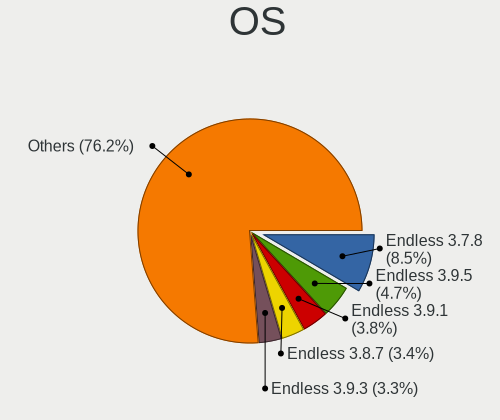

| Name                   | Computers | Percent |
|------------------------|-----------|---------|
| Endless 3.7.8          | 358       | 9.49%   |
| Endless 3.9.5          | 197       | 5.22%   |
| Endless 3.9.1          | 161       | 4.27%   |
| Endless 3.8.7          | 145       | 3.84%   |
| Endless 3.9.3          | 142       | 3.76%   |
| Endless 3.8.6          | 140       | 3.71%   |
| Endless 3.8.4          | 137       | 3.63%   |
| Endless 3.8.0          | 136       | 3.6%    |
| Endless 3.9.4          | 133       | 3.53%   |
| Endless 3.9.0          | 114       | 3.02%   |
| Endless 3.8.3          | 105       | 2.78%   |
| Endless 3.5.8          | 100       | 2.65%   |
| Endless 3.7.6          | 93        | 2.46%   |
| Endless 3.7.5          | 87        | 2.31%   |
| Endless 3.7.7          | 82        | 2.17%   |
| Endless 3.8.1          | 81        | 2.15%   |
| Endless 3.8.5          | 80        | 2.12%   |
| Endless 4.0.2          | 71        | 1.88%   |
| Endless 3.7.4          | 71        | 1.88%   |
| Endless 3.9.2          | 65        | 1.72%   |
| Endless 3.6.0          | 62        | 1.64%   |
| Endless 3.6.4          | 61        | 1.62%   |
| Endless 3.7.3          | 58        | 1.54%   |
| Endless 3.6.2          | 58        | 1.54%   |
| Endless 3.3.19         | 58        | 1.54%   |
| Endless 3.5.7          | 57        | 1.51%   |
| Endless 3.6.1          | 53        | 1.4%    |
| Endless 3.3.19-nexthw1 | 50        | 1.33%   |
| Endless 3.6.3          | 48        | 1.27%   |
| Endless 4.0.6          | 46        | 1.22%   |
| Endless 3.5.4          | 44        | 1.17%   |
| Endless 3.5.3          | 39        | 1.03%   |
| Endless 3.5.6          | 36        | 0.95%   |
| Endless 4.0.3          | 34        | 0.9%    |
| Endless 3.3.20-nexthw1 | 34        | 0.9%    |
| Endless 3.5.9          | 33        | 0.87%   |
| Endless 3.9.6          | 32        | 0.85%   |
| Endless 3.5.1          | 32        | 0.85%   |
| Endless 3.4.8          | 31        | 0.82%   |
| Endless 3.4.2-nexthw1  | 31        | 0.82%   |
| Endless 4.0.7          | 30        | 0.8%    |
| Endless 4.0.0          | 30        | 0.8%    |
| Endless 4.0.4          | 27        | 0.72%   |
| Endless 3.9.7          | 22        | 0.58%   |
| Endless 3.3.16-nexthw1 | 20        | 0.53%   |
| Endless 3.4.3-nexthw1  | 17        | 0.45%   |
| Endless 3.9.3-nexthw1  | 12        | 0.32%   |
| Endless 3.6.0-nexthw1  | 11        | 0.29%   |
| Endless 3.3.20         | 11        | 0.29%   |
| Endless 4.0.8          | 10        | 0.27%   |
| Endless 3.6.3-nexthw1  | 10        | 0.27%   |
| Endless 3.6.1-nexthw1  | 10        | 0.27%   |
| Endless 3.4.8-nexthw1  | 10        | 0.27%   |
| Endless 4.0.1          | 9         | 0.24%   |
| Endless 3.7.7-nexthw1  | 9         | 0.24%   |
| Endless 3.5.7-nexthw1  | 9         | 0.24%   |
| Endless 3.5.2          | 9         | 0.24%   |
| Endless 3.5.0          | 9         | 0.24%   |
| Endless 3.4.6          | 9         | 0.24%   |
| Endless 3.4.4-nexthw1  | 9         | 0.24%   |

OS Family
---------

OS without a version

| Name    | Computers | Percent |
|---------|-----------|---------|
| Endless | 3233      | 100%    |

Kernel
------

Version of the Linux kernel

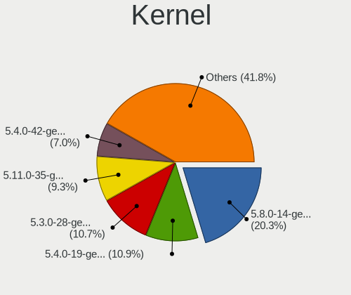

| Version           | Computers | Percent |
|-------------------|-----------|---------|
| 5.8.0-14-generic  | 775       | 21.52%  |
| 5.4.0-19-generic  | 435       | 12.08%  |
| 5.3.0-28-generic  | 430       | 11.94%  |
| 5.4.0-42-generic  | 281       | 7.8%    |
| 5.11.0-35-generic | 240       | 6.66%   |
| 5.3.0-23-generic  | 183       | 5.08%   |
| 4.18.0-15-generic | 179       | 4.97%   |
| 5.0.0-25-generic  | 107       | 2.97%   |
| 4.15.0-15-generic | 89        | 2.47%   |
| 4.13.0-32-generic | 87        | 2.42%   |
| 4.18.0-12-generic | 83        | 2.3%    |
| 5.4.0-39-generic  | 80        | 2.22%   |
| 5.3.0-12-generic  | 75        | 2.08%   |
| 5.3.0-19-generic  | 71        | 1.97%   |
| 5.0.0-15-generic  | 62        | 1.72%   |
| 5.0.0-20-generic  | 58        | 1.61%   |
| 5.0.0-17-generic  | 53        | 1.47%   |
| 4.18.0-10-generic | 51        | 1.42%   |
| 4.18.0-11-generic | 48        | 1.33%   |
| 4.16.0-4-generic  | 48        | 1.33%   |
| 4.15.0-34-generic | 31        | 0.86%   |
| 4.15.0-12-generic | 24        | 0.67%   |
| 5.1.0-2-generic   | 21        | 0.58%   |
| 5.4.0-7-generic   | 13        | 0.36%   |
| 5.11.0-12-generic | 12        | 0.33%   |
| 4.15.0-23-generic | 11        | 0.31%   |
| 5.0.0-7-generic   | 9         | 0.25%   |
| 4.17.0-4-generic  | 9         | 0.25%   |
| 5.6.0-7-generic   | 8         | 0.22%   |
| 4.18.0-7-generic  | 8         | 0.22%   |
| 5.10.0-10-generic | 5         | 0.14%   |
| 4.13.0-19-generic | 5         | 0.14%   |
| 4.15.0-22-generic | 4         | 0.11%   |
| 5.0.0-8-generic   | 2         | 0.06%   |
| 4.15.0-33-generic | 2         | 0.06%   |
| 5.13.0-20-generic | 1         | 0.03%   |
| 4.14.0-16-generic | 1         | 0.03%   |
| Unknown           | 1         | 0.03%   |

Kernel Family
-------------

Linux kernel without a distro release

| Version | Computers | Percent |
|---------|-----------|---------|
| 5.8.0   | 775       | 22.14%  |
| 5.4.0   | 770       | 22%     |
| 5.3.0   | 733       | 20.94%  |
| 4.18.0  | 345       | 9.86%   |
| 5.0.0   | 278       | 7.94%   |
| 5.11.0  | 252       | 7.2%    |
| 4.15.0  | 161       | 4.6%    |
| 4.13.0  | 92        | 2.63%   |
| 4.16.0  | 48        | 1.37%   |
| 5.1.0   | 21        | 0.6%    |
| 4.17.0  | 9         | 0.26%   |
| 5.6.0   | 8         | 0.23%   |
| 5.10.0  | 5         | 0.14%   |
| 5.13.0  | 1         | 0.03%   |
| 4.14.0  | 1         | 0.03%   |
| Unknown | 1         | 0.03%   |

Kernel Major Ver.
-----------------

Linux kernel major version

| Version | Computers | Percent |
|---------|-----------|---------|
| 5.8     | 775       | 22.14%  |
| 5.4     | 770       | 22%     |
| 5.3     | 733       | 20.94%  |
| 4.18    | 345       | 9.86%   |
| 5.0     | 278       | 7.94%   |
| 5.11    | 252       | 7.2%    |
| 4.15    | 161       | 4.6%    |
| 4.13    | 92        | 2.63%   |
| 4.16    | 48        | 1.37%   |
| 5.1     | 21        | 0.6%    |
| 4.17    | 9         | 0.26%   |
| 5.6     | 8         | 0.23%   |
| 5.10    | 5         | 0.14%   |
| 5.13    | 1         | 0.03%   |
| 4.14    | 1         | 0.03%   |
| Unknown | 1         | 0.03%   |

Arch
----

OS architecture (x86_64, i586, etc.)

| Name    | Computers | Percent |
|---------|-----------|---------|
| x86_64  | 3225      | 99.75%  |
| aarch64 | 8         | 0.25%   |

DE
--

Desktop Environment

| Name    | Computers | Percent |
|---------|-----------|---------|
| GNOME   | 2535      | 77.03%  |
| Unknown | 756       | 22.97%  |

Display Server
--------------

X11 or Wayland

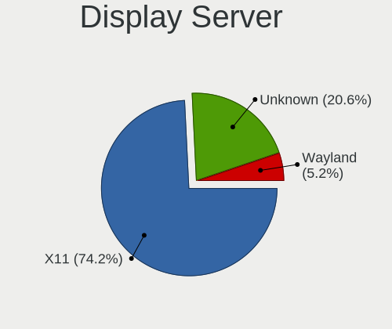

| Name    | Computers | Percent |
|---------|-----------|---------|
| X11     | 2529      | 76.87%  |
| Unknown | 760       | 23.1%   |
| Wayland | 1         | 0.03%   |

Display Manager
---------------

SDDM, LightDM, etc.

| Name    | Computers | Percent |
|---------|-----------|---------|
| Unknown | 3233      | 100%    |

OS Lang
-------

Language

| Lang        | Computers | Percent |
|-------------|-----------|---------|
| pt_BR       | 828       | 25.06%  |
| Unknown     | 767       | 23.21%  |
| en_US       | 646       | 19.55%  |
| ru_RU       | 178       | 5.39%   |
| ro_RO       | 90        | 2.72%   |
| es_ES       | 79        | 2.39%   |
| de_DE       | 75        | 2.27%   |
| es_MX       | 66        | 2%      |
| hu_HU       | 54        | 1.63%   |
| ru_RU.UTF_8 | 48        | 1.45%   |
| fr_FR       | 46        | 1.39%   |
| en_GB       | 43        | 1.3%    |
| it_IT       | 39        | 1.18%   |
| ru_UA       | 36        | 1.09%   |
| es_CO       | 30        | 0.91%   |
| pt_PT       | 22        | 0.67%   |
| pl_PL       | 22        | 0.67%   |
| es_AR       | 22        | 0.67%   |
| uk_UA       | 20        | 0.61%   |
| tr_TR       | 20        | 0.61%   |
| bg_BG       | 12        | 0.36%   |
| sr_RS@latin | 10        | 0.3%    |
| id_ID       | 9         | 0.27%   |
| en_PH       | 9         | 0.27%   |
| en_IN       | 9         | 0.27%   |
| cs_CZ       | 9         | 0.27%   |
| nl_NL       | 8         | 0.24%   |
| el_GR       | 8         | 0.24%   |
| hr_HR       | 7         | 0.21%   |
| de_AT       | 7         | 0.21%   |
| nl_BE       | 6         | 0.18%   |
| zh_TW       | 5         | 0.15%   |
| sk_SK       | 5         | 0.15%   |
| ca_ES       | 5         | 0.15%   |
| sl_SI       | 4         | 0.12%   |
| ko_KR       | 4         | 0.12%   |
| en_AU       | 4         | 0.12%   |
| vi_VN       | 3         | 0.09%   |
| sv_SE       | 3         | 0.09%   |
| lt_LT       | 3         | 0.09%   |
| es_CL       | 3         | 0.09%   |
| en_CA       | 3         | 0.09%   |
| ar_AE       | 3         | 0.09%   |
| th_TH       | 2         | 0.06%   |
| nds_DE      | 2         | 0.06%   |
| fr_CA       | 2         | 0.06%   |
| fr_BE       | 2         | 0.06%   |
| fi_FI       | 2         | 0.06%   |
| es_BO       | 2         | 0.06%   |
| en_IE       | 2         | 0.06%   |
| ar_EG       | 2         | 0.06%   |
| zh_SG       | 1         | 0.03%   |
| zh_CN       | 1         | 0.03%   |
| sr_RS       | 1         | 0.03%   |
| si_LK       | 1         | 0.03%   |
| it_CH       | 1         | 0.03%   |
| he_IL       | 1         | 0.03%   |
| fr_CH       | 1         | 0.03%   |
| et_EE       | 1         | 0.03%   |
| es_VE       | 1         | 0.03%   |

Boot Mode
---------

EFI or BIOS

| Mode | Computers | Percent |
|------|-----------|---------|
| EFI  | 2088      | 63.01%  |
| BIOS | 1226      | 36.99%  |

Filesystem
----------

Type of filesystem

| Type    | Computers | Percent |
|---------|-----------|---------|
| Ext4    | 2386      | 72.52%  |
| Unknown | 810       | 24.62%  |
| Tmpfs   | 92        | 2.8%    |
| Overlay | 1         | 0.03%   |
| Btrfs   | 1         | 0.03%   |

Part. scheme
------------

Scheme of partitioning

| Type    | Computers | Percent |
|---------|-----------|---------|
| Unknown | 3226      | 99.69%  |
| GPT     | 10        | 0.31%   |

Dual Boot with Linux/BSD
------------------------

Hosting more than one Linux/BSD

| Dual boot | Computers | Percent |
|-----------|-----------|---------|
| No        | 3232      | 99.97%  |
| Yes       | 1         | 0.03%   |

Dual Boot (Win)
---------------

Hosting Linux and Windows

| Dual boot | Computers | Percent |
|-----------|-----------|---------|
| No        | 3229      | 99.88%  |
| Yes       | 4         | 0.12%   |

Board
-----

Vendor
------

Motherboard manufacturer

| Name                    | Computers | Percent |
|-------------------------|-----------|---------|
| ASUSTek Computer        | 1078      | 33.34%  |
| Acer                    | 903       | 27.93%  |
| Hewlett-Packard         | 223       | 6.9%    |
| Lenovo                  | 184       | 5.69%   |
| Dell                    | 174       | 5.38%   |
| Gigabyte Technology     | 92        | 2.85%   |
| Positivo                | 59        | 1.82%   |
| Toshiba                 | 49        | 1.52%   |
| MSI                     | 44        | 1.36%   |
| ASRock                  | 36        | 1.11%   |
| Intel                   | 33        | 1.02%   |
| Samsung Electronics     | 30        | 0.93%   |
| Sony                    | 21        | 0.65%   |
| Apple                   | 20        | 0.62%   |
| Foxconn                 | 18        | 0.56%   |
| Unknown                 | 18        | 0.56%   |
| ECS                     | 13        | 0.4%    |
| AMI                     | 12        | 0.37%   |
| Pegatron                | 11        | 0.34%   |
| LG Electronics          | 11        | 0.34%   |
| Packard Bell            | 10        | 0.31%   |
| Fujitsu                 | 9         | 0.28%   |
| Semp Toshiba            | 8         | 0.25%   |
| Raspberry Pi Foundation | 8         | 0.25%   |
| Itautec                 | 8         | 0.25%   |
| Digibras                | 8         | 0.25%   |
| Biostar                 | 8         | 0.25%   |
| Medion                  | 7         | 0.22%   |
| Fujitsu Siemens         | 7         | 0.22%   |
| eMachines               | 7         | 0.22%   |
| Megaware                | 5         | 0.15%   |
| Google                  | 5         | 0.15%   |
| Gateway                 | 5         | 0.15%   |
| ZOTAC                   | 4         | 0.12%   |
| Philco                  | 4         | 0.12%   |
| PCWare                  | 4         | 0.12%   |
| Microsoft               | 4         | 0.12%   |
| Chuwi                   | 4         | 0.12%   |
| OEM                     | 3         | 0.09%   |
| Notebook                | 3         | 0.09%   |
| CCE                     | 3         | 0.09%   |
| AAEON                   | 3         | 0.09%   |
| VS Company              | 2         | 0.06%   |
| TrekStor                | 2         | 0.06%   |
| Shuttle                 | 2         | 0.06%   |
| Multilaser              | 2         | 0.06%   |
| MODECOM                 | 2         | 0.06%   |
| Login Informatica       | 2         | 0.06%   |
| IP3 Tech                | 2         | 0.06%   |
| IBM                     | 2         | 0.06%   |
| HUAWEI                  | 2         | 0.06%   |
| Huanan                  | 2         | 0.06%   |
| Hampoo                  | 2         | 0.06%   |
| Digiboard               | 2         | 0.06%   |
| Compal                  | 2         | 0.06%   |
| Clevo                   | 2         | 0.06%   |
| AMD                     | 2         | 0.06%   |
| Trinity                 | 1         | 0.03%   |
| TriGem Computer         | 1         | 0.03%   |
| TPVAOC                  | 1         | 0.03%   |

Model
-----

Motherboard model

| Name                                       | Computers | Percent |
|--------------------------------------------|-----------|---------|
| Acer Nitro AN515-54                        | 121       | 3.74%   |
| ASUS VivoBook 15_ASUS Laptop X540UAR       | 58        | 1.79%   |
| Acer Nitro AN515-44                        | 58        | 1.79%   |
| Acer Aspire A315-53                        | 55        | 1.7%    |
| Acer Nitro AN517-51                        | 48        | 1.48%   |
| Acer Aspire A315-34                        | 47        | 1.45%   |
| ASUS X541NA                                | 43        | 1.33%   |
| ASUS VivoBook 15_ASUS Laptop X540MA_X543MA | 41        | 1.27%   |
| ASUS VivoBook 15_ASUS Laptop X540MA_X540MA | 40        | 1.24%   |
| Acer Nitro AN515-43                        | 40        | 1.24%   |
| ASUS VivoBook 15_ASUS Laptop X540BA        | 34        | 1.05%   |
| Unknown                                    | 27        | 0.84%   |
| ASUS ZenBook UX431DA_UM431DA               | 26        | 0.8%    |
| Acer Nitro AN515-52                        | 26        | 0.8%    |
| ASUS X540NA                                | 24        | 0.74%   |
| Acer Aspire A315-21                        | 21        | 0.65%   |
| Acer Aspire A315-51                        | 20        | 0.62%   |
| ASUS VivoBook 15_ASUS Laptop X540UBR       | 19        | 0.59%   |
| ASUS VivoBook_ASUSLaptop X509JA_X509JA     | 18        | 0.56%   |
| Acer Aspire A515-54G                       | 18        | 0.56%   |
| Acer Aspire A315-31                        | 17        | 0.53%   |
| ASUS X541UAK                               | 15        | 0.46%   |
| Acer Aspire A515-51G                       | 15        | 0.46%   |
| Acer Aspire A315-54                        | 15        | 0.46%   |
| ASUS VivoBook_ASUSLaptop X570ZD_X570ZD     | 14        | 0.43%   |
| ASUS VivoBook_ASUS Laptop X505ZA_X505ZA    | 14        | 0.43%   |
| ASUS VivoBook 15_ASUS Laptop X540MA_R540MA | 14        | 0.43%   |
| Acer Aspire A315-54K                       | 14        | 0.43%   |
| HP Notebook                                | 13        | 0.4%    |
| Positivo S14CT01                           | 12        | 0.37%   |
| ASUS VivoBook_ASUSLaptop X509FA_X509FA     | 12        | 0.37%   |
| Acer Aspire A517-51G                       | 12        | 0.37%   |
| Acer Aspire A515-51                        | 12        | 0.37%   |
| ASUS VivoBook 15_ASUS Laptop X507MA_X507MA | 11        | 0.34%   |
| ASUS All Series                            | 11        | 0.34%   |
| Acer Nitro AN515-51                        | 11        | 0.34%   |
| Acer Extensa 2540                          | 11        | 0.34%   |
| Acer Aspire XC-830                         | 11        | 0.34%   |
| Acer Aspire A315-33                        | 11        | 0.34%   |
| Positivo Mobile                            | 10        | 0.31%   |
| ASUS X540LA                                | 10        | 0.31%   |
| ASUS VivoBook_ASUSLaptop X515JA_X515JA     | 10        | 0.31%   |
| ASUS VivoBook 15_ASUS Laptop X540MB_X540MB | 10        | 0.31%   |
| ASUS VivoBook 15_ASUS Laptop X507UAR       | 10        | 0.31%   |
| ASUS VivoBook_ASUSLaptop X509DA_M509DA     | 9         | 0.28%   |
| ASUS VivoBook 15_ASUS Laptop X540MA_A540MA | 9         | 0.28%   |
| Acer Predator PH315-52                     | 9         | 0.28%   |
| Acer Aspire XC-885                         | 9         | 0.28%   |
| RPi Raspberry Pi 4 Model B                 | 8         | 0.25%   |
| ASUS VivoBook_ASUSLaptop X580GD_N580GD     | 8         | 0.25%   |
| ASUS VivoBook_ASUS Laptop E406MA_E406MA    | 8         | 0.25%   |
| Acer Aspire ES1-132                        | 8         | 0.25%   |
| Acer Aspire A315-56                        | 8         | 0.25%   |
| Acer Aspire A315-21G                       | 8         | 0.25%   |
| HP Pavilion dv6                            | 7         | 0.22%   |
| Dell Latitude E6420                        | 7         | 0.22%   |
| ASUS Z550SA                                | 7         | 0.22%   |
| ASUS X542UN                                | 7         | 0.22%   |
| ASUS X540NV                                | 7         | 0.22%   |
| ASUS VivoBook_ASUSLaptop X513EA_K513EA     | 7         | 0.22%   |

Model Family
------------

Motherboard model prefix

| Name                    | Computers | Percent |
|-------------------------|-----------|---------|
| ASUS VivoBook           | 578       | 17.88%  |
| Acer Aspire             | 473       | 14.63%  |
| Acer Nitro              | 319       | 9.87%   |
| Dell Inspiron           | 69        | 2.13%   |
| Lenovo IdeaPad          | 57        | 1.76%   |
| Lenovo ThinkPad         | 46        | 1.42%   |
| HP Pavilion             | 44        | 1.36%   |
| Toshiba Satellite       | 43        | 1.33%   |
| ASUS X541NA             | 43        | 1.33%   |
| Dell Latitude           | 42        | 1.3%    |
| ASUS ZenBook            | 38        | 1.18%   |
| Dell OptiPlex           | 34        | 1.05%   |
| Unknown                 | 27        | 0.84%   |
| HP Compaq               | 26        | 0.8%    |
| Acer TravelMate         | 26        | 0.8%    |
| ASUS X540NA             | 24        | 0.74%   |
| Lenovo ThinkCentre      | 21        | 0.65%   |
| HP ProBook              | 20        | 0.62%   |
| ASUS Vivo               | 19        | 0.59%   |
| HP Laptop               | 18        | 0.56%   |
| Acer Swift              | 18        | 0.56%   |
| Acer Extensa            | 18        | 0.56%   |
| Acer Veriton            | 16        | 0.49%   |
| Acer Predator           | 16        | 0.49%   |
| ASUS X541UAK            | 15        | 0.46%   |
| ASUS PRIME              | 14        | 0.43%   |
| HP Notebook             | 13        | 0.4%    |
| HP EliteBook            | 13        | 0.4%    |
| ASUS ASUS               | 13        | 0.4%    |
| Positivo S14CT01        | 12        | 0.37%   |
| Dell Vostro             | 12        | 0.37%   |
| ASUS ASUSPRO            | 12        | 0.37%   |
| ASUS All                | 11        | 0.34%   |
| Positivo Mobile         | 10        | 0.31%   |
| ASUS X540LA             | 10        | 0.31%   |
| Packard Bell EasyNote   | 9         | 0.28%   |
| ASUS M5A78L-M           | 9         | 0.28%   |
| RPi Raspberry           | 8         | 0.25%   |
| Itautec Infoway         | 8         | 0.25%   |
| Fujitsu ESPRIMO         | 7         | 0.22%   |
| ASUS Z550SA             | 7         | 0.22%   |
| ASUS X542UN             | 7         | 0.22%   |
| ASUS X540NV             | 7         | 0.22%   |
| ASUS TUF                | 7         | 0.22%   |
| HP ENVY                 | 6         | 0.19%   |
| HP EliteDesk            | 6         | 0.19%   |
| HP 250                  | 6         | 0.19%   |
| HP 2000                 | 6         | 0.19%   |
| Fujitsu Siemens ESPRIMO | 6         | 0.19%   |
| Digibras NH4CU53        | 6         | 0.19%   |
| ASUS P8H61-M            | 6         | 0.19%   |
| ASUS GL753VD            | 6         | 0.19%   |
| MSI MS-7309             | 5         | 0.15%   |
| Lenovo Yoga             | 5         | 0.15%   |
| HP 255                  | 5         | 0.15%   |
| Gigabyte B360M          | 5         | 0.15%   |
| ECS A320AM4-M3D         | 5         | 0.15%   |
| Dell XPS                | 5         | 0.15%   |
| Dell Precision          | 5         | 0.15%   |
| ASUS X541UVK            | 5         | 0.15%   |

MFG Year
--------

Motherboard manufacture year

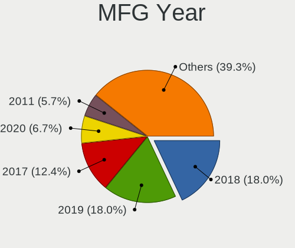

| Year    | Computers | Percent |
|---------|-----------|---------|
| 2018    | 618       | 19.12%  |
| 2019    | 609       | 18.84%  |
| 2017    | 425       | 13.15%  |
| 2020    | 190       | 5.88%   |
| 2011    | 183       | 5.66%   |
| 2016    | 166       | 5.13%   |
| 2012    | 152       | 4.7%    |
| 2010    | 144       | 4.45%   |
| 2013    | 140       | 4.33%   |
| 2015    | 117       | 3.62%   |
| 2014    | 117       | 3.62%   |
| 2008    | 117       | 3.62%   |
| 2009    | 109       | 3.37%   |
| 2007    | 72        | 2.23%   |
| 2021    | 53        | 1.64%   |
| 2006    | 13        | 0.4%    |
| 2005    | 3         | 0.09%   |
| 2022    | 2         | 0.06%   |
| 2004    | 2         | 0.06%   |
| Unknown | 1         | 0.03%   |

Form Factor
-----------

Physical design of the computer

| Name           | Computers | Percent |
|----------------|-----------|---------|
| Notebook       | 2456      | 75.97%  |
| Desktop        | 626       | 19.36%  |
| All in one     | 78        | 2.41%   |
| Convertible    | 22        | 0.68%   |
| Tablet         | 21        | 0.65%   |
| Mini pc        | 20        | 0.62%   |
| System on chip | 8         | 0.25%   |
| Server         | 2         | 0.06%   |

Secure Boot
-----------

Enabled or disabled

| State    | Computers | Percent |
|----------|-----------|---------|
| Disabled | 2488      | 76.25%  |
| Enabled  | 775       | 23.75%  |

Coreboot
--------

Have coreboot on board

| Used | Computers | Percent |
|------|-----------|---------|
| No   | 3228      | 99.85%  |
| Yes  | 5         | 0.15%   |

RAM Size
--------

Total RAM memory

| Size in GB  | Computers | Percent |
|-------------|-----------|---------|
| 3.01-4.0    | 1332      | 40.83%  |
| 4.01-8.0    | 1104      | 33.84%  |
| 8.01-16.0   | 311       | 9.53%   |
| 1.01-2.0    | 261       | 8%      |
| 16.01-24.0  | 162       | 4.97%   |
| 2.01-3.0    | 44        | 1.35%   |
| 32.01-64.0  | 18        | 0.55%   |
| 24.01-32.0  | 14        | 0.43%   |
| 0.51-1.0    | 9         | 0.28%   |
| 64.01-256.0 | 5         | 0.15%   |
| Unknown     | 2         | 0.06%   |

RAM Used
--------

Used RAM memory

| Used GB   | Computers | Percent |
|-----------|-----------|---------|
| 1.01-2.0  | 1815      | 50.93%  |
| 2.01-3.0  | 817       | 22.92%  |
| 0.51-1.0  | 572       | 16.05%  |
| 3.01-4.0  | 233       | 6.54%   |
| 4.01-8.0  | 119       | 3.34%   |
| 0.01-0.5  | 4         | 0.11%   |
| 8.01-16.0 | 2         | 0.06%   |
| Unknown   | 2         | 0.06%   |

Total Drives
------------

Number of drives on board

| Drives  | Computers | Percent |
|---------|-----------|---------|
| 1       | 2490      | 75.94%  |
| 2       | 680       | 20.74%  |
| 3       | 66        | 2.01%   |
| 4       | 16        | 0.49%   |
| 0       | 14        | 0.43%   |
| 6       | 5         | 0.15%   |
| 5       | 5         | 0.15%   |
| 7       | 2         | 0.06%   |
| Unknown | 1         | 0.03%   |

Has CD-ROM
----------

Has CD-ROM on board

| Presented | Computers | Percent |
|-----------|-----------|---------|
| No        | 2123      | 65.26%  |
| Yes       | 1130      | 34.74%  |

Has Ethernet
------------

Has Ethernet on board

| Presented | Computers | Percent |
|-----------|-----------|---------|
| Yes       | 2469      | 76.2%   |
| No        | 771       | 23.8%   |

Has WiFi
--------

Has WiFi module

| Presented | Computers | Percent |
|-----------|-----------|---------|
| Yes       | 2790      | 86.03%  |
| No        | 453       | 13.97%  |

Has Bluetooth
-------------

Has Bluetooth module

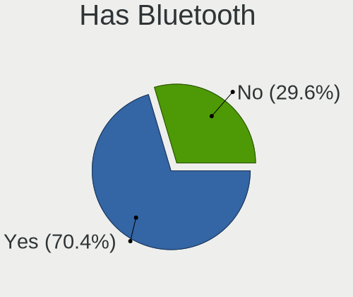

| Presented | Computers | Percent |
|-----------|-----------|---------|
| Yes       | 2264      | 69.68%  |
| No        | 985       | 30.32%  |

Location
--------

Country
-------

Geographic location (country)

| Country                | Computers | Percent |
|------------------------|-----------|---------|
| Brazil                 | 969       | 29.86%  |
| Russia                 | 277       | 8.54%   |
| USA                    | 274       | 8.44%   |
| Romania                | 239       | 7.37%   |
| Germany                | 127       | 3.91%   |
| Spain                  | 118       | 3.64%   |
| Ukraine                | 115       | 3.54%   |
| Hungary                | 77        | 2.37%   |
| Colombia               | 65        | 2%      |
| UK                     | 52        | 1.6%    |
| India                  | 49        | 1.51%   |
| France                 | 48        | 1.48%   |
| Mexico                 | 46        | 1.42%   |
| Italy                  | 45        | 1.39%   |
| Portugal               | 40        | 1.23%   |
| Belarus                | 38        | 1.17%   |
| Argentina              | 36        | 1.11%   |
| Canada                 | 35        | 1.08%   |
| Poland                 | 34        | 1.05%   |
| Serbia                 | 33        | 1.02%   |
| Philippines            | 29        | 0.89%   |
| Indonesia              | 28        | 0.86%   |
| Bulgaria               | 27        | 0.83%   |
| Turkey                 | 26        | 0.8%    |
| Croatia                | 23        | 0.71%   |
| Saudi Arabia           | 18        | 0.55%   |
| Kazakhstan             | 17        | 0.52%   |
| Greece                 | 17        | 0.52%   |
| Australia              | 17        | 0.52%   |
| Iran                   | 16        | 0.49%   |
| Netherlands            | 15        | 0.46%   |
| Thailand               | 14        | 0.43%   |
| New Zealand            | 14        | 0.43%   |
| Czechia                | 13        | 0.4%    |
| Georgia                | 11        | 0.34%   |
| Austria                | 11        | 0.34%   |
| Kenya                  | 10        | 0.31%   |
| Sweden                 | 9         | 0.28%   |
| South Africa           | 9         | 0.28%   |
| Slovenia               | 9         | 0.28%   |
| Belgium                | 9         | 0.28%   |
| South Korea            | 8         | 0.25%   |
| North Macedonia        | 8         | 0.25%   |
| Malaysia               | 8         | 0.25%   |
| Israel                 | 8         | 0.25%   |
| Egypt                  | 8         | 0.25%   |
| Vietnam                | 7         | 0.22%   |
| Taiwan                 | 7         | 0.22%   |
| Switzerland            | 7         | 0.22%   |
| Slovakia               | 7         | 0.22%   |
| Chile                  | 7         | 0.22%   |
| Uruguay                | 5         | 0.15%   |
| Peru                   | 5         | 0.15%   |
| Ireland                | 5         | 0.15%   |
| Moldova                | 4         | 0.12%   |
| Lithuania              | 4         | 0.12%   |
| Japan                  | 4         | 0.12%   |
| Finland                | 4         | 0.12%   |
| Bosnia and Herzegovina | 4         | 0.12%   |
| Bangladesh             | 4         | 0.12%   |

City
----

Geographic location (city)

| City                 | Computers | Percent |
|----------------------|-----------|---------|
| Sao Paulo            | 113       | 3.27%   |
| Moscow               | 87        | 2.52%   |
| Bucharest            | 79        | 2.29%   |
| Rio de Janeiro       | 55        | 1.59%   |
| Kyiv                 | 37        | 1.07%   |
| Budapest             | 36        | 1.04%   |
| Braslia            | 35        | 1.01%   |
| St Petersburg        | 31        | 0.9%    |
| Bogot              | 26        | 0.75%   |
| Curitiba             | 24        | 0.7%    |
| Belgrade             | 23        | 0.67%   |
| Cluj-Napoca          | 22        | 0.64%   |
| Salvador             | 20        | 0.58%   |
| Belo Horizonte       | 19        | 0.55%   |
| Porto Alegre         | 17        | 0.49%   |
| Fortaleza            | 17        | 0.49%   |
| Minsk                | 16        | 0.46%   |
| Santo Andr         | 14        | 0.41%   |
| Warsaw               | 13        | 0.38%   |
| Sofia                | 13        | 0.38%   |
| Quezon City          | 13        | 0.38%   |
| Niteri             | 13        | 0.38%   |
| Madrid               | 13        | 0.38%   |
| Jakarta              | 12        | 0.35%   |
| Istanbul             | 12        | 0.35%   |
| Iasi                 | 12        | 0.35%   |
| Campinas             | 12        | 0.35%   |
| Bucyrus              | 12        | 0.35%   |
| Tehran               | 11        | 0.32%   |
| Berlin               | 11        | 0.32%   |
| Popesti-Leordeni     | 10        | 0.29%   |
| Paris                | 10        | 0.29%   |
| Lisbon               | 10        | 0.29%   |
| Barcelona            | 10        | 0.29%   |
| Zagreb               | 9         | 0.26%   |
| Rome                 | 9         | 0.26%   |
| Recife               | 9         | 0.26%   |
| Ploieti            | 9         | 0.26%   |
| Nairobi              | 9         | 0.26%   |
| Krasnodar            | 9         | 0.26%   |
| Campo Grande         | 9         | 0.26%   |
| Brisbane             | 9         | 0.26%   |
| Sao Jos dos Campos | 8         | 0.23%   |
| Sao Carlos           | 8         | 0.23%   |
| Osasco               | 8         | 0.23%   |
| Mexico City          | 8         | 0.23%   |
| Medelln            | 8         | 0.23%   |
| Maring             | 8         | 0.23%   |
| Manaus               | 8         | 0.23%   |
| Kolkata              | 8         | 0.23%   |
| Hamburg              | 8         | 0.23%   |
| Goinia             | 8         | 0.23%   |
| Florianpolis       | 8         | 0.23%   |
| Chelyabinsk          | 8         | 0.23%   |
| Buenos Aires         | 8         | 0.23%   |
| Auckland             | 8         | 0.23%   |
| Athens               | 8         | 0.23%   |
| Vienna               | 7         | 0.2%    |
| Santiago de Cali     | 7         | 0.2%    |
| Sacramento           | 7         | 0.2%    |

Drives
------

Drive Vendor
------------

Hard drive vendors

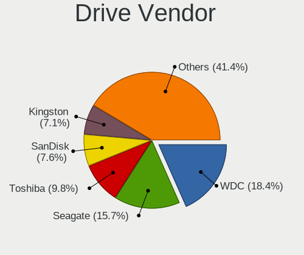

| Vendor                | Computers | Drives | Percent |
|-----------------------|-----------|--------|---------|
| WDC                   | 763       | 912    | 19.25%  |
| Seagate               | 647       | 832    | 16.33%  |
| Toshiba               | 402       | 493    | 10.14%  |
| SanDisk               | 291       | 352    | 7.34%   |
| Intel                 | 290       | 349    | 7.32%   |
| Kingston              | 288       | 399    | 7.27%   |
| Unknown               | 245       | 317    | 6.18%   |
| Samsung Electronics   | 225       | 279    | 5.68%   |
| SK hynix              | 113       | 139    | 2.85%   |
| Hitachi               | 102       | 108    | 2.57%   |
| HGST                  | 96        | 120    | 2.42%   |
| A-DATA Technology     | 93        | 106    | 2.35%   |
| Micron Technology     | 53        | 75     | 1.34%   |
| Crucial               | 39        | 51     | 0.98%   |
| ADATA Technology      | 35        | 37     | 0.88%   |
| China                 | 17        | 18     | 0.43%   |
| Fujitsu               | 16        | 16     | 0.4%    |
| Phison                | 15        | 16     | 0.38%   |
| OCZ                   | 15        | 15     | 0.38%   |
| Maxtor                | 15        | 17     | 0.38%   |
| SPCC                  | 13        | 14     | 0.33%   |
| Silicon Motion        | 13        | 13     | 0.33%   |
| LITEON                | 10        | 12     | 0.25%   |
| Transcend             | 9         | 13     | 0.23%   |
| PNY                   | 8         | 9      | 0.2%    |
| Patriot               | 8         | 8      | 0.2%    |
| Apple                 | 8         | 8      | 0.2%    |
| Goodram               | 7         | 7      | 0.18%   |
| Realtek Semiconductor | 6         | 7      | 0.15%   |
| Kingmax               | 6         | 7      | 0.15%   |
| Netac                 | 5         | 6      | 0.13%   |
| KingDian              | 5         | 6      | 0.13%   |
| Hewlett-Packard       | 5         | 19     | 0.13%   |
| KingSpec              | 4         | 4      | 0.1%    |
| Intenso               | 4         | 4      | 0.1%    |
| Corsair               | 4         | 5      | 0.1%    |
| ASMT                  | 4         | 6      | 0.1%    |
| Team                  | 3         | 3      | 0.08%   |
| Mushkin               | 3         | 4      | 0.08%   |
| LITEONIT              | 3         | 3      | 0.08%   |
| JMicron Technology    | 3         | 3      | 0.08%   |
| Dogfish               | 3         | 3      | 0.08%   |
| XPG                   | 2         | 2      | 0.05%   |
| Verbatim              | 2         | 2      | 0.05%   |
| TSA                   | 2         | 2      | 0.05%   |
| TO Exter              | 2         | 4      | 0.05%   |
| StoreJet              | 2         | 3      | 0.05%   |
| Lite-On               | 2         | 2      | 0.05%   |
| KIOXIA                | 2         | 2      | 0.05%   |
| KingFast              | 2         | 4      | 0.05%   |
| Gigabyte Technology   | 2         | 2      | 0.05%   |
| FORESEE               | 2         | 3      | 0.05%   |
| Emtec                 | 2         | 2      | 0.05%   |
| Dell                  | 2         | 2      | 0.05%   |
| AMD                   | 2         | 2      | 0.05%   |
| ZTE                   | 1         | 1      | 0.03%   |
| Zheino                | 1         | 1      | 0.03%   |
| Win Memory            | 1         | 1      | 0.03%   |
| Vaseky                | 1         | 1      | 0.03%   |
| V-GeN                 | 1         | 1      | 0.03%   |

Drive Model
-----------

Hard drive models

| Model                                 | Computers | Percent |
|---------------------------------------|-----------|---------|
| WDC WD10SPZX-21Z10T0 1TB              | 362       | 8.88%   |
| Seagate ST1000LM035-1RK172 1TB        | 185       | 4.54%   |
| Toshiba MQ01ABF050 500GB              | 139       | 3.41%   |
| Intel NVMe SSD Drive 512GB            | 126       | 3.09%   |
| Toshiba MQ04ABF100 1TB                | 109       | 2.67%   |
| Unknown MMC Card  32GB                | 94        | 2.31%   |
| Intel NVMe SSD Drive 256GB            | 76        | 1.86%   |
| SanDisk NVMe SSD Drive 512GB          | 75        | 1.84%   |
| Intel SSDPEKKW256G7 256GB             | 69        | 1.69%   |
| A-DATA IM2S3338-128GD2 128GB SSD      | 68        | 1.67%   |
| Kingston RBUSC180DS37256GJ 256GB SSD  | 67        | 1.64%   |
| Unknown MMC Card  64GB                | 53        | 1.3%    |
| Seagate ST500LT012-1DG142 500GB       | 44        | 1.08%   |
| SK hynix NVMe SSD Drive 256GB         | 34        | 0.83%   |
| Kingston NVMe SSD Drive 256GB         | 32        | 0.79%   |
| WDC WD5000LPCX-21VHAT0 500GB          | 31        | 0.76%   |
| Seagate ST500DM002-1BD142 500GB       | 30        | 0.74%   |
| SanDisk NVMe SSD Drive 256GB          | 30        | 0.74%   |
| Kingston SA400S37240G 240GB SSD       | 30        | 0.74%   |
| Unknown SD/MMC/MS PRO 128GB           | 29        | 0.71%   |
| Toshiba MQ01ABD100 1TB                | 28        | 0.69%   |
| Micron 1100_MTFDDAV256TBN 256GB SSD   | 28        | 0.69%   |
| Seagate ST500LM030-1RK17D 500GB       | 27        | 0.66%   |
| Seagate ST500LM012 HN-M500MBB 500GB   | 27        | 0.66%   |
| Unknown MMC Card  16GB                | 26        | 0.64%   |
| SanDisk SD9SB8W256G1002 256GB SSD     | 25        | 0.61%   |
| Kingston SV300S37A120G 120GB SSD      | 24        | 0.59%   |
| Seagate ST1000DM010-2EP102 1TB        | 23        | 0.56%   |
| SK hynix HFS256G39TND-N210A 256GB SSD | 22        | 0.54%   |
| Samsung NVMe SSD Drive 256GB          | 22        | 0.54%   |
| SK hynix NVMe SSD Drive 512GB         | 21        | 0.52%   |
| ADATA NVMe SSD Drive 128GB            | 21        | 0.52%   |
| Toshiba DT01ACA100 1TB                | 19        | 0.47%   |
| SK hynix HFS128G39TND-N210A 128GB SSD | 19        | 0.47%   |
| Kingston SA400S37120G 120GB SSD       | 19        | 0.47%   |
| HGST HTS545050B7E660 500GB            | 19        | 0.47%   |
| Seagate ST1000LM024 HN-M101MBB 1TB    | 18        | 0.44%   |
| HGST HTS541010B7E610 1TB              | 17        | 0.42%   |
| SanDisk SD9SN8W256G1102 256GB SSD     | 16        | 0.39%   |
| WDC WD5000LPCX-80VHAT1 500GB          | 15        | 0.37%   |
| HGST HTS721010A9E630 1TB              | 15        | 0.37%   |
| Seagate ST9500325AS 500GB             | 14        | 0.34%   |
| Seagate ST2000LM007-1R8174 2TB        | 14        | 0.34%   |
| Samsung NVMe SSD Drive 512GB          | 14        | 0.34%   |
| Kingston RBUSNS8180DS3256GJ 256GB SSD | 14        | 0.34%   |
| Kingston RBUSNS8180DS3128GJ 128GB SSD | 14        | 0.34%   |
| ADATA NVMe SSD Drive 256GB            | 14        | 0.34%   |
| WDC WD10EZEX-08WN4A0 1TB              | 13        | 0.32%   |
| Kingston NVMe SSD Drive 512GB         | 13        | 0.32%   |
| Crucial CT240BX500SSD1 240GB          | 13        | 0.32%   |
| SanDisk SD9SN8W128G1102 128GB SSD     | 12        | 0.29%   |
| HGST HTS541010A9E680 1TB              | 12        | 0.29%   |
| Seagate ST320LM001 HN-M320MBB 320GB   | 11        | 0.27%   |
| Unknown MMC Card  128GB               | 10        | 0.25%   |
| SanDisk SD9SB8W256G1102 256GB SSD     | 10        | 0.25%   |
| SanDisk SD8SN8U128G1002 128GB SSD     | 10        | 0.25%   |
| Samsung SSD 860 EVO 250GB             | 10        | 0.25%   |
| Kingston SA400S37480G 480GB SSD       | 10        | 0.25%   |
| WDC WD5000LPVX-22V0TT0 500GB          | 9         | 0.22%   |
| WDC WD10SPZX-80Z10T2 1TB              | 9         | 0.22%   |

HDD Vendor
----------

Hard disk drive vendors

| Vendor              | Computers | Drives | Percent |
|---------------------|-----------|--------|---------|
| WDC                 | 727       | 858    | 34.32%  |
| Seagate             | 646       | 829    | 30.5%   |
| Toshiba             | 383       | 471    | 18.08%  |
| Hitachi             | 102       | 108    | 4.82%   |
| HGST                | 96        | 120    | 4.53%   |
| Samsung Electronics | 92        | 106    | 4.34%   |
| Unknown             | 30        | 38     | 1.42%   |
| Fujitsu             | 16        | 16     | 0.76%   |
| Maxtor              | 13        | 15     | 0.61%   |
| ASMT                | 4         | 6      | 0.19%   |
| Intenso             | 3         | 3      | 0.14%   |
| Apple               | 2         | 2      | 0.09%   |
| USB3.0              | 1         | 1      | 0.05%   |
| StoreJet            | 1         | 2      | 0.05%   |
| HGST HTS            | 1         | 1      | 0.05%   |
| Hewlett-Packard     | 1         | 2      | 0.05%   |

SSD Vendor
----------

Solid state drive vendors

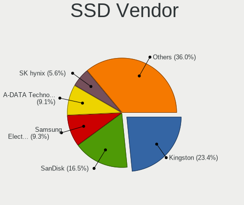

| Vendor              | Computers | Drives | Percent |
|---------------------|-----------|--------|---------|
| Kingston            | 232       | 333    | 23.39%  |
| SanDisk             | 175       | 232    | 17.64%  |
| A-DATA Technology   | 93        | 106    | 9.38%   |
| Samsung Electronics | 92        | 114    | 9.27%   |
| SK hynix            | 56        | 79     | 5.65%   |
| Micron Technology   | 47        | 69     | 4.74%   |
| WDC                 | 40        | 48     | 4.03%   |
| Crucial             | 39        | 51     | 3.93%   |
| China               | 17        | 18     | 1.71%   |
| Toshiba             | 15        | 15     | 1.51%   |
| OCZ                 | 15        | 15     | 1.51%   |
| Intel               | 14        | 24     | 1.41%   |
| SPCC                | 13        | 14     | 1.31%   |
| LITEON              | 10        | 12     | 1.01%   |
| Transcend           | 9         | 13     | 0.91%   |
| Unknown             | 8         | 9      | 0.81%   |
| PNY                 | 8         | 9      | 0.81%   |
| Patriot             | 8         | 8      | 0.81%   |
| GOODRAM             | 7         | 7      | 0.71%   |
| Kingmax             | 6         | 7      | 0.6%    |
| Apple               | 6         | 6      | 0.6%    |
| Netac               | 5         | 6      | 0.5%    |
| KingDian            | 5         | 6      | 0.5%    |
| KingSpec            | 4         | 4      | 0.4%    |
| Hewlett-Packard     | 4         | 17     | 0.4%    |
| Corsair             | 4         | 5      | 0.4%    |
| Team                | 3         | 3      | 0.3%    |
| Mushkin             | 3         | 4      | 0.3%    |
| LITEONIT            | 3         | 3      | 0.3%    |
| JMicron Technology  | 3         | 3      | 0.3%    |
| Dogfish             | 3         | 3      | 0.3%    |
| Verbatim            | 2         | 2      | 0.2%    |
| TSA                 | 2         | 2      | 0.2%    |
| TO Exter            | 2         | 4      | 0.2%    |
| Seagate             | 2         | 2      | 0.2%    |
| Maxtor              | 2         | 2      | 0.2%    |
| Gigabyte Technology | 2         | 2      | 0.2%    |
| FORESEE             | 2         | 3      | 0.2%    |
| Emtec               | 2         | 2      | 0.2%    |
| Dell                | 2         | 2      | 0.2%    |
| AMD                 | 2         | 2      | 0.2%    |
| Win Memory          | 1         | 1      | 0.1%    |
| Union Memory        | 1         | 1      | 0.1%    |
| Teclast             | 1         | 1      | 0.1%    |
| TCSUNBOW            | 1         | 1      | 0.1%    |
| StoreJet            | 1         | 1      | 0.1%    |
| SPCC Sol            | 1         | 1      | 0.1%    |
| SABRENT             | 1         | 1      | 0.1%    |
| S3+                 | 1         | 4      | 0.1%    |
| Plextor             | 1         | 1      | 0.1%    |
| OWC                 | 1         | 1      | 0.1%    |
| Neo Forza           | 1         | 1      | 0.1%    |
| MidasForce          | 1         | 2      | 0.1%    |
| Londisk             | 1         | 1      | 0.1%    |
| lntenso             | 1         | 1      | 0.1%    |
| Lexar               | 1         | 1      | 0.1%    |
| Leven               | 1         | 1      | 0.1%    |
| KIOXIA-EXCERIA      | 1         | 1      | 0.1%    |
| Intenso             | 1         | 1      | 0.1%    |
| Integral            | 1         | 1      | 0.1%    |

Drive Kind
----------

HDD or SSD

| Kind    | Computers | Drives | Percent |
|---------|-----------|--------|---------|
| HDD     | 2016      | 2578   | 52.73%  |
| SSD     | 939       | 1297   | 24.56%  |
| NVMe    | 647       | 734    | 16.92%  |
| MMC     | 193       | 250    | 5.05%   |
| Unknown | 28        | 39     | 0.73%   |

Drive Connector
---------------

SATA, SAS, NVMe, etc.

| Type | Computers | Drives | Percent |
|------|-----------|--------|---------|
| SATA | 2646      | 3808   | 74.08%  |
| NVMe | 646       | 733    | 18.09%  |
| MMC  | 193       | 250    | 5.4%    |
| SAS  | 87        | 107    | 2.44%   |

Drive Size
----------

Size of hard drive

| Size in TB | Computers | Drives | Percent |
|------------|-----------|--------|---------|
| 0.01-0.5   | 1822      | 2485   | 61.99%  |
| 0.51-1.0   | 1033      | 1279   | 35.15%  |
| 1.01-2.0   | 62        | 85     | 2.11%   |
| 2.01-3.0   | 10        | 11     | 0.34%   |
| 3.01-4.0   | 7         | 7      | 0.24%   |
| 4.01-10.0  | 5         | 8      | 0.17%   |

Space Total
-----------

Amount of disk space available on the file system

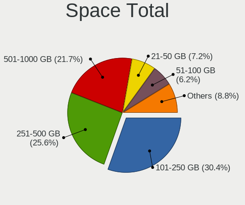

| Size in GB     | Computers | Percent |
|----------------|-----------|---------|
| 101-250        | 951       | 28.71%  |
| 251-500        | 848       | 25.6%   |
| 501-1000       | 753       | 22.73%  |
| 21-50          | 253       | 7.64%   |
| 51-100         | 221       | 6.67%   |
| 1-20           | 135       | 4.07%   |
| 1001-2000      | 92        | 2.78%   |
| 2001-3000      | 35        | 1.06%   |
| More than 3000 | 15        | 0.45%   |
| Unknown        | 10        | 0.3%    |

Space Used
----------

Amount of used disk space

| Used GB        | Computers | Percent |
|----------------|-----------|---------|
| 21-50          | 1715      | 50.04%  |
| 1-20           | 830       | 24.22%  |
| 51-100         | 447       | 13.04%  |
| 101-250        | 234       | 6.83%   |
| 251-500        | 97        | 2.83%   |
| 501-1000       | 55        | 1.6%    |
| 1001-2000      | 27        | 0.79%   |
| Unknown        | 10        | 0.29%   |
| More than 3000 | 7         | 0.2%    |
| 2001-3000      | 5         | 0.15%   |

Malfunc. Drives
---------------

Drive models with a malfunction

| Model                                        | Computers | Drives | Percent |
|----------------------------------------------|-----------|--------|---------|
| Samsung Electronics MZVPW128HEGM-00000 128GB | 1         | 1      | 100%    |

Malfunc. Drive Vendor
---------------------

Vendors of faulty drives

| Vendor              | Computers | Drives | Percent |
|---------------------|-----------|--------|---------|
| Samsung Electronics | 1         | 1      | 100%    |

Malfunc. HDD Vendor
-------------------

Vendors of faulty HDD drives

Zero info for selected period =(

Malfunc. Drive Kind
-------------------

Kinds of faulty drives

| Kind | Computers | Drives | Percent |
|------|-----------|--------|---------|
| NVMe | 1         | 1      | 100%    |

Failed Drives
-------------

Failed drive models

Zero info for selected period =(

Failed Drive Vendor
-------------------

Failed drive vendors

Zero info for selected period =(

Drive Status
------------

Number of failed and malfunc. drives

| Status   | Computers | Drives | Percent |
|----------|-----------|--------|---------|
| Detected | 3220      | 4883   | 99.6%   |
| Works    | 12        | 14     | 0.37%   |
| Malfunc  | 1         | 1      | 0.03%   |

Storage controller
------------------

Storage Vendor
--------------

Storage controller vendors

| Vendor                           | Computers | Percent |
|----------------------------------|-----------|---------|
| Intel                            | 2459      | 69.48%  |
| AMD                              | 573       | 16.19%  |
| SanDisk                          | 117       | 3.31%   |
| SK hynix                         | 57        | 1.61%   |
| Kingston Technology Company      | 56        | 1.58%   |
| Samsung Electronics              | 54        | 1.53%   |
| Nvidia                           | 53        | 1.5%    |
| ADATA Technology                 | 45        | 1.27%   |
| Marvell Technology Group         | 16        | 0.45%   |
| Phison Electronics               | 15        | 0.42%   |
| JMicron Technology               | 14        | 0.4%    |
| VIA Technologies                 | 13        | 0.37%   |
| Silicon Motion                   | 13        | 0.37%   |
| ASMedia Technology               | 11        | 0.31%   |
| Silicon Integrated Systems [SiS] | 10        | 0.28%   |
| Toshiba America Info Systems     | 7         | 0.2%    |
| Realtek Semiconductor            | 7         | 0.2%    |
| Micron Technology                | 6         | 0.17%   |
| Silicon Image                    | 2         | 0.06%   |
| LSI Logic / Symbios Logic        | 2         | 0.06%   |
| Lite-On Technology               | 2         | 0.06%   |
| KIOXIA                           | 2         | 0.06%   |
| Union Memory (Shenzhen)          | 1         | 0.03%   |
| Synopsys                         | 1         | 0.03%   |
| Shenzhen Longsys Electronics     | 1         | 0.03%   |
| OCZ Technology Group             | 1         | 0.03%   |
| Adaptec                          | 1         | 0.03%   |

Storage Model
-------------

Storage controller models

| Model                                                                                   | Computers | Percent |
|-----------------------------------------------------------------------------------------|-----------|---------|
| AMD FCH SATA Controller [AHCI mode]                                                     | 463       | 10.96%  |
| Intel 82801 Mobile SATA Controller [RAID mode]                                          | 443       | 10.49%  |
| Intel Sunrise Point-LP SATA Controller [AHCI mode]                                      | 423       | 10.02%  |
| Intel Celeron/Pentium Silver Processor SATA Controller                                  | 275       | 6.51%   |
| Intel PROSet/Wireless WiFi Software extension                                           | 245       | 5.8%    |
| Intel Celeron N3350/Pentium N4200/Atom E3900 Series SATA AHCI Controller                | 153       | 3.62%   |
| Intel 7 Series Chipset Family 6-port SATA Controller [AHCI mode]                        | 113       | 2.68%   |
| Intel NM10/ICH7 Family SATA Controller [IDE mode]                                       | 94        | 2.23%   |
| Intel 82801IBM/IEM (ICH9M/ICH9M-E) 4 port SATA Controller [AHCI mode]                   | 78        | 1.85%   |
| Intel 82801G (ICH7 Family) IDE Controller                                               | 76        | 1.8%    |
| SanDisk WD Blue SN550 NVMe SSD                                                          | 75        | 1.78%   |
| Intel 6 Series/C200 Series Chipset Family 6 port Mobile SATA AHCI Controller            | 74        | 1.75%   |
| AMD SB7x0/SB8x0/SB9x0 SATA Controller [AHCI mode]                                       | 63        | 1.49%   |
| Intel Atom/Celeron/Pentium Processor x5-E8000/J3xxx/N3xxx Series SATA Controller        | 61        | 1.44%   |
| Intel 8 Series/C220 Series Chipset Family 6-port SATA Controller 1 [AHCI mode]          | 52        | 1.23%   |
| SK hynix BC501 NVMe Solid State Drive                                                   | 49        | 1.16%   |
| Intel HM170/QM170 Chipset SATA Controller [AHCI Mode]                                   | 44        | 1.04%   |
| Kingston Company U-SNS8154P3 NVMe SSD                                                   | 43        | 1.02%   |
| Intel Volume Management Device NVMe RAID Controller                                     | 41        | 0.97%   |
| Intel Tiger Lake-LP SATA Controller                                                     | 41        | 0.97%   |
| Intel 82801HM/HEM (ICH8M/ICH8M-E) IDE Controller                                        | 41        | 0.97%   |
| Intel 6 Series/C200 Series Chipset Family 6 port Desktop SATA AHCI Controller           | 41        | 0.97%   |
| AMD SB7x0/SB8x0/SB9x0 IDE Controller                                                    | 41        | 0.97%   |
| Intel 8 Series SATA Controller 1 [AHCI mode]                                            | 39        | 0.92%   |
| Intel 5 Series/3400 Series Chipset 4 port SATA AHCI Controller                          | 39        | 0.92%   |
| Intel Cannon Lake PCH SATA AHCI Controller                                              | 37        | 0.88%   |
| Intel Atom Processor E3800 Series SATA AHCI Controller                                  | 37        | 0.88%   |
| ADATA Non-Volatile memory controller                                                    | 37        | 0.88%   |
| Intel 82801HM/HEM (ICH8M/ICH8M-E) SATA Controller [AHCI mode]                           | 36        | 0.85%   |
| SanDisk WD Blue SN500 / PC SN520 NVMe SSD                                               | 34        | 0.81%   |
| Intel Wildcat Point-LP SATA Controller [AHCI Mode]                                      | 34        | 0.81%   |
| Nvidia MCP61 SATA Controller                                                            | 29        | 0.69%   |
| Nvidia MCP61 IDE                                                                        | 27        | 0.64%   |
| Intel Cannon Lake Mobile PCH SATA AHCI Controller                                       | 26        | 0.62%   |
| AMD SB7x0/SB8x0/SB9x0 SATA Controller [IDE mode]                                        | 25        | 0.59%   |
| Samsung NVMe SSD Controller 980                                                         | 24        | 0.57%   |
| Intel SSD 660P Series                                                                   | 24        | 0.57%   |
| Intel 6 Series/C200 Series Chipset Family Desktop SATA Controller (IDE mode, ports 4-5) | 24        | 0.57%   |
| Intel 6 Series/C200 Series Chipset Family Desktop SATA Controller (IDE mode, ports 0-3) | 24        | 0.57%   |
| Intel 5 Series/3400 Series Chipset 6 port SATA AHCI Controller                          | 22        | 0.52%   |
| Intel Q170/Q150/B150/H170/H110/Z170/CM236 Chipset SATA Controller [AHCI Mode]           | 21        | 0.5%    |
| Intel NM10/ICH7 Family SATA Controller [AHCI mode]                                      | 21        | 0.5%    |
| Intel 7 Series/C210 Series Chipset Family 6-port SATA Controller [AHCI mode]            | 21        | 0.5%    |
| Intel 200 Series PCH SATA controller [AHCI mode]                                        | 21        | 0.5%    |
| Samsung NVMe SSD Controller SM981/PM981/PM983                                           | 19        | 0.45%   |
| Intel Cannon Point-LP SATA Controller [AHCI Mode]                                       | 19        | 0.45%   |
| Intel Comet Lake SATA AHCI Controller                                                   | 17        | 0.4%    |
| AMD FCH SATA Controller D                                                               | 15        | 0.36%   |
| AMD FCH IDE Controller                                                                  | 15        | 0.36%   |
| Intel SATA Controller [RAID mode]                                                       | 14        | 0.33%   |
| Intel 4 Series Chipset PT IDER Controller                                               | 14        | 0.33%   |
| Silicon Motion SM2263EN/SM2263XT SSD Controller                                         | 12        | 0.28%   |
| AMD 400 Series Chipset SATA Controller                                                  | 11        | 0.26%   |
| Silicon Integrated Systems [SiS] 5513 IDE Controller                                    | 10        | 0.24%   |
| Intel 82801JD/DO (ICH10 Family) SATA AHCI Controller                                    | 10        | 0.24%   |
| Intel 82801HM/HEM (ICH8M/ICH8M-E) SATA Controller [IDE mode]                            | 10        | 0.24%   |
| Intel 5 Series/3400 Series Chipset 4 port SATA IDE Controller                           | 10        | 0.24%   |
| AMD FCH SATA Controller [IDE mode]                                                      | 10        | 0.24%   |
| Silicon Integrated Systems [SiS] SATA Controller / IDE mode                             | 9         | 0.21%   |
| Phison PS5013 E13 NVMe Controller                                                       | 9         | 0.21%   |

Storage Kind
------------

Kind of storage controller (IDE, SATA, NVMe, SAS, ...)

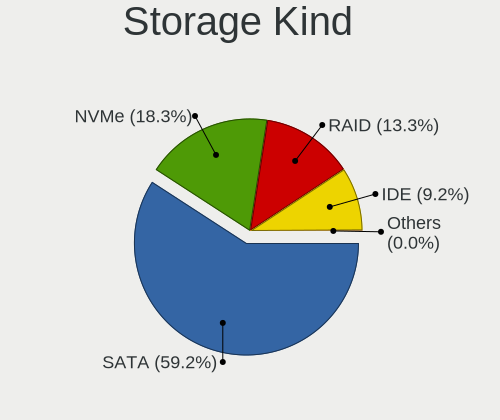

| Kind | Computers | Percent |
|------|-----------|---------|
| SATA | 2590      | 65.92%  |
| NVMe | 651       | 16.57%  |
| IDE  | 386       | 9.82%   |
| RAID | 298       | 7.58%   |
| SCSI | 3         | 0.08%   |
| SAS  | 1         | 0.03%   |

Processor
---------

CPU Vendor
----------

Processor vendors

| Vendor  | Computers | Percent |
|---------|-----------|---------|
| Intel   | 2602      | 80.48%  |
| AMD     | 622       | 19.24%  |
| ARM     | 8         | 0.25%   |
| Unknown | 1         | 0.03%   |

CPU Model
---------

Processor models

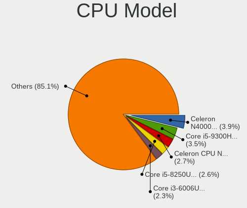

| Model                                         | Computers | Percent |
|-----------------------------------------------|-----------|---------|
| Intel Celeron N4000 CPU @ 1.10GHz             | 131       | 4.04%   |
| Intel Core i5-9300H CPU @ 2.40GHz             | 122       | 3.76%   |
| Intel Celeron CPU N3350 @ 1.10GHz             | 90        | 2.78%   |
| Intel Core i5-8250U CPU @ 1.60GHz             | 89        | 2.75%   |
| Intel Core i3-6006U CPU @ 2.00GHz             | 80        | 2.47%   |
| Intel Core i3-7020U CPU @ 2.30GHz             | 61        | 1.88%   |
| Intel Core i7-9750H CPU @ 2.60GHz             | 58        | 1.79%   |
| Intel Core i5-7200U CPU @ 2.50GHz             | 56        | 1.73%   |
| AMD Ryzen 5 3500U with Radeon Vega Mobile Gfx | 53        | 1.64%   |
| Intel Core i3-8130U CPU @ 2.20GHz             | 47        | 1.45%   |
| AMD Ryzen 7 4800H with Radeon Graphics        | 43        | 1.33%   |
| Intel Pentium Silver N5000 CPU @ 1.10GHz      | 41        | 1.27%   |
| Intel Atom x5-Z8350 CPU @ 1.44GHz             | 38        | 1.17%   |
| Intel Celeron N4020 CPU @ 1.10GHz             | 36        | 1.11%   |
| Intel Pentium CPU N4200 @ 1.10GHz             | 35        | 1.08%   |
| Intel Core i5-1035G1 CPU @ 1.00GHz            | 34        | 1.05%   |
| Intel Core i3-8145U CPU @ 2.10GHz             | 33        | 1.02%   |
| AMD Ryzen 7 3750H with Radeon Vega Mobile Gfx | 32        | 0.99%   |
| Intel Core i5-8265U CPU @ 1.60GHz             | 31        | 0.96%   |
| Intel Pentium CPU 4417U @ 2.30GHz             | 30        | 0.93%   |
| Intel Core i5-8300H CPU @ 2.30GHz             | 29        | 0.89%   |
| Intel Core i3-1005G1 CPU @ 1.20GHz            | 29        | 0.89%   |
| AMD Ryzen 5 2500U with Radeon Vega Mobile Gfx | 29        | 0.89%   |
| Intel Core i7-8550U CPU @ 1.80GHz             | 26        | 0.8%    |
| Intel Core i7-10510U CPU @ 1.80GHz            | 26        | 0.8%    |
| Intel Core i5-10210U CPU @ 1.60GHz            | 26        | 0.8%    |
| Intel Celeron CPU N3060 @ 1.60GHz             | 25        | 0.77%   |
| Intel Celeron N4000C CPU @ 1.10GHz            | 24        | 0.74%   |
| Intel Core i7-7700HQ CPU @ 2.80GHz            | 23        | 0.71%   |
| Intel Celeron CPU N3450 @ 1.10GHz             | 23        | 0.71%   |
| Intel Core i3-7100U CPU @ 2.40GHz             | 22        | 0.68%   |
| Intel Core i7-8565U CPU @ 1.80GHz             | 19        | 0.59%   |
| Intel Core i3-5005U CPU @ 2.00GHz             | 19        | 0.59%   |
| AMD Ryzen 5 4600H with Radeon Graphics        | 19        | 0.59%   |
| AMD A6-9225 RADEON R4, 5 COMPUTE CORES 2C+3G  | 19        | 0.59%   |
| Intel Core i5-7300HQ CPU @ 2.50GHz            | 18        | 0.56%   |
| Intel Core i3-6100U CPU @ 2.30GHz             | 18        | 0.56%   |
| Intel Core i3-2310M CPU @ 2.10GHz             | 16        | 0.49%   |
| Intel 11th Gen Core i3-1115G4 @ 3.00GHz       | 16        | 0.49%   |
| Intel Core i7-8750H CPU @ 2.20GHz             | 15        | 0.46%   |
| Intel Core 2 Duo CPU E8400 @ 3.00GHz          | 15        | 0.46%   |
| Intel Celeron CPU N2840 @ 2.16GHz             | 15        | 0.46%   |
| Intel Atom x5-Z8300 CPU @ 1.44GHz             | 15        | 0.46%   |
| AMD Ryzen 7 3700U with Radeon Vega Mobile Gfx | 15        | 0.46%   |
| AMD Ryzen 3 2200U with Radeon Vega Mobile Gfx | 15        | 0.46%   |
| Intel Core i7-7500U CPU @ 2.70GHz             | 14        | 0.43%   |
| Intel Core i5-8400 CPU @ 2.80GHz              | 14        | 0.43%   |
| Intel Celeron J4005 CPU @ 2.00GHz             | 14        | 0.43%   |
| Intel Atom CPU Z3735F @ 1.33GHz               | 14        | 0.43%   |
| Intel Core i5-2410M CPU @ 2.30GHz             | 13        | 0.4%    |
| Intel Core 2 Duo CPU E7500 @ 2.93GHz          | 13        | 0.4%    |
| Intel 11th Gen Core i5-1135G7 @ 2.40GHz       | 13        | 0.4%    |
| AMD E2-9000 RADEON R2, 4 COMPUTE CORES 2C+2G  | 13        | 0.4%    |
| Intel Core i5-3210M CPU @ 2.50GHz             | 12        | 0.37%   |
| AMD A4-9125 RADEON R3, 4 COMPUTE CORES 2C+2G  | 12        | 0.37%   |
| Intel Core i3-4005U CPU @ 1.70GHz             | 11        | 0.34%   |
| Intel Core i3-2120 CPU @ 3.30GHz              | 11        | 0.34%   |
| Intel Celeron CPU N3160 @ 1.60GHz             | 11        | 0.34%   |
| Intel Celeron CPU N3050 @ 1.60GHz             | 11        | 0.34%   |
| Intel Celeron CPU 847 @ 1.10GHz               | 11        | 0.34%   |

CPU Model Family
----------------

Processor model prefix

| Model                                | Computers | Percent |
|--------------------------------------|-----------|---------|
| Intel Core i5                        | 656       | 20.26%  |
| Intel Celeron                        | 494       | 15.26%  |
| Intel Core i3                        | 492       | 15.19%  |
| Intel Core i7                        | 306       | 9.45%   |
| Intel Pentium                        | 141       | 4.35%   |
| Intel Core 2 Duo                     | 137       | 4.23%   |
| AMD Ryzen 5                          | 133       | 4.11%   |
| Intel Atom                           | 113       | 3.49%   |
| AMD Ryzen 7                          | 99        | 3.06%   |
| Other                                | 79        | 2.44%   |
| Intel Pentium Dual-Core              | 56        | 1.73%   |
| Intel Pentium Silver                 | 54        | 1.67%   |
| AMD A6                               | 52        | 1.61%   |
| AMD Ryzen 3                          | 37        | 1.14%   |
| AMD A4                               | 31        | 0.96%   |
| Intel Pentium Dual                   | 30        | 0.93%   |
| AMD FX                               | 25        | 0.77%   |
| AMD A8                               | 25        | 0.77%   |
| AMD E2                               | 22        | 0.68%   |
| AMD E                                | 22        | 0.68%   |
| Intel Xeon                           | 18        | 0.56%   |
| Intel Core 2 Quad                    | 17        | 0.53%   |
| Intel Core 2                         | 15        | 0.46%   |
| AMD E1                               | 15        | 0.46%   |
| AMD A10                              | 15        | 0.46%   |
| AMD Athlon 64 X2                     | 13        | 0.4%    |
| AMD Sempron                          | 11        | 0.34%   |
| AMD Phenom II X4                     | 11        | 0.34%   |
| Intel Genuine                        | 10        | 0.31%   |
| AMD Athlon II X2                     | 9         | 0.28%   |
| AMD C-70                             | 7         | 0.22%   |
| AMD Phenom II X6                     | 6         | 0.19%   |
| AMD Athlon                           | 6         | 0.19%   |
| AMD A12                              | 6         | 0.19%   |
| Intel Pentium 4                      | 5         | 0.15%   |
| Intel Pentium Gold                   | 4         | 0.12%   |
| AMD Turion 64 X2 Mobile              | 4         | 0.12%   |
| AMD Phenom                           | 4         | 0.12%   |
| AMD Mobile Sempron                   | 4         | 0.12%   |
| AMD Athlon II X4                     | 4         | 0.12%   |
| Intel Pentium D                      | 3         | 0.09%   |
| Intel Celeron Dual-Core              | 3         | 0.09%   |
| AMD V120                             | 3         | 0.09%   |
| AMD Phenom II X2                     | 3         | 0.09%   |
| AMD C-50                             | 3         | 0.09%   |
| AMD Athlon II                        | 3         | 0.09%   |
| AMD Turion X2 Dual-Core Mobile       | 2         | 0.06%   |
| AMD Turion II Ultra Dual-Core Mobile | 2         | 0.06%   |
| AMD Phenom II                        | 2         | 0.06%   |
| AMD Athlon X2                        | 2         | 0.06%   |
| AMD Athlon II Dual-Core              | 2         | 0.06%   |
| AMD Athlon 64                        | 2         | 0.06%   |
| Intel Core m3                        | 1         | 0.03%   |
| Intel Core M                         | 1         | 0.03%   |
| Intel Core i9                        | 1         | 0.03%   |
| Intel Core 2 Solo                    | 1         | 0.03%   |
| Intel Core 2 Extreme                 | 1         | 0.03%   |
| Intel Celeron M                      | 1         | 0.03%   |
| AMD V160                             | 1         | 0.03%   |
| AMD Turion II Dual-Core              | 1         | 0.03%   |

CPU Cores
---------

Number of processor cores

| Number  | Computers | Percent |
|---------|-----------|---------|
| 2       | 1790      | 55.33%  |
| 4       | 1129      | 34.9%   |
| 6       | 159       | 4.91%   |
| 1       | 82        | 2.53%   |
| 8       | 57        | 1.76%   |
| 3       | 12        | 0.37%   |
| 12      | 4         | 0.12%   |
| 16      | 1         | 0.03%   |
| Unknown | 1         | 0.03%   |

CPU Sockets
-----------

Number of sockets

| Number  | Computers | Percent |
|---------|-----------|---------|
| 1       | 3231      | 99.94%  |
| 2       | 1         | 0.03%   |
| Unknown | 1         | 0.03%   |

CPU Threads
-----------

Threads per core (Hyper-Threading)

| Number  | Computers | Percent |
|---------|-----------|---------|
| 2       | 1791      | 55.36%  |
| 1       | 1443      | 44.61%  |
| Unknown | 1         | 0.03%   |

CPU Op-Modes
------------

CPU Operation Modes (32-bit, 64-bit)

| Op mode        | Computers | Percent |
|----------------|-----------|---------|
| 32-bit, 64-bit | 2527      | 76.79%  |
| Unknown        | 761       | 23.12%  |
| 64-bit         | 3         | 0.09%   |

CPU Microcode
-------------

Microcode number

| Number     | Computers | Percent |
|------------|-----------|---------|
| Unknown    | 374       | 11.34%  |
| 0x906ea    | 217       | 6.58%   |
| 0x706a1    | 208       | 6.31%   |
| 0x806ea    | 188       | 5.7%    |
| 0x206a7    | 156       | 4.73%   |
| 0x806e9    | 147       | 4.46%   |
| 0x506c9    | 133       | 4.03%   |
| 0x1067a    | 129       | 3.91%   |
| 0x306a9    | 113       | 3.43%   |
| 0x406e3    | 110       | 3.34%   |
| 0x806ec    | 107       | 3.24%   |
| 0x406c4    | 90        | 2.73%   |
| 0x08108109 | 76        | 2.3%    |
| 0x706e5    | 62        | 1.88%   |
| 0x08600103 | 60        | 1.82%   |
| 0x06006705 | 58        | 1.76%   |
| 0x6fd      | 57        | 1.73%   |
| 0x306c3    | 57        | 1.73%   |
| 0x30678    | 55        | 1.67%   |
| 0x906e9    | 53        | 1.61%   |
| 0x08108102 | 52        | 1.58%   |
| 0x906ed    | 47        | 1.43%   |
| 0x706a8    | 42        | 1.27%   |
| 0x20655    | 42        | 1.27%   |
| 0x806c1    | 41        | 1.24%   |
| 0x40651    | 39        | 1.18%   |
| 0x306d4    | 36        | 1.09%   |
| 0x806eb    | 33        | 1%      |
| 0x406c3    | 33        | 1%      |
| 0x0810100b | 31        | 0.94%   |
| 0x05000119 | 29        | 0.88%   |
| 0x010000c8 | 27        | 0.82%   |
| 0x10676    | 25        | 0.76%   |
| 0x08101007 | 21        | 0.64%   |
| 0x06001119 | 21        | 0.64%   |
| 0x106ca    | 20        | 0.61%   |
| 0x06006704 | 19        | 0.58%   |
| 0x506e3    | 18        | 0.55%   |
| 0x6fb      | 16        | 0.49%   |
| 0x20652    | 15        | 0.45%   |
| 0x0700010f | 14        | 0.42%   |
| 0x0600611a | 12        | 0.36%   |
| 0x06003106 | 12        | 0.36%   |
| 0x906eb    | 11        | 0.33%   |
| 0x07030105 | 11        | 0.33%   |
| 0xa0653    | 10        | 0.3%    |
| 0x30673    | 10        | 0.3%    |
| 0x06000852 | 9         | 0.27%   |
| 0x05000029 | 8         | 0.24%   |
| 0x03000027 | 8         | 0.24%   |
| 0x6f6      | 7         | 0.21%   |
| 0x106e5    | 7         | 0.21%   |
| 0x6f2      | 6         | 0.18%   |
| 0x0600063e | 6         | 0.18%   |
| 0x010000db | 6         | 0.18%   |
| 0xa0652    | 5         | 0.15%   |
| 0x6fa      | 5         | 0.15%   |
| 0x0800820d | 5         | 0.15%   |
| 0x010000dc | 5         | 0.15%   |
| 0xf65      | 4         | 0.12%   |

CPU Microarch
-------------

Microarchitecture

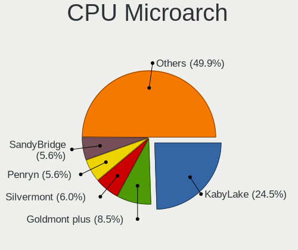

| Name            | Computers | Percent |
|-----------------|-----------|---------|
| KabyLake        | 839       | 25.92%  |
| Goldmont plus   | 279       | 8.62%   |
| Silvermont      | 198       | 6.12%   |
| Penryn          | 184       | 5.68%   |
| SandyBridge     | 181       | 5.59%   |
| Goldmont        | 153       | 4.73%   |
| Zen+            | 141       | 4.36%   |
| Skylake         | 141       | 4.36%   |
| IvyBridge       | 124       | 3.83%   |
| Haswell         | 113       | 3.49%   |
| Core            | 108       | 3.34%   |
| Excavator       | 104       | 3.21%   |
| Zen 2           | 71        | 2.19%   |
| Westmere        | 68        | 2.1%    |
| IceLake         | 68        | 2.1%    |
| Zen             | 61        | 1.88%   |
| K10             | 60        | 1.85%   |
| Bobcat          | 43        | 1.33%   |
| TigerLake       | 41        | 1.27%   |
| Broadwell       | 39        | 1.2%    |
| Piledriver      | 38        | 1.17%   |
| K8 Hammer       | 33        | 1.02%   |
| Bonnell         | 29        | 0.9%    |
| Puma            | 21        | 0.65%   |
| Jaguar          | 17        | 0.53%   |
| Steamroller     | 16        | 0.49%   |
| CometLake       | 16        | 0.49%   |
| Nehalem         | 13        | 0.4%    |
| K10 Llano       | 10        | 0.31%   |
| Unknown         | 10        | 0.31%   |
| NetBurst        | 8         | 0.25%   |
| Bulldozer       | 7         | 0.22%   |
| K8 & K10 hybrid | 3         | 0.09%   |

Graphics
--------

GPU Vendor
----------

Vendors of graphics cards

| Vendor                           | Computers | Percent |
|----------------------------------|-----------|---------|
| Intel                            | 2336      | 58.1%   |
| Nvidia                           | 1001      | 24.89%  |
| AMD                              | 667       | 16.59%  |
| Silicon Integrated Systems [SiS] | 10        | 0.25%   |
| VIA Technologies                 | 6         | 0.15%   |
| Silicon Motion                   | 1         | 0.02%   |

GPU Model
---------

Graphics card models

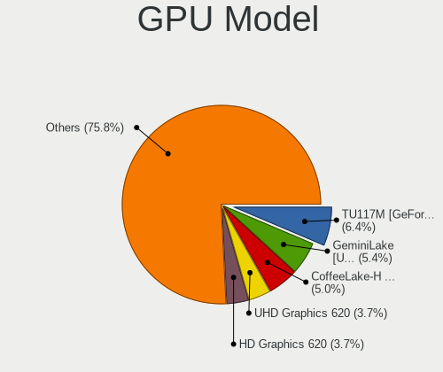

| Model                                                                                    | Computers | Percent |
|------------------------------------------------------------------------------------------|-----------|---------|
| Intel GeminiLake [UHD Graphics 600]                                                      | 225       | 5.44%   |
| Intel CoffeeLake-H GT2 [UHD Graphics 630]                                                | 222       | 5.37%   |
| Nvidia TU117M [GeForce GTX 1650 Mobile / Max-Q]                                          | 206       | 4.98%   |
| Intel UHD Graphics 620                                                                   | 163       | 3.94%   |
| Intel 2nd Generation Core Processor Family Integrated Graphics Controller                | 149       | 3.6%    |
| AMD Picasso/Raven 2 [Radeon Vega Series / Radeon Vega Mobile Series]                     | 132       | 3.19%   |
| Intel Atom/Celeron/Pentium Processor x5-E8000/J3xxx/N3xxx Integrated Graphics Controller | 128       | 3.09%   |
| Intel HD Graphics 500                                                                    | 117       | 2.83%   |
| Intel Skylake GT2 [HD Graphics 520]                                                      | 115       | 2.78%   |
| Intel HD Graphics 620                                                                    | 114       | 2.76%   |
| Nvidia GP107M [GeForce GTX 1050 Mobile]                                                  | 89        | 2.15%   |
| Intel 3rd Gen Core processor Graphics Controller                                         | 89        | 2.15%   |
| AMD Stoney [Radeon R2/R3/R4/R5 Graphics]                                                 | 85        | 2.06%   |
| Intel WhiskeyLake-U GT2 [UHD Graphics 620]                                               | 83        | 2.01%   |
| Nvidia GM108M [GeForce MX110]                                                            | 75        | 1.81%   |
| Intel Atom Processor Z36xxx/Z37xxx Series Graphics & Display                             | 69        | 1.67%   |
| Intel Mobile 4 Series Chipset Integrated Graphics Controller                             | 67        | 1.62%   |
| AMD Renoir                                                                               | 64        | 1.55%   |
| Intel Iris Plus Graphics G1 (Ice Lake)                                                   | 63        | 1.52%   |
| Nvidia TU117M                                                                            | 59        | 1.43%   |
| Intel CometLake-U GT2 [UHD Graphics]                                                     | 59        | 1.43%   |
| Intel GeminiLake [UHD Graphics 605]                                                      | 54        | 1.31%   |
| AMD Raven Ridge [Radeon Vega Series / Radeon Vega Mobile Series]                         | 53        | 1.28%   |
| Intel Core Processor Integrated Graphics Controller                                      | 51        | 1.23%   |
| Intel HD Graphics 630                                                                    | 44        | 1.06%   |
| Intel Haswell-ULT Integrated Graphics Controller                                         | 44        | 1.06%   |
| Nvidia GP108M [GeForce MX150]                                                            | 43        | 1.04%   |
| Intel Kaby Lake-U GT2f HD 620 Graphics Controller                                        | 43        | 1.04%   |
| Intel 4 Series Chipset Integrated Graphics Controller                                    | 40        | 0.97%   |
| Nvidia GM108M [GeForce MX130]                                                            | 39        | 0.94%   |
| Intel Celeron N3350/Pentium N4200/Atom E3900 Series Integrated Graphics Controller       | 36        | 0.87%   |
| Intel HD Graphics 5500                                                                   | 34        | 0.82%   |
| Intel Kaby Lake-U GT1 Integrated Graphics Controller                                     | 33        | 0.8%    |
| Intel CoffeeLake-S GT2 [UHD Graphics 630]                                                | 29        | 0.7%    |
| Intel Mobile GM965/GL960 Integrated Graphics Controller (secondary)                      | 28        | 0.68%   |
| Intel Mobile GM965/GL960 Integrated Graphics Controller (primary)                        | 28        | 0.68%   |
| Nvidia GP108M [GeForce MX250]                                                            | 24        | 0.58%   |
| Intel TigerLake-LP GT2 [Iris Xe Graphics]                                                | 24        | 0.58%   |
| Intel Xeon E3-1200 v3/4th Gen Core Processor Integrated Graphics Controller              | 22        | 0.53%   |
| Intel Atom Processor D4xx/D5xx/N4xx/N5xx Integrated Graphics Controller                  | 20        | 0.48%   |
| Intel 82945G/GZ Integrated Graphics Controller                                           | 19        | 0.46%   |
| Nvidia GP107M [GeForce GTX 1050 Ti Mobile]                                               | 18        | 0.44%   |
| Nvidia GM108M [GeForce 940MX]                                                            | 18        | 0.44%   |
| Nvidia GM108M [GeForce 920MX]                                                            | 18        | 0.44%   |
| Intel 4th Gen Core Processor Integrated Graphics Controller                              | 18        | 0.44%   |
| AMD Wrestler [Radeon HD 6310]                                                            | 18        | 0.44%   |
| AMD Wani [Radeon R5/R6/R7 Graphics]                                                      | 18        | 0.44%   |
| Intel Tiger Lake UHD Graphics                                                            | 17        | 0.41%   |
| AMD Cedar [Radeon HD 5000/6000/7350/8350 Series]                                         | 16        | 0.39%   |
| Intel Xeon E3-1200 v2/3rd Gen Core processor Graphics Controller                         | 15        | 0.36%   |
| AMD Mullins [Radeon R4/R5 Graphics]                                                      | 15        | 0.36%   |
| Nvidia TU117 [GeForce GTX 1650]                                                          | 14        | 0.34%   |
| Nvidia GT218 [GeForce 210]                                                               | 14        | 0.34%   |
| Nvidia GK208B [GeForce GT 710]                                                           | 14        | 0.34%   |
| Nvidia GP107 [GeForce GTX 1050 Ti]                                                       | 13        | 0.31%   |
| Intel 82G33/G31 Express Integrated Graphics Controller                                   | 13        | 0.31%   |
| AMD Topaz XT [Radeon R7 M260/M265 / M340/M360 / M440/M445 / 530/535 / 620/625 Mobile]    | 13        | 0.31%   |
| AMD RS880M [Mobility Radeon HD 4225/4250]                                                | 13        | 0.31%   |
| Intel 4th Generation Core Processor Family Integrated Graphics Controller                | 12        | 0.29%   |
| Nvidia GF119 [GeForce GT 610]                                                            | 11        | 0.27%   |

GPU Combo
---------

Combinations of graphics cards

| Name                   | Computers | Percent |
|------------------------|-----------|---------|
| 1 x Intel              | 1687      | 51.94%  |
| Intel + Nvidia         | 602       | 18.53%  |
| 1 x AMD                | 449       | 13.82%  |
| 1 x Nvidia             | 266       | 8.19%   |
| AMD + Nvidia           | 128       | 3.94%   |
| 2 x AMD                | 54        | 1.66%   |
| Intel + AMD            | 36        | 1.11%   |
| 1 x SiS                | 10        | 0.31%   |
| Other                  | 9         | 0.28%   |
| 1 x VIA                | 5         | 0.15%   |
| 2 x Nvidia             | 1         | 0.03%   |
| Intel + Silicon Motion | 1         | 0.03%   |

GPU Driver
----------

Free vs proprietary

| Driver      | Computers | Percent |
|-------------|-----------|---------|
| Free        | 2477      | 76.33%  |
| Proprietary | 740       | 22.8%   |
| Unknown     | 28        | 0.86%   |

GPU Memory
----------

Total video memory

| Size in GB | Computers | Percent |
|------------|-----------|---------|
| Unknown    | 2268      | 68.98%  |
| 0.01-0.5   | 373       | 11.34%  |
| 1.01-2.0   | 224       | 6.81%   |
| 3.01-4.0   | 216       | 6.57%   |
| 0.51-1.0   | 189       | 5.75%   |
| 7.01-8.0   | 14        | 0.43%   |
| 2.01-3.0   | 3         | 0.09%   |
| 8.01-16.0  | 1         | 0.03%   |

Monitor
-------

Monitor Vendor
--------------

Monitor vendors

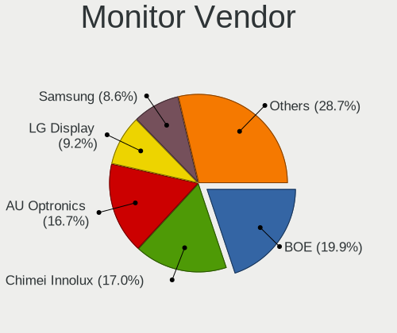

| Vendor                  | Computers | Percent |
|-------------------------|-----------|---------|
| AU Optronics            | 625       | 19.53%  |
| BOE                     | 612       | 19.13%  |
| Chimei Innolux          | 501       | 15.66%  |
| LG Display              | 299       | 9.34%   |
| Samsung Electronics     | 275       | 8.59%   |
| PANDA                   | 107       | 3.34%   |
| Goldstar                | 102       | 3.19%   |
| Dell                    | 76        | 2.38%   |
| Hewlett-Packard         | 60        | 1.88%   |
| AOC                     | 50        | 1.56%   |
| Acer                    | 50        | 1.56%   |
| Chi Mei Optoelectronics | 42        | 1.31%   |
| Lenovo                  | 31        | 0.97%   |
| Philips                 | 30        | 0.94%   |
| LG Philips              | 24        | 0.75%   |
| Sony                    | 23        | 0.72%   |
| Ancor Communications    | 21        | 0.66%   |
| BenQ                    | 19        | 0.59%   |
| Apple                   | 19        | 0.59%   |
| InfoVision              | 17        | 0.53%   |
| ASUSTek Computer        | 14        | 0.44%   |
| HannStar                | 12        | 0.38%   |
| RTK                     | 11        | 0.34%   |
| Vizio                   | 9         | 0.28%   |
| ViewSonic               | 9         | 0.28%   |
| Vestel Elektronik       | 8         | 0.25%   |
| Toshiba                 | 8         | 0.25%   |
| Panasonic               | 7         | 0.22%   |
| CPT                     | 7         | 0.22%   |
| Sharp                   | 6         | 0.19%   |
| Eizo                    | 6         | 0.19%   |
| NEC Computers           | 5         | 0.16%   |
| KDC                     | 5         | 0.16%   |
| HSI                     | 5         | 0.16%   |
| SAC                     | 4         | 0.13%   |
| MStar                   | 4         | 0.13%   |
| InnoLux Display         | 4         | 0.13%   |
| SLD                     | 3         | 0.09%   |
| SKY                     | 3         | 0.09%   |
| Seiki                   | 3         | 0.09%   |
| Sceptre Tech            | 3         | 0.09%   |
| Positivo                | 3         | 0.09%   |
| MiTAC                   | 3         | 0.09%   |
| Insignia                | 3         | 0.09%   |
| Iiyama                  | 3         | 0.09%   |
| GDH                     | 3         | 0.09%   |
| VOR                     | 2         | 0.06%   |
| Unknown                 | 2         | 0.06%   |
| PNP                     | 2         | 0.06%   |
| ONN                     | 2         | 0.06%   |
| MTD                     | 2         | 0.06%   |
| KNK                     | 2         | 0.06%   |
| IBM                     | 2         | 0.06%   |
| Gateway                 | 2         | 0.06%   |
| Fujitsu Siemens         | 2         | 0.06%   |
| Envision Peripherals    | 2         | 0.06%   |
| eMachines               | 2         | 0.06%   |
| Belinea                 | 2         | 0.06%   |
| AGO                     | 2         | 0.06%   |
| ___                     | 1         | 0.03%   |

Monitor Model
-------------

Monitor models

| Model                                                                  | Computers | Percent |
|------------------------------------------------------------------------|-----------|---------|
| AU Optronics LCD Monitor AUO21ED 1920x1080 344x193mm 15.5-inch         | 105       | 3.26%   |
| Chimei Innolux LCD Monitor CMN15DB 1366x768 344x193mm 15.5-inch        | 101       | 3.14%   |
| AU Optronics LCD Monitor AUO61ED 1920x1080 344x193mm 15.5-inch         | 95        | 2.95%   |
| BOE LCD Monitor BOE069C 1920x1080 344x193mm 15.5-inch                  | 82        | 2.55%   |
| BOE LCD Monitor BOE06A5 1366x768 344x194mm 15.5-inch                   | 81        | 2.51%   |
| AU Optronics LCD Monitor AUO38ED 1920x1080 344x193mm 15.5-inch         | 74        | 2.3%    |
| Chimei Innolux LCD Monitor CMN15E6 1366x768 344x193mm 15.5-inch        | 58        | 1.8%    |
| BOE LCD Monitor BOE0818 1920x1080 344x194mm 15.5-inch                  | 58        | 1.8%    |
| Chimei Innolux LCD Monitor CMN15F5 1920x1080 344x193mm 15.5-inch       | 54        | 1.68%   |
| Chimei Innolux LCD Monitor CMN15DC 1366x768 344x193mm 15.5-inch        | 52        | 1.61%   |
| BOE LCD Monitor BOE06A4 1366x768 344x194mm 15.5-inch                   | 45        | 1.4%    |
| BOE LCD Monitor BOE07CE 1366x768 344x193mm 15.5-inch                   | 43        | 1.33%   |
| BOE LCD Monitor BOE0672 1366x768 344x194mm 15.5-inch                   | 43        | 1.33%   |
| AU Optronics LCD Monitor AUO70EC 1366x768 344x193mm 15.5-inch          | 43        | 1.33%   |
| Chimei Innolux LCD Monitor CMN15D5 1920x1080 344x193mm 15.5-inch       | 41        | 1.27%   |
| PANDA LCD Monitor NCP004D 1920x1080 344x194mm 15.5-inch                | 39        | 1.21%   |
| LG Display LCD Monitor LGD065A 1920x1080 344x194mm 15.5-inch           | 39        | 1.21%   |
| AU Optronics LCD Monitor AUO71EC 1366x768 344x193mm 15.5-inch          | 39        | 1.21%   |
| AU Optronics LCD Monitor AUO81EC 1366x768 344x193mm 15.5-inch          | 32        | 0.99%   |
| BOE LCD Monitor BOE0839 1920x1080 382x215mm 17.3-inch                  | 31        | 0.96%   |
| PANDA LCD Monitor NCP0035 1920x1080 309x174mm 14.0-inch                | 28        | 0.87%   |
| BOE LCD Monitor BOE06BA 1920x1080 344x193mm 15.5-inch                  | 24        | 0.75%   |
| LG Display LCD Monitor LGD04E8 1920x1080 382x215mm 17.3-inch           | 23        | 0.71%   |
| BOE LCD Monitor BOE0675 1366x768 344x194mm 15.5-inch                   | 21        | 0.65%   |
| AU Optronics LCD Monitor AUOAF90 1920x1080 344x193mm 15.5-inch         | 20        | 0.62%   |
| PANDA LCD Monitor NCP0046 1920x1080 344x194mm 15.5-inch                | 17        | 0.53%   |
| LG Display LCD Monitor LGD0621 1920x1080 382x215mm 17.3-inch           | 17        | 0.53%   |
| BOE LCD Monitor BOE07AA 1366x768 344x194mm 15.5-inch                   | 17        | 0.53%   |
| Samsung Electronics LCD Monitor SEC5441 1366x768 344x194mm 15.5-inch   | 16        | 0.5%    |
| Chimei Innolux LCD Monitor CMN1132 1366x768 256x144mm 11.6-inch        | 16        | 0.5%    |
| Chimei Innolux LCD Monitor CMN14D4 1920x1080 309x173mm 13.9-inch       | 15        | 0.47%   |
| LG Display LCD Monitor LGD056D 1920x1080 382x215mm 17.3-inch           | 14        | 0.43%   |
| Chimei Innolux LCD Monitor CMN15CA 1366x768 344x193mm 15.5-inch        | 14        | 0.43%   |
| Chimei Innolux LCD Monitor CMN1493 1366x768 309x174mm 14.0-inch        | 13        | 0.4%    |
| PANDA LM156LF1L03 NCP001C 1920x1080 344x194mm 15.5-inch                | 11        | 0.34%   |
| LG Display LCD Monitor LGD02DC 1366x768 344x194mm 15.5-inch            | 11        | 0.34%   |
| Chimei Innolux LCD Monitor CMN14D6 1366x768 309x173mm 13.9-inch        | 11        | 0.34%   |
| BOE LCD Monitor BOE0704 1366x768 344x194mm 15.5-inch                   | 11        | 0.34%   |
| AU Optronics LCD Monitor AUO22EC 1366x768 344x193mm 15.5-inch          | 11        | 0.34%   |
| ASUSTek Computer V241FA ASU282C 1920x1080 527x296mm 23.8-inch          | 10        | 0.31%   |
| Chimei Innolux LCD Monitor CMN14E5 1920x1080 309x173mm 13.9-inch       | 9         | 0.28%   |
| BOE LCD Monitor BOE0696 1366x768 309x173mm 13.9-inch                   | 9         | 0.28%   |
| AU Optronics LCD Monitor AUO183C 1366x768 309x173mm 13.9-inch          | 9         | 0.28%   |
| Vestel Elektronik 50UHD_LCD_TV VES3700 3840x2160 1872x1053mm 84.6-inch | 8         | 0.25%   |
| LG Display LCD Monitor LGD0563 1920x1080 344x194mm 15.5-inch           | 8         | 0.25%   |
| InfoVision M140NWR2 R1 IVO057A 1366x768 309x174mm 14.0-inch            | 8         | 0.25%   |
| Chimei Innolux LCD Monitor CMN1745 1600x900 382x214mm 17.2-inch        | 8         | 0.25%   |
| Chimei Innolux LCD Monitor CMN15E8 1920x1080 344x193mm 15.5-inch       | 8         | 0.25%   |
| Chimei Innolux LCD Monitor CMN1470 1366x768 309x174mm 14.0-inch        | 8         | 0.25%   |
| AU Optronics LCD Monitor AUO2D3C 1366x768 309x173mm 13.9-inch          | 8         | 0.25%   |
| Samsung Electronics LCD Monitor SEC3358 1280x800 331x207mm 15.4-inch   | 7         | 0.22%   |
| LG Display LCD Monitor LGD05AB 1920x1080 309x174mm 14.0-inch           | 7         | 0.22%   |
| LG Display LCD Monitor LGD0590 1920x1080 344x194mm 15.5-inch           | 7         | 0.22%   |
| LG Display LCD Monitor LGD0573 1920x1080 344x194mm 15.5-inch           | 7         | 0.22%   |
| LG Display LCD Monitor LGD0385 1366x768 309x174mm 14.0-inch            | 7         | 0.22%   |
| LG Display LCD Monitor LGD033A 1366x768 344x194mm 15.5-inch            | 7         | 0.22%   |
| Chimei Innolux LCD Monitor CMN14C4 1366x768 309x173mm 13.9-inch        | 7         | 0.22%   |
| BOE LCD Monitor BOE07E9 1920x1080 309x174mm 14.0-inch                  | 7         | 0.22%   |
| PANDA LM133LF5L01 NCP0020 1920x1080 294x165mm 13.3-inch                | 6         | 0.19%   |
| LG Display LCD Monitor LGD033C 1366x768 309x174mm 14.0-inch            | 6         | 0.19%   |

Monitor Resolution
------------------

Monitor screen resolution

| Resolution         | Computers | Percent |
|--------------------|-----------|---------|
| 1920x1080 (FHD)    | 1355      | 42.93%  |
| 1366x768 (WXGA)    | 1226      | 38.85%  |
| 1600x900 (HD+)     | 116       | 3.68%   |
| 1280x1024 (SXGA)   | 86        | 2.72%   |
| 1280x800 (WXGA)    | 78        | 2.47%   |
| 3840x2160 (4K)     | 54        | 1.71%   |
| 1440x900 (WXGA+)   | 53        | 1.68%   |
| 1680x1050 (WSXGA+) | 36        | 1.14%   |
| 1360x768           | 30        | 0.95%   |
| 2560x1440 (QHD)    | 23        | 0.73%   |
| 1024x768 (XGA)     | 20        | 0.63%   |
| 1920x1200 (WUXGA)  | 15        | 0.48%   |
| 1920x540           | 11        | 0.35%   |
| 1024x600           | 10        | 0.32%   |
| 1280x720 (HD)      | 7         | 0.22%   |
| 2560x1080          | 6         | 0.19%   |
| 3200x1800 (QHD+)   | 4         | 0.13%   |
| 2288x1287          | 4         | 0.13%   |
| 2160x1440          | 4         | 0.13%   |
| 1600x1200          | 3         | 0.1%    |
| 1400x1050          | 3         | 0.1%    |
| 3440x1440          | 2         | 0.06%   |
| 2560x1600          | 2         | 0.06%   |
| 3840x1080          | 1         | 0.03%   |
| 3456x2160          | 1         | 0.03%   |
| 2880x1920          | 1         | 0.03%   |
| 2880x1800          | 1         | 0.03%   |
| 2256x1504          | 1         | 0.03%   |
| 1800x1200          | 1         | 0.03%   |
| 1680x945           | 1         | 0.03%   |
| 1280x960           | 1         | 0.03%   |

Monitor Diagonal
----------------

Diagonal size in inches

| Inches  | Computers | Percent |
|---------|-----------|---------|
| 15      | 1739      | 54.31%  |
| 17      | 232       | 7.25%   |
| 13      | 227       | 7.09%   |
| 14      | 202       | 6.31%   |
| 23      | 112       | 3.5%    |
| 21      | 87        | 2.72%   |
| 19      | 68        | 2.12%   |
| 11      | 66        | 2.06%   |
| 18      | 64        | 2%      |
| 24      | 59        | 1.84%   |
| 27      | 51        | 1.59%   |
| 20      | 47        | 1.47%   |
| 31      | 29        | 0.91%   |
| 12      | 24        | 0.75%   |
| 84      | 22        | 0.69%   |
| 22      | 21        | 0.66%   |
| 10      | 18        | 0.56%   |
| 72      | 15        | 0.47%   |
| 40      | 14        | 0.44%   |
| 34      | 14        | 0.44%   |
| 54      | 12        | 0.37%   |
| 32      | 10        | 0.31%   |
| 52      | 9         | 0.28%   |
| Unknown | 9         | 0.28%   |
| 46      | 7         | 0.22%   |
| 41      | 6         | 0.19%   |
| 26      | 5         | 0.16%   |
| 37      | 4         | 0.12%   |
| 16      | 4         | 0.12%   |
| 65      | 3         | 0.09%   |
| 25      | 3         | 0.09%   |
| 60      | 2         | 0.06%   |
| 49      | 2         | 0.06%   |
| 44      | 2         | 0.06%   |
| 42      | 2         | 0.06%   |
| 30      | 2         | 0.06%   |
| 74      | 1         | 0.03%   |
| 57      | 1         | 0.03%   |
| 55      | 1         | 0.03%   |
| 48      | 1         | 0.03%   |
| 47      | 1         | 0.03%   |
| 35      | 1         | 0.03%   |
| 33      | 1         | 0.03%   |
| 29      | 1         | 0.03%   |
| 28      | 1         | 0.03%   |

Monitor Width
-------------

Physical width

| Width in mm | Computers | Percent |
|-------------|-----------|---------|
| 301-350     | 2136      | 67.02%  |
| 401-500     | 260       | 8.16%   |
| 351-400     | 235       | 7.37%   |
| 501-600     | 208       | 6.53%   |
| 201-300     | 168       | 5.27%   |
| 601-700     | 40        | 1.26%   |
| 1001-1500   | 39        | 1.22%   |
| 1501-2000   | 38        | 1.19%   |
| 701-800     | 25        | 0.78%   |
| 801-900     | 19        | 0.6%    |
| 901-1000    | 10        | 0.31%   |
| Unknown     | 9         | 0.28%   |

Aspect Ratio
------------

Proportional relationship between the width and the height

| Ratio | Computers | Percent |
|-------|-----------|---------|
| 16/9  | 2757      | 89.34%  |
| 16/10 | 180       | 5.83%   |
| 5/4   | 84        | 2.72%   |
| 4/3   | 33        | 1.07%   |
| 3/2   | 15        | 0.49%   |
| 21/9  | 13        | 0.42%   |
| 6/5   | 3         | 0.1%    |
| 32/9  | 1         | 0.03%   |

Monitor Area
------------

Area in inch

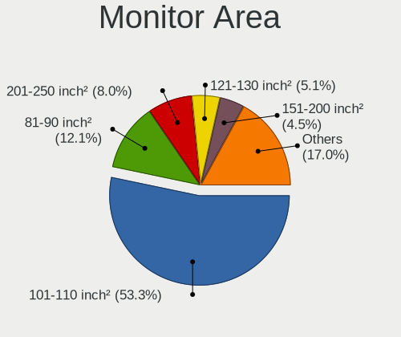

| Area in inch | Computers | Percent |
|----------------|-----------|---------|
| 101-110        | 1730      | 54.16%  |
| 81-90          | 383       | 11.99%  |
| 201-250        | 239       | 7.48%   |
| 121-130        | 168       | 5.26%   |
| 151-200        | 143       | 4.48%   |
| 141-150        | 107       | 3.35%   |
| More than 1000 | 68        | 2.13%   |
| 51-60          | 66        | 2.07%   |
| 351-500        | 54        | 1.69%   |
| 301-350        | 54        | 1.69%   |
| 71-80          | 48        | 1.5%    |
| 501-1000       | 39        | 1.22%   |
| 61-70          | 22        | 0.69%   |
| 251-300        | 22        | 0.69%   |
| 41-50          | 18        | 0.56%   |
| 131-140        | 13        | 0.41%   |
| Unknown        | 9         | 0.28%   |
| 91-100         | 6         | 0.19%   |
| 111-120        | 5         | 0.16%   |

Pixel Density
-------------

Pixels per inch

| Density       | Computers | Percent |
|---------------|-----------|---------|
| 101-120       | 1255      | 39.66%  |
| 121-160       | 1154      | 36.47%  |
| 51-100        | 628       | 19.85%  |
| 1-50          | 76        | 2.4%    |
| 161-240       | 32        | 1.01%   |
| More than 240 | 10        | 0.32%   |
| Unknown       | 9         | 0.28%   |

Multiple Monitors
-----------------

Total monitors connected

| Total | Computers | Percent |
|-------|-----------|---------|
| 1     | 2969      | 91.24%  |
| 2     | 142       | 4.36%   |
| 0     | 138       | 4.24%   |
| 3     | 5         | 0.15%   |

Network
-------

Net Controller Vendor
---------------------

Controller vendors

| Vendor                                | Computers | Percent |
|---------------------------------------|-----------|---------|
| Realtek Semiconductor                 | 2230      | 44.6%   |
| Intel                                 | 1106      | 22.12%  |
| Qualcomm Atheros                      | 963       | 19.26%  |
| Broadcom                              | 181       | 3.62%   |
| Ralink Technology                     | 86        | 1.72%   |
| Marvell Technology Group              | 52        | 1.04%   |
| Broadcom Limited                      | 52        | 1.04%   |
| Ralink                                | 45        | 0.9%    |
| Nvidia                                | 45        | 0.9%    |
| TP-Link                               | 21        | 0.42%   |
| JMicron Technology                    | 20        | 0.4%    |
| Samsung Electronics                   | 14        | 0.28%   |
| MediaTek                              | 14        | 0.28%   |
| Qualcomm Atheros Communications       | 13        | 0.26%   |
| Huawei Technologies                   | 12        | 0.24%   |
| D-Link                                | 11        | 0.22%   |
| Xiaomi                                | 9         | 0.18%   |
| Silicon Integrated Systems [SiS]      | 9         | 0.18%   |
| ASIX Electronics                      | 9         | 0.18%   |
| VIA Technologies                      | 8         | 0.16%   |
| ASUSTek Computer                      | 8         | 0.16%   |
| NetGear                               | 7         | 0.14%   |
| Ericsson Business Mobile Networks     | 6         | 0.12%   |
| Edimax Technology                     | 6         | 0.12%   |
| Microsoft                             | 5         | 0.1%    |
| Dell                                  | 5         | 0.1%    |
| ICS Advent                            | 4         | 0.08%   |
| Hewlett-Packard                       | 4         | 0.08%   |
| Qualcomm                              | 3         | 0.06%   |
| OPPO Electronics                      | 3         | 0.06%   |
| Motorola PCS                          | 3         | 0.06%   |
| Belkin Components                     | 3         | 0.06%   |
| ZTE WCDMA Technologies MSM            | 2         | 0.04%   |
| Texas Instruments                     | 2         | 0.04%   |
| NTmore                                | 2         | 0.04%   |
| Linksys                               | 2         | 0.04%   |
| LG Electronics                        | 2         | 0.04%   |
| IMC Networks                          | 2         | 0.04%   |
| Hangzhou Silan Microelectronics       | 2         | 0.04%   |
| Giga-Byte Technology                  | 2         | 0.04%   |
| 802.11g Adapter [Linksys WUSB54GC v3] | 2         | 0.04%   |
| U.S. Robotics                         | 1         | 0.02%   |
| Spreadtrum Communications             | 1         | 0.02%   |
| Sitecom Europe                        | 1         | 0.02%   |
| Sierra Wireless                       | 1         | 0.02%   |
| Microchip Technology                  | 1         | 0.02%   |
| Micro Star International              | 1         | 0.02%   |
| LSI                                   | 1         | 0.02%   |
| Lenovo                                | 1         | 0.02%   |
| Google                                | 1         | 0.02%   |
| Gemtek                                | 1         | 0.02%   |
| Elecom                                | 1         | 0.02%   |
| DisplayLink                           | 1         | 0.02%   |
| Digitech Systems                      | 1         | 0.02%   |
| D-Link System                         | 1         | 0.02%   |
| Beceem Communications                 | 1         | 0.02%   |
| AVM                                   | 1         | 0.02%   |
| Attansic Technology                   | 1         | 0.02%   |
| Arduino SA                            | 1         | 0.02%   |
| Apple                                 | 1         | 0.02%   |

Net Controller Model
--------------------

Controller models

| Model                                                                   | Computers | Percent |
|-------------------------------------------------------------------------|-----------|---------|
| Realtek RTL8111/8168/8411 PCI Express Gigabit Ethernet Controller       | 1449      | 26.6%   |
| Qualcomm Atheros QCA9377 802.11ac Wireless Network Adapter              | 454       | 8.33%   |
| Realtek RTL810xE PCI Express Fast Ethernet controller                   | 336       | 6.17%   |
| Intel Wi-Fi 6 AX200                                                     | 235       | 4.31%   |
| Realtek RTL8821CE 802.11ac PCIe Wireless Network Adapter                | 199       | 3.65%   |
| Qualcomm Atheros QCA9565 / AR9565 Wireless Network Adapter              | 158       | 2.9%    |
| Intel Wireless 8265 / 8275                                              | 155       | 2.85%   |
| Realtek RTL8723BE PCIe Wireless Network Adapter                         | 114       | 2.09%   |
| Realtek RTL8822BE 802.11a/b/g/n/ac WiFi adapter                         | 86        | 1.58%   |
| Intel Wireless 7265                                                     | 75        | 1.38%   |
| Intel Dual Band Wireless-AC 3168NGW [Stone Peak]                        | 71        | 1.3%    |
| Qualcomm Atheros AR9285 Wireless Network Adapter (PCI-Express)          | 65        | 1.19%   |
| Qualcomm Atheros QCA6174 802.11ac Wireless Network Adapter              | 63        | 1.16%   |
| Realtek Killer E2600 Gigabit Ethernet Controller                        | 62        | 1.14%   |
| Qualcomm Atheros AR9485 Wireless Network Adapter                        | 59        | 1.08%   |
| Intel Cannon Lake PCH CNVi WiFi                                         | 59        | 1.08%   |
| Intel 82579LM Gigabit Network Connection (Lewisville)                   | 53        | 0.97%   |
| Ralink MT7601U Wireless Adapter                                         | 45        | 0.83%   |
| Intel Ice Lake-LP PCH CNVi WiFi                                         | 44        | 0.81%   |
| Intel Cannon Point-LP CNVi [Wireless-AC]                                | 44        | 0.81%   |
| Broadcom BCM43142 802.11b/g/n                                           | 40        | 0.73%   |
| Realtek RTL8188CE 802.11b/g/n WiFi Adapter                              | 39        | 0.72%   |
| Broadcom BCM4313 802.11bgn Wireless Network Adapter                     | 37        | 0.68%   |
| Intel Wi-Fi 6 AX201                                                     | 36        | 0.66%   |
| Qualcomm Atheros AR8151 v2.0 Gigabit Ethernet                           | 29        | 0.53%   |
| Intel Wireless 7260                                                     | 28        | 0.51%   |
| Realtek RTL8188EUS 802.11n Wireless Network Adapter                     | 25        | 0.46%   |
| Nvidia MCP61 Ethernet                                                   | 25        | 0.46%   |
| Intel Centrino Advanced-N 6205 [Taylor Peak]                            | 24        | 0.44%   |
| Intel Wireless 3165                                                     | 23        | 0.42%   |
| Intel Wireless 8260                                                     | 21        | 0.39%   |
| Intel Comet Lake PCH-LP CNVi WiFi                                       | 20        | 0.37%   |
| Realtek RTL8188EE Wireless Network Adapter                              | 19        | 0.35%   |
| Broadcom BCM4312 802.11b/g LP-PHY                                       | 18        | 0.33%   |
| Qualcomm Atheros AR242x / AR542x Wireless Network Adapter (PCI-Express) | 17        | 0.31%   |
| Intel Gemini Lake PCH CNVi WiFi                                         | 17        | 0.31%   |
| Intel Ethernet Connection I217-LM                                       | 17        | 0.31%   |
| Qualcomm Atheros AR928X Wireless Network Adapter (PCI-Express)          | 16        | 0.29%   |
| Qualcomm Atheros AR8152 v2.0 Fast Ethernet                              | 16        | 0.29%   |
| Intel PRO/Wireless 4965 AG or AGN [Kedron] Network Connection           | 16        | 0.29%   |
| Realtek RTL8822CE 802.11ac PCIe Wireless Network Adapter                | 15        | 0.28%   |
| Marvell Group 88E8040 PCI-E Fast Ethernet Controller                    | 15        | 0.28%   |
| Realtek RTL8187B Wireless 802.11g 54Mbps Network Adapter                | 14        | 0.26%   |
| Ralink RT2870/RT3070 Wireless Adapter                                   | 14        | 0.26%   |
| Qualcomm Atheros AR8161 Gigabit Ethernet                                | 14        | 0.26%   |
| JMicron JMC250 PCI Express Gigabit Ethernet Controller                  | 14        | 0.26%   |
| Intel 82567LM-3 Gigabit Network Connection                              | 14        | 0.26%   |
| Ralink RT5370 Wireless Adapter                                          | 13        | 0.24%   |
| Qualcomm Atheros AR9462 Wireless Network Adapter                        | 13        | 0.24%   |
| Qualcomm Atheros AR9287 Wireless Network Adapter (PCI-Express)          | 13        | 0.24%   |
| Intel Centrino Wireless-N 1000 [Condor Peak]                            | 13        | 0.24%   |
| Realtek RTL8723DE Wireless Network Adapter                              | 12        | 0.22%   |
| Qualcomm Atheros AR8131 Gigabit Ethernet                                | 12        | 0.22%   |
| Realtek RTL8821AE 802.11ac PCIe Wireless Network Adapter                | 11        | 0.2%    |
| Realtek RTL8153 Gigabit Ethernet Adapter                                | 11        | 0.2%    |
| Qualcomm Atheros Killer E2500 Gigabit Ethernet Controller               | 11        | 0.2%    |
| Intel WiFi Link 5100                                                    | 11        | 0.2%    |
| Broadcom NetLink BCM57785 Gigabit Ethernet PCIe                         | 11        | 0.2%    |
| Broadcom Limited BCM4312 802.11b/g LP-PHY                               | 11        | 0.2%    |
| Realtek RTL8191SEvB Wireless LAN Controller                             | 10        | 0.18%   |

Wireless Vendor
---------------

Wireless vendors

| Vendor                                | Computers | Percent |
|---------------------------------------|-----------|---------|
| Intel                                 | 991       | 34.45%  |
| Qualcomm Atheros                      | 872       | 30.31%  |
| Realtek Semiconductor                 | 624       | 21.69%  |
| Broadcom                              | 131       | 4.55%   |
| Ralink Technology                     | 86        | 2.99%   |
| Ralink                                | 45        | 1.56%   |
| Broadcom Limited                      | 26        | 0.9%    |
| TP-Link                               | 16        | 0.56%   |
| Qualcomm Atheros Communications       | 13        | 0.45%   |
| MediaTek                              | 11        | 0.38%   |
| D-Link                                | 10        | 0.35%   |
| ASUSTek Computer                      | 7         | 0.24%   |
| NetGear                               | 6         | 0.21%   |
| Edimax Technology                     | 6         | 0.21%   |
| Microsoft                             | 5         | 0.17%   |
| Marvell Technology Group              | 3         | 0.1%    |
| Dell                                  | 3         | 0.1%    |
| Belkin Components                     | 3         | 0.1%    |
| Linksys                               | 2         | 0.07%   |
| IMC Networks                          | 2         | 0.07%   |
| Hewlett-Packard                       | 2         | 0.07%   |
| 802.11g Adapter [Linksys WUSB54GC v3] | 2         | 0.07%   |
| U.S. Robotics                         | 1         | 0.03%   |
| Texas Instruments                     | 1         | 0.03%   |
| Sitecom Europe                        | 1         | 0.03%   |
| Sierra Wireless                       | 1         | 0.03%   |
| Micro Star International              | 1         | 0.03%   |
| Elecom                                | 1         | 0.03%   |
| D-Link System                         | 1         | 0.03%   |
| AVM                                   | 1         | 0.03%   |
| AirTies Wireless Networks             | 1         | 0.03%   |
| Accton Technology                     | 1         | 0.03%   |
| AboCom Systems                        | 1         | 0.03%   |

Wireless Model
--------------

Wireless models

| Model                                                                   | Computers | Percent |
|-------------------------------------------------------------------------|-----------|---------|
| Qualcomm Atheros QCA9377 802.11ac Wireless Network Adapter              | 454       | 15.73%  |
| Intel Wi-Fi 6 AX200                                                     | 235       | 8.14%   |
| Realtek RTL8821CE 802.11ac PCIe Wireless Network Adapter                | 199       | 6.9%    |
| Qualcomm Atheros QCA9565 / AR9565 Wireless Network Adapter              | 158       | 5.47%   |
| Intel Wireless 8265 / 8275                                              | 155       | 5.37%   |
| Realtek RTL8723BE PCIe Wireless Network Adapter                         | 114       | 3.95%   |
| Realtek RTL8822BE 802.11a/b/g/n/ac WiFi adapter                         | 86        | 2.98%   |
| Intel Wireless 7265                                                     | 75        | 2.6%    |
| Intel Dual Band Wireless-AC 3168NGW [Stone Peak]                        | 71        | 2.46%   |
| Qualcomm Atheros AR9285 Wireless Network Adapter (PCI-Express)          | 65        | 2.25%   |
| Qualcomm Atheros QCA6174 802.11ac Wireless Network Adapter              | 63        | 2.18%   |
| Qualcomm Atheros AR9485 Wireless Network Adapter                        | 59        | 2.04%   |
| Intel Cannon Lake PCH CNVi WiFi                                         | 59        | 2.04%   |
| Ralink MT7601U Wireless Adapter                                         | 45        | 1.56%   |
| Intel Ice Lake-LP PCH CNVi WiFi                                         | 44        | 1.52%   |
| Intel Cannon Point-LP CNVi [Wireless-AC]                                | 44        | 1.52%   |
| Broadcom BCM43142 802.11b/g/n                                           | 40        | 1.39%   |
| Realtek RTL8188CE 802.11b/g/n WiFi Adapter                              | 39        | 1.35%   |
| Broadcom BCM4313 802.11bgn Wireless Network Adapter                     | 37        | 1.28%   |
| Intel Wi-Fi 6 AX201                                                     | 36        | 1.25%   |
| Intel Wireless 7260                                                     | 28        | 0.97%   |
| Realtek RTL8188EUS 802.11n Wireless Network Adapter                     | 25        | 0.87%   |
| Intel Centrino Advanced-N 6205 [Taylor Peak]                            | 24        | 0.83%   |
| Intel Wireless 3165                                                     | 23        | 0.8%    |
| Intel Wireless 8260                                                     | 21        | 0.73%   |
| Intel Comet Lake PCH-LP CNVi WiFi                                       | 20        | 0.69%   |
| Realtek RTL8188EE Wireless Network Adapter                              | 19        | 0.66%   |
| Broadcom BCM4312 802.11b/g LP-PHY                                       | 18        | 0.62%   |
| Qualcomm Atheros AR242x / AR542x Wireless Network Adapter (PCI-Express) | 17        | 0.59%   |
| Intel Gemini Lake PCH CNVi WiFi                                         | 17        | 0.59%   |
| Qualcomm Atheros AR928X Wireless Network Adapter (PCI-Express)          | 16        | 0.55%   |
| Intel PRO/Wireless 4965 AG or AGN [Kedron] Network Connection           | 16        | 0.55%   |
| Realtek RTL8822CE 802.11ac PCIe Wireless Network Adapter                | 15        | 0.52%   |
| Realtek RTL8187B Wireless 802.11g 54Mbps Network Adapter                | 14        | 0.49%   |
| Ralink RT2870/RT3070 Wireless Adapter                                   | 14        | 0.49%   |
| Ralink RT5370 Wireless Adapter                                          | 13        | 0.45%   |
| Qualcomm Atheros AR9462 Wireless Network Adapter                        | 13        | 0.45%   |
| Qualcomm Atheros AR9287 Wireless Network Adapter (PCI-Express)          | 13        | 0.45%   |
| Intel Centrino Wireless-N 1000 [Condor Peak]                            | 13        | 0.45%   |
| Realtek RTL8723DE Wireless Network Adapter                              | 12        | 0.42%   |
| Realtek RTL8821AE 802.11ac PCIe Wireless Network Adapter                | 11        | 0.38%   |
| Intel WiFi Link 5100                                                    | 11        | 0.38%   |
| Broadcom Limited BCM4312 802.11b/g LP-PHY                               | 11        | 0.38%   |
| Realtek RTL8191SEvB Wireless LAN Controller                             | 10        | 0.35%   |
| Qualcomm Atheros AR9271 802.11n                                         | 10        | 0.35%   |
| Intel PRO/Wireless 5100 AGN [Shiloh] Network Connection                 | 10        | 0.35%   |
| Intel Centrino Ultimate-N 6300                                          | 10        | 0.35%   |
| Realtek RTL8723AE PCIe Wireless Network Adapter                         | 9         | 0.31%   |
| Realtek RTL8188FTV 802.11b/g/n 1T1R 2.4G WLAN Adapter                   | 9         | 0.31%   |
| Realtek RTL8188CUS 802.11n WLAN Adapter                                 | 9         | 0.31%   |
| Ralink RT3290 Wireless 802.11n 1T/1R PCIe                               | 9         | 0.31%   |
| Ralink RT3090 Wireless 802.11n 1T/1R PCIe                               | 9         | 0.31%   |
| Ralink RT2790 Wireless 802.11n 1T/2R PCIe                               | 9         | 0.31%   |
| Intel Wireless 3160                                                     | 9         | 0.31%   |
| Intel Dual Band Wireless-AC 3165 Plus Bluetooth                         | 9         | 0.31%   |
| Intel Centrino Advanced-N 6200                                          | 9         | 0.31%   |
| Ralink RT5390 Wireless 802.11n 1T/1R PCIe                               | 8         | 0.28%   |
| Intel Comet Lake PCH CNVi WiFi                                          | 8         | 0.28%   |
| Realtek RTL88x2bu [AC1200 Techkey]                                      | 7         | 0.24%   |
| Realtek RTL8191SEvA Wireless LAN Controller                             | 6         | 0.21%   |

Ethernet Vendor
---------------

Ethernet vendors

| Vendor                           | Computers | Percent |
|----------------------------------|-----------|---------|
| Realtek Semiconductor            | 1880      | 74.34%  |
| Intel                            | 216       | 8.54%   |
| Qualcomm Atheros                 | 137       | 5.42%   |
| Broadcom                         | 56        | 2.21%   |
| Marvell Technology Group         | 49        | 1.94%   |
| Nvidia                           | 45        | 1.78%   |
| Broadcom Limited                 | 27        | 1.07%   |
| JMicron Technology               | 20        | 0.79%   |
| Samsung Electronics              | 12        | 0.47%   |
| Xiaomi                           | 9         | 0.36%   |
| Silicon Integrated Systems [SiS] | 9         | 0.36%   |
| Huawei Technologies              | 9         | 0.36%   |
| ASIX Electronics                 | 9         | 0.36%   |
| VIA Technologies                 | 8         | 0.32%   |
| TP-Link                          | 5         | 0.2%    |
| ICS Advent                       | 4         | 0.16%   |
| Qualcomm                         | 3         | 0.12%   |
| OPPO Electronics                 | 3         | 0.12%   |
| MediaTek                         | 3         | 0.12%   |
| NTmore                           | 2         | 0.08%   |
| Motorola PCS                     | 2         | 0.08%   |
| LG Electronics                   | 2         | 0.08%   |
| Hangzhou Silan Microelectronics  | 2         | 0.08%   |
| Giga-Byte Technology             | 2         | 0.08%   |
| Spreadtrum Communications        | 1         | 0.04%   |
| NetGear                          | 1         | 0.04%   |
| Lenovo                           | 1         | 0.04%   |
| Hewlett-Packard                  | 1         | 0.04%   |
| Google                           | 1         | 0.04%   |
| Gemtek                           | 1         | 0.04%   |
| DisplayLink                      | 1         | 0.04%   |
| Digitech Systems                 | 1         | 0.04%   |
| D-Link                           | 1         | 0.04%   |
| Beceem Communications            | 1         | 0.04%   |
| Attansic Technology              | 1         | 0.04%   |
| ASUSTek Computer                 | 1         | 0.04%   |
| Apple                            | 1         | 0.04%   |
| AMD                              | 1         | 0.04%   |
| ADMtek                           | 1         | 0.04%   |

Ethernet Model
--------------

Ethernet models

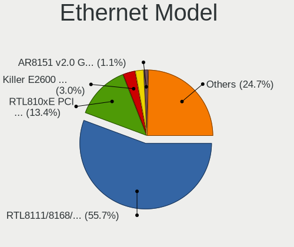

| Model                                                             | Computers | Percent |
|-------------------------------------------------------------------|-----------|---------|
| Realtek RTL8111/8168/8411 PCI Express Gigabit Ethernet Controller | 1449      | 57.05%  |
| Realtek RTL810xE PCI Express Fast Ethernet controller             | 336       | 13.23%  |
| Realtek Killer E2600 Gigabit Ethernet Controller                  | 62        | 2.44%   |
| Intel 82579LM Gigabit Network Connection (Lewisville)             | 53        | 2.09%   |
| Qualcomm Atheros AR8151 v2.0 Gigabit Ethernet                     | 29        | 1.14%   |
| Nvidia MCP61 Ethernet                                             | 25        | 0.98%   |
| Intel Ethernet Connection I217-LM                                 | 17        | 0.67%   |
| Qualcomm Atheros AR8152 v2.0 Fast Ethernet                        | 16        | 0.63%   |
| Marvell Group 88E8040 PCI-E Fast Ethernet Controller              | 15        | 0.59%   |
| Qualcomm Atheros AR8161 Gigabit Ethernet                          | 14        | 0.55%   |
| JMicron JMC250 PCI Express Gigabit Ethernet Controller            | 14        | 0.55%   |
| Intel 82567LM-3 Gigabit Network Connection                        | 14        | 0.55%   |
| Qualcomm Atheros AR8131 Gigabit Ethernet                          | 12        | 0.47%   |
| Realtek RTL8153 Gigabit Ethernet Adapter                          | 11        | 0.43%   |
| Qualcomm Atheros Killer E2500 Gigabit Ethernet Controller         | 11        | 0.43%   |
| Broadcom NetLink BCM57785 Gigabit Ethernet PCIe                   | 11        | 0.43%   |
| Realtek RTL-8100/8101L/8139 PCI Fast Ethernet Adapter             | 10        | 0.39%   |
| Qualcomm Atheros AR8132 Fast Ethernet                             | 10        | 0.39%   |
| Intel I211 Gigabit Network Connection                             | 10        | 0.39%   |
| Intel Ethernet Connection (2) I219-V                              | 10        | 0.39%   |
| Intel 82577LM Gigabit Network Connection                          | 10        | 0.39%   |
| Broadcom Limited NetLink BCM57780 Gigabit Ethernet PCIe           | 10        | 0.39%   |
| Silicon Integrated Systems [SiS] 191 Gigabit Ethernet Adapter     | 9         | 0.35%   |
| Samsung Galaxy series, misc. (tethering mode)                     | 9         | 0.35%   |
| Realtek RTL8152 Fast Ethernet Adapter                             | 9         | 0.35%   |
| Intel Ethernet Connection I219-LM                                 | 9         | 0.35%   |
| Intel 82579V Gigabit Network Connection                           | 9         | 0.35%   |
| Qualcomm Atheros AR8121/AR8113/AR8114 Gigabit or Fast Ethernet    | 8         | 0.31%   |
| Marvell Group 88E8055 PCI-E Gigabit Ethernet Controller           | 8         | 0.31%   |
| Intel 82567LM Gigabit Network Connection                          | 8         | 0.31%   |
| Broadcom NetXtreme BCM5761 Gigabit Ethernet PCIe                  | 8         | 0.31%   |
| Intel Ethernet Connection (7) I219-V                              | 7         | 0.28%   |
| Broadcom NetLink BCM57780 Gigabit Ethernet PCIe                   | 7         | 0.28%   |
| Xiaomi Mi/Redmi series (RNDIS)                                    | 6         | 0.24%   |
| Qualcomm Atheros AR8162 Fast Ethernet                             | 6         | 0.24%   |
| Marvell Group 88E8058 PCI-E Gigabit Ethernet Controller           | 6         | 0.24%   |
| JMicron JMC260 PCI Express Fast Ethernet Controller               | 6         | 0.24%   |
| Intel Ethernet Connection I218-LM                                 | 6         | 0.24%   |
| Intel Ethernet Connection I217-V                                  | 6         | 0.24%   |
| Intel Ethernet Connection (13) I219-V                             | 6         | 0.24%   |
| Huawei JNY-LX1                                                    | 6         | 0.24%   |
| ASIX AX88179 Gigabit Ethernet                                     | 6         | 0.24%   |
| VIA VT6102/VT6103 [Rhine-II]                                      | 5         | 0.2%    |
| TP-Link UE300 10/100/1000 LAN (ethernet mode) [Realtek RTL8153]   | 5         | 0.2%    |
| Qualcomm Atheros QCA8172 Fast Ethernet                            | 5         | 0.2%    |
| Qualcomm Atheros Attansic L2 Fast Ethernet                        | 5         | 0.2%    |
| Qualcomm Atheros AR8152 v1.1 Fast Ethernet                        | 5         | 0.2%    |
| Nvidia MCP51 Ethernet Controller                                  | 5         | 0.2%    |
| Intel 82566DM-2 Gigabit Network Connection                        | 5         | 0.2%    |
| Broadcom NetXtreme BCM5764M Gigabit Ethernet PCIe                 | 5         | 0.2%    |
| Broadcom Limited BCM4401-B0 100Base-TX                            | 5         | 0.2%    |
| Realtek RTL8169 PCI Gigabit Ethernet Controller                   | 4         | 0.16%   |
| Qualcomm Atheros QCA8171 Gigabit Ethernet                         | 4         | 0.16%   |
| Qualcomm Atheros AR8151 v1.0 Gigabit Ethernet                     | 4         | 0.16%   |
| Nvidia MCP79 Ethernet                                             | 4         | 0.16%   |
| Nvidia MCP67 Ethernet                                             | 4         | 0.16%   |
| Marvell Group 88E8053 PCI-E Gigabit Ethernet Controller           | 4         | 0.16%   |
| Intel 82566MM Gigabit Network Connection                          | 4         | 0.16%   |
| ICS Advent DM9601 Fast Ethernet Adapter                           | 4         | 0.16%   |
| Broadcom NetLink BCM5787M Gigabit Ethernet PCI Express            | 4         | 0.16%   |

Net Controller Kind
-------------------

Ethernet, WiFi or modem

| Kind     | Computers | Percent |
|----------|-----------|---------|
| WiFi     | 2791      | 52.94%  |
| Ethernet | 2459      | 46.64%  |
| Modem    | 21        | 0.4%    |
| Unknown  | 1         | 0.02%   |

Used Controller
---------------

Currently used network controller

| Kind     | Computers | Percent |
|----------|-----------|---------|
| WiFi     | 2514      | 76.39%  |
| Ethernet | 777       | 23.61%  |

NICs
----

Total network controllers on board

| Total | Computers | Percent |
|-------|-----------|---------|
| 2     | 1893      | 58.48%  |
| 1     | 1243      | 38.4%   |
| 0     | 95        | 2.93%   |
| 3     | 5         | 0.15%   |
| 4     | 1         | 0.03%   |

IPv6
----

IPv6 vs IPv4

| Used    | Computers | Percent |
|---------|-----------|---------|
| No      | 3009      | 91.77%  |
| Yes     | 268       | 8.17%   |
| Unknown | 2         | 0.06%   |

Bluetooth
---------

Bluetooth Vendor
----------------

Controller vendors

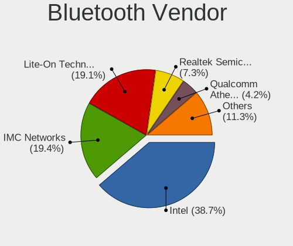

| Vendor                          | Computers | Percent |
|---------------------------------|-----------|---------|
| Intel                           | 847       | 37.35%  |
| Lite-On Technology              | 464       | 20.46%  |
| IMC Networks                    | 439       | 19.36%  |
| Realtek Semiconductor           | 161       | 7.1%    |
| Qualcomm Atheros Communications | 95        | 4.19%   |
| Broadcom                        | 62        | 2.73%   |
| Cambridge Silicon Radio         | 59        | 2.6%    |
| Foxconn / Hon Hai               | 24        | 1.06%   |
| Dell                            | 22        | 0.97%   |
| Hewlett-Packard                 | 20        | 0.88%   |
| Apple                           | 20        | 0.88%   |
| Toshiba                         | 14        | 0.62%   |
| ASUSTek Computer                | 10        | 0.44%   |
| Ralink                          | 9         | 0.4%    |
| Foxconn International           | 6         | 0.26%   |
| Marvell Semiconductor           | 3         | 0.13%   |
| Alps Electric                   | 3         | 0.13%   |
| Ralink Technology               | 2         | 0.09%   |
| Qcom                            | 2         | 0.09%   |
| Unknown                         | 1         | 0.04%   |
| Realtek                         | 1         | 0.04%   |
| Micro Star International        | 1         | 0.04%   |
| Integrated System Solution      | 1         | 0.04%   |
| Chicony Electronics             | 1         | 0.04%   |
| Belkin Components               | 1         | 0.04%   |

Bluetooth Model
---------------

Controller models

| Model                                                                               | Computers | Percent |
|-------------------------------------------------------------------------------------|-----------|---------|
| Lite-On Qualcomm Atheros QCA9377 Bluetooth                                          | 308       | 13.58%  |
| Intel Bluetooth wireless interface                                                  | 305       | 13.45%  |
| IMC Networks Bluetooth Radio                                                        | 267       | 11.77%  |
| Intel AX200 Bluetooth                                                               | 234       | 10.32%  |
| Intel Bluetooth 9460/9560 Jefferson Peak (JfP)                                      | 186       | 8.2%    |
| IMC Networks Bluetooth Device                                                       | 157       | 6.92%   |
| Lite-On Bluetooth Device                                                            | 124       | 5.47%   |
| Realtek Bluetooth Radio                                                             | 113       | 4.98%   |
| Intel Wireless-AC 3168 Bluetooth                                                    | 62        | 2.73%   |
| Cambridge Silicon Radio Bluetooth Dongle (HCI mode)                                 | 59        | 2.6%    |
| Qualcomm Atheros  Bluetooth Device                                                  | 41        | 1.81%   |
| Intel AX201 Bluetooth                                                               | 38        | 1.68%   |
| Realtek  Bluetooth 4.2 Adapter                                                      | 27        | 1.19%   |
| Qualcomm Atheros AR3011 Bluetooth                                                   | 22        | 0.97%   |
| Qualcomm Atheros AR3012 Bluetooth 4.0                                               | 20        | 0.88%   |
| Lite-On Atheros AR3012 Bluetooth                                                    | 15        | 0.66%   |
| Intel Centrino Bluetooth Wireless Transceiver                                       | 12        | 0.53%   |
| Realtek RTL8723B Bluetooth                                                          | 9         | 0.4%    |
| Ralink RT3290 Bluetooth                                                             | 9         | 0.4%    |
| HP Bluetooth 2.0 Interface [Broadcom BCM2045]                                       | 9         | 0.4%    |
| Broadcom BCM43142A0 Bluetooth 4.0                                                   | 9         | 0.4%    |
| Broadcom BCM2045B (BDC-2.1)                                                         | 9         | 0.4%    |
| Apple Bluetooth HCI                                                                 | 9         | 0.4%    |
| HP Broadcom 2070 Bluetooth Combo                                                    | 8         | 0.35%   |
| Lite-On Qualcomm Atheros Bluetooth                                                  | 7         | 0.31%   |
| Broadcom BCM43142A0 Bluetooth Device                                                | 7         | 0.31%   |
| Intel Centrino Advanced-N 6230 Bluetooth adapter                                    | 6         | 0.26%   |
| Foxconn International BCM43142A0 Bluetooth module                                   | 6         | 0.26%   |
| Foxconn / Hon Hai Bluetooth Device                                                  | 6         | 0.26%   |
| Apple Bluetooth USB Host Controller                                                 | 6         | 0.26%   |
| Toshiba BCM43142A0                                                                  | 5         | 0.22%   |
| Realtek RTL8821A Bluetooth                                                          | 5         | 0.22%   |
| IMC Networks Wireless_Device                                                        | 5         | 0.22%   |
| Dell DW375 Bluetooth Module                                                         | 5         | 0.22%   |
| Dell BCM20702A0 Bluetooth Module                                                    | 5         | 0.22%   |
| Broadcom HP Portable SoftSailing                                                    | 5         | 0.22%   |
| Toshiba Bluetooth Device                                                            | 4         | 0.18%   |
| Realtek RTL8822BE Bluetooth 4.2 Adapter                                             | 4         | 0.18%   |
| Qualcomm Atheros AR9462 Bluetooth                                                   | 4         | 0.18%   |
| Foxconn / Hon Hai Foxconn T77H114 BCM2070 [Single-Chip Bluetooth 2.1 + EDR Adapter] | 4         | 0.18%   |
| Foxconn / Hon Hai BCM43142A0                                                        | 4         | 0.18%   |
| Dell Wireless 355 Bluetooth                                                         | 4         | 0.18%   |
| Broadcom BCM43142 Bluetooth 4.0                                                     | 4         | 0.18%   |
| Broadcom BCM20702A0 Bluetooth 4.0                                                   | 4         | 0.18%   |
| Broadcom BCM2070 Bluetooth Device                                                   | 4         | 0.18%   |
| ASUS Broadcom BCM20702A0 Bluetooth                                                  | 4         | 0.18%   |
| Toshiba RT Bluetooth Radio                                                          | 3         | 0.13%   |
| Realtek RTL8723A Bluetooth                                                          | 3         | 0.13%   |
| Qualcomm Atheros Bluetooth USB Host Controller                                      | 3         | 0.13%   |
| Lite-On Broadcom BCM43142A0 Bluetooth Device                                        | 3         | 0.13%   |
| Lite-On Bluetooth Radio                                                             | 3         | 0.13%   |
| Intel Wireless-AC 9260 Bluetooth Adapter                                            | 3         | 0.13%   |
| IMC Networks Bluetooth module                                                       | 3         | 0.13%   |
| Foxconn / Hon Hai Acer Module                                                       | 3         | 0.13%   |
| Dell Wireless 365 Bluetooth                                                         | 3         | 0.13%   |
| Dell Wireless 360 Bluetooth                                                         | 3         | 0.13%   |
| Broadcom HP Portable Valentine                                                      | 3         | 0.13%   |
| Apple Bluetooth Host Controller                                                     | 3         | 0.13%   |
| Qualcomm Atheros QCA61x4 Bluetooth 4.0                                              | 2         | 0.09%   |
| Qualcomm Atheros AR3012 Bluetooth                                                   | 2         | 0.09%   |

Sound
-----

Sound Vendor
------------

Sound card vendors

| Vendor                                          | Computers | Percent |
|-------------------------------------------------|-----------|---------|
| Intel                                           | 2485      | 64.73%  |
| AMD                                             | 651       | 16.96%  |
| Nvidia                                          | 577       | 15.03%  |
| C-Media Electronics                             | 31        | 0.81%   |
| Creative Labs                                   | 11        | 0.29%   |
| Silicon Integrated Systems [SiS]                | 10        | 0.26%   |
| Generalplus Technology                          | 10        | 0.26%   |
| Logitech                                        | 9         | 0.23%   |
| JMTek                                           | 8         | 0.21%   |
| VIA Technologies                                | 7         | 0.18%   |
| Texas Instruments                               | 5         | 0.13%   |
| Creative Technology                             | 4         | 0.1%    |
| Plantronics                                     | 3         | 0.08%   |
| Corsair                                         | 3         | 0.08%   |
| ASUSTek Computer                                | 3         | 0.08%   |
| Dell                                            | 2         | 0.05%   |
| BEHRINGER International                         | 2         | 0.05%   |
| Tenx Technology                                 | 1         | 0.03%   |
| Tdlasunnic                                      | 1         | 0.03%   |
| SteelSeries ApS                                 | 1         | 0.03%   |
| Sony                                            | 1         | 0.03%   |
| Sennheiser Communications                       | 1         | 0.03%   |
| Samsung Electronics                             | 1         | 0.03%   |
| Samson Technologies                             | 1         | 0.03%   |
| Realtek Semiconductor                           | 1         | 0.03%   |
| Pioneer DJ                                      | 1         | 0.03%   |
| Licensed by Sony Computer Entertainment America | 1         | 0.03%   |
| Lenovo                                          | 1         | 0.03%   |
| Kingston Technology                             | 1         | 0.03%   |
| Harman                                          | 1         | 0.03%   |
| Ensoniq                                         | 1         | 0.03%   |
| Elite Silicon                                   | 1         | 0.03%   |
| Edifier Technology                              | 1         | 0.03%   |
| EasyPass Industrial                             | 1         | 0.03%   |
| Blue Microphones                                | 1         | 0.03%   |

Sound Model
-----------

Sound card models

| Model                                                                                             | Computers | Percent |
|---------------------------------------------------------------------------------------------------|-----------|---------|
| Intel Sunrise Point-LP HD Audio                                                                   | 475       | 10.67%  |
| Intel Celeron/Pentium Silver Processor High Definition Audio                                      | 279       | 6.27%   |
| Intel Cannon Lake PCH cAVS                                                                        | 261       | 5.86%   |
| AMD Family 17h/19h HD Audio Controller                                                            | 253       | 5.68%   |
| Nvidia TU107 GeForce GTX 1650 High Definition Audio Controller                                    | 242       | 5.44%   |
| AMD Raven/Raven2/Fenghuang HDMI/DP Audio Controller                                               | 181       | 4.07%   |
| Intel 6 Series/C200 Series Chipset Family High Definition Audio Controller                        | 155       | 3.48%   |
| Intel Celeron N3350/Pentium N4200/Atom E3900 Series Audio Cluster                                 | 153       | 3.44%   |
| Intel 7 Series/C216 Chipset Family High Definition Audio Controller                               | 148       | 3.32%   |
| Intel NM10/ICH7 Family High Definition Audio Controller                                           | 120       | 2.7%    |
| AMD FCH Azalia Controller                                                                         | 107       | 2.4%    |
| AMD Family 15h (Models 60h-6fh) Audio Controller                                                  | 104       | 2.34%   |
| Intel 82801I (ICH9 Family) HD Audio Controller                                                    | 99        | 2.22%   |
| AMD SBx00 Azalia (Intel HDA)                                                                      | 95        | 2.13%   |
| Intel Cannon Point-LP High Definition Audio Controller                                            | 89        | 2%      |
| AMD High Definition Audio Controller                                                              | 85        | 1.91%   |
| Intel Atom/Celeron/Pentium Processor x5-E8000/J3xxx/N3xxx Series High Definition Audio Controller | 72        | 1.62%   |
| Intel 5 Series/3400 Series Chipset High Definition Audio                                          | 72        | 1.62%   |
| Intel Ice Lake-LP Smart Sound Technology Audio Controller                                         | 66        | 1.48%   |
| Nvidia GP107GL High Definition Audio Controller                                                   | 65        | 1.46%   |
| Intel Comet Lake PCH-LP cAVS                                                                      | 61        | 1.37%   |
| Intel 8 Series/C220 Series Chipset High Definition Audio Controller                               | 56        | 1.26%   |
| AMD Kabini HDMI/DP Audio                                                                          | 55        | 1.24%   |
| Intel 82801H (ICH8 Family) HD Audio Controller                                                    | 50        | 1.12%   |
| Intel Xeon E3-1200 v3/4th Gen Core Processor HD Audio Controller                                  | 47        | 1.06%   |
| Intel Atom Processor Z36xxx/Z37xxx Series High Definition Audio Controller                        | 45        | 1.01%   |
| Intel Haswell-ULT HD Audio Controller                                                             | 44        | 0.99%   |
| Intel 8 Series HD Audio Controller                                                                | 44        | 0.99%   |
| Intel CM238 HD Audio Controller                                                                   | 42        | 0.94%   |
| Intel Tiger Lake-LP Smart Sound Technology Audio Controller                                       | 41        | 0.92%   |
| Intel Broadwell-U Audio Controller                                                                | 39        | 0.88%   |
| Intel Wildcat Point-LP High Definition Audio Controller                                           | 38        | 0.85%   |
| AMD Wrestler HDMI Audio                                                                           | 34        | 0.76%   |
| Nvidia High Definition Audio Controller                                                           | 30        | 0.67%   |
| Nvidia GK208 HDMI/DP Audio Controller                                                             | 28        | 0.63%   |
| Nvidia MCP61 High Definition Audio                                                                | 27        | 0.61%   |
| Nvidia GF108 High Definition Audio Controller                                                     | 27        | 0.61%   |
| Intel 200 Series PCH HD Audio                                                                     | 25        | 0.56%   |
| Intel 100 Series/C230 Series Chipset Family HD Audio Controller                                   | 25        | 0.56%   |
| AMD Cedar HDMI Audio [Radeon HD 5400/6300/7300 Series]                                            | 23        | 0.52%   |
| Nvidia GP106 High Definition Audio Controller                                                     | 22        | 0.49%   |
| Nvidia GF119 HDMI Audio Controller                                                                | 22        | 0.49%   |
| AMD Oland/Hainan/Cape Verde/Pitcairn HDMI Audio [Radeon HD 7000 Series]                           | 20        | 0.45%   |
| AMD Trinity HDMI Audio Controller                                                                 | 19        | 0.43%   |
| Intel 82801JI (ICH10 Family) HD Audio Controller                                                  | 17        | 0.38%   |
| Intel 82801JD/DO (ICH10 Family) HD Audio Controller                                               | 15        | 0.34%   |
| AMD RV710/730 HDMI Audio [Radeon HD 4000 series]                                                  | 14        | 0.31%   |
| AMD RS880 HDMI Audio [Radeon HD 4200 Series]                                                      | 13        | 0.29%   |
| AMD Family 17h (Models 00h-0fh) HD Audio Controller                                               | 13        | 0.29%   |
| Nvidia TU106 High Definition Audio Controller                                                     | 12        | 0.27%   |
| Nvidia GF116 High Definition Audio Controller                                                     | 11        | 0.25%   |
| AMD Kaveri HDMI/DP Audio Controller                                                               | 11        | 0.25%   |
| AMD Ellesmere HDMI Audio [Radeon RX 470/480 / 570/580/590]                                        | 11        | 0.25%   |
| Silicon Integrated Systems [SiS] Azalia Audio Controller                                          | 10        | 0.22%   |
| Generalplus Technology USB Audio Device                                                           | 10        | 0.22%   |
| AMD Caicos HDMI Audio [Radeon HD 6450 / 7450/8450/8490 OEM / R5 230/235/235X OEM]                 | 10        | 0.22%   |
| Nvidia GT216 HDMI Audio Controller                                                                | 9         | 0.2%    |
| Nvidia GM107 High Definition Audio Controller [GeForce 940MX]                                     | 9         | 0.2%    |
| Intel Comet Lake PCH cAVS                                                                         | 9         | 0.2%    |
| AMD Redwood HDMI Audio [Radeon HD 5000 Series]                                                    | 9         | 0.2%    |

Memory
------

Memory Vendor
-------------

Memory module vendors

| Vendor              | Computers | Percent |
|---------------------|-----------|---------|
| Unknown (ABCD)      | 2         | 13.33%  |
| Unknown             | 2         | 13.33%  |
| Samsung Electronics | 2         | 13.33%  |
| Elpida              | 2         | 13.33%  |
| Smart               | 1         | 6.67%   |
| SK hynix            | 1         | 6.67%   |
| Patriot             | 1         | 6.67%   |
| Micron Technology   | 1         | 6.67%   |
| Kingston            | 1         | 6.67%   |
| G.Skill             | 1         | 6.67%   |
| Apacer              | 1         | 6.67%   |

Memory Model
------------

Memory module models

| Model                                                               | Computers | Percent |
|---------------------------------------------------------------------|-----------|---------|
| Unknown (ABCD) RAM 123456789012345678 2048MB SODIMM LPDDR4 2400MT/s | 2         | 13.33%  |
| Unknown RAM Module 4GB SODIMM DDR3 1600MT/s                         | 1         | 6.67%   |
| Unknown RAM Module 1024MB DIMM 667MT/s                              | 1         | 6.67%   |
| Smart RAM SH564128FJ8NWRNSQG 4GB SODIMM DDR3 1600MT/s               | 1         | 6.67%   |
| SK hynix RAM HMAA2GS6AJR8N-XN 16GB SODIMM DDR4 3200MT/s             | 1         | 6.67%   |
| Samsung RAM M471A5244CB0-CTD 4096MB SODIMM DDR4 3266MT/s            | 1         | 6.67%   |
| Samsung RAM M471A1K43DB1-CTD 8GB SODIMM DDR4 2667MT/s               | 1         | 6.67%   |
| Patriot RAM PSD38G1600L2S 8GB SODIMM DDR3 1600MT/s                  | 1         | 6.67%   |
| Micron RAM 8ATF51264HZ-2G3B1 4GB SODIMM DDR4 2400MT/s               | 1         | 6.67%   |
| Kingston RAM 99U5428-073.A00G 8GB SODIMM DDR3 1600MT/s              | 1         | 6.67%   |
| G.Skill RAM F4-4000C19-16GTZSW 16GB DIMM DDR4 3200MT/s              | 1         | 6.67%   |
| Elpida RAM Module 4096MB SODIMM LPDDR3 1600MT/s                     | 1         | 6.67%   |
| Elpida RAM EBJ40UG8EFU0-GN-F 4GB SODIMM DDR3 1600MT/s               | 1         | 6.67%   |
| Apacer RAM 76.D305G.D390B 16GB SODIMM DDR4 2400MT/s                 | 1         | 6.67%   |

Memory Kind
-----------

Memory module kinds

| Kind    | Computers | Percent |
|---------|-----------|---------|
| DDR4    | 6         | 40%     |
| DDR3    | 5         | 33.33%  |
| LPDDR4  | 2         | 13.33%  |
| LPDDR3  | 1         | 6.67%   |
| Unknown | 1         | 6.67%   |

Memory Form Factor
------------------

Physical design of the memory module

| Name   | Computers | Percent |
|--------|-----------|---------|
| SODIMM | 13        | 86.67%  |
| DIMM   | 2         | 13.33%  |

Memory Size
-----------

Memory module size

| Size  | Computers | Percent |
|-------|-----------|---------|
| 4096  | 8         | 53.33%  |
| 16384 | 3         | 20%     |
| 8192  | 3         | 20%     |
| 1024  | 1         | 6.67%   |

Memory Speed
------------

Memory module speed

| Speed | Computers | Percent |
|-------|-----------|---------|
| 1600  | 6         | 40%     |
| 2400  | 4         | 26.67%  |
| 3200  | 2         | 13.33%  |
| 3266  | 1         | 6.67%   |
| 2667  | 1         | 6.67%   |
| 667   | 1         | 6.67%   |

Printers & scanners
-------------------

Printer Vendor
--------------

Printer device vendors

| Vendor                   | Computers | Percent |
|--------------------------|-----------|---------|
| Hewlett-Packard          | 42        | 34.43%  |
| Seiko Epson              | 22        | 18.03%  |
| Canon                    | 21        | 17.21%  |
| Brother Industries       | 20        | 16.39%  |
| Samsung Electronics      | 6         | 4.92%   |
| Xerox                    | 2         | 1.64%   |
| Pantum                   | 2         | 1.64%   |
| Panasonic (Matsushita)   | 2         | 1.64%   |
| STMicroelectronics       | 1         | 0.82%   |
| Ricoh                    | 1         | 0.82%   |
| Magic Control Technology | 1         | 0.82%   |
| ICS Advent               | 1         | 0.82%   |
| Dymo-CoStar              | 1         | 0.82%   |

Printer Model
-------------

Printer device models

| Model                                        | Computers | Percent |
|----------------------------------------------|-----------|---------|
| Seiko Epson L3150 Series                     | 6         | 4.92%   |
| HP LaserJet 1020                             | 4         | 3.28%   |
| Seiko Epson L120 Series                      | 3         | 2.46%   |
| HP LaserJet 1018                             | 3         | 2.46%   |
| HP DeskJet F4200 series                      | 3         | 2.46%   |
| HP Deskjet 2050 J510                         | 3         | 2.46%   |
| HP Deskjet 1510                              | 3         | 2.46%   |
| Xerox Phaser 3020                            | 2         | 1.64%   |
| Seiko Epson L395 Series                      | 2         | 1.64%   |
| Seiko Epson L210 Series                      | 2         | 1.64%   |
| Samsung M2020 Series                         | 2         | 1.64%   |
| Panasonic (Matsushita) KX-MB1500UC           | 2         | 1.64%   |
| HP Deskjet 3050 J610 series                  | 2         | 1.64%   |
| HP Deskjet 2540 series                       | 2         | 1.64%   |
| HP DeskJet 2130 series                       | 2         | 1.64%   |
| HP Color Laser 150nw                         | 2         | 1.64%   |
| Canon PIXMA MX920 Series                     | 2         | 1.64%   |
| Canon PIXMA MG2500 Series                    | 2         | 1.64%   |
| Canon MF3010                                 | 2         | 1.64%   |
| Brother MFC-J470DW                           | 2         | 1.64%   |
| Brother HL-1110 series                       | 2         | 1.64%   |
| Brother DCP-T710W                            | 2         | 1.64%   |
| Brother DCP-T310                             | 2         | 1.64%   |
| Brother DCP-1510                             | 2         | 1.64%   |
| STMicroelectronics USB Printer P             | 1         | 0.82%   |
| Seiko Epson ME-100 Series                    | 1         | 0.82%   |
| Seiko Epson ME 320/330 Series [Stylus SX125] | 1         | 0.82%   |
| Seiko Epson L380 Series                      | 1         | 0.82%   |
| Seiko Epson L365 Series                      | 1         | 0.82%   |
| Seiko Epson L355 Series                      | 1         | 0.82%   |
| Seiko Epson L3200 Series                     | 1         | 0.82%   |
| Seiko Epson L3110 Series                     | 1         | 0.82%   |
| Seiko Epson ET-3750 Series                   | 1         | 0.82%   |
| Seiko Epson AcuLaser C1700                   | 1         | 0.82%   |
| Samsung ML-1660 Series                       | 1         | 0.82%   |
| Samsung M332x 382x 402x Series               | 1         | 0.82%   |
| Samsung M2070 Series                         | 1         | 0.82%   |
| Samsung Composite Device                     | 1         | 0.82%   |
| Ricoh SP 150SUw                              | 1         | 0.82%   |
| Pantum P2200 series                          | 1         | 0.82%   |
| Pantum M6500W series                         | 1         | 0.82%   |
| Magic Control BAY-3U1S1P Parallel Port       | 1         | 0.82%   |
| ICS Advent Parallel Adapter                  | 1         | 0.82%   |
| HP OfficeJet Pro 69                          | 1         | 0.82%   |
| HP OfficeJet 6950                            | 1         | 0.82%   |
| HP OfficeJet 4650 series                     | 1         | 0.82%   |
| HP Officejet 4620 series                     | 1         | 0.82%   |
| HP LaserJet Professional P1102w              | 1         | 0.82%   |
| HP LaserJet Pro M404-M405                    | 1         | 0.82%   |
| HP LaserJet Pro M148f-M149f                  | 1         | 0.82%   |
| HP LaserJet P1006                            | 1         | 0.82%   |
| HP LaserJet M101-M106                        | 1         | 0.82%   |
| HP LaserJet 1320                             | 1         | 0.82%   |
| HP Laser 107w                                | 1         | 0.82%   |
| HP ENVY Pro 6400 series                      | 1         | 0.82%   |
| HP ENVY 4520 series                          | 1         | 0.82%   |
| HP DeskJet F300 series                       | 1         | 0.82%   |
| HP Deskjet D1500 series                      | 1         | 0.82%   |
| HP DeskJet 3630 series                       | 1         | 0.82%   |
| HP DeskJet 2620 All-in-One Printer           | 1         | 0.82%   |

Scanner Vendor
--------------

Scanner device vendors

| Vendor                      | Computers | Percent |
|-----------------------------|-----------|---------|
| Canon                       | 3         | 42.86%  |
| Seiko Epson                 | 2         | 28.57%  |
| Mustek Systems              | 1         | 14.29%  |
| Acer Peripherals (now BenQ) | 1         | 14.29%  |

Scanner Model
-------------

Scanner device models

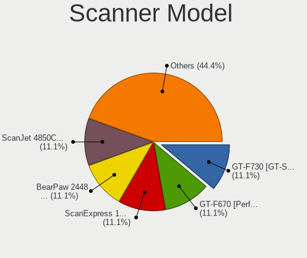

| Model                                                   | Computers | Percent |
|---------------------------------------------------------|-----------|---------|
| Seiko Epson GT-F730 [GT-S630/Perfection V33/V330 Photo] | 1         | 14.29%  |
| Seiko Epson GT-F670 [Perfection V200 Photo]             | 1         | 14.29%  |
| Mustek Systems ScanExpress 1200 UB                      | 1         | 14.29%  |
| Canon CanoScan N1240U/LiDE 30                           | 1         | 14.29%  |
| Canon CanoScan LiDE 210                                 | 1         | 14.29%  |
| Canon CanoScan LiDE 100                                 | 1         | 14.29%  |
| Acer Peripherals (now BenQ) Benq 5000                   | 1         | 14.29%  |

Camera
------

Camera Vendor
-------------

Camera device vendors

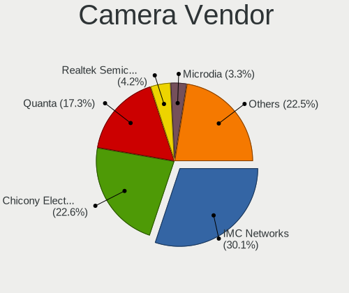

| Vendor                                 | Computers | Percent |
|----------------------------------------|-----------|---------|
| IMC Networks                           | 785       | 31.13%  |
| Chicony Electronics                    | 588       | 23.31%  |
| Quanta                                 | 448       | 17.76%  |
| Realtek Semiconductor                  | 111       | 4.4%    |
| Microdia                               | 76        | 3.01%   |
| Acer                                   | 72        | 2.85%   |
| Suyin                                  | 56        | 2.22%   |
| Sunplus Innovation Technology          | 54        | 2.14%   |
| Cheng Uei Precision Industry (Foxlink) | 35        | 1.39%   |
| Alcor Micro                            | 31        | 1.23%   |
| Silicon Motion                         | 30        | 1.19%   |
| Logitech                               | 30        | 1.19%   |
| Samsung Electronics                    | 25        | 0.99%   |
| Apple                                  | 25        | 0.99%   |
| Syntek                                 | 23        | 0.91%   |
| Lite-On Technology                     | 14        | 0.56%   |
| Ricoh                                  | 13        | 0.52%   |
| Microsoft                              | 11        | 0.44%   |
| Z-Star Microelectronics                | 10        | 0.4%    |
| OmniVision Technologies                | 10        | 0.4%    |
| ALi                                    | 10        | 0.4%    |
| Sonix Technology                       | 9         | 0.36%   |
| Lenovo                                 | 7         | 0.28%   |
| Importek                               | 6         | 0.24%   |
| GEMBIRD                                | 4         | 0.16%   |
| Primax Electronics                     | 3         | 0.12%   |
| Luxvisions Innotech Limited            | 3         | 0.12%   |
| Generalplus Technology                 | 3         | 0.12%   |
| Cubeternet                             | 3         | 0.12%   |
| Xiaomi                                 | 2         | 0.08%   |
| Unknown                                | 2         | 0.08%   |
| Sunplus Technology                     | 2         | 0.08%   |
| Vimicro                                | 1         | 0.04%   |
| Pixart Imaging                         | 1         | 0.04%   |
| Philips (or NXP)                       | 1         | 0.04%   |
| Novatek Microelectronics               | 1         | 0.04%   |
| Nokia Mobile Phones                    | 1         | 0.04%   |
| Nebraska Furniture Mart                | 1         | 0.04%   |
| Linux Foundation                       | 1         | 0.04%   |
| LG Electronics                         | 1         | 0.04%   |
| Kinstone                               | 1         | 0.04%   |
| JMicron Technology                     | 1         | 0.04%   |
| Intel                                  | 1         | 0.04%   |
| Image Processor                        | 1         | 0.04%   |
| icSpring                               | 1         | 0.04%   |
| Huawei Technologies                    | 1         | 0.04%   |
| Holitech                               | 1         | 0.04%   |
| GoPro                                  | 1         | 0.04%   |
| Goertek Electronics                    | 1         | 0.04%   |
| Genesys Logic                          | 1         | 0.04%   |
| Elecom                                 | 1         | 0.04%   |
| DigiTech                               | 1         | 0.04%   |
| Aveo Technology                        | 1         | 0.04%   |

Camera Model
------------

Camera device models

| Model                                                   | Computers | Percent |
|---------------------------------------------------------|-----------|---------|
| IMC Networks USB2.0 VGA UVC WebCam                      | 552       | 21.87%  |
| Quanta HD User Facing                                   | 173       | 6.85%   |
| Chicony HD User Facing                                  | 160       | 6.34%   |
| Quanta VGA WebCam                                       | 153       | 6.06%   |
| IMC Networks USB2.0 HD UVC WebCam                       | 150       | 5.94%   |
| Chicony USB2.0 VGA UVC WebCam                           | 90        | 3.57%   |
| Chicony VGA WebCam                                      | 88        | 3.49%   |
| Quanta HD Webcam                                        | 81        | 3.21%   |
| Chicony HD WebCam                                       | 58        | 2.3%    |
| Samsung Galaxy series, misc. (MTP mode)                 | 25        | 0.99%   |
| IMC Networks VGA UVC WebCam                             | 20        | 0.79%   |
| Realtek Acer 640 x 480 laptop camera                    | 16        | 0.63%   |
| Alcor Micro USB 2.0 Camera                              | 16        | 0.63%   |
| Chicony Integrated Camera                               | 15        | 0.59%   |
| Realtek USB2.0 HD UVC WebCam                            | 14        | 0.55%   |
| IMC Networks Integrated Camera                          | 14        | 0.55%   |
| Chicony USB2.0 HD UVC WebCam                            | 14        | 0.55%   |
| Apple iPhone 5/5C/5S/6/SE                               | 14        | 0.55%   |
| Realtek HD WebCam                                       | 13        | 0.52%   |
| Chicony USB 2.0 Camera                                  | 13        | 0.52%   |
| Sunplus Integrated_Webcam_HD                            | 12        | 0.48%   |
| Quanta USB2.0 HD UVC WebCam                             | 12        | 0.48%   |
| Sunplus HD WebCam                                       | 11        | 0.44%   |
| Realtek USB Camera                                      | 11        | 0.44%   |
| Realtek Integrated_Webcam_HD                            | 11        | 0.44%   |
| Microdia Integrated_Webcam_HD                           | 11        | 0.44%   |
| Quanta USB2.0 VGA UVC WebCam                            | 10        | 0.4%    |
| OmniVision OV2640 Webcam                                | 10        | 0.4%    |
| IMC Networks USB2.0 HD IR UVC WebCam                    | 10        | 0.4%    |
| Chicony HP Truevision HD                                | 10        | 0.4%    |
| Acer VGA WebCam                                         | 10        | 0.4%    |
| Quanta HP Webcam                                        | 9         | 0.36%   |
| Microdia Laptop_Integrated_Webcam_HD                    | 9         | 0.36%   |
| Microdia Integrated Webcam                              | 9         | 0.36%   |
| Logitech Webcam C270                                    | 9         | 0.36%   |
| Chicony TOSHIBA Web Camera - HD                         | 9         | 0.36%   |
| Chicony Lenovo EasyCamera                               | 9         | 0.36%   |
| Chicony HP TrueVision HD Camera                         | 9         | 0.36%   |
| Cheng Uei Precision Industry (Foxlink) HP Truevision HD | 9         | 0.36%   |
| Apple Built-in iSight                                   | 9         | 0.36%   |
| ALi Gateway Webcam                                      | 9         | 0.36%   |
| Acer Lenovo EasyCamera                                  | 9         | 0.36%   |
| Acer Integrated Camera                                  | 9         | 0.36%   |
| Sonix USB2.0 HD UVC WebCam                              | 8         | 0.32%   |
| Realtek USB2.0 VGA UVC WebCam                           | 8         | 0.32%   |
| IMC Networks Lenovo EasyCamera                          | 8         | 0.32%   |
| Syntek Lenovo EasyCamera                                | 7         | 0.28%   |
| Suyin Acer/HP Integrated Webcam [CN0314]                | 7         | 0.28%   |
| IMC Networks USB2.0 UVC HD Webcam                       | 7         | 0.28%   |
| Chicony HP Webcam                                       | 7         | 0.28%   |
| Alcor Micro USB 2.0 PC Camera                           | 7         | 0.28%   |
| Acer HD Webcam                                          | 7         | 0.28%   |
| Acer EasyCamera                                         | 7         | 0.28%   |
| Acer BisonCam, NB Pro                                   | 7         | 0.28%   |
| Syntek Integrated Camera                                | 6         | 0.24%   |
| Lite-On TOSHIBA Web Camera - HD                         | 6         | 0.24%   |
| IMC Networks UVC VGA Webcam                             | 6         | 0.24%   |
| Chicony HP HD Webcam                                    | 6         | 0.24%   |
| Chicony EasyCamera                                      | 6         | 0.24%   |
| Cheng Uei Precision Industry (Foxlink) HP Webcam        | 6         | 0.24%   |

Security
--------

Fingerprint Vendor
------------------

Fingerprint sensor vendors

| Vendor                     | Computers | Percent |
|----------------------------|-----------|---------|
| Validity Sensors           | 40        | 30.77%  |
| Elan Microelectronics      | 31        | 23.85%  |
| LighTuning Technology      | 24        | 18.46%  |
| AuthenTec                  | 12        | 9.23%   |
| Upek                       | 10        | 7.69%   |
| Synaptics                  | 6         | 4.62%   |
| STMicroelectronics         | 4         | 3.08%   |
| Shenzhen Goodix Technology | 3         | 2.31%   |

Fingerprint Model
-----------------

Fingerprint sensor models

| Model                                                                      | Computers | Percent |
|----------------------------------------------------------------------------|-----------|---------|
| Elan ELAN:Fingerprint                                                      | 31        | 23.85%  |
| LighTuning EgisTec Touch Fingerprint Sensor                                | 19        | 14.62%  |
| Upek Biometric Touchchip/Touchstrip Fingerprint Sensor                     | 8         | 6.15%   |
| Validity Sensors VFS495 Fingerprint Reader                                 | 6         | 4.62%   |
| Validity Sensors VFS5011 Fingerprint Reader                                | 5         | 3.85%   |
| Validity Sensors VFS471 Fingerprint Reader                                 | 5         | 3.85%   |
| Validity Sensors VFS491                                                    | 4         | 3.08%   |
| Validity Sensors VFS 5011 fingerprint sensor                               | 4         | 3.08%   |
| STMicroelectronics Fingerprint Reader                                      | 4         | 3.08%   |
| AuthenTec Fingerprint Sensor                                               | 4         | 3.08%   |
| Validity Sensors VFS301 Fingerprint Reader                                 | 3         | 2.31%   |
| Validity Sensors VFS101 Fingerprint Reader                                 | 3         | 2.31%   |
| Synaptics  WBDI                                                            | 3         | 2.31%   |
| Shenzhen Goodix Fingerprint Reader                                         | 3         | 2.31%   |
| LighTuning ES603 Swipe Fingerprint Sensor                                  | 3         | 2.31%   |
| AuthenTec AES2810                                                          | 3         | 2.31%   |
| AuthenTec AES1600                                                          | 3         | 2.31%   |
| Validity Sensors VFS451 Fingerprint Reader                                 | 2         | 1.54%   |
| Validity Sensors VFS Fingerprint sensor                                    | 2         | 1.54%   |
| Validity Sensors Swipe Fingerprint Sensor                                  | 2         | 1.54%   |
| Upek TCS5B Fingerprint sensor                                              | 2         | 1.54%   |
| LighTuning Fingerprint Reader                                              | 2         | 1.54%   |
| AuthenTec AES2501 Fingerprint Sensor                                       | 2         | 1.54%   |
| Validity Sensors VFS7500 Touch Fingerprint Sensor                          | 1         | 0.77%   |
| Validity Sensors VFS300 Fingerprint Reader                                 | 1         | 0.77%   |
| Validity Sensors Synaptics WBDI                                            | 1         | 0.77%   |
| Validity Sensors Synaptics VFS7552 Touch Fingerprint Sensor with PurePrint | 1         | 0.77%   |
| Synaptics Prometheus MIS Touch Fingerprint Reader                          | 1         | 0.77%   |
| Synaptics Metallica MIS Touch Fingerprint Reader                           | 1         | 0.77%   |
| Unknown                                                                    | 1         | 0.77%   |

Chipcard Vendor
---------------

Chipcard module vendors

| Vendor                | Computers | Percent |
|-----------------------|-----------|---------|
| Broadcom              | 24        | 52.17%  |
| O2 Micro              | 8         | 17.39%  |
| Alcor Micro           | 8         | 17.39%  |
| Lenovo                | 3         | 6.52%   |
| Kobil Systems         | 1         | 2.17%   |
| Chicony Electronics   | 1         | 2.17%   |
| Advanced Card Systems | 1         | 2.17%   |

Chipcard Model
--------------

Chipcard module models

| Model                                                                        | Computers | Percent |
|------------------------------------------------------------------------------|-----------|---------|
| Broadcom BCM5880 Secure Applications Processor                               | 17        | 36.96%  |
| Alcor Micro AU9540 Smartcard Reader                                          | 8         | 17.39%  |
| O2 Micro OZ776 CCID Smartcard Reader                                         | 7         | 15.22%  |
| Broadcom BCM5880 Secure Applications Processor with fingerprint swipe sensor | 5         | 10.87%  |
| Lenovo Integrated Smart Card Reader                                          | 3         | 6.52%   |
| Broadcom 5880                                                                | 2         | 4.35%   |
| O2 Micro Oz776 SmartCard Reader                                              | 1         | 2.17%   |
| Kobil Systems KOBIL Class 3 Reader                                           | 1         | 2.17%   |
| Chicony Electronics HP Skylab USB Smartcard Keyboard                         | 1         | 2.17%   |
| Advanced Card Systems ACR122U                                                | 1         | 2.17%   |

Unsupported
-----------

Unsupported Devices
-------------------

Total unsupported devices on board

| Total | Computers | Percent |
|-------|-----------|---------|
| 0     | 2720      | 83.8%   |
| 1     | 465       | 14.33%  |
| 2     | 58        | 1.79%   |
| 3     | 2         | 0.06%   |
| 4     | 1         | 0.03%   |

Unsupported Device Types
------------------------

Types of unsupported devices

| Type                     | Computers | Percent |
|--------------------------|-----------|---------|
| Multimedia controller    | 175       | 29.66%  |
| Fingerprint reader       | 130       | 22.03%  |
| Net/wireless             | 104       | 17.63%  |
| Graphics card            | 48        | 8.14%   |
| Chipcard                 | 44        | 7.46%   |
| Communication controller | 26        | 4.41%   |
| Storage                  | 17        | 2.88%   |
| Bluetooth                | 13        | 2.2%    |
| Camera                   | 9         | 1.53%   |
| Storage/ide              | 5         | 0.85%   |
| Network                  | 4         | 0.68%   |
| Unassigned class         | 3         | 0.51%   |
| Storage/raid             | 2         | 0.34%   |
| Storage/nvme             | 2         | 0.34%   |
| Sound                    | 2         | 0.34%   |
| Net/ethernet             | 2         | 0.34%   |
| Modem                    | 2         | 0.34%   |
| Flash memory             | 1         | 0.17%   |
| Dvb card                 | 1         | 0.17%   |

