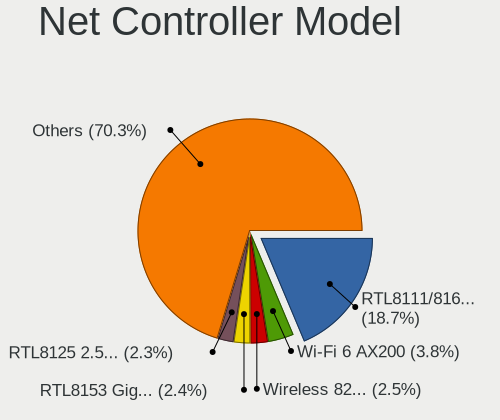
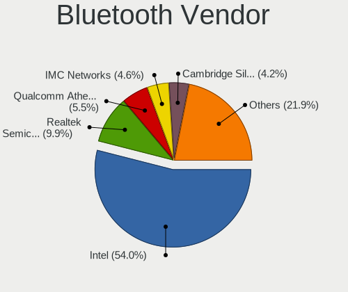

Fedora - Tested Hardware & Statistics
-------------------------------------

A project to collect tested hardware configurations for Fedora.

Anyone can contribute to this report by the [hw-probe](https://github.com/linuxhw/hw-probe) tool:

    sudo -E hw-probe -all -upload

Please contribute! Especially if your hardware is rare.

This is a report for all computer types. See also reports for [desktops](/Dist/Fedora/Desktop/README.md) and [notebooks](/Dist/Fedora/Notebook/README.md).

Contents
--------

* [ Test Cases ](#test-cases)

* [ System ](#system)
  - [ OS                       ](#os)
  - [ OS Family                ](#os-family)
  - [ Kernel                   ](#kernel)
  - [ Kernel Family            ](#kernel-family)
  - [ Kernel Major Ver.        ](#kernel-major-ver)
  - [ Arch                     ](#arch)
  - [ DE                       ](#de)
  - [ Display Server           ](#display-server)
  - [ Display Manager          ](#display-manager)
  - [ OS Lang                  ](#os-lang)
  - [ Boot Mode                ](#boot-mode)
  - [ Filesystem               ](#filesystem)
  - [ Part. scheme             ](#part-scheme)
  - [ Dual Boot with Linux/BSD ](#dual-boot-with-linuxbsd)
  - [ Dual Boot (Win)          ](#dual-boot-win)

* [ Board ](#board)
  - [ Vendor                   ](#vendor)
  - [ Model                    ](#model)
  - [ Model Family             ](#model-family)
  - [ MFG Year                 ](#mfg-year)
  - [ Form Factor              ](#form-factor)
  - [ Secure Boot              ](#secure-boot)
  - [ Coreboot                 ](#coreboot)
  - [ RAM Size                 ](#ram-size)
  - [ RAM Used                 ](#ram-used)
  - [ Total Drives             ](#total-drives)
  - [ Has CD-ROM               ](#has-cd-rom)
  - [ Has Ethernet             ](#has-ethernet)
  - [ Has WiFi                 ](#has-wifi)
  - [ Has Bluetooth            ](#has-bluetooth)

* [ Location ](#location)
  - [ Country                  ](#country)
  - [ City                     ](#city)

* [ Drives ](#drives)
  - [ Drive Vendor             ](#drive-vendor)
  - [ Drive Model              ](#drive-model)
  - [ HDD Vendor               ](#hdd-vendor)
  - [ SSD Vendor               ](#ssd-vendor)
  - [ Drive Kind               ](#drive-kind)
  - [ Drive Connector          ](#drive-connector)
  - [ Drive Size               ](#drive-size)
  - [ Space Total              ](#space-total)
  - [ Space Used               ](#space-used)
  - [ Malfunc. Drives          ](#malfunc-drives)
  - [ Malfunc. Drive Vendor    ](#malfunc-drive-vendor)
  - [ Malfunc. HDD Vendor      ](#malfunc-hdd-vendor)
  - [ Malfunc. Drive Kind      ](#malfunc-drive-kind)
  - [ Failed Drives            ](#failed-drives)
  - [ Failed Drive Vendor      ](#failed-drive-vendor)
  - [ Drive Status             ](#drive-status)

* [ Storage controller ](#storage-controller)
  - [ Storage Vendor           ](#storage-vendor)
  - [ Storage Model            ](#storage-model)
  - [ Storage Kind             ](#storage-kind)

* [ Processor ](#processor)
  - [ CPU Vendor               ](#cpu-vendor)
  - [ CPU Model                ](#cpu-model)
  - [ CPU Model Family         ](#cpu-model-family)
  - [ CPU Cores                ](#cpu-cores)
  - [ CPU Sockets              ](#cpu-sockets)
  - [ CPU Threads              ](#cpu-threads)
  - [ CPU Op-Modes             ](#cpu-op-modes)
  - [ CPU Microcode            ](#cpu-microcode)
  - [ CPU Microarch            ](#cpu-microarch)

* [ Graphics ](#graphics)
  - [ GPU Vendor               ](#gpu-vendor)
  - [ GPU Model                ](#gpu-model)
  - [ GPU Combo                ](#gpu-combo)
  - [ GPU Driver               ](#gpu-driver)
  - [ GPU Memory               ](#gpu-memory)

* [ Monitor ](#monitor)
  - [ Monitor Vendor           ](#monitor-vendor)
  - [ Monitor Model            ](#monitor-model)
  - [ Monitor Resolution       ](#monitor-resolution)
  - [ Monitor Diagonal         ](#monitor-diagonal)
  - [ Monitor Width            ](#monitor-width)
  - [ Aspect Ratio             ](#aspect-ratio)
  - [ Monitor Area             ](#monitor-area)
  - [ Pixel Density            ](#pixel-density)
  - [ Multiple Monitors        ](#multiple-monitors)

* [ Network ](#network)
  - [ Net Controller Vendor    ](#net-controller-vendor)
  - [ Net Controller Model     ](#net-controller-model)
  - [ Wireless Vendor          ](#wireless-vendor)
  - [ Wireless Model           ](#wireless-model)
  - [ Ethernet Vendor          ](#ethernet-vendor)
  - [ Ethernet Model           ](#ethernet-model)
  - [ Net Controller Kind      ](#net-controller-kind)
  - [ Used Controller          ](#used-controller)
  - [ NICs                     ](#nics)
  - [ IPv6                     ](#ipv6)

* [ Bluetooth ](#bluetooth)
  - [ Bluetooth Vendor         ](#bluetooth-vendor)
  - [ Bluetooth Model          ](#bluetooth-model)

* [ Sound ](#sound)
  - [ Sound Vendor             ](#sound-vendor)
  - [ Sound Model              ](#sound-model)

* [ Memory ](#memory)
  - [ Memory Vendor            ](#memory-vendor)
  - [ Memory Model             ](#memory-model)
  - [ Memory Kind              ](#memory-kind)
  - [ Memory Form Factor       ](#memory-form-factor)
  - [ Memory Size              ](#memory-size)
  - [ Memory Speed             ](#memory-speed)

* [ Printers & scanners ](#printers--scanners)
  - [ Printer Vendor           ](#printer-vendor)
  - [ Printer Model            ](#printer-model)
  - [ Scanner Vendor           ](#scanner-vendor)
  - [ Scanner Model            ](#scanner-model)

* [ Camera ](#camera)
  - [ Camera Vendor            ](#camera-vendor)
  - [ Camera Model             ](#camera-model)

* [ Security ](#security)
  - [ Fingerprint Vendor       ](#fingerprint-vendor)
  - [ Fingerprint Model        ](#fingerprint-model)
  - [ Chipcard Vendor          ](#chipcard-vendor)
  - [ Chipcard Model           ](#chipcard-model)

* [ Unsupported ](#unsupported)
  - [ Unsupported Devices      ](#unsupported-devices)
  - [ Unsupported Device Types ](#unsupported-device-types)

Test Cases
----------

Total: 14159

| Vendor        | Model                       | Form-Factor | Probe                                                      | Date         |
|---------------|-----------------------------|-------------|------------------------------------------------------------|--------------|
| Lenovo        | Legion S7 15ACH6 82K8       | Notebook    | [4ab89a8ad2](https://linux-hardware.org/?probe=4ab89a8ad2) | Dec 01, 2022 |
| Dell          | Latitude E5450              | Notebook    | [305bf364f6](https://linux-hardware.org/?probe=305bf364f6) | Dec 01, 2022 |
| HP            | ENVY x360 Convertible 15... | Convertible | [c0663aa7da](https://linux-hardware.org/?probe=c0663aa7da) | Dec 01, 2022 |
| ASUSTek       | Zephyrus M GU502GV_GU502... | Notebook    | [de34f148b9](https://linux-hardware.org/?probe=de34f148b9) | Dec 01, 2022 |
| HP            | 0A98h                       | Desktop     | [f2b620c220](https://linux-hardware.org/?probe=f2b620c220) | Dec 01, 2022 |
| Dell          | Latitude E5450              | Notebook    | [2b934a729c](https://linux-hardware.org/?probe=2b934a729c) | Dec 01, 2022 |
| TUXEDO        | InfinityBook Pro 14 Gen6    | Notebook    | [946e66e35e](https://linux-hardware.org/?probe=946e66e35e) | Dec 01, 2022 |
| HUAWEI        | MACH-WX9                    | Notebook    | [a37f48c68a](https://linux-hardware.org/?probe=a37f48c68a) | Dec 01, 2022 |
| Lenovo        | Legion 5 15ACH6H 82JU       | Notebook    | [2cf7f9ab67](https://linux-hardware.org/?probe=2cf7f9ab67) | Dec 01, 2022 |
| ASUSTek       | ASUS TUF Dash F15 FX516P... | Notebook    | [0128a48982](https://linux-hardware.org/?probe=0128a48982) | Dec 01, 2022 |
| HP            | ProBook 440 G7              | Notebook    | [a54a325001](https://linux-hardware.org/?probe=a54a325001) | Dec 01, 2022 |
| ASUSTek       | PRIME Z690-P WIFI D4        | Desktop     | [42932dd5fd](https://linux-hardware.org/?probe=42932dd5fd) | Dec 01, 2022 |
| ASUSTek       | PRIME X370-PRO              | Desktop     | [aa87dfdc13](https://linux-hardware.org/?probe=aa87dfdc13) | Dec 01, 2022 |
| MSI           | X99A RAIDER                 | Desktop     | [0e87a76042](https://linux-hardware.org/?probe=0e87a76042) | Dec 01, 2022 |
| Lenovo        | ThinkPad X13 Gen 2a 20XH... | Notebook    | [f0ee9f78bd](https://linux-hardware.org/?probe=f0ee9f78bd) | Dec 01, 2022 |
| ASUSTek       | K55VD                       | Notebook    | [149d517fa5](https://linux-hardware.org/?probe=149d517fa5) | Dec 01, 2022 |
| HP            | EliteBook 8570w             | Notebook    | [a4ae0cdd6a](https://linux-hardware.org/?probe=a4ae0cdd6a) | Dec 01, 2022 |
| ASUSTek       | PRIME B450M-GAMING/BR       | Desktop     | [8a4813eec4](https://linux-hardware.org/?probe=8a4813eec4) | Nov 30, 2022 |
| HUAWEI        | CREM-WXX9                   | Notebook    | [2436f4cf5e](https://linux-hardware.org/?probe=2436f4cf5e) | Nov 30, 2022 |
| Lenovo        | ThinkPad X220 4291WSH       | Notebook    | [3e67e44d23](https://linux-hardware.org/?probe=3e67e44d23) | Nov 30, 2022 |
| ASUSTek       | ROG STRIX B550-F GAMING     | Desktop     | [80b8b349f8](https://linux-hardware.org/?probe=80b8b349f8) | Nov 30, 2022 |
| Lenovo        | ThinkPad X1 Carbon Gen 1... | Notebook    | [0aa3ec7616](https://linux-hardware.org/?probe=0aa3ec7616) | Nov 30, 2022 |
| Gigabyte      | X570 GAMING X               | Desktop     | [7ea2de1a3b](https://linux-hardware.org/?probe=7ea2de1a3b) | Nov 30, 2022 |
| Lenovo        | ThinkPad P1 Gen 3 20TJS5... | Notebook    | [2df1670891](https://linux-hardware.org/?probe=2df1670891) | Nov 30, 2022 |
| Unknown       | X99H                        | Desktop     | [b9e2236de7](https://linux-hardware.org/?probe=b9e2236de7) | Nov 30, 2022 |
| ASUSTek       | PRIME B550-PLUS             | Desktop     | [a6a71120f2](https://linux-hardware.org/?probe=a6a71120f2) | Nov 30, 2022 |
| AMI           | Aptio CRB                   | Mini pc     | [d7025eb475](https://linux-hardware.org/?probe=d7025eb475) | Nov 30, 2022 |
| GALAX         | B365M G10b                  | Desktop     | [9eabacd766](https://linux-hardware.org/?probe=9eabacd766) | Nov 30, 2022 |
| ASUSTek       | TUF Gaming Z690-PLUS D4     | Desktop     | [da83c13da3](https://linux-hardware.org/?probe=da83c13da3) | Nov 30, 2022 |
| Lenovo        | Legion 5 15ACH6H 82JU       | Notebook    | [944ace565b](https://linux-hardware.org/?probe=944ace565b) | Nov 30, 2022 |
| HP            | Notebook                    | Notebook    | [afac08b852](https://linux-hardware.org/?probe=afac08b852) | Nov 30, 2022 |
| GALAX         | B365M G10b                  | Desktop     | [9f7438d5a3](https://linux-hardware.org/?probe=9f7438d5a3) | Nov 30, 2022 |
| ASUSTek       | TUF Gaming Z690-PLUS D4     | Desktop     | [459c2ba743](https://linux-hardware.org/?probe=459c2ba743) | Nov 30, 2022 |
| Gigabyte      | H77N-WIFI                   | Desktop     | [f4fa3a4e7f](https://linux-hardware.org/?probe=f4fa3a4e7f) | Nov 30, 2022 |
| ASUSTek       | SABERTOOTH Z97 MARK S       | Desktop     | [2c5c1d6071](https://linux-hardware.org/?probe=2c5c1d6071) | Nov 30, 2022 |
| Dell          | Inspiron 3580               | Notebook    | [6bc2705d99](https://linux-hardware.org/?probe=6bc2705d99) | Nov 30, 2022 |
| HP            | Laptop 15s-fq4xxx           | Notebook    | [19b00c186f](https://linux-hardware.org/?probe=19b00c186f) | Nov 30, 2022 |
| HP            | Laptop 15s-fq4xxx           | Notebook    | [18ec3bc77e](https://linux-hardware.org/?probe=18ec3bc77e) | Nov 30, 2022 |
| Lenovo        | ThinkPad T480 20L6S01Q3K    | Notebook    | [9fd6308179](https://linux-hardware.org/?probe=9fd6308179) | Nov 30, 2022 |
| Lenovo        | ThinkPad X1 Carbon 6th 2... | Notebook    | [38c4009dba](https://linux-hardware.org/?probe=38c4009dba) | Nov 30, 2022 |
| Lenovo        | ThinkPad T16 Gen 1 21BWS... | Notebook    | [3f19147b70](https://linux-hardware.org/?probe=3f19147b70) | Nov 29, 2022 |
| HP            | Pavilion Laptop 14-dv0xx... | Notebook    | [4a49152177](https://linux-hardware.org/?probe=4a49152177) | Nov 29, 2022 |
| Acer          | Nitro AN515-58              | Notebook    | [6bb64e8108](https://linux-hardware.org/?probe=6bb64e8108) | Nov 29, 2022 |
| Gigabyte      | GA-MA780G-UD3H              | Desktop     | [bc3188dd75](https://linux-hardware.org/?probe=bc3188dd75) | Nov 29, 2022 |
| Lenovo        | IdeaPadFlex 5 14ARE05 81... | Convertible | [997ffc40f0](https://linux-hardware.org/?probe=997ffc40f0) | Nov 29, 2022 |
| Acer          | Nitro AN515-51              | Notebook    | [ba6d4f20e7](https://linux-hardware.org/?probe=ba6d4f20e7) | Nov 29, 2022 |
| Lenovo        | ThinkPad E550 20DF004RGE    | Notebook    | [a06fd97ee3](https://linux-hardware.org/?probe=a06fd97ee3) | Nov 29, 2022 |
| HP            | 3048h                       | Desktop     | [6f5a8d1a09](https://linux-hardware.org/?probe=6f5a8d1a09) | Nov 29, 2022 |
| ASUSTek       | X756UXK                     | Notebook    | [a8fde1c59a](https://linux-hardware.org/?probe=a8fde1c59a) | Nov 29, 2022 |
| Lenovo        | ThinkPad L14 Gen 1 20U50... | Notebook    | [9216162e85](https://linux-hardware.org/?probe=9216162e85) | Nov 29, 2022 |
| ASUSTek       | ProArt X670E-CREATOR WIF... | Desktop     | [6d835027fa](https://linux-hardware.org/?probe=6d835027fa) | Nov 29, 2022 |
| Dell          | Latitude D620               | Notebook    | [9f6317405c](https://linux-hardware.org/?probe=9f6317405c) | Nov 29, 2022 |
| Dell          | Inspiron 16 5625            | Notebook    | [50912d5fa9](https://linux-hardware.org/?probe=50912d5fa9) | Nov 29, 2022 |
| HP            | ZBook Power G7 Mobile Wo... | Notebook    | [bb023e130b](https://linux-hardware.org/?probe=bb023e130b) | Nov 29, 2022 |
| Lenovo        | ThinkPad L15 Gen 1 20U70... | Notebook    | [fd821a4b54](https://linux-hardware.org/?probe=fd821a4b54) | Nov 29, 2022 |
| Lenovo        | IdeaPad 5 Pro 16ACH6 82L... | Notebook    | [39e771bd92](https://linux-hardware.org/?probe=39e771bd92) | Nov 28, 2022 |
| Dell          | Latitude 7480               | Notebook    | [409c2f27c8](https://linux-hardware.org/?probe=409c2f27c8) | Nov 28, 2022 |
| MSI           | X570-A PRO                  | Desktop     | [92ddd925db](https://linux-hardware.org/?probe=92ddd925db) | Nov 28, 2022 |
| ASUSTek       | GA15DH                      | Desktop     | [a789d492a4](https://linux-hardware.org/?probe=a789d492a4) | Nov 28, 2022 |
| Dell          | Inspiron 16 5625            | Notebook    | [22da2f8729](https://linux-hardware.org/?probe=22da2f8729) | Nov 28, 2022 |
| HP            | EliteBook 845 G7 Noteboo... | Notebook    | [e1495dc120](https://linux-hardware.org/?probe=e1495dc120) | Nov 28, 2022 |
| MSI           | Z77A-G43                    | Desktop     | [207d763813](https://linux-hardware.org/?probe=207d763813) | Nov 28, 2022 |
| Lenovo        | ThinkBook 15 G3 ACL 21A4    | Notebook    | [901fa6e871](https://linux-hardware.org/?probe=901fa6e871) | Nov 28, 2022 |
| Lenovo        | ThinkPad P15s Gen 2i 20W... | Notebook    | [ea6f1fc82e](https://linux-hardware.org/?probe=ea6f1fc82e) | Nov 28, 2022 |
| ASUSTek       | ROG Zephyrus G15 GA502IV... | Notebook    | [86f58e68b6](https://linux-hardware.org/?probe=86f58e68b6) | Nov 28, 2022 |
| Dell          | Inspiron 5458               | Notebook    | [624e6b243c](https://linux-hardware.org/?probe=624e6b243c) | Nov 28, 2022 |
| Dell          | Inspiron 5458               | Notebook    | [54e985a956](https://linux-hardware.org/?probe=54e985a956) | Nov 28, 2022 |
| ASUSTek       | TUF Gaming FX505DV_FX505... | Notebook    | [68e68e1e01](https://linux-hardware.org/?probe=68e68e1e01) | Nov 28, 2022 |
| Acer          | Nitro AN517-54              | Notebook    | [a9b90b8910](https://linux-hardware.org/?probe=a9b90b8910) | Nov 27, 2022 |
| Unknown       | Unknown                     | Notebook    | [4f73de3788](https://linux-hardware.org/?probe=4f73de3788) | Nov 27, 2022 |
| Lenovo        | IdeaPad 3 15IGL05 81WQ      | Notebook    | [415a8f0d8b](https://linux-hardware.org/?probe=415a8f0d8b) | Nov 27, 2022 |
| Acer          | Nitro AN517-54              | Notebook    | [445583d2bb](https://linux-hardware.org/?probe=445583d2bb) | Nov 27, 2022 |
| HP            | Laptop 15-da1xxx            | Notebook    | [8c4cae32db](https://linux-hardware.org/?probe=8c4cae32db) | Nov 27, 2022 |
| Acer          | Aspire V3-571               | Notebook    | [ab9e6cc193](https://linux-hardware.org/?probe=ab9e6cc193) | Nov 27, 2022 |
| CompuLab      | Intense-PC                  | Mini pc     | [25e327c3f1](https://linux-hardware.org/?probe=25e327c3f1) | Nov 27, 2022 |
| Acer          | Aspire V3-571               | Notebook    | [a4d6ce5fa1](https://linux-hardware.org/?probe=a4d6ce5fa1) | Nov 27, 2022 |
| HP            | Laptop 15s-eq2xxx           | Notebook    | [bdc1a14cd4](https://linux-hardware.org/?probe=bdc1a14cd4) | Nov 27, 2022 |
| MSI           | MAG X570S TOMAHAWK MAX W... | Desktop     | [8fa53292bf](https://linux-hardware.org/?probe=8fa53292bf) | Nov 27, 2022 |
| HP            | Pavilion Laptop 14-ec0xx... | Notebook    | [26083dd909](https://linux-hardware.org/?probe=26083dd909) | Nov 27, 2022 |
| ASUSTek       | N53Jf                       | Notebook    | [e4dc6e5cd9](https://linux-hardware.org/?probe=e4dc6e5cd9) | Nov 27, 2022 |
| AVITA         | NS14A6                      | Notebook    | [b9cc8fe757](https://linux-hardware.org/?probe=b9cc8fe757) | Nov 27, 2022 |
| MSI           | X470 GAMING PRO CARBON      | Desktop     | [81a61c4765](https://linux-hardware.org/?probe=81a61c4765) | Nov 27, 2022 |
| Lenovo        | ThinkPad T440p 20AWS0XX0... | Notebook    | [f91c391079](https://linux-hardware.org/?probe=f91c391079) | Nov 26, 2022 |
| Intel         | NUC5i5MYBE H47797-202       | Mini pc     | [e904ef7a24](https://linux-hardware.org/?probe=e904ef7a24) | Nov 26, 2022 |
| HP            | Pavilion Gaming Laptop 1... | Notebook    | [dc561bb107](https://linux-hardware.org/?probe=dc561bb107) | Nov 26, 2022 |
| HP            | Pavilion Gaming Laptop 1... | Notebook    | [336d829333](https://linux-hardware.org/?probe=336d829333) | Nov 26, 2022 |
| HP            | EliteBook 830 G5            | Notebook    | [bda395e731](https://linux-hardware.org/?probe=bda395e731) | Nov 26, 2022 |
| HP            | EliteBook 830 G5            | Notebook    | [0138561b29](https://linux-hardware.org/?probe=0138561b29) | Nov 26, 2022 |
| ASUSTek       | ASUS TUF Gaming A15 FA50... | Notebook    | [74fcf5cb22](https://linux-hardware.org/?probe=74fcf5cb22) | Nov 26, 2022 |
| Foxconn       | 2ABF                        | Desktop     | [d95233ff31](https://linux-hardware.org/?probe=d95233ff31) | Nov 26, 2022 |
| ASUSTek       | ASUS TUF Gaming A15 FA50... | Notebook    | [a4dbfc0da9](https://linux-hardware.org/?probe=a4dbfc0da9) | Nov 26, 2022 |
| Gigabyte      | EP45-DS3P                   | Desktop     | [20015fb913](https://linux-hardware.org/?probe=20015fb913) | Nov 26, 2022 |
| MSI           | B450 TOMAHAWK MAX           | Desktop     | [521f5c20a9](https://linux-hardware.org/?probe=521f5c20a9) | Nov 26, 2022 |
| ASUSTek       | TUF Gaming B560M-PLUS WI... | Desktop     | [07363955de](https://linux-hardware.org/?probe=07363955de) | Nov 26, 2022 |
| Gigabyte      | TRX40 AORUS MASTER          | Desktop     | [0e35d31780](https://linux-hardware.org/?probe=0e35d31780) | Nov 26, 2022 |
| Dell          | Inspiron 7586               | Convertible | [16679f50e3](https://linux-hardware.org/?probe=16679f50e3) | Nov 26, 2022 |
| Dell          | Inspiron 7586               | Convertible | [a178e673c3](https://linux-hardware.org/?probe=a178e673c3) | Nov 26, 2022 |
| MACHENIKE     | MACHCREATOR-16              | Notebook    | [15d49eb71a](https://linux-hardware.org/?probe=15d49eb71a) | Nov 26, 2022 |
| Apple         | MacBookPro15,2              | Notebook    | [446ef54cb5](https://linux-hardware.org/?probe=446ef54cb5) | Nov 26, 2022 |
| Apple         | MacBookAir8,1               | Notebook    | [6656b4e315](https://linux-hardware.org/?probe=6656b4e315) | Nov 26, 2022 |
| ASUSTek       | Zenbook UP5401ZA_UP5401Z... | Convertible | [bb84c0cdc2](https://linux-hardware.org/?probe=bb84c0cdc2) | Nov 26, 2022 |
| MSI           | Modern 14 B5M               | Notebook    | [bf3c55e13b](https://linux-hardware.org/?probe=bf3c55e13b) | Nov 26, 2022 |
| ASUSTek       | ASUS TUF Gaming A15 FA50... | Notebook    | [ab6ce548bc](https://linux-hardware.org/?probe=ab6ce548bc) | Nov 26, 2022 |
| Gigabyte      | B550 GAMING X               | Desktop     | [b9264b2557](https://linux-hardware.org/?probe=b9264b2557) | Nov 26, 2022 |
| Lenovo        | B51-80 80LM                 | Notebook    | [848b6ab7b3](https://linux-hardware.org/?probe=848b6ab7b3) | Nov 26, 2022 |
| Lenovo        | B51-80 80LM                 | Notebook    | [c34893c661](https://linux-hardware.org/?probe=c34893c661) | Nov 26, 2022 |
| ASUSTek       | ROG Zephyrus G15 GA503RM... | Notebook    | [83a97530e1](https://linux-hardware.org/?probe=83a97530e1) | Nov 26, 2022 |
| Google        | Glimmer                     | Notebook    | [8ad30368c9](https://linux-hardware.org/?probe=8ad30368c9) | Nov 26, 2022 |
| GPD           | G1621-02                    | Notebook    | [f0e9e8442c](https://linux-hardware.org/?probe=f0e9e8442c) | Nov 26, 2022 |
| ASUSTek       | ZenBook UX534FTC_UX534FT    | Notebook    | [d845cbb51d](https://linux-hardware.org/?probe=d845cbb51d) | Nov 26, 2022 |
| Intel         | NUC11PHBi7 M26151-402       | Mini pc     | [0c97f1e481](https://linux-hardware.org/?probe=0c97f1e481) | Nov 25, 2022 |
| ASUSTek       | PRIME X370-PRO              | Desktop     | [5b0f04d592](https://linux-hardware.org/?probe=5b0f04d592) | Nov 25, 2022 |
| MSI           | MPG Z690 EDGE WIFI DDR4     | Desktop     | [33f5823764](https://linux-hardware.org/?probe=33f5823764) | Nov 25, 2022 |
| Lenovo        | ThinkPad L15 Gen 1 20U70... | Notebook    | [18130ae317](https://linux-hardware.org/?probe=18130ae317) | Nov 25, 2022 |
| Sony          | SVE15133CNB                 | Notebook    | [376fc86892](https://linux-hardware.org/?probe=376fc86892) | Nov 25, 2022 |
| Sony          | SVE15133CNB                 | Notebook    | [f46e1bc341](https://linux-hardware.org/?probe=f46e1bc341) | Nov 25, 2022 |
| ASUSTek       | PRIME B360M-D               | Desktop     | [67a7943b8d](https://linux-hardware.org/?probe=67a7943b8d) | Nov 25, 2022 |
| Biostar       | H310MHC2                    | Desktop     | [49e09047c4](https://linux-hardware.org/?probe=49e09047c4) | Nov 25, 2022 |
| Lenovo        | ThinkBook 14 G2 ITL 20VD    | Notebook    | [4261949a3e](https://linux-hardware.org/?probe=4261949a3e) | Nov 25, 2022 |
| HP            | EliteBook 850 G8 Noteboo... | Notebook    | [8acafcf4ab](https://linux-hardware.org/?probe=8acafcf4ab) | Nov 25, 2022 |
| MSI           | B450 TOMAHAWK MAX           | Desktop     | [6f867d822a](https://linux-hardware.org/?probe=6f867d822a) | Nov 25, 2022 |
| Lenovo        | SHARKBAY SDK0E50512 STD     | Desktop     | [45dc299d52](https://linux-hardware.org/?probe=45dc299d52) | Nov 25, 2022 |
| Gigabyte      | B450 AORUS PRO WIFI-CF      | Desktop     | [bf1722d4d6](https://linux-hardware.org/?probe=bf1722d4d6) | Nov 25, 2022 |
| MSI           | X99A RAIDER                 | Desktop     | [1c648060f6](https://linux-hardware.org/?probe=1c648060f6) | Nov 25, 2022 |
| ASUSTek       | VivoBook_ASUSLaptop M540... | Notebook    | [682993f58f](https://linux-hardware.org/?probe=682993f58f) | Nov 25, 2022 |
| HP            | Spectre x360 Convertible... | Convertible | [b2b884d32f](https://linux-hardware.org/?probe=b2b884d32f) | Nov 25, 2022 |
| HP            | Laptop 14-dq1xxx            | Notebook    | [1e6fa19cc3](https://linux-hardware.org/?probe=1e6fa19cc3) | Nov 25, 2022 |
| Acer          | Nitro AN515-54              | Notebook    | [9226b4c616](https://linux-hardware.org/?probe=9226b4c616) | Nov 24, 2022 |
| MSI           | H81M-E33                    | Desktop     | [80ec8663ac](https://linux-hardware.org/?probe=80ec8663ac) | Nov 24, 2022 |
| ASUSTek       | PRIME B550-PLUS             | Desktop     | [d6fe192013](https://linux-hardware.org/?probe=d6fe192013) | Nov 24, 2022 |
| Gigabyte      | B450 AORUS ELITE            | Desktop     | [ccf106edce](https://linux-hardware.org/?probe=ccf106edce) | Nov 24, 2022 |
| ASUSTek       | Z97-PRO GAMER               | Desktop     | [b154300490](https://linux-hardware.org/?probe=b154300490) | Nov 24, 2022 |
| Dell          | 0MN1TX A01                  | Desktop     | [7f0ba24aad](https://linux-hardware.org/?probe=7f0ba24aad) | Nov 24, 2022 |
| ASUSTek       | GA15DH                      | Desktop     | [ec6d666a16](https://linux-hardware.org/?probe=ec6d666a16) | Nov 24, 2022 |
| Dell          | XPS 13 9300                 | Notebook    | [43fe4ed852](https://linux-hardware.org/?probe=43fe4ed852) | Nov 24, 2022 |
| MSI           | Summit E16Flip A12UCT       | Notebook    | [95f653bddb](https://linux-hardware.org/?probe=95f653bddb) | Nov 24, 2022 |
| MSI           | Summit E16Flip A12UCT       | Notebook    | [a4a2b60b09](https://linux-hardware.org/?probe=a4a2b60b09) | Nov 24, 2022 |
| ASUSTek       | ROG Flow X13 GV301RE_GV3... | Convertible | [3995c6708e](https://linux-hardware.org/?probe=3995c6708e) | Nov 24, 2022 |
| Lenovo        | Yoga 510-14ISK 80S7         | Notebook    | [10e706472c](https://linux-hardware.org/?probe=10e706472c) | Nov 24, 2022 |
| Dell          | Inspiron 5370               | Notebook    | [469b2c3fd4](https://linux-hardware.org/?probe=469b2c3fd4) | Nov 24, 2022 |
| Lenovo        | ThinkBook 15-IIL 20SM       | Notebook    | [0f96032f10](https://linux-hardware.org/?probe=0f96032f10) | Nov 24, 2022 |
| Toshiba       | Satellite S55-A             | Notebook    | [5466c61736](https://linux-hardware.org/?probe=5466c61736) | Nov 24, 2022 |
| Gigabyte      | GA-990XA-UD3                | Desktop     | [a5005bf517](https://linux-hardware.org/?probe=a5005bf517) | Nov 24, 2022 |
| ASUSTek       | Q550LF                      | Notebook    | [713f7b2c74](https://linux-hardware.org/?probe=713f7b2c74) | Nov 24, 2022 |
| MSI           | X99A RAIDER                 | Desktop     | [c1e62a557c](https://linux-hardware.org/?probe=c1e62a557c) | Nov 24, 2022 |
| HP            | Pavilion x2 Detachable      | Tablet      | [3a3ff8db5e](https://linux-hardware.org/?probe=3a3ff8db5e) | Nov 24, 2022 |
| ASRock        | B75 Pro3                    | Desktop     | [e359d0bd70](https://linux-hardware.org/?probe=e359d0bd70) | Nov 24, 2022 |
| ASUSTek       | PRIME X370-PRO              | Desktop     | [ee5b760222](https://linux-hardware.org/?probe=ee5b760222) | Nov 24, 2022 |
| Dell          | 0MN1TX A01                  | Desktop     | [8de6a24029](https://linux-hardware.org/?probe=8de6a24029) | Nov 24, 2022 |
| Lenovo        | ThinkPad P15s Gen 2i 20W... | Notebook    | [1c65fff6e7](https://linux-hardware.org/?probe=1c65fff6e7) | Nov 24, 2022 |
| Dell          | 0J3C2F A02                  | Desktop     | [0cfd78c6bb](https://linux-hardware.org/?probe=0cfd78c6bb) | Nov 23, 2022 |
| HP            | OMEN Laptop 15-en0xxx       | Notebook    | [d84bc82678](https://linux-hardware.org/?probe=d84bc82678) | Nov 23, 2022 |
| ASUSTek       | ZenBook UX534FTC_UX534FT    | Notebook    | [5b18e83e0d](https://linux-hardware.org/?probe=5b18e83e0d) | Nov 23, 2022 |
| HP            | ENVY x360 Convertible 15... | Convertible | [a9d12017bb](https://linux-hardware.org/?probe=a9d12017bb) | Nov 23, 2022 |
| Lenovo        | IdeaPad 520S-14IKB 80X2     | Notebook    | [57dfd88985](https://linux-hardware.org/?probe=57dfd88985) | Nov 23, 2022 |
| HP            | Laptop 15-da0xxx            | Notebook    | [fa989478ad](https://linux-hardware.org/?probe=fa989478ad) | Nov 23, 2022 |
| HP            | 3561                        | All in one  | [7af1912ab7](https://linux-hardware.org/?probe=7af1912ab7) | Nov 23, 2022 |
| ASRock        | Z370 Pro4                   | Desktop     | [ced8851dc3](https://linux-hardware.org/?probe=ced8851dc3) | Nov 23, 2022 |
| ASUSTek       | PRIME B550-PLUS             | Desktop     | [b0e5869f2d](https://linux-hardware.org/?probe=b0e5869f2d) | Nov 23, 2022 |
| Gigabyte      | GA-78LMT-USB3 SEx           | Desktop     | [99fc338b3e](https://linux-hardware.org/?probe=99fc338b3e) | Nov 23, 2022 |
| Lenovo        | 30BE SDK0J40697 WIN 3305... | Desktop     | [1deb081598](https://linux-hardware.org/?probe=1deb081598) | Nov 23, 2022 |
| HP            | Laptop 15-dw3xxx            | Notebook    | [fbf991818d](https://linux-hardware.org/?probe=fbf991818d) | Nov 23, 2022 |
| ASUSTek       | PRIME B450M-A II            | Desktop     | [e89ecf8da4](https://linux-hardware.org/?probe=e89ecf8da4) | Nov 23, 2022 |
| MSI           | 2A9C                        | Desktop     | [ee8683a595](https://linux-hardware.org/?probe=ee8683a595) | Nov 23, 2022 |
| Gigabyte      | B550 AORUS ELITE AX V2      | Desktop     | [7dd9d3bec3](https://linux-hardware.org/?probe=7dd9d3bec3) | Nov 23, 2022 |
| MSI           | 2A9C                        | Desktop     | [77dd7e3fbc](https://linux-hardware.org/?probe=77dd7e3fbc) | Nov 23, 2022 |
| ASUSTek       | ROG STRIX B450-F GAMING ... | Desktop     | [bd9c6238bc](https://linux-hardware.org/?probe=bd9c6238bc) | Nov 23, 2022 |
| ASUSTek       | TUF Gaming X570-PLUS        | Desktop     | [393b7f7d3a](https://linux-hardware.org/?probe=393b7f7d3a) | Nov 23, 2022 |
| Gigabyte      | Z87-HD3                     | Desktop     | [00faab62d7](https://linux-hardware.org/?probe=00faab62d7) | Nov 22, 2022 |
| ASUSTek       | Maximus IX HERO             | Desktop     | [587aa317bd](https://linux-hardware.org/?probe=587aa317bd) | Nov 22, 2022 |
| Apple         | MacBookPro9,2               | Notebook    | [3e176f0c26](https://linux-hardware.org/?probe=3e176f0c26) | Nov 22, 2022 |
| Acer          | Extensa 4220                | Notebook    | [af778b2ec9](https://linux-hardware.org/?probe=af778b2ec9) | Nov 22, 2022 |
| Acer          | Extensa 4220                | Notebook    | [04187e0d6e](https://linux-hardware.org/?probe=04187e0d6e) | Nov 22, 2022 |
| MSI           | 990FXA-GD65                 | Desktop     | [8e134485ce](https://linux-hardware.org/?probe=8e134485ce) | Nov 22, 2022 |
| Lenovo        | ThinkPad T14s Gen 1 20UH... | Notebook    | [923ccf8b76](https://linux-hardware.org/?probe=923ccf8b76) | Nov 22, 2022 |
| HP            | ProBook 430 G8 Notebook ... | Notebook    | [8a773e7358](https://linux-hardware.org/?probe=8a773e7358) | Nov 22, 2022 |
| Lenovo        | ThinkPad P53 20QNS00X00     | Notebook    | [d49ca08585](https://linux-hardware.org/?probe=d49ca08585) | Nov 22, 2022 |
| Lenovo        | ThinkPad X1 Nano Gen 1 2... | Notebook    | [d48ad61c01](https://linux-hardware.org/?probe=d48ad61c01) | Nov 22, 2022 |
| ASUSTek       | M5A99FX PRO R2.0            | Desktop     | [990ff088e8](https://linux-hardware.org/?probe=990ff088e8) | Nov 22, 2022 |
| ASUSTek       | P6T DELUXE V2               | Desktop     | [d126214b62](https://linux-hardware.org/?probe=d126214b62) | Nov 22, 2022 |
| Acer          | Aspire A515-45              | Notebook    | [0dcdb72cd6](https://linux-hardware.org/?probe=0dcdb72cd6) | Nov 22, 2022 |
| HP            | EliteBook 850 G8 Noteboo... | Notebook    | [a5dcbbbacd](https://linux-hardware.org/?probe=a5dcbbbacd) | Nov 22, 2022 |
| Acer          | Predator PH315-55           | Notebook    | [f411f75743](https://linux-hardware.org/?probe=f411f75743) | Nov 22, 2022 |
| MSI           | MPG X570 GAMING PRO CARB... | Desktop     | [4743344f41](https://linux-hardware.org/?probe=4743344f41) | Nov 22, 2022 |
| HP            | Laptop 15-da0xxx            | Notebook    | [aef0888523](https://linux-hardware.org/?probe=aef0888523) | Nov 21, 2022 |
| ASUSTek       | X541NA                      | Notebook    | [8c624c76fa](https://linux-hardware.org/?probe=8c624c76fa) | Nov 21, 2022 |
| Dell          | 0GY6Y8 A02                  | Desktop     | [8789b14e39](https://linux-hardware.org/?probe=8789b14e39) | Nov 21, 2022 |
| Acer          | Aspire A315-51              | Notebook    | [bcff111ecd](https://linux-hardware.org/?probe=bcff111ecd) | Nov 21, 2022 |
| Lenovo        | IdeaPad S540-15IWL          | Notebook    | [bce41d01ae](https://linux-hardware.org/?probe=bce41d01ae) | Nov 21, 2022 |
| HP            | 3647h                       | Desktop     | [8f77a73e9b](https://linux-hardware.org/?probe=8f77a73e9b) | Nov 21, 2022 |
| Dell          | Precision 5510              | Notebook    | [63c0b8aa0c](https://linux-hardware.org/?probe=63c0b8aa0c) | Nov 21, 2022 |
| Gigabyte      | B75M-D3H                    | Desktop     | [ac4a817e75](https://linux-hardware.org/?probe=ac4a817e75) | Nov 21, 2022 |
| HP            | Laptop 17-cn0xxx            | Notebook    | [3b9a05e385](https://linux-hardware.org/?probe=3b9a05e385) | Nov 21, 2022 |
| HP            | Laptop 17-cn0xxx            | Notebook    | [489ded27aa](https://linux-hardware.org/?probe=489ded27aa) | Nov 21, 2022 |
| ASUSTek       | X45C                        | Notebook    | [02a232c4ef](https://linux-hardware.org/?probe=02a232c4ef) | Nov 21, 2022 |
| Dell          | XPS 15 9510                 | Notebook    | [09e98d8c02](https://linux-hardware.org/?probe=09e98d8c02) | Nov 21, 2022 |
| ASUSTek       | ROG STRIX X570-E GAMING     | Desktop     | [f13d80cf0b](https://linux-hardware.org/?probe=f13d80cf0b) | Nov 21, 2022 |
| ASUSTek       | M5A78L-M/USB3               | Desktop     | [8478dece38](https://linux-hardware.org/?probe=8478dece38) | Nov 21, 2022 |
| Dell          | Latitude D620               | Notebook    | [d45ad40496](https://linux-hardware.org/?probe=d45ad40496) | Nov 21, 2022 |
| Gigabyte      | Z370 AORUS Ultra Gaming-... | Desktop     | [34e6521bc8](https://linux-hardware.org/?probe=34e6521bc8) | Nov 21, 2022 |
| Apple         | MacBookPro10,1              | Notebook    | [71cb60b441](https://linux-hardware.org/?probe=71cb60b441) | Nov 21, 2022 |
| Dell          | Inspiron 3505               | Notebook    | [634f7d190d](https://linux-hardware.org/?probe=634f7d190d) | Nov 21, 2022 |
| HP            | Laptop 17-by0xxx            | Notebook    | [4d903aa73b](https://linux-hardware.org/?probe=4d903aa73b) | Nov 21, 2022 |
| HP            | ZBook 15 G4                 | Notebook    | [3378343bab](https://linux-hardware.org/?probe=3378343bab) | Nov 21, 2022 |
| Gigabyte      | B450M DS3H-CF               | Desktop     | [b41f6ec236](https://linux-hardware.org/?probe=b41f6ec236) | Nov 21, 2022 |
| ASUSTek       | PRIME Z270-A                | Desktop     | [540d321764](https://linux-hardware.org/?probe=540d321764) | Nov 21, 2022 |
| HP            | Pavilion Laptop 14-ce2xx... | Notebook    | [0e9d717db2](https://linux-hardware.org/?probe=0e9d717db2) | Nov 21, 2022 |
| ASUSTek       | X541NA                      | Notebook    | [aa4d9601ee](https://linux-hardware.org/?probe=aa4d9601ee) | Nov 21, 2022 |
| MSI           | Stealth GS66 12UGS          | Notebook    | [ca3d88f38d](https://linux-hardware.org/?probe=ca3d88f38d) | Nov 21, 2022 |
| Dell          | Latitude 7420               | Notebook    | [ca5319fd67](https://linux-hardware.org/?probe=ca5319fd67) | Nov 21, 2022 |
| HP            | 18E7                        | Desktop     | [0b963b44fb](https://linux-hardware.org/?probe=0b963b44fb) | Nov 21, 2022 |
| Acer          | Aspire A515-45              | Notebook    | [5739045caa](https://linux-hardware.org/?probe=5739045caa) | Nov 20, 2022 |
| Fujitsu       | D3220-A1 S26361-D3220-A1    | Desktop     | [34f72bd414](https://linux-hardware.org/?probe=34f72bd414) | Nov 20, 2022 |
| Gigabyte      | H310M S2H x.x               | Desktop     | [97ea29ed26](https://linux-hardware.org/?probe=97ea29ed26) | Nov 20, 2022 |
| Dell          | 0HY9JP A02                  | Desktop     | [fa0e9792f0](https://linux-hardware.org/?probe=fa0e9792f0) | Nov 20, 2022 |
| HUAWEI        | MACH-WX9                    | Notebook    | [32fa69ea64](https://linux-hardware.org/?probe=32fa69ea64) | Nov 20, 2022 |
| MSI           | 990FXA-GD65                 | Desktop     | [d41acd5075](https://linux-hardware.org/?probe=d41acd5075) | Nov 20, 2022 |
| Dell          | XPS 13 7390                 | Notebook    | [9f6c38b4ee](https://linux-hardware.org/?probe=9f6c38b4ee) | Nov 20, 2022 |
| ASUSTek       | ROG STRIX X670E-F GAMING... | Desktop     | [a28ef28876](https://linux-hardware.org/?probe=a28ef28876) | Nov 20, 2022 |
| Acer          | Aspire A515-45              | Notebook    | [11e00d597d](https://linux-hardware.org/?probe=11e00d597d) | Nov 20, 2022 |
| Lenovo        | Yoga 530-14ARR 81H9         | Convertible | [acb3ae70b9](https://linux-hardware.org/?probe=acb3ae70b9) | Nov 20, 2022 |
| Lenovo        | ThinkPad X13 Gen 1 20UFS... | Notebook    | [678cfec38b](https://linux-hardware.org/?probe=678cfec38b) | Nov 20, 2022 |
| MSI           | Katana GF76 11UD            | Notebook    | [1f47d7c31b](https://linux-hardware.org/?probe=1f47d7c31b) | Nov 20, 2022 |
| Lenovo        | ThinkPad P15 Gen 2i 20YQ... | Notebook    | [ade5f58f0e](https://linux-hardware.org/?probe=ade5f58f0e) | Nov 20, 2022 |
| Lenovo        | ThinkPad P53 20QN0011IV     | Notebook    | [58c63522a4](https://linux-hardware.org/?probe=58c63522a4) | Nov 20, 2022 |
| ASRock        | B450M Steel Legend          | Desktop     | [0735dabc9b](https://linux-hardware.org/?probe=0735dabc9b) | Nov 20, 2022 |
| ASRock        | FM2A88X Extreme6+           | Desktop     | [d3412020ec](https://linux-hardware.org/?probe=d3412020ec) | Nov 20, 2022 |
| Lenovo        | ThinkPad T460 20FN004CMD    | Notebook    | [1b7140151d](https://linux-hardware.org/?probe=1b7140151d) | Nov 20, 2022 |
| MSI           | B450 TOMAHAWK               | Desktop     | [8c271e833d](https://linux-hardware.org/?probe=8c271e833d) | Nov 20, 2022 |
| ASUSTek       | PRIME Z370-A                | Desktop     | [a890ae6d6c](https://linux-hardware.org/?probe=a890ae6d6c) | Nov 20, 2022 |
| Lenovo        | ThinkPad X240 20AMS56K00    | Notebook    | [5ff1608320](https://linux-hardware.org/?probe=5ff1608320) | Nov 19, 2022 |
| TYAN Compu... | S7012                       | Server      | [5b5d81b1a8](https://linux-hardware.org/?probe=5b5d81b1a8) | Nov 19, 2022 |
| Apple         | MacBookPro11,5              | Notebook    | [3b5c35b319](https://linux-hardware.org/?probe=3b5c35b319) | Nov 19, 2022 |
| HASEE Comp... | V1x0PNPx                    | Notebook    | [e75868724e](https://linux-hardware.org/?probe=e75868724e) | Nov 19, 2022 |
| Google        | Celes                       | Notebook    | [00ed0ea4b5](https://linux-hardware.org/?probe=00ed0ea4b5) | Nov 19, 2022 |
| Lenovo        | ThinkPad P1 Gen 2 20QUS1... | Notebook    | [f5cbe0bfa2](https://linux-hardware.org/?probe=f5cbe0bfa2) | Nov 19, 2022 |
| Intel         | NUC8i7HVB J68196-502        | Mini pc     | [8c73ebd2b9](https://linux-hardware.org/?probe=8c73ebd2b9) | Nov 19, 2022 |
| Sony          | SVE15133CNB                 | Notebook    | [3d78ceb657](https://linux-hardware.org/?probe=3d78ceb657) | Nov 19, 2022 |
| ASUSTek       | TUF Gaming B550M-PLUS WI... | Desktop     | [f10fc36516](https://linux-hardware.org/?probe=f10fc36516) | Nov 19, 2022 |
| Lenovo        | ThinkPad T580 20L9CTO1WW    | Notebook    | [bed1f98f04](https://linux-hardware.org/?probe=bed1f98f04) | Nov 19, 2022 |
| ASRock        | B450 Pro4                   | Desktop     | [cd0f63540b](https://linux-hardware.org/?probe=cd0f63540b) | Nov 19, 2022 |
| Lenovo        | Yoga 530-14ARR 81H9         | Convertible | [3e2911ed20](https://linux-hardware.org/?probe=3e2911ed20) | Nov 19, 2022 |
| HUAWEI        | CREM-WXX9                   | Notebook    | [f9b8181279](https://linux-hardware.org/?probe=f9b8181279) | Nov 19, 2022 |
| ASUSTek       | ROG STRIX B660-F GAMING ... | Desktop     | [ecceccb3b7](https://linux-hardware.org/?probe=ecceccb3b7) | Nov 19, 2022 |
| Gigabyte      | A320M-S2H-CF                | Desktop     | [d304f26226](https://linux-hardware.org/?probe=d304f26226) | Nov 19, 2022 |
| MSI           | H510M-A PRO                 | Desktop     | [1755321c80](https://linux-hardware.org/?probe=1755321c80) | Nov 19, 2022 |
| MSI           | B450 TOMAHAWK MAX II        | Desktop     | [050e6cfd68](https://linux-hardware.org/?probe=050e6cfd68) | Nov 19, 2022 |
| Google        | Lick                        | Notebook    | [6d8750d974](https://linux-hardware.org/?probe=6d8750d974) | Nov 19, 2022 |
| HP            | Elite Dragonfly             | Convertible | [2630af5372](https://linux-hardware.org/?probe=2630af5372) | Nov 19, 2022 |
| ASRock        | AD2700-ITX                  | Desktop     | [806ac66c75](https://linux-hardware.org/?probe=806ac66c75) | Nov 19, 2022 |
| ASUSTek       | Z170-K                      | Desktop     | [1af696c23c](https://linux-hardware.org/?probe=1af696c23c) | Nov 19, 2022 |
| ASUSTek       | Z97-P                       | Desktop     | [75748e49d9](https://linux-hardware.org/?probe=75748e49d9) | Nov 19, 2022 |
| Gigabyte      | X570 GAMING X               | Desktop     | [587db1b08f](https://linux-hardware.org/?probe=587db1b08f) | Nov 19, 2022 |
| Lenovo        | ThinkBook 15 G2 ARE 20VG    | Notebook    | [87d8a1ee6b](https://linux-hardware.org/?probe=87d8a1ee6b) | Nov 19, 2022 |
| Acer          | Aspire E1-572G              | Notebook    | [36c1e37d05](https://linux-hardware.org/?probe=36c1e37d05) | Nov 18, 2022 |
| Lenovo        | SHARKBAY SDK0E50512 STD     | Desktop     | [7de2db4d3a](https://linux-hardware.org/?probe=7de2db4d3a) | Nov 18, 2022 |
| ASUSTek       | M80TA                       | Notebook    | [d2427d8942](https://linux-hardware.org/?probe=d2427d8942) | Nov 18, 2022 |
| Gigabyte      | M720-US3                    | Desktop     | [299b2cd745](https://linux-hardware.org/?probe=299b2cd745) | Nov 18, 2022 |
| Acer          | FMP55                       | Desktop     | [f35d63ca8b](https://linux-hardware.org/?probe=f35d63ca8b) | Nov 18, 2022 |
| Lenovo        | ThinkPad T480 20L6S3L400    | Notebook    | [ae98e93989](https://linux-hardware.org/?probe=ae98e93989) | Nov 18, 2022 |
| ASRock        | X300-ITX                    | Desktop     | [54f7198f58](https://linux-hardware.org/?probe=54f7198f58) | Nov 18, 2022 |
| Gigabyte      | H61M-USB3V                  | Desktop     | [e034e5bbb2](https://linux-hardware.org/?probe=e034e5bbb2) | Nov 18, 2022 |
| Lenovo        | Legion 5 82B5               | Notebook    | [907810c0ac](https://linux-hardware.org/?probe=907810c0ac) | Nov 18, 2022 |
| Dell          | 03GCPM A01                  | Server      | [396bc50b1c](https://linux-hardware.org/?probe=396bc50b1c) | Nov 18, 2022 |
| Foxconn       | 2AB1                        | Desktop     | [a8847bb3ad](https://linux-hardware.org/?probe=a8847bb3ad) | Nov 18, 2022 |
| Google        | Careena                     | Notebook    | [81dd8e9906](https://linux-hardware.org/?probe=81dd8e9906) | Nov 18, 2022 |
| Dell          | Inspiron 14 7425 2-in-1     | Convertible | [2449febfcb](https://linux-hardware.org/?probe=2449febfcb) | Nov 18, 2022 |
| Dell          | 03GCPM A01                  | Server      | [53b560a9a9](https://linux-hardware.org/?probe=53b560a9a9) | Nov 18, 2022 |
| HP            | EliteBook 840 14 inch G9... | Notebook    | [b5d4ff63a5](https://linux-hardware.org/?probe=b5d4ff63a5) | Nov 18, 2022 |
| Dell          | 0X30MX A00                  | Desktop     | [c3657c7f97](https://linux-hardware.org/?probe=c3657c7f97) | Nov 18, 2022 |
| HP            | Laptop 15-ef1xxx            | Notebook    | [2e47c9c20f](https://linux-hardware.org/?probe=2e47c9c20f) | Nov 18, 2022 |
| HP            | Spectre x360 2-in-1 Lapt... | Convertible | [fabe7a0c22](https://linux-hardware.org/?probe=fabe7a0c22) | Nov 17, 2022 |
| Dell          | XPS 13 7390                 | Notebook    | [19d18ac52c](https://linux-hardware.org/?probe=19d18ac52c) | Nov 17, 2022 |
| ASUSTek       | VivoBook_ASUSLaptop X421... | Notebook    | [33113bb27d](https://linux-hardware.org/?probe=33113bb27d) | Nov 17, 2022 |
| Exo           | Smart XS1                   | Notebook    | [d51bf05ac5](https://linux-hardware.org/?probe=d51bf05ac5) | Nov 17, 2022 |
| NEC Comput... | NEC VERSA M160              | Notebook    | [a49b4b95b9](https://linux-hardware.org/?probe=a49b4b95b9) | Nov 17, 2022 |
| ASRock        | X670E Pro RS                | Desktop     | [bfccdbd536](https://linux-hardware.org/?probe=bfccdbd536) | Nov 17, 2022 |
| Microsoft     | Surface Pro 6               | Tablet      | [3f03d0cbaa](https://linux-hardware.org/?probe=3f03d0cbaa) | Nov 17, 2022 |
| Dell          | Latitude 5530               | Notebook    | [35a6ba0a9f](https://linux-hardware.org/?probe=35a6ba0a9f) | Nov 17, 2022 |
| Lenovo        | IdeaPad 720S-13ARR 81BR     | Notebook    | [2cb56b8c63](https://linux-hardware.org/?probe=2cb56b8c63) | Nov 17, 2022 |
| ASUSTek       | H81M-R                      | Desktop     | [cd129bebe1](https://linux-hardware.org/?probe=cd129bebe1) | Nov 17, 2022 |
| Gigabyte      | GA-MA780G-UD3H              | Desktop     | [e9eb63ca62](https://linux-hardware.org/?probe=e9eb63ca62) | Nov 17, 2022 |
| Lenovo        | ThinkPad T480s 20L8S1R50... | Notebook    | [61f6e057e6](https://linux-hardware.org/?probe=61f6e057e6) | Nov 17, 2022 |
| MSI           | X99A RAIDER                 | Desktop     | [5d1e2af2ea](https://linux-hardware.org/?probe=5d1e2af2ea) | Nov 17, 2022 |
| ASRock        | FM2A88X Extreme6+           | Desktop     | [4c86f7c670](https://linux-hardware.org/?probe=4c86f7c670) | Nov 17, 2022 |
| MSI           | B450M PRO-VDH MAX           | Desktop     | [9f45de6ee3](https://linux-hardware.org/?probe=9f45de6ee3) | Nov 17, 2022 |
| Acer          | Aspire A515-51              | Notebook    | [ee9d0faeef](https://linux-hardware.org/?probe=ee9d0faeef) | Nov 17, 2022 |
| HP            | Pavilion Laptop 14-dv0xx... | Notebook    | [190c6d9cc7](https://linux-hardware.org/?probe=190c6d9cc7) | Nov 17, 2022 |
| HP            | Pavilion Gaming Laptop 1... | Notebook    | [450e658685](https://linux-hardware.org/?probe=450e658685) | Nov 16, 2022 |
| Lenovo        | ThinkPad E15 Gen 2 20T80... | Notebook    | [6f2f504425](https://linux-hardware.org/?probe=6f2f504425) | Nov 16, 2022 |
| Lenovo        | 3716 SDK0R32862 WIN 3258... | Desktop     | [cd01bd7dad](https://linux-hardware.org/?probe=cd01bd7dad) | Nov 16, 2022 |
| Lenovo        | ThinkPad Edge 03192AG       | Notebook    | [48da1b11bc](https://linux-hardware.org/?probe=48da1b11bc) | Nov 16, 2022 |
| Apple         | MacBookPro11,5              | Notebook    | [62586ed7f9](https://linux-hardware.org/?probe=62586ed7f9) | Nov 16, 2022 |
| ASUSTek       | VivoBook_ASUSLaptop X513... | Notebook    | [8b2d48cd24](https://linux-hardware.org/?probe=8b2d48cd24) | Nov 16, 2022 |
| MSI           | Katana GF76 11UD            | Notebook    | [fec345f330](https://linux-hardware.org/?probe=fec345f330) | Nov 16, 2022 |
| Dell          | XPS 15 9570                 | Notebook    | [69b281a787](https://linux-hardware.org/?probe=69b281a787) | Nov 16, 2022 |
| GPD           | G1619-04                    | Notebook    | [c1e365fd5d](https://linux-hardware.org/?probe=c1e365fd5d) | Nov 16, 2022 |
| MSI           | B450M PRO-VDH MAX           | Desktop     | [cdf4d49427](https://linux-hardware.org/?probe=cdf4d49427) | Nov 16, 2022 |
| Acer          | Aspire V3-571               | Notebook    | [7aa6773734](https://linux-hardware.org/?probe=7aa6773734) | Nov 16, 2022 |
| Acer          | Aspire V3-571               | Notebook    | [d5c4a2f02e](https://linux-hardware.org/?probe=d5c4a2f02e) | Nov 16, 2022 |
| HP            | Laptop 15-dw3xxx            | Notebook    | [03426a19e5](https://linux-hardware.org/?probe=03426a19e5) | Nov 16, 2022 |
| Lenovo        | IdeaPad 5 Pro 14ACN6 82L... | Notebook    | [e7343719c2](https://linux-hardware.org/?probe=e7343719c2) | Nov 16, 2022 |
| HP            | ZBook Fury 15 G7 Mobile ... | Notebook    | [5d11a28230](https://linux-hardware.org/?probe=5d11a28230) | Nov 16, 2022 |
| ASUSTek       | ASUS TUF Gaming A15 FA50... | Notebook    | [94983688d2](https://linux-hardware.org/?probe=94983688d2) | Nov 16, 2022 |
| Lenovo        | ThinkPad E15 Gen 4 21E60... | Notebook    | [bafff409d9](https://linux-hardware.org/?probe=bafff409d9) | Nov 16, 2022 |
| Acer          | Aspire E5-573G              | Notebook    | [6b14e6a41b](https://linux-hardware.org/?probe=6b14e6a41b) | Nov 16, 2022 |
| Lenovo        | ThinkBook 14 G4+ IAP 21C... | Notebook    | [1104a26017](https://linux-hardware.org/?probe=1104a26017) | Nov 16, 2022 |
| Lenovo        | IdeaPad 3 15ITL6 82H8       | Notebook    | [119f9da4af](https://linux-hardware.org/?probe=119f9da4af) | Nov 16, 2022 |
| ASRock        | FM2A88X Extreme6+           | Desktop     | [2eb90688b5](https://linux-hardware.org/?probe=2eb90688b5) | Nov 16, 2022 |
| MSI           | X99A RAIDER                 | Desktop     | [620dbe0a8f](https://linux-hardware.org/?probe=620dbe0a8f) | Nov 16, 2022 |
| Lenovo        | ThinkBook 14 G3 ACL 21A2    | Notebook    | [4c05f821c1](https://linux-hardware.org/?probe=4c05f821c1) | Nov 16, 2022 |
| Lenovo        | ThinkPad P1 Gen 3 20TJS2... | Notebook    | [2d0fb1c5d1](https://linux-hardware.org/?probe=2d0fb1c5d1) | Nov 16, 2022 |
| ASUSTek       | B85M-E                      | Desktop     | [2455b541f5](https://linux-hardware.org/?probe=2455b541f5) | Nov 16, 2022 |
| Intel         | DX79SR AAG57199-200         | Desktop     | [b12b9ec8d5](https://linux-hardware.org/?probe=b12b9ec8d5) | Nov 16, 2022 |
| ASUSTek       | M5A78L-M/USB3               | Desktop     | [9cd3d86efc](https://linux-hardware.org/?probe=9cd3d86efc) | Nov 16, 2022 |
| HP            | Pavilion Aero Laptop 13-... | Notebook    | [76d056b728](https://linux-hardware.org/?probe=76d056b728) | Nov 15, 2022 |
| HP            | Laptop 15s-eq2xxx           | Notebook    | [6af7c2ad85](https://linux-hardware.org/?probe=6af7c2ad85) | Nov 15, 2022 |
| Schenker      | XMG FUSION 15 (XFU15L19)    | Notebook    | [d2cf28fbb9](https://linux-hardware.org/?probe=d2cf28fbb9) | Nov 15, 2022 |
| ASUSTek       | ROG CROSSHAIR VIII HERO     | Desktop     | [1472f0a14e](https://linux-hardware.org/?probe=1472f0a14e) | Nov 15, 2022 |
| Apple         | Mac-27ADBB7B4CEE8E61 iMa... | All in one  | [5e6c94e04c](https://linux-hardware.org/?probe=5e6c94e04c) | Nov 15, 2022 |
| Kraftway      | ACCORD                      | Notebook    | [7021cedadf](https://linux-hardware.org/?probe=7021cedadf) | Nov 15, 2022 |
| MSI           | PS63 Modern 8RC             | Notebook    | [699ea2cc17](https://linux-hardware.org/?probe=699ea2cc17) | Nov 15, 2022 |
| ASUSTek       | Zenbook UM3402YA_UM3402Y... | Notebook    | [66737bb1cc](https://linux-hardware.org/?probe=66737bb1cc) | Nov 15, 2022 |
| MSI           | B450M PRO-VDH MAX           | Desktop     | [ea39f5300c](https://linux-hardware.org/?probe=ea39f5300c) | Nov 15, 2022 |
| Lenovo        | ThinkBook 15 G2 ITL 20VE    | Notebook    | [d6b19cfd9d](https://linux-hardware.org/?probe=d6b19cfd9d) | Nov 15, 2022 |
| ASUSTek       | ProArt B550-CREATOR         | Desktop     | [459c5879e6](https://linux-hardware.org/?probe=459c5879e6) | Nov 15, 2022 |
| HP            | Pavilion x360 Convertibl... | Convertible | [74cfc7d01e](https://linux-hardware.org/?probe=74cfc7d01e) | Nov 15, 2022 |
| HP            | Laptop 17-by0xxx            | Notebook    | [ecdad4661a](https://linux-hardware.org/?probe=ecdad4661a) | Nov 15, 2022 |
| Microsoft     | Surface Go 3                | Tablet      | [22b5f9a8f3](https://linux-hardware.org/?probe=22b5f9a8f3) | Nov 15, 2022 |
| Intel         | DB75EN AAG39650-400         | Desktop     | [07d6aa9adc](https://linux-hardware.org/?probe=07d6aa9adc) | Nov 14, 2022 |
| ASUSTek       | P8Z77-V PRO                 | Desktop     | [7bf6427590](https://linux-hardware.org/?probe=7bf6427590) | Nov 14, 2022 |
| Huanan        | X99-F8                      | Desktop     | [503cf4b0ea](https://linux-hardware.org/?probe=503cf4b0ea) | Nov 14, 2022 |
| HP            | ENVY x360 2-in-1 Laptop ... | Convertible | [bcce834785](https://linux-hardware.org/?probe=bcce834785) | Nov 14, 2022 |
| HP            | ENVY x360 2-in-1 Laptop ... | Convertible | [26fad3df24](https://linux-hardware.org/?probe=26fad3df24) | Nov 14, 2022 |
| Dell          | 06X1TJ A00                  | Desktop     | [4a19565db2](https://linux-hardware.org/?probe=4a19565db2) | Nov 14, 2022 |
| HP            | ENVY x360 2-in-1 Laptop ... | Convertible | [b05570c7e0](https://linux-hardware.org/?probe=b05570c7e0) | Nov 14, 2022 |
| ASUSTek       | CM6870                      | Desktop     | [c050452a72](https://linux-hardware.org/?probe=c050452a72) | Nov 14, 2022 |
| Lenovo        | Legion 5 15ACH6H 82JU       | Notebook    | [465bc481e2](https://linux-hardware.org/?probe=465bc481e2) | Nov 14, 2022 |
| Gigabyte      | A320M-S2H-CF                | Desktop     | [5b9f10af19](https://linux-hardware.org/?probe=5b9f10af19) | Nov 14, 2022 |
| HUAWEI        | BOM-WXX9                    | Notebook    | [c332019d7e](https://linux-hardware.org/?probe=c332019d7e) | Nov 14, 2022 |
| Samsung       | 730QDA                      | Convertible | [169bdd2f71](https://linux-hardware.org/?probe=169bdd2f71) | Nov 13, 2022 |
| ASUSTek       | PRIME X370-PRO              | Desktop     | [c1044ebf60](https://linux-hardware.org/?probe=c1044ebf60) | Nov 13, 2022 |
| ASUSTek       | ROG STRIX X470-F GAMING     | Desktop     | [9d942ddc9c](https://linux-hardware.org/?probe=9d942ddc9c) | Nov 13, 2022 |
| Gigabyte      | GA-78LMT-USB3 SEx           | Desktop     | [2c896d28a8](https://linux-hardware.org/?probe=2c896d28a8) | Nov 13, 2022 |
| Gigabyte      | GA-MA780G-UD3H              | Desktop     | [97bfce0a04](https://linux-hardware.org/?probe=97bfce0a04) | Nov 13, 2022 |
| Lenovo        | ThinkPad L450 20DSS1GD00    | Notebook    | [b0ea02b16c](https://linux-hardware.org/?probe=b0ea02b16c) | Nov 13, 2022 |
| Lenovo        | IdeaPad 3 14ITL05 81X7      | Notebook    | [09285b9428](https://linux-hardware.org/?probe=09285b9428) | Nov 13, 2022 |
| Lenovo        | ThinkBook 15-IIL 20SM       | Notebook    | [be61d3792c](https://linux-hardware.org/?probe=be61d3792c) | Nov 13, 2022 |
| Lenovo        | ThinkCentre A70z 0401G6M    | Desktop     | [a84e5c2107](https://linux-hardware.org/?probe=a84e5c2107) | Nov 13, 2022 |
| Dell          | G3 3579                     | Notebook    | [a2e410da57](https://linux-hardware.org/?probe=a2e410da57) | Nov 12, 2022 |
| Apple         | MacBook5,1                  | Notebook    | [aea8b4a908](https://linux-hardware.org/?probe=aea8b4a908) | Nov 12, 2022 |
| Apple         | MacBook5,1                  | Notebook    | [4aa0411587](https://linux-hardware.org/?probe=4aa0411587) | Nov 12, 2022 |
| Alienware     | Area-51m                    | Notebook    | [11c59a838f](https://linux-hardware.org/?probe=11c59a838f) | Nov 12, 2022 |
| ASUSTek       | M5A78L-M/USB3               | Desktop     | [256503ef7e](https://linux-hardware.org/?probe=256503ef7e) | Nov 12, 2022 |
| Acer          | Swift SF314-512             | Notebook    | [eb533b483e](https://linux-hardware.org/?probe=eb533b483e) | Nov 12, 2022 |
| Lenovo        | Yoga 2 13 20344             | Notebook    | [deb10be02b](https://linux-hardware.org/?probe=deb10be02b) | Nov 12, 2022 |
| Dell          | Latitude E6420              | Notebook    | [056daa7806](https://linux-hardware.org/?probe=056daa7806) | Nov 12, 2022 |
| ASUSTek       | PRIME A320M-E               | Desktop     | [2eacb090ee](https://linux-hardware.org/?probe=2eacb090ee) | Nov 12, 2022 |
| ASUSTek       | PRIME A320M-E               | Desktop     | [a35ca3673b](https://linux-hardware.org/?probe=a35ca3673b) | Nov 12, 2022 |
| MSI           | B450M PRO-VDH MAX           | Desktop     | [c73b422075](https://linux-hardware.org/?probe=c73b422075) | Nov 12, 2022 |
| MSI           | X99A RAIDER                 | Desktop     | [dffde21ad4](https://linux-hardware.org/?probe=dffde21ad4) | Nov 12, 2022 |
| ASRock        | FM2A88X Extreme6+           | Desktop     | [5006a2d188](https://linux-hardware.org/?probe=5006a2d188) | Nov 12, 2022 |
| Apple         | MacBook9,1                  | Notebook    | [755a70132f](https://linux-hardware.org/?probe=755a70132f) | Nov 12, 2022 |
| Apple         | MacBook9,1                  | Notebook    | [4371465097](https://linux-hardware.org/?probe=4371465097) | Nov 12, 2022 |
| ASUSTek       | ROG Maximus Z690 HERO       | Desktop     | [cedb086e46](https://linux-hardware.org/?probe=cedb086e46) | Nov 12, 2022 |
| Intel         | NUC11PHBi7 M26151-404       | Mini pc     | [746e245653](https://linux-hardware.org/?probe=746e245653) | Nov 12, 2022 |
| HP            | Laptop 15s-fq1xxx           | Notebook    | [eb5ece0bb3](https://linux-hardware.org/?probe=eb5ece0bb3) | Nov 12, 2022 |
| ASUSTek       | ROG STRIX X570-F GAMING     | Desktop     | [6eedcdeb01](https://linux-hardware.org/?probe=6eedcdeb01) | Nov 11, 2022 |
| ASUSTek       | ASUS TUF Gaming A15 FA50... | Notebook    | [adf09c8455](https://linux-hardware.org/?probe=adf09c8455) | Nov 11, 2022 |
| Lenovo        | 312D SDK0J40697 WIN 3305... | Mini pc     | [40468e1e7f](https://linux-hardware.org/?probe=40468e1e7f) | Nov 11, 2022 |
| Lenovo        | Yoga Slim 7 Pro 14ACH5 O... | Notebook    | [270045ffa3](https://linux-hardware.org/?probe=270045ffa3) | Nov 11, 2022 |
| Gigabyte      | G1.Sniper B5-CF             | Desktop     | [022a97b52e](https://linux-hardware.org/?probe=022a97b52e) | Nov 11, 2022 |
| HP            | Laptop 15s-eq2xxx           | Notebook    | [b64a32327f](https://linux-hardware.org/?probe=b64a32327f) | Nov 11, 2022 |
| Lenovo        | 312A SDK0J40697 WIN 3305... | Desktop     | [3f11ca7016](https://linux-hardware.org/?probe=3f11ca7016) | Nov 11, 2022 |
| ASUSTek       | X550JD                      | Notebook    | [9c88cc6c32](https://linux-hardware.org/?probe=9c88cc6c32) | Nov 11, 2022 |
| ASUSTek       | ASUS TUF Gaming F15 FX50... | Notebook    | [0e3e3c885a](https://linux-hardware.org/?probe=0e3e3c885a) | Nov 11, 2022 |
| ASRock        | H81M-DGS R2.0               | Desktop     | [07bae444fc](https://linux-hardware.org/?probe=07bae444fc) | Nov 11, 2022 |
| Lenovo        | IdeaPad Gaming 3 15ARH05... | Notebook    | [68e5509696](https://linux-hardware.org/?probe=68e5509696) | Nov 11, 2022 |
| ASUSTek       | ASUS TUF Gaming F15 FX50... | Notebook    | [2421b6c5a4](https://linux-hardware.org/?probe=2421b6c5a4) | Nov 11, 2022 |
| MSI           | 2A9C                        | Desktop     | [a531fd4d8e](https://linux-hardware.org/?probe=a531fd4d8e) | Nov 11, 2022 |
| Apple         | MacBookPro9,2               | Notebook    | [695b0b0356](https://linux-hardware.org/?probe=695b0b0356) | Nov 11, 2022 |
| Dell          | XPS 15 9510                 | Notebook    | [2db7764d25](https://linux-hardware.org/?probe=2db7764d25) | Nov 11, 2022 |
| HP            | ProLiant DL380p Gen8        | Server      | [2b59844827](https://linux-hardware.org/?probe=2b59844827) | Nov 11, 2022 |
| Gigabyte      | Z270-HD3P-CF                | Desktop     | [578b9c0e61](https://linux-hardware.org/?probe=578b9c0e61) | Nov 11, 2022 |
| ASUSTek       | VivoBook 15_ASUS Laptop ... | Notebook    | [3bcdc36fff](https://linux-hardware.org/?probe=3bcdc36fff) | Nov 11, 2022 |
| MSI           | 2A9C                        | Desktop     | [599470c2f4](https://linux-hardware.org/?probe=599470c2f4) | Nov 11, 2022 |
| ASRock        | FM2A88X Extreme6+           | Desktop     | [a311d2c018](https://linux-hardware.org/?probe=a311d2c018) | Nov 11, 2022 |
| MSI           | X99A RAIDER                 | Desktop     | [b7d21d229b](https://linux-hardware.org/?probe=b7d21d229b) | Nov 11, 2022 |
| ASUSTek       | PN51                        | Mini pc     | [0bd2321bee](https://linux-hardware.org/?probe=0bd2321bee) | Nov 11, 2022 |
| HP            | ENVY x360 2-in-1 Laptop ... | Convertible | [e0d9c19e2b](https://linux-hardware.org/?probe=e0d9c19e2b) | Nov 11, 2022 |
| Dell          | Latitude 7480               | Notebook    | [cd19ef7ab8](https://linux-hardware.org/?probe=cd19ef7ab8) | Nov 10, 2022 |
| HP            | ENVY x360 2-in-1 Laptop ... | Convertible | [ea30d00f9a](https://linux-hardware.org/?probe=ea30d00f9a) | Nov 10, 2022 |
| HP            | Pavilion Aero Laptop 13-... | Notebook    | [f927960881](https://linux-hardware.org/?probe=f927960881) | Nov 10, 2022 |
| Lenovo        | ThinkPad T15 Gen 2i 20W4... | Notebook    | [b995c794aa](https://linux-hardware.org/?probe=b995c794aa) | Nov 10, 2022 |
| Monster       | ABRA A5 V15.6               | Notebook    | [3bf45390cc](https://linux-hardware.org/?probe=3bf45390cc) | Nov 10, 2022 |
| ASUSTek       | VivoBook_ASUSLaptop X509... | Notebook    | [fc22f217b3](https://linux-hardware.org/?probe=fc22f217b3) | Nov 10, 2022 |
| Dell          | 0DR845                      | Desktop     | [c4d2b18dd8](https://linux-hardware.org/?probe=c4d2b18dd8) | Nov 10, 2022 |
| Dell          | Latitude 7480               | Notebook    | [100bc3303a](https://linux-hardware.org/?probe=100bc3303a) | Nov 10, 2022 |
| Acer          | Nitro AN515-46              | Notebook    | [741209999d](https://linux-hardware.org/?probe=741209999d) | Nov 10, 2022 |
| Lenovo        | ThinkPad P53 20QNS00X00     | Notebook    | [7973c1467f](https://linux-hardware.org/?probe=7973c1467f) | Nov 10, 2022 |
| HUAWEI        | CREM-WXX9                   | Notebook    | [4e535c916f](https://linux-hardware.org/?probe=4e535c916f) | Nov 10, 2022 |
| ASUSTek       | N752VX                      | Notebook    | [a5b6d827b2](https://linux-hardware.org/?probe=a5b6d827b2) | Nov 10, 2022 |
| MSI           | Z390-A PRO                  | Desktop     | [e851ddd11a](https://linux-hardware.org/?probe=e851ddd11a) | Nov 10, 2022 |
| ASUSTek       | PRIME B350-PLUS             | Desktop     | [009f3d82e9](https://linux-hardware.org/?probe=009f3d82e9) | Nov 10, 2022 |
| Lenovo        | ThinkPad E595 20NF001PTX    | Notebook    | [7638b6abf6](https://linux-hardware.org/?probe=7638b6abf6) | Nov 09, 2022 |
| Dell          | XPS 13 9300                 | Notebook    | [af6fa726d1](https://linux-hardware.org/?probe=af6fa726d1) | Nov 09, 2022 |
| HP            | ENVY x360 Convertible 13... | Convertible | [7afd10a1a7](https://linux-hardware.org/?probe=7afd10a1a7) | Nov 09, 2022 |
| Lenovo        | Legion 5 Pro 16ACH6H 82J... | Notebook    | [4366631db8](https://linux-hardware.org/?probe=4366631db8) | Nov 09, 2022 |
| Lenovo        | ThinkPad P53 20QQS44Q00     | Notebook    | [29ddbee669](https://linux-hardware.org/?probe=29ddbee669) | Nov 09, 2022 |
| MSI           | GP76 Leopard 11UG           | Notebook    | [5bccf91e38](https://linux-hardware.org/?probe=5bccf91e38) | Nov 09, 2022 |
| Gigabyte      | Z170-HD3P-CF                | Desktop     | [faf531627e](https://linux-hardware.org/?probe=faf531627e) | Nov 09, 2022 |
| GPD           | G1619-04                    | Notebook    | [cf4cb47a12](https://linux-hardware.org/?probe=cf4cb47a12) | Nov 09, 2022 |
| Lenovo        | ThinkPad W541 20EFCTO1WW    | Notebook    | [4a6aec2eb8](https://linux-hardware.org/?probe=4a6aec2eb8) | Nov 09, 2022 |
| Microsoft     | Surface Go 3                | Tablet      | [185790dbca](https://linux-hardware.org/?probe=185790dbca) | Nov 09, 2022 |
| Lenovo        | ThinkPad P53 20QNS00X00     | Notebook    | [17c345f111](https://linux-hardware.org/?probe=17c345f111) | Nov 09, 2022 |
| ASUSTek       | VivoBook S15 X510UF         | Notebook    | [a2e9b34d94](https://linux-hardware.org/?probe=a2e9b34d94) | Nov 09, 2022 |
| MSI           | Modern 15 A11MU             | Notebook    | [b10bd50d9c](https://linux-hardware.org/?probe=b10bd50d9c) | Nov 09, 2022 |
| Lenovo        | Legion 7 16ARHA7 82UH       | Notebook    | [b8dae15ebf](https://linux-hardware.org/?probe=b8dae15ebf) | Nov 09, 2022 |
| Dell          | Vostro 3401                 | Notebook    | [0b1b8bf15d](https://linux-hardware.org/?probe=0b1b8bf15d) | Nov 09, 2022 |
| ASUSTek       | ROG STRIX B350-F GAMING     | Desktop     | [f49624457d](https://linux-hardware.org/?probe=f49624457d) | Nov 09, 2022 |
| Dell          | 0RW203 A00                  | Desktop     | [67fa42f70a](https://linux-hardware.org/?probe=67fa42f70a) | Nov 09, 2022 |
| ASRock        | H310M-STX                   | Desktop     | [cb421b22a5](https://linux-hardware.org/?probe=cb421b22a5) | Nov 09, 2022 |
| Lenovo        | Legion 7 16IAX7 82TD        | Notebook    | [d224ed7da8](https://linux-hardware.org/?probe=d224ed7da8) | Nov 09, 2022 |
| Acer          | Aspire A515-45              | Notebook    | [73c9a3d81e](https://linux-hardware.org/?probe=73c9a3d81e) | Nov 09, 2022 |
| Lenovo        | ThinkCentre A70z 0401G6M    | Desktop     | [f2afc66464](https://linux-hardware.org/?probe=f2afc66464) | Nov 09, 2022 |
| Gigabyte      | AB350-Gaming 3-CF           | Desktop     | [226409c98f](https://linux-hardware.org/?probe=226409c98f) | Nov 09, 2022 |
| Foxconn       | H61M-S/H61M                 | Desktop     | [81b2006fd3](https://linux-hardware.org/?probe=81b2006fd3) | Nov 09, 2022 |
| Lenovo        | IdeaPad 5 14ARE05 81YM      | Notebook    | [423a8f624c](https://linux-hardware.org/?probe=423a8f624c) | Nov 08, 2022 |
| Acidanther... | Mac-CFF7D910A743CAAF iMa... | All in one  | [3900976672](https://linux-hardware.org/?probe=3900976672) | Nov 08, 2022 |
| Lenovo        | ThinkPad T480 20L6S24N00    | Notebook    | [0b17fc5246](https://linux-hardware.org/?probe=0b17fc5246) | Nov 08, 2022 |
| Lenovo        | ThinkPad E14 Gen 2 20TA0... | Notebook    | [c62cbe8eb5](https://linux-hardware.org/?probe=c62cbe8eb5) | Nov 08, 2022 |
| ASRock        | Z77 Pro4-M                  | Desktop     | [3a4a75d603](https://linux-hardware.org/?probe=3a4a75d603) | Nov 08, 2022 |
| Acer          | SW5-017                     | Notebook    | [d4ff3ee29e](https://linux-hardware.org/?probe=d4ff3ee29e) | Nov 08, 2022 |
| ASUSTek       | PRIME X370-PRO              | Desktop     | [0b65e26932](https://linux-hardware.org/?probe=0b65e26932) | Nov 08, 2022 |
| ASUSTek       | ROG Zephyrus G14 GA401QH... | Notebook    | [0144bb5a89](https://linux-hardware.org/?probe=0144bb5a89) | Nov 08, 2022 |
| Lenovo        | ThinkPad P14s Gen 2a 21A... | Notebook    | [1cca3aa247](https://linux-hardware.org/?probe=1cca3aa247) | Nov 08, 2022 |
| Gigabyte      | B85M-D3V-A                  | Desktop     | [f236aa0a8b](https://linux-hardware.org/?probe=f236aa0a8b) | Nov 08, 2022 |
| Dell          | Inspiron 3580               | Notebook    | [33b2dbfcc2](https://linux-hardware.org/?probe=33b2dbfcc2) | Nov 08, 2022 |
| Dell          | Inspiron 3580               | Notebook    | [265707c6a3](https://linux-hardware.org/?probe=265707c6a3) | Nov 08, 2022 |
| Eluktronic... | P670RE3                     | Notebook    | [d96ecdf7ab](https://linux-hardware.org/?probe=d96ecdf7ab) | Nov 08, 2022 |
| HP            | Notebook                    | Notebook    | [5cbade7533](https://linux-hardware.org/?probe=5cbade7533) | Nov 08, 2022 |
| ASUSTek       | ASUS TUF Gaming F15 FX50... | Notebook    | [fc4fb9249e](https://linux-hardware.org/?probe=fc4fb9249e) | Nov 08, 2022 |
| Intel         | NUC11TNBi3 M11908-403       | Mini pc     | [c949ec23ce](https://linux-hardware.org/?probe=c949ec23ce) | Nov 07, 2022 |
| ASUSTek       | Zenbook UX3402ZA_UX3402Z... | Convertible | [4cf4bffd62](https://linux-hardware.org/?probe=4cf4bffd62) | Nov 07, 2022 |
| Intel         | NUC11TNBi3 M11908-403       | Mini pc     | [02610c1e36](https://linux-hardware.org/?probe=02610c1e36) | Nov 07, 2022 |
| TUXEDO        | Pulse 15 Gen2               | Notebook    | [f0c2157642](https://linux-hardware.org/?probe=f0c2157642) | Nov 07, 2022 |
| Acer          | Aspire A315-41              | Notebook    | [df6426eef5](https://linux-hardware.org/?probe=df6426eef5) | Nov 07, 2022 |
| Acer          | Aspire A315-41              | Notebook    | [bae4adcff9](https://linux-hardware.org/?probe=bae4adcff9) | Nov 07, 2022 |
| Dell          | Latitude 3410               | Notebook    | [f6532fe0ee](https://linux-hardware.org/?probe=f6532fe0ee) | Nov 07, 2022 |
| Dell          | 09WH54 A00                  | Desktop     | [c7723a2b2f](https://linux-hardware.org/?probe=c7723a2b2f) | Nov 07, 2022 |
| MSI           | MPG Z590 GAMING CARBON W... | Desktop     | [6987230f73](https://linux-hardware.org/?probe=6987230f73) | Nov 07, 2022 |
| Gigabyte      | X670 GAMING X AX            | Desktop     | [1a96ebec7a](https://linux-hardware.org/?probe=1a96ebec7a) | Nov 07, 2022 |
| Acer          | Aspire VN7-591G             | Notebook    | [541d3bfeca](https://linux-hardware.org/?probe=541d3bfeca) | Nov 07, 2022 |
| HP            | ProBook 430 G5              | Notebook    | [e362ce5bdf](https://linux-hardware.org/?probe=e362ce5bdf) | Nov 07, 2022 |
| ASUSTek       | PRIME Z370-A                | Desktop     | [d87a3e023a](https://linux-hardware.org/?probe=d87a3e023a) | Nov 07, 2022 |
| HP            | Pavilion Aero Laptop 13-... | Notebook    | [3f207bc4c3](https://linux-hardware.org/?probe=3f207bc4c3) | Nov 07, 2022 |
| Dell          | G3 3579                     | Notebook    | [b793526167](https://linux-hardware.org/?probe=b793526167) | Nov 06, 2022 |
| ASUSTek       | FX503VD                     | Notebook    | [0373b83f63](https://linux-hardware.org/?probe=0373b83f63) | Nov 06, 2022 |
| Lenovo        | Yoga 7 14ITL5 82BH          | Convertible | [5505ec9b09](https://linux-hardware.org/?probe=5505ec9b09) | Nov 06, 2022 |
| HP            | Pavilion g6                 | Notebook    | [43eefaca07](https://linux-hardware.org/?probe=43eefaca07) | Nov 06, 2022 |
| Dell          | Inspiron 7720               | Notebook    | [38d24e4b4a](https://linux-hardware.org/?probe=38d24e4b4a) | Nov 06, 2022 |
| Toshiba       | Satellite C660              | Notebook    | [47ca2c5cb7](https://linux-hardware.org/?probe=47ca2c5cb7) | Nov 06, 2022 |
| Quanta        | TWS                         | Notebook    | [1ad872afcd](https://linux-hardware.org/?probe=1ad872afcd) | Nov 06, 2022 |
| Lenovo        | ThinkPad X1 Carbon 6th 2... | Notebook    | [af69f66287](https://linux-hardware.org/?probe=af69f66287) | Nov 06, 2022 |
| Lenovo        | ThinkPad X1 Carbon 6th 2... | Notebook    | [256002ea80](https://linux-hardware.org/?probe=256002ea80) | Nov 06, 2022 |
| Lenovo        | ThinkPad A275 20KDS01S00    | Notebook    | [a8eacd4e3a](https://linux-hardware.org/?probe=a8eacd4e3a) | Nov 06, 2022 |
| Gigabyte      | B450M GAMING                | Desktop     | [12c49f9e36](https://linux-hardware.org/?probe=12c49f9e36) | Nov 05, 2022 |
| Gigabyte      | A320M-H-CF                  | Desktop     | [fa33ccff27](https://linux-hardware.org/?probe=fa33ccff27) | Nov 05, 2022 |
| ASUSTek       | SABERTOOTH 990FX R2.0       | Desktop     | [55b349ab41](https://linux-hardware.org/?probe=55b349ab41) | Nov 05, 2022 |
| Lenovo        | ThinkPad T14s Gen 2a 20X... | Notebook    | [d9952c90a5](https://linux-hardware.org/?probe=d9952c90a5) | Nov 05, 2022 |
| Dell          | Inspiron 15 3510            | Notebook    | [fb8bc290d6](https://linux-hardware.org/?probe=fb8bc290d6) | Nov 05, 2022 |
| Dell          | 096JG8 A01                  | Desktop     | [e8a62297a5](https://linux-hardware.org/?probe=e8a62297a5) | Nov 05, 2022 |
| MSI           | B350 GAMING PRO CARBON      | Desktop     | [16b0128664](https://linux-hardware.org/?probe=16b0128664) | Nov 05, 2022 |
| TUXEDO        | Stellaris Intel Gen4        | Notebook    | [2b4987c9e8](https://linux-hardware.org/?probe=2b4987c9e8) | Nov 05, 2022 |
| ASUSTek       | Zenbook UX5401EA_UX5401E... | Notebook    | [84bf8d9578](https://linux-hardware.org/?probe=84bf8d9578) | Nov 05, 2022 |
| ASUSTek       | PRO H410T                   | Desktop     | [66a809ab24](https://linux-hardware.org/?probe=66a809ab24) | Nov 05, 2022 |
| ASUSTek       | FX503VD                     | Notebook    | [f80b5eaa0b](https://linux-hardware.org/?probe=f80b5eaa0b) | Nov 05, 2022 |
| MSI           | MAG X570 TOMAHAWK WIFI      | Desktop     | [02104ae91b](https://linux-hardware.org/?probe=02104ae91b) | Nov 05, 2022 |
| ASRock        | X570 Taichi                 | Desktop     | [d9902c03cb](https://linux-hardware.org/?probe=d9902c03cb) | Nov 05, 2022 |
| Lenovo        | G50-70 20351                | Notebook    | [e29a593971](https://linux-hardware.org/?probe=e29a593971) | Nov 05, 2022 |
| Dell          | Vostro 13 5310              | Notebook    | [c25e192969](https://linux-hardware.org/?probe=c25e192969) | Nov 05, 2022 |
| MSI           | X99A RAIDER                 | Desktop     | [95fb6a845e](https://linux-hardware.org/?probe=95fb6a845e) | Nov 05, 2022 |
| ASRock        | FM2A88X Extreme6+           | Desktop     | [36e78b1c17](https://linux-hardware.org/?probe=36e78b1c17) | Nov 05, 2022 |
| ASUSTek       | ROG STRIX B450-F GAMING ... | Desktop     | [56db615f30](https://linux-hardware.org/?probe=56db615f30) | Nov 05, 2022 |
| Timi          | RedmiBook 14 II             | Notebook    | [374be77f36](https://linux-hardware.org/?probe=374be77f36) | Nov 05, 2022 |
| MSI           | MAG X570 TOMAHAWK WIFI      | Desktop     | [aa9fe4c05c](https://linux-hardware.org/?probe=aa9fe4c05c) | Nov 05, 2022 |
| Dell          | Inspiron 15 3510            | Notebook    | [f0f862d5c5](https://linux-hardware.org/?probe=f0f862d5c5) | Nov 05, 2022 |
| Lenovo        | 3132 SDK0J40697 WIN 3305... | Desktop     | [108df7bc6d](https://linux-hardware.org/?probe=108df7bc6d) | Nov 05, 2022 |
| Lenovo        | 3132 SDK0J40697 WIN 3305... | Desktop     | [a2c8fe2afa](https://linux-hardware.org/?probe=a2c8fe2afa) | Nov 05, 2022 |
| ASUSTek       | X750JN                      | Notebook    | [3c8b130af7](https://linux-hardware.org/?probe=3c8b130af7) | Nov 05, 2022 |
| MSI           | Z390-A PRO                  | Desktop     | [5cfd4967b0](https://linux-hardware.org/?probe=5cfd4967b0) | Nov 05, 2022 |
| Dell          | Latitude 5591               | Notebook    | [e0e1ffe014](https://linux-hardware.org/?probe=e0e1ffe014) | Nov 05, 2022 |
| Dell          | Latitude 5591               | Notebook    | [b649030512](https://linux-hardware.org/?probe=b649030512) | Nov 05, 2022 |
| Acer          | Aspire 4820T                | Notebook    | [300aa32e45](https://linux-hardware.org/?probe=300aa32e45) | Nov 04, 2022 |
| Lenovo        | ThinkPad L15 Gen 1 20U70... | Notebook    | [a2905cad90](https://linux-hardware.org/?probe=a2905cad90) | Nov 04, 2022 |
| HP            | Laptop 15s-eq2xxx           | Notebook    | [3cb1f34e2a](https://linux-hardware.org/?probe=3cb1f34e2a) | Nov 04, 2022 |
| Lenovo        | ThinkPad T430 2347AP9       | Notebook    | [80dbecb998](https://linux-hardware.org/?probe=80dbecb998) | Nov 04, 2022 |
| ASRock        | X370 Taichi                 | Desktop     | [02a767e075](https://linux-hardware.org/?probe=02a767e075) | Nov 04, 2022 |
| MSI           | MAG X570 TOMAHAWK WIFI      | Desktop     | [2c3ddc79ce](https://linux-hardware.org/?probe=2c3ddc79ce) | Nov 04, 2022 |
| MSI           | Bravo 15 B5DD               | Notebook    | [2c605465bb](https://linux-hardware.org/?probe=2c605465bb) | Nov 04, 2022 |
| HP            | 339A                        | Desktop     | [77ddeeda51](https://linux-hardware.org/?probe=77ddeeda51) | Nov 04, 2022 |
| HP            | 339A                        | Desktop     | [8ebb8b6522](https://linux-hardware.org/?probe=8ebb8b6522) | Nov 04, 2022 |
| Acer          | Aspire E1-570G              | Notebook    | [3614ee4149](https://linux-hardware.org/?probe=3614ee4149) | Nov 04, 2022 |
| TUXEDO        | InfinityBook S 15 Gen6      | Notebook    | [4e666fbb8f](https://linux-hardware.org/?probe=4e666fbb8f) | Nov 04, 2022 |
| raspberryp... | Raspberry Pi 4 Model B R... | Soc         | [c719c2da02](https://linux-hardware.org/?probe=c719c2da02) | Nov 04, 2022 |
| Acer          | Aspire E1-570G              | Notebook    | [c58816cb3d](https://linux-hardware.org/?probe=c58816cb3d) | Nov 04, 2022 |
| Gigabyte      | H97-HD3                     | Desktop     | [bb8dbe6d52](https://linux-hardware.org/?probe=bb8dbe6d52) | Nov 04, 2022 |
| Acer          | Aspire E5-575G              | Notebook    | [af85812864](https://linux-hardware.org/?probe=af85812864) | Nov 04, 2022 |
| Apple         | MacBookPro10,1              | Notebook    | [b2af134ab3](https://linux-hardware.org/?probe=b2af134ab3) | Nov 04, 2022 |
| HP            | ProBook 640 G1              | Notebook    | [9d1ba43c71](https://linux-hardware.org/?probe=9d1ba43c71) | Nov 04, 2022 |
| Packard Be... | EasyNote LX                 | Notebook    | [41070f6bfe](https://linux-hardware.org/?probe=41070f6bfe) | Nov 04, 2022 |
| Lenovo        | Unknown                     | Notebook    | [0825807141](https://linux-hardware.org/?probe=0825807141) | Nov 04, 2022 |
| HP            | ProBook 640 G1              | Notebook    | [dac055fa29](https://linux-hardware.org/?probe=dac055fa29) | Nov 04, 2022 |
| ASUSTek       | Unknown                     | Notebook    | [f1a58eaa87](https://linux-hardware.org/?probe=f1a58eaa87) | Nov 04, 2022 |
| HP            | 8459                        | Desktop     | [378537c13c](https://linux-hardware.org/?probe=378537c13c) | Nov 04, 2022 |
| ASUSTek       | PRIME Z370-P II             | Desktop     | [1866954ec7](https://linux-hardware.org/?probe=1866954ec7) | Nov 04, 2022 |
| SLIMBOOK      | Executive                   | Notebook    | [cff86cc921](https://linux-hardware.org/?probe=cff86cc921) | Nov 04, 2022 |
| Lenovo        | IdeaPad 5 Pro 16ACH6 82L... | Notebook    | [9af713ef6e](https://linux-hardware.org/?probe=9af713ef6e) | Nov 04, 2022 |
| HP            | 2B05                        | Desktop     | [5c0a96cd5b](https://linux-hardware.org/?probe=5c0a96cd5b) | Nov 04, 2022 |
| HP            | 2B05                        | Desktop     | [95b5255056](https://linux-hardware.org/?probe=95b5255056) | Nov 04, 2022 |
| GEO           | GEOBOOK 2E                  | Notebook    | [2a802edc5a](https://linux-hardware.org/?probe=2a802edc5a) | Nov 04, 2022 |
| Framework     | Laptop (12th Gen Intel C... | Notebook    | [d87e75abbf](https://linux-hardware.org/?probe=d87e75abbf) | Nov 04, 2022 |
| Lenovo        | IdeaPad 5 Pro 16ACH6 82L... | Notebook    | [dae32fcba7](https://linux-hardware.org/?probe=dae32fcba7) | Nov 04, 2022 |
| GEO           | GEOBOOK 2E                  | Notebook    | [80e1206b6d](https://linux-hardware.org/?probe=80e1206b6d) | Nov 04, 2022 |
| Framework     | Laptop (12th Gen Intel C... | Notebook    | [c39a19fa2f](https://linux-hardware.org/?probe=c39a19fa2f) | Nov 04, 2022 |
| HP            | ZBook 15 G4                 | Notebook    | [775987aacb](https://linux-hardware.org/?probe=775987aacb) | Nov 04, 2022 |
| Lenovo        | ThinkPad Yoga 11e 5th Ge... | Convertible | [876fc02284](https://linux-hardware.org/?probe=876fc02284) | Nov 04, 2022 |
| Alienware     | x17 R2                      | Notebook    | [2e25d30db1](https://linux-hardware.org/?probe=2e25d30db1) | Nov 04, 2022 |
| MSI           | X99A RAIDER                 | Desktop     | [b3eefc89d6](https://linux-hardware.org/?probe=b3eefc89d6) | Nov 04, 2022 |
| ASRock        | FM2A88X Extreme6+           | Desktop     | [653a03dee6](https://linux-hardware.org/?probe=653a03dee6) | Nov 04, 2022 |
| Lenovo        | IdeaPad Yoga 13 20175       | Notebook    | [a2d3502165](https://linux-hardware.org/?probe=a2d3502165) | Nov 04, 2022 |
| UNOWHY        | Y13G011S4EI                 | Notebook    | [da784a5c82](https://linux-hardware.org/?probe=da784a5c82) | Nov 04, 2022 |
| Lenovo        | ThinkPad T14s Gen 2a 20X... | Notebook    | [0c186f330b](https://linux-hardware.org/?probe=0c186f330b) | Nov 04, 2022 |
| Lenovo        | ThinkPad T14s Gen 2a 20X... | Notebook    | [2d53ffb628](https://linux-hardware.org/?probe=2d53ffb628) | Nov 04, 2022 |
| Timi          | RedmiBook Pro 14S           | Notebook    | [9fbf084c28](https://linux-hardware.org/?probe=9fbf084c28) | Nov 04, 2022 |
| Lenovo        | ThinkPad X1 Yoga 1st 20F... | Convertible | [0ec59a6241](https://linux-hardware.org/?probe=0ec59a6241) | Nov 04, 2022 |
| Lenovo        | SHARKBAY SDK0J40700 WIN     | Desktop     | [f027f3a4e2](https://linux-hardware.org/?probe=f027f3a4e2) | Nov 04, 2022 |
| Lenovo        | SHARKBAY SDK0J40700 WIN     | Desktop     | [cb9374e939](https://linux-hardware.org/?probe=cb9374e939) | Nov 04, 2022 |
| ASUSTek       | ROG Zephyrus G15 GA503QS... | Notebook    | [41e941e3ca](https://linux-hardware.org/?probe=41e941e3ca) | Nov 03, 2022 |
| HP            | EliteBook 850 G6            | Notebook    | [3480a7be5a](https://linux-hardware.org/?probe=3480a7be5a) | Nov 03, 2022 |
| Lenovo        | ThinkPad X13 Gen 3 21CM0... | Notebook    | [7a2dab8dde](https://linux-hardware.org/?probe=7a2dab8dde) | Nov 03, 2022 |
| Dell          | XPS 15 9520                 | Notebook    | [24eea2c3f7](https://linux-hardware.org/?probe=24eea2c3f7) | Nov 03, 2022 |
| ASUSTek       | PRIME Z270-P                | Desktop     | [ec0599883c](https://linux-hardware.org/?probe=ec0599883c) | Nov 03, 2022 |
| Acer          | Predator G9-591             | Notebook    | [ca65bba88a](https://linux-hardware.org/?probe=ca65bba88a) | Nov 03, 2022 |
| ASUSTek       | VivoBook_ASUSLaptop X515... | Notebook    | [18b0671002](https://linux-hardware.org/?probe=18b0671002) | Nov 03, 2022 |
| Intel         | NUC5i5MYBE H47797-202       | Mini pc     | [01381d41de](https://linux-hardware.org/?probe=01381d41de) | Nov 03, 2022 |
| HP            | EliteBook 840 G2            | Notebook    | [a189602082](https://linux-hardware.org/?probe=a189602082) | Nov 03, 2022 |
| Lenovo        | ThinkBook 14 G3 ACL 21A2    | Notebook    | [98e419a04d](https://linux-hardware.org/?probe=98e419a04d) | Nov 03, 2022 |
| HUAWEI        | CREM-WXX9                   | Notebook    | [870d04c833](https://linux-hardware.org/?probe=870d04c833) | Nov 03, 2022 |
| Lenovo        | ThinkPad T470 20HDCTO1WW    | Notebook    | [984c379f69](https://linux-hardware.org/?probe=984c379f69) | Nov 03, 2022 |
| Gigabyte      | G41MT-D3                    | Desktop     | [921a646464](https://linux-hardware.org/?probe=921a646464) | Nov 03, 2022 |
| Toshiba       | Satellite S55-A             | Notebook    | [cfc6040185](https://linux-hardware.org/?probe=cfc6040185) | Nov 03, 2022 |
| ASRock        | FM2A88X Extreme6+           | Desktop     | [9bdccc90c4](https://linux-hardware.org/?probe=9bdccc90c4) | Nov 03, 2022 |
| MSI           | X99A RAIDER                 | Desktop     | [0036848bf2](https://linux-hardware.org/?probe=0036848bf2) | Nov 03, 2022 |
| Dell          | Inspiron 7506 2n1           | Convertible | [03447f0763](https://linux-hardware.org/?probe=03447f0763) | Nov 03, 2022 |
| Dell          | Inspiron 7506 2n1           | Convertible | [457cdcf84a](https://linux-hardware.org/?probe=457cdcf84a) | Nov 03, 2022 |
| Dell          | Latitude E6430              | Notebook    | [2b6012cc1d](https://linux-hardware.org/?probe=2b6012cc1d) | Nov 02, 2022 |
| MSI           | Katana GF76 12UE            | Notebook    | [4359d2a528](https://linux-hardware.org/?probe=4359d2a528) | Nov 02, 2022 |
| Dell          | Inspiron 7577               | Notebook    | [2a280dc7df](https://linux-hardware.org/?probe=2a280dc7df) | Nov 02, 2022 |
| Dell          | XPS 13 9310 2-in-1          | Convertible | [2ece2f7351](https://linux-hardware.org/?probe=2ece2f7351) | Nov 02, 2022 |
| Lenovo        | ThinkPad T61 6464A13        | Notebook    | [5f850cbab6](https://linux-hardware.org/?probe=5f850cbab6) | Nov 02, 2022 |
| Intel         | NUC5i5MYBE H47797-202       | Mini pc     | [41a93c4dfa](https://linux-hardware.org/?probe=41a93c4dfa) | Nov 02, 2022 |
| MSI           | MAG X570S TOMAHAWK MAX W... | Desktop     | [c9041d22be](https://linux-hardware.org/?probe=c9041d22be) | Nov 02, 2022 |
| ASUSTek       | Z590 WIFI GUNDAM EDITION    | Desktop     | [74f8de9f71](https://linux-hardware.org/?probe=74f8de9f71) | Nov 02, 2022 |
| Intel         | NUC6i7KYB H90766-408        | Mini pc     | [2069a0e7fc](https://linux-hardware.org/?probe=2069a0e7fc) | Nov 02, 2022 |
| HP            | Pavilion Aero Laptop 13-... | Notebook    | [4fa32ec6af](https://linux-hardware.org/?probe=4fa32ec6af) | Nov 02, 2022 |
| ASUSTek       | ASUS TUF Gaming F15 FX50... | Notebook    | [2d931f9e99](https://linux-hardware.org/?probe=2d931f9e99) | Nov 02, 2022 |
| ASUSTek       | ROG STRIX X570-E GAMING     | Desktop     | [86bf890d23](https://linux-hardware.org/?probe=86bf890d23) | Nov 02, 2022 |
| Lenovo        | ThinkBook 15 G3 ACL 21A4    | Notebook    | [335af8b89b](https://linux-hardware.org/?probe=335af8b89b) | Nov 02, 2022 |
| HP            | Pavilion g6                 | Notebook    | [22b32d9bac](https://linux-hardware.org/?probe=22b32d9bac) | Nov 02, 2022 |
| ASUSTek       | ProArt Z690-CREATOR WIFI    | Desktop     | [ec359017a2](https://linux-hardware.org/?probe=ec359017a2) | Nov 02, 2022 |
| HUAWEI        | BOD-WXX9                    | Notebook    | [d4ac3a5f04](https://linux-hardware.org/?probe=d4ac3a5f04) | Nov 02, 2022 |
| ASUSTek       | ROG CROSSHAIR VIII IMPAC... | Desktop     | [63bf11c696](https://linux-hardware.org/?probe=63bf11c696) | Nov 02, 2022 |
| Lenovo        | Legion 5 15IAH7H 82RB       | Notebook    | [aa6c06f2bb](https://linux-hardware.org/?probe=aa6c06f2bb) | Nov 02, 2022 |
| Lenovo        | Legion 5 15IAH7H 82RB       | Notebook    | [584db1dcb2](https://linux-hardware.org/?probe=584db1dcb2) | Nov 02, 2022 |
| ASUSTek       | VivoBook_ASUSLaptop X515... | Notebook    | [a156a7484d](https://linux-hardware.org/?probe=a156a7484d) | Nov 02, 2022 |
| MSI           | X99A RAIDER                 | Desktop     | [36eda457da](https://linux-hardware.org/?probe=36eda457da) | Nov 02, 2022 |
| ASRock        | FM2A88X Extreme6+           | Desktop     | [4e260473ba](https://linux-hardware.org/?probe=4e260473ba) | Nov 02, 2022 |
| ASUSTek       | ROG Zephyrus G14 GA402RJ... | Notebook    | [7b51138a0b](https://linux-hardware.org/?probe=7b51138a0b) | Nov 02, 2022 |
| HUAWEI        | NBLK-WAX9X                  | Notebook    | [d3beec5427](https://linux-hardware.org/?probe=d3beec5427) | Nov 02, 2022 |
| Gigabyte      | X570 AORUS ELITE            | Desktop     | [9b093574b9](https://linux-hardware.org/?probe=9b093574b9) | Nov 02, 2022 |
| HP            | Pavilion g6                 | Notebook    | [24c2a01761](https://linux-hardware.org/?probe=24c2a01761) | Nov 02, 2022 |
| Dell          | Latitude 5591               | Notebook    | [bcd8aef9a0](https://linux-hardware.org/?probe=bcd8aef9a0) | Nov 02, 2022 |
| HP            | x2 Detachable 10-p0XX       | Tablet      | [dfe5dc3d95](https://linux-hardware.org/?probe=dfe5dc3d95) | Nov 01, 2022 |
| Lenovo        | ThinkPad E14 Gen 3 20YDS... | Notebook    | [c90b358eb5](https://linux-hardware.org/?probe=c90b358eb5) | Nov 01, 2022 |
| HP            | EliteBook 830 G5            | Notebook    | [379443a5d6](https://linux-hardware.org/?probe=379443a5d6) | Nov 01, 2022 |
| Lenovo        | Legion 5 15ARH05 82B5       | Notebook    | [9b61195a2a](https://linux-hardware.org/?probe=9b61195a2a) | Nov 01, 2022 |
| HP            | EliteBook 830 G5            | Notebook    | [5e099af04c](https://linux-hardware.org/?probe=5e099af04c) | Nov 01, 2022 |
| HP            | 829E                        | Mini pc     | [f568895fbb](https://linux-hardware.org/?probe=f568895fbb) | Nov 01, 2022 |
| Intel         | NUC6i7KYB H90766-410        | Mini pc     | [9c17f472ee](https://linux-hardware.org/?probe=9c17f472ee) | Nov 01, 2022 |
| Gigabyte      | B550 UD AC                  | Desktop     | [c5a5219cf3](https://linux-hardware.org/?probe=c5a5219cf3) | Nov 01, 2022 |
| Lenovo        | ThinkPad X1 Carbon 7th 2... | Notebook    | [e101d9d50a](https://linux-hardware.org/?probe=e101d9d50a) | Nov 01, 2022 |
| Lenovo        | ThinkPad E14 Gen 4 21ECS... | Notebook    | [766e7fb0d0](https://linux-hardware.org/?probe=766e7fb0d0) | Nov 01, 2022 |
| GPD           | G1619-04                    | Notebook    | [898bbfb591](https://linux-hardware.org/?probe=898bbfb591) | Nov 01, 2022 |
| ASUSTek       | B150 PRO GAMING             | Desktop     | [b2229c56c4](https://linux-hardware.org/?probe=b2229c56c4) | Nov 01, 2022 |
| Unknown       | Unknown                     | Notebook    | [9608724116](https://linux-hardware.org/?probe=9608724116) | Nov 01, 2022 |
| MSI           | H81M-E33                    | Desktop     | [ee4c33d7b1](https://linux-hardware.org/?probe=ee4c33d7b1) | Nov 01, 2022 |
| Dell          | Venue 8 Pro 5830            | Notebook    | [8890410dfc](https://linux-hardware.org/?probe=8890410dfc) | Nov 01, 2022 |
| HP            | 339A                        | Desktop     | [68392c18c9](https://linux-hardware.org/?probe=68392c18c9) | Nov 01, 2022 |
| Dell          | Latitude 3420               | Notebook    | [9c2b9ab298](https://linux-hardware.org/?probe=9c2b9ab298) | Nov 01, 2022 |
| Apple         | MacBookPro9,2               | Notebook    | [d63c5de91b](https://linux-hardware.org/?probe=d63c5de91b) | Nov 01, 2022 |
| HUAWEI        | CREM-WXX9                   | Notebook    | [1d24aac4ce](https://linux-hardware.org/?probe=1d24aac4ce) | Nov 01, 2022 |
| HUAWEI        | CREM-WXX9                   | Notebook    | [2eb32b1bb3](https://linux-hardware.org/?probe=2eb32b1bb3) | Nov 01, 2022 |
| MSI           | X99A RAIDER                 | Desktop     | [2f3428a435](https://linux-hardware.org/?probe=2f3428a435) | Nov 01, 2022 |
| ASRock        | FM2A88X Extreme6+           | Desktop     | [cf7b016772](https://linux-hardware.org/?probe=cf7b016772) | Nov 01, 2022 |
| MSI           | PRO B660M-A DDR4            | Desktop     | [f6b6afc8a3](https://linux-hardware.org/?probe=f6b6afc8a3) | Nov 01, 2022 |
| HP            | ZBook 15 G2                 | Notebook    | [7254a9a2fc](https://linux-hardware.org/?probe=7254a9a2fc) | Nov 01, 2022 |
| Samsung       | RV410/RV510/S3510/E3510     | Notebook    | [566d83485b](https://linux-hardware.org/?probe=566d83485b) | Oct 31, 2022 |
| HUAWEI        | BOHB-WAX9                   | Notebook    | [274a3383db](https://linux-hardware.org/?probe=274a3383db) | Oct 31, 2022 |
| HP            | ProBook 470 G5              | Notebook    | [0424e08b3d](https://linux-hardware.org/?probe=0424e08b3d) | Oct 31, 2022 |
| Samsung       | 800G5M/800G5W               | Notebook    | [c91800e8c1](https://linux-hardware.org/?probe=c91800e8c1) | Oct 31, 2022 |
| ASUSTek       | X510UAR                     | Notebook    | [46f1da66b6](https://linux-hardware.org/?probe=46f1da66b6) | Oct 31, 2022 |
| ASUSTek       | X510UAR                     | Notebook    | [1409a7f78d](https://linux-hardware.org/?probe=1409a7f78d) | Oct 31, 2022 |
| Acer          | Swift SF314-54              | Notebook    | [71cf98e6e8](https://linux-hardware.org/?probe=71cf98e6e8) | Oct 31, 2022 |
| ASUSTek       | A8R32-MVP Deluxe            | Desktop     | [a2a8473e4b](https://linux-hardware.org/?probe=a2a8473e4b) | Oct 31, 2022 |
| ASUSTek       | PRIME Z270-P                | Desktop     | [fffb5288e0](https://linux-hardware.org/?probe=fffb5288e0) | Oct 31, 2022 |
| ASUSTek       | PRIME B450-PLUS             | Desktop     | [ce4bda1df2](https://linux-hardware.org/?probe=ce4bda1df2) | Oct 31, 2022 |
| ASUSTek       | X541UVK                     | Notebook    | [15bdbbf952](https://linux-hardware.org/?probe=15bdbbf952) | Oct 31, 2022 |
| Gigabyte      | B85M-D3V-A                  | Desktop     | [4b5140c9f3](https://linux-hardware.org/?probe=4b5140c9f3) | Oct 31, 2022 |
| HUAWEI        | BOHK-WAX9X                  | Notebook    | [e993af2670](https://linux-hardware.org/?probe=e993af2670) | Oct 31, 2022 |
| HP            | 250 G7 Notebook PC          | Notebook    | [7433eae90a](https://linux-hardware.org/?probe=7433eae90a) | Oct 31, 2022 |
| ASUSTek       | P8Z77-M PRO                 | Desktop     | [479fdd085d](https://linux-hardware.org/?probe=479fdd085d) | Oct 31, 2022 |
| ASUSTek       | TUF Z390M-PRO GAMING        | Desktop     | [dfde89926c](https://linux-hardware.org/?probe=dfde89926c) | Oct 31, 2022 |
| ASUSTek       | TUF Z390M-PRO GAMING        | Desktop     | [135f93d663](https://linux-hardware.org/?probe=135f93d663) | Oct 31, 2022 |
| Dell          | Precision M6700             | Notebook    | [aa4b5e4400](https://linux-hardware.org/?probe=aa4b5e4400) | Oct 31, 2022 |
| MSI           | X99A RAIDER                 | Desktop     | [2f41c9eaa5](https://linux-hardware.org/?probe=2f41c9eaa5) | Oct 31, 2022 |
| HP            | ENVY 17                     | Notebook    | [5b845d9ee3](https://linux-hardware.org/?probe=5b845d9ee3) | Oct 31, 2022 |
| ASRock        | FM2A88X Extreme6+           | Desktop     | [5bd92395da](https://linux-hardware.org/?probe=5bd92395da) | Oct 31, 2022 |
| Samsung       | RV410/RV510/S3510/E3510     | Notebook    | [073ba962ff](https://linux-hardware.org/?probe=073ba962ff) | Oct 31, 2022 |
| ASUSTek       | M5A78L-M/USB3               | Desktop     | [4ac9bf1711](https://linux-hardware.org/?probe=4ac9bf1711) | Oct 31, 2022 |
| Schenker      | XMG FUSION 15 (XFU15L19)    | Notebook    | [221710c9ea](https://linux-hardware.org/?probe=221710c9ea) | Oct 31, 2022 |
| ASUSTek       | ASUS TUF Gaming A15 FA50... | Notebook    | [002ab67e5e](https://linux-hardware.org/?probe=002ab67e5e) | Oct 31, 2022 |
| ASUSTek       | ROG Zephyrus G15 GA503RM... | Notebook    | [76906648cb](https://linux-hardware.org/?probe=76906648cb) | Oct 30, 2022 |
| HP            | Spectre x360 Convertible... | Convertible | [1deed25a21](https://linux-hardware.org/?probe=1deed25a21) | Oct 30, 2022 |
| Lenovo        | IdeaPad 320-15IKB 80XL      | Notebook    | [cf460716f9](https://linux-hardware.org/?probe=cf460716f9) | Oct 30, 2022 |
| Dell          | Inspiron 14 7425 2-in-1     | Convertible | [e427e48710](https://linux-hardware.org/?probe=e427e48710) | Oct 30, 2022 |
| HP            | Laptop 15s-eq2xxx           | Notebook    | [3f69e984d1](https://linux-hardware.org/?probe=3f69e984d1) | Oct 30, 2022 |
| Sony          | VAIO                        | All in one  | [b295b1cb6f](https://linux-hardware.org/?probe=b295b1cb6f) | Oct 30, 2022 |
| MSI           | B250M GAMING PRO            | Desktop     | [98979beea7](https://linux-hardware.org/?probe=98979beea7) | Oct 30, 2022 |
| ASUSTek       | PRIME B550-PLUS             | Desktop     | [4820bca604](https://linux-hardware.org/?probe=4820bca604) | Oct 30, 2022 |
| ASUSTek       | PRIME B550-PLUS             | Desktop     | [cdca8a4d95](https://linux-hardware.org/?probe=cdca8a4d95) | Oct 30, 2022 |
| HP            | 15                          | Notebook    | [c356a2b0cd](https://linux-hardware.org/?probe=c356a2b0cd) | Oct 30, 2022 |
| Lenovo        | IdeaPadFlex 5 14ITL05 82... | Convertible | [1e1f105579](https://linux-hardware.org/?probe=1e1f105579) | Oct 30, 2022 |
| Lenovo        | IdeaPadFlex 5 14ITL05 82... | Convertible | [19cddcf899](https://linux-hardware.org/?probe=19cddcf899) | Oct 30, 2022 |
| HP            | ProBook 470 G5              | Notebook    | [cfe35367bf](https://linux-hardware.org/?probe=cfe35367bf) | Oct 30, 2022 |
| HP            | ENVY Laptop 13-ad1xx        | Notebook    | [c52b1fe5fa](https://linux-hardware.org/?probe=c52b1fe5fa) | Oct 30, 2022 |
| Dell          | Inspiron 7720               | Notebook    | [f1478df888](https://linux-hardware.org/?probe=f1478df888) | Oct 30, 2022 |
| HP            | EliteBook x360 1040 G6      | Convertible | [197c77e88c](https://linux-hardware.org/?probe=197c77e88c) | Oct 30, 2022 |
| HP            | EliteBook x360 1040 G6      | Convertible | [12e08a7d27](https://linux-hardware.org/?probe=12e08a7d27) | Oct 30, 2022 |
| Lenovo        | ThinkPad X220 4291WSH       | Notebook    | [a4eebe6485](https://linux-hardware.org/?probe=a4eebe6485) | Oct 30, 2022 |
| ASUSTek       | TUF Gaming B450M-PLUS II    | Desktop     | [8e2ab3d61b](https://linux-hardware.org/?probe=8e2ab3d61b) | Oct 30, 2022 |
| Lenovo        | ThinkPad X1 Carbon Gen 8... | Notebook    | [df654ca0b1](https://linux-hardware.org/?probe=df654ca0b1) | Oct 30, 2022 |
| ASRock        | FM2A88X Extreme6+           | Desktop     | [c8392f24d9](https://linux-hardware.org/?probe=c8392f24d9) | Oct 30, 2022 |
| MSI           | X99A RAIDER                 | Desktop     | [7ddd09eeec](https://linux-hardware.org/?probe=7ddd09eeec) | Oct 30, 2022 |
| Dell          | Latitude 7490               | Notebook    | [95d0006efb](https://linux-hardware.org/?probe=95d0006efb) | Oct 30, 2022 |
| Dell          | Latitude E7450              | Notebook    | [32a6333f4b](https://linux-hardware.org/?probe=32a6333f4b) | Oct 30, 2022 |
| Aquarius      | Cmp NS765                   | Notebook    | [5e519edbee](https://linux-hardware.org/?probe=5e519edbee) | Oct 30, 2022 |
| MSI           | Z170A GAMING PRO CARBON     | Desktop     | [d0814afd39](https://linux-hardware.org/?probe=d0814afd39) | Oct 29, 2022 |
| Lenovo        | Legion Y530-15ICH-1060 8... | Notebook    | [60ba0bc2dd](https://linux-hardware.org/?probe=60ba0bc2dd) | Oct 29, 2022 |
| Gigabyte      | B450M DS3H V2               | Desktop     | [ba5da6b270](https://linux-hardware.org/?probe=ba5da6b270) | Oct 29, 2022 |
| HUAWEI        | NBLB-WAX9N                  | Notebook    | [1925c8ce1f](https://linux-hardware.org/?probe=1925c8ce1f) | Oct 29, 2022 |
| Acer          | Predator PH315-53           | Notebook    | [b3dd383a83](https://linux-hardware.org/?probe=b3dd383a83) | Oct 29, 2022 |
| ASUSTek       | X453MA                      | Notebook    | [da3e45d6c3](https://linux-hardware.org/?probe=da3e45d6c3) | Oct 29, 2022 |
| Dell          | XPS 13 9300                 | Notebook    | [cc62dbe2f6](https://linux-hardware.org/?probe=cc62dbe2f6) | Oct 29, 2022 |
| Dell          | XPS 13 9300                 | Notebook    | [301aab9126](https://linux-hardware.org/?probe=301aab9126) | Oct 29, 2022 |
| ASUSTek       | Q550LF                      | Notebook    | [383c45edce](https://linux-hardware.org/?probe=383c45edce) | Oct 29, 2022 |
| Dell          | Latitude E7450              | Notebook    | [012cd7214b](https://linux-hardware.org/?probe=012cd7214b) | Oct 29, 2022 |
| Dell          | Latitude E7450              | Notebook    | [635a60671d](https://linux-hardware.org/?probe=635a60671d) | Oct 29, 2022 |
| MSI           | X99A RAIDER                 | Desktop     | [782207dfcf](https://linux-hardware.org/?probe=782207dfcf) | Oct 29, 2022 |
| ASRock        | FM2A88X Extreme6+           | Desktop     | [75b050a9f0](https://linux-hardware.org/?probe=75b050a9f0) | Oct 29, 2022 |
| ASUSTek       | PRIME H670-PLUS D4          | Desktop     | [ce9a718851](https://linux-hardware.org/?probe=ce9a718851) | Oct 28, 2022 |
| HP            | ZBook 15 G3                 | Notebook    | [c60b429baa](https://linux-hardware.org/?probe=c60b429baa) | Oct 28, 2022 |
| HP            | 82A5                        | Mini pc     | [c0be7985c0](https://linux-hardware.org/?probe=c0be7985c0) | Oct 28, 2022 |
| Gigabyte      | G41MT-D3                    | Desktop     | [2e4153161f](https://linux-hardware.org/?probe=2e4153161f) | Oct 28, 2022 |
| Lenovo        | ThinkPad T14 Gen 1 20UD0... | Notebook    | [2f6e4235f7](https://linux-hardware.org/?probe=2f6e4235f7) | Oct 28, 2022 |
| Lenovo        | ThinkPad P52 20M9S1EM00     | Notebook    | [40de74c5c5](https://linux-hardware.org/?probe=40de74c5c5) | Oct 28, 2022 |
| HP            | Laptop 15s-fq4xxx           | Notebook    | [e06398e1bc](https://linux-hardware.org/?probe=e06398e1bc) | Oct 28, 2022 |
| Lenovo        | ThinkPad X1 Carbon 4th 2... | Notebook    | [83179a6cea](https://linux-hardware.org/?probe=83179a6cea) | Oct 28, 2022 |
| Lenovo        | 3172 NOK                    | Mini pc     | [1ddbbf71eb](https://linux-hardware.org/?probe=1ddbbf71eb) | Oct 28, 2022 |
| ASRock        | X99 Extreme4                | Desktop     | [72102d6890](https://linux-hardware.org/?probe=72102d6890) | Oct 28, 2022 |
| Gigabyte      | B450M DS3H-CF               | Desktop     | [38135da604](https://linux-hardware.org/?probe=38135da604) | Oct 28, 2022 |
| Sony          | VPCCB3S1R                   | Notebook    | [ee5b1465a1](https://linux-hardware.org/?probe=ee5b1465a1) | Oct 28, 2022 |
| Microsoft     | Surface Go 3                | Tablet      | [85019658e9](https://linux-hardware.org/?probe=85019658e9) | Oct 27, 2022 |
| HP            | Pavilion Gaming Laptop 1... | Notebook    | [1d64fb48e7](https://linux-hardware.org/?probe=1d64fb48e7) | Oct 27, 2022 |
| Timi          | TM1701                      | Notebook    | [f246345845](https://linux-hardware.org/?probe=f246345845) | Oct 27, 2022 |
| Lenovo        | ThinkPad P15 Gen 2i 20YR... | Notebook    | [0c6a68368c](https://linux-hardware.org/?probe=0c6a68368c) | Oct 27, 2022 |
| HP            | ProBook 640 G1              | Notebook    | [3a9f97607d](https://linux-hardware.org/?probe=3a9f97607d) | Oct 27, 2022 |
| MSI           | PS63 Modern 8RC             | Notebook    | [36b663cec7](https://linux-hardware.org/?probe=36b663cec7) | Oct 27, 2022 |
| MSI           | H81M-E33                    | Desktop     | [f0613bfce8](https://linux-hardware.org/?probe=f0613bfce8) | Oct 27, 2022 |
| MSI           | PS63 Modern 8RC             | Notebook    | [e00fd51503](https://linux-hardware.org/?probe=e00fd51503) | Oct 27, 2022 |
| MSI           | B450M MORTAR                | Desktop     | [44e8a164d1](https://linux-hardware.org/?probe=44e8a164d1) | Oct 27, 2022 |
| ASUSTek       | VivoBook_ASUSLaptop M350... | Notebook    | [99152f7783](https://linux-hardware.org/?probe=99152f7783) | Oct 27, 2022 |
| Lenovo        | IdeaPad 5 14ITL05 82FE      | Notebook    | [670823778e](https://linux-hardware.org/?probe=670823778e) | Oct 27, 2022 |
| Lenovo        | Yoga 720-13IKB              | Convertible | [1ca9551d4d](https://linux-hardware.org/?probe=1ca9551d4d) | Oct 27, 2022 |
| MSI           | Prestige 14 A10SC           | Notebook    | [263d47772c](https://linux-hardware.org/?probe=263d47772c) | Oct 27, 2022 |
| Gigabyte      | H97N-WIFI                   | Desktop     | [aa2345213b](https://linux-hardware.org/?probe=aa2345213b) | Oct 27, 2022 |
| ASRock        | FM2A88X Extreme6+           | Desktop     | [bd9367f2b7](https://linux-hardware.org/?probe=bd9367f2b7) | Oct 27, 2022 |
| HP            | EliteBook 8570w             | Notebook    | [7d30f96368](https://linux-hardware.org/?probe=7d30f96368) | Oct 27, 2022 |
| Lenovo        | ThinkPad X260 20F5S2WX05    | Notebook    | [710f95eab8](https://linux-hardware.org/?probe=710f95eab8) | Oct 27, 2022 |
| MSI           | X299 SLI PLUS               | Desktop     | [4b79f3c1e6](https://linux-hardware.org/?probe=4b79f3c1e6) | Oct 26, 2022 |
| ASUSTek       | TUF Gaming B460M-PLUS       | Desktop     | [d2debd1dab](https://linux-hardware.org/?probe=d2debd1dab) | Oct 26, 2022 |
| ASUSTek       | VivoBook S15 X510UF         | Notebook    | [85b4bc70fa](https://linux-hardware.org/?probe=85b4bc70fa) | Oct 26, 2022 |
| Lenovo        | ThinkPad T470s 20HF0047U... | Notebook    | [3b9a4fb8f4](https://linux-hardware.org/?probe=3b9a4fb8f4) | Oct 26, 2022 |
| ASUSTek       | M5A78L-M/USB3               | Desktop     | [6c7c7fa216](https://linux-hardware.org/?probe=6c7c7fa216) | Oct 26, 2022 |
| LincPlus      | P1                          | Notebook    | [cc97e9ec36](https://linux-hardware.org/?probe=cc97e9ec36) | Oct 26, 2022 |
| Lenovo        | 1048 SDK0Q40104 WIN 3915... | Desktop     | [2bed8fe9b1](https://linux-hardware.org/?probe=2bed8fe9b1) | Oct 26, 2022 |
| MSI           | Modern 15 A11M              | Notebook    | [0a658be9fc](https://linux-hardware.org/?probe=0a658be9fc) | Oct 26, 2022 |
| ASRock        | FM2A88X Extreme6+           | Desktop     | [317d318d85](https://linux-hardware.org/?probe=317d318d85) | Oct 26, 2022 |
| HP            | ProLiant ML350 G6           | Desktop     | [d080f0956b](https://linux-hardware.org/?probe=d080f0956b) | Oct 26, 2022 |
| Lenovo        | 102F SDK0J40705 WIN 3425... | Desktop     | [958c0a2ae7](https://linux-hardware.org/?probe=958c0a2ae7) | Oct 25, 2022 |
| Microsoft     | Surface Laptop 3            | Tablet      | [b35333d9c0](https://linux-hardware.org/?probe=b35333d9c0) | Oct 25, 2022 |
| Dell          | Latitude E7270              | Notebook    | [7f2c8b9e9c](https://linux-hardware.org/?probe=7f2c8b9e9c) | Oct 25, 2022 |
| Lenovo        | ThinkPad E15 Gen 3 20YG0... | Notebook    | [a8c29545e6](https://linux-hardware.org/?probe=a8c29545e6) | Oct 25, 2022 |
| Dell          | Inspiron 3501               | Notebook    | [6764a6860f](https://linux-hardware.org/?probe=6764a6860f) | Oct 25, 2022 |
| Acer          | Aspire A715-42G             | Notebook    | [c9123810fd](https://linux-hardware.org/?probe=c9123810fd) | Oct 25, 2022 |
| ASUSTek       | A8R32-MVP Deluxe            | Desktop     | [6896f337ab](https://linux-hardware.org/?probe=6896f337ab) | Oct 25, 2022 |
| ASUSTek       | PRIME Z490-P                | Desktop     | [0eb9c3ebff](https://linux-hardware.org/?probe=0eb9c3ebff) | Oct 25, 2022 |
| Dell          | Latitude 5500               | Notebook    | [6e1b321740](https://linux-hardware.org/?probe=6e1b321740) | Oct 25, 2022 |
| Apple         | MacBookPro11,4              | Notebook    | [29dd6b053b](https://linux-hardware.org/?probe=29dd6b053b) | Oct 25, 2022 |
| Dell          | Inspiron 7791 2n1           | Convertible | [a78a644cc1](https://linux-hardware.org/?probe=a78a644cc1) | Oct 25, 2022 |
| ASUSTek       | PRIME B450-PLUS             | Desktop     | [0c63b974e1](https://linux-hardware.org/?probe=0c63b974e1) | Oct 25, 2022 |
| ASUSTek       | ROG STRIX X670E-F GAMING... | Desktop     | [fbd1924bea](https://linux-hardware.org/?probe=fbd1924bea) | Oct 25, 2022 |
| Gigabyte      | B85M-D3V-A                  | Desktop     | [055062356e](https://linux-hardware.org/?probe=055062356e) | Oct 25, 2022 |
| ASRock        | FM2A88M-HD+ R2.0            | Desktop     | [10e0a497e9](https://linux-hardware.org/?probe=10e0a497e9) | Oct 25, 2022 |
| MSI           | X470 GAMING PLUS MAX        | Desktop     | [82fb357322](https://linux-hardware.org/?probe=82fb357322) | Oct 25, 2022 |
| ASUSTek       | PRIME B550-PLUS             | Desktop     | [db4db1b508](https://linux-hardware.org/?probe=db4db1b508) | Oct 25, 2022 |
| Gigabyte      | A520M DS3H                  | Desktop     | [88e45a4e65](https://linux-hardware.org/?probe=88e45a4e65) | Oct 25, 2022 |
| Timi          | Mi Laptop Pro 15            | Notebook    | [4474edfd79](https://linux-hardware.org/?probe=4474edfd79) | Oct 25, 2022 |
| HP            | ENVY x360 2-in-1 Laptop ... | Convertible | [1537796302](https://linux-hardware.org/?probe=1537796302) | Oct 25, 2022 |
| Acer          | Veriton M2631 V:1.0         | Desktop     | [1d5e3aa9f0](https://linux-hardware.org/?probe=1d5e3aa9f0) | Oct 25, 2022 |
| Dell          | XPS 15 9510                 | Notebook    | [b14c37f999](https://linux-hardware.org/?probe=b14c37f999) | Oct 25, 2022 |
| Dell          | Latitude E7450              | Notebook    | [45e65cd626](https://linux-hardware.org/?probe=45e65cd626) | Oct 25, 2022 |
| MSI           | MAG A520M VECTOR WIFI       | Desktop     | [91a8a52c4a](https://linux-hardware.org/?probe=91a8a52c4a) | Oct 25, 2022 |
| ASUSTek       | VivoBook_ASUSLaptop X509... | Notebook    | [4ffd604fea](https://linux-hardware.org/?probe=4ffd604fea) | Oct 25, 2022 |
| ASUSTek       | X540SA                      | Notebook    | [a515dd93cd](https://linux-hardware.org/?probe=a515dd93cd) | Oct 25, 2022 |
| Huanan        | X79 (INTEL Xeon E5/Core ... | Desktop     | [601e080563](https://linux-hardware.org/?probe=601e080563) | Oct 25, 2022 |
| Lenovo        | IdeaPad 3 15ITL6 82H8       | Notebook    | [42647c28ba](https://linux-hardware.org/?probe=42647c28ba) | Oct 25, 2022 |
| Lenovo        | ThinkPad X1 Carbon 5th 2... | Notebook    | [e4d7dc5f38](https://linux-hardware.org/?probe=e4d7dc5f38) | Oct 25, 2022 |
| HP            | Spectre x360 Convertible... | Convertible | [6560f717c9](https://linux-hardware.org/?probe=6560f717c9) | Oct 24, 2022 |
| System76      | Galago UltraPro             | Notebook    | [caf6a992bb](https://linux-hardware.org/?probe=caf6a992bb) | Oct 24, 2022 |
| ASUSTek       | PRIME Z390-P                | Desktop     | [261e670072](https://linux-hardware.org/?probe=261e670072) | Oct 24, 2022 |
| Microsoft     | Surface Laptop 3            | Tablet      | [ad6b09bddc](https://linux-hardware.org/?probe=ad6b09bddc) | Oct 24, 2022 |
| Acer          | Aspire ES1-520              | Notebook    | [44375f0b06](https://linux-hardware.org/?probe=44375f0b06) | Oct 24, 2022 |
| ASRock        | Z170 Gaming K4              | Desktop     | [184139e7bc](https://linux-hardware.org/?probe=184139e7bc) | Oct 24, 2022 |
| Gigabyte      | 990FXA-UD5 R5               | Desktop     | [3f6368ca5a](https://linux-hardware.org/?probe=3f6368ca5a) | Oct 24, 2022 |
| ASUSTek       | VivoBook_ASUSLaptop X513... | Notebook    | [95ad909dc8](https://linux-hardware.org/?probe=95ad909dc8) | Oct 24, 2022 |
| HP            | 340S G7 Notebook PC         | Notebook    | [dc8eab937b](https://linux-hardware.org/?probe=dc8eab937b) | Oct 24, 2022 |
| HP            | 3048h                       | Desktop     | [3c3f7eda5e](https://linux-hardware.org/?probe=3c3f7eda5e) | Oct 24, 2022 |
| HUAWEI        | KPL-W0X                     | Notebook    | [aea737fcab](https://linux-hardware.org/?probe=aea737fcab) | Oct 24, 2022 |
| ASRock        | X370 Gaming K4              | Desktop     | [5658dbff1b](https://linux-hardware.org/?probe=5658dbff1b) | Oct 24, 2022 |
| ASUSTek       | VivoBook_ASUSLaptop TP42... | Convertible | [0ca2dff493](https://linux-hardware.org/?probe=0ca2dff493) | Oct 24, 2022 |
| ASUSTek       | TUF B450M-PLUS GAMING       | Desktop     | [2a57a65990](https://linux-hardware.org/?probe=2a57a65990) | Oct 24, 2022 |
| MSI           | MPG X570 GAMING PLUS        | Desktop     | [5010a8ef47](https://linux-hardware.org/?probe=5010a8ef47) | Oct 24, 2022 |
| Dell          | Latitude E6420              | Notebook    | [eb53f0d580](https://linux-hardware.org/?probe=eb53f0d580) | Oct 24, 2022 |
| ASUSTek       | UX310UQ                     | Notebook    | [5a928ace3b](https://linux-hardware.org/?probe=5a928ace3b) | Oct 24, 2022 |
| Gigabyte      | GA-78LMT-USB3 SEx           | Desktop     | [fe9ec739e2](https://linux-hardware.org/?probe=fe9ec739e2) | Oct 24, 2022 |
| Lenovo        | ThinkPad T490 20N3S9DJ00    | Notebook    | [c1a4fde481](https://linux-hardware.org/?probe=c1a4fde481) | Oct 24, 2022 |
| Lenovo        | ThinkPad T490 20N3S9DJ00    | Notebook    | [80bf151a4d](https://linux-hardware.org/?probe=80bf151a4d) | Oct 24, 2022 |
| Toshiba       | Satellite C660              | Notebook    | [8922b0767c](https://linux-hardware.org/?probe=8922b0767c) | Oct 24, 2022 |
| HP            | 2B05                        | Desktop     | [c059b9a786](https://linux-hardware.org/?probe=c059b9a786) | Oct 24, 2022 |
| Lenovo        | ThinkPad X240 20AMS56K00    | Notebook    | [efa84f3716](https://linux-hardware.org/?probe=efa84f3716) | Oct 24, 2022 |
| ASRock        | P45TS                       | Desktop     | [484f63b830](https://linux-hardware.org/?probe=484f63b830) | Oct 24, 2022 |
| Acer          | Nitro AN515-46              | Notebook    | [cb2480b22c](https://linux-hardware.org/?probe=cb2480b22c) | Oct 23, 2022 |
| Acer          | Nitro AN515-46              | Notebook    | [846cfe5273](https://linux-hardware.org/?probe=846cfe5273) | Oct 23, 2022 |
| Lenovo        | Yoga 520-14IKB 81C8         | Convertible | [dac168fe77](https://linux-hardware.org/?probe=dac168fe77) | Oct 23, 2022 |
| Gigabyte      | X570S AORUS MASTER          | Desktop     | [b9e4b934ee](https://linux-hardware.org/?probe=b9e4b934ee) | Oct 23, 2022 |
| ASUSTek       | TUF Gaming B550-PLUS        | Desktop     | [22ea226b97](https://linux-hardware.org/?probe=22ea226b97) | Oct 23, 2022 |
| HP            | 340S G7 Notebook PC         | Notebook    | [406538a0de](https://linux-hardware.org/?probe=406538a0de) | Oct 23, 2022 |
| Dell          | Inspiron 3580               | Notebook    | [41dce71fbf](https://linux-hardware.org/?probe=41dce71fbf) | Oct 23, 2022 |
| Acer          | Aspire E5-575G              | Notebook    | [b6b5c1468c](https://linux-hardware.org/?probe=b6b5c1468c) | Oct 23, 2022 |
| ASUSTek       | Z170-A                      | Desktop     | [22a96186fa](https://linux-hardware.org/?probe=22a96186fa) | Oct 23, 2022 |
| Dell          | Inspiron 1564               | Notebook    | [754b4a0f04](https://linux-hardware.org/?probe=754b4a0f04) | Oct 23, 2022 |
| HP            | Notebook                    | Notebook    | [d713217453](https://linux-hardware.org/?probe=d713217453) | Oct 23, 2022 |
| HP            | 86EE                        | All in one  | [4c631cdc18](https://linux-hardware.org/?probe=4c631cdc18) | Oct 22, 2022 |
| HP            | Notebook                    | Notebook    | [ef9adb0e8a](https://linux-hardware.org/?probe=ef9adb0e8a) | Oct 22, 2022 |
| ASUSTek       | ROG CROSSHAIR VIII HERO     | Desktop     | [b42893c91e](https://linux-hardware.org/?probe=b42893c91e) | Oct 22, 2022 |
| Gigabyte      | Z390 AORUS PRO-CF           | Desktop     | [b633b478aa](https://linux-hardware.org/?probe=b633b478aa) | Oct 22, 2022 |
| ASUSTek       | ROG STRIX X470-F GAMING     | Desktop     | [b7ad660d88](https://linux-hardware.org/?probe=b7ad660d88) | Oct 22, 2022 |
| Lenovo        | IdeaPad L340-15IRH Gamin... | Notebook    | [14830504a7](https://linux-hardware.org/?probe=14830504a7) | Oct 22, 2022 |
| ASUSTek       | PRIME B550-PLUS             | Desktop     | [7f855c9b05](https://linux-hardware.org/?probe=7f855c9b05) | Oct 22, 2022 |
| ASUSTek       | TUF Gaming B560-PLUS WIF... | Desktop     | [312828c6a3](https://linux-hardware.org/?probe=312828c6a3) | Oct 22, 2022 |
| Lenovo        | ThinkPad E14 20RAS0KY00     | Notebook    | [657b1ee865](https://linux-hardware.org/?probe=657b1ee865) | Oct 22, 2022 |
| Gigabyte      | H77N-WIFI                   | Desktop     | [3e2bd05f56](https://linux-hardware.org/?probe=3e2bd05f56) | Oct 22, 2022 |
| MSI           | MAG B460M BAZOOKA           | Desktop     | [9cfe9f3c51](https://linux-hardware.org/?probe=9cfe9f3c51) | Oct 22, 2022 |
| Dell          | 0PP150 A00                  | Desktop     | [0e07990bda](https://linux-hardware.org/?probe=0e07990bda) | Oct 22, 2022 |
| ASUSTek       | TUF Gaming Z490-PLUS        | Desktop     | [77b57dbe12](https://linux-hardware.org/?probe=77b57dbe12) | Oct 21, 2022 |
| Lenovo        | ThinkPad X260 20F5S5Q200    | Notebook    | [c2e041fd54](https://linux-hardware.org/?probe=c2e041fd54) | Oct 21, 2022 |
| HP            | ProBook 4530s               | Notebook    | [3cca675c88](https://linux-hardware.org/?probe=3cca675c88) | Oct 21, 2022 |
| HP            | ProBook 4530s               | Notebook    | [e87546da82](https://linux-hardware.org/?probe=e87546da82) | Oct 21, 2022 |
| Timi          | Xiaomi Book Pro 16 2022     | Notebook    | [41bade1339](https://linux-hardware.org/?probe=41bade1339) | Oct 21, 2022 |
| ASUSTek       | ZenBook UX363EA_UX363EA     | Convertible | [27c047341d](https://linux-hardware.org/?probe=27c047341d) | Oct 21, 2022 |
| Purism        | Librem 13 v2                | Notebook    | [5296ed1e19](https://linux-hardware.org/?probe=5296ed1e19) | Oct 21, 2022 |
| Unknown       | X79                         | Desktop     | [fd8f23bc70](https://linux-hardware.org/?probe=fd8f23bc70) | Oct 21, 2022 |
| LG Electro... | 16Z90P-G.AP75D              | Notebook    | [1e1526e9d8](https://linux-hardware.org/?probe=1e1526e9d8) | Oct 21, 2022 |
| Lenovo        | IdeaPad 5 15ALC05 82LN      | Notebook    | [63751816bc](https://linux-hardware.org/?probe=63751816bc) | Oct 21, 2022 |
| Gigabyte      | GA-MA780G-UD3H              | Desktop     | [1ab730c85c](https://linux-hardware.org/?probe=1ab730c85c) | Oct 21, 2022 |
| Google        | Swanky                      | Notebook    | [19efb3ecc5](https://linux-hardware.org/?probe=19efb3ecc5) | Oct 21, 2022 |
| HP            | 8459                        | Desktop     | [c2ebcf9e20](https://linux-hardware.org/?probe=c2ebcf9e20) | Oct 21, 2022 |
| MSI           | MPG X570 GAMING PLUS        | Desktop     | [60d4787bb7](https://linux-hardware.org/?probe=60d4787bb7) | Oct 21, 2022 |
| ASUSTek       | Q550LF                      | Notebook    | [0d24151944](https://linux-hardware.org/?probe=0d24151944) | Oct 21, 2022 |
| Itautec       | Infoway N8755               | Notebook    | [7eaba382a5](https://linux-hardware.org/?probe=7eaba382a5) | Oct 21, 2022 |
| Lenovo        | Yoga Slim 7 Pro 14ACH5 8... | Notebook    | [b374c2dff6](https://linux-hardware.org/?probe=b374c2dff6) | Oct 20, 2022 |
| Acer          | One S1003                   | Tablet      | [304c23119d](https://linux-hardware.org/?probe=304c23119d) | Oct 20, 2022 |
| Lenovo        | B560                        | Notebook    | [3a61700f49](https://linux-hardware.org/?probe=3a61700f49) | Oct 20, 2022 |
| Lenovo        | IdeaPadFlex 5 14ARE05 81... | Convertible | [33a4634aab](https://linux-hardware.org/?probe=33a4634aab) | Oct 20, 2022 |
| Dell          | Inspiron 7460               | Notebook    | [879fabd350](https://linux-hardware.org/?probe=879fabd350) | Oct 20, 2022 |
| Gigabyte      | 990FXA-UD5 R5               | Desktop     | [f03f1bb041](https://linux-hardware.org/?probe=f03f1bb041) | Oct 20, 2022 |
| Lenovo        | ThinkPad P15 Gen 2i 20YR... | Notebook    | [e03569f758](https://linux-hardware.org/?probe=e03569f758) | Oct 20, 2022 |
| Lenovo        | ThinkPad P52 20MAS17205     | Notebook    | [be48cfe3be](https://linux-hardware.org/?probe=be48cfe3be) | Oct 20, 2022 |
| HP            | Laptop 15s-eq2xxx           | Notebook    | [f966d5d584](https://linux-hardware.org/?probe=f966d5d584) | Oct 20, 2022 |
| Lenovo        | ThinkPad T14s Gen 1 20T1... | Notebook    | [e3265d4cdc](https://linux-hardware.org/?probe=e3265d4cdc) | Oct 20, 2022 |
| HP            | 8433 11                     | Desktop     | [7e28f54181](https://linux-hardware.org/?probe=7e28f54181) | Oct 20, 2022 |
| ASUSTek       | VivoBook_ASUSLaptop X515... | Notebook    | [06328b7f7c](https://linux-hardware.org/?probe=06328b7f7c) | Oct 20, 2022 |
| ASUSTek       | VivoBook_ASUSLaptop X515... | Notebook    | [7d35a56915](https://linux-hardware.org/?probe=7d35a56915) | Oct 20, 2022 |
| Lenovo        | ThinkPad T14 Gen 2i 20W1... | Notebook    | [f81a40a71c](https://linux-hardware.org/?probe=f81a40a71c) | Oct 20, 2022 |
| Apple         | Mac-942B59F58194171B iMa... | All in one  | [f91d8722f9](https://linux-hardware.org/?probe=f91d8722f9) | Oct 20, 2022 |
| Dell          | Precision 5510              | Notebook    | [bb7788ce01](https://linux-hardware.org/?probe=bb7788ce01) | Oct 20, 2022 |
| Lenovo        | IdeaPad 5 15ITL05 82FG      | Notebook    | [9594fcc1e0](https://linux-hardware.org/?probe=9594fcc1e0) | Oct 20, 2022 |
| ASUSTek       | K43SJ                       | Notebook    | [4c27c4945c](https://linux-hardware.org/?probe=4c27c4945c) | Oct 20, 2022 |
| MSI           | MPG X570 GAMING PLUS        | Desktop     | [502ae94f8f](https://linux-hardware.org/?probe=502ae94f8f) | Oct 20, 2022 |
| Framework     | Laptop (12th Gen Intel C... | Notebook    | [d0dcb7e6e3](https://linux-hardware.org/?probe=d0dcb7e6e3) | Oct 20, 2022 |
| NZXT          | N7 B550                     | Desktop     | [f699b7e1d2](https://linux-hardware.org/?probe=f699b7e1d2) | Oct 20, 2022 |
| Lenovo        | ThinkPad X1 Carbon Gen 1... | Notebook    | [866d0f49a2](https://linux-hardware.org/?probe=866d0f49a2) | Oct 20, 2022 |
| HP            | 8459                        | Desktop     | [d8ec2e7ee9](https://linux-hardware.org/?probe=d8ec2e7ee9) | Oct 20, 2022 |
| ASUSTek       | TUF Gaming Z490-PLUS        | Desktop     | [13f4800fa8](https://linux-hardware.org/?probe=13f4800fa8) | Oct 20, 2022 |
| Framework     | Laptop                      | Notebook    | [ade55fca33](https://linux-hardware.org/?probe=ade55fca33) | Oct 19, 2022 |
| ASUSTek       | M5A78L-M/USB3               | Desktop     | [76c0902958](https://linux-hardware.org/?probe=76c0902958) | Oct 19, 2022 |
| Gigabyte      | P67A-UD3                    | Desktop     | [96b72bfa8a](https://linux-hardware.org/?probe=96b72bfa8a) | Oct 19, 2022 |
| Framework     | Laptop                      | Notebook    | [57af01b405](https://linux-hardware.org/?probe=57af01b405) | Oct 19, 2022 |
| Shuttle       | FH67H                       | Desktop     | [6679449225](https://linux-hardware.org/?probe=6679449225) | Oct 19, 2022 |
| Dell          | Latitude 7420               | Notebook    | [332d2cd420](https://linux-hardware.org/?probe=332d2cd420) | Oct 19, 2022 |
| MSI           | Z97 GAMING 5                | Desktop     | [980d0d7bb2](https://linux-hardware.org/?probe=980d0d7bb2) | Oct 19, 2022 |
| System76      | Kudu                        | Notebook    | [49c0e1c400](https://linux-hardware.org/?probe=49c0e1c400) | Oct 19, 2022 |
| Dell          | Precision 7760              | Notebook    | [a5ab2793ae](https://linux-hardware.org/?probe=a5ab2793ae) | Oct 19, 2022 |
| Lenovo        | IdeaPadFlex 5 14ARE05 81... | Convertible | [aeedc0bfd0](https://linux-hardware.org/?probe=aeedc0bfd0) | Oct 19, 2022 |
| ASUSTek       | ROG Strix G513QY_G513QY     | Notebook    | [680823db07](https://linux-hardware.org/?probe=680823db07) | Oct 19, 2022 |
| Lenovo        | IdeaPad 5 15ITL05 82FG      | Notebook    | [71734a9abe](https://linux-hardware.org/?probe=71734a9abe) | Oct 19, 2022 |
| Lenovo        | ThinkPad T410 2522PT3       | Notebook    | [2cd92a7da8](https://linux-hardware.org/?probe=2cd92a7da8) | Oct 19, 2022 |
| ASUSTek       | ROG Strix G533ZM_G533ZM     | Notebook    | [f91daeac73](https://linux-hardware.org/?probe=f91daeac73) | Oct 19, 2022 |
| HP            | EliteBook 865 16 inch G9... | Notebook    | [8665ee6ba6](https://linux-hardware.org/?probe=8665ee6ba6) | Oct 19, 2022 |
| Gigabyte      | B550M DS3H                  | Desktop     | [d267c64062](https://linux-hardware.org/?probe=d267c64062) | Oct 19, 2022 |
| Lenovo        | Yoga 900-13ISK2 80UE        | Notebook    | [efadc96c65](https://linux-hardware.org/?probe=efadc96c65) | Oct 19, 2022 |
| ASRock        | FM2A88X Extreme6+           | Desktop     | [da8a11aac5](https://linux-hardware.org/?probe=da8a11aac5) | Oct 19, 2022 |
| ASUSTek       | PRIME B550M-K               | Desktop     | [41d2e6298d](https://linux-hardware.org/?probe=41d2e6298d) | Oct 19, 2022 |
| HP            | Pavilion Aero Laptop 13-... | Notebook    | [eab0779b74](https://linux-hardware.org/?probe=eab0779b74) | Oct 19, 2022 |
| ASUSTek       | P5B-Deluxe                  | Desktop     | [95a75ab35b](https://linux-hardware.org/?probe=95a75ab35b) | Oct 19, 2022 |
| Gigabyte      | X570S AORUS MASTER          | Desktop     | [495c7fdc3d](https://linux-hardware.org/?probe=495c7fdc3d) | Oct 18, 2022 |
| Gigabyte      | 970A-DS3P FX                | Desktop     | [e0c8c2fe15](https://linux-hardware.org/?probe=e0c8c2fe15) | Oct 18, 2022 |
| ASUSTek       | ROG STRIX X670E-F GAMING... | Desktop     | [6941ece1e9](https://linux-hardware.org/?probe=6941ece1e9) | Oct 18, 2022 |
| Lenovo        | Legion S7 16ARHA7 82UG      | Notebook    | [28a1d15220](https://linux-hardware.org/?probe=28a1d15220) | Oct 18, 2022 |
| MSI           | Modern 14 C12M              | Notebook    | [33c0e4861e](https://linux-hardware.org/?probe=33c0e4861e) | Oct 18, 2022 |
| Lenovo        | ThinkPad E15 Gen 3 20YGC... | Notebook    | [d51ba4a008](https://linux-hardware.org/?probe=d51ba4a008) | Oct 18, 2022 |
| BESSTAR Te... | F6BFC                       | Desktop     | [70d12e710f](https://linux-hardware.org/?probe=70d12e710f) | Oct 18, 2022 |
| Lenovo        | IdeaPad 5 15ARE05 81YQ      | Notebook    | [aaa41de825](https://linux-hardware.org/?probe=aaa41de825) | Oct 18, 2022 |
| Lenovo        | B560                        | Notebook    | [717af973da](https://linux-hardware.org/?probe=717af973da) | Oct 18, 2022 |
| Dell          | Precision 5510              | Notebook    | [d56d0aceaf](https://linux-hardware.org/?probe=d56d0aceaf) | Oct 18, 2022 |
| Dell          | Inspiron M5010              | Notebook    | [026a7a8cd3](https://linux-hardware.org/?probe=026a7a8cd3) | Oct 18, 2022 |
| BESSTAR Te... | UM700                       | Desktop     | [5c2590f03f](https://linux-hardware.org/?probe=5c2590f03f) | Oct 18, 2022 |
| BESSTAR Te... | UM700                       | Desktop     | [df0afd4326](https://linux-hardware.org/?probe=df0afd4326) | Oct 18, 2022 |
| ASRock        | FM2A88X Extreme6+           | Desktop     | [d53b4edda1](https://linux-hardware.org/?probe=d53b4edda1) | Oct 18, 2022 |
| Acer          | Spin SP513-52N              | Convertible | [465c32fbf8](https://linux-hardware.org/?probe=465c32fbf8) | Oct 18, 2022 |
| ASRock        | Z97E-ITX/ac                 | Desktop     | [2ae712a746](https://linux-hardware.org/?probe=2ae712a746) | Oct 18, 2022 |
| Acer          | Aspire E1-531               | Notebook    | [527c4e0728](https://linux-hardware.org/?probe=527c4e0728) | Oct 17, 2022 |
| HP            | Pavilion Gaming Laptop 1... | Notebook    | [76f9929a9c](https://linux-hardware.org/?probe=76f9929a9c) | Oct 17, 2022 |
| MSI           | Summit E16Flip A11UCT       | Notebook    | [f1ec40e34d](https://linux-hardware.org/?probe=f1ec40e34d) | Oct 17, 2022 |
| Dell          | XPS 15 9510                 | Notebook    | [9e1f6ae49e](https://linux-hardware.org/?probe=9e1f6ae49e) | Oct 17, 2022 |
| Dell          | Latitude 9420               | Convertible | [319c3b9f03](https://linux-hardware.org/?probe=319c3b9f03) | Oct 17, 2022 |
| ASUSTek       | ASUS TUF Gaming A15 FA50... | Notebook    | [7f9219a85f](https://linux-hardware.org/?probe=7f9219a85f) | Oct 17, 2022 |
| Dell          | Inspiron 3584               | Notebook    | [c80df2b63c](https://linux-hardware.org/?probe=c80df2b63c) | Oct 17, 2022 |
| Dell          | XPS 15 9510                 | Notebook    | [2fd734cbfb](https://linux-hardware.org/?probe=2fd734cbfb) | Oct 17, 2022 |
| Acer          | Aspire A717-71G             | Notebook    | [969c0ac771](https://linux-hardware.org/?probe=969c0ac771) | Oct 17, 2022 |
| Lenovo        | ThinkBook 15 G2 ITL 20VE    | Notebook    | [7b5da7d635](https://linux-hardware.org/?probe=7b5da7d635) | Oct 17, 2022 |
| ASUSTek       | VivoBook_ASUSLaptop X415... | Notebook    | [d78ecde0a2](https://linux-hardware.org/?probe=d78ecde0a2) | Oct 17, 2022 |
| ASUSTek       | VivoBook_ASUSLaptop X415... | Notebook    | [adda30ef79](https://linux-hardware.org/?probe=adda30ef79) | Oct 17, 2022 |
| HP            | OMEN Laptop 15-en0xxx       | Notebook    | [528fc3c5ec](https://linux-hardware.org/?probe=528fc3c5ec) | Oct 17, 2022 |
| Dell          | Inspiron 5759               | Notebook    | [f93d1bc535](https://linux-hardware.org/?probe=f93d1bc535) | Oct 17, 2022 |
| Dell          | Inspiron 13 5320            | Notebook    | [9ac52708ad](https://linux-hardware.org/?probe=9ac52708ad) | Oct 17, 2022 |
| ASRock        | FM2A88X Extreme6+           | Desktop     | [e618e79bd5](https://linux-hardware.org/?probe=e618e79bd5) | Oct 17, 2022 |
| HUAWEI        | NBLB-WAX9N                  | Notebook    | [678415db20](https://linux-hardware.org/?probe=678415db20) | Oct 17, 2022 |
| Lenovo        | IdeaPad 330-15IKB 81DE      | Notebook    | [c1bad579af](https://linux-hardware.org/?probe=c1bad579af) | Oct 17, 2022 |
| Dell          | 0WR7PY A02                  | Desktop     | [8c1b258565](https://linux-hardware.org/?probe=8c1b258565) | Oct 16, 2022 |
| Notebook      | W230SS                      | Notebook    | [abb5e7fda8](https://linux-hardware.org/?probe=abb5e7fda8) | Oct 16, 2022 |
| ASUSTek       | PRIME Z690-A                | Desktop     | [50fe9fcad5](https://linux-hardware.org/?probe=50fe9fcad5) | Oct 16, 2022 |
| Lenovo        | ThinkPad P14s Gen 1 20Y1... | Notebook    | [f98ff2b890](https://linux-hardware.org/?probe=f98ff2b890) | Oct 16, 2022 |
| Lenovo        | ThinkPad E14 Gen 2 20TB0... | Notebook    | [f20a72be72](https://linux-hardware.org/?probe=f20a72be72) | Oct 16, 2022 |
| HP            | ProBook 450 G7              | Notebook    | [6a9b93fdeb](https://linux-hardware.org/?probe=6a9b93fdeb) | Oct 16, 2022 |
| Lenovo        | ThinkPad P14s Gen 1 20Y1... | Notebook    | [77c8619d03](https://linux-hardware.org/?probe=77c8619d03) | Oct 16, 2022 |
| Dell          | XPS 13 7390                 | Notebook    | [c78fae026e](https://linux-hardware.org/?probe=c78fae026e) | Oct 16, 2022 |
| Acer          | Aspire E1-531               | Notebook    | [834248c556](https://linux-hardware.org/?probe=834248c556) | Oct 16, 2022 |
| ASUSTek       | VivoBook_ASUSLaptop X509... | Notebook    | [0cceedcb07](https://linux-hardware.org/?probe=0cceedcb07) | Oct 16, 2022 |
| Lenovo        | ThinkPad E14 Gen 2 20TBS... | Notebook    | [665763812f](https://linux-hardware.org/?probe=665763812f) | Oct 16, 2022 |
| Lenovo        | ThinkPad T14 Gen 2i 20W0... | Notebook    | [dce51f4ce7](https://linux-hardware.org/?probe=dce51f4ce7) | Oct 16, 2022 |
| Lenovo        | ThinkPad X230 23257BG       | Notebook    | [6c8a42718a](https://linux-hardware.org/?probe=6c8a42718a) | Oct 16, 2022 |
| Dell          | Vostro 3400                 | Notebook    | [156e3942e5](https://linux-hardware.org/?probe=156e3942e5) | Oct 16, 2022 |
| HP            | Pavilion Gaming Laptop 1... | Notebook    | [2a36feb313](https://linux-hardware.org/?probe=2a36feb313) | Oct 16, 2022 |
| Gigabyte      | A320M-S2H-CF                | Desktop     | [77f04d4628](https://linux-hardware.org/?probe=77f04d4628) | Oct 16, 2022 |
| Notebook      | N2x0WU                      | Notebook    | [bc1072e527](https://linux-hardware.org/?probe=bc1072e527) | Oct 16, 2022 |
| Dell          | 096JG8 A01                  | Desktop     | [ee436e327b](https://linux-hardware.org/?probe=ee436e327b) | Oct 16, 2022 |
| Dell          | 096JG8 A01                  | Desktop     | [86e01f1479](https://linux-hardware.org/?probe=86e01f1479) | Oct 16, 2022 |
| MSI           | A320M PRO-VH PLUS           | Desktop     | [c3c46266d1](https://linux-hardware.org/?probe=c3c46266d1) | Oct 16, 2022 |
| Lenovo        | V145-15AST 81MT             | Notebook    | [d73a82b798](https://linux-hardware.org/?probe=d73a82b798) | Oct 15, 2022 |
| Apple         | Mac-FFE5EF870D7BA81A iMa... | All in one  | [5d60b980ca](https://linux-hardware.org/?probe=5d60b980ca) | Oct 15, 2022 |
| Timi          | TM1701                      | Notebook    | [c2b709ff0c](https://linux-hardware.org/?probe=c2b709ff0c) | Oct 15, 2022 |
| ASUSTek       | ROG STRIX B550-F GAMING ... | Desktop     | [1993500f68](https://linux-hardware.org/?probe=1993500f68) | Oct 15, 2022 |
| Lenovo        | ThinkPad T480s 20L8S1R50... | Notebook    | [478b58f9b6](https://linux-hardware.org/?probe=478b58f9b6) | Oct 15, 2022 |
| Dell          | Latitude E5450              | Notebook    | [68e2c17e2f](https://linux-hardware.org/?probe=68e2c17e2f) | Oct 15, 2022 |
| Acer          | Aspire A314-22              | Notebook    | [eff5a7242e](https://linux-hardware.org/?probe=eff5a7242e) | Oct 15, 2022 |
| Gigabyte      | H610M H DDR4                | Desktop     | [985b192440](https://linux-hardware.org/?probe=985b192440) | Oct 15, 2022 |
| Gigabyte      | X570 I AORUS PRO WIFI       | Desktop     | [8557c8b501](https://linux-hardware.org/?probe=8557c8b501) | Oct 15, 2022 |
| MSI           | MAG B550 TOMAHAWK           | Desktop     | [4e66c25e04](https://linux-hardware.org/?probe=4e66c25e04) | Oct 15, 2022 |
| Apple         | MacBookPro12,1              | Notebook    | [7979753fa9](https://linux-hardware.org/?probe=7979753fa9) | Oct 15, 2022 |
| Lenovo        | IdeaPad 3 15ITL6 82H8       | Notebook    | [bf6d77aefd](https://linux-hardware.org/?probe=bf6d77aefd) | Oct 15, 2022 |
| MSI           | MEG Z390 GODLIKE            | Desktop     | [3c5f4ad9a5](https://linux-hardware.org/?probe=3c5f4ad9a5) | Oct 15, 2022 |
| Gigabyte      | H610M H DDR4                | Desktop     | [05fa96288f](https://linux-hardware.org/?probe=05fa96288f) | Oct 15, 2022 |
| ASUSTek       | ASUS TUF Gaming A15 FA50... | Notebook    | [ab212a80b4](https://linux-hardware.org/?probe=ab212a80b4) | Oct 14, 2022 |
| Lenovo        | ThinkPad T14 Gen 2i 20W0... | Notebook    | [e1bc46388d](https://linux-hardware.org/?probe=e1bc46388d) | Oct 14, 2022 |
| ASUSTek       | ASUS TUF Gaming A15 FA50... | Notebook    | [49821787e4](https://linux-hardware.org/?probe=49821787e4) | Oct 14, 2022 |
| MSI           | MEG Z390 GODLIKE            | Desktop     | [6381ab6a1b](https://linux-hardware.org/?probe=6381ab6a1b) | Oct 14, 2022 |
| Gigabyte      | B450 AORUS ELITE            | Desktop     | [6de814388c](https://linux-hardware.org/?probe=6de814388c) | Oct 14, 2022 |
| MSI           | MAG X570 TOMAHAWK WIFI      | Desktop     | [1200f4104f](https://linux-hardware.org/?probe=1200f4104f) | Oct 14, 2022 |
| Gigabyte      | B450 AORUS ELITE            | Desktop     | [79eba98b95](https://linux-hardware.org/?probe=79eba98b95) | Oct 14, 2022 |
| Dell          | Vostro 3400                 | Notebook    | [f9c2c298c4](https://linux-hardware.org/?probe=f9c2c298c4) | Oct 14, 2022 |
| Acer          | Spin SP315-51               | Convertible | [28103297c2](https://linux-hardware.org/?probe=28103297c2) | Oct 14, 2022 |
| ASUSTek       | ZenBook UX431DA_UM431DA     | Notebook    | [dbd2328d0f](https://linux-hardware.org/?probe=dbd2328d0f) | Oct 14, 2022 |
| ASUSTek       | ZenBook UX431DA_UM431DA     | Notebook    | [3a8bdfb3f5](https://linux-hardware.org/?probe=3a8bdfb3f5) | Oct 14, 2022 |
| HP            | ENVY x360 Convertible 15... | Convertible | [2fb7882f4a](https://linux-hardware.org/?probe=2fb7882f4a) | Oct 14, 2022 |
| MSI           | FM2-A55M-E33                | Desktop     | [1fe306ae1e](https://linux-hardware.org/?probe=1fe306ae1e) | Oct 13, 2022 |
| Lenovo        | IdeaPad Gaming 3 15ARH05... | Notebook    | [f4d190e864](https://linux-hardware.org/?probe=f4d190e864) | Oct 13, 2022 |
| Dell          | XPS 13 7390                 | Notebook    | [60b21aed9a](https://linux-hardware.org/?probe=60b21aed9a) | Oct 13, 2022 |
| ASUSTek       | VivoBook_ASUSLaptop X513... | Notebook    | [9b0a923899](https://linux-hardware.org/?probe=9b0a923899) | Oct 13, 2022 |
| Raspberry ... | Raspberry Pi 400 Rev 1.0    | Soc         | [a3f2f1dcc7](https://linux-hardware.org/?probe=a3f2f1dcc7) | Oct 13, 2022 |
| HP            | Laptop 15s-du3xxx           | Notebook    | [5985f3564a](https://linux-hardware.org/?probe=5985f3564a) | Oct 13, 2022 |
| Lenovo        | ThinkPad X270 20HMS2R900    | Notebook    | [38739fd54f](https://linux-hardware.org/?probe=38739fd54f) | Oct 13, 2022 |
| ASUSTek       | PRIME Z270-A                | Desktop     | [a6083f4dfe](https://linux-hardware.org/?probe=a6083f4dfe) | Oct 13, 2022 |
| ASUSTek       | Z97-K                       | Desktop     | [47394cb2b5](https://linux-hardware.org/?probe=47394cb2b5) | Oct 13, 2022 |
| ASUSTek       | P8P67 LE                    | Desktop     | [0c7961c445](https://linux-hardware.org/?probe=0c7961c445) | Oct 13, 2022 |
| Lenovo        | IdeaPad Gaming 3 15ACH6 ... | Notebook    | [7af879de72](https://linux-hardware.org/?probe=7af879de72) | Oct 13, 2022 |
| UNOWHY        | Y13G011S4EI                 | Notebook    | [2be4dc3fc2](https://linux-hardware.org/?probe=2be4dc3fc2) | Oct 13, 2022 |
| HP            | ENVY x360 Convertible 15... | Convertible | [4a4b8d42fc](https://linux-hardware.org/?probe=4a4b8d42fc) | Oct 13, 2022 |
| Gigabyte      | P65Q                        | Notebook    | [8e83936c53](https://linux-hardware.org/?probe=8e83936c53) | Oct 12, 2022 |
| ASUSTek       | PRIME B660M-A D4            | Desktop     | [f1fcb66794](https://linux-hardware.org/?probe=f1fcb66794) | Oct 12, 2022 |
| Tactus        | GeoFlex 110                 | Convertible | [70fe7376b5](https://linux-hardware.org/?probe=70fe7376b5) | Oct 12, 2022 |
| ASUSTek       | ROG STRIX B550-F GAMING     | Desktop     | [d0d2949fd3](https://linux-hardware.org/?probe=d0d2949fd3) | Oct 12, 2022 |
| Dell          | XPS 13 9310                 | Notebook    | [8437ac2ffc](https://linux-hardware.org/?probe=8437ac2ffc) | Oct 12, 2022 |
| Acer          | Aspire A715-71G             | Notebook    | [2b0752150c](https://linux-hardware.org/?probe=2b0752150c) | Oct 12, 2022 |
| ASUSTek       | TUF Gaming Z690-PLUS D4     | Desktop     | [f20c990c1f](https://linux-hardware.org/?probe=f20c990c1f) | Oct 12, 2022 |
| Lenovo        | ThinkBook 14 G3 ACL 21A2    | Notebook    | [ce1dbed861](https://linux-hardware.org/?probe=ce1dbed861) | Oct 12, 2022 |
| ASRock        | FM2A88X Extreme6+           | Desktop     | [2412a53d05](https://linux-hardware.org/?probe=2412a53d05) | Oct 12, 2022 |
| BESSTAR Te... | UM350                       | Desktop     | [f58608a000](https://linux-hardware.org/?probe=f58608a000) | Oct 11, 2022 |
| HUAWEI        | DRC-WXX                     | Tablet      | [e2a5049dc1](https://linux-hardware.org/?probe=e2a5049dc1) | Oct 11, 2022 |
| HP            | 82A5                        | Mini pc     | [5a8ea35493](https://linux-hardware.org/?probe=5a8ea35493) | Oct 11, 2022 |
| MSI           | B450M-A PRO MAX             | Desktop     | [a993db557b](https://linux-hardware.org/?probe=a993db557b) | Oct 11, 2022 |
| Apple         | MacBookPro15,2              | Notebook    | [56fc798c2e](https://linux-hardware.org/?probe=56fc798c2e) | Oct 11, 2022 |
| ASUSTek       | TUF Gaming FX504GD_FX80G... | Notebook    | [0355b3f7b8](https://linux-hardware.org/?probe=0355b3f7b8) | Oct 11, 2022 |
| HP            | ZBook Studio 15.6 inch G... | Notebook    | [60b02deb7f](https://linux-hardware.org/?probe=60b02deb7f) | Oct 11, 2022 |
| Gigabyte      | Z170-D3H-CF                 | Desktop     | [14b0f43bd5](https://linux-hardware.org/?probe=14b0f43bd5) | Oct 11, 2022 |
| Gigabyte      | J1900M-D2P                  | Desktop     | [dde4a94108](https://linux-hardware.org/?probe=dde4a94108) | Oct 11, 2022 |
| HP            | ENVY x360 2-in-1 Laptop ... | Convertible | [d6688af09b](https://linux-hardware.org/?probe=d6688af09b) | Oct 11, 2022 |
| Gigabyte      | H410M DS2V                  | Desktop     | [bd9d9e10c7](https://linux-hardware.org/?probe=bd9d9e10c7) | Oct 11, 2022 |
| Dell          | Vostro 5402                 | Notebook    | [11f3146366](https://linux-hardware.org/?probe=11f3146366) | Oct 11, 2022 |
| ASRock        | FM2A88X Extreme6+           | Desktop     | [60037612c1](https://linux-hardware.org/?probe=60037612c1) | Oct 11, 2022 |
| Lenovo        | ThinkPad E580 20KSCTO1WW    | Notebook    | [71c926fc14](https://linux-hardware.org/?probe=71c926fc14) | Oct 11, 2022 |
| Lenovo        | ThinkPad P50 20EQS5MP00     | Notebook    | [83858a99c3](https://linux-hardware.org/?probe=83858a99c3) | Oct 10, 2022 |
| Lenovo        | IdeaPad 5 15ARE05 81YQ      | Notebook    | [5caff1861e](https://linux-hardware.org/?probe=5caff1861e) | Oct 10, 2022 |
| HP            | Elite x2 1012 G2            | Tablet      | [cae3279751](https://linux-hardware.org/?probe=cae3279751) | Oct 10, 2022 |
| ASUSTek       | ROG STRIX B450-F GAMING     | Desktop     | [e2d9db1022](https://linux-hardware.org/?probe=e2d9db1022) | Oct 10, 2022 |
| Lenovo        | ThinkPad T470s W10DG 20J... | Notebook    | [dc3347c309](https://linux-hardware.org/?probe=dc3347c309) | Oct 10, 2022 |
| Lenovo        | ThinkPad L450 20DTCTO1WW    | Notebook    | [2209173803](https://linux-hardware.org/?probe=2209173803) | Oct 10, 2022 |
| HUAWEI        | BOD-WXX9                    | Notebook    | [49fff6123f](https://linux-hardware.org/?probe=49fff6123f) | Oct 10, 2022 |
| ASRock        | X570 PG Velocita            | Desktop     | [ec3a819326](https://linux-hardware.org/?probe=ec3a819326) | Oct 10, 2022 |
| Lenovo        | ThinkPad T430 2344BZU       | Notebook    | [59f6b7653c](https://linux-hardware.org/?probe=59f6b7653c) | Oct 10, 2022 |
| HP            | EliteBook 840 G6            | Notebook    | [29f63f8a32](https://linux-hardware.org/?probe=29f63f8a32) | Oct 10, 2022 |
| Apple         | MacBookPro9,2               | Notebook    | [7b6f3fcf28](https://linux-hardware.org/?probe=7b6f3fcf28) | Oct 10, 2022 |
| Intel         | DG41TY AAE47335-302         | Desktop     | [c0d07ec775](https://linux-hardware.org/?probe=c0d07ec775) | Oct 10, 2022 |
| MSI           | B450 GAMING PLUS            | Desktop     | [6f95e1591a](https://linux-hardware.org/?probe=6f95e1591a) | Oct 10, 2022 |
| Dell          | Inspiron 5570               | Notebook    | [cab829a52b](https://linux-hardware.org/?probe=cab829a52b) | Oct 10, 2022 |
| ASUSTek       | VivoBook_ASUS Laptop E21... | Notebook    | [6c2f880759](https://linux-hardware.org/?probe=6c2f880759) | Oct 09, 2022 |
| HP            | ENVY Laptop 13-ad0xx        | Notebook    | [52658eb393](https://linux-hardware.org/?probe=52658eb393) | Oct 09, 2022 |
| ASUSTek       | TUF Gaming B550M-PLUS       | Desktop     | [8694ed82a6](https://linux-hardware.org/?probe=8694ed82a6) | Oct 09, 2022 |
| Dell          | XPS 13 9380                 | Notebook    | [5d882bd47f](https://linux-hardware.org/?probe=5d882bd47f) | Oct 09, 2022 |
| MSI           | A320M-A PRO MAX             | Desktop     | [edb6e4180f](https://linux-hardware.org/?probe=edb6e4180f) | Oct 09, 2022 |
| MSI           | B550M PRO-VDH               | Desktop     | [c4e09cdf87](https://linux-hardware.org/?probe=c4e09cdf87) | Oct 09, 2022 |
| HP            | 255 G8 Notebook PC          | Notebook    | [6a56a66eae](https://linux-hardware.org/?probe=6a56a66eae) | Oct 09, 2022 |
| PINE64        | Pinebook Pro                | Soc         | [8d79fe1eba](https://linux-hardware.org/?probe=8d79fe1eba) | Oct 09, 2022 |
| Gigabyte      | X470 AORUS GAMING 7 WIFI... | Desktop     | [4aa8b37ac5](https://linux-hardware.org/?probe=4aa8b37ac5) | Oct 09, 2022 |
| ASUSTek       | K55VM                       | Notebook    | [d17d1273de](https://linux-hardware.org/?probe=d17d1273de) | Oct 09, 2022 |
| Gigabyte      | GA-990FXA-UD3               | Desktop     | [dc262edc58](https://linux-hardware.org/?probe=dc262edc58) | Oct 09, 2022 |
| Framework     | Laptop                      | Notebook    | [3d25e7f96c](https://linux-hardware.org/?probe=3d25e7f96c) | Oct 09, 2022 |
| Toshiba       | Satellite C660              | Notebook    | [01abf75c2e](https://linux-hardware.org/?probe=01abf75c2e) | Oct 09, 2022 |
| Dell          | XPS 15 9510                 | Notebook    | [6b62586012](https://linux-hardware.org/?probe=6b62586012) | Oct 09, 2022 |
| ASUSTek       | ROG STRIX X570-I GAMING     | Desktop     | [30ff2d0e8f](https://linux-hardware.org/?probe=30ff2d0e8f) | Oct 09, 2022 |
| Pegatron      | 2AD5                        | Desktop     | [19ad61d9c7](https://linux-hardware.org/?probe=19ad61d9c7) | Oct 09, 2022 |
| Acer          | Predator PH315-53           | Notebook    | [cc8b98a2ff](https://linux-hardware.org/?probe=cc8b98a2ff) | Oct 09, 2022 |
| Lenovo        | Yoga Slim 7 Pro 14ACH5 O... | Notebook    | [d7379a41e9](https://linux-hardware.org/?probe=d7379a41e9) | Oct 08, 2022 |
| ASUSTek       | ASUS TUF Gaming F15 FX50... | Notebook    | [c0c2e0ca69](https://linux-hardware.org/?probe=c0c2e0ca69) | Oct 08, 2022 |
| ASUSTek       | PRIME Z270-A                | Desktop     | [0f4a711f6a](https://linux-hardware.org/?probe=0f4a711f6a) | Oct 08, 2022 |
| HP            | Pavilion Laptop 14-ec1xx... | Notebook    | [615578d390](https://linux-hardware.org/?probe=615578d390) | Oct 08, 2022 |
| Lenovo        | ThinkPad L470 20J4CTO1WW    | Notebook    | [3aee91df8c](https://linux-hardware.org/?probe=3aee91df8c) | Oct 08, 2022 |
| Dell          | 0RY007                      | Desktop     | [745f69ec3d](https://linux-hardware.org/?probe=745f69ec3d) | Oct 08, 2022 |
| Dell          | Vostro 3501                 | Notebook    | [126b7b85f2](https://linux-hardware.org/?probe=126b7b85f2) | Oct 08, 2022 |
| HP            | Laptop 15s-eq2xxx           | Notebook    | [3d968cc61a](https://linux-hardware.org/?probe=3d968cc61a) | Oct 08, 2022 |

...

See full list of test cases in the file [Test_Cases.md](</Dist/Fedora/All/Test_Cases.md>).

System
------

OS
--

Installed operating systems

| Name      | Computers | Percent |
|-----------|-----------|---------|
| Fedora 36 | 1996      | 19.93%  |
| Fedora 35 | 1632      | 16.29%  |
| Fedora 34 | 1584      | 15.81%  |
| Fedora 33 | 1560      | 15.57%  |
| Fedora 32 | 1371      | 13.69%  |
| Fedora 31 | 910       | 9.08%   |
| Fedora 37 | 393       | 3.92%   |
| Fedora 30 | 313       | 3.12%   |
| Fedora 29 | 172       | 1.72%   |
| Fedora 28 | 42        | 0.42%   |
| Fedora 27 | 19        | 0.19%   |
| Fedora 38 | 6         | 0.06%   |
| Fedora 24 | 6         | 0.06%   |
| Fedora 21 | 6         | 0.06%   |
| Fedora 25 | 4         | 0.04%   |
| Fedora 4  | 1         | 0.01%   |
| Fedora 17 | 1         | 0.01%   |
| Fedora 14 | 1         | 0.01%   |

OS Family
---------

OS without a version

| Name   | Computers | Percent |
|--------|-----------|---------|
| Fedora | 8895      | 100%    |

Kernel
------

Version of the Linux kernel

| Version                 | Computers | Percent |
|-------------------------|-----------|---------|
| 5.17.5-300.fc36.x86_64  | 171       | 1.51%   |
| 5.16.18-200.fc35.x86_64 | 162       | 1.43%   |
| 5.9.16-200.fc33.x86_64  | 159       | 1.4%    |
| 5.14.10-300.fc35.x86_64 | 128       | 1.13%   |
| 5.11.12-300.fc34.x86_64 | 121       | 1.07%   |
| 5.18.13-200.fc36.x86_64 | 112       | 0.99%   |
| 6.0.5-200.fc36.x86_64   | 111       | 0.98%   |
| 5.8.4-200.fc32.x86_64   | 101       | 0.89%   |
| 5.8.15-301.fc33.x86_64  | 100       | 0.88%   |
| 5.8.16-300.fc33.x86_64  | 97        | 0.86%   |
| 5.13.12-200.fc34.x86_64 | 96        | 0.85%   |
| 5.19.16-200.fc36.x86_64 | 93        | 0.82%   |
| 5.18.11-200.fc36.x86_64 | 90        | 0.79%   |
| 5.19.9-200.fc36.x86_64  | 87        | 0.77%   |
| 5.18.16-200.fc36.x86_64 | 84        | 0.74%   |
| 6.0.8-300.fc37.x86_64   | 81        | 0.72%   |
| 5.8.18-300.fc33.x86_64  | 81        | 0.72%   |
| 5.15.6-200.fc35.x86_64  | 78        | 0.69%   |
| 5.12.13-300.fc34.x86_64 | 78        | 0.69%   |
| 5.9.8-200.fc33.x86_64   | 77        | 0.68%   |
| 5.18.5-200.fc36.x86_64  | 75        | 0.66%   |
| 5.16.16-200.fc35.x86_64 | 75        | 0.66%   |
| 5.17.6-300.fc36.x86_64  | 74        | 0.65%   |
| 5.11.11-200.fc33.x86_64 | 73        | 0.64%   |
| 5.17.11-300.fc36.x86_64 | 72        | 0.64%   |
| 6.0.9-300.fc37.x86_64   | 71        | 0.63%   |
| 5.9.11-200.fc33.x86_64  | 71        | 0.63%   |
| 5.17.4-200.fc35.x86_64  | 71        | 0.63%   |
| 5.3.16-300.fc31.x86_64  | 68        | 0.6%    |
| 5.14.16-301.fc35.x86_64 | 68        | 0.6%    |
| 5.6.19-300.fc32.x86_64  | 66        | 0.58%   |
| 5.19.8-200.fc36.x86_64  | 66        | 0.58%   |
| 5.7.10-201.fc32.x86_64  | 65        | 0.57%   |
| 5.6.6-300.fc32.x86_64   | 65        | 0.57%   |
| 5.19.6-200.fc36.x86_64  | 65        | 0.57%   |
| 5.16.12-200.fc35.x86_64 | 63        | 0.56%   |
| 5.15.12-200.fc35.x86_64 | 62        | 0.55%   |
| 5.14.18-300.fc35.x86_64 | 62        | 0.55%   |
| 5.7.8-200.fc32.x86_64   | 61        | 0.54%   |
| 5.3.7-301.fc31.x86_64   | 60        | 0.53%   |

Kernel Family
-------------

Linux kernel without a distro release

| Version | Computers | Percent |
|---------|-----------|---------|
| 5.17.5  | 225       | 1.99%   |
| 5.9.16  | 176       | 1.56%   |
| 5.16.18 | 174       | 1.54%   |
| 5.8.15  | 151       | 1.34%   |
| 5.19.16 | 143       | 1.26%   |
| 5.14.10 | 139       | 1.23%   |
| 5.8.16  | 131       | 1.16%   |
| 5.11.12 | 131       | 1.16%   |
| 6.0.5   | 121       | 1.07%   |
| 5.8.18  | 121       | 1.07%   |
| 5.11.11 | 119       | 1.05%   |
| 5.18.13 | 117       | 1.03%   |
| 5.19.9  | 103       | 0.91%   |
| 6.0.8   | 102       | 0.9%    |
| 5.13.12 | 102       | 0.9%    |
| 5.8.4   | 101       | 0.89%   |
| 5.18.11 | 94        | 0.83%   |
| 6.0.9   | 92        | 0.81%   |
| 5.14.18 | 92        | 0.81%   |
| 5.18.16 | 89        | 0.79%   |
| 5.15.6  | 88        | 0.78%   |
| 5.9.8   | 86        | 0.76%   |
| 5.17.6  | 86        | 0.76%   |
| 5.19.8  | 85        | 0.75%   |
| 5.18.5  | 85        | 0.75%   |
| 5.17.11 | 85        | 0.75%   |
| 5.17.4  | 83        | 0.73%   |
| 5.12.13 | 83        | 0.73%   |
| 5.6.6   | 82        | 0.73%   |
| 5.14.16 | 81        | 0.72%   |
| 5.9.11  | 78        | 0.69%   |
| 5.16.16 | 78        | 0.69%   |
| 5.12.8  | 74        | 0.65%   |
| 5.19.6  | 73        | 0.65%   |
| 5.14.9  | 73        | 0.65%   |
| 5.15.12 | 72        | 0.64%   |
| 5.6.19  | 71        | 0.63%   |
| 5.16.12 | 71        | 0.63%   |
| 5.11.16 | 70        | 0.62%   |
| 5.3.16  | 69        | 0.61%   |

Kernel Major Ver.
-----------------

Linux kernel major version

| Version | Computers | Percent |
|---------|-----------|---------|
| 5.8     | 843       | 7.81%   |
| 5.17    | 821       | 7.6%    |
| 5.11    | 788       | 7.3%    |
| 5.19    | 774       | 7.17%   |
| 5.18    | 731       | 6.77%   |
| 5.16    | 661       | 6.12%   |
| 5.14    | 652       | 6.04%   |
| 5.9     | 563       | 5.21%   |
| 5.10    | 546       | 5.06%   |
| 5.13    | 543       | 5.03%   |
| 5.15    | 527       | 4.88%   |
| 5.6     | 522       | 4.84%   |
| 5.12    | 506       | 4.69%   |
| 5.7     | 423       | 3.92%   |
| 6.0     | 416       | 3.85%   |
| 5.3     | 331       | 3.07%   |
| 5.4     | 323       | 2.99%   |
| 5.5     | 319       | 2.95%   |
| 5.0     | 117       | 1.08%   |
| 5.2     | 110       | 1.02%   |
| 5.1     | 75        | 0.69%   |
| 4.19    | 56        | 0.52%   |
| 4.18    | 49        | 0.45%   |
| 4.20    | 39        | 0.36%   |
| 6.1     | 14        | 0.13%   |
| 4.16    | 9         | 0.08%   |
| 4.15    | 6         | 0.06%   |
| 4.17    | 5         | 0.05%   |
| 4.14    | 5         | 0.05%   |
| 4.11    | 5         | 0.05%   |
| 4.1     | 4         | 0.04%   |
| 3.17    | 3         | 0.03%   |
| 4.8     | 2         | 0.02%   |
| 4.13    | 2         | 0.02%   |
| Unknown | 2         | 0.02%   |
| 4.5     | 1         | 0.01%   |
| 4.10    | 1         | 0.01%   |
| 3.9     | 1         | 0.01%   |
| 2.6.35  | 1         | 0.01%   |

Arch
----

OS architecture (x86_64, i586, etc.)

| Name    | Computers | Percent |
|---------|-----------|---------|
| x86_64  | 8860      | 99.58%  |
| aarch64 | 21        | 0.24%   |
| i686    | 9         | 0.1%    |
| armv7l  | 5         | 0.06%   |
| Unknown | 2         | 0.02%   |

DE
--

Desktop Environment

| Name                         | Computers | Percent |
|------------------------------|-----------|---------|
| GNOME                        | 6501      | 70.96%  |
| KDE5                         | 955       | 10.42%  |
| Unknown                      | 607       | 6.63%   |
| KDE                          | 268       | 2.93%   |
| XFCE                         | 198       | 2.16%   |
| X-Cinnamon                   | 144       | 1.57%   |
| MATE                         | 135       | 1.47%   |
| Cinnamon                     | 132       | 1.44%   |
| GNOME Classic                | 44        | 0.48%   |
| LXQt                         | 32        | 0.35%   |
| i3                           | 31        | 0.34%   |
| LXDE                         | 25        | 0.27%   |
| Deepin                       | 25        | 0.27%   |
| sway                         | 14        | 0.15%   |
| KDE4                         | 10        | 0.11%   |
| awesome                      | 7         | 0.08%   |
| Pantheon                     | 5         | 0.05%   |
| openbox                      | 5         | 0.05%   |
| GNOME Flashback              | 4         | 0.04%   |
| DWM                          | 4         | 0.04%   |
| Budgie                       | 4         | 0.04%   |
| fluxbox                      | 3         | 0.03%   |
| bspwm                        | 2         | 0.02%   |
| xinit-compat                 | 1         | 0.01%   |
| qtile                        | 1         | 0.01%   |
| Phosh:GNOME                  | 1         | 0.01%   |
| NsCDE                        | 1         | 0.01%   |
| KDE:old                      | 1         | 0.01%   |
| GNUstep                      | 1         | 0.01%   |
| ${XDG_CURRENT_DESKTOP:-sway} | 1         | 0.01%   |

Display Server
--------------

X11 or Wayland

| Name    | Computers | Percent |
|---------|-----------|---------|
| Wayland | 5372      | 57.89%  |
| X11     | 3353      | 36.14%  |
| Unknown | 352       | 3.79%   |
| Tty     | 196       | 2.11%   |
| Web     | 6         | 0.06%   |

Display Manager
---------------

SDDM, LightDM, etc.

| Name    | Computers | Percent |
|---------|-----------|---------|
| Unknown | 4750      | 51.92%  |
| GDM     | 3199      | 34.97%  |
| SDDM    | 647       | 7.07%   |
| LightDM | 341       | 3.73%   |
| TDM     | 169       | 1.85%   |
| XDM     | 18        | 0.2%    |
| KDM     | 15        | 0.16%   |
| LXDM    | 6         | 0.07%   |
| SLiM    | 2         | 0.02%   |
| Ly      | 1         | 0.01%   |

OS Lang
-------

Language

| Lang    | Computers | Percent |
|---------|-----------|---------|
| en_US   | 4491      | 49.47%  |
| Unknown | 657       | 7.24%   |
| en_GB   | 621       | 6.84%   |
| pt_BR   | 411       | 4.53%   |
| ru_RU   | 369       | 4.06%   |
| de_DE   | 354       | 3.9%    |
| fr_FR   | 274       | 3.02%   |
| it_IT   | 229       | 2.52%   |
| en_CA   | 185       | 2.04%   |
| en_AU   | 168       | 1.85%   |
| pl_PL   | 136       | 1.5%    |
| es_ES   | 129       | 1.42%   |
| en_IN   | 89        | 0.98%   |
| es_MX   | 66        | 0.73%   |
| cs_CZ   | 62        | 0.68%   |
| en_NZ   | 44        | 0.48%   |
| nl_NL   | 41        | 0.45%   |
| es_AR   | 41        | 0.45%   |
| tr_TR   | 34        | 0.37%   |
| es_CL   | 33        | 0.36%   |
| sv_SE   | 31        | 0.34%   |
| hu_HU   | 31        | 0.34%   |
| zh_CN   | 30        | 0.33%   |
| C       | 29        | 0.32%   |
| en_IE   | 27        | 0.3%    |
| es_CO   | 26        | 0.29%   |
| pt_PT   | 25        | 0.28%   |
| en_DK   | 25        | 0.28%   |
| de_AT   | 25        | 0.28%   |
| fi_FI   | 23        | 0.25%   |
| ru_UA   | 19        | 0.21%   |
| uk_UA   | 18        | 0.2%    |
| nl_BE   | 18        | 0.2%    |
| ja_JP   | 18        | 0.2%    |
| fr_CA   | 18        | 0.2%    |
| sk_SK   | 15        | 0.17%   |
| en_ZA   | 14        | 0.15%   |
| nb_NO   | 13        | 0.14%   |
| fr_BE   | 13        | 0.14%   |
| de_CH   | 13        | 0.14%   |

Boot Mode
---------

EFI or BIOS

| Mode | Computers | Percent |
|------|-----------|---------|
| EFI  | 6654      | 73.75%  |
| BIOS | 2368      | 26.25%  |

Filesystem
----------

Type of filesystem

| Type                | Computers | Percent |
|---------------------|-----------|---------|
| Btrfs               | 4798      | 52.49%  |
| Ext4                | 3619      | 39.6%   |
| Unknown             | 350       | 3.83%   |
| Xfs                 | 340       | 3.72%   |
| Overlay             | 14        | 0.15%   |
| Zfs                 | 6         | 0.07%   |
| Ext3                | 5         | 0.05%   |
| Fuse.fuse-overlayfs | 4         | 0.04%   |
| F2fs                | 4         | 0.04%   |

Part. scheme
------------

Scheme of partitioning

| Type    | Computers | Percent |
|---------|-----------|---------|
| Unknown | 4683      | 51.35%  |
| GPT     | 3694      | 40.51%  |
| MBR     | 742       | 8.14%   |

Dual Boot with Linux/BSD
------------------------

Hosting more than one Linux/BSD

| Dual boot | Computers | Percent |
|-----------|-----------|---------|
| No        | 8012      | 88.53%  |
| Yes       | 1038      | 11.47%  |

Dual Boot (Win)
---------------

Hosting Linux and Windows

| Dual boot | Computers | Percent |
|-----------|-----------|---------|
| No        | 7270      | 80.53%  |
| Yes       | 1758      | 19.47%  |

Board
-----

Vendor
------

Motherboard manufacturer

| Name                    | Computers | Percent |
|-------------------------|-----------|---------|
| Lenovo                  | 1840      | 20.69%  |
| ASUSTek Computer        | 1415      | 15.91%  |
| Dell                    | 1218      | 13.69%  |
| Hewlett-Packard         | 1078      | 12.12%  |
| Gigabyte Technology     | 622       | 6.99%   |
| MSI                     | 554       | 6.23%   |
| Acer                    | 390       | 4.38%   |
| ASRock                  | 313       | 3.52%   |
| Apple                   | 208       | 2.34%   |
| Intel                   | 109       | 1.23%   |
| HUAWEI                  | 92        | 1.03%   |
| Samsung Electronics     | 75        | 0.84%   |
| Toshiba                 | 73        | 0.82%   |
| Unknown                 | 67        | 0.75%   |
| Sony                    | 47        | 0.53%   |
| Microsoft               | 45        | 0.51%   |
| Notebook                | 43        | 0.48%   |
| Fujitsu                 | 35        | 0.39%   |
| Timi                    | 31        | 0.35%   |
| Positivo                | 28        | 0.31%   |
| Alienware               | 28        | 0.31%   |
| Framework               | 27        | 0.3%    |
| Supermicro              | 25        | 0.28%   |
| System76                | 20        | 0.22%   |
| Google                  | 19        | 0.21%   |
| LG Electronics          | 18        | 0.2%    |
| Biostar                 | 17        | 0.19%   |
| Pegatron                | 16        | 0.18%   |
| BESSTAR Tech            | 16        | 0.18%   |
| TUXEDO                  | 15        | 0.17%   |
| ECS                     | 15        | 0.17%   |
| Chuwi                   | 15        | 0.17%   |
| Razer                   | 14        | 0.16%   |
| Raspberry Pi Foundation | 14        | 0.16%   |
| Medion                  | 12        | 0.13%   |
| Foxconn                 | 11        | 0.12%   |
| AMI                     | 11        | 0.12%   |
| Packard Bell            | 10        | 0.11%   |
| Huanan                  | 10        | 0.11%   |
| AZW                     | 9         | 0.1%    |

Model
-----

Motherboard model

| Name                                       | Computers | Percent |
|--------------------------------------------|-----------|---------|
| ASUS All Series                            | 92        | 1.03%   |
| Unknown                                    | 88        | 0.99%   |
| MSI MS-7C37                                | 33        | 0.37%   |
| HP Notebook                                | 27        | 0.3%    |
| Gigabyte B450M DS3H                        | 23        | 0.26%   |
| Framework Laptop                           | 22        | 0.25%   |
| MSI MS-7C02                                | 21        | 0.24%   |
| Dell XPS 15 9570                           | 21        | 0.24%   |
| Dell XPS 15 7590                           | 21        | 0.24%   |
| Dell XPS 13 9370                           | 21        | 0.24%   |
| ASUS TUF Gaming X570-PLUS                  | 21        | 0.24%   |
| MSI MS-7A38                                | 19        | 0.21%   |
| Lenovo IdeaPadFlex 5 14ARE05 81X2          | 19        | 0.21%   |
| Dell XPS 13 9360                           | 19        | 0.21%   |
| Dell XPS 15 9560                           | 18        | 0.2%    |
| Dell Latitude 7490                         | 18        | 0.2%    |
| HP EliteBook 840 G6                        | 17        | 0.19%   |
| MSI MS-7B86                                | 16        | 0.18%   |
| HP Pavilion dv6                            | 16        | 0.18%   |
| Dell XPS 13 7390                           | 16        | 0.18%   |
| Dell Latitude E7450                        | 15        | 0.17%   |
| ASUS PRIME X370-PRO                        | 15        | 0.17%   |
| MSI MS-7C91                                | 14        | 0.16%   |
| HP Pavilion 15                             | 14        | 0.16%   |
| Dell XPS 15 9550                           | 14        | 0.16%   |
| Dell XPS 15 9500                           | 14        | 0.16%   |
| Dell XPS 13 9310                           | 14        | 0.16%   |
| ASUS ROG STRIX B550-F GAMING               | 14        | 0.16%   |
| MSI MS-7C84                                | 13        | 0.15%   |
| MSI MS-7B79                                | 13        | 0.15%   |
| HP ENVY x360 Convertible 13-ay0xxx         | 13        | 0.15%   |
| Dell XPS 13 9300                           | 13        | 0.15%   |
| Dell OptiPlex 7010                         | 13        | 0.15%   |
| Dell Latitude 5480                         | 13        | 0.15%   |
| MSI MS-7C56                                | 12        | 0.13%   |
| Lenovo ThinkPad X1 Carbon Gen 8 20U9CTO1WW | 12        | 0.13%   |
| Lenovo IdeaPad 5 15ARE05 81YQ              | 12        | 0.13%   |
| HP Pavilion Notebook                       | 12        | 0.13%   |
| HP Laptop 15-da0xxx                        | 12        | 0.13%   |
| Gigabyte B450 AORUS ELITE                  | 12        | 0.13%   |

Model Family
------------

Motherboard model prefix

| Name               | Computers | Percent |
|--------------------|-----------|---------|
| Lenovo ThinkPad    | 1006      | 11.31%  |
| Lenovo IdeaPad     | 322       | 3.62%   |
| Dell Inspiron      | 318       | 3.58%   |
| Dell Latitude      | 283       | 3.18%   |
| Dell XPS           | 262       | 2.95%   |
| ASUS ROG           | 257       | 2.89%   |
| Acer Aspire        | 243       | 2.73%   |
| HP Pavilion        | 192       | 2.16%   |
| ASUS PRIME         | 172       | 1.93%   |
| HP EliteBook       | 163       | 1.83%   |
| HP ProBook         | 126       | 1.42%   |
| Dell Precision     | 120       | 1.35%   |
| ASUS TUF           | 115       | 1.29%   |
| Lenovo Yoga        | 110       | 1.24%   |
| Dell OptiPlex      | 110       | 1.24%   |
| HP Laptop          | 104       | 1.17%   |
| HP ENVY            | 95        | 1.07%   |
| ASUS All           | 92        | 1.03%   |
| Unknown            | 88        | 0.99%   |
| ASUS VivoBook      | 87        | 0.98%   |
| Lenovo ThinkCentre | 64        | 0.72%   |
| Lenovo Legion      | 64        | 0.72%   |
| Toshiba Satellite  | 62        | 0.7%    |
| Gigabyte X570      | 58        | 0.65%   |
| Lenovo ThinkBook   | 51        | 0.57%   |
| Dell Vostro        | 49        | 0.55%   |
| HP Compaq          | 46        | 0.52%   |
| Microsoft Surface  | 45        | 0.51%   |
| ASUS Zenbook       | 44        | 0.49%   |
| HP ZBook           | 43        | 0.48%   |
| Gigabyte B450      | 42        | 0.47%   |
| ASUS ASUS          | 40        | 0.45%   |
| Acer Nitro         | 40        | 0.45%   |
| Lenovo IdeaPadFlex | 39        | 0.44%   |
| Acer Swift         | 36        | 0.4%    |
| Gigabyte B450M     | 35        | 0.39%   |
| HP EliteDesk       | 34        | 0.38%   |
| MSI MS-7C37        | 33        | 0.37%   |
| HP Spectre         | 30        | 0.34%   |
| HP Notebook        | 27        | 0.3%    |

MFG Year
--------

Motherboard manufacture year

| Year    | Computers | Percent |
|---------|-----------|---------|
| 2019    | 1197      | 13.46%  |
| 2020    | 1156      | 13%     |
| 2018    | 1105      | 12.42%  |
| 2017    | 785       | 8.83%   |
| 2021    | 754       | 8.48%   |
| 2012    | 546       | 6.14%   |
| 2015    | 544       | 6.12%   |
| 2013    | 525       | 5.9%    |
| 2016    | 524       | 5.89%   |
| 2014    | 490       | 5.51%   |
| 2011    | 422       | 4.74%   |
| 2010    | 242       | 2.72%   |
| 2022    | 186       | 2.09%   |
| 2009    | 169       | 1.9%    |
| 2008    | 156       | 1.75%   |
| 2007    | 55        | 0.62%   |
| 2006    | 22        | 0.25%   |
| Unknown | 12        | 0.13%   |
| 2005    | 4         | 0.04%   |
| 2003    | 1         | 0.01%   |

Form Factor
-----------

Physical design of the computer

| Name           | Computers | Percent |
|----------------|-----------|---------|
| Notebook       | 5098      | 57.31%  |
| Desktop        | 3014      | 33.88%  |
| Convertible    | 385       | 4.33%   |
| Mini pc        | 120       | 1.35%   |
| Tablet         | 119       | 1.34%   |
| All in one     | 96        | 1.08%   |
| Server         | 40        | 0.45%   |
| System on chip | 23        | 0.26%   |

Secure Boot
-----------

Enabled or disabled

| State    | Computers | Percent |
|----------|-----------|---------|
| Disabled | 7609      | 84.41%  |
| Enabled  | 1405      | 15.59%  |

Coreboot
--------

Have coreboot on board

| Used | Computers | Percent |
|------|-----------|---------|
| No   | 8861      | 99.62%  |
| Yes  | 34        | 0.38%   |

RAM Size
--------

Total RAM memory

| Size in GB      | Computers | Percent |
|-----------------|-----------|---------|
| 16.01-24.0      | 2366      | 26.16%  |
| 4.01-8.0        | 2123      | 23.47%  |
| 8.01-16.0       | 1704      | 18.84%  |
| 32.01-64.0      | 1309      | 14.47%  |
| 3.01-4.0        | 813       | 8.99%   |
| 64.01-256.0     | 330       | 3.65%   |
| 24.01-32.0      | 181       | 2%      |
| 1.01-2.0        | 148       | 1.64%   |
| 2.01-3.0        | 40        | 0.44%   |
| 0.51-1.0        | 19        | 0.21%   |
| More than 256.0 | 6         | 0.07%   |
| Unknown         | 6         | 0.07%   |

RAM Used
--------

Used RAM memory

| Used GB     | Computers | Percent |
|-------------|-----------|---------|
| 2.01-3.0    | 2769      | 27.32%  |
| 4.01-8.0    | 2696      | 26.6%   |
| 3.01-4.0    | 2071      | 20.44%  |
| 1.01-2.0    | 1465      | 14.46%  |
| 8.01-16.0   | 791       | 7.81%   |
| 0.51-1.0    | 144       | 1.42%   |
| 16.01-24.0  | 111       | 1.1%    |
| 24.01-32.0  | 36        | 0.36%   |
| 0.01-0.5    | 22        | 0.22%   |
| 32.01-64.0  | 18        | 0.18%   |
| Unknown     | 8         | 0.08%   |
| 64.01-256.0 | 3         | 0.03%   |

Total Drives
------------

Number of drives on board

| Drives  | Computers | Percent |
|---------|-----------|---------|
| 1       | 5191      | 56.47%  |
| 2       | 2382      | 25.91%  |
| 3       | 820       | 8.92%   |
| 4       | 372       | 4.05%   |
| 5       | 182       | 1.98%   |
| 6       | 95        | 1.03%   |
| 7       | 48        | 0.52%   |
| 0       | 47        | 0.51%   |
| 8       | 23        | 0.25%   |
| 9       | 11        | 0.12%   |
| 10      | 6         | 0.07%   |
| 11      | 4         | 0.04%   |
| 12      | 3         | 0.03%   |
| 36      | 2         | 0.02%   |
| 15      | 2         | 0.02%   |
| 14      | 2         | 0.02%   |
| 27      | 1         | 0.01%   |
| 24      | 1         | 0.01%   |
| Unknown | 1         | 0.01%   |

Has CD-ROM
----------

Has CD-ROM on board

| Presented | Computers | Percent |
|-----------|-----------|---------|
| No        | 6609      | 73.7%   |
| Yes       | 2358      | 26.3%   |

Has Ethernet
------------

Has Ethernet on board

| Presented | Computers | Percent |
|-----------|-----------|---------|
| Yes       | 7218      | 80.76%  |
| No        | 1720      | 19.24%  |

Has WiFi
--------

Has WiFi module

| Presented | Computers | Percent |
|-----------|-----------|---------|
| Yes       | 7100      | 79.33%  |
| No        | 1850      | 20.67%  |

Has Bluetooth
-------------

Has Bluetooth module

| Presented | Computers | Percent |
|-----------|-----------|---------|
| Yes       | 6120      | 67.87%  |
| No        | 2897      | 32.13%  |

Location
--------

Country
-------

Geographic location (country)

| Country     | Computers | Percent |
|-------------|-----------|---------|
| USA         | 1825      | 20.34%  |
| Germany     | 657       | 7.32%   |
| Brazil      | 621       | 6.92%   |
| Russia      | 539       | 6.01%   |
| Italy       | 388       | 4.32%   |
| France      | 356       | 3.97%   |
| UK          | 327       | 3.64%   |
| Canada      | 300       | 3.34%   |
| India       | 263       | 2.93%   |
| Poland      | 249       | 2.77%   |
| Netherlands | 240       | 2.67%   |
| Spain       | 217       | 2.42%   |
| Australia   | 202       | 2.25%   |
| Czechia     | 149       | 1.66%   |
| Sweden      | 134       | 1.49%   |
| Mexico      | 127       | 1.42%   |
| Switzerland | 112       | 1.25%   |
| Turkey      | 107       | 1.19%   |
| Austria     | 107       | 1.19%   |
| Ukraine     | 94        | 1.05%   |
| Belgium     | 93        | 1.04%   |
| Finland     | 84        | 0.94%   |
| Argentina   | 82        | 0.91%   |
| Romania     | 80        | 0.89%   |
| Norway      | 80        | 0.89%   |
| Portugal    | 72        | 0.8%    |
| Hungary     | 68        | 0.76%   |
| Indonesia   | 64        | 0.71%   |
| Denmark     | 56        | 0.62%   |
| Chile       | 56        | 0.62%   |
| New Zealand | 51        | 0.57%   |
| China       | 51        | 0.57%   |
| Greece      | 50        | 0.56%   |
| Japan       | 45        | 0.5%    |
| Colombia    | 44        | 0.49%   |
| Slovakia    | 42        | 0.47%   |
| Belarus     | 41        | 0.46%   |
| Israel      | 38        | 0.42%   |
| Iran        | 37        | 0.41%   |
| Bulgaria    | 37        | 0.41%   |

City
----

Geographic location (city)

| City           | Computers | Percent |
|----------------|-----------|---------|
| Moscow         | 168       | 1.76%   |
| Sao Paulo      | 80        | 0.84%   |
| St Petersburg  | 75        | 0.78%   |
| Berlin         | 71        | 0.74%   |
| Sydney         | 69        | 0.72%   |
| Vienna         | 68        | 0.71%   |
| Warsaw         | 64        | 0.67%   |
| Paris          | 64        | 0.67%   |
| Prague         | 58        | 0.61%   |
| Milan          | 53        | 0.55%   |
| Amsterdam      | 52        | 0.54%   |
| Istanbul       | 48        | 0.5%    |
| Melbourne      | 44        | 0.46%   |
| Madrid         | 44        | 0.46%   |
| Munich         | 42        | 0.44%   |
| Helsinki       | 41        | 0.43%   |
| Brisbane       | 40        | 0.42%   |
| Oslo           | 38        | 0.4%    |
| Hamburg        | 38        | 0.4%    |
| Bengaluru      | 38        | 0.4%    |
| Rome           | 36        | 0.38%   |
| Rio de Janeiro | 36        | 0.38%   |
| Zurich         | 35        | 0.37%   |
| Toronto        | 33        | 0.35%   |
| Mexico City    | 33        | 0.35%   |
| Budapest       | 33        | 0.35%   |
| Montreal       | 32        | 0.33%   |
| Bucharest      | 31        | 0.32%   |
| Buenos Aires   | 30        | 0.31%   |
| Kyiv           | 29        | 0.3%    |
| Denver         | 29        | 0.3%    |
| Delft          | 29        | 0.3%    |
| Auckland       | 29        | 0.3%    |
| Athens         | 29        | 0.3%    |
| Portland       | 28        | 0.29%   |
| Krakow         | 28        | 0.29%   |
| Chicago        | 28        | 0.29%   |
| Minsk          | 26        | 0.27%   |
| Los Angeles    | 26        | 0.27%   |
| Brno           | 26        | 0.27%   |

Drives
------

Drive Vendor
------------

Hard drive vendors

| Vendor                    | Computers | Drives | Percent |
|---------------------------|-----------|--------|---------|
| Samsung Electronics       | 2709      | 4502   | 19.93%  |
| WDC                       | 1916      | 3166   | 14.1%   |
| Seagate                   | 1609      | 2684   | 11.84%  |
| Toshiba                   | 830       | 1137   | 6.11%   |
| SanDisk                   | 798       | 1066   | 5.87%   |
| Kingston                  | 755       | 1051   | 5.55%   |
| Crucial                   | 539       | 775    | 3.97%   |
| Unknown                   | 510       | 722    | 3.75%   |
| SK hynix                  | 475       | 588    | 3.49%   |
| Intel                     | 469       | 714    | 3.45%   |
| Hitachi                   | 251       | 370    | 1.85%   |
| Micron Technology         | 229       | 309    | 1.68%   |
| A-DATA Technology         | 215       | 277    | 1.58%   |
| HGST                      | 211       | 332    | 1.55%   |
| Phison                    | 155       | 203    | 1.14%   |
| KIOXIA                    | 114       | 177    | 0.84%   |
| Apple                     | 110       | 136    | 0.81%   |
| LITEON                    | 84        | 92     | 0.62%   |
| China                     | 76        | 90     | 0.56%   |
| SPCC                      | 75        | 109    | 0.55%   |
| Silicon Motion            | 74        | 100    | 0.54%   |
| Corsair                   | 68        | 96     | 0.5%    |
| PNY                       | 63        | 85     | 0.46%   |
| Transcend                 | 61        | 87     | 0.45%   |
| Micron/Crucial Technology | 55        | 70     | 0.4%    |
| Patriot                   | 50        | 72     | 0.37%   |
| OCZ                       | 50        | 64     | 0.37%   |
| XPG                       | 45        | 65     | 0.33%   |
| Hewlett-Packard           | 33        | 44     | 0.24%   |
| Team                      | 32        | 45     | 0.24%   |
| LITEONIT                  | 32        | 40     | 0.24%   |
| Intenso                   | 31        | 41     | 0.23%   |
| Phison Electronics        | 30        | 44     | 0.22%   |
| Gigabyte Technology       | 28        | 43     | 0.21%   |
| Unknown                   | 28        | 30     | 0.21%   |
| GOODRAM                   | 27        | 37     | 0.2%    |
| Plextor                   | 26        | 35     | 0.19%   |
| Maxtor                    | 26        | 31     | 0.19%   |
| JMicron Technology        | 25        | 36     | 0.18%   |
| KingSpec                  | 24        | 33     | 0.18%   |

Drive Model
-----------

Hard drive models

| Model                                             | Computers | Percent |
|---------------------------------------------------|-----------|---------|
| Kingston SA400S37240G 240GB SSD                   | 152       | 0.99%   |
| Samsung SSD 850 EVO 250GB                         | 150       | 0.98%   |
| Samsung NVMe SSD Drive 512GB                      | 148       | 0.96%   |
| Samsung SSD 860 EVO 500GB                         | 146       | 0.95%   |
| Samsung NVMe SSD Drive 500GB                      | 131       | 0.85%   |
| Seagate ST1000LM035-1RK172 1TB                    | 121       | 0.79%   |
| Samsung NVMe SSD Drive 1TB                        | 119       | 0.77%   |
| Samsung SSD 850 EVO 500GB                         | 117       | 0.76%   |
| Samsung SM963 2.5" NVMe PCIe SSD 256GB            | 115       | 0.75%   |
| Samsung SSD 860 EVO 1TB                           | 111       | 0.72%   |
| SanDisk NVMe SSD Drive 512GB                      | 91        | 0.59%   |
| Kingston SA400S37480G 480GB SSD                   | 91        | 0.59%   |
| Seagate ST1000LM024 HN-M101MBB 1TB                | 87        | 0.57%   |
| Seagate ST1000DM010-2EP102 1TB                    | 83        | 0.54%   |
| Kingston SA400S37120G 120GB SSD                   | 82        | 0.53%   |
| HGST HTS721010A9E630 1TB                          | 79        | 0.51%   |
| Crucial CT500MX500SSD1 500GB                      | 76        | 0.49%   |
| Unknown MMC Card  32GB                            | 75        | 0.49%   |
| Seagate ST2000DM008-2FR102 2TB                    | 75        | 0.49%   |
| Samsung SSD 860 EVO 250GB                         | 71        | 0.46%   |
| Samsung NVMe SSD Drive 1024GB                     | 70        | 0.46%   |
| Intel NVMe SSD Drive 512GB                        | 69        | 0.45%   |
| Seagate ST500DM002-1BD142 500GB                   | 68        | 0.44%   |
| Crucial CT1000MX500SSD1 1TB                       | 67        | 0.44%   |
| Unknown MMC Card  64GB                            | 65        | 0.42%   |
| Toshiba MQ01ABD100 1TB                            | 64        | 0.42%   |
| Samsung SSD 970 EVO Plus 500GB                    | 64        | 0.42%   |
| Samsung SSD 970 EVO Plus 1TB                      | 62        | 0.4%    |
| SK hynix NVMe SSD Drive 512GB                     | 61        | 0.4%    |
| Samsung NVMe SSD Controller SM981/PM981/PM983 1TB | 61        | 0.4%    |
| WDC WD10EZEX-08WN4A0 1TB                          | 60        | 0.39%   |
| Toshiba DT01ACA100 1TB                            | 60        | 0.39%   |
| SanDisk NVMe SSD Drive 1TB                        | 60        | 0.39%   |
| SanDisk NVMe SSD Drive 500GB                      | 59        | 0.38%   |
| SanDisk NVMe SSD Drive 256GB                      | 54        | 0.35%   |
| Toshiba MQ04ABF100 1TB                            | 53        | 0.35%   |
| Crucial CT240BX500SSD1 240GB                      | 53        | 0.35%   |
| Kingston SV300S37A120G 120GB SSD                  | 52        | 0.34%   |
| Seagate Expansion 1TB                             | 50        | 0.33%   |
| Toshiba NVMe SSD Drive 256GB                      | 48        | 0.31%   |

HDD Vendor
----------

Hard disk drive vendors

| Vendor              | Computers | Drives | Percent |
|---------------------|-----------|--------|---------|
| Seagate             | 1558      | 2591   | 37.04%  |
| WDC                 | 1374      | 2363   | 32.67%  |
| Toshiba             | 494       | 682    | 11.75%  |
| Hitachi             | 251       | 370    | 5.97%   |
| HGST                | 210       | 331    | 4.99%   |
| Samsung Electronics | 139       | 219    | 3.3%    |
| Unknown             | 40        | 53     | 0.95%   |
| Apple               | 28        | 30     | 0.67%   |
| Maxtor              | 22        | 25     | 0.52%   |
| Fujitsu             | 20        | 22     | 0.48%   |
| ASMT                | 16        | 17     | 0.38%   |
| Hewlett-Packard     | 7         | 15     | 0.17%   |
| JMicron Technology  | 5         | 11     | 0.12%   |
| LIO-ORG             | 4         | 21     | 0.1%    |
| Inateck             | 4         | 9      | 0.1%    |
| USB3.0              | 3         | 3      | 0.07%   |
| MaxDigital          | 3         | 3      | 0.07%   |
| LaCie               | 3         | 6      | 0.07%   |
| Intenso             | 3         | 6      | 0.07%   |
| USB                 | 2         | 2      | 0.05%   |
| External            | 2         | 2      | 0.05%   |
| ASMT109x            | 2         | 2      | 0.05%   |
| USB 3.0             | 1         | 3      | 0.02%   |
| Unknown (583)       | 1         | 1      | 0.02%   |
| Synology            | 1         | 1      | 0.02%   |
| SAGE                | 1         | 1      | 0.02%   |
| RSH-339             | 1         | 1      | 0.02%   |
| Phison              | 1         | 2      | 0.02%   |
| PHD 3.0             | 1         | 1      | 0.02%   |
| MARVELL             | 1         | 1      | 0.02%   |
| Magnetic Data       | 1         | 1      | 0.02%   |
| KESU                | 1         | 1      | 0.02%   |
| IB-AC703            | 1         | 1      | 0.02%   |
| HGST HTS            | 1         | 1      | 0.02%   |
| H/W                 | 1         | 1      | 0.02%   |
| ExcelStor           | 1         | 1      | 0.02%   |
| ASMT106x            | 1         | 2      | 0.02%   |
| Unknown             | 1         | 1      | 0.02%   |

SSD Vendor
----------

Solid state drive vendors

| Vendor              | Computers | Drives | Percent |
|---------------------|-----------|--------|---------|
| Samsung Electronics | 1274      | 2068   | 27.22%  |
| Kingston            | 594       | 832    | 12.69%  |
| Crucial             | 486       | 708    | 10.38%  |
| SanDisk             | 419       | 568    | 8.95%   |
| WDC                 | 283       | 389    | 6.05%   |
| A-DATA Technology   | 162       | 214    | 3.46%   |
| Intel               | 161       | 271    | 3.44%   |
| Micron Technology   | 97        | 125    | 2.07%   |
| SK hynix            | 80        | 94     | 1.71%   |
| China               | 75        | 89     | 1.6%    |
| Toshiba             | 74        | 96     | 1.58%   |
| LITEON              | 71        | 79     | 1.52%   |
| PNY                 | 62        | 82     | 1.32%   |
| Apple               | 62        | 71     | 1.32%   |
| SPCC                | 61        | 87     | 1.3%    |
| Transcend           | 54        | 76     | 1.15%   |
| OCZ                 | 49        | 63     | 1.05%   |
| Patriot             | 45        | 65     | 0.96%   |
| Corsair             | 39        | 54     | 0.83%   |
| LITEONIT            | 32        | 40     | 0.68%   |
| Team                | 26        | 39     | 0.56%   |
| GOODRAM             | 26        | 36     | 0.56%   |
| Intenso             | 24        | 31     | 0.51%   |
| Seagate             | 23        | 26     | 0.49%   |
| KingSpec            | 23        | 31     | 0.49%   |
| Plextor             | 22        | 30     | 0.47%   |
| Gigabyte Technology | 20        | 29     | 0.43%   |
| Unknown             | 17        | 17     | 0.36%   |
| Hewlett-Packard     | 16        | 18     | 0.34%   |
| Apacer              | 15        | 22     | 0.32%   |
| Lexar               | 14        | 24     | 0.3%    |
| Netac               | 13        | 14     | 0.28%   |
| KingDian            | 13        | 14     | 0.28%   |
| Mushkin             | 12        | 25     | 0.26%   |
| JMicron Technology  | 12        | 14     | 0.26%   |
| Leven               | 10        | 11     | 0.21%   |
| Verbatim            | 8         | 10     | 0.17%   |
| Unknown             | 8         | 9      | 0.17%   |
| Dogfish             | 7         | 9      | 0.15%   |
| KIOXIA-EXCERIA      | 6         | 6      | 0.13%   |

Drive Kind
----------

HDD or SSD

| Kind    | Computers | Drives | Percent |
|---------|-----------|--------|---------|
| NVMe    | 4054      | 6063   | 33.33%  |
| SSD     | 4024      | 6732   | 33.08%  |
| HDD     | 3480      | 6803   | 28.61%  |
| MMC     | 439       | 636    | 3.61%   |
| Unknown | 166       | 243    | 1.36%   |

Drive Connector
---------------

SATA, SAS, NVMe, etc.

| Type | Computers | Drives | Percent |
|------|-----------|--------|---------|
| SATA | 5808      | 13039  | 53.81%  |
| NVMe | 4043      | 6025   | 37.46%  |
| SAS  | 503       | 777    | 4.66%   |
| MMC  | 439       | 636    | 4.07%   |

Drive Size
----------

Size of hard drive

| Size in TB | Computers | Drives | Percent |
|------------|-----------|--------|---------|
| 0.01-0.5   | 4207      | 7256   | 52.48%  |
| 0.51-1.0   | 2546      | 3995   | 31.76%  |
| 1.01-2.0   | 664       | 1084   | 8.28%   |
| 3.01-4.0   | 233       | 433    | 2.91%   |
| 4.01-10.0  | 171       | 396    | 2.13%   |
| 2.01-3.0   | 163       | 321    | 2.03%   |
| 10.01-20.0 | 31        | 48     | 0.39%   |
| 0          | 1         | 2      | 0.01%   |

Space Total
-----------

Amount of disk space available on the file system

| Size in GB     | Computers | Percent |
|----------------|-----------|---------|
| 251-500        | 1851      | 19.65%  |
| 501-1000       | 1834      | 19.47%  |
| 101-250        | 1665      | 17.68%  |
| 1001-2000      | 1174      | 12.46%  |
| 1-20           | 809       | 8.59%   |
| More than 3000 | 616       | 6.54%   |
| Unknown        | 544       | 5.78%   |
| 2001-3000      | 381       | 4.05%   |
| 51-100         | 359       | 3.81%   |
| 21-50          | 186       | 1.97%   |

Space Used
----------

Amount of used disk space

| Used GB        | Computers | Percent |
|----------------|-----------|---------|
| 1-20           | 2522      | 25.54%  |
| 21-50          | 1588      | 16.08%  |
| 101-250        | 1484      | 15.03%  |
| 51-100         | 1247      | 12.63%  |
| 251-500        | 1011      | 10.24%  |
| 501-1000       | 749       | 7.58%   |
| Unknown        | 544       | 5.51%   |
| 1001-2000      | 407       | 4.12%   |
| More than 3000 | 187       | 1.89%   |
| 2001-3000      | 135       | 1.37%   |
| 0              | 2         | 0.02%   |

Malfunc. Drives
---------------

Drive models with a malfunction

| Model                                          | Computers | Drives | Percent |
|------------------------------------------------|-----------|--------|---------|
| Seagate ST500DM002-1BD142 500GB                | 14        | 39     | 1.96%   |
| Seagate ST500LT012-1DG142 500GB                | 12        | 12     | 1.68%   |
| Seagate ST1000LM024 HN-M101MBB 1TB             | 10        | 19     | 1.4%    |
| Seagate ST3500418AS 500GB                      | 8         | 13     | 1.12%   |
| HGST HTS721010A9E630 1TB                       | 8         | 11     | 1.12%   |
| HGST HTS545050A7E680 500GB                     | 8         | 8      | 1.12%   |
| Toshiba MQ01ABD100 1TB                         | 7         | 7      | 0.98%   |
| Seagate ST1000LM035-1RK172 1TB                 | 7         | 7      | 0.98%   |
| Seagate ST9500325AS 500GB                      | 6         | 8      | 0.84%   |
| Seagate ST31000528AS 1TB                       | 6         | 8      | 0.84%   |
| HGST HTS541010A9E680 1TB                       | 6         | 6      | 0.84%   |
| Toshiba MQ01ABD050 500GB                       | 5         | 6      | 0.7%    |
| Seagate ST1000DM010-2EP102 1TB                 | 5         | 5      | 0.7%    |
| Samsung Electronics SSD 870 EVO 1TB            | 5         | 5      | 0.7%    |
| Micron Technology 1100_MTFDDAV256TBN 256GB SSD | 5         | 5      | 0.7%    |
| Intel SSDSC2CT120A3 120GB                      | 5         | 21     | 0.7%    |
| Hitachi HTS547575A9E384 752GB                  | 5         | 7      | 0.7%    |
| WDC WD10EZEX-08WN4A0 1TB                       | 4         | 4      | 0.56%   |
| WDC WD10EZEX-00BN5A0 1TB                       | 4         | 4      | 0.56%   |
| Toshiba MQ01ABD075 752GB                       | 4         | 4      | 0.56%   |
| Seagate ST500LM021-1KJ152 500GB                | 4         | 5      | 0.56%   |
| Seagate ST31500341AS 1TB                       | 4         | 4      | 0.56%   |
| Seagate ST31000524AS 1TB                       | 4         | 4      | 0.56%   |
| Samsung Electronics HD501LJ 500GB              | 4         | 27     | 0.56%   |
| Samsung Electronics HD322HJ 320GB              | 4         | 4      | 0.56%   |
| Kingston SV300S37A120G 120GB SSD               | 4         | 4      | 0.56%   |
| Hitachi HTS545050B9A300 500GB                  | 4         | 4      | 0.56%   |
| Crucial CT128MX100SSD1 128GB                   | 4         | 6      | 0.56%   |
| WDC WD1002FAEX-00Z3A0 1TB                      | 3         | 3      | 0.42%   |
| Toshiba MK3275GSX 320GB                        | 3         | 3      | 0.42%   |
| Toshiba DT01ACA100 1TB                         | 3         | 3      | 0.42%   |
| Seagate ST9750420AS 752GB                      | 3         | 3      | 0.42%   |
| Seagate ST9500420AS 500GB                      | 3         | 4      | 0.42%   |
| Seagate ST9320325AS 320GB                      | 3         | 3      | 0.42%   |
| Seagate ST500LM012 HN-M500MBB 500GB            | 3         | 3      | 0.42%   |
| Seagate ST2000DM001-1CH164 2TB                 | 3         | 3      | 0.42%   |
| SanDisk SSD PLUS 240GB                         | 3         | 3      | 0.42%   |
| SanDisk SD6PP4M-256G-1006 256GB SSD            | 3         | 3      | 0.42%   |
| Samsung Electronics SSD 870 EVO 500GB          | 3         | 5      | 0.42%   |
| Samsung Electronics HM160HI 160GB              | 3         | 6      | 0.42%   |

Malfunc. Drive Vendor
---------------------

Vendors of faulty drives

| Vendor              | Computers | Drives | Percent |
|---------------------|-----------|--------|---------|
| Seagate             | 168       | 258    | 24.42%  |
| WDC                 | 134       | 192    | 19.48%  |
| Samsung Electronics | 58        | 89     | 8.43%   |
| Hitachi             | 56        | 72     | 8.14%   |
| Toshiba             | 51        | 56     | 7.41%   |
| Intel               | 33        | 63     | 4.8%    |
| HGST                | 29        | 36     | 4.22%   |
| Crucial             | 25        | 33     | 3.63%   |
| SanDisk             | 22        | 23     | 3.2%    |
| Kingston            | 15        | 16     | 2.18%   |
| SK hynix            | 13        | 14     | 1.89%   |
| Micron Technology   | 12        | 15     | 1.74%   |
| A-DATA Technology   | 12        | 12     | 1.74%   |
| LITEON              | 8         | 8      | 1.16%   |
| Maxtor              | 6         | 6      | 0.87%   |
| Fujitsu             | 5         | 5      | 0.73%   |
| Corsair             | 5         | 8      | 0.73%   |
| SPCC                | 4         | 5      | 0.58%   |
| OCZ                 | 4         | 5      | 0.58%   |
| OCZ-VERTEX3         | 3         | 3      | 0.44%   |
| Unknown             | 2         | 2      | 0.29%   |
| PNY                 | 2         | 2      | 0.29%   |
| LITEONIT            | 2         | 3      | 0.29%   |
| Apple               | 2         | 2      | 0.29%   |
| walram              | 1         | 1      | 0.15%   |
| Verbatim            | 1         | 1      | 0.15%   |
| Union Memory        | 1         | 1      | 0.15%   |
| Teclast             | 1         | 1      | 0.15%   |
| Team                | 1         | 4      | 0.15%   |
| SSD                 | 1         | 1      | 0.15%   |
| Plextor             | 1         | 1      | 0.15%   |
| Origin              | 1         | 1      | 0.15%   |
| ORICO               | 1         | 1      | 0.15%   |
| Lenovo              | 1         | 2      | 0.15%   |
| KingDian            | 1         | 1      | 0.15%   |
| Hewlett-Packard     | 1         | 1      | 0.15%   |
| China               | 1         | 1      | 0.15%   |
| BIWIN               | 1         | 1      | 0.15%   |
| ASMT                | 1         | 1      | 0.15%   |
| ASMedia             | 1         | 1      | 0.15%   |

Malfunc. HDD Vendor
-------------------

Vendors of faulty HDD drives

| Vendor              | Computers | Drives | Percent |
|---------------------|-----------|--------|---------|
| Seagate             | 168       | 258    | 35.37%  |
| WDC                 | 132       | 190    | 27.79%  |
| Hitachi             | 56        | 72     | 11.79%  |
| Toshiba             | 50        | 55     | 10.53%  |
| HGST                | 29        | 36     | 6.11%   |
| Samsung Electronics | 26        | 53     | 5.47%   |
| Maxtor              | 6         | 6      | 1.26%   |
| Fujitsu             | 5         | 5      | 1.05%   |
| Hewlett-Packard     | 1         | 1      | 0.21%   |
| ASMT                | 1         | 1      | 0.21%   |
| Apple               | 1         | 1      | 0.21%   |

Malfunc. Drive Kind
-------------------

Kinds of faulty drives

| Kind | Computers | Drives | Percent |
|------|-----------|--------|---------|
| HDD  | 445       | 678    | 67.84%  |
| SSD  | 180       | 236    | 27.44%  |
| NVMe | 31        | 35     | 4.73%   |

Failed Drives
-------------

Failed drive models

| Model                                | Computers | Drives | Percent |
|--------------------------------------|-----------|--------|---------|
| Samsung Electronics SSD 980 500GB    | 2         | 3      | 18.18%  |
| WDC WD5000BEVT-00ZAT0 500GB          | 1         | 2      | 9.09%   |
| WDC PC SN520 SDAPMUW-512G-1001 512GB | 1         | 1      | 9.09%   |
| Toshiba THNSN5512GPUK NVMe 512GB     | 1         | 1      | 9.09%   |
| Toshiba HDWD130 3TB                  | 1         | 1      | 9.09%   |
| Seagate ST3320613AS 320GB            | 1         | 1      | 9.09%   |
| Seagate ST1000LM035-1RK172 1TB       | 1         | 1      | 9.09%   |
| Samsung Electronics HD321HJ 320GB    | 1         | 2      | 9.09%   |
| Hitachi HDS721010DLE630 1TB          | 1         | 6      | 9.09%   |
| HGST HTS721010A9E630 1TB             | 1         | 1      | 9.09%   |

Failed Drive Vendor
-------------------

Failed drive vendors

| Vendor              | Computers | Drives | Percent |
|---------------------|-----------|--------|---------|
| Samsung Electronics | 3         | 5      | 27.27%  |
| WDC                 | 2         | 3      | 18.18%  |
| Toshiba             | 2         | 2      | 18.18%  |
| Seagate             | 2         | 2      | 18.18%  |
| Hitachi             | 1         | 6      | 9.09%   |
| HGST                | 1         | 1      | 9.09%   |

Drive Status
------------

Number of failed and malfunc. drives

| Status   | Computers | Drives | Percent |
|----------|-----------|--------|---------|
| Detected | 5108      | 11521  | 51.93%  |
| Works    | 4079      | 7988   | 41.47%  |
| Malfunc  | 640       | 949    | 6.51%   |
| Failed   | 10        | 19     | 0.1%    |

Storage controller
------------------

Storage Vendor
--------------

Storage controller vendors

| Vendor                           | Computers | Percent |
|----------------------------------|-----------|---------|
| Intel                            | 5302      | 44.8%   |
| AMD                              | 1880      | 15.89%  |
| Samsung Electronics              | 1568      | 13.25%  |
| SanDisk                          | 681       | 5.75%   |
| SK hynix                         | 378       | 3.19%   |
| Toshiba America Info Systems     | 263       | 2.22%   |
| Phison Electronics               | 224       | 1.89%   |
| ASMedia Technology               | 207       | 1.75%   |
| Kingston Technology Company      | 177       | 1.5%    |
| Micron Technology                | 135       | 1.14%   |
| KIOXIA                           | 129       | 1.09%   |
| Micron/Crucial Technology        | 107       | 0.9%    |
| Marvell Technology Group         | 106       | 0.9%    |
| ADATA Technology                 | 106       | 0.9%    |
| Silicon Motion                   | 100       | 0.85%   |
| JMicron Technology               | 80        | 0.68%   |
| Nvidia                           | 78        | 0.66%   |
| Union Memory (Shenzhen)          | 37        | 0.31%   |
| Realtek Semiconductor            | 35        | 0.3%    |
| Lite-On Technology               | 33        | 0.28%   |
| LSI Logic / Symbios Logic        | 24        | 0.2%    |
| Seagate Technology               | 23        | 0.19%   |
| Broadcom / LSI                   | 22        | 0.19%   |
| Solid State Storage Technology   | 21        | 0.18%   |
| Lenovo                           | 20        | 0.17%   |
| Apple                            | 19        | 0.16%   |
| Silicon Image                    | 11        | 0.09%   |
| MAXIO Technology (Hangzhou)      | 9         | 0.08%   |
| VIA Technologies                 | 8         | 0.07%   |
| Hewlett-Packard                  | 7         | 0.06%   |
| Adaptec                          | 6         | 0.05%   |
| Yangtze Memory Technologies      | 5         | 0.04%   |
| Integrated Technology Express    | 4         | 0.03%   |
| ULi Electronics                  | 3         | 0.03%   |
| Lite-On IT Corp. / Plextor       | 3         | 0.03%   |
| INNOGRIT                         | 3         | 0.03%   |
| Transcend                        | 2         | 0.02%   |
| Silicon Integrated Systems [SiS] | 2         | 0.02%   |
| Shenzhen Longsys Electronics     | 2         | 0.02%   |
| HighPoint Technologies           | 2         | 0.02%   |

Storage Model
-------------

Storage controller models

| Model                                                                          | Computers | Percent |
|--------------------------------------------------------------------------------|-----------|---------|
| AMD FCH SATA Controller [AHCI mode]                                            | 1408      | 10.63%  |
| Samsung NVMe SSD Controller SM981/PM981/PM983                                  | 890       | 6.72%   |
| Intel Sunrise Point-LP SATA Controller [AHCI mode]                             | 622       | 4.7%    |
| Intel 8 Series/C220 Series Chipset Family 6-port SATA Controller 1 [AHCI mode] | 380       | 2.87%   |
| Intel 82801 Mobile SATA Controller [RAID mode]                                 | 339       | 2.56%   |
| Intel 7 Series Chipset Family 6-port SATA Controller [AHCI mode]               | 336       | 2.54%   |
| AMD 400 Series Chipset SATA Controller                                         | 336       | 2.54%   |
| Intel Q170/Q150/B150/H170/H110/Z170/CM236 Chipset SATA Controller [AHCI Mode]  | 247       | 1.86%   |
| Samsung NVMe SSD Controller 980                                                | 236       | 1.78%   |
| Intel Volume Management Device NVMe RAID Controller                            | 232       | 1.75%   |
| Samsung NVMe SSD Controller SM961/PM961/SM963                                  | 213       | 1.61%   |
| Intel Cannon Lake Mobile PCH SATA AHCI Controller                              | 210       | 1.59%   |
| Intel 6 Series/C200 Series Chipset Family 6 port Mobile SATA AHCI Controller   | 210       | 1.59%   |
| ASMedia ASM1062 Serial ATA Controller                                          | 199       | 1.5%    |
| Intel 8 Series SATA Controller 1 [AHCI mode]                                   | 197       | 1.49%   |
| SanDisk WD Black SN750 / PC SN730 NVMe SSD                                     | 188       | 1.42%   |
| Intel 200 Series PCH SATA controller [AHCI mode]                               | 179       | 1.35%   |
| AMD 500 Series Chipset SATA Controller                                         | 172       | 1.3%    |
| Intel Wildcat Point-LP SATA Controller [AHCI Mode]                             | 171       | 1.29%   |
| Samsung NVMe SSD Controller PM9A1/PM9A3/980PRO                                 | 166       | 1.25%   |
| Intel SATA Controller [RAID mode]                                              | 147       | 1.11%   |
| SanDisk WD Blue SN550 NVMe SSD                                                 | 143       | 1.08%   |
| Intel 6 Series/C200 Series Chipset Family 6 port Desktop SATA AHCI Controller  | 143       | 1.08%   |
| Intel HM170/QM170 Chipset SATA Controller [AHCI Mode]                          | 138       | 1.04%   |
| AMD SB7x0/SB8x0/SB9x0 SATA Controller [AHCI mode]                              | 138       | 1.04%   |
| Micron Non-Volatile memory controller                                          | 134       | 1.01%   |
| Intel SSD 660P Series                                                          | 132       | 1%      |
| Intel Comet Lake SATA AHCI Controller                                          | 130       | 0.98%   |
| Intel 7 Series/C210 Series Chipset Family 6-port SATA Controller [AHCI mode]   | 128       | 0.97%   |
| AMD SB7x0/SB8x0/SB9x0 IDE Controller                                           | 128       | 0.97%   |
| Phison E12 NVMe Controller                                                     | 124       | 0.94%   |
| Intel Cannon Lake PCH SATA AHCI Controller                                     | 124       | 0.94%   |
| SK hynix Gold P31/PC711 NVMe Solid State Drive                                 | 122       | 0.92%   |
| KIOXIA NVMe SSD Controller BG4                                                 | 117       | 0.88%   |
| SanDisk Non-Volatile memory controller                                         | 106       | 0.8%    |
| Toshiba America Info Systems XG6 NVMe SSD Controller                           | 101       | 0.76%   |
| Intel Cannon Point-LP SATA Controller [AHCI Mode]                              | 96        | 0.72%   |
| SanDisk WD Black 2018/SN750 / PC SN720 NVMe SSD                                | 93        | 0.7%    |
| AMD 300 Series Chipset SATA Controller                                         | 92        | 0.69%   |
| Intel 9 Series Chipset Family SATA Controller [AHCI Mode]                      | 87        | 0.66%   |

Storage Kind
------------

Kind of storage controller (IDE, SATA, NVMe, SAS, ...)

| Kind | Computers | Percent |
|------|-----------|---------|
| SATA | 6226      | 53.11%  |
| NVMe | 4052      | 34.56%  |
| RAID | 798       | 6.81%   |
| IDE  | 599       | 5.11%   |
| SAS  | 34        | 0.29%   |
| SCSI | 14        | 0.12%   |

Processor
---------

CPU Vendor
----------

Processor vendors

| Vendor   | Computers | Percent |
|----------|-----------|---------|
| Intel    | 6503      | 73.11%  |
| AMD      | 2365      | 26.59%  |
| ARM      | 24        | 0.27%   |
| Unknown  | 2         | 0.02%   |
| QUALCOMM | 1         | 0.01%   |

CPU Model
---------

Processor models

| Model                                         | Computers | Percent |
|-----------------------------------------------|-----------|---------|
| Intel Core i7-8550U CPU @ 1.80GHz             | 170       | 1.91%   |
| Intel Core i5-8250U CPU @ 1.60GHz             | 147       | 1.65%   |
| Intel 11th Gen Core i7-1165G7 @ 2.80GHz       | 128       | 1.44%   |
| Intel 11th Gen Core i5-1135G7 @ 2.40GHz       | 122       | 1.37%   |
| Intel Core i7-8565U CPU @ 1.80GHz             | 115       | 1.29%   |
| AMD Ryzen 5 3600 6-Core Processor             | 106       | 1.19%   |
| Intel Core i5-7200U CPU @ 2.50GHz             | 101       | 1.13%   |
| Intel Core i7-8750H CPU @ 2.20GHz             | 100       | 1.12%   |
| Intel Core i7-7500U CPU @ 2.70GHz             | 98        | 1.1%    |
| Intel Core i5-8265U CPU @ 1.60GHz             | 98        | 1.1%    |
| Intel Core i7-10510U CPU @ 1.80GHz            | 95        | 1.07%   |
| AMD Ryzen 5 3500U with Radeon Vega Mobile Gfx | 91        | 1.02%   |
| Intel Core i5-10210U CPU @ 1.60GHz            | 86        | 0.96%   |
| AMD Ryzen 7 3700X 8-Core Processor            | 85        | 0.95%   |
| Intel Core i7-9750H CPU @ 2.60GHz             | 82        | 0.92%   |
| Intel Core i7-7700HQ CPU @ 2.80GHz            | 78        | 0.88%   |
| Intel Core i5-6200U CPU @ 2.30GHz             | 77        | 0.86%   |
| AMD Ryzen 9 3900X 12-Core Processor           | 65        | 0.73%   |
| AMD Ryzen 7 4800H with Radeon Graphics        | 65        | 0.73%   |
| Intel Core i7-8650U CPU @ 1.90GHz             | 64        | 0.72%   |
| Intel Core i5-5200U CPU @ 2.20GHz             | 60        | 0.67%   |
| Intel Core i7-6700HQ CPU @ 2.60GHz            | 57        | 0.64%   |
| AMD Ryzen 5 4500U with Radeon Graphics        | 57        | 0.64%   |
| Intel Core i5-2520M CPU @ 2.50GHz             | 56        | 0.63%   |
| AMD Ryzen 7 2700X Eight-Core Processor        | 56        | 0.63%   |
| Intel Core i5-3320M CPU @ 2.60GHz             | 55        | 0.62%   |
| Intel Core i7-10750H CPU @ 2.60GHz            | 53        | 0.59%   |
| Intel Core i5-6300U CPU @ 2.40GHz             | 53        | 0.59%   |
| AMD Ryzen 7 4700U with Radeon Graphics        | 53        | 0.59%   |
| AMD Ryzen 5 5500U with Radeon Graphics        | 53        | 0.59%   |
| Intel Core i5-1035G1 CPU @ 1.00GHz            | 52        | 0.58%   |
| Intel Core i7-1065G7 CPU @ 1.30GHz            | 50        | 0.56%   |
| AMD Ryzen 5 2600 Six-Core Processor           | 50        | 0.56%   |
| Intel Core i7-8665U CPU @ 1.90GHz             | 46        | 0.52%   |
| AMD Ryzen 5 1600 Six-Core Processor           | 46        | 0.52%   |
| Intel 11th Gen Core i7-1185G7 @ 3.00GHz       | 44        | 0.49%   |
| AMD Ryzen 5 5600X 6-Core Processor            | 44        | 0.49%   |
| Intel Core i7-4790 CPU @ 3.60GHz              | 43        | 0.48%   |
| Intel Core i7-6600U CPU @ 2.60GHz             | 42        | 0.47%   |
| Intel Atom x5-Z8350 CPU @ 1.44GHz             | 42        | 0.47%   |

CPU Model Family
----------------

Processor model prefix

| Model                   | Computers | Percent |
|-------------------------|-----------|---------|
| Intel Core i7           | 2310      | 25.95%  |
| Intel Core i5           | 2058      | 23.12%  |
| AMD Ryzen 5             | 744       | 8.36%   |
| AMD Ryzen 7             | 610       | 6.85%   |
| Other                   | 587       | 6.59%   |
| Intel Core i3           | 506       | 5.68%   |
| AMD Ryzen 9             | 238       | 2.67%   |
| Intel Xeon              | 198       | 2.22%   |
| Intel Celeron           | 181       | 2.03%   |
| Intel Core 2 Duo        | 164       | 1.84%   |
| Intel Atom              | 143       | 1.61%   |
| AMD FX                  | 123       | 1.38%   |
| Intel Pentium           | 119       | 1.34%   |
| Intel Core i9           | 93        | 1.04%   |
| AMD Ryzen 3             | 92        | 1.03%   |
| AMD Ryzen 7 PRO         | 74        | 0.83%   |
| AMD A10                 | 51        | 0.57%   |
| AMD A6                  | 47        | 0.53%   |
| AMD A8                  | 46        | 0.52%   |
| AMD Ryzen 5 PRO         | 44        | 0.49%   |
| Intel Core 2 Quad       | 43        | 0.48%   |
| AMD Ryzen Threadripper  | 39        | 0.44%   |
| Intel Pentium Dual-Core | 33        | 0.37%   |
| AMD Phenom II X4        | 28        | 0.31%   |
| AMD A4                  | 25        | 0.28%   |
| Intel Pentium Silver    | 24        | 0.27%   |
| AMD Athlon              | 24        | 0.27%   |
| AMD Athlon II X2        | 19        | 0.21%   |
| Intel Core 2            | 16        | 0.18%   |
| AMD Phenom II X6        | 15        | 0.17%   |
| AMD Phenom              | 12        | 0.13%   |
| AMD Athlon 64 X2        | 12        | 0.13%   |
| Intel Core m3           | 11        | 0.12%   |
| Intel Pentium Dual      | 10        | 0.11%   |
| AMD E1                  | 10        | 0.11%   |
| AMD E                   | 10        | 0.11%   |
| AMD A12                 | 9         | 0.1%    |
| Intel Genuine           | 8         | 0.09%   |
| Intel Core m5           | 8         | 0.09%   |
| AMD Athlon X4           | 8         | 0.09%   |

CPU Cores
---------

Number of processor cores

| Number  | Computers | Percent |
|---------|-----------|---------|
| 4       | 3732      | 41.89%  |
| 2       | 2613      | 29.33%  |
| 6       | 1154      | 12.95%  |
| 8       | 916       | 10.28%  |
| 12      | 189       | 2.12%   |
| 16      | 91        | 1.02%   |
| 3       | 49        | 0.55%   |
| 1       | 49        | 0.55%   |
| 10      | 44        | 0.49%   |
| 14      | 35        | 0.39%   |
| 24      | 12        | 0.13%   |
| 32      | 10        | 0.11%   |
| Unknown | 7         | 0.08%   |
| 20      | 3         | 0.03%   |
| 72      | 1         | 0.01%   |
| 40      | 1         | 0.01%   |
| 36      | 1         | 0.01%   |
| 18      | 1         | 0.01%   |

CPU Sockets
-----------

Number of sockets

| Number  | Computers | Percent |
|---------|-----------|---------|
| 1       | 8824      | 99.18%  |
| 2       | 63        | 0.71%   |
| Unknown | 7         | 0.08%   |
| 4       | 2         | 0.02%   |
| 3       | 1         | 0.01%   |

CPU Threads
-----------

Threads per core (Hyper-Threading)

| Number  | Computers | Percent |
|---------|-----------|---------|
| 2       | 7036      | 78.95%  |
| 1       | 1869      | 20.97%  |
| Unknown | 7         | 0.08%   |

CPU Op-Modes
------------

CPU Operation Modes (32-bit, 64-bit)

| Op mode        | Computers | Percent |
|----------------|-----------|---------|
| 32-bit, 64-bit | 8648      | 96.74%  |
| Unknown        | 282       | 3.15%   |
| 64-bit         | 5         | 0.06%   |
| 32-bit         | 4         | 0.04%   |

CPU Microcode
-------------

Microcode number

| Number     | Computers | Percent |
|------------|-----------|---------|
| Unknown    | 542       | 5.98%   |
| 0x306a9    | 499       | 5.51%   |
| 0x306c3    | 469       | 5.18%   |
| 0x806ea    | 410       | 4.52%   |
| 0x206a7    | 405       | 4.47%   |
| 0x806ec    | 400       | 4.41%   |
| 0x906ea    | 366       | 4.04%   |
| 0x806c1    | 339       | 3.74%   |
| 0x806e9    | 312       | 3.44%   |
| 0x506e3    | 270       | 2.98%   |
| 0x406e3    | 268       | 2.96%   |
| 0x906e9    | 252       | 2.78%   |
| 0x08701021 | 232       | 2.56%   |
| 0x40651    | 215       | 2.37%   |
| 0x306d4    | 202       | 2.23%   |
| 0x0a50000c | 161       | 1.78%   |
| 0x1067a    | 152       | 1.68%   |
| 0xa0652    | 141       | 1.56%   |
| 0x0800820d | 137       | 1.51%   |
| 0x08600106 | 136       | 1.5%    |
| 0x08108109 | 136       | 1.5%    |
| 0x706e5    | 121       | 1.34%   |
| 0x08108102 | 118       | 1.3%    |
| 0x08701013 | 111       | 1.22%   |
| 0x20655    | 107       | 1.18%   |
| 0x906ed    | 105       | 1.16%   |
| 0x30678    | 88        | 0.97%   |
| 0x806eb    | 86        | 0.95%   |
| 0x08600104 | 74        | 0.82%   |
| 0x06000852 | 73        | 0.81%   |
| 0x406c4    | 69        | 0.76%   |
| 0x08608103 | 66        | 0.73%   |
| 0x0a201016 | 64        | 0.71%   |
| 0x0a201009 | 60        | 0.66%   |
| 0x0810100b | 57        | 0.63%   |
| 0x08001138 | 53        | 0.58%   |
| 0x08600103 | 52        | 0.57%   |
| 0x906a3    | 51        | 0.56%   |
| 0x10676    | 51        | 0.56%   |
| 0x08001137 | 48        | 0.53%   |

CPU Microarch
-------------

Microarchitecture

| Name             | Computers | Percent |
|------------------|-----------|---------|
| KabyLake         | 2089      | 23.46%  |
| Haswell          | 780       | 8.76%   |
| Zen 2            | 669       | 7.51%   |
| Skylake          | 594       | 6.67%   |
| IvyBridge        | 542       | 6.09%   |
| SandyBridge      | 453       | 5.09%   |
| Zen+             | 437       | 4.91%   |
| TigerLake        | 374       | 4.2%    |
| Zen 3            | 369       | 4.14%   |
| Zen              | 253       | 2.84%   |
| CometLake        | 243       | 2.73%   |
| Penryn           | 219       | 2.46%   |
| Broadwell        | 218       | 2.45%   |
| Silvermont       | 210       | 2.36%   |
| IceLake          | 193       | 2.17%   |
| Unknown          | 186       | 2.09%   |
| Westmere         | 169       | 1.9%    |
| Piledriver       | 154       | 1.73%   |
| K10              | 103       | 1.16%   |
| Alderlake Hybrid | 103       | 1.16%   |
| Core             | 81        | 0.91%   |
| Nehalem          | 76        | 0.85%   |
| Goldmont plus    | 76        | 0.85%   |
| Excavator        | 72        | 0.81%   |
| Goldmont         | 42        | 0.47%   |
| Puma             | 32        | 0.36%   |
| Steamroller      | 31        | 0.35%   |
| K8 Hammer        | 23        | 0.26%   |
| Jaguar           | 23        | 0.26%   |
| Bulldozer        | 21        | 0.24%   |
| Bobcat           | 20        | 0.22%   |
| K10 Llano        | 15        | 0.17%   |
| Bonnell          | 11        | 0.12%   |
| Tremont          | 10        | 0.11%   |
| NetBurst         | 8         | 0.09%   |
| K8 & K10 hybrid  | 4         | 0.04%   |
| P6               | 3         | 0.03%   |

Graphics
--------

GPU Vendor
----------

Vendors of graphics cards

| Vendor                           | Computers | Percent |
|----------------------------------|-----------|---------|
| Intel                            | 5233      | 48.15%  |
| Nvidia                           | 3015      | 27.74%  |
| AMD                              | 2578      | 23.72%  |
| Matrox Electronics Systems       | 21        | 0.19%   |
| ASPEED Technology                | 17        | 0.16%   |
| ATI Technologies                 | 3         | 0.03%   |
| Silicon Integrated Systems [SiS] | 1         | 0.01%   |
| S3 Graphics                      | 1         | 0.01%   |

GPU Model
---------

Graphics card models

| Model                                                                                    | Computers | Percent |
|------------------------------------------------------------------------------------------|-----------|---------|
| Intel UHD Graphics 620                                                                   | 427       | 3.85%   |
| Intel TigerLake-LP GT2 [Iris Xe Graphics]                                                | 338       | 3.05%   |
| Intel 2nd Generation Core Processor Family Integrated Graphics Controller                | 326       | 2.94%   |
| Intel 3rd Gen Core processor Graphics Controller                                         | 321       | 2.9%    |
| AMD Renoir                                                                               | 305       | 2.75%   |
| Intel HD Graphics 620                                                                    | 293       | 2.64%   |
| Intel WhiskeyLake-U GT2 [UHD Graphics 620]                                               | 286       | 2.58%   |
| AMD Ellesmere [Radeon RX 470/480/570/570X/580/580X/590]                                  | 267       | 2.41%   |
| Intel CoffeeLake-H GT2 [UHD Graphics 630]                                                | 266       | 2.4%    |
| AMD Picasso/Raven 2 [Radeon Vega Series / Radeon Vega Mobile Series]                     | 256       | 2.31%   |
| Intel Skylake GT2 [HD Graphics 520]                                                      | 239       | 2.16%   |
| Intel Haswell-ULT Integrated Graphics Controller                                         | 217       | 1.96%   |
| Intel CometLake-U GT2 [UHD Graphics]                                                     | 211       | 1.9%    |
| Intel HD Graphics 630                                                                    | 185       | 1.67%   |
| Intel HD Graphics 5500                                                                   | 180       | 1.62%   |
| Intel HD Graphics 530                                                                    | 179       | 1.61%   |
| AMD Cezanne [Radeon Vega Series / Radeon Vega Mobile Series]                             | 174       | 1.57%   |
| Intel 4th Gen Core Processor Integrated Graphics Controller                              | 163       | 1.47%   |
| Intel Xeon E3-1200 v3/4th Gen Core Processor Integrated Graphics Controller              | 140       | 1.26%   |
| Intel CometLake-H GT2 [UHD Graphics]                                                     | 132       | 1.19%   |
| AMD Navi 10 [Radeon RX 5600 OEM/5600 XT / 5700/5700 XT]                                  | 119       | 1.07%   |
| AMD Raven Ridge [Radeon Vega Series / Radeon Vega Mobile Series]                         | 106       | 0.96%   |
| Intel Atom/Celeron/Pentium Processor x5-E8000/J3xxx/N3xxx Integrated Graphics Controller | 104       | 0.94%   |
| Intel Atom Processor Z36xxx/Z37xxx Series Graphics & Display                             | 104       | 0.94%   |
| Intel Core Processor Integrated Graphics Controller                                      | 99        | 0.89%   |
| AMD Lucienne                                                                             | 97        | 0.88%   |
| Nvidia GP107 [GeForce GTX 1050 Ti]                                                       | 89        | 0.8%    |
| Nvidia GP106 [GeForce GTX 1060 6GB]                                                      | 86        | 0.78%   |
| Intel CoffeeLake-S GT2 [UHD Graphics 630]                                                | 86        | 0.78%   |
| Nvidia TU117M [GeForce GTX 1650 Mobile / Max-Q]                                          | 81        | 0.73%   |
| Nvidia GP107M [GeForce GTX 1050 Ti Mobile]                                               | 77        | 0.69%   |
| Nvidia GP107M [GeForce GTX 1050 Mobile]                                                  | 77        | 0.69%   |
| AMD Topaz XT [Radeon R7 M260/M265 / M340/M360 / M440/M445 / 530/535 / 620/625 Mobile]    | 72        | 0.65%   |
| Intel Iris Plus Graphics G1 (Ice Lake)                                                   | 70        | 0.63%   |
| Nvidia GA106M [GeForce RTX 3060 Mobile / Max-Q]                                          | 62        | 0.56%   |
| Nvidia GP108M [GeForce MX150]                                                            | 61        | 0.55%   |
| Intel GeminiLake [UHD Graphics 600]                                                      | 58        | 0.52%   |
| AMD Baffin [Radeon RX 460/560D / Pro 450/455/460/555/555X/560/560X]                      | 58        | 0.52%   |
| Intel Xeon E3-1200 v2/3rd Gen Core processor Graphics Controller                         | 57        | 0.51%   |
| Nvidia GK208B [GeForce GT 710]                                                           | 55        | 0.5%    |

GPU Combo
---------

Combinations of graphics cards

| Name                     | Computers | Percent |
|--------------------------|-----------|---------|
| 1 x Intel                | 3491      | 38.95%  |
| 1 x AMD                  | 2016      | 22.49%  |
| 1 x Nvidia               | 1429      | 15.95%  |
| Intel + Nvidia           | 1367      | 15.25%  |
| Intel + AMD              | 248       | 2.77%   |
| AMD + Nvidia             | 189       | 2.11%   |
| 2 x AMD                  | 124       | 1.38%   |
| Other                    | 30        | 0.33%   |
| 2 x Nvidia               | 21        | 0.23%   |
| 1 x Matrox               | 15        | 0.17%   |
| 1 x ASPEED               | 13        | 0.15%   |
| Nvidia + Matrox          | 4         | 0.04%   |
| 2 x Intel                | 2         | 0.02%   |
| Nvidia + ASPEED          | 2         | 0.02%   |
| Intel + 2 x Nvidia       | 2         | 0.02%   |
| AMD + Matrox             | 2         | 0.02%   |
| 2 x Nvidia + 1 x ASPEED  | 1         | 0.01%   |
| 1 x SiS                  | 1         | 0.01%   |
| 1 x S3 Graphics          | 1         | 0.01%   |
| Intel + 2 x AMD          | 1         | 0.01%   |
| Intel + AMD + 1 x Nvidia | 1         | 0.01%   |
| AMD + 2 x Nvidia         | 1         | 0.01%   |
| AMD + ASPEED             | 1         | 0.01%   |

GPU Driver
----------

Free vs proprietary

| Driver      | Computers | Percent |
|-------------|-----------|---------|
| Free        | 7346      | 81.45%  |
| Proprietary | 1487      | 16.49%  |
| Unknown     | 186       | 2.06%   |

GPU Memory
----------

Total video memory

| Size in GB | Computers | Percent |
|------------|-----------|---------|
| Unknown    | 4816      | 52.77%  |
| 1.01-2.0   | 1187      | 13.01%  |
| 0.01-0.5   | 844       | 9.25%   |
| 3.01-4.0   | 710       | 7.78%   |
| 0.51-1.0   | 614       | 6.73%   |
| 7.01-8.0   | 534       | 5.85%   |
| 5.01-6.0   | 213       | 2.33%   |
| 8.01-16.0  | 140       | 1.53%   |
| 2.01-3.0   | 65        | 0.71%   |
| 16.01-24.0 | 3         | 0.03%   |

Monitor
-------

Monitor Vendor
--------------

Monitor vendors

| Vendor                  | Computers | Percent |
|-------------------------|-----------|---------|
| AU Optronics            | 1236      | 11.55%  |
| Samsung Electronics     | 1093      | 10.21%  |
| BOE                     | 985       | 9.2%    |
| LG Display              | 933       | 8.72%   |
| Chimei Innolux          | 906       | 8.47%   |
| Dell                    | 841       | 7.86%   |
| Goldstar                | 704       | 6.58%   |
| Hewlett-Packard         | 345       | 3.22%   |
| Acer                    | 345       | 3.22%   |
| Sharp                   | 319       | 2.98%   |
| BenQ                    | 286       | 2.67%   |
| AOC                     | 281       | 2.63%   |
| Ancor Communications    | 249       | 2.33%   |
| Philips                 | 226       | 2.11%   |
| Lenovo                  | 223       | 2.08%   |
| Apple                   | 185       | 1.73%   |
| ViewSonic               | 132       | 1.23%   |
| PANDA                   | 122       | 1.14%   |
| Iiyama                  | 116       | 1.08%   |
| ASUSTek Computer        | 87        | 0.81%   |
| InfoVision              | 82        | 0.77%   |
| Chi Mei Optoelectronics | 69        | 0.64%   |
| CSO                     | 66        | 0.62%   |
| Sony                    | 52        | 0.49%   |
| Eizo                    | 44        | 0.41%   |
| MSI                     | 42        | 0.39%   |
| Sceptre Tech            | 40        | 0.37%   |
| Panasonic               | 36        | 0.34%   |
| HannStar                | 36        | 0.34%   |
| Unknown                 | 28        | 0.26%   |
| NEC Computers           | 28        | 0.26%   |
| Gigabyte Technology     | 25        | 0.23%   |
| Vizio                   | 23        | 0.21%   |
| TMX                     | 23        | 0.21%   |
| Insignia                | 19        | 0.18%   |
| Fujitsu Siemens         | 19        | 0.18%   |
| Toshiba                 | 18        | 0.17%   |
| JDI                     | 17        | 0.16%   |
| Mi                      | 15        | 0.14%   |
| RTK                     | 14        | 0.13%   |

Monitor Model
-------------

Monitor models

| Model                                                                | Computers | Percent |
|----------------------------------------------------------------------|-----------|---------|
| Chimei Innolux LCD Monitor CMN14D4 1920x1080 309x173mm 13.9-inch     | 62        | 0.56%   |
| Goldstar LG ULTRAWIDE GSM59F1 2560x1080 670x280mm 28.6-inch          | 51        | 0.46%   |
| AU Optronics LCD Monitor AUO403D 1920x1080 309x173mm 13.9-inch       | 46        | 0.41%   |
| AU Optronics LCD Monitor AUO21ED 1920x1080 344x193mm 15.5-inch       | 45        | 0.4%    |
| Chimei Innolux LCD Monitor CMN15F5 1920x1080 344x193mm 15.5-inch     | 42        | 0.38%   |
| Goldstar FULL HD GSM5B55 1920x1080 480x270mm 21.7-inch               | 40        | 0.36%   |
| Dell U2412M DELA07A 1920x1200 518x324mm 24.1-inch                    | 40        | 0.36%   |
| AU Optronics LCD Monitor AUO38ED 1920x1080 344x193mm 15.5-inch       | 40        | 0.36%   |
| Goldstar HDR 4K GSM7707 3840x2160 600x340mm 27.2-inch                | 37        | 0.33%   |
| AU Optronics LCD Monitor AUO573D 1920x1080 309x174mm 14.0-inch       | 37        | 0.33%   |
| AU Optronics LCD Monitor AUO61ED 1920x1080 344x193mm 15.5-inch       | 34        | 0.3%    |
| Samsung Electronics C24F390 SAM0D2C 1920x1080 520x290mm 23.4-inch    | 32        | 0.29%   |
| Chimei Innolux LCD Monitor CMN15E8 1920x1080 344x193mm 15.5-inch     | 31        | 0.28%   |
| Chimei Innolux LCD Monitor CMN14C9 1920x1080 309x173mm 13.9-inch     | 30        | 0.27%   |
| Chimei Innolux LCD Monitor CMN15DB 1366x768 344x193mm 15.5-inch      | 28        | 0.25%   |
| AU Optronics LCD Monitor AUO106C 1366x768 276x155mm 12.5-inch        | 28        | 0.25%   |
| Chimei Innolux LCD Monitor CMN15E7 1920x1080 344x193mm 15.5-inch     | 27        | 0.24%   |
| BOE LCD Monitor BOE095F 2256x1504 285x190mm 13.5-inch                | 27        | 0.24%   |
| PANDA LCD Monitor NCP004D 1920x1080 344x194mm 15.5-inch              | 26        | 0.23%   |
| Samsung Electronics LCD Monitor SEC5441 1366x768 344x194mm 15.5-inch | 25        | 0.22%   |
| Lenovo LCD Monitor LEN40BA 1920x1080 344x194mm 15.5-inch             | 25        | 0.22%   |
| Dell P2419H DELD0DA 1920x1080 527x296mm 23.8-inch                    | 24        | 0.22%   |
| AOC Q27G2G4 AOC2702 2560x1440 597x336mm 27.0-inch                    | 24        | 0.22%   |
| Samsung Electronics S24F350 SAM0D20 1920x1080 521x293mm 23.5-inch    | 23        | 0.21%   |
| Goldstar Ultra HD GSM5B09 3840x2160 600x340mm 27.2-inch              | 23        | 0.21%   |
| Goldstar IPS FULLHD GSM5AB8 1920x1080 480x270mm 21.7-inch            | 23        | 0.21%   |
| Panasonic LCD Monitor MEI96A2 2560x1440 309x173mm 13.9-inch          | 22        | 0.2%    |
| LG Display LCD Monitor LGD0521 1920x1080 309x174mm 14.0-inch         | 22        | 0.2%    |
| Dell U2412M DELA07B 1920x1200 518x324mm 24.1-inch                    | 22        | 0.2%    |
| Chimei Innolux LCD Monitor CMN1521 1920x1080 344x193mm 15.5-inch     | 22        | 0.2%    |
| Chimei Innolux LCD Monitor CMN14D5 1920x1080 309x173mm 13.9-inch     | 22        | 0.2%    |
| AU Optronics LCD Monitor AUO423D 1920x1080 309x173mm 13.9-inch       | 21        | 0.19%   |
| Sharp LCD Monitor SHP1453 1920x1080 346x194mm 15.6-inch              | 20        | 0.18%   |
| LG Display LCD Monitor LGD046F 1920x1080 345x194mm 15.6-inch         | 20        | 0.18%   |
| LG Display LCD Monitor LGD02D8 1366x768 277x156mm 12.5-inch          | 20        | 0.18%   |
| BOE LCD Monitor BOE0812 1920x1080 344x194mm 15.5-inch                | 20        | 0.18%   |
| AU Optronics LCD Monitor AUO133D 1920x1080 309x173mm 13.9-inch       | 20        | 0.18%   |
| LG Display LCD Monitor LGD05E5 1920x1080 344x194mm 15.5-inch         | 19        | 0.17%   |
| Chimei Innolux LCD Monitor CMN15C4 1920x1080 344x193mm 15.5-inch     | 19        | 0.17%   |
| BenQ GW2480 BNQ78E7 1920x1080 527x296mm 23.8-inch                    | 19        | 0.17%   |

Monitor Resolution
------------------

Monitor screen resolution

| Resolution         | Computers | Percent |
|--------------------|-----------|---------|
| 1920x1080 (FHD)    | 4932      | 49.47%  |
| 1366x768 (WXGA)    | 1293      | 12.97%  |
| 3840x2160 (4K)     | 828       | 8.31%   |
| 2560x1440 (QHD)    | 696       | 6.98%   |
| 1920x1200 (WUXGA)  | 321       | 3.22%   |
| 1600x900 (HD+)     | 285       | 2.86%   |
| 1680x1050 (WSXGA+) | 188       | 1.89%   |
| 1280x1024 (SXGA)   | 185       | 1.86%   |
| 1440x900 (WXGA+)   | 152       | 1.52%   |
| 3440x1440          | 151       | 1.51%   |
| 2560x1080          | 148       | 1.48%   |
| 2560x1600          | 108       | 1.08%   |
| 1280x800 (WXGA)    | 93        | 0.93%   |
| 2880x1800          | 65        | 0.65%   |
| 1360x768           | 62        | 0.62%   |
| 3840x2400          | 43        | 0.43%   |
| 2160x1440          | 40        | 0.4%    |
| 3840x1080          | 37        | 0.37%   |
| Unknown            | 35        | 0.35%   |
| 3200x1800 (QHD+)   | 32        | 0.32%   |
| 2256x1504          | 29        | 0.29%   |
| 1600x1200          | 22        | 0.22%   |
| 2736x1824          | 20        | 0.2%    |
| 3000x2000          | 18        | 0.18%   |
| 1024x768 (XGA)     | 18        | 0.18%   |
| 1920x540           | 17        | 0.17%   |
| 1920x1280          | 13        | 0.13%   |
| 2288x1287          | 11        | 0.11%   |
| 3840x1600          | 9         | 0.09%   |
| 1280x720 (HD)      | 8         | 0.08%   |
| 3456x2160          | 7         | 0.07%   |
| 3200x2000          | 7         | 0.07%   |
| 2048x1152          | 7         | 0.07%   |
| 3072x1920          | 6         | 0.06%   |
| 2520x1680          | 6         | 0.06%   |
| 2240x1400          | 6         | 0.06%   |
| 2160x1350          | 5         | 0.05%   |
| 1280x960           | 5         | 0.05%   |
| 3240x2160          | 4         | 0.04%   |
| 1024x600           | 4         | 0.04%   |

Monitor Diagonal
----------------

Diagonal size in inches

| Inches  | Computers | Percent |
|---------|-----------|---------|
| 15      | 2475      | 23.05%  |
| 13      | 1246      | 11.6%   |
| 27      | 1064      | 9.91%   |
| 14      | 981       | 9.14%   |
| 24      | 980       | 9.13%   |
| 23      | 705       | 6.57%   |
| 21      | 624       | 5.81%   |
| 17      | 392       | 3.65%   |
| 34      | 262       | 2.44%   |
| 31      | 245       | 2.28%   |
| 19      | 211       | 1.96%   |
| 12      | 210       | 1.96%   |
| 18      | 186       | 1.73%   |
| 22      | 153       | 1.42%   |
| Unknown | 129       | 1.2%    |
| 20      | 128       | 1.19%   |
| 16      | 79        | 0.74%   |
| 11      | 67        | 0.62%   |
| 32      | 63        | 0.59%   |
| 25      | 58        | 0.54%   |
| 72      | 57        | 0.53%   |
| 84      | 55        | 0.51%   |
| 26      | 36        | 0.34%   |
| 40      | 34        | 0.32%   |
| 54      | 33        | 0.31%   |
| 48      | 26        | 0.24%   |
| 10      | 25        | 0.23%   |
| 29      | 24        | 0.22%   |
| 42      | 21        | 0.2%    |
| 28      | 15        | 0.14%   |
| 35      | 14        | 0.13%   |
| 49      | 13        | 0.12%   |
| 46      | 13        | 0.12%   |
| 37      | 13        | 0.12%   |
| 52      | 10        | 0.09%   |
| 39      | 10        | 0.09%   |
| 142     | 8         | 0.07%   |
| 65      | 8         | 0.07%   |
| 33      | 8         | 0.07%   |
| 43      | 7         | 0.07%   |

Monitor Width
-------------

Physical width

| Width in mm    | Computers | Percent |
|----------------|-----------|---------|
| 301-350        | 4136      | 39.52%  |
| 501-600        | 2498      | 23.87%  |
| 401-500        | 1140      | 10.89%  |
| 201-300        | 930       | 8.89%   |
| 351-400        | 535       | 5.11%   |
| 601-700        | 401       | 3.83%   |
| 701-800        | 335       | 3.2%    |
| Unknown        | 129       | 1.23%   |
| 1001-1500      | 123       | 1.18%   |
| 1501-2000      | 122       | 1.17%   |
| 801-900        | 71        | 0.68%   |
| 901-1000       | 34        | 0.32%   |
| More than 2000 | 10        | 0.1%    |
| 101-200        | 1         | 0.01%   |

Aspect Ratio
------------

Proportional relationship between the width and the height

| Ratio   | Computers | Percent |
|---------|-----------|---------|
| 16/9    | 7317      | 79.27%  |
| 16/10   | 1066      | 11.55%  |
| 21/9    | 298       | 3.23%   |
| 5/4     | 184       | 1.99%   |
| 3/2     | 153       | 1.66%   |
| Unknown | 81        | 0.88%   |
| 4/3     | 62        | 0.67%   |
| 32/9    | 34        | 0.37%   |
| 6/5     | 14        | 0.15%   |
| 1.00    | 8         | 0.09%   |
| 1.96    | 4         | 0.04%   |
| 0.62    | 2         | 0.02%   |
| 3.88    | 1         | 0.01%   |
| 3.73    | 1         | 0.01%   |
| 3.40    | 1         | 0.01%   |
| 3.20    | 1         | 0.01%   |
| 0.89    | 1         | 0.01%   |
| 0.80    | 1         | 0.01%   |
| 0.45    | 1         | 0.01%   |

Monitor Area
------------

Area in inch

| Area in inch | Computers | Percent |
|----------------|-----------|---------|
| 101-110        | 2474      | 23.36%  |
| 201-250        | 1862      | 17.58%  |
| 81-90          | 1694      | 15.99%  |
| 301-350        | 1098      | 10.37%  |
| 351-500        | 606       | 5.72%   |
| 71-80          | 544       | 5.14%   |
| 151-200        | 529       | 4.99%   |
| 251-300        | 389       | 3.67%   |
| 121-130        | 311       | 2.94%   |
| More than 1000 | 204       | 1.93%   |
| 141-150        | 204       | 1.93%   |
| 61-70          | 190       | 1.79%   |
| 501-1000       | 146       | 1.38%   |
| Unknown        | 129       | 1.22%   |
| 51-60          | 72        | 0.68%   |
| 111-120        | 68        | 0.64%   |
| 131-140        | 36        | 0.34%   |
| 41-50          | 21        | 0.2%    |
| 91-100         | 13        | 0.12%   |
| 1-40           | 2         | 0.02%   |

Pixel Density
-------------

Pixels per inch

| Density       | Computers | Percent |
|---------------|-----------|---------|
| 121-160       | 3194      | 31.17%  |
| 51-100        | 3107      | 30.32%  |
| 101-120       | 2318      | 22.62%  |
| 161-240       | 909       | 8.87%   |
| More than 240 | 406       | 3.96%   |
| 1-50          | 183       | 1.79%   |
| Unknown       | 129       | 1.26%   |

Multiple Monitors
-----------------

Total monitors connected

| Total | Computers | Percent |
|-------|-----------|---------|
| 1     | 6642      | 72.2%   |
| 2     | 1980      | 21.52%  |
| 0     | 289       | 3.14%   |
| 3     | 257       | 2.79%   |
| 4     | 25        | 0.27%   |
| 5     | 6         | 0.07%   |

Network
-------

Net Controller Vendor
---------------------

Controller vendors

| Vendor                            | Computers | Percent |
|-----------------------------------|-----------|---------|
| Intel                             | 5084      | 38.95%  |
| Realtek Semiconductor             | 4460      | 34.17%  |
| Qualcomm Atheros                  | 1261      | 9.66%   |
| Broadcom                          | 522       | 4%      |
| MediaTek                          | 172       | 1.32%   |
| TP-Link                           | 147       | 1.13%   |
| Ralink Technology                 | 119       | 0.91%   |
| Broadcom Limited                  | 101       | 0.77%   |
| Marvell Technology Group          | 85        | 0.65%   |
| Lenovo                            | 83        | 0.64%   |
| Ralink                            | 75        | 0.57%   |
| ASIX Electronics                  | 67        | 0.51%   |
| Nvidia                            | 62        | 0.47%   |
| Sierra Wireless                   | 58        | 0.44%   |
| Microsoft                         | 47        | 0.36%   |
| DisplayLink                       | 44        | 0.34%   |
| ASUSTek Computer                  | 43        | 0.33%   |
| Aquantia                          | 40        | 0.31%   |
| Dell                              | 39        | 0.3%    |
| Samsung Electronics               | 33        | 0.25%   |
| Qualcomm Atheros Communications   | 33        | 0.25%   |
| Xiaomi                            | 31        | 0.24%   |
| Ericsson Business Mobile Networks | 28        | 0.21%   |
| D-Link                            | 28        | 0.21%   |
| NetGear                           | 26        | 0.2%    |
| Huawei Technologies               | 26        | 0.2%    |
| Qualcomm                          | 24        | 0.18%   |
| Hewlett-Packard                   | 22        | 0.17%   |
| Edimax Technology                 | 22        | 0.17%   |
| Apple                             | 20        | 0.15%   |
| Google                            | 19        | 0.15%   |
| Linksys                           | 16        | 0.12%   |
| D-Link System                     | 14        | 0.11%   |
| Fibocom                           | 12        | 0.09%   |
| Motorola PCS                      | 10        | 0.08%   |
| Mellanox Technologies             | 10        | 0.08%   |
| JMicron Technology                | 9         | 0.07%   |
| Belkin Components                 | 9         | 0.07%   |
| OnePlus Technology (Shenzhen)     | 8         | 0.06%   |
| ICS Advent                        | 8         | 0.06%   |

Net Controller Model
--------------------

Controller models

| Model                                                             | Computers | Percent |
|-------------------------------------------------------------------|-----------|---------|
| Realtek RTL8111/8168/8411 PCI Express Gigabit Ethernet Controller | 3050      | 19.47%  |
| Intel Wi-Fi 6 AX200                                               | 730       | 4.66%   |
| Intel Wireless 8265 / 8275                                        | 445       | 2.84%   |
| Realtek RTL810xE PCI Express Fast Ethernet controller             | 384       | 2.45%   |
| Realtek RTL8153 Gigabit Ethernet Adapter                          | 369       | 2.36%   |
| Intel I211 Gigabit Network Connection                             | 342       | 2.18%   |
| Intel 82579LM Gigabit Network Connection (Lewisville)             | 310       | 1.98%   |
| Intel Wi-Fi 6 AX201                                               | 292       | 1.86%   |
| Intel Wireless 8260                                               | 251       | 1.6%    |
| Qualcomm Atheros QCA6174 802.11ac Wireless Network Adapter        | 249       | 1.59%   |
| Qualcomm Atheros QCA9377 802.11ac Wireless Network Adapter        | 247       | 1.58%   |
| Intel Wireless 7260                                               | 220       | 1.4%    |
| Intel Wireless 7265                                               | 213       | 1.36%   |
| Realtek RTL8125 2.5GbE Controller                                 | 197       | 1.26%   |
| Intel Ethernet Connection (2) I219-V                              | 194       | 1.24%   |
| Intel Cannon Point-LP CNVi [Wireless-AC]                          | 190       | 1.21%   |
| Intel Comet Lake PCH-LP CNVi WiFi                                 | 178       | 1.14%   |
| Realtek RTL8822CE 802.11ac PCIe Wireless Network Adapter          | 176       | 1.12%   |
| Intel Cannon Lake PCH CNVi WiFi                                   | 162       | 1.03%   |
| Qualcomm Atheros AR9485 Wireless Network Adapter                  | 157       | 1%      |
| Intel Wireless-AC 9260                                            | 152       | 0.97%   |
| Realtek RTL8821CE 802.11ac PCIe Wireless Network Adapter          | 149       | 0.95%   |
| Qualcomm Atheros QCA9565 / AR9565 Wireless Network Adapter        | 149       | 0.95%   |
| Intel Comet Lake PCH CNVi WiFi                                    | 141       | 0.9%    |
| Intel Wireless 3165                                               | 136       | 0.87%   |
| Intel Centrino Advanced-N 6205 [Taylor Peak]                      | 132       | 0.84%   |
| Intel Ethernet Connection (4) I219-LM                             | 130       | 0.83%   |
| Intel Dual Band Wireless-AC 3168NGW [Stone Peak]                  | 129       | 0.82%   |
| Realtek RTL8822BE 802.11a/b/g/n/ac WiFi adapter                   | 124       | 0.79%   |
| Intel Ethernet Connection I217-LM                                 | 120       | 0.77%   |
| Intel Wi-Fi 6 AX210/AX211/AX411 160MHz                            | 117       | 0.75%   |
| Intel Ethernet Controller I225-V                                  | 115       | 0.73%   |
| Intel Ethernet Connection (7) I219-V                              | 100       | 0.64%   |
| MediaTek MT7921 802.11ax PCI Express Wireless Network Adapter     | 99        | 0.63%   |
| Intel Ice Lake-LP PCH CNVi WiFi                                   | 93        | 0.59%   |
| Intel Ethernet Connection (2) I219-LM                             | 92        | 0.59%   |
| Intel Ethernet Connection (4) I219-V                              | 88        | 0.56%   |
| Intel Ethernet Connection I219-LM                                 | 85        | 0.54%   |
| Intel Ethernet Connection (6) I219-V                              | 81        | 0.52%   |
| Realtek RTL8723BE PCIe Wireless Network Adapter                   | 78        | 0.5%    |

Wireless Vendor
---------------

Wireless vendors

| Vendor                                | Computers | Percent |
|---------------------------------------|-----------|---------|
| Intel                                 | 4137      | 55.25%  |
| Qualcomm Atheros                      | 1030      | 13.76%  |
| Realtek Semiconductor                 | 1000      | 13.35%  |
| Broadcom                              | 365       | 4.87%   |
| MediaTek                              | 166       | 2.22%   |
| TP-Link                               | 128       | 1.71%   |
| Ralink Technology                     | 119       | 1.59%   |
| Ralink                                | 75        | 1%      |
| Broadcom Limited                      | 73        | 0.97%   |
| Sierra Wireless                       | 58        | 0.77%   |
| Microsoft                             | 44        | 0.59%   |
| ASUSTek Computer                      | 40        | 0.53%   |
| Qualcomm Atheros Communications       | 33        | 0.44%   |
| Dell                                  | 29        | 0.39%   |
| Marvell Technology Group              | 26        | 0.35%   |
| NetGear                               | 25        | 0.33%   |
| Edimax Technology                     | 22        | 0.29%   |
| D-Link                                | 19        | 0.25%   |
| Linksys                               | 15        | 0.2%    |
| Qualcomm                              | 14        | 0.19%   |
| Fibocom                               | 12        | 0.16%   |
| D-Link System                         | 11        | 0.15%   |
| Hewlett-Packard                       | 9         | 0.12%   |
| Belkin Components                     | 9         | 0.12%   |
| AVM                                   | 5         | 0.07%   |
| Wilocity                              | 4         | 0.05%   |
| IMC Networks                          | 3         | 0.04%   |
| Xiaomi                                | 2         | 0.03%   |
| BUFFALO                               | 2         | 0.03%   |
| 802.11g Adapter [Linksys WUSB54GC v3] | 2         | 0.03%   |
| ZyXEL Communications                  | 1         | 0.01%   |
| ZTE WCDMA Technologies MSM            | 1         | 0.01%   |
| TRENDnet                              | 1         | 0.01%   |
| Toshiba                               | 1         | 0.01%   |
| Sitecom Europe                        | 1         | 0.01%   |
| Samsung Electronics                   | 1         | 0.01%   |
| Quectel Wireless Solutions            | 1         | 0.01%   |
| PLANEX                                | 1         | 0.01%   |
| Mercucys                              | 1         | 0.01%   |
| Gemtek                                | 1         | 0.01%   |

Wireless Model
--------------

Wireless models

| Model                                                          | Computers | Percent |
|----------------------------------------------------------------|-----------|---------|
| Intel Wi-Fi 6 AX200                                            | 730       | 9.68%   |
| Intel Wireless 8265 / 8275                                     | 445       | 5.9%    |
| Intel Wi-Fi 6 AX201                                            | 292       | 3.87%   |
| Intel Wireless 8260                                            | 251       | 3.33%   |
| Qualcomm Atheros QCA6174 802.11ac Wireless Network Adapter     | 249       | 3.3%    |
| Qualcomm Atheros QCA9377 802.11ac Wireless Network Adapter     | 247       | 3.28%   |
| Intel Wireless 7260                                            | 220       | 2.92%   |
| Intel Wireless 7265                                            | 213       | 2.83%   |
| Intel Cannon Point-LP CNVi [Wireless-AC]                       | 190       | 2.52%   |
| Intel Comet Lake PCH-LP CNVi WiFi                              | 178       | 2.36%   |
| Realtek RTL8822CE 802.11ac PCIe Wireless Network Adapter       | 176       | 2.33%   |
| Intel Cannon Lake PCH CNVi WiFi                                | 162       | 2.15%   |
| Qualcomm Atheros AR9485 Wireless Network Adapter               | 157       | 2.08%   |
| Intel Wireless-AC 9260                                         | 152       | 2.02%   |
| Realtek RTL8821CE 802.11ac PCIe Wireless Network Adapter       | 149       | 1.98%   |
| Qualcomm Atheros QCA9565 / AR9565 Wireless Network Adapter     | 149       | 1.98%   |
| Intel Comet Lake PCH CNVi WiFi                                 | 141       | 1.87%   |
| Intel Wireless 3165                                            | 136       | 1.8%    |
| Intel Centrino Advanced-N 6205 [Taylor Peak]                   | 132       | 1.75%   |
| Intel Dual Band Wireless-AC 3168NGW [Stone Peak]               | 129       | 1.71%   |
| Realtek RTL8822BE 802.11a/b/g/n/ac WiFi adapter                | 124       | 1.64%   |
| Intel Wi-Fi 6 AX210/AX211/AX411 160MHz                         | 117       | 1.55%   |
| MediaTek MT7921 802.11ax PCI Express Wireless Network Adapter  | 99        | 1.31%   |
| Intel Ice Lake-LP PCH CNVi WiFi                                | 93        | 1.23%   |
| Realtek RTL8723BE PCIe Wireless Network Adapter                | 78        | 1.03%   |
| Intel Dual Band Wireless-AC 3165 Plus Bluetooth                | 75        | 0.99%   |
| Intel Wireless 3160                                            | 74        | 0.98%   |
| Qualcomm Atheros AR9285 Wireless Network Adapter (PCI-Express) | 72        | 0.96%   |
| Intel Centrino Ultimate-N 6300                                 | 63        | 0.84%   |
| Broadcom BCM4313 802.11bgn Wireless Network Adapter            | 57        | 0.76%   |
| Realtek RTL8188EUS 802.11n Wireless Network Adapter            | 52        | 0.69%   |
| Intel Alder Lake-P PCH CNVi WiFi                               | 51        | 0.68%   |
| Realtek RTL8852AE 802.11ax PCIe Wireless Network Adapter       | 48        | 0.64%   |
| Broadcom BCM43142 802.11b/g/n                                  | 48        | 0.64%   |
| Broadcom BCM4360 802.11ac Wireless Network Adapter             | 47        | 0.62%   |
| Ralink MT7601U Wireless Adapter                                | 43        | 0.57%   |
| Qualcomm Atheros AR9462 Wireless Network Adapter               | 39        | 0.52%   |
| Intel Centrino Advanced-N 6235                                 | 39        | 0.52%   |
| Intel Tiger Lake PCH CNVi WiFi                                 | 38        | 0.5%    |
| Broadcom BCM43602 802.11ac Wireless LAN SoC                    | 38        | 0.5%    |

Ethernet Vendor
---------------

Ethernet vendors

| Vendor                            | Computers | Percent |
|-----------------------------------|-----------|---------|
| Realtek Semiconductor             | 4019      | 51.75%  |
| Intel                             | 2534      | 32.63%  |
| Qualcomm Atheros                  | 333       | 4.29%   |
| Broadcom                          | 230       | 2.96%   |
| Lenovo                            | 82        | 1.06%   |
| ASIX Electronics                  | 67        | 0.86%   |
| Nvidia                            | 62        | 0.8%    |
| Marvell Technology Group          | 59        | 0.76%   |
| DisplayLink                       | 44        | 0.57%   |
| Aquantia                          | 40        | 0.52%   |
| Samsung Electronics               | 32        | 0.41%   |
| Xiaomi                            | 29        | 0.37%   |
| Broadcom Limited                  | 28        | 0.36%   |
| TP-Link                           | 21        | 0.27%   |
| Apple                             | 20        | 0.26%   |
| Google                            | 19        | 0.24%   |
| Huawei Technologies               | 14        | 0.18%   |
| Qualcomm                          | 10        | 0.13%   |
| Mellanox Technologies             | 9         | 0.12%   |
| JMicron Technology                | 9         | 0.12%   |
| D-Link                            | 9         | 0.12%   |
| Motorola PCS                      | 8         | 0.1%    |
| ICS Advent                        | 8         | 0.1%    |
| OnePlus Technology (Shenzhen)     | 7         | 0.09%   |
| OPPO Electronics                  | 6         | 0.08%   |
| MediaTek                          | 6         | 0.08%   |
| HMD Global                        | 5         | 0.06%   |
| Cypress Semiconductor             | 5         | 0.06%   |
| ZTE WCDMA Technologies MSM        | 3         | 0.04%   |
| MosChip Semiconductor             | 3         | 0.04%   |
| D-Link System                     | 3         | 0.04%   |
| ASUSTek Computer                  | 3         | 0.04%   |
| ADMtek                            | 3         | 0.04%   |
| vivo                              | 2         | 0.03%   |
| VIA Technologies                  | 2         | 0.03%   |
| Sundance Technology Inc / IC Plus | 2         | 0.03%   |
| Standard Microsystems             | 2         | 0.03%   |
| Silicon Integrated Systems [SiS]  | 2         | 0.03%   |
| NetXen Incorporated               | 2         | 0.03%   |
| Microsoft                         | 2         | 0.03%   |

Ethernet Model
--------------

Ethernet models

| Model                                                             | Computers | Percent |
|-------------------------------------------------------------------|-----------|---------|
| Realtek RTL8111/8168/8411 PCI Express Gigabit Ethernet Controller | 3050      | 38.12%  |
| Realtek RTL810xE PCI Express Fast Ethernet controller             | 384       | 4.8%    |
| Realtek RTL8153 Gigabit Ethernet Adapter                          | 369       | 4.61%   |
| Intel I211 Gigabit Network Connection                             | 342       | 4.27%   |
| Intel 82579LM Gigabit Network Connection (Lewisville)             | 310       | 3.87%   |
| Realtek RTL8125 2.5GbE Controller                                 | 197       | 2.46%   |
| Intel Ethernet Connection (2) I219-V                              | 194       | 2.42%   |
| Intel Ethernet Connection (4) I219-LM                             | 130       | 1.62%   |
| Intel Ethernet Connection I217-LM                                 | 120       | 1.5%    |
| Intel Ethernet Controller I225-V                                  | 115       | 1.44%   |
| Intel Ethernet Connection (7) I219-V                              | 100       | 1.25%   |
| Intel Ethernet Connection (2) I219-LM                             | 92        | 1.15%   |
| Intel Ethernet Connection (4) I219-V                              | 88        | 1.1%    |
| Intel Ethernet Connection I219-LM                                 | 85        | 1.06%   |
| Intel Ethernet Connection (6) I219-V                              | 81        | 1.01%   |
| Intel Ethernet Connection (7) I219-LM                             | 69        | 0.86%   |
| Intel Ethernet Connection I218-LM                                 | 66        | 0.82%   |
| Intel Ethernet Connection (10) I219-V                             | 64        | 0.8%    |
| Intel Ethernet Connection (3) I218-LM                             | 60        | 0.75%   |
| Intel Ethernet Connection (2) I218-V                              | 58        | 0.72%   |
| ASIX AX88179 Gigabit Ethernet                                     | 58        | 0.72%   |
| Intel 82579V Gigabit Network Connection                           | 52        | 0.65%   |
| Qualcomm Atheros Killer E220x Gigabit Ethernet Controller         | 51        | 0.64%   |
| Intel Ethernet Connection I217-V                                  | 51        | 0.64%   |
| Intel 82574L Gigabit Network Connection                           | 49        | 0.61%   |
| Intel Ethernet Connection (6) I219-LM                             | 46        | 0.57%   |
| Qualcomm Atheros AR8151 v2.0 Gigabit Ethernet                     | 44        | 0.55%   |
| Qualcomm Atheros AR8161 Gigabit Ethernet                          | 41        | 0.51%   |
| Qualcomm Atheros Killer E2500 Gigabit Ethernet Controller         | 40        | 0.5%    |
| Intel Ethernet Connection I219-V                                  | 39        | 0.49%   |
| Broadcom NetXtreme BCM57765 Gigabit Ethernet PCIe                 | 39        | 0.49%   |
| Intel I210 Gigabit Network Connection                             | 37        | 0.46%   |
| Intel 82577LM Gigabit Network Connection                          | 36        | 0.45%   |
| Realtek Killer E2600 Gigabit Ethernet Controller                  | 33        | 0.41%   |
| Lenovo ThinkPad TBT 3 Dock                                        | 33        | 0.41%   |
| Qualcomm Atheros Killer E2400 Gigabit Ethernet Controller         | 32        | 0.4%    |
| Broadcom NetXtreme BCM57766 Gigabit Ethernet PCIe                 | 30        | 0.37%   |
| Realtek RTL8152 Fast Ethernet Adapter                             | 28        | 0.35%   |
| Samsung Galaxy series, misc. (tethering mode)                     | 25        | 0.31%   |
| Intel Ethernet Connection (13) I219-V                             | 25        | 0.31%   |

Net Controller Kind
-------------------

Ethernet, WiFi or modem

| Kind     | Computers | Percent |
|----------|-----------|---------|
| Ethernet | 7204      | 49.92%  |
| WiFi     | 7103      | 49.22%  |
| Modem    | 106       | 0.73%   |
| Unknown  | 17        | 0.12%   |

Used Controller
---------------

Currently used network controller

| Kind     | Computers | Percent |
|----------|-----------|---------|
| WiFi     | 5668      | 60.31%  |
| Ethernet | 3728      | 39.67%  |
| Modem    | 2         | 0.02%   |

NICs
----

Total network controllers on board

| Total | Computers | Percent |
|-------|-----------|---------|
| 2     | 4718      | 52.76%  |
| 1     | 3717      | 41.57%  |
| 3     | 269       | 3.01%   |
| 0     | 180       | 2.01%   |
| 4     | 33        | 0.37%   |
| 5     | 14        | 0.16%   |
| 6     | 6         | 0.07%   |
| 8     | 3         | 0.03%   |
| 9     | 2         | 0.02%   |

IPv6
----

IPv6 vs IPv4

| Used    | Computers | Percent |
|---------|-----------|---------|
| No      | 7602      | 83.69%  |
| Yes     | 1476      | 16.25%  |
| Unknown | 6         | 0.07%   |

Bluetooth
---------

Bluetooth Vendor
----------------

Controller vendors

| Vendor                          | Computers | Percent |
|---------------------------------|-----------|---------|
| Intel                           | 3524      | 56.86%  |
| Realtek Semiconductor           | 538       | 8.68%   |
| Qualcomm Atheros Communications | 463       | 7.47%   |
| Cambridge Silicon Radio         | 327       | 5.28%   |
| Broadcom                        | 251       | 4.05%   |
| IMC Networks                    | 199       | 3.21%   |
| Apple                           | 184       | 2.97%   |
| Lite-On Technology              | 177       | 2.86%   |
| Foxconn / Hon Hai               | 156       | 2.52%   |
| ASUSTek Computer                | 114       | 1.84%   |
| Realtek                         | 44        | 0.71%   |
| Dell                            | 36        | 0.58%   |
| Marvell Semiconductor           | 27        | 0.44%   |
| Ralink                          | 26        | 0.42%   |
| Hewlett-Packard                 | 24        | 0.39%   |
| Toshiba                         | 19        | 0.31%   |
| MediaTek                        | 19        | 0.31%   |
| TP-Link                         | 14        | 0.23%   |
| Foxconn International           | 9         | 0.15%   |
| Belkin Components               | 7         | 0.11%   |
| HTC (High Tech Computer)        | 5         | 0.08%   |
| Ralink Technology               | 4         | 0.06%   |
| Edimax Technology               | 4         | 0.06%   |
| Opticis                         | 3         | 0.05%   |
| Integrated System Solution      | 3         | 0.05%   |
| Dynex                           | 3         | 0.05%   |
| Alps Electric                   | 3         | 0.05%   |
| Unknown                         | 2         | 0.03%   |
| Qcom                            | 2         | 0.03%   |
| Chicony Electronics             | 2         | 0.03%   |
| USI                             | 1         | 0.02%   |
| Taiyo Yuden                     | 1         | 0.02%   |
| SINO WEALTH                     | 1         | 0.02%   |
| Micro Star International        | 1         | 0.02%   |
| Kensington                      | 1         | 0.02%   |
| D-Link System                   | 1         | 0.02%   |
| Creative Technology             | 1         | 0.02%   |
| BUFFALO                         | 1         | 0.02%   |
| Askey Computer                  | 1         | 0.02%   |

Bluetooth Model
---------------

Controller models

| Model                                               | Computers | Percent |
|-----------------------------------------------------|-----------|---------|
| Intel Bluetooth wireless interface                  | 1243      | 20.03%  |
| Intel AX200 Bluetooth                               | 701       | 11.3%   |
| Intel AX201 Bluetooth                               | 615       | 9.91%   |
| Intel Bluetooth 9460/9560 Jefferson Peak (JfP)      | 463       | 7.46%   |
| Realtek Bluetooth Radio                             | 357       | 5.75%   |
| Cambridge Silicon Radio Bluetooth Dongle (HCI mode) | 327       | 5.27%   |
| Qualcomm Atheros  Bluetooth Device                  | 255       | 4.11%   |
| Intel Wireless-AC 9260 Bluetooth Adapter            | 139       | 2.24%   |
| Realtek  Bluetooth 4.2 Adapter                      | 135       | 2.18%   |
| Intel Wireless-AC 3168 Bluetooth                    | 126       | 2.03%   |
| Intel AX210 Bluetooth                               | 113       | 1.82%   |
| Apple Bluetooth Host Controller                     | 89        | 1.43%   |
| Qualcomm Atheros QCA61x4 Bluetooth 4.0              | 83        | 1.34%   |
| Lite-On Qualcomm Atheros QCA9377 Bluetooth          | 68        | 1.1%    |
| Intel Centrino Bluetooth Wireless Transceiver       | 66        | 1.06%   |
| IMC Networks Wireless_Device                        | 64        | 1.03%   |
| IMC Networks Bluetooth Radio                        | 59        | 0.95%   |
| Foxconn / Hon Hai Bluetooth Device                  | 58        | 0.93%   |
| Broadcom BCM20702A0 Bluetooth 4.0                   | 58        | 0.93%   |
| Foxconn / Hon Hai Wireless_Device                   | 54        | 0.87%   |
| Apple Bluetooth USB Host Controller                 | 53        | 0.85%   |
| Lite-On Bluetooth Device                            | 48        | 0.77%   |
| Qualcomm Atheros AR3012 Bluetooth 4.0               | 47        | 0.76%   |
| Intel Bluetooth Device                              | 45        | 0.73%   |
| ASUS Broadcom BCM20702A0 Bluetooth                  | 45        | 0.73%   |
| Realtek Bluetooth Radio                             | 44        | 0.71%   |
| Broadcom BCM20702 Bluetooth 4.0 [ThinkPad]          | 37        | 0.6%    |
| Qualcomm Atheros AR3011 Bluetooth                   | 36        | 0.58%   |
| IMC Networks Bluetooth Device                       | 36        | 0.58%   |
| Broadcom BCM2045B (BDC-2.1)                         | 33        | 0.53%   |
| Apple Built-in Bluetooth 2.0+EDR HCI                | 29        | 0.47%   |
| Ralink RT3290 Bluetooth                             | 26        | 0.42%   |
| Realtek RTL8723B Bluetooth                          | 22        | 0.35%   |
| Lite-On Atheros AR3012 Bluetooth                    | 22        | 0.35%   |
| IMC Networks Atheros AR3012 Bluetooth 4.0 Adapter   | 22        | 0.35%   |
| Realtek RTL8821A Bluetooth                          | 20        | 0.32%   |
| Marvell Bluetooth and Wireless LAN Composite        | 20        | 0.32%   |
| Intel Centrino Advanced-N 6230 Bluetooth adapter    | 20        | 0.32%   |
| Qualcomm Atheros AR9462 Bluetooth                   | 19        | 0.31%   |
| MediaTek Wireless_Device                            | 19        | 0.31%   |

Sound
-----

Sound Vendor
------------

Sound card vendors

| Vendor                      | Computers | Percent |
|-----------------------------|-----------|---------|
| Intel                       | 6236      | 47.9%   |
| AMD                         | 2797      | 21.48%  |
| Nvidia                      | 2169      | 16.66%  |
| C-Media Electronics         | 264       | 2.03%   |
| Logitech                    | 141       | 1.08%   |
| Lenovo                      | 99        | 0.76%   |
| Realtek Semiconductor       | 89        | 0.68%   |
| GN Netcom                   | 71        | 0.55%   |
| Creative Labs               | 67        | 0.51%   |
| JMTek                       | 59        | 0.45%   |
| Texas Instruments           | 52        | 0.4%    |
| Plantronics                 | 52        | 0.4%    |
| Kingston Technology         | 51        | 0.39%   |
| Creative Technology         | 51        | 0.39%   |
| SteelSeries ApS             | 50        | 0.38%   |
| Corsair                     | 49        | 0.38%   |
| Razer USA                   | 41        | 0.31%   |
| Focusrite-Novation          | 41        | 0.31%   |
| Generalplus Technology      | 34        | 0.26%   |
| Blue Microphones            | 29        | 0.22%   |
| Hewlett-Packard             | 25        | 0.19%   |
| Sony                        | 24        | 0.18%   |
| GYROCOM C&C                 | 24        | 0.18%   |
| ASUSTek Computer            | 22        | 0.17%   |
| Sennheiser Communications   | 21        | 0.16%   |
| Samson Technologies         | 21        | 0.16%   |
| XMOS                        | 19        | 0.15%   |
| RODE Microphones            | 18        | 0.14%   |
| Dell                        | 16        | 0.12%   |
| Apple                       | 16        | 0.12%   |
| Tenx Technology             | 14        | 0.11%   |
| Cambridge Silicon Radio     | 14        | 0.11%   |
| SAVITECH                    | 13        | 0.1%    |
| Conexant Systems            | 11        | 0.08%   |
| PreSonus Audio Electronics  | 10        | 0.08%   |
| Micro Star International    | 10        | 0.08%   |
| Giga-Byte Technology        | 10        | 0.08%   |
| FiiO Electronics Technology | 10        | 0.08%   |
| VIA Technologies            | 9         | 0.07%   |
| Yamaha                      | 8         | 0.06%   |

Sound Model
-----------

Sound card models

| Model                                                                      | Computers | Percent |
|----------------------------------------------------------------------------|-----------|---------|
| Intel Sunrise Point-LP HD Audio                                            | 1045      | 6.69%   |
| AMD Family 17h/19h HD Audio Controller                                     | 1021      | 6.53%   |
| AMD Renoir Radeon High Definition Audio Controller                         | 546       | 3.49%   |
| Intel 7 Series/C216 Chipset Family High Definition Audio Controller        | 523       | 3.35%   |
| AMD Starship/Matisse HD Audio Controller                                   | 502       | 3.21%   |
| Intel Cannon Lake PCH cAVS                                                 | 442       | 2.83%   |
| Intel 6 Series/C200 Series Chipset Family High Definition Audio Controller | 423       | 2.71%   |
| Intel 8 Series/C220 Series Chipset High Definition Audio Controller        | 422       | 2.7%    |
| Intel Tiger Lake-LP Smart Sound Technology Audio Controller                | 373       | 2.39%   |
| AMD Raven/Raven2/Fenghuang HDMI/DP Audio Controller                        | 347       | 2.22%   |
| Intel Xeon E3-1200 v3/4th Gen Core Processor HD Audio Controller           | 313       | 2%      |
| Intel 100 Series/C230 Series Chipset Family HD Audio Controller            | 308       | 1.97%   |
| Intel Cannon Point-LP High Definition Audio Controller                     | 306       | 1.96%   |
| AMD Family 17h (Models 00h-0fh) HD Audio Controller                        | 301       | 1.93%   |
| AMD Ellesmere HDMI Audio [Radeon RX 470/480 / 570/580/590]                 | 270       | 1.73%   |
| Nvidia GP107GL High Definition Audio Controller                            | 252       | 1.61%   |
| Intel Comet Lake PCH-LP cAVS                                               | 232       | 1.48%   |
| Intel Haswell-ULT HD Audio Controller                                      | 221       | 1.41%   |
| Intel 8 Series HD Audio Controller                                         | 221       | 1.41%   |
| Intel Broadwell-U Audio Controller                                         | 209       | 1.34%   |
| AMD SBx00 Azalia (Intel HDA)                                               | 203       | 1.3%    |
| Intel Wildcat Point-LP High Definition Audio Controller                    | 201       | 1.29%   |
| Intel 200 Series PCH HD Audio                                              | 200       | 1.28%   |
| Intel 5 Series/3400 Series Chipset High Definition Audio                   | 184       | 1.18%   |
| Intel Comet Lake PCH cAVS                                                  | 183       | 1.17%   |
| AMD FCH Azalia Controller                                                  | 164       | 1.05%   |
| Nvidia TU107 GeForce GTX 1650 High Definition Audio Controller             | 159       | 1.02%   |
| Nvidia GP106 High Definition Audio Controller                              | 159       | 1.02%   |
| AMD Navi 10 HDMI Audio                                                     | 151       | 0.97%   |
| Intel CM238 HD Audio Controller                                            | 137       | 0.88%   |
| Nvidia TU116 High Definition Audio Controller                              | 136       | 0.87%   |
| Nvidia TU106 High Definition Audio Controller                              | 136       | 0.87%   |
| AMD Navi 21/23 HDMI/DP Audio Controller                                    | 135       | 0.86%   |
| AMD Baffin HDMI/DP Audio [Radeon RX 550 640SP / RX 560/560X]               | 132       | 0.84%   |
| Intel Ice Lake-LP Smart Sound Technology Audio Controller                  | 128       | 0.82%   |
| Nvidia GP104 High Definition Audio Controller                              | 119       | 0.76%   |
| Nvidia GK208 HDMI/DP Audio Controller                                      | 111       | 0.71%   |
| Nvidia GK107 HDMI Audio Controller                                         | 101       | 0.65%   |
| Intel 82801I (ICH9 Family) HD Audio Controller                             | 98        | 0.63%   |
| AMD Oland/Hainan/Cape Verde/Pitcairn HDMI Audio [Radeon HD 7000 Series]    | 98        | 0.63%   |

Memory
------

Memory Vendor
-------------

Memory module vendors

| Vendor              | Computers | Percent |
|---------------------|-----------|---------|
| Samsung Electronics | 1218      | 22.72%  |
| SK hynix            | 958       | 17.87%  |
| Kingston            | 631       | 11.77%  |
| Micron Technology   | 609       | 11.36%  |
| Unknown             | 391       | 7.29%   |
| Corsair             | 340       | 6.34%   |
| Crucial             | 334       | 6.23%   |
| G.Skill             | 230       | 4.29%   |
| A-DATA Technology   | 113       | 2.11%   |
| Ramaxel Technology  | 95        | 1.77%   |
| Patriot             | 47        | 0.88%   |
| Team                | 44        | 0.82%   |
| Elpida              | 43        | 0.8%    |
| Unknown (ABCD)      | 34        | 0.63%   |
| Smart               | 28        | 0.52%   |
| Nanya Technology    | 27        | 0.5%    |
| Unknown             | 20        | 0.37%   |
| GOODRAM             | 18        | 0.34%   |
| Transcend           | 14        | 0.26%   |
| Smart Brazil        | 11        | 0.21%   |
| Avant               | 11        | 0.21%   |
| Teikon              | 10        | 0.19%   |
| Silicon Power       | 9         | 0.17%   |
| Goldkey             | 7         | 0.13%   |
| Qimonda             | 6         | 0.11%   |
| PNY                 | 6         | 0.11%   |
| GeIL                | 6         | 0.11%   |
| CSX                 | 5         | 0.09%   |
| Apacer              | 5         | 0.09%   |
| Qumo                | 4         | 0.07%   |
| Kllisre             | 4         | 0.07%   |
| AMD                 | 4         | 0.07%   |
| Timetec             | 3         | 0.06%   |
| Sesame              | 3         | 0.06%   |
| OnBoard             | 3         | 0.06%   |
| V-GeN               | 2         | 0.04%   |
| SHARETRONIC         | 2         | 0.04%   |
| RZX                 | 2         | 0.04%   |
| PUSKILL             | 2         | 0.04%   |
| OCZ                 | 2         | 0.04%   |

Memory Model
------------

Memory module models

| Model                                                            | Computers | Percent |
|------------------------------------------------------------------|-----------|---------|
| SK hynix RAM HMA81GS6AFR8N-UH 8GB SODIMM DDR4 2667MT/s           | 64        | 1.12%   |
| Samsung RAM M471A1K43DB1-CWE 8192MB SODIMM DDR4 3200MT/s         | 63        | 1.11%   |
| Samsung RAM M471A5244CB0-CTD 4GB SODIMM DDR4 3266MT/s            | 56        | 0.98%   |
| Samsung RAM M471A1G44AB0-CWE 8GB SODIMM DDR4 3200MT/s            | 41        | 0.72%   |
| Samsung RAM M471A1K43DB1-CTD 8GB SODIMM DDR4 2667MT/s            | 37        | 0.65%   |
| Samsung RAM M471A1G44AB0-CWE 8GB Row Of Chips DDR4 3200MT/s      | 34        | 0.6%    |
| Corsair RAM CMK16GX4M2B3200C16 8GB DIMM DDR4 3600MT/s            | 33        | 0.58%   |
| Samsung RAM M471A1K43CB1-CTD 8GB SODIMM DDR4 2667MT/s            | 30        | 0.53%   |
| Micron RAM 4ATF51264HZ-2G6E1 4GB SODIMM DDR4 2667MT/s            | 30        | 0.53%   |
| Micron RAM 4ATF1G64HZ-3G2E1 8GB SODIMM DDR4 3200MT/s             | 30        | 0.53%   |
| SK hynix RAM HMA81GS6DJR8N-XN 8GB SODIMM DDR4 3200MT/s           | 28        | 0.49%   |
| Unknown (ABCD) RAM 123456789012345678 2GB SODIMM LPDDR4 2400MT/s | 27        | 0.47%   |
| SK hynix RAM HMA81GS6JJR8N-VK 8GB SODIMM DDR4 2667MT/s           | 26        | 0.46%   |
| Samsung RAM M471A2G44AM0-CWE 16GB SODIMM DDR4 3200MT/s           | 26        | 0.46%   |
| Samsung RAM M471A1K43CB1-CRC 8GB SODIMM DDR4 2667MT/s            | 26        | 0.46%   |
| SK hynix RAM HMA81GS6CJR8N-VK 8GB SODIMM DDR4 2667MT/s           | 25        | 0.44%   |
| Samsung RAM M471B5173QH0-YK0 4GB SODIMM DDR3 1600MT/s            | 25        | 0.44%   |
| Samsung RAM M471A5244CB0-CRC 4GB SODIMM DDR4 2667MT/s            | 25        | 0.44%   |
| SK hynix RAM HMT451S6BFR8A-PB 4GB SODIMM DDR3 1600MT/s           | 24        | 0.42%   |
| SK hynix RAM HMT41GS6BFR8A-PB 8GB SODIMM DDR3 1600MT/s           | 24        | 0.42%   |
| SK hynix RAM H9CCNNNCLGALAR-NVD 8GB Row Of Chips LPDDR3 2133MT/s | 24        | 0.42%   |
| Samsung RAM M471B5273DH0-CH9 4GB SODIMM DDR3 1334MT/s            | 24        | 0.42%   |
| Samsung RAM M471B5173DB0-YK0 4096MB SODIMM DDR3 1600MT/s         | 24        | 0.42%   |
| Samsung RAM M471A5244CB0-CWE 4096MB SODIMM DDR4 3200MT/s         | 24        | 0.42%   |
| Micron RAM 8ATF1G64HZ-3G2J1 8GB SODIMM DDR4 3200MT/s             | 24        | 0.42%   |
| Corsair RAM CMK16GX4M2B3000C15 8GB DIMM DDR4 3200MT/s            | 24        | 0.42%   |
| SK hynix RAM HMAA1GS6CJR6N-XN 8GB SODIMM DDR4 3200MT/s           | 22        | 0.39%   |
| Samsung RAM M471B1G73DB0-YK0 8GB SODIMM DDR3 1600MT/s            | 22        | 0.39%   |
| Samsung RAM M471A2K43DB1-CWE 16GB SODIMM DDR4 3200MT/s           | 22        | 0.39%   |
| Samsung RAM M471A2K43DB1-CTD 16GB SODIMM DDR4 2667MT/s           | 22        | 0.39%   |
| Samsung RAM M471A1K43EB1-CWE 8GB SODIMM DDR4 3200MT/s            | 22        | 0.39%   |
| Samsung RAM M471B1G73QH0-YK0 8GB SODIMM DDR3 1600MT/s            | 21        | 0.37%   |
| Samsung RAM M471A2K43CB1-CTD 16GB SODIMM DDR4 8400MT/s           | 21        | 0.37%   |
| Micron RAM 8ATF1G64HZ-2G6E1 8GB SODIMM DDR4 2667MT/s             | 21        | 0.37%   |
| SK hynix RAM HMA82GS6JJR8N-VK 16GB SODIMM DDR4 2667MT/s          | 20        | 0.35%   |
| Samsung RAM M471B5173EB0-YK0 4GB SODIMM DDR3 1600MT/s            | 20        | 0.35%   |
| Unknown                                                          | 20        | 0.35%   |
| Samsung RAM M471B1G73EB0-YK0 8GB SODIMM DDR3 1600MT/s            | 19        | 0.33%   |
| Samsung RAM M471A2K43CB1-CRC 16GB SODIMM DDR4 2667MT/s           | 19        | 0.33%   |
| Samsung RAM M471A1K43BB1-CTD 8GB SODIMM DDR4 2667MT/s            | 19        | 0.33%   |

Memory Kind
-----------

Memory module kinds

| Kind    | Computers | Percent |
|---------|-----------|---------|
| DDR4    | 2613      | 56.72%  |
| DDR3    | 1265      | 27.46%  |
| LPDDR3  | 219       | 4.75%   |
| LPDDR4  | 201       | 4.36%   |
| Unknown | 100       | 2.17%   |
| DDR2    | 93        | 2.02%   |
| SDRAM   | 50        | 1.09%   |
| DDR5    | 30        | 0.65%   |
| LPDDR5  | 22        | 0.48%   |
| DDR     | 13        | 0.28%   |
| DRAM    | 1         | 0.02%   |

Memory Form Factor
------------------

Physical design of the memory module

| Name         | Computers | Percent |
|--------------|-----------|---------|
| SODIMM       | 2652      | 57.11%  |
| DIMM         | 1436      | 30.92%  |
| Row Of Chips | 482       | 10.38%  |
| Chip         | 53        | 1.14%   |
| Unknown      | 10        | 0.22%   |
| RIMM         | 8         | 0.17%   |
| FB-DIMM      | 3         | 0.06%   |

Memory Size
-----------

Memory module size

| Size   | Computers | Percent |
|--------|-----------|---------|
| 8192   | 2083      | 41.87%  |
| 4096   | 1294      | 26.01%  |
| 16384  | 918       | 18.45%  |
| 2048   | 409       | 8.22%   |
| 32768  | 180       | 3.62%   |
| 1024   | 80        | 1.61%   |
| 512    | 6         | 0.12%   |
| 3072   | 2         | 0.04%   |
| 129408 | 1         | 0.02%   |
| 256    | 1         | 0.02%   |
| 64     | 1         | 0.02%   |

Memory Speed
------------

Memory module speed

| Speed   | Computers | Percent |
|---------|-----------|---------|
| 3200    | 893       | 17.96%  |
| 2667    | 887       | 17.84%  |
| 1600    | 833       | 16.75%  |
| 2400    | 405       | 8.15%   |
| 2133    | 348       | 7%      |
| 1333    | 259       | 5.21%   |
| 3600    | 160       | 3.22%   |
| 1867    | 127       | 2.55%   |
| 4267    | 105       | 2.11%   |
| 1334    | 98        | 1.97%   |
| 667     | 63        | 1.27%   |
| 800     | 62        | 1.25%   |
| 3266    | 56        | 1.13%   |
| Unknown | 54        | 1.09%   |
| 1067    | 48        | 0.97%   |
| 3000    | 46        | 0.93%   |
| 1066    | 43        | 0.86%   |
| 3466    | 42        | 0.84%   |
| 3400    | 42        | 0.84%   |
| 3733    | 35        | 0.7%    |
| 4800    | 34        | 0.68%   |
| 2666    | 30        | 0.6%    |
| 6400    | 24        | 0.48%   |
| 8400    | 23        | 0.46%   |
| 2933    | 23        | 0.46%   |
| 1866    | 20        | 0.4%    |
| 3866    | 19        | 0.38%   |
| 3800    | 18        | 0.36%   |
| 2800    | 17        | 0.34%   |
| 4266    | 16        | 0.32%   |
| 4199    | 14        | 0.28%   |
| 1800    | 12        | 0.24%   |
| 3333    | 8         | 0.16%   |
| 3100    | 8         | 0.16%   |
| 533     | 7         | 0.14%   |
| 2000    | 6         | 0.12%   |
| 3666    | 5         | 0.1%    |
| 2733    | 5         | 0.1%    |
| 5200    | 4         | 0.08%   |
| 3334    | 4         | 0.08%   |

Printers & scanners
-------------------

Printer Vendor
--------------

Printer device vendors

| Vendor                | Computers | Percent |
|-----------------------|-----------|---------|
| Hewlett-Packard       | 72        | 38.5%   |
| Brother Industries    | 40        | 21.39%  |
| Canon                 | 24        | 12.83%  |
| Samsung Electronics   | 15        | 8.02%   |
| Seiko Epson           | 13        | 6.95%   |
| Prolific Technology   | 7         | 3.74%   |
| Lexmark International | 3         | 1.6%    |
| Xerox                 | 2         | 1.07%   |
| Kyocera               | 2         | 1.07%   |
| Star Micronics        | 1         | 0.53%   |
| Ricoh                 | 1         | 0.53%   |
| QinHeng Electronics   | 1         | 0.53%   |
| Pantum                | 1         | 0.53%   |
| NXP Semiconductors    | 1         | 0.53%   |
| Graphtec America      | 1         | 0.53%   |
| Dymo-CoStar           | 1         | 0.53%   |
| Dell                  | 1         | 0.53%   |
| Boca Systems          | 1         | 0.53%   |

Printer Model
-------------

Printer device models

| Model                                        | Computers | Percent |
|----------------------------------------------|-----------|---------|
| Prolific PL2305 Parallel Port                | 7         | 3.72%   |
| Samsung M2070 Series                         | 5         | 2.66%   |
| HP LaserJet Professional P 1102w             | 4         | 2.13%   |
| Brother Printer                              | 4         | 2.13%   |
| Brother HL-L2340D series                     | 4         | 2.13%   |
| Seiko Epson Printer                          | 3         | 1.6%    |
| HP ENVY 5000 series                          | 3         | 1.6%    |
| HP ENVY 4520 series                          | 3         | 1.6%    |
| HP DeskJet F300 series                       | 3         | 1.6%    |
| HP DeskJet 3630 series                       | 3         | 1.6%    |
| HP DeskJet 2130 series                       | 3         | 1.6%    |
| Brother HL-1110 series                       | 3         | 1.6%    |
| Samsung ML-216x Series Laser Printer         | 2         | 1.06%   |
| HP OfficeJet 6950                            | 2         | 1.06%   |
| HP DeskJet 3700 series                       | 2         | 1.06%   |
| HP Deskjet 3510 series                       | 2         | 1.06%   |
| HP DeskJet 2620 All-in-One Printer           | 2         | 1.06%   |
| Canon TS3300 series                          | 2         | 1.06%   |
| Canon TR4500 series                          | 2         | 1.06%   |
| Canon CanoScan LiDE 300                      | 2         | 1.06%   |
| Brother MFC-9330CDW                          | 2         | 1.06%   |
| Brother HL-5250DN Printer                    | 2         | 1.06%   |
| Brother HL-2230 series                       | 2         | 1.06%   |
| Brother HL-2030 Laser Printer                | 2         | 1.06%   |
| Xerox Phaser 6500DN                          | 1         | 0.53%   |
| Xerox Phaser 3010                            | 1         | 0.53%   |
| Star Micronics TUP592 (STR_T-001)            | 1         | 0.53%   |
| Seiko Epson WF-2830 Series                   | 1         | 0.53%   |
| Seiko Epson WF-2510 Series                   | 1         | 0.53%   |
| Seiko Epson PX-045A Series                   | 1         | 0.53%   |
| Seiko Epson ME 320/330 Series [Stylus SX125] | 1         | 0.53%   |
| Seiko Epson L3150 Series                     | 1         | 0.53%   |
| Seiko Epson L3110 Series                     | 1         | 0.53%   |
| Seiko Epson L300 Series                      | 1         | 0.53%   |
| Seiko Epson L222 Series                      | 1         | 0.53%   |
| Seiko Epson L200 Series                      | 1         | 0.53%   |
| Seiko Epson L100 Series                      | 1         | 0.53%   |
| Samsung Xerox Phaser 3117 Laser Printer      | 1         | 0.53%   |
| Samsung SCX-4200 series                      | 1         | 0.53%   |
| Samsung SCX-3200 Series                      | 1         | 0.53%   |

Scanner Vendor
--------------

Scanner device vendors

| Vendor          | Computers | Percent |
|-----------------|-----------|---------|
| Canon           | 27        | 57.45%  |
| Seiko Epson     | 14        | 29.79%  |
| Hewlett-Packard | 4         | 8.51%   |
| UMAX            | 1         | 2.13%   |
| Mustek Systems  | 1         | 2.13%   |

Scanner Model
-------------

Scanner device models

| Model                                                   | Computers | Percent |
|---------------------------------------------------------|-----------|---------|
| Seiko Epson GT-X770 [Perfection V500]                   | 5         | 10.64%  |
| Canon CanoScan LiDE 220                                 | 5         | 10.64%  |
| Canon CanoScan LiDE 210                                 | 4         | 8.51%   |
| Canon CanoScan N670U/N676U/LiDE 20                      | 3         | 6.38%   |
| Canon CanoScan LIDE 25                                  | 3         | 6.38%   |
| Canon CanoScan LiDE 110                                 | 3         | 6.38%   |
| Canon CanoScan LiDE 100                                 | 3         | 6.38%   |
| Seiko Epson GT-X820 [Perfection V600 Photo]             | 2         | 4.26%   |
| Seiko Epson GT-X750 [Perfection 4490 Photo]             | 2         | 4.26%   |
| UMAX Astra 2200/2200SU                                  | 1         | 2.13%   |
| Seiko Epson GT-X900 [Perfection V700/V750 Photo]        | 1         | 2.13%   |
| Seiko Epson GT-F720 [GT-S620/Perfection V30/V300 Photo] | 1         | 2.13%   |
| Seiko Epson GT-F670 [Perfection V200 Photo]             | 1         | 2.13%   |
| Seiko Epson GT-9300UF [Perfection 2400 PHOTO]           | 1         | 2.13%   |
| Seiko Epson ES-D400 [GT-S80]                            | 1         | 2.13%   |
| Mustek Systems BearPaw 2448 TA Plus                     | 1         | 2.13%   |
| HP ScanJet G4050                                        | 1         | 2.13%   |
| HP ScanJet 5590                                         | 1         | 2.13%   |
| HP ScanJet 3400cse                                      | 1         | 2.13%   |
| HP ScanJet 2400c                                        | 1         | 2.13%   |
| Canon CanoScan N650U/N656U                              | 1         | 2.13%   |
| Canon CanoScan N1240U/LiDE 30                           | 1         | 2.13%   |
| Canon CanoScan LiDE 70                                  | 1         | 2.13%   |
| Canon CanoScan LiDE 200                                 | 1         | 2.13%   |
| Canon CanoScan LiDE 120                                 | 1         | 2.13%   |
| Canon CanoScan 4400F                                    | 1         | 2.13%   |

Camera
------

Camera Vendor
-------------

Camera device vendors

| Vendor                                 | Computers | Percent |
|----------------------------------------|-----------|---------|
| Chicony Electronics                    | 1318      | 21.66%  |
| IMC Networks                           | 618       | 10.15%  |
| Acer                                   | 501       | 8.23%   |
| Realtek Semiconductor                  | 500       | 8.22%   |
| Microdia                               | 483       | 7.94%   |
| Logitech                               | 482       | 7.92%   |
| Sunplus Innovation Technology          | 298       | 4.9%    |
| Quanta                                 | 282       | 4.63%   |
| Cheng Uei Precision Industry (Foxlink) | 220       | 3.61%   |
| Apple                                  | 187       | 3.07%   |
| Lite-On Technology                     | 167       | 2.74%   |
| Syntek                                 | 162       | 2.66%   |
| Microsoft                              | 90        | 1.48%   |
| Suyin                                  | 85        | 1.4%    |
| Luxvisions Innotech Limited            | 70        | 1.15%   |
| Silicon Motion                         | 62        | 1.02%   |
| Samsung Electronics                    | 62        | 1.02%   |
| Alcor Micro                            | 43        | 0.71%   |
| Ricoh                                  | 32        | 0.53%   |
| Lenovo                                 | 27        | 0.44%   |
| KYE Systems (Mouse Systems)            | 26        | 0.43%   |
| Z-Star Microelectronics                | 20        | 0.33%   |
| Primax Electronics                     | 19        | 0.31%   |
| Generalplus Technology                 | 19        | 0.31%   |
| Creative Technology                    | 18        | 0.3%    |
| Sonix Technology                       | 17        | 0.28%   |
| ARC International                      | 16        | 0.26%   |
| Importek                               | 13        | 0.21%   |
| Unknown                                | 11        | 0.18%   |
| Cubeternet                             | 11        | 0.18%   |
| Razer USA                              | 10        | 0.16%   |
| MacroSilicon                           | 10        | 0.16%   |
| DJKANA19IDX53W                         | 10        | 0.16%   |
| 2M UVC CAMERA                          | 10        | 0.16%   |
| SunplusIT                              | 9         | 0.15%   |
| Jieli Technology                       | 9         | 0.15%   |
| Intel                                  | 9         | 0.15%   |
| Hewlett-Packard                        | 9         | 0.15%   |
| USB Camera                             | 7         | 0.12%   |
| LG Electronics                         | 7         | 0.12%   |

Camera Model
------------

Camera device models

| Model                                               | Computers | Percent |
|-----------------------------------------------------|-----------|---------|
| Chicony Integrated Camera                           | 439       | 7.11%   |
| IMC Networks Integrated Camera                      | 267       | 4.33%   |
| Microdia Integrated_Webcam_HD                       | 253       | 4.1%    |
| Realtek Integrated_Webcam_HD                        | 215       | 3.48%   |
| Acer Integrated Camera                              | 161       | 2.61%   |
| IMC Networks USB2.0 HD UVC WebCam                   | 150       | 2.43%   |
| Chicony HD Webcam                                   | 132       | 2.14%   |
| Sunplus Integrated_Webcam_HD                        | 121       | 1.96%   |
| Logitech HD Pro Webcam C920                         | 114       | 1.85%   |
| Syntek Integrated Camera                            | 110       | 1.78%   |
| Logitech Webcam C270                                | 105       | 1.7%    |
| Lite-On Integrated Camera                           | 74        | 1.2%    |
| Chicony Integrated Camera (1280x720@30)             | 72        | 1.17%   |
| Samsung Galaxy series, misc. (MTP mode)             | 61        | 0.99%   |
| Apple iPhone 5/5C/5S/6/SE                           | 61        | 0.99%   |
| Chicony HP HD Camera                                | 60        | 0.97%   |
| Quanta HD User Facing                               | 57        | 0.92%   |
| Acer SunplusIT Integrated Camera                    | 55        | 0.89%   |
| Apple FaceTime HD Camera (Built-in)                 | 53        | 0.86%   |
| Acer Lenovo EasyCamera                              | 51        | 0.83%   |
| Quanta HP TrueVision HD Camera                      | 45        | 0.73%   |
| IMC Networks USB2.0 VGA UVC WebCam                  | 44        | 0.71%   |
| Chicony HP Wide Vision HD Camera                    | 44        | 0.71%   |
| Realtek USB Camera                                  | 43        | 0.7%    |
| Apple Built-in iSight                               | 43        | 0.7%    |
| Cheng Uei Precision Industry (Foxlink) HP HD Camera | 41        | 0.66%   |
| Microdia Integrated Webcam                          | 37        | 0.6%    |
| Chicony USB2.0 Camera                               | 36        | 0.58%   |
| Acer HD Webcam                                      | 35        | 0.57%   |
| Quanta HP HD Camera                                 | 34        | 0.55%   |
| Quanta HD Webcam                                    | 34        | 0.55%   |
| Lite-On HP HD Camera                                | 34        | 0.55%   |
| Acer EasyCamera                                     | 34        | 0.55%   |
| Realtek Integrated Webcam                           | 32        | 0.52%   |
| Microsoft LifeCam HD-3000                           | 32        | 0.52%   |
| Logitech C922 Pro Stream Webcam                     | 32        | 0.52%   |
| Chicony EasyCamera                                  | 32        | 0.52%   |
| Sunplus HD WebCam                                   | 31        | 0.5%    |
| Acer BisonCam, NB Pro                               | 30        | 0.49%   |
| Realtek Integrated Webcam HD                        | 29        | 0.47%   |

Security
--------

Fingerprint Vendor
------------------

Fingerprint sensor vendors

| Vendor                     | Computers | Percent |
|----------------------------|-----------|---------|
| Synaptics                  | 581       | 38.84%  |
| Validity Sensors           | 438       | 29.28%  |
| Shenzhen Goodix Technology | 237       | 15.84%  |
| Elan Microelectronics      | 88        | 5.88%   |
| Upek                       | 54        | 3.61%   |
| LighTuning Technology      | 50        | 3.34%   |
| AuthenTec                  | 27        | 1.8%    |
| Samsung Electronics        | 9         | 0.6%    |
| STMicroelectronics         | 4         | 0.27%   |
| Focal-systems.Corp         | 4         | 0.27%   |
| DigitalPersona             | 2         | 0.13%   |
| Dell                       | 2         | 0.13%   |

Fingerprint Model
-----------------

Fingerprint sensor models

| Model                                                                      | Computers | Percent |
|----------------------------------------------------------------------------|-----------|---------|
| Synaptics Prometheus MIS Touch Fingerprint Reader                          | 232       | 15.5%   |
| Unknown                                                                    | 121       | 8.08%   |
| Shenzhen Goodix  FingerPrint Device                                        | 114       | 7.62%   |
| Validity Sensors VFS495 Fingerprint Reader                                 | 94        | 6.28%   |
| Validity Sensors VFS 5011 fingerprint sensor                               | 81        | 5.41%   |
| Synaptics Metallica MIS Touch Fingerprint Reader                           | 81        | 5.41%   |
| Shenzhen Goodix Fingerprint Reader                                         | 76        | 5.08%   |
| Elan ELAN:Fingerprint                                                      | 57        | 3.81%   |
| Validity Sensors Synaptics WBDI                                            | 52        | 3.47%   |
| Upek Biometric Touchchip/Touchstrip Fingerprint Sensor                     | 52        | 3.47%   |
| Synaptics  WBDI                                                            | 52        | 3.47%   |
| Shenzhen Goodix FingerPrint                                                | 47        | 3.14%   |
| Validity Sensors VFS7500 Touch Fingerprint Sensor                          | 42        | 2.81%   |
| Synaptics  VFS7552 Touch Fingerprint Sensor with PurePrint                 | 38        | 2.54%   |
| Validity Sensors VFS5011 Fingerprint Reader                                | 37        | 2.47%   |
| Elan ELAN:ARM-M4                                                           | 29        | 1.94%   |
| Synaptics Metallica MOH Touch Fingerprint Reader                           | 27        | 1.8%    |
| LighTuning EgisTec Touch Fingerprint Sensor                                | 27        | 1.8%    |
| Validity Sensors Synaptics VFS7552 Touch Fingerprint Sensor with PurePrint | 25        | 1.67%   |
| Validity Sensors VFS491                                                    | 23        | 1.54%   |
| Synaptics  FS7604 Touch Fingerprint Sensor with PurePrint                  | 21        | 1.4%    |
| Validity Sensors Fingerprint scanner                                       | 16        | 1.07%   |
| LighTuning ES603 Swipe Fingerprint Sensor                                  | 15        | 1%      |
| Validity Sensors VFS7552 Touch Fingerprint Sensor                          | 13        | 0.87%   |
| Validity Sensors VFS471 Fingerprint Reader                                 | 13        | 0.87%   |
| Validity Sensors Swipe Fingerprint Sensor                                  | 11        | 0.73%   |
| Validity Sensors VFS451 Fingerprint Reader                                 | 10        | 0.67%   |
| Validity Sensors Synaptics VFS7552 Touch Fingerprint Sensor                | 10        | 0.67%   |
| AuthenTec Fingerprint Sensor                                               | 8         | 0.53%   |
| Validity Sensors VFS301 Fingerprint Reader                                 | 6         | 0.4%    |
| Synaptics WBDI Device                                                      | 6         | 0.4%    |
| Samsung Fingerprint Device                                                 | 6         | 0.4%    |
| AuthenTec AES2810                                                          | 5         | 0.33%   |
| AuthenTec AES2501 Fingerprint Sensor                                       | 5         | 0.33%   |
| Validity Sensors VFS Fingerprint sensor                                    | 4         | 0.27%   |
| Synaptics  WBDI Fingerprint Reader - USB 052                               | 4         | 0.27%   |
| STMicroelectronics Fingerprint Reader                                      | 4         | 0.27%   |
| LighTuning Fingerprint Sensor                                              | 4         | 0.27%   |
| LighTuning Fingerprint Reader                                              | 4         | 0.27%   |
| Focal-systems.Corp FT9201Fingerprint.                                      | 4         | 0.27%   |

Chipcard Vendor
---------------

Chipcard module vendors

| Vendor                            | Computers | Percent |
|-----------------------------------|-----------|---------|
| Alcor Micro                       | 214       | 41%     |
| Broadcom                          | 190       | 36.4%   |
| Upek                              | 30        | 5.75%   |
| Lenovo                            | 26        | 4.98%   |
| O2 Micro                          | 11        | 2.11%   |
| SCM Microsystems                  | 7         | 1.34%   |
| OmniKey                           | 7         | 1.34%   |
| Gemalto (was Gemplus)             | 7         | 1.34%   |
| Yubico.com                        | 6         | 1.15%   |
| Realtek Semiconductor             | 6         | 1.15%   |
| VASCO Data Security International | 3         | 0.57%   |
| Aladdin Knowledge Systems         | 3         | 0.57%   |
| Chicony Electronics               | 2         | 0.38%   |
| Advanced Card Systems             | 2         | 0.38%   |
| Reiner SCT Kartensysteme          | 1         | 0.19%   |
| Hewlett-Packard                   | 1         | 0.19%   |
| Fujitsu Siemens Computers         | 1         | 0.19%   |
| Feitian Technologies              | 1         | 0.19%   |
| Clay Logic                        | 1         | 0.19%   |
| Cherry                            | 1         | 0.19%   |
| Athena Smartcard Solutions        | 1         | 0.19%   |
| Aktiv                             | 1         | 0.19%   |

Chipcard Model
--------------

Chipcard module models

| Model                                                                        | Computers | Percent |
|------------------------------------------------------------------------------|-----------|---------|
| Alcor Micro AU9540 Smartcard Reader                                          | 211       | 40.42%  |
| Broadcom 5880                                                                | 63        | 12.07%  |
| Broadcom BCM5880 Secure Applications Processor                               | 47        | 9%      |
| Broadcom 58200                                                               | 45        | 8.62%   |
| Broadcom BCM5880 Secure Applications Processor with fingerprint swipe sensor | 33        | 6.32%   |
| Upek TouchChip Fingerprint Coprocessor (WBF advanced mode)                   | 30        | 5.75%   |
| Lenovo Integrated Smart Card Reader                                          | 26        | 4.98%   |
| O2 Micro OZ776 CCID Smartcard Reader                                         | 9         | 1.72%   |
| Realtek Semiconductor Smart Card Reader Interface                            | 6         | 1.15%   |
| Yubico.com Yubikey 4/5 U2F+CCID                                              | 4         | 0.77%   |
| SCM Microsystems SCR331-LC1 / SCR3310 SmartCard Reader                       | 4         | 0.77%   |
| Gemalto (was Gemplus) Compact Smart Card Reader Writer                       | 4         | 0.77%   |
| OmniKey CardMan 1021                                                         | 3         | 0.57%   |
| Gemalto (was Gemplus) GemPC Twin SmartCard Reader                            | 3         | 0.57%   |
| Aladdin Knowledge Systems Token JC                                           | 3         | 0.57%   |
| VASCO Data Security International Digipass 905 SmartCard Reader              | 2         | 0.38%   |
| OmniKey CardMan 3021 / 3121                                                  | 2         | 0.38%   |
| O2 Micro Oz776 SmartCard Reader                                              | 2         | 0.38%   |
| Chicony Electronics HP Skylab USB Smartcard Keyboard                         | 2         | 0.38%   |
| Broadcom BCM5880 Secure Applications Processor with fingerprint touch sensor | 2         | 0.38%   |
| Alcor Micro Watchdata W 1981                                                 | 2         | 0.38%   |
| Yubico.com Yubikey NEO(-N) OTP+CCID                                          | 1         | 0.19%   |
| Yubico.com Yubikey 4/5 CCID                                                  | 1         | 0.19%   |
| VASCO Data Security International DIGIPASS 870                               | 1         | 0.19%   |
| SCM Microsystems SCR3340 - ExpressCard54 Smart Card Reader                   | 1         | 0.19%   |
| SCM Microsystems SCR331 SmartCard Reader                                     | 1         | 0.19%   |
| SCM Microsystems CLOUD 2900 R Smart Card Reader                              | 1         | 0.19%   |
| Reiner SCT Kartensysteme tanJack USB                                         | 1         | 0.19%   |
| OmniKey CardMan 4321                                                         | 1         | 0.19%   |
| OmniKey CardMan 3121 (HID Technologies)                                      | 1         | 0.19%   |
| Hewlett-Packard SC Keyboard - Apollo (Liteon)                                | 1         | 0.19%   |
| Fujitsu Siemens Computers SmartCard Reader 2A                                | 1         | 0.19%   |
| Feitian Technologies FT SCR310                                               | 1         | 0.19%   |
| Clay Logic Nitrokey Pro                                                      | 1         | 0.19%   |
| Cherry SmartCard Reader Keyboard KC 1000 SC                                  | 1         | 0.19%   |
| Athena Smartcard Solutions ASEDrive CCID                                     | 1         | 0.19%   |
| Alcor Micro EMV Smartcard Reader                                             | 1         | 0.19%   |
| Aktiv Rutoken lite                                                           | 1         | 0.19%   |
| Advanced Card Systems ACR39U                                                 | 1         | 0.19%   |
| Advanced Card Systems ACR122U                                                | 1         | 0.19%   |

Unsupported
-----------

Unsupported Devices
-------------------

Total unsupported devices on board

| Total | Computers | Percent |
|-------|-----------|---------|
| 0     | 6167      | 67.45%  |
| 1     | 2452      | 26.82%  |
| 2     | 433       | 4.74%   |
| 3     | 59        | 0.65%   |
| 4     | 14        | 0.15%   |
| 5     | 9         | 0.1%    |
| 6     | 5         | 0.05%   |
| 8     | 2         | 0.02%   |
| 7     | 2         | 0.02%   |

Unsupported Device Types
------------------------

Types of unsupported devices

| Type                     | Computers | Percent |
|--------------------------|-----------|---------|
| Fingerprint reader       | 1479      | 42.77%  |
| Graphics card            | 589       | 17.03%  |
| Net/wireless             | 356       | 10.29%  |
| Multimedia controller    | 318       | 9.2%    |
| Chipcard                 | 186       | 5.38%   |
| Camera                   | 131       | 3.79%   |
| Bluetooth                | 65        | 1.88%   |
| Communication controller | 63        | 1.82%   |
| Unassigned class         | 60        | 1.74%   |
| Storage                  | 43        | 1.24%   |
| Card reader              | 43        | 1.24%   |
| Sound                    | 42        | 1.21%   |
| Network                  | 30        | 0.87%   |
| Net/ethernet             | 19        | 0.55%   |
| Modem                    | 13        | 0.38%   |
| Storage/raid             | 10        | 0.29%   |
| Dvb card                 | 3         | 0.09%   |
| Storage/ata              | 2         | 0.06%   |
| Flash memory             | 2         | 0.06%   |
| Firewire controller      | 2         | 0.06%   |
| Wireless                 | 1         | 0.03%   |
| Video                    | 1         | 0.03%   |

