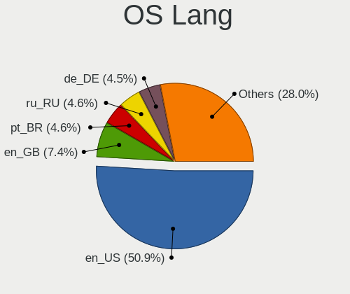
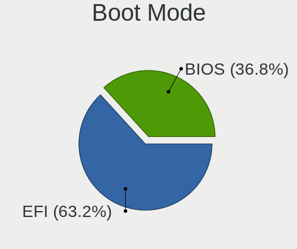
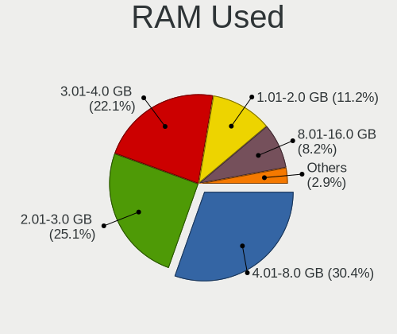
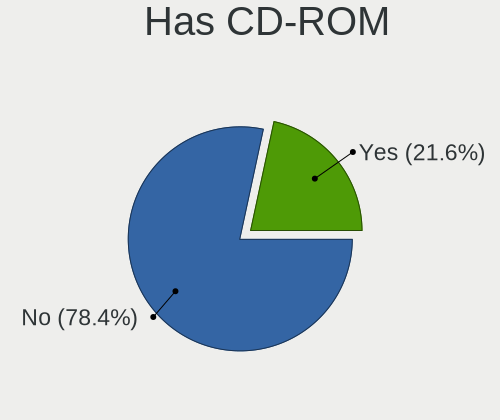
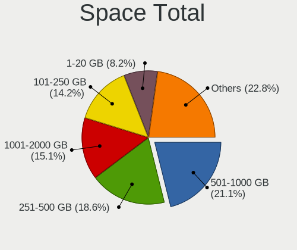
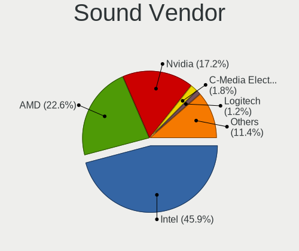

Fedora - Tested Hardware & Statistics
-------------------------------------

A project to collect tested hardware configurations for Fedora.

Anyone can contribute to this report by the [hw-probe](https://github.com/linuxhw/hw-probe) tool:

    sudo -E hw-probe -all -upload

Please contribute! Especially if your hardware is rare.

This is a report for all computer types. See also reports for [desktops](/Dist/Fedora/Desktop/README.md) and [notebooks](/Dist/Fedora/Notebook/README.md).

Contents
--------

* [ Test Cases ](#test-cases)

* [ System ](#system)
  - [ OS                       ](#os)
  - [ OS Family                ](#os-family)
  - [ Kernel                   ](#kernel)
  - [ Kernel Family            ](#kernel-family)
  - [ Kernel Major Ver.        ](#kernel-major-ver)
  - [ Arch                     ](#arch)
  - [ DE                       ](#de)
  - [ Display Server           ](#display-server)
  - [ Display Manager          ](#display-manager)
  - [ OS Lang                  ](#os-lang)
  - [ Boot Mode                ](#boot-mode)
  - [ Filesystem               ](#filesystem)
  - [ Part. scheme             ](#part-scheme)
  - [ Dual Boot with Linux/BSD ](#dual-boot-with-linuxbsd)
  - [ Dual Boot (Win)          ](#dual-boot-win)

* [ Board ](#board)
  - [ Vendor                   ](#vendor)
  - [ Model                    ](#model)
  - [ Model Family             ](#model-family)
  - [ MFG Year                 ](#mfg-year)
  - [ Form Factor              ](#form-factor)
  - [ Secure Boot              ](#secure-boot)
  - [ Coreboot                 ](#coreboot)
  - [ RAM Size                 ](#ram-size)
  - [ RAM Used                 ](#ram-used)
  - [ Total Drives             ](#total-drives)
  - [ Has CD-ROM               ](#has-cd-rom)
  - [ Has Ethernet             ](#has-ethernet)
  - [ Has WiFi                 ](#has-wifi)
  - [ Has Bluetooth            ](#has-bluetooth)

* [ Location ](#location)
  - [ Country                  ](#country)
  - [ City                     ](#city)

* [ Drives ](#drives)
  - [ Drive Vendor             ](#drive-vendor)
  - [ Drive Model              ](#drive-model)
  - [ HDD Vendor               ](#hdd-vendor)
  - [ SSD Vendor               ](#ssd-vendor)
  - [ Drive Kind               ](#drive-kind)
  - [ Drive Connector          ](#drive-connector)
  - [ Drive Size               ](#drive-size)
  - [ Space Total              ](#space-total)
  - [ Space Used               ](#space-used)
  - [ Malfunc. Drives          ](#malfunc-drives)
  - [ Malfunc. Drive Vendor    ](#malfunc-drive-vendor)
  - [ Malfunc. HDD Vendor      ](#malfunc-hdd-vendor)
  - [ Malfunc. Drive Kind      ](#malfunc-drive-kind)
  - [ Failed Drives            ](#failed-drives)
  - [ Failed Drive Vendor      ](#failed-drive-vendor)
  - [ Drive Status             ](#drive-status)

* [ Storage controller ](#storage-controller)
  - [ Storage Vendor           ](#storage-vendor)
  - [ Storage Model            ](#storage-model)
  - [ Storage Kind             ](#storage-kind)

* [ Processor ](#processor)
  - [ CPU Vendor               ](#cpu-vendor)
  - [ CPU Model                ](#cpu-model)
  - [ CPU Model Family         ](#cpu-model-family)
  - [ CPU Cores                ](#cpu-cores)
  - [ CPU Sockets              ](#cpu-sockets)
  - [ CPU Threads              ](#cpu-threads)
  - [ CPU Op-Modes             ](#cpu-op-modes)
  - [ CPU Microcode            ](#cpu-microcode)
  - [ CPU Microarch            ](#cpu-microarch)

* [ Graphics ](#graphics)
  - [ GPU Vendor               ](#gpu-vendor)
  - [ GPU Model                ](#gpu-model)
  - [ GPU Combo                ](#gpu-combo)
  - [ GPU Driver               ](#gpu-driver)
  - [ GPU Memory               ](#gpu-memory)

* [ Monitor ](#monitor)
  - [ Monitor Vendor           ](#monitor-vendor)
  - [ Monitor Model            ](#monitor-model)
  - [ Monitor Resolution       ](#monitor-resolution)
  - [ Monitor Diagonal         ](#monitor-diagonal)
  - [ Monitor Width            ](#monitor-width)
  - [ Aspect Ratio             ](#aspect-ratio)
  - [ Monitor Area             ](#monitor-area)
  - [ Pixel Density            ](#pixel-density)
  - [ Multiple Monitors        ](#multiple-monitors)

* [ Network ](#network)
  - [ Net Controller Vendor    ](#net-controller-vendor)
  - [ Net Controller Model     ](#net-controller-model)
  - [ Wireless Vendor          ](#wireless-vendor)
  - [ Wireless Model           ](#wireless-model)
  - [ Ethernet Vendor          ](#ethernet-vendor)
  - [ Ethernet Model           ](#ethernet-model)
  - [ Net Controller Kind      ](#net-controller-kind)
  - [ Used Controller          ](#used-controller)
  - [ NICs                     ](#nics)
  - [ IPv6                     ](#ipv6)

* [ Bluetooth ](#bluetooth)
  - [ Bluetooth Vendor         ](#bluetooth-vendor)
  - [ Bluetooth Model          ](#bluetooth-model)

* [ Sound ](#sound)
  - [ Sound Vendor             ](#sound-vendor)
  - [ Sound Model              ](#sound-model)

* [ Memory ](#memory)
  - [ Memory Vendor            ](#memory-vendor)
  - [ Memory Model             ](#memory-model)
  - [ Memory Kind              ](#memory-kind)
  - [ Memory Form Factor       ](#memory-form-factor)
  - [ Memory Size              ](#memory-size)
  - [ Memory Speed             ](#memory-speed)

* [ Printers & scanners ](#printers--scanners)
  - [ Printer Vendor           ](#printer-vendor)
  - [ Printer Model            ](#printer-model)
  - [ Scanner Vendor           ](#scanner-vendor)
  - [ Scanner Model            ](#scanner-model)

* [ Camera ](#camera)
  - [ Camera Vendor            ](#camera-vendor)
  - [ Camera Model             ](#camera-model)

* [ Security ](#security)
  - [ Fingerprint Vendor       ](#fingerprint-vendor)
  - [ Fingerprint Model        ](#fingerprint-model)
  - [ Chipcard Vendor          ](#chipcard-vendor)
  - [ Chipcard Model           ](#chipcard-model)

* [ Unsupported ](#unsupported)
  - [ Unsupported Devices      ](#unsupported-devices)
  - [ Unsupported Device Types ](#unsupported-device-types)

Test Cases
----------

Total: 15891

| Vendor        | Model                       | Form-Factor | Probe                                                      | Date         |
|---------------|-----------------------------|-------------|------------------------------------------------------------|--------------|
| HUAWEI        | CREM-WXX9                   | Notebook    | [22d51a725f](https://linux-hardware.org/?probe=22d51a725f) | Feb 28, 2023 |
| Dell          | Latitude E7270              | Notebook    | [2718026d03](https://linux-hardware.org/?probe=2718026d03) | Feb 28, 2023 |
| TECNO         | MEGABOOK T1                 | Notebook    | [3b70c27ca4](https://linux-hardware.org/?probe=3b70c27ca4) | Feb 28, 2023 |
| ASUSTek       | PRIME B550M-A               | Desktop     | [48c5c743c9](https://linux-hardware.org/?probe=48c5c743c9) | Feb 28, 2023 |
| ASRock        | H61M-VS                     | Desktop     | [04d5b9593e](https://linux-hardware.org/?probe=04d5b9593e) | Feb 28, 2023 |
| HUAWEI        | MRC-WX0                     | Notebook    | [e2776f99bf](https://linux-hardware.org/?probe=e2776f99bf) | Feb 28, 2023 |
| HP            | ProBook 635 Aero G8 Note... | Notebook    | [93ee76f198](https://linux-hardware.org/?probe=93ee76f198) | Feb 28, 2023 |
| Acer          | Aspire A315-59              | Notebook    | [9a897f5d7c](https://linux-hardware.org/?probe=9a897f5d7c) | Feb 28, 2023 |
| Lenovo        | ThinkPad Z13 Gen 1 21D2C... | Notebook    | [b5a4a1809f](https://linux-hardware.org/?probe=b5a4a1809f) | Feb 28, 2023 |
| TECNO         | MEGABOOK T1                 | Notebook    | [3d003c6d17](https://linux-hardware.org/?probe=3d003c6d17) | Feb 28, 2023 |
| ASUSTek       | ROG Strix G712LW_G712LW     | Notebook    | [ed67c567d2](https://linux-hardware.org/?probe=ed67c567d2) | Feb 28, 2023 |
| Standard      | Unknown                     | Notebook    | [63732ac2da](https://linux-hardware.org/?probe=63732ac2da) | Feb 28, 2023 |
| HP            | 158A                        | Desktop     | [64f3590183](https://linux-hardware.org/?probe=64f3590183) | Feb 28, 2023 |
| ASRock        | FM2A88X Extreme6+           | Desktop     | [1b5fd0df61](https://linux-hardware.org/?probe=1b5fd0df61) | Feb 28, 2023 |
| MSI           | X99A RAIDER                 | Desktop     | [f27314deb8](https://linux-hardware.org/?probe=f27314deb8) | Feb 28, 2023 |
| Dell          | Precision 5570              | Notebook    | [7e8d7c37cb](https://linux-hardware.org/?probe=7e8d7c37cb) | Feb 28, 2023 |
| ASRock        | H81M-HG4 R4.0               | Desktop     | [47ed7baef0](https://linux-hardware.org/?probe=47ed7baef0) | Feb 28, 2023 |
| Fujitsu       | D3224-P1 S26361-D3224-P1    | Desktop     | [53649a9546](https://linux-hardware.org/?probe=53649a9546) | Feb 28, 2023 |
| HP            | OMEN by Laptop 16-c0xxx     | Notebook    | [c829e9e0b8](https://linux-hardware.org/?probe=c829e9e0b8) | Feb 27, 2023 |
| HP            | EliteBook Folio 9470m       | Notebook    | [45403acec9](https://linux-hardware.org/?probe=45403acec9) | Feb 27, 2023 |
| HUAWEI        | MACHR-WX9                   | Notebook    | [b1ef7c7ea1](https://linux-hardware.org/?probe=b1ef7c7ea1) | Feb 27, 2023 |
| Lenovo        | ThinkPad X1 Yoga 3rd 20L... | Convertible | [43602775cd](https://linux-hardware.org/?probe=43602775cd) | Feb 27, 2023 |
| ASUSTek       | ROG STRIX B350-F GAMING     | Desktop     | [3cd0e65d1f](https://linux-hardware.org/?probe=3cd0e65d1f) | Feb 27, 2023 |
| Apple         | MacBookAir6,1               | Notebook    | [1c1dc86eb1](https://linux-hardware.org/?probe=1c1dc86eb1) | Feb 27, 2023 |
| Intel         | NUC7i5BNB J31144-313        | Mini pc     | [91405b88cc](https://linux-hardware.org/?probe=91405b88cc) | Feb 27, 2023 |
| HP            | EliteBook 845 14 inch G9... | Notebook    | [ed251c6cfe](https://linux-hardware.org/?probe=ed251c6cfe) | Feb 27, 2023 |
| ASUSTek       | PRIME Q270M-C               | Desktop     | [3a9683fbb7](https://linux-hardware.org/?probe=3a9683fbb7) | Feb 27, 2023 |
| Lenovo        | ThinkPad P15 Gen 1 20SUS... | Notebook    | [dd5ce2c6db](https://linux-hardware.org/?probe=dd5ce2c6db) | Feb 27, 2023 |
| Toshiba       | Satellite P870              | Notebook    | [6d9216b866](https://linux-hardware.org/?probe=6d9216b866) | Feb 27, 2023 |
| HP            | EliteBook x360 1030 G2      | Convertible | [11aeca0c24](https://linux-hardware.org/?probe=11aeca0c24) | Feb 27, 2023 |
| Dell          | Inspiron 15 3511            | Notebook    | [4c96506f38](https://linux-hardware.org/?probe=4c96506f38) | Feb 27, 2023 |
| ASUSTek       | VivoBook_ASUSLaptop X513... | Notebook    | [d7e55bb97e](https://linux-hardware.org/?probe=d7e55bb97e) | Feb 27, 2023 |
| ASUSTek       | VivoBook_ASUS Laptop E41... | Notebook    | [091e4e3188](https://linux-hardware.org/?probe=091e4e3188) | Feb 27, 2023 |
| Gigabyte      | Z490 VISION D               | Desktop     | [cbea73a793](https://linux-hardware.org/?probe=cbea73a793) | Feb 27, 2023 |
| Apple         | MacBookAir6,1               | Notebook    | [058ecdce01](https://linux-hardware.org/?probe=058ecdce01) | Feb 27, 2023 |
| ASUSTek       | ROG Flow X13 GV301RE_GV3... | Convertible | [7f7bdeae7c](https://linux-hardware.org/?probe=7f7bdeae7c) | Feb 27, 2023 |
| Gigabyte      | Z490 VISION D               | Desktop     | [3e9f2feeaa](https://linux-hardware.org/?probe=3e9f2feeaa) | Feb 27, 2023 |
| Gigabyte      | Z170MX-Gaming 5             | Desktop     | [1f0e9197f9](https://linux-hardware.org/?probe=1f0e9197f9) | Feb 26, 2023 |
| ASUSTek       | PRIME B550M-A               | Desktop     | [a121d0545a](https://linux-hardware.org/?probe=a121d0545a) | Feb 26, 2023 |
| Lenovo        | ThinkPad X395 20NL0006US    | Notebook    | [9030fac261](https://linux-hardware.org/?probe=9030fac261) | Feb 26, 2023 |
| ASUSTek       | TUF Gaming X570-PLUS        | Desktop     | [c56cf68cef](https://linux-hardware.org/?probe=c56cf68cef) | Feb 26, 2023 |
| ASUSTek       | VivoBook_ASUS Laptop X50... | Notebook    | [fe8735a027](https://linux-hardware.org/?probe=fe8735a027) | Feb 26, 2023 |
| Gigabyte      | EX58-UD5                    | Desktop     | [85ed1d43c7](https://linux-hardware.org/?probe=85ed1d43c7) | Feb 26, 2023 |
| HP            | Notebook                    | Notebook    | [ab0dddc914](https://linux-hardware.org/?probe=ab0dddc914) | Feb 26, 2023 |
| Lenovo        | IdeaPad L340-15IRH Gamin... | Notebook    | [6b712e555f](https://linux-hardware.org/?probe=6b712e555f) | Feb 26, 2023 |
| Dell          | Vostro 3578                 | Notebook    | [da6968c8ac](https://linux-hardware.org/?probe=da6968c8ac) | Feb 26, 2023 |
| Gigabyte      | H510M S2                    | Desktop     | [24ea8468ca](https://linux-hardware.org/?probe=24ea8468ca) | Feb 26, 2023 |
| Samsung       | 370E4K                      | Notebook    | [7b769eb33e](https://linux-hardware.org/?probe=7b769eb33e) | Feb 26, 2023 |
| HUAWEI        | CREM-WXX9                   | Notebook    | [c026a25fb2](https://linux-hardware.org/?probe=c026a25fb2) | Feb 26, 2023 |
| HP            | 250 G6 Notebook PC          | Notebook    | [af6a897a26](https://linux-hardware.org/?probe=af6a897a26) | Feb 26, 2023 |
| Timi          | TM1612                      | Notebook    | [eb4a3f330e](https://linux-hardware.org/?probe=eb4a3f330e) | Feb 26, 2023 |
| Lenovo        | ThinkPad P15 Gen 1 20SUS... | Notebook    | [d3b6621252](https://linux-hardware.org/?probe=d3b6621252) | Feb 26, 2023 |
| Acer          | Nitro AN515-52              | Notebook    | [f589c3687b](https://linux-hardware.org/?probe=f589c3687b) | Feb 26, 2023 |
| ASUSTek       | VivoBook 15_ASUS Laptop ... | Notebook    | [d610badec8](https://linux-hardware.org/?probe=d610badec8) | Feb 26, 2023 |
| Acer          | TravelMate P633-V           | Notebook    | [b4841d9589](https://linux-hardware.org/?probe=b4841d9589) | Feb 26, 2023 |
| Lenovo        | ThinkPad T61 6464A13        | Notebook    | [e981803528](https://linux-hardware.org/?probe=e981803528) | Feb 26, 2023 |
| Standard      | Unknown                     | Notebook    | [9d002e0593](https://linux-hardware.org/?probe=9d002e0593) | Feb 26, 2023 |
| ASUSTek       | PRIME A320M-K               | Desktop     | [c204192a4b](https://linux-hardware.org/?probe=c204192a4b) | Feb 26, 2023 |
| Lenovo        | Legion 5 82B5               | Notebook    | [8db23a7237](https://linux-hardware.org/?probe=8db23a7237) | Feb 25, 2023 |
| Lenovo        | Yoga Slim 7 14ARE05 82A2    | Notebook    | [bd2c3ecd74](https://linux-hardware.org/?probe=bd2c3ecd74) | Feb 25, 2023 |
| Lenovo        | Yoga 9 14IAP7 82LU          | Convertible | [d6805fb81b](https://linux-hardware.org/?probe=d6805fb81b) | Feb 25, 2023 |
| Lenovo        | ThinkPad T480 20L5S03600    | Notebook    | [5c9736ab0c](https://linux-hardware.org/?probe=5c9736ab0c) | Feb 25, 2023 |
| Gigabyte      | H310M D3H                   | Desktop     | [058fac57c2](https://linux-hardware.org/?probe=058fac57c2) | Feb 25, 2023 |
| Dell          | Vostro 14-5459              | Notebook    | [1f96898a48](https://linux-hardware.org/?probe=1f96898a48) | Feb 25, 2023 |
| ASUSTek       | PRIME B450M-A II            | Desktop     | [420520e3ab](https://linux-hardware.org/?probe=420520e3ab) | Feb 25, 2023 |
| Dell          | Latitude E6420              | Notebook    | [7ae4fe9340](https://linux-hardware.org/?probe=7ae4fe9340) | Feb 25, 2023 |
| Acer          | TravelMate P633-V           | Notebook    | [fd426b6c71](https://linux-hardware.org/?probe=fd426b6c71) | Feb 25, 2023 |
| Dell          | Latitude 5511               | Notebook    | [4402838fb3](https://linux-hardware.org/?probe=4402838fb3) | Feb 25, 2023 |
| Google        | Voxel                       | Notebook    | [ce917fe8ec](https://linux-hardware.org/?probe=ce917fe8ec) | Feb 25, 2023 |
| HP            | Spectre x360 Convertible... | Convertible | [87df24d8c2](https://linux-hardware.org/?probe=87df24d8c2) | Feb 25, 2023 |
| Google        | Voxel                       | Notebook    | [93ea143f69](https://linux-hardware.org/?probe=93ea143f69) | Feb 25, 2023 |
| Dell          | Inspiron 5759               | Notebook    | [be0b15660e](https://linux-hardware.org/?probe=be0b15660e) | Feb 25, 2023 |
| HUAWEI        | MACH-WX9                    | Notebook    | [52924074db](https://linux-hardware.org/?probe=52924074db) | Feb 25, 2023 |
| Dell          | 0W2F8G A01                  | Desktop     | [1d0d54843b](https://linux-hardware.org/?probe=1d0d54843b) | Feb 25, 2023 |
| ASRock        | FM2A88X Extreme6+           | Desktop     | [87c5af58f5](https://linux-hardware.org/?probe=87c5af58f5) | Feb 25, 2023 |
| MSI           | X99A RAIDER                 | Desktop     | [d6c6778bb7](https://linux-hardware.org/?probe=d6c6778bb7) | Feb 25, 2023 |
| Dell          | Precision 5520              | Notebook    | [c41014658b](https://linux-hardware.org/?probe=c41014658b) | Feb 25, 2023 |
| Dell          | System XPS L321X            | Notebook    | [4de5ba1c80](https://linux-hardware.org/?probe=4de5ba1c80) | Feb 25, 2023 |
| Lenovo        | ThinkPad T14s Gen 1 20T1... | Notebook    | [1c1e5c991f](https://linux-hardware.org/?probe=1c1e5c991f) | Feb 25, 2023 |
| Lenovo        | Yoga 9 14IAP7 82LU          | Convertible | [3575d2e78d](https://linux-hardware.org/?probe=3575d2e78d) | Feb 25, 2023 |
| Gigabyte      | H310M S2 x.x                | Desktop     | [27fa5a62b6](https://linux-hardware.org/?probe=27fa5a62b6) | Feb 24, 2023 |
| Lenovo        | 851F 60072                  | Tablet      | [8466ce344b](https://linux-hardware.org/?probe=8466ce344b) | Feb 24, 2023 |
| Samsung       | 340XAA/350XAA/550XAA        | Notebook    | [9cbbaaf012](https://linux-hardware.org/?probe=9cbbaaf012) | Feb 24, 2023 |
| MSI           | MAG B550M MORTAR WIFI       | Desktop     | [4a0d65f6b5](https://linux-hardware.org/?probe=4a0d65f6b5) | Feb 24, 2023 |
| MSI           | B350M PRO-VDH               | Desktop     | [748d109cb3](https://linux-hardware.org/?probe=748d109cb3) | Feb 24, 2023 |
| HP            | Spectre x360 Convertible... | Convertible | [af9891267d](https://linux-hardware.org/?probe=af9891267d) | Feb 24, 2023 |
| HP            | 84EF 01100                  | All in one  | [d69b1aab65](https://linux-hardware.org/?probe=d69b1aab65) | Feb 24, 2023 |
| Chuwi         | GemiBook Pro                | Notebook    | [f8f1005d73](https://linux-hardware.org/?probe=f8f1005d73) | Feb 24, 2023 |
| ASUSTek       | ASUS TUF Gaming A15 FA50... | Notebook    | [787270bc9e](https://linux-hardware.org/?probe=787270bc9e) | Feb 24, 2023 |
| Lenovo        | Yoga Pro 14s IAH7 82TK      | Notebook    | [ade006d016](https://linux-hardware.org/?probe=ade006d016) | Feb 24, 2023 |
| ASUSTek       | PRIME B550M-A WIFI II       | Desktop     | [5d901ddc4e](https://linux-hardware.org/?probe=5d901ddc4e) | Feb 24, 2023 |
| Microsoft     | Surface Pro 4               | Tablet      | [362c88435e](https://linux-hardware.org/?probe=362c88435e) | Feb 24, 2023 |
| ASUSTek       | VivoBook_ASUSLaptop X512... | Notebook    | [2bbce041f5](https://linux-hardware.org/?probe=2bbce041f5) | Feb 24, 2023 |
| MSI           | MS-7A32                     | Notebook    | [2312252934](https://linux-hardware.org/?probe=2312252934) | Feb 24, 2023 |
| ASUSTek       | ASUS TUF Gaming A15 FA50... | Notebook    | [f7063f868f](https://linux-hardware.org/?probe=f7063f868f) | Feb 24, 2023 |
| HP            | 245 G8 Notebook PC          | Notebook    | [7686bcd76d](https://linux-hardware.org/?probe=7686bcd76d) | Feb 24, 2023 |
| Dell          | Inspiron 13-7359            | Notebook    | [7858955f02](https://linux-hardware.org/?probe=7858955f02) | Feb 24, 2023 |
| Microsoft     | Surface Pro 4               | Tablet      | [1fb6ff6899](https://linux-hardware.org/?probe=1fb6ff6899) | Feb 24, 2023 |
| Toshiba       | Satellite L515              | Notebook    | [969c2042b9](https://linux-hardware.org/?probe=969c2042b9) | Feb 24, 2023 |
| MSI           | X99A RAIDER                 | Desktop     | [7b4981d722](https://linux-hardware.org/?probe=7b4981d722) | Feb 24, 2023 |
| ASRock        | FM2A88X Extreme6+           | Desktop     | [6e57f3a472](https://linux-hardware.org/?probe=6e57f3a472) | Feb 24, 2023 |
| MSI           | Z170A PC MATE               | Desktop     | [5ee58b9271](https://linux-hardware.org/?probe=5ee58b9271) | Feb 24, 2023 |
| Dell          | G5 5587                     | Notebook    | [1f43871064](https://linux-hardware.org/?probe=1f43871064) | Feb 24, 2023 |
| MSI           | Z87M GAMING                 | Desktop     | [0603accd89](https://linux-hardware.org/?probe=0603accd89) | Feb 24, 2023 |
| ASUSTek       | PRIME B550M-A               | Desktop     | [acdea94715](https://linux-hardware.org/?probe=acdea94715) | Feb 23, 2023 |
| MSI           | MEG Z390 GODLIKE            | Desktop     | [5f091de01b](https://linux-hardware.org/?probe=5f091de01b) | Feb 23, 2023 |
| Lenovo        | Yoga Slim 7 ProX 14ARH7 ... | Notebook    | [f92ac89547](https://linux-hardware.org/?probe=f92ac89547) | Feb 23, 2023 |
| Lenovo        | ThinkPad P15 Gen 1 20SUS... | Notebook    | [4b0436b55d](https://linux-hardware.org/?probe=4b0436b55d) | Feb 23, 2023 |
| Gateway       | SX2185                      | Desktop     | [32ab171e53](https://linux-hardware.org/?probe=32ab171e53) | Feb 23, 2023 |
| HP            | Spectre x360 Convertible... | Convertible | [c570bb75bf](https://linux-hardware.org/?probe=c570bb75bf) | Feb 23, 2023 |
| ASRock        | B450M Pro4                  | Desktop     | [193a97dfb1](https://linux-hardware.org/?probe=193a97dfb1) | Feb 23, 2023 |
| Lenovo        | ThinkPad P15 Gen 1 20SUS... | Notebook    | [a4c4313238](https://linux-hardware.org/?probe=a4c4313238) | Feb 23, 2023 |
| HP            | EliteBook 840 G6            | Notebook    | [ea6777bf2d](https://linux-hardware.org/?probe=ea6777bf2d) | Feb 23, 2023 |
| HP            | Pavilion Laptop 14-ec0xx... | Notebook    | [bb2bef71e0](https://linux-hardware.org/?probe=bb2bef71e0) | Feb 23, 2023 |
| Lenovo        | ThinkPad X230 2325CS6       | Notebook    | [ed9501bbcb](https://linux-hardware.org/?probe=ed9501bbcb) | Feb 23, 2023 |
| Dell          | Inspiron 13-7359            | Notebook    | [39d95063c3](https://linux-hardware.org/?probe=39d95063c3) | Feb 23, 2023 |
| Lenovo        | Yoga 7 14ARB7 82QF          | Convertible | [0f251d6bbf](https://linux-hardware.org/?probe=0f251d6bbf) | Feb 23, 2023 |
| Gigabyte      | B550M AORUS PRO-P           | Desktop     | [eade3920d9](https://linux-hardware.org/?probe=eade3920d9) | Feb 23, 2023 |
| ASUSTek       | P5L-MX                      | Desktop     | [cc19e49d3c](https://linux-hardware.org/?probe=cc19e49d3c) | Feb 23, 2023 |
| ASUSTek       | K56CA                       | Notebook    | [d8475e4c48](https://linux-hardware.org/?probe=d8475e4c48) | Feb 23, 2023 |
| Lenovo        | IdeaPad S145-15API 81V7     | Notebook    | [e23562af05](https://linux-hardware.org/?probe=e23562af05) | Feb 23, 2023 |
| MSI           | MPG X570 GAMING PLUS        | Desktop     | [b82d73c832](https://linux-hardware.org/?probe=b82d73c832) | Feb 22, 2023 |
| Lenovo        | ThinkBook 15 G2 ARE 20VG    | Notebook    | [becb5b0ba1](https://linux-hardware.org/?probe=becb5b0ba1) | Feb 22, 2023 |
| CyberPower... | Tracer IV GM5MQ8W           | Notebook    | [284e8a4fb1](https://linux-hardware.org/?probe=284e8a4fb1) | Feb 22, 2023 |
| ASUSTek       | P5L-MX                      | Desktop     | [9eb9ca3cfb](https://linux-hardware.org/?probe=9eb9ca3cfb) | Feb 22, 2023 |
| MSI           | MEG Z390 GODLIKE            | Desktop     | [974ae4135b](https://linux-hardware.org/?probe=974ae4135b) | Feb 22, 2023 |
| Dell          | Latitude E5570              | Notebook    | [338538c1c9](https://linux-hardware.org/?probe=338538c1c9) | Feb 22, 2023 |
| Gigabyte      | G5 KD                       | Notebook    | [65c50530c8](https://linux-hardware.org/?probe=65c50530c8) | Feb 22, 2023 |
| HP            | ProBook 445 G8 Notebook ... | Notebook    | [7d3442e2a7](https://linux-hardware.org/?probe=7d3442e2a7) | Feb 22, 2023 |
| Alienware     | x14                         | Notebook    | [0b32a33625](https://linux-hardware.org/?probe=0b32a33625) | Feb 22, 2023 |
| Alienware     | x14                         | Notebook    | [04094754b6](https://linux-hardware.org/?probe=04094754b6) | Feb 22, 2023 |
| Lenovo        | Yoga 9 14IAP7 82LU          | Convertible | [3e5166108a](https://linux-hardware.org/?probe=3e5166108a) | Feb 22, 2023 |
| Acer          | Veriton N4630G              | Desktop     | [eb6a551e75](https://linux-hardware.org/?probe=eb6a551e75) | Feb 22, 2023 |
| HP            | Notebook                    | Notebook    | [f6d3ba25ba](https://linux-hardware.org/?probe=f6d3ba25ba) | Feb 22, 2023 |
| Samsung       | 767XCL                      | Notebook    | [3fb09fb626](https://linux-hardware.org/?probe=3fb09fb626) | Feb 22, 2023 |
| ASRock        | AB350 Pro4                  | Desktop     | [aaad317fe4](https://linux-hardware.org/?probe=aaad317fe4) | Feb 22, 2023 |
| Dell          | Latitude 5491               | Notebook    | [fd68ba9595](https://linux-hardware.org/?probe=fd68ba9595) | Feb 21, 2023 |
| ASRockRack    | X470D4U                     | Desktop     | [162a5279bc](https://linux-hardware.org/?probe=162a5279bc) | Feb 21, 2023 |
| Lenovo        | ThinkPad P15 Gen 2i 20YQ... | Notebook    | [a459216464](https://linux-hardware.org/?probe=a459216464) | Feb 21, 2023 |
| Lenovo        | ThinkPad T470s W10DG 20J... | Notebook    | [7ead9488ae](https://linux-hardware.org/?probe=7ead9488ae) | Feb 21, 2023 |
| Apple         | MacBookAir6,1               | Notebook    | [b9117f0c6f](https://linux-hardware.org/?probe=b9117f0c6f) | Feb 21, 2023 |
| TUXEDO        | Polaris Intel Gen3 (TGL)    | Notebook    | [c0733771d5](https://linux-hardware.org/?probe=c0733771d5) | Feb 21, 2023 |
| TUXEDO        | Polaris Intel Gen3 (TGL)    | Notebook    | [039bb422e0](https://linux-hardware.org/?probe=039bb422e0) | Feb 21, 2023 |
| Acer          | Aspire SW3-013              | Notebook    | [f0111df214](https://linux-hardware.org/?probe=f0111df214) | Feb 21, 2023 |
| Alienware     | 15 R2                       | Notebook    | [96aa09ae59](https://linux-hardware.org/?probe=96aa09ae59) | Feb 21, 2023 |
| HP            | EliteBook 2540p             | Notebook    | [bf037f7503](https://linux-hardware.org/?probe=bf037f7503) | Feb 21, 2023 |
| Gigabyte      | A320M-S2H-CF                | Desktop     | [67ba988b20](https://linux-hardware.org/?probe=67ba988b20) | Feb 21, 2023 |
| Lenovo        | ThinkPad P53 20QN0011IV     | Notebook    | [d1f67d5e08](https://linux-hardware.org/?probe=d1f67d5e08) | Feb 21, 2023 |
| Gigabyte      | J1900M-D2P                  | Desktop     | [edd5640ca7](https://linux-hardware.org/?probe=edd5640ca7) | Feb 21, 2023 |
| MSI           | H410M PRO-VH                | Desktop     | [669d124e33](https://linux-hardware.org/?probe=669d124e33) | Feb 21, 2023 |
| Acer          | Nitro AN515-52              | Notebook    | [9989903f85](https://linux-hardware.org/?probe=9989903f85) | Feb 21, 2023 |
| Dell          | XPS 13 7390                 | Notebook    | [2b329d108f](https://linux-hardware.org/?probe=2b329d108f) | Feb 21, 2023 |
| Lenovo        | IdeaPad 5 15ARE05 81YQ      | Notebook    | [53737369e8](https://linux-hardware.org/?probe=53737369e8) | Feb 21, 2023 |
| Lenovo        | ThinkPad E15 Gen 4 21EES... | Notebook    | [b8c4b41baf](https://linux-hardware.org/?probe=b8c4b41baf) | Feb 21, 2023 |
| Dell          | XPS 13 7390                 | Notebook    | [a3ed8101b1](https://linux-hardware.org/?probe=a3ed8101b1) | Feb 20, 2023 |
| MSI           | Modern 15 A5M               | Notebook    | [f6c80ff7a9](https://linux-hardware.org/?probe=f6c80ff7a9) | Feb 20, 2023 |
| Fujitsu       | LIFEBOOK E559               | Notebook    | [5e4c3607c7](https://linux-hardware.org/?probe=5e4c3607c7) | Feb 20, 2023 |
| Fujitsu       | LIFEBOOK A357               | Notebook    | [a813f73ea2](https://linux-hardware.org/?probe=a813f73ea2) | Feb 20, 2023 |
| MSI           | Bravo 15 B5ED               | Notebook    | [a0b7f1b5f8](https://linux-hardware.org/?probe=a0b7f1b5f8) | Feb 20, 2023 |
| ASRock        | B550M Steel Legend          | Desktop     | [c3f49d4cee](https://linux-hardware.org/?probe=c3f49d4cee) | Feb 20, 2023 |
| Lenovo        | ThinkPad T530 239265U       | Notebook    | [9f60ca6bf5](https://linux-hardware.org/?probe=9f60ca6bf5) | Feb 20, 2023 |
| Dell          | XPS 13 7390                 | Notebook    | [542077cc42](https://linux-hardware.org/?probe=542077cc42) | Feb 20, 2023 |
| ASUSTek       | PRIME B550M-A               | Desktop     | [8fd85f724b](https://linux-hardware.org/?probe=8fd85f724b) | Feb 20, 2023 |
| Microsoft     | Surface Go                  | Tablet      | [6f456ca669](https://linux-hardware.org/?probe=6f456ca669) | Feb 20, 2023 |
| Lenovo        | ThinkPad T14s Gen 2a 20X... | Notebook    | [057dcdc86b](https://linux-hardware.org/?probe=057dcdc86b) | Feb 20, 2023 |
| HP            | Pavilion Laptop 14-ec0xx... | Notebook    | [d8abf7361b](https://linux-hardware.org/?probe=d8abf7361b) | Feb 20, 2023 |
| Lenovo        | ThinkPad T14s Gen 2a 20X... | Notebook    | [89eb85b36f](https://linux-hardware.org/?probe=89eb85b36f) | Feb 19, 2023 |
| Lenovo        | ThinkCentre M58 8910B4U     | Desktop     | [03c8e6d135](https://linux-hardware.org/?probe=03c8e6d135) | Feb 19, 2023 |
| ASUSTek       | SABERTOOTH X99              | Desktop     | [422b14d8d7](https://linux-hardware.org/?probe=422b14d8d7) | Feb 19, 2023 |
| Chuwi         | HeroBook Air                | Notebook    | [c669fff700](https://linux-hardware.org/?probe=c669fff700) | Feb 19, 2023 |
| Acer          | Predator PH315-52           | Notebook    | [7432db815e](https://linux-hardware.org/?probe=7432db815e) | Feb 19, 2023 |
| Acer          | Predator PH315-52           | Notebook    | [aaee9da394](https://linux-hardware.org/?probe=aaee9da394) | Feb 19, 2023 |
| ASRock        | X570 Phantom Gaming 4       | Desktop     | [2af589c6e9](https://linux-hardware.org/?probe=2af589c6e9) | Feb 19, 2023 |
| ASRock        | X670E Pro RS                | Desktop     | [906d11e2a3](https://linux-hardware.org/?probe=906d11e2a3) | Feb 19, 2023 |
| GEO           | GeoFlex 340                 | Convertible | [f347582e5c](https://linux-hardware.org/?probe=f347582e5c) | Feb 19, 2023 |
| Samsung       | 930QED                      | Convertible | [f72fed80df](https://linux-hardware.org/?probe=f72fed80df) | Feb 19, 2023 |
| ASUSTek       | ROG Strix G733ZW_G733ZW     | Notebook    | [72f074b930](https://linux-hardware.org/?probe=72f074b930) | Feb 19, 2023 |
| Dell          | Latitude E6430              | Notebook    | [23c0ff9281](https://linux-hardware.org/?probe=23c0ff9281) | Feb 19, 2023 |
| ASUSTek       | VivoBook_ASUSLaptop K650... | Notebook    | [b1d168b6ce](https://linux-hardware.org/?probe=b1d168b6ce) | Feb 19, 2023 |
| Dell          | Latitude E6430              | Notebook    | [d97087b55f](https://linux-hardware.org/?probe=d97087b55f) | Feb 19, 2023 |
| Lenovo        | ThinkPad E555 20DH000TUK    | Notebook    | [b2d5c9de8b](https://linux-hardware.org/?probe=b2d5c9de8b) | Feb 19, 2023 |
| ASUSTek       | TUF Gaming X570-PLUS        | Desktop     | [42099690a6](https://linux-hardware.org/?probe=42099690a6) | Feb 19, 2023 |
| Standard      | Unknown                     | Notebook    | [149bdc4e40](https://linux-hardware.org/?probe=149bdc4e40) | Feb 19, 2023 |
| Lenovo        | IdeaPad 5 15ALC05 82LN      | Notebook    | [9b0ecbd3c7](https://linux-hardware.org/?probe=9b0ecbd3c7) | Feb 19, 2023 |
| ASRock        | X570 Phantom Gaming 4       | Desktop     | [f9314a0aa9](https://linux-hardware.org/?probe=f9314a0aa9) | Feb 19, 2023 |
| Lenovo        | ThinkPad T480s 20L70028U... | Notebook    | [ee24b75c39](https://linux-hardware.org/?probe=ee24b75c39) | Feb 19, 2023 |
| Gigabyte      | B550 AORUS ELITE V2         | Desktop     | [6eda9f2592](https://linux-hardware.org/?probe=6eda9f2592) | Feb 19, 2023 |
| Dell          | Precision M4500             | Notebook    | [b0d8bf3c56](https://linux-hardware.org/?probe=b0d8bf3c56) | Feb 19, 2023 |
| Apple         | MacBookAir6,1               | Notebook    | [5cade7cfc3](https://linux-hardware.org/?probe=5cade7cfc3) | Feb 19, 2023 |
| ASUSTek       | P5Q SE2                     | Desktop     | [37b0d0609f](https://linux-hardware.org/?probe=37b0d0609f) | Feb 18, 2023 |
| Google        | Kled                        | Notebook    | [788d726509](https://linux-hardware.org/?probe=788d726509) | Feb 18, 2023 |
| HP            | EliteBook 850 G8 Noteboo... | Notebook    | [9b53b2b842](https://linux-hardware.org/?probe=9b53b2b842) | Feb 18, 2023 |
| Lenovo        | ThinkBook 14 G2 ITL 20VD    | Notebook    | [cdfcc639d3](https://linux-hardware.org/?probe=cdfcc639d3) | Feb 18, 2023 |
| Lenovo        | ThinkPad T530 2429F27       | Notebook    | [b835147a32](https://linux-hardware.org/?probe=b835147a32) | Feb 18, 2023 |
| Unknown       | Apple MacBook Pro (14-in... | Notebook    | [fb2cbe3576](https://linux-hardware.org/?probe=fb2cbe3576) | Feb 18, 2023 |
| ASUSTek       | ASUS TUF Gaming F15 FX50... | Notebook    | [a424b3aa47](https://linux-hardware.org/?probe=a424b3aa47) | Feb 18, 2023 |
| ASRock        | H110 Pro BTC+               | Desktop     | [bce117c4dc](https://linux-hardware.org/?probe=bce117c4dc) | Feb 18, 2023 |
| MSI           | Z170A KRAIT GAMING          | Desktop     | [27dcbbe1d7](https://linux-hardware.org/?probe=27dcbbe1d7) | Feb 18, 2023 |
| ASUSTek       | ROG CROSSHAIR VIII IMPAC... | Desktop     | [831d4806fb](https://linux-hardware.org/?probe=831d4806fb) | Feb 18, 2023 |
| Lenovo        | ThinkPad T14 Gen 2i 20W1... | Notebook    | [e7988c5ab6](https://linux-hardware.org/?probe=e7988c5ab6) | Feb 18, 2023 |
| MSI           | H410M PRO-VH                | Desktop     | [ccc1cbf2fa](https://linux-hardware.org/?probe=ccc1cbf2fa) | Feb 18, 2023 |
| ASRock        | FM2A88X Extreme6+           | Desktop     | [f14a791491](https://linux-hardware.org/?probe=f14a791491) | Feb 18, 2023 |
| MSI           | X99A RAIDER                 | Desktop     | [8dabbaa31c](https://linux-hardware.org/?probe=8dabbaa31c) | Feb 18, 2023 |
| ASUSTek       | VivoBook_ASUSLaptop S540... | Notebook    | [6d2b283e83](https://linux-hardware.org/?probe=6d2b283e83) | Feb 18, 2023 |
| Dell          | Precision 5560              | Notebook    | [24e5de4a3d](https://linux-hardware.org/?probe=24e5de4a3d) | Feb 18, 2023 |
| Gigabyte      | Z370 AORUS Ultra Gaming-... | Desktop     | [5fe0f2c1fe](https://linux-hardware.org/?probe=5fe0f2c1fe) | Feb 18, 2023 |
| Samsung       | 730QDA                      | Convertible | [902b86cb84](https://linux-hardware.org/?probe=902b86cb84) | Feb 18, 2023 |
| HP            | Pavilion Laptop 15-eg0xx... | Notebook    | [c4a1fe4a4f](https://linux-hardware.org/?probe=c4a1fe4a4f) | Feb 17, 2023 |
| Lenovo        | ThinkPad T490 20N2001YUS    | Notebook    | [53ef9ffad8](https://linux-hardware.org/?probe=53ef9ffad8) | Feb 17, 2023 |
| ASUSTek       | PRIME B550M-A               | Desktop     | [f9fb638882](https://linux-hardware.org/?probe=f9fb638882) | Feb 17, 2023 |
| Dell          | Latitude 5491               | Notebook    | [8a3298cdff](https://linux-hardware.org/?probe=8a3298cdff) | Feb 17, 2023 |
| ASUSTek       | PRIME Z690M-PLUS D4         | Desktop     | [750c0f6337](https://linux-hardware.org/?probe=750c0f6337) | Feb 17, 2023 |
| Hardkernel    | ODROID-N2                   | Soc         | [9a8138252f](https://linux-hardware.org/?probe=9a8138252f) | Feb 17, 2023 |
| Lenovo        | ThinkBook 15 G3 ACL 21A4    | Notebook    | [e4483255db](https://linux-hardware.org/?probe=e4483255db) | Feb 17, 2023 |
| ASRock        | X470 Taichi                 | Desktop     | [71685845fe](https://linux-hardware.org/?probe=71685845fe) | Feb 17, 2023 |
| MSI           | X99A RAIDER                 | Desktop     | [991b8b4361](https://linux-hardware.org/?probe=991b8b4361) | Feb 17, 2023 |
| ASRock        | FM2A88X Extreme6+           | Desktop     | [8c3926e125](https://linux-hardware.org/?probe=8c3926e125) | Feb 17, 2023 |
| Lenovo        | Legion 5 15ACH6H 82JU       | Notebook    | [09aefeb3d6](https://linux-hardware.org/?probe=09aefeb3d6) | Feb 17, 2023 |
| Dell          | Inspiron 5566               | Notebook    | [502adcba49](https://linux-hardware.org/?probe=502adcba49) | Feb 17, 2023 |
| ASUSTek       | ProArt Z690-CREATOR WIFI    | Desktop     | [8e3bad7795](https://linux-hardware.org/?probe=8e3bad7795) | Feb 17, 2023 |
| Lenovo        | ThinkPad Z16 Gen 1 21D40... | Notebook    | [cc44156b99](https://linux-hardware.org/?probe=cc44156b99) | Feb 17, 2023 |
| Lenovo        | ThinkPad Z16 Gen 1 21D40... | Notebook    | [bc234d0b32](https://linux-hardware.org/?probe=bc234d0b32) | Feb 17, 2023 |
| HP            | ENVY Laptop 17-ch2xxx       | Notebook    | [c1abb80cb1](https://linux-hardware.org/?probe=c1abb80cb1) | Feb 17, 2023 |
| Gigabyte      | A320M-S2H-CF                | Desktop     | [add68ac711](https://linux-hardware.org/?probe=add68ac711) | Feb 16, 2023 |
| ASUSTek       | PRIME B550M-A               | Desktop     | [a19a7a2edd](https://linux-hardware.org/?probe=a19a7a2edd) | Feb 16, 2023 |
| Lenovo        | ZIWB2                       | Notebook    | [8ade075157](https://linux-hardware.org/?probe=8ade075157) | Feb 16, 2023 |
| HP            | 245 G8 Notebook PC          | Notebook    | [c48e458030](https://linux-hardware.org/?probe=c48e458030) | Feb 16, 2023 |
| ASUSTek       | VivoBook_ASUSLaptop X515... | Notebook    | [4657fc266d](https://linux-hardware.org/?probe=4657fc266d) | Feb 16, 2023 |
| ASUSTek       | EX-H310M-V3 R2.0            | Desktop     | [d42c40dd2e](https://linux-hardware.org/?probe=d42c40dd2e) | Feb 16, 2023 |
| Microsoft     | Surface Laptop 3            | Tablet      | [218e0f7ad6](https://linux-hardware.org/?probe=218e0f7ad6) | Feb 16, 2023 |
| Acer          | Swift SF314-511             | Notebook    | [71778cedf9](https://linux-hardware.org/?probe=71778cedf9) | Feb 16, 2023 |
| ASRock        | Z370 Pro4                   | Desktop     | [bafba5486b](https://linux-hardware.org/?probe=bafba5486b) | Feb 16, 2023 |
| Samsung       | 940XFG                      | Notebook    | [56f236f8ab](https://linux-hardware.org/?probe=56f236f8ab) | Feb 16, 2023 |
| Dell          | Latitude 7390 2-in-1        | Convertible | [66dbe64897](https://linux-hardware.org/?probe=66dbe64897) | Feb 16, 2023 |
| HP            | Pavilion Laptop 15-eg0xx... | Notebook    | [ddc2c7ec7a](https://linux-hardware.org/?probe=ddc2c7ec7a) | Feb 16, 2023 |
| Lenovo        | ThinkPad P51 20HHCTO1WW     | Notebook    | [5a3b0950b3](https://linux-hardware.org/?probe=5a3b0950b3) | Feb 16, 2023 |
| ASUSTek       | ProArt X670E-CREATOR WIF... | Desktop     | [f4e8b0e952](https://linux-hardware.org/?probe=f4e8b0e952) | Feb 16, 2023 |
| Lenovo        | Y50-70 20378                | Notebook    | [09301690c5](https://linux-hardware.org/?probe=09301690c5) | Feb 15, 2023 |
| ASUSTek       | P8Z77-V PRO/THUNDERBOLT     | Desktop     | [a370fca217](https://linux-hardware.org/?probe=a370fca217) | Feb 15, 2023 |
| ASUSTek       | VivoBook_ASUSLaptop S540... | Notebook    | [159244d1a4](https://linux-hardware.org/?probe=159244d1a4) | Feb 15, 2023 |
| ASUSTek       | TUF Z390-PLUS GAMING        | Desktop     | [ca54397755](https://linux-hardware.org/?probe=ca54397755) | Feb 15, 2023 |
| HP            | Notebook                    | Notebook    | [9fe647f9a1](https://linux-hardware.org/?probe=9fe647f9a1) | Feb 15, 2023 |
| Dell          | Inspiron 7415 2-in-1        | Convertible | [d112d85387](https://linux-hardware.org/?probe=d112d85387) | Feb 15, 2023 |
| Lenovo        | IdeaPad 530S-14ARR 81H1     | Notebook    | [36f57d56f8](https://linux-hardware.org/?probe=36f57d56f8) | Feb 15, 2023 |
| HP            | Notebook                    | Notebook    | [c4516fb37a](https://linux-hardware.org/?probe=c4516fb37a) | Feb 15, 2023 |
| Lenovo        | Legion 5 15ARH05H 82B1      | Notebook    | [7fd55795a0](https://linux-hardware.org/?probe=7fd55795a0) | Feb 15, 2023 |
| Lenovo        | ThinkPad P50 20EQS64N09     | Notebook    | [72fad631b7](https://linux-hardware.org/?probe=72fad631b7) | Feb 15, 2023 |
| ASUSTek       | PN53                        | Mini pc     | [73f7fb3f85](https://linux-hardware.org/?probe=73f7fb3f85) | Feb 15, 2023 |
| Lenovo        | ThinkPad T14s Gen 1 20T1... | Notebook    | [70885f1dfd](https://linux-hardware.org/?probe=70885f1dfd) | Feb 15, 2023 |
| HP            | Laptop 15s-eq2xxx           | Notebook    | [92a9452070](https://linux-hardware.org/?probe=92a9452070) | Feb 15, 2023 |
| Supermicro    | X10DRG-Q                    | Desktop     | [5af331bc84](https://linux-hardware.org/?probe=5af331bc84) | Feb 15, 2023 |
| MSI           | FM2-A75MA-E35               | Desktop     | [a7f2ca398d](https://linux-hardware.org/?probe=a7f2ca398d) | Feb 15, 2023 |
| Dell          | Inspiron 7375               | Notebook    | [3916d619ed](https://linux-hardware.org/?probe=3916d619ed) | Feb 15, 2023 |
| Gigabyte      | H410M DS2V                  | Desktop     | [b2e8c15dc4](https://linux-hardware.org/?probe=b2e8c15dc4) | Feb 15, 2023 |
| Lenovo        | IdeaPad Gaming 3 15IHU6 ... | Notebook    | [1ca19c3d1d](https://linux-hardware.org/?probe=1ca19c3d1d) | Feb 14, 2023 |
| ASUSTek       | ROG STRIX B650E-I GAMING... | Desktop     | [7d8c3e7e48](https://linux-hardware.org/?probe=7d8c3e7e48) | Feb 14, 2023 |
| ASUSTek       | UL30A                       | Notebook    | [90114a4fe4](https://linux-hardware.org/?probe=90114a4fe4) | Feb 14, 2023 |
| Lenovo        | ThinkPad P53 20QN0011IV     | Notebook    | [390686f5f6](https://linux-hardware.org/?probe=390686f5f6) | Feb 14, 2023 |
| HP            | ProBook 440 G7              | Notebook    | [bc4811db07](https://linux-hardware.org/?probe=bc4811db07) | Feb 14, 2023 |
| HP            | OMEN by Laptop 16-c0xxx     | Notebook    | [cbcadcf80a](https://linux-hardware.org/?probe=cbcadcf80a) | Feb 14, 2023 |
| Dell          | Latitude E7270              | Notebook    | [03199b7612](https://linux-hardware.org/?probe=03199b7612) | Feb 14, 2023 |
| Lenovo        | IdeaPad 520S-14IKB 81BL     | Notebook    | [008d06fbf8](https://linux-hardware.org/?probe=008d06fbf8) | Feb 14, 2023 |
| Timi          | Xiaomi NoteBook Pro         | Notebook    | [561e1a6160](https://linux-hardware.org/?probe=561e1a6160) | Feb 14, 2023 |
| ASUSTek       | ROG STRIX X570-F GAMING     | Desktop     | [e718a6af67](https://linux-hardware.org/?probe=e718a6af67) | Feb 14, 2023 |
| Dell          | Latitude 7430               | Notebook    | [82dcb0a8a2](https://linux-hardware.org/?probe=82dcb0a8a2) | Feb 14, 2023 |
| Dell          | G3 3579                     | Notebook    | [35c8b69b8c](https://linux-hardware.org/?probe=35c8b69b8c) | Feb 14, 2023 |
| ASRock        | X370 Gaming X               | Desktop     | [2b9a026876](https://linux-hardware.org/?probe=2b9a026876) | Feb 14, 2023 |
| HP            | Pavilion Gaming Laptop 1... | Notebook    | [a3b0220b10](https://linux-hardware.org/?probe=a3b0220b10) | Feb 14, 2023 |
| HP            | EliteBook 840 G5            | Notebook    | [2f78b0c253](https://linux-hardware.org/?probe=2f78b0c253) | Feb 14, 2023 |
| ASUSTek       | M5A78L-M/USB3               | Desktop     | [0033422c4d](https://linux-hardware.org/?probe=0033422c4d) | Feb 14, 2023 |
| HP            | 8714                        | Desktop     | [19a66b5101](https://linux-hardware.org/?probe=19a66b5101) | Feb 14, 2023 |
| ASUSTek       | ROG STRIX X570-E GAMING     | Desktop     | [43dff5bee7](https://linux-hardware.org/?probe=43dff5bee7) | Feb 14, 2023 |
| Gigabyte      | B550 GAMING X V2            | Desktop     | [10c8101c9b](https://linux-hardware.org/?probe=10c8101c9b) | Feb 14, 2023 |
| Lenovo        | ThinkPad T14 Gen 1 20UD0... | Notebook    | [ac71e5b8ef](https://linux-hardware.org/?probe=ac71e5b8ef) | Feb 14, 2023 |
| MSI           | X99A RAIDER                 | Desktop     | [387ec47efe](https://linux-hardware.org/?probe=387ec47efe) | Feb 14, 2023 |
| Dell          | Inspiron 14 5420            | Notebook    | [45862fde09](https://linux-hardware.org/?probe=45862fde09) | Feb 13, 2023 |
| Lenovo        | Legion 5 15ACH6A 82NW       | Notebook    | [1f0e965483](https://linux-hardware.org/?probe=1f0e965483) | Feb 13, 2023 |
| Dell          | Inspiron 14 5420            | Notebook    | [8153aeb3fb](https://linux-hardware.org/?probe=8153aeb3fb) | Feb 13, 2023 |
| ASUSTek       | Z170-A                      | Desktop     | [6cf7a75c9e](https://linux-hardware.org/?probe=6cf7a75c9e) | Feb 13, 2023 |
| Dell          | XPS 15 9560                 | Notebook    | [01319ac289](https://linux-hardware.org/?probe=01319ac289) | Feb 13, 2023 |
| HP            | ENVY x360 Convertible 15... | Convertible | [7e81f35584](https://linux-hardware.org/?probe=7e81f35584) | Feb 13, 2023 |
| Lenovo        | ThinkPad T14 Gen 1 20UD0... | Notebook    | [f701208fd4](https://linux-hardware.org/?probe=f701208fd4) | Feb 13, 2023 |
| Lenovo        | Legion 5 15ACH6A 82NW       | Notebook    | [3b7765dfcc](https://linux-hardware.org/?probe=3b7765dfcc) | Feb 13, 2023 |
| Lenovo        | ThinkPad X1 Carbon Gen 9... | Notebook    | [6add161dbe](https://linux-hardware.org/?probe=6add161dbe) | Feb 13, 2023 |
| Dell          | Latitude 5511               | Notebook    | [161095d97a](https://linux-hardware.org/?probe=161095d97a) | Feb 13, 2023 |
| MSI           | X99A SLI PLUS               | Desktop     | [98447ce3dd](https://linux-hardware.org/?probe=98447ce3dd) | Feb 13, 2023 |
| Dell          | 0KWVT8 A03                  | Desktop     | [eec95070bb](https://linux-hardware.org/?probe=eec95070bb) | Feb 13, 2023 |
| Lenovo        | ThinkPad P15v Gen 2i 21A... | Notebook    | [7e90fe56d1](https://linux-hardware.org/?probe=7e90fe56d1) | Feb 13, 2023 |
| MSI           | Raider GE77HX 12UHS         | Notebook    | [abd464b0d3](https://linux-hardware.org/?probe=abd464b0d3) | Feb 13, 2023 |
| HP            | ProBook 445 G7              | Notebook    | [7fdcffc633](https://linux-hardware.org/?probe=7fdcffc633) | Feb 13, 2023 |
| Dell          | 0R6PCT A01                  | Desktop     | [4126ed8507](https://linux-hardware.org/?probe=4126ed8507) | Feb 13, 2023 |
| ASUSTek       | Zenbook UM5401QAB_UM5401... | Notebook    | [0560a363b8](https://linux-hardware.org/?probe=0560a363b8) | Feb 12, 2023 |
| Dell          | Venue 10 Pro 5055           | Notebook    | [7afcfff799](https://linux-hardware.org/?probe=7afcfff799) | Feb 12, 2023 |
| MACHENIKE     | MACHCREATOR-16              | Notebook    | [cde8e637d2](https://linux-hardware.org/?probe=cde8e637d2) | Feb 12, 2023 |
| MACHENIKE     | MACHCREATOR-16              | Notebook    | [a3ac4db738](https://linux-hardware.org/?probe=a3ac4db738) | Feb 12, 2023 |
| Pegatron      | 2AB6                        | Desktop     | [65b3bb622e](https://linux-hardware.org/?probe=65b3bb622e) | Feb 12, 2023 |
| Acer          | Aspire A715-74G             | Notebook    | [cdd913ae48](https://linux-hardware.org/?probe=cdd913ae48) | Feb 12, 2023 |
| Dell          | Latitude E6420              | Notebook    | [6ffa1ea310](https://linux-hardware.org/?probe=6ffa1ea310) | Feb 12, 2023 |
| ASUSTek       | ASUS TUF Gaming F15 FX50... | Notebook    | [04cfa15383](https://linux-hardware.org/?probe=04cfa15383) | Feb 12, 2023 |
| ASUSTek       | VivoBook_ASUSLaptop X512... | Notebook    | [3c8717baf4](https://linux-hardware.org/?probe=3c8717baf4) | Feb 12, 2023 |
| Lenovo        | IdeaPad S340-15IIL 81VW     | Notebook    | [8f74caf33e](https://linux-hardware.org/?probe=8f74caf33e) | Feb 12, 2023 |
| MSI           | 2A9Ch                       | Desktop     | [934ca9b130](https://linux-hardware.org/?probe=934ca9b130) | Feb 12, 2023 |
| MSI           | 2A9Ch                       | Desktop     | [1a76baff0f](https://linux-hardware.org/?probe=1a76baff0f) | Feb 12, 2023 |
| HP            | EliteBook 840 G5            | Notebook    | [b569293b7b](https://linux-hardware.org/?probe=b569293b7b) | Feb 12, 2023 |
| Lenovo        | IdeaPad S145-15IWL 81MV     | Notebook    | [a4b4558244](https://linux-hardware.org/?probe=a4b4558244) | Feb 12, 2023 |
| Lenovo        | ThinkPad X1 Carbon 6th 2... | Notebook    | [1e3ceef5e6](https://linux-hardware.org/?probe=1e3ceef5e6) | Feb 12, 2023 |
| HP            | Notebook                    | Notebook    | [729f2b5250](https://linux-hardware.org/?probe=729f2b5250) | Feb 12, 2023 |
| HP            | Notebook                    | Notebook    | [155c8fa16e](https://linux-hardware.org/?probe=155c8fa16e) | Feb 12, 2023 |
| ASRock        | FM2A88X Extreme6+           | Desktop     | [a5469c55ac](https://linux-hardware.org/?probe=a5469c55ac) | Feb 12, 2023 |
| ASUSTek       | X510UAR                     | Notebook    | [365b6606cd](https://linux-hardware.org/?probe=365b6606cd) | Feb 12, 2023 |
| ASUSTek       | PRIME B550M-A               | Desktop     | [2d63c8d887](https://linux-hardware.org/?probe=2d63c8d887) | Feb 12, 2023 |
| HUAWEI        | NBD-WXX9                    | Notebook    | [c8caa92db3](https://linux-hardware.org/?probe=c8caa92db3) | Feb 11, 2023 |
| Lenovo        | IdeaPad S540-15IWL          | Notebook    | [321710ca2d](https://linux-hardware.org/?probe=321710ca2d) | Feb 11, 2023 |
| Pegatron      | 2AB6                        | Desktop     | [1f727ee133](https://linux-hardware.org/?probe=1f727ee133) | Feb 11, 2023 |
| ASUSTek       | VivoBook_ASUSLaptop X412... | Notebook    | [40116058d1](https://linux-hardware.org/?probe=40116058d1) | Feb 11, 2023 |
| HONOR         | BBR-WAX9                    | Notebook    | [de54b14304](https://linux-hardware.org/?probe=de54b14304) | Feb 11, 2023 |
| ASUSTek       | VivoBook_ASUSLaptop X412... | Notebook    | [8e00bdf032](https://linux-hardware.org/?probe=8e00bdf032) | Feb 11, 2023 |
| Dell          | Vostro 15 3515              | Notebook    | [22d5eabee5](https://linux-hardware.org/?probe=22d5eabee5) | Feb 11, 2023 |
| ASUSTek       | Z97-P                       | Desktop     | [004535fd1c](https://linux-hardware.org/?probe=004535fd1c) | Feb 11, 2023 |
| HP            | Pavilion Power Laptop 15... | Notebook    | [2beb0c0b30](https://linux-hardware.org/?probe=2beb0c0b30) | Feb 11, 2023 |
| Lenovo        | ThinkPad P16s Gen 1 21CK... | Notebook    | [a1133b56be](https://linux-hardware.org/?probe=a1133b56be) | Feb 11, 2023 |
| ASUSTek       | G75VW                       | Notebook    | [e2eeee26af](https://linux-hardware.org/?probe=e2eeee26af) | Feb 11, 2023 |
| ASRock        | Z790 Pro RS WiFi            | Desktop     | [c530bf4283](https://linux-hardware.org/?probe=c530bf4283) | Feb 11, 2023 |
| ASRock        | FM2A88X Extreme6+           | Desktop     | [6474c43d80](https://linux-hardware.org/?probe=6474c43d80) | Feb 11, 2023 |
| Acer          | Aspire A315-23              | Notebook    | [f56c83d6dd](https://linux-hardware.org/?probe=f56c83d6dd) | Feb 11, 2023 |
| HP            | Spectre x360 Convertible... | Convertible | [d8a854baec](https://linux-hardware.org/?probe=d8a854baec) | Feb 11, 2023 |
| Dell          | Latitude E7270              | Notebook    | [c684709755](https://linux-hardware.org/?probe=c684709755) | Feb 11, 2023 |
| Dell          | XPS 15 9500                 | Notebook    | [11222774d3](https://linux-hardware.org/?probe=11222774d3) | Feb 10, 2023 |
| Acer          | TravelMate 7730             | Notebook    | [a9a9e21b5a](https://linux-hardware.org/?probe=a9a9e21b5a) | Feb 10, 2023 |
| HP            | Spectre x360 Convertible... | Convertible | [6c1d31a394](https://linux-hardware.org/?probe=6c1d31a394) | Feb 10, 2023 |
| Lenovo        | ThinkPad L15 Gen 2 20X4S... | Notebook    | [a64bb02ece](https://linux-hardware.org/?probe=a64bb02ece) | Feb 10, 2023 |
| Dell          | Inspiron 7559               | Notebook    | [956a602343](https://linux-hardware.org/?probe=956a602343) | Feb 10, 2023 |
| ASRock        | A300M-STX                   | Desktop     | [79266ec6c7](https://linux-hardware.org/?probe=79266ec6c7) | Feb 10, 2023 |
| ASUSTek       | TUF Gaming X670E-PLUS WI... | Desktop     | [9a2b8045de](https://linux-hardware.org/?probe=9a2b8045de) | Feb 10, 2023 |
| ASUSTek       | ROG Strix G733QR_G733QR     | Notebook    | [da12318597](https://linux-hardware.org/?probe=da12318597) | Feb 10, 2023 |
| Dell          | XPS 13 9310                 | Notebook    | [0461c55b4a](https://linux-hardware.org/?probe=0461c55b4a) | Feb 10, 2023 |
| MSI           | Raider GE77HX 12UHS         | Notebook    | [d77cac7fb6](https://linux-hardware.org/?probe=d77cac7fb6) | Feb 10, 2023 |
| HP            | 8714                        | Desktop     | [3938395f75](https://linux-hardware.org/?probe=3938395f75) | Feb 10, 2023 |
| Apple         | MacBookPro11,3              | Notebook    | [b0ffb00d43](https://linux-hardware.org/?probe=b0ffb00d43) | Feb 10, 2023 |
| Lenovo        | ThinkBook 13s G4 ARB 21A... | Notebook    | [9b8563ab53](https://linux-hardware.org/?probe=9b8563ab53) | Feb 10, 2023 |
| ASUSTek       | PRIME H410M-K               | Desktop     | [c3a837a320](https://linux-hardware.org/?probe=c3a837a320) | Feb 09, 2023 |
| Acer          | Swift SF314-54              | Notebook    | [8d92b8e7c5](https://linux-hardware.org/?probe=8d92b8e7c5) | Feb 09, 2023 |
| ASUSTek       | PRIME B550M-A               | Desktop     | [70b81f3738](https://linux-hardware.org/?probe=70b81f3738) | Feb 09, 2023 |
| ASUSTek       | VivoBook_ASUSLaptop X521... | Notebook    | [3f4b71a601](https://linux-hardware.org/?probe=3f4b71a601) | Feb 09, 2023 |
| Lenovo        | ThinkPad E14 Gen 2 20TA0... | Notebook    | [25e4994344](https://linux-hardware.org/?probe=25e4994344) | Feb 09, 2023 |
| Lenovo        | ThinkPad T590 20N5S4R800    | Notebook    | [6a55f84594](https://linux-hardware.org/?probe=6a55f84594) | Feb 09, 2023 |
| HP            | EliteBook 8460p             | Notebook    | [91de8b5956](https://linux-hardware.org/?probe=91de8b5956) | Feb 09, 2023 |
| Monster       | TULPAR T7 V5.x              | Notebook    | [edc2a0bc35](https://linux-hardware.org/?probe=edc2a0bc35) | Feb 09, 2023 |
| Monster       | TULPAR T7 V5.x              | Notebook    | [8d1a082e35](https://linux-hardware.org/?probe=8d1a082e35) | Feb 09, 2023 |
| HP            | 83E4                        | All in one  | [cdefba9e55](https://linux-hardware.org/?probe=cdefba9e55) | Feb 09, 2023 |
| MSI           | B250 GAMING PRO CARBON      | Desktop     | [0b05e41c64](https://linux-hardware.org/?probe=0b05e41c64) | Feb 09, 2023 |
| ASUSTek       | ASUS TUF Gaming A15 FA50... | Notebook    | [8d2e488f38](https://linux-hardware.org/?probe=8d2e488f38) | Feb 09, 2023 |
| ASUSTek       | TUF Gaming X570-PRO         | Desktop     | [1adfd2bb79](https://linux-hardware.org/?probe=1adfd2bb79) | Feb 09, 2023 |
| Intel         | LADPNVMO AAE76523-300       | Desktop     | [6ced92edc7](https://linux-hardware.org/?probe=6ced92edc7) | Feb 09, 2023 |
| Lenovo        | IdeaPad Z570 HuronRiver ... | Notebook    | [467c3e9149](https://linux-hardware.org/?probe=467c3e9149) | Feb 09, 2023 |
| HP            | 2000                        | Notebook    | [f76b7389d7](https://linux-hardware.org/?probe=f76b7389d7) | Feb 09, 2023 |
| Lenovo        | ThinkPad T14s Gen 2i 20W... | Notebook    | [81a3a141ba](https://linux-hardware.org/?probe=81a3a141ba) | Feb 08, 2023 |
| Acer          | Aspire A315-59              | Notebook    | [78d55087bb](https://linux-hardware.org/?probe=78d55087bb) | Feb 08, 2023 |
| ASUSTek       | TUF Gaming X570-PRO         | Desktop     | [3482c24991](https://linux-hardware.org/?probe=3482c24991) | Feb 08, 2023 |
| Lenovo        | ThinkPad L15 Gen 3 21C7C... | Notebook    | [26fb33ec6c](https://linux-hardware.org/?probe=26fb33ec6c) | Feb 08, 2023 |
| Dell          | Latitude 3570               | Notebook    | [dc460632ef](https://linux-hardware.org/?probe=dc460632ef) | Feb 08, 2023 |
| MSI           | H110M PRO-VD PLUS           | Desktop     | [c296dedf74](https://linux-hardware.org/?probe=c296dedf74) | Feb 08, 2023 |
| ASUSTek       | ROG CROSSHAIR VIII DARK ... | Desktop     | [69c30e6f7b](https://linux-hardware.org/?probe=69c30e6f7b) | Feb 08, 2023 |
| ASUSTek       | ROG Zephyrus G15 GA503QM... | Notebook    | [bc2ea675c8](https://linux-hardware.org/?probe=bc2ea675c8) | Feb 08, 2023 |
| ASUSTek       | VivoBook 15_ASUS Laptop ... | Notebook    | [f268d3da5e](https://linux-hardware.org/?probe=f268d3da5e) | Feb 08, 2023 |
| ASUSTek       | ROG Maximus X HERO          | Desktop     | [a12cca2eeb](https://linux-hardware.org/?probe=a12cca2eeb) | Feb 08, 2023 |
| ASUSTek       | PRIME B550M-A               | Desktop     | [b02b8779fc](https://linux-hardware.org/?probe=b02b8779fc) | Feb 08, 2023 |
| ASRock        | FM2A88X Extreme6+           | Desktop     | [5c5d5d4304](https://linux-hardware.org/?probe=5c5d5d4304) | Feb 08, 2023 |
| ASUSTek       | X510UAR                     | Notebook    | [0b2a31bed4](https://linux-hardware.org/?probe=0b2a31bed4) | Feb 08, 2023 |
| Lenovo        | ThinkPad P1 Gen 3 20TJS1... | Notebook    | [9bf97a14cf](https://linux-hardware.org/?probe=9bf97a14cf) | Feb 08, 2023 |
| ASUSTek       | X510UAR                     | Notebook    | [b440353d20](https://linux-hardware.org/?probe=b440353d20) | Feb 08, 2023 |
| Google        | Delbin                      | Notebook    | [268fbe9849](https://linux-hardware.org/?probe=268fbe9849) | Feb 08, 2023 |
| ASUSTek       | ROG CROSSHAIR VIII HERO     | Desktop     | [147b5315c5](https://linux-hardware.org/?probe=147b5315c5) | Feb 08, 2023 |
| Google        | Delbin                      | Notebook    | [1afd4fec8d](https://linux-hardware.org/?probe=1afd4fec8d) | Feb 08, 2023 |
| Lenovo        | ThinkPad P1 Gen 3 20TJS1... | Notebook    | [5e5ec021d0](https://linux-hardware.org/?probe=5e5ec021d0) | Feb 08, 2023 |
| ASUSTek       | SABERTOOTH X79              | Desktop     | [21910f6687](https://linux-hardware.org/?probe=21910f6687) | Feb 08, 2023 |
| Apple         | MacBookPro10,1              | Notebook    | [fd61c4416f](https://linux-hardware.org/?probe=fd61c4416f) | Feb 08, 2023 |
| ASRock        | H81M-HG4 R4.0               | Desktop     | [127269499d](https://linux-hardware.org/?probe=127269499d) | Feb 07, 2023 |
| Lenovo        | ThinkServer TS140           | Desktop     | [1bac17097f](https://linux-hardware.org/?probe=1bac17097f) | Feb 07, 2023 |
| ASUSTek       | SABERTOOTH X79              | Desktop     | [ace0ce95b9](https://linux-hardware.org/?probe=ace0ce95b9) | Feb 07, 2023 |
| ASUSTek       | ROG STRIX Z370-H GAMING     | Desktop     | [47153e938c](https://linux-hardware.org/?probe=47153e938c) | Feb 07, 2023 |
| BESSTAR Te... | B550                        | Desktop     | [49e414926e](https://linux-hardware.org/?probe=49e414926e) | Feb 07, 2023 |
| HP            | Pavilion 17                 | Notebook    | [9bd81582a4](https://linux-hardware.org/?probe=9bd81582a4) | Feb 07, 2023 |
| HP            | Pavilion 17                 | Notebook    | [45eb87271b](https://linux-hardware.org/?probe=45eb87271b) | Feb 07, 2023 |
| TUXEDO        | InfinityBook S 14 Gen6      | Notebook    | [9e019a0396](https://linux-hardware.org/?probe=9e019a0396) | Feb 07, 2023 |
| ASUSTek       | M5A78L-M/USB3               | Desktop     | [0376f0c65f](https://linux-hardware.org/?probe=0376f0c65f) | Feb 07, 2023 |
| MSI           | Modern 14 B11MOU            | Notebook    | [325806b7cc](https://linux-hardware.org/?probe=325806b7cc) | Feb 07, 2023 |
| MSI           | Modern 14 B11MOU            | Notebook    | [870a2912c9](https://linux-hardware.org/?probe=870a2912c9) | Feb 07, 2023 |
| Fujitsu       | LIFEBOOK T938               | Convertible | [83e2f6d1a6](https://linux-hardware.org/?probe=83e2f6d1a6) | Feb 07, 2023 |
| HUAWEI        | MACH-WX9                    | Notebook    | [263101d492](https://linux-hardware.org/?probe=263101d492) | Feb 07, 2023 |
| Dell          | Latitude 5330               | Notebook    | [30cd96be4d](https://linux-hardware.org/?probe=30cd96be4d) | Feb 07, 2023 |
| Timi          | TM1613                      | Notebook    | [503133b0db](https://linux-hardware.org/?probe=503133b0db) | Feb 07, 2023 |
| Samsung       | 900X5N                      | Notebook    | [91793918de](https://linux-hardware.org/?probe=91793918de) | Feb 07, 2023 |
| ASUSTek       | Pro WS WRX80E-SAGE SE WI... | Desktop     | [e82192ba4c](https://linux-hardware.org/?probe=e82192ba4c) | Feb 07, 2023 |
| ASRock        | FM2A88X Extreme6+           | Desktop     | [d91fe3e151](https://linux-hardware.org/?probe=d91fe3e151) | Feb 07, 2023 |
| HP            | Laptop 15-bw0xx             | Notebook    | [da8dac3c03](https://linux-hardware.org/?probe=da8dac3c03) | Feb 07, 2023 |
| Google        | Kefka                       | Notebook    | [5f290f685b](https://linux-hardware.org/?probe=5f290f685b) | Feb 06, 2023 |
| ASUSTek       | ROG STRIX B550-F GAMING     | Desktop     | [31a56f80dd](https://linux-hardware.org/?probe=31a56f80dd) | Feb 06, 2023 |
| Dell          | Latitude 5490               | Notebook    | [95de125f35](https://linux-hardware.org/?probe=95de125f35) | Feb 06, 2023 |
| ASUSTek       | PRIME B550M-A               | Desktop     | [ff01db5c9a](https://linux-hardware.org/?probe=ff01db5c9a) | Feb 06, 2023 |
| ASUSTek       | P453UA                      | Notebook    | [476ff28577](https://linux-hardware.org/?probe=476ff28577) | Feb 06, 2023 |
| MSI           | MAG X570 TOMAHAWK WIFI      | Desktop     | [f1e58aba53](https://linux-hardware.org/?probe=f1e58aba53) | Feb 06, 2023 |
| MSI           | Stealth 15M B12UE           | Notebook    | [44de7ac1aa](https://linux-hardware.org/?probe=44de7ac1aa) | Feb 06, 2023 |
| ASUSTek       | PRIME B450M-A II            | Desktop     | [10cf328828](https://linux-hardware.org/?probe=10cf328828) | Feb 06, 2023 |
| ASUSTek       | G73Sw                       | Notebook    | [42e7c32817](https://linux-hardware.org/?probe=42e7c32817) | Feb 06, 2023 |
| Gigabyte      | B450M DS3H V2               | Desktop     | [781dc9da09](https://linux-hardware.org/?probe=781dc9da09) | Feb 06, 2023 |
| Dell          | Inspiron 5749               | Notebook    | [2fbf439175](https://linux-hardware.org/?probe=2fbf439175) | Feb 06, 2023 |
| HONOR         | NMH-WCX9                    | Notebook    | [1f2418bafb](https://linux-hardware.org/?probe=1f2418bafb) | Feb 06, 2023 |
| Toshiba       | Satellite L50-B             | Notebook    | [fe59cbe322](https://linux-hardware.org/?probe=fe59cbe322) | Feb 06, 2023 |
| Compal        | DIP00                       | Desktop     | [632d4c313a](https://linux-hardware.org/?probe=632d4c313a) | Feb 06, 2023 |
| HP            | 2000                        | Notebook    | [5e672192b6](https://linux-hardware.org/?probe=5e672192b6) | Feb 06, 2023 |
| HP            | Pavilion Laptop 15-eh1xx... | Notebook    | [f3ec6a2ed1](https://linux-hardware.org/?probe=f3ec6a2ed1) | Feb 06, 2023 |
| Lenovo        | ThinkPad X1 Carbon Gen 1... | Notebook    | [da270fa237](https://linux-hardware.org/?probe=da270fa237) | Feb 05, 2023 |
| Gigabyte      | Z370 AORUS Gaming 5-CF      | Desktop     | [522dd694da](https://linux-hardware.org/?probe=522dd694da) | Feb 05, 2023 |
| Gigabyte      | GA-MA780G-UD3H              | Desktop     | [99d0ce5421](https://linux-hardware.org/?probe=99d0ce5421) | Feb 05, 2023 |
| Lenovo        | Yoga 720-15IKB 80X7         | Convertible | [6490f4cb92](https://linux-hardware.org/?probe=6490f4cb92) | Feb 05, 2023 |
| Lenovo        | IdeaPad Gaming 3 15ARH05... | Notebook    | [69b76f313e](https://linux-hardware.org/?probe=69b76f313e) | Feb 05, 2023 |
| HP            | 1589                        | Desktop     | [1872d63c2b](https://linux-hardware.org/?probe=1872d63c2b) | Feb 05, 2023 |
| HP            | 1589                        | Desktop     | [69c0ab962c](https://linux-hardware.org/?probe=69c0ab962c) | Feb 05, 2023 |
| HP            | EliteBook x360 830 G6       | Convertible | [3801f86839](https://linux-hardware.org/?probe=3801f86839) | Feb 05, 2023 |
| ASUSTek       | ASUS TUF Gaming A15 FA50... | Notebook    | [de72d92ada](https://linux-hardware.org/?probe=de72d92ada) | Feb 05, 2023 |
| HUAWEI        | KLVL-WXX9                   | Notebook    | [c222b31f37](https://linux-hardware.org/?probe=c222b31f37) | Feb 05, 2023 |
| Google        | Kefka                       | Notebook    | [59e3f92752](https://linux-hardware.org/?probe=59e3f92752) | Feb 05, 2023 |
| Lenovo        | ThinkPad P1 Gen 4i 20Y4S... | Notebook    | [a0fea9707e](https://linux-hardware.org/?probe=a0fea9707e) | Feb 05, 2023 |
| Intel         | X99                         | Desktop     | [e8790caf8d](https://linux-hardware.org/?probe=e8790caf8d) | Feb 05, 2023 |
| ASUSTek       | X556UV                      | Notebook    | [ae90dba4ca](https://linux-hardware.org/?probe=ae90dba4ca) | Feb 04, 2023 |
| Dell          | Inspiron 3593               | Notebook    | [2e87d3f607](https://linux-hardware.org/?probe=2e87d3f607) | Feb 04, 2023 |
| ASRock        | X570 Phantom Gaming 4       | Desktop     | [944149e350](https://linux-hardware.org/?probe=944149e350) | Feb 04, 2023 |
| ASUSTek       | TUF Gaming B650-PLUS WIF... | Desktop     | [9f5df7e4e0](https://linux-hardware.org/?probe=9f5df7e4e0) | Feb 04, 2023 |
| Dell          | Vostro 15 3515              | Notebook    | [c4c5c0888a](https://linux-hardware.org/?probe=c4c5c0888a) | Feb 04, 2023 |
| HP            | Pavilion Laptop 14-bf0xx    | Notebook    | [8771985f5b](https://linux-hardware.org/?probe=8771985f5b) | Feb 04, 2023 |
| HP            | Pavilion Laptop 14-bf0xx    | Notebook    | [9592836c3b](https://linux-hardware.org/?probe=9592836c3b) | Feb 04, 2023 |
| Dell          | XPS 15 9550                 | Notebook    | [200495d065](https://linux-hardware.org/?probe=200495d065) | Feb 04, 2023 |
| HP            | ENVY x360 Convertible 13... | Convertible | [dc3d1a065f](https://linux-hardware.org/?probe=dc3d1a065f) | Feb 04, 2023 |
| ASUSTek       | X200CA                      | Notebook    | [38cdc2564e](https://linux-hardware.org/?probe=38cdc2564e) | Feb 04, 2023 |
| Lenovo        | IdeaPadFlex 5 14ALC05 82... | Convertible | [3b09c5ed9e](https://linux-hardware.org/?probe=3b09c5ed9e) | Feb 04, 2023 |
| HP            | Laptop 17-ak0xx             | Notebook    | [2ec4deba0b](https://linux-hardware.org/?probe=2ec4deba0b) | Feb 04, 2023 |
| Gigabyte      | Z790 GAMING X AX            | Desktop     | [1c6725b5eb](https://linux-hardware.org/?probe=1c6725b5eb) | Feb 04, 2023 |
| Lenovo        | IdeaPad 330-15IKB 81DE      | Notebook    | [cfaa43cc81](https://linux-hardware.org/?probe=cfaa43cc81) | Feb 04, 2023 |
| ASUSTek       | X200CA                      | Notebook    | [8c2a91c204](https://linux-hardware.org/?probe=8c2a91c204) | Feb 04, 2023 |
| SiComputer    | Nauta 01C                   | Notebook    | [1579a837f7](https://linux-hardware.org/?probe=1579a837f7) | Feb 04, 2023 |
| HUAWEI        | CREM-WXX9                   | Notebook    | [43a0910ff6](https://linux-hardware.org/?probe=43a0910ff6) | Feb 04, 2023 |
| Lenovo        | ThinkPad P72 20MB0005GE     | Notebook    | [6322972a9c](https://linux-hardware.org/?probe=6322972a9c) | Feb 04, 2023 |
| Gigabyte      | Z77MX-D3H                   | Desktop     | [a17959ea9b](https://linux-hardware.org/?probe=a17959ea9b) | Feb 04, 2023 |
| ASRock        | FM2A88X Extreme6+           | Desktop     | [3633683d62](https://linux-hardware.org/?probe=3633683d62) | Feb 04, 2023 |
| MSI           | Stealth 15M B12UE           | Notebook    | [c0434c976e](https://linux-hardware.org/?probe=c0434c976e) | Feb 04, 2023 |
| ASUSTek       | ROG STRIX X570-I GAMING     | Desktop     | [f2578f11e1](https://linux-hardware.org/?probe=f2578f11e1) | Feb 03, 2023 |
| HP            | ZBook Power 15.6 inch G9... | Notebook    | [1e38d08821](https://linux-hardware.org/?probe=1e38d08821) | Feb 03, 2023 |
| Lenovo        | ThinkPad P1 Gen 3 20TJS2... | Notebook    | [0b73c3afe8](https://linux-hardware.org/?probe=0b73c3afe8) | Feb 03, 2023 |
| Dell          | Latitude 5530               | Notebook    | [dd0a933124](https://linux-hardware.org/?probe=dd0a933124) | Feb 03, 2023 |
| Dynabook      | PORTEGE X30L-K              | Notebook    | [af43366b45](https://linux-hardware.org/?probe=af43366b45) | Feb 03, 2023 |
| Acer          | Aspire 5750G                | Notebook    | [fa1e255519](https://linux-hardware.org/?probe=fa1e255519) | Feb 03, 2023 |
| Lenovo        | IdeaPad 330-15IKB 81DC      | Notebook    | [d7fff6982b](https://linux-hardware.org/?probe=d7fff6982b) | Feb 03, 2023 |
| Acer          | Aspire 5750G                | Notebook    | [ada6dd2b76](https://linux-hardware.org/?probe=ada6dd2b76) | Feb 03, 2023 |
| Supermicro    | X11SSH-F                    | Server      | [a65a6e89d1](https://linux-hardware.org/?probe=a65a6e89d1) | Feb 03, 2023 |
| MACHENIKE     | MACHCREATOR-16              | Notebook    | [4608209d2d](https://linux-hardware.org/?probe=4608209d2d) | Feb 03, 2023 |
| Lenovo        | Legion 5 15ACH6A 82NW       | Notebook    | [a1073e64f7](https://linux-hardware.org/?probe=a1073e64f7) | Feb 03, 2023 |
| Dell          | Latitude E6430              | Notebook    | [10b3b0cfbb](https://linux-hardware.org/?probe=10b3b0cfbb) | Feb 03, 2023 |
| ASUSTek       | VivoBook_ASUSLaptop X421... | Notebook    | [9c5cfbc1a1](https://linux-hardware.org/?probe=9c5cfbc1a1) | Feb 03, 2023 |
| Lenovo        | Legion 5 15ACH6H 82JU       | Notebook    | [b660fd4859](https://linux-hardware.org/?probe=b660fd4859) | Feb 03, 2023 |
| ASUSTek       | UL30A                       | Notebook    | [11885376b2](https://linux-hardware.org/?probe=11885376b2) | Feb 03, 2023 |
| HP            | ProBook 440 G7              | Notebook    | [f9a4f80656](https://linux-hardware.org/?probe=f9a4f80656) | Feb 03, 2023 |
| ASRock        | FM2A88X Extreme6+           | Desktop     | [5e9c75d478](https://linux-hardware.org/?probe=5e9c75d478) | Feb 03, 2023 |
| ASUSTek       | PRIME B550M-A               | Desktop     | [e680a7484e](https://linux-hardware.org/?probe=e680a7484e) | Feb 03, 2023 |
| HP            | 8714                        | Desktop     | [b8abceccbc](https://linux-hardware.org/?probe=b8abceccbc) | Feb 03, 2023 |
| ASUSTek       | G751JT                      | Notebook    | [2085089213](https://linux-hardware.org/?probe=2085089213) | Feb 03, 2023 |
| HUAWEI        | CREM-WXX9                   | Notebook    | [f794d33e76](https://linux-hardware.org/?probe=f794d33e76) | Feb 02, 2023 |
| Lenovo        | ThinkBook 15 G4 IAP 21DJ    | Notebook    | [8c9b8348a4](https://linux-hardware.org/?probe=8c9b8348a4) | Feb 02, 2023 |
| Lenovo        | ThinkBook 14-IIL 20SL       | Notebook    | [bd19e14a45](https://linux-hardware.org/?probe=bd19e14a45) | Feb 02, 2023 |
| Lenovo        | ThinkPad X1 Yoga 2nd 20J... | Convertible | [a7eba3e52d](https://linux-hardware.org/?probe=a7eba3e52d) | Feb 02, 2023 |
| Pegatron      | IPXSB-H61                   | Desktop     | [a694854d87](https://linux-hardware.org/?probe=a694854d87) | Feb 02, 2023 |
| Lenovo        | IdeaPad 5 15ARE05 81YQ      | Notebook    | [e49b22de8a](https://linux-hardware.org/?probe=e49b22de8a) | Feb 02, 2023 |
| Acer          | Aspire F5-573G              | Notebook    | [ba43497e32](https://linux-hardware.org/?probe=ba43497e32) | Feb 02, 2023 |
| Acer          | Aspire A715-42G             | Notebook    | [a169951063](https://linux-hardware.org/?probe=a169951063) | Feb 02, 2023 |
| HP            | EliteBook 840 G2            | Notebook    | [7dd8dceb80](https://linux-hardware.org/?probe=7dd8dceb80) | Feb 02, 2023 |
| ASUSTek       | M5A78L-M/USB3               | Desktop     | [09811b1f20](https://linux-hardware.org/?probe=09811b1f20) | Feb 02, 2023 |
| Lenovo        | ThinkPad T14 Gen 3 21AH0... | Notebook    | [27c816b62a](https://linux-hardware.org/?probe=27c816b62a) | Feb 02, 2023 |
| HP            | EliteBook 840 G2            | Notebook    | [3339c49f38](https://linux-hardware.org/?probe=3339c49f38) | Feb 02, 2023 |
| Lenovo        | ThinkPad X1 Extreme 20MF... | Notebook    | [1c6ed7ede6](https://linux-hardware.org/?probe=1c6ed7ede6) | Feb 02, 2023 |
| ASUSTek       | ZenBook UX425JA_UX425JA     | Notebook    | [367646ee16](https://linux-hardware.org/?probe=367646ee16) | Feb 02, 2023 |
| Acer          | Veriton M2631 V:1.0         | Desktop     | [28e1975b51](https://linux-hardware.org/?probe=28e1975b51) | Feb 02, 2023 |
| Lenovo        | ZIWB2                       | Notebook    | [b7ff6b4dd5](https://linux-hardware.org/?probe=b7ff6b4dd5) | Feb 02, 2023 |
| ASUSTek       | K54L                        | Notebook    | [8568b17267](https://linux-hardware.org/?probe=8568b17267) | Feb 02, 2023 |
| MSI           | X99S SLI PLUS               | Desktop     | [6b007d74de](https://linux-hardware.org/?probe=6b007d74de) | Feb 02, 2023 |
| Acer          | Aspire A715-42G             | Notebook    | [45890fca78](https://linux-hardware.org/?probe=45890fca78) | Feb 02, 2023 |
| Lenovo        | Yoga 9 14IAP7 82LU          | Convertible | [5ee874041a](https://linux-hardware.org/?probe=5ee874041a) | Feb 02, 2023 |
| Lenovo        | IdeaPad Gaming 3 15IMH05... | Notebook    | [159a453649](https://linux-hardware.org/?probe=159a453649) | Feb 02, 2023 |
| Lenovo        | IdeaPad Gaming 3 15IMH05... | Notebook    | [0538afb301](https://linux-hardware.org/?probe=0538afb301) | Feb 02, 2023 |
| Dell          | XPS 15 9510                 | Notebook    | [78ea388883](https://linux-hardware.org/?probe=78ea388883) | Feb 02, 2023 |
| ASRock        | FM2A88X Extreme6+           | Desktop     | [9b8d82dfcd](https://linux-hardware.org/?probe=9b8d82dfcd) | Feb 02, 2023 |
| Gigabyte      | J1900M-D2P                  | Desktop     | [c7b6222f08](https://linux-hardware.org/?probe=c7b6222f08) | Feb 02, 2023 |
| ASRock        | Z77 Extreme4                | Desktop     | [6598bc47dd](https://linux-hardware.org/?probe=6598bc47dd) | Feb 02, 2023 |
| MSI           | MAG X570 TOMAHAWK WIFI      | Desktop     | [15c523ee98](https://linux-hardware.org/?probe=15c523ee98) | Feb 02, 2023 |
| MACHENIKE     | MACHCREATOR-16              | Notebook    | [81e773eade](https://linux-hardware.org/?probe=81e773eade) | Feb 02, 2023 |
| ASUSTek       | ProArt X670E-CREATOR WIF... | Desktop     | [f2919f7135](https://linux-hardware.org/?probe=f2919f7135) | Feb 01, 2023 |
| Dell          | Latitude E6430              | Notebook    | [55c398146b](https://linux-hardware.org/?probe=55c398146b) | Feb 01, 2023 |
| ASRock        | B450M Pro4 R2.0             | Desktop     | [28f4fb8e15](https://linux-hardware.org/?probe=28f4fb8e15) | Feb 01, 2023 |
| ASUSTek       | H81M-A/BR                   | Desktop     | [7d271a8235](https://linux-hardware.org/?probe=7d271a8235) | Feb 01, 2023 |
| ASUSTek       | PRIME B550M-A               | Desktop     | [d35cf58f46](https://linux-hardware.org/?probe=d35cf58f46) | Feb 01, 2023 |
| ASUSTek       | VivoBook_ASUSLaptop M540... | Notebook    | [8bc290ef67](https://linux-hardware.org/?probe=8bc290ef67) | Feb 01, 2023 |
| MSI           | Modern 14 B11MOU            | Notebook    | [542173e9a2](https://linux-hardware.org/?probe=542173e9a2) | Feb 01, 2023 |
| ASUSTek       | ASUS TUF Gaming F15 FX50... | Notebook    | [ab31f6153e](https://linux-hardware.org/?probe=ab31f6153e) | Feb 01, 2023 |
| Lenovo        | ThinkPad P1 Gen 3 20TJS2... | Notebook    | [22abfb4a79](https://linux-hardware.org/?probe=22abfb4a79) | Feb 01, 2023 |
| Lenovo        | ThinkPad A485 20MVS0U500    | Notebook    | [b398a8e8e6](https://linux-hardware.org/?probe=b398a8e8e6) | Feb 01, 2023 |
| MSI           | MAG Z590 TORPEDO            | Desktop     | [431a6c7a3a](https://linux-hardware.org/?probe=431a6c7a3a) | Feb 01, 2023 |
| MSI           | Z170A PC MATE               | Desktop     | [ff305089b2](https://linux-hardware.org/?probe=ff305089b2) | Feb 01, 2023 |
| ASUSTek       | N552VW                      | Notebook    | [1ebeeec517](https://linux-hardware.org/?probe=1ebeeec517) | Feb 01, 2023 |
| ASUSTek       | ProArt X670E-CREATOR WIF... | Desktop     | [ffe1cabad7](https://linux-hardware.org/?probe=ffe1cabad7) | Feb 01, 2023 |
| Dell          | Inspiron 7501               | Notebook    | [426493e8a5](https://linux-hardware.org/?probe=426493e8a5) | Feb 01, 2023 |
| ASUSTek       | PRIME B550M-A               | Desktop     | [779b723b67](https://linux-hardware.org/?probe=779b723b67) | Feb 01, 2023 |
| HP            | Laptop 14-dq4xxx            | Notebook    | [c102edf6a0](https://linux-hardware.org/?probe=c102edf6a0) | Feb 01, 2023 |
| ASRock        | FM2A88X Extreme6+           | Desktop     | [79c11af9ac](https://linux-hardware.org/?probe=79c11af9ac) | Feb 01, 2023 |
| ASUSTek       | ROG STRIX Z490-A GAMING     | Desktop     | [5f2948351d](https://linux-hardware.org/?probe=5f2948351d) | Feb 01, 2023 |
| ASUSTek       | ProArt X670E-CREATOR WIF... | Desktop     | [4f8642280f](https://linux-hardware.org/?probe=4f8642280f) | Feb 01, 2023 |
| AZW           | U59                         | Desktop     | [9b73123be3](https://linux-hardware.org/?probe=9b73123be3) | Feb 01, 2023 |
| AZW           | U59                         | Desktop     | [74f028454a](https://linux-hardware.org/?probe=74f028454a) | Feb 01, 2023 |
| Lenovo        | ThinkPad T14s Gen 3 21CQ... | Notebook    | [6b9dc508e1](https://linux-hardware.org/?probe=6b9dc508e1) | Feb 01, 2023 |
| Gigabyte      | G41MT-D3                    | Desktop     | [99127d4bed](https://linux-hardware.org/?probe=99127d4bed) | Feb 01, 2023 |
| Dell          | Inspiron 5748               | Notebook    | [7ee6505f8d](https://linux-hardware.org/?probe=7ee6505f8d) | Feb 01, 2023 |
| ASUSTek       | Zenbook UX8402ZA_UX8402Z... | Notebook    | [1d212c67b2](https://linux-hardware.org/?probe=1d212c67b2) | Jan 31, 2023 |
| Lenovo        | ThinkPad X1 Extreme 20MF... | Notebook    | [70310e25d1](https://linux-hardware.org/?probe=70310e25d1) | Jan 31, 2023 |
| HUAWEI        | HN-WX9X                     | Notebook    | [4b8ddf5d09](https://linux-hardware.org/?probe=4b8ddf5d09) | Jan 31, 2023 |
| Dell          | Inspiron 5748               | Notebook    | [ecbd4ac8b6](https://linux-hardware.org/?probe=ecbd4ac8b6) | Jan 31, 2023 |
| Lenovo        | ThinkPad T530 2429F27       | Notebook    | [85ac6a588d](https://linux-hardware.org/?probe=85ac6a588d) | Jan 31, 2023 |
| Gigabyte      | H97M-D3H                    | Desktop     | [3ccdc4fa2b](https://linux-hardware.org/?probe=3ccdc4fa2b) | Jan 31, 2023 |
| ASUSTek       | Zenbook UX8402ZA_UX8402Z... | Notebook    | [4dcc88b215](https://linux-hardware.org/?probe=4dcc88b215) | Jan 31, 2023 |
| TUXEDO        | Stellaris Intel Gen4        | Notebook    | [2df9f60f2e](https://linux-hardware.org/?probe=2df9f60f2e) | Jan 31, 2023 |
| Acer          | Predator PH315-52           | Notebook    | [b1c77eb9c7](https://linux-hardware.org/?probe=b1c77eb9c7) | Jan 31, 2023 |
| Notebook      | PD5x_7xPNP_PNN_PNT          | Notebook    | [a64ae29757](https://linux-hardware.org/?probe=a64ae29757) | Jan 31, 2023 |
| ASUSTek       | PRIME B550M-A               | Desktop     | [318b0a5ecb](https://linux-hardware.org/?probe=318b0a5ecb) | Jan 31, 2023 |
| Apple         | Mac-031AEE4D24BFF0B1 Mac... | Mini pc     | [a06f4e8595](https://linux-hardware.org/?probe=a06f4e8595) | Jan 31, 2023 |
| ASRock        | FM2A88X Extreme6+           | Desktop     | [73bc9212a3](https://linux-hardware.org/?probe=73bc9212a3) | Jan 31, 2023 |
| ASUSTek       | ProArt X670E-CREATOR WIF... | Desktop     | [6e7d6aae31](https://linux-hardware.org/?probe=6e7d6aae31) | Jan 31, 2023 |
| ASRock        | AD2700-ITX                  | Desktop     | [2f14c18867](https://linux-hardware.org/?probe=2f14c18867) | Jan 31, 2023 |
| Samsung       | 550XCJ/550XCR               | Notebook    | [75fad3daf3](https://linux-hardware.org/?probe=75fad3daf3) | Jan 31, 2023 |
| Dell          | XPS 15 9570                 | Notebook    | [ee60c1c921](https://linux-hardware.org/?probe=ee60c1c921) | Jan 31, 2023 |
| Lenovo        | ThinkPad E14 Gen 4 21E30... | Notebook    | [87904d9d06](https://linux-hardware.org/?probe=87904d9d06) | Jan 31, 2023 |
| ASRock        | 890GM Pro3                  | Desktop     | [b2bb32cbbc](https://linux-hardware.org/?probe=b2bb32cbbc) | Jan 31, 2023 |
| MSI           | MPG X570 GAMING PLUS        | Desktop     | [67262a8155](https://linux-hardware.org/?probe=67262a8155) | Jan 30, 2023 |
| Dell          | 0Y2K8N A01                  | Desktop     | [6a4a26884d](https://linux-hardware.org/?probe=6a4a26884d) | Jan 30, 2023 |
| MACHENIKE     | MACHCREATOR-16              | Notebook    | [c44c077d1e](https://linux-hardware.org/?probe=c44c077d1e) | Jan 30, 2023 |
| Dell          | Vostro 15 3515              | Notebook    | [357d14774f](https://linux-hardware.org/?probe=357d14774f) | Jan 30, 2023 |
| Dell          | 0Y2K8N A01                  | Desktop     | [8e4f1d2ed2](https://linux-hardware.org/?probe=8e4f1d2ed2) | Jan 30, 2023 |
| ASUSTek       | ROG Zephyrus M16 GU603ZX... | Notebook    | [7442c84b55](https://linux-hardware.org/?probe=7442c84b55) | Jan 30, 2023 |
| Dell          | Latitude 7480               | Notebook    | [f3a84b494f](https://linux-hardware.org/?probe=f3a84b494f) | Jan 30, 2023 |
| Lenovo        | ThinkPad L380 Yoga 20M8S... | Convertible | [782e38cf06](https://linux-hardware.org/?probe=782e38cf06) | Jan 30, 2023 |
| ASUSTek       | VivoBook_ASUSLaptop X515... | Notebook    | [1ecef01472](https://linux-hardware.org/?probe=1ecef01472) | Jan 30, 2023 |
| Lenovo        | 3136 SDK0J40697 WIN 3305... | Mini pc     | [8d62c84240](https://linux-hardware.org/?probe=8d62c84240) | Jan 30, 2023 |
| HP            | Pavilion 15                 | Notebook    | [6ceccb3d73](https://linux-hardware.org/?probe=6ceccb3d73) | Jan 30, 2023 |
| Lenovo        | ThinkPad T430 2347G4U       | Notebook    | [5802e6b9b9](https://linux-hardware.org/?probe=5802e6b9b9) | Jan 30, 2023 |
| ASUSTek       | PRIME B550M-A               | Desktop     | [585c3c8f85](https://linux-hardware.org/?probe=585c3c8f85) | Jan 30, 2023 |
| ASRock        | FM2A88X Extreme6+           | Desktop     | [24402e3d42](https://linux-hardware.org/?probe=24402e3d42) | Jan 30, 2023 |
| Dell          | XPS 15 9570                 | Notebook    | [1d06f2715a](https://linux-hardware.org/?probe=1d06f2715a) | Jan 30, 2023 |
| ASUSTek       | Z170 PRO GAMING             | Desktop     | [9b6a9a4ab5](https://linux-hardware.org/?probe=9b6a9a4ab5) | Jan 30, 2023 |
| ASRock        | N68-S UCC                   | Desktop     | [e8f09a159a](https://linux-hardware.org/?probe=e8f09a159a) | Jan 29, 2023 |
| Dell          | Vostro 7620                 | Notebook    | [b6d43b8741](https://linux-hardware.org/?probe=b6d43b8741) | Jan 29, 2023 |
| ASUSTek       | GA15DH                      | Desktop     | [767fe59cb7](https://linux-hardware.org/?probe=767fe59cb7) | Jan 29, 2023 |
| Lenovo        | Yoga 7 16IAH7 82UF          | Convertible | [2f9de3e332](https://linux-hardware.org/?probe=2f9de3e332) | Jan 29, 2023 |
| MACHENIKE     | MACHCREATOR-16              | Notebook    | [e3d7c03a2e](https://linux-hardware.org/?probe=e3d7c03a2e) | Jan 29, 2023 |
| Lenovo        | 3000 N200 0769BAG           | Notebook    | [f8f410eb2a](https://linux-hardware.org/?probe=f8f410eb2a) | Jan 29, 2023 |
| Apple         | Mac-00BE6ED71E35EB86 iMa... | All in one  | [bdb3c91476](https://linux-hardware.org/?probe=bdb3c91476) | Jan 29, 2023 |
| HP            | Laptop 14-cm0xxx            | Notebook    | [9b93652159](https://linux-hardware.org/?probe=9b93652159) | Jan 29, 2023 |
| Acer          | Aspire V5-573G              | Notebook    | [e253d5b49b](https://linux-hardware.org/?probe=e253d5b49b) | Jan 29, 2023 |
| HP            | OMEN by Laptop 16-c0xxx     | Notebook    | [32d5472e21](https://linux-hardware.org/?probe=32d5472e21) | Jan 29, 2023 |
| Lenovo        | ThinkPad X1 Carbon Gen 8... | Notebook    | [47246aa8b5](https://linux-hardware.org/?probe=47246aa8b5) | Jan 29, 2023 |
| Lenovo        | Legion 5 15ACH6H 82JU       | Notebook    | [dd07a46c6a](https://linux-hardware.org/?probe=dd07a46c6a) | Jan 29, 2023 |
| TECNO         | MEGABOOK T1                 | Notebook    | [db0e6c89b4](https://linux-hardware.org/?probe=db0e6c89b4) | Jan 29, 2023 |
| Lenovo        | IdeaPad S340-14IML 81N9     | Notebook    | [58e620077b](https://linux-hardware.org/?probe=58e620077b) | Jan 29, 2023 |
| ASUSTek       | PRIME B450M-A II            | Desktop     | [104fb04e91](https://linux-hardware.org/?probe=104fb04e91) | Jan 29, 2023 |
| ASUSTek       | PRIME B550M-A               | Desktop     | [ef43edeee5](https://linux-hardware.org/?probe=ef43edeee5) | Jan 29, 2023 |
| ASRock        | FM2A88X Extreme6+           | Desktop     | [f9a823cb38](https://linux-hardware.org/?probe=f9a823cb38) | Jan 29, 2023 |
| Razer         | Blade 15 (2022) - RZ09-0... | Notebook    | [41d33a9029](https://linux-hardware.org/?probe=41d33a9029) | Jan 29, 2023 |
| ASRock        | X570M Pro4                  | Desktop     | [e72f7f2fb1](https://linux-hardware.org/?probe=e72f7f2fb1) | Jan 29, 2023 |
| Lenovo        | IdeaPad 3 14ITL6 82H7       | Notebook    | [086e08a04b](https://linux-hardware.org/?probe=086e08a04b) | Jan 29, 2023 |
| Acer          | Aspire 5733                 | Notebook    | [da753d74a1](https://linux-hardware.org/?probe=da753d74a1) | Jan 29, 2023 |
| Dell          | XPS 13 7390                 | Notebook    | [60c03ee1f7](https://linux-hardware.org/?probe=60c03ee1f7) | Jan 29, 2023 |
| Acer          | FMP55                       | Desktop     | [d091fbc8d3](https://linux-hardware.org/?probe=d091fbc8d3) | Jan 29, 2023 |
| ASUSTek       | ZenBook Q536FD_Q536FD       | Convertible | [0d1e08db32](https://linux-hardware.org/?probe=0d1e08db32) | Jan 28, 2023 |
| HP            | EliteBook 840 G1            | Notebook    | [30549ebd3a](https://linux-hardware.org/?probe=30549ebd3a) | Jan 28, 2023 |
| Dell          | Inspiron 7706 2n1           | Convertible | [f8da74bad3](https://linux-hardware.org/?probe=f8da74bad3) | Jan 28, 2023 |
| HP            | Laptop 15-da2xxx            | Notebook    | [8384a02b4b](https://linux-hardware.org/?probe=8384a02b4b) | Jan 28, 2023 |
| Lenovo        | ThinkBook 16p Gen 2 20YM    | Notebook    | [53015adc9d](https://linux-hardware.org/?probe=53015adc9d) | Jan 28, 2023 |
| HUAWEI        | MACH-WX9                    | Notebook    | [5b00f79b72](https://linux-hardware.org/?probe=5b00f79b72) | Jan 28, 2023 |
| HP            | ENVY Laptop 17-cg0xxx       | Notebook    | [ed1ce46901](https://linux-hardware.org/?probe=ed1ce46901) | Jan 28, 2023 |
| Lenovo        | ThinkPad 20FQ005TGE         | Convertible | [a8e34a1084](https://linux-hardware.org/?probe=a8e34a1084) | Jan 28, 2023 |
| Lenovo        | ThinkPad T14 Gen 3 21AH0... | Notebook    | [844e4e4b2a](https://linux-hardware.org/?probe=844e4e4b2a) | Jan 28, 2023 |
| HP            | ENVY Laptop 17-cg0xxx       | Notebook    | [ab3f84f96b](https://linux-hardware.org/?probe=ab3f84f96b) | Jan 28, 2023 |
| Apple         | MacBookPro11,4              | Notebook    | [8a5423443a](https://linux-hardware.org/?probe=8a5423443a) | Jan 28, 2023 |
| Timi          | Redmi Book Pro 15 2022      | Notebook    | [7e6cf30d81](https://linux-hardware.org/?probe=7e6cf30d81) | Jan 28, 2023 |
| Timi          | A35S                        | Notebook    | [b6611f9b22](https://linux-hardware.org/?probe=b6611f9b22) | Jan 28, 2023 |
| Lenovo        | Legion 5 15ACH6H 82JU       | Notebook    | [4a82904f14](https://linux-hardware.org/?probe=4a82904f14) | Jan 28, 2023 |
| Lenovo        | ThinkPad X1 Extreme 20MF... | Notebook    | [fb7b1bdaf5](https://linux-hardware.org/?probe=fb7b1bdaf5) | Jan 27, 2023 |
| Lenovo        | ThinkPad T450s 20BWS23W0... | Notebook    | [41c82dbadb](https://linux-hardware.org/?probe=41c82dbadb) | Jan 27, 2023 |
| ASUSTek       | M5A78L-M LX PLUS            | Desktop     | [d9f9d4bc89](https://linux-hardware.org/?probe=d9f9d4bc89) | Jan 27, 2023 |
| ASUSTek       | TUF Gaming X570-PLUS        | Desktop     | [ff5e2b673e](https://linux-hardware.org/?probe=ff5e2b673e) | Jan 27, 2023 |
| Intel         | NUC7i5BNB J31144-304        | Mini pc     | [74a6b56148](https://linux-hardware.org/?probe=74a6b56148) | Jan 27, 2023 |
| ASRock        | 970 Pro3 R2.0               | Desktop     | [676f900958](https://linux-hardware.org/?probe=676f900958) | Jan 27, 2023 |
| Lenovo        | 3151 SDK0J40697 WIN 3305... | Mini pc     | [6d4ecb5a00](https://linux-hardware.org/?probe=6d4ecb5a00) | Jan 27, 2023 |
| ASUSTek       | PRIME B550M-A               | Desktop     | [e619db262a](https://linux-hardware.org/?probe=e619db262a) | Jan 27, 2023 |
| Lenovo        | IdeaPad 330-15IKB 81DE      | Notebook    | [a69331d2ea](https://linux-hardware.org/?probe=a69331d2ea) | Jan 27, 2023 |
| Acer          | Swift SF314-511             | Notebook    | [c47b08d2a9](https://linux-hardware.org/?probe=c47b08d2a9) | Jan 27, 2023 |
| HONOR         | BMH-WCX9                    | Notebook    | [882bb3b505](https://linux-hardware.org/?probe=882bb3b505) | Jan 27, 2023 |
| MECHREVO      | Code10-7CC6U                | Notebook    | [86e769b2a3](https://linux-hardware.org/?probe=86e769b2a3) | Jan 27, 2023 |
| Dell          | XPS 15 7590                 | Notebook    | [4ecf66ddd9](https://linux-hardware.org/?probe=4ecf66ddd9) | Jan 27, 2023 |
| Dell          | Precision 3550              | Notebook    | [4c42615cef](https://linux-hardware.org/?probe=4c42615cef) | Jan 27, 2023 |
| HUAWEI        | BOHB-WAX9                   | Notebook    | [00e21c8359](https://linux-hardware.org/?probe=00e21c8359) | Jan 27, 2023 |
| Dynabook      | TECRA A50-J                 | Notebook    | [a2ad3f4eb3](https://linux-hardware.org/?probe=a2ad3f4eb3) | Jan 27, 2023 |
| Gigabyte      | X570 AORUS MASTER           | Desktop     | [c0ea09ef3c](https://linux-hardware.org/?probe=c0ea09ef3c) | Jan 27, 2023 |
| Chuwi         | LarkBox Pro                 | Mini pc     | [3895a32819](https://linux-hardware.org/?probe=3895a32819) | Jan 27, 2023 |
| BYTENUC       | AZ51                        | Mini pc     | [8be36cd9c0](https://linux-hardware.org/?probe=8be36cd9c0) | Jan 27, 2023 |
| Dynabook      | TECRA A50-J                 | Notebook    | [3921b100b4](https://linux-hardware.org/?probe=3921b100b4) | Jan 27, 2023 |
| HP            | Elite x2 1012 G2            | Tablet      | [1d79d6f224](https://linux-hardware.org/?probe=1d79d6f224) | Jan 26, 2023 |
| ASUSTek       | X550VX                      | Notebook    | [37d2157b37](https://linux-hardware.org/?probe=37d2157b37) | Jan 26, 2023 |
| Lenovo        | Yoga Slim 7 Pro 16ACH6 8... | Notebook    | [9dfc820ceb](https://linux-hardware.org/?probe=9dfc820ceb) | Jan 26, 2023 |
| Lenovo        | Yoga Slim 7 Pro 16ACH6 8... | Notebook    | [0168a5cae2](https://linux-hardware.org/?probe=0168a5cae2) | Jan 26, 2023 |
| HP            | OMEN by Laptop 16-c0xxx     | Notebook    | [4024f7c3bd](https://linux-hardware.org/?probe=4024f7c3bd) | Jan 26, 2023 |
| ASUSTek       | K55VD                       | Notebook    | [b2b19ec3f1](https://linux-hardware.org/?probe=b2b19ec3f1) | Jan 26, 2023 |
| Acer          | Swift SF314-511             | Notebook    | [9c04ff43a3](https://linux-hardware.org/?probe=9c04ff43a3) | Jan 26, 2023 |
| Lenovo        | ThinkPad T495 20NKS01Y00    | Notebook    | [a1dfc58700](https://linux-hardware.org/?probe=a1dfc58700) | Jan 26, 2023 |
| Gigabyte      | Z87-D3HP-CF                 | Desktop     | [812c00440c](https://linux-hardware.org/?probe=812c00440c) | Jan 26, 2023 |
| ASRock        | AD2700-ITX                  | Desktop     | [7b711bee4f](https://linux-hardware.org/?probe=7b711bee4f) | Jan 26, 2023 |
| ASUSTek       | VivoBook_ASUSLaptop X515... | Notebook    | [303593899d](https://linux-hardware.org/?probe=303593899d) | Jan 26, 2023 |
| Gigabyte      | J1900M-D2P                  | Desktop     | [4213c95d3d](https://linux-hardware.org/?probe=4213c95d3d) | Jan 26, 2023 |
| Gigabyte      | J1900M-D2P                  | Desktop     | [b44aa465bc](https://linux-hardware.org/?probe=b44aa465bc) | Jan 26, 2023 |
| Dell          | Latitude 7480               | Notebook    | [3cb61c5b71](https://linux-hardware.org/?probe=3cb61c5b71) | Jan 26, 2023 |
| ASUSTek       | ROG Zephyrus M16 GU603HM... | Notebook    | [26f64a2ad0](https://linux-hardware.org/?probe=26f64a2ad0) | Jan 26, 2023 |
| GPU Compan... | GWTN156-11                  | Notebook    | [e7f1ea09b5](https://linux-hardware.org/?probe=e7f1ea09b5) | Jan 26, 2023 |
| Multilaser    | PC150                       | Notebook    | [1c4ace00d1](https://linux-hardware.org/?probe=1c4ace00d1) | Jan 26, 2023 |
| ASRock        | FM2A88X Extreme6+           | Desktop     | [415b96672b](https://linux-hardware.org/?probe=415b96672b) | Jan 26, 2023 |
| Lenovo        | Yoga Slim 7 Pro 14ACH5 D... | Notebook    | [d2a46bd14a](https://linux-hardware.org/?probe=d2a46bd14a) | Jan 26, 2023 |
| ASRock        | B450M Steel Legend          | Desktop     | [f69047309d](https://linux-hardware.org/?probe=f69047309d) | Jan 26, 2023 |
| HP            | Pavilion Laptop 15-cs3xx... | Notebook    | [8725d530e5](https://linux-hardware.org/?probe=8725d530e5) | Jan 26, 2023 |
| HP            | EliteBook 855 G8 Noteboo... | Notebook    | [ea142e4848](https://linux-hardware.org/?probe=ea142e4848) | Jan 25, 2023 |
| HP            | EliteBook 2540p             | Notebook    | [f03240c746](https://linux-hardware.org/?probe=f03240c746) | Jan 25, 2023 |
| ASUSTek       | VivoBook_ASUSLaptop X415... | Notebook    | [af63cfc79a](https://linux-hardware.org/?probe=af63cfc79a) | Jan 25, 2023 |
| Dell          | Latitude 7210 2-in-1        | Tablet      | [3386aa1dce](https://linux-hardware.org/?probe=3386aa1dce) | Jan 25, 2023 |
| Clevo         | M815P                       | Notebook    | [cfc5f6689f](https://linux-hardware.org/?probe=cfc5f6689f) | Jan 25, 2023 |
| ASUSTek       | ROG STRIX H370-I GAMING     | Desktop     | [decfe6ab97](https://linux-hardware.org/?probe=decfe6ab97) | Jan 25, 2023 |
| Apple         | Mac-00BE6ED71E35EB86 iMa... | All in one  | [4efa4db490](https://linux-hardware.org/?probe=4efa4db490) | Jan 25, 2023 |
| MSI           | GL63 8RC                    | Notebook    | [138e8de541](https://linux-hardware.org/?probe=138e8de541) | Jan 25, 2023 |
| Acer          | Aspire A315-59              | Notebook    | [33292253d0](https://linux-hardware.org/?probe=33292253d0) | Jan 25, 2023 |
| HP            | ZBook Power 15.6 inch G9... | Notebook    | [dd2f21ab84](https://linux-hardware.org/?probe=dd2f21ab84) | Jan 25, 2023 |
| Dynabook      | TECRA A50-J                 | Notebook    | [2f24f18672](https://linux-hardware.org/?probe=2f24f18672) | Jan 25, 2023 |
| Dell          | 0XFWHV A00                  | Desktop     | [52ee3df163](https://linux-hardware.org/?probe=52ee3df163) | Jan 25, 2023 |
| ASUSTek       | ROG Zephyrus G14 GA402RK... | Notebook    | [993ba3e73b](https://linux-hardware.org/?probe=993ba3e73b) | Jan 25, 2023 |
| ASRock        | FM2A88X Extreme6+           | Desktop     | [82c3a80b93](https://linux-hardware.org/?probe=82c3a80b93) | Jan 25, 2023 |
| Lenovo        | ThinkPad T14 Gen 1 20UES... | Notebook    | [aa6488b6b8](https://linux-hardware.org/?probe=aa6488b6b8) | Jan 25, 2023 |
| Fujitsu Si... | AMILO Notebook Xa 3530      | Notebook    | [e8384494a3](https://linux-hardware.org/?probe=e8384494a3) | Jan 25, 2023 |
| Dell          | Inspiron 5402               | Notebook    | [d8df4aafe8](https://linux-hardware.org/?probe=d8df4aafe8) | Jan 25, 2023 |
| Dell          | Inspiron 5468               | Notebook    | [3e59c1f38b](https://linux-hardware.org/?probe=3e59c1f38b) | Jan 25, 2023 |
| Acer          | Nitro AN515-42              | Notebook    | [cb02367642](https://linux-hardware.org/?probe=cb02367642) | Jan 25, 2023 |
| Dell          | Latitude 5420               | Notebook    | [cd6dc3695e](https://linux-hardware.org/?probe=cd6dc3695e) | Jan 24, 2023 |
| Dell          | Latitude 5520               | Notebook    | [662284824b](https://linux-hardware.org/?probe=662284824b) | Jan 24, 2023 |
| HP            | ProBook 6570b               | Notebook    | [841250ba59](https://linux-hardware.org/?probe=841250ba59) | Jan 24, 2023 |
| ASUSTek       | ROG STRIX B660-I GAMING ... | Desktop     | [8ac6e901d5](https://linux-hardware.org/?probe=8ac6e901d5) | Jan 24, 2023 |
| Dell          | Latitude E6410              | Notebook    | [854634fb32](https://linux-hardware.org/?probe=854634fb32) | Jan 24, 2023 |
| Dell          | Latitude E6410              | Notebook    | [a5edbef8d2](https://linux-hardware.org/?probe=a5edbef8d2) | Jan 24, 2023 |
| Lenovo        | 36E9 SDK0T08861 WIN 3305... | Desktop     | [82705366d7](https://linux-hardware.org/?probe=82705366d7) | Jan 24, 2023 |
| Lenovo        | ThinkPad T500 2082BPG       | Notebook    | [08a30fd24c](https://linux-hardware.org/?probe=08a30fd24c) | Jan 24, 2023 |
| Lenovo        | ThinkPad E15 20RD0011RT     | Notebook    | [3fb25133ec](https://linux-hardware.org/?probe=3fb25133ec) | Jan 24, 2023 |
| HP            | OMEN Laptop 15-en0xxx       | Notebook    | [c2226035ce](https://linux-hardware.org/?probe=c2226035ce) | Jan 24, 2023 |
| ASUSTek       | M5A78L-M/USB3               | Desktop     | [d1c6e3c96f](https://linux-hardware.org/?probe=d1c6e3c96f) | Jan 24, 2023 |
| ASRock        | FM2A88X Extreme6+           | Desktop     | [43c26544a9](https://linux-hardware.org/?probe=43c26544a9) | Jan 24, 2023 |
| Google        | Treeya                      | Notebook    | [27a381272a](https://linux-hardware.org/?probe=27a381272a) | Jan 24, 2023 |
| Dell          | 0X30MX A00                  | Desktop     | [c323a1a215](https://linux-hardware.org/?probe=c323a1a215) | Jan 24, 2023 |
| HUAWEI        | NBLK-WAX9X                  | Notebook    | [a227de29c5](https://linux-hardware.org/?probe=a227de29c5) | Jan 24, 2023 |
| ASUSTek       | PRIME X370-PRO              | Desktop     | [1887a95d31](https://linux-hardware.org/?probe=1887a95d31) | Jan 23, 2023 |
| Dell          | Precision 3551              | Notebook    | [1338d3df20](https://linux-hardware.org/?probe=1338d3df20) | Jan 23, 2023 |
| HP            | ProBook 430 G8 Notebook ... | Notebook    | [335275777a](https://linux-hardware.org/?probe=335275777a) | Jan 23, 2023 |
| ASUSTek       | ROG STRIX B450-F GAMING     | Desktop     | [7572089dc3](https://linux-hardware.org/?probe=7572089dc3) | Jan 23, 2023 |
| Gigabyte      | X570 AORUS ULTRA            | Desktop     | [2f215e1ce7](https://linux-hardware.org/?probe=2f215e1ce7) | Jan 23, 2023 |
| Dell          | Latitude 3420               | Notebook    | [d2a8b9657a](https://linux-hardware.org/?probe=d2a8b9657a) | Jan 23, 2023 |
| Dell          | Latitude 7490               | Notebook    | [e40bb2f01f](https://linux-hardware.org/?probe=e40bb2f01f) | Jan 23, 2023 |
| Dell          | Latitude 7490               | Notebook    | [31789ae630](https://linux-hardware.org/?probe=31789ae630) | Jan 23, 2023 |
| Lenovo        | ThinkPad E15 Gen 3 20YHS... | Notebook    | [091effd2ac](https://linux-hardware.org/?probe=091effd2ac) | Jan 23, 2023 |
| Apple         | MacBookPro9,1               | Notebook    | [0a597ba033](https://linux-hardware.org/?probe=0a597ba033) | Jan 23, 2023 |
| MACHENIKE     | MACHCREATOR-16              | Notebook    | [7b3107564a](https://linux-hardware.org/?probe=7b3107564a) | Jan 23, 2023 |
| Lenovo        | Erazer Z500 20226           | Notebook    | [6e7a21c6d5](https://linux-hardware.org/?probe=6e7a21c6d5) | Jan 23, 2023 |
| MACHENIKE     | MACHCREATOR-16              | Notebook    | [6b370a283e](https://linux-hardware.org/?probe=6b370a283e) | Jan 23, 2023 |
| Lenovo        | Erazer Z500 20226           | Notebook    | [7d6077c27c](https://linux-hardware.org/?probe=7d6077c27c) | Jan 23, 2023 |
| Apple         | MacBookPro9,1               | Notebook    | [90884b19a9](https://linux-hardware.org/?probe=90884b19a9) | Jan 23, 2023 |
| Lenovo        | ThinkPad P50 20EQS12Q3M     | Notebook    | [e46b5a8b46](https://linux-hardware.org/?probe=e46b5a8b46) | Jan 23, 2023 |
| Dell          | Latitude E6500              | Notebook    | [ba7c36fe15](https://linux-hardware.org/?probe=ba7c36fe15) | Jan 23, 2023 |
| Lenovo        | ThinkPad L13 Yoga 20R500... | Convertible | [7f5181d202](https://linux-hardware.org/?probe=7f5181d202) | Jan 23, 2023 |
| Gigabyte      | AB350M-Gaming 3-CF          | Desktop     | [aa16eaced0](https://linux-hardware.org/?probe=aa16eaced0) | Jan 23, 2023 |
| Dynabook      | TECRA A50-J                 | Notebook    | [689fe06d4d](https://linux-hardware.org/?probe=689fe06d4d) | Jan 23, 2023 |
| Dynabook      | TECRA A50-J                 | Notebook    | [92690b43cd](https://linux-hardware.org/?probe=92690b43cd) | Jan 23, 2023 |
| Dell          | Inspiron 7786               | Convertible | [4a96e070dd](https://linux-hardware.org/?probe=4a96e070dd) | Jan 23, 2023 |
| Microsoft     | Surface 3                   | Tablet      | [00f594a9cf](https://linux-hardware.org/?probe=00f594a9cf) | Jan 23, 2023 |
| ASRock        | FM2A88X Extreme6+           | Desktop     | [279452d293](https://linux-hardware.org/?probe=279452d293) | Jan 23, 2023 |
| MSI           | MPG X570 GAMING PRO CARB... | Desktop     | [3a42df71d0](https://linux-hardware.org/?probe=3a42df71d0) | Jan 22, 2023 |
| ASUSTek       | TUF Gaming FX505DT_FX505... | Notebook    | [d03b7c0a68](https://linux-hardware.org/?probe=d03b7c0a68) | Jan 22, 2023 |
| Lenovo        | Legion 5 Pro 16ACH6H 82J... | Notebook    | [07005e3e32](https://linux-hardware.org/?probe=07005e3e32) | Jan 22, 2023 |
| Dell          | 0Y56T3 A00                  | Desktop     | [7078ea91e9](https://linux-hardware.org/?probe=7078ea91e9) | Jan 22, 2023 |
| MSI           | H510M PRO                   | Desktop     | [309f1bc61b](https://linux-hardware.org/?probe=309f1bc61b) | Jan 22, 2023 |
| ECS           | H61H2-MV                    | Desktop     | [92d2b62680](https://linux-hardware.org/?probe=92d2b62680) | Jan 22, 2023 |
| ASRock        | J3455B-ITX                  | Desktop     | [b4419e8fce](https://linux-hardware.org/?probe=b4419e8fce) | Jan 22, 2023 |
| MSI           | B450-A PRO                  | Desktop     | [e9c7c42a8b](https://linux-hardware.org/?probe=e9c7c42a8b) | Jan 22, 2023 |
| Gigabyte      | Z170-D3H-CF                 | Desktop     | [9792de46ad](https://linux-hardware.org/?probe=9792de46ad) | Jan 22, 2023 |
| ECS           | H61H2-MV                    | Desktop     | [292ff62f4c](https://linux-hardware.org/?probe=292ff62f4c) | Jan 22, 2023 |
| HP            | Spectre x360 Convertible... | Convertible | [8e037468e4](https://linux-hardware.org/?probe=8e037468e4) | Jan 22, 2023 |
| ASRock        | FM2A88X Extreme6+           | Desktop     | [b3d64d2496](https://linux-hardware.org/?probe=b3d64d2496) | Jan 22, 2023 |
| ASUSTek       | VivoBook_ASUSLaptop X740... | Notebook    | [d999192dbf](https://linux-hardware.org/?probe=d999192dbf) | Jan 22, 2023 |
| HP            | EliteBook 820 G3            | Notebook    | [3edd4ab0dc](https://linux-hardware.org/?probe=3edd4ab0dc) | Jan 22, 2023 |
| ASUSTek       | H61M-A/BR                   | Desktop     | [43aaf27a04](https://linux-hardware.org/?probe=43aaf27a04) | Jan 22, 2023 |
| ASUSTek       | ASUS TUF Gaming F15 FX50... | Notebook    | [523d0331a1](https://linux-hardware.org/?probe=523d0331a1) | Jan 21, 2023 |
| MSI           | MAG X570 TOMAHAWK WIFI      | Desktop     | [6856fa4741](https://linux-hardware.org/?probe=6856fa4741) | Jan 21, 2023 |
| HP            | Victus by Gaming Laptop ... | Notebook    | [0aa98390a7](https://linux-hardware.org/?probe=0aa98390a7) | Jan 21, 2023 |
| AZW           | GTR V02                     | Desktop     | [3616feeeac](https://linux-hardware.org/?probe=3616feeeac) | Jan 21, 2023 |
| Acer          | Predator G9-591             | Notebook    | [0544a1b07c](https://linux-hardware.org/?probe=0544a1b07c) | Jan 21, 2023 |
| Dell          | XPS 9315                    | Notebook    | [9dfb19b7c1](https://linux-hardware.org/?probe=9dfb19b7c1) | Jan 21, 2023 |
| Lenovo        | ThinkPad T14s Gen 2i 20W... | Notebook    | [e8a0c0066b](https://linux-hardware.org/?probe=e8a0c0066b) | Jan 21, 2023 |
| HP            | OMEN Laptop 15-en1xxx       | Notebook    | [adeb24c41e](https://linux-hardware.org/?probe=adeb24c41e) | Jan 21, 2023 |
| Gigabyte      | B550M AORUS ELITE           | Desktop     | [7a067fe264](https://linux-hardware.org/?probe=7a067fe264) | Jan 21, 2023 |
| Lenovo        | ThinkPad X13 Yoga Gen 2 ... | Convertible | [32faa4aac5](https://linux-hardware.org/?probe=32faa4aac5) | Jan 21, 2023 |
| HP            | Spectre x360 Convertible... | Convertible | [3eb2d3a903](https://linux-hardware.org/?probe=3eb2d3a903) | Jan 21, 2023 |
| ASRock        | FM2A88X Extreme6+           | Desktop     | [20c0f69bb7](https://linux-hardware.org/?probe=20c0f69bb7) | Jan 21, 2023 |
| Dell          | G5 5587                     | Notebook    | [96ca22c550](https://linux-hardware.org/?probe=96ca22c550) | Jan 21, 2023 |
| Dell          | G5 5587                     | Notebook    | [a070a8ba69](https://linux-hardware.org/?probe=a070a8ba69) | Jan 21, 2023 |
| Lenovo        | ThinkPad P15v Gen 1 20TQ... | Notebook    | [c228c064b7](https://linux-hardware.org/?probe=c228c064b7) | Jan 20, 2023 |
| Gigabyte      | Z170-D3H-CF                 | Desktop     | [04d36be1ec](https://linux-hardware.org/?probe=04d36be1ec) | Jan 20, 2023 |
| ASUSTek       | ROG STRIX B450-F GAMING ... | Desktop     | [3432d7c1f5](https://linux-hardware.org/?probe=3432d7c1f5) | Jan 20, 2023 |
| Positivo B... | VJFE43F11X-XXXXXX           | Notebook    | [138a9b3b0c](https://linux-hardware.org/?probe=138a9b3b0c) | Jan 20, 2023 |
| ASUSTek       | ProArt Z690-CREATOR WIFI    | Desktop     | [2f6bd134ae](https://linux-hardware.org/?probe=2f6bd134ae) | Jan 20, 2023 |
| Digma         | CITI 1804 CS1069EW          | Tablet      | [0443e57eca](https://linux-hardware.org/?probe=0443e57eca) | Jan 20, 2023 |
| ASUSTek       | ProArt X670E-CREATOR WIF... | Desktop     | [5bbd614c0f](https://linux-hardware.org/?probe=5bbd614c0f) | Jan 20, 2023 |
| Dell          | Venue 8 Pro 5830            | Notebook    | [4f815d5b4f](https://linux-hardware.org/?probe=4f815d5b4f) | Jan 20, 2023 |
| Acer          | Aspire A315-42G             | Notebook    | [ed4c536efa](https://linux-hardware.org/?probe=ed4c536efa) | Jan 20, 2023 |
| HP            | 0AECh D                     | Desktop     | [b2ea95f507](https://linux-hardware.org/?probe=b2ea95f507) | Jan 20, 2023 |
| Lenovo        | ThinkPad T490 20N3S0E000    | Notebook    | [d324a863a5](https://linux-hardware.org/?probe=d324a863a5) | Jan 20, 2023 |
| ASUSTek       | ZenBook UX434IQ_UM433IQ     | Notebook    | [17b4a2466c](https://linux-hardware.org/?probe=17b4a2466c) | Jan 20, 2023 |
| ASRock        | FM2A88X Extreme6+           | Desktop     | [5f1447f874](https://linux-hardware.org/?probe=5f1447f874) | Jan 20, 2023 |
| MSI           | X99A RAIDER                 | Desktop     | [7f36411ac1](https://linux-hardware.org/?probe=7f36411ac1) | Jan 20, 2023 |
| Acer          | Aspire A515-45              | Notebook    | [9d5faff505](https://linux-hardware.org/?probe=9d5faff505) | Jan 20, 2023 |
| MSI           | GS66 Stealth 10UE           | Notebook    | [d5a2a6aaa8](https://linux-hardware.org/?probe=d5a2a6aaa8) | Jan 19, 2023 |
| Positivo B... | VJFE43F11X-XXXXXX           | Notebook    | [cc9e6f8862](https://linux-hardware.org/?probe=cc9e6f8862) | Jan 19, 2023 |
| SLIMBOOK      | TITAN                       | Notebook    | [15c0522754](https://linux-hardware.org/?probe=15c0522754) | Jan 19, 2023 |
| SLIMBOOK      | TITAN                       | Notebook    | [e81652a68c](https://linux-hardware.org/?probe=e81652a68c) | Jan 19, 2023 |
| Dell          | Precision 3551              | Notebook    | [4ff5a0ab8d](https://linux-hardware.org/?probe=4ff5a0ab8d) | Jan 19, 2023 |
| Lenovo        | IdeaPad 320-15IKB 80YH      | Notebook    | [440ff298e7](https://linux-hardware.org/?probe=440ff298e7) | Jan 19, 2023 |
| ASUSTek       | VivoBook_ASUSLaptop E410... | Notebook    | [0f079e1dc7](https://linux-hardware.org/?probe=0f079e1dc7) | Jan 19, 2023 |
| Acer          | Aspire A315-23              | Notebook    | [90049e4bb7](https://linux-hardware.org/?probe=90049e4bb7) | Jan 19, 2023 |
| Acer          | Nitro AN515-42              | Notebook    | [d6a24ede85](https://linux-hardware.org/?probe=d6a24ede85) | Jan 19, 2023 |
| HP            | ENVY Laptop 13-ad1xx        | Notebook    | [6a47296f0c](https://linux-hardware.org/?probe=6a47296f0c) | Jan 19, 2023 |
| Dell          | 0GY6Y8 A02                  | Desktop     | [33b364ed89](https://linux-hardware.org/?probe=33b364ed89) | Jan 19, 2023 |
| Samsung       | DP300A2A-B01RU SEC_SW_RE... | All in one  | [18d76fe11f](https://linux-hardware.org/?probe=18d76fe11f) | Jan 19, 2023 |
| Dell          | Latitude 3410               | Notebook    | [187aebc2cd](https://linux-hardware.org/?probe=187aebc2cd) | Jan 19, 2023 |
| Intel Clie... | LAPRC510                    | Notebook    | [6d570a1aee](https://linux-hardware.org/?probe=6d570a1aee) | Jan 19, 2023 |
| ASRock        | Z690 PG Riptide             | Desktop     | [582e3e3026](https://linux-hardware.org/?probe=582e3e3026) | Jan 19, 2023 |
| ASRock        | X300M-STX                   | Desktop     | [8303a9c2a0](https://linux-hardware.org/?probe=8303a9c2a0) | Jan 18, 2023 |
| HP            | ENVY Laptop 17-ce0xxx       | Notebook    | [1a0f3869dd](https://linux-hardware.org/?probe=1a0f3869dd) | Jan 18, 2023 |
| ASUSTek       | X455LF                      | Notebook    | [9995b86c04](https://linux-hardware.org/?probe=9995b86c04) | Jan 18, 2023 |
| Dell          | 0XFRWW A00                  | Desktop     | [2b96d4b6f6](https://linux-hardware.org/?probe=2b96d4b6f6) | Jan 18, 2023 |
| ASUSTek       | PRIME X370-PRO              | Desktop     | [011b9a41cd](https://linux-hardware.org/?probe=011b9a41cd) | Jan 18, 2023 |
| Dell          | Latitude 5290 2-in-1        | Tablet      | [ff6ad7bf11](https://linux-hardware.org/?probe=ff6ad7bf11) | Jan 18, 2023 |
| HP            | Victus by Gaming Laptop ... | Notebook    | [533d99e2f1](https://linux-hardware.org/?probe=533d99e2f1) | Jan 18, 2023 |
| Lenovo        | ThinkPad E15 20RD0011RT     | Notebook    | [d27ca45841](https://linux-hardware.org/?probe=d27ca45841) | Jan 18, 2023 |
| MSI           | X99A RAIDER                 | Desktop     | [8da5286795](https://linux-hardware.org/?probe=8da5286795) | Jan 18, 2023 |
| ASRock        | FM2A88X Extreme6+           | Desktop     | [ec05dd5768](https://linux-hardware.org/?probe=ec05dd5768) | Jan 18, 2023 |
| Dell          | 0KRC95 A02                  | Desktop     | [01cf6039d0](https://linux-hardware.org/?probe=01cf6039d0) | Jan 18, 2023 |
| ASRock        | B550 Extreme4               | Desktop     | [e5599ac616](https://linux-hardware.org/?probe=e5599ac616) | Jan 18, 2023 |
| Dell          | Precision 3561              | Notebook    | [9528d74be6](https://linux-hardware.org/?probe=9528d74be6) | Jan 18, 2023 |
| Dell          | Precision 3561              | Notebook    | [5f23addbde](https://linux-hardware.org/?probe=5f23addbde) | Jan 18, 2023 |
| Acer          | Swift SFX14-41G             | Notebook    | [1b916fe30d](https://linux-hardware.org/?probe=1b916fe30d) | Jan 18, 2023 |
| ASRock        | Z170 Gaming K4              | Desktop     | [44a3d49ef1](https://linux-hardware.org/?probe=44a3d49ef1) | Jan 18, 2023 |
| Lenovo        | Yoga 500-14IHW 80N5         | Notebook    | [e233e8d6d2](https://linux-hardware.org/?probe=e233e8d6d2) | Jan 18, 2023 |
| ASUSTek       | ASUS BR1100FKA BR1100FKA... | Convertible | [4fba90df07](https://linux-hardware.org/?probe=4fba90df07) | Jan 17, 2023 |
| Acer          | Nitro AN515-54              | Notebook    | [4a997fa99d](https://linux-hardware.org/?probe=4a997fa99d) | Jan 17, 2023 |
| Lenovo        | Legion 5 15ACH6H 82JU       | Notebook    | [a81a940d33](https://linux-hardware.org/?probe=a81a940d33) | Jan 17, 2023 |
| Lenovo        | IdeaPadFlex 5 14ARE05 81... | Convertible | [f050195c33](https://linux-hardware.org/?probe=f050195c33) | Jan 17, 2023 |
| HP            | Laptop 17-ca0xxx            | Notebook    | [a8fbe01fc5](https://linux-hardware.org/?probe=a8fbe01fc5) | Jan 17, 2023 |
| ASUSTek       | Z97-K                       | Desktop     | [8e21ef4b91](https://linux-hardware.org/?probe=8e21ef4b91) | Jan 17, 2023 |
| Acer          | Aspire A315-59              | Notebook    | [469c40ec75](https://linux-hardware.org/?probe=469c40ec75) | Jan 17, 2023 |
| Gigabyte      | 990FXA-UD5 R5               | Desktop     | [8753bd8277](https://linux-hardware.org/?probe=8753bd8277) | Jan 17, 2023 |
| Lenovo        | IdeaPadFlex 5 14ARE05 81... | Convertible | [b45cef8a55](https://linux-hardware.org/?probe=b45cef8a55) | Jan 17, 2023 |
| Dell          | Latitude 5290 2-in-1        | Tablet      | [3dbc34a913](https://linux-hardware.org/?probe=3dbc34a913) | Jan 17, 2023 |
| Timi          | Xiaomi NoteBook Pro         | Notebook    | [681de2b0c1](https://linux-hardware.org/?probe=681de2b0c1) | Jan 17, 2023 |
| Lenovo        | IdeaPad Slim 1-14AST-05 ... | Notebook    | [aa6ca0d358](https://linux-hardware.org/?probe=aa6ca0d358) | Jan 17, 2023 |
| Dynabook      | PORTEGE X30W-K              | Convertible | [5c3d7c049e](https://linux-hardware.org/?probe=5c3d7c049e) | Jan 17, 2023 |
| Gigabyte      | G41MT-D3                    | Desktop     | [16be0552b2](https://linux-hardware.org/?probe=16be0552b2) | Jan 17, 2023 |
| ASUSTek       | ProArt Z690-CREATOR WIFI    | Desktop     | [16c9b323c6](https://linux-hardware.org/?probe=16c9b323c6) | Jan 17, 2023 |
| Lenovo        | ThinkBook 15 G2 ITL 20VE    | Notebook    | [7b36d7e8eb](https://linux-hardware.org/?probe=7b36d7e8eb) | Jan 17, 2023 |
| Timi          | Xiaomi NoteBook Pro         | Notebook    | [f1ee502754](https://linux-hardware.org/?probe=f1ee502754) | Jan 17, 2023 |
| ASUSTek       | ASUS TUF Gaming A15 FA50... | Notebook    | [0d91852ebf](https://linux-hardware.org/?probe=0d91852ebf) | Jan 17, 2023 |
| Intel         | NUC12WSBi7 M46422-302       | Mini pc     | [0d7c3e0009](https://linux-hardware.org/?probe=0d7c3e0009) | Jan 17, 2023 |
| ASRock        | FM2A88X Extreme6+           | Desktop     | [aeb9ac591c](https://linux-hardware.org/?probe=aeb9ac591c) | Jan 17, 2023 |
| MSI           | X99A RAIDER                 | Desktop     | [9f280d24f5](https://linux-hardware.org/?probe=9f280d24f5) | Jan 17, 2023 |
| ASUSTek       | VivoBook_ASUSLaptop X515... | Notebook    | [c16356f056](https://linux-hardware.org/?probe=c16356f056) | Jan 17, 2023 |
| ASUSTek       | VivoBook_ASUSLaptop X515... | Notebook    | [70b8007dcc](https://linux-hardware.org/?probe=70b8007dcc) | Jan 17, 2023 |
| ASUSTek       | M5A78L-M/USB3               | Desktop     | [f26dbd644c](https://linux-hardware.org/?probe=f26dbd644c) | Jan 17, 2023 |
| Acer          | Aspire AV14-51              | Notebook    | [596219796d](https://linux-hardware.org/?probe=596219796d) | Jan 17, 2023 |
| HP            | Pavilion x360 Convertibl... | Convertible | [93380bb1f5](https://linux-hardware.org/?probe=93380bb1f5) | Jan 17, 2023 |
| HUAWEI        | BOHB-WAX9                   | Notebook    | [b39c4fc9b7](https://linux-hardware.org/?probe=b39c4fc9b7) | Jan 16, 2023 |
| Lenovo        | IdeaPad 5 Pro 14ARH7 82S... | Notebook    | [1c81e8c322](https://linux-hardware.org/?probe=1c81e8c322) | Jan 16, 2023 |
| Dell          | Inspiron 11 - 3147          | Notebook    | [af542a44ad](https://linux-hardware.org/?probe=af542a44ad) | Jan 16, 2023 |
| Gigabyte      | Z170-D3H-CF                 | Desktop     | [d0a00b398c](https://linux-hardware.org/?probe=d0a00b398c) | Jan 16, 2023 |
| ASUSTek       | ROG STRIX Z390-E GAMING     | Desktop     | [d5843b83af](https://linux-hardware.org/?probe=d5843b83af) | Jan 16, 2023 |
| PC Special... | Recoil II RTX               | Notebook    | [33850c8810](https://linux-hardware.org/?probe=33850c8810) | Jan 16, 2023 |
| Apple         | Mac-F2238AC8                | All in one  | [c06c7eedaf](https://linux-hardware.org/?probe=c06c7eedaf) | Jan 16, 2023 |
| Lenovo        | IdeaPad 3 15ALC6 82MF       | Notebook    | [b53dd87f87](https://linux-hardware.org/?probe=b53dd87f87) | Jan 16, 2023 |
| Schenker      | XMG CORE 15 (M22)           | Notebook    | [6c2b631f12](https://linux-hardware.org/?probe=6c2b631f12) | Jan 16, 2023 |
| Lenovo        | 32E9 SDK0T76461 WIN 3422... | Desktop     | [5480333c5b](https://linux-hardware.org/?probe=5480333c5b) | Jan 16, 2023 |
| Gigabyte      | 990FXA-UD5 R5               | Desktop     | [dd16b56d30](https://linux-hardware.org/?probe=dd16b56d30) | Jan 16, 2023 |
| HP            | 15                          | Notebook    | [ae082994e2](https://linux-hardware.org/?probe=ae082994e2) | Jan 16, 2023 |
| Acer          | Nitro AN515-46              | Notebook    | [1de96d005a](https://linux-hardware.org/?probe=1de96d005a) | Jan 16, 2023 |
| Microsoft     | Surface Go 3                | Tablet      | [3390ce67a2](https://linux-hardware.org/?probe=3390ce67a2) | Jan 16, 2023 |
| Acer          | Nitro AN515-46              | Notebook    | [f0eab1c81a](https://linux-hardware.org/?probe=f0eab1c81a) | Jan 16, 2023 |
| Lenovo        | IdeaPad 3 14ADA05 81W0      | Notebook    | [e1aa5d3186](https://linux-hardware.org/?probe=e1aa5d3186) | Jan 16, 2023 |
| Lenovo        | IdeaPad Gaming 3 15IHU6 ... | Notebook    | [1a51848ffb](https://linux-hardware.org/?probe=1a51848ffb) | Jan 16, 2023 |
| HP            | Spectre x360 Convertible... | Convertible | [1644be7e2e](https://linux-hardware.org/?probe=1644be7e2e) | Jan 16, 2023 |
| Gigabyte      | B550M DS3H                  | Desktop     | [d24e1142ef](https://linux-hardware.org/?probe=d24e1142ef) | Jan 16, 2023 |
| ASUSTek       | Zenbook UM3402YA_UM3402Y... | Notebook    | [b36eb94e80](https://linux-hardware.org/?probe=b36eb94e80) | Jan 16, 2023 |
| Gigabyte      | B550M DS3H                  | Desktop     | [84d86434e8](https://linux-hardware.org/?probe=84d86434e8) | Jan 16, 2023 |
| Dell          | 0M863N A01                  | Desktop     | [1dff7cb016](https://linux-hardware.org/?probe=1dff7cb016) | Jan 16, 2023 |
| HP            | 255 G6 Notebook PC          | Notebook    | [4d2e9f3ee4](https://linux-hardware.org/?probe=4d2e9f3ee4) | Jan 16, 2023 |
| Lenovo        | ThinkPad T440s 20AQ0069G... | Notebook    | [cb2e9f2623](https://linux-hardware.org/?probe=cb2e9f2623) | Jan 16, 2023 |
| ASUSTek       | VivoBook_ASUSLaptop X515... | Notebook    | [8fb168e741](https://linux-hardware.org/?probe=8fb168e741) | Jan 16, 2023 |
| HP            | Spectre x360 Convertible... | Convertible | [b73dacceb7](https://linux-hardware.org/?probe=b73dacceb7) | Jan 16, 2023 |
| Lenovo        | ThinkPad T460s 20FAS5QW0... | Notebook    | [dd953776aa](https://linux-hardware.org/?probe=dd953776aa) | Jan 16, 2023 |
| Lenovo        | Legion 5 15ACH6H 82JU       | Notebook    | [a38eb750aa](https://linux-hardware.org/?probe=a38eb750aa) | Jan 16, 2023 |
| ASUSTek       | VivoBook 15_ASUS Laptop ... | Notebook    | [9ac2f0ab83](https://linux-hardware.org/?probe=9ac2f0ab83) | Jan 15, 2023 |
| ASUSTek       | TUF Gaming B550-PLUS        | Desktop     | [b68ce1375d](https://linux-hardware.org/?probe=b68ce1375d) | Jan 15, 2023 |
| HP            | EliteBook 840 G2            | Notebook    | [4850c49a4a](https://linux-hardware.org/?probe=4850c49a4a) | Jan 15, 2023 |
| Lenovo        | ThinkPad X1 Carbon 5th 2... | Notebook    | [448ae92dc8](https://linux-hardware.org/?probe=448ae92dc8) | Jan 15, 2023 |
| MSI           | B450 TOMAHAWK               | Desktop     | [978682daa6](https://linux-hardware.org/?probe=978682daa6) | Jan 15, 2023 |
| HP            | EliteBook 840 G2            | Notebook    | [972e3e026a](https://linux-hardware.org/?probe=972e3e026a) | Jan 15, 2023 |
| ASUSTek       | Zenbook UM3402YA_UM3402Y... | Notebook    | [57d99b139f](https://linux-hardware.org/?probe=57d99b139f) | Jan 15, 2023 |
| Acer          | Aspire A515-43              | Notebook    | [cefbe7ee6e](https://linux-hardware.org/?probe=cefbe7ee6e) | Jan 15, 2023 |
| Lenovo        | IdeaPad L340-15IRH Gamin... | Notebook    | [fcc6481e2a](https://linux-hardware.org/?probe=fcc6481e2a) | Jan 15, 2023 |
| ASUSTek       | ROG STRIX B450-F GAMING ... | Desktop     | [a15e06403a](https://linux-hardware.org/?probe=a15e06403a) | Jan 15, 2023 |
| Intel         | NUC8i7HVB J68196-502        | Mini pc     | [983230429d](https://linux-hardware.org/?probe=983230429d) | Jan 15, 2023 |
| HP            | Pavilion Laptop 14-bk0xx    | Notebook    | [ebe90b5052](https://linux-hardware.org/?probe=ebe90b5052) | Jan 15, 2023 |
| Dell          | Inspiron N5110              | Notebook    | [20625ce99d](https://linux-hardware.org/?probe=20625ce99d) | Jan 14, 2023 |
| HP            | Pavilion dv6                | Notebook    | [60f339781c](https://linux-hardware.org/?probe=60f339781c) | Jan 14, 2023 |
| Olivetti      | Olibook P55-431W850-8G50... | Notebook    | [fe5c9c2425](https://linux-hardware.org/?probe=fe5c9c2425) | Jan 14, 2023 |
| AZW           | GTR V02                     | Desktop     | [074c3ab42f](https://linux-hardware.org/?probe=074c3ab42f) | Jan 14, 2023 |
| Olivetti      | Olibook P55-431W850-8G50... | Notebook    | [649546bc61](https://linux-hardware.org/?probe=649546bc61) | Jan 14, 2023 |
| Gigabyte      | Z77X-D3H                    | Desktop     | [4ef76b2644](https://linux-hardware.org/?probe=4ef76b2644) | Jan 14, 2023 |
| Lenovo        | IdeaPad 330-15IKB 81DE      | Notebook    | [86fff559f5](https://linux-hardware.org/?probe=86fff559f5) | Jan 14, 2023 |
| HP            | Pavilion Laptop 14-bk0xx    | Notebook    | [bcbf941284](https://linux-hardware.org/?probe=bcbf941284) | Jan 14, 2023 |
| ASUSTek       | ASUS TUF Gaming A15 FA50... | Notebook    | [efffe2d61b](https://linux-hardware.org/?probe=efffe2d61b) | Jan 14, 2023 |
| MSI           | PS63 Modern 8RC             | Notebook    | [e55e0d9d0a](https://linux-hardware.org/?probe=e55e0d9d0a) | Jan 14, 2023 |
| HP            | ZBook 15 G4                 | Notebook    | [3325b8ab60](https://linux-hardware.org/?probe=3325b8ab60) | Jan 14, 2023 |
| Dell          | 0W2F8G A01                  | Desktop     | [999fcca032](https://linux-hardware.org/?probe=999fcca032) | Jan 14, 2023 |
| ASRock        | FM2A88X Extreme6+           | Desktop     | [03f0709b21](https://linux-hardware.org/?probe=03f0709b21) | Jan 14, 2023 |
| MSI           | X99A RAIDER                 | Desktop     | [7e67b2b3a0](https://linux-hardware.org/?probe=7e67b2b3a0) | Jan 14, 2023 |
| System76      | Oryx Pro                    | Notebook    | [f706b667bb](https://linux-hardware.org/?probe=f706b667bb) | Jan 14, 2023 |
| Lenovo        | ThinkPad L15 Gen 1 20U70... | Notebook    | [5047da7461](https://linux-hardware.org/?probe=5047da7461) | Jan 14, 2023 |
| Acer          | Swift SF314-43              | Notebook    | [e292f699eb](https://linux-hardware.org/?probe=e292f699eb) | Jan 14, 2023 |
| Acer          | Nitro AN515-54              | Notebook    | [ea080033f1](https://linux-hardware.org/?probe=ea080033f1) | Jan 14, 2023 |
| HP            | 8753                        | Desktop     | [5cdf3ef632](https://linux-hardware.org/?probe=5cdf3ef632) | Jan 14, 2023 |
| Lenovo        | ThinkPad X1 Carbon Gen 9... | Notebook    | [9096450d56](https://linux-hardware.org/?probe=9096450d56) | Jan 14, 2023 |
| Lenovo        | ThinkPad L14 Gen 2a 20X5... | Notebook    | [bbf1dabe59](https://linux-hardware.org/?probe=bbf1dabe59) | Jan 14, 2023 |
| Lenovo        | 3144 SDK0J40697 WIN 3305... | Mini pc     | [6ae0a203a7](https://linux-hardware.org/?probe=6ae0a203a7) | Jan 13, 2023 |
| Lenovo        | 3144 SDK0J40697 WIN 3305... | Mini pc     | [76ce1a38ba](https://linux-hardware.org/?probe=76ce1a38ba) | Jan 13, 2023 |
| Lenovo        | 3144 SDK0J40697 WIN 3305... | Mini pc     | [0d01d0023b](https://linux-hardware.org/?probe=0d01d0023b) | Jan 13, 2023 |
| Dell          | Latitude 7430               | Notebook    | [9caa5939ef](https://linux-hardware.org/?probe=9caa5939ef) | Jan 13, 2023 |
| Lenovo        | ThinkPad P53 20QN0011IV     | Notebook    | [61c432b134](https://linux-hardware.org/?probe=61c432b134) | Jan 13, 2023 |
| ASUSTek       | STRIX B250F GAMING          | Desktop     | [40acaf3525](https://linux-hardware.org/?probe=40acaf3525) | Jan 13, 2023 |
| ASUSTek       | SABERTOOTH 990FX R2.0       | Desktop     | [c1e0fd9216](https://linux-hardware.org/?probe=c1e0fd9216) | Jan 13, 2023 |
| Supermicro    | X10DRi-LN4+                 | Server      | [f00173e1e2](https://linux-hardware.org/?probe=f00173e1e2) | Jan 13, 2023 |
| Apple         | MacBookPro11,3              | Notebook    | [c94f291c81](https://linux-hardware.org/?probe=c94f291c81) | Jan 13, 2023 |
| Acer          | Nitro AN515-44              | Notebook    | [b2c96e31d9](https://linux-hardware.org/?probe=b2c96e31d9) | Jan 13, 2023 |
| ASUSTek       | ASUS TUF Gaming A15 FA50... | Notebook    | [810b2daeef](https://linux-hardware.org/?probe=810b2daeef) | Jan 13, 2023 |
| ASUSTek       | Z87-K                       | Desktop     | [61b7459a43](https://linux-hardware.org/?probe=61b7459a43) | Jan 13, 2023 |
| ASUSTek       | P8Z77-V LK                  | Desktop     | [f954b55a5c](https://linux-hardware.org/?probe=f954b55a5c) | Jan 13, 2023 |
| Toshiba       | Satellite L855D             | Notebook    | [0606d04520](https://linux-hardware.org/?probe=0606d04520) | Jan 13, 2023 |
| Dell          | Inspiron 5721               | Notebook    | [b9435f9f7d](https://linux-hardware.org/?probe=b9435f9f7d) | Jan 13, 2023 |
| Acer          | Predator PH315-52           | Notebook    | [c6a710b940](https://linux-hardware.org/?probe=c6a710b940) | Jan 13, 2023 |
| ASRock        | FM2A88X Extreme6+           | Desktop     | [d4b0530f79](https://linux-hardware.org/?probe=d4b0530f79) | Jan 13, 2023 |
| MSI           | X99A RAIDER                 | Desktop     | [3128a21a3a](https://linux-hardware.org/?probe=3128a21a3a) | Jan 13, 2023 |
| HP            | EliteBook 850 G8 Noteboo... | Notebook    | [64c403ce6d](https://linux-hardware.org/?probe=64c403ce6d) | Jan 13, 2023 |
| Lenovo        | ThinkPad T495s 20QKS2R40... | Notebook    | [28d821da5f](https://linux-hardware.org/?probe=28d821da5f) | Jan 13, 2023 |
| ASUSTek       | H170 PRO GAMING             | Desktop     | [4cf36f7404](https://linux-hardware.org/?probe=4cf36f7404) | Jan 13, 2023 |
| ASUSTek       | ASUS TUF Gaming A15 FA50... | Notebook    | [f9d244586a](https://linux-hardware.org/?probe=f9d244586a) | Jan 13, 2023 |
| Lenovo        | ThinkPad T495s 20QKS2R40... | Notebook    | [e78a057172](https://linux-hardware.org/?probe=e78a057172) | Jan 13, 2023 |
| Lenovo        | Legion Y540-17IRH 81Q4      | Notebook    | [05899ebb86](https://linux-hardware.org/?probe=05899ebb86) | Jan 13, 2023 |
| TUXEDO        | Pulse 15 Gen1               | Notebook    | [033a92981f](https://linux-hardware.org/?probe=033a92981f) | Jan 13, 2023 |
| Gigabyte      | B550I AORUS PRO AX          | Desktop     | [f9846c0e18](https://linux-hardware.org/?probe=f9846c0e18) | Jan 13, 2023 |
| ASUSTek       | VivoBook_ASUSLaptop X421... | Notebook    | [4236e82f21](https://linux-hardware.org/?probe=4236e82f21) | Jan 13, 2023 |
| HP            | 3047h                       | Desktop     | [5eb46c9039](https://linux-hardware.org/?probe=5eb46c9039) | Jan 12, 2023 |
| Acer          | Predator PT515-51           | Notebook    | [150f12dceb](https://linux-hardware.org/?probe=150f12dceb) | Jan 12, 2023 |
| Dell          | G15 5520                    | Notebook    | [1aeaf74f9a](https://linux-hardware.org/?probe=1aeaf74f9a) | Jan 12, 2023 |
| HP            | 3047h                       | Desktop     | [0c035c1a04](https://linux-hardware.org/?probe=0c035c1a04) | Jan 12, 2023 |
| HP            | ProBook 450 G6              | Notebook    | [f675188c46](https://linux-hardware.org/?probe=f675188c46) | Jan 12, 2023 |
| Gigabyte      | A320M-S2H-CF                | Desktop     | [f38e5f2a4e](https://linux-hardware.org/?probe=f38e5f2a4e) | Jan 12, 2023 |
| Lenovo        | ThinkPad T430 2347B85       | Notebook    | [01fce134df](https://linux-hardware.org/?probe=01fce134df) | Jan 12, 2023 |
| ASRock        | X570 Steel Legend           | Desktop     | [600094ae29](https://linux-hardware.org/?probe=600094ae29) | Jan 12, 2023 |
| MSI           | B450M PRO-VDH MAX           | Desktop     | [ffd5ad6744](https://linux-hardware.org/?probe=ffd5ad6744) | Jan 12, 2023 |
| Lenovo        | ThinkPad L14 Gen 2a 20X5... | Notebook    | [e9783891d1](https://linux-hardware.org/?probe=e9783891d1) | Jan 12, 2023 |
| Acer          | Nitro AN517-42              | Notebook    | [c8440739f9](https://linux-hardware.org/?probe=c8440739f9) | Jan 12, 2023 |
| Samsung       | 950QED                      | Convertible | [0afc7e983a](https://linux-hardware.org/?probe=0afc7e983a) | Jan 12, 2023 |
| Dell          | Latitude E5550              | Notebook    | [0b14eb18d9](https://linux-hardware.org/?probe=0b14eb18d9) | Jan 12, 2023 |
| Samsung       | 950QED                      | Convertible | [9fe5e28749](https://linux-hardware.org/?probe=9fe5e28749) | Jan 12, 2023 |
| Lenovo        | ThinkPad T430 2349W1C       | Notebook    | [1f310a8a2e](https://linux-hardware.org/?probe=1f310a8a2e) | Jan 12, 2023 |
| Unknown       | X79                         | Desktop     | [62bf02da9d](https://linux-hardware.org/?probe=62bf02da9d) | Jan 12, 2023 |
| Unknown       | X79                         | Desktop     | [aed457b56c](https://linux-hardware.org/?probe=aed457b56c) | Jan 12, 2023 |
| MSI           | B550-A PRO                  | Desktop     | [28d13d17ba](https://linux-hardware.org/?probe=28d13d17ba) | Jan 12, 2023 |
| Pegatron      | 2AC3                        | Desktop     | [3cfb7d9e7c](https://linux-hardware.org/?probe=3cfb7d9e7c) | Jan 12, 2023 |
| Lenovo        | IdeaPad 5 15ABA7 82SG       | Notebook    | [fad743f278](https://linux-hardware.org/?probe=fad743f278) | Jan 12, 2023 |
| ASUSTek       | GA15DH                      | Desktop     | [e480a3bfa3](https://linux-hardware.org/?probe=e480a3bfa3) | Jan 11, 2023 |
| HUAWEI        | KLVL-WXXW                   | Notebook    | [1270cfda4e](https://linux-hardware.org/?probe=1270cfda4e) | Jan 11, 2023 |
| Lenovo        | IdeaPad 3 15ALC6 82KU       | Notebook    | [8c1eb7fc02](https://linux-hardware.org/?probe=8c1eb7fc02) | Jan 11, 2023 |
| Dell          | Latitude E5550              | Notebook    | [5e76d378f9](https://linux-hardware.org/?probe=5e76d378f9) | Jan 11, 2023 |
| Lenovo        | ThinkPad X1 Yoga 3rd 20L... | Convertible | [f84f79fce7](https://linux-hardware.org/?probe=f84f79fce7) | Jan 11, 2023 |
| HP            | Pavilion Aero Laptop 13-... | Notebook    | [ec0f3564ed](https://linux-hardware.org/?probe=ec0f3564ed) | Jan 11, 2023 |
| Acer          | Aspire A315-59              | Notebook    | [a436e3e89f](https://linux-hardware.org/?probe=a436e3e89f) | Jan 11, 2023 |
| ASUSTek       | VivoBook_ASUSLaptop X512... | Notebook    | [c79ad1fc10](https://linux-hardware.org/?probe=c79ad1fc10) | Jan 11, 2023 |
| Acer          | Predator G9-591             | Notebook    | [aa9794813e](https://linux-hardware.org/?probe=aa9794813e) | Jan 11, 2023 |
| Dell          | Latitude E7440              | Notebook    | [bfdc9dfc63](https://linux-hardware.org/?probe=bfdc9dfc63) | Jan 11, 2023 |
| Lenovo        | ThinkPad X1 Carbon Gen 9... | Notebook    | [25090a9dcb](https://linux-hardware.org/?probe=25090a9dcb) | Jan 11, 2023 |
| MSI           | Modern 14 B4MW              | Notebook    | [815ee96451](https://linux-hardware.org/?probe=815ee96451) | Jan 11, 2023 |
| HP            | Pavilion Laptop 13-bb0xx... | Notebook    | [790736a10e](https://linux-hardware.org/?probe=790736a10e) | Jan 11, 2023 |
| HP            | Pavilion Laptop 15-eh1xx... | Notebook    | [fdb726b276](https://linux-hardware.org/?probe=fdb726b276) | Jan 11, 2023 |
| Gigabyte      | Z370 AORUS Gaming 5-CF      | Desktop     | [eec3fcf9ff](https://linux-hardware.org/?probe=eec3fcf9ff) | Jan 11, 2023 |
| ASRock        | Z87 Extreme6                | Desktop     | [49e3d87de4](https://linux-hardware.org/?probe=49e3d87de4) | Jan 11, 2023 |
| Gigabyte      | AB350-Gaming 3-CF           | Desktop     | [18e82e414a](https://linux-hardware.org/?probe=18e82e414a) | Jan 11, 2023 |
| ASUSTek       | Z97-PRO GAMER               | Desktop     | [a4ab96067d](https://linux-hardware.org/?probe=a4ab96067d) | Jan 10, 2023 |
| Infinix       | INBOOK X2                   | Notebook    | [11aac46bdc](https://linux-hardware.org/?probe=11aac46bdc) | Jan 10, 2023 |
| ASUSTek       | X510UAR                     | Notebook    | [dc3e0fffe7](https://linux-hardware.org/?probe=dc3e0fffe7) | Jan 10, 2023 |
| Intel         | NUC8BEB J72688-307          | Mini pc     | [3e54ca06f5](https://linux-hardware.org/?probe=3e54ca06f5) | Jan 10, 2023 |
| ASUSTek       | X510UAR                     | Notebook    | [53d6bec0e8](https://linux-hardware.org/?probe=53d6bec0e8) | Jan 10, 2023 |
| ASUSTek       | PRIME H670-PLUS D4          | Desktop     | [760cc2eaed](https://linux-hardware.org/?probe=760cc2eaed) | Jan 10, 2023 |
| HP            | OMEN by Laptop 16-c0xxx     | Notebook    | [62ddf88d2d](https://linux-hardware.org/?probe=62ddf88d2d) | Jan 10, 2023 |
| Lenovo        | YG530-14ARR 81H9            | Convertible | [4af08e8513](https://linux-hardware.org/?probe=4af08e8513) | Jan 10, 2023 |
| Lenovo        | ThinkPad T590 20N5S4R800    | Notebook    | [51d6d75e64](https://linux-hardware.org/?probe=51d6d75e64) | Jan 10, 2023 |
| ASUSTek       | FX503VD                     | Notebook    | [c3a958527e](https://linux-hardware.org/?probe=c3a958527e) | Jan 10, 2023 |
| ASUSTek       | TUF H310M-PLUS GAMING/BR    | Desktop     | [0a5f45ca97](https://linux-hardware.org/?probe=0a5f45ca97) | Jan 10, 2023 |
| HP            | ProBook 450 15.6 inch G9... | Notebook    | [37b5b1648e](https://linux-hardware.org/?probe=37b5b1648e) | Jan 10, 2023 |
| MSI           | B450M PRO-VDH MAX           | Desktop     | [b65fef1f25](https://linux-hardware.org/?probe=b65fef1f25) | Jan 10, 2023 |
| Lenovo        | ThinkPad P53 20QNS00X00     | Notebook    | [e16ef8937b](https://linux-hardware.org/?probe=e16ef8937b) | Jan 09, 2023 |
| HP            | ProBook 4520s               | Notebook    | [8e1eba4ad4](https://linux-hardware.org/?probe=8e1eba4ad4) | Jan 09, 2023 |
| Alienware     | m15 Ryzen Ed. R5            | Notebook    | [ef83299ad4](https://linux-hardware.org/?probe=ef83299ad4) | Jan 09, 2023 |
| ASUSTek       | PRIME B450M-A II            | Desktop     | [7c7c8175c0](https://linux-hardware.org/?probe=7c7c8175c0) | Jan 09, 2023 |
| Chuwi         | GemiBook                    | Notebook    | [918dc5f283](https://linux-hardware.org/?probe=918dc5f283) | Jan 09, 2023 |
| Gigabyte      | H77N-WIFI                   | Desktop     | [95cfb68187](https://linux-hardware.org/?probe=95cfb68187) | Jan 09, 2023 |
| HP            | OMEN by Laptop 16-c0xxx     | Notebook    | [ad39556257](https://linux-hardware.org/?probe=ad39556257) | Jan 09, 2023 |
| HP            | EliteBook 850 G4            | Notebook    | [e6cb9446f5](https://linux-hardware.org/?probe=e6cb9446f5) | Jan 09, 2023 |
| ASUSTek       | P8H61-M LX                  | Desktop     | [8ec4c19bf3](https://linux-hardware.org/?probe=8ec4c19bf3) | Jan 09, 2023 |
| HP            | Laptop 15-da1xxx            | Notebook    | [2fa89881b4](https://linux-hardware.org/?probe=2fa89881b4) | Jan 09, 2023 |
| Dell          | XPS 15 9520                 | Notebook    | [2e13f150e6](https://linux-hardware.org/?probe=2e13f150e6) | Jan 09, 2023 |
| AZW           | GTR V02                     | Desktop     | [b7a911ab61](https://linux-hardware.org/?probe=b7a911ab61) | Jan 09, 2023 |
| Gigabyte      | B85M-D3V-A                  | Desktop     | [d30caadc06](https://linux-hardware.org/?probe=d30caadc06) | Jan 09, 2023 |
| Dell          | Inspiron 7506 2n1           | Convertible | [0b2f591376](https://linux-hardware.org/?probe=0b2f591376) | Jan 09, 2023 |
| ASUSTek       | ASUS TUF Gaming A15 FA50... | Notebook    | [6e756926b8](https://linux-hardware.org/?probe=6e756926b8) | Jan 09, 2023 |
| ASRock        | FM2A88X Extreme6+           | Desktop     | [d7820d12e5](https://linux-hardware.org/?probe=d7820d12e5) | Jan 09, 2023 |
| MSI           | X99A RAIDER                 | Desktop     | [9eac6e2b97](https://linux-hardware.org/?probe=9eac6e2b97) | Jan 09, 2023 |
| Apple         | MacBookPro11,1              | Notebook    | [92a4be502c](https://linux-hardware.org/?probe=92a4be502c) | Jan 09, 2023 |
| Acer          | Iconia W700                 | Notebook    | [bcfec36896](https://linux-hardware.org/?probe=bcfec36896) | Jan 09, 2023 |
| Gigabyte      | AB350M-Gaming 3-CF          | Desktop     | [6fd945d3cd](https://linux-hardware.org/?probe=6fd945d3cd) | Jan 09, 2023 |
| ASUSTek       | ROG Zephyrus M16 GU603HM... | Notebook    | [8be13470fb](https://linux-hardware.org/?probe=8be13470fb) | Jan 09, 2023 |
| Lenovo        | IdeaPad 720-15IKB 81AG      | Notebook    | [8c76c72880](https://linux-hardware.org/?probe=8c76c72880) | Jan 08, 2023 |
| HP            | ProBook 6465b               | Notebook    | [336f10e70b](https://linux-hardware.org/?probe=336f10e70b) | Jan 08, 2023 |
| MSI           | MEG X570 ACE                | Desktop     | [853f3c06ce](https://linux-hardware.org/?probe=853f3c06ce) | Jan 08, 2023 |
| ASUSTek       | X541UVK                     | Notebook    | [50e9caee7f](https://linux-hardware.org/?probe=50e9caee7f) | Jan 08, 2023 |
| Lenovo        | V330-15IKB 81AX             | Notebook    | [1ca4c751d8](https://linux-hardware.org/?probe=1ca4c751d8) | Jan 08, 2023 |
| Framework     | Laptop                      | Notebook    | [0c13e3ab8d](https://linux-hardware.org/?probe=0c13e3ab8d) | Jan 08, 2023 |
| Acer          | Aspire A315-41              | Notebook    | [b4ed141fd3](https://linux-hardware.org/?probe=b4ed141fd3) | Jan 08, 2023 |
| Lenovo        | ThinkPad T14s Gen 3 21CR... | Notebook    | [ff783dac11](https://linux-hardware.org/?probe=ff783dac11) | Jan 08, 2023 |
| Lenovo        | ThinkPad Z16 Gen 1 21D4C... | Notebook    | [d2e10cee5b](https://linux-hardware.org/?probe=d2e10cee5b) | Jan 08, 2023 |
| Dell          | Latitude 3450               | Notebook    | [e4e8bee1cb](https://linux-hardware.org/?probe=e4e8bee1cb) | Jan 08, 2023 |
| MSI           | X570-A PRO                  | Desktop     | [d3e35671cd](https://linux-hardware.org/?probe=d3e35671cd) | Jan 08, 2023 |
| ASUSTek       | ROG STRIX Z390-I GAMING     | Desktop     | [afd852d260](https://linux-hardware.org/?probe=afd852d260) | Jan 08, 2023 |
| HP            | EliteBook 745 G5            | Notebook    | [b732d98167](https://linux-hardware.org/?probe=b732d98167) | Jan 08, 2023 |
| ASUSTek       | ROG STRIX Z390-I GAMING     | Desktop     | [5f3e927024](https://linux-hardware.org/?probe=5f3e927024) | Jan 08, 2023 |
| ASUSTek       | Z97-PRO GAMER               | Desktop     | [e85dcf8a22](https://linux-hardware.org/?probe=e85dcf8a22) | Jan 08, 2023 |
| Acer          | Aspire A715-42G             | Notebook    | [206359e4ad](https://linux-hardware.org/?probe=206359e4ad) | Jan 08, 2023 |
| Lenovo        | ThinkPad X1 Yoga 2nd 20J... | Convertible | [922b7a2305](https://linux-hardware.org/?probe=922b7a2305) | Jan 08, 2023 |
| ASUSTek       | ROG Strix G512LI_G512LI     | Notebook    | [f75fea559f](https://linux-hardware.org/?probe=f75fea559f) | Jan 08, 2023 |
| Acer          | Aspire A715-42G             | Notebook    | [eed9db8255](https://linux-hardware.org/?probe=eed9db8255) | Jan 08, 2023 |
| Lenovo        | ThinkPad P53 20QNS00X00     | Notebook    | [6290949f56](https://linux-hardware.org/?probe=6290949f56) | Jan 08, 2023 |
| HP            | ZBook Fury 15 G7 Mobile ... | Notebook    | [2b8c216e1a](https://linux-hardware.org/?probe=2b8c216e1a) | Jan 08, 2023 |
| Dell          | Vostro 15-3568              | Notebook    | [a6c731c83b](https://linux-hardware.org/?probe=a6c731c83b) | Jan 08, 2023 |
| ASRock        | FM2A88X Extreme6+           | Desktop     | [b0a36f054e](https://linux-hardware.org/?probe=b0a36f054e) | Jan 08, 2023 |
| MSI           | X99A RAIDER                 | Desktop     | [b8ac11cfd3](https://linux-hardware.org/?probe=b8ac11cfd3) | Jan 08, 2023 |
| Dell          | Inspiron 5567               | Notebook    | [a43647cad6](https://linux-hardware.org/?probe=a43647cad6) | Jan 08, 2023 |
| Acer          | Predator PT515-51           | Notebook    | [a33d9c5a74](https://linux-hardware.org/?probe=a33d9c5a74) | Jan 07, 2023 |
| Dell          | Latitude 9430               | Convertible | [d04e9626cf](https://linux-hardware.org/?probe=d04e9626cf) | Jan 07, 2023 |
| HP            | EliteBook 850 G6            | Notebook    | [595e6fa89a](https://linux-hardware.org/?probe=595e6fa89a) | Jan 07, 2023 |
| Dell          | XPS 15 9510                 | Notebook    | [f0a688060c](https://linux-hardware.org/?probe=f0a688060c) | Jan 07, 2023 |
| Lenovo        | ThinkPad T530 2392CTO       | Notebook    | [8c1cf48875](https://linux-hardware.org/?probe=8c1cf48875) | Jan 07, 2023 |
| ASUSTek       | TUF Gaming B550M-PLUS       | Desktop     | [34259527c2](https://linux-hardware.org/?probe=34259527c2) | Jan 07, 2023 |
| Framework     | Laptop                      | Notebook    | [cfabfdec3c](https://linux-hardware.org/?probe=cfabfdec3c) | Jan 07, 2023 |
| Supermicro    | H12SSL-i                    | Server      | [9f84e9b911](https://linux-hardware.org/?probe=9f84e9b911) | Jan 07, 2023 |
| ASUSTek       | PRIME B350M-A               | Desktop     | [df845fe4a9](https://linux-hardware.org/?probe=df845fe4a9) | Jan 07, 2023 |
| Supermicro    | H12SSL-i                    | Server      | [153f5dbeb5](https://linux-hardware.org/?probe=153f5dbeb5) | Jan 07, 2023 |
| System76      | Lemur Pro                   | Notebook    | [36156d9aa7](https://linux-hardware.org/?probe=36156d9aa7) | Jan 07, 2023 |
| Acer          | FMCP7A-ION-LE               | Desktop     | [84a2abec03](https://linux-hardware.org/?probe=84a2abec03) | Jan 07, 2023 |
| Dell          | Inspiron 13 5320            | Notebook    | [0007a36030](https://linux-hardware.org/?probe=0007a36030) | Jan 07, 2023 |
| HP            | EliteBook 840 G3            | Notebook    | [667330c83f](https://linux-hardware.org/?probe=667330c83f) | Jan 07, 2023 |
| ASRock        | FM2A88X Extreme6+           | Desktop     | [82052bbfcb](https://linux-hardware.org/?probe=82052bbfcb) | Jan 07, 2023 |
| MSI           | X99A RAIDER                 | Desktop     | [c8a281879a](https://linux-hardware.org/?probe=c8a281879a) | Jan 07, 2023 |
| Gigabyte      | B550I AORUS PRO AX          | Desktop     | [99e2769927](https://linux-hardware.org/?probe=99e2769927) | Jan 07, 2023 |
| Apple         | Mac-00BE6ED71E35EB86 iMa... | All in one  | [fff1e286b7](https://linux-hardware.org/?probe=fff1e286b7) | Jan 07, 2023 |
| HP            | ZBook Studio G5             | Notebook    | [dfd35ce9ca](https://linux-hardware.org/?probe=dfd35ce9ca) | Jan 07, 2023 |
| Alienware     | m15 Ryzen Ed. R5            | Notebook    | [bf4c8770e7](https://linux-hardware.org/?probe=bf4c8770e7) | Jan 07, 2023 |
| ASUSTek       | H61M-C                      | Desktop     | [494e552521](https://linux-hardware.org/?probe=494e552521) | Jan 07, 2023 |
| Dell          | Inspiron 7577               | Notebook    | [ff95fa094b](https://linux-hardware.org/?probe=ff95fa094b) | Jan 06, 2023 |
| HP            | EliteBook 845 G8 Noteboo... | Notebook    | [1fc8d104f7](https://linux-hardware.org/?probe=1fc8d104f7) | Jan 06, 2023 |
| Lenovo        | ThinkPad T14 Gen 3 21AH0... | Notebook    | [0a6589c07d](https://linux-hardware.org/?probe=0a6589c07d) | Jan 06, 2023 |
| Lenovo        | IdeaPad 5 Pro 14ACN6 82L... | Notebook    | [ab29e81efd](https://linux-hardware.org/?probe=ab29e81efd) | Jan 06, 2023 |

...

See full list of test cases in the file [Test_Cases.md](</Dist/Fedora/All/Test_Cases.md>).

System
------

OS
--

Installed operating systems

| Name      | Computers | Percent |
|-----------|-----------|---------|
| Fedora 36 | 2076      | 18.59%  |
| Fedora 35 | 1646      | 14.74%  |
| Fedora 34 | 1587      | 14.21%  |
| Fedora 33 | 1564      | 14%     |
| Fedora 37 | 1425      | 12.76%  |
| Fedora 32 | 1371      | 12.28%  |
| Fedora 31 | 910       | 8.15%   |
| Fedora 30 | 313       | 2.8%    |
| Fedora 29 | 172       | 1.54%   |
| Fedora 28 | 43        | 0.39%   |
| Fedora 38 | 20        | 0.18%   |
| Fedora 27 | 19        | 0.17%   |
| Fedora 24 | 6         | 0.05%   |
| Fedora 21 | 6         | 0.05%   |
| Fedora 25 | 4         | 0.04%   |
| Fedora 39 | 3         | 0.03%   |
| Fedora 4  | 1         | 0.01%   |
| Fedora 17 | 1         | 0.01%   |
| Fedora 14 | 1         | 0.01%   |

OS Family
---------

OS without a version

| Name   | Computers | Percent |
|--------|-----------|---------|
| Fedora | 9878      | 100%    |

Kernel
------

Version of the Linux kernel

| Version                 | Computers | Percent |
|-------------------------|-----------|---------|
| 5.17.5-300.fc36.x86_64  | 177       | 1.4%    |
| 5.16.18-200.fc35.x86_64 | 162       | 1.29%   |
| 5.9.16-200.fc33.x86_64  | 159       | 1.26%   |
| 6.0.15-300.fc37.x86_64  | 131       | 1.04%   |
| 5.14.10-300.fc35.x86_64 | 128       | 1.02%   |
| 5.11.12-300.fc34.x86_64 | 122       | 0.97%   |
| 6.0.5-200.fc36.x86_64   | 116       | 0.92%   |
| 5.18.13-200.fc36.x86_64 | 112       | 0.89%   |
| 6.0.12-300.fc37.x86_64  | 107       | 0.85%   |
| 6.0.7-301.fc37.x86_64   | 102       | 0.81%   |
| 5.8.4-200.fc32.x86_64   | 101       | 0.8%    |
| 5.8.15-301.fc33.x86_64  | 100       | 0.79%   |
| 5.8.16-300.fc33.x86_64  | 97        | 0.77%   |
| 5.13.12-200.fc34.x86_64 | 96        | 0.76%   |
| 5.19.16-200.fc36.x86_64 | 95        | 0.75%   |
| 5.18.11-200.fc36.x86_64 | 90        | 0.71%   |
| 5.19.9-200.fc36.x86_64  | 87        | 0.69%   |
| 6.0.9-300.fc37.x86_64   | 85        | 0.67%   |
| 6.0.8-300.fc37.x86_64   | 85        | 0.67%   |
| 5.18.16-200.fc36.x86_64 | 85        | 0.67%   |
| 5.8.18-300.fc33.x86_64  | 81        | 0.64%   |
| 5.15.6-200.fc35.x86_64  | 78        | 0.62%   |
| 5.12.13-300.fc34.x86_64 | 78        | 0.62%   |
| 6.1.7-200.fc37.x86_64   | 77        | 0.61%   |
| 5.9.8-200.fc33.x86_64   | 77        | 0.61%   |
| 5.18.5-200.fc36.x86_64  | 75        | 0.6%    |
| 5.16.16-200.fc35.x86_64 | 75        | 0.6%    |
| 5.17.6-300.fc36.x86_64  | 74        | 0.59%   |
| 5.11.11-200.fc33.x86_64 | 73        | 0.58%   |
| 5.17.11-300.fc36.x86_64 | 72        | 0.57%   |
| 5.9.11-200.fc33.x86_64  | 71        | 0.56%   |
| 5.17.4-200.fc35.x86_64  | 71        | 0.56%   |
| 6.0.11-300.fc37.x86_64  | 69        | 0.55%   |
| 5.3.16-300.fc31.x86_64  | 68        | 0.54%   |
| 5.14.16-301.fc35.x86_64 | 68        | 0.54%   |
| 6.1.8-200.fc37.x86_64   | 67        | 0.53%   |
| 5.19.8-200.fc36.x86_64  | 67        | 0.53%   |
| 5.6.19-300.fc32.x86_64  | 66        | 0.52%   |
| 5.7.10-201.fc32.x86_64  | 65        | 0.52%   |
| 5.6.6-300.fc32.x86_64   | 65        | 0.52%   |

Kernel Family
-------------

Linux kernel without a distro release

| Version | Computers | Percent |
|---------|-----------|---------|
| 5.17.5  | 231       | 1.84%   |
| 5.9.16  | 176       | 1.4%    |
| 5.16.18 | 174       | 1.38%   |
| 5.8.15  | 151       | 1.2%    |
| 6.0.15  | 148       | 1.18%   |
| 5.19.16 | 145       | 1.15%   |
| 5.14.10 | 139       | 1.1%    |
| 5.11.12 | 132       | 1.05%   |
| 5.8.16  | 131       | 1.04%   |
| 6.0.7   | 130       | 1.03%   |
| 6.0.5   | 127       | 1.01%   |
| 6.0.12  | 124       | 0.99%   |
| 5.8.18  | 121       | 0.96%   |
| 5.11.11 | 119       | 0.95%   |
| 5.18.13 | 117       | 0.93%   |
| 6.0.9   | 111       | 0.88%   |
| 6.0.8   | 110       | 0.87%   |
| 5.19.9  | 103       | 0.82%   |
| 5.13.12 | 102       | 0.81%   |
| 5.8.4   | 101       | 0.8%    |
| 5.14.18 | 95        | 0.75%   |
| 5.18.11 | 94        | 0.75%   |
| 5.18.16 | 90        | 0.72%   |
| 5.15.6  | 88        | 0.7%    |
| 5.9.8   | 86        | 0.68%   |
| 5.19.8  | 86        | 0.68%   |
| 5.17.6  | 86        | 0.68%   |
| 5.18.5  | 85        | 0.68%   |
| 5.17.11 | 85        | 0.68%   |
| 6.1.7   | 83        | 0.66%   |
| 5.17.4  | 83        | 0.66%   |
| 5.12.13 | 83        | 0.66%   |
| 6.0.10  | 82        | 0.65%   |
| 5.6.6   | 82        | 0.65%   |
| 5.14.16 | 81        | 0.64%   |
| 5.9.11  | 78        | 0.62%   |
| 5.16.16 | 78        | 0.62%   |
| 6.0.11  | 76        | 0.6%    |
| 5.12.8  | 74        | 0.59%   |
| 6.1.8   | 73        | 0.58%   |

Kernel Major Ver.
-----------------

Linux kernel major version

| Version | Computers | Percent |
|---------|-----------|---------|
| 6.0     | 1054      | 8.79%   |
| 5.8     | 843       | 7.03%   |
| 5.17    | 831       | 6.93%   |
| 5.11    | 790       | 6.59%   |
| 5.19    | 781       | 6.51%   |
| 5.18    | 734       | 6.12%   |
| 5.16    | 663       | 5.53%   |
| 5.14    | 655       | 5.46%   |
| 5.9     | 563       | 4.69%   |
| 5.10    | 547       | 4.56%   |
| 5.13    | 543       | 4.53%   |
| 5.15    | 530       | 4.42%   |
| 6.1     | 526       | 4.39%   |
| 5.6     | 522       | 4.35%   |
| 5.12    | 506       | 4.22%   |
| 5.7     | 423       | 3.53%   |
| 5.3     | 331       | 2.76%   |
| 5.4     | 323       | 2.69%   |
| 5.5     | 319       | 2.66%   |
| 5.0     | 119       | 0.99%   |
| 5.2     | 110       | 0.92%   |
| 5.1     | 75        | 0.63%   |
| 4.19    | 56        | 0.47%   |
| 4.18    | 49        | 0.41%   |
| 4.20    | 39        | 0.33%   |
| 6.2     | 15        | 0.13%   |
| 4.16    | 9         | 0.08%   |
| 4.15    | 6         | 0.05%   |
| 4.17    | 5         | 0.04%   |
| 4.14    | 5         | 0.04%   |
| 4.11    | 5         | 0.04%   |
| 4.1     | 4         | 0.03%   |
| 3.17    | 3         | 0.03%   |
| 4.8     | 2         | 0.02%   |
| 4.13    | 2         | 0.02%   |
| Unknown | 2         | 0.02%   |
| 6.3     | 1         | 0.01%   |
| 4.5     | 1         | 0.01%   |
| 4.10    | 1         | 0.01%   |
| 3.9     | 1         | 0.01%   |

Arch
----

OS architecture (x86_64, i586, etc.)

| Name    | Computers | Percent |
|---------|-----------|---------|
| x86_64  | 9839      | 99.59%  |
| aarch64 | 25        | 0.25%   |
| i686    | 9         | 0.09%   |
| armv7l  | 5         | 0.05%   |
| Unknown | 2         | 0.02%   |

DE
--

Desktop Environment

| Name                         | Computers | Percent |
|------------------------------|-----------|---------|
| GNOME                        | 7230      | 71.08%  |
| KDE5                         | 1140      | 11.21%  |
| Unknown                      | 632       | 6.21%   |
| KDE                          | 270       | 2.65%   |
| XFCE                         | 218       | 2.14%   |
| X-Cinnamon                   | 156       | 1.53%   |
| MATE                         | 142       | 1.4%    |
| Cinnamon                     | 137       | 1.35%   |
| GNOME Classic                | 48        | 0.47%   |
| i3                           | 42        | 0.41%   |
| LXQt                         | 34        | 0.33%   |
| LXDE                         | 27        | 0.27%   |
| Deepin                       | 25        | 0.25%   |
| sway                         | 16        | 0.16%   |
| KDE4                         | 10        | 0.1%    |
| awesome                      | 7         | 0.07%   |
| Pantheon                     | 5         | 0.05%   |
| openbox                      | 5         | 0.05%   |
| GNOME Flashback              | 4         | 0.04%   |
| DWM                          | 4         | 0.04%   |
| Budgie                       | 4         | 0.04%   |
| fluxbox                      | 3         | 0.03%   |
| bspwm                        | 3         | 0.03%   |
| qtile                        | 2         | 0.02%   |
| xmonad                       | 1         | 0.01%   |
| xinit-compat                 | 1         | 0.01%   |
| Phosh:GNOME                  | 1         | 0.01%   |
| NsCDE                        | 1         | 0.01%   |
| KDE:old                      | 1         | 0.01%   |
| GNUstep                      | 1         | 0.01%   |
| GNOME-Classic                | 1         | 0.01%   |
| ${XDG_CURRENT_DESKTOP:-sway} | 1         | 0.01%   |

Display Server
--------------

X11 or Wayland

| Name    | Computers | Percent |
|---------|-----------|---------|
| Wayland | 6130      | 59.47%  |
| X11     | 3602      | 34.94%  |
| Unknown | 365       | 3.54%   |
| Tty     | 205       | 1.99%   |
| Web     | 6         | 0.06%   |

Display Manager
---------------

SDDM, LightDM, etc.

| Name    | Computers | Percent |
|---------|-----------|---------|
| Unknown | 5269      | 51.84%  |
| GDM     | 3545      | 34.88%  |
| SDDM    | 734       | 7.22%   |
| LightDM | 401       | 3.95%   |
| TDM     | 169       | 1.66%   |
| XDM     | 18        | 0.18%   |
| KDM     | 15        | 0.15%   |
| LXDM    | 8         | 0.08%   |
| SLiM    | 2         | 0.02%   |
| Ly      | 1         | 0.01%   |
| GREETD  | 1         | 0.01%   |

OS Lang
-------

Language

| Lang    | Computers | Percent |
|---------|-----------|---------|
| en_US   | 5014      | 49.75%  |
| en_GB   | 692       | 6.87%   |
| Unknown | 662       | 6.57%   |
| pt_BR   | 451       | 4.48%   |
| ru_RU   | 433       | 4.3%    |
| de_DE   | 396       | 3.93%   |
| fr_FR   | 303       | 3.01%   |
| it_IT   | 247       | 2.45%   |
| en_CA   | 210       | 2.08%   |
| en_AU   | 187       | 1.86%   |
| pl_PL   | 156       | 1.55%   |
| es_ES   | 145       | 1.44%   |
| en_IN   | 99        | 0.98%   |
| es_MX   | 75        | 0.74%   |
| cs_CZ   | 69        | 0.68%   |
| en_NZ   | 46        | 0.46%   |
| es_AR   | 45        | 0.45%   |
| nl_NL   | 41        | 0.41%   |
| es_CL   | 40        | 0.4%    |
| tr_TR   | 38        | 0.38%   |
| C       | 38        | 0.38%   |
| zh_CN   | 36        | 0.36%   |
| sv_SE   | 35        | 0.35%   |
| hu_HU   | 32        | 0.32%   |
| es_CO   | 31        | 0.31%   |
| en_IE   | 31        | 0.31%   |
| de_AT   | 30        | 0.3%    |
| pt_PT   | 26        | 0.26%   |
| en_DK   | 26        | 0.26%   |
| fi_FI   | 25        | 0.25%   |
| ru_UA   | 20        | 0.2%    |
| fr_CA   | 20        | 0.2%    |
| uk_UA   | 18        | 0.18%   |
| nl_BE   | 18        | 0.18%   |
| ja_JP   | 18        | 0.18%   |
| en_ZA   | 17        | 0.17%   |
| de_CH   | 17        | 0.17%   |
| sk_SK   | 16        | 0.16%   |
| nb_NO   | 15        | 0.15%   |
| fr_BE   | 15        | 0.15%   |

Boot Mode
---------

EFI or BIOS

| Mode | Computers | Percent |
|------|-----------|---------|
| EFI  | 7488      | 74.72%  |
| BIOS | 2533      | 25.28%  |

Filesystem
----------

Type of filesystem

| Type                | Computers | Percent |
|---------------------|-----------|---------|
| Btrfs               | 5610      | 55.35%  |
| Ext4                | 3777      | 37.27%  |
| Xfs                 | 359       | 3.54%   |
| Unknown             | 350       | 3.45%   |
| Overlay             | 18        | 0.18%   |
| Zfs                 | 6         | 0.06%   |
| F2fs                | 6         | 0.06%   |
| Ext3                | 5         | 0.05%   |
| Fuse.fuse-overlayfs | 4         | 0.04%   |

Part. scheme
------------

Scheme of partitioning

| Type    | Computers | Percent |
|---------|-----------|---------|
| Unknown | 5181      | 51.15%  |
| GPT     | 4179      | 41.25%  |
| MBR     | 770       | 7.6%    |

Dual Boot with Linux/BSD
------------------------

Hosting more than one Linux/BSD

| Dual boot | Computers | Percent |
|-----------|-----------|---------|
| No        | 8899      | 88.56%  |
| Yes       | 1150      | 11.44%  |

Dual Boot (Win)
---------------

Hosting Linux and Windows

| Dual boot | Computers | Percent |
|-----------|-----------|---------|
| No        | 8060      | 80.41%  |
| Yes       | 1964      | 19.59%  |

Board
-----

Vendor
------

Motherboard manufacturer

| Name                    | Computers | Percent |
|-------------------------|-----------|---------|
| Lenovo                  | 2031      | 20.56%  |
| ASUSTek Computer        | 1591      | 16.11%  |
| Dell                    | 1356      | 13.73%  |
| Hewlett-Packard         | 1193      | 12.08%  |
| Gigabyte Technology     | 667       | 6.75%   |
| MSI                     | 611       | 6.19%   |
| Acer                    | 443       | 4.48%   |
| ASRock                  | 347       | 3.51%   |
| Apple                   | 222       | 2.25%   |
| Intel                   | 121       | 1.22%   |
| HUAWEI                  | 110       | 1.11%   |
| Samsung Electronics     | 88        | 0.89%   |
| Toshiba                 | 82        | 0.83%   |
| Unknown                 | 70        | 0.71%   |
| Microsoft               | 53        | 0.54%   |
| Sony                    | 48        | 0.49%   |
| Notebook                | 45        | 0.46%   |
| Timi                    | 39        | 0.39%   |
| Fujitsu                 | 38        | 0.38%   |
| Positivo                | 31        | 0.31%   |
| Alienware               | 31        | 0.31%   |
| Supermicro              | 29        | 0.29%   |
| Framework               | 29        | 0.29%   |
| Google                  | 25        | 0.25%   |
| Pegatron                | 21        | 0.21%   |
| System76                | 20        | 0.2%    |
| LG Electronics          | 19        | 0.19%   |
| BESSTAR Tech            | 18        | 0.18%   |
| TUXEDO                  | 17        | 0.17%   |
| Chuwi                   | 17        | 0.17%   |
| Biostar                 | 17        | 0.17%   |
| Razer                   | 15        | 0.15%   |
| ECS                     | 15        | 0.15%   |
| Raspberry Pi Foundation | 14        | 0.14%   |
| Medion                  | 12        | 0.12%   |
| AZW                     | 12        | 0.12%   |
| Foxconn                 | 11        | 0.11%   |
| AMI                     | 11        | 0.11%   |
| Packard Bell            | 10        | 0.1%    |
| Huanan                  | 10        | 0.1%    |

Model
-----

Motherboard model

| Name                                       | Computers | Percent |
|--------------------------------------------|-----------|---------|
| ASUS All Series                            | 101       | 1.02%   |
| Unknown                                    | 93        | 0.94%   |
| MSI MS-7C37                                | 36        | 0.36%   |
| HP Notebook                                | 29        | 0.29%   |
| Dell XPS 15 9570                           | 25        | 0.25%   |
| ASUS TUF Gaming X570-PLUS                  | 25        | 0.25%   |
| Gigabyte B450M DS3H                        | 23        | 0.23%   |
| Framework Laptop                           | 23        | 0.23%   |
| Dell XPS 15 7590                           | 22        | 0.22%   |
| MSI MS-7C02                                | 21        | 0.21%   |
| MSI MS-7A38                                | 21        | 0.21%   |
| Dell XPS 13 9370                           | 21        | 0.21%   |
| Dell Latitude 7490                         | 21        | 0.21%   |
| Lenovo IdeaPadFlex 5 14ARE05 81X2          | 19        | 0.19%   |
| Dell XPS 15 9560                           | 19        | 0.19%   |
| Dell XPS 13 9360                           | 19        | 0.19%   |
| HP EliteBook 840 G6                        | 18        | 0.18%   |
| Dell XPS 13 7390                           | 18        | 0.18%   |
| MSI MS-7B86                                | 17        | 0.17%   |
| HP Pavilion dv6                            | 17        | 0.17%   |
| Dell OptiPlex 7010                         | 17        | 0.17%   |
| Dell XPS 15 9550                           | 16        | 0.16%   |
| ASUS ROG STRIX B550-F GAMING               | 16        | 0.16%   |
| MSI MS-7C91                                | 15        | 0.15%   |
| MSI MS-7C56                                | 15        | 0.15%   |
| HP Pavilion 15                             | 15        | 0.15%   |
| Dell XPS 15 9500                           | 15        | 0.15%   |
| Dell XPS 13 9310                           | 15        | 0.15%   |
| Dell Latitude E7450                        | 15        | 0.15%   |
| ASUS PRIME X370-PRO                        | 15        | 0.15%   |
| ASUS ROG STRIX B450-F GAMING               | 14        | 0.14%   |
| MSI MS-7C84                                | 13        | 0.13%   |
| MSI MS-7B79                                | 13        | 0.13%   |
| Lenovo ThinkPad X1 Carbon Gen 8 20U9CTO1WW | 13        | 0.13%   |
| Lenovo ThinkBook 15 G2 ITL 20VE            | 13        | 0.13%   |
| HP Laptop 15-da0xxx                        | 13        | 0.13%   |
| HP ENVY x360 Convertible 13-ay0xxx         | 13        | 0.13%   |
| Dell XPS 13 9300                           | 13        | 0.13%   |
| Dell OptiPlex 9020                         | 13        | 0.13%   |
| Dell Latitude E6420                        | 13        | 0.13%   |

Model Family
------------

Motherboard model prefix

| Name               | Computers | Percent |
|--------------------|-----------|---------|
| Lenovo ThinkPad    | 1112      | 11.26%  |
| Dell Inspiron      | 358       | 3.62%   |
| Lenovo IdeaPad     | 353       | 3.57%   |
| Dell Latitude      | 321       | 3.25%   |
| ASUS ROG           | 293       | 2.97%   |
| Dell XPS           | 286       | 2.9%    |
| Acer Aspire        | 275       | 2.78%   |
| HP Pavilion        | 213       | 2.16%   |
| ASUS PRIME         | 194       | 1.96%   |
| HP EliteBook       | 182       | 1.84%   |
| HP ProBook         | 137       | 1.39%   |
| ASUS TUF           | 132       | 1.34%   |
| Dell Precision     | 130       | 1.32%   |
| Lenovo Yoga        | 123       | 1.25%   |
| Dell OptiPlex      | 120       | 1.21%   |
| HP Laptop          | 118       | 1.19%   |
| ASUS VivoBook      | 114       | 1.15%   |
| HP ENVY            | 103       | 1.04%   |
| ASUS All           | 101       | 1.02%   |
| Unknown            | 93        | 0.94%   |
| Lenovo Legion      | 71        | 0.72%   |
| Toshiba Satellite  | 70        | 0.71%   |
| Lenovo ThinkCentre | 68        | 0.69%   |
| Lenovo ThinkBook   | 63        | 0.64%   |
| Gigabyte X570      | 61        | 0.62%   |
| Dell Vostro        | 56        | 0.57%   |
| ASUS ZenBook       | 55        | 0.56%   |
| Microsoft Surface  | 53        | 0.54%   |
| HP ZBook           | 49        | 0.5%    |
| Acer Nitro         | 49        | 0.5%    |
| HP Compaq          | 48        | 0.49%   |
| ASUS ASUS          | 48        | 0.49%   |
| Gigabyte B450      | 42        | 0.43%   |
| Lenovo IdeaPadFlex | 41        | 0.42%   |
| Acer Swift         | 39        | 0.39%   |
| Gigabyte B450M     | 37        | 0.37%   |
| MSI MS-7C37        | 36        | 0.36%   |
| HP Spectre         | 35        | 0.35%   |
| HP EliteDesk       | 34        | 0.34%   |
| Apple MacBookPro11 | 30        | 0.3%    |

MFG Year
--------

Motherboard manufacture year

| Year    | Computers | Percent |
|---------|-----------|---------|
| 2019    | 1308      | 13.24%  |
| 2020    | 1287      | 13.03%  |
| 2018    | 1196      | 12.11%  |
| 2021    | 916       | 9.27%   |
| 2017    | 847       | 8.57%   |
| 2012    | 609       | 6.17%   |
| 2015    | 576       | 5.83%   |
| 2013    | 569       | 5.76%   |
| 2016    | 555       | 5.62%   |
| 2014    | 515       | 5.21%   |
| 2011    | 447       | 4.53%   |
| 2022    | 347       | 3.51%   |
| 2010    | 253       | 2.56%   |
| 2009    | 182       | 1.84%   |
| 2008    | 168       | 1.7%    |
| 2007    | 57        | 0.58%   |
| 2006    | 24        | 0.24%   |
| Unknown | 13        | 0.13%   |
| 2023    | 4         | 0.04%   |
| 2005    | 4         | 0.04%   |
| 2003    | 1         | 0.01%   |

Form Factor
-----------

Physical design of the computer

| Name           | Computers | Percent |
|----------------|-----------|---------|
| Notebook       | 5706      | 57.76%  |
| Desktop        | 3291      | 33.32%  |
| Convertible    | 439       | 4.44%   |
| Mini pc        | 135       | 1.37%   |
| Tablet         | 134       | 1.36%   |
| All in one     | 104       | 1.05%   |
| Server         | 43        | 0.44%   |
| System on chip | 26        | 0.26%   |

Secure Boot
-----------

Enabled or disabled

| State    | Computers | Percent |
|----------|-----------|---------|
| Disabled | 8392      | 83.72%  |
| Enabled  | 1632      | 16.28%  |

Coreboot
--------

Have coreboot on board

| Used | Computers | Percent |
|------|-----------|---------|
| No   | 9838      | 99.6%   |
| Yes  | 40        | 0.4%    |

RAM Size
--------

Total RAM memory

| Size in GB      | Computers | Percent |
|-----------------|-----------|---------|
| 16.01-24.0      | 2618      | 26.04%  |
| 4.01-8.0        | 2332      | 23.2%   |
| 8.01-16.0       | 1906      | 18.96%  |
| 32.01-64.0      | 1472      | 14.64%  |
| 3.01-4.0        | 886       | 8.81%   |
| 64.01-256.0     | 379       | 3.77%   |
| 24.01-32.0      | 225       | 2.24%   |
| 1.01-2.0        | 160       | 1.59%   |
| 2.01-3.0        | 42        | 0.42%   |
| 0.51-1.0        | 19        | 0.19%   |
| More than 256.0 | 7         | 0.07%   |
| Unknown         | 6         | 0.06%   |

RAM Used
--------

Used RAM memory

| Used GB     | Computers | Percent |
|-------------|-----------|---------|
| 4.01-8.0    | 3068      | 27.25%  |
| 2.01-3.0    | 3026      | 26.88%  |
| 3.01-4.0    | 2322      | 20.63%  |
| 1.01-2.0    | 1563      | 13.88%  |
| 8.01-16.0   | 898       | 7.98%   |
| 0.51-1.0    | 158       | 1.4%    |
| 16.01-24.0  | 128       | 1.14%   |
| 24.01-32.0  | 37        | 0.33%   |
| 0.01-0.5    | 24        | 0.21%   |
| 32.01-64.0  | 22        | 0.2%    |
| Unknown     | 8         | 0.07%   |
| 64.01-256.0 | 3         | 0.03%   |

Total Drives
------------

Number of drives on board

| Drives  | Computers | Percent |
|---------|-----------|---------|
| 1       | 5783      | 56.67%  |
| 2       | 2645      | 25.92%  |
| 3       | 898       | 8.8%    |
| 4       | 408       | 4%      |
| 5       | 195       | 1.91%   |
| 6       | 104       | 1.02%   |
| 0       | 56        | 0.55%   |
| 7       | 52        | 0.51%   |
| 8       | 25        | 0.25%   |
| 9       | 13        | 0.13%   |
| 10      | 6         | 0.06%   |
| 12      | 4         | 0.04%   |
| 11      | 4         | 0.04%   |
| 36      | 2         | 0.02%   |
| 15      | 2         | 0.02%   |
| 14      | 2         | 0.02%   |
| 27      | 1         | 0.01%   |
| 24      | 1         | 0.01%   |
| 18      | 1         | 0.01%   |
| 13      | 1         | 0.01%   |
| Unknown | 1         | 0.01%   |

Has CD-ROM
----------

Has CD-ROM on board

| Presented | Computers | Percent |
|-----------|-----------|---------|
| No        | 7429      | 74.62%  |
| Yes       | 2527      | 25.38%  |

Has Ethernet
------------

Has Ethernet on board

| Presented | Computers | Percent |
|-----------|-----------|---------|
| Yes       | 7972      | 80.33%  |
| No        | 1952      | 19.67%  |

Has WiFi
--------

Has WiFi module

| Presented | Computers | Percent |
|-----------|-----------|---------|
| Yes       | 7903      | 79.53%  |
| No        | 2034      | 20.47%  |

Has Bluetooth
-------------

Has Bluetooth module

| Presented | Computers | Percent |
|-----------|-----------|---------|
| Yes       | 6876      | 68.63%  |
| No        | 3143      | 31.37%  |

Location
--------

Country
-------

Geographic location (country)

| Country     | Computers | Percent |
|-------------|-----------|---------|
| USA         | 2006      | 20.12%  |
| Germany     | 735       | 7.37%   |
| Brazil      | 680       | 6.82%   |
| Russia      | 618       | 6.2%    |
| Italy       | 427       | 4.28%   |
| France      | 393       | 3.94%   |
| UK          | 360       | 3.61%   |
| Canada      | 343       | 3.44%   |
| India       | 292       | 2.93%   |
| Poland      | 281       | 2.82%   |
| Netherlands | 259       | 2.6%    |
| Spain       | 237       | 2.38%   |
| Australia   | 227       | 2.28%   |
| Czechia     | 162       | 1.62%   |
| Sweden      | 148       | 1.48%   |
| Mexico      | 142       | 1.42%   |
| Turkey      | 124       | 1.24%   |
| Switzerland | 123       | 1.23%   |
| Austria     | 123       | 1.23%   |
| Belgium     | 102       | 1.02%   |
| Ukraine     | 98        | 0.98%   |
| Argentina   | 90        | 0.9%    |
| Romania     | 89        | 0.89%   |
| Finland     | 87        | 0.87%   |
| Norway      | 86        | 0.86%   |
| Portugal    | 78        | 0.78%   |
| Hungary     | 73        | 0.73%   |
| Indonesia   | 69        | 0.69%   |
| Chile       | 63        | 0.63%   |
| Denmark     | 62        | 0.62%   |
| Greece      | 55        | 0.55%   |
| China       | 55        | 0.55%   |
| New Zealand | 54        | 0.54%   |
| Colombia    | 51        | 0.51%   |
| Japan       | 49        | 0.49%   |
| Slovakia    | 46        | 0.46%   |
| Israel      | 43        | 0.43%   |
| Belarus     | 43        | 0.43%   |
| Iran        | 40        | 0.4%    |
| Bulgaria    | 40        | 0.4%    |

City
----

Geographic location (city)

| City              | Computers | Percent |
|-------------------|-----------|---------|
| Moscow            | 187       | 1.76%   |
| Sao Paulo         | 88        | 0.83%   |
| St Petersburg     | 87        | 0.82%   |
| Vienna            | 79        | 0.74%   |
| Sydney            | 79        | 0.74%   |
| Berlin            | 79        | 0.74%   |
| Warsaw            | 70        | 0.66%   |
| Paris             | 67        | 0.63%   |
| Prague            | 62        | 0.58%   |
| Milan             | 59        | 0.55%   |
| Amsterdam         | 57        | 0.54%   |
| Istanbul          | 54        | 0.51%   |
| Madrid            | 51        | 0.48%   |
| Melbourne         | 50        | 0.47%   |
| Munich            | 44        | 0.41%   |
| Helsinki          | 43        | 0.4%    |
| Brisbane          | 43        | 0.4%    |
| Hamburg           | 42        | 0.39%   |
| Bengaluru         | 41        | 0.38%   |
| Zurich            | 40        | 0.38%   |
| Oslo              | 39        | 0.37%   |
| Montreal          | 39        | 0.37%   |
| Rome              | 37        | 0.35%   |
| Rio de Janeiro    | 37        | 0.35%   |
| Mexico City       | 36        | 0.34%   |
| Budapest          | 36        | 0.34%   |
| Toronto           | 35        | 0.33%   |
| London            | 34        | 0.32%   |
| Bucharest         | 34        | 0.32%   |
| Portland          | 32        | 0.3%    |
| Frankfurt am Main | 32        | 0.3%    |
| Delft             | 32        | 0.3%    |
| Athens            | 32        | 0.3%    |
| Auckland          | 31        | 0.29%   |
| Seattle           | 30        | 0.28%   |
| Los Angeles       | 30        | 0.28%   |
| Kyiv              | 30        | 0.28%   |
| Denver            | 30        | 0.28%   |
| Chicago           | 30        | 0.28%   |
| Buenos Aires      | 30        | 0.28%   |

Drives
------

Drive Vendor
------------

Hard drive vendors

| Vendor                    | Computers | Drives | Percent |
|---------------------------|-----------|--------|---------|
| Samsung Electronics       | 3028      | 5014   | 20.11%  |
| WDC                       | 2068      | 3458   | 13.73%  |
| Seagate                   | 1745      | 2907   | 11.59%  |
| Toshiba                   | 917       | 1252   | 6.09%   |
| SanDisk                   | 901       | 1210   | 5.98%   |
| Kingston                  | 837       | 1163   | 5.56%   |
| Crucial                   | 600       | 865    | 3.98%   |
| Unknown                   | 553       | 777    | 3.67%   |
| SK hynix                  | 545       | 680    | 3.62%   |
| Intel                     | 523       | 796    | 3.47%   |
| Micron Technology         | 277       | 372    | 1.84%   |
| Hitachi                   | 264       | 390    | 1.75%   |
| A-DATA Technology         | 230       | 295    | 1.53%   |
| HGST                      | 228       | 370    | 1.51%   |
| Phison                    | 160       | 208    | 1.06%   |
| KIOXIA                    | 141       | 212    | 0.94%   |
| Apple                     | 119       | 148    | 0.79%   |
| China                     | 95        | 114    | 0.63%   |
| LITEON                    | 93        | 101    | 0.62%   |
| SPCC                      | 81        | 119    | 0.54%   |
| Silicon Motion            | 79        | 107    | 0.52%   |
| Corsair                   | 74        | 106    | 0.49%   |
| Micron/Crucial Technology | 70        | 89     | 0.46%   |
| PNY                       | 69        | 93     | 0.46%   |
| Transcend                 | 62        | 91     | 0.41%   |
| Phison Electronics        | 52        | 72     | 0.35%   |
| OCZ                       | 52        | 66     | 0.35%   |
| Patriot                   | 51        | 75     | 0.34%   |
| XPG                       | 47        | 67     | 0.31%   |
| LITEONIT                  | 36        | 44     | 0.24%   |
| Team                      | 35        | 48     | 0.23%   |
| Intenso                   | 34        | 45     | 0.23%   |
| Hewlett-Packard           | 34        | 45     | 0.23%   |
| Gigabyte Technology       | 32        | 49     | 0.21%   |
| Unknown                   | 32        | 35     | 0.21%   |
| JMicron Technology        | 31        | 46     | 0.21%   |
| ADATA Technology          | 30        | 33     | 0.2%    |
| Realtek Semiconductor     | 28        | 35     | 0.19%   |
| Plextor                   | 28        | 37     | 0.19%   |
| GOODRAM                   | 28        | 40     | 0.19%   |

Drive Model
-----------

Hard drive models

| Model                                                | Computers | Percent |
|------------------------------------------------------|-----------|---------|
| Kingston SA400S37240G 240GB SSD                      | 171       | 1.01%   |
| Samsung SSD 850 EVO 250GB                            | 160       | 0.94%   |
| Samsung SSD 860 EVO 500GB                            | 151       | 0.89%   |
| Samsung NVMe SSD Drive 512GB                         | 148       | 0.87%   |
| Seagate ST1000LM035-1RK172 1TB                       | 136       | 0.8%    |
| Samsung NVMe SSD Drive 500GB                         | 132       | 0.78%   |
| Samsung NVMe SSD Controller SM981/PM981/PM983 250GB  | 125       | 0.74%   |
| Samsung SSD 850 EVO 500GB                            | 123       | 0.72%   |
| Samsung NVMe SSD Drive 1TB                           | 119       | 0.7%    |
| Samsung SSD 860 EVO 1TB                              | 115       | 0.68%   |
| Samsung SM963 2.5" NVMe PCIe SSD 256GB               | 115       | 0.68%   |
| Kingston SA400S37480G 480GB SSD                      | 99        | 0.58%   |
| Seagate ST1000LM024 HN-M101MBB 1TB                   | 94        | 0.55%   |
| Seagate ST1000DM010-2EP102 1TB                       | 93        | 0.55%   |
| SanDisk NVMe SSD Drive 512GB                         | 93        | 0.55%   |
| Kingston SA400S37120G 120GB SSD                      | 89        | 0.52%   |
| Seagate ST2000DM008-2FR102 2TB                       | 87        | 0.51%   |
| Unknown MMC Card  32GB                               | 84        | 0.49%   |
| HGST HTS721010A9E630 1TB                             | 84        | 0.49%   |
| Crucial CT500MX500SSD1 500GB                         | 79        | 0.47%   |
| Crucial CT1000MX500SSD1 1TB                          | 79        | 0.47%   |
| Samsung SSD 860 EVO 250GB                            | 78        | 0.46%   |
| Seagate ST500DM002-1BD142 500GB                      | 73        | 0.43%   |
| Samsung SSD 970 EVO Plus 500GB                       | 71        | 0.42%   |
| Unknown MMC Card  64GB                               | 70        | 0.41%   |
| Samsung NVMe SSD Drive 1024GB                        | 70        | 0.41%   |
| Toshiba MQ01ABD100 1TB                               | 69        | 0.41%   |
| Intel NVMe SSD Drive 512GB                           | 69        | 0.41%   |
| Toshiba MQ04ABF100 1TB                               | 68        | 0.4%    |
| Samsung SSD 970 EVO Plus 1TB                         | 68        | 0.4%    |
| SanDisk NVMe SSD Drive 1TB                           | 65        | 0.38%   |
| Crucial CT240BX500SSD1 240GB                         | 65        | 0.38%   |
| Toshiba DT01ACA100 1TB                               | 63        | 0.37%   |
| WDC WD10EZEX-08WN4A0 1TB                             | 62        | 0.37%   |
| SK hynix NVMe SSD Drive 512GB                        | 61        | 0.36%   |
| SanDisk NVMe SSD Drive 500GB                         | 61        | 0.36%   |
| Samsung NVMe SSD Controller PM9A1/PM9A3/980PRO 960GB | 57        | 0.34%   |
| Seagate Expansion 1TB                                | 55        | 0.32%   |
| SanDisk NVMe SSD Drive 256GB                         | 54        | 0.32%   |
| Kingston SV300S37A120G 120GB SSD                     | 54        | 0.32%   |

HDD Vendor
----------

Hard disk drive vendors

| Vendor              | Computers | Drives | Percent |
|---------------------|-----------|--------|---------|
| Seagate             | 1691      | 2810   | 37%     |
| WDC                 | 1473      | 2567   | 32.23%  |
| Toshiba             | 551       | 753    | 12.06%  |
| Hitachi             | 264       | 390    | 5.78%   |
| HGST                | 227       | 369    | 4.97%   |
| Samsung Electronics | 145       | 229    | 3.17%   |
| Unknown             | 43        | 58     | 0.94%   |
| Apple               | 29        | 31     | 0.63%   |
| SABRENT             | 22        | 24     | 0.48%   |
| Maxtor              | 22        | 25     | 0.48%   |
| Fujitsu             | 20        | 22     | 0.44%   |
| JMicron Technology  | 18        | 29     | 0.39%   |
| ASMT                | 10        | 11     | 0.22%   |
| Hewlett-Packard     | 7         | 15     | 0.15%   |
| USB3.0              | 6         | 6      | 0.13%   |
| LIO-ORG             | 4         | 21     | 0.09%   |
| Intenso             | 4         | 7      | 0.09%   |
| USB                 | 3         | 3      | 0.07%   |
| MaxDigital          | 3         | 3      | 0.07%   |
| LaCie               | 3         | 6      | 0.07%   |
| External            | 3         | 3      | 0.07%   |
| Synology            | 2         | 3      | 0.04%   |
| HGST HTS            | 2         | 2      | 0.04%   |
| ASMT109x            | 2         | 2      | 0.04%   |
| USB 3.0             | 1         | 3      | 0.02%   |
| Unknown (583)       | 1         | 1      | 0.02%   |
| SAGE                | 1         | 1      | 0.02%   |
| RSH-339             | 1         | 1      | 0.02%   |
| Phison              | 1         | 2      | 0.02%   |
| PHD 3.0             | 1         | 1      | 0.02%   |
| MARVELL             | 1         | 1      | 0.02%   |
| Magnetic Data       | 1         | 1      | 0.02%   |
| KESU                | 1         | 1      | 0.02%   |
| Inateck             | 1         | 1      | 0.02%   |
| IB-AC703            | 1         | 1      | 0.02%   |
| H/W                 | 1         | 1      | 0.02%   |
| ExcelStor           | 1         | 1      | 0.02%   |
| ASMT106x            | 1         | 2      | 0.02%   |
| ASMedia             | 1         | 1      | 0.02%   |
| Unknown             | 1         | 1      | 0.02%   |

SSD Vendor
----------

Solid state drive vendors

| Vendor              | Computers | Drives | Percent |
|---------------------|-----------|--------|---------|
| Samsung Electronics | 1374      | 2232   | 27.08%  |
| Kingston            | 649       | 911    | 12.79%  |
| Crucial             | 536       | 786    | 10.57%  |
| SanDisk             | 453       | 614    | 8.93%   |
| WDC                 | 306       | 426    | 6.03%   |
| A-DATA Technology   | 171       | 224    | 3.37%   |
| Intel               | 166       | 284    | 3.27%   |
| Micron Technology   | 108       | 140    | 2.13%   |
| China               | 94        | 113    | 1.85%   |
| SK hynix            | 88        | 106    | 1.73%   |
| Toshiba             | 80        | 106    | 1.58%   |
| LITEON              | 78        | 86     | 1.54%   |
| PNY                 | 68        | 90     | 1.34%   |
| Apple               | 68        | 78     | 1.34%   |
| SPCC                | 65        | 94     | 1.28%   |
| Transcend           | 55        | 78     | 1.08%   |
| OCZ                 | 51        | 65     | 1.01%   |
| Patriot             | 46        | 68     | 0.91%   |
| Corsair             | 41        | 57     | 0.81%   |
| LITEONIT            | 36        | 44     | 0.71%   |
| Team                | 27        | 40     | 0.53%   |
| Intenso             | 27        | 34     | 0.53%   |
| GOODRAM             | 27        | 39     | 0.53%   |
| Plextor             | 24        | 32     | 0.47%   |
| KingSpec            | 24        | 33     | 0.47%   |
| Seagate             | 23        | 26     | 0.45%   |
| Gigabyte Technology | 23        | 33     | 0.45%   |
| Apacer              | 21        | 32     | 0.41%   |
| Unknown             | 18        | 18     | 0.35%   |
| Netac               | 17        | 20     | 0.34%   |
| Hewlett-Packard     | 16        | 18     | 0.32%   |
| Lexar               | 15        | 27     | 0.3%    |
| KingDian            | 14        | 15     | 0.28%   |
| Mushkin             | 12        | 26     | 0.24%   |
| Leven               | 10        | 11     | 0.2%    |
| ASMT                | 10        | 11     | 0.2%    |
| Verbatim            | 8         | 11     | 0.16%   |
| Dogfish             | 7         | 10     | 0.14%   |
| BIWIN               | 7         | 8      | 0.14%   |
| Unknown             | 7         | 8      | 0.14%   |

Drive Kind
----------

HDD or SSD

| Kind    | Computers | Drives | Percent |
|---------|-----------|--------|---------|
| NVMe    | 4675      | 6998   | 34.64%  |
| SSD     | 4367      | 7326   | 32.36%  |
| HDD     | 3783      | 7409   | 28.03%  |
| MMC     | 481       | 684    | 3.56%   |
| Unknown | 191       | 270    | 1.42%   |

Drive Connector
---------------

SATA, SAS, NVMe, etc.

| Type | Computers | Drives | Percent |
|------|-----------|--------|---------|
| SATA | 6297      | 14160  | 52.41%  |
| NVMe | 4673      | 6981   | 38.9%   |
| SAS  | 563       | 862    | 4.69%   |
| MMC  | 481       | 684    | 4%      |

Drive Size
----------

Size of hard drive

| Size in TB      | Computers | Drives | Percent |
|-----------------|-----------|--------|---------|
| 0.01-0.5        | 4561      | 7856   | 52.43%  |
| 0.51-1.0        | 2754      | 4333   | 31.66%  |
| 1.01-2.0        | 741       | 1206   | 8.52%   |
| 3.01-4.0        | 255       | 497    | 2.93%   |
| 4.01-10.0       | 190       | 433    | 2.18%   |
| 2.01-3.0        | 171       | 343    | 1.97%   |
| 10.01-20.0      | 26        | 62     | 0.3%    |
| More than 100.0 | 1         | 3      | 0.01%   |
| 0               | 1         | 2      | 0.01%   |

Space Total
-----------

Amount of disk space available on the file system

| Size in GB     | Computers | Percent |
|----------------|-----------|---------|
| 251-500        | 2072      | 19.8%   |
| 501-1000       | 2062      | 19.7%   |
| 101-250        | 1765      | 16.86%  |
| 1001-2000      | 1329      | 12.7%   |
| 1-20           | 912       | 8.71%   |
| More than 3000 | 692       | 6.61%   |
| Unknown        | 632       | 6.04%   |
| 2001-3000      | 420       | 4.01%   |
| 51-100         | 381       | 3.64%   |
| 21-50          | 202       | 1.93%   |

Space Used
----------

Amount of used disk space

| Used GB        | Computers | Percent |
|----------------|-----------|---------|
| 1-20           | 2803      | 25.5%   |
| 21-50          | 1746      | 15.89%  |
| 101-250        | 1657      | 15.08%  |
| 51-100         | 1370      | 12.46%  |
| 251-500        | 1121      | 10.2%   |
| 501-1000       | 847       | 7.71%   |
| Unknown        | 632       | 5.75%   |
| 1001-2000      | 455       | 4.14%   |
| More than 3000 | 210       | 1.91%   |
| 2001-3000      | 148       | 1.35%   |
| 0              | 2         | 0.02%   |

Malfunc. Drives
---------------

Drive models with a malfunction

| Model                                          | Computers | Drives | Percent |
|------------------------------------------------|-----------|--------|---------|
| Seagate ST500DM002-1BD142 500GB                | 15        | 40     | 1.92%   |
| Seagate ST500LT012-1DG142 500GB                | 13        | 13     | 1.66%   |
| Seagate ST1000LM024 HN-M101MBB 1TB             | 10        | 20     | 1.28%   |
| Seagate ST3500418AS 500GB                      | 8         | 13     | 1.02%   |
| HGST HTS721010A9E630 1TB                       | 8         | 11     | 1.02%   |
| HGST HTS545050A7E680 500GB                     | 8         | 8      | 1.02%   |
| Toshiba MQ01ABD100 1TB                         | 7         | 7      | 0.9%    |
| Seagate ST9500325AS 500GB                      | 7         | 9      | 0.9%    |
| Seagate ST31000528AS 1TB                       | 7         | 9      | 0.9%    |
| Seagate ST1000LM035-1RK172 1TB                 | 7         | 7      | 0.9%    |
| Samsung Electronics SSD 870 EVO 1TB            | 7         | 7      | 0.9%    |
| Micron Technology 1100_MTFDDAV256TBN 256GB SSD | 6         | 6      | 0.77%   |
| HGST HTS541010A9E680 1TB                       | 6         | 6      | 0.77%   |
| Toshiba MQ01ABD075 752GB                       | 5         | 5      | 0.64%   |
| Toshiba MQ01ABD050 500GB                       | 5         | 6      | 0.64%   |
| Seagate ST500LM021-1KJ152 500GB                | 5         | 7      | 0.64%   |
| Seagate ST31000524AS 1TB                       | 5         | 5      | 0.64%   |
| Seagate ST1000DM010-2EP102 1TB                 | 5         | 5      | 0.64%   |
| Samsung Electronics SSD 870 EVO 500GB          | 5         | 9      | 0.64%   |
| Samsung Electronics HD322HJ 320GB              | 5         | 7      | 0.64%   |
| Intel SSDSC2CT120A3 120GB                      | 5         | 25     | 0.64%   |
| Hitachi HTS547575A9E384 752GB                  | 5         | 7      | 0.64%   |
| WDC WD10EZEX-08WN4A0 1TB                       | 4         | 5      | 0.51%   |
| WDC WD10EZEX-00BN5A0 1TB                       | 4         | 4      | 0.51%   |
| Seagate ST500LM012 HN-M500MBB 500GB            | 4         | 4      | 0.51%   |
| Seagate ST31500341AS 1TB                       | 4         | 4      | 0.51%   |
| Seagate ST2000DM001-1CH164 2TB                 | 4         | 4      | 0.51%   |
| Samsung Electronics HD501LJ 500GB              | 4         | 29     | 0.51%   |
| Kingston SV300S37A120G 120GB SSD               | 4         | 4      | 0.51%   |
| Hitachi HTS545050B9A300 500GB                  | 4         | 4      | 0.51%   |
| Crucial CT275MX300SSD1 275GB                   | 4         | 4      | 0.51%   |
| Crucial CT240M500SSD1 240GB                    | 4         | 4      | 0.51%   |
| Crucial CT128MX100SSD1 128GB                   | 4         | 6      | 0.51%   |
| WDC WD5000AAKX-00ERMA0 500GB                   | 3         | 3      | 0.38%   |
| WDC WD20EZRX-00D8PB0 2TB                       | 3         | 4      | 0.38%   |
| WDC WD10EZEX-00WN4A0 1TB                       | 3         | 3      | 0.38%   |
| WDC WD1002FAEX-00Z3A0 1TB                      | 3         | 3      | 0.38%   |
| Toshiba MK3275GSX 320GB                        | 3         | 4      | 0.38%   |
| Toshiba DT01ACA100 1TB                         | 3         | 3      | 0.38%   |
| SK hynix HFS256G39TND-N210A 256GB SSD          | 3         | 3      | 0.38%   |

Malfunc. Drive Vendor
---------------------

Vendors of faulty drives

| Vendor              | Computers | Drives | Percent |
|---------------------|-----------|--------|---------|
| Seagate             | 183       | 280    | 24.4%   |
| WDC                 | 150       | 218    | 20%     |
| Samsung Electronics | 66        | 104    | 8.8%    |
| Toshiba             | 57        | 63     | 7.6%    |
| Hitachi             | 56        | 72     | 7.47%   |
| Intel               | 34        | 68     | 4.53%   |
| HGST                | 30        | 37     | 4%      |
| Crucial             | 28        | 36     | 3.73%   |
| SanDisk             | 23        | 25     | 3.07%   |
| SK hynix            | 16        | 17     | 2.13%   |
| Kingston            | 16        | 17     | 2.13%   |
| A-DATA Technology   | 14        | 14     | 1.87%   |
| Micron Technology   | 13        | 16     | 1.73%   |
| LITEON              | 8         | 8      | 1.07%   |
| Maxtor              | 6         | 6      | 0.8%    |
| Fujitsu             | 5         | 5      | 0.67%   |
| Corsair             | 5         | 8      | 0.67%   |
| SPCC                | 4         | 5      | 0.53%   |
| OCZ                 | 4         | 5      | 0.53%   |
| OCZ-VERTEX3         | 3         | 3      | 0.4%    |
| Apple               | 3         | 3      | 0.4%    |
| Unknown             | 2         | 2      | 0.27%   |
| PNY                 | 2         | 2      | 0.27%   |
| LITEONIT            | 2         | 3      | 0.27%   |
| walram              | 1         | 1      | 0.13%   |
| Verbatim            | 1         | 1      | 0.13%   |
| Union Memory        | 1         | 1      | 0.13%   |
| Teclast             | 1         | 1      | 0.13%   |
| Team                | 1         | 4      | 0.13%   |
| SSD                 | 1         | 1      | 0.13%   |
| Plextor             | 1         | 1      | 0.13%   |
| Origin              | 1         | 1      | 0.13%   |
| ORICO               | 1         | 1      | 0.13%   |
| Lenovo              | 1         | 2      | 0.13%   |
| KingDian            | 1         | 1      | 0.13%   |
| HGST HTS            | 1         | 1      | 0.13%   |
| Hewlett-Packard     | 1         | 1      | 0.13%   |
| China               | 1         | 1      | 0.13%   |
| BIWIN               | 1         | 1      | 0.13%   |
| ASMT                | 1         | 1      | 0.13%   |

Malfunc. HDD Vendor
-------------------

Vendors of faulty HDD drives

| Vendor              | Computers | Drives | Percent |
|---------------------|-----------|--------|---------|
| Seagate             | 183       | 280    | 35.47%  |
| WDC                 | 148       | 216    | 28.68%  |
| Hitachi             | 56        | 72     | 10.85%  |
| Toshiba             | 55        | 61     | 10.66%  |
| HGST                | 30        | 37     | 5.81%   |
| Samsung Electronics | 29        | 60     | 5.62%   |
| Maxtor              | 6         | 6      | 1.16%   |
| Fujitsu             | 5         | 5      | 0.97%   |
| HGST HTS            | 1         | 1      | 0.19%   |
| Hewlett-Packard     | 1         | 1      | 0.19%   |
| ASMT                | 1         | 1      | 0.19%   |
| Apple               | 1         | 1      | 0.19%   |

Malfunc. Drive Kind
-------------------

Kinds of faulty drives

| Kind | Computers | Drives | Percent |
|------|-----------|--------|---------|
| HDD  | 482       | 741    | 67.51%  |
| SSD  | 196       | 261    | 27.45%  |
| NVMe | 36        | 40     | 5.04%   |

Failed Drives
-------------

Failed drive models

| Model                                            | Computers | Drives | Percent |
|--------------------------------------------------|-----------|--------|---------|
| Samsung Electronics SSD 980 500GB                | 2         | 3      | 13.33%  |
| WDC WD5000BEVT-00ZAT0 500GB                      | 1         | 2      | 6.67%   |
| WDC PC SN520 SDAPMUW-512G-1001 512GB             | 1         | 1      | 6.67%   |
| Toshiba THNSN5512GPUK NVMe 512GB                 | 1         | 1      | 6.67%   |
| Toshiba HDWD130 3TB                              | 1         | 1      | 6.67%   |
| SPCC M.2 PCIe SSD 2TB                            | 1         | 1      | 6.67%   |
| Seagate ST3320613AS 320GB                        | 1         | 1      | 6.67%   |
| Seagate ST31000528AS 1TB                         | 1         | 1      | 6.67%   |
| Seagate ST1000LM035-1RK172 1TB                   | 1         | 1      | 6.67%   |
| Samsung Electronics SSD 980 1TB                  | 1         | 1      | 6.67%   |
| Samsung Electronics MZNTY128HDHP-00000 128GB SSD | 1         | 1      | 6.67%   |
| Samsung Electronics HD321HJ 320GB                | 1         | 2      | 6.67%   |
| Hitachi HDS721010DLE630 1TB                      | 1         | 6      | 6.67%   |
| HGST HTS721010A9E630 1TB                         | 1         | 1      | 6.67%   |

Failed Drive Vendor
-------------------

Failed drive vendors

| Vendor              | Computers | Drives | Percent |
|---------------------|-----------|--------|---------|
| Samsung Electronics | 5         | 7      | 33.33%  |
| Seagate             | 3         | 3      | 20%     |
| WDC                 | 2         | 3      | 13.33%  |
| Toshiba             | 2         | 2      | 13.33%  |
| SPCC                | 1         | 1      | 6.67%   |
| Hitachi             | 1         | 6      | 6.67%   |
| HGST                | 1         | 1      | 6.67%   |

Drive Status
------------

Number of failed and malfunc. drives

| Status   | Computers | Drives | Percent |
|----------|-----------|--------|---------|
| Detected | 5684      | 12771  | 52.04%  |
| Works    | 4528      | 8851   | 41.46%  |
| Malfunc  | 696       | 1042   | 6.37%   |
| Failed   | 14        | 23     | 0.13%   |

Storage controller
------------------

Storage Vendor
--------------

Storage controller vendors

| Vendor                         | Computers | Percent |
|--------------------------------|-----------|---------|
| Intel                          | 5838      | 44.07%  |
| AMD                            | 2081      | 15.71%  |
| Samsung Electronics            | 1804      | 13.62%  |
| SanDisk                        | 782       | 5.9%    |
| SK hynix                       | 440       | 3.32%   |
| Toshiba America Info Systems   | 292       | 2.2%    |
| Phison Electronics             | 253       | 1.91%   |
| ASMedia Technology             | 222       | 1.68%   |
| Kingston Technology Company    | 214       | 1.62%   |
| Micron Technology              | 173       | 1.31%   |
| KIOXIA                         | 154       | 1.16%   |
| Micron/Crucial Technology      | 131       | 0.99%   |
| ADATA Technology               | 118       | 0.89%   |
| Marvell Technology Group       | 114       | 0.86%   |
| Silicon Motion                 | 108       | 0.82%   |
| JMicron Technology             | 83        | 0.63%   |
| Nvidia                         | 80        | 0.6%    |
| Realtek Semiconductor          | 44        | 0.33%   |
| Union Memory (Shenzhen)        | 40        | 0.3%    |
| Lite-On Technology             | 37        | 0.28%   |
| LSI Logic / Symbios Logic      | 26        | 0.2%    |
| Solid State Storage Technology | 25        | 0.19%   |
| Seagate Technology             | 24        | 0.18%   |
| Broadcom / LSI                 | 24        | 0.18%   |
| Lenovo                         | 23        | 0.17%   |
| Apple                          | 19        | 0.14%   |
| Silicon Image                  | 12        | 0.09%   |
| VIA Technologies               | 10        | 0.08%   |
| MAXIO Technology (Hangzhou)    | 10        | 0.08%   |
| Hewlett-Packard                | 8         | 0.06%   |
| Yangtze Memory Technologies    | 7         | 0.05%   |
| Shenzhen Longsys Electronics   | 7         | 0.05%   |
| Adaptec                        | 7         | 0.05%   |
| Integrated Technology Express  | 4         | 0.03%   |
| Biwin Storage Technology       | 4         | 0.03%   |
| ULi Electronics                | 3         | 0.02%   |
| Netac Technology               | 3         | 0.02%   |
| Lite-On IT Corp. / Plextor     | 3         | 0.02%   |
| INNOGRIT                       | 3         | 0.02%   |
| Transcend                      | 2         | 0.02%   |

Storage Model
-------------

Storage controller models

| Model                                                                          | Computers | Percent |
|--------------------------------------------------------------------------------|-----------|---------|
| AMD FCH SATA Controller [AHCI mode]                                            | 1541      | 10.42%  |
| Samsung NVMe SSD Controller SM981/PM981/PM983                                  | 993       | 6.72%   |
| Intel Sunrise Point-LP SATA Controller [AHCI mode]                             | 673       | 4.55%   |
| Intel 8 Series/C220 Series Chipset Family 6-port SATA Controller 1 [AHCI mode] | 399       | 2.7%    |
| Intel 82801 Mobile SATA Controller [RAID mode]                                 | 376       | 2.54%   |
| Intel 7 Series Chipset Family 6-port SATA Controller [AHCI mode]               | 366       | 2.48%   |
| AMD 400 Series Chipset SATA Controller                                         | 357       | 2.41%   |
| Intel Volume Management Device NVMe RAID Controller                            | 298       | 2.02%   |
| Samsung NVMe SSD Controller 980                                                | 286       | 1.93%   |
| Intel Q170/Q150/B150/H170/H110/Z170/CM236 Chipset SATA Controller [AHCI Mode]  | 264       | 1.79%   |
| Intel Cannon Lake Mobile PCH SATA AHCI Controller                              | 234       | 1.58%   |
| Samsung NVMe SSD Controller PM9A1/PM9A3/980PRO                                 | 228       | 1.54%   |
| Samsung NVMe SSD Controller SM961/PM961/SM963                                  | 227       | 1.54%   |
| Intel 6 Series/C200 Series Chipset Family 6 port Mobile SATA AHCI Controller   | 219       | 1.48%   |
| ASMedia ASM1062 Serial ATA Controller                                          | 213       | 1.44%   |
| SanDisk WD Black SN750 / PC SN730 NVMe SSD                                     | 209       | 1.41%   |
| Intel 8 Series SATA Controller 1 [AHCI mode]                                   | 209       | 1.41%   |
| AMD 500 Series Chipset SATA Controller                                         | 200       | 1.35%   |
| Intel 200 Series PCH SATA controller [AHCI mode]                               | 192       | 1.3%    |
| Intel Wildcat Point-LP SATA Controller [AHCI Mode]                             | 183       | 1.24%   |
| Micron Non-Volatile memory controller                                          | 172       | 1.16%   |
| SanDisk WD Blue SN550 NVMe SSD                                                 | 162       | 1.1%    |
| Intel SATA Controller [RAID mode]                                              | 159       | 1.08%   |
| Intel Comet Lake SATA AHCI Controller                                          | 152       | 1.03%   |
| Intel 6 Series/C200 Series Chipset Family 6 port Desktop SATA AHCI Controller  | 152       | 1.03%   |
| SK hynix Gold P31/PC711 NVMe Solid State Drive                                 | 151       | 1.02%   |
| Intel HM170/QM170 Chipset SATA Controller [AHCI Mode]                          | 150       | 1.01%   |
| Intel SSD 660P Series                                                          | 146       | 0.99%   |
| AMD SB7x0/SB8x0/SB9x0 SATA Controller [AHCI mode]                              | 145       | 0.98%   |
| Intel 7 Series/C210 Series Chipset Family 6-port SATA Controller [AHCI mode]   | 143       | 0.97%   |
| Intel Cannon Lake PCH SATA AHCI Controller                                     | 136       | 0.92%   |
| Sandisk Non-Volatile memory controller                                         | 135       | 0.91%   |
| Phison E12 NVMe Controller                                                     | 135       | 0.91%   |
| AMD SB7x0/SB8x0/SB9x0 IDE Controller                                           | 133       | 0.9%    |
| KIOXIA NVMe SSD Controller BG4                                                 | 129       | 0.87%   |
| Toshiba America Info Systems XG6 NVMe SSD Controller                           | 116       | 0.78%   |
| Intel Cannon Point-LP SATA Controller [AHCI Mode]                              | 108       | 0.73%   |
| Intel Tiger Lake-LP SATA Controller                                            | 101       | 0.68%   |
| AMD 300 Series Chipset SATA Controller                                         | 98        | 0.66%   |
| SanDisk WD Black 2018/SN750 / PC SN720 NVMe SSD                                | 97        | 0.66%   |

Storage Kind
------------

Kind of storage controller (IDE, SATA, NVMe, SAS, ...)

| Kind | Computers | Percent |
|------|-----------|---------|
| SATA | 6833      | 52.07%  |
| NVMe | 4680      | 35.67%  |
| RAID | 920       | 7.01%   |
| IDE  | 634       | 4.83%   |
| SAS  | 40        | 0.3%    |
| SCSI | 15        | 0.11%   |

Processor
---------

CPU Vendor
----------

Processor vendors

| Vendor   | Computers | Percent |
|----------|-----------|---------|
| Intel    | 7186      | 72.75%  |
| AMD      | 2661      | 26.94%  |
| ARM      | 27        | 0.27%   |
| Unknown  | 3         | 0.03%   |
| QUALCOMM | 1         | 0.01%   |

CPU Model
---------

Processor models

| Model                                         | Computers | Percent |
|-----------------------------------------------|-----------|---------|
| Intel Core i7-8550U CPU @ 1.80GHz             | 177       | 1.79%   |
| Intel Core i5-8250U CPU @ 1.60GHz             | 163       | 1.65%   |
| Intel 11th Gen Core i5-1135G7 @ 2.40GHz       | 151       | 1.53%   |
| Intel 11th Gen Core i7-1165G7 @ 2.80GHz       | 145       | 1.46%   |
| Intel Core i7-8565U CPU @ 1.80GHz             | 126       | 1.27%   |
| AMD Ryzen 5 3600 6-Core Processor             | 118       | 1.19%   |
| Intel Core i5-7200U CPU @ 2.50GHz             | 114       | 1.15%   |
| Intel Core i5-8265U CPU @ 1.60GHz             | 111       | 1.12%   |
| Intel Core i7-10510U CPU @ 1.80GHz            | 109       | 1.1%    |
| Intel Core i7-8750H CPU @ 2.20GHz             | 107       | 1.08%   |
| Intel Core i7-7500U CPU @ 2.70GHz             | 103       | 1.04%   |
| AMD Ryzen 5 3500U with Radeon Vega Mobile Gfx | 101       | 1.02%   |
| Intel Core i5-10210U CPU @ 1.60GHz            | 100       | 1.01%   |
| AMD Ryzen 7 3700X 8-Core Processor            | 90        | 0.91%   |
| Intel Core i7-9750H CPU @ 2.60GHz             | 88        | 0.89%   |
| Intel Core i5-6200U CPU @ 2.30GHz             | 85        | 0.86%   |
| Intel Core i7-7700HQ CPU @ 2.80GHz            | 82        | 0.83%   |
| AMD Ryzen 7 4800H with Radeon Graphics        | 73        | 0.74%   |
| AMD Ryzen 9 3900X 12-Core Processor           | 69        | 0.7%    |
| Intel Core i7-8650U CPU @ 1.90GHz             | 68        | 0.69%   |
| Intel Core i5-5200U CPU @ 2.20GHz             | 66        | 0.67%   |
| AMD Ryzen 5 5500U with Radeon Graphics        | 65        | 0.66%   |
| Intel Core i7-6700HQ CPU @ 2.60GHz            | 62        | 0.63%   |
| AMD Ryzen 5 4500U with Radeon Graphics        | 62        | 0.63%   |
| Intel Core i5-3320M CPU @ 2.60GHz             | 60        | 0.61%   |
| Intel Core i5-2520M CPU @ 2.50GHz             | 59        | 0.6%    |
| Intel Core i7-10750H CPU @ 2.60GHz            | 58        | 0.59%   |
| Intel Core i5-1035G1 CPU @ 1.00GHz            | 58        | 0.59%   |
| Intel Core i5-6300U CPU @ 2.40GHz             | 57        | 0.58%   |
| AMD Ryzen 7 4700U with Radeon Graphics        | 56        | 0.57%   |
| AMD Ryzen 7 2700X Eight-Core Processor        | 56        | 0.57%   |
| Intel Core i7-1065G7 CPU @ 1.30GHz            | 55        | 0.56%   |
| AMD Ryzen 5 2600 Six-Core Processor           | 53        | 0.54%   |
| AMD Ryzen 5 5600X 6-Core Processor            | 51        | 0.52%   |
| Intel Core i7-8665U CPU @ 1.90GHz             | 48        | 0.48%   |
| Intel Core i7-6600U CPU @ 2.60GHz             | 48        | 0.48%   |
| Intel Core i7-3770 CPU @ 3.40GHz              | 48        | 0.48%   |
| Intel 11th Gen Core i7-1185G7 @ 3.00GHz       | 48        | 0.48%   |
| AMD Ryzen 7 5800H with Radeon Graphics        | 48        | 0.48%   |
| AMD Ryzen 7 5700U with Radeon Graphics        | 48        | 0.48%   |

CPU Model Family
----------------

Processor model prefix

| Model                   | Computers | Percent |
|-------------------------|-----------|---------|
| Intel Core i7           | 2492      | 25.2%   |
| Intel Core i5           | 2245      | 22.71%  |
| AMD Ryzen 5             | 843       | 8.53%   |
| Other                   | 768       | 7.77%   |
| AMD Ryzen 7             | 692       | 7%      |
| Intel Core i3           | 555       | 5.61%   |
| AMD Ryzen 9             | 281       | 2.84%   |
| Intel Xeon              | 212       | 2.14%   |
| Intel Celeron           | 200       | 2.02%   |
| Intel Core 2 Duo        | 174       | 1.76%   |
| Intel Atom              | 151       | 1.53%   |
| Intel Pentium           | 132       | 1.34%   |
| AMD FX                  | 127       | 1.28%   |
| Intel Core i9           | 103       | 1.04%   |
| AMD Ryzen 3             | 103       | 1.04%   |
| AMD Ryzen 7 PRO         | 87        | 0.88%   |
| AMD Ryzen 5 PRO         | 56        | 0.57%   |
| AMD A6                  | 55        | 0.56%   |
| AMD A10                 | 54        | 0.55%   |
| AMD A8                  | 50        | 0.51%   |
| Intel Core 2 Quad       | 47        | 0.48%   |
| AMD Ryzen Threadripper  | 40        | 0.4%    |
| Intel Pentium Dual-Core | 37        | 0.37%   |
| AMD Phenom II X4        | 31        | 0.31%   |
| Intel Pentium Silver    | 28        | 0.28%   |
| AMD A4                  | 28        | 0.28%   |
| AMD Athlon              | 24        | 0.24%   |
| AMD Athlon II X2        | 19        | 0.19%   |
| Intel Core 2            | 16        | 0.16%   |
| AMD Phenom II X6        | 16        | 0.16%   |
| Intel Core m3           | 13        | 0.13%   |
| AMD Phenom              | 12        | 0.12%   |
| AMD Athlon 64 X2        | 12        | 0.12%   |
| AMD E1                  | 11        | 0.11%   |
| AMD E                   | 11        | 0.11%   |
| AMD A12                 | 11        | 0.11%   |
| Intel Pentium Dual      | 10        | 0.1%    |
| Intel Genuine           | 10        | 0.1%    |
| Intel Core m5           | 8         | 0.08%   |
| AMD Athlon X4           | 8         | 0.08%   |

CPU Cores
---------

Number of processor cores

| Number  | Computers | Percent |
|---------|-----------|---------|
| 4       | 4079      | 41.24%  |
| 2       | 2836      | 28.67%  |
| 6       | 1302      | 13.16%  |
| 8       | 1062      | 10.74%  |
| 12      | 232       | 2.35%   |
| 16      | 113       | 1.14%   |
| 10      | 69        | 0.7%    |
| 14      | 56        | 0.57%   |
| 1       | 51        | 0.52%   |
| 3       | 50        | 0.51%   |
| 24      | 15        | 0.15%   |
| 32      | 10        | 0.1%    |
| Unknown | 7         | 0.07%   |
| 20      | 3         | 0.03%   |
| 36      | 2         | 0.02%   |
| 72      | 1         | 0.01%   |
| 40      | 1         | 0.01%   |
| 28      | 1         | 0.01%   |
| 18      | 1         | 0.01%   |
| 5       | 1         | 0.01%   |

CPU Sockets
-----------

Number of sockets

| Number  | Computers | Percent |
|---------|-----------|---------|
| 1       | 9801      | 99.2%   |
| 2       | 69        | 0.7%    |
| Unknown | 7         | 0.07%   |
| 4       | 2         | 0.02%   |
| 3       | 1         | 0.01%   |

CPU Threads
-----------

Threads per core (Hyper-Threading)

| Number  | Computers | Percent |
|---------|-----------|---------|
| 2       | 7873      | 79.56%  |
| 1       | 2016      | 20.37%  |
| Unknown | 7         | 0.07%   |

CPU Op-Modes
------------

CPU Operation Modes (32-bit, 64-bit)

| Op mode        | Computers | Percent |
|----------------|-----------|---------|
| 32-bit, 64-bit | 9629      | 97.04%  |
| Unknown        | 282       | 2.84%   |
| 64-bit         | 8         | 0.08%   |
| 32-bit         | 4         | 0.04%   |

CPU Microcode
-------------

Microcode number

| Number     | Computers | Percent |
|------------|-----------|---------|
| Unknown    | 607       | 6.02%   |
| 0x306a9    | 548       | 5.44%   |
| 0x306c3    | 493       | 4.89%   |
| 0x806ea    | 451       | 4.47%   |
| 0x806ec    | 447       | 4.43%   |
| 0x206a7    | 431       | 4.27%   |
| 0x906ea    | 403       | 4%      |
| 0x806c1    | 393       | 3.9%    |
| 0x806e9    | 340       | 3.37%   |
| 0x506e3    | 292       | 2.9%    |
| 0x406e3    | 292       | 2.9%    |
| 0x906e9    | 262       | 2.6%    |
| 0x08701021 | 261       | 2.59%   |
| 0x40651    | 230       | 2.28%   |
| 0x306d4    | 216       | 2.14%   |
| 0x0a50000c | 206       | 2.04%   |
| 0x1067a    | 165       | 1.64%   |
| 0xa0652    | 160       | 1.59%   |
| 0x08600106 | 151       | 1.5%    |
| 0x08108109 | 151       | 1.5%    |
| 0x0800820d | 140       | 1.39%   |
| 0x706e5    | 136       | 1.35%   |
| 0x08108102 | 122       | 1.21%   |
| 0x08701013 | 116       | 1.15%   |
| 0x906ed    | 113       | 1.12%   |
| 0x20655    | 113       | 1.12%   |
| 0x806eb    | 97        | 0.96%   |
| 0x906a3    | 96        | 0.95%   |
| 0x30678    | 94        | 0.93%   |
| 0x08608103 | 85        | 0.84%   |
| 0x08600104 | 84        | 0.83%   |
| 0x06000852 | 73        | 0.72%   |
| 0x406c4    | 71        | 0.7%    |
| 0x0a201016 | 71        | 0.7%    |
| 0x0810100b | 64        | 0.63%   |
| 0x0a201009 | 62        | 0.61%   |
| 0x08001138 | 58        | 0.58%   |
| 0x806d1    | 57        | 0.57%   |
| 0x08600103 | 56        | 0.56%   |
| 0x10676    | 52        | 0.52%   |

CPU Microarch
-------------

Microarchitecture

| Name             | Computers | Percent |
|------------------|-----------|---------|
| KabyLake         | 2290      | 23.15%  |
| Haswell          | 826       | 8.35%   |
| Zen 2            | 734       | 7.42%   |
| Skylake          | 641       | 6.48%   |
| IvyBridge        | 593       | 5.99%   |
| SandyBridge      | 487       | 4.92%   |
| Zen+             | 463       | 4.68%   |
| Zen 3            | 457       | 4.62%   |
| TigerLake        | 439       | 4.44%   |
| CometLake        | 277       | 2.8%    |
| Zen              | 275       | 2.78%   |
| Unknown          | 261       | 2.64%   |
| Penryn           | 234       | 2.37%   |
| Broadwell        | 234       | 2.37%   |
| Icelake          | 229       | 2.31%   |
| Silvermont       | 222       | 2.24%   |
| Alderlake Hybrid | 189       | 1.91%   |
| Westmere         | 179       | 1.81%   |
| Piledriver       | 160       | 1.62%   |
| K10              | 107       | 1.08%   |
| Core             | 86        | 0.87%   |
| Excavator        | 84        | 0.85%   |
| Goldmont plus    | 83        | 0.84%   |
| Nehalem          | 78        | 0.79%   |
| Goldmont         | 45        | 0.45%   |
| Puma             | 34        | 0.34%   |
| Steamroller      | 33        | 0.33%   |
| Jaguar           | 25        | 0.25%   |
| K8 Hammer        | 23        | 0.23%   |
| Bulldozer        | 23        | 0.23%   |
| Bobcat           | 21        | 0.21%   |
| Tremont          | 16        | 0.16%   |
| K10 Llano        | 16        | 0.16%   |
| Bonnell          | 14        | 0.14%   |
| NetBurst         | 8         | 0.08%   |
| K8 & K10 hybrid  | 5         | 0.05%   |
| P6               | 3         | 0.03%   |

Graphics
--------

GPU Vendor
----------

Vendors of graphics cards

| Vendor                           | Computers | Percent |
|----------------------------------|-----------|---------|
| Intel                            | 5798      | 47.98%  |
| Nvidia                           | 3351      | 27.73%  |
| AMD                              | 2888      | 23.9%   |
| Matrox Electronics Systems       | 21        | 0.17%   |
| ASPEED Technology                | 20        | 0.17%   |
| ATI Technologies                 | 3         | 0.02%   |
| Silicon Integrated Systems [SiS] | 1         | 0.01%   |
| S3 Graphics                      | 1         | 0.01%   |

GPU Model
---------

Graphics card models

| Model                                                                                    | Computers | Percent |
|------------------------------------------------------------------------------------------|-----------|---------|
| Intel UHD Graphics 620                                                                   | 465       | 3.77%   |
| Intel TigerLake-LP GT2 [Iris Xe Graphics]                                                | 398       | 3.22%   |
| Intel 3rd Gen Core processor Graphics Controller                                         | 348       | 2.82%   |
| Intel 2nd Generation Core Processor Family Integrated Graphics Controller                | 346       | 2.8%    |
| AMD Renoir                                                                               | 334       | 2.71%   |
| Intel HD Graphics 620                                                                    | 321       | 2.6%    |
| Intel WhiskeyLake-U GT2 [UHD Graphics 620]                                               | 313       | 2.54%   |
| Intel CoffeeLake-H GT2 [UHD Graphics 630]                                                | 292       | 2.37%   |
| AMD Ellesmere [Radeon RX 470/480/570/570X/580/580X/590]                                  | 289       | 2.34%   |
| AMD Picasso/Raven 2 [Radeon Vega Series / Radeon Vega Mobile Series]                     | 278       | 2.25%   |
| Intel Skylake GT2 [HD Graphics 520]                                                      | 261       | 2.11%   |
| Intel CometLake-U GT2 [UHD Graphics]                                                     | 244       | 1.98%   |
| Intel Haswell-ULT Integrated Graphics Controller                                         | 232       | 1.88%   |
| AMD Cezanne [Radeon Vega Series / Radeon Vega Mobile Series]                             | 222       | 1.8%    |
| Intel HD Graphics 630                                                                    | 195       | 1.58%   |
| Intel HD Graphics 530                                                                    | 193       | 1.56%   |
| Intel HD Graphics 5500                                                                   | 191       | 1.55%   |
| Intel 4th Gen Core Processor Integrated Graphics Controller                              | 168       | 1.36%   |
| Intel CometLake-H GT2 [UHD Graphics]                                                     | 151       | 1.22%   |
| Intel Xeon E3-1200 v3/4th Gen Core Processor Integrated Graphics Controller              | 143       | 1.16%   |
| AMD Navi 10 [Radeon RX 5600 OEM/5600 XT / 5700/5700 XT]                                  | 126       | 1.02%   |
| AMD Raven Ridge [Radeon Vega Series / Radeon Vega Mobile Series]                         | 119       | 0.96%   |
| AMD Lucienne                                                                             | 119       | 0.96%   |
| Intel Atom Processor Z36xxx/Z37xxx Series Graphics & Display                             | 112       | 0.91%   |
| Intel Atom/Celeron/Pentium Processor x5-E8000/J3xxx/N3xxx Integrated Graphics Controller | 108       | 0.88%   |
| Intel Core Processor Integrated Graphics Controller                                      | 105       | 0.85%   |
| Nvidia GP107 [GeForce GTX 1050 Ti]                                                       | 98        | 0.79%   |
| Intel Alder Lake-P Integrated Graphics Controller                                        | 96        | 0.78%   |
| Nvidia GP106 [GeForce GTX 1060 6GB]                                                      | 94        | 0.76%   |
| Intel CoffeeLake-S GT2 [UHD Graphics 630]                                                | 94        | 0.76%   |
| Nvidia TU117M [GeForce GTX 1650 Mobile / Max-Q]                                          | 93        | 0.75%   |
| Nvidia GP107M [GeForce GTX 1050 Mobile]                                                  | 85        | 0.69%   |
| Nvidia GP107M [GeForce GTX 1050 Ti Mobile]                                               | 84        | 0.68%   |
| Intel Iris Plus Graphics G1 (Ice Lake)                                                   | 80        | 0.65%   |
| AMD Topaz XT [Radeon R7 M260/M265 / M340/M360 / M440/M445 / 530/535 / 620/625 Mobile]    | 79        | 0.64%   |
| Nvidia GA106M [GeForce RTX 3060 Mobile / Max-Q]                                          | 76        | 0.62%   |
| Nvidia GP108M [GeForce MX150]                                                            | 70        | 0.57%   |
| AMD Rembrandt [Radeon 680M]                                                              | 68        | 0.55%   |
| Intel GeminiLake [UHD Graphics 600]                                                      | 64        | 0.52%   |
| AMD Navi 23 [Radeon RX 6600/6600 XT/6600M]                                               | 62        | 0.5%    |

GPU Combo
---------

Combinations of graphics cards

| Name                     | Computers | Percent |
|--------------------------|-----------|---------|
| 1 x Intel                | 3859      | 38.78%  |
| 1 x AMD                  | 2244      | 22.55%  |
| 1 x Nvidia               | 1559      | 15.67%  |
| Intel + Nvidia           | 1532      | 15.39%  |
| Intel + AMD              | 264       | 2.65%   |
| AMD + Nvidia             | 227       | 2.28%   |
| 2 x AMD                  | 152       | 1.53%   |
| Other                    | 34        | 0.34%   |
| 2 x Nvidia               | 22        | 0.22%   |
| 1 x Matrox               | 15        | 0.15%   |
| 1 x ASPEED               | 14        | 0.14%   |
| 2 x Intel                | 10        | 0.1%    |
| Nvidia + Matrox          | 4         | 0.04%   |
| Nvidia + ASPEED          | 3         | 0.03%   |
| Intel + 2 x Nvidia       | 3         | 0.03%   |
| AMD + Matrox             | 2         | 0.02%   |
| AMD + ASPEED             | 2         | 0.02%   |
| 2 x Nvidia + 1 x ASPEED  | 1         | 0.01%   |
| 1 x SiS                  | 1         | 0.01%   |
| 1 x S3 Graphics          | 1         | 0.01%   |
| Intel + 2 x AMD          | 1         | 0.01%   |
| Intel + AMD + 1 x Nvidia | 1         | 0.01%   |
| AMD + 2 x Nvidia         | 1         | 0.01%   |

GPU Driver
----------

Free vs proprietary

| Driver      | Computers | Percent |
|-------------|-----------|---------|
| Free        | 8139      | 81.24%  |
| Proprietary | 1662      | 16.59%  |
| Unknown     | 217       | 2.17%   |

GPU Memory
----------

Total video memory

| Size in GB | Computers | Percent |
|------------|-----------|---------|
| Unknown    | 5351      | 52.76%  |
| 1.01-2.0   | 1289      | 12.71%  |
| 0.01-0.5   | 949       | 9.36%   |
| 3.01-4.0   | 785       | 7.74%   |
| 0.51-1.0   | 670       | 6.61%   |
| 7.01-8.0   | 606       | 5.97%   |
| 5.01-6.0   | 242       | 2.39%   |
| 8.01-16.0  | 171       | 1.69%   |
| 2.01-3.0   | 71        | 0.7%    |
| 16.01-24.0 | 9         | 0.09%   |

Monitor
-------

Monitor Vendor
--------------

Monitor vendors

| Vendor                  | Computers | Percent |
|-------------------------|-----------|---------|
| AU Optronics            | 1371      | 11.53%  |
| Samsung Electronics     | 1212      | 10.2%   |
| BOE                     | 1126      | 9.47%   |
| LG Display              | 1030      | 8.67%   |
| Chimei Innolux          | 1021      | 8.59%   |
| Dell                    | 933       | 7.85%   |
| Goldstar                | 757       | 6.37%   |
| Acer                    | 382       | 3.21%   |
| Hewlett-Packard         | 379       | 3.19%   |
| Sharp                   | 354       | 2.98%   |
| AOC                     | 318       | 2.68%   |
| BenQ                    | 309       | 2.6%    |
| Ancor Communications    | 263       | 2.21%   |
| Lenovo                  | 250       | 2.1%    |
| Philips                 | 246       | 2.07%   |
| Apple                   | 196       | 1.65%   |
| ViewSonic               | 140       | 1.18%   |
| PANDA                   | 136       | 1.14%   |
| Iiyama                  | 125       | 1.05%   |
| ASUSTek Computer        | 104       | 0.87%   |
| InfoVision              | 91        | 0.77%   |
| CSO                     | 82        | 0.69%   |
| Chi Mei Optoelectronics | 74        | 0.62%   |
| Sony                    | 59        | 0.5%    |
| MSI                     | 48        | 0.4%    |
| Eizo                    | 47        | 0.4%    |
| Sceptre Tech            | 45        | 0.38%   |
| Panasonic               | 40        | 0.34%   |
| HannStar                | 37        | 0.31%   |
| Gigabyte Technology     | 34        | 0.29%   |
| Unknown                 | 32        | 0.27%   |
| NEC Computers           | 31        | 0.26%   |
| Vizio                   | 26        | 0.22%   |
| TMX                     | 25        | 0.21%   |
| Toshiba                 | 21        | 0.18%   |
| Fujitsu Siemens         | 20        | 0.17%   |
| JDI                     | 19        | 0.16%   |
| Insignia                | 19        | 0.16%   |
| Mi                      | 18        | 0.15%   |
| RTK                     | 16        | 0.13%   |

Monitor Model
-------------

Monitor models

| Model                                                                | Computers | Percent |
|----------------------------------------------------------------------|-----------|---------|
| Chimei Innolux LCD Monitor CMN14D4 1920x1080 309x173mm 13.9-inch     | 72        | 0.58%   |
| Goldstar ULTRAWIDE GSM59F1 2560x1080 798x334mm 34.1-inch             | 58        | 0.47%   |
| AU Optronics LCD Monitor AUO21ED 1920x1080 344x193mm 15.5-inch       | 54        | 0.44%   |
| AU Optronics LCD Monitor AUO403D 1920x1080 309x173mm 13.9-inch       | 52        | 0.42%   |
| Chimei Innolux LCD Monitor CMN15F5 1920x1080 344x193mm 15.5-inch     | 45        | 0.36%   |
| Goldstar FULL HD GSM5B55 1920x1080 480x270mm 21.7-inch               | 42        | 0.34%   |
| AU Optronics LCD Monitor AUO38ED 1920x1080 344x193mm 15.5-inch       | 42        | 0.34%   |
| Dell U2412M DELA07A 1920x1200 518x324mm 24.1-inch                    | 40        | 0.32%   |
| Goldstar HDR 4K GSM7707 3840x2160 600x340mm 27.2-inch                | 39        | 0.31%   |
| Chimei Innolux LCD Monitor CMN15E7 1920x1080 344x193mm 15.5-inch     | 38        | 0.31%   |
| AU Optronics LCD Monitor AUO573D 1920x1080 309x174mm 14.0-inch       | 38        | 0.31%   |
| Chimei Innolux LCD Monitor CMN15E8 1920x1080 344x193mm 15.5-inch     | 37        | 0.3%    |
| AU Optronics LCD Monitor AUO61ED 1920x1080 344x193mm 15.5-inch       | 37        | 0.3%    |
| Chimei Innolux LCD Monitor CMN15DB 1366x768 344x193mm 15.5-inch      | 34        | 0.27%   |
| Samsung Electronics C24F390 SAM0D2C 1920x1080 521x293mm 23.5-inch    | 33        | 0.27%   |
| PANDA LCD Monitor NCP004D 1920x1080 344x194mm 15.5-inch              | 33        | 0.27%   |
| Chimei Innolux LCD Monitor CMN14C9 1920x1080 309x173mm 13.9-inch     | 32        | 0.26%   |
| BOE LCD Monitor BOE095F 2256x1504 285x190mm 13.5-inch                | 31        | 0.25%   |
| AU Optronics LCD Monitor AUO106C 1366x768 277x156mm 12.5-inch        | 30        | 0.24%   |
| AOC 27G2G4 AOC2702 1920x1080 598x336mm 27.0-inch                     | 29        | 0.23%   |
| Chimei Innolux LCD Monitor CMN1521 1920x1080 344x193mm 15.5-inch     | 28        | 0.23%   |
| Samsung Electronics LCD Monitor SEC5441 1366x768 293x165mm 13.2-inch | 27        | 0.22%   |
| Dell P2419H DELD0DA 1920x1080 527x296mm 23.8-inch                    | 27        | 0.22%   |
| Lenovo LCD Monitor LEN40BA 1920x1080 344x194mm 15.5-inch             | 26        | 0.21%   |
| Samsung Electronics S24F350 SAM0D20 1920x1080 521x293mm 23.5-inch    | 25        | 0.2%    |
| Dell U2412M DELA07B 1920x1200 518x324mm 24.1-inch                    | 25        | 0.2%    |
| Chimei Innolux LCD Monitor CMN14D5 1920x1080 309x173mm 13.9-inch     | 25        | 0.2%    |
| Panasonic VVX14P048M00 MEI96A2 3000x2000 285x190mm 13.5-inch         | 24        | 0.19%   |
| LG Display LCD Monitor LGD0521 1920x1080 309x174mm 14.0-inch         | 24        | 0.19%   |
| Goldstar Ultra HD GSM5B09 3840x2160 600x340mm 27.2-inch              | 24        | 0.19%   |
| Goldstar IPS FULLHD GSM5AB8 1920x1080 480x270mm 21.7-inch            | 23        | 0.19%   |
| Chimei Innolux LCD Monitor CMN15C4 1920x1080 344x193mm 15.5-inch     | 23        | 0.19%   |
| AU Optronics LCD Monitor AUO133D 1920x1080 309x173mm 13.9-inch       | 23        | 0.19%   |
| LG Display LCD Monitor LGD046F 1920x1080 344x194mm 15.5-inch         | 22        | 0.18%   |
| LG Display LCD Monitor LGD02DC 1366x768 344x194mm 15.5-inch          | 22        | 0.18%   |
| AU Optronics LCD Monitor AUO23ED 1920x1080 344x194mm 15.5-inch       | 22        | 0.18%   |
| LG Display LCD Monitor LGD02D8 1366x768 277x156mm 12.5-inch          | 21        | 0.17%   |
| InfoVision LCD Monitor IVO057D 1920x1080 309x174mm 14.0-inch         | 21        | 0.17%   |
| BOE LCD Monitor BOE0812 1920x1080 344x194mm 15.5-inch                | 21        | 0.17%   |
| AU Optronics LCD Monitor AUO5B2D 1920x1080 293x162mm 13.2-inch       | 21        | 0.17%   |

Monitor Resolution
------------------

Monitor screen resolution

| Resolution         | Computers | Percent |
|--------------------|-----------|---------|
| 1920x1080 (FHD)    | 5455      | 49.26%  |
| 1366x768 (WXGA)    | 1412      | 12.75%  |
| 3840x2160 (4K)     | 932       | 8.42%   |
| 2560x1440 (QHD)    | 786       | 7.1%    |
| 1920x1200 (WUXGA)  | 359       | 3.24%   |
| 1600x900 (HD+)     | 313       | 2.83%   |
| 1280x1024 (SXGA)   | 200       | 1.81%   |
| 1680x1050 (WSXGA+) | 197       | 1.78%   |
| 3440x1440          | 177       | 1.6%    |
| 2560x1080          | 162       | 1.46%   |
| 1440x900 (WXGA+)   | 161       | 1.45%   |
| 2560x1600          | 135       | 1.22%   |
| 1280x800 (WXGA)    | 99        | 0.89%   |
| 2880x1800          | 85        | 0.77%   |
| 1360x768           | 66        | 0.6%    |
| 3840x2400          | 50        | 0.45%   |
| 2160x1440          | 46        | 0.42%   |
| 3840x1080          | 42        | 0.38%   |
| Unknown            | 39        | 0.35%   |
| 2256x1504          | 34        | 0.31%   |
| 3200x1800 (QHD+)   | 32        | 0.29%   |
| 1600x1200          | 25        | 0.23%   |
| 3000x2000          | 23        | 0.21%   |
| 2736x1824          | 23        | 0.21%   |
| 1920x540           | 19        | 0.17%   |
| 1024x768 (XGA)     | 19        | 0.17%   |
| 1920x1280          | 16        | 0.14%   |
| 2288x1287          | 15        | 0.14%   |
| 3840x1600          | 10        | 0.09%   |
| 3456x2160          | 9         | 0.08%   |
| 3200x2000          | 9         | 0.08%   |
| 3072x1920          | 9         | 0.08%   |
| 2240x1400          | 9         | 0.08%   |
| 1280x720 (HD)      | 9         | 0.08%   |
| 2520x1680          | 7         | 0.06%   |
| 2048x1152          | 7         | 0.06%   |
| 2160x1350          | 6         | 0.05%   |
| 1280x960           | 5         | 0.05%   |
| 1024x600           | 5         | 0.05%   |
| 3240x2160          | 4         | 0.04%   |

Monitor Diagonal
----------------

Diagonal size in inches

| Inches  | Computers | Percent |
|---------|-----------|---------|
| 15      | 2780      | 23.3%   |
| 13      | 1373      | 11.51%  |
| 27      | 1175      | 9.85%   |
| 14      | 1106      | 9.27%   |
| 24      | 1071      | 8.98%   |
| 23      | 768       | 6.44%   |
| 21      | 669       | 5.61%   |
| 17      | 430       | 3.6%    |
| 34      | 293       | 2.46%   |
| 31      | 285       | 2.39%   |
| 12      | 228       | 1.91%   |
| 19      | 227       | 1.9%    |
| 18      | 198       | 1.66%   |
| 22      | 161       | 1.35%   |
| Unknown | 145       | 1.22%   |
| 20      | 140       | 1.17%   |
| 16      | 108       | 0.91%   |
| 11      | 75        | 0.63%   |
| 32      | 70        | 0.59%   |
| 25      | 69        | 0.58%   |
| 84      | 66        | 0.55%   |
| 72      | 61        | 0.51%   |
| 40      | 54        | 0.45%   |
| 26      | 41        | 0.34%   |
| 54      | 36        | 0.3%    |
| 48      | 31        | 0.26%   |
| 10      | 28        | 0.23%   |
| 29      | 27        | 0.23%   |
| 42      | 24        | 0.2%    |
| 28      | 19        | 0.16%   |
| 35      | 17        | 0.14%   |
| 37      | 14        | 0.12%   |
| 49      | 13        | 0.11%   |
| 142     | 12        | 0.1%    |
| 52      | 12        | 0.1%    |
| 46      | 12        | 0.1%    |
| 39      | 12        | 0.1%    |
| 65      | 8         | 0.07%   |
| 43      | 8         | 0.07%   |
| 33      | 8         | 0.07%   |

Monitor Width
-------------

Physical width

| Width in mm    | Computers | Percent |
|----------------|-----------|---------|
| 301-350        | 4650      | 39.99%  |
| 501-600        | 2739      | 23.55%  |
| 401-500        | 1221      | 10.5%   |
| 201-300        | 1023      | 8.8%    |
| 351-400        | 589       | 5.06%   |
| 601-700        | 463       | 3.98%   |
| 701-800        | 374       | 3.22%   |
| Unknown        | 145       | 1.25%   |
| 1501-2000      | 139       | 1.2%    |
| 1001-1500      | 133       | 1.14%   |
| 801-900        | 98        | 0.84%   |
| 901-1000       | 39        | 0.34%   |
| More than 2000 | 14        | 0.12%   |
| 101-200        | 1         | 0.01%   |
| 1-100          | 1         | 0.01%   |

Aspect Ratio
------------

Proportional relationship between the width and the height

| Ratio   | Computers | Percent |
|---------|-----------|---------|
| 16/9    | 8095      | 79.01%  |
| 16/10   | 1197      | 11.68%  |
| 21/9    | 336       | 3.28%   |
| 5/4     | 196       | 1.91%   |
| 3/2     | 179       | 1.75%   |
| Unknown | 89        | 0.87%   |
| 4/3     | 71        | 0.69%   |
| 32/9    | 38        | 0.37%   |
| 6/5     | 15        | 0.15%   |
| 1.00    | 12        | 0.12%   |
| 1.96    | 4         | 0.04%   |
| 0.89    | 2         | 0.02%   |
| 0.62    | 2         | 0.02%   |
| 3.88    | 1         | 0.01%   |
| 3.73    | 1         | 0.01%   |
| 3.40    | 1         | 0.01%   |
| 3.33    | 1         | 0.01%   |
| 3.20    | 1         | 0.01%   |
| 0.80    | 1         | 0.01%   |
| 0.67    | 1         | 0.01%   |
| 0.56    | 1         | 0.01%   |
| 0.45    | 1         | 0.01%   |

Monitor Area
------------

Area in inch

| Area in inch | Computers | Percent |
|----------------|-----------|---------|
| 101-110        | 2779      | 23.59%  |
| 201-250        | 2026      | 17.2%   |
| 81-90          | 1891      | 16.05%  |
| 301-350        | 1211      | 10.28%  |
| 351-500        | 690       | 5.86%   |
| 71-80          | 594       | 5.04%   |
| 151-200        | 576       | 4.89%   |
| 251-300        | 431       | 3.66%   |
| 121-130        | 344       | 2.92%   |
| More than 1000 | 232       | 1.97%   |
| 141-150        | 215       | 1.83%   |
| 61-70          | 204       | 1.73%   |
| 501-1000       | 177       | 1.5%    |
| Unknown        | 145       | 1.23%   |
| 111-120        | 95        | 0.81%   |
| 51-60          | 81        | 0.69%   |
| 131-140        | 38        | 0.32%   |
| 91-100         | 24        | 0.2%    |
| 41-50          | 23        | 0.2%    |
| 1-40           | 3         | 0.03%   |

Pixel Density
-------------

Pixels per inch

| Density       | Computers | Percent |
|---------------|-----------|---------|
| 121-160       | 3579      | 31.44%  |
| 51-100        | 3403      | 29.89%  |
| 101-120       | 2544      | 22.35%  |
| 161-240       | 1049      | 9.21%   |
| More than 240 | 462       | 4.06%   |
| 1-50          | 202       | 1.77%   |
| Unknown       | 145       | 1.27%   |

Multiple Monitors
-----------------

Total monitors connected

| Total | Computers | Percent |
|-------|-----------|---------|
| 1     | 7378      | 72.16%  |
| 2     | 2204      | 21.56%  |
| 0     | 324       | 3.17%   |
| 3     | 281       | 2.75%   |
| 4     | 31        | 0.3%    |
| 5     | 6         | 0.06%   |

Network
-------

Net Controller Vendor
---------------------

Controller vendors

| Vendor                            | Computers | Percent |
|-----------------------------------|-----------|---------|
| Intel                             | 5671      | 39.06%  |
| Realtek Semiconductor             | 4960      | 34.16%  |
| Qualcomm Atheros                  | 1371      | 9.44%   |
| Broadcom                          | 571       | 3.93%   |
| MediaTek                          | 243       | 1.67%   |
| TP-Link                           | 164       | 1.13%   |
| Ralink Technology                 | 126       | 0.87%   |
| Broadcom Limited                  | 107       | 0.74%   |
| Lenovo                            | 89        | 0.61%   |
| Marvell Technology Group          | 88        | 0.61%   |
| Ralink                            | 85        | 0.59%   |
| ASIX Electronics                  | 75        | 0.52%   |
| Sierra Wireless                   | 64        | 0.44%   |
| Nvidia                            | 64        | 0.44%   |
| Microsoft                         | 52        | 0.36%   |
| DisplayLink                       | 48        | 0.33%   |
| Aquantia                          | 47        | 0.32%   |
| ASUSTek Computer                  | 44        | 0.3%    |
| Samsung Electronics               | 41        | 0.28%   |
| Dell                              | 41        | 0.28%   |
| Qualcomm                          | 38        | 0.26%   |
| Xiaomi                            | 35        | 0.24%   |
| Qualcomm Atheros Communications   | 35        | 0.24%   |
| D-Link                            | 33        | 0.23%   |
| Ericsson Business Mobile Networks | 30        | 0.21%   |
| Huawei Technologies               | 29        | 0.2%    |
| NetGear                           | 27        | 0.19%   |
| Hewlett-Packard                   | 25        | 0.17%   |
| Google                            | 22        | 0.15%   |
| Edimax Technology                 | 22        | 0.15%   |
| Apple                             | 22        | 0.15%   |
| Linksys                           | 17        | 0.12%   |
| D-Link System                     | 15        | 0.1%    |
| Fibocom                           | 14        | 0.1%    |
| Motorola PCS                      | 12        | 0.08%   |
| Mellanox Technologies             | 11        | 0.08%   |
| JMicron Technology                | 10        | 0.07%   |
| OnePlus Technology (Shenzhen)     | 9         | 0.06%   |
| ICS Advent                        | 9         | 0.06%   |
| Belkin Components                 | 9         | 0.06%   |

Net Controller Model
--------------------

Controller models

| Model                                                             | Computers | Percent |
|-------------------------------------------------------------------|-----------|---------|
| Realtek RTL8111/8168/8411 PCI Express Gigabit Ethernet Controller | 3360      | 19.31%  |
| Intel Wi-Fi 6 AX200                                               | 789       | 4.53%   |
| Intel Wireless 8265 / 8275                                        | 495       | 2.84%   |
| Realtek RTL810xE PCI Express Fast Ethernet controller             | 422       | 2.42%   |
| Realtek RTL8153 Gigabit Ethernet Adapter                          | 413       | 2.37%   |
| Intel I211 Gigabit Network Connection                             | 362       | 2.08%   |
| Intel Wi-Fi 6 AX201                                               | 345       | 1.98%   |
| Intel 82579LM Gigabit Network Connection (Lewisville)             | 338       | 1.94%   |
| Intel Wireless 8260                                               | 271       | 1.56%   |
| Qualcomm Atheros QCA9377 802.11ac Wireless Network Adapter        | 268       | 1.54%   |
| Qualcomm Atheros QCA6174 802.11ac Wireless Network Adapter        | 265       | 1.52%   |
| Realtek RTL8125 2.5GbE Controller                                 | 241       | 1.38%   |
| Intel Wireless 7260                                               | 234       | 1.34%   |
| Intel Wireless 7265                                               | 224       | 1.29%   |
| Realtek RTL8822CE 802.11ac PCIe Wireless Network Adapter          | 213       | 1.22%   |
| Intel Cannon Point-LP CNVi [Wireless-AC]                          | 212       | 1.22%   |
| Intel Comet Lake PCH-LP CNVi WiFi                                 | 207       | 1.19%   |
| Intel Ethernet Connection (2) I219-V                              | 206       | 1.18%   |
| Intel Cannon Lake PCH CNVi WiFi                                   | 185       | 1.06%   |
| Qualcomm Atheros QCA9565 / AR9565 Wireless Network Adapter        | 168       | 0.97%   |
| Realtek RTL8821CE 802.11ac PCIe Wireless Network Adapter          | 167       | 0.96%   |
| Qualcomm Atheros AR9485 Wireless Network Adapter                  | 166       | 0.95%   |
| Intel Wireless-AC 9260                                            | 164       | 0.94%   |
| Intel Comet Lake PCH CNVi WiFi                                    | 157       | 0.9%    |
| Intel Ethernet Controller I225-V                                  | 147       | 0.84%   |
| Intel Ethernet Connection (4) I219-LM                             | 146       | 0.84%   |
| Intel Wireless 3165                                               | 145       | 0.83%   |
| Intel Dual Band Wireless-AC 3168NGW [Stone Peak]                  | 145       | 0.83%   |
| Intel Wi-Fi 6 AX210/AX211/AX411 160MHz                            | 142       | 0.82%   |
| Intel Centrino Advanced-N 6205 [Taylor Peak]                      | 137       | 0.79%   |
| MediaTek MT7921 802.11ax PCI Express Wireless Network Adapter     | 131       | 0.75%   |
| Realtek RTL8822BE 802.11a/b/g/n/ac WiFi adapter                   | 128       | 0.74%   |
| Intel Ethernet Connection I217-LM                                 | 124       | 0.71%   |
| Intel Ethernet Connection (7) I219-V                              | 110       | 0.63%   |
| Intel Alder Lake-P PCH CNVi WiFi                                  | 109       | 0.63%   |
| Intel Ice Lake-LP PCH CNVi WiFi                                   | 105       | 0.6%    |
| Intel Ethernet Connection (2) I219-LM                             | 100       | 0.57%   |
| Intel Ethernet Connection (4) I219-V                              | 99        | 0.57%   |
| Intel Ethernet Connection I219-LM                                 | 94        | 0.54%   |
| Realtek RTL8723BE PCIe Wireless Network Adapter                   | 87        | 0.5%    |

Wireless Vendor
---------------

Wireless vendors

| Vendor                                | Computers | Percent |
|---------------------------------------|-----------|---------|
| Intel                                 | 4632      | 55.52%  |
| Realtek Semiconductor                 | 1130      | 13.54%  |
| Qualcomm Atheros                      | 1116      | 13.38%  |
| Broadcom                              | 398       | 4.77%   |
| MediaTek                              | 192       | 2.3%    |
| TP-Link                               | 144       | 1.73%   |
| Ralink Technology                     | 126       | 1.51%   |
| Ralink                                | 85        | 1.02%   |
| Broadcom Limited                      | 79        | 0.95%   |
| Sierra Wireless                       | 64        | 0.77%   |
| Microsoft                             | 48        | 0.58%   |
| ASUSTek Computer                      | 41        | 0.49%   |
| Qualcomm Atheros Communications       | 35        | 0.42%   |
| Dell                                  | 31        | 0.37%   |
| Marvell Technology Group              | 28        | 0.34%   |
| Qualcomm                              | 25        | 0.3%    |
| NetGear                               | 25        | 0.3%    |
| D-Link                                | 25        | 0.3%    |
| Edimax Technology                     | 22        | 0.26%   |
| Linksys                               | 16        | 0.19%   |
| FIBOCOM                               | 14        | 0.17%   |
| D-Link System                         | 12        | 0.14%   |
| Ericsson Business Mobile Networks     | 10        | 0.12%   |
| Belkin Components                     | 9         | 0.11%   |
| Hewlett-Packard                       | 6         | 0.07%   |
| AVM                                   | 5         | 0.06%   |
| Wilocity                              | 4         | 0.05%   |
| IMC Networks                          | 3         | 0.04%   |
| Xiaomi                                | 2         | 0.02%   |
| BUFFALO                               | 2         | 0.02%   |
| AboCom Systems                        | 2         | 0.02%   |
| 802.11g Adapter [Linksys WUSB54GC v3] | 2         | 0.02%   |
| ZyXEL Communications                  | 1         | 0.01%   |
| ZTE WCDMA Technologies MSM            | 1         | 0.01%   |
| TRENDnet                              | 1         | 0.01%   |
| Toshiba                               | 1         | 0.01%   |
| Sitecom Europe                        | 1         | 0.01%   |
| Samsung Electronics                   | 1         | 0.01%   |
| Quectel Wireless Solutions            | 1         | 0.01%   |
| PLANEX                                | 1         | 0.01%   |

Wireless Model
--------------

Wireless models

| Model                                                          | Computers | Percent |
|----------------------------------------------------------------|-----------|---------|
| Intel Wi-Fi 6 AX200                                            | 789       | 9.4%    |
| Intel Wireless 8265 / 8275                                     | 495       | 5.9%    |
| Intel Wi-Fi 6 AX201                                            | 345       | 4.11%   |
| Intel Wireless 8260                                            | 271       | 3.23%   |
| Qualcomm Atheros QCA9377 802.11ac Wireless Network Adapter     | 268       | 3.19%   |
| Qualcomm Atheros QCA6174 802.11ac Wireless Network Adapter     | 265       | 3.16%   |
| Intel Wireless 7260                                            | 234       | 2.79%   |
| Intel Wireless 7265                                            | 224       | 2.67%   |
| Realtek RTL8822CE 802.11ac PCIe Wireless Network Adapter       | 213       | 2.54%   |
| Intel Cannon Point-LP CNVi [Wireless-AC]                       | 212       | 2.53%   |
| Intel Comet Lake PCH-LP CNVi WiFi                              | 207       | 2.47%   |
| Intel Cannon Lake PCH CNVi WiFi                                | 185       | 2.2%    |
| Qualcomm Atheros QCA9565 / AR9565 Wireless Network Adapter     | 168       | 2%      |
| Realtek RTL8821CE 802.11ac PCIe Wireless Network Adapter       | 167       | 1.99%   |
| Qualcomm Atheros AR9485 Wireless Network Adapter               | 166       | 1.98%   |
| Intel Wireless-AC 9260                                         | 164       | 1.95%   |
| Intel Comet Lake PCH CNVi WiFi                                 | 157       | 1.87%   |
| Intel Wireless 3165                                            | 145       | 1.73%   |
| Intel Dual Band Wireless-AC 3168NGW [Stone Peak]               | 145       | 1.73%   |
| Intel Wi-Fi 6 AX210/AX211/AX411 160MHz                         | 142       | 1.69%   |
| Intel Centrino Advanced-N 6205 [Taylor Peak]                   | 137       | 1.63%   |
| Realtek RTL8822BE 802.11a/b/g/n/ac WiFi adapter                | 128       | 1.52%   |
| Intel Alder Lake-P PCH CNVi WiFi                               | 109       | 1.3%    |
| Intel Ice Lake-LP PCH CNVi WiFi                                | 105       | 1.25%   |
| Realtek RTL8723BE PCIe Wireless Network Adapter                | 87        | 1.04%   |
| MediaTek MT7921 802.11ax PCI Express Wireless Network Adapter  | 87        | 1.04%   |
| Intel Dual Band Wireless-AC 3165 Plus Bluetooth                | 79        | 0.94%   |
| Qualcomm Atheros AR9285 Wireless Network Adapter (PCI-Express) | 78        | 0.93%   |
| Intel Wireless 3160                                            | 78        | 0.93%   |
| Intel Centrino Ultimate-N 6300                                 | 70        | 0.83%   |
| Realtek RTL8852AE 802.11ax PCIe Wireless Network Adapter       | 64        | 0.76%   |
| Broadcom BCM4313 802.11bgn Wireless Network Adapter            | 62        | 0.74%   |
| Broadcom BCM43142 802.11b/g/n                                  | 55        | 0.66%   |
| Realtek RTL8188EUS 802.11n Wireless Network Adapter            | 53        | 0.63%   |
| Broadcom BCM4360 802.11ac Wireless Network Adapter             | 53        | 0.63%   |
| Intel Tiger Lake PCH CNVi WiFi                                 | 50        | 0.6%    |
| Ralink MT7601U Wireless Adapter                                | 46        | 0.55%   |
| Qualcomm Atheros AR9462 Wireless Network Adapter               | 44        | 0.52%   |
| Broadcom BCM43602 802.11ac Wireless LAN SoC                    | 44        | 0.52%   |
| Intel Centrino Advanced-N 6235                                 | 43        | 0.51%   |

Ethernet Vendor
---------------

Ethernet vendors

| Vendor                                 | Computers | Percent |
|----------------------------------------|-----------|---------|
| Realtek Semiconductor                  | 4458      | 51.7%   |
| Intel                                  | 2790      | 32.36%  |
| Qualcomm Atheros                       | 361       | 4.19%   |
| Broadcom                               | 252       | 2.92%   |
| Lenovo                                 | 88        | 1.02%   |
| ASIX Electronics                       | 75        | 0.87%   |
| Nvidia                                 | 64        | 0.74%   |
| Marvell Technology Group               | 60        | 0.7%    |
| MediaTek                               | 51        | 0.59%   |
| DisplayLink                            | 48        | 0.56%   |
| Aquantia                               | 47        | 0.55%   |
| Samsung Electronics                    | 40        | 0.46%   |
| Xiaomi                                 | 33        | 0.38%   |
| Broadcom Limited                       | 28        | 0.32%   |
| TP-Link                                | 22        | 0.26%   |
| Google                                 | 22        | 0.26%   |
| Apple                                  | 22        | 0.26%   |
| Huawei Technologies                    | 16        | 0.19%   |
| Qualcomm                               | 13        | 0.15%   |
| Mellanox Technologies                  | 10        | 0.12%   |
| JMicron Technology                     | 10        | 0.12%   |
| Motorola PCS                           | 9         | 0.1%    |
| ICS Advent                             | 9         | 0.1%    |
| OnePlus Technology (Shenzhen)          | 8         | 0.09%   |
| D-Link                                 | 8         | 0.09%   |
| OPPO                                   | 7         | 0.08%   |
| Hewlett-Packard                        | 6         | 0.07%   |
| HMD Global                             | 5         | 0.06%   |
| Cypress Semiconductor                  | 5         | 0.06%   |
| ZTE WCDMA Technologies MSM             | 3         | 0.03%   |
| MosChip Semiconductor                  | 3         | 0.03%   |
| Microsoft                              | 3         | 0.03%   |
| D-Link System                          | 3         | 0.03%   |
| ASUSTek Computer                       | 3         | 0.03%   |
| ADMtek                                 | 3         | 0.03%   |
| vivo                                   | 2         | 0.02%   |
| VIA Technologies                       | 2         | 0.02%   |
| Sundance Technology Inc / IC Plus      | 2         | 0.02%   |
| Standard Microsystems                  | 2         | 0.02%   |
| Sony Ericsson Mobile Communications AB | 2         | 0.02%   |

Ethernet Model
--------------

Ethernet models

| Model                                                             | Computers | Percent |
|-------------------------------------------------------------------|-----------|---------|
| Realtek RTL8111/8168/8411 PCI Express Gigabit Ethernet Controller | 3360      | 37.83%  |
| Realtek RTL810xE PCI Express Fast Ethernet controller             | 422       | 4.75%   |
| Realtek RTL8153 Gigabit Ethernet Adapter                          | 413       | 4.65%   |
| Intel I211 Gigabit Network Connection                             | 362       | 4.08%   |
| Intel 82579LM Gigabit Network Connection (Lewisville)             | 338       | 3.81%   |
| Realtek RTL8125 2.5GbE Controller                                 | 241       | 2.71%   |
| Intel Ethernet Connection (2) I219-V                              | 206       | 2.32%   |
| Intel Ethernet Controller I225-V                                  | 147       | 1.66%   |
| Intel Ethernet Connection (4) I219-LM                             | 146       | 1.64%   |
| Intel Ethernet Connection I217-LM                                 | 124       | 1.4%    |
| Intel Ethernet Connection (7) I219-V                              | 110       | 1.24%   |
| Intel Ethernet Connection (2) I219-LM                             | 100       | 1.13%   |
| Intel Ethernet Connection (4) I219-V                              | 99        | 1.11%   |
| Intel Ethernet Connection I219-LM                                 | 94        | 1.06%   |
| Intel Ethernet Connection (6) I219-V                              | 87        | 0.98%   |
| Intel Ethernet Connection (7) I219-LM                             | 73        | 0.82%   |
| Intel Ethernet Connection I218-LM                                 | 72        | 0.81%   |
| Intel Ethernet Connection (10) I219-V                             | 72        | 0.81%   |
| ASIX AX88179 Gigabit Ethernet                                     | 65        | 0.73%   |
| Intel Ethernet Connection (2) I218-V                              | 63        | 0.71%   |
| Intel Ethernet Connection (3) I218-LM                             | 61        | 0.69%   |
| Intel 82579V Gigabit Network Connection                           | 55        | 0.62%   |
| Qualcomm Atheros Killer E220x Gigabit Ethernet Controller         | 54        | 0.61%   |
| Intel Ethernet Connection I217-V                                  | 53        | 0.6%    |
| Intel 82574L Gigabit Network Connection                           | 52        | 0.59%   |
| Intel Ethernet Connection (6) I219-LM                             | 50        | 0.56%   |
| Qualcomm Atheros AR8151 v2.0 Gigabit Ethernet                     | 48        | 0.54%   |
| Qualcomm Atheros Killer E2500 Gigabit Ethernet Controller         | 44        | 0.5%    |
| Qualcomm Atheros AR8161 Gigabit Ethernet                          | 44        | 0.5%    |
| MediaTek MT7921 802.11ax PCI Express Wireless Network Adapter     | 44        | 0.5%    |
| Intel Ethernet Connection I219-V                                  | 42        | 0.47%   |
| Broadcom NetXtreme BCM57765 Gigabit Ethernet PCIe                 | 42        | 0.47%   |
| Intel I210 Gigabit Network Connection                             | 41        | 0.46%   |
| Intel 82577LM Gigabit Network Connection                          | 39        | 0.44%   |
| Realtek Killer E2600 Gigabit Ethernet Controller                  | 37        | 0.42%   |
| Qualcomm Atheros Killer E2400 Gigabit Ethernet Controller         | 37        | 0.42%   |
| Lenovo ThinkPad TBT 3 Dock                                        | 36        | 0.41%   |
| Realtek RTL8152 Fast Ethernet Adapter                             | 34        | 0.38%   |
| Broadcom NetXtreme BCM57766 Gigabit Ethernet PCIe                 | 34        | 0.38%   |
| Samsung Galaxy series, misc. (tethering mode)                     | 33        | 0.37%   |

Net Controller Kind
-------------------

Ethernet, WiFi or modem

| Kind     | Computers | Percent |
|----------|-----------|---------|
| Ethernet | 7957      | 49.78%  |
| WiFi     | 7905      | 49.45%  |
| Modem    | 104       | 0.65%   |
| Unknown  | 19        | 0.12%   |

Used Controller
---------------

Currently used network controller

| Kind     | Computers | Percent |
|----------|-----------|---------|
| WiFi     | 6334      | 60.58%  |
| Ethernet | 4120      | 39.4%   |
| Modem    | 2         | 0.02%   |

NICs
----

Total network controllers on board

| Total | Computers | Percent |
|-------|-----------|---------|
| 2     | 5239      | 52.74%  |
| 1     | 4134      | 41.62%  |
| 3     | 303       | 3.05%   |
| 0     | 192       | 1.93%   |
| 4     | 38        | 0.38%   |
| 5     | 16        | 0.16%   |
| 6     | 6         | 0.06%   |
| 8     | 3         | 0.03%   |
| 9     | 2         | 0.02%   |

IPv6
----

IPv6 vs IPv4

| Used    | Computers | Percent |
|---------|-----------|---------|
| No      | 8327      | 82.49%  |
| Yes     | 1762      | 17.45%  |
| Unknown | 6         | 0.06%   |

Bluetooth
---------

Bluetooth Vendor
----------------

Controller vendors

| Vendor                          | Computers | Percent |
|---------------------------------|-----------|---------|
| Intel                           | 3960      | 56.81%  |
| Realtek Semiconductor           | 614       | 8.81%   |
| Qualcomm Atheros Communications | 505       | 7.24%   |
| Cambridge Silicon Radio         | 354       | 5.08%   |
| Broadcom                        | 272       | 3.9%    |
| IMC Networks                    | 234       | 3.36%   |
| Apple                           | 200       | 2.87%   |
| Lite-On Technology              | 198       | 2.84%   |
| Foxconn / Hon Hai               | 190       | 2.73%   |
| ASUSTek Computer                | 120       | 1.72%   |
| Realtek                         | 54        | 0.77%   |
| Dell                            | 39        | 0.56%   |
| MediaTek                        | 34        | 0.49%   |
| Marvell Semiconductor           | 29        | 0.42%   |
| Ralink                          | 27        | 0.39%   |
| Hewlett-Packard                 | 27        | 0.39%   |
| TP-Link                         | 23        | 0.33%   |
| Toshiba                         | 22        | 0.32%   |
| Foxconn International           | 9         | 0.13%   |
| Belkin Components               | 7         | 0.1%    |
| HTC (High Tech Computer)        | 6         | 0.09%   |
| Edimax Technology               | 6         | 0.09%   |
| Opticis                         | 5         | 0.07%   |
| USI                             | 4         | 0.06%   |
| Ralink Technology               | 4         | 0.06%   |
| Integrated System Solution      | 4         | 0.06%   |
| Dynex                           | 4         | 0.06%   |
| Unknown                         | 3         | 0.04%   |
| Alps Electric                   | 3         | 0.04%   |
| SINO WEALTH                     | 2         | 0.03%   |
| Qcom                            | 2         | 0.03%   |
| Chicony Electronics             | 2         | 0.03%   |
| Taiyo Yuden                     | 1         | 0.01%   |
| Micro Star International        | 1         | 0.01%   |
| Kensington                      | 1         | 0.01%   |
| D-Link System                   | 1         | 0.01%   |
| Creative Technology             | 1         | 0.01%   |
| Corsair                         | 1         | 0.01%   |
| BUFFALO                         | 1         | 0.01%   |
| Askey Computer                  | 1         | 0.01%   |

Bluetooth Model
---------------

Controller models

| Model                                               | Computers | Percent |
|-----------------------------------------------------|-----------|---------|
| Intel Bluetooth wireless interface                  | 1340      | 19.2%   |
| Intel AX200 Bluetooth                               | 759       | 10.87%  |
| Intel AX201 Bluetooth                               | 721       | 10.33%  |
| Intel Bluetooth 9460/9560 Jefferson Peak (JfP)      | 538       | 7.71%   |
| Realtek Bluetooth Radio                             | 374       | 5.36%   |
| Cambridge Silicon Radio Bluetooth Dongle (HCI mode) | 354       | 5.07%   |
| Qualcomm Atheros  Bluetooth Device                  | 281       | 4.03%   |
| Intel Wireless-AC 9260 Bluetooth Adapter            | 149       | 2.13%   |
| Realtek  Bluetooth 4.2 Adapter                      | 146       | 2.09%   |
| Intel Wireless-AC 3168 Bluetooth                    | 142       | 2.03%   |
| Intel AX210 Bluetooth                               | 137       | 1.96%   |
| Apple Bluetooth Host Controller                     | 96        | 1.38%   |
| Qualcomm Atheros QCA61x4 Bluetooth 4.0              | 91        | 1.3%    |
| Intel Bluetooth Device                              | 90        | 1.29%   |
| Foxconn / Hon Hai Wireless_Device                   | 82        | 1.17%   |
| IMC Networks Wireless_Device                        | 80        | 1.15%   |
| Lite-On Qualcomm Atheros QCA9377 Bluetooth          | 73        | 1.05%   |
| Intel Centrino Bluetooth Wireless Transceiver       | 72        | 1.03%   |
| IMC Networks Bluetooth Radio                        | 70        | 1%      |
| Foxconn / Hon Hai Bluetooth Device                  | 63        | 0.9%    |
| Broadcom BCM20702A0 Bluetooth 4.0                   | 61        | 0.87%   |
| Apple Bluetooth USB Host Controller                 | 61        | 0.87%   |
| Lite-On Bluetooth Device                            | 54        | 0.77%   |
| Realtek 802.11ac WLAN Adapter                       | 50        | 0.72%   |
| Realtek RTL8822BE Bluetooth 4.2 Adapter             | 49        | 0.7%    |
| Qualcomm Atheros AR3012 Bluetooth 4.0               | 49        | 0.7%    |
| ASUS Broadcom BCM20702A0 Bluetooth                  | 45        | 0.64%   |
| Broadcom BCM20702 Bluetooth 4.0 [ThinkPad]          | 43        | 0.62%   |
| IMC Networks Bluetooth Device                       | 41        | 0.59%   |
| Qualcomm Atheros AR3011 Bluetooth                   | 39        | 0.56%   |
| MediaTek Wireless_Device                            | 34        | 0.49%   |
| Broadcom BCM2045B (BDC-2.1)                         | 34        | 0.49%   |
| Apple Built-in Bluetooth 2.0+EDR HCI                | 30        | 0.43%   |
| Ralink RT3290 Bluetooth                             | 27        | 0.39%   |
| Lite-On Atheros AR3012 Bluetooth                    | 24        | 0.34%   |
| TP-Link TPuLink UB500 Adapter                       | 23        | 0.33%   |
| Realtek RTL8723B Bluetooth                          | 23        | 0.33%   |
| IMC Networks Atheros AR3012 Bluetooth 4.0 Adapter   | 23        | 0.33%   |
| Marvell Bluetooth and Wireless LAN Composite        | 22        | 0.32%   |
| Qualcomm Atheros AR9462 Bluetooth                   | 21        | 0.3%    |

Sound
-----

Sound Vendor
------------

Sound card vendors

| Vendor                      | Computers | Percent |
|-----------------------------|-----------|---------|
| Intel                       | 6907      | 47.66%  |
| AMD                         | 3134      | 21.63%  |
| Nvidia                      | 2398      | 16.55%  |
| C-Media Electronics         | 295       | 2.04%   |
| Logitech                    | 160       | 1.1%    |
| Lenovo                      | 108       | 0.75%   |
| Realtek Semiconductor       | 99        | 0.68%   |
| GN Netcom                   | 80        | 0.55%   |
| Creative Labs               | 71        | 0.49%   |
| JMTek                       | 64        | 0.44%   |
| Plantronics                 | 60        | 0.41%   |
| Kingston Technology         | 59        | 0.41%   |
| SteelSeries ApS             | 58        | 0.4%    |
| Texas Instruments           | 57        | 0.39%   |
| Creative Technology         | 56        | 0.39%   |
| Corsair                     | 55        | 0.38%   |
| Razer USA                   | 51        | 0.35%   |
| Focusrite-Novation          | 50        | 0.35%   |
| Generalplus Technology      | 39        | 0.27%   |
| Blue Microphones            | 33        | 0.23%   |
| ASUSTek Computer            | 30        | 0.21%   |
| Hewlett-Packard             | 29        | 0.2%    |
| Sony                        | 26        | 0.18%   |
| Samson Technologies         | 26        | 0.18%   |
| GYROCOM C&C                 | 24        | 0.17%   |
| RODE Microphones            | 21        | 0.14%   |
| DSEA A/S                    | 21        | 0.14%   |
| XMOS                        | 19        | 0.13%   |
| Dell                        | 19        | 0.13%   |
| Apple                       | 17        | 0.12%   |
| Tenx Technology             | 15        | 0.1%    |
| Cambridge Silicon Radio     | 15        | 0.1%    |
| SAVITECH                    | 13        | 0.09%   |
| PreSonus Audio Electronics  | 12        | 0.08%   |
| Micro Star International    | 12        | 0.08%   |
| Giga-Byte Technology        | 12        | 0.08%   |
| Conexant Systems            | 12        | 0.08%   |
| FiiO Electronics Technology | 11        | 0.08%   |
| VIA Technologies            | 10        | 0.07%   |
| Schiit Audio                | 9         | 0.06%   |

Sound Model
-----------

Sound card models

| Model                                                                      | Computers | Percent |
|----------------------------------------------------------------------------|-----------|---------|
| AMD Family 17h/19h HD Audio Controller                                     | 1209      | 6.95%   |
| Intel Sunrise Point-LP HD Audio                                            | 1141      | 6.55%   |
| AMD Renoir Radeon High Definition Audio Controller                         | 648       | 3.72%   |
| Intel 7 Series/C216 Chipset Family High Definition Audio Controller        | 573       | 3.29%   |
| AMD Starship/Matisse HD Audio Controller                                   | 561       | 3.22%   |
| Intel Cannon Lake PCH cAVS                                                 | 483       | 2.77%   |
| Intel 6 Series/C200 Series Chipset Family High Definition Audio Controller | 450       | 2.59%   |
| Intel 8 Series/C220 Series Chipset High Definition Audio Controller        | 445       | 2.56%   |
| Intel Tiger Lake-LP Smart Sound Technology Audio Controller                | 438       | 2.52%   |
| AMD Raven/Raven2/Fenghuang HDMI/DP Audio Controller                        | 380       | 2.18%   |
| Intel Cannon Point-LP High Definition Audio Controller                     | 336       | 1.93%   |
| Intel 100 Series/C230 Series Chipset Family HD Audio Controller            | 330       | 1.9%    |
| Intel Xeon E3-1200 v3/4th Gen Core Processor HD Audio Controller           | 323       | 1.86%   |
| AMD Family 17h (Models 00h-0fh) HD Audio Controller                        | 313       | 1.8%    |
| AMD Ellesmere HDMI Audio [Radeon RX 470/480 / 570/580/590]                 | 293       | 1.68%   |
| Nvidia GP107GL High Definition Audio Controller                            | 273       | 1.57%   |
| Intel Comet Lake PCH-LP cAVS                                               | 267       | 1.53%   |
| Intel Haswell-ULT HD Audio Controller                                      | 236       | 1.36%   |
| Intel 8 Series HD Audio Controller                                         | 236       | 1.36%   |
| Intel Broadwell-U Audio Controller                                         | 222       | 1.28%   |
| Intel 200 Series PCH HD Audio                                              | 216       | 1.24%   |
| Intel Wildcat Point-LP High Definition Audio Controller                    | 214       | 1.23%   |
| AMD SBx00 Azalia (Intel HDA)                                               | 210       | 1.21%   |
| Intel Comet Lake PCH cAVS                                                  | 209       | 1.2%    |
| Intel 5 Series/3400 Series Chipset High Definition Audio                   | 195       | 1.12%   |
| Nvidia TU107 GeForce GTX 1650 High Definition Audio Controller             | 180       | 1.03%   |
| AMD Navi 21/23 HDMI/DP Audio Controller                                    | 180       | 1.03%   |
| AMD FCH Azalia Controller                                                  | 175       | 1.01%   |
| Nvidia GP106 High Definition Audio Controller                              | 171       | 0.98%   |
| AMD Navi 10 HDMI Audio                                                     | 161       | 0.92%   |
| Nvidia TU106 High Definition Audio Controller                              | 151       | 0.87%   |
| Nvidia TU116 High Definition Audio Controller                              | 149       | 0.86%   |
| Intel CM238 HD Audio Controller                                            | 145       | 0.83%   |
| Intel Ice Lake-LP Smart Sound Technology Audio Controller                  | 144       | 0.83%   |
| AMD Baffin HDMI/DP Audio [Radeon RX 550 640SP / RX 560/560X]               | 137       | 0.79%   |
| Intel Alder Lake PCH-P High Definition Audio Controller                    | 131       | 0.75%   |
| Nvidia GP104 High Definition Audio Controller                              | 124       | 0.71%   |
| Nvidia GK208 HDMI/DP Audio Controller                                      | 118       | 0.68%   |
| Nvidia GK107 HDMI Audio Controller                                         | 111       | 0.64%   |
| Intel 82801I (ICH9 Family) HD Audio Controller                             | 108       | 0.62%   |

Memory
------

Memory Vendor
-------------

Memory module vendors

| Vendor              | Computers | Percent |
|---------------------|-----------|---------|
| Samsung Electronics | 1357      | 22.83%  |
| SK hynix            | 1063      | 17.88%  |
| Kingston            | 694       | 11.68%  |
| Micron Technology   | 692       | 11.64%  |
| Unknown             | 413       | 6.95%   |
| Crucial             | 364       | 6.12%   |
| Corsair             | 363       | 6.11%   |
| G.Skill             | 250       | 4.21%   |
| A-DATA Technology   | 129       | 2.17%   |
| Ramaxel Technology  | 108       | 1.82%   |
| Team                | 56        | 0.94%   |
| Patriot             | 50        | 0.84%   |
| Elpida              | 47        | 0.79%   |
| Unknown (ABCD)      | 37        | 0.62%   |
| Smart               | 33        | 0.56%   |
| Unknown             | 33        | 0.56%   |
| Nanya Technology    | 32        | 0.54%   |
| GOODRAM             | 18        | 0.3%    |
| Transcend           | 15        | 0.25%   |
| Avant               | 12        | 0.2%    |
| Teikon              | 11        | 0.19%   |
| Smart Brazil        | 11        | 0.19%   |
| Silicon Power       | 9         | 0.15%   |
| PNY                 | 7         | 0.12%   |
| Goldkey             | 7         | 0.12%   |
| Apacer              | 7         | 0.12%   |
| Qimonda             | 6         | 0.1%    |
| GeIL                | 6         | 0.1%    |
| AMD                 | 6         | 0.1%    |
| CSX                 | 5         | 0.08%   |
| Timetec             | 4         | 0.07%   |
| Qumo                | 4         | 0.07%   |
| PUSKILL             | 4         | 0.07%   |
| Kllisre             | 4         | 0.07%   |
| Sesame              | 3         | 0.05%   |
| OnBoard             | 3         | 0.05%   |
| Golden Empire       | 3         | 0.05%   |
| Gold Key            | 3         | 0.05%   |
| V-GeN               | 2         | 0.03%   |
| V-Color             | 2         | 0.03%   |

Memory Model
------------

Memory module models

| Model                                                            | Computers | Percent |
|------------------------------------------------------------------|-----------|---------|
| SK hynix RAM HMA81GS6AFR8N-UH 8GB SODIMM DDR4 2667MT/s           | 71        | 1.12%   |
| Samsung RAM M471A1K43DB1-CWE 8GB SODIMM DDR4 3200MT/s            | 71        | 1.12%   |
| Samsung RAM M471A5244CB0-CTD 4GB SODIMM DDR4 3266MT/s            | 59        | 0.93%   |
| Samsung RAM M471A1G44AB0-CWE 8GB SODIMM DDR4 3200MT/s            | 50        | 0.79%   |
| Samsung RAM M471A1K43DB1-CTD 8GB SODIMM DDR4 2667MT/s            | 38        | 0.6%    |
| Samsung RAM M471A1G44AB0-CWE 8GB Row Of Chips DDR4 3200MT/s      | 38        | 0.6%    |
| Samsung RAM M471A1K43CB1-CTD 8GB SODIMM DDR4 2667MT/s            | 34        | 0.54%   |
| Corsair RAM CMK16GX4M2B3200C16 8GB DIMM DDR4 3600MT/s            | 34        | 0.54%   |
| Unknown                                                          | 33        | 0.52%   |
| Micron RAM 4ATF51264HZ-2G6E1 4GB SODIMM DDR4 2667MT/s            | 31        | 0.49%   |
| Micron RAM 4ATF1G64HZ-3G2E1 8GB SODIMM DDR4 3200MT/s             | 31        | 0.49%   |
| Unknown (ABCD) RAM 123456789012345678 2GB SODIMM LPDDR4 2400MT/s | 30        | 0.48%   |
| SK hynix RAM HMA81GS6JJR8N-VK 8GB SODIMM DDR4 2667MT/s           | 29        | 0.46%   |
| SK hynix RAM HMA81GS6DJR8N-XN 8GB SODIMM DDR4 3200MT/s           | 29        | 0.46%   |
| Samsung RAM M471A2G44AM0-CWE 16GB SODIMM DDR4 3200MT/s           | 29        | 0.46%   |
| Micron RAM 8ATF1G64HZ-3G2J1 8GB SODIMM DDR4 3200MT/s             | 29        | 0.46%   |
| SK hynix RAM HMT41GS6BFR8A-PB 8GB SODIMM DDR3 1600MT/s           | 28        | 0.44%   |
| SK hynix RAM HMA81GS6CJR8N-VK 8GB SODIMM DDR4 2667MT/s           | 28        | 0.44%   |
| Samsung RAM M471A5244CB0-CWE 4GB SODIMM DDR4 3200MT/s            | 27        | 0.43%   |
| Samsung RAM M471A1K43EB1-CWE 8GB SODIMM DDR4 3200MT/s            | 27        | 0.43%   |
| Samsung RAM M471A1K43CB1-CRC 8GB SODIMM DDR4 2667MT/s            | 27        | 0.43%   |
| SK hynix RAM H9CCNNNCLGALAR-NVD 8GB Row Of Chips LPDDR3 2133MT/s | 26        | 0.41%   |
| Samsung RAM M471B5173QH0-YK0 4GB SODIMM DDR3 1600MT/s            | 26        | 0.41%   |
| Samsung RAM M471B5173DB0-YK0 4GB SODIMM DDR3 1600MT/s            | 26        | 0.41%   |
| Samsung RAM M471A5244CB0-CRC 4GB SODIMM DDR4 2667MT/s            | 26        | 0.41%   |
| Micron RAM 8ATF1G64HZ-2G6E1 8GB SODIMM DDR4 2667MT/s             | 25        | 0.4%    |
| SK hynix RAM HMT451S6BFR8A-PB 4GB SODIMM DDR3 1600MT/s           | 24        | 0.38%   |
| Samsung RAM M471B5273DH0-CH9 4GB SODIMM DDR3 1334MT/s            | 24        | 0.38%   |
| Samsung RAM M471B1G73DB0-YK0 8192MB SODIMM DDR3 1600MT/s         | 24        | 0.38%   |
| Samsung RAM M471A2K43DB1-CWE 16GB SODIMM DDR4 3200MT/s           | 24        | 0.38%   |
| Corsair RAM CMK16GX4M2B3000C15 8GB DIMM DDR4 3200MT/s            | 24        | 0.38%   |
| Samsung RAM M471A2K43DB1-CTD 16GB SODIMM DDR4 2667MT/s           | 23        | 0.36%   |
| Micron RAM 4ATF51264HZ-3G2J1 4GB SODIMM DDR4 3200MT/s            | 23        | 0.36%   |
| Samsung RAM M471B1G73QH0-YK0 8GB SODIMM DDR3 1867MT/s            | 22        | 0.35%   |
| Samsung RAM M471A2K43CB1-CTD 16GB SODIMM DDR4 8400MT/s           | 22        | 0.35%   |
| SK hynix RAM HMA82GS6JJR8N-VK 16GB SODIMM DDR4 2667MT/s          | 21        | 0.33%   |
| SK hynix RAM HMA82GS6AFR8N-UH 16GB SODIMM DDR4 2667MT/s          | 21        | 0.33%   |
| Samsung RAM M471B5173EB0-YK0 4GB SODIMM DDR3 1600MT/s            | 21        | 0.33%   |
| Samsung RAM M471A1K43BB1-CTD 8GB SODIMM DDR4 2667MT/s            | 21        | 0.33%   |
| Samsung RAM M471A1K43BB1-CRC 8GB SODIMM DDR4 2667MT/s            | 21        | 0.33%   |

Memory Kind
-----------

Memory module kinds

| Kind    | Computers | Percent |
|---------|-----------|---------|
| DDR4    | 2921      | 57.17%  |
| DDR3    | 1348      | 26.38%  |
| LPDDR3  | 233       | 4.56%   |
| LPDDR4  | 226       | 4.42%   |
| DDR2    | 103       | 2.02%   |
| Unknown | 99        | 1.94%   |
| DDR5    | 61        | 1.19%   |
| SDRAM   | 53        | 1.04%   |
| LPDDR5  | 51        | 1%      |
| DDR     | 13        | 0.25%   |
| DRAM    | 1         | 0.02%   |

Memory Form Factor
------------------

Physical design of the memory module

| Name         | Computers | Percent |
|--------------|-----------|---------|
| SODIMM       | 2957      | 57.43%  |
| DIMM         | 1559      | 30.28%  |
| Row Of Chips | 554       | 10.76%  |
| Chip         | 54        | 1.05%   |
| Unknown      | 13        | 0.25%   |
| RIMM         | 8         | 0.16%   |
| FB-DIMM      | 4         | 0.08%   |

Memory Size
-----------

Memory module size

| Size   | Computers | Percent |
|--------|-----------|---------|
| 8192   | 2345      | 42.52%  |
| 4096   | 1382      | 25.06%  |
| 16384  | 1027      | 18.62%  |
| 2048   | 454       | 8.23%   |
| 32768  | 216       | 3.92%   |
| 1024   | 81        | 1.47%   |
| 512    | 5         | 0.09%   |
| 3072   | 2         | 0.04%   |
| 129408 | 1         | 0.02%   |
| 256    | 1         | 0.02%   |
| 64     | 1         | 0.02%   |

Memory Speed
------------

Memory module speed

| Speed   | Computers | Percent |
|---------|-----------|---------|
| 3200    | 1024      | 18.57%  |
| 2667    | 976       | 17.7%   |
| 1600    | 894       | 16.21%  |
| 2400    | 441       | 8%      |
| 2133    | 371       | 6.73%   |
| 1333    | 273       | 4.95%   |
| 3600    | 165       | 2.99%   |
| 1867    | 137       | 2.48%   |
| 4267    | 114       | 2.07%   |
| 1334    | 101       | 1.83%   |
| 3266    | 74        | 1.34%   |
| 800     | 67        | 1.22%   |
| 667     | 66        | 1.2%    |
| 4800    | 56        | 1.02%   |
| Unknown | 56        | 1.02%   |
| 6400    | 52        | 0.94%   |
| 3400    | 49        | 0.89%   |
| 3000    | 48        | 0.87%   |
| 1067    | 48        | 0.87%   |
| 3466    | 45        | 0.82%   |
| 1066    | 45        | 0.82%   |
| 3733    | 41        | 0.74%   |
| 2666    | 32        | 0.58%   |
| 3800    | 28        | 0.51%   |
| 4266    | 26        | 0.47%   |
| 8400    | 25        | 0.45%   |
| 1866    | 25        | 0.45%   |
| 2933    | 23        | 0.42%   |
| 3866    | 22        | 0.4%    |
| 2800    | 22        | 0.4%    |
| 1800    | 15        | 0.27%   |
| 4199    | 14        | 0.25%   |
| 3666    | 11        | 0.2%    |
| 3333    | 8         | 0.15%   |
| 3100    | 8         | 0.15%   |
| 533     | 8         | 0.15%   |
| 5200    | 6         | 0.11%   |
| 2000    | 6         | 0.11%   |
| 3334    | 5         | 0.09%   |
| 2733    | 5         | 0.09%   |

Printers & scanners
-------------------

Printer Vendor
--------------

Printer device vendors

| Vendor                | Computers | Percent |
|-----------------------|-----------|---------|
| Hewlett-Packard       | 73        | 36.68%  |
| Brother Industries    | 44        | 22.11%  |
| Canon                 | 27        | 13.57%  |
| Samsung Electronics   | 17        | 8.54%   |
| Seiko Epson           | 13        | 6.53%   |
| Prolific Technology   | 7         | 3.52%   |
| Lexmark International | 4         | 2.01%   |
| Xerox                 | 2         | 1.01%   |
| Kyocera               | 2         | 1.01%   |
| Star Micronics        | 1         | 0.5%    |
| Ricoh                 | 1         | 0.5%    |
| QinHeng Electronics   | 1         | 0.5%    |
| Pantum                | 1         | 0.5%    |
| NXP Semiconductors    | 1         | 0.5%    |
| MiiiW                 | 1         | 0.5%    |
| Graphtec America      | 1         | 0.5%    |
| Dymo-CoStar           | 1         | 0.5%    |
| Dell                  | 1         | 0.5%    |
| Boca Systems          | 1         | 0.5%    |

Printer Model
-------------

Printer device models

| Model                                        | Computers | Percent |
|----------------------------------------------|-----------|---------|
| Prolific PL2305 Parallel Port                | 7         | 3.5%    |
| Samsung M2070 Series                         | 5         | 2.5%    |
| HP LaserJet Professional P 1102w             | 4         | 2%      |
| Brother Printer                              | 4         | 2%      |
| Brother HL-L2340D series                     | 4         | 2%      |
| Seiko Epson Printer                          | 3         | 1.5%    |
| HP ENVY 5000 series                          | 3         | 1.5%    |
| HP ENVY 4520 series                          | 3         | 1.5%    |
| HP DeskJet F300 series                       | 3         | 1.5%    |
| HP DeskJet 3630 series                       | 3         | 1.5%    |
| HP DeskJet 2130 series                       | 3         | 1.5%    |
| Brother HL-1110 series                       | 3         | 1.5%    |
| Samsung ML-216x Series Laser Printer         | 2         | 1%      |
| HP OfficeJet 6950                            | 2         | 1%      |
| HP DeskJet 3700 series                       | 2         | 1%      |
| HP Deskjet 3510 series                       | 2         | 1%      |
| HP DeskJet 2620 All-in-One Printer           | 2         | 1%      |
| Canon TS3300 series                          | 2         | 1%      |
| Canon TR4500 series                          | 2         | 1%      |
| Canon CanoScan LiDE 300                      | 2         | 1%      |
| Brother MFC-9330CDW                          | 2         | 1%      |
| Brother HL-5250DN Printer                    | 2         | 1%      |
| Brother HL-2230 series                       | 2         | 1%      |
| Brother HL-2030 Laser Printer                | 2         | 1%      |
| Xerox Phaser 6500DN                          | 1         | 0.5%    |
| Xerox Phaser 3010                            | 1         | 0.5%    |
| Star Micronics TUP592 (STR_T-001)            | 1         | 0.5%    |
| Seiko Epson XP-100 Series                    | 1         | 0.5%    |
| Seiko Epson WF-2830 Series                   | 1         | 0.5%    |
| Seiko Epson WF-2510 Series                   | 1         | 0.5%    |
| Seiko Epson ME 320/330 Series [Stylus SX125] | 1         | 0.5%    |
| Seiko Epson L3110 Series                     | 1         | 0.5%    |
| Seiko Epson L300 Series                      | 1         | 0.5%    |
| Seiko Epson L220 Series                      | 1         | 0.5%    |
| Seiko Epson L200 Series                      | 1         | 0.5%    |
| Seiko Epson L100 Series                      | 1         | 0.5%    |
| Seiko Epson ET-2710 Series                   | 1         | 0.5%    |
| Samsung Xerox Phaser 3117 Laser Printer      | 1         | 0.5%    |
| Samsung SCX-4300 Series                      | 1         | 0.5%    |
| Samsung SCX-4200 series                      | 1         | 0.5%    |

Scanner Vendor
--------------

Scanner device vendors

| Vendor          | Computers | Percent |
|-----------------|-----------|---------|
| Canon           | 29        | 56.86%  |
| Seiko Epson     | 15        | 29.41%  |
| Hewlett-Packard | 5         | 9.8%    |
| UMAX            | 1         | 1.96%   |
| Mustek Systems  | 1         | 1.96%   |

Scanner Model
-------------

Scanner device models

| Model                                                   | Computers | Percent |
|---------------------------------------------------------|-----------|---------|
| Seiko Epson GT-X770 [Perfection V500]                   | 5         | 9.8%    |
| Canon CanoScan LiDE 220                                 | 5         | 9.8%    |
| Canon CanoScan LiDE 210                                 | 5         | 9.8%    |
| Canon CanoScan N670U/N676U/LiDE 20                      | 4         | 7.84%   |
| Canon CanoScan LIDE 25                                  | 3         | 5.88%   |
| Canon CanoScan LiDE 110                                 | 3         | 5.88%   |
| Canon CanoScan LiDE 100                                 | 3         | 5.88%   |
| Seiko Epson GT-X820 [Perfection V600 Photo]             | 2         | 3.92%   |
| Seiko Epson GT-X750 [Perfection 4490 Photo]             | 2         | 3.92%   |
| UMAX Astra 2200/2200SU                                  | 1         | 1.96%   |
| Seiko Epson GT-X900 [Perfection V700/V750 Photo]        | 1         | 1.96%   |
| Seiko Epson GT-F720 [GT-S620/Perfection V30/V300 Photo] | 1         | 1.96%   |
| Seiko Epson GT-F670 [Perfection V200 Photo]             | 1         | 1.96%   |
| Seiko Epson GT-9300UF [Perfection 2400 PHOTO]           | 1         | 1.96%   |
| Seiko Epson GT-6600U [Perfection 610]                   | 1         | 1.96%   |
| Seiko Epson ES-D400 [GT-S80]                            | 1         | 1.96%   |
| Mustek Systems BearPaw 2448 TA Plus                     | 1         | 1.96%   |
| HP ScanJet G4050                                        | 1         | 1.96%   |
| HP ScanJet 5590                                         | 1         | 1.96%   |
| HP ScanJet 3400cse                                      | 1         | 1.96%   |
| HP Scanjet 300                                          | 1         | 1.96%   |
| HP ScanJet 2400c                                        | 1         | 1.96%   |
| Canon CanoScan N650U/N656U                              | 1         | 1.96%   |
| Canon CanoScan N1240U/LiDE 30                           | 1         | 1.96%   |
| Canon CanoScan LiDE 70                                  | 1         | 1.96%   |
| Canon CanoScan LiDE 200                                 | 1         | 1.96%   |
| Canon CanoScan LiDE 120                                 | 1         | 1.96%   |
| Canon CanoScan 4400F                                    | 1         | 1.96%   |

Camera
------

Camera Vendor
-------------

Camera device vendors

| Vendor                                 | Computers | Percent |
|----------------------------------------|-----------|---------|
| Chicony Electronics                    | 1477      | 21.67%  |
| IMC Networks                           | 707       | 10.37%  |
| Microdia                               | 561       | 8.23%   |
| Realtek Semiconductor                  | 541       | 7.94%   |
| Logitech                               | 540       | 7.92%   |
| Acer                                   | 538       | 7.89%   |
| Quanta                                 | 341       | 5%      |
| Sunplus Innovation Technology          | 327       | 4.8%    |
| Cheng Uei Precision Industry (Foxlink) | 246       | 3.61%   |
| Apple                                  | 201       | 2.95%   |
| Syntek                                 | 179       | 2.63%   |
| Lite-On Technology                     | 178       | 2.61%   |
| Microsoft                              | 99        | 1.45%   |
| Luxvisions Innotech Limited            | 95        | 1.39%   |
| Suyin                                  | 91        | 1.33%   |
| Silicon Motion                         | 70        | 1.03%   |
| Samsung Electronics                    | 67        | 0.98%   |
| Alcor Micro                            | 45        | 0.66%   |
| Ricoh                                  | 33        | 0.48%   |
| Lenovo                                 | 27        | 0.4%    |
| KYE Systems (Mouse Systems)            | 27        | 0.4%    |
| Sonix Technology                       | 26        | 0.38%   |
| Z-Star Microelectronics                | 21        | 0.31%   |
| Generalplus Technology                 | 21        | 0.31%   |
| Primax Electronics                     | 19        | 0.28%   |
| Creative Technology                    | 18        | 0.26%   |
| ARC International                      | 18        | 0.26%   |
| SunplusIT                              | 15        | 0.22%   |
| MacroSilicon                           | 14        | 0.21%   |
| Importek                               | 14        | 0.21%   |
| Unknown                                | 12        | 0.18%   |
| Cubeternet                             | 12        | 0.18%   |
| Razer USA                              | 11        | 0.16%   |
| Jieli Technology                       | 11        | 0.16%   |
| Hewlett-Packard                        | 10        | 0.15%   |
| 2M UVC CAMERA                          | 10        | 0.15%   |
| Intel                                  | 9         | 0.13%   |
| DLEQNA19IFK6G2                         | 9         | 0.13%   |
| Bison Electronics                      | 9         | 0.13%   |
| icSpring                               | 8         | 0.12%   |

Camera Model
------------

Camera device models

| Model                                               | Computers | Percent |
|-----------------------------------------------------|-----------|---------|
| Chicony Integrated Camera                           | 497       | 7.19%   |
| Microdia Integrated_Webcam_HD                       | 295       | 4.27%   |
| IMC Networks Integrated Camera                      | 291       | 4.21%   |
| Realtek Integrated_Webcam_HD                        | 238       | 3.44%   |
| IMC Networks USB2.0 HD UVC WebCam                   | 182       | 2.63%   |
| Acer Integrated Camera                              | 176       | 2.55%   |
| Chicony HD Webcam                                   | 147       | 2.13%   |
| Sunplus Integrated_Webcam_HD                        | 130       | 1.88%   |
| Logitech HD Pro Webcam C920                         | 125       | 1.81%   |
| Syntek Integrated Camera                            | 123       | 1.78%   |
| Logitech Webcam C270                                | 118       | 1.71%   |
| Chicony Integrated Camera (1280x720@30)             | 82        | 1.19%   |
| Lite-On Integrated Camera                           | 79        | 1.14%   |
| Quanta HD User Facing                               | 69        | 1%      |
| Apple iPhone 5/5C/5S/6/SE                           | 68        | 0.98%   |
| Samsung Galaxy A5 (MTP)                             | 66        | 0.95%   |
| Chicony HP HD Camera                                | 65        | 0.94%   |
| Acer SunplusIT Integrated Camera                    | 57        | 0.82%   |
| Apple FaceTime HD Camera (Built-in)                 | 56        | 0.81%   |
| Acer Lenovo EasyCamera                              | 53        | 0.77%   |
| IMC Networks USB2.0 VGA UVC WebCam                  | 51        | 0.74%   |
| Chicony HP Wide Vision HD Camera                    | 51        | 0.74%   |
| Quanta HP TrueVision HD Camera                      | 49        | 0.71%   |
| Apple Built-in iSight                               | 44        | 0.64%   |
| Quanta HP HD Camera                                 | 42        | 0.61%   |
| Acer HD Webcam                                      | 42        | 0.61%   |
| Microdia Integrated Webcam                          | 41        | 0.59%   |
| Chicony USB2.0 Camera                               | 40        | 0.58%   |
| Logitech C922 Pro Stream Webcam                     | 39        | 0.56%   |
| Quanta HD Webcam                                    | 38        | 0.55%   |
| Lite-On HP HD Camera                                | 37        | 0.54%   |
| Cheng Uei Precision Industry (Foxlink) HP HD Camera | 37        | 0.54%   |
| Realtek USB Camera                                  | 35        | 0.51%   |
| Chicony EasyCamera                                  | 35        | 0.51%   |
| Acer EasyCamera                                     | 35        | 0.51%   |
| Microdia Webcam Vitade AF                           | 34        | 0.49%   |
| Realtek Integrated Webcam                           | 33        | 0.48%   |
| Microsoft LifeCam HD-3000                           | 33        | 0.48%   |
| Chicony HP TrueVision HD Camera                     | 33        | 0.48%   |
| IMC Networks HD Camera                              | 32        | 0.46%   |

Security
--------

Fingerprint Vendor
------------------

Fingerprint sensor vendors

| Vendor                             | Computers | Percent |
|------------------------------------|-----------|---------|
| Synaptics                          | 646       | 39.2%   |
| Validity Sensors                   | 473       | 28.7%   |
| Shenzhen Goodix Technology         | 268       | 16.26%  |
| Elan Microelectronics              | 96        | 5.83%   |
| LighTuning Technology              | 55        | 3.34%   |
| Upek                               | 54        | 3.28%   |
| AuthenTec                          | 31        | 1.88%   |
| Samsung Electronics                | 10        | 0.61%   |
| STMicroelectronics                 | 4         | 0.24%   |
| Focal-systems.Corp                 | 4         | 0.24%   |
| Realtek USB2.0 Finger Print Bridge | 2         | 0.12%   |
| DigitalPersona                     | 2         | 0.12%   |
| Dell                               | 2         | 0.12%   |
| Microsoft                          | 1         | 0.06%   |

Fingerprint Model
-----------------

Fingerprint sensor models

| Model                                                                      | Computers | Percent |
|----------------------------------------------------------------------------|-----------|---------|
| Synaptics Prometheus MIS Touch Fingerprint Reader                          | 258       | 15.65%  |
| Unknown                                                                    | 150       | 9.1%    |
| Shenzhen Goodix  FingerPrint Device                                        | 135       | 8.19%   |
| Validity Sensors VFS495 Fingerprint Reader                                 | 98        | 5.94%   |
| Synaptics Metallica MIS Touch Fingerprint Reader                           | 88        | 5.34%   |
| Validity Sensors VFS 5011 fingerprint sensor                               | 85        | 5.15%   |
| Shenzhen Goodix Fingerprint Reader                                         | 83        | 5.03%   |
| Validity Sensors Synaptics WBDI                                            | 60        | 3.64%   |
| Elan ELAN:Fingerprint                                                      | 60        | 3.64%   |
| Synaptics  WBDI                                                            | 54        | 3.27%   |
| Upek Biometric Touchchip/Touchstrip Fingerprint Sensor                     | 52        | 3.15%   |
| Shenzhen Goodix FingerPrint                                                | 50        | 3.03%   |
| Validity Sensors VFS7500 Touch Fingerprint Sensor                          | 45        | 2.73%   |
| Validity Sensors VFS5011 Fingerprint Reader                                | 39        | 2.37%   |
| Synaptics  VFS7552 Touch Fingerprint Sensor with PurePrint                 | 39        | 2.37%   |
| Elan ELAN:ARM-M4                                                           | 33        | 2%      |
| Validity Sensors Synaptics VFS7552 Touch Fingerprint Sensor with PurePrint | 29        | 1.76%   |
| LighTuning EgisTec Touch Fingerprint Sensor                                | 28        | 1.7%    |
| Synaptics Metallica MOH Touch Fingerprint Reader                           | 27        | 1.64%   |
| Validity Sensors VFS491                                                    | 24        | 1.46%   |
| Synaptics  FS7604 Touch Fingerprint Sensor with PurePrint                  | 21        | 1.27%   |
| Validity Sensors Fingerprint scanner                                       | 17        | 1.03%   |
| LighTuning ES603 Swipe Fingerprint Sensor                                  | 17        | 1.03%   |
| Validity Sensors VFS7552 Touch Fingerprint Sensor                          | 14        | 0.85%   |
| Validity Sensors VFS471 Fingerprint Reader                                 | 14        | 0.85%   |
| Validity Sensors Synaptics VFS7552 Touch Fingerprint Sensor                | 13        | 0.79%   |
| Validity Sensors VFS451 Fingerprint Reader                                 | 12        | 0.73%   |
| Validity Sensors Swipe Fingerprint Sensor                                  | 11        | 0.67%   |
| AuthenTec Fingerprint Sensor                                               | 8         | 0.49%   |
| Samsung Fingerprint Device                                                 | 7         | 0.42%   |
| Validity Sensors VFS301 Fingerprint Reader                                 | 6         | 0.36%   |
| Synaptics WBDI Device                                                      | 6         | 0.36%   |
| LighTuning Fingerprint Sensor                                              | 6         | 0.36%   |
| AuthenTec AES2810                                                          | 6         | 0.36%   |
| Validity Sensors VFS Fingerprint sensor                                    | 5         | 0.3%    |
| AuthenTec AES2501 Fingerprint Sensor                                       | 5         | 0.3%    |
| AuthenTec AES1600                                                          | 5         | 0.3%    |
| Synaptics  WBDI Fingerprint Reader - USB 052                               | 4         | 0.24%   |
| STMicroelectronics Fingerprint Reader                                      | 4         | 0.24%   |
| LighTuning Fingerprint Reader                                              | 4         | 0.24%   |

Chipcard Vendor
---------------

Chipcard module vendors

| Vendor                            | Computers | Percent |
|-----------------------------------|-----------|---------|
| Alcor Micro                       | 238       | 40.68%  |
| Broadcom                          | 217       | 37.09%  |
| Upek                              | 36        | 6.15%   |
| Lenovo                            | 30        | 5.13%   |
| O2 Micro                          | 11        | 1.88%   |
| Yubico.com                        | 7         | 1.2%    |
| SCM Microsystems                  | 7         | 1.2%    |
| OmniKey                           | 7         | 1.2%    |
| Gemalto (was Gemplus)             | 7         | 1.2%    |
| Realtek Semiconductor             | 6         | 1.03%   |
| VASCO Data Security International | 3         | 0.51%   |
| Aladdin Knowledge Systems         | 3         | 0.51%   |
| Chicony Electronics               | 2         | 0.34%   |
| Aktiv                             | 2         | 0.34%   |
| Advanced Card Systems             | 2         | 0.34%   |
| Reiner SCT Kartensysteme          | 1         | 0.17%   |
| Hewlett-Packard                   | 1         | 0.17%   |
| Fujitsu Siemens Computers         | 1         | 0.17%   |
| Feitian Technologies              | 1         | 0.17%   |
| Clay Logic                        | 1         | 0.17%   |
| Cherry                            | 1         | 0.17%   |
| Athena Smartcard Solutions        | 1         | 0.17%   |

Chipcard Model
--------------

Chipcard module models

| Model                                                                        | Computers | Percent |
|------------------------------------------------------------------------------|-----------|---------|
| Alcor Micro AU9540 Smartcard Reader                                          | 235       | 40.17%  |
| Broadcom 5880                                                                | 71        | 12.14%  |
| Broadcom 58200                                                               | 57        | 9.74%   |
| Broadcom BCM5880 Secure Applications Processor                               | 52        | 8.89%   |
| Upek TouchChip Fingerprint Coprocessor (WBF advanced mode)                   | 36        | 6.15%   |
| Broadcom BCM5880 Secure Applications Processor with fingerprint swipe sensor | 35        | 5.98%   |
| Lenovo Integrated Smart Card Reader                                          | 29        | 4.96%   |
| O2 Micro OZ776 CCID Smartcard Reader                                         | 9         | 1.54%   |
| Realtek Semiconductor Smart Card Reader Interface                            | 6         | 1.03%   |
| Yubico.com Yubikey 4 U2F+CCID                                                | 5         | 0.85%   |
| SCM Microsystems SCR331-LC1 / SCR3310 SmartCard Reader                       | 4         | 0.68%   |
| Gemalto (was Gemplus) Compact Smart Card Reader Writer                       | 4         | 0.68%   |
| OmniKey CardMan 1021                                                         | 3         | 0.51%   |
| Gemalto (was Gemplus) GemPC Twin SmartCard Reader                            | 3         | 0.51%   |
| Aladdin Knowledge Systems Token JC                                           | 3         | 0.51%   |
| VASCO Data Security International Digipass 905 SmartCard Reader              | 2         | 0.34%   |
| OmniKey CardMan 3021 / 3121                                                  | 2         | 0.34%   |
| O2 Micro Oz776 SmartCard Reader                                              | 2         | 0.34%   |
| Chicony Electronics HP Skylab USB Smartcard Keyboard                         | 2         | 0.34%   |
| Broadcom BCM5880 Secure Applications Processor with fingerprint touch sensor | 2         | 0.34%   |
| Alcor Micro Watchdata W 1981                                                 | 2         | 0.34%   |
| Aktiv Rutoken lite                                                           | 2         | 0.34%   |
| Yubico.com Yubikey NEO(-N) OTP+CCID                                          | 1         | 0.17%   |
| Yubico.com Yubikey 4/5 CCID                                                  | 1         | 0.17%   |
| VASCO Data Security International DIGIPASS 870                               | 1         | 0.17%   |
| SCM Microsystems SCR3340 - ExpressCard54 Smart Card Reader                   | 1         | 0.17%   |
| SCM Microsystems SCR331 SmartCard Reader                                     | 1         | 0.17%   |
| SCM Microsystems CLOUD 2900 R Smart Card Reader                              | 1         | 0.17%   |
| Reiner SCT Kartensysteme tanJack USB                                         | 1         | 0.17%   |
| OmniKey CardMan 4321                                                         | 1         | 0.17%   |
| OmniKey CardMan 3121 (HID Technologies)                                      | 1         | 0.17%   |
| Lenovo Smartcard Keyboard                                                    | 1         | 0.17%   |
| Hewlett-Packard SC Keyboard - Apollo (Liteon)                                | 1         | 0.17%   |
| Fujitsu Siemens Computers SmartCard Reader 2A                                | 1         | 0.17%   |
| Feitian Technologies FT SCR310                                               | 1         | 0.17%   |
| Clay Logic Nitrokey Pro                                                      | 1         | 0.17%   |
| Cherry SmartCard Reader Keyboard KC 1000 SC                                  | 1         | 0.17%   |
| Athena Smartcard Solutions ASEDrive CCID                                     | 1         | 0.17%   |
| Alcor Micro EMV Smartcard Reader                                             | 1         | 0.17%   |
| Advanced Card Systems ACR39U                                                 | 1         | 0.17%   |

Unsupported
-----------

Unsupported Devices
-------------------

Total unsupported devices on board

| Total | Computers | Percent |
|-------|-----------|---------|
| 0     | 6821      | 67.16%  |
| 1     | 2748      | 27.06%  |
| 2     | 483       | 4.76%   |
| 3     | 65        | 0.64%   |
| 4     | 16        | 0.16%   |
| 5     | 11        | 0.11%   |
| 6     | 6         | 0.06%   |
| 7     | 4         | 0.04%   |
| 8     | 2         | 0.02%   |

Unsupported Device Types
------------------------

Types of unsupported devices

| Type                     | Computers | Percent |
|--------------------------|-----------|---------|
| Fingerprint reader       | 1629      | 41.97%  |
| Graphics card            | 705       | 18.17%  |
| Net/wireless             | 386       | 9.95%   |
| Multimedia controller    | 367       | 9.46%   |
| Chipcard                 | 200       | 5.15%   |
| Camera                   | 149       | 3.84%   |
| Bluetooth                | 71        | 1.83%   |
| Communication controller | 69        | 1.78%   |
| Unassigned class         | 66        | 1.7%    |
| Sound                    | 52        | 1.34%   |
| Card reader              | 48        | 1.24%   |
| Storage                  | 46        | 1.19%   |
| Network                  | 32        | 0.82%   |
| Net/ethernet             | 22        | 0.57%   |
| Modem                    | 14        | 0.36%   |
| Storage/raid             | 12        | 0.31%   |
| Firewire controller      | 3         | 0.08%   |
| Dvb card                 | 3         | 0.08%   |
| Storage/ata              | 2         | 0.05%   |
| Flash memory             | 2         | 0.05%   |
| Wireless                 | 1         | 0.03%   |
| Video                    | 1         | 0.03%   |
| Tv card                  | 1         | 0.03%   |

