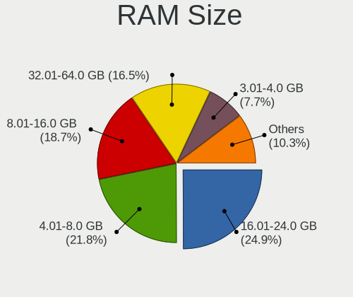
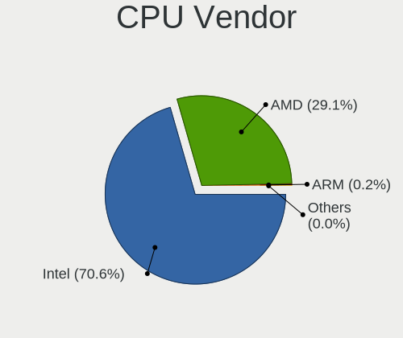
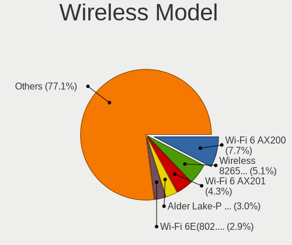
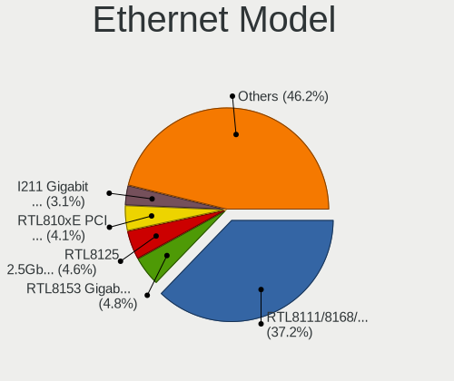
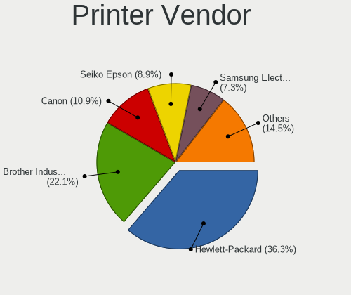

Fedora - Tested Hardware & Statistics
-------------------------------------

A project to collect tested hardware configurations for Fedora.

Anyone can contribute to this report by the [hw-probe](https://github.com/linuxhw/hw-probe) tool:

    sudo -E hw-probe -all -upload

Please contribute! Especially if your hardware is rare.

This is a report for all computer types. See also reports for [desktops](/Dist/Fedora/Desktop/README.md) and [notebooks](/Dist/Fedora/Notebook/README.md).

Contents
--------

* [ Test Cases ](#test-cases)

* [ System ](#system)
  - [ OS                       ](#os)
  - [ OS Family                ](#os-family)
  - [ Kernel                   ](#kernel)
  - [ Kernel Family            ](#kernel-family)
  - [ Kernel Major Ver.        ](#kernel-major-ver)
  - [ Arch                     ](#arch)
  - [ DE                       ](#de)
  - [ Display Server           ](#display-server)
  - [ Display Manager          ](#display-manager)
  - [ OS Lang                  ](#os-lang)
  - [ Boot Mode                ](#boot-mode)
  - [ Filesystem               ](#filesystem)
  - [ Part. scheme             ](#part-scheme)
  - [ Dual Boot with Linux/BSD ](#dual-boot-with-linuxbsd)
  - [ Dual Boot (Win)          ](#dual-boot-win)

* [ Board ](#board)
  - [ Vendor                   ](#vendor)
  - [ Model                    ](#model)
  - [ Model Family             ](#model-family)
  - [ MFG Year                 ](#mfg-year)
  - [ Form Factor              ](#form-factor)
  - [ Secure Boot              ](#secure-boot)
  - [ Coreboot                 ](#coreboot)
  - [ RAM Size                 ](#ram-size)
  - [ RAM Used                 ](#ram-used)
  - [ Total Drives             ](#total-drives)
  - [ Has CD-ROM               ](#has-cd-rom)
  - [ Has Ethernet             ](#has-ethernet)
  - [ Has WiFi                 ](#has-wifi)
  - [ Has Bluetooth            ](#has-bluetooth)

* [ Location ](#location)
  - [ Country                  ](#country)
  - [ City                     ](#city)

* [ Drives ](#drives)
  - [ Drive Vendor             ](#drive-vendor)
  - [ Drive Model              ](#drive-model)
  - [ HDD Vendor               ](#hdd-vendor)
  - [ SSD Vendor               ](#ssd-vendor)
  - [ Drive Kind               ](#drive-kind)
  - [ Drive Connector          ](#drive-connector)
  - [ Drive Size               ](#drive-size)
  - [ Space Total              ](#space-total)
  - [ Space Used               ](#space-used)
  - [ Malfunc. Drives          ](#malfunc-drives)
  - [ Malfunc. Drive Vendor    ](#malfunc-drive-vendor)
  - [ Malfunc. HDD Vendor      ](#malfunc-hdd-vendor)
  - [ Malfunc. Drive Kind      ](#malfunc-drive-kind)
  - [ Failed Drives            ](#failed-drives)
  - [ Failed Drive Vendor      ](#failed-drive-vendor)
  - [ Drive Status             ](#drive-status)

* [ Storage controller ](#storage-controller)
  - [ Storage Vendor           ](#storage-vendor)
  - [ Storage Model            ](#storage-model)
  - [ Storage Kind             ](#storage-kind)

* [ Processor ](#processor)
  - [ CPU Vendor               ](#cpu-vendor)
  - [ CPU Model                ](#cpu-model)
  - [ CPU Model Family         ](#cpu-model-family)
  - [ CPU Cores                ](#cpu-cores)
  - [ CPU Sockets              ](#cpu-sockets)
  - [ CPU Threads              ](#cpu-threads)
  - [ CPU Op-Modes             ](#cpu-op-modes)
  - [ CPU Microcode            ](#cpu-microcode)
  - [ CPU Microarch            ](#cpu-microarch)

* [ Graphics ](#graphics)
  - [ GPU Vendor               ](#gpu-vendor)
  - [ GPU Model                ](#gpu-model)
  - [ GPU Combo                ](#gpu-combo)
  - [ GPU Driver               ](#gpu-driver)
  - [ GPU Memory               ](#gpu-memory)

* [ Monitor ](#monitor)
  - [ Monitor Vendor           ](#monitor-vendor)
  - [ Monitor Model            ](#monitor-model)
  - [ Monitor Resolution       ](#monitor-resolution)
  - [ Monitor Diagonal         ](#monitor-diagonal)
  - [ Monitor Width            ](#monitor-width)
  - [ Aspect Ratio             ](#aspect-ratio)
  - [ Monitor Area             ](#monitor-area)
  - [ Pixel Density            ](#pixel-density)
  - [ Multiple Monitors        ](#multiple-monitors)

* [ Network ](#network)
  - [ Net Controller Vendor    ](#net-controller-vendor)
  - [ Net Controller Model     ](#net-controller-model)
  - [ Wireless Vendor          ](#wireless-vendor)
  - [ Wireless Model           ](#wireless-model)
  - [ Ethernet Vendor          ](#ethernet-vendor)
  - [ Ethernet Model           ](#ethernet-model)
  - [ Net Controller Kind      ](#net-controller-kind)
  - [ Used Controller          ](#used-controller)
  - [ NICs                     ](#nics)
  - [ IPv6                     ](#ipv6)

* [ Bluetooth ](#bluetooth)
  - [ Bluetooth Vendor         ](#bluetooth-vendor)
  - [ Bluetooth Model          ](#bluetooth-model)

* [ Sound ](#sound)
  - [ Sound Vendor             ](#sound-vendor)
  - [ Sound Model              ](#sound-model)

* [ Memory ](#memory)
  - [ Memory Vendor            ](#memory-vendor)
  - [ Memory Model             ](#memory-model)
  - [ Memory Kind              ](#memory-kind)
  - [ Memory Form Factor       ](#memory-form-factor)
  - [ Memory Size              ](#memory-size)
  - [ Memory Speed             ](#memory-speed)

* [ Printers & scanners ](#printers--scanners)
  - [ Printer Vendor           ](#printer-vendor)
  - [ Printer Model            ](#printer-model)
  - [ Scanner Vendor           ](#scanner-vendor)
  - [ Scanner Model            ](#scanner-model)

* [ Camera ](#camera)
  - [ Camera Vendor            ](#camera-vendor)
  - [ Camera Model             ](#camera-model)

* [ Security ](#security)
  - [ Fingerprint Vendor       ](#fingerprint-vendor)
  - [ Fingerprint Model        ](#fingerprint-model)
  - [ Chipcard Vendor          ](#chipcard-vendor)
  - [ Chipcard Model           ](#chipcard-model)

* [ Unsupported ](#unsupported)
  - [ Unsupported Devices      ](#unsupported-devices)
  - [ Unsupported Device Types ](#unsupported-device-types)

Test Cases
----------

Total: 14769

| Vendor        | Model                       | Form-Factor | Probe                                                      | Date         |
|---------------|-----------------------------|-------------|------------------------------------------------------------|--------------|
| Lenovo        | ThinkPad X390 20Q00051GE    | Notebook    | [5b3d1b750d](https://linux-hardware.org/?probe=5b3d1b750d) | Dec 31, 2022 |
| Valve         | Jupiter                     | Notebook    | [c0fb48bccb](https://linux-hardware.org/?probe=c0fb48bccb) | Dec 31, 2022 |
| System76      | Oryx Pro                    | Notebook    | [0d65e57758](https://linux-hardware.org/?probe=0d65e57758) | Dec 31, 2022 |
| Lenovo        | ThinkPad X390 20Q00051GE    | Notebook    | [775096be09](https://linux-hardware.org/?probe=775096be09) | Dec 31, 2022 |
| Lenovo        | ThinkPad T14 Gen 3 21AH0... | Notebook    | [322cf5484d](https://linux-hardware.org/?probe=322cf5484d) | Dec 31, 2022 |
| ASUSTek       | ROG STRIX X570-E GAMING     | Desktop     | [f16b55ea54](https://linux-hardware.org/?probe=f16b55ea54) | Dec 31, 2022 |
| Lenovo        | ThinkPad E15 Gen 3 20YHS... | Notebook    | [5fbe1632b0](https://linux-hardware.org/?probe=5fbe1632b0) | Dec 31, 2022 |
| Lenovo        | ThinkPad E15 Gen 3 20YHS... | Notebook    | [5a479fed95](https://linux-hardware.org/?probe=5a479fed95) | Dec 31, 2022 |
| Shuttle       | SH570                       | Desktop     | [09994766ed](https://linux-hardware.org/?probe=09994766ed) | Dec 31, 2022 |
| Shuttle       | SH570                       | Desktop     | [f4d5ef752c](https://linux-hardware.org/?probe=f4d5ef752c) | Dec 31, 2022 |
| ASRock        | A320M-DVS R4.0              | Desktop     | [f82bf510be](https://linux-hardware.org/?probe=f82bf510be) | Dec 31, 2022 |
| Lenovo        | ThinkPad T14 Gen 3 21AH0... | Notebook    | [591d985e85](https://linux-hardware.org/?probe=591d985e85) | Dec 31, 2022 |
| MSI           | X99A RAIDER                 | Desktop     | [8582096251](https://linux-hardware.org/?probe=8582096251) | Dec 31, 2022 |
| ASRock        | FM2A88X Extreme6+           | Desktop     | [c45e0f54fd](https://linux-hardware.org/?probe=c45e0f54fd) | Dec 31, 2022 |
| MAXSUN        | MS-TZZ A320M.2-VH           | Desktop     | [8f06578f10](https://linux-hardware.org/?probe=8f06578f10) | Dec 31, 2022 |
| Shuttle       | SH570                       | Desktop     | [2d7f57de8f](https://linux-hardware.org/?probe=2d7f57de8f) | Dec 31, 2022 |
| MSI           | MPG X570 GAMING PRO CARB... | Desktop     | [1347eaedb9](https://linux-hardware.org/?probe=1347eaedb9) | Dec 31, 2022 |
| ASRock        | X79 Extreme6                | Desktop     | [5ea31811b4](https://linux-hardware.org/?probe=5ea31811b4) | Dec 30, 2022 |
| HP            | Pavilion dv6700             | Notebook    | [4b3b106bee](https://linux-hardware.org/?probe=4b3b106bee) | Dec 30, 2022 |
| MSI           | H510M-A PRO                 | Desktop     | [4dba3b7c55](https://linux-hardware.org/?probe=4dba3b7c55) | Dec 30, 2022 |
| MACHENIKE     | MACHCREATOR-16              | Notebook    | [f7ed4a6609](https://linux-hardware.org/?probe=f7ed4a6609) | Dec 30, 2022 |
| Dell          | Inspiron 3421               | Notebook    | [d2cd50a2a6](https://linux-hardware.org/?probe=d2cd50a2a6) | Dec 30, 2022 |
| Timi          | A35S                        | Notebook    | [c62c9ae956](https://linux-hardware.org/?probe=c62c9ae956) | Dec 30, 2022 |
| Dell          | Inspiron 3421               | Notebook    | [ae7d821823](https://linux-hardware.org/?probe=ae7d821823) | Dec 30, 2022 |
| Dell          | XPS 15 9520                 | Notebook    | [19b4bfd852](https://linux-hardware.org/?probe=19b4bfd852) | Dec 30, 2022 |
| HUAWEI        | BOHK-WAX9X                  | Notebook    | [68b3b51892](https://linux-hardware.org/?probe=68b3b51892) | Dec 30, 2022 |
| ASUSTek       | PRIME X670-P WIFI           | Desktop     | [498c8c83e2](https://linux-hardware.org/?probe=498c8c83e2) | Dec 30, 2022 |
| ASRock        | B450M Pro4                  | Desktop     | [4393041949](https://linux-hardware.org/?probe=4393041949) | Dec 30, 2022 |
| Gigabyte      | Z390 UD                     | Desktop     | [70dc568eae](https://linux-hardware.org/?probe=70dc568eae) | Dec 30, 2022 |
| MSI           | GP72MVR 7RFX                | Notebook    | [cefedef93c](https://linux-hardware.org/?probe=cefedef93c) | Dec 30, 2022 |
| MSI           | Stealth GS66 12UGS          | Notebook    | [da812c8fa2](https://linux-hardware.org/?probe=da812c8fa2) | Dec 30, 2022 |
| Lenovo        | Z70-80 80FG                 | Notebook    | [16419f6991](https://linux-hardware.org/?probe=16419f6991) | Dec 30, 2022 |
| Lenovo        | Z70-80 80FG                 | Notebook    | [4386242be1](https://linux-hardware.org/?probe=4386242be1) | Dec 30, 2022 |
| Intel         | NUC8BEB J72688-308          | Mini pc     | [b4a7d759f7](https://linux-hardware.org/?probe=b4a7d759f7) | Dec 30, 2022 |
| Intel         | LADPNVMO AAE76523-300       | Desktop     | [4e6065532f](https://linux-hardware.org/?probe=4e6065532f) | Dec 30, 2022 |
| Lenovo        | ThinkPad P15v Gen 1 20TQ... | Notebook    | [770c5eee84](https://linux-hardware.org/?probe=770c5eee84) | Dec 30, 2022 |
| Dell          | XPS 15 9570                 | Notebook    | [cc31efb32d](https://linux-hardware.org/?probe=cc31efb32d) | Dec 30, 2022 |
| ASRock        | FM2A88X Extreme6+           | Desktop     | [8289d108fb](https://linux-hardware.org/?probe=8289d108fb) | Dec 30, 2022 |
| MSI           | X99A RAIDER                 | Desktop     | [3b0d4e8973](https://linux-hardware.org/?probe=3b0d4e8973) | Dec 30, 2022 |
| ASUSTek       | Z87-PRO                     | Desktop     | [eafab9edba](https://linux-hardware.org/?probe=eafab9edba) | Dec 30, 2022 |
| Intel         | NUC8BEB J72688-308          | Mini pc     | [d3daa756b4](https://linux-hardware.org/?probe=d3daa756b4) | Dec 30, 2022 |
| MSI           | MAG B650 TOMAHAWK WIFI      | Desktop     | [bdc5158ffb](https://linux-hardware.org/?probe=bdc5158ffb) | Dec 29, 2022 |
| HP            | Spectre x360 2-in-1 Lapt... | Convertible | [3303908896](https://linux-hardware.org/?probe=3303908896) | Dec 29, 2022 |
| Dell          | Inspiron N4050              | Notebook    | [b34f09894d](https://linux-hardware.org/?probe=b34f09894d) | Dec 29, 2022 |
| HP            | ENVY x360 Convertible 15... | Convertible | [51f9de5f53](https://linux-hardware.org/?probe=51f9de5f53) | Dec 29, 2022 |
| Lenovo        | IdeaPad 330-15IKB 81DE      | Notebook    | [ed5315b768](https://linux-hardware.org/?probe=ed5315b768) | Dec 29, 2022 |
| Dell          | 0KRC95 A02                  | Desktop     | [4cf9d40c0d](https://linux-hardware.org/?probe=4cf9d40c0d) | Dec 29, 2022 |
| MACHENIKE     | MACHCREATOR-16              | Notebook    | [3c627bc707](https://linux-hardware.org/?probe=3c627bc707) | Dec 29, 2022 |
| MACHENIKE     | MACHCREATOR-16              | Notebook    | [b246257695](https://linux-hardware.org/?probe=b246257695) | Dec 29, 2022 |
| HP            | Stream Notebook PC 13       | Notebook    | [2154a332b0](https://linux-hardware.org/?probe=2154a332b0) | Dec 29, 2022 |
| Dell          | 0KRC95 A02                  | Desktop     | [7e53808767](https://linux-hardware.org/?probe=7e53808767) | Dec 29, 2022 |
| Lenovo        | Yoga Slim 7 Pro 16ACH6 8... | Notebook    | [1c46a3fdd3](https://linux-hardware.org/?probe=1c46a3fdd3) | Dec 29, 2022 |
| MSI           | Modern 15 A5M               | Notebook    | [1e7182cb70](https://linux-hardware.org/?probe=1e7182cb70) | Dec 29, 2022 |
| HP            | ZBook Fury 16 G9 Mobile ... | Notebook    | [6c67e1435e](https://linux-hardware.org/?probe=6c67e1435e) | Dec 29, 2022 |
| ASRock        | FM2A88X Extreme6+           | Desktop     | [12c052156c](https://linux-hardware.org/?probe=12c052156c) | Dec 29, 2022 |
| Lenovo        | ThinkPad T480 20L5001DUS    | Notebook    | [51bb19bbf2](https://linux-hardware.org/?probe=51bb19bbf2) | Dec 29, 2022 |
| MSI           | X99A RAIDER                 | Desktop     | [daf7777113](https://linux-hardware.org/?probe=daf7777113) | Dec 29, 2022 |
| Lenovo        | ThinkPad T15 Gen 1 20S7S... | Notebook    | [74f8dcfbb4](https://linux-hardware.org/?probe=74f8dcfbb4) | Dec 29, 2022 |
| Schenker      | VISION 16 Pro (L22)         | Notebook    | [bbd6e1daf5](https://linux-hardware.org/?probe=bbd6e1daf5) | Dec 29, 2022 |
| Acer          | Predator PH315-53           | Notebook    | [d5d0e740c1](https://linux-hardware.org/?probe=d5d0e740c1) | Dec 29, 2022 |
| Schenker      | VISION 16 Pro (L22)         | Notebook    | [2412713729](https://linux-hardware.org/?probe=2412713729) | Dec 29, 2022 |
| ASUSTek       | M5A78L/USB3                 | Desktop     | [b89e7eb1c9](https://linux-hardware.org/?probe=b89e7eb1c9) | Dec 28, 2022 |
| Dell          | G5 5590                     | Notebook    | [58bd69f40b](https://linux-hardware.org/?probe=58bd69f40b) | Dec 28, 2022 |
| Lenovo        | ThinkPad T14 Gen 3 21AH0... | Notebook    | [8901206dd0](https://linux-hardware.org/?probe=8901206dd0) | Dec 28, 2022 |
| Dell          | Inspiron 5458               | Notebook    | [269d455191](https://linux-hardware.org/?probe=269d455191) | Dec 28, 2022 |
| HP            | ENVY x360 Convertible 15... | Convertible | [47f95e17c5](https://linux-hardware.org/?probe=47f95e17c5) | Dec 28, 2022 |
| HP            | ProBook 440 14 inch G9 N... | Notebook    | [e23c23e61f](https://linux-hardware.org/?probe=e23c23e61f) | Dec 28, 2022 |
| HP            | ProBook 440 14 inch G9 N... | Notebook    | [5c4856e5c8](https://linux-hardware.org/?probe=5c4856e5c8) | Dec 28, 2022 |
| Lenovo        | IdeaPad L3 15ITL6 82HL      | Notebook    | [0852995abb](https://linux-hardware.org/?probe=0852995abb) | Dec 28, 2022 |
| Intel         | NUC10i7FNB K61360-306       | Mini pc     | [6e3a112190](https://linux-hardware.org/?probe=6e3a112190) | Dec 28, 2022 |
| ASUSTek       | ROG STRIX B450-F GAMING     | Desktop     | [24b822291e](https://linux-hardware.org/?probe=24b822291e) | Dec 28, 2022 |
| Lenovo        | IdeaPad 330-14IGM 81D0      | Notebook    | [e12c24fd74](https://linux-hardware.org/?probe=e12c24fd74) | Dec 28, 2022 |
| Gigabyte      | B365M DS3H                  | Desktop     | [0dc3c192fd](https://linux-hardware.org/?probe=0dc3c192fd) | Dec 28, 2022 |
| Google        | Voxel rev3                  | Notebook    | [430244f188](https://linux-hardware.org/?probe=430244f188) | Dec 28, 2022 |
| HP            | ProBook 440 G6              | Notebook    | [6240bc3677](https://linux-hardware.org/?probe=6240bc3677) | Dec 28, 2022 |
| HP            | ProBook 440 G6              | Notebook    | [f5689c6edc](https://linux-hardware.org/?probe=f5689c6edc) | Dec 28, 2022 |
| BESSTAR Te... | F6BFC                       | Desktop     | [7c6adb6279](https://linux-hardware.org/?probe=7c6adb6279) | Dec 28, 2022 |
| Dell          | 0N4YC8 A00                  | Desktop     | [fc766b2a1b](https://linux-hardware.org/?probe=fc766b2a1b) | Dec 28, 2022 |
| BESSTAR Te... | F6BFC                       | Desktop     | [59b38f9b63](https://linux-hardware.org/?probe=59b38f9b63) | Dec 28, 2022 |
| Dell          | Inspiron 16 5625            | Notebook    | [dbc2d2fc6f](https://linux-hardware.org/?probe=dbc2d2fc6f) | Dec 28, 2022 |
| HUAWEI        | HLYL-WXX9                   | Notebook    | [790b3dcdde](https://linux-hardware.org/?probe=790b3dcdde) | Dec 28, 2022 |
| ASUSTek       | PRIME Z790-P WIFI           | Desktop     | [7bb247e453](https://linux-hardware.org/?probe=7bb247e453) | Dec 28, 2022 |
| ASUSTek       | ASUS TUF Gaming F15 FX50... | Notebook    | [ad33bb0d6f](https://linux-hardware.org/?probe=ad33bb0d6f) | Dec 28, 2022 |
| pine64,pin... | Pinebook Pro                | Soc         | [931d20e8ae](https://linux-hardware.org/?probe=931d20e8ae) | Dec 28, 2022 |
| Gigabyte      | B365M D2V                   | Desktop     | [93f7c010a2](https://linux-hardware.org/?probe=93f7c010a2) | Dec 28, 2022 |
| HP            | G62                         | Notebook    | [05ad917600](https://linux-hardware.org/?probe=05ad917600) | Dec 28, 2022 |
| ASRock        | FM2A88X Extreme6+           | Desktop     | [f5ac2a0028](https://linux-hardware.org/?probe=f5ac2a0028) | Dec 28, 2022 |
| MSI           | X99A RAIDER                 | Desktop     | [2d572d06d7](https://linux-hardware.org/?probe=2d572d06d7) | Dec 28, 2022 |
| ASUSTek       | ROG Zephyrus G14 GA401IU... | Notebook    | [d1f63174e4](https://linux-hardware.org/?probe=d1f63174e4) | Dec 28, 2022 |
| HUAWEI        | BOM-WXX9                    | Notebook    | [826a683b58](https://linux-hardware.org/?probe=826a683b58) | Dec 28, 2022 |
| ASUSTek       | ROG Strix G513QE_G513QE     | Notebook    | [00a92c3818](https://linux-hardware.org/?probe=00a92c3818) | Dec 28, 2022 |
| MSI           | Z97 GAMING 3                | Desktop     | [7aab4546f6](https://linux-hardware.org/?probe=7aab4546f6) | Dec 28, 2022 |
| ASRock        | Z370M-ITX/ac                | Desktop     | [f87fbed6a1](https://linux-hardware.org/?probe=f87fbed6a1) | Dec 28, 2022 |
| ASUSTek       | ROG Zephyrus G14 GA401IU... | Notebook    | [6eaa690ff2](https://linux-hardware.org/?probe=6eaa690ff2) | Dec 28, 2022 |
| ASUSTek       | ZenBook UX363EA_UX363EA     | Convertible | [56e25a5805](https://linux-hardware.org/?probe=56e25a5805) | Dec 28, 2022 |
| Gigabyte      | B650I AORUS ULTRA           | Desktop     | [3c25f43c23](https://linux-hardware.org/?probe=3c25f43c23) | Dec 28, 2022 |
| Lenovo        | ThinkPad E15 Gen 2 20T80... | Notebook    | [538bf2bb33](https://linux-hardware.org/?probe=538bf2bb33) | Dec 28, 2022 |
| MSI           | GL63 8RC                    | Notebook    | [0b973e252f](https://linux-hardware.org/?probe=0b973e252f) | Dec 27, 2022 |
| Lenovo        | ThinkBook 15-IIL 20SM       | Notebook    | [d579ff34ee](https://linux-hardware.org/?probe=d579ff34ee) | Dec 27, 2022 |
| Itautec       | ST 4265                     | Desktop     | [38e4a07f9a](https://linux-hardware.org/?probe=38e4a07f9a) | Dec 27, 2022 |
| ASUSTek       | TUF Gaming B550-PLUS        | Desktop     | [f2751df7ec](https://linux-hardware.org/?probe=f2751df7ec) | Dec 27, 2022 |
| MSI           | Z390-A PRO                  | Desktop     | [e2feef912f](https://linux-hardware.org/?probe=e2feef912f) | Dec 27, 2022 |
| ASUSTek       | ROG Strix G513QY_G513QY     | Notebook    | [cedce58f23](https://linux-hardware.org/?probe=cedce58f23) | Dec 27, 2022 |
| Dell          | XPS 13 9365                 | Convertible | [4eda9a1749](https://linux-hardware.org/?probe=4eda9a1749) | Dec 27, 2022 |
| Dell          | Inspiron 15 3525            | Notebook    | [64a70af984](https://linux-hardware.org/?probe=64a70af984) | Dec 27, 2022 |
| ASUSTek       | ROG Strix G513QY_G513QY     | Notebook    | [0e063e5fd5](https://linux-hardware.org/?probe=0e063e5fd5) | Dec 27, 2022 |
| ASUSTek       | ROG STRIX X570-I GAMING     | Desktop     | [731f916db1](https://linux-hardware.org/?probe=731f916db1) | Dec 27, 2022 |
| ASRock        | AD2700-ITX                  | Desktop     | [d4fff49f31](https://linux-hardware.org/?probe=d4fff49f31) | Dec 27, 2022 |
| HP            | Laptop 15-dy5xxx            | Notebook    | [d7daff3ed1](https://linux-hardware.org/?probe=d7daff3ed1) | Dec 27, 2022 |
| Timi          | RedmiBook 15                | Notebook    | [cf38b14bc5](https://linux-hardware.org/?probe=cf38b14bc5) | Dec 27, 2022 |
| Lenovo        | ThinkPad T14 Gen 3 21AH0... | Notebook    | [e41c8ca4ee](https://linux-hardware.org/?probe=e41c8ca4ee) | Dec 27, 2022 |
| Dell          | Latitude E7440              | Notebook    | [f2c052dde9](https://linux-hardware.org/?probe=f2c052dde9) | Dec 27, 2022 |
| Dell          | Inspiron 15-3567            | Notebook    | [2f5381fa26](https://linux-hardware.org/?probe=2f5381fa26) | Dec 26, 2022 |
| Itautec       | ST 4265                     | Desktop     | [8323542129](https://linux-hardware.org/?probe=8323542129) | Dec 26, 2022 |
| HP            | ProBook 450 G7              | Notebook    | [dfedb566ff](https://linux-hardware.org/?probe=dfedb566ff) | Dec 26, 2022 |
| Lenovo        | G510 20238                  | Notebook    | [812d6eb07e](https://linux-hardware.org/?probe=812d6eb07e) | Dec 26, 2022 |
| Lenovo        | ThinkBook 16p Gen 2 20YM    | Notebook    | [c7babe827f](https://linux-hardware.org/?probe=c7babe827f) | Dec 26, 2022 |
| Dell          | Inspiron 3521               | Notebook    | [9d544fbcd4](https://linux-hardware.org/?probe=9d544fbcd4) | Dec 26, 2022 |
| Dell          | Inspiron 5458               | Notebook    | [4e393c7334](https://linux-hardware.org/?probe=4e393c7334) | Dec 26, 2022 |
| Lenovo        | ThinkPad X1 Extreme Gen ... | Notebook    | [ce352bf1b1](https://linux-hardware.org/?probe=ce352bf1b1) | Dec 26, 2022 |
| Acer          | Aspire A515-51              | Notebook    | [e763dd5dfe](https://linux-hardware.org/?probe=e763dd5dfe) | Dec 26, 2022 |
| Tactus        | GeoFlex 110                 | Convertible | [3c2a7f9115](https://linux-hardware.org/?probe=3c2a7f9115) | Dec 26, 2022 |
| MSI           | GT60                        | Notebook    | [3917ca13e3](https://linux-hardware.org/?probe=3917ca13e3) | Dec 26, 2022 |
| ASUSTek       | ASUS TUF Gaming F15 FX50... | Notebook    | [62869e3d8c](https://linux-hardware.org/?probe=62869e3d8c) | Dec 26, 2022 |
| Dell          | Inspiron 5759               | Notebook    | [d1938219e9](https://linux-hardware.org/?probe=d1938219e9) | Dec 26, 2022 |
| ASRock        | FM2A88X Extreme6+           | Desktop     | [8d1181c71b](https://linux-hardware.org/?probe=8d1181c71b) | Dec 26, 2022 |
| MSI           | X99A RAIDER                 | Desktop     | [cbe4c82d15](https://linux-hardware.org/?probe=cbe4c82d15) | Dec 26, 2022 |
| Dell          | Latitude 5580               | Notebook    | [72c0e42aeb](https://linux-hardware.org/?probe=72c0e42aeb) | Dec 26, 2022 |
| HP            | 3397                        | Desktop     | [c546bb007b](https://linux-hardware.org/?probe=c546bb007b) | Dec 26, 2022 |
| HP            | 3397                        | Desktop     | [4286520907](https://linux-hardware.org/?probe=4286520907) | Dec 26, 2022 |
| Acer          | Aspire A315-59              | Notebook    | [6625ce058f](https://linux-hardware.org/?probe=6625ce058f) | Dec 25, 2022 |
| HP            | Spectre x360 2-in-1 Lapt... | Convertible | [2df0678d78](https://linux-hardware.org/?probe=2df0678d78) | Dec 25, 2022 |
| HP            | ProBook 6465b               | Notebook    | [d0f5218f72](https://linux-hardware.org/?probe=d0f5218f72) | Dec 25, 2022 |
| ASUSTek       | K55VD                       | Notebook    | [52df2ba00b](https://linux-hardware.org/?probe=52df2ba00b) | Dec 25, 2022 |
| Lenovo        | ThinkBook 15p 20V3          | Notebook    | [5aa14f474e](https://linux-hardware.org/?probe=5aa14f474e) | Dec 25, 2022 |
| MSI           | MPG B550 GAMING PLUS        | Desktop     | [4c97c87b61](https://linux-hardware.org/?probe=4c97c87b61) | Dec 25, 2022 |
| ASUSTek       | TUF Gaming B560M-PLUS WI... | Desktop     | [8762b5f41f](https://linux-hardware.org/?probe=8762b5f41f) | Dec 25, 2022 |
| ASUSTek       | ROG STRIX X670E-F GAMING... | Desktop     | [628cefc78a](https://linux-hardware.org/?probe=628cefc78a) | Dec 25, 2022 |
| MSI           | Modern 14 B4MW              | Notebook    | [e9dbd838ec](https://linux-hardware.org/?probe=e9dbd838ec) | Dec 25, 2022 |
| ASUSTek       | ASUS TUF Gaming F15 FX50... | Notebook    | [fa7183c982](https://linux-hardware.org/?probe=fa7183c982) | Dec 25, 2022 |
| ASRock        | FM2A88X Extreme6+           | Desktop     | [b6def743ea](https://linux-hardware.org/?probe=b6def743ea) | Dec 25, 2022 |
| MSI           | X99A RAIDER                 | Desktop     | [8636b69474](https://linux-hardware.org/?probe=8636b69474) | Dec 25, 2022 |
| Gigabyte      | Z690 AORUS ULTRA            | Desktop     | [46705eb79f](https://linux-hardware.org/?probe=46705eb79f) | Dec 25, 2022 |
| Dell          | Inspiron 16 7620 2-in-1     | Convertible | [3d555f9bee](https://linux-hardware.org/?probe=3d555f9bee) | Dec 25, 2022 |
| ASUSTek       | ProArt Z690-CREATOR WIFI    | Desktop     | [04b76a7e78](https://linux-hardware.org/?probe=04b76a7e78) | Dec 24, 2022 |
| Dell          | XPS 15 9510                 | Notebook    | [6c809c224c](https://linux-hardware.org/?probe=6c809c224c) | Dec 24, 2022 |
| Dell          | Latitude 5510               | Notebook    | [68e4810231](https://linux-hardware.org/?probe=68e4810231) | Dec 24, 2022 |
| ASUSTek       | PRIME B450M-GAMING/BR       | Desktop     | [c7d8ce8f80](https://linux-hardware.org/?probe=c7d8ce8f80) | Dec 24, 2022 |
| HUAWEI        | CREM-WXX9                   | Notebook    | [a48a2f6362](https://linux-hardware.org/?probe=a48a2f6362) | Dec 24, 2022 |
| ASUSTek       | PRIME Z790-P WIFI           | Desktop     | [e853f645cf](https://linux-hardware.org/?probe=e853f645cf) | Dec 24, 2022 |
| Gigabyte      | GA-78LMT-USB3 SEx           | Desktop     | [82f8802857](https://linux-hardware.org/?probe=82f8802857) | Dec 24, 2022 |
| HP            | Pavilion g6                 | Notebook    | [71d7947da6](https://linux-hardware.org/?probe=71d7947da6) | Dec 24, 2022 |
| MSI           | Stealth 15M B12UE           | Notebook    | [a8e294154b](https://linux-hardware.org/?probe=a8e294154b) | Dec 24, 2022 |
| Lenovo        | MIIX 510-12IKB 80XE         | Tablet      | [d88bd74acf](https://linux-hardware.org/?probe=d88bd74acf) | Dec 24, 2022 |
| MSI           | Z270M MORTAR                | Desktop     | [70564a2846](https://linux-hardware.org/?probe=70564a2846) | Dec 24, 2022 |
| Lenovo        | ThinkPad T470s 20HGS0AY0... | Notebook    | [28e67f37bc](https://linux-hardware.org/?probe=28e67f37bc) | Dec 24, 2022 |
| MSI           | MAG B650 TOMAHAWK WIFI      | Desktop     | [bf8f02ac85](https://linux-hardware.org/?probe=bf8f02ac85) | Dec 24, 2022 |
| ASRock        | FM2A88X Extreme6+           | Desktop     | [f5fa069144](https://linux-hardware.org/?probe=f5fa069144) | Dec 24, 2022 |
| MSI           | X99A RAIDER                 | Desktop     | [a375cc62c7](https://linux-hardware.org/?probe=a375cc62c7) | Dec 24, 2022 |
| Acer          | Aspire A514-54              | Notebook    | [ea57f4aa3a](https://linux-hardware.org/?probe=ea57f4aa3a) | Dec 24, 2022 |
| Samsung       | 550XBE/350XBE               | Notebook    | [4ea620705d](https://linux-hardware.org/?probe=4ea620705d) | Dec 24, 2022 |
| Gigabyte      | Z690 AORUS ULTRA            | Desktop     | [926850a516](https://linux-hardware.org/?probe=926850a516) | Dec 24, 2022 |
| Toshiba       | Satellite C75D-B            | Notebook    | [04282775ba](https://linux-hardware.org/?probe=04282775ba) | Dec 24, 2022 |
| Dell          | Latitude 5420               | Notebook    | [201e81d0ed](https://linux-hardware.org/?probe=201e81d0ed) | Dec 23, 2022 |
| Dell          | Latitude 5420               | Notebook    | [9fd9875465](https://linux-hardware.org/?probe=9fd9875465) | Dec 23, 2022 |
| HUAWEI        | NBLK-WAX9X                  | Notebook    | [f114731a78](https://linux-hardware.org/?probe=f114731a78) | Dec 23, 2022 |
| ASUSTek       | X750JN                      | Notebook    | [d933b1a80b](https://linux-hardware.org/?probe=d933b1a80b) | Dec 23, 2022 |
| Toshiba       | Satellite C850-C5K          | Notebook    | [a67d24c9f9](https://linux-hardware.org/?probe=a67d24c9f9) | Dec 23, 2022 |
| Samsung       | 300E4A/300E5A/300E7A/343... | Notebook    | [6b2cd55178](https://linux-hardware.org/?probe=6b2cd55178) | Dec 23, 2022 |
| Jooyon Tec... | J6BF                        | Notebook    | [dabe200abe](https://linux-hardware.org/?probe=dabe200abe) | Dec 23, 2022 |
| ASUSTek       | ASUS EXPERTBOOK B3302CEA... | Notebook    | [756390ae0c](https://linux-hardware.org/?probe=756390ae0c) | Dec 23, 2022 |
| ASUSTek       | ASUS EXPERTBOOK B3302CEA... | Notebook    | [c2dd56664a](https://linux-hardware.org/?probe=c2dd56664a) | Dec 23, 2022 |
| ASUSTek       | VivoBook_ASUSLaptop X513... | Notebook    | [627186e9e8](https://linux-hardware.org/?probe=627186e9e8) | Dec 23, 2022 |
| ASUSTek       | ASUS TUF Gaming F15 FX50... | Notebook    | [fe159bf4ca](https://linux-hardware.org/?probe=fe159bf4ca) | Dec 23, 2022 |
| Samsung       | 730QED                      | Convertible | [0c36621efa](https://linux-hardware.org/?probe=0c36621efa) | Dec 23, 2022 |
| ASRock        | FM2A88X Extreme6+           | Desktop     | [88df914367](https://linux-hardware.org/?probe=88df914367) | Dec 23, 2022 |
| MSI           | X99A RAIDER                 | Desktop     | [c36553b2b8](https://linux-hardware.org/?probe=c36553b2b8) | Dec 23, 2022 |
| HUAWEI        | NBLB-WAX9N                  | Notebook    | [77e30fee83](https://linux-hardware.org/?probe=77e30fee83) | Dec 23, 2022 |
| Acer          | Aspire A515-57G             | Notebook    | [a208b5598e](https://linux-hardware.org/?probe=a208b5598e) | Dec 22, 2022 |
| Acer          | Aspire A515-57G             | Notebook    | [cccd3d01d7](https://linux-hardware.org/?probe=cccd3d01d7) | Dec 22, 2022 |
| ASUSTek       | B85-PLUS                    | Desktop     | [16b14098bf](https://linux-hardware.org/?probe=16b14098bf) | Dec 22, 2022 |
| Acer          | Aspire V5-571               | Notebook    | [b4de144f3e](https://linux-hardware.org/?probe=b4de144f3e) | Dec 22, 2022 |
| Lenovo        | Legion 5 15ACH6H 82JU       | Notebook    | [2505eabeaf](https://linux-hardware.org/?probe=2505eabeaf) | Dec 22, 2022 |
| ASUSTek       | ASUS TUF Gaming A15 FA50... | Notebook    | [677cb5b0b3](https://linux-hardware.org/?probe=677cb5b0b3) | Dec 22, 2022 |
| MSI           | Stealth 15M B12UE           | Notebook    | [65d1cc61ba](https://linux-hardware.org/?probe=65d1cc61ba) | Dec 22, 2022 |
| AZW           | GTR V01                     | Mini pc     | [7502622c61](https://linux-hardware.org/?probe=7502622c61) | Dec 22, 2022 |
| Acer          | Aspire A315-54              | Notebook    | [c603811f9a](https://linux-hardware.org/?probe=c603811f9a) | Dec 22, 2022 |
| Lenovo        | XiaoXinPro 16ACH 2021 82... | Notebook    | [2b25ab8790](https://linux-hardware.org/?probe=2b25ab8790) | Dec 22, 2022 |
| ASRock        | H470M Pro4                  | Desktop     | [b69ccc3353](https://linux-hardware.org/?probe=b69ccc3353) | Dec 22, 2022 |
| Gigabyte      | X570S I AORUS PRO AX        | Desktop     | [3f3c7b0e92](https://linux-hardware.org/?probe=3f3c7b0e92) | Dec 22, 2022 |
| ASRock        | FM2A88X Extreme6+           | Desktop     | [6eb006d2d4](https://linux-hardware.org/?probe=6eb006d2d4) | Dec 22, 2022 |
| MSI           | X99A RAIDER                 | Desktop     | [bfe7b1ec1d](https://linux-hardware.org/?probe=bfe7b1ec1d) | Dec 22, 2022 |
| GPD           | P3 MAX                      | Notebook    | [9069ed5580](https://linux-hardware.org/?probe=9069ed5580) | Dec 22, 2022 |
| ASUSTek       | Zenbook UM5302TA_UM5302T... | Notebook    | [6db25ba5ca](https://linux-hardware.org/?probe=6db25ba5ca) | Dec 22, 2022 |
| ASUSTek       | B85-PLUS                    | Desktop     | [cbad10e284](https://linux-hardware.org/?probe=cbad10e284) | Dec 21, 2022 |
| Lenovo        | ThinkPad X1 Carbon Gen 1... | Notebook    | [fb60e7984c](https://linux-hardware.org/?probe=fb60e7984c) | Dec 21, 2022 |
| ASUSTek       | X450CA                      | Notebook    | [5b793f14ff](https://linux-hardware.org/?probe=5b793f14ff) | Dec 21, 2022 |
| ASUSTek       | ASUS TUF Gaming F15 FX50... | Notebook    | [721bc5f662](https://linux-hardware.org/?probe=721bc5f662) | Dec 21, 2022 |
| MSI           | Stealth 15M B12UE           | Notebook    | [6f7a27c8c5](https://linux-hardware.org/?probe=6f7a27c8c5) | Dec 21, 2022 |
| Dell          | 0T10XW A02                  | Desktop     | [f39488c597](https://linux-hardware.org/?probe=f39488c597) | Dec 21, 2022 |
| Dell          | 0T10XW A02                  | Desktop     | [0243df6ce4](https://linux-hardware.org/?probe=0243df6ce4) | Dec 21, 2022 |
| Apple         | MacBookPro9,2               | Notebook    | [5bc62fc208](https://linux-hardware.org/?probe=5bc62fc208) | Dec 21, 2022 |
| MSI           | Stealth 15M B12UE           | Notebook    | [ce6c271622](https://linux-hardware.org/?probe=ce6c271622) | Dec 21, 2022 |
| HP            | Stream Notebook PC 13       | Notebook    | [9c88ffc394](https://linux-hardware.org/?probe=9c88ffc394) | Dec 21, 2022 |
| Positivo B... | VJFE41F11X-XXXXXX           | Notebook    | [77c9275988](https://linux-hardware.org/?probe=77c9275988) | Dec 21, 2022 |
| Lenovo        | ThinkPad T14 Gen 1 20UD0... | Notebook    | [47ac3ac319](https://linux-hardware.org/?probe=47ac3ac319) | Dec 21, 2022 |
| Lenovo        | ThinkPad E14 Gen 2 20TB0... | Notebook    | [ec20f98178](https://linux-hardware.org/?probe=ec20f98178) | Dec 21, 2022 |
| HP            | 8266                        | Desktop     | [321dbc66bf](https://linux-hardware.org/?probe=321dbc66bf) | Dec 21, 2022 |
| Dell          | Latitude 5520               | Notebook    | [203652b6dd](https://linux-hardware.org/?probe=203652b6dd) | Dec 21, 2022 |
| Lenovo        | ThinkPad E15 20RD0011RT     | Notebook    | [1f1c718c61](https://linux-hardware.org/?probe=1f1c718c61) | Dec 21, 2022 |
| Timi          | Mi NoteBook Pro             | Notebook    | [b5bbb4f410](https://linux-hardware.org/?probe=b5bbb4f410) | Dec 21, 2022 |
| MSI           | Modern 14 B4MW              | Notebook    | [2d446beedf](https://linux-hardware.org/?probe=2d446beedf) | Dec 21, 2022 |
| ASUSTek       | TUF Gaming Z590-PLUS WIF... | Desktop     | [8428e68855](https://linux-hardware.org/?probe=8428e68855) | Dec 21, 2022 |
| ASRock        | FM2A88X Extreme6+           | Desktop     | [bd7ed31b20](https://linux-hardware.org/?probe=bd7ed31b20) | Dec 21, 2022 |
| MSI           | X99A RAIDER                 | Desktop     | [3832e7e0af](https://linux-hardware.org/?probe=3832e7e0af) | Dec 21, 2022 |
| ASUSTek       | ASUS TUF Gaming F15 FX50... | Notebook    | [d9db7be046](https://linux-hardware.org/?probe=d9db7be046) | Dec 21, 2022 |
| ASUSTek       | ROG STRIX B550-F GAMING     | Desktop     | [cb70181c3a](https://linux-hardware.org/?probe=cb70181c3a) | Dec 21, 2022 |
| Dell          | Latitude 5521               | Notebook    | [6fcbfd9271](https://linux-hardware.org/?probe=6fcbfd9271) | Dec 21, 2022 |
| Dell          | 02YRK5 A02                  | Desktop     | [f5f6093483](https://linux-hardware.org/?probe=f5f6093483) | Dec 21, 2022 |
| Dell          | Latitude 3420               | Notebook    | [99d501d768](https://linux-hardware.org/?probe=99d501d768) | Dec 20, 2022 |
| Intel         | H81                         | Desktop     | [747dd5e27a](https://linux-hardware.org/?probe=747dd5e27a) | Dec 20, 2022 |
| ASRock        | Z790 Pro RS WiFi            | Desktop     | [d54c198ec8](https://linux-hardware.org/?probe=d54c198ec8) | Dec 20, 2022 |
| ASUSTek       | ASUS TUF Gaming F15 FX50... | Notebook    | [89b8982148](https://linux-hardware.org/?probe=89b8982148) | Dec 20, 2022 |
| ASUSTek       | ASUS TUF Gaming F15 FX50... | Notebook    | [082a1fb19e](https://linux-hardware.org/?probe=082a1fb19e) | Dec 20, 2022 |
| Positivo B... | VJFE41F11X-XXXXXX           | Notebook    | [383b0f3311](https://linux-hardware.org/?probe=383b0f3311) | Dec 20, 2022 |
| ASUSTek       | TUF Gaming B650M-PLUS       | Desktop     | [ef5cd85ef3](https://linux-hardware.org/?probe=ef5cd85ef3) | Dec 20, 2022 |
| Dell          | Inspiron 15 7000 Gaming     | Notebook    | [0d59e38c20](https://linux-hardware.org/?probe=0d59e38c20) | Dec 20, 2022 |
| HP            | ZBook 15                    | Notebook    | [a3bf671d64](https://linux-hardware.org/?probe=a3bf671d64) | Dec 20, 2022 |
| Lenovo        | IdeaPad 3 15ARE05 81W4      | Notebook    | [af14f0c425](https://linux-hardware.org/?probe=af14f0c425) | Dec 20, 2022 |
| Gigabyte      | GA-A75M-UD2H                | Desktop     | [f7e97a6c6c](https://linux-hardware.org/?probe=f7e97a6c6c) | Dec 20, 2022 |
| Lenovo        | IdeaPad 3 15ARE05 81W4      | Notebook    | [e7393fd2b7](https://linux-hardware.org/?probe=e7393fd2b7) | Dec 20, 2022 |
| Intel         | NUC7i3BNB J22859-303        | Mini pc     | [e04881408e](https://linux-hardware.org/?probe=e04881408e) | Dec 20, 2022 |
| Dell          | Vostro 5620                 | Notebook    | [005d388376](https://linux-hardware.org/?probe=005d388376) | Dec 20, 2022 |
| Intel         | NUC7i3BNB J22859-303        | Mini pc     | [dbcde72217](https://linux-hardware.org/?probe=dbcde72217) | Dec 20, 2022 |
| Acer          | Aspire A515-52              | Notebook    | [b052f8434a](https://linux-hardware.org/?probe=b052f8434a) | Dec 20, 2022 |
| Lenovo        | ThinkPad E15 20RD0011RT     | Notebook    | [bbfea042cd](https://linux-hardware.org/?probe=bbfea042cd) | Dec 20, 2022 |
| MSI           | X99A RAIDER                 | Desktop     | [8a7ee1147b](https://linux-hardware.org/?probe=8a7ee1147b) | Dec 20, 2022 |
| HP            | Pavilion dv6                | Notebook    | [8b0f82599c](https://linux-hardware.org/?probe=8b0f82599c) | Dec 20, 2022 |
| ASRock        | FM2A88X Extreme6+           | Desktop     | [9451dc3035](https://linux-hardware.org/?probe=9451dc3035) | Dec 20, 2022 |
| ASUSTek       | Zenbook UX5400EA_UX5400E... | Notebook    | [011d3e746d](https://linux-hardware.org/?probe=011d3e746d) | Dec 20, 2022 |
| ASUSTek       | TUF Gaming B660M-PLUS WI... | Desktop     | [60dbf09ee4](https://linux-hardware.org/?probe=60dbf09ee4) | Dec 20, 2022 |
| Gigabyte      | H61M-USB3V                  | Desktop     | [3161a64c4b](https://linux-hardware.org/?probe=3161a64c4b) | Dec 19, 2022 |
| ASUSTek       | Zenbook UP6502ZD_UP6502Z... | Convertible | [6044a618cf](https://linux-hardware.org/?probe=6044a618cf) | Dec 19, 2022 |
| ATOPNUC       | MA90                        | Mini pc     | [8c397c3784](https://linux-hardware.org/?probe=8c397c3784) | Dec 19, 2022 |
| ASUSTek       | VivoBook_ASUSLaptop X340... | Notebook    | [b30bf77d27](https://linux-hardware.org/?probe=b30bf77d27) | Dec 19, 2022 |
| Fanless Mi... | Rev GMLR1                   | Mini pc     | [57d06c0f37](https://linux-hardware.org/?probe=57d06c0f37) | Dec 19, 2022 |
| Lenovo        | ThinkPad T14s Gen 1 20T1... | Notebook    | [c67b4d2b31](https://linux-hardware.org/?probe=c67b4d2b31) | Dec 19, 2022 |
| HP            | OMEN by Laptop 16-c0xxx     | Notebook    | [9f5a91c628](https://linux-hardware.org/?probe=9f5a91c628) | Dec 19, 2022 |
| Sony          | SVE15133CNB                 | Notebook    | [a2bee3bb3f](https://linux-hardware.org/?probe=a2bee3bb3f) | Dec 19, 2022 |
| ASUSTek       | X556UJ                      | Notebook    | [256957850d](https://linux-hardware.org/?probe=256957850d) | Dec 19, 2022 |
| MSI           | GE63 Raider RGB 8RF         | Notebook    | [a85193c482](https://linux-hardware.org/?probe=a85193c482) | Dec 19, 2022 |
| ASUSTek       | ASUS TUF Gaming A15 FA50... | Notebook    | [714d2a6dea](https://linux-hardware.org/?probe=714d2a6dea) | Dec 19, 2022 |
| HP            | OMEN by Laptop 16-c0xxx     | Notebook    | [ab3b4786ea](https://linux-hardware.org/?probe=ab3b4786ea) | Dec 19, 2022 |
| Gigabyte      | B85M-D3V-A                  | Desktop     | [6a964b9d6b](https://linux-hardware.org/?probe=6a964b9d6b) | Dec 19, 2022 |
| Lenovo        | ThinkPad T470s W10DG 20J... | Notebook    | [856515e522](https://linux-hardware.org/?probe=856515e522) | Dec 19, 2022 |
| MSI           | Boston                      | Desktop     | [8587c9cf45](https://linux-hardware.org/?probe=8587c9cf45) | Dec 19, 2022 |
| Lenovo        | IdeaPad 510-15ISK 80SR      | Notebook    | [a5a207a46d](https://linux-hardware.org/?probe=a5a207a46d) | Dec 19, 2022 |
| Gigabyte      | X79-UP4                     | Desktop     | [900fd62aaf](https://linux-hardware.org/?probe=900fd62aaf) | Dec 19, 2022 |
| Gigabyte      | X79-UP4                     | Desktop     | [b34721e6cb](https://linux-hardware.org/?probe=b34721e6cb) | Dec 19, 2022 |
| MSI           | PS42 8RB                    | Notebook    | [42422af633](https://linux-hardware.org/?probe=42422af633) | Dec 19, 2022 |
| Fanless Mi... | Rev GMLR1                   | Mini pc     | [97d43c4ad3](https://linux-hardware.org/?probe=97d43c4ad3) | Dec 18, 2022 |
| MSI           | GL63 8RC                    | Notebook    | [6a5bc85513](https://linux-hardware.org/?probe=6a5bc85513) | Dec 18, 2022 |
| Gigabyte      | A520M DS3H                  | Desktop     | [4251c08b5d](https://linux-hardware.org/?probe=4251c08b5d) | Dec 18, 2022 |
| Dell          | 0KRC95 A02                  | Desktop     | [e7bb083869](https://linux-hardware.org/?probe=e7bb083869) | Dec 18, 2022 |
| MSI           | Z87M GAMING                 | Desktop     | [bf27014217](https://linux-hardware.org/?probe=bf27014217) | Dec 18, 2022 |
| Acer          | Swift SF114-32              | Notebook    | [757b666913](https://linux-hardware.org/?probe=757b666913) | Dec 18, 2022 |
| Lenovo        | ThinkBook 15 G3 ACL 21A4    | Notebook    | [23b255ed61](https://linux-hardware.org/?probe=23b255ed61) | Dec 18, 2022 |
| ASUSTek       | P8H77-V LE                  | Desktop     | [3f76e320c0](https://linux-hardware.org/?probe=3f76e320c0) | Dec 18, 2022 |
| Lenovo        | ThinkPad A485 20MVS0LG00    | Notebook    | [86c9426d80](https://linux-hardware.org/?probe=86c9426d80) | Dec 18, 2022 |
| Lenovo        | ThinkPad A485 20MVS0LG00    | Notebook    | [05fcf7302f](https://linux-hardware.org/?probe=05fcf7302f) | Dec 18, 2022 |
| Acer          | Aspire A315-31              | Notebook    | [e391c56a47](https://linux-hardware.org/?probe=e391c56a47) | Dec 18, 2022 |
| Lenovo        | ThinkPad X1 Tablet Gen 3... | Tablet      | [2b0d31db9d](https://linux-hardware.org/?probe=2b0d31db9d) | Dec 18, 2022 |
| Lenovo        | ThinkPad W550s 20E2000PG... | Notebook    | [938c10075a](https://linux-hardware.org/?probe=938c10075a) | Dec 18, 2022 |
| HP            | Laptop 15-da0xxx            | Notebook    | [b712a7bd77](https://linux-hardware.org/?probe=b712a7bd77) | Dec 18, 2022 |
| Gigabyte      | B360M D3H-CF                | Desktop     | [fed4383ac0](https://linux-hardware.org/?probe=fed4383ac0) | Dec 18, 2022 |
| MSI           | B550-A PRO                  | Desktop     | [53c582a7f6](https://linux-hardware.org/?probe=53c582a7f6) | Dec 18, 2022 |
| MSI           | X99A RAIDER                 | Desktop     | [b4d6964157](https://linux-hardware.org/?probe=b4d6964157) | Dec 18, 2022 |
| ASRock        | FM2A88X Extreme6+           | Desktop     | [561aa4411a](https://linux-hardware.org/?probe=561aa4411a) | Dec 18, 2022 |
| ASUSTek       | Zenbook UM5302TA_UM5302T... | Notebook    | [56e75d70fa](https://linux-hardware.org/?probe=56e75d70fa) | Dec 18, 2022 |
| ASUSTek       | PRIME B550M-K               | Desktop     | [0c496cdb01](https://linux-hardware.org/?probe=0c496cdb01) | Dec 17, 2022 |
| HP            | ProBook 450 G7              | Notebook    | [ad9bf6b390](https://linux-hardware.org/?probe=ad9bf6b390) | Dec 17, 2022 |
| Dell          | Inspiron 7720               | Notebook    | [0a7621cb40](https://linux-hardware.org/?probe=0a7621cb40) | Dec 17, 2022 |
| Lenovo        | ThinkPad X1 Extreme Gen ... | Notebook    | [c9cc617e08](https://linux-hardware.org/?probe=c9cc617e08) | Dec 17, 2022 |
| MSI           | A88XM-E35                   | Desktop     | [2e3cc90610](https://linux-hardware.org/?probe=2e3cc90610) | Dec 17, 2022 |
| Lenovo        | IdeaPad 510-15ISK 80SR      | Notebook    | [f047451b08](https://linux-hardware.org/?probe=f047451b08) | Dec 17, 2022 |
| Sony          | SVE15133CNB                 | Notebook    | [acca7c4697](https://linux-hardware.org/?probe=acca7c4697) | Dec 17, 2022 |
| Lenovo        | ThinkPad E14 Gen 3 20Y70... | Notebook    | [49969f1b81](https://linux-hardware.org/?probe=49969f1b81) | Dec 17, 2022 |
| Lenovo        | ThinkBook 15 G3 ACL 21A4    | Notebook    | [df49d0114f](https://linux-hardware.org/?probe=df49d0114f) | Dec 17, 2022 |
| Lenovo        | Legion 5 15ACH6H 82JU       | Notebook    | [c94cd1a926](https://linux-hardware.org/?probe=c94cd1a926) | Dec 17, 2022 |
| ASUSTek       | ASUS EXPERTBOOK B1400CEA... | Notebook    | [a481e4a590](https://linux-hardware.org/?probe=a481e4a590) | Dec 17, 2022 |
| ASUSTek       | ROG CROSSHAIR VIII IMPAC... | Desktop     | [3db1266e41](https://linux-hardware.org/?probe=3db1266e41) | Dec 17, 2022 |
| ASUSTek       | P8H77-M LE                  | Desktop     | [d9eba2d52f](https://linux-hardware.org/?probe=d9eba2d52f) | Dec 17, 2022 |
| GPD           | P2 MAX                      | Notebook    | [de5983ec37](https://linux-hardware.org/?probe=de5983ec37) | Dec 17, 2022 |
| ASUSTek       | X45C                        | Notebook    | [80377ba23f](https://linux-hardware.org/?probe=80377ba23f) | Dec 17, 2022 |
| Gigabyte      | J1900M-D2P                  | Desktop     | [26ecfabc95](https://linux-hardware.org/?probe=26ecfabc95) | Dec 17, 2022 |
| HP            | Pavilion Laptop 14-ce1xx... | Notebook    | [8d631bb590](https://linux-hardware.org/?probe=8d631bb590) | Dec 17, 2022 |
| Gigabyte      | X570 AORUS ELITE WIFI       | Desktop     | [6dddb93518](https://linux-hardware.org/?probe=6dddb93518) | Dec 17, 2022 |
| ASUSTek       | TUF Z270 MARK 2             | Desktop     | [1bb7d1bffe](https://linux-hardware.org/?probe=1bb7d1bffe) | Dec 17, 2022 |
| ASRock        | FM2A88X Extreme6+           | Desktop     | [88d55eced8](https://linux-hardware.org/?probe=88d55eced8) | Dec 17, 2022 |
| MSI           | X99A RAIDER                 | Desktop     | [be93cca77c](https://linux-hardware.org/?probe=be93cca77c) | Dec 17, 2022 |
| Dell          | Inspiron 3583               | Notebook    | [5629961182](https://linux-hardware.org/?probe=5629961182) | Dec 17, 2022 |
| HP            | ProBook 440 14 inch G9 N... | Notebook    | [5ab1c3b848](https://linux-hardware.org/?probe=5ab1c3b848) | Dec 17, 2022 |
| Lenovo        | IdeaPad 510-15ISK 80SR      | Notebook    | [645e7245d4](https://linux-hardware.org/?probe=645e7245d4) | Dec 17, 2022 |
| MSI           | A88XM-E35                   | Desktop     | [f0efaa3c30](https://linux-hardware.org/?probe=f0efaa3c30) | Dec 17, 2022 |
| ASUSTek       | PRIME H670-PLUS D4          | Desktop     | [54132f7285](https://linux-hardware.org/?probe=54132f7285) | Dec 17, 2022 |
| HP            | 82F2 A01                    | Desktop     | [859d719a2a](https://linux-hardware.org/?probe=859d719a2a) | Dec 16, 2022 |
| ASUSTek       | VivoBook_ASUSLaptop M540... | Notebook    | [2ba98da01d](https://linux-hardware.org/?probe=2ba98da01d) | Dec 16, 2022 |
| Gigabyte      | Z77MX-D3H                   | Desktop     | [50ba321b50](https://linux-hardware.org/?probe=50ba321b50) | Dec 16, 2022 |
| HUAWEI        | KLVL-WXX9                   | Notebook    | [a767e0fbf0](https://linux-hardware.org/?probe=a767e0fbf0) | Dec 16, 2022 |
| Intel         | NUC8BEB J72688-304          | Mini pc     | [86ab78d0be](https://linux-hardware.org/?probe=86ab78d0be) | Dec 16, 2022 |
| HP            | Laptop 14-cm0xxx            | Notebook    | [a5bdc5f3c9](https://linux-hardware.org/?probe=a5bdc5f3c9) | Dec 16, 2022 |
| Dell          | Vostro 5590                 | Notebook    | [3735674d3f](https://linux-hardware.org/?probe=3735674d3f) | Dec 16, 2022 |
| ASUSTek       | ROG STRIX Z490-F GAMING     | Desktop     | [f048f7fcdb](https://linux-hardware.org/?probe=f048f7fcdb) | Dec 16, 2022 |
| Lenovo        | IdeaPad 3 15ALC6 82KU       | Notebook    | [7c678e18cd](https://linux-hardware.org/?probe=7c678e18cd) | Dec 16, 2022 |
| Dell          | Inspiron 5566               | Notebook    | [ccfc358303](https://linux-hardware.org/?probe=ccfc358303) | Dec 16, 2022 |
| HP            | Pavilion x360 Convertibl... | Convertible | [9bfd668093](https://linux-hardware.org/?probe=9bfd668093) | Dec 16, 2022 |
| ASRock        | FM2A88X Extreme6+           | Desktop     | [04bbc083d7](https://linux-hardware.org/?probe=04bbc083d7) | Dec 16, 2022 |
| ASUSTek       | X550LD                      | Notebook    | [2960bdb195](https://linux-hardware.org/?probe=2960bdb195) | Dec 16, 2022 |
| Lenovo        | ThinkPad W530 243858U       | Notebook    | [9dc4fb1abb](https://linux-hardware.org/?probe=9dc4fb1abb) | Dec 16, 2022 |
| MSI           | X99A RAIDER                 | Desktop     | [9caae58821](https://linux-hardware.org/?probe=9caae58821) | Dec 16, 2022 |
| ASUSTek       | VivoBook_ASUSLaptop K350... | Notebook    | [955de558cb](https://linux-hardware.org/?probe=955de558cb) | Dec 16, 2022 |
| ASUSTek       | VivoBook_ASUSLaptop K350... | Notebook    | [e1d8403247](https://linux-hardware.org/?probe=e1d8403247) | Dec 16, 2022 |
| Dell          | XPS 15 9570                 | Notebook    | [ce6ac8ec7f](https://linux-hardware.org/?probe=ce6ac8ec7f) | Dec 16, 2022 |
| AZW           | GTR V01                     | Mini pc     | [bbf59c4c2a](https://linux-hardware.org/?probe=bbf59c4c2a) | Dec 16, 2022 |
| AZW           | GTR V01                     | Mini pc     | [33d60ebbbe](https://linux-hardware.org/?probe=33d60ebbbe) | Dec 16, 2022 |
| Dell          | XPS 13 9380                 | Notebook    | [719f489e01](https://linux-hardware.org/?probe=719f489e01) | Dec 15, 2022 |
| ASUSTek       | PRIME B550M-K               | Desktop     | [5148fddbd1](https://linux-hardware.org/?probe=5148fddbd1) | Dec 15, 2022 |
| ASUSTek       | PRIME B450M-K               | Desktop     | [a6dfbac9f9](https://linux-hardware.org/?probe=a6dfbac9f9) | Dec 15, 2022 |
| Dell          | Inspiron 7501               | Notebook    | [1749ece1b3](https://linux-hardware.org/?probe=1749ece1b3) | Dec 15, 2022 |
| Lenovo        | ThinkPad T14 Gen 3 21AH0... | Notebook    | [b8cc280665](https://linux-hardware.org/?probe=b8cc280665) | Dec 15, 2022 |
| MACHINIST     | X99-RS9 V2.0                | Desktop     | [83c2de0b09](https://linux-hardware.org/?probe=83c2de0b09) | Dec 15, 2022 |
| Intel         | NUC8BEB J72688-304          | Mini pc     | [75a24499f9](https://linux-hardware.org/?probe=75a24499f9) | Dec 15, 2022 |
| HP            | OMEN by Laptop 16-c0xxx     | Notebook    | [5e8318b8b8](https://linux-hardware.org/?probe=5e8318b8b8) | Dec 15, 2022 |
| HUAWEI        | KLVL-WXXW                   | Notebook    | [1dd0f2a71f](https://linux-hardware.org/?probe=1dd0f2a71f) | Dec 15, 2022 |
| HP            | OMEN by Laptop 16-c0xxx     | Notebook    | [d5c9abda1e](https://linux-hardware.org/?probe=d5c9abda1e) | Dec 15, 2022 |
| Lenovo        | ThinkPad P14s Gen 1 20Y1... | Notebook    | [85c38f0af3](https://linux-hardware.org/?probe=85c38f0af3) | Dec 15, 2022 |
| Lenovo        | 31900003 STD                | Desktop     | [81dea8d96e](https://linux-hardware.org/?probe=81dea8d96e) | Dec 15, 2022 |
| ASRock        | X670E Steel Legend          | Desktop     | [fec86201de](https://linux-hardware.org/?probe=fec86201de) | Dec 15, 2022 |
| MSI           | B550-A PRO B02              | Desktop     | [3a1ebe10f8](https://linux-hardware.org/?probe=3a1ebe10f8) | Dec 15, 2022 |
| ASRock        | FM2A88X Extreme6+           | Desktop     | [2e9fac9df4](https://linux-hardware.org/?probe=2e9fac9df4) | Dec 15, 2022 |
| MSI           | X99A RAIDER                 | Desktop     | [5a071587fb](https://linux-hardware.org/?probe=5a071587fb) | Dec 15, 2022 |
| ASUSTek       | ROG STRIX B450-F GAMING     | Desktop     | [572f0231a5](https://linux-hardware.org/?probe=572f0231a5) | Dec 15, 2022 |
| ASUSTek       | ROG STRIX B450-F GAMING     | Desktop     | [a0d17e1d50](https://linux-hardware.org/?probe=a0d17e1d50) | Dec 15, 2022 |
| Lenovo        | ThinkBook 15-IML 20RW       | Notebook    | [06d690e9fe](https://linux-hardware.org/?probe=06d690e9fe) | Dec 15, 2022 |
| ASUSTek       | PRIME H410M-E               | Desktop     | [cb7bfc231e](https://linux-hardware.org/?probe=cb7bfc231e) | Dec 15, 2022 |
| ASUSTek       | PRIME A320M-K               | Desktop     | [e647deca28](https://linux-hardware.org/?probe=e647deca28) | Dec 14, 2022 |
| HP            | ProBook 440 14 inch G9 N... | Notebook    | [1380e253a5](https://linux-hardware.org/?probe=1380e253a5) | Dec 14, 2022 |
| Intel         | DQ67SW AAG12527-309         | Desktop     | [3b826b42e0](https://linux-hardware.org/?probe=3b826b42e0) | Dec 14, 2022 |
| Samsung       | 750XDA                      | Notebook    | [0120054e9f](https://linux-hardware.org/?probe=0120054e9f) | Dec 14, 2022 |
| Dell          | 0XJ8C4 A00                  | Desktop     | [c7ce3d7180](https://linux-hardware.org/?probe=c7ce3d7180) | Dec 14, 2022 |
| ASUSTek       | Z97-A                       | Desktop     | [fa4afa166d](https://linux-hardware.org/?probe=fa4afa166d) | Dec 14, 2022 |
| Dell          | 0XJ8C4 A00                  | Desktop     | [b136ecfff3](https://linux-hardware.org/?probe=b136ecfff3) | Dec 14, 2022 |
| ASUSTek       | Z97-A                       | Desktop     | [5cde0cdcc4](https://linux-hardware.org/?probe=5cde0cdcc4) | Dec 14, 2022 |
| HP            | 18E4                        | Desktop     | [fece9d45b4](https://linux-hardware.org/?probe=fece9d45b4) | Dec 14, 2022 |
| Lenovo        | ThinkBook 15-IML 20RW       | Notebook    | [fe7f585504](https://linux-hardware.org/?probe=fe7f585504) | Dec 14, 2022 |
| Dell          | Inspiron 3583               | Notebook    | [70992b154e](https://linux-hardware.org/?probe=70992b154e) | Dec 14, 2022 |
| Lenovo        | IdeaPad 3 15ALC6 82KU       | Notebook    | [b2d808ab85](https://linux-hardware.org/?probe=b2d808ab85) | Dec 14, 2022 |
| Dell          | 0M5DCD A00                  | Desktop     | [61c4e63c2d](https://linux-hardware.org/?probe=61c4e63c2d) | Dec 14, 2022 |
| ASUSTek       | PRIME X670E-PRO WIFI        | Desktop     | [b7fa78df7a](https://linux-hardware.org/?probe=b7fa78df7a) | Dec 14, 2022 |
| Lenovo        | ThinkPad T480s 20L8S4GU0... | Notebook    | [bed7f6d44e](https://linux-hardware.org/?probe=bed7f6d44e) | Dec 14, 2022 |
| Acer          | Aspire Z1801                | All in one  | [9d1453b919](https://linux-hardware.org/?probe=9d1453b919) | Dec 14, 2022 |
| Lenovo        | ThinkPad E15 Gen 2 20T80... | Notebook    | [95aca2679a](https://linux-hardware.org/?probe=95aca2679a) | Dec 14, 2022 |
| ASUSTek       | ASUSPRO P1440FAC_P1440FA    | Notebook    | [44484456f8](https://linux-hardware.org/?probe=44484456f8) | Dec 14, 2022 |
| MSI           | X370 SLI PLUS               | Desktop     | [7c32d0f453](https://linux-hardware.org/?probe=7c32d0f453) | Dec 14, 2022 |
| ASUSTek       | ROG CROSSHAIR VIII IMPAC... | Desktop     | [1ccd39b328](https://linux-hardware.org/?probe=1ccd39b328) | Dec 14, 2022 |
| ASRock        | FM2A88X Extreme6+           | Desktop     | [b20a4554c5](https://linux-hardware.org/?probe=b20a4554c5) | Dec 14, 2022 |
| MSI           | X99A RAIDER                 | Desktop     | [c8ffea5473](https://linux-hardware.org/?probe=c8ffea5473) | Dec 14, 2022 |
| Dell          | 0YJMC0 A01                  | Desktop     | [59de758672](https://linux-hardware.org/?probe=59de758672) | Dec 14, 2022 |
| LG Electro... | 22V280 FAB1                 | All in one  | [ec912efb6f](https://linux-hardware.org/?probe=ec912efb6f) | Dec 14, 2022 |
| ASUSTek       | TUF Gaming Z590-PLUS WIF... | Desktop     | [1800fc9efb](https://linux-hardware.org/?probe=1800fc9efb) | Dec 14, 2022 |
| HUAWEI        | NBLK-WAX9X                  | Notebook    | [5ea80edee8](https://linux-hardware.org/?probe=5ea80edee8) | Dec 14, 2022 |
| HP            | Laptop 14-fq1xxx            | Notebook    | [2da9ae7906](https://linux-hardware.org/?probe=2da9ae7906) | Dec 14, 2022 |
| Intel         | DB75EN AAG39650-400         | Desktop     | [72b3306c33](https://linux-hardware.org/?probe=72b3306c33) | Dec 13, 2022 |
| Lenovo        | ThinkPad E14 Gen 4 21ECS... | Notebook    | [034b34f6d6](https://linux-hardware.org/?probe=034b34f6d6) | Dec 13, 2022 |
| Gigabyte      | B550M DS3H                  | Desktop     | [bf6f0c23a2](https://linux-hardware.org/?probe=bf6f0c23a2) | Dec 13, 2022 |
| Pegatron      | C17A                        | Notebook    | [adde308568](https://linux-hardware.org/?probe=adde308568) | Dec 13, 2022 |
| HP            | Laptop 14-fq1xxx            | Notebook    | [ed92313ebc](https://linux-hardware.org/?probe=ed92313ebc) | Dec 13, 2022 |
| HP            | ProBook 440 G7              | Notebook    | [ca2ba2d622](https://linux-hardware.org/?probe=ca2ba2d622) | Dec 13, 2022 |
| Toshiba       | TECRA A10                   | Notebook    | [760bda2b7d](https://linux-hardware.org/?probe=760bda2b7d) | Dec 13, 2022 |
| Acer          | Predator G9-591             | Notebook    | [838b0e0f8c](https://linux-hardware.org/?probe=838b0e0f8c) | Dec 13, 2022 |
| ASUSTek       | TUF Gaming X570-PLUS        | Desktop     | [466ea5976d](https://linux-hardware.org/?probe=466ea5976d) | Dec 13, 2022 |
| ASUSTek       | ROG Zephyrus G15 GA503QM... | Notebook    | [6fc042d213](https://linux-hardware.org/?probe=6fc042d213) | Dec 13, 2022 |
| Lenovo        | ThinkBook 15-IML 20RW       | Notebook    | [63cbf5d0e9](https://linux-hardware.org/?probe=63cbf5d0e9) | Dec 13, 2022 |
| MSI           | Modern 14 B4MW              | Notebook    | [8489ca12d8](https://linux-hardware.org/?probe=8489ca12d8) | Dec 13, 2022 |
| Lenovo        | IdeaPadFlex 5 14ARE05 81... | Convertible | [05ffc0ef7a](https://linux-hardware.org/?probe=05ffc0ef7a) | Dec 13, 2022 |
| ASUSTek       | ASUS EXPERTBOOK P2451FA_... | Notebook    | [3eb157838e](https://linux-hardware.org/?probe=3eb157838e) | Dec 13, 2022 |
| Lenovo        | ThinkBook 15-IML 20RW       | Notebook    | [3c5a5379a4](https://linux-hardware.org/?probe=3c5a5379a4) | Dec 13, 2022 |
| Dell          | Inspiron 13-5368            | Notebook    | [952dd9d819](https://linux-hardware.org/?probe=952dd9d819) | Dec 13, 2022 |
| MSI           | PRO B650M-A WIFI            | Desktop     | [485240a680](https://linux-hardware.org/?probe=485240a680) | Dec 13, 2022 |
| Lenovo        | IdeaPadFlex 5 14ITL05 82... | Convertible | [8abe5b6b3c](https://linux-hardware.org/?probe=8abe5b6b3c) | Dec 13, 2022 |
| Lenovo        | IdeaPadFlex 5 14ITL05 82... | Convertible | [83c4f5978a](https://linux-hardware.org/?probe=83c4f5978a) | Dec 13, 2022 |
| Lenovo        | ThinkPad T480s 20L8002WM... | Notebook    | [d742af8997](https://linux-hardware.org/?probe=d742af8997) | Dec 13, 2022 |
| ASUSTek       | ROG STRIX B550-F GAMING     | Desktop     | [469dfe26a6](https://linux-hardware.org/?probe=469dfe26a6) | Dec 13, 2022 |
| HUAWEI        | KLVL-WXX9                   | Notebook    | [469a37f1e4](https://linux-hardware.org/?probe=469a37f1e4) | Dec 12, 2022 |
| Dell          | Inspiron 7380               | Notebook    | [29d4feb456](https://linux-hardware.org/?probe=29d4feb456) | Dec 12, 2022 |
| MSI           | MEG B550 UNIFY              | Desktop     | [e9a996b54a](https://linux-hardware.org/?probe=e9a996b54a) | Dec 12, 2022 |
| Intel         | NUC6i7KYB H90766-408        | Mini pc     | [e008a86cd5](https://linux-hardware.org/?probe=e008a86cd5) | Dec 12, 2022 |
| ASUSTek       | ROG CROSSHAIR VII HERO      | Desktop     | [9b02acceb3](https://linux-hardware.org/?probe=9b02acceb3) | Dec 12, 2022 |
| Acer          | Spin SP313-51N              | Convertible | [415666008a](https://linux-hardware.org/?probe=415666008a) | Dec 12, 2022 |
| Lenovo        | Legion 5 15ACH6H 82JU       | Notebook    | [fd0700b7ae](https://linux-hardware.org/?probe=fd0700b7ae) | Dec 12, 2022 |
| HP            | ProBook 6570b               | Notebook    | [a6b67497a1](https://linux-hardware.org/?probe=a6b67497a1) | Dec 12, 2022 |
| HUAWEI        | KLVL-WXX9                   | Notebook    | [bdddbb7807](https://linux-hardware.org/?probe=bdddbb7807) | Dec 12, 2022 |
| Gigabyte      | J1900M-D2P                  | Desktop     | [8111a18c7c](https://linux-hardware.org/?probe=8111a18c7c) | Dec 12, 2022 |
| Dell          | XPS 15 9570                 | Notebook    | [b7b1ed9d8b](https://linux-hardware.org/?probe=b7b1ed9d8b) | Dec 12, 2022 |
| ASUSTek       | K55VD                       | Notebook    | [f74382c966](https://linux-hardware.org/?probe=f74382c966) | Dec 12, 2022 |
| Lenovo        | ThinkPad T590 20N5S4R800    | Notebook    | [9fb659eea3](https://linux-hardware.org/?probe=9fb659eea3) | Dec 12, 2022 |
| MSI           | GE63 Raider RGB 8RF         | Notebook    | [b311865418](https://linux-hardware.org/?probe=b311865418) | Dec 12, 2022 |
| MSI           | Modern 14 B11MOU            | Notebook    | [9739ffdf34](https://linux-hardware.org/?probe=9739ffdf34) | Dec 12, 2022 |
| Lenovo        | ThinkPad P15 Gen 2i 20YR... | Notebook    | [257e692fa4](https://linux-hardware.org/?probe=257e692fa4) | Dec 11, 2022 |
| Toshiba       | Satellite A300              | Notebook    | [211e44e5d2](https://linux-hardware.org/?probe=211e44e5d2) | Dec 11, 2022 |
| Lenovo        | IdeaPad 3 15IIL05 81WE      | Notebook    | [50e8243e50](https://linux-hardware.org/?probe=50e8243e50) | Dec 11, 2022 |
| Acer          | Aspire E5-576G              | Notebook    | [9cc371883c](https://linux-hardware.org/?probe=9cc371883c) | Dec 11, 2022 |
| Samsung       | 930X5J/910S5J/940X5J        | Notebook    | [deb721084b](https://linux-hardware.org/?probe=deb721084b) | Dec 11, 2022 |
| ASUSTek       | X75VD                       | Notebook    | [5cdd66c849](https://linux-hardware.org/?probe=5cdd66c849) | Dec 11, 2022 |
| ASUSTek       | X75VD                       | Notebook    | [624ea43f9d](https://linux-hardware.org/?probe=624ea43f9d) | Dec 11, 2022 |
| Notebook      | WA50SRQ                     | Notebook    | [da74211ac6](https://linux-hardware.org/?probe=da74211ac6) | Dec 11, 2022 |
| ASRock        | X79 Extreme6                | Desktop     | [8ef84e95c1](https://linux-hardware.org/?probe=8ef84e95c1) | Dec 11, 2022 |
| HP            | Pavilion g6                 | Notebook    | [b5662e5fec](https://linux-hardware.org/?probe=b5662e5fec) | Dec 11, 2022 |
| Gigabyte      | H370M DS3H-CF               | Desktop     | [8c1901e5d6](https://linux-hardware.org/?probe=8c1901e5d6) | Dec 11, 2022 |
| ASRock        | 760GM-HD                    | Desktop     | [03fdf6453b](https://linux-hardware.org/?probe=03fdf6453b) | Dec 11, 2022 |
| Dell          | Latitude E7240              | Notebook    | [591f0ad589](https://linux-hardware.org/?probe=591f0ad589) | Dec 11, 2022 |
| MSI           | B450M PRO-VDH MAX           | Desktop     | [6bf96cf0fc](https://linux-hardware.org/?probe=6bf96cf0fc) | Dec 11, 2022 |
| Intel         | DB75EN AAG39650-400         | Desktop     | [01decbbb6d](https://linux-hardware.org/?probe=01decbbb6d) | Dec 10, 2022 |
| MSI           | Prestige 15 A11SCX          | Notebook    | [5941b1aed7](https://linux-hardware.org/?probe=5941b1aed7) | Dec 10, 2022 |
| MSI           | Prestige 15 A11SCX          | Notebook    | [ab1334fca2](https://linux-hardware.org/?probe=ab1334fca2) | Dec 10, 2022 |
| ASUSTek       | P5K Deluxe                  | Desktop     | [6f97813144](https://linux-hardware.org/?probe=6f97813144) | Dec 10, 2022 |
| Dell          | G5 5505                     | Notebook    | [60053b5d4b](https://linux-hardware.org/?probe=60053b5d4b) | Dec 10, 2022 |
| ASUSTek       | PRIME H310I-PLUS R2.0       | Desktop     | [5749b67534](https://linux-hardware.org/?probe=5749b67534) | Dec 10, 2022 |
| Lenovo        | ThinkStation S30 056851U    | Desktop     | [8c7b6cfca0](https://linux-hardware.org/?probe=8c7b6cfca0) | Dec 10, 2022 |
| MSI           | MAG B550M MORTAR WIFI       | Desktop     | [4f1f6fde97](https://linux-hardware.org/?probe=4f1f6fde97) | Dec 10, 2022 |
| MSI           | H97M-G43                    | Desktop     | [c62f2a0b49](https://linux-hardware.org/?probe=c62f2a0b49) | Dec 10, 2022 |
| ASUSTek       | PRIME X670E-PRO WIFI        | Desktop     | [a9351a042f](https://linux-hardware.org/?probe=a9351a042f) | Dec 10, 2022 |
| Gigabyte      | A520I AC                    | Desktop     | [39d35f8e37](https://linux-hardware.org/?probe=39d35f8e37) | Dec 10, 2022 |
| Dell          | XPS 17 9700                 | Notebook    | [0426545e91](https://linux-hardware.org/?probe=0426545e91) | Dec 10, 2022 |
| Acer          | Predator PH315-52           | Notebook    | [e80dfca4a8](https://linux-hardware.org/?probe=e80dfca4a8) | Dec 10, 2022 |
| Lenovo        | ThinkPad P14s Gen 2a 21A... | Notebook    | [25d5b5623b](https://linux-hardware.org/?probe=25d5b5623b) | Dec 10, 2022 |
| MSI           | PRO Z690-A                  | Desktop     | [3e5339eeae](https://linux-hardware.org/?probe=3e5339eeae) | Dec 10, 2022 |
| Acer          | Predator PH315-52           | Notebook    | [72f0e70b26](https://linux-hardware.org/?probe=72f0e70b26) | Dec 10, 2022 |
| Gigabyte      | F2A88XM-D3H                 | Desktop     | [7d6b3699e7](https://linux-hardware.org/?probe=7d6b3699e7) | Dec 10, 2022 |
| Lenovo        | ThinkPad T480s 20L8S2N80... | Notebook    | [ad87e1559a](https://linux-hardware.org/?probe=ad87e1559a) | Dec 09, 2022 |
| ASRock        | X670E Steel Legend          | Desktop     | [11df680f78](https://linux-hardware.org/?probe=11df680f78) | Dec 09, 2022 |
| Pegatron      | C17A                        | Notebook    | [2437a88730](https://linux-hardware.org/?probe=2437a88730) | Dec 09, 2022 |
| Gigabyte      | G31_ICH7                    | Desktop     | [d433eed3f1](https://linux-hardware.org/?probe=d433eed3f1) | Dec 09, 2022 |
| Dell          | 0GU083 A00                  | Desktop     | [1f3f73a41c](https://linux-hardware.org/?probe=1f3f73a41c) | Dec 09, 2022 |
| Lenovo        | ThinkPad T480s 20L7CTO1W... | Notebook    | [b524e6fd67](https://linux-hardware.org/?probe=b524e6fd67) | Dec 09, 2022 |
| Lenovo        | ThinkPad T15 Gen 2i 20W4... | Notebook    | [ad09795330](https://linux-hardware.org/?probe=ad09795330) | Dec 09, 2022 |
| Schenker      | VIA 15                      | Notebook    | [25883b06a1](https://linux-hardware.org/?probe=25883b06a1) | Dec 09, 2022 |
| MSI           | Modern 15 A11MU             | Notebook    | [e5ba0c8749](https://linux-hardware.org/?probe=e5ba0c8749) | Dec 09, 2022 |
| Gigabyte      | Z77MX-D3H                   | Desktop     | [b77b64cc48](https://linux-hardware.org/?probe=b77b64cc48) | Dec 09, 2022 |
| HP            | 245 G8 Notebook PC          | Notebook    | [c291bac936](https://linux-hardware.org/?probe=c291bac936) | Dec 09, 2022 |
| Lenovo        | ThinkBook 14 G3 ACL 21A2    | Notebook    | [5250630bdd](https://linux-hardware.org/?probe=5250630bdd) | Dec 09, 2022 |
| Acer          | Aspire E1-572G              | Notebook    | [2dabd7cf91](https://linux-hardware.org/?probe=2dabd7cf91) | Dec 09, 2022 |
| ASRock        | FM2A88X Extreme6+           | Desktop     | [bcb55a7e4c](https://linux-hardware.org/?probe=bcb55a7e4c) | Dec 09, 2022 |
| MSI           | X99A RAIDER                 | Desktop     | [ea91fc57ae](https://linux-hardware.org/?probe=ea91fc57ae) | Dec 09, 2022 |
| Gigabyte      | B550 AORUS ELITE            | Desktop     | [b80c17a638](https://linux-hardware.org/?probe=b80c17a638) | Dec 09, 2022 |
| Lenovo        | IdeaPad 3 15ALC6 82KU       | Notebook    | [1595cc246a](https://linux-hardware.org/?probe=1595cc246a) | Dec 09, 2022 |
| HP            | Laptop 15-db0xxx            | Notebook    | [b0de030271](https://linux-hardware.org/?probe=b0de030271) | Dec 09, 2022 |
| Lenovo        | IdeaPad 3 15ALC6 82KU       | Notebook    | [94c151e95d](https://linux-hardware.org/?probe=94c151e95d) | Dec 09, 2022 |
| ASUSTek       | TUF Gaming B550M-PLUS       | Desktop     | [bddf744d58](https://linux-hardware.org/?probe=bddf744d58) | Dec 09, 2022 |
| MSI           | X470 GAMING PRO CARBON      | Desktop     | [a875eabf3d](https://linux-hardware.org/?probe=a875eabf3d) | Dec 09, 2022 |
| HP            | Pavilion dv5                | Notebook    | [cdd08235ff](https://linux-hardware.org/?probe=cdd08235ff) | Dec 09, 2022 |
| Apple         | Mac-F221BEC8                | Desktop     | [6ab58fe686](https://linux-hardware.org/?probe=6ab58fe686) | Dec 09, 2022 |
| Apple         | Mac-F221BEC8                | Desktop     | [07e4a8072a](https://linux-hardware.org/?probe=07e4a8072a) | Dec 09, 2022 |
| Gigabyte      | GA-78LMT-USB3 SEx           | Desktop     | [42f14a38dd](https://linux-hardware.org/?probe=42f14a38dd) | Dec 09, 2022 |
| ASRock        | 970 Extreme3 R2.0           | Desktop     | [d52b5053b2](https://linux-hardware.org/?probe=d52b5053b2) | Dec 09, 2022 |
| Gigabyte      | A320M-S2H-CF                | Desktop     | [5544994d11](https://linux-hardware.org/?probe=5544994d11) | Dec 08, 2022 |
| MACHINIST     | X99-RS9 V2.0                | Desktop     | [527789fc7d](https://linux-hardware.org/?probe=527789fc7d) | Dec 08, 2022 |
| ASUSTek       | TUF Gaming X570-PLUS        | Desktop     | [172c6c1300](https://linux-hardware.org/?probe=172c6c1300) | Dec 08, 2022 |
| MSI           | X370 XPOWER GAMING TITAN... | Desktop     | [cb246bfc71](https://linux-hardware.org/?probe=cb246bfc71) | Dec 08, 2022 |
| MSI           | X370 XPOWER GAMING TITAN... | Desktop     | [1b0ddaccb8](https://linux-hardware.org/?probe=1b0ddaccb8) | Dec 08, 2022 |
| Shenzhen M... | HX90G                       | Desktop     | [83a892b661](https://linux-hardware.org/?probe=83a892b661) | Dec 08, 2022 |
| Lenovo        | ThinkPad T520 4243CJ2       | Notebook    | [93e5e0ca9b](https://linux-hardware.org/?probe=93e5e0ca9b) | Dec 08, 2022 |
| Lenovo        | ThinkPad P1 Gen 3 20THCT... | Notebook    | [182678a056](https://linux-hardware.org/?probe=182678a056) | Dec 08, 2022 |
| Acer          | Aspire E1-572G              | Notebook    | [df78e85dfe](https://linux-hardware.org/?probe=df78e85dfe) | Dec 08, 2022 |
| HP            | ProBook 640 G1              | Notebook    | [c3bf44d032](https://linux-hardware.org/?probe=c3bf44d032) | Dec 08, 2022 |
| Lenovo        | Legion 5 15ACH6H 82JU       | Notebook    | [9122edaf0a](https://linux-hardware.org/?probe=9122edaf0a) | Dec 08, 2022 |
| Gigabyte      | A520I AC                    | Desktop     | [cbdee77af1](https://linux-hardware.org/?probe=cbdee77af1) | Dec 08, 2022 |
| HUAWEI        | MACH-WX9                    | Notebook    | [5ed19862a7](https://linux-hardware.org/?probe=5ed19862a7) | Dec 08, 2022 |
| HP            | Laptop 14-dk1xxx            | Notebook    | [1c73b61db3](https://linux-hardware.org/?probe=1c73b61db3) | Dec 08, 2022 |
| MSI           | H97M-G43                    | Desktop     | [53754acfcb](https://linux-hardware.org/?probe=53754acfcb) | Dec 08, 2022 |
| Dell          | Inspiron 5566               | Notebook    | [dcf5539e74](https://linux-hardware.org/?probe=dcf5539e74) | Dec 08, 2022 |
| ASRock        | FM2A88X Extreme6+           | Desktop     | [e40a7efd61](https://linux-hardware.org/?probe=e40a7efd61) | Dec 08, 2022 |
| Gigabyte      | G41MT-S2                    | Desktop     | [f69d93aece](https://linux-hardware.org/?probe=f69d93aece) | Dec 08, 2022 |
| MSI           | X99A RAIDER                 | Desktop     | [2d35fb5bbb](https://linux-hardware.org/?probe=2d35fb5bbb) | Dec 08, 2022 |
| ASUSTek       | ROG STRIX X570-E GAMING     | Desktop     | [551e0142a8](https://linux-hardware.org/?probe=551e0142a8) | Dec 08, 2022 |
| MSI           | PRO B660M-A WIFI DDR4       | Desktop     | [6f715ffe60](https://linux-hardware.org/?probe=6f715ffe60) | Dec 08, 2022 |
| Gigabyte      | B450M AORUS ELITE           | Desktop     | [7f45781139](https://linux-hardware.org/?probe=7f45781139) | Dec 08, 2022 |
| MSI           | B550-A PRO                  | Desktop     | [804710787d](https://linux-hardware.org/?probe=804710787d) | Dec 08, 2022 |
| Lenovo        | ThinkPad P14s Gen 2a 21A... | Notebook    | [091e12e551](https://linux-hardware.org/?probe=091e12e551) | Dec 08, 2022 |
| HP            | ENVY x360 Convertible 15... | Convertible | [91aa6eb03e](https://linux-hardware.org/?probe=91aa6eb03e) | Dec 07, 2022 |
| Lenovo        | V14 G2 ITL 82NM             | Notebook    | [00995baaae](https://linux-hardware.org/?probe=00995baaae) | Dec 07, 2022 |
| Gigabyte      | EP45-DS3P                   | Desktop     | [6844d4578b](https://linux-hardware.org/?probe=6844d4578b) | Dec 07, 2022 |
| MSI           | B450 GAMING PRO CARBON A... | Desktop     | [61a9d5f84c](https://linux-hardware.org/?probe=61a9d5f84c) | Dec 07, 2022 |
| HP            | EliteBook 820 G1            | Notebook    | [59118a0638](https://linux-hardware.org/?probe=59118a0638) | Dec 07, 2022 |
| Microsoft     | Surface Laptop 3            | Tablet      | [d1e2a097a9](https://linux-hardware.org/?probe=d1e2a097a9) | Dec 07, 2022 |
| Dell          | XPS 13 9350                 | Notebook    | [9779817777](https://linux-hardware.org/?probe=9779817777) | Dec 07, 2022 |
| Lenovo        | ThinkPad T460 20FN002JUS    | Notebook    | [efe4d93e2d](https://linux-hardware.org/?probe=efe4d93e2d) | Dec 07, 2022 |
| Lenovo        | ThinkPad P14s Gen 1 20Y1... | Notebook    | [82d49749a2](https://linux-hardware.org/?probe=82d49749a2) | Dec 07, 2022 |
| Google        | Eve                         | Convertible | [5269504bf0](https://linux-hardware.org/?probe=5269504bf0) | Dec 07, 2022 |
| Acer          | Aspire E5-571               | Notebook    | [d5d013b642](https://linux-hardware.org/?probe=d5d013b642) | Dec 07, 2022 |
| HP            | Laptop 14-dk1xxx            | Notebook    | [3e50ee3f94](https://linux-hardware.org/?probe=3e50ee3f94) | Dec 07, 2022 |
| HP            | EliteBook 820 G1            | Notebook    | [a214979767](https://linux-hardware.org/?probe=a214979767) | Dec 07, 2022 |
| ASRock        | FM2A88X Extreme6+           | Desktop     | [d655b34178](https://linux-hardware.org/?probe=d655b34178) | Dec 07, 2022 |
| Lenovo        | Yoga C740-15IML 81TD        | Convertible | [06cc238c83](https://linux-hardware.org/?probe=06cc238c83) | Dec 06, 2022 |
| Gigabyte      | X570 GAMING X               | Desktop     | [811b0e1a71](https://linux-hardware.org/?probe=811b0e1a71) | Dec 06, 2022 |
| Dell          | Latitude E6420              | Notebook    | [e87ced9ea4](https://linux-hardware.org/?probe=e87ced9ea4) | Dec 06, 2022 |
| Dell          | Latitude E6420              | Notebook    | [17c9263444](https://linux-hardware.org/?probe=17c9263444) | Dec 06, 2022 |
| Framework     | Laptop (12th Gen Intel C... | Notebook    | [a3b78e7093](https://linux-hardware.org/?probe=a3b78e7093) | Dec 06, 2022 |
| ASUSTek       | TUF Gaming B550-PLUS        | Desktop     | [5be32d156a](https://linux-hardware.org/?probe=5be32d156a) | Dec 06, 2022 |
| Acer          | Predator G9-591             | Notebook    | [6e8fe2e030](https://linux-hardware.org/?probe=6e8fe2e030) | Dec 06, 2022 |
| Acer          | Aspire E5-571               | Notebook    | [e9d00a798c](https://linux-hardware.org/?probe=e9d00a798c) | Dec 06, 2022 |
| HP            | Laptop 17-ak0xx             | Notebook    | [9fb5c9d094](https://linux-hardware.org/?probe=9fb5c9d094) | Dec 06, 2022 |
| Lenovo        | Yoga S740-15IRH 81NX        | Notebook    | [2f14f32399](https://linux-hardware.org/?probe=2f14f32399) | Dec 06, 2022 |
| Dell          | Inspiron 5482               | Convertible | [1acc329a88](https://linux-hardware.org/?probe=1acc329a88) | Dec 06, 2022 |
| BANGHO        | BES T5                      | Notebook    | [db1db74a86](https://linux-hardware.org/?probe=db1db74a86) | Dec 06, 2022 |
| HP            | Laptop 14-fq1xxx            | Notebook    | [4f93d8895e](https://linux-hardware.org/?probe=4f93d8895e) | Dec 06, 2022 |
| ASUSTek       | PRIME B450M-A               | Desktop     | [f8e78fbf31](https://linux-hardware.org/?probe=f8e78fbf31) | Dec 06, 2022 |
| HP            | 8767 A                      | Desktop     | [1d4dc77fa3](https://linux-hardware.org/?probe=1d4dc77fa3) | Dec 06, 2022 |
| ASUSTek       | ASUS TUF Dash F15 FX516P... | Notebook    | [12e33b1925](https://linux-hardware.org/?probe=12e33b1925) | Dec 06, 2022 |
| Acer          | FMP55                       | Desktop     | [78aabc71bf](https://linux-hardware.org/?probe=78aabc71bf) | Dec 05, 2022 |
| Unknown       | HX90                        | Desktop     | [9f3f9dec0b](https://linux-hardware.org/?probe=9f3f9dec0b) | Dec 05, 2022 |
| MSI           | MAG B550 TOMAHAWK           | Desktop     | [57b6a24933](https://linux-hardware.org/?probe=57b6a24933) | Dec 05, 2022 |
| Lenovo        | Legion 5 15ACH6H 82JU       | Notebook    | [36985fd47e](https://linux-hardware.org/?probe=36985fd47e) | Dec 05, 2022 |
| Lenovo        | ThinkPad X1 Carbon Gen 9... | Notebook    | [a6763bdd89](https://linux-hardware.org/?probe=a6763bdd89) | Dec 05, 2022 |
| Dell          | Latitude 7490               | Notebook    | [7377ad6d99](https://linux-hardware.org/?probe=7377ad6d99) | Dec 05, 2022 |
| Dell          | XPS 13 9343                 | Notebook    | [476763a913](https://linux-hardware.org/?probe=476763a913) | Dec 05, 2022 |
| HP            | 8860 A                      | Desktop     | [23fde1381a](https://linux-hardware.org/?probe=23fde1381a) | Dec 05, 2022 |
| Lenovo        | IdeaPad Gaming 3 15ACH6 ... | Notebook    | [c22a748043](https://linux-hardware.org/?probe=c22a748043) | Dec 05, 2022 |
| Dell          | Latitude 7490               | Notebook    | [e75a902d11](https://linux-hardware.org/?probe=e75a902d11) | Dec 05, 2022 |
| ASUSTek       | X510UNR                     | Notebook    | [b85ac74a3f](https://linux-hardware.org/?probe=b85ac74a3f) | Dec 05, 2022 |
| MSI           | Modern 14 B4MW              | Notebook    | [03c0b9e50d](https://linux-hardware.org/?probe=03c0b9e50d) | Dec 05, 2022 |
| Samsung       | 950QDB                      | Convertible | [f28eba8fdf](https://linux-hardware.org/?probe=f28eba8fdf) | Dec 05, 2022 |
| Acer          | Aspire TC-885 V:1.1         | Desktop     | [73d037e031](https://linux-hardware.org/?probe=73d037e031) | Dec 05, 2022 |
| Dell          | Latitude 7390 2-in-1        | Convertible | [32594286ae](https://linux-hardware.org/?probe=32594286ae) | Dec 05, 2022 |
| Lenovo        | ThinkPad neo 14 21DN0009... | Notebook    | [80c8d84387](https://linux-hardware.org/?probe=80c8d84387) | Dec 05, 2022 |
| HP            | 245 G7                      | Notebook    | [57ed16df1f](https://linux-hardware.org/?probe=57ed16df1f) | Dec 05, 2022 |
| MSI           | X370 SLI PLUS               | Desktop     | [e6941ba491](https://linux-hardware.org/?probe=e6941ba491) | Dec 05, 2022 |
| ASUSTek       | ROG STRIX X670E-F GAMING... | Desktop     | [ce36bcdf8b](https://linux-hardware.org/?probe=ce36bcdf8b) | Dec 05, 2022 |
| HP            | Pavilion Laptop 15-eg2xx... | Notebook    | [9b87c97ed5](https://linux-hardware.org/?probe=9b87c97ed5) | Dec 05, 2022 |
| HP            | Pavilion Laptop 15-eg2xx... | Notebook    | [fe17634e66](https://linux-hardware.org/?probe=fe17634e66) | Dec 05, 2022 |
| Dell          | 0M017G A00                  | Desktop     | [d6b5487094](https://linux-hardware.org/?probe=d6b5487094) | Dec 05, 2022 |
| Dell          | Inspiron 7386               | Convertible | [b5d25a2330](https://linux-hardware.org/?probe=b5d25a2330) | Dec 05, 2022 |
| HP            | ProBook 440 14 inch G9 N... | Notebook    | [41a365e56e](https://linux-hardware.org/?probe=41a365e56e) | Dec 04, 2022 |
| Dell          | Inspiron 13-7378            | Notebook    | [b628250da9](https://linux-hardware.org/?probe=b628250da9) | Dec 04, 2022 |
| MSI           | GE72 6QD                    | Notebook    | [257a807435](https://linux-hardware.org/?probe=257a807435) | Dec 04, 2022 |
| Sony          | SVE15133CNB                 | Notebook    | [16f43f11a1](https://linux-hardware.org/?probe=16f43f11a1) | Dec 04, 2022 |
| ASUSTek       | P8Z77-V PRO                 | Desktop     | [b5c74add87](https://linux-hardware.org/?probe=b5c74add87) | Dec 04, 2022 |
| Gigabyte      | B650E AORUS MASTER se2      | Desktop     | [101ea2715c](https://linux-hardware.org/?probe=101ea2715c) | Dec 04, 2022 |
| ASUSTek       | TUF Gaming Z690-PLUS WIF... | Desktop     | [db7cd6f0dc](https://linux-hardware.org/?probe=db7cd6f0dc) | Dec 04, 2022 |
| ASUSTek       | ROG STRIX Z390-F GAMING     | Desktop     | [cff58a3529](https://linux-hardware.org/?probe=cff58a3529) | Dec 04, 2022 |
| ASRock        | X300-ITX                    | Desktop     | [77d8c41481](https://linux-hardware.org/?probe=77d8c41481) | Dec 04, 2022 |
| Dell          | Inspiron 5459               | Notebook    | [9b714617c8](https://linux-hardware.org/?probe=9b714617c8) | Dec 04, 2022 |
| Apple         | MacBookPro8,1               | Notebook    | [29fa28c3f1](https://linux-hardware.org/?probe=29fa28c3f1) | Dec 04, 2022 |
| Gigabyte      | Z170-D3H-CF                 | Desktop     | [d6829bfb6d](https://linux-hardware.org/?probe=d6829bfb6d) | Dec 04, 2022 |
| Lenovo        | ThinkPad X1 Carbon 7th 2... | Notebook    | [076685806a](https://linux-hardware.org/?probe=076685806a) | Dec 04, 2022 |
| Lenovo        | ThinkPad T470s W10DG 20J... | Notebook    | [fb96bd56ad](https://linux-hardware.org/?probe=fb96bd56ad) | Dec 04, 2022 |
| HP            | 158B                        | Desktop     | [5652b24e0d](https://linux-hardware.org/?probe=5652b24e0d) | Dec 04, 2022 |
| HP            | 158B                        | Desktop     | [015085e084](https://linux-hardware.org/?probe=015085e084) | Dec 04, 2022 |
| MSI           | X470 GAMING PRO CARBON      | Desktop     | [0a626fffe5](https://linux-hardware.org/?probe=0a626fffe5) | Dec 04, 2022 |
| ASUSTek       | A8R32-MVP Deluxe            | Desktop     | [cbb4692837](https://linux-hardware.org/?probe=cbb4692837) | Dec 04, 2022 |
| Dell          | Inspiron 5566               | Notebook    | [fb9c1854a2](https://linux-hardware.org/?probe=fb9c1854a2) | Dec 04, 2022 |
| Lenovo        | ThinkPad T14 Gen 1 20UDS... | Notebook    | [937053920b](https://linux-hardware.org/?probe=937053920b) | Dec 04, 2022 |
| Acer          | Spin SP313-51N              | Convertible | [2edb3554c2](https://linux-hardware.org/?probe=2edb3554c2) | Dec 04, 2022 |
| Acer          | Aspire A515-45              | Notebook    | [48d98f5da4](https://linux-hardware.org/?probe=48d98f5da4) | Dec 04, 2022 |
| ASUSTek       | VivoBook_ASUSLaptop M340... | Notebook    | [f93dd5ad2d](https://linux-hardware.org/?probe=f93dd5ad2d) | Dec 03, 2022 |
| Apple         | MacBookPro9,2               | Notebook    | [eadd4cd3e1](https://linux-hardware.org/?probe=eadd4cd3e1) | Dec 03, 2022 |
| Pegatron      | A15W8                       | Notebook    | [f33c1aea21](https://linux-hardware.org/?probe=f33c1aea21) | Dec 03, 2022 |
| Gigabyte      | GA-970A-DS3                 | Desktop     | [8c06e98cf8](https://linux-hardware.org/?probe=8c06e98cf8) | Dec 03, 2022 |
| Dell          | 0N826N A02                  | Desktop     | [e9f0634dd6](https://linux-hardware.org/?probe=e9f0634dd6) | Dec 03, 2022 |
| HP            | Laptop 15s-fr2xxx           | Notebook    | [623e794238](https://linux-hardware.org/?probe=623e794238) | Dec 03, 2022 |
| ASUSTek       | ASUS BR1100FKA BR1100FKA... | Convertible | [8dd6905ba5](https://linux-hardware.org/?probe=8dd6905ba5) | Dec 03, 2022 |
| HP            | Pavilion Laptop 15-eh1xx... | Notebook    | [3807efd1f4](https://linux-hardware.org/?probe=3807efd1f4) | Dec 03, 2022 |
| ASUSTek       | P8H67-M PRO                 | Desktop     | [05131558b5](https://linux-hardware.org/?probe=05131558b5) | Dec 03, 2022 |
| Lenovo        | ThinkPad T14 Gen 1 20UD0... | Notebook    | [c00aab388c](https://linux-hardware.org/?probe=c00aab388c) | Dec 03, 2022 |
| ASUSTek       | P8H67-M PRO                 | Desktop     | [9fcc18738b](https://linux-hardware.org/?probe=9fcc18738b) | Dec 03, 2022 |
| ASUSTek       | ASUS EXPERTBOOK P2451FA_... | Notebook    | [037216f966](https://linux-hardware.org/?probe=037216f966) | Dec 03, 2022 |
| ASUSTek       | ASUS EXPERTBOOK P2451FA_... | Notebook    | [1c27bd3d06](https://linux-hardware.org/?probe=1c27bd3d06) | Dec 03, 2022 |
| MSI           | Modern 14 B4MW              | Notebook    | [6890b98eeb](https://linux-hardware.org/?probe=6890b98eeb) | Dec 03, 2022 |
| Lenovo        | Legion 5 Pro 16ITH6H 82J... | Notebook    | [77651c30c5](https://linux-hardware.org/?probe=77651c30c5) | Dec 03, 2022 |
| Dell          | Inspiron 5567               | Notebook    | [d64c6bc6f4](https://linux-hardware.org/?probe=d64c6bc6f4) | Dec 03, 2022 |
| Dell          | Inspiron 5567               | Notebook    | [a9f812a233](https://linux-hardware.org/?probe=a9f812a233) | Dec 03, 2022 |
| ASUSTek       | ROG STRIX B450-F GAMING     | Desktop     | [80bba2043d](https://linux-hardware.org/?probe=80bba2043d) | Dec 03, 2022 |
| Acer          | Aspire A715-51G             | Notebook    | [65aa3f7e69](https://linux-hardware.org/?probe=65aa3f7e69) | Dec 03, 2022 |
| Unknown       | HX90                        | Desktop     | [40847bd89b](https://linux-hardware.org/?probe=40847bd89b) | Dec 03, 2022 |
| HUAWEI        | MACHC-WAX9                  | Notebook    | [958e17ffc9](https://linux-hardware.org/?probe=958e17ffc9) | Dec 03, 2022 |
| Toshiba       | Satellite C50D-A-138        | Notebook    | [ccda846d5e](https://linux-hardware.org/?probe=ccda846d5e) | Dec 03, 2022 |
| HP            | Laptop 14-dk1xxx            | Notebook    | [38d691df3b](https://linux-hardware.org/?probe=38d691df3b) | Dec 03, 2022 |
| ASUSTek       | ROG Flow X16 GV601RW_GV6... | Convertible | [4bae364a79](https://linux-hardware.org/?probe=4bae364a79) | Dec 02, 2022 |
| MSI           | B450I GAMING PLUS AC        | Desktop     | [9b1ef89e7e](https://linux-hardware.org/?probe=9b1ef89e7e) | Dec 02, 2022 |
| Acer          | Nitro AN515-44              | Notebook    | [56a2d42adc](https://linux-hardware.org/?probe=56a2d42adc) | Dec 02, 2022 |
| Dell          | XPS 13 9350                 | Notebook    | [38c002d686](https://linux-hardware.org/?probe=38c002d686) | Dec 02, 2022 |
| Google        | Lick                        | Notebook    | [a03c415d36](https://linux-hardware.org/?probe=a03c415d36) | Dec 02, 2022 |
| ASUSTek       | VivoBook_ASUSLaptop E410... | Notebook    | [dc80fd6907](https://linux-hardware.org/?probe=dc80fd6907) | Dec 02, 2022 |
| Dell          | Inspiron 16 5625            | Notebook    | [6e1523c2e8](https://linux-hardware.org/?probe=6e1523c2e8) | Dec 02, 2022 |
| HP            | ProBook 6570b               | Notebook    | [be8f757095](https://linux-hardware.org/?probe=be8f757095) | Dec 02, 2022 |
| HP            | 0A98h                       | Desktop     | [e1413607aa](https://linux-hardware.org/?probe=e1413607aa) | Dec 02, 2022 |
| HP            | ProBook 6570b               | Notebook    | [1e40d6a94b](https://linux-hardware.org/?probe=1e40d6a94b) | Dec 02, 2022 |
| MSI           | X99A RAIDER                 | Desktop     | [8b85688e36](https://linux-hardware.org/?probe=8b85688e36) | Dec 02, 2022 |
| HP            | Pavilion Laptop 14-bk0xx    | Notebook    | [57c3eeaf3d](https://linux-hardware.org/?probe=57c3eeaf3d) | Dec 02, 2022 |
| Lenovo        | 310B SDK0J40697 WIN 3305... | Desktop     | [07a15db1a6](https://linux-hardware.org/?probe=07a15db1a6) | Dec 02, 2022 |
| HP            | EliteBook 820 G3            | Notebook    | [2414a84e4f](https://linux-hardware.org/?probe=2414a84e4f) | Dec 02, 2022 |
| Acer          | Aspire A515-45              | Notebook    | [495abda40a](https://linux-hardware.org/?probe=495abda40a) | Dec 02, 2022 |
| Itautec       | ST 4265                     | Desktop     | [6c18ee8479](https://linux-hardware.org/?probe=6c18ee8479) | Dec 02, 2022 |
| Itautec       | ST 4265                     | Desktop     | [d31a6b4c0f](https://linux-hardware.org/?probe=d31a6b4c0f) | Dec 01, 2022 |
| Sony          | VPCEB1M1E                   | Notebook    | [7ea8161a05](https://linux-hardware.org/?probe=7ea8161a05) | Dec 01, 2022 |
| ASUSTek       | VivoBook_ASUSLaptop E410... | Notebook    | [2397eee427](https://linux-hardware.org/?probe=2397eee427) | Dec 01, 2022 |
| Positivo      | POS-PIQ57BQA                | Desktop     | [8403658c27](https://linux-hardware.org/?probe=8403658c27) | Dec 01, 2022 |
| Google        | Kasumi                      | Notebook    | [d67591d35c](https://linux-hardware.org/?probe=d67591d35c) | Dec 01, 2022 |
| Acer          | Iconia W4-820               | Notebook    | [cf25eeba85](https://linux-hardware.org/?probe=cf25eeba85) | Dec 01, 2022 |
| MSI           | X470 GAMING PRO CARBON      | Desktop     | [9cd70143b5](https://linux-hardware.org/?probe=9cd70143b5) | Dec 01, 2022 |
| Lenovo        | Legion S7 15ACH6 82K8       | Notebook    | [4ab89a8ad2](https://linux-hardware.org/?probe=4ab89a8ad2) | Dec 01, 2022 |
| Dell          | Latitude E5450              | Notebook    | [305bf364f6](https://linux-hardware.org/?probe=305bf364f6) | Dec 01, 2022 |
| HP            | ENVY x360 Convertible 15... | Convertible | [c0663aa7da](https://linux-hardware.org/?probe=c0663aa7da) | Dec 01, 2022 |
| ASUSTek       | Zephyrus M GU502GV_GU502... | Notebook    | [de34f148b9](https://linux-hardware.org/?probe=de34f148b9) | Dec 01, 2022 |
| HP            | 0A98h                       | Desktop     | [f2b620c220](https://linux-hardware.org/?probe=f2b620c220) | Dec 01, 2022 |
| Dell          | Latitude E5450              | Notebook    | [2b934a729c](https://linux-hardware.org/?probe=2b934a729c) | Dec 01, 2022 |
| TUXEDO        | InfinityBook Pro 14 Gen6    | Notebook    | [946e66e35e](https://linux-hardware.org/?probe=946e66e35e) | Dec 01, 2022 |
| HUAWEI        | MACH-WX9                    | Notebook    | [a37f48c68a](https://linux-hardware.org/?probe=a37f48c68a) | Dec 01, 2022 |
| Lenovo        | Legion 5 15ACH6H 82JU       | Notebook    | [2cf7f9ab67](https://linux-hardware.org/?probe=2cf7f9ab67) | Dec 01, 2022 |
| ASUSTek       | ASUS TUF Dash F15 FX516P... | Notebook    | [0128a48982](https://linux-hardware.org/?probe=0128a48982) | Dec 01, 2022 |
| HP            | ProBook 440 G7              | Notebook    | [a54a325001](https://linux-hardware.org/?probe=a54a325001) | Dec 01, 2022 |
| ASUSTek       | PRIME Z690-P WIFI D4        | Desktop     | [42932dd5fd](https://linux-hardware.org/?probe=42932dd5fd) | Dec 01, 2022 |
| ASUSTek       | PRIME X370-PRO              | Desktop     | [aa87dfdc13](https://linux-hardware.org/?probe=aa87dfdc13) | Dec 01, 2022 |
| MSI           | X99A RAIDER                 | Desktop     | [0e87a76042](https://linux-hardware.org/?probe=0e87a76042) | Dec 01, 2022 |
| Lenovo        | ThinkPad X13 Gen 2a 20XH... | Notebook    | [f0ee9f78bd](https://linux-hardware.org/?probe=f0ee9f78bd) | Dec 01, 2022 |
| ASUSTek       | K55VD                       | Notebook    | [149d517fa5](https://linux-hardware.org/?probe=149d517fa5) | Dec 01, 2022 |
| HP            | EliteBook 8570w             | Notebook    | [a4ae0cdd6a](https://linux-hardware.org/?probe=a4ae0cdd6a) | Dec 01, 2022 |
| ASUSTek       | PRIME B450M-GAMING/BR       | Desktop     | [8a4813eec4](https://linux-hardware.org/?probe=8a4813eec4) | Nov 30, 2022 |
| HUAWEI        | CREM-WXX9                   | Notebook    | [2436f4cf5e](https://linux-hardware.org/?probe=2436f4cf5e) | Nov 30, 2022 |
| Lenovo        | ThinkPad X220 4291WSH       | Notebook    | [3e67e44d23](https://linux-hardware.org/?probe=3e67e44d23) | Nov 30, 2022 |
| ASUSTek       | ROG STRIX B550-F GAMING     | Desktop     | [80b8b349f8](https://linux-hardware.org/?probe=80b8b349f8) | Nov 30, 2022 |
| Lenovo        | ThinkPad X1 Carbon Gen 1... | Notebook    | [0aa3ec7616](https://linux-hardware.org/?probe=0aa3ec7616) | Nov 30, 2022 |
| Gigabyte      | X570 GAMING X               | Desktop     | [7ea2de1a3b](https://linux-hardware.org/?probe=7ea2de1a3b) | Nov 30, 2022 |
| Lenovo        | ThinkPad P1 Gen 3 20TJS5... | Notebook    | [2df1670891](https://linux-hardware.org/?probe=2df1670891) | Nov 30, 2022 |
| Unknown       | X99H                        | Desktop     | [b9e2236de7](https://linux-hardware.org/?probe=b9e2236de7) | Nov 30, 2022 |
| ASUSTek       | PRIME B550-PLUS             | Desktop     | [a6a71120f2](https://linux-hardware.org/?probe=a6a71120f2) | Nov 30, 2022 |
| AMI           | Aptio CRB                   | Mini pc     | [d7025eb475](https://linux-hardware.org/?probe=d7025eb475) | Nov 30, 2022 |
| GALAX         | B365M G10b                  | Desktop     | [9eabacd766](https://linux-hardware.org/?probe=9eabacd766) | Nov 30, 2022 |
| ASUSTek       | TUF Gaming Z690-PLUS D4     | Desktop     | [da83c13da3](https://linux-hardware.org/?probe=da83c13da3) | Nov 30, 2022 |
| Lenovo        | Legion 5 15ACH6H 82JU       | Notebook    | [944ace565b](https://linux-hardware.org/?probe=944ace565b) | Nov 30, 2022 |
| HP            | Notebook                    | Notebook    | [afac08b852](https://linux-hardware.org/?probe=afac08b852) | Nov 30, 2022 |
| GALAX         | B365M G10b                  | Desktop     | [9f7438d5a3](https://linux-hardware.org/?probe=9f7438d5a3) | Nov 30, 2022 |
| ASUSTek       | TUF Gaming Z690-PLUS D4     | Desktop     | [459c2ba743](https://linux-hardware.org/?probe=459c2ba743) | Nov 30, 2022 |
| Gigabyte      | H77N-WIFI                   | Desktop     | [f4fa3a4e7f](https://linux-hardware.org/?probe=f4fa3a4e7f) | Nov 30, 2022 |
| ASUSTek       | SABERTOOTH Z97 MARK S       | Desktop     | [2c5c1d6071](https://linux-hardware.org/?probe=2c5c1d6071) | Nov 30, 2022 |
| Dell          | Inspiron 3580               | Notebook    | [6bc2705d99](https://linux-hardware.org/?probe=6bc2705d99) | Nov 30, 2022 |
| HP            | Laptop 15s-fq4xxx           | Notebook    | [19b00c186f](https://linux-hardware.org/?probe=19b00c186f) | Nov 30, 2022 |
| HP            | Laptop 15s-fq4xxx           | Notebook    | [18ec3bc77e](https://linux-hardware.org/?probe=18ec3bc77e) | Nov 30, 2022 |
| Lenovo        | ThinkPad T480 20L6S01Q3K    | Notebook    | [9fd6308179](https://linux-hardware.org/?probe=9fd6308179) | Nov 30, 2022 |
| Lenovo        | ThinkPad X1 Carbon 6th 2... | Notebook    | [38c4009dba](https://linux-hardware.org/?probe=38c4009dba) | Nov 30, 2022 |
| Lenovo        | ThinkPad T16 Gen 1 21BWS... | Notebook    | [3f19147b70](https://linux-hardware.org/?probe=3f19147b70) | Nov 29, 2022 |
| HP            | Pavilion Laptop 14-dv0xx... | Notebook    | [4a49152177](https://linux-hardware.org/?probe=4a49152177) | Nov 29, 2022 |
| Acer          | Nitro AN515-58              | Notebook    | [6bb64e8108](https://linux-hardware.org/?probe=6bb64e8108) | Nov 29, 2022 |
| Gigabyte      | GA-MA780G-UD3H              | Desktop     | [bc3188dd75](https://linux-hardware.org/?probe=bc3188dd75) | Nov 29, 2022 |
| Lenovo        | IdeaPadFlex 5 14ARE05 81... | Convertible | [997ffc40f0](https://linux-hardware.org/?probe=997ffc40f0) | Nov 29, 2022 |
| Acer          | Nitro AN515-51              | Notebook    | [ba6d4f20e7](https://linux-hardware.org/?probe=ba6d4f20e7) | Nov 29, 2022 |
| Lenovo        | ThinkPad E550 20DF004RGE    | Notebook    | [a06fd97ee3](https://linux-hardware.org/?probe=a06fd97ee3) | Nov 29, 2022 |
| HP            | 3048h                       | Desktop     | [6f5a8d1a09](https://linux-hardware.org/?probe=6f5a8d1a09) | Nov 29, 2022 |
| ASUSTek       | X756UXK                     | Notebook    | [a8fde1c59a](https://linux-hardware.org/?probe=a8fde1c59a) | Nov 29, 2022 |
| Lenovo        | ThinkPad L14 Gen 1 20U50... | Notebook    | [9216162e85](https://linux-hardware.org/?probe=9216162e85) | Nov 29, 2022 |
| ASUSTek       | ProArt X670E-CREATOR WIF... | Desktop     | [6d835027fa](https://linux-hardware.org/?probe=6d835027fa) | Nov 29, 2022 |
| Dell          | Latitude D620               | Notebook    | [9f6317405c](https://linux-hardware.org/?probe=9f6317405c) | Nov 29, 2022 |
| Dell          | Inspiron 16 5625            | Notebook    | [50912d5fa9](https://linux-hardware.org/?probe=50912d5fa9) | Nov 29, 2022 |
| HP            | ZBook Power G7 Mobile Wo... | Notebook    | [bb023e130b](https://linux-hardware.org/?probe=bb023e130b) | Nov 29, 2022 |
| Lenovo        | ThinkPad L15 Gen 1 20U70... | Notebook    | [fd821a4b54](https://linux-hardware.org/?probe=fd821a4b54) | Nov 29, 2022 |
| Lenovo        | IdeaPad 5 Pro 16ACH6 82L... | Notebook    | [39e771bd92](https://linux-hardware.org/?probe=39e771bd92) | Nov 28, 2022 |
| Dell          | Latitude 7480               | Notebook    | [409c2f27c8](https://linux-hardware.org/?probe=409c2f27c8) | Nov 28, 2022 |
| MSI           | X570-A PRO                  | Desktop     | [92ddd925db](https://linux-hardware.org/?probe=92ddd925db) | Nov 28, 2022 |
| ASUSTek       | GA15DH                      | Desktop     | [a789d492a4](https://linux-hardware.org/?probe=a789d492a4) | Nov 28, 2022 |
| Dell          | Inspiron 16 5625            | Notebook    | [22da2f8729](https://linux-hardware.org/?probe=22da2f8729) | Nov 28, 2022 |
| HP            | EliteBook 845 G7 Noteboo... | Notebook    | [e1495dc120](https://linux-hardware.org/?probe=e1495dc120) | Nov 28, 2022 |
| MSI           | Z77A-G43                    | Desktop     | [207d763813](https://linux-hardware.org/?probe=207d763813) | Nov 28, 2022 |
| Lenovo        | ThinkBook 15 G3 ACL 21A4    | Notebook    | [901fa6e871](https://linux-hardware.org/?probe=901fa6e871) | Nov 28, 2022 |
| Lenovo        | ThinkPad P15s Gen 2i 20W... | Notebook    | [ea6f1fc82e](https://linux-hardware.org/?probe=ea6f1fc82e) | Nov 28, 2022 |
| ASUSTek       | ROG Zephyrus G15 GA502IV... | Notebook    | [86f58e68b6](https://linux-hardware.org/?probe=86f58e68b6) | Nov 28, 2022 |
| Dell          | Inspiron 5458               | Notebook    | [624e6b243c](https://linux-hardware.org/?probe=624e6b243c) | Nov 28, 2022 |
| Dell          | Inspiron 5458               | Notebook    | [54e985a956](https://linux-hardware.org/?probe=54e985a956) | Nov 28, 2022 |
| ASUSTek       | TUF Gaming FX505DV_FX505... | Notebook    | [68e68e1e01](https://linux-hardware.org/?probe=68e68e1e01) | Nov 28, 2022 |
| Acer          | Nitro AN517-54              | Notebook    | [a9b90b8910](https://linux-hardware.org/?probe=a9b90b8910) | Nov 27, 2022 |
| Unknown       | Unknown                     | Notebook    | [4f73de3788](https://linux-hardware.org/?probe=4f73de3788) | Nov 27, 2022 |
| Lenovo        | IdeaPad 3 15IGL05 81WQ      | Notebook    | [415a8f0d8b](https://linux-hardware.org/?probe=415a8f0d8b) | Nov 27, 2022 |
| Acer          | Nitro AN517-54              | Notebook    | [445583d2bb](https://linux-hardware.org/?probe=445583d2bb) | Nov 27, 2022 |
| HP            | Laptop 15-da1xxx            | Notebook    | [8c4cae32db](https://linux-hardware.org/?probe=8c4cae32db) | Nov 27, 2022 |
| Acer          | Aspire V3-571               | Notebook    | [ab9e6cc193](https://linux-hardware.org/?probe=ab9e6cc193) | Nov 27, 2022 |
| CompuLab      | Intense-PC                  | Mini pc     | [25e327c3f1](https://linux-hardware.org/?probe=25e327c3f1) | Nov 27, 2022 |
| Acer          | Aspire V3-571               | Notebook    | [a4d6ce5fa1](https://linux-hardware.org/?probe=a4d6ce5fa1) | Nov 27, 2022 |
| HP            | Laptop 15s-eq2xxx           | Notebook    | [bdc1a14cd4](https://linux-hardware.org/?probe=bdc1a14cd4) | Nov 27, 2022 |
| MSI           | MAG X570S TOMAHAWK MAX W... | Desktop     | [8fa53292bf](https://linux-hardware.org/?probe=8fa53292bf) | Nov 27, 2022 |
| HP            | Pavilion Laptop 14-ec0xx... | Notebook    | [26083dd909](https://linux-hardware.org/?probe=26083dd909) | Nov 27, 2022 |
| ASUSTek       | N53Jf                       | Notebook    | [e4dc6e5cd9](https://linux-hardware.org/?probe=e4dc6e5cd9) | Nov 27, 2022 |
| AVITA         | NS14A6                      | Notebook    | [b9cc8fe757](https://linux-hardware.org/?probe=b9cc8fe757) | Nov 27, 2022 |
| MSI           | X470 GAMING PRO CARBON      | Desktop     | [81a61c4765](https://linux-hardware.org/?probe=81a61c4765) | Nov 27, 2022 |
| Lenovo        | ThinkPad T440p 20AWS0XX0... | Notebook    | [f91c391079](https://linux-hardware.org/?probe=f91c391079) | Nov 26, 2022 |
| Intel         | NUC5i5MYBE H47797-202       | Mini pc     | [e904ef7a24](https://linux-hardware.org/?probe=e904ef7a24) | Nov 26, 2022 |
| HP            | Pavilion Gaming Laptop 1... | Notebook    | [dc561bb107](https://linux-hardware.org/?probe=dc561bb107) | Nov 26, 2022 |
| HP            | Pavilion Gaming Laptop 1... | Notebook    | [336d829333](https://linux-hardware.org/?probe=336d829333) | Nov 26, 2022 |
| HP            | EliteBook 830 G5            | Notebook    | [bda395e731](https://linux-hardware.org/?probe=bda395e731) | Nov 26, 2022 |
| HP            | EliteBook 830 G5            | Notebook    | [0138561b29](https://linux-hardware.org/?probe=0138561b29) | Nov 26, 2022 |
| ASUSTek       | ASUS TUF Gaming A15 FA50... | Notebook    | [74fcf5cb22](https://linux-hardware.org/?probe=74fcf5cb22) | Nov 26, 2022 |
| Foxconn       | 2ABF                        | Desktop     | [d95233ff31](https://linux-hardware.org/?probe=d95233ff31) | Nov 26, 2022 |
| ASUSTek       | ASUS TUF Gaming A15 FA50... | Notebook    | [a4dbfc0da9](https://linux-hardware.org/?probe=a4dbfc0da9) | Nov 26, 2022 |
| Gigabyte      | EP45-DS3P                   | Desktop     | [20015fb913](https://linux-hardware.org/?probe=20015fb913) | Nov 26, 2022 |
| MSI           | B450 TOMAHAWK MAX           | Desktop     | [521f5c20a9](https://linux-hardware.org/?probe=521f5c20a9) | Nov 26, 2022 |
| ASUSTek       | TUF Gaming B560M-PLUS WI... | Desktop     | [07363955de](https://linux-hardware.org/?probe=07363955de) | Nov 26, 2022 |
| Gigabyte      | TRX40 AORUS MASTER          | Desktop     | [0e35d31780](https://linux-hardware.org/?probe=0e35d31780) | Nov 26, 2022 |
| Dell          | Inspiron 7586               | Convertible | [16679f50e3](https://linux-hardware.org/?probe=16679f50e3) | Nov 26, 2022 |
| Dell          | Inspiron 7586               | Convertible | [a178e673c3](https://linux-hardware.org/?probe=a178e673c3) | Nov 26, 2022 |
| MACHENIKE     | MACHCREATOR-16              | Notebook    | [15d49eb71a](https://linux-hardware.org/?probe=15d49eb71a) | Nov 26, 2022 |
| Apple         | MacBookPro15,2              | Notebook    | [446ef54cb5](https://linux-hardware.org/?probe=446ef54cb5) | Nov 26, 2022 |
| Apple         | MacBookAir8,1               | Notebook    | [6656b4e315](https://linux-hardware.org/?probe=6656b4e315) | Nov 26, 2022 |
| ASUSTek       | Zenbook UP5401ZA_UP5401Z... | Convertible | [bb84c0cdc2](https://linux-hardware.org/?probe=bb84c0cdc2) | Nov 26, 2022 |
| MSI           | Modern 14 B5M               | Notebook    | [bf3c55e13b](https://linux-hardware.org/?probe=bf3c55e13b) | Nov 26, 2022 |
| ASUSTek       | ASUS TUF Gaming A15 FA50... | Notebook    | [ab6ce548bc](https://linux-hardware.org/?probe=ab6ce548bc) | Nov 26, 2022 |
| Gigabyte      | B550 GAMING X               | Desktop     | [b9264b2557](https://linux-hardware.org/?probe=b9264b2557) | Nov 26, 2022 |
| Lenovo        | B51-80 80LM                 | Notebook    | [848b6ab7b3](https://linux-hardware.org/?probe=848b6ab7b3) | Nov 26, 2022 |
| Lenovo        | B51-80 80LM                 | Notebook    | [c34893c661](https://linux-hardware.org/?probe=c34893c661) | Nov 26, 2022 |
| ASUSTek       | ROG Zephyrus G15 GA503RM... | Notebook    | [83a97530e1](https://linux-hardware.org/?probe=83a97530e1) | Nov 26, 2022 |
| Google        | Glimmer                     | Notebook    | [8ad30368c9](https://linux-hardware.org/?probe=8ad30368c9) | Nov 26, 2022 |
| GPD           | G1621-02                    | Notebook    | [f0e9e8442c](https://linux-hardware.org/?probe=f0e9e8442c) | Nov 26, 2022 |
| ASUSTek       | ZenBook UX534FTC_UX534FT    | Notebook    | [d845cbb51d](https://linux-hardware.org/?probe=d845cbb51d) | Nov 26, 2022 |
| Intel         | NUC11PHBi7 M26151-402       | Mini pc     | [0c97f1e481](https://linux-hardware.org/?probe=0c97f1e481) | Nov 25, 2022 |
| ASUSTek       | PRIME X370-PRO              | Desktop     | [5b0f04d592](https://linux-hardware.org/?probe=5b0f04d592) | Nov 25, 2022 |
| MSI           | MPG Z690 EDGE WIFI DDR4     | Desktop     | [33f5823764](https://linux-hardware.org/?probe=33f5823764) | Nov 25, 2022 |
| Lenovo        | ThinkPad L15 Gen 1 20U70... | Notebook    | [18130ae317](https://linux-hardware.org/?probe=18130ae317) | Nov 25, 2022 |
| Sony          | SVE15133CNB                 | Notebook    | [376fc86892](https://linux-hardware.org/?probe=376fc86892) | Nov 25, 2022 |
| Sony          | SVE15133CNB                 | Notebook    | [f46e1bc341](https://linux-hardware.org/?probe=f46e1bc341) | Nov 25, 2022 |
| ASUSTek       | PRIME B360M-D               | Desktop     | [67a7943b8d](https://linux-hardware.org/?probe=67a7943b8d) | Nov 25, 2022 |
| Biostar       | H310MHC2                    | Desktop     | [49e09047c4](https://linux-hardware.org/?probe=49e09047c4) | Nov 25, 2022 |
| Lenovo        | ThinkBook 14 G2 ITL 20VD    | Notebook    | [4261949a3e](https://linux-hardware.org/?probe=4261949a3e) | Nov 25, 2022 |
| HP            | EliteBook 850 G8 Noteboo... | Notebook    | [8acafcf4ab](https://linux-hardware.org/?probe=8acafcf4ab) | Nov 25, 2022 |
| MSI           | B450 TOMAHAWK MAX           | Desktop     | [6f867d822a](https://linux-hardware.org/?probe=6f867d822a) | Nov 25, 2022 |
| Lenovo        | SHARKBAY SDK0E50512 STD     | Desktop     | [45dc299d52](https://linux-hardware.org/?probe=45dc299d52) | Nov 25, 2022 |
| Gigabyte      | B450 AORUS PRO WIFI-CF      | Desktop     | [bf1722d4d6](https://linux-hardware.org/?probe=bf1722d4d6) | Nov 25, 2022 |
| MSI           | X99A RAIDER                 | Desktop     | [1c648060f6](https://linux-hardware.org/?probe=1c648060f6) | Nov 25, 2022 |
| ASUSTek       | VivoBook_ASUSLaptop M540... | Notebook    | [682993f58f](https://linux-hardware.org/?probe=682993f58f) | Nov 25, 2022 |
| HP            | Spectre x360 Convertible... | Convertible | [b2b884d32f](https://linux-hardware.org/?probe=b2b884d32f) | Nov 25, 2022 |
| HP            | Laptop 14-dq1xxx            | Notebook    | [1e6fa19cc3](https://linux-hardware.org/?probe=1e6fa19cc3) | Nov 25, 2022 |
| Acer          | Nitro AN515-54              | Notebook    | [9226b4c616](https://linux-hardware.org/?probe=9226b4c616) | Nov 24, 2022 |
| MSI           | H81M-E33                    | Desktop     | [80ec8663ac](https://linux-hardware.org/?probe=80ec8663ac) | Nov 24, 2022 |
| ASUSTek       | PRIME B550-PLUS             | Desktop     | [d6fe192013](https://linux-hardware.org/?probe=d6fe192013) | Nov 24, 2022 |
| Gigabyte      | B450 AORUS ELITE            | Desktop     | [ccf106edce](https://linux-hardware.org/?probe=ccf106edce) | Nov 24, 2022 |
| ASUSTek       | Z97-PRO GAMER               | Desktop     | [b154300490](https://linux-hardware.org/?probe=b154300490) | Nov 24, 2022 |
| Dell          | 0MN1TX A01                  | Desktop     | [7f0ba24aad](https://linux-hardware.org/?probe=7f0ba24aad) | Nov 24, 2022 |
| ASUSTek       | GA15DH                      | Desktop     | [ec6d666a16](https://linux-hardware.org/?probe=ec6d666a16) | Nov 24, 2022 |
| Dell          | XPS 13 9300                 | Notebook    | [43fe4ed852](https://linux-hardware.org/?probe=43fe4ed852) | Nov 24, 2022 |
| MSI           | Summit E16Flip A12UCT       | Notebook    | [95f653bddb](https://linux-hardware.org/?probe=95f653bddb) | Nov 24, 2022 |
| MSI           | Summit E16Flip A12UCT       | Notebook    | [a4a2b60b09](https://linux-hardware.org/?probe=a4a2b60b09) | Nov 24, 2022 |
| ASUSTek       | ROG Flow X13 GV301RE_GV3... | Convertible | [3995c6708e](https://linux-hardware.org/?probe=3995c6708e) | Nov 24, 2022 |
| Lenovo        | Yoga 510-14ISK 80S7         | Notebook    | [10e706472c](https://linux-hardware.org/?probe=10e706472c) | Nov 24, 2022 |
| Dell          | Inspiron 5370               | Notebook    | [469b2c3fd4](https://linux-hardware.org/?probe=469b2c3fd4) | Nov 24, 2022 |
| Lenovo        | ThinkBook 15-IIL 20SM       | Notebook    | [0f96032f10](https://linux-hardware.org/?probe=0f96032f10) | Nov 24, 2022 |
| Toshiba       | Satellite S55-A             | Notebook    | [5466c61736](https://linux-hardware.org/?probe=5466c61736) | Nov 24, 2022 |
| Gigabyte      | GA-990XA-UD3                | Desktop     | [a5005bf517](https://linux-hardware.org/?probe=a5005bf517) | Nov 24, 2022 |
| ASUSTek       | Q550LF                      | Notebook    | [713f7b2c74](https://linux-hardware.org/?probe=713f7b2c74) | Nov 24, 2022 |
| MSI           | X99A RAIDER                 | Desktop     | [c1e62a557c](https://linux-hardware.org/?probe=c1e62a557c) | Nov 24, 2022 |
| HP            | Pavilion x2 Detachable      | Tablet      | [3a3ff8db5e](https://linux-hardware.org/?probe=3a3ff8db5e) | Nov 24, 2022 |
| ASRock        | B75 Pro3                    | Desktop     | [e359d0bd70](https://linux-hardware.org/?probe=e359d0bd70) | Nov 24, 2022 |
| ASUSTek       | PRIME X370-PRO              | Desktop     | [ee5b760222](https://linux-hardware.org/?probe=ee5b760222) | Nov 24, 2022 |
| Dell          | 0MN1TX A01                  | Desktop     | [8de6a24029](https://linux-hardware.org/?probe=8de6a24029) | Nov 24, 2022 |
| Lenovo        | ThinkPad P15s Gen 2i 20W... | Notebook    | [1c65fff6e7](https://linux-hardware.org/?probe=1c65fff6e7) | Nov 24, 2022 |
| Dell          | 0J3C2F A02                  | Desktop     | [0cfd78c6bb](https://linux-hardware.org/?probe=0cfd78c6bb) | Nov 23, 2022 |
| HP            | OMEN Laptop 15-en0xxx       | Notebook    | [d84bc82678](https://linux-hardware.org/?probe=d84bc82678) | Nov 23, 2022 |
| ASUSTek       | ZenBook UX534FTC_UX534FT    | Notebook    | [5b18e83e0d](https://linux-hardware.org/?probe=5b18e83e0d) | Nov 23, 2022 |
| HP            | ENVY x360 Convertible 15... | Convertible | [a9d12017bb](https://linux-hardware.org/?probe=a9d12017bb) | Nov 23, 2022 |
| Lenovo        | IdeaPad 520S-14IKB 80X2     | Notebook    | [57dfd88985](https://linux-hardware.org/?probe=57dfd88985) | Nov 23, 2022 |
| HP            | Laptop 15-da0xxx            | Notebook    | [fa989478ad](https://linux-hardware.org/?probe=fa989478ad) | Nov 23, 2022 |
| HP            | 3561                        | All in one  | [7af1912ab7](https://linux-hardware.org/?probe=7af1912ab7) | Nov 23, 2022 |
| ASRock        | Z370 Pro4                   | Desktop     | [ced8851dc3](https://linux-hardware.org/?probe=ced8851dc3) | Nov 23, 2022 |
| ASUSTek       | PRIME B550-PLUS             | Desktop     | [b0e5869f2d](https://linux-hardware.org/?probe=b0e5869f2d) | Nov 23, 2022 |
| Gigabyte      | GA-78LMT-USB3 SEx           | Desktop     | [99fc338b3e](https://linux-hardware.org/?probe=99fc338b3e) | Nov 23, 2022 |
| Lenovo        | 30BE SDK0J40697 WIN 3305... | Desktop     | [1deb081598](https://linux-hardware.org/?probe=1deb081598) | Nov 23, 2022 |
| HP            | Laptop 15-dw3xxx            | Notebook    | [fbf991818d](https://linux-hardware.org/?probe=fbf991818d) | Nov 23, 2022 |
| ASUSTek       | PRIME B450M-A II            | Desktop     | [e89ecf8da4](https://linux-hardware.org/?probe=e89ecf8da4) | Nov 23, 2022 |
| MSI           | 2A9C                        | Desktop     | [ee8683a595](https://linux-hardware.org/?probe=ee8683a595) | Nov 23, 2022 |
| Gigabyte      | B550 AORUS ELITE AX V2      | Desktop     | [7dd9d3bec3](https://linux-hardware.org/?probe=7dd9d3bec3) | Nov 23, 2022 |
| MSI           | 2A9C                        | Desktop     | [77dd7e3fbc](https://linux-hardware.org/?probe=77dd7e3fbc) | Nov 23, 2022 |
| ASUSTek       | ROG STRIX B450-F GAMING ... | Desktop     | [bd9c6238bc](https://linux-hardware.org/?probe=bd9c6238bc) | Nov 23, 2022 |
| ASUSTek       | TUF Gaming X570-PLUS        | Desktop     | [393b7f7d3a](https://linux-hardware.org/?probe=393b7f7d3a) | Nov 23, 2022 |
| Gigabyte      | Z87-HD3                     | Desktop     | [00faab62d7](https://linux-hardware.org/?probe=00faab62d7) | Nov 22, 2022 |
| ASUSTek       | Maximus IX HERO             | Desktop     | [587aa317bd](https://linux-hardware.org/?probe=587aa317bd) | Nov 22, 2022 |
| Apple         | MacBookPro9,2               | Notebook    | [3e176f0c26](https://linux-hardware.org/?probe=3e176f0c26) | Nov 22, 2022 |
| Acer          | Extensa 4220                | Notebook    | [af778b2ec9](https://linux-hardware.org/?probe=af778b2ec9) | Nov 22, 2022 |
| Acer          | Extensa 4220                | Notebook    | [04187e0d6e](https://linux-hardware.org/?probe=04187e0d6e) | Nov 22, 2022 |
| MSI           | 990FXA-GD65                 | Desktop     | [8e134485ce](https://linux-hardware.org/?probe=8e134485ce) | Nov 22, 2022 |
| Lenovo        | ThinkPad T14s Gen 1 20UH... | Notebook    | [923ccf8b76](https://linux-hardware.org/?probe=923ccf8b76) | Nov 22, 2022 |
| HP            | ProBook 430 G8 Notebook ... | Notebook    | [8a773e7358](https://linux-hardware.org/?probe=8a773e7358) | Nov 22, 2022 |
| Lenovo        | ThinkPad P53 20QNS00X00     | Notebook    | [d49ca08585](https://linux-hardware.org/?probe=d49ca08585) | Nov 22, 2022 |
| Lenovo        | ThinkPad X1 Nano Gen 1 2... | Notebook    | [d48ad61c01](https://linux-hardware.org/?probe=d48ad61c01) | Nov 22, 2022 |
| ASUSTek       | M5A99FX PRO R2.0            | Desktop     | [990ff088e8](https://linux-hardware.org/?probe=990ff088e8) | Nov 22, 2022 |
| ASUSTek       | P6T DELUXE V2               | Desktop     | [d126214b62](https://linux-hardware.org/?probe=d126214b62) | Nov 22, 2022 |
| Acer          | Aspire A515-45              | Notebook    | [0dcdb72cd6](https://linux-hardware.org/?probe=0dcdb72cd6) | Nov 22, 2022 |
| HP            | EliteBook 850 G8 Noteboo... | Notebook    | [a5dcbbbacd](https://linux-hardware.org/?probe=a5dcbbbacd) | Nov 22, 2022 |
| Acer          | Predator PH315-55           | Notebook    | [f411f75743](https://linux-hardware.org/?probe=f411f75743) | Nov 22, 2022 |
| MSI           | MPG X570 GAMING PRO CARB... | Desktop     | [4743344f41](https://linux-hardware.org/?probe=4743344f41) | Nov 22, 2022 |
| HP            | Laptop 15-da0xxx            | Notebook    | [aef0888523](https://linux-hardware.org/?probe=aef0888523) | Nov 21, 2022 |
| ASUSTek       | X541NA                      | Notebook    | [8c624c76fa](https://linux-hardware.org/?probe=8c624c76fa) | Nov 21, 2022 |
| Dell          | 0GY6Y8 A02                  | Desktop     | [8789b14e39](https://linux-hardware.org/?probe=8789b14e39) | Nov 21, 2022 |
| Acer          | Aspire A315-51              | Notebook    | [bcff111ecd](https://linux-hardware.org/?probe=bcff111ecd) | Nov 21, 2022 |
| Lenovo        | IdeaPad S540-15IWL          | Notebook    | [bce41d01ae](https://linux-hardware.org/?probe=bce41d01ae) | Nov 21, 2022 |
| HP            | 3647h                       | Desktop     | [8f77a73e9b](https://linux-hardware.org/?probe=8f77a73e9b) | Nov 21, 2022 |
| Dell          | Precision 5510              | Notebook    | [63c0b8aa0c](https://linux-hardware.org/?probe=63c0b8aa0c) | Nov 21, 2022 |
| Gigabyte      | B75M-D3H                    | Desktop     | [ac4a817e75](https://linux-hardware.org/?probe=ac4a817e75) | Nov 21, 2022 |
| HP            | Laptop 17-cn0xxx            | Notebook    | [3b9a05e385](https://linux-hardware.org/?probe=3b9a05e385) | Nov 21, 2022 |
| HP            | Laptop 17-cn0xxx            | Notebook    | [489ded27aa](https://linux-hardware.org/?probe=489ded27aa) | Nov 21, 2022 |
| ASUSTek       | X45C                        | Notebook    | [02a232c4ef](https://linux-hardware.org/?probe=02a232c4ef) | Nov 21, 2022 |
| Dell          | XPS 15 9510                 | Notebook    | [09e98d8c02](https://linux-hardware.org/?probe=09e98d8c02) | Nov 21, 2022 |
| ASUSTek       | ROG STRIX X570-E GAMING     | Desktop     | [f13d80cf0b](https://linux-hardware.org/?probe=f13d80cf0b) | Nov 21, 2022 |
| ASUSTek       | M5A78L-M/USB3               | Desktop     | [8478dece38](https://linux-hardware.org/?probe=8478dece38) | Nov 21, 2022 |
| Dell          | Latitude D620               | Notebook    | [d45ad40496](https://linux-hardware.org/?probe=d45ad40496) | Nov 21, 2022 |
| Gigabyte      | Z370 AORUS Ultra Gaming-... | Desktop     | [34e6521bc8](https://linux-hardware.org/?probe=34e6521bc8) | Nov 21, 2022 |
| Apple         | MacBookPro10,1              | Notebook    | [71cb60b441](https://linux-hardware.org/?probe=71cb60b441) | Nov 21, 2022 |
| Dell          | Inspiron 3505               | Notebook    | [634f7d190d](https://linux-hardware.org/?probe=634f7d190d) | Nov 21, 2022 |
| HP            | Laptop 17-by0xxx            | Notebook    | [4d903aa73b](https://linux-hardware.org/?probe=4d903aa73b) | Nov 21, 2022 |
| HP            | ZBook 15 G4                 | Notebook    | [3378343bab](https://linux-hardware.org/?probe=3378343bab) | Nov 21, 2022 |
| Gigabyte      | B450M DS3H-CF               | Desktop     | [b41f6ec236](https://linux-hardware.org/?probe=b41f6ec236) | Nov 21, 2022 |
| ASUSTek       | PRIME Z270-A                | Desktop     | [540d321764](https://linux-hardware.org/?probe=540d321764) | Nov 21, 2022 |
| HP            | Pavilion Laptop 14-ce2xx... | Notebook    | [0e9d717db2](https://linux-hardware.org/?probe=0e9d717db2) | Nov 21, 2022 |
| ASUSTek       | X541NA                      | Notebook    | [aa4d9601ee](https://linux-hardware.org/?probe=aa4d9601ee) | Nov 21, 2022 |
| MSI           | Stealth GS66 12UGS          | Notebook    | [ca3d88f38d](https://linux-hardware.org/?probe=ca3d88f38d) | Nov 21, 2022 |
| Dell          | Latitude 7420               | Notebook    | [ca5319fd67](https://linux-hardware.org/?probe=ca5319fd67) | Nov 21, 2022 |
| HP            | 18E7                        | Desktop     | [0b963b44fb](https://linux-hardware.org/?probe=0b963b44fb) | Nov 21, 2022 |
| Acer          | Aspire A515-45              | Notebook    | [5739045caa](https://linux-hardware.org/?probe=5739045caa) | Nov 20, 2022 |
| Fujitsu       | D3220-A1 S26361-D3220-A1    | Desktop     | [34f72bd414](https://linux-hardware.org/?probe=34f72bd414) | Nov 20, 2022 |
| Gigabyte      | H310M S2H x.x               | Desktop     | [97ea29ed26](https://linux-hardware.org/?probe=97ea29ed26) | Nov 20, 2022 |
| Dell          | 0HY9JP A02                  | Desktop     | [fa0e9792f0](https://linux-hardware.org/?probe=fa0e9792f0) | Nov 20, 2022 |
| HUAWEI        | MACH-WX9                    | Notebook    | [32fa69ea64](https://linux-hardware.org/?probe=32fa69ea64) | Nov 20, 2022 |
| MSI           | 990FXA-GD65                 | Desktop     | [d41acd5075](https://linux-hardware.org/?probe=d41acd5075) | Nov 20, 2022 |
| Dell          | XPS 13 7390                 | Notebook    | [9f6c38b4ee](https://linux-hardware.org/?probe=9f6c38b4ee) | Nov 20, 2022 |
| ASUSTek       | ROG STRIX X670E-F GAMING... | Desktop     | [a28ef28876](https://linux-hardware.org/?probe=a28ef28876) | Nov 20, 2022 |
| Acer          | Aspire A515-45              | Notebook    | [11e00d597d](https://linux-hardware.org/?probe=11e00d597d) | Nov 20, 2022 |
| Lenovo        | Yoga 530-14ARR 81H9         | Convertible | [acb3ae70b9](https://linux-hardware.org/?probe=acb3ae70b9) | Nov 20, 2022 |
| Lenovo        | ThinkPad X13 Gen 1 20UFS... | Notebook    | [678cfec38b](https://linux-hardware.org/?probe=678cfec38b) | Nov 20, 2022 |
| MSI           | Katana GF76 11UD            | Notebook    | [1f47d7c31b](https://linux-hardware.org/?probe=1f47d7c31b) | Nov 20, 2022 |
| Lenovo        | ThinkPad P15 Gen 2i 20YQ... | Notebook    | [ade5f58f0e](https://linux-hardware.org/?probe=ade5f58f0e) | Nov 20, 2022 |
| Lenovo        | ThinkPad P53 20QN0011IV     | Notebook    | [58c63522a4](https://linux-hardware.org/?probe=58c63522a4) | Nov 20, 2022 |
| ASRock        | B450M Steel Legend          | Desktop     | [0735dabc9b](https://linux-hardware.org/?probe=0735dabc9b) | Nov 20, 2022 |
| ASRock        | FM2A88X Extreme6+           | Desktop     | [d3412020ec](https://linux-hardware.org/?probe=d3412020ec) | Nov 20, 2022 |
| Lenovo        | ThinkPad T460 20FN004CMD    | Notebook    | [1b7140151d](https://linux-hardware.org/?probe=1b7140151d) | Nov 20, 2022 |
| MSI           | B450 TOMAHAWK               | Desktop     | [8c271e833d](https://linux-hardware.org/?probe=8c271e833d) | Nov 20, 2022 |
| ASUSTek       | PRIME Z370-A                | Desktop     | [a890ae6d6c](https://linux-hardware.org/?probe=a890ae6d6c) | Nov 20, 2022 |
| Lenovo        | ThinkPad X240 20AMS56K00    | Notebook    | [5ff1608320](https://linux-hardware.org/?probe=5ff1608320) | Nov 19, 2022 |
| TYAN Compu... | S7012                       | Server      | [5b5d81b1a8](https://linux-hardware.org/?probe=5b5d81b1a8) | Nov 19, 2022 |
| Apple         | MacBookPro11,5              | Notebook    | [3b5c35b319](https://linux-hardware.org/?probe=3b5c35b319) | Nov 19, 2022 |
| HASEE Comp... | V1x0PNPx                    | Notebook    | [e75868724e](https://linux-hardware.org/?probe=e75868724e) | Nov 19, 2022 |
| Google        | Celes                       | Notebook    | [00ed0ea4b5](https://linux-hardware.org/?probe=00ed0ea4b5) | Nov 19, 2022 |
| Lenovo        | ThinkPad P1 Gen 2 20QUS1... | Notebook    | [f5cbe0bfa2](https://linux-hardware.org/?probe=f5cbe0bfa2) | Nov 19, 2022 |
| Intel         | NUC8i7HVB J68196-502        | Mini pc     | [8c73ebd2b9](https://linux-hardware.org/?probe=8c73ebd2b9) | Nov 19, 2022 |
| Sony          | SVE15133CNB                 | Notebook    | [3d78ceb657](https://linux-hardware.org/?probe=3d78ceb657) | Nov 19, 2022 |
| ASUSTek       | TUF Gaming B550M-PLUS WI... | Desktop     | [f10fc36516](https://linux-hardware.org/?probe=f10fc36516) | Nov 19, 2022 |
| Lenovo        | ThinkPad T580 20L9CTO1WW    | Notebook    | [bed1f98f04](https://linux-hardware.org/?probe=bed1f98f04) | Nov 19, 2022 |
| ASRock        | B450 Pro4                   | Desktop     | [cd0f63540b](https://linux-hardware.org/?probe=cd0f63540b) | Nov 19, 2022 |
| Lenovo        | Yoga 530-14ARR 81H9         | Convertible | [3e2911ed20](https://linux-hardware.org/?probe=3e2911ed20) | Nov 19, 2022 |
| HUAWEI        | CREM-WXX9                   | Notebook    | [f9b8181279](https://linux-hardware.org/?probe=f9b8181279) | Nov 19, 2022 |
| ASUSTek       | ROG STRIX B660-F GAMING ... | Desktop     | [ecceccb3b7](https://linux-hardware.org/?probe=ecceccb3b7) | Nov 19, 2022 |
| Gigabyte      | A320M-S2H-CF                | Desktop     | [d304f26226](https://linux-hardware.org/?probe=d304f26226) | Nov 19, 2022 |
| MSI           | H510M-A PRO                 | Desktop     | [1755321c80](https://linux-hardware.org/?probe=1755321c80) | Nov 19, 2022 |
| MSI           | B450 TOMAHAWK MAX II        | Desktop     | [050e6cfd68](https://linux-hardware.org/?probe=050e6cfd68) | Nov 19, 2022 |
| Google        | Lick                        | Notebook    | [6d8750d974](https://linux-hardware.org/?probe=6d8750d974) | Nov 19, 2022 |
| HP            | Elite Dragonfly             | Convertible | [2630af5372](https://linux-hardware.org/?probe=2630af5372) | Nov 19, 2022 |
| ASRock        | AD2700-ITX                  | Desktop     | [806ac66c75](https://linux-hardware.org/?probe=806ac66c75) | Nov 19, 2022 |
| ASUSTek       | Z170-K                      | Desktop     | [1af696c23c](https://linux-hardware.org/?probe=1af696c23c) | Nov 19, 2022 |
| ASUSTek       | Z97-P                       | Desktop     | [75748e49d9](https://linux-hardware.org/?probe=75748e49d9) | Nov 19, 2022 |
| Gigabyte      | X570 GAMING X               | Desktop     | [587db1b08f](https://linux-hardware.org/?probe=587db1b08f) | Nov 19, 2022 |
| Lenovo        | ThinkBook 15 G2 ARE 20VG    | Notebook    | [87d8a1ee6b](https://linux-hardware.org/?probe=87d8a1ee6b) | Nov 19, 2022 |
| Acer          | Aspire E1-572G              | Notebook    | [36c1e37d05](https://linux-hardware.org/?probe=36c1e37d05) | Nov 18, 2022 |
| Lenovo        | SHARKBAY SDK0E50512 STD     | Desktop     | [7de2db4d3a](https://linux-hardware.org/?probe=7de2db4d3a) | Nov 18, 2022 |
| ASUSTek       | M80TA                       | Notebook    | [d2427d8942](https://linux-hardware.org/?probe=d2427d8942) | Nov 18, 2022 |
| Gigabyte      | M720-US3                    | Desktop     | [299b2cd745](https://linux-hardware.org/?probe=299b2cd745) | Nov 18, 2022 |
| Acer          | FMP55                       | Desktop     | [f35d63ca8b](https://linux-hardware.org/?probe=f35d63ca8b) | Nov 18, 2022 |
| Lenovo        | ThinkPad T480 20L6S3L400    | Notebook    | [ae98e93989](https://linux-hardware.org/?probe=ae98e93989) | Nov 18, 2022 |
| ASRock        | X300-ITX                    | Desktop     | [54f7198f58](https://linux-hardware.org/?probe=54f7198f58) | Nov 18, 2022 |
| Gigabyte      | H61M-USB3V                  | Desktop     | [e034e5bbb2](https://linux-hardware.org/?probe=e034e5bbb2) | Nov 18, 2022 |
| Lenovo        | Legion 5 82B5               | Notebook    | [907810c0ac](https://linux-hardware.org/?probe=907810c0ac) | Nov 18, 2022 |
| Dell          | 03GCPM A01                  | Server      | [396bc50b1c](https://linux-hardware.org/?probe=396bc50b1c) | Nov 18, 2022 |
| Foxconn       | 2AB1                        | Desktop     | [a8847bb3ad](https://linux-hardware.org/?probe=a8847bb3ad) | Nov 18, 2022 |
| Google        | Careena                     | Notebook    | [81dd8e9906](https://linux-hardware.org/?probe=81dd8e9906) | Nov 18, 2022 |
| Dell          | Inspiron 14 7425 2-in-1     | Convertible | [2449febfcb](https://linux-hardware.org/?probe=2449febfcb) | Nov 18, 2022 |
| Dell          | 03GCPM A01                  | Server      | [53b560a9a9](https://linux-hardware.org/?probe=53b560a9a9) | Nov 18, 2022 |
| HP            | EliteBook 840 14 inch G9... | Notebook    | [b5d4ff63a5](https://linux-hardware.org/?probe=b5d4ff63a5) | Nov 18, 2022 |
| Dell          | 0X30MX A00                  | Desktop     | [c3657c7f97](https://linux-hardware.org/?probe=c3657c7f97) | Nov 18, 2022 |
| HP            | Laptop 15-ef1xxx            | Notebook    | [2e47c9c20f](https://linux-hardware.org/?probe=2e47c9c20f) | Nov 18, 2022 |
| HP            | Spectre x360 2-in-1 Lapt... | Convertible | [fabe7a0c22](https://linux-hardware.org/?probe=fabe7a0c22) | Nov 17, 2022 |
| Dell          | XPS 13 7390                 | Notebook    | [19d18ac52c](https://linux-hardware.org/?probe=19d18ac52c) | Nov 17, 2022 |
| ASUSTek       | VivoBook_ASUSLaptop X421... | Notebook    | [33113bb27d](https://linux-hardware.org/?probe=33113bb27d) | Nov 17, 2022 |
| Exo           | Smart XS1                   | Notebook    | [d51bf05ac5](https://linux-hardware.org/?probe=d51bf05ac5) | Nov 17, 2022 |
| NEC Comput... | NEC VERSA M160              | Notebook    | [a49b4b95b9](https://linux-hardware.org/?probe=a49b4b95b9) | Nov 17, 2022 |
| ASRock        | X670E Pro RS                | Desktop     | [bfccdbd536](https://linux-hardware.org/?probe=bfccdbd536) | Nov 17, 2022 |
| Microsoft     | Surface Pro 6               | Tablet      | [3f03d0cbaa](https://linux-hardware.org/?probe=3f03d0cbaa) | Nov 17, 2022 |
| Dell          | Latitude 5530               | Notebook    | [35a6ba0a9f](https://linux-hardware.org/?probe=35a6ba0a9f) | Nov 17, 2022 |
| Lenovo        | IdeaPad 720S-13ARR 81BR     | Notebook    | [2cb56b8c63](https://linux-hardware.org/?probe=2cb56b8c63) | Nov 17, 2022 |
| ASUSTek       | H81M-R                      | Desktop     | [cd129bebe1](https://linux-hardware.org/?probe=cd129bebe1) | Nov 17, 2022 |
| Gigabyte      | GA-MA780G-UD3H              | Desktop     | [e9eb63ca62](https://linux-hardware.org/?probe=e9eb63ca62) | Nov 17, 2022 |
| Lenovo        | ThinkPad T480s 20L8S1R50... | Notebook    | [61f6e057e6](https://linux-hardware.org/?probe=61f6e057e6) | Nov 17, 2022 |
| MSI           | X99A RAIDER                 | Desktop     | [5d1e2af2ea](https://linux-hardware.org/?probe=5d1e2af2ea) | Nov 17, 2022 |
| ASRock        | FM2A88X Extreme6+           | Desktop     | [4c86f7c670](https://linux-hardware.org/?probe=4c86f7c670) | Nov 17, 2022 |
| MSI           | B450M PRO-VDH MAX           | Desktop     | [9f45de6ee3](https://linux-hardware.org/?probe=9f45de6ee3) | Nov 17, 2022 |
| Acer          | Aspire A515-51              | Notebook    | [ee9d0faeef](https://linux-hardware.org/?probe=ee9d0faeef) | Nov 17, 2022 |
| HP            | Pavilion Laptop 14-dv0xx... | Notebook    | [190c6d9cc7](https://linux-hardware.org/?probe=190c6d9cc7) | Nov 17, 2022 |
| HP            | Pavilion Gaming Laptop 1... | Notebook    | [450e658685](https://linux-hardware.org/?probe=450e658685) | Nov 16, 2022 |
| Lenovo        | ThinkPad E15 Gen 2 20T80... | Notebook    | [6f2f504425](https://linux-hardware.org/?probe=6f2f504425) | Nov 16, 2022 |
| Lenovo        | 3716 SDK0R32862 WIN 3258... | Desktop     | [cd01bd7dad](https://linux-hardware.org/?probe=cd01bd7dad) | Nov 16, 2022 |
| Lenovo        | ThinkPad Edge 03192AG       | Notebook    | [48da1b11bc](https://linux-hardware.org/?probe=48da1b11bc) | Nov 16, 2022 |
| Apple         | MacBookPro11,5              | Notebook    | [62586ed7f9](https://linux-hardware.org/?probe=62586ed7f9) | Nov 16, 2022 |
| ASUSTek       | VivoBook_ASUSLaptop X513... | Notebook    | [8b2d48cd24](https://linux-hardware.org/?probe=8b2d48cd24) | Nov 16, 2022 |
| MSI           | Katana GF76 11UD            | Notebook    | [fec345f330](https://linux-hardware.org/?probe=fec345f330) | Nov 16, 2022 |
| Dell          | XPS 15 9570                 | Notebook    | [69b281a787](https://linux-hardware.org/?probe=69b281a787) | Nov 16, 2022 |
| GPD           | G1619-04                    | Notebook    | [c1e365fd5d](https://linux-hardware.org/?probe=c1e365fd5d) | Nov 16, 2022 |
| MSI           | B450M PRO-VDH MAX           | Desktop     | [cdf4d49427](https://linux-hardware.org/?probe=cdf4d49427) | Nov 16, 2022 |
| Acer          | Aspire V3-571               | Notebook    | [7aa6773734](https://linux-hardware.org/?probe=7aa6773734) | Nov 16, 2022 |
| Acer          | Aspire V3-571               | Notebook    | [d5c4a2f02e](https://linux-hardware.org/?probe=d5c4a2f02e) | Nov 16, 2022 |
| HP            | Laptop 15-dw3xxx            | Notebook    | [03426a19e5](https://linux-hardware.org/?probe=03426a19e5) | Nov 16, 2022 |
| Lenovo        | IdeaPad 5 Pro 14ACN6 82L... | Notebook    | [e7343719c2](https://linux-hardware.org/?probe=e7343719c2) | Nov 16, 2022 |
| HP            | ZBook Fury 15 G7 Mobile ... | Notebook    | [5d11a28230](https://linux-hardware.org/?probe=5d11a28230) | Nov 16, 2022 |
| ASUSTek       | ASUS TUF Gaming A15 FA50... | Notebook    | [94983688d2](https://linux-hardware.org/?probe=94983688d2) | Nov 16, 2022 |
| Lenovo        | ThinkPad E15 Gen 4 21E60... | Notebook    | [bafff409d9](https://linux-hardware.org/?probe=bafff409d9) | Nov 16, 2022 |
| Acer          | Aspire E5-573G              | Notebook    | [6b14e6a41b](https://linux-hardware.org/?probe=6b14e6a41b) | Nov 16, 2022 |
| Lenovo        | ThinkBook 14 G4+ IAP 21C... | Notebook    | [1104a26017](https://linux-hardware.org/?probe=1104a26017) | Nov 16, 2022 |
| Lenovo        | IdeaPad 3 15ITL6 82H8       | Notebook    | [119f9da4af](https://linux-hardware.org/?probe=119f9da4af) | Nov 16, 2022 |
| ASRock        | FM2A88X Extreme6+           | Desktop     | [2eb90688b5](https://linux-hardware.org/?probe=2eb90688b5) | Nov 16, 2022 |
| MSI           | X99A RAIDER                 | Desktop     | [620dbe0a8f](https://linux-hardware.org/?probe=620dbe0a8f) | Nov 16, 2022 |
| Lenovo        | ThinkBook 14 G3 ACL 21A2    | Notebook    | [4c05f821c1](https://linux-hardware.org/?probe=4c05f821c1) | Nov 16, 2022 |
| Lenovo        | ThinkPad P1 Gen 3 20TJS2... | Notebook    | [2d0fb1c5d1](https://linux-hardware.org/?probe=2d0fb1c5d1) | Nov 16, 2022 |
| ASUSTek       | B85M-E                      | Desktop     | [2455b541f5](https://linux-hardware.org/?probe=2455b541f5) | Nov 16, 2022 |
| Intel         | DX79SR AAG57199-200         | Desktop     | [b12b9ec8d5](https://linux-hardware.org/?probe=b12b9ec8d5) | Nov 16, 2022 |
| ASUSTek       | M5A78L-M/USB3               | Desktop     | [9cd3d86efc](https://linux-hardware.org/?probe=9cd3d86efc) | Nov 16, 2022 |
| HP            | Pavilion Aero Laptop 13-... | Notebook    | [76d056b728](https://linux-hardware.org/?probe=76d056b728) | Nov 15, 2022 |
| HP            | Laptop 15s-eq2xxx           | Notebook    | [6af7c2ad85](https://linux-hardware.org/?probe=6af7c2ad85) | Nov 15, 2022 |
| Schenker      | XMG FUSION 15 (XFU15L19)    | Notebook    | [d2cf28fbb9](https://linux-hardware.org/?probe=d2cf28fbb9) | Nov 15, 2022 |
| ASUSTek       | ROG CROSSHAIR VIII HERO     | Desktop     | [1472f0a14e](https://linux-hardware.org/?probe=1472f0a14e) | Nov 15, 2022 |
| Apple         | Mac-27ADBB7B4CEE8E61 iMa... | All in one  | [5e6c94e04c](https://linux-hardware.org/?probe=5e6c94e04c) | Nov 15, 2022 |
| Kraftway      | ACCORD                      | Notebook    | [7021cedadf](https://linux-hardware.org/?probe=7021cedadf) | Nov 15, 2022 |
| MSI           | PS63 Modern 8RC             | Notebook    | [699ea2cc17](https://linux-hardware.org/?probe=699ea2cc17) | Nov 15, 2022 |
| ASUSTek       | Zenbook UM3402YA_UM3402Y... | Notebook    | [66737bb1cc](https://linux-hardware.org/?probe=66737bb1cc) | Nov 15, 2022 |
| MSI           | B450M PRO-VDH MAX           | Desktop     | [ea39f5300c](https://linux-hardware.org/?probe=ea39f5300c) | Nov 15, 2022 |
| Lenovo        | ThinkBook 15 G2 ITL 20VE    | Notebook    | [d6b19cfd9d](https://linux-hardware.org/?probe=d6b19cfd9d) | Nov 15, 2022 |
| ASUSTek       | ProArt B550-CREATOR         | Desktop     | [459c5879e6](https://linux-hardware.org/?probe=459c5879e6) | Nov 15, 2022 |
| HP            | Pavilion x360 Convertibl... | Convertible | [74cfc7d01e](https://linux-hardware.org/?probe=74cfc7d01e) | Nov 15, 2022 |
| HP            | Laptop 17-by0xxx            | Notebook    | [ecdad4661a](https://linux-hardware.org/?probe=ecdad4661a) | Nov 15, 2022 |
| Microsoft     | Surface Go 3                | Tablet      | [22b5f9a8f3](https://linux-hardware.org/?probe=22b5f9a8f3) | Nov 15, 2022 |
| Intel         | DB75EN AAG39650-400         | Desktop     | [07d6aa9adc](https://linux-hardware.org/?probe=07d6aa9adc) | Nov 14, 2022 |
| ASUSTek       | P8Z77-V PRO                 | Desktop     | [7bf6427590](https://linux-hardware.org/?probe=7bf6427590) | Nov 14, 2022 |
| Huanan        | X99-F8                      | Desktop     | [503cf4b0ea](https://linux-hardware.org/?probe=503cf4b0ea) | Nov 14, 2022 |
| HP            | ENVY x360 2-in-1 Laptop ... | Convertible | [bcce834785](https://linux-hardware.org/?probe=bcce834785) | Nov 14, 2022 |
| HP            | ENVY x360 2-in-1 Laptop ... | Convertible | [26fad3df24](https://linux-hardware.org/?probe=26fad3df24) | Nov 14, 2022 |
| Dell          | 06X1TJ A00                  | Desktop     | [4a19565db2](https://linux-hardware.org/?probe=4a19565db2) | Nov 14, 2022 |
| HP            | ENVY x360 2-in-1 Laptop ... | Convertible | [b05570c7e0](https://linux-hardware.org/?probe=b05570c7e0) | Nov 14, 2022 |
| ASUSTek       | CM6870                      | Desktop     | [c050452a72](https://linux-hardware.org/?probe=c050452a72) | Nov 14, 2022 |
| Lenovo        | Legion 5 15ACH6H 82JU       | Notebook    | [465bc481e2](https://linux-hardware.org/?probe=465bc481e2) | Nov 14, 2022 |
| Gigabyte      | A320M-S2H-CF                | Desktop     | [5b9f10af19](https://linux-hardware.org/?probe=5b9f10af19) | Nov 14, 2022 |
| HUAWEI        | BOM-WXX9                    | Notebook    | [c332019d7e](https://linux-hardware.org/?probe=c332019d7e) | Nov 14, 2022 |
| Samsung       | 730QDA                      | Convertible | [169bdd2f71](https://linux-hardware.org/?probe=169bdd2f71) | Nov 13, 2022 |
| ASUSTek       | PRIME X370-PRO              | Desktop     | [c1044ebf60](https://linux-hardware.org/?probe=c1044ebf60) | Nov 13, 2022 |
| ASUSTek       | ROG STRIX X470-F GAMING     | Desktop     | [9d942ddc9c](https://linux-hardware.org/?probe=9d942ddc9c) | Nov 13, 2022 |
| Gigabyte      | GA-78LMT-USB3 SEx           | Desktop     | [2c896d28a8](https://linux-hardware.org/?probe=2c896d28a8) | Nov 13, 2022 |
| Gigabyte      | GA-MA780G-UD3H              | Desktop     | [97bfce0a04](https://linux-hardware.org/?probe=97bfce0a04) | Nov 13, 2022 |
| Lenovo        | ThinkPad L450 20DSS1GD00    | Notebook    | [b0ea02b16c](https://linux-hardware.org/?probe=b0ea02b16c) | Nov 13, 2022 |
| Lenovo        | IdeaPad 3 14ITL05 81X7      | Notebook    | [09285b9428](https://linux-hardware.org/?probe=09285b9428) | Nov 13, 2022 |
| Lenovo        | ThinkBook 15-IIL 20SM       | Notebook    | [be61d3792c](https://linux-hardware.org/?probe=be61d3792c) | Nov 13, 2022 |
| Lenovo        | ThinkCentre A70z 0401G6M    | Desktop     | [a84e5c2107](https://linux-hardware.org/?probe=a84e5c2107) | Nov 13, 2022 |
| Dell          | G3 3579                     | Notebook    | [a2e410da57](https://linux-hardware.org/?probe=a2e410da57) | Nov 12, 2022 |
| Apple         | MacBook5,1                  | Notebook    | [aea8b4a908](https://linux-hardware.org/?probe=aea8b4a908) | Nov 12, 2022 |
| Apple         | MacBook5,1                  | Notebook    | [4aa0411587](https://linux-hardware.org/?probe=4aa0411587) | Nov 12, 2022 |
| Alienware     | Area-51m                    | Notebook    | [11c59a838f](https://linux-hardware.org/?probe=11c59a838f) | Nov 12, 2022 |
| ASUSTek       | M5A78L-M/USB3               | Desktop     | [256503ef7e](https://linux-hardware.org/?probe=256503ef7e) | Nov 12, 2022 |
| Acer          | Swift SF314-512             | Notebook    | [eb533b483e](https://linux-hardware.org/?probe=eb533b483e) | Nov 12, 2022 |
| Lenovo        | Yoga 2 13 20344             | Notebook    | [deb10be02b](https://linux-hardware.org/?probe=deb10be02b) | Nov 12, 2022 |
| Dell          | Latitude E6420              | Notebook    | [056daa7806](https://linux-hardware.org/?probe=056daa7806) | Nov 12, 2022 |
| ASUSTek       | PRIME A320M-E               | Desktop     | [2eacb090ee](https://linux-hardware.org/?probe=2eacb090ee) | Nov 12, 2022 |
| ASUSTek       | PRIME A320M-E               | Desktop     | [a35ca3673b](https://linux-hardware.org/?probe=a35ca3673b) | Nov 12, 2022 |
| MSI           | B450M PRO-VDH MAX           | Desktop     | [c73b422075](https://linux-hardware.org/?probe=c73b422075) | Nov 12, 2022 |
| MSI           | X99A RAIDER                 | Desktop     | [dffde21ad4](https://linux-hardware.org/?probe=dffde21ad4) | Nov 12, 2022 |
| ASRock        | FM2A88X Extreme6+           | Desktop     | [5006a2d188](https://linux-hardware.org/?probe=5006a2d188) | Nov 12, 2022 |
| Apple         | MacBook9,1                  | Notebook    | [755a70132f](https://linux-hardware.org/?probe=755a70132f) | Nov 12, 2022 |
| Apple         | MacBook9,1                  | Notebook    | [4371465097](https://linux-hardware.org/?probe=4371465097) | Nov 12, 2022 |
| ASUSTek       | ROG Maximus Z690 HERO       | Desktop     | [cedb086e46](https://linux-hardware.org/?probe=cedb086e46) | Nov 12, 2022 |
| Intel         | NUC11PHBi7 M26151-404       | Mini pc     | [746e245653](https://linux-hardware.org/?probe=746e245653) | Nov 12, 2022 |
| HP            | Laptop 15s-fq1xxx           | Notebook    | [eb5ece0bb3](https://linux-hardware.org/?probe=eb5ece0bb3) | Nov 12, 2022 |
| ASUSTek       | ROG STRIX X570-F GAMING     | Desktop     | [6eedcdeb01](https://linux-hardware.org/?probe=6eedcdeb01) | Nov 11, 2022 |
| ASUSTek       | ASUS TUF Gaming A15 FA50... | Notebook    | [adf09c8455](https://linux-hardware.org/?probe=adf09c8455) | Nov 11, 2022 |
| Lenovo        | 312D SDK0J40697 WIN 3305... | Mini pc     | [40468e1e7f](https://linux-hardware.org/?probe=40468e1e7f) | Nov 11, 2022 |
| Lenovo        | Yoga Slim 7 Pro 14ACH5 O... | Notebook    | [270045ffa3](https://linux-hardware.org/?probe=270045ffa3) | Nov 11, 2022 |
| Gigabyte      | G1.Sniper B5-CF             | Desktop     | [022a97b52e](https://linux-hardware.org/?probe=022a97b52e) | Nov 11, 2022 |
| HP            | Laptop 15s-eq2xxx           | Notebook    | [b64a32327f](https://linux-hardware.org/?probe=b64a32327f) | Nov 11, 2022 |
| Lenovo        | 312A SDK0J40697 WIN 3305... | Desktop     | [3f11ca7016](https://linux-hardware.org/?probe=3f11ca7016) | Nov 11, 2022 |
| ASUSTek       | X550JD                      | Notebook    | [9c88cc6c32](https://linux-hardware.org/?probe=9c88cc6c32) | Nov 11, 2022 |
| ASUSTek       | ASUS TUF Gaming F15 FX50... | Notebook    | [0e3e3c885a](https://linux-hardware.org/?probe=0e3e3c885a) | Nov 11, 2022 |
| ASRock        | H81M-DGS R2.0               | Desktop     | [07bae444fc](https://linux-hardware.org/?probe=07bae444fc) | Nov 11, 2022 |
| Lenovo        | IdeaPad Gaming 3 15ARH05... | Notebook    | [68e5509696](https://linux-hardware.org/?probe=68e5509696) | Nov 11, 2022 |
| ASUSTek       | ASUS TUF Gaming F15 FX50... | Notebook    | [2421b6c5a4](https://linux-hardware.org/?probe=2421b6c5a4) | Nov 11, 2022 |
| MSI           | 2A9C                        | Desktop     | [a531fd4d8e](https://linux-hardware.org/?probe=a531fd4d8e) | Nov 11, 2022 |
| Apple         | MacBookPro9,2               | Notebook    | [695b0b0356](https://linux-hardware.org/?probe=695b0b0356) | Nov 11, 2022 |
| Dell          | XPS 15 9510                 | Notebook    | [2db7764d25](https://linux-hardware.org/?probe=2db7764d25) | Nov 11, 2022 |
| HP            | ProLiant DL380p Gen8        | Server      | [2b59844827](https://linux-hardware.org/?probe=2b59844827) | Nov 11, 2022 |
| Gigabyte      | Z270-HD3P-CF                | Desktop     | [578b9c0e61](https://linux-hardware.org/?probe=578b9c0e61) | Nov 11, 2022 |
| ASUSTek       | VivoBook 15_ASUS Laptop ... | Notebook    | [3bcdc36fff](https://linux-hardware.org/?probe=3bcdc36fff) | Nov 11, 2022 |
| MSI           | 2A9C                        | Desktop     | [599470c2f4](https://linux-hardware.org/?probe=599470c2f4) | Nov 11, 2022 |
| ASRock        | FM2A88X Extreme6+           | Desktop     | [a311d2c018](https://linux-hardware.org/?probe=a311d2c018) | Nov 11, 2022 |
| MSI           | X99A RAIDER                 | Desktop     | [b7d21d229b](https://linux-hardware.org/?probe=b7d21d229b) | Nov 11, 2022 |
| ASUSTek       | PN51                        | Mini pc     | [0bd2321bee](https://linux-hardware.org/?probe=0bd2321bee) | Nov 11, 2022 |
| HP            | ENVY x360 2-in-1 Laptop ... | Convertible | [e0d9c19e2b](https://linux-hardware.org/?probe=e0d9c19e2b) | Nov 11, 2022 |
| Dell          | Latitude 7480               | Notebook    | [cd19ef7ab8](https://linux-hardware.org/?probe=cd19ef7ab8) | Nov 10, 2022 |

...

See full list of test cases in the file [Test_Cases.md](</Dist/Fedora/All/Test_Cases.md>).

System
------

OS
--

Installed operating systems

| Name      | Computers | Percent |
|-----------|-----------|---------|
| Fedora 36 | 2031      | 19.48%  |
| Fedora 35 | 1636      | 15.69%  |
| Fedora 34 | 1584      | 15.19%  |
| Fedora 33 | 1562      | 14.98%  |
| Fedora 32 | 1371      | 13.15%  |
| Fedora 31 | 910       | 8.73%   |
| Fedora 37 | 756       | 7.25%   |
| Fedora 30 | 313       | 3%      |
| Fedora 29 | 172       | 1.65%   |
| Fedora 28 | 42        | 0.4%    |
| Fedora 27 | 19        | 0.18%   |
| Fedora 38 | 11        | 0.11%   |
| Fedora 24 | 6         | 0.06%   |
| Fedora 21 | 6         | 0.06%   |
| Fedora 25 | 4         | 0.04%   |
| Fedora 4  | 1         | 0.01%   |
| Fedora 17 | 1         | 0.01%   |
| Fedora 14 | 1         | 0.01%   |

OS Family
---------

OS without a version

| Name   | Computers | Percent |
|--------|-----------|---------|
| Fedora | 9240      | 100%    |

Kernel
------

Version of the Linux kernel

| Version                 | Computers | Percent |
|-------------------------|-----------|---------|
| 5.17.5-300.fc36.x86_64  | 173       | 1.47%   |
| 5.16.18-200.fc35.x86_64 | 162       | 1.38%   |
| 5.9.16-200.fc33.x86_64  | 159       | 1.35%   |
| 5.14.10-300.fc35.x86_64 | 128       | 1.09%   |
| 5.11.12-300.fc34.x86_64 | 121       | 1.03%   |
| 6.0.5-200.fc36.x86_64   | 116       | 0.99%   |
| 5.18.13-200.fc36.x86_64 | 112       | 0.95%   |
| 6.0.12-300.fc37.x86_64  | 104       | 0.88%   |
| 5.8.4-200.fc32.x86_64   | 101       | 0.86%   |
| 5.8.15-301.fc33.x86_64  | 100       | 0.85%   |
| 5.8.16-300.fc33.x86_64  | 97        | 0.83%   |
| 5.13.12-200.fc34.x86_64 | 96        | 0.82%   |
| 5.19.16-200.fc36.x86_64 | 94        | 0.8%    |
| 5.18.11-200.fc36.x86_64 | 90        | 0.77%   |
| 5.19.9-200.fc36.x86_64  | 87        | 0.74%   |
| 6.0.8-300.fc37.x86_64   | 85        | 0.72%   |
| 6.0.9-300.fc37.x86_64   | 84        | 0.71%   |
| 5.18.16-200.fc36.x86_64 | 84        | 0.71%   |
| 5.8.18-300.fc33.x86_64  | 81        | 0.69%   |
| 5.15.6-200.fc35.x86_64  | 78        | 0.66%   |
| 5.12.13-300.fc34.x86_64 | 78        | 0.66%   |
| 5.9.8-200.fc33.x86_64   | 77        | 0.66%   |
| 5.18.5-200.fc36.x86_64  | 75        | 0.64%   |
| 5.16.16-200.fc35.x86_64 | 75        | 0.64%   |
| 5.17.6-300.fc36.x86_64  | 74        | 0.63%   |
| 5.11.11-200.fc33.x86_64 | 73        | 0.62%   |
| 5.17.11-300.fc36.x86_64 | 72        | 0.61%   |
| 5.9.11-200.fc33.x86_64  | 71        | 0.6%    |
| 5.17.4-200.fc35.x86_64  | 71        | 0.6%    |
| 6.0.11-300.fc37.x86_64  | 68        | 0.58%   |
| 5.3.16-300.fc31.x86_64  | 68        | 0.58%   |
| 5.14.16-301.fc35.x86_64 | 68        | 0.58%   |
| 5.19.8-200.fc36.x86_64  | 67        | 0.57%   |
| 5.6.19-300.fc32.x86_64  | 66        | 0.56%   |
| 5.7.10-201.fc32.x86_64  | 65        | 0.55%   |
| 5.6.6-300.fc32.x86_64   | 65        | 0.55%   |
| 5.19.6-200.fc36.x86_64  | 65        | 0.55%   |
| 6.0.15-300.fc37.x86_64  | 64        | 0.54%   |
| 5.16.12-200.fc35.x86_64 | 63        | 0.54%   |
| 6.0.10-300.fc37.x86_64  | 62        | 0.53%   |

Kernel Family
-------------

Linux kernel without a distro release

| Version | Computers | Percent |
|---------|-----------|---------|
| 5.17.5  | 227       | 1.93%   |
| 5.9.16  | 176       | 1.5%    |
| 5.16.18 | 174       | 1.48%   |
| 5.8.15  | 151       | 1.29%   |
| 5.19.16 | 144       | 1.23%   |
| 5.14.10 | 139       | 1.18%   |
| 5.8.16  | 131       | 1.12%   |
| 5.11.12 | 131       | 1.12%   |
| 6.0.5   | 126       | 1.07%   |
| 5.8.18  | 121       | 1.03%   |
| 5.11.11 | 119       | 1.01%   |
| 5.18.13 | 117       | 1%      |
| 6.0.12  | 110       | 0.94%   |
| 6.0.9   | 109       | 0.93%   |
| 6.0.8   | 108       | 0.92%   |
| 5.19.9  | 103       | 0.88%   |
| 5.13.12 | 102       | 0.87%   |
| 5.8.4   | 101       | 0.86%   |
| 5.18.11 | 94        | 0.8%    |
| 5.14.18 | 93        | 0.79%   |
| 5.18.16 | 89        | 0.76%   |
| 5.15.6  | 88        | 0.75%   |
| 5.9.8   | 86        | 0.73%   |
| 5.19.8  | 86        | 0.73%   |
| 5.17.6  | 86        | 0.73%   |
| 5.18.5  | 85        | 0.72%   |
| 5.17.11 | 85        | 0.72%   |
| 5.17.4  | 83        | 0.71%   |
| 5.12.13 | 83        | 0.71%   |
| 6.0.10  | 82        | 0.7%    |
| 5.6.6   | 82        | 0.7%    |
| 5.14.16 | 81        | 0.69%   |
| 5.9.11  | 78        | 0.66%   |
| 5.16.16 | 78        | 0.66%   |
| 6.0.7   | 75        | 0.64%   |
| 6.0.11  | 74        | 0.63%   |
| 5.12.8  | 74        | 0.63%   |
| 5.19.6  | 73        | 0.62%   |
| 5.14.9  | 73        | 0.62%   |
| 5.15.12 | 72        | 0.61%   |

Kernel Major Ver.
-----------------

Linux kernel major version

| Version | Computers | Percent |
|---------|-----------|---------|
| 5.8     | 843       | 7.52%   |
| 5.17    | 823       | 7.34%   |
| 6.0     | 805       | 7.18%   |
| 5.11    | 789       | 7.04%   |
| 5.19    | 778       | 6.94%   |
| 5.18    | 732       | 6.53%   |
| 5.16    | 662       | 5.91%   |
| 5.14    | 653       | 5.83%   |
| 5.9     | 563       | 5.02%   |
| 5.10    | 546       | 4.87%   |
| 5.13    | 543       | 4.85%   |
| 5.15    | 528       | 4.71%   |
| 5.6     | 522       | 4.66%   |
| 5.12    | 506       | 4.52%   |
| 5.7     | 423       | 3.78%   |
| 5.3     | 331       | 2.95%   |
| 5.4     | 323       | 2.88%   |
| 5.5     | 319       | 2.85%   |
| 5.0     | 118       | 1.05%   |
| 5.2     | 110       | 0.98%   |
| 5.1     | 75        | 0.67%   |
| 4.19    | 56        | 0.5%    |
| 4.18    | 49        | 0.44%   |
| 4.20    | 39        | 0.35%   |
| 6.1     | 19        | 0.17%   |
| 4.16    | 9         | 0.08%   |
| 4.15    | 6         | 0.05%   |
| 4.17    | 5         | 0.04%   |
| 4.14    | 5         | 0.04%   |
| 4.11    | 5         | 0.04%   |
| 4.1     | 4         | 0.04%   |
| 6.2     | 3         | 0.03%   |
| 3.17    | 3         | 0.03%   |
| 4.8     | 2         | 0.02%   |
| 4.13    | 2         | 0.02%   |
| Unknown | 2         | 0.02%   |
| 4.5     | 1         | 0.01%   |
| 4.10    | 1         | 0.01%   |
| 3.9     | 1         | 0.01%   |
| 2.6.35  | 1         | 0.01%   |

Arch
----

OS architecture (x86_64, i586, etc.)

| Name    | Computers | Percent |
|---------|-----------|---------|
| x86_64  | 9204      | 99.59%  |
| aarch64 | 22        | 0.24%   |
| i686    | 9         | 0.1%    |
| armv7l  | 5         | 0.05%   |
| Unknown | 2         | 0.02%   |

DE
--

Desktop Environment

| Name                         | Computers | Percent |
|------------------------------|-----------|---------|
| GNOME                        | 6761      | 71.06%  |
| KDE5                         | 1020      | 10.72%  |
| Unknown                      | 614       | 6.45%   |
| KDE                          | 268       | 2.82%   |
| XFCE                         | 207       | 2.18%   |
| X-Cinnamon                   | 147       | 1.55%   |
| MATE                         | 135       | 1.42%   |
| Cinnamon                     | 134       | 1.41%   |
| GNOME Classic                | 44        | 0.46%   |
| LXQt                         | 33        | 0.35%   |
| i3                           | 33        | 0.35%   |
| LXDE                         | 27        | 0.28%   |
| Deepin                       | 25        | 0.26%   |
| sway                         | 14        | 0.15%   |
| KDE4                         | 10        | 0.11%   |
| awesome                      | 7         | 0.07%   |
| Pantheon                     | 5         | 0.05%   |
| openbox                      | 5         | 0.05%   |
| GNOME Flashback              | 4         | 0.04%   |
| DWM                          | 4         | 0.04%   |
| Budgie                       | 4         | 0.04%   |
| fluxbox                      | 3         | 0.03%   |
| bspwm                        | 2         | 0.02%   |
| xmonad                       | 1         | 0.01%   |
| xinit-compat                 | 1         | 0.01%   |
| qtile                        | 1         | 0.01%   |
| Phosh:GNOME                  | 1         | 0.01%   |
| NsCDE                        | 1         | 0.01%   |
| KDE:old                      | 1         | 0.01%   |
| GNUstep                      | 1         | 0.01%   |
| ${XDG_CURRENT_DESKTOP:-sway} | 1         | 0.01%   |

Display Server
--------------

X11 or Wayland

| Name    | Computers | Percent |
|---------|-----------|---------|
| Wayland | 5641      | 58.52%  |
| X11     | 3435      | 35.64%  |
| Unknown | 357       | 3.7%    |
| Tty     | 200       | 2.07%   |
| Web     | 6         | 0.06%   |

Display Manager
---------------

SDDM, LightDM, etc.

| Name    | Computers | Percent |
|---------|-----------|---------|
| Unknown | 4929      | 51.88%  |
| GDM     | 3322      | 34.97%  |
| SDDM    | 677       | 7.13%   |
| LightDM | 359       | 3.78%   |
| TDM     | 169       | 1.78%   |
| XDM     | 18        | 0.19%   |
| KDM     | 15        | 0.16%   |
| LXDM    | 8         | 0.08%   |
| SLiM    | 2         | 0.02%   |
| Ly      | 1         | 0.01%   |

OS Lang
-------

Language

| Lang    | Computers | Percent |
|---------|-----------|---------|
| en_US   | 4665      | 49.48%  |
| Unknown | 657       | 6.97%   |
| en_GB   | 644       | 6.83%   |
| pt_BR   | 432       | 4.58%   |
| ru_RU   | 387       | 4.1%    |
| de_DE   | 366       | 3.88%   |
| fr_FR   | 284       | 3.01%   |
| it_IT   | 237       | 2.51%   |
| en_CA   | 194       | 2.06%   |
| en_AU   | 178       | 1.89%   |
| pl_PL   | 141       | 1.5%    |
| es_ES   | 138       | 1.46%   |
| en_IN   | 94        | 1%      |
| es_MX   | 71        | 0.75%   |
| cs_CZ   | 64        | 0.68%   |
| en_NZ   | 45        | 0.48%   |
| es_AR   | 44        | 0.47%   |
| nl_NL   | 41        | 0.43%   |
| tr_TR   | 36        | 0.38%   |
| es_CL   | 35        | 0.37%   |
| sv_SE   | 33        | 0.35%   |
| C       | 33        | 0.35%   |
| zh_CN   | 32        | 0.34%   |
| hu_HU   | 32        | 0.34%   |
| en_IE   | 28        | 0.3%    |
| es_CO   | 27        | 0.29%   |
| de_AT   | 27        | 0.29%   |
| pt_PT   | 26        | 0.28%   |
| en_DK   | 25        | 0.27%   |
| fi_FI   | 24        | 0.25%   |
| ru_UA   | 19        | 0.2%    |
| fr_CA   | 19        | 0.2%    |
| uk_UA   | 18        | 0.19%   |
| nl_BE   | 18        | 0.19%   |
| ja_JP   | 18        | 0.19%   |
| sk_SK   | 16        | 0.17%   |
| en_ZA   | 16        | 0.17%   |
| fr_BE   | 14        | 0.15%   |
| de_CH   | 14        | 0.15%   |
| da_DK   | 14        | 0.15%   |

Boot Mode
---------

EFI or BIOS

| Mode | Computers | Percent |
|------|-----------|---------|
| EFI  | 6947      | 74.11%  |
| BIOS | 2427      | 25.89%  |

Filesystem
----------

Type of filesystem

| Type                | Computers | Percent |
|---------------------|-----------|---------|
| Btrfs               | 5083      | 53.56%  |
| Ext4                | 3677      | 38.75%  |
| Unknown             | 350       | 3.69%   |
| Xfs                 | 345       | 3.64%   |
| Overlay             | 15        | 0.16%   |
| Zfs                 | 6         | 0.06%   |
| F2fs                | 5         | 0.05%   |
| Ext3                | 5         | 0.05%   |
| Fuse.fuse-overlayfs | 4         | 0.04%   |

Part. scheme
------------

Scheme of partitioning

| Type    | Computers | Percent |
|---------|-----------|---------|
| Unknown | 4855      | 51.26%  |
| GPT     | 3863      | 40.79%  |
| MBR     | 753       | 7.95%   |

Dual Boot with Linux/BSD
------------------------

Hosting more than one Linux/BSD

| Dual boot | Computers | Percent |
|-----------|-----------|---------|
| No        | 8318      | 88.53%  |
| Yes       | 1078      | 11.47%  |

Dual Boot (Win)
---------------

Hosting Linux and Windows

| Dual boot | Computers | Percent |
|-----------|-----------|---------|
| No        | 7547      | 80.5%   |
| Yes       | 1828      | 19.5%   |

Board
-----

Vendor
------

Motherboard manufacturer

| Name                    | Computers | Percent |
|-------------------------|-----------|---------|
| Lenovo                  | 1897      | 20.53%  |
| ASUSTek Computer        | 1477      | 15.98%  |
| Dell                    | 1270      | 13.74%  |
| Hewlett-Packard         | 1116      | 12.08%  |
| Gigabyte Technology     | 641       | 6.94%   |
| MSI                     | 582       | 6.3%    |
| Acer                    | 408       | 4.42%   |
| ASRock                  | 325       | 3.52%   |
| Apple                   | 210       | 2.27%   |
| Intel                   | 115       | 1.24%   |
| HUAWEI                  | 101       | 1.09%   |
| Samsung Electronics     | 79        | 0.85%   |
| Toshiba                 | 77        | 0.83%   |
| Unknown                 | 68        | 0.74%   |
| Sony                    | 48        | 0.52%   |
| Microsoft               | 46        | 0.5%    |
| Notebook                | 44        | 0.48%   |
| Fujitsu                 | 35        | 0.38%   |
| Timi                    | 34        | 0.37%   |
| Positivo                | 29        | 0.31%   |
| Framework               | 28        | 0.3%    |
| Alienware               | 28        | 0.3%    |
| Supermicro              | 25        | 0.27%   |
| Google                  | 21        | 0.23%   |
| System76                | 20        | 0.22%   |
| LG Electronics          | 19        | 0.21%   |
| Pegatron                | 18        | 0.19%   |
| Biostar                 | 17        | 0.18%   |
| BESSTAR Tech            | 17        | 0.18%   |
| TUXEDO                  | 15        | 0.16%   |
| ECS                     | 15        | 0.16%   |
| Chuwi                   | 15        | 0.16%   |
| Razer                   | 14        | 0.15%   |
| Raspberry Pi Foundation | 14        | 0.15%   |
| Medion                  | 12        | 0.13%   |
| Foxconn                 | 11        | 0.12%   |
| AMI                     | 11        | 0.12%   |
| Packard Bell            | 10        | 0.11%   |
| Huanan                  | 10        | 0.11%   |
| AZW                     | 10        | 0.11%   |

Model
-----

Motherboard model

| Name                                       | Computers | Percent |
|--------------------------------------------|-----------|---------|
| ASUS All Series                            | 95        | 1.03%   |
| Unknown                                    | 89        | 0.96%   |
| MSI MS-7C37                                | 33        | 0.36%   |
| HP Notebook                                | 27        | 0.29%   |
| Gigabyte B450M DS3H                        | 23        | 0.25%   |
| Dell XPS 15 9570                           | 23        | 0.25%   |
| Framework Laptop                           | 22        | 0.24%   |
| ASUS TUF Gaming X570-PLUS                  | 22        | 0.24%   |
| MSI MS-7C02                                | 21        | 0.23%   |
| Dell XPS 15 7590                           | 21        | 0.23%   |
| Dell XPS 13 9370                           | 21        | 0.23%   |
| MSI MS-7A38                                | 20        | 0.22%   |
| Dell Latitude 7490                         | 20        | 0.22%   |
| Lenovo IdeaPadFlex 5 14ARE05 81X2          | 19        | 0.21%   |
| Dell XPS 13 9360                           | 19        | 0.21%   |
| Dell XPS 15 9560                           | 18        | 0.19%   |
| HP EliteBook 840 G6                        | 17        | 0.18%   |
| MSI MS-7B86                                | 16        | 0.17%   |
| HP Pavilion dv6                            | 16        | 0.17%   |
| Dell XPS 13 7390                           | 16        | 0.17%   |
| MSI MS-7C91                                | 15        | 0.16%   |
| MSI MS-7C56                                | 15        | 0.16%   |
| Dell OptiPlex 7010                         | 15        | 0.16%   |
| Dell Latitude E7450                        | 15        | 0.16%   |
| ASUS ROG STRIX B550-F GAMING               | 15        | 0.16%   |
| ASUS PRIME X370-PRO                        | 15        | 0.16%   |
| HP Pavilion 15                             | 14        | 0.15%   |
| Dell XPS 15 9550                           | 14        | 0.15%   |
| Dell XPS 15 9500                           | 14        | 0.15%   |
| Dell XPS 13 9310                           | 14        | 0.15%   |
| MSI MS-7C84                                | 13        | 0.14%   |
| MSI MS-7B79                                | 13        | 0.14%   |
| HP Laptop 15-da0xxx                        | 13        | 0.14%   |
| HP ENVY x360 Convertible 13-ay0xxx         | 13        | 0.14%   |
| Dell XPS 13 9300                           | 13        | 0.14%   |
| Dell OptiPlex 9020                         | 13        | 0.14%   |
| Dell Latitude 5480                         | 13        | 0.14%   |
| Dell Inspiron 15 7000 Gaming               | 13        | 0.14%   |
| ASUS ROG STRIX B450-F GAMING               | 13        | 0.14%   |
| Lenovo ThinkPad X1 Carbon Gen 8 20U9CTO1WW | 12        | 0.13%   |

Model Family
------------

Motherboard model prefix

| Name               | Computers | Percent |
|--------------------|-----------|---------|
| Lenovo ThinkPad    | 1039      | 11.24%  |
| Dell Inspiron      | 339       | 3.67%   |
| Lenovo IdeaPad     | 330       | 3.57%   |
| Dell Latitude      | 295       | 3.19%   |
| Dell XPS           | 271       | 2.93%   |
| ASUS ROG           | 271       | 2.93%   |
| Acer Aspire        | 258       | 2.79%   |
| HP Pavilion        | 202       | 2.19%   |
| ASUS PRIME         | 181       | 1.96%   |
| HP EliteBook       | 164       | 1.77%   |
| HP ProBook         | 131       | 1.42%   |
| ASUS TUF           | 124       | 1.34%   |
| Dell Precision     | 121       | 1.31%   |
| Dell OptiPlex      | 116       | 1.26%   |
| Lenovo Yoga        | 112       | 1.21%   |
| HP Laptop          | 112       | 1.21%   |
| HP ENVY            | 97        | 1.05%   |
| ASUS All           | 95        | 1.03%   |
| ASUS VivoBook      | 93        | 1.01%   |
| Unknown            | 89        | 0.96%   |
| Toshiba Satellite  | 65        | 0.7%    |
| Lenovo ThinkCentre | 65        | 0.7%    |
| Lenovo Legion      | 65        | 0.7%    |
| Gigabyte X570      | 59        | 0.64%   |
| Lenovo ThinkBook   | 55        | 0.6%    |
| Dell Vostro        | 51        | 0.55%   |
| ASUS ZenBook       | 48        | 0.52%   |
| HP Compaq          | 47        | 0.51%   |
| Microsoft Surface  | 46        | 0.5%    |
| HP ZBook           | 45        | 0.49%   |
| ASUS ASUS          | 44        | 0.48%   |
| Gigabyte B450      | 42        | 0.45%   |
| Acer Nitro         | 41        | 0.44%   |
| Lenovo IdeaPadFlex | 40        | 0.43%   |
| Acer Swift         | 36        | 0.39%   |
| Gigabyte B450M     | 35        | 0.38%   |
| HP EliteDesk       | 34        | 0.37%   |
| MSI MS-7C37        | 33        | 0.36%   |
| HP Spectre         | 32        | 0.35%   |
| Framework Laptop   | 28        | 0.3%    |

MFG Year
--------

Motherboard manufacture year

| Year    | Computers | Percent |
|---------|-----------|---------|
| 2019    | 1233      | 13.34%  |
| 2020    | 1205      | 13.04%  |
| 2018    | 1147      | 12.41%  |
| 2021    | 819       | 8.86%   |
| 2017    | 800       | 8.66%   |
| 2012    | 568       | 6.15%   |
| 2015    | 555       | 6.01%   |
| 2013    | 542       | 5.87%   |
| 2016    | 524       | 5.67%   |
| 2014    | 500       | 5.41%   |
| 2011    | 432       | 4.68%   |
| 2010    | 243       | 2.63%   |
| 2022    | 239       | 2.59%   |
| 2009    | 176       | 1.9%    |
| 2008    | 160       | 1.73%   |
| 2007    | 57        | 0.62%   |
| 2006    | 23        | 0.25%   |
| Unknown | 12        | 0.13%   |
| 2005    | 4         | 0.04%   |
| 2003    | 1         | 0.01%   |

Form Factor
-----------

Physical design of the computer

| Name           | Computers | Percent |
|----------------|-----------|---------|
| Notebook       | 5298      | 57.34%  |
| Desktop        | 3130      | 33.87%  |
| Convertible    | 402       | 4.35%   |
| Mini pc        | 126       | 1.36%   |
| Tablet         | 122       | 1.32%   |
| All in one     | 98        | 1.06%   |
| Server         | 40        | 0.43%   |
| System on chip | 24        | 0.26%   |

Secure Boot
-----------

Enabled or disabled

| State    | Computers | Percent |
|----------|-----------|---------|
| Disabled | 7896      | 84.29%  |
| Enabled  | 1472      | 15.71%  |

Coreboot
--------

Have coreboot on board

| Used | Computers | Percent |
|------|-----------|---------|
| No   | 9204      | 99.61%  |
| Yes  | 36        | 0.39%   |

RAM Size
--------

Total RAM memory

| Size in GB      | Computers | Percent |
|-----------------|-----------|---------|
| 16.01-24.0      | 2451      | 26.07%  |
| 4.01-8.0        | 2205      | 23.46%  |
| 8.01-16.0       | 1778      | 18.91%  |
| 32.01-64.0      | 1357      | 14.44%  |
| 3.01-4.0        | 837       | 8.9%    |
| 64.01-256.0     | 348       | 3.7%    |
| 24.01-32.0      | 199       | 2.12%   |
| 1.01-2.0        | 152       | 1.62%   |
| 2.01-3.0        | 42        | 0.45%   |
| 0.51-1.0        | 19        | 0.2%    |
| More than 256.0 | 6         | 0.06%   |
| Unknown         | 6         | 0.06%   |

RAM Used
--------

Used RAM memory

| Used GB     | Computers | Percent |
|-------------|-----------|---------|
| 2.01-3.0    | 2856      | 27.15%  |
| 4.01-8.0    | 2815      | 26.76%  |
| 3.01-4.0    | 2177      | 20.69%  |
| 1.01-2.0    | 1490      | 14.16%  |
| 8.01-16.0   | 828       | 7.87%   |
| 0.51-1.0    | 152       | 1.44%   |
| 16.01-24.0  | 116       | 1.1%    |
| 24.01-32.0  | 36        | 0.34%   |
| 0.01-0.5    | 22        | 0.21%   |
| 32.01-64.0  | 18        | 0.17%   |
| Unknown     | 8         | 0.08%   |
| 64.01-256.0 | 3         | 0.03%   |

Total Drives
------------

Number of drives on board

| Drives  | Computers | Percent |
|---------|-----------|---------|
| 1       | 5392      | 56.5%   |
| 2       | 2484      | 26.03%  |
| 3       | 849       | 8.9%    |
| 4       | 382       | 4%      |
| 5       | 185       | 1.94%   |
| 6       | 97        | 1.02%   |
| 7       | 50        | 0.52%   |
| 0       | 48        | 0.5%    |
| 8       | 23        | 0.24%   |
| 9       | 11        | 0.12%   |
| 10      | 6         | 0.06%   |
| 12      | 4         | 0.04%   |
| 11      | 4         | 0.04%   |
| 36      | 2         | 0.02%   |
| 15      | 2         | 0.02%   |
| 14      | 2         | 0.02%   |
| 27      | 1         | 0.01%   |
| 24      | 1         | 0.01%   |
| Unknown | 1         | 0.01%   |

Has CD-ROM
----------

Has CD-ROM on board

| Presented | Computers | Percent |
|-----------|-----------|---------|
| No        | 6899      | 74.07%  |
| Yes       | 2415      | 25.93%  |

Has Ethernet
------------

Has Ethernet on board

| Presented | Computers | Percent |
|-----------|-----------|---------|
| Yes       | 7493      | 80.72%  |
| No        | 1790      | 19.28%  |

Has WiFi
--------

Has WiFi module

| Presented | Computers | Percent |
|-----------|-----------|---------|
| Yes       | 7393      | 79.52%  |
| No        | 1904      | 20.48%  |

Has Bluetooth
-------------

Has Bluetooth module

| Presented | Computers | Percent |
|-----------|-----------|---------|
| Yes       | 6393      | 68.2%   |
| No        | 2981      | 31.8%   |

Location
--------

Country
-------

Geographic location (country)

| Country     | Computers | Percent |
|-------------|-----------|---------|
| USA         | 1893      | 20.3%   |
| Germany     | 681       | 7.3%    |
| Brazil      | 647       | 6.94%   |
| Russia      | 560       | 6.01%   |
| Italy       | 401       | 4.3%    |
| France      | 371       | 3.98%   |
| UK          | 338       | 3.63%   |
| Canada      | 315       | 3.38%   |
| India       | 276       | 2.96%   |
| Poland      | 257       | 2.76%   |
| Netherlands | 245       | 2.63%   |
| Spain       | 228       | 2.45%   |
| Australia   | 216       | 2.32%   |
| Czechia     | 154       | 1.65%   |
| Sweden      | 138       | 1.48%   |
| Mexico      | 134       | 1.44%   |
| Switzerland | 115       | 1.23%   |
| Austria     | 112       | 1.2%    |
| Turkey      | 111       | 1.19%   |
| Ukraine     | 95        | 1.02%   |
| Belgium     | 95        | 1.02%   |
| Finland     | 86        | 0.92%   |
| Argentina   | 86        | 0.92%   |
| Romania     | 84        | 0.9%    |
| Norway      | 81        | 0.87%   |
| Portugal    | 72        | 0.77%   |
| Hungary     | 71        | 0.76%   |
| Indonesia   | 66        | 0.71%   |
| Chile       | 58        | 0.62%   |
| Denmark     | 57        | 0.61%   |
| China       | 53        | 0.57%   |
| New Zealand | 52        | 0.56%   |
| Greece      | 51        | 0.55%   |
| Japan       | 47        | 0.5%    |
| Colombia    | 47        | 0.5%    |
| Slovakia    | 44        | 0.47%   |
| Belarus     | 41        | 0.44%   |
| Israel      | 38        | 0.41%   |
| Iran        | 38        | 0.41%   |
| Bulgaria    | 37        | 0.4%    |

City
----

Geographic location (city)

| City              | Computers | Percent |
|-------------------|-----------|---------|
| Moscow            | 173       | 1.74%   |
| Sao Paulo         | 83        | 0.83%   |
| St Petersburg     | 78        | 0.78%   |
| Sydney            | 75        | 0.75%   |
| Berlin            | 73        | 0.73%   |
| Vienna            | 72        | 0.72%   |
| Warsaw            | 66        | 0.66%   |
| Paris             | 64        | 0.64%   |
| Prague            | 59        | 0.59%   |
| Milan             | 56        | 0.56%   |
| Amsterdam         | 53        | 0.53%   |
| Istanbul          | 50        | 0.5%    |
| Melbourne         | 47        | 0.47%   |
| Madrid            | 47        | 0.47%   |
| Munich            | 43        | 0.43%   |
| Helsinki          | 42        | 0.42%   |
| Brisbane          | 42        | 0.42%   |
| Hamburg           | 40        | 0.4%    |
| Bengaluru         | 39        | 0.39%   |
| Oslo              | 38        | 0.38%   |
| Zurich            | 36        | 0.36%   |
| Rome              | 36        | 0.36%   |
| Rio de Janeiro    | 36        | 0.36%   |
| Toronto           | 34        | 0.34%   |
| Montreal          | 34        | 0.34%   |
| Mexico City       | 34        | 0.34%   |
| Budapest          | 34        | 0.34%   |
| Bucharest         | 32        | 0.32%   |
| Delft             | 30        | 0.3%    |
| Buenos Aires      | 30        | 0.3%    |
| Auckland          | 30        | 0.3%    |
| Kyiv              | 29        | 0.29%   |
| Denver            | 29        | 0.29%   |
| Athens            | 29        | 0.29%   |
| Portland          | 28        | 0.28%   |
| London            | 28        | 0.28%   |
| Krakow            | 28        | 0.28%   |
| Chicago           | 28        | 0.28%   |
| Los Angeles       | 27        | 0.27%   |
| Frankfurt am Main | 27        | 0.27%   |

Drives
------

Drive Vendor
------------

Hard drive vendors

| Vendor                    | Computers | Drives | Percent |
|---------------------------|-----------|--------|---------|
| Samsung Electronics       | 2818      | 4669   | 19.96%  |
| WDC                       | 1983      | 3279   | 14.05%  |
| Seagate                   | 1668      | 2771   | 11.82%  |
| Toshiba                   | 858       | 1173   | 6.08%   |
| SanDisk                   | 836       | 1120   | 5.92%   |
| Kingston                  | 793       | 1097   | 5.62%   |
| Crucial                   | 556       | 797    | 3.94%   |
| Unknown                   | 524       | 738    | 3.71%   |
| SK hynix                  | 509       | 627    | 3.61%   |
| Intel                     | 484       | 734    | 3.43%   |
| Hitachi                   | 256       | 378    | 1.81%   |
| Micron Technology         | 245       | 328    | 1.74%   |
| A-DATA Technology         | 220       | 284    | 1.56%   |
| HGST                      | 214       | 337    | 1.52%   |
| Phison                    | 157       | 205    | 1.11%   |
| KIOXIA                    | 117       | 180    | 0.83%   |
| Apple                     | 110       | 136    | 0.78%   |
| LITEON                    | 88        | 96     | 0.62%   |
| China                     | 82        | 97     | 0.58%   |
| SPCC                      | 78        | 114    | 0.55%   |
| Silicon Motion            | 75        | 101    | 0.53%   |
| Corsair                   | 70        | 100    | 0.5%    |
| PNY                       | 64        | 86     | 0.45%   |
| Transcend                 | 61        | 89     | 0.43%   |
| Micron/Crucial Technology | 59        | 74     | 0.42%   |
| Patriot                   | 50        | 72     | 0.35%   |
| OCZ                       | 50        | 64     | 0.35%   |
| XPG                       | 45        | 65     | 0.32%   |
| Phison Electronics        | 37        | 52     | 0.26%   |
| Hewlett-Packard           | 34        | 45     | 0.24%   |
| Team                      | 33        | 46     | 0.23%   |
| LITEONIT                  | 32        | 40     | 0.23%   |
| Intenso                   | 31        | 41     | 0.22%   |
| Unknown                   | 30        | 32     | 0.21%   |
| Gigabyte Technology       | 29        | 44     | 0.21%   |
| Plextor                   | 27        | 36     | 0.19%   |
| GOODRAM                   | 27        | 37     | 0.19%   |
| ADATA Technology          | 27        | 28     | 0.19%   |
| Maxtor                    | 26        | 31     | 0.18%   |
| KingSpec                  | 25        | 34     | 0.18%   |

Drive Model
-----------

Hard drive models

| Model                                               | Computers | Percent |
|-----------------------------------------------------|-----------|---------|
| Kingston SA400S37240G 240GB SSD                     | 162       | 1.02%   |
| Samsung SSD 850 EVO 250GB                           | 153       | 0.96%   |
| Samsung SSD 860 EVO 500GB                           | 148       | 0.93%   |
| Samsung NVMe SSD Drive 512GB                        | 148       | 0.93%   |
| Samsung NVMe SSD Drive 500GB                        | 131       | 0.82%   |
| Seagate ST1000LM035-1RK172 1TB                      | 126       | 0.79%   |
| Samsung NVMe SSD Drive 1TB                          | 119       | 0.75%   |
| Samsung SSD 850 EVO 500GB                           | 117       | 0.73%   |
| Samsung SM963 2.5" NVMe PCIe SSD 256GB              | 115       | 0.72%   |
| Samsung SSD 860 EVO 1TB                             | 111       | 0.7%    |
| Kingston SA400S37480G 480GB SSD                     | 94        | 0.59%   |
| Seagate ST1000DM010-2EP102 1TB                      | 92        | 0.58%   |
| SanDisk NVMe SSD Drive 512GB                        | 92        | 0.58%   |
| Seagate ST1000LM024 HN-M101MBB 1TB                  | 89        | 0.56%   |
| Samsung NVMe SSD Controller SM981/PM981/PM983 500GB | 85        | 0.53%   |
| Kingston SA400S37120G 120GB SSD                     | 85        | 0.53%   |
| Seagate ST2000DM008-2FR102 2TB                      | 83        | 0.52%   |
| HGST HTS721010A9E630 1TB                            | 80        | 0.5%    |
| Unknown MMC Card  32GB                              | 76        | 0.48%   |
| Crucial CT500MX500SSD1 500GB                        | 76        | 0.48%   |
| Samsung SSD 860 EVO 250GB                           | 73        | 0.46%   |
| Seagate ST500DM002-1BD142 500GB                     | 71        | 0.45%   |
| Samsung NVMe SSD Drive 1024GB                       | 70        | 0.44%   |
| Crucial CT1000MX500SSD1 1TB                         | 70        | 0.44%   |
| Intel NVMe SSD Drive 512GB                          | 69        | 0.43%   |
| Samsung SSD 970 EVO Plus 500GB                      | 68        | 0.43%   |
| Unknown MMC Card  64GB                              | 67        | 0.42%   |
| Toshiba MQ01ABD100 1TB                              | 65        | 0.41%   |
| Samsung SSD 970 EVO Plus 1TB                        | 64        | 0.4%    |
| SK hynix NVMe SSD Drive 512GB                       | 61        | 0.38%   |
| WDC WD10EZEX-08WN4A0 1TB                            | 60        | 0.38%   |
| Toshiba DT01ACA100 1TB                              | 60        | 0.38%   |
| SanDisk NVMe SSD Drive 500GB                        | 60        | 0.38%   |
| SanDisk NVMe SSD Drive 1TB                          | 60        | 0.38%   |
| Toshiba MQ04ABF100 1TB                              | 59        | 0.37%   |
| Crucial CT240BX500SSD1 240GB                        | 56        | 0.35%   |
| SanDisk NVMe SSD Drive 256GB                        | 54        | 0.34%   |
| Kingston SV300S37A120G 120GB SSD                    | 53        | 0.33%   |
| Seagate Expansion 4TB                               | 52        | 0.33%   |
| Unknown MMC Card  128GB                             | 49        | 0.31%   |

HDD Vendor
----------

Hard disk drive vendors

| Vendor              | Computers | Drives | Percent |
|---------------------|-----------|--------|---------|
| Seagate             | 1615      | 2675   | 37.18%  |
| WDC                 | 1420      | 2439   | 32.69%  |
| Toshiba             | 515       | 708    | 11.86%  |
| Hitachi             | 256       | 378    | 5.89%   |
| HGST                | 213       | 336    | 4.9%    |
| Samsung Electronics | 141       | 221    | 3.25%   |
| Unknown             | 40        | 54     | 0.92%   |
| Apple               | 28        | 30     | 0.64%   |
| Maxtor              | 22        | 25     | 0.51%   |
| Fujitsu             | 20        | 22     | 0.46%   |
| ASMT                | 16        | 17     | 0.37%   |
| Hewlett-Packard     | 7         | 15     | 0.16%   |
| USB3.0              | 6         | 6      | 0.14%   |
| JMicron Technology  | 5         | 14     | 0.12%   |
| LIO-ORG             | 4         | 21     | 0.09%   |
| Inateck             | 4         | 9      | 0.09%   |
| MaxDigital          | 3         | 3      | 0.07%   |
| LaCie               | 3         | 6      | 0.07%   |
| Intenso             | 3         | 6      | 0.07%   |
| External            | 3         | 3      | 0.07%   |
| USB                 | 2         | 2      | 0.05%   |
| ASMT109x            | 2         | 2      | 0.05%   |
| USB 3.0             | 1         | 3      | 0.02%   |
| Unknown (583)       | 1         | 1      | 0.02%   |
| Synology            | 1         | 1      | 0.02%   |
| SAGE                | 1         | 1      | 0.02%   |
| RSH-339             | 1         | 1      | 0.02%   |
| Phison              | 1         | 2      | 0.02%   |
| PHD 3.0             | 1         | 1      | 0.02%   |
| MARVELL             | 1         | 1      | 0.02%   |
| Magnetic Data       | 1         | 1      | 0.02%   |
| KESU                | 1         | 1      | 0.02%   |
| IB-AC703            | 1         | 1      | 0.02%   |
| HGST HTS            | 1         | 1      | 0.02%   |
| H/W                 | 1         | 1      | 0.02%   |
| ExcelStor           | 1         | 1      | 0.02%   |
| ASMT106x            | 1         | 2      | 0.02%   |
| Unknown             | 1         | 1      | 0.02%   |

SSD Vendor
----------

Solid state drive vendors

| Vendor              | Computers | Drives | Percent |
|---------------------|-----------|--------|---------|
| Samsung Electronics | 1303      | 2117   | 27.08%  |
| Kingston            | 616       | 862    | 12.8%   |
| Crucial             | 501       | 728    | 10.41%  |
| SanDisk             | 432       | 585    | 8.98%   |
| WDC                 | 292       | 404    | 6.07%   |
| A-DATA Technology   | 164       | 217    | 3.41%   |
| Intel               | 163       | 275    | 3.39%   |
| Micron Technology   | 101       | 130    | 2.1%    |
| SK hynix            | 84        | 99     | 1.75%   |
| China               | 81        | 96     | 1.68%   |
| Toshiba             | 76        | 99     | 1.58%   |
| LITEON              | 73        | 81     | 1.52%   |
| SPCC                | 63        | 90     | 1.31%   |
| PNY                 | 63        | 83     | 1.31%   |
| Apple               | 62        | 71     | 1.29%   |
| Transcend           | 54        | 77     | 1.12%   |
| OCZ                 | 49        | 63     | 1.02%   |
| Patriot             | 45        | 65     | 0.94%   |
| Corsair             | 40        | 56     | 0.83%   |
| LITEONIT            | 32        | 40     | 0.67%   |
| Team                | 26        | 39     | 0.54%   |
| GOODRAM             | 26        | 36     | 0.54%   |
| KingSpec            | 24        | 32     | 0.5%    |
| Intenso             | 24        | 31     | 0.5%    |
| Seagate             | 23        | 26     | 0.48%   |
| Plextor             | 23        | 31     | 0.48%   |
| Gigabyte Technology | 21        | 30     | 0.44%   |
| Unknown             | 18        | 18     | 0.37%   |
| Apacer              | 18        | 26     | 0.37%   |
| Hewlett-Packard     | 16        | 18     | 0.33%   |
| Netac               | 15        | 16     | 0.31%   |
| Lexar               | 14        | 25     | 0.29%   |
| KingDian            | 14        | 15     | 0.29%   |
| Mushkin             | 12        | 25     | 0.25%   |
| JMicron Technology  | 12        | 14     | 0.25%   |
| Leven               | 10        | 11     | 0.21%   |
| Verbatim            | 8         | 11     | 0.17%   |
| Unknown             | 8         | 9      | 0.17%   |
| Dogfish             | 7         | 9      | 0.15%   |
| KIOXIA-EXCERIA      | 6         | 6      | 0.12%   |

Drive Kind
----------

HDD or SSD

| Kind    | Computers | Drives | Percent |
|---------|-----------|--------|---------|
| NVMe    | 4277      | 6381   | 33.85%  |
| SSD     | 4141      | 6919   | 32.77%  |
| HDD     | 3592      | 7012   | 28.43%  |
| MMC     | 454       | 652    | 3.59%   |
| Unknown | 171       | 250    | 1.35%   |

Drive Connector
---------------

SATA, SAS, NVMe, etc.

| Type | Computers | Drives | Percent |
|------|-----------|--------|---------|
| SATA | 5987      | 13415  | 53.34%  |
| NVMe | 4265      | 6345   | 38%     |
| SAS  | 519       | 802    | 4.62%   |
| MMC  | 454       | 652    | 4.04%   |

Drive Size
----------

Size of hard drive

| Size in TB | Computers | Drives | Percent |
|------------|-----------|--------|---------|
| 0.01-0.5   | 4328      | 7449   | 52.27%  |
| 0.51-1.0   | 2598      | 4058   | 31.38%  |
| 1.01-2.0   | 698       | 1143   | 8.43%   |
| 3.01-4.0   | 301       | 520    | 3.64%   |
| 4.01-10.0  | 165       | 389    | 1.99%   |
| 2.01-3.0   | 161       | 321    | 1.94%   |
| 10.01-20.0 | 28        | 49     | 0.34%   |
| 0          | 1         | 2      | 0.01%   |

Space Total
-----------

Amount of disk space available on the file system

| Size in GB     | Computers | Percent |
|----------------|-----------|---------|
| 251-500        | 1931      | 19.74%  |
| 501-1000       | 1910      | 19.53%  |
| 101-250        | 1704      | 17.42%  |
| 1001-2000      | 1224      | 12.52%  |
| 1-20           | 844       | 8.63%   |
| More than 3000 | 642       | 6.56%   |
| Unknown        | 566       | 5.79%   |
| 2001-3000      | 399       | 4.08%   |
| 51-100         | 366       | 3.74%   |
| 21-50          | 194       | 1.98%   |

Space Used
----------

Amount of used disk space

| Used GB        | Computers | Percent |
|----------------|-----------|---------|
| 1-20           | 2621      | 25.54%  |
| 21-50          | 1649      | 16.07%  |
| 101-250        | 1545      | 15.06%  |
| 51-100         | 1291      | 12.58%  |
| 251-500        | 1048      | 10.21%  |
| 501-1000       | 784       | 7.64%   |
| Unknown        | 566       | 5.52%   |
| 1001-2000      | 422       | 4.11%   |
| More than 3000 | 191       | 1.86%   |
| 2001-3000      | 142       | 1.38%   |
| 0              | 2         | 0.02%   |

Malfunc. Drives
---------------

Drive models with a malfunction

| Model                                          | Computers | Drives | Percent |
|------------------------------------------------|-----------|--------|---------|
| Seagate ST500DM002-1BD142 500GB                | 14        | 39     | 1.88%   |
| Seagate ST500LT012-1DG142 500GB                | 12        | 12     | 1.62%   |
| Seagate ST1000LM024 HN-M101MBB 1TB             | 10        | 20     | 1.35%   |
| Seagate ST3500418AS 500GB                      | 8         | 13     | 1.08%   |
| HGST HTS721010A9E630 1TB                       | 8         | 11     | 1.08%   |
| HGST HTS545050A7E680 500GB                     | 8         | 8      | 1.08%   |
| Toshiba MQ01ABD100 1TB                         | 7         | 7      | 0.94%   |
| Seagate ST31000528AS 1TB                       | 7         | 9      | 0.94%   |
| Seagate ST1000LM035-1RK172 1TB                 | 7         | 7      | 0.94%   |
| Seagate ST9500325AS 500GB                      | 6         | 8      | 0.81%   |
| Micron Technology 1100_MTFDDAV256TBN 256GB SSD | 6         | 6      | 0.81%   |
| HGST HTS541010A9E680 1TB                       | 6         | 6      | 0.81%   |
| Toshiba MQ01ABD075 752GB                       | 5         | 5      | 0.67%   |
| Toshiba MQ01ABD050 500GB                       | 5         | 6      | 0.67%   |
| Seagate ST31000524AS 1TB                       | 5         | 5      | 0.67%   |
| Seagate ST1000DM010-2EP102 1TB                 | 5         | 5      | 0.67%   |
| Samsung Electronics SSD 870 EVO 1TB            | 5         | 5      | 0.67%   |
| Intel SSDSC2CT120A3 120GB                      | 5         | 22     | 0.67%   |
| Hitachi HTS547575A9E384 752GB                  | 5         | 7      | 0.67%   |
| WDC WD10EZEX-08WN4A0 1TB                       | 4         | 4      | 0.54%   |
| WDC WD10EZEX-00BN5A0 1TB                       | 4         | 4      | 0.54%   |
| Seagate ST500LM021-1KJ152 500GB                | 4         | 5      | 0.54%   |
| Seagate ST31500341AS 1TB                       | 4         | 4      | 0.54%   |
| Samsung Electronics SSD 870 EVO 500GB          | 4         | 6      | 0.54%   |
| Samsung Electronics HD501LJ 500GB              | 4         | 27     | 0.54%   |
| Samsung Electronics HD322HJ 320GB              | 4         | 4      | 0.54%   |
| Kingston SV300S37A120G 120GB SSD               | 4         | 4      | 0.54%   |
| Hitachi HTS545050B9A300 500GB                  | 4         | 4      | 0.54%   |
| Crucial CT240M500SSD1 240GB                    | 4         | 4      | 0.54%   |
| Crucial CT128MX100SSD1 128GB                   | 4         | 6      | 0.54%   |
| WDC WD1002FAEX-00Z3A0 1TB                      | 3         | 3      | 0.4%    |
| Toshiba MK3275GSX 320GB                        | 3         | 4      | 0.4%    |
| Toshiba DT01ACA100 1TB                         | 3         | 3      | 0.4%    |
| SK hynix HFS256G39TND-N210A 256GB SSD          | 3         | 3      | 0.4%    |
| Seagate ST9750420AS 752GB                      | 3         | 3      | 0.4%    |
| Seagate ST9500420AS 500GB                      | 3         | 4      | 0.4%    |
| Seagate ST9320325AS 320GB                      | 3         | 3      | 0.4%    |
| Seagate ST500LM012 HN-M500MBB 500GB            | 3         | 3      | 0.4%    |
| Seagate ST31000340NS 1TB                       | 3         | 13     | 0.4%    |
| Seagate ST2000DM001-1ER164 2TB                 | 3         | 3      | 0.4%    |

Malfunc. Drive Vendor
---------------------

Vendors of faulty drives

| Vendor              | Computers | Drives | Percent |
|---------------------|-----------|--------|---------|
| Seagate             | 175       | 268    | 24.48%  |
| WDC                 | 141       | 203    | 19.72%  |
| Samsung Electronics | 60        | 91     | 8.39%   |
| Hitachi             | 56        | 72     | 7.83%   |
| Toshiba             | 54        | 60     | 7.55%   |
| Intel               | 34        | 65     | 4.76%   |
| HGST                | 29        | 36     | 4.06%   |
| Crucial             | 27        | 35     | 3.78%   |
| SanDisk             | 22        | 23     | 3.08%   |
| Kingston            | 16        | 17     | 2.24%   |
| SK hynix            | 14        | 15     | 1.96%   |
| Micron Technology   | 13        | 16     | 1.82%   |
| A-DATA Technology   | 13        | 13     | 1.82%   |
| LITEON              | 8         | 8      | 1.12%   |
| Maxtor              | 6         | 6      | 0.84%   |
| Fujitsu             | 5         | 5      | 0.7%    |
| Corsair             | 5         | 8      | 0.7%    |
| SPCC                | 4         | 5      | 0.56%   |
| OCZ                 | 4         | 5      | 0.56%   |
| OCZ-VERTEX3         | 3         | 3      | 0.42%   |
| Unknown             | 2         | 2      | 0.28%   |
| PNY                 | 2         | 2      | 0.28%   |
| LITEONIT            | 2         | 3      | 0.28%   |
| Apple               | 2         | 2      | 0.28%   |
| walram              | 1         | 1      | 0.14%   |
| Verbatim            | 1         | 1      | 0.14%   |
| Union Memory        | 1         | 1      | 0.14%   |
| Teclast             | 1         | 1      | 0.14%   |
| Team                | 1         | 4      | 0.14%   |
| SSD                 | 1         | 1      | 0.14%   |
| Plextor             | 1         | 1      | 0.14%   |
| Origin              | 1         | 1      | 0.14%   |
| ORICO               | 1         | 1      | 0.14%   |
| Lenovo              | 1         | 2      | 0.14%   |
| KingDian            | 1         | 1      | 0.14%   |
| Hewlett-Packard     | 1         | 1      | 0.14%   |
| China               | 1         | 1      | 0.14%   |
| BIWIN               | 1         | 1      | 0.14%   |
| ASMT                | 1         | 1      | 0.14%   |
| ASMedia             | 1         | 1      | 0.14%   |

Malfunc. HDD Vendor
-------------------

Vendors of faulty HDD drives

| Vendor              | Computers | Drives | Percent |
|---------------------|-----------|--------|---------|
| Seagate             | 175       | 268    | 35.57%  |
| WDC                 | 139       | 201    | 28.25%  |
| Hitachi             | 56        | 72     | 11.38%  |
| Toshiba             | 52        | 58     | 10.57%  |
| HGST                | 29        | 36     | 5.89%   |
| Samsung Electronics | 27        | 54     | 5.49%   |
| Maxtor              | 6         | 6      | 1.22%   |
| Fujitsu             | 5         | 5      | 1.02%   |
| Hewlett-Packard     | 1         | 1      | 0.2%    |
| ASMT                | 1         | 1      | 0.2%    |
| Apple               | 1         | 1      | 0.2%    |

Malfunc. Drive Kind
-------------------

Kinds of faulty drives

| Kind | Computers | Drives | Percent |
|------|-----------|--------|---------|
| HDD  | 460       | 703    | 67.55%  |
| SSD  | 189       | 246    | 27.75%  |
| NVMe | 32        | 36     | 4.7%    |

Failed Drives
-------------

Failed drive models

| Model                                | Computers | Drives | Percent |
|--------------------------------------|-----------|--------|---------|
| Samsung Electronics SSD 980 500GB    | 2         | 3      | 16.67%  |
| WDC WD5000BEVT-00ZAT0 500GB          | 1         | 2      | 8.33%   |
| WDC PC SN520 SDAPMUW-512G-1001 512GB | 1         | 1      | 8.33%   |
| Toshiba THNSN5512GPUK NVMe 512GB     | 1         | 1      | 8.33%   |
| Toshiba HDWD130 3TB                  | 1         | 1      | 8.33%   |
| SPCC M.2 PCIe SSD 2TB                | 1         | 1      | 8.33%   |
| Seagate ST3320613AS 320GB            | 1         | 1      | 8.33%   |
| Seagate ST1000LM035-1RK172 1TB       | 1         | 1      | 8.33%   |
| Samsung Electronics HD321HJ 320GB    | 1         | 2      | 8.33%   |
| Hitachi HDS721010DLE630 1TB          | 1         | 6      | 8.33%   |
| HGST HTS721010A9E630 1TB             | 1         | 1      | 8.33%   |

Failed Drive Vendor
-------------------

Failed drive vendors

| Vendor              | Computers | Drives | Percent |
|---------------------|-----------|--------|---------|
| Samsung Electronics | 3         | 5      | 25%     |
| WDC                 | 2         | 3      | 16.67%  |
| Toshiba             | 2         | 2      | 16.67%  |
| Seagate             | 2         | 2      | 16.67%  |
| SPCC                | 1         | 1      | 8.33%   |
| Hitachi             | 1         | 6      | 8.33%   |
| HGST                | 1         | 1      | 8.33%   |

Drive Status
------------

Number of failed and malfunc. drives

| Status   | Computers | Drives | Percent |
|----------|-----------|--------|---------|
| Detected | 5314      | 11934  | 51.99%  |
| Works    | 4233      | 8275   | 41.41%  |
| Malfunc  | 663       | 985    | 6.49%   |
| Failed   | 11        | 20     | 0.11%   |

Storage controller
------------------

Storage Vendor
--------------

Storage controller vendors

| Vendor                           | Computers | Percent |
|----------------------------------|-----------|---------|
| Intel                            | 5487      | 44.43%  |
| AMD                              | 1968      | 15.94%  |
| Samsung Electronics              | 1651      | 13.37%  |
| SanDisk                          | 720       | 5.83%   |
| SK hynix                         | 408       | 3.3%    |
| Toshiba America Info Systems     | 268       | 2.17%   |
| Phison Electronics               | 234       | 1.89%   |
| ASMedia Technology               | 211       | 1.71%   |
| Kingston Technology Company      | 194       | 1.57%   |
| Micron Technology                | 148       | 1.2%    |
| KIOXIA                           | 132       | 1.07%   |
| Micron/Crucial Technology        | 112       | 0.91%   |
| ADATA Technology                 | 112       | 0.91%   |
| Marvell Technology Group         | 110       | 0.89%   |
| Silicon Motion                   | 104       | 0.84%   |
| JMicron Technology               | 82        | 0.66%   |
| Nvidia                           | 78        | 0.63%   |
| Union Memory (Shenzhen)          | 37        | 0.3%    |
| Realtek Semiconductor            | 36        | 0.29%   |
| Lite-On Technology               | 36        | 0.29%   |
| LSI Logic / Symbios Logic        | 25        | 0.2%    |
| Seagate Technology               | 24        | 0.19%   |
| Broadcom / LSI                   | 23        | 0.19%   |
| Solid State Storage Technology   | 22        | 0.18%   |
| Lenovo                           | 20        | 0.16%   |
| Apple                            | 19        | 0.15%   |
| Silicon Image                    | 12        | 0.1%    |
| VIA Technologies                 | 10        | 0.08%   |
| MAXIO Technology (Hangzhou)      | 10        | 0.08%   |
| Hewlett-Packard                  | 7         | 0.06%   |
| Adaptec                          | 7         | 0.06%   |
| Yangtze Memory Technologies      | 6         | 0.05%   |
| Integrated Technology Express    | 4         | 0.03%   |
| Biwin Storage Technology         | 4         | 0.03%   |
| ULi Electronics                  | 3         | 0.02%   |
| Lite-On IT Corp. / Plextor       | 3         | 0.02%   |
| INNOGRIT                         | 3         | 0.02%   |
| Transcend                        | 2         | 0.02%   |
| Silicon Integrated Systems [SiS] | 2         | 0.02%   |
| Shenzhen Longsys Electronics     | 2         | 0.02%   |

Storage Model
-------------

Storage controller models

| Model                                                                          | Computers | Percent |
|--------------------------------------------------------------------------------|-----------|---------|
| AMD FCH SATA Controller [AHCI mode]                                            | 1463      | 10.6%   |
| Samsung NVMe SSD Controller SM981/PM981/PM983                                  | 930       | 6.74%   |
| Intel Sunrise Point-LP SATA Controller [AHCI mode]                             | 637       | 4.61%   |
| Intel 8 Series/C220 Series Chipset Family 6-port SATA Controller 1 [AHCI mode] | 388       | 2.81%   |
| Intel 82801 Mobile SATA Controller [RAID mode]                                 | 349       | 2.53%   |
| Intel 7 Series Chipset Family 6-port SATA Controller [AHCI mode]               | 347       | 2.51%   |
| AMD 400 Series Chipset SATA Controller                                         | 345       | 2.5%    |
| Samsung NVMe SSD Controller 980                                                | 259       | 1.88%   |
| Intel Volume Management Device NVMe RAID Controller                            | 254       | 1.84%   |
| Intel Q170/Q150/B150/H170/H110/Z170/CM236 Chipset SATA Controller [AHCI Mode]  | 247       | 1.79%   |
| Intel Cannon Lake Mobile PCH SATA AHCI Controller                              | 217       | 1.57%   |
| Samsung NVMe SSD Controller SM961/PM961/SM963                                  | 214       | 1.55%   |
| Intel 6 Series/C200 Series Chipset Family 6 port Mobile SATA AHCI Controller   | 213       | 1.54%   |
| ASMedia ASM1062 Serial ATA Controller                                          | 203       | 1.47%   |
| Intel 8 Series SATA Controller 1 [AHCI mode]                                   | 202       | 1.46%   |
| SanDisk WD Black SN750 / PC SN730 NVMe SSD                                     | 195       | 1.41%   |
| Samsung NVMe SSD Controller PM9A1/PM9A3/980PRO                                 | 186       | 1.35%   |
| AMD 500 Series Chipset SATA Controller                                         | 185       | 1.34%   |
| Intel 200 Series PCH SATA controller [AHCI mode]                               | 184       | 1.33%   |
| Intel Wildcat Point-LP SATA Controller [AHCI Mode]                             | 176       | 1.27%   |
| Intel SATA Controller [RAID mode]                                              | 154       | 1.12%   |
| SanDisk WD Blue SN550 NVMe SSD                                                 | 148       | 1.07%   |
| Micron Non-Volatile memory controller                                          | 147       | 1.06%   |
| Intel 6 Series/C200 Series Chipset Family 6 port Desktop SATA AHCI Controller  | 146       | 1.06%   |
| Intel Comet Lake SATA AHCI Controller                                          | 142       | 1.03%   |
| Intel HM170/QM170 Chipset SATA Controller [AHCI Mode]                          | 140       | 1.01%   |
| AMD SB7x0/SB8x0/SB9x0 SATA Controller [AHCI mode]                              | 140       | 1.01%   |
| SK hynix Gold P31/PC711 NVMe Solid State Drive                                 | 139       | 1.01%   |
| Intel SSD 660P Series                                                          | 137       | 0.99%   |
| Intel 7 Series/C210 Series Chipset Family 6-port SATA Controller [AHCI mode]   | 134       | 0.97%   |
| AMD SB7x0/SB8x0/SB9x0 IDE Controller                                           | 131       | 0.95%   |
| Intel Cannon Lake PCH SATA AHCI Controller                                     | 128       | 0.93%   |
| Phison E12 NVMe Controller                                                     | 127       | 0.92%   |
| SanDisk Non-Volatile memory controller                                         | 121       | 0.88%   |
| KIOXIA NVMe SSD Controller BG4                                                 | 119       | 0.86%   |
| Toshiba America Info Systems XG6 NVMe SSD Controller                           | 102       | 0.74%   |
| Intel Cannon Point-LP SATA Controller [AHCI Mode]                              | 102       | 0.74%   |
| SanDisk WD Black 2018/SN750 / PC SN720 NVMe SSD                                | 95        | 0.69%   |
| AMD 300 Series Chipset SATA Controller                                         | 92        | 0.67%   |
| Intel 9 Series Chipset Family SATA Controller [AHCI Mode]                      | 89        | 0.64%   |

Storage Kind
------------

Kind of storage controller (IDE, SATA, NVMe, SAS, ...)

| Kind | Computers | Percent |
|------|-----------|---------|
| SATA | 6450      | 52.73%  |
| NVMe | 4272      | 34.93%  |
| RAID | 840       | 6.87%   |
| IDE  | 617       | 5.04%   |
| SAS  | 37        | 0.3%    |
| SCSI | 15        | 0.12%   |

Processor
---------

CPU Vendor
----------

Processor vendors

| Vendor   | Computers | Percent |
|----------|-----------|---------|
| Intel    | 6731      | 72.85%  |
| AMD      | 2481      | 26.85%  |
| ARM      | 25        | 0.27%   |
| Unknown  | 2         | 0.02%   |
| QUALCOMM | 1         | 0.01%   |

CPU Model
---------

Processor models

| Model                                         | Computers | Percent |
|-----------------------------------------------|-----------|---------|
| Intel Core i7-8550U CPU @ 1.80GHz             | 172       | 1.86%   |
| Intel Core i5-8250U CPU @ 1.60GHz             | 155       | 1.67%   |
| Intel 11th Gen Core i7-1165G7 @ 2.80GHz       | 133       | 1.44%   |
| Intel 11th Gen Core i5-1135G7 @ 2.40GHz       | 129       | 1.39%   |
| Intel Core i7-8565U CPU @ 1.80GHz             | 118       | 1.27%   |
| AMD Ryzen 5 3600 6-Core Processor             | 114       | 1.23%   |
| Intel Core i5-8265U CPU @ 1.60GHz             | 105       | 1.13%   |
| Intel Core i5-7200U CPU @ 2.50GHz             | 105       | 1.13%   |
| Intel Core i7-8750H CPU @ 2.20GHz             | 103       | 1.11%   |
| Intel Core i7-10510U CPU @ 1.80GHz            | 102       | 1.1%    |
| Intel Core i7-7500U CPU @ 2.70GHz             | 99        | 1.07%   |
| AMD Ryzen 5 3500U with Radeon Vega Mobile Gfx | 94        | 1.02%   |
| Intel Core i5-10210U CPU @ 1.60GHz            | 92        | 0.99%   |
| AMD Ryzen 7 3700X 8-Core Processor            | 86        | 0.93%   |
| Intel Core i7-9750H CPU @ 2.60GHz             | 83        | 0.9%    |
| Intel Core i7-7700HQ CPU @ 2.80GHz            | 79        | 0.85%   |
| Intel Core i5-6200U CPU @ 2.30GHz             | 79        | 0.85%   |
| AMD Ryzen 7 4800H with Radeon Graphics        | 67        | 0.72%   |
| Intel Core i7-8650U CPU @ 1.90GHz             | 66        | 0.71%   |
| AMD Ryzen 9 3900X 12-Core Processor           | 66        | 0.71%   |
| Intel Core i5-5200U CPU @ 2.20GHz             | 62        | 0.67%   |
| AMD Ryzen 5 4500U with Radeon Graphics        | 59        | 0.64%   |
| Intel Core i7-6700HQ CPU @ 2.60GHz            | 58        | 0.63%   |
| AMD Ryzen 5 5500U with Radeon Graphics        | 58        | 0.63%   |
| Intel Core i5-2520M CPU @ 2.50GHz             | 57        | 0.62%   |
| AMD Ryzen 7 2700X Eight-Core Processor        | 56        | 0.6%    |
| Intel Core i7-10750H CPU @ 2.60GHz            | 55        | 0.59%   |
| Intel Core i5-3320M CPU @ 2.60GHz             | 55        | 0.59%   |
| AMD Ryzen 7 4700U with Radeon Graphics        | 55        | 0.59%   |
| Intel Core i5-6300U CPU @ 2.40GHz             | 53        | 0.57%   |
| Intel Core i5-1035G1 CPU @ 1.00GHz            | 52        | 0.56%   |
| Intel Core i7-1065G7 CPU @ 1.30GHz            | 51        | 0.55%   |
| AMD Ryzen 5 2600 Six-Core Processor           | 51        | 0.55%   |
| Intel 11th Gen Core i7-1185G7 @ 3.00GHz       | 47        | 0.51%   |
| AMD Ryzen 5 5600X 6-Core Processor            | 47        | 0.51%   |
| Intel Core i7-8665U CPU @ 1.90GHz             | 46        | 0.5%    |
| AMD Ryzen 5 1600 Six-Core Processor           | 46        | 0.5%    |
| AMD Ryzen 7 5700U with Radeon Graphics        | 44        | 0.48%   |
| Intel Core i7-6600U CPU @ 2.60GHz             | 43        | 0.46%   |
| Intel Core i7-4790 CPU @ 3.60GHz              | 43        | 0.46%   |

CPU Model Family
----------------

Processor model prefix

| Model                   | Computers | Percent |
|-------------------------|-----------|---------|
| Intel Core i7           | 2368      | 25.61%  |
| Intel Core i5           | 2120      | 22.92%  |
| AMD Ryzen 5             | 785       | 8.49%   |
| Other                   | 648       | 7.01%   |
| AMD Ryzen 7             | 641       | 6.93%   |
| Intel Core i3           | 526       | 5.69%   |
| AMD Ryzen 9             | 256       | 2.77%   |
| Intel Xeon              | 202       | 2.18%   |
| Intel Celeron           | 189       | 2.04%   |
| Intel Core 2 Duo        | 168       | 1.82%   |
| Intel Atom              | 144       | 1.56%   |
| AMD FX                  | 126       | 1.36%   |
| Intel Pentium           | 120       | 1.3%    |
| Intel Core i9           | 96        | 1.04%   |
| AMD Ryzen 3             | 96        | 1.04%   |
| AMD Ryzen 7 PRO         | 77        | 0.83%   |
| AMD A10                 | 52        | 0.56%   |
| AMD A6                  | 49        | 0.53%   |
| AMD Ryzen 5 PRO         | 48        | 0.52%   |
| AMD A8                  | 47        | 0.51%   |
| Intel Core 2 Quad       | 46        | 0.5%    |
| AMD Ryzen Threadripper  | 39        | 0.42%   |
| Intel Pentium Dual-Core | 35        | 0.38%   |
| AMD Phenom II X4        | 29        | 0.31%   |
| Intel Pentium Silver    | 27        | 0.29%   |
| AMD A4                  | 26        | 0.28%   |
| AMD Athlon              | 24        | 0.26%   |
| AMD Athlon II X2        | 19        | 0.21%   |
| Intel Core 2            | 16        | 0.17%   |
| AMD Phenom II X6        | 15        | 0.16%   |
| Intel Core m3           | 12        | 0.13%   |
| AMD Phenom              | 12        | 0.13%   |
| AMD Athlon 64 X2        | 12        | 0.13%   |
| AMD E1                  | 11        | 0.12%   |
| Intel Pentium Dual      | 10        | 0.11%   |
| AMD E                   | 10        | 0.11%   |
| AMD A12                 | 10        | 0.11%   |
| Intel Genuine           | 9         | 0.1%    |
| Intel Core m5           | 8         | 0.09%   |
| AMD Athlon X4           | 8         | 0.09%   |

CPU Cores
---------

Number of processor cores

| Number  | Computers | Percent |
|---------|-----------|---------|
| 4       | 3845      | 41.55%  |
| 2       | 2691      | 29.08%  |
| 6       | 1209      | 13.07%  |
| 8       | 970       | 10.48%  |
| 12      | 207       | 2.24%   |
| 16      | 100       | 1.08%   |
| 10      | 54        | 0.58%   |
| 3       | 49        | 0.53%   |
| 1       | 49        | 0.53%   |
| 14      | 42        | 0.45%   |
| 24      | 13        | 0.14%   |
| 32      | 10        | 0.11%   |
| Unknown | 7         | 0.08%   |
| 20      | 3         | 0.03%   |
| 72      | 1         | 0.01%   |
| 40      | 1         | 0.01%   |
| 36      | 1         | 0.01%   |
| 18      | 1         | 0.01%   |

CPU Sockets
-----------

Number of sockets

| Number  | Computers | Percent |
|---------|-----------|---------|
| 1       | 9167      | 99.19%  |
| 2       | 65        | 0.7%    |
| Unknown | 7         | 0.08%   |
| 4       | 2         | 0.02%   |
| 3       | 1         | 0.01%   |

CPU Threads
-----------

Threads per core (Hyper-Threading)

| Number  | Computers | Percent |
|---------|-----------|---------|
| 2       | 7319      | 79.06%  |
| 1       | 1931      | 20.86%  |
| Unknown | 7         | 0.08%   |

CPU Op-Modes
------------

CPU Operation Modes (32-bit, 64-bit)

| Op mode        | Computers | Percent |
|----------------|-----------|---------|
| 32-bit, 64-bit | 8992      | 96.85%  |
| Unknown        | 282       | 3.04%   |
| 64-bit         | 6         | 0.06%   |
| 32-bit         | 4         | 0.04%   |

CPU Microcode
-------------

Microcode number

| Number     | Computers | Percent |
|------------|-----------|---------|
| Unknown    | 561       | 5.96%   |
| 0x306a9    | 517       | 5.49%   |
| 0x306c3    | 479       | 5.09%   |
| 0x806ea    | 428       | 4.54%   |
| 0x806ec    | 419       | 4.45%   |
| 0x206a7    | 414       | 4.4%    |
| 0x906ea    | 374       | 3.97%   |
| 0x806c1    | 355       | 3.77%   |
| 0x806e9    | 319       | 3.39%   |
| 0x506e3    | 272       | 2.89%   |
| 0x406e3    | 272       | 2.89%   |
| 0x906e9    | 254       | 2.7%    |
| 0x08701021 | 243       | 2.58%   |
| 0x40651    | 221       | 2.35%   |
| 0x306d4    | 207       | 2.2%    |
| 0x0a50000c | 181       | 1.92%   |
| 0x1067a    | 158       | 1.68%   |
| 0xa0652    | 146       | 1.55%   |
| 0x08600106 | 143       | 1.52%   |
| 0x08108109 | 140       | 1.49%   |
| 0x0800820d | 138       | 1.47%   |
| 0x706e5    | 123       | 1.31%   |
| 0x08108102 | 119       | 1.26%   |
| 0x08701013 | 113       | 1.2%    |
| 0x906ed    | 110       | 1.17%   |
| 0x20655    | 107       | 1.14%   |
| 0x806eb    | 92        | 0.98%   |
| 0x30678    | 89        | 0.95%   |
| 0x08600104 | 80        | 0.85%   |
| 0x08608103 | 76        | 0.81%   |
| 0x06000852 | 73        | 0.78%   |
| 0x406c4    | 69        | 0.73%   |
| 0x906a3    | 67        | 0.71%   |
| 0x0a201016 | 67        | 0.71%   |
| 0x0a201009 | 62        | 0.66%   |
| 0x0810100b | 58        | 0.62%   |
| 0x08001138 | 54        | 0.57%   |
| 0x08600103 | 53        | 0.56%   |
| 0x10676    | 52        | 0.55%   |
| 0x08001137 | 48        | 0.51%   |

CPU Microarch
-------------

Microarchitecture

| Name             | Computers | Percent |
|------------------|-----------|---------|
| KabyLake         | 2162      | 23.37%  |
| Haswell          | 797       | 8.61%   |
| Zen 2            | 698       | 7.54%   |
| Skylake          | 600       | 6.48%   |
| IvyBridge        | 561       | 6.06%   |
| SandyBridge      | 467       | 5.05%   |
| Zen+             | 444       | 4.8%    |
| Zen 3            | 406       | 4.39%   |
| TigerLake        | 394       | 4.26%   |
| Zen              | 258       | 2.79%   |
| CometLake        | 253       | 2.73%   |
| Penryn           | 226       | 2.44%   |
| Broadwell        | 223       | 2.41%   |
| Unknown          | 213       | 2.3%    |
| Silvermont       | 212       | 2.29%   |
| Icelake          | 201       | 2.17%   |
| Westmere         | 172       | 1.86%   |
| Piledriver       | 158       | 1.71%   |
| Alderlake Hybrid | 135       | 1.46%   |
| K10              | 104       | 1.12%   |
| Core             | 84        | 0.91%   |
| Goldmont plus    | 80        | 0.86%   |
| Nehalem          | 76        | 0.82%   |
| Excavator        | 76        | 0.82%   |
| Goldmont         | 44        | 0.48%   |
| Puma             | 33        | 0.36%   |
| Steamroller      | 31        | 0.34%   |
| Jaguar           | 24        | 0.26%   |
| K8 Hammer        | 23        | 0.25%   |
| Bulldozer        | 22        | 0.24%   |
| Bobcat           | 20        | 0.22%   |
| K10 Llano        | 16        | 0.17%   |
| Tremont          | 13        | 0.14%   |
| Bonnell          | 12        | 0.13%   |
| NetBurst         | 8         | 0.09%   |
| K8 & K10 hybrid  | 4         | 0.04%   |
| P6               | 3         | 0.03%   |

Graphics
--------

GPU Vendor
----------

Vendors of graphics cards

| Vendor                           | Computers | Percent |
|----------------------------------|-----------|---------|
| Intel                            | 5420      | 48.06%  |
| Nvidia                           | 3122      | 27.68%  |
| AMD                              | 2692      | 23.87%  |
| Matrox Electronics Systems       | 21        | 0.19%   |
| ASPEED Technology                | 17        | 0.15%   |
| ATI Technologies                 | 3         | 0.03%   |
| Silicon Integrated Systems [SiS] | 1         | 0.01%   |
| S3 Graphics                      | 1         | 0.01%   |

GPU Model
---------

Graphics card models

| Model                                                                                    | Computers | Percent |
|------------------------------------------------------------------------------------------|-----------|---------|
| Intel UHD Graphics 620                                                                   | 442       | 3.84%   |
| Intel TigerLake-LP GT2 [Iris Xe Graphics]                                                | 355       | 3.08%   |
| Intel 2nd Generation Core Processor Family Integrated Graphics Controller                | 334       | 2.9%    |
| Intel 3rd Gen Core processor Graphics Controller                                         | 330       | 2.87%   |
| AMD Renoir                                                                               | 320       | 2.78%   |
| Intel HD Graphics 620                                                                    | 302       | 2.62%   |
| Intel WhiskeyLake-U GT2 [UHD Graphics 620]                                               | 296       | 2.57%   |
| AMD Ellesmere [Radeon RX 470/480/570/570X/580/580X/590]                                  | 273       | 2.37%   |
| Intel CoffeeLake-H GT2 [UHD Graphics 630]                                                | 272       | 2.36%   |
| AMD Picasso/Raven 2 [Radeon Vega Series / Radeon Vega Mobile Series]                     | 262       | 2.28%   |
| Intel Skylake GT2 [HD Graphics 520]                                                      | 242       | 2.1%    |
| Intel CometLake-U GT2 [UHD Graphics]                                                     | 227       | 1.97%   |
| Intel Haswell-ULT Integrated Graphics Controller                                         | 223       | 1.94%   |
| AMD Cezanne [Radeon Vega Series / Radeon Vega Mobile Series]                             | 194       | 1.69%   |
| Intel HD Graphics 630                                                                    | 187       | 1.62%   |
| Intel HD Graphics 5500                                                                   | 185       | 1.61%   |
| Intel HD Graphics 530                                                                    | 181       | 1.57%   |
| Intel 4th Gen Core Processor Integrated Graphics Controller                              | 166       | 1.44%   |
| Intel Xeon E3-1200 v3/4th Gen Core Processor Integrated Graphics Controller              | 140       | 1.22%   |
| Intel CometLake-H GT2 [UHD Graphics]                                                     | 137       | 1.19%   |
| AMD Navi 10 [Radeon RX 5600 OEM/5600 XT / 5700/5700 XT]                                  | 122       | 1.06%   |
| AMD Raven Ridge [Radeon Vega Series / Radeon Vega Mobile Series]                         | 109       | 0.95%   |
| AMD Lucienne                                                                             | 108       | 0.94%   |
| Intel Atom Processor Z36xxx/Z37xxx Series Graphics & Display                             | 106       | 0.92%   |
| Intel Atom/Celeron/Pentium Processor x5-E8000/J3xxx/N3xxx Integrated Graphics Controller | 104       | 0.9%    |
| Intel Core Processor Integrated Graphics Controller                                      | 101       | 0.88%   |
| Nvidia GP107 [GeForce GTX 1050 Ti]                                                       | 94        | 0.82%   |
| Nvidia GP106 [GeForce GTX 1060 6GB]                                                      | 90        | 0.78%   |
| Intel CoffeeLake-S GT2 [UHD Graphics 630]                                                | 89        | 0.77%   |
| Nvidia TU117M [GeForce GTX 1650 Mobile / Max-Q]                                          | 83        | 0.72%   |
| Nvidia GP107M [GeForce GTX 1050 Ti Mobile]                                               | 80        | 0.69%   |
| Nvidia GP107M [GeForce GTX 1050 Mobile]                                                  | 79        | 0.69%   |
| AMD Topaz XT [Radeon R7 M260/M265 / M340/M360 / M440/M445 / 530/535 / 620/625 Mobile]    | 75        | 0.65%   |
| Intel Iris Plus Graphics G1 (Ice Lake)                                                   | 71        | 0.62%   |
| Intel Alder Lake-P Integrated Graphics Controller                                        | 69        | 0.6%    |
| Nvidia GP108M [GeForce MX150]                                                            | 65        | 0.56%   |
| Nvidia GA106M [GeForce RTX 3060 Mobile / Max-Q]                                          | 63        | 0.55%   |
| Intel GeminiLake [UHD Graphics 600]                                                      | 62        | 0.54%   |
| Intel Xeon E3-1200 v2/3rd Gen Core processor Graphics Controller                         | 59        | 0.51%   |
| AMD Baffin [Radeon RX 460/560D / Pro 450/455/460/555/555X/560/560X]                      | 58        | 0.5%    |

GPU Combo
---------

Combinations of graphics cards

| Name                     | Computers | Percent |
|--------------------------|-----------|---------|
| 1 x Intel                | 3626      | 38.95%  |
| 1 x AMD                  | 2103      | 22.59%  |
| 1 x Nvidia               | 1482      | 15.92%  |
| Intel + Nvidia           | 1408      | 15.13%  |
| Intel + AMD              | 253       | 2.72%   |
| AMD + Nvidia             | 200       | 2.15%   |
| 2 x AMD                  | 135       | 1.45%   |
| Other                    | 31        | 0.33%   |
| 2 x Nvidia               | 21        | 0.23%   |
| 1 x Matrox               | 15        | 0.16%   |
| 1 x ASPEED               | 13        | 0.14%   |
| 2 x Intel                | 4         | 0.04%   |
| Nvidia + Matrox          | 4         | 0.04%   |
| Intel + 2 x Nvidia       | 3         | 0.03%   |
| Nvidia + ASPEED          | 2         | 0.02%   |
| AMD + Matrox             | 2         | 0.02%   |
| 2 x Nvidia + 1 x ASPEED  | 1         | 0.01%   |
| 1 x SiS                  | 1         | 0.01%   |
| 1 x S3 Graphics          | 1         | 0.01%   |
| Intel + 2 x AMD          | 1         | 0.01%   |
| Intel + AMD + 1 x Nvidia | 1         | 0.01%   |
| AMD + 2 x Nvidia         | 1         | 0.01%   |
| AMD + ASPEED             | 1         | 0.01%   |

GPU Driver
----------

Free vs proprietary

| Driver      | Computers | Percent |
|-------------|-----------|---------|
| Free        | 7633      | 81.48%  |
| Proprietary | 1542      | 16.46%  |
| Unknown     | 193       | 2.06%   |

GPU Memory
----------

Total video memory

| Size in GB | Computers | Percent |
|------------|-----------|---------|
| Unknown    | 4996      | 52.71%  |
| 1.01-2.0   | 1223      | 12.9%   |
| 0.01-0.5   | 892       | 9.41%   |
| 3.01-4.0   | 728       | 7.68%   |
| 0.51-1.0   | 636       | 6.71%   |
| 7.01-8.0   | 559       | 5.9%    |
| 5.01-6.0   | 222       | 2.34%   |
| 8.01-16.0  | 153       | 1.61%   |
| 2.01-3.0   | 66        | 0.7%    |
| 16.01-24.0 | 4         | 0.04%   |

Monitor
-------

Monitor Vendor
--------------

Monitor vendors

| Vendor                  | Computers | Percent |
|-------------------------|-----------|---------|
| AU Optronics            | 1281      | 11.53%  |
| Samsung Electronics     | 1137      | 10.23%  |
| BOE                     | 1038      | 9.34%   |
| LG Display              | 965       | 8.68%   |
| Chimei Innolux          | 939       | 8.45%   |
| Dell                    | 873       | 7.85%   |
| Goldstar                | 724       | 6.51%   |
| Hewlett-Packard         | 364       | 3.28%   |
| Acer                    | 358       | 3.22%   |
| Sharp                   | 327       | 2.94%   |
| BenQ                    | 294       | 2.65%   |
| AOC                     | 293       | 2.64%   |
| Ancor Communications    | 253       | 2.28%   |
| Philips                 | 234       | 2.11%   |
| Lenovo                  | 230       | 2.07%   |
| Apple                   | 187       | 1.68%   |
| ViewSonic               | 133       | 1.2%    |
| PANDA                   | 128       | 1.15%   |
| Iiyama                  | 121       | 1.09%   |
| ASUSTek Computer        | 92        | 0.83%   |
| InfoVision              | 84        | 0.76%   |
| CSO                     | 72        | 0.65%   |
| Chi Mei Optoelectronics | 71        | 0.64%   |
| Sony                    | 56        | 0.5%    |
| MSI                     | 45        | 0.4%    |
| Eizo                    | 45        | 0.4%    |
| Sceptre Tech            | 42        | 0.38%   |
| Panasonic               | 39        | 0.35%   |
| HannStar                | 36        | 0.32%   |
| Unknown                 | 29        | 0.26%   |
| NEC Computers           | 28        | 0.25%   |
| Gigabyte Technology     | 27        | 0.24%   |
| Vizio                   | 25        | 0.22%   |
| TMX                     | 24        | 0.22%   |
| Toshiba                 | 19        | 0.17%   |
| Insignia                | 19        | 0.17%   |
| Fujitsu Siemens         | 19        | 0.17%   |
| JDI                     | 17        | 0.15%   |
| Mi                      | 16        | 0.14%   |
| RTK                     | 15        | 0.13%   |

Monitor Model
-------------

Monitor models

| Model                                                                | Computers | Percent |
|----------------------------------------------------------------------|-----------|---------|
| Chimei Innolux LCD Monitor CMN14D4 1920x1080 309x173mm 13.9-inch     | 65        | 0.56%   |
| Goldstar ULTRAWIDE GSM59F1 2560x1080 798x334mm 34.1-inch             | 53        | 0.46%   |
| AU Optronics LCD Monitor AUO21ED 1920x1080 344x193mm 15.5-inch       | 49        | 0.42%   |
| AU Optronics LCD Monitor AUO403D 1920x1080 309x173mm 13.9-inch       | 46        | 0.4%    |
| Chimei Innolux LCD Monitor CMN15F5 1920x1080 344x193mm 15.5-inch     | 43        | 0.37%   |
| Goldstar FULL HD GSM5B55 1920x1080 480x270mm 21.7-inch               | 41        | 0.35%   |
| AU Optronics LCD Monitor AUO38ED 1920x1080 344x193mm 15.5-inch       | 41        | 0.35%   |
| Dell U2412M DELA07A 1920x1200 518x324mm 24.1-inch                    | 40        | 0.35%   |
| Goldstar HDR 4K GSM7707 3840x2160 600x340mm 27.2-inch                | 39        | 0.34%   |
| AU Optronics LCD Monitor AUO573D 1920x1080 309x174mm 14.0-inch       | 38        | 0.33%   |
| AU Optronics LCD Monitor AUO61ED 1920x1080 344x194mm 15.5-inch       | 34        | 0.29%   |
| Chimei Innolux LCD Monitor CMN15E8 1920x1080 344x193mm 15.5-inch     | 33        | 0.28%   |
| Samsung Electronics C24F390 SAM0D2C 1920x1080 521x293mm 23.5-inch    | 32        | 0.28%   |
| Chimei Innolux LCD Monitor CMN15DB 1366x768 344x193mm 15.5-inch      | 30        | 0.26%   |
| Chimei Innolux LCD Monitor CMN14C9 1920x1080 309x173mm 13.9-inch     | 30        | 0.26%   |
| Chimei Innolux LCD Monitor CMN15E7 1920x1080 344x193mm 15.5-inch     | 29        | 0.25%   |
| BOE LCD Monitor BOE095F 2256x1504 285x190mm 13.5-inch                | 29        | 0.25%   |
| PANDA LCD Monitor NCP004D 1920x1080 344x194mm 15.5-inch              | 28        | 0.24%   |
| AU Optronics LCD Monitor AUO106C 1366x768 276x155mm 12.5-inch        | 28        | 0.24%   |
| Samsung Electronics LCD Monitor SEC5441 1366x768 344x194mm 15.5-inch | 25        | 0.22%   |
| Lenovo LCD Monitor LEN40BA 1920x1080 344x194mm 15.5-inch             | 25        | 0.22%   |
| AOC 27V2G5 AOC2702 1920x1080 598x336mm 27.0-inch                     | 25        | 0.22%   |
| Dell P2419H DELD0DA 1920x1080 527x296mm 23.8-inch                    | 24        | 0.21%   |
| Samsung Electronics S24F350 SAM0D20 1920x1080 520x290mm 23.4-inch    | 23        | 0.2%    |
| Panasonic LCD Monitor MEI96A2 2880x1620 344x193mm 15.5-inch          | 23        | 0.2%    |
| LG Display LCD Monitor LGD0521 1920x1080 309x174mm 14.0-inch         | 23        | 0.2%    |
| Goldstar Ultra HD GSM5B09 3840x2160 600x340mm 27.2-inch              | 23        | 0.2%    |
| Goldstar IPS FULLHD GSM5AB8 1920x1080 480x270mm 21.7-inch            | 23        | 0.2%    |
| Dell U2412M DELA07B 1920x1200 518x324mm 24.1-inch                    | 23        | 0.2%    |
| Chimei Innolux LCD Monitor CMN14D5 1920x1080 309x173mm 13.9-inch     | 23        | 0.2%    |
| Chimei Innolux LCD Monitor CMN1521 1920x1080 344x193mm 15.5-inch     | 22        | 0.19%   |
| BOE LCD Monitor BOE0812 1920x1080 344x194mm 15.5-inch                | 21        | 0.18%   |
| AU Optronics LCD Monitor AUO423D 1920x1080 309x173mm 13.9-inch       | 21        | 0.18%   |
| AU Optronics LCD Monitor AUO23ED 1920x1080 344x194mm 15.5-inch       | 21        | 0.18%   |
| AU Optronics LCD Monitor AUO133D 1920x1080 309x173mm 13.9-inch       | 21        | 0.18%   |
| Sharp LCD Monitor SHP1453 1920x1080 346x194mm 15.6-inch              | 20        | 0.17%   |
| LG Display LCD Monitor LGD046F 1920x1080 344x194mm 15.5-inch         | 20        | 0.17%   |
| LG Display LCD Monitor LGD02D8 1366x768 277x156mm 12.5-inch          | 20        | 0.17%   |
| Goldstar HDR WFHD GSM7714 2560x1080 798x334mm 34.1-inch              | 20        | 0.17%   |
| Chimei Innolux LCD Monitor CMN15C4 1920x1080 344x193mm 15.5-inch     | 20        | 0.17%   |

Monitor Resolution
------------------

Monitor screen resolution

| Resolution         | Computers | Percent |
|--------------------|-----------|---------|
| 1920x1080 (FHD)    | 5128      | 49.49%  |
| 1366x768 (WXGA)    | 1335      | 12.88%  |
| 3840x2160 (4K)     | 861       | 8.31%   |
| 2560x1440 (QHD)    | 728       | 7.03%   |
| 1920x1200 (WUXGA)  | 334       | 3.22%   |
| 1600x900 (HD+)     | 292       | 2.82%   |
| 1680x1050 (WSXGA+) | 193       | 1.86%   |
| 1280x1024 (SXGA)   | 191       | 1.84%   |
| 3440x1440          | 158       | 1.52%   |
| 2560x1080          | 153       | 1.48%   |
| 1440x900 (WXGA+)   | 153       | 1.48%   |
| 2560x1600          | 117       | 1.13%   |
| 1280x800 (WXGA)    | 98        | 0.95%   |
| 2880x1800          | 70        | 0.68%   |
| 1360x768           | 64        | 0.62%   |
| 3840x2400          | 45        | 0.43%   |
| 2160x1440          | 42        | 0.41%   |
| 3840x1080          | 37        | 0.36%   |
| Unknown            | 37        | 0.36%   |
| 3200x1800 (QHD+)   | 32        | 0.31%   |
| 2256x1504          | 32        | 0.31%   |
| 1600x1200          | 24        | 0.23%   |
| 3000x2000          | 20        | 0.19%   |
| 2736x1824          | 20        | 0.19%   |
| 1920x540           | 18        | 0.17%   |
| 1024x768 (XGA)     | 18        | 0.17%   |
| 1920x1280          | 13        | 0.13%   |
| 2288x1287          | 12        | 0.12%   |
| 3840x1600          | 9         | 0.09%   |
| 3456x2160          | 8         | 0.08%   |
| 3200x2000          | 8         | 0.08%   |
| 1280x720 (HD)      | 8         | 0.08%   |
| 3072x1920          | 7         | 0.07%   |
| 2520x1680          | 7         | 0.07%   |
| 2240x1400          | 7         | 0.07%   |
| 2048x1152          | 7         | 0.07%   |
| 2160x1350          | 6         | 0.06%   |
| 1280x960           | 5         | 0.05%   |
| 3240x2160          | 4         | 0.04%   |
| 1024x600           | 4         | 0.04%   |

Monitor Diagonal
----------------

Diagonal size in inches

| Inches  | Computers | Percent |
|---------|-----------|---------|
| 15      | 2572      | 23.05%  |
| 13      | 1293      | 11.59%  |
| 27      | 1116      | 10%     |
| 14      | 1020      | 9.14%   |
| 24      | 1012      | 9.07%   |
| 23      | 731       | 6.55%   |
| 21      | 642       | 5.75%   |
| 17      | 402       | 3.6%    |
| 34      | 273       | 2.45%   |
| 31      | 255       | 2.29%   |
| 19      | 216       | 1.94%   |
| 12      | 213       | 1.91%   |
| 18      | 190       | 1.7%    |
| 22      | 156       | 1.4%    |
| Unknown | 136       | 1.22%   |
| 20      | 134       | 1.2%    |
| 16      | 94        | 0.84%   |
| 11      | 71        | 0.64%   |
| 32      | 65        | 0.58%   |
| 25      | 63        | 0.56%   |
| 84      | 59        | 0.53%   |
| 72      | 57        | 0.51%   |
| 26      | 39        | 0.35%   |
| 54      | 36        | 0.32%   |
| 40      | 34        | 0.3%    |
| 48      | 27        | 0.24%   |
| 29      | 26        | 0.23%   |
| 10      | 25        | 0.22%   |
| 42      | 22        | 0.2%    |
| 28      | 17        | 0.15%   |
| 35      | 14        | 0.13%   |
| 49      | 13        | 0.12%   |
| 37      | 13        | 0.12%   |
| 46      | 12        | 0.11%   |
| 52      | 11        | 0.1%    |
| 39      | 10        | 0.09%   |
| 142     | 9         | 0.08%   |
| 65      | 8         | 0.07%   |
| 33      | 8         | 0.07%   |
| 43      | 7         | 0.06%   |

Monitor Width
-------------

Physical width

| Width in mm    | Computers | Percent |
|----------------|-----------|---------|
| 301-350        | 4308      | 39.61%  |
| 501-600        | 2605      | 23.95%  |
| 401-500        | 1170      | 10.76%  |
| 201-300        | 960       | 8.83%   |
| 351-400        | 553       | 5.08%   |
| 601-700        | 421       | 3.87%   |
| 701-800        | 350       | 3.22%   |
| Unknown        | 136       | 1.25%   |
| 1001-1500      | 128       | 1.18%   |
| 1501-2000      | 127       | 1.17%   |
| 801-900        | 71        | 0.65%   |
| 901-1000       | 35        | 0.32%   |
| More than 2000 | 11        | 0.1%    |
| 101-200        | 1         | 0.01%   |
| 1-100          | 1         | 0.01%   |

Aspect Ratio
------------

Proportional relationship between the width and the height

| Ratio   | Computers | Percent |
|---------|-----------|---------|
| 16/9    | 7600      | 79.22%  |
| 16/10   | 1112      | 11.59%  |
| 21/9    | 310       | 3.23%   |
| 5/4     | 188       | 1.96%   |
| 3/2     | 161       | 1.68%   |
| Unknown | 83        | 0.87%   |
| 4/3     | 67        | 0.7%    |
| 32/9    | 34        | 0.35%   |
| 6/5     | 15        | 0.16%   |
| 1.00    | 9         | 0.09%   |
| 1.96    | 4         | 0.04%   |
| 0.62    | 2         | 0.02%   |
| 3.88    | 1         | 0.01%   |
| 3.73    | 1         | 0.01%   |
| 3.40    | 1         | 0.01%   |
| 3.20    | 1         | 0.01%   |
| 0.89    | 1         | 0.01%   |
| 0.80    | 1         | 0.01%   |
| 0.67    | 1         | 0.01%   |
| 0.56    | 1         | 0.01%   |
| 0.45    | 1         | 0.01%   |

Monitor Area
------------

Area in inch

| Area in inch | Computers | Percent |
|----------------|-----------|---------|
| 101-110        | 2572      | 23.36%  |
| 201-250        | 1928      | 17.51%  |
| 81-90          | 1766      | 16.04%  |
| 301-350        | 1151      | 10.45%  |
| 351-500        | 631       | 5.73%   |
| 71-80          | 558       | 5.07%   |
| 151-200        | 547       | 4.97%   |
| 251-300        | 406       | 3.69%   |
| 121-130        | 321       | 2.92%   |
| More than 1000 | 216       | 1.96%   |
| 141-150        | 207       | 1.88%   |
| 61-70          | 192       | 1.74%   |
| 501-1000       | 148       | 1.34%   |
| Unknown        | 136       | 1.24%   |
| 111-120        | 81        | 0.74%   |
| 51-60          | 76        | 0.69%   |
| 131-140        | 36        | 0.33%   |
| 41-50          | 21        | 0.19%   |
| 91-100         | 15        | 0.14%   |
| 1-40           | 3         | 0.03%   |

Pixel Density
-------------

Pixels per inch

| Density       | Computers | Percent |
|---------------|-----------|---------|
| 121-160       | 3322      | 31.2%   |
| 51-100        | 3230      | 30.33%  |
| 101-120       | 2396      | 22.5%   |
| 161-240       | 955       | 8.97%   |
| More than 240 | 421       | 3.95%   |
| 1-50          | 189       | 1.77%   |
| Unknown       | 136       | 1.28%   |

Multiple Monitors
-----------------

Total monitors connected

| Total | Computers | Percent |
|-------|-----------|---------|
| 1     | 6899      | 72.23%  |
| 2     | 2059      | 21.56%  |
| 0     | 296       | 3.1%    |
| 3     | 267       | 2.8%    |
| 4     | 25        | 0.26%   |
| 5     | 6         | 0.06%   |

Network
-------

Net Controller Vendor
---------------------

Controller vendors

| Vendor                            | Computers | Percent |
|-----------------------------------|-----------|---------|
| Intel                             | 5281      | 38.87%  |
| Realtek Semiconductor             | 4653      | 34.25%  |
| Qualcomm Atheros                  | 1300      | 9.57%   |
| Broadcom                          | 537       | 3.95%   |
| MediaTek                          | 203       | 1.49%   |
| TP-Link                           | 158       | 1.16%   |
| Ralink Technology                 | 122       | 0.9%    |
| Broadcom Limited                  | 103       | 0.76%   |
| Lenovo                            | 87        | 0.64%   |
| Marvell Technology Group          | 86        | 0.63%   |
| Ralink                            | 81        | 0.6%    |
| ASIX Electronics                  | 72        | 0.53%   |
| Nvidia                            | 62        | 0.46%   |
| Sierra Wireless                   | 60        | 0.44%   |
| Microsoft                         | 48        | 0.35%   |
| DisplayLink                       | 46        | 0.34%   |
| ASUSTek Computer                  | 43        | 0.32%   |
| Aquantia                          | 41        | 0.3%    |
| Dell                              | 39        | 0.29%   |
| Samsung Electronics               | 35        | 0.26%   |
| Qualcomm Atheros Communications   | 34        | 0.25%   |
| Xiaomi                            | 32        | 0.24%   |
| D-Link                            | 32        | 0.24%   |
| Ericsson Business Mobile Networks | 28        | 0.21%   |
| Qualcomm                          | 27        | 0.2%    |
| NetGear                           | 26        | 0.19%   |
| Huawei Technologies               | 26        | 0.19%   |
| Hewlett-Packard                   | 23        | 0.17%   |
| Edimax Technology                 | 22        | 0.16%   |
| Google                            | 21        | 0.15%   |
| Apple                             | 20        | 0.15%   |
| Linksys                           | 17        | 0.13%   |
| D-Link System                     | 14        | 0.1%    |
| Fibocom                           | 13        | 0.1%    |
| Mellanox Technologies             | 11        | 0.08%   |
| Motorola PCS                      | 10        | 0.07%   |
| OnePlus Technology (Shenzhen)     | 9         | 0.07%   |
| JMicron Technology                | 9         | 0.07%   |
| Belkin Components                 | 9         | 0.07%   |
| ICS Advent                        | 8         | 0.06%   |

Net Controller Model
--------------------

Controller models

| Model                                                             | Computers | Percent |
|-------------------------------------------------------------------|-----------|---------|
| Realtek RTL8111/8168/8411 PCI Express Gigabit Ethernet Controller | 3168      | 19.45%  |
| Intel Wi-Fi 6 AX200                                               | 751       | 4.61%   |
| Intel Wireless 8265 / 8275                                        | 458       | 2.81%   |
| Realtek RTL810xE PCI Express Fast Ethernet controller             | 403       | 2.47%   |
| Realtek RTL8153 Gigabit Ethernet Adapter                          | 383       | 2.35%   |
| Intel I211 Gigabit Network Connection                             | 350       | 2.15%   |
| Intel 82579LM Gigabit Network Connection (Lewisville)             | 320       | 1.96%   |
| Intel Wi-Fi 6 AX201                                               | 311       | 1.91%   |
| Qualcomm Atheros QCA9377 802.11ac Wireless Network Adapter        | 255       | 1.57%   |
| Intel Wireless 8260                                               | 253       | 1.55%   |
| Qualcomm Atheros QCA6174 802.11ac Wireless Network Adapter        | 252       | 1.55%   |
| Intel Wireless 7260                                               | 223       | 1.37%   |
| Realtek RTL8125 2.5GbE Controller                                 | 218       | 1.34%   |
| Intel Wireless 7265                                               | 216       | 1.33%   |
| Intel Cannon Point-LP CNVi [Wireless-AC]                          | 199       | 1.22%   |
| Intel Ethernet Connection (2) I219-V                              | 197       | 1.21%   |
| Realtek RTL8822CE 802.11ac PCIe Wireless Network Adapter          | 194       | 1.19%   |
| Intel Comet Lake PCH-LP CNVi WiFi                                 | 192       | 1.18%   |
| Intel Cannon Lake PCH CNVi WiFi                                   | 166       | 1.02%   |
| Qualcomm Atheros AR9485 Wireless Network Adapter                  | 160       | 0.98%   |
| Realtek RTL8821CE 802.11ac PCIe Wireless Network Adapter          | 157       | 0.96%   |
| Qualcomm Atheros QCA9565 / AR9565 Wireless Network Adapter        | 157       | 0.96%   |
| Intel Wireless-AC 9260                                            | 156       | 0.96%   |
| Intel Comet Lake PCH CNVi WiFi                                    | 145       | 0.89%   |
| Intel Wireless 3165                                               | 140       | 0.86%   |
| Intel Dual Band Wireless-AC 3168NGW [Stone Peak]                  | 137       | 0.84%   |
| Intel Ethernet Connection (4) I219-LM                             | 136       | 0.83%   |
| Intel Centrino Advanced-N 6205 [Taylor Peak]                      | 133       | 0.82%   |
| Intel Ethernet Controller I225-V                                  | 130       | 0.8%    |
| Realtek RTL8822BE 802.11a/b/g/n/ac WiFi adapter                   | 125       | 0.77%   |
| Intel Wi-Fi 6 AX210/AX211/AX411 160MHz                            | 125       | 0.77%   |
| Intel Ethernet Connection I217-LM                                 | 122       | 0.75%   |
| MediaTek MT7921 802.11ax PCI Express Wireless Network Adapter     | 112       | 0.69%   |
| Intel Ethernet Connection (7) I219-V                              | 104       | 0.64%   |
| Intel Ice Lake-LP PCH CNVi WiFi                                   | 95        | 0.58%   |
| Intel Ethernet Connection (2) I219-LM                             | 93        | 0.57%   |
| Intel Ethernet Connection (4) I219-V                              | 91        | 0.56%   |
| Intel Ethernet Connection I219-LM                                 | 86        | 0.53%   |
| Intel Ethernet Connection (6) I219-V                              | 84        | 0.52%   |
| Realtek RTL8723BE PCIe Wireless Network Adapter                   | 81        | 0.5%    |

Wireless Vendor
---------------

Wireless vendors

| Vendor                                | Computers | Percent |
|---------------------------------------|-----------|---------|
| Intel                                 | 4297      | 55.13%  |
| Qualcomm Atheros                      | 1058      | 13.57%  |
| Realtek Semiconductor                 | 1051      | 13.48%  |
| Broadcom                              | 375       | 4.81%   |
| MediaTek                              | 197       | 2.53%   |
| TP-Link                               | 138       | 1.77%   |
| Ralink Technology                     | 122       | 1.57%   |
| Ralink                                | 81        | 1.04%   |
| Broadcom Limited                      | 75        | 0.96%   |
| Sierra Wireless                       | 60        | 0.77%   |
| Microsoft                             | 44        | 0.56%   |
| ASUSTek Computer                      | 40        | 0.51%   |
| Qualcomm Atheros Communications       | 34        | 0.44%   |
| Dell                                  | 29        | 0.37%   |
| Marvell Technology Group              | 26        | 0.33%   |
| NetGear                               | 25        | 0.32%   |
| Edimax Technology                     | 22        | 0.28%   |
| D-Link                                | 22        | 0.28%   |
| Linksys                               | 16        | 0.21%   |
| Qualcomm                              | 15        | 0.19%   |
| Fibocom                               | 13        | 0.17%   |
| D-Link System                         | 11        | 0.14%   |
| Belkin Components                     | 9         | 0.12%   |
| Hewlett-Packard                       | 6         | 0.08%   |
| AVM                                   | 5         | 0.06%   |
| Wilocity                              | 4         | 0.05%   |
| IMC Networks                          | 3         | 0.04%   |
| Xiaomi                                | 2         | 0.03%   |
| BUFFALO                               | 2         | 0.03%   |
| 802.11g Adapter [Linksys WUSB54GC v3] | 2         | 0.03%   |
| ZyXEL Communications                  | 1         | 0.01%   |
| ZTE WCDMA Technologies MSM            | 1         | 0.01%   |
| TRENDnet                              | 1         | 0.01%   |
| Toshiba                               | 1         | 0.01%   |
| Sitecom Europe                        | 1         | 0.01%   |
| Samsung Electronics                   | 1         | 0.01%   |
| Quectel Wireless Solutions            | 1         | 0.01%   |
| PLANEX                                | 1         | 0.01%   |
| Mercucys                              | 1         | 0.01%   |
| Gemtek                                | 1         | 0.01%   |

Wireless Model
--------------

Wireless models

| Model                                                          | Computers | Percent |
|----------------------------------------------------------------|-----------|---------|
| Intel Wi-Fi 6 AX200                                            | 751       | 9.57%   |
| Intel Wireless 8265 / 8275                                     | 458       | 5.84%   |
| Intel Wi-Fi 6 AX201                                            | 311       | 3.96%   |
| Qualcomm Atheros QCA9377 802.11ac Wireless Network Adapter     | 255       | 3.25%   |
| Intel Wireless 8260                                            | 253       | 3.22%   |
| Qualcomm Atheros QCA6174 802.11ac Wireless Network Adapter     | 252       | 3.21%   |
| Intel Wireless 7260                                            | 223       | 2.84%   |
| Intel Wireless 7265                                            | 216       | 2.75%   |
| Intel Cannon Point-LP CNVi [Wireless-AC]                       | 199       | 2.54%   |
| Realtek RTL8822CE 802.11ac PCIe Wireless Network Adapter       | 194       | 2.47%   |
| Intel Comet Lake PCH-LP CNVi WiFi                              | 192       | 2.45%   |
| Intel Cannon Lake PCH CNVi WiFi                                | 166       | 2.12%   |
| Qualcomm Atheros AR9485 Wireless Network Adapter               | 160       | 2.04%   |
| Realtek RTL8821CE 802.11ac PCIe Wireless Network Adapter       | 157       | 2%      |
| Qualcomm Atheros QCA9565 / AR9565 Wireless Network Adapter     | 157       | 2%      |
| Intel Wireless-AC 9260                                         | 156       | 1.99%   |
| Intel Comet Lake PCH CNVi WiFi                                 | 145       | 1.85%   |
| Intel Wireless 3165                                            | 140       | 1.78%   |
| Intel Dual Band Wireless-AC 3168NGW [Stone Peak]               | 137       | 1.75%   |
| Intel Centrino Advanced-N 6205 [Taylor Peak]                   | 133       | 1.7%    |
| Realtek RTL8822BE 802.11a/b/g/n/ac WiFi adapter                | 125       | 1.59%   |
| Intel Wi-Fi 6 AX210/AX211/AX411 160MHz                         | 125       | 1.59%   |
| MediaTek MT7921 802.11ax PCI Express Wireless Network Adapter  | 112       | 1.43%   |
| Intel Ice Lake-LP PCH CNVi WiFi                                | 95        | 1.21%   |
| Realtek RTL8723BE PCIe Wireless Network Adapter                | 81        | 1.03%   |
| Intel Dual Band Wireless-AC 3165 Plus Bluetooth                | 77        | 0.98%   |
| Intel Wireless 3160                                            | 76        | 0.97%   |
| Qualcomm Atheros AR9285 Wireless Network Adapter (PCI-Express) | 74        | 0.94%   |
| Intel Alder Lake-P PCH CNVi WiFi                               | 70        | 0.89%   |
| Intel Centrino Ultimate-N 6300                                 | 64        | 0.82%   |
| Broadcom BCM4313 802.11bgn Wireless Network Adapter            | 58        | 0.74%   |
| Realtek RTL8852AE 802.11ax PCIe Wireless Network Adapter       | 54        | 0.69%   |
| Realtek RTL8188EUS 802.11n Wireless Network Adapter            | 52        | 0.66%   |
| Broadcom BCM43142 802.11b/g/n                                  | 52        | 0.66%   |
| Broadcom BCM4360 802.11ac Wireless Network Adapter             | 47        | 0.6%    |
| Ralink MT7601U Wireless Adapter                                | 43        | 0.55%   |
| Qualcomm Atheros AR9462 Wireless Network Adapter               | 41        | 0.52%   |
| Intel Tiger Lake PCH CNVi WiFi                                 | 41        | 0.52%   |
| Intel Centrino Advanced-N 6235                                 | 41        | 0.52%   |
| Broadcom BCM43602 802.11ac Wireless LAN SoC                    | 39        | 0.5%    |

Ethernet Vendor
---------------

Ethernet vendors

| Vendor                            | Computers | Percent |
|-----------------------------------|-----------|---------|
| Realtek Semiconductor             | 4191      | 51.94%  |
| Intel                             | 2617      | 32.43%  |
| Qualcomm Atheros                  | 345       | 4.28%   |
| Broadcom                          | 237       | 2.94%   |
| Lenovo                            | 86        | 1.07%   |
| ASIX Electronics                  | 72        | 0.89%   |
| Nvidia                            | 62        | 0.77%   |
| Marvell Technology Group          | 60        | 0.74%   |
| DisplayLink                       | 46        | 0.57%   |
| Aquantia                          | 41        | 0.51%   |
| Samsung Electronics               | 34        | 0.42%   |
| Xiaomi                            | 30        | 0.37%   |
| Broadcom Limited                  | 28        | 0.35%   |
| TP-Link                           | 22        | 0.27%   |
| Google                            | 21        | 0.26%   |
| Apple                             | 20        | 0.25%   |
| Huawei Technologies               | 14        | 0.17%   |
| Qualcomm                          | 12        | 0.15%   |
| Mellanox Technologies             | 10        | 0.12%   |
| D-Link                            | 10        | 0.12%   |
| JMicron Technology                | 9         | 0.11%   |
| OnePlus Technology (Shenzhen)     | 8         | 0.1%    |
| Motorola PCS                      | 8         | 0.1%    |
| ICS Advent                        | 8         | 0.1%    |
| OPPO Electronics                  | 6         | 0.07%   |
| MediaTek                          | 6         | 0.07%   |
| HMD Global                        | 5         | 0.06%   |
| Hewlett-Packard                   | 5         | 0.06%   |
| Cypress Semiconductor             | 5         | 0.06%   |
| ZTE WCDMA Technologies MSM        | 3         | 0.04%   |
| MosChip Semiconductor             | 3         | 0.04%   |
| Microsoft                         | 3         | 0.04%   |
| D-Link System                     | 3         | 0.04%   |
| ASUSTek Computer                  | 3         | 0.04%   |
| ADMtek                            | 3         | 0.04%   |
| vivo                              | 2         | 0.02%   |
| VIA Technologies                  | 2         | 0.02%   |
| Sundance Technology Inc / IC Plus | 2         | 0.02%   |
| Standard Microsystems             | 2         | 0.02%   |
| Silicon Integrated Systems [SiS]  | 2         | 0.02%   |

Ethernet Model
--------------

Ethernet models

| Model                                                             | Computers | Percent |
|-------------------------------------------------------------------|-----------|---------|
| Realtek RTL8111/8168/8411 PCI Express Gigabit Ethernet Controller | 3168      | 38.1%   |
| Realtek RTL810xE PCI Express Fast Ethernet controller             | 403       | 4.85%   |
| Realtek RTL8153 Gigabit Ethernet Adapter                          | 383       | 4.61%   |
| Intel I211 Gigabit Network Connection                             | 350       | 4.21%   |
| Intel 82579LM Gigabit Network Connection (Lewisville)             | 320       | 3.85%   |
| Realtek RTL8125 2.5GbE Controller                                 | 218       | 2.62%   |
| Intel Ethernet Connection (2) I219-V                              | 197       | 2.37%   |
| Intel Ethernet Connection (4) I219-LM                             | 136       | 1.64%   |
| Intel Ethernet Controller I225-V                                  | 130       | 1.56%   |
| Intel Ethernet Connection I217-LM                                 | 122       | 1.47%   |
| Intel Ethernet Connection (7) I219-V                              | 104       | 1.25%   |
| Intel Ethernet Connection (2) I219-LM                             | 93        | 1.12%   |
| Intel Ethernet Connection (4) I219-V                              | 91        | 1.09%   |
| Intel Ethernet Connection I219-LM                                 | 86        | 1.03%   |
| Intel Ethernet Connection (6) I219-V                              | 84        | 1.01%   |
| Intel Ethernet Connection I218-LM                                 | 69        | 0.83%   |
| Intel Ethernet Connection (7) I219-LM                             | 69        | 0.83%   |
| Intel Ethernet Connection (10) I219-V                             | 67        | 0.81%   |
| ASIX AX88179 Gigabit Ethernet                                     | 62        | 0.75%   |
| Intel Ethernet Connection (3) I218-LM                             | 60        | 0.72%   |
| Intel Ethernet Connection (2) I218-V                              | 59        | 0.71%   |
| Qualcomm Atheros Killer E220x Gigabit Ethernet Controller         | 53        | 0.64%   |
| Intel 82579V Gigabit Network Connection                           | 53        | 0.64%   |
| Intel Ethernet Connection I217-V                                  | 52        | 0.63%   |
| Intel 82574L Gigabit Network Connection                           | 51        | 0.61%   |
| Qualcomm Atheros AR8151 v2.0 Gigabit Ethernet                     | 46        | 0.55%   |
| Intel Ethernet Connection (6) I219-LM                             | 46        | 0.55%   |
| Qualcomm Atheros Killer E2500 Gigabit Ethernet Controller         | 42        | 0.51%   |
| Qualcomm Atheros AR8161 Gigabit Ethernet                          | 42        | 0.51%   |
| Broadcom NetXtreme BCM57765 Gigabit Ethernet PCIe                 | 41        | 0.49%   |
| Intel Ethernet Connection I219-V                                  | 39        | 0.47%   |
| Intel I210 Gigabit Network Connection                             | 38        | 0.46%   |
| Intel 82577LM Gigabit Network Connection                          | 36        | 0.43%   |
| Realtek Killer E2600 Gigabit Ethernet Controller                  | 34        | 0.41%   |
| Lenovo ThinkPad TBT 3 Dock                                        | 34        | 0.41%   |
| Qualcomm Atheros Killer E2400 Gigabit Ethernet Controller         | 33        | 0.4%    |
| Realtek RTL8152 Fast Ethernet Adapter                             | 31        | 0.37%   |
| Broadcom NetXtreme BCM57766 Gigabit Ethernet PCIe                 | 30        | 0.36%   |
| Samsung Galaxy series, misc. (tethering mode)                     | 27        | 0.32%   |
| Intel Ethernet Connection (13) I219-V                             | 27        | 0.32%   |

Net Controller Kind
-------------------

Ethernet, WiFi or modem

| Kind     | Computers | Percent |
|----------|-----------|---------|
| Ethernet | 7478      | 49.85%  |
| WiFi     | 7396      | 49.31%  |
| Modem    | 109       | 0.73%   |
| Unknown  | 17        | 0.11%   |

Used Controller
---------------

Currently used network controller

| Kind     | Computers | Percent |
|----------|-----------|---------|
| WiFi     | 5912      | 60.47%  |
| Ethernet | 3862      | 39.5%   |
| Modem    | 2         | 0.02%   |

NICs
----

Total network controllers on board

| Total | Computers | Percent |
|-------|-----------|---------|
| 2     | 4907      | 52.81%  |
| 1     | 3858      | 41.52%  |
| 3     | 284       | 3.06%   |
| 0     | 183       | 1.97%   |
| 4     | 33        | 0.36%   |
| 5     | 15        | 0.16%   |
| 6     | 6         | 0.06%   |
| 8     | 3         | 0.03%   |
| 9     | 2         | 0.02%   |

IPv6
----

IPv6 vs IPv4

| Used    | Computers | Percent |
|---------|-----------|---------|
| No      | 7863      | 83.3%   |
| Yes     | 1570      | 16.63%  |
| Unknown | 6         | 0.06%   |

Bluetooth
---------

Bluetooth Vendor
----------------

Controller vendors

| Vendor                          | Computers | Percent |
|---------------------------------|-----------|---------|
| Intel                           | 3671      | 56.69%  |
| Realtek Semiconductor           | 572       | 8.83%   |
| Qualcomm Atheros Communications | 474       | 7.32%   |
| Cambridge Silicon Radio         | 340       | 5.25%   |
| Broadcom                        | 260       | 4.02%   |
| IMC Networks                    | 209       | 3.23%   |
| Apple                           | 186       | 2.87%   |
| Lite-On Technology              | 184       | 2.84%   |
| Foxconn / Hon Hai               | 170       | 2.63%   |
| ASUSTek Computer                | 115       | 1.78%   |
| Realtek                         | 51        | 0.79%   |
| Dell                            | 37        | 0.57%   |
| MediaTek                        | 29        | 0.45%   |
| Marvell Semiconductor           | 27        | 0.42%   |
| Ralink                          | 26        | 0.4%    |
| Hewlett-Packard                 | 26        | 0.4%    |
| Toshiba                         | 22        | 0.34%   |
| TP-Link                         | 17        | 0.26%   |
| Foxconn International           | 9         | 0.14%   |
| Belkin Components               | 7         | 0.11%   |
| HTC (High Tech Computer)        | 6         | 0.09%   |
| Ralink Technology               | 4         | 0.06%   |
| Edimax Technology               | 4         | 0.06%   |
| Unknown                         | 3         | 0.05%   |
| Opticis                         | 3         | 0.05%   |
| Integrated System Solution      | 3         | 0.05%   |
| Dynex                           | 3         | 0.05%   |
| Alps Electric                   | 3         | 0.05%   |
| Qcom                            | 2         | 0.03%   |
| Chicony Electronics             | 2         | 0.03%   |
| USI                             | 1         | 0.02%   |
| Taiyo Yuden                     | 1         | 0.02%   |
| SINO WEALTH                     | 1         | 0.02%   |
| Micro Star International        | 1         | 0.02%   |
| Kensington                      | 1         | 0.02%   |
| D-Link System                   | 1         | 0.02%   |
| Creative Technology             | 1         | 0.02%   |
| Corsair                         | 1         | 0.02%   |
| BUFFALO                         | 1         | 0.02%   |
| Askey Computer                  | 1         | 0.02%   |

Bluetooth Model
---------------

Controller models

| Model                                               | Computers | Percent |
|-----------------------------------------------------|-----------|---------|
| Intel Bluetooth wireless interface                  | 1268      | 19.56%  |
| Intel AX200 Bluetooth                               | 722       | 11.14%  |
| Intel AX201 Bluetooth                               | 656       | 10.12%  |
| Intel Bluetooth 9460/9560 Jefferson Peak (JfP)      | 488       | 7.53%   |
| Realtek Bluetooth Radio                             | 384       | 5.92%   |
| Cambridge Silicon Radio Bluetooth Dongle (HCI mode) | 340       | 5.24%   |
| Qualcomm Atheros  Bluetooth Device                  | 263       | 4.06%   |
| Intel Wireless-AC 9260 Bluetooth Adapter            | 143       | 2.21%   |
| Realtek  Bluetooth 4.2 Adapter                      | 142       | 2.19%   |
| Intel Wireless-AC 3168 Bluetooth                    | 134       | 2.07%   |
| Intel AX210 Bluetooth                               | 120       | 1.85%   |
| Apple Bluetooth Host Controller                     | 90        | 1.39%   |
| Qualcomm Atheros QCA61x4 Bluetooth 4.0              | 83        | 1.28%   |
| Lite-On Qualcomm Atheros QCA9377 Bluetooth          | 71        | 1.1%    |
| Intel Centrino Bluetooth Wireless Transceiver       | 69        | 1.06%   |
| IMC Networks Wireless_Device                        | 68        | 1.05%   |
| Foxconn / Hon Hai Wireless_Device                   | 67        | 1.03%   |
| IMC Networks Bluetooth Radio                        | 63        | 0.97%   |
| Intel Bluetooth Device                              | 59        | 0.91%   |
| Foxconn / Hon Hai Bluetooth Device                  | 59        | 0.91%   |
| Broadcom BCM20702A0 Bluetooth 4.0                   | 59        | 0.91%   |
| Apple Bluetooth USB Host Controller                 | 54        | 0.83%   |
| Realtek Bluetooth Radio                             | 51        | 0.79%   |
| Lite-On Bluetooth Device                            | 49        | 0.76%   |
| Qualcomm Atheros AR3012 Bluetooth 4.0               | 47        | 0.72%   |
| ASUS Broadcom BCM20702A0 Bluetooth                  | 45        | 0.69%   |
| Broadcom BCM20702 Bluetooth 4.0 [ThinkPad]          | 38        | 0.59%   |
| Qualcomm Atheros AR3011 Bluetooth                   | 37        | 0.57%   |
| IMC Networks Bluetooth Device                       | 37        | 0.57%   |
| Broadcom BCM2045B (BDC-2.1)                         | 34        | 0.52%   |
| MediaTek Wireless_Device                            | 29        | 0.45%   |
| Apple Built-in Bluetooth 2.0+EDR HCI                | 29        | 0.45%   |
| Ralink RT3290 Bluetooth                             | 26        | 0.4%    |
| Lite-On Atheros AR3012 Bluetooth                    | 24        | 0.37%   |
| Realtek RTL8723B Bluetooth                          | 22        | 0.34%   |
| IMC Networks Atheros AR3012 Bluetooth 4.0 Adapter   | 22        | 0.34%   |
| Realtek RTL8821A Bluetooth                          | 20        | 0.31%   |
| Qualcomm Atheros AR9462 Bluetooth                   | 20        | 0.31%   |
| Marvell Bluetooth and Wireless LAN Composite        | 20        | 0.31%   |
| Intel Centrino Advanced-N 6230 Bluetooth adapter    | 20        | 0.31%   |

Sound
-----

Sound Vendor
------------

Sound card vendors

| Vendor                      | Computers | Percent |
|-----------------------------|-----------|---------|
| Intel                       | 6461      | 47.72%  |
| AMD                         | 2926      | 21.61%  |
| Nvidia                      | 2246      | 16.59%  |
| C-Media Electronics         | 282       | 2.08%   |
| Logitech                    | 149       | 1.1%    |
| Lenovo                      | 103       | 0.76%   |
| Realtek Semiconductor       | 91        | 0.67%   |
| GN Netcom                   | 74        | 0.55%   |
| Creative Labs               | 69        | 0.51%   |
| JMTek                       | 59        | 0.44%   |
| Plantronics                 | 56        | 0.41%   |
| Texas Instruments           | 54        | 0.4%    |
| SteelSeries ApS             | 52        | 0.38%   |
| Creative Technology         | 52        | 0.38%   |
| Corsair                     | 52        | 0.38%   |
| Kingston Technology         | 51        | 0.38%   |
| Razer USA                   | 46        | 0.34%   |
| Focusrite-Novation          | 43        | 0.32%   |
| Generalplus Technology      | 36        | 0.27%   |
| Blue Microphones            | 30        | 0.22%   |
| Sony                        | 26        | 0.19%   |
| Hewlett-Packard             | 25        | 0.18%   |
| GYROCOM C&C                 | 24        | 0.18%   |
| Samson Technologies         | 23        | 0.17%   |
| ASUSTek Computer            | 23        | 0.17%   |
| RODE Microphones            | 20        | 0.15%   |
| XMOS                        | 19        | 0.14%   |
| DSEA A/S                    | 17        | 0.13%   |
| Dell                        | 16        | 0.12%   |
| Apple                       | 16        | 0.12%   |
| Tenx Technology             | 14        | 0.1%    |
| Cambridge Silicon Radio     | 14        | 0.1%    |
| SAVITECH                    | 13        | 0.1%    |
| Giga-Byte Technology        | 12        | 0.09%   |
| Conexant Systems            | 12        | 0.09%   |
| PreSonus Audio Electronics  | 11        | 0.08%   |
| Micro Star International    | 11        | 0.08%   |
| Sennheiser Communications   | 10        | 0.07%   |
| FiiO Electronics Technology | 10        | 0.07%   |
| VIA Technologies            | 9         | 0.07%   |

Sound Model
-----------

Sound card models

| Model                                                                      | Computers | Percent |
|----------------------------------------------------------------------------|-----------|---------|
| AMD Family 17h/19h HD Audio Controller                                     | 1091      | 6.71%   |
| Intel Sunrise Point-LP HD Audio                                            | 1074      | 6.6%    |
| AMD Renoir Radeon High Definition Audio Controller                         | 595       | 3.66%   |
| Intel 7 Series/C216 Chipset Family High Definition Audio Controller        | 542       | 3.33%   |
| AMD Starship/Matisse HD Audio Controller                                   | 529       | 3.25%   |
| Intel Cannon Lake PCH cAVS                                                 | 453       | 2.78%   |
| Intel 6 Series/C200 Series Chipset Family High Definition Audio Controller | 432       | 2.66%   |
| Intel 8 Series/C220 Series Chipset High Definition Audio Controller        | 431       | 2.65%   |
| Intel Tiger Lake-LP Smart Sound Technology Audio Controller                | 393       | 2.42%   |
| AMD Raven/Raven2/Fenghuang HDMI/DP Audio Controller                        | 356       | 2.19%   |
| Intel Cannon Point-LP High Definition Audio Controller                     | 319       | 1.96%   |
| Intel Xeon E3-1200 v3/4th Gen Core Processor HD Audio Controller           | 316       | 1.94%   |
| Intel 100 Series/C230 Series Chipset Family HD Audio Controller            | 310       | 1.91%   |
| AMD Family 17h (Models 00h-0fh) HD Audio Controller                        | 304       | 1.87%   |
| AMD Ellesmere HDMI Audio [Radeon RX 470/480 / 570/580/590]                 | 276       | 1.7%    |
| Nvidia GP107GL High Definition Audio Controller                            | 258       | 1.59%   |
| Intel Comet Lake PCH-LP cAVS                                               | 248       | 1.52%   |
| Intel Haswell-ULT HD Audio Controller                                      | 227       | 1.4%    |
| Intel 8 Series HD Audio Controller                                         | 227       | 1.4%    |
| Intel Broadwell-U Audio Controller                                         | 214       | 1.32%   |
| Intel Wildcat Point-LP High Definition Audio Controller                    | 206       | 1.27%   |
| Intel 200 Series PCH HD Audio                                              | 206       | 1.27%   |
| AMD SBx00 Azalia (Intel HDA)                                               | 206       | 1.27%   |
| Intel Comet Lake PCH cAVS                                                  | 191       | 1.17%   |
| Intel 5 Series/3400 Series Chipset High Definition Audio                   | 187       | 1.15%   |
| AMD FCH Azalia Controller                                                  | 169       | 1.04%   |
| Nvidia TU107 GeForce GTX 1650 High Definition Audio Controller             | 166       | 1.02%   |
| Nvidia GP106 High Definition Audio Controller                              | 165       | 1.01%   |
| AMD Navi 10 HDMI Audio                                                     | 155       | 0.95%   |
| AMD Navi 21/23 HDMI/DP Audio Controller                                    | 152       | 0.93%   |
| Nvidia TU116 High Definition Audio Controller                              | 143       | 0.88%   |
| Nvidia TU106 High Definition Audio Controller                              | 140       | 0.86%   |
| Intel CM238 HD Audio Controller                                            | 138       | 0.85%   |
| AMD Baffin HDMI/DP Audio [Radeon RX 550 640SP / RX 560/560X]               | 133       | 0.82%   |
| Intel Ice Lake-LP Smart Sound Technology Audio Controller                  | 130       | 0.8%    |
| Nvidia GP104 High Definition Audio Controller                              | 121       | 0.74%   |
| Nvidia GK208 HDMI/DP Audio Controller                                      | 112       | 0.69%   |
| Nvidia GK107 HDMI Audio Controller                                         | 104       | 0.64%   |
| Intel 82801I (ICH9 Family) HD Audio Controller                             | 103       | 0.63%   |
| AMD Oland/Hainan/Cape Verde/Pitcairn HDMI Audio [Radeon HD 7000 Series]    | 101       | 0.62%   |

Memory
------

Memory Vendor
-------------

Memory module vendors

| Vendor              | Computers | Percent |
|---------------------|-----------|---------|
| Samsung Electronics | 1267      | 22.77%  |
| SK hynix            | 992       | 17.83%  |
| Kingston            | 650       | 11.68%  |
| Micron Technology   | 637       | 11.45%  |
| Unknown             | 399       | 7.17%   |
| Corsair             | 350       | 6.29%   |
| Crucial             | 344       | 6.18%   |
| G.Skill             | 244       | 4.38%   |
| A-DATA Technology   | 121       | 2.17%   |
| Ramaxel Technology  | 99        | 1.78%   |
| Patriot             | 47        | 0.84%   |
| Team                | 46        | 0.83%   |
| Elpida              | 45        | 0.81%   |
| Unknown (ABCD)      | 35        | 0.63%   |
| Nanya Technology    | 31        | 0.56%   |
| Smart               | 30        | 0.54%   |
| Unknown             | 26        | 0.47%   |
| GOODRAM             | 18        | 0.32%   |
| Transcend           | 14        | 0.25%   |
| Smart Brazil        | 11        | 0.2%    |
| Avant               | 11        | 0.2%    |
| Teikon              | 10        | 0.18%   |
| Silicon Power       | 9         | 0.16%   |
| Goldkey             | 7         | 0.13%   |
| Qimonda             | 6         | 0.11%   |
| PNY                 | 6         | 0.11%   |
| GeIL                | 6         | 0.11%   |
| CSX                 | 5         | 0.09%   |
| Apacer              | 5         | 0.09%   |
| AMD                 | 5         | 0.09%   |
| Timetec             | 4         | 0.07%   |
| Qumo                | 4         | 0.07%   |
| Kllisre             | 4         | 0.07%   |
| Sesame              | 3         | 0.05%   |
| OnBoard             | 3         | 0.05%   |
| V-GeN               | 2         | 0.04%   |
| SHARETRONIC         | 2         | 0.04%   |
| RZX                 | 2         | 0.04%   |
| PUSKILL             | 2         | 0.04%   |
| OCZ                 | 2         | 0.04%   |

Memory Model
------------

Memory module models

| Model                                                            | Computers | Percent |
|------------------------------------------------------------------|-----------|---------|
| SK hynix RAM HMA81GS6AFR8N-UH 8GB SODIMM DDR4 2667MT/s           | 67        | 1.13%   |
| Samsung RAM M471A1K43DB1-CWE 8GB SODIMM DDR4 3200MT/s            | 65        | 1.1%    |
| Samsung RAM M471A5244CB0-CTD 4GB SODIMM DDR4 3266MT/s            | 56        | 0.95%   |
| Samsung RAM M471A1G44AB0-CWE 8GB SODIMM DDR4 3200MT/s            | 47        | 0.79%   |
| Samsung RAM M471A1K43DB1-CTD 8GB SODIMM DDR4 2667MT/s            | 38        | 0.64%   |
| Samsung RAM M471A1G44AB0-CWE 8GB Row Of Chips DDR4 3200MT/s      | 37        | 0.63%   |
| Samsung RAM M471A1K43CB1-CTD 8GB SODIMM DDR4 2667MT/s            | 33        | 0.56%   |
| Corsair RAM CMK16GX4M2B3200C16 8GB DIMM DDR4 3600MT/s            | 33        | 0.56%   |
| Micron RAM 4ATF1G64HZ-3G2E1 8GB SODIMM DDR4 3200MT/s             | 31        | 0.52%   |
| Micron RAM 4ATF51264HZ-2G6E1 4GB SODIMM DDR4 2667MT/s            | 30        | 0.51%   |
| Unknown (ABCD) RAM 123456789012345678 2GB SODIMM LPDDR4 2400MT/s | 28        | 0.47%   |
| SK hynix RAM HMT41GS6BFR8A-PB 8GB SODIMM DDR3 1600MT/s           | 28        | 0.47%   |
| SK hynix RAM HMA81GS6DJR8N-XN 8GB SODIMM DDR4 3200MT/s           | 28        | 0.47%   |
| Samsung RAM M471A2G44AM0-CWE 16GB SODIMM DDR4 3200MT/s           | 27        | 0.46%   |
| Samsung RAM M471A1K43CB1-CRC 8GB SODIMM DDR4 2667MT/s            | 27        | 0.46%   |
| Micron RAM 8ATF1G64HZ-3G2J1 8GB SODIMM DDR4 3200MT/s             | 27        | 0.46%   |
| SK hynix RAM HMA81GS6JJR8N-VK 8GB SODIMM DDR4 2667MT/s           | 26        | 0.44%   |
| SK hynix RAM HMA81GS6CJR8N-VK 8GB SODIMM DDR4 2667MT/s           | 26        | 0.44%   |
| Samsung RAM M471B5173QH0-YK0 4GB SODIMM DDR3 1600MT/s            | 26        | 0.44%   |
| Samsung RAM M471A5244CB0-CWE 4GB SODIMM DDR4 3200MT/s            | 26        | 0.44%   |
| Unknown                                                          | 26        | 0.44%   |
| SK hynix RAM HMAA1GS6CJR6N-XN 8GB SODIMM DDR4 3200MT/s           | 25        | 0.42%   |
| SK hynix RAM H9CCNNNCLGALAR-NVD 8GB Row Of Chips LPDDR3 2133MT/s | 25        | 0.42%   |
| Samsung RAM M471A5244CB0-CRC 4GB SODIMM DDR4 2667MT/s            | 25        | 0.42%   |
| SK hynix RAM HMT451S6BFR8A-PB 4GB SODIMM DDR3 1600MT/s           | 24        | 0.41%   |
| Samsung RAM M471B5273DH0-CH9 4096MB SODIMM DDR3 1334MT/s         | 24        | 0.41%   |
| Samsung RAM M471B5173DB0-YK0 4GB SODIMM DDR3 1600MT/s            | 24        | 0.41%   |
| Samsung RAM M471A1K43EB1-CWE 8GB SODIMM DDR4 3200MT/s            | 24        | 0.41%   |
| Corsair RAM CMK16GX4M2B3000C15 8GB DIMM DDR4 3200MT/s            | 24        | 0.41%   |
| Samsung RAM M471B1G73DB0-YK0 8GB SODIMM DDR3 1600MT/s            | 23        | 0.39%   |
| Samsung RAM M471A2K43DB1-CWE 16GB SODIMM DDR4 3200MT/s           | 22        | 0.37%   |
| Samsung RAM M471A2K43DB1-CTD 16GB SODIMM DDR4 2667MT/s           | 22        | 0.37%   |
| Samsung RAM M471A2K43CB1-CTD 16GB SODIMM DDR4 8400MT/s           | 22        | 0.37%   |
| Micron RAM 8ATF1G64HZ-2G6E1 8GB SODIMM DDR4 2667MT/s             | 22        | 0.37%   |
| Samsung RAM M471B5173EB0-YK0 4GB SODIMM DDR3 1600MT/s            | 21        | 0.35%   |
| Samsung RAM M471B1G73QH0-YK0 8192MB SODIMM DDR3 1600MT/s         | 21        | 0.35%   |
| SK hynix RAM HMA82GS6JJR8N-VK 16GB SODIMM DDR4 2667MT/s          | 20        | 0.34%   |
| Samsung RAM M471A1K43BB1-CRC 8192MB SODIMM DDR4 2667MT/s         | 20        | 0.34%   |
| Micron RAM 4ATF51264HZ-3G2J1 4GB SODIMM DDR4 3200MT/s            | 20        | 0.34%   |
| Samsung RAM M471B1G73EB0-YK0 8GB SODIMM DDR3 1600MT/s            | 19        | 0.32%   |

Memory Kind
-----------

Memory module kinds

| Kind    | Computers | Percent |
|---------|-----------|---------|
| DDR4    | 2725      | 56.97%  |
| DDR3    | 1295      | 27.08%  |
| LPDDR3  | 223       | 4.66%   |
| LPDDR4  | 205       | 4.29%   |
| Unknown | 101       | 2.11%   |
| DDR2    | 98        | 2.05%   |
| SDRAM   | 52        | 1.09%   |
| DDR5    | 46        | 0.96%   |
| LPDDR5  | 24        | 0.5%    |
| DDR     | 13        | 0.27%   |
| DRAM    | 1         | 0.02%   |

Memory Form Factor
------------------

Physical design of the memory module

| Name         | Computers | Percent |
|--------------|-----------|---------|
| SODIMM       | 2748      | 57.02%  |
| DIMM         | 1493      | 30.98%  |
| Row Of Chips | 501       | 10.4%   |
| Chip         | 54        | 1.12%   |
| Unknown      | 11        | 0.23%   |
| RIMM         | 8         | 0.17%   |
| FB-DIMM      | 4         | 0.08%   |

Memory Size
-----------

Memory module size

| Size   | Computers | Percent |
|--------|-----------|---------|
| 8192   | 2184      | 42.33%  |
| 4096   | 1314      | 25.47%  |
| 16384  | 957       | 18.55%  |
| 2048   | 421       | 8.16%   |
| 32768  | 191       | 3.7%    |
| 1024   | 81        | 1.57%   |
| 512    | 6         | 0.12%   |
| 3072   | 2         | 0.04%   |
| 129408 | 1         | 0.02%   |
| 256    | 1         | 0.02%   |
| 64     | 1         | 0.02%   |

Memory Speed
------------

Memory module speed

| Speed   | Computers | Percent |
|---------|-----------|---------|
| 3200    | 953       | 18.47%  |
| 2667    | 915       | 17.73%  |
| 1600    | 859       | 16.65%  |
| 2400    | 419       | 8.12%   |
| 2133    | 349       | 6.76%   |
| 1333    | 264       | 5.12%   |
| 3600    | 167       | 3.24%   |
| 1867    | 131       | 2.54%   |
| 4267    | 108       | 2.09%   |
| 1334    | 99        | 1.92%   |
| 800     | 65        | 1.26%   |
| 667     | 64        | 1.24%   |
| 3266    | 56        | 1.09%   |
| Unknown | 55        | 1.07%   |
| 1067    | 48        | 0.93%   |
| 3000    | 47        | 0.91%   |
| 4800    | 46        | 0.89%   |
| 3466    | 44        | 0.85%   |
| 1066    | 44        | 0.85%   |
| 3400    | 43        | 0.83%   |
| 3733    | 35        | 0.68%   |
| 2666    | 32        | 0.62%   |
| 6400    | 26        | 0.5%    |
| 8400    | 24        | 0.47%   |
| 2933    | 23        | 0.45%   |
| 1866    | 21        | 0.41%   |
| 3866    | 20        | 0.39%   |
| 4266    | 19        | 0.37%   |
| 3800    | 18        | 0.35%   |
| 2800    | 18        | 0.35%   |
| 4199    | 14        | 0.27%   |
| 1800    | 13        | 0.25%   |
| 3333    | 8         | 0.16%   |
| 3100    | 8         | 0.16%   |
| 3666    | 7         | 0.14%   |
| 533     | 7         | 0.14%   |
| 2000    | 6         | 0.12%   |
| 5200    | 5         | 0.1%    |
| 2733    | 5         | 0.1%    |
| 400     | 5         | 0.1%    |

Printers & scanners
-------------------

Printer Vendor
--------------

Printer device vendors

| Vendor                | Computers | Percent |
|-----------------------|-----------|---------|
| Hewlett-Packard       | 72        | 37.31%  |
| Brother Industries    | 43        | 22.28%  |
| Canon                 | 25        | 12.95%  |
| Samsung Electronics   | 16        | 8.29%   |
| Seiko Epson           | 13        | 6.74%   |
| Prolific Technology   | 7         | 3.63%   |
| Lexmark International | 4         | 2.07%   |
| Xerox                 | 2         | 1.04%   |
| Kyocera               | 2         | 1.04%   |
| Star Micronics        | 1         | 0.52%   |
| Ricoh                 | 1         | 0.52%   |
| QinHeng Electronics   | 1         | 0.52%   |
| Pantum                | 1         | 0.52%   |
| NXP Semiconductors    | 1         | 0.52%   |
| Graphtec America      | 1         | 0.52%   |
| Dymo-CoStar           | 1         | 0.52%   |
| Dell                  | 1         | 0.52%   |
| Boca Systems          | 1         | 0.52%   |

Printer Model
-------------

Printer device models

| Model                                        | Computers | Percent |
|----------------------------------------------|-----------|---------|
| Prolific PL2305 Parallel Port                | 7         | 3.61%   |
| Samsung M2070 Series                         | 5         | 2.58%   |
| HP LaserJet Professional P 1102w             | 4         | 2.06%   |
| Brother Printer                              | 4         | 2.06%   |
| Brother HL-L2340D series                     | 4         | 2.06%   |
| Seiko Epson Printer                          | 3         | 1.55%   |
| HP ENVY 5000 series                          | 3         | 1.55%   |
| HP ENVY 4520 series                          | 3         | 1.55%   |
| HP DeskJet F300 series                       | 3         | 1.55%   |
| HP DeskJet 3630 series                       | 3         | 1.55%   |
| HP DeskJet 2130 series                       | 3         | 1.55%   |
| Brother HL-1110 series                       | 3         | 1.55%   |
| Samsung ML-216x Series Laser Printer         | 2         | 1.03%   |
| HP OfficeJet 6950                            | 2         | 1.03%   |
| HP DeskJet 3700 series                       | 2         | 1.03%   |
| HP Deskjet 3510 series                       | 2         | 1.03%   |
| HP DeskJet 2620 All-in-One Printer           | 2         | 1.03%   |
| Canon TS3300 series                          | 2         | 1.03%   |
| Canon TR4500 series                          | 2         | 1.03%   |
| Canon CanoScan LiDE 300                      | 2         | 1.03%   |
| Brother MFC-9330CDW                          | 2         | 1.03%   |
| Brother HL-5250DN Printer                    | 2         | 1.03%   |
| Brother HL-2230 series                       | 2         | 1.03%   |
| Brother HL-2030 Laser Printer                | 2         | 1.03%   |
| Xerox Phaser 6500DN                          | 1         | 0.52%   |
| Xerox Phaser 3010                            | 1         | 0.52%   |
| Star Micronics TUP592 (STR_T-001)            | 1         | 0.52%   |
| Seiko Epson WF-2830 Series                   | 1         | 0.52%   |
| Seiko Epson WF-2510 Series                   | 1         | 0.52%   |
| Seiko Epson PX-045A Series                   | 1         | 0.52%   |
| Seiko Epson ME 320/330 Series [Stylus SX125] | 1         | 0.52%   |
| Seiko Epson L3150 Series                     | 1         | 0.52%   |
| Seiko Epson L3110 Series                     | 1         | 0.52%   |
| Seiko Epson L300 Series                      | 1         | 0.52%   |
| Seiko Epson L220 Series                      | 1         | 0.52%   |
| Seiko Epson L200 Series                      | 1         | 0.52%   |
| Seiko Epson L100 Series                      | 1         | 0.52%   |
| Samsung Xerox Phaser 3117 Laser Printer      | 1         | 0.52%   |
| Samsung SCX-4200 series                      | 1         | 0.52%   |
| Samsung SCX-3200 Series                      | 1         | 0.52%   |

Scanner Vendor
--------------

Scanner device vendors

| Vendor          | Computers | Percent |
|-----------------|-----------|---------|
| Canon           | 28        | 58.33%  |
| Seiko Epson     | 14        | 29.17%  |
| Hewlett-Packard | 4         | 8.33%   |
| UMAX            | 1         | 2.08%   |
| Mustek Systems  | 1         | 2.08%   |

Scanner Model
-------------

Scanner device models

| Model                                                   | Computers | Percent |
|---------------------------------------------------------|-----------|---------|
| Seiko Epson GT-X770 [Perfection V500]                   | 5         | 10.42%  |
| Canon CanoScan LiDE 220                                 | 5         | 10.42%  |
| Canon CanoScan LiDE 210                                 | 5         | 10.42%  |
| Canon CanoScan N670U/N676U/LiDE 20                      | 3         | 6.25%   |
| Canon CanoScan LIDE 25                                  | 3         | 6.25%   |
| Canon CanoScan LiDE 110                                 | 3         | 6.25%   |
| Canon CanoScan LiDE 100                                 | 3         | 6.25%   |
| Seiko Epson GT-X820 [Perfection V600 Photo]             | 2         | 4.17%   |
| Seiko Epson GT-X750 [Perfection 4490 Photo]             | 2         | 4.17%   |
| UMAX Astra 2200/2200SU                                  | 1         | 2.08%   |
| Seiko Epson GT-X900 [Perfection V700/V750 Photo]        | 1         | 2.08%   |
| Seiko Epson GT-F720 [GT-S620/Perfection V30/V300 Photo] | 1         | 2.08%   |
| Seiko Epson GT-F670 [Perfection V200 Photo]             | 1         | 2.08%   |
| Seiko Epson GT-9300UF [Perfection 2400 PHOTO]           | 1         | 2.08%   |
| Seiko Epson ES-D400 [GT-S80]                            | 1         | 2.08%   |
| Mustek Systems BearPaw 2448 TA Plus                     | 1         | 2.08%   |
| HP ScanJet G4050                                        | 1         | 2.08%   |
| HP ScanJet 5590                                         | 1         | 2.08%   |
| HP ScanJet 3400cse                                      | 1         | 2.08%   |
| HP ScanJet 2400c                                        | 1         | 2.08%   |
| Canon CanoScan N650U/N656U                              | 1         | 2.08%   |
| Canon CanoScan N1240U/LiDE 30                           | 1         | 2.08%   |
| Canon CanoScan LiDE 70                                  | 1         | 2.08%   |
| Canon CanoScan LiDE 200                                 | 1         | 2.08%   |
| Canon CanoScan LiDE 120                                 | 1         | 2.08%   |
| Canon CanoScan 4400F                                    | 1         | 2.08%   |

Camera
------

Camera Vendor
-------------

Camera device vendors

| Vendor                                 | Computers | Percent |
|----------------------------------------|-----------|---------|
| Chicony Electronics                    | 1367      | 21.6%   |
| IMC Networks                           | 645       | 10.19%  |
| Acer                                   | 519       | 8.2%    |
| Realtek Semiconductor                  | 515       | 8.14%   |
| Microdia                               | 510       | 8.06%   |
| Logitech                               | 500       | 7.9%    |
| Sunplus Innovation Technology          | 307       | 4.85%   |
| Quanta                                 | 300       | 4.74%   |
| Cheng Uei Precision Industry (Foxlink) | 228       | 3.6%    |
| Apple                                  | 191       | 3.02%   |
| Lite-On Technology                     | 172       | 2.72%   |
| Syntek                                 | 169       | 2.67%   |
| Microsoft                              | 94        | 1.49%   |
| Suyin                                  | 89        | 1.41%   |
| Luxvisions Innotech Limited            | 80        | 1.26%   |
| Silicon Motion                         | 65        | 1.03%   |
| Samsung Electronics                    | 64        | 1.01%   |
| Alcor Micro                            | 43        | 0.68%   |
| Ricoh                                  | 32        | 0.51%   |
| Lenovo                                 | 27        | 0.43%   |
| KYE Systems (Mouse Systems)            | 26        | 0.41%   |
| Z-Star Microelectronics                | 21        | 0.33%   |
| Generalplus Technology                 | 20        | 0.32%   |
| Primax Electronics                     | 19        | 0.3%    |
| Sonix Technology                       | 18        | 0.28%   |
| Creative Technology                    | 18        | 0.28%   |
| ARC International                      | 17        | 0.27%   |
| Importek                               | 13        | 0.21%   |
| Cubeternet                             | 12        | 0.19%   |
| Unknown                                | 11        | 0.17%   |
| SunplusIT                              | 11        | 0.17%   |
| Razer USA                              | 11        | 0.17%   |
| MacroSilicon                           | 11        | 0.17%   |
| HD 2MP WEBCAM                          | 10        | 0.16%   |
| Jieli Technology                       | 9         | 0.14%   |
| Intel                                  | 9         | 0.14%   |
| Hewlett-Packard                        | 9         | 0.14%   |
| USB Camera                             | 8         | 0.13%   |
| LG Electronics                         | 7         | 0.11%   |
| GEMBIRD                                | 7         | 0.11%   |

Camera Model
------------

Camera device models

| Model                                               | Computers | Percent |
|-----------------------------------------------------|-----------|---------|
| Chicony Integrated Camera                           | 459       | 7.15%   |
| Microdia Integrated_Webcam_HD                       | 286       | 4.46%   |
| IMC Networks Integrated Camera                      | 273       | 4.25%   |
| Realtek Integrated_Webcam_HD                        | 241       | 3.76%   |
| Acer Integrated Camera                              | 182       | 2.84%   |
| IMC Networks USB2.0 HD UVC WebCam                   | 163       | 2.54%   |
| Chicony HD WebCam                                   | 135       | 2.1%    |
| Sunplus Integrated_Webcam_HD                        | 123       | 1.92%   |
| Logitech HD Pro Webcam C920                         | 116       | 1.81%   |
| Syntek Integrated Camera                            | 114       | 1.78%   |
| Logitech Webcam C270                                | 108       | 1.68%   |
| Chicony Integrated Camera (1280x720@30)             | 77        | 1.2%    |
| Lite-On Integrated Camera                           | 75        | 1.17%   |
| Samsung Galaxy A5 (MTP)                             | 63        | 0.98%   |
| Apple iPhone5/5C/5S/6                               | 63        | 0.98%   |
| Quanta HD User Facing                               | 61        | 0.95%   |
| Chicony HP HD Camera                                | 61        | 0.95%   |
| Acer SunplusIT Integrated Camera                    | 55        | 0.86%   |
| Apple FaceTime HD Camera (Built-in)                 | 53        | 0.83%   |
| Acer Lenovo EasyCamera                              | 51        | 0.79%   |
| Quanta HP TrueVision HD Camera                      | 48        | 0.75%   |
| Chicony HP Wide Vision HD Camera                    | 47        | 0.73%   |
| IMC Networks USB2.0 VGA UVC WebCam                  | 44        | 0.69%   |
| Apple Built-in iSight                               | 43        | 0.67%   |
| Microdia Integrated Webcam                          | 39        | 0.61%   |
| Acer HD Webcam                                      | 39        | 0.61%   |
| Realtek USB Camera                                  | 37        | 0.58%   |
| Chicony USB2.0 Camera                               | 37        | 0.58%   |
| Quanta HD Webcam                                    | 36        | 0.56%   |
| Quanta HP HD Camera                                 | 35        | 0.55%   |
| Logitech C922 Pro Stream Webcam                     | 35        | 0.55%   |
| Lite-On HP HD Camera                                | 35        | 0.55%   |
| Acer EasyCamera                                     | 34        | 0.53%   |
| Microdia USB 2.0 Camera                             | 33        | 0.51%   |
| Chicony EasyCamera                                  | 33        | 0.51%   |
| Cheng Uei Precision Industry (Foxlink) HP HD Camera | 33        | 0.51%   |
| Realtek Integrated Webcam                           | 32        | 0.5%    |
| Microsoft LifeCam HD-3000                           | 32        | 0.5%    |
| Microdia Webcam Vitade AF                           | 32        | 0.5%    |
| Sunplus HD WebCam                                   | 31        | 0.48%   |

Security
--------

Fingerprint Vendor
------------------

Fingerprint sensor vendors

| Vendor                             | Computers | Percent |
|------------------------------------|-----------|---------|
| Synaptics                          | 599       | 38.92%  |
| Validity Sensors                   | 443       | 28.78%  |
| Shenzhen Goodix Technology         | 252       | 16.37%  |
| Elan Microelectronics              | 90        | 5.85%   |
| Upek                               | 54        | 3.51%   |
| LighTuning Technology              | 51        | 3.31%   |
| AuthenTec                          | 28        | 1.82%   |
| Samsung Electronics                | 9         | 0.58%   |
| STMicroelectronics                 | 4         | 0.26%   |
| Focal-systems.Corp                 | 4         | 0.26%   |
| DigitalPersona                     | 2         | 0.13%   |
| Dell                               | 2         | 0.13%   |
| Realtek USB2.0 Finger Print Bridge | 1         | 0.06%   |

Fingerprint Model
-----------------

Fingerprint sensor models

| Model                                                                      | Computers | Percent |
|----------------------------------------------------------------------------|-----------|---------|
| Synaptics Prometheus MIS Touch Fingerprint Reader                          | 242       | 15.71%  |
| Unknown                                                                    | 126       | 8.18%   |
| Shenzhen Goodix  Fingerprint Device                                        | 124       | 8.05%   |
| Validity Sensors VFS495 Fingerprint Reader                                 | 95        | 6.17%   |
| Synaptics Metallica MIS Touch Fingerprint Reader                           | 84        | 5.45%   |
| Validity Sensors VFS 5011 fingerprint sensor                               | 82        | 5.32%   |
| Shenzhen Goodix Fingerprint Reader                                         | 80        | 5.19%   |
| Elan ELAN:Fingerprint                                                      | 58        | 3.77%   |
| Validity Sensors Synaptics WBDI                                            | 53        | 3.44%   |
| Upek Biometric Touchchip/Touchstrip Fingerprint Sensor                     | 52        | 3.38%   |
| Synaptics  WBDI                                                            | 52        | 3.38%   |
| Shenzhen Goodix FingerPrint                                                | 48        | 3.12%   |
| Validity Sensors VFS7500 Touch Fingerprint Sensor                          | 42        | 2.73%   |
| Synaptics  VFS7552 Touch Fingerprint Sensor with PurePrint                 | 38        | 2.47%   |
| Validity Sensors VFS5011 Fingerprint Reader                                | 37        | 2.4%    |
| Elan ELAN:ARM-M4                                                           | 30        | 1.95%   |
| Synaptics Metallica MOH Touch Fingerprint Reader                           | 27        | 1.75%   |
| LighTuning EgisTec Touch Fingerprint Sensor                                | 27        | 1.75%   |
| Validity Sensors Synaptics VFS7552 Touch Fingerprint Sensor with PurePrint | 26        | 1.69%   |
| Validity Sensors VFS491                                                    | 23        | 1.49%   |
| Synaptics  FS7604 Touch Fingerprint Sensor with PurePrint                  | 21        | 1.36%   |
| Validity Sensors Fingerprint scanner                                       | 16        | 1.04%   |
| LighTuning ES603 Swipe Fingerprint Sensor                                  | 15        | 0.97%   |
| Validity Sensors VFS7552 Touch Fingerprint Sensor                          | 14        | 0.91%   |
| Validity Sensors VFS471 Fingerprint Reader                                 | 13        | 0.84%   |
| Validity Sensors Swipe Fingerprint Sensor                                  | 11        | 0.71%   |
| Validity Sensors VFS451 Fingerprint Reader                                 | 10        | 0.65%   |
| Validity Sensors Synaptics VFS7552 Touch Fingerprint Sensor                | 10        | 0.65%   |
| AuthenTec Fingerprint Sensor                                               | 8         | 0.52%   |
| Validity Sensors VFS301 Fingerprint Reader                                 | 6         | 0.39%   |
| Synaptics WBDI Device                                                      | 6         | 0.39%   |
| Samsung Fingerprint Device                                                 | 6         | 0.39%   |
| LighTuning Fingerprint Sensor                                              | 5         | 0.32%   |
| AuthenTec AES2810                                                          | 5         | 0.32%   |
| AuthenTec AES2501 Fingerprint Sensor                                       | 5         | 0.32%   |
| Validity Sensors VFS Fingerprint sensor                                    | 4         | 0.26%   |
| Synaptics  WBDI Fingerprint Reader - USB 052                               | 4         | 0.26%   |
| STMicroelectronics Fingerprint Reader                                      | 4         | 0.26%   |
| LighTuning Fingerprint Reader                                              | 4         | 0.26%   |
| Focal-systems.Corp FT9201Fingerprint.                                      | 4         | 0.26%   |

Chipcard Vendor
---------------

Chipcard module vendors

| Vendor                            | Computers | Percent |
|-----------------------------------|-----------|---------|
| Alcor Micro                       | 223       | 41.3%   |
| Broadcom                          | 196       | 36.3%   |
| Upek                              | 31        | 5.74%   |
| Lenovo                            | 28        | 5.19%   |
| O2 Micro                          | 11        | 2.04%   |
| SCM Microsystems                  | 7         | 1.3%    |
| OmniKey                           | 7         | 1.3%    |
| Gemalto (was Gemplus)             | 7         | 1.3%    |
| Yubico.com                        | 6         | 1.11%   |
| Realtek Semiconductor             | 6         | 1.11%   |
| VASCO Data Security International | 3         | 0.56%   |
| Aladdin Knowledge Systems         | 3         | 0.56%   |
| Chicony Electronics               | 2         | 0.37%   |
| Advanced Card Systems             | 2         | 0.37%   |
| Reiner SCT Kartensysteme          | 1         | 0.19%   |
| Hewlett-Packard                   | 1         | 0.19%   |
| Fujitsu Siemens Computers         | 1         | 0.19%   |
| Feitian Technologies              | 1         | 0.19%   |
| Clay Logic                        | 1         | 0.19%   |
| Cherry                            | 1         | 0.19%   |
| Athena Smartcard Solutions        | 1         | 0.19%   |
| Aktiv                             | 1         | 0.19%   |

Chipcard Model
--------------

Chipcard module models

| Model                                                                        | Computers | Percent |
|------------------------------------------------------------------------------|-----------|---------|
| Alcor Micro AU9540 Smartcard Reader                                          | 220       | 40.74%  |
| Broadcom 5880                                                                | 64        | 11.85%  |
| Broadcom BCM5880 Secure Applications Processor                               | 48        | 8.89%   |
| Broadcom 58200                                                               | 48        | 8.89%   |
| Broadcom BCM5880 Secure Applications Processor with fingerprint swipe sensor | 34        | 6.3%    |
| Upek TouchChip Fingerprint Coprocessor (WBF advanced mode)                   | 31        | 5.74%   |
| Lenovo Integrated Smart Card Reader                                          | 28        | 5.19%   |
| O2 Micro OZ776 CCID Smartcard Reader                                         | 9         | 1.67%   |
| Realtek Semiconductor Smart Card Reader Interface                            | 6         | 1.11%   |
| Yubico.com Yubikey 4/5 U2F+CCID                                              | 4         | 0.74%   |
| SCM Microsystems SCR331-LC1 / SCR3310 SmartCard Reader                       | 4         | 0.74%   |
| Gemalto (was Gemplus) Compact Smart Card Reader Writer                       | 4         | 0.74%   |
| OmniKey CardMan 1021                                                         | 3         | 0.56%   |
| Gemalto (was Gemplus) GemPC Twin SmartCard Reader                            | 3         | 0.56%   |
| Aladdin Knowledge Systems Token JC                                           | 3         | 0.56%   |
| VASCO Data Security International Digipass 905 SmartCard Reader              | 2         | 0.37%   |
| OmniKey CardMan 3021 / 3121                                                  | 2         | 0.37%   |
| O2 Micro Oz776 SmartCard Reader                                              | 2         | 0.37%   |
| Chicony Electronics HP Skylab USB Smartcard Keyboard                         | 2         | 0.37%   |
| Broadcom BCM5880 Secure Applications Processor with fingerprint touch sensor | 2         | 0.37%   |
| Alcor Micro Watchdata W 1981                                                 | 2         | 0.37%   |
| Yubico.com Yubikey NEO(-N) OTP+CCID                                          | 1         | 0.19%   |
| Yubico.com Yubikey 4/5 CCID                                                  | 1         | 0.19%   |
| VASCO Data Security International DIGIPASS 870                               | 1         | 0.19%   |
| SCM Microsystems SCR3340 - ExpressCard54 Smart Card Reader                   | 1         | 0.19%   |
| SCM Microsystems SCR331 SmartCard Reader                                     | 1         | 0.19%   |
| SCM Microsystems CLOUD 2900 R Smart Card Reader                              | 1         | 0.19%   |
| Reiner SCT Kartensysteme tanJack USB                                         | 1         | 0.19%   |
| OmniKey CardMan 4321                                                         | 1         | 0.19%   |
| OmniKey CardMan 3121 (HID Technologies)                                      | 1         | 0.19%   |
| Hewlett-Packard SC Keyboard - Apollo (Liteon)                                | 1         | 0.19%   |
| Fujitsu Siemens Computers SmartCard Reader 2A                                | 1         | 0.19%   |
| Feitian Technologies FT SCR310                                               | 1         | 0.19%   |
| Clay Logic Nitrokey Pro                                                      | 1         | 0.19%   |
| Cherry SmartCard Reader Keyboard KC 1000 SC                                  | 1         | 0.19%   |
| Athena Smartcard Solutions ASEDrive CCID                                     | 1         | 0.19%   |
| Alcor Micro EMV Smartcard Reader                                             | 1         | 0.19%   |
| Aktiv Rutoken lite                                                           | 1         | 0.19%   |
| Advanced Card Systems ACR39U                                                 | 1         | 0.19%   |
| Advanced Card Systems ACR122U                                                | 1         | 0.19%   |

Unsupported
-----------

Unsupported Devices
-------------------

Total unsupported devices on board

| Total | Computers | Percent |
|-------|-----------|---------|
| 0     | 6402      | 67.45%  |
| 1     | 2546      | 26.82%  |
| 2     | 451       | 4.75%   |
| 3     | 60        | 0.63%   |
| 4     | 14        | 0.15%   |
| 5     | 10        | 0.11%   |
| 6     | 5         | 0.05%   |
| 8     | 2         | 0.02%   |
| 7     | 2         | 0.02%   |

Unsupported Device Types
------------------------

Types of unsupported devices

| Type                     | Computers | Percent |
|--------------------------|-----------|---------|
| Fingerprint reader       | 1522      | 42.34%  |
| Graphics card            | 622       | 17.3%   |
| Net/wireless             | 368       | 10.24%  |
| Multimedia controller    | 337       | 9.37%   |
| Chipcard                 | 188       | 5.23%   |
| Camera                   | 141       | 3.92%   |
| Communication controller | 66        | 1.84%   |
| Bluetooth                | 66        | 1.84%   |
| Unassigned class         | 60        | 1.67%   |
| Card reader              | 48        | 1.34%   |
| Sound                    | 45        | 1.25%   |
| Storage                  | 44        | 1.22%   |
| Network                  | 30        | 0.83%   |
| Net/ethernet             | 21        | 0.58%   |
| Modem                    | 14        | 0.39%   |
| Storage/raid             | 12        | 0.33%   |
| Dvb card                 | 3         | 0.08%   |
| Storage/ata              | 2         | 0.06%   |
| Flash memory             | 2         | 0.06%   |
| Firewire controller      | 2         | 0.06%   |
| Wireless                 | 1         | 0.03%   |
| Video                    | 1         | 0.03%   |

