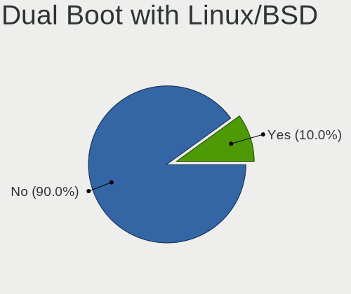
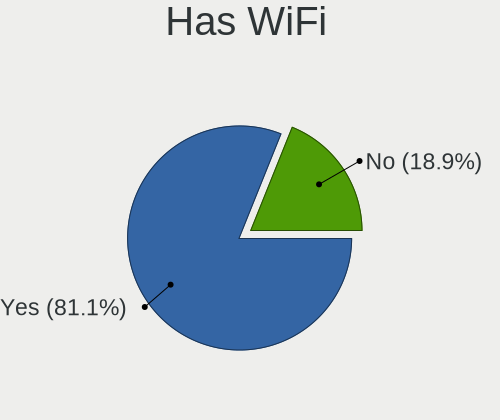
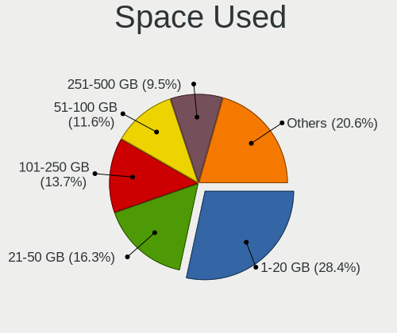
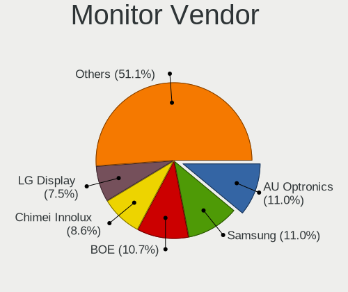
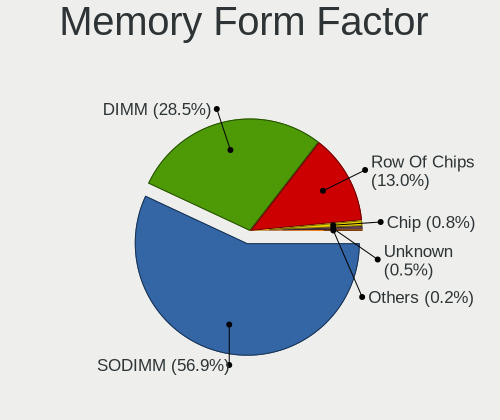

Fedora - Tested Hardware & Statistics
-------------------------------------

A project to collect tested hardware configurations for Fedora.

Anyone can contribute to this report by the [hw-probe](https://github.com/linuxhw/hw-probe) tool:

    sudo -E hw-probe -all -upload

Please contribute! Especially if your hardware is rare.

This is a report for all computer types. See also reports for [desktops](/Dist/Fedora/Desktop/README.md) and [notebooks](/Dist/Fedora/Notebook/README.md).

Contents
--------

* [ Test Cases ](#test-cases)

* [ System ](#system)
  - [ OS                       ](#os)
  - [ OS Family                ](#os-family)
  - [ Kernel                   ](#kernel)
  - [ Kernel Family            ](#kernel-family)
  - [ Kernel Major Ver.        ](#kernel-major-ver)
  - [ Arch                     ](#arch)
  - [ DE                       ](#de)
  - [ Display Server           ](#display-server)
  - [ Display Manager          ](#display-manager)
  - [ OS Lang                  ](#os-lang)
  - [ Boot Mode                ](#boot-mode)
  - [ Filesystem               ](#filesystem)
  - [ Part. scheme             ](#part-scheme)
  - [ Dual Boot with Linux/BSD ](#dual-boot-with-linuxbsd)
  - [ Dual Boot (Win)          ](#dual-boot-win)

* [ Board ](#board)
  - [ Vendor                   ](#vendor)
  - [ Model                    ](#model)
  - [ Model Family             ](#model-family)
  - [ MFG Year                 ](#mfg-year)
  - [ Form Factor              ](#form-factor)
  - [ Secure Boot              ](#secure-boot)
  - [ Coreboot                 ](#coreboot)
  - [ RAM Size                 ](#ram-size)
  - [ RAM Used                 ](#ram-used)
  - [ Total Drives             ](#total-drives)
  - [ Has CD-ROM               ](#has-cd-rom)
  - [ Has Ethernet             ](#has-ethernet)
  - [ Has WiFi                 ](#has-wifi)
  - [ Has Bluetooth            ](#has-bluetooth)

* [ Location ](#location)
  - [ Country                  ](#country)
  - [ City                     ](#city)

* [ Drives ](#drives)
  - [ Drive Vendor             ](#drive-vendor)
  - [ Drive Model              ](#drive-model)
  - [ HDD Vendor               ](#hdd-vendor)
  - [ SSD Vendor               ](#ssd-vendor)
  - [ Drive Kind               ](#drive-kind)
  - [ Drive Connector          ](#drive-connector)
  - [ Drive Size               ](#drive-size)
  - [ Space Total              ](#space-total)
  - [ Space Used               ](#space-used)
  - [ Malfunc. Drives          ](#malfunc-drives)
  - [ Malfunc. Drive Vendor    ](#malfunc-drive-vendor)
  - [ Malfunc. HDD Vendor      ](#malfunc-hdd-vendor)
  - [ Malfunc. Drive Kind      ](#malfunc-drive-kind)
  - [ Failed Drives            ](#failed-drives)
  - [ Failed Drive Vendor      ](#failed-drive-vendor)
  - [ Drive Status             ](#drive-status)

* [ Storage controller ](#storage-controller)
  - [ Storage Vendor           ](#storage-vendor)
  - [ Storage Model            ](#storage-model)
  - [ Storage Kind             ](#storage-kind)

* [ Processor ](#processor)
  - [ CPU Vendor               ](#cpu-vendor)
  - [ CPU Model                ](#cpu-model)
  - [ CPU Model Family         ](#cpu-model-family)
  - [ CPU Cores                ](#cpu-cores)
  - [ CPU Sockets              ](#cpu-sockets)
  - [ CPU Threads              ](#cpu-threads)
  - [ CPU Op-Modes             ](#cpu-op-modes)
  - [ CPU Microcode            ](#cpu-microcode)
  - [ CPU Microarch            ](#cpu-microarch)

* [ Graphics ](#graphics)
  - [ GPU Vendor               ](#gpu-vendor)
  - [ GPU Model                ](#gpu-model)
  - [ GPU Combo                ](#gpu-combo)
  - [ GPU Driver               ](#gpu-driver)
  - [ GPU Memory               ](#gpu-memory)

* [ Monitor ](#monitor)
  - [ Monitor Vendor           ](#monitor-vendor)
  - [ Monitor Model            ](#monitor-model)
  - [ Monitor Resolution       ](#monitor-resolution)
  - [ Monitor Diagonal         ](#monitor-diagonal)
  - [ Monitor Width            ](#monitor-width)
  - [ Aspect Ratio             ](#aspect-ratio)
  - [ Monitor Area             ](#monitor-area)
  - [ Pixel Density            ](#pixel-density)
  - [ Multiple Monitors        ](#multiple-monitors)

* [ Network ](#network)
  - [ Net Controller Vendor    ](#net-controller-vendor)
  - [ Net Controller Model     ](#net-controller-model)
  - [ Wireless Vendor          ](#wireless-vendor)
  - [ Wireless Model           ](#wireless-model)
  - [ Ethernet Vendor          ](#ethernet-vendor)
  - [ Ethernet Model           ](#ethernet-model)
  - [ Net Controller Kind      ](#net-controller-kind)
  - [ Used Controller          ](#used-controller)
  - [ NICs                     ](#nics)
  - [ IPv6                     ](#ipv6)

* [ Bluetooth ](#bluetooth)
  - [ Bluetooth Vendor         ](#bluetooth-vendor)
  - [ Bluetooth Model          ](#bluetooth-model)

* [ Sound ](#sound)
  - [ Sound Vendor             ](#sound-vendor)
  - [ Sound Model              ](#sound-model)

* [ Memory ](#memory)
  - [ Memory Vendor            ](#memory-vendor)
  - [ Memory Model             ](#memory-model)
  - [ Memory Kind              ](#memory-kind)
  - [ Memory Form Factor       ](#memory-form-factor)
  - [ Memory Size              ](#memory-size)
  - [ Memory Speed             ](#memory-speed)

* [ Printers & scanners ](#printers--scanners)
  - [ Printer Vendor           ](#printer-vendor)
  - [ Printer Model            ](#printer-model)
  - [ Scanner Vendor           ](#scanner-vendor)
  - [ Scanner Model            ](#scanner-model)

* [ Camera ](#camera)
  - [ Camera Vendor            ](#camera-vendor)
  - [ Camera Model             ](#camera-model)

* [ Security ](#security)
  - [ Fingerprint Vendor       ](#fingerprint-vendor)
  - [ Fingerprint Model        ](#fingerprint-model)
  - [ Chipcard Vendor          ](#chipcard-vendor)
  - [ Chipcard Model           ](#chipcard-model)

* [ Unsupported ](#unsupported)
  - [ Unsupported Devices      ](#unsupported-devices)
  - [ Unsupported Device Types ](#unsupported-device-types)

Test Cases
----------

Total: 13192

| Vendor        | Model                       | Form-Factor | Probe                                                      | Date         |
|---------------|-----------------------------|-------------|------------------------------------------------------------|--------------|
| ASUSTek       | TUF Gaming X570-PRO         | Desktop     | [b902f5d873](https://linux-hardware.org/?probe=b902f5d873) | Oct 01, 2022 |
| Lenovo        | SHARKBAY SDK0E50512 STD     | Desktop     | [ee22a244e2](https://linux-hardware.org/?probe=ee22a244e2) | Oct 01, 2022 |
| MICROMAX      | Canvas Lapbook L1161        | Notebook    | [9efe9e89d6](https://linux-hardware.org/?probe=9efe9e89d6) | Oct 01, 2022 |
| HP            | Victus by Laptop 16-e0xx... | Notebook    | [4a8d27ad0f](https://linux-hardware.org/?probe=4a8d27ad0f) | Oct 01, 2022 |
| Dell          | XPS 13 9300                 | Notebook    | [1fade0f247](https://linux-hardware.org/?probe=1fade0f247) | Oct 01, 2022 |
| Dell          | Vostro 5568                 | Notebook    | [44bf0dbbce](https://linux-hardware.org/?probe=44bf0dbbce) | Oct 01, 2022 |
| ASRock        | AD2700-ITX                  | Desktop     | [4275ef3653](https://linux-hardware.org/?probe=4275ef3653) | Oct 01, 2022 |
| ASRock        | FM2A88X Extreme6+           | Desktop     | [186495d063](https://linux-hardware.org/?probe=186495d063) | Oct 01, 2022 |
| MSI           | X99A RAIDER                 | Desktop     | [847283c85d](https://linux-hardware.org/?probe=847283c85d) | Oct 01, 2022 |
| Lenovo        | Yoga 7 14ITL5 82BH          | Convertible | [d60b15ea91](https://linux-hardware.org/?probe=d60b15ea91) | Oct 01, 2022 |
| ASUSTek       | UX360UAK                    | Convertible | [4662cb1d99](https://linux-hardware.org/?probe=4662cb1d99) | Oct 01, 2022 |
| HP            | ENVY x360 Convertible 15... | Convertible | [9f64b9ed3d](https://linux-hardware.org/?probe=9f64b9ed3d) | Oct 01, 2022 |
| Lenovo        | ThinkPad T470p 20J7S0DK0... | Notebook    | [49bd2b0248](https://linux-hardware.org/?probe=49bd2b0248) | Oct 01, 2022 |
| Timi          | A35S                        | Notebook    | [c46c820c25](https://linux-hardware.org/?probe=c46c820c25) | Oct 01, 2022 |
| Dell          | Inspiron 3442               | Notebook    | [af9b794734](https://linux-hardware.org/?probe=af9b794734) | Sep 30, 2022 |
| ASUSTek       | VivoBook_ASUSLaptop X340... | Notebook    | [d5407763a0](https://linux-hardware.org/?probe=d5407763a0) | Sep 30, 2022 |
| Dell          | Latitude E4300              | Notebook    | [a860d9a446](https://linux-hardware.org/?probe=a860d9a446) | Sep 30, 2022 |
| GPD           | G1621-02                    | Notebook    | [6ae9fc596e](https://linux-hardware.org/?probe=6ae9fc596e) | Sep 30, 2022 |
| Gigabyte      | B75M-D3H                    | Desktop     | [162334ac1e](https://linux-hardware.org/?probe=162334ac1e) | Sep 30, 2022 |
| Dell          | XPS 15 9570                 | Notebook    | [0d466bc2f7](https://linux-hardware.org/?probe=0d466bc2f7) | Sep 30, 2022 |
| Lenovo        | Yoga 7 14ITL5 82BH          | Convertible | [02c5cd53e9](https://linux-hardware.org/?probe=02c5cd53e9) | Sep 30, 2022 |
| MSI           | B450 GAMING PLUS MAX        | Desktop     | [c06e7e3586](https://linux-hardware.org/?probe=c06e7e3586) | Sep 30, 2022 |
| HP            | ProBook 6570b               | Notebook    | [d9be946342](https://linux-hardware.org/?probe=d9be946342) | Sep 30, 2022 |
| HP            | ENVY x360 Convertible 13... | Convertible | [d658b9dcbe](https://linux-hardware.org/?probe=d658b9dcbe) | Sep 30, 2022 |
| ASRock        | B450M Pro4                  | Desktop     | [ed76eeb703](https://linux-hardware.org/?probe=ed76eeb703) | Sep 30, 2022 |
| HP            | Laptop 15s-eq3xxx           | Notebook    | [b15bae8e77](https://linux-hardware.org/?probe=b15bae8e77) | Sep 30, 2022 |
| HP            | Laptop 15s-eq3xxx           | Notebook    | [126b8dd3ec](https://linux-hardware.org/?probe=126b8dd3ec) | Sep 30, 2022 |
| Lenovo        | ThinkBook 14 G3 ACL 21A2    | Notebook    | [41dc234b26](https://linux-hardware.org/?probe=41dc234b26) | Sep 30, 2022 |
| Lenovo        | ThinkPad T470p 20J7S0DK0... | Notebook    | [33353fc67c](https://linux-hardware.org/?probe=33353fc67c) | Sep 30, 2022 |
| Lenovo        | ThinkPad T470s 20HGS09L0... | Notebook    | [7c384e5578](https://linux-hardware.org/?probe=7c384e5578) | Sep 30, 2022 |
| SK hynix      | HyBook                      | Notebook    | [38b5f704a1](https://linux-hardware.org/?probe=38b5f704a1) | Sep 30, 2022 |
| A-DATA Tec... | XENIA 14                    | Notebook    | [251f390772](https://linux-hardware.org/?probe=251f390772) | Sep 30, 2022 |
| MSI           | X99A RAIDER                 | Desktop     | [7b0b80d00c](https://linux-hardware.org/?probe=7b0b80d00c) | Sep 30, 2022 |
| ASRock        | FM2A88X Extreme6+           | Desktop     | [6553398b7d](https://linux-hardware.org/?probe=6553398b7d) | Sep 30, 2022 |
| Timi          | Xiaomi Book Pro 16 2022     | Notebook    | [d2a3575975](https://linux-hardware.org/?probe=d2a3575975) | Sep 30, 2022 |
| Lenovo        | ThinkPad P15 Gen 2i 20YQ... | Notebook    | [9015ce1da8](https://linux-hardware.org/?probe=9015ce1da8) | Sep 30, 2022 |
| Lenovo        | ThinkPad X1 Carbon Gen 1... | Notebook    | [2c6b161d0f](https://linux-hardware.org/?probe=2c6b161d0f) | Sep 29, 2022 |
| Avell High... | A60 MUV                     | Notebook    | [888e375356](https://linux-hardware.org/?probe=888e375356) | Sep 29, 2022 |
| Lenovo        | Legion 5 17ACH6 82K0        | Notebook    | [18afdc2116](https://linux-hardware.org/?probe=18afdc2116) | Sep 29, 2022 |
| Dell          | Latitude 7430               | Notebook    | [2151370437](https://linux-hardware.org/?probe=2151370437) | Sep 29, 2022 |
| HP            | ProBook 440 G7              | Notebook    | [99f729e814](https://linux-hardware.org/?probe=99f729e814) | Sep 29, 2022 |
| A-DATA Tec... | XENIA 14                    | Notebook    | [e819e5dc14](https://linux-hardware.org/?probe=e819e5dc14) | Sep 29, 2022 |
| Lenovo        | Yoga 310-11IAP 80U2         | Convertible | [cc7ad91815](https://linux-hardware.org/?probe=cc7ad91815) | Sep 29, 2022 |
| Fujitsu       | LIFEBOOK P771               | Notebook    | [7325511d27](https://linux-hardware.org/?probe=7325511d27) | Sep 29, 2022 |
| ASUSTek       | X555LA                      | Notebook    | [5ec700ea0a](https://linux-hardware.org/?probe=5ec700ea0a) | Sep 29, 2022 |
| ASRock        | H270M-ITX/ac                | Desktop     | [c6ae2f8a45](https://linux-hardware.org/?probe=c6ae2f8a45) | Sep 29, 2022 |
| Acer          | Aspire 5742G                | Notebook    | [354a9c2bc2](https://linux-hardware.org/?probe=354a9c2bc2) | Sep 29, 2022 |
| HP            | ZBook 15 G3                 | Notebook    | [1d612b997a](https://linux-hardware.org/?probe=1d612b997a) | Sep 29, 2022 |
| ASUSTek       | PRIME Z270-A                | Desktop     | [4118e245a3](https://linux-hardware.org/?probe=4118e245a3) | Sep 29, 2022 |
| HP            | Laptop 15-db0xxx            | Notebook    | [067b155d9b](https://linux-hardware.org/?probe=067b155d9b) | Sep 29, 2022 |
| HP            | Laptop 15-db0xxx            | Notebook    | [058aa145d3](https://linux-hardware.org/?probe=058aa145d3) | Sep 29, 2022 |
| ASRock        | FM2A88X Extreme6+           | Desktop     | [362c6b7436](https://linux-hardware.org/?probe=362c6b7436) | Sep 29, 2022 |
| MSI           | X99A RAIDER                 | Desktop     | [d4e346f990](https://linux-hardware.org/?probe=d4e346f990) | Sep 29, 2022 |
| ASRock        | A320M-HD                    | Desktop     | [a674def12d](https://linux-hardware.org/?probe=a674def12d) | Sep 29, 2022 |
| HP            | 15 Notebook PC              | Notebook    | [23c809d2a7](https://linux-hardware.org/?probe=23c809d2a7) | Sep 29, 2022 |
| Dell          | Precision 7550              | Notebook    | [75f2949521](https://linux-hardware.org/?probe=75f2949521) | Sep 29, 2022 |
| Lenovo        | IdeaPad 720-15IKB 81AG      | Notebook    | [9ac63cdce6](https://linux-hardware.org/?probe=9ac63cdce6) | Sep 29, 2022 |
| Biostar       | H410MH S2                   | Desktop     | [fbba79fc43](https://linux-hardware.org/?probe=fbba79fc43) | Sep 28, 2022 |
| Lenovo        | ThinkPad L15 Gen 1 20U70... | Notebook    | [d137298cb5](https://linux-hardware.org/?probe=d137298cb5) | Sep 28, 2022 |
| Dell          | Inspiron 5447               | Notebook    | [b30346135b](https://linux-hardware.org/?probe=b30346135b) | Sep 28, 2022 |
| Gigabyte      | B450M AORUS ELITE           | Desktop     | [513d236a1f](https://linux-hardware.org/?probe=513d236a1f) | Sep 28, 2022 |
| Lenovo        | IdeaPad 3 15ARE 81W4        | Notebook    | [b784552e84](https://linux-hardware.org/?probe=b784552e84) | Sep 28, 2022 |
| Lenovo        | IdeaPadFlex 5 14ALC05 82... | Convertible | [89253de6f0](https://linux-hardware.org/?probe=89253de6f0) | Sep 28, 2022 |
| Lenovo        | IdeaPad Gaming 3 15IHU6 ... | Notebook    | [84187f87ed](https://linux-hardware.org/?probe=84187f87ed) | Sep 28, 2022 |
| Medion        | Unknown                     | Notebook    | [821c3c8fed](https://linux-hardware.org/?probe=821c3c8fed) | Sep 28, 2022 |
| Alienware     | 14                          | Notebook    | [2d46ecc50e](https://linux-hardware.org/?probe=2d46ecc50e) | Sep 28, 2022 |
| ASUSTek       | X550CL                      | Notebook    | [ded047597e](https://linux-hardware.org/?probe=ded047597e) | Sep 28, 2022 |
| Dell          | Inspiron 5566               | Notebook    | [a4b44081c2](https://linux-hardware.org/?probe=a4b44081c2) | Sep 27, 2022 |
| Lenovo        | G40-80 80JE                 | Notebook    | [a6347449b3](https://linux-hardware.org/?probe=a6347449b3) | Sep 27, 2022 |
| Chuwi         | HeroBook Air                | Notebook    | [c31e327867](https://linux-hardware.org/?probe=c31e327867) | Sep 27, 2022 |
| MSI           | GS66 Stealth 10SGS          | Notebook    | [644efb07cf](https://linux-hardware.org/?probe=644efb07cf) | Sep 27, 2022 |
| HONOR         | HGE-WX6                     | Notebook    | [5c61df4d20](https://linux-hardware.org/?probe=5c61df4d20) | Sep 27, 2022 |
| Dell          | 0YGYJY A01                  | Desktop     | [73e69debd9](https://linux-hardware.org/?probe=73e69debd9) | Sep 27, 2022 |
| Timi          | A35S                        | Notebook    | [bdb2ba4eab](https://linux-hardware.org/?probe=bdb2ba4eab) | Sep 27, 2022 |
| ASUSTek       | ASUS TUF Gaming A15 FA50... | Notebook    | [6677830ce4](https://linux-hardware.org/?probe=6677830ce4) | Sep 27, 2022 |
| Lenovo        | IdeaPad 5 15ARE05 81YQ      | Notebook    | [3d86bcf1b7](https://linux-hardware.org/?probe=3d86bcf1b7) | Sep 27, 2022 |
| HP            | 829A                        | Mini pc     | [1e26c7813f](https://linux-hardware.org/?probe=1e26c7813f) | Sep 27, 2022 |
| HUAWEI        | NBLK-WAX9X                  | Notebook    | [c60d7e3375](https://linux-hardware.org/?probe=c60d7e3375) | Sep 27, 2022 |
| Gigabyte      | Z690I AORUS ULTRA DDR4      | Desktop     | [7af967061b](https://linux-hardware.org/?probe=7af967061b) | Sep 27, 2022 |
| Intel         | DP35DP AAD81073-208         | Desktop     | [031ff09179](https://linux-hardware.org/?probe=031ff09179) | Sep 27, 2022 |
| Lenovo        | ThinkBook 14s Yoga ITL 2... | Convertible | [98742c4135](https://linux-hardware.org/?probe=98742c4135) | Sep 27, 2022 |
| HP            | ProBook 450 G4              | Notebook    | [4308420b28](https://linux-hardware.org/?probe=4308420b28) | Sep 27, 2022 |
| ASUSTek       | ROG Zephyrus G14 GA401IH... | Notebook    | [7c62f5131f](https://linux-hardware.org/?probe=7c62f5131f) | Sep 27, 2022 |
| Dell          | Inspiron 7415 2-in-1        | Convertible | [48d9a713b0](https://linux-hardware.org/?probe=48d9a713b0) | Sep 26, 2022 |
| Gigabyte      | Z170-D3H-CF                 | Desktop     | [254a78c371](https://linux-hardware.org/?probe=254a78c371) | Sep 26, 2022 |
| MSI           | GT72 6QE                    | Notebook    | [5535b3367e](https://linux-hardware.org/?probe=5535b3367e) | Sep 26, 2022 |
| ASUSTek       | ROG CROSSHAIR VIII DARK ... | Desktop     | [6373bf42ef](https://linux-hardware.org/?probe=6373bf42ef) | Sep 26, 2022 |
| ASUSTek       | ROG CROSSHAIR VIII DARK ... | Desktop     | [9ff2009089](https://linux-hardware.org/?probe=9ff2009089) | Sep 26, 2022 |
| Acer          | Aspire E1-570G              | Notebook    | [ed657bfbb6](https://linux-hardware.org/?probe=ed657bfbb6) | Sep 26, 2022 |
| ASUSTek       | TUF Gaming FX505DV          | Notebook    | [2154b531c9](https://linux-hardware.org/?probe=2154b531c9) | Sep 26, 2022 |
| Dell          | XPS 17 9700                 | Notebook    | [76166adede](https://linux-hardware.org/?probe=76166adede) | Sep 26, 2022 |
| HUAWEI        | NBLB-WAX9N                  | Notebook    | [f1d78ca455](https://linux-hardware.org/?probe=f1d78ca455) | Sep 26, 2022 |
| ASUSTek       | TUF Gaming FX505DV          | Notebook    | [6b3be4af70](https://linux-hardware.org/?probe=6b3be4af70) | Sep 26, 2022 |
| HP            | Tablet 11m-be0xxx           | Tablet      | [d644aedbdd](https://linux-hardware.org/?probe=d644aedbdd) | Sep 26, 2022 |
| MSI           | GT72 6QE                    | Notebook    | [d739812ce7](https://linux-hardware.org/?probe=d739812ce7) | Sep 26, 2022 |
| MSI           | GT72S 6QE                   | Notebook    | [7ec3a25453](https://linux-hardware.org/?probe=7ec3a25453) | Sep 26, 2022 |
| HP            | Laptop                      | Notebook    | [6d8fc869e4](https://linux-hardware.org/?probe=6d8fc869e4) | Sep 26, 2022 |
| HP            | Pavilion Aero Laptop 13-... | Notebook    | [52a86d0701](https://linux-hardware.org/?probe=52a86d0701) | Sep 26, 2022 |
| HP            | Pavilion Aero Laptop 13-... | Notebook    | [683aa83ea4](https://linux-hardware.org/?probe=683aa83ea4) | Sep 26, 2022 |
| HUAWEI        | BOHB-WAX9                   | Notebook    | [64fd780b2f](https://linux-hardware.org/?probe=64fd780b2f) | Sep 26, 2022 |
| HUAWEI        | BOHB-WAX9                   | Notebook    | [d557cdbe1c](https://linux-hardware.org/?probe=d557cdbe1c) | Sep 26, 2022 |
| HP            | Laptop                      | Notebook    | [be59fc7a97](https://linux-hardware.org/?probe=be59fc7a97) | Sep 26, 2022 |
| Lenovo        | IdeaPad C340-14API 81N6     | Notebook    | [01cf3c6f99](https://linux-hardware.org/?probe=01cf3c6f99) | Sep 26, 2022 |
| ASUSTek       | TUF Gaming B560-PLUS WIF... | Desktop     | [56c982050d](https://linux-hardware.org/?probe=56c982050d) | Sep 25, 2022 |
| HP            | EliteBook Folio 9480m       | Notebook    | [e2232c49ca](https://linux-hardware.org/?probe=e2232c49ca) | Sep 25, 2022 |
| ASUSTek       | VivoBook_ASUSLaptop X513... | Notebook    | [f8b76ec5f4](https://linux-hardware.org/?probe=f8b76ec5f4) | Sep 25, 2022 |
| AZW           | SEi                         | Notebook    | [063c3cc52e](https://linux-hardware.org/?probe=063c3cc52e) | Sep 25, 2022 |
| Gigabyte      | B550I AORUS PRO AX          | Desktop     | [778f7340fa](https://linux-hardware.org/?probe=778f7340fa) | Sep 25, 2022 |
| Lenovo        | IdeaPad 310-14ISK 80UG      | Notebook    | [d8b270de2b](https://linux-hardware.org/?probe=d8b270de2b) | Sep 25, 2022 |
| AZW           | SEi                         | Notebook    | [055096f57a](https://linux-hardware.org/?probe=055096f57a) | Sep 25, 2022 |
| ASUSTek       | ROG Strix G733QS_G733QS     | Notebook    | [67040d9a5e](https://linux-hardware.org/?probe=67040d9a5e) | Sep 25, 2022 |
| HP            | OMEN by Laptop 15-ce0xx     | Notebook    | [850b486cff](https://linux-hardware.org/?probe=850b486cff) | Sep 25, 2022 |
| Dell          | Inspiron 7415 2-in-1        | Convertible | [e9205da026](https://linux-hardware.org/?probe=e9205da026) | Sep 25, 2022 |
| HP            | ENVY x360 Convertible 13... | Convertible | [be1d17baa4](https://linux-hardware.org/?probe=be1d17baa4) | Sep 25, 2022 |
| ASUSTek       | ROG Strix G513QY_G513QY     | Notebook    | [9f37c7c4fa](https://linux-hardware.org/?probe=9f37c7c4fa) | Sep 25, 2022 |
| ASUSTek       | ROG Strix G513QY_G513QY     | Notebook    | [0d790a94fa](https://linux-hardware.org/?probe=0d790a94fa) | Sep 25, 2022 |
| Dell          | XPS 15 9520                 | Notebook    | [fab5b34402](https://linux-hardware.org/?probe=fab5b34402) | Sep 25, 2022 |
| Gigabyte      | B450 GAMING X               | Desktop     | [982d41c1eb](https://linux-hardware.org/?probe=982d41c1eb) | Sep 25, 2022 |
| Lenovo        | ThinkPad T420 4236C53       | Notebook    | [e0983b35fa](https://linux-hardware.org/?probe=e0983b35fa) | Sep 25, 2022 |
| Lenovo        | 3098 NOK                    | Desktop     | [0f6ea5edfa](https://linux-hardware.org/?probe=0f6ea5edfa) | Sep 25, 2022 |
| ASUSTek       | TUF Gaming B660M-PLUS D4    | Desktop     | [82b73270ca](https://linux-hardware.org/?probe=82b73270ca) | Sep 25, 2022 |
| ASRock        | A320M-HD                    | Desktop     | [b26f7bf9f5](https://linux-hardware.org/?probe=b26f7bf9f5) | Sep 25, 2022 |
| Gigabyte      | B450 GAMING X               | Desktop     | [a5d5950e29](https://linux-hardware.org/?probe=a5d5950e29) | Sep 25, 2022 |
| MSI           | MAG Z590 TORPEDO            | Desktop     | [cedbd8909f](https://linux-hardware.org/?probe=cedbd8909f) | Sep 25, 2022 |
| ASUSTek       | TUF Gaming B660M-PLUS D4    | Desktop     | [a1f261d09d](https://linux-hardware.org/?probe=a1f261d09d) | Sep 25, 2022 |
| Acer          | Aspire X1900                | Desktop     | [c7b768051b](https://linux-hardware.org/?probe=c7b768051b) | Sep 25, 2022 |
| Gigabyte      | GA-MA785G-UD3H              | Desktop     | [66b5b65077](https://linux-hardware.org/?probe=66b5b65077) | Sep 25, 2022 |
| Gigabyte      | GA-MA780G-UD3H              | Desktop     | [a35dda8c10](https://linux-hardware.org/?probe=a35dda8c10) | Sep 25, 2022 |
| Dell          | Inspiron 15 7000 Gaming     | Notebook    | [2e96ddfdd1](https://linux-hardware.org/?probe=2e96ddfdd1) | Sep 25, 2022 |
| Apple         | MacBookPro14,1              | Notebook    | [f5e9524bff](https://linux-hardware.org/?probe=f5e9524bff) | Sep 25, 2022 |
| Dell          | Inspiron 14 7425 2-in-1     | Convertible | [9a7ec70bad](https://linux-hardware.org/?probe=9a7ec70bad) | Sep 25, 2022 |
| Apple         | MacBookPro16,1              | Notebook    | [6e7d310781](https://linux-hardware.org/?probe=6e7d310781) | Sep 25, 2022 |
| ASRock        | FM2A88X Extreme4+           | Desktop     | [2d44b203f9](https://linux-hardware.org/?probe=2d44b203f9) | Sep 25, 2022 |
| ASRock        | FM2A88X Extreme6+           | Desktop     | [a4b47e7325](https://linux-hardware.org/?probe=a4b47e7325) | Sep 25, 2022 |
| MSI           | X99A RAIDER                 | Desktop     | [adb952e34b](https://linux-hardware.org/?probe=adb952e34b) | Sep 25, 2022 |
| ASUSTek       | ASUS EXPERTBOOK B7402FEA... | Convertible | [593ef93760](https://linux-hardware.org/?probe=593ef93760) | Sep 25, 2022 |
| Apple         | MacBookPro6,2               | Notebook    | [be92ff8ffc](https://linux-hardware.org/?probe=be92ff8ffc) | Sep 25, 2022 |
| Lenovo        | ThinkBook 13s G3 ACN 20Y... | Notebook    | [96f4499ec5](https://linux-hardware.org/?probe=96f4499ec5) | Sep 25, 2022 |
| Lenovo        | ThinkPad E495 20NE001RTX    | Notebook    | [91bd22b430](https://linux-hardware.org/?probe=91bd22b430) | Sep 25, 2022 |
| Dell          | XPS 13 9380                 | Notebook    | [332540a4c8](https://linux-hardware.org/?probe=332540a4c8) | Sep 24, 2022 |
| HP            | ProBook 450 15.6 inch G9... | Notebook    | [4f9ff1b402](https://linux-hardware.org/?probe=4f9ff1b402) | Sep 24, 2022 |
| HP            | ENVY x360 Convertible 15... | Convertible | [307a3c2848](https://linux-hardware.org/?probe=307a3c2848) | Sep 24, 2022 |
| ASRock        | Z170M Extreme4              | Desktop     | [bd1e98639b](https://linux-hardware.org/?probe=bd1e98639b) | Sep 24, 2022 |
| Lenovo        | Yoga 9 14ITL5 82BG          | Convertible | [2bdc1228a1](https://linux-hardware.org/?probe=2bdc1228a1) | Sep 24, 2022 |
| Lenovo        | MIIX 520-12IKB 20M3         | Tablet      | [eef9de3daf](https://linux-hardware.org/?probe=eef9de3daf) | Sep 24, 2022 |
| Lenovo        | Yoga 310-11IAP 80U2         | Convertible | [b598ecc4f8](https://linux-hardware.org/?probe=b598ecc4f8) | Sep 24, 2022 |
| HP            | Pavilion dv6                | Notebook    | [ae43d0bbce](https://linux-hardware.org/?probe=ae43d0bbce) | Sep 24, 2022 |
| Lenovo        | IdeaPad 5 15ALC05 82LN      | Notebook    | [24b2810c64](https://linux-hardware.org/?probe=24b2810c64) | Sep 24, 2022 |
| ASUSTek       | TUF Gaming X570-PLUS        | Desktop     | [ee8183722c](https://linux-hardware.org/?probe=ee8183722c) | Sep 24, 2022 |
| ASUSTek       | PRIME B660M-A D4            | Desktop     | [542249f675](https://linux-hardware.org/?probe=542249f675) | Sep 24, 2022 |
| ASRock        | FM2A88X Extreme6+           | Desktop     | [ab2e3b1767](https://linux-hardware.org/?probe=ab2e3b1767) | Sep 24, 2022 |
| HP            | ENVY x360 Convertible 15... | Convertible | [0170bcbb42](https://linux-hardware.org/?probe=0170bcbb42) | Sep 24, 2022 |
| MSI           | X99A RAIDER                 | Desktop     | [a89311b338](https://linux-hardware.org/?probe=a89311b338) | Sep 24, 2022 |
| Lenovo        | ThinkPad T440s 20ARA0YL0... | Notebook    | [93eedc638b](https://linux-hardware.org/?probe=93eedc638b) | Sep 24, 2022 |
| HP            | ENVY x360 2-in-1 Laptop ... | Convertible | [08843e7c7c](https://linux-hardware.org/?probe=08843e7c7c) | Sep 24, 2022 |
| Framework     | Laptop (12th Gen Intel C... | Notebook    | [2082a8668b](https://linux-hardware.org/?probe=2082a8668b) | Sep 24, 2022 |
| Lenovo        | ThinkPad X1 Extreme 20MF... | Notebook    | [89a1a3179d](https://linux-hardware.org/?probe=89a1a3179d) | Sep 24, 2022 |
| Lenovo        | ThinkPad Edge E540 20C60... | Notebook    | [b7f6ab8ad0](https://linux-hardware.org/?probe=b7f6ab8ad0) | Sep 23, 2022 |
| Lenovo        | ThinkPad X270 20HMS1QT0E    | Notebook    | [72caf18b5f](https://linux-hardware.org/?probe=72caf18b5f) | Sep 23, 2022 |
| HP            | ENVY x360 Convertible 13... | Convertible | [2bb811e308](https://linux-hardware.org/?probe=2bb811e308) | Sep 23, 2022 |
| Timi          | A35S                        | Notebook    | [d0f195a77a](https://linux-hardware.org/?probe=d0f195a77a) | Sep 23, 2022 |
| AZW           | GTR V01                     | Mini pc     | [927faa3232](https://linux-hardware.org/?probe=927faa3232) | Sep 23, 2022 |
| ASUSTek       | PRIME B365M-A               | Desktop     | [c4c88d72ae](https://linux-hardware.org/?probe=c4c88d72ae) | Sep 23, 2022 |
| Lenovo        | ThinkPad T460 20FN002JUS    | Notebook    | [c30d8893ca](https://linux-hardware.org/?probe=c30d8893ca) | Sep 23, 2022 |
| ASUSTek       | TUF Gaming B550-PLUS        | Desktop     | [31f1acf273](https://linux-hardware.org/?probe=31f1acf273) | Sep 23, 2022 |
| ASUSTek       | PRIME B250M-C               | Desktop     | [2e45736b42](https://linux-hardware.org/?probe=2e45736b42) | Sep 23, 2022 |
| ASUSTek       | TUF Gaming X570-PLUS        | Desktop     | [ac59b4138c](https://linux-hardware.org/?probe=ac59b4138c) | Sep 23, 2022 |
| ASUSTek       | ROG STRIX B450-F GAMING ... | Desktop     | [a4ce7c179e](https://linux-hardware.org/?probe=a4ce7c179e) | Sep 23, 2022 |
| Gigabyte      | B660I AORUS PRO DDR4        | Desktop     | [810c7883d4](https://linux-hardware.org/?probe=810c7883d4) | Sep 23, 2022 |
| Dell          | XPS 9320                    | Notebook    | [959d1406dd](https://linux-hardware.org/?probe=959d1406dd) | Sep 23, 2022 |
| ASUSTek       | TUF Gaming B560-PLUS WIF... | Desktop     | [7d69f0c6c6](https://linux-hardware.org/?probe=7d69f0c6c6) | Sep 23, 2022 |
| HONOR         | HGE-WX6                     | Notebook    | [337c1097ef](https://linux-hardware.org/?probe=337c1097ef) | Sep 23, 2022 |
| Lenovo        | IdeaPad 5 15ITL05 82FG      | Notebook    | [f72f370511](https://linux-hardware.org/?probe=f72f370511) | Sep 23, 2022 |
| ASRock        | FM2A88X Extreme6+           | Desktop     | [0f750af134](https://linux-hardware.org/?probe=0f750af134) | Sep 23, 2022 |
| Gigabyte      | Z270P-D3-CF                 | Desktop     | [79509e063b](https://linux-hardware.org/?probe=79509e063b) | Sep 23, 2022 |
| MSI           | X99A RAIDER                 | Desktop     | [3e88be3301](https://linux-hardware.org/?probe=3e88be3301) | Sep 23, 2022 |
| HP            | Pavilion Aero Laptop 13-... | Notebook    | [a5e851730c](https://linux-hardware.org/?probe=a5e851730c) | Sep 23, 2022 |
| Acer          | Aspire A715-43G             | Notebook    | [5ecaaef0b1](https://linux-hardware.org/?probe=5ecaaef0b1) | Sep 23, 2022 |
| MSI           | FM2-A55M-E33                | Desktop     | [4867faffbf](https://linux-hardware.org/?probe=4867faffbf) | Sep 23, 2022 |
| Timi          | Redmi Book Pro 15 2022      | Notebook    | [accc831d30](https://linux-hardware.org/?probe=accc831d30) | Sep 23, 2022 |
| Lenovo        | Yoga Slim 7 Carbon 13ITL... | Notebook    | [c916654073](https://linux-hardware.org/?probe=c916654073) | Sep 22, 2022 |
| VALE          | Notebook Classic C140       | Notebook    | [5a8e431c98](https://linux-hardware.org/?probe=5a8e431c98) | Sep 22, 2022 |
| ASUSTek       | ROG Strix G513QY_G513QY     | Notebook    | [4d47a6bfcf](https://linux-hardware.org/?probe=4d47a6bfcf) | Sep 22, 2022 |
| Foxconn       | H61M-S/H61M                 | Desktop     | [039b5cff54](https://linux-hardware.org/?probe=039b5cff54) | Sep 22, 2022 |
| Dell          | Precision 5540              | Notebook    | [0f09e447ea](https://linux-hardware.org/?probe=0f09e447ea) | Sep 22, 2022 |
| Dell          | Vostro 3558                 | Notebook    | [61f6c99c88](https://linux-hardware.org/?probe=61f6c99c88) | Sep 22, 2022 |
| ASUSTek       | ASUS BR1100CKA BR1100CKA... | Notebook    | [efaa235d34](https://linux-hardware.org/?probe=efaa235d34) | Sep 22, 2022 |
| MSI           | H310M PRO-VH                | Desktop     | [c11e067cb5](https://linux-hardware.org/?probe=c11e067cb5) | Sep 22, 2022 |
| HP            | OMEN by Laptop 15-ce0xx     | Notebook    | [2250b3380d](https://linux-hardware.org/?probe=2250b3380d) | Sep 22, 2022 |
| ASRock        | FM2A88X Extreme6+           | Desktop     | [bfb470649a](https://linux-hardware.org/?probe=bfb470649a) | Sep 22, 2022 |
| MSI           | X99A RAIDER                 | Desktop     | [dd6c618f48](https://linux-hardware.org/?probe=dd6c618f48) | Sep 22, 2022 |
| Gigabyte      | Z68X-UD3H-B3                | Desktop     | [11ea16f0d6](https://linux-hardware.org/?probe=11ea16f0d6) | Sep 22, 2022 |
| ASUSTek       | ROG Zephyrus G14 GA401QE... | Notebook    | [ba5fdd39e6](https://linux-hardware.org/?probe=ba5fdd39e6) | Sep 21, 2022 |
| ASUSTek       | PRIME B365M-A               | Desktop     | [289b9dcac8](https://linux-hardware.org/?probe=289b9dcac8) | Sep 21, 2022 |
| ASUSTek       | Pro WS WRX80E-SAGE SE WI... | Desktop     | [54d3096bb6](https://linux-hardware.org/?probe=54d3096bb6) | Sep 21, 2022 |
| Framework     | Laptop                      | Notebook    | [8e2d92c817](https://linux-hardware.org/?probe=8e2d92c817) | Sep 21, 2022 |
| HP            | 15 Notebook PC              | Notebook    | [9515dd24c0](https://linux-hardware.org/?probe=9515dd24c0) | Sep 21, 2022 |
| ASUSTek       | PN51                        | Mini pc     | [3f33a64102](https://linux-hardware.org/?probe=3f33a64102) | Sep 21, 2022 |
| ASUSTek       | PN51                        | Mini pc     | [0d8e7f2e92](https://linux-hardware.org/?probe=0d8e7f2e92) | Sep 21, 2022 |
| BESSTAR Te... | UM350                       | Desktop     | [62a9723eb7](https://linux-hardware.org/?probe=62a9723eb7) | Sep 21, 2022 |
| HP            | EliteBook 840 G3            | Notebook    | [2e5553125e](https://linux-hardware.org/?probe=2e5553125e) | Sep 21, 2022 |
| Lenovo        | ThinkBook 15p Gen 2 21B1    | Notebook    | [85cab20988](https://linux-hardware.org/?probe=85cab20988) | Sep 21, 2022 |
| Razer         | Blade                       | Notebook    | [c835fe2f90](https://linux-hardware.org/?probe=c835fe2f90) | Sep 21, 2022 |
| HP            | Pavilion 17                 | Notebook    | [0f7eec1f7a](https://linux-hardware.org/?probe=0f7eec1f7a) | Sep 21, 2022 |
| Acer          | Nitro AN515-57              | Notebook    | [59219d6ded](https://linux-hardware.org/?probe=59219d6ded) | Sep 21, 2022 |
| Dell          | 040DDP A01                  | Desktop     | [20d37d51bd](https://linux-hardware.org/?probe=20d37d51bd) | Sep 21, 2022 |
| Dell          | 040DDP A01                  | Desktop     | [cabebaa0e6](https://linux-hardware.org/?probe=cabebaa0e6) | Sep 21, 2022 |
| HP            | EliteBook 840 G3            | Notebook    | [deb8b0ca78](https://linux-hardware.org/?probe=deb8b0ca78) | Sep 21, 2022 |
| ASRock        | FM2A88X Extreme6+           | Desktop     | [754dfba736](https://linux-hardware.org/?probe=754dfba736) | Sep 21, 2022 |
| MSI           | X99A RAIDER                 | Desktop     | [a0f2dedc00](https://linux-hardware.org/?probe=a0f2dedc00) | Sep 21, 2022 |
| HP            | ProLiant ML110 G7           | Desktop     | [d5b4924a7b](https://linux-hardware.org/?probe=d5b4924a7b) | Sep 20, 2022 |
| Gigabyte      | A320M-S2H-CF                | Desktop     | [015c8dd353](https://linux-hardware.org/?probe=015c8dd353) | Sep 20, 2022 |
| HP            | Pavilion Power Laptop 15... | Notebook    | [360e860fb1](https://linux-hardware.org/?probe=360e860fb1) | Sep 20, 2022 |
| HP            | ProBook 640 G4              | Notebook    | [41cb2444c5](https://linux-hardware.org/?probe=41cb2444c5) | Sep 20, 2022 |
| HP            | ProBook 640 G4              | Notebook    | [a93242008f](https://linux-hardware.org/?probe=a93242008f) | Sep 20, 2022 |
| Gigabyte      | X570 I AORUS PRO WIFI       | Desktop     | [1869422fde](https://linux-hardware.org/?probe=1869422fde) | Sep 20, 2022 |
| Microsoft     | Surface with Windows 8 P... | Tablet      | [a491827753](https://linux-hardware.org/?probe=a491827753) | Sep 20, 2022 |
| Dell          | Latitude 9420               | Convertible | [e8c592b354](https://linux-hardware.org/?probe=e8c592b354) | Sep 20, 2022 |
| Lenovo        | ThinkPad E14 Gen 3 20YDS... | Notebook    | [7561f24877](https://linux-hardware.org/?probe=7561f24877) | Sep 20, 2022 |
| Lenovo        | ThinkPad P1 Gen 3 20TJS2... | Notebook    | [32120dfcd4](https://linux-hardware.org/?probe=32120dfcd4) | Sep 20, 2022 |
| Lenovo        | ThinkPad X1 Carbon Gen 1... | Notebook    | [b72e23e590](https://linux-hardware.org/?probe=b72e23e590) | Sep 20, 2022 |
| Lenovo        | ThinkPad T460 20FN002JUS    | Notebook    | [98771092de](https://linux-hardware.org/?probe=98771092de) | Sep 20, 2022 |
| TUXEDO        | InfinityBook Pro 14 v4      | Notebook    | [20c7b9dcf9](https://linux-hardware.org/?probe=20c7b9dcf9) | Sep 20, 2022 |
| ASUSTek       | Z170-A                      | Desktop     | [aad09d3281](https://linux-hardware.org/?probe=aad09d3281) | Sep 20, 2022 |
| Notebook      | NH55RGQ                     | Notebook    | [f4aade3998](https://linux-hardware.org/?probe=f4aade3998) | Sep 20, 2022 |
| Lenovo        | IdeaPad 5 15ARE05 81YQ      | Notebook    | [21617c5cff](https://linux-hardware.org/?probe=21617c5cff) | Sep 20, 2022 |
| ASUSTek       | Z97-AR                      | Desktop     | [5cf4494f07](https://linux-hardware.org/?probe=5cf4494f07) | Sep 20, 2022 |
| Lenovo        | ThinkPad T410 2518Q6G       | Notebook    | [b0568eadf2](https://linux-hardware.org/?probe=b0568eadf2) | Sep 20, 2022 |
| Microsoft     | Surface Pro 4               | Tablet      | [5b55138f5d](https://linux-hardware.org/?probe=5b55138f5d) | Sep 20, 2022 |
| Notebook      | NH55RGQ                     | Notebook    | [95c8201663](https://linux-hardware.org/?probe=95c8201663) | Sep 20, 2022 |
| HP            | ProBook 455 G7              | Notebook    | [80d61eb345](https://linux-hardware.org/?probe=80d61eb345) | Sep 20, 2022 |
| Lenovo        | ThinkPad T420 4180PBG       | Notebook    | [857b2acef0](https://linux-hardware.org/?probe=857b2acef0) | Sep 20, 2022 |
| Dell          | XPS 15 9550                 | Notebook    | [acf36b1555](https://linux-hardware.org/?probe=acf36b1555) | Sep 20, 2022 |
| ASRock        | FM2A88X Extreme6+           | Desktop     | [fa5f7f7245](https://linux-hardware.org/?probe=fa5f7f7245) | Sep 20, 2022 |
| MSI           | X99A RAIDER                 | Desktop     | [926189f2ee](https://linux-hardware.org/?probe=926189f2ee) | Sep 20, 2022 |
| HP            | ENVY 15                     | Notebook    | [6921f93893](https://linux-hardware.org/?probe=6921f93893) | Sep 20, 2022 |
| Acer          | Nitro AN517-51              | Notebook    | [7bd22a5e38](https://linux-hardware.org/?probe=7bd22a5e38) | Sep 20, 2022 |
| Lenovo        | 30D9 SDK0J40705 WIN 3425... | Desktop     | [75854836f7](https://linux-hardware.org/?probe=75854836f7) | Sep 20, 2022 |
| Intel         | NUC6i7KYB H90766-402        | Mini pc     | [4ae5282199](https://linux-hardware.org/?probe=4ae5282199) | Sep 20, 2022 |
| Dell          | 0K3CM7 A00                  | Desktop     | [3f82789198](https://linux-hardware.org/?probe=3f82789198) | Sep 20, 2022 |
| Dell          | 0K3CM7 A00                  | Desktop     | [b6ce2720e2](https://linux-hardware.org/?probe=b6ce2720e2) | Sep 20, 2022 |
| Lenovo        | IdeaPad 320-15IAP 80XR      | Notebook    | [1da95a964b](https://linux-hardware.org/?probe=1da95a964b) | Sep 20, 2022 |
| ASRock        | H610M-HDV/M.2               | Desktop     | [02a5a10d7a](https://linux-hardware.org/?probe=02a5a10d7a) | Sep 20, 2022 |
| ASUSTek       | A88X-PRO                    | Desktop     | [b88a699d58](https://linux-hardware.org/?probe=b88a699d58) | Sep 19, 2022 |
| MSI           | Bravo 15 B5DD               | Notebook    | [3c51417d8f](https://linux-hardware.org/?probe=3c51417d8f) | Sep 19, 2022 |
| ASUSTek       | PRIME Z270-P                | Desktop     | [d44ac0cc2a](https://linux-hardware.org/?probe=d44ac0cc2a) | Sep 19, 2022 |
| ASUSTek       | PRIME X470-PRO              | Desktop     | [a6857e4b03](https://linux-hardware.org/?probe=a6857e4b03) | Sep 19, 2022 |
| Gigabyte      | X570 AORUS MASTER           | Desktop     | [424e3ded44](https://linux-hardware.org/?probe=424e3ded44) | Sep 19, 2022 |
| Dell          | 0J3C2F A02                  | Desktop     | [8027be6f7e](https://linux-hardware.org/?probe=8027be6f7e) | Sep 19, 2022 |
| Apple         | MacBookPro9,2               | Notebook    | [a681a7cab8](https://linux-hardware.org/?probe=a681a7cab8) | Sep 19, 2022 |
| HP            | 2B05                        | Desktop     | [c2dcdaa38a](https://linux-hardware.org/?probe=c2dcdaa38a) | Sep 19, 2022 |
| HP            | 2B05                        | Desktop     | [18db320ef7](https://linux-hardware.org/?probe=18db320ef7) | Sep 19, 2022 |
| Intel         | NUC6i7KYB H90766-408        | Mini pc     | [e728637650](https://linux-hardware.org/?probe=e728637650) | Sep 19, 2022 |
| ASUSTek       | TUF Gaming B550M-PLUS       | Desktop     | [f8bf8fd596](https://linux-hardware.org/?probe=f8bf8fd596) | Sep 19, 2022 |
| HP            | ProBook 470 G5              | Notebook    | [de718ac983](https://linux-hardware.org/?probe=de718ac983) | Sep 19, 2022 |
| ASUSTek       | ROG STRIX X570-F GAMING     | Desktop     | [7a1dbe2204](https://linux-hardware.org/?probe=7a1dbe2204) | Sep 19, 2022 |
| Lenovo        | Legion 5 Pro 16ITH6H 82J... | Notebook    | [bed329dab4](https://linux-hardware.org/?probe=bed329dab4) | Sep 19, 2022 |
| MSI           | B450 GAMING PLUS MAX        | Desktop     | [8072b6c0e0](https://linux-hardware.org/?probe=8072b6c0e0) | Sep 19, 2022 |
| ASUSTek       | P8Q77-M2                    | Desktop     | [1e067b7c4f](https://linux-hardware.org/?probe=1e067b7c4f) | Sep 19, 2022 |
| Lenovo        | ThinkPad T540p 20BFS0RK0... | Notebook    | [eaaf80509b](https://linux-hardware.org/?probe=eaaf80509b) | Sep 19, 2022 |
| Toshiba       | Satellite L40t-A            | Notebook    | [b09254248d](https://linux-hardware.org/?probe=b09254248d) | Sep 19, 2022 |
| Dell          | 0KWVT8 A03                  | Desktop     | [7c52790345](https://linux-hardware.org/?probe=7c52790345) | Sep 19, 2022 |
| Lenovo        | IdeaPad 3 15IML05 81WB      | Notebook    | [9b14ec4438](https://linux-hardware.org/?probe=9b14ec4438) | Sep 19, 2022 |
| ASRock        | X570 Steel Legend           | Desktop     | [6fd34fa73b](https://linux-hardware.org/?probe=6fd34fa73b) | Sep 19, 2022 |
| Gigabyte      | A520M DS3H                  | Desktop     | [bf7318e65e](https://linux-hardware.org/?probe=bf7318e65e) | Sep 19, 2022 |
| Dell          | Inspiron 7559               | Notebook    | [ede9aab3fb](https://linux-hardware.org/?probe=ede9aab3fb) | Sep 19, 2022 |
| ASUSTek       | ROG Zephyrus G14 GA402RJ... | Notebook    | [db46d34737](https://linux-hardware.org/?probe=db46d34737) | Sep 19, 2022 |
| HUAWEI        | WRT-WX9                     | Notebook    | [4c8883345d](https://linux-hardware.org/?probe=4c8883345d) | Sep 19, 2022 |
| Gigabyte      | B85M-D3V-A                  | Desktop     | [8f6b96ba44](https://linux-hardware.org/?probe=8f6b96ba44) | Sep 19, 2022 |
| ASUSTek       | ROG Flow X16 GV601RE_GV6... | Convertible | [ad99d47a5e](https://linux-hardware.org/?probe=ad99d47a5e) | Sep 19, 2022 |
| ASUSTek       | Z97-P                       | Desktop     | [37f0f7b888](https://linux-hardware.org/?probe=37f0f7b888) | Sep 19, 2022 |
| ASRock        | X570 Phantom Gaming 4       | Desktop     | [75be2db65c](https://linux-hardware.org/?probe=75be2db65c) | Sep 19, 2022 |
| ASUSTek       | GL502VMK                    | Notebook    | [9776f2c20c](https://linux-hardware.org/?probe=9776f2c20c) | Sep 19, 2022 |
| Dell          | 02M8NY A01                  | Desktop     | [498286eb91](https://linux-hardware.org/?probe=498286eb91) | Sep 19, 2022 |
| Lenovo        | ThinkPad T14s Gen 2a 20X... | Notebook    | [474f619a29](https://linux-hardware.org/?probe=474f619a29) | Sep 19, 2022 |
| Dell          | Latitude E6520              | Notebook    | [ac5b5a53a2](https://linux-hardware.org/?probe=ac5b5a53a2) | Sep 19, 2022 |
| Lenovo        | ThinkPad X1 Carbon Gen 9... | Notebook    | [be279328b1](https://linux-hardware.org/?probe=be279328b1) | Sep 19, 2022 |
| ASUSTek       | ROG CROSSHAIR VIII IMPAC... | Desktop     | [3da12828c0](https://linux-hardware.org/?probe=3da12828c0) | Sep 19, 2022 |
| Dell          | Precision 5560              | Notebook    | [5e70cfd82f](https://linux-hardware.org/?probe=5e70cfd82f) | Sep 19, 2022 |
| HUAWEI        | NBLK-WAX9X                  | Notebook    | [bb8fdeb489](https://linux-hardware.org/?probe=bb8fdeb489) | Sep 19, 2022 |
| Gigabyte      | GA-MA780G-UD3H              | Desktop     | [6c63c03b9f](https://linux-hardware.org/?probe=6c63c03b9f) | Sep 19, 2022 |
| Dell          | Latitude 5420               | Notebook    | [1e5a1652cc](https://linux-hardware.org/?probe=1e5a1652cc) | Sep 19, 2022 |
| ASRock        | 960GM-VGS3 FX               | Desktop     | [7c89dc4342](https://linux-hardware.org/?probe=7c89dc4342) | Sep 19, 2022 |
| ASRock        | FM2A88X Extreme6+           | Desktop     | [5233832be3](https://linux-hardware.org/?probe=5233832be3) | Sep 19, 2022 |
| MSI           | X99A RAIDER                 | Desktop     | [4fb85d59e0](https://linux-hardware.org/?probe=4fb85d59e0) | Sep 19, 2022 |
| ASUSTek       | ProArt Z690-CREATOR WIFI    | Desktop     | [48479f01c1](https://linux-hardware.org/?probe=48479f01c1) | Sep 19, 2022 |
| Gigabyte      | A320M-S2H-CF                | Desktop     | [8d2c35d5f2](https://linux-hardware.org/?probe=8d2c35d5f2) | Sep 19, 2022 |
| Lenovo        | ThinkPad T430 2349S4D       | Notebook    | [0c4d98868f](https://linux-hardware.org/?probe=0c4d98868f) | Sep 19, 2022 |
| ASUSTek       | TUF B350M-PLUS GAMING       | Desktop     | [27d1f0c593](https://linux-hardware.org/?probe=27d1f0c593) | Sep 19, 2022 |
| ASUSTek       | TUF Gaming B550M-PLUS       | Desktop     | [8468466b2a](https://linux-hardware.org/?probe=8468466b2a) | Sep 19, 2022 |
| ASUSTek       | P8Q77-M2                    | Desktop     | [171e24a5c1](https://linux-hardware.org/?probe=171e24a5c1) | Sep 19, 2022 |
| ASUSTek       | PRIME X570-PRO              | Desktop     | [798bb8eda6](https://linux-hardware.org/?probe=798bb8eda6) | Sep 18, 2022 |
| HP            | 84EF 01100                  | All in one  | [2cde64548f](https://linux-hardware.org/?probe=2cde64548f) | Sep 18, 2022 |
| ASUSTek       | TUF Gaming B660M-PLUS D4    | Desktop     | [b48eda0e37](https://linux-hardware.org/?probe=b48eda0e37) | Sep 18, 2022 |
| Dell          | Vostro 3500                 | Notebook    | [f114799ded](https://linux-hardware.org/?probe=f114799ded) | Sep 18, 2022 |
| Dell          | Latitude 3420               | Notebook    | [5364b3d032](https://linux-hardware.org/?probe=5364b3d032) | Sep 18, 2022 |
| ASUSTek       | PRIME H410M-K R2.0          | Desktop     | [7d18b85f33](https://linux-hardware.org/?probe=7d18b85f33) | Sep 18, 2022 |
| HUAWEI        | HVY-WXX9                    | Notebook    | [b9bb35af47](https://linux-hardware.org/?probe=b9bb35af47) | Sep 18, 2022 |
| HUAWEI        | HVY-WXX9                    | Notebook    | [2032e77931](https://linux-hardware.org/?probe=2032e77931) | Sep 18, 2022 |
| ASUSTek       | ROG STRIX Z690-A GAMING ... | Desktop     | [21da8441d5](https://linux-hardware.org/?probe=21da8441d5) | Sep 18, 2022 |
| Casper        | NIRVANA DESKTOP             | Desktop     | [7cdffad4a2](https://linux-hardware.org/?probe=7cdffad4a2) | Sep 18, 2022 |
| Lenovo        | IdeaPad 3 15IML05 81WB      | Notebook    | [751df30316](https://linux-hardware.org/?probe=751df30316) | Sep 18, 2022 |
| ASUSTek       | PRIME B660M-A D4            | Desktop     | [1f27376b8e](https://linux-hardware.org/?probe=1f27376b8e) | Sep 18, 2022 |
| Acer          | Aspire TC-780               | Desktop     | [936ece435c](https://linux-hardware.org/?probe=936ece435c) | Sep 18, 2022 |
| Acer          | A75F2-M2 P21-A1             | Desktop     | [2d00ba463b](https://linux-hardware.org/?probe=2d00ba463b) | Sep 18, 2022 |
| Lenovo        | G580 20150                  | Notebook    | [fe325d1046](https://linux-hardware.org/?probe=fe325d1046) | Sep 18, 2022 |
| Lenovo        | ThinkPad E14 Gen 4 21ECC... | Notebook    | [e09b077e89](https://linux-hardware.org/?probe=e09b077e89) | Sep 18, 2022 |
| MSI           | X99A RAIDER                 | Desktop     | [c352d61c4e](https://linux-hardware.org/?probe=c352d61c4e) | Sep 18, 2022 |
| ASRock        | FM2A88X Extreme6+           | Desktop     | [7161071790](https://linux-hardware.org/?probe=7161071790) | Sep 18, 2022 |
| Razer         | Blade 14 - RZ09-0370        | Notebook    | [1f9f8ee511](https://linux-hardware.org/?probe=1f9f8ee511) | Sep 18, 2022 |
| HP            | Spectre x360 Convertible... | Convertible | [0760539d3d](https://linux-hardware.org/?probe=0760539d3d) | Sep 18, 2022 |
| Dell          | Inspiron N5110              | Notebook    | [fa2122b6ee](https://linux-hardware.org/?probe=fa2122b6ee) | Sep 18, 2022 |
| Apple         | Mac-35C5E08120C7EEAF Mac... | Mini pc     | [f27404a984](https://linux-hardware.org/?probe=f27404a984) | Sep 18, 2022 |
| Apple         | Mac-35C5E08120C7EEAF Mac... | Mini pc     | [1c3c64ca91](https://linux-hardware.org/?probe=1c3c64ca91) | Sep 17, 2022 |
| Unknown       | Unknown                     | Notebook    | [1e27521b13](https://linux-hardware.org/?probe=1e27521b13) | Sep 17, 2022 |
| Acer          | Spin SP111-31               | Convertible | [fbeb9df498](https://linux-hardware.org/?probe=fbeb9df498) | Sep 17, 2022 |
| Acer          | Swift SF314-511             | Notebook    | [a171efb42c](https://linux-hardware.org/?probe=a171efb42c) | Sep 17, 2022 |
| Apple         | MacBookPro12,1              | Notebook    | [ba54a7bf0c](https://linux-hardware.org/?probe=ba54a7bf0c) | Sep 17, 2022 |
| Lenovo        | IdeaPad 5 Pro 14ARH7 82S... | Notebook    | [3615e82cb6](https://linux-hardware.org/?probe=3615e82cb6) | Sep 17, 2022 |
| Lenovo        | ThinkPad T14 Gen 1 20UES... | Notebook    | [9c23c7bb58](https://linux-hardware.org/?probe=9c23c7bb58) | Sep 17, 2022 |
| Dell          | Vostro 3500                 | Notebook    | [fd0bcfd41d](https://linux-hardware.org/?probe=fd0bcfd41d) | Sep 17, 2022 |
| ASUSTek       | ROG Zephyrus G14 GA401IU... | Notebook    | [3b0169723f](https://linux-hardware.org/?probe=3b0169723f) | Sep 17, 2022 |
| Irbis         | NB264                       | Notebook    | [e9361bf1c8](https://linux-hardware.org/?probe=e9361bf1c8) | Sep 17, 2022 |
| HP            | Spectre x360 2-in-1 Lapt... | Convertible | [5a541fecce](https://linux-hardware.org/?probe=5a541fecce) | Sep 17, 2022 |
| ASUSTek       | T101HA                      | Tablet      | [247e54458c](https://linux-hardware.org/?probe=247e54458c) | Sep 17, 2022 |
| ASUSTek       | T101HA                      | Tablet      | [e138435857](https://linux-hardware.org/?probe=e138435857) | Sep 17, 2022 |
| ASRock        | B550M-ITX/ac                | Desktop     | [379aaf7b61](https://linux-hardware.org/?probe=379aaf7b61) | Sep 16, 2022 |
| Apple         | MacBookPro16,1              | Notebook    | [467d4c60c0](https://linux-hardware.org/?probe=467d4c60c0) | Sep 16, 2022 |
| Toshiba       | Satellite C660              | Notebook    | [c5474e5fe3](https://linux-hardware.org/?probe=c5474e5fe3) | Sep 16, 2022 |
| ASUSTek       | PRIME B365M-A               | Desktop     | [e191511194](https://linux-hardware.org/?probe=e191511194) | Sep 16, 2022 |
| Microsoft     | Surface Pro 6               | Tablet      | [88481ce853](https://linux-hardware.org/?probe=88481ce853) | Sep 16, 2022 |
| Dell          | G3 3779                     | Notebook    | [5c24653999](https://linux-hardware.org/?probe=5c24653999) | Sep 16, 2022 |
| ASUSTek       | VivoBook_ASUSLaptop X580... | Notebook    | [70a944e816](https://linux-hardware.org/?probe=70a944e816) | Sep 16, 2022 |
| Lenovo        | ThinkPad T480 20L5S1S000    | Notebook    | [50669d6ff9](https://linux-hardware.org/?probe=50669d6ff9) | Sep 16, 2022 |
| Acidanther... | iMac19,2                    | Notebook    | [94b79ac6e5](https://linux-hardware.org/?probe=94b79ac6e5) | Sep 16, 2022 |
| Dell          | Latitude 5511               | Notebook    | [9a2faa8d22](https://linux-hardware.org/?probe=9a2faa8d22) | Sep 16, 2022 |
| ASUSTek       | P8Z68-V LX                  | Desktop     | [07dd87b76b](https://linux-hardware.org/?probe=07dd87b76b) | Sep 16, 2022 |
| Acer          | Nitro AN515-58              | Notebook    | [a29728a871](https://linux-hardware.org/?probe=a29728a871) | Sep 16, 2022 |
| HP            | 3397                        | Desktop     | [637a5570cf](https://linux-hardware.org/?probe=637a5570cf) | Sep 16, 2022 |
| Lenovo        | ThinkBook 14-IIL 20SL       | Notebook    | [9497f1e17f](https://linux-hardware.org/?probe=9497f1e17f) | Sep 16, 2022 |
| Gigabyte      | A320M-S2H V2-CF             | Desktop     | [4d460404c8](https://linux-hardware.org/?probe=4d460404c8) | Sep 16, 2022 |
| ASUSTek       | ROG Zephyrus M16 GU603ZX... | Notebook    | [099e5d3523](https://linux-hardware.org/?probe=099e5d3523) | Sep 16, 2022 |
| Gigabyte      | A320M-S2H V2-CF             | Desktop     | [881adad6fb](https://linux-hardware.org/?probe=881adad6fb) | Sep 16, 2022 |
| Dell          | Inspiron 5567               | Notebook    | [1cbebfbe09](https://linux-hardware.org/?probe=1cbebfbe09) | Sep 16, 2022 |
| Gigabyte      | AB350-Gaming 3-CF           | Desktop     | [9bfc1472d1](https://linux-hardware.org/?probe=9bfc1472d1) | Sep 16, 2022 |
| ASUSTek       | X550JK                      | Notebook    | [5c399f4fb0](https://linux-hardware.org/?probe=5c399f4fb0) | Sep 15, 2022 |
| ASUSTek       | X550JK                      | Notebook    | [59df382a23](https://linux-hardware.org/?probe=59df382a23) | Sep 15, 2022 |
| Gigabyte      | AB350N-Gaming WIFI-CF       | Desktop     | [dcaf7e8bd0](https://linux-hardware.org/?probe=dcaf7e8bd0) | Sep 15, 2022 |
| Lenovo        | Yoga Slim 7 Pro 14IAH7 8... | Notebook    | [80638ed98f](https://linux-hardware.org/?probe=80638ed98f) | Sep 15, 2022 |
| Acer          | Spin SP313-51N              | Convertible | [c62891882f](https://linux-hardware.org/?probe=c62891882f) | Sep 15, 2022 |
| ASRock        | X370 Gaming K4              | Desktop     | [0858e80da7](https://linux-hardware.org/?probe=0858e80da7) | Sep 15, 2022 |
| Gigabyte      | B85M-D3V-A                  | Desktop     | [a856637b19](https://linux-hardware.org/?probe=a856637b19) | Sep 15, 2022 |
| Gigabyte      | Z97P-D3                     | Desktop     | [ca9e537823](https://linux-hardware.org/?probe=ca9e537823) | Sep 15, 2022 |
| ASUSTek       | TUF Gaming B660M-PLUS D4    | Desktop     | [e633838a51](https://linux-hardware.org/?probe=e633838a51) | Sep 15, 2022 |
| ASUSTek       | ZenBook UX425IA_UM425IA     | Notebook    | [26cdf51338](https://linux-hardware.org/?probe=26cdf51338) | Sep 15, 2022 |
| ASUSTek       | P5PL2-E                     | Desktop     | [84bfb7d319](https://linux-hardware.org/?probe=84bfb7d319) | Sep 15, 2022 |
| ASUSTek       | VivoBook_ASUSLaptop X415... | Notebook    | [c70951aae5](https://linux-hardware.org/?probe=c70951aae5) | Sep 15, 2022 |
| ASUSTek       | VivoBook_ASUSLaptop X415... | Notebook    | [4b19ce2aab](https://linux-hardware.org/?probe=4b19ce2aab) | Sep 15, 2022 |
| Dell          | Inspiron N5110              | Notebook    | [f566a009c8](https://linux-hardware.org/?probe=f566a009c8) | Sep 15, 2022 |
| HP            | Snappy                      | Notebook    | [d890c80994](https://linux-hardware.org/?probe=d890c80994) | Sep 15, 2022 |
| ASUSTek       | PRIME Z270-A                | Desktop     | [2642647feb](https://linux-hardware.org/?probe=2642647feb) | Sep 14, 2022 |
| Lenovo        | ThinkPad P14s Gen 1 20Y1... | Notebook    | [6d4adb2a44](https://linux-hardware.org/?probe=6d4adb2a44) | Sep 14, 2022 |
| HP            | EliteBook 8460p             | Notebook    | [d34c655d2b](https://linux-hardware.org/?probe=d34c655d2b) | Sep 14, 2022 |
| Lenovo        | ThinkBook 13s G4 ARB 21A... | Notebook    | [efb36530f1](https://linux-hardware.org/?probe=efb36530f1) | Sep 14, 2022 |
| Lenovo        | ThinkPad T14s Gen 1 20UH... | Notebook    | [bbc3c68696](https://linux-hardware.org/?probe=bbc3c68696) | Sep 14, 2022 |
| Lenovo        | ThinkPad X1 Carbon Gen 8... | Notebook    | [ec8f0a9ebf](https://linux-hardware.org/?probe=ec8f0a9ebf) | Sep 14, 2022 |
| MSI           | MPG B550 GAMING PLUS        | Desktop     | [55216d250b](https://linux-hardware.org/?probe=55216d250b) | Sep 14, 2022 |
| Lenovo        | ThinkPad X1 Nano Gen 1 2... | Notebook    | [930ee68921](https://linux-hardware.org/?probe=930ee68921) | Sep 14, 2022 |
| MSI           | MPG B550 GAMING PLUS        | Desktop     | [fb9010fc1f](https://linux-hardware.org/?probe=fb9010fc1f) | Sep 14, 2022 |
| HUAWEI        | HVY-WXX9                    | Notebook    | [8fab790c57](https://linux-hardware.org/?probe=8fab790c57) | Sep 14, 2022 |
| HP            | 805D                        | Desktop     | [8acaebbd42](https://linux-hardware.org/?probe=8acaebbd42) | Sep 14, 2022 |
| System76      | Lemur Pro                   | Notebook    | [d6682a260a](https://linux-hardware.org/?probe=d6682a260a) | Sep 14, 2022 |
| Lenovo        | ThinkPad T14 Gen 2a 20XK... | Notebook    | [4aa3e2b6c2](https://linux-hardware.org/?probe=4aa3e2b6c2) | Sep 14, 2022 |
| HP            | Laptop 17-cp0xxx            | Notebook    | [c05d80959b](https://linux-hardware.org/?probe=c05d80959b) | Sep 14, 2022 |
| Dell          | Latitude 5521               | Notebook    | [c342e3ab13](https://linux-hardware.org/?probe=c342e3ab13) | Sep 14, 2022 |
| ASUSTek       | TUF Gaming B550M-PLUS       | Desktop     | [3557099732](https://linux-hardware.org/?probe=3557099732) | Sep 14, 2022 |
| HP            | 1998                        | Desktop     | [bf93a500f4](https://linux-hardware.org/?probe=bf93a500f4) | Sep 14, 2022 |
| Dell          | Latitude 7400 2-in-1        | Convertible | [23c756841a](https://linux-hardware.org/?probe=23c756841a) | Sep 14, 2022 |
| ASRock        | FM2A88X Extreme6+           | Desktop     | [37d6996290](https://linux-hardware.org/?probe=37d6996290) | Sep 14, 2022 |
| MSI           | X99A RAIDER                 | Desktop     | [d91d28cc52](https://linux-hardware.org/?probe=d91d28cc52) | Sep 14, 2022 |
| Gigabyte      | X470 AORUS GAMING 7 WIFI... | Desktop     | [e7cb70c141](https://linux-hardware.org/?probe=e7cb70c141) | Sep 14, 2022 |
| Gigabyte      | X470 AORUS ULTRA GAMING-... | Desktop     | [754d0f3a2b](https://linux-hardware.org/?probe=754d0f3a2b) | Sep 14, 2022 |
| ASUSTek       | VivoBook_ASUSLaptop X580... | Notebook    | [3f34e5ed01](https://linux-hardware.org/?probe=3f34e5ed01) | Sep 14, 2022 |
| Dell          | Inspiron 5575               | Notebook    | [1ae871a545](https://linux-hardware.org/?probe=1ae871a545) | Sep 14, 2022 |
| ASUSTek       | ROG STRIX X570-F GAMING     | Desktop     | [175c84f6ea](https://linux-hardware.org/?probe=175c84f6ea) | Sep 13, 2022 |
| HUAWEI        | HVY-WXX9                    | Notebook    | [d574f5da9b](https://linux-hardware.org/?probe=d574f5da9b) | Sep 13, 2022 |
| HUAWEI        | HVY-WXX9                    | Notebook    | [d1b95841a4](https://linux-hardware.org/?probe=d1b95841a4) | Sep 13, 2022 |
| ASUSTek       | Z170 PRO GAMING             | Desktop     | [d3f957e34a](https://linux-hardware.org/?probe=d3f957e34a) | Sep 13, 2022 |
| ASUSTek       | ASUS TUF Gaming F15 FX50... | Notebook    | [7326474aae](https://linux-hardware.org/?probe=7326474aae) | Sep 13, 2022 |
| ASUSTek       | PRIME B450-PLUS             | Desktop     | [9b2a84cd02](https://linux-hardware.org/?probe=9b2a84cd02) | Sep 13, 2022 |
| ASUSTek       | PRIME B450-PLUS             | Desktop     | [1285ab4d66](https://linux-hardware.org/?probe=1285ab4d66) | Sep 13, 2022 |
| Dell          | Precision 5560              | Notebook    | [78809c82c2](https://linux-hardware.org/?probe=78809c82c2) | Sep 13, 2022 |
| Dell          | Inspiron 7306 2n1           | Convertible | [4e73a1af5e](https://linux-hardware.org/?probe=4e73a1af5e) | Sep 13, 2022 |
| Lenovo        | ThinkPad X1 Carbon Gen 1... | Notebook    | [224ecd9fa7](https://linux-hardware.org/?probe=224ecd9fa7) | Sep 13, 2022 |
| HP            | EliteBook 745 G6            | Notebook    | [61da5fee97](https://linux-hardware.org/?probe=61da5fee97) | Sep 13, 2022 |
| ASRock        | FM2A88X Extreme6+           | Desktop     | [a6e7414518](https://linux-hardware.org/?probe=a6e7414518) | Sep 13, 2022 |
| MSI           | X99A RAIDER                 | Desktop     | [f3fe87a412](https://linux-hardware.org/?probe=f3fe87a412) | Sep 13, 2022 |
| ASRock        | FM2A55M-HD+ R2.0            | Desktop     | [1faad914c6](https://linux-hardware.org/?probe=1faad914c6) | Sep 13, 2022 |
| Unknown       | X99H                        | Desktop     | [9fb8886110](https://linux-hardware.org/?probe=9fb8886110) | Sep 13, 2022 |
| Dell          | 0M017G A00                  | Desktop     | [e040958337](https://linux-hardware.org/?probe=e040958337) | Sep 13, 2022 |
| ASUSTek       | ROG Zephyrus M16 GU603ZW... | Notebook    | [472668e67b](https://linux-hardware.org/?probe=472668e67b) | Sep 12, 2022 |
| Lanix         | AL V9                       | Notebook    | [e03f9aecc3](https://linux-hardware.org/?probe=e03f9aecc3) | Sep 12, 2022 |
| Dell          | Latitude 5495               | Notebook    | [23586ab4ef](https://linux-hardware.org/?probe=23586ab4ef) | Sep 12, 2022 |
| Lenovo        | ThinkPad P1 20MD0014RT      | Notebook    | [4935debbce](https://linux-hardware.org/?probe=4935debbce) | Sep 12, 2022 |
| Lenovo        | ThinkPad E595 20NF001PTX    | Notebook    | [a901769629](https://linux-hardware.org/?probe=a901769629) | Sep 12, 2022 |
| Acer          | Spin SP313-51N              | Convertible | [e956067fa0](https://linux-hardware.org/?probe=e956067fa0) | Sep 12, 2022 |
| AZW           | SEi                         | Notebook    | [3a4d2086b0](https://linux-hardware.org/?probe=3a4d2086b0) | Sep 12, 2022 |
| Lenovo        | ThinkPad T440 20B7A1P700    | Notebook    | [5be9f89a6f](https://linux-hardware.org/?probe=5be9f89a6f) | Sep 12, 2022 |
| Lenovo        | ThinkBook 15 G2 ITL 20VE    | Notebook    | [4a54854cd7](https://linux-hardware.org/?probe=4a54854cd7) | Sep 12, 2022 |
| Lenovo        | ThinkPad T14 Gen 3 21CF0... | Notebook    | [5bbf96fe23](https://linux-hardware.org/?probe=5bbf96fe23) | Sep 12, 2022 |
| Acer          | Spin SP313-51N              | Convertible | [1f32b65385](https://linux-hardware.org/?probe=1f32b65385) | Sep 12, 2022 |
| Gigabyte      | A320M-S2H V2-CF             | Desktop     | [7ce5d8e865](https://linux-hardware.org/?probe=7ce5d8e865) | Sep 12, 2022 |
| HP            | ProBook 4540s               | Notebook    | [1f46e342f0](https://linux-hardware.org/?probe=1f46e342f0) | Sep 12, 2022 |
| Gigabyte      | A320M-S2H V2-CF             | Desktop     | [ec5f57ab65](https://linux-hardware.org/?probe=ec5f57ab65) | Sep 12, 2022 |
| ASUSTek       | ROG Strix G713QR_G713QR     | Notebook    | [d05595b19e](https://linux-hardware.org/?probe=d05595b19e) | Sep 12, 2022 |
| ASUSTek       | Z97-A                       | Desktop     | [b23a59ba48](https://linux-hardware.org/?probe=b23a59ba48) | Sep 12, 2022 |
| Razer         | Blade 14 - RZ09-0370        | Notebook    | [47b15d6b6c](https://linux-hardware.org/?probe=47b15d6b6c) | Sep 12, 2022 |
| HP            | 1494                        | Desktop     | [0faa06cff4](https://linux-hardware.org/?probe=0faa06cff4) | Sep 12, 2022 |
| ASUSTek       | Z97-A                       | Desktop     | [294aa98426](https://linux-hardware.org/?probe=294aa98426) | Sep 12, 2022 |
| BESSTAR Te... | UM700                       | Desktop     | [6847632df3](https://linux-hardware.org/?probe=6847632df3) | Sep 12, 2022 |
| ASUSTek       | VivoBook_ASUSLaptop X512... | Notebook    | [edb2842417](https://linux-hardware.org/?probe=edb2842417) | Sep 12, 2022 |
| Lenovo        | IdeaPad 100S-14IBR 80R9     | Notebook    | [c6df51fa3b](https://linux-hardware.org/?probe=c6df51fa3b) | Sep 11, 2022 |
| Lenovo        | ThinkPad X220 4291WSH       | Notebook    | [7064ea27f5](https://linux-hardware.org/?probe=7064ea27f5) | Sep 11, 2022 |
| MSI           | Modern 14 C12M              | Notebook    | [e523452a96](https://linux-hardware.org/?probe=e523452a96) | Sep 11, 2022 |
| Acer          | Nitro AN515-58              | Notebook    | [49fe1c56a3](https://linux-hardware.org/?probe=49fe1c56a3) | Sep 11, 2022 |
| MSI           | X99A RAIDER                 | Desktop     | [73bc6cd9e3](https://linux-hardware.org/?probe=73bc6cd9e3) | Sep 11, 2022 |
| ASRock        | FM2A88X Extreme6+           | Desktop     | [d85067b0f0](https://linux-hardware.org/?probe=d85067b0f0) | Sep 11, 2022 |
| MSI           | MPG Z490 GAMING PLUS        | Desktop     | [a3b824ba41](https://linux-hardware.org/?probe=a3b824ba41) | Sep 10, 2022 |
| ASUSTek       | Z170-A                      | Desktop     | [66c2198f48](https://linux-hardware.org/?probe=66c2198f48) | Sep 10, 2022 |
| MSI           | MAG B550 TORPEDO            | Desktop     | [841be89be6](https://linux-hardware.org/?probe=841be89be6) | Sep 10, 2022 |
| MSI           | MAG B550 TORPEDO            | Desktop     | [626cf13c17](https://linux-hardware.org/?probe=626cf13c17) | Sep 10, 2022 |
| Lenovo        | ThinkBook 15 G2 ITL 20VE    | Notebook    | [099ffbf0bc](https://linux-hardware.org/?probe=099ffbf0bc) | Sep 10, 2022 |
| HP            | ProBook 6570b               | Notebook    | [998630e822](https://linux-hardware.org/?probe=998630e822) | Sep 10, 2022 |
| Apple         | MacBookPro12,1              | Notebook    | [4bb5badf61](https://linux-hardware.org/?probe=4bb5badf61) | Sep 10, 2022 |
| MSI           | A320M GAMING PRO            | Desktop     | [6ce0fb28ee](https://linux-hardware.org/?probe=6ce0fb28ee) | Sep 10, 2022 |
| ASUSTek       | UX310UQK                    | Notebook    | [dc650f1d77](https://linux-hardware.org/?probe=dc650f1d77) | Sep 10, 2022 |
| MSI           | A320M GAMING PRO            | Desktop     | [5cce5f5ade](https://linux-hardware.org/?probe=5cce5f5ade) | Sep 10, 2022 |
| ASUSTek       | B150 PRO GAMING             | Desktop     | [5e145ec2d1](https://linux-hardware.org/?probe=5e145ec2d1) | Sep 10, 2022 |
| Gigabyte      | GA-MA780G-UD3H              | Desktop     | [2cb423c8e7](https://linux-hardware.org/?probe=2cb423c8e7) | Sep 10, 2022 |
| ASUSTek       | ZenBook UX534FTC_UX534FT    | Notebook    | [8fb4287325](https://linux-hardware.org/?probe=8fb4287325) | Sep 10, 2022 |
| ASUSTek       | ROG STRIX X570-E GAMING ... | Desktop     | [03979fc286](https://linux-hardware.org/?probe=03979fc286) | Sep 10, 2022 |
| MSI           | X99A RAIDER                 | Desktop     | [3ce68aa737](https://linux-hardware.org/?probe=3ce68aa737) | Sep 10, 2022 |
| ASRock        | FM2A88X Extreme6+           | Desktop     | [20ee71a4d6](https://linux-hardware.org/?probe=20ee71a4d6) | Sep 10, 2022 |
| Lenovo        | ThinkPad S1 Yoga 20CDCTO... | Notebook    | [0a7b65b735](https://linux-hardware.org/?probe=0a7b65b735) | Sep 09, 2022 |
| HP            | Elite x2 1013 G3            | Tablet      | [a7b40883c3](https://linux-hardware.org/?probe=a7b40883c3) | Sep 09, 2022 |
| Dell          | Inspiron 3543               | Notebook    | [7fc528e246](https://linux-hardware.org/?probe=7fc528e246) | Sep 09, 2022 |
| AXDIA Inte... | WINPAD V10                  | Notebook    | [b3e5abaf4b](https://linux-hardware.org/?probe=b3e5abaf4b) | Sep 09, 2022 |
| Dell          | XPS 15 9570                 | Notebook    | [a54dae9e4b](https://linux-hardware.org/?probe=a54dae9e4b) | Sep 09, 2022 |
| Lenovo        | ThinkPad X1 Carbon Gen 9... | Notebook    | [cada1ee58d](https://linux-hardware.org/?probe=cada1ee58d) | Sep 09, 2022 |
| Apple         | MacBookPro9,2               | Notebook    | [9f2534b22e](https://linux-hardware.org/?probe=9f2534b22e) | Sep 09, 2022 |
| ASUSTek       | ROG STRIX X570-E GAMING ... | Desktop     | [c6dac06569](https://linux-hardware.org/?probe=c6dac06569) | Sep 09, 2022 |
| Notebook      | W230SS                      | Notebook    | [9ea483f3dd](https://linux-hardware.org/?probe=9ea483f3dd) | Sep 09, 2022 |
| Gigabyte      | H77N-WIFI                   | Desktop     | [3c454664b0](https://linux-hardware.org/?probe=3c454664b0) | Sep 09, 2022 |
| Biostar       | A780L3G                     | Desktop     | [e53730ab48](https://linux-hardware.org/?probe=e53730ab48) | Sep 09, 2022 |
| Dell          | Inspiron 5566               | Notebook    | [7d9ebaa4f8](https://linux-hardware.org/?probe=7d9ebaa4f8) | Sep 09, 2022 |
| ASRock        | B550M Pro4                  | Desktop     | [e43ef549eb](https://linux-hardware.org/?probe=e43ef549eb) | Sep 08, 2022 |
| ASRock        | B550M Pro4                  | Desktop     | [ac6cb859ad](https://linux-hardware.org/?probe=ac6cb859ad) | Sep 08, 2022 |
| ASUSTek       | TUF Gaming B550-PLUS        | Desktop     | [174c263499](https://linux-hardware.org/?probe=174c263499) | Sep 08, 2022 |
| Gigabyte      | Z97-HD3                     | Desktop     | [aeb2bae778](https://linux-hardware.org/?probe=aeb2bae778) | Sep 08, 2022 |
| Intel         | DH77DF AAG40293-300         | Desktop     | [217971d572](https://linux-hardware.org/?probe=217971d572) | Sep 08, 2022 |
| Dell          | 02YRK5 A02                  | Desktop     | [daf3e0182b](https://linux-hardware.org/?probe=daf3e0182b) | Sep 08, 2022 |
| Gigabyte      | Z97-HD3                     | Desktop     | [d5040ffbda](https://linux-hardware.org/?probe=d5040ffbda) | Sep 08, 2022 |
| Lenovo        | ThinkBook 15 G3 ACL 21A4    | Notebook    | [8242cc3cab](https://linux-hardware.org/?probe=8242cc3cab) | Sep 08, 2022 |
| HP            | 18E4                        | Desktop     | [1e8addf905](https://linux-hardware.org/?probe=1e8addf905) | Sep 08, 2022 |
| ASUSTek       | VivoBook_ASUSLaptop E410... | Notebook    | [30488e19df](https://linux-hardware.org/?probe=30488e19df) | Sep 08, 2022 |
| ASUSTek       | H110M-A                     | Desktop     | [dad38946f6](https://linux-hardware.org/?probe=dad38946f6) | Sep 08, 2022 |
| Gigabyte      | B550 AORUS PRO AC           | Desktop     | [0f0a18c852](https://linux-hardware.org/?probe=0f0a18c852) | Sep 08, 2022 |
| Gigabyte      | B550 AORUS PRO AC           | Desktop     | [e06271e233](https://linux-hardware.org/?probe=e06271e233) | Sep 08, 2022 |
| Dell          | Latitude E5450              | Notebook    | [305ef21301](https://linux-hardware.org/?probe=305ef21301) | Sep 08, 2022 |
| ASUSTek       | TUF B350M-PLUS GAMING       | Desktop     | [051ea3b002](https://linux-hardware.org/?probe=051ea3b002) | Sep 08, 2022 |
| ASUSTek       | Z97-A                       | Desktop     | [46be1ea134](https://linux-hardware.org/?probe=46be1ea134) | Sep 08, 2022 |
| MSI           | Z97 PC Mate                 | Desktop     | [bcf93bb718](https://linux-hardware.org/?probe=bcf93bb718) | Sep 08, 2022 |
| HP            | ENVY Laptop 17-cr0xxx       | Notebook    | [0bcf279fb8](https://linux-hardware.org/?probe=0bcf279fb8) | Sep 08, 2022 |
| Dell          | Precision 5770              | Notebook    | [41e44b27f4](https://linux-hardware.org/?probe=41e44b27f4) | Sep 08, 2022 |
| Biostar       | H310MHP                     | Desktop     | [6063bede72](https://linux-hardware.org/?probe=6063bede72) | Sep 07, 2022 |
| Dell          | 02YRK5 A02                  | Desktop     | [2395ab5aed](https://linux-hardware.org/?probe=2395ab5aed) | Sep 07, 2022 |
| ASUSTek       | H97-PRO                     | Desktop     | [fb4bfcf055](https://linux-hardware.org/?probe=fb4bfcf055) | Sep 07, 2022 |
| Dell          | XPS 13 9305                 | Notebook    | [bc21b4b2a8](https://linux-hardware.org/?probe=bc21b4b2a8) | Sep 07, 2022 |
| Dell          | XPS 13 7390                 | Notebook    | [f91eeba2bd](https://linux-hardware.org/?probe=f91eeba2bd) | Sep 07, 2022 |
| ASRock        | EP2C602                     | Desktop     | [56a6980ddc](https://linux-hardware.org/?probe=56a6980ddc) | Sep 07, 2022 |
| ASUSTek       | ROG Zephyrus G15 GA503RM... | Notebook    | [dce2728dad](https://linux-hardware.org/?probe=dce2728dad) | Sep 07, 2022 |
| Dell          | Latitude E6420              | Notebook    | [8885f409d8](https://linux-hardware.org/?probe=8885f409d8) | Sep 07, 2022 |
| HUAWEI        | KLVL-WXXW                   | Notebook    | [a90b385c8e](https://linux-hardware.org/?probe=a90b385c8e) | Sep 07, 2022 |
| TUXEDO        | InfinityBook S 15/17 Gen... | Notebook    | [e1a78657ba](https://linux-hardware.org/?probe=e1a78657ba) | Sep 07, 2022 |
| Microsoft     | Surface Laptop Go           | Tablet      | [42b1a82f1d](https://linux-hardware.org/?probe=42b1a82f1d) | Sep 07, 2022 |
| HUAWEI        | KLVL-WXXW                   | Notebook    | [7a3494a230](https://linux-hardware.org/?probe=7a3494a230) | Sep 07, 2022 |
| Lenovo        | ThinkPad Edge E531 6885D... | Notebook    | [673c26165e](https://linux-hardware.org/?probe=673c26165e) | Sep 07, 2022 |
| Lenovo        | ThinkPad T410 2516CTO       | Notebook    | [d3d092e789](https://linux-hardware.org/?probe=d3d092e789) | Sep 07, 2022 |
| HP            | Pavilion Gaming Laptop 1... | Notebook    | [c905c86c47](https://linux-hardware.org/?probe=c905c86c47) | Sep 07, 2022 |
| Lenovo        | ThinkPad T410 2516CTO       | Notebook    | [424adc035f](https://linux-hardware.org/?probe=424adc035f) | Sep 07, 2022 |
| Lenovo        | 36D9 SDK0J40700 WIN 3258... | Desktop     | [a816f4f60b](https://linux-hardware.org/?probe=a816f4f60b) | Sep 07, 2022 |
| HP            | ENVY x360 Convertible 15... | Convertible | [e7d57afa70](https://linux-hardware.org/?probe=e7d57afa70) | Sep 06, 2022 |
| Lenovo        | IdeaPadFlex 5 14ARE05 81... | Convertible | [240ace226f](https://linux-hardware.org/?probe=240ace226f) | Sep 06, 2022 |
| ASUSTek       | Z97-AR                      | Desktop     | [01dbdc3b29](https://linux-hardware.org/?probe=01dbdc3b29) | Sep 06, 2022 |
| HP            | Pavilion Laptop 15-cs3xx... | Notebook    | [ff127ee255](https://linux-hardware.org/?probe=ff127ee255) | Sep 06, 2022 |
| HP            | EliteBook 850 G6            | Notebook    | [7c202a088d](https://linux-hardware.org/?probe=7c202a088d) | Sep 06, 2022 |
| Lenovo        | IdeaPad 3 15ITL05 81X8      | Notebook    | [826deb0c55](https://linux-hardware.org/?probe=826deb0c55) | Sep 06, 2022 |
| Lenovo        | ThinkPad X1 Carbon 7th 2... | Notebook    | [bffe658238](https://linux-hardware.org/?probe=bffe658238) | Sep 06, 2022 |
| Lenovo        | 3111 NOK                    | Mini pc     | [778f8bb16e](https://linux-hardware.org/?probe=778f8bb16e) | Sep 06, 2022 |
| MSI           | X99A RAIDER                 | Desktop     | [ad0d0e6994](https://linux-hardware.org/?probe=ad0d0e6994) | Sep 06, 2022 |
| ASRock        | FM2A88X Extreme6+           | Desktop     | [dad765ca9e](https://linux-hardware.org/?probe=dad765ca9e) | Sep 06, 2022 |
| Lenovo        | IdeaPad 5 14ABA7 82SE       | Notebook    | [bcd73bee62](https://linux-hardware.org/?probe=bcd73bee62) | Sep 06, 2022 |
| MSI           | MEG X570 ACE                | Desktop     | [5f7f592f25](https://linux-hardware.org/?probe=5f7f592f25) | Sep 05, 2022 |
| ASUSTek       | VivoBook_ASUSLaptop X512... | Notebook    | [b327372b50](https://linux-hardware.org/?probe=b327372b50) | Sep 05, 2022 |
| MSI           | Prestige 15 A10SC           | Notebook    | [adbe97d2f1](https://linux-hardware.org/?probe=adbe97d2f1) | Sep 05, 2022 |
| MSI           | MPG B550 GAMING EDGE WIF... | Desktop     | [e83fa739c9](https://linux-hardware.org/?probe=e83fa739c9) | Sep 05, 2022 |
| MSI           | B550-A PRO                  | Desktop     | [950b2a8eb5](https://linux-hardware.org/?probe=950b2a8eb5) | Sep 05, 2022 |
| ASUSTek       | ZenBook UX325EA_UX325EA     | Notebook    | [3969240177](https://linux-hardware.org/?probe=3969240177) | Sep 05, 2022 |
| ASUSTek       | ROG STRIX X570-E GAMING     | Desktop     | [127c2f5f75](https://linux-hardware.org/?probe=127c2f5f75) | Sep 05, 2022 |
| Gigabyte      | EP45-DS3L                   | Desktop     | [cb17ac9b4e](https://linux-hardware.org/?probe=cb17ac9b4e) | Sep 05, 2022 |
| Dell          | XPS 13 9310 2-in-1          | Convertible | [962cc1e746](https://linux-hardware.org/?probe=962cc1e746) | Sep 05, 2022 |
| Dell          | Inspiron 16 5625            | Notebook    | [d38282759b](https://linux-hardware.org/?probe=d38282759b) | Sep 05, 2022 |
| Gigabyte      | Z370M DS3H-CF               | Desktop     | [e590a83122](https://linux-hardware.org/?probe=e590a83122) | Sep 05, 2022 |
| Notebook      | NJ5x_NJ7xLU                 | Notebook    | [1cadc455a1](https://linux-hardware.org/?probe=1cadc455a1) | Sep 05, 2022 |
| Dell          | Latitude 7490               | Notebook    | [4a59725d2d](https://linux-hardware.org/?probe=4a59725d2d) | Sep 05, 2022 |
| Lenovo        | 367D 31900003 STD           | Desktop     | [c145bac65a](https://linux-hardware.org/?probe=c145bac65a) | Sep 05, 2022 |
| Lenovo        | ThinkPad P15 Gen 2i 20YQ... | Notebook    | [459e11c8ba](https://linux-hardware.org/?probe=459e11c8ba) | Sep 05, 2022 |
| MSI           | MAG B550 TOMAHAWK           | Desktop     | [7c87d1ad42](https://linux-hardware.org/?probe=7c87d1ad42) | Sep 05, 2022 |
| Samsung       | 550P5C/550P7C               | Notebook    | [9d9451305b](https://linux-hardware.org/?probe=9d9451305b) | Sep 05, 2022 |
| MSI           | X99A RAIDER                 | Desktop     | [a84dbefc98](https://linux-hardware.org/?probe=a84dbefc98) | Sep 05, 2022 |
| ASRock        | FM2A88X Extreme6+           | Desktop     | [0df0bba932](https://linux-hardware.org/?probe=0df0bba932) | Sep 05, 2022 |
| Lenovo        | ThinkBook 15-IIL 20SM       | Notebook    | [4641fe397a](https://linux-hardware.org/?probe=4641fe397a) | Sep 05, 2022 |
| Dell          | Latitude 5511               | Notebook    | [3193c29c67](https://linux-hardware.org/?probe=3193c29c67) | Sep 04, 2022 |
| Chuwi         | Hi10 Go                     | Notebook    | [f0d55e8aea](https://linux-hardware.org/?probe=f0d55e8aea) | Sep 04, 2022 |
| Lenovo        | 30D2 SDK0J40697 WIN 3305... | Desktop     | [b4a71c0eff](https://linux-hardware.org/?probe=b4a71c0eff) | Sep 04, 2022 |
| Lenovo        | IdeaPad S540-14IML 81NF     | Notebook    | [57f8a4e96b](https://linux-hardware.org/?probe=57f8a4e96b) | Sep 04, 2022 |
| Lenovo        | IdeaPad Z510 20287          | Notebook    | [f0bcadac2f](https://linux-hardware.org/?probe=f0bcadac2f) | Sep 04, 2022 |
| Lenovo        | ThinkPad X230 2320HPU       | Notebook    | [a8ba64ec12](https://linux-hardware.org/?probe=a8ba64ec12) | Sep 04, 2022 |
| HUAWEI        | KLVD-WXX9                   | Notebook    | [cc383de755](https://linux-hardware.org/?probe=cc383de755) | Sep 04, 2022 |
| ASUSTek       | TUF Gaming B550-PLUS        | Desktop     | [2cf13f4045](https://linux-hardware.org/?probe=2cf13f4045) | Sep 04, 2022 |
| Lenovo        | ThinkPad E560 20EV000RGE    | Notebook    | [5b69ce9986](https://linux-hardware.org/?probe=5b69ce9986) | Sep 04, 2022 |
| Acer          | AS VN7-571G                 | Notebook    | [1c14fbaf96](https://linux-hardware.org/?probe=1c14fbaf96) | Sep 04, 2022 |
| ASUSTek       | KCMA-D8                     | Desktop     | [df5fdfccf0](https://linux-hardware.org/?probe=df5fdfccf0) | Sep 04, 2022 |
| MSI           | H510M-A PRO                 | Desktop     | [7bb2d68f03](https://linux-hardware.org/?probe=7bb2d68f03) | Sep 04, 2022 |
| Dell          | Latitude 5420               | Notebook    | [b236b791c1](https://linux-hardware.org/?probe=b236b791c1) | Sep 04, 2022 |
| Lenovo        | 3000 N200 0769BAG           | Notebook    | [33fcb3e2b3](https://linux-hardware.org/?probe=33fcb3e2b3) | Sep 04, 2022 |
| ASUSTek       | ZenBook UX325EA_UX325EA     | Notebook    | [c4db289b99](https://linux-hardware.org/?probe=c4db289b99) | Sep 04, 2022 |
| Lenovo        | ThinkPad T14s Gen 1 20UH... | Notebook    | [a0b2975bf7](https://linux-hardware.org/?probe=a0b2975bf7) | Sep 04, 2022 |
| Foxconn       | 2AB1                        | Desktop     | [3b7dae5f40](https://linux-hardware.org/?probe=3b7dae5f40) | Sep 04, 2022 |
| Gigabyte      | F2A78M-D3H                  | Desktop     | [5b0da32c82](https://linux-hardware.org/?probe=5b0da32c82) | Sep 03, 2022 |
| ASRock        | X399 Phantom Gaming 6       | Desktop     | [ea22a308c9](https://linux-hardware.org/?probe=ea22a308c9) | Sep 03, 2022 |
| ASRock        | X399 Phantom Gaming 6       | Desktop     | [bd2f18b5a5](https://linux-hardware.org/?probe=bd2f18b5a5) | Sep 03, 2022 |
| TUXEDO        | Pulse 15 Gen1               | Notebook    | [dc3fd2d992](https://linux-hardware.org/?probe=dc3fd2d992) | Sep 03, 2022 |
| MSI           | B450 GAMING PLUS MAX        | Desktop     | [159c1dcd33](https://linux-hardware.org/?probe=159c1dcd33) | Sep 03, 2022 |
| BESSTAR Te... | GB1B                        | Mini pc     | [16c497325e](https://linux-hardware.org/?probe=16c497325e) | Sep 03, 2022 |
| MSI           | X570-A PRO                  | Desktop     | [e20b509508](https://linux-hardware.org/?probe=e20b509508) | Sep 03, 2022 |
| HP            | EliteBook 8470p             | Notebook    | [109d233976](https://linux-hardware.org/?probe=109d233976) | Sep 03, 2022 |
| Samsung       | 550P5C/550P7C               | Notebook    | [6aac0a8c6c](https://linux-hardware.org/?probe=6aac0a8c6c) | Sep 03, 2022 |
| Dell          | Vostro 1320                 | Notebook    | [e66853cc37](https://linux-hardware.org/?probe=e66853cc37) | Sep 03, 2022 |
| ASUSTek       | ROG STRIX Z390-F GAMING     | Desktop     | [b9f43af7d0](https://linux-hardware.org/?probe=b9f43af7d0) | Sep 03, 2022 |
| Lenovo        | ThinkPad Edge E540 20C60... | Notebook    | [758f8d2184](https://linux-hardware.org/?probe=758f8d2184) | Sep 03, 2022 |
| ASUSTek       | UX310UQK                    | Notebook    | [ed392e6b79](https://linux-hardware.org/?probe=ed392e6b79) | Sep 03, 2022 |
| HP            | ENVY x360 Convertible 15... | Convertible | [8208ccf8f6](https://linux-hardware.org/?probe=8208ccf8f6) | Sep 03, 2022 |
| ASUSTek       | TUF Gaming B460M-PLUS       | Desktop     | [5dcc9cd8c8](https://linux-hardware.org/?probe=5dcc9cd8c8) | Sep 03, 2022 |
| ASUSTek       | ROG STRIX Z390-F GAMING     | Desktop     | [9cab157472](https://linux-hardware.org/?probe=9cab157472) | Sep 03, 2022 |
| ASUSTek       | Z170-K                      | Desktop     | [d47c5fe35c](https://linux-hardware.org/?probe=d47c5fe35c) | Sep 03, 2022 |
| ASUSTek       | GL503VM                     | Notebook    | [43cbef1764](https://linux-hardware.org/?probe=43cbef1764) | Sep 03, 2022 |
| MSI           | GP72MVR 7RFX                | Notebook    | [f370d7bbc3](https://linux-hardware.org/?probe=f370d7bbc3) | Sep 03, 2022 |
| Gigabyte      | B450M DS3H-CF               | Desktop     | [5f37e7a618](https://linux-hardware.org/?probe=5f37e7a618) | Sep 03, 2022 |
| Dell          | XPS 15 9570                 | Notebook    | [b73e153667](https://linux-hardware.org/?probe=b73e153667) | Sep 03, 2022 |
| HP            | Stream Notebook PC 13       | Notebook    | [d6c9e33a55](https://linux-hardware.org/?probe=d6c9e33a55) | Sep 03, 2022 |
| MSI           | Modern 14 B11MOL            | Notebook    | [92d3e81be7](https://linux-hardware.org/?probe=92d3e81be7) | Sep 03, 2022 |
| ASUSTek       | ROG Zephyrus G15 GA503QS... | Notebook    | [cec0b91aa9](https://linux-hardware.org/?probe=cec0b91aa9) | Sep 03, 2022 |
| ASRock        | X470 Taichi                 | Desktop     | [0a6ff089f1](https://linux-hardware.org/?probe=0a6ff089f1) | Sep 03, 2022 |
| Toshiba       | Satellite C850-C5K          | Notebook    | [51dbca1f4d](https://linux-hardware.org/?probe=51dbca1f4d) | Sep 03, 2022 |
| MSI           | X470 GAMING PRO MAX         | Desktop     | [7f10b8002b](https://linux-hardware.org/?probe=7f10b8002b) | Sep 03, 2022 |
| HP            | EliteBook x360 1030 G2      | Convertible | [d9d6af9350](https://linux-hardware.org/?probe=d9d6af9350) | Sep 03, 2022 |
| TUXEDO        | InfinityBook S 15/17 Gen... | Notebook    | [1ce3a883a0](https://linux-hardware.org/?probe=1ce3a883a0) | Sep 03, 2022 |
| Lenovo        | ThinkPad E14 20RA001JIX     | Notebook    | [30eb9dcb39](https://linux-hardware.org/?probe=30eb9dcb39) | Sep 03, 2022 |
| BESSTAR Te... | UM350                       | Desktop     | [02423b61e0](https://linux-hardware.org/?probe=02423b61e0) | Sep 03, 2022 |
| Alienware     | 14                          | Notebook    | [f30f3ddf3d](https://linux-hardware.org/?probe=f30f3ddf3d) | Sep 03, 2022 |
| Foxconn       | 2ADA                        | Desktop     | [f1ca159a19](https://linux-hardware.org/?probe=f1ca159a19) | Sep 03, 2022 |
| HP            | EliteBook 8470p             | Notebook    | [33ae7d4c4b](https://linux-hardware.org/?probe=33ae7d4c4b) | Sep 03, 2022 |
| Dell          | Inspiron 14 5410 2-in-1     | Convertible | [b49d726ab0](https://linux-hardware.org/?probe=b49d726ab0) | Sep 03, 2022 |
| Dell          | Inspiron 14 5410 2-in-1     | Convertible | [ee80be714e](https://linux-hardware.org/?probe=ee80be714e) | Sep 03, 2022 |
| Acer          | Swift SF315-41              | Notebook    | [634777751a](https://linux-hardware.org/?probe=634777751a) | Sep 02, 2022 |
| Lenovo        | IdeaPad 510-15ISK 80SR      | Notebook    | [006c26eaa0](https://linux-hardware.org/?probe=006c26eaa0) | Sep 02, 2022 |
| Acer          | Swift SF315-41              | Notebook    | [dd250df1ef](https://linux-hardware.org/?probe=dd250df1ef) | Sep 02, 2022 |
| Lenovo        | ThinkPad E15 Gen 2 20TD0... | Notebook    | [aa9a637495](https://linux-hardware.org/?probe=aa9a637495) | Sep 02, 2022 |
| Lenovo        | V14-ADA 82C6                | Notebook    | [5e98ea70fb](https://linux-hardware.org/?probe=5e98ea70fb) | Sep 02, 2022 |
| Lenovo        | G50-45 80E3                 | Notebook    | [a8e1884f32](https://linux-hardware.org/?probe=a8e1884f32) | Sep 02, 2022 |
| Lenovo        | ThinkBook 13s G4 ARB 21A... | Notebook    | [1f0f793a37](https://linux-hardware.org/?probe=1f0f793a37) | Sep 02, 2022 |
| Acer          | Aspire M3910                | Desktop     | [17c1079582](https://linux-hardware.org/?probe=17c1079582) | Sep 02, 2022 |
| HP            | Victus by Laptop 16-d0xx... | Notebook    | [5730a9015f](https://linux-hardware.org/?probe=5730a9015f) | Sep 02, 2022 |
| Dell          | Inspiron 5558               | Notebook    | [203baa4d7f](https://linux-hardware.org/?probe=203baa4d7f) | Sep 02, 2022 |
| Raspberry ... | Raspberry Pi 4 Model B R... | Soc         | [47dbe77b54](https://linux-hardware.org/?probe=47dbe77b54) | Sep 02, 2022 |
| Dell          | Latitude E6400              | Notebook    | [c781ec4733](https://linux-hardware.org/?probe=c781ec4733) | Sep 02, 2022 |
| Chuwi         | HeroBook Air                | Notebook    | [1ac18273da](https://linux-hardware.org/?probe=1ac18273da) | Sep 02, 2022 |
| Intel         | NUC6i7KYB H90766-406        | Mini pc     | [0e3f950f3f](https://linux-hardware.org/?probe=0e3f950f3f) | Sep 02, 2022 |
| Gigabyte      | GA-MA780G-UD3H              | Desktop     | [0a1de8a406](https://linux-hardware.org/?probe=0a1de8a406) | Sep 02, 2022 |
| ASRock        | FM2A88X Extreme6+           | Desktop     | [446e2d292a](https://linux-hardware.org/?probe=446e2d292a) | Sep 02, 2022 |
| MSI           | X99A RAIDER                 | Desktop     | [6fa62e0277](https://linux-hardware.org/?probe=6fa62e0277) | Sep 02, 2022 |
| Dell          | Inspiron 5490               | Notebook    | [3ef6519b6d](https://linux-hardware.org/?probe=3ef6519b6d) | Sep 01, 2022 |
| Lenovo        | ThinkPad X13 Yoga Gen 2 ... | Convertible | [969ebd4d3a](https://linux-hardware.org/?probe=969ebd4d3a) | Sep 01, 2022 |
| HP            | OMEN Laptop 15-en0xxx       | Notebook    | [e4a4630b4e](https://linux-hardware.org/?probe=e4a4630b4e) | Sep 01, 2022 |
| Dell          | 0MWYPT A02                  | Desktop     | [e2f98387b0](https://linux-hardware.org/?probe=e2f98387b0) | Sep 01, 2022 |
| Lenovo        | IdeaPad 3 15ITL6 82H8       | Notebook    | [5ad5d3809b](https://linux-hardware.org/?probe=5ad5d3809b) | Sep 01, 2022 |
| HP            | ProBook 4540s               | Notebook    | [b5e6fa5a71](https://linux-hardware.org/?probe=b5e6fa5a71) | Sep 01, 2022 |
| Dell          | Inspiron 13 5310            | Notebook    | [b6b7c6dc62](https://linux-hardware.org/?probe=b6b7c6dc62) | Sep 01, 2022 |
| Dell          | Inspiron 13 5310            | Notebook    | [6b3c188071](https://linux-hardware.org/?probe=6b3c188071) | Sep 01, 2022 |
| Dell          | Inspiron 13 5310            | Notebook    | [b0d6660da8](https://linux-hardware.org/?probe=b0d6660da8) | Sep 01, 2022 |
| Gigabyte      | GA-MA785G-UD3H              | Desktop     | [2cf98644bc](https://linux-hardware.org/?probe=2cf98644bc) | Sep 01, 2022 |
| Dell          | Inspiron 3542               | Notebook    | [945ec7d987](https://linux-hardware.org/?probe=945ec7d987) | Sep 01, 2022 |
| ASRock        | FM2A88X Extreme6+           | Desktop     | [689c3aa34d](https://linux-hardware.org/?probe=689c3aa34d) | Sep 01, 2022 |
| MSI           | X99A RAIDER                 | Desktop     | [5cf1e75ad4](https://linux-hardware.org/?probe=5cf1e75ad4) | Sep 01, 2022 |
| Lenovo        | ThinkPad X220 4291WSH       | Notebook    | [c86e73aed6](https://linux-hardware.org/?probe=c86e73aed6) | Sep 01, 2022 |
| MSI           | MPG B550I GAMING EDGE WI... | Desktop     | [c5547cac7c](https://linux-hardware.org/?probe=c5547cac7c) | Aug 31, 2022 |
| ASUSTek       | X541UJ                      | Notebook    | [0cd33aa36a](https://linux-hardware.org/?probe=0cd33aa36a) | Aug 31, 2022 |
| Dell          | Latitude 7430               | Notebook    | [8876fb0448](https://linux-hardware.org/?probe=8876fb0448) | Aug 31, 2022 |
| Eluktronic... | MAG-15 2070                 | Notebook    | [d7fb373622](https://linux-hardware.org/?probe=d7fb373622) | Aug 31, 2022 |
| MSI           | MPG B550I GAMING EDGE WI... | Desktop     | [e5c7462ead](https://linux-hardware.org/?probe=e5c7462ead) | Aug 31, 2022 |
| Gigabyte      | X570S AORUS ELITE AX        | Desktop     | [36eb80672f](https://linux-hardware.org/?probe=36eb80672f) | Aug 31, 2022 |
| Lenovo        | ThinkPad X1 Yoga 2nd 20J... | Convertible | [b2456009ae](https://linux-hardware.org/?probe=b2456009ae) | Aug 31, 2022 |
| ASUSTek       | K401UQK                     | Notebook    | [4f026584d7](https://linux-hardware.org/?probe=4f026584d7) | Aug 31, 2022 |
| Dell          | Latitude E5570              | Notebook    | [91513d0ee3](https://linux-hardware.org/?probe=91513d0ee3) | Aug 31, 2022 |
| ASRock        | FM2A88X Extreme6+           | Desktop     | [df96c4acaf](https://linux-hardware.org/?probe=df96c4acaf) | Aug 31, 2022 |
| MSI           | X99A RAIDER                 | Desktop     | [56a6f41ffa](https://linux-hardware.org/?probe=56a6f41ffa) | Aug 31, 2022 |
| Dell          | 0KV3RP A00                  | Desktop     | [731a14ee10](https://linux-hardware.org/?probe=731a14ee10) | Aug 31, 2022 |
| Acer          | Aspire E5-521               | Notebook    | [9ce49fc3a3](https://linux-hardware.org/?probe=9ce49fc3a3) | Aug 31, 2022 |
| Acer          | Aspire E5-521               | Notebook    | [b9d306c31b](https://linux-hardware.org/?probe=b9d306c31b) | Aug 31, 2022 |
| MSI           | B450 GAMING PRO CARBON A... | Desktop     | [2c72dfccbb](https://linux-hardware.org/?probe=2c72dfccbb) | Aug 30, 2022 |
| ASUSTek       | ROG Zephyrus G14 GA402RK... | Notebook    | [c2d66050b5](https://linux-hardware.org/?probe=c2d66050b5) | Aug 30, 2022 |
| HP            | Pavilion x360 Convertibl... | Convertible | [26d60edae6](https://linux-hardware.org/?probe=26d60edae6) | Aug 30, 2022 |
| Acer          | TMP453-MG                   | Notebook    | [63efab9aef](https://linux-hardware.org/?probe=63efab9aef) | Aug 30, 2022 |
| Lenovo        | ThinkPad L15 Gen 1 20U70... | Notebook    | [71cd60f1b9](https://linux-hardware.org/?probe=71cd60f1b9) | Aug 30, 2022 |
| HP            | Laptop 15s-eq2xxx           | Notebook    | [d927e47d1f](https://linux-hardware.org/?probe=d927e47d1f) | Aug 30, 2022 |
| Lenovo        | IdeaPad 3 15ITL6 82H8       | Notebook    | [30457b898c](https://linux-hardware.org/?probe=30457b898c) | Aug 30, 2022 |
| HP            | ENVY Laptop 13-ad1xx        | Notebook    | [7399a32997](https://linux-hardware.org/?probe=7399a32997) | Aug 30, 2022 |
| Lenovo        | IdeaPad C340-14IWL 81N4     | Convertible | [05c3d5d7b7](https://linux-hardware.org/?probe=05c3d5d7b7) | Aug 30, 2022 |
| HP            | 255 G8 Notebook PC          | Notebook    | [c96e8a8254](https://linux-hardware.org/?probe=c96e8a8254) | Aug 30, 2022 |
| Dell          | G3 3579                     | Notebook    | [a3fc82fe9a](https://linux-hardware.org/?probe=a3fc82fe9a) | Aug 30, 2022 |
| HP            | Laptop 14-fq1xxx            | Notebook    | [8ea91d6b4b](https://linux-hardware.org/?probe=8ea91d6b4b) | Aug 30, 2022 |
| MSI           | X99A RAIDER                 | Desktop     | [09b6390c84](https://linux-hardware.org/?probe=09b6390c84) | Aug 30, 2022 |
| ASRock        | FM2A88X Extreme6+           | Desktop     | [eba231b7db](https://linux-hardware.org/?probe=eba231b7db) | Aug 30, 2022 |
| HP            | 8464                        | Desktop     | [16bb2588e0](https://linux-hardware.org/?probe=16bb2588e0) | Aug 30, 2022 |
| HP            | 250 G7 Notebook PC          | Notebook    | [96a56c7cb9](https://linux-hardware.org/?probe=96a56c7cb9) | Aug 30, 2022 |
| Dell          | Inspiron 15 5510            | Notebook    | [346eda373e](https://linux-hardware.org/?probe=346eda373e) | Aug 29, 2022 |
| Dell          | Inspiron 15 5510            | Notebook    | [ecdb2875da](https://linux-hardware.org/?probe=ecdb2875da) | Aug 29, 2022 |
| Dell          | Inspiron 5721               | Notebook    | [d483434965](https://linux-hardware.org/?probe=d483434965) | Aug 29, 2022 |
| Timi          | Redmi Book Pro 15 2022      | Notebook    | [473daa5ce3](https://linux-hardware.org/?probe=473daa5ce3) | Aug 29, 2022 |
| Gigabyte      | Z170-D3H-CF                 | Desktop     | [d9d75bc1f0](https://linux-hardware.org/?probe=d9d75bc1f0) | Aug 29, 2022 |
| HP            | Pavilion x360 Convertibl... | Convertible | [e19d574682](https://linux-hardware.org/?probe=e19d574682) | Aug 29, 2022 |
| Lenovo        | IdeaPad Gaming 3 15ACH6 ... | Notebook    | [c407e3a17c](https://linux-hardware.org/?probe=c407e3a17c) | Aug 29, 2022 |
| MSI           | Prestige 14Evo A11MO        | Notebook    | [22cf60f50b](https://linux-hardware.org/?probe=22cf60f50b) | Aug 29, 2022 |
| Intel         | NUC6i7KYB H90766-408        | Mini pc     | [14f4c7e248](https://linux-hardware.org/?probe=14f4c7e248) | Aug 29, 2022 |
| ASUSTek       | TUF Gaming B550-PLUS        | Desktop     | [9fbdc83458](https://linux-hardware.org/?probe=9fbdc83458) | Aug 29, 2022 |
| ASUSTek       | TUF Gaming B550-PLUS        | Desktop     | [7b0113a203](https://linux-hardware.org/?probe=7b0113a203) | Aug 29, 2022 |
| Infinix       | INBOOK X2                   | Notebook    | [02ae752ba2](https://linux-hardware.org/?probe=02ae752ba2) | Aug 29, 2022 |
| HP            | OMEN Laptop 15-en0xxx       | Notebook    | [f921aef61e](https://linux-hardware.org/?probe=f921aef61e) | Aug 29, 2022 |
| MSI           | MPG Z390I GAMING EDGE AC    | Desktop     | [cf0cdab1da](https://linux-hardware.org/?probe=cf0cdab1da) | Aug 29, 2022 |
| MSI           | MPG Z390 GAMING PLUS        | Desktop     | [60bc287a81](https://linux-hardware.org/?probe=60bc287a81) | Aug 29, 2022 |
| HP            | 8751                        | Desktop     | [62c8c2f25e](https://linux-hardware.org/?probe=62c8c2f25e) | Aug 29, 2022 |
| MSI           | MPG Z390 GAMING PLUS        | Desktop     | [7d1dae1de6](https://linux-hardware.org/?probe=7d1dae1de6) | Aug 29, 2022 |
| Supermicro    | X9DRD-7LN4F                 | Server      | [302c3f11ec](https://linux-hardware.org/?probe=302c3f11ec) | Aug 29, 2022 |
| HP            | ENVY Laptop 15-ep1xxx       | Notebook    | [d82227c6d3](https://linux-hardware.org/?probe=d82227c6d3) | Aug 29, 2022 |
| MSI           | Z77A-G43                    | Desktop     | [1d1864dabc](https://linux-hardware.org/?probe=1d1864dabc) | Aug 29, 2022 |
| Dell          | Precision 5750              | Notebook    | [2ee41b471e](https://linux-hardware.org/?probe=2ee41b471e) | Aug 28, 2022 |
| Lenovo        | IdeaPadFlex 5-1570 81CA     | Convertible | [ecaac234f3](https://linux-hardware.org/?probe=ecaac234f3) | Aug 28, 2022 |
| HUAWEI        | KLVL-WXXW                   | Notebook    | [829a45ed6f](https://linux-hardware.org/?probe=829a45ed6f) | Aug 28, 2022 |
| Google        | Eve                         | Notebook    | [4c83027c9a](https://linux-hardware.org/?probe=4c83027c9a) | Aug 28, 2022 |
| Dell          | Precision 5750              | Notebook    | [af9992756f](https://linux-hardware.org/?probe=af9992756f) | Aug 28, 2022 |
| ASUSTek       | ROG Strix G733QS_G733QS     | Notebook    | [589154a65e](https://linux-hardware.org/?probe=589154a65e) | Aug 28, 2022 |
| ASUSTek       | ROG Strix G733QS_G733QS     | Notebook    | [8d17bfec23](https://linux-hardware.org/?probe=8d17bfec23) | Aug 28, 2022 |
| ASUSTek       | TUF Gaming X570-PLUS        | Desktop     | [505d987d1e](https://linux-hardware.org/?probe=505d987d1e) | Aug 28, 2022 |
| Lenovo        | Legion 5 Pro 16ARH7H 82R... | Notebook    | [af00be0ff8](https://linux-hardware.org/?probe=af00be0ff8) | Aug 28, 2022 |
| Quanta        | 2AC5 101                    | All in one  | [b32f35a4b1](https://linux-hardware.org/?probe=b32f35a4b1) | Aug 28, 2022 |
| Lenovo        | Yoga C940-14IIL 81Q9        | Convertible | [dc431e4826](https://linux-hardware.org/?probe=dc431e4826) | Aug 28, 2022 |
| HP            | ProBook 650 G1              | Notebook    | [7738c266d6](https://linux-hardware.org/?probe=7738c266d6) | Aug 28, 2022 |
| Apple         | MacBookPro8,1               | Notebook    | [5efa863ca3](https://linux-hardware.org/?probe=5efa863ca3) | Aug 28, 2022 |
| Chuwi         | UBook X                     | Tablet      | [27c118eaf1](https://linux-hardware.org/?probe=27c118eaf1) | Aug 28, 2022 |
| Acer          | Aspire E5-521               | Notebook    | [a94da62004](https://linux-hardware.org/?probe=a94da62004) | Aug 28, 2022 |
| Acer          | Aspire E5-521               | Notebook    | [64cefbec58](https://linux-hardware.org/?probe=64cefbec58) | Aug 28, 2022 |
| Lenovo        | IdeaPad 5 15ALC05 82LN      | Notebook    | [70b2e9f836](https://linux-hardware.org/?probe=70b2e9f836) | Aug 27, 2022 |
| Dell          | Inspiron 3442               | Notebook    | [46a68b981e](https://linux-hardware.org/?probe=46a68b981e) | Aug 27, 2022 |
| MSI           | MAG X570S TOMAHAWK MAX W... | Desktop     | [3de4d575a9](https://linux-hardware.org/?probe=3de4d575a9) | Aug 27, 2022 |
| Apple         | MacBookAir6,2               | Notebook    | [0454b1e087](https://linux-hardware.org/?probe=0454b1e087) | Aug 27, 2022 |
| Acidanther... | MacBookPro12,1              | Notebook    | [9e48c5e245](https://linux-hardware.org/?probe=9e48c5e245) | Aug 27, 2022 |
| HP            | 805D                        | Desktop     | [419598ebba](https://linux-hardware.org/?probe=419598ebba) | Aug 27, 2022 |
| Lenovo        | IdeaPad 3 15ITL6 82H8       | Notebook    | [559d6f0e42](https://linux-hardware.org/?probe=559d6f0e42) | Aug 27, 2022 |
| Lenovo        | ThinkPad S1 Yoga 20CDCTO... | Notebook    | [f4dd9de519](https://linux-hardware.org/?probe=f4dd9de519) | Aug 27, 2022 |
| HP            | Spectre Folio Convertibl... | Convertible | [1bf525d79a](https://linux-hardware.org/?probe=1bf525d79a) | Aug 27, 2022 |
| Acer          | One S1003                   | Tablet      | [0d0621c875](https://linux-hardware.org/?probe=0d0621c875) | Aug 27, 2022 |
| Acer          | Nitro AN515-57              | Notebook    | [8d314e1557](https://linux-hardware.org/?probe=8d314e1557) | Aug 27, 2022 |
| Lenovo        | G50-45 80E3                 | Notebook    | [be9921e0e0](https://linux-hardware.org/?probe=be9921e0e0) | Aug 27, 2022 |
| Acer          | One S1003                   | Tablet      | [14016e8e79](https://linux-hardware.org/?probe=14016e8e79) | Aug 27, 2022 |
| Lenovo        | Legion 5 Pro 16ITH6H 82J... | Notebook    | [681486095a](https://linux-hardware.org/?probe=681486095a) | Aug 27, 2022 |
| HP            | EliteBook 840 G5            | Notebook    | [7bd19ce9a1](https://linux-hardware.org/?probe=7bd19ce9a1) | Aug 27, 2022 |
| Gigabyte      | GA-78LMT-USB3 SEx           | Desktop     | [7642980e6e](https://linux-hardware.org/?probe=7642980e6e) | Aug 27, 2022 |
| Exo           | Smart Serie L               | Notebook    | [5cbaef571b](https://linux-hardware.org/?probe=5cbaef571b) | Aug 27, 2022 |
| Microsoft     | Surface Pro 3               | Tablet      | [9fe64d4a60](https://linux-hardware.org/?probe=9fe64d4a60) | Aug 27, 2022 |
| Acer          | Aspire VN7-592G             | Notebook    | [cec4df79eb](https://linux-hardware.org/?probe=cec4df79eb) | Aug 26, 2022 |
| HP            | ProBook 4530s               | Notebook    | [be1270c998](https://linux-hardware.org/?probe=be1270c998) | Aug 26, 2022 |
| Dell          | XPS 13 7390 2-in-1          | Convertible | [fa74c338ed](https://linux-hardware.org/?probe=fa74c338ed) | Aug 26, 2022 |
| ASUSTek       | X541NA                      | Notebook    | [4755f121e3](https://linux-hardware.org/?probe=4755f121e3) | Aug 26, 2022 |
| Dell          | 0KV3RP A00                  | Desktop     | [f73bf383ce](https://linux-hardware.org/?probe=f73bf383ce) | Aug 26, 2022 |
| Acer          | Spin SP313-51N              | Convertible | [a55342c2f7](https://linux-hardware.org/?probe=a55342c2f7) | Aug 26, 2022 |
| Lenovo        | ThinkPad T490 20N2005VMX    | Notebook    | [264a4fd9a7](https://linux-hardware.org/?probe=264a4fd9a7) | Aug 26, 2022 |
| ASUSTek       | ROG Flow X16 GV601RW_GV6... | Convertible | [aa28bc2c61](https://linux-hardware.org/?probe=aa28bc2c61) | Aug 26, 2022 |
| Dell          | Latitude 5175               | Tablet      | [c751321ab1](https://linux-hardware.org/?probe=c751321ab1) | Aug 26, 2022 |
| ASUSTek       | P5QL-E                      | Desktop     | [f1c16cf6e7](https://linux-hardware.org/?probe=f1c16cf6e7) | Aug 26, 2022 |
| ASUSTek       | ROG STRIX X570-E GAMING ... | Desktop     | [dd68273352](https://linux-hardware.org/?probe=dd68273352) | Aug 26, 2022 |
| Dell          | Inspiron 3593               | Notebook    | [c3ae4b86ac](https://linux-hardware.org/?probe=c3ae4b86ac) | Aug 26, 2022 |
| ASUSTek       | P5QL-E                      | Desktop     | [e69218ea58](https://linux-hardware.org/?probe=e69218ea58) | Aug 26, 2022 |
| Gigabyte      | B550 GAMING X V2            | Desktop     | [f37ee1975e](https://linux-hardware.org/?probe=f37ee1975e) | Aug 26, 2022 |
| MSI           | X99A RAIDER                 | Desktop     | [8b0ab8f988](https://linux-hardware.org/?probe=8b0ab8f988) | Aug 26, 2022 |
| ASRock        | FM2A88X Extreme6+           | Desktop     | [ff55a7dbf1](https://linux-hardware.org/?probe=ff55a7dbf1) | Aug 26, 2022 |
| HP            | ENVY 15                     | Notebook    | [db06c354d4](https://linux-hardware.org/?probe=db06c354d4) | Aug 26, 2022 |
| Lenovo        | IdeaPad 5 14ARE05 81YM      | Notebook    | [c8b4d18767](https://linux-hardware.org/?probe=c8b4d18767) | Aug 25, 2022 |
| HP            | ENVY Laptop 13-aq1xxx       | Notebook    | [095ecf5f87](https://linux-hardware.org/?probe=095ecf5f87) | Aug 25, 2022 |
| MSI           | Modern 14 A10RAS            | Notebook    | [af216b7b4a](https://linux-hardware.org/?probe=af216b7b4a) | Aug 25, 2022 |
| ASUSTek       | ROG STRIX B550-F GAMING     | Desktop     | [2388b95ce9](https://linux-hardware.org/?probe=2388b95ce9) | Aug 25, 2022 |
| ASUSTek       | UN62                        | Desktop     | [49fcd1324f](https://linux-hardware.org/?probe=49fcd1324f) | Aug 25, 2022 |
| HP            | Victus by Laptop 16-e0xx... | Notebook    | [2b52864870](https://linux-hardware.org/?probe=2b52864870) | Aug 25, 2022 |
| Lenovo        | ThinkBook 14 G3 ACL 21A2    | Notebook    | [9f3be0c9b5](https://linux-hardware.org/?probe=9f3be0c9b5) | Aug 25, 2022 |
| MSI           | X99A RAIDER                 | Desktop     | [ec4d28f5de](https://linux-hardware.org/?probe=ec4d28f5de) | Aug 25, 2022 |
| ASRock        | FM2A88X Extreme6+           | Desktop     | [f80abd07f3](https://linux-hardware.org/?probe=f80abd07f3) | Aug 25, 2022 |
| ASRock        | B450M Pro4                  | Desktop     | [69fd53a234](https://linux-hardware.org/?probe=69fd53a234) | Aug 25, 2022 |
| ASRock        | B450M Pro4                  | Desktop     | [47dc749c6c](https://linux-hardware.org/?probe=47dc749c6c) | Aug 25, 2022 |
| Dell          | 01TKCC A01                  | Desktop     | [9a362ed844](https://linux-hardware.org/?probe=9a362ed844) | Aug 25, 2022 |
| Dell          | 0PU052                      | Desktop     | [2bffd37724](https://linux-hardware.org/?probe=2bffd37724) | Aug 24, 2022 |
| HP            | Pavilion dv6                | Notebook    | [7fd7791035](https://linux-hardware.org/?probe=7fd7791035) | Aug 24, 2022 |
| Lenovo        | IdeaPad 320-15IKB 80XL      | Notebook    | [4378f177a8](https://linux-hardware.org/?probe=4378f177a8) | Aug 24, 2022 |
| ASUSTek       | Z97-AR                      | Desktop     | [a766ce2d5a](https://linux-hardware.org/?probe=a766ce2d5a) | Aug 24, 2022 |
| HUAWEI        | BOD-WXX9                    | Notebook    | [fd6ff49314](https://linux-hardware.org/?probe=fd6ff49314) | Aug 24, 2022 |
| HP            | Laptop 15s-fq2xxx           | Notebook    | [f8213e35a4](https://linux-hardware.org/?probe=f8213e35a4) | Aug 24, 2022 |
| ASUSTek       | TUF Gaming B550-PLUS        | Desktop     | [ae4a81a473](https://linux-hardware.org/?probe=ae4a81a473) | Aug 24, 2022 |
| GPU Compan... | GWTC116-2                   | Notebook    | [f9090c46a9](https://linux-hardware.org/?probe=f9090c46a9) | Aug 24, 2022 |
| GPU Compan... | GWTC116-2                   | Notebook    | [ac93dd480f](https://linux-hardware.org/?probe=ac93dd480f) | Aug 24, 2022 |
| ASUSTek       | Z97-A                       | Desktop     | [016c661430](https://linux-hardware.org/?probe=016c661430) | Aug 24, 2022 |
| ASUSTek       | T100HAN                     | Notebook    | [9438c7bb11](https://linux-hardware.org/?probe=9438c7bb11) | Aug 23, 2022 |
| ASRock        | X570M Pro4                  | Desktop     | [f2bc1e0fae](https://linux-hardware.org/?probe=f2bc1e0fae) | Aug 23, 2022 |
| ASUSTek       | ROG Zephyrus G15 GA503QR... | Notebook    | [1e79d17c85](https://linux-hardware.org/?probe=1e79d17c85) | Aug 23, 2022 |
| Lenovo        | 3151 SDK0J40697 WIN 3305... | Mini pc     | [199e70a85c](https://linux-hardware.org/?probe=199e70a85c) | Aug 23, 2022 |
| Gigabyte      | H81M-S                      | Desktop     | [0b1e1d125d](https://linux-hardware.org/?probe=0b1e1d125d) | Aug 23, 2022 |
| HP            | Laptop 15s-eq2xxx           | Notebook    | [efc85efba2](https://linux-hardware.org/?probe=efc85efba2) | Aug 23, 2022 |
| HP            | Pavilion x360 Convertibl... | Convertible | [cc66ac722b](https://linux-hardware.org/?probe=cc66ac722b) | Aug 23, 2022 |
| Lenovo        | IdeaPad 3 15ARE05 81W4      | Notebook    | [33c24103bf](https://linux-hardware.org/?probe=33c24103bf) | Aug 23, 2022 |
| ASUSTek       | ROG Flow X16 GV601RM_GV6... | Convertible | [704cec73e1](https://linux-hardware.org/?probe=704cec73e1) | Aug 23, 2022 |
| Dell          | 0T1D10 A01                  | Desktop     | [39e79a7077](https://linux-hardware.org/?probe=39e79a7077) | Aug 23, 2022 |
| Lenovo        | IdeaPad 720S-13IKB 81BV     | Notebook    | [1b1c9cb460](https://linux-hardware.org/?probe=1b1c9cb460) | Aug 23, 2022 |
| Lenovo        | ThinkPad T470 20HDCTO1WW    | Notebook    | [2e88f854f8](https://linux-hardware.org/?probe=2e88f854f8) | Aug 23, 2022 |
| MSI           | Z170A GAMING PRO CARBON     | Desktop     | [0796a8df9d](https://linux-hardware.org/?probe=0796a8df9d) | Aug 23, 2022 |
| Dell          | Inspiron 5567               | Notebook    | [7b0f03259b](https://linux-hardware.org/?probe=7b0f03259b) | Aug 23, 2022 |
| Gigabyte      | X570 I AORUS PRO WIFI       | Desktop     | [b0af95356c](https://linux-hardware.org/?probe=b0af95356c) | Aug 22, 2022 |
| Gigabyte      | X570 I AORUS PRO WIFI       | Desktop     | [bc32a93168](https://linux-hardware.org/?probe=bc32a93168) | Aug 22, 2022 |
| Dell          | XPS L421X                   | Notebook    | [80a474140e](https://linux-hardware.org/?probe=80a474140e) | Aug 22, 2022 |
| Gigabyte      | B550 AORUS ELITE V2         | Desktop     | [a25c6f8d64](https://linux-hardware.org/?probe=a25c6f8d64) | Aug 22, 2022 |
| Gigabyte      | EP45-DS3P                   | Desktop     | [2af48f00ac](https://linux-hardware.org/?probe=2af48f00ac) | Aug 22, 2022 |
| Gigabyte      | EP45-DS3P                   | Desktop     | [0910ca3887](https://linux-hardware.org/?probe=0910ca3887) | Aug 22, 2022 |
| ASUSTek       | VivoBook_ASUSLaptop TP41... | Convertible | [1b2c235511](https://linux-hardware.org/?probe=1b2c235511) | Aug 22, 2022 |
| ASUSTek       | VivoBook_ASUSLaptop TP41... | Convertible | [c563f4b965](https://linux-hardware.org/?probe=c563f4b965) | Aug 22, 2022 |
| MSI           | Z370 TOMAHAWK               | Desktop     | [251d227686](https://linux-hardware.org/?probe=251d227686) | Aug 22, 2022 |
| ASUSTek       | PRIME H370-PLUS             | Desktop     | [eb81df27ce](https://linux-hardware.org/?probe=eb81df27ce) | Aug 22, 2022 |
| Apple         | MacBook9,1                  | Notebook    | [a6726b8439](https://linux-hardware.org/?probe=a6726b8439) | Aug 22, 2022 |
| Aquarius      | Cmp NS765                   | Notebook    | [991487a61b](https://linux-hardware.org/?probe=991487a61b) | Aug 22, 2022 |
| Apple         | MacBook9,1                  | Notebook    | [aff9259c2c](https://linux-hardware.org/?probe=aff9259c2c) | Aug 22, 2022 |
| Lenovo        | MIIX 320-10ICR 80XF         | Tablet      | [e404ccb462](https://linux-hardware.org/?probe=e404ccb462) | Aug 22, 2022 |
| Apple         | MacBookPro5,5               | Notebook    | [f25926e1fa](https://linux-hardware.org/?probe=f25926e1fa) | Aug 22, 2022 |
| Apple         | MacBookPro5,5               | Notebook    | [784c6d89a6](https://linux-hardware.org/?probe=784c6d89a6) | Aug 22, 2022 |
| ASRock        | 890GM Pro3                  | Desktop     | [51f5d50d85](https://linux-hardware.org/?probe=51f5d50d85) | Aug 22, 2022 |
| ASRock        | 890GM Pro3                  | Desktop     | [002a0c3f5a](https://linux-hardware.org/?probe=002a0c3f5a) | Aug 22, 2022 |
| Apple         | MacBookPro11,2              | Notebook    | [9856ca2463](https://linux-hardware.org/?probe=9856ca2463) | Aug 21, 2022 |
| Acer          | TravelMate P215-52G         | Notebook    | [1d36fcbc9f](https://linux-hardware.org/?probe=1d36fcbc9f) | Aug 21, 2022 |
| ASRock        | X370 Taichi                 | Desktop     | [8f952ff258](https://linux-hardware.org/?probe=8f952ff258) | Aug 21, 2022 |
| HP            | Compaq 15                   | Notebook    | [c2bdac6148](https://linux-hardware.org/?probe=c2bdac6148) | Aug 21, 2022 |
| Acer          | Aspire E1-522               | Notebook    | [f4f0162d9a](https://linux-hardware.org/?probe=f4f0162d9a) | Aug 21, 2022 |
| Lenovo        | ThinkPad E595 20NF001PTX    | Notebook    | [98b92cfe3a](https://linux-hardware.org/?probe=98b92cfe3a) | Aug 21, 2022 |
| ASRock        | AD2700-ITX                  | Desktop     | [4be47e3738](https://linux-hardware.org/?probe=4be47e3738) | Aug 21, 2022 |
| ASUSTek       | ROG STRIX Z690-E GAMING ... | Desktop     | [5f90bb65a6](https://linux-hardware.org/?probe=5f90bb65a6) | Aug 21, 2022 |
| ASUSTek       | ROG Strix G533ZM_G533ZM     | Notebook    | [390e67b458](https://linux-hardware.org/?probe=390e67b458) | Aug 21, 2022 |
| Acer          | Popcorn                     | Notebook    | [1c3d0d6b87](https://linux-hardware.org/?probe=1c3d0d6b87) | Aug 21, 2022 |
| HUAWEI        | EMD-WXX                     | Notebook    | [1ee66f2c65](https://linux-hardware.org/?probe=1ee66f2c65) | Aug 20, 2022 |
| HP            | ENVY x360 Convertible 13... | Convertible | [47b1480e61](https://linux-hardware.org/?probe=47b1480e61) | Aug 20, 2022 |
| HP            | ENVY Notebook               | Notebook    | [7d790e2b4d](https://linux-hardware.org/?probe=7d790e2b4d) | Aug 20, 2022 |
| ASUSTek       | TUF B350M-PLUS GAMING       | Desktop     | [b2ac87cffc](https://linux-hardware.org/?probe=b2ac87cffc) | Aug 20, 2022 |
| Gigabyte      | G1.Sniper B5-CF             | Desktop     | [7dbac78a87](https://linux-hardware.org/?probe=7dbac78a87) | Aug 20, 2022 |
| Lenovo        | 312A SDK0J40697 WIN 3305... | Desktop     | [abbb1d7360](https://linux-hardware.org/?probe=abbb1d7360) | Aug 20, 2022 |
| Lenovo        | Yoga 7 14ITL5 82BH          | Convertible | [c3e335499f](https://linux-hardware.org/?probe=c3e335499f) | Aug 20, 2022 |
| HONOR         | NBD-WXX9                    | Notebook    | [1fdf41de8b](https://linux-hardware.org/?probe=1fdf41de8b) | Aug 20, 2022 |
| Dell          | Latitude E6430              | Notebook    | [c7a98ce916](https://linux-hardware.org/?probe=c7a98ce916) | Aug 20, 2022 |
| Gigabyte      | B550M DS3H                  | Desktop     | [fd0604d0fb](https://linux-hardware.org/?probe=fd0604d0fb) | Aug 20, 2022 |
| ASUSTek       | ROG Zephyrus M16 GU603ZE... | Notebook    | [8dd3a87210](https://linux-hardware.org/?probe=8dd3a87210) | Aug 20, 2022 |
| Lenovo        | IdeaPad S340-14API 81NB     | Notebook    | [93c259f492](https://linux-hardware.org/?probe=93c259f492) | Aug 20, 2022 |
| ASUSTek       | Zephyrus S GX531GX_GX531... | Notebook    | [0041774402](https://linux-hardware.org/?probe=0041774402) | Aug 20, 2022 |
| Gigabyte      | GA-MA780G-UD3H              | Desktop     | [c9738d69e9](https://linux-hardware.org/?probe=c9738d69e9) | Aug 20, 2022 |
| HP            | ProBook 655 G1              | Notebook    | [e37e59a165](https://linux-hardware.org/?probe=e37e59a165) | Aug 20, 2022 |
| Toshiba       | Satellite C55-C             | Notebook    | [99faef3f00](https://linux-hardware.org/?probe=99faef3f00) | Aug 20, 2022 |
| ASUSTek       | Z97-PRO GAMER               | Desktop     | [2f5ef1300f](https://linux-hardware.org/?probe=2f5ef1300f) | Aug 19, 2022 |
| HP            | ENVY x360 Convertible 15... | Convertible | [20c406b9b0](https://linux-hardware.org/?probe=20c406b9b0) | Aug 19, 2022 |
| MACHINIST     | X99-RS9 V2.0                | Desktop     | [ffb095f0c3](https://linux-hardware.org/?probe=ffb095f0c3) | Aug 19, 2022 |
| Lenovo        | Yoga 9 14IAP7 82LU          | Convertible | [b745244bb7](https://linux-hardware.org/?probe=b745244bb7) | Aug 19, 2022 |
| ASUSTek       | P8H67-M LE                  | Desktop     | [ce8c93b28f](https://linux-hardware.org/?probe=ce8c93b28f) | Aug 19, 2022 |
| Dell          | Inspiron M5010              | Notebook    | [266f9fc41d](https://linux-hardware.org/?probe=266f9fc41d) | Aug 19, 2022 |
| Fujitsu       | LIFEBOOK UH552              | Notebook    | [ad8ec93f74](https://linux-hardware.org/?probe=ad8ec93f74) | Aug 19, 2022 |
| Dell          | Inspiron 5490               | Notebook    | [98f795ee5f](https://linux-hardware.org/?probe=98f795ee5f) | Aug 19, 2022 |
| ASUSTek       | VivoBook_ASUSLaptop TP42... | Convertible | [c7f7373ed5](https://linux-hardware.org/?probe=c7f7373ed5) | Aug 19, 2022 |
| ASRock        | B450 Pro4                   | Desktop     | [ed013e82aa](https://linux-hardware.org/?probe=ed013e82aa) | Aug 19, 2022 |
| HUAWEI        | EMD-WXX                     | Notebook    | [9c4217c76b](https://linux-hardware.org/?probe=9c4217c76b) | Aug 19, 2022 |
| Lenovo        | ThinkPad W510 4391F66       | Notebook    | [a92e3ba61f](https://linux-hardware.org/?probe=a92e3ba61f) | Aug 19, 2022 |
| Lenovo        | ThinkPad E14 Gen 3 20Y70... | Notebook    | [81be616c6b](https://linux-hardware.org/?probe=81be616c6b) | Aug 19, 2022 |
| Apple         | MacBook6,1                  | Notebook    | [f7703b1b38](https://linux-hardware.org/?probe=f7703b1b38) | Aug 19, 2022 |
| ASUSTek       | K45A                        | Notebook    | [b007d7ae1d](https://linux-hardware.org/?probe=b007d7ae1d) | Aug 18, 2022 |
| Lenovo        | ThinkPad E520 1143CWG       | Notebook    | [bc6f3f891a](https://linux-hardware.org/?probe=bc6f3f891a) | Aug 18, 2022 |
| HP            | ProBook 450 G5              | Notebook    | [68697e720d](https://linux-hardware.org/?probe=68697e720d) | Aug 18, 2022 |
| Acidanther... | MacBookPro12,1              | Notebook    | [6afa5c842e](https://linux-hardware.org/?probe=6afa5c842e) | Aug 18, 2022 |
| Acer          | Aspire A515-45              | Notebook    | [9e48793165](https://linux-hardware.org/?probe=9e48793165) | Aug 18, 2022 |
| Lenovo        | ThinkPad X230 2306CTO       | Notebook    | [1bde57f974](https://linux-hardware.org/?probe=1bde57f974) | Aug 18, 2022 |
| ASUSTek       | TUF Gaming B550M-PLUS       | Desktop     | [8fc237babf](https://linux-hardware.org/?probe=8fc237babf) | Aug 17, 2022 |
| Acer          | Aspire E5-573               | Notebook    | [1815c3a2f2](https://linux-hardware.org/?probe=1815c3a2f2) | Aug 17, 2022 |
| Lenovo        | ThinkPad X240 20ALA0AHRT    | Notebook    | [cfc3d5853c](https://linux-hardware.org/?probe=cfc3d5853c) | Aug 17, 2022 |
| Lenovo        | IdeaPad 5 Pro 14ACN6 82L... | Notebook    | [97fb16fc3f](https://linux-hardware.org/?probe=97fb16fc3f) | Aug 17, 2022 |
| Lenovo        | SHARKBAY NOK                | Desktop     | [e73d7ae317](https://linux-hardware.org/?probe=e73d7ae317) | Aug 17, 2022 |
| Lenovo        | IdeaPad 330-15IKB 81DE      | Notebook    | [7f3311afd4](https://linux-hardware.org/?probe=7f3311afd4) | Aug 17, 2022 |
| ASUSTek       | K45A                        | Notebook    | [cbbc0ff58a](https://linux-hardware.org/?probe=cbbc0ff58a) | Aug 17, 2022 |
| HP            | Pavilion Laptop 15-cs0xx... | Notebook    | [8aea7a68ee](https://linux-hardware.org/?probe=8aea7a68ee) | Aug 17, 2022 |
| Lenovo        | IdeaPad 330-15IKB 81DE      | Notebook    | [f1d6bc684c](https://linux-hardware.org/?probe=f1d6bc684c) | Aug 17, 2022 |
| Dell          | 09M8Y8 A01                  | Desktop     | [9defe532c0](https://linux-hardware.org/?probe=9defe532c0) | Aug 17, 2022 |
| MSI           | Modern 14 B11SBL            | Notebook    | [ad56f2a352](https://linux-hardware.org/?probe=ad56f2a352) | Aug 17, 2022 |
| Lenovo        | ThinkPad T480s 20L70044A... | Notebook    | [f90559618b](https://linux-hardware.org/?probe=f90559618b) | Aug 17, 2022 |
| ASUSTek       | P8H77-V LE                  | Desktop     | [7f6138d8ce](https://linux-hardware.org/?probe=7f6138d8ce) | Aug 17, 2022 |
| MSI           | Modern 14 A10RAS            | Notebook    | [f7102225ca](https://linux-hardware.org/?probe=f7102225ca) | Aug 17, 2022 |
| MSI           | Modern 14 A10RAS            | Notebook    | [3a57a6329f](https://linux-hardware.org/?probe=3a57a6329f) | Aug 17, 2022 |
| HP            | EliteBook 8460p             | Notebook    | [26f646cca0](https://linux-hardware.org/?probe=26f646cca0) | Aug 17, 2022 |
| Eluktronic... | MAX-17                      | Notebook    | [b0aec6f095](https://linux-hardware.org/?probe=b0aec6f095) | Aug 17, 2022 |
| ASUSTek       | Z97-C                       | Desktop     | [58f88a4494](https://linux-hardware.org/?probe=58f88a4494) | Aug 17, 2022 |
| Lenovo        | ThinkPad T460s 20F9004NU... | Notebook    | [3b35e8e9da](https://linux-hardware.org/?probe=3b35e8e9da) | Aug 17, 2022 |
| Lenovo        | IdeaPad 330S-15IKB 81F5     | Notebook    | [78ff8418f9](https://linux-hardware.org/?probe=78ff8418f9) | Aug 17, 2022 |
| MSI           | Delta 15 A5EFK              | Notebook    | [4b165c8f79](https://linux-hardware.org/?probe=4b165c8f79) | Aug 17, 2022 |
| HP            | EliteBook 8460p             | Notebook    | [98b5311ef6](https://linux-hardware.org/?probe=98b5311ef6) | Aug 17, 2022 |
| Lenovo        | Yoga Slim 7 ProX 14ARH7 ... | Notebook    | [0793e37f62](https://linux-hardware.org/?probe=0793e37f62) | Aug 17, 2022 |
| Gigabyte      | D525TUD                     | Desktop     | [e68748c0f1](https://linux-hardware.org/?probe=e68748c0f1) | Aug 16, 2022 |
| Gigabyte      | B550M AORUS PRO-P           | Desktop     | [8b591b08b0](https://linux-hardware.org/?probe=8b591b08b0) | Aug 16, 2022 |
| ASUSTek       | Z97-C                       | Desktop     | [e68b5affa4](https://linux-hardware.org/?probe=e68b5affa4) | Aug 16, 2022 |
| HP            | Pavilion TS 14              | Notebook    | [145fc8369f](https://linux-hardware.org/?probe=145fc8369f) | Aug 16, 2022 |
| Lenovo        | IdeaPad 3 15ITL6 82H8       | Notebook    | [1b12b01004](https://linux-hardware.org/?probe=1b12b01004) | Aug 16, 2022 |
| Acer          | Aspire A715-42G             | Notebook    | [fbeff3bff5](https://linux-hardware.org/?probe=fbeff3bff5) | Aug 16, 2022 |
| MSI           | GT72S 6QE                   | Notebook    | [20121e68c8](https://linux-hardware.org/?probe=20121e68c8) | Aug 16, 2022 |
| Acer          | Aspire E5-573               | Notebook    | [d3bd05f20b](https://linux-hardware.org/?probe=d3bd05f20b) | Aug 16, 2022 |
| ASRock        | FM2A88X Extreme6+           | Desktop     | [3f83c9e402](https://linux-hardware.org/?probe=3f83c9e402) | Aug 16, 2022 |
| MSI           | X99A RAIDER                 | Desktop     | [f1a0029208](https://linux-hardware.org/?probe=f1a0029208) | Aug 16, 2022 |
| HP            | Laptop 17-by0xxx            | Notebook    | [59db95ffee](https://linux-hardware.org/?probe=59db95ffee) | Aug 16, 2022 |
| ASUSTek       | X453MA                      | Notebook    | [2b63761318](https://linux-hardware.org/?probe=2b63761318) | Aug 16, 2022 |
| Lenovo        | ThinkBook Plus 20TG         | Notebook    | [1f39fbc5a8](https://linux-hardware.org/?probe=1f39fbc5a8) | Aug 16, 2022 |
| ASUSTek       | ROG STRIX X570-I GAMING     | Desktop     | [97ff4c0078](https://linux-hardware.org/?probe=97ff4c0078) | Aug 16, 2022 |
| Panasonic     | CFMX4-1                     | Notebook    | [01074aea14](https://linux-hardware.org/?probe=01074aea14) | Aug 16, 2022 |
| Gigabyte      | B550M DS3H                  | Desktop     | [6ef5e022c7](https://linux-hardware.org/?probe=6ef5e022c7) | Aug 15, 2022 |
| ASUSTek       | X453MA                      | Notebook    | [fa2c1b6a14](https://linux-hardware.org/?probe=fa2c1b6a14) | Aug 15, 2022 |
| ECS           | H61H2-MV                    | Desktop     | [0b95f78b15](https://linux-hardware.org/?probe=0b95f78b15) | Aug 15, 2022 |
| HP            | Pavilion TS 15              | Notebook    | [22194522c7](https://linux-hardware.org/?probe=22194522c7) | Aug 15, 2022 |
| Gigabyte      | GA-MA785G-UD3H              | Desktop     | [8072e15459](https://linux-hardware.org/?probe=8072e15459) | Aug 15, 2022 |
| Acer          | Aspire A515-51G             | Notebook    | [9ee5f23f82](https://linux-hardware.org/?probe=9ee5f23f82) | Aug 15, 2022 |
| Lenovo        | ThinkPad T14 Gen 1 20UD0... | Notebook    | [d9f8a6ea69](https://linux-hardware.org/?probe=d9f8a6ea69) | Aug 15, 2022 |
| Apple         | MacBookPro10,1              | Notebook    | [c4738a316c](https://linux-hardware.org/?probe=c4738a316c) | Aug 15, 2022 |
| Lenovo        | ThinkBook 15 G2 ITL 20VE    | Notebook    | [d333f2698e](https://linux-hardware.org/?probe=d333f2698e) | Aug 15, 2022 |
| ASUSTek       | Z97-PRO GAMER               | Desktop     | [bbbda98d21](https://linux-hardware.org/?probe=bbbda98d21) | Aug 15, 2022 |
| Notebook      | N15_17RD                    | Notebook    | [eef224fc6b](https://linux-hardware.org/?probe=eef224fc6b) | Aug 15, 2022 |
| Gigabyte      | H77N-WIFI                   | Desktop     | [20d9ba44b5](https://linux-hardware.org/?probe=20d9ba44b5) | Aug 15, 2022 |
| Lenovo        | V110-15ISK 80TL             | Notebook    | [757de6f4df](https://linux-hardware.org/?probe=757de6f4df) | Aug 15, 2022 |
| Lenovo        | ThinkBook 14 G3 ACL 21A2    | Notebook    | [4f73fd7cf8](https://linux-hardware.org/?probe=4f73fd7cf8) | Aug 15, 2022 |
| Avell High... | A70 HYB                     | Notebook    | [c0e0f2d0a4](https://linux-hardware.org/?probe=c0e0f2d0a4) | Aug 15, 2022 |
| Lenovo        | ThinkPad T460s 20F9004NU... | Notebook    | [e09e349f03](https://linux-hardware.org/?probe=e09e349f03) | Aug 15, 2022 |
| MSI           | X99A RAIDER                 | Desktop     | [91a402ab9e](https://linux-hardware.org/?probe=91a402ab9e) | Aug 15, 2022 |
| ASRock        | FM2A88X Extreme6+           | Desktop     | [1298facab1](https://linux-hardware.org/?probe=1298facab1) | Aug 15, 2022 |
| Itautec       | Infoway W7425               | Notebook    | [64b3153e8a](https://linux-hardware.org/?probe=64b3153e8a) | Aug 15, 2022 |
| Sony          | VPCS131FM                   | Notebook    | [22e32938e6](https://linux-hardware.org/?probe=22e32938e6) | Aug 14, 2022 |
| Intel         | NUC8BEB J72692-308          | Mini pc     | [3decfcd64a](https://linux-hardware.org/?probe=3decfcd64a) | Aug 14, 2022 |
| Acer          | Spin SP314-54N              | Convertible | [24b804043b](https://linux-hardware.org/?probe=24b804043b) | Aug 14, 2022 |
| Toshiba       | TECRA R940                  | Notebook    | [f7a6618519](https://linux-hardware.org/?probe=f7a6618519) | Aug 14, 2022 |
| ASUSTek       | B85M-G                      | Desktop     | [b44e802677](https://linux-hardware.org/?probe=b44e802677) | Aug 14, 2022 |
| Dell          | XPS 15 9500                 | Notebook    | [08ef9ef965](https://linux-hardware.org/?probe=08ef9ef965) | Aug 14, 2022 |
| Lenovo        | ThinkPad T430 2349V4B       | Notebook    | [0f919e20c7](https://linux-hardware.org/?probe=0f919e20c7) | Aug 14, 2022 |
| UNOWHY        | Y13G010S4EI                 | Notebook    | [b7352cd745](https://linux-hardware.org/?probe=b7352cd745) | Aug 14, 2022 |
| Lenovo        | IdeaPad 3 15ALC6 82MF       | Notebook    | [7209cc1bd4](https://linux-hardware.org/?probe=7209cc1bd4) | Aug 14, 2022 |
| Dell          | XPS 15 9550                 | Notebook    | [ad3ad84c75](https://linux-hardware.org/?probe=ad3ad84c75) | Aug 14, 2022 |
| Apple         | MacBookPro5,5               | Notebook    | [76483c9f78](https://linux-hardware.org/?probe=76483c9f78) | Aug 14, 2022 |
| AXDIA Inte... | WINPAD V10                  | Notebook    | [a44a9b065b](https://linux-hardware.org/?probe=a44a9b065b) | Aug 14, 2022 |
| ASUSTek       | VivoBook_ASUSLaptop X509... | Notebook    | [a533aea5e5](https://linux-hardware.org/?probe=a533aea5e5) | Aug 14, 2022 |
| Dell          | Inspiron 13 5320            | Notebook    | [cee0d5a717](https://linux-hardware.org/?probe=cee0d5a717) | Aug 14, 2022 |
| ASUSTek       | P8H77-V                     | Desktop     | [83abda5bc9](https://linux-hardware.org/?probe=83abda5bc9) | Aug 14, 2022 |
| ASUSTek       | Zephyrus G GU502DU_GA502... | Notebook    | [d5862f21f5](https://linux-hardware.org/?probe=d5862f21f5) | Aug 14, 2022 |
| Unknown       | Unknown                     | Notebook    | [dbf529a586](https://linux-hardware.org/?probe=dbf529a586) | Aug 14, 2022 |
| HP            | ENVY Laptop 17-ch0xxx       | Notebook    | [ca9974d27e](https://linux-hardware.org/?probe=ca9974d27e) | Aug 14, 2022 |
| Samsung       | 355V4C/355V4X/355V5C/355... | Notebook    | [03089b1469](https://linux-hardware.org/?probe=03089b1469) | Aug 13, 2022 |
| Foxconn       | 2ABF                        | Desktop     | [cc835ea750](https://linux-hardware.org/?probe=cc835ea750) | Aug 13, 2022 |
| Acer          | Aspire E5-521               | Notebook    | [c127df7597](https://linux-hardware.org/?probe=c127df7597) | Aug 13, 2022 |
| Huanan        | X99-BD4 V1.33               | Desktop     | [a250b39eec](https://linux-hardware.org/?probe=a250b39eec) | Aug 13, 2022 |
| HP            | 14                          | Notebook    | [92172385ef](https://linux-hardware.org/?probe=92172385ef) | Aug 13, 2022 |
| ASUSTek       | STRIX Z270E GAMING          | Desktop     | [6a0c6ab778](https://linux-hardware.org/?probe=6a0c6ab778) | Aug 13, 2022 |
| Dell          | G3 3590                     | Notebook    | [fbe948e194](https://linux-hardware.org/?probe=fbe948e194) | Aug 13, 2022 |
| ASUSTek       | ROG STRIX Z370-H GAMING     | Desktop     | [4983efddbb](https://linux-hardware.org/?probe=4983efddbb) | Aug 13, 2022 |
| Lenovo        | IdeaPad S340-14API 81NB     | Notebook    | [7af785fc65](https://linux-hardware.org/?probe=7af785fc65) | Aug 13, 2022 |
| ASRock        | FM2A88M-HD+ R2.0            | Desktop     | [e1f4ef0670](https://linux-hardware.org/?probe=e1f4ef0670) | Aug 12, 2022 |
| Dell          | XPS 15 9510                 | Notebook    | [3cb2744dbe](https://linux-hardware.org/?probe=3cb2744dbe) | Aug 12, 2022 |
| HP            | ProBook 6570b               | Notebook    | [d67ec558d4](https://linux-hardware.org/?probe=d67ec558d4) | Aug 12, 2022 |
| MSI           | Z97 GAMING 5                | Desktop     | [e7c81a6ce7](https://linux-hardware.org/?probe=e7c81a6ce7) | Aug 12, 2022 |
| MSI           | MPG X570 GAMING PLUS        | Desktop     | [6a8f06be23](https://linux-hardware.org/?probe=6a8f06be23) | Aug 12, 2022 |
| HP            | 8183                        | Desktop     | [19f5199de8](https://linux-hardware.org/?probe=19f5199de8) | Aug 12, 2022 |
| HP            | ProBook 440 G7              | Notebook    | [ee57cf772f](https://linux-hardware.org/?probe=ee57cf772f) | Aug 12, 2022 |
| Gigabyte      | H370 HD3-CF                 | Desktop     | [3d93d807ca](https://linux-hardware.org/?probe=3d93d807ca) | Aug 12, 2022 |
| Lenovo        | ThinkPad T14 Gen 1 20S00... | Notebook    | [a7cdb45aa6](https://linux-hardware.org/?probe=a7cdb45aa6) | Aug 12, 2022 |
| MSI           | MS-16F1                     | Notebook    | [0a28da4f53](https://linux-hardware.org/?probe=0a28da4f53) | Aug 12, 2022 |
| HP            | Pavilion 17                 | Notebook    | [25a07691ec](https://linux-hardware.org/?probe=25a07691ec) | Aug 12, 2022 |
| Sony          | SVT15115CXS                 | Notebook    | [f7915ecf99](https://linux-hardware.org/?probe=f7915ecf99) | Aug 12, 2022 |
| Dell          | Inspiron 7506 2n1           | Convertible | [c39429aed6](https://linux-hardware.org/?probe=c39429aed6) | Aug 11, 2022 |
| MSI           | X370 SLI PLUS               | Desktop     | [8b4bc6f127](https://linux-hardware.org/?probe=8b4bc6f127) | Aug 11, 2022 |
| Lenovo        | Legion 5 Pro 16ACH6H 82J... | Notebook    | [1604d7a824](https://linux-hardware.org/?probe=1604d7a824) | Aug 11, 2022 |
| MSI           | Z87-G45 GAMING              | Desktop     | [5f25d77994](https://linux-hardware.org/?probe=5f25d77994) | Aug 11, 2022 |
| HP            | 8183                        | Desktop     | [c441ead9f8](https://linux-hardware.org/?probe=c441ead9f8) | Aug 11, 2022 |
| Dell          | Latitude E6420              | Notebook    | [bd610e8bd8](https://linux-hardware.org/?probe=bd610e8bd8) | Aug 11, 2022 |
| MSI           | Z87-G45 GAMING              | Desktop     | [0790b09ae3](https://linux-hardware.org/?probe=0790b09ae3) | Aug 11, 2022 |
| Dell          | Latitude 5511               | Notebook    | [69ebaebf95](https://linux-hardware.org/?probe=69ebaebf95) | Aug 11, 2022 |
| Gigabyte      | B150M-D3H-CF                | Desktop     | [43b4579869](https://linux-hardware.org/?probe=43b4579869) | Aug 11, 2022 |
| ASUSTek       | VivoBook_ASUSLaptop X412... | Notebook    | [26b1a32b84](https://linux-hardware.org/?probe=26b1a32b84) | Aug 11, 2022 |
| Acer          | Predator PH317-53           | Notebook    | [8578e9a77a](https://linux-hardware.org/?probe=8578e9a77a) | Aug 11, 2022 |
| Lenovo        | ThinkPad X1 Carbon 6th 2... | Notebook    | [05042a439b](https://linux-hardware.org/?probe=05042a439b) | Aug 11, 2022 |
| AZW           | SEi                         | Notebook    | [fb26f11a19](https://linux-hardware.org/?probe=fb26f11a19) | Aug 11, 2022 |
| ASUSTek       | Zephyrus G GU502DU_GA502... | Notebook    | [15488377fb](https://linux-hardware.org/?probe=15488377fb) | Aug 10, 2022 |
| Dell          | XPS 13 7390                 | Notebook    | [149d92cd3e](https://linux-hardware.org/?probe=149d92cd3e) | Aug 10, 2022 |
| HP            | EliteBook 8460p             | Notebook    | [fe464db60d](https://linux-hardware.org/?probe=fe464db60d) | Aug 10, 2022 |
| Microsoft     | Surface Pro 7               | Tablet      | [064c009010](https://linux-hardware.org/?probe=064c009010) | Aug 10, 2022 |
| Lenovo        | Legion 5 17ACH6H 82JY       | Notebook    | [4c3d230572](https://linux-hardware.org/?probe=4c3d230572) | Aug 10, 2022 |
| Lenovo        | ThinkBook 16p Gen 2 20YM    | Notebook    | [5484873fd7](https://linux-hardware.org/?probe=5484873fd7) | Aug 10, 2022 |
| Gigabyte      | Z390 GAMING X-CF            | Desktop     | [edf947ace6](https://linux-hardware.org/?probe=edf947ace6) | Aug 10, 2022 |
| Lenovo        | SHARKBAY NOK                | Desktop     | [c788f4d7a8](https://linux-hardware.org/?probe=c788f4d7a8) | Aug 10, 2022 |
| Lenovo        | 3307 SDK0J40700 WIN 3258... | Mini pc     | [5dde7d8c6b](https://linux-hardware.org/?probe=5dde7d8c6b) | Aug 10, 2022 |
| ASRock        | H61M-HVGS                   | Desktop     | [f646dceb7c](https://linux-hardware.org/?probe=f646dceb7c) | Aug 10, 2022 |
| Lenovo        | Z40-70 20366                | Notebook    | [2378dda760](https://linux-hardware.org/?probe=2378dda760) | Aug 10, 2022 |
| Lenovo        | ThinkPad T460s 20F9004NU... | Notebook    | [21044cebb3](https://linux-hardware.org/?probe=21044cebb3) | Aug 10, 2022 |
| ASUSTek       | VivoBook_ASUSLaptop X512... | Notebook    | [5eec4d3ccf](https://linux-hardware.org/?probe=5eec4d3ccf) | Aug 10, 2022 |
| Lenovo        | IdeaPadFlex 5 14ITL05 82... | Convertible | [962a39b2c3](https://linux-hardware.org/?probe=962a39b2c3) | Aug 10, 2022 |
| ASRock        | B450M Steel Legend          | Desktop     | [a24161deaa](https://linux-hardware.org/?probe=a24161deaa) | Aug 10, 2022 |
| ASRock        | AB350 Gaming-ITX/ac         | Desktop     | [d586bdd82d](https://linux-hardware.org/?probe=d586bdd82d) | Aug 10, 2022 |
| HUAWEI        | MACH-WX9                    | Notebook    | [18f9226bc0](https://linux-hardware.org/?probe=18f9226bc0) | Aug 09, 2022 |
| Timi          | TM1701                      | Notebook    | [676fc52004](https://linux-hardware.org/?probe=676fc52004) | Aug 09, 2022 |
| Microsoft     | Surface Pro 4               | Tablet      | [f64a4de8a6](https://linux-hardware.org/?probe=f64a4de8a6) | Aug 09, 2022 |
| Gigabyte      | X570 AORUS PRO              | Desktop     | [8558001fa2](https://linux-hardware.org/?probe=8558001fa2) | Aug 09, 2022 |
| MSI           | Prestige 15 A10SC           | Notebook    | [9471547f71](https://linux-hardware.org/?probe=9471547f71) | Aug 09, 2022 |
| HUAWEI        | CREM-WXX9                   | Notebook    | [1a95dd7974](https://linux-hardware.org/?probe=1a95dd7974) | Aug 09, 2022 |
| Lenovo        | IdeaPad 320-15IKB 80XL      | Notebook    | [1c9cd79646](https://linux-hardware.org/?probe=1c9cd79646) | Aug 09, 2022 |
| Gigabyte      | Z87-HD3                     | Desktop     | [ee1bdd9333](https://linux-hardware.org/?probe=ee1bdd9333) | Aug 09, 2022 |
| HP            | EliteBook 820 G1            | Notebook    | [1bdfc2f218](https://linux-hardware.org/?probe=1bdfc2f218) | Aug 09, 2022 |
| Gigabyte      | Z87-HD3                     | Desktop     | [a0243ce6f0](https://linux-hardware.org/?probe=a0243ce6f0) | Aug 09, 2022 |
| ASUSTek       | UX430UAR                    | Notebook    | [e11856fcbc](https://linux-hardware.org/?probe=e11856fcbc) | Aug 09, 2022 |
| Gigabyte      | GA-MA780G-UD3H              | Desktop     | [e74a95c4d9](https://linux-hardware.org/?probe=e74a95c4d9) | Aug 09, 2022 |
| Gigabyte      | GA-MA785G-UD3H              | Desktop     | [42d32cdfda](https://linux-hardware.org/?probe=42d32cdfda) | Aug 09, 2022 |
| Lenovo        | ThinkPad T14 Gen 1 20UES... | Notebook    | [dee5c21fb7](https://linux-hardware.org/?probe=dee5c21fb7) | Aug 09, 2022 |
| ASRock        | FM2A88X Extreme6+           | Desktop     | [91a2943c51](https://linux-hardware.org/?probe=91a2943c51) | Aug 09, 2022 |
| MSI           | X99A RAIDER                 | Desktop     | [0318e6b173](https://linux-hardware.org/?probe=0318e6b173) | Aug 09, 2022 |
| ECS           | H61H2-MV                    | Desktop     | [21fadb20ca](https://linux-hardware.org/?probe=21fadb20ca) | Aug 09, 2022 |
| MSI           | Z87-G45 GAMING              | Desktop     | [093a936372](https://linux-hardware.org/?probe=093a936372) | Aug 08, 2022 |
| Dell          | Precision 5510              | Notebook    | [02dd64eff3](https://linux-hardware.org/?probe=02dd64eff3) | Aug 08, 2022 |
| Lenovo        | ThinkPad E595 20NF001PTX    | Notebook    | [9855f862c2](https://linux-hardware.org/?probe=9855f862c2) | Aug 08, 2022 |
| ASUSTek       | ROG STRIX B660-F GAMING ... | Desktop     | [b421a8c6c4](https://linux-hardware.org/?probe=b421a8c6c4) | Aug 08, 2022 |
| ASUSTek       | P8H67-M LE                  | Desktop     | [07c89bcbc6](https://linux-hardware.org/?probe=07c89bcbc6) | Aug 08, 2022 |
| Lenovo        | IdeaPad 330-15IKB 81DE      | Notebook    | [e0403fe18f](https://linux-hardware.org/?probe=e0403fe18f) | Aug 08, 2022 |
| Gigabyte      | X470 AORUS GAMING 7 WIFI... | Desktop     | [08b891334e](https://linux-hardware.org/?probe=08b891334e) | Aug 08, 2022 |
| ASRock        | FM2A88X Extreme6+           | Desktop     | [244025d59e](https://linux-hardware.org/?probe=244025d59e) | Aug 08, 2022 |
| MSI           | X99A RAIDER                 | Desktop     | [2d55725824](https://linux-hardware.org/?probe=2d55725824) | Aug 08, 2022 |
| Lenovo        | SHARKBAY NOK                | Desktop     | [f08a60d37c](https://linux-hardware.org/?probe=f08a60d37c) | Aug 07, 2022 |
| ASUSTek       | ROG Flow X13 GV301RA_GV3... | Convertible | [b9f6292104](https://linux-hardware.org/?probe=b9f6292104) | Aug 07, 2022 |
| ASUSTek       | PRIME B550M-A               | Desktop     | [64e8ddf1c9](https://linux-hardware.org/?probe=64e8ddf1c9) | Aug 07, 2022 |
| Lenovo        | ThinkPad X270 20HMS2R900    | Notebook    | [30a447f95c](https://linux-hardware.org/?probe=30a447f95c) | Aug 07, 2022 |
| HP            | Laptop 15-da0xxx            | Notebook    | [0e35955798](https://linux-hardware.org/?probe=0e35955798) | Aug 07, 2022 |
| ECS           | H61H2-MV                    | Desktop     | [7dbc1a26ca](https://linux-hardware.org/?probe=7dbc1a26ca) | Aug 07, 2022 |
| MSI           | MAG B460M MORTAR            | Desktop     | [a823925843](https://linux-hardware.org/?probe=a823925843) | Aug 07, 2022 |
| Alienware     | x17 R2                      | Notebook    | [4e7fe87198](https://linux-hardware.org/?probe=4e7fe87198) | Aug 07, 2022 |
| Acer          | Aspire 7741                 | Notebook    | [bc1daa0005](https://linux-hardware.org/?probe=bc1daa0005) | Aug 07, 2022 |
| HP            | 1587h                       | Desktop     | [d9d1b6832f](https://linux-hardware.org/?probe=d9d1b6832f) | Aug 07, 2022 |
| HP            | 1587h                       | Desktop     | [737b509512](https://linux-hardware.org/?probe=737b509512) | Aug 07, 2022 |
| Lenovo        | Legion 5 15IMH05 82AU       | Notebook    | [9d837de022](https://linux-hardware.org/?probe=9d837de022) | Aug 07, 2022 |
| HP            | Stream Laptop 14-ax0XX      | Notebook    | [438f5cce2a](https://linux-hardware.org/?probe=438f5cce2a) | Aug 07, 2022 |
| Toshiba       | Satellite Pro L300D         | Notebook    | [b3ed30ac52](https://linux-hardware.org/?probe=b3ed30ac52) | Aug 07, 2022 |
| Lenovo        | IdeaPad 100S-11IBY 80R2     | Notebook    | [699bd44c36](https://linux-hardware.org/?probe=699bd44c36) | Aug 07, 2022 |
| Gigabyte      | A320M-S2H-CF                | Desktop     | [31c87abaf3](https://linux-hardware.org/?probe=31c87abaf3) | Aug 07, 2022 |
| Lenovo        | IdeaPad Slim 7 Pro 14IHU... | Notebook    | [572cb48d3c](https://linux-hardware.org/?probe=572cb48d3c) | Aug 07, 2022 |
| Lenovo        | SHARKBAY SDK0E50512 STD     | Desktop     | [154440549c](https://linux-hardware.org/?probe=154440549c) | Aug 06, 2022 |
| Dell          | Inspiron 14 7425 2-in-1     | Convertible | [a1caede3ea](https://linux-hardware.org/?probe=a1caede3ea) | Aug 06, 2022 |
| ECS           | H61H2-MV                    | Desktop     | [6dbb0a4eb9](https://linux-hardware.org/?probe=6dbb0a4eb9) | Aug 06, 2022 |
| Gigabyte      | B450M DS3H-CF               | Desktop     | [258c7a2f71](https://linux-hardware.org/?probe=258c7a2f71) | Aug 06, 2022 |
| Lenovo        | ThinkPad T14 Gen 1 20UES... | Notebook    | [7dc1825a38](https://linux-hardware.org/?probe=7dc1825a38) | Aug 06, 2022 |
| Lenovo        | ThinkPad T14 Gen 1 20UES... | Notebook    | [0a6068ab6b](https://linux-hardware.org/?probe=0a6068ab6b) | Aug 06, 2022 |
| ASUSTek       | SABERTOOTH X79              | Desktop     | [4f10e80880](https://linux-hardware.org/?probe=4f10e80880) | Aug 06, 2022 |
| Dell          | Latitude E5550              | Notebook    | [c1d9204443](https://linux-hardware.org/?probe=c1d9204443) | Aug 06, 2022 |
| HP            | Pavilion Aero Laptop 13-... | Notebook    | [8f7a78b973](https://linux-hardware.org/?probe=8f7a78b973) | Aug 06, 2022 |
| Lenovo        | SHARKBAY SDK0E50512 STD     | Desktop     | [4f12a5e11e](https://linux-hardware.org/?probe=4f12a5e11e) | Aug 06, 2022 |
| ASUSTek       | TUF Gaming FX505DY_FX505... | Notebook    | [2eb53b5701](https://linux-hardware.org/?probe=2eb53b5701) | Aug 06, 2022 |
| Toshiba       | Satellite C55-C             | Notebook    | [992b4f4910](https://linux-hardware.org/?probe=992b4f4910) | Aug 06, 2022 |
| BESSTAR Te... | HM90                        | Desktop     | [36e148426c](https://linux-hardware.org/?probe=36e148426c) | Aug 06, 2022 |
| BESSTAR Te... | HM90                        | Desktop     | [28ec23aa22](https://linux-hardware.org/?probe=28ec23aa22) | Aug 06, 2022 |
| Gigabyte      | 945GCM-S2L                  | Desktop     | [fd6cf872ae](https://linux-hardware.org/?probe=fd6cf872ae) | Aug 06, 2022 |
| HP            | ENVY x360 2-in-1 Laptop ... | Convertible | [0b1216cb50](https://linux-hardware.org/?probe=0b1216cb50) | Aug 06, 2022 |
| Samsung       | 355V4C/356V4C/3445VC/354... | Notebook    | [157da4bcd2](https://linux-hardware.org/?probe=157da4bcd2) | Aug 05, 2022 |
| ASUSTek       | ROG Flow X16 GV601RM_GV6... | Convertible | [c87812a2ae](https://linux-hardware.org/?probe=c87812a2ae) | Aug 05, 2022 |
| Lenovo        | ThinkPad P14s Gen 1 20Y1... | Notebook    | [d975e76a17](https://linux-hardware.org/?probe=d975e76a17) | Aug 05, 2022 |
| ASRock        | B460M Pro4S/ac              | Desktop     | [79f01ebf66](https://linux-hardware.org/?probe=79f01ebf66) | Aug 05, 2022 |
| HP            | ENVY x360 Convertible 13... | Convertible | [aee6d50427](https://linux-hardware.org/?probe=aee6d50427) | Aug 05, 2022 |
| Gigabyte      | GA-MA785G-UD3H              | Desktop     | [1798c25088](https://linux-hardware.org/?probe=1798c25088) | Aug 05, 2022 |
| HP            | Laptop 15-da0xxx            | Notebook    | [75c4deee10](https://linux-hardware.org/?probe=75c4deee10) | Aug 05, 2022 |
| Acer          | Spin SP513-51               | Convertible | [7531ebdab5](https://linux-hardware.org/?probe=7531ebdab5) | Aug 05, 2022 |
| HP            | Laptop 17-by4xxx            | Notebook    | [7867c6d24c](https://linux-hardware.org/?probe=7867c6d24c) | Aug 05, 2022 |
| Lenovo        | 3111 SDK0J40697 WIN 3305... | Mini pc     | [cff355ec5f](https://linux-hardware.org/?probe=cff355ec5f) | Aug 05, 2022 |

...

See full list of test cases in the file [Test_Cases.md](</Dist/Fedora/All/Test_Cases.md>).

System
------

OS
--

Installed operating systems

| Name      | Computers | Percent |
|-----------|-----------|---------|
| Fedora 35 | 1618      | 17.48%  |
| Fedora 36 | 1584      | 17.12%  |
| Fedora 34 | 1581      | 17.08%  |
| Fedora 33 | 1559      | 16.84%  |
| Fedora 32 | 1370      | 14.8%   |
| Fedora 31 | 910       | 9.83%   |
| Fedora 30 | 313       | 3.38%   |
| Fedora 29 | 170       | 1.84%   |
| Fedora 37 | 67        | 0.72%   |
| Fedora 28 | 42        | 0.45%   |
| Fedora 27 | 19        | 0.21%   |
| Fedora 24 | 6         | 0.06%   |
| Fedora 21 | 6         | 0.06%   |
| Fedora 25 | 4         | 0.04%   |
| Fedora 38 | 3         | 0.03%   |
| Fedora 4  | 1         | 0.01%   |
| Fedora 17 | 1         | 0.01%   |
| Fedora 14 | 1         | 0.01%   |

OS Family
---------

OS without a version

| Name   | Computers | Percent |
|--------|-----------|---------|
| Fedora | 8226      | 100%    |

Kernel
------

Version of the Linux kernel

| Version                 | Computers | Percent |
|-------------------------|-----------|---------|
| 5.16.18-200.fc35.x86_64 | 162       | 1.55%   |
| 5.9.16-200.fc33.x86_64  | 159       | 1.52%   |
| 5.17.5-300.fc36.x86_64  | 135       | 1.29%   |
| 5.14.10-300.fc35.x86_64 | 127       | 1.21%   |
| 5.11.12-300.fc34.x86_64 | 120       | 1.15%   |
| 5.18.13-200.fc36.x86_64 | 113       | 1.08%   |
| 5.8.4-200.fc32.x86_64   | 101       | 0.96%   |
| 5.8.15-301.fc33.x86_64  | 100       | 0.95%   |
| 5.8.16-300.fc33.x86_64  | 97        | 0.93%   |
| 5.13.12-200.fc34.x86_64 | 96        | 0.92%   |
| 5.18.11-200.fc36.x86_64 | 91        | 0.87%   |
| 5.18.16-200.fc36.x86_64 | 84        | 0.8%    |
| 5.19.9-200.fc36.x86_64  | 83        | 0.79%   |
| 5.8.18-300.fc33.x86_64  | 81        | 0.77%   |
| 5.15.6-200.fc35.x86_64  | 78        | 0.74%   |
| 5.12.13-300.fc34.x86_64 | 78        | 0.74%   |
| 5.9.8-200.fc33.x86_64   | 77        | 0.74%   |
| 5.18.5-200.fc36.x86_64  | 76        | 0.73%   |
| 5.16.16-200.fc35.x86_64 | 75        | 0.72%   |
| 5.17.6-300.fc36.x86_64  | 74        | 0.71%   |
| 5.11.11-200.fc33.x86_64 | 73        | 0.7%    |
| 5.17.11-300.fc36.x86_64 | 72        | 0.69%   |
| 5.9.11-200.fc33.x86_64  | 71        | 0.68%   |
| 5.17.4-200.fc35.x86_64  | 71        | 0.68%   |
| 5.3.16-300.fc31.x86_64  | 68        | 0.65%   |
| 5.14.16-301.fc35.x86_64 | 68        | 0.65%   |
| 5.6.19-300.fc32.x86_64  | 66        | 0.63%   |
| 5.19.8-200.fc36.x86_64  | 66        | 0.63%   |
| 5.7.10-201.fc32.x86_64  | 65        | 0.62%   |
| 5.6.6-300.fc32.x86_64   | 65        | 0.62%   |
| 5.19.6-200.fc36.x86_64  | 65        | 0.62%   |
| 5.16.12-200.fc35.x86_64 | 63        | 0.6%    |
| 5.15.12-200.fc35.x86_64 | 62        | 0.59%   |
| 5.14.18-300.fc35.x86_64 | 62        | 0.59%   |
| 5.7.8-200.fc32.x86_64   | 61        | 0.58%   |
| 5.3.7-301.fc31.x86_64   | 60        | 0.57%   |
| 5.10.19-200.fc33.x86_64 | 60        | 0.57%   |
| 5.12.8-300.fc34.x86_64  | 59        | 0.56%   |
| 5.16.9-200.fc35.x86_64  | 58        | 0.55%   |
| 5.9.10-200.fc33.x86_64  | 56        | 0.53%   |

Kernel Family
-------------

Linux kernel without a distro release

| Version | Computers | Percent |
|---------|-----------|---------|
| 5.17.5  | 189       | 1.81%   |
| 5.9.16  | 176       | 1.68%   |
| 5.16.18 | 174       | 1.66%   |
| 5.8.15  | 151       | 1.44%   |
| 5.14.10 | 138       | 1.32%   |
| 5.8.16  | 131       | 1.25%   |
| 5.11.12 | 130       | 1.24%   |
| 5.8.18  | 121       | 1.16%   |
| 5.11.11 | 119       | 1.14%   |
| 5.18.13 | 118       | 1.13%   |
| 5.13.12 | 102       | 0.98%   |
| 5.8.4   | 101       | 0.97%   |
| 5.19.9  | 99        | 0.95%   |
| 5.18.11 | 96        | 0.92%   |
| 5.14.18 | 91        | 0.87%   |
| 5.18.16 | 88        | 0.84%   |
| 5.15.6  | 88        | 0.84%   |
| 5.9.8   | 86        | 0.82%   |
| 5.18.5  | 86        | 0.82%   |
| 5.17.6  | 86        | 0.82%   |
| 5.19.8  | 84        | 0.8%    |
| 5.17.11 | 84        | 0.8%    |
| 5.17.4  | 83        | 0.79%   |
| 5.12.13 | 83        | 0.79%   |
| 5.6.6   | 82        | 0.78%   |
| 5.14.16 | 81        | 0.77%   |
| 5.9.11  | 78        | 0.75%   |
| 5.16.16 | 78        | 0.75%   |
| 5.12.8  | 74        | 0.71%   |
| 5.19.6  | 73        | 0.7%    |
| 5.14.9  | 73        | 0.7%    |
| 5.15.12 | 72        | 0.69%   |
| 5.6.19  | 71        | 0.68%   |
| 5.16.12 | 71        | 0.68%   |
| 5.11.16 | 70        | 0.67%   |
| 5.3.16  | 69        | 0.66%   |
| 5.3.7   | 67        | 0.64%   |
| 5.10.19 | 66        | 0.63%   |
| 5.7.8   | 65        | 0.62%   |
| 5.7.10  | 65        | 0.62%   |

Kernel Major Ver.
-----------------

Linux kernel major version

| Version | Computers | Percent |
|---------|-----------|---------|
| 5.8     | 843       | 8.45%   |
| 5.11    | 787       | 7.89%   |
| 5.17    | 782       | 7.84%   |
| 5.18    | 728       | 7.3%    |
| 5.16    | 660       | 6.61%   |
| 5.14    | 650       | 6.51%   |
| 5.9     | 562       | 5.63%   |
| 5.10    | 546       | 5.47%   |
| 5.13    | 543       | 5.44%   |
| 5.15    | 526       | 5.27%   |
| 5.6     | 522       | 5.23%   |
| 5.12    | 506       | 5.07%   |
| 5.19    | 428       | 4.29%   |
| 5.7     | 423       | 4.24%   |
| 5.3     | 329       | 3.3%    |
| 5.4     | 323       | 3.24%   |
| 5.5     | 319       | 3.2%    |
| 5.0     | 117       | 1.17%   |
| 5.2     | 110       | 1.1%    |
| 5.1     | 75        | 0.75%   |
| 4.19    | 56        | 0.56%   |
| 4.18    | 49        | 0.49%   |
| 4.20    | 39        | 0.39%   |
| 6.0     | 9         | 0.09%   |
| 4.16    | 9         | 0.09%   |
| 4.15    | 6         | 0.06%   |
| 4.17    | 5         | 0.05%   |
| 4.14    | 5         | 0.05%   |
| 4.11    | 5         | 0.05%   |
| 4.1     | 4         | 0.04%   |
| 3.17    | 3         | 0.03%   |
| 4.8     | 2         | 0.02%   |
| 4.13    | 2         | 0.02%   |
| Unknown | 2         | 0.02%   |
| 4.5     | 1         | 0.01%   |
| 4.10    | 1         | 0.01%   |
| 3.9     | 1         | 0.01%   |
| 2.6.35  | 1         | 0.01%   |

Arch
----

OS architecture (x86_64, i586, etc.)

| Name    | Computers | Percent |
|---------|-----------|---------|
| x86_64  | 8193      | 99.57%  |
| aarch64 | 20        | 0.24%   |
| i686    | 8         | 0.1%    |
| armv7l  | 5         | 0.06%   |
| Unknown | 2         | 0.02%   |

DE
--

Desktop Environment

| Name            | Computers | Percent |
|-----------------|-----------|---------|
| GNOME           | 5993      | 70.7%   |
| KDE5            | 838       | 9.89%   |
| Unknown         | 589       | 6.95%   |
| KDE             | 268       | 3.16%   |
| XFCE            | 189       | 2.23%   |
| X-Cinnamon      | 141       | 1.66%   |
| Cinnamon        | 130       | 1.53%   |
| MATE            | 125       | 1.47%   |
| GNOME Classic   | 42        | 0.5%    |
| i3              | 30        | 0.35%   |
| LXQt            | 29        | 0.34%   |
| Deepin          | 24        | 0.28%   |
| LXDE            | 22        | 0.26%   |
| sway            | 11        | 0.13%   |
| KDE4            | 10        | 0.12%   |
| awesome         | 7         | 0.08%   |
| openbox         | 5         | 0.06%   |
| Pantheon        | 4         | 0.05%   |
| DWM             | 4         | 0.05%   |
| Budgie          | 4         | 0.05%   |
| GNOME Flashback | 3         | 0.04%   |
| fluxbox         | 2         | 0.02%   |
| bspwm           | 2         | 0.02%   |
| xinit-compat    | 1         | 0.01%   |
| qtile           | 1         | 0.01%   |
| NsCDE           | 1         | 0.01%   |
| KDE:old         | 1         | 0.01%   |
| GNUstep         | 1         | 0.01%   |

Display Server
--------------

X11 or Wayland

| Name    | Computers | Percent |
|---------|-----------|---------|
| Wayland | 4869      | 56.7%   |
| X11     | 3183      | 37.06%  |
| Unknown | 342       | 3.98%   |
| Tty     | 188       | 2.19%   |
| Web     | 6         | 0.07%   |

Display Manager
---------------

SDDM, LightDM, etc.

| Name    | Computers | Percent |
|---------|-----------|---------|
| Unknown | 4432      | 52.37%  |
| GDM     | 2939      | 34.73%  |
| SDDM    | 581       | 6.87%   |
| LightDM | 302       | 3.57%   |
| TDM     | 169       | 2%      |
| XDM     | 18        | 0.21%   |
| KDM     | 14        | 0.17%   |
| LXDM    | 5         | 0.06%   |
| SLiM    | 2         | 0.02%   |
| Ly      | 1         | 0.01%   |

OS Lang
-------

Language

| Lang    | Computers | Percent |
|---------|-----------|---------|
| en_US   | 4122      | 49.05%  |
| Unknown | 655       | 7.79%   |
| en_GB   | 582       | 6.93%   |
| pt_BR   | 393       | 4.68%   |
| ru_RU   | 333       | 3.96%   |
| de_DE   | 328       | 3.9%    |
| fr_FR   | 253       | 3.01%   |
| it_IT   | 182       | 2.17%   |
| en_CA   | 173       | 2.06%   |
| en_AU   | 154       | 1.83%   |
| pl_PL   | 123       | 1.46%   |
| es_ES   | 118       | 1.4%    |
| en_IN   | 75        | 0.89%   |
| es_MX   | 66        | 0.79%   |
| cs_CZ   | 61        | 0.73%   |
| en_NZ   | 43        | 0.51%   |
| es_AR   | 41        | 0.49%   |
| nl_NL   | 38        | 0.45%   |
| es_CL   | 33        | 0.39%   |
| sv_SE   | 29        | 0.35%   |
| zh_CN   | 28        | 0.33%   |
| hu_HU   | 28        | 0.33%   |
| tr_TR   | 27        | 0.32%   |
| C       | 27        | 0.32%   |
| es_CO   | 26        | 0.31%   |
| en_DK   | 24        | 0.29%   |
| de_AT   | 24        | 0.29%   |
| en_IE   | 23        | 0.27%   |
| pt_PT   | 22        | 0.26%   |
| fi_FI   | 21        | 0.25%   |
| nl_BE   | 18        | 0.21%   |
| fr_CA   | 18        | 0.21%   |
| uk_UA   | 17        | 0.2%    |
| ru_UA   | 17        | 0.2%    |
| sk_SK   | 15        | 0.18%   |
| ja_JP   | 15        | 0.18%   |
| en_ZA   | 14        | 0.17%   |
| fr_CH   | 12        | 0.14%   |
| fr_BE   | 12        | 0.14%   |
| en_SG   | 12        | 0.14%   |

Boot Mode
---------

EFI or BIOS

| Mode | Computers | Percent |
|------|-----------|---------|
| EFI  | 6096      | 73.08%  |
| BIOS | 2246      | 26.92%  |

Filesystem
----------

Type of filesystem

| Type                | Computers | Percent |
|---------------------|-----------|---------|
| Btrfs               | 4264      | 50.38%  |
| Ext4                | 3492      | 41.26%  |
| Unknown             | 348       | 4.11%   |
| Xfs                 | 328       | 3.88%   |
| Overlay             | 13        | 0.15%   |
| Zfs                 | 6         | 0.07%   |
| Ext3                | 5         | 0.06%   |
| Fuse.fuse-overlayfs | 4         | 0.05%   |
| F2fs                | 3         | 0.04%   |

Part. scheme
------------

Scheme of partitioning

| Type    | Computers | Percent |
|---------|-----------|---------|
| Unknown | 4374      | 51.86%  |
| GPT     | 3359      | 39.82%  |
| MBR     | 702       | 8.32%   |

Dual Boot with Linux/BSD
------------------------

Hosting more than one Linux/BSD

| Dual boot | Computers | Percent |
|-----------|-----------|---------|
| No        | 7403      | 88.52%  |
| Yes       | 960       | 11.48%  |

Dual Boot (Win)
---------------

Hosting Linux and Windows

| Dual boot | Computers | Percent |
|-----------|-----------|---------|
| No        | 6738      | 80.69%  |
| Yes       | 1612      | 19.31%  |

Board
-----

Vendor
------

Motherboard manufacturer

| Name                    | Computers | Percent |
|-------------------------|-----------|---------|
| Lenovo                  | 1706      | 20.74%  |
| ASUSTek Computer        | 1291      | 15.69%  |
| Dell                    | 1142      | 13.88%  |
| Hewlett-Packard         | 990       | 12.04%  |
| Gigabyte Technology     | 582       | 7.08%   |
| MSI                     | 510       | 6.2%    |
| Acer                    | 356       | 4.33%   |
| ASRock                  | 297       | 3.61%   |
| Apple                   | 192       | 2.33%   |
| Intel                   | 100       | 1.22%   |
| HUAWEI                  | 80        | 0.97%   |
| Toshiba                 | 72        | 0.88%   |
| Samsung Electronics     | 72        | 0.88%   |
| Unknown                 | 62        | 0.75%   |
| Sony                    | 44        | 0.53%   |
| Notebook                | 42        | 0.51%   |
| Microsoft               | 41        | 0.5%    |
| Fujitsu                 | 35        | 0.43%   |
| Positivo                | 28        | 0.34%   |
| Timi                    | 27        | 0.33%   |
| Alienware               | 26        | 0.32%   |
| Supermicro              | 25        | 0.3%    |
| Framework               | 21        | 0.26%   |
| System76                | 18        | 0.22%   |
| LG Electronics          | 16        | 0.19%   |
| Biostar                 | 16        | 0.19%   |
| Pegatron                | 15        | 0.18%   |
| Google                  | 15        | 0.18%   |
| ECS                     | 15        | 0.18%   |
| Chuwi                   | 15        | 0.18%   |
| Razer                   | 14        | 0.17%   |
| Raspberry Pi Foundation | 14        | 0.17%   |
| BESSTAR Tech            | 14        | 0.17%   |
| TUXEDO                  | 12        | 0.15%   |
| Medion                  | 12        | 0.15%   |
| Foxconn                 | 10        | 0.12%   |
| AMI                     | 10        | 0.12%   |
| Packard Bell            | 9         | 0.11%   |
| AZW                     | 9         | 0.11%   |
| Avell High Performance  | 9         | 0.11%   |

Model
-----

Motherboard model

| Name                                       | Computers | Percent |
|--------------------------------------------|-----------|---------|
| ASUS All Series                            | 88        | 1.07%   |
| Unknown                                    | 81        | 0.98%   |
| MSI MS-7C37                                | 30        | 0.36%   |
| HP Notebook                                | 25        | 0.3%    |
| Gigabyte B450M DS3H                        | 22        | 0.27%   |
| Dell XPS 13 9370                           | 21        | 0.26%   |
| Framework Laptop                           | 20        | 0.24%   |
| Dell XPS 15 9570                           | 20        | 0.24%   |
| Dell XPS 15 7590                           | 20        | 0.24%   |
| Dell XPS 13 9360                           | 19        | 0.23%   |
| ASUS TUF Gaming X570-PLUS                  | 19        | 0.23%   |
| MSI MS-7C02                                | 18        | 0.22%   |
| Lenovo IdeaPadFlex 5 14ARE05 81X2          | 18        | 0.22%   |
| Dell XPS 15 9560                           | 18        | 0.22%   |
| Dell Latitude 7490                         | 17        | 0.21%   |
| MSI MS-7A38                                | 16        | 0.19%   |
| HP Pavilion dv6                            | 16        | 0.19%   |
| HP EliteBook 840 G6                        | 16        | 0.19%   |
| MSI MS-7B86                                | 15        | 0.18%   |
| Dell XPS 13 7390                           | 15        | 0.18%   |
| HP Pavilion 15                             | 14        | 0.17%   |
| Dell XPS 15 9550                           | 14        | 0.17%   |
| Dell XPS 15 9500                           | 14        | 0.17%   |
| Dell Latitude E7450                        | 14        | 0.17%   |
| ASUS ROG STRIX B550-F GAMING               | 14        | 0.17%   |
| ASUS PRIME X370-PRO                        | 14        | 0.17%   |
| MSI MS-7C91                                | 13        | 0.16%   |
| Dell XPS 13 9310                           | 13        | 0.16%   |
| Dell Latitude 5480                         | 13        | 0.16%   |
| MSI MS-7C56                                | 12        | 0.15%   |
| MSI MS-7B79                                | 12        | 0.15%   |
| HP Pavilion Notebook                       | 12        | 0.15%   |
| HP ENVY x360 Convertible 13-ay0xxx         | 12        | 0.15%   |
| Dell Inspiron 15 7000 Gaming               | 12        | 0.15%   |
| ASUS ROG STRIX X570-F GAMING               | 12        | 0.15%   |
| ASUS ROG STRIX B550-I GAMING               | 12        | 0.15%   |
| ASUS PRIME X470-PRO                        | 12        | 0.15%   |
| MSI MS-7C84                                | 11        | 0.13%   |
| Lenovo ThinkPad X1 Carbon Gen 8 20U9CTO1WW | 11        | 0.13%   |
| Lenovo IdeaPad 5 15ARE05 81YQ              | 11        | 0.13%   |

Model Family
------------

Motherboard model prefix

| Name               | Computers | Percent |
|--------------------|-----------|---------|
| Lenovo ThinkPad    | 935       | 11.37%  |
| Lenovo IdeaPad     | 302       | 3.67%   |
| Dell Inspiron      | 297       | 3.61%   |
| Dell Latitude      | 263       | 3.2%    |
| Dell XPS           | 249       | 3.03%   |
| ASUS ROG           | 240       | 2.92%   |
| Acer Aspire        | 225       | 2.74%   |
| HP Pavilion        | 177       | 2.15%   |
| HP EliteBook       | 148       | 1.8%    |
| ASUS PRIME         | 148       | 1.8%    |
| HP ProBook         | 121       | 1.47%   |
| Dell Precision     | 114       | 1.39%   |
| Dell OptiPlex      | 103       | 1.25%   |
| ASUS TUF           | 103       | 1.25%   |
| Lenovo Yoga        | 102       | 1.24%   |
| HP Laptop          | 92        | 1.12%   |
| ASUS All           | 88        | 1.07%   |
| HP ENVY            | 84        | 1.02%   |
| Unknown            | 81        | 0.98%   |
| ASUS VivoBook      | 71        | 0.86%   |
| Toshiba Satellite  | 61        | 0.74%   |
| Lenovo ThinkCentre | 61        | 0.74%   |
| Gigabyte X570      | 55        | 0.67%   |
| Lenovo Legion      | 52        | 0.63%   |
| Dell Vostro        | 44        | 0.53%   |
| Lenovo ThinkBook   | 43        | 0.52%   |
| HP Compaq          | 42        | 0.51%   |
| Microsoft Surface  | 41        | 0.5%    |
| HP ZBook           | 40        | 0.49%   |
| Gigabyte B450      | 37        | 0.45%   |
| ASUS ZenBook       | 37        | 0.45%   |
| Lenovo IdeaPadFlex | 36        | 0.44%   |
| HP EliteDesk       | 34        | 0.41%   |
| Acer Swift         | 34        | 0.41%   |
| Acer Nitro         | 34        | 0.41%   |
| Gigabyte B450M     | 32        | 0.39%   |
| ASUS ASUS          | 31        | 0.38%   |
| MSI MS-7C37        | 30        | 0.36%   |
| HP Spectre         | 27        | 0.33%   |
| HP Notebook        | 25        | 0.3%    |

MFG Year
--------

Motherboard manufacture year

| Year    | Computers | Percent |
|---------|-----------|---------|
| 2019    | 1127      | 13.7%   |
| 2020    | 1050      | 12.76%  |
| 2018    | 1034      | 12.57%  |
| 2017    | 739       | 8.98%   |
| 2021    | 627       | 7.62%   |
| 2015    | 519       | 6.31%   |
| 2012    | 518       | 6.3%    |
| 2013    | 503       | 6.11%   |
| 2016    | 496       | 6.03%   |
| 2014    | 466       | 5.66%   |
| 2011    | 407       | 4.95%   |
| 2010    | 229       | 2.78%   |
| 2009    | 157       | 1.91%   |
| 2008    | 153       | 1.86%   |
| 2022    | 112       | 1.36%   |
| 2007    | 52        | 0.63%   |
| 2006    | 19        | 0.23%   |
| Unknown | 13        | 0.16%   |
| 2005    | 4         | 0.05%   |
| 2003    | 1         | 0.01%   |

Form Factor
-----------

Physical design of the computer

| Name           | Computers | Percent |
|----------------|-----------|---------|
| Notebook       | 4699      | 57.12%  |
| Desktop        | 2814      | 34.21%  |
| Convertible    | 348       | 4.23%   |
| Tablet         | 109       | 1.33%   |
| Mini pc        | 108       | 1.31%   |
| All in one     | 90        | 1.09%   |
| Server         | 37        | 0.45%   |
| System on chip | 21        | 0.26%   |

Secure Boot
-----------

Enabled or disabled

| State    | Computers | Percent |
|----------|-----------|---------|
| Disabled | 7087      | 85.02%  |
| Enabled  | 1249      | 14.98%  |

Coreboot
--------

Have coreboot on board

| Used | Computers | Percent |
|------|-----------|---------|
| No   | 8197      | 99.65%  |
| Yes  | 29        | 0.35%   |

RAM Size
--------

Total RAM memory

| Size in GB      | Computers | Percent |
|-----------------|-----------|---------|
| 16.01-24.0      | 2186      | 26.12%  |
| 4.01-8.0        | 1980      | 23.66%  |
| 8.01-16.0       | 1577      | 18.84%  |
| 32.01-64.0      | 1199      | 14.32%  |
| 3.01-4.0        | 763       | 9.12%   |
| 64.01-256.0     | 294       | 3.51%   |
| 24.01-32.0      | 164       | 1.96%   |
| 1.01-2.0        | 140       | 1.67%   |
| 2.01-3.0        | 38        | 0.45%   |
| 0.51-1.0        | 18        | 0.22%   |
| Unknown         | 6         | 0.07%   |
| More than 256.0 | 5         | 0.06%   |

RAM Used
--------

Used RAM memory

| Used GB     | Computers | Percent |
|-------------|-----------|---------|
| 2.01-3.0    | 2581      | 27.51%  |
| 4.01-8.0    | 2462      | 26.24%  |
| 3.01-4.0    | 1906      | 20.32%  |
| 1.01-2.0    | 1395      | 14.87%  |
| 8.01-16.0   | 717       | 7.64%   |
| 0.51-1.0    | 137       | 1.46%   |
| 16.01-24.0  | 103       | 1.1%    |
| 24.01-32.0  | 33        | 0.35%   |
| 0.01-0.5    | 20        | 0.21%   |
| 32.01-64.0  | 17        | 0.18%   |
| Unknown     | 8         | 0.09%   |
| 64.01-256.0 | 3         | 0.03%   |

Total Drives
------------

Number of drives on board

| Drives  | Computers | Percent |
|---------|-----------|---------|
| 1       | 4774      | 56.17%  |
| 2       | 2208      | 25.98%  |
| 3       | 767       | 9.02%   |
| 4       | 349       | 4.11%   |
| 5       | 171       | 2.01%   |
| 6       | 87        | 1.02%   |
| 7       | 46        | 0.54%   |
| 0       | 44        | 0.52%   |
| 8       | 23        | 0.27%   |
| 9       | 11        | 0.13%   |
| 10      | 6         | 0.07%   |
| 11      | 3         | 0.04%   |
| 36      | 2         | 0.02%   |
| 14      | 2         | 0.02%   |
| 12      | 2         | 0.02%   |
| 27      | 1         | 0.01%   |
| 24      | 1         | 0.01%   |
| 15      | 1         | 0.01%   |
| Unknown | 1         | 0.01%   |

Has CD-ROM
----------

Has CD-ROM on board

| Presented | Computers | Percent |
|-----------|-----------|---------|
| No        | 6054      | 73.04%  |
| Yes       | 2235      | 26.96%  |

Has Ethernet
------------

Has Ethernet on board

| Presented | Computers | Percent |
|-----------|-----------|---------|
| Yes       | 6718      | 81.25%  |
| No        | 1550      | 18.75%  |

Has WiFi
--------

Has WiFi module

| Presented | Computers | Percent |
|-----------|-----------|---------|
| Yes       | 6546      | 79.09%  |
| No        | 1731      | 20.91%  |

Has Bluetooth
-------------

Has Bluetooth module

| Presented | Computers | Percent |
|-----------|-----------|---------|
| Yes       | 5631      | 67.49%  |
| No        | 2712      | 32.51%  |

Location
--------

Country
-------

Geographic location (country)

| Country     | Computers | Percent |
|-------------|-----------|---------|
| USA         | 1696      | 20.44%  |
| Germany     | 607       | 7.32%   |
| Brazil      | 589       | 7.1%    |
| Russia      | 498       | 6%      |
| France      | 327       | 3.94%   |
| Italy       | 314       | 3.78%   |
| UK          | 312       | 3.76%   |
| Canada      | 290       | 3.5%    |
| India       | 233       | 2.81%   |
| Poland      | 228       | 2.75%   |
| Netherlands | 218       | 2.63%   |
| Spain       | 199       | 2.4%    |
| Australia   | 183       | 2.21%   |
| Czechia     | 145       | 1.75%   |
| Sweden      | 123       | 1.48%   |
| Mexico      | 121       | 1.46%   |
| Switzerland | 103       | 1.24%   |
| Austria     | 102       | 1.23%   |
| Turkey      | 94        | 1.13%   |
| Ukraine     | 92        | 1.11%   |
| Belgium     | 85        | 1.02%   |
| Argentina   | 80        | 0.96%   |
| Norway      | 78        | 0.94%   |
| Romania     | 76        | 0.92%   |
| Finland     | 75        | 0.9%    |
| Portugal    | 65        | 0.78%   |
| Hungary     | 62        | 0.75%   |
| Indonesia   | 59        | 0.71%   |
| Chile       | 55        | 0.66%   |
| Denmark     | 53        | 0.64%   |
| New Zealand | 50        | 0.6%    |
| China       | 48        | 0.58%   |
| Greece      | 45        | 0.54%   |
| Colombia    | 43        | 0.52%   |
| Japan       | 42        | 0.51%   |
| Slovakia    | 40        | 0.48%   |
| Belarus     | 38        | 0.46%   |
| Iran        | 37        | 0.45%   |
| Bulgaria    | 36        | 0.43%   |
| Israel      | 35        | 0.42%   |

City
----

Geographic location (city)

| City           | Computers | Percent |
|----------------|-----------|---------|
| Moscow         | 155       | 1.75%   |
| Sao Paulo      | 73        | 0.83%   |
| St Petersburg  | 72        | 0.81%   |
| Berlin         | 68        | 0.77%   |
| Sydney         | 67        | 0.76%   |
| Vienna         | 65        | 0.73%   |
| Paris          | 59        | 0.67%   |
| Warsaw         | 58        | 0.66%   |
| Prague         | 56        | 0.63%   |
| Amsterdam      | 51        | 0.58%   |
| Istanbul       | 44        | 0.5%    |
| Milan          | 43        | 0.49%   |
| Munich         | 40        | 0.45%   |
| Madrid         | 40        | 0.45%   |
| Melbourne      | 39        | 0.44%   |
| Oslo           | 37        | 0.42%   |
| Helsinki       | 36        | 0.41%   |
| Hamburg        | 36        | 0.41%   |
| Brisbane       | 35        | 0.4%    |
| Zurich         | 34        | 0.38%   |
| Rio de Janeiro | 34        | 0.38%   |
| Bengaluru      | 34        | 0.38%   |
| Toronto        | 33        | 0.37%   |
| Mexico City    | 32        | 0.36%   |
| Montreal       | 31        | 0.35%   |
| Rome           | 30        | 0.34%   |
| Buenos Aires   | 30        | 0.34%   |
| Kyiv           | 29        | 0.33%   |
| Bucharest      | 28        | 0.32%   |
| Auckland       | 28        | 0.32%   |
| Athens         | 28        | 0.32%   |
| Denver         | 27        | 0.31%   |
| Budapest       | 27        | 0.31%   |
| Los Angeles    | 26        | 0.29%   |
| Delft          | 26        | 0.29%   |
| Portland       | 25        | 0.28%   |
| New York       | 25        | 0.28%   |
| Minsk          | 25        | 0.28%   |
| Brno           | 25        | 0.28%   |
| Krakow         | 24        | 0.27%   |

Drives
------

Drive Vendor
------------

Hard drive vendors

| Vendor                    | Computers | Drives | Percent |
|---------------------------|-----------|--------|---------|
| Samsung Electronics       | 2506      | 4179   | 19.91%  |
| WDC                       | 1790      | 2962   | 14.22%  |
| Seagate                   | 1525      | 2552   | 12.12%  |
| Toshiba                   | 791       | 1083   | 6.28%   |
| SanDisk                   | 717       | 955    | 5.7%    |
| Kingston                  | 698       | 971    | 5.55%   |
| Crucial                   | 501       | 714    | 3.98%   |
| Unknown                   | 475       | 675    | 3.77%   |
| Intel                     | 432       | 661    | 3.43%   |
| SK hynix                  | 421       | 530    | 3.34%   |
| Hitachi                   | 234       | 345    | 1.86%   |
| A-DATA Technology         | 201       | 259    | 1.6%    |
| Micron Technology         | 199       | 275    | 1.58%   |
| HGST                      | 199       | 315    | 1.58%   |
| Phison                    | 149       | 196    | 1.18%   |
| KIOXIA                    | 99        | 158    | 0.79%   |
| Apple                     | 99        | 120    | 0.79%   |
| LITEON                    | 80        | 88     | 0.64%   |
| China                     | 71        | 84     | 0.56%   |
| SPCC                      | 68        | 99     | 0.54%   |
| Silicon Motion            | 68        | 94     | 0.54%   |
| Corsair                   | 64        | 90     | 0.51%   |
| Transcend                 | 60        | 84     | 0.48%   |
| PNY                       | 58        | 78     | 0.46%   |
| OCZ                       | 48        | 61     | 0.38%   |
| Micron/Crucial Technology | 46        | 57     | 0.37%   |
| Patriot                   | 45        | 67     | 0.36%   |
| XPG                       | 43        | 64     | 0.34%   |
| LITEONIT                  | 32        | 40     | 0.25%   |
| Hewlett-Packard           | 31        | 34     | 0.25%   |
| Team                      | 29        | 40     | 0.23%   |
| Gigabyte Technology       | 28        | 43     | 0.22%   |
| Unknown                   | 28        | 30     | 0.22%   |
| Intenso                   | 27        | 37     | 0.21%   |
| GOODRAM                   | 27        | 34     | 0.21%   |
| Plextor                   | 26        | 33     | 0.21%   |
| Maxtor                    | 25        | 30     | 0.2%    |
| JMicron Technology        | 25        | 35     | 0.2%    |
| KingSpec                  | 23        | 32     | 0.18%   |
| Realtek Semiconductor     | 20        | 26     | 0.16%   |

Drive Model
-----------

Hard drive models

| Model                              | Computers | Percent |
|------------------------------------|-----------|---------|
| Samsung NVMe SSD Drive 512GB       | 148       | 1.04%   |
| Samsung SSD 850 EVO 250GB          | 143       | 1%      |
| Samsung SSD 860 EVO 500GB          | 135       | 0.95%   |
| Kingston SA400S37240G 240GB SSD    | 134       | 0.94%   |
| Samsung NVMe SSD Drive 500GB       | 130       | 0.91%   |
| Samsung NVMe SSD Drive 1TB         | 119       | 0.84%   |
| Samsung NVMe SSD Drive 256GB       | 115       | 0.81%   |
| Seagate ST1000LM035-1RK172 1TB     | 113       | 0.79%   |
| Samsung SSD 850 EVO 500GB          | 111       | 0.78%   |
| Samsung SSD 860 EVO 1TB            | 105       | 0.74%   |
| SanDisk NVMe SSD Drive 512GB       | 89        | 0.63%   |
| Kingston SA400S37480G 480GB SSD    | 86        | 0.6%    |
| Seagate ST1000LM024 HN-M101MBB 1TB | 83        | 0.58%   |
| Seagate ST1000DM010-2EP102 1TB     | 79        | 0.56%   |
| Kingston SA400S37120G 120GB SSD    | 77        | 0.54%   |
| HGST HTS721010A9E630 1TB           | 75        | 0.53%   |
| Unknown MMC Card  32GB             | 70        | 0.49%   |
| Samsung NVMe SSD Drive 1024GB      | 70        | 0.49%   |
| Crucial CT500MX500SSD1 500GB       | 70        | 0.49%   |
| Intel NVMe SSD Drive 512GB         | 69        | 0.48%   |
| Seagate ST2000DM008-2FR102 2TB     | 68        | 0.48%   |
| Seagate ST500DM002-1BD142 500GB    | 66        | 0.46%   |
| Samsung SSD 860 EVO 250GB          | 65        | 0.46%   |
| Toshiba MQ01ABD100 1TB             | 64        | 0.45%   |
| SK hynix NVMe SSD Drive 512GB      | 61        | 0.43%   |
| Crucial CT1000MX500SSD1 1TB        | 61        | 0.43%   |
| Samsung SSD 970 EVO Plus 500GB     | 59        | 0.41%   |
| Unknown MMC Card  64GB             | 57        | 0.4%    |
| SanDisk NVMe SSD Drive 1TB         | 57        | 0.4%    |
| Samsung SSD 970 EVO Plus 1TB       | 57        | 0.4%    |
| Toshiba DT01ACA100 1TB             | 56        | 0.39%   |
| SanDisk NVMe SSD Drive 500GB       | 56        | 0.39%   |
| WDC WD10EZEX-08WN4A0 1TB           | 55        | 0.39%   |
| SanDisk NVMe SSD Drive 256GB       | 53        | 0.37%   |
| Toshiba MQ04ABF100 1TB             | 49        | 0.34%   |
| Crucial CT240BX500SSD1 240GB       | 49        | 0.34%   |
| Toshiba NVMe SSD Drive 256GB       | 48        | 0.34%   |
| Seagate Expansion 1TB              | 48        | 0.34%   |
| Toshiba NVMe SSD Drive 512GB       | 47        | 0.33%   |
| Kingston SV300S37A120G 120GB SSD   | 47        | 0.33%   |

HDD Vendor
----------

Hard disk drive vendors

| Vendor              | Computers | Drives | Percent |
|---------------------|-----------|--------|---------|
| Seagate             | 1476      | 2463   | 37.13%  |
| WDC                 | 1298      | 2232   | 32.65%  |
| Toshiba             | 470       | 655    | 11.82%  |
| Hitachi             | 234       | 345    | 5.89%   |
| HGST                | 198       | 314    | 4.98%   |
| Samsung Electronics | 135       | 211    | 3.4%    |
| Unknown             | 37        | 50     | 0.93%   |
| Apple               | 26        | 28     | 0.65%   |
| Maxtor              | 21        | 24     | 0.53%   |
| Fujitsu             | 19        | 20     | 0.48%   |
| ASMT                | 9         | 9      | 0.23%   |
| JMicron Technology  | 5         | 11     | 0.13%   |
| Hewlett-Packard     | 5         | 5      | 0.13%   |
| USB3.0              | 4         | 4      | 0.1%    |
| LIO-ORG             | 4         | 21     | 0.1%    |
| Inateck             | 4         | 9      | 0.1%    |
| MaxDigital          | 3         | 3      | 0.08%   |
| LaCie               | 3         | 6      | 0.08%   |
| Intenso             | 3         | 6      | 0.08%   |
| USB                 | 2         | 2      | 0.05%   |
| External            | 2         | 2      | 0.05%   |
| ASMT109x            | 2         | 2      | 0.05%   |
| USB 3.0             | 1         | 3      | 0.03%   |
| Unknown (583)       | 1         | 1      | 0.03%   |
| Synology            | 1         | 1      | 0.03%   |
| RSH-339             | 1         | 1      | 0.03%   |
| Phison              | 1         | 2      | 0.03%   |
| PHD 3.0             | 1         | 1      | 0.03%   |
| MARVELL             | 1         | 1      | 0.03%   |
| Magnetic Data       | 1         | 1      | 0.03%   |
| KESU                | 1         | 1      | 0.03%   |
| IB-AC703            | 1         | 1      | 0.03%   |
| HGST HTS            | 1         | 1      | 0.03%   |
| H/W                 | 1         | 1      | 0.03%   |
| ExcelStor           | 1         | 1      | 0.03%   |
| ASMT106x            | 1         | 2      | 0.03%   |
| Unknown             | 1         | 1      | 0.03%   |

SSD Vendor
----------

Solid state drive vendors

| Vendor              | Computers | Drives | Percent |
|---------------------|-----------|--------|---------|
| Samsung Electronics | 1204      | 1953   | 27.43%  |
| Kingston            | 551       | 772    | 12.55%  |
| Crucial             | 451       | 652    | 10.27%  |
| SanDisk             | 394       | 535    | 8.97%   |
| WDC                 | 263       | 358    | 5.99%   |
| A-DATA Technology   | 157       | 207    | 3.58%   |
| Intel               | 155       | 257    | 3.53%   |
| Micron Technology   | 93        | 121    | 2.12%   |
| SK hynix            | 74        | 88     | 1.69%   |
| China               | 70        | 83     | 1.59%   |
| Toshiba             | 69        | 89     | 1.57%   |
| LITEON              | 67        | 75     | 1.53%   |
| PNY                 | 57        | 75     | 1.3%    |
| SPCC                | 56        | 79     | 1.28%   |
| Apple               | 55        | 64     | 1.25%   |
| Transcend           | 53        | 73     | 1.21%   |
| OCZ                 | 47        | 60     | 1.07%   |
| Patriot             | 41        | 61     | 0.93%   |
| Corsair             | 37        | 51     | 0.84%   |
| LITEONIT            | 32        | 40     | 0.73%   |
| GOODRAM             | 26        | 33     | 0.59%   |
| Team                | 24        | 35     | 0.55%   |
| Seagate             | 23        | 26     | 0.52%   |
| Plextor             | 22        | 28     | 0.5%    |
| KingSpec            | 22        | 30     | 0.5%    |
| Intenso             | 22        | 29     | 0.5%    |
| Gigabyte Technology | 20        | 29     | 0.46%   |
| Hewlett-Packard     | 16        | 18     | 0.36%   |
| Unknown             | 15        | 15     | 0.34%   |
| Apacer              | 14        | 20     | 0.32%   |
| Netac               | 12        | 12     | 0.27%   |
| Mushkin             | 11        | 23     | 0.25%   |
| Lexar               | 11        | 19     | 0.25%   |
| KingDian            | 11        | 12     | 0.25%   |
| Leven               | 10        | 11     | 0.23%   |
| ASMT                | 10        | 11     | 0.23%   |
| Verbatim            | 8         | 9      | 0.18%   |
| Unknown             | 8         | 9      | 0.18%   |
| Dogfish             | 7         | 9      | 0.16%   |
| Drevo               | 6         | 8      | 0.14%   |

Drive Kind
----------

HDD or SSD

| Kind    | Computers | Drives | Percent |
|---------|-----------|--------|---------|
| SSD     | 3774      | 6301   | 33.52%  |
| NVMe    | 3629      | 5454   | 32.23%  |
| HDD     | 3291      | 6441   | 29.23%  |
| MMC     | 411       | 597    | 3.65%   |
| Unknown | 155       | 229    | 1.38%   |

Drive Connector
---------------

SATA, SAS, NVMe, etc.

| Type | Computers | Drives | Percent |
|------|-----------|--------|---------|
| SATA | 5475      | 12281  | 54.93%  |
| NVMe | 3611      | 5411   | 36.23%  |
| SAS  | 471       | 733    | 4.73%   |
| MMC  | 411       | 597    | 4.12%   |

Drive Size
----------

Size of hard drive

| Size in TB | Computers | Drives | Percent |
|------------|-----------|--------|---------|
| 0.01-0.5   | 3972      | 6835   | 52.55%  |
| 0.51-1.0   | 2392      | 3741   | 31.64%  |
| 1.01-2.0   | 648       | 1071   | 8.57%   |
| 3.01-4.0   | 228       | 427    | 3.02%   |
| 2.01-3.0   | 153       | 290    | 2.02%   |
| 4.01-10.0  | 140       | 334    | 1.85%   |
| 10.01-20.0 | 25        | 42     | 0.33%   |
| 0          | 1         | 2      | 0.01%   |

Space Total
-----------

Amount of disk space available on the file system

| Size in GB     | Computers | Percent |
|----------------|-----------|---------|
| 251-500        | 1737      | 19.94%  |
| 501-1000       | 1688      | 19.38%  |
| 101-250        | 1569      | 18.01%  |
| 1001-2000      | 1066      | 12.24%  |
| 1-20           | 724       | 8.31%   |
| More than 3000 | 560       | 6.43%   |
| Unknown        | 501       | 5.75%   |
| 2001-3000      | 350       | 4.02%   |
| 51-100         | 340       | 3.9%    |
| 21-50          | 176       | 2.02%   |

Space Used
----------

Amount of used disk space

| Used GB        | Computers | Percent |
|----------------|-----------|---------|
| 1-20           | 2319      | 25.41%  |
| 21-50          | 1467      | 16.07%  |
| 101-250        | 1380      | 15.12%  |
| 51-100         | 1147      | 12.57%  |
| 251-500        | 944       | 10.34%  |
| 501-1000       | 691       | 7.57%   |
| Unknown        | 501       | 5.49%   |
| 1001-2000      | 380       | 4.16%   |
| More than 3000 | 175       | 1.92%   |
| 2001-3000      | 122       | 1.34%   |
| 0              | 2         | 0.02%   |

Malfunc. Drives
---------------

Drive models with a malfunction

| Model                                          | Computers | Drives | Percent |
|------------------------------------------------|-----------|--------|---------|
| Seagate ST500DM002-1BD142 500GB                | 14        | 35     | 2.08%   |
| Seagate ST500LT012-1DG142 500GB                | 12        | 12     | 1.78%   |
| Seagate ST1000LM024 HN-M101MBB 1TB             | 10        | 18     | 1.49%   |
| HGST HTS721010A9E630 1TB                       | 8         | 10     | 1.19%   |
| Toshiba MQ01ABD100 1TB                         | 7         | 7      | 1.04%   |
| Seagate ST1000LM035-1RK172 1TB                 | 7         | 7      | 1.04%   |
| HGST HTS545050A7E680 500GB                     | 7         | 7      | 1.04%   |
| Seagate ST3500418AS 500GB                      | 6         | 11     | 0.89%   |
| Seagate ST31000528AS 1TB                       | 6         | 8      | 0.89%   |
| HGST HTS541010A9E680 1TB                       | 6         | 6      | 0.89%   |
| Toshiba MQ01ABD050 500GB                       | 5         | 6      | 0.74%   |
| Seagate ST9500325AS 500GB                      | 5         | 7      | 0.74%   |
| Seagate ST1000DM010-2EP102 1TB                 | 5         | 5      | 0.74%   |
| Micron Technology 1100_MTFDDAV256TBN 256GB SSD | 5         | 5      | 0.74%   |
| Intel SSDSC2CT120A3 120GB                      | 5         | 18     | 0.74%   |
| Hitachi HTS547575A9E384 752GB                  | 5         | 7      | 0.74%   |
| WDC WD10EZEX-08WN4A0 1TB                       | 4         | 4      | 0.59%   |
| WDC WD10EZEX-00BN5A0 1TB                       | 4         | 4      | 0.59%   |
| Toshiba MQ01ABD075 752GB                       | 4         | 4      | 0.59%   |
| Seagate ST500LM021-1KJ152 500GB                | 4         | 5      | 0.59%   |
| Seagate ST31500341AS 1TB                       | 4         | 4      | 0.59%   |
| Seagate ST31000524AS 1TB                       | 4         | 4      | 0.59%   |
| Samsung Electronics SSD 870 EVO 1TB            | 4         | 4      | 0.59%   |
| Samsung Electronics HD501LJ 500GB              | 4         | 23     | 0.59%   |
| Samsung Electronics HD322HJ 320GB              | 4         | 4      | 0.59%   |
| Kingston SV300S37A120G 120GB SSD               | 4         | 4      | 0.59%   |
| Hitachi HTS545050B9A300 500GB                  | 4         | 4      | 0.59%   |
| Crucial CT128MX100SSD1 128GB                   | 4         | 6      | 0.59%   |
| WDC WD1002FAEX-00Z3A0 1TB                      | 3         | 3      | 0.45%   |
| Toshiba MK3275GSX 320GB                        | 3         | 3      | 0.45%   |
| Toshiba DT01ACA100 1TB                         | 3         | 3      | 0.45%   |
| Seagate ST9750420AS 752GB                      | 3         | 3      | 0.45%   |
| Seagate ST9500420AS 500GB                      | 3         | 4      | 0.45%   |
| Seagate ST500LM012 HN-M500MBB 500GB            | 3         | 3      | 0.45%   |
| Seagate ST3000DM001-1ER166 3TB                 | 3         | 6      | 0.45%   |
| SanDisk SSD PLUS 240GB                         | 3         | 3      | 0.45%   |
| SanDisk SD6PP4M-256G-1006 256GB SSD            | 3         | 3      | 0.45%   |
| Samsung Electronics SSD 870 EVO 500GB          | 3         | 5      | 0.45%   |
| Samsung Electronics HM160HI 160GB              | 3         | 6      | 0.45%   |
| LITEON CV8-8E128-HP 128GB SSD                  | 3         | 3      | 0.45%   |

Malfunc. Drive Vendor
---------------------

Vendors of faulty drives

| Vendor              | Computers | Drives | Percent |
|---------------------|-----------|--------|---------|
| Seagate             | 160       | 240    | 24.62%  |
| WDC                 | 127       | 185    | 19.54%  |
| Samsung Electronics | 55        | 82     | 8.46%   |
| Hitachi             | 53        | 69     | 8.15%   |
| Toshiba             | 49        | 54     | 7.54%   |
| Intel               | 30        | 56     | 4.62%   |
| HGST                | 28        | 34     | 4.31%   |
| Crucial             | 25        | 32     | 3.85%   |
| SanDisk             | 22        | 23     | 3.38%   |
| Kingston            | 14        | 15     | 2.15%   |
| SK hynix            | 12        | 13     | 1.85%   |
| Micron Technology   | 12        | 15     | 1.85%   |
| A-DATA Technology   | 11        | 11     | 1.69%   |
| LITEON              | 7         | 7      | 1.08%   |
| Maxtor              | 5         | 5      | 0.77%   |
| Fujitsu             | 5         | 5      | 0.77%   |
| OCZ                 | 4         | 5      | 0.62%   |
| SPCC                | 3         | 4      | 0.46%   |
| OCZ-VERTEX3         | 3         | 3      | 0.46%   |
| Corsair             | 3         | 6      | 0.46%   |
| Unknown             | 2         | 2      | 0.31%   |
| LITEONIT            | 2         | 3      | 0.31%   |
| Verbatim            | 1         | 1      | 0.15%   |
| Union Memory        | 1         | 1      | 0.15%   |
| Teclast             | 1         | 1      | 0.15%   |
| Team                | 1         | 4      | 0.15%   |
| SSD                 | 1         | 1      | 0.15%   |
| PNY                 | 1         | 1      | 0.15%   |
| Plextor             | 1         | 1      | 0.15%   |
| Origin              | 1         | 1      | 0.15%   |
| ORICO               | 1         | 1      | 0.15%   |
| Lenovo              | 1         | 2      | 0.15%   |
| KingDian            | 1         | 1      | 0.15%   |
| Hewlett-Packard     | 1         | 1      | 0.15%   |
| China               | 1         | 1      | 0.15%   |
| BIWIN               | 1         | 1      | 0.15%   |
| ASMT                | 1         | 1      | 0.15%   |
| ASMedia             | 1         | 1      | 0.15%   |
| Apple               | 1         | 1      | 0.15%   |
| Apacer              | 1         | 1      | 0.15%   |

Malfunc. HDD Vendor
-------------------

Vendors of faulty HDD drives

| Vendor              | Computers | Drives | Percent |
|---------------------|-----------|--------|---------|
| Seagate             | 160       | 240    | 35.32%  |
| WDC                 | 126       | 184    | 27.81%  |
| Hitachi             | 53        | 69     | 11.7%   |
| Toshiba             | 48        | 53     | 10.6%   |
| HGST                | 28        | 34     | 6.18%   |
| Samsung Electronics | 25        | 48     | 5.52%   |
| Maxtor              | 5         | 5      | 1.1%    |
| Fujitsu             | 5         | 5      | 1.1%    |
| Hewlett-Packard     | 1         | 1      | 0.22%   |
| ASMT                | 1         | 1      | 0.22%   |
| Apple               | 1         | 1      | 0.22%   |

Malfunc. Drive Kind
-------------------

Kinds of faulty drives

| Kind | Computers | Drives | Percent |
|------|-----------|--------|---------|
| HDD  | 423       | 641    | 68.45%  |
| SSD  | 168       | 220    | 27.18%  |
| NVMe | 27        | 30     | 4.37%   |

Failed Drives
-------------

Failed drive models

| Model                                | Computers | Drives | Percent |
|--------------------------------------|-----------|--------|---------|
| Samsung Electronics SSD 980 500GB    | 2         | 3      | 18.18%  |
| WDC WD5000BEVT-00ZAT0 500GB          | 1         | 2      | 9.09%   |
| WDC PC SN520 SDAPMUW-512G-1001 512GB | 1         | 1      | 9.09%   |
| Toshiba THNSN5512GPUK NVMe 512GB     | 1         | 1      | 9.09%   |
| Toshiba HDWD130 3TB                  | 1         | 1      | 9.09%   |
| Seagate ST3320613AS 320GB            | 1         | 1      | 9.09%   |
| Seagate ST1000LM035-1RK172 1TB       | 1         | 1      | 9.09%   |
| Samsung Electronics HD321HJ 320GB    | 1         | 2      | 9.09%   |
| Hitachi HDS721010DLE630 1TB          | 1         | 6      | 9.09%   |
| HGST HTS721010A9E630 1TB             | 1         | 1      | 9.09%   |

Failed Drive Vendor
-------------------

Failed drive vendors

| Vendor              | Computers | Drives | Percent |
|---------------------|-----------|--------|---------|
| Samsung Electronics | 3         | 5      | 27.27%  |
| WDC                 | 2         | 3      | 18.18%  |
| Toshiba             | 2         | 2      | 18.18%  |
| Seagate             | 2         | 2      | 18.18%  |
| Hitachi             | 1         | 6      | 9.09%   |
| HGST                | 1         | 1      | 9.09%   |

Drive Status
------------

Number of failed and malfunc. drives

| Status   | Computers | Drives | Percent |
|----------|-----------|--------|---------|
| Detected | 4756      | 10744  | 52.18%  |
| Works    | 3745      | 7368   | 41.09%  |
| Malfunc  | 604       | 891    | 6.63%   |
| Failed   | 10        | 19     | 0.11%   |

Storage controller
------------------

Storage Vendor
--------------

Storage controller vendors

| Vendor                           | Computers | Percent |
|----------------------------------|-----------|---------|
| Intel                            | 4954      | 45.57%  |
| AMD                              | 1733      | 15.94%  |
| Samsung Electronics              | 1425      | 13.11%  |
| SanDisk                          | 589       | 5.42%   |
| SK hynix                         | 330       | 3.04%   |
| Toshiba America Info Systems     | 253       | 2.33%   |
| Phison Electronics               | 197       | 1.81%   |
| ASMedia Technology               | 194       | 1.78%   |
| Kingston Technology Company      | 161       | 1.48%   |
| KIOXIA                           | 113       | 1.04%   |
| Micron Technology                | 109       | 1%      |
| Marvell Technology Group         | 101       | 0.93%   |
| Micron/Crucial Technology        | 95        | 0.87%   |
| ADATA Technology                 | 92        | 0.85%   |
| Silicon Motion                   | 91        | 0.84%   |
| JMicron Technology               | 78        | 0.72%   |
| Nvidia                           | 76        | 0.7%    |
| Union Memory (Shenzhen)          | 33        | 0.3%    |
| Realtek Semiconductor            | 33        | 0.3%    |
| Lite-On Technology               | 32        | 0.29%   |
| Seagate Technology               | 20        | 0.18%   |
| LSI Logic / Symbios Logic        | 20        | 0.18%   |
| Broadcom / LSI                   | 20        | 0.18%   |
| Solid State Storage Technology   | 19        | 0.17%   |
| Lenovo                           | 19        | 0.17%   |
| Apple                            | 16        | 0.15%   |
| Silicon Image                    | 11        | 0.1%    |
| VIA Technologies                 | 7         | 0.06%   |
| Adaptec                          | 6         | 0.06%   |
| MAXIO Technology (Hangzhou)      | 5         | 0.05%   |
| Hewlett-Packard                  | 5         | 0.05%   |
| Yangtze Memory Technologies      | 4         | 0.04%   |
| Integrated Technology Express    | 4         | 0.04%   |
| ULi Electronics                  | 3         | 0.03%   |
| Lite-On IT Corp. / Plextor       | 3         | 0.03%   |
| Unknown                          | 2         | 0.02%   |
| Transcend                        | 2         | 0.02%   |
| Silicon Integrated Systems [SiS] | 2         | 0.02%   |
| Shenzhen Longsys Electronics     | 2         | 0.02%   |
| HighPoint Technologies           | 2         | 0.02%   |

Storage Model
-------------

Storage controller models

| Model                                                                          | Computers | Percent |
|--------------------------------------------------------------------------------|-----------|---------|
| AMD FCH SATA Controller [AHCI mode]                                            | 1302      | 10.69%  |
| Samsung NVMe SSD Controller SM981/PM981/PM983                                  | 825       | 6.78%   |
| Intel Sunrise Point-LP SATA Controller [AHCI mode]                             | 593       | 4.87%   |
| Intel 8 Series/C220 Series Chipset Family 6-port SATA Controller 1 [AHCI mode] | 366       | 3.01%   |
| Intel 7 Series Chipset Family 6-port SATA Controller [AHCI mode]               | 316       | 2.6%    |
| Intel 82801 Mobile SATA Controller [RAID mode]                                 | 313       | 2.57%   |
| AMD 400 Series Chipset SATA Controller                                         | 304       | 2.5%    |
| Intel Q170/Q150/B150/H170/H110/Z170/CM236 Chipset SATA Controller [AHCI Mode]  | 239       | 1.96%   |
| Intel 6 Series/C200 Series Chipset Family 6 port Mobile SATA AHCI Controller   | 206       | 1.69%   |
| Samsung NVMe SSD Controller SM961/PM961/SM963                                  | 201       | 1.65%   |
| Samsung NVMe SSD Controller 980                                                | 201       | 1.65%   |
| Intel Cannon Lake Mobile PCH SATA AHCI Controller                              | 198       | 1.63%   |
| Intel 8 Series SATA Controller 1 [AHCI mode]                                   | 187       | 1.54%   |
| ASMedia ASM1062 Serial ATA Controller                                          | 186       | 1.53%   |
| Intel Volume Management Device NVMe RAID Controller                            | 182       | 1.49%   |
| SanDisk WD Black SN750 / PC SN730 NVMe SSD                                     | 167       | 1.37%   |
| Intel Wildcat Point-LP SATA Controller [AHCI Mode]                             | 164       | 1.35%   |
| Intel 200 Series PCH SATA controller [AHCI mode]                               | 164       | 1.35%   |
| AMD 500 Series Chipset SATA Controller                                         | 151       | 1.24%   |
| Intel SATA Controller [RAID mode]                                              | 140       | 1.15%   |
| Samsung NVMe SSD Controller PM9A1/PM9A3/980PRO                                 | 138       | 1.13%   |
| Intel 6 Series/C200 Series Chipset Family 6 port Desktop SATA AHCI Controller  | 138       | 1.13%   |
| AMD SB7x0/SB8x0/SB9x0 SATA Controller [AHCI mode]                              | 135       | 1.11%   |
| Intel HM170/QM170 Chipset SATA Controller [AHCI Mode]                          | 130       | 1.07%   |
| SanDisk WD Blue SN550 NVMe SSD                                                 | 124       | 1.02%   |
| AMD SB7x0/SB8x0/SB9x0 IDE Controller                                           | 123       | 1.01%   |
| Intel SSD 660P Series                                                          | 120       | 0.99%   |
| Intel Cannon Lake PCH SATA AHCI Controller                                     | 118       | 0.97%   |
| Intel Comet Lake SATA AHCI Controller                                          | 116       | 0.95%   |
| Intel 7 Series/C210 Series Chipset Family 6-port SATA Controller [AHCI mode]   | 115       | 0.94%   |
| Phison E12 NVMe Controller                                                     | 110       | 0.9%    |
| Micron Non-Volatile memory controller                                          | 108       | 0.89%   |
| KIOXIA NVMe SSD Controller BG4                                                 | 105       | 0.86%   |
| SK hynix Gold P31 SSD                                                          | 95        | 0.78%   |
| Toshiba America Info Systems XG6 NVMe SSD Controller                           | 94        | 0.77%   |
| Intel Cannon Point-LP SATA Controller [AHCI Mode]                              | 90        | 0.74%   |
| AMD 300 Series Chipset SATA Controller                                         | 87        | 0.71%   |
| SanDisk WD Black 2018/SN750 / PC SN720 NVMe SSD                                | 86        | 0.71%   |
| SanDisk Non-Volatile memory controller                                         | 82        | 0.67%   |
| Intel 9 Series Chipset Family SATA Controller [AHCI Mode]                      | 81        | 0.67%   |

Storage Kind
------------

Kind of storage controller (IDE, SATA, NVMe, SAS, ...)

| Kind | Computers | Percent |
|------|-----------|---------|
| SATA | 5815      | 54.09%  |
| NVMe | 3622      | 33.69%  |
| RAID | 703       | 6.54%   |
| IDE  | 567       | 5.27%   |
| SAS  | 33        | 0.31%   |
| SCSI | 11        | 0.1%    |

Processor
---------

CPU Vendor
----------

Processor vendors

| Vendor   | Computers | Percent |
|----------|-----------|---------|
| Intel    | 6038      | 73.4%   |
| AMD      | 2162      | 26.28%  |
| ARM      | 23        | 0.28%   |
| Unknown  | 2         | 0.02%   |
| QUALCOMM | 1         | 0.01%   |

CPU Model
---------

Processor models

| Model                                         | Computers | Percent |
|-----------------------------------------------|-----------|---------|
| Intel Core i7-8550U CPU @ 1.80GHz             | 164       | 1.99%   |
| Intel Core i5-8250U CPU @ 1.60GHz             | 138       | 1.67%   |
| Intel 11th Gen Core i7-1165G7 @ 2.80GHz       | 106       | 1.29%   |
| Intel Core i7-8565U CPU @ 1.80GHz             | 105       | 1.27%   |
| Intel 11th Gen Core i5-1135G7 @ 2.40GHz       | 101       | 1.23%   |
| Intel Core i7-8750H CPU @ 2.20GHz             | 97        | 1.18%   |
| AMD Ryzen 5 3600 6-Core Processor             | 97        | 1.18%   |
| Intel Core i5-8265U CPU @ 1.60GHz             | 94        | 1.14%   |
| Intel Core i5-7200U CPU @ 2.50GHz             | 94        | 1.14%   |
| Intel Core i7-7500U CPU @ 2.70GHz             | 91        | 1.1%    |
| Intel Core i7-10510U CPU @ 1.80GHz            | 89        | 1.08%   |
| AMD Ryzen 5 3500U with Radeon Vega Mobile Gfx | 86        | 1.04%   |
| Intel Core i5-10210U CPU @ 1.60GHz            | 81        | 0.98%   |
| AMD Ryzen 7 3700X 8-Core Processor            | 80        | 0.97%   |
| Intel Core i7-9750H CPU @ 2.60GHz             | 77        | 0.93%   |
| Intel Core i7-7700HQ CPU @ 2.80GHz            | 75        | 0.91%   |
| Intel Core i5-6200U CPU @ 2.30GHz             | 73        | 0.89%   |
| Intel Core i7-8650U CPU @ 1.90GHz             | 62        | 0.75%   |
| AMD Ryzen 9 3900X 12-Core Processor           | 58        | 0.7%    |
| AMD Ryzen 7 4800H with Radeon Graphics        | 57        | 0.69%   |
| Intel Core i5-5200U CPU @ 2.20GHz             | 54        | 0.66%   |
| Intel Core i5-2520M CPU @ 2.50GHz             | 54        | 0.66%   |
| Intel Core i7-6700HQ CPU @ 2.60GHz            | 53        | 0.64%   |
| AMD Ryzen 5 4500U with Radeon Graphics        | 53        | 0.64%   |
| Intel Core i5-3320M CPU @ 2.60GHz             | 52        | 0.63%   |
| AMD Ryzen 7 2700X Eight-Core Processor        | 52        | 0.63%   |
| Intel Core i7-10750H CPU @ 2.60GHz            | 50        | 0.61%   |
| Intel Core i5-6300U CPU @ 2.40GHz             | 49        | 0.59%   |
| AMD Ryzen 7 4700U with Radeon Graphics        | 49        | 0.59%   |
| Intel Core i7-1065G7 CPU @ 1.30GHz            | 47        | 0.57%   |
| AMD Ryzen 5 2600 Six-Core Processor           | 47        | 0.57%   |
| AMD Ryzen 5 5500U with Radeon Graphics        | 46        | 0.56%   |
| Intel Core i7-8665U CPU @ 1.90GHz             | 44        | 0.53%   |
| Intel Core i5-1035G1 CPU @ 1.00GHz            | 44        | 0.53%   |
| Intel Core i7-4790 CPU @ 3.60GHz              | 43        | 0.52%   |
| AMD Ryzen 5 1600 Six-Core Processor           | 43        | 0.52%   |
| Intel Core i7-6600U CPU @ 2.60GHz             | 42        | 0.51%   |
| AMD Ryzen 5 5600X 6-Core Processor            | 40        | 0.49%   |
| Intel Core i7-6500U CPU @ 2.50GHz             | 39        | 0.47%   |
| Intel Atom x5-Z8350 CPU @ 1.44GHz             | 39        | 0.47%   |

CPU Model Family
----------------

Processor model prefix

| Model                   | Computers | Percent |
|-------------------------|-----------|---------|
| Intel Core i7           | 2193      | 26.63%  |
| Intel Core i5           | 1929      | 23.43%  |
| AMD Ryzen 5             | 675       | 8.2%    |
| AMD Ryzen 7             | 531       | 6.45%   |
| Intel Core i3           | 478       | 5.81%   |
| Other                   | 464       | 5.64%   |
| AMD Ryzen 9             | 214       | 2.6%    |
| Intel Xeon              | 179       | 2.17%   |
| Intel Celeron           | 165       | 2%      |
| Intel Core 2 Duo        | 157       | 1.91%   |
| Intel Atom              | 136       | 1.65%   |
| AMD FX                  | 117       | 1.42%   |
| Intel Pentium           | 113       | 1.37%   |
| Intel Core i9           | 89        | 1.08%   |
| AMD Ryzen 3             | 86        | 1.04%   |
| AMD Ryzen 7 PRO         | 67        | 0.81%   |
| AMD A10                 | 51        | 0.62%   |
| AMD A6                  | 47        | 0.57%   |
| AMD A8                  | 46        | 0.56%   |
| Intel Core 2 Quad       | 42        | 0.51%   |
| AMD Ryzen 5 PRO         | 40        | 0.49%   |
| AMD Ryzen Threadripper  | 39        | 0.47%   |
| Intel Pentium Dual-Core | 30        | 0.36%   |
| AMD Phenom II X4        | 28        | 0.34%   |
| AMD Athlon              | 24        | 0.29%   |
| Intel Pentium Silver    | 23        | 0.28%   |
| AMD A4                  | 22        | 0.27%   |
| AMD Athlon II X2        | 18        | 0.22%   |
| Intel Core 2            | 15        | 0.18%   |
| AMD Phenom II X6        | 14        | 0.17%   |
| AMD Phenom              | 12        | 0.15%   |
| AMD Athlon 64 X2        | 12        | 0.15%   |
| Intel Core m3           | 11        | 0.13%   |
| AMD E                   | 10        | 0.12%   |
| AMD E1                  | 9         | 0.11%   |
| AMD A12                 | 9         | 0.11%   |
| Intel Pentium Dual      | 8         | 0.1%    |
| Intel Core m5           | 8         | 0.1%    |
| AMD Athlon X4           | 8         | 0.1%    |
| Intel Genuine           | 7         | 0.09%   |

CPU Cores
---------

Number of processor cores

| Number  | Computers | Percent |
|---------|-----------|---------|
| 4       | 3483      | 42.28%  |
| 2       | 2476      | 30.06%  |
| 6       | 1053      | 12.78%  |
| 8       | 803       | 9.75%   |
| 12      | 158       | 1.92%   |
| 16      | 80        | 0.97%   |
| 3       | 47        | 0.57%   |
| 1       | 47        | 0.57%   |
| 10      | 37        | 0.45%   |
| 14      | 20        | 0.24%   |
| 24      | 12        | 0.15%   |
| 32      | 10        | 0.12%   |
| Unknown | 6         | 0.07%   |
| 20      | 2         | 0.02%   |
| 72      | 1         | 0.01%   |
| 40      | 1         | 0.01%   |
| 36      | 1         | 0.01%   |
| 18      | 1         | 0.01%   |

CPU Sockets
-----------

Number of sockets

| Number  | Computers | Percent |
|---------|-----------|---------|
| 1       | 8160      | 99.19%  |
| 2       | 58        | 0.7%    |
| Unknown | 6         | 0.07%   |
| 4       | 2         | 0.02%   |
| 3       | 1         | 0.01%   |

CPU Threads
-----------

Threads per core (Hyper-Threading)

| Number  | Computers | Percent |
|---------|-----------|---------|
| 2       | 6473      | 78.53%  |
| 1       | 1764      | 21.4%   |
| Unknown | 6         | 0.07%   |

CPU Op-Modes
------------

CPU Operation Modes (32-bit, 64-bit)

| Op mode        | Computers | Percent |
|----------------|-----------|---------|
| 32-bit, 64-bit | 7980      | 96.51%  |
| Unknown        | 282       | 3.41%   |
| 64-bit         | 4         | 0.05%   |
| 32-bit         | 3         | 0.04%   |

CPU Microcode
-------------

Microcode number

| Number     | Computers | Percent |
|------------|-----------|---------|
| Unknown    | 511       | 6.1%    |
| 0x306a9    | 469       | 5.6%    |
| 0x306c3    | 451       | 5.38%   |
| 0x206a7    | 392       | 4.68%   |
| 0x806ea    | 385       | 4.59%   |
| 0x806ec    | 375       | 4.47%   |
| 0x906ea    | 345       | 4.12%   |
| 0x806e9    | 290       | 3.46%   |
| 0x806c1    | 281       | 3.35%   |
| 0x506e3    | 257       | 3.07%   |
| 0x406e3    | 255       | 3.04%   |
| 0x906e9    | 236       | 2.82%   |
| 0x08701021 | 214       | 2.55%   |
| 0x40651    | 204       | 2.43%   |
| 0x306d4    | 193       | 2.3%    |
| 0x1067a    | 146       | 1.74%   |
| 0x0a50000c | 139       | 1.66%   |
| 0xa0652    | 133       | 1.59%   |
| 0x0800820d | 129       | 1.54%   |
| 0x08108109 | 121       | 1.44%   |
| 0x08600106 | 119       | 1.42%   |
| 0x08108102 | 117       | 1.4%    |
| 0x706e5    | 108       | 1.29%   |
| 0x08701013 | 103       | 1.23%   |
| 0x20655    | 102       | 1.22%   |
| 0x906ed    | 95        | 1.13%   |
| 0x30678    | 84        | 1%      |
| 0x806eb    | 80        | 0.95%   |
| 0x06000852 | 73        | 0.87%   |
| 0x08600104 | 69        | 0.82%   |
| 0x406c4    | 64        | 0.76%   |
| 0x0a201016 | 57        | 0.68%   |
| 0x0a201009 | 55        | 0.66%   |
| 0x08608103 | 55        | 0.66%   |
| 0x0810100b | 53        | 0.63%   |
| 0x08600103 | 50        | 0.6%    |
| 0x08001138 | 49        | 0.58%   |
| 0x08001137 | 48        | 0.57%   |
| 0x10676    | 46        | 0.55%   |
| 0x06001119 | 45        | 0.54%   |

CPU Microarch
-------------

Microarchitecture

| Name             | Computers | Percent |
|------------------|-----------|---------|
| KabyLake         | 1961      | 23.81%  |
| Haswell          | 743       | 9.02%   |
| Zen 2            | 617       | 7.49%   |
| Skylake          | 565       | 6.86%   |
| IvyBridge        | 509       | 6.18%   |
| SandyBridge      | 436       | 5.29%   |
| Zen+             | 410       | 4.98%   |
| TigerLake        | 308       | 3.74%   |
| Zen 3            | 303       | 3.68%   |
| Zen              | 242       | 2.94%   |
| CometLake        | 225       | 2.73%   |
| Penryn           | 207       | 2.51%   |
| Broadwell        | 207       | 2.51%   |
| Silvermont       | 197       | 2.39%   |
| Icelake          | 164       | 1.99%   |
| Westmere         | 159       | 1.93%   |
| Piledriver       | 149       | 1.81%   |
| Unknown          | 145       | 1.76%   |
| K10              | 101       | 1.23%   |
| Core             | 76        | 0.92%   |
| Nehalem          | 74        | 0.9%    |
| Excavator        | 68        | 0.83%   |
| Goldmont plus    | 66        | 0.8%    |
| Alderlake Hybrid | 66        | 0.8%    |
| Goldmont         | 40        | 0.49%   |
| Puma             | 32        | 0.39%   |
| Steamroller      | 31        | 0.38%   |
| K8 Hammer        | 23        | 0.28%   |
| Jaguar           | 22        | 0.27%   |
| Bulldozer        | 20        | 0.24%   |
| Bobcat           | 20        | 0.24%   |
| K10 Llano        | 15        | 0.18%   |
| Bonnell          | 11        | 0.13%   |
| Tremont          | 10        | 0.12%   |
| NetBurst         | 8         | 0.1%    |
| K8 & K10 hybrid  | 4         | 0.05%   |
| P6               | 2         | 0.02%   |

Graphics
--------

GPU Vendor
----------

Vendors of graphics cards

| Vendor                           | Computers | Percent |
|----------------------------------|-----------|---------|
| Intel                            | 4859      | 48.41%  |
| Nvidia                           | 2772      | 27.62%  |
| AMD                              | 2366      | 23.57%  |
| Matrox Electronics Systems       | 19        | 0.19%   |
| ASPEED Technology                | 16        | 0.16%   |
| ATI Technologies                 | 3         | 0.03%   |
| Silicon Integrated Systems [SiS] | 1         | 0.01%   |
| S3 Graphics                      | 1         | 0.01%   |

GPU Model
---------

Graphics card models

| Model                                                                                    | Computers | Percent |
|------------------------------------------------------------------------------------------|-----------|---------|
| Intel UHD Graphics 620                                                                   | 404       | 3.95%   |
| Intel 2nd Generation Core Processor Family Integrated Graphics Controller                | 318       | 3.11%   |
| Intel 3rd Gen Core processor Graphics Controller                                         | 302       | 2.95%   |
| Intel TigerLake-LP GT2 [Iris Xe Graphics]                                                | 280       | 2.74%   |
| AMD Renoir                                                                               | 280       | 2.74%   |
| Intel HD Graphics 620                                                                    | 270       | 2.64%   |
| Intel WhiskeyLake-U GT2 [UHD Graphics 620]                                               | 268       | 2.62%   |
| Intel CoffeeLake-H GT2 [UHD Graphics 630]                                                | 252       | 2.46%   |
| AMD Ellesmere [Radeon RX 470/480/570/570X/580/580X/590]                                  | 249       | 2.43%   |
| AMD Picasso/Raven 2 [Radeon Vega Series / Radeon Vega Mobile Series]                     | 241       | 2.36%   |
| Intel Skylake GT2 [HD Graphics 520]                                                      | 227       | 2.22%   |
| Intel Haswell-ULT Integrated Graphics Controller                                         | 206       | 2.01%   |
| Intel CometLake-U GT2 [UHD Graphics]                                                     | 197       | 1.93%   |
| Intel HD Graphics 630                                                                    | 174       | 1.7%    |
| Intel HD Graphics 5500                                                                   | 171       | 1.67%   |
| Intel HD Graphics 530                                                                    | 170       | 1.66%   |
| Intel 4th Gen Core Processor Integrated Graphics Controller                              | 158       | 1.54%   |
| AMD Cezanne                                                                              | 145       | 1.42%   |
| Intel Xeon E3-1200 v3/4th Gen Core Processor Integrated Graphics Controller              | 135       | 1.32%   |
| Intel CometLake-H GT2 [UHD Graphics]                                                     | 125       | 1.22%   |
| AMD Navi 10 [Radeon RX 5600 OEM/5600 XT / 5700/5700 XT]                                  | 114       | 1.11%   |
| AMD Raven Ridge [Radeon Vega Series / Radeon Vega Mobile Series]                         | 99        | 0.97%   |
| Intel Atom/Celeron/Pentium Processor x5-E8000/J3xxx/N3xxx Integrated Graphics Controller | 98        | 0.96%   |
| Intel Atom Processor Z36xxx/Z37xxx Series Graphics & Display                             | 97        | 0.95%   |
| Intel Core Processor Integrated Graphics Controller                                      | 93        | 0.91%   |
| Nvidia GP107 [GeForce GTX 1050 Ti]                                                       | 85        | 0.83%   |
| Intel CoffeeLake-S GT2 [UHD Graphics 630]                                                | 83        | 0.81%   |
| Nvidia GP106 [GeForce GTX 1060 6GB]                                                      | 81        | 0.79%   |
| AMD Lucienne                                                                             | 81        | 0.79%   |
| Nvidia GP107M [GeForce GTX 1050 Ti Mobile]                                               | 74        | 0.72%   |
| Nvidia TU117M [GeForce GTX 1650 Mobile / Max-Q]                                          | 73        | 0.71%   |
| AMD Topaz XT [Radeon R7 M260/M265 / M340/M360 / M440/M445 / 530/535 / 620/625 Mobile]    | 72        | 0.7%    |
| Nvidia GP107M [GeForce GTX 1050 Mobile]                                                  | 71        | 0.69%   |
| Intel Iris Plus Graphics G1 (Ice Lake)                                                   | 60        | 0.59%   |
| Nvidia GP108M [GeForce MX150]                                                            | 58        | 0.57%   |
| AMD Baffin [Radeon RX 460/560D / Pro 450/455/460/555/555X/560/560X]                      | 56        | 0.55%   |
| Intel Xeon E3-1200 v2/3rd Gen Core processor Graphics Controller                         | 55        | 0.54%   |
| Nvidia GK208B [GeForce GT 710]                                                           | 54        | 0.53%   |
| Nvidia GA106M [GeForce RTX 3060 Mobile / Max-Q]                                          | 49        | 0.48%   |
| Intel Iris Plus Graphics G7                                                              | 49        | 0.48%   |

GPU Combo
---------

Combinations of graphics cards

| Name                     | Computers | Percent |
|--------------------------|-----------|---------|
| 1 x Intel                | 3247      | 39.17%  |
| 1 x AMD                  | 1855      | 22.38%  |
| 1 x Nvidia               | 1328      | 16.02%  |
| Intel + Nvidia           | 1258      | 15.17%  |
| Intel + AMD              | 237       | 2.86%   |
| AMD + Nvidia             | 158       | 1.91%   |
| 2 x AMD                  | 115       | 1.39%   |
| Other                    | 29        | 0.35%   |
| 2 x Nvidia               | 20        | 0.24%   |
| 1 x Matrox               | 14        | 0.17%   |
| 1 x ASPEED               | 13        | 0.16%   |
| Nvidia + Matrox          | 3         | 0.04%   |
| Intel + 2 x Nvidia       | 2         | 0.02%   |
| AMD + Matrox             | 2         | 0.02%   |
| 2 x Nvidia + 1 x ASPEED  | 1         | 0.01%   |
| 2 x Intel                | 1         | 0.01%   |
| 1 x SiS                  | 1         | 0.01%   |
| 1 x S3 Graphics          | 1         | 0.01%   |
| Nvidia + ASPEED          | 1         | 0.01%   |
| Intel + 2 x AMD          | 1         | 0.01%   |
| Intel + AMD + 1 x Nvidia | 1         | 0.01%   |
| AMD + 2 x Nvidia         | 1         | 0.01%   |
| AMD + ASPEED             | 1         | 0.01%   |

GPU Driver
----------

Free vs proprietary

| Driver      | Computers | Percent |
|-------------|-----------|---------|
| Free        | 6821      | 81.76%  |
| Proprietary | 1353      | 16.22%  |
| Unknown     | 169       | 2.03%   |

GPU Memory
----------

Total video memory

| Size in GB | Computers | Percent |
|------------|-----------|---------|
| Unknown    | 4462      | 52.85%  |
| 1.01-2.0   | 1111      | 13.16%  |
| 0.01-0.5   | 769       | 9.11%   |
| 3.01-4.0   | 652       | 7.72%   |
| 0.51-1.0   | 586       | 6.94%   |
| 7.01-8.0   | 482       | 5.71%   |
| 5.01-6.0   | 190       | 2.25%   |
| 8.01-16.0  | 126       | 1.49%   |
| 2.01-3.0   | 61        | 0.72%   |
| 16.01-24.0 | 3         | 0.04%   |

Monitor
-------

Monitor Vendor
--------------

Monitor vendors

| Vendor                  | Computers | Percent |
|-------------------------|-----------|---------|
| AU Optronics            | 1128      | 11.39%  |
| Samsung Electronics     | 1028      | 10.38%  |
| BOE                     | 884       | 8.93%   |
| LG Display              | 877       | 8.86%   |
| Chimei Innolux          | 833       | 8.41%   |
| Dell                    | 798       | 8.06%   |
| Goldstar                | 649       | 6.55%   |
| Hewlett-Packard         | 322       | 3.25%   |
| Acer                    | 319       | 3.22%   |
| Sharp                   | 303       | 3.06%   |
| BenQ                    | 265       | 2.68%   |
| AOC                     | 263       | 2.66%   |
| Ancor Communications    | 237       | 2.39%   |
| Philips                 | 209       | 2.11%   |
| Lenovo                  | 208       | 2.1%    |
| Apple                   | 169       | 1.71%   |
| ViewSonic               | 123       | 1.24%   |
| Iiyama                  | 111       | 1.12%   |
| PANDA                   | 109       | 1.1%    |
| ASUSTek Computer        | 78        | 0.79%   |
| InfoVision              | 76        | 0.77%   |
| Chi Mei Optoelectronics | 67        | 0.68%   |
| CSO                     | 55        | 0.56%   |
| Sony                    | 51        | 0.51%   |
| Eizo                    | 38        | 0.38%   |
| Sceptre Tech            | 37        | 0.37%   |
| HannStar                | 35        | 0.35%   |
| Panasonic               | 33        | 0.33%   |
| MSI                     | 33        | 0.33%   |
| NEC Computers           | 28        | 0.28%   |
| Unknown                 | 25        | 0.25%   |
| TMX                     | 22        | 0.22%   |
| Vizio                   | 21        | 0.21%   |
| Gigabyte Technology     | 20        | 0.2%    |
| Insignia                | 19        | 0.19%   |
| Toshiba                 | 17        | 0.17%   |
| Fujitsu Siemens         | 16        | 0.16%   |
| JDI                     | 14        | 0.14%   |
| RTK                     | 13        | 0.13%   |
| LG Electronics          | 12        | 0.12%   |

Monitor Model
-------------

Monitor models

| Model                                                                | Computers | Percent |
|----------------------------------------------------------------------|-----------|---------|
| Chimei Innolux LCD Monitor CMN14D4 1920x1080 309x173mm 13.9-inch     | 59        | 0.57%   |
| Goldstar ULTRAWIDE GSM59F1 2560x1080 673x284mm 28.8-inch             | 48        | 0.46%   |
| AU Optronics LCD Monitor AUO21ED 1920x1080 344x193mm 15.5-inch       | 42        | 0.41%   |
| Dell U2412M DELA07A 1920x1200 518x324mm 24.1-inch                    | 40        | 0.39%   |
| Goldstar FULL HD GSM5B55 1920x1080 480x270mm 21.7-inch               | 38        | 0.37%   |
| Chimei Innolux LCD Monitor CMN15F5 1920x1080 344x193mm 15.5-inch     | 38        | 0.37%   |
| AU Optronics LCD Monitor AUO403D 1920x1080 309x174mm 14.0-inch       | 38        | 0.37%   |
| AU Optronics LCD Monitor AUO573D 1920x1080 309x174mm 14.0-inch       | 35        | 0.34%   |
| AU Optronics LCD Monitor AUO38ED 1920x1080 344x193mm 15.5-inch       | 35        | 0.34%   |
| Goldstar HDR 4K GSM7707 3840x2160 600x340mm 27.2-inch                | 31        | 0.3%    |
| AU Optronics LCD Monitor AUO61ED 1920x1080 344x194mm 15.5-inch       | 31        | 0.3%    |
| Chimei Innolux LCD Monitor CMN14C9 1920x1080 309x173mm 13.9-inch     | 29        | 0.28%   |
| Chimei Innolux LCD Monitor CMN15E8 1920x1080 344x193mm 15.5-inch     | 28        | 0.27%   |
| Samsung Electronics C24F390 SAM0D2C 1920x1080 521x293mm 23.5-inch    | 27        | 0.26%   |
| Lenovo LCD Monitor LEN40BA 1920x1080 344x194mm 15.5-inch             | 25        | 0.24%   |
| Chimei Innolux LCD Monitor CMN15E7 1920x1080 344x193mm 15.5-inch     | 25        | 0.24%   |
| AU Optronics LCD Monitor AUO106C 1366x768 277x156mm 12.5-inch        | 25        | 0.24%   |
| Samsung Electronics LCD Monitor SEC5441 1366x768 353x198mm 15.9-inch | 24        | 0.23%   |
| Chimei Innolux LCD Monitor CMN15DB 1366x768 344x193mm 15.5-inch      | 24        | 0.23%   |
| Dell P2419H DELD0DA 1920x1080 527x296mm 23.8-inch                    | 23        | 0.22%   |
| Dell U2412M DELA07B 1920x1200 518x324mm 24.1-inch                    | 22        | 0.21%   |
| AOC 27G2G3 AOC2702 1920x1080 598x336mm 27.0-inch                     | 22        | 0.21%   |
| Samsung Electronics S24F350 SAM0D20 1920x1080 521x293mm 23.5-inch    | 21        | 0.2%    |
| PANDA LCD Monitor NCP004D 1920x1080 344x194mm 15.5-inch              | 21        | 0.2%    |
| Panasonic TDM13O56 MEI96A2 3000x2000 285x190mm 13.5-inch             | 21        | 0.2%    |
| Goldstar Ultra HD GSM5B09 3840x2160 600x340mm 27.2-inch              | 21        | 0.2%    |
| Goldstar IPS FULLHD GSM5AB8 1920x1080 480x270mm 21.7-inch            | 21        | 0.2%    |
| BOE LCD Monitor BOE095F 2256x1504 285x190mm 13.5-inch                | 21        | 0.2%    |
| LG Display LCD Monitor LGD0521 1920x1080 309x174mm 14.0-inch         | 20        | 0.19%   |
| LG Display LCD Monitor LGD046F 1920x1080 345x194mm 15.6-inch         | 20        | 0.19%   |
| Chimei Innolux LCD Monitor CMN14D5 1920x1080 309x173mm 13.9-inch     | 20        | 0.19%   |
| BOE LCD Monitor BOE0812 1920x1080 344x194mm 15.5-inch                | 20        | 0.19%   |
| AU Optronics LCD Monitor AUO423D 1920x1080 309x173mm 13.9-inch       | 20        | 0.19%   |
| AU Optronics LCD Monitor AUO133D 1920x1080 309x173mm 13.9-inch       | 20        | 0.19%   |
| Sharp LCD Monitor SHP1453 1920x1080 346x194mm 15.6-inch              | 19        | 0.18%   |
| LG Display LCD Monitor LGD05E5 1920x1080 344x194mm 15.5-inch         | 19        | 0.18%   |
| LG Display LCD Monitor LGD02D8 1366x768 277x156mm 12.5-inch          | 19        | 0.18%   |
| Chimei Innolux LCD Monitor CMN15C4 1920x1080 344x193mm 15.5-inch     | 19        | 0.18%   |
| AU Optronics LCD Monitor AUO5B2D 1920x1080 293x162mm 13.2-inch       | 19        | 0.18%   |
| AU Optronics LCD Monitor AUO23ED 1920x1080 344x194mm 15.5-inch       | 19        | 0.18%   |

Monitor Resolution
------------------

Monitor screen resolution

| Resolution         | Computers | Percent |
|--------------------|-----------|---------|
| 1920x1080 (FHD)    | 4566      | 49.46%  |
| 1366x768 (WXGA)    | 1221      | 13.23%  |
| 3840x2160 (4K)     | 767       | 8.31%   |
| 2560x1440 (QHD)    | 630       | 6.82%   |
| 1920x1200 (WUXGA)  | 296       | 3.21%   |
| 1600x900 (HD+)     | 273       | 2.96%   |
| 1680x1050 (WSXGA+) | 183       | 1.98%   |
| 1280x1024 (SXGA)   | 177       | 1.92%   |
| 1440x900 (WXGA+)   | 144       | 1.56%   |
| 2560x1080          | 138       | 1.49%   |
| 3440x1440          | 129       | 1.4%    |
| 1280x800 (WXGA)    | 88        | 0.95%   |
| 2560x1600          | 83        | 0.9%    |
| 1360x768           | 57        | 0.62%   |
| 2880x1800          | 51        | 0.55%   |
| 2160x1440          | 40        | 0.43%   |
| 3840x2400          | 39        | 0.42%   |
| Unknown            | 35        | 0.38%   |
| 3840x1080          | 34        | 0.37%   |
| 3200x1800 (QHD+)   | 31        | 0.34%   |
| 2256x1504          | 22        | 0.24%   |
| 1600x1200          | 19        | 0.21%   |
| 3000x2000          | 18        | 0.19%   |
| 2736x1824          | 18        | 0.19%   |
| 1024x768 (XGA)     | 17        | 0.18%   |
| 1920x540           | 16        | 0.17%   |
| 1920x1280          | 11        | 0.12%   |
| 3840x1600          | 9         | 0.1%    |
| 2288x1287          | 8         | 0.09%   |
| 1280x720 (HD)      | 8         | 0.09%   |
| 3456x2160          | 7         | 0.08%   |
| 3200x2000          | 7         | 0.08%   |
| 2048x1152          | 7         | 0.08%   |
| 3072x1920          | 6         | 0.06%   |
| 2240x1400          | 6         | 0.06%   |
| 1280x960           | 5         | 0.05%   |
| 3240x2160          | 4         | 0.04%   |
| 2160x1350          | 4         | 0.04%   |
| 1024x600           | 4         | 0.04%   |
| 2880x1920          | 3         | 0.03%   |

Monitor Diagonal
----------------

Diagonal size in inches

| Inches  | Computers | Percent |
|---------|-----------|---------|
| 15      | 2274      | 22.88%  |
| 13      | 1156      | 11.63%  |
| 27      | 969       | 9.75%   |
| 24      | 925       | 9.31%   |
| 14      | 900       | 9.06%   |
| 23      | 658       | 6.62%   |
| 21      | 586       | 5.9%    |
| 17      | 366       | 3.68%   |
| 34      | 233       | 2.34%   |
| 31      | 222       | 2.23%   |
| 19      | 202       | 2.03%   |
| 12      | 199       | 2%      |
| 18      | 178       | 1.79%   |
| 22      | 149       | 1.5%    |
| 20      | 124       | 1.25%   |
| Unknown | 121       | 1.22%   |
| 11      | 62        | 0.62%   |
| 16      | 60        | 0.6%    |
| 32      | 57        | 0.57%   |
| 25      | 56        | 0.56%   |
| 72      | 55        | 0.55%   |
| 84      | 51        | 0.51%   |
| 40      | 35        | 0.35%   |
| 54      | 32        | 0.32%   |
| 26      | 32        | 0.32%   |
| 48      | 23        | 0.23%   |
| 10      | 22        | 0.22%   |
| 29      | 21        | 0.21%   |
| 42      | 18        | 0.18%   |
| 28      | 15        | 0.15%   |
| 49      | 13        | 0.13%   |
| 46      | 13        | 0.13%   |
| 37      | 13        | 0.13%   |
| 35      | 13        | 0.13%   |
| 39      | 9         | 0.09%   |
| 52      | 8         | 0.08%   |
| 65      | 7         | 0.07%   |
| 43      | 7         | 0.07%   |
| 50      | 6         | 0.06%   |
| 33      | 6         | 0.06%   |

Monitor Width
-------------

Physical width

| Width in mm    | Computers | Percent |
|----------------|-----------|---------|
| 301-350        | 3796      | 39.2%   |
| 501-600        | 2319      | 23.95%  |
| 401-500        | 1083      | 11.18%  |
| 201-300        | 862       | 8.9%    |
| 351-400        | 505       | 5.21%   |
| 601-700        | 365       | 3.77%   |
| 701-800        | 297       | 3.07%   |
| Unknown        | 121       | 1.25%   |
| 1501-2000      | 116       | 1.2%    |
| 1001-1500      | 112       | 1.16%   |
| 801-900        | 70        | 0.72%   |
| 901-1000       | 30        | 0.31%   |
| More than 2000 | 7         | 0.07%   |
| 101-200        | 1         | 0.01%   |

Aspect Ratio
------------

Proportional relationship between the width and the height

| Ratio   | Computers | Percent |
|---------|-----------|---------|
| 16/9    | 6785      | 79.46%  |
| 16/10   | 978       | 11.45%  |
| 21/9    | 266       | 3.12%   |
| 5/4     | 177       | 2.07%   |
| 3/2     | 139       | 1.63%   |
| Unknown | 77        | 0.9%    |
| 4/3     | 56        | 0.66%   |
| 32/9    | 30        | 0.35%   |
| 6/5     | 14        | 0.16%   |
| 1.00    | 5         | 0.06%   |
| 1.96    | 4         | 0.05%   |
| 0.62    | 2         | 0.02%   |
| 3.88    | 1         | 0.01%   |
| 3.73    | 1         | 0.01%   |
| 3.40    | 1         | 0.01%   |
| 3.20    | 1         | 0.01%   |
| 0.80    | 1         | 0.01%   |
| 0.45    | 1         | 0.01%   |

Monitor Area
------------

Area in inch

| Area in inch | Computers | Percent |
|----------------|-----------|---------|
| 101-110        | 2273      | 23.2%   |
| 201-250        | 1745      | 17.81%  |
| 81-90          | 1562      | 15.94%  |
| 301-350        | 999       | 10.2%   |
| 351-500        | 542       | 5.53%   |
| 71-80          | 504       | 5.14%   |
| 151-200        | 504       | 5.14%   |
| 251-300        | 375       | 3.83%   |
| 121-130        | 289       | 2.95%   |
| 141-150        | 195       | 1.99%   |
| More than 1000 | 187       | 1.91%   |
| 61-70          | 181       | 1.85%   |
| 501-1000       | 138       | 1.41%   |
| Unknown        | 121       | 1.23%   |
| 51-60          | 65        | 0.66%   |
| 111-120        | 49        | 0.5%    |
| 131-140        | 35        | 0.36%   |
| 41-50          | 20        | 0.2%    |
| 91-100         | 12        | 0.12%   |
| 1-40           | 2         | 0.02%   |

Pixel Density
-------------

Pixels per inch

| Density       | Computers | Percent |
|---------------|-----------|---------|
| 121-160       | 2925      | 30.85%  |
| 51-100        | 2911      | 30.71%  |
| 101-120       | 2169      | 22.88%  |
| 161-240       | 805       | 8.49%   |
| More than 240 | 379       | 4%      |
| 1-50          | 170       | 1.79%   |
| Unknown       | 121       | 1.28%   |

Multiple Monitors
-----------------

Total monitors connected

| Total | Computers | Percent |
|-------|-----------|---------|
| 1     | 6140      | 72.12%  |
| 2     | 1842      | 21.64%  |
| 0     | 266       | 3.12%   |
| 3     | 235       | 2.76%   |
| 4     | 25        | 0.29%   |
| 5     | 5         | 0.06%   |

Network
-------

Net Controller Vendor
---------------------

Controller vendors

| Vendor                            | Computers | Percent |
|-----------------------------------|-----------|---------|
| Intel                             | 4694      | 38.86%  |
| Realtek Semiconductor             | 4119      | 34.1%   |
| Qualcomm Atheros                  | 1201      | 9.94%   |
| Broadcom                          | 485       | 4.01%   |
| TP-Link                           | 134       | 1.11%   |
| MediaTek                          | 130       | 1.08%   |
| Ralink Technology                 | 114       | 0.94%   |
| Broadcom Limited                  | 94        | 0.78%   |
| Marvell Technology Group          | 81        | 0.67%   |
| Lenovo                            | 77        | 0.64%   |
| Ralink                            | 70        | 0.58%   |
| ASIX Electronics                  | 63        | 0.52%   |
| Nvidia                            | 61        | 0.5%    |
| Sierra Wireless                   | 56        | 0.46%   |
| Microsoft                         | 41        | 0.34%   |
| ASUSTek Computer                  | 39        | 0.32%   |
| DisplayLink                       | 38        | 0.31%   |
| Aquantia                          | 38        | 0.31%   |
| Dell                              | 37        | 0.31%   |
| Qualcomm Atheros Communications   | 33        | 0.27%   |
| Samsung Electronics               | 32        | 0.26%   |
| Ericsson Business Mobile Networks | 28        | 0.23%   |
| Xiaomi                            | 26        | 0.22%   |
| D-Link                            | 26        | 0.22%   |
| NetGear                           | 25        | 0.21%   |
| Huawei Technologies               | 25        | 0.21%   |
| Qualcomm                          | 22        | 0.18%   |
| Hewlett-Packard                   | 22        | 0.18%   |
| Edimax Technology                 | 20        | 0.17%   |
| Apple                             | 18        | 0.15%   |
| Linksys                           | 14        | 0.12%   |
| Google                            | 14        | 0.12%   |
| D-Link System                     | 14        | 0.12%   |
| FIBOCOM                           | 11        | 0.09%   |
| Motorola PCS                      | 10        | 0.08%   |
| Mellanox Technologies             | 9         | 0.07%   |
| JMicron Technology                | 9         | 0.07%   |
| Belkin Components                 | 9         | 0.07%   |
| OnePlus Technology (Shenzhen)     | 7         | 0.06%   |
| ICS Advent                        | 7         | 0.06%   |

Net Controller Model
--------------------

Controller models

| Model                                                             | Computers | Percent |
|-------------------------------------------------------------------|-----------|---------|
| Realtek RTL8111/8168/8411 PCI Express Gigabit Ethernet Controller | 2826      | 19.45%  |
| Intel Wi-Fi 6 AX200                                               | 679       | 4.67%   |
| Intel Wireless 8265 / 8275                                        | 420       | 2.89%   |
| Realtek RTL810xE PCI Express Fast Ethernet controller             | 369       | 2.54%   |
| Realtek RTL8153 Gigabit Ethernet Adapter                          | 337       | 2.32%   |
| Intel I211 Gigabit Network Connection                             | 326       | 2.24%   |
| Intel 82579LM Gigabit Network Connection (Lewisville)             | 295       | 2.03%   |
| Qualcomm Atheros QCA6174 802.11ac Wireless Network Adapter        | 239       | 1.64%   |
| Intel Wi-Fi 6 AX201                                               | 239       | 1.64%   |
| Intel Wireless 8260                                               | 238       | 1.64%   |
| Qualcomm Atheros QCA9377 802.11ac Wireless Network Adapter        | 229       | 1.58%   |
| Intel Wireless 7260                                               | 210       | 1.45%   |
| Intel Wireless 7265                                               | 199       | 1.37%   |
| Intel Ethernet Connection (2) I219-V                              | 183       | 1.26%   |
| Intel Cannon Point-LP CNVi [Wireless-AC]                          | 180       | 1.24%   |
| Realtek RTL8125 2.5GbE Controller                                 | 173       | 1.19%   |
| Intel Comet Lake PCH-LP CNVi WiFi                                 | 164       | 1.13%   |
| Realtek RTL8822CE 802.11ac PCIe Wireless Network Adapter          | 152       | 1.05%   |
| Qualcomm Atheros AR9485 Wireless Network Adapter                  | 151       | 1.04%   |
| Intel Cannon Lake PCH CNVi WiFi                                   | 151       | 1.04%   |
| Intel Wireless-AC 9260                                            | 145       | 1%      |
| Qualcomm Atheros QCA9565 / AR9565 Wireless Network Adapter        | 142       | 0.98%   |
| Intel Comet Lake PCH CNVi WiFi                                    | 134       | 0.92%   |
| Realtek RTL8821CE 802.11ac PCIe Wireless Network Adapter          | 133       | 0.92%   |
| Intel Wireless 3165                                               | 131       | 0.9%    |
| Intel Centrino Advanced-N 6205 [Taylor Peak]                      | 128       | 0.88%   |
| Realtek RTL8822BE 802.11a/b/g/n/ac WiFi adapter                   | 122       | 0.84%   |
| Intel Dual Band Wireless-AC 3168NGW [Stone Peak]                  | 122       | 0.84%   |
| Intel Ethernet Connection (4) I219-LM                             | 120       | 0.83%   |
| Intel Ethernet Connection I217-LM                                 | 117       | 0.81%   |
| Intel Ethernet Controller I225-V                                  | 98        | 0.67%   |
| Intel Ethernet Connection (7) I219-V                              | 97        | 0.67%   |
| Intel Wi-Fi 6 AX210/AX211/AX411 160MHz                            | 87        | 0.6%    |
| Intel Ethernet Connection (2) I219-LM                             | 86        | 0.59%   |
| Intel Ethernet Connection (4) I219-V                              | 84        | 0.58%   |
| Intel Ice Lake-LP PCH CNVi WiFi                                   | 82        | 0.56%   |
| Intel Ethernet Connection I219-LM                                 | 82        | 0.56%   |
| MediaTek MT7921 802.11ax PCI Express Wireless Network Adapter     | 77        | 0.53%   |
| Intel Ethernet Connection (6) I219-V                              | 76        | 0.52%   |
| Realtek RTL8723BE PCIe Wireless Network Adapter                   | 73        | 0.5%    |

Wireless Vendor
---------------

Wireless vendors

| Vendor                                | Computers | Percent |
|---------------------------------------|-----------|---------|
| Intel                                 | 3814      | 55.1%   |
| Qualcomm Atheros                      | 977       | 14.11%  |
| Realtek Semiconductor                 | 924       | 13.35%  |
| Broadcom                              | 342       | 4.94%   |
| MediaTek                              | 124       | 1.79%   |
| TP-Link                               | 116       | 1.68%   |
| Ralink Technology                     | 114       | 1.65%   |
| Ralink                                | 70        | 1.01%   |
| Broadcom Limited                      | 66        | 0.95%   |
| Sierra Wireless                       | 56        | 0.81%   |
| Microsoft                             | 38        | 0.55%   |
| ASUSTek Computer                      | 36        | 0.52%   |
| Qualcomm Atheros Communications       | 33        | 0.48%   |
| Dell                                  | 27        | 0.39%   |
| Marvell Technology Group              | 25        | 0.36%   |
| NetGear                               | 24        | 0.35%   |
| Edimax Technology                     | 20        | 0.29%   |
| D-Link                                | 20        | 0.29%   |
| Linksys                               | 13        | 0.19%   |
| Qualcomm                              | 12        | 0.17%   |
| FIBOCOM                               | 11        | 0.16%   |
| D-Link System                         | 11        | 0.16%   |
| Ericsson Business Mobile Networks     | 9         | 0.13%   |
| Belkin Components                     | 9         | 0.13%   |
| Hewlett-Packard                       | 5         | 0.07%   |
| AVM                                   | 5         | 0.07%   |
| Wilocity                              | 4         | 0.06%   |
| Xiaomi                                | 2         | 0.03%   |
| IMC Networks                          | 2         | 0.03%   |
| 802.11g Adapter [Linksys WUSB54GC v3] | 2         | 0.03%   |
| ZyXEL Communications                  | 1         | 0.01%   |
| ZTE WCDMA Technologies MSM            | 1         | 0.01%   |
| TRENDnet                              | 1         | 0.01%   |
| Toshiba                               | 1         | 0.01%   |
| Samsung Electronics                   | 1         | 0.01%   |
| Quectel Wireless Solutions            | 1         | 0.01%   |
| PLANEX                                | 1         | 0.01%   |
| Mercucys                              | 1         | 0.01%   |
| Gemtek                                | 1         | 0.01%   |
| BUFFALO                               | 1         | 0.01%   |

Wireless Model
--------------

Wireless models

| Model                                                          | Computers | Percent |
|----------------------------------------------------------------|-----------|---------|
| Intel Wi-Fi 6 AX200                                            | 679       | 9.74%   |
| Intel Wireless 8265 / 8275                                     | 420       | 6.02%   |
| Qualcomm Atheros QCA6174 802.11ac Wireless Network Adapter     | 239       | 3.43%   |
| Intel Wi-Fi 6 AX201                                            | 239       | 3.43%   |
| Intel Wireless 8260                                            | 238       | 3.41%   |
| Qualcomm Atheros QCA9377 802.11ac Wireless Network Adapter     | 229       | 3.29%   |
| Intel Wireless 7260                                            | 210       | 3.01%   |
| Intel Wireless 7265                                            | 199       | 2.85%   |
| Intel Cannon Point-LP CNVi [Wireless-AC]                       | 180       | 2.58%   |
| Intel Comet Lake PCH-LP CNVi WiFi                              | 164       | 2.35%   |
| Realtek RTL8822CE 802.11ac PCIe Wireless Network Adapter       | 152       | 2.18%   |
| Qualcomm Atheros AR9485 Wireless Network Adapter               | 151       | 2.17%   |
| Intel Cannon Lake PCH CNVi WiFi                                | 151       | 2.17%   |
| Intel Wireless-AC 9260                                         | 145       | 2.08%   |
| Qualcomm Atheros QCA9565 / AR9565 Wireless Network Adapter     | 142       | 2.04%   |
| Intel Comet Lake PCH CNVi WiFi                                 | 134       | 1.92%   |
| Realtek RTL8821CE 802.11ac PCIe Wireless Network Adapter       | 133       | 1.91%   |
| Intel Wireless 3165                                            | 131       | 1.88%   |
| Intel Centrino Advanced-N 6205 [Taylor Peak]                   | 128       | 1.84%   |
| Realtek RTL8822BE 802.11a/b/g/n/ac WiFi adapter                | 122       | 1.75%   |
| Intel Dual Band Wireless-AC 3168NGW [Stone Peak]               | 122       | 1.75%   |
| Intel Wi-Fi 6 AX210/AX211/AX411 160MHz                         | 87        | 1.25%   |
| Intel Ice Lake-LP PCH CNVi WiFi                                | 82        | 1.18%   |
| MediaTek MT7921 802.11ax PCI Express Wireless Network Adapter  | 77        | 1.1%    |
| Realtek RTL8723BE PCIe Wireless Network Adapter                | 73        | 1.05%   |
| Intel Wireless 3160                                            | 71        | 1.02%   |
| Intel Dual Band Wireless-AC 3165 Plus Bluetooth                | 71        | 1.02%   |
| Qualcomm Atheros AR9285 Wireless Network Adapter (PCI-Express) | 66        | 0.95%   |
| Intel Centrino Ultimate-N 6300                                 | 58        | 0.83%   |
| Realtek 802.11ac NIC                                           | 57        | 0.82%   |
| Broadcom BCM4313 802.11bgn Wireless Network Adapter            | 54        | 0.77%   |
| Realtek RTL8188EUS 802.11n Wireless Network Adapter            | 52        | 0.75%   |
| Broadcom BCM43142 802.11b/g/n                                  | 46        | 0.66%   |
| Broadcom BCM4360 802.11ac Wireless Network Adapter             | 45        | 0.65%   |
| Ralink MT7601U Wireless Adapter                                | 43        | 0.62%   |
| Realtek RTL8852AE 802.11ax PCIe Wireless Network Adapter       | 40        | 0.57%   |
| Intel Centrino Advanced-N 6235                                 | 39        | 0.56%   |
| Qualcomm Atheros AR9462 Wireless Network Adapter               | 38        | 0.55%   |
| Qualcomm Atheros AR9287 Wireless Network Adapter (PCI-Express) | 35        | 0.5%    |
| Broadcom BCM43602 802.11ac Wireless LAN SoC                    | 34        | 0.49%   |

Ethernet Vendor
---------------

Ethernet vendors

| Vendor                            | Computers | Percent |
|-----------------------------------|-----------|---------|
| Realtek Semiconductor             | 3713      | 51.38%  |
| Intel                             | 2370      | 32.79%  |
| Qualcomm Atheros                  | 322       | 4.46%   |
| Broadcom                          | 211       | 2.92%   |
| Lenovo                            | 77        | 1.07%   |
| ASIX Electronics                  | 63        | 0.87%   |
| Nvidia                            | 61        | 0.84%   |
| Marvell Technology Group          | 56        | 0.77%   |
| DisplayLink                       | 38        | 0.53%   |
| Aquantia                          | 38        | 0.53%   |
| Samsung Electronics               | 31        | 0.43%   |
| Broadcom Limited                  | 28        | 0.39%   |
| Xiaomi                            | 24        | 0.33%   |
| TP-Link                           | 20        | 0.28%   |
| Apple                             | 18        | 0.25%   |
| Huawei Technologies               | 14        | 0.19%   |
| Google                            | 14        | 0.19%   |
| Qualcomm                          | 10        | 0.14%   |
| JMicron Technology                | 9         | 0.12%   |
| Motorola PCS                      | 8         | 0.11%   |
| Mellanox Technologies             | 8         | 0.11%   |
| ICS Advent                        | 7         | 0.1%    |
| OnePlus Technology (Shenzhen)     | 6         | 0.08%   |
| MediaTek                          | 6         | 0.08%   |
| D-Link                            | 6         | 0.08%   |
| OPPO Electronics                  | 5         | 0.07%   |
| HMD Global                        | 5         | 0.07%   |
| Hewlett-Packard                   | 5         | 0.07%   |
| Cypress Semiconductor             | 5         | 0.07%   |
| MosChip Semiconductor             | 3         | 0.04%   |
| D-Link System                     | 3         | 0.04%   |
| ASUSTek Computer                  | 3         | 0.04%   |
| ADMtek                            | 3         | 0.04%   |
| ZTE WCDMA Technologies MSM        | 2         | 0.03%   |
| vivo                              | 2         | 0.03%   |
| VIA Technologies                  | 2         | 0.03%   |
| Sundance Technology Inc / IC Plus | 2         | 0.03%   |
| Standard Microsystems             | 2         | 0.03%   |
| Silicon Integrated Systems [SiS]  | 2         | 0.03%   |
| NetXen Incorporated               | 2         | 0.03%   |

Ethernet Model
--------------

Ethernet models

| Model                                                             | Computers | Percent |
|-------------------------------------------------------------------|-----------|---------|
| Realtek RTL8111/8168/8411 PCI Express Gigabit Ethernet Controller | 2826      | 37.94%  |
| Realtek RTL810xE PCI Express Fast Ethernet controller             | 369       | 4.95%   |
| Realtek RTL8153 Gigabit Ethernet Adapter                          | 337       | 4.52%   |
| Intel I211 Gigabit Network Connection                             | 326       | 4.38%   |
| Intel 82579LM Gigabit Network Connection (Lewisville)             | 295       | 3.96%   |
| Intel Ethernet Connection (2) I219-V                              | 183       | 2.46%   |
| Realtek RTL8125 2.5GbE Controller                                 | 173       | 2.32%   |
| Intel Ethernet Connection (4) I219-LM                             | 120       | 1.61%   |
| Intel Ethernet Connection I217-LM                                 | 117       | 1.57%   |
| Intel Ethernet Controller I225-V                                  | 98        | 1.32%   |
| Intel Ethernet Connection (7) I219-V                              | 97        | 1.3%    |
| Intel Ethernet Connection (2) I219-LM                             | 86        | 1.15%   |
| Intel Ethernet Connection (4) I219-V                              | 84        | 1.13%   |
| Intel Ethernet Connection I219-LM                                 | 82        | 1.1%    |
| Intel Ethernet Connection (6) I219-V                              | 76        | 1.02%   |
| Intel Ethernet Connection I218-LM                                 | 64        | 0.86%   |
| Intel Ethernet Connection (7) I219-LM                             | 63        | 0.85%   |
| Intel Ethernet Connection (10) I219-V                             | 61        | 0.82%   |
| Intel Ethernet Connection (3) I218-LM                             | 55        | 0.74%   |
| Intel Ethernet Connection (2) I218-V                              | 55        | 0.74%   |
| ASIX AX88179 Gigabit Ethernet                                     | 54        | 0.72%   |
| Qualcomm Atheros Killer E220x Gigabit Ethernet Controller         | 50        | 0.67%   |
| Intel 82579V Gigabit Network Connection                           | 50        | 0.67%   |
| Intel Ethernet Connection I217-V                                  | 47        | 0.63%   |
| Intel 82574L Gigabit Network Connection                           | 46        | 0.62%   |
| Intel Ethernet Connection (6) I219-LM                             | 44        | 0.59%   |
| Qualcomm Atheros AR8151 v2.0 Gigabit Ethernet                     | 42        | 0.56%   |
| Qualcomm Atheros Killer E2500 Gigabit Ethernet Controller         | 40        | 0.54%   |
| Qualcomm Atheros AR8161 Gigabit Ethernet                          | 40        | 0.54%   |
| Intel I210 Gigabit Network Connection                             | 37        | 0.5%    |
| Intel Ethernet Connection I219-V                                  | 36        | 0.48%   |
| Intel 82577LM Gigabit Network Connection                          | 36        | 0.48%   |
| Broadcom NetXtreme BCM57765 Gigabit Ethernet PCIe                 | 36        | 0.48%   |
| Qualcomm Atheros Killer E2400 Gigabit Ethernet Controller         | 30        | 0.4%    |
| Lenovo ThinkPad TBT 3 Dock                                        | 30        | 0.4%    |
| Broadcom NetXtreme BCM57766 Gigabit Ethernet PCIe                 | 28        | 0.38%   |
| Realtek Killer E2600 Gigabit Ethernet Controller                  | 27        | 0.36%   |
| Samsung Galaxy series, misc. (tethering mode)                     | 24        | 0.32%   |
| Broadcom NetXtreme BCM5764M Gigabit Ethernet PCIe                 | 24        | 0.32%   |
| Realtek RTL8152 Fast Ethernet Adapter                             | 23        | 0.31%   |

Net Controller Kind
-------------------

Ethernet, WiFi or modem

| Kind     | Computers | Percent |
|----------|-----------|---------|
| Ethernet | 6706      | 50.19%  |
| WiFi     | 6548      | 49%     |
| Modem    | 92        | 0.69%   |
| Unknown  | 16        | 0.12%   |

Used Controller
---------------

Currently used network controller

| Kind     | Computers | Percent |
|----------|-----------|---------|
| WiFi     | 5212      | 59.96%  |
| Ethernet | 3479      | 40.02%  |
| Modem    | 2         | 0.02%   |

NICs
----

Total network controllers on board

| Total | Computers | Percent |
|-------|-----------|---------|
| 2     | 4390      | 53.08%  |
| 1     | 3398      | 41.08%  |
| 3     | 256       | 3.1%    |
| 0     | 172       | 2.08%   |
| 4     | 30        | 0.36%   |
| 5     | 14        | 0.17%   |
| 6     | 6         | 0.07%   |
| 8     | 3         | 0.04%   |
| 9     | 2         | 0.02%   |

IPv6
----

IPv6 vs IPv4

| Used    | Computers | Percent |
|---------|-----------|---------|
| No      | 7105      | 84.55%  |
| Yes     | 1292      | 15.38%  |
| Unknown | 6         | 0.07%   |

Bluetooth
---------

Bluetooth Vendor
----------------

Controller vendors

| Vendor                          | Computers | Percent |
|---------------------------------|-----------|---------|
| Intel                           | 3237      | 56.74%  |
| Realtek Semiconductor           | 486       | 8.52%   |
| Qualcomm Atheros Communications | 445       | 7.8%    |
| Cambridge Silicon Radio         | 305       | 5.35%   |
| Broadcom                        | 237       | 4.15%   |
| IMC Networks                    | 177       | 3.1%    |
| Apple                           | 171       | 3%      |
| Lite-On Technology              | 160       | 2.8%    |
| Foxconn / Hon Hai               | 133       | 2.33%   |
| ASUSTek Computer                | 113       | 1.98%   |
| Realtek                         | 40        | 0.7%    |
| Dell                            | 36        | 0.63%   |
| Marvell Semiconductor           | 26        | 0.46%   |
| Ralink                          | 24        | 0.42%   |
| Hewlett-Packard                 | 24        | 0.42%   |
| Toshiba                         | 19        | 0.33%   |
| MediaTek                        | 14        | 0.25%   |
| Foxconn International           | 9         | 0.16%   |
| TP-Link                         | 7         | 0.12%   |
| HTC (High Tech Computer)        | 5         | 0.09%   |
| Belkin Components               | 5         | 0.09%   |
| Ralink Technology               | 4         | 0.07%   |
| Integrated System Solution      | 3         | 0.05%   |
| Edimax Technology               | 3         | 0.05%   |
| Dynex                           | 3         | 0.05%   |
| Alps Electric                   | 3         | 0.05%   |
| Unknown                         | 2         | 0.04%   |
| Qcom                            | 2         | 0.04%   |
| Opticis                         | 2         | 0.04%   |
| Chicony Electronics             | 2         | 0.04%   |
| USI                             | 1         | 0.02%   |
| Taiyo Yuden                     | 1         | 0.02%   |
| SINO WEALTH                     | 1         | 0.02%   |
| Micro Star International        | 1         | 0.02%   |
| Kensington                      | 1         | 0.02%   |
| D-Link System                   | 1         | 0.02%   |
| Creative Technology             | 1         | 0.02%   |
| Askey Computer                  | 1         | 0.02%   |

Bluetooth Model
---------------

Controller models

| Model                                               | Computers | Percent |
|-----------------------------------------------------|-----------|---------|
| Intel Bluetooth wireless interface                  | 1183      | 20.71%  |
| Intel AX200 Bluetooth                               | 653       | 11.43%  |
| Intel AX201 Bluetooth                               | 540       | 9.45%   |
| Intel Bluetooth 9460/9560 Jefferson Peak (JfP)      | 421       | 7.37%   |
| Cambridge Silicon Radio Bluetooth Dongle (HCI mode) | 305       | 5.34%   |
| Realtek Bluetooth Radio                             | 292       | 5.11%   |
| Qualcomm Atheros  Bluetooth Device                  | 241       | 4.22%   |
| Intel Wireless-AC 9260 Bluetooth Adapter            | 132       | 2.31%   |
| Realtek  Bluetooth 4.2 Adapter                      | 128       | 2.24%   |
| Intel Wireless-AC 3168 Bluetooth                    | 120       | 2.1%    |
| Intel AX210 Bluetooth                               | 83        | 1.45%   |
| Apple Bluetooth Host Controller                     | 82        | 1.44%   |
| Qualcomm Atheros QCA61x4 Bluetooth 4.0              | 81        | 1.42%   |
| Intel Centrino Bluetooth Wireless Transceiver       | 66        | 1.16%   |
| Lite-On Qualcomm Atheros QCA9377 Bluetooth          | 63        | 1.1%    |
| IMC Networks Bluetooth Radio                        | 56        | 0.98%   |
| Foxconn / Hon Hai Bluetooth Device                  | 56        | 0.98%   |
| Broadcom BCM20702A0 Bluetooth 4.0                   | 53        | 0.93%   |
| IMC Networks Wireless_Device                        | 51        | 0.89%   |
| Apple Bluetooth USB Host Controller                 | 48        | 0.84%   |
| Qualcomm Atheros AR3012 Bluetooth 4.0               | 47        | 0.82%   |
| Realtek RTL8822BE Bluetooth 4.2 Adapter             | 44        | 0.77%   |
| ASUS Broadcom BCM20702A0 Bluetooth                  | 44        | 0.77%   |
| Lite-On Bluetooth Device                            | 43        | 0.75%   |
| Realtek Bluetooth Radio                             | 40        | 0.7%    |
| Broadcom BCM20702 Bluetooth 4.0 [ThinkPad]          | 36        | 0.63%   |
| Foxconn / Hon Hai Wireless_Device                   | 35        | 0.61%   |
| Qualcomm Atheros AR3011 Bluetooth                   | 34        | 0.6%    |
| Broadcom BCM2045B (BDC-2.1)                         | 33        | 0.58%   |
| IMC Networks Bluetooth Device                       | 31        | 0.54%   |
| Apple Built-in Bluetooth 2.0+EDR HCI                | 28        | 0.49%   |
| Intel Bluetooth Device                              | 26        | 0.46%   |
| Ralink RT3290 Bluetooth                             | 24        | 0.42%   |
| IMC Networks Atheros AR3012 Bluetooth 4.0 Adapter   | 22        | 0.39%   |
| Realtek RTL8723B Bluetooth                          | 20        | 0.35%   |
| Intel Centrino Advanced-N 6230 Bluetooth adapter    | 20        | 0.35%   |
| Qualcomm Atheros AR9462 Bluetooth                   | 19        | 0.33%   |
| Marvell Bluetooth and Wireless LAN Composite        | 19        | 0.33%   |
| Lite-On Atheros AR3012 Bluetooth                    | 19        | 0.33%   |
| ASUS Bluetooth Radio                                | 18        | 0.32%   |

Sound
-----

Sound Vendor
------------

Sound card vendors

| Vendor                      | Computers | Percent |
|-----------------------------|-----------|---------|
| Intel                       | 5787      | 48.2%   |
| AMD                         | 2560      | 21.32%  |
| Nvidia                      | 1989      | 16.57%  |
| C-Media Electronics         | 246       | 2.05%   |
| Logitech                    | 127       | 1.06%   |
| Lenovo                      | 92        | 0.77%   |
| Realtek Semiconductor       | 86        | 0.72%   |
| GN Netcom                   | 68        | 0.57%   |
| Creative Labs               | 61        | 0.51%   |
| JMTek                       | 55        | 0.46%   |
| Plantronics                 | 52        | 0.43%   |
| Texas Instruments           | 49        | 0.41%   |
| Creative Technology         | 49        | 0.41%   |
| Kingston Technology         | 44        | 0.37%   |
| Corsair                     | 44        | 0.37%   |
| SteelSeries ApS             | 42        | 0.35%   |
| Focusrite-Novation          | 39        | 0.32%   |
| Razer USA                   | 35        | 0.29%   |
| Generalplus Technology      | 29        | 0.24%   |
| Blue Microphones            | 29        | 0.24%   |
| Hewlett-Packard             | 24        | 0.2%    |
| GYROCOM C&C                 | 23        | 0.19%   |
| Sony                        | 20        | 0.17%   |
| Samson Technologies         | 19        | 0.16%   |
| XMOS                        | 18        | 0.15%   |
| ASUSTek Computer            | 17        | 0.14%   |
| Dell                        | 15        | 0.12%   |
| Tenx Technology             | 14        | 0.12%   |
| RODE Microphones            | 14        | 0.12%   |
| DSEA A/S                    | 14        | 0.12%   |
| Cambridge Silicon Radio     | 13        | 0.11%   |
| Apple                       | 13        | 0.11%   |
| SAVITECH                    | 12        | 0.1%    |
| Conexant Systems            | 11        | 0.09%   |
| Sennheiser Communications   | 10        | 0.08%   |
| Giga-Byte Technology        | 10        | 0.08%   |
| PreSonus Audio Electronics  | 9         | 0.07%   |
| FiiO Electronics Technology | 9         | 0.07%   |
| Microsoft                   | 8         | 0.07%   |
| M-Audio                     | 8         | 0.07%   |

Sound Model
-----------

Sound card models

| Model                                                                      | Computers | Percent |
|----------------------------------------------------------------------------|-----------|---------|
| Intel Sunrise Point-LP HD Audio                                            | 987       | 6.85%   |
| AMD Family 17h/19h HD Audio Controller                                     | 899       | 6.24%   |
| Intel 7 Series/C216 Chipset Family High Definition Audio Controller        | 487       | 3.38%   |
| AMD Renoir Radeon High Definition Audio Controller                         | 470       | 3.26%   |
| AMD Starship/Matisse HD Audio Controller                                   | 451       | 3.13%   |
| Intel Cannon Lake PCH cAVS                                                 | 418       | 2.9%    |
| Intel 6 Series/C200 Series Chipset Family High Definition Audio Controller | 412       | 2.86%   |
| Intel 8 Series/C220 Series Chipset High Definition Audio Controller        | 405       | 2.81%   |
| AMD Raven/Raven2/Fenghuang HDMI/DP Audio Controller                        | 327       | 2.27%   |
| Intel Tiger Lake-LP Smart Sound Technology Audio Controller                | 308       | 2.14%   |
| Intel Xeon E3-1200 v3/4th Gen Core Processor HD Audio Controller           | 303       | 2.1%    |
| Intel 100 Series/C230 Series Chipset Family HD Audio Controller            | 295       | 2.05%   |
| AMD Family 17h (Models 00h-0fh) HD Audio Controller                        | 286       | 1.99%   |
| Intel Cannon Point-LP High Definition Audio Controller                     | 285       | 1.98%   |
| AMD Ellesmere HDMI Audio [Radeon RX 470/480 / 570/580/590]                 | 252       | 1.75%   |
| Nvidia GP107GL High Definition Audio Controller                            | 240       | 1.67%   |
| Intel Comet Lake PCH-LP cAVS                                               | 217       | 1.51%   |
| Intel Haswell-ULT HD Audio Controller                                      | 210       | 1.46%   |
| Intel 8 Series HD Audio Controller                                         | 210       | 1.46%   |
| Intel Broadwell-U Audio Controller                                         | 198       | 1.37%   |
| AMD SBx00 Azalia (Intel HDA)                                               | 196       | 1.36%   |
| Intel Wildcat Point-LP High Definition Audio Controller                    | 191       | 1.33%   |
| Intel 200 Series PCH HD Audio                                              | 184       | 1.28%   |
| Intel 5 Series/3400 Series Chipset High Definition Audio                   | 176       | 1.22%   |
| Intel Comet Lake PCH cAVS                                                  | 170       | 1.18%   |
| AMD FCH Azalia Controller                                                  | 163       | 1.13%   |
| Nvidia GP106 High Definition Audio Controller                              | 151       | 1.05%   |
| AMD Navi 10 HDMI Audio                                                     | 144       | 1%      |
| Nvidia TU107 GeForce GTX 1650 High Definition Audio Controller             | 141       | 0.98%   |
| Intel CM238 HD Audio Controller                                            | 129       | 0.9%    |
| AMD Baffin HDMI/DP Audio [Radeon RX 550 640SP / RX 560/560X]               | 124       | 0.86%   |
| Nvidia TU116 High Definition Audio Controller                              | 123       | 0.85%   |
| Nvidia TU106 High Definition Audio Controller                              | 118       | 0.82%   |
| Intel Ice Lake-LP Smart Sound Technology Audio Controller                  | 114       | 0.79%   |
| Nvidia GP104 High Definition Audio Controller                              | 108       | 0.75%   |
| AMD Navi 21/23 HDMI/DP Audio Controller                                    | 106       | 0.74%   |
| Nvidia GK208 HDMI/DP Audio Controller                                      | 103       | 0.72%   |
| Intel 82801I (ICH9 Family) HD Audio Controller                             | 95        | 0.66%   |
| Nvidia GK107 HDMI Audio Controller                                         | 94        | 0.65%   |
| AMD Kabini HDMI/DP Audio                                                   | 93        | 0.65%   |

Memory
------

Memory Vendor
-------------

Memory module vendors

| Vendor              | Computers | Percent |
|---------------------|-----------|---------|
| Samsung Electronics | 1111      | 22.56%  |
| SK hynix            | 875       | 17.77%  |
| Kingston            | 589       | 11.96%  |
| Micron Technology   | 552       | 11.21%  |
| Unknown             | 368       | 7.47%   |
| Corsair             | 316       | 6.42%   |
| Crucial             | 311       | 6.32%   |
| G.Skill             | 213       | 4.33%   |
| A-DATA Technology   | 104       | 2.11%   |
| Ramaxel Technology  | 84        | 1.71%   |
| Team                | 43        | 0.87%   |
| Elpida              | 38        | 0.77%   |
| Patriot             | 36        | 0.73%   |
| Unknown (ABCD)      | 32        | 0.65%   |
| Nanya Technology    | 26        | 0.53%   |
| Smart               | 25        | 0.51%   |
| GOODRAM             | 17        | 0.35%   |
| Unknown             | 17        | 0.35%   |
| Transcend           | 13        | 0.26%   |
| Teikon              | 10        | 0.2%    |
| Smart Brazil        | 10        | 0.2%    |
| Avant               | 9         | 0.18%   |
| Silicon Power       | 8         | 0.16%   |
| PNY                 | 6         | 0.12%   |
| Goldkey             | 6         | 0.12%   |
| GeIL                | 6         | 0.12%   |
| Qimonda             | 5         | 0.1%    |
| CSX                 | 5         | 0.1%    |
| Apacer              | 5         | 0.1%    |
| Kllisre             | 4         | 0.08%   |
| AMD                 | 4         | 0.08%   |
| Timetec             | 3         | 0.06%   |
| Sesame              | 3         | 0.06%   |
| Qumo                | 3         | 0.06%   |
| OnBoard             | 3         | 0.06%   |
| SHARETRONIC         | 2         | 0.04%   |
| RZX                 | 2         | 0.04%   |
| PUSKILL             | 2         | 0.04%   |
| OCZ                 | 2         | 0.04%   |
| Neo Forza           | 2         | 0.04%   |

Memory Model
------------

Memory module models

| Model                                                            | Computers | Percent |
|------------------------------------------------------------------|-----------|---------|
| SK hynix RAM HMA81GS6AFR8N-UH 8192MB SODIMM DDR4 2667MT/s        | 57        | 1.09%   |
| Samsung RAM M471A1K43DB1-CWE 8192MB SODIMM DDR4 3200MT/s         | 55        | 1.05%   |
| Samsung RAM M471A5244CB0-CTD 4GB SODIMM DDR4 3266MT/s            | 53        | 1.01%   |
| Samsung RAM M471A1G44AB0-CWE 8GB SODIMM DDR4 3200MT/s            | 38        | 0.73%   |
| Samsung RAM M471A1K43DB1-CTD 8GB SODIMM DDR4 2667MT/s            | 34        | 0.65%   |
| Corsair RAM CMK16GX4M2B3200C16 8GB DIMM DDR4 3600MT/s            | 30        | 0.57%   |
| Micron RAM 4ATF51264HZ-2G6E1 4GB SODIMM DDR4 2667MT/s            | 29        | 0.55%   |
| Samsung RAM M471A1K43CB1-CTD 8GB SODIMM DDR4 2667MT/s            | 28        | 0.53%   |
| Samsung RAM M471A1G44AB0-CWE 8GB Row Of Chips DDR4 3200MT/s      | 28        | 0.53%   |
| SK hynix RAM HMA81GS6DJR8N-XN 8GB SODIMM DDR4 3200MT/s           | 26        | 0.5%    |
| Unknown (ABCD) RAM 123456789012345678 1GB SODIMM LPDDR4 2400MT/s | 25        | 0.48%   |
| Samsung RAM M471A2G44AM0-CWE 16GB SODIMM DDR4 3200MT/s           | 25        | 0.48%   |
| Samsung RAM M471B5273DH0-CH9 4GB SODIMM DDR3 1334MT/s            | 24        | 0.46%   |
| Samsung RAM M471B5173QH0-YK0 4GB SODIMM DDR3 1600MT/s            | 24        | 0.46%   |
| Samsung RAM M471A1K43CB1-CRC 8GB SODIMM DDR4 2667MT/s            | 24        | 0.46%   |
| Samsung RAM M471B5173DB0-YK0 4GB SODIMM DDR3 1600MT/s            | 23        | 0.44%   |
| Micron RAM 4ATF1G64HZ-3G2E1 8192MB SODIMM DDR4 3200MT/s          | 23        | 0.44%   |
| SK hynix RAM HMT41GS6BFR8A-PB 8GB SODIMM DDR3 1600MT/s           | 22        | 0.42%   |
| SK hynix RAM H9CCNNNCLGALAR-NVD 8GB Row Of Chips LPDDR3 2133MT/s | 22        | 0.42%   |
| Samsung RAM M471A5244CB0-CRC 4GB SODIMM DDR4 2667MT/s            | 22        | 0.42%   |
| Samsung RAM M471A2K43DB1-CTD 16GB SODIMM DDR4 2667MT/s           | 22        | 0.42%   |
| Micron RAM 8ATF1G64HZ-3G2J1 8GB SODIMM DDR4 3200MT/s             | 22        | 0.42%   |
| SK hynix RAM HMA81GS6JJR8N-VK 8GB SODIMM DDR4 2667MT/s           | 21        | 0.4%    |
| Micron RAM 8ATF1G64HZ-2G6E1 8GB SODIMM DDR4 2667MT/s             | 21        | 0.4%    |
| Corsair RAM CMK16GX4M2B3000C15 8GB DIMM DDR4 3200MT/s            | 21        | 0.4%    |
| Samsung RAM M471B5173EB0-YK0 4GB SODIMM DDR3 1600MT/s            | 20        | 0.38%   |
| Samsung RAM M471B1G73QH0-YK0 8192MB SODIMM DDR3 1600MT/s         | 20        | 0.38%   |
| Samsung RAM M471A2K43CB1-CTD 16384MB SODIMM DDR4 8400MT/s        | 20        | 0.38%   |
| SK hynix RAM HMT451S6BFR8A-PB 4096MB SODIMM DDR3 1600MT/s        | 19        | 0.36%   |
| SK hynix RAM HMA82GS6JJR8N-VK 16GB SODIMM DDR4 2667MT/s          | 19        | 0.36%   |
| SK hynix RAM HMA81GS6CJR8N-VK 8192MB SODIMM DDR4 2667MT/s        | 19        | 0.36%   |
| Samsung RAM M471B1G73EB0-YK0 8GB SODIMM DDR3 1600MT/s            | 19        | 0.36%   |
| Samsung RAM M471B1G73DB0-YK0 8GB SODIMM DDR3 1600MT/s            | 19        | 0.36%   |
| Samsung RAM M471A1K43EB1-CWE 8GB SODIMM DDR4 3200MT/s            | 19        | 0.36%   |
| Samsung RAM M471A1K43BB1-CTD 8GB SODIMM DDR4 2667MT/s            | 19        | 0.36%   |
| Samsung RAM M471A5244CB0-CWE 4GB SODIMM DDR4 3200MT/s            | 18        | 0.34%   |
| Samsung RAM M471A2K43DB1-CWE 16GB SODIMM DDR4 3200MT/s           | 18        | 0.34%   |
| SK hynix RAM HMA851S6AFR6N-UH 4GB SODIMM DDR4 2667MT/s           | 17        | 0.32%   |
| SK hynix RAM HMA82GS6AFR8N-UH 16GB SODIMM DDR4 2667MT/s          | 17        | 0.32%   |
| Samsung RAM M471A2K43CB1-CRC 16GB SODIMM DDR4 2667MT/s           | 17        | 0.32%   |

Memory Kind
-----------

Memory module kinds

| Kind    | Computers | Percent |
|---------|-----------|---------|
| DDR4    | 2369      | 56%     |
| DDR3    | 1206      | 28.51%  |
| LPDDR3  | 201       | 4.75%   |
| LPDDR4  | 181       | 4.28%   |
| Unknown | 97        | 2.29%   |
| DDR2    | 86        | 2.03%   |
| SDRAM   | 48        | 1.13%   |
| LPDDR5  | 14        | 0.33%   |
| DDR5    | 14        | 0.33%   |
| DDR     | 13        | 0.31%   |
| DRAM    | 1         | 0.02%   |

Memory Form Factor
------------------

Physical design of the memory module

| Name         | Computers | Percent |
|--------------|-----------|---------|
| SODIMM       | 2426      | 56.93%  |
| DIMM         | 1334      | 31.31%  |
| Row Of Chips | 430       | 10.09%  |
| Chip         | 52        | 1.22%   |
| Unknown      | 9         | 0.21%   |
| RIMM         | 8         | 0.19%   |
| FB-DIMM      | 2         | 0.05%   |

Memory Size
-----------

Memory module size

| Size   | Computers | Percent |
|--------|-----------|---------|
| 8192   | 1878      | 41.06%  |
| 4096   | 1233      | 26.96%  |
| 16384  | 838       | 18.32%  |
| 2048   | 387       | 8.46%   |
| 32768  | 154       | 3.37%   |
| 1024   | 73        | 1.6%    |
| 512    | 6         | 0.13%   |
| 3072   | 2         | 0.04%   |
| 129408 | 1         | 0.02%   |
| 256    | 1         | 0.02%   |
| 64     | 1         | 0.02%   |

Memory Speed
------------

Memory module speed

| Speed   | Computers | Percent |
|---------|-----------|---------|
| 2667    | 822       | 17.98%  |
| 1600    | 797       | 17.44%  |
| 3200    | 773       | 16.91%  |
| 2400    | 380       | 8.31%   |
| 2133    | 328       | 7.18%   |
| 1333    | 249       | 5.45%   |
| 3600    | 144       | 3.15%   |
| 1867    | 113       | 2.47%   |
| 4267    | 93        | 2.03%   |
| 1334    | 91        | 1.99%   |
| 800     | 60        | 1.31%   |
| 667     | 58        | 1.27%   |
| 3266    | 57        | 1.25%   |
| Unknown | 52        | 1.14%   |
| 1067    | 47        | 1.03%   |
| 3000    | 45        | 0.98%   |
| 3466    | 44        | 0.96%   |
| 1066    | 42        | 0.92%   |
| 3400    | 31        | 0.68%   |
| 2666    | 31        | 0.68%   |
| 2933    | 29        | 0.63%   |
| 3733    | 26        | 0.57%   |
| 4800    | 24        | 0.53%   |
| 8400    | 22        | 0.48%   |
| 1866    | 19        | 0.42%   |
| 6400    | 16        | 0.35%   |
| 4266    | 15        | 0.33%   |
| 4199    | 14        | 0.31%   |
| 3800    | 13        | 0.28%   |
| 2800    | 13        | 0.28%   |
| 1800    | 11        | 0.24%   |
| 3866    | 7         | 0.15%   |
| 3100    | 7         | 0.15%   |
| 2000    | 6         | 0.13%   |
| 533     | 6         | 0.13%   |
| 3333    | 5         | 0.11%   |
| 2733    | 5         | 0.11%   |
| 3666    | 4         | 0.09%   |
| 3334    | 4         | 0.09%   |
| 2048    | 4         | 0.09%   |

Printers & scanners
-------------------

Printer Vendor
--------------

Printer device vendors

| Vendor                | Computers | Percent |
|-----------------------|-----------|---------|
| Hewlett-Packard       | 66        | 38.15%  |
| Brother Industries    | 38        | 21.97%  |
| Canon                 | 22        | 12.72%  |
| Samsung Electronics   | 14        | 8.09%   |
| Seiko Epson           | 12        | 6.94%   |
| Prolific Technology   | 6         | 3.47%   |
| Xerox                 | 2         | 1.16%   |
| Lexmark International | 2         | 1.16%   |
| Kyocera               | 2         | 1.16%   |
| Star Micronics        | 1         | 0.58%   |
| Ricoh                 | 1         | 0.58%   |
| QinHeng Electronics   | 1         | 0.58%   |
| Pantum                | 1         | 0.58%   |
| NXP Semiconductors    | 1         | 0.58%   |
| Graphtec America      | 1         | 0.58%   |
| Dymo-CoStar           | 1         | 0.58%   |
| Dell                  | 1         | 0.58%   |
| Boca Systems          | 1         | 0.58%   |

Printer Model
-------------

Printer device models

| Model                                        | Computers | Percent |
|----------------------------------------------|-----------|---------|
| Prolific PL2305 Parallel Port                | 6         | 3.47%   |
| Samsung M2070 Series                         | 5         | 2.89%   |
| HP LaserJet Professional P 1102w             | 4         | 2.31%   |
| Brother Printer                              | 4         | 2.31%   |
| Brother HL-L2340D series                     | 4         | 2.31%   |
| HP ENVY 5000 series                          | 3         | 1.73%   |
| HP ENVY 4520 series                          | 3         | 1.73%   |
| HP DeskJet F300 series                       | 3         | 1.73%   |
| HP DeskJet 2130 series                       | 3         | 1.73%   |
| Brother HL-1110 series                       | 3         | 1.73%   |
| Seiko Epson Printer                          | 2         | 1.16%   |
| Samsung ML-216x Series Laser Printer         | 2         | 1.16%   |
| HP OfficeJet 6950                            | 2         | 1.16%   |
| HP DeskJet 3700 series                       | 2         | 1.16%   |
| HP DeskJet 3630 series                       | 2         | 1.16%   |
| HP Deskjet 3510 series                       | 2         | 1.16%   |
| HP DeskJet 2620 All-in-One Printer           | 2         | 1.16%   |
| Canon TS3300 series                          | 2         | 1.16%   |
| Canon TR4500 series                          | 2         | 1.16%   |
| Canon LiDE 300                               | 2         | 1.16%   |
| Brother MFC-9330CDW                          | 2         | 1.16%   |
| Brother HL-5250DN Printer                    | 2         | 1.16%   |
| Brother HL-2030 Laser Printer                | 2         | 1.16%   |
| Xerox Phaser 6500DN                          | 1         | 0.58%   |
| Xerox Phaser 3010                            | 1         | 0.58%   |
| Star Micronics TUP592 (STR_T-001)            | 1         | 0.58%   |
| Seiko Epson WF-2830 Series                   | 1         | 0.58%   |
| Seiko Epson WF-2510 Series                   | 1         | 0.58%   |
| Seiko Epson PX-045A Series                   | 1         | 0.58%   |
| Seiko Epson ME 320/330 Series [Stylus SX125] | 1         | 0.58%   |
| Seiko Epson L3110 Series                     | 1         | 0.58%   |
| Seiko Epson L300 Series                      | 1         | 0.58%   |
| Seiko Epson L222 Series                      | 1         | 0.58%   |
| Seiko Epson L200 Series                      | 1         | 0.58%   |
| Seiko Epson L100 Series                      | 1         | 0.58%   |
| Seiko Epson ET-2710 Series                   | 1         | 0.58%   |
| Samsung Xerox Phaser 3117 Laser Printer      | 1         | 0.58%   |
| Samsung SCX-4200 series                      | 1         | 0.58%   |
| Samsung SCX-3200 Series                      | 1         | 0.58%   |
| Samsung ML-331x Series Laser Printer         | 1         | 0.58%   |

Scanner Vendor
--------------

Scanner device vendors

| Vendor          | Computers | Percent |
|-----------------|-----------|---------|
| Canon           | 27        | 58.7%   |
| Seiko Epson     | 13        | 28.26%  |
| Hewlett-Packard | 4         | 8.7%    |
| UMAX            | 1         | 2.17%   |
| Mustek Systems  | 1         | 2.17%   |

Scanner Model
-------------

Scanner device models

| Model                                                   | Computers | Percent |
|---------------------------------------------------------|-----------|---------|
| Seiko Epson GT-X770 [Perfection V500]                   | 5         | 10.87%  |
| Canon CanoScan LiDE 220                                 | 5         | 10.87%  |
| Canon CanoScan LiDE 210                                 | 4         | 8.7%    |
| Canon CanoScan N670U/N676U/LiDE 20                      | 3         | 6.52%   |
| Canon CanoScan LIDE 25                                  | 3         | 6.52%   |
| Canon CanoScan LiDE 110                                 | 3         | 6.52%   |
| Canon CanoScan LiDE 100                                 | 3         | 6.52%   |
| Seiko Epson GT-X750 [Perfection 4490 Photo]             | 2         | 4.35%   |
| UMAX Astra 2200/2200SU                                  | 1         | 2.17%   |
| Seiko Epson GT-X900 [Perfection V700/V750 Photo]        | 1         | 2.17%   |
| Seiko Epson GT-X820 [Perfection V600 Photo]             | 1         | 2.17%   |
| Seiko Epson GT-F720 [GT-S620/Perfection V30/V300 Photo] | 1         | 2.17%   |
| Seiko Epson GT-F670 [Perfection V200 Photo]             | 1         | 2.17%   |
| Seiko Epson GT-9300UF [Perfection 2400 PHOTO]           | 1         | 2.17%   |
| Seiko Epson ES-D400 [GT-S80]                            | 1         | 2.17%   |
| Mustek Systems BearPaw 2448 TA Plus                     | 1         | 2.17%   |
| HP ScanJet G4050                                        | 1         | 2.17%   |
| HP ScanJet 5590                                         | 1         | 2.17%   |
| HP ScanJet 3400cse                                      | 1         | 2.17%   |
| HP ScanJet 2400c                                        | 1         | 2.17%   |
| Canon CanoScan N650U/N656U                              | 1         | 2.17%   |
| Canon CanoScan N1240U/LiDE 30                           | 1         | 2.17%   |
| Canon CanoScan LiDE 70                                  | 1         | 2.17%   |
| Canon CanoScan LiDE 200                                 | 1         | 2.17%   |
| Canon CanoScan LiDE 120                                 | 1         | 2.17%   |
| Canon CanoScan 4400F                                    | 1         | 2.17%   |

Camera
------

Camera Vendor
-------------

Camera device vendors

| Vendor                                 | Computers | Percent |
|----------------------------------------|-----------|---------|
| Chicony Electronics                    | 1225      | 21.82%  |
| IMC Networks                           | 560       | 9.97%   |
| Realtek Semiconductor                  | 468       | 8.33%   |
| Acer                                   | 462       | 8.23%   |
| Logitech                               | 451       | 8.03%   |
| Microdia                               | 448       | 7.98%   |
| Sunplus Innovation Technology          | 279       | 4.97%   |
| Quanta                                 | 250       | 4.45%   |
| Cheng Uei Precision Industry (Foxlink) | 209       | 3.72%   |
| Apple                                  | 170       | 3.03%   |
| Lite-On Technology                     | 160       | 2.85%   |
| Syntek                                 | 151       | 2.69%   |
| Microsoft                              | 87        | 1.55%   |
| Suyin                                  | 82        | 1.46%   |
| Silicon Motion                         | 59        | 1.05%   |
| Samsung Electronics                    | 59        | 1.05%   |
| Luxvisions Innotech Limited            | 58        | 1.03%   |
| Alcor Micro                            | 39        | 0.69%   |
| Ricoh                                  | 29        | 0.52%   |
| Lenovo                                 | 26        | 0.46%   |
| KYE Systems (Mouse Systems)            | 21        | 0.37%   |
| Z-Star Microelectronics                | 20        | 0.36%   |
| Primax Electronics                     | 18        | 0.32%   |
| Generalplus Technology                 | 18        | 0.32%   |
| Creative Technology                    | 17        | 0.3%    |
| ARC International                      | 14        | 0.25%   |
| Importek                               | 12        | 0.21%   |
| Unknown                                | 10        | 0.18%   |
| MacroSilicon                           | 10        | 0.18%   |
| SunplusIT                              | 9         | 0.16%   |
| Sonix Technology                       | 9         | 0.16%   |
| Intel                                  | 9         | 0.16%   |
| Cubeternet                             | 9         | 0.16%   |
| Jieli Technology                       | 8         | 0.14%   |
| 2M UVC CAMERA                          | 8         | 0.14%   |
| Razer USA                              | 7         | 0.12%   |
| icSpring                               | 7         | 0.12%   |
| GEMBIRD                                | 7         | 0.12%   |
| Pixart Imaging                         | 6         | 0.11%   |
| Hewlett-Packard                        | 6         | 0.11%   |

Camera Model
------------

Camera device models

| Model                                               | Computers | Percent |
|-----------------------------------------------------|-----------|---------|
| Chicony Integrated Camera                           | 404       | 7.09%   |
| IMC Networks Integrated Camera                      | 248       | 4.35%   |
| Microdia Integrated_Webcam_HD                       | 238       | 4.18%   |
| Realtek Integrated_Webcam_HD                        | 203       | 3.56%   |
| Acer Integrated Camera                              | 150       | 2.63%   |
| IMC Networks USB2.0 HD UVC WebCam                   | 132       | 2.32%   |
| Chicony HD Webcam                                   | 125       | 2.19%   |
| Sunplus Integrated_Webcam_HD                        | 113       | 1.98%   |
| Logitech HD Pro Webcam C920                         | 106       | 1.86%   |
| Syntek Integrated Camera                            | 103       | 1.81%   |
| Logitech Webcam C270                                | 100       | 1.76%   |
| Lite-On Integrated Camera                           | 70        | 1.23%   |
| Chicony Integrated Camera (1280x720@30)             | 69        | 1.21%   |
| Samsung Galaxy A5 (MTP)                             | 58        | 1.02%   |
| Chicony HP HD Camera                                | 57        | 1%      |
| Apple iPhone5/5C/5S/6                               | 55        | 0.97%   |
| Quanta HD User Facing                               | 52        | 0.91%   |
| Acer Lenovo EasyCamera                              | 50        | 0.88%   |
| Acer SunplusIT Integrated Camera                    | 49        | 0.86%   |
| Apple FaceTime HD Camera (Built-in)                 | 46        | 0.81%   |
| Chicony HP Wide Vision HD Camera                    | 43        | 0.75%   |
| Apple Built-in iSight                               | 42        | 0.74%   |
| Quanta HP TrueVision HD Camera                      | 41        | 0.72%   |
| IMC Networks USB2.0 VGA UVC WebCam                  | 40        | 0.7%    |
| Microdia Integrated Webcam                          | 37        | 0.65%   |
| Chicony USB2.0 Camera                               | 34        | 0.6%    |
| Lite-On HP HD Camera                                | 33        | 0.58%   |
| Acer EasyCamera                                     | 33        | 0.58%   |
| Realtek USB Camera                                  | 31        | 0.54%   |
| Quanta HP HD Camera                                 | 31        | 0.54%   |
| Quanta HD Webcam                                    | 31        | 0.54%   |
| Microsoft LifeCam HD-3000                           | 31        | 0.54%   |
| Realtek Integrated Webcam                           | 30        | 0.53%   |
| Logitech C922 Pro Stream Webcam                     | 30        | 0.53%   |
| Cheng Uei Precision Industry (Foxlink) HP HD Camera | 30        | 0.53%   |
| Sunplus HD WebCam                                   | 29        | 0.51%   |
| Acer BisonCam, NB Pro                               | 29        | 0.51%   |
| Microdia Webcam Vitade AF                           | 28        | 0.49%   |
| Chicony EasyCamera                                  | 28        | 0.49%   |
| Acer HD Webcam                                      | 28        | 0.49%   |

Security
--------

Fingerprint Vendor
------------------

Fingerprint sensor vendors

| Vendor                     | Computers | Percent |
|----------------------------|-----------|---------|
| Synaptics                  | 532       | 38.33%  |
| Validity Sensors           | 420       | 30.26%  |
| Shenzhen Goodix Technology | 217       | 15.63%  |
| Elan Microelectronics      | 74        | 5.33%   |
| Upek                       | 54        | 3.89%   |
| LighTuning Technology      | 46        | 3.31%   |
| AuthenTec                  | 26        | 1.87%   |
| Samsung Electronics        | 8         | 0.58%   |
| Focal-systems.Corp         | 4         | 0.29%   |
| STMicroelectronics         | 3         | 0.22%   |
| DigitalPersona             | 2         | 0.14%   |
| Dell                       | 2         | 0.14%   |

Fingerprint Model
-----------------

Fingerprint sensor models

| Model                                                                      | Computers | Percent |
|----------------------------------------------------------------------------|-----------|---------|
| Synaptics Prometheus MIS Touch Fingerprint Reader                          | 211       | 15.19%  |
| Unknown                                                                    | 108       | 7.78%   |
| Shenzhen Goodix  Fingerprint Device                                        | 99        | 7.13%   |
| Validity Sensors VFS495 Fingerprint Reader                                 | 92        | 6.62%   |
| Validity Sensors VFS 5011 fingerprint sensor                               | 77        | 5.54%   |
| Synaptics Metallica MIS Touch Fingerprint Reader                           | 75        | 5.4%    |
| Shenzhen Goodix Fingerprint Reader                                         | 75        | 5.4%    |
| Upek Biometric Touchchip/Touchstrip Fingerprint Sensor                     | 52        | 3.74%   |
| Elan ELAN:Fingerprint                                                      | 51        | 3.67%   |
| Validity Sensors Synaptics WBDI                                            | 49        | 3.53%   |
| Synaptics  WBDI                                                            | 47        | 3.38%   |
| Shenzhen Goodix FingerPrint                                                | 43        | 3.1%    |
| Validity Sensors VFS7500 Touch Fingerprint Sensor                          | 40        | 2.88%   |
| Synaptics  VFS7552 Touch Fingerprint Sensor with PurePrint                 | 36        | 2.59%   |
| Validity Sensors VFS5011 Fingerprint Reader                                | 33        | 2.38%   |
| Synaptics Metallica MOH Touch Fingerprint Reader                           | 27        | 1.94%   |
| LighTuning EgisTec Touch Fingerprint Sensor                                | 25        | 1.8%    |
| Validity Sensors VFS491                                                    | 23        | 1.66%   |
| Validity Sensors Synaptics VFS7552 Touch Fingerprint Sensor with PurePrint | 23        | 1.66%   |
| Elan ELAN:ARM-M4                                                           | 21        | 1.51%   |
| Synaptics  FS7604 Touch Fingerprint Sensor with PurePrint                  | 19        | 1.37%   |
| Validity Sensors Fingerprint scanner                                       | 16        | 1.15%   |
| LighTuning ES603 Swipe Fingerprint Sensor                                  | 14        | 1.01%   |
| Validity Sensors VFS7552 Touch Fingerprint Sensor                          | 13        | 0.94%   |
| Validity Sensors VFS471 Fingerprint Reader                                 | 13        | 0.94%   |
| Validity Sensors Swipe Fingerprint Sensor                                  | 11        | 0.79%   |
| Validity Sensors VFS451 Fingerprint Reader                                 | 10        | 0.72%   |
| Validity Sensors Synaptics VFS7552 Touch Fingerprint Sensor                | 9         | 0.65%   |
| AuthenTec Fingerprint Sensor                                               | 8         | 0.58%   |
| Validity Sensors VFS301 Fingerprint Reader                                 | 6         | 0.43%   |
| Synaptics WBDI Device                                                      | 6         | 0.43%   |
| Samsung Fingerprint Device                                                 | 6         | 0.43%   |
| AuthenTec AES2810                                                          | 5         | 0.36%   |
| AuthenTec AES2501 Fingerprint Sensor                                       | 5         | 0.36%   |
| Validity Sensors VFS Fingerprint sensor                                    | 4         | 0.29%   |
| Synaptics  WBDI Fingerprint Reader - USB 052                               | 4         | 0.29%   |
| LighTuning Fingerprint Sensor                                              | 4         | 0.29%   |
| Focal-systems.Corp FT9201Fingerprint.                                      | 4         | 0.29%   |
| STMicroelectronics Fingerprint Reader                                      | 3         | 0.22%   |
| LighTuning Fingerprint Reader                                              | 3         | 0.22%   |

Chipcard Vendor
---------------

Chipcard module vendors

| Vendor                            | Computers | Percent |
|-----------------------------------|-----------|---------|
| Alcor Micro                       | 195       | 40.12%  |
| Broadcom                          | 176       | 36.21%  |
| Upek                              | 29        | 5.97%   |
| Lenovo                            | 26        | 5.35%   |
| O2 Micro                          | 10        | 2.06%   |
| SCM Microsystems                  | 7         | 1.44%   |
| OmniKey                           | 7         | 1.44%   |
| Gemalto (was Gemplus)             | 7         | 1.44%   |
| Yubico.com                        | 6         | 1.23%   |
| Realtek Semiconductor             | 5         | 1.03%   |
| VASCO Data Security International | 3         | 0.62%   |
| Aladdin Knowledge Systems         | 3         | 0.62%   |
| Chicony Electronics               | 2         | 0.41%   |
| Advanced Card Systems             | 2         | 0.41%   |
| Reiner SCT Kartensysteme          | 1         | 0.21%   |
| Hewlett-Packard                   | 1         | 0.21%   |
| Fujitsu Siemens Computers         | 1         | 0.21%   |
| Feitian Technologies              | 1         | 0.21%   |
| Clay Logic                        | 1         | 0.21%   |
| Cherry                            | 1         | 0.21%   |
| Athena Smartcard Solutions        | 1         | 0.21%   |
| Aktiv                             | 1         | 0.21%   |

Chipcard Model
--------------

Chipcard module models

| Model                                                                        | Computers | Percent |
|------------------------------------------------------------------------------|-----------|---------|
| Alcor Micro AU9540 Smartcard Reader                                          | 192       | 39.51%  |
| Broadcom 5880                                                                | 58        | 11.93%  |
| Broadcom BCM5880 Secure Applications Processor                               | 46        | 9.47%   |
| Broadcom 58200                                                               | 39        | 8.02%   |
| Broadcom BCM5880 Secure Applications Processor with fingerprint swipe sensor | 31        | 6.38%   |
| Upek TouchChip Fingerprint Coprocessor (WBF advanced mode)                   | 29        | 5.97%   |
| Lenovo Integrated Smart Card Reader                                          | 26        | 5.35%   |
| O2 Micro OZ776 CCID Smartcard Reader                                         | 9         | 1.85%   |
| Realtek Semiconductor Smart Card Reader Interface                            | 5         | 1.03%   |
| Yubico.com Yubikey 4/5 U2F+CCID                                              | 4         | 0.82%   |
| SCM Microsystems SCR331-LC1 / SCR3310 SmartCard Reader                       | 4         | 0.82%   |
| Gemalto (was Gemplus) Compact Smart Card Reader Writer                       | 4         | 0.82%   |
| OmniKey CardMan 1021                                                         | 3         | 0.62%   |
| Gemalto (was Gemplus) GemPC Twin SmartCard Reader                            | 3         | 0.62%   |
| Aladdin Knowledge Systems Token JC                                           | 3         | 0.62%   |
| VASCO Data Security International Digipass 905 SmartCard Reader              | 2         | 0.41%   |
| OmniKey CardMan 3021 / 3121                                                  | 2         | 0.41%   |
| Chicony Electronics HP Skylab USB Smartcard Keyboard                         | 2         | 0.41%   |
| Broadcom BCM5880 Secure Applications Processor with fingerprint touch sensor | 2         | 0.41%   |
| Alcor Micro Watchdata W 1981                                                 | 2         | 0.41%   |
| Yubico.com Yubikey NEO(-N) OTP+CCID                                          | 1         | 0.21%   |
| Yubico.com Yubikey 4/5 CCID                                                  | 1         | 0.21%   |
| VASCO Data Security International DIGIPASS 870                               | 1         | 0.21%   |
| SCM Microsystems SCR3340 - ExpressCard54 Smart Card Reader                   | 1         | 0.21%   |
| SCM Microsystems SCR331 SmartCard Reader                                     | 1         | 0.21%   |
| SCM Microsystems CLOUD 2900 R Smart Card Reader                              | 1         | 0.21%   |
| Reiner SCT Kartensysteme tanJack USB                                         | 1         | 0.21%   |
| OmniKey CardMan 4321                                                         | 1         | 0.21%   |
| OmniKey CardMan 3121 (HID Technologies)                                      | 1         | 0.21%   |
| O2 Micro Oz776 SmartCard Reader                                              | 1         | 0.21%   |
| Hewlett-Packard SC Keyboard - Apollo (Liteon)                                | 1         | 0.21%   |
| Fujitsu Siemens Computers SmartCard Reader 2A                                | 1         | 0.21%   |
| Feitian Technologies FT SCR310                                               | 1         | 0.21%   |
| Clay Logic Nitrokey Pro                                                      | 1         | 0.21%   |
| Cherry SmartCard Reader Keyboard KC 1000 SC                                  | 1         | 0.21%   |
| Athena Smartcard Solutions ASEDrive CCID                                     | 1         | 0.21%   |
| Alcor Micro EMV Smartcard Reader                                             | 1         | 0.21%   |
| Aktiv Rutoken lite                                                           | 1         | 0.21%   |
| Advanced Card Systems ACR39U                                                 | 1         | 0.21%   |
| Advanced Card Systems ACR122U                                                | 1         | 0.21%   |

Unsupported
-----------

Unsupported Devices
-------------------

Total unsupported devices on board

| Total | Computers | Percent |
|-------|-----------|---------|
| 0     | 5722      | 67.68%  |
| 1     | 2253      | 26.65%  |
| 2     | 402       | 4.75%   |
| 3     | 54        | 0.64%   |
| 4     | 9         | 0.11%   |
| 5     | 7         | 0.08%   |
| 6     | 5         | 0.06%   |
| 8     | 2         | 0.02%   |
| 7     | 1         | 0.01%   |

Unsupported Device Types
------------------------

Types of unsupported devices

| Type                     | Computers | Percent |
|--------------------------|-----------|---------|
| Fingerprint reader       | 1373      | 43.44%  |
| Graphics card            | 519       | 16.42%  |
| Net/wireless             | 335       | 10.6%   |
| Multimedia controller    | 287       | 9.08%   |
| Chipcard                 | 178       | 5.63%   |
| Camera                   | 106       | 3.35%   |
| Bluetooth                | 58        | 1.83%   |
| Unassigned class         | 57        | 1.8%    |
| Communication controller | 57        | 1.8%    |
| Storage                  | 41        | 1.3%    |
| Card reader              | 41        | 1.3%    |
| Sound                    | 34        | 1.08%   |
| Network                  | 29        | 0.92%   |
| Net/ethernet             | 16        | 0.51%   |
| Modem                    | 12        | 0.38%   |
| Storage/raid             | 7         | 0.22%   |
| Dvb card                 | 3         | 0.09%   |
| Storage/ata              | 2         | 0.06%   |
| Flash memory             | 2         | 0.06%   |
| Firewire controller      | 2         | 0.06%   |
| Wireless                 | 1         | 0.03%   |
| Video                    | 1         | 0.03%   |

