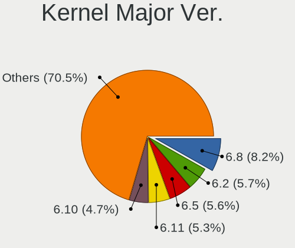
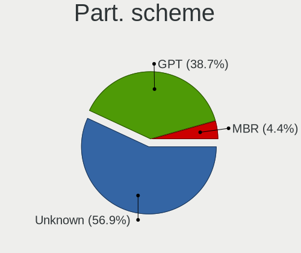
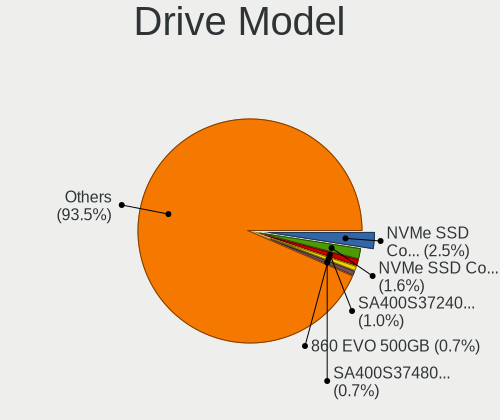
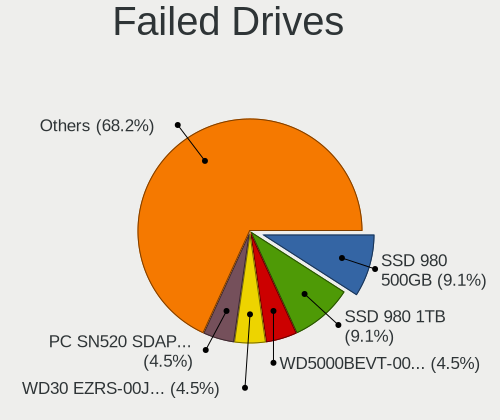
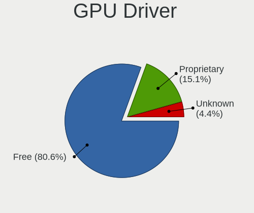
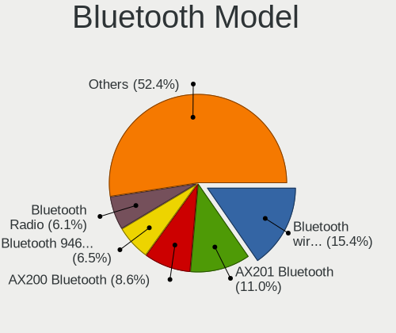
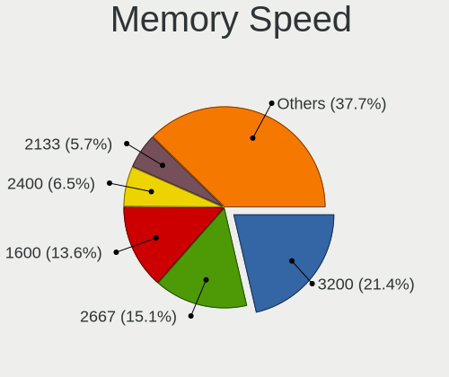

Fedora - Tested Hardware & Statistics
-------------------------------------

A project to collect tested hardware configurations for Fedora.

Anyone can contribute to this report by the [hw-probe](https://github.com/linuxhw/hw-probe) tool:

    sudo -E hw-probe -all -upload

Please contribute! Especially if your hardware is rare.

This is a report for all computer types. See also reports for [desktops](/Dist/Fedora/Desktop/README.md) and [notebooks](/Dist/Fedora/Notebook/README.md).

Contents
--------

* [ Test Cases ](#test-cases)

* [ System ](#system)
  - [ OS                       ](#os)
  - [ OS Family                ](#os-family)
  - [ Kernel                   ](#kernel)
  - [ Kernel Family            ](#kernel-family)
  - [ Kernel Major Ver.        ](#kernel-major-ver)
  - [ Arch                     ](#arch)
  - [ DE                       ](#de)
  - [ Display Server           ](#display-server)
  - [ Display Manager          ](#display-manager)
  - [ OS Lang                  ](#os-lang)
  - [ Boot Mode                ](#boot-mode)
  - [ Filesystem               ](#filesystem)
  - [ Part. scheme             ](#part-scheme)
  - [ Dual Boot with Linux/BSD ](#dual-boot-with-linuxbsd)
  - [ Dual Boot (Win)          ](#dual-boot-win)

* [ Board ](#board)
  - [ Vendor                   ](#vendor)
  - [ Model                    ](#model)
  - [ Model Family             ](#model-family)
  - [ MFG Year                 ](#mfg-year)
  - [ Form Factor              ](#form-factor)
  - [ Secure Boot              ](#secure-boot)
  - [ Coreboot                 ](#coreboot)
  - [ RAM Size                 ](#ram-size)
  - [ RAM Used                 ](#ram-used)
  - [ Total Drives             ](#total-drives)
  - [ Has CD-ROM               ](#has-cd-rom)
  - [ Has Ethernet             ](#has-ethernet)
  - [ Has WiFi                 ](#has-wifi)
  - [ Has Bluetooth            ](#has-bluetooth)

* [ Location ](#location)
  - [ Country                  ](#country)
  - [ City                     ](#city)

* [ Drives ](#drives)
  - [ Drive Vendor             ](#drive-vendor)
  - [ Drive Model              ](#drive-model)
  - [ HDD Vendor               ](#hdd-vendor)
  - [ SSD Vendor               ](#ssd-vendor)
  - [ Drive Kind               ](#drive-kind)
  - [ Drive Connector          ](#drive-connector)
  - [ Drive Size               ](#drive-size)
  - [ Space Total              ](#space-total)
  - [ Space Used               ](#space-used)
  - [ Malfunc. Drives          ](#malfunc-drives)
  - [ Malfunc. Drive Vendor    ](#malfunc-drive-vendor)
  - [ Malfunc. HDD Vendor      ](#malfunc-hdd-vendor)
  - [ Malfunc. Drive Kind      ](#malfunc-drive-kind)
  - [ Failed Drives            ](#failed-drives)
  - [ Failed Drive Vendor      ](#failed-drive-vendor)
  - [ Drive Status             ](#drive-status)

* [ Storage controller ](#storage-controller)
  - [ Storage Vendor           ](#storage-vendor)
  - [ Storage Model            ](#storage-model)
  - [ Storage Kind             ](#storage-kind)

* [ Processor ](#processor)
  - [ CPU Vendor               ](#cpu-vendor)
  - [ CPU Model                ](#cpu-model)
  - [ CPU Model Family         ](#cpu-model-family)
  - [ CPU Cores                ](#cpu-cores)
  - [ CPU Sockets              ](#cpu-sockets)
  - [ CPU Threads              ](#cpu-threads)
  - [ CPU Op-Modes             ](#cpu-op-modes)
  - [ CPU Microcode            ](#cpu-microcode)
  - [ CPU Microarch            ](#cpu-microarch)

* [ Graphics ](#graphics)
  - [ GPU Vendor               ](#gpu-vendor)
  - [ GPU Model                ](#gpu-model)
  - [ GPU Combo                ](#gpu-combo)
  - [ GPU Driver               ](#gpu-driver)
  - [ GPU Memory               ](#gpu-memory)

* [ Monitor ](#monitor)
  - [ Monitor Vendor           ](#monitor-vendor)
  - [ Monitor Model            ](#monitor-model)
  - [ Monitor Resolution       ](#monitor-resolution)
  - [ Monitor Diagonal         ](#monitor-diagonal)
  - [ Monitor Width            ](#monitor-width)
  - [ Aspect Ratio             ](#aspect-ratio)
  - [ Monitor Area             ](#monitor-area)
  - [ Pixel Density            ](#pixel-density)
  - [ Multiple Monitors        ](#multiple-monitors)

* [ Network ](#network)
  - [ Net Controller Vendor    ](#net-controller-vendor)
  - [ Net Controller Model     ](#net-controller-model)
  - [ Wireless Vendor          ](#wireless-vendor)
  - [ Wireless Model           ](#wireless-model)
  - [ Ethernet Vendor          ](#ethernet-vendor)
  - [ Ethernet Model           ](#ethernet-model)
  - [ Net Controller Kind      ](#net-controller-kind)
  - [ Used Controller          ](#used-controller)
  - [ NICs                     ](#nics)
  - [ IPv6                     ](#ipv6)

* [ Bluetooth ](#bluetooth)
  - [ Bluetooth Vendor         ](#bluetooth-vendor)
  - [ Bluetooth Model          ](#bluetooth-model)

* [ Sound ](#sound)
  - [ Sound Vendor             ](#sound-vendor)
  - [ Sound Model              ](#sound-model)

* [ Memory ](#memory)
  - [ Memory Vendor            ](#memory-vendor)
  - [ Memory Model             ](#memory-model)
  - [ Memory Kind              ](#memory-kind)
  - [ Memory Form Factor       ](#memory-form-factor)
  - [ Memory Size              ](#memory-size)
  - [ Memory Speed             ](#memory-speed)

* [ Printers & scanners ](#printers--scanners)
  - [ Printer Vendor           ](#printer-vendor)
  - [ Printer Model            ](#printer-model)
  - [ Scanner Vendor           ](#scanner-vendor)
  - [ Scanner Model            ](#scanner-model)

* [ Camera ](#camera)
  - [ Camera Vendor            ](#camera-vendor)
  - [ Camera Model             ](#camera-model)

* [ Security ](#security)
  - [ Fingerprint Vendor       ](#fingerprint-vendor)
  - [ Fingerprint Model        ](#fingerprint-model)
  - [ Chipcard Vendor          ](#chipcard-vendor)
  - [ Chipcard Model           ](#chipcard-model)

* [ Unsupported ](#unsupported)
  - [ Unsupported Devices      ](#unsupported-devices)
  - [ Unsupported Device Types ](#unsupported-device-types)

Test Cases
----------

Total: 22588

| Vendor        | Model                       | Form-Factor | Probe                                                      | Date         |
|---------------|-----------------------------|-------------|------------------------------------------------------------|--------------|
| ASUSTek       | ROG Strix G533ZM_G533ZM     | Notebook    | [00e99b0067](https://linux-hardware.org/?probe=00e99b0067) | Jan 02, 2024 |
| Lenovo        | G50-70 20351                | Notebook    | [cb1029f101](https://linux-hardware.org/?probe=cb1029f101) | Jan 02, 2024 |
| Lenovo        | ThinkPad L15 Gen 1 20U7C... | Notebook    | [389ae3afc8](https://linux-hardware.org/?probe=389ae3afc8) | Jan 02, 2024 |
| MSI           | X99A RAIDER                 | Desktop     | [0c40685bac](https://linux-hardware.org/?probe=0c40685bac) | Jan 02, 2024 |
| Lenovo        | ThinkPad T410 2522PT3       | Notebook    | [db100cd948](https://linux-hardware.org/?probe=db100cd948) | Jan 02, 2024 |
| Fujitsu       | D3501-A1 S26361-D3501-A1    | Desktop     | [9711c69823](https://linux-hardware.org/?probe=9711c69823) | Jan 02, 2024 |
| Gigabyte      | B560 DS3H AC-Y1             | Desktop     | [9868062aa3](https://linux-hardware.org/?probe=9868062aa3) | Jan 02, 2024 |
| Samsung       | 730QDA                      | Convertible | [e9603387e6](https://linux-hardware.org/?probe=e9603387e6) | Jan 02, 2024 |
| Apple         | MacBookPro9,2               | Notebook    | [133a9d6ebc](https://linux-hardware.org/?probe=133a9d6ebc) | Jan 02, 2024 |
| Dell          | 0NDYHG A01                  | Desktop     | [68cde01489](https://linux-hardware.org/?probe=68cde01489) | Jan 02, 2024 |
| Lenovo        | Y520-15IKBN 80WK            | Notebook    | [8701a130d2](https://linux-hardware.org/?probe=8701a130d2) | Jan 02, 2024 |
| ASUSTek       | VivoBook_ASUSLaptop E210... | Notebook    | [689f8869db](https://linux-hardware.org/?probe=689f8869db) | Jan 01, 2024 |
| Dell          | Inspiron 15 3530            | Notebook    | [ee21ee0e37](https://linux-hardware.org/?probe=ee21ee0e37) | Jan 01, 2024 |
| Dell          | Inspiron N5110              | Notebook    | [bf974230c7](https://linux-hardware.org/?probe=bf974230c7) | Jan 01, 2024 |
| ASUSTek       | VivoBook_ASUSLaptop X509... | Notebook    | [d4335b1132](https://linux-hardware.org/?probe=d4335b1132) | Jan 01, 2024 |
| ASUSTek       | TUF Gaming Z490-PLUS        | Desktop     | [ccaa0646d7](https://linux-hardware.org/?probe=ccaa0646d7) | Jan 01, 2024 |
| ASUSTek       | H81M-A/BR                   | Desktop     | [6f2227d209](https://linux-hardware.org/?probe=6f2227d209) | Jan 01, 2024 |
| Apple         | MacBookPro11,2              | Notebook    | [4a37a9b35c](https://linux-hardware.org/?probe=4a37a9b35c) | Jan 01, 2024 |
| ASUSTek       | VivoBook_ASUSLaptop K650... | Notebook    | [20f988146c](https://linux-hardware.org/?probe=20f988146c) | Jan 01, 2024 |
| Lenovo        | ThinkPad T460 20FMS2291P    | Notebook    | [1a86f2a3d4](https://linux-hardware.org/?probe=1a86f2a3d4) | Jan 01, 2024 |
| Dell          | Latitude 5310               | Notebook    | [87c543db6f](https://linux-hardware.org/?probe=87c543db6f) | Jan 01, 2024 |
| HP            | ENVY x360 Convertible 15... | Convertible | [a3d3e92cce](https://linux-hardware.org/?probe=a3d3e92cce) | Jan 01, 2024 |
| ASUSTek       | PRIME B550M-A               | Desktop     | [a4cf1bb1ea](https://linux-hardware.org/?probe=a4cf1bb1ea) | Jan 01, 2024 |
| ASUSTek       | VivoBook_ASUSLaptop X571... | Notebook    | [de7126bf06](https://linux-hardware.org/?probe=de7126bf06) | Jan 01, 2024 |
| ASUSTek       | H97-PLUS                    | Desktop     | [e208caf8f1](https://linux-hardware.org/?probe=e208caf8f1) | Jan 01, 2024 |
| MSI           | X99A RAIDER                 | Desktop     | [bb37fe4632](https://linux-hardware.org/?probe=bb37fe4632) | Jan 01, 2024 |
| Lenovo        | IdeaPad 3 15ITL6 82H8       | Notebook    | [4eb26f2685](https://linux-hardware.org/?probe=4eb26f2685) | Jan 01, 2024 |
| Dell          | XPS 15 9530                 | Notebook    | [22ba5950e3](https://linux-hardware.org/?probe=22ba5950e3) | Jan 01, 2024 |
| Dell          | XPS 15 9530                 | Notebook    | [dddd9b59bf](https://linux-hardware.org/?probe=dddd9b59bf) | Jan 01, 2024 |
| MSI           | 880GM-E41                   | Desktop     | [caf8e2f533](https://linux-hardware.org/?probe=caf8e2f533) | Dec 31, 2023 |
| ASUSTek       | VivoBook_ASUSLaptop TP42... | Convertible | [fe68cbddbb](https://linux-hardware.org/?probe=fe68cbddbb) | Dec 31, 2023 |
| Dell          | Inspiron N5110              | Notebook    | [439d746143](https://linux-hardware.org/?probe=439d746143) | Dec 31, 2023 |
| Apple         | MacBookAir7,2               | Notebook    | [b25bae6ded](https://linux-hardware.org/?probe=b25bae6ded) | Dec 31, 2023 |
| HUAWEI        | KLVL-WXX9                   | Notebook    | [28ad8513b4](https://linux-hardware.org/?probe=28ad8513b4) | Dec 31, 2023 |
| Lenovo        | ThinkPad T470s 20HGS1R90... | Notebook    | [c0587a6f3f](https://linux-hardware.org/?probe=c0587a6f3f) | Dec 31, 2023 |
| ASUSTek       | H81M-A/BR                   | Desktop     | [61946a6719](https://linux-hardware.org/?probe=61946a6719) | Dec 31, 2023 |
| ASUSTek       | VivoBook_ASUSLaptop X571... | Notebook    | [cd2840bccc](https://linux-hardware.org/?probe=cd2840bccc) | Dec 31, 2023 |
| HP            | Laptop 14s-dq1xxx           | Notebook    | [f5f0fa82e5](https://linux-hardware.org/?probe=f5f0fa82e5) | Dec 31, 2023 |
| OEM           | G41 775 ICH7 8712           | Desktop     | [bfb91f354b](https://linux-hardware.org/?probe=bfb91f354b) | Dec 31, 2023 |
| Apple         | MacBookPro6,2               | Notebook    | [1a25482d3d](https://linux-hardware.org/?probe=1a25482d3d) | Dec 31, 2023 |
| AMI           | Intel                       | Desktop     | [532ef0e65e](https://linux-hardware.org/?probe=532ef0e65e) | Dec 31, 2023 |
| Lenovo        | IdeaPad 3 15ITL6 82H8       | Notebook    | [47e1e3c766](https://linux-hardware.org/?probe=47e1e3c766) | Dec 31, 2023 |
| ASUSTek       | H81M-K                      | Desktop     | [8262129320](https://linux-hardware.org/?probe=8262129320) | Dec 31, 2023 |
| Gigabyte      | Z490 AORUS ELITE AC         | Desktop     | [4faca6dad4](https://linux-hardware.org/?probe=4faca6dad4) | Dec 31, 2023 |
| Thirdwave     | Prime Series                | Notebook    | [dc3d167b01](https://linux-hardware.org/?probe=dc3d167b01) | Dec 31, 2023 |
| HP            | ProBook 11 G2               | Notebook    | [6cf8228f10](https://linux-hardware.org/?probe=6cf8228f10) | Dec 31, 2023 |
| Gigabyte      | Z370 HD3P-CF                | Desktop     | [83ef33bf03](https://linux-hardware.org/?probe=83ef33bf03) | Dec 31, 2023 |
| Lenovo        | ThinkPad X1 Tablet 20GG0... | Tablet      | [c1b48795ed](https://linux-hardware.org/?probe=c1b48795ed) | Dec 31, 2023 |
| Lenovo        | ThinkPad X1 Tablet 20GG0... | Tablet      | [094fb36931](https://linux-hardware.org/?probe=094fb36931) | Dec 31, 2023 |
| Acer          | Predator PH16-71            | Notebook    | [deae7730f2](https://linux-hardware.org/?probe=deae7730f2) | Dec 31, 2023 |
| MSI           | X99A RAIDER                 | Desktop     | [a9aee13c48](https://linux-hardware.org/?probe=a9aee13c48) | Dec 31, 2023 |
| Apple         | Mac-F221BEC8                | Desktop     | [57b09cabf5](https://linux-hardware.org/?probe=57b09cabf5) | Dec 31, 2023 |
| MSI           | H110M PRO-VD                | Desktop     | [d508dc8f38](https://linux-hardware.org/?probe=d508dc8f38) | Dec 31, 2023 |
| MSI           | 970 GAMING                  | Desktop     | [7f7f8f09ae](https://linux-hardware.org/?probe=7f7f8f09ae) | Dec 31, 2023 |
| Apple         | Mac-7BA5B2DFE22DDD8C Mac... | Mini pc     | [7fa25fe746](https://linux-hardware.org/?probe=7fa25fe746) | Dec 30, 2023 |
| Dell          | Inspiron 3505               | Notebook    | [bbcd14000a](https://linux-hardware.org/?probe=bbcd14000a) | Dec 30, 2023 |
| Dell          | Latitude 5540               | Notebook    | [604aab0481](https://linux-hardware.org/?probe=604aab0481) | Dec 30, 2023 |
| Packard Be... | EasyNote TS44HR             | Notebook    | [a06265dd1e](https://linux-hardware.org/?probe=a06265dd1e) | Dec 30, 2023 |
| HP            | ENVY x360 2-in-1 Laptop ... | Convertible | [bee026166f](https://linux-hardware.org/?probe=bee026166f) | Dec 30, 2023 |
| ASUSTek       | M5A97 R2.0                  | Desktop     | [674f54c42c](https://linux-hardware.org/?probe=674f54c42c) | Dec 30, 2023 |
| Dell          | Inspiron 7386               | Convertible | [f462e5f53d](https://linux-hardware.org/?probe=f462e5f53d) | Dec 30, 2023 |
| Dell          | Inspiron 5748               | Notebook    | [20017233b9](https://linux-hardware.org/?probe=20017233b9) | Dec 30, 2023 |
| Lenovo        | Yoga S740-15IRH 81NX        | Notebook    | [aa1bee686a](https://linux-hardware.org/?probe=aa1bee686a) | Dec 30, 2023 |
| Lenovo        | V15 G3 IAP 82TT             | Notebook    | [adf7c97dab](https://linux-hardware.org/?probe=adf7c97dab) | Dec 30, 2023 |
| ASRock        | B450M Pro4 R2.0             | Desktop     | [fa7e23a6ee](https://linux-hardware.org/?probe=fa7e23a6ee) | Dec 30, 2023 |
| ASUSTek       | TUF Z390M-PRO GAMING        | Desktop     | [b7be314f8d](https://linux-hardware.org/?probe=b7be314f8d) | Dec 30, 2023 |
| Dell          | 0R6PCT A01                  | Desktop     | [8409c4a0d6](https://linux-hardware.org/?probe=8409c4a0d6) | Dec 30, 2023 |
| HP            | EliteBook 840 G3            | Notebook    | [d3bb35f033](https://linux-hardware.org/?probe=d3bb35f033) | Dec 30, 2023 |
| ASUSTek       | VivoBook_ASUSLaptop X421... | Notebook    | [f391231013](https://linux-hardware.org/?probe=f391231013) | Dec 30, 2023 |
| HP            | EliteBook 840 G3            | Notebook    | [52ed3f7e82](https://linux-hardware.org/?probe=52ed3f7e82) | Dec 30, 2023 |
| Gigabyte      | GA-870A-UD3                 | Desktop     | [090ed6d6f3](https://linux-hardware.org/?probe=090ed6d6f3) | Dec 30, 2023 |
| Lenovo        | IdeaPad 3 15ITL6 82MD       | Notebook    | [33556742c3](https://linux-hardware.org/?probe=33556742c3) | Dec 30, 2023 |
| Gigabyte      | G41MT-D3                    | Desktop     | [442c87e7d9](https://linux-hardware.org/?probe=442c87e7d9) | Dec 30, 2023 |
| ASUSTek       | VivoBook_ASUSLaptop M760... | Notebook    | [60da2c756f](https://linux-hardware.org/?probe=60da2c756f) | Dec 30, 2023 |
| ASUSTek       | U52F                        | Notebook    | [acf3ac6f23](https://linux-hardware.org/?probe=acf3ac6f23) | Dec 30, 2023 |
| Lenovo        | ThinkPad P15v Gen 1 20TR... | Notebook    | [017090bd57](https://linux-hardware.org/?probe=017090bd57) | Dec 30, 2023 |
| ASUSTek       | VivoBook_ASUSLaptop M760... | Notebook    | [f805c2c9fc](https://linux-hardware.org/?probe=f805c2c9fc) | Dec 30, 2023 |
| ASUSTek       | N551JW                      | Notebook    | [12339778af](https://linux-hardware.org/?probe=12339778af) | Dec 30, 2023 |
| Lenovo        | ThinkPad P53 20QNCTO1WW     | Notebook    | [76f94ce16a](https://linux-hardware.org/?probe=76f94ce16a) | Dec 29, 2023 |
| Lenovo        | ThinkBook 15 G2 ITL 20VE    | Notebook    | [63af20b791](https://linux-hardware.org/?probe=63af20b791) | Dec 29, 2023 |
| Lenovo        | Legion Slim 5 14APH8 82Y... | Notebook    | [402a1c70b8](https://linux-hardware.org/?probe=402a1c70b8) | Dec 29, 2023 |
| ASUSTek       | VivoBook_ASUSLaptop X515... | Notebook    | [e0fa90555a](https://linux-hardware.org/?probe=e0fa90555a) | Dec 29, 2023 |
| Lenovo        | Legion Slim 5 14APH8 82Y... | Notebook    | [13e876e5cf](https://linux-hardware.org/?probe=13e876e5cf) | Dec 29, 2023 |
| Lenovo        | ThinkPad T410 2537BY8       | Notebook    | [0117a0ab48](https://linux-hardware.org/?probe=0117a0ab48) | Dec 29, 2023 |
| ASUSTek       | VivoBook_ASUSLaptop X515... | Notebook    | [03199adbd4](https://linux-hardware.org/?probe=03199adbd4) | Dec 29, 2023 |
| Apple         | MacBookPro5,2               | Notebook    | [b6269d662d](https://linux-hardware.org/?probe=b6269d662d) | Dec 29, 2023 |
| Razer         | Blade                       | Notebook    | [87f8a27b0a](https://linux-hardware.org/?probe=87f8a27b0a) | Dec 29, 2023 |
| Dell          | Vostro 3405                 | Notebook    | [e527034e74](https://linux-hardware.org/?probe=e527034e74) | Dec 29, 2023 |
| Dell          | Vostro 3405                 | Notebook    | [aee31d728f](https://linux-hardware.org/?probe=aee31d728f) | Dec 29, 2023 |
| MSI           | B450 TOMAHAWK MAX           | Desktop     | [403210cab1](https://linux-hardware.org/?probe=403210cab1) | Dec 29, 2023 |
| ASUSTek       | TUF Gaming X570-PLUS        | Desktop     | [50eef7421d](https://linux-hardware.org/?probe=50eef7421d) | Dec 29, 2023 |
| Gigabyte      | X670 GAMING X AX V2         | Desktop     | [fb8e3461de](https://linux-hardware.org/?probe=fb8e3461de) | Dec 29, 2023 |
| HP            | ENVY Laptop 13-ba1xxx       | Notebook    | [99561c9ed3](https://linux-hardware.org/?probe=99561c9ed3) | Dec 29, 2023 |
| HP            | ENVY Laptop 13-ba1xxx       | Notebook    | [13e6674db0](https://linux-hardware.org/?probe=13e6674db0) | Dec 29, 2023 |
| ASRock        | AD2700-ITX                  | Desktop     | [3296b05cf8](https://linux-hardware.org/?probe=3296b05cf8) | Dec 29, 2023 |
| Gigabyte      | B450M DS3H V2               | Desktop     | [c8430d442b](https://linux-hardware.org/?probe=c8430d442b) | Dec 29, 2023 |
| Lenovo        | ThinkBook 13s-IWL 20R9      | Notebook    | [53fc03e451](https://linux-hardware.org/?probe=53fc03e451) | Dec 29, 2023 |
| Framework     | Laptop (12th Gen Intel C... | Notebook    | [fb4b958ae6](https://linux-hardware.org/?probe=fb4b958ae6) | Dec 29, 2023 |
| Apple         | MacBookAir4,2               | Notebook    | [ab4628dffe](https://linux-hardware.org/?probe=ab4628dffe) | Dec 29, 2023 |
| Microsoft     | Surface Go                  | Tablet      | [cf4b641dde](https://linux-hardware.org/?probe=cf4b641dde) | Dec 29, 2023 |
| HONOR         | NMH-WDX9                    | Notebook    | [a632604865](https://linux-hardware.org/?probe=a632604865) | Dec 29, 2023 |
| ASRock        | B85M Pro3                   | Desktop     | [f61d357d7f](https://linux-hardware.org/?probe=f61d357d7f) | Dec 29, 2023 |
| Star Labs     | StarBook                    | Notebook    | [930fb359dd](https://linux-hardware.org/?probe=930fb359dd) | Dec 29, 2023 |
| HP            | Laptop 15-da0xxx            | Notebook    | [03ad95c394](https://linux-hardware.org/?probe=03ad95c394) | Dec 29, 2023 |
| ASUSTek       | ROG Strix G713QM_G713QM     | Notebook    | [6c5599855c](https://linux-hardware.org/?probe=6c5599855c) | Dec 29, 2023 |
| Lenovo        | ThinkPad X1 Carbon 7th 2... | Notebook    | [c0a8fdcf6f](https://linux-hardware.org/?probe=c0a8fdcf6f) | Dec 29, 2023 |
| Apple         | MacBookAir4,2               | Notebook    | [9a7ee6f89e](https://linux-hardware.org/?probe=9a7ee6f89e) | Dec 29, 2023 |
| HP            | 8719                        | Desktop     | [91c89a31b5](https://linux-hardware.org/?probe=91c89a31b5) | Dec 29, 2023 |
| Lenovo        | ThinkPad L14 Gen 2 20X2S... | Notebook    | [09f37233e4](https://linux-hardware.org/?probe=09f37233e4) | Dec 29, 2023 |
| Pegatron      | IPMIP-GS                    | Desktop     | [d8ace6bbb7](https://linux-hardware.org/?probe=d8ace6bbb7) | Dec 29, 2023 |
| ASUSTek       | ROG Strix G713QM_G713QM     | Notebook    | [0be6e9ce52](https://linux-hardware.org/?probe=0be6e9ce52) | Dec 29, 2023 |
| HP            | EliteBook 2570p             | Notebook    | [935d08358c](https://linux-hardware.org/?probe=935d08358c) | Dec 29, 2023 |
| Dell          | Inspiron 3542               | Notebook    | [06e3a35d05](https://linux-hardware.org/?probe=06e3a35d05) | Dec 29, 2023 |
| Lenovo        | ThinkPad T14s Gen 2a 20X... | Notebook    | [92c8c4f42c](https://linux-hardware.org/?probe=92c8c4f42c) | Dec 28, 2023 |
| Panasonic     | CF-33-1                     | Tablet      | [93c6a1711e](https://linux-hardware.org/?probe=93c6a1711e) | Dec 28, 2023 |
| Lenovo        | G700 20251                  | Notebook    | [3426bbc85d](https://linux-hardware.org/?probe=3426bbc85d) | Dec 28, 2023 |
| Lenovo        | G700 20251                  | Notebook    | [78b29bb9e8](https://linux-hardware.org/?probe=78b29bb9e8) | Dec 28, 2023 |
| Dell          | Vostro 15 5510              | Notebook    | [02df63af48](https://linux-hardware.org/?probe=02df63af48) | Dec 28, 2023 |
| MSI           | GS70 2OD                    | Notebook    | [13dab050a1](https://linux-hardware.org/?probe=13dab050a1) | Dec 28, 2023 |
| MSI           | GS70 2OD                    | Notebook    | [7092678d3b](https://linux-hardware.org/?probe=7092678d3b) | Dec 28, 2023 |
| Lenovo        | 310B SDK0J40697 WIN 3305... | Desktop     | [e49bfae343](https://linux-hardware.org/?probe=e49bfae343) | Dec 28, 2023 |
| Acer          | Nitro AN515-54              | Notebook    | [b310676172](https://linux-hardware.org/?probe=b310676172) | Dec 28, 2023 |
| Apple         | MacBookPro15,4              | Notebook    | [b3691ac681](https://linux-hardware.org/?probe=b3691ac681) | Dec 28, 2023 |
| BAKED         | P65xRP                      | Notebook    | [4bd66fa9db](https://linux-hardware.org/?probe=4bd66fa9db) | Dec 28, 2023 |
| Pegatron      | 2AB6                        | Desktop     | [faf90bb1a2](https://linux-hardware.org/?probe=faf90bb1a2) | Dec 28, 2023 |
| Gigabyte      | B450 AORUS M                | Desktop     | [e01ab0c412](https://linux-hardware.org/?probe=e01ab0c412) | Dec 28, 2023 |
| MSI           | MS-7390                     | Desktop     | [ca9f0bde00](https://linux-hardware.org/?probe=ca9f0bde00) | Dec 28, 2023 |
| Unknown       | Unknown                     | Notebook    | [7c86c2f5dc](https://linux-hardware.org/?probe=7c86c2f5dc) | Dec 28, 2023 |
| Pegatron      | 2AB6                        | Desktop     | [6eb51d9bd9](https://linux-hardware.org/?probe=6eb51d9bd9) | Dec 28, 2023 |
| HP            | EliteBook 840 G2            | Notebook    | [bbce6fb229](https://linux-hardware.org/?probe=bbce6fb229) | Dec 28, 2023 |
| Dell          | 0R230R A00                  | Desktop     | [50111db215](https://linux-hardware.org/?probe=50111db215) | Dec 28, 2023 |
| Lenovo        | ThinkPad T14 Gen 4 21K4S... | Notebook    | [a135119148](https://linux-hardware.org/?probe=a135119148) | Dec 28, 2023 |
| HP            | ENVY Laptop 13-aq1xxx       | Notebook    | [44df1c7cc6](https://linux-hardware.org/?probe=44df1c7cc6) | Dec 28, 2023 |
| Lenovo        | ThinkPad X1 Carbon Gen 1... | Notebook    | [cc024fb567](https://linux-hardware.org/?probe=cc024fb567) | Dec 28, 2023 |
| HP            | EliteBook 840 G2            | Notebook    | [6ba5504a6f](https://linux-hardware.org/?probe=6ba5504a6f) | Dec 28, 2023 |
| Apple         | Mac-7BA5B2DFE22DDD8C Mac... | Mini pc     | [67b966b660](https://linux-hardware.org/?probe=67b966b660) | Dec 28, 2023 |
| Lenovo        | ThinkPad T510 43492RU       | Notebook    | [87b76140e0](https://linux-hardware.org/?probe=87b76140e0) | Dec 28, 2023 |
| Apple         | MacBookPro15,4              | Notebook    | [1d368b7c25](https://linux-hardware.org/?probe=1d368b7c25) | Dec 28, 2023 |
| Gigabyte      | Z77MX-D3H                   | Desktop     | [3357d873d5](https://linux-hardware.org/?probe=3357d873d5) | Dec 28, 2023 |
| HP            | Notebook                    | Notebook    | [5b3e4ada9c](https://linux-hardware.org/?probe=5b3e4ada9c) | Dec 28, 2023 |
| HP            | ProBook 11 G2               | Notebook    | [3ad144c68e](https://linux-hardware.org/?probe=3ad144c68e) | Dec 28, 2023 |
| ASRock        | X570 Steel Legend           | Desktop     | [a2a45575d5](https://linux-hardware.org/?probe=a2a45575d5) | Dec 28, 2023 |
| Lenovo        | ThinkPad T560 20FH002GUS    | Notebook    | [76926807cc](https://linux-hardware.org/?probe=76926807cc) | Dec 28, 2023 |
| ASUSTek       | PRIME Z690M-PLUS D4         | Desktop     | [7a9ff71d9b](https://linux-hardware.org/?probe=7a9ff71d9b) | Dec 28, 2023 |
| Lenovo        | ThinkPad T560 20FH002GUS    | Notebook    | [cf5b823135](https://linux-hardware.org/?probe=cf5b823135) | Dec 28, 2023 |
| ASRock        | X570 Steel Legend           | Desktop     | [836a55f0b6](https://linux-hardware.org/?probe=836a55f0b6) | Dec 28, 2023 |
| MSI           | MPG X570 GAMING PLUS        | Desktop     | [0b3af4418c](https://linux-hardware.org/?probe=0b3af4418c) | Dec 27, 2023 |
| ASUSTek       | ROG Strix G614JZ_G614JZ     | Notebook    | [3ec4d2a40d](https://linux-hardware.org/?probe=3ec4d2a40d) | Dec 27, 2023 |
| Lenovo        | ThinkBook 14 G4+ IAP 21C... | Notebook    | [151f072ac9](https://linux-hardware.org/?probe=151f072ac9) | Dec 27, 2023 |
| Lenovo        | Mullins-LarneML             | Notebook    | [e545ddc079](https://linux-hardware.org/?probe=e545ddc079) | Dec 27, 2023 |
| Lenovo        | ThinkBook 13s-IWL 20R9      | Notebook    | [eaa68fe0f5](https://linux-hardware.org/?probe=eaa68fe0f5) | Dec 27, 2023 |
| Apple         | MacBookPro11,1              | Notebook    | [344f1c919a](https://linux-hardware.org/?probe=344f1c919a) | Dec 27, 2023 |
| MSI           | Z97 GAMING 5                | Desktop     | [3b0901d1a4](https://linux-hardware.org/?probe=3b0901d1a4) | Dec 27, 2023 |
| MSI           | Modern 15 B7M               | Notebook    | [2c7f48c9ad](https://linux-hardware.org/?probe=2c7f48c9ad) | Dec 27, 2023 |
| ASRock        | X399 Phantom Gaming 6       | Desktop     | [3d57263239](https://linux-hardware.org/?probe=3d57263239) | Dec 27, 2023 |
| Lenovo        | Legion 7 16ACHg6 82N6       | Notebook    | [7378a1bdb4](https://linux-hardware.org/?probe=7378a1bdb4) | Dec 27, 2023 |
| ASUSTek       | GL753VD                     | Notebook    | [73bbd42b1f](https://linux-hardware.org/?probe=73bbd42b1f) | Dec 27, 2023 |
| Chuwi         | MiniBook X                  | Notebook    | [6249e8f644](https://linux-hardware.org/?probe=6249e8f644) | Dec 27, 2023 |
| Dell          | XPS 15 9570                 | Notebook    | [25466d5d3b](https://linux-hardware.org/?probe=25466d5d3b) | Dec 27, 2023 |
| MSI           | B450 TOMAHAWK MAX           | Desktop     | [d661150c95](https://linux-hardware.org/?probe=d661150c95) | Dec 27, 2023 |
| Lenovo        | ThinkPad X13 Yoga Gen 3 ... | Convertible | [793c6c630d](https://linux-hardware.org/?probe=793c6c630d) | Dec 27, 2023 |
| Lenovo        | ThinkPad X13 Yoga Gen 3 ... | Convertible | [b7d225eab5](https://linux-hardware.org/?probe=b7d225eab5) | Dec 27, 2023 |
| LG Electro... | 17Z90N-R.AAC8U1             | Notebook    | [b9fd2cf453](https://linux-hardware.org/?probe=b9fd2cf453) | Dec 27, 2023 |
| Lenovo        | ThinkPad X1 Carbon Gen 1... | Notebook    | [10918ac964](https://linux-hardware.org/?probe=10918ac964) | Dec 27, 2023 |
| ASUSTek       | H81M-A/BR                   | Desktop     | [87cae62baf](https://linux-hardware.org/?probe=87cae62baf) | Dec 27, 2023 |
| HP            | Laptop 14s-dy5xxx           | Notebook    | [de602b4dc6](https://linux-hardware.org/?probe=de602b4dc6) | Dec 27, 2023 |
| Dell          | XPS 17 9720                 | Notebook    | [ff40dc8bad](https://linux-hardware.org/?probe=ff40dc8bad) | Dec 27, 2023 |
| Lenovo        | ThinkPad X1 Yoga Gen 6 2... | Convertible | [bb6cb6170d](https://linux-hardware.org/?probe=bb6cb6170d) | Dec 27, 2023 |
| Lenovo        | ThinkPad X1 Yoga Gen 6 2... | Convertible | [87205c3306](https://linux-hardware.org/?probe=87205c3306) | Dec 27, 2023 |
| HP            | Stream Laptop 14-ax0XX      | Notebook    | [d304e99c16](https://linux-hardware.org/?probe=d304e99c16) | Dec 27, 2023 |
| Acer          | TravelMate P256-M           | Notebook    | [c4f9e9de5e](https://linux-hardware.org/?probe=c4f9e9de5e) | Dec 27, 2023 |
| Acer          | TravelMate P256-M           | Notebook    | [c129debcae](https://linux-hardware.org/?probe=c129debcae) | Dec 27, 2023 |
| Gigabyte      | D525TUD                     | Desktop     | [8625448d34](https://linux-hardware.org/?probe=8625448d34) | Dec 27, 2023 |
| HP            | ZBook Studio G7 Mobile W... | Notebook    | [df9f1cce5b](https://linux-hardware.org/?probe=df9f1cce5b) | Dec 27, 2023 |
| Unknown       | Unknown                     | Desktop     | [d9355d1b8b](https://linux-hardware.org/?probe=d9355d1b8b) | Dec 27, 2023 |
| Acer          | Aspire E5-571G              | Notebook    | [a143ecb3c3](https://linux-hardware.org/?probe=a143ecb3c3) | Dec 27, 2023 |
| Lenovo        | ThinkPad T510 43492RU       | Notebook    | [d3f51b650d](https://linux-hardware.org/?probe=d3f51b650d) | Dec 27, 2023 |
| ASUSTek       | PRIME X570-PRO              | Desktop     | [104529fd86](https://linux-hardware.org/?probe=104529fd86) | Dec 26, 2023 |
| Dell          | Latitude E6530              | Notebook    | [bd56df50f6](https://linux-hardware.org/?probe=bd56df50f6) | Dec 26, 2023 |
| Lenovo        | IdeaPad 5 15ALC05 82LN      | Notebook    | [e832f6b336](https://linux-hardware.org/?probe=e832f6b336) | Dec 26, 2023 |
| HUAWEI        | MRGFG-XX                    | Notebook    | [8ac7316911](https://linux-hardware.org/?probe=8ac7316911) | Dec 26, 2023 |
| MSI           | B450 TOMAHAWK               | Desktop     | [40a7073595](https://linux-hardware.org/?probe=40a7073595) | Dec 26, 2023 |
| Gigabyte      | Z170-HD3-CF                 | Desktop     | [99e618d817](https://linux-hardware.org/?probe=99e618d817) | Dec 26, 2023 |
| Lenovo        | ThinkBook 15 G4 IAP 21DJ    | Notebook    | [a32866554a](https://linux-hardware.org/?probe=a32866554a) | Dec 26, 2023 |
| ASRock        | B365M Pro4                  | Desktop     | [3c41d3773a](https://linux-hardware.org/?probe=3c41d3773a) | Dec 26, 2023 |
| Lenovo        | ThinkPad W530 24474LG       | Notebook    | [180b4817c4](https://linux-hardware.org/?probe=180b4817c4) | Dec 26, 2023 |
| Gigabyte      | X670 AORUS ELITE AX         | Desktop     | [267c545497](https://linux-hardware.org/?probe=267c545497) | Dec 26, 2023 |
| Apple         | MacBookPro13,1              | Notebook    | [63344458c9](https://linux-hardware.org/?probe=63344458c9) | Dec 26, 2023 |
| Framework     | Laptop 13 (AMD Ryzen 704... | Notebook    | [3fd8513ee7](https://linux-hardware.org/?probe=3fd8513ee7) | Dec 26, 2023 |
| HP            | OMEN by Gaming Laptop 16... | Notebook    | [c436ff8cab](https://linux-hardware.org/?probe=c436ff8cab) | Dec 26, 2023 |
| Gigabyte      | J1900M-D2P                  | Desktop     | [96c4736340](https://linux-hardware.org/?probe=96c4736340) | Dec 26, 2023 |
| Dell          | XPS 13 9343                 | Notebook    | [8ba85bdc8c](https://linux-hardware.org/?probe=8ba85bdc8c) | Dec 26, 2023 |
| Shenzhen M... | F7BSD                       | Mini pc     | [7ef8b526bf](https://linux-hardware.org/?probe=7ef8b526bf) | Dec 26, 2023 |
| Lenovo        | ThinkPad T14s Gen 2a 20X... | Notebook    | [ef91ce6df3](https://linux-hardware.org/?probe=ef91ce6df3) | Dec 26, 2023 |
| ASRock        | 990FX Killer                | Desktop     | [1003211f6d](https://linux-hardware.org/?probe=1003211f6d) | Dec 26, 2023 |
| ASRock        | 990FX Killer                | Desktop     | [034adc4ac8](https://linux-hardware.org/?probe=034adc4ac8) | Dec 26, 2023 |
| Acer          | Nitro AN16-41               | Notebook    | [ae0d837def](https://linux-hardware.org/?probe=ae0d837def) | Dec 26, 2023 |
| ASUSTek       | V241IC-R                    | All in one  | [35dc305128](https://linux-hardware.org/?probe=35dc305128) | Dec 26, 2023 |
| Chuwi         | GemiBook Pro                | Notebook    | [0fceb23d42](https://linux-hardware.org/?probe=0fceb23d42) | Dec 25, 2023 |
| Apple         | MacBookPro13,1              | Notebook    | [555e444fe5](https://linux-hardware.org/?probe=555e444fe5) | Dec 25, 2023 |
| HP            | ENVY x360 2-in-1 Laptop ... | Convertible | [66bea55dd4](https://linux-hardware.org/?probe=66bea55dd4) | Dec 25, 2023 |
| Gigabyte      | GA-970A-UD3                 | Desktop     | [a68e5c51b4](https://linux-hardware.org/?probe=a68e5c51b4) | Dec 25, 2023 |
| Dell          | Latitude E5470              | Notebook    | [71121b89c8](https://linux-hardware.org/?probe=71121b89c8) | Dec 25, 2023 |
| ASUSTek       | ASUS TUF Dash F15 FX517Z... | Notebook    | [c38f5ee95e](https://linux-hardware.org/?probe=c38f5ee95e) | Dec 25, 2023 |
| Dell          | Latitude 6430U              | Notebook    | [4c20fee408](https://linux-hardware.org/?probe=4c20fee408) | Dec 25, 2023 |
| Lenovo        | ThinkPad T460p 20FWCTO1W... | Notebook    | [00e7af074b](https://linux-hardware.org/?probe=00e7af074b) | Dec 25, 2023 |
| MSI           | B350M MORTAR ARCTIC         | Desktop     | [68c1102e98](https://linux-hardware.org/?probe=68c1102e98) | Dec 25, 2023 |
| ASUSTek       | ROG STRIX Z790-H GAMING ... | Desktop     | [a5a641b111](https://linux-hardware.org/?probe=a5a641b111) | Dec 25, 2023 |
| MSI           | B350M MORTAR ARCTIC         | Desktop     | [f22547b26f](https://linux-hardware.org/?probe=f22547b26f) | Dec 25, 2023 |
| Lenovo        | ThinkPad X1 Tablet Gen 2... | Tablet      | [db4944275c](https://linux-hardware.org/?probe=db4944275c) | Dec 25, 2023 |
| Dell          | Latitude E6230              | Notebook    | [618343f74c](https://linux-hardware.org/?probe=618343f74c) | Dec 25, 2023 |
| Gigabyte      | H77N-WIFI                   | Desktop     | [22bbfabce0](https://linux-hardware.org/?probe=22bbfabce0) | Dec 25, 2023 |
| HP            | Laptop 15s-eq2xxx           | Notebook    | [41f592a596](https://linux-hardware.org/?probe=41f592a596) | Dec 25, 2023 |
| ASUSTek       | T102HA                      | Tablet      | [02f6066234](https://linux-hardware.org/?probe=02f6066234) | Dec 25, 2023 |
| ASUSTek       | VivoBook_ASUSLaptop X150... | Notebook    | [69ec584b3a](https://linux-hardware.org/?probe=69ec584b3a) | Dec 25, 2023 |
| Lenovo        | IdeaPad 3 15ITL6 82H8       | Notebook    | [5b4d3b8b68](https://linux-hardware.org/?probe=5b4d3b8b68) | Dec 25, 2023 |
| ASUSTek       | PRIME X570-PRO              | Desktop     | [d6f1c37a34](https://linux-hardware.org/?probe=d6f1c37a34) | Dec 25, 2023 |
| Gigabyte      | D525TUD                     | Desktop     | [357709050e](https://linux-hardware.org/?probe=357709050e) | Dec 25, 2023 |
| Gigabyte      | AORUS 15 XE4                | Notebook    | [4fa06b2483](https://linux-hardware.org/?probe=4fa06b2483) | Dec 25, 2023 |
| Lenovo        | V15 G3 IAP 82TT             | Notebook    | [66915e859e](https://linux-hardware.org/?probe=66915e859e) | Dec 25, 2023 |
| MSI           | X99A RAIDER                 | Desktop     | [bd10b63ca1](https://linux-hardware.org/?probe=bd10b63ca1) | Dec 25, 2023 |
| MSI           | A320M PRO-VH PLUS           | Desktop     | [53fae0e708](https://linux-hardware.org/?probe=53fae0e708) | Dec 25, 2023 |
| Framework     | Laptop 13 (AMD Ryzen 704... | Notebook    | [d775a90c0e](https://linux-hardware.org/?probe=d775a90c0e) | Dec 25, 2023 |
| Dell          | Inspiron 5520               | Notebook    | [27f944d802](https://linux-hardware.org/?probe=27f944d802) | Dec 25, 2023 |
| Dell          | Inspiron 5520               | Notebook    | [7cc405c94d](https://linux-hardware.org/?probe=7cc405c94d) | Dec 25, 2023 |
| ASUSTek       | G10DK                       | Desktop     | [b1132c5478](https://linux-hardware.org/?probe=b1132c5478) | Dec 25, 2023 |
| ASUSTek       | ROG STRIX B550-F GAMING     | Desktop     | [5dea927ca9](https://linux-hardware.org/?probe=5dea927ca9) | Dec 24, 2023 |
| Lenovo        | ThinkPad P14s Gen 3 21J6... | Notebook    | [eb3b2bf56b](https://linux-hardware.org/?probe=eb3b2bf56b) | Dec 24, 2023 |
| Framework     | Laptop 13 (AMD Ryzen 704... | Notebook    | [3dcd1787be](https://linux-hardware.org/?probe=3dcd1787be) | Dec 24, 2023 |
| HP            | Pavilion g7                 | Notebook    | [f6a852d547](https://linux-hardware.org/?probe=f6a852d547) | Dec 24, 2023 |
| pine64,pin... | Pinebook Pro                | Soc         | [8e5ebecea9](https://linux-hardware.org/?probe=8e5ebecea9) | Dec 24, 2023 |
| Lenovo        | Legion 5 Pro 16ACH6H 82J... | Notebook    | [23f36cddd3](https://linux-hardware.org/?probe=23f36cddd3) | Dec 24, 2023 |
| Acer          | Aspire TC-885 V:1.1         | Desktop     | [5c7f2ef98c](https://linux-hardware.org/?probe=5c7f2ef98c) | Dec 24, 2023 |
| Samsung       | 930QDB                      | Convertible | [1186a306c8](https://linux-hardware.org/?probe=1186a306c8) | Dec 24, 2023 |
| MSI           | A320M PRO-VH PLUS           | Desktop     | [0a5b67d3f4](https://linux-hardware.org/?probe=0a5b67d3f4) | Dec 24, 2023 |
| Lenovo        | Slim Pro 7 14ARP8 83AX      | Notebook    | [65afff0074](https://linux-hardware.org/?probe=65afff0074) | Dec 24, 2023 |
| Lenovo        | Slim Pro 7 14ARP8 83AX      | Notebook    | [496c9bc11f](https://linux-hardware.org/?probe=496c9bc11f) | Dec 24, 2023 |
| Lenovo        | ThinkPad T440 20B7A1P700    | Notebook    | [3bd91ab067](https://linux-hardware.org/?probe=3bd91ab067) | Dec 24, 2023 |
| Lenovo        | IdeaPad L340-15IRH Gamin... | Notebook    | [a5d5ac012b](https://linux-hardware.org/?probe=a5d5ac012b) | Dec 24, 2023 |
| Dell          | Latitude 7390               | Notebook    | [6b0dcd03de](https://linux-hardware.org/?probe=6b0dcd03de) | Dec 24, 2023 |
| Apple         | MacBookPro9,2               | Notebook    | [5206fdfe7e](https://linux-hardware.org/?probe=5206fdfe7e) | Dec 24, 2023 |
| Apple         | MacBookPro9,2               | Notebook    | [976944381c](https://linux-hardware.org/?probe=976944381c) | Dec 24, 2023 |
| HP            | ENVY x360 2-in-1 Laptop ... | Convertible | [8db407c59c](https://linux-hardware.org/?probe=8db407c59c) | Dec 24, 2023 |
| MSI           | MS-7388                     | Desktop     | [efab378a60](https://linux-hardware.org/?probe=efab378a60) | Dec 24, 2023 |
| Lenovo        | ThinkPad E580 20KTS0TF00    | Notebook    | [9822ecf249](https://linux-hardware.org/?probe=9822ecf249) | Dec 24, 2023 |
| Lenovo        | IdeaPad 3 15ITL6 82H8       | Notebook    | [720ff4cf67](https://linux-hardware.org/?probe=720ff4cf67) | Dec 24, 2023 |
| Dell          | 0WMJ54 A01                  | Desktop     | [31f29a3843](https://linux-hardware.org/?probe=31f29a3843) | Dec 24, 2023 |
| Lenovo        | ThinkPad E460 20ET0016US    | Notebook    | [96959ec0a3](https://linux-hardware.org/?probe=96959ec0a3) | Dec 24, 2023 |
| Lenovo        | IdeaPad Pro 5 16APH8 83A... | Notebook    | [de6b5ead5b](https://linux-hardware.org/?probe=de6b5ead5b) | Dec 24, 2023 |
| MSI           | B450 GAMING PLUS MAX        | Desktop     | [587884179e](https://linux-hardware.org/?probe=587884179e) | Dec 24, 2023 |
| Apple         | Mac-7BA5B2DFE22DDD8C Mac... | Mini pc     | [33ab4000ee](https://linux-hardware.org/?probe=33ab4000ee) | Dec 24, 2023 |
| Acer          | Aspire TC-885 V:1.1         | Desktop     | [bdb39d60de](https://linux-hardware.org/?probe=bdb39d60de) | Dec 24, 2023 |
| MAXSUN        | MS-Terminator B550M         | Desktop     | [57ce047c4c](https://linux-hardware.org/?probe=57ce047c4c) | Dec 24, 2023 |
| Acer          | Aspire 5742Z                | Notebook    | [ddf1553f4b](https://linux-hardware.org/?probe=ddf1553f4b) | Dec 24, 2023 |
| Samsung       | RV415/RV515                 | Notebook    | [da980644b4](https://linux-hardware.org/?probe=da980644b4) | Dec 24, 2023 |
| MSI           | X99A RAIDER                 | Desktop     | [b150280df5](https://linux-hardware.org/?probe=b150280df5) | Dec 24, 2023 |
| ASUSTek       | PRIME B450M-A II            | Desktop     | [6484f4217b](https://linux-hardware.org/?probe=6484f4217b) | Dec 24, 2023 |
| ASUSTek       | ROG Zephyrus G14 GA402RJ... | Notebook    | [29b4b5a349](https://linux-hardware.org/?probe=29b4b5a349) | Dec 24, 2023 |
| Dell          | G16 7630                    | Notebook    | [71f36f8ed0](https://linux-hardware.org/?probe=71f36f8ed0) | Dec 24, 2023 |
| ASUSTek       | VivoBook_ASUS Laptop E41... | Notebook    | [c0ff23eba6](https://linux-hardware.org/?probe=c0ff23eba6) | Dec 24, 2023 |
| Lenovo        | ThinkPad T440 20B7A1P700    | Notebook    | [d49a8fe4d4](https://linux-hardware.org/?probe=d49a8fe4d4) | Dec 24, 2023 |
| Lenovo        | ThinkPad T440 20B7A1P700    | Notebook    | [f1c9eab3f4](https://linux-hardware.org/?probe=f1c9eab3f4) | Dec 24, 2023 |
| Acer          | Aspire A515-43              | Notebook    | [922518c025](https://linux-hardware.org/?probe=922518c025) | Dec 23, 2023 |
| Dell          | Inspiron 15 3530            | Notebook    | [0688896e27](https://linux-hardware.org/?probe=0688896e27) | Dec 23, 2023 |
| HP            | Elite x2 1012 G1            | Notebook    | [b093087b3c](https://linux-hardware.org/?probe=b093087b3c) | Dec 23, 2023 |
| Gigabyte      | GA-78LMT-USB3               | Desktop     | [dd658b1151](https://linux-hardware.org/?probe=dd658b1151) | Dec 23, 2023 |
| Lenovo        | IdeaPad Gaming 3 15IAH7 ... | Notebook    | [a79885417a](https://linux-hardware.org/?probe=a79885417a) | Dec 23, 2023 |
| HP            | Elite x2 1012 G1            | Notebook    | [c93fffc388](https://linux-hardware.org/?probe=c93fffc388) | Dec 23, 2023 |
| Lenovo        | ThinkPad X1 Tablet Gen 2... | Tablet      | [caa5d04521](https://linux-hardware.org/?probe=caa5d04521) | Dec 23, 2023 |
| Apple         | Mac-7BA5B2DFE22DDD8C Mac... | Mini pc     | [aef21854a2](https://linux-hardware.org/?probe=aef21854a2) | Dec 23, 2023 |
| Dell          | Latitude E6420              | Notebook    | [82c13c188b](https://linux-hardware.org/?probe=82c13c188b) | Dec 23, 2023 |
| Lenovo        | IdeaPad 5 15ALC05 82LN      | Notebook    | [b3e3c041d7](https://linux-hardware.org/?probe=b3e3c041d7) | Dec 23, 2023 |
| Fujitsu       | D3161-A1 S26361-D3161-A1    | Desktop     | [c8bab56547](https://linux-hardware.org/?probe=c8bab56547) | Dec 23, 2023 |
| HUAWEI        | BOM-WXX9                    | Notebook    | [40ba77bcb8](https://linux-hardware.org/?probe=40ba77bcb8) | Dec 23, 2023 |
| HP            | 2ADC                        | Desktop     | [2c9d8d03d2](https://linux-hardware.org/?probe=2c9d8d03d2) | Dec 23, 2023 |
| ASUSTek       | ASUS TUF Gaming A15 FA50... | Notebook    | [5c4d1c7d64](https://linux-hardware.org/?probe=5c4d1c7d64) | Dec 23, 2023 |
| Samsung       | 730QED                      | Convertible | [c7670723ff](https://linux-hardware.org/?probe=c7670723ff) | Dec 23, 2023 |
| ASRock        | X370 Taichi                 | Desktop     | [689d51f57e](https://linux-hardware.org/?probe=689d51f57e) | Dec 23, 2023 |
| Gigabyte      | B85-HD3                     | Desktop     | [79fbb89592](https://linux-hardware.org/?probe=79fbb89592) | Dec 23, 2023 |
| ASUSTek       | PRIME B360-PLUS             | Desktop     | [4cd7d986cd](https://linux-hardware.org/?probe=4cd7d986cd) | Dec 23, 2023 |
| Dell          | 04Y8V0 A02                  | Desktop     | [1c3e40ac13](https://linux-hardware.org/?probe=1c3e40ac13) | Dec 23, 2023 |
| Dell          | XPS 13 9310                 | Notebook    | [78b73643ff](https://linux-hardware.org/?probe=78b73643ff) | Dec 23, 2023 |
| AOKZOE        | A1 AR07                     | Tablet      | [788f53e0dd](https://linux-hardware.org/?probe=788f53e0dd) | Dec 23, 2023 |
| MSI           | MS-7388                     | Desktop     | [5027d4b8ed](https://linux-hardware.org/?probe=5027d4b8ed) | Dec 23, 2023 |
| HP            | Elite x2 1012 G2            | Tablet      | [fd17cc0e66](https://linux-hardware.org/?probe=fd17cc0e66) | Dec 23, 2023 |
| ASUSTek       | T100TA                      | Notebook    | [9ad17d2d3c](https://linux-hardware.org/?probe=9ad17d2d3c) | Dec 23, 2023 |
| ASUSTek       | PRIME A320M-K               | Desktop     | [aaf6ab3d26](https://linux-hardware.org/?probe=aaf6ab3d26) | Dec 23, 2023 |
| Gigabyte      | D525TUD                     | Desktop     | [dd2248530b](https://linux-hardware.org/?probe=dd2248530b) | Dec 23, 2023 |
| Toshiba       | Satellite P850              | Notebook    | [e16f04d074](https://linux-hardware.org/?probe=e16f04d074) | Dec 23, 2023 |
| Danew         | Dbook 131                   | Notebook    | [a3880bd02c](https://linux-hardware.org/?probe=a3880bd02c) | Dec 23, 2023 |
| Lenovo        | Slim Pro 7 14ARP8 83AX      | Notebook    | [1ace47e8fd](https://linux-hardware.org/?probe=1ace47e8fd) | Dec 23, 2023 |
| HP            | Pavilion x360 Convertibl... | Convertible | [4da8d961c0](https://linux-hardware.org/?probe=4da8d961c0) | Dec 23, 2023 |
| Gigabyte      | G41MT-D3                    | Desktop     | [d7f5fd2175](https://linux-hardware.org/?probe=d7f5fd2175) | Dec 23, 2023 |
| ASRock        | Z370 Professional Gaming... | Desktop     | [d46814af3c](https://linux-hardware.org/?probe=d46814af3c) | Dec 23, 2023 |
| HP            | Pavilion x360 Convertibl... | Convertible | [9e269e6a94](https://linux-hardware.org/?probe=9e269e6a94) | Dec 23, 2023 |
| Lenovo        | ThinkPad T480 20L6S69B00    | Notebook    | [16b6aaa173](https://linux-hardware.org/?probe=16b6aaa173) | Dec 23, 2023 |
| Lenovo        | Legion Slim 7 16APH8 82Y... | Notebook    | [9a5d0ca94a](https://linux-hardware.org/?probe=9a5d0ca94a) | Dec 23, 2023 |
| Lenovo        | Legion 5 15IAH7H 82RB       | Notebook    | [2ca58f3eb8](https://linux-hardware.org/?probe=2ca58f3eb8) | Dec 23, 2023 |
| Lenovo        | ThinkPad P14s Gen 4 21K6... | Notebook    | [d53640436b](https://linux-hardware.org/?probe=d53640436b) | Dec 22, 2023 |
| Dell          | Latitude 5420               | Notebook    | [9858586a84](https://linux-hardware.org/?probe=9858586a84) | Dec 22, 2023 |
| Lenovo        | ThinkPad T550 20CK0002MZ    | Notebook    | [dbfd9ef700](https://linux-hardware.org/?probe=dbfd9ef700) | Dec 22, 2023 |
| Dell          | 0K3CM7 A00                  | Desktop     | [019b46745e](https://linux-hardware.org/?probe=019b46745e) | Dec 22, 2023 |
| Dell          | Precision M4800             | Notebook    | [ce7a9239f4](https://linux-hardware.org/?probe=ce7a9239f4) | Dec 22, 2023 |
| Lenovo        | ThinkPad E14 20RB000UBR     | Notebook    | [d65cca0578](https://linux-hardware.org/?probe=d65cca0578) | Dec 22, 2023 |
| ASUSTek       | Maximus VIII RANGER         | Desktop     | [3fa9465c1a](https://linux-hardware.org/?probe=3fa9465c1a) | Dec 22, 2023 |
| Dell          | Latitude 7300               | Notebook    | [8792895835](https://linux-hardware.org/?probe=8792895835) | Dec 22, 2023 |
| HP            | OMEN by Gaming Laptop 16... | Notebook    | [d36af9d69e](https://linux-hardware.org/?probe=d36af9d69e) | Dec 22, 2023 |
| HP            | Spectre x360 Laptop 14-e... | Convertible | [f3bc7a2912](https://linux-hardware.org/?probe=f3bc7a2912) | Dec 22, 2023 |
| ASUSTek       | P8H61 EVO                   | Desktop     | [a123efbb84](https://linux-hardware.org/?probe=a123efbb84) | Dec 22, 2023 |
| ASUSTek       | H110M-K                     | Desktop     | [1049cbc16b](https://linux-hardware.org/?probe=1049cbc16b) | Dec 22, 2023 |
| Acer          | Nitro AN515-58              | Notebook    | [c7a31a4dab](https://linux-hardware.org/?probe=c7a31a4dab) | Dec 22, 2023 |
| Colorful T... | A320M-M.2 PRO V15           | Desktop     | [821494cfbf](https://linux-hardware.org/?probe=821494cfbf) | Dec 22, 2023 |
| ASUSTek       | PRIME A320M-K               | Desktop     | [c83a6a5f5d](https://linux-hardware.org/?probe=c83a6a5f5d) | Dec 22, 2023 |
| Microsoft     | Surface Go                  | Tablet      | [33d1b64e50](https://linux-hardware.org/?probe=33d1b64e50) | Dec 22, 2023 |
| Microsoft     | Surface Go                  | Tablet      | [8191965e71](https://linux-hardware.org/?probe=8191965e71) | Dec 22, 2023 |
| PCWare        | IPMH61R3                    | Desktop     | [891c2058a8](https://linux-hardware.org/?probe=891c2058a8) | Dec 22, 2023 |
| Lenovo        | ThinkPad X1 Yoga Gen 6 2... | Convertible | [78ab91ae47](https://linux-hardware.org/?probe=78ab91ae47) | Dec 22, 2023 |
| Gigabyte      | Z68MA-D2H-B3                | Desktop     | [f3f83a4f0a](https://linux-hardware.org/?probe=f3f83a4f0a) | Dec 22, 2023 |
| ASUSTek       | ROG STRIX Z790-I GAMING ... | Desktop     | [60e10649cc](https://linux-hardware.org/?probe=60e10649cc) | Dec 22, 2023 |
| HP            | Spectre x360 Convertible... | Convertible | [d5d900d691](https://linux-hardware.org/?probe=d5d900d691) | Dec 22, 2023 |
| Dell          | Latitude 14 Rugged (5404... | Notebook    | [084f663c15](https://linux-hardware.org/?probe=084f663c15) | Dec 22, 2023 |
| Danew         | Dbook 131                   | Notebook    | [0568c9bdbf](https://linux-hardware.org/?probe=0568c9bdbf) | Dec 22, 2023 |
| Lenovo        | ThinkPad T14 Gen 1 20UES... | Notebook    | [283320e72d](https://linux-hardware.org/?probe=283320e72d) | Dec 22, 2023 |
| BYTENUC       | AZ51                        | Mini pc     | [5ab3f7363c](https://linux-hardware.org/?probe=5ab3f7363c) | Dec 22, 2023 |
| Chuwi         | LarkBox Pro                 | Mini pc     | [cd782ea234](https://linux-hardware.org/?probe=cd782ea234) | Dec 22, 2023 |
| ASRock        | J3160DC-ITX                 | Desktop     | [c84aa85d4e](https://linux-hardware.org/?probe=c84aa85d4e) | Dec 22, 2023 |
| Gigabyte      | B760M AORUS ELITE AX        | Desktop     | [7eb85caf57](https://linux-hardware.org/?probe=7eb85caf57) | Dec 21, 2023 |
| ASUSTek       | TUF Gaming B650M-PLUS       | Desktop     | [0dc09851b1](https://linux-hardware.org/?probe=0dc09851b1) | Dec 21, 2023 |
| Lenovo        | ThinkPad T14s Gen 2a 20X... | Notebook    | [6f60c08653](https://linux-hardware.org/?probe=6f60c08653) | Dec 21, 2023 |
| Lenovo        | ThinkPad T14s Gen 2a 20X... | Notebook    | [cf835775a4](https://linux-hardware.org/?probe=cf835775a4) | Dec 21, 2023 |
| Dell          | 0WMJ54 A01                  | Desktop     | [6cacd38012](https://linux-hardware.org/?probe=6cacd38012) | Dec 21, 2023 |
| Gigabyte      | AORUS 15 XE4                | Notebook    | [5dd281e2dd](https://linux-hardware.org/?probe=5dd281e2dd) | Dec 21, 2023 |
| AZW           | GTR V21                     | Mini pc     | [24ed791d67](https://linux-hardware.org/?probe=24ed791d67) | Dec 21, 2023 |
| MSI           | Modern 15 B7M               | Notebook    | [77760018a7](https://linux-hardware.org/?probe=77760018a7) | Dec 21, 2023 |
| Lenovo        | ThinkBook 13s-IWL 20R9      | Notebook    | [e864a3cd22](https://linux-hardware.org/?probe=e864a3cd22) | Dec 21, 2023 |
| Fujitsu       | LIFEBOOK AH530              | Notebook    | [cb7f868a54](https://linux-hardware.org/?probe=cb7f868a54) | Dec 21, 2023 |
| ASUSTek       | X411UA                      | Notebook    | [a4a14550e8](https://linux-hardware.org/?probe=a4a14550e8) | Dec 21, 2023 |
| Lenovo        | IdeaPad Gaming 3 15IAH7 ... | Notebook    | [ef2e756e7b](https://linux-hardware.org/?probe=ef2e756e7b) | Dec 21, 2023 |
| ASUSTek       | X99-DELUXE II               | Desktop     | [dca266a251](https://linux-hardware.org/?probe=dca266a251) | Dec 21, 2023 |
| ASUSTek       | X99-DELUXE II               | Desktop     | [b9409f01d5](https://linux-hardware.org/?probe=b9409f01d5) | Dec 21, 2023 |
| HUAWEI        | MRGFG-XX                    | Notebook    | [747de8fa3c](https://linux-hardware.org/?probe=747de8fa3c) | Dec 21, 2023 |
| Acer          | Aspire M5-581T              | Notebook    | [c99da67d31](https://linux-hardware.org/?probe=c99da67d31) | Dec 21, 2023 |
| ASRock        | B550M Pro4                  | Desktop     | [bb26992a0a](https://linux-hardware.org/?probe=bb26992a0a) | Dec 21, 2023 |
| HP            | 2B4B                        | Desktop     | [19a3edb061](https://linux-hardware.org/?probe=19a3edb061) | Dec 21, 2023 |
| HP            | ProBook 445 G7              | Notebook    | [4153ae7cc6](https://linux-hardware.org/?probe=4153ae7cc6) | Dec 21, 2023 |
| Acer          | Predator PH16-71            | Notebook    | [403fcc076f](https://linux-hardware.org/?probe=403fcc076f) | Dec 21, 2023 |
| Lenovo        | ThinkPad T14 Gen 3 21AH0... | Notebook    | [03b86f8fd8](https://linux-hardware.org/?probe=03b86f8fd8) | Dec 21, 2023 |
| Apple         | Mac-8ED6AF5B48C039E1 Mac... | Mini pc     | [1a7734c3ec](https://linux-hardware.org/?probe=1a7734c3ec) | Dec 21, 2023 |
| Lenovo        | ThinkPad T470s W10DG 20J... | Notebook    | [faabc05597](https://linux-hardware.org/?probe=faabc05597) | Dec 21, 2023 |
| ASUSTek       | V241IC-R                    | All in one  | [dedb790269](https://linux-hardware.org/?probe=dedb790269) | Dec 20, 2023 |
| Dell          | Latitude 3410               | Notebook    | [3de48ebce1](https://linux-hardware.org/?probe=3de48ebce1) | Dec 20, 2023 |
| Dell          | XPS 15 9510                 | Notebook    | [107d6edb72](https://linux-hardware.org/?probe=107d6edb72) | Dec 20, 2023 |
| ASUSTek       | X580VD                      | Notebook    | [18f5888ad5](https://linux-hardware.org/?probe=18f5888ad5) | Dec 20, 2023 |
| ASUSTek       | ROG STRIX Z390-F GAMING     | Desktop     | [761fb59fa5](https://linux-hardware.org/?probe=761fb59fa5) | Dec 20, 2023 |
| Dell          | 042P49 A01                  | Desktop     | [fb968ffb8b](https://linux-hardware.org/?probe=fb968ffb8b) | Dec 20, 2023 |
| HP            | Stream Laptop 14-ax0XX      | Notebook    | [398a10f8ce](https://linux-hardware.org/?probe=398a10f8ce) | Dec 20, 2023 |
| MSI           | PRO Z690-A WIFI             | Desktop     | [d6a5b20ac6](https://linux-hardware.org/?probe=d6a5b20ac6) | Dec 20, 2023 |
| MSI           | Prestige 14Evo A12M         | Notebook    | [23e7499358](https://linux-hardware.org/?probe=23e7499358) | Dec 20, 2023 |
| Lenovo        | ThinkPad X1 Carbon Gen 1... | Notebook    | [eef5dcab57](https://linux-hardware.org/?probe=eef5dcab57) | Dec 20, 2023 |
| ASUSTek       | TUF Gaming B650M-PLUS       | Desktop     | [088b57605f](https://linux-hardware.org/?probe=088b57605f) | Dec 20, 2023 |
| ASUSTek       | ASUS TUF Gaming A15 FA50... | Notebook    | [c2eacfced7](https://linux-hardware.org/?probe=c2eacfced7) | Dec 20, 2023 |
| Dell          | Latitude E5450              | Notebook    | [6d4e378f53](https://linux-hardware.org/?probe=6d4e378f53) | Dec 20, 2023 |
| Lenovo        | ThinkPad E15 Gen 2 20TDS... | Notebook    | [44a01e07bb](https://linux-hardware.org/?probe=44a01e07bb) | Dec 20, 2023 |
| Apple         | MacBookPro14,2              | Notebook    | [e13dae2abd](https://linux-hardware.org/?probe=e13dae2abd) | Dec 20, 2023 |
| HUAWEI        | BOHB-WAX9                   | Notebook    | [7b4cd22d8d](https://linux-hardware.org/?probe=7b4cd22d8d) | Dec 20, 2023 |
| AZW           | MINI S                      | Desktop     | [78169fe4be](https://linux-hardware.org/?probe=78169fe4be) | Dec 20, 2023 |
| Gigabyte      | B650 AORUS ELITE AX         | Desktop     | [8703894e1c](https://linux-hardware.org/?probe=8703894e1c) | Dec 20, 2023 |
| ASUSTek       | PRIME B550-PLUS             | Desktop     | [85087e0568](https://linux-hardware.org/?probe=85087e0568) | Dec 20, 2023 |
| HP            | Spectre x360 Laptop 14-e... | Convertible | [a1957f79c1](https://linux-hardware.org/?probe=a1957f79c1) | Dec 20, 2023 |
| ASUSTek       | X556URK                     | Notebook    | [b4f01c5bd5](https://linux-hardware.org/?probe=b4f01c5bd5) | Dec 19, 2023 |
| Dell          | Latitude 3460               | Notebook    | [c3b4a00583](https://linux-hardware.org/?probe=c3b4a00583) | Dec 19, 2023 |
| Dell          | Latitude 3460               | Notebook    | [3b425238a6](https://linux-hardware.org/?probe=3b425238a6) | Dec 19, 2023 |
| Lenovo        | ThinkPad S430 336457G       | Notebook    | [4acd70fc9f](https://linux-hardware.org/?probe=4acd70fc9f) | Dec 19, 2023 |
| ASUSTek       | TUF Gaming Z690-PLUS D4     | Desktop     | [ec86cf0c12](https://linux-hardware.org/?probe=ec86cf0c12) | Dec 19, 2023 |
| Acer          | Aspire A515-57              | Notebook    | [f6f623f0d8](https://linux-hardware.org/?probe=f6f623f0d8) | Dec 19, 2023 |
| Lenovo        | Yoga 7 14ARB7 82QF          | Convertible | [af88f0d2da](https://linux-hardware.org/?probe=af88f0d2da) | Dec 19, 2023 |
| HUAWEI        | MRGFG-XX                    | Notebook    | [6a10eb945c](https://linux-hardware.org/?probe=6a10eb945c) | Dec 19, 2023 |
| Dell          | Latitude E5450              | Notebook    | [627a81b211](https://linux-hardware.org/?probe=627a81b211) | Dec 19, 2023 |
| Lenovo        | ThinkPad T470p 20J6CTO1W... | Notebook    | [a074081eb1](https://linux-hardware.org/?probe=a074081eb1) | Dec 19, 2023 |
| Lenovo        | ThinkPad T14 Gen 4 21K4S... | Notebook    | [85531f6788](https://linux-hardware.org/?probe=85531f6788) | Dec 19, 2023 |
| Dell          | Inspiron N5110              | Notebook    | [761103087e](https://linux-hardware.org/?probe=761103087e) | Dec 19, 2023 |
| Acer          | Swift SF314-54              | Notebook    | [4d8fbbd6d0](https://linux-hardware.org/?probe=4d8fbbd6d0) | Dec 19, 2023 |
| Lenovo        | ThinkPad T14 Gen 4 21K4S... | Notebook    | [4715b83a8c](https://linux-hardware.org/?probe=4715b83a8c) | Dec 19, 2023 |
| ASUSTek       | P5B                         | Desktop     | [a700c11a65](https://linux-hardware.org/?probe=a700c11a65) | Dec 19, 2023 |
| HP            | ENVY x360 2-in-1 Laptop ... | Convertible | [308a55288f](https://linux-hardware.org/?probe=308a55288f) | Dec 19, 2023 |
| ASRock        | B450M-HDV R4.0              | Desktop     | [02d834a147](https://linux-hardware.org/?probe=02d834a147) | Dec 19, 2023 |
| Lenovo        | ThinkPad T14 Gen 3 21AH0... | Notebook    | [e37edfc830](https://linux-hardware.org/?probe=e37edfc830) | Dec 19, 2023 |
| HP            | 3033h                       | Desktop     | [e57ef2fb67](https://linux-hardware.org/?probe=e57ef2fb67) | Dec 19, 2023 |
| Dell          | Inspiron 3542               | Notebook    | [7d3f7e97ce](https://linux-hardware.org/?probe=7d3f7e97ce) | Dec 19, 2023 |
| Lenovo        | Yoga 7 14ARB7 82QF          | Convertible | [6eb0111ee8](https://linux-hardware.org/?probe=6eb0111ee8) | Dec 19, 2023 |
| ASUSTek       | VivoBook 15_ASUS Laptop ... | Notebook    | [2d2f0f8de2](https://linux-hardware.org/?probe=2d2f0f8de2) | Dec 19, 2023 |
| Dell          | Inspiron 5520               | Notebook    | [df5cca640e](https://linux-hardware.org/?probe=df5cca640e) | Dec 19, 2023 |
| ASRock        | B650M Pro RS                | Desktop     | [df96c996dd](https://linux-hardware.org/?probe=df96c996dd) | Dec 18, 2023 |
| ASUSTek       | Q304UAK                     | Convertible | [fab514effd](https://linux-hardware.org/?probe=fab514effd) | Dec 18, 2023 |
| Gigabyte      | B550 AORUS MASTER           | Desktop     | [7bd446ee65](https://linux-hardware.org/?probe=7bd446ee65) | Dec 18, 2023 |
| HP            | Pavilion Gaming Laptop 1... | Notebook    | [9afec278e2](https://linux-hardware.org/?probe=9afec278e2) | Dec 18, 2023 |
| Dell          | Inspiron 5520               | Notebook    | [0d5fb0418b](https://linux-hardware.org/?probe=0d5fb0418b) | Dec 18, 2023 |
| Lenovo        | IdeaPad 3 15ITL6 82H8       | Notebook    | [1d8ddbcb75](https://linux-hardware.org/?probe=1d8ddbcb75) | Dec 18, 2023 |
| Dell          | Latitude 3420               | Notebook    | [59784d2788](https://linux-hardware.org/?probe=59784d2788) | Dec 18, 2023 |
| ASUSTek       | ASUS TUF Gaming A16 FA61... | Notebook    | [147873adce](https://linux-hardware.org/?probe=147873adce) | Dec 18, 2023 |
| Dell          | Latitude E5470              | Notebook    | [9aa1f53217](https://linux-hardware.org/?probe=9aa1f53217) | Dec 18, 2023 |
| ASUSTek       | VivoBook_ASUSLaptop X150... | Notebook    | [1c015093b2](https://linux-hardware.org/?probe=1c015093b2) | Dec 18, 2023 |
| Dell          | Latitude E5550              | Notebook    | [671595a2e5](https://linux-hardware.org/?probe=671595a2e5) | Dec 18, 2023 |
| GPD           | G1619-04                    | Notebook    | [63b517665b](https://linux-hardware.org/?probe=63b517665b) | Dec 18, 2023 |
| Lenovo        | ThinkPad T450s 20BX001LU... | Notebook    | [b3a6780db5](https://linux-hardware.org/?probe=b3a6780db5) | Dec 18, 2023 |
| Dell          | Latitude E7440              | Notebook    | [c2dce135e4](https://linux-hardware.org/?probe=c2dce135e4) | Dec 18, 2023 |
| ASUSTek       | VivoBook 15_ASUS Laptop ... | Notebook    | [4e18aeb53f](https://linux-hardware.org/?probe=4e18aeb53f) | Dec 18, 2023 |
| ASUSTek       | ROG STRIX X470-F GAMING     | Desktop     | [2501635862](https://linux-hardware.org/?probe=2501635862) | Dec 18, 2023 |
| Lenovo        | IdeaPad Gaming 3 15IHU6 ... | Notebook    | [7d1b99f3a7](https://linux-hardware.org/?probe=7d1b99f3a7) | Dec 18, 2023 |
| Lenovo        | ThinkPad T14 Gen 3 21AH0... | Notebook    | [1a1a04845b](https://linux-hardware.org/?probe=1a1a04845b) | Dec 18, 2023 |
| ASRock        | B450M-HDV R4.0              | Desktop     | [da0af8ac25](https://linux-hardware.org/?probe=da0af8ac25) | Dec 18, 2023 |
| Gigabyte      | GA-A55M-S2V                 | Desktop     | [c66e6657fe](https://linux-hardware.org/?probe=c66e6657fe) | Dec 18, 2023 |
| HP            | 8643 SMVB                   | Desktop     | [70ece5f797](https://linux-hardware.org/?probe=70ece5f797) | Dec 18, 2023 |
| ASUSTek       | VivoBook_ASUSLaptop X509... | Notebook    | [19fe61d807](https://linux-hardware.org/?probe=19fe61d807) | Dec 18, 2023 |
| MSI           | X99A RAIDER                 | Desktop     | [84c183a024](https://linux-hardware.org/?probe=84c183a024) | Dec 18, 2023 |
| HP            | ZBook Studio G7 Mobile W... | Notebook    | [b0526a42f4](https://linux-hardware.org/?probe=b0526a42f4) | Dec 18, 2023 |
| Samsung       | 550P5C/550P7C               | Notebook    | [b06e8fbef4](https://linux-hardware.org/?probe=b06e8fbef4) | Dec 18, 2023 |
| HP            | 8643 SMVB                   | Desktop     | [5082c6046e](https://linux-hardware.org/?probe=5082c6046e) | Dec 18, 2023 |
| ASUSTek       | K53SD                       | Notebook    | [4b43240ccd](https://linux-hardware.org/?probe=4b43240ccd) | Dec 18, 2023 |
| HP            | 250 15.6 inch G9 Noteboo... | Notebook    | [612482d238](https://linux-hardware.org/?probe=612482d238) | Dec 18, 2023 |
| Compal        | PBL1011                     | Notebook    | [8983f2e331](https://linux-hardware.org/?probe=8983f2e331) | Dec 18, 2023 |
| ASUSTek       | PRIME H310M-A R2.0          | Desktop     | [c0b618e2ab](https://linux-hardware.org/?probe=c0b618e2ab) | Dec 18, 2023 |
| Acer          | Nitro AN515-55              | Notebook    | [bdecd800b4](https://linux-hardware.org/?probe=bdecd800b4) | Dec 18, 2023 |
| ASUSTek       | Zenbook UP6502ZD_UP6502Z... | Convertible | [bf1b382c12](https://linux-hardware.org/?probe=bf1b382c12) | Dec 17, 2023 |
| Lenovo        | ThinkPad X270 20HMS0B60H    | Notebook    | [059545a4ad](https://linux-hardware.org/?probe=059545a4ad) | Dec 17, 2023 |
| Lenovo        | IdeaPad MIIX 700-12ISK 8... | Notebook    | [6ac6a904be](https://linux-hardware.org/?probe=6ac6a904be) | Dec 17, 2023 |
| Lenovo        | ThinkPad X1 Carbon 2nd 2... | Notebook    | [7b289201bc](https://linux-hardware.org/?probe=7b289201bc) | Dec 17, 2023 |
| HP            | 802E                        | Desktop     | [191904a770](https://linux-hardware.org/?probe=191904a770) | Dec 17, 2023 |
| ASUSTek       | T102HA                      | Tablet      | [ddf72aef4e](https://linux-hardware.org/?probe=ddf72aef4e) | Dec 17, 2023 |
| Acer          | Nitro AN517-54              | Notebook    | [80aeddc1b2](https://linux-hardware.org/?probe=80aeddc1b2) | Dec 17, 2023 |
| HP            | ZBook 17 G5                 | Notebook    | [288e976604](https://linux-hardware.org/?probe=288e976604) | Dec 17, 2023 |
| Acer          | Nitro AN517-54              | Notebook    | [2f2bcf0c97](https://linux-hardware.org/?probe=2f2bcf0c97) | Dec 17, 2023 |
| Dell          | G5 5587                     | Notebook    | [0200ad8ea9](https://linux-hardware.org/?probe=0200ad8ea9) | Dec 17, 2023 |
| Lenovo        | IdeaPad Gaming 3 15IAH7 ... | Notebook    | [26503ce57e](https://linux-hardware.org/?probe=26503ce57e) | Dec 17, 2023 |
| ASRock        | H310M-STX                   | Desktop     | [df11c23d7c](https://linux-hardware.org/?probe=df11c23d7c) | Dec 17, 2023 |
| HP            | Victus by Laptop 16-e0xx... | Notebook    | [16902836db](https://linux-hardware.org/?probe=16902836db) | Dec 17, 2023 |
| Lenovo        | Legion 7 16ARHA7 82UH       | Notebook    | [845e586dba](https://linux-hardware.org/?probe=845e586dba) | Dec 17, 2023 |
| Intel         | NUC8BEB J72688-307          | Mini pc     | [f3725914ae](https://linux-hardware.org/?probe=f3725914ae) | Dec 17, 2023 |
| MSI           | MAG A520M VECTOR WIFI       | Desktop     | [0f2293e8d1](https://linux-hardware.org/?probe=0f2293e8d1) | Dec 17, 2023 |
| Fujitsu       | D3501-A1 S26361-D3501-A1    | Desktop     | [47747d42ef](https://linux-hardware.org/?probe=47747d42ef) | Dec 17, 2023 |
| ASUSTek       | ROG Strix G814JZ_G814JZ     | Notebook    | [b8d81eb2c9](https://linux-hardware.org/?probe=b8d81eb2c9) | Dec 17, 2023 |
| MSI           | X99A RAIDER                 | Desktop     | [047995ad80](https://linux-hardware.org/?probe=047995ad80) | Dec 17, 2023 |
| Lenovo        | ThinkPad T480 20L50011US    | Notebook    | [c93d5be9d6](https://linux-hardware.org/?probe=c93d5be9d6) | Dec 17, 2023 |
| VIT           | P3400                       | Notebook    | [0564cdc52e](https://linux-hardware.org/?probe=0564cdc52e) | Dec 17, 2023 |
| Lenovo        | IdeaPad 3 15ITL6 82H8       | Notebook    | [299d6ae362](https://linux-hardware.org/?probe=299d6ae362) | Dec 17, 2023 |
| Fujitsu       | LIFEBOOK U749               | Notebook    | [4ede8e182e](https://linux-hardware.org/?probe=4ede8e182e) | Dec 17, 2023 |
| ASUSTek       | VivoBook_ASUSLaptop TP42... | Convertible | [46d7cc6a6f](https://linux-hardware.org/?probe=46d7cc6a6f) | Dec 16, 2023 |
| Lenovo        | ThinkPad E580 20KTS0TF00    | Notebook    | [3a2290dbe0](https://linux-hardware.org/?probe=3a2290dbe0) | Dec 16, 2023 |
| ASUSTek       | ROG Zephyrus G14 GA402RJ... | Notebook    | [f4c923a84a](https://linux-hardware.org/?probe=f4c923a84a) | Dec 16, 2023 |
| Dell          | Inspiron 15-3567            | Notebook    | [570a822273](https://linux-hardware.org/?probe=570a822273) | Dec 16, 2023 |
| Fujitsu       | LIFEBOOK U728               | Notebook    | [381f2ea08d](https://linux-hardware.org/?probe=381f2ea08d) | Dec 16, 2023 |
| HP            | ENVY Laptop 13-ad1xx        | Notebook    | [a2a4eb520c](https://linux-hardware.org/?probe=a2a4eb520c) | Dec 16, 2023 |
| Lenovo        | IdeaPad Slim 9 14ITL5 82... | Notebook    | [9e217a08be](https://linux-hardware.org/?probe=9e217a08be) | Dec 16, 2023 |
| HP            | 829A                        | Mini pc     | [f7866b4175](https://linux-hardware.org/?probe=f7866b4175) | Dec 16, 2023 |
| Intel         | LADPNVMO AAE76523-300       | Desktop     | [9f0d5821e3](https://linux-hardware.org/?probe=9f0d5821e3) | Dec 16, 2023 |
| HP            | Pavilion Laptop 14-dv0xx... | Notebook    | [f7ffef008a](https://linux-hardware.org/?probe=f7ffef008a) | Dec 16, 2023 |
| HP            | Pavilion Laptop 14-dv0xx... | Notebook    | [fc9b36317a](https://linux-hardware.org/?probe=fc9b36317a) | Dec 16, 2023 |
| Lenovo        | 13w Yoga Gen 2 82YR         | Convertible | [8ac4acf05f](https://linux-hardware.org/?probe=8ac4acf05f) | Dec 16, 2023 |
| ASUSTek       | VivoBook_ASUSLaptop X515... | Notebook    | [984c55c6a2](https://linux-hardware.org/?probe=984c55c6a2) | Dec 16, 2023 |
| Lenovo        | B50-80 80LT                 | Notebook    | [ea695bd9c5](https://linux-hardware.org/?probe=ea695bd9c5) | Dec 16, 2023 |
| Lenovo        | B50-80 80LT                 | Notebook    | [40d547e3f5](https://linux-hardware.org/?probe=40d547e3f5) | Dec 16, 2023 |
| HP            | Compaq CQ58                 | Notebook    | [7567b51bda](https://linux-hardware.org/?probe=7567b51bda) | Dec 16, 2023 |
| Lenovo        | ThinkPad T470s 20HGS1R90... | Notebook    | [56e95fc392](https://linux-hardware.org/?probe=56e95fc392) | Dec 16, 2023 |
| Dell          | 0HY9JP A00                  | Desktop     | [5af488fb21](https://linux-hardware.org/?probe=5af488fb21) | Dec 16, 2023 |
| Apple         | MacBookPro10,1              | Notebook    | [adc736fc8d](https://linux-hardware.org/?probe=adc736fc8d) | Dec 16, 2023 |
| MSI           | GP62MVR 7RFX                | Notebook    | [fcb56f79d6](https://linux-hardware.org/?probe=fcb56f79d6) | Dec 16, 2023 |
| HP            | ENVY x360 2-in-1 Laptop ... | Convertible | [f019c4e149](https://linux-hardware.org/?probe=f019c4e149) | Dec 16, 2023 |
| HP            | 8265                        | Desktop     | [58cc9fa090](https://linux-hardware.org/?probe=58cc9fa090) | Dec 16, 2023 |
| Gigabyte      | G41MT-D3                    | Desktop     | [39e7517ac6](https://linux-hardware.org/?probe=39e7517ac6) | Dec 16, 2023 |
| Gigabyte      | X570 AORUS MASTER           | Desktop     | [68a9708e6a](https://linux-hardware.org/?probe=68a9708e6a) | Dec 16, 2023 |
| ASUSTek       | Q524UQ                      | Notebook    | [8466629595](https://linux-hardware.org/?probe=8466629595) | Dec 16, 2023 |
| ASRock        | B450M-HDV R4.0              | Desktop     | [e93c46f2e9](https://linux-hardware.org/?probe=e93c46f2e9) | Dec 16, 2023 |
| ASRock        | B450M-HDV R4.0              | Desktop     | [25eb2af58f](https://linux-hardware.org/?probe=25eb2af58f) | Dec 16, 2023 |
| MSI           | MPG B550 GAMING PLUS        | Desktop     | [7ad9484605](https://linux-hardware.org/?probe=7ad9484605) | Dec 16, 2023 |
| Dell          | Inspiron 5447               | Notebook    | [0e868b4cba](https://linux-hardware.org/?probe=0e868b4cba) | Dec 15, 2023 |
| Dell          | Inspiron 5447               | Notebook    | [60320e4007](https://linux-hardware.org/?probe=60320e4007) | Dec 15, 2023 |
| Dell          | Inspiron 13-5378            | Notebook    | [d63cdec5eb](https://linux-hardware.org/?probe=d63cdec5eb) | Dec 15, 2023 |
| Lenovo        | IdeaPad 3 15ITL6 82H8       | Notebook    | [cde85f7526](https://linux-hardware.org/?probe=cde85f7526) | Dec 15, 2023 |
| ASUSTek       | X540LJ                      | Notebook    | [281c56510a](https://linux-hardware.org/?probe=281c56510a) | Dec 15, 2023 |
| Gigabyte      | D525TUD                     | Desktop     | [34a66d3cef](https://linux-hardware.org/?probe=34a66d3cef) | Dec 15, 2023 |
| Apple         | MacBookPro5,3               | Notebook    | [f882c29faa](https://linux-hardware.org/?probe=f882c29faa) | Dec 15, 2023 |
| Dell          | Latitude E5550              | Notebook    | [dc16864fb6](https://linux-hardware.org/?probe=dc16864fb6) | Dec 15, 2023 |
| Apple         | MacBookPro11,3              | Notebook    | [106c5c6ec4](https://linux-hardware.org/?probe=106c5c6ec4) | Dec 15, 2023 |
| ASUSTek       | VivoBook_ASUSLaptop X515... | Notebook    | [e5916c58ec](https://linux-hardware.org/?probe=e5916c58ec) | Dec 15, 2023 |
| Lenovo        | ThinkPad X1 Yoga Gen 6 2... | Convertible | [2b72d3f4a1](https://linux-hardware.org/?probe=2b72d3f4a1) | Dec 15, 2023 |
| ASUSTek       | VivoBook_ASUSLaptop X515... | Notebook    | [37495b67c9](https://linux-hardware.org/?probe=37495b67c9) | Dec 15, 2023 |
| ASUSTek       | ROG Strix G531GU_GL531GU    | Notebook    | [b3b3853325](https://linux-hardware.org/?probe=b3b3853325) | Dec 15, 2023 |
| MSI           | MPG B650 CARBON WIFI        | Desktop     | [dd6121c135](https://linux-hardware.org/?probe=dd6121c135) | Dec 15, 2023 |
| MSI           | MPG B650 CARBON WIFI        | Desktop     | [9268266cec](https://linux-hardware.org/?probe=9268266cec) | Dec 15, 2023 |
| HP            | ZBook 15u G6                | Notebook    | [4467debb1c](https://linux-hardware.org/?probe=4467debb1c) | Dec 15, 2023 |
| PCWare        | IPMH61R3                    | Desktop     | [ecac398c88](https://linux-hardware.org/?probe=ecac398c88) | Dec 15, 2023 |
| Dell          | 0HY9JP A00                  | Desktop     | [3a2a8878eb](https://linux-hardware.org/?probe=3a2a8878eb) | Dec 15, 2023 |
| MSI           | FM2-A75MA-E35               | Desktop     | [f589fd16ee](https://linux-hardware.org/?probe=f589fd16ee) | Dec 15, 2023 |
| Gigabyte      | Z170-D3H-CF                 | Desktop     | [059715d1bf](https://linux-hardware.org/?probe=059715d1bf) | Dec 15, 2023 |
| Gigabyte      | X570 AORUS ELITE WIFI       | Desktop     | [8a3e0ce72f](https://linux-hardware.org/?probe=8a3e0ce72f) | Dec 15, 2023 |
| Lenovo        | 3122 SDK0J40697 WIN 3305... | All in one  | [8238a8f7ce](https://linux-hardware.org/?probe=8238a8f7ce) | Dec 15, 2023 |
| Gigabyte      | B550M DS3H AC               | Desktop     | [95a15638a4](https://linux-hardware.org/?probe=95a15638a4) | Dec 15, 2023 |
| Gigabyte      | B550M DS3H AC               | Desktop     | [7482b66564](https://linux-hardware.org/?probe=7482b66564) | Dec 15, 2023 |
| Sony          | SVF1521G6EW                 | Notebook    | [55b5387ed5](https://linux-hardware.org/?probe=55b5387ed5) | Dec 15, 2023 |
| Apple         | MacBookPro5,3               | Notebook    | [066c7e2b1a](https://linux-hardware.org/?probe=066c7e2b1a) | Dec 15, 2023 |
| Lenovo        | Slim 7 ProX 14ARH7 82V2     | Notebook    | [b342bc9627](https://linux-hardware.org/?probe=b342bc9627) | Dec 14, 2023 |
| ASUSTek       | PRIME B550M-A               | Desktop     | [fe2ebbb9af](https://linux-hardware.org/?probe=fe2ebbb9af) | Dec 14, 2023 |
| Lenovo        | Yoga Slim 6 14IAP8 82WU     | Notebook    | [c2186c6471](https://linux-hardware.org/?probe=c2186c6471) | Dec 14, 2023 |
| HP            | OMEN by Laptop 16-c0xxx     | Notebook    | [a043c13550](https://linux-hardware.org/?probe=a043c13550) | Dec 14, 2023 |
| Dell          | Inspiron 3793               | Notebook    | [90804693a6](https://linux-hardware.org/?probe=90804693a6) | Dec 14, 2023 |
| Dell          | Precision M3800             | Notebook    | [9e8d36821a](https://linux-hardware.org/?probe=9e8d36821a) | Dec 14, 2023 |
| Lenovo        | ThinkPad T400 6475WJE       | Notebook    | [91fd392ea3](https://linux-hardware.org/?probe=91fd392ea3) | Dec 14, 2023 |
| Apple         | MacBookAir9,1               | Notebook    | [6cadf8d04e](https://linux-hardware.org/?probe=6cadf8d04e) | Dec 14, 2023 |
| Intel         | NUC10i7FNB K61360-306       | Mini pc     | [ffdec6f614](https://linux-hardware.org/?probe=ffdec6f614) | Dec 14, 2023 |
| Dell          | Precision 5510              | Notebook    | [ddc02a6165](https://linux-hardware.org/?probe=ddc02a6165) | Dec 14, 2023 |
| MSI           | MEG Z390 GODLIKE            | Desktop     | [e384ee26a6](https://linux-hardware.org/?probe=e384ee26a6) | Dec 14, 2023 |
| HP            | Laptop 15s-fq2xxx           | Notebook    | [0728e617a0](https://linux-hardware.org/?probe=0728e617a0) | Dec 14, 2023 |
| HP            | OMEN by Laptop 15-dh1xxx    | Notebook    | [6a493a834d](https://linux-hardware.org/?probe=6a493a834d) | Dec 14, 2023 |
| HP            | OMEN by Laptop 15-dh1xxx    | Notebook    | [9d34609e0d](https://linux-hardware.org/?probe=9d34609e0d) | Dec 14, 2023 |
| Lenovo        | ThinkBook 13x G2 IAP 21A... | Notebook    | [2b65b49ba3](https://linux-hardware.org/?probe=2b65b49ba3) | Dec 14, 2023 |
| HP            | Stream Laptop 11-ah1XX      | Notebook    | [309aea6480](https://linux-hardware.org/?probe=309aea6480) | Dec 14, 2023 |
| Lenovo        | Legion Slim 5 16IRH8 82Y... | Notebook    | [cda15a71e9](https://linux-hardware.org/?probe=cda15a71e9) | Dec 14, 2023 |
| Lenovo        | ThinkPad T480 20L50011US    | Notebook    | [0ece599b11](https://linux-hardware.org/?probe=0ece599b11) | Dec 14, 2023 |
| ASRock        | B560M Pro4/ac               | Notebook    | [0dd2927c25](https://linux-hardware.org/?probe=0dd2927c25) | Dec 14, 2023 |
| Dell          | G15 5520                    | Notebook    | [12b6fa0914](https://linux-hardware.org/?probe=12b6fa0914) | Dec 14, 2023 |
| A-DATA Tec... | XENIA 14                    | Notebook    | [ebbefc4570](https://linux-hardware.org/?probe=ebbefc4570) | Dec 14, 2023 |
| Dell          | G15 5520                    | Notebook    | [d212fe82aa](https://linux-hardware.org/?probe=d212fe82aa) | Dec 14, 2023 |
| Gigabyte      | B450M DS3H-CF               | Desktop     | [c8d2a05aea](https://linux-hardware.org/?probe=c8d2a05aea) | Dec 14, 2023 |
| MSI           | PRO B650M-P                 | Desktop     | [acee62fb75](https://linux-hardware.org/?probe=acee62fb75) | Dec 13, 2023 |
| ASRock        | X570 Phantom Gaming 4       | Desktop     | [ba53faacb0](https://linux-hardware.org/?probe=ba53faacb0) | Dec 13, 2023 |
| ASUSTek       | H61M-K                      | Desktop     | [15f1f8f029](https://linux-hardware.org/?probe=15f1f8f029) | Dec 13, 2023 |
| Acer          | Nitro AN515-45              | Notebook    | [1ff0d683f4](https://linux-hardware.org/?probe=1ff0d683f4) | Dec 13, 2023 |
| Dell          | XPS 15 9530                 | Notebook    | [33d1f683ba](https://linux-hardware.org/?probe=33d1f683ba) | Dec 13, 2023 |
| Lenovo        | ThinkPad E560 20EV000SMZ    | Notebook    | [13b8795a4e](https://linux-hardware.org/?probe=13b8795a4e) | Dec 13, 2023 |
| Gigabyte      | H77N-WIFI                   | Desktop     | [017252c955](https://linux-hardware.org/?probe=017252c955) | Dec 13, 2023 |
| Lenovo        | Z710 20250                  | Notebook    | [0ffc45c096](https://linux-hardware.org/?probe=0ffc45c096) | Dec 13, 2023 |
| HUAWEI        | HKD-WXX                     | Notebook    | [c6a0ea6b45](https://linux-hardware.org/?probe=c6a0ea6b45) | Dec 13, 2023 |
| Dell          | Precision 5510              | Notebook    | [0ce634decf](https://linux-hardware.org/?probe=0ce634decf) | Dec 13, 2023 |
| Lenovo        | ThinkBook 14s Yoga G3 IR... | Convertible | [9849663265](https://linux-hardware.org/?probe=9849663265) | Dec 13, 2023 |
| HP            | Laptop 17-cp0xxx            | Notebook    | [7d584c6a4d](https://linux-hardware.org/?probe=7d584c6a4d) | Dec 13, 2023 |
| HUAWEI        | HKD-WXX                     | Notebook    | [b0c03a26ce](https://linux-hardware.org/?probe=b0c03a26ce) | Dec 13, 2023 |
| Apple         | Mac-F60DEB81FF30ACF6 Mac... | Desktop     | [5435277f12](https://linux-hardware.org/?probe=5435277f12) | Dec 13, 2023 |
| Apple         | Mac-F4238CC8 PVT            | All in one  | [edab90dec9](https://linux-hardware.org/?probe=edab90dec9) | Dec 13, 2023 |
| Dell          | XPS 13 9350                 | Notebook    | [149a7f254a](https://linux-hardware.org/?probe=149a7f254a) | Dec 13, 2023 |
| ASUSTek       | UN65U                       | Mini pc     | [83a33710cc](https://linux-hardware.org/?probe=83a33710cc) | Dec 13, 2023 |
| HP            | 8061                        | Desktop     | [9700867e8c](https://linux-hardware.org/?probe=9700867e8c) | Dec 13, 2023 |
| ASUSTek       | ROG CROSSHAIR X670E HERO    | Desktop     | [978ed7ec9c](https://linux-hardware.org/?probe=978ed7ec9c) | Dec 13, 2023 |
| Lenovo        | ThinkPad T410 2522PT3       | Notebook    | [625439b5a5](https://linux-hardware.org/?probe=625439b5a5) | Dec 13, 2023 |
| ASUSTek       | H61M-K                      | Desktop     | [d7a660dbef](https://linux-hardware.org/?probe=d7a660dbef) | Dec 13, 2023 |
| Dell          | Precision 7510              | Notebook    | [863d50a5a5](https://linux-hardware.org/?probe=863d50a5a5) | Dec 13, 2023 |
| Dell          | Precision 7510              | Notebook    | [dddb88520a](https://linux-hardware.org/?probe=dddb88520a) | Dec 13, 2023 |
| HP            | EliteBook 840 G4            | Notebook    | [6440dbccd4](https://linux-hardware.org/?probe=6440dbccd4) | Dec 13, 2023 |
| Dell          | Inspiron 5584               | Notebook    | [525d98e3f0](https://linux-hardware.org/?probe=525d98e3f0) | Dec 13, 2023 |
| HP            | 81BB                        | All in one  | [d515a437a5](https://linux-hardware.org/?probe=d515a437a5) | Dec 13, 2023 |
| Apple         | Mac-F4238CC8 PVT            | All in one  | [5d09e206ea](https://linux-hardware.org/?probe=5d09e206ea) | Dec 12, 2023 |
| Lenovo        | ThinkPad E560 20EV000SMZ    | Notebook    | [1bb8694fda](https://linux-hardware.org/?probe=1bb8694fda) | Dec 12, 2023 |
| Acer          | Aspire A515-45              | Notebook    | [74dc572dd7](https://linux-hardware.org/?probe=74dc572dd7) | Dec 12, 2023 |
| Lenovo        | ThinkPad P1 20MD0001GE      | Notebook    | [e4c9202751](https://linux-hardware.org/?probe=e4c9202751) | Dec 12, 2023 |
| Lenovo        | ThinkPad P1 20MD0001GE      | Notebook    | [5662ef46db](https://linux-hardware.org/?probe=5662ef46db) | Dec 12, 2023 |
| Acer          | Aspire A515-45              | Notebook    | [089a40a6f2](https://linux-hardware.org/?probe=089a40a6f2) | Dec 12, 2023 |
| HP            | 15                          | Notebook    | [9c4fb8f41d](https://linux-hardware.org/?probe=9c4fb8f41d) | Dec 12, 2023 |
| HP            | OMEN by Laptop              | Notebook    | [12c97adbac](https://linux-hardware.org/?probe=12c97adbac) | Dec 12, 2023 |
| Gigabyte      | D525TUD                     | Desktop     | [12c2204715](https://linux-hardware.org/?probe=12c2204715) | Dec 12, 2023 |
| Apple         | MacBookPro13,2              | Notebook    | [9200b90a95](https://linux-hardware.org/?probe=9200b90a95) | Dec 12, 2023 |
| Apple         | MacBookPro13,2              | Notebook    | [917471b136](https://linux-hardware.org/?probe=917471b136) | Dec 12, 2023 |
| Gigabyte      | P35-DS3                     | Desktop     | [b8b172a5f2](https://linux-hardware.org/?probe=b8b172a5f2) | Dec 12, 2023 |
| Apple         | MacBookPro13,2              | Notebook    | [6c3498a025](https://linux-hardware.org/?probe=6c3498a025) | Dec 12, 2023 |
| Gigabyte      | P35-DS3                     | Desktop     | [d386a28d7e](https://linux-hardware.org/?probe=d386a28d7e) | Dec 12, 2023 |
| Gigabyte      | Z77MX-D3H                   | Desktop     | [45cc0c507d](https://linux-hardware.org/?probe=45cc0c507d) | Dec 12, 2023 |
| Apple         | MacBookPro14,1              | Notebook    | [16e9faf4e6](https://linux-hardware.org/?probe=16e9faf4e6) | Dec 12, 2023 |
| Apple         | MacBookPro14,1              | Notebook    | [05ceb8703b](https://linux-hardware.org/?probe=05ceb8703b) | Dec 12, 2023 |
| HP            | 1495                        | Desktop     | [9fb4cb4ac8](https://linux-hardware.org/?probe=9fb4cb4ac8) | Dec 12, 2023 |
| Timi          | A35R                        | Notebook    | [6133c765d4](https://linux-hardware.org/?probe=6133c765d4) | Dec 12, 2023 |
| Acer          | Extensa 215-55              | Notebook    | [40eaa33887](https://linux-hardware.org/?probe=40eaa33887) | Dec 12, 2023 |
| Gigabyte      | GA-890FXA-UD7               | Desktop     | [92c2bcd902](https://linux-hardware.org/?probe=92c2bcd902) | Dec 12, 2023 |
| ASUSTek       | Pro B550M-C                 | Desktop     | [9887ecb3b0](https://linux-hardware.org/?probe=9887ecb3b0) | Dec 12, 2023 |
| Lenovo        | ThinkPad P1 Gen 3 20TJS1... | Notebook    | [293fe3fb8e](https://linux-hardware.org/?probe=293fe3fb8e) | Dec 12, 2023 |
| Lenovo        | SKYBAY SDK0J40705 WIN 34... | Desktop     | [0720cbce6b](https://linux-hardware.org/?probe=0720cbce6b) | Dec 12, 2023 |
| Alienware     | M17x                        | Notebook    | [da64c97fa8](https://linux-hardware.org/?probe=da64c97fa8) | Dec 12, 2023 |
| HP            | Pavilion Sleekbook 14 PC    | Notebook    | [dfe75293a5](https://linux-hardware.org/?probe=dfe75293a5) | Dec 12, 2023 |
| Acer          | Aspire A315-510P            | Notebook    | [e2bdedca29](https://linux-hardware.org/?probe=e2bdedca29) | Dec 12, 2023 |
| HUAWEI        | BOD-WXX9                    | Notebook    | [c12ada5b78](https://linux-hardware.org/?probe=c12ada5b78) | Dec 12, 2023 |
| Acer          | V5-171                      | Notebook    | [79abc82869](https://linux-hardware.org/?probe=79abc82869) | Dec 11, 2023 |
| Lenovo        | IdeaPadFlex 5 14ARE05 81... | Convertible | [c7e4929203](https://linux-hardware.org/?probe=c7e4929203) | Dec 11, 2023 |
| MSI           | Modern 15 B7M               | Notebook    | [d4c74075be](https://linux-hardware.org/?probe=d4c74075be) | Dec 11, 2023 |
| HP            | ProBook 450 G8 Notebook ... | Notebook    | [9a6a483608](https://linux-hardware.org/?probe=9a6a483608) | Dec 11, 2023 |
| Gigabyte      | EP45-UD3L                   | Desktop     | [e71c3884d8](https://linux-hardware.org/?probe=e71c3884d8) | Dec 11, 2023 |
| HP            | 802E                        | Desktop     | [606309324b](https://linux-hardware.org/?probe=606309324b) | Dec 11, 2023 |
| Lenovo        | G50-70 20351                | Notebook    | [d22fb3a791](https://linux-hardware.org/?probe=d22fb3a791) | Dec 11, 2023 |
| ASUSTek       | U52F                        | Notebook    | [5bdf8ec184](https://linux-hardware.org/?probe=5bdf8ec184) | Dec 11, 2023 |
| Gigabyte      | J1900M-D2P                  | Desktop     | [f706bd9261](https://linux-hardware.org/?probe=f706bd9261) | Dec 11, 2023 |
| Dell          | Precision M6500             | Notebook    | [5b287ea21f](https://linux-hardware.org/?probe=5b287ea21f) | Dec 11, 2023 |
| Intel         | HM570                       | Desktop     | [a0f2eecda0](https://linux-hardware.org/?probe=a0f2eecda0) | Dec 11, 2023 |
| ASUSTek       | ROG STRIX X570-E GAMING     | Desktop     | [83d630d21f](https://linux-hardware.org/?probe=83d630d21f) | Dec 11, 2023 |
| Dell          | 055H3G A00                  | Desktop     | [501e07bc4d](https://linux-hardware.org/?probe=501e07bc4d) | Dec 10, 2023 |
| MSI           | B450M-A PRO MAX             | Desktop     | [fa533e33bb](https://linux-hardware.org/?probe=fa533e33bb) | Dec 10, 2023 |
| Dell          | XPS 15 9510                 | Notebook    | [b88a7e6159](https://linux-hardware.org/?probe=b88a7e6159) | Dec 10, 2023 |
| Lenovo        | ThinkPad T400 6475WJE       | Notebook    | [2dc1349392](https://linux-hardware.org/?probe=2dc1349392) | Dec 10, 2023 |
| Framework     | Laptop 13 (AMD Ryzen 704... | Notebook    | [ee7a9f7ba7](https://linux-hardware.org/?probe=ee7a9f7ba7) | Dec 10, 2023 |
| Gigabyte      | Z490 VISION G               | Desktop     | [184c82a359](https://linux-hardware.org/?probe=184c82a359) | Dec 10, 2023 |
| ASUSTek       | A8R32-MVP Deluxe            | Desktop     | [069b020cd5](https://linux-hardware.org/?probe=069b020cd5) | Dec 10, 2023 |
| HP            | Laptop 17-cn3xxx            | Notebook    | [7a93c4b54c](https://linux-hardware.org/?probe=7a93c4b54c) | Dec 10, 2023 |
| Lenovo        | ThinkPad T440p 20ANCTO1W... | Notebook    | [070ba5c3c1](https://linux-hardware.org/?probe=070ba5c3c1) | Dec 10, 2023 |
| Dell          | Inspiron 1525               | Notebook    | [9eb3de84e4](https://linux-hardware.org/?probe=9eb3de84e4) | Dec 10, 2023 |
| Framework     | Laptop 13 (AMD Ryzen 704... | Notebook    | [2aef9deafb](https://linux-hardware.org/?probe=2aef9deafb) | Dec 10, 2023 |
| Panasonic     | CF-33-1                     | Tablet      | [cd4b4c5be3](https://linux-hardware.org/?probe=cd4b4c5be3) | Dec 10, 2023 |
| HP            | EliteBook 845 G7 Noteboo... | Notebook    | [3cfc2b72b4](https://linux-hardware.org/?probe=3cfc2b72b4) | Dec 10, 2023 |
| Fujitsu       | LIFEBOOK AH530              | Notebook    | [c0797a823b](https://linux-hardware.org/?probe=c0797a823b) | Dec 10, 2023 |
| HP            | Laptop 15-da0xxx            | Notebook    | [2722000dd3](https://linux-hardware.org/?probe=2722000dd3) | Dec 10, 2023 |
| Lenovo        | Legion S7 16ARHA7 82UG      | Notebook    | [d6ec80c299](https://linux-hardware.org/?probe=d6ec80c299) | Dec 10, 2023 |
| Foxconn       | 2A8C                        | Desktop     | [a467dabfb7](https://linux-hardware.org/?probe=a467dabfb7) | Dec 10, 2023 |
| Apple         | Mac-CFF7D910A743CAAF iMa... | All in one  | [59c9669a28](https://linux-hardware.org/?probe=59c9669a28) | Dec 10, 2023 |
| Gigabyte      | B450 AORUS ELITE V2         | Desktop     | [505f85e4d4](https://linux-hardware.org/?probe=505f85e4d4) | Dec 10, 2023 |
| HP            | 18E7                        | Desktop     | [dad5884f78](https://linux-hardware.org/?probe=dad5884f78) | Dec 10, 2023 |
| HP            | ZBook Fury 15 G7 Mobile ... | Notebook    | [d31e9bc5eb](https://linux-hardware.org/?probe=d31e9bc5eb) | Dec 10, 2023 |
| MSI           | MPG B760I EDGE WIFI DDR4    | Desktop     | [14c50f3617](https://linux-hardware.org/?probe=14c50f3617) | Dec 10, 2023 |
| ASUSTek       | PRIME A320M-C R2.0          | Desktop     | [a8685fb67b](https://linux-hardware.org/?probe=a8685fb67b) | Dec 10, 2023 |
| Dell          | Latitude 7440               | Notebook    | [2aef8e5157](https://linux-hardware.org/?probe=2aef8e5157) | Dec 09, 2023 |
| MSI           | A88XM-E35                   | Desktop     | [c0bf97d7e0](https://linux-hardware.org/?probe=c0bf97d7e0) | Dec 09, 2023 |
| ASUSTek       | ROG CROSSHAIR VIII DARK ... | Desktop     | [31821d09d8](https://linux-hardware.org/?probe=31821d09d8) | Dec 09, 2023 |
| HP            | ENVY x360 2-in-1 Laptop ... | Convertible | [479476586a](https://linux-hardware.org/?probe=479476586a) | Dec 09, 2023 |
| Gigabyte      | B550 AORUS ELITE V2         | Desktop     | [e468ba51f6](https://linux-hardware.org/?probe=e468ba51f6) | Dec 09, 2023 |
| Lenovo        | ThinkPad X1 Carbon 4th 2... | Notebook    | [96a56fd534](https://linux-hardware.org/?probe=96a56fd534) | Dec 09, 2023 |
| ASUSTek       | P552LA                      | Notebook    | [cbe77e84b7](https://linux-hardware.org/?probe=cbe77e84b7) | Dec 09, 2023 |
| Lenovo        | ThinkPad E15 Gen 2 20T80... | Notebook    | [a0670e0719](https://linux-hardware.org/?probe=a0670e0719) | Dec 09, 2023 |
| ASUSTek       | ZenBook UX325UA_UM325UA     | Notebook    | [baa82e571f](https://linux-hardware.org/?probe=baa82e571f) | Dec 09, 2023 |
| ASUSTek       | A88XM-A                     | Desktop     | [2b60976ef6](https://linux-hardware.org/?probe=2b60976ef6) | Dec 09, 2023 |
| Lenovo        | ThinkPad L15 Gen 1 20U8S... | Notebook    | [140789380e](https://linux-hardware.org/?probe=140789380e) | Dec 09, 2023 |
| ASUSTek       | H170-PRO                    | Desktop     | [5e8d3ff468](https://linux-hardware.org/?probe=5e8d3ff468) | Dec 09, 2023 |
| Dell          | Inspiron N5110              | Notebook    | [c7a949f9e8](https://linux-hardware.org/?probe=c7a949f9e8) | Dec 09, 2023 |
| Foxconn       | 2A8C                        | Desktop     | [78cb902abe](https://linux-hardware.org/?probe=78cb902abe) | Dec 09, 2023 |
| Dell          | Latitude 3480               | Notebook    | [ee6070cfbe](https://linux-hardware.org/?probe=ee6070cfbe) | Dec 09, 2023 |
| Acer          | Predator PH16-71            | Notebook    | [234562596d](https://linux-hardware.org/?probe=234562596d) | Dec 09, 2023 |
| MSI           | B450 TOMAHAWK MAX II        | Desktop     | [210d482f6d](https://linux-hardware.org/?probe=210d482f6d) | Dec 09, 2023 |
| Gigabyte      | AORUS 15 9KF                | Notebook    | [d6386ee775](https://linux-hardware.org/?probe=d6386ee775) | Dec 09, 2023 |
| MSI           | A88XM-E35                   | Desktop     | [b90d791132](https://linux-hardware.org/?probe=b90d791132) | Dec 08, 2023 |
| ASUSTek       | VivoBook_ASUSLaptop K360... | Notebook    | [587ff35c26](https://linux-hardware.org/?probe=587ff35c26) | Dec 08, 2023 |
| Acer          | Aspire A515-47              | Notebook    | [363153833d](https://linux-hardware.org/?probe=363153833d) | Dec 08, 2023 |
| Lenovo        | ThinkPad X1 Tablet Gen 3... | Tablet      | [825eb9ef88](https://linux-hardware.org/?probe=825eb9ef88) | Dec 08, 2023 |
| Lenovo        | ThinkPad X1 Tablet Gen 3... | Tablet      | [e8705e98dc](https://linux-hardware.org/?probe=e8705e98dc) | Dec 08, 2023 |
| Dell          | Latitude 5511               | Notebook    | [9f006edcd8](https://linux-hardware.org/?probe=9f006edcd8) | Dec 08, 2023 |
| ASUSTek       | ROG STRIX B650E-F GAMING... | Desktop     | [7267af3f34](https://linux-hardware.org/?probe=7267af3f34) | Dec 08, 2023 |
| ASRock        | B450 Pro4                   | Desktop     | [25627a5644](https://linux-hardware.org/?probe=25627a5644) | Dec 08, 2023 |
| ASUSTek       | ROG STRIX B650E-F GAMING... | Desktop     | [8d7f7aebab](https://linux-hardware.org/?probe=8d7f7aebab) | Dec 08, 2023 |
| HP            | 630                         | Notebook    | [b6c4bc59c1](https://linux-hardware.org/?probe=b6c4bc59c1) | Dec 08, 2023 |
| Dell          | Latitude E6430              | Notebook    | [dee39185ec](https://linux-hardware.org/?probe=dee39185ec) | Dec 08, 2023 |
| MSI           | Katana GF76 11UD            | Notebook    | [a489e0db56](https://linux-hardware.org/?probe=a489e0db56) | Dec 08, 2023 |
| Lenovo        | ThinkPad X1 Carbon 6th 2... | Notebook    | [2cc6eaff05](https://linux-hardware.org/?probe=2cc6eaff05) | Dec 08, 2023 |
| MSI           | Katana GF76 11UD            | Notebook    | [0f09b2440c](https://linux-hardware.org/?probe=0f09b2440c) | Dec 08, 2023 |
| ASUSTek       | ROG STRIX B550-F GAMING ... | Desktop     | [70f37dae85](https://linux-hardware.org/?probe=70f37dae85) | Dec 08, 2023 |
| HUAWEI        | MRGF-XX                     | Notebook    | [ec03f0452e](https://linux-hardware.org/?probe=ec03f0452e) | Dec 08, 2023 |
| HUAWEI        | MRGF-XX                     | Notebook    | [88fc932f99](https://linux-hardware.org/?probe=88fc932f99) | Dec 08, 2023 |
| Dell          | Precision M4700             | Notebook    | [54abe2ce35](https://linux-hardware.org/?probe=54abe2ce35) | Dec 08, 2023 |
| HP            | 15 Notebook PC              | Notebook    | [35b7f5d288](https://linux-hardware.org/?probe=35b7f5d288) | Dec 08, 2023 |
| Lenovo        | ThinkPad X1 Carbon Gen 1... | Notebook    | [7f76b4716d](https://linux-hardware.org/?probe=7f76b4716d) | Dec 08, 2023 |
| ANGXUN        | X99 V1.0                    | Desktop     | [88919a1403](https://linux-hardware.org/?probe=88919a1403) | Dec 08, 2023 |
| Lenovo        | ThinkPad X1 Carbon Gen 1... | Notebook    | [0a3a227554](https://linux-hardware.org/?probe=0a3a227554) | Dec 08, 2023 |
| Lenovo        | ThinkPad X1 Carbon Gen 1... | Notebook    | [cf832dba27](https://linux-hardware.org/?probe=cf832dba27) | Dec 08, 2023 |
| TUXEDO        | InfinityBook S 15/17 Gen... | Notebook    | [01f7b97e5d](https://linux-hardware.org/?probe=01f7b97e5d) | Dec 08, 2023 |
| ASUSTek       | VivoBook_ASUSLaptop S540... | Notebook    | [2eb0717bf1](https://linux-hardware.org/?probe=2eb0717bf1) | Dec 07, 2023 |
| Microsoft     | Surface Pro 3               | Tablet      | [9171389391](https://linux-hardware.org/?probe=9171389391) | Dec 07, 2023 |
| Sony          | VPCEB25FX                   | Notebook    | [f2d99590ca](https://linux-hardware.org/?probe=f2d99590ca) | Dec 07, 2023 |
| HUAWEI        | KLVC-WXX9                   | Notebook    | [cd7c131bf1](https://linux-hardware.org/?probe=cd7c131bf1) | Dec 07, 2023 |
| ASUSTek       | TUF Gaming Z690-PLUS D4     | Desktop     | [2b349d78ce](https://linux-hardware.org/?probe=2b349d78ce) | Dec 07, 2023 |
| HP            | EliteBook 840 14 inch G1... | Notebook    | [b2fcb75892](https://linux-hardware.org/?probe=b2fcb75892) | Dec 07, 2023 |
| ASUSTek       | VivoBook_ASUSLaptop X150... | Notebook    | [eea00eb64c](https://linux-hardware.org/?probe=eea00eb64c) | Dec 07, 2023 |
| Fujitsu       | LIFEBOOK T938               | Convertible | [f89566b3c7](https://linux-hardware.org/?probe=f89566b3c7) | Dec 07, 2023 |
| Toshiba       | Satellite C70-B             | Notebook    | [6493c4fcf8](https://linux-hardware.org/?probe=6493c4fcf8) | Dec 07, 2023 |
| Acer          | Aspire A515-45              | Notebook    | [ccc3f6589d](https://linux-hardware.org/?probe=ccc3f6589d) | Dec 07, 2023 |
| Lenovo        | ThinkBook 16 G6 IRL 21KH    | Notebook    | [96ab8b0be8](https://linux-hardware.org/?probe=96ab8b0be8) | Dec 07, 2023 |
| Lenovo        | ThinkPad E16 Gen 1 21JT0... | Notebook    | [8ec5586df3](https://linux-hardware.org/?probe=8ec5586df3) | Dec 07, 2023 |
| HONOR         | HGF-WX6                     | Notebook    | [0ba74f97d0](https://linux-hardware.org/?probe=0ba74f97d0) | Dec 07, 2023 |
| Dell          | System Inspiron N4110       | Notebook    | [72874bcc85](https://linux-hardware.org/?probe=72874bcc85) | Dec 07, 2023 |
| Lenovo        | MIIX 520-12IKB 20M3         | Tablet      | [3b7c2d1f91](https://linux-hardware.org/?probe=3b7c2d1f91) | Dec 07, 2023 |
| HP            | EliteBook 845 14 inch G1... | Notebook    | [aa4dc92984](https://linux-hardware.org/?probe=aa4dc92984) | Dec 07, 2023 |
| HP            | ENVY x360 2-in-1 Laptop ... | Convertible | [53d0cca016](https://linux-hardware.org/?probe=53d0cca016) | Dec 07, 2023 |
| Gigabyte      | B650 AORUS ELITE AX         | Desktop     | [3c37d1bb9f](https://linux-hardware.org/?probe=3c37d1bb9f) | Dec 07, 2023 |
| Lenovo        | Yoga Pro 7 14APH8 82Y8      | Notebook    | [3ffedf98eb](https://linux-hardware.org/?probe=3ffedf98eb) | Dec 07, 2023 |
| ASUSTek       | PRIME B350M-A               | Desktop     | [665a5984d2](https://linux-hardware.org/?probe=665a5984d2) | Dec 07, 2023 |
| Samsung       | Galaxy Book 12 LTE          | Tablet      | [ca9c01eb88](https://linux-hardware.org/?probe=ca9c01eb88) | Dec 06, 2023 |
| ASUSTek       | PRIME B550-PLUS             | Desktop     | [dc05a32f3d](https://linux-hardware.org/?probe=dc05a32f3d) | Dec 06, 2023 |
| Dell          | XPS 13 9310                 | Notebook    | [1b786f8834](https://linux-hardware.org/?probe=1b786f8834) | Dec 06, 2023 |
| Lenovo        | ThinkPad X1 Carbon 4th 2... | Notebook    | [2d483d736b](https://linux-hardware.org/?probe=2d483d736b) | Dec 06, 2023 |
| ASRock        | B450M Pro4 R2.0             | Desktop     | [38c8286c83](https://linux-hardware.org/?probe=38c8286c83) | Dec 06, 2023 |
| Dell          | XPS 13 9310                 | Notebook    | [2e32594a3f](https://linux-hardware.org/?probe=2e32594a3f) | Dec 06, 2023 |
| MSI           | B460M PRO                   | Desktop     | [107b14c2d9](https://linux-hardware.org/?probe=107b14c2d9) | Dec 06, 2023 |
| Lenovo        | ThinkPad T490s 20NYS7K90... | Notebook    | [65ec6660cc](https://linux-hardware.org/?probe=65ec6660cc) | Dec 06, 2023 |
| Packard Be... | EasyNote TSX66HR            | Notebook    | [8ca6149044](https://linux-hardware.org/?probe=8ca6149044) | Dec 06, 2023 |
| Lenovo        | IdeaPad 5 Pro 14ARH7 82S... | Notebook    | [7376c1f4cf](https://linux-hardware.org/?probe=7376c1f4cf) | Dec 06, 2023 |
| Lenovo        | ThinkPad P14s Gen 4 21K5... | Notebook    | [0c0833952d](https://linux-hardware.org/?probe=0c0833952d) | Dec 06, 2023 |
| Lenovo        | ThinkBook 14 G3 ACL 21A2    | Notebook    | [f87c61387d](https://linux-hardware.org/?probe=f87c61387d) | Dec 06, 2023 |
| ASUSTek       | VivoBook_ASUSLaptop X150... | Notebook    | [5940ba1d2c](https://linux-hardware.org/?probe=5940ba1d2c) | Dec 06, 2023 |
| Toshiba       | Satellite C70-B             | Notebook    | [ea76b3e92c](https://linux-hardware.org/?probe=ea76b3e92c) | Dec 06, 2023 |
| Lenovo        | IdeaPad 3 15ALC6 82KU       | Notebook    | [fc51759095](https://linux-hardware.org/?probe=fc51759095) | Dec 06, 2023 |
| HUAWEI        | RLEF-XX                     | Notebook    | [519c5e78fc](https://linux-hardware.org/?probe=519c5e78fc) | Dec 06, 2023 |
| ASUSTek       | ROG STRIX B650E-I GAMING... | Desktop     | [38945d6d2e](https://linux-hardware.org/?probe=38945d6d2e) | Dec 05, 2023 |
| HUAWEI        | KLVL-WXXW                   | Notebook    | [3c655a8eed](https://linux-hardware.org/?probe=3c655a8eed) | Dec 05, 2023 |
| Dell          | Precision 7720              | Notebook    | [da0616987d](https://linux-hardware.org/?probe=da0616987d) | Dec 05, 2023 |
| Lenovo        | ThinkBook 15 G2 ARE 20VG    | Notebook    | [de12499622](https://linux-hardware.org/?probe=de12499622) | Dec 05, 2023 |
| Lenovo        | ThinkPad T14 Gen 1 20UDS... | Notebook    | [ad7bb46855](https://linux-hardware.org/?probe=ad7bb46855) | Dec 05, 2023 |
| Dell          | Inspiron 3593               | Notebook    | [3a07569e5f](https://linux-hardware.org/?probe=3a07569e5f) | Dec 05, 2023 |
| Acer          | TravelMate P414-51          | Notebook    | [bc31600bfa](https://linux-hardware.org/?probe=bc31600bfa) | Dec 05, 2023 |
| EVGA          | 132-YW-E178-FTW 1           | Desktop     | [3898078db1](https://linux-hardware.org/?probe=3898078db1) | Dec 05, 2023 |
| Unknown       | NISB 3500                   | Desktop     | [454871dab4](https://linux-hardware.org/?probe=454871dab4) | Dec 05, 2023 |
| Lenovo        | ThinkBook 15-IML 20RW       | Notebook    | [997c250e85](https://linux-hardware.org/?probe=997c250e85) | Dec 05, 2023 |
| ASUSTek       | GL553VD                     | Notebook    | [578cbbda94](https://linux-hardware.org/?probe=578cbbda94) | Dec 05, 2023 |
| Gigabyte      | B550 AORUS ELITE AX V2      | Desktop     | [53dbcd2c87](https://linux-hardware.org/?probe=53dbcd2c87) | Dec 05, 2023 |
| Gigabyte      | B550 AORUS ELITE AX V2      | Desktop     | [5ec26a4bca](https://linux-hardware.org/?probe=5ec26a4bca) | Dec 05, 2023 |
| Dell          | Latitude E7440              | Notebook    | [48aff5ace0](https://linux-hardware.org/?probe=48aff5ace0) | Dec 05, 2023 |
| HP            | Pavilion x360 Convertibl... | Convertible | [7b0120def9](https://linux-hardware.org/?probe=7b0120def9) | Dec 05, 2023 |
| Lenovo        | IdeaPad 3 15ALC6 82KU       | Notebook    | [1cfd81f715](https://linux-hardware.org/?probe=1cfd81f715) | Dec 05, 2023 |
| Apple         | MacBookPro11,5              | Notebook    | [749492541f](https://linux-hardware.org/?probe=749492541f) | Dec 05, 2023 |
| Lenovo        | ThinkServer TS140           | Desktop     | [c53a3bf5e8](https://linux-hardware.org/?probe=c53a3bf5e8) | Dec 05, 2023 |
| Lenovo        | ThinkPad T15 Gen 1 20S7S... | Notebook    | [6e9230f8ab](https://linux-hardware.org/?probe=6e9230f8ab) | Dec 05, 2023 |
| ASRock        | AD2700-ITX                  | Desktop     | [3681f281ac](https://linux-hardware.org/?probe=3681f281ac) | Dec 05, 2023 |
| Dell          | G7 7588                     | Notebook    | [8564f8e395](https://linux-hardware.org/?probe=8564f8e395) | Dec 05, 2023 |
| Lenovo        | ThinkPad T480 20L50011US    | Notebook    | [ac97a3fe1c](https://linux-hardware.org/?probe=ac97a3fe1c) | Dec 05, 2023 |
| Lenovo        | Legion 5 15ITH6H 82JH       | Notebook    | [fe13325e26](https://linux-hardware.org/?probe=fe13325e26) | Dec 05, 2023 |
| MSI           | PRO B550M-VC WIFI           | Desktop     | [6e9785a58a](https://linux-hardware.org/?probe=6e9785a58a) | Dec 05, 2023 |
| HP            | ENVY Laptop 13-ad1xx        | Notebook    | [b8a831d450](https://linux-hardware.org/?probe=b8a831d450) | Dec 04, 2023 |
| HP            | 630                         | Notebook    | [7d372bb7da](https://linux-hardware.org/?probe=7d372bb7da) | Dec 04, 2023 |
| Lenovo        | Legion 5 17IMH05 82B3       | Notebook    | [a8c094f376](https://linux-hardware.org/?probe=a8c094f376) | Dec 04, 2023 |
| Acer          | Swift SF314-58G             | Notebook    | [14862c0964](https://linux-hardware.org/?probe=14862c0964) | Dec 04, 2023 |
| AZW           | GTR V01                     | Mini pc     | [9d7e7ca741](https://linux-hardware.org/?probe=9d7e7ca741) | Dec 04, 2023 |
| ASUSTek       | Z170-A                      | Desktop     | [8a8bfb131c](https://linux-hardware.org/?probe=8a8bfb131c) | Dec 04, 2023 |
| MSI           | B450 TOMAHAWK               | Desktop     | [56afeffd34](https://linux-hardware.org/?probe=56afeffd34) | Dec 04, 2023 |
| Lenovo        | Yoga 7 15ITL5 82BJ          | Convertible | [ff20dcc3cc](https://linux-hardware.org/?probe=ff20dcc3cc) | Dec 04, 2023 |
| Lenovo        | IdeaPad 5 Pro 14ACN6 82L... | Notebook    | [3965451e6d](https://linux-hardware.org/?probe=3965451e6d) | Dec 04, 2023 |
| Acer          | Swift SFE16-42              | Notebook    | [f61134a2d0](https://linux-hardware.org/?probe=f61134a2d0) | Dec 04, 2023 |
| Dell          | Latitude 5420               | Notebook    | [b3ebc9b0fc](https://linux-hardware.org/?probe=b3ebc9b0fc) | Dec 04, 2023 |
| Intel         | B75                         | Desktop     | [4290424c1d](https://linux-hardware.org/?probe=4290424c1d) | Dec 04, 2023 |
| MSI           | Prestige 15 A12UD           | Notebook    | [b19937fb48](https://linux-hardware.org/?probe=b19937fb48) | Dec 04, 2023 |
| MSI           | Prestige 15 A12UD           | Notebook    | [0c9a3a5cae](https://linux-hardware.org/?probe=0c9a3a5cae) | Dec 04, 2023 |
| Gigabyte      | GA-880GM-USB3               | Desktop     | [f4078eb310](https://linux-hardware.org/?probe=f4078eb310) | Dec 04, 2023 |
| AZW           | SER V1.0                    | Mini pc     | [1c5e0b527b](https://linux-hardware.org/?probe=1c5e0b527b) | Dec 04, 2023 |
| Dell          | XPS 15 9530                 | Notebook    | [e6d446fcd3](https://linux-hardware.org/?probe=e6d446fcd3) | Dec 04, 2023 |
| Lenovo        | IdeaPad Duet 5 12IAU7 82... | Tablet      | [a9c38d3c16](https://linux-hardware.org/?probe=a9c38d3c16) | Dec 04, 2023 |
| Lenovo        | Yoga Pro 9 14IRP8 83BU      | Notebook    | [ff7bf1a3cc](https://linux-hardware.org/?probe=ff7bf1a3cc) | Dec 04, 2023 |
| Lenovo        | Yoga Pro 9 14IRP8 83BU      | Notebook    | [1e1ea2cc1d](https://linux-hardware.org/?probe=1e1ea2cc1d) | Dec 04, 2023 |
| Valve         | Jupiter                     | Notebook    | [0caac1007d](https://linux-hardware.org/?probe=0caac1007d) | Dec 04, 2023 |
| ASUSTek       | ROG Zephyrus G14 GA402XV... | Notebook    | [ccf7855510](https://linux-hardware.org/?probe=ccf7855510) | Dec 03, 2023 |
| Lenovo        | IdeaPadFlex 5 14ABR8 82X... | Convertible | [f4974f675b](https://linux-hardware.org/?probe=f4974f675b) | Dec 03, 2023 |
| MSI           | MPG B550 GAMING EDGE WIF... | Desktop     | [bb0ded92ef](https://linux-hardware.org/?probe=bb0ded92ef) | Dec 03, 2023 |
| BESSTAR Te... | UM350                       | Desktop     | [28b627c64a](https://linux-hardware.org/?probe=28b627c64a) | Dec 03, 2023 |
| Alienware     | M17x                        | Notebook    | [f1c871bbd9](https://linux-hardware.org/?probe=f1c871bbd9) | Dec 03, 2023 |
| Gigabyte      | 970A-DS3P                   | Desktop     | [6fce5f3dec](https://linux-hardware.org/?probe=6fce5f3dec) | Dec 03, 2023 |
| ASUSTek       | VivoBook_ASUSLaptop X421... | Notebook    | [7b5f2ca2f9](https://linux-hardware.org/?probe=7b5f2ca2f9) | Dec 03, 2023 |
| Dell          | 0WR7PY A01                  | Desktop     | [67b1cc2f69](https://linux-hardware.org/?probe=67b1cc2f69) | Dec 03, 2023 |
| Lenovo        | ThinkPad S3-S440 20AYCTO... | Notebook    | [151a3ceaf0](https://linux-hardware.org/?probe=151a3ceaf0) | Dec 03, 2023 |
| MSI           | B360-A PRO                  | Desktop     | [7df9fbb107](https://linux-hardware.org/?probe=7df9fbb107) | Dec 03, 2023 |
| MSI           | PRO B650-VC WIFI            | Desktop     | [9e15f48c96](https://linux-hardware.org/?probe=9e15f48c96) | Dec 03, 2023 |
| Intel         | H61                         | Desktop     | [71c32c973c](https://linux-hardware.org/?probe=71c32c973c) | Dec 03, 2023 |
| Intel         | X99                         | Desktop     | [b1ae912db2](https://linux-hardware.org/?probe=b1ae912db2) | Dec 03, 2023 |
| Gigabyte      | X570 I AORUS PRO WIFI       | Desktop     | [52374a1dea](https://linux-hardware.org/?probe=52374a1dea) | Dec 03, 2023 |
| MSI           | B360-A PRO                  | Desktop     | [f9da2a7d45](https://linux-hardware.org/?probe=f9da2a7d45) | Dec 03, 2023 |
| ASUSTek       | STRIX Z270E GAMING          | Desktop     | [e3950352ba](https://linux-hardware.org/?probe=e3950352ba) | Dec 03, 2023 |
| Lenovo        | 3136 SDK0J40697 WIN 3305... | Mini pc     | [4e15aaed2a](https://linux-hardware.org/?probe=4e15aaed2a) | Dec 03, 2023 |
| Lenovo        | 312A SDK0J40697 WIN 3305... | Desktop     | [fb15da06c7](https://linux-hardware.org/?probe=fb15da06c7) | Dec 03, 2023 |
| ASUSTek       | ROG Strix G634JZ_G634JZ     | Notebook    | [2ffb70a1ca](https://linux-hardware.org/?probe=2ffb70a1ca) | Dec 03, 2023 |
| ASUSTek       | VivoBook_ASUSLaptop K360... | Notebook    | [f8a528e1d6](https://linux-hardware.org/?probe=f8a528e1d6) | Dec 03, 2023 |
| Lenovo        | ThinkPad P53 20QN0011IV     | Notebook    | [20e77986a2](https://linux-hardware.org/?probe=20e77986a2) | Dec 03, 2023 |
| ASUSTek       | ROG STRIX B650E-I GAMING... | Desktop     | [d869b4e21b](https://linux-hardware.org/?probe=d869b4e21b) | Dec 03, 2023 |
| Huanan        | X99-TF                      | Desktop     | [c617461c74](https://linux-hardware.org/?probe=c617461c74) | Dec 03, 2023 |
| MSI           | Thin GF63 12HW              | Notebook    | [0612c99f8a](https://linux-hardware.org/?probe=0612c99f8a) | Dec 03, 2023 |
| ASUSTek       | VivoBook_ASUSLaptop X515... | Notebook    | [a7c5eb788c](https://linux-hardware.org/?probe=a7c5eb788c) | Dec 03, 2023 |
| Lenovo        | ThinkPad X13 Yoga Gen 2 ... | Convertible | [efb6f40953](https://linux-hardware.org/?probe=efb6f40953) | Dec 03, 2023 |
| HP            | 2215                        | Desktop     | [f29d88c563](https://linux-hardware.org/?probe=f29d88c563) | Dec 03, 2023 |
| Lenovo        | Legion Y740-17IRHg 81UJ     | Notebook    | [20a5a6a137](https://linux-hardware.org/?probe=20a5a6a137) | Dec 03, 2023 |
| Lenovo        | IdeaPad Slim 5 16ABR8 82... | Notebook    | [5f96e00c00](https://linux-hardware.org/?probe=5f96e00c00) | Dec 03, 2023 |
| Acer          | Swift SF314-58G             | Notebook    | [d2a73d55eb](https://linux-hardware.org/?probe=d2a73d55eb) | Dec 03, 2023 |
| Positivo      | POS-SIGL40BX POSITIVO       | Desktop     | [d6bdfaf7b5](https://linux-hardware.org/?probe=d6bdfaf7b5) | Dec 03, 2023 |
| ASUSTek       | VivoBook_ASUSLaptop M150... | Notebook    | [e3255e030f](https://linux-hardware.org/?probe=e3255e030f) | Dec 03, 2023 |
| ASRock        | WRX80 Creator R2.0          | Other       | [bdad4326ab](https://linux-hardware.org/?probe=bdad4326ab) | Dec 02, 2023 |
| ASUSTek       | VivoBook_ASUSLaptop X571... | Notebook    | [da6b435afa](https://linux-hardware.org/?probe=da6b435afa) | Dec 02, 2023 |
| ASUSTek       | PRIME X670-P                | Desktop     | [f7bf7a5dcc](https://linux-hardware.org/?probe=f7bf7a5dcc) | Dec 02, 2023 |
| Biostar       | B450MH                      | Desktop     | [e490dfb129](https://linux-hardware.org/?probe=e490dfb129) | Dec 02, 2023 |
| Lenovo        | IdeaPad 3 15ADA05 81W1      | Notebook    | [fe6c19062f](https://linux-hardware.org/?probe=fe6c19062f) | Dec 02, 2023 |
| Dell          | 0GDG8Y A00                  | Desktop     | [97b3234a72](https://linux-hardware.org/?probe=97b3234a72) | Dec 02, 2023 |
| Lenovo        | ThinkPad E15 Gen 4 21E60... | Notebook    | [b85f62262a](https://linux-hardware.org/?probe=b85f62262a) | Dec 02, 2023 |
| Lenovo        | IdeaPad 3 15ADA05 81W1      | Notebook    | [6189dc268f](https://linux-hardware.org/?probe=6189dc268f) | Dec 02, 2023 |
| Apple         | Mac-031AEE4D24BFF0B1 Mac... | Mini pc     | [e69613180a](https://linux-hardware.org/?probe=e69613180a) | Dec 02, 2023 |
| Apple         | Mac-031AEE4D24BFF0B1 Mac... | Mini pc     | [b17bd653e9](https://linux-hardware.org/?probe=b17bd653e9) | Dec 02, 2023 |
| Lenovo        | Legion Y540-15IRH-PG0 81... | Notebook    | [983698f613](https://linux-hardware.org/?probe=983698f613) | Dec 02, 2023 |
| Gigabyte      | B650M DS3H                  | Desktop     | [0cd9d3d156](https://linux-hardware.org/?probe=0cd9d3d156) | Dec 02, 2023 |
| Lenovo        | ThinkPad T480s 20L7001SM... | Notebook    | [da99e083aa](https://linux-hardware.org/?probe=da99e083aa) | Dec 02, 2023 |
| Apple         | Mac-CFF7D910A743CAAF iMa... | All in one  | [51f8076b23](https://linux-hardware.org/?probe=51f8076b23) | Dec 02, 2023 |
| HP            | ENVY x360 Convertible 13... | Convertible | [9aa3882678](https://linux-hardware.org/?probe=9aa3882678) | Dec 02, 2023 |
| Dell          | 02YRK5 A03                  | Desktop     | [ae544eff63](https://linux-hardware.org/?probe=ae544eff63) | Dec 02, 2023 |
| MSI           | PRO B660M-A WIFI            | Desktop     | [d3a2fc2cb0](https://linux-hardware.org/?probe=d3a2fc2cb0) | Dec 02, 2023 |
| Lenovo        | ThinkPad E15 20RD0019IX     | Notebook    | [5d53fe03da](https://linux-hardware.org/?probe=5d53fe03da) | Dec 02, 2023 |
| Gigabyte      | B550M DS3H                  | Desktop     | [a7ab6a0555](https://linux-hardware.org/?probe=a7ab6a0555) | Dec 02, 2023 |
| Lenovo        | IdeaPad Gaming 3 15IHU6 ... | Notebook    | [7b5d061328](https://linux-hardware.org/?probe=7b5d061328) | Dec 02, 2023 |
| Lenovo        | IdeaPad Gaming 3 15IHU6 ... | Notebook    | [1729d2c4c1](https://linux-hardware.org/?probe=1729d2c4c1) | Dec 02, 2023 |
| ASRock        | B650E PG-ITX WiFi           | Desktop     | [94317ffd1f](https://linux-hardware.org/?probe=94317ffd1f) | Dec 02, 2023 |
| Dell          | Inspiron 15-3565            | Notebook    | [6e0eb386a4](https://linux-hardware.org/?probe=6e0eb386a4) | Dec 02, 2023 |
| Dell          | Latitude 3540               | Notebook    | [64067574ad](https://linux-hardware.org/?probe=64067574ad) | Dec 02, 2023 |
| MSI           | MPG Z390 GAMING EDGE AC     | Desktop     | [d029e3819c](https://linux-hardware.org/?probe=d029e3819c) | Dec 02, 2023 |
| Gigabyte      | GA-870A-UD3                 | Desktop     | [a827e0cc16](https://linux-hardware.org/?probe=a827e0cc16) | Dec 02, 2023 |
| Gigabyte      | J1900M-D2P                  | Desktop     | [0d2ac061a9](https://linux-hardware.org/?probe=0d2ac061a9) | Dec 02, 2023 |
| Lenovo        | ThinkPad T460s 20FAS09H0... | Notebook    | [94274c6313](https://linux-hardware.org/?probe=94274c6313) | Dec 02, 2023 |
| Acer          | Aspire A515-45              | Notebook    | [9875097d6a](https://linux-hardware.org/?probe=9875097d6a) | Dec 01, 2023 |
| Dell          | Inspiron 7720               | Notebook    | [974a2661e2](https://linux-hardware.org/?probe=974a2661e2) | Dec 01, 2023 |
| ASUSTek       | Z87-PRO                     | Desktop     | [7946f9a622](https://linux-hardware.org/?probe=7946f9a622) | Dec 01, 2023 |
| TUXEDO        | InfinityBook Pro 14 Gen6    | Notebook    | [997f545600](https://linux-hardware.org/?probe=997f545600) | Dec 01, 2023 |
| Dynabook      | PORTEGE X50-G               | Notebook    | [65a2f2f3d5](https://linux-hardware.org/?probe=65a2f2f3d5) | Dec 01, 2023 |
| Lenovo        | ThinkPad E15 20RD0011IX     | Notebook    | [bf9f891fe4](https://linux-hardware.org/?probe=bf9f891fe4) | Dec 01, 2023 |
| ASUSTek       | 970 PRO GAMING/AURA         | Desktop     | [80be39f0d4](https://linux-hardware.org/?probe=80be39f0d4) | Dec 01, 2023 |
| Lenovo        | Yoga 14sARE 2020 82A8       | Notebook    | [b5086b8a65](https://linux-hardware.org/?probe=b5086b8a65) | Dec 01, 2023 |
| HP            | Pavilion Notebook           | Notebook    | [06fdc9d8e6](https://linux-hardware.org/?probe=06fdc9d8e6) | Dec 01, 2023 |
| Trigkey       | S5 V2.0                     | Mini pc     | [2f4c530fec](https://linux-hardware.org/?probe=2f4c530fec) | Dec 01, 2023 |
| ASUSTek       | ROG STRIX B460-G GAMING     | Desktop     | [320fdec41d](https://linux-hardware.org/?probe=320fdec41d) | Dec 01, 2023 |
| ASUSTek       | X555LAB                     | Notebook    | [b60a0a3ed7](https://linux-hardware.org/?probe=b60a0a3ed7) | Dec 01, 2023 |
| HP            | 8061                        | Desktop     | [8f86201dfb](https://linux-hardware.org/?probe=8f86201dfb) | Dec 01, 2023 |
| Intel         | LADPNVMO AAE76523-300       | Desktop     | [0ed139ee9c](https://linux-hardware.org/?probe=0ed139ee9c) | Dec 01, 2023 |
| ASUSTek       | PRIME B450M-GAMING/BR       | Desktop     | [14b776bc4a](https://linux-hardware.org/?probe=14b776bc4a) | Dec 01, 2023 |
| ASUSTek       | Zenbook UX3402ZA_UX3402Z... | Notebook    | [100228341f](https://linux-hardware.org/?probe=100228341f) | Dec 01, 2023 |
| Lenovo        | Win8 STD MM DPK IPG         | Desktop     | [59610f075c](https://linux-hardware.org/?probe=59610f075c) | Nov 30, 2023 |
| Gigabyte      | A520M AORUS ELITE           | Desktop     | [ae6274f798](https://linux-hardware.org/?probe=ae6274f798) | Nov 30, 2023 |
| HP            | Laptop 15s-eq2xxx           | Notebook    | [deba3c2073](https://linux-hardware.org/?probe=deba3c2073) | Nov 30, 2023 |
| Lenovo        | IdeaPad 305-15IBD 80NJ      | Notebook    | [c7a78a1510](https://linux-hardware.org/?probe=c7a78a1510) | Nov 30, 2023 |
| ASRock        | AD2700-ITX                  | Desktop     | [215e772a98](https://linux-hardware.org/?probe=215e772a98) | Nov 30, 2023 |
| Lenovo        | Win8 STD MM DPK IPG         | Desktop     | [1959f30d83](https://linux-hardware.org/?probe=1959f30d83) | Nov 30, 2023 |
| Apple         | MacBook4,1                  | Notebook    | [72fc73581b](https://linux-hardware.org/?probe=72fc73581b) | Nov 30, 2023 |
| HP            | ProBook 4540s               | Notebook    | [e1e15771c1](https://linux-hardware.org/?probe=e1e15771c1) | Nov 30, 2023 |
| Pegatron      | IPMIP-GS                    | Desktop     | [ebe5fd5255](https://linux-hardware.org/?probe=ebe5fd5255) | Nov 30, 2023 |
| Pegatron      | IPMIP-GS                    | Desktop     | [7b6f94666e](https://linux-hardware.org/?probe=7b6f94666e) | Nov 30, 2023 |
| Timi          | A35S                        | Notebook    | [3c967bd86d](https://linux-hardware.org/?probe=3c967bd86d) | Nov 30, 2023 |
| Lenovo        | Z51-70 80K6                 | Notebook    | [e7fab4df3b](https://linux-hardware.org/?probe=e7fab4df3b) | Nov 30, 2023 |
| HP            | OMEN Laptop 15-en0xxx       | Notebook    | [f2dc650bdf](https://linux-hardware.org/?probe=f2dc650bdf) | Nov 30, 2023 |
| Dell          | G15 5515                    | Notebook    | [25c732d6aa](https://linux-hardware.org/?probe=25c732d6aa) | Nov 30, 2023 |
| Dell          | G15 5511                    | Notebook    | [f77d3ad016](https://linux-hardware.org/?probe=f77d3ad016) | Nov 30, 2023 |
| Lenovo        | Yoga 14sARE 2020 82A8       | Notebook    | [13d2cf2679](https://linux-hardware.org/?probe=13d2cf2679) | Nov 30, 2023 |
| Lenovo        | ThinkPad T460 20FN002JUS    | Notebook    | [cbe557a601](https://linux-hardware.org/?probe=cbe557a601) | Nov 30, 2023 |
| Dell          | XPS 9320                    | Notebook    | [e4ca1d9f5f](https://linux-hardware.org/?probe=e4ca1d9f5f) | Nov 30, 2023 |
| Apple         | Mac-7BA5B2DFE22DDD8C Mac... | Mini pc     | [659a528e4a](https://linux-hardware.org/?probe=659a528e4a) | Nov 30, 2023 |
| Dell          | Latitude 3480               | Notebook    | [f83ad2bb01](https://linux-hardware.org/?probe=f83ad2bb01) | Nov 30, 2023 |
| AZW           | SER V1.0                    | Mini pc     | [d3c1cea435](https://linux-hardware.org/?probe=d3c1cea435) | Nov 30, 2023 |
| AZW           | SER V1.0                    | Mini pc     | [9a99959c53](https://linux-hardware.org/?probe=9a99959c53) | Nov 30, 2023 |
| MSI           | B450M-A PRO MAX             | Desktop     | [a6ae767fad](https://linux-hardware.org/?probe=a6ae767fad) | Nov 30, 2023 |
| ASUSTek       | ROG Flow X16 GV601RW_GV6... | Convertible | [a4830c392f](https://linux-hardware.org/?probe=a4830c392f) | Nov 30, 2023 |
| ASRock        | 970 Extreme4                | Desktop     | [5dd27edbe4](https://linux-hardware.org/?probe=5dd27edbe4) | Nov 29, 2023 |
| Apple         | Mac-031B6874CF7F642A iMa... | All in one  | [ddfb472b98](https://linux-hardware.org/?probe=ddfb472b98) | Nov 29, 2023 |
| Avell High... | B.ON                        | Notebook    | [22a1430347](https://linux-hardware.org/?probe=22a1430347) | Nov 29, 2023 |
| Lenovo        | IdeaPad S145-15API 81V7     | Notebook    | [d9b203868f](https://linux-hardware.org/?probe=d9b203868f) | Nov 29, 2023 |
| Lenovo        | ThinkPad X13 Gen 3 21BNC... | Notebook    | [6596326097](https://linux-hardware.org/?probe=6596326097) | Nov 29, 2023 |
| Lenovo        | IdeaPad S145-15API 81V7     | Notebook    | [7db0c2781b](https://linux-hardware.org/?probe=7db0c2781b) | Nov 29, 2023 |
| Apple         | MacBook4,1                  | Notebook    | [ea63175ae6](https://linux-hardware.org/?probe=ea63175ae6) | Nov 29, 2023 |
| Apple         | Mac-AA95B1DDAB278B95 iMa... | All in one  | [ebae1fe9c2](https://linux-hardware.org/?probe=ebae1fe9c2) | Nov 29, 2023 |
| Dell          | 08HPGT A01                  | Desktop     | [b9576cf1a9](https://linux-hardware.org/?probe=b9576cf1a9) | Nov 29, 2023 |
| Lenovo        | ThinkPad W540 20BHS0BE09    | Notebook    | [33b3b8ed10](https://linux-hardware.org/?probe=33b3b8ed10) | Nov 29, 2023 |
| Lenovo        | Yoga Slim 7 ProX 14ARH7 ... | Notebook    | [4fb92d7fe0](https://linux-hardware.org/?probe=4fb92d7fe0) | Nov 29, 2023 |
| MSI           | MAG Z690 TOMAHAWK WIFI      | Desktop     | [a418438d62](https://linux-hardware.org/?probe=a418438d62) | Nov 29, 2023 |
| Samsung       | RF511/RF411/RF711           | Notebook    | [4446f12e33](https://linux-hardware.org/?probe=4446f12e33) | Nov 29, 2023 |
| ASUSTek       | PRIME B660M-A WIFI D4       | Desktop     | [c6673a5a66](https://linux-hardware.org/?probe=c6673a5a66) | Nov 29, 2023 |
| MSI           | B450 TOMAHAWK MAX II        | Desktop     | [a5a00f200f](https://linux-hardware.org/?probe=a5a00f200f) | Nov 29, 2023 |
| ASUSTek       | TUF Gaming X570-PLUS        | Desktop     | [816bb46c28](https://linux-hardware.org/?probe=816bb46c28) | Nov 29, 2023 |
| ASUSTek       | ASUS TUF Gaming A16 FA61... | Notebook    | [fa60a82ab5](https://linux-hardware.org/?probe=fa60a82ab5) | Nov 29, 2023 |
| ASUSTek       | VivoBook_ASUSLaptop X421... | Notebook    | [50fb1dbbfb](https://linux-hardware.org/?probe=50fb1dbbfb) | Nov 29, 2023 |
| Lenovo        | ThinkPad Z13 Gen 1 21D20... | Notebook    | [a5caeab77f](https://linux-hardware.org/?probe=a5caeab77f) | Nov 29, 2023 |
| Lenovo        | ThinkPad X1 Carbon 7th 2... | Notebook    | [5e08371b05](https://linux-hardware.org/?probe=5e08371b05) | Nov 29, 2023 |
| Samsung       | 930QDB                      | Convertible | [7a68f237e0](https://linux-hardware.org/?probe=7a68f237e0) | Nov 29, 2023 |
| Samsung       | 930QDB                      | Convertible | [daebf04d45](https://linux-hardware.org/?probe=daebf04d45) | Nov 29, 2023 |
| HUAWEI        | NBLB-WAX9N                  | Notebook    | [c4bd54d16b](https://linux-hardware.org/?probe=c4bd54d16b) | Nov 29, 2023 |
| HUAWEI        | NBLB-WAX9N                  | Notebook    | [61876cd7a5](https://linux-hardware.org/?probe=61876cd7a5) | Nov 29, 2023 |
| Lenovo        | IdeaPad S340-15IIL 81VW     | Notebook    | [248ac55d99](https://linux-hardware.org/?probe=248ac55d99) | Nov 29, 2023 |
| ASUSTek       | ASUS EXPERTBOOK B3302CEA... | Notebook    | [31b8894b55](https://linux-hardware.org/?probe=31b8894b55) | Nov 29, 2023 |
| Dell          | Inspiron 15 3530            | Notebook    | [410e2cc867](https://linux-hardware.org/?probe=410e2cc867) | Nov 29, 2023 |
| ASRock        | X570 Taichi                 | Desktop     | [0b316f9f1b](https://linux-hardware.org/?probe=0b316f9f1b) | Nov 28, 2023 |
| HP            | Elite x2 G4                 | Tablet      | [457690ea99](https://linux-hardware.org/?probe=457690ea99) | Nov 28, 2023 |
| Gigabyte      | B550M AORUS ELITE           | Desktop     | [82528116e5](https://linux-hardware.org/?probe=82528116e5) | Nov 28, 2023 |
| HP            | Elite x2 1012 G1            | Notebook    | [1fda4e1f6d](https://linux-hardware.org/?probe=1fda4e1f6d) | Nov 28, 2023 |
| HP            | Elite x2 G4                 | Tablet      | [968499c693](https://linux-hardware.org/?probe=968499c693) | Nov 28, 2023 |
| Dell          | 0J91V2 A05                  | Server      | [a0aa82f5d2](https://linux-hardware.org/?probe=a0aa82f5d2) | Nov 28, 2023 |
| Lenovo        | ThinkPad X13 Gen 3 21BNC... | Notebook    | [97719198b9](https://linux-hardware.org/?probe=97719198b9) | Nov 28, 2023 |
| ASUSTek       | VivoBook_ASUSLaptop X415... | Notebook    | [9d88b4ad0b](https://linux-hardware.org/?probe=9d88b4ad0b) | Nov 28, 2023 |
| HP            | Laptop 15s-eq2xxx           | Notebook    | [184a3ca616](https://linux-hardware.org/?probe=184a3ca616) | Nov 28, 2023 |
| MSI           | MAG X570S TOMAHAWK MAX W... | Desktop     | [348a2974d6](https://linux-hardware.org/?probe=348a2974d6) | Nov 28, 2023 |
| MSI           | Summit E14Evo A12M          | Notebook    | [32b533e055](https://linux-hardware.org/?probe=32b533e055) | Nov 28, 2023 |
| ASUSTek       | ROG STRIX B550-E GAMING     | Desktop     | [dcfc4409e2](https://linux-hardware.org/?probe=dcfc4409e2) | Nov 28, 2023 |
| Apple         | MacBookPro11,1              | Notebook    | [e8fadc04f4](https://linux-hardware.org/?probe=e8fadc04f4) | Nov 28, 2023 |
| HP            | 1495                        | Desktop     | [17732cf790](https://linux-hardware.org/?probe=17732cf790) | Nov 28, 2023 |
| ASUSTek       | TUF Gaming B650M-E WIFI     | Desktop     | [bb86b33f71](https://linux-hardware.org/?probe=bb86b33f71) | Nov 28, 2023 |
| HP            | ProBook 445 G7              | Notebook    | [979fcdaea6](https://linux-hardware.org/?probe=979fcdaea6) | Nov 28, 2023 |
| ASUSTek       | ROG Strix G512LV_G512LV     | Notebook    | [7be81f9e9c](https://linux-hardware.org/?probe=7be81f9e9c) | Nov 28, 2023 |
| ASRock        | H97M Pro4                   | Desktop     | [88bee4d4f2](https://linux-hardware.org/?probe=88bee4d4f2) | Nov 28, 2023 |
| HP            | ZBook 14 G2                 | Notebook    | [124f1ff011](https://linux-hardware.org/?probe=124f1ff011) | Nov 28, 2023 |
| Microsoft     | Surface Pro 3               | Tablet      | [0a8209a7e9](https://linux-hardware.org/?probe=0a8209a7e9) | Nov 28, 2023 |
| Lenovo        | ThinkPad T470s W10DG 20J... | Notebook    | [62b0e92532](https://linux-hardware.org/?probe=62b0e92532) | Nov 28, 2023 |
| Lenovo        | ThinkPad X1 Yoga 3rd 20L... | Convertible | [175562cf7d](https://linux-hardware.org/?probe=175562cf7d) | Nov 28, 2023 |
| ASUSTek       | PRIME B550M-A               | Desktop     | [130735940f](https://linux-hardware.org/?probe=130735940f) | Nov 28, 2023 |
| Lenovo        | ThinkPad T450 20BUS0390B    | Notebook    | [9b37545fa9](https://linux-hardware.org/?probe=9b37545fa9) | Nov 28, 2023 |
| ASUSTek       | ROG STRIX B550-F GAMING     | Desktop     | [3397e49e8a](https://linux-hardware.org/?probe=3397e49e8a) | Nov 27, 2023 |
| Lenovo        | IdeaPad 520-15IKB 80YL      | Notebook    | [f813230b08](https://linux-hardware.org/?probe=f813230b08) | Nov 27, 2023 |
| Google        | Eve                         | Convertible | [d6e1955713](https://linux-hardware.org/?probe=d6e1955713) | Nov 27, 2023 |
| HP            | EliteBook 650 15.6 inch ... | Notebook    | [f8cdbfddcd](https://linux-hardware.org/?probe=f8cdbfddcd) | Nov 27, 2023 |
| HP            | Laptop 15s-eq1xxx           | Notebook    | [0769357573](https://linux-hardware.org/?probe=0769357573) | Nov 27, 2023 |
| Apple         | Mac-031AEE4D24BFF0B1 Mac... | Mini pc     | [8a9e7f2ec1](https://linux-hardware.org/?probe=8a9e7f2ec1) | Nov 27, 2023 |
| Lenovo        | ThinkPad X1 Yoga 3rd 20L... | Convertible | [856690d3f5](https://linux-hardware.org/?probe=856690d3f5) | Nov 27, 2023 |
| Gigabyte      | B550 AORUS PRO V2           | Desktop     | [fccb07c19e](https://linux-hardware.org/?probe=fccb07c19e) | Nov 27, 2023 |
| ASRock        | X570 Pro4                   | Desktop     | [b1375e1720](https://linux-hardware.org/?probe=b1375e1720) | Nov 27, 2023 |
| HONOR         | BMH-WCX9                    | Notebook    | [62d142db95](https://linux-hardware.org/?probe=62d142db95) | Nov 27, 2023 |
| HP            | Spectre x360 2-in-1 Lapt... | Convertible | [e8db39fbff](https://linux-hardware.org/?probe=e8db39fbff) | Nov 27, 2023 |
| HP            | EliteBook 650 15.6 inch ... | Notebook    | [6418e60f5a](https://linux-hardware.org/?probe=6418e60f5a) | Nov 27, 2023 |
| HP            | EliteBook 850 G6            | Notebook    | [597c5faf3a](https://linux-hardware.org/?probe=597c5faf3a) | Nov 27, 2023 |
| Lenovo        | ThinkPad T14s Gen 1 20UH... | Notebook    | [5fabcb33c4](https://linux-hardware.org/?probe=5fabcb33c4) | Nov 27, 2023 |
| MSI           | MPG B650I EDGE WIFI         | Desktop     | [e1e2845536](https://linux-hardware.org/?probe=e1e2845536) | Nov 27, 2023 |
| Dell          | G15 5515                    | Notebook    | [b33a8c3a2e](https://linux-hardware.org/?probe=b33a8c3a2e) | Nov 27, 2023 |
| Dell          | Latitude 7490               | Notebook    | [70a7c438a1](https://linux-hardware.org/?probe=70a7c438a1) | Nov 27, 2023 |
| Gigabyte      | Z77MX-D3H                   | Desktop     | [af4437b421](https://linux-hardware.org/?probe=af4437b421) | Nov 27, 2023 |
| Lenovo        | 15ARE05 81W4                | Notebook    | [4fa9ab8a76](https://linux-hardware.org/?probe=4fa9ab8a76) | Nov 27, 2023 |
| ASUSTek       | X99-DELUXE II               | Desktop     | [2bb0010426](https://linux-hardware.org/?probe=2bb0010426) | Nov 27, 2023 |
| Gigabyte      | H77N-WIFI                   | Desktop     | [b71948f3b9](https://linux-hardware.org/?probe=b71948f3b9) | Nov 27, 2023 |
| Dell          | 02YRK5 A03                  | Desktop     | [3b55d8f733](https://linux-hardware.org/?probe=3b55d8f733) | Nov 27, 2023 |
| Dell          | Inspiron 5566               | Notebook    | [df3eed7cc0](https://linux-hardware.org/?probe=df3eed7cc0) | Nov 27, 2023 |
| Teclast       | F6S                         | Notebook    | [d8c3190c92](https://linux-hardware.org/?probe=d8c3190c92) | Nov 27, 2023 |
| Lenovo        | IdeaPad 520-15IKB 80YL      | Notebook    | [23d18fc15e](https://linux-hardware.org/?probe=23d18fc15e) | Nov 27, 2023 |
| HP            | Notebook                    | Notebook    | [be0de1221c](https://linux-hardware.org/?probe=be0de1221c) | Nov 26, 2023 |
| MSI           | H61M-P31/W8                 | Desktop     | [b74cd41faf](https://linux-hardware.org/?probe=b74cd41faf) | Nov 26, 2023 |
| Apple         | MacBook10,1                 | Notebook    | [78c3cc842b](https://linux-hardware.org/?probe=78c3cc842b) | Nov 26, 2023 |
| ASUSTek       | ROG STRIX B550-F GAMING     | Desktop     | [648a453b3f](https://linux-hardware.org/?probe=648a453b3f) | Nov 26, 2023 |
| HP            | Laptop 15-bw0xx             | Notebook    | [542c0ce906](https://linux-hardware.org/?probe=542c0ce906) | Nov 26, 2023 |
| HUAWEI        | HVY-WXX9                    | Notebook    | [e083bf134c](https://linux-hardware.org/?probe=e083bf134c) | Nov 26, 2023 |
| HP            | Laptop 15-dy2xxx            | Notebook    | [858c641fcf](https://linux-hardware.org/?probe=858c641fcf) | Nov 26, 2023 |
| Gigabyte      | GA-MA790X-DS4               | Desktop     | [5435d9e2ba](https://linux-hardware.org/?probe=5435d9e2ba) | Nov 26, 2023 |
| Dell          | Precision M3800             | Notebook    | [a01e02361f](https://linux-hardware.org/?probe=a01e02361f) | Nov 26, 2023 |
| Lenovo        | ThinkPad X270 20HN0015GE    | Notebook    | [68ead98f75](https://linux-hardware.org/?probe=68ead98f75) | Nov 26, 2023 |
| Lenovo        | MIIX 520-12IKB 20M3         | Tablet      | [4db2f0d10e](https://linux-hardware.org/?probe=4db2f0d10e) | Nov 26, 2023 |
| Lenovo        | MIIX 520-12IKB 20M3         | Tablet      | [192989435c](https://linux-hardware.org/?probe=192989435c) | Nov 26, 2023 |
| Lenovo        | IdeaPad 110-15IBR 80T7      | Notebook    | [ce1806eec5](https://linux-hardware.org/?probe=ce1806eec5) | Nov 26, 2023 |
| Lenovo        | G510 20238                  | Notebook    | [3f9a7e29e7](https://linux-hardware.org/?probe=3f9a7e29e7) | Nov 26, 2023 |
| ASUSTek       | P7P55D PRO                  | Desktop     | [69ca3b417c](https://linux-hardware.org/?probe=69ca3b417c) | Nov 26, 2023 |
| HP            | 250 G1                      | Notebook    | [ac68122660](https://linux-hardware.org/?probe=ac68122660) | Nov 26, 2023 |
| HUAWEI        | RLEF-XX                     | Notebook    | [626b08dbe0](https://linux-hardware.org/?probe=626b08dbe0) | Nov 26, 2023 |
| Lenovo        | Unknown                     | Notebook    | [504a4bd033](https://linux-hardware.org/?probe=504a4bd033) | Nov 26, 2023 |
| HP            | 250 15.6 inch G9 Noteboo... | Notebook    | [ce68d047a6](https://linux-hardware.org/?probe=ce68d047a6) | Nov 26, 2023 |
| Unknown       | Unknown                     | Notebook    | [9bebf014dd](https://linux-hardware.org/?probe=9bebf014dd) | Nov 26, 2023 |
| ASUSTek       | Zenbook UM3402YA_UM3402Y... | Notebook    | [78b8e2f560](https://linux-hardware.org/?probe=78b8e2f560) | Nov 26, 2023 |
| MSI           | PS63 Modern 8RC             | Notebook    | [d647ccba36](https://linux-hardware.org/?probe=d647ccba36) | Nov 26, 2023 |
| Dell          | XPS 15 9570                 | Notebook    | [8e243668e7](https://linux-hardware.org/?probe=8e243668e7) | Nov 26, 2023 |
| HP            | Stream Laptop 11-ah1XX      | Notebook    | [1e704edcd6](https://linux-hardware.org/?probe=1e704edcd6) | Nov 26, 2023 |
| HP            | Spectre x360 2-in-1 Lapt... | Convertible | [6b2515be9b](https://linux-hardware.org/?probe=6b2515be9b) | Nov 26, 2023 |
| Gigabyte      | B550M S2H                   | Desktop     | [284f7d2451](https://linux-hardware.org/?probe=284f7d2451) | Nov 26, 2023 |
| Gigabyte      | B650M GAMING X AX           | Desktop     | [dc0fce7e4a](https://linux-hardware.org/?probe=dc0fce7e4a) | Nov 26, 2023 |
| Gigabyte      | B550 AORUS PRO AC           | Desktop     | [5693d24a8d](https://linux-hardware.org/?probe=5693d24a8d) | Nov 26, 2023 |
| MSI           | B450M MORTAR MAX            | Desktop     | [7667f4a2a0](https://linux-hardware.org/?probe=7667f4a2a0) | Nov 26, 2023 |
| ASUSTek       | ASUS TUF Gaming A15 FA50... | Notebook    | [e18bd022e8](https://linux-hardware.org/?probe=e18bd022e8) | Nov 25, 2023 |
| Lenovo        | IdeaPad 320-15AST 80XV      | Notebook    | [c887e86fe4](https://linux-hardware.org/?probe=c887e86fe4) | Nov 25, 2023 |
| Apple         | MacBookPro9,2               | Notebook    | [ab9cf7394e](https://linux-hardware.org/?probe=ab9cf7394e) | Nov 25, 2023 |
| HP            | ENVY x360 2-in-1 Laptop ... | Convertible | [d3d40c6380](https://linux-hardware.org/?probe=d3d40c6380) | Nov 25, 2023 |
| MSI           | X570-A PRO                  | Desktop     | [17cd5f34c3](https://linux-hardware.org/?probe=17cd5f34c3) | Nov 25, 2023 |
| ASUSTek       | VivoBook_ASUSLaptop X513... | Notebook    | [36e2df7f72](https://linux-hardware.org/?probe=36e2df7f72) | Nov 25, 2023 |
| Lenovo        | IdeaPad S340-15IIL 81VW     | Notebook    | [2188d0c4b8](https://linux-hardware.org/?probe=2188d0c4b8) | Nov 25, 2023 |
| MSI           | Thin GF63 12HW              | Notebook    | [82a4c6642b](https://linux-hardware.org/?probe=82a4c6642b) | Nov 25, 2023 |
| Lenovo        | ThinkPad T470p 20J6CTO1W... | Notebook    | [9e623760a1](https://linux-hardware.org/?probe=9e623760a1) | Nov 25, 2023 |
| Lenovo        | ThinkPad T470p 20J6CTO1W... | Notebook    | [8f6ce26933](https://linux-hardware.org/?probe=8f6ce26933) | Nov 25, 2023 |
| MSI           | MAG B550 TOMAHAWK           | Desktop     | [976fa4dff9](https://linux-hardware.org/?probe=976fa4dff9) | Nov 25, 2023 |
| ASUSTek       | Zenbook 15 UM3504DA_UM35... | Notebook    | [6d1874da45](https://linux-hardware.org/?probe=6d1874da45) | Nov 25, 2023 |
| ASUSTek       | TUF Gaming X570-PRO         | Desktop     | [84b3b5a3a1](https://linux-hardware.org/?probe=84b3b5a3a1) | Nov 25, 2023 |
| Acer          | Swift SFE16-42              | Notebook    | [6b2a075d5a](https://linux-hardware.org/?probe=6b2a075d5a) | Nov 25, 2023 |
| Matsushita... | CF-30FCDALAM                | Notebook    | [94d60b91d5](https://linux-hardware.org/?probe=94d60b91d5) | Nov 25, 2023 |
| HP            | 829A                        | Mini pc     | [189ab9b0f9](https://linux-hardware.org/?probe=189ab9b0f9) | Nov 25, 2023 |
| ASUSTek       | Zenbook UM3402YA_UM3402Y... | Notebook    | [6c397edda9](https://linux-hardware.org/?probe=6c397edda9) | Nov 25, 2023 |
| Apple         | MacBookPro14,1              | Notebook    | [390152e044](https://linux-hardware.org/?probe=390152e044) | Nov 25, 2023 |
| Gigabyte      | G41MT-D3                    | Desktop     | [39af83330a](https://linux-hardware.org/?probe=39af83330a) | Nov 25, 2023 |
| HP            | Compaq CQ58                 | Notebook    | [51198853ca](https://linux-hardware.org/?probe=51198853ca) | Nov 25, 2023 |
| ASUSTek       | Vivobook Go E1504FA_E150... | Notebook    | [cc4ce2ca20](https://linux-hardware.org/?probe=cc4ce2ca20) | Nov 25, 2023 |
| Lenovo        | G510 20238                  | Notebook    | [75a5b58cb8](https://linux-hardware.org/?probe=75a5b58cb8) | Nov 25, 2023 |
| ASUSTek       | VivoBook_ASUSLaptop X515... | Notebook    | [082c36ab01](https://linux-hardware.org/?probe=082c36ab01) | Nov 25, 2023 |
| Dell          | 06D7TR A00                  | Desktop     | [d979c6298f](https://linux-hardware.org/?probe=d979c6298f) | Nov 24, 2023 |
| Acer          | Aspire A315-24P             | Notebook    | [30586cdeb5](https://linux-hardware.org/?probe=30586cdeb5) | Nov 24, 2023 |
| HP            | EliteBook 850 G8 Noteboo... | Notebook    | [2b2ac91a50](https://linux-hardware.org/?probe=2b2ac91a50) | Nov 24, 2023 |
| Lenovo        | Legion 9 16IRX8 83AG        | Notebook    | [f511dac11e](https://linux-hardware.org/?probe=f511dac11e) | Nov 24, 2023 |
| Dell          | Latitude 7400 2-in-1        | Convertible | [5590ebdcca](https://linux-hardware.org/?probe=5590ebdcca) | Nov 24, 2023 |
| Gigabyte      | B650 GAMING X AX            | Desktop     | [c79d47b7b4](https://linux-hardware.org/?probe=c79d47b7b4) | Nov 24, 2023 |
| ASUSTek       | VivoBook_ASUSLaptop K650... | Notebook    | [3443df47ab](https://linux-hardware.org/?probe=3443df47ab) | Nov 24, 2023 |
| Lenovo        | Yoga C930-13IKB 81C4        | Convertible | [ff8ee6be3e](https://linux-hardware.org/?probe=ff8ee6be3e) | Nov 24, 2023 |
| ASUSTek       | VivoBook_ASUSLaptop X412... | Notebook    | [f8eb14af89](https://linux-hardware.org/?probe=f8eb14af89) | Nov 24, 2023 |
| Lenovo        | ThinkPad X1 Extreme 20MF... | Notebook    | [2852a62f61](https://linux-hardware.org/?probe=2852a62f61) | Nov 24, 2023 |
| ASUSTek       | TUF Gaming B550M-E          | Desktop     | [5e32800db0](https://linux-hardware.org/?probe=5e32800db0) | Nov 24, 2023 |
| Lenovo        | ThinkPad T14 Gen 3 21AJS... | Notebook    | [5289268737](https://linux-hardware.org/?probe=5289268737) | Nov 24, 2023 |
| Lenovo        | MAHOBAY Win8 STD MM DPK ... | Desktop     | [b7ae8810af](https://linux-hardware.org/?probe=b7ae8810af) | Nov 24, 2023 |
| Timi          | RedmiBook 15                | Notebook    | [5bcef78473](https://linux-hardware.org/?probe=5bcef78473) | Nov 24, 2023 |
| Timi          | RedmiBook 15                | Notebook    | [3edc0a53ce](https://linux-hardware.org/?probe=3edc0a53ce) | Nov 24, 2023 |
| Gigabyte      | Z170-D3H-CF                 | Desktop     | [7aa3c32e86](https://linux-hardware.org/?probe=7aa3c32e86) | Nov 24, 2023 |
| ASUSTek       | ROG STRIX X670E-A GAMING... | Desktop     | [8bb53007a4](https://linux-hardware.org/?probe=8bb53007a4) | Nov 24, 2023 |
| Apple         | Mac-F221BEC8                | Desktop     | [4d9238845b](https://linux-hardware.org/?probe=4d9238845b) | Nov 24, 2023 |
| MSI           | MAG B550 TOMAHAWK           | Desktop     | [4cfc87a4cd](https://linux-hardware.org/?probe=4cfc87a4cd) | Nov 24, 2023 |
| ASUSTek       | VivoBook_ASUSLaptop K660... | Notebook    | [145e6fbb42](https://linux-hardware.org/?probe=145e6fbb42) | Nov 24, 2023 |
| ASRock        | B760M PG SONIC WiFi         | Desktop     | [48b39eec4f](https://linux-hardware.org/?probe=48b39eec4f) | Nov 23, 2023 |
| Gigabyte      | B550M AORUS ELITE AX        | Notebook    | [6ec8b667b0](https://linux-hardware.org/?probe=6ec8b667b0) | Nov 23, 2023 |
| Lenovo        | IdeaPad Slim 3 15IAN8 82... | Notebook    | [8b107cb438](https://linux-hardware.org/?probe=8b107cb438) | Nov 23, 2023 |
| SLIMBOOK      | PROX14-AMD                  | Notebook    | [cbd8cb44fe](https://linux-hardware.org/?probe=cbd8cb44fe) | Nov 23, 2023 |
| MSI           | Stealth GS66 12UGS          | Notebook    | [080042a410](https://linux-hardware.org/?probe=080042a410) | Nov 23, 2023 |
| MSI           | Stealth GS66 12UGS          | Notebook    | [f82ecf4011](https://linux-hardware.org/?probe=f82ecf4011) | Nov 23, 2023 |
| ASUSTek       | PRIME B350-PLUS             | Desktop     | [ecad990a24](https://linux-hardware.org/?probe=ecad990a24) | Nov 23, 2023 |
| MSI           | MAG X570 TOMAHAWK WIFI      | Desktop     | [206b5d76fb](https://linux-hardware.org/?probe=206b5d76fb) | Nov 23, 2023 |
| HP            | ProBook 4430s               | Notebook    | [847fb6fb22](https://linux-hardware.org/?probe=847fb6fb22) | Nov 23, 2023 |
| Dell          | Latitude E5450              | Notebook    | [fad9a32575](https://linux-hardware.org/?probe=fad9a32575) | Nov 23, 2023 |
| Acer          | Aspire A515-57              | Notebook    | [676da26c54](https://linux-hardware.org/?probe=676da26c54) | Nov 23, 2023 |
| ASUSTek       | PRIME X370-A                | Desktop     | [27f6e938d0](https://linux-hardware.org/?probe=27f6e938d0) | Nov 23, 2023 |
| Lenovo        | LOQ 15IRH8 82XV             | Notebook    | [48677cfae1](https://linux-hardware.org/?probe=48677cfae1) | Nov 23, 2023 |
| Lenovo        | IdeaPadFlex 5 15ITL05 82... | Convertible | [3c0651cb41](https://linux-hardware.org/?probe=3c0651cb41) | Nov 23, 2023 |
| Dell          | Inspiron 1525               | Notebook    | [a4927b394e](https://linux-hardware.org/?probe=a4927b394e) | Nov 23, 2023 |
| MSI           | 760GMA-P34                  | Desktop     | [ebab9eb8e2](https://linux-hardware.org/?probe=ebab9eb8e2) | Nov 23, 2023 |
| Lenovo        | ThinkPad S1 Yoga 20CDCTO... | Notebook    | [3a3915012e](https://linux-hardware.org/?probe=3a3915012e) | Nov 23, 2023 |
| Lenovo        | Legion 5 15ACH6H 82JU       | Notebook    | [bf30102553](https://linux-hardware.org/?probe=bf30102553) | Nov 23, 2023 |

...

See full list of test cases in the file [Test_Cases.md](</Dist/Fedora/All/Test_Cases.md>).

System
------

OS
--

Installed operating systems

| Name      | Computers | Percent |
|-----------|-----------|---------|
| Fedora 38 | 2944      | 18.54%  |
| Fedora 36 | 2148      | 13.53%  |
| Fedora 37 | 2052      | 12.93%  |
| Fedora 35 | 1667      | 10.5%   |
| Fedora 34 | 1600      | 10.08%  |
| Fedora 33 | 1571      | 9.9%    |
| Fedora 32 | 1371      | 8.64%   |
| Fedora 39 | 1031      | 6.49%   |
| Fedora 31 | 910       | 5.73%   |
| Fedora 30 | 315       | 1.98%   |
| Fedora 29 | 173       | 1.09%   |
| Fedora 28 | 43        | 0.27%   |
| Fedora 27 | 19        | 0.12%   |
| Fedora 40 | 13        | 0.08%   |
| Fedora 24 | 6         | 0.04%   |
| Fedora 21 | 6         | 0.04%   |
| Fedora 25 | 4         | 0.03%   |
| Fedora 4  | 1         | 0.01%   |
| Fedora 17 | 1         | 0.01%   |
| Fedora 14 | 1         | 0.01%   |

OS Family
---------

OS without a version

| Name   | Computers | Percent |
|--------|-----------|---------|
| Fedora | 14003     | 100%    |

Kernel
------

Version of the Linux kernel

| Version                 | Computers | Percent |
|-------------------------|-----------|---------|
| 6.2.9-300.fc38.x86_64   | 345       | 1.94%   |
| 6.2.15-300.fc38.x86_64  | 233       | 1.31%   |
| 6.3.8-200.fc38.x86_64   | 208       | 1.17%   |
| 6.5.11-300.fc39.x86_64  | 206       | 1.16%   |
| 6.4.15-200.fc38.x86_64  | 192       | 1.08%   |
| 5.17.5-300.fc36.x86_64  | 187       | 1.05%   |
| 6.5.5-200.fc38.x86_64   | 166       | 0.93%   |
| 5.16.18-200.fc35.x86_64 | 162       | 0.91%   |
| 5.9.16-200.fc33.x86_64  | 159       | 0.89%   |
| 6.2.14-300.fc38.x86_64  | 154       | 0.86%   |
| 6.0.7-301.fc37.x86_64   | 149       | 0.84%   |
| 6.2.11-300.fc38.x86_64  | 133       | 0.75%   |
| 6.0.15-300.fc37.x86_64  | 131       | 0.73%   |
| 5.14.10-300.fc35.x86_64 | 131       | 0.73%   |
| 6.5.6-300.fc39.x86_64   | 126       | 0.71%   |
| 5.11.12-300.fc34.x86_64 | 123       | 0.69%   |
| 6.3.12-200.fc38.x86_64  | 119       | 0.67%   |
| 6.0.5-200.fc36.x86_64   | 116       | 0.65%   |
| 5.18.13-200.fc36.x86_64 | 112       | 0.63%   |
| 6.5.12-300.fc39.x86_64  | 107       | 0.6%    |
| 6.0.12-300.fc37.x86_64  | 107       | 0.6%    |
| 6.6.8-200.fc39.x86_64   | 105       | 0.59%   |
| 6.5.8-200.fc38.x86_64   | 105       | 0.59%   |
| 5.8.15-301.fc33.x86_64  | 102       | 0.57%   |
| 5.8.4-200.fc32.x86_64   | 101       | 0.57%   |
| 6.5.6-200.fc38.x86_64   | 100       | 0.56%   |
| 6.1.14-200.fc37.x86_64  | 98        | 0.55%   |
| 5.8.16-300.fc33.x86_64  | 97        | 0.54%   |
| 5.19.16-200.fc36.x86_64 | 96        | 0.54%   |
| 5.13.12-200.fc34.x86_64 | 96        | 0.54%   |
| 6.5.7-200.fc38.x86_64   | 94        | 0.53%   |
| 6.6.4-200.fc39.x86_64   | 93        | 0.52%   |
| 6.4.11-200.fc38.x86_64  | 93        | 0.52%   |
| 6.6.6-200.fc39.x86_64   | 91        | 0.51%   |
| 6.4.6-200.fc38.x86_64   | 90        | 0.5%    |
| 6.3.11-200.fc38.x86_64  | 90        | 0.5%    |
| 5.18.11-200.fc36.x86_64 | 90        | 0.5%    |
| 6.1.18-200.fc37.x86_64  | 89        | 0.5%    |
| 6.0.9-300.fc37.x86_64   | 87        | 0.49%   |
| 6.0.8-300.fc37.x86_64   | 87        | 0.49%   |

Kernel Family
-------------

Linux kernel without a distro release

| Version | Computers | Percent |
|---------|-----------|---------|
| 6.2.9   | 408       | 2.29%   |
| 6.2.15  | 297       | 1.67%   |
| 5.17.5  | 241       | 1.35%   |
| 6.5.6   | 230       | 1.29%   |
| 6.3.8   | 226       | 1.27%   |
| 6.5.11  | 209       | 1.17%   |
| 6.4.15  | 198       | 1.11%   |
| 6.5.5   | 193       | 1.08%   |
| 6.2.14  | 181       | 1.02%   |
| 6.0.7   | 177       | 0.99%   |
| 5.9.16  | 176       | 0.99%   |
| 5.16.18 | 174       | 0.98%   |
| 5.8.15  | 153       | 0.86%   |
| 6.2.11  | 152       | 0.85%   |
| 6.0.15  | 149       | 0.84%   |
| 5.19.16 | 146       | 0.82%   |
| 5.14.10 | 142       | 0.8%    |
| 6.0.12  | 139       | 0.78%   |
| 5.11.12 | 133       | 0.75%   |
| 5.8.16  | 131       | 0.74%   |
| 6.0.5   | 127       | 0.71%   |
| 6.3.12  | 125       | 0.7%    |
| 6.5.12  | 122       | 0.69%   |
| 5.8.18  | 121       | 0.68%   |
| 5.11.11 | 119       | 0.67%   |
| 6.0.8   | 117       | 0.66%   |
| 5.18.13 | 117       | 0.66%   |
| 6.5.8   | 113       | 0.63%   |
| 6.0.9   | 113       | 0.63%   |
| 6.6.8   | 109       | 0.61%   |
| 6.1.14  | 105       | 0.59%   |
| 6.6.6   | 103       | 0.58%   |
| 5.19.9  | 103       | 0.58%   |
| 5.13.12 | 102       | 0.57%   |
| 6.5.7   | 101       | 0.57%   |
| 5.8.4   | 101       | 0.57%   |
| 6.6.4   | 100       | 0.56%   |
| 5.14.18 | 97        | 0.54%   |
| 6.4.11  | 95        | 0.53%   |
| 5.18.11 | 94        | 0.53%   |

Kernel Major Ver.
-----------------

Linux kernel major version

| Version | Computers | Percent |
|---------|-----------|---------|
| 6.2     | 1383      | 8.13%   |
| 6.0     | 1130      | 6.64%   |
| 6.5     | 1110      | 6.52%   |
| 6.4     | 888       | 5.22%   |
| 5.17    | 855       | 5.03%   |
| 5.8     | 845       | 4.97%   |
| 6.1     | 796       | 4.68%   |
| 5.11    | 792       | 4.66%   |
| 5.19    | 786       | 4.62%   |
| 5.18    | 738       | 4.34%   |
| 6.3     | 706       | 4.15%   |
| 5.16    | 664       | 3.9%    |
| 5.14    | 661       | 3.89%   |
| 5.9     | 563       | 3.31%   |
| 5.10    | 549       | 3.23%   |
| 5.13    | 543       | 3.19%   |
| 6.6     | 539       | 3.17%   |
| 5.15    | 532       | 3.13%   |
| 5.6     | 523       | 3.07%   |
| 5.12    | 506       | 2.97%   |
| 5.7     | 423       | 2.49%   |
| 5.3     | 332       | 1.95%   |
| 5.4     | 324       | 1.9%    |
| 5.5     | 319       | 1.88%   |
| 5.0     | 120       | 0.71%   |
| 5.2     | 110       | 0.65%   |
| 5.1     | 75        | 0.44%   |
| 4.19    | 56        | 0.33%   |
| 4.18    | 49        | 0.29%   |
| 4.20    | 39        | 0.23%   |
| 6.7     | 9         | 0.05%   |
| 4.16    | 9         | 0.05%   |
| 4.15    | 6         | 0.04%   |
| 4.17    | 5         | 0.03%   |
| 4.14    | 5         | 0.03%   |
| 4.11    | 5         | 0.03%   |
| 4.1     | 4         | 0.02%   |
| 3.17    | 3         | 0.02%   |
| 4.8     | 2         | 0.01%   |
| 4.13    | 2         | 0.01%   |

Arch
----

OS architecture (x86_64, i586, etc.)

| Name        | Computers | Percent |
|-------------|-----------|---------|
| x86_64      | 13952     | 99.62%  |
| aarch64     | 34        | 0.24%   |
| i686        | 10        | 0.07%   |
| armv7l      | 5         | 0.04%   |
| Unknown     | 2         | 0.01%   |
| ppc64le     | 1         | 0.01%   |
| loongarch64 | 1         | 0.01%   |

DE
--

Desktop Environment

| Name                         | Computers | Percent |
|------------------------------|-----------|---------|
| GNOME                        | 10417     | 72.42%  |
| KDE5                         | 1775      | 12.34%  |
| Unknown                      | 723       | 5.03%   |
| XFCE                         | 284       | 1.97%   |
| KDE                          | 273       | 1.9%    |
| X-Cinnamon                   | 210       | 1.46%   |
| MATE                         | 179       | 1.24%   |
| Cinnamon                     | 162       | 1.13%   |
| GNOME Classic                | 73        | 0.51%   |
| i3                           | 52        | 0.36%   |
| LXQt                         | 40        | 0.28%   |
| sway                         | 33        | 0.23%   |
| LXDE                         | 32        | 0.22%   |
| Deepin                       | 28        | 0.19%   |
| Budgie                       | 25        | 0.17%   |
| Hyprland                     | 12        | 0.08%   |
| KDE4                         | 11        | 0.08%   |
| awesome                      | 7         | 0.05%   |
| Pantheon                     | 6         | 0.04%   |
| openbox                      | 6         | 0.04%   |
| dwm                          | 5         | 0.03%   |
| GNOME Flashback              | 4         | 0.03%   |
| fluxbox                      | 4         | 0.03%   |
| bspwm                        | 4         | 0.03%   |
| Xpra                         | 3         | 0.02%   |
| qtile                        | 3         | 0.02%   |
| GNOME-Classic                | 3         | 0.02%   |
| xinit-compat                 | 2         | 0.01%   |
| xmonad                       | 1         | 0.01%   |
| Unity                        | 1         | 0.01%   |
| Phosh:GNOME                  | 1         | 0.01%   |
| NsCDE                        | 1         | 0.01%   |
| KDE:old                      | 1         | 0.01%   |
| GNUstep                      | 1         | 0.01%   |
| e16-session                  | 1         | 0.01%   |
| custom                       | 1         | 0.01%   |
| ${XDG_CURRENT_DESKTOP:-sway} | 1         | 0.01%   |

Display Server
--------------

X11 or Wayland

| Name    | Computers | Percent |
|---------|-----------|---------|
| Wayland | 9450      | 64.91%  |
| X11     | 4408      | 30.28%  |
| Unknown | 413       | 2.84%   |
| Tty     | 281       | 1.93%   |
| Web     | 6         | 0.04%   |
| Xcb     | 1         | 0.01%   |

Display Manager
---------------

SDDM, LightDM, etc.

| Name    | Computers | Percent |
|---------|-----------|---------|
| Unknown | 7830      | 54.39%  |
| GDM     | 4687      | 32.56%  |
| SDDM    | 1051      | 7.3%    |
| LightDM | 606       | 4.21%   |
| TDM     | 169       | 1.17%   |
| XDM     | 18        | 0.13%   |
| KDM     | 15        | 0.1%    |
| LXDM    | 13        | 0.09%   |
| SLiM    | 3         | 0.02%   |
| GREETD  | 2         | 0.01%   |
| Ly      | 1         | 0.01%   |

OS Lang
-------

Language

| Lang    | Computers | Percent |
|---------|-----------|---------|
| en_US   | 7147      | 50.13%  |
| en_GB   | 1014      | 7.11%   |
| Unknown | 681       | 4.78%   |
| ru_RU   | 649       | 4.55%   |
| pt_BR   | 638       | 4.48%   |
| de_DE   | 599       | 4.2%    |
| fr_FR   | 407       | 2.85%   |
| it_IT   | 359       | 2.52%   |
| en_CA   | 311       | 2.18%   |
| en_AU   | 271       | 1.9%    |
| es_ES   | 225       | 1.58%   |
| pl_PL   | 214       | 1.5%    |
| en_IN   | 151       | 1.06%   |
| es_MX   | 126       | 0.88%   |
| cs_CZ   | 89        | 0.62%   |
| es_CL   | 72        | 0.51%   |
| es_AR   | 64        | 0.45%   |
| zh_CN   | 62        | 0.43%   |
| tr_TR   | 59        | 0.41%   |
| en_NZ   | 56        | 0.39%   |
| es_CO   | 55        | 0.39%   |
| nl_NL   | 54        | 0.38%   |
| hu_HU   | 52        | 0.36%   |
| en_DK   | 49        | 0.34%   |
| de_AT   | 49        | 0.34%   |
| pt_PT   | 48        | 0.34%   |
| sv_SE   | 44        | 0.31%   |
| en_IE   | 40        | 0.28%   |
| C       | 40        | 0.28%   |
| fi_FI   | 30        | 0.21%   |
| fr_CA   | 29        | 0.2%    |
| ru_UA   | 28        | 0.2%    |
| ja_JP   | 28        | 0.2%    |
| de_CH   | 27        | 0.19%   |
| nl_BE   | 25        | 0.18%   |
| en_ZA   | 25        | 0.18%   |
| fr_BE   | 22        | 0.15%   |
| uk_UA   | 21        | 0.15%   |
| sk_SK   | 20        | 0.14%   |
| da_DK   | 20        | 0.14%   |

Boot Mode
---------

EFI or BIOS

| Mode | Computers | Percent |
|------|-----------|---------|
| EFI  | 10897     | 76.7%   |
| BIOS | 3310      | 23.3%   |

Filesystem
----------

Type of filesystem

| Type                | Computers | Percent |
|---------------------|-----------|---------|
| Btrfs               | 9059      | 63.28%  |
| Ext4                | 4398      | 30.72%  |
| Xfs                 | 456       | 3.19%   |
| Unknown             | 351       | 2.45%   |
| Overlay             | 23        | 0.16%   |
| Zfs                 | 9         | 0.06%   |
| Ext3                | 9         | 0.06%   |
| F2fs                | 6         | 0.04%   |
| Fuse.fuse-overlayfs | 4         | 0.03%   |

Part. scheme
------------

Scheme of partitioning

| Type    | Computers | Percent |
|---------|-----------|---------|
| Unknown | 7664      | 53.39%  |
| GPT     | 5832      | 40.63%  |
| MBR     | 859       | 5.98%   |

Dual Boot with Linux/BSD
------------------------

Hosting more than one Linux/BSD

| Dual boot | Computers | Percent |
|-----------|-----------|---------|
| No        | 12667     | 89.06%  |
| Yes       | 1556      | 10.94%  |

Dual Boot (Win)
---------------

Hosting Linux and Windows

| Dual boot | Computers | Percent |
|-----------|-----------|---------|
| No        | 11518     | 81.15%  |
| Yes       | 2675      | 18.85%  |

Board
-----

Vendor
------

Motherboard manufacturer

| Name                    | Computers | Percent |
|-------------------------|-----------|---------|
| Lenovo                  | 2853      | 20.37%  |
| ASUSTek Computer        | 2237      | 15.98%  |
| Dell                    | 1856      | 13.25%  |
| Hewlett-Packard         | 1726      | 12.33%  |
| MSI                     | 901       | 6.43%   |
| Gigabyte Technology     | 886       | 6.33%   |
| Acer                    | 604       | 4.31%   |
| ASRock                  | 459       | 3.28%   |
| Apple                   | 371       | 2.65%   |
| HUAWEI                  | 190       | 1.36%   |
| Intel                   | 167       | 1.19%   |
| Samsung Electronics     | 140       | 1%      |
| Toshiba                 | 106       | 0.76%   |
| Unknown                 | 100       | 0.71%   |
| Microsoft               | 85        | 0.61%   |
| Sony                    | 66        | 0.47%   |
| Timi                    | 62        | 0.44%   |
| Fujitsu                 | 61        | 0.44%   |
| Notebook                | 60        | 0.43%   |
| Google                  | 51        | 0.36%   |
| Framework               | 47        | 0.34%   |
| Alienware               | 41        | 0.29%   |
| Positivo                | 38        | 0.27%   |
| Supermicro              | 34        | 0.24%   |
| Pegatron                | 33        | 0.24%   |
| AZW                     | 32        | 0.23%   |
| System76                | 27        | 0.19%   |
| Chuwi                   | 24        | 0.17%   |
| TUXEDO                  | 22        | 0.16%   |
| BESSTAR Tech            | 21        | 0.15%   |
| Razer                   | 20        | 0.14%   |
| LG Electronics          | 20        | 0.14%   |
| Medion                  | 19        | 0.14%   |
| Huanan                  | 19        | 0.14%   |
| Biostar                 | 19        | 0.14%   |
| Packard Bell            | 18        | 0.13%   |
| HONOR                   | 17        | 0.12%   |
| ECS                     | 17        | 0.12%   |
| AMI                     | 17        | 0.12%   |
| Raspberry Pi Foundation | 15        | 0.11%   |

Model
-----

Motherboard model

| Name                               | Computers | Percent |
|------------------------------------|-----------|---------|
| Unknown                            | 128       | 0.91%   |
| ASUS All Series                    | 124       | 0.89%   |
| MSI MS-7C37                        | 48        | 0.34%   |
| HP Notebook                        | 41        | 0.29%   |
| ASUS TUF Gaming X570-PLUS          | 35        | 0.25%   |
| Framework Laptop                   | 30        | 0.21%   |
| Dell OptiPlex 7010                 | 30        | 0.21%   |
| Dell Latitude 7490                 | 29        | 0.21%   |
| MSI MS-7C02                        | 28        | 0.2%    |
| Gigabyte B450M DS3H                | 27        | 0.19%   |
| MSI MS-7A38                        | 26        | 0.19%   |
| Dell XPS 15 9570                   | 26        | 0.19%   |
| Dell XPS 13 9370                   | 26        | 0.19%   |
| Apple MacBookPro9,2                | 26        | 0.19%   |
| Lenovo IdeaPadFlex 5 14ARE05 81X2  | 24        | 0.17%   |
| Dell XPS 15 9560                   | 24        | 0.17%   |
| Dell XPS 15 7590                   | 24        | 0.17%   |
| MSI MS-7C91                        | 23        | 0.16%   |
| MSI MS-7C56                        | 23        | 0.16%   |
| Dell XPS 13 9310                   | 23        | 0.16%   |
| HP EliteBook 840 G6                | 21        | 0.15%   |
| MSI MS-7B89                        | 20        | 0.14%   |
| MSI MS-7B86                        | 20        | 0.14%   |
| Dell XPS 15 9500                   | 20        | 0.14%   |
| Dell XPS 13 9360                   | 20        | 0.14%   |
| ASUS ROG STRIX B550-F GAMING       | 20        | 0.14%   |
| MSI MS-7B79                        | 19        | 0.14%   |
| Dell XPS 13 7390                   | 19        | 0.14%   |
| Dell OptiPlex 9020                 | 19        | 0.14%   |
| Dell Latitude E7450                | 19        | 0.14%   |
| Apple MacBookPro12,1               | 19        | 0.14%   |
| HP Pavilion Notebook               | 18        | 0.13%   |
| HP Pavilion dv6                    | 18        | 0.13%   |
| HP ENVY x360 Convertible 13-ay0xxx | 18        | 0.13%   |
| HP Pavilion 15                     | 17        | 0.12%   |
| HP Laptop 15-da0xxx                | 17        | 0.12%   |
| Gigabyte 970A-DS3P                 | 17        | 0.12%   |
| Dell XPS 15 9550                   | 17        | 0.12%   |
| ASUS ROG STRIX X570-F GAMING       | 17        | 0.12%   |
| ASRock B450M Pro4                  | 17        | 0.12%   |

Model Family
------------

Motherboard model prefix

| Name               | Computers | Percent |
|--------------------|-----------|---------|
| Lenovo ThinkPad    | 1501      | 10.72%  |
| Lenovo IdeaPad     | 493       | 3.52%   |
| Dell Inspiron      | 472       | 3.37%   |
| Dell Latitude      | 469       | 3.35%   |
| ASUS ROG           | 433       | 3.09%   |
| Acer Aspire        | 369       | 2.64%   |
| Dell XPS           | 359       | 2.56%   |
| HP Pavilion        | 302       | 2.16%   |
| ASUS PRIME         | 266       | 1.9%    |
| HP EliteBook       | 256       | 1.83%   |
| ASUS VivoBook      | 211       | 1.51%   |
| ASUS TUF           | 198       | 1.41%   |
| HP ProBook         | 187       | 1.34%   |
| Dell OptiPlex      | 181       | 1.29%   |
| Lenovo Yoga        | 180       | 1.29%   |
| HP Laptop          | 180       | 1.29%   |
| Dell Precision     | 177       | 1.26%   |
| HP ENVY            | 156       | 1.11%   |
| Unknown            | 128       | 0.91%   |
| ASUS All           | 124       | 0.89%   |
| Lenovo Legion      | 120       | 0.86%   |
| Lenovo ThinkCentre | 98        | 0.7%    |
| Lenovo ThinkBook   | 95        | 0.68%   |
| ASUS ZenBook       | 88        | 0.63%   |
| ASUS ASUS          | 88        | 0.63%   |
| Toshiba Satellite  | 86        | 0.61%   |
| Microsoft Surface  | 85        | 0.61%   |
| Acer Nitro         | 79        | 0.56%   |
| Dell Vostro        | 78        | 0.56%   |
| HP Compaq          | 75        | 0.54%   |
| Gigabyte X570      | 72        | 0.51%   |
| Lenovo IdeaPadFlex | 63        | 0.45%   |
| HP ZBook           | 61        | 0.44%   |
| Gigabyte B450      | 52        | 0.37%   |
| HP OMEN            | 50        | 0.36%   |
| HP EliteDesk       | 50        | 0.36%   |
| MSI MS-7C37        | 48        | 0.34%   |
| Acer Swift         | 48        | 0.34%   |
| Gigabyte B450M     | 47        | 0.34%   |
| Framework Laptop   | 47        | 0.34%   |

MFG Year
--------

Motherboard manufacture year

| Year    | Computers | Percent |
|---------|-----------|---------|
| 2020    | 1780      | 12.71%  |
| 2019    | 1643      | 11.73%  |
| 2018    | 1585      | 11.32%  |
| 2021    | 1462      | 10.44%  |
| 2017    | 1074      | 7.67%   |
| 2022    | 878       | 6.27%   |
| 2012    | 842       | 6.01%   |
| 2013    | 759       | 5.42%   |
| 2014    | 738       | 5.27%   |
| 2015    | 721       | 5.15%   |
| 2016    | 715       | 5.11%   |
| 2011    | 577       | 4.12%   |
| 2010    | 336       | 2.4%    |
| 2023    | 296       | 2.11%   |
| 2009    | 237       | 1.69%   |
| 2008    | 215       | 1.54%   |
| 2007    | 94        | 0.67%   |
| 2006    | 27        | 0.19%   |
| Unknown | 18        | 0.13%   |
| 2005    | 5         | 0.04%   |
| 2003    | 1         | 0.01%   |

Form Factor
-----------

Physical design of the computer

| Name           | Computers | Percent |
|----------------|-----------|---------|
| Notebook       | 8189      | 58.48%  |
| Desktop        | 4513      | 32.23%  |
| Convertible    | 633       | 4.52%   |
| Tablet         | 210       | 1.5%    |
| Mini pc        | 208       | 1.49%   |
| All in one     | 149       | 1.06%   |
| Server         | 66        | 0.47%   |
| System on chip | 34        | 0.24%   |
| Other          | 1         | 0.01%   |

Secure Boot
-----------

Enabled or disabled

| State    | Computers | Percent |
|----------|-----------|---------|
| Disabled | 11631     | 81.69%  |
| Enabled  | 2607      | 18.31%  |

Coreboot
--------

Have coreboot on board

| Used | Computers | Percent |
|------|-----------|---------|
| No   | 13928     | 99.46%  |
| Yes  | 75        | 0.54%   |

RAM Size
--------

Total RAM memory

| Size in GB      | Computers | Percent |
|-----------------|-----------|---------|
| 16.01-24.0      | 3641      | 25.52%  |
| 4.01-8.0        | 3276      | 22.96%  |
| 8.01-16.0       | 2698      | 18.91%  |
| 32.01-64.0      | 2152      | 15.08%  |
| 3.01-4.0        | 1212      | 8.49%   |
| 64.01-256.0     | 594       | 4.16%   |
| 24.01-32.0      | 390       | 2.73%   |
| 1.01-2.0        | 211       | 1.48%   |
| 2.01-3.0        | 60        | 0.42%   |
| 0.51-1.0        | 20        | 0.14%   |
| More than 256.0 | 10        | 0.07%   |
| Unknown         | 6         | 0.04%   |

RAM Used
--------

Used RAM memory

| Used GB     | Computers | Percent |
|-------------|-----------|---------|
| 4.01-8.0    | 4514      | 28.4%   |
| 2.01-3.0    | 4203      | 26.45%  |
| 3.01-4.0    | 3449      | 21.7%   |
| 1.01-2.0    | 1979      | 12.45%  |
| 8.01-16.0   | 1265      | 7.96%   |
| 0.51-1.0    | 195       | 1.23%   |
| 16.01-24.0  | 169       | 1.06%   |
| 24.01-32.0  | 52        | 0.33%   |
| 32.01-64.0  | 28        | 0.18%   |
| 0.01-0.5    | 26        | 0.16%   |
| Unknown     | 8         | 0.05%   |
| 64.01-256.0 | 4         | 0.03%   |

Total Drives
------------

Number of drives on board

| Drives  | Computers | Percent |
|---------|-----------|---------|
| 1       | 8402      | 58.11%  |
| 2       | 3678      | 25.44%  |
| 3       | 1209      | 8.36%   |
| 4       | 546       | 3.78%   |
| 5       | 271       | 1.87%   |
| 6       | 136       | 0.94%   |
| 0       | 69        | 0.48%   |
| 7       | 61        | 0.42%   |
| 8       | 35        | 0.24%   |
| 9       | 15        | 0.1%    |
| 10      | 12        | 0.08%   |
| 11      | 6         | 0.04%   |
| 12      | 5         | 0.03%   |
| 36      | 2         | 0.01%   |
| 15      | 2         | 0.01%   |
| 14      | 2         | 0.01%   |
| 13      | 2         | 0.01%   |
| 410     | 1         | 0.01%   |
| 27      | 1         | 0.01%   |
| 24      | 1         | 0.01%   |
| 18      | 1         | 0.01%   |
| 17      | 1         | 0.01%   |
| Unknown | 1         | 0.01%   |

Has CD-ROM
----------

Has CD-ROM on board

| Presented | Computers | Percent |
|-----------|-----------|---------|
| No        | 10758     | 76.31%  |
| Yes       | 3339      | 23.69%  |

Has Ethernet
------------

Has Ethernet on board

| Presented | Computers | Percent |
|-----------|-----------|---------|
| Yes       | 11137     | 79.09%  |
| No        | 2944      | 20.91%  |

Has WiFi
--------

Has WiFi module

| Presented | Computers | Percent |
|-----------|-----------|---------|
| Yes       | 11444     | 81.26%  |
| No        | 2639      | 18.74%  |

Has Bluetooth
-------------

Has Bluetooth module

| Presented | Computers | Percent |
|-----------|-----------|---------|
| Yes       | 10007     | 70.5%   |
| No        | 4187      | 29.5%   |

Location
--------

Country
-------

Geographic location (country)

| Country     | Computers | Percent |
|-------------|-----------|---------|
| USA         | 2770      | 19.59%  |
| Germany     | 1055      | 7.46%   |
| Brazil      | 954       | 6.75%   |
| Russia      | 868       | 6.14%   |
| Italy       | 616       | 4.36%   |
| UK          | 538       | 3.8%    |
| France      | 532       | 3.76%   |
| Canada      | 491       | 3.47%   |
| India       | 416       | 2.94%   |
| Poland      | 401       | 2.84%   |
| Netherlands | 369       | 2.61%   |
| Spain       | 358       | 2.53%   |
| Australia   | 319       | 2.26%   |
| Mexico      | 231       | 1.63%   |
| Czechia     | 208       | 1.47%   |
| Sweden      | 194       | 1.37%   |
| Turkey      | 175       | 1.24%   |
| Switzerland | 172       | 1.22%   |
| Austria     | 170       | 1.2%    |
| Belgium     | 144       | 1.02%   |
| Argentina   | 127       | 0.9%    |
| Portugal    | 125       | 0.88%   |
| Romania     | 119       | 0.84%   |
| Finland     | 115       | 0.81%   |
| Hungary     | 114       | 0.81%   |
| Ukraine     | 110       | 0.78%   |
| Norway      | 110       | 0.78%   |
| Chile       | 103       | 0.73%   |
| Indonesia   | 95        | 0.67%   |
| Colombia    | 95        | 0.67%   |
| Denmark     | 93        | 0.66%   |
| China       | 80        | 0.57%   |
| Greece      | 71        | 0.5%    |
| Japan       | 70        | 0.5%    |
| Belarus     | 68        | 0.48%   |
| New Zealand | 66        | 0.47%   |
| Bulgaria    | 64        | 0.45%   |
| Israel      | 59        | 0.42%   |
| Slovakia    | 56        | 0.4%    |
| Iran        | 56        | 0.4%    |

City
----

Geographic location (city)

| City              | Computers | Percent |
|-------------------|-----------|---------|
| Moscow            | 250       | 1.66%   |
| Sao Paulo         | 120       | 0.79%   |
| Berlin            | 119       | 0.79%   |
| St Petersburg     | 117       | 0.78%   |
| Vienna            | 114       | 0.76%   |
| Sydney            | 105       | 0.7%    |
| Warsaw            | 97        | 0.64%   |
| Paris             | 92        | 0.61%   |
| Milan             | 83        | 0.55%   |
| Prague            | 75        | 0.5%    |
| Melbourne         | 74        | 0.49%   |
| Amsterdam         | 74        | 0.49%   |
| Madrid            | 73        | 0.48%   |
| Istanbul          | 69        | 0.46%   |
| Helsinki          | 65        | 0.43%   |
| Munich            | 61        | 0.4%    |
| Brisbane          | 59        | 0.39%   |
| Mexico City       | 58        | 0.38%   |
| Toronto           | 55        | 0.36%   |
| Montreal          | 55        | 0.36%   |
| Hamburg           | 55        | 0.36%   |
| Budapest          | 54        | 0.36%   |
| Bengaluru         | 54        | 0.36%   |
| Zurich            | 53        | 0.35%   |
| Rio de Janeiro    | 51        | 0.34%   |
| Santiago          | 49        | 0.32%   |
| Rome              | 48        | 0.32%   |
| Frankfurt am Main | 48        | 0.32%   |
| Seattle           | 46        | 0.3%    |
| Oslo              | 46        | 0.3%    |
| London            | 46        | 0.3%    |
| Delft             | 46        | 0.3%    |
| Minsk             | 45        | 0.3%    |
| Lisbon            | 44        | 0.29%   |
| Bucharest         | 44        | 0.29%   |
| Los Angeles       | 43        | 0.28%   |
| Athens            | 42        | 0.28%   |
| Yekaterinburg     | 40        | 0.26%   |
| Portland          | 40        | 0.26%   |
| New York          | 40        | 0.26%   |

Drives
------

Drive Vendor
------------

Hard drive vendors

| Vendor                      | Computers | Drives | Percent |
|-----------------------------|-----------|--------|---------|
| Samsung Electronics         | 4185      | 6906   | 19.8%   |
| WDC                         | 2600      | 4394   | 12.3%   |
| Seagate                     | 2256      | 3715   | 10.67%  |
| SanDisk                     | 1446      | 1934   | 6.84%   |
| Toshiba                     | 1191      | 1666   | 5.64%   |
| Kingston                    | 1149      | 1570   | 5.44%   |
| Crucial                     | 812       | 1192   | 3.84%   |
| SK hynix                    | 798       | 984    | 3.78%   |
| Unknown                     | 779       | 1078   | 3.69%   |
| Intel                       | 726       | 1115   | 3.44%   |
| Micron Technology           | 486       | 626    | 2.3%    |
| Hitachi                     | 330       | 498    | 1.56%   |
| A-DATA Technology           | 306       | 388    | 1.45%   |
| HGST                        | 297       | 459    | 1.41%   |
| KIOXIA                      | 233       | 332    | 1.1%    |
| Apple                       | 201       | 270    | 0.95%   |
| Micron/Crucial Technology   | 178       | 229    | 0.84%   |
| Phison                      | 176       | 228    | 0.83%   |
| Phison Electronics          | 169       | 223    | 0.8%    |
| Silicon Motion              | 152       | 196    | 0.72%   |
| China                       | 152       | 190    | 0.72%   |
| SPCC                        | 110       | 155    | 0.52%   |
| LITEON                      | 106       | 118    | 0.5%    |
| PNY                         | 101       | 135    | 0.48%   |
| ADATA Technology            | 85        | 101    | 0.4%    |
| Corsair                     | 84        | 120    | 0.4%    |
| Kingston Technology Company | 81        | 99     | 0.38%   |
| Transcend                   | 74        | 108    | 0.35%   |
| Patriot                     | 73        | 106    | 0.35%   |
| OCZ                         | 62        | 81     | 0.29%   |
| Realtek Semiconductor       | 57        | 71     | 0.27%   |
| JMicron Technology          | 56        | 82     | 0.26%   |
| Intenso                     | 56        | 69     | 0.26%   |
| Unknown                     | 52        | 61     | 0.25%   |
| LITEONIT                    | 50        | 60     | 0.24%   |
| XPG                         | 48        | 68     | 0.23%   |
| Hewlett-Packard             | 48        | 73     | 0.23%   |
| Team                        | 47        | 62     | 0.22%   |
| Netac                       | 46        | 54     | 0.22%   |
| MAXIO Technology (Hangzhou) | 44        | 52     | 0.21%   |

Drive Model
-----------

Hard drive models

| Model                                               | Computers | Percent |
|-----------------------------------------------------|-----------|---------|
| Samsung NVMe SSD Controller SM981/PM981/PM983 512GB | 395       | 1.67%   |
| Samsung NVMe SSD Controller PM9A1/PM9A3/980PRO 2TB  | 242       | 1.02%   |
| Kingston SA400S37240G 240GB SSD                     | 235       | 0.99%   |
| Samsung SSD 850 EVO 250GB                           | 192       | 0.81%   |
| Samsung SSD 860 EVO 500GB                           | 182       | 0.77%   |
| Seagate ST1000LM035-1RK172 1TB                      | 177       | 0.75%   |
| Kingston SA400S37480G 480GB SSD                     | 162       | 0.68%   |
| Samsung NVMe SSD Drive 512GB                        | 148       | 0.63%   |
| Samsung SSD 850 EVO 500GB                           | 147       | 0.62%   |
| Samsung SSD 860 EVO 1TB                             | 146       | 0.62%   |
| Samsung NVMe SSD Drive 500GB                        | 132       | 0.56%   |
| Unknown MMC Card  32GB                              | 125       | 0.53%   |
| Crucial CT500MX500SSD1 500GB                        | 123       | 0.52%   |
| Unknown MMC Card  64GB                              | 120       | 0.51%   |
| Samsung NVMe SSD Drive 1TB                          | 119       | 0.5%    |
| Seagate ST2000DM008-2FR102 2TB                      | 117       | 0.49%   |
| Seagate ST1000DM010-2EP102 1TB                      | 115       | 0.49%   |
| Samsung PM963 2.5" NVMe PCIe SSD 256GB              | 115       | 0.49%   |
| Seagate ST1000LM024 HN-M101MBB 1TB                  | 111       | 0.47%   |
| Kingston SA400S37120G 120GB SSD                     | 111       | 0.47%   |
| Crucial CT1000MX500SSD1 1TB                         | 110       | 0.47%   |
| HGST HTS721010A9E630 1TB                            | 109       | 0.46%   |
| Sandisk WD Blue SN550 NVMe SSD 1TB                  | 103       | 0.44%   |
| Micron/Crucial P2 NVMe PCIe SSD 4TB                 | 100       | 0.42%   |
| Seagate ST500DM002-1BD142 500GB                     | 98        | 0.41%   |
| Unknown MMC Card  128GB                             | 97        | 0.41%   |
| SanDisk NVMe SSD Drive 512GB                        | 97        | 0.41%   |
| Samsung SSD 860 EVO 250GB                           | 93        | 0.39%   |
| Toshiba MQ04ABF100 1TB                              | 89        | 0.38%   |
| Toshiba DT01ACA100 1TB                              | 88        | 0.37%   |
| Toshiba MQ01ABD100 1TB                              | 85        | 0.36%   |
| Crucial CT240BX500SSD1 240GB                        | 85        | 0.36%   |
| WDC WD10EZEX-08WN4A0 1TB                            | 82        | 0.35%   |
| Sandisk WD Black SN750 / PC SN730 NVMe SSD 2TB      | 78        | 0.33%   |
| Samsung SSD 970 EVO Plus 500GB                      | 76        | 0.32%   |
| Samsung SSD 980 1TB                                 | 75        | 0.32%   |
| Samsung NVMe SSD Controller SM961/PM961/SM963 250GB | 74        | 0.31%   |
| Samsung SSD 970 EVO Plus 1TB                        | 71        | 0.3%    |
| Kingston SV300S37A120G 120GB SSD                    | 71        | 0.3%    |
| SanDisk NVMe SSD Drive 1TB                          | 70        | 0.3%    |

HDD Vendor
----------

Hard disk drive vendors

| Vendor              | Computers | Drives | Percent |
|---------------------|-----------|--------|---------|
| Seagate             | 2178      | 3573   | 36.77%  |
| WDC                 | 1884      | 3297   | 31.8%   |
| Toshiba             | 732       | 1026   | 12.36%  |
| Hitachi             | 330       | 498    | 5.57%   |
| HGST                | 296       | 458    | 5%      |
| Samsung Electronics | 184       | 290    | 3.11%   |
| Unknown             | 61        | 80     | 1.03%   |
| Apple               | 53        | 58     | 0.89%   |
| SABRENT             | 35        | 38     | 0.59%   |
| Maxtor              | 28        | 32     | 0.47%   |
| Fujitsu             | 24        | 26     | 0.41%   |
| ASMT                | 12        | 19     | 0.2%    |
| TO Exter            | 9         | 9      | 0.15%   |
| USB3.0              | 8         | 8      | 0.14%   |
| External            | 8         | 11     | 0.14%   |
| Intenso             | 7         | 10     | 0.12%   |
| Hewlett-Packard     | 7         | 27     | 0.12%   |
| USB                 | 6         | 6      | 0.1%    |
| JMicron Technology  | 6         | 24     | 0.1%    |
| Inateck             | 5         | 15     | 0.08%   |
| SSK                 | 4         | 4      | 0.07%   |
| LIO-ORG             | 4         | 25     | 0.07%   |
| LaCie               | 4         | 7      | 0.07%   |
| StoreJet            | 3         | 4      | 0.05%   |
| SAGE                | 3         | 3      | 0.05%   |
| QNAP                | 3         | 6      | 0.05%   |
| MaxDigital          | 3         | 3      | 0.05%   |
| HGST HTS            | 3         | 3      | 0.05%   |
| Synology            | 2         | 3      | 0.03%   |
| H/W                 | 2         | 4      | 0.03%   |
| ASMT109x            | 2         | 2      | 0.03%   |
| XrayDisk            | 1         | 1      | 0.02%   |
| USB 3.0             | 1         | 3      | 0.02%   |
| RSH-339             | 1         | 1      | 0.02%   |
| Phison              | 1         | 2      | 0.02%   |
| Maxone              | 1         | 1      | 0.02%   |
| MARVELL             | 1         | 1      | 0.02%   |
| Magnetic Data       | 1         | 1      | 0.02%   |
| KINGWIN             | 1         | 1      | 0.02%   |
| KESU                | 1         | 1      | 0.02%   |

SSD Vendor
----------

Solid state drive vendors

| Vendor              | Computers | Drives | Percent |
|---------------------|-----------|--------|---------|
| Samsung Electronics | 1783      | 2905   | 25.81%  |
| Kingston            | 880       | 1206   | 12.74%  |
| Crucial             | 741       | 1100   | 10.73%  |
| SanDisk             | 604       | 797    | 8.74%   |
| WDC                 | 414       | 590    | 5.99%   |
| A-DATA Technology   | 235       | 300    | 3.4%    |
| Intel               | 216       | 374    | 3.13%   |
| China               | 151       | 189    | 2.19%   |
| Micron Technology   | 142       | 178    | 2.06%   |
| SK hynix            | 120       | 142    | 1.74%   |
| Toshiba             | 114       | 152    | 1.65%   |
| Apple               | 109       | 127    | 1.58%   |
| PNY                 | 99        | 131    | 1.43%   |
| SPCC                | 92        | 128    | 1.33%   |
| LITEON              | 91        | 103    | 1.32%   |
| Patriot             | 68        | 99     | 0.98%   |
| Transcend           | 66        | 93     | 0.96%   |
| OCZ                 | 61        | 80     | 0.88%   |
| LITEONIT            | 50        | 60     | 0.72%   |
| Corsair             | 49        | 69     | 0.71%   |
| Intenso             | 40        | 47     | 0.58%   |
| Team                | 38        | 53     | 0.55%   |
| GOODRAM             | 37        | 59     | 0.54%   |
| KingSpec            | 35        | 50     | 0.51%   |
| Apacer              | 34        | 50     | 0.49%   |
| JMicron Technology  | 33        | 39     | 0.48%   |
| Netac               | 32        | 38     | 0.46%   |
| Gigabyte Technology | 30        | 47     | 0.43%   |
| Plextor             | 27        | 40     | 0.39%   |
| Hewlett-Packard     | 27        | 30     | 0.39%   |
| Seagate             | 26        | 30     | 0.38%   |
| Lexar               | 24        | 39     | 0.35%   |
| Unknown             | 18        | 18     | 0.26%   |
| Mushkin             | 18        | 35     | 0.26%   |
| ASMT                | 18        | 19     | 0.26%   |
| KingDian            | 17        | 18     | 0.25%   |
| Unknown             | 12        | 15     | 0.17%   |
| Verbatim            | 11        | 14     | 0.16%   |
| Leven               | 11        | 12     | 0.16%   |
| AMD                 | 10        | 13     | 0.14%   |

Drive Kind
----------

HDD or SSD

| Kind    | Computers | Drives | Percent |
|---------|-----------|--------|---------|
| NVMe    | 7109      | 10674  | 37.46%  |
| SSD     | 5937      | 10319  | 31.29%  |
| HDD     | 4946      | 9592   | 26.06%  |
| MMC     | 684       | 954    | 3.6%    |
| Unknown | 300       | 399    | 1.58%   |

Drive Connector
---------------

SATA, SAS, NVMe, etc.

| Type | Computers | Drives | Percent |
|------|-----------|--------|---------|
| SATA | 8442      | 19122  | 49.55%  |
| NVMe | 7104      | 10649  | 41.7%   |
| SAS  | 808       | 1213   | 4.74%   |
| MMC  | 684       | 954    | 4.01%   |

Drive Size
----------

Size of hard drive

| Size in TB | Computers | Drives | Percent |
|------------|-----------|--------|---------|
| 0.01-0.5   | 5992      | 10613  | 51.72%  |
| 0.51-1.0   | 3658      | 5781   | 31.57%  |
| 1.01-2.0   | 1111      | 1791   | 9.59%   |
| 3.01-4.0   | 357       | 664    | 3.08%   |
| 4.01-10.0  | 226       | 551    | 1.95%   |
| 2.01-3.0   | 200       | 411    | 1.73%   |
| 10.01-20.0 | 41        | 98     | 0.35%   |
| 0          | 1         | 2      | 0.01%   |

Space Total
-----------

Amount of disk space available on the file system

| Size in GB     | Computers | Percent |
|----------------|-----------|---------|
| 501-1000       | 3039      | 20.49%  |
| 251-500        | 2867      | 19.33%  |
| 101-250        | 2306      | 15.55%  |
| 1001-2000      | 2019      | 13.62%  |
| 1-20           | 1287      | 8.68%   |
| More than 3000 | 992       | 6.69%   |
| Unknown        | 946       | 6.38%   |
| 2001-3000      | 586       | 3.95%   |
| 51-100         | 518       | 3.49%   |
| 21-50          | 268       | 1.81%   |
| 0              | 1         | 0.01%   |

Space Used
----------

Amount of used disk space

| Used GB        | Computers | Percent |
|----------------|-----------|---------|
| 1-20           | 4209      | 27.04%  |
| 21-50          | 2512      | 16.14%  |
| 101-250        | 2239      | 14.39%  |
| 51-100         | 1870      | 12.02%  |
| 251-500        | 1547      | 9.94%   |
| 501-1000       | 1130      | 7.26%   |
| Unknown        | 946       | 6.08%   |
| 1001-2000      | 625       | 4.02%   |
| More than 3000 | 275       | 1.77%   |
| 2001-3000      | 207       | 1.33%   |
| 0              | 3         | 0.02%   |

Malfunc. Drives
---------------

Drive models with a malfunction

| Model                                          | Computers | Drives | Percent |
|------------------------------------------------|-----------|--------|---------|
| Seagate ST500DM002-1BD142 500GB                | 20        | 46     | 2.03%   |
| Seagate ST500LT012-1DG142 500GB                | 16        | 16     | 1.63%   |
| HGST HTS721010A9E630 1TB                       | 13        | 16     | 1.32%   |
| Seagate ST1000LM024 HN-M101MBB 1TB             | 10        | 20     | 1.02%   |
| Toshiba MQ01ABD100 1TB                         | 9         | 9      | 0.91%   |
| HGST HTS545050A7E680 500GB                     | 9         | 9      | 0.91%   |
| Seagate ST3500418AS 500GB                      | 8         | 17     | 0.81%   |
| Seagate ST31000528AS 1TB                       | 8         | 10     | 0.81%   |
| Seagate ST31000524AS 1TB                       | 8         | 8      | 0.81%   |
| WDC WD10EZEX-00BN5A0 1TB                       | 7         | 7      | 0.71%   |
| Seagate ST9500325AS 500GB                      | 7         | 9      | 0.71%   |
| Seagate ST1000LM035-1RK172 1TB                 | 7         | 7      | 0.71%   |
| Samsung Electronics SSD 870 EVO 1TB            | 7         | 9      | 0.71%   |
| HGST HTS541010A9E680 1TB                       | 7         | 7      | 0.71%   |
| Crucial CT128MX100SSD1 128GB                   | 7         | 9      | 0.71%   |
| WDC WD10EZEX-08WN4A0 1TB                       | 6         | 7      | 0.61%   |
| Toshiba MQ01ABD050 500GB                       | 6         | 8      | 0.61%   |
| Samsung Electronics SSD 870 EVO 500GB          | 6         | 10     | 0.61%   |
| Micron Technology 1100_MTFDDAV256TBN 256GB SSD | 6         | 6      | 0.61%   |
| Intel SSDSC2CT120A3 120GB                      | 6         | 38     | 0.61%   |
| Hitachi HTS547575A9E384 752GB                  | 6         | 8      | 0.61%   |
| Toshiba MQ01ABD075 752GB                       | 5         | 5      | 0.51%   |
| Seagate ST500LM021-1KJ152 500GB                | 5         | 7      | 0.51%   |
| Seagate ST31500341AS 1TB                       | 5         | 5      | 0.51%   |
| Seagate ST2000DM001-1CH164 2TB                 | 5         | 5      | 0.51%   |
| Seagate ST1000DM010-2EP102 1TB                 | 5         | 5      | 0.51%   |
| SanDisk SSD PLUS 480GB                         | 5         | 5      | 0.51%   |
| SanDisk SSD PLUS 240GB                         | 5         | 5      | 0.51%   |
| Samsung Electronics HD322HJ 320GB              | 5         | 7      | 0.51%   |
| Kingston SV300S37A120G 120GB SSD               | 5         | 5      | 0.51%   |
| Hitachi HTS545050B9A300 500GB                  | 5         | 5      | 0.51%   |
| HGST HTS725050A7E630 500GB                     | 5         | 7      | 0.51%   |
| WDC WD5000AAKX-00ERMA0 500GB                   | 4         | 5      | 0.41%   |
| WDC WD20EZRX-00D8PB0 2TB                       | 4         | 6      | 0.41%   |
| WDC WD1002FAEX-00Z3A0 1TB                      | 4         | 4      | 0.41%   |
| Toshiba MQ01ABF050 500GB                       | 4         | 5      | 0.41%   |
| Toshiba DT01ACA100 1TB                         | 4         | 4      | 0.41%   |
| Seagate ST9750420AS 752GB                      | 4         | 4      | 0.41%   |
| Seagate ST9500420AS 500GB                      | 4         | 5      | 0.41%   |
| Seagate ST500LM012 HN-M500MBB 500GB            | 4         | 4      | 0.41%   |

Malfunc. Drive Vendor
---------------------

Vendors of faulty drives

| Vendor                      | Computers | Drives | Percent |
|-----------------------------|-----------|--------|---------|
| Seagate                     | 224       | 342    | 23.7%   |
| WDC                         | 184       | 268    | 19.47%  |
| Samsung Electronics         | 84        | 138    | 8.89%   |
| Toshiba                     | 70        | 78     | 7.41%   |
| Hitachi                     | 66        | 83     | 6.98%   |
| Intel                       | 41        | 87     | 4.34%   |
| HGST                        | 39        | 46     | 4.13%   |
| Crucial                     | 37        | 57     | 3.92%   |
| SanDisk                     | 34        | 36     | 3.6%    |
| Kingston                    | 24        | 28     | 2.54%   |
| SK hynix                    | 22        | 23     | 2.33%   |
| Micron Technology           | 19        | 22     | 2.01%   |
| A-DATA Technology           | 16        | 16     | 1.69%   |
| Maxtor                      | 9         | 9      | 0.95%   |
| LITEON                      | 9         | 9      | 0.95%   |
| Corsair                     | 6         | 9      | 0.63%   |
| SPCC                        | 5         | 6      | 0.53%   |
| Fujitsu                     | 5         | 5      | 0.53%   |
| OCZ                         | 4         | 5      | 0.42%   |
| LITEONIT                    | 4         | 5      | 0.42%   |
| Apple                       | 4         | 4      | 0.42%   |
| OCZ-VERTEX3                 | 3         | 3      | 0.32%   |
| Intenso                     | 3         | 3      | 0.32%   |
| China                       | 3         | 3      | 0.32%   |
| Unknown                     | 2         | 2      | 0.21%   |
| PNY                         | 2         | 2      | 0.21%   |
| YS                          | 1         | 1      | 0.11%   |
| Wibtek                      | 1         | 1      | 0.11%   |
| walram                      | 1         | 1      | 0.11%   |
| Verbatim                    | 1         | 1      | 0.11%   |
| Union Memory                | 1         | 1      | 0.11%   |
| Teclast                     | 1         | 1      | 0.11%   |
| Team                        | 1         | 4      | 0.11%   |
| SSSTC                       | 1         | 1      | 0.11%   |
| SSD                         | 1         | 1      | 0.11%   |
| Plextor                     | 1         | 1      | 0.11%   |
| Origin                      | 1         | 1      | 0.11%   |
| ORICO                       | 1         | 1      | 0.11%   |
| Netac                       | 1         | 1      | 0.11%   |
| MAXIO Technology (Hangzhou) | 1         | 1      | 0.11%   |

Malfunc. HDD Vendor
-------------------

Vendors of faulty HDD drives

| Vendor              | Computers | Drives | Percent |
|---------------------|-----------|--------|---------|
| Seagate             | 224       | 342    | 35.9%   |
| WDC                 | 175       | 258    | 28.04%  |
| Toshiba             | 67        | 75     | 10.74%  |
| Hitachi             | 66        | 83     | 10.58%  |
| HGST                | 39        | 46     | 6.25%   |
| Samsung Electronics | 34        | 77     | 5.45%   |
| Maxtor              | 9         | 9      | 1.44%   |
| Fujitsu             | 5         | 5      | 0.8%    |
| Apple               | 2         | 2      | 0.32%   |
| HGST HTS            | 1         | 1      | 0.16%   |
| Hewlett-Packard     | 1         | 1      | 0.16%   |
| ASMT                | 1         | 1      | 0.16%   |

Malfunc. Drive Kind
-------------------

Kinds of faulty drives

| Kind | Computers | Drives | Percent |
|------|-----------|--------|---------|
| HDD  | 583       | 900    | 64.78%  |
| SSD  | 270       | 369    | 30%     |
| NVMe | 47        | 51     | 5.22%   |

Failed Drives
-------------

Failed drive models

| Model                                            | Computers | Drives | Percent |
|--------------------------------------------------|-----------|--------|---------|
| Samsung Electronics SSD 980 500GB                | 2         | 3      | 11.76%  |
| Samsung Electronics SSD 980 1TB                  | 2         | 3      | 11.76%  |
| WDC WD5000BEVT-00ZAT0 500GB                      | 1         | 2      | 5.88%   |
| WDC WD30 EZRS-00J99B0 3TB                        | 1         | 1      | 5.88%   |
| WDC PC SN520 SDAPMUW-512G-1001 512GB             | 1         | 1      | 5.88%   |
| Toshiba THNSN5512GPUK NVMe 512GB                 | 1         | 1      | 5.88%   |
| Toshiba HDWD130 3TB                              | 1         | 1      | 5.88%   |
| SPCC M.2 PCIe SSD 2TB                            | 1         | 1      | 5.88%   |
| Seagate ST3320613AS 320GB                        | 1         | 1      | 5.88%   |
| Seagate ST31000528AS 1TB                         | 1         | 2      | 5.88%   |
| Seagate ST1000LM035-1RK172 1TB                   | 1         | 1      | 5.88%   |
| Samsung Electronics MZNTY128HDHP-00000 128GB SSD | 1         | 1      | 5.88%   |
| Samsung Electronics HD321HJ 320GB                | 1         | 2      | 5.88%   |
| Hitachi HDS721010DLE630 1TB                      | 1         | 10     | 5.88%   |
| HGST HTS721010A9E630 1TB                         | 1         | 1      | 5.88%   |

Failed Drive Vendor
-------------------

Failed drive vendors

| Vendor              | Computers | Drives | Percent |
|---------------------|-----------|--------|---------|
| Samsung Electronics | 6         | 9      | 35.29%  |
| WDC                 | 3         | 4      | 17.65%  |
| Seagate             | 3         | 4      | 17.65%  |
| Toshiba             | 2         | 2      | 11.76%  |
| SPCC                | 1         | 1      | 5.88%   |
| Hitachi             | 1         | 10     | 5.88%   |
| HGST                | 1         | 1      | 5.88%   |

Drive Status
------------

Number of failed and malfunc. drives

| Status   | Computers | Drives | Percent |
|----------|-----------|--------|---------|
| Detected | 8406      | 18277  | 54.73%  |
| Works    | 6068      | 12310  | 39.51%  |
| Malfunc  | 870       | 1320   | 5.66%   |
| Failed   | 16        | 31     | 0.1%    |

Storage controller
------------------

Storage Vendor
--------------

Storage controller vendors

| Vendor                                  | Computers | Percent |
|-----------------------------------------|-----------|---------|
| Intel                                   | 7982      | 42.1%   |
| AMD                                     | 2923      | 15.42%  |
| Samsung Electronics                     | 2622      | 13.83%  |
| SanDisk                                 | 1203      | 6.34%   |
| SK hynix                                | 660       | 3.48%   |
| Phison Electronics                      | 383       | 2.02%   |
| Kingston Technology Company             | 368       | 1.94%   |
| Toshiba America Info Systems            | 353       | 1.86%   |
| Micron Technology                       | 348       | 1.84%   |
| ASMedia Technology                      | 312       | 1.65%   |
| Micron/Crucial Technology               | 243       | 1.28%   |
| KIOXIA                                  | 243       | 1.28%   |
| Silicon Motion                          | 183       | 0.97%   |
| ADATA Technology                        | 181       | 0.95%   |
| Marvell Technology Group                | 153       | 0.81%   |
| JMicron Technology                      | 106       | 0.56%   |
| Nvidia                                  | 101       | 0.53%   |
| Realtek Semiconductor                   | 73        | 0.39%   |
| Union Memory (Shenzhen)                 | 63        | 0.33%   |
| MAXIO Technology (Hangzhou)             | 50        | 0.26%   |
| Solid State Storage Technology          | 44        | 0.23%   |
| Lite-On Technology                      | 39        | 0.21%   |
| Apple                                   | 37        | 0.2%    |
| Seagate Technology                      | 36        | 0.19%   |
| LSI Logic / Symbios Logic               | 35        | 0.18%   |
| Broadcom / LSI                          | 31        | 0.16%   |
| Lenovo                                  | 30        | 0.16%   |
| Shenzhen Longsys Electronics            | 24        | 0.13%   |
| Yangtze Memory Technologies             | 14        | 0.07%   |
| VIA Technologies                        | 13        | 0.07%   |
| Silicon Image                           | 13        | 0.07%   |
| Netac Technology                        | 12        | 0.06%   |
| Solidigm                                | 11        | 0.06%   |
| INNOGRIT                                | 10        | 0.05%   |
| Adaptec                                 | 10        | 0.05%   |
| Hewlett-Packard                         | 8         | 0.04%   |
| Biwin Storage Technology                | 8         | 0.04%   |
| Shenzhen Unionmemory Information System | 5         | 0.03%   |
| Integrated Technology Express           | 4         | 0.02%   |
| ULi Electronics                         | 3         | 0.02%   |

Storage Model
-------------

Storage controller models

| Model                                                                          | Computers | Percent |
|--------------------------------------------------------------------------------|-----------|---------|
| AMD FCH SATA Controller [AHCI mode]                                            | 2155      | 10.24%  |
| Samsung NVMe SSD Controller SM981/PM981/PM983                                  | 1285      | 6.1%    |
| Intel Sunrise Point-LP SATA Controller [AHCI mode]                             | 866       | 4.11%   |
| Intel 8 Series/C220 Series Chipset Family 6-port SATA Controller 1 [AHCI mode] | 515       | 2.45%   |
| Intel Volume Management Device NVMe RAID Controller                            | 514       | 2.44%   |
| Intel 82801 Mobile SATA Controller [RAID mode]                                 | 506       | 2.4%    |
| Intel 7 Series Chipset Family 6-port SATA Controller [AHCI mode]               | 485       | 2.3%    |
| Samsung NVMe SSD Controller 980 (DRAM-less)                                    | 481       | 2.29%   |
| AMD 400 Series Chipset SATA Controller                                         | 473       | 2.25%   |
| Samsung NVMe SSD Controller PM9A1/PM9A3/980PRO                                 | 424       | 2.01%   |
| Intel Q170/Q150/B150/H170/H110/Z170/CM236 Chipset SATA Controller [AHCI Mode]  | 352       | 1.67%   |
| AMD 500 Series Chipset SATA Controller                                         | 331       | 1.57%   |
| ASMedia ASM1062 Serial ATA Controller                                          | 292       | 1.39%   |
| Intel 6 Series/C200 Series Chipset Family 6 port Mobile SATA AHCI Controller   | 290       | 1.38%   |
| Intel Cannon Lake Mobile PCH SATA AHCI Controller                              | 282       | 1.34%   |
| Samsung NVMe SSD Controller SM961/PM961/SM963                                  | 281       | 1.33%   |
| Intel 8 Series SATA Controller 1 [AHCI mode]                                   | 270       | 1.28%   |
| SanDisk Extreme Pro / WD Black SN750 / PC SN730 / Red SN700 NVMe SSD           | 264       | 1.25%   |
| Intel 200 Series PCH SATA controller [AHCI mode]                               | 256       | 1.22%   |
| SK hynix Gold P31/BC711/PC711 NVMe Solid State Drive                           | 250       | 1.19%   |
| SanDisk Ultra 3D / WD Blue SN550 NVMe SSD                                      | 246       | 1.17%   |
| Intel Wildcat Point-LP SATA Controller [AHCI Mode]                             | 240       | 1.14%   |
| Intel Comet Lake SATA AHCI Controller                                          | 208       | 0.99%   |
| Intel SATA Controller [RAID mode]                                              | 198       | 0.94%   |
| Intel 6 Series/C200 Series Chipset Family 6 port Desktop SATA AHCI Controller  | 198       | 0.94%   |
| Intel 7 Series/C210 Series Chipset Family 6-port SATA Controller [AHCI mode]   | 196       | 0.93%   |
| Intel HM170/QM170 Chipset SATA Controller [AHCI Mode]                          | 191       | 0.91%   |
| Intel Cannon Lake PCH SATA AHCI Controller                                     | 191       | 0.91%   |
| Intel SSD 660P Series                                                          | 190       | 0.9%    |
| AMD SB7x0/SB8x0/SB9x0 SATA Controller [AHCI mode]                              | 182       | 0.86%   |
| Phison E12 NVMe Controller                                                     | 179       | 0.85%   |
| KIOXIA NVMe SSD Controller BG4 (DRAM-less)                                     | 173       | 0.82%   |
| AMD SB7x0/SB8x0/SB9x0 IDE Controller                                           | 170       | 0.81%   |
| Intel Tiger Lake-LP SATA Controller                                            | 164       | 0.78%   |
| Toshiba America Info Systems XG6 NVMe SSD Controller                           | 149       | 0.71%   |
| Micron/Crucial P2 [Nick P2] / P3 / P3 Plus NVMe PCIe SSD (DRAM-less)           | 134       | 0.64%   |
| Intel Cannon Point-LP SATA Controller [AHCI Mode]                              | 134       | 0.64%   |
| Intel 400 Series Chipset Family SATA AHCI Controller                           | 125       | 0.59%   |
| Intel SSD 670p Series [Keystone Harbor]                                        | 124       | 0.59%   |
| AMD 300 Series Chipset SATA Controller                                         | 122       | 0.58%   |

Storage Kind
------------

Kind of storage controller (IDE, SATA, NVMe, SAS, ...)

| Kind | Computers | Percent |
|------|-----------|---------|
| SATA | 9369      | 50%     |
| NVMe | 7103      | 37.91%  |
| RAID | 1376      | 7.34%   |
| IDE  | 815       | 4.35%   |
| SAS  | 53        | 0.28%   |
| SCSI | 21        | 0.11%   |

Processor
---------

CPU Vendor
----------

Processor vendors

| Vendor                   | Computers | Percent |
|--------------------------|-----------|---------|
| Intel                    | 10040     | 71.7%   |
| AMD                      | 3920      | 27.99%  |
| ARM                      | 36        | 0.26%   |
| Unknown                  | 3         | 0.02%   |
| QUALCOMM                 | 1         | 0.01%   |
| PowerNV C1P9S01 REV 1.01 | 1         | 0.01%   |
| Loongson                 | 1         | 0.01%   |
| CentaurHauls             | 1         | 0.01%   |

CPU Model
---------

Processor models

| Model                                         | Computers | Percent |
|-----------------------------------------------|-----------|---------|
| Intel 11th Gen Core i5-1135G7 @ 2.40GHz       | 247       | 1.76%   |
| Intel Core i7-8550U CPU @ 1.80GHz             | 209       | 1.49%   |
| Intel Core i5-8250U CPU @ 1.60GHz             | 209       | 1.49%   |
| Intel 11th Gen Core i7-1165G7 @ 2.80GHz       | 209       | 1.49%   |
| Intel Core i7-8565U CPU @ 1.80GHz             | 157       | 1.12%   |
| Intel Core i5-7200U CPU @ 2.50GHz             | 152       | 1.08%   |
| AMD Ryzen 5 3600 6-Core Processor             | 152       | 1.08%   |
| Intel Core i5-10210U CPU @ 1.60GHz            | 140       | 1%      |
| Intel Core i5-8265U CPU @ 1.60GHz             | 132       | 0.94%   |
| Intel Core i7-8750H CPU @ 2.20GHz             | 127       | 0.9%    |
| AMD Ryzen 5 3500U with Radeon Vega Mobile Gfx | 127       | 0.9%    |
| Intel Core i7-10510U CPU @ 1.80GHz            | 126       | 0.9%    |
| Intel Core i7-7500U CPU @ 2.70GHz             | 125       | 0.89%   |
| AMD Ryzen 5 5500U with Radeon Graphics        | 117       | 0.83%   |
| AMD Ryzen 7 3700X 8-Core Processor            | 114       | 0.81%   |
| Intel Core i5-6200U CPU @ 2.30GHz             | 109       | 0.78%   |
| Intel Core i7-9750H CPU @ 2.60GHz             | 108       | 0.77%   |
| Intel Core i7-7700HQ CPU @ 2.80GHz            | 107       | 0.76%   |
| AMD Ryzen 7 4800H with Radeon Graphics        | 95        | 0.68%   |
| Intel Core i7-8650U CPU @ 1.90GHz             | 91        | 0.65%   |
| Intel Core i7-10750H CPU @ 2.60GHz            | 90        | 0.64%   |
| AMD Ryzen 7 5700U with Radeon Graphics        | 88        | 0.63%   |
| Intel Core i5-6300U CPU @ 2.40GHz             | 87        | 0.62%   |
| AMD Ryzen 7 5800H with Radeon Graphics        | 87        | 0.62%   |
| AMD Ryzen 5 5600X 6-Core Processor            | 83        | 0.59%   |
| Intel Core i5-5200U CPU @ 2.20GHz             | 82        | 0.58%   |
| AMD Ryzen 9 3900X 12-Core Processor           | 81        | 0.58%   |
| AMD Ryzen 5 4500U with Radeon Graphics        | 80        | 0.57%   |
| Intel Core i7-6700HQ CPU @ 2.60GHz            | 78        | 0.56%   |
| Intel Core i5-1035G1 CPU @ 1.00GHz            | 77        | 0.55%   |
| Intel 11th Gen Core i7-1185G7 @ 3.00GHz       | 74        | 0.53%   |
| Intel Core i7-1065G7 CPU @ 1.30GHz            | 73        | 0.52%   |
| Intel Core i5-3320M CPU @ 2.60GHz             | 73        | 0.52%   |
| AMD Ryzen 7 2700X Eight-Core Processor        | 73        | 0.52%   |
| AMD Ryzen 7 4700U with Radeon Graphics        | 72        | 0.51%   |
| AMD Ryzen 5 2600 Six-Core Processor           | 71        | 0.51%   |
| Intel Core i5-3210M CPU @ 2.50GHz             | 66        | 0.47%   |
| Intel Core i5-2520M CPU @ 2.50GHz             | 64        | 0.46%   |
| Intel Atom x5-Z8350 CPU @ 1.44GHz             | 64        | 0.46%   |
| AMD Ryzen 7 5800X 8-Core Processor            | 64        | 0.46%   |

CPU Model Family
----------------

Processor model prefix

| Model                   | Computers | Percent |
|-------------------------|-----------|---------|
| Intel Core i7           | 3154      | 22.49%  |
| Intel Core i5           | 3053      | 21.77%  |
| Other                   | 1532      | 10.92%  |
| AMD Ryzen 5             | 1254      | 8.94%   |
| AMD Ryzen 7             | 1100      | 7.84%   |
| Intel Core i3           | 752       | 5.36%   |
| AMD Ryzen 9             | 428       | 3.05%   |
| Intel Celeron           | 306       | 2.18%   |
| Intel Xeon              | 299       | 2.13%   |
| Intel Core 2 Duo        | 236       | 1.68%   |
| Intel Atom              | 208       | 1.48%   |
| Intel Pentium           | 166       | 1.18%   |
| AMD FX                  | 157       | 1.12%   |
| AMD Ryzen 3             | 153       | 1.09%   |
| AMD Ryzen 7 PRO         | 137       | 0.98%   |
| Intel Core i9           | 129       | 0.92%   |
| AMD A10                 | 76        | 0.54%   |
| AMD Ryzen 5 PRO         | 74        | 0.53%   |
| AMD A6                  | 71        | 0.51%   |
| Intel Core 2 Quad       | 63        | 0.45%   |
| AMD A8                  | 63        | 0.45%   |
| AMD Ryzen Threadripper  | 52        | 0.37%   |
| AMD Phenom II X4        | 47        | 0.34%   |
| Intel Pentium Dual-Core | 44        | 0.31%   |
| Intel Pentium Silver    | 39        | 0.28%   |
| AMD A4                  | 38        | 0.27%   |
| AMD Athlon              | 33        | 0.24%   |
| Intel Core 2            | 21        | 0.15%   |
| AMD Phenom II X6        | 21        | 0.15%   |
| AMD Athlon II X2        | 20        | 0.14%   |
| Intel Pentium Dual      | 18        | 0.13%   |
| Intel Core m3           | 17        | 0.12%   |
| AMD E1                  | 15        | 0.11%   |
| AMD A12                 | 15        | 0.11%   |
| Intel Core m5           | 14        | 0.1%    |
| AMD Athlon 64 X2        | 14        | 0.1%    |
| Intel Genuine           | 13        | 0.09%   |
| AMD E                   | 13        | 0.09%   |
| AMD Phenom              | 12        | 0.09%   |
| AMD E2                  | 12        | 0.09%   |

CPU Cores
---------

Number of processor cores

| Number  | Computers | Percent |
|---------|-----------|---------|
| 4       | 5468      | 38.98%  |
| 2       | 3829      | 27.3%   |
| 6       | 1892      | 13.49%  |
| 8       | 1678      | 11.96%  |
| 12      | 412       | 2.94%   |
| 10      | 202       | 1.44%   |
| 16      | 184       | 1.31%   |
| 14      | 157       | 1.12%   |
| 1       | 65        | 0.46%   |
| 3       | 59        | 0.42%   |
| 24      | 36        | 0.26%   |
| 32      | 13        | 0.09%   |
| Unknown | 11        | 0.08%   |
| 20      | 7         | 0.05%   |
| 36      | 5         | 0.04%   |
| 40      | 2         | 0.01%   |
| 28      | 2         | 0.01%   |
| 18      | 2         | 0.01%   |
| 5       | 2         | 0.01%   |
| 96      | 1         | 0.01%   |
| 72      | 1         | 0.01%   |

CPU Sockets
-----------

Number of sockets

| Number  | Computers | Percent |
|---------|-----------|---------|
| 1       | 13892     | 99.19%  |
| 2       | 99        | 0.71%   |
| Unknown | 11        | 0.08%   |
| 4       | 2         | 0.01%   |
| 3       | 1         | 0.01%   |

CPU Threads
-----------

Threads per core (Hyper-Threading)

| Number  | Computers | Percent |
|---------|-----------|---------|
| 2       | 11282     | 80.43%  |
| 1       | 2733      | 19.48%  |
| Unknown | 11        | 0.08%   |
| 4       | 1         | 0.01%   |

CPU Op-Modes
------------

CPU Operation Modes (32-bit, 64-bit)

| Op mode        | Computers | Percent |
|----------------|-----------|---------|
| 32-bit, 64-bit | 13747     | 97.86%  |
| Unknown        | 284       | 2.02%   |
| 64-bit         | 13        | 0.09%   |
| 32-bit         | 4         | 0.03%   |

CPU Microcode
-------------

Microcode number

| Number     | Computers | Percent |
|------------|-----------|---------|
| Unknown    | 3579      | 24.64%  |
| 0x306a9    | 561       | 3.86%   |
| 0x306c3    | 503       | 3.46%   |
| 0x806ea    | 466       | 3.21%   |
| 0x806ec    | 460       | 3.17%   |
| 0x206a7    | 440       | 3.03%   |
| 0x806c1    | 422       | 2.91%   |
| 0x906ea    | 418       | 2.88%   |
| 0x806e9    | 350       | 2.41%   |
| 0x0a50000c | 318       | 2.19%   |
| 0x08701021 | 308       | 2.12%   |
| 0x506e3    | 306       | 2.11%   |
| 0x406e3    | 301       | 2.07%   |
| 0x906e9    | 268       | 1.85%   |
| 0x40651    | 233       | 1.6%    |
| 0x306d4    | 225       | 1.55%   |
| 0x08108109 | 220       | 1.51%   |
| 0x08600106 | 214       | 1.47%   |
| 0x0800820d | 180       | 1.24%   |
| 0xa0652    | 169       | 1.16%   |
| 0x1067a    | 166       | 1.14%   |
| 0x08608103 | 155       | 1.07%   |
| 0x0a50000d | 146       | 1.01%   |
| 0x08108102 | 141       | 0.97%   |
| 0x706e5    | 140       | 0.96%   |
| 0x08701013 | 130       | 0.9%    |
| 0x906ed    | 115       | 0.79%   |
| 0x20655    | 114       | 0.78%   |
| 0x0a404102 | 106       | 0.73%   |
| 0x08600104 | 106       | 0.73%   |
| 0x906a3    | 103       | 0.71%   |
| 0x30678    | 100       | 0.69%   |
| 0x806eb    | 99        | 0.68%   |
| 0x0a201016 | 99        | 0.68%   |
| 0x06000852 | 83        | 0.57%   |
| 0x0a601203 | 80        | 0.55%   |
| 0x0a20120a | 77        | 0.53%   |
| 0x0810100b | 75        | 0.52%   |
| 0x406c4    | 74        | 0.51%   |
| 0x0a201009 | 71        | 0.49%   |

CPU Microarch
-------------

Microarchitecture

| Name              | Computers | Percent |
|-------------------|-----------|---------|
| KabyLake          | 2972      | 21.17%  |
| Haswell           | 1068      | 7.61%   |
| Zen 2             | 941       | 6.7%    |
| Skylake           | 852       | 6.07%   |
| Zen 3             | 827       | 5.89%   |
| IvyBridge         | 803       | 5.72%   |
| TigerLake         | 699       | 4.98%   |
| Unknown           | 644       | 4.59%   |
| SandyBridge       | 638       | 4.54%   |
| Zen+              | 597       | 4.25%   |
| Alderlake Hybrid  | 589       | 4.2%    |
| CometLake         | 396       | 2.82%   |
| IceLake           | 346       | 2.46%   |
| Zen               | 333       | 2.37%   |
| Broadwell         | 322       | 2.29%   |
| Silvermont        | 313       | 2.23%   |
| Penryn            | 303       | 2.16%   |
| Westmere          | 243       | 1.73%   |
| Piledriver        | 205       | 1.46%   |
| K10               | 139       | 0.99%   |
| Goldmont plus     | 125       | 0.89%   |
| Core              | 121       | 0.86%   |
| Excavator         | 117       | 0.83%   |
| Nehalem           | 96        | 0.68%   |
| Goldmont          | 62        | 0.44%   |
| Steamroller       | 46        | 0.33%   |
| Puma              | 42        | 0.3%    |
| Jaguar            | 32        | 0.23%   |
| Tremont           | 29        | 0.21%   |
| Bulldozer         | 29        | 0.21%   |
| K8 Hammer         | 28        | 0.2%    |
| Bobcat            | 24        | 0.17%   |
| K10 Llano         | 18        | 0.13%   |
| Bonnell           | 16        | 0.11%   |
| NetBurst          | 8         | 0.06%   |
| K8 & K10 hybrid   | 6         | 0.04%   |
| Gracemont         | 6         | 0.04%   |
| P6                | 3         | 0.02%   |
| Meteorlake Hybrid | 1         | 0.01%   |

Graphics
--------

GPU Vendor
----------

Vendors of graphics cards

| Vendor                           | Computers | Percent |
|----------------------------------|-----------|---------|
| Intel                            | 8170      | 47.93%  |
| Nvidia                           | 4592      | 26.94%  |
| AMD                              | 4215      | 24.73%  |
| Matrox Electronics Systems       | 34        | 0.2%    |
| ASPEED Technology                | 26        | 0.15%   |
| ATI Technologies                 | 3         | 0.02%   |
| Silicon Integrated Systems [SiS] | 2         | 0.01%   |
| Zhaoxin                          | 1         | 0.01%   |
| VIA Technologies                 | 1         | 0.01%   |
| S3 Graphics                      | 1         | 0.01%   |
| Loongson Technology              | 1         | 0.01%   |

GPU Model
---------

Graphics card models

| Model                                                                                    | Computers | Percent |
|------------------------------------------------------------------------------------------|-----------|---------|
| Intel TigerLake-LP GT2 [Iris Xe Graphics]                                                | 636       | 3.64%   |
| Intel UHD Graphics 620                                                                   | 603       | 3.45%   |
| Intel 3rd Gen Core processor Graphics Controller                                         | 465       | 2.66%   |
| Intel 2nd Generation Core Processor Family Integrated Graphics Controller                | 457       | 2.62%   |
| AMD Renoir [Radeon RX Vega 6 (Ryzen 4000/5000 Mobile Series)]                            | 439       | 2.51%   |
| Intel HD Graphics 620                                                                    | 415       | 2.38%   |
| Intel WhiskeyLake-U GT2 [UHD Graphics 620]                                               | 393       | 2.25%   |
| AMD Cezanne [Radeon Vega Series / Radeon Vega Mobile Series]                             | 378       | 2.17%   |
| Intel CoffeeLake-H GT2 [UHD Graphics 630]                                                | 370       | 2.12%   |
| AMD Ellesmere [Radeon RX 470/480/570/570X/580/580X/590]                                  | 366       | 2.1%    |
| AMD Picasso/Raven 2 [Radeon Vega Series / Radeon Vega Mobile Series]                     | 364       | 2.09%   |
| Intel Skylake GT2 [HD Graphics 520]                                                      | 347       | 1.99%   |
| Intel CometLake-U GT2 [UHD Graphics]                                                     | 320       | 1.83%   |
| Intel Haswell-ULT Integrated Graphics Controller                                         | 309       | 1.77%   |
| Intel HD Graphics 530                                                                    | 257       | 1.47%   |
| Intel HD Graphics 5500                                                                   | 250       | 1.43%   |
| Intel HD Graphics 630                                                                    | 244       | 1.4%    |
| AMD Lucienne                                                                             | 219       | 1.25%   |
| Intel CometLake-H GT2 [UHD Graphics]                                                     | 216       | 1.24%   |
| Intel Alder Lake-P GT2 [Iris Xe Graphics]                                                | 209       | 1.2%    |
| Intel 4th Gen Core Processor Integrated Graphics Controller                              | 209       | 1.2%    |
| Intel Xeon E3-1200 v3/4th Gen Core Processor Integrated Graphics Controller              | 184       | 1.05%   |
| Nvidia TU117M [GeForce GTX 1650 Mobile / Max-Q]                                          | 182       | 1.04%   |
| AMD Rembrandt [Radeon 680M]                                                              | 163       | 0.93%   |
| Intel Atom Processor Z36xxx/Z37xxx Series Graphics & Display                             | 160       | 0.92%   |
| Intel Atom/Celeron/Pentium Processor x5-E8000/J3xxx/N3xxx Integrated Graphics Controller | 151       | 0.87%   |
| AMD Navi 10 [Radeon RX 5600 OEM/5600 XT / 5700/5700 XT]                                  | 151       | 0.87%   |
| AMD Raven Ridge [Radeon Vega Series / Radeon Vega Mobile Series]                         | 149       | 0.85%   |
| Intel Core Processor Integrated Graphics Controller                                      | 142       | 0.81%   |
| Intel CoffeeLake-S GT2 [UHD Graphics 630]                                                | 130       | 0.74%   |
| Nvidia GA106M [GeForce RTX 3060 Mobile / Max-Q]                                          | 129       | 0.74%   |
| Nvidia GP107 [GeForce GTX 1050 Ti]                                                       | 127       | 0.73%   |
| Nvidia GP107M [GeForce GTX 1050 Mobile]                                                  | 110       | 0.63%   |
| Nvidia GP106 [GeForce GTX 1060 6GB]                                                      | 108       | 0.62%   |
| Intel Iris Plus Graphics G1 (Ice Lake)                                                   | 108       | 0.62%   |
| AMD Navi 23 [Radeon RX 6600/6600 XT/6600M]                                               | 107       | 0.61%   |
| Nvidia GP107M [GeForce GTX 1050 Ti Mobile]                                               | 102       | 0.58%   |
| Intel GeminiLake [UHD Graphics 600]                                                      | 97        | 0.56%   |
| AMD Topaz XT [Radeon R7 M260/M265 / M340/M360 / M440/M445 / 530/535 / 620/625 Mobile]    | 97        | 0.56%   |
| AMD Navi 22 [Radeon RX 6700/6700 XT/6750 XT / 6800M/6850M XT]                            | 96        | 0.55%   |

GPU Combo
---------

Combinations of graphics cards

| Name                     | Computers | Percent |
|--------------------------|-----------|---------|
| 1 x Intel                | 5536      | 39.22%  |
| 1 x AMD                  | 3248      | 23.01%  |
| Intel + Nvidia           | 2102      | 14.89%  |
| 1 x Nvidia               | 2079      | 14.73%  |
| AMD + Nvidia             | 376       | 2.66%   |
| Intel + AMD              | 351       | 2.49%   |
| 2 x AMD                  | 240       | 1.7%    |
| Other                    | 47        | 0.33%   |
| 2 x Nvidia               | 30        | 0.21%   |
| 2 x Intel                | 30        | 0.21%   |
| 1 x Matrox               | 27        | 0.19%   |
| 1 x ASPEED               | 19        | 0.13%   |
| Nvidia + Matrox          | 5         | 0.04%   |
| Nvidia + ASPEED          | 3         | 0.02%   |
| Intel + 2 x Nvidia       | 3         | 0.02%   |
| AMD + ASPEED             | 3         | 0.02%   |
| 1 x SiS                  | 2         | 0.01%   |
| Intel + 2 x AMD          | 2         | 0.01%   |
| Intel + AMD + 1 x Nvidia | 2         | 0.01%   |
| AMD + 2 x Nvidia         | 2         | 0.01%   |
| AMD + Matrox             | 2         | 0.01%   |
| 3 x AMD                  | 1         | 0.01%   |
| 2 x Nvidia + 1 x ASPEED  | 1         | 0.01%   |
| 1 x Zhaoxin              | 1         | 0.01%   |
| 1 x VIA                  | 1         | 0.01%   |
| 1 x S3 Graphics          | 1         | 0.01%   |
| 1 x Loongson Technology  | 1         | 0.01%   |

GPU Driver
----------

Free vs proprietary

| Driver      | Computers | Percent |
|-------------|-----------|---------|
| Free        | 11635     | 81.93%  |
| Proprietary | 2229      | 15.7%   |
| Unknown     | 337       | 2.37%   |

GPU Memory
----------

Total video memory

| Size in GB | Computers | Percent |
|------------|-----------|---------|
| Unknown    | 7594      | 52.78%  |
| 1.01-2.0   | 1683      | 11.7%   |
| 0.01-0.5   | 1444      | 10.04%  |
| 3.01-4.0   | 1114      | 7.74%   |
| 0.51-1.0   | 909       | 6.32%   |
| 7.01-8.0   | 870       | 6.05%   |
| 5.01-6.0   | 331       | 2.3%    |
| 8.01-16.0  | 307       | 2.13%   |
| 2.01-3.0   | 97        | 0.67%   |
| 16.01-24.0 | 39        | 0.27%   |
| 4.01-5.0   | 1         | 0.01%   |

Monitor
-------

Monitor Vendor
--------------

Monitor vendors

| Vendor                  | Computers | Percent |
|-------------------------|-----------|---------|
| AU Optronics            | 1859      | 11.17%  |
| Samsung Electronics     | 1766      | 10.61%  |
| BOE                     | 1725      | 10.36%  |
| Chimei Innolux          | 1488      | 8.94%   |
| LG Display              | 1346      | 8.09%   |
| Dell                    | 1224      | 7.35%   |
| Goldstar                | 1052      | 6.32%   |
| Hewlett-Packard         | 521       | 3.13%   |
| Acer                    | 501       | 3.01%   |
| Sharp                   | 463       | 2.78%   |
| AOC                     | 421       | 2.53%   |
| BenQ                    | 391       | 2.35%   |
| Lenovo                  | 357       | 2.14%   |
| Ancor Communications    | 333       | 2%      |
| Philips                 | 332       | 1.99%   |
| Apple                   | 323       | 1.94%   |
| PANDA                   | 189       | 1.14%   |
| ViewSonic               | 181       | 1.09%   |
| Iiyama                  | 165       | 0.99%   |
| ASUSTek Computer        | 165       | 0.99%   |
| InfoVision              | 135       | 0.81%   |
| CSO                     | 134       | 0.8%    |
| Chi Mei Optoelectronics | 108       | 0.65%   |
| Sony                    | 84        | 0.5%    |
| MSI                     | 77        | 0.46%   |
| Gigabyte Technology     | 64        | 0.38%   |
| Sceptre Tech            | 63        | 0.38%   |
| Eizo                    | 58        | 0.35%   |
| Panasonic               | 53        | 0.32%   |
| Unknown                 | 51        | 0.31%   |
| TMX                     | 49        | 0.29%   |
| NEC Computers           | 40        | 0.24%   |
| HannStar                | 40        | 0.24%   |
| Vizio                   | 38        | 0.23%   |
| Toshiba                 | 34        | 0.2%    |
| Mi                      | 29        | 0.17%   |
| Fujitsu Siemens         | 28        | 0.17%   |
| RTK                     | 23        | 0.14%   |
| Insignia                | 23        | 0.14%   |
| LG Philips              | 20        | 0.12%   |

Monitor Model
-------------

Monitor models

| Model                                                                | Computers | Percent |
|----------------------------------------------------------------------|-----------|---------|
| Chimei Innolux LCD Monitor CMN14D4 1920x1080 309x173mm 13.9-inch     | 97        | 0.56%   |
| AU Optronics LCD Monitor AUO21ED 1920x1080 344x193mm 15.5-inch       | 71        | 0.41%   |
| Goldstar ULTRAWIDE GSM59F1 2560x1080 673x284mm 28.8-inch             | 66        | 0.38%   |
| Chimei Innolux LCD Monitor CMN15F5 1920x1080 344x193mm 15.5-inch     | 66        | 0.38%   |
| AU Optronics LCD Monitor AUO403D 1920x1080 309x173mm 13.9-inch       | 66        | 0.38%   |
| Goldstar FULL HD GSM5B55 1920x1080 480x270mm 21.7-inch               | 65        | 0.38%   |
| Chimei Innolux LCD Monitor CMN15E7 1920x1080 344x193mm 15.5-inch     | 60        | 0.35%   |
| AU Optronics LCD Monitor AUO38ED 1920x1080 344x193mm 15.5-inch       | 52        | 0.3%    |
| Chimei Innolux LCD Monitor CMN15E8 1920x1080 344x193mm 15.5-inch     | 51        | 0.3%    |
| Chimei Innolux LCD Monitor CMN15DB 1366x768 344x193mm 15.5-inch      | 49        | 0.28%   |
| PANDA LCD Monitor NCP004D 1920x1080 344x194mm 15.5-inch              | 47        | 0.27%   |
| Dell U2412M DELA07A 1920x1200 520x320mm 24.0-inch                    | 47        | 0.27%   |
| Chimei Innolux LCD Monitor CMN1521 1920x1080 344x193mm 15.5-inch     | 46        | 0.27%   |
| AOC 27G2G4 AOC2702 1920x1080 598x336mm 27.0-inch                     | 44        | 0.25%   |
| BOE LCD Monitor BOE095F 2256x1504 285x190mm 13.5-inch                | 43        | 0.25%   |
| Samsung Electronics C24F390 SAM0D2C 1920x1080 521x293mm 23.5-inch    | 42        | 0.24%   |
| AU Optronics LCD Monitor AUO573D 1920x1080 309x174mm 14.0-inch       | 41        | 0.24%   |
| AU Optronics LCD Monitor AUO106C 1366x768 277x156mm 12.5-inch        | 40        | 0.23%   |
| Chimei Innolux LCD Monitor CMN14C9 1920x1080 309x173mm 13.9-inch     | 38        | 0.22%   |
| Goldstar LG Ultra HD GSM5B09 3840x2160 600x340mm 27.2-inch           | 36        | 0.21%   |
| Goldstar HDR WFHD GSM7714 2560x1080 798x334mm 34.1-inch              | 36        | 0.21%   |
| Samsung Electronics LCD Monitor SEC5441 1366x768 344x194mm 15.5-inch | 35        | 0.2%    |
| Samsung Electronics S24F350 SAM0D20 1920x1080 521x293mm 23.5-inch    | 34        | 0.2%    |
| Lenovo LCD Monitor LEN40BA 1920x1080 344x194mm 15.5-inch             | 34        | 0.2%    |
| Goldstar LG IPS FULLHD GSM5AB8 1920x1080 480x270mm 21.7-inch         | 34        | 0.2%    |
| Dell P2419H DELD0DA 1920x1080 527x296mm 23.8-inch                    | 34        | 0.2%    |
| Chimei Innolux LCD Monitor CMN14D5 1920x1080 309x173mm 13.9-inch     | 34        | 0.2%    |
| LG Display LCD Monitor LGD0521 1920x1080 309x174mm 14.0-inch         | 32        | 0.19%   |
| Panasonic TDM13O56 MEI96A2 3000x2000 285x190mm 13.5-inch             | 31        | 0.18%   |
| Chimei Innolux LCD Monitor CMN1406 1920x1080 309x173mm 13.9-inch     | 31        | 0.18%   |
| BOE LCD Monitor BOE0812 1920x1080 344x194mm 15.5-inch                | 31        | 0.18%   |
| AOC 24B2W1G5 AOC2402 1920x1080 527x296mm 23.8-inch                   | 31        | 0.18%   |
| BOE LCD Monitor BOE0872 1920x1080 344x194mm 15.5-inch                | 30        | 0.17%   |
| Samsung Electronics C27F390 SAM0D32 1920x1080 598x336mm 27.0-inch    | 29        | 0.17%   |
| Chimei Innolux LCD Monitor CMN15C4 1920x1080 344x193mm 15.5-inch     | 29        | 0.17%   |
| BOE LCD Monitor BOE08D7 1920x1080 309x174mm 14.0-inch                | 29        | 0.17%   |
| BOE LCD Monitor BOE0893 2160x1440 296x197mm 14.0-inch                | 29        | 0.17%   |
| BOE LCD Monitor BOE0877 1920x1080 309x173mm 13.9-inch                | 29        | 0.17%   |
| LG Display LCD Monitor LGD02DC 1366x768 344x194mm 15.5-inch          | 28        | 0.16%   |
| AU Optronics LCD Monitor AUO133D 1920x1080 309x173mm 13.9-inch       | 28        | 0.16%   |

Monitor Resolution
------------------

Monitor screen resolution

| Resolution         | Computers | Percent |
|--------------------|-----------|---------|
| 1920x1080 (FHD)    | 7528      | 48.4%   |
| 1366x768 (WXGA)    | 1914      | 12.3%   |
| 3840x2160 (4K)     | 1314      | 8.45%   |
| 2560x1440 (QHD)    | 1133      | 7.28%   |
| 1920x1200 (WUXGA)  | 527       | 3.39%   |
| 1600x900 (HD+)     | 427       | 2.75%   |
| 3440x1440          | 264       | 1.7%    |
| 1680x1050 (WSXGA+) | 260       | 1.67%   |
| 2560x1600          | 257       | 1.65%   |
| 1280x1024 (SXGA)   | 254       | 1.63%   |
| 2560x1080          | 220       | 1.41%   |
| 1440x900 (WXGA+)   | 217       | 1.4%    |
| 1280x800 (WXGA)    | 156       | 1%      |
| 2880x1800          | 155       | 1%      |
| 1360x768           | 83        | 0.53%   |
| 3840x2400          | 81        | 0.52%   |
| 2160x1440          | 79        | 0.51%   |
| 3840x1080          | 58        | 0.37%   |
| 2256x1504          | 58        | 0.37%   |
| Unknown            | 48        | 0.31%   |
| 3200x1800 (QHD+)   | 42        | 0.27%   |
| 2736x1824          | 37        | 0.24%   |
| 1920x1280          | 34        | 0.22%   |
| 3000x2000          | 30        | 0.19%   |
| 1920x540           | 30        | 0.19%   |
| 2288x1287          | 29        | 0.19%   |
| 1600x1200          | 29        | 0.19%   |
| 1024x768 (XGA)     | 25        | 0.16%   |
| 3200x2000          | 23        | 0.15%   |
| 3840x1600          | 17        | 0.11%   |
| 2520x1680          | 17        | 0.11%   |
| 3456x2160          | 16        | 0.1%    |
| 3072x1920          | 16        | 0.1%    |
| 2240x1400          | 15        | 0.1%    |
| 2880x1620          | 14        | 0.09%   |
| 2048x1152          | 12        | 0.08%   |
| 1280x720 (HD)      | 11        | 0.07%   |
| 2160x1350          | 10        | 0.06%   |
| 1800x1200          | 7         | 0.05%   |
| 1280x960           | 7         | 0.05%   |

Monitor Diagonal
----------------

Diagonal size in inches

| Inches  | Computers | Percent |
|---------|-----------|---------|
| 15      | 3907      | 23.4%   |
| 13      | 1917      | 11.48%  |
| 27      | 1614      | 9.67%   |
| 14      | 1610      | 9.64%   |
| 24      | 1420      | 8.5%    |
| 23      | 1021      | 6.11%   |
| 21      | 906       | 5.43%   |
| 17      | 570       | 3.41%   |
| 31      | 434       | 2.6%    |
| 34      | 421       | 2.52%   |
| 12      | 320       | 1.92%   |
| 19      | 295       | 1.77%   |
| 16      | 253       | 1.52%   |
| 18      | 245       | 1.47%   |
| 20      | 208       | 1.25%   |
| 22      | 202       | 1.21%   |
| Unknown | 190       | 1.14%   |
| 11      | 103       | 0.62%   |
| 84      | 102       | 0.61%   |
| 32      | 97        | 0.58%   |
| 72      | 86        | 0.52%   |
| 25      | 83        | 0.5%    |
| 40      | 80        | 0.48%   |
| 54      | 65        | 0.39%   |
| 26      | 61        | 0.37%   |
| 48      | 48        | 0.29%   |
| 28      | 42        | 0.25%   |
| 10      | 40        | 0.24%   |
| 42      | 35        | 0.21%   |
| 29      | 32        | 0.19%   |
| 142     | 26        | 0.16%   |
| 35      | 26        | 0.16%   |
| 37      | 20        | 0.12%   |
| 52      | 19        | 0.11%   |
| 49      | 19        | 0.11%   |
| 36      | 18        | 0.11%   |
| 46      | 15        | 0.09%   |
| 39      | 15        | 0.09%   |
| 65      | 14        | 0.08%   |
| 33      | 13        | 0.08%   |

Monitor Width
-------------

Physical width

| Width in mm    | Computers | Percent |
|----------------|-----------|---------|
| 301-350        | 6605      | 40.52%  |
| 501-600        | 3702      | 22.71%  |
| 401-500        | 1636      | 10.04%  |
| 201-300        | 1485      | 9.11%   |
| 351-400        | 784       | 4.81%   |
| 601-700        | 684       | 4.2%    |
| 701-800        | 549       | 3.37%   |
| 1001-1500      | 217       | 1.33%   |
| 1501-2000      | 208       | 1.28%   |
| Unknown        | 190       | 1.17%   |
| 801-900        | 147       | 0.9%    |
| 901-1000       | 59        | 0.36%   |
| More than 2000 | 28        | 0.17%   |
| 101-200        | 3         | 0.02%   |
| 1-100          | 3         | 0.02%   |

Aspect Ratio
------------

Proportional relationship between the width and the height

| Ratio   | Computers | Percent |
|---------|-----------|---------|
| 16/9    | 11188     | 77.7%   |
| 16/10   | 1833      | 12.73%  |
| 21/9    | 485       | 3.37%   |
| 3/2     | 299       | 2.08%   |
| 5/4     | 249       | 1.73%   |
| Unknown | 110       | 0.76%   |
| 4/3     | 88        | 0.61%   |
| 32/9    | 59        | 0.41%   |
| 1.00    | 27        | 0.19%   |
| 6/5     | 22        | 0.15%   |
| 0.56    | 13        | 0.09%   |
| 1.96    | 6         | 0.04%   |
| 3.40    | 5         | 0.03%   |
| 0.67    | 3         | 0.02%   |
| 0.62    | 3         | 0.02%   |
| 0.89    | 2         | 0.01%   |
| 3.88    | 1         | 0.01%   |
| 3.73    | 1         | 0.01%   |
| 3.33    | 1         | 0.01%   |
| 3.20    | 1         | 0.01%   |
| 2.12    | 1         | 0.01%   |
| 0.80    | 1         | 0.01%   |
| 0.45    | 1         | 0.01%   |

Monitor Area
------------

Area in inch

| Area in inch | Computers | Percent |
|----------------|-----------|---------|
| 101-110        | 3909      | 23.71%  |
| 201-250        | 2717      | 16.48%  |
| 81-90          | 2704      | 16.4%   |
| 301-350        | 1666      | 10.1%   |
| 351-500        | 1021      | 6.19%   |
| 71-80          | 818       | 4.96%   |
| 151-200        | 769       | 4.66%   |
| 251-300        | 547       | 3.32%   |
| 121-130        | 453       | 2.75%   |
| More than 1000 | 379       | 2.3%    |
| 61-70          | 279       | 1.69%   |
| 141-150        | 278       | 1.69%   |
| 501-1000       | 271       | 1.64%   |
| 111-120        | 228       | 1.38%   |
| Unknown        | 190       | 1.15%   |
| 51-60          | 117       | 0.71%   |
| 131-140        | 53        | 0.32%   |
| 91-100         | 52        | 0.32%   |
| 41-50          | 31        | 0.19%   |
| 1-40           | 7         | 0.04%   |

Pixel Density
-------------

Pixels per inch

| Density       | Computers | Percent |
|---------------|-----------|---------|
| 121-160       | 5016      | 31.47%  |
| 51-100        | 4658      | 29.22%  |
| 101-120       | 3514      | 22.05%  |
| 161-240       | 1592      | 9.99%   |
| More than 240 | 659       | 4.13%   |
| 1-50          | 311       | 1.95%   |
| Unknown       | 190       | 1.19%   |

Multiple Monitors
-----------------

Total monitors connected

| Total | Computers | Percent |
|-------|-----------|---------|
| 1     | 10521     | 72.58%  |
| 2     | 3048      | 21.03%  |
| 0     | 484       | 3.34%   |
| 3     | 395       | 2.72%   |
| 4     | 39        | 0.27%   |
| 5     | 8         | 0.06%   |
| 6     | 1         | 0.01%   |

Network
-------

Net Controller Vendor
---------------------

Controller vendors

| Vendor                            | Computers | Percent |
|-----------------------------------|-----------|---------|
| Intel                             | 7923      | 38.28%  |
| Realtek Semiconductor             | 7121      | 34.41%  |
| Qualcomm Atheros                  | 1729      | 8.35%   |
| Broadcom                          | 897       | 4.33%   |
| MediaTek                          | 542       | 2.62%   |
| TP-Link                           | 240       | 1.16%   |
| Ralink Technology                 | 166       | 0.8%    |
| Broadcom Limited                  | 166       | 0.8%    |
| ASIX Electronics                  | 139       | 0.67%   |
| Lenovo                            | 121       | 0.58%   |
| Marvell Technology Group          | 118       | 0.57%   |
| Ralink                            | 116       | 0.56%   |
| Sierra Wireless                   | 83        | 0.4%    |
| Qualcomm                          | 83        | 0.4%    |
| Samsung Electronics               | 80        | 0.39%   |
| Microsoft                         | 80        | 0.39%   |
| Nvidia                            | 79        | 0.38%   |
| DisplayLink                       | 73        | 0.35%   |
| Aquantia                          | 69        | 0.33%   |
| Xiaomi                            | 66        | 0.32%   |
| Dell                              | 59        | 0.29%   |
| ASUSTek Computer                  | 53        | 0.26%   |
| Qualcomm Atheros Communications   | 47        | 0.23%   |
| NetGear                           | 41        | 0.2%    |
| Google                            | 40        | 0.19%   |
| D-Link                            | 40        | 0.19%   |
| Huawei Technologies               | 38        | 0.18%   |
| Hewlett-Packard                   | 36        | 0.17%   |
| Ericsson Business Mobile Networks | 34        | 0.16%   |
| Apple                             | 26        | 0.13%   |
| Edimax Technology                 | 25        | 0.12%   |
| OPPO Electronics                  | 21        | 0.1%    |
| Linksys                           | 21        | 0.1%    |
| D-Link System                     | 20        | 0.1%    |
| Motorola PCS                      | 19        | 0.09%   |
| Mellanox Technologies             | 18        | 0.09%   |
| Fibocom                           | 17        | 0.08%   |
| JMicron Technology                | 14        | 0.07%   |
| OnePlus Technology (Shenzhen)     | 11        | 0.05%   |
| ICS Advent                        | 11        | 0.05%   |

Net Controller Model
--------------------

Controller models

| Model                                                             | Computers | Percent |
|-------------------------------------------------------------------|-----------|---------|
| Realtek RTL8111/8168/8411 PCI Express Gigabit Ethernet Controller | 4707      | 19.07%  |
| Intel Wi-Fi 6 AX200                                               | 1029      | 4.17%   |
| Intel Wireless 8265 / 8275                                        | 661       | 2.68%   |
| Realtek RTL8153 Gigabit Ethernet Adapter                          | 608       | 2.46%   |
| Realtek RTL810xE PCI Express Fast Ethernet controller             | 555       | 2.25%   |
| Intel Wi-Fi 6 AX201                                               | 552       | 2.24%   |
| Intel I211 Gigabit Network Connection                             | 438       | 1.77%   |
| Intel 82579LM Gigabit Network Connection (Lewisville)             | 430       | 1.74%   |
| Realtek RTL8125 2.5GbE Controller                                 | 423       | 1.71%   |
| Intel Wireless 8260                                               | 341       | 1.38%   |
| Realtek RTL8822CE 802.11ac PCIe Wireless Network Adapter          | 338       | 1.37%   |
| Qualcomm Atheros QCA9377 802.11ac Wireless Network Adapter        | 337       | 1.37%   |
| Qualcomm Atheros QCA6174 802.11ac Wireless Network Adapter        | 334       | 1.35%   |
| Intel Wireless 7265                                               | 311       | 1.26%   |
| Intel Wireless 7260                                               | 303       | 1.23%   |
| Intel Alder Lake-P PCH CNVi WiFi                                  | 297       | 1.2%    |
| Intel Comet Lake PCH-LP CNVi WiFi                                 | 280       | 1.13%   |
| Realtek RTL8821CE 802.11ac PCIe Wireless Network Adapter          | 268       | 1.09%   |
| Intel Cannon Point-LP CNVi [Wireless-AC]                          | 265       | 1.07%   |
| Intel Wi-Fi 6 AX210/AX211/AX411 160MHz                            | 262       | 1.06%   |
| Intel Ethernet Connection (2) I219-V                              | 252       | 1.02%   |
| MediaTek MT7921 802.11ax PCI Express Wireless Network Adapter     | 243       | 0.98%   |
| Intel Ethernet Controller I225-V                                  | 243       | 0.98%   |
| Intel Cannon Lake PCH CNVi WiFi                                   | 243       | 0.98%   |
| Intel Comet Lake PCH CNVi WiFi                                    | 228       | 0.92%   |
| Qualcomm Atheros QCA9565 / AR9565 Wireless Network Adapter        | 213       | 0.86%   |
| Intel Ethernet Connection (4) I219-LM                             | 208       | 0.84%   |
| Intel Wireless-AC 9260                                            | 197       | 0.8%    |
| Qualcomm Atheros AR9485 Wireless Network Adapter                  | 194       | 0.79%   |
| Intel Dual Band Wireless-AC 3168NGW [Stone Peak]                  | 194       | 0.79%   |
| Intel Wireless 3165                                               | 189       | 0.77%   |
| MediaTek MT7922 802.11ax PCI Express Wireless Network Adapter     | 184       | 0.75%   |
| Intel Ethernet Connection I217-LM                                 | 174       | 0.7%    |
| Intel Centrino Advanced-N 6205 [Taylor Peak]                      | 162       | 0.66%   |
| Realtek RTL8822BE 802.11a/b/g/n/ac WiFi adapter                   | 150       | 0.61%   |
| Intel Ethernet Connection (7) I219-V                              | 142       | 0.58%   |
| Intel Ice Lake-LP PCH CNVi WiFi                                   | 136       | 0.55%   |
| Intel Ethernet Connection (4) I219-V                              | 133       | 0.54%   |
| Intel Ethernet Connection I219-LM                                 | 131       | 0.53%   |
| Intel Ethernet Connection (2) I219-LM                             | 131       | 0.53%   |

Wireless Vendor
---------------

Wireless vendors

| Vendor                                | Computers | Percent |
|---------------------------------------|-----------|---------|
| Intel                                 | 6520      | 54%     |
| Realtek Semiconductor                 | 1715      | 14.21%  |
| Qualcomm Atheros                      | 1406      | 11.65%  |
| Broadcom                              | 658       | 5.45%   |
| MediaTek                              | 530       | 4.39%   |
| TP-Link                               | 215       | 1.78%   |
| Ralink Technology                     | 166       | 1.37%   |
| Broadcom Limited                      | 129       | 1.07%   |
| Ralink                                | 116       | 0.96%   |
| Sierra Wireless                       | 83        | 0.69%   |
| Microsoft                             | 70        | 0.58%   |
| Qualcomm                              | 61        | 0.51%   |
| ASUSTek Computer                      | 50        | 0.41%   |
| Dell                                  | 49        | 0.41%   |
| Qualcomm Atheros Communications       | 47        | 0.39%   |
| NetGear                               | 39        | 0.32%   |
| Marvell Technology Group              | 38        | 0.31%   |
| D-Link                                | 31        | 0.26%   |
| Linksys                               | 19        | 0.16%   |
| Edimax Technology                     | 19        | 0.16%   |
| Fibocom                               | 17        | 0.14%   |
| D-Link System                         | 15        | 0.12%   |
| Ericsson Business Mobile Networks     | 11        | 0.09%   |
| Belkin Components                     | 11        | 0.09%   |
| Hewlett-Packard                       | 9         | 0.07%   |
| AVM                                   | 8         | 0.07%   |
| Wilocity                              | 6         | 0.05%   |
| IMC Networks                          | 5         | 0.04%   |
| 802.11g Adapter [Linksys WUSB54GC v3] | 4         | 0.03%   |
| ZyDAS                                 | 2         | 0.02%   |
| Xiaomi                                | 2         | 0.02%   |
| Sitecom Europe                        | 2         | 0.02%   |
| Quectel Wireless Solutions            | 2         | 0.02%   |
| Mercucys                              | 2         | 0.02%   |
| BUFFALO                               | 2         | 0.02%   |
| AboCom Systems                        | 2         | 0.02%   |
| Unknown                               | 2         | 0.02%   |
| ZyXEL Communications                  | 1         | 0.01%   |
| ZTE WCDMA Technologies MSM            | 1         | 0.01%   |
| Wacom                                 | 1         | 0.01%   |

Wireless Model
--------------

Wireless models

| Model                                                          | Computers | Percent |
|----------------------------------------------------------------|-----------|---------|
| Intel Wi-Fi 6 AX200                                            | 1029      | 8.47%   |
| Intel Wireless 8265 / 8275                                     | 661       | 5.44%   |
| Intel Wi-Fi 6 AX201                                            | 552       | 4.54%   |
| Intel Wireless 8260                                            | 341       | 2.81%   |
| Realtek RTL8822CE 802.11ac PCIe Wireless Network Adapter       | 338       | 2.78%   |
| Qualcomm Atheros QCA9377 802.11ac Wireless Network Adapter     | 337       | 2.77%   |
| Qualcomm Atheros QCA6174 802.11ac Wireless Network Adapter     | 334       | 2.75%   |
| Intel Wireless 7265                                            | 311       | 2.56%   |
| Intel Wireless 7260                                            | 303       | 2.49%   |
| Intel Alder Lake-P PCH CNVi WiFi                               | 297       | 2.44%   |
| Intel Comet Lake PCH-LP CNVi WiFi                              | 280       | 2.3%    |
| Realtek RTL8821CE 802.11ac PCIe Wireless Network Adapter       | 268       | 2.21%   |
| Intel Cannon Point-LP CNVi [Wireless-AC]                       | 265       | 2.18%   |
| Intel Wi-Fi 6 AX210/AX211/AX411 160MHz                         | 262       | 2.16%   |
| MediaTek MT7921 802.11ax PCI Express Wireless Network Adapter  | 243       | 2%      |
| Intel Cannon Lake PCH CNVi WiFi                                | 243       | 2%      |
| Intel Comet Lake PCH CNVi WiFi                                 | 228       | 1.88%   |
| Qualcomm Atheros QCA9565 / AR9565 Wireless Network Adapter     | 213       | 1.75%   |
| Intel Wireless-AC 9260                                         | 197       | 1.62%   |
| Qualcomm Atheros AR9485 Wireless Network Adapter               | 194       | 1.6%    |
| Intel Dual Band Wireless-AC 3168NGW [Stone Peak]               | 194       | 1.6%    |
| Intel Wireless 3165                                            | 189       | 1.56%   |
| MediaTek MT7922 802.11ax PCI Express Wireless Network Adapter  | 181       | 1.49%   |
| Intel Centrino Advanced-N 6205 [Taylor Peak]                   | 162       | 1.33%   |
| Realtek RTL8822BE 802.11a/b/g/n/ac WiFi adapter                | 150       | 1.23%   |
| Intel Ice Lake-LP PCH CNVi WiFi                                | 136       | 1.12%   |
| Realtek RTL8852AE 802.11ax PCIe Wireless Network Adapter       | 108       | 0.89%   |
| Realtek RTL8723BE PCIe Wireless Network Adapter                | 107       | 0.88%   |
| Qualcomm Atheros AR9285 Wireless Network Adapter (PCI-Express) | 106       | 0.87%   |
| Broadcom BCM43142 802.11b/g/n                                  | 97        | 0.8%    |
| Intel Wireless 3160                                            | 95        | 0.78%   |
| Intel Dual Band Wireless-AC 3165 Plus Bluetooth                | 94        | 0.77%   |
| Broadcom BCM4360 802.11ac Dual Band Wireless Network Adapter   | 84        | 0.69%   |
| Realtek RTL8852BE PCIe 802.11ax Wireless Network Controller    | 83        | 0.68%   |
| Intel Centrino Ultimate-N 6300                                 | 82        | 0.68%   |
| Intel Tiger Lake PCH CNVi WiFi                                 | 79        | 0.65%   |
| Broadcom BCM4313 802.11bgn Wireless Network Adapter            | 75        | 0.62%   |
| Intel Raptor Lake PCH CNVi WiFi                                | 74        | 0.61%   |
| MediaTek MT7921K (RZ608) Wi-Fi 6E 80MHz                        | 73        | 0.6%    |
| Realtek RTL8188EUS 802.11n Wireless Network Adapter            | 72        | 0.59%   |

Ethernet Vendor
---------------

Ethernet vendors

| Vendor                                 | Computers | Percent |
|----------------------------------------|-----------|---------|
| Realtek Semiconductor                  | 6335      | 52.77%  |
| Intel                                  | 3761      | 31.33%  |
| Qualcomm Atheros                       | 449       | 3.74%   |
| Broadcom                               | 381       | 3.17%   |
| ASIX Electronics                       | 139       | 1.16%   |
| Lenovo                                 | 118       | 0.98%   |
| Marvell Technology Group               | 80        | 0.67%   |
| Nvidia                                 | 79        | 0.66%   |
| DisplayLink                            | 73        | 0.61%   |
| Aquantia                               | 69        | 0.57%   |
| Samsung Electronics                    | 66        | 0.55%   |
| Xiaomi                                 | 64        | 0.53%   |
| Google                                 | 40        | 0.33%   |
| Broadcom Limited                       | 37        | 0.31%   |
| TP-Link                                | 27        | 0.22%   |
| Apple                                  | 26        | 0.22%   |
| Huawei Technologies                    | 24        | 0.2%    |
| Qualcomm                               | 22        | 0.18%   |
| OPPO Electronics                       | 21        | 0.17%   |
| Mellanox Technologies                  | 16        | 0.13%   |
| JMicron Technology                     | 14        | 0.12%   |
| Motorola PCS                           | 13        | 0.11%   |
| MediaTek                               | 12        | 0.1%    |
| ICS Advent                             | 11        | 0.09%   |
| Hewlett-Packard                        | 11        | 0.09%   |
| OnePlus Technology (Shenzhen)          | 9         | 0.07%   |
| D-Link                                 | 9         | 0.07%   |
| Microsoft                              | 7         | 0.06%   |
| HMD Global                             | 6         | 0.05%   |
| Edimax Technology                      | 6         | 0.05%   |
| Cypress Semiconductor                  | 6         | 0.05%   |
| D-Link System                          | 5         | 0.04%   |
| 3Com                                   | 5         | 0.04%   |
| ZTE WCDMA Technologies MSM             | 4         | 0.03%   |
| VIA Technologies                       | 4         | 0.03%   |
| Sony Ericsson Mobile Communications AB | 4         | 0.03%   |
| T & A Mobile Phones                    | 3         | 0.02%   |
| MosChip Semiconductor                  | 3         | 0.02%   |
| ASUSTek Computer                       | 3         | 0.02%   |
| ADMtek                                 | 3         | 0.02%   |

Ethernet Model
--------------

Ethernet models

| Model                                                             | Computers | Percent |
|-------------------------------------------------------------------|-----------|---------|
| Realtek RTL8111/8168/8411 PCI Express Gigabit Ethernet Controller | 4707      | 38.1%   |
| Realtek RTL8153 Gigabit Ethernet Adapter                          | 608       | 4.92%   |
| Realtek RTL810xE PCI Express Fast Ethernet controller             | 555       | 4.49%   |
| Intel I211 Gigabit Network Connection                             | 438       | 3.55%   |
| Intel 82579LM Gigabit Network Connection (Lewisville)             | 430       | 3.48%   |
| Realtek RTL8125 2.5GbE Controller                                 | 423       | 3.42%   |
| Intel Ethernet Connection (2) I219-V                              | 252       | 2.04%   |
| Intel Ethernet Controller I225-V                                  | 243       | 1.97%   |
| Intel Ethernet Connection (4) I219-LM                             | 208       | 1.68%   |
| Intel Ethernet Connection I217-LM                                 | 174       | 1.41%   |
| Intel Ethernet Connection (7) I219-V                              | 142       | 1.15%   |
| Intel Ethernet Connection (4) I219-V                              | 133       | 1.08%   |
| Intel Ethernet Connection I219-LM                                 | 131       | 1.06%   |
| Intel Ethernet Connection (2) I219-LM                             | 131       | 1.06%   |
| ASIX AX88179 Gigabit Ethernet                                     | 125       | 1.01%   |
| Intel Ethernet Connection (6) I219-V                              | 106       | 0.86%   |
| Intel Ethernet Connection (7) I219-LM                             | 94        | 0.76%   |
| Intel Ethernet Connection I218-LM                                 | 89        | 0.72%   |
| Intel Ethernet Connection (10) I219-V                             | 87        | 0.7%    |
| Intel Ethernet Connection (3) I218-LM                             | 86        | 0.7%    |
| Intel 82579V Gigabit Network Connection                           | 75        | 0.61%   |
| Broadcom NetXtreme BCM57765 Gigabit Ethernet PCIe                 | 75        | 0.61%   |
| Intel Ethernet Connection (2) I218-V                              | 74        | 0.6%    |
| Intel Ethernet Connection I217-V                                  | 71        | 0.57%   |
| Intel 82574L Gigabit Network Connection                           | 71        | 0.57%   |
| Qualcomm Atheros Killer E220x Gigabit Ethernet Controller         | 70        | 0.57%   |
| Intel Ethernet Connection (6) I219-LM                             | 67        | 0.54%   |
| Samsung Galaxy series, misc. (tethering mode)                     | 66        | 0.53%   |
| Qualcomm Atheros AR8151 v2.0 Gigabit Ethernet                     | 66        | 0.53%   |
| Realtek Killer E2600 Gigabit Ethernet Controller                  | 60        | 0.49%   |
| Broadcom NetXtreme BCM57766 Gigabit Ethernet PCIe                 | 58        | 0.47%   |
| Intel I210 Gigabit Network Connection                             | 56        | 0.45%   |
| Qualcomm Atheros Killer E2500 Gigabit Ethernet Controller         | 55        | 0.45%   |
| Intel Ethernet Connection I219-V                                  | 55        | 0.45%   |
| Intel 82577LM Gigabit Network Connection                          | 52        | 0.42%   |
| Realtek RTL8152 Fast Ethernet Adapter                             | 51        | 0.41%   |
| Xiaomi Mi/Redmi series (RNDIS)                                    | 50        | 0.4%    |
| Qualcomm Atheros AR8161 Gigabit Ethernet                          | 50        | 0.4%    |
| Qualcomm Atheros Killer E2400 Gigabit Ethernet Controller         | 47        | 0.38%   |
| Lenovo ThinkPad TBT 3 Dock                                        | 44        | 0.36%   |

Net Controller Kind
-------------------

Ethernet, WiFi or modem

| Kind     | Computers | Percent |
|----------|-----------|---------|
| WiFi     | 11443     | 50.33%  |
| Ethernet | 11114     | 48.88%  |
| Modem    | 150       | 0.66%   |
| Unknown  | 31        | 0.14%   |

Used Controller
---------------

Currently used network controller

| Kind     | Computers | Percent |
|----------|-----------|---------|
| WiFi     | 9108      | 61.6%   |
| Ethernet | 5675      | 38.38%  |
| Modem    | 3         | 0.02%   |

NICs
----

Total network controllers on board

| Total | Computers | Percent |
|-------|-----------|---------|
| 2     | 7400      | 52.56%  |
| 1     | 5921      | 42.06%  |
| 3     | 393       | 2.79%   |
| 0     | 276       | 1.96%   |
| 4     | 56        | 0.4%    |
| 5     | 18        | 0.13%   |
| 6     | 8         | 0.06%   |
| 8     | 4         | 0.03%   |
| 9     | 2         | 0.01%   |
| 11    | 1         | 0.01%   |

IPv6
----

IPv6 vs IPv4

| Used    | Computers | Percent |
|---------|-----------|---------|
| No      | 11252     | 78.49%  |
| Yes     | 3078      | 21.47%  |
| Unknown | 6         | 0.04%   |

Bluetooth
---------

Bluetooth Vendor
----------------

Controller vendors

| Vendor                          | Computers | Percent |
|---------------------------------|-----------|---------|
| Intel                           | 5659      | 55.75%  |
| Realtek Semiconductor           | 977       | 9.63%   |
| Qualcomm Atheros Communications | 648       | 6.38%   |
| Cambridge Silicon Radio         | 451       | 4.44%   |
| Broadcom                        | 381       | 3.75%   |
| IMC Networks                    | 376       | 3.7%    |
| Foxconn / Hon Hai               | 343       | 3.38%   |
| Apple                           | 328       | 3.23%   |
| Lite-On Technology              | 265       | 2.61%   |
| ASUSTek Computer                | 150       | 1.48%   |
| MediaTek                        | 116       | 1.14%   |
| Realtek                         | 89        | 0.88%   |
| Dell                            | 51        | 0.5%    |
| TP-Link                         | 41        | 0.4%    |
| Marvell Semiconductor           | 39        | 0.38%   |
| Hewlett-Packard                 | 38        | 0.37%   |
| Ralink                          | 33        | 0.33%   |
| Toshiba                         | 31        | 0.31%   |
| USI                             | 25        | 0.25%   |
| Foxconn International           | 18        | 0.18%   |
| Opticis                         | 12        | 0.12%   |
| Belkin Components               | 9         | 0.09%   |
| HTC (High Tech Computer)        | 7         | 0.07%   |
| Edimax Technology               | 7         | 0.07%   |
| Integrated System Solution      | 6         | 0.06%   |
| Dynex                           | 6         | 0.06%   |
| Ralink Technology               | 5         | 0.05%   |
| Alps Electric                   | 5         | 0.05%   |
| Smart Modular Technologies      | 4         | 0.04%   |
| Askey Computer                  | 4         | 0.04%   |
| Qcom                            | 3         | 0.03%   |
| Chicony Electronics             | 3         | 0.03%   |
| Actions                         | 3         | 0.03%   |
| Taiyo Yuden                     | 2         | 0.02%   |
| SINO WEALTH                     | 2         | 0.02%   |
| Unknown                         | 2         | 0.02%   |
| Syntek                          | 1         | 0.01%   |
| Mobile Action Technology        | 1         | 0.01%   |
| Micro Star International        | 1         | 0.01%   |
| Kensington                      | 1         | 0.01%   |

Bluetooth Model
---------------

Controller models

| Model                                               | Computers | Percent |
|-----------------------------------------------------|-----------|---------|
| Intel Bluetooth wireless interface                  | 1754      | 17.26%  |
| Intel Bluetooth Device                              | 1453      | 14.3%   |
| Intel AX200 Bluetooth                               | 991       | 9.75%   |
| Intel Bluetooth 9460/9560 Jefferson Peak (JfP)      | 729       | 7.17%   |
| Realtek Bluetooth Radio                             | 658       | 6.47%   |
| Cambridge Silicon Radio Bluetooth Dongle (HCI mode) | 451       | 4.44%   |
| Qualcomm Atheros  Bluetooth Device                  | 357       | 3.51%   |
| Intel AX210 Bluetooth                               | 250       | 2.46%   |
| Realtek  Bluetooth 4.2 Adapter                      | 203       | 2%      |
| Intel Wireless-AC 3168 Bluetooth                    | 188       | 1.85%   |
| Intel Wireless-AC 9260 Bluetooth Adapter            | 180       | 1.77%   |
| IMC Networks Wireless_Device                        | 162       | 1.59%   |
| Apple Bluetooth Host Controller                     | 149       | 1.47%   |
| Qualcomm Atheros QCA61x4 Bluetooth 4.0              | 117       | 1.15%   |
| MediaTek Wireless_Device                            | 116       | 1.14%   |
| Apple Bluetooth USB Host Controller                 | 109       | 1.07%   |
| IMC Networks Bluetooth Radio                        | 106       | 1.04%   |
| Intel Centrino Bluetooth Wireless Transceiver       | 97        | 0.95%   |
| Realtek Bluetooth Radio                             | 89        | 0.88%   |
| Lite-On Qualcomm Atheros QCA9377 Bluetooth          | 85        | 0.84%   |
| Foxconn / Hon Hai Bluetooth Device                  | 85        | 0.84%   |
| Foxconn / Hon Hai MediaTek Bluetooth Adapter        | 80        | 0.79%   |
| Broadcom BCM20702A0 Bluetooth 4.0                   | 76        | 0.75%   |
| Foxconn / Hon Hai Wireless_Device                   | 73        | 0.72%   |
| Lite-On Bluetooth Device                            | 66        | 0.65%   |
| Qualcomm Atheros AR3012 Bluetooth 4.0               | 64        | 0.63%   |
| IMC Networks Bluetooth Device                       | 59        | 0.58%   |
| Realtek RTL8822BE Bluetooth 4.2 Adapter             | 55        | 0.54%   |
| Qualcomm Atheros AR3011 Bluetooth                   | 54        | 0.53%   |
| Broadcom BCM20702 Bluetooth 4.0 [ThinkPad]          | 53        | 0.52%   |
| ASUS Broadcom BCM20702A0 Bluetooth                  | 50        | 0.49%   |
| Apple Built-in Bluetooth 2.0+EDR HCI                | 48        | 0.47%   |
| Broadcom BCM2045B (BDC-2.1)                         | 42        | 0.41%   |
| TP-Link UB500 Adapter                               | 41        | 0.4%    |
| Lite-On Wireless_Device                             | 38        | 0.37%   |
| ASUS Bluetooth Device                               | 35        | 0.34%   |
| Ralink RT3290 Bluetooth                             | 33        | 0.32%   |
| Lite-On Atheros AR3012 Bluetooth                    | 32        | 0.31%   |
| Intel Centrino Advanced-N 6230 Bluetooth adapter    | 30        | 0.3%    |
| Marvell Bluetooth and Wireless LAN Composite        | 28        | 0.28%   |

Sound
-----

Sound Vendor
------------

Sound card vendors

| Vendor                               | Computers | Percent |
|--------------------------------------|-----------|---------|
| Intel                                | 9658      | 47.07%  |
| AMD                                  | 4549      | 22.17%  |
| Nvidia                               | 3341      | 16.28%  |
| C-Media Electronics                  | 418       | 2.04%   |
| Logitech                             | 234       | 1.14%   |
| Lenovo                               | 150       | 0.73%   |
| Realtek Semiconductor                | 137       | 0.67%   |
| GN Netcom                            | 119       | 0.58%   |
| JMTek                                | 108       | 0.53%   |
| Creative Labs                        | 96        | 0.47%   |
| Kingston Technology                  | 89        | 0.43%   |
| SteelSeries ApS                      | 79        | 0.39%   |
| Texas Instruments                    | 76        | 0.37%   |
| Plantronics                          | 74        | 0.36%   |
| ASUSTek Computer                     | 73        | 0.36%   |
| Razer USA                            | 72        | 0.35%   |
| Focusrite-Novation                   | 71        | 0.35%   |
| Creative Technology                  | 70        | 0.34%   |
| Corsair                              | 67        | 0.33%   |
| Generalplus Technology               | 61        | 0.3%    |
| Hewlett-Packard                      | 50        | 0.24%   |
| Sony                                 | 43        | 0.21%   |
| Micro Star International             | 35        | 0.17%   |
| Blue Microphones                     | 35        | 0.17%   |
| Samson Technologies                  | 32        | 0.16%   |
| RODE Microphones                     | 29        | 0.14%   |
| Dell                                 | 29        | 0.14%   |
| DSEA A/S                             | 28        | 0.14%   |
| Apple                                | 27        | 0.13%   |
| GYROCOM C&C                          | 26        | 0.13%   |
| XMOS                                 | 22        | 0.11%   |
| Tenx Technology                      | 18        | 0.09%   |
| Cambridge Silicon Radio              | 18        | 0.09%   |
| Thesycon Systemsoftware & Consulting | 16        | 0.08%   |
| Microsoft                            | 16        | 0.08%   |
| M-Audio                              | 16        | 0.08%   |
| FiiO Electronics Technology          | 16        | 0.08%   |
| Yamaha                               | 15        | 0.07%   |
| SAVITECH                             | 15        | 0.07%   |
| BEHRINGER International              | 14        | 0.07%   |

Sound Model
-----------

Sound card models

| Model                                                                      | Computers | Percent |
|----------------------------------------------------------------------------|-----------|---------|
| AMD Family 17h/19h HD Audio Controller                                     | 1962      | 7.91%   |
| Intel Sunrise Point-LP HD Audio                                            | 1495      | 6.03%   |
| AMD Renoir Radeon High Definition Audio Controller                         | 1063      | 4.29%   |
| AMD Starship/Matisse HD Audio Controller                                   | 777       | 3.13%   |
| Intel 7 Series/C216 Chipset Family High Definition Audio Controller        | 772       | 3.11%   |
| Intel Tiger Lake-LP Smart Sound Technology Audio Controller                | 698       | 2.81%   |
| Intel Cannon Lake PCH cAVS                                                 | 626       | 2.52%   |
| Intel 6 Series/C200 Series Chipset Family High Definition Audio Controller | 589       | 2.38%   |
| Intel 8 Series/C220 Series Chipset High Definition Audio Controller        | 582       | 2.35%   |
| AMD Raven/Raven2/Fenghuang HDMI/DP Audio Controller                        | 490       | 1.98%   |
| Intel 100 Series/C230 Series Chipset Family HD Audio Controller            | 439       | 1.77%   |
| Intel Cannon Point-LP High Definition Audio Controller                     | 428       | 1.73%   |
| Intel Xeon E3-1200 v3/4th Gen Core Processor HD Audio Controller           | 410       | 1.65%   |
| AMD Family 17h (Models 00h-0fh) HD Audio Controller                        | 381       | 1.54%   |
| AMD Ellesmere HDMI Audio [Radeon RX 470/480 / 570/580/590]                 | 381       | 1.54%   |
| Intel Alder Lake PCH-P High Definition Audio Controller                    | 366       | 1.48%   |
| Intel Comet Lake PCH-LP cAVS                                               | 349       | 1.41%   |
| Nvidia GP107GL High Definition Audio Controller                            | 346       | 1.4%    |
| AMD Navi 21/23 HDMI/DP Audio Controller                                    | 339       | 1.37%   |
| Intel Haswell-ULT HD Audio Controller                                      | 314       | 1.27%   |
| Intel 8 Series HD Audio Controller                                         | 313       | 1.26%   |
| Intel Broadwell-U Audio Controller                                         | 300       | 1.21%   |
| Intel Comet Lake PCH cAVS                                                  | 295       | 1.19%   |
| AMD Rembrandt Radeon High Definition Audio Controller                      | 292       | 1.18%   |
| Intel Wildcat Point-LP High Definition Audio Controller                    | 291       | 1.17%   |
| Intel 200 Series PCH HD Audio                                              | 284       | 1.15%   |
| AMD SBx00 Azalia (Intel HDA)                                               | 272       | 1.1%    |
| Intel 5 Series/3400 Series Chipset High Definition Audio                   | 261       | 1.05%   |
| Nvidia TU107 GeForce GTX 1650 High Definition Audio Controller             | 257       | 1.04%   |
| AMD FCH Azalia Controller                                                  | 227       | 0.92%   |
| Nvidia GP106 High Definition Audio Controller                              | 209       | 0.84%   |
| AMD Navi 10 HDMI Audio                                                     | 200       | 0.81%   |
| Nvidia TU116 High Definition Audio Controller                              | 198       | 0.8%    |
| Intel Ice Lake-LP Smart Sound Technology Audio Controller                  | 193       | 0.78%   |
| Nvidia GA106 High Definition Audio Controller                              | 190       | 0.77%   |
| Nvidia TU106 High Definition Audio Controller                              | 186       | 0.75%   |
| Intel CM238 HD Audio Controller                                            | 182       | 0.73%   |
| Nvidia GA104 High Definition Audio Controller                              | 178       | 0.72%   |
| AMD Baffin HDMI/DP Audio [Radeon RX 550 640SP / RX 560/560X]               | 174       | 0.7%    |
| Nvidia GP104 High Definition Audio Controller                              | 168       | 0.68%   |

Memory
------

Memory Vendor
-------------

Memory module vendors

| Vendor              | Computers | Percent |
|---------------------|-----------|---------|
| Samsung Electronics | 1876      | 23.43%  |
| SK hynix            | 1427      | 17.82%  |
| Micron Technology   | 960       | 11.99%  |
| Kingston            | 880       | 10.99%  |
| Unknown             | 510       | 6.37%   |
| Crucial             | 505       | 6.31%   |
| Corsair             | 479       | 5.98%   |
| G.Skill             | 338       | 4.22%   |
| A-DATA Technology   | 173       | 2.16%   |
| Ramaxel Technology  | 139       | 1.74%   |
| Team                | 74        | 0.92%   |
| Unknown             | 63        | 0.79%   |
| Elpida              | 61        | 0.76%   |
| Patriot             | 60        | 0.75%   |
| Smart               | 48        | 0.6%    |
| Unknown (ABCD)      | 46        | 0.57%   |
| Nanya Technology    | 40        | 0.5%    |
| Transcend           | 22        | 0.27%   |
| GOODRAM             | 21        | 0.26%   |
| Teikon              | 18        | 0.22%   |
| Avant               | 14        | 0.17%   |
| Smart Brazil        | 13        | 0.16%   |
| Silicon Power       | 13        | 0.16%   |
| Apacer              | 12        | 0.15%   |
| PNY                 | 11        | 0.14%   |
| AMD                 | 10        | 0.12%   |
| GeIL                | 9         | 0.11%   |
| Timetec             | 8         | 0.1%    |
| Lexar               | 7         | 0.09%   |
| Goldkey             | 7         | 0.09%   |
| CSX                 | 7         | 0.09%   |
| Qumo                | 6         | 0.07%   |
| Qimonda             | 6         | 0.07%   |
| Kllisre             | 6         | 0.07%   |
| V-GeN               | 5         | 0.06%   |
| PUSKILL             | 5         | 0.06%   |
| Sesame              | 4         | 0.05%   |
| Gold Key            | 4         | 0.05%   |
| ChangXin Memory     | 4         | 0.05%   |
| 4ea5                | 4         | 0.05%   |

Memory Model
------------

Memory module models

| Model                                                            | Computers | Percent |
|------------------------------------------------------------------|-----------|---------|
| SK hynix RAM HMA81GS6AFR8N-UH 8GB SODIMM DDR4 2667MT/s           | 90        | 1.06%   |
| Samsung RAM M471A1K43DB1-CWE 8GB SODIMM DDR4 3200MT/s            | 84        | 0.99%   |
| Samsung RAM M471A5244CB0-CTD 4GB SODIMM DDR4 3266MT/s            | 71        | 0.84%   |
| Samsung RAM M471A1G44AB0-CWE 8GB SODIMM DDR4 3200MT/s            | 71        | 0.84%   |
| Samsung RAM M471A1G44AB0-CWE 8GB Row Of Chips DDR4 3200MT/s      | 63        | 0.74%   |
| Unknown                                                          | 63        | 0.74%   |
| Samsung RAM M471A1K43EB1-CWE 8GB SODIMM DDR4 3200MT/s            | 56        | 0.66%   |
| Samsung RAM M471A1K43DB1-CTD 8GB SODIMM DDR4 2667MT/s            | 50        | 0.59%   |
| SK hynix RAM HMAA1GS6CJR6N-XN 8GB SODIMM DDR4 3200MT/s           | 49        | 0.58%   |
| Samsung RAM M471A2G44AM0-CWE 16GB SODIMM DDR4 3200MT/s           | 44        | 0.52%   |
| Samsung RAM M471A1K43CB1-CTD 8192MB SODIMM DDR4 2667MT/s         | 43        | 0.51%   |
| Corsair RAM CMK16GX4M2B3200C16 8GB DIMM DDR4 3600MT/s            | 43        | 0.51%   |
| SK hynix RAM HMA81GS6DJR8N-XN 8GB SODIMM DDR4 3200MT/s           | 42        | 0.49%   |
| Samsung RAM M471A5244CB0-CWE 4GB SODIMM DDR4 3200MT/s            | 40        | 0.47%   |
| Micron RAM 4ATF1G64HZ-3G2E1 8GB SODIMM DDR4 3200MT/s             | 40        | 0.47%   |
| Samsung RAM M471A1K43CB1-CRC 8GB SODIMM DDR4 2667MT/s            | 39        | 0.46%   |
| Unknown (ABCD) RAM 123456789012345678 2GB SODIMM LPDDR4 2400MT/s | 36        | 0.42%   |
| Samsung RAM M471A1K43BB1-CRC 8GB SODIMM DDR4 2667MT/s            | 35        | 0.41%   |
| Micron RAM 4ATF51264HZ-2G6E1 4GB SODIMM DDR4 2667MT/s            | 35        | 0.41%   |
| SK hynix RAM HMT451S6BFR8A-PB 4GB SODIMM DDR3 1600MT/s           | 33        | 0.39%   |
| SK hynix RAM HMT41GS6BFR8A-PB 8GB SODIMM DDR3 1600MT/s           | 33        | 0.39%   |
| SK hynix RAM HMA81GS6JJR8N-VK 8GB SODIMM DDR4 2667MT/s           | 33        | 0.39%   |
| Micron RAM 8ATF1G64HZ-3G2J1 8GB SODIMM DDR4 3200MT/s             | 33        | 0.39%   |
| Micron RAM 4ATF1G64HZ-3G2E1 8GB Row Of Chips DDR4 3200MT/s       | 33        | 0.39%   |
| SK hynix RAM HMA81GS6CJR8N-VK 8GB SODIMM DDR4 2667MT/s           | 32        | 0.38%   |
| Samsung RAM M471B5173QH0-YK0 4GB SODIMM DDR3 1600MT/s            | 32        | 0.38%   |
| Samsung RAM M471A1G44BB0-CWE 8GB SODIMM DDR4 3200MT/s            | 32        | 0.38%   |
| SK hynix RAM H9CCNNNCLGALAR-NVD 8GB Row Of Chips LPDDR3 2133MT/s | 30        | 0.35%   |
| Samsung RAM M471A5244CB0-CRC 4096MB SODIMM DDR4 2667MT/s         | 30        | 0.35%   |
| Samsung RAM M471A2K43DB1-CWE 16GB SODIMM DDR4 3200MT/s           | 30        | 0.35%   |
| Samsung RAM M471A2K43DB1-CTD 16GB SODIMM DDR4 2667MT/s           | 30        | 0.35%   |
| Samsung RAM M471B1G73DB0-YK0 8GB SODIMM DDR3 1600MT/s            | 29        | 0.34%   |
| SK hynix RAM HMA82GS6AFR8N-UH 16GB SODIMM DDR4 2667MT/s          | 28        | 0.33%   |
| Samsung RAM M471B5273DH0-CH9 4096MB SODIMM DDR3 1334MT/s         | 28        | 0.33%   |
| Samsung RAM M471B5173DB0-YK0 4GB SODIMM DDR3 1600MT/s            | 28        | 0.33%   |
| SK hynix RAM HMAA2GS6CJR8N-XN 16GB SODIMM DDR4 3200MT/s          | 27        | 0.32%   |
| Samsung RAM M471B1G73EB0-YK0 8192MB SODIMM DDR3 1600MT/s         | 27        | 0.32%   |
| Samsung RAM M471A2K43CB1-CTD 16GB SODIMM DDR4 8400MT/s           | 27        | 0.32%   |
| Micron RAM 8ATF1G64HZ-2G6E1 8GB SODIMM DDR4 2667MT/s             | 27        | 0.32%   |
| Micron RAM 4ATF51264HZ-3G2J1 4GB SODIMM DDR4 3200MT/s            | 27        | 0.32%   |

Memory Kind
-----------

Memory module kinds

| Kind            | Computers | Percent |
|-----------------|-----------|---------|
| DDR4            | 3922      | 56.94%  |
| DDR3            | 1665      | 24.17%  |
| LPDDR4          | 320       | 4.65%   |
| LPDDR3          | 288       | 4.18%   |
| DDR5            | 198       | 2.87%   |
| LPDDR5          | 159       | 2.31%   |
| DDR2            | 127       | 1.84%   |
| Unknown         | 111       | 1.61%   |
| SDRAM           | 73        | 1.06%   |
| DDR             | 15        | 0.22%   |
| DRAM            | 8         | 0.12%   |
| Logical non-vol | 2         | 0.03%   |

Memory Form Factor
------------------

Physical design of the memory module

| Name         | Computers | Percent |
|--------------|-----------|---------|
| SODIMM       | 3975      | 57.28%  |
| DIMM         | 2024      | 29.16%  |
| Row Of Chips | 833       | 12%     |
| Chip         | 64        | 0.92%   |
| Unknown      | 29        | 0.42%   |
| RIMM         | 10        | 0.14%   |
| FB-DIMM      | 4         | 0.06%   |
| DIP          | 1         | 0.01%   |

Memory Size
-----------

Memory module size

| Size   | Computers | Percent |
|--------|-----------|---------|
| 8192   | 3195      | 42.82%  |
| 4096   | 1710      | 22.92%  |
| 16384  | 1487      | 19.93%  |
| 2048   | 586       | 7.85%   |
| 32768  | 366       | 4.91%   |
| 1024   | 100       | 1.34%   |
| 512    | 5         | 0.07%   |
| 49152  | 3         | 0.04%   |
| 3072   | 3         | 0.04%   |
| 129408 | 2         | 0.03%   |
| 65536  | 1         | 0.01%   |
| 12288  | 1         | 0.01%   |
| 256    | 1         | 0.01%   |
| 64     | 1         | 0.01%   |

Memory Speed
------------

Memory module speed

| Speed   | Computers | Percent |
|---------|-----------|---------|
| 3200    | 1557      | 21%     |
| 2667    | 1228      | 16.56%  |
| 1600    | 1100      | 14.83%  |
| 2400    | 499       | 6.73%   |
| 2133    | 463       | 6.24%   |
| 1333    | 337       | 4.54%   |
| 3600    | 221       | 2.98%   |
| 1867    | 174       | 2.35%   |
| 4267    | 167       | 2.25%   |
| 6400    | 160       | 2.16%   |
| 4800    | 136       | 1.83%   |
| 1334    | 124       | 1.67%   |
| 3733    | 82        | 1.11%   |
| 800     | 80        | 1.08%   |
| 667     | 78        | 1.05%   |
| 3266    | 75        | 1.01%   |
| Unknown | 71        | 0.96%   |
| 3400    | 69        | 0.93%   |
| 1067    | 61        | 0.82%   |
| 3000    | 59        | 0.8%    |
| 1066    | 51        | 0.69%   |
| 2666    | 47        | 0.63%   |
| 3800    | 40        | 0.54%   |
| 4266    | 39        | 0.53%   |
| 2933    | 38        | 0.51%   |
| 1866    | 33        | 0.45%   |
| 1800    | 31        | 0.42%   |
| 8400    | 30        | 0.4%    |
| 5600    | 30        | 0.4%    |
| 3533    | 29        | 0.39%   |
| 3866    | 28        | 0.38%   |
| 2800    | 25        | 0.34%   |
| 3466    | 24        | 0.32%   |
| 3666    | 19        | 0.26%   |
| 4199    | 17        | 0.23%   |
| 5200    | 12        | 0.16%   |
| 6000    | 10        | 0.13%   |
| 3534    | 10        | 0.13%   |
| 533     | 10        | 0.13%   |
| 3100    | 9         | 0.12%   |

Printers & scanners
-------------------

Printer Vendor
--------------

Printer device vendors

| Vendor                        | Computers | Percent |
|-------------------------------|-----------|---------|
| Hewlett-Packard               | 96        | 36.78%  |
| Brother Industries            | 56        | 21.46%  |
| Canon                         | 33        | 12.64%  |
| Seiko Epson                   | 21        | 8.05%   |
| Samsung Electronics           | 20        | 7.66%   |
| Prolific Technology           | 7         | 2.68%   |
| Dymo-CoStar                   | 6         | 2.3%    |
| Lexmark International         | 4         | 1.53%   |
| Xerox                         | 2         | 0.77%   |
| Pantum                        | 2         | 0.77%   |
| Kyocera                       | 2         | 0.77%   |
| STMicroelectronics            | 1         | 0.38%   |
| Star Micronics                | 1         | 0.38%   |
| Sato                          | 1         | 0.38%   |
| Samsung Info. Systems America | 1         | 0.38%   |
| Ricoh                         | 1         | 0.38%   |
| QinHeng Electronics           | 1         | 0.38%   |
| NXP Semiconductors            | 1         | 0.38%   |
| Minolta                       | 1         | 0.38%   |
| MiiiW                         | 1         | 0.38%   |
| Graphtec America              | 1         | 0.38%   |
| Dell                          | 1         | 0.38%   |
| Boca Systems                  | 1         | 0.38%   |

Printer Model
-------------

Printer device models

| Model                                                                 | Computers | Percent |
|-----------------------------------------------------------------------|-----------|---------|
| Prolific PL2305 Parallel Port                                         | 7         | 2.67%   |
| Samsung M2070 Series                                                  | 6         | 2.29%   |
| HP ENVY 5000 series                                                   | 5         | 1.91%   |
| HP LaserJet Professional P 1102w                                      | 4         | 1.53%   |
| HP LaserJet P1102                                                     | 4         | 1.53%   |
| Brother Printer                                                       | 4         | 1.53%   |
| Brother HL-L2340D series                                              | 4         | 1.53%   |
| Seiko Epson Printer                                                   | 3         | 1.15%   |
| Samsung ML-216x Series Laser Printer                                  | 3         | 1.15%   |
| HP LaserJet 1010                                                      | 3         | 1.15%   |
| HP ENVY 4520 series                                                   | 3         | 1.15%   |
| HP DeskJet F300 series                                                | 3         | 1.15%   |
| HP DeskJet 3700 series                                                | 3         | 1.15%   |
| HP DeskJet 3630 series                                                | 3         | 1.15%   |
| HP DeskJet 2600 series                                                | 3         | 1.15%   |
| HP DeskJet 2130 series                                                | 3         | 1.15%   |
| Brother HL-2030 Laser Printer                                         | 3         | 1.15%   |
| Brother HL-1110 series                                                | 3         | 1.15%   |
| Seiko Epson WF-2860 Series                                            | 2         | 0.76%   |
| Seiko Epson ME OFFICE 620F Series/Stylus Office BX305F/BX305FW/TX320F | 2         | 0.76%   |
| Seiko Epson L3150 Series                                              | 2         | 0.76%   |
| HP OfficeJet 6950                                                     | 2         | 0.76%   |
| HP LaserJet Professional P1102w                                       | 2         | 0.76%   |
| HP LaserJet 1020                                                      | 2         | 0.76%   |
| HP Ink Tank 310 series                                                | 2         | 0.76%   |
| HP Deskjet 3510 series                                                | 2         | 0.76%   |
| HP DeskJet 2700 series                                                | 2         | 0.76%   |
| Dymo-CoStar LabelWriter 450                                           | 2         | 0.76%   |
| Dymo-CoStar DYMO LabelWriter 450 Turbo                                | 2         | 0.76%   |
| Canon TS3300 series                                                   | 2         | 0.76%   |
| Canon TS3100 series                                                   | 2         | 0.76%   |
| Canon TR4500 series                                                   | 2         | 0.76%   |
| Canon CanoScan LiDE 300                                               | 2         | 0.76%   |
| Brother MFC-9330CDW                                                   | 2         | 0.76%   |
| Brother HL-5250DN Printer                                             | 2         | 0.76%   |
| Brother HL-2240D series                                               | 2         | 0.76%   |
| Brother HL-2230 series                                                | 2         | 0.76%   |
| Brother HL-1440 Laser Printer                                         | 2         | 0.76%   |
| Brother DCP-1600                                                      | 2         | 0.76%   |
| Xerox Phaser 6500N                                                    | 1         | 0.38%   |

Scanner Vendor
--------------

Scanner device vendors

| Vendor             | Computers | Percent |
|--------------------|-----------|---------|
| Canon              | 39        | 57.35%  |
| Seiko Epson        | 21        | 30.88%  |
| Hewlett-Packard    | 5         | 7.35%   |
| UMAX               | 1         | 1.47%   |
| Ultima Electronics | 1         | 1.47%   |
| Mustek Systems     | 1         | 1.47%   |

Scanner Model
-------------

Scanner device models

| Model                                                    | Computers | Percent |
|----------------------------------------------------------|-----------|---------|
| Canon CanoScan LiDE 210                                  | 8         | 11.76%  |
| Canon CanoScan LiDE 220                                  | 7         | 10.29%  |
| Seiko Epson GT-X770 [Perfection V500]                    | 6         | 8.82%   |
| Canon CanoScan N670U/N676U/LiDE 20                       | 6         | 8.82%   |
| Canon CanoScan LiDE 110                                  | 4         | 5.88%   |
| Seiko Epson GT-X820 [Perfection V600 Photo]              | 3         | 4.41%   |
| Canon CanoScan LIDE 25                                   | 3         | 4.41%   |
| Canon CanoScan LiDE 100                                  | 3         | 4.41%   |
| Seiko Epson GT-X750 [Perfection 4490 Photo]              | 2         | 2.94%   |
| Seiko Epson GT-6600U [Perfection 610]                    | 2         | 2.94%   |
| Canon CanoScan 4400F                                     | 2         | 2.94%   |
| UMAX Astra 2200/2200SU                                   | 1         | 1.47%   |
| Ultima Artec E+ Pro                                      | 1         | 1.47%   |
| Seiko Epson Scanner                                      | 1         | 1.47%   |
| Seiko Epson GT-X900 [Perfection V700/V750 Photo]         | 1         | 1.47%   |
| Seiko Epson GT-F720 [GT-S620/Perfection V30/V300 Photo]  | 1         | 1.47%   |
| Seiko Epson GT-F670 [Perfection V200 Photo]              | 1         | 1.47%   |
| Seiko Epson GT-F500/GT-F550 [Perfection 2480/2580 PHOTO] | 1         | 1.47%   |
| Seiko Epson GT-9300UF [Perfection 2400 PHOTO]            | 1         | 1.47%   |
| Seiko Epson GT-8300UF [Perfection 1660 PHOTO]            | 1         | 1.47%   |
| Seiko Epson ES-D400 [GT-S80]                             | 1         | 1.47%   |
| Mustek Systems BearPaw 2448 TA Plus                      | 1         | 1.47%   |
| HP ScanJet G4050                                         | 1         | 1.47%   |
| HP ScanJet 5590                                          | 1         | 1.47%   |
| HP ScanJet 3400cse                                       | 1         | 1.47%   |
| HP Scanjet 300                                           | 1         | 1.47%   |
| HP ScanJet 2400c                                         | 1         | 1.47%   |
| Canon CanoScan N650U/N656U                               | 1         | 1.47%   |
| Canon CanoScan N1240U/LiDE 30                            | 1         | 1.47%   |
| Canon CanoScan LiDE 700F                                 | 1         | 1.47%   |
| Canon CanoScan LiDE 70                                   | 1         | 1.47%   |
| Canon CanoScan LiDE 200                                  | 1         | 1.47%   |
| Canon CanoScan LiDE 120                                  | 1         | 1.47%   |

Camera
------

Camera Vendor
-------------

Camera device vendors

| Vendor                                 | Computers | Percent |
|----------------------------------------|-----------|---------|
| Chicony Electronics                    | 1963      | 20.39%  |
| IMC Networks                           | 1028      | 10.68%  |
| Microdia                               | 782       | 8.12%   |
| Logitech                               | 727       | 7.55%   |
| Realtek Semiconductor                  | 717       | 7.45%   |
| Bison Electronics                      | 687       | 7.14%   |
| Quanta                                 | 536       | 5.57%   |
| Sunplus Innovation Technology          | 458       | 4.76%   |
| Cheng Uei Precision Industry (Foxlink) | 332       | 3.45%   |
| Apple                                  | 311       | 3.23%   |
| Syntek                                 | 260       | 2.7%    |
| Lite-On Technology                     | 223       | 2.32%   |
| Luxvisions Innotech Limited            | 187       | 1.94%   |
| Microsoft                              | 132       | 1.37%   |
| Acer                                   | 123       | 1.28%   |
| Suyin                                  | 121       | 1.26%   |
| Silicon Motion                         | 96        | 1%      |
| Sonix Technology                       | 95        | 0.99%   |
| Samsung Electronics                    | 87        | 0.9%    |
| Alcor Micro                            | 66        | 0.69%   |
| Ricoh                                  | 42        | 0.44%   |
| SunplusIT                              | 36        | 0.37%   |
| Lenovo                                 | 33        | 0.34%   |
| KYE Systems (Mouse Systems)            | 29        | 0.3%    |
| Generalplus Technology                 | 28        | 0.29%   |
| Z-Star Microelectronics                | 27        | 0.28%   |
| ARC International                      | 26        | 0.27%   |
| Primax Electronics                     | 23        | 0.24%   |
| Creative Technology                    | 22        | 0.23%   |
| MacroSilicon                           | 20        | 0.21%   |
| Razer USA                              | 18        | 0.19%   |
| Importek                               | 18        | 0.19%   |
| Shenzhen Kingcome Optoelectronic       | 16        | 0.17%   |
| Jieli Technology                       | 14        | 0.15%   |
| Cubeternet                             | 14        | 0.15%   |
| Creality 3D Technology                 | 14        | 0.15%   |
| AVerMedia Technologies                 | 14        | 0.15%   |
| Shinetech                              | 12        | 0.12%   |
| Intel                                  | 12        | 0.12%   |
| Hewlett-Packard                        | 12        | 0.12%   |

Camera Model
------------

Camera device models

| Model                                               | Computers | Percent |
|-----------------------------------------------------|-----------|---------|
| Chicony Integrated Camera                           | 664       | 6.82%   |
| IMC Networks Integrated Camera                      | 414       | 4.25%   |
| Microdia Integrated_Webcam_HD                       | 399       | 4.1%    |
| Realtek Integrated_Webcam_HD                        | 319       | 3.27%   |
| IMC Networks USB2.0 HD UVC WebCam                   | 284       | 2.91%   |
| Bison Integrated Camera                             | 261       | 2.68%   |
| Sunplus Integrated_Webcam_HD                        | 192       | 1.97%   |
| Syntek Integrated Camera                            | 189       | 1.94%   |
| Chicony HD WebCam                                   | 165       | 1.69%   |
| Logitech HD Pro Webcam C920                         | 152       | 1.56%   |
| Logitech Webcam C270                                | 150       | 1.54%   |
| Chicony Integrated Camera (1280x720@30)             | 103       | 1.06%   |
| Apple iPhone 5/5C/5S/6/SE                           | 103       | 1.06%   |
| Quanta HD User Facing                               | 102       | 1.05%   |
| Lite-On Integrated Camera                           | 102       | 1.05%   |
| Chicony HP HD Camera                                | 87        | 0.89%   |
| Samsung Galaxy series, misc. (MTP mode)             | 86        | 0.88%   |
| Apple FaceTime HD Camera (Built-in)                 | 79        | 0.81%   |
| IMC Networks USB2.0 VGA UVC WebCam                  | 77        | 0.79%   |
| Bison SunplusIT Integrated Camera                   | 75        | 0.77%   |
| Chicony HP Wide Vision HD Camera                    | 68        | 0.7%    |
| IMC Networks HD Camera                              | 65        | 0.67%   |
| Apple Built-in iSight                               | 63        | 0.65%   |
| Quanta HP TrueVision HD Camera                      | 60        | 0.62%   |
| Quanta HP HD Camera                                 | 58        | 0.6%    |
| Bison HD Webcam                                     | 58        | 0.6%    |
| Logitech C922 Pro Stream Webcam                     | 57        | 0.59%   |
| Realtek USB Camera                                  | 56        | 0.57%   |
| Quanta HP Wide Vision HD Camera                     | 55        | 0.56%   |
| Chicony HP TrueVision HD Camera                     | 54        | 0.55%   |
| Lite-On HP HD Camera                                | 53        | 0.54%   |
| Chicony USB2.0 Camera                               | 53        | 0.54%   |
| Apple FaceTime HD Camera                            | 53        | 0.54%   |
| Bison Lenovo EasyCamera                             | 52        | 0.53%   |
| Sonix USB2.0 HD UVC WebCam                          | 51        | 0.52%   |
| Luxvisions Innotech Limited HP TrueVision HD Camera | 50        | 0.51%   |
| Chicony Integrated IR Camera                        | 50        | 0.51%   |
| Quanta HD Webcam                                    | 48        | 0.49%   |
| Microdia Webcam Vitade AF                           | 48        | 0.49%   |
| Microdia Integrated Webcam                          | 48        | 0.49%   |

Security
--------

Fingerprint Vendor
------------------

Fingerprint sensor vendors

| Vendor                             | Computers | Percent |
|------------------------------------|-----------|---------|
| Synaptics                          | 851       | 37.96%  |
| Validity Sensors                   | 605       | 26.98%  |
| Shenzhen Goodix Technology         | 405       | 18.06%  |
| Elan Microelectronics              | 138       | 6.16%   |
| LighTuning Technology              | 70        | 3.12%   |
| Upek                               | 68        | 3.03%   |
| AuthenTec                          | 46        | 2.05%   |
| Realtek USB2.0 Finger Print Bridge | 23        | 1.03%   |
| Samsung Electronics                | 18        | 0.8%    |
| STMicroelectronics                 | 5         | 0.22%   |
| Focal-systems.Corp                 | 5         | 0.22%   |
| DigitalPersona                     | 3         | 0.13%   |
| Dell                               | 3         | 0.13%   |
| Microsoft                          | 1         | 0.04%   |
| HOLTEK                             | 1         | 0.04%   |

Fingerprint Model
-----------------

Fingerprint sensor models

| Model                                                                      | Computers | Percent |
|----------------------------------------------------------------------------|-----------|---------|
| Synaptics Prometheus MIS Touch Fingerprint Reader                          | 318       | 14.18%  |
| Shenzhen Goodix  Fingerprint Device                                        | 230       | 10.25%  |
| Validity Sensors VFS495 Fingerprint Reader                                 | 128       | 5.71%   |
| Synaptics Metallica MIS Touch Fingerprint Reader                           | 120       | 5.35%   |
| Shenzhen Goodix Fingerprint Reader                                         | 109       | 4.86%   |
| Validity Sensors VFS 5011 fingerprint sensor                               | 106       | 4.73%   |
| Validity Sensors Synaptics WBDI                                            | 84        | 3.74%   |
| Elan ELAN:Fingerprint                                                      | 76        | 3.39%   |
| Synaptics WBDI                                                             | 67        | 2.99%   |
| Shenzhen Goodix FingerPrint                                                | 66        | 2.94%   |
| Upek Biometric Touchchip/Touchstrip Fingerprint Sensor                     | 63        | 2.81%   |
| Synaptics  WBDI                                                            | 62        | 2.76%   |
| Validity Sensors VFS7500 Touch Fingerprint Sensor                          | 57        | 2.54%   |
| Elan ELAN:ARM-M4                                                           | 57        | 2.54%   |
| Validity Sensors VFS5011 Fingerprint Reader                                | 48        | 2.14%   |
| Synaptics Fingerprint reader [HP G6]                                       | 48        | 2.14%   |
| Synaptics UWP WBDI                                                         | 47        | 2.1%    |
| Validity Sensors Synaptics VFS7552 Touch Fingerprint Sensor with PurePrint | 36        | 1.6%    |
| Synaptics FS7604 Touch Fingerprint Sensor with PurePrint                   | 33        | 1.47%   |
| Synaptics Metallica MOH Touch Fingerprint Reader                           | 32        | 1.43%   |
| LighTuning EgisTec Touch Fingerprint Sensor                                | 32        | 1.43%   |
| Validity Sensors VFS491                                                    | 31        | 1.38%   |
| Synaptics UWP WBDI Device                                                  | 31        | 1.38%   |
| Synaptics WBDI Fingerprint Reader USB 086                                  | 29        | 1.29%   |
| Synaptics  FS7604 Touch Fingerprint Sensor with PurePrint                  | 29        | 1.29%   |
| LighTuning ES603 Swipe Fingerprint Sensor                                  | 24        | 1.07%   |
| Realtek USB2.0 Finger Print Bridge FocalTech Fingerprint Device            | 23        | 1.03%   |
| Validity Sensors VFS7552 Touch Fingerprint Sensor                          | 18        | 0.8%    |
| Validity Sensors VFS471 Fingerprint Reader                                 | 18        | 0.8%    |
| Validity Sensors Fingerprint scanner                                       | 18        | 0.8%    |
| Validity Sensors Synaptics VFS7552 Touch Fingerprint Sensor                | 16        | 0.71%   |
| Validity Sensors VFS451 Fingerprint Reader                                 | 14        | 0.62%   |
| Validity Sensors Swipe Fingerprint Sensor                                  | 12        | 0.53%   |
| Samsung Fingerprint Sensor Device - 730B                                   | 10        | 0.45%   |
| LighTuning Fingerprint Sensor                                              | 10        | 0.45%   |
| AuthenTec Fingerprint Sensor                                               | 10        | 0.45%   |
| Validity Sensors VFS301 Fingerprint Reader                                 | 9         | 0.4%    |
| AuthenTec AES2810                                                          | 9         | 0.4%    |
| AuthenTec AES2501 Fingerprint Sensor                                       | 9         | 0.4%    |
| Synaptics WBDI Fingerprint Reader USB 102                                  | 8         | 0.36%   |

Chipcard Vendor
---------------

Chipcard module vendors

| Vendor                            | Computers | Percent |
|-----------------------------------|-----------|---------|
| Broadcom                          | 319       | 40.03%  |
| Alcor Micro                       | 308       | 38.64%  |
| Upek                              | 42        | 5.27%   |
| Lenovo                            | 35        | 4.39%   |
| O2 Micro                          | 15        | 1.88%   |
| Gemalto (was Gemplus)             | 11        | 1.38%   |
| Yubico.com                        | 10        | 1.25%   |
| Realtek Semiconductor             | 9         | 1.13%   |
| OmniKey                           | 8         | 1%      |
| SCM Microsystems                  | 7         | 0.88%   |
| Aladdin Knowledge Systems         | 6         | 0.75%   |
| VASCO Data Security International | 4         | 0.5%    |
| Advanced Card Systems             | 4         | 0.5%    |
| Reiner SCT Kartensysteme          | 3         | 0.38%   |
| Aktiv                             | 3         | 0.38%   |
| Chicony Electronics               | 2         | 0.25%   |
| Cherry                            | 2         | 0.25%   |
| Bit4id                            | 2         | 0.25%   |
| Purism, SPC                       | 1         | 0.13%   |
| NXP Semiconductors                | 1         | 0.13%   |
| Hewlett-Packard                   | 1         | 0.13%   |
| Fujitsu Siemens Computers         | 1         | 0.13%   |
| Feitian Technologies              | 1         | 0.13%   |
| Clay Logic                        | 1         | 0.13%   |
| Athena Smartcard Solutions        | 1         | 0.13%   |

Chipcard Model
--------------

Chipcard module models

| Model                                                                        | Computers | Percent |
|------------------------------------------------------------------------------|-----------|---------|
| Alcor Micro AU9540 Smartcard Reader                                          | 305       | 38.27%  |
| Broadcom 58200                                                               | 102       | 12.8%   |
| Broadcom 5880                                                                | 99        | 12.42%  |
| Broadcom BCM5880 Secure Applications Processor                               | 67        | 8.41%   |
| Broadcom BCM5880 Secure Applications Processor with fingerprint swipe sensor | 49        | 6.15%   |
| Upek TouchChip Fingerprint Coprocessor (WBF advanced mode)                   | 42        | 5.27%   |
| Lenovo Integrated Smart Card Reader                                          | 34        | 4.27%   |
| O2 Micro OZ776 CCID Smartcard Reader                                         | 12        | 1.51%   |
| Realtek Semiconductor Smart Card Reader Interface                            | 9         | 1.13%   |
| Yubico.com Yubikey 4/5 U2F+CCID                                              | 8         | 1%      |
| Gemalto (was Gemplus) Compact Smart Card Reader Writer                       | 6         | 0.75%   |
| Aladdin Knowledge Systems Token JC                                           | 6         | 0.75%   |
| Gemalto (was Gemplus) GemPC Twin SmartCard Reader                            | 5         | 0.63%   |
| SCM Microsystems SCR331-LC1 / SCR3310 SmartCard Reader                       | 4         | 0.5%    |
| VASCO Data Security International Digipass 905 SmartCard Reader              | 3         | 0.38%   |
| OmniKey CardMan 3021 / 3121                                                  | 3         | 0.38%   |
| OmniKey CardMan 1021                                                         | 3         | 0.38%   |
| O2 Micro Oz776 SmartCard Reader                                              | 3         | 0.38%   |
| Aktiv Rutoken lite                                                           | 3         | 0.38%   |
| Reiner SCT Kartensysteme cyberJack RFID basis contactless smartcard reader   | 2         | 0.25%   |
| Chicony Electronics HP Skylab USB Smartcard Keyboard                         | 2         | 0.25%   |
| Broadcom BCM5880 Secure Applications Processor with fingerprint touch sensor | 2         | 0.25%   |
| Bit4id miniLector EVO                                                        | 2         | 0.25%   |
| Alcor Micro Watchdata W 1981                                                 | 2         | 0.25%   |
| Advanced Card Systems ACR39U                                                 | 2         | 0.25%   |
| Yubico.com Yubikey NEO(-N) OTP+CCID                                          | 1         | 0.13%   |
| Yubico.com Yubikey 4/5 CCID                                                  | 1         | 0.13%   |
| VASCO Data Security International DIGIPASS 870                               | 1         | 0.13%   |
| SCM Microsystems SCR3340 - ExpressCard54 Smart Card Reader                   | 1         | 0.13%   |
| SCM Microsystems SCR331 SmartCard Reader                                     | 1         | 0.13%   |
| SCM Microsystems CLOUD 2900 R Smart Card Reader                              | 1         | 0.13%   |
| Reiner SCT Kartensysteme tanJack USB                                         | 1         | 0.13%   |
| Purism, SPC Librem Key                                                       | 1         | 0.13%   |
| OmniKey CardMan 4321                                                         | 1         | 0.13%   |
| OmniKey CardMan 3121 (HID Technologies)                                      | 1         | 0.13%   |
| NXP Semiconductors PR533                                                     | 1         | 0.13%   |
| Lenovo Smartcard Keyboard                                                    | 1         | 0.13%   |
| Hewlett-Packard SC Keyboard - Apollo (Liteon)                                | 1         | 0.13%   |
| Fujitsu Siemens Computers SmartCard Reader 2A                                | 1         | 0.13%   |
| Feitian Technologies FT SCR310                                               | 1         | 0.13%   |

Unsupported
-----------

Unsupported Devices
-------------------

Total unsupported devices on board

| Total | Computers | Percent |
|-------|-----------|---------|
| 0     | 9586      | 66.63%  |
| 1     | 3941      | 27.39%  |
| 2     | 708       | 4.92%   |
| 3     | 98        | 0.68%   |
| 4     | 23        | 0.16%   |
| 5     | 13        | 0.09%   |
| 6     | 9         | 0.06%   |
| 7     | 6         | 0.04%   |
| 8     | 3         | 0.02%   |

Unsupported Device Types
------------------------

Types of unsupported devices

| Type                     | Computers | Percent |
|--------------------------|-----------|---------|
| Fingerprint reader       | 2215      | 39.45%  |
| Graphics card            | 1150      | 20.48%  |
| Multimedia controller    | 614       | 10.94%  |
| Net/wireless             | 579       | 10.31%  |
| Chipcard                 | 236       | 4.2%    |
| Camera                   | 197       | 3.51%   |
| Bluetooth                | 101       | 1.8%    |
| Communication controller | 96        | 1.71%   |
| Unassigned class         | 94        | 1.67%   |
| Sound                    | 88        | 1.57%   |
| Card reader              | 65        | 1.16%   |
| Storage                  | 59        | 1.05%   |
| Network                  | 37        | 0.66%   |
| Net/ethernet             | 33        | 0.59%   |
| Modem                    | 17        | 0.3%    |
| Storage/raid             | 14        | 0.25%   |
| Firewire controller      | 5         | 0.09%   |
| Dvb card                 | 4         | 0.07%   |
| Storage/ide              | 2         | 0.04%   |
| Storage/ata              | 2         | 0.04%   |
| Flash memory             | 2         | 0.04%   |
| Wireless                 | 1         | 0.02%   |
| Video                    | 1         | 0.02%   |
| Tv card                  | 1         | 0.02%   |
| Storage/nvme             | 1         | 0.02%   |

