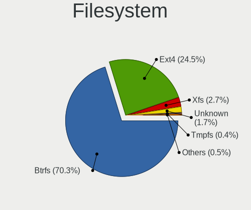
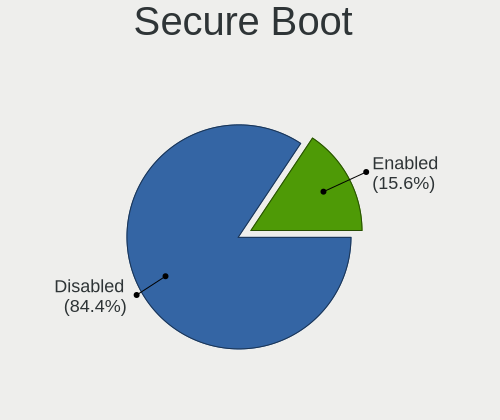
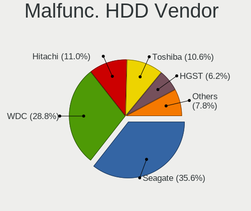
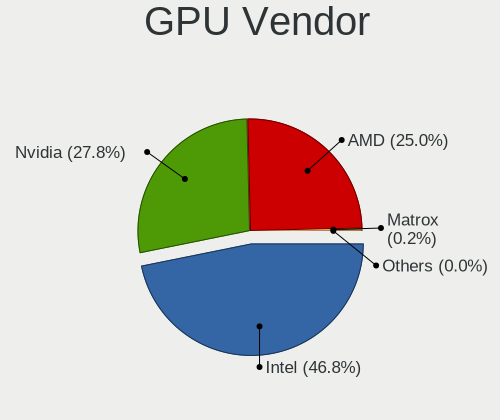

Fedora - Tested Hardware & Statistics
-------------------------------------

A project to collect tested hardware configurations for Fedora.

Anyone can contribute to this report by the [hw-probe](https://github.com/linuxhw/hw-probe) tool:

    sudo -E hw-probe -all -upload

Please contribute! Especially if your hardware is rare.

This is a report for all computer types. See also reports for [desktops](/Dist/Fedora/Desktop/README.md) and [notebooks](/Dist/Fedora/Notebook/README.md).

Contents
--------

* [ Test Cases ](#test-cases)

* [ System ](#system)
  - [ OS                       ](#os)
  - [ OS Family                ](#os-family)
  - [ Kernel                   ](#kernel)
  - [ Kernel Family            ](#kernel-family)
  - [ Kernel Major Ver.        ](#kernel-major-ver)
  - [ Arch                     ](#arch)
  - [ DE                       ](#de)
  - [ Display Server           ](#display-server)
  - [ Display Manager          ](#display-manager)
  - [ OS Lang                  ](#os-lang)
  - [ Boot Mode                ](#boot-mode)
  - [ Filesystem               ](#filesystem)
  - [ Part. scheme             ](#part-scheme)
  - [ Dual Boot with Linux/BSD ](#dual-boot-with-linuxbsd)
  - [ Dual Boot (Win)          ](#dual-boot-win)

* [ Board ](#board)
  - [ Vendor                   ](#vendor)
  - [ Model                    ](#model)
  - [ Model Family             ](#model-family)
  - [ MFG Year                 ](#mfg-year)
  - [ Form Factor              ](#form-factor)
  - [ Secure Boot              ](#secure-boot)
  - [ Coreboot                 ](#coreboot)
  - [ RAM Size                 ](#ram-size)
  - [ RAM Used                 ](#ram-used)
  - [ Total Drives             ](#total-drives)
  - [ Has CD-ROM               ](#has-cd-rom)
  - [ Has Ethernet             ](#has-ethernet)
  - [ Has WiFi                 ](#has-wifi)
  - [ Has Bluetooth            ](#has-bluetooth)

* [ Location ](#location)
  - [ Country                  ](#country)
  - [ City                     ](#city)

* [ Drives ](#drives)
  - [ Drive Vendor             ](#drive-vendor)
  - [ Drive Model              ](#drive-model)
  - [ HDD Vendor               ](#hdd-vendor)
  - [ SSD Vendor               ](#ssd-vendor)
  - [ Drive Kind               ](#drive-kind)
  - [ Drive Connector          ](#drive-connector)
  - [ Drive Size               ](#drive-size)
  - [ Space Total              ](#space-total)
  - [ Space Used               ](#space-used)
  - [ Malfunc. Drives          ](#malfunc-drives)
  - [ Malfunc. Drive Vendor    ](#malfunc-drive-vendor)
  - [ Malfunc. HDD Vendor      ](#malfunc-hdd-vendor)
  - [ Malfunc. Drive Kind      ](#malfunc-drive-kind)
  - [ Failed Drives            ](#failed-drives)
  - [ Failed Drive Vendor      ](#failed-drive-vendor)
  - [ Drive Status             ](#drive-status)

* [ Storage controller ](#storage-controller)
  - [ Storage Vendor           ](#storage-vendor)
  - [ Storage Model            ](#storage-model)
  - [ Storage Kind             ](#storage-kind)

* [ Processor ](#processor)
  - [ CPU Vendor               ](#cpu-vendor)
  - [ CPU Model                ](#cpu-model)
  - [ CPU Model Family         ](#cpu-model-family)
  - [ CPU Cores                ](#cpu-cores)
  - [ CPU Sockets              ](#cpu-sockets)
  - [ CPU Threads              ](#cpu-threads)
  - [ CPU Op-Modes             ](#cpu-op-modes)
  - [ CPU Microcode            ](#cpu-microcode)
  - [ CPU Microarch            ](#cpu-microarch)

* [ Graphics ](#graphics)
  - [ GPU Vendor               ](#gpu-vendor)
  - [ GPU Model                ](#gpu-model)
  - [ GPU Combo                ](#gpu-combo)
  - [ GPU Driver               ](#gpu-driver)
  - [ GPU Memory               ](#gpu-memory)

* [ Monitor ](#monitor)
  - [ Monitor Vendor           ](#monitor-vendor)
  - [ Monitor Model            ](#monitor-model)
  - [ Monitor Resolution       ](#monitor-resolution)
  - [ Monitor Diagonal         ](#monitor-diagonal)
  - [ Monitor Width            ](#monitor-width)
  - [ Aspect Ratio             ](#aspect-ratio)
  - [ Monitor Area             ](#monitor-area)
  - [ Pixel Density            ](#pixel-density)
  - [ Multiple Monitors        ](#multiple-monitors)

* [ Network ](#network)
  - [ Net Controller Vendor    ](#net-controller-vendor)
  - [ Net Controller Model     ](#net-controller-model)
  - [ Wireless Vendor          ](#wireless-vendor)
  - [ Wireless Model           ](#wireless-model)
  - [ Ethernet Vendor          ](#ethernet-vendor)
  - [ Ethernet Model           ](#ethernet-model)
  - [ Net Controller Kind      ](#net-controller-kind)
  - [ Used Controller          ](#used-controller)
  - [ NICs                     ](#nics)
  - [ IPv6                     ](#ipv6)

* [ Bluetooth ](#bluetooth)
  - [ Bluetooth Vendor         ](#bluetooth-vendor)
  - [ Bluetooth Model          ](#bluetooth-model)

* [ Sound ](#sound)
  - [ Sound Vendor             ](#sound-vendor)
  - [ Sound Model              ](#sound-model)

* [ Memory ](#memory)
  - [ Memory Vendor            ](#memory-vendor)
  - [ Memory Model             ](#memory-model)
  - [ Memory Kind              ](#memory-kind)
  - [ Memory Form Factor       ](#memory-form-factor)
  - [ Memory Size              ](#memory-size)
  - [ Memory Speed             ](#memory-speed)

* [ Printers & scanners ](#printers--scanners)
  - [ Printer Vendor           ](#printer-vendor)
  - [ Printer Model            ](#printer-model)
  - [ Scanner Vendor           ](#scanner-vendor)
  - [ Scanner Model            ](#scanner-model)

* [ Camera ](#camera)
  - [ Camera Vendor            ](#camera-vendor)
  - [ Camera Model             ](#camera-model)

* [ Security ](#security)
  - [ Fingerprint Vendor       ](#fingerprint-vendor)
  - [ Fingerprint Model        ](#fingerprint-model)
  - [ Chipcard Vendor          ](#chipcard-vendor)
  - [ Chipcard Model           ](#chipcard-model)

* [ Unsupported ](#unsupported)
  - [ Unsupported Devices      ](#unsupported-devices)
  - [ Unsupported Device Types ](#unsupported-device-types)

Test Cases
----------

Total: 19840

| Vendor        | Model                       | Form-Factor | Probe                                                      | Date         |
|---------------|-----------------------------|-------------|------------------------------------------------------------|--------------|
| Acer          | Aspire V5-531               | Notebook    | [e39cb4e3e6](https://linux-hardware.org/?probe=e39cb4e3e6) | Sep 07, 2023 |
| Lenovo        | ThinkPad P15v Gen 2i 21A... | Notebook    | [69fc5aab82](https://linux-hardware.org/?probe=69fc5aab82) | Sep 07, 2023 |
| Lenovo        | V580c 20160                 | Notebook    | [87f8bad27d](https://linux-hardware.org/?probe=87f8bad27d) | Sep 07, 2023 |
| Lenovo        | ThinkPad P15v Gen 2i 21A... | Notebook    | [384d2074ad](https://linux-hardware.org/?probe=384d2074ad) | Sep 07, 2023 |
| Lenovo        | IdeaPad S145-15API 81UT     | Notebook    | [8a05090057](https://linux-hardware.org/?probe=8a05090057) | Sep 07, 2023 |
| Acer          | Aspire V5-531               | Notebook    | [63fd300645](https://linux-hardware.org/?probe=63fd300645) | Sep 07, 2023 |
| Lenovo        | ThinkBook 15 G4 IAP 21DJ    | Notebook    | [a2fab791b4](https://linux-hardware.org/?probe=a2fab791b4) | Sep 07, 2023 |
| Timi          | Redmi Book Pro 14S          | Notebook    | [b2776d8282](https://linux-hardware.org/?probe=b2776d8282) | Sep 07, 2023 |
| Lenovo        | IdeaPad S145-14AST 81ST     | Notebook    | [24eca3030c](https://linux-hardware.org/?probe=24eca3030c) | Sep 07, 2023 |
| Lenovo        | ThinkPad T410 2522PT3       | Notebook    | [da7303433d](https://linux-hardware.org/?probe=da7303433d) | Sep 07, 2023 |
| Dell          | 0NDYHG A01                  | Desktop     | [250bc7b8ea](https://linux-hardware.org/?probe=250bc7b8ea) | Sep 07, 2023 |
| NZXT          | N7 Z370                     | Desktop     | [34a23bdc5f](https://linux-hardware.org/?probe=34a23bdc5f) | Sep 07, 2023 |
| HUAWEI        | NBLK-WAX9X                  | Notebook    | [9911fc5254](https://linux-hardware.org/?probe=9911fc5254) | Sep 07, 2023 |
| Dell          | 088DT1 A01                  | Desktop     | [e7d12d040e](https://linux-hardware.org/?probe=e7d12d040e) | Sep 07, 2023 |
| MSI           | Bravo 17 A4DDR              | Notebook    | [2592f883ef](https://linux-hardware.org/?probe=2592f883ef) | Sep 07, 2023 |
| ASUSTek       | ASUS TUF Gaming F15 FX50... | Notebook    | [b982251e82](https://linux-hardware.org/?probe=b982251e82) | Sep 07, 2023 |
| MSI           | X99A RAIDER                 | Desktop     | [0434d08b59](https://linux-hardware.org/?probe=0434d08b59) | Sep 07, 2023 |
| Intel         | NUC5i3RYB H41000-503        | Mini pc     | [67e211cb5d](https://linux-hardware.org/?probe=67e211cb5d) | Sep 07, 2023 |
| Dell          | Latitude E6500              | Notebook    | [b4b035c4f7](https://linux-hardware.org/?probe=b4b035c4f7) | Sep 07, 2023 |
| Gigabyte      | G41MT-D3                    | Desktop     | [f0c3188082](https://linux-hardware.org/?probe=f0c3188082) | Sep 07, 2023 |
| ASUSTek       | ASUS TUF Dash F15 FX516P... | Notebook    | [3c6e29c3c3](https://linux-hardware.org/?probe=3c6e29c3c3) | Sep 06, 2023 |
| ASUSTek       | PRIME B550M-A               | Desktop     | [b17a5edce5](https://linux-hardware.org/?probe=b17a5edce5) | Sep 06, 2023 |
| GPU Compan... | GWNR71517                   | Notebook    | [b6a521128f](https://linux-hardware.org/?probe=b6a521128f) | Sep 06, 2023 |
| Samsung       | 550P5C/550P7C               | Notebook    | [f59dbec9af](https://linux-hardware.org/?probe=f59dbec9af) | Sep 06, 2023 |
| Samsung       | 550P5C/550P7C               | Notebook    | [83c77f6733](https://linux-hardware.org/?probe=83c77f6733) | Sep 06, 2023 |
| Pegatron      | 2AB6                        | Desktop     | [40b17904fa](https://linux-hardware.org/?probe=40b17904fa) | Sep 06, 2023 |
| Lenovo        | IdeaPad 3 15ALC6 82KU       | Notebook    | [c8ee0a00a5](https://linux-hardware.org/?probe=c8ee0a00a5) | Sep 06, 2023 |
| ASUSTek       | TUF Gaming B550-PLUS        | Desktop     | [09e4ad77a9](https://linux-hardware.org/?probe=09e4ad77a9) | Sep 06, 2023 |
| HP            | 3047h                       | Desktop     | [9b6ecf8471](https://linux-hardware.org/?probe=9b6ecf8471) | Sep 06, 2023 |
| Dell          | XPS 13 9310                 | Notebook    | [7e81f7531b](https://linux-hardware.org/?probe=7e81f7531b) | Sep 06, 2023 |
| HP            | 3047h                       | Desktop     | [51ba95dc5a](https://linux-hardware.org/?probe=51ba95dc5a) | Sep 06, 2023 |
| Lenovo        | ThinkPad P1 Gen 6 21FV00... | Notebook    | [c9a07c44d5](https://linux-hardware.org/?probe=c9a07c44d5) | Sep 06, 2023 |
| ASRock        | B650E PG-ITX WiFi           | Desktop     | [9dd5c2a861](https://linux-hardware.org/?probe=9dd5c2a861) | Sep 06, 2023 |
| Dell          | Inspiron 3542               | Notebook    | [1756563167](https://linux-hardware.org/?probe=1756563167) | Sep 06, 2023 |
| Dell          | 02YYK5 A01                  | Desktop     | [ce6860153d](https://linux-hardware.org/?probe=ce6860153d) | Sep 06, 2023 |
| Lenovo        | Legion Pro 7 16IRX8 82WR    | Notebook    | [f946665a24](https://linux-hardware.org/?probe=f946665a24) | Sep 06, 2023 |
| Lenovo        | ThinkPad X1C 5th W10DG 2... | Notebook    | [b5f142ae13](https://linux-hardware.org/?probe=b5f142ae13) | Sep 06, 2023 |
| Pegatron      | TRUCKEE                     | Desktop     | [145414b8e3](https://linux-hardware.org/?probe=145414b8e3) | Sep 06, 2023 |
| ASUSTek       | PRIME B550M-A               | Desktop     | [7b99e058ff](https://linux-hardware.org/?probe=7b99e058ff) | Sep 06, 2023 |
| Apple         | MacBookPro13,1              | Notebook    | [d6b6455af2](https://linux-hardware.org/?probe=d6b6455af2) | Sep 06, 2023 |
| Gigabyte      | Z68MA-D2H-B3                | Desktop     | [7db6779b5c](https://linux-hardware.org/?probe=7db6779b5c) | Sep 06, 2023 |
| Lenovo        | Yoga S740-15IRH 81NX        | Notebook    | [c31e15f2ba](https://linux-hardware.org/?probe=c31e15f2ba) | Sep 05, 2023 |
| MSI           | A320M PRO-VH PLUS           | Desktop     | [9614656d9b](https://linux-hardware.org/?probe=9614656d9b) | Sep 05, 2023 |
| HP            | EliteBook 845 14 inch G9... | Notebook    | [25ec8e4a16](https://linux-hardware.org/?probe=25ec8e4a16) | Sep 05, 2023 |
| Dell          | Latitude 7400               | Notebook    | [e1ea4eb614](https://linux-hardware.org/?probe=e1ea4eb614) | Sep 05, 2023 |
| Lenovo        | V15 G4 AMN 82YU             | Notebook    | [bb7f6aed1a](https://linux-hardware.org/?probe=bb7f6aed1a) | Sep 05, 2023 |
| ASUSTek       | E402SA                      | Notebook    | [efad2958a0](https://linux-hardware.org/?probe=efad2958a0) | Sep 05, 2023 |
| Lenovo        | IdeaPad 5 15ITL05 82FG      | Notebook    | [3c55d4d55b](https://linux-hardware.org/?probe=3c55d4d55b) | Sep 05, 2023 |
| HP            | 82E0                        | Desktop     | [a86ac881df](https://linux-hardware.org/?probe=a86ac881df) | Sep 05, 2023 |
| ASUSTek       | ROG Strix G713RM_G713RM     | Notebook    | [0309bcca29](https://linux-hardware.org/?probe=0309bcca29) | Sep 05, 2023 |
| Dell          | Latitude 7490               | Notebook    | [c03e42edee](https://linux-hardware.org/?probe=c03e42edee) | Sep 05, 2023 |
| Unknown       | Unknown                     | Notebook    | [9b4d95cf35](https://linux-hardware.org/?probe=9b4d95cf35) | Sep 05, 2023 |
| Apple         | MacBookPro9,2               | Notebook    | [424ab4dc3d](https://linux-hardware.org/?probe=424ab4dc3d) | Sep 05, 2023 |
| HP            | ProBook 450 G8 Notebook ... | Notebook    | [5dbf7515d1](https://linux-hardware.org/?probe=5dbf7515d1) | Sep 05, 2023 |
| ASUSTek       | ROG Flow X13 GV301QH_GV3... | Notebook    | [7619d8e5e8](https://linux-hardware.org/?probe=7619d8e5e8) | Sep 05, 2023 |
| ASRock        | AD525PV3                    | Desktop     | [0fa982f7ad](https://linux-hardware.org/?probe=0fa982f7ad) | Sep 05, 2023 |
| ASRock        | AD525PV3                    | Desktop     | [9ab25d4913](https://linux-hardware.org/?probe=9ab25d4913) | Sep 05, 2023 |
| Lenovo        | ThinkPad T480s 20L8S1R50... | Notebook    | [ea1d0861a1](https://linux-hardware.org/?probe=ea1d0861a1) | Sep 05, 2023 |
| MSI           | MAG X570 TOMAHAWK WIFI      | Desktop     | [44c55bd588](https://linux-hardware.org/?probe=44c55bd588) | Sep 05, 2023 |
| Lenovo        | ThinkBook 15 G3 ACL 21A4    | Notebook    | [229ca6e8cb](https://linux-hardware.org/?probe=229ca6e8cb) | Sep 05, 2023 |
| Lenovo        | IdeaPad 5 15ITL05 82FG      | Notebook    | [ab9c556dc7](https://linux-hardware.org/?probe=ab9c556dc7) | Sep 05, 2023 |
| Intel         | NUC5i3RYB H41000-503        | Mini pc     | [05ad9c1b7b](https://linux-hardware.org/?probe=05ad9c1b7b) | Sep 05, 2023 |
| Acer          | Aspire 4738Z                | Notebook    | [88b34596c0](https://linux-hardware.org/?probe=88b34596c0) | Sep 05, 2023 |
| MSI           | A320M PRO-VH PLUS           | Desktop     | [3e2b7d52c5](https://linux-hardware.org/?probe=3e2b7d52c5) | Sep 05, 2023 |
| MSI           | X99A RAIDER                 | Desktop     | [c06fdd0648](https://linux-hardware.org/?probe=c06fdd0648) | Sep 05, 2023 |
| Dell          | XPS 13 7390                 | Notebook    | [5154be8883](https://linux-hardware.org/?probe=5154be8883) | Sep 05, 2023 |
| ASUSTek       | A8R32-MVP Deluxe            | Desktop     | [d20cf2e835](https://linux-hardware.org/?probe=d20cf2e835) | Sep 05, 2023 |
| Dell          | G15 5530                    | Notebook    | [91dcc569ee](https://linux-hardware.org/?probe=91dcc569ee) | Sep 05, 2023 |
| HP            | ENVY x360 Convertible 15... | Convertible | [bf7eead9e6](https://linux-hardware.org/?probe=bf7eead9e6) | Sep 05, 2023 |
| HUAWEI        | KLVL-WXX9                   | Notebook    | [d3cde5f4c5](https://linux-hardware.org/?probe=d3cde5f4c5) | Sep 04, 2023 |
| ASRock        | H310M-STX                   | Desktop     | [5585353638](https://linux-hardware.org/?probe=5585353638) | Sep 04, 2023 |
| ASUSTek       | X99-M WS                    | Desktop     | [f324b3dd33](https://linux-hardware.org/?probe=f324b3dd33) | Sep 04, 2023 |
| HP            | EliteBook 840 G8 Noteboo... | Notebook    | [2a53f8dc55](https://linux-hardware.org/?probe=2a53f8dc55) | Sep 04, 2023 |
| ASUSTek       | Pro H510M-C                 | Desktop     | [ea823862a6](https://linux-hardware.org/?probe=ea823862a6) | Sep 04, 2023 |
| ASUSTek       | PRIME B550M-A               | Desktop     | [d99ec42689](https://linux-hardware.org/?probe=d99ec42689) | Sep 04, 2023 |
| Dell          | Inspiron 3576               | Notebook    | [5139d104cc](https://linux-hardware.org/?probe=5139d104cc) | Sep 04, 2023 |
| Acer          | Aspire E1-571               | Notebook    | [032fca9d1d](https://linux-hardware.org/?probe=032fca9d1d) | Sep 04, 2023 |
| MSI           | MPG X570S EDGE MAX WIFI     | Desktop     | [59b20fdfab](https://linux-hardware.org/?probe=59b20fdfab) | Sep 04, 2023 |
| HP            | Laptop 14s-dq2xxx           | Notebook    | [3a5b200954](https://linux-hardware.org/?probe=3a5b200954) | Sep 04, 2023 |
| ASUSTek       | ROG Zephyrus G14 GA401QE... | Notebook    | [da42098f81](https://linux-hardware.org/?probe=da42098f81) | Sep 04, 2023 |
| Dell          | XPS 13 9380                 | Notebook    | [94e7b43fe2](https://linux-hardware.org/?probe=94e7b43fe2) | Sep 04, 2023 |
| HP            | Laptop 15-dw2xxx            | Notebook    | [fff758a5d9](https://linux-hardware.org/?probe=fff758a5d9) | Sep 04, 2023 |
| ASUSTek       | ROG STRIX X670E-A GAMING... | Desktop     | [80a94d69c2](https://linux-hardware.org/?probe=80a94d69c2) | Sep 04, 2023 |
| Chuwi         | GemiBook                    | Notebook    | [cfdc48e9f6](https://linux-hardware.org/?probe=cfdc48e9f6) | Sep 04, 2023 |
| ASUSTek       | VivoBook 15_ASUS Laptop ... | Notebook    | [1d6a4b4279](https://linux-hardware.org/?probe=1d6a4b4279) | Sep 04, 2023 |
| Dell          | Latitude 5285               | Notebook    | [9ddc47c6a9](https://linux-hardware.org/?probe=9ddc47c6a9) | Sep 04, 2023 |
| Maibenben     | MaiBook M                   | Notebook    | [7189994067](https://linux-hardware.org/?probe=7189994067) | Sep 04, 2023 |
| MSI           | X99A RAIDER                 | Desktop     | [6bf9db20f8](https://linux-hardware.org/?probe=6bf9db20f8) | Sep 04, 2023 |
| Dell          | 042P49 A01                  | Desktop     | [29e55d4d72](https://linux-hardware.org/?probe=29e55d4d72) | Sep 04, 2023 |
| MSI           | B450M PRO-VDH PLUS          | Desktop     | [7e0c89dfdb](https://linux-hardware.org/?probe=7e0c89dfdb) | Sep 04, 2023 |
| Lenovo        | IdeaPad S340-15API 81NC     | Notebook    | [18d1abc9ca](https://linux-hardware.org/?probe=18d1abc9ca) | Sep 04, 2023 |
| Lenovo        | IdeaPadFlex 5 15ITL05 82... | Convertible | [a28608cf93](https://linux-hardware.org/?probe=a28608cf93) | Sep 04, 2023 |
| ASUSTek       | PRIME B550M-A               | Desktop     | [2252b35243](https://linux-hardware.org/?probe=2252b35243) | Sep 03, 2023 |
| HUAWEI        | KLVL-WXX9                   | Notebook    | [c3e4035d47](https://linux-hardware.org/?probe=c3e4035d47) | Sep 03, 2023 |
| ASUSTek       | ASUS TUF Gaming F15 FX50... | Notebook    | [1211fca3e2](https://linux-hardware.org/?probe=1211fca3e2) | Sep 03, 2023 |
| Notebook      | PCx0Dx                      | Notebook    | [89d5a9b606](https://linux-hardware.org/?probe=89d5a9b606) | Sep 03, 2023 |
| Lenovo        | ThinkPad T550 20CKA00ECD    | Notebook    | [20be702d65](https://linux-hardware.org/?probe=20be702d65) | Sep 03, 2023 |
| HP            | OMEN by Laptop 15-ce0xx     | Notebook    | [2973871c04](https://linux-hardware.org/?probe=2973871c04) | Sep 03, 2023 |
| HP            | Pavilion Gaming Laptop      | Notebook    | [733f5cb987](https://linux-hardware.org/?probe=733f5cb987) | Sep 03, 2023 |
| Framework     | Laptop                      | Notebook    | [d153316fdd](https://linux-hardware.org/?probe=d153316fdd) | Sep 03, 2023 |
| MSI           | MAG B460M MORTAR            | Desktop     | [dd19cc0d48](https://linux-hardware.org/?probe=dd19cc0d48) | Sep 03, 2023 |
| MSI           | MAG B460M MORTAR            | Desktop     | [fc0731667e](https://linux-hardware.org/?probe=fc0731667e) | Sep 03, 2023 |
| MSI           | MAG B460M MORTAR            | Desktop     | [5e3f2f01d4](https://linux-hardware.org/?probe=5e3f2f01d4) | Sep 03, 2023 |
| Dell          | Latitude 3540               | Notebook    | [e7d1d4f160](https://linux-hardware.org/?probe=e7d1d4f160) | Sep 03, 2023 |
| ASUSTek       | ROG STRIX B450-F GAMING     | Desktop     | [926751fb6e](https://linux-hardware.org/?probe=926751fb6e) | Sep 03, 2023 |
| Apple         | Mac-942B59F58194171B iMa... | All in one  | [60d302fc0f](https://linux-hardware.org/?probe=60d302fc0f) | Sep 03, 2023 |
| Intel         | NUC8BEB J72693-307          | Mini pc     | [720b306ad4](https://linux-hardware.org/?probe=720b306ad4) | Sep 03, 2023 |
| Gigabyte      | X79-UP4                     | Desktop     | [3593994f4e](https://linux-hardware.org/?probe=3593994f4e) | Sep 03, 2023 |
| ASUSTek       | VivoBook_ASUSLaptop X515... | Notebook    | [e0f8242693](https://linux-hardware.org/?probe=e0f8242693) | Sep 02, 2023 |
| Dell          | 0HHV7N A00                  | Desktop     | [9ae746229d](https://linux-hardware.org/?probe=9ae746229d) | Sep 02, 2023 |
| Lenovo        | Legion Slim 5 16IRH8 82Y... | Notebook    | [8f29742c47](https://linux-hardware.org/?probe=8f29742c47) | Sep 02, 2023 |
| ASUSTek       | X540NA                      | Notebook    | [69ccd7d6f2](https://linux-hardware.org/?probe=69ccd7d6f2) | Sep 02, 2023 |
| Lenovo        | 3129 SDK0J40700 WIN 3258... | Desktop     | [c4c911d725](https://linux-hardware.org/?probe=c4c911d725) | Sep 02, 2023 |
| Lenovo        | 3129 SDK0J40700 WIN 3258... | Desktop     | [bc7e99e576](https://linux-hardware.org/?probe=bc7e99e576) | Sep 02, 2023 |
| Gigabyte      | MZGLKBP-00                  | Desktop     | [e6c5ae208f](https://linux-hardware.org/?probe=e6c5ae208f) | Sep 02, 2023 |
| Dell          | Latitude 5400               | Notebook    | [aac8791780](https://linux-hardware.org/?probe=aac8791780) | Sep 02, 2023 |
| HP            | ENVY x360 2-in-1 Laptop ... | Convertible | [fc9ec80df9](https://linux-hardware.org/?probe=fc9ec80df9) | Sep 02, 2023 |
| Dell          | 0GY6Y8 A01                  | Desktop     | [f592e65a04](https://linux-hardware.org/?probe=f592e65a04) | Sep 02, 2023 |
| Dell          | Inspiron 5482               | Convertible | [05c6ec6d26](https://linux-hardware.org/?probe=05c6ec6d26) | Sep 02, 2023 |
| Lenovo        | 14w Gen 2 82N9              | Notebook    | [87c8a118b5](https://linux-hardware.org/?probe=87c8a118b5) | Sep 02, 2023 |
| Fujitsu       | D3430-A1 S26361-D3430-A1    | Desktop     | [d7fcde026e](https://linux-hardware.org/?probe=d7fcde026e) | Sep 02, 2023 |
| ASUSTek       | PRIME Z370-P                | Desktop     | [f6a5d73879](https://linux-hardware.org/?probe=f6a5d73879) | Sep 01, 2023 |
| Prestigio     | Multipad Visconte V         | Notebook    | [3c60fe1d14](https://linux-hardware.org/?probe=3c60fe1d14) | Sep 01, 2023 |
| Acer          | One S1003                   | Tablet      | [b49022d342](https://linux-hardware.org/?probe=b49022d342) | Sep 01, 2023 |
| ASUSTek       | ROG Strix G513IC_G513IC     | Notebook    | [3080550241](https://linux-hardware.org/?probe=3080550241) | Sep 01, 2023 |
| Fujitsu       | LIFEBOOK S760               | Notebook    | [b7439f4404](https://linux-hardware.org/?probe=b7439f4404) | Sep 01, 2023 |
| HP            | 89B5 A                      | Desktop     | [3b6a46c308](https://linux-hardware.org/?probe=3b6a46c308) | Sep 01, 2023 |
| ASUSTek       | M5A78L-M/USB3               | Desktop     | [90be513b41](https://linux-hardware.org/?probe=90be513b41) | Sep 01, 2023 |
| Timi          | Mi NoteBook Pro             | Notebook    | [7d3823ff94](https://linux-hardware.org/?probe=7d3823ff94) | Sep 01, 2023 |
| Acer          | Aspire E5-551G              | Notebook    | [864a10779f](https://linux-hardware.org/?probe=864a10779f) | Sep 01, 2023 |
| ASUSTek       | E3M-ET V5 SERIES            | Desktop     | [62d1008e3a](https://linux-hardware.org/?probe=62d1008e3a) | Sep 01, 2023 |
| HP            | EliteBook 820 G3            | Notebook    | [24d0eafc15](https://linux-hardware.org/?probe=24d0eafc15) | Sep 01, 2023 |
| Apple         | MacBookAir5,2               | Notebook    | [bda3b1837c](https://linux-hardware.org/?probe=bda3b1837c) | Sep 01, 2023 |
| ASUSTek       | ZenBook UX535LI_UX535LI     | Notebook    | [edd00c35fd](https://linux-hardware.org/?probe=edd00c35fd) | Sep 01, 2023 |
| Apple         | MacBookAir4,1               | Notebook    | [61da3436a8](https://linux-hardware.org/?probe=61da3436a8) | Sep 01, 2023 |
| ASUSTek       | ROG STRIX B450-F GAMING     | Desktop     | [81e9e055de](https://linux-hardware.org/?probe=81e9e055de) | Sep 01, 2023 |
| Lenovo        | Legion Pro 7 16IRX8 82WR    | Notebook    | [239b46961f](https://linux-hardware.org/?probe=239b46961f) | Sep 01, 2023 |
| Lenovo        | ThinkPad X270 20HMS6AT00    | Notebook    | [e111bad271](https://linux-hardware.org/?probe=e111bad271) | Sep 01, 2023 |
| Lenovo        | 310B SDK0J40697 WIN 3305... | Desktop     | [a4ee14b9ac](https://linux-hardware.org/?probe=a4ee14b9ac) | Sep 01, 2023 |
| MSI           | MPG B650I EDGE WIFI         | Desktop     | [dd5735f315](https://linux-hardware.org/?probe=dd5735f315) | Sep 01, 2023 |
| HP            | EliteBook 860 16 inch G9... | Notebook    | [5e0da96bdd](https://linux-hardware.org/?probe=5e0da96bdd) | Sep 01, 2023 |
| Dell          | Latitude 5290 2-in-1        | Notebook    | [3a4c0e0930](https://linux-hardware.org/?probe=3a4c0e0930) | Aug 31, 2023 |
| Apple         | MacBook9,1                  | Notebook    | [b6a28c1e1a](https://linux-hardware.org/?probe=b6a28c1e1a) | Aug 31, 2023 |
| Dell          | Latitude 5290 2-in-1        | Notebook    | [5b632410e7](https://linux-hardware.org/?probe=5b632410e7) | Aug 31, 2023 |
| ASUSTek       | ASUS EXPERTBOOK L2402CYA... | Notebook    | [9881dd3268](https://linux-hardware.org/?probe=9881dd3268) | Aug 31, 2023 |
| Lenovo        | ThinkPad L470 20J40010GE    | Notebook    | [53adc42d66](https://linux-hardware.org/?probe=53adc42d66) | Aug 31, 2023 |
| Unknown       | H110M2                      | Desktop     | [bff031410a](https://linux-hardware.org/?probe=bff031410a) | Aug 31, 2023 |
| Lenovo        | ThinkPad X380 Yoga 20LH0... | Convertible | [2d86125311](https://linux-hardware.org/?probe=2d86125311) | Aug 31, 2023 |
| MSI           | MAG B550M MORTAR WIFI       | Desktop     | [57ecd81ed7](https://linux-hardware.org/?probe=57ecd81ed7) | Aug 31, 2023 |
| ASUSTek       | Crosshair V Formula         | Desktop     | [85cb771ac1](https://linux-hardware.org/?probe=85cb771ac1) | Aug 31, 2023 |
| MSI           | MAG B550M MORTAR WIFI       | Desktop     | [ffa39e6acd](https://linux-hardware.org/?probe=ffa39e6acd) | Aug 31, 2023 |
| Dell          | Latitude 5590               | Notebook    | [59d99ec581](https://linux-hardware.org/?probe=59d99ec581) | Aug 31, 2023 |
| HP            | Pavilion Laptop 15-eg3xx... | Notebook    | [c3d8f5daca](https://linux-hardware.org/?probe=c3d8f5daca) | Aug 31, 2023 |
| Lenovo        | ThinkPad L450 20DSS0LR00    | Notebook    | [a85743e60e](https://linux-hardware.org/?probe=a85743e60e) | Aug 31, 2023 |
| Gigabyte      | Z270X-Gaming K5             | Desktop     | [189647b3df](https://linux-hardware.org/?probe=189647b3df) | Aug 31, 2023 |
| HP            | Pavilion Laptop 15-eg3xx... | Notebook    | [f94ed7f5d1](https://linux-hardware.org/?probe=f94ed7f5d1) | Aug 31, 2023 |
| ASUSTek       | EX-H110M-V3                 | Desktop     | [c38af5d04d](https://linux-hardware.org/?probe=c38af5d04d) | Aug 31, 2023 |
| System76      | Lemur Pro                   | Notebook    | [c04af9751f](https://linux-hardware.org/?probe=c04af9751f) | Aug 31, 2023 |
| Gigabyte      | H77N-WIFI                   | Desktop     | [84ed05802d](https://linux-hardware.org/?probe=84ed05802d) | Aug 31, 2023 |
| Gigabyte      | D525TUD                     | Desktop     | [9a459d2372](https://linux-hardware.org/?probe=9a459d2372) | Aug 31, 2023 |
| Gigabyte      | Z77MX-D3H                   | Desktop     | [ffb1e72844](https://linux-hardware.org/?probe=ffb1e72844) | Aug 31, 2023 |
| ASUSTek       | EX-H110M-V3                 | Desktop     | [e2b97e4436](https://linux-hardware.org/?probe=e2b97e4436) | Aug 31, 2023 |
| MSI           | 970 GAMING                  | Desktop     | [f5aaee7de3](https://linux-hardware.org/?probe=f5aaee7de3) | Aug 31, 2023 |
| ASUSTek       | PHOENIX                     | Desktop     | [5fa96dfd97](https://linux-hardware.org/?probe=5fa96dfd97) | Aug 31, 2023 |
| Gigabyte      | MZGLKBP-00                  | Desktop     | [2ed0efb0a0](https://linux-hardware.org/?probe=2ed0efb0a0) | Aug 31, 2023 |
| LattePanda    | 3 Delta LP-BS-7-S70JR120... | Desktop     | [04d647ae08](https://linux-hardware.org/?probe=04d647ae08) | Aug 30, 2023 |
| Apple         | MacBookPro15,2              | Notebook    | [a93751de6d](https://linux-hardware.org/?probe=a93751de6d) | Aug 30, 2023 |
| HP            | ProBook 440 14 inch G9 N... | Notebook    | [b37cf7f8cf](https://linux-hardware.org/?probe=b37cf7f8cf) | Aug 30, 2023 |
| HP            | EliteBook 845 14 inch G9... | Notebook    | [4c595a576a](https://linux-hardware.org/?probe=4c595a576a) | Aug 30, 2023 |
| HP            | 83DD                        | Mini pc     | [2955a0b6c5](https://linux-hardware.org/?probe=2955a0b6c5) | Aug 30, 2023 |
| ASUSTek       | ROG Flow X13 GV301QH_GV3... | Notebook    | [78e163bc13](https://linux-hardware.org/?probe=78e163bc13) | Aug 30, 2023 |
| Timi          | Redmi Book Pro 14 2022      | Notebook    | [0842215d23](https://linux-hardware.org/?probe=0842215d23) | Aug 30, 2023 |
| Lenovo        | IdeaPadFlex 5 14ALC05 82... | Convertible | [53b237137d](https://linux-hardware.org/?probe=53b237137d) | Aug 30, 2023 |
| Acer          | TravelMate P259-MG          | Notebook    | [dc9b122d90](https://linux-hardware.org/?probe=dc9b122d90) | Aug 30, 2023 |
| Dell          | Latitude 5430               | Notebook    | [477898be1f](https://linux-hardware.org/?probe=477898be1f) | Aug 30, 2023 |
| Dell          | Vostro 2520                 | Notebook    | [73ca89b4fa](https://linux-hardware.org/?probe=73ca89b4fa) | Aug 30, 2023 |
| Dell          | 0J2J3Y A00                  | Desktop     | [57ac609885](https://linux-hardware.org/?probe=57ac609885) | Aug 30, 2023 |
| Gigabyte      | Z270X-Gaming K5             | Desktop     | [193a50f761](https://linux-hardware.org/?probe=193a50f761) | Aug 30, 2023 |
| MSI           | H110M PRO-VD PLUS           | Desktop     | [a75e60a457](https://linux-hardware.org/?probe=a75e60a457) | Aug 30, 2023 |
| ASUSTek       | PRIME Z490-A                | Desktop     | [3cfa79235e](https://linux-hardware.org/?probe=3cfa79235e) | Aug 30, 2023 |
| ASUSTek       | TUF Z370-PLUS GAMING        | Desktop     | [b93e0fc32b](https://linux-hardware.org/?probe=b93e0fc32b) | Aug 30, 2023 |
| MSI           | Z270M MORTAR                | Desktop     | [416723b60c](https://linux-hardware.org/?probe=416723b60c) | Aug 30, 2023 |
| HP            | Laptop 17-by0xxx            | Notebook    | [4617fe766a](https://linux-hardware.org/?probe=4617fe766a) | Aug 29, 2023 |
| Dell          | Latitude 5480               | Notebook    | [88c6621b31](https://linux-hardware.org/?probe=88c6621b31) | Aug 29, 2023 |
| Dell          | Precision 5480              | Notebook    | [5fd5bf187d](https://linux-hardware.org/?probe=5fd5bf187d) | Aug 29, 2023 |
| ASUSTek       | ROG STRIX Z390-F GAMING     | Desktop     | [44e98cb157](https://linux-hardware.org/?probe=44e98cb157) | Aug 29, 2023 |
| Lenovo        | Yoga 7 14ARB7 82QF          | Convertible | [dadd0516b5](https://linux-hardware.org/?probe=dadd0516b5) | Aug 29, 2023 |
| Lenovo        | ThinkBook 14 G4+ IAP 21C... | Notebook    | [0eeb1276f0](https://linux-hardware.org/?probe=0eeb1276f0) | Aug 29, 2023 |
| Lenovo        | ThinkPad X1 Carbon 7th 2... | Notebook    | [d036282290](https://linux-hardware.org/?probe=d036282290) | Aug 29, 2023 |
| Gigabyte      | G41MT-D3                    | Desktop     | [a2f594cf56](https://linux-hardware.org/?probe=a2f594cf56) | Aug 29, 2023 |
| Lenovo        | Yoga Slim 7 Pro 14IAH7 8... | Notebook    | [7e48b59643](https://linux-hardware.org/?probe=7e48b59643) | Aug 29, 2023 |
| Timi          | A34S                        | Notebook    | [eb6a3c2430](https://linux-hardware.org/?probe=eb6a3c2430) | Aug 29, 2023 |
| Acer          | Aspire E1-571               | Notebook    | [3208c59e9c](https://linux-hardware.org/?probe=3208c59e9c) | Aug 29, 2023 |
| MSI           | Z370-A PRO                  | Desktop     | [d9a6d27a28](https://linux-hardware.org/?probe=d9a6d27a28) | Aug 29, 2023 |
| ASUSTek       | TUF Z370-PLUS GAMING        | Desktop     | [7da432892e](https://linux-hardware.org/?probe=7da432892e) | Aug 29, 2023 |
| Gigabyte      | AB350-Gaming 3-CF           | Desktop     | [1fd98a124f](https://linux-hardware.org/?probe=1fd98a124f) | Aug 29, 2023 |
| ASRock        | X570 Phantom Gaming 4       | Desktop     | [7674d12aa5](https://linux-hardware.org/?probe=7674d12aa5) | Aug 28, 2023 |
| ASUSTek       | VivoBook_ASUSLaptop X515... | Notebook    | [d627b8c625](https://linux-hardware.org/?probe=d627b8c625) | Aug 28, 2023 |
| Lenovo        | IdeaPadFlex 5 14ITL05 82... | Convertible | [07d9ceca83](https://linux-hardware.org/?probe=07d9ceca83) | Aug 28, 2023 |
| Fujitsu       | D3817-A1 S26361-D3817-A1... | Desktop     | [50e64dbfa2](https://linux-hardware.org/?probe=50e64dbfa2) | Aug 28, 2023 |
| Dell          | XPS 15 9510                 | Notebook    | [4b78bfab47](https://linux-hardware.org/?probe=4b78bfab47) | Aug 28, 2023 |
| Dell          | Latitude E6400              | Notebook    | [2af0a423ef](https://linux-hardware.org/?probe=2af0a423ef) | Aug 28, 2023 |
| Acidanther... | Mac-27AD2F918AE68F61 Mac... | Desktop     | [b68e4634b7](https://linux-hardware.org/?probe=b68e4634b7) | Aug 28, 2023 |
| Dell          | XPS 15 9560                 | Notebook    | [8288d35dff](https://linux-hardware.org/?probe=8288d35dff) | Aug 28, 2023 |
| ASUSTek       | VivoBook_ASUSLaptop X412... | Notebook    | [5fddb9cc18](https://linux-hardware.org/?probe=5fddb9cc18) | Aug 28, 2023 |
| HP            | Victus by Laptop 16-e0xx... | Notebook    | [a762e96941](https://linux-hardware.org/?probe=a762e96941) | Aug 28, 2023 |
| Microsoft     | Surface Pro 9               | Tablet      | [d6a04f712b](https://linux-hardware.org/?probe=d6a04f712b) | Aug 28, 2023 |
| Lenovo        | ThinkPad E480 20KQ000EBR    | Notebook    | [40c64b6ec2](https://linux-hardware.org/?probe=40c64b6ec2) | Aug 28, 2023 |
| Acer          | Nitro AN515-57              | Notebook    | [7608fab281](https://linux-hardware.org/?probe=7608fab281) | Aug 28, 2023 |
| Lenovo        | IdeaPad 1 14IAU7 82QC       | Notebook    | [90e0cad295](https://linux-hardware.org/?probe=90e0cad295) | Aug 28, 2023 |
| Lenovo        | ThinkPad X380 Yoga 20LH0... | Convertible | [d302b80de1](https://linux-hardware.org/?probe=d302b80de1) | Aug 27, 2023 |
| ASUSTek       | VivoBook_ASUSLaptop X150... | Notebook    | [da73419cb5](https://linux-hardware.org/?probe=da73419cb5) | Aug 27, 2023 |
| Framework     | Laptop                      | Notebook    | [b3e9d2d48d](https://linux-hardware.org/?probe=b3e9d2d48d) | Aug 27, 2023 |
| Corsair       | Voyager a1600               | Notebook    | [405bce7897](https://linux-hardware.org/?probe=405bce7897) | Aug 27, 2023 |
| Lenovo        | IdeaPad 3 15ALC6 82KU       | Notebook    | [8acc158836](https://linux-hardware.org/?probe=8acc158836) | Aug 27, 2023 |
| Gigabyte      | EP45-DS3L                   | Desktop     | [c326205a9b](https://linux-hardware.org/?probe=c326205a9b) | Aug 27, 2023 |
| HP            | Laptop 15s-eq2xxx           | Notebook    | [864a9d9f37](https://linux-hardware.org/?probe=864a9d9f37) | Aug 27, 2023 |
| ASUSTek       | T100TA                      | Notebook    | [69d14b429e](https://linux-hardware.org/?probe=69d14b429e) | Aug 27, 2023 |
| Fujitsu       | D3417-B1 S26361-D3417-B1    | Desktop     | [492a021411](https://linux-hardware.org/?probe=492a021411) | Aug 27, 2023 |
| Dell          | 0KFKMF A00                  | All in one  | [c15583fc1c](https://linux-hardware.org/?probe=c15583fc1c) | Aug 27, 2023 |
| Acer          | Veriton X2631G V:1.0        | Desktop     | [47b9d876af](https://linux-hardware.org/?probe=47b9d876af) | Aug 27, 2023 |
| Dell          | Latitude E6400              | Notebook    | [fdcbc50452](https://linux-hardware.org/?probe=fdcbc50452) | Aug 27, 2023 |
| ASUSTek       | GL753VD                     | Notebook    | [3903bc9e14](https://linux-hardware.org/?probe=3903bc9e14) | Aug 27, 2023 |
| Lenovo        | ThinkPad E14 Gen 3 20YDC... | Notebook    | [fe02fb8d64](https://linux-hardware.org/?probe=fe02fb8d64) | Aug 27, 2023 |
| Fujitsu       | D3417-B1 S26361-D3417-B1    | Desktop     | [c1bea53459](https://linux-hardware.org/?probe=c1bea53459) | Aug 27, 2023 |
| Timi          | TM1701                      | Notebook    | [2a6a4225a0](https://linux-hardware.org/?probe=2a6a4225a0) | Aug 27, 2023 |
| Timi          | TM1701                      | Notebook    | [8ea7c21e18](https://linux-hardware.org/?probe=8ea7c21e18) | Aug 27, 2023 |
| HP            | Pavilion 15                 | Notebook    | [1731ba4ae5](https://linux-hardware.org/?probe=1731ba4ae5) | Aug 27, 2023 |
| Lenovo        | ThinkPad P15 Gen 2i 20YQ... | Notebook    | [5d220003c1](https://linux-hardware.org/?probe=5d220003c1) | Aug 27, 2023 |
| HP            | Pavilion 15                 | Notebook    | [0f51268684](https://linux-hardware.org/?probe=0f51268684) | Aug 27, 2023 |
| Lenovo        | ThinkPad X1 Carbon Gen 1... | Notebook    | [a8600db157](https://linux-hardware.org/?probe=a8600db157) | Aug 27, 2023 |
| ASUSTek       | K55VD                       | Notebook    | [7bdfc94045](https://linux-hardware.org/?probe=7bdfc94045) | Aug 27, 2023 |
| Gigabyte      | H77N-WIFI                   | Desktop     | [d80e4744e9](https://linux-hardware.org/?probe=d80e4744e9) | Aug 27, 2023 |
| MSI           | MS-7388                     | Desktop     | [42530086f2](https://linux-hardware.org/?probe=42530086f2) | Aug 27, 2023 |
| Dell          | 04Y8V0 A02                  | Desktop     | [629b07f8bc](https://linux-hardware.org/?probe=629b07f8bc) | Aug 27, 2023 |
| Gigabyte      | B560M AORUS ELITE           | Desktop     | [f71c3553e6](https://linux-hardware.org/?probe=f71c3553e6) | Aug 27, 2023 |
| Gigabyte      | GA-880GM-UD2H               | Desktop     | [08748d2c86](https://linux-hardware.org/?probe=08748d2c86) | Aug 27, 2023 |
| Lenovo        | IdeaPad Z570 1024DCU        | Notebook    | [8a11757d37](https://linux-hardware.org/?probe=8a11757d37) | Aug 26, 2023 |
| Corsair       | Voyager a1600               | Notebook    | [97a1c576f7](https://linux-hardware.org/?probe=97a1c576f7) | Aug 26, 2023 |
| Lenovo        | ThinkBook 14 G4 IAP 21DH    | Notebook    | [4e5f7a05c6](https://linux-hardware.org/?probe=4e5f7a05c6) | Aug 26, 2023 |
| ASUSTek       | Strix 17 GL703GE            | Notebook    | [b2ad72336f](https://linux-hardware.org/?probe=b2ad72336f) | Aug 26, 2023 |
| HP            | OMEN by Laptop              | Notebook    | [df71a92503](https://linux-hardware.org/?probe=df71a92503) | Aug 26, 2023 |
| Acer          | Aspire A715-72G             | Notebook    | [cbbaecabb1](https://linux-hardware.org/?probe=cbbaecabb1) | Aug 26, 2023 |
| Samsung       | Galaxy Book 12 LTE          | Tablet      | [c2efac4748](https://linux-hardware.org/?probe=c2efac4748) | Aug 26, 2023 |
| ASUSTek       | Z170-P                      | Desktop     | [9e90f8b308](https://linux-hardware.org/?probe=9e90f8b308) | Aug 26, 2023 |
| Dell          | 0GXM1W A01                  | Desktop     | [9bd4ef3aac](https://linux-hardware.org/?probe=9bd4ef3aac) | Aug 26, 2023 |
| Dell          | 0GXM1W A01                  | Desktop     | [978f1e9fa5](https://linux-hardware.org/?probe=978f1e9fa5) | Aug 26, 2023 |
| ASUSTek       | X542BP                      | Notebook    | [58cc535a58](https://linux-hardware.org/?probe=58cc535a58) | Aug 26, 2023 |
| AZW           | U59                         | Desktop     | [ea7bf087cc](https://linux-hardware.org/?probe=ea7bf087cc) | Aug 26, 2023 |
| AZW           | U59                         | Desktop     | [d35717e2e4](https://linux-hardware.org/?probe=d35717e2e4) | Aug 26, 2023 |
| Chuwi         | CoreBook X                  | Notebook    | [95548b426e](https://linux-hardware.org/?probe=95548b426e) | Aug 26, 2023 |
| Chuwi         | CoreBook X                  | Notebook    | [6bd0ecde29](https://linux-hardware.org/?probe=6bd0ecde29) | Aug 26, 2023 |
| Acer          | Predator PH16-71            | Notebook    | [ef267bc627](https://linux-hardware.org/?probe=ef267bc627) | Aug 26, 2023 |
| Apple         | MacBookPro13,2              | Notebook    | [b910d52198](https://linux-hardware.org/?probe=b910d52198) | Aug 26, 2023 |
| ASRock        | B560 Steel Legend           | Desktop     | [b2e8cd4ed2](https://linux-hardware.org/?probe=b2e8cd4ed2) | Aug 26, 2023 |
| MSI           | MS-B9321                    | Desktop     | [07564a2fc4](https://linux-hardware.org/?probe=07564a2fc4) | Aug 25, 2023 |
| Dell          | 0HHV7N A00                  | Desktop     | [1bcc49b615](https://linux-hardware.org/?probe=1bcc49b615) | Aug 25, 2023 |
| MSI           | MS-B9321                    | Desktop     | [df54486a48](https://linux-hardware.org/?probe=df54486a48) | Aug 25, 2023 |
| Lenovo        | ThinkPad E520 1143CWG       | Notebook    | [66d9a31686](https://linux-hardware.org/?probe=66d9a31686) | Aug 25, 2023 |
| ASUSTek       | TUF Gaming X570-PRO         | Desktop     | [771adfa310](https://linux-hardware.org/?probe=771adfa310) | Aug 25, 2023 |
| HP            | OMEN by Laptop 15-dh1xxx    | Notebook    | [6e84e686ec](https://linux-hardware.org/?probe=6e84e686ec) | Aug 25, 2023 |
| MSI           | MS-7388                     | Desktop     | [5c1e4b0c2b](https://linux-hardware.org/?probe=5c1e4b0c2b) | Aug 25, 2023 |
| Acer          | Nitro AN515-44              | Notebook    | [b14dfb0798](https://linux-hardware.org/?probe=b14dfb0798) | Aug 25, 2023 |
| Acer          | Veriton N4640G              | Desktop     | [914ba9937f](https://linux-hardware.org/?probe=914ba9937f) | Aug 25, 2023 |
| Acer          | Aspire ES1-512              | Notebook    | [22187e6de0](https://linux-hardware.org/?probe=22187e6de0) | Aug 25, 2023 |
| Lenovo        | IdeaPad 5 15ITL05 82FG      | Notebook    | [810ccd6f4f](https://linux-hardware.org/?probe=810ccd6f4f) | Aug 25, 2023 |
| Dell          | Inspiron 5585               | Notebook    | [49a9e7dbf0](https://linux-hardware.org/?probe=49a9e7dbf0) | Aug 25, 2023 |
| Dell          | Latitude 3490               | Notebook    | [05705b1834](https://linux-hardware.org/?probe=05705b1834) | Aug 25, 2023 |
| ASUSTek       | T100TA                      | Notebook    | [ef7b263d48](https://linux-hardware.org/?probe=ef7b263d48) | Aug 25, 2023 |
| Toshiba       | Satellite C70-B             | Notebook    | [2647e2edd8](https://linux-hardware.org/?probe=2647e2edd8) | Aug 24, 2023 |
| HP            | ENVY x360 2-in-1 Laptop ... | Convertible | [30ee0ec0ba](https://linux-hardware.org/?probe=30ee0ec0ba) | Aug 24, 2023 |
| HP            | 3047h                       | Desktop     | [5c415723ef](https://linux-hardware.org/?probe=5c415723ef) | Aug 24, 2023 |
| Dell          | 088DT1 A01                  | Desktop     | [0d9ddb7de2](https://linux-hardware.org/?probe=0d9ddb7de2) | Aug 24, 2023 |
| Packard Be... | GA-T671MG                   | Desktop     | [ba401056e8](https://linux-hardware.org/?probe=ba401056e8) | Aug 24, 2023 |
| Gigabyte      | F2A88XM-D3H                 | Desktop     | [6486781183](https://linux-hardware.org/?probe=6486781183) | Aug 24, 2023 |
| Packard Be... | GA-T671MG                   | Desktop     | [d51fb378a1](https://linux-hardware.org/?probe=d51fb378a1) | Aug 24, 2023 |
| Dell          | G15 5510                    | Notebook    | [f9e857e751](https://linux-hardware.org/?probe=f9e857e751) | Aug 24, 2023 |
| HP            | Victus by Laptop 16-e0xx... | Notebook    | [7e6a7de337](https://linux-hardware.org/?probe=7e6a7de337) | Aug 24, 2023 |
| Sony          | SVF15A1M2ES                 | Notebook    | [b352453232](https://linux-hardware.org/?probe=b352453232) | Aug 24, 2023 |
| Dell          | Inspiron 5759               | Notebook    | [bf7413fc5f](https://linux-hardware.org/?probe=bf7413fc5f) | Aug 24, 2023 |
| ASUSTek       | TUF Gaming B550-PLUS        | Desktop     | [c86651dbd3](https://linux-hardware.org/?probe=c86651dbd3) | Aug 24, 2023 |
| MSI           | A320M-A PRO                 | Desktop     | [25dc707bff](https://linux-hardware.org/?probe=25dc707bff) | Aug 24, 2023 |
| ASUSTek       | VivoBook_ASUSLaptop X409... | Notebook    | [1a9c135840](https://linux-hardware.org/?probe=1a9c135840) | Aug 24, 2023 |
| LDLC          | SPC-I                       | Notebook    | [bb114215e6](https://linux-hardware.org/?probe=bb114215e6) | Aug 24, 2023 |
| ASRock        | B560M-ITX/ac                | Desktop     | [1330f2ac2a](https://linux-hardware.org/?probe=1330f2ac2a) | Aug 24, 2023 |
| Lenovo        | 310B SDK0J40697 WIN 3305... | Mini pc     | [329842693e](https://linux-hardware.org/?probe=329842693e) | Aug 24, 2023 |
| Lenovo        | ThinkPad T560 20FJS18V00    | Notebook    | [5f18850003](https://linux-hardware.org/?probe=5f18850003) | Aug 24, 2023 |
| Lenovo        | ThinkPad T560 20FJS18V00    | Notebook    | [de37c3c7eb](https://linux-hardware.org/?probe=de37c3c7eb) | Aug 24, 2023 |
| Lenovo        | ThinkPad E14 Gen 3 20Y70... | Notebook    | [ce5f964a0c](https://linux-hardware.org/?probe=ce5f964a0c) | Aug 24, 2023 |
| Dell          | Latitude 3490               | Notebook    | [148d4806cb](https://linux-hardware.org/?probe=148d4806cb) | Aug 24, 2023 |
| HP            | 255 G8 Notebook PC          | Notebook    | [68c01672c3](https://linux-hardware.org/?probe=68c01672c3) | Aug 24, 2023 |
| Gigabyte      | H310M M.2                   | Desktop     | [9b1205f50a](https://linux-hardware.org/?probe=9b1205f50a) | Aug 24, 2023 |
| ASUSTek       | B85M-E                      | Desktop     | [a06cf8de37](https://linux-hardware.org/?probe=a06cf8de37) | Aug 24, 2023 |
| ASUSTek       | B85M-E                      | Desktop     | [b6591e9fd9](https://linux-hardware.org/?probe=b6591e9fd9) | Aug 24, 2023 |
| AZW           | GTR V02                     | Desktop     | [6c91212b1a](https://linux-hardware.org/?probe=6c91212b1a) | Aug 24, 2023 |
| Xplore        | iX104C6                     | Notebook    | [5d8ea1a454](https://linux-hardware.org/?probe=5d8ea1a454) | Aug 24, 2023 |
| Lenovo        | Yoga710-14ISK 80TY          | Notebook    | [17525a9aef](https://linux-hardware.org/?probe=17525a9aef) | Aug 24, 2023 |
| Positivo B... | VJFE59F11X-B0411H           | Notebook    | [5e5059f835](https://linux-hardware.org/?probe=5e5059f835) | Aug 23, 2023 |
| ASRock        | FP6D4-P1                    | Desktop     | [722789f2ac](https://linux-hardware.org/?probe=722789f2ac) | Aug 23, 2023 |
| ASUSTek       | TUF Gaming B660M-PLUS D4    | Desktop     | [fd9fa02e66](https://linux-hardware.org/?probe=fd9fa02e66) | Aug 23, 2023 |
| ASUSTek       | X540UP                      | Notebook    | [7041925c33](https://linux-hardware.org/?probe=7041925c33) | Aug 23, 2023 |
| Apple         | Mac-AA95B1DDAB278B95 iMa... | All in one  | [1bd1add449](https://linux-hardware.org/?probe=1bd1add449) | Aug 23, 2023 |
| Lenovo        | Yoga 910-13IKB 80VF         | Convertible | [62a1cc3d3b](https://linux-hardware.org/?probe=62a1cc3d3b) | Aug 23, 2023 |
| MSI           | B550-A PRO                  | Desktop     | [f2f57d0e61](https://linux-hardware.org/?probe=f2f57d0e61) | Aug 23, 2023 |
| Lenovo        | ThinkPad X200 74591P0       | Notebook    | [adda6295fb](https://linux-hardware.org/?probe=adda6295fb) | Aug 23, 2023 |
| Acer          | Predator PT715-51           | Notebook    | [e187e199c9](https://linux-hardware.org/?probe=e187e199c9) | Aug 23, 2023 |
| Intel         | NUC6i7KYB H90766-406        | Mini pc     | [fed21c9b13](https://linux-hardware.org/?probe=fed21c9b13) | Aug 23, 2023 |
| Dell          | XPS 15 7590                 | Notebook    | [66b46e04d3](https://linux-hardware.org/?probe=66b46e04d3) | Aug 23, 2023 |
| Gigabyte      | B85M-D3V-A                  | Desktop     | [e11053f833](https://linux-hardware.org/?probe=e11053f833) | Aug 23, 2023 |
| Linx          | LINX12X64                   | Tablet      | [8e57cc64f6](https://linux-hardware.org/?probe=8e57cc64f6) | Aug 23, 2023 |
| ASRock        | Z77 Extreme6                | Desktop     | [6477cdd647](https://linux-hardware.org/?probe=6477cdd647) | Aug 23, 2023 |
| Gigabyte      | GA-A55M-S2V                 | Desktop     | [e9b32aa827](https://linux-hardware.org/?probe=e9b32aa827) | Aug 23, 2023 |
| Google        | Nami                        | Notebook    | [db2c6bfb0a](https://linux-hardware.org/?probe=db2c6bfb0a) | Aug 23, 2023 |
| HUAWEI        | BOM-WXX9                    | Notebook    | [08801db21d](https://linux-hardware.org/?probe=08801db21d) | Aug 23, 2023 |
| HUAWEI        | BOM-WXX9                    | Notebook    | [9b3cf2a525](https://linux-hardware.org/?probe=9b3cf2a525) | Aug 23, 2023 |
| Toshiba       | Satellite L515              | Notebook    | [fa5d7d5547](https://linux-hardware.org/?probe=fa5d7d5547) | Aug 23, 2023 |
| MSI           | Z370-OC PRO                 | Desktop     | [4ee0bb1c63](https://linux-hardware.org/?probe=4ee0bb1c63) | Aug 23, 2023 |
| Lenovo        | Legion Y9000P IAH7H 82RF    | Notebook    | [f429d18938](https://linux-hardware.org/?probe=f429d18938) | Aug 23, 2023 |
| Dell          | Inspiron 5559               | Notebook    | [310e1f561c](https://linux-hardware.org/?probe=310e1f561c) | Aug 22, 2023 |
| HUAWEI        | BOHB-WAX9                   | Notebook    | [f7580a556b](https://linux-hardware.org/?probe=f7580a556b) | Aug 22, 2023 |
| ASUSTek       | VivoBook_ASUSLaptop N760... | Notebook    | [68d28831a5](https://linux-hardware.org/?probe=68d28831a5) | Aug 22, 2023 |
| ASUSTek       | ASUS TUF Gaming A17 FA70... | Notebook    | [25d163ad9e](https://linux-hardware.org/?probe=25d163ad9e) | Aug 22, 2023 |
| MSI           | PRO B660M-A WIFI DDR4       | Desktop     | [64f3da359d](https://linux-hardware.org/?probe=64f3da359d) | Aug 22, 2023 |
| Google        | Nami                        | Notebook    | [69d8c7bfb8](https://linux-hardware.org/?probe=69d8c7bfb8) | Aug 22, 2023 |
| Lenovo        | ThinkPad P15 Gen 2i 20YR... | Notebook    | [9ad109a4df](https://linux-hardware.org/?probe=9ad109a4df) | Aug 22, 2023 |
| HP            | Pavilion 11 x360 PC         | Notebook    | [bf401f98a7](https://linux-hardware.org/?probe=bf401f98a7) | Aug 22, 2023 |
| HP            | EliteBook 8440p             | Notebook    | [f35c644052](https://linux-hardware.org/?probe=f35c644052) | Aug 22, 2023 |
| Lenovo        | 1046 SDK0T08861 WIN 3305... | Desktop     | [fe7b3d01bb](https://linux-hardware.org/?probe=fe7b3d01bb) | Aug 22, 2023 |
| HP            | EliteBook 8440p             | Notebook    | [4f4bed768e](https://linux-hardware.org/?probe=4f4bed768e) | Aug 22, 2023 |
| Dell          | Latitude 7430               | Notebook    | [1ccbb8329f](https://linux-hardware.org/?probe=1ccbb8329f) | Aug 22, 2023 |
| HP            | ProBook 655 G1              | Notebook    | [39dbb86112](https://linux-hardware.org/?probe=39dbb86112) | Aug 22, 2023 |
| HP            | ProBook 655 G1              | Notebook    | [2d616412f1](https://linux-hardware.org/?probe=2d616412f1) | Aug 22, 2023 |
| Gigabyte      | B450 AORUS ELITE            | Desktop     | [73a003bf4b](https://linux-hardware.org/?probe=73a003bf4b) | Aug 22, 2023 |
| Dell          | Inspiron 5567               | Notebook    | [76c16d7ffe](https://linux-hardware.org/?probe=76c16d7ffe) | Aug 22, 2023 |
| MSI           | H510M-A PRO                 | Desktop     | [e405022cc9](https://linux-hardware.org/?probe=e405022cc9) | Aug 22, 2023 |
| MSI           | Z370-OC PRO                 | Desktop     | [bbd85c94d6](https://linux-hardware.org/?probe=bbd85c94d6) | Aug 22, 2023 |
| ASUSTek       | B460M-N                     | Desktop     | [382640772b](https://linux-hardware.org/?probe=382640772b) | Aug 22, 2023 |
| HUAWEI        | HVY-WXX9                    | Notebook    | [55e95b21f1](https://linux-hardware.org/?probe=55e95b21f1) | Aug 22, 2023 |
| Gigabyte      | X570 GAMING X               | Desktop     | [6a3c737df2](https://linux-hardware.org/?probe=6a3c737df2) | Aug 22, 2023 |
| ASUSTek       | ROG STRIX X670E-I GAMING... | Desktop     | [05c761f480](https://linux-hardware.org/?probe=05c761f480) | Aug 22, 2023 |
| Intel         | DH77EB AAG39073-304         | Desktop     | [70399bc4c6](https://linux-hardware.org/?probe=70399bc4c6) | Aug 21, 2023 |
| Lenovo        | 3111 SDK0J40697 WIN 3305... | Mini pc     | [0091cd8a97](https://linux-hardware.org/?probe=0091cd8a97) | Aug 21, 2023 |
| Lenovo        | ThinkPad L13 Yoga Gen 2 ... | Convertible | [a03d5e6451](https://linux-hardware.org/?probe=a03d5e6451) | Aug 21, 2023 |
| Gigabyte      | B550 AORUS ELITE AX V2      | Desktop     | [fdfc3b92f9](https://linux-hardware.org/?probe=fdfc3b92f9) | Aug 21, 2023 |
| HP            | Laptop 15-fc0xxx            | Notebook    | [d2378787ac](https://linux-hardware.org/?probe=d2378787ac) | Aug 21, 2023 |
| Dell          | Latitude 3301               | Notebook    | [69389fff09](https://linux-hardware.org/?probe=69389fff09) | Aug 21, 2023 |
| ASUSTek       | P8Z77-I DELUXE              | Desktop     | [09d57c6701](https://linux-hardware.org/?probe=09d57c6701) | Aug 21, 2023 |
| Apple         | MacBookPro9,2               | Notebook    | [63b37fd7f7](https://linux-hardware.org/?probe=63b37fd7f7) | Aug 21, 2023 |
| Lenovo        | ThinkPad T430 2347C32       | Notebook    | [6956f76011](https://linux-hardware.org/?probe=6956f76011) | Aug 21, 2023 |
| Dell          | Inspiron 5547               | Notebook    | [b5b7a6d8f8](https://linux-hardware.org/?probe=b5b7a6d8f8) | Aug 21, 2023 |
| MSI           | GE63 Raider RGB 8RF         | Notebook    | [dd12e382c8](https://linux-hardware.org/?probe=dd12e382c8) | Aug 21, 2023 |
| HP            | 3048h                       | Desktop     | [959637abde](https://linux-hardware.org/?probe=959637abde) | Aug 21, 2023 |
| ASUSTek       | ROG Strix G713IE_G713IE     | Notebook    | [22443858cb](https://linux-hardware.org/?probe=22443858cb) | Aug 21, 2023 |
| Apple         | MacBookPro9,2               | Notebook    | [a8a1e5df49](https://linux-hardware.org/?probe=a8a1e5df49) | Aug 21, 2023 |
| Lenovo        | IdeaPad 5 Pro 14ACN6 82L... | Notebook    | [359cd5a655](https://linux-hardware.org/?probe=359cd5a655) | Aug 21, 2023 |
| Dell          | Latitude 7490               | Notebook    | [90685f1b4d](https://linux-hardware.org/?probe=90685f1b4d) | Aug 21, 2023 |
| Lenovo        | Legion 5 82B5               | Notebook    | [6047cef31c](https://linux-hardware.org/?probe=6047cef31c) | Aug 21, 2023 |
| Lenovo        | Legion 5 82B5               | Notebook    | [986599dc77](https://linux-hardware.org/?probe=986599dc77) | Aug 21, 2023 |
| Lenovo        | ThinkPad L14 Gen 1 20U50... | Notebook    | [c1a5eb75bf](https://linux-hardware.org/?probe=c1a5eb75bf) | Aug 21, 2023 |
| ASUSTek       | X510URR                     | Notebook    | [d1ee285db9](https://linux-hardware.org/?probe=d1ee285db9) | Aug 21, 2023 |
| HP            | ProBook 640 G1              | Notebook    | [f38ba797d9](https://linux-hardware.org/?probe=f38ba797d9) | Aug 21, 2023 |
| HP            | EliteBook 840 G6            | Notebook    | [9fa60a1eba](https://linux-hardware.org/?probe=9fa60a1eba) | Aug 21, 2023 |
| ASUSTek       | TUF Gaming B650-PLUS WIF... | Desktop     | [735e03f0f9](https://linux-hardware.org/?probe=735e03f0f9) | Aug 21, 2023 |
| Toshiba       | Satellite C70-B             | Notebook    | [d4f90e5eff](https://linux-hardware.org/?probe=d4f90e5eff) | Aug 21, 2023 |
| MSI           | PRO B650M-A WIFI            | Desktop     | [da3f4808a1](https://linux-hardware.org/?probe=da3f4808a1) | Aug 20, 2023 |
| Lenovo        | Legion 5 15IAH7 82RC        | Notebook    | [5fa4b8ae13](https://linux-hardware.org/?probe=5fa4b8ae13) | Aug 20, 2023 |
| ASRock        | A520M-HDV                   | Desktop     | [cb333c6fae](https://linux-hardware.org/?probe=cb333c6fae) | Aug 20, 2023 |
| Pegatron      | TRUCKEE                     | Desktop     | [c3a8668cee](https://linux-hardware.org/?probe=c3a8668cee) | Aug 20, 2023 |
| Pegatron      | TRUCKEE                     | Desktop     | [7da89c9360](https://linux-hardware.org/?probe=7da89c9360) | Aug 20, 2023 |
| HP            | ProBook 430 G1              | Notebook    | [24a2760d65](https://linux-hardware.org/?probe=24a2760d65) | Aug 20, 2023 |
| Lenovo        | Yoga 6 13ALC6 82ND          | Convertible | [f3151f84cb](https://linux-hardware.org/?probe=f3151f84cb) | Aug 20, 2023 |
| ASUSTek       | ASUS BR1100CKA BR1100CKA... | Notebook    | [448603376e](https://linux-hardware.org/?probe=448603376e) | Aug 20, 2023 |
| MSI           | H310M PRO-VDH               | Desktop     | [c6f278a589](https://linux-hardware.org/?probe=c6f278a589) | Aug 20, 2023 |
| ASUSTek       | CM6870                      | Desktop     | [05507d2151](https://linux-hardware.org/?probe=05507d2151) | Aug 20, 2023 |
| ASUSTek       | CM6870                      | Desktop     | [b91ffcb2be](https://linux-hardware.org/?probe=b91ffcb2be) | Aug 20, 2023 |
| HP            | EliteBook 850 G8 Noteboo... | Notebook    | [8e91f085b4](https://linux-hardware.org/?probe=8e91f085b4) | Aug 20, 2023 |
| HP            | 3032h                       | Desktop     | [f3292df409](https://linux-hardware.org/?probe=f3292df409) | Aug 20, 2023 |
| ASUSTek       | Rampage V EXTREME           | Desktop     | [1b7a1416fc](https://linux-hardware.org/?probe=1b7a1416fc) | Aug 20, 2023 |
| Acer          | Aspire A315-53              | Notebook    | [03bd8885a0](https://linux-hardware.org/?probe=03bd8885a0) | Aug 20, 2023 |
| Dell          | 04Y8V0 A02                  | Desktop     | [645bd9ed6b](https://linux-hardware.org/?probe=645bd9ed6b) | Aug 20, 2023 |
| Gigabyte      | B450M DS3H-CF               | Desktop     | [978af80f5a](https://linux-hardware.org/?probe=978af80f5a) | Aug 20, 2023 |
| Gigabyte      | B450M DS3H-CF               | Desktop     | [06daace50c](https://linux-hardware.org/?probe=06daace50c) | Aug 20, 2023 |
| HP            | Laptop 15s-eq2xxx           | Notebook    | [34f09bffb0](https://linux-hardware.org/?probe=34f09bffb0) | Aug 20, 2023 |
| PC Special... | Ionico 16                   | Notebook    | [96fb68dc70](https://linux-hardware.org/?probe=96fb68dc70) | Aug 20, 2023 |
| Lenovo        | ThinkPad X1 Yoga 3rd 20L... | Convertible | [d79d66d11e](https://linux-hardware.org/?probe=d79d66d11e) | Aug 20, 2023 |
| Sony          | SVF1521USTW                 | Notebook    | [ce7fbec260](https://linux-hardware.org/?probe=ce7fbec260) | Aug 20, 2023 |
| Lenovo        | ThinkPad X1 Yoga 3rd 20L... | Convertible | [2561456785](https://linux-hardware.org/?probe=2561456785) | Aug 20, 2023 |
| Hardkernel    | ODROID-N2Plus               | Soc         | [ae3c86cccf](https://linux-hardware.org/?probe=ae3c86cccf) | Aug 19, 2023 |
| Gigabyte      | B650 AORUS ELITE AX         | Desktop     | [a15e796833](https://linux-hardware.org/?probe=a15e796833) | Aug 19, 2023 |
| Sony          | SVF1521USTW                 | Notebook    | [e92fad444f](https://linux-hardware.org/?probe=e92fad444f) | Aug 19, 2023 |
| ASUSTek       | M4A77                       | Desktop     | [89bb5a2821](https://linux-hardware.org/?probe=89bb5a2821) | Aug 19, 2023 |
| Packard Be... | EasyNote ENTF71BM           | Notebook    | [36417c2601](https://linux-hardware.org/?probe=36417c2601) | Aug 19, 2023 |
| Lenovo        | ThinkPad SL510 28477MG      | Notebook    | [ed572b9b04](https://linux-hardware.org/?probe=ed572b9b04) | Aug 19, 2023 |
| Packard Be... | EasyNote ENTF71BM           | Notebook    | [81dd9b9a7a](https://linux-hardware.org/?probe=81dd9b9a7a) | Aug 19, 2023 |
| Lenovo        | Yoga 7 14IAL7 82QE          | Convertible | [dc5d42e6cb](https://linux-hardware.org/?probe=dc5d42e6cb) | Aug 19, 2023 |
| HP            | Victus by Laptop 16-e0xx... | Notebook    | [651f263a9d](https://linux-hardware.org/?probe=651f263a9d) | Aug 19, 2023 |
| HUAWEI        | NBM-WXX9                    | Notebook    | [ac85dd7bb4](https://linux-hardware.org/?probe=ac85dd7bb4) | Aug 19, 2023 |
| ASUSTek       | TUF Gaming Z490-PLUS        | Desktop     | [c99b76f9fe](https://linux-hardware.org/?probe=c99b76f9fe) | Aug 19, 2023 |
| Acer          | Swift SF114-32              | Notebook    | [c6f3f044c9](https://linux-hardware.org/?probe=c6f3f044c9) | Aug 19, 2023 |
| Acer          | Swift SF114-32              | Notebook    | [9734816ff1](https://linux-hardware.org/?probe=9734816ff1) | Aug 19, 2023 |
| ASUSTek       | VivoBook_ASUSLaptop K650... | Notebook    | [80b304814d](https://linux-hardware.org/?probe=80b304814d) | Aug 19, 2023 |
| HP            | Pavilion dv4                | Notebook    | [5f1e0c4484](https://linux-hardware.org/?probe=5f1e0c4484) | Aug 19, 2023 |
| Acer          | Aspire A514-55              | Notebook    | [98ebe4bf9a](https://linux-hardware.org/?probe=98ebe4bf9a) | Aug 19, 2023 |
| Dell          | Inspiron 7520               | Notebook    | [3cdfdae368](https://linux-hardware.org/?probe=3cdfdae368) | Aug 19, 2023 |
| Dell          | 0HT36J A01                  | All in one  | [670a695599](https://linux-hardware.org/?probe=670a695599) | Aug 18, 2023 |
| Lenovo        | IdeaPad Gaming 3 15ACH6 ... | Notebook    | [dee14abe77](https://linux-hardware.org/?probe=dee14abe77) | Aug 18, 2023 |
| Apple         | Mac-AA95B1DDAB278B95 iMa... | All in one  | [c43c2f3798](https://linux-hardware.org/?probe=c43c2f3798) | Aug 18, 2023 |
| Apple         | Mac-AA95B1DDAB278B95 iMa... | All in one  | [64428e8ca9](https://linux-hardware.org/?probe=64428e8ca9) | Aug 18, 2023 |
| Acer          | Aspire A514-55              | Notebook    | [cace7d6efb](https://linux-hardware.org/?probe=cace7d6efb) | Aug 18, 2023 |
| Samsung       | 750QFG                      | Convertible | [ff0b9fb300](https://linux-hardware.org/?probe=ff0b9fb300) | Aug 18, 2023 |
| Gigabyte      | B450M H                     | Desktop     | [722707e986](https://linux-hardware.org/?probe=722707e986) | Aug 18, 2023 |
| Lenovo        | IdeaPad Slim 3 15ABR8 82... | Notebook    | [12c6ae9006](https://linux-hardware.org/?probe=12c6ae9006) | Aug 18, 2023 |
| Dell          | 0YJMC0 A02                  | Desktop     | [f4818214d5](https://linux-hardware.org/?probe=f4818214d5) | Aug 18, 2023 |
| Lenovo        | IdeaPad Pro 5 14APH8 83A... | Notebook    | [f7d0bbc3d9](https://linux-hardware.org/?probe=f7d0bbc3d9) | Aug 18, 2023 |
| Lenovo        | IdeaPad 320-17ISK 80XJ      | Notebook    | [c9e9e56ddd](https://linux-hardware.org/?probe=c9e9e56ddd) | Aug 18, 2023 |
| Dell          | 06D7TR A00                  | Desktop     | [f719885fe3](https://linux-hardware.org/?probe=f719885fe3) | Aug 18, 2023 |
| Dell          | Latitude 7320               | Notebook    | [a51289d9dd](https://linux-hardware.org/?probe=a51289d9dd) | Aug 18, 2023 |
| System76      | Pangolin                    | Notebook    | [5191e3a345](https://linux-hardware.org/?probe=5191e3a345) | Aug 18, 2023 |
| Schenker      | MEDIA (M22)                 | Notebook    | [463903cc03](https://linux-hardware.org/?probe=463903cc03) | Aug 18, 2023 |
| PC Special... | Ionico 16                   | Notebook    | [da33e8f1c1](https://linux-hardware.org/?probe=da33e8f1c1) | Aug 18, 2023 |
| ASUSTek       | PN52                        | Mini pc     | [405bf1e224](https://linux-hardware.org/?probe=405bf1e224) | Aug 18, 2023 |
| MSI           | MS-1057                     | Notebook    | [081ae63942](https://linux-hardware.org/?probe=081ae63942) | Aug 18, 2023 |
| MSI           | MS-1057                     | Notebook    | [615f03f3b8](https://linux-hardware.org/?probe=615f03f3b8) | Aug 18, 2023 |
| Acer          | Aspire E5-575               | Notebook    | [cfbf5747b3](https://linux-hardware.org/?probe=cfbf5747b3) | Aug 18, 2023 |
| MSI           | X470 GAMING M7 AC           | Desktop     | [92f8391f8f](https://linux-hardware.org/?probe=92f8391f8f) | Aug 18, 2023 |
| Lenovo        | Yoga Slim 7 ProX 14IAH7 ... | Notebook    | [b8e5fd59d3](https://linux-hardware.org/?probe=b8e5fd59d3) | Aug 18, 2023 |
| Lenovo        | ThinkPad L480 20LTS6S904    | Notebook    | [32ded049ec](https://linux-hardware.org/?probe=32ded049ec) | Aug 17, 2023 |
| ASUSTek       | Z97-PRO                     | Desktop     | [607356bb8f](https://linux-hardware.org/?probe=607356bb8f) | Aug 17, 2023 |
| Lenovo        | IdeaPad Pro 5 14APH8 83A... | Notebook    | [df194863d1](https://linux-hardware.org/?probe=df194863d1) | Aug 17, 2023 |
| ASUSTek       | PRIME B550-PLUS             | Desktop     | [8958908392](https://linux-hardware.org/?probe=8958908392) | Aug 17, 2023 |
| Lenovo        | IdeaPad Pro 5 14APH8 83A... | Notebook    | [87a6bd39ae](https://linux-hardware.org/?probe=87a6bd39ae) | Aug 17, 2023 |
| ASUSTek       | TUF Gaming B660-PLUS WIF... | Desktop     | [4b8894823c](https://linux-hardware.org/?probe=4b8894823c) | Aug 17, 2023 |
| Lenovo        | IdeaPad 3 14ITL6 82H7       | Notebook    | [bbf57bf744](https://linux-hardware.org/?probe=bbf57bf744) | Aug 17, 2023 |
| HP            | ProBook 640 G1              | Notebook    | [e688e27904](https://linux-hardware.org/?probe=e688e27904) | Aug 17, 2023 |
| Lenovo        | ThinkPad T14 Gen 3 21AJS... | Notebook    | [2cd51b6fce](https://linux-hardware.org/?probe=2cd51b6fce) | Aug 17, 2023 |
| Intel         | NUC5i3RYB H41000-503        | Mini pc     | [3f0d1e0d44](https://linux-hardware.org/?probe=3f0d1e0d44) | Aug 17, 2023 |
| Dell          | Latitude 7440               | Notebook    | [e56c46e8fe](https://linux-hardware.org/?probe=e56c46e8fe) | Aug 17, 2023 |
| Dell          | Latitude 7440               | Notebook    | [aef57d5421](https://linux-hardware.org/?probe=aef57d5421) | Aug 17, 2023 |
| ASUSTek       | VivoBook_ASUSLaptop X412... | Notebook    | [d0d3c76bb8](https://linux-hardware.org/?probe=d0d3c76bb8) | Aug 17, 2023 |
| ASUSTek       | Pro B550M-C                 | Desktop     | [0af0e7a958](https://linux-hardware.org/?probe=0af0e7a958) | Aug 17, 2023 |
| ASUSTek       | ZenBook UX482EG_UX482EG     | Notebook    | [c753cfdb08](https://linux-hardware.org/?probe=c753cfdb08) | Aug 17, 2023 |
| MSI           | A320M PRO-VH PLUS           | Desktop     | [65a1f155c0](https://linux-hardware.org/?probe=65a1f155c0) | Aug 17, 2023 |
| ASUSTek       | ROG STRIX B650E-E GAMING... | Desktop     | [ae88c56896](https://linux-hardware.org/?probe=ae88c56896) | Aug 17, 2023 |
| Lenovo        | Legion 5 15IAH7 82RC        | Notebook    | [75556aed08](https://linux-hardware.org/?probe=75556aed08) | Aug 16, 2023 |
| HP            | Compaq 6710b (FG040EC#AB... | Notebook    | [a0cd8c1b40](https://linux-hardware.org/?probe=a0cd8c1b40) | Aug 16, 2023 |
| ASRock        | A320M-HD R4.0               | Desktop     | [f67dd298b1](https://linux-hardware.org/?probe=f67dd298b1) | Aug 16, 2023 |
| Lenovo        | Legion 5 15ACH6H 82JU       | Notebook    | [82c579f8a7](https://linux-hardware.org/?probe=82c579f8a7) | Aug 16, 2023 |
| Microsoft     | Surface Laptop 3            | Tablet      | [66691707c9](https://linux-hardware.org/?probe=66691707c9) | Aug 16, 2023 |
| Lenovo        | ThinkPad T480s 20L7001VG... | Notebook    | [b0b2f8a7e1](https://linux-hardware.org/?probe=b0b2f8a7e1) | Aug 16, 2023 |
| Lenovo        | ThinkPad T480s 20L7001VG... | Notebook    | [07b5827382](https://linux-hardware.org/?probe=07b5827382) | Aug 16, 2023 |
| Dell          | 0VRWRC A00                  | Desktop     | [b27f36262e](https://linux-hardware.org/?probe=b27f36262e) | Aug 16, 2023 |
| HP            | EliteBook 845 G8 Noteboo... | Notebook    | [f3c603341d](https://linux-hardware.org/?probe=f3c603341d) | Aug 16, 2023 |
| Lenovo        | ThinkPad P14s Gen 4 21HF... | Notebook    | [af217ce6dc](https://linux-hardware.org/?probe=af217ce6dc) | Aug 16, 2023 |
| Lenovo        | ThinkPad P14s Gen 4 21HF... | Notebook    | [feeb3d8bbe](https://linux-hardware.org/?probe=feeb3d8bbe) | Aug 16, 2023 |
| Dell          | 0HFG24 A01                  | Server      | [b2377a274f](https://linux-hardware.org/?probe=b2377a274f) | Aug 16, 2023 |
| ASUSTek       | X541NA                      | Notebook    | [8e3f72e46d](https://linux-hardware.org/?probe=8e3f72e46d) | Aug 16, 2023 |
| HP            | Laptop 17-ca0xxx            | Notebook    | [bbf606d6e8](https://linux-hardware.org/?probe=bbf606d6e8) | Aug 16, 2023 |
| Dell          | Latitude E5400              | Notebook    | [7d861c3812](https://linux-hardware.org/?probe=7d861c3812) | Aug 16, 2023 |
| Dell          | Latitude 5420               | Notebook    | [12d46be852](https://linux-hardware.org/?probe=12d46be852) | Aug 16, 2023 |
| Lenovo        | ThinkPad X1 Carbon Gen 1... | Notebook    | [b326fccb63](https://linux-hardware.org/?probe=b326fccb63) | Aug 16, 2023 |
| HUAWEI        | CREM-WXX9                   | Notebook    | [24cd5deaa3](https://linux-hardware.org/?probe=24cd5deaa3) | Aug 16, 2023 |
| Dell          | Latitude 7490               | Notebook    | [efb4abea09](https://linux-hardware.org/?probe=efb4abea09) | Aug 16, 2023 |
| Lenovo        | ThinkPad E14 Gen 4 21E3S... | Notebook    | [ff958dc821](https://linux-hardware.org/?probe=ff958dc821) | Aug 16, 2023 |
| HUAWEI        | CREM-WXX9                   | Notebook    | [b42d5dec8e](https://linux-hardware.org/?probe=b42d5dec8e) | Aug 16, 2023 |
| Microsoft     | Surface Laptop Studio       | Tablet      | [99da6f8732](https://linux-hardware.org/?probe=99da6f8732) | Aug 16, 2023 |
| ASUSTek       | ROG Zephyrus G14 GA402XI... | Notebook    | [da5582d4bf](https://linux-hardware.org/?probe=da5582d4bf) | Aug 16, 2023 |
| ASUSTek       | ROG Zephyrus G14 GA402XI... | Notebook    | [63f2bc3a80](https://linux-hardware.org/?probe=63f2bc3a80) | Aug 16, 2023 |
| Apple         | MacBookPro5,5               | Notebook    | [ee72caa76d](https://linux-hardware.org/?probe=ee72caa76d) | Aug 16, 2023 |
| Lenovo        | IdeaPad Gaming 3 15IHU6 ... | Notebook    | [8733f22b33](https://linux-hardware.org/?probe=8733f22b33) | Aug 16, 2023 |
| Lenovo        | ThinkPad T440p 20AWS03V0... | Notebook    | [f50a83684f](https://linux-hardware.org/?probe=f50a83684f) | Aug 16, 2023 |
| Lenovo        | ThinkPad T550 20CJS1JT00    | Notebook    | [78cd2292c2](https://linux-hardware.org/?probe=78cd2292c2) | Aug 16, 2023 |
| ASUSTek       | M5A78L-M/USB3               | Desktop     | [725cdd1013](https://linux-hardware.org/?probe=725cdd1013) | Aug 16, 2023 |
| MSI           | Z170A GAMING M9 ACK         | Desktop     | [1ff9bff198](https://linux-hardware.org/?probe=1ff9bff198) | Aug 15, 2023 |
| Dell          | Latitude 3301               | Notebook    | [8cbe049a08](https://linux-hardware.org/?probe=8cbe049a08) | Aug 15, 2023 |
| HP            | 3047h                       | Desktop     | [b136128b47](https://linux-hardware.org/?probe=b136128b47) | Aug 15, 2023 |
| Lenovo        | 1036 SDK0Q40104 WIN 3305... | Desktop     | [4ac83eed41](https://linux-hardware.org/?probe=4ac83eed41) | Aug 15, 2023 |
| Samsung       | 550XDA                      | Notebook    | [5e5606074a](https://linux-hardware.org/?probe=5e5606074a) | Aug 15, 2023 |
| Gigabyte      | B550 AORUS ELITE AX V2      | Desktop     | [12c4ed323e](https://linux-hardware.org/?probe=12c4ed323e) | Aug 15, 2023 |
| ASUSTek       | ZenBook UX434IQ_Q407IQ      | Notebook    | [cfa082df13](https://linux-hardware.org/?probe=cfa082df13) | Aug 15, 2023 |
| ASUSTek       | TUF Gaming B450M-PRO II     | Desktop     | [6e7b731daa](https://linux-hardware.org/?probe=6e7b731daa) | Aug 15, 2023 |
| Intel         | NUC8BEB J72693-307          | Mini pc     | [9f3c41bd31](https://linux-hardware.org/?probe=9f3c41bd31) | Aug 15, 2023 |
| Lenovo        | ThinkPad E15 Gen 4 21E60... | Notebook    | [30e2a20d37](https://linux-hardware.org/?probe=30e2a20d37) | Aug 15, 2023 |
| Lenovo        | ThinkBook 14-IIL 20SL       | Notebook    | [6c933602ca](https://linux-hardware.org/?probe=6c933602ca) | Aug 15, 2023 |
| Topstar       | Cantiga & ICH9M Chipset     | Notebook    | [5102056c71](https://linux-hardware.org/?probe=5102056c71) | Aug 15, 2023 |
| Lenovo        | ThinkBook 14-IIL 20SL       | Notebook    | [618b4d5598](https://linux-hardware.org/?probe=618b4d5598) | Aug 15, 2023 |
| Dell          | Latitude E6530              | Notebook    | [9cbe752127](https://linux-hardware.org/?probe=9cbe752127) | Aug 15, 2023 |
| Toshiba       | Satellite C55D-A            | Notebook    | [5a86eae963](https://linux-hardware.org/?probe=5a86eae963) | Aug 15, 2023 |
| Google        | Bobba360                    | Notebook    | [e2ae1afdcc](https://linux-hardware.org/?probe=e2ae1afdcc) | Aug 14, 2023 |
| Medion        | MS-7800                     | Desktop     | [afab92f1e4](https://linux-hardware.org/?probe=afab92f1e4) | Aug 14, 2023 |
| MSI           | H510M PRO                   | Desktop     | [df350cd466](https://linux-hardware.org/?probe=df350cd466) | Aug 14, 2023 |
| Lenovo        | ThinkPad T14 Gen 2a 20XK... | Notebook    | [52bd9574d8](https://linux-hardware.org/?probe=52bd9574d8) | Aug 14, 2023 |
| MSI           | GE60 2OC\2OD\2OE            | Notebook    | [f99741ec7f](https://linux-hardware.org/?probe=f99741ec7f) | Aug 14, 2023 |
| Google        | Bobba360                    | Notebook    | [f211501fde](https://linux-hardware.org/?probe=f211501fde) | Aug 14, 2023 |
| Lenovo        | 1046 SBB1C50531 WIN 3556... | Desktop     | [f24668bfd7](https://linux-hardware.org/?probe=f24668bfd7) | Aug 14, 2023 |
| HP            | Notebook                    | Notebook    | [f32b596c87](https://linux-hardware.org/?probe=f32b596c87) | Aug 14, 2023 |
| Lenovo        | ThinkPad S1 Yoga 20C0A0C... | Notebook    | [c192c37af2](https://linux-hardware.org/?probe=c192c37af2) | Aug 14, 2023 |
| Acer          | Veriton X2640G V:1.0        | Desktop     | [f4ba515a8d](https://linux-hardware.org/?probe=f4ba515a8d) | Aug 14, 2023 |
| Acer          | Veriton X2640G V:1.0        | Desktop     | [2473d1c807](https://linux-hardware.org/?probe=2473d1c807) | Aug 14, 2023 |
| ASUSTek       | ROG STRIX B660-F GAMING ... | Desktop     | [d2ccdc066b](https://linux-hardware.org/?probe=d2ccdc066b) | Aug 14, 2023 |
| Apple         | MacBookPro11,1              | Notebook    | [11b8c16b30](https://linux-hardware.org/?probe=11b8c16b30) | Aug 14, 2023 |
| Gigabyte      | Z77M-D3H-MVP                | Desktop     | [c939a92f1d](https://linux-hardware.org/?probe=c939a92f1d) | Aug 14, 2023 |
| Unknown       | V00                         | Mini pc     | [a043004a53](https://linux-hardware.org/?probe=a043004a53) | Aug 14, 2023 |
| Lenovo        | ThinkPad T14 Gen 2a 20XK... | Notebook    | [74eb1759e1](https://linux-hardware.org/?probe=74eb1759e1) | Aug 14, 2023 |
| Gigabyte      | Z77M-D3H-MVP                | Desktop     | [56efab026f](https://linux-hardware.org/?probe=56efab026f) | Aug 14, 2023 |
| ASUSTek       | VivoBook_ASUSLaptop M540... | Notebook    | [24b85b3417](https://linux-hardware.org/?probe=24b85b3417) | Aug 14, 2023 |
| Lenovo        | IdeaPadFlex 5 14ALC05 82... | Convertible | [28be66d0b1](https://linux-hardware.org/?probe=28be66d0b1) | Aug 14, 2023 |
| ASUSTek       | ROG STRIX X670E-E GAMING... | Desktop     | [cc343d2dce](https://linux-hardware.org/?probe=cc343d2dce) | Aug 14, 2023 |
| ASUSTek       | PRIME B550M-A               | Desktop     | [361ad7057c](https://linux-hardware.org/?probe=361ad7057c) | Aug 13, 2023 |
| Lenovo        | ThinkPad 10 2nd 20E4S0SQ... | Tablet      | [833489f8a8](https://linux-hardware.org/?probe=833489f8a8) | Aug 13, 2023 |
| Apple         | Mac-F65AE981FFA204ED Mac... | Mini pc     | [f256ce0d84](https://linux-hardware.org/?probe=f256ce0d84) | Aug 13, 2023 |
| Dell          | Latitude E7470              | Notebook    | [99518b81f7](https://linux-hardware.org/?probe=99518b81f7) | Aug 13, 2023 |
| Apple         | Mac-F65AE981FFA204ED Mac... | Mini pc     | [7612329440](https://linux-hardware.org/?probe=7612329440) | Aug 13, 2023 |
| Google        | Blorb                       | Notebook    | [d1abf19439](https://linux-hardware.org/?probe=d1abf19439) | Aug 13, 2023 |
| Dell          | Latitude 5290 2-in-1        | Notebook    | [400e17fe60](https://linux-hardware.org/?probe=400e17fe60) | Aug 13, 2023 |
| HP            | ProBook 6450b               | Notebook    | [8862a40143](https://linux-hardware.org/?probe=8862a40143) | Aug 13, 2023 |
| Dell          | 0CRWCR A01                  | All in one  | [c7e0716355](https://linux-hardware.org/?probe=c7e0716355) | Aug 13, 2023 |
| Acer          | Aspire E5-721               | Notebook    | [9a7018c6cb](https://linux-hardware.org/?probe=9a7018c6cb) | Aug 13, 2023 |
| HP            | EliteBook 845 14 inch G9... | Notebook    | [0650746552](https://linux-hardware.org/?probe=0650746552) | Aug 13, 2023 |
| Lenovo        | ThinkPad P15 Gen 2i 20YQ... | Notebook    | [8ef1bbdcec](https://linux-hardware.org/?probe=8ef1bbdcec) | Aug 13, 2023 |
| Lenovo        | ThinkPad X250 20CLS3320C    | Notebook    | [51f9e0c482](https://linux-hardware.org/?probe=51f9e0c482) | Aug 13, 2023 |
| HP            | Pavilion Laptop 15z-eh00... | Notebook    | [6f54d654ac](https://linux-hardware.org/?probe=6f54d654ac) | Aug 13, 2023 |
| Toshiba       | Satellite C55D-A            | Notebook    | [136ac6835c](https://linux-hardware.org/?probe=136ac6835c) | Aug 13, 2023 |
| MSI           | X99A RAIDER                 | Desktop     | [88056b62e3](https://linux-hardware.org/?probe=88056b62e3) | Aug 13, 2023 |
| Lenovo        | SHARKBAY 0B98401 WIN        | Desktop     | [45cb1198bb](https://linux-hardware.org/?probe=45cb1198bb) | Aug 13, 2023 |
| Dell          | Inspiron M5010              | Notebook    | [dd2538ba1a](https://linux-hardware.org/?probe=dd2538ba1a) | Aug 13, 2023 |
| MSI           | GT62VR 7RE                  | Notebook    | [105839bee0](https://linux-hardware.org/?probe=105839bee0) | Aug 13, 2023 |
| HP            | 0B4Ch D                     | Desktop     | [b718d1c1f8](https://linux-hardware.org/?probe=b718d1c1f8) | Aug 13, 2023 |
| Framework     | Laptop                      | Notebook    | [8ac155813e](https://linux-hardware.org/?probe=8ac155813e) | Aug 13, 2023 |
| Apple         | MacBookPro14,3              | Notebook    | [05a4c5e1ec](https://linux-hardware.org/?probe=05a4c5e1ec) | Aug 13, 2023 |
| HP            | 3646h                       | Desktop     | [b3c30163f9](https://linux-hardware.org/?probe=b3c30163f9) | Aug 13, 2023 |
| HP            | 3646h                       | Desktop     | [180d25235f](https://linux-hardware.org/?probe=180d25235f) | Aug 13, 2023 |
| ASUSTek       | Z97-PRO GAMER               | Desktop     | [25a3921b74](https://linux-hardware.org/?probe=25a3921b74) | Aug 13, 2023 |
| Dell          | XPS 13 9300                 | Notebook    | [ed549bc47c](https://linux-hardware.org/?probe=ed549bc47c) | Aug 12, 2023 |
| ASRock        | H55M-LE                     | Desktop     | [3751d5807e](https://linux-hardware.org/?probe=3751d5807e) | Aug 12, 2023 |
| HONOR         | NMH-WCX9                    | Notebook    | [788c2c9e31](https://linux-hardware.org/?probe=788c2c9e31) | Aug 12, 2023 |
| Gigabyte      | X670E AORUS MASTER          | Desktop     | [57a63573fc](https://linux-hardware.org/?probe=57a63573fc) | Aug 12, 2023 |
| HP            | ENVY Laptop 13-ad1xx        | Notebook    | [def5f9423e](https://linux-hardware.org/?probe=def5f9423e) | Aug 12, 2023 |
| HP            | Laptop 14s-dq2xxx           | Notebook    | [f2f4f8a844](https://linux-hardware.org/?probe=f2f4f8a844) | Aug 12, 2023 |
| HP            | Laptop 15-db0xxx            | Notebook    | [3d875407fc](https://linux-hardware.org/?probe=3d875407fc) | Aug 12, 2023 |
| MSI           | MPG X570 GAMING PLUS        | Desktop     | [22690b9d65](https://linux-hardware.org/?probe=22690b9d65) | Aug 12, 2023 |
| Apple         | MacBookPro13,3              | Notebook    | [b43e2738d9](https://linux-hardware.org/?probe=b43e2738d9) | Aug 12, 2023 |
| Dell          | G15 5510                    | Notebook    | [3cfac2d234](https://linux-hardware.org/?probe=3cfac2d234) | Aug 12, 2023 |
| Lenovo        | ThinkPad T460p 20FXS1C30... | Notebook    | [08542d994e](https://linux-hardware.org/?probe=08542d994e) | Aug 12, 2023 |
| ASUSTek       | K55VD                       | Notebook    | [05024005e4](https://linux-hardware.org/?probe=05024005e4) | Aug 12, 2023 |
| Lenovo        | ThinkPad E15 20RD0011UK     | Notebook    | [411b9f412c](https://linux-hardware.org/?probe=411b9f412c) | Aug 12, 2023 |
| Lenovo        | ThinkPad P53 20QN0011IV     | Notebook    | [d25ab08211](https://linux-hardware.org/?probe=d25ab08211) | Aug 12, 2023 |
| MSI           | X99A RAIDER                 | Desktop     | [90816726b0](https://linux-hardware.org/?probe=90816726b0) | Aug 12, 2023 |
| Toshiba       | Satellite C55-A             | Notebook    | [d1bf5ba3c3](https://linux-hardware.org/?probe=d1bf5ba3c3) | Aug 12, 2023 |
| Mini PC       | Rev JSL5 DDR4               | Mini pc     | [783651bb7d](https://linux-hardware.org/?probe=783651bb7d) | Aug 12, 2023 |
| MSI           | PRO Z790-P WIFI             | Desktop     | [5b9aef438f](https://linux-hardware.org/?probe=5b9aef438f) | Aug 12, 2023 |
| MSI           | PRO Z790-P WIFI             | Desktop     | [1f3f8a869b](https://linux-hardware.org/?probe=1f3f8a869b) | Aug 12, 2023 |
| Dell          | Latitude E7270              | Notebook    | [63fd1b0d6b](https://linux-hardware.org/?probe=63fd1b0d6b) | Aug 12, 2023 |
| Gigabyte      | Z170-HD3P-CF                | Desktop     | [7ef87af541](https://linux-hardware.org/?probe=7ef87af541) | Aug 12, 2023 |
| ASUSTek       | PRIME A520M-E               | Desktop     | [92f4e14369](https://linux-hardware.org/?probe=92f4e14369) | Aug 11, 2023 |
| HP            | Victus by Laptop 16-e0xx... | Notebook    | [377a0e25aa](https://linux-hardware.org/?probe=377a0e25aa) | Aug 11, 2023 |
| HP            | Laptop 14s-dq2xxx           | Notebook    | [7574e6b53a](https://linux-hardware.org/?probe=7574e6b53a) | Aug 11, 2023 |
| MSI           | MAG B650M MORTAR WIFI       | Desktop     | [d4b93affe2](https://linux-hardware.org/?probe=d4b93affe2) | Aug 11, 2023 |
| MSI           | MAG B650M MORTAR WIFI       | Desktop     | [7a8e32eb89](https://linux-hardware.org/?probe=7a8e32eb89) | Aug 11, 2023 |
| Lenovo        | ThinkPad E490 20N8CTO1WW    | Notebook    | [c336f9aa8c](https://linux-hardware.org/?probe=c336f9aa8c) | Aug 11, 2023 |
| Lenovo        | IdeaPad 320-15IKB 81G3      | Notebook    | [83879b8247](https://linux-hardware.org/?probe=83879b8247) | Aug 11, 2023 |
| HP            | Laptop 14s-dq2xxx           | Notebook    | [c352abad93](https://linux-hardware.org/?probe=c352abad93) | Aug 11, 2023 |
| Unknown       | Unknown                     | Desktop     | [4b174f07d2](https://linux-hardware.org/?probe=4b174f07d2) | Aug 11, 2023 |
| Acer          | Aspire E5-721               | Notebook    | [f4abfc94d4](https://linux-hardware.org/?probe=f4abfc94d4) | Aug 11, 2023 |
| Dell          | 0CRWCR A01                  | All in one  | [74283f31aa](https://linux-hardware.org/?probe=74283f31aa) | Aug 11, 2023 |
| HP            | ProBook 450 15.6 inch G9... | Notebook    | [8c449cd820](https://linux-hardware.org/?probe=8c449cd820) | Aug 11, 2023 |
| ASUSTek       | ZenBook UX535LI_UX535LI     | Notebook    | [29065a56ee](https://linux-hardware.org/?probe=29065a56ee) | Aug 11, 2023 |
| ASUSTek       | VivoBook_ASUSLaptop X409... | Notebook    | [22fc28c382](https://linux-hardware.org/?probe=22fc28c382) | Aug 11, 2023 |
| Lenovo        | IdeaCentre B320             | Desktop     | [175fb6f041](https://linux-hardware.org/?probe=175fb6f041) | Aug 11, 2023 |
| Dell          | XPS 15 9560                 | Notebook    | [471e3c5077](https://linux-hardware.org/?probe=471e3c5077) | Aug 11, 2023 |
| Gigabyte      | Z170N-WIFI-CF               | Desktop     | [2ee88f0ec0](https://linux-hardware.org/?probe=2ee88f0ec0) | Aug 11, 2023 |
| MSI           | X99A RAIDER                 | Desktop     | [ee1a7cb0aa](https://linux-hardware.org/?probe=ee1a7cb0aa) | Aug 11, 2023 |
| ASUSTek       | P8Z68-V LE                  | Desktop     | [a88d7e81e5](https://linux-hardware.org/?probe=a88d7e81e5) | Aug 11, 2023 |
| Acer          | Nitro AN515-52              | Notebook    | [df9e6a8d98](https://linux-hardware.org/?probe=df9e6a8d98) | Aug 10, 2023 |
| ASUSTek       | PRIME B550M-A               | Desktop     | [7da6954bc5](https://linux-hardware.org/?probe=7da6954bc5) | Aug 10, 2023 |
| Dell          | Latitude 5300               | Notebook    | [661051063f](https://linux-hardware.org/?probe=661051063f) | Aug 10, 2023 |
| Lenovo        | ThinkPad X220 4291SEN       | Notebook    | [b62026890a](https://linux-hardware.org/?probe=b62026890a) | Aug 10, 2023 |
| HP            | 250 G3                      | Notebook    | [512fd5d81f](https://linux-hardware.org/?probe=512fd5d81f) | Aug 10, 2023 |
| HP            | ProBook 430 G2              | Notebook    | [426901227d](https://linux-hardware.org/?probe=426901227d) | Aug 10, 2023 |
| Acer          | Aspire E5-721               | Notebook    | [6743c7ca9d](https://linux-hardware.org/?probe=6743c7ca9d) | Aug 10, 2023 |
| Gigabyte      | AERO 15-WA                  | Notebook    | [bd9f5d0f39](https://linux-hardware.org/?probe=bd9f5d0f39) | Aug 10, 2023 |
| Apple         | MacBookPro5,1               | Notebook    | [23fc9401d3](https://linux-hardware.org/?probe=23fc9401d3) | Aug 10, 2023 |
| Dell          | 0MGK50 A01                  | Desktop     | [ac0ed4109e](https://linux-hardware.org/?probe=ac0ed4109e) | Aug 10, 2023 |
| Lenovo        | IdeaPad U430 Touch 20270    | Notebook    | [4446f503d5](https://linux-hardware.org/?probe=4446f503d5) | Aug 10, 2023 |
| Dell          | Latitude 7400 2-in-1        | Convertible | [13edff3291](https://linux-hardware.org/?probe=13edff3291) | Aug 10, 2023 |
| ASUSTek       | ROG STRIX B660-F GAMING ... | Desktop     | [c5491b8e9f](https://linux-hardware.org/?probe=c5491b8e9f) | Aug 10, 2023 |
| HP            | 14                          | Notebook    | [8692626574](https://linux-hardware.org/?probe=8692626574) | Aug 09, 2023 |
| HP            | Laptop 14s-dq2xxx           | Notebook    | [bb40aa6fd9](https://linux-hardware.org/?probe=bb40aa6fd9) | Aug 09, 2023 |
| Lenovo        | Legion 5 Pro 16ACH6H 82J... | Notebook    | [0f34656484](https://linux-hardware.org/?probe=0f34656484) | Aug 09, 2023 |
| Unknown       | Unknown                     | Desktop     | [09037ac346](https://linux-hardware.org/?probe=09037ac346) | Aug 09, 2023 |
| Dell          | 0PXXHP A03                  | Server      | [6fc4589ff0](https://linux-hardware.org/?probe=6fc4589ff0) | Aug 09, 2023 |
| Gigabyte      | AB350-Gaming-CF             | Desktop     | [466419add0](https://linux-hardware.org/?probe=466419add0) | Aug 09, 2023 |
| ASUSTek       | ROG Zephyrus G14 GA401QC... | Notebook    | [afa02e4c02](https://linux-hardware.org/?probe=afa02e4c02) | Aug 09, 2023 |
| Huanan        | X99-TF-Q GAMING V1.2        | Desktop     | [da612198cc](https://linux-hardware.org/?probe=da612198cc) | Aug 09, 2023 |
| Fujitsu       | UH-X                        | Notebook    | [e26b430aef](https://linux-hardware.org/?probe=e26b430aef) | Aug 09, 2023 |
| Unknown       | HX90                        | Desktop     | [7a14bb927e](https://linux-hardware.org/?probe=7a14bb927e) | Aug 09, 2023 |
| Supermicro    | X10SRi-FB                   | Server      | [253c6295e0](https://linux-hardware.org/?probe=253c6295e0) | Aug 09, 2023 |
| Dell          | 0CRWCR A01                  | All in one  | [8f3bc0a06a](https://linux-hardware.org/?probe=8f3bc0a06a) | Aug 09, 2023 |
| Lenovo        | ThinkPad S1 Yoga 20C0A0C... | Notebook    | [6de592988e](https://linux-hardware.org/?probe=6de592988e) | Aug 09, 2023 |
| ASRock        | AB350 Pro4                  | Desktop     | [1aa926149a](https://linux-hardware.org/?probe=1aa926149a) | Aug 09, 2023 |
| Dell          | 06CJMN A00                  | Desktop     | [cead9bd601](https://linux-hardware.org/?probe=cead9bd601) | Aug 09, 2023 |
| Acer          | Aspire A317-33              | Notebook    | [6dd8126a05](https://linux-hardware.org/?probe=6dd8126a05) | Aug 09, 2023 |
| HP            | Notebook                    | Notebook    | [bac7155006](https://linux-hardware.org/?probe=bac7155006) | Aug 09, 2023 |
| Dell          | Inspiron M5010              | Notebook    | [be4ad618b4](https://linux-hardware.org/?probe=be4ad618b4) | Aug 09, 2023 |
| HP            | 240 G5 Notebook PC          | Notebook    | [c801f4bbd0](https://linux-hardware.org/?probe=c801f4bbd0) | Aug 09, 2023 |
| ASUSTek       | ROG Strix G614JV_G614JV     | Notebook    | [a8fc44190a](https://linux-hardware.org/?probe=a8fc44190a) | Aug 09, 2023 |
| ASUSTek       | ROG Strix G614JV_G614JV     | Notebook    | [766e35e920](https://linux-hardware.org/?probe=766e35e920) | Aug 09, 2023 |
| Apple         | MacBookPro15,2              | Notebook    | [68e26bb5d3](https://linux-hardware.org/?probe=68e26bb5d3) | Aug 09, 2023 |
| Dell          | Latitude 7320               | Notebook    | [6db1867722](https://linux-hardware.org/?probe=6db1867722) | Aug 09, 2023 |
| Acer          | Aspire E5-721               | Notebook    | [82a8a2346a](https://linux-hardware.org/?probe=82a8a2346a) | Aug 08, 2023 |
| Dell          | Inspiron 15 3515            | Notebook    | [7ce5fc846b](https://linux-hardware.org/?probe=7ce5fc846b) | Aug 08, 2023 |
| MSI           | MPG B550I GAMING EDGE WI... | Desktop     | [ee7bcf8fe1](https://linux-hardware.org/?probe=ee7bcf8fe1) | Aug 08, 2023 |
| Lenovo        | ThinkPad T14 Gen 1 20S0C... | Notebook    | [2e4e848552](https://linux-hardware.org/?probe=2e4e848552) | Aug 08, 2023 |
| Acer          | Aspire A515-51G             | Notebook    | [1105c8c2ea](https://linux-hardware.org/?probe=1105c8c2ea) | Aug 08, 2023 |
| MSI           | B450 GAMING PLUS            | Desktop     | [c8553cabce](https://linux-hardware.org/?probe=c8553cabce) | Aug 08, 2023 |
| Gigabyte      | H510M S2H                   | Desktop     | [72eb04ca17](https://linux-hardware.org/?probe=72eb04ca17) | Aug 08, 2023 |
| Dell          | Latitude 5511               | Notebook    | [e9ea435e85](https://linux-hardware.org/?probe=e9ea435e85) | Aug 08, 2023 |
| Lenovo        | ThinkPad T470 20HES0FW00    | Notebook    | [914ff5745c](https://linux-hardware.org/?probe=914ff5745c) | Aug 08, 2023 |
| MSI           | Z170A GAMING M9 ACK         | Desktop     | [8839aa58c4](https://linux-hardware.org/?probe=8839aa58c4) | Aug 08, 2023 |
| HP            | 3397                        | Desktop     | [d7edc80c00](https://linux-hardware.org/?probe=d7edc80c00) | Aug 08, 2023 |
| Lenovo        | Y720-15IKB 80VR             | Notebook    | [7a088aea04](https://linux-hardware.org/?probe=7a088aea04) | Aug 08, 2023 |
| HUAWEI        | KLVL-WXXW                   | Notebook    | [1a3b5297dd](https://linux-hardware.org/?probe=1a3b5297dd) | Aug 08, 2023 |
| HUAWEI        | KLVL-WXXW                   | Notebook    | [18208500ee](https://linux-hardware.org/?probe=18208500ee) | Aug 08, 2023 |
| Acer          | Aspire 4752                 | Notebook    | [1c68b4d24a](https://linux-hardware.org/?probe=1c68b4d24a) | Aug 08, 2023 |
| ASUSTek       | PHOENIX                     | Desktop     | [388bcf4158](https://linux-hardware.org/?probe=388bcf4158) | Aug 08, 2023 |
| HP            | ENVY x360 Convertible 15... | Convertible | [5dfaa2b1c0](https://linux-hardware.org/?probe=5dfaa2b1c0) | Aug 08, 2023 |
| HP            | Elite x2 1012 G1            | Notebook    | [0ee8428f91](https://linux-hardware.org/?probe=0ee8428f91) | Aug 07, 2023 |
| Dell          | Inspiron 3505               | Notebook    | [e07624ae41](https://linux-hardware.org/?probe=e07624ae41) | Aug 07, 2023 |
| ASUSTek       | VivoBook_ASUSLaptop M650... | Notebook    | [36b0caba9e](https://linux-hardware.org/?probe=36b0caba9e) | Aug 07, 2023 |
| Lenovo        | IdeaPad S340-15API 81NC     | Notebook    | [d989868a6b](https://linux-hardware.org/?probe=d989868a6b) | Aug 07, 2023 |
| ASUSTek       | TUF Gaming B660-PLUS WIF... | Desktop     | [ee8f18e185](https://linux-hardware.org/?probe=ee8f18e185) | Aug 07, 2023 |
| Microsoft     | Surface Pro 6               | Tablet      | [d9513873ac](https://linux-hardware.org/?probe=d9513873ac) | Aug 07, 2023 |
| Lenovo        | ThinkPad T460 20FN002JUS    | Notebook    | [8b5e74e190](https://linux-hardware.org/?probe=8b5e74e190) | Aug 07, 2023 |
| Apple         | MacBookPro11,1              | Notebook    | [0a1b8d0627](https://linux-hardware.org/?probe=0a1b8d0627) | Aug 07, 2023 |
| Timi          | A7S                         | Notebook    | [34a354df5a](https://linux-hardware.org/?probe=34a354df5a) | Aug 07, 2023 |
| ASUSTek       | TUF Gaming B550-PLUS WIF... | Desktop     | [04e63e59bd](https://linux-hardware.org/?probe=04e63e59bd) | Aug 07, 2023 |
| Lenovo        | ThinkPad X1 Extreme Gen ... | Notebook    | [b4b049b997](https://linux-hardware.org/?probe=b4b049b997) | Aug 07, 2023 |
| Lenovo        | ThinkPad X1 Extreme Gen ... | Notebook    | [8633bc5aa5](https://linux-hardware.org/?probe=8633bc5aa5) | Aug 07, 2023 |
| ASUSTek       | VivoBook_ASUSLaptop X340... | Notebook    | [2980681052](https://linux-hardware.org/?probe=2980681052) | Aug 07, 2023 |
| HP            | EliteBook 850 G8 Noteboo... | Notebook    | [aabc0a8aee](https://linux-hardware.org/?probe=aabc0a8aee) | Aug 07, 2023 |
| HP            | EliteBook 850 G8 Noteboo... | Notebook    | [08b395f8d6](https://linux-hardware.org/?probe=08b395f8d6) | Aug 07, 2023 |
| ASUSTek       | M5A78L-M/USB3               | Desktop     | [3d4073bb1d](https://linux-hardware.org/?probe=3d4073bb1d) | Aug 07, 2023 |
| ASUSTek       | VivoBook_ASUSLaptop X340... | Notebook    | [4dec7b692a](https://linux-hardware.org/?probe=4dec7b692a) | Aug 07, 2023 |
| HUAWEI        | WRTD-WXX9                   | Notebook    | [dc02eefe63](https://linux-hardware.org/?probe=dc02eefe63) | Aug 06, 2023 |
| Dell          | XPS 13 9310                 | Notebook    | [1134279f41](https://linux-hardware.org/?probe=1134279f41) | Aug 06, 2023 |
| HP            | ENVY x360 2-in-1 Laptop ... | Convertible | [c19229d536](https://linux-hardware.org/?probe=c19229d536) | Aug 06, 2023 |
| Dell          | Inspiron 3520               | Notebook    | [eed6ad702b](https://linux-hardware.org/?probe=eed6ad702b) | Aug 06, 2023 |
| Dell          | Inspiron 3520               | Notebook    | [8a3ba73fae](https://linux-hardware.org/?probe=8a3ba73fae) | Aug 06, 2023 |
| Gigabyte      | AB350-Gaming-CF             | Desktop     | [c3df1aaae9](https://linux-hardware.org/?probe=c3df1aaae9) | Aug 06, 2023 |
| Dell          | Inspiron N5110              | Notebook    | [8218626de4](https://linux-hardware.org/?probe=8218626de4) | Aug 06, 2023 |
| Lenovo        | Yoga 730-15IKB 81CU         | Convertible | [572f537532](https://linux-hardware.org/?probe=572f537532) | Aug 06, 2023 |
| Lenovo        | 3111 SDK0J40697 WIN 3305... | Desktop     | [c003e20331](https://linux-hardware.org/?probe=c003e20331) | Aug 06, 2023 |
| Lenovo        | ThinkPad T460 20FN002JUS    | Notebook    | [e71ac5ca78](https://linux-hardware.org/?probe=e71ac5ca78) | Aug 06, 2023 |
| Lenovo        | ThinkPad T560 20FJS18V00    | Notebook    | [27d1d39b58](https://linux-hardware.org/?probe=27d1d39b58) | Aug 06, 2023 |
| ASRock        | X470 Taichi                 | Desktop     | [f9d29dca0d](https://linux-hardware.org/?probe=f9d29dca0d) | Aug 06, 2023 |
| HP            | EliteBook x360 1030 G2      | Convertible | [9fe9cf4748](https://linux-hardware.org/?probe=9fe9cf4748) | Aug 06, 2023 |
| Lenovo        | IdeaPadFlex 5 14ABR8 82X... | Convertible | [3dd038d891](https://linux-hardware.org/?probe=3dd038d891) | Aug 06, 2023 |
| Lenovo        | ThinkPad X1 Carbon Gen 1... | Notebook    | [2771828543](https://linux-hardware.org/?probe=2771828543) | Aug 06, 2023 |
| Lenovo        | Yoga Slim 7 Pro 14IAH7 8... | Notebook    | [f77c465da0](https://linux-hardware.org/?probe=f77c465da0) | Aug 06, 2023 |
| HUAWEI        | BOHK-WAX9X                  | Notebook    | [56c7715a6d](https://linux-hardware.org/?probe=56c7715a6d) | Aug 06, 2023 |
| HUAWEI        | BOHK-WAX9X                  | Notebook    | [6a9e7cc3e2](https://linux-hardware.org/?probe=6a9e7cc3e2) | Aug 06, 2023 |
| RCA           | 038-WT9S10WM02              | Notebook    | [61c1a104d2](https://linux-hardware.org/?probe=61c1a104d2) | Aug 06, 2023 |
| Gigabyte      | AB350-Gaming-CF             | Desktop     | [932391bfea](https://linux-hardware.org/?probe=932391bfea) | Aug 06, 2023 |
| RCA           | 038-WT9S10WM02              | Notebook    | [fe15934abe](https://linux-hardware.org/?probe=fe15934abe) | Aug 06, 2023 |
| Dell          | Inspiron 15-3567            | Notebook    | [2e8d48f9bc](https://linux-hardware.org/?probe=2e8d48f9bc) | Aug 06, 2023 |
| ASUSTek       | VivoBook_ASUSLaptop X409... | Notebook    | [1b9794e2e3](https://linux-hardware.org/?probe=1b9794e2e3) | Aug 06, 2023 |
| HP            | ENVY x360 2-in-1 Laptop ... | Convertible | [b47eca38dc](https://linux-hardware.org/?probe=b47eca38dc) | Aug 06, 2023 |
| COMPUMAX C... | MOBIL                       | Notebook    | [60293c1ac3](https://linux-hardware.org/?probe=60293c1ac3) | Aug 06, 2023 |
| Mini PC       | Rev JSL5 DDR4               | Mini pc     | [fed729f0aa](https://linux-hardware.org/?probe=fed729f0aa) | Aug 05, 2023 |
| Acer          | Aspire A715-72G             | Notebook    | [4afe306798](https://linux-hardware.org/?probe=4afe306798) | Aug 05, 2023 |
| MSI           | MAG B550 TOMAHAWK           | Desktop     | [8add0a69cc](https://linux-hardware.org/?probe=8add0a69cc) | Aug 05, 2023 |
| Dell          | Venue 8 Pro 5855            | Notebook    | [146fa40942](https://linux-hardware.org/?probe=146fa40942) | Aug 05, 2023 |
| Dell          | Inspiron 3542               | Notebook    | [6af70944d8](https://linux-hardware.org/?probe=6af70944d8) | Aug 05, 2023 |
| Gateway       | SX2185                      | Desktop     | [a6df16b355](https://linux-hardware.org/?probe=a6df16b355) | Aug 05, 2023 |
| Dell          | Inspiron 3542               | Notebook    | [1790fa9d72](https://linux-hardware.org/?probe=1790fa9d72) | Aug 05, 2023 |
| ASUSTek       | ROG Strix G731GU_GL731GU    | Notebook    | [b3c77ee42f](https://linux-hardware.org/?probe=b3c77ee42f) | Aug 05, 2023 |
| Dell          | Latitude E6230              | Notebook    | [cc78868322](https://linux-hardware.org/?probe=cc78868322) | Aug 05, 2023 |
| ASUSTek       | Z97-K                       | Desktop     | [4c1ef04fe9](https://linux-hardware.org/?probe=4c1ef04fe9) | Aug 05, 2023 |
| Multilaser    | PC13X                       | Notebook    | [2f79cffddd](https://linux-hardware.org/?probe=2f79cffddd) | Aug 05, 2023 |
| Apple         | Mac-031AEE4D24BFF0B1 Mac... | Mini pc     | [ea70e92c9a](https://linux-hardware.org/?probe=ea70e92c9a) | Aug 05, 2023 |
| ASUSTek       | ROG STRIX X670E-I GAMING... | Desktop     | [40bc2f506a](https://linux-hardware.org/?probe=40bc2f506a) | Aug 05, 2023 |
| Dell          | Latitude E6220              | Notebook    | [636392b4bf](https://linux-hardware.org/?probe=636392b4bf) | Aug 05, 2023 |
| HP            | ProBook 440 G3              | Notebook    | [abb19010d2](https://linux-hardware.org/?probe=abb19010d2) | Aug 05, 2023 |
| MSI           | X99A RAIDER                 | Desktop     | [87fc943eb1](https://linux-hardware.org/?probe=87fc943eb1) | Aug 05, 2023 |
| ASUSTek       | PRIME B450M-A               | Desktop     | [d2d45c853b](https://linux-hardware.org/?probe=d2d45c853b) | Aug 05, 2023 |
| ASUSTek       | PRIME B450M-A               | Desktop     | [f18b2ff744](https://linux-hardware.org/?probe=f18b2ff744) | Aug 05, 2023 |
| ASUSTek       | PRIME B550M-A               | Desktop     | [364b15d850](https://linux-hardware.org/?probe=364b15d850) | Aug 05, 2023 |
| System76      | Darter Pro                  | Notebook    | [55a328cd9a](https://linux-hardware.org/?probe=55a328cd9a) | Aug 05, 2023 |
| Intel         | B75                         | Desktop     | [9411dd987c](https://linux-hardware.org/?probe=9411dd987c) | Aug 05, 2023 |
| ASUSTek       | PHOENIX                     | Desktop     | [193262b7ea](https://linux-hardware.org/?probe=193262b7ea) | Aug 05, 2023 |
| Fujitsu       | D3430-U1 S26361-D3430-U1    | Desktop     | [5dc4c594ea](https://linux-hardware.org/?probe=5dc4c594ea) | Aug 05, 2023 |
| Corsair       | Voyager a1600               | Notebook    | [6dea5f2c0c](https://linux-hardware.org/?probe=6dea5f2c0c) | Aug 04, 2023 |
| Apple         | MacBookPro5,5               | Notebook    | [ccbf514dc7](https://linux-hardware.org/?probe=ccbf514dc7) | Aug 04, 2023 |
| HP            | Laptop 15s-eq1xxx           | Notebook    | [e6e6cc7b2e](https://linux-hardware.org/?probe=e6e6cc7b2e) | Aug 04, 2023 |
| ASUSTek       | PRIME B350M-A               | Desktop     | [9a4f9f590c](https://linux-hardware.org/?probe=9a4f9f590c) | Aug 04, 2023 |
| HUAWEI        | BOHB-WAX9                   | Notebook    | [7bc7a7e01c](https://linux-hardware.org/?probe=7bc7a7e01c) | Aug 04, 2023 |
| MSI           | PRO H610M-G WIFI DDR4       | Desktop     | [d8b172537e](https://linux-hardware.org/?probe=d8b172537e) | Aug 04, 2023 |
| Lenovo        | ThinkPad X1 Carbon 4th 2... | Notebook    | [fcc05278d6](https://linux-hardware.org/?probe=fcc05278d6) | Aug 04, 2023 |
| HUAWEI        | BOHB-WAX9                   | Notebook    | [b8fa3962ed](https://linux-hardware.org/?probe=b8fa3962ed) | Aug 04, 2023 |
| Acer          | Swift SF114-34              | Notebook    | [2af2b0aecb](https://linux-hardware.org/?probe=2af2b0aecb) | Aug 04, 2023 |
| Dell          | Latitude 7400               | Notebook    | [48e2858e56](https://linux-hardware.org/?probe=48e2858e56) | Aug 04, 2023 |
| Lenovo        | 32DD SDK0J40697 WIN 3305... | Mini pc     | [a894ae9bfc](https://linux-hardware.org/?probe=a894ae9bfc) | Aug 04, 2023 |
| Dell          | Latitude 3420               | Notebook    | [cdecb64c4a](https://linux-hardware.org/?probe=cdecb64c4a) | Aug 04, 2023 |
| AZW           | GTR V02                     | Desktop     | [b2afc2c53e](https://linux-hardware.org/?probe=b2afc2c53e) | Aug 04, 2023 |
| Dell          | 0CRWCR A01                  | All in one  | [16511212ba](https://linux-hardware.org/?probe=16511212ba) | Aug 04, 2023 |
| Gigabyte      | GA-MA785G-UD3H              | Desktop     | [a02f0405a3](https://linux-hardware.org/?probe=a02f0405a3) | Aug 04, 2023 |
| Dell          | Latitude 7440               | Notebook    | [195716ccf3](https://linux-hardware.org/?probe=195716ccf3) | Aug 04, 2023 |
| Dell          | 05XGC8 A01                  | Desktop     | [de1c7d119e](https://linux-hardware.org/?probe=de1c7d119e) | Aug 04, 2023 |
| Dell          | Latitude 5480               | Notebook    | [b682f988e8](https://linux-hardware.org/?probe=b682f988e8) | Aug 04, 2023 |
| Dell          | Latitude 7440               | Notebook    | [5a9a057759](https://linux-hardware.org/?probe=5a9a057759) | Aug 04, 2023 |
| Dell          | Latitude 7440               | Notebook    | [367f14eae6](https://linux-hardware.org/?probe=367f14eae6) | Aug 04, 2023 |
| HP            | ENVY Notebook               | Notebook    | [90325282da](https://linux-hardware.org/?probe=90325282da) | Aug 04, 2023 |
| HP            | ENVY Laptop 16-h0xxx        | Notebook    | [082f92da07](https://linux-hardware.org/?probe=082f92da07) | Aug 04, 2023 |
| HP            | ENVY Laptop 16-h0xxx        | Notebook    | [1078db460a](https://linux-hardware.org/?probe=1078db460a) | Aug 04, 2023 |
| MSI           | X99A RAIDER                 | Desktop     | [4077d11575](https://linux-hardware.org/?probe=4077d11575) | Aug 04, 2023 |
| ASUSTek       | TUF Gaming B450M-PRO S      | Desktop     | [a260479012](https://linux-hardware.org/?probe=a260479012) | Aug 04, 2023 |
| ASUSTek       | TUF Gaming X570-PLUS        | Desktop     | [3c3d90d709](https://linux-hardware.org/?probe=3c3d90d709) | Aug 04, 2023 |
| HP            | Laptop 15-fd0xxx            | Notebook    | [8f3b8dea26](https://linux-hardware.org/?probe=8f3b8dea26) | Aug 04, 2023 |
| ASUSTek       | UX490UAR                    | Notebook    | [6a305978e3](https://linux-hardware.org/?probe=6a305978e3) | Aug 03, 2023 |
| Dell          | Latitude E6510              | Notebook    | [b32213c71d](https://linux-hardware.org/?probe=b32213c71d) | Aug 03, 2023 |
| HP            | ENVY Laptop 16-h1xxx        | Notebook    | [ca0d3636a5](https://linux-hardware.org/?probe=ca0d3636a5) | Aug 03, 2023 |
| ASUSTek       | PRIME B550M-A               | Desktop     | [c0a4bb6c7e](https://linux-hardware.org/?probe=c0a4bb6c7e) | Aug 03, 2023 |
| HP            | ENVY Laptop 16-h1xxx        | Notebook    | [3552dd7642](https://linux-hardware.org/?probe=3552dd7642) | Aug 03, 2023 |
| Gigabyte      | Z68P-DS3                    | Desktop     | [aa6b646b24](https://linux-hardware.org/?probe=aa6b646b24) | Aug 03, 2023 |
| ASUSTek       | ROG Strix G713PV_G713PV     | Notebook    | [620397fdc9](https://linux-hardware.org/?probe=620397fdc9) | Aug 03, 2023 |
| HP            | 1791                        | Desktop     | [61285d3724](https://linux-hardware.org/?probe=61285d3724) | Aug 03, 2023 |
| Gigabyte      | B550M AORUS ELITE           | Notebook    | [882d963e19](https://linux-hardware.org/?probe=882d963e19) | Aug 03, 2023 |
| Lenovo        | ThinkPad E14 Gen 4 21E3S... | Notebook    | [0cf8e99478](https://linux-hardware.org/?probe=0cf8e99478) | Aug 03, 2023 |
| MSI           | MPG Z390 GAMING PRO CARB... | Desktop     | [2d10ecdff1](https://linux-hardware.org/?probe=2d10ecdff1) | Aug 03, 2023 |
| Apple         | Mac-942B5BF58194151B        | All in one  | [80498caa0d](https://linux-hardware.org/?probe=80498caa0d) | Aug 03, 2023 |
| Microsoft     | Surface Pro 7+              | Tablet      | [1a39b68c7f](https://linux-hardware.org/?probe=1a39b68c7f) | Aug 03, 2023 |
| Gigabyte      | B550M AORUS ELITE           | Notebook    | [38d0bcf5d1](https://linux-hardware.org/?probe=38d0bcf5d1) | Aug 03, 2023 |
| Apple         | Mac-031B6874CF7F642A iMa... | All in one  | [e066712070](https://linux-hardware.org/?probe=e066712070) | Aug 03, 2023 |
| Lenovo        | ThinkPad T450 20BU000QLM    | Notebook    | [610fdfd850](https://linux-hardware.org/?probe=610fdfd850) | Aug 03, 2023 |
| Lenovo        | IdeaPad 5 Pro 16ACH6 82L... | Notebook    | [7d96f87e00](https://linux-hardware.org/?probe=7d96f87e00) | Aug 03, 2023 |
| HP            | Elite x2 1012 G2            | Tablet      | [a956adcb38](https://linux-hardware.org/?probe=a956adcb38) | Aug 03, 2023 |
| ASUSTek       | PRIME Z270-P                | Desktop     | [219278bb56](https://linux-hardware.org/?probe=219278bb56) | Aug 03, 2023 |
| Lenovo        | Z50-70 20354                | Notebook    | [c741db51a0](https://linux-hardware.org/?probe=c741db51a0) | Aug 03, 2023 |
| Lenovo        | ThinkPad X1 Carbon 6th 2... | Notebook    | [7df997ee08](https://linux-hardware.org/?probe=7df997ee08) | Aug 03, 2023 |
| Lenovo        | ThinkPad X240 20AMS1RR0D    | Notebook    | [dcf2bedb58](https://linux-hardware.org/?probe=dcf2bedb58) | Aug 03, 2023 |
| ASUSTek       | K55VD                       | Notebook    | [6478fd4e76](https://linux-hardware.org/?probe=6478fd4e76) | Aug 03, 2023 |
| Gigabyte      | X570 AORUS ULTRA            | Desktop     | [a449d60316](https://linux-hardware.org/?probe=a449d60316) | Aug 03, 2023 |
| Acer          | Nitro AN515-44              | Notebook    | [25dcc9a7c5](https://linux-hardware.org/?probe=25dcc9a7c5) | Aug 03, 2023 |
| ASUSTek       | ROG STRIX Z390-E GAMING     | Desktop     | [3f5df1b569](https://linux-hardware.org/?probe=3f5df1b569) | Aug 03, 2023 |
| Dell          | Latitude E7470              | Notebook    | [7c8c07214a](https://linux-hardware.org/?probe=7c8c07214a) | Aug 03, 2023 |
| Toshiba       | Satellite C70-B             | Notebook    | [877d855f27](https://linux-hardware.org/?probe=877d855f27) | Aug 02, 2023 |
| Dell          | Inspiron 1525               | Notebook    | [fa53c99b17](https://linux-hardware.org/?probe=fa53c99b17) | Aug 02, 2023 |
| Dell          | Latitude E7470              | Notebook    | [b672c65f9b](https://linux-hardware.org/?probe=b672c65f9b) | Aug 02, 2023 |
| Acer          | Aspire A715-72G             | Notebook    | [d0bad7993f](https://linux-hardware.org/?probe=d0bad7993f) | Aug 02, 2023 |
| ASRock        | Z170 Gaming K4              | Desktop     | [2c10cb0378](https://linux-hardware.org/?probe=2c10cb0378) | Aug 02, 2023 |
| Gigabyte      | B450M DS3H-CF               | Desktop     | [c66b1ed22c](https://linux-hardware.org/?probe=c66b1ed22c) | Aug 02, 2023 |
| Apple         | Mac-F65AE981FFA204ED Mac... | Mini pc     | [0e3cacbea1](https://linux-hardware.org/?probe=0e3cacbea1) | Aug 02, 2023 |
| MSI           | B560M PRO-E                 | Desktop     | [b10154befd](https://linux-hardware.org/?probe=b10154befd) | Aug 02, 2023 |
| Gigabyte      | B450 I AORUS PRO WIFI-CF    | Desktop     | [883a115efd](https://linux-hardware.org/?probe=883a115efd) | Aug 02, 2023 |
| Dell          | System XPS L322X            | Notebook    | [dbe168d1a1](https://linux-hardware.org/?probe=dbe168d1a1) | Aug 02, 2023 |
| Gigabyte      | H410M H V3                  | Desktop     | [2d1e78ec7e](https://linux-hardware.org/?probe=2d1e78ec7e) | Aug 02, 2023 |
| ASUSTek       | X750JN                      | Notebook    | [6f7dc2198b](https://linux-hardware.org/?probe=6f7dc2198b) | Aug 02, 2023 |
| Lenovo        | Yoga Slim 7 Pro 14IHU5 O... | Notebook    | [491aec1ea1](https://linux-hardware.org/?probe=491aec1ea1) | Aug 02, 2023 |
| Lenovo        | ThinkPad T14 Gen 1 20S1S... | Notebook    | [517b498a25](https://linux-hardware.org/?probe=517b498a25) | Aug 02, 2023 |
| HUAWEI        | WRTD-WXX9                   | Notebook    | [18396303b8](https://linux-hardware.org/?probe=18396303b8) | Aug 02, 2023 |
| ASRock        | B450M Pro4 R2.0             | Desktop     | [5bbfe225b6](https://linux-hardware.org/?probe=5bbfe225b6) | Aug 02, 2023 |
| ASUSTek       | ROG Maximus XII APEX        | Desktop     | [b8a5aee838](https://linux-hardware.org/?probe=b8a5aee838) | Aug 02, 2023 |
| ASRock        | A320M-HDV R4.0              | Desktop     | [2ff30156cf](https://linux-hardware.org/?probe=2ff30156cf) | Aug 02, 2023 |
| ASRock        | B450M Pro4 R2.0             | Desktop     | [8c9bca1e79](https://linux-hardware.org/?probe=8c9bca1e79) | Aug 02, 2023 |
| Dell          | XPS 9320                    | Notebook    | [3abc4aaf82](https://linux-hardware.org/?probe=3abc4aaf82) | Aug 02, 2023 |
| MSI           | B450M BAZOOKA V2            | Desktop     | [f37f2f707b](https://linux-hardware.org/?probe=f37f2f707b) | Aug 02, 2023 |
| HP            | Dragonfly Pro               | Notebook    | [630670f052](https://linux-hardware.org/?probe=630670f052) | Aug 01, 2023 |
| Dell          | Precision 7550              | Notebook    | [ab0d21bb4e](https://linux-hardware.org/?probe=ab0d21bb4e) | Aug 01, 2023 |
| HP            | Laptop 15-db0xxx            | Notebook    | [2d7cbca56b](https://linux-hardware.org/?probe=2d7cbca56b) | Aug 01, 2023 |
| Gigabyte      | B550 GAMING X V2            | Desktop     | [8353d48977](https://linux-hardware.org/?probe=8353d48977) | Aug 01, 2023 |
| Gigabyte      | B550 AORUS PRO V2           | Desktop     | [abe7173905](https://linux-hardware.org/?probe=abe7173905) | Aug 01, 2023 |
| Gigabyte      | Z370 AORUS Gaming 5-CF      | Desktop     | [13d25503d7](https://linux-hardware.org/?probe=13d25503d7) | Aug 01, 2023 |
| Dell          | Inspiron 15-3573            | Notebook    | [e29b3656ee](https://linux-hardware.org/?probe=e29b3656ee) | Aug 01, 2023 |
| HP            | ProBook 6475b               | Notebook    | [c3cfc235fe](https://linux-hardware.org/?probe=c3cfc235fe) | Aug 01, 2023 |
| ASRock        | H61M/U3S3                   | Desktop     | [33c887e577](https://linux-hardware.org/?probe=33c887e577) | Aug 01, 2023 |
| HP            | EliteBook Folio 1040 G2     | Notebook    | [752821ae1a](https://linux-hardware.org/?probe=752821ae1a) | Aug 01, 2023 |
| Unknown       | Unknown                     | Desktop     | [7a5ef06c39](https://linux-hardware.org/?probe=7a5ef06c39) | Aug 01, 2023 |
| Lenovo        | Yoga 720-13IKB 81C3         | Convertible | [287ea63732](https://linux-hardware.org/?probe=287ea63732) | Aug 01, 2023 |
| HP            | EliteBook Folio 1040 G2     | Notebook    | [b847ac4535](https://linux-hardware.org/?probe=b847ac4535) | Aug 01, 2023 |
| ASUSTek       | PRIME B350M-A               | Desktop     | [41cc0d3bfc](https://linux-hardware.org/?probe=41cc0d3bfc) | Aug 01, 2023 |
| Apple         | Mac-031AEE4D24BFF0B1 Mac... | Mini pc     | [70b94de26b](https://linux-hardware.org/?probe=70b94de26b) | Jul 31, 2023 |
| ASUSTek       | TUF Gaming Z490-PLUS        | Desktop     | [afbf5d75c1](https://linux-hardware.org/?probe=afbf5d75c1) | Jul 31, 2023 |
| Lenovo        | IdeaPad C340-14API 81N6     | Notebook    | [1dfc12fc6c](https://linux-hardware.org/?probe=1dfc12fc6c) | Jul 31, 2023 |
| ASRock        | H110M-HG4                   | Desktop     | [7584e2db20](https://linux-hardware.org/?probe=7584e2db20) | Jul 31, 2023 |
| Microsoft     | Surface Pro 7               | Tablet      | [df2a633f24](https://linux-hardware.org/?probe=df2a633f24) | Jul 31, 2023 |
| MSI           | B450M PRO-VDH MAX           | Desktop     | [a7cf8e8ef1](https://linux-hardware.org/?probe=a7cf8e8ef1) | Jul 31, 2023 |
| Acer          | Aspire V3-571               | Notebook    | [9b9830aedf](https://linux-hardware.org/?probe=9b9830aedf) | Jul 31, 2023 |
| HP            | 255 G8 Notebook PC          | Notebook    | [b42946849e](https://linux-hardware.org/?probe=b42946849e) | Jul 31, 2023 |
| MSI           | Katana GF66 12UC            | Notebook    | [49a431c092](https://linux-hardware.org/?probe=49a431c092) | Jul 31, 2023 |
| MSI           | GE75 Raider 10SE            | Notebook    | [995b9ae73e](https://linux-hardware.org/?probe=995b9ae73e) | Jul 31, 2023 |
| MSI           | MPG X570 GAMING EDGE WIF... | Desktop     | [a3bbf1ecd0](https://linux-hardware.org/?probe=a3bbf1ecd0) | Jul 31, 2023 |
| HP            | Laptop 15-dw0xxx            | Notebook    | [08e20bb994](https://linux-hardware.org/?probe=08e20bb994) | Jul 31, 2023 |
| Gigabyte      | GA-880GM-UD2H               | Desktop     | [bb88f3afdc](https://linux-hardware.org/?probe=bb88f3afdc) | Jul 31, 2023 |
| ASUSTek       | TUF Gaming Z590-PLUS        | Desktop     | [7890c76098](https://linux-hardware.org/?probe=7890c76098) | Jul 31, 2023 |
| Lenovo        | ThinkPad P50 20EQS20D00     | Notebook    | [4ef8aa09c6](https://linux-hardware.org/?probe=4ef8aa09c6) | Jul 31, 2023 |
| HP            | ProBook 440 G3              | Notebook    | [beea8be008](https://linux-hardware.org/?probe=beea8be008) | Jul 30, 2023 |
| Apple         | MacBookAir3,1               | Notebook    | [9a3416654f](https://linux-hardware.org/?probe=9a3416654f) | Jul 30, 2023 |
| HP            | 8056                        | Desktop     | [3a98a11778](https://linux-hardware.org/?probe=3a98a11778) | Jul 30, 2023 |
| ASUSTek       | VivoBook_ASUSLaptop X513... | Notebook    | [5bf8462b77](https://linux-hardware.org/?probe=5bf8462b77) | Jul 30, 2023 |
| ASUSTek       | ZenBook UX425IA_UM425IA     | Notebook    | [5ce91f2c11](https://linux-hardware.org/?probe=5ce91f2c11) | Jul 30, 2023 |
| HP            | 0AECh D                     | Desktop     | [50c84d005e](https://linux-hardware.org/?probe=50c84d005e) | Jul 30, 2023 |
| Huanan        | X99-F8 GAMING V2.0          | Desktop     | [6bf2e91f31](https://linux-hardware.org/?probe=6bf2e91f31) | Jul 30, 2023 |
| HP            | Pavilion 15                 | Notebook    | [7dcc58cdf2](https://linux-hardware.org/?probe=7dcc58cdf2) | Jul 30, 2023 |
| Huanan        | X99-F8 GAMING V2.0          | Desktop     | [0f9accc3e8](https://linux-hardware.org/?probe=0f9accc3e8) | Jul 30, 2023 |
| Lenovo        | V15 G3 IAP 82TT             | Notebook    | [f641b9c622](https://linux-hardware.org/?probe=f641b9c622) | Jul 30, 2023 |
| Apple         | Mac-F65AE981FFA204ED Mac... | Mini pc     | [63b8471789](https://linux-hardware.org/?probe=63b8471789) | Jul 30, 2023 |
| Lenovo        | WEI6 15 ITL 82F2            | Notebook    | [d30f44ebbb](https://linux-hardware.org/?probe=d30f44ebbb) | Jul 30, 2023 |
| ASUSTek       | P552LA                      | Notebook    | [d84e6d9683](https://linux-hardware.org/?probe=d84e6d9683) | Jul 30, 2023 |
| MSI           | Bravo 15 B5DD               | Notebook    | [d9d3f5bce4](https://linux-hardware.org/?probe=d9d3f5bce4) | Jul 30, 2023 |
| Sony          | SVE14A2V2RS                 | Notebook    | [adc151e590](https://linux-hardware.org/?probe=adc151e590) | Jul 30, 2023 |
| Intel         | NUC13ANBi5 M89647-202       | Mini pc     | [8e59554b8d](https://linux-hardware.org/?probe=8e59554b8d) | Jul 30, 2023 |
| Dell          | Inspiron M5010              | Notebook    | [8608f29a0f](https://linux-hardware.org/?probe=8608f29a0f) | Jul 30, 2023 |
| HP            | 8617                        | Desktop     | [0c3ee28cd8](https://linux-hardware.org/?probe=0c3ee28cd8) | Jul 30, 2023 |
| MSI           | Z87-G45 GAMING              | Desktop     | [6c5528a787](https://linux-hardware.org/?probe=6c5528a787) | Jul 30, 2023 |
| Gigabyte      | H77N-WIFI                   | Desktop     | [4fb6a46f65](https://linux-hardware.org/?probe=4fb6a46f65) | Jul 30, 2023 |
| Dell          | XPS 13 9370                 | Notebook    | [529bf65ac4](https://linux-hardware.org/?probe=529bf65ac4) | Jul 30, 2023 |
| ASRock        | X570 Phantom Gaming X       | Desktop     | [df34eb4472](https://linux-hardware.org/?probe=df34eb4472) | Jul 30, 2023 |
| MSI           | A320M PRO-VH PLUS           | Desktop     | [f5cc7a2d00](https://linux-hardware.org/?probe=f5cc7a2d00) | Jul 30, 2023 |
| ASRock        | X570 Phantom Gaming X       | Desktop     | [0449350f3d](https://linux-hardware.org/?probe=0449350f3d) | Jul 30, 2023 |
| HP            | ENVY Laptop 17-cg1xxx       | Notebook    | [16545b3964](https://linux-hardware.org/?probe=16545b3964) | Jul 30, 2023 |
| Lenovo        | ThinkPad T490 20N3S5XF01    | Notebook    | [942cb3149b](https://linux-hardware.org/?probe=942cb3149b) | Jul 29, 2023 |
| MSI           | MPG X570S EDGE MAX WIFI     | Desktop     | [9469c1037c](https://linux-hardware.org/?probe=9469c1037c) | Jul 29, 2023 |
| ASUSTek       | M4A89TD PRO USB3            | Desktop     | [bcfe09b617](https://linux-hardware.org/?probe=bcfe09b617) | Jul 29, 2023 |
| Lenovo        | ThinkPad E14 Gen 2 20TA0... | Notebook    | [cd073a7899](https://linux-hardware.org/?probe=cd073a7899) | Jul 29, 2023 |
| Dell          | Inspiron 5577               | Notebook    | [10b634ac99](https://linux-hardware.org/?probe=10b634ac99) | Jul 29, 2023 |
| HP            | Beats 15                    | Notebook    | [933bd63249](https://linux-hardware.org/?probe=933bd63249) | Jul 29, 2023 |
| HP            | Beats 15                    | Notebook    | [acea7d6786](https://linux-hardware.org/?probe=acea7d6786) | Jul 29, 2023 |
| HP            | 3397                        | Desktop     | [98e4e362d9](https://linux-hardware.org/?probe=98e4e362d9) | Jul 29, 2023 |
| Lenovo        | ThinkPad T490 20N20031US    | Notebook    | [64e178e433](https://linux-hardware.org/?probe=64e178e433) | Jul 29, 2023 |
| HP            | 470 17 inch G9 Notebook ... | Notebook    | [dbcda8f4d0](https://linux-hardware.org/?probe=dbcda8f4d0) | Jul 29, 2023 |
| Lenovo        | Unknown                     | Notebook    | [a1dac68b95](https://linux-hardware.org/?probe=a1dac68b95) | Jul 29, 2023 |
| HP            | 255 15.6 inch G9 Noteboo... | Notebook    | [32ad81bc5d](https://linux-hardware.org/?probe=32ad81bc5d) | Jul 29, 2023 |
| Lenovo        | Yoga 7 14ARP8 82YM          | Convertible | [4baa3fe63b](https://linux-hardware.org/?probe=4baa3fe63b) | Jul 29, 2023 |
| Lenovo        | Yoga 7 14ARP8 82YM          | Convertible | [254354d9aa](https://linux-hardware.org/?probe=254354d9aa) | Jul 29, 2023 |
| Lenovo        | ThinkPad T470 W10DG 20JN... | Notebook    | [95e189ee7a](https://linux-hardware.org/?probe=95e189ee7a) | Jul 29, 2023 |
| ECS           | H61H2-M17                   | Desktop     | [360623689a](https://linux-hardware.org/?probe=360623689a) | Jul 29, 2023 |
| ASUSTek       | H110M-D                     | Desktop     | [9669adfa57](https://linux-hardware.org/?probe=9669adfa57) | Jul 29, 2023 |
| ECS           | H61H2-M17                   | Desktop     | [aa0f0813e4](https://linux-hardware.org/?probe=aa0f0813e4) | Jul 29, 2023 |
| HP            | ProBook 4530s               | Notebook    | [884d64edd7](https://linux-hardware.org/?probe=884d64edd7) | Jul 29, 2023 |
| MSI           | MPG Z390 GAMING PRO CARB... | Desktop     | [580c4fb755](https://linux-hardware.org/?probe=580c4fb755) | Jul 29, 2023 |
| MSI           | A520M-A PRO                 | Desktop     | [733695ae93](https://linux-hardware.org/?probe=733695ae93) | Jul 29, 2023 |
| Samsung       | 550XDA                      | Notebook    | [c140c9176e](https://linux-hardware.org/?probe=c140c9176e) | Jul 29, 2023 |
| MSI           | A320M PRO-VH                | Desktop     | [0728a96775](https://linux-hardware.org/?probe=0728a96775) | Jul 29, 2023 |
| Apple         | MacBookAir6,2               | Notebook    | [dd2b310ecf](https://linux-hardware.org/?probe=dd2b310ecf) | Jul 29, 2023 |
| Apple         | MacBookAir6,2               | Notebook    | [b8e059a47d](https://linux-hardware.org/?probe=b8e059a47d) | Jul 29, 2023 |
| GPD           | G1621-02                    | Notebook    | [1710e0f480](https://linux-hardware.org/?probe=1710e0f480) | Jul 29, 2023 |
| Dell          | XPS 9320                    | Notebook    | [4000df5584](https://linux-hardware.org/?probe=4000df5584) | Jul 29, 2023 |
| Dell          | Latitude 5400               | Notebook    | [9416ce803c](https://linux-hardware.org/?probe=9416ce803c) | Jul 28, 2023 |
| Microsoft     | Surface Pro 8               | Tablet      | [21aa433472](https://linux-hardware.org/?probe=21aa433472) | Jul 28, 2023 |
| Gigabyte      | B460M DS3H AC V2-Y1         | Notebook    | [75e93aaa88](https://linux-hardware.org/?probe=75e93aaa88) | Jul 28, 2023 |
| ASRock        | H110M-HG4                   | Desktop     | [205f3a047f](https://linux-hardware.org/?probe=205f3a047f) | Jul 28, 2023 |
| Gigabyte      | B550 GAMING X V2            | Desktop     | [dcd24dfdc7](https://linux-hardware.org/?probe=dcd24dfdc7) | Jul 28, 2023 |
| Lenovo        | ThinkBook 13s G2 ITL 20V... | Notebook    | [ea4fee91b6](https://linux-hardware.org/?probe=ea4fee91b6) | Jul 28, 2023 |
| Gigabyte      | B460M DS3H AC V2-Y1         | Notebook    | [730caebd96](https://linux-hardware.org/?probe=730caebd96) | Jul 28, 2023 |
| ASUSTek       | PRIME X570-P                | Desktop     | [fa1452d305](https://linux-hardware.org/?probe=fa1452d305) | Jul 28, 2023 |
| HUAWEI        | HVY-WXX9                    | Notebook    | [1c3edafdf4](https://linux-hardware.org/?probe=1c3edafdf4) | Jul 28, 2023 |
| HP            | ProBook 445 G8 Notebook ... | Notebook    | [ba7c69f7e0](https://linux-hardware.org/?probe=ba7c69f7e0) | Jul 28, 2023 |
| Apple         | MacBookPro9,2               | Notebook    | [2e6ab71954](https://linux-hardware.org/?probe=2e6ab71954) | Jul 28, 2023 |
| ASUSTek       | WS C246 PRO                 | Desktop     | [cfffc2ba92](https://linux-hardware.org/?probe=cfffc2ba92) | Jul 28, 2023 |
| Lenovo        | ThinkPad Z16 Gen 1 21D4C... | Notebook    | [4439f26a90](https://linux-hardware.org/?probe=4439f26a90) | Jul 28, 2023 |
| Gigabyte      | B550M DS3H AC               | Desktop     | [2e0e88694a](https://linux-hardware.org/?probe=2e0e88694a) | Jul 28, 2023 |
| Lenovo        | ThinkPad E14 Gen 3 20Y70... | Notebook    | [f5497a92cf](https://linux-hardware.org/?probe=f5497a92cf) | Jul 28, 2023 |
| Gigabyte      | J1900M-D2P                  | Desktop     | [7864dbf54c](https://linux-hardware.org/?probe=7864dbf54c) | Jul 28, 2023 |
| Gigabyte      | B550M DS3H AC               | Desktop     | [f7c6565b62](https://linux-hardware.org/?probe=f7c6565b62) | Jul 28, 2023 |
| ASUSTek       | TUF Gaming Z490-PLUS        | Desktop     | [49daa98623](https://linux-hardware.org/?probe=49daa98623) | Jul 28, 2023 |
| Apple         | MacBookPro9,2               | Notebook    | [058f75de84](https://linux-hardware.org/?probe=058f75de84) | Jul 28, 2023 |
| Apple         | MacBookPro9,2               | Notebook    | [c26daef72c](https://linux-hardware.org/?probe=c26daef72c) | Jul 28, 2023 |
| MSI           | Z270 GAMING PLUS            | Desktop     | [cc489fad92](https://linux-hardware.org/?probe=cc489fad92) | Jul 28, 2023 |
| ASUSTek       | P9D-I Series                | Server      | [b8af713f2c](https://linux-hardware.org/?probe=b8af713f2c) | Jul 28, 2023 |
| Dell          | XPS 13 9380                 | Notebook    | [b784cbe3ab](https://linux-hardware.org/?probe=b784cbe3ab) | Jul 28, 2023 |
| ASUSTek       | VivoBook_ASUSLaptop X570... | Notebook    | [4bd819d37b](https://linux-hardware.org/?probe=4bd819d37b) | Jul 28, 2023 |
| ASUSTek       | ROG STRIX B550-F GAMING     | Desktop     | [e46fa3639e](https://linux-hardware.org/?probe=e46fa3639e) | Jul 27, 2023 |
| Acer          | Aspire A515-45              | Notebook    | [6287e66ff2](https://linux-hardware.org/?probe=6287e66ff2) | Jul 27, 2023 |
| Apple         | MacBookAir5,1               | Notebook    | [da2904da80](https://linux-hardware.org/?probe=da2904da80) | Jul 27, 2023 |
| Lenovo        | ThinkPad E490 20N80029RT    | Notebook    | [69cf27eaae](https://linux-hardware.org/?probe=69cf27eaae) | Jul 27, 2023 |
| Gigabyte      | H77N-WIFI                   | Desktop     | [abf0e5979c](https://linux-hardware.org/?probe=abf0e5979c) | Jul 27, 2023 |
| ASUSTek       | VivoBook_ASUSLaptop K650... | Notebook    | [1b3e699a2a](https://linux-hardware.org/?probe=1b3e699a2a) | Jul 27, 2023 |
| HUAWEI        | BOHK-WAX9X                  | Notebook    | [2c2dfaa670](https://linux-hardware.org/?probe=2c2dfaa670) | Jul 27, 2023 |
| HONOR         | BMH-WCX9                    | Notebook    | [865315bd06](https://linux-hardware.org/?probe=865315bd06) | Jul 27, 2023 |
| Dell          | Latitude 5530               | Notebook    | [165d2cd3b1](https://linux-hardware.org/?probe=165d2cd3b1) | Jul 27, 2023 |
| Toshiba       | Satellite C70-B             | Notebook    | [56489a32b2](https://linux-hardware.org/?probe=56489a32b2) | Jul 27, 2023 |
| ASUSTek       | PHOENIX                     | Desktop     | [aad7b03818](https://linux-hardware.org/?probe=aad7b03818) | Jul 27, 2023 |
| ASUSTek       | PRIME B550M-A               | Desktop     | [02cf19407b](https://linux-hardware.org/?probe=02cf19407b) | Jul 26, 2023 |
| HP            | 829A                        | Mini pc     | [c78cd4ea03](https://linux-hardware.org/?probe=c78cd4ea03) | Jul 26, 2023 |
| Lenovo        | ThinkBook 15 G2 ITL 20VE    | Notebook    | [32b57e4adb](https://linux-hardware.org/?probe=32b57e4adb) | Jul 26, 2023 |
| HP            | Pavilion Laptop 15-cw0xx... | Notebook    | [87d69792fb](https://linux-hardware.org/?probe=87d69792fb) | Jul 26, 2023 |
| Dell          | Latitude E6400              | Notebook    | [a9333607eb](https://linux-hardware.org/?probe=a9333607eb) | Jul 26, 2023 |
| Lenovo        | ThinkPad X1 Carbon Gen 1... | Notebook    | [b8b95820c1](https://linux-hardware.org/?probe=b8b95820c1) | Jul 26, 2023 |
| ASUSTek       | ROG STRIX X570-F GAMING     | Desktop     | [aed4f431ec](https://linux-hardware.org/?probe=aed4f431ec) | Jul 26, 2023 |
| HP            | Pavilion 11 x360 PC         | Notebook    | [8daa291377](https://linux-hardware.org/?probe=8daa291377) | Jul 26, 2023 |
| HP            | Pavilion Laptop 15-cw0xx... | Notebook    | [83097985a2](https://linux-hardware.org/?probe=83097985a2) | Jul 26, 2023 |
| Dell          | Vostro 15 5510              | Notebook    | [2e810b1c93](https://linux-hardware.org/?probe=2e810b1c93) | Jul 26, 2023 |
| Dell          | Vostro 15 5510              | Notebook    | [4171fc8925](https://linux-hardware.org/?probe=4171fc8925) | Jul 26, 2023 |
| Lenovo        | SDK0E50510 WIN              | Desktop     | [f375185ce4](https://linux-hardware.org/?probe=f375185ce4) | Jul 26, 2023 |
| Dell          | Latitude E7440              | Notebook    | [9b8234d640](https://linux-hardware.org/?probe=9b8234d640) | Jul 26, 2023 |
| MSI           | X99A RAIDER                 | Desktop     | [9b1ae569c1](https://linux-hardware.org/?probe=9b1ae569c1) | Jul 26, 2023 |
| Dell          | Inspiron 13 5310            | Notebook    | [5f44d0b1d8](https://linux-hardware.org/?probe=5f44d0b1d8) | Jul 26, 2023 |
| HUAWEI        | NBM-WXX9                    | Notebook    | [30cb22d368](https://linux-hardware.org/?probe=30cb22d368) | Jul 26, 2023 |
| ASUSTek       | VivoBook_ASUSLaptop S540... | Notebook    | [f321614376](https://linux-hardware.org/?probe=f321614376) | Jul 25, 2023 |
| MSI           | A520M-A PRO                 | Desktop     | [b731684f10](https://linux-hardware.org/?probe=b731684f10) | Jul 25, 2023 |
| HUAWEI        | NBM-WXX9                    | Notebook    | [b28bc4ba91](https://linux-hardware.org/?probe=b28bc4ba91) | Jul 25, 2023 |
| Microsoft     | Surface Pro 4               | Tablet      | [067a1b82b7](https://linux-hardware.org/?probe=067a1b82b7) | Jul 25, 2023 |
| Dell          | Inspiron 3501               | Notebook    | [62bcc903fd](https://linux-hardware.org/?probe=62bcc903fd) | Jul 25, 2023 |
| Intel         | NUC5i5MYBE H47797-206       | Mini pc     | [393855b913](https://linux-hardware.org/?probe=393855b913) | Jul 25, 2023 |
| HP            | 871C                        | All in one  | [4ebf5aee4d](https://linux-hardware.org/?probe=4ebf5aee4d) | Jul 25, 2023 |
| Lenovo        | IdeaPad S340-15IIL 81VW     | Notebook    | [0059745bdf](https://linux-hardware.org/?probe=0059745bdf) | Jul 25, 2023 |
| Lenovo        | IdeaPad S340-15IIL 81VW     | Notebook    | [90beff8e65](https://linux-hardware.org/?probe=90beff8e65) | Jul 25, 2023 |
| ASUSTek       | ASUS TUF Gaming A17 FA70... | Notebook    | [bd31324aeb](https://linux-hardware.org/?probe=bd31324aeb) | Jul 25, 2023 |
| Gigabyte      | B365M H                     | Desktop     | [12902831a7](https://linux-hardware.org/?probe=12902831a7) | Jul 25, 2023 |
| Gigabyte      | J1900M-D2P                  | Desktop     | [31b7924358](https://linux-hardware.org/?probe=31b7924358) | Jul 25, 2023 |
| Lenovo        | ThinkPad P53 20QN0011IV     | Notebook    | [da046587dc](https://linux-hardware.org/?probe=da046587dc) | Jul 25, 2023 |
| Dell          | XPS 13 9370                 | Notebook    | [8cf3728f9b](https://linux-hardware.org/?probe=8cf3728f9b) | Jul 25, 2023 |
| Lenovo        | ThinkPad X1 Yoga 3rd 20L... | Convertible | [a4e9cddcdb](https://linux-hardware.org/?probe=a4e9cddcdb) | Jul 25, 2023 |
| ASUSTek       | PRIME B550M-A               | Desktop     | [0ecaae8a05](https://linux-hardware.org/?probe=0ecaae8a05) | Jul 25, 2023 |
| MSI           | X99A RAIDER                 | Desktop     | [7ee6422d01](https://linux-hardware.org/?probe=7ee6422d01) | Jul 25, 2023 |
| Unknown       | Unknown                     | Desktop     | [a7d120e20a](https://linux-hardware.org/?probe=a7d120e20a) | Jul 24, 2023 |
| HP            | ENVY Laptop 13-ad1xx        | Notebook    | [c49c2e7a5a](https://linux-hardware.org/?probe=c49c2e7a5a) | Jul 24, 2023 |
| ASUSTek       | PHOENIX                     | Desktop     | [66ab03991c](https://linux-hardware.org/?probe=66ab03991c) | Jul 24, 2023 |
| ASUSTek       | ROG Strix G513IM_G513IM     | Notebook    | [53de15710b](https://linux-hardware.org/?probe=53de15710b) | Jul 24, 2023 |
| Fujitsu       | CELSIUS H700                | Notebook    | [8a23e1d76a](https://linux-hardware.org/?probe=8a23e1d76a) | Jul 24, 2023 |
| Timi          | Mi NoteBook Ultra           | Notebook    | [61646d77f1](https://linux-hardware.org/?probe=61646d77f1) | Jul 24, 2023 |
| MSI           | Summit E16Flip A12UCT       | Notebook    | [daf09efe6e](https://linux-hardware.org/?probe=daf09efe6e) | Jul 24, 2023 |
| ASUSTek       | ROG Flow X16 GV601RM_GV6... | Convertible | [3086b1ce57](https://linux-hardware.org/?probe=3086b1ce57) | Jul 24, 2023 |
| Lenovo        | G500s 20245                 | Notebook    | [fbfa8af465](https://linux-hardware.org/?probe=fbfa8af465) | Jul 24, 2023 |
| Acer          | Aspire A315-59              | Notebook    | [8ecb2eb1fc](https://linux-hardware.org/?probe=8ecb2eb1fc) | Jul 24, 2023 |
| Dell          | XPS 15 9510                 | Notebook    | [84c7ea08c6](https://linux-hardware.org/?probe=84c7ea08c6) | Jul 24, 2023 |
| Gigabyte      | B75M-D2V                    | Desktop     | [60b9e2fbc9](https://linux-hardware.org/?probe=60b9e2fbc9) | Jul 24, 2023 |
| ASUSTek       | PRIME B550M-A               | Desktop     | [b892c011a8](https://linux-hardware.org/?probe=b892c011a8) | Jul 24, 2023 |
| ASUSTek       | ROG Strix G513IM_G513IM     | Notebook    | [4f06d87bd5](https://linux-hardware.org/?probe=4f06d87bd5) | Jul 24, 2023 |
| Acidanther... | Mac-27AD2F918AE68F61 Mac... | Desktop     | [2afa2c2afe](https://linux-hardware.org/?probe=2afa2c2afe) | Jul 23, 2023 |
| Gigabyte      | H510M S2H V2                | Desktop     | [95290b34e3](https://linux-hardware.org/?probe=95290b34e3) | Jul 23, 2023 |
| Gigabyte      | B650 AORUS ELITE AX         | Desktop     | [e1f3c75353](https://linux-hardware.org/?probe=e1f3c75353) | Jul 23, 2023 |
| Dell          | 0YGR09 A00                  | All in one  | [256d182fcd](https://linux-hardware.org/?probe=256d182fcd) | Jul 23, 2023 |
| MSI           | Z170A SLI PLUS              | Desktop     | [a3ccd7aece](https://linux-hardware.org/?probe=a3ccd7aece) | Jul 23, 2023 |
| Gigabyte      | B550M DS3H                  | Desktop     | [04982390e0](https://linux-hardware.org/?probe=04982390e0) | Jul 23, 2023 |
| Gigabyte      | B550M DS3H                  | Desktop     | [b13bb2310f](https://linux-hardware.org/?probe=b13bb2310f) | Jul 23, 2023 |
| HP            | EliteBook 845 14 inch G9... | Notebook    | [82a4cfcd9f](https://linux-hardware.org/?probe=82a4cfcd9f) | Jul 23, 2023 |
| ASUSTek       | H170M-PLUS                  | Notebook    | [f17fd3bbe1](https://linux-hardware.org/?probe=f17fd3bbe1) | Jul 23, 2023 |
| HP            | 250 G1                      | Notebook    | [deab96c404](https://linux-hardware.org/?probe=deab96c404) | Jul 23, 2023 |
| Lenovo        | ThinkPad E15 20RD0011UK     | Notebook    | [ff5e295a5d](https://linux-hardware.org/?probe=ff5e295a5d) | Jul 23, 2023 |
| Lenovo        | Yoga C930-13IKB 81C4        | Convertible | [09b55ea163](https://linux-hardware.org/?probe=09b55ea163) | Jul 23, 2023 |
| Lenovo        | Yoga C930-13IKB 81C4        | Convertible | [95b700531a](https://linux-hardware.org/?probe=95b700531a) | Jul 23, 2023 |
| Gigabyte      | H61MS                       | Desktop     | [545d840e2f](https://linux-hardware.org/?probe=545d840e2f) | Jul 23, 2023 |
| ASUSTek       | PRIME Z370-A                | Desktop     | [9a2136d9ef](https://linux-hardware.org/?probe=9a2136d9ef) | Jul 23, 2023 |
| Lenovo        | IdeaPad 330S-15IKB 81F5     | Notebook    | [6c0c0671df](https://linux-hardware.org/?probe=6c0c0671df) | Jul 23, 2023 |
| ASUSTek       | VivoBook_ASUSLaptop X150... | Notebook    | [28340d4ad4](https://linux-hardware.org/?probe=28340d4ad4) | Jul 23, 2023 |
| Dell          | Inspiron 5566               | Notebook    | [6323d6b43c](https://linux-hardware.org/?probe=6323d6b43c) | Jul 23, 2023 |
| ASUSTek       | VivoBook_ASUSLaptop X513... | Notebook    | [49cc99fa7e](https://linux-hardware.org/?probe=49cc99fa7e) | Jul 23, 2023 |
| Lenovo        | IdeaPad 3 15ARE05 81W4      | Notebook    | [994ae7ffec](https://linux-hardware.org/?probe=994ae7ffec) | Jul 23, 2023 |
| Lenovo        | IdeaPad 3 15ARE05 81W4      | Notebook    | [9c92b34677](https://linux-hardware.org/?probe=9c92b34677) | Jul 23, 2023 |
| Gigabyte      | B360M D2V                   | Desktop     | [eef08e2598](https://linux-hardware.org/?probe=eef08e2598) | Jul 22, 2023 |
| Lenovo        | Legion 5 15IMH6 82NL        | Notebook    | [f12c3b23e5](https://linux-hardware.org/?probe=f12c3b23e5) | Jul 22, 2023 |
| HP            | Pavilion x2 Detachable      | Tablet      | [3ed87bb81b](https://linux-hardware.org/?probe=3ed87bb81b) | Jul 22, 2023 |
| Dell          | 06D7TR A00                  | Desktop     | [b957598d8e](https://linux-hardware.org/?probe=b957598d8e) | Jul 22, 2023 |
| Lenovo        | IdeaPad 530S-14ARR 81H1     | Notebook    | [ea078c7fb9](https://linux-hardware.org/?probe=ea078c7fb9) | Jul 22, 2023 |
| ZOTAC         | ZBOX-ID88/ID89/ID90         | Mini pc     | [8c75932124](https://linux-hardware.org/?probe=8c75932124) | Jul 22, 2023 |
| ASUSTek       | M5A78L-M/USB3               | Desktop     | [51ca7593a6](https://linux-hardware.org/?probe=51ca7593a6) | Jul 22, 2023 |
| Lenovo        | ThinkPad T470 W10DG 20HE... | Notebook    | [e6320dd4ae](https://linux-hardware.org/?probe=e6320dd4ae) | Jul 22, 2023 |
| Apple         | Mac-27ADBB7B4CEE8E61 iMa... | All in one  | [931df813b1](https://linux-hardware.org/?probe=931df813b1) | Jul 22, 2023 |
| Dell          | Precision M4700             | Notebook    | [0a5346a25d](https://linux-hardware.org/?probe=0a5346a25d) | Jul 22, 2023 |
| Lenovo        | IdeaPad 3 15ITL6 82H8       | Notebook    | [ba42ca5ace](https://linux-hardware.org/?probe=ba42ca5ace) | Jul 22, 2023 |
| HP            | 240 G6 Notebook PC          | Notebook    | [ec2be7713c](https://linux-hardware.org/?probe=ec2be7713c) | Jul 22, 2023 |
| HP            | Notebook                    | Notebook    | [fde29b5a32](https://linux-hardware.org/?probe=fde29b5a32) | Jul 22, 2023 |
| Notebook      | PE60RNE_RND_RNC             | Notebook    | [5f2993b629](https://linux-hardware.org/?probe=5f2993b629) | Jul 22, 2023 |
| HUAWEI        | NBLB-WAX9N                  | Notebook    | [c1e386e9cc](https://linux-hardware.org/?probe=c1e386e9cc) | Jul 22, 2023 |
| Kllisre       | X99-B5 V1.1                 | Desktop     | [b132b3f39c](https://linux-hardware.org/?probe=b132b3f39c) | Jul 21, 2023 |
| Gigabyte      | X670 AORUS ELITE AX         | Desktop     | [8c79a454ff](https://linux-hardware.org/?probe=8c79a454ff) | Jul 21, 2023 |
| Lenovo        | ThinkPad P14s Gen 3 21J6... | Notebook    | [27b5dabe8d](https://linux-hardware.org/?probe=27b5dabe8d) | Jul 21, 2023 |
| Lenovo        | ThinkPad X1 Carbon 3rd 2... | Notebook    | [d16a211675](https://linux-hardware.org/?probe=d16a211675) | Jul 21, 2023 |
| Raspberry ... | Raspberry Pi 4 Model B      | Soc         | [e222d263f6](https://linux-hardware.org/?probe=e222d263f6) | Jul 21, 2023 |
| MACHINIST     | E5-D8-MAX V1.1              | Desktop     | [ea68d9762b](https://linux-hardware.org/?probe=ea68d9762b) | Jul 21, 2023 |
| Raspberry ... | Raspberry Pi 4 Model B      | Soc         | [fbd6b6197b](https://linux-hardware.org/?probe=fbd6b6197b) | Jul 21, 2023 |
| Shenzhen M... | HX90G                       | Desktop     | [355ac636c1](https://linux-hardware.org/?probe=355ac636c1) | Jul 21, 2023 |
| Intel         | NUC8BEB J72688-308          | Mini pc     | [0026c9edf0](https://linux-hardware.org/?probe=0026c9edf0) | Jul 21, 2023 |
| Lenovo        | IdeaPad S540-14API 81NH     | Notebook    | [32ec9929c9](https://linux-hardware.org/?probe=32ec9929c9) | Jul 21, 2023 |
| Fujitsu       | D3430-U1 S26361-D3430-U1    | Desktop     | [e8249dc6d6](https://linux-hardware.org/?probe=e8249dc6d6) | Jul 21, 2023 |
| Fujitsu       | D3430-U1 S26361-D3430-U1    | Desktop     | [37132be6bd](https://linux-hardware.org/?probe=37132be6bd) | Jul 21, 2023 |
| Toshiba       | TECRA A50-A                 | Notebook    | [e96ff00334](https://linux-hardware.org/?probe=e96ff00334) | Jul 21, 2023 |
| HP            | OMEN Laptop 15-en0xxx       | Notebook    | [fa4def4ece](https://linux-hardware.org/?probe=fa4def4ece) | Jul 21, 2023 |
| Avell High... | B.ON                        | Notebook    | [8269a683ef](https://linux-hardware.org/?probe=8269a683ef) | Jul 21, 2023 |
| MSI           | A320M PRO-VH PLUS           | Desktop     | [689b191bae](https://linux-hardware.org/?probe=689b191bae) | Jul 21, 2023 |
| HUAWEI        | NBLB-WAX9N                  | Notebook    | [d163198c13](https://linux-hardware.org/?probe=d163198c13) | Jul 21, 2023 |
| Lenovo        | ThinkPad X1 Nano Gen 1 2... | Notebook    | [b541d17031](https://linux-hardware.org/?probe=b541d17031) | Jul 21, 2023 |
| Toshiba       | Satellite C70-B             | Notebook    | [cf2d22469b](https://linux-hardware.org/?probe=cf2d22469b) | Jul 20, 2023 |
| Lenovo        | Legion 5 15ACH6H 82JU       | Notebook    | [5224cc55eb](https://linux-hardware.org/?probe=5224cc55eb) | Jul 20, 2023 |
| Dell          | Inspiron 15 5510            | Notebook    | [df2bfbf3e1](https://linux-hardware.org/?probe=df2bfbf3e1) | Jul 20, 2023 |
| Lenovo        | 3111 SDK0J40697 WIN 3305... | Mini pc     | [de8a458cb8](https://linux-hardware.org/?probe=de8a458cb8) | Jul 20, 2023 |
| MSI           | PRO B550-VC                 | Desktop     | [5439295c30](https://linux-hardware.org/?probe=5439295c30) | Jul 20, 2023 |
| Dell          | 00010C A00                  | Desktop     | [71eca6ee4c](https://linux-hardware.org/?probe=71eca6ee4c) | Jul 20, 2023 |
| Lenovo        | ThinkBook 16 G4+ IAP 21C... | Notebook    | [6bc352838a](https://linux-hardware.org/?probe=6bc352838a) | Jul 20, 2023 |
| Apple         | MacBookAir6,1               | Notebook    | [dd441dfa0d](https://linux-hardware.org/?probe=dd441dfa0d) | Jul 20, 2023 |
| ASUSTek       | PRIME Z270-P                | Desktop     | [e9c650988e](https://linux-hardware.org/?probe=e9c650988e) | Jul 20, 2023 |
| Lenovo        | IdeaPad S540-14API 81NH     | Notebook    | [a1f316c8c9](https://linux-hardware.org/?probe=a1f316c8c9) | Jul 20, 2023 |
| Acer          | Nitro AN515-58              | Notebook    | [18a6e9f055](https://linux-hardware.org/?probe=18a6e9f055) | Jul 20, 2023 |
| ASUSTek       | Zenbook UN5401RA UN5401R... | Convertible | [cfbad825dc](https://linux-hardware.org/?probe=cfbad825dc) | Jul 20, 2023 |
| Lenovo        | Legion 5 15ACH6 82QJ        | Notebook    | [c7e1f17f9e](https://linux-hardware.org/?probe=c7e1f17f9e) | Jul 20, 2023 |
| Apple         | MacBookPro5,5               | Notebook    | [af457a5412](https://linux-hardware.org/?probe=af457a5412) | Jul 20, 2023 |
| HP            | ProBook 450 15.6 inch G9... | Notebook    | [e99bf7a4be](https://linux-hardware.org/?probe=e99bf7a4be) | Jul 20, 2023 |
| Dell          | Latitude 5420               | Notebook    | [ea97d72c47](https://linux-hardware.org/?probe=ea97d72c47) | Jul 20, 2023 |
| Lenovo        | Z50-70 20354                | Notebook    | [f92f9065bc](https://linux-hardware.org/?probe=f92f9065bc) | Jul 19, 2023 |
| HUAWEI        | BOM-WXX9                    | Notebook    | [fc26baabc9](https://linux-hardware.org/?probe=fc26baabc9) | Jul 19, 2023 |
| ASRock        | B450M Pro4 R2.0             | Desktop     | [b3a1dbc5d0](https://linux-hardware.org/?probe=b3a1dbc5d0) | Jul 19, 2023 |

...

See full list of test cases in the file [Test_Cases.md](</Dist/Fedora/All/Test_Cases.md>).

System
------

OS
--

Installed operating systems

| Name      | Computers | Percent |
|-----------|-----------|---------|
| Fedora 36 | 2135      | 15.38%  |
| Fedora 38 | 2034      | 14.65%  |
| Fedora 37 | 2014      | 14.51%  |
| Fedora 35 | 1661      | 11.96%  |
| Fedora 34 | 1596      | 11.5%   |
| Fedora 33 | 1568      | 11.29%  |
| Fedora 32 | 1371      | 9.88%   |
| Fedora 31 | 910       | 6.55%   |
| Fedora 30 | 314       | 2.26%   |
| Fedora 29 | 173       | 1.25%   |
| Fedora 28 | 43        | 0.31%   |
| Fedora 39 | 21        | 0.15%   |
| Fedora 27 | 19        | 0.14%   |
| Fedora 24 | 6         | 0.04%   |
| Fedora 21 | 6         | 0.04%   |
| Fedora 40 | 5         | 0.04%   |
| Fedora 25 | 4         | 0.03%   |
| Fedora 4  | 1         | 0.01%   |
| Fedora 17 | 1         | 0.01%   |
| Fedora 14 | 1         | 0.01%   |

OS Family
---------

OS without a version

| Name   | Computers | Percent |
|--------|-----------|---------|
| Fedora | 12276     | 100%    |

Kernel
------

Version of the Linux kernel

| Version                 | Computers | Percent |
|-------------------------|-----------|---------|
| 6.2.9-300.fc38.x86_64   | 230       | 1.47%   |
| 6.2.15-300.fc38.x86_64  | 228       | 1.46%   |
| 6.3.8-200.fc38.x86_64   | 208       | 1.33%   |
| 5.17.5-300.fc36.x86_64  | 183       | 1.17%   |
| 5.16.18-200.fc35.x86_64 | 162       | 1.04%   |
| 5.9.16-200.fc33.x86_64  | 159       | 1.02%   |
| 6.2.14-300.fc38.x86_64  | 151       | 0.97%   |
| 6.0.7-301.fc37.x86_64   | 146       | 0.93%   |
| 6.2.11-300.fc38.x86_64  | 133       | 0.85%   |
| 6.0.15-300.fc37.x86_64  | 131       | 0.84%   |
| 5.14.10-300.fc35.x86_64 | 130       | 0.83%   |
| 5.11.12-300.fc34.x86_64 | 123       | 0.79%   |
| 6.3.12-200.fc38.x86_64  | 119       | 0.76%   |
| 6.0.5-200.fc36.x86_64   | 116       | 0.74%   |
| 5.18.13-200.fc36.x86_64 | 112       | 0.72%   |
| 6.0.12-300.fc37.x86_64  | 107       | 0.68%   |
| 5.8.4-200.fc32.x86_64   | 101       | 0.65%   |
| 5.8.15-301.fc33.x86_64  | 100       | 0.64%   |
| 6.1.14-200.fc37.x86_64  | 97        | 0.62%   |
| 5.8.16-300.fc33.x86_64  | 97        | 0.62%   |
| 5.19.16-200.fc36.x86_64 | 96        | 0.61%   |
| 5.13.12-200.fc34.x86_64 | 96        | 0.61%   |
| 6.4.11-200.fc38.x86_64  | 90        | 0.58%   |
| 5.18.11-200.fc36.x86_64 | 90        | 0.58%   |
| 6.4.6-200.fc38.x86_64   | 89        | 0.57%   |
| 6.1.18-200.fc37.x86_64  | 89        | 0.57%   |
| 6.3.11-200.fc38.x86_64  | 88        | 0.56%   |
| 6.0.9-300.fc37.x86_64   | 87        | 0.56%   |
| 5.19.9-200.fc36.x86_64  | 87        | 0.56%   |
| 6.0.8-300.fc37.x86_64   | 86        | 0.55%   |
| 5.18.16-200.fc36.x86_64 | 85        | 0.54%   |
| 5.8.18-300.fc33.x86_64  | 81        | 0.52%   |
| 6.1.7-200.fc37.x86_64   | 80        | 0.51%   |
| 5.15.6-200.fc35.x86_64  | 78        | 0.5%    |
| 5.12.13-300.fc34.x86_64 | 78        | 0.5%    |
| 5.9.8-200.fc33.x86_64   | 77        | 0.49%   |
| 6.4.7-200.fc38.x86_64   | 75        | 0.48%   |
| 6.3.5-200.fc38.x86_64   | 75        | 0.48%   |
| 5.18.5-200.fc36.x86_64  | 75        | 0.48%   |
| 5.16.16-200.fc35.x86_64 | 75        | 0.48%   |

Kernel Family
-------------

Linux kernel without a distro release

| Version | Computers | Percent |
|---------|-----------|---------|
| 6.2.9   | 293       | 1.88%   |
| 6.2.15  | 276       | 1.77%   |
| 5.17.5  | 237       | 1.52%   |
| 6.3.8   | 226       | 1.45%   |
| 6.2.14  | 177       | 1.13%   |
| 5.9.16  | 176       | 1.13%   |
| 6.0.7   | 174       | 1.11%   |
| 5.16.18 | 174       | 1.11%   |
| 6.2.11  | 152       | 0.97%   |
| 5.8.15  | 151       | 0.97%   |
| 6.0.15  | 149       | 0.95%   |
| 5.19.16 | 146       | 0.93%   |
| 5.14.10 | 141       | 0.9%    |
| 6.0.12  | 134       | 0.86%   |
| 5.11.12 | 133       | 0.85%   |
| 5.8.16  | 131       | 0.84%   |
| 6.0.5   | 127       | 0.81%   |
| 6.3.12  | 124       | 0.79%   |
| 5.8.18  | 121       | 0.77%   |
| 5.11.11 | 119       | 0.76%   |
| 5.18.13 | 117       | 0.75%   |
| 6.0.8   | 114       | 0.73%   |
| 6.0.9   | 113       | 0.72%   |
| 6.1.14  | 104       | 0.67%   |
| 5.19.9  | 103       | 0.66%   |
| 5.13.12 | 102       | 0.65%   |
| 5.8.4   | 101       | 0.65%   |
| 5.14.18 | 97        | 0.62%   |
| 5.18.11 | 94        | 0.6%    |
| 6.1.18  | 93        | 0.6%    |
| 6.4.6   | 92        | 0.59%   |
| 6.4.11  | 92        | 0.59%   |
| 5.18.16 | 91        | 0.58%   |
| 6.3.11  | 89        | 0.57%   |
| 6.2.8   | 89        | 0.57%   |
| 5.15.6  | 88        | 0.56%   |
| 6.1.7   | 87        | 0.56%   |
| 5.19.8  | 87        | 0.56%   |
| 5.9.8   | 86        | 0.55%   |
| 5.18.5  | 86        | 0.55%   |

Kernel Major Ver.
-----------------

Linux kernel major version

| Version | Computers | Percent |
|---------|-----------|---------|
| 6.2     | 1243      | 8.34%   |
| 6.0     | 1118      | 7.5%    |
| 5.17    | 847       | 5.68%   |
| 5.8     | 843       | 5.66%   |
| 6.1     | 795       | 5.34%   |
| 5.11    | 792       | 5.32%   |
| 5.19    | 785       | 5.27%   |
| 5.18    | 738       | 4.95%   |
| 6.3     | 701       | 4.7%    |
| 5.16    | 664       | 4.46%   |
| 5.14    | 659       | 4.42%   |
| 6.4     | 591       | 3.97%   |
| 5.9     | 563       | 3.78%   |
| 5.10    | 549       | 3.68%   |
| 5.13    | 543       | 3.64%   |
| 5.15    | 532       | 3.57%   |
| 5.6     | 522       | 3.5%    |
| 5.12    | 506       | 3.4%    |
| 5.7     | 423       | 2.84%   |
| 5.3     | 332       | 2.23%   |
| 5.4     | 323       | 2.17%   |
| 5.5     | 319       | 2.14%   |
| 5.0     | 120       | 0.81%   |
| 5.2     | 110       | 0.74%   |
| 5.1     | 75        | 0.5%    |
| 4.19    | 56        | 0.38%   |
| 4.18    | 49        | 0.33%   |
| 4.20    | 39        | 0.26%   |
| 6.5     | 16        | 0.11%   |
| 4.16    | 9         | 0.06%   |
| 4.15    | 6         | 0.04%   |
| 4.17    | 5         | 0.03%   |
| 4.14    | 5         | 0.03%   |
| 4.11    | 5         | 0.03%   |
| 4.1     | 4         | 0.03%   |
| 3.17    | 3         | 0.02%   |
| 4.8     | 2         | 0.01%   |
| 4.13    | 2         | 0.01%   |
| Unknown | 2         | 0.01%   |
| 6.6     | 1         | 0.01%   |

Arch
----

OS architecture (x86_64, i586, etc.)

| Name    | Computers | Percent |
|---------|-----------|---------|
| x86_64  | 12231     | 99.62%  |
| aarch64 | 30        | 0.24%   |
| i686    | 9         | 0.07%   |
| armv7l  | 5         | 0.04%   |
| Unknown | 2         | 0.02%   |
| ppc64le | 1         | 0.01%   |

DE
--

Desktop Environment

| Name                         | Computers | Percent |
|------------------------------|-----------|---------|
| GNOME                        | 9082      | 71.98%  |
| KDE5                         | 1509      | 11.96%  |
| Unknown                      | 685       | 5.43%   |
| KDE                          | 271       | 2.15%   |
| XFCE                         | 262       | 2.08%   |
| X-Cinnamon                   | 188       | 1.49%   |
| MATE                         | 157       | 1.24%   |
| Cinnamon                     | 152       | 1.2%    |
| GNOME Classic                | 59        | 0.47%   |
| i3                           | 49        | 0.39%   |
| LXQt                         | 39        | 0.31%   |
| LXDE                         | 31        | 0.25%   |
| Deepin                       | 27        | 0.21%   |
| sway                         | 26        | 0.21%   |
| KDE4                         | 11        | 0.09%   |
| Budgie                       | 10        | 0.08%   |
| Hyprland                     | 7         | 0.06%   |
| awesome                      | 7         | 0.06%   |
| Pantheon                     | 6         | 0.05%   |
| openbox                      | 5         | 0.04%   |
| DWM                          | 5         | 0.04%   |
| GNOME Flashback              | 4         | 0.03%   |
| fluxbox                      | 4         | 0.03%   |
| bspwm                        | 4         | 0.03%   |
| Xpra                         | 3         | 0.02%   |
| qtile                        | 3         | 0.02%   |
| xinit-compat                 | 2         | 0.02%   |
| GNOME-Classic                | 2         | 0.02%   |
| xmonad                       | 1         | 0.01%   |
| Phosh:GNOME                  | 1         | 0.01%   |
| NsCDE                        | 1         | 0.01%   |
| KDE:old                      | 1         | 0.01%   |
| GNUstep                      | 1         | 0.01%   |
| custom                       | 1         | 0.01%   |
| ${XDG_CURRENT_DESKTOP:-sway} | 1         | 0.01%   |

Display Server
--------------

X11 or Wayland

| Name    | Computers | Percent |
|---------|-----------|---------|
| Wayland | 8037      | 62.88%  |
| X11     | 4092      | 32.01%  |
| Unknown | 392       | 3.07%   |
| Tty     | 254       | 1.99%   |
| Web     | 6         | 0.05%   |
| Xcb     | 1         | 0.01%   |

Display Manager
---------------

SDDM, LightDM, etc.

| Name    | Computers | Percent |
|---------|-----------|---------|
| Unknown | 6731      | 53.28%  |
| GDM     | 4246      | 33.61%  |
| SDDM    | 922       | 7.3%    |
| LightDM | 514       | 4.07%   |
| TDM     | 169       | 1.34%   |
| XDM     | 18        | 0.14%   |
| KDM     | 15        | 0.12%   |
| LXDM    | 13        | 0.1%    |
| SLiM    | 3         | 0.02%   |
| Ly      | 1         | 0.01%   |
| GREETD  | 1         | 0.01%   |

OS Lang
-------

Language

| Lang    | Computers | Percent |
|---------|-----------|---------|
| en_US   | 6260      | 50.06%  |
| en_GB   | 874       | 6.99%   |
| Unknown | 674       | 5.39%   |
| ru_RU   | 569       | 4.55%   |
| pt_BR   | 563       | 4.5%    |
| de_DE   | 510       | 4.08%   |
| fr_FR   | 367       | 2.94%   |
| it_IT   | 297       | 2.38%   |
| en_CA   | 265       | 2.12%   |
| en_AU   | 238       | 1.9%    |
| es_ES   | 190       | 1.52%   |
| pl_PL   | 188       | 1.5%    |
| en_IN   | 128       | 1.02%   |
| es_MX   | 109       | 0.87%   |
| cs_CZ   | 78        | 0.62%   |
| es_CL   | 61        | 0.49%   |
| es_AR   | 57        | 0.46%   |
| zh_CN   | 53        | 0.42%   |
| tr_TR   | 52        | 0.42%   |
| en_NZ   | 52        | 0.42%   |
| nl_NL   | 49        | 0.39%   |
| es_CO   | 45        | 0.36%   |
| hu_HU   | 43        | 0.34%   |
| sv_SE   | 41        | 0.33%   |
| en_DK   | 40        | 0.32%   |
| C       | 40        | 0.32%   |
| de_AT   | 39        | 0.31%   |
| pt_PT   | 36        | 0.29%   |
| en_IE   | 35        | 0.28%   |
| fi_FI   | 28        | 0.22%   |
| ru_UA   | 25        | 0.2%    |
| fr_CA   | 25        | 0.2%    |
| ja_JP   | 22        | 0.18%   |
| en_ZA   | 22        | 0.18%   |
| de_CH   | 22        | 0.18%   |
| nl_BE   | 21        | 0.17%   |
| uk_UA   | 20        | 0.16%   |
| fr_BE   | 20        | 0.16%   |
| sk_SK   | 19        | 0.15%   |
| da_DK   | 18        | 0.14%   |

Boot Mode
---------

EFI or BIOS

| Mode | Computers | Percent |
|------|-----------|---------|
| EFI  | 9460      | 76%     |
| BIOS | 2988      | 24%     |

Filesystem
----------

Type of filesystem

| Type                | Computers | Percent |
|---------------------|-----------|---------|
| Btrfs               | 7595      | 60.44%  |
| Ext4                | 4158      | 33.09%  |
| Xfs                 | 415       | 3.3%    |
| Unknown             | 351       | 2.79%   |
| Overlay             | 21        | 0.17%   |
| Zfs                 | 8         | 0.06%   |
| Ext3                | 8         | 0.06%   |
| F2fs                | 6         | 0.05%   |
| Fuse.fuse-overlayfs | 4         | 0.03%   |

Part. scheme
------------

Scheme of partitioning

| Type    | Computers | Percent |
|---------|-----------|---------|
| Unknown | 6599      | 52.38%  |
| GPT     | 5172      | 41.05%  |
| MBR     | 827       | 6.56%   |

Dual Boot with Linux/BSD
------------------------

Hosting more than one Linux/BSD

| Dual boot | Computers | Percent |
|-----------|-----------|---------|
| No        | 11093     | 88.91%  |
| Yes       | 1383      | 11.09%  |

Dual Boot (Win)
---------------

Hosting Linux and Windows

| Dual boot | Computers | Percent |
|-----------|-----------|---------|
| No        | 10087     | 80.99%  |
| Yes       | 2367      | 19.01%  |

Board
-----

Vendor
------

Motherboard manufacturer

| Name                    | Computers | Percent |
|-------------------------|-----------|---------|
| Lenovo                  | 2516      | 20.5%   |
| ASUSTek Computer        | 1957      | 15.94%  |
| Dell                    | 1655      | 13.48%  |
| Hewlett-Packard         | 1510      | 12.3%   |
| Gigabyte Technology     | 796       | 6.48%   |
| MSI                     | 784       | 6.39%   |
| Acer                    | 527       | 4.29%   |
| ASRock                  | 405       | 3.3%    |
| Apple                   | 295       | 2.4%    |
| HUAWEI                  | 159       | 1.3%    |
| Intel                   | 151       | 1.23%   |
| Samsung Electronics     | 115       | 0.94%   |
| Toshiba                 | 97        | 0.79%   |
| Unknown                 | 91        | 0.74%   |
| Microsoft               | 76        | 0.62%   |
| Sony                    | 58        | 0.47%   |
| Notebook                | 56        | 0.46%   |
| Timi                    | 54        | 0.44%   |
| Fujitsu                 | 50        | 0.41%   |
| Google                  | 42        | 0.34%   |
| Framework               | 36        | 0.29%   |
| Alienware               | 36        | 0.29%   |
| Positivo                | 34        | 0.28%   |
| Supermicro              | 32        | 0.26%   |
| Pegatron                | 27        | 0.22%   |
| System76                | 25        | 0.2%    |
| AZW                     | 24        | 0.2%    |
| Chuwi                   | 20        | 0.16%   |
| BESSTAR Tech            | 20        | 0.16%   |
| TUXEDO                  | 19        | 0.15%   |
| LG Electronics          | 19        | 0.15%   |
| Razer                   | 18        | 0.15%   |
| Huanan                  | 18        | 0.15%   |
| Biostar                 | 18        | 0.15%   |
| ECS                     | 17        | 0.14%   |
| Medion                  | 16        | 0.13%   |
| Raspberry Pi Foundation | 15        | 0.12%   |
| HONOR                   | 14        | 0.11%   |
| AMI                     | 14        | 0.11%   |
| Packard Bell            | 13        | 0.11%   |

Model
-----

Motherboard model

| Name                               | Computers | Percent |
|------------------------------------|-----------|---------|
| Unknown                            | 118       | 0.96%   |
| ASUS All Series                    | 115       | 0.94%   |
| MSI MS-7C37                        | 44        | 0.36%   |
| HP Notebook                        | 35        | 0.29%   |
| ASUS TUF Gaming X570-PLUS          | 31        | 0.25%   |
| Framework Laptop                   | 28        | 0.23%   |
| MSI MS-7A38                        | 26        | 0.21%   |
| Gigabyte B450M DS3H                | 25        | 0.2%    |
| Dell XPS 15 9570                   | 25        | 0.2%    |
| Dell XPS 13 9370                   | 25        | 0.2%    |
| Dell OptiPlex 7010                 | 25        | 0.2%    |
| Dell Latitude 7490                 | 25        | 0.2%    |
| MSI MS-7C02                        | 24        | 0.2%    |
| Dell XPS 15 7590                   | 24        | 0.2%    |
| Dell XPS 15 9560                   | 23        | 0.19%   |
| Lenovo IdeaPadFlex 5 14ARE05 81X2  | 22        | 0.18%   |
| Dell XPS 13 9310                   | 22        | 0.18%   |
| Apple MacBookPro9,2                | 21        | 0.17%   |
| HP EliteBook 840 G6                | 20        | 0.16%   |
| MSI MS-7B86                        | 19        | 0.15%   |
| Dell XPS 13 9360                   | 19        | 0.15%   |
| Dell XPS 13 7390                   | 19        | 0.15%   |
| MSI MS-7C56                        | 18        | 0.15%   |
| Dell XPS 15 9500                   | 18        | 0.15%   |
| Dell Latitude E7450                | 18        | 0.15%   |
| MSI MS-7C91                        | 17        | 0.14%   |
| MSI MS-7B79                        | 17        | 0.14%   |
| HP Pavilion dv6                    | 17        | 0.14%   |
| HP Pavilion 15                     | 17        | 0.14%   |
| HP ENVY x360 Convertible 13-ay0xxx | 17        | 0.14%   |
| Dell XPS 15 9550                   | 17        | 0.14%   |
| Dell OptiPlex 9020                 | 17        | 0.14%   |
| ASUS ROG STRIX B550-F GAMING       | 17        | 0.14%   |
| Gigabyte B450 AORUS ELITE          | 16        | 0.13%   |
| Apple MacBookPro12,1               | 16        | 0.13%   |
| MSI MS-7B89                        | 15        | 0.12%   |
| Lenovo ThinkBook 15 G2 ITL 20VE    | 15        | 0.12%   |
| HP Laptop 15-da0xxx                | 15        | 0.12%   |
| Dell XPS 13 9300                   | 15        | 0.12%   |
| ASUS ROG STRIX X570-F GAMING       | 15        | 0.12%   |

Model Family
------------

Motherboard model prefix

| Name               | Computers | Percent |
|--------------------|-----------|---------|
| Lenovo ThinkPad    | 1341      | 10.92%  |
| Lenovo IdeaPad     | 441       | 3.59%   |
| Dell Inspiron      | 430       | 3.5%    |
| Dell Latitude      | 411       | 3.35%   |
| ASUS ROG           | 370       | 3.01%   |
| Dell XPS           | 330       | 2.69%   |
| Acer Aspire        | 326       | 2.66%   |
| HP Pavilion        | 272       | 2.22%   |
| ASUS PRIME         | 240       | 1.96%   |
| HP EliteBook       | 220       | 1.79%   |
| ASUS TUF           | 172       | 1.4%    |
| HP ProBook         | 168       | 1.37%   |
| ASUS VivoBook      | 165       | 1.34%   |
| Lenovo Yoga        | 160       | 1.3%    |
| Dell OptiPlex      | 159       | 1.3%    |
| HP Laptop          | 155       | 1.26%   |
| Dell Precision     | 155       | 1.26%   |
| HP ENVY            | 132       | 1.08%   |
| Unknown            | 118       | 0.96%   |
| ASUS All           | 115       | 0.94%   |
| Lenovo Legion      | 98        | 0.8%    |
| Lenovo ThinkBook   | 86        | 0.7%    |
| Lenovo ThinkCentre | 85        | 0.69%   |
| Toshiba Satellite  | 79        | 0.64%   |
| Microsoft Surface  | 76        | 0.62%   |
| ASUS ASUS          | 71        | 0.58%   |
| ASUS Zenbook       | 70        | 0.57%   |
| Gigabyte X570      | 67        | 0.55%   |
| Dell Vostro        | 67        | 0.55%   |
| Acer Nitro         | 66        | 0.54%   |
| HP Compaq          | 65        | 0.53%   |
| HP ZBook           | 55        | 0.45%   |
| Lenovo IdeaPadFlex | 54        | 0.44%   |
| Gigabyte B450      | 49        | 0.4%    |
| MSI MS-7C37        | 44        | 0.36%   |
| HP EliteDesk       | 43        | 0.35%   |
| HP OMEN            | 42        | 0.34%   |
| Gigabyte B450M     | 42        | 0.34%   |
| Acer Swift         | 41        | 0.33%   |
| HP Spectre         | 39        | 0.32%   |

MFG Year
--------

Motherboard manufacture year

| Year    | Computers | Percent |
|---------|-----------|---------|
| 2020    | 1577      | 12.85%  |
| 2019    | 1533      | 12.49%  |
| 2018    | 1432      | 11.67%  |
| 2021    | 1281      | 10.43%  |
| 2017    | 989       | 8.06%   |
| 2012    | 737       | 6%      |
| 2013    | 682       | 5.56%   |
| 2015    | 680       | 5.54%   |
| 2022    | 655       | 5.34%   |
| 2016    | 645       | 5.25%   |
| 2014    | 634       | 5.16%   |
| 2011    | 516       | 4.2%    |
| 2010    | 301       | 2.45%   |
| 2009    | 207       | 1.69%   |
| 2008    | 191       | 1.56%   |
| 2023    | 97        | 0.79%   |
| 2007    | 70        | 0.57%   |
| 2006    | 26        | 0.21%   |
| Unknown | 17        | 0.14%   |
| 2005    | 5         | 0.04%   |
| 2003    | 1         | 0.01%   |

Form Factor
-----------

Physical design of the computer

| Name           | Computers | Percent |
|----------------|-----------|---------|
| Notebook       | 7157      | 58.3%   |
| Desktop        | 4000      | 32.58%  |
| Convertible    | 539       | 4.39%   |
| Tablet         | 181       | 1.47%   |
| Mini pc        | 179       | 1.46%   |
| All in one     | 130       | 1.06%   |
| Server         | 60        | 0.49%   |
| System on chip | 30        | 0.24%   |

Secure Boot
-----------

Enabled or disabled

| State    | Computers | Percent |
|----------|-----------|---------|
| Disabled | 10285     | 82.46%  |
| Enabled  | 2188      | 17.54%  |

Coreboot
--------

Have coreboot on board

| Used | Computers | Percent |
|------|-----------|---------|
| No   | 12212     | 99.48%  |
| Yes  | 64        | 0.52%   |

RAM Size
--------

Total RAM memory

| Size in GB      | Computers | Percent |
|-----------------|-----------|---------|
| 16.01-24.0      | 3238      | 25.9%   |
| 4.01-8.0        | 2881      | 23.05%  |
| 8.01-16.0       | 2364      | 18.91%  |
| 32.01-64.0      | 1853      | 14.82%  |
| 3.01-4.0        | 1070      | 8.56%   |
| 64.01-256.0     | 499       | 3.99%   |
| 24.01-32.0      | 312       | 2.5%    |
| 1.01-2.0        | 200       | 1.6%    |
| 2.01-3.0        | 49        | 0.39%   |
| 0.51-1.0        | 20        | 0.16%   |
| More than 256.0 | 9         | 0.07%   |
| Unknown         | 6         | 0.05%   |

RAM Used
--------

Used RAM memory

| Used GB     | Computers | Percent |
|-------------|-----------|---------|
| 4.01-8.0    | 3878      | 27.78%  |
| 2.01-3.0    | 3713      | 26.6%   |
| 3.01-4.0    | 2988      | 21.41%  |
| 1.01-2.0    | 1815      | 13%     |
| 8.01-16.0   | 1112      | 7.97%   |
| 0.51-1.0    | 187       | 1.34%   |
| 16.01-24.0  | 154       | 1.1%    |
| 24.01-32.0  | 49        | 0.35%   |
| 32.01-64.0  | 26        | 0.19%   |
| 0.01-0.5    | 25        | 0.18%   |
| Unknown     | 8         | 0.06%   |
| 64.01-256.0 | 3         | 0.02%   |

Total Drives
------------

Number of drives on board

| Drives  | Computers | Percent |
|---------|-----------|---------|
| 1       | 7278      | 57.38%  |
| 2       | 3268      | 25.76%  |
| 3       | 1081      | 8.52%   |
| 4       | 496       | 3.91%   |
| 5       | 241       | 1.9%    |
| 6       | 120       | 0.95%   |
| 0       | 66        | 0.52%   |
| 7       | 59        | 0.47%   |
| 8       | 30        | 0.24%   |
| 9       | 13        | 0.1%    |
| 10      | 10        | 0.08%   |
| 11      | 6         | 0.05%   |
| 12      | 4         | 0.03%   |
| 36      | 2         | 0.02%   |
| 15      | 2         | 0.02%   |
| 14      | 2         | 0.02%   |
| 27      | 1         | 0.01%   |
| 24      | 1         | 0.01%   |
| 18      | 1         | 0.01%   |
| 17      | 1         | 0.01%   |
| 13      | 1         | 0.01%   |
| Unknown | 1         | 0.01%   |

Has CD-ROM
----------

Has CD-ROM on board

| Presented | Computers | Percent |
|-----------|-----------|---------|
| No        | 9366      | 75.78%  |
| Yes       | 2994      | 24.22%  |

Has Ethernet
------------

Has Ethernet on board

| Presented | Computers | Percent |
|-----------|-----------|---------|
| Yes       | 9825      | 79.63%  |
| No        | 2513      | 20.37%  |

Has WiFi
--------

Has WiFi module

| Presented | Computers | Percent |
|-----------|-----------|---------|
| Yes       | 9953      | 80.6%   |
| No        | 2396      | 19.4%   |

Has Bluetooth
-------------

Has Bluetooth module

| Presented | Computers | Percent |
|-----------|-----------|---------|
| Yes       | 8685      | 69.75%  |
| No        | 3766      | 30.25%  |

Location
--------

Country
-------

Geographic location (country)

| Country     | Computers | Percent |
|-------------|-----------|---------|
| USA         | 2442      | 19.7%   |
| Germany     | 926       | 7.47%   |
| Brazil      | 853       | 6.88%   |
| Russia      | 778       | 6.28%   |
| Italy       | 517       | 4.17%   |
| France      | 474       | 3.82%   |
| UK          | 453       | 3.65%   |
| Canada      | 420       | 3.39%   |
| India       | 368       | 2.97%   |
| Poland      | 349       | 2.82%   |
| Netherlands | 331       | 2.67%   |
| Spain       | 294       | 2.37%   |
| Australia   | 282       | 2.28%   |
| Mexico      | 198       | 1.6%    |
| Czechia     | 188       | 1.52%   |
| Sweden      | 173       | 1.4%    |
| Turkey      | 159       | 1.28%   |
| Switzerland | 150       | 1.21%   |
| Austria     | 148       | 1.19%   |
| Belgium     | 128       | 1.03%   |
| Argentina   | 109       | 0.88%   |
| Ukraine     | 107       | 0.86%   |
| Norway      | 103       | 0.83%   |
| Finland     | 103       | 0.83%   |
| Portugal    | 101       | 0.81%   |
| Romania     | 100       | 0.81%   |
| Hungary     | 95        | 0.77%   |
| Chile       | 91        | 0.73%   |
| Indonesia   | 85        | 0.69%   |
| Denmark     | 80        | 0.65%   |
| Colombia    | 79        | 0.64%   |
| China       | 70        | 0.56%   |
| New Zealand | 64        | 0.52%   |
| Greece      | 63        | 0.51%   |
| Japan       | 62        | 0.5%    |
| Belarus     | 58        | 0.47%   |
| Israel      | 56        | 0.45%   |
| Bulgaria    | 53        | 0.43%   |
| Slovakia    | 50        | 0.4%    |
| Iran        | 49        | 0.4%    |

City
----

Geographic location (city)

| City              | Computers | Percent |
|-------------------|-----------|---------|
| Moscow            | 230       | 1.74%   |
| Sao Paulo         | 111       | 0.84%   |
| St Petersburg     | 108       | 0.82%   |
| Berlin            | 104       | 0.79%   |
| Vienna            | 97        | 0.73%   |
| Sydney            | 94        | 0.71%   |
| Warsaw            | 83        | 0.63%   |
| Paris             | 82        | 0.62%   |
| Prague            | 72        | 0.54%   |
| Milan             | 71        | 0.54%   |
| Amsterdam         | 69        | 0.52%   |
| Melbourne         | 68        | 0.51%   |
| Istanbul          | 64        | 0.48%   |
| Madrid            | 63        | 0.48%   |
| Helsinki          | 58        | 0.44%   |
| Munich            | 53        | 0.4%    |
| Bengaluru         | 51        | 0.39%   |
| Rio de Janeiro    | 50        | 0.38%   |
| Mexico City       | 50        | 0.38%   |
| Hamburg           | 50        | 0.38%   |
| Brisbane          | 49        | 0.37%   |
| Montreal          | 46        | 0.35%   |
| Budapest          | 46        | 0.35%   |
| Oslo              | 45        | 0.34%   |
| Delft             | 45        | 0.34%   |
| Zurich            | 44        | 0.33%   |
| Frankfurt am Main | 43        | 0.32%   |
| Toronto           | 42        | 0.32%   |
| Rome              | 42        | 0.32%   |
| Santiago          | 41        | 0.31%   |
| Seattle           | 40        | 0.3%    |
| Portland          | 38        | 0.29%   |
| Los Angeles       | 38        | 0.29%   |
| London            | 38        | 0.29%   |
| Minsk             | 37        | 0.28%   |
| Bucharest         | 37        | 0.28%   |
| Athens            | 37        | 0.28%   |
| New York          | 36        | 0.27%   |
| Auckland          | 36        | 0.27%   |
| Lisbon            | 35        | 0.26%   |

Drives
------

Drive Vendor
------------

Hard drive vendors

| Vendor                      | Computers | Drives | Percent |
|-----------------------------|-----------|--------|---------|
| Samsung Electronics         | 3712      | 6131   | 19.93%  |
| WDC                         | 2391      | 4016   | 12.84%  |
| Seagate                     | 2050      | 3373   | 11%     |
| SanDisk                     | 1211      | 1631   | 6.5%    |
| Toshiba                     | 1092      | 1509   | 5.86%   |
| Kingston                    | 1038      | 1423   | 5.57%   |
| Crucial                     | 720       | 1060   | 3.87%   |
| SK hynix                    | 695       | 857    | 3.73%   |
| Unknown                     | 693       | 961    | 3.72%   |
| Intel                       | 643       | 985    | 3.45%   |
| Micron Technology           | 387       | 506    | 2.08%   |
| Hitachi                     | 299       | 448    | 1.61%   |
| A-DATA Technology           | 280       | 356    | 1.5%    |
| HGST                        | 266       | 417    | 1.43%   |
| KIOXIA                      | 193       | 283    | 1.04%   |
| Phison                      | 174       | 225    | 0.93%   |
| Apple                       | 155       | 208    | 0.83%   |
| China                       | 131       | 166    | 0.7%    |
| Silicon Motion              | 124       | 162    | 0.67%   |
| Micron/Crucial Technology   | 119       | 144    | 0.64%   |
| Phison Electronics          | 114       | 156    | 0.61%   |
| LITEON                      | 100       | 110    | 0.54%   |
| SPCC                        | 97        | 140    | 0.52%   |
| PNY                         | 85        | 115    | 0.46%   |
| Corsair                     | 81        | 115    | 0.43%   |
| Transcend                   | 70        | 102    | 0.38%   |
| Patriot                     | 67        | 97     | 0.36%   |
| OCZ                         | 58        | 75     | 0.31%   |
| ADATA Technology            | 58        | 62     | 0.31%   |
| JMicron Technology          | 52        | 72     | 0.28%   |
| XPG                         | 48        | 68     | 0.26%   |
| Kingston Technology Company | 48        | 56     | 0.26%   |
| Intenso                     | 47        | 59     | 0.25%   |
| Unknown                     | 47        | 54     | 0.25%   |
| Realtek Semiconductor       | 45        | 58     | 0.24%   |
| LITEONIT                    | 43        | 51     | 0.23%   |
| Team                        | 42        | 55     | 0.23%   |
| Hewlett-Packard             | 41        | 64     | 0.22%   |
| Netac                       | 38        | 45     | 0.2%    |
| Gigabyte Technology         | 38        | 61     | 0.2%    |

Drive Model
-----------

Hard drive models

| Model                                                 | Computers | Percent |
|-------------------------------------------------------|-----------|---------|
| Samsung NVMe SSD Controller SM981/PM981/PM983 500GB   | 277       | 1.32%   |
| Kingston SA400S37240G 240GB SSD                       | 211       | 1.01%   |
| Samsung SSD 850 EVO 250GB                             | 179       | 0.86%   |
| Samsung SSD 860 EVO 500GB                             | 173       | 0.83%   |
| Seagate ST1000LM035-1RK172 1TB                        | 160       | 0.77%   |
| Samsung NVMe SSD Controller PM9A1/PM9A3/980PRO 1024GB | 151       | 0.72%   |
| Samsung NVMe SSD Drive 512GB                          | 148       | 0.71%   |
| Samsung SSD 850 EVO 500GB                             | 138       | 0.66%   |
| Kingston SA400S37480G 480GB SSD                       | 136       | 0.65%   |
| Samsung NVMe SSD Drive 500GB                          | 132       | 0.63%   |
| Samsung SSD 860 EVO 1TB                               | 131       | 0.63%   |
| Samsung NVMe SSD Drive 1TB                            | 119       | 0.57%   |
| Samsung PM963 2.5" NVMe PCIe SSD 256GB                | 115       | 0.55%   |
| Seagate ST1000DM010-2EP102 1TB                        | 108       | 0.52%   |
| Unknown MMC Card  32GB                                | 107       | 0.51%   |
| Kingston SA400S37120G 120GB SSD                       | 105       | 0.5%    |
| Unknown MMC Card  64GB                                | 104       | 0.5%    |
| Crucial CT500MX500SSD1 500GB                          | 104       | 0.5%    |
| Seagate ST2000DM008-2FR102 2TB                        | 103       | 0.49%   |
| Seagate ST1000LM024 HN-M101MBB 1TB                    | 101       | 0.48%   |
| SanDisk NVMe SSD Drive 512GB                          | 97        | 0.46%   |
| HGST HTS721010A9E630 1TB                              | 95        | 0.45%   |
| Crucial CT1000MX500SSD1 1TB                           | 94        | 0.45%   |
| Seagate ST500DM002-1BD142 500GB                       | 88        | 0.42%   |
| Samsung SSD 860 EVO 250GB                             | 87        | 0.42%   |
| Toshiba MQ01ABD100 1TB                                | 83        | 0.4%    |
| Toshiba MQ04ABF100 1TB                                | 82        | 0.39%   |
| WDC WD10EZEX-08WN4A0 1TB                              | 77        | 0.37%   |
| Toshiba DT01ACA100 1TB                                | 76        | 0.36%   |
| Samsung SSD 970 EVO Plus 500GB                        | 76        | 0.36%   |
| Crucial CT240BX500SSD1 240GB                          | 76        | 0.36%   |
| Unknown MMC Card  128GB                               | 75        | 0.36%   |
| Samsung SSD 970 EVO Plus 1TB                          | 71        | 0.34%   |
| SanDisk NVMe SSD Drive 1TB                            | 70        | 0.33%   |
| Samsung NVMe SSD Drive 1024GB                         | 70        | 0.33%   |
| Intel NVMe SSD Drive 512GB                            | 69        | 0.33%   |
| SanDisk NVMe SSD Drive 500GB                          | 65        | 0.31%   |
| Kingston SV300S37A120G 120GB SSD                      | 64        | 0.31%   |
| Sandisk WD Blue SN550 NVMe SSD 250GB                  | 63        | 0.3%    |
| SK hynix NVMe SSD Drive 512GB                         | 61        | 0.29%   |

HDD Vendor
----------

Hard disk drive vendors

| Vendor              | Computers | Drives | Percent |
|---------------------|-----------|--------|---------|
| Seagate             | 1981      | 3252   | 36.86%  |
| WDC                 | 1716      | 2990   | 31.93%  |
| Toshiba             | 674       | 926    | 12.54%  |
| Hitachi             | 299       | 448    | 5.56%   |
| HGST                | 265       | 416    | 4.93%   |
| Samsung Electronics | 168       | 257    | 3.13%   |
| Unknown             | 52        | 70     | 0.97%   |
| Apple               | 44        | 48     | 0.82%   |
| SABRENT             | 32        | 35     | 0.6%    |
| Maxtor              | 26        | 30     | 0.48%   |
| Fujitsu             | 23        | 25     | 0.43%   |
| ASMT                | 12        | 15     | 0.22%   |
| Hewlett-Packard     | 7         | 27     | 0.13%   |
| External            | 7         | 10     | 0.13%   |
| USB3.0              | 6         | 6      | 0.11%   |
| JMicron Technology  | 6         | 19     | 0.11%   |
| Intenso             | 5         | 8      | 0.09%   |
| Inateck             | 5         | 13     | 0.09%   |
| USB                 | 4         | 4      | 0.07%   |
| SSK                 | 4         | 4      | 0.07%   |
| LIO-ORG             | 4         | 21     | 0.07%   |
| LaCie               | 4         | 7      | 0.07%   |
| QNAP                | 3         | 6      | 0.06%   |
| MaxDigital          | 3         | 3      | 0.06%   |
| Synology            | 2         | 3      | 0.04%   |
| SAGE                | 2         | 2      | 0.04%   |
| HGST HTS            | 2         | 2      | 0.04%   |
| H/W                 | 2         | 4      | 0.04%   |
| ASMT109x            | 2         | 2      | 0.04%   |
| USB 3.0             | 1         | 3      | 0.02%   |
| RSH-339             | 1         | 1      | 0.02%   |
| Phison              | 1         | 2      | 0.02%   |
| PHD 3.0             | 1         | 1      | 0.02%   |
| MARVELL             | 1         | 1      | 0.02%   |
| Magnetic Data       | 1         | 1      | 0.02%   |
| KESU                | 1         | 1      | 0.02%   |
| IET                 | 1         | 1      | 0.02%   |
| IB-AC703            | 1         | 1      | 0.02%   |
| IB                  | 1         | 2      | 0.02%   |
| ExcelStor           | 1         | 1      | 0.02%   |

SSD Vendor
----------

Solid state drive vendors

| Vendor              | Computers | Drives | Percent |
|---------------------|-----------|--------|---------|
| Samsung Electronics | 1614      | 2627   | 26.17%  |
| Kingston            | 798       | 1097   | 12.94%  |
| Crucial             | 650       | 970    | 10.54%  |
| SanDisk             | 546       | 729    | 8.85%   |
| WDC                 | 370       | 523    | 6%      |
| A-DATA Technology   | 212       | 275    | 3.44%   |
| Intel               | 199       | 340    | 3.23%   |
| China               | 130       | 165    | 2.11%   |
| Micron Technology   | 129       | 164    | 2.09%   |
| SK hynix            | 100       | 118    | 1.62%   |
| Toshiba             | 97        | 134    | 1.57%   |
| Apple               | 87        | 101    | 1.41%   |
| LITEON              | 85        | 95     | 1.38%   |
| PNY                 | 83        | 111    | 1.35%   |
| SPCC                | 79        | 113    | 1.28%   |
| Transcend           | 62        | 88     | 1.01%   |
| Patriot             | 62        | 90     | 1.01%   |
| OCZ                 | 57        | 74     | 0.92%   |
| Corsair             | 46        | 64     | 0.75%   |
| LITEONIT            | 43        | 51     | 0.7%    |
| Intenso             | 34        | 41     | 0.55%   |
| Team                | 33        | 46     | 0.54%   |
| KingSpec            | 31        | 43     | 0.5%    |
| GOODRAM             | 31        | 52     | 0.5%    |
| JMicron Technology  | 29        | 34     | 0.47%   |
| Gigabyte Technology | 28        | 44     | 0.45%   |
| Netac               | 27        | 32     | 0.44%   |
| Apacer              | 27        | 42     | 0.44%   |
| Plextor             | 26        | 36     | 0.42%   |
| Seagate             | 25        | 28     | 0.41%   |
| Lexar               | 20        | 33     | 0.32%   |
| Hewlett-Packard     | 20        | 22     | 0.32%   |
| Unknown             | 18        | 18     | 0.29%   |
| KingDian            | 16        | 17     | 0.26%   |
| Mushkin             | 14        | 31     | 0.23%   |
| ASMT                | 14        | 15     | 0.23%   |
| Leven               | 11        | 12     | 0.18%   |
| Verbatim            | 10        | 13     | 0.16%   |
| Unknown             | 10        | 13     | 0.16%   |
| AMD                 | 9         | 12     | 0.15%   |

Drive Kind
----------

HDD or SSD

| Kind    | Computers | Drives | Percent |
|---------|-----------|--------|---------|
| NVMe    | 6072      | 9106   | 36.32%  |
| SSD     | 5308      | 8879   | 31.75%  |
| HDD     | 4467      | 8673   | 26.72%  |
| MMC     | 614       | 856    | 3.67%   |
| Unknown | 255       | 344    | 1.53%   |

Drive Connector
---------------

SATA, SAS, NVMe, etc.

| Type | Computers | Drives | Percent |
|------|-----------|--------|---------|
| SATA | 7569      | 16858  | 50.62%  |
| NVMe | 6067      | 9088   | 40.57%  |
| SAS  | 704       | 1056   | 4.71%   |
| MMC  | 614       | 856    | 4.11%   |

Drive Size
----------

Size of hard drive

| Size in TB | Computers | Drives | Percent |
|------------|-----------|--------|---------|
| 0.01-0.5   | 5432      | 9326   | 52.24%  |
| 0.51-1.0   | 3293      | 5193   | 31.67%  |
| 1.01-2.0   | 955       | 1542   | 9.18%   |
| 3.01-4.0   | 307       | 565    | 2.95%   |
| 4.01-10.0  | 195       | 465    | 1.88%   |
| 2.01-3.0   | 182       | 377    | 1.75%   |
| 10.01-20.0 | 33        | 82     | 0.32%   |
| 0          | 1         | 2      | 0.01%   |

Space Total
-----------

Amount of disk space available on the file system

| Size in GB     | Computers | Percent |
|----------------|-----------|---------|
| 501-1000       | 2617      | 20.12%  |
| 251-500        | 2552      | 19.62%  |
| 101-250        | 2077      | 15.97%  |
| 1001-2000      | 1748      | 13.44%  |
| 1-20           | 1131      | 8.7%    |
| More than 3000 | 848       | 6.52%   |
| Unknown        | 801       | 6.16%   |
| 2001-3000      | 521       | 4.01%   |
| 51-100         | 461       | 3.55%   |
| 21-50          | 247       | 1.9%    |
| 0              | 1         | 0.01%   |

Space Used
----------

Amount of used disk space

| Used GB        | Computers | Percent |
|----------------|-----------|---------|
| 1-20           | 3607      | 26.42%  |
| 21-50          | 2202      | 16.13%  |
| 101-250        | 1997      | 14.63%  |
| 51-100         | 1664      | 12.19%  |
| 251-500        | 1381      | 10.11%  |
| 501-1000       | 1029      | 7.54%   |
| Unknown        | 801       | 5.87%   |
| 1001-2000      | 547       | 4.01%   |
| More than 3000 | 242       | 1.77%   |
| 2001-3000      | 180       | 1.32%   |
| 0              | 3         | 0.02%   |

Malfunc. Drives
---------------

Drive models with a malfunction

| Model                                          | Computers | Drives | Percent |
|------------------------------------------------|-----------|--------|---------|
| Seagate ST500DM002-1BD142 500GB                | 19        | 44     | 2.07%   |
| Seagate ST500LT012-1DG142 500GB                | 14        | 14     | 1.52%   |
| HGST HTS721010A9E630 1TB                       | 12        | 15     | 1.31%   |
| Seagate ST1000LM024 HN-M101MBB 1TB             | 10        | 20     | 1.09%   |
| Toshiba MQ01ABD100 1TB                         | 9         | 9      | 0.98%   |
| Seagate ST3500418AS 500GB                      | 8         | 16     | 0.87%   |
| Seagate ST31000528AS 1TB                       | 8         | 10     | 0.87%   |
| Seagate ST31000524AS 1TB                       | 8         | 8      | 0.87%   |
| HGST HTS545050A7E680 500GB                     | 8         | 8      | 0.87%   |
| WDC WD10EZEX-00BN5A0 1TB                       | 7         | 7      | 0.76%   |
| Seagate ST9500325AS 500GB                      | 7         | 9      | 0.76%   |
| Seagate ST1000LM035-1RK172 1TB                 | 7         | 7      | 0.76%   |
| Samsung Electronics SSD 870 EVO 1TB            | 7         | 9      | 0.76%   |
| HGST HTS541010A9E680 1TB                       | 7         | 7      | 0.76%   |
| Toshiba MQ01ABD050 500GB                       | 6         | 7      | 0.65%   |
| Samsung Electronics SSD 870 EVO 500GB          | 6         | 10     | 0.65%   |
| Micron Technology 1100_MTFDDAV256TBN 256GB SSD | 6         | 6      | 0.65%   |
| Intel SSDSC2CT120A3 120GB                      | 6         | 33     | 0.65%   |
| WDC WD10EZEX-08WN4A0 1TB                       | 5         | 6      | 0.54%   |
| Toshiba MQ01ABD075 752GB                       | 5         | 5      | 0.54%   |
| Seagate ST500LM021-1KJ152 500GB                | 5         | 7      | 0.54%   |
| Seagate ST31500341AS 1TB                       | 5         | 5      | 0.54%   |
| Seagate ST1000DM010-2EP102 1TB                 | 5         | 5      | 0.54%   |
| Samsung Electronics HD322HJ 320GB              | 5         | 7      | 0.54%   |
| Kingston SV300S37A120G 120GB SSD               | 5         | 5      | 0.54%   |
| Hitachi HTS547575A9E384 752GB                  | 5         | 7      | 0.54%   |
| HGST HTS725050A7E630 500GB                     | 5         | 7      | 0.54%   |
| Crucial CT128MX100SSD1 128GB                   | 5         | 7      | 0.54%   |
| WDC WD1002FAEX-00Z3A0 1TB                      | 4         | 4      | 0.44%   |
| Toshiba MQ01ABF050 500GB                       | 4         | 4      | 0.44%   |
| Seagate ST500LM012 HN-M500MBB 500GB            | 4         | 4      | 0.44%   |
| Seagate ST2000DM001-1CH164 2TB                 | 4         | 4      | 0.44%   |
| SanDisk SSD PLUS 480GB                         | 4         | 4      | 0.44%   |
| SanDisk SSD PLUS 240GB                         | 4         | 4      | 0.44%   |
| Samsung Electronics HD501LJ 500GB              | 4         | 31     | 0.44%   |
| LITEON CV8-8E128-HP 128GB SSD                  | 4         | 4      | 0.44%   |
| Hitachi HTS545050B9A300 500GB                  | 4         | 4      | 0.44%   |
| Crucial CT275MX300SSD1 275GB                   | 4         | 5      | 0.44%   |
| Crucial CT240M500SSD1 240GB                    | 4         | 4      | 0.44%   |
| WDC WDS240G2G0B-00EPW0 240GB SSD               | 3         | 3      | 0.33%   |

Malfunc. Drive Vendor
---------------------

Vendors of faulty drives

| Vendor                      | Computers | Drives | Percent |
|-----------------------------|-----------|--------|---------|
| Seagate                     | 210       | 321    | 23.7%   |
| WDC                         | 170       | 243    | 19.19%  |
| Samsung Electronics         | 81        | 126    | 9.14%   |
| Toshiba                     | 68        | 74     | 7.67%   |
| Hitachi                     | 60        | 77     | 6.77%   |
| Intel                       | 39        | 80     | 4.4%    |
| HGST                        | 37        | 44     | 4.18%   |
| Crucial                     | 34        | 50     | 3.84%   |
| SanDisk                     | 31        | 33     | 3.5%    |
| Kingston                    | 23        | 26     | 2.6%    |
| SK hynix                    | 20        | 21     | 2.26%   |
| Micron Technology           | 17        | 20     | 1.92%   |
| A-DATA Technology           | 16        | 16     | 1.81%   |
| LITEON                      | 9         | 9      | 1.02%   |
| Maxtor                      | 7         | 7      | 0.79%   |
| Corsair                     | 6         | 9      | 0.68%   |
| SPCC                        | 5         | 6      | 0.56%   |
| Fujitsu                     | 5         | 5      | 0.56%   |
| OCZ                         | 4         | 5      | 0.45%   |
| LITEONIT                    | 4         | 5      | 0.45%   |
| OCZ-VERTEX3                 | 3         | 3      | 0.34%   |
| Intenso                     | 3         | 3      | 0.34%   |
| Apple                       | 3         | 3      | 0.34%   |
| Unknown                     | 2         | 2      | 0.23%   |
| PNY                         | 2         | 2      | 0.23%   |
| China                       | 2         | 2      | 0.23%   |
| YS                          | 1         | 1      | 0.11%   |
| Wibtek                      | 1         | 1      | 0.11%   |
| walram                      | 1         | 1      | 0.11%   |
| Verbatim                    | 1         | 1      | 0.11%   |
| Union Memory                | 1         | 1      | 0.11%   |
| Teclast                     | 1         | 1      | 0.11%   |
| Team                        | 1         | 4      | 0.11%   |
| SSSTC                       | 1         | 1      | 0.11%   |
| SSD                         | 1         | 1      | 0.11%   |
| Plextor                     | 1         | 1      | 0.11%   |
| Origin                      | 1         | 1      | 0.11%   |
| ORICO                       | 1         | 1      | 0.11%   |
| MAXIO Technology (Hangzhou) | 1         | 1      | 0.11%   |
| Lenovo                      | 1         | 2      | 0.11%   |

Malfunc. HDD Vendor
-------------------

Vendors of faulty HDD drives

| Vendor              | Computers | Drives | Percent |
|---------------------|-----------|--------|---------|
| Seagate             | 210       | 321    | 35.9%   |
| WDC                 | 163       | 235    | 27.86%  |
| Toshiba             | 66        | 72     | 11.28%  |
| Hitachi             | 60        | 77     | 10.26%  |
| HGST                | 37        | 44     | 6.32%   |
| Samsung Electronics | 33        | 67     | 5.64%   |
| Maxtor              | 7         | 7      | 1.2%    |
| Fujitsu             | 5         | 5      | 0.85%   |
| HGST HTS            | 1         | 1      | 0.17%   |
| Hewlett-Packard     | 1         | 1      | 0.17%   |
| ASMT                | 1         | 1      | 0.17%   |
| Apple               | 1         | 1      | 0.17%   |

Malfunc. Drive Kind
-------------------

Kinds of faulty drives

| Kind | Computers | Drives | Percent |
|------|-----------|--------|---------|
| HDD  | 549       | 832    | 64.89%  |
| SSD  | 253       | 342    | 29.91%  |
| NVMe | 44        | 48     | 5.2%    |

Failed Drives
-------------

Failed drive models

| Model                                            | Computers | Drives | Percent |
|--------------------------------------------------|-----------|--------|---------|
| Samsung Electronics SSD 980 500GB                | 2         | 3      | 13.33%  |
| WDC WD5000BEVT-00ZAT0 500GB                      | 1         | 2      | 6.67%   |
| WDC PC SN520 SDAPMUW-512G-1001 512GB             | 1         | 1      | 6.67%   |
| Toshiba THNSN5512GPUK NVMe 512GB                 | 1         | 1      | 6.67%   |
| Toshiba HDWD130 3TB                              | 1         | 1      | 6.67%   |
| SPCC M.2 PCIe SSD 2TB                            | 1         | 1      | 6.67%   |
| Seagate ST3320613AS 320GB                        | 1         | 1      | 6.67%   |
| Seagate ST31000528AS 1TB                         | 1         | 2      | 6.67%   |
| Seagate ST1000LM035-1RK172 1TB                   | 1         | 1      | 6.67%   |
| Samsung Electronics SSD 980 1TB                  | 1         | 1      | 6.67%   |
| Samsung Electronics MZNTY128HDHP-00000 128GB SSD | 1         | 1      | 6.67%   |
| Samsung Electronics HD321HJ 320GB                | 1         | 2      | 6.67%   |
| Hitachi HDS721010DLE630 1TB                      | 1         | 6      | 6.67%   |
| HGST HTS721010A9E630 1TB                         | 1         | 1      | 6.67%   |

Failed Drive Vendor
-------------------

Failed drive vendors

| Vendor              | Computers | Drives | Percent |
|---------------------|-----------|--------|---------|
| Samsung Electronics | 5         | 7      | 33.33%  |
| Seagate             | 3         | 4      | 20%     |
| WDC                 | 2         | 3      | 13.33%  |
| Toshiba             | 2         | 2      | 13.33%  |
| SPCC                | 1         | 1      | 6.67%   |
| Hitachi             | 1         | 6      | 6.67%   |
| HGST                | 1         | 1      | 6.67%   |

Drive Status
------------

Number of failed and malfunc. drives

| Status   | Computers | Drives | Percent |
|----------|-----------|--------|---------|
| Detected | 7249      | 15937  | 53.6%   |
| Works    | 5445      | 10675  | 40.26%  |
| Malfunc  | 817       | 1222   | 6.04%   |
| Failed   | 14        | 24     | 0.1%    |

Storage controller
------------------

Storage Vendor
--------------

Storage controller vendors

| Vendor                           | Computers | Percent |
|----------------------------------|-----------|---------|
| Intel                            | 7101      | 42.91%  |
| AMD                              | 2557      | 15.45%  |
| Samsung Electronics              | 2284      | 13.8%   |
| SanDisk                          | 1022      | 6.18%   |
| SK hynix                         | 577       | 3.49%   |
| Toshiba America Info Systems     | 329       | 1.99%   |
| Phison Electronics               | 327       | 1.98%   |
| Kingston Technology Company      | 304       | 1.84%   |
| ASMedia Technology               | 269       | 1.63%   |
| Micron Technology                | 262       | 1.58%   |
| KIOXIA                           | 203       | 1.23%   |
| Micron/Crucial Technology        | 185       | 1.12%   |
| Silicon Motion                   | 155       | 0.94%   |
| ADATA Technology                 | 152       | 0.92%   |
| Marvell Technology Group         | 144       | 0.87%   |
| JMicron Technology               | 96        | 0.58%   |
| Nvidia                           | 91        | 0.55%   |
| Realtek Semiconductor            | 61        | 0.37%   |
| Union Memory (Shenzhen)          | 54        | 0.33%   |
| Lite-On Technology               | 38        | 0.23%   |
| Solid State Storage Technology   | 37        | 0.22%   |
| LSI Logic / Symbios Logic        | 35        | 0.21%   |
| Seagate Technology               | 33        | 0.2%    |
| MAXIO Technology (Hangzhou)      | 31        | 0.19%   |
| Lenovo                           | 28        | 0.17%   |
| Broadcom / LSI                   | 27        | 0.16%   |
| Apple                            | 23        | 0.14%   |
| Shenzhen Longsys Electronics     | 16        | 0.1%    |
| Silicon Image                    | 13        | 0.08%   |
| Yangtze Memory Technologies      | 11        | 0.07%   |
| VIA Technologies                 | 11        | 0.07%   |
| Adaptec                          | 10        | 0.06%   |
| Netac Technology                 | 9         | 0.05%   |
| Hewlett-Packard                  | 8         | 0.05%   |
| Biwin Storage Technology         | 6         | 0.04%   |
| Solidigm                         | 5         | 0.03%   |
| INNOGRIT                         | 5         | 0.03%   |
| Integrated Technology Express    | 4         | 0.02%   |
| ULi Electronics                  | 3         | 0.02%   |
| Silicon Integrated Systems [SiS] | 3         | 0.02%   |

Storage Model
-------------

Storage controller models

| Model                                                                          | Computers | Percent |
|--------------------------------------------------------------------------------|-----------|---------|
| AMD FCH SATA Controller [AHCI mode]                                            | 1907      | 10.37%  |
| Samsung NVMe SSD Controller SM981/PM981/PM983                                  | 1173      | 6.38%   |
| Intel Sunrise Point-LP SATA Controller [AHCI mode]                             | 783       | 4.26%   |
| Intel 8 Series/C220 Series Chipset Family 6-port SATA Controller 1 [AHCI mode] | 470       | 2.56%   |
| Intel 82801 Mobile SATA Controller [RAID mode]                                 | 453       | 2.46%   |
| Intel 7 Series Chipset Family 6-port SATA Controller [AHCI mode]               | 435       | 2.37%   |
| AMD 400 Series Chipset SATA Controller                                         | 419       | 2.28%   |
| Intel Volume Management Device NVMe RAID Controller                            | 416       | 2.26%   |
| Samsung NVMe SSD Controller 980                                                | 414       | 2.25%   |
| Samsung NVMe SSD Controller PM9A1/PM9A3/980PRO                                 | 334       | 1.82%   |
| Intel Q170/Q150/B150/H170/H110/Z170/CM236 Chipset SATA Controller [AHCI Mode]  | 322       | 1.75%   |
| AMD 500 Series Chipset SATA Controller                                         | 271       | 1.47%   |
| Intel Cannon Lake Mobile PCH SATA AHCI Controller                              | 266       | 1.45%   |
| Samsung NVMe SSD Controller SM961/PM961/SM963                                  | 261       | 1.42%   |
| ASMedia ASM1062 Serial ATA Controller                                          | 257       | 1.4%    |
| Intel 6 Series/C200 Series Chipset Family 6 port Mobile SATA AHCI Controller   | 253       | 1.38%   |
| Intel 8 Series SATA Controller 1 [AHCI mode]                                   | 246       | 1.34%   |
| SanDisk WD Black SN750 / PC SN730 NVMe SSD                                     | 245       | 1.33%   |
| Intel 200 Series PCH SATA controller [AHCI mode]                               | 234       | 1.27%   |
| SK hynix Gold P31/BC711/PC711 NVMe Solid State Drive                           | 216       | 1.17%   |
| Intel Wildcat Point-LP SATA Controller [AHCI Mode]                             | 214       | 1.16%   |
| SanDisk WD Blue SN550 NVMe SSD                                                 | 205       | 1.11%   |
| Intel SATA Controller [RAID mode]                                              | 184       | 1%      |
| Intel Comet Lake SATA AHCI Controller                                          | 184       | 1%      |
| Intel 6 Series/C200 Series Chipset Family 6 port Desktop SATA AHCI Controller  | 180       | 0.98%   |
| Intel HM170/QM170 Chipset SATA Controller [AHCI Mode]                          | 178       | 0.97%   |
| Intel 7 Series/C210 Series Chipset Family 6-port SATA Controller [AHCI mode]   | 177       | 0.96%   |
| Intel SSD 660P Series                                                          | 175       | 0.95%   |
| Intel Cannon Lake PCH SATA AHCI Controller                                     | 172       | 0.94%   |
| AMD SB7x0/SB8x0/SB9x0 SATA Controller [AHCI mode]                              | 166       | 0.9%    |
| Phison E12 NVMe Controller                                                     | 163       | 0.89%   |
| KIOXIA NVMe SSD Controller BG4 (DRAM-less)                                     | 160       | 0.87%   |
| AMD SB7x0/SB8x0/SB9x0 IDE Controller                                           | 155       | 0.84%   |
| Intel Tiger Lake-LP SATA Controller                                            | 139       | 0.76%   |
| Toshiba America Info Systems XG6 NVMe SSD Controller                           | 136       | 0.74%   |
| Intel Cannon Point-LP SATA Controller [AHCI Mode]                              | 125       | 0.68%   |
| AMD 300 Series Chipset SATA Controller                                         | 116       | 0.63%   |
| Intel 400 Series Chipset Family SATA AHCI Controller                           | 113       | 0.61%   |
| SanDisk WD Black 2018/SN750 / PC SN720 NVMe SSD                                | 107       | 0.58%   |
| SK hynix BC501 NVMe Solid State Drive                                          | 104       | 0.57%   |

Storage Kind
------------

Kind of storage controller (IDE, SATA, NVMe, SAS, ...)

| Kind | Computers | Percent |
|------|-----------|---------|
| SATA | 8326      | 50.91%  |
| NVMe | 6067      | 37.1%   |
| RAID | 1172      | 7.17%   |
| IDE  | 722       | 4.42%   |
| SAS  | 47        | 0.29%   |
| SCSI | 19        | 0.12%   |

Processor
---------

CPU Vendor
----------

Processor vendors

| Vendor                   | Computers | Percent |
|--------------------------|-----------|---------|
| Intel                    | 8867      | 72.23%  |
| AMD                      | 3371      | 27.46%  |
| ARM                      | 32        | 0.26%   |
| Unknown                  | 3         | 0.02%   |
| QUALCOMM                 | 1         | 0.01%   |
| PowerNV C1P9S01 REV 1.01 | 1         | 0.01%   |
| CentaurHauls             | 1         | 0.01%   |

CPU Model
---------

Processor models

| Model                                         | Computers | Percent |
|-----------------------------------------------|-----------|---------|
| Intel 11th Gen Core i5-1135G7 @ 2.40GHz       | 209       | 1.7%    |
| Intel Core i7-8550U CPU @ 1.80GHz             | 202       | 1.64%   |
| Intel Core i5-8250U CPU @ 1.60GHz             | 189       | 1.54%   |
| Intel 11th Gen Core i7-1165G7 @ 2.80GHz       | 181       | 1.47%   |
| Intel Core i7-8565U CPU @ 1.80GHz             | 147       | 1.19%   |
| AMD Ryzen 5 3600 6-Core Processor             | 137       | 1.11%   |
| Intel Core i5-7200U CPU @ 2.50GHz             | 132       | 1.07%   |
| Intel Core i5-10210U CPU @ 1.60GHz            | 125       | 1.02%   |
| Intel Core i5-8265U CPU @ 1.60GHz             | 124       | 1.01%   |
| Intel Core i7-10510U CPU @ 1.80GHz            | 120       | 0.98%   |
| AMD Ryzen 5 3500U with Radeon Vega Mobile Gfx | 120       | 0.98%   |
| Intel Core i7-8750H CPU @ 2.20GHz             | 119       | 0.97%   |
| Intel Core i7-7500U CPU @ 2.70GHz             | 113       | 0.92%   |
| Intel Core i7-9750H CPU @ 2.60GHz             | 102       | 0.83%   |
| Intel Core i7-7700HQ CPU @ 2.80GHz            | 101       | 0.82%   |
| AMD Ryzen 7 3700X 8-Core Processor            | 99        | 0.8%    |
| AMD Ryzen 5 5500U with Radeon Graphics        | 99        | 0.8%    |
| Intel Core i5-6200U CPU @ 2.30GHz             | 98        | 0.8%    |
| AMD Ryzen 7 4800H with Radeon Graphics        | 86        | 0.7%    |
| Intel Core i7-8650U CPU @ 1.90GHz             | 80        | 0.65%   |
| Intel Core i7-10750H CPU @ 2.60GHz            | 79        | 0.64%   |
| Intel Core i5-6300U CPU @ 2.40GHz             | 79        | 0.64%   |
| AMD Ryzen 9 3900X 12-Core Processor           | 76        | 0.62%   |
| Intel Core i5-5200U CPU @ 2.20GHz             | 75        | 0.61%   |
| AMD Ryzen 5 4500U with Radeon Graphics        | 75        | 0.61%   |
| Intel Core i5-1035G1 CPU @ 1.00GHz            | 72        | 0.59%   |
| AMD Ryzen 7 5800H with Radeon Graphics        | 72        | 0.59%   |
| AMD Ryzen 5 5600X 6-Core Processor            | 72        | 0.59%   |
| Intel Core i7-6700HQ CPU @ 2.60GHz            | 70        | 0.57%   |
| AMD Ryzen 7 5700U with Radeon Graphics        | 69        | 0.56%   |
| Intel Core i5-3320M CPU @ 2.60GHz             | 68        | 0.55%   |
| Intel 11th Gen Core i7-1185G7 @ 3.00GHz       | 68        | 0.55%   |
| Intel Core i7-1065G7 CPU @ 1.30GHz            | 66        | 0.54%   |
| AMD Ryzen 7 4700U with Radeon Graphics        | 66        | 0.54%   |
| AMD Ryzen 7 2700X Eight-Core Processor        | 66        | 0.54%   |
| AMD Ryzen 5 2600 Six-Core Processor           | 66        | 0.54%   |
| Intel Core i5-2520M CPU @ 2.50GHz             | 61        | 0.5%    |
| Intel Core i7-3770 CPU @ 3.40GHz              | 57        | 0.46%   |
| Intel Atom x5-Z8350 CPU @ 1.44GHz             | 56        | 0.46%   |
| AMD Ryzen 9 5900X 12-Core Processor           | 56        | 0.46%   |

CPU Model Family
----------------

Processor model prefix

| Model                   | Computers | Percent |
|-------------------------|-----------|---------|
| Intel Core i7           | 2902      | 23.61%  |
| Intel Core i5           | 2713      | 22.07%  |
| Other                   | 1186      | 9.65%   |
| AMD Ryzen 5             | 1093      | 8.89%   |
| AMD Ryzen 7             | 905       | 7.36%   |
| Intel Core i3           | 675       | 5.49%   |
| AMD Ryzen 9             | 366       | 2.98%   |
| Intel Xeon              | 273       | 2.22%   |
| Intel Celeron           | 267       | 2.17%   |
| Intel Core 2 Duo        | 207       | 1.68%   |
| Intel Atom              | 191       | 1.55%   |
| Intel Pentium           | 153       | 1.24%   |
| AMD FX                  | 148       | 1.2%    |
| AMD Ryzen 3             | 133       | 1.08%   |
| Intel Core i9           | 119       | 0.97%   |
| AMD Ryzen 7 PRO         | 107       | 0.87%   |
| AMD Ryzen 5 PRO         | 69        | 0.56%   |
| AMD A10                 | 68        | 0.55%   |
| AMD A6                  | 63        | 0.51%   |
| AMD A8                  | 58        | 0.47%   |
| Intel Core 2 Quad       | 55        | 0.45%   |
| AMD Ryzen Threadripper  | 48        | 0.39%   |
| AMD Phenom II X4        | 42        | 0.34%   |
| Intel Pentium Silver    | 39        | 0.32%   |
| Intel Pentium Dual-Core | 39        | 0.32%   |
| AMD A4                  | 33        | 0.27%   |
| AMD Athlon              | 29        | 0.24%   |
| Intel Core 2            | 20        | 0.16%   |
| AMD Athlon II X2        | 19        | 0.15%   |
| AMD Phenom II X6        | 17        | 0.14%   |
| Intel Pentium Dual      | 16        | 0.13%   |
| Intel Core m3           | 16        | 0.13%   |
| AMD A12                 | 14        | 0.11%   |
| AMD Phenom              | 12        | 0.1%    |
| AMD E1                  | 12        | 0.1%    |
| AMD Athlon 64 X2        | 12        | 0.1%    |
| Intel Genuine           | 11        | 0.09%   |
| Intel Core m5           | 11        | 0.09%   |
| AMD E                   | 11        | 0.09%   |
| AMD E2                  | 9         | 0.07%   |

CPU Cores
---------

Number of processor cores

| Number  | Computers | Percent |
|---------|-----------|---------|
| 4       | 4947      | 40.23%  |
| 2       | 3394      | 27.6%   |
| 6       | 1668      | 13.57%  |
| 8       | 1389      | 11.3%   |
| 12      | 339       | 2.76%   |
| 16      | 150       | 1.22%   |
| 10      | 132       | 1.07%   |
| 14      | 106       | 0.86%   |
| 3       | 56        | 0.46%   |
| 1       | 56        | 0.46%   |
| 24      | 23        | 0.19%   |
| 32      | 13        | 0.11%   |
| Unknown | 9         | 0.07%   |
| 36      | 4         | 0.03%   |
| 20      | 4         | 0.03%   |
| 96      | 1         | 0.01%   |
| 72      | 1         | 0.01%   |
| 40      | 1         | 0.01%   |
| 28      | 1         | 0.01%   |
| 18      | 1         | 0.01%   |
| 5       | 1         | 0.01%   |

CPU Sockets
-----------

Number of sockets

| Number  | Computers | Percent |
|---------|-----------|---------|
| 1       | 12179     | 99.19%  |
| 2       | 87        | 0.71%   |
| Unknown | 9         | 0.07%   |
| 4       | 2         | 0.02%   |
| 3       | 1         | 0.01%   |

CPU Threads
-----------

Threads per core (Hyper-Threading)

| Number  | Computers | Percent |
|---------|-----------|---------|
| 2       | 9843      | 80.04%  |
| 1       | 2444      | 19.87%  |
| Unknown | 9         | 0.07%   |
| 4       | 1         | 0.01%   |

CPU Op-Modes
------------

CPU Operation Modes (32-bit, 64-bit)

| Op mode        | Computers | Percent |
|----------------|-----------|---------|
| 32-bit, 64-bit | 12023     | 97.58%  |
| Unknown        | 283       | 2.3%    |
| 64-bit         | 11        | 0.09%   |
| 32-bit         | 4         | 0.03%   |

CPU Microcode
-------------

Microcode number

| Number     | Computers | Percent |
|------------|-----------|---------|
| Unknown    | 2305      | 18.16%  |
| 0x306a9    | 560       | 4.41%   |
| 0x306c3    | 503       | 3.96%   |
| 0x806ea    | 465       | 3.66%   |
| 0x806ec    | 460       | 3.62%   |
| 0x206a7    | 439       | 3.46%   |
| 0x806c1    | 420       | 3.31%   |
| 0x906ea    | 417       | 3.29%   |
| 0x806e9    | 349       | 2.75%   |
| 0x506e3    | 304       | 2.4%    |
| 0x406e3    | 301       | 2.37%   |
| 0x08701021 | 290       | 2.28%   |
| 0x0a50000c | 286       | 2.25%   |
| 0x906e9    | 266       | 2.1%    |
| 0x40651    | 233       | 1.84%   |
| 0x306d4    | 224       | 1.76%   |
| 0x08108109 | 196       | 1.54%   |
| 0x08600106 | 191       | 1.5%    |
| 0xa0652    | 167       | 1.32%   |
| 0x1067a    | 166       | 1.31%   |
| 0x0800820d | 163       | 1.28%   |
| 0x706e5    | 140       | 1.1%    |
| 0x08108102 | 137       | 1.08%   |
| 0x08608103 | 132       | 1.04%   |
| 0x08701013 | 124       | 0.98%   |
| 0x906ed    | 115       | 0.91%   |
| 0x20655    | 114       | 0.9%    |
| 0x906a3    | 103       | 0.81%   |
| 0x30678    | 100       | 0.79%   |
| 0x806eb    | 99        | 0.78%   |
| 0x08600104 | 99        | 0.78%   |
| 0x0a50000d | 92        | 0.72%   |
| 0x0a201016 | 87        | 0.69%   |
| 0x06000852 | 76        | 0.6%    |
| 0x406c4    | 74        | 0.58%   |
| 0x0a404102 | 74        | 0.58%   |
| 0x0810100b | 72        | 0.57%   |
| 0x0a201009 | 68        | 0.54%   |
| 0x08001138 | 65        | 0.51%   |
| 0x806d1    | 61        | 0.48%   |

CPU Microarch
-------------

Microarchitecture

| Name             | Computers | Percent |
|------------------|-----------|---------|
| KabyLake         | 2710      | 22.03%  |
| Haswell          | 969       | 7.88%   |
| Zen 2            | 851       | 6.92%   |
| Skylake          | 764       | 6.21%   |
| IvyBridge        | 722       | 5.87%   |
| Zen 3            | 675       | 5.49%   |
| TigerLake        | 598       | 4.86%   |
| SandyBridge      | 568       | 4.62%   |
| Zen+             | 554       | 4.5%    |
| Unknown          | 451       | 3.67%   |
| Alderlake Hybrid | 385       | 3.13%   |
| CometLake        | 360       | 2.93%   |
| Zen              | 307       | 2.5%    |
| Icelake          | 303       | 2.46%   |
| Silvermont       | 286       | 2.33%   |
| Broadwell        | 286       | 2.33%   |
| Penryn           | 268       | 2.18%   |
| Westmere         | 215       | 1.75%   |
| Piledriver       | 190       | 1.54%   |
| K10              | 122       | 0.99%   |
| Goldmont plus    | 111       | 0.9%    |
| Core             | 105       | 0.85%   |
| Excavator        | 103       | 0.84%   |
| Nehalem          | 88        | 0.72%   |
| Goldmont         | 53        | 0.43%   |
| Steamroller      | 39        | 0.32%   |
| Puma             | 39        | 0.32%   |
| Bulldozer        | 28        | 0.23%   |
| Jaguar           | 27        | 0.22%   |
| Tremont          | 25        | 0.2%    |
| K8 Hammer        | 25        | 0.2%    |
| Bobcat           | 22        | 0.18%   |
| K10 Llano        | 17        | 0.14%   |
| Bonnell          | 15        | 0.12%   |
| NetBurst         | 8         | 0.07%   |
| K8 & K10 hybrid  | 5         | 0.04%   |
| P6               | 3         | 0.02%   |
| Gracemont        | 2         | 0.02%   |

Graphics
--------

GPU Vendor
----------

Vendors of graphics cards

| Vendor                           | Computers | Percent |
|----------------------------------|-----------|---------|
| Intel                            | 7177      | 47.93%  |
| Nvidia                           | 4088      | 27.3%   |
| AMD                              | 3644      | 24.34%  |
| Matrox Electronics Systems       | 31        | 0.21%   |
| ASPEED Technology                | 26        | 0.17%   |
| ATI Technologies                 | 3         | 0.02%   |
| Silicon Integrated Systems [SiS] | 2         | 0.01%   |
| Zhaoxin                          | 1         | 0.01%   |
| VIA Technologies                 | 1         | 0.01%   |
| S3 Graphics                      | 1         | 0.01%   |

GPU Model
---------

Graphics card models

| Model                                                                                    | Computers | Percent |
|------------------------------------------------------------------------------------------|-----------|---------|
| Intel UHD Graphics 620                                                                   | 546       | 3.56%   |
| Intel TigerLake-LP GT2 [Iris Xe Graphics]                                                | 544       | 3.55%   |
| Intel 3rd Gen Core processor Graphics Controller                                         | 418       | 2.73%   |
| Intel 2nd Generation Core Processor Family Integrated Graphics Controller                | 401       | 2.62%   |
| AMD Renoir                                                                               | 397       | 2.59%   |
| Intel HD Graphics 620                                                                    | 374       | 2.44%   |
| Intel WhiskeyLake-U GT2 [UHD Graphics 620]                                               | 364       | 2.38%   |
| Intel CoffeeLake-H GT2 [UHD Graphics 630]                                                | 342       | 2.23%   |
| AMD Ellesmere [Radeon RX 470/480/570/570X/580/580X/590]                                  | 340       | 2.22%   |
| AMD Picasso/Raven 2 [Radeon Vega Series / Radeon Vega Mobile Series]                     | 338       | 2.21%   |
| AMD Cezanne [Radeon Vega Series / Radeon Vega Mobile Series]                             | 326       | 2.13%   |
| Intel Skylake GT2 [HD Graphics 520]                                                      | 314       | 2.05%   |
| Intel CometLake-U GT2 [UHD Graphics]                                                     | 294       | 1.92%   |
| Intel Haswell-ULT Integrated Graphics Controller                                         | 275       | 1.8%    |
| Intel HD Graphics 530                                                                    | 230       | 1.5%    |
| Intel HD Graphics 630                                                                    | 228       | 1.49%   |
| Intel HD Graphics 5500                                                                   | 223       | 1.46%   |
| Intel CometLake-H GT2 [UHD Graphics]                                                     | 195       | 1.27%   |
| Intel 4th Gen Core Processor Integrated Graphics Controller                              | 190       | 1.24%   |
| AMD Lucienne                                                                             | 180       | 1.18%   |
| Intel Alder Lake-P Integrated Graphics Controller                                        | 176       | 1.15%   |
| Intel Xeon E3-1200 v3/4th Gen Core Processor Integrated Graphics Controller              | 169       | 1.1%    |
| Intel Atom Processor Z36xxx/Z37xxx Series Graphics & Display                             | 148       | 0.97%   |
| AMD Navi 10 [Radeon RX 5600 OEM/5600 XT / 5700/5700 XT]                                  | 144       | 0.94%   |
| Intel Atom/Celeron/Pentium Processor x5-E8000/J3xxx/N3xxx Integrated Graphics Controller | 136       | 0.89%   |
| AMD Raven Ridge [Radeon Vega Series / Radeon Vega Mobile Series]                         | 136       | 0.89%   |
| Intel Core Processor Integrated Graphics Controller                                      | 126       | 0.82%   |
| AMD Rembrandt [Radeon 680M]                                                              | 125       | 0.82%   |
| Nvidia TU117M [GeForce GTX 1650 Mobile / Max-Q]                                          | 124       | 0.81%   |
| Nvidia GP107 [GeForce GTX 1050 Ti]                                                       | 117       | 0.76%   |
| Intel CoffeeLake-S GT2 [UHD Graphics 630]                                                | 117       | 0.76%   |
| Nvidia GA106M [GeForce RTX 3060 Mobile / Max-Q]                                          | 112       | 0.73%   |
| Nvidia GP106 [GeForce GTX 1060 6GB]                                                      | 104       | 0.68%   |
| Nvidia GP107M [GeForce GTX 1050 Mobile]                                                  | 100       | 0.65%   |
| Intel Iris Plus Graphics G1 (Ice Lake)                                                   | 100       | 0.65%   |
| Nvidia GP107M [GeForce GTX 1050 Ti Mobile]                                               | 95        | 0.62%   |
| AMD Navi 23 [Radeon RX 6600/6600 XT/6600M]                                               | 90        | 0.59%   |
| AMD Topaz XT [Radeon R7 M260/M265 / M340/M360 / M440/M445 / 530/535 / 620/625 Mobile]    | 89        | 0.58%   |
| Intel GeminiLake [UHD Graphics 600]                                                      | 83        | 0.54%   |
| AMD Navi 22 [Radeon RX 6700/6700 XT/6750 XT / 6800M/6850M XT]                            | 80        | 0.52%   |

GPU Combo
---------

Combinations of graphics cards

| Name                     | Computers | Percent |
|--------------------------|-----------|---------|
| 1 x Intel                | 4827      | 39.01%  |
| 1 x AMD                  | 2817      | 22.77%  |
| 1 x Nvidia               | 1871      | 15.12%  |
| Intel + Nvidia           | 1868      | 15.1%   |
| Intel + AMD              | 315       | 2.55%   |
| AMD + Nvidia             | 314       | 2.54%   |
| 2 x AMD                  | 198       | 1.6%    |
| Other                    | 42        | 0.34%   |
| 2 x Nvidia               | 28        | 0.23%   |
| 1 x Matrox               | 24        | 0.19%   |
| 2 x Intel                | 23        | 0.19%   |
| 1 x ASPEED               | 19        | 0.15%   |
| Nvidia + Matrox          | 5         | 0.04%   |
| Nvidia + ASPEED          | 3         | 0.02%   |
| Intel + 2 x Nvidia       | 3         | 0.02%   |
| AMD + ASPEED             | 3         | 0.02%   |
| 1 x SiS                  | 2         | 0.02%   |
| Intel + AMD + 1 x Nvidia | 2         | 0.02%   |
| AMD + Matrox             | 2         | 0.02%   |
| 3 x AMD                  | 1         | 0.01%   |
| 2 x Nvidia + 1 x ASPEED  | 1         | 0.01%   |
| 1 x Zhaoxin              | 1         | 0.01%   |
| 1 x VIA                  | 1         | 0.01%   |
| 1 x S3 Graphics          | 1         | 0.01%   |
| Intel + 2 x AMD          | 1         | 0.01%   |
| AMD + 2 x Nvidia         | 1         | 0.01%   |

GPU Driver
----------

Free vs proprietary

| Driver      | Computers | Percent |
|-------------|-----------|---------|
| Free        | 10159     | 81.59%  |
| Proprietary | 2003      | 16.09%  |
| Unknown     | 289       | 2.32%   |

GPU Memory
----------

Total video memory

| Size in GB | Computers | Percent |
|------------|-----------|---------|
| Unknown    | 6659      | 52.81%  |
| 1.01-2.0   | 1519      | 12.05%  |
| 0.01-0.5   | 1217      | 9.65%   |
| 3.01-4.0   | 986       | 7.82%   |
| 0.51-1.0   | 804       | 6.38%   |
| 7.01-8.0   | 766       | 6.07%   |
| 5.01-6.0   | 298       | 2.36%   |
| 8.01-16.0  | 249       | 1.97%   |
| 2.01-3.0   | 87        | 0.69%   |
| 16.01-24.0 | 24        | 0.19%   |
| 4.01-5.0   | 1         | 0.01%   |

Monitor
-------

Monitor Vendor
--------------

Monitor vendors

| Vendor                  | Computers | Percent |
|-------------------------|-----------|---------|
| AU Optronics            | 1642      | 11.21%  |
| Samsung Electronics     | 1501      | 10.25%  |
| BOE                     | 1480      | 10.11%  |
| Chimei Innolux          | 1295      | 8.84%   |
| LG Display              | 1221      | 8.34%   |
| Dell                    | 1122      | 7.66%   |
| Goldstar                | 905       | 6.18%   |
| Hewlett-Packard         | 464       | 3.17%   |
| Acer                    | 446       | 3.05%   |
| Sharp                   | 424       | 2.9%    |
| AOC                     | 379       | 2.59%   |
| BenQ                    | 362       | 2.47%   |
| Lenovo                  | 311       | 2.12%   |
| Ancor Communications    | 305       | 2.08%   |
| Philips                 | 296       | 2.02%   |
| Apple                   | 263       | 1.8%    |
| PANDA                   | 170       | 1.16%   |
| ViewSonic               | 164       | 1.12%   |
| Iiyama                  | 148       | 1.01%   |
| ASUSTek Computer        | 143       | 0.98%   |
| InfoVision              | 121       | 0.83%   |
| CSO                     | 112       | 0.76%   |
| Chi Mei Optoelectronics | 93        | 0.64%   |
| Sony                    | 71        | 0.48%   |
| MSI                     | 64        | 0.44%   |
| Sceptre Tech            | 57        | 0.39%   |
| Gigabyte Technology     | 53        | 0.36%   |
| Eizo                    | 52        | 0.36%   |
| Panasonic               | 45        | 0.31%   |
| Unknown                 | 44        | 0.3%    |
| HannStar                | 39        | 0.27%   |
| TMX                     | 38        | 0.26%   |
| NEC Computers           | 38        | 0.26%   |
| Vizio                   | 32        | 0.22%   |
| Toshiba                 | 31        | 0.21%   |
| Mi                      | 28        | 0.19%   |
| Fujitsu Siemens         | 26        | 0.18%   |
| RTK                     | 20        | 0.14%   |
| Insignia                | 20        | 0.14%   |
| JDI                     | 19        | 0.13%   |

Monitor Model
-------------

Monitor models

| Model                                                                | Computers | Percent |
|----------------------------------------------------------------------|-----------|---------|
| Chimei Innolux LCD Monitor CMN14D4 1920x1080 309x173mm 13.9-inch     | 87        | 0.57%   |
| AU Optronics LCD Monitor AUO21ED 1920x1080 344x193mm 15.5-inch       | 66        | 0.43%   |
| Goldstar ULTRAWIDE GSM59F1 2560x1080 673x284mm 28.8-inch             | 64        | 0.42%   |
| AU Optronics LCD Monitor AUO403D 1920x1080 309x173mm 13.9-inch       | 60        | 0.39%   |
| Goldstar FULL HD GSM5B55 1920x1080 480x270mm 21.7-inch               | 55        | 0.36%   |
| Chimei Innolux LCD Monitor CMN15F5 1920x1080 344x193mm 15.5-inch     | 53        | 0.35%   |
| AU Optronics LCD Monitor AUO38ED 1920x1080 344x193mm 15.5-inch       | 51        | 0.34%   |
| Chimei Innolux LCD Monitor CMN15E7 1920x1080 344x193mm 15.5-inch     | 50        | 0.33%   |
| Dell U2412M DELA07A 1920x1200 518x324mm 24.1-inch                    | 45        | 0.3%    |
| Chimei Innolux LCD Monitor CMN15E8 1920x1080 344x193mm 15.5-inch     | 45        | 0.3%    |
| Chimei Innolux LCD Monitor CMN15DB 1366x768 344x193mm 15.5-inch      | 45        | 0.3%    |
| PANDA LCD Monitor NCP004D 1920x1080 344x194mm 15.5-inch              | 41        | 0.27%   |
| Chimei Innolux LCD Monitor CMN1521 1920x1080 344x193mm 15.5-inch     | 41        | 0.27%   |
| BOE LCD Monitor BOE095F 2256x1504 285x190mm 13.5-inch                | 39        | 0.26%   |
| AU Optronics LCD Monitor AUO573D 1920x1080 309x174mm 14.0-inch       | 38        | 0.25%   |
| AU Optronics LCD Monitor AUO106C 1366x768 276x155mm 12.5-inch        | 38        | 0.25%   |
| AOC 27G2WG3 AOC2702 1920x1080 598x336mm 27.0-inch                    | 38        | 0.25%   |
| Samsung Electronics C24F390 SAM0D2C 1920x1080 521x293mm 23.5-inch    | 37        | 0.24%   |
| Chimei Innolux LCD Monitor CMN14C9 1920x1080 309x173mm 13.9-inch     | 36        | 0.24%   |
| Lenovo LCD Monitor LEN40BA 1920x1080 344x194mm 15.5-inch             | 33        | 0.22%   |
| Dell P2419H DELD0DA 1920x1080 527x296mm 23.8-inch                    | 33        | 0.22%   |
| Samsung Electronics S24F350 SAM0D20 1920x1080 521x293mm 23.5-inch    | 31        | 0.2%    |
| Samsung Electronics LCD Monitor SEC5441 1280x800 331x207mm 15.4-inch | 31        | 0.2%    |
| Goldstar IPS FULLHD GSM5AB8 1920x1080 480x270mm 21.7-inch            | 31        | 0.2%    |
| Chimei Innolux LCD Monitor CMN14D5 1920x1080 309x173mm 13.9-inch     | 31        | 0.2%    |
| Goldstar Ultra HD GSM5B09 3840x2160 600x340mm 27.2-inch              | 30        | 0.2%    |
| BOE LCD Monitor BOE0812 1920x1080 344x194mm 15.5-inch                | 30        | 0.2%    |
| Goldstar HDR WFHD GSM7714 2560x1080 798x334mm 34.1-inch              | 29        | 0.19%   |
| Panasonic TDM13O56 MEI96A2 3000x2000 285x190mm 13.5-inch             | 28        | 0.18%   |
| LG Display LCD Monitor LGD0521 1920x1080 309x174mm 14.0-inch         | 27        | 0.18%   |
| BOE LCD Monitor BOE08D7 1920x1080 309x174mm 14.0-inch                | 27        | 0.18%   |
| Goldstar HDR 4K GSM7706 3840x2160 600x340mm 27.2-inch                | 26        | 0.17%   |
| Samsung Electronics C27F390 SAM0D32 1920x1080 598x336mm 27.0-inch    | 25        | 0.16%   |
| InfoVision LCD Monitor IVO057D 1920x1080 309x174mm 14.0-inch         | 25        | 0.16%   |
| Goldstar ULTRAWIDE GSM76F9 2560x1080 798x334mm 34.1-inch             | 25        | 0.16%   |
| Chimei Innolux LCD Monitor CMN15E6 1366x768 344x193mm 15.5-inch      | 25        | 0.16%   |
| Chimei Innolux LCD Monitor CMN15C4 1920x1080 344x193mm 15.5-inch     | 25        | 0.16%   |
| Chimei Innolux LCD Monitor CMN1406 1920x1080 309x173mm 13.9-inch     | 25        | 0.16%   |
| BOE LCD Monitor BOE0877 1920x1080 309x173mm 13.9-inch                | 25        | 0.16%   |
| BOE LCD Monitor BOE0872 1920x1080 344x194mm 15.5-inch                | 25        | 0.16%   |

Monitor Resolution
------------------

Monitor screen resolution

| Resolution         | Computers | Percent |
|--------------------|-----------|---------|
| 1920x1080 (FHD)    | 6648      | 48.67%  |
| 1366x768 (WXGA)    | 1710      | 12.52%  |
| 3840x2160 (4K)     | 1152      | 8.43%   |
| 2560x1440 (QHD)    | 999       | 7.31%   |
| 1920x1200 (WUXGA)  | 441       | 3.23%   |
| 1600x900 (HD+)     | 376       | 2.75%   |
| 3440x1440          | 241       | 1.76%   |
| 1680x1050 (WSXGA+) | 237       | 1.74%   |
| 1280x1024 (SXGA)   | 224       | 1.64%   |
| 2560x1600          | 201       | 1.47%   |
| 2560x1080          | 198       | 1.45%   |
| 1440x900 (WXGA+)   | 191       | 1.4%    |
| 1280x800 (WXGA)    | 138       | 1.01%   |
| 2880x1800          | 116       | 0.85%   |
| 1360x768           | 76        | 0.56%   |
| 3840x2400          | 67        | 0.49%   |
| 2160x1440          | 62        | 0.45%   |
| 3840x1080          | 48        | 0.35%   |
| 2256x1504          | 47        | 0.34%   |
| Unknown            | 46        | 0.34%   |
| 3200x1800 (QHD+)   | 37        | 0.27%   |
| 2736x1824          | 35        | 0.26%   |
| 1600x1200          | 28        | 0.21%   |
| 1920x1280          | 27        | 0.2%    |
| 1920x540           | 25        | 0.18%   |
| 3000x2000          | 24        | 0.18%   |
| 1024x768 (XGA)     | 24        | 0.18%   |
| 2288x1287          | 23        | 0.17%   |
| 3840x1600          | 15        | 0.11%   |
| 3200x2000          | 14        | 0.1%    |
| 2520x1680          | 14        | 0.1%    |
| 2240x1400          | 13        | 0.1%    |
| 3072x1920          | 12        | 0.09%   |
| 3456x2160          | 11        | 0.08%   |
| 1280x720 (HD)      | 11        | 0.08%   |
| 2160x1350          | 10        | 0.07%   |
| 2048x1152          | 10        | 0.07%   |
| 1280x960           | 7         | 0.05%   |
| 2880x1920          | 6         | 0.04%   |
| 2880x1620          | 6         | 0.04%   |

Monitor Diagonal
----------------

Diagonal size in inches

| Inches  | Computers | Percent |
|---------|-----------|---------|
| 15      | 3427      | 23.33%  |
| 13      | 1685      | 11.47%  |
| 27      | 1419      | 9.66%   |
| 14      | 1380      | 9.39%   |
| 24      | 1285      | 8.75%   |
| 23      | 907       | 6.17%   |
| 21      | 815       | 5.55%   |
| 17      | 509       | 3.47%   |
| 34      | 378       | 2.57%   |
| 31      | 367       | 2.5%    |
| 12      | 292       | 1.99%   |
| 19      | 263       | 1.79%   |
| 18      | 229       | 1.56%   |
| 22      | 188       | 1.28%   |
| 16      | 187       | 1.27%   |
| 20      | 181       | 1.23%   |
| Unknown | 175       | 1.19%   |
| 11      | 95        | 0.65%   |
| 32      | 87        | 0.59%   |
| 84      | 86        | 0.59%   |
| 25      | 77        | 0.52%   |
| 72      | 72        | 0.49%   |
| 40      | 65        | 0.44%   |
| 26      | 56        | 0.38%   |
| 54      | 53        | 0.36%   |
| 48      | 39        | 0.27%   |
| 28      | 38        | 0.26%   |
| 10      | 34        | 0.23%   |
| 42      | 30        | 0.2%    |
| 29      | 30        | 0.2%    |
| 35      | 29        | 0.2%    |
| 142     | 20        | 0.14%   |
| 37      | 19        | 0.13%   |
| 52      | 18        | 0.12%   |
| 36      | 15        | 0.1%    |
| 49      | 14        | 0.1%    |
| 39      | 14        | 0.1%    |
| 46      | 13        | 0.09%   |
| 65      | 12        | 0.08%   |
| 43      | 11        | 0.07%   |

Monitor Width
-------------

Physical width

| Width in mm    | Computers | Percent |
|----------------|-----------|---------|
| 301-350        | 5764      | 40.21%  |
| 501-600        | 3301      | 23.03%  |
| 401-500        | 1477      | 10.3%   |
| 201-300        | 1292      | 9.01%   |
| 351-400        | 694       | 4.84%   |
| 601-700        | 590       | 4.12%   |
| 701-800        | 489       | 3.41%   |
| 1501-2000      | 176       | 1.23%   |
| Unknown        | 175       | 1.22%   |
| 1001-1500      | 170       | 1.19%   |
| 801-900        | 131       | 0.91%   |
| 901-1000       | 51        | 0.36%   |
| More than 2000 | 22        | 0.15%   |
| 1-100          | 2         | 0.01%   |
| 101-200        | 1         | 0.01%   |

Aspect Ratio
------------

Proportional relationship between the width and the height

| Ratio   | Computers | Percent |
|---------|-----------|---------|
| 16/9    | 9896      | 78.24%  |
| 16/10   | 1540      | 12.18%  |
| 21/9    | 442       | 3.49%   |
| 3/2     | 248       | 1.96%   |
| 5/4     | 224       | 1.77%   |
| Unknown | 104       | 0.82%   |
| 4/3     | 87        | 0.69%   |
| 32/9    | 44        | 0.35%   |
| 1.00    | 21        | 0.17%   |
| 6/5     | 16        | 0.13%   |
| 1.96    | 5         | 0.04%   |
| 3.40    | 4         | 0.03%   |
| 0.62    | 3         | 0.02%   |
| 0.56    | 3         | 0.02%   |
| 0.89    | 2         | 0.02%   |
| 0.67    | 2         | 0.02%   |
| 3.88    | 1         | 0.01%   |
| 3.73    | 1         | 0.01%   |
| 3.33    | 1         | 0.01%   |
| 3.20    | 1         | 0.01%   |
| 2.12    | 1         | 0.01%   |
| 0.80    | 1         | 0.01%   |
| 0.45    | 1         | 0.01%   |

Monitor Area
------------

Area in inch

| Area in inch | Computers | Percent |
|----------------|-----------|---------|
| 101-110        | 3424      | 23.61%  |
| 201-250        | 2429      | 16.75%  |
| 81-90          | 2351      | 16.21%  |
| 301-350        | 1467      | 10.12%  |
| 351-500        | 900       | 6.21%   |
| 71-80          | 718       | 4.95%   |
| 151-200        | 693       | 4.78%   |
| 251-300        | 503       | 3.47%   |
| 121-130        | 401       | 2.77%   |
| More than 1000 | 312       | 2.15%   |
| 61-70          | 256       | 1.77%   |
| 141-150        | 256       | 1.77%   |
| 501-1000       | 221       | 1.52%   |
| 111-120        | 175       | 1.21%   |
| Unknown        | 175       | 1.21%   |
| 51-60          | 106       | 0.73%   |
| 131-140        | 47        | 0.32%   |
| 91-100         | 36        | 0.25%   |
| 41-50          | 27        | 0.19%   |
| 1-40           | 4         | 0.03%   |

Pixel Density
-------------

Pixels per inch

| Density       | Computers | Percent |
|---------------|-----------|---------|
| 121-160       | 4431      | 31.58%  |
| 51-100        | 4130      | 29.44%  |
| 101-120       | 3135      | 22.35%  |
| 161-240       | 1334      | 9.51%   |
| More than 240 | 565       | 4.03%   |
| 1-50          | 259       | 1.85%   |
| Unknown       | 175       | 1.25%   |

Multiple Monitors
-----------------

Total monitors connected

| Total | Computers | Percent |
|-------|-----------|---------|
| 1     | 9162      | 72.09%  |
| 2     | 2719      | 21.39%  |
| 0     | 421       | 3.31%   |
| 3     | 364       | 2.86%   |
| 4     | 36        | 0.28%   |
| 5     | 7         | 0.06%   |

Network
-------

Net Controller Vendor
---------------------

Controller vendors

| Vendor                            | Computers | Percent |
|-----------------------------------|-----------|---------|
| Intel                             | 6983      | 38.59%  |
| Realtek Semiconductor             | 6231      | 34.43%  |
| Qualcomm Atheros                  | 1582      | 8.74%   |
| Broadcom                          | 754       | 4.17%   |
| MediaTek                          | 400       | 2.21%   |
| TP-Link                           | 209       | 1.16%   |
| Ralink Technology                 | 149       | 0.82%   |
| Broadcom Limited                  | 136       | 0.75%   |
| Lenovo                            | 115       | 0.64%   |
| ASIX Electronics                  | 108       | 0.6%    |
| Ralink                            | 105       | 0.58%   |
| Marvell Technology Group          | 100       | 0.55%   |
| Sierra Wireless                   | 75        | 0.41%   |
| Nvidia                            | 72        | 0.4%    |
| Microsoft                         | 68        | 0.38%   |
| Samsung Electronics               | 64        | 0.35%   |
| Qualcomm                          | 62        | 0.34%   |
| DisplayLink                       | 62        | 0.34%   |
| Aquantia                          | 61        | 0.34%   |
| Xiaomi                            | 53        | 0.29%   |
| Dell                              | 52        | 0.29%   |
| ASUSTek Computer                  | 49        | 0.27%   |
| Qualcomm Atheros Communications   | 44        | 0.24%   |
| D-Link                            | 36        | 0.2%    |
| NetGear                           | 35        | 0.19%   |
| Huawei Technologies               | 34        | 0.19%   |
| Hewlett-Packard                   | 33        | 0.18%   |
| Ericsson Business Mobile Networks | 33        | 0.18%   |
| Google                            | 28        | 0.15%   |
| Apple                             | 24        | 0.13%   |
| Edimax Technology                 | 23        | 0.13%   |
| Mellanox Technologies             | 18        | 0.1%    |
| Linksys                           | 18        | 0.1%    |
| OPPO Electronics                  | 17        | 0.09%   |
| Motorola PCS                      | 15        | 0.08%   |
| D-Link System                     | 15        | 0.08%   |
| Fibocom                           | 14        | 0.08%   |
| JMicron Technology                | 11        | 0.06%   |
| ICS Advent                        | 11        | 0.06%   |
| OnePlus Technology (Shenzhen)     | 10        | 0.06%   |

Net Controller Model
--------------------

Controller models

| Model                                                             | Computers | Percent |
|-------------------------------------------------------------------|-----------|---------|
| Realtek RTL8111/8168/8411 PCI Express Gigabit Ethernet Controller | 4175      | 19.31%  |
| Intel Wi-Fi 6 AX200                                               | 935       | 4.32%   |
| Intel Wireless 8265 / 8275                                        | 586       | 2.71%   |
| Realtek RTL8153 Gigabit Ethernet Adapter                          | 523       | 2.42%   |
| Realtek RTL810xE PCI Express Fast Ethernet controller             | 501       | 2.32%   |
| Intel Wi-Fi 6 AX201                                               | 475       | 2.2%    |
| Intel I211 Gigabit Network Connection                             | 400       | 1.85%   |
| Intel 82579LM Gigabit Network Connection (Lewisville)             | 397       | 1.84%   |
| Realtek RTL8125 2.5GbE Controller                                 | 331       | 1.53%   |
| Qualcomm Atheros QCA9377 802.11ac Wireless Network Adapter        | 319       | 1.48%   |
| Intel Wireless 8260                                               | 311       | 1.44%   |
| Qualcomm Atheros QCA6174 802.11ac Wireless Network Adapter        | 303       | 1.4%    |
| Realtek RTL8822CE 802.11ac PCIe Wireless Network Adapter          | 290       | 1.34%   |
| Intel Wireless 7265                                               | 279       | 1.29%   |
| Intel Wireless 7260                                               | 273       | 1.26%   |
| Intel Comet Lake PCH-LP CNVi WiFi                                 | 253       | 1.17%   |
| Intel Cannon Point-LP CNVi [Wireless-AC]                          | 246       | 1.14%   |
| Intel Ethernet Connection (2) I219-V                              | 233       | 1.08%   |
| Realtek RTL8821CE 802.11ac PCIe Wireless Network Adapter          | 224       | 1.04%   |
| Intel Cannon Lake PCH CNVi WiFi                                   | 221       | 1.02%   |
| Intel Alder Lake-P PCH CNVi WiFi                                  | 211       | 0.98%   |
| MediaTek MT7921 802.11ax PCI Express Wireless Network Adapter     | 204       | 0.94%   |
| Intel Wi-Fi 6 AX210/AX211/AX411 160MHz                            | 204       | 0.94%   |
| Intel Ethernet Controller I225-V                                  | 204       | 0.94%   |
| Intel Comet Lake PCH CNVi WiFi                                    | 203       | 0.94%   |
| Qualcomm Atheros QCA9565 / AR9565 Wireless Network Adapter        | 197       | 0.91%   |
| Intel Wireless-AC 9260                                            | 186       | 0.86%   |
| Qualcomm Atheros AR9485 Wireless Network Adapter                  | 180       | 0.83%   |
| Intel Ethernet Connection (4) I219-LM                             | 178       | 0.82%   |
| Intel Dual Band Wireless-AC 3168NGW [Stone Peak]                  | 175       | 0.81%   |
| Intel Wireless 3165                                               | 166       | 0.77%   |
| Intel Ethernet Connection I217-LM                                 | 158       | 0.73%   |
| Intel Centrino Advanced-N 6205 [Taylor Peak]                      | 153       | 0.71%   |
| Realtek RTL8822BE 802.11a/b/g/n/ac WiFi adapter                   | 141       | 0.65%   |
| Intel Ethernet Connection (7) I219-V                              | 127       | 0.59%   |
| Intel Ice Lake-LP PCH CNVi WiFi                                   | 126       | 0.58%   |
| Intel Ethernet Connection I219-LM                                 | 121       | 0.56%   |
| Intel Ethernet Connection (2) I219-LM                             | 117       | 0.54%   |
| MediaTek MT7922 802.11ax PCI Express Wireless Network Adapter     | 116       | 0.54%   |
| Intel Ethernet Connection (4) I219-V                              | 116       | 0.54%   |

Wireless Vendor
---------------

Wireless vendors

| Vendor                                | Computers | Percent |
|---------------------------------------|-----------|---------|
| Intel                                 | 5723      | 54.49%  |
| Realtek Semiconductor                 | 1478      | 14.07%  |
| Qualcomm Atheros                      | 1291      | 12.29%  |
| Broadcom                              | 539       | 5.13%   |
| MediaTek                              | 392       | 3.73%   |
| TP-Link                               | 185       | 1.76%   |
| Ralink Technology                     | 149       | 1.42%   |
| Ralink                                | 105       | 1%      |
| Broadcom Limited                      | 104       | 0.99%   |
| Sierra Wireless                       | 75        | 0.71%   |
| Microsoft                             | 62        | 0.59%   |
| ASUSTek Computer                      | 46        | 0.44%   |
| Qualcomm Atheros Communications       | 44        | 0.42%   |
| Qualcomm                              | 42        | 0.4%    |
| Dell                                  | 38        | 0.36%   |
| Marvell Technology Group              | 34        | 0.32%   |
| NetGear                               | 33        | 0.31%   |
| D-Link                                | 27        | 0.26%   |
| Edimax Technology                     | 23        | 0.22%   |
| Linksys                               | 16        | 0.15%   |
| Fibocom                               | 14        | 0.13%   |
| D-Link System                         | 12        | 0.11%   |
| Ericsson Business Mobile Networks     | 11        | 0.1%    |
| Hewlett-Packard                       | 9         | 0.09%   |
| Belkin Components                     | 9         | 0.09%   |
| AVM                                   | 7         | 0.07%   |
| Wilocity                              | 6         | 0.06%   |
| IMC Networks                          | 4         | 0.04%   |
| 802.11g Adapter [Linksys WUSB54GC v3] | 3         | 0.03%   |
| ZyDAS                                 | 2         | 0.02%   |
| Xiaomi                                | 2         | 0.02%   |
| Sitecom Europe                        | 2         | 0.02%   |
| Quectel Wireless Solutions            | 2         | 0.02%   |
| Mercucys                              | 2         | 0.02%   |
| BUFFALO                               | 2         | 0.02%   |
| AboCom Systems                        | 2         | 0.02%   |
| ZyXEL Communications                  | 1         | 0.01%   |
| ZTE WCDMA Technologies MSM            | 1         | 0.01%   |
| TRENDnet                              | 1         | 0.01%   |
| Toshiba                               | 1         | 0.01%   |

Wireless Model
--------------

Wireless models

| Model                                                          | Computers | Percent |
|----------------------------------------------------------------|-----------|---------|
| Intel Wi-Fi 6 AX200                                            | 935       | 8.85%   |
| Intel Wireless 8265 / 8275                                     | 586       | 5.55%   |
| Intel Wi-Fi 6 AX201                                            | 475       | 4.49%   |
| Qualcomm Atheros QCA9377 802.11ac Wireless Network Adapter     | 319       | 3.02%   |
| Intel Wireless 8260                                            | 311       | 2.94%   |
| Qualcomm Atheros QCA6174 802.11ac Wireless Network Adapter     | 303       | 2.87%   |
| Realtek RTL8822CE 802.11ac PCIe Wireless Network Adapter       | 290       | 2.74%   |
| Intel Wireless 7265                                            | 279       | 2.64%   |
| Intel Wireless 7260                                            | 273       | 2.58%   |
| Intel Comet Lake PCH-LP CNVi WiFi                              | 253       | 2.39%   |
| Intel Cannon Point-LP CNVi [Wireless-AC]                       | 246       | 2.33%   |
| Realtek RTL8821CE 802.11ac PCIe Wireless Network Adapter       | 224       | 2.12%   |
| Intel Cannon Lake PCH CNVi WiFi                                | 221       | 2.09%   |
| Intel Alder Lake-P PCH CNVi WiFi                               | 211       | 2%      |
| MediaTek MT7921 802.11ax PCI Express Wireless Network Adapter  | 204       | 1.93%   |
| Intel Wi-Fi 6 AX210/AX211/AX411 160MHz                         | 204       | 1.93%   |
| Intel Comet Lake PCH CNVi WiFi                                 | 203       | 1.92%   |
| Qualcomm Atheros QCA9565 / AR9565 Wireless Network Adapter     | 197       | 1.86%   |
| Intel Wireless-AC 9260                                         | 186       | 1.76%   |
| Qualcomm Atheros AR9485 Wireless Network Adapter               | 180       | 1.7%    |
| Intel Dual Band Wireless-AC 3168NGW [Stone Peak]               | 175       | 1.66%   |
| Intel Wireless 3165                                            | 166       | 1.57%   |
| Intel Centrino Advanced-N 6205 [Taylor Peak]                   | 153       | 1.45%   |
| Realtek RTL8822BE 802.11a/b/g/n/ac WiFi adapter                | 141       | 1.33%   |
| Intel Ice Lake-LP PCH CNVi WiFi                                | 126       | 1.19%   |
| MediaTek MT7922 802.11ax PCI Express Wireless Network Adapter  | 116       | 1.1%    |
| Realtek RTL8723BE PCIe Wireless Network Adapter                | 99        | 0.94%   |
| Realtek RTL8852AE 802.11ax PCIe Wireless Network Adapter       | 98        | 0.93%   |
| Qualcomm Atheros AR9285 Wireless Network Adapter (PCI-Express) | 93        | 0.88%   |
| Intel Dual Band Wireless-AC 3165 Plus Bluetooth                | 88        | 0.83%   |
| Intel Wireless 3160                                            | 86        | 0.81%   |
| Broadcom BCM43142 802.11b/g/n                                  | 80        | 0.76%   |
| Intel Centrino Ultimate-N 6300                                 | 75        | 0.71%   |
| Broadcom BCM4313 802.11bgn Wireless Network Adapter            | 73        | 0.69%   |
| Intel Tiger Lake PCH CNVi WiFi                                 | 70        | 0.66%   |
| Broadcom BCM4360 802.11ac Wireless Network Adapter             | 68        | 0.64%   |
| Realtek RTL8188EUS 802.11n Wireless Network Adapter            | 59        | 0.56%   |
| Realtek 802.11ac NIC                                           | 58        | 0.55%   |
| Realtek RTL8852BE PCIe 802.11ax Wireless Network Controller    | 56        | 0.53%   |
| Ralink MT7601U Wireless Adapter                                | 56        | 0.53%   |

Ethernet Vendor
---------------

Ethernet vendors

| Vendor                                 | Computers | Percent |
|----------------------------------------|-----------|---------|
| Realtek Semiconductor                  | 5562      | 52.49%  |
| Intel                                  | 3367      | 31.77%  |
| Qualcomm Atheros                       | 410       | 3.87%   |
| Broadcom                               | 330       | 3.11%   |
| Lenovo                                 | 113       | 1.07%   |
| ASIX Electronics                       | 108       | 1.02%   |
| Nvidia                                 | 72        | 0.68%   |
| Marvell Technology Group               | 66        | 0.62%   |
| Samsung Electronics                    | 63        | 0.59%   |
| DisplayLink                            | 62        | 0.59%   |
| Aquantia                               | 61        | 0.58%   |
| Xiaomi                                 | 51        | 0.48%   |
| Broadcom Limited                       | 32        | 0.3%    |
| Google                                 | 28        | 0.26%   |
| TP-Link                                | 26        | 0.25%   |
| Apple                                  | 24        | 0.23%   |
| Huawei Technologies                    | 21        | 0.2%    |
| Qualcomm                               | 20        | 0.19%   |
| OPPO Electronics                       | 17        | 0.16%   |
| Mellanox Technologies                  | 16        | 0.15%   |
| JMicron Technology                     | 11        | 0.1%    |
| ICS Advent                             | 11        | 0.1%    |
| Motorola PCS                           | 10        | 0.09%   |
| OnePlus Technology (Shenzhen)          | 9         | 0.08%   |
| Hewlett-Packard                        | 9         | 0.08%   |
| D-Link                                 | 9         | 0.08%   |
| MediaTek                               | 8         | 0.08%   |
| HMD Global                             | 6         | 0.06%   |
| Cypress Semiconductor                  | 6         | 0.06%   |
| Microsoft                              | 5         | 0.05%   |
| ZTE WCDMA Technologies MSM             | 4         | 0.04%   |
| 3Com                                   | 4         | 0.04%   |
| VIA Technologies                       | 3         | 0.03%   |
| T & A Mobile Phones                    | 3         | 0.03%   |
| Sony Ericsson Mobile Communications AB | 3         | 0.03%   |
| MosChip Semiconductor                  | 3         | 0.03%   |
| D-Link System                          | 3         | 0.03%   |
| ASUSTek Computer                       | 3         | 0.03%   |
| ADMtek                                 | 3         | 0.03%   |
| vivo                                   | 2         | 0.02%   |

Ethernet Model
--------------

Ethernet models

| Model                                                             | Computers | Percent |
|-------------------------------------------------------------------|-----------|---------|
| Realtek RTL8111/8168/8411 PCI Express Gigabit Ethernet Controller | 4175      | 38.29%  |
| Realtek RTL8153 Gigabit Ethernet Adapter                          | 523       | 4.8%    |
| Realtek RTL810xE PCI Express Fast Ethernet controller             | 501       | 4.6%    |
| Intel I211 Gigabit Network Connection                             | 400       | 3.67%   |
| Intel 82579LM Gigabit Network Connection (Lewisville)             | 397       | 3.64%   |
| Realtek RTL8125 2.5GbE Controller                                 | 331       | 3.04%   |
| Intel Ethernet Connection (2) I219-V                              | 233       | 2.14%   |
| Intel Ethernet Controller I225-V                                  | 204       | 1.87%   |
| Intel Ethernet Connection (4) I219-LM                             | 178       | 1.63%   |
| Intel Ethernet Connection I217-LM                                 | 158       | 1.45%   |
| Intel Ethernet Connection (7) I219-V                              | 127       | 1.16%   |
| Intel Ethernet Connection I219-LM                                 | 121       | 1.11%   |
| Intel Ethernet Connection (2) I219-LM                             | 117       | 1.07%   |
| Intel Ethernet Connection (4) I219-V                              | 116       | 1.06%   |
| Intel Ethernet Connection (6) I219-V                              | 100       | 0.92%   |
| ASIX AX88179 Gigabit Ethernet                                     | 97        | 0.89%   |
| Intel Ethernet Connection (7) I219-LM                             | 88        | 0.81%   |
| Intel Ethernet Connection I218-LM                                 | 82        | 0.75%   |
| Intel Ethernet Connection (10) I219-V                             | 82        | 0.75%   |
| Intel Ethernet Connection (3) I218-LM                             | 74        | 0.68%   |
| Intel Ethernet Connection (2) I218-V                              | 71        | 0.65%   |
| Intel 82579V Gigabit Network Connection                           | 68        | 0.62%   |
| Qualcomm Atheros Killer E220x Gigabit Ethernet Controller         | 63        | 0.58%   |
| Broadcom NetXtreme BCM57765 Gigabit Ethernet PCIe                 | 63        | 0.58%   |
| Intel Ethernet Connection I217-V                                  | 62        | 0.57%   |
| Intel Ethernet Connection (6) I219-LM                             | 61        | 0.56%   |
| Intel 82574L Gigabit Network Connection                           | 59        | 0.54%   |
| Qualcomm Atheros AR8151 v2.0 Gigabit Ethernet                     | 58        | 0.53%   |
| Qualcomm Atheros Killer E2500 Gigabit Ethernet Controller         | 54        | 0.5%    |
| Samsung Galaxy series, misc. (tethering mode)                     | 51        | 0.47%   |
| Intel I210 Gigabit Network Connection                             | 49        | 0.45%   |
| Realtek Killer E2600 Gigabit Ethernet Controller                  | 48        | 0.44%   |
| Qualcomm Atheros AR8161 Gigabit Ethernet                          | 48        | 0.44%   |
| Intel 82577LM Gigabit Network Connection                          | 48        | 0.44%   |
| Broadcom NetXtreme BCM57766 Gigabit Ethernet PCIe                 | 48        | 0.44%   |
| Realtek RTL8152 Fast Ethernet Adapter                             | 46        | 0.42%   |
| Intel Ethernet Connection I219-V                                  | 46        | 0.42%   |
| Qualcomm Atheros Killer E2400 Gigabit Ethernet Controller         | 44        | 0.4%    |
| Lenovo ThinkPad TBT 3 Dock                                        | 42        | 0.39%   |
| Xiaomi Mi/Redmi series (RNDIS)                                    | 40        | 0.37%   |

Net Controller Kind
-------------------

Ethernet, WiFi or modem

| Kind     | Computers | Percent |
|----------|-----------|---------|
| WiFi     | 9955      | 49.99%  |
| Ethernet | 9809      | 49.26%  |
| Modem    | 126       | 0.63%   |
| Unknown  | 23        | 0.12%   |

Used Controller
---------------

Currently used network controller

| Kind     | Computers | Percent |
|----------|-----------|---------|
| WiFi     | 7945      | 61.28%  |
| Ethernet | 5019      | 38.71%  |
| Modem    | 2         | 0.02%   |

NICs
----

Total network controllers on board

| Total | Computers | Percent |
|-------|-----------|---------|
| 2     | 6501      | 52.65%  |
| 1     | 5167      | 41.84%  |
| 3     | 352       | 2.85%   |
| 0     | 247       | 2%      |
| 4     | 50        | 0.4%    |
| 5     | 17        | 0.14%   |
| 6     | 8         | 0.06%   |
| 8     | 4         | 0.03%   |
| 9     | 2         | 0.02%   |

IPv6
----

IPv6 vs IPv4

| Used    | Computers | Percent |
|---------|-----------|---------|
| No      | 10055     | 80.07%  |
| Yes     | 2497      | 19.88%  |
| Unknown | 6         | 0.05%   |

Bluetooth
---------

Bluetooth Vendor
----------------

Controller vendors

| Vendor                          | Computers | Percent |
|---------------------------------|-----------|---------|
| Intel                           | 4936      | 56.02%  |
| Realtek Semiconductor           | 828       | 9.4%    |
| Qualcomm Atheros Communications | 595       | 6.75%   |
| Cambridge Silicon Radio         | 420       | 4.77%   |
| Broadcom                        | 333       | 3.78%   |
| IMC Networks                    | 311       | 3.53%   |
| Foxconn / Hon Hai               | 290       | 3.29%   |
| Apple                           | 269       | 3.05%   |
| Lite-On Technology              | 232       | 2.63%   |
| ASUSTek Computer                | 141       | 1.6%    |
| Realtek                         | 75        | 0.85%   |
| MediaTek                        | 69        | 0.78%   |
| Dell                            | 48        | 0.54%   |
| Hewlett-Packard                 | 37        | 0.42%   |
| Marvell Semiconductor           | 35        | 0.4%    |
| TP-Link                         | 31        | 0.35%   |
| Ralink                          | 31        | 0.35%   |
| Toshiba                         | 27        | 0.31%   |
| Foxconn International           | 13        | 0.15%   |
| USI                             | 12        | 0.14%   |
| Opticis                         | 12        | 0.14%   |
| Belkin Components               | 8         | 0.09%   |
| HTC (High Tech Computer)        | 7         | 0.08%   |
| Edimax Technology               | 7         | 0.08%   |
| Integrated System Solution      | 5         | 0.06%   |
| Smart Modular Technologies      | 4         | 0.05%   |
| Ralink Technology               | 4         | 0.05%   |
| Dynex                           | 4         | 0.05%   |
| Chicony Electronics             | 3         | 0.03%   |
| Askey Computer                  | 3         | 0.03%   |
| Alps Electric                   | 3         | 0.03%   |
| Taiyo Yuden                     | 2         | 0.02%   |
| SINO WEALTH                     | 2         | 0.02%   |
| Qcom                            | 2         | 0.02%   |
| Unknown                         | 2         | 0.02%   |
| Syntek                          | 1         | 0.01%   |
| Micro Star International        | 1         | 0.01%   |
| Kensington                      | 1         | 0.01%   |
| Fujitsu                         | 1         | 0.01%   |
| D-Link System                   | 1         | 0.01%   |

Bluetooth Model
---------------

Controller models

| Model                                               | Computers | Percent |
|-----------------------------------------------------|-----------|---------|
| Intel Bluetooth wireless interface                  | 1572      | 17.82%  |
| Intel AX201 Bluetooth                               | 975       | 11.05%  |
| Intel AX200 Bluetooth                               | 901       | 10.21%  |
| Intel Bluetooth 9460/9560 Jefferson Peak (JfP)      | 660       | 7.48%   |
| Realtek Bluetooth Radio                             | 568       | 6.44%   |
| Cambridge Silicon Radio Bluetooth Dongle (HCI mode) | 420       | 4.76%   |
| Intel Bluetooth Device                              | 364       | 4.13%   |
| Qualcomm Atheros  Bluetooth Device                  | 336       | 3.81%   |
| Intel AX210 Bluetooth                               | 197       | 2.23%   |
| Realtek  Bluetooth 4.2 Adapter                      | 179       | 2.03%   |
| Intel Wireless-AC 9260 Bluetooth Adapter            | 170       | 1.93%   |
| Apple Bluetooth Host Controller                     | 150       | 1.7%    |
| IMC Networks Wireless_Device                        | 124       | 1.41%   |
| Qualcomm Atheros QCA61x4 Bluetooth 4.0              | 105       | 1.19%   |
| IMC Networks Bluetooth Radio                        | 93        | 1.05%   |
| Lite-On Qualcomm Atheros QCA9377 Bluetooth          | 83        | 0.94%   |
| Intel Centrino Bluetooth Wireless Transceiver       | 83        | 0.94%   |
| Foxconn / Hon Hai Bluetooth Device                  | 81        | 0.92%   |
| Broadcom BCM20702A0 Bluetooth 4.0                   | 72        | 0.82%   |
| Realtek 802.11ac WLAN Adapter                       | 70        | 0.79%   |
| Foxconn / Hon Hai MediaTek Bluetooth Adapter        | 70        | 0.79%   |
| MediaTek Wireless_Device                            | 69        | 0.78%   |
| Foxconn / Hon Hai Wireless_Device                   | 66        | 0.75%   |
| Apple Bluetooth USB Host Controller                 | 65        | 0.74%   |
| Qualcomm Atheros AR3012 Bluetooth 4.0               | 56        | 0.63%   |
| Lite-On Bluetooth Device                            | 56        | 0.63%   |
| Realtek RTL8822BE Bluetooth 4.2 Adapter             | 53        | 0.6%    |
| IMC Networks Bluetooth Device                       | 50        | 0.57%   |
| Broadcom BCM20702 Bluetooth 4.0 [ThinkPad]          | 50        | 0.57%   |
| Qualcomm Atheros AR3011 Bluetooth                   | 46        | 0.52%   |
| ASUS Broadcom BCM20702A0 Bluetooth                  | 46        | 0.52%   |
| Broadcom BCM2045B (BDC-2.1)                         | 39        | 0.44%   |
| Apple Built-in Bluetooth 2.0+EDR HCI                | 39        | 0.44%   |
| TP-Link UB5A Adapter                                | 31        | 0.35%   |
| Ralink RT3290 Bluetooth                             | 31        | 0.35%   |
| Lite-On Atheros AR3012 Bluetooth                    | 30        | 0.34%   |
| Marvell Bluetooth and Wireless LAN Composite        | 27        | 0.31%   |
| Lite-On Wireless_Device                             | 26        | 0.29%   |
| Realtek RTL8821A Bluetooth                          | 25        | 0.28%   |
| Qualcomm Atheros AR9462 Bluetooth                   | 25        | 0.28%   |

Sound
-----

Sound Vendor
------------

Sound card vendors

| Vendor                      | Computers | Percent |
|-----------------------------|-----------|---------|
| Intel                       | 8512      | 47.31%  |
| AMD                         | 3940      | 21.9%   |
| Nvidia                      | 2963      | 16.47%  |
| C-Media Electronics         | 361       | 2.01%   |
| Logitech                    | 200       | 1.11%   |
| Lenovo                      | 136       | 0.76%   |
| Realtek Semiconductor       | 128       | 0.71%   |
| GN Netcom                   | 103       | 0.57%   |
| JMTek                       | 90        | 0.5%    |
| Creative Labs               | 86        | 0.48%   |
| Kingston Technology         | 76        | 0.42%   |
| SteelSeries ApS             | 72        | 0.4%    |
| Texas Instruments           | 70        | 0.39%   |
| Razer USA                   | 66        | 0.37%   |
| Plantronics                 | 66        | 0.37%   |
| Creative Technology         | 66        | 0.37%   |
| Corsair                     | 64        | 0.36%   |
| Focusrite-Novation          | 62        | 0.34%   |
| ASUSTek Computer            | 55        | 0.31%   |
| Generalplus Technology      | 51        | 0.28%   |
| Hewlett-Packard             | 39        | 0.22%   |
| Blue Microphones            | 35        | 0.19%   |
| Sony                        | 34        | 0.19%   |
| Samson Technologies         | 29        | 0.16%   |
| Dell                        | 26        | 0.14%   |
| GYROCOM C&C                 | 25        | 0.14%   |
| RODE Microphones            | 24        | 0.13%   |
| Micro Star International    | 23        | 0.13%   |
| XMOS                        | 20        | 0.11%   |
| Cambridge Silicon Radio     | 18        | 0.1%    |
| Apple                       | 18        | 0.1%    |
| Tenx Technology             | 17        | 0.09%   |
| Sennheiser Communications   | 15        | 0.08%   |
| Yamaha                      | 14        | 0.08%   |
| FiiO Electronics Technology | 14        | 0.08%   |
| DSEA A/S                    | 14        | 0.08%   |
| SAVITECH                    | 13        | 0.07%   |
| Conexant Systems            | 13        | 0.07%   |
| VIA Technologies            | 12        | 0.07%   |
| Schiit Audio                | 12        | 0.07%   |

Sound Model
-----------

Sound card models

| Model                                                                      | Computers | Percent |
|----------------------------------------------------------------------------|-----------|---------|
| AMD Family 17h/19h HD Audio Controller                                     | 1634      | 7.54%   |
| Intel Sunrise Point-LP HD Audio                                            | 1342      | 6.19%   |
| AMD Renoir Radeon High Definition Audio Controller                         | 900       | 4.15%   |
| Intel 7 Series/C216 Chipset Family High Definition Audio Controller        | 697       | 3.22%   |
| AMD Starship/Matisse HD Audio Controller                                   | 678       | 3.13%   |
| Intel Tiger Lake-LP Smart Sound Technology Audio Controller                | 597       | 2.76%   |
| Intel Cannon Lake PCH cAVS                                                 | 572       | 2.64%   |
| Intel 8 Series/C220 Series Chipset High Definition Audio Controller        | 526       | 2.43%   |
| Intel 6 Series/C200 Series Chipset Family High Definition Audio Controller | 520       | 2.4%    |
| AMD Raven/Raven2/Fenghuang HDMI/DP Audio Controller                        | 451       | 2.08%   |
| Intel 100 Series/C230 Series Chipset Family HD Audio Controller            | 397       | 1.83%   |
| Intel Cannon Point-LP High Definition Audio Controller                     | 394       | 1.82%   |
| Intel Xeon E3-1200 v3/4th Gen Core Processor HD Audio Controller           | 374       | 1.73%   |
| AMD Family 17h (Models 00h-0fh) HD Audio Controller                        | 355       | 1.64%   |
| AMD Ellesmere HDMI Audio [Radeon RX 470/480 / 570/580/590]                 | 348       | 1.61%   |
| Intel Comet Lake PCH-LP cAVS                                               | 322       | 1.49%   |
| Nvidia GP107GL High Definition Audio Controller                            | 320       | 1.48%   |
| Intel Haswell-ULT HD Audio Controller                                      | 280       | 1.29%   |
| Intel 8 Series HD Audio Controller                                         | 280       | 1.29%   |
| AMD Navi 21/23 HDMI/DP Audio Controller                                    | 272       | 1.26%   |
| Intel Comet Lake PCH cAVS                                                  | 265       | 1.22%   |
| Intel Broadwell-U Audio Controller                                         | 265       | 1.22%   |
| Intel Alder Lake PCH-P High Definition Audio Controller                    | 262       | 1.21%   |
| Intel 200 Series PCH HD Audio                                              | 262       | 1.21%   |
| Intel Wildcat Point-LP High Definition Audio Controller                    | 256       | 1.18%   |
| AMD SBx00 Azalia (Intel HDA)                                               | 243       | 1.12%   |
| Nvidia TU107 GeForce GTX 1650 High Definition Audio Controller             | 232       | 1.07%   |
| Intel 5 Series/3400 Series Chipset High Definition Audio                   | 230       | 1.06%   |
| AMD FCH Azalia Controller                                                  | 205       | 0.95%   |
| Nvidia GP106 High Definition Audio Controller                              | 197       | 0.91%   |
| AMD Navi 10 HDMI Audio                                                     | 186       | 0.86%   |
| Nvidia TU116 High Definition Audio Controller                              | 178       | 0.82%   |
| Intel Ice Lake-LP Smart Sound Technology Audio Controller                  | 178       | 0.82%   |
| AMD Rembrandt Radeon High Definition Audio Controller                      | 174       | 0.8%    |
| Nvidia TU106 High Definition Audio Controller                              | 170       | 0.78%   |
| Intel CM238 HD Audio Controller                                            | 170       | 0.78%   |
| AMD Baffin HDMI/DP Audio [Radeon RX 550 640SP / RX 560/560X]               | 158       | 0.73%   |
| Nvidia GP104 High Definition Audio Controller                              | 157       | 0.72%   |
| Nvidia GA106 High Definition Audio Controller                              | 152       | 0.7%    |
| Nvidia GA104 High Definition Audio Controller                              | 147       | 0.68%   |

Memory
------

Memory Vendor
-------------

Memory module vendors

| Vendor              | Computers | Percent |
|---------------------|-----------|---------|
| Samsung Electronics | 1678      | 23.32%  |
| SK hynix            | 1280      | 17.79%  |
| Micron Technology   | 844       | 11.73%  |
| Kingston            | 804       | 11.17%  |
| Unknown             | 478       | 6.64%   |
| Crucial             | 451       | 6.27%   |
| Corsair             | 431       | 5.99%   |
| G.Skill             | 300       | 4.17%   |
| A-DATA Technology   | 162       | 2.25%   |
| Ramaxel Technology  | 129       | 1.79%   |
| Team                | 67        | 0.93%   |
| Patriot             | 56        | 0.78%   |
| Elpida              | 54        | 0.75%   |
| Unknown             | 47        | 0.65%   |
| Smart               | 46        | 0.64%   |
| Unknown (ABCD)      | 41        | 0.57%   |
| Nanya Technology    | 36        | 0.5%    |
| GOODRAM             | 21        | 0.29%   |
| Transcend           | 18        | 0.25%   |
| Teikon              | 17        | 0.24%   |
| Avant               | 13        | 0.18%   |
| Smart Brazil        | 12        | 0.17%   |
| Silicon Power       | 11        | 0.15%   |
| PNY                 | 11        | 0.15%   |
| Apacer              | 10        | 0.14%   |
| AMD                 | 10        | 0.14%   |
| GeIL                | 9         | 0.13%   |
| Timetec             | 7         | 0.1%    |
| Goldkey             | 7         | 0.1%    |
| CSX                 | 7         | 0.1%    |
| Qumo                | 6         | 0.08%   |
| Qimonda             | 6         | 0.08%   |
| V-GeN               | 5         | 0.07%   |
| PUSKILL             | 5         | 0.07%   |
| Sesame              | 4         | 0.06%   |
| Kllisre             | 4         | 0.06%   |
| Gold Key            | 4         | 0.06%   |
| 4ea5                | 4         | 0.06%   |
| Unifosa             | 3         | 0.04%   |
| OnBoard             | 3         | 0.04%   |

Memory Model
------------

Memory module models

| Model                                                            | Computers | Percent |
|------------------------------------------------------------------|-----------|---------|
| SK hynix RAM HMA81GS6AFR8N-UH 8GB SODIMM DDR4 2667MT/s           | 83        | 1.09%   |
| Samsung RAM M471A1K43DB1-CWE 8GB SODIMM DDR4 3200MT/s            | 83        | 1.09%   |
| Samsung RAM M471A5244CB0-CTD 4GB SODIMM DDR4 3266MT/s            | 68        | 0.89%   |
| Samsung RAM M471A1G44AB0-CWE 8GB SODIMM DDR4 3200MT/s            | 65        | 0.85%   |
| Samsung RAM M471A1G44AB0-CWE 8GB Row Of Chips DDR4 3200MT/s      | 50        | 0.66%   |
| Samsung RAM M471A1K43DB1-CTD 8GB SODIMM DDR4 2667MT/s            | 48        | 0.63%   |
| Unknown                                                          | 47        | 0.62%   |
| Samsung RAM M471A1K43EB1-CWE 8GB SODIMM DDR4 3200MT/s            | 44        | 0.58%   |
| Samsung RAM M471A1K43CB1-CTD 8GB SODIMM DDR4 2667MT/s            | 42        | 0.55%   |
| SK hynix RAM HMAA1GS6CJR6N-XN 8GB SODIMM DDR4 3200MT/s           | 40        | 0.52%   |
| SK hynix RAM HMA81GS6DJR8N-XN 8GB SODIMM DDR4 3200MT/s           | 40        | 0.52%   |
| Samsung RAM M471A2G44AM0-CWE 16GB SODIMM DDR4 3200MT/s           | 40        | 0.52%   |
| Corsair RAM CMK16GX4M2B3200C16 8GB DIMM DDR4 3600MT/s            | 38        | 0.5%    |
| Micron RAM 4ATF1G64HZ-3G2E1 8GB SODIMM DDR4 3200MT/s             | 37        | 0.48%   |
| Samsung RAM M471A1K43CB1-CRC 8GB SODIMM DDR4 2667MT/s            | 34        | 0.45%   |
| Micron RAM 4ATF51264HZ-2G6E1 4GB SODIMM DDR4 2667MT/s            | 34        | 0.45%   |
| Unknown (ABCD) RAM 123456789012345678 4GB SODIMM LPDDR4 2400MT/s | 33        | 0.43%   |
| SK hynix RAM HMA81GS6JJR8N-VK 8GB SODIMM DDR4 2667MT/s           | 32        | 0.42%   |
| Samsung RAM M471A5244CB0-CWE 4GB SODIMM DDR4 3200MT/s            | 32        | 0.42%   |
| Micron RAM 8ATF1G64HZ-3G2J1 8GB SODIMM DDR4 3200MT/s             | 32        | 0.42%   |
| Samsung RAM M471B5173QH0-YK0 4GB SODIMM DDR3 1600MT/s            | 31        | 0.41%   |
| Samsung RAM M471A1K43BB1-CRC 8GB SODIMM DDR4 2667MT/s            | 31        | 0.41%   |
| SK hynix RAM HMT451S6BFR8A-PB 4GB SODIMM DDR3 1600MT/s           | 30        | 0.39%   |
| SK hynix RAM HMA81GS6CJR8N-VK 8GB SODIMM DDR4 2667MT/s           | 30        | 0.39%   |
| Samsung RAM M471A5244CB0-CRC 4GB SODIMM DDR4 2667MT/s            | 30        | 0.39%   |
| Micron RAM 4ATF1G64HZ-3G2E1 8GB Row Of Chips DDR4 3200MT/s       | 30        | 0.39%   |
| SK hynix RAM H9CCNNNCLGALAR-NVD 8GB Row Of Chips LPDDR3 2133MT/s | 29        | 0.38%   |
| Samsung RAM M471A2K43DB1-CWE 16GB SODIMM DDR4 3200MT/s           | 28        | 0.37%   |
| Samsung RAM M471A2K43DB1-CTD 16GB SODIMM DDR4 2667MT/s           | 28        | 0.37%   |
| Samsung RAM M471B5273DH0-CH9 4GB SODIMM DDR3 1334MT/s            | 27        | 0.35%   |
| Samsung RAM M471B5173DB0-YK0 4GB SODIMM DDR3 1600MT/s            | 27        | 0.35%   |
| SK hynix RAM HMA82GS6AFR8N-UH 16GB SODIMM DDR4 2667MT/s          | 26        | 0.34%   |
| Samsung RAM M471A2K43CB1-CTD 16GB SODIMM DDR4 8400MT/s           | 26        | 0.34%   |
| Micron RAM 8ATF1G64HZ-2G6E1 8GB SODIMM DDR4 2667MT/s             | 26        | 0.34%   |
| Corsair RAM CMK16GX4M2B3000C15 8GB DIMM DDR4 3533MT/s            | 26        | 0.34%   |
| Samsung RAM M471B5173EB0-YK0 4GB SODIMM DDR3 1600MT/s            | 25        | 0.33%   |
| Samsung RAM M471B1G73DB0-YK0 8GB SODIMM DDR3 1600MT/s            | 25        | 0.33%   |
| Micron RAM 4ATF51264HZ-3G2J1 4GB SODIMM DDR4 3200MT/s            | 25        | 0.33%   |
| SK hynix RAM HMT351S6CFR8C-PB 4GB SODIMM DDR3 1600MT/s           | 24        | 0.31%   |
| Samsung RAM M471B1G73QH0-YK0 8GB SODIMM DDR3 1867MT/s            | 24        | 0.31%   |

Memory Kind
-----------

Memory module kinds

| Kind            | Computers | Percent |
|-----------------|-----------|---------|
| DDR4            | 3549      | 57.43%  |
| DDR3            | 1550      | 25.08%  |
| LPDDR4          | 281       | 4.55%   |
| LPDDR3          | 266       | 4.3%    |
| DDR5            | 129       | 2.09%   |
| DDR2            | 118       | 1.91%   |
| Unknown         | 106       | 1.72%   |
| LPDDR5          | 94        | 1.52%   |
| SDRAM           | 66        | 1.07%   |
| DDR             | 13        | 0.21%   |
| DRAM            | 6         | 0.1%    |
| Logical non-vol | 2         | 0.03%   |

Memory Form Factor
------------------

Physical design of the memory module

| Name         | Computers | Percent |
|--------------|-----------|---------|
| SODIMM       | 3569      | 57.34%  |
| DIMM         | 1843      | 29.61%  |
| Row Of Chips | 712       | 11.44%  |
| Chip         | 60        | 0.96%   |
| Unknown      | 25        | 0.4%    |
| RIMM         | 10        | 0.16%   |
| FB-DIMM      | 4         | 0.06%   |
| DIP          | 1         | 0.02%   |

Memory Size
-----------

Memory module size

| Size   | Computers | Percent |
|--------|-----------|---------|
| 8192   | 2883      | 43.07%  |
| 4096   | 1566      | 23.39%  |
| 16384  | 1294      | 19.33%  |
| 2048   | 537       | 8.02%   |
| 32768  | 305       | 4.56%   |
| 1024   | 97        | 1.45%   |
| 512    | 5         | 0.07%   |
| 129408 | 2         | 0.03%   |
| 3072   | 2         | 0.03%   |
| 12288  | 1         | 0.01%   |
| 256    | 1         | 0.01%   |
| 64     | 1         | 0.01%   |

Memory Speed
------------

Memory module speed

| Speed   | Computers | Percent |
|---------|-----------|---------|
| 3200    | 1368      | 20.53%  |
| 2667    | 1147      | 17.22%  |
| 1600    | 1018      | 15.28%  |
| 2400    | 476       | 7.15%   |
| 2133    | 422       | 6.33%   |
| 1333    | 316       | 4.74%   |
| 3600    | 212       | 3.18%   |
| 1867    | 164       | 2.46%   |
| 4267    | 148       | 2.22%   |
| 1334    | 116       | 1.74%   |
| 6400    | 98        | 1.47%   |
| 4800    | 98        | 1.47%   |
| 3266    | 82        | 1.23%   |
| 667     | 77        | 1.16%   |
| 800     | 74        | 1.11%   |
| Unknown | 64        | 0.96%   |
| 1067    | 58        | 0.87%   |
| 3400    | 53        | 0.8%    |
| 3000    | 53        | 0.8%    |
| 1066    | 49        | 0.74%   |
| 3733    | 47        | 0.71%   |
| 2666    | 36        | 0.54%   |
| 3800    | 33        | 0.5%    |
| 4266    | 30        | 0.45%   |
| 1866    | 30        | 0.45%   |
| 8400    | 29        | 0.44%   |
| 3533    | 27        | 0.41%   |
| 2933    | 27        | 0.41%   |
| 1800    | 27        | 0.41%   |
| 3866    | 26        | 0.39%   |
| 2800    | 26        | 0.39%   |
| 3466    | 23        | 0.35%   |
| 3666    | 16        | 0.24%   |
| 4199    | 15        | 0.23%   |
| 5600    | 10        | 0.15%   |
| 5200    | 10        | 0.15%   |
| 3100    | 9         | 0.14%   |
| 3333    | 8         | 0.12%   |
| 533     | 8         | 0.12%   |
| 3534    | 7         | 0.11%   |

Printers & scanners
-------------------

Printer Vendor
--------------

Printer device vendors

| Vendor                | Computers | Percent |
|-----------------------|-----------|---------|
| Hewlett-Packard       | 87        | 36.86%  |
| Brother Industries    | 50        | 21.19%  |
| Canon                 | 29        | 12.29%  |
| Seiko Epson           | 20        | 8.47%   |
| Samsung Electronics   | 20        | 8.47%   |
| Prolific Technology   | 7         | 2.97%   |
| Lexmark International | 4         | 1.69%   |
| Dymo-CoStar           | 3         | 1.27%   |
| Xerox                 | 2         | 0.85%   |
| Pantum                | 2         | 0.85%   |
| Kyocera               | 2         | 0.85%   |
| STMicroelectronics    | 1         | 0.42%   |
| Star Micronics        | 1         | 0.42%   |
| Sato                  | 1         | 0.42%   |
| Ricoh                 | 1         | 0.42%   |
| QinHeng Electronics   | 1         | 0.42%   |
| NXP Semiconductors    | 1         | 0.42%   |
| MiiiW                 | 1         | 0.42%   |
| Graphtec America      | 1         | 0.42%   |
| Dell                  | 1         | 0.42%   |
| Boca Systems          | 1         | 0.42%   |

Printer Model
-------------

Printer device models

| Model                                                                 | Computers | Percent |
|-----------------------------------------------------------------------|-----------|---------|
| Prolific PL2305 Parallel Port                                         | 7         | 2.95%   |
| Samsung M2070 Series                                                  | 6         | 2.53%   |
| HP LaserJet Professional P 1102w                                      | 4         | 1.69%   |
| HP ENVY 5000 series                                                   | 4         | 1.69%   |
| Brother Printer                                                       | 4         | 1.69%   |
| Brother HL-L2340D series                                              | 4         | 1.69%   |
| Seiko Epson Printer                                                   | 3         | 1.27%   |
| Samsung ML-216x Series Laser Printer                                  | 3         | 1.27%   |
| HP LaserJet P1102                                                     | 3         | 1.27%   |
| HP LaserJet 1010                                                      | 3         | 1.27%   |
| HP ENVY 4520 series                                                   | 3         | 1.27%   |
| HP DeskJet F300 series                                                | 3         | 1.27%   |
| HP DeskJet 3700 series                                                | 3         | 1.27%   |
| HP DeskJet 3630 series                                                | 3         | 1.27%   |
| HP DeskJet 2600 series                                                | 3         | 1.27%   |
| HP DeskJet 2130 series                                                | 3         | 1.27%   |
| Brother HL-2030 Laser Printer                                         | 3         | 1.27%   |
| Brother HL-1110 series                                                | 3         | 1.27%   |
| Seiko Epson WF-2860 Series                                            | 2         | 0.84%   |
| Seiko Epson ME OFFICE 620F Series/Stylus Office BX305F/BX305FW/TX320F | 2         | 0.84%   |
| Seiko Epson ET-2710 Series                                            | 2         | 0.84%   |
| HP OfficeJet 6950                                                     | 2         | 0.84%   |
| HP LaserJet Professional P1102w                                       | 2         | 0.84%   |
| HP LaserJet 1020                                                      | 2         | 0.84%   |
| HP Ink Tank 310 series                                                | 2         | 0.84%   |
| HP Deskjet 3510 series                                                | 2         | 0.84%   |
| Canon TS3300 series                                                   | 2         | 0.84%   |
| Canon TR4500 series                                                   | 2         | 0.84%   |
| Canon CanoScan LiDE 300                                               | 2         | 0.84%   |
| Brother MFC-9330CDW                                                   | 2         | 0.84%   |
| Brother HL-5250DN Printer                                             | 2         | 0.84%   |
| Brother HL-2230 series                                                | 2         | 0.84%   |
| Brother HL-1440 Laser Printer                                         | 2         | 0.84%   |
| Xerox Phaser 6500DN                                                   | 1         | 0.42%   |
| Xerox Phaser 3010                                                     | 1         | 0.42%   |
| STMicroelectronics USB Printing Support                               | 1         | 0.42%   |
| Star Micronics TUP592 (STR_T-001)                                     | 1         | 0.42%   |
| Seiko Epson XP-100 Series                                             | 1         | 0.42%   |
| Seiko Epson WP-4020 Series                                            | 1         | 0.42%   |
| Seiko Epson WF-2830 Series                                            | 1         | 0.42%   |

Scanner Vendor
--------------

Scanner device vendors

| Vendor          | Computers | Percent |
|-----------------|-----------|---------|
| Canon           | 31        | 55.36%  |
| Seiko Epson     | 18        | 32.14%  |
| Hewlett-Packard | 5         | 8.93%   |
| UMAX            | 1         | 1.79%   |
| Mustek Systems  | 1         | 1.79%   |

Scanner Model
-------------

Scanner device models

| Model                                                    | Computers | Percent |
|----------------------------------------------------------|-----------|---------|
| Seiko Epson GT-X770 [Perfection V500]                    | 6         | 10.71%  |
| Canon CanoScan LiDE 210                                  | 6         | 10.71%  |
| Canon CanoScan LiDE 220                                  | 5         | 8.93%   |
| Canon CanoScan N670U/N676U/LiDE 20                       | 4         | 7.14%   |
| Canon CanoScan LIDE 25                                   | 3         | 5.36%   |
| Canon CanoScan LiDE 110                                  | 3         | 5.36%   |
| Canon CanoScan LiDE 100                                  | 3         | 5.36%   |
| Seiko Epson GT-X820 [Perfection V600 Photo]              | 2         | 3.57%   |
| Seiko Epson GT-X750 [Perfection 4490 Photo]              | 2         | 3.57%   |
| Seiko Epson GT-6600U [Perfection 610]                    | 2         | 3.57%   |
| Canon CanoScan 4400F                                     | 2         | 3.57%   |
| UMAX Astra 2200/2200SU                                   | 1         | 1.79%   |
| Seiko Epson GT-X900 [Perfection V700/V750 Photo]         | 1         | 1.79%   |
| Seiko Epson GT-F720 [GT-S620/Perfection V30/V300 Photo]  | 1         | 1.79%   |
| Seiko Epson GT-F670 [Perfection V200 Photo]              | 1         | 1.79%   |
| Seiko Epson GT-F500/GT-F550 [Perfection 2480/2580 PHOTO] | 1         | 1.79%   |
| Seiko Epson GT-9300UF [Perfection 2400 PHOTO]            | 1         | 1.79%   |
| Seiko Epson ES-D400 [GT-S80]                             | 1         | 1.79%   |
| Mustek Systems BearPaw 2448 TA Plus                      | 1         | 1.79%   |
| HP ScanJet G4050                                         | 1         | 1.79%   |
| HP ScanJet 5590                                          | 1         | 1.79%   |
| HP ScanJet 3400cse                                       | 1         | 1.79%   |
| HP Scanjet 300                                           | 1         | 1.79%   |
| HP ScanJet 2400c                                         | 1         | 1.79%   |
| Canon CanoScan N650U/N656U                               | 1         | 1.79%   |
| Canon CanoScan N1240U/LiDE 30                            | 1         | 1.79%   |
| Canon CanoScan LiDE 70                                   | 1         | 1.79%   |
| Canon CanoScan LiDE 200                                  | 1         | 1.79%   |
| Canon CanoScan LiDE 120                                  | 1         | 1.79%   |

Camera
------

Camera Vendor
-------------

Camera device vendors

| Vendor                                 | Computers | Percent |
|----------------------------------------|-----------|---------|
| Chicony Electronics                    | 1754      | 20.73%  |
| IMC Networks                           | 897       | 10.6%   |
| Microdia                               | 694       | 8.2%    |
| Logitech                               | 665       | 7.86%   |
| Realtek Semiconductor                  | 633       | 7.48%   |
| Bison Electronics                      | 564       | 6.67%   |
| Quanta                                 | 458       | 5.41%   |
| Sunplus Innovation Technology          | 401       | 4.74%   |
| Cheng Uei Precision Industry (Foxlink) | 299       | 3.53%   |
| Apple                                  | 265       | 3.13%   |
| Syntek                                 | 225       | 2.66%   |
| Lite-On Technology                     | 205       | 2.42%   |
| Luxvisions Innotech Limited            | 156       | 1.84%   |
| Acer                                   | 147       | 1.74%   |
| Microsoft                              | 117       | 1.38%   |
| Suyin                                  | 108       | 1.28%   |
| Silicon Motion                         | 79        | 0.93%   |
| Samsung Electronics                    | 79        | 0.93%   |
| Sonix Technology                       | 62        | 0.73%   |
| Alcor Micro                            | 55        | 0.65%   |
| Ricoh                                  | 39        | 0.46%   |
| Lenovo                                 | 32        | 0.38%   |
| SunplusIT                              | 30        | 0.35%   |
| KYE Systems (Mouse Systems)            | 28        | 0.33%   |
| Generalplus Technology                 | 25        | 0.3%    |
| Z-Star Microelectronics                | 24        | 0.28%   |
| Primax Electronics                     | 22        | 0.26%   |
| ARC International                      | 21        | 0.25%   |
| Creative Technology                    | 19        | 0.22%   |
| Importek                               | 18        | 0.21%   |
| Razer USA                              | 16        | 0.19%   |
| MacroSilicon                           | 16        | 0.19%   |
| Cubeternet                             | 14        | 0.17%   |
| AVerMedia Technologies                 | 13        | 0.15%   |
| Shenzhen Kingcome Optoelectronic       | 12        | 0.14%   |
| Jieli Technology                       | 12        | 0.14%   |
| 2M UVC CAMERA                          | 12        | 0.14%   |
| Intel                                  | 11        | 0.13%   |
| Hewlett-Packard                        | 11        | 0.13%   |
| Trust                                  | 9         | 0.11%   |

Camera Model
------------

Camera device models

| Model                                               | Computers | Percent |
|-----------------------------------------------------|-----------|---------|
| Chicony Integrated Camera                           | 591       | 6.9%    |
| IMC Networks Integrated Camera                      | 365       | 4.26%   |
| Microdia Integrated_Webcam_HD                       | 364       | 4.25%   |
| Realtek Integrated_Webcam_HD                        | 285       | 3.33%   |
| IMC Networks USB2.0 HD UVC WebCam                   | 238       | 2.78%   |
| Bison Integrated Camera                             | 222       | 2.59%   |
| Logitech HD Pro Webcam C920                         | 174       | 2.03%   |
| Syntek Integrated Camera                            | 161       | 1.88%   |
| Sunplus Integrated_Webcam_HD                        | 155       | 1.81%   |
| Chicony HD WebCam                                   | 140       | 1.63%   |
| Logitech Webcam C270                                | 135       | 1.58%   |
| Chicony Integrated Camera (1280x720@30)             | 94        | 1.1%    |
| Lite-On Integrated Camera                           | 91        | 1.06%   |
| Quanta HD User Facing                               | 89        | 1.04%   |
| Apple iPhone 5/5C/5S/6/SE/7/8/X                     | 86        | 1%      |
| Samsung Galaxy series, misc. (MTP mode)             | 78        | 0.91%   |
| Chicony HP HD Camera                                | 78        | 0.91%   |
| Bison SunplusIT Integrated Camera                   | 71        | 0.83%   |
| Apple FaceTime HD Camera (Built-in)                 | 70        | 0.82%   |
| IMC Networks USB2.0 VGA UVC WebCam                  | 67        | 0.78%   |
| Chicony HP Wide Vision HD Camera                    | 63        | 0.74%   |
| Quanta HP TrueVision HD Camera                      | 56        | 0.65%   |
| Apple Built-in iSight                               | 56        | 0.65%   |
| IMC Networks HD Camera                              | 54        | 0.63%   |
| Bison HD Webcam                                     | 51        | 0.6%    |
| Quanta HP HD Camera                                 | 50        | 0.58%   |
| Chicony USB2.0 Camera                               | 49        | 0.57%   |
| Logitech C922 Pro Stream Webcam                     | 48        | 0.56%   |
| Quanta HP Wide Vision HD Camera                     | 47        | 0.55%   |
| Quanta HD Webcam                                    | 45        | 0.53%   |
| Chicony HP TrueVision HD Camera                     | 45        | 0.53%   |
| Microdia Integrated Webcam                          | 44        | 0.51%   |
| Chicony Integrated IR Camera                        | 43        | 0.5%    |
| Microdia Webcam Vitade AF                           | 42        | 0.49%   |
| Chicony EasyCamera                                  | 42        | 0.49%   |
| Cheng Uei Precision Industry (Foxlink) HP HD Camera | 42        | 0.49%   |
| Apple FaceTime HD Camera                            | 42        | 0.49%   |
| Lite-On HP HD Camera                                | 41        | 0.48%   |
| Realtek USB Camera                                  | 40        | 0.47%   |
| Luxvisions Innotech Limited HP TrueVision HD Camera | 40        | 0.47%   |

Security
--------

Fingerprint Vendor
------------------

Fingerprint sensor vendors

| Vendor                             | Computers | Percent |
|------------------------------------|-----------|---------|
| Synaptics                          | 777       | 38.31%  |
| Validity Sensors                   | 551       | 27.17%  |
| Shenzhen Goodix Technology         | 362       | 17.85%  |
| Elan Microelectronics              | 125       | 6.16%   |
| Upek                               | 64        | 3.16%   |
| LighTuning Technology              | 62        | 3.06%   |
| AuthenTec                          | 43        | 2.12%   |
| Samsung Electronics                | 14        | 0.69%   |
| Realtek USB2.0 Finger Print Bridge | 14        | 0.69%   |
| STMicroelectronics                 | 5         | 0.25%   |
| Focal-systems.Corp                 | 5         | 0.25%   |
| DigitalPersona                     | 3         | 0.15%   |
| Dell                               | 2         | 0.1%    |
| Microsoft                          | 1         | 0.05%   |

Fingerprint Model
-----------------

Fingerprint sensor models

| Model                                                                      | Computers | Percent |
|----------------------------------------------------------------------------|-----------|---------|
| Synaptics Prometheus MIS Touch Fingerprint Reader                          | 299       | 14.74%  |
| Shenzhen Goodix  Fingerprint Device                                        | 199       | 9.81%   |
| Validity Sensors VFS495 Fingerprint Reader                                 | 114       | 5.62%   |
| Synaptics Metallica MIS Touch Fingerprint Reader                           | 108       | 5.32%   |
| Shenzhen Goodix Fingerprint Reader                                         | 102       | 5.03%   |
| Validity Sensors VFS 5011 fingerprint sensor                               | 96        | 4.73%   |
| Validity Sensors Synaptics WBDI                                            | 76        | 3.75%   |
| Synaptics  WBDI                                                            | 61        | 3.01%   |
| Shenzhen Goodix FingerPrint                                                | 61        | 3.01%   |
| Upek Biometric Touchchip/Touchstrip Fingerprint Sensor                     | 59        | 2.91%   |
| Synaptics WBDI                                                             | 56        | 2.76%   |
| Validity Sensors VFS7500 Touch Fingerprint Sensor                          | 54        | 2.66%   |
| Elan ELAN:Fingerprint                                                      | 54        | 2.66%   |
| Elan ELAN:ARM-M4                                                           | 52        | 2.56%   |
| Synaptics UWP WBDI                                                         | 47        | 2.32%   |
| Synaptics Fingerprint reader [HP G6]                                       | 45        | 2.22%   |
| Validity Sensors VFS5011 Fingerprint Reader                                | 43        | 2.12%   |
| Validity Sensors Synaptics VFS7552 Touch Fingerprint Sensor with PurePrint | 34        | 1.68%   |
| Synaptics Metallica MOH Touch Fingerprint Reader                           | 32        | 1.58%   |
| Synaptics FS7604 Touch Fingerprint Sensor with PurePrint                   | 29        | 1.43%   |
| LighTuning EgisTec Touch Fingerprint Sensor                                | 29        | 1.43%   |
| Validity Sensors VFS491                                                    | 28        | 1.38%   |
| Synaptics UWP WBDI Device                                                  | 25        | 1.23%   |
| Synaptics  FS7604 Touch Fingerprint Sensor with PurePrint                  | 25        | 1.23%   |
| Synaptics WBDI Fingerprint Reader USB 086                                  | 22        | 1.08%   |
| LighTuning ES603 Swipe Fingerprint Sensor                                  | 22        | 1.08%   |
| Validity Sensors Fingerprint scanner                                       | 18        | 0.89%   |
| Validity Sensors Synaptics VFS7552 Touch Fingerprint Sensor                | 16        | 0.79%   |
| Validity Sensors VFS7552 Touch Fingerprint Sensor                          | 15        | 0.74%   |
| Validity Sensors VFS471 Fingerprint Reader                                 | 15        | 0.74%   |
| Validity Sensors VFS451 Fingerprint Reader                                 | 14        | 0.69%   |
| Realtek USB2.0 Finger Print Bridge FocalTech Fingerprint Device            | 14        | 0.69%   |
| Elan WBF Fingerprint Sensor                                                | 14        | 0.69%   |
| Validity Sensors Swipe Fingerprint Sensor                                  | 12        | 0.59%   |
| AuthenTec Fingerprint Sensor                                               | 10        | 0.49%   |
| AuthenTec AES2501 Fingerprint Sensor                                       | 9         | 0.44%   |
| Validity Sensors VFS301 Fingerprint Reader                                 | 8         | 0.39%   |
| Synaptics WBDI Fingerprint Reader USB 102                                  | 8         | 0.39%   |
| AuthenTec AES2810                                                          | 8         | 0.39%   |
| Validity Sensors VFS Fingerprint sensor                                    | 7         | 0.34%   |

Chipcard Vendor
---------------

Chipcard module vendors

| Vendor                            | Computers | Percent |
|-----------------------------------|-----------|---------|
| Broadcom                          | 280       | 39.6%   |
| Alcor Micro                       | 276       | 39.04%  |
| Upek                              | 40        | 5.66%   |
| Lenovo                            | 33        | 4.67%   |
| O2 Micro                          | 14        | 1.98%   |
| Gemalto (was Gemplus)             | 10        | 1.41%   |
| Yubico.com                        | 9         | 1.27%   |
| Realtek Semiconductor             | 8         | 1.13%   |
| SCM Microsystems                  | 7         | 0.99%   |
| OmniKey                           | 7         | 0.99%   |
| VASCO Data Security International | 3         | 0.42%   |
| Aladdin Knowledge Systems         | 3         | 0.42%   |
| Reiner SCT Kartensysteme          | 2         | 0.28%   |
| Chicony Electronics               | 2         | 0.28%   |
| Cherry                            | 2         | 0.28%   |
| Aktiv                             | 2         | 0.28%   |
| Advanced Card Systems             | 2         | 0.28%   |
| Purism, SPC                       | 1         | 0.14%   |
| Hewlett-Packard                   | 1         | 0.14%   |
| Fujitsu Siemens Computers         | 1         | 0.14%   |
| Feitian Technologies              | 1         | 0.14%   |
| Clay Logic                        | 1         | 0.14%   |
| BIT4ID                            | 1         | 0.14%   |
| Athena Smartcard Solutions        | 1         | 0.14%   |

Chipcard Model
--------------

Chipcard module models

| Model                                                                        | Computers | Percent |
|------------------------------------------------------------------------------|-----------|---------|
| Alcor Micro AU9540 Smartcard Reader                                          | 273       | 38.61%  |
| Broadcom 5880                                                                | 87        | 12.31%  |
| Broadcom 58200                                                               | 87        | 12.31%  |
| Broadcom BCM5880 Secure Applications Processor                               | 60        | 8.49%   |
| Broadcom BCM5880 Secure Applications Processor with fingerprint swipe sensor | 44        | 6.22%   |
| Upek TouchChip Fingerprint Coprocessor (WBF advanced mode)                   | 40        | 5.66%   |
| Lenovo Integrated Smart Card Reader                                          | 32        | 4.53%   |
| O2 Micro OZ776 CCID Smartcard Reader                                         | 11        | 1.56%   |
| Realtek Semiconductor Smart Card Reader Interface                            | 8         | 1.13%   |
| Yubico.com Yubikey 4/5 U2F+CCID                                              | 7         | 0.99%   |
| Gemalto (was Gemplus) Compact Smart Card Reader Writer                       | 6         | 0.85%   |
| SCM Microsystems SCR331-LC1 / SCR3310 SmartCard Reader                       | 4         | 0.57%   |
| Gemalto (was Gemplus) GemPC Twin SmartCard Reader                            | 4         | 0.57%   |
| OmniKey CardMan 1021                                                         | 3         | 0.42%   |
| O2 Micro Oz776 SmartCard Reader                                              | 3         | 0.42%   |
| Aladdin Knowledge Systems Token JC                                           | 3         | 0.42%   |
| VASCO Data Security International Digipass 905 SmartCard Reader              | 2         | 0.28%   |
| OmniKey CardMan 3021 / 3121                                                  | 2         | 0.28%   |
| Chicony Electronics HP Skylab USB Smartcard Keyboard                         | 2         | 0.28%   |
| Broadcom BCM5880 Secure Applications Processor with fingerprint touch sensor | 2         | 0.28%   |
| Alcor Micro Watchdata W 1981                                                 | 2         | 0.28%   |
| Aktiv Rutoken lite                                                           | 2         | 0.28%   |
| Yubico.com Yubikey NEO(-N) OTP+CCID                                          | 1         | 0.14%   |
| Yubico.com Yubikey 4/5 CCID                                                  | 1         | 0.14%   |
| VASCO Data Security International DIGIPASS 870                               | 1         | 0.14%   |
| SCM Microsystems SCR3340 - ExpressCard54 Smart Card Reader                   | 1         | 0.14%   |
| SCM Microsystems SCR331 SmartCard Reader                                     | 1         | 0.14%   |
| SCM Microsystems CLOUD 2900 R Smart Card Reader                              | 1         | 0.14%   |
| Reiner SCT Kartensysteme tanJack USB                                         | 1         | 0.14%   |
| Reiner SCT Kartensysteme cyberJack RFID basis contactless smartcard reader   | 1         | 0.14%   |
| Purism, SPC Librem Key                                                       | 1         | 0.14%   |
| OmniKey CardMan 4321                                                         | 1         | 0.14%   |
| OmniKey CardMan 3121 (HID Technologies)                                      | 1         | 0.14%   |
| Lenovo Smartcard Keyboard                                                    | 1         | 0.14%   |
| Hewlett-Packard SC Keyboard - Apollo (Liteon)                                | 1         | 0.14%   |
| Fujitsu Siemens Computers SmartCard Reader 2A                                | 1         | 0.14%   |
| Feitian Technologies FT SCR310                                               | 1         | 0.14%   |
| Clay Logic Nitrokey Pro                                                      | 1         | 0.14%   |
| Cherry SmartCard Reader Keyboard KC 1000 SC                                  | 1         | 0.14%   |
| Cherry Smart Terminal XX44                                                   | 1         | 0.14%   |

Unsupported
-----------

Unsupported Devices
-------------------

Total unsupported devices on board

| Total | Computers | Percent |
|-------|-----------|---------|
| 0     | 8402      | 66.58%  |
| 1     | 3451      | 27.35%  |
| 2     | 632       | 5.01%   |
| 3     | 85        | 0.67%   |
| 4     | 20        | 0.16%   |
| 5     | 13        | 0.1%    |
| 6     | 8         | 0.06%   |
| 7     | 6         | 0.05%   |
| 8     | 3         | 0.02%   |

Unsupported Device Types
------------------------

Types of unsupported devices

| Type                     | Computers | Percent |
|--------------------------|-----------|---------|
| Fingerprint reader       | 2004      | 40.54%  |
| Graphics card            | 980       | 19.83%  |
| Multimedia controller    | 502       | 10.16%  |
| Net/wireless             | 500       | 10.12%  |
| Chipcard                 | 220       | 4.45%   |
| Camera                   | 177       | 3.58%   |
| Bluetooth                | 94        | 1.9%    |
| Communication controller | 92        | 1.86%   |
| Unassigned class         | 87        | 1.76%   |
| Sound                    | 70        | 1.42%   |
| Card reader              | 60        | 1.21%   |
| Storage                  | 54        | 1.09%   |
| Network                  | 34        | 0.69%   |
| Net/ethernet             | 27        | 0.55%   |
| Modem                    | 16        | 0.32%   |
| Storage/raid             | 12        | 0.24%   |
| Firewire controller      | 3         | 0.06%   |
| Dvb card                 | 3         | 0.06%   |
| Storage/ata              | 2         | 0.04%   |
| Flash memory             | 2         | 0.04%   |
| Wireless                 | 1         | 0.02%   |
| Video                    | 1         | 0.02%   |
| Tv card                  | 1         | 0.02%   |
| Storage/nvme             | 1         | 0.02%   |

