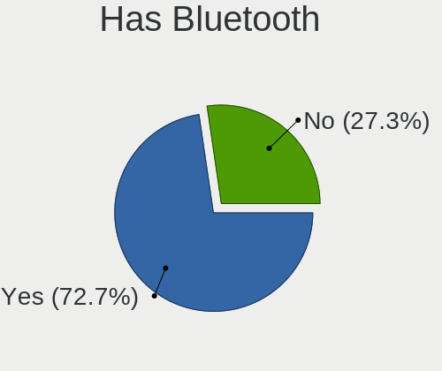
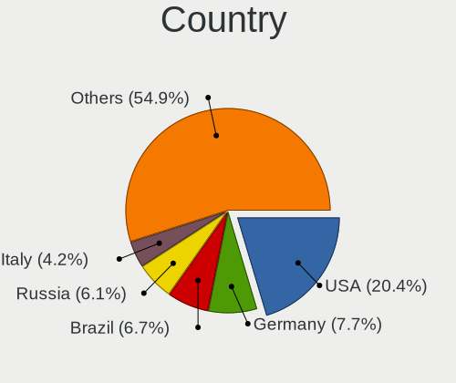
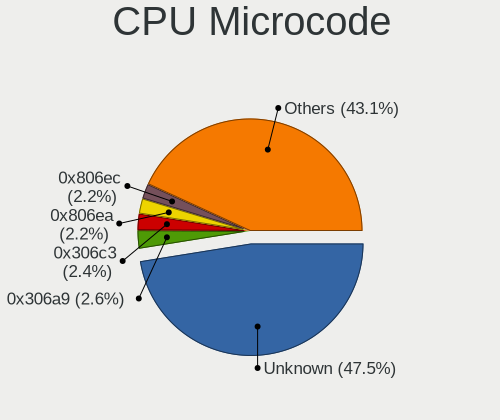
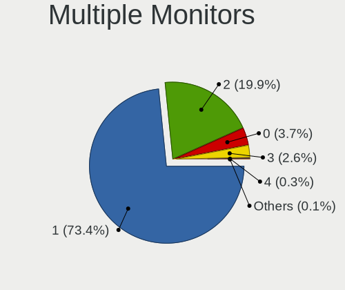
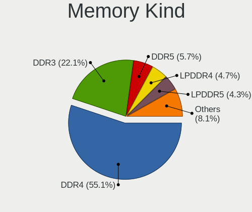

Fedora - Tested Hardware & Statistics
-------------------------------------

A project to collect tested hardware configurations for Fedora.

Anyone can contribute to this report by the [hw-probe](https://github.com/linuxhw/hw-probe) tool:

    sudo -E hw-probe -all -upload

Please contribute! Especially if your hardware is rare.

This is a report for all computer types. See also reports for [desktops](/Dist/Fedora/Desktop/README.md) and [notebooks](/Dist/Fedora/Notebook/README.md).

Contents
--------

* [ Test Cases ](#test-cases)

* [ System ](#system)
  - [ OS                       ](#os)
  - [ OS Family                ](#os-family)
  - [ Kernel                   ](#kernel)
  - [ Kernel Family            ](#kernel-family)
  - [ Kernel Major Ver.        ](#kernel-major-ver)
  - [ Arch                     ](#arch)
  - [ DE                       ](#de)
  - [ Display Server           ](#display-server)
  - [ Display Manager          ](#display-manager)
  - [ OS Lang                  ](#os-lang)
  - [ Boot Mode                ](#boot-mode)
  - [ Filesystem               ](#filesystem)
  - [ Part. scheme             ](#part-scheme)
  - [ Dual Boot with Linux/BSD ](#dual-boot-with-linuxbsd)
  - [ Dual Boot (Win)          ](#dual-boot-win)

* [ Board ](#board)
  - [ Vendor                   ](#vendor)
  - [ Model                    ](#model)
  - [ Model Family             ](#model-family)
  - [ MFG Year                 ](#mfg-year)
  - [ Form Factor              ](#form-factor)
  - [ Secure Boot              ](#secure-boot)
  - [ Coreboot                 ](#coreboot)
  - [ RAM Size                 ](#ram-size)
  - [ RAM Used                 ](#ram-used)
  - [ Total Drives             ](#total-drives)
  - [ Has CD-ROM               ](#has-cd-rom)
  - [ Has Ethernet             ](#has-ethernet)
  - [ Has WiFi                 ](#has-wifi)
  - [ Has Bluetooth            ](#has-bluetooth)

* [ Location ](#location)
  - [ Country                  ](#country)
  - [ City                     ](#city)

* [ Drives ](#drives)
  - [ Drive Vendor             ](#drive-vendor)
  - [ Drive Model              ](#drive-model)
  - [ HDD Vendor               ](#hdd-vendor)
  - [ SSD Vendor               ](#ssd-vendor)
  - [ Drive Kind               ](#drive-kind)
  - [ Drive Connector          ](#drive-connector)
  - [ Drive Size               ](#drive-size)
  - [ Space Total              ](#space-total)
  - [ Space Used               ](#space-used)
  - [ Malfunc. Drives          ](#malfunc-drives)
  - [ Malfunc. Drive Vendor    ](#malfunc-drive-vendor)
  - [ Malfunc. HDD Vendor      ](#malfunc-hdd-vendor)
  - [ Malfunc. Drive Kind      ](#malfunc-drive-kind)
  - [ Failed Drives            ](#failed-drives)
  - [ Failed Drive Vendor      ](#failed-drive-vendor)
  - [ Drive Status             ](#drive-status)

* [ Storage controller ](#storage-controller)
  - [ Storage Vendor           ](#storage-vendor)
  - [ Storage Model            ](#storage-model)
  - [ Storage Kind             ](#storage-kind)

* [ Processor ](#processor)
  - [ CPU Vendor               ](#cpu-vendor)
  - [ CPU Model                ](#cpu-model)
  - [ CPU Model Family         ](#cpu-model-family)
  - [ CPU Cores                ](#cpu-cores)
  - [ CPU Sockets              ](#cpu-sockets)
  - [ CPU Threads              ](#cpu-threads)
  - [ CPU Op-Modes             ](#cpu-op-modes)
  - [ CPU Microcode            ](#cpu-microcode)
  - [ CPU Microarch            ](#cpu-microarch)

* [ Graphics ](#graphics)
  - [ GPU Vendor               ](#gpu-vendor)
  - [ GPU Model                ](#gpu-model)
  - [ GPU Combo                ](#gpu-combo)
  - [ GPU Driver               ](#gpu-driver)
  - [ GPU Memory               ](#gpu-memory)

* [ Monitor ](#monitor)
  - [ Monitor Vendor           ](#monitor-vendor)
  - [ Monitor Model            ](#monitor-model)
  - [ Monitor Resolution       ](#monitor-resolution)
  - [ Monitor Diagonal         ](#monitor-diagonal)
  - [ Monitor Width            ](#monitor-width)
  - [ Aspect Ratio             ](#aspect-ratio)
  - [ Monitor Area             ](#monitor-area)
  - [ Pixel Density            ](#pixel-density)
  - [ Multiple Monitors        ](#multiple-monitors)

* [ Network ](#network)
  - [ Net Controller Vendor    ](#net-controller-vendor)
  - [ Net Controller Model     ](#net-controller-model)
  - [ Wireless Vendor          ](#wireless-vendor)
  - [ Wireless Model           ](#wireless-model)
  - [ Ethernet Vendor          ](#ethernet-vendor)
  - [ Ethernet Model           ](#ethernet-model)
  - [ Net Controller Kind      ](#net-controller-kind)
  - [ Used Controller          ](#used-controller)
  - [ NICs                     ](#nics)
  - [ IPv6                     ](#ipv6)

* [ Bluetooth ](#bluetooth)
  - [ Bluetooth Vendor         ](#bluetooth-vendor)
  - [ Bluetooth Model          ](#bluetooth-model)

* [ Sound ](#sound)
  - [ Sound Vendor             ](#sound-vendor)
  - [ Sound Model              ](#sound-model)

* [ Memory ](#memory)
  - [ Memory Vendor            ](#memory-vendor)
  - [ Memory Model             ](#memory-model)
  - [ Memory Kind              ](#memory-kind)
  - [ Memory Form Factor       ](#memory-form-factor)
  - [ Memory Size              ](#memory-size)
  - [ Memory Speed             ](#memory-speed)

* [ Printers & scanners ](#printers--scanners)
  - [ Printer Vendor           ](#printer-vendor)
  - [ Printer Model            ](#printer-model)
  - [ Scanner Vendor           ](#scanner-vendor)
  - [ Scanner Model            ](#scanner-model)

* [ Camera ](#camera)
  - [ Camera Vendor            ](#camera-vendor)
  - [ Camera Model             ](#camera-model)

* [ Security ](#security)
  - [ Fingerprint Vendor       ](#fingerprint-vendor)
  - [ Fingerprint Model        ](#fingerprint-model)
  - [ Chipcard Vendor          ](#chipcard-vendor)
  - [ Chipcard Model           ](#chipcard-model)

* [ Unsupported ](#unsupported)
  - [ Unsupported Devices      ](#unsupported-devices)
  - [ Unsupported Device Types ](#unsupported-device-types)

Test Cases
----------

Total: 18055

| Vendor        | Model                       | Form-Factor | Probe                                                      | Date         |
|---------------|-----------------------------|-------------|------------------------------------------------------------|--------------|
| ASUSTek       | X541UVK                     | Notebook    | [22a8a9d964](https://linux-hardware.org/?probe=22a8a9d964) | Jun 10, 2023 |
| Apple         | MacBookAir5,2               | Notebook    | [18e80281cc](https://linux-hardware.org/?probe=18e80281cc) | Jun 10, 2023 |
| Samsung       | 730QCJ/730QCR               | Notebook    | [96b21d42f1](https://linux-hardware.org/?probe=96b21d42f1) | Jun 10, 2023 |
| Gigabyte      | Z87X-UD4H-CF                | Desktop     | [abd31d2f92](https://linux-hardware.org/?probe=abd31d2f92) | Jun 10, 2023 |
| Apple         | MacBookAir5,2               | Notebook    | [f7bd03dbb9](https://linux-hardware.org/?probe=f7bd03dbb9) | Jun 10, 2023 |
| Lenovo        | 32E9 SDK0T76465 WIN 3422... | Desktop     | [2ac8db1b4c](https://linux-hardware.org/?probe=2ac8db1b4c) | Jun 10, 2023 |
| Lenovo        | G580 ChiefRiver Platform    | Notebook    | [ac48eeb92c](https://linux-hardware.org/?probe=ac48eeb92c) | Jun 10, 2023 |
| Lenovo        | G580 ChiefRiver Platform    | Notebook    | [ade15528d8](https://linux-hardware.org/?probe=ade15528d8) | Jun 10, 2023 |
| HP            | Pavilion Laptop 14-ec1xx... | Notebook    | [1eeb12a5ca](https://linux-hardware.org/?probe=1eeb12a5ca) | Jun 10, 2023 |
| HP            | Pavilion Laptop 14-ec1xx... | Notebook    | [e46f2fe66e](https://linux-hardware.org/?probe=e46f2fe66e) | Jun 10, 2023 |
| Dell          | 0N4YC8 A00                  | Desktop     | [bc832400b4](https://linux-hardware.org/?probe=bc832400b4) | Jun 10, 2023 |
| Unknown       | Unknown                     | Soc         | [a61c241455](https://linux-hardware.org/?probe=a61c241455) | Jun 10, 2023 |
| HP            | ENVY Laptop 13-ad1xx        | Notebook    | [1de48a4515](https://linux-hardware.org/?probe=1de48a4515) | Jun 10, 2023 |
| HP            | ZBook 15 G2                 | Notebook    | [68c941fe5d](https://linux-hardware.org/?probe=68c941fe5d) | Jun 10, 2023 |
| Toshiba       | PORTEGE Z10t-A              | Notebook    | [4a0712b322](https://linux-hardware.org/?probe=4a0712b322) | Jun 10, 2023 |
| Dell          | Inspiron 7506 2n1           | Convertible | [392ff8bfbb](https://linux-hardware.org/?probe=392ff8bfbb) | Jun 10, 2023 |
| Apple         | MacBookPro13,2              | Notebook    | [929c318674](https://linux-hardware.org/?probe=929c318674) | Jun 10, 2023 |
| MSI           | MS-7388                     | Desktop     | [6d3a406400](https://linux-hardware.org/?probe=6d3a406400) | Jun 10, 2023 |
| Lenovo        | IdeaPad 3 15ITL6 82H8       | Notebook    | [1a36e2fa98](https://linux-hardware.org/?probe=1a36e2fa98) | Jun 10, 2023 |
| MSI           | X99A RAIDER                 | Desktop     | [4ab556e4b8](https://linux-hardware.org/?probe=4ab556e4b8) | Jun 10, 2023 |
| ASRock        | FM2A88X Extreme6+           | Desktop     | [212c44c43f](https://linux-hardware.org/?probe=212c44c43f) | Jun 10, 2023 |
| Dell          | Inspiron 5515               | Notebook    | [36016c0c6b](https://linux-hardware.org/?probe=36016c0c6b) | Jun 10, 2023 |
| HUAWEI        | BOD-WXX9                    | Notebook    | [c4063bcf07](https://linux-hardware.org/?probe=c4063bcf07) | Jun 09, 2023 |
| HUAWEI        | BOD-WXX9                    | Notebook    | [9016ad81ae](https://linux-hardware.org/?probe=9016ad81ae) | Jun 09, 2023 |
| HP            | Laptop 15-db0xxx            | Notebook    | [881d5dc409](https://linux-hardware.org/?probe=881d5dc409) | Jun 09, 2023 |
| HP            | ZBook 15 G2                 | Notebook    | [2851b41659](https://linux-hardware.org/?probe=2851b41659) | Jun 09, 2023 |
| Lenovo        | IdeaPad L340-15API 81LW     | Notebook    | [1794287cf0](https://linux-hardware.org/?probe=1794287cf0) | Jun 09, 2023 |
| Lenovo        | ThinkPad P1 20MD001VUS      | Notebook    | [9765261d02](https://linux-hardware.org/?probe=9765261d02) | Jun 09, 2023 |
| HP            | 339B                        | Desktop     | [bc6de07e07](https://linux-hardware.org/?probe=bc6de07e07) | Jun 09, 2023 |
| Lenovo        | ThinkPad T460 20FN002JUS    | Notebook    | [8cc29c049e](https://linux-hardware.org/?probe=8cc29c049e) | Jun 09, 2023 |
| Lenovo        | IdeaPadFlex 5 14ITL05 82... | Convertible | [7bc800675d](https://linux-hardware.org/?probe=7bc800675d) | Jun 09, 2023 |
| Gigabyte      | B450 AORUS PRO WIFI-CF      | Desktop     | [f9677c0861](https://linux-hardware.org/?probe=f9677c0861) | Jun 09, 2023 |
| Lenovo        | ThinkPad P53 20QN0011IV     | Notebook    | [9e3dfb25be](https://linux-hardware.org/?probe=9e3dfb25be) | Jun 09, 2023 |
| Dell          | XPS 13 9370                 | Notebook    | [c605e51eca](https://linux-hardware.org/?probe=c605e51eca) | Jun 09, 2023 |
| ASUSTek       | A8R32-MVP Deluxe            | Desktop     | [f02bc23dd0](https://linux-hardware.org/?probe=f02bc23dd0) | Jun 09, 2023 |
| HP            | Laptop 15-db0xxx            | Notebook    | [5dd8c1fed8](https://linux-hardware.org/?probe=5dd8c1fed8) | Jun 09, 2023 |
| ASRock        | AB350M Pro4                 | Desktop     | [8f0087d741](https://linux-hardware.org/?probe=8f0087d741) | Jun 09, 2023 |
| Lenovo        | IdeaPad 5 14ARE05 81YM      | Notebook    | [e246e70bb6](https://linux-hardware.org/?probe=e246e70bb6) | Jun 09, 2023 |
| Lenovo        | Yoga Slim 7 Carbon 13ITL... | Notebook    | [27c0e57cb3](https://linux-hardware.org/?probe=27c0e57cb3) | Jun 09, 2023 |
| MSI           | 760GM-P23                   | Desktop     | [abc3a3d8a1](https://linux-hardware.org/?probe=abc3a3d8a1) | Jun 09, 2023 |
| MSI           | 760GM-P23                   | Desktop     | [fc826b3cb1](https://linux-hardware.org/?probe=fc826b3cb1) | Jun 09, 2023 |
| ASUSTek       | STRIX B250F GAMING          | Desktop     | [c0fd33b9cc](https://linux-hardware.org/?probe=c0fd33b9cc) | Jun 09, 2023 |
| Dell          | Inspiron 3493               | Notebook    | [ffcd21fc3b](https://linux-hardware.org/?probe=ffcd21fc3b) | Jun 09, 2023 |
| ASUSTek       | STRIX B250F GAMING          | Desktop     | [76c3e6625b](https://linux-hardware.org/?probe=76c3e6625b) | Jun 09, 2023 |
| Dell          | 0FDY5C A00                  | Desktop     | [1caf029f79](https://linux-hardware.org/?probe=1caf029f79) | Jun 09, 2023 |
| Dell          | Precision 7540              | Notebook    | [41fe2f93ff](https://linux-hardware.org/?probe=41fe2f93ff) | Jun 09, 2023 |
| Apple         | MacBookPro9,2               | Notebook    | [c22081b097](https://linux-hardware.org/?probe=c22081b097) | Jun 09, 2023 |
| ASRock        | A320M-HD                    | Desktop     | [9e88454384](https://linux-hardware.org/?probe=9e88454384) | Jun 09, 2023 |
| Apple         | MacBookPro8,1               | Notebook    | [70fea7478a](https://linux-hardware.org/?probe=70fea7478a) | Jun 08, 2023 |
| ASUSTek       | Z97M-PLUS                   | Desktop     | [24f6f6e727](https://linux-hardware.org/?probe=24f6f6e727) | Jun 08, 2023 |
| Dell          | Latitude 5175               | Notebook    | [63d6fcf641](https://linux-hardware.org/?probe=63d6fcf641) | Jun 08, 2023 |
| Lenovo        | ThinkPad E14 20RA0016GE     | Notebook    | [4c8d8758b7](https://linux-hardware.org/?probe=4c8d8758b7) | Jun 08, 2023 |
| HUAWEI        | NBLK-WAX9X                  | Notebook    | [e28668e147](https://linux-hardware.org/?probe=e28668e147) | Jun 08, 2023 |
| ASUSTek       | Z97M-PLUS                   | Desktop     | [8d4e2bedde](https://linux-hardware.org/?probe=8d4e2bedde) | Jun 08, 2023 |
| Lenovo        | IdeaPadFlex 5 14ITL05 82... | Convertible | [0c923e1174](https://linux-hardware.org/?probe=0c923e1174) | Jun 08, 2023 |
| Colorful T... | A520M-K PRO V14             | Desktop     | [48c4aa3d8c](https://linux-hardware.org/?probe=48c4aa3d8c) | Jun 08, 2023 |
| ASUSTek       | TUF Gaming X570-PRO         | Desktop     | [b9e1c5e320](https://linux-hardware.org/?probe=b9e1c5e320) | Jun 08, 2023 |
| Gigabyte      | X570 I AORUS PRO WIFI       | Desktop     | [bf2fc7d3b7](https://linux-hardware.org/?probe=bf2fc7d3b7) | Jun 08, 2023 |
| ASUSTek       | VivoBook_ASUSLaptop M350... | Notebook    | [59ff5486a9](https://linux-hardware.org/?probe=59ff5486a9) | Jun 08, 2023 |
| HP            | 240 G6 Notebook PC          | Notebook    | [eda13b898c](https://linux-hardware.org/?probe=eda13b898c) | Jun 08, 2023 |
| ASUSTek       | ROG Strix G713PI_G713PI     | Notebook    | [13b0e73872](https://linux-hardware.org/?probe=13b0e73872) | Jun 08, 2023 |
| TUXEDO        | Stellaris Intel Gen4        | Notebook    | [e6cb646bd4](https://linux-hardware.org/?probe=e6cb646bd4) | Jun 08, 2023 |
| HP            | OMEN by Laptop 16-c0xxx     | Notebook    | [6de4ea13fe](https://linux-hardware.org/?probe=6de4ea13fe) | Jun 08, 2023 |
| Lenovo        | Legion S7 15ACH6 82K8       | Notebook    | [8f160a999a](https://linux-hardware.org/?probe=8f160a999a) | Jun 08, 2023 |
| Lenovo        | Legion 5 15ACH6A 82NW       | Notebook    | [0aea375d78](https://linux-hardware.org/?probe=0aea375d78) | Jun 08, 2023 |
| Dell          | Precision 3551              | Notebook    | [0e484bd6a5](https://linux-hardware.org/?probe=0e484bd6a5) | Jun 08, 2023 |
| HP            | Pavilion g6                 | Notebook    | [12b1174ce8](https://linux-hardware.org/?probe=12b1174ce8) | Jun 08, 2023 |
| MSI           | B450M PRO-VDH MAX           | Desktop     | [c96be9f4cd](https://linux-hardware.org/?probe=c96be9f4cd) | Jun 08, 2023 |
| Lenovo        | ThinkPad P14s Gen 2a 21A... | Notebook    | [7543a0bbc1](https://linux-hardware.org/?probe=7543a0bbc1) | Jun 08, 2023 |
| Dell          | Precision 5510              | Notebook    | [24317d94ff](https://linux-hardware.org/?probe=24317d94ff) | Jun 08, 2023 |
| Lenovo        | ThinkPad T580 20L90047US    | Notebook    | [bee34052a3](https://linux-hardware.org/?probe=bee34052a3) | Jun 08, 2023 |
| HP            | Pavilion Aero Laptop 13-... | Notebook    | [9c9fb1b1a6](https://linux-hardware.org/?probe=9c9fb1b1a6) | Jun 08, 2023 |
| Gigabyte      | B75M-D3H                    | Desktop     | [65e06561cf](https://linux-hardware.org/?probe=65e06561cf) | Jun 08, 2023 |
| Lenovo        | IdeaPad 3 15ITL6 82H8       | Notebook    | [82d0019a0b](https://linux-hardware.org/?probe=82d0019a0b) | Jun 08, 2023 |
| Gigabyte      | Z77MX-D3H                   | Desktop     | [e1fdfde650](https://linux-hardware.org/?probe=e1fdfde650) | Jun 08, 2023 |
| HPE           | ProLiant MicroServer Gen... | Desktop     | [e95900bc0c](https://linux-hardware.org/?probe=e95900bc0c) | Jun 08, 2023 |
| Gigabyte      | Z370 AORUS Gaming 5-CF      | Desktop     | [74f55613b5](https://linux-hardware.org/?probe=74f55613b5) | Jun 08, 2023 |
| Lenovo        | ThinkServer TS140           | Desktop     | [e9ca405eff](https://linux-hardware.org/?probe=e9ca405eff) | Jun 08, 2023 |
| Dell          | Inspiron 5505               | Notebook    | [05973f7d9b](https://linux-hardware.org/?probe=05973f7d9b) | Jun 08, 2023 |
| Unknown       | Unknown                     | Notebook    | [829839a3b3](https://linux-hardware.org/?probe=829839a3b3) | Jun 07, 2023 |
| Dell          | Inspiron 15 5510            | Notebook    | [98d7cb7ea7](https://linux-hardware.org/?probe=98d7cb7ea7) | Jun 07, 2023 |
| Dell          | Inspiron 5565               | Notebook    | [91fc26029a](https://linux-hardware.org/?probe=91fc26029a) | Jun 07, 2023 |
| TYAN Compu... | S7020                       | Server      | [6b39aa397f](https://linux-hardware.org/?probe=6b39aa397f) | Jun 07, 2023 |
| Gigabyte      | Z390 GAMING SLI-CF          | Desktop     | [5f0e8ab63a](https://linux-hardware.org/?probe=5f0e8ab63a) | Jun 07, 2023 |
| Lenovo        | ThinkPad E15 Gen 4 21EES... | Notebook    | [06608c68d7](https://linux-hardware.org/?probe=06608c68d7) | Jun 07, 2023 |
| Gigabyte      | Z87X-UD5H-CF                | Desktop     | [fd156e669f](https://linux-hardware.org/?probe=fd156e669f) | Jun 07, 2023 |
| Fujitsu       | CELSIUS H730                | Notebook    | [a1e397f4a7](https://linux-hardware.org/?probe=a1e397f4a7) | Jun 07, 2023 |
| HP            | Pavilion dv7                | Notebook    | [75a37cd4c8](https://linux-hardware.org/?probe=75a37cd4c8) | Jun 07, 2023 |
| Lenovo        | SHARKBAY NOK                | Desktop     | [cf560e91e7](https://linux-hardware.org/?probe=cf560e91e7) | Jun 07, 2023 |
| Dell          | Inspiron 5548               | Notebook    | [e67581e121](https://linux-hardware.org/?probe=e67581e121) | Jun 07, 2023 |
| Apple         | MacBookPro9,2               | Notebook    | [2a0add5b7e](https://linux-hardware.org/?probe=2a0add5b7e) | Jun 07, 2023 |
| HP            | 339B                        | Desktop     | [a1739aa36b](https://linux-hardware.org/?probe=a1739aa36b) | Jun 07, 2023 |
| HP            | Pavilion Laptop 15-eg3xx... | Notebook    | [e103817b2d](https://linux-hardware.org/?probe=e103817b2d) | Jun 07, 2023 |
| Lenovo        | ThinkPad T590 20N5S2NC0F    | Notebook    | [581602e921](https://linux-hardware.org/?probe=581602e921) | Jun 07, 2023 |
| Gigabyte      | H77N-WIFI                   | Desktop     | [1c8078b748](https://linux-hardware.org/?probe=1c8078b748) | Jun 07, 2023 |
| Dell          | Latitude 5300               | Notebook    | [1eea10cfa3](https://linux-hardware.org/?probe=1eea10cfa3) | Jun 07, 2023 |
| Lenovo        | Yoga Pro 9 14IRP8 83BU      | Notebook    | [7d33fb0564](https://linux-hardware.org/?probe=7d33fb0564) | Jun 07, 2023 |
| Lenovo        | Yoga Slim 7 Carbon 13ITL... | Notebook    | [b6bb7bad1d](https://linux-hardware.org/?probe=b6bb7bad1d) | Jun 07, 2023 |
| Apple         | MacBookPro9,2               | Notebook    | [8d70c1dd42](https://linux-hardware.org/?probe=8d70c1dd42) | Jun 07, 2023 |
| Gigabyte      | B550 VISION D               | Desktop     | [94cf7f5675](https://linux-hardware.org/?probe=94cf7f5675) | Jun 07, 2023 |
| Acer          | Predator PH315-52           | Notebook    | [f7178495c7](https://linux-hardware.org/?probe=f7178495c7) | Jun 07, 2023 |
| Acer          | Aspire E5-411G              | Notebook    | [9a69b50d97](https://linux-hardware.org/?probe=9a69b50d97) | Jun 07, 2023 |
| Lenovo        | ThinkPad T14 Gen 1 20S1S... | Notebook    | [f9b3588ff3](https://linux-hardware.org/?probe=f9b3588ff3) | Jun 07, 2023 |
| Lenovo        | ThinkPad T495 20NKS10K00    | Notebook    | [f205c52b8f](https://linux-hardware.org/?probe=f205c52b8f) | Jun 07, 2023 |
| MSI           | GT72 2QE                    | Notebook    | [211494a051](https://linux-hardware.org/?probe=211494a051) | Jun 07, 2023 |
| Lenovo        | ThinkPad P1 20MD001VUS      | Notebook    | [8c505b5d84](https://linux-hardware.org/?probe=8c505b5d84) | Jun 06, 2023 |
| Lenovo        | ThinkPad X270 W10DG 20K5... | Notebook    | [9afe34cdd8](https://linux-hardware.org/?probe=9afe34cdd8) | Jun 06, 2023 |
| ASUSTek       | VivoBook_ASUSLaptop X512... | Notebook    | [b7ab29fbb5](https://linux-hardware.org/?probe=b7ab29fbb5) | Jun 06, 2023 |
| MSI           | B350M GAMING PRO            | Desktop     | [eb3fbddd2c](https://linux-hardware.org/?probe=eb3fbddd2c) | Jun 06, 2023 |
| ASUSTek       | ZenBook UX325JA_UX325JA     | Notebook    | [721ff5908a](https://linux-hardware.org/?probe=721ff5908a) | Jun 06, 2023 |
| Gigabyte      | B250-FinTech-CF             | Desktop     | [022138ad16](https://linux-hardware.org/?probe=022138ad16) | Jun 06, 2023 |
| Toshiba       | Satellite L40               | Notebook    | [16c5f74991](https://linux-hardware.org/?probe=16c5f74991) | Jun 06, 2023 |
| Apple         | MacBookPro14,1              | Notebook    | [16aa33fdfe](https://linux-hardware.org/?probe=16aa33fdfe) | Jun 06, 2023 |
| Dell          | 0427JK A00                  | Desktop     | [addb15771e](https://linux-hardware.org/?probe=addb15771e) | Jun 06, 2023 |
| Lenovo        | ThinkPad W520 4282AB9       | Notebook    | [790550e99f](https://linux-hardware.org/?probe=790550e99f) | Jun 06, 2023 |
| Lenovo        | ThinkPad T460 20FMS2292K    | Notebook    | [380ffe6574](https://linux-hardware.org/?probe=380ffe6574) | Jun 06, 2023 |
| Dell          | 0NW6H5 A00                  | Desktop     | [631e6bba84](https://linux-hardware.org/?probe=631e6bba84) | Jun 06, 2023 |
| Dell          | 06X1TJ A00                  | Desktop     | [c3f02841f4](https://linux-hardware.org/?probe=c3f02841f4) | Jun 06, 2023 |
| Dell          | XPS 15 9560                 | Notebook    | [0d326774c9](https://linux-hardware.org/?probe=0d326774c9) | Jun 06, 2023 |
| Dell          | 06X1TJ A00                  | Desktop     | [4cec4f0517](https://linux-hardware.org/?probe=4cec4f0517) | Jun 06, 2023 |
| Lenovo        | ThinkPad P51 20HH0011US     | Notebook    | [4766608bc1](https://linux-hardware.org/?probe=4766608bc1) | Jun 06, 2023 |
| Apple         | MacBookPro9,2               | Notebook    | [7394a9d94b](https://linux-hardware.org/?probe=7394a9d94b) | Jun 06, 2023 |
| HP            | 83E1                        | Desktop     | [227e410c6f](https://linux-hardware.org/?probe=227e410c6f) | Jun 06, 2023 |
| Lenovo        | 30D0 NOK                    | Desktop     | [045b011b7a](https://linux-hardware.org/?probe=045b011b7a) | Jun 06, 2023 |
| HP            | Pavilion Laptop 15-eg3xx... | Notebook    | [2a612dc748](https://linux-hardware.org/?probe=2a612dc748) | Jun 06, 2023 |
| MSI           | X99A RAIDER                 | Desktop     | [d70fe31101](https://linux-hardware.org/?probe=d70fe31101) | Jun 06, 2023 |
| ASRock        | FM2A88X Extreme6+           | Desktop     | [3c3708dcec](https://linux-hardware.org/?probe=3c3708dcec) | Jun 06, 2023 |
| Apple         | MacBookPro9,2               | Notebook    | [9df43aede5](https://linux-hardware.org/?probe=9df43aede5) | Jun 06, 2023 |
| HP            | 8918                        | Desktop     | [917b8c425f](https://linux-hardware.org/?probe=917b8c425f) | Jun 06, 2023 |
| Lenovo        | ThinkPad P50 20EN001SUS     | Notebook    | [77b332cb2d](https://linux-hardware.org/?probe=77b332cb2d) | Jun 06, 2023 |
| System76      | Oryx Pro                    | Notebook    | [4f39b2d690](https://linux-hardware.org/?probe=4f39b2d690) | Jun 06, 2023 |
| HP            | Spectre x360 Convertible... | Convertible | [76a8e35b72](https://linux-hardware.org/?probe=76a8e35b72) | Jun 05, 2023 |
| Lenovo        | ThinkPad X1 Carbon Gen 9... | Notebook    | [0deafae1f1](https://linux-hardware.org/?probe=0deafae1f1) | Jun 05, 2023 |
| realme        | CloudProXXXX                | Notebook    | [22cced9066](https://linux-hardware.org/?probe=22cced9066) | Jun 05, 2023 |
| Acer          | Nitro AN515-44              | Notebook    | [d7a2c59432](https://linux-hardware.org/?probe=d7a2c59432) | Jun 05, 2023 |
| Gigabyte      | X570 I AORUS PRO WIFI       | Desktop     | [91ee57c108](https://linux-hardware.org/?probe=91ee57c108) | Jun 05, 2023 |
| Gigabyte      | B250-FinTech-CF             | Desktop     | [e22c496628](https://linux-hardware.org/?probe=e22c496628) | Jun 05, 2023 |
| Dell          | Latitude E7450              | Notebook    | [e19dbd1a84](https://linux-hardware.org/?probe=e19dbd1a84) | Jun 05, 2023 |
| Unknown       | Unknown                     | Desktop     | [292269611c](https://linux-hardware.org/?probe=292269611c) | Jun 05, 2023 |
| Dell          | XPS 13 9305                 | Notebook    | [78459738e9](https://linux-hardware.org/?probe=78459738e9) | Jun 05, 2023 |
| Lenovo        | ThinkPad S1 Yoga 20CD003... | Notebook    | [9a1c9022af](https://linux-hardware.org/?probe=9a1c9022af) | Jun 05, 2023 |
| Lenovo        | ThinkPad P53 20QN0011IV     | Notebook    | [bb29d15c61](https://linux-hardware.org/?probe=bb29d15c61) | Jun 05, 2023 |
| Acer          | Predator PT515-51           | Notebook    | [5c3daec3c7](https://linux-hardware.org/?probe=5c3daec3c7) | Jun 05, 2023 |
| GPU Compan... | GWTC116-2                   | Notebook    | [de8a3d6dab](https://linux-hardware.org/?probe=de8a3d6dab) | Jun 05, 2023 |
| ASRock        | FM2A88X Extreme6+           | Desktop     | [79b80daf83](https://linux-hardware.org/?probe=79b80daf83) | Jun 05, 2023 |
| MSI           | X99A RAIDER                 | Desktop     | [36173d5a42](https://linux-hardware.org/?probe=36173d5a42) | Jun 05, 2023 |
| Samsung       | 950XEE                      | Notebook    | [cc47fd0df0](https://linux-hardware.org/?probe=cc47fd0df0) | Jun 05, 2023 |
| Lenovo        | ThinkPad E450 20DC003WUS    | Notebook    | [6abecb1cd3](https://linux-hardware.org/?probe=6abecb1cd3) | Jun 05, 2023 |
| MSI           | B360M PRO-VH                | Desktop     | [8e4ad66edc](https://linux-hardware.org/?probe=8e4ad66edc) | Jun 05, 2023 |
| ASUSTek       | X540UP                      | Notebook    | [b6613930a2](https://linux-hardware.org/?probe=b6613930a2) | Jun 05, 2023 |
| ASUSTek       | PRIME B350M-A               | Desktop     | [3a0576b177](https://linux-hardware.org/?probe=3a0576b177) | Jun 05, 2023 |
| Dell          | Precision 7540              | Notebook    | [a10ecca056](https://linux-hardware.org/?probe=a10ecca056) | Jun 04, 2023 |
| Sony          | VPCSC1AFM                   | Notebook    | [2cf80cf628](https://linux-hardware.org/?probe=2cf80cf628) | Jun 04, 2023 |
| Apple         | MacBookPro8,1               | Notebook    | [e3f89d1faa](https://linux-hardware.org/?probe=e3f89d1faa) | Jun 04, 2023 |
| ASUSTek       | PRIME B550M-A               | Desktop     | [d6befa925e](https://linux-hardware.org/?probe=d6befa925e) | Jun 04, 2023 |
| ASUSTek       | X540UP                      | Notebook    | [5102ecc266](https://linux-hardware.org/?probe=5102ecc266) | Jun 04, 2023 |
| MECHREVO      | Code01 Ver2.0               | Notebook    | [d311022361](https://linux-hardware.org/?probe=d311022361) | Jun 04, 2023 |
| MSI           | Modern 14 C12M              | Notebook    | [a5d1a0e656](https://linux-hardware.org/?probe=a5d1a0e656) | Jun 04, 2023 |
| HP            | ENVY x360 Convertible 15... | Convertible | [f254b0806d](https://linux-hardware.org/?probe=f254b0806d) | Jun 04, 2023 |
| ASUSTek       | VivoBook_ASUSLaptop X571... | Notebook    | [dfb8881ffe](https://linux-hardware.org/?probe=dfb8881ffe) | Jun 04, 2023 |
| HP            | Laptop 17-cp0xxx            | Notebook    | [253c561829](https://linux-hardware.org/?probe=253c561829) | Jun 04, 2023 |
| Dell          | Latitude 7210 2-in-1        | Tablet      | [a735050ced](https://linux-hardware.org/?probe=a735050ced) | Jun 04, 2023 |
| AMI           | Intel                       | Notebook    | [cd2beb79d2](https://linux-hardware.org/?probe=cd2beb79d2) | Jun 04, 2023 |
| Dell          | 09D7F7 A00                  | Desktop     | [9b80703b01](https://linux-hardware.org/?probe=9b80703b01) | Jun 04, 2023 |
| UNOWHY        | Y13G002S4EI                 | Notebook    | [f1b932f397](https://linux-hardware.org/?probe=f1b932f397) | Jun 04, 2023 |
| ASUSTek       | ROG STRIX B550-A GAMING     | Desktop     | [5b35735d26](https://linux-hardware.org/?probe=5b35735d26) | Jun 04, 2023 |
| ASUSTek       | VivoBook Flip 14_ASUS Fl... | Convertible | [267010517a](https://linux-hardware.org/?probe=267010517a) | Jun 04, 2023 |
| MSI           | X470 GAMING PLUS            | Desktop     | [7af9263ba9](https://linux-hardware.org/?probe=7af9263ba9) | Jun 04, 2023 |
| MSI           | X470 GAMING PLUS            | Desktop     | [ae24cbf98d](https://linux-hardware.org/?probe=ae24cbf98d) | Jun 04, 2023 |
| Lenovo        | 32E9 SDK0T76465 WIN 3422... | Desktop     | [fa41f1f3c2](https://linux-hardware.org/?probe=fa41f1f3c2) | Jun 04, 2023 |
| Lenovo        | B570 HuronRiver Platform    | Notebook    | [43cffb0d0f](https://linux-hardware.org/?probe=43cffb0d0f) | Jun 04, 2023 |
| Lenovo        | B570 HuronRiver Platform    | Notebook    | [cef2bf28c9](https://linux-hardware.org/?probe=cef2bf28c9) | Jun 04, 2023 |
| Dell          | Latitude D620               | Notebook    | [0e1b7f4320](https://linux-hardware.org/?probe=0e1b7f4320) | Jun 03, 2023 |
| HP            | ZBook 15 G2                 | Notebook    | [19ed8e22e6](https://linux-hardware.org/?probe=19ed8e22e6) | Jun 03, 2023 |
| Lenovo        | Yoga 6 13ALC7 82UD          | Convertible | [78786ec91a](https://linux-hardware.org/?probe=78786ec91a) | Jun 03, 2023 |
| Apple         | MacBookPro8,1               | Notebook    | [7bdff81d7d](https://linux-hardware.org/?probe=7bdff81d7d) | Jun 03, 2023 |
| Lenovo        | Yoga Slim 7 Carbon 13ITL... | Notebook    | [f241c0cf38](https://linux-hardware.org/?probe=f241c0cf38) | Jun 03, 2023 |
| Lenovo        | Yoga Slim 7 Carbon 13ITL... | Notebook    | [aea1babfb7](https://linux-hardware.org/?probe=aea1babfb7) | Jun 03, 2023 |
| Dell          | Latitude E6420              | Notebook    | [4d1ad8d52a](https://linux-hardware.org/?probe=4d1ad8d52a) | Jun 03, 2023 |
| Acer          | Aspire AV15-51              | Notebook    | [41e5c1790c](https://linux-hardware.org/?probe=41e5c1790c) | Jun 03, 2023 |
| Acer          | Aspire AV15-51              | Notebook    | [d583c74274](https://linux-hardware.org/?probe=d583c74274) | Jun 03, 2023 |
| Dell          | 0KRC95 A02                  | Desktop     | [3fb87e5a0e](https://linux-hardware.org/?probe=3fb87e5a0e) | Jun 03, 2023 |
| Acer          | Aspire AV15-51              | Notebook    | [7ed9ba7165](https://linux-hardware.org/?probe=7ed9ba7165) | Jun 03, 2023 |
| MSI           | A320M PRO-VH PLUS           | Desktop     | [8ba76b1e88](https://linux-hardware.org/?probe=8ba76b1e88) | Jun 03, 2023 |
| Lenovo        | Yoga 720-15IKB 80X7         | Convertible | [7ae3c54a4c](https://linux-hardware.org/?probe=7ae3c54a4c) | Jun 03, 2023 |
| ASUSTek       | ASUS TUF Dash F15 FX516P... | Notebook    | [1aa286ccff](https://linux-hardware.org/?probe=1aa286ccff) | Jun 03, 2023 |
| Apple         | MacBookAir6,1               | Notebook    | [20a14caf03](https://linux-hardware.org/?probe=20a14caf03) | Jun 03, 2023 |
| MSI           | MAG B550M MORTAR            | Desktop     | [3d911ac9c9](https://linux-hardware.org/?probe=3d911ac9c9) | Jun 03, 2023 |
| Lenovo        | ThinkPad X220 4291WSH       | Notebook    | [f95d5c3046](https://linux-hardware.org/?probe=f95d5c3046) | Jun 03, 2023 |
| Gigabyte      | B650M GAMING X AX           | Desktop     | [610ba5871f](https://linux-hardware.org/?probe=610ba5871f) | Jun 03, 2023 |
| HONOR         | BBR-WAX9                    | Notebook    | [fe03659a55](https://linux-hardware.org/?probe=fe03659a55) | Jun 02, 2023 |
| Sony          | SVF1521A1EW                 | Notebook    | [4e3fe0308e](https://linux-hardware.org/?probe=4e3fe0308e) | Jun 02, 2023 |
| Lenovo        | IdeaPad 5 14ALC05 82LM      | Notebook    | [d856669333](https://linux-hardware.org/?probe=d856669333) | Jun 02, 2023 |
| Gigabyte      | G5 GE                       | Notebook    | [558ee7e63f](https://linux-hardware.org/?probe=558ee7e63f) | Jun 02, 2023 |
| ASUSTek       | VivoBook_ASUSLaptop X571... | Notebook    | [3a51aa06b9](https://linux-hardware.org/?probe=3a51aa06b9) | Jun 02, 2023 |
| Gigabyte      | Z590 UD AC                  | Desktop     | [da5b2056e4](https://linux-hardware.org/?probe=da5b2056e4) | Jun 02, 2023 |
| ASUSTek       | P8Z77-V LK                  | Desktop     | [d50ca19dc3](https://linux-hardware.org/?probe=d50ca19dc3) | Jun 02, 2023 |
| Lenovo        | ThinkPad T460 20FMS0WN00    | Notebook    | [f576f54ff2](https://linux-hardware.org/?probe=f576f54ff2) | Jun 02, 2023 |
| ASUSTek       | ROG Zephyrus G14 GA402XI... | Notebook    | [e920b77fbb](https://linux-hardware.org/?probe=e920b77fbb) | Jun 02, 2023 |
| HP            | 212B                        | Desktop     | [15c4a7b64f](https://linux-hardware.org/?probe=15c4a7b64f) | Jun 02, 2023 |
| HP            | Unknown                     | Notebook    | [626075d6f2](https://linux-hardware.org/?probe=626075d6f2) | Jun 02, 2023 |
| HP            | Unknown                     | Notebook    | [2289bb8d24](https://linux-hardware.org/?probe=2289bb8d24) | Jun 02, 2023 |
| Gigabyte      | B85-HD3                     | Desktop     | [9931f8e663](https://linux-hardware.org/?probe=9931f8e663) | Jun 02, 2023 |
| Lenovo        | ThinkPad P16s Gen 1 21CK... | Notebook    | [0a6e1e6be8](https://linux-hardware.org/?probe=0a6e1e6be8) | Jun 02, 2023 |
| ASUSTek       | ROG STRIX X670E-E GAMING... | Desktop     | [5562bc75b8](https://linux-hardware.org/?probe=5562bc75b8) | Jun 02, 2023 |
| Lenovo        | ThinkPad E14 Gen 2 20TAS... | Notebook    | [13adb1e221](https://linux-hardware.org/?probe=13adb1e221) | Jun 02, 2023 |
| MSI           | PRO X670-P WIFI             | Desktop     | [714ed7283d](https://linux-hardware.org/?probe=714ed7283d) | Jun 02, 2023 |
| MSI           | PRO X670-P WIFI             | Desktop     | [bb2776b990](https://linux-hardware.org/?probe=bb2776b990) | Jun 02, 2023 |
| Acer          | Nitro AN515-51              | Notebook    | [2dc3c08466](https://linux-hardware.org/?probe=2dc3c08466) | Jun 02, 2023 |
| MSI           | MS-7388                     | Desktop     | [fc12ac6b90](https://linux-hardware.org/?probe=fc12ac6b90) | Jun 02, 2023 |
| Alienware     | 0N43JM A00                  | Desktop     | [047bfb6e8e](https://linux-hardware.org/?probe=047bfb6e8e) | Jun 02, 2023 |
| Lenovo        | ThinkPad T430 2350BG7       | Notebook    | [29d6e72544](https://linux-hardware.org/?probe=29d6e72544) | Jun 02, 2023 |
| Lenovo        | ThinkPad X220 42911H8       | Notebook    | [e28e041a5c](https://linux-hardware.org/?probe=e28e041a5c) | Jun 02, 2023 |
| Dell          | 04Y8V0 A02                  | Desktop     | [ce749a8df5](https://linux-hardware.org/?probe=ce749a8df5) | Jun 02, 2023 |
| Lenovo        | ThinkPad X220 42911H8       | Notebook    | [dcba8dc683](https://linux-hardware.org/?probe=dcba8dc683) | Jun 02, 2023 |
| Dell          | Latitude 7400               | Notebook    | [ef9ef10e4e](https://linux-hardware.org/?probe=ef9ef10e4e) | Jun 02, 2023 |
| Lenovo        | IdeaPad L340-17IRH Gamin... | Notebook    | [ca904474bf](https://linux-hardware.org/?probe=ca904474bf) | Jun 02, 2023 |
| Positivo B... | VJFE43F11X-XXXXXX           | Notebook    | [ea337d3d2a](https://linux-hardware.org/?probe=ea337d3d2a) | Jun 02, 2023 |
| Gigabyte      | GA-78LMT-USB3               | Desktop     | [def2c6020b](https://linux-hardware.org/?probe=def2c6020b) | Jun 01, 2023 |
| HP            | EliteBook 8470p             | Notebook    | [bc606409ff](https://linux-hardware.org/?probe=bc606409ff) | Jun 01, 2023 |
| ASUSTek       | PRIME X570-P                | Desktop     | [cde4aaef3e](https://linux-hardware.org/?probe=cde4aaef3e) | Jun 01, 2023 |
| HONOR         | BBR-WAX9                    | Notebook    | [0a536c1198](https://linux-hardware.org/?probe=0a536c1198) | Jun 01, 2023 |
| Lenovo        | MIIX 320-10ICR 80XF         | Tablet      | [57db123250](https://linux-hardware.org/?probe=57db123250) | Jun 01, 2023 |
| Itautec       | ST 4265 ST-4265 Padrao 0... | Desktop     | [7ac5ec7c05](https://linux-hardware.org/?probe=7ac5ec7c05) | Jun 01, 2023 |
| UNOWHY        | Y13G002S4EI                 | Notebook    | [0bb0a8be66](https://linux-hardware.org/?probe=0bb0a8be66) | Jun 01, 2023 |
| HP            | ZBook 15 G3                 | Notebook    | [28eec89b69](https://linux-hardware.org/?probe=28eec89b69) | Jun 01, 2023 |
| ASRock        | H310M-HDV                   | Desktop     | [3dc5138ecd](https://linux-hardware.org/?probe=3dc5138ecd) | Jun 01, 2023 |
| Dell          | Latitude 7490               | Notebook    | [3cb9ad156f](https://linux-hardware.org/?probe=3cb9ad156f) | Jun 01, 2023 |
| HP            | 845A                        | Desktop     | [b68054952b](https://linux-hardware.org/?probe=b68054952b) | Jun 01, 2023 |
| Unknown       | Unknown                     | Tablet      | [40aebbf364](https://linux-hardware.org/?probe=40aebbf364) | Jun 01, 2023 |
| Lenovo        | SHARKBAY NOK                | Desktop     | [108cb2ce17](https://linux-hardware.org/?probe=108cb2ce17) | Jun 01, 2023 |
| Dell          | Precision 7540              | Notebook    | [de2fc5bc92](https://linux-hardware.org/?probe=de2fc5bc92) | Jun 01, 2023 |
| Timi          | A35S                        | Notebook    | [c9ce47a446](https://linux-hardware.org/?probe=c9ce47a446) | Jun 01, 2023 |
| HP            | 339A                        | Desktop     | [24ab8463bb](https://linux-hardware.org/?probe=24ab8463bb) | Jun 01, 2023 |
| ASUSTek       | TUF Gaming B550M-PLUS WI... | Desktop     | [9afffc17a1](https://linux-hardware.org/?probe=9afffc17a1) | Jun 01, 2023 |
| ASUSTek       | PRIME B550M-A               | Desktop     | [8799da8513](https://linux-hardware.org/?probe=8799da8513) | Jun 01, 2023 |
| Samsung       | 750QFG                      | Convertible | [7720d51647](https://linux-hardware.org/?probe=7720d51647) | Jun 01, 2023 |
| Dell          | Latitude 5490               | Notebook    | [34dde30b90](https://linux-hardware.org/?probe=34dde30b90) | Jun 01, 2023 |
| Gigabyte      | J1900M-D2P                  | Desktop     | [0e89db7255](https://linux-hardware.org/?probe=0e89db7255) | Jun 01, 2023 |
| Toshiba       | TECRA Z40t-C                | Notebook    | [f3dc10c852](https://linux-hardware.org/?probe=f3dc10c852) | Jun 01, 2023 |
| MSI           | X99A RAIDER                 | Desktop     | [b951e6223c](https://linux-hardware.org/?probe=b951e6223c) | Jun 01, 2023 |
| ASRock        | FM2A88X Extreme6+           | Desktop     | [df9086deb4](https://linux-hardware.org/?probe=df9086deb4) | Jun 01, 2023 |
| Microsoft     | Surface Pro                 | Tablet      | [5c9c446c66](https://linux-hardware.org/?probe=5c9c446c66) | Jun 01, 2023 |
| Lenovo        | ThinkPad L15 Gen 1 20U7C... | Notebook    | [8c16cec2e8](https://linux-hardware.org/?probe=8c16cec2e8) | Jun 01, 2023 |
| Dell          | Latitude 5531               | Notebook    | [5dc2ae0939](https://linux-hardware.org/?probe=5dc2ae0939) | Jun 01, 2023 |
| Toshiba       | TECRA Z40t-C                | Notebook    | [1d128e6153](https://linux-hardware.org/?probe=1d128e6153) | Jun 01, 2023 |
| Timi          | TM1801                      | Notebook    | [aa1db210df](https://linux-hardware.org/?probe=aa1db210df) | Jun 01, 2023 |
| Lenovo        | ThinkPad X1 Yoga 1st 20F... | Convertible | [1dfd1982d8](https://linux-hardware.org/?probe=1dfd1982d8) | May 31, 2023 |
| ASUSTek       | ROG Flow X13 GV301QH_GV3... | Notebook    | [0b0c375bb8](https://linux-hardware.org/?probe=0b0c375bb8) | May 31, 2023 |
| HP            | Pavilion x360 Convertibl... | Convertible | [e365621d30](https://linux-hardware.org/?probe=e365621d30) | May 31, 2023 |
| ASUSTek       | PRIME H510M-K               | Desktop     | [f6f91b620c](https://linux-hardware.org/?probe=f6f91b620c) | May 31, 2023 |
| Lenovo        | IdeaPad 3 14ALC6 82KT       | Notebook    | [65b03710b2](https://linux-hardware.org/?probe=65b03710b2) | May 31, 2023 |
| Acer          | Nitro AN515-42              | Notebook    | [fc808ec2fd](https://linux-hardware.org/?probe=fc808ec2fd) | May 31, 2023 |
| Lenovo        | ThinkPad T430 2350BG7       | Notebook    | [a09171afde](https://linux-hardware.org/?probe=a09171afde) | May 31, 2023 |
| Lenovo        | ThinkPad Z13 Gen 1 21D20... | Notebook    | [f1e9073b3d](https://linux-hardware.org/?probe=f1e9073b3d) | May 31, 2023 |
| Dell          | Inspiron 15 5510            | Notebook    | [bd2319fd67](https://linux-hardware.org/?probe=bd2319fd67) | May 31, 2023 |
| Lenovo        | ThinkServer TS140           | Desktop     | [e8e3834bf8](https://linux-hardware.org/?probe=e8e3834bf8) | May 31, 2023 |
| Lenovo        | ThinkServer TS140           | Desktop     | [48cf9db6cd](https://linux-hardware.org/?probe=48cf9db6cd) | May 31, 2023 |
| Intel Clie... | LAPRC710                    | Notebook    | [ef0d589f75](https://linux-hardware.org/?probe=ef0d589f75) | May 31, 2023 |
| HP            | Unknown                     | Notebook    | [3eb658702b](https://linux-hardware.org/?probe=3eb658702b) | May 31, 2023 |
| Apple         | MacBookPro9,1               | Notebook    | [0b958e0c5c](https://linux-hardware.org/?probe=0b958e0c5c) | May 31, 2023 |
| ASUSTek       | VivoBook_ASUSLaptop X571... | Notebook    | [93ac1fb021](https://linux-hardware.org/?probe=93ac1fb021) | May 31, 2023 |
| Lenovo        | ZhaoYangN4620Z 20A0Z037K... | Notebook    | [7e07cca977](https://linux-hardware.org/?probe=7e07cca977) | May 31, 2023 |
| Acer          | Nitro AN515-42              | Notebook    | [75f612c4db](https://linux-hardware.org/?probe=75f612c4db) | May 31, 2023 |
| ASUSTek       | ROG STRIX X670E-I GAMING... | Desktop     | [3718997542](https://linux-hardware.org/?probe=3718997542) | May 31, 2023 |
| ASUSTek       | VivoBook_ASUSLaptop X515... | Notebook    | [32ba69494b](https://linux-hardware.org/?probe=32ba69494b) | May 31, 2023 |
| MSI           | X99A RAIDER                 | Desktop     | [3404cb6c67](https://linux-hardware.org/?probe=3404cb6c67) | May 31, 2023 |
| ASRock        | FM2A88X Extreme6+           | Desktop     | [4a908da319](https://linux-hardware.org/?probe=4a908da319) | May 31, 2023 |
| Lenovo        | ThinkPad Z13 Gen 1 21D20... | Notebook    | [2f61fcf47d](https://linux-hardware.org/?probe=2f61fcf47d) | May 31, 2023 |
| Gigabyte      | B450 I AORUS PRO WIFI-CF    | Desktop     | [ad79be40f5](https://linux-hardware.org/?probe=ad79be40f5) | May 31, 2023 |
| Lenovo        | ThinkBook 15 G2 ITL 20VE    | Notebook    | [6d6d7c65a8](https://linux-hardware.org/?probe=6d6d7c65a8) | May 31, 2023 |
| ASUSTek       | ROG Strix G712LW_G712LW     | Notebook    | [5e96e1c54e](https://linux-hardware.org/?probe=5e96e1c54e) | May 31, 2023 |
| Lenovo        | ThinkPad X270 20HMS1RM02    | Notebook    | [8f39bcbb17](https://linux-hardware.org/?probe=8f39bcbb17) | May 30, 2023 |
| Acer          | Nitro AN515-51              | Notebook    | [d3ee3757e0](https://linux-hardware.org/?probe=d3ee3757e0) | May 30, 2023 |
| Lenovo        | IdeaPad C340-14API 81N6     | Notebook    | [29ec12f64d](https://linux-hardware.org/?probe=29ec12f64d) | May 30, 2023 |
| ASUSTek       | ZenBook UX333FA_UX333FA     | Notebook    | [5881fb6ae2](https://linux-hardware.org/?probe=5881fb6ae2) | May 30, 2023 |
| Notebook      | P15SM-A/SM1-A               | Notebook    | [e71d8e3bc0](https://linux-hardware.org/?probe=e71d8e3bc0) | May 30, 2023 |
| Gigabyte      | B250-FinTech-CF             | Desktop     | [1903d991a3](https://linux-hardware.org/?probe=1903d991a3) | May 30, 2023 |
| Lenovo        | ThinkPad T480 20L6S09E00    | Notebook    | [894bac5d62](https://linux-hardware.org/?probe=894bac5d62) | May 30, 2023 |
| Shenzhen M... | F7BFC                       | Desktop     | [c496e8a74f](https://linux-hardware.org/?probe=c496e8a74f) | May 30, 2023 |
| ASUSTek       | PRIME B550M-A               | Desktop     | [349eb108ab](https://linux-hardware.org/?probe=349eb108ab) | May 30, 2023 |
| HP            | ENVY Laptop 16-h0xxx        | Notebook    | [59e9fd9749](https://linux-hardware.org/?probe=59e9fd9749) | May 30, 2023 |
| ASRock        | B450M Steel Legend          | Desktop     | [87c3dbc5df](https://linux-hardware.org/?probe=87c3dbc5df) | May 30, 2023 |
| HP            | Unknown                     | Notebook    | [2007104aeb](https://linux-hardware.org/?probe=2007104aeb) | May 30, 2023 |
| Dell          | XPS 13 9310                 | Notebook    | [a3e4ffb4fd](https://linux-hardware.org/?probe=a3e4ffb4fd) | May 30, 2023 |
| Framework     | Laptop (12th Gen Intel C... | Notebook    | [287ebf0b10](https://linux-hardware.org/?probe=287ebf0b10) | May 30, 2023 |
| Lenovo        | Yoga 720-15IKB 80X7         | Convertible | [b3966a1d81](https://linux-hardware.org/?probe=b3966a1d81) | May 30, 2023 |
| Apple         | Mac-7BA5B2DFE22DDD8C Mac... | Mini pc     | [049fbd746b](https://linux-hardware.org/?probe=049fbd746b) | May 30, 2023 |
| ASRock        | A320M-DVS R4.0              | Desktop     | [611b47056d](https://linux-hardware.org/?probe=611b47056d) | May 30, 2023 |
| ASUSTek       | ROG Zephyrus G15 GA503RW... | Notebook    | [74447476fe](https://linux-hardware.org/?probe=74447476fe) | May 30, 2023 |
| HP            | EliteBook 6930p             | Notebook    | [882f43330b](https://linux-hardware.org/?probe=882f43330b) | May 30, 2023 |
| HP            | 8307                        | Desktop     | [c8d0506eda](https://linux-hardware.org/?probe=c8d0506eda) | May 30, 2023 |
| Gigabyte      | B550 AORUS ELITE AX V2      | Desktop     | [ffbccb8f47](https://linux-hardware.org/?probe=ffbccb8f47) | May 30, 2023 |
| Dell          | Precision 5540              | Notebook    | [2f3cdafe90](https://linux-hardware.org/?probe=2f3cdafe90) | May 30, 2023 |
| ASUSTek       | ASUS TUF Dash F15 FX516P... | Notebook    | [360e8fd5e5](https://linux-hardware.org/?probe=360e8fd5e5) | May 30, 2023 |
| ASRock        | FM2A88X Extreme6+           | Desktop     | [8b96413dfd](https://linux-hardware.org/?probe=8b96413dfd) | May 30, 2023 |
| MSI           | X99A RAIDER                 | Desktop     | [ffe895debc](https://linux-hardware.org/?probe=ffe895debc) | May 30, 2023 |
| ASRock        | B560M-ITX/ac                | Desktop     | [e643aa0f5d](https://linux-hardware.org/?probe=e643aa0f5d) | May 30, 2023 |
| VPU Compan... | VWNC51518                   | Notebook    | [16329bde51](https://linux-hardware.org/?probe=16329bde51) | May 30, 2023 |
| HP            | Pavilion Gaming Laptop 1... | Notebook    | [7816244e1a](https://linux-hardware.org/?probe=7816244e1a) | May 30, 2023 |
| HP            | 8169                        | Desktop     | [4f10a589e7](https://linux-hardware.org/?probe=4f10a589e7) | May 29, 2023 |
| MSI           | GF65 Thin 10UE              | Notebook    | [98e2096ab6](https://linux-hardware.org/?probe=98e2096ab6) | May 29, 2023 |
| ASUSTek       | VivoBook_ASUSLaptop X571... | Notebook    | [5839982a52](https://linux-hardware.org/?probe=5839982a52) | May 29, 2023 |
| ASUSTek       | ZenBook UX431DA_UM431DA     | Notebook    | [048a3a0f30](https://linux-hardware.org/?probe=048a3a0f30) | May 29, 2023 |
| Itautec       | ST 4265                     | Desktop     | [8814373cb4](https://linux-hardware.org/?probe=8814373cb4) | May 29, 2023 |
| Lenovo        | ThinkPad E14 Gen 3 20Y70... | Notebook    | [3933dfe4f0](https://linux-hardware.org/?probe=3933dfe4f0) | May 29, 2023 |
| Lenovo        | SHARKBAY NOK                | Desktop     | [a199dc360d](https://linux-hardware.org/?probe=a199dc360d) | May 29, 2023 |
| Lenovo        | ThinkPad E490 20N8000RPG    | Notebook    | [73b8bfb3a5](https://linux-hardware.org/?probe=73b8bfb3a5) | May 29, 2023 |
| MSI           | X370 XPOWER GAMING TITAN... | Desktop     | [3ecf79af69](https://linux-hardware.org/?probe=3ecf79af69) | May 29, 2023 |
| Biostar       | H310MHP                     | Desktop     | [7bfe35481d](https://linux-hardware.org/?probe=7bfe35481d) | May 29, 2023 |
| Sony          | VPCSA25GB                   | Notebook    | [981a09e39a](https://linux-hardware.org/?probe=981a09e39a) | May 29, 2023 |
| Sony          | VPCSA25GB                   | Notebook    | [e36e944a92](https://linux-hardware.org/?probe=e36e944a92) | May 29, 2023 |
| Lenovo        | IdeaPad L340-15API 81LW     | Notebook    | [8e09d71949](https://linux-hardware.org/?probe=8e09d71949) | May 29, 2023 |
| Itautec       | ST 4265                     | Desktop     | [b89c45a31d](https://linux-hardware.org/?probe=b89c45a31d) | May 29, 2023 |
| Acer          | Aspire A315-51              | Notebook    | [d6f1c2bdbd](https://linux-hardware.org/?probe=d6f1c2bdbd) | May 29, 2023 |
| ASUSTek       | ASUS TUF Gaming F15 FX50... | Notebook    | [230a02bfda](https://linux-hardware.org/?probe=230a02bfda) | May 29, 2023 |
| Lenovo        | ThinkPad T440p 20AWS19P0... | Notebook    | [8d25da413c](https://linux-hardware.org/?probe=8d25da413c) | May 29, 2023 |
| ASUSTek       | VivoBook S13 X330FN         | Notebook    | [e94b6fbf06](https://linux-hardware.org/?probe=e94b6fbf06) | May 29, 2023 |
| Dell          | Inspiron 7577               | Notebook    | [94e5a63c07](https://linux-hardware.org/?probe=94e5a63c07) | May 29, 2023 |
| Gigabyte      | B550M DS3H AC               | Desktop     | [6dca0624e2](https://linux-hardware.org/?probe=6dca0624e2) | May 29, 2023 |
| HP            | 2820h                       | Desktop     | [d326b49f48](https://linux-hardware.org/?probe=d326b49f48) | May 29, 2023 |
| Apple         | MacBookAir7,2               | Notebook    | [2f44574d7c](https://linux-hardware.org/?probe=2f44574d7c) | May 29, 2023 |
| HP            | Laptop 15-dw0xxx            | Notebook    | [a430b5287c](https://linux-hardware.org/?probe=a430b5287c) | May 29, 2023 |
| HP            | Pavilion g4                 | Notebook    | [12bef484db](https://linux-hardware.org/?probe=12bef484db) | May 29, 2023 |
| Biostar       | H310MHP                     | Desktop     | [7138f287c8](https://linux-hardware.org/?probe=7138f287c8) | May 29, 2023 |
| MSI           | X99A RAIDER                 | Desktop     | [0b7f7fb99a](https://linux-hardware.org/?probe=0b7f7fb99a) | May 29, 2023 |
| ASRock        | FM2A88X Extreme6+           | Desktop     | [38936854c8](https://linux-hardware.org/?probe=38936854c8) | May 29, 2023 |
| MSI           | B350M GAMING PRO            | Desktop     | [52517395ca](https://linux-hardware.org/?probe=52517395ca) | May 29, 2023 |
| Lenovo        | IdeaPad 320-15IKB 80YH      | Notebook    | [14e5763b6f](https://linux-hardware.org/?probe=14e5763b6f) | May 29, 2023 |
| Lenovo        | Yoga 9 14IRP8 83B1          | Convertible | [64c67b0919](https://linux-hardware.org/?probe=64c67b0919) | May 29, 2023 |
| Lenovo        | ThinkPad Edge 0301DCU       | Notebook    | [5b7394bc19](https://linux-hardware.org/?probe=5b7394bc19) | May 28, 2023 |
| Apple         | MacBookAir7,2               | Notebook    | [5e146ef326](https://linux-hardware.org/?probe=5e146ef326) | May 28, 2023 |
| ASUSTek       | PRIME H510M-K               | Desktop     | [0c7bfc7977](https://linux-hardware.org/?probe=0c7bfc7977) | May 28, 2023 |
| HP            | ProLiant ML110 G7           | Desktop     | [fd74c84f0a](https://linux-hardware.org/?probe=fd74c84f0a) | May 28, 2023 |
| HP            | Pavilion Laptop 14-ce3xx... | Notebook    | [01d3e0d237](https://linux-hardware.org/?probe=01d3e0d237) | May 28, 2023 |
| iRU           | J231                        | All in one  | [fdc7f7219d](https://linux-hardware.org/?probe=fdc7f7219d) | May 28, 2023 |
| Lenovo        | IdeaPad 320-15IKB 80YH      | Notebook    | [1b4eb11af8](https://linux-hardware.org/?probe=1b4eb11af8) | May 28, 2023 |
| Dell          | XPS 9320                    | Notebook    | [33e7d964ad](https://linux-hardware.org/?probe=33e7d964ad) | May 28, 2023 |
| Acer          | Aspire A315-41              | Notebook    | [8bdf6722e2](https://linux-hardware.org/?probe=8bdf6722e2) | May 28, 2023 |
| Dell          | Inspiron 3542               | Notebook    | [423fe90cad](https://linux-hardware.org/?probe=423fe90cad) | May 28, 2023 |
| ASRock        | B550M Phantom Gaming 4      | Desktop     | [773f0d5242](https://linux-hardware.org/?probe=773f0d5242) | May 28, 2023 |
| Gigabyte      | Z77MX-D3H                   | Desktop     | [3c001962b0](https://linux-hardware.org/?probe=3c001962b0) | May 28, 2023 |
| Razer         | Blade 15 Advanced Model ... | Notebook    | [92b96250d1](https://linux-hardware.org/?probe=92b96250d1) | May 28, 2023 |
| Toshiba       | Satellite C850-C5K          | Notebook    | [481789fa1e](https://linux-hardware.org/?probe=481789fa1e) | May 28, 2023 |
| Dell          | 0W2F8G A00                  | Desktop     | [f5a76aaf01](https://linux-hardware.org/?probe=f5a76aaf01) | May 28, 2023 |
| ASUSTek       | ROG STRIX X670E-E GAMING... | Desktop     | [4e1ad3c652](https://linux-hardware.org/?probe=4e1ad3c652) | May 28, 2023 |
| Dell          | 0W2F8G A00                  | Desktop     | [419c0c7359](https://linux-hardware.org/?probe=419c0c7359) | May 28, 2023 |
| MSI           | X470 GAMING PRO CARBON      | Desktop     | [db3d362e28](https://linux-hardware.org/?probe=db3d362e28) | May 28, 2023 |
| MSI           | X470 GAMING PRO CARBON      | Desktop     | [94fe283791](https://linux-hardware.org/?probe=94fe283791) | May 28, 2023 |
| Positivo      | N1250                       | Notebook    | [f014b93eba](https://linux-hardware.org/?probe=f014b93eba) | May 28, 2023 |
| Intel         | X99                         | Desktop     | [6826d78921](https://linux-hardware.org/?probe=6826d78921) | May 28, 2023 |
| Lenovo        | V15 G2 ALC 82KD             | Notebook    | [dc2b5e538f](https://linux-hardware.org/?probe=dc2b5e538f) | May 27, 2023 |
| Lenovo        | ThinkPad X240 20AMS1UB1H    | Notebook    | [4147fc8cb7](https://linux-hardware.org/?probe=4147fc8cb7) | May 27, 2023 |
| Dell          | Latitude E6330              | Notebook    | [dd302db25c](https://linux-hardware.org/?probe=dd302db25c) | May 27, 2023 |
| Lenovo        | ThinkPad X240 20AMS1UB1H    | Notebook    | [d9295f37bc](https://linux-hardware.org/?probe=d9295f37bc) | May 27, 2023 |
| Lenovo        | IdeaPadFlex 5 14ALC05 82... | Convertible | [9d6faf76a0](https://linux-hardware.org/?probe=9d6faf76a0) | May 27, 2023 |
| ASUSTek       | ASUS EXPERTBOOK B1400CEA... | Notebook    | [f068d88c01](https://linux-hardware.org/?probe=f068d88c01) | May 27, 2023 |
| Lenovo        | ThinkPad T470 20HES0FA03    | Notebook    | [c8c8087ee8](https://linux-hardware.org/?probe=c8c8087ee8) | May 27, 2023 |
| HP            | Laptop 14s-dk0xxx           | Notebook    | [902b837f1a](https://linux-hardware.org/?probe=902b837f1a) | May 27, 2023 |
| ASUSTek       | ASUS TUF Gaming F15 FX50... | Notebook    | [767c697ac8](https://linux-hardware.org/?probe=767c697ac8) | May 27, 2023 |
| Lenovo        | 3111 SDK0J40697 WIN 3305... | Mini pc     | [0ff9159d89](https://linux-hardware.org/?probe=0ff9159d89) | May 27, 2023 |
| ASUSTek       | ROG STRIX B660-I GAMING ... | Desktop     | [906e585809](https://linux-hardware.org/?probe=906e585809) | May 27, 2023 |
| Huanan        | X79 249PC V2.2              | Desktop     | [0723379042](https://linux-hardware.org/?probe=0723379042) | May 27, 2023 |
| Huanan        | X79 249PC V2.2              | Desktop     | [ef1a056412](https://linux-hardware.org/?probe=ef1a056412) | May 27, 2023 |
| MSI           | X370 GAMING PRO CARBON A... | Desktop     | [ffbc308836](https://linux-hardware.org/?probe=ffbc308836) | May 27, 2023 |
| HP            | 8307                        | Desktop     | [94cad3911e](https://linux-hardware.org/?probe=94cad3911e) | May 27, 2023 |
| MSI           | MAG B550 TOMAHAWK           | Desktop     | [9a3691f3f2](https://linux-hardware.org/?probe=9a3691f3f2) | May 27, 2023 |
| Dell          | Latitude E6330              | Notebook    | [f93b318d71](https://linux-hardware.org/?probe=f93b318d71) | May 27, 2023 |
| Lenovo        | IdeaPad Gaming 3 15IMH05... | Notebook    | [82cad47c63](https://linux-hardware.org/?probe=82cad47c63) | May 27, 2023 |
| Lenovo        | IdeaPad Gaming 3 15IMH05... | Notebook    | [09cc59aa19](https://linux-hardware.org/?probe=09cc59aa19) | May 27, 2023 |
| MSI           | MPG B650I EDGE WIFI         | Desktop     | [8fdbd504af](https://linux-hardware.org/?probe=8fdbd504af) | May 27, 2023 |
| Gigabyte      | P75-D3P                     | Desktop     | [c341cbff1b](https://linux-hardware.org/?probe=c341cbff1b) | May 26, 2023 |
| HP            | Pavilion x2 Detachable      | Notebook    | [e21476b6d2](https://linux-hardware.org/?probe=e21476b6d2) | May 26, 2023 |
| HP            | Laptop 14s-dk0xxx           | Notebook    | [5cf35078b0](https://linux-hardware.org/?probe=5cf35078b0) | May 26, 2023 |
| Acer          | Aspire F5-573G              | Notebook    | [f8ec1083ad](https://linux-hardware.org/?probe=f8ec1083ad) | May 26, 2023 |
| MSI           | B450 TOMAHAWK MAX II        | Desktop     | [ecf6ecb00d](https://linux-hardware.org/?probe=ecf6ecb00d) | May 26, 2023 |
| Acer          | Aspire F5-573G              | Notebook    | [eb636c0b30](https://linux-hardware.org/?probe=eb636c0b30) | May 26, 2023 |
| ASUSTek       | PRIME B550M-A               | Desktop     | [424078f376](https://linux-hardware.org/?probe=424078f376) | May 26, 2023 |
| AAEON         | AEC-6637                    | Notebook    | [19050f7ccd](https://linux-hardware.org/?probe=19050f7ccd) | May 26, 2023 |
| Lenovo        | ThinkPad T460s 20F90058G... | Notebook    | [71a2e90192](https://linux-hardware.org/?probe=71a2e90192) | May 26, 2023 |
| ASUSTek       | TUF Gaming B550-PLUS        | Desktop     | [16d7a61394](https://linux-hardware.org/?probe=16d7a61394) | May 26, 2023 |
| Dell          | XPS 13 9310                 | Notebook    | [689eec8b51](https://linux-hardware.org/?probe=689eec8b51) | May 26, 2023 |
| HP            | 0AECh D                     | Desktop     | [30868178ea](https://linux-hardware.org/?probe=30868178ea) | May 26, 2023 |
| Notebook      | NV4xPZ                      | Notebook    | [750cb90d83](https://linux-hardware.org/?probe=750cb90d83) | May 26, 2023 |
| HP            | EliteBook x360 1040 G5      | Convertible | [5037ec3f4a](https://linux-hardware.org/?probe=5037ec3f4a) | May 26, 2023 |
| Intel Clie... | LAPBC510                    | Notebook    | [fe45f8ba3c](https://linux-hardware.org/?probe=fe45f8ba3c) | May 26, 2023 |
| Acer          | Aspire V3-551               | Notebook    | [9d609ccd4a](https://linux-hardware.org/?probe=9d609ccd4a) | May 26, 2023 |
| Apple         | Mac-F42386C8 PVT            | All in one  | [2a7c9f1c06](https://linux-hardware.org/?probe=2a7c9f1c06) | May 26, 2023 |
| Dell          | Inspiron 15-3567            | Notebook    | [0f79b43742](https://linux-hardware.org/?probe=0f79b43742) | May 26, 2023 |
| Lenovo        | ThinkPad T14 Gen 1 20S0C... | Notebook    | [29d761bff5](https://linux-hardware.org/?probe=29d761bff5) | May 26, 2023 |
| Dell          | G15 5525                    | Notebook    | [b2c8f44d8b](https://linux-hardware.org/?probe=b2c8f44d8b) | May 26, 2023 |
| Samsung       | 550XDA                      | Notebook    | [6cc9f3cbe4](https://linux-hardware.org/?probe=6cc9f3cbe4) | May 26, 2023 |
| HP            | Spectre x360 Convertible... | Convertible | [4a59deb075](https://linux-hardware.org/?probe=4a59deb075) | May 25, 2023 |
| ASUSTek       | X705UVR                     | Notebook    | [bedbf77e16](https://linux-hardware.org/?probe=bedbf77e16) | May 25, 2023 |
| Lenovo        | ThinkPad T490 20N3S5DQ02    | Notebook    | [bb00a96df8](https://linux-hardware.org/?probe=bb00a96df8) | May 25, 2023 |
| Dell          | Precision 7540              | Notebook    | [99c7b41c6b](https://linux-hardware.org/?probe=99c7b41c6b) | May 25, 2023 |
| Unknown       | Unknown                     | Notebook    | [cfaffcaa0a](https://linux-hardware.org/?probe=cfaffcaa0a) | May 25, 2023 |
| Lenovo        | IdeaPad 3 15ALC6 82KU       | Notebook    | [913f21a49c](https://linux-hardware.org/?probe=913f21a49c) | May 25, 2023 |
| Lenovo        | IdeaPad 330-15IGM 81FN      | Notebook    | [3304e68c39](https://linux-hardware.org/?probe=3304e68c39) | May 25, 2023 |
| Lenovo        | IdeaPad Duet 5 12IAU7 82... | Tablet      | [b88a90f9d3](https://linux-hardware.org/?probe=b88a90f9d3) | May 25, 2023 |
| Gigabyte      | J1900M-D2P                  | Desktop     | [f0c2fede02](https://linux-hardware.org/?probe=f0c2fede02) | May 25, 2023 |
| Lenovo        | ThinkPad T15 Gen 2i 20W4... | Notebook    | [5dd56ed986](https://linux-hardware.org/?probe=5dd56ed986) | May 25, 2023 |
| Gigabyte      | B560M AORUS ELITE           | Desktop     | [c2d85ba655](https://linux-hardware.org/?probe=c2d85ba655) | May 25, 2023 |
| ASUSTek       | GL553VD                     | Notebook    | [51dbf3c463](https://linux-hardware.org/?probe=51dbf3c463) | May 25, 2023 |
| Dell          | Vostro 3480                 | Notebook    | [490c47960a](https://linux-hardware.org/?probe=490c47960a) | May 25, 2023 |
| Lenovo        | ThinkPad T440p 20AW0045M... | Notebook    | [355e03f684](https://linux-hardware.org/?probe=355e03f684) | May 25, 2023 |
| Gigabyte      | J1900M-D2P                  | Desktop     | [a167562cba](https://linux-hardware.org/?probe=a167562cba) | May 25, 2023 |
| Lenovo        | ThinkPad X1 Carbon 5th 2... | Notebook    | [9294d16ea5](https://linux-hardware.org/?probe=9294d16ea5) | May 25, 2023 |
| ASRock        | B450M-HDV R4.0              | Desktop     | [063077bd52](https://linux-hardware.org/?probe=063077bd52) | May 25, 2023 |
| Google        | Voxel                       | Notebook    | [9dae4b7464](https://linux-hardware.org/?probe=9dae4b7464) | May 25, 2023 |
| Foxconn       | 2ABF                        | Desktop     | [8472aba19b](https://linux-hardware.org/?probe=8472aba19b) | May 25, 2023 |
| ASUSTek       | PRIME B450M-GAMING/BR       | Desktop     | [2c31d88fa2](https://linux-hardware.org/?probe=2c31d88fa2) | May 25, 2023 |
| ASUSTek       | PRIME B450M-GAMING/BR       | Desktop     | [efb5aa9bfc](https://linux-hardware.org/?probe=efb5aa9bfc) | May 24, 2023 |
| HP            | Victus by Laptop 16-d1xx... | Notebook    | [d03d942df4](https://linux-hardware.org/?probe=d03d942df4) | May 24, 2023 |
| Apple         | Mac-F42386C8 PVT            | All in one  | [fe046d6420](https://linux-hardware.org/?probe=fe046d6420) | May 24, 2023 |
| Dell          | Precision 7530              | Notebook    | [5cf37f39f4](https://linux-hardware.org/?probe=5cf37f39f4) | May 24, 2023 |
| Dell          | Precision 7540              | Notebook    | [65605ee5e8](https://linux-hardware.org/?probe=65605ee5e8) | May 24, 2023 |
| ASUSTek       | VivoBook_ASUSLaptop TP42... | Convertible | [85202f4e41](https://linux-hardware.org/?probe=85202f4e41) | May 24, 2023 |
| Dell          | Vostro 3480                 | Notebook    | [ae4f8dba2c](https://linux-hardware.org/?probe=ae4f8dba2c) | May 24, 2023 |
| ASUSTek       | PRIME Z390-P                | Desktop     | [909becff79](https://linux-hardware.org/?probe=909becff79) | May 24, 2023 |
| Lenovo        | G500s 20245                 | Notebook    | [dd15a8197e](https://linux-hardware.org/?probe=dd15a8197e) | May 24, 2023 |
| Lenovo        | ThinkPad T530 24297XG       | Notebook    | [520e3d90a6](https://linux-hardware.org/?probe=520e3d90a6) | May 24, 2023 |
| ASUSTek       | UL30A                       | Notebook    | [d7ab3b0ed3](https://linux-hardware.org/?probe=d7ab3b0ed3) | May 24, 2023 |
| HP            | EliteBook 845 G8 Noteboo... | Notebook    | [1280876877](https://linux-hardware.org/?probe=1280876877) | May 24, 2023 |
| ASUSTek       | X542UN                      | Notebook    | [29547f8e99](https://linux-hardware.org/?probe=29547f8e99) | May 24, 2023 |
| HP            | Pavilion Aero Laptop 13-... | Notebook    | [ba72bf9d52](https://linux-hardware.org/?probe=ba72bf9d52) | May 24, 2023 |
| Lenovo        | ThinkPad X1 Carbon 7th 2... | Notebook    | [64ceddcdd4](https://linux-hardware.org/?probe=64ceddcdd4) | May 24, 2023 |
| ASUSTek       | ASUS TUF Dash F15 FX517Z... | Notebook    | [d99af6bab2](https://linux-hardware.org/?probe=d99af6bab2) | May 24, 2023 |
| ASUSTek       | ROG STRIX X670E-E GAMING... | Desktop     | [d6ec4cc9bc](https://linux-hardware.org/?probe=d6ec4cc9bc) | May 24, 2023 |
| MSI           | 2A9C                        | Desktop     | [acaff65dda](https://linux-hardware.org/?probe=acaff65dda) | May 24, 2023 |
| ASUSTek       | SABERTOOTH 990FX R2.0       | Desktop     | [bcb5af2775](https://linux-hardware.org/?probe=bcb5af2775) | May 24, 2023 |
| HP            | 8307                        | Desktop     | [6797c02e08](https://linux-hardware.org/?probe=6797c02e08) | May 24, 2023 |
| ASUSTek       | ASUS TUF Gaming F15 FX50... | Notebook    | [fff0e981f2](https://linux-hardware.org/?probe=fff0e981f2) | May 23, 2023 |
| Lenovo        | Yoga Slim 7 14ARE05 82A2    | Notebook    | [0dfd1ede62](https://linux-hardware.org/?probe=0dfd1ede62) | May 23, 2023 |
| Unknown       | 0R5KP9 A09                  | Server      | [b77be6c666](https://linux-hardware.org/?probe=b77be6c666) | May 23, 2023 |
| HP            | 250 15.6 inch G9 Noteboo... | Notebook    | [428a152134](https://linux-hardware.org/?probe=428a152134) | May 23, 2023 |
| Dell          | Inspiron 3593               | Notebook    | [715800f05d](https://linux-hardware.org/?probe=715800f05d) | May 23, 2023 |
| Samsung       | 930QED                      | Convertible | [14f0193b6a](https://linux-hardware.org/?probe=14f0193b6a) | May 23, 2023 |
| ASUSTek       | VivoBook_ASUSLaptop M340... | Notebook    | [691b17e221](https://linux-hardware.org/?probe=691b17e221) | May 23, 2023 |
| ASUSTek       | ROG ZENITH EXTREME          | Desktop     | [402231776b](https://linux-hardware.org/?probe=402231776b) | May 23, 2023 |
| Gigabyte      | B250-FinTech-CF             | Desktop     | [d8d33293ef](https://linux-hardware.org/?probe=d8d33293ef) | May 23, 2023 |
| HUAWEI        | BOHK-WAX9X                  | Notebook    | [eaa5b878d3](https://linux-hardware.org/?probe=eaa5b878d3) | May 23, 2023 |
| Lenovo        | ThinkPad E14 Gen 4 21EB0... | Notebook    | [90235c6d2e](https://linux-hardware.org/?probe=90235c6d2e) | May 23, 2023 |
| MSI           | B460M PRO                   | Desktop     | [94ce62125f](https://linux-hardware.org/?probe=94ce62125f) | May 23, 2023 |
| HUAWEI        | CREF-XX                     | Notebook    | [39ff25bc94](https://linux-hardware.org/?probe=39ff25bc94) | May 23, 2023 |
| MSI           | GF65 Thin 9SE               | Notebook    | [c485674a13](https://linux-hardware.org/?probe=c485674a13) | May 23, 2023 |
| HP            | 3647h                       | Desktop     | [fc8cf5c799](https://linux-hardware.org/?probe=fc8cf5c799) | May 23, 2023 |
| ASUSTek       | N75SF                       | Notebook    | [a385375f4d](https://linux-hardware.org/?probe=a385375f4d) | May 23, 2023 |
| Dell          | G5 5587                     | Notebook    | [18faf1497f](https://linux-hardware.org/?probe=18faf1497f) | May 23, 2023 |
| Apple         | MacBookPro8,1               | Notebook    | [fadd25f4c5](https://linux-hardware.org/?probe=fadd25f4c5) | May 23, 2023 |
| Lenovo        | ThinkPad E495 20NE001GMX    | Notebook    | [cc966f1ede](https://linux-hardware.org/?probe=cc966f1ede) | May 23, 2023 |
| HP            | ENVY 15                     | Notebook    | [85a97390d5](https://linux-hardware.org/?probe=85a97390d5) | May 23, 2023 |
| Lenovo        | Legion Y7000P IAH7 82RC     | Notebook    | [c4040a0905](https://linux-hardware.org/?probe=c4040a0905) | May 23, 2023 |
| ASRock        | B450M Pro4                  | Desktop     | [2d42a4443c](https://linux-hardware.org/?probe=2d42a4443c) | May 23, 2023 |
| ASRock        | FM2A88X Extreme6+           | Desktop     | [ec7d8d12e1](https://linux-hardware.org/?probe=ec7d8d12e1) | May 23, 2023 |
| MSI           | X99A RAIDER                 | Desktop     | [1b7089a58b](https://linux-hardware.org/?probe=1b7089a58b) | May 23, 2023 |
| Lenovo        | ThinkPad T420 4180Q3U       | Notebook    | [56042328ac](https://linux-hardware.org/?probe=56042328ac) | May 23, 2023 |
| Lenovo        | ThinkPad T420 4180Q3U       | Notebook    | [0d63b518e4](https://linux-hardware.org/?probe=0d63b518e4) | May 23, 2023 |
| ASUSTek       | ET2321I                     | Notebook    | [829fe9b078](https://linux-hardware.org/?probe=829fe9b078) | May 23, 2023 |
| Dell          | Precision 7540              | Notebook    | [95bbab11f1](https://linux-hardware.org/?probe=95bbab11f1) | May 23, 2023 |
| HP            | Pavilion x2 Detachable      | Notebook    | [f9f3305d0b](https://linux-hardware.org/?probe=f9f3305d0b) | May 23, 2023 |
| UNOWHY        | Y13G011S4EI                 | Notebook    | [3642f34cd6](https://linux-hardware.org/?probe=3642f34cd6) | May 23, 2023 |
| Lenovo        | ThinkPad L480 20LTA01LLM    | Notebook    | [ed45fc495a](https://linux-hardware.org/?probe=ed45fc495a) | May 22, 2023 |
| HP            | EliteBook 840 G5            | Notebook    | [74a0ea4304](https://linux-hardware.org/?probe=74a0ea4304) | May 22, 2023 |
| ASUSTek       | PRIME B550M-A               | Desktop     | [de335816aa](https://linux-hardware.org/?probe=de335816aa) | May 22, 2023 |
| HP            | ENVY x360 Convertible 13... | Convertible | [d5b2c1e7b5](https://linux-hardware.org/?probe=d5b2c1e7b5) | May 22, 2023 |
| ASRock        | B550 Taichi                 | Desktop     | [175272b7e0](https://linux-hardware.org/?probe=175272b7e0) | May 22, 2023 |
| Gigabyte      | GA-880GM-UD2H               | Desktop     | [e110548f6e](https://linux-hardware.org/?probe=e110548f6e) | May 22, 2023 |
| Lenovo        | ThinkPad T490s 20NYS7K91... | Notebook    | [7d81e00b27](https://linux-hardware.org/?probe=7d81e00b27) | May 22, 2023 |
| MSI           | X370 GAMING PRO CARBON A... | Desktop     | [71730fa381](https://linux-hardware.org/?probe=71730fa381) | May 22, 2023 |
| Lenovo        | ThinkCentre M58p 7220A72    | Desktop     | [c2965aff69](https://linux-hardware.org/?probe=c2965aff69) | May 22, 2023 |
| Framework     | Laptop                      | Notebook    | [7715f5f056](https://linux-hardware.org/?probe=7715f5f056) | May 22, 2023 |
| Apple         | MacBookPro5,5               | Notebook    | [a4b0d5fd13](https://linux-hardware.org/?probe=a4b0d5fd13) | May 22, 2023 |
| Lenovo        | ThinkPad E14 Gen 4 21EB0... | Notebook    | [c492073bac](https://linux-hardware.org/?probe=c492073bac) | May 22, 2023 |
| ASUSTek       | PRIME B550M-A               | Desktop     | [63b100e342](https://linux-hardware.org/?probe=63b100e342) | May 22, 2023 |
| MSI           | X99A RAIDER                 | Desktop     | [1fd2d41164](https://linux-hardware.org/?probe=1fd2d41164) | May 22, 2023 |
| ASRock        | FM2A88X Extreme6+           | Desktop     | [ecc77ee7a9](https://linux-hardware.org/?probe=ecc77ee7a9) | May 22, 2023 |
| HP            | 1589                        | Desktop     | [a7d56849a5](https://linux-hardware.org/?probe=a7d56849a5) | May 22, 2023 |
| Unknown       | Unknown                     | Desktop     | [9cc7b8d0a8](https://linux-hardware.org/?probe=9cc7b8d0a8) | May 22, 2023 |
| Dell          | Precision 5560              | Notebook    | [1fc79f4cc0](https://linux-hardware.org/?probe=1fc79f4cc0) | May 22, 2023 |
| ASUSTek       | ROG STRIX B660-F GAMING ... | Desktop     | [94c7ddea69](https://linux-hardware.org/?probe=94c7ddea69) | May 21, 2023 |
| HP            | ENVY 15                     | Notebook    | [21a38278ca](https://linux-hardware.org/?probe=21a38278ca) | May 21, 2023 |
| Microsoft     | Surface 3                   | Tablet      | [bc39784c46](https://linux-hardware.org/?probe=bc39784c46) | May 21, 2023 |
| Fujitsu Si... | D2831-S1 S26361-D2831-S1    | Desktop     | [0d2426a070](https://linux-hardware.org/?probe=0d2426a070) | May 21, 2023 |
| MSI           | Modern 14 B11MOL            | Notebook    | [7bc8f5e875](https://linux-hardware.org/?probe=7bc8f5e875) | May 21, 2023 |
| Micro Elec... | MG-VCP17I-3070              | Notebook    | [8c8c77d9a3](https://linux-hardware.org/?probe=8c8c77d9a3) | May 21, 2023 |
| Gigabyte      | B550M AORUS ELITE           | Desktop     | [2ae04bd0d4](https://linux-hardware.org/?probe=2ae04bd0d4) | May 21, 2023 |
| Gigabyte      | X570S AORUS ELITE AX        | Desktop     | [2adc02040e](https://linux-hardware.org/?probe=2adc02040e) | May 21, 2023 |
| HP            | Laptop 15-dy5xxx            | Notebook    | [3ab3a101e8](https://linux-hardware.org/?probe=3ab3a101e8) | May 21, 2023 |
| Gigabyte      | X570 AORUS ELITE            | Desktop     | [7b5628af0e](https://linux-hardware.org/?probe=7b5628af0e) | May 21, 2023 |
| ASRock        | B550M-ITX/ac                | Desktop     | [b03cb56dfa](https://linux-hardware.org/?probe=b03cb56dfa) | May 21, 2023 |
| Lenovo        | ThinkPad T460s 20FAS0W90... | Notebook    | [0b3265b088](https://linux-hardware.org/?probe=0b3265b088) | May 21, 2023 |
| ASUSTek       | ZenBook UX425JA_UX425JA     | Notebook    | [916d381f2f](https://linux-hardware.org/?probe=916d381f2f) | May 21, 2023 |
| Dell          | XPS 13 9310                 | Notebook    | [19be933f8a](https://linux-hardware.org/?probe=19be933f8a) | May 21, 2023 |
| ASUSTek       | G10DK                       | Desktop     | [b19380fb21](https://linux-hardware.org/?probe=b19380fb21) | May 21, 2023 |
| Acer          | Aspire XC-705               | Desktop     | [bdd393edd7](https://linux-hardware.org/?probe=bdd393edd7) | May 21, 2023 |
| Acer          | TravelMate Spin P614RN-5... | Convertible | [de2fc32d08](https://linux-hardware.org/?probe=de2fc32d08) | May 21, 2023 |
| ASUSTek       | ROG Strix G713PV_G713PV     | Notebook    | [8ec7bb4682](https://linux-hardware.org/?probe=8ec7bb4682) | May 21, 2023 |
| Lenovo        | ThinkBook 14 G5+ ARP 21H... | Notebook    | [5a30bf445a](https://linux-hardware.org/?probe=5a30bf445a) | May 21, 2023 |
| Lenovo        | ThinkPad Helix 36986DG      | Notebook    | [a6b4b230da](https://linux-hardware.org/?probe=a6b4b230da) | May 21, 2023 |
| MSI           | Summit E13FlipEvo A11MT     | Notebook    | [ef2b821a84](https://linux-hardware.org/?probe=ef2b821a84) | May 21, 2023 |
| ASRock        | H310CM-HG4                  | Desktop     | [6f698f47d8](https://linux-hardware.org/?probe=6f698f47d8) | May 21, 2023 |
| ASUSTek       | G75VW                       | Notebook    | [7063bb70eb](https://linux-hardware.org/?probe=7063bb70eb) | May 21, 2023 |
| ASUSTek       | PRIME Z370-P                | Desktop     | [b3564ca1cf](https://linux-hardware.org/?probe=b3564ca1cf) | May 20, 2023 |
| ASUSTek       | ASUS TUF Gaming A17 FA70... | Notebook    | [fc75b5ebda](https://linux-hardware.org/?probe=fc75b5ebda) | May 20, 2023 |
| Lenovo        | ThinkPad E14 Gen 4 21EB0... | Notebook    | [4fff2c9c8a](https://linux-hardware.org/?probe=4fff2c9c8a) | May 20, 2023 |
| HP            | 255 G8 Notebook PC          | Notebook    | [157b535164](https://linux-hardware.org/?probe=157b535164) | May 20, 2023 |
| Apple         | Mac-F2238AC8                | All in one  | [5f02199d8d](https://linux-hardware.org/?probe=5f02199d8d) | May 20, 2023 |
| Lenovo        | ThinkPad E14 Gen 3 20Y70... | Notebook    | [b695d18b13](https://linux-hardware.org/?probe=b695d18b13) | May 20, 2023 |
| HP            | ZBook 17 G2                 | Notebook    | [50b19fc413](https://linux-hardware.org/?probe=50b19fc413) | May 20, 2023 |
| Lenovo        | G500s 20245                 | Notebook    | [fc125408b5](https://linux-hardware.org/?probe=fc125408b5) | May 20, 2023 |
| Lenovo        | IdeaPad U430 Touch 20270    | Notebook    | [36d4349090](https://linux-hardware.org/?probe=36d4349090) | May 20, 2023 |
| Google        | Akemi                       | Notebook    | [595f8b1a24](https://linux-hardware.org/?probe=595f8b1a24) | May 20, 2023 |
| Dell          | Vostro 15-3568              | Notebook    | [5c6dbc1b8a](https://linux-hardware.org/?probe=5c6dbc1b8a) | May 20, 2023 |
| Lenovo        | IdeaPad Gaming 3 15ARH05... | Notebook    | [0f8329fecb](https://linux-hardware.org/?probe=0f8329fecb) | May 20, 2023 |
| Lenovo        | ThinkPad W530 24382LU       | Notebook    | [908f53f58b](https://linux-hardware.org/?probe=908f53f58b) | May 20, 2023 |
| HP            | Victus by Laptop 16-e0xx... | Notebook    | [e464ddd1b6](https://linux-hardware.org/?probe=e464ddd1b6) | May 20, 2023 |
| HP            | Laptop 17-by0061st          | Notebook    | [68e551f58a](https://linux-hardware.org/?probe=68e551f58a) | May 20, 2023 |
| ASUSTek       | P5B                         | Desktop     | [3effc437bb](https://linux-hardware.org/?probe=3effc437bb) | May 20, 2023 |
| Apple         | MacBookPro12,1              | Notebook    | [c25d920f3d](https://linux-hardware.org/?probe=c25d920f3d) | May 20, 2023 |
| ASRock        | A320M-HD                    | Desktop     | [1a05e80ee5](https://linux-hardware.org/?probe=1a05e80ee5) | May 20, 2023 |
| HP            | Pavilion dv3                | Notebook    | [34c6a2c14a](https://linux-hardware.org/?probe=34c6a2c14a) | May 20, 2023 |
| Acer          | Nitro AN515-54              | Notebook    | [4f27fb9c64](https://linux-hardware.org/?probe=4f27fb9c64) | May 20, 2023 |
| Apple         | MacBookPro9,2               | Notebook    | [ac3d3ea87c](https://linux-hardware.org/?probe=ac3d3ea87c) | May 19, 2023 |
| Gigabyte      | B550M S2H                   | Desktop     | [04dac52364](https://linux-hardware.org/?probe=04dac52364) | May 19, 2023 |
| MSI           | 2A9C                        | Desktop     | [78d54a3ebf](https://linux-hardware.org/?probe=78d54a3ebf) | May 19, 2023 |
| HP            | Laptop 15-dw2xxx            | Notebook    | [7d7bdf142c](https://linux-hardware.org/?probe=7d7bdf142c) | May 19, 2023 |
| HP            | Laptop 15-dw2xxx            | Notebook    | [e0a1fa9223](https://linux-hardware.org/?probe=e0a1fa9223) | May 19, 2023 |
| Lenovo        | G500s 20245                 | Notebook    | [8c6b9dc52f](https://linux-hardware.org/?probe=8c6b9dc52f) | May 19, 2023 |
| Acer          | Aspire A515-57              | Notebook    | [3272ba5e49](https://linux-hardware.org/?probe=3272ba5e49) | May 19, 2023 |
| Dell          | Precision 5470              | Notebook    | [e600af2d5a](https://linux-hardware.org/?probe=e600af2d5a) | May 19, 2023 |
| Lenovo        | ThinkPad T480 20L5S1S000    | Notebook    | [30950ddd01](https://linux-hardware.org/?probe=30950ddd01) | May 19, 2023 |
| Gigabyte      | H77N-WIFI                   | Desktop     | [b59b0160fb](https://linux-hardware.org/?probe=b59b0160fb) | May 19, 2023 |
| Lenovo        | ThinkPad T61 6463B45        | Notebook    | [a2445821f3](https://linux-hardware.org/?probe=a2445821f3) | May 19, 2023 |
| ASRock        | X470 Taichi                 | Desktop     | [a6755db2c4](https://linux-hardware.org/?probe=a6755db2c4) | May 19, 2023 |
| ASUSTek       | TUF Gaming Z490-PLUS        | Desktop     | [52bfbb69ee](https://linux-hardware.org/?probe=52bfbb69ee) | May 19, 2023 |
| ASUSTek       | TUF Gaming Z490-PLUS        | Desktop     | [6d04bdb08d](https://linux-hardware.org/?probe=6d04bdb08d) | May 19, 2023 |
| Google        | Candy                       | Notebook    | [2ed0555d82](https://linux-hardware.org/?probe=2ed0555d82) | May 19, 2023 |
| Lenovo        | ThinkPad P52 20MAS88000     | Notebook    | [f9a256566b](https://linux-hardware.org/?probe=f9a256566b) | May 19, 2023 |
| MSI           | Stealth 15M B12UE           | Notebook    | [d6e14242b8](https://linux-hardware.org/?probe=d6e14242b8) | May 19, 2023 |
| Lenovo        | ThinkBook 15-IIL 20SM       | Notebook    | [7f2ca00e36](https://linux-hardware.org/?probe=7f2ca00e36) | May 18, 2023 |
| Lenovo        | 314F SDK0J40697 WIN 3305... | Desktop     | [ebe436d0b5](https://linux-hardware.org/?probe=ebe436d0b5) | May 18, 2023 |
| ASRock        | B85M-HDS                    | Desktop     | [411344a862](https://linux-hardware.org/?probe=411344a862) | May 18, 2023 |
| Lenovo        | ThinkPad E14 Gen 2 20T7S... | Notebook    | [f811501691](https://linux-hardware.org/?probe=f811501691) | May 18, 2023 |
| Dell          | Precision 3560              | Notebook    | [f83f42ab2f](https://linux-hardware.org/?probe=f83f42ab2f) | May 18, 2023 |
| ASRock        | B85M-HDS                    | Desktop     | [868d98e4f4](https://linux-hardware.org/?probe=868d98e4f4) | May 18, 2023 |
| Gigabyte      | X99-UD4-CF                  | Desktop     | [0eec4b5bbe](https://linux-hardware.org/?probe=0eec4b5bbe) | May 18, 2023 |
| MSI           | GE72 7RE                    | Notebook    | [15a31e188f](https://linux-hardware.org/?probe=15a31e188f) | May 18, 2023 |
| Dell          | XPS 13 9305                 | Notebook    | [3eb1bee421](https://linux-hardware.org/?probe=3eb1bee421) | May 18, 2023 |
| MSI           | GS70 2PC Stealth            | Notebook    | [254f42a469](https://linux-hardware.org/?probe=254f42a469) | May 18, 2023 |
| HP            | Victus by Laptop 16-e0xx... | Notebook    | [d4fc64a451](https://linux-hardware.org/?probe=d4fc64a451) | May 18, 2023 |
| HP            | 630                         | Notebook    | [bd7bdf5942](https://linux-hardware.org/?probe=bd7bdf5942) | May 18, 2023 |
| Gigabyte      | B550I AORUS PRO AX          | Desktop     | [b8ed6a8b77](https://linux-hardware.org/?probe=b8ed6a8b77) | May 18, 2023 |
| MSI           | MPG B650I EDGE WIFI         | Desktop     | [c15ff8f4c4](https://linux-hardware.org/?probe=c15ff8f4c4) | May 18, 2023 |
| Dell          | Precision 7540              | Notebook    | [98727430ff](https://linux-hardware.org/?probe=98727430ff) | May 18, 2023 |
| Lenovo        | IdeaPad Z470                | Notebook    | [158feeb98d](https://linux-hardware.org/?probe=158feeb98d) | May 18, 2023 |
| ASUSTek       | ROG STRIX X670E-E GAMING... | Desktop     | [4c72848255](https://linux-hardware.org/?probe=4c72848255) | May 18, 2023 |
| Lenovo        | MAHOBAY NOK                 | Desktop     | [a33efd912c](https://linux-hardware.org/?probe=a33efd912c) | May 18, 2023 |
| Lenovo        | ThinkPad Edge E430 3254T... | Notebook    | [681fd36c12](https://linux-hardware.org/?probe=681fd36c12) | May 18, 2023 |
| Dell          | Precision 5520              | Notebook    | [6e4c751579](https://linux-hardware.org/?probe=6e4c751579) | May 18, 2023 |
| Dell          | Inspiron 15 3511            | Notebook    | [255961cb74](https://linux-hardware.org/?probe=255961cb74) | May 18, 2023 |
| Gigabyte      | Z790 GAMING X AX            | Desktop     | [09f9f2e231](https://linux-hardware.org/?probe=09f9f2e231) | May 17, 2023 |
| Dell          | Latitude 7420               | Convertible | [947b45703a](https://linux-hardware.org/?probe=947b45703a) | May 17, 2023 |
| HP            | 3048h                       | Desktop     | [9e65995057](https://linux-hardware.org/?probe=9e65995057) | May 17, 2023 |
| ASUSTek       | M5A97 R2.0                  | Desktop     | [5d77e9825a](https://linux-hardware.org/?probe=5d77e9825a) | May 17, 2023 |
| Dell          | Latitude 7490               | Notebook    | [392cde1432](https://linux-hardware.org/?probe=392cde1432) | May 17, 2023 |
| ASUSTek       | ROG Strix G513QY_G513QY     | Notebook    | [b22bdcc636](https://linux-hardware.org/?probe=b22bdcc636) | May 17, 2023 |
| Gigabyte      | 990FXA-UD3 R5               | Desktop     | [b3e10fd912](https://linux-hardware.org/?probe=b3e10fd912) | May 17, 2023 |
| Dell          | XPS 13 9305                 | Notebook    | [6adf226281](https://linux-hardware.org/?probe=6adf226281) | May 17, 2023 |
| Dell          | 0D6H9T A00                  | Desktop     | [e4787e9b05](https://linux-hardware.org/?probe=e4787e9b05) | May 17, 2023 |
| ASUSTek       | Leonite2                    | Desktop     | [9c923defd1](https://linux-hardware.org/?probe=9c923defd1) | May 17, 2023 |
| ASUSTek       | PRIME Z490-A                | Desktop     | [c3f3d961bb](https://linux-hardware.org/?probe=c3f3d961bb) | May 17, 2023 |
| ASUSTek       | PRIME Z370-A                | Desktop     | [cf08703fd3](https://linux-hardware.org/?probe=cf08703fd3) | May 17, 2023 |
| ASUSTek       | D700SC                      | Desktop     | [eab212a67d](https://linux-hardware.org/?probe=eab212a67d) | May 17, 2023 |
| HP            | ProBook 4540s               | Notebook    | [2a2712560e](https://linux-hardware.org/?probe=2a2712560e) | May 17, 2023 |
| HP            | ENVY 15                     | Notebook    | [4576cea8b0](https://linux-hardware.org/?probe=4576cea8b0) | May 17, 2023 |
| Acer          | Aspire E5-576G              | Notebook    | [6cba75fa36](https://linux-hardware.org/?probe=6cba75fa36) | May 17, 2023 |
| HP            | OMEN by Laptop 15-ce0xx     | Notebook    | [7d818512b8](https://linux-hardware.org/?probe=7d818512b8) | May 17, 2023 |
| HP            | 8055                        | Desktop     | [0efb5c8b5d](https://linux-hardware.org/?probe=0efb5c8b5d) | May 17, 2023 |
| ASUSTek       | PRIME B550M-A               | Desktop     | [d4b209ad20](https://linux-hardware.org/?probe=d4b209ad20) | May 17, 2023 |
| HP            | 8055                        | Desktop     | [d660088965](https://linux-hardware.org/?probe=d660088965) | May 17, 2023 |
| HP            | Pavilion Aero Laptop 13-... | Notebook    | [f31be9149e](https://linux-hardware.org/?probe=f31be9149e) | May 17, 2023 |
| Dell          | XPS 13 7390                 | Notebook    | [51ff9a820a](https://linux-hardware.org/?probe=51ff9a820a) | May 16, 2023 |
| ASRock        | B450M Pro4                  | Desktop     | [c05d5e127e](https://linux-hardware.org/?probe=c05d5e127e) | May 16, 2023 |
| Dell          | XPS 13 7390                 | Notebook    | [e98b404c17](https://linux-hardware.org/?probe=e98b404c17) | May 16, 2023 |
| ASUSTek       | TUF Gaming X570-PRO WIFI... | Desktop     | [9b29aafd95](https://linux-hardware.org/?probe=9b29aafd95) | May 16, 2023 |
| HP            | EliteBook 8540p             | Notebook    | [4f5efbc9fe](https://linux-hardware.org/?probe=4f5efbc9fe) | May 16, 2023 |
| ASUSTek       | G73Sw                       | Notebook    | [ec9817e3d1](https://linux-hardware.org/?probe=ec9817e3d1) | May 16, 2023 |
| HP            | EliteBook 8540p             | Notebook    | [8041b17525](https://linux-hardware.org/?probe=8041b17525) | May 16, 2023 |
| Dell          | Latitude 7420               | Notebook    | [4e1680877b](https://linux-hardware.org/?probe=4e1680877b) | May 16, 2023 |
| Samsung       | 550XDA                      | Notebook    | [75bc1cdfb3](https://linux-hardware.org/?probe=75bc1cdfb3) | May 16, 2023 |
| Dell          | Inspiron 16 7620 2-in-1     | Convertible | [5408ecb0b7](https://linux-hardware.org/?probe=5408ecb0b7) | May 16, 2023 |
| HP            | 630                         | Notebook    | [3527caae6f](https://linux-hardware.org/?probe=3527caae6f) | May 16, 2023 |
| HP            | 630                         | Notebook    | [f34f960671](https://linux-hardware.org/?probe=f34f960671) | May 16, 2023 |
| HP            | ENVY x360 Convertible 13... | Convertible | [a7d169fdf8](https://linux-hardware.org/?probe=a7d169fdf8) | May 16, 2023 |
| Dell          | Latitude 7430               | Notebook    | [d137c2d73b](https://linux-hardware.org/?probe=d137c2d73b) | May 16, 2023 |
| HP            | ENVY x360 Convertible 13... | Convertible | [c03dec75f1](https://linux-hardware.org/?probe=c03dec75f1) | May 16, 2023 |
| Lenovo        | IdeaPad Gaming 3 15IMH05... | Notebook    | [055aae99b8](https://linux-hardware.org/?probe=055aae99b8) | May 16, 2023 |
| Gigabyte      | H170-Gaming 3               | Desktop     | [ae5f06df99](https://linux-hardware.org/?probe=ae5f06df99) | May 16, 2023 |
| MSI           | MAG B560M MORTAR            | Desktop     | [2323128fd2](https://linux-hardware.org/?probe=2323128fd2) | May 16, 2023 |
| HP            | ProBook 450 G2              | Notebook    | [a399b17822](https://linux-hardware.org/?probe=a399b17822) | May 16, 2023 |
| iRU           | A231                        | Desktop     | [0b35bba039](https://linux-hardware.org/?probe=0b35bba039) | May 16, 2023 |
| Gigabyte      | GA-990FX-GAMING             | Desktop     | [d7503c22b2](https://linux-hardware.org/?probe=d7503c22b2) | May 16, 2023 |
| Microsoft     | Surface Pro 3               | Tablet      | [10c0c499c2](https://linux-hardware.org/?probe=10c0c499c2) | May 16, 2023 |
| Microsoft     | Surface Pro 3               | Tablet      | [cc0f5fc70a](https://linux-hardware.org/?probe=cc0f5fc70a) | May 16, 2023 |
| Dell          | 09KPNV A01                  | Desktop     | [15b4320ae1](https://linux-hardware.org/?probe=15b4320ae1) | May 16, 2023 |
| ASUSTek       | ROG STRIX B650E-F GAMING... | Desktop     | [294fe7853f](https://linux-hardware.org/?probe=294fe7853f) | May 15, 2023 |
| Acer          | Aspire A515-45              | Notebook    | [2375fac142](https://linux-hardware.org/?probe=2375fac142) | May 15, 2023 |
| Gigabyte      | GA-990FX-GAMING             | Desktop     | [cc42c4e227](https://linux-hardware.org/?probe=cc42c4e227) | May 15, 2023 |
| HP            | Pavilion Gaming Laptop 1... | Notebook    | [2ffc331e90](https://linux-hardware.org/?probe=2ffc331e90) | May 15, 2023 |
| Gigabyte      | B450 AORUS ELITE            | Desktop     | [4529ae76bb](https://linux-hardware.org/?probe=4529ae76bb) | May 15, 2023 |
| Apple         | Mac-031B6874CF7F642A iMa... | All in one  | [9cb65eaaf2](https://linux-hardware.org/?probe=9cb65eaaf2) | May 15, 2023 |
| MSI           | H170A PC MATE               | Desktop     | [389ab53539](https://linux-hardware.org/?probe=389ab53539) | May 15, 2023 |
| MSI           | Summit E14FlipEvo A13MT     | Notebook    | [60e19220b9](https://linux-hardware.org/?probe=60e19220b9) | May 15, 2023 |
| Gigabyte      | H310M S2H x.x               | Desktop     | [8f36de95ee](https://linux-hardware.org/?probe=8f36de95ee) | May 15, 2023 |
| Gigabyte      | H310M S2H x.x               | Desktop     | [975de0cf0d](https://linux-hardware.org/?probe=975de0cf0d) | May 15, 2023 |
| Lenovo        | IdeaPad 3 14ITL6 82H7       | Notebook    | [38482c1a10](https://linux-hardware.org/?probe=38482c1a10) | May 15, 2023 |
| Lenovo        | IdeaPad U430 Touch 20270    | Notebook    | [1e7e92e7e8](https://linux-hardware.org/?probe=1e7e92e7e8) | May 15, 2023 |
| Gigabyte      | B450M S2H                   | Desktop     | [5a28a0c505](https://linux-hardware.org/?probe=5a28a0c505) | May 15, 2023 |
| ASUSTek       | ROG STRIX X670E-E GAMING... | Desktop     | [14a0c32722](https://linux-hardware.org/?probe=14a0c32722) | May 15, 2023 |
| ASRock        | FM2A88X Extreme6+           | Desktop     | [d4344603b6](https://linux-hardware.org/?probe=d4344603b6) | May 15, 2023 |
| MSI           | X99A RAIDER                 | Desktop     | [14928b0276](https://linux-hardware.org/?probe=14928b0276) | May 15, 2023 |
| HP            | Pavilion x2 Detachable      | Notebook    | [e9e5b21145](https://linux-hardware.org/?probe=e9e5b21145) | May 15, 2023 |
| ASUSTek       | M5A78L-M LX/BR              | Desktop     | [58f493d242](https://linux-hardware.org/?probe=58f493d242) | May 15, 2023 |
| HP            | Pavilion x2 Detachable      | Notebook    | [34c6621991](https://linux-hardware.org/?probe=34c6621991) | May 15, 2023 |
| Dell          | Latitude E6520              | Notebook    | [e4d8abe098](https://linux-hardware.org/?probe=e4d8abe098) | May 15, 2023 |
| AMI           | Intel                       | Desktop     | [05850f17d5](https://linux-hardware.org/?probe=05850f17d5) | May 14, 2023 |
| Dell          | Latitude 5490               | Notebook    | [0a6ee8c111](https://linux-hardware.org/?probe=0a6ee8c111) | May 14, 2023 |
| HUAWEI        | BOHK-WAX9X                  | Notebook    | [e9ce1757ae](https://linux-hardware.org/?probe=e9ce1757ae) | May 14, 2023 |
| iRU           | A231                        | Desktop     | [8c941b1457](https://linux-hardware.org/?probe=8c941b1457) | May 14, 2023 |
| Unknown       | Apple MacBook Pro (14-in... | Notebook    | [66e7dc292e](https://linux-hardware.org/?probe=66e7dc292e) | May 14, 2023 |
| Lenovo        | ThinkPad T480 20L6A0XKUK    | Notebook    | [8921a6d64e](https://linux-hardware.org/?probe=8921a6d64e) | May 14, 2023 |
| Lenovo        | SHARKBAY 0B98401 PRO        | Desktop     | [71acd5de88](https://linux-hardware.org/?probe=71acd5de88) | May 14, 2023 |
| Gigabyte      | X570 I AORUS PRO WIFI       | Desktop     | [bd390995e3](https://linux-hardware.org/?probe=bd390995e3) | May 14, 2023 |
| HP            | ProBook 450 G2              | Notebook    | [2ab0709f22](https://linux-hardware.org/?probe=2ab0709f22) | May 14, 2023 |
| Lenovo        | IdeaPad Gaming 3 15IMH05... | Notebook    | [0060b3cb1c](https://linux-hardware.org/?probe=0060b3cb1c) | May 14, 2023 |
| Lenovo        | ThinkBook Plus G2 ITG 20... | Notebook    | [2881ffcb77](https://linux-hardware.org/?probe=2881ffcb77) | May 14, 2023 |
| ASRock        | B450M Pro4                  | Desktop     | [1f657b2f59](https://linux-hardware.org/?probe=1f657b2f59) | May 14, 2023 |
| Dell          | Latitude E6520              | Notebook    | [78aaf99b7b](https://linux-hardware.org/?probe=78aaf99b7b) | May 14, 2023 |
| ASUSTek       | VivoBook_ASUSLaptop M650... | Notebook    | [72eaf980ad](https://linux-hardware.org/?probe=72eaf980ad) | May 14, 2023 |
| Gigabyte      | A320M-S2H-CF                | Desktop     | [f5fa402f37](https://linux-hardware.org/?probe=f5fa402f37) | May 14, 2023 |
| Lenovo        | G50-45 80E3                 | Notebook    | [9298a8529a](https://linux-hardware.org/?probe=9298a8529a) | May 14, 2023 |
| HP            | 630                         | Notebook    | [40e895a75a](https://linux-hardware.org/?probe=40e895a75a) | May 14, 2023 |
| Unknown       | Unknown                     | Notebook    | [077df36551](https://linux-hardware.org/?probe=077df36551) | May 14, 2023 |
| Dell          | XPS 15 9560                 | Notebook    | [d0a6a8e29e](https://linux-hardware.org/?probe=d0a6a8e29e) | May 14, 2023 |
| ASRock        | AD2700-ITX                  | Desktop     | [fe80771d2e](https://linux-hardware.org/?probe=fe80771d2e) | May 14, 2023 |
| ASUSTek       | PRIME B450M-A               | Desktop     | [784de41090](https://linux-hardware.org/?probe=784de41090) | May 14, 2023 |
| ASUSTek       | PRIME B450M-A               | Desktop     | [e3dedcbd6a](https://linux-hardware.org/?probe=e3dedcbd6a) | May 14, 2023 |
| ASRock        | FM2A88X Extreme6+           | Desktop     | [903ece310a](https://linux-hardware.org/?probe=903ece310a) | May 14, 2023 |
| MSI           | X99A RAIDER                 | Desktop     | [2d942e3436](https://linux-hardware.org/?probe=2d942e3436) | May 14, 2023 |
| HP            | G50                         | Notebook    | [719a212774](https://linux-hardware.org/?probe=719a212774) | May 14, 2023 |
| MSI           | 990XA-GD55                  | Desktop     | [98693ec64b](https://linux-hardware.org/?probe=98693ec64b) | May 14, 2023 |
| Gigabyte      | B550M DS3H                  | Desktop     | [f2d7d4ba58](https://linux-hardware.org/?probe=f2d7d4ba58) | May 14, 2023 |
| ASUSTek       | X510UQR                     | Notebook    | [2062004d5f](https://linux-hardware.org/?probe=2062004d5f) | May 14, 2023 |
| Xiaomi        | Mipad2                      | Tablet      | [c3c41b0bae](https://linux-hardware.org/?probe=c3c41b0bae) | May 14, 2023 |
| HP            | Compaq Presario CQ40        | Notebook    | [22d379cd2f](https://linux-hardware.org/?probe=22d379cd2f) | May 13, 2023 |
| Lenovo        | ThinkPad Z13 Gen 1 21D20... | Notebook    | [0f3a2fae1b](https://linux-hardware.org/?probe=0f3a2fae1b) | May 13, 2023 |
| Lenovo        | ThinkPad E14 Gen 2 20TAS... | Notebook    | [4a322b398b](https://linux-hardware.org/?probe=4a322b398b) | May 13, 2023 |
| Lenovo        | ThinkPad E14 Gen 2 20TAS... | Notebook    | [d251ccd249](https://linux-hardware.org/?probe=d251ccd249) | May 13, 2023 |
| ASUSTek       | GL502VMK                    | Notebook    | [0b7232826d](https://linux-hardware.org/?probe=0b7232826d) | May 13, 2023 |
| ASUSTek       | M5A78L/USB3                 | Desktop     | [edc8069ae1](https://linux-hardware.org/?probe=edc8069ae1) | May 13, 2023 |
| Lenovo        | Legion Y530-15ICH 81FV      | Notebook    | [1e5caac049](https://linux-hardware.org/?probe=1e5caac049) | May 13, 2023 |
| Dell          | Latitude 7490               | Notebook    | [16cfe08da3](https://linux-hardware.org/?probe=16cfe08da3) | May 13, 2023 |
| ASUSTek       | PRIME H310M-K               | Desktop     | [12b97cd9b6](https://linux-hardware.org/?probe=12b97cd9b6) | May 13, 2023 |
| Lenovo        | ThinkPad P1 Gen 4i 20Y4S... | Notebook    | [9dda4f6b83](https://linux-hardware.org/?probe=9dda4f6b83) | May 13, 2023 |
| ASUSTek       | ASUS TUF Gaming F15 FX50... | Notebook    | [804de32208](https://linux-hardware.org/?probe=804de32208) | May 13, 2023 |
| MSI           | X99A RAIDER                 | Desktop     | [2e2b57870b](https://linux-hardware.org/?probe=2e2b57870b) | May 13, 2023 |
| ASRock        | FM2A88X Extreme6+           | Desktop     | [4243b6a57b](https://linux-hardware.org/?probe=4243b6a57b) | May 13, 2023 |
| Gigabyte      | A320M-S2H-CF                | Desktop     | [fd2bd3be00](https://linux-hardware.org/?probe=fd2bd3be00) | May 13, 2023 |
| ASRock        | H55M-LE                     | Desktop     | [e31e211aa2](https://linux-hardware.org/?probe=e31e211aa2) | May 13, 2023 |
| ASRock        | H55M-LE                     | Desktop     | [8f2f79fb45](https://linux-hardware.org/?probe=8f2f79fb45) | May 13, 2023 |
| GPU Compan... | GWTN156-11                  | Notebook    | [afb2844cb4](https://linux-hardware.org/?probe=afb2844cb4) | May 13, 2023 |
| ASUSTek       | K53SV                       | Notebook    | [60d7b5acf8](https://linux-hardware.org/?probe=60d7b5acf8) | May 13, 2023 |
| Gigabyte      | B550 AORUS ELITE AX V2      | Desktop     | [fdf45a81de](https://linux-hardware.org/?probe=fdf45a81de) | May 13, 2023 |
| Gigabyte      | B550 GAMING X V2            | Desktop     | [68573d1b85](https://linux-hardware.org/?probe=68573d1b85) | May 13, 2023 |
| ASUSTek       | PRIME Z690-P WIFI D4        | Desktop     | [efab80e399](https://linux-hardware.org/?probe=efab80e399) | May 13, 2023 |
| ASUSTek       | VivoBook_ASUSLaptop M650... | Notebook    | [a7e9891909](https://linux-hardware.org/?probe=a7e9891909) | May 12, 2023 |
| HP            | ENVY 15                     | Notebook    | [e188fe21b7](https://linux-hardware.org/?probe=e188fe21b7) | May 12, 2023 |
| Dell          | 02YYK5 A00                  | Desktop     | [68213fddbd](https://linux-hardware.org/?probe=68213fddbd) | May 12, 2023 |
| ASUSTek       | P5Q-E                       | Desktop     | [9efa5d994b](https://linux-hardware.org/?probe=9efa5d994b) | May 12, 2023 |
| ASUSTek       | TUF Gaming B660M-PLUS D4    | Desktop     | [35990f19da](https://linux-hardware.org/?probe=35990f19da) | May 12, 2023 |
| Lenovo        | YangTian V340-15-IML 81V... | Notebook    | [cedb6136dc](https://linux-hardware.org/?probe=cedb6136dc) | May 12, 2023 |
| ASUSTek       | X79-DELUXE                  | Desktop     | [ad6be5fe7c](https://linux-hardware.org/?probe=ad6be5fe7c) | May 12, 2023 |
| ASUSTek       | VivoBook_ASUSLaptop X513... | Notebook    | [5a39aa9b41](https://linux-hardware.org/?probe=5a39aa9b41) | May 12, 2023 |
| Dell          | Latitude E7450              | Notebook    | [cb96fcfaff](https://linux-hardware.org/?probe=cb96fcfaff) | May 12, 2023 |
| Dell          | XPS 13 9350                 | Notebook    | [e3c61280ed](https://linux-hardware.org/?probe=e3c61280ed) | May 12, 2023 |
| Lenovo        | IdeaPad 330-15IKB 81DE      | Notebook    | [1713b94d26](https://linux-hardware.org/?probe=1713b94d26) | May 12, 2023 |
| Gigabyte      | Z87X-OC-CF                  | Desktop     | [068ef24174](https://linux-hardware.org/?probe=068ef24174) | May 12, 2023 |
| MSI           | X99A RAIDER                 | Desktop     | [08adc44b64](https://linux-hardware.org/?probe=08adc44b64) | May 12, 2023 |
| ASRock        | FM2A88X Extreme6+           | Desktop     | [e985d1beac](https://linux-hardware.org/?probe=e985d1beac) | May 12, 2023 |
| Positivo      | J14GL11                     | Notebook    | [bfdf0df9b8](https://linux-hardware.org/?probe=bfdf0df9b8) | May 12, 2023 |
| HP            | ENVY Laptop 14-eb0xxx       | Notebook    | [64353c7d87](https://linux-hardware.org/?probe=64353c7d87) | May 12, 2023 |
| Lenovo        | ThinkPad X1 Carbon 5th 2... | Notebook    | [c590339049](https://linux-hardware.org/?probe=c590339049) | May 12, 2023 |
| ASUSTek       | TUF Gaming X670E-PLUS       | Desktop     | [b9a3dfd029](https://linux-hardware.org/?probe=b9a3dfd029) | May 12, 2023 |
| Apple         | Mac-35C5E08120C7EEAF Mac... | Mini pc     | [c9a6fca8a8](https://linux-hardware.org/?probe=c9a6fca8a8) | May 12, 2023 |
| Biostar       | A320MH                      | Desktop     | [d30baf9379](https://linux-hardware.org/?probe=d30baf9379) | May 12, 2023 |
| Lenovo        | ThinkPad X13 Gen 2a 20XH... | Notebook    | [b01a016489](https://linux-hardware.org/?probe=b01a016489) | May 12, 2023 |
| Huanan        | B75 V10.1 376               | Desktop     | [3c8b5aefd8](https://linux-hardware.org/?probe=3c8b5aefd8) | May 11, 2023 |
| Supermicro    | X12SAE-5                    | Server      | [6481a9f2cb](https://linux-hardware.org/?probe=6481a9f2cb) | May 11, 2023 |
| Toshiba       | Satellite L40               | Notebook    | [9945f20a3a](https://linux-hardware.org/?probe=9945f20a3a) | May 11, 2023 |
| Lenovo        | ThinkPad X13 Gen 2a 20XH... | Notebook    | [637d09143c](https://linux-hardware.org/?probe=637d09143c) | May 11, 2023 |
| ASUSTek       | ASUS TUF Gaming F15 FX50... | Notebook    | [a1cb5cae49](https://linux-hardware.org/?probe=a1cb5cae49) | May 11, 2023 |
| Lenovo        | IdeaPadFlex 5-1570 81CA     | Convertible | [6cd766b17e](https://linux-hardware.org/?probe=6cd766b17e) | May 11, 2023 |
| ASUSTek       | Z170-P                      | Desktop     | [17d57b61d7](https://linux-hardware.org/?probe=17d57b61d7) | May 11, 2023 |
| HP            | Laptop 15s-eq2xxx           | Notebook    | [32b3c782ff](https://linux-hardware.org/?probe=32b3c782ff) | May 11, 2023 |
| Acer          | Aspire A515-57G             | Notebook    | [a00d7ec568](https://linux-hardware.org/?probe=a00d7ec568) | May 11, 2023 |
| Lenovo        | IdeaPad 320-15AST 80XV      | Notebook    | [9ff409cce8](https://linux-hardware.org/?probe=9ff409cce8) | May 11, 2023 |
| Gigabyte      | G41MT-D3                    | Desktop     | [393b2da4bc](https://linux-hardware.org/?probe=393b2da4bc) | May 11, 2023 |
| Positivo      | J14GL11                     | Notebook    | [9594837399](https://linux-hardware.org/?probe=9594837399) | May 11, 2023 |
| ASUSTek       | PRIME B550M-A               | Desktop     | [d03175163f](https://linux-hardware.org/?probe=d03175163f) | May 11, 2023 |
| ASUSTek       | PRIME B450M-GAMING/BR       | Desktop     | [1b0cd4f3e1](https://linux-hardware.org/?probe=1b0cd4f3e1) | May 11, 2023 |
| Gigabyte      | H77N-WIFI                   | Desktop     | [3dc1af6df9](https://linux-hardware.org/?probe=3dc1af6df9) | May 11, 2023 |
| Unknown       | M-140BI3                    | Notebook    | [eb6507c151](https://linux-hardware.org/?probe=eb6507c151) | May 11, 2023 |
| MSI           | PRO H610M-E DDR4            | Desktop     | [ceff5a622d](https://linux-hardware.org/?probe=ceff5a622d) | May 11, 2023 |
| ASUSTek       | PRIME Z270-P                | Desktop     | [e826ca7941](https://linux-hardware.org/?probe=e826ca7941) | May 11, 2023 |
| ASUSTek       | ROG Zephyrus Duo 16 GX65... | Notebook    | [d30d7d859b](https://linux-hardware.org/?probe=d30d7d859b) | May 11, 2023 |
| HP            | Victus by Gaming Laptop ... | Notebook    | [6b9e3d06b1](https://linux-hardware.org/?probe=6b9e3d06b1) | May 11, 2023 |
| HP            | Laptop 14-dq1xxx            | Notebook    | [76f23f434d](https://linux-hardware.org/?probe=76f23f434d) | May 10, 2023 |
| Apple         | Mac-031B6874CF7F642A iMa... | All in one  | [b93ef808c5](https://linux-hardware.org/?probe=b93ef808c5) | May 10, 2023 |
| Dell          | Latitude 5510               | Notebook    | [2c279a470e](https://linux-hardware.org/?probe=2c279a470e) | May 10, 2023 |
| Gigabyte      | GA-78LMT-USB3 x.x           | Desktop     | [cb4250603d](https://linux-hardware.org/?probe=cb4250603d) | May 10, 2023 |
| ASUSTek       | M5A99X EVO R2.0             | Desktop     | [d9f5e85b9b](https://linux-hardware.org/?probe=d9f5e85b9b) | May 10, 2023 |
| Lenovo        | ThinkPad T550 20CJS0AP00    | Notebook    | [f628b12917](https://linux-hardware.org/?probe=f628b12917) | May 10, 2023 |
| ASUSTek       | ROG Zephyrus Duo 16 GX65... | Notebook    | [c18cfbaca2](https://linux-hardware.org/?probe=c18cfbaca2) | May 10, 2023 |
| AOpen         | aA70Mx-VW R1.01 55DE8100... | Desktop     | [400b616f1c](https://linux-hardware.org/?probe=400b616f1c) | May 10, 2023 |
| Dell          | Precision M3800             | Notebook    | [f5f8f44c9e](https://linux-hardware.org/?probe=f5f8f44c9e) | May 10, 2023 |
| HP            | 250 G6 Notebook PC          | Notebook    | [a7cc3561af](https://linux-hardware.org/?probe=a7cc3561af) | May 10, 2023 |
| Lenovo        | IdeaPad Duet 5 12IAU7 82... | Tablet      | [036d26ffb3](https://linux-hardware.org/?probe=036d26ffb3) | May 10, 2023 |
| Lenovo        | ThinkPad X220 42911H8       | Notebook    | [d6933984d7](https://linux-hardware.org/?probe=d6933984d7) | May 10, 2023 |
| ASUSTek       | VivoBook_ASUS Laptop X50... | Notebook    | [b791be35c2](https://linux-hardware.org/?probe=b791be35c2) | May 10, 2023 |
| ASUSTek       | PRIME B550M-A               | Desktop     | [ea1c5040a8](https://linux-hardware.org/?probe=ea1c5040a8) | May 10, 2023 |
| ASUSTek       | VivoBook_ASUS Laptop X50... | Notebook    | [7058baf75d](https://linux-hardware.org/?probe=7058baf75d) | May 10, 2023 |
| ASUSTek       | E3M-ET V5 SERIES            | Desktop     | [64f08f10f3](https://linux-hardware.org/?probe=64f08f10f3) | May 10, 2023 |
| Lenovo        | ThinkPad X220 42911H8       | Notebook    | [6beb57f72d](https://linux-hardware.org/?probe=6beb57f72d) | May 10, 2023 |
| Dell          | 04Y8V0 A02                  | Desktop     | [d21ef87b63](https://linux-hardware.org/?probe=d21ef87b63) | May 10, 2023 |
| Lenovo        | ThinkPad T480 20L50018US    | Notebook    | [b98dfd1940](https://linux-hardware.org/?probe=b98dfd1940) | May 10, 2023 |
| Intel         | S5520HC E26045-454          | Server      | [deecc1260f](https://linux-hardware.org/?probe=deecc1260f) | May 10, 2023 |
| Positivo      | Q432BP                      | Convertible | [dbf8652c6c](https://linux-hardware.org/?probe=dbf8652c6c) | May 10, 2023 |
| HP            | Pavilion Aero Laptop 13-... | Notebook    | [80a4bfeb08](https://linux-hardware.org/?probe=80a4bfeb08) | May 10, 2023 |
| Lenovo        | ThinkPad T450 20BUS3E800    | Notebook    | [c419e60853](https://linux-hardware.org/?probe=c419e60853) | May 09, 2023 |
| Apple         | Mac-F2218EC8                | All in one  | [a4a673b42a](https://linux-hardware.org/?probe=a4a673b42a) | May 09, 2023 |
| Acer          | Swift SF114-34              | Notebook    | [deab607d5b](https://linux-hardware.org/?probe=deab607d5b) | May 09, 2023 |
| Apple         | MacBookPro11,3              | Notebook    | [9bd04974e8](https://linux-hardware.org/?probe=9bd04974e8) | May 09, 2023 |
| Dell          | 0VXN67 A01                  | Desktop     | [0985b52dee](https://linux-hardware.org/?probe=0985b52dee) | May 09, 2023 |
| Dell          | 0VXN67 A01                  | Desktop     | [b7fd2a3e2f](https://linux-hardware.org/?probe=b7fd2a3e2f) | May 09, 2023 |
| ASUSTek       | B85M-GAMER                  | Desktop     | [2f0a5430a3](https://linux-hardware.org/?probe=2f0a5430a3) | May 09, 2023 |
| Dell          | Inspiron 5555               | Notebook    | [378acd7874](https://linux-hardware.org/?probe=378acd7874) | May 09, 2023 |
| Dell          | Inspiron 5555               | Notebook    | [534af3636c](https://linux-hardware.org/?probe=534af3636c) | May 09, 2023 |
| Lenovo        | IdeaPad Duet 3 10IGL5 82... | Tablet      | [e63410f299](https://linux-hardware.org/?probe=e63410f299) | May 09, 2023 |
| Lenovo        | IdeaPad 5 15ARE05 81YQ      | Notebook    | [96d3be3118](https://linux-hardware.org/?probe=96d3be3118) | May 09, 2023 |
| ASUSTek       | VivoBook_ASUSLaptop E410... | Notebook    | [dfe5f362e2](https://linux-hardware.org/?probe=dfe5f362e2) | May 09, 2023 |
| Dell          | 08NPPY A00                  | Desktop     | [6c55bc2118](https://linux-hardware.org/?probe=6c55bc2118) | May 09, 2023 |
| Toshiba       | Satellite C55-C             | Notebook    | [1f5654331d](https://linux-hardware.org/?probe=1f5654331d) | May 09, 2023 |
| HUAWEI        | BOM-WXX9                    | Notebook    | [8f910a1997](https://linux-hardware.org/?probe=8f910a1997) | May 09, 2023 |
| HP            | 630                         | Notebook    | [69a6753dab](https://linux-hardware.org/?probe=69a6753dab) | May 09, 2023 |
| HP            | 630                         | Notebook    | [d729f66fa2](https://linux-hardware.org/?probe=d729f66fa2) | May 09, 2023 |
| ASUSTek       | PRIME B560M-K               | Desktop     | [ce0391bdee](https://linux-hardware.org/?probe=ce0391bdee) | May 09, 2023 |
| Dell          | Inspiron N5010              | Notebook    | [5dd91a589b](https://linux-hardware.org/?probe=5dd91a589b) | May 09, 2023 |
| Lenovo        | ThinkPad P1 Gen 3 20THCT... | Notebook    | [bae6aba4fb](https://linux-hardware.org/?probe=bae6aba4fb) | May 09, 2023 |
| MSI           | X99A RAIDER                 | Desktop     | [dfdc7713b6](https://linux-hardware.org/?probe=dfdc7713b6) | May 09, 2023 |
| Lenovo        | IdeaPad S540-14API 81NH     | Notebook    | [ce04ace3b3](https://linux-hardware.org/?probe=ce04ace3b3) | May 09, 2023 |
| ASRock        | FM2A88X Extreme6+           | Desktop     | [e2bbbffe45](https://linux-hardware.org/?probe=e2bbbffe45) | May 09, 2023 |
| SK hynix      | HyBook Plus                 | Notebook    | [817a46f154](https://linux-hardware.org/?probe=817a46f154) | May 09, 2023 |
| Dell          | Inspiron 3442               | Notebook    | [e858474ff0](https://linux-hardware.org/?probe=e858474ff0) | May 09, 2023 |
| Dell          | Inspiron N5110              | Notebook    | [2d5e375a3d](https://linux-hardware.org/?probe=2d5e375a3d) | May 09, 2023 |
| AZW           | SER V01                     | Mini pc     | [a62bc3a279](https://linux-hardware.org/?probe=a62bc3a279) | May 09, 2023 |
| Dell          | XPS 15 9500                 | Notebook    | [0a72d00670](https://linux-hardware.org/?probe=0a72d00670) | May 09, 2023 |
| Lenovo        | ThinkPad X1 Yoga 1st 20F... | Convertible | [dd221c51f9](https://linux-hardware.org/?probe=dd221c51f9) | May 09, 2023 |
| Intel         | S5520HC E26045-454          | Server      | [eb9f5de2f5](https://linux-hardware.org/?probe=eb9f5de2f5) | May 09, 2023 |
| HP            | EliteBook 840 14 inch G9... | Notebook    | [a3e5adab46](https://linux-hardware.org/?probe=a3e5adab46) | May 08, 2023 |
| Lenovo        | IdeaPad 3 15ALC6 82MF       | Notebook    | [205b8a8ca7](https://linux-hardware.org/?probe=205b8a8ca7) | May 08, 2023 |
| Supermicro    | X11DPU                      | Server      | [d4b08b5129](https://linux-hardware.org/?probe=d4b08b5129) | May 08, 2023 |
| ASUSTek       | PRIME X570-PRO              | Desktop     | [249e9efecb](https://linux-hardware.org/?probe=249e9efecb) | May 08, 2023 |
| HP            | EliteBook 8740w             | Notebook    | [29d129229b](https://linux-hardware.org/?probe=29d129229b) | May 08, 2023 |
| Lenovo        | IdeaPad L340-15API 81LW     | Notebook    | [8bbe8f0a3f](https://linux-hardware.org/?probe=8bbe8f0a3f) | May 08, 2023 |
| Avell High... | A65 MOB                     | Notebook    | [d6c6781535](https://linux-hardware.org/?probe=d6c6781535) | May 08, 2023 |
| Dell          | Latitude E7450              | Notebook    | [0eff8f87c6](https://linux-hardware.org/?probe=0eff8f87c6) | May 08, 2023 |
| Medion        | S1219T MD99922              | Tablet      | [7502ce9679](https://linux-hardware.org/?probe=7502ce9679) | May 08, 2023 |
| Gigabyte      | GA-78LMT-S2                 | Desktop     | [631317f909](https://linux-hardware.org/?probe=631317f909) | May 08, 2023 |
| Notebook      | P750ZM                      | Notebook    | [2cbd56abdc](https://linux-hardware.org/?probe=2cbd56abdc) | May 08, 2023 |
| ASRock        | B560M-ITX/ac                | Desktop     | [80b16a8567](https://linux-hardware.org/?probe=80b16a8567) | May 08, 2023 |
| ASRock        | Z87 Pro4                    | Desktop     | [e3971068b6](https://linux-hardware.org/?probe=e3971068b6) | May 08, 2023 |
| Gigabyte      | B450 AORUS ELITE            | Desktop     | [e6ead6e953](https://linux-hardware.org/?probe=e6ead6e953) | May 08, 2023 |
| ASUSTek       | VivoBook_ASUS Laptop E41... | Notebook    | [75fe05267b](https://linux-hardware.org/?probe=75fe05267b) | May 08, 2023 |
| HP            | 86F3 00100                  | All in one  | [dc3ade850c](https://linux-hardware.org/?probe=dc3ade850c) | May 08, 2023 |
| HP            | Pavilion Laptop 15-eg0xx... | Notebook    | [d782846579](https://linux-hardware.org/?probe=d782846579) | May 08, 2023 |
| HP            | Laptop 15-ef2xxx            | Notebook    | [96c2411d79](https://linux-hardware.org/?probe=96c2411d79) | May 08, 2023 |
| MSI           | X99A RAIDER                 | Desktop     | [bc30b63ce3](https://linux-hardware.org/?probe=bc30b63ce3) | May 08, 2023 |
| ASRock        | FM2A88X Extreme6+           | Desktop     | [53c03d6942](https://linux-hardware.org/?probe=53c03d6942) | May 08, 2023 |
| Lenovo        | Legion Y540-15IRH 81SX      | Notebook    | [00df9b6bda](https://linux-hardware.org/?probe=00df9b6bda) | May 08, 2023 |
| ASRock        | N68C-GS FX                  | Desktop     | [dcf5cd4ca2](https://linux-hardware.org/?probe=dcf5cd4ca2) | May 08, 2023 |
| ASUSTek       | PRIME B550M-A               | Desktop     | [e7f4395ed8](https://linux-hardware.org/?probe=e7f4395ed8) | May 08, 2023 |
| Apple         | Mac-F2218EC8                | All in one  | [d7b87b2b8c](https://linux-hardware.org/?probe=d7b87b2b8c) | May 08, 2023 |
| MSI           | B550M PRO-VDH WIFI          | Desktop     | [76748da9cd](https://linux-hardware.org/?probe=76748da9cd) | May 08, 2023 |
| AZW           | SER V01                     | Mini pc     | [6097531bfc](https://linux-hardware.org/?probe=6097531bfc) | May 08, 2023 |
| ASUSTek       | G75VW                       | Notebook    | [273bbe68d5](https://linux-hardware.org/?probe=273bbe68d5) | May 07, 2023 |
| HP            | Pavilion Laptop 13-an0xx... | Notebook    | [ce611516ec](https://linux-hardware.org/?probe=ce611516ec) | May 07, 2023 |
| Dell          | Precision 5510              | Notebook    | [9a4ba61d41](https://linux-hardware.org/?probe=9a4ba61d41) | May 07, 2023 |
| HP            | Pavilion Aero Laptop 13-... | Notebook    | [69dfa20c09](https://linux-hardware.org/?probe=69dfa20c09) | May 07, 2023 |
| Lenovo        | SHARKBAY NOK                | Desktop     | [e35b234e43](https://linux-hardware.org/?probe=e35b234e43) | May 07, 2023 |
| HP            | Pavilion g6                 | Notebook    | [d6e340501e](https://linux-hardware.org/?probe=d6e340501e) | May 07, 2023 |
| Lenovo        | IdeaPad 5 Pro 14IAP7 82S... | Notebook    | [02fb267cbc](https://linux-hardware.org/?probe=02fb267cbc) | May 07, 2023 |
| HPE           | ProLiant ML30 Gen10 Plus    | Desktop     | [3a75fa5c03](https://linux-hardware.org/?probe=3a75fa5c03) | May 07, 2023 |
| Dell          | 042P49 A02                  | Desktop     | [de394c8663](https://linux-hardware.org/?probe=de394c8663) | May 07, 2023 |
| PC Special... | NP5x_NP6x_NP7xPNP           | Notebook    | [72d9dac16b](https://linux-hardware.org/?probe=72d9dac16b) | May 07, 2023 |
| Lenovo        | B590 20208                  | Notebook    | [e505ff2542](https://linux-hardware.org/?probe=e505ff2542) | May 07, 2023 |
| MSI           | PRO B660M-A DDR4            | Desktop     | [13e08da76d](https://linux-hardware.org/?probe=13e08da76d) | May 07, 2023 |
| Intel         | DP43TF AAE34878-403         | Desktop     | [9d5ca00c7c](https://linux-hardware.org/?probe=9d5ca00c7c) | May 07, 2023 |
| Intel         | DP43TF AAE34878-404         | Desktop     | [6bea90b569](https://linux-hardware.org/?probe=6bea90b569) | May 07, 2023 |
| Intel         | DP43TF AAE34878-403         | Desktop     | [6353d110f5](https://linux-hardware.org/?probe=6353d110f5) | May 07, 2023 |
| Intel         | DP43TF AAE34878-404         | Desktop     | [db0ab14831](https://linux-hardware.org/?probe=db0ab14831) | May 07, 2023 |
| ASRock        | X570 Phantom Gaming X       | Desktop     | [4681975f9d](https://linux-hardware.org/?probe=4681975f9d) | May 07, 2023 |
| Dell          | G5 5505                     | Notebook    | [94e01ce854](https://linux-hardware.org/?probe=94e01ce854) | May 07, 2023 |
| Dell          | G5 5505                     | Notebook    | [b484646926](https://linux-hardware.org/?probe=b484646926) | May 07, 2023 |
| ASUSTek       | ASUS TUF Gaming F15 FX50... | Notebook    | [741b9f90e1](https://linux-hardware.org/?probe=741b9f90e1) | May 07, 2023 |
| Dell          | Inspiron N5010              | Notebook    | [2a418b4e97](https://linux-hardware.org/?probe=2a418b4e97) | May 07, 2023 |
| HT            | C20C WSTKA001               | Notebook    | [a7ffbb2fe3](https://linux-hardware.org/?probe=a7ffbb2fe3) | May 07, 2023 |
| HUAWEI        | CREM-WXX9                   | Notebook    | [93aaae065b](https://linux-hardware.org/?probe=93aaae065b) | May 07, 2023 |
| Alienware     | 18                          | Notebook    | [4c6abf91cd](https://linux-hardware.org/?probe=4c6abf91cd) | May 07, 2023 |
| ASRock        | B360M IB-R1                 | Desktop     | [ac982522ab](https://linux-hardware.org/?probe=ac982522ab) | May 07, 2023 |
| Gigabyte      | X570S AORUS ELITE AX        | Desktop     | [bdafbe06aa](https://linux-hardware.org/?probe=bdafbe06aa) | May 07, 2023 |
| ASUSTek       | TUF Gaming X670E-PLUS WI... | Desktop     | [98008481eb](https://linux-hardware.org/?probe=98008481eb) | May 07, 2023 |
| HP            | 86F3 00100                  | All in one  | [dcea510152](https://linux-hardware.org/?probe=dcea510152) | May 06, 2023 |
| ASUSTek       | P5Q SE/R                    | Desktop     | [4d78dbbdc6](https://linux-hardware.org/?probe=4d78dbbdc6) | May 06, 2023 |
| Lenovo        | ThinkPad T470 20HD0001MX    | Notebook    | [66b49186cb](https://linux-hardware.org/?probe=66b49186cb) | May 06, 2023 |
| ASUSTek       | VivoBook_ASUSLaptop X512... | Notebook    | [85648a82df](https://linux-hardware.org/?probe=85648a82df) | May 06, 2023 |
| HP            | ENVY x360 2-in-1 Laptop ... | Convertible | [82afa36341](https://linux-hardware.org/?probe=82afa36341) | May 06, 2023 |
| Lenovo        | ThinkPad E15 Gen 2 20TDS... | Notebook    | [2a8bbbef3d](https://linux-hardware.org/?probe=2a8bbbef3d) | May 06, 2023 |
| Lenovo        | IdeaPad S145-15IIL 82DJ     | Notebook    | [696525cf17](https://linux-hardware.org/?probe=696525cf17) | May 06, 2023 |
| Monster       | ABRA A5 V16.4               | Notebook    | [a5507638d0](https://linux-hardware.org/?probe=a5507638d0) | May 06, 2023 |
| MSI           | B450M PRO-VDH MAX           | Desktop     | [a9d1794eec](https://linux-hardware.org/?probe=a9d1794eec) | May 06, 2023 |
| Lenovo        | V14-IIL 82C4                | Notebook    | [3ff6a3dac0](https://linux-hardware.org/?probe=3ff6a3dac0) | May 06, 2023 |
| MSI           | H310M PRO-VDH PLUS          | Desktop     | [e5488a0dc9](https://linux-hardware.org/?probe=e5488a0dc9) | May 06, 2023 |
| HP            | ProBook 445 G7              | Notebook    | [c78f20f332](https://linux-hardware.org/?probe=c78f20f332) | May 06, 2023 |
| HP            | Pavilion Laptop 15t-cs20... | Notebook    | [177e6fefb1](https://linux-hardware.org/?probe=177e6fefb1) | May 06, 2023 |
| ASUSTek       | ROG STRIX X470-I GAMING     | Desktop     | [d9a3afa732](https://linux-hardware.org/?probe=d9a3afa732) | May 06, 2023 |
| Lenovo        | Yoga 3 Pro-1370 80HE        | Notebook    | [b577b4aa25](https://linux-hardware.org/?probe=b577b4aa25) | May 06, 2023 |
| Dell          | Inspiron 5490               | Notebook    | [6e2a4689b5](https://linux-hardware.org/?probe=6e2a4689b5) | May 06, 2023 |
| Dell          | XPS 15 9560                 | Notebook    | [644110c9b9](https://linux-hardware.org/?probe=644110c9b9) | May 06, 2023 |
| HP            | ProBook 6570b               | Notebook    | [d240b443c4](https://linux-hardware.org/?probe=d240b443c4) | May 06, 2023 |
| ASUSTek       | Strix GL504GS_GL504GS       | Notebook    | [cdb842cc09](https://linux-hardware.org/?probe=cdb842cc09) | May 06, 2023 |
| Acer          | NC-V3-772G-747A8G1TMAKK     | Notebook    | [58f420d816](https://linux-hardware.org/?probe=58f420d816) | May 06, 2023 |
| HP            | Laptop 15s-eq2xxx           | Notebook    | [fe4b074a5c](https://linux-hardware.org/?probe=fe4b074a5c) | May 06, 2023 |
| HP            | Pavilion g6                 | Notebook    | [6c8f0f4521](https://linux-hardware.org/?probe=6c8f0f4521) | May 06, 2023 |
| Lenovo        | ThinkPad T460p 20FXS0BB0... | Notebook    | [881068ac47](https://linux-hardware.org/?probe=881068ac47) | May 06, 2023 |
| Lenovo        | ThinkPad T580 20L9CTO1WW    | Notebook    | [620d5955bb](https://linux-hardware.org/?probe=620d5955bb) | May 06, 2023 |
| Gigabyte      | J1900M-D2P                  | Desktop     | [f743e9293e](https://linux-hardware.org/?probe=f743e9293e) | May 06, 2023 |
| Timi          | Redmi Book Pro 14 2022      | Notebook    | [384cc356fc](https://linux-hardware.org/?probe=384cc356fc) | May 06, 2023 |
| Unknown       | Unknown                     | Desktop     | [68c7b6891b](https://linux-hardware.org/?probe=68c7b6891b) | May 06, 2023 |
| Lenovo        | IdeaPad 110-15IBR 80T7      | Notebook    | [c3ef7b4de9](https://linux-hardware.org/?probe=c3ef7b4de9) | May 06, 2023 |
| Avell High... | A70 HYB                     | Notebook    | [0d871806d1](https://linux-hardware.org/?probe=0d871806d1) | May 05, 2023 |
| Avell High... | A70 HYB                     | Notebook    | [9519eef96f](https://linux-hardware.org/?probe=9519eef96f) | May 05, 2023 |
| AZW           | SER V1.0                    | Mini pc     | [ecf58906e7](https://linux-hardware.org/?probe=ecf58906e7) | May 05, 2023 |
| ASUSTek       | ROG Flow X16 GV601RW_GV6... | Convertible | [df455b6f4b](https://linux-hardware.org/?probe=df455b6f4b) | May 05, 2023 |
| Gigabyte      | Z370 AORUS Gaming 5-CF      | Desktop     | [421f2de1c3](https://linux-hardware.org/?probe=421f2de1c3) | May 05, 2023 |
| HP            | 630                         | Notebook    | [20d6860e43](https://linux-hardware.org/?probe=20d6860e43) | May 05, 2023 |
| HP            | 630                         | Notebook    | [57d5ffbec9](https://linux-hardware.org/?probe=57d5ffbec9) | May 05, 2023 |
| Apple         | MacBook10,1                 | Notebook    | [b951048d8f](https://linux-hardware.org/?probe=b951048d8f) | May 05, 2023 |
| Apple         | MacBook10,1                 | Notebook    | [6796aa4cf0](https://linux-hardware.org/?probe=6796aa4cf0) | May 05, 2023 |
| Unknown       | Cherry Trail CR             | Notebook    | [9569a530e8](https://linux-hardware.org/?probe=9569a530e8) | May 05, 2023 |
| Lenovo        | ThinkPad T450 20BUS46900    | Notebook    | [523dce6a6d](https://linux-hardware.org/?probe=523dce6a6d) | May 05, 2023 |
| ASUSTek       | PRIME B350M-A               | Desktop     | [c5a8cec4f6](https://linux-hardware.org/?probe=c5a8cec4f6) | May 05, 2023 |
| Lenovo        | IdeaPad 5 14ALC05 82LM      | Notebook    | [65ddedbd24](https://linux-hardware.org/?probe=65ddedbd24) | May 05, 2023 |
| Dell          | 0YXT71 A01                  | Desktop     | [bbe145a1a2](https://linux-hardware.org/?probe=bbe145a1a2) | May 05, 2023 |
| Acer          | TravelMate P214-53          | Notebook    | [8e78c8d139](https://linux-hardware.org/?probe=8e78c8d139) | May 05, 2023 |
| Dell          | Inspiron 7520               | Notebook    | [2ae295d2a0](https://linux-hardware.org/?probe=2ae295d2a0) | May 05, 2023 |
| Dell          | Inspiron 5490               | Notebook    | [a6c9c8b3b5](https://linux-hardware.org/?probe=a6c9c8b3b5) | May 05, 2023 |
| Lenovo        | ThinkPad Edge E530 62723... | Notebook    | [61e998f782](https://linux-hardware.org/?probe=61e998f782) | May 05, 2023 |
| ASUSTek       | ROG CROSSHAIR VIII DARK ... | Desktop     | [c15634ffe4](https://linux-hardware.org/?probe=c15634ffe4) | May 05, 2023 |
| HP            | 255 G8 Notebook PC          | Notebook    | [49152448eb](https://linux-hardware.org/?probe=49152448eb) | May 05, 2023 |
| Acer          | Nitro AN515-55              | Notebook    | [6264cfc1e6](https://linux-hardware.org/?probe=6264cfc1e6) | May 04, 2023 |
| Samsung       | 300E4A/300E5A/300E7A/343... | Notebook    | [3b1960bc9d](https://linux-hardware.org/?probe=3b1960bc9d) | May 04, 2023 |
| ASRock        | H81M-HG4 R4.0               | Desktop     | [cc6641b5d9](https://linux-hardware.org/?probe=cc6641b5d9) | May 04, 2023 |
| Dell          | XPS 13 9310                 | Notebook    | [0cd2974406](https://linux-hardware.org/?probe=0cd2974406) | May 04, 2023 |
| Apple         | MacBookAir7,2               | Notebook    | [d681957d5b](https://linux-hardware.org/?probe=d681957d5b) | May 04, 2023 |
| Lenovo        | SHARKBAY NOK                | Desktop     | [2ebe14f5d0](https://linux-hardware.org/?probe=2ebe14f5d0) | May 04, 2023 |
| Acidanther... | Mac-4B682C642B45593E iMa... | All in one  | [5ff8444666](https://linux-hardware.org/?probe=5ff8444666) | May 04, 2023 |
| HUAWEI        | BDZ-WXX9                    | Notebook    | [6f864fb399](https://linux-hardware.org/?probe=6f864fb399) | May 04, 2023 |
| Gigabyte      | G5 KD                       | Notebook    | [15f1eb707f](https://linux-hardware.org/?probe=15f1eb707f) | May 04, 2023 |
| MSI           | Stealth 15M B12UE           | Notebook    | [9e3dbb15ed](https://linux-hardware.org/?probe=9e3dbb15ed) | May 04, 2023 |
| Lenovo        | ThinkPad T15 Gen 2i 20W4... | Notebook    | [c83ed0c49b](https://linux-hardware.org/?probe=c83ed0c49b) | May 04, 2023 |
| Lenovo        | ThinkPad T580 20L9CTO1WW    | Notebook    | [b8a363f717](https://linux-hardware.org/?probe=b8a363f717) | May 04, 2023 |
| ASUSTek       | ASUS TUF Gaming F15 FX50... | Notebook    | [b8933c29ce](https://linux-hardware.org/?probe=b8933c29ce) | May 04, 2023 |
| HUAWEI        | RLEF-XX                     | Notebook    | [f4964352ac](https://linux-hardware.org/?probe=f4964352ac) | May 04, 2023 |
| HUAWEI        | BOHK-WAX9X                  | Notebook    | [fbc24a91e6](https://linux-hardware.org/?probe=fbc24a91e6) | May 04, 2023 |
| HP            | EliteBook x360 1030 G3      | Convertible | [08a19ae7b9](https://linux-hardware.org/?probe=08a19ae7b9) | May 04, 2023 |
| MSI           | MAG B660M MORTAR MAX WIF... | Desktop     | [826499629c](https://linux-hardware.org/?probe=826499629c) | May 04, 2023 |
| Dell          | Precision 5540              | Notebook    | [3139d97ce0](https://linux-hardware.org/?probe=3139d97ce0) | May 04, 2023 |
| Lenovo        | IdeaPad 3 14ITL6 82H7       | Notebook    | [6fc095ce39](https://linux-hardware.org/?probe=6fc095ce39) | May 04, 2023 |
| Google        | Samus                       | Notebook    | [a7dfa29233](https://linux-hardware.org/?probe=a7dfa29233) | May 04, 2023 |
| Apple         | Mac-031AEE4D24BFF0B1 Mac... | Mini pc     | [3da35d8bc2](https://linux-hardware.org/?probe=3da35d8bc2) | May 04, 2023 |
| Lenovo        | ThinkPad T540p 20BFS0MQ0... | Notebook    | [fc03f40473](https://linux-hardware.org/?probe=fc03f40473) | May 04, 2023 |
| Lenovo        | ThinkPad T540p 20BFS0MQ0... | Notebook    | [b5a88798e7](https://linux-hardware.org/?probe=b5a88798e7) | May 04, 2023 |
| Lenovo        | IdeaPad Yoga 11S 20246      | Notebook    | [fde0845fa4](https://linux-hardware.org/?probe=fde0845fa4) | May 04, 2023 |
| HP            | Pavilion Laptop 15-eg0xx... | Notebook    | [a00f293aa7](https://linux-hardware.org/?probe=a00f293aa7) | May 04, 2023 |
| Apple         | MacBookPro8,1               | Notebook    | [e3dd9f70f6](https://linux-hardware.org/?probe=e3dd9f70f6) | May 04, 2023 |
| Lenovo        | IdeaPad Yoga 11S 20246      | Notebook    | [1a15177f0a](https://linux-hardware.org/?probe=1a15177f0a) | May 04, 2023 |
| Dell          | Latitude 3470               | Notebook    | [532cd0124e](https://linux-hardware.org/?probe=532cd0124e) | May 04, 2023 |
| HP            | Laptop 15-ef2xxx            | Notebook    | [d29dae3c91](https://linux-hardware.org/?probe=d29dae3c91) | May 04, 2023 |
| Lenovo        | ThinkPad X230 23252CG       | Notebook    | [00ff147a9a](https://linux-hardware.org/?probe=00ff147a9a) | May 03, 2023 |
| HP            | Spectre x360 Convertible... | Convertible | [6ec4c764ea](https://linux-hardware.org/?probe=6ec4c764ea) | May 03, 2023 |
| Dell          | Inspiron 7506 2n1           | Convertible | [54449e43d5](https://linux-hardware.org/?probe=54449e43d5) | May 03, 2023 |
| ASUSTek       | ROG CROSSHAIR VIII IMPAC... | Desktop     | [c490e68d59](https://linux-hardware.org/?probe=c490e68d59) | May 03, 2023 |
| HP            | Unknown                     | Notebook    | [b99510884b](https://linux-hardware.org/?probe=b99510884b) | May 03, 2023 |
| Dell          | Latitude 5490               | Notebook    | [20c5ad2ee2](https://linux-hardware.org/?probe=20c5ad2ee2) | May 03, 2023 |
| Toshiba       | PORTEGE Z830                | Notebook    | [a8cc4a63c2](https://linux-hardware.org/?probe=a8cc4a63c2) | May 03, 2023 |
| Gigabyte      | B85-HD3                     | Desktop     | [1e7a8a2576](https://linux-hardware.org/?probe=1e7a8a2576) | May 03, 2023 |
| ASUSTek       | VivoBook_ASUSLaptop X510... | Notebook    | [4280750d03](https://linux-hardware.org/?probe=4280750d03) | May 03, 2023 |
| MSI           | B450M MORTAR MAX            | Desktop     | [91f2551511](https://linux-hardware.org/?probe=91f2551511) | May 03, 2023 |
| MSI           | MPG X570 GAMING PRO CARB... | Desktop     | [f8d80b7cf0](https://linux-hardware.org/?probe=f8d80b7cf0) | May 03, 2023 |
| ASUSTek       | VivoBook_ASUSLaptop X571... | Notebook    | [1515ab9d19](https://linux-hardware.org/?probe=1515ab9d19) | May 03, 2023 |
| MSI           | MS-7388                     | Desktop     | [948e1d2358](https://linux-hardware.org/?probe=948e1d2358) | May 03, 2023 |
| Dell          | Latitude 7420               | Notebook    | [7986f6779d](https://linux-hardware.org/?probe=7986f6779d) | May 03, 2023 |
| HP            | ProBook x360 435 G8 Note... | Convertible | [82dfed3806](https://linux-hardware.org/?probe=82dfed3806) | May 03, 2023 |
| Acer          | Veriton M2630G V:1.0        | Desktop     | [7ffa9c83d7](https://linux-hardware.org/?probe=7ffa9c83d7) | May 03, 2023 |
| Samsung       | 300E4A/300E5A/300E7A/343... | Notebook    | [cefcc36d0e](https://linux-hardware.org/?probe=cefcc36d0e) | May 03, 2023 |
| MSI           | MEG Z390 GODLIKE            | Desktop     | [89a9759dfb](https://linux-hardware.org/?probe=89a9759dfb) | May 03, 2023 |
| Lenovo        | IdeaPad S540-14API 81NH     | Notebook    | [29f68ce8d7](https://linux-hardware.org/?probe=29f68ce8d7) | May 03, 2023 |
| Dell          | Inspiron 5391               | Notebook    | [5edc4b5738](https://linux-hardware.org/?probe=5edc4b5738) | May 03, 2023 |
| Acer          | Spin SP313-51N              | Convertible | [bf291a2a58](https://linux-hardware.org/?probe=bf291a2a58) | May 03, 2023 |
| ASUSTek       | ASUS TUF Gaming F15 FX50... | Notebook    | [3b04b16c3e](https://linux-hardware.org/?probe=3b04b16c3e) | May 03, 2023 |
| ASUSTek       | ASUS TUF Gaming F15 FX50... | Notebook    | [1234a4cf5a](https://linux-hardware.org/?probe=1234a4cf5a) | May 03, 2023 |
| ASUSTek       | VivoBook_ASUSLaptop X571... | Notebook    | [61faf68b9f](https://linux-hardware.org/?probe=61faf68b9f) | May 03, 2023 |
| Adreamer      | PN1308P                     | Notebook    | [8ae75bc5a0](https://linux-hardware.org/?probe=8ae75bc5a0) | May 02, 2023 |
| Lenovo        | Legion 5 15ACH6H 82JU       | Notebook    | [f2c18c96df](https://linux-hardware.org/?probe=f2c18c96df) | May 02, 2023 |
| Lenovo        | SHARKBAY NOK                | Desktop     | [71bf54960f](https://linux-hardware.org/?probe=71bf54960f) | May 02, 2023 |
| MSI           | MAG X570 TOMAHAWK WIFI      | Desktop     | [3a39bf574b](https://linux-hardware.org/?probe=3a39bf574b) | May 02, 2023 |
| MSI           | A520M PRO                   | Desktop     | [c87539eaec](https://linux-hardware.org/?probe=c87539eaec) | May 02, 2023 |
| HP            | Laptop 15s-eq3xxx           | Notebook    | [5375a4f57c](https://linux-hardware.org/?probe=5375a4f57c) | May 02, 2023 |
| Samsung       | 730QCJ/730QCR               | Notebook    | [4541d2e721](https://linux-hardware.org/?probe=4541d2e721) | May 02, 2023 |
| Gigabyte      | GA-880GM-UD2H               | Desktop     | [a23cace014](https://linux-hardware.org/?probe=a23cace014) | May 02, 2023 |
| ASUSTek       | PRIME B550M-A               | Desktop     | [fb9d21e345](https://linux-hardware.org/?probe=fb9d21e345) | May 02, 2023 |
| Lenovo        | IdeaPad 3 14ITL6 82H7       | Notebook    | [c4841e9b59](https://linux-hardware.org/?probe=c4841e9b59) | May 02, 2023 |
| Lenovo        | IdeaPad 310-15ISK 80UH      | Notebook    | [143b75f514](https://linux-hardware.org/?probe=143b75f514) | May 02, 2023 |
| ASRock        | FM2A88X Extreme6+           | Desktop     | [513f1e9efb](https://linux-hardware.org/?probe=513f1e9efb) | May 02, 2023 |
| MSI           | X99A RAIDER                 | Desktop     | [51c2405640](https://linux-hardware.org/?probe=51c2405640) | May 02, 2023 |
| Apple         | Mac-35C5E08120C7EEAF Mac... | Mini pc     | [3742def878](https://linux-hardware.org/?probe=3742def878) | May 02, 2023 |
| ASUSTek       | M5A99FX PRO R2.0            | Desktop     | [dc9cb3badc](https://linux-hardware.org/?probe=dc9cb3badc) | May 02, 2023 |
| Intel         | NUC13SBBi5 M89887-303       | Mini pc     | [77577a0447](https://linux-hardware.org/?probe=77577a0447) | May 02, 2023 |
| HP            | Dragonfly Pro               | Notebook    | [365260c678](https://linux-hardware.org/?probe=365260c678) | May 01, 2023 |
| HP            | Dragonfly Pro               | Notebook    | [89a652fc25](https://linux-hardware.org/?probe=89a652fc25) | May 01, 2023 |
| HP            | 255 G4                      | Notebook    | [b06ddec94b](https://linux-hardware.org/?probe=b06ddec94b) | May 01, 2023 |
| ASUSTek       | VivoBook_ASUSLaptop X512... | Notebook    | [ed2a323b49](https://linux-hardware.org/?probe=ed2a323b49) | May 01, 2023 |
| ASUSTek       | X401A1                      | Notebook    | [2a7d35cc4e](https://linux-hardware.org/?probe=2a7d35cc4e) | May 01, 2023 |
| Intel         | S5520HC E26045-454          | Server      | [5c00e2d415](https://linux-hardware.org/?probe=5c00e2d415) | May 01, 2023 |
| ASRock        | H61M-VS                     | Desktop     | [4946cab965](https://linux-hardware.org/?probe=4946cab965) | May 01, 2023 |
| Gigabyte      | B450 AORUS ELITE            | Desktop     | [961ec7671c](https://linux-hardware.org/?probe=961ec7671c) | May 01, 2023 |
| ASUSTek       | PRIME A320M-K               | Desktop     | [c2b7a8dbe1](https://linux-hardware.org/?probe=c2b7a8dbe1) | May 01, 2023 |
| HUAWEI        | BOHK-WAX9X                  | Notebook    | [c604e4ce30](https://linux-hardware.org/?probe=c604e4ce30) | May 01, 2023 |
| HUAWEI        | HVY-WXX9                    | Notebook    | [c5c9bbda3d](https://linux-hardware.org/?probe=c5c9bbda3d) | May 01, 2023 |
| Dell          | Inspiron 1564               | Notebook    | [e94ef67ab2](https://linux-hardware.org/?probe=e94ef67ab2) | May 01, 2023 |
| Notebook      | NS5x_NS7xPU                 | Notebook    | [ee97e0f5f0](https://linux-hardware.org/?probe=ee97e0f5f0) | May 01, 2023 |
| Gigabyte      | B550 GAMING X V2            | Desktop     | [15c40bae27](https://linux-hardware.org/?probe=15c40bae27) | May 01, 2023 |
| HP            | Compaq 6910p                | Notebook    | [a697e756f5](https://linux-hardware.org/?probe=a697e756f5) | May 01, 2023 |
| ASRock        | B550 Taichi                 | Desktop     | [826fd3bad0](https://linux-hardware.org/?probe=826fd3bad0) | May 01, 2023 |
| MSI           | MS-7388                     | Desktop     | [ec819aca80](https://linux-hardware.org/?probe=ec819aca80) | May 01, 2023 |
| ASUSTek       | ROG STRIX X670E-A GAMING... | Desktop     | [a1b8584d65](https://linux-hardware.org/?probe=a1b8584d65) | May 01, 2023 |
| Dell          | Inspiron 14 5420            | Notebook    | [cc65b3de6f](https://linux-hardware.org/?probe=cc65b3de6f) | May 01, 2023 |
| MSI           | MPG X570 GAMING PRO CARB... | Desktop     | [d02d21f47a](https://linux-hardware.org/?probe=d02d21f47a) | May 01, 2023 |
| ASUSTek       | PRIME B550M-A               | Desktop     | [9146d12231](https://linux-hardware.org/?probe=9146d12231) | May 01, 2023 |
| Valve         | Jupiter                     | Notebook    | [07ef050535](https://linux-hardware.org/?probe=07ef050535) | May 01, 2023 |
| HP            | Laptop 15z-fc000            | Notebook    | [7b57cc42a0](https://linux-hardware.org/?probe=7b57cc42a0) | May 01, 2023 |
| HP            | ElitePad 1000 G2            | Notebook    | [8ae27e00f6](https://linux-hardware.org/?probe=8ae27e00f6) | May 01, 2023 |
| MSI           | X99A RAIDER                 | Desktop     | [f2c73a1fbb](https://linux-hardware.org/?probe=f2c73a1fbb) | May 01, 2023 |
| ASRock        | FM2A88X Extreme6+           | Desktop     | [be8b69e1b4](https://linux-hardware.org/?probe=be8b69e1b4) | May 01, 2023 |
| HUAWEI        | CREM-WXX9                   | Notebook    | [ba99960d5f](https://linux-hardware.org/?probe=ba99960d5f) | May 01, 2023 |
| Lenovo        | IdeaPad 310-15ISK 80UH      | Notebook    | [a7d6d782b2](https://linux-hardware.org/?probe=a7d6d782b2) | May 01, 2023 |
| MSI           | MPG X570 GAMING EDGE WIF... | Desktop     | [2fcc250a35](https://linux-hardware.org/?probe=2fcc250a35) | May 01, 2023 |
| Intel         | CHERRYVIEW D1 PLATFORM      | Notebook    | [6c58138c35](https://linux-hardware.org/?probe=6c58138c35) | May 01, 2023 |
| Microsoft     | Surface Pro 7               | Tablet      | [7c8d87170f](https://linux-hardware.org/?probe=7c8d87170f) | Apr 30, 2023 |
| Lenovo        | IdeaPad S340-15IWLTouch ... | Notebook    | [6857a16a6c](https://linux-hardware.org/?probe=6857a16a6c) | Apr 30, 2023 |
| ASRock        | A520M-ITX/ac                | Desktop     | [5a9f58bcc0](https://linux-hardware.org/?probe=5a9f58bcc0) | Apr 30, 2023 |
| Lenovo        | IdeaPad 320-15AST 80XV      | Notebook    | [0784fc9b1c](https://linux-hardware.org/?probe=0784fc9b1c) | Apr 30, 2023 |
| HP            | Notebook                    | Notebook    | [fd6aa4aeb6](https://linux-hardware.org/?probe=fd6aa4aeb6) | Apr 30, 2023 |
| VIOS          | LTH17                       | Notebook    | [4d1a86ee61](https://linux-hardware.org/?probe=4d1a86ee61) | Apr 30, 2023 |
| Lenovo        | IdeaPad 320-15AST 80XV      | Notebook    | [9c07454907](https://linux-hardware.org/?probe=9c07454907) | Apr 30, 2023 |
| HP            | Pavilion Gaming Laptop 1... | Notebook    | [43a167afad](https://linux-hardware.org/?probe=43a167afad) | Apr 30, 2023 |
| HP            | Pavilion Gaming Laptop 1... | Notebook    | [0ae3fb5506](https://linux-hardware.org/?probe=0ae3fb5506) | Apr 30, 2023 |
| ZOTAC         | ZBOX-CI527/CI547            | Mini pc     | [86e1a89b72](https://linux-hardware.org/?probe=86e1a89b72) | Apr 30, 2023 |
| Gigabyte      | 970A-DS3P                   | Desktop     | [c1fe7a5f87](https://linux-hardware.org/?probe=c1fe7a5f87) | Apr 30, 2023 |
| Samsung       | 730QED                      | Convertible | [f29e3300d2](https://linux-hardware.org/?probe=f29e3300d2) | Apr 30, 2023 |
| ASUSTek       | X555QG                      | Notebook    | [5263b174b2](https://linux-hardware.org/?probe=5263b174b2) | Apr 30, 2023 |
| Lenovo        | ThinkPad T490s 20NX002SG... | Notebook    | [874f19f26e](https://linux-hardware.org/?probe=874f19f26e) | Apr 30, 2023 |
| Dell          | Latitude 5521               | Notebook    | [1629b4efc4](https://linux-hardware.org/?probe=1629b4efc4) | Apr 30, 2023 |
| Gigabyte      | AB350-Gaming 3-CF           | Desktop     | [01311e320c](https://linux-hardware.org/?probe=01311e320c) | Apr 30, 2023 |
| Intel         | S5520HC E26045-454          | Server      | [f1db72cddb](https://linux-hardware.org/?probe=f1db72cddb) | Apr 30, 2023 |
| ASRock        | FM2A88X Extreme6+           | Desktop     | [c33288abe2](https://linux-hardware.org/?probe=c33288abe2) | Apr 30, 2023 |
| MSI           | X99A RAIDER                 | Desktop     | [606b173cab](https://linux-hardware.org/?probe=606b173cab) | Apr 30, 2023 |
| HP            | Laptop 17-by3xxx            | Notebook    | [552dac328b](https://linux-hardware.org/?probe=552dac328b) | Apr 30, 2023 |
| HP            | EliteBook 840 G3            | Notebook    | [c262e81ab9](https://linux-hardware.org/?probe=c262e81ab9) | Apr 30, 2023 |
| Acer          | Nitro AN515-45              | Notebook    | [9b28e69254](https://linux-hardware.org/?probe=9b28e69254) | Apr 30, 2023 |
| MSI           | MPG B650I EDGE WIFI         | Desktop     | [eda4874295](https://linux-hardware.org/?probe=eda4874295) | Apr 30, 2023 |
| Lenovo        | IdeaPadFlex 5 14ITL05 82... | Convertible | [2113c6457a](https://linux-hardware.org/?probe=2113c6457a) | Apr 29, 2023 |
| ASRock        | 970 Extreme4                | Desktop     | [96fd3e62de](https://linux-hardware.org/?probe=96fd3e62de) | Apr 29, 2023 |
| Framework     | Laptop                      | Notebook    | [84b3b9547b](https://linux-hardware.org/?probe=84b3b9547b) | Apr 29, 2023 |
| Dell          | XPS 13 7390                 | Notebook    | [b976cc9656](https://linux-hardware.org/?probe=b976cc9656) | Apr 29, 2023 |
| Dell          | XPS 13 9380                 | Notebook    | [c6591b0852](https://linux-hardware.org/?probe=c6591b0852) | Apr 29, 2023 |
| Lenovo        | YB1-X91F                    | Tablet      | [3316360d7a](https://linux-hardware.org/?probe=3316360d7a) | Apr 29, 2023 |
| Intel         | CHERRYVIEW D1 PLATFORM      | Notebook    | [edf1d60e46](https://linux-hardware.org/?probe=edf1d60e46) | Apr 29, 2023 |
| ASUSTek       | X99-A                       | Desktop     | [6505e46b86](https://linux-hardware.org/?probe=6505e46b86) | Apr 29, 2023 |
| Apple         | Mac-F60DEB81FF30ACF6 Mac... | Desktop     | [80ea529a18](https://linux-hardware.org/?probe=80ea529a18) | Apr 29, 2023 |

...

See full list of test cases in the file [Test_Cases.md](</Dist/Fedora/All/Test_Cases.md>).

System
------

OS
--

Installed operating systems

| Name      | Computers | Percent |
|-----------|-----------|---------|
| Fedora 36 | 2123      | 16.74%  |
| Fedora 37 | 1962      | 15.47%  |
| Fedora 35 | 1658      | 13.08%  |
| Fedora 34 | 1594      | 12.57%  |
| Fedora 33 | 1567      | 12.36%  |
| Fedora 32 | 1371      | 10.81%  |
| Fedora 38 | 914       | 7.21%   |
| Fedora 31 | 910       | 7.18%   |
| Fedora 30 | 314       | 2.48%   |
| Fedora 29 | 172       | 1.36%   |
| Fedora 28 | 43        | 0.34%   |
| Fedora 27 | 19        | 0.15%   |
| Fedora 39 | 13        | 0.1%    |
| Fedora 24 | 6         | 0.05%   |
| Fedora 21 | 6         | 0.05%   |
| Fedora 25 | 4         | 0.03%   |
| Fedora 4  | 1         | 0.01%   |
| Fedora 17 | 1         | 0.01%   |
| Fedora 14 | 1         | 0.01%   |

OS Family
---------

OS without a version

| Name   | Computers | Percent |
|--------|-----------|---------|
| Fedora | 11183     | 100%    |

Kernel
------

Version of the Linux kernel

| Version                 | Computers | Percent |
|-------------------------|-----------|---------|
| 6.2.15-300.fc38.x86_64  | 215       | 1.51%   |
| 5.17.5-300.fc36.x86_64  | 180       | 1.26%   |
| 5.16.18-200.fc35.x86_64 | 162       | 1.14%   |
| 5.9.16-200.fc33.x86_64  | 159       | 1.11%   |
| 6.2.14-300.fc38.x86_64  | 151       | 1.06%   |
| 6.0.7-301.fc37.x86_64   | 139       | 0.97%   |
| 6.2.11-300.fc38.x86_64  | 132       | 0.93%   |
| 6.0.15-300.fc37.x86_64  | 131       | 0.92%   |
| 5.14.10-300.fc35.x86_64 | 130       | 0.91%   |
| 5.11.12-300.fc34.x86_64 | 123       | 0.86%   |
| 6.0.5-200.fc36.x86_64   | 116       | 0.81%   |
| 5.18.13-200.fc36.x86_64 | 112       | 0.79%   |
| 6.0.12-300.fc37.x86_64  | 107       | 0.75%   |
| 5.8.4-200.fc32.x86_64   | 101       | 0.71%   |
| 5.8.15-301.fc33.x86_64  | 100       | 0.7%    |
| 6.2.9-300.fc38.x86_64   | 99        | 0.69%   |
| 6.1.14-200.fc37.x86_64  | 97        | 0.68%   |
| 5.8.16-300.fc33.x86_64  | 97        | 0.68%   |
| 5.19.16-200.fc36.x86_64 | 96        | 0.67%   |
| 5.13.12-200.fc34.x86_64 | 96        | 0.67%   |
| 5.18.11-200.fc36.x86_64 | 90        | 0.63%   |
| 6.1.18-200.fc37.x86_64  | 89        | 0.62%   |
| 6.0.9-300.fc37.x86_64   | 87        | 0.61%   |
| 5.19.9-200.fc36.x86_64  | 87        | 0.61%   |
| 6.0.8-300.fc37.x86_64   | 85        | 0.6%    |
| 5.18.16-200.fc36.x86_64 | 85        | 0.6%    |
| 5.8.18-300.fc33.x86_64  | 81        | 0.57%   |
| 6.1.7-200.fc37.x86_64   | 79        | 0.55%   |
| 5.15.6-200.fc35.x86_64  | 78        | 0.55%   |
| 5.12.13-300.fc34.x86_64 | 78        | 0.55%   |
| 5.9.8-200.fc33.x86_64   | 77        | 0.54%   |
| 5.18.5-200.fc36.x86_64  | 75        | 0.53%   |
| 5.16.16-200.fc35.x86_64 | 75        | 0.53%   |
| 5.17.6-300.fc36.x86_64  | 74        | 0.52%   |
| 5.11.11-200.fc33.x86_64 | 73        | 0.51%   |
| 6.2.13-300.fc38.x86_64  | 72        | 0.5%    |
| 5.17.11-300.fc36.x86_64 | 72        | 0.5%    |
| 6.0.11-300.fc37.x86_64  | 71        | 0.5%    |
| 5.9.11-200.fc33.x86_64  | 71        | 0.5%    |
| 5.17.4-200.fc35.x86_64  | 71        | 0.5%    |

Kernel Family
-------------

Linux kernel without a distro release

| Version | Computers | Percent |
|---------|-----------|---------|
| 6.2.15  | 249       | 1.75%   |
| 5.17.5  | 234       | 1.64%   |
| 5.9.16  | 176       | 1.24%   |
| 6.2.14  | 175       | 1.23%   |
| 5.16.18 | 174       | 1.22%   |
| 6.0.7   | 167       | 1.17%   |
| 6.2.9   | 161       | 1.13%   |
| 6.2.11  | 151       | 1.06%   |
| 5.8.15  | 151       | 1.06%   |
| 6.0.15  | 149       | 1.05%   |
| 5.19.16 | 146       | 1.02%   |
| 5.14.10 | 141       | 0.99%   |
| 5.11.12 | 133       | 0.93%   |
| 5.8.16  | 131       | 0.92%   |
| 6.0.12  | 130       | 0.91%   |
| 6.0.5   | 127       | 0.89%   |
| 5.8.18  | 121       | 0.85%   |
| 5.11.11 | 119       | 0.84%   |
| 5.18.13 | 117       | 0.82%   |
| 6.0.9   | 113       | 0.79%   |
| 6.0.8   | 111       | 0.78%   |
| 6.1.14  | 104       | 0.73%   |
| 5.19.9  | 103       | 0.72%   |
| 5.13.12 | 102       | 0.72%   |
| 5.8.4   | 101       | 0.71%   |
| 5.14.18 | 96        | 0.67%   |
| 5.18.11 | 94        | 0.66%   |
| 6.1.18  | 93        | 0.65%   |
| 5.18.16 | 91        | 0.64%   |
| 6.2.8   | 89        | 0.62%   |
| 5.15.6  | 88        | 0.62%   |
| 5.9.8   | 86        | 0.6%    |
| 5.19.8  | 86        | 0.6%    |
| 5.18.5  | 86        | 0.6%    |
| 5.17.6  | 86        | 0.6%    |
| 6.1.7   | 85        | 0.6%    |
| 5.17.11 | 85        | 0.6%    |
| 5.17.4  | 83        | 0.58%   |
| 5.12.13 | 83        | 0.58%   |
| 6.0.10  | 82        | 0.58%   |

Kernel Major Ver.
-----------------

Linux kernel major version

| Version | Computers | Percent |
|---------|-----------|---------|
| 6.0     | 1104      | 8.13%   |
| 6.2     | 1079      | 7.95%   |
| 5.8     | 843       | 6.21%   |
| 5.17    | 841       | 6.2%    |
| 5.11    | 792       | 5.84%   |
| 6.1     | 789       | 5.81%   |
| 5.19    | 784       | 5.78%   |
| 5.18    | 738       | 5.44%   |
| 5.16    | 664       | 4.89%   |
| 5.14    | 658       | 4.85%   |
| 5.9     | 563       | 4.15%   |
| 5.10    | 548       | 4.04%   |
| 5.13    | 543       | 4%      |
| 5.15    | 531       | 3.91%   |
| 5.6     | 522       | 3.85%   |
| 5.12    | 506       | 3.73%   |
| 5.7     | 423       | 3.12%   |
| 5.3     | 332       | 2.45%   |
| 5.4     | 323       | 2.38%   |
| 5.5     | 319       | 2.35%   |
| 6.3     | 164       | 1.21%   |
| 5.0     | 120       | 0.88%   |
| 5.2     | 110       | 0.81%   |
| 5.1     | 75        | 0.55%   |
| 4.19    | 56        | 0.41%   |
| 4.18    | 49        | 0.36%   |
| 4.20    | 39        | 0.29%   |
| 6.4     | 9         | 0.07%   |
| 4.16    | 9         | 0.07%   |
| 4.15    | 6         | 0.04%   |
| 4.17    | 5         | 0.04%   |
| 4.14    | 5         | 0.04%   |
| 4.11    | 5         | 0.04%   |
| 4.1     | 4         | 0.03%   |
| 3.17    | 3         | 0.02%   |
| 4.8     | 2         | 0.01%   |
| 4.13    | 2         | 0.01%   |
| Unknown | 2         | 0.01%   |
| 4.5     | 1         | 0.01%   |
| 4.10    | 1         | 0.01%   |

Arch
----

OS architecture (x86_64, i586, etc.)

| Name    | Computers | Percent |
|---------|-----------|---------|
| x86_64  | 11142     | 99.62%  |
| aarch64 | 26        | 0.23%   |
| i686    | 9         | 0.08%   |
| armv7l  | 5         | 0.04%   |
| Unknown | 2         | 0.02%   |
| ppc64le | 1         | 0.01%   |

DE
--

Desktop Environment

| Name                         | Computers | Percent |
|------------------------------|-----------|---------|
| GNOME                        | 8232      | 71.63%  |
| KDE5                         | 1340      | 11.66%  |
| Unknown                      | 665       | 5.79%   |
| KDE                          | 271       | 2.36%   |
| XFCE                         | 241       | 2.1%    |
| X-Cinnamon                   | 170       | 1.48%   |
| MATE                         | 154       | 1.34%   |
| Cinnamon                     | 145       | 1.26%   |
| GNOME Classic                | 51        | 0.44%   |
| i3                           | 46        | 0.4%    |
| LXQt                         | 37        | 0.32%   |
| LXDE                         | 28        | 0.24%   |
| Deepin                       | 27        | 0.23%   |
| sway                         | 20        | 0.17%   |
| KDE4                         | 10        | 0.09%   |
| awesome                      | 7         | 0.06%   |
| Budgie                       | 6         | 0.05%   |
| Pantheon                     | 5         | 0.04%   |
| openbox                      | 5         | 0.04%   |
| DWM                          | 5         | 0.04%   |
| GNOME Flashback              | 4         | 0.03%   |
| bspwm                        | 4         | 0.03%   |
| qtile                        | 3         | 0.03%   |
| Hyprland                     | 3         | 0.03%   |
| fluxbox                      | 3         | 0.03%   |
| xinit-compat                 | 2         | 0.02%   |
| GNOME-Classic                | 2         | 0.02%   |
| xmonad                       | 1         | 0.01%   |
| Phosh:GNOME                  | 1         | 0.01%   |
| NsCDE                        | 1         | 0.01%   |
| KDE:old                      | 1         | 0.01%   |
| GNUstep                      | 1         | 0.01%   |
| custom                       | 1         | 0.01%   |
| ${XDG_CURRENT_DESKTOP:-sway} | 1         | 0.01%   |

Display Server
--------------

X11 or Wayland

| Name    | Computers | Percent |
|---------|-----------|---------|
| Wayland | 7148      | 61.32%  |
| X11     | 3887      | 33.34%  |
| Unknown | 384       | 3.29%   |
| Tty     | 231       | 1.98%   |
| Web     | 6         | 0.05%   |
| Xcb     | 1         | 0.01%   |

Display Manager
---------------

SDDM, LightDM, etc.

| Name    | Computers | Percent |
|---------|-----------|---------|
| Unknown | 6029      | 52.4%   |
| GDM     | 3957      | 34.39%  |
| SDDM    | 840       | 7.3%    |
| LightDM | 463       | 4.02%   |
| TDM     | 169       | 1.47%   |
| XDM     | 18        | 0.16%   |
| KDM     | 15        | 0.13%   |
| LXDM    | 10        | 0.09%   |
| SLiM    | 3         | 0.03%   |
| Ly      | 1         | 0.01%   |
| GREETD  | 1         | 0.01%   |

OS Lang
-------

Language

| Lang    | Computers | Percent |
|---------|-----------|---------|
| en_US   | 5684      | 49.85%  |
| en_GB   | 789       | 6.92%   |
| Unknown | 668       | 5.86%   |
| pt_BR   | 520       | 4.56%   |
| ru_RU   | 505       | 4.43%   |
| de_DE   | 458       | 4.02%   |
| fr_FR   | 343       | 3.01%   |
| it_IT   | 281       | 2.46%   |
| en_CA   | 241       | 2.11%   |
| en_AU   | 208       | 1.82%   |
| pl_PL   | 173       | 1.52%   |
| es_ES   | 168       | 1.47%   |
| en_IN   | 110       | 0.96%   |
| es_MX   | 94        | 0.82%   |
| cs_CZ   | 74        | 0.65%   |
| es_CL   | 54        | 0.47%   |
| es_AR   | 54        | 0.47%   |
| en_NZ   | 49        | 0.43%   |
| zh_CN   | 46        | 0.4%    |
| tr_TR   | 46        | 0.4%    |
| nl_NL   | 46        | 0.4%    |
| sv_SE   | 39        | 0.34%   |
| hu_HU   | 39        | 0.34%   |
| C       | 39        | 0.34%   |
| es_CO   | 36        | 0.32%   |
| de_AT   | 36        | 0.32%   |
| pt_PT   | 32        | 0.28%   |
| en_IE   | 32        | 0.28%   |
| en_DK   | 30        | 0.26%   |
| fi_FI   | 27        | 0.24%   |
| ru_UA   | 23        | 0.2%    |
| fr_CA   | 23        | 0.2%    |
| de_CH   | 21        | 0.18%   |
| nl_BE   | 20        | 0.18%   |
| ja_JP   | 20        | 0.18%   |
| uk_UA   | 19        | 0.17%   |
| fr_BE   | 19        | 0.17%   |
| en_ZA   | 18        | 0.16%   |
| sk_SK   | 17        | 0.15%   |
| nb_NO   | 16        | 0.14%   |

Boot Mode
---------

EFI or BIOS

| Mode | Computers | Percent |
|------|-----------|---------|
| EFI  | 8568      | 75.52%  |
| BIOS | 2777      | 24.48%  |

Filesystem
----------

Type of filesystem

| Type                | Computers | Percent |
|---------------------|-----------|---------|
| Btrfs               | 6692      | 58.39%  |
| Ext4                | 3984      | 34.76%  |
| Xfs                 | 389       | 3.39%   |
| Unknown             | 350       | 3.05%   |
| Overlay             | 20        | 0.17%   |
| Zfs                 | 8         | 0.07%   |
| Ext3                | 7         | 0.06%   |
| F2fs                | 6         | 0.05%   |
| Fuse.fuse-overlayfs | 4         | 0.03%   |

Part. scheme
------------

Scheme of partitioning

| Type    | Computers | Percent |
|---------|-----------|---------|
| Unknown | 5914      | 51.53%  |
| GPT     | 4760      | 41.47%  |
| MBR     | 803       | 7%      |

Dual Boot with Linux/BSD
------------------------

Hosting more than one Linux/BSD

| Dual boot | Computers | Percent |
|-----------|-----------|---------|
| No        | 10086     | 88.72%  |
| Yes       | 1282      | 11.28%  |

Dual Boot (Win)
---------------

Hosting Linux and Windows

| Dual boot | Computers | Percent |
|-----------|-----------|---------|
| No        | 9149      | 80.63%  |
| Yes       | 2198      | 19.37%  |

Board
-----

Vendor
------

Motherboard manufacturer

| Name                    | Computers | Percent |
|-------------------------|-----------|---------|
| Lenovo                  | 2296      | 20.53%  |
| ASUSTek Computer        | 1794      | 16.04%  |
| Dell                    | 1514      | 13.54%  |
| Hewlett-Packard         | 1358      | 12.14%  |
| Gigabyte Technology     | 737       | 6.59%   |
| MSI                     | 694       | 6.21%   |
| Acer                    | 489       | 4.37%   |
| ASRock                  | 382       | 3.42%   |
| Apple                   | 254       | 2.27%   |
| Intel                   | 142       | 1.27%   |
| HUAWEI                  | 139       | 1.24%   |
| Samsung Electronics     | 105       | 0.94%   |
| Toshiba                 | 92        | 0.82%   |
| Unknown                 | 84        | 0.75%   |
| Microsoft               | 64        | 0.57%   |
| Sony                    | 54        | 0.48%   |
| Notebook                | 53        | 0.47%   |
| Timi                    | 45        | 0.4%    |
| Fujitsu                 | 42        | 0.38%   |
| Alienware               | 35        | 0.31%   |
| Positivo                | 34        | 0.3%    |
| Google                  | 34        | 0.3%    |
| Framework               | 33        | 0.3%    |
| Supermicro              | 31        | 0.28%   |
| System76                | 23        | 0.21%   |
| Pegatron                | 23        | 0.21%   |
| BESSTAR Tech            | 20        | 0.18%   |
| LG Electronics          | 19        | 0.17%   |
| TUXEDO                  | 18        | 0.16%   |
| Chuwi                   | 18        | 0.16%   |
| Biostar                 | 18        | 0.16%   |
| Razer                   | 17        | 0.15%   |
| ECS                     | 16        | 0.14%   |
| AZW                     | 16        | 0.14%   |
| Medion                  | 15        | 0.13%   |
| Huanan                  | 15        | 0.13%   |
| Raspberry Pi Foundation | 14        | 0.13%   |
| AMI                     | 13        | 0.12%   |
| HONOR                   | 12        | 0.11%   |
| Foxconn                 | 12        | 0.11%   |

Model
-----

Motherboard model

| Name                               | Computers | Percent |
|------------------------------------|-----------|---------|
| Unknown                            | 110       | 0.98%   |
| ASUS All Series                    | 108       | 0.97%   |
| MSI MS-7C37                        | 40        | 0.36%   |
| HP Notebook                        | 32        | 0.29%   |
| ASUS TUF Gaming X570-PLUS          | 28        | 0.25%   |
| Framework Laptop                   | 25        | 0.22%   |
| Dell XPS 15 9570                   | 25        | 0.22%   |
| MSI MS-7A38                        | 23        | 0.21%   |
| Gigabyte B450M DS3H                | 23        | 0.21%   |
| Dell XPS 13 9370                   | 23        | 0.21%   |
| Dell Latitude 7490                 | 23        | 0.21%   |
| MSI MS-7C02                        | 22        | 0.2%    |
| Dell XPS 15 7590                   | 22        | 0.2%    |
| Dell OptiPlex 7010                 | 22        | 0.2%    |
| Lenovo IdeaPadFlex 5 14ARE05 81X2  | 21        | 0.19%   |
| Dell XPS 15 9560                   | 21        | 0.19%   |
| Dell XPS 13 9310                   | 20        | 0.18%   |
| Dell XPS 13 9360                   | 19        | 0.17%   |
| Dell XPS 13 7390                   | 19        | 0.17%   |
| MSI MS-7B86                        | 18        | 0.16%   |
| HP EliteBook 840 G6                | 18        | 0.16%   |
| Dell XPS 15 9500                   | 18        | 0.16%   |
| Dell Latitude E7450                | 18        | 0.16%   |
| HP Pavilion dv6                    | 17        | 0.15%   |
| Dell XPS 15 9550                   | 17        | 0.15%   |
| Dell OptiPlex 9020                 | 17        | 0.15%   |
| MSI MS-7C91                        | 16        | 0.14%   |
| MSI MS-7C56                        | 16        | 0.14%   |
| MSI MS-7B79                        | 16        | 0.14%   |
| HP ENVY x360 Convertible 13-ay0xxx | 16        | 0.14%   |
| ASUS ROG STRIX B550-F GAMING       | 16        | 0.14%   |
| Apple MacBookPro9,2                | 16        | 0.14%   |
| HP Pavilion 15                     | 15        | 0.13%   |
| Gigabyte B450 AORUS ELITE          | 15        | 0.13%   |
| ASUS PRIME X370-PRO                | 15        | 0.13%   |
| ASRock B450M Pro4                  | 15        | 0.13%   |
| Lenovo ThinkBook 15 G2 ITL 20VE    | 14        | 0.13%   |
| HP Laptop 15-da0xxx                | 14        | 0.13%   |
| Dell XPS 13 9300                   | 14        | 0.13%   |
| ASUS ROG STRIX X570-F GAMING       | 14        | 0.13%   |

Model Family
------------

Motherboard model prefix

| Name               | Computers | Percent |
|--------------------|-----------|---------|
| Lenovo ThinkPad    | 1248      | 11.16%  |
| Lenovo IdeaPad     | 398       | 3.56%   |
| Dell Inspiron      | 391       | 3.5%    |
| Dell Latitude      | 363       | 3.25%   |
| ASUS ROG           | 332       | 2.97%   |
| Dell XPS           | 312       | 2.79%   |
| Acer Aspire        | 299       | 2.67%   |
| HP Pavilion        | 246       | 2.2%    |
| ASUS PRIME         | 223       | 1.99%   |
| HP EliteBook       | 200       | 1.79%   |
| ASUS TUF           | 152       | 1.36%   |
| HP ProBook         | 151       | 1.35%   |
| Dell Precision     | 147       | 1.31%   |
| Dell OptiPlex      | 145       | 1.3%    |
| Lenovo Yoga        | 140       | 1.25%   |
| HP Laptop          | 139       | 1.24%   |
| ASUS VivoBook      | 139       | 1.24%   |
| HP ENVY            | 117       | 1.05%   |
| Unknown            | 110       | 0.98%   |
| ASUS All           | 108       | 0.97%   |
| Lenovo Legion      | 83        | 0.74%   |
| Lenovo ThinkCentre | 78        | 0.7%    |
| Toshiba Satellite  | 75        | 0.67%   |
| Lenovo ThinkBook   | 75        | 0.67%   |
| Gigabyte X570      | 65        | 0.58%   |
| ASUS ZenBook       | 65        | 0.58%   |
| Microsoft Surface  | 64        | 0.57%   |
| ASUS ASUS          | 64        | 0.57%   |
| Dell Vostro        | 63        | 0.56%   |
| Acer Nitro         | 62        | 0.55%   |
| HP Compaq          | 55        | 0.49%   |
| HP ZBook           | 54        | 0.48%   |
| Lenovo IdeaPadFlex | 48        | 0.43%   |
| Gigabyte B450      | 48        | 0.43%   |
| Acer Swift         | 41        | 0.37%   |
| MSI MS-7C37        | 40        | 0.36%   |
| HP EliteDesk       | 39        | 0.35%   |
| Gigabyte B450M     | 38        | 0.34%   |
| HP Spectre         | 37        | 0.33%   |
| HP OMEN            | 34        | 0.3%    |

MFG Year
--------

Motherboard manufacture year

| Year    | Computers | Percent |
|---------|-----------|---------|
| 2020    | 1454      | 13%     |
| 2019    | 1441      | 12.89%  |
| 2018    | 1326      | 11.86%  |
| 2021    | 1103      | 9.86%   |
| 2017    | 926       | 8.28%   |
| 2012    | 672       | 6.01%   |
| 2015    | 635       | 5.68%   |
| 2013    | 631       | 5.64%   |
| 2016    | 603       | 5.39%   |
| 2014    | 582       | 5.2%    |
| 2022    | 515       | 4.61%   |
| 2011    | 493       | 4.41%   |
| 2010    | 274       | 2.45%   |
| 2009    | 193       | 1.73%   |
| 2008    | 180       | 1.61%   |
| 2007    | 62        | 0.55%   |
| 2023    | 45        | 0.4%    |
| 2006    | 26        | 0.23%   |
| Unknown | 17        | 0.15%   |
| 2005    | 4         | 0.04%   |
| 2003    | 1         | 0.01%   |

Form Factor
-----------

Physical design of the computer

| Name           | Computers | Percent |
|----------------|-----------|---------|
| Notebook       | 6505      | 58.17%  |
| Desktop        | 3673      | 32.84%  |
| Convertible    | 495       | 4.43%   |
| Tablet         | 160       | 1.43%   |
| Mini pc        | 157       | 1.4%    |
| All in one     | 114       | 1.02%   |
| Server         | 52        | 0.46%   |
| System on chip | 27        | 0.24%   |

Secure Boot
-----------

Enabled or disabled

| State    | Computers | Percent |
|----------|-----------|---------|
| Disabled | 9436      | 83.09%  |
| Enabled  | 1921      | 16.91%  |

Coreboot
--------

Have coreboot on board

| Used | Computers | Percent |
|------|-----------|---------|
| No   | 11128     | 99.51%  |
| Yes  | 55        | 0.49%   |

RAM Size
--------

Total RAM memory

| Size in GB      | Computers | Percent |
|-----------------|-----------|---------|
| 16.01-24.0      | 2964      | 26.05%  |
| 4.01-8.0        | 2621      | 23.03%  |
| 8.01-16.0       | 2157      | 18.96%  |
| 32.01-64.0      | 1684      | 14.8%   |
| 3.01-4.0        | 986       | 8.67%   |
| 64.01-256.0     | 433       | 3.81%   |
| 24.01-32.0      | 272       | 2.39%   |
| 1.01-2.0        | 184       | 1.62%   |
| 2.01-3.0        | 44        | 0.39%   |
| 0.51-1.0        | 20        | 0.18%   |
| More than 256.0 | 8         | 0.07%   |
| Unknown         | 6         | 0.05%   |

RAM Used
--------

Used RAM memory

| Used GB     | Computers | Percent |
|-------------|-----------|---------|
| 4.01-8.0    | 3523      | 27.67%  |
| 2.01-3.0    | 3403      | 26.73%  |
| 3.01-4.0    | 2680      | 21.05%  |
| 1.01-2.0    | 1698      | 13.34%  |
| 8.01-16.0   | 1001      | 7.86%   |
| 0.51-1.0    | 177       | 1.39%   |
| 16.01-24.0  | 142       | 1.12%   |
| 24.01-32.0  | 45        | 0.35%   |
| 32.01-64.0  | 25        | 0.2%    |
| 0.01-0.5    | 25        | 0.2%    |
| Unknown     | 8         | 0.06%   |
| 64.01-256.0 | 3         | 0.02%   |

Total Drives
------------

Number of drives on board

| Drives  | Computers | Percent |
|---------|-----------|---------|
| 1       | 6596      | 57.13%  |
| 2       | 2987      | 25.87%  |
| 3       | 991       | 8.58%   |
| 4       | 451       | 3.91%   |
| 5       | 225       | 1.95%   |
| 6       | 113       | 0.98%   |
| 0       | 60        | 0.52%   |
| 7       | 54        | 0.47%   |
| 8       | 26        | 0.23%   |
| 9       | 13        | 0.11%   |
| 10      | 9         | 0.08%   |
| 11      | 5         | 0.04%   |
| 12      | 4         | 0.03%   |
| 36      | 2         | 0.02%   |
| 15      | 2         | 0.02%   |
| 14      | 2         | 0.02%   |
| 27      | 1         | 0.01%   |
| 24      | 1         | 0.01%   |
| 18      | 1         | 0.01%   |
| 17      | 1         | 0.01%   |
| 13      | 1         | 0.01%   |
| Unknown | 1         | 0.01%   |

Has CD-ROM
----------

Has CD-ROM on board

| Presented | Computers | Percent |
|-----------|-----------|---------|
| No        | 8491      | 75.38%  |
| Yes       | 2774      | 24.62%  |

Has Ethernet
------------

Has Ethernet on board

| Presented | Computers | Percent |
|-----------|-----------|---------|
| Yes       | 8963      | 79.76%  |
| No        | 2274      | 20.24%  |

Has WiFi
--------

Has WiFi module

| Presented | Computers | Percent |
|-----------|-----------|---------|
| Yes       | 9022      | 80.22%  |
| No        | 2224      | 19.78%  |

Has Bluetooth
-------------

Has Bluetooth module

| Presented | Computers | Percent |
|-----------|-----------|---------|
| Yes       | 7863      | 69.3%   |
| No        | 3484      | 30.7%   |

Location
--------

Country
-------

Geographic location (country)

| Country     | Computers | Percent |
|-------------|-----------|---------|
| USA         | 2240      | 19.84%  |
| Germany     | 837       | 7.41%   |
| Brazil      | 782       | 6.93%   |
| Russia      | 702       | 6.22%   |
| Italy       | 480       | 4.25%   |
| France      | 442       | 3.91%   |
| UK          | 405       | 3.59%   |
| Canada      | 383       | 3.39%   |
| Poland      | 323       | 2.86%   |
| India       | 323       | 2.86%   |
| Netherlands | 303       | 2.68%   |
| Spain       | 266       | 2.36%   |
| Australia   | 251       | 2.22%   |
| Czechia     | 175       | 1.55%   |
| Mexico      | 171       | 1.51%   |
| Sweden      | 163       | 1.44%   |
| Turkey      | 142       | 1.26%   |
| Switzerland | 141       | 1.25%   |
| Austria     | 137       | 1.21%   |
| Belgium     | 117       | 1.04%   |
| Ukraine     | 103       | 0.91%   |
| Argentina   | 102       | 0.9%    |
| Finland     | 99        | 0.88%   |
| Romania     | 94        | 0.83%   |
| Portugal    | 92        | 0.81%   |
| Norway      | 92        | 0.81%   |
| Hungary     | 89        | 0.79%   |
| Chile       | 80        | 0.71%   |
| Indonesia   | 75        | 0.66%   |
| Denmark     | 71        | 0.63%   |
| Colombia    | 63        | 0.56%   |
| China       | 61        | 0.54%   |
| New Zealand | 60        | 0.53%   |
| Greece      | 60        | 0.53%   |
| Japan       | 57        | 0.5%    |
| Israel      | 52        | 0.46%   |
| Belarus     | 51        | 0.45%   |
| Slovakia    | 48        | 0.43%   |
| Bulgaria    | 45        | 0.4%    |
| Iran        | 44        | 0.39%   |

City
----

Geographic location (city)

| City              | Computers | Percent |
|-------------------|-----------|---------|
| Moscow            | 209       | 1.73%   |
| Sao Paulo         | 102       | 0.84%   |
| St Petersburg     | 97        | 0.8%    |
| Berlin            | 93        | 0.77%   |
| Vienna            | 88        | 0.73%   |
| Sydney            | 84        | 0.69%   |
| Paris             | 76        | 0.63%   |
| Warsaw            | 75        | 0.62%   |
| Prague            | 68        | 0.56%   |
| Milan             | 66        | 0.55%   |
| Amsterdam         | 65        | 0.54%   |
| Madrid            | 60        | 0.5%    |
| Istanbul          | 60        | 0.5%    |
| Melbourne         | 59        | 0.49%   |
| Helsinki          | 53        | 0.44%   |
| Munich            | 49        | 0.41%   |
| Bengaluru         | 48        | 0.4%    |
| Brisbane          | 47        | 0.39%   |
| Rio de Janeiro    | 46        | 0.38%   |
| Hamburg           | 45        | 0.37%   |
| Delft             | 45        | 0.37%   |
| Zurich            | 43        | 0.36%   |
| Oslo              | 43        | 0.36%   |
| Mexico City       | 43        | 0.36%   |
| Montreal          | 42        | 0.35%   |
| Budapest          | 42        | 0.35%   |
| Rome              | 41        | 0.34%   |
| Toronto           | 39        | 0.32%   |
| Frankfurt am Main | 39        | 0.32%   |
| Portland          | 36        | 0.3%    |
| Bucharest         | 36        | 0.3%    |
| Athens            | 36        | 0.3%    |
| Seattle           | 35        | 0.29%   |
| Los Angeles       | 35        | 0.29%   |
| London            | 35        | 0.29%   |
| Santiago          | 34        | 0.28%   |
| Auckland          | 34        | 0.28%   |
| Buenos Aires      | 33        | 0.27%   |
| Kyiv              | 32        | 0.26%   |
| Chicago           | 32        | 0.26%   |

Drives
------

Drive Vendor
------------

Hard drive vendors

| Vendor                    | Computers | Drives | Percent |
|---------------------------|-----------|--------|---------|
| Samsung Electronics       | 3395      | 5615   | 19.97%  |
| WDC                       | 2252      | 3781   | 13.24%  |
| Seagate                   | 1897      | 3138   | 11.16%  |
| Sandisk                   | 1069      | 1429   | 6.29%   |
| Toshiba                   | 1022      | 1391   | 6.01%   |
| Kingston                  | 957       | 1314   | 5.63%   |
| Crucial                   | 668       | 978    | 3.93%   |
| Unknown                   | 640       | 894    | 3.76%   |
| SK hynix                  | 636       | 787    | 3.74%   |
| Intel                     | 578       | 888    | 3.4%    |
| Micron Technology         | 332       | 447    | 1.95%   |
| Hitachi                   | 277       | 417    | 1.63%   |
| A-DATA Technology         | 260       | 333    | 1.53%   |
| HGST                      | 249       | 397    | 1.46%   |
| Phison                    | 173       | 223    | 1.02%   |
| KIOXIA                    | 171       | 254    | 1.01%   |
| Apple                     | 134       | 178    | 0.79%   |
| China                     | 119       | 145    | 0.7%    |
| LITEON                    | 98        | 108    | 0.58%   |
| Silicon Motion            | 97        | 128    | 0.57%   |
| Micron/Crucial Technology | 93        | 116    | 0.55%   |
| SPCC                      | 91        | 132    | 0.54%   |
| Phison Electronics        | 82        | 117    | 0.48%   |
| PNY                       | 80        | 109    | 0.47%   |
| Corsair                   | 80        | 114    | 0.47%   |
| Transcend                 | 66        | 96     | 0.39%   |
| Patriot                   | 59        | 87     | 0.35%   |
| OCZ                       | 53        | 69     | 0.31%   |
| XPG                       | 48        | 68     | 0.28%   |
| ADATA Technology          | 47        | 51     | 0.28%   |
| Unknown                   | 42        | 46     | 0.25%   |
| Intenso                   | 41        | 52     | 0.24%   |
| JMicron Technology        | 39        | 56     | 0.23%   |
| Team                      | 38        | 51     | 0.22%   |
| LITEONIT                  | 38        | 46     | 0.22%   |
| Hewlett-Packard           | 38        | 61     | 0.22%   |
| Realtek Semiconductor     | 37        | 49     | 0.22%   |
| Gigabyte Technology       | 36        | 57     | 0.21%   |
| Netac                     | 32        | 38     | 0.19%   |
| SABRENT                   | 31        | 34     | 0.18%   |

Drive Model
-----------

Hard drive models

| Model                                               | Computers | Percent |
|-----------------------------------------------------|-----------|---------|
| Samsung NVMe SSD Controller SM981/PM981/PM983 256GB | 196       | 1.03%   |
| Kingston SA400S37240G 240GB SSD                     | 196       | 1.03%   |
| Samsung SSD 850 EVO 250GB                           | 169       | 0.88%   |
| Samsung SSD 860 EVO 500GB                           | 160       | 0.84%   |
| Seagate ST1000LM035-1RK172 1TB                      | 149       | 0.78%   |
| Samsung NVMe SSD Drive 512GB                        | 148       | 0.77%   |
| Samsung NVMe SSD Drive 500GB                        | 132       | 0.69%   |
| Samsung SSD 850 EVO 500GB                           | 129       | 0.67%   |
| Samsung SSD 860 EVO 1TB                             | 124       | 0.65%   |
| Kingston SA400S37480G 480GB SSD                     | 121       | 0.63%   |
| Samsung NVMe SSD Drive 1TB                          | 119       | 0.62%   |
| Samsung NVMe SSD Drive 256GB                        | 115       | 0.6%    |
| Unknown MMC Card  32GB                              | 102       | 0.53%   |
| Seagate ST1000DM010-2EP102 1TB                      | 100       | 0.52%   |
| Kingston SA400S37120G 120GB SSD                     | 100       | 0.52%   |
| Samsung NVMe SSD Controller PM9A1/PM9A3/980PRO 1TB  | 99        | 0.52%   |
| Seagate ST1000LM024 HN-M101MBB 1TB                  | 97        | 0.51%   |
| SanDisk NVMe SSD Drive 512GB                        | 97        | 0.51%   |
| Crucial CT500MX500SSD1 500GB                        | 94        | 0.49%   |
| Seagate ST2000DM008-2FR102 2TB                      | 93        | 0.49%   |
| HGST HTS721010A9E630 1TB                            | 89        | 0.47%   |
| Samsung SSD 860 EVO 250GB                           | 86        | 0.45%   |
| Unknown MMC Card  64GB                              | 84        | 0.44%   |
| Crucial CT1000MX500SSD1 1TB                         | 84        | 0.44%   |
| Seagate ST500DM002-1BD142 500GB                     | 80        | 0.42%   |
| Toshiba MQ04ABF100 1TB                              | 78        | 0.41%   |
| Toshiba MQ01ABD100 1TB                              | 76        | 0.4%    |
| Samsung SSD 970 EVO Plus 500GB                      | 76        | 0.4%    |
| Toshiba DT01ACA100 1TB                              | 72        | 0.38%   |
| Samsung SSD 970 EVO Plus 1TB                        | 71        | 0.37%   |
| SanDisk NVMe SSD Drive 1TB                          | 70        | 0.37%   |
| Samsung NVMe SSD Drive 1024GB                       | 70        | 0.37%   |
| Crucial CT240BX500SSD1 240GB                        | 70        | 0.37%   |
| WDC WD10EZEX-08WN4A0 1TB                            | 69        | 0.36%   |
| Intel NVMe SSD Drive 512GB                          | 69        | 0.36%   |
| SanDisk NVMe SSD Drive 500GB                        | 65        | 0.34%   |
| Unknown MMC Card  128GB                             | 62        | 0.32%   |
| SK hynix NVMe SSD Drive 512GB                       | 61        | 0.32%   |
| Kingston SV300S37A120G 120GB SSD                    | 59        | 0.31%   |
| Seagate Expansion 1TB                               | 58        | 0.3%    |

HDD Vendor
----------

Hard disk drive vendors

| Vendor              | Computers | Drives | Percent |
|---------------------|-----------|--------|---------|
| Seagate             | 1836      | 3028   | 37.02%  |
| WDC                 | 1597      | 2798   | 32.2%   |
| Toshiba             | 627       | 846    | 12.64%  |
| Hitachi             | 277       | 417    | 5.58%   |
| HGST                | 248       | 396    | 5%      |
| Samsung Electronics | 157       | 244    | 3.17%   |
| Unknown             | 47        | 63     | 0.95%   |
| Apple               | 35        | 37     | 0.71%   |
| Maxtor              | 23        | 26     | 0.46%   |
| Fujitsu             | 21        | 23     | 0.42%   |
| ASMT                | 12        | 15     | 0.24%   |
| Hewlett-Packard     | 7         | 27     | 0.14%   |
| External            | 7         | 10     | 0.14%   |
| USB3.0              | 6         | 6      | 0.12%   |
| JMicron Technology  | 5         | 18     | 0.1%    |
| Intenso             | 5         | 8      | 0.1%    |
| Inateck             | 5         | 13     | 0.1%    |
| SSK                 | 4         | 4      | 0.08%   |
| LIO-ORG             | 4         | 21     | 0.08%   |
| LaCie               | 4         | 7      | 0.08%   |
| USB                 | 3         | 3      | 0.06%   |
| MaxDigital          | 3         | 3      | 0.06%   |
| ASMedia             | 3         | 3      | 0.06%   |
| Synology            | 2         | 3      | 0.04%   |
| SAGE                | 2         | 2      | 0.04%   |
| QNAP                | 2         | 2      | 0.04%   |
| HGST HTS            | 2         | 2      | 0.04%   |
| H/W                 | 2         | 4      | 0.04%   |
| ASMT109x            | 2         | 2      | 0.04%   |
| USB 3.0             | 1         | 3      | 0.02%   |
| RSH-339             | 1         | 1      | 0.02%   |
| Phison              | 1         | 2      | 0.02%   |
| PHD 3.0             | 1         | 1      | 0.02%   |
| MARVELL             | 1         | 1      | 0.02%   |
| Magnetic Data       | 1         | 1      | 0.02%   |
| KESU                | 1         | 1      | 0.02%   |
| IET                 | 1         | 1      | 0.02%   |
| IB-AC703            | 1         | 1      | 0.02%   |
| ExcelStor           | 1         | 1      | 0.02%   |
| ASMT106x            | 1         | 2      | 0.02%   |

SSD Vendor
----------

Solid state drive vendors

| Vendor              | Computers | Drives | Percent |
|---------------------|-----------|--------|---------|
| Samsung Electronics | 1501      | 2439   | 26.22%  |
| Kingston            | 741       | 1021   | 12.95%  |
| Crucial             | 598       | 889    | 10.45%  |
| SanDisk             | 509       | 676    | 8.89%   |
| WDC                 | 344       | 482    | 6.01%   |
| A-DATA Technology   | 196       | 257    | 3.42%   |
| Intel               | 181       | 307    | 3.16%   |
| Micron Technology   | 118       | 152    | 2.06%   |
| China               | 118       | 144    | 2.06%   |
| SK hynix            | 97        | 115    | 1.69%   |
| Toshiba             | 92        | 123    | 1.61%   |
| LITEON              | 83        | 93     | 1.45%   |
| PNY                 | 78        | 105    | 1.36%   |
| Apple               | 74        | 87     | 1.29%   |
| SPCC                | 73        | 105    | 1.28%   |
| Transcend           | 58        | 82     | 1.01%   |
| Patriot             | 54        | 80     | 0.94%   |
| OCZ                 | 52        | 68     | 0.91%   |
| Corsair             | 45        | 63     | 0.79%   |
| LITEONIT            | 38        | 46     | 0.66%   |
| SABRENT             | 31        | 34     | 0.54%   |
| Intenso             | 30        | 37     | 0.52%   |
| Team                | 29        | 42     | 0.51%   |
| KingSpec            | 29        | 40     | 0.51%   |
| GOODRAM             | 29        | 48     | 0.51%   |
| Gigabyte Technology | 26        | 40     | 0.45%   |
| Plextor             | 25        | 34     | 0.44%   |
| Apacer              | 25        | 39     | 0.44%   |
| Seagate             | 24        | 27     | 0.42%   |
| Netac               | 24        | 29     | 0.42%   |
| JMicron Technology  | 20        | 24     | 0.35%   |
| Unknown             | 18        | 18     | 0.31%   |
| Lexar               | 18        | 30     | 0.31%   |
| Hewlett-Packard     | 18        | 20     | 0.31%   |
| KingDian            | 15        | 16     | 0.26%   |
| Mushkin             | 14        | 29     | 0.24%   |
| ASMT                | 14        | 15     | 0.24%   |
| Leven               | 11        | 12     | 0.19%   |
| Verbatim            | 10        | 13     | 0.17%   |
| TO Exter            | 8         | 8      | 0.14%   |

Drive Kind
----------

HDD or SSD

| Kind    | Computers | Drives | Percent |
|---------|-----------|--------|---------|
| NVMe    | 5428      | 8153   | 35.63%  |
| SSD     | 4905      | 8222   | 32.19%  |
| HDD     | 4119      | 8047   | 27.03%  |
| MMC     | 568       | 799    | 3.73%   |
| Unknown | 216       | 297    | 1.42%   |

Drive Connector
---------------

SATA, SAS, NVMe, etc.

| Type | Computers | Drives | Percent |
|------|-----------|--------|---------|
| SATA | 6983      | 15608  | 51.3%   |
| NVMe | 5423      | 8139   | 39.84%  |
| SAS  | 639       | 972    | 4.69%   |
| MMC  | 568       | 799    | 4.17%   |

Drive Size
----------

Size of hard drive

| Size in TB | Computers | Drives | Percent |
|------------|-----------|--------|---------|
| 0.01-0.5   | 5031      | 8660   | 52.3%   |
| 0.51-1.0   | 3054      | 4832   | 31.75%  |
| 1.01-2.0   | 814       | 1312   | 8.46%   |
| 3.01-4.0   | 298       | 557    | 3.1%    |
| 4.01-10.0  | 185       | 435    | 1.92%   |
| 2.01-3.0   | 178       | 364    | 1.85%   |
| 10.01-20.0 | 59        | 107    | 0.61%   |
| 0          | 1         | 2      | 0.01%   |

Space Total
-----------

Amount of disk space available on the file system

| Size in GB     | Computers | Percent |
|----------------|-----------|---------|
| 501-1000       | 2359      | 19.92%  |
| 251-500        | 2325      | 19.64%  |
| 101-250        | 1942      | 16.4%   |
| 1001-2000      | 1544      | 13.04%  |
| 1-20           | 1039      | 8.78%   |
| More than 3000 | 778       | 6.57%   |
| Unknown        | 728       | 6.15%   |
| 2001-3000      | 469       | 3.96%   |
| 51-100         | 424       | 3.58%   |
| 21-50          | 232       | 1.96%   |

Space Used
----------

Amount of used disk space

| Used GB        | Computers | Percent |
|----------------|-----------|---------|
| 1-20           | 3247      | 26.12%  |
| 21-50          | 1989      | 16%     |
| 101-250        | 1827      | 14.69%  |
| 51-100         | 1534      | 12.34%  |
| 251-500        | 1270      | 10.21%  |
| 501-1000       | 947       | 7.62%   |
| Unknown        | 728       | 5.86%   |
| 1001-2000      | 506       | 4.07%   |
| More than 3000 | 222       | 1.79%   |
| 2001-3000      | 161       | 1.29%   |
| 0              | 2         | 0.02%   |

Malfunc. Drives
---------------

Drive models with a malfunction

| Model                                          | Computers | Drives | Percent |
|------------------------------------------------|-----------|--------|---------|
| Seagate ST500DM002-1BD142 500GB                | 18        | 43     | 2.1%    |
| Seagate ST500LT012-1DG142 500GB                | 14        | 14     | 1.64%   |
| Seagate ST1000LM024 HN-M101MBB 1TB             | 10        | 20     | 1.17%   |
| HGST HTS721010A9E630 1TB                       | 9         | 12     | 1.05%   |
| Toshiba MQ01ABD100 1TB                         | 8         | 8      | 0.93%   |
| Seagate ST3500418AS 500GB                      | 8         | 15     | 0.93%   |
| HGST HTS545050A7E680 500GB                     | 8         | 8      | 0.93%   |
| WDC WD10EZEX-00BN5A0 1TB                       | 7         | 7      | 0.82%   |
| Seagate ST9500325AS 500GB                      | 7         | 9      | 0.82%   |
| Seagate ST31000528AS 1TB                       | 7         | 9      | 0.82%   |
| Seagate ST1000LM035-1RK172 1TB                 | 7         | 7      | 0.82%   |
| Samsung Electronics SSD 870 EVO 1TB            | 7         | 8      | 0.82%   |
| Toshiba MQ01ABD050 500GB                       | 6         | 7      | 0.7%    |
| Seagate ST31000524AS 1TB                       | 6         | 6      | 0.7%    |
| Micron Technology 1100_MTFDDAV256TBN 256GB SSD | 6         | 6      | 0.7%    |
| HGST HTS541010A9E680 1TB                       | 6         | 6      | 0.7%    |
| Toshiba MQ01ABD075 752GB                       | 5         | 5      | 0.58%   |
| Seagate ST500LM021-1KJ152 500GB                | 5         | 7      | 0.58%   |
| Seagate ST31500341AS 1TB                       | 5         | 5      | 0.58%   |
| Seagate ST1000DM010-2EP102 1TB                 | 5         | 5      | 0.58%   |
| Samsung Electronics SSD 870 EVO 500GB          | 5         | 9      | 0.58%   |
| Samsung Electronics HD322HJ 320GB              | 5         | 7      | 0.58%   |
| Kingston SV300S37A120G 120GB SSD               | 5         | 5      | 0.58%   |
| Intel SSDSC2CT120A3 120GB                      | 5         | 29     | 0.58%   |
| Hitachi HTS547575A9E384 752GB                  | 5         | 7      | 0.58%   |
| Crucial CT128MX100SSD1 128GB                   | 5         | 7      | 0.58%   |
| WDC WD10EZEX-08WN4A0 1TB                       | 4         | 5      | 0.47%   |
| Seagate ST500LM012 HN-M500MBB 500GB            | 4         | 4      | 0.47%   |
| Seagate ST2000DM001-1CH164 2TB                 | 4         | 4      | 0.47%   |
| SanDisk SSD PLUS 480GB                         | 4         | 4      | 0.47%   |
| SanDisk SSD PLUS 240GB                         | 4         | 4      | 0.47%   |
| Samsung Electronics HD501LJ 500GB              | 4         | 31     | 0.47%   |
| Hitachi HTS545050B9A300 500GB                  | 4         | 4      | 0.47%   |
| HGST HTS725050A7E630 500GB                     | 4         | 6      | 0.47%   |
| Crucial CT275MX300SSD1 275GB                   | 4         | 5      | 0.47%   |
| Crucial CT240M500SSD1 240GB                    | 4         | 4      | 0.47%   |
| WDC WDS240G2G0B-00EPW0 240GB SSD               | 3         | 3      | 0.35%   |
| WDC WD5000AAKX-00ERMA0 500GB                   | 3         | 3      | 0.35%   |
| WDC WD20EZRX-00D8PB0 2TB                       | 3         | 5      | 0.35%   |
| WDC WD10EZEX-00WN4A0 1TB                       | 3         | 3      | 0.35%   |

Malfunc. Drive Vendor
---------------------

Vendors of faulty drives

| Vendor              | Computers | Drives | Percent |
|---------------------|-----------|--------|---------|
| Seagate             | 200       | 306    | 24.3%   |
| WDC                 | 161       | 233    | 19.56%  |
| Samsung Electronics | 73        | 114    | 8.87%   |
| Toshiba             | 66        | 72     | 8.02%   |
| Hitachi             | 57        | 73     | 6.93%   |
| Intel               | 36        | 74     | 4.37%   |
| Crucial             | 33        | 47     | 4.01%   |
| HGST                | 32        | 39     | 3.89%   |
| SanDisk             | 28        | 30     | 3.4%    |
| Kingston            | 20        | 21     | 2.43%   |
| SK hynix            | 19        | 20     | 2.31%   |
| Micron Technology   | 16        | 19     | 1.94%   |
| A-DATA Technology   | 14        | 14     | 1.7%    |
| LITEON              | 8         | 8      | 0.97%   |
| Maxtor              | 6         | 6      | 0.73%   |
| Corsair             | 6         | 9      | 0.73%   |
| Fujitsu             | 5         | 5      | 0.61%   |
| SPCC                | 4         | 5      | 0.49%   |
| OCZ                 | 4         | 5      | 0.49%   |
| OCZ-VERTEX3         | 3         | 3      | 0.36%   |
| Apple               | 3         | 3      | 0.36%   |
| Unknown             | 2         | 2      | 0.24%   |
| PNY                 | 2         | 2      | 0.24%   |
| LITEONIT            | 2         | 3      | 0.24%   |
| Intenso             | 2         | 2      | 0.24%   |
| walram              | 1         | 1      | 0.12%   |
| Verbatim            | 1         | 1      | 0.12%   |
| Union Memory        | 1         | 1      | 0.12%   |
| Teclast             | 1         | 1      | 0.12%   |
| Team                | 1         | 4      | 0.12%   |
| SSD                 | 1         | 1      | 0.12%   |
| Plextor             | 1         | 1      | 0.12%   |
| Origin              | 1         | 1      | 0.12%   |
| ORICO               | 1         | 1      | 0.12%   |
| Lenovo              | 1         | 2      | 0.12%   |
| KingSpec            | 1         | 1      | 0.12%   |
| KingDian            | 1         | 1      | 0.12%   |
| HGST HTS            | 1         | 1      | 0.12%   |
| Hewlett-Packard     | 1         | 1      | 0.12%   |
| China               | 1         | 1      | 0.12%   |

Malfunc. HDD Vendor
-------------------

Vendors of faulty HDD drives

| Vendor              | Computers | Drives | Percent |
|---------------------|-----------|--------|---------|
| Seagate             | 200       | 306    | 36.04%  |
| WDC                 | 155       | 226    | 27.93%  |
| Toshiba             | 64        | 70     | 11.53%  |
| Hitachi             | 57        | 73     | 10.27%  |
| HGST                | 32        | 39     | 5.77%   |
| Samsung Electronics | 31        | 64     | 5.59%   |
| Maxtor              | 6         | 6      | 1.08%   |
| Fujitsu             | 5         | 5      | 0.9%    |
| HGST HTS            | 1         | 1      | 0.18%   |
| Hewlett-Packard     | 1         | 1      | 0.18%   |
| ASMT                | 1         | 1      | 0.18%   |
| ASMedia             | 1         | 1      | 0.18%   |
| Apple               | 1         | 1      | 0.18%   |

Malfunc. Drive Kind
-------------------

Kinds of faulty drives

| Kind | Computers | Drives | Percent |
|------|-----------|--------|---------|
| HDD  | 520       | 794    | 66.24%  |
| SSD  | 226       | 304    | 28.79%  |
| NVMe | 39        | 43     | 4.97%   |

Failed Drives
-------------

Failed drive models

| Model                                            | Computers | Drives | Percent |
|--------------------------------------------------|-----------|--------|---------|
| Samsung Electronics SSD 980 500GB                | 2         | 3      | 13.33%  |
| WDC WD5000BEVT-00ZAT0 500GB                      | 1         | 2      | 6.67%   |
| WDC PC SN520 SDAPMUW-512G-1001 512GB             | 1         | 1      | 6.67%   |
| Toshiba THNSN5512GPUK NVMe 512GB                 | 1         | 1      | 6.67%   |
| Toshiba HDWD130 3TB                              | 1         | 1      | 6.67%   |
| SPCC M.2 PCIe SSD 2TB                            | 1         | 1      | 6.67%   |
| Seagate ST3320613AS 320GB                        | 1         | 1      | 6.67%   |
| Seagate ST31000528AS 1TB                         | 1         | 2      | 6.67%   |
| Seagate ST1000LM035-1RK172 1TB                   | 1         | 1      | 6.67%   |
| Samsung Electronics SSD 980 1TB                  | 1         | 1      | 6.67%   |
| Samsung Electronics MZNTY128HDHP-00000 128GB SSD | 1         | 1      | 6.67%   |
| Samsung Electronics HD321HJ 320GB                | 1         | 2      | 6.67%   |
| Hitachi HDS721010DLE630 1TB                      | 1         | 6      | 6.67%   |
| HGST HTS721010A9E630 1TB                         | 1         | 1      | 6.67%   |

Failed Drive Vendor
-------------------

Failed drive vendors

| Vendor              | Computers | Drives | Percent |
|---------------------|-----------|--------|---------|
| Samsung Electronics | 5         | 7      | 33.33%  |
| Seagate             | 3         | 4      | 20%     |
| WDC                 | 2         | 3      | 13.33%  |
| Toshiba             | 2         | 2      | 13.33%  |
| SPCC                | 1         | 1      | 6.67%   |
| Hitachi             | 1         | 6      | 6.67%   |
| HGST                | 1         | 1      | 6.67%   |

Drive Status
------------

Number of failed and malfunc. drives

| Status   | Computers | Drives | Percent |
|----------|-----------|--------|---------|
| Detected | 6528      | 14485  | 52.85%  |
| Works    | 5048      | 9868   | 40.87%  |
| Malfunc  | 761       | 1141   | 6.16%   |
| Failed   | 14        | 24     | 0.11%   |

Storage controller
------------------

Storage Vendor
--------------

Storage controller vendors

| Vendor                         | Computers | Percent |
|--------------------------------|-----------|---------|
| Intel                          | 6521      | 43.38%  |
| AMD                            | 2339      | 15.56%  |
| Samsung Electronics            | 2067      | 13.75%  |
| Sandisk                        | 917       | 6.1%    |
| SK hynix                       | 522       | 3.47%   |
| Toshiba America Info Systems   | 311       | 2.07%   |
| Phison Electronics             | 295       | 1.96%   |
| Kingston Technology Company    | 259       | 1.72%   |
| ASMedia Technology             | 245       | 1.63%   |
| Micron Technology              | 218       | 1.45%   |
| KIOXIA                         | 181       | 1.2%    |
| Micron/Crucial Technology      | 159       | 1.06%   |
| ADATA Technology               | 139       | 0.92%   |
| Marvell Technology Group       | 133       | 0.88%   |
| Silicon Motion                 | 128       | 0.85%   |
| JMicron Technology             | 93        | 0.62%   |
| Nvidia                         | 83        | 0.55%   |
| Realtek Semiconductor          | 53        | 0.35%   |
| Union Memory (Shenzhen)        | 47        | 0.31%   |
| Lite-On Technology             | 37        | 0.25%   |
| Solid State Storage Technology | 32        | 0.21%   |
| LSI Logic / Symbios Logic      | 30        | 0.2%    |
| Seagate Technology             | 29        | 0.19%   |
| Broadcom / LSI                 | 26        | 0.17%   |
| Lenovo                         | 23        | 0.15%   |
| Apple                          | 22        | 0.15%   |
| MAXIO Technology (Hangzhou)    | 20        | 0.13%   |
| Silicon Image                  | 12        | 0.08%   |
| Shenzhen Longsys Electronics   | 11        | 0.07%   |
| VIA Technologies               | 10        | 0.07%   |
| Yangtze Memory Technologies    | 9         | 0.06%   |
| Hewlett-Packard                | 8         | 0.05%   |
| Adaptec                        | 8         | 0.05%   |
| Netac Technology               | 6         | 0.04%   |
| Integrated Technology Express  | 4         | 0.03%   |
| INNOGRIT                       | 4         | 0.03%   |
| Biwin Storage Technology       | 4         | 0.03%   |
| ULi Electronics                | 3         | 0.02%   |
| Solidigm                       | 3         | 0.02%   |
| Lite-On IT Corp. / Plextor     | 3         | 0.02%   |

Storage Model
-------------

Storage controller models

| Model                                                                          | Computers | Percent |
|--------------------------------------------------------------------------------|-----------|---------|
| AMD FCH SATA Controller [AHCI mode]                                            | 1750      | 10.46%  |
| Samsung NVMe SSD Controller SM981/PM981/PM983                                  | 1095      | 6.54%   |
| Intel Sunrise Point-LP SATA Controller [AHCI mode]                             | 734       | 4.39%   |
| Intel 8 Series/C220 Series Chipset Family 6-port SATA Controller 1 [AHCI mode] | 443       | 2.65%   |
| Intel 82801 Mobile SATA Controller [RAID mode]                                 | 421       | 2.52%   |
| Intel 7 Series Chipset Family 6-port SATA Controller [AHCI mode]               | 397       | 2.37%   |
| AMD 400 Series Chipset SATA Controller                                         | 389       | 2.32%   |
| Intel Volume Management Device NVMe RAID Controller                            | 363       | 2.17%   |
| Samsung NVMe SSD Controller 980                                                | 358       | 2.14%   |
| Intel Q170/Q150/B150/H170/H110/Z170/CM236 Chipset SATA Controller [AHCI Mode]  | 290       | 1.73%   |
| Samsung NVMe SSD Controller PM9A1/PM9A3/980PRO                                 | 287       | 1.72%   |
| Intel Cannon Lake Mobile PCH SATA AHCI Controller                              | 257       | 1.54%   |
| Samsung NVMe SSD Controller SM961/PM961/SM963                                  | 246       | 1.47%   |
| Intel 6 Series/C200 Series Chipset Family 6 port Mobile SATA AHCI Controller   | 243       | 1.45%   |
| AMD 500 Series Chipset SATA Controller                                         | 239       | 1.43%   |
| ASMedia ASM1062 Serial ATA Controller                                          | 235       | 1.4%    |
| SanDisk WD Black SN750 / PC SN730 NVMe SSD                                     | 233       | 1.39%   |
| Intel 8 Series SATA Controller 1 [AHCI mode]                                   | 229       | 1.37%   |
| Intel 200 Series PCH SATA controller [AHCI mode]                               | 214       | 1.28%   |
| Micron NVMe Storage Controller                                                 | 212       | 1.27%   |
| Intel Wildcat Point-LP SATA Controller [AHCI Mode]                             | 199       | 1.19%   |
| SK hynix Gold P31/PC711 NVMe Solid State Drive                                 | 191       | 1.14%   |
| SanDisk WD Blue SN550 NVMe SSD                                                 | 186       | 1.11%   |
| Intel SATA Controller [RAID mode]                                              | 174       | 1.04%   |
| Intel Comet Lake SATA AHCI Controller                                          | 170       | 1.02%   |
| Intel HM170/QM170 Chipset SATA Controller [AHCI Mode]                          | 167       | 1%      |
| Intel 6 Series/C200 Series Chipset Family 6 port Desktop SATA AHCI Controller  | 167       | 1%      |
| Intel SSD 660P Series                                                          | 161       | 0.96%   |
| Intel 7 Series/C210 Series Chipset Family 6-port SATA Controller [AHCI mode]   | 160       | 0.96%   |
| AMD SB7x0/SB8x0/SB9x0 SATA Controller [AHCI mode]                              | 156       | 0.93%   |
| Intel Cannon Lake PCH SATA AHCI Controller                                     | 152       | 0.91%   |
| Phison E12 NVMe Controller                                                     | 148       | 0.88%   |
| AMD SB7x0/SB8x0/SB9x0 IDE Controller                                           | 146       | 0.87%   |
| KIOXIA NVMe SSD Controller BG4                                                 | 143       | 0.85%   |
| Toshiba America Info Systems XG6 NVMe SSD Controller                           | 125       | 0.75%   |
| Intel Tiger Lake-LP SATA Controller                                            | 120       | 0.72%   |
| Intel Cannon Point-LP SATA Controller [AHCI Mode]                              | 116       | 0.69%   |
| AMD 300 Series Chipset SATA Controller                                         | 107       | 0.64%   |
| SanDisk WD Black 2018/SN750 / PC SN720 NVMe SSD                                | 101       | 0.6%    |
| Intel 400 Series Chipset Family SATA AHCI Controller                           | 101       | 0.6%    |

Storage Kind
------------

Kind of storage controller (IDE, SATA, NVMe, SAS, ...)

| Kind | Computers | Percent |
|------|-----------|---------|
| SATA | 7630      | 51.33%  |
| NVMe | 5427      | 36.51%  |
| RAID | 1059      | 7.12%   |
| IDE  | 686       | 4.61%   |
| SAS  | 47        | 0.32%   |
| SCSI | 16        | 0.11%   |

Processor
---------

CPU Vendor
----------

Processor vendors

| Vendor                   | Computers | Percent |
|--------------------------|-----------|---------|
| Intel                    | 8105      | 72.48%  |
| AMD                      | 3044      | 27.22%  |
| ARM                      | 28        | 0.25%   |
| Unknown                  | 3         | 0.03%   |
| QUALCOMM                 | 1         | 0.01%   |
| PowerNV C1P9S01 REV 1.01 | 1         | 0.01%   |
| CentaurHauls             | 1         | 0.01%   |

CPU Model
---------

Processor models

| Model                                         | Computers | Percent |
|-----------------------------------------------|-----------|---------|
| Intel Core i7-8550U CPU @ 1.80GHz             | 191       | 1.7%    |
| Intel 11th Gen Core i5-1135G7 @ 2.40GHz       | 186       | 1.66%   |
| Intel Core i5-8250U CPU @ 1.60GHz             | 174       | 1.55%   |
| Intel 11th Gen Core i7-1165G7 @ 2.80GHz       | 164       | 1.46%   |
| Intel Core i7-8565U CPU @ 1.80GHz             | 136       | 1.21%   |
| AMD Ryzen 5 3600 6-Core Processor             | 130       | 1.16%   |
| Intel Core i5-7200U CPU @ 2.50GHz             | 123       | 1.1%    |
| Intel Core i5-8265U CPU @ 1.60GHz             | 119       | 1.06%   |
| Intel Core i7-10510U CPU @ 1.80GHz            | 117       | 1.04%   |
| Intel Core i5-10210U CPU @ 1.60GHz            | 116       | 1.03%   |
| Intel Core i7-8750H CPU @ 2.20GHz             | 115       | 1.03%   |
| AMD Ryzen 5 3500U with Radeon Vega Mobile Gfx | 115       | 1.03%   |
| Intel Core i7-7500U CPU @ 2.70GHz             | 107       | 0.95%   |
| Intel Core i7-9750H CPU @ 2.60GHz             | 98        | 0.87%   |
| AMD Ryzen 7 3700X 8-Core Processor            | 96        | 0.86%   |
| Intel Core i7-7700HQ CPU @ 2.80GHz            | 91        | 0.81%   |
| Intel Core i5-6200U CPU @ 2.30GHz             | 89        | 0.79%   |
| AMD Ryzen 5 5500U with Radeon Graphics        | 83        | 0.74%   |
| Intel Core i7-8650U CPU @ 1.90GHz             | 76        | 0.68%   |
| AMD Ryzen 7 4800H with Radeon Graphics        | 75        | 0.67%   |
| AMD Ryzen 9 3900X 12-Core Processor           | 73        | 0.65%   |
| Intel Core i7-10750H CPU @ 2.60GHz            | 72        | 0.64%   |
| Intel Core i5-5200U CPU @ 2.20GHz             | 71        | 0.63%   |
| Intel Core i7-6700HQ CPU @ 2.60GHz            | 68        | 0.61%   |
| AMD Ryzen 5 4500U with Radeon Graphics        | 68        | 0.61%   |
| Intel Core i5-6300U CPU @ 2.40GHz             | 67        | 0.6%    |
| Intel Core i5-1035G1 CPU @ 1.00GHz            | 67        | 0.6%    |
| Intel Core i5-3320M CPU @ 2.60GHz             | 65        | 0.58%   |
| AMD Ryzen 5 5600X 6-Core Processor            | 64        | 0.57%   |
| AMD Ryzen 7 2700X Eight-Core Processor        | 63        | 0.56%   |
| AMD Ryzen 7 4700U with Radeon Graphics        | 62        | 0.55%   |
| Intel Core i7-1065G7 CPU @ 1.30GHz            | 61        | 0.54%   |
| Intel Core i5-2520M CPU @ 2.50GHz             | 60        | 0.54%   |
| Intel 11th Gen Core i7-1185G7 @ 3.00GHz       | 60        | 0.54%   |
| AMD Ryzen 5 2600 Six-Core Processor           | 60        | 0.54%   |
| AMD Ryzen 7 5700U with Radeon Graphics        | 58        | 0.52%   |
| AMD Ryzen 7 5800H with Radeon Graphics        | 57        | 0.51%   |
| AMD Ryzen 9 5900X 12-Core Processor           | 53        | 0.47%   |
| Intel Core i7-8665U CPU @ 1.90GHz             | 52        | 0.46%   |
| Intel Core i7-3770 CPU @ 3.40GHz              | 52        | 0.46%   |

CPU Model Family
----------------

Processor model prefix

| Model                   | Computers | Percent |
|-------------------------|-----------|---------|
| Intel Core i7           | 2727      | 24.35%  |
| Intel Core i5           | 2491      | 22.25%  |
| Other                   | 994       | 8.88%   |
| AMD Ryzen 5             | 986       | 8.81%   |
| AMD Ryzen 7             | 791       | 7.06%   |
| Intel Core i3           | 626       | 5.59%   |
| AMD Ryzen 9             | 326       | 2.91%   |
| Intel Xeon              | 243       | 2.17%   |
| Intel Celeron           | 235       | 2.1%    |
| Intel Core 2 Duo        | 187       | 1.67%   |
| Intel Atom              | 180       | 1.61%   |
| Intel Pentium           | 142       | 1.27%   |
| AMD FX                  | 141       | 1.26%   |
| AMD Ryzen 3             | 121       | 1.08%   |
| Intel Core i9           | 110       | 0.98%   |
| AMD Ryzen 7 PRO         | 102       | 0.91%   |
| AMD Ryzen 5 PRO         | 66        | 0.59%   |
| AMD A10                 | 63        | 0.56%   |
| AMD A6                  | 59        | 0.53%   |
| AMD A8                  | 55        | 0.49%   |
| Intel Core 2 Quad       | 51        | 0.46%   |
| AMD Ryzen Threadripper  | 43        | 0.38%   |
| Intel Pentium Dual-Core | 39        | 0.35%   |
| AMD Phenom II X4        | 36        | 0.32%   |
| Intel Pentium Silver    | 34        | 0.3%    |
| AMD A4                  | 30        | 0.27%   |
| AMD Athlon              | 27        | 0.24%   |
| AMD Athlon II X2        | 19        | 0.17%   |
| Intel Core 2            | 18        | 0.16%   |
| AMD Phenom II X6        | 16        | 0.14%   |
| Intel Core m3           | 15        | 0.13%   |
| Intel Pentium Dual      | 13        | 0.12%   |
| AMD A12                 | 13        | 0.12%   |
| AMD Phenom              | 12        | 0.11%   |
| AMD Athlon 64 X2        | 12        | 0.11%   |
| AMD E1                  | 11        | 0.1%    |
| AMD E                   | 11        | 0.1%    |
| Intel Genuine           | 10        | 0.09%   |
| Intel Core m5           | 9         | 0.08%   |
| AMD Opteron             | 8         | 0.07%   |

CPU Cores
---------

Number of processor cores

| Number  | Computers | Percent |
|---------|-----------|---------|
| 4       | 4571      | 40.81%  |
| 2       | 3135      | 27.99%  |
| 6       | 1511      | 13.49%  |
| 8       | 1231      | 10.99%  |
| 12      | 292       | 2.61%   |
| 16      | 130       | 1.16%   |
| 10      | 96        | 0.86%   |
| 14      | 79        | 0.71%   |
| 3       | 55        | 0.49%   |
| 1       | 52        | 0.46%   |
| 24      | 19        | 0.17%   |
| 32      | 10        | 0.09%   |
| Unknown | 7         | 0.06%   |
| 20      | 4         | 0.04%   |
| 36      | 3         | 0.03%   |
| 96      | 1         | 0.01%   |
| 72      | 1         | 0.01%   |
| 40      | 1         | 0.01%   |
| 28      | 1         | 0.01%   |
| 18      | 1         | 0.01%   |
| 5       | 1         | 0.01%   |

CPU Sockets
-----------

Number of sockets

| Number  | Computers | Percent |
|---------|-----------|---------|
| 1       | 11097     | 99.21%  |
| 2       | 78        | 0.7%    |
| Unknown | 7         | 0.06%   |
| 4       | 2         | 0.02%   |
| 3       | 1         | 0.01%   |

CPU Threads
-----------

Threads per core (Hyper-Threading)

| Number  | Computers | Percent |
|---------|-----------|---------|
| 2       | 8951      | 79.9%   |
| 1       | 2244      | 20.03%  |
| Unknown | 7         | 0.06%   |
| 4       | 1         | 0.01%   |

CPU Op-Modes
------------

CPU Operation Modes (32-bit, 64-bit)

| Op mode        | Computers | Percent |
|----------------|-----------|---------|
| 32-bit, 64-bit | 10932     | 97.36%  |
| Unknown        | 283       | 2.52%   |
| 64-bit         | 9         | 0.08%   |
| 32-bit         | 4         | 0.04%   |

CPU Microcode
-------------

Microcode number

| Number     | Computers | Percent |
|------------|-----------|---------|
| Unknown    | 1473      | 12.78%  |
| 0x306a9    | 558       | 4.84%   |
| 0x306c3    | 503       | 4.37%   |
| 0x806ea    | 464       | 4.03%   |
| 0x806ec    | 459       | 3.98%   |
| 0x206a7    | 438       | 3.8%    |
| 0x806c1    | 419       | 3.64%   |
| 0x906ea    | 416       | 3.61%   |
| 0x806e9    | 349       | 3.03%   |
| 0x506e3    | 304       | 2.64%   |
| 0x406e3    | 299       | 2.59%   |
| 0x08701021 | 279       | 2.42%   |
| 0x906e9    | 266       | 2.31%   |
| 0x0a50000c | 246       | 2.13%   |
| 0x40651    | 232       | 2.01%   |
| 0x306d4    | 223       | 1.94%   |
| 0x08108109 | 178       | 1.54%   |
| 0x08600106 | 169       | 1.47%   |
| 0xa0652    | 167       | 1.45%   |
| 0x1067a    | 166       | 1.44%   |
| 0x0800820d | 153       | 1.33%   |
| 0x706e5    | 140       | 1.21%   |
| 0x08108102 | 130       | 1.13%   |
| 0x08701013 | 121       | 1.05%   |
| 0x906ed    | 115       | 1%      |
| 0x20655    | 114       | 0.99%   |
| 0x08608103 | 111       | 0.96%   |
| 0x906a3    | 103       | 0.89%   |
| 0x30678    | 100       | 0.87%   |
| 0x806eb    | 99        | 0.86%   |
| 0x08600104 | 90        | 0.78%   |
| 0x0a201016 | 81        | 0.7%    |
| 0x406c4    | 74        | 0.64%   |
| 0x06000852 | 74        | 0.64%   |
| 0x0810100b | 70        | 0.61%   |
| 0x0a50000d | 65        | 0.56%   |
| 0x0a201009 | 64        | 0.56%   |
| 0x806d1    | 61        | 0.53%   |
| 0x08001138 | 61        | 0.53%   |
| 0x08600103 | 58        | 0.5%    |

CPU Microarch
-------------

Microarchitecture

| Name             | Computers | Percent |
|------------------|-----------|---------|
| KabyLake         | 2527      | 22.55%  |
| Haswell          | 908       | 8.1%    |
| Zen 2            | 797       | 7.11%   |
| Skylake          | 698       | 6.23%   |
| IvyBridge        | 661       | 5.9%    |
| Zen 3            | 575       | 5.13%   |
| SandyBridge      | 534       | 4.77%   |
| TigerLake        | 531       | 4.74%   |
| Zen+             | 517       | 4.61%   |
| Unknown          | 356       | 3.18%   |
| CometLake        | 325       | 2.9%    |
| Zen              | 293       | 2.61%   |
| Alderlake Hybrid | 291       | 2.6%    |
| Icelake          | 272       | 2.43%   |
| Silvermont       | 264       | 2.36%   |
| Broadwell        | 258       | 2.3%    |
| Penryn           | 249       | 2.22%   |
| Westmere         | 195       | 1.74%   |
| Piledriver       | 178       | 1.59%   |
| K10              | 113       | 1.01%   |
| Goldmont plus    | 99        | 0.88%   |
| Core             | 96        | 0.86%   |
| Excavator        | 95        | 0.85%   |
| Nehalem          | 84        | 0.75%   |
| Goldmont         | 50        | 0.45%   |
| Steamroller      | 37        | 0.33%   |
| Puma             | 37        | 0.33%   |
| Bulldozer        | 27        | 0.24%   |
| Jaguar           | 26        | 0.23%   |
| K8 Hammer        | 23        | 0.21%   |
| Bobcat           | 21        | 0.19%   |
| Tremont          | 19        | 0.17%   |
| K10 Llano        | 17        | 0.15%   |
| Bonnell          | 15        | 0.13%   |
| NetBurst         | 8         | 0.07%   |
| K8 & K10 hybrid  | 5         | 0.04%   |
| P6               | 3         | 0.03%   |
| Gracemont        | 1         | 0.01%   |

Graphics
--------

GPU Vendor
----------

Vendors of graphics cards

| Vendor                           | Computers | Percent |
|----------------------------------|-----------|---------|
| Intel                            | 6553      | 47.97%  |
| Nvidia                           | 3757      | 27.5%   |
| AMD                              | 3297      | 24.13%  |
| Matrox Electronics Systems       | 24        | 0.18%   |
| ASPEED Technology                | 24        | 0.18%   |
| ATI Technologies                 | 3         | 0.02%   |
| Zhaoxin                          | 1         | 0.01%   |
| Silicon Integrated Systems [SiS] | 1         | 0.01%   |
| S3 Graphics                      | 1         | 0.01%   |

GPU Model
---------

Graphics card models

| Model                                                                                    | Computers | Percent |
|------------------------------------------------------------------------------------------|-----------|---------|
| Intel UHD Graphics 620                                                                   | 509       | 3.65%   |
| Intel TigerLake-LP GT2 [Iris Xe Graphics]                                                | 481       | 3.44%   |
| Intel 3rd Gen Core processor Graphics Controller                                         | 382       | 2.74%   |
| Intel 2nd Generation Core Processor Family Integrated Graphics Controller                | 377       | 2.7%    |
| AMD Renoir                                                                               | 365       | 2.61%   |
| Intel HD Graphics 620                                                                    | 350       | 2.51%   |
| Intel WhiskeyLake-U GT2 [UHD Graphics 620]                                               | 339       | 2.43%   |
| Intel CoffeeLake-H GT2 [UHD Graphics 630]                                                | 326       | 2.33%   |
| AMD Ellesmere [Radeon RX 470/480/570/570X/580/580X/590]                                  | 319       | 2.28%   |
| AMD Picasso/Raven 2 [Radeon Vega Series / Radeon Vega Mobile Series]                     | 311       | 2.23%   |
| Intel Skylake GT2 [HD Graphics 520]                                                      | 284       | 2.03%   |
| Intel CometLake-U GT2 [UHD Graphics]                                                     | 277       | 1.98%   |
| AMD Cezanne [Radeon Vega Series / Radeon Vega Mobile Series]                             | 276       | 1.98%   |
| Intel Haswell-ULT Integrated Graphics Controller                                         | 252       | 1.8%    |
| Intel HD Graphics 630                                                                    | 217       | 1.55%   |
| Intel HD Graphics 530                                                                    | 210       | 1.5%    |
| Intel HD Graphics 5500                                                                   | 209       | 1.5%    |
| Intel 4th Gen Core Processor Integrated Graphics Controller                              | 183       | 1.31%   |
| Intel CometLake-H GT2 [UHD Graphics]                                                     | 181       | 1.3%    |
| Intel Xeon E3-1200 v3/4th Gen Core Processor Integrated Graphics Controller              | 161       | 1.15%   |
| AMD Lucienne                                                                             | 152       | 1.09%   |
| Intel Alder Lake-P Integrated Graphics Controller                                        | 142       | 1.02%   |
| AMD Navi 10 [Radeon RX 5600 OEM/5600 XT / 5700/5700 XT]                                  | 136       | 0.97%   |
| Intel Atom Processor Z36xxx/Z37xxx Series Graphics & Display                             | 135       | 0.97%   |
| AMD Raven Ridge [Radeon Vega Series / Radeon Vega Mobile Series]                         | 131       | 0.94%   |
| Intel Atom/Celeron/Pentium Processor x5-E8000/J3xxx/N3xxx Integrated Graphics Controller | 127       | 0.91%   |
| Intel Core Processor Integrated Graphics Controller                                      | 114       | 0.82%   |
| Nvidia TU117M [GeForce GTX 1650 Mobile / Max-Q]                                          | 109       | 0.78%   |
| Intel CoffeeLake-S GT2 [UHD Graphics 630]                                                | 108       | 0.77%   |
| Nvidia GP107 [GeForce GTX 1050 Ti]                                                       | 106       | 0.76%   |
| Nvidia GP106 [GeForce GTX 1060 6GB]                                                      | 103       | 0.74%   |
| Nvidia GA106M [GeForce RTX 3060 Mobile / Max-Q]                                          | 98        | 0.7%    |
| AMD Rembrandt [Radeon 680M]                                                              | 98        | 0.7%    |
| Intel Iris Plus Graphics G1 (Ice Lake)                                                   | 94        | 0.67%   |
| Nvidia GP107M [GeForce GTX 1050 Ti Mobile]                                               | 93        | 0.67%   |
| Nvidia GP107M [GeForce GTX 1050 Mobile]                                                  | 92        | 0.66%   |
| AMD Topaz XT [Radeon R7 M260/M265 / M340/M360 / M440/M445 / 530/535 / 620/625 Mobile]    | 84        | 0.6%    |
| AMD Navi 23 [Radeon RX 6600/6600 XT/6600M]                                               | 77        | 0.55%   |
| Nvidia GP108M [GeForce MX150]                                                            | 76        | 0.54%   |
| Intel GeminiLake [UHD Graphics 600]                                                      | 75        | 0.54%   |

GPU Combo
---------

Combinations of graphics cards

| Name                     | Computers | Percent |
|--------------------------|-----------|---------|
| 1 x Intel                | 4382      | 38.9%   |
| 1 x AMD                  | 2567      | 22.79%  |
| Intel + Nvidia           | 1729      | 15.35%  |
| 1 x Nvidia               | 1723      | 15.3%   |
| Intel + AMD              | 287       | 2.55%   |
| AMD + Nvidia             | 271       | 2.41%   |
| 2 x AMD                  | 170       | 1.51%   |
| Other                    | 35        | 0.31%   |
| 2 x Nvidia               | 25        | 0.22%   |
| 1 x Matrox               | 18        | 0.16%   |
| 1 x ASPEED               | 18        | 0.16%   |
| 2 x Intel                | 16        | 0.14%   |
| Nvidia + Matrox          | 4         | 0.04%   |
| Nvidia + ASPEED          | 3         | 0.03%   |
| Intel + 2 x Nvidia       | 3         | 0.03%   |
| Intel + AMD + 1 x Nvidia | 2         | 0.02%   |
| AMD + Matrox             | 2         | 0.02%   |
| AMD + ASPEED             | 2         | 0.02%   |
| 3 x AMD                  | 1         | 0.01%   |
| 2 x Nvidia + 1 x ASPEED  | 1         | 0.01%   |
| 1 x Zhaoxin              | 1         | 0.01%   |
| 1 x SiS                  | 1         | 0.01%   |
| 1 x S3 Graphics          | 1         | 0.01%   |
| Intel + 2 x AMD          | 1         | 0.01%   |
| AMD + 2 x Nvidia         | 1         | 0.01%   |

GPU Driver
----------

Free vs proprietary

| Driver      | Computers | Percent |
|-------------|-----------|---------|
| Free        | 9253      | 81.6%   |
| Proprietary | 1837      | 16.2%   |
| Unknown     | 250       | 2.2%    |

GPU Memory
----------

Total video memory

| Size in GB | Computers | Percent |
|------------|-----------|---------|
| Unknown    | 6051      | 52.67%  |
| 1.01-2.0   | 1425      | 12.4%   |
| 0.01-0.5   | 1089      | 9.48%   |
| 3.01-4.0   | 896       | 7.8%    |
| 0.51-1.0   | 747       | 6.5%    |
| 7.01-8.0   | 691       | 6.01%   |
| 5.01-6.0   | 280       | 2.44%   |
| 8.01-16.0  | 214       | 1.86%   |
| 2.01-3.0   | 78        | 0.68%   |
| 16.01-24.0 | 17        | 0.15%   |

Monitor
-------

Monitor Vendor
--------------

Monitor vendors

| Vendor                  | Computers | Percent |
|-------------------------|-----------|---------|
| AU Optronics            | 1507      | 11.31%  |
| Samsung Electronics     | 1343      | 10.08%  |
| BOE                     | 1321      | 9.92%   |
| Chimei Innolux          | 1179      | 8.85%   |
| LG Display              | 1135      | 8.52%   |
| Dell                    | 1029      | 7.73%   |
| Goldstar                | 805       | 6.04%   |
| Hewlett-Packard         | 418       | 3.14%   |
| Acer                    | 416       | 3.12%   |
| Sharp                   | 398       | 2.99%   |
| AOC                     | 354       | 2.66%   |
| BenQ                    | 340       | 2.55%   |
| Ancor Communications    | 290       | 2.18%   |
| Lenovo                  | 284       | 2.13%   |
| Philips                 | 272       | 2.04%   |
| Apple                   | 224       | 1.68%   |
| PANDA                   | 155       | 1.16%   |
| ViewSonic               | 154       | 1.16%   |
| Iiyama                  | 138       | 1.04%   |
| ASUSTek Computer        | 130       | 0.98%   |
| InfoVision              | 106       | 0.8%    |
| CSO                     | 99        | 0.74%   |
| Chi Mei Optoelectronics | 86        | 0.65%   |
| Sony                    | 66        | 0.5%    |
| MSI                     | 56        | 0.42%   |
| Sceptre Tech            | 51        | 0.38%   |
| Eizo                    | 50        | 0.38%   |
| Panasonic               | 43        | 0.32%   |
| Gigabyte Technology     | 41        | 0.31%   |
| HannStar                | 38        | 0.29%   |
| Unknown                 | 36        | 0.27%   |
| NEC Computers           | 34        | 0.26%   |
| Vizio                   | 31        | 0.23%   |
| TMX                     | 30        | 0.23%   |
| Mi                      | 26        | 0.2%    |
| Toshiba                 | 25        | 0.19%   |
| Fujitsu Siemens         | 25        | 0.19%   |
| JDI                     | 19        | 0.14%   |
| Insignia                | 19        | 0.14%   |
| RTK                     | 17        | 0.13%   |

Monitor Model
-------------

Monitor models

| Model                                                                | Computers | Percent |
|----------------------------------------------------------------------|-----------|---------|
| Chimei Innolux LCD Monitor CMN14D4 1920x1080 309x173mm 13.9-inch     | 78        | 0.56%   |
| AU Optronics LCD Monitor AUO21ED 1920x1080 344x194mm 15.5-inch       | 64        | 0.46%   |
| Goldstar ULTRAWIDE GSM59F1 2560x1080 673x284mm 28.8-inch             | 61        | 0.44%   |
| AU Optronics LCD Monitor AUO403D 1920x1080 309x173mm 13.9-inch       | 56        | 0.4%    |
| Chimei Innolux LCD Monitor CMN15F5 1920x1080 344x193mm 15.5-inch     | 51        | 0.37%   |
| AU Optronics LCD Monitor AUO38ED 1920x1080 344x193mm 15.5-inch       | 50        | 0.36%   |
| Goldstar FULL HD GSM5B55 1920x1080 480x270mm 21.7-inch               | 49        | 0.35%   |
| Dell U2412M DELA07A 1920x1200 518x324mm 24.1-inch                    | 44        | 0.32%   |
| Chimei Innolux LCD Monitor CMN15E7 1920x1080 344x193mm 15.5-inch     | 44        | 0.32%   |
| Chimei Innolux LCD Monitor CMN15E8 1920x1080 344x193mm 15.5-inch     | 42        | 0.3%    |
| Chimei Innolux LCD Monitor CMN15DB 1366x768 344x193mm 15.5-inch      | 38        | 0.27%   |
| Chimei Innolux LCD Monitor CMN1521 1920x1080 344x193mm 15.5-inch     | 38        | 0.27%   |
| AU Optronics LCD Monitor AUO573D 1920x1080 309x174mm 14.0-inch       | 38        | 0.27%   |
| Samsung Electronics C24F390 SAM0D2C 1920x1080 521x293mm 23.5-inch    | 37        | 0.27%   |
| PANDA LCD Monitor NCP004D 1920x1080 344x194mm 15.5-inch              | 37        | 0.27%   |
| AOC 27P2DG5 AOC2702 1920x1080 598x336mm 27.0-inch                    | 37        | 0.27%   |
| BOE LCD Monitor BOE095F 2256x1504 285x190mm 13.5-inch                | 36        | 0.26%   |
| AU Optronics LCD Monitor AUO106C 1366x768 276x155mm 12.5-inch        | 34        | 0.25%   |
| Chimei Innolux LCD Monitor CMN14C9 1920x1080 309x173mm 13.9-inch     | 33        | 0.24%   |
| Lenovo LCD Monitor LEN40BA 1920x1080 344x194mm 15.5-inch             | 32        | 0.23%   |
| Dell P2419H DELD0DA 1920x1080 527x296mm 23.8-inch                    | 32        | 0.23%   |
| Chimei Innolux LCD Monitor CMN14D5 1920x1080 309x173mm 13.9-inch     | 30        | 0.22%   |
| Samsung Electronics S24F350 SAM0D20 1920x1080 521x293mm 23.5-inch    | 28        | 0.2%    |
| Samsung Electronics LCD Monitor SEC5441 1280x800 331x207mm 15.4-inch | 28        | 0.2%    |
| Goldstar Ultra HD GSM5B09 3840x2160 600x340mm 27.2-inch              | 28        | 0.2%    |
| Goldstar IPS FULLHD GSM5AB8 1920x1080 480x270mm 21.7-inch            | 27        | 0.2%    |
| Panasonic VVX14T092N00 MEI96A2 2256x1504 285x190mm 13.5-inch         | 26        | 0.19%   |
| LG Display LCD Monitor LGD0521 1920x1080 309x174mm 14.0-inch         | 26        | 0.19%   |
| BOE LCD Monitor BOE0812 1920x1080 344x194mm 15.5-inch                | 26        | 0.19%   |
| Chimei Innolux LCD Monitor CMN15C4 1920x1080 344x193mm 15.5-inch     | 25        | 0.18%   |
| InfoVision LCD Monitor IVO057D 1920x1080 309x174mm 14.0-inch         | 24        | 0.17%   |
| Goldstar HDR WFHD GSM7714 2560x1080 798x334mm 34.1-inch              | 24        | 0.17%   |
| Sharp LCD Monitor SHP1453 1920x1080 346x194mm 15.6-inch              | 23        | 0.17%   |
| Samsung Electronics C27F390 SAM0D32 1920x1080 598x336mm 27.0-inch    | 23        | 0.17%   |
| LG Display LCD Monitor LGD046F 1920x1080 345x194mm 15.6-inch         | 23        | 0.17%   |
| LG Display LCD Monitor LGD046D 1920x1080 309x174mm 14.0-inch         | 23        | 0.17%   |
| LG Display LCD Monitor LGD02DC 1366x768 344x194mm 15.5-inch          | 23        | 0.17%   |
| LG Display LCD Monitor LGD02D8 1366x768 277x156mm 12.5-inch          | 23        | 0.17%   |
| Chimei Innolux LCD Monitor CMN15E6 1366x768 344x193mm 15.5-inch      | 23        | 0.17%   |
| BOE LCD Monitor BOE08D7 1920x1080 309x174mm 14.0-inch                | 23        | 0.17%   |

Monitor Resolution
------------------

Monitor screen resolution

| Resolution         | Computers | Percent |
|--------------------|-----------|---------|
| 1920x1080 (FHD)    | 6103      | 49.16%  |
| 1366x768 (WXGA)    | 1558      | 12.55%  |
| 3840x2160 (4K)     | 1012      | 8.15%   |
| 2560x1440 (QHD)    | 921       | 7.42%   |
| 1920x1200 (WUXGA)  | 400       | 3.22%   |
| 1600x900 (HD+)     | 355       | 2.86%   |
| 1680x1050 (WSXGA+) | 221       | 1.78%   |
| 1280x1024 (SXGA)   | 217       | 1.75%   |
| 3440x1440          | 213       | 1.72%   |
| 2560x1080          | 177       | 1.43%   |
| 1440x900 (WXGA+)   | 173       | 1.39%   |
| 2560x1600          | 162       | 1.3%    |
| 1280x800 (WXGA)    | 118       | 0.95%   |
| 2880x1800          | 97        | 0.78%   |
| 1360x768           | 68        | 0.55%   |
| 3840x2400          | 62        | 0.5%    |
| 2160x1440          | 56        | 0.45%   |
| 3840x1080          | 42        | 0.34%   |
| 2256x1504          | 41        | 0.33%   |
| Unknown            | 40        | 0.32%   |
| 3200x1800 (QHD+)   | 35        | 0.28%   |
| 2736x1824          | 29        | 0.23%   |
| 1600x1200          | 27        | 0.22%   |
| 3000x2000          | 24        | 0.19%   |
| 1920x1280          | 23        | 0.19%   |
| 1024x768 (XGA)     | 22        | 0.18%   |
| 1920x540           | 21        | 0.17%   |
| 2288x1287          | 18        | 0.14%   |
| 3840x1600          | 12        | 0.1%    |
| 2520x1680          | 12        | 0.1%    |
| 3200x2000          | 11        | 0.09%   |
| 3072x1920          | 10        | 0.08%   |
| 3456x2160          | 9         | 0.07%   |
| 2240x1400          | 9         | 0.07%   |
| 2048x1152          | 9         | 0.07%   |
| 1280x720 (HD)      | 9         | 0.07%   |
| 2160x1350          | 7         | 0.06%   |
| 1280x960           | 7         | 0.06%   |
| 1024x600           | 5         | 0.04%   |
| 3840x1100          | 4         | 0.03%   |

Monitor Diagonal
----------------

Diagonal size in inches

| Inches  | Computers | Percent |
|---------|-----------|---------|
| 15      | 3126      | 23.4%   |
| 13      | 1560      | 11.68%  |
| 27      | 1282      | 9.6%    |
| 14      | 1234      | 9.24%   |
| 24      | 1189      | 8.9%    |
| 23      | 830       | 6.21%   |
| 21      | 747       | 5.59%   |
| 17      | 474       | 3.55%   |
| 34      | 338       | 2.53%   |
| 31      | 322       | 2.41%   |
| 12      | 262       | 1.96%   |
| 19      | 248       | 1.86%   |
| 18      | 215       | 1.61%   |
| 22      | 179       | 1.34%   |
| 20      | 165       | 1.24%   |
| Unknown | 154       | 1.15%   |
| 16      | 144       | 1.08%   |
| 11      | 84        | 0.63%   |
| 84      | 78        | 0.58%   |
| 32      | 77        | 0.58%   |
| 25      | 75        | 0.56%   |
| 72      | 63        | 0.47%   |
| 40      | 62        | 0.46%   |
| 26      | 44        | 0.33%   |
| 54      | 41        | 0.31%   |
| 48      | 36        | 0.27%   |
| 10      | 33        | 0.25%   |
| 42      | 29        | 0.22%   |
| 28      | 29        | 0.22%   |
| 29      | 27        | 0.2%    |
| 35      | 22        | 0.16%   |
| 37      | 16        | 0.12%   |
| 142     | 15        | 0.11%   |
| 36      | 15        | 0.11%   |
| 52      | 14        | 0.1%    |
| 39      | 13        | 0.1%    |
| 49      | 12        | 0.09%   |
| 46      | 12        | 0.09%   |
| 65      | 11        | 0.08%   |
| 43      | 10        | 0.07%   |

Monitor Width
-------------

Physical width

| Width in mm    | Computers | Percent |
|----------------|-----------|---------|
| 301-350        | 5225      | 40.09%  |
| 501-600        | 3022      | 23.19%  |
| 401-500        | 1366      | 10.48%  |
| 201-300        | 1183      | 9.08%   |
| 351-400        | 646       | 4.96%   |
| 601-700        | 512       | 3.93%   |
| 701-800        | 437       | 3.35%   |
| 1501-2000      | 157       | 1.2%    |
| Unknown        | 154       | 1.18%   |
| 1001-1500      | 150       | 1.15%   |
| 801-900        | 114       | 0.87%   |
| 901-1000       | 47        | 0.36%   |
| More than 2000 | 17        | 0.13%   |
| 1-100          | 2         | 0.02%   |
| 101-200        | 1         | 0.01%   |

Aspect Ratio
------------

Proportional relationship between the width and the height

| Ratio   | Computers | Percent |
|---------|-----------|---------|
| 16/9    | 9051      | 78.74%  |
| 16/10   | 1361      | 11.84%  |
| 21/9    | 388       | 3.38%   |
| 3/2     | 216       | 1.88%   |
| 5/4     | 212       | 1.84%   |
| Unknown | 95        | 0.83%   |
| 4/3     | 81        | 0.7%    |
| 32/9    | 38        | 0.33%   |
| 6/5     | 16        | 0.14%   |
| 1.00    | 15        | 0.13%   |
| 1.96    | 5         | 0.04%   |
| 3.40    | 4         | 0.03%   |
| 0.89    | 2         | 0.02%   |
| 0.67    | 2         | 0.02%   |
| 0.62    | 2         | 0.02%   |
| 3.88    | 1         | 0.01%   |
| 3.73    | 1         | 0.01%   |
| 3.33    | 1         | 0.01%   |
| 3.20    | 1         | 0.01%   |
| 0.80    | 1         | 0.01%   |
| 0.56    | 1         | 0.01%   |
| 0.45    | 1         | 0.01%   |

Monitor Area
------------

Area in inch

| Area in inch | Computers | Percent |
|----------------|-----------|---------|
| 101-110        | 3117      | 23.63%  |
| 201-250        | 2248      | 17.04%  |
| 81-90          | 2126      | 16.12%  |
| 301-350        | 1322      | 10.02%  |
| 351-500        | 791       | 6%      |
| 71-80          | 674       | 5.11%   |
| 151-200        | 649       | 4.92%   |
| 251-300        | 455       | 3.45%   |
| 121-130        | 372       | 2.82%   |
| More than 1000 | 268       | 2.03%   |
| 141-150        | 237       | 1.8%    |
| 61-70          | 231       | 1.75%   |
| 501-1000       | 207       | 1.57%   |
| Unknown        | 154       | 1.17%   |
| 111-120        | 139       | 1.05%   |
| 51-60          | 95        | 0.72%   |
| 131-140        | 47        | 0.36%   |
| 91-100         | 28        | 0.21%   |
| 41-50          | 26        | 0.2%    |
| 1-40           | 4         | 0.03%   |

Pixel Density
-------------

Pixels per inch

| Density       | Computers | Percent |
|---------------|-----------|---------|
| 121-160       | 4029      | 31.6%   |
| 51-100        | 3789      | 29.72%  |
| 101-120       | 2854      | 22.38%  |
| 161-240       | 1188      | 9.32%   |
| More than 240 | 513       | 4.02%   |
| 1-50          | 224       | 1.76%   |
| Unknown       | 154       | 1.21%   |

Multiple Monitors
-----------------

Total monitors connected

| Total | Computers | Percent |
|-------|-----------|---------|
| 1     | 8347      | 72.11%  |
| 2     | 2484      | 21.46%  |
| 0     | 376       | 3.25%   |
| 3     | 328       | 2.83%   |
| 4     | 33        | 0.29%   |
| 5     | 7         | 0.06%   |

Network
-------

Net Controller Vendor
---------------------

Controller vendors

| Vendor                            | Computers | Percent |
|-----------------------------------|-----------|---------|
| Intel                             | 6392      | 38.82%  |
| Realtek Semiconductor             | 5667      | 34.42%  |
| Qualcomm Atheros                  | 1479      | 8.98%   |
| Broadcom                          | 654       | 3.97%   |
| MediaTek                          | 328       | 1.99%   |
| TP-Link                           | 189       | 1.15%   |
| Ralink Technology                 | 134       | 0.81%   |
| Broadcom Limited                  | 118       | 0.72%   |
| Lenovo                            | 107       | 0.65%   |
| Ralink                            | 95        | 0.58%   |
| Marvell Technology Group          | 95        | 0.58%   |
| ASIX Electronics                  | 90        | 0.55%   |
| Sierra Wireless                   | 73        | 0.44%   |
| Nvidia                            | 65        | 0.39%   |
| Microsoft                         | 62        | 0.38%   |
| Samsung Electronics               | 58        | 0.35%   |
| DisplayLink                       | 57        | 0.35%   |
| Aquantia                          | 55        | 0.33%   |
| Qualcomm                          | 52        | 0.32%   |
| Dell                              | 47        | 0.29%   |
| Xiaomi                            | 46        | 0.28%   |
| ASUSTek Computer                  | 46        | 0.28%   |
| Qualcomm Atheros Communications   | 43        | 0.26%   |
| D-Link                            | 35        | 0.21%   |
| Huawei Technologies               | 33        | 0.2%    |
| Ericsson Business Mobile Networks | 33        | 0.2%    |
| NetGear                           | 31        | 0.19%   |
| Hewlett-Packard                   | 29        | 0.18%   |
| Google                            | 23        | 0.14%   |
| Edimax Technology                 | 22        | 0.13%   |
| Apple                             | 22        | 0.13%   |
| Linksys                           | 18        | 0.11%   |
| Mellanox Technologies             | 16        | 0.1%    |
| D-Link System                     | 15        | 0.09%   |
| OPPO Electronics                  | 14        | 0.09%   |
| Fibocom                           | 14        | 0.09%   |
| Motorola PCS                      | 13        | 0.08%   |
| JMicron Technology                | 11        | 0.07%   |
| OnePlus Technology (Shenzhen)     | 10        | 0.06%   |
| ICS Advent                        | 9         | 0.05%   |

Net Controller Model
--------------------

Controller models

| Model                                                             | Computers | Percent |
|-------------------------------------------------------------------|-----------|---------|
| Realtek RTL8111/8168/8411 PCI Express Gigabit Ethernet Controller | 3810      | 19.35%  |
| Intel Wi-Fi 6 AX200                                               | 869       | 4.41%   |
| Intel Wireless 8265 / 8275                                        | 552       | 2.8%    |
| Realtek RTL8153 Gigabit Ethernet Adapter                          | 473       | 2.4%    |
| Realtek RTL810xE PCI Express Fast Ethernet controller             | 458       | 2.33%   |
| Intel Wi-Fi 6 AX201                                               | 423       | 2.15%   |
| Intel I211 Gigabit Network Connection                             | 382       | 1.94%   |
| Intel 82579LM Gigabit Network Connection (Lewisville)             | 374       | 1.9%    |
| Qualcomm Atheros QCA9377 802.11ac Wireless Network Adapter        | 295       | 1.5%    |
| Realtek RTL8125 2.5GbE Controller                                 | 292       | 1.48%   |
| Intel Wireless 8260                                               | 290       | 1.47%   |
| Qualcomm Atheros QCA6174 802.11ac Wireless Network Adapter        | 284       | 1.44%   |
| Intel Wireless 7265                                               | 257       | 1.3%    |
| Realtek RTL8822CE 802.11ac PCIe Wireless Network Adapter          | 256       | 1.3%    |
| Intel Wireless 7260                                               | 256       | 1.3%    |
| Intel Comet Lake PCH-LP CNVi WiFi                                 | 236       | 1.2%    |
| Intel Cannon Point-LP CNVi [Wireless-AC]                          | 229       | 1.16%   |
| Intel Ethernet Connection (2) I219-V                              | 221       | 1.12%   |
| Intel Cannon Lake PCH CNVi WiFi                                   | 205       | 1.04%   |
| Realtek RTL8821CE 802.11ac PCIe Wireless Network Adapter          | 201       | 1.02%   |
| Intel Comet Lake PCH CNVi WiFi                                    | 188       | 0.95%   |
| Qualcomm Atheros QCA9565 / AR9565 Wireless Network Adapter        | 180       | 0.91%   |
| Qualcomm Atheros AR9485 Wireless Network Adapter                  | 175       | 0.89%   |
| Intel Wireless-AC 9260                                            | 175       | 0.89%   |
| Intel Wi-Fi 6 AX210/AX211/AX411 160MHz                            | 175       | 0.89%   |
| MediaTek MT7921 802.11ax PCI Express Wireless Network Adapter     | 173       | 0.88%   |
| Intel Ethernet Controller I225-V                                  | 173       | 0.88%   |
| Intel Ethernet Connection (4) I219-LM                             | 169       | 0.86%   |
| Intel Alder Lake-P PCH CNVi WiFi                                  | 167       | 0.85%   |
| Intel Dual Band Wireless-AC 3168NGW [Stone Peak]                  | 162       | 0.82%   |
| Intel Wireless 3165                                               | 155       | 0.79%   |
| Intel Centrino Advanced-N 6205 [Taylor Peak]                      | 148       | 0.75%   |
| Intel Ethernet Connection I217-LM                                 | 147       | 0.75%   |
| Realtek RTL8822BE 802.11a/b/g/n/ac WiFi adapter                   | 136       | 0.69%   |
| Intel Ice Lake-LP PCH CNVi WiFi                                   | 116       | 0.59%   |
| Intel Ethernet Connection (7) I219-V                              | 116       | 0.59%   |
| Intel Ethernet Connection I219-LM                                 | 107       | 0.54%   |
| Intel Ethernet Connection (2) I219-LM                             | 107       | 0.54%   |
| Intel Ethernet Connection (4) I219-V                              | 106       | 0.54%   |
| Realtek RTL8723BE PCIe Wireless Network Adapter                   | 94        | 0.48%   |

Wireless Vendor
---------------

Wireless vendors

| Vendor                                | Computers | Percent |
|---------------------------------------|-----------|---------|
| Intel                                 | 5236      | 55.05%  |
| Realtek Semiconductor                 | 1331      | 13.99%  |
| Qualcomm Atheros                      | 1204      | 12.66%  |
| Broadcom                              | 463       | 4.87%   |
| MediaTek                              | 320       | 3.36%   |
| TP-Link                               | 149       | 1.57%   |
| Ralink Technology                     | 134       | 1.41%   |
| Ralink                                | 95        | 1%      |
| Broadcom Limited                      | 89        | 0.94%   |
| Sierra Wireless                       | 73        | 0.77%   |
| Microsoft                             | 57        | 0.6%    |
| Qualcomm Atheros Communications       | 43        | 0.45%   |
| ASUSTek Computer                      | 43        | 0.45%   |
| Qualcomm                              | 35        | 0.37%   |
| Dell                                  | 35        | 0.37%   |
| Marvell Technology Group              | 32        | 0.34%   |
| NetGear                               | 29        | 0.3%    |
| D-Link                                | 26        | 0.27%   |
| Edimax Technology                     | 22        | 0.23%   |
| Linksys                               | 16        | 0.17%   |
| Fibocom                               | 14        | 0.15%   |
| D-Link System                         | 12        | 0.13%   |
| Belkin Components                     | 9         | 0.09%   |
| Hewlett-Packard                       | 8         | 0.08%   |
| AVM                                   | 6         | 0.06%   |
| Wilocity                              | 5         | 0.05%   |
| IMC Networks                          | 4         | 0.04%   |
| 802.11g Adapter [Linksys WUSB54GC v3] | 3         | 0.03%   |
| Xiaomi                                | 2         | 0.02%   |
| Quectel Wireless Solutions            | 2         | 0.02%   |
| BUFFALO                               | 2         | 0.02%   |
| AboCom Systems                        | 2         | 0.02%   |
| ZyXEL Communications                  | 1         | 0.01%   |
| ZTE WCDMA Technologies MSM            | 1         | 0.01%   |
| TRENDnet                              | 1         | 0.01%   |
| Toshiba                               | 1         | 0.01%   |
| Sitecom Europe                        | 1         | 0.01%   |
| Samsung Electronics                   | 1         | 0.01%   |
| Qualcomm Technologies                 | 1         | 0.01%   |
| PLANEX                                | 1         | 0.01%   |

Wireless Model
--------------

Wireless models

| Model                                                          | Computers | Percent |
|----------------------------------------------------------------|-----------|---------|
| Intel Wi-Fi 6 AX200                                            | 869       | 9.08%   |
| Intel Wireless 8265 / 8275                                     | 552       | 5.77%   |
| Intel Wi-Fi 6 AX201                                            | 423       | 4.42%   |
| Qualcomm Atheros QCA9377 802.11ac Wireless Network Adapter     | 295       | 3.08%   |
| Intel Wireless 8260                                            | 290       | 3.03%   |
| Qualcomm Atheros QCA6174 802.11ac Wireless Network Adapter     | 284       | 2.97%   |
| Intel Wireless 7265                                            | 257       | 2.69%   |
| Realtek RTL8822CE 802.11ac PCIe Wireless Network Adapter       | 256       | 2.68%   |
| Intel Wireless 7260                                            | 256       | 2.68%   |
| Intel Comet Lake PCH-LP CNVi WiFi                              | 236       | 2.47%   |
| Intel Cannon Point-LP CNVi [Wireless-AC]                       | 229       | 2.39%   |
| Intel Cannon Lake PCH CNVi WiFi                                | 205       | 2.14%   |
| Realtek RTL8821CE 802.11ac PCIe Wireless Network Adapter       | 201       | 2.1%    |
| Intel Comet Lake PCH CNVi WiFi                                 | 188       | 1.96%   |
| Qualcomm Atheros QCA9565 / AR9565 Wireless Network Adapter     | 180       | 1.88%   |
| Qualcomm Atheros AR9485 Wireless Network Adapter               | 175       | 1.83%   |
| Intel Wireless-AC 9260                                         | 175       | 1.83%   |
| Intel Wi-Fi 6 AX210/AX211/AX411 160MHz                         | 175       | 1.83%   |
| MediaTek MT7921 802.11ax PCI Express Wireless Network Adapter  | 173       | 1.81%   |
| Intel Alder Lake-P PCH CNVi WiFi                               | 167       | 1.75%   |
| Intel Dual Band Wireless-AC 3168NGW [Stone Peak]               | 162       | 1.69%   |
| Intel Wireless 3165                                            | 155       | 1.62%   |
| Intel Centrino Advanced-N 6205 [Taylor Peak]                   | 148       | 1.55%   |
| Realtek RTL8822BE 802.11a/b/g/n/ac WiFi adapter                | 136       | 1.42%   |
| Intel Ice Lake-LP PCH CNVi WiFi                                | 116       | 1.21%   |
| Realtek RTL8723BE PCIe Wireless Network Adapter                | 94        | 0.98%   |
| Qualcomm Atheros AR9285 Wireless Network Adapter (PCI-Express) | 88        | 0.92%   |
| MediaTek MT7922 802.11ax PCI Express Wireless Network Adapter  | 86        | 0.9%    |
| Intel Dual Band Wireless-AC 3165 Plus Bluetooth                | 83        | 0.87%   |
| Intel Wireless 3160                                            | 81        | 0.85%   |
| Realtek RTL8852AE 802.11ax PCIe Wireless Network Adapter       | 80        | 0.84%   |
| Intel Centrino Ultimate-N 6300                                 | 71        | 0.74%   |
| Broadcom BCM4313 802.11bgn Wireless Network Adapter            | 68        | 0.71%   |
| Broadcom BCM43142 802.11b/g/n                                  | 66        | 0.69%   |
| Intel Tiger Lake PCH CNVi WiFi                                 | 60        | 0.63%   |
| Broadcom BCM4360 802.11ac Wireless Network Adapter             | 60        | 0.63%   |
| Realtek RTL8188EUS 802.11n Wireless Network Adapter            | 57        | 0.6%    |
| Ralink MT7601U Wireless Adapter                                | 49        | 0.51%   |
| Qualcomm Atheros AR9462 Wireless Network Adapter               | 49        | 0.51%   |
| Intel Centrino Advanced-N 6235                                 | 49        | 0.51%   |

Ethernet Vendor
---------------

Ethernet vendors

| Vendor                                 | Computers | Percent |
|----------------------------------------|-----------|---------|
| Realtek Semiconductor                  | 5063      | 52.31%  |
| Intel                                  | 3101      | 32.04%  |
| Qualcomm Atheros                       | 388       | 4.01%   |
| Broadcom                               | 288       | 2.98%   |
| Lenovo                                 | 105       | 1.08%   |
| ASIX Electronics                       | 90        | 0.93%   |
| Nvidia                                 | 65        | 0.67%   |
| Marvell Technology Group               | 63        | 0.65%   |
| DisplayLink                            | 57        | 0.59%   |
| Aquantia                               | 55        | 0.57%   |
| Samsung Electronics                    | 47        | 0.49%   |
| Xiaomi                                 | 44        | 0.45%   |
| TP-Link                                | 42        | 0.43%   |
| Broadcom Limited                       | 29        | 0.3%    |
| Google                                 | 23        | 0.24%   |
| Apple                                  | 22        | 0.23%   |
| Huawei Technologies                    | 19        | 0.2%    |
| Qualcomm                               | 17        | 0.18%   |
| Mellanox Technologies                  | 15        | 0.15%   |
| OPPO Electronics                       | 14        | 0.14%   |
| JMicron Technology                     | 11        | 0.11%   |
| OnePlus Technology (Shenzhen)          | 9         | 0.09%   |
| Motorola PCS                           | 9         | 0.09%   |
| ICS Advent                             | 9         | 0.09%   |
| D-Link                                 | 9         | 0.09%   |
| MediaTek                               | 8         | 0.08%   |
| HMD Global                             | 6         | 0.06%   |
| Hewlett-Packard                        | 6         | 0.06%   |
| Cypress Semiconductor                  | 5         | 0.05%   |
| ZTE WCDMA Technologies MSM             | 4         | 0.04%   |
| Microsoft                              | 4         | 0.04%   |
| Sony Ericsson Mobile Communications AB | 3         | 0.03%   |
| MosChip Semiconductor                  | 3         | 0.03%   |
| D-Link System                          | 3         | 0.03%   |
| ASUSTek Computer                       | 3         | 0.03%   |
| ADMtek                                 | 3         | 0.03%   |
| vivo                                   | 2         | 0.02%   |
| VIA Technologies                       | 2         | 0.02%   |
| Sundance Technology Inc / IC Plus      | 2         | 0.02%   |
| Standard Microsystems                  | 2         | 0.02%   |

Ethernet Model
--------------

Ethernet models

| Model                                                             | Computers | Percent |
|-------------------------------------------------------------------|-----------|---------|
| Realtek RTL8111/8168/8411 PCI Express Gigabit Ethernet Controller | 3810      | 38.25%  |
| Realtek RTL8153 Gigabit Ethernet Adapter                          | 473       | 4.75%   |
| Realtek RTL810xE PCI Express Fast Ethernet controller             | 458       | 4.6%    |
| Intel I211 Gigabit Network Connection                             | 382       | 3.83%   |
| Intel 82579LM Gigabit Network Connection (Lewisville)             | 374       | 3.75%   |
| Realtek RTL8125 2.5GbE Controller                                 | 292       | 2.93%   |
| Intel Ethernet Connection (2) I219-V                              | 221       | 2.22%   |
| Intel Ethernet Controller I225-V                                  | 173       | 1.74%   |
| Intel Ethernet Connection (4) I219-LM                             | 169       | 1.7%    |
| Intel Ethernet Connection I217-LM                                 | 147       | 1.48%   |
| Intel Ethernet Connection (7) I219-V                              | 116       | 1.16%   |
| Intel Ethernet Connection I219-LM                                 | 107       | 1.07%   |
| Intel Ethernet Connection (2) I219-LM                             | 107       | 1.07%   |
| Intel Ethernet Connection (4) I219-V                              | 106       | 1.06%   |
| Intel Ethernet Connection (6) I219-V                              | 92        | 0.92%   |
| Intel Ethernet Connection (7) I219-LM                             | 84        | 0.84%   |
| ASIX AX88179 Gigabit Ethernet                                     | 80        | 0.8%    |
| Intel Ethernet Connection (10) I219-V                             | 79        | 0.79%   |
| Intel Ethernet Connection I218-LM                                 | 75        | 0.75%   |
| Intel Ethernet Connection (3) I218-LM                             | 68        | 0.68%   |
| Intel Ethernet Connection (2) I218-V                              | 68        | 0.68%   |
| Intel 82579V Gigabit Network Connection                           | 63        | 0.63%   |
| Intel Ethernet Connection I217-V                                  | 60        | 0.6%    |
| Qualcomm Atheros Killer E220x Gigabit Ethernet Controller         | 59        | 0.59%   |
| Qualcomm Atheros AR8151 v2.0 Gigabit Ethernet                     | 56        | 0.56%   |
| Intel Ethernet Connection (6) I219-LM                             | 56        | 0.56%   |
| Intel 82574L Gigabit Network Connection                           | 55        | 0.55%   |
| Broadcom NetXtreme BCM57765 Gigabit Ethernet PCIe                 | 53        | 0.53%   |
| Qualcomm Atheros Killer E2500 Gigabit Ethernet Controller         | 48        | 0.48%   |
| Samsung Galaxy series, misc. (tethering mode)                     | 47        | 0.47%   |
| Qualcomm Atheros AR8161 Gigabit Ethernet                          | 45        | 0.45%   |
| Intel Ethernet Connection I219-V                                  | 44        | 0.44%   |
| Realtek Killer E2600 Gigabit Ethernet Controller                  | 43        | 0.43%   |
| Intel I210 Gigabit Network Connection                             | 43        | 0.43%   |
| Qualcomm Atheros Killer E2400 Gigabit Ethernet Controller         | 41        | 0.41%   |
| Intel 82577LM Gigabit Network Connection                          | 41        | 0.41%   |
| Realtek RTL8152 Fast Ethernet Adapter                             | 40        | 0.4%    |
| Lenovo ThinkPad TBT 3 Dock                                        | 40        | 0.4%    |
| Broadcom NetXtreme BCM57766 Gigabit Ethernet PCIe                 | 40        | 0.4%    |
| Xiaomi Mi/Redmi series (RNDIS)                                    | 36        | 0.36%   |

Net Controller Kind
-------------------

Ethernet, WiFi or modem

| Kind     | Computers | Percent |
|----------|-----------|---------|
| WiFi     | 9025      | 49.77%  |
| Ethernet | 8947      | 49.34%  |
| Modem    | 142       | 0.78%   |
| Unknown  | 21        | 0.12%   |

Used Controller
---------------

Currently used network controller

| Kind     | Computers | Percent |
|----------|-----------|---------|
| WiFi     | 7229      | 61.13%  |
| Ethernet | 4594      | 38.85%  |
| Modem    | 3         | 0.03%   |

NICs
----

Total network controllers on board

| Total | Computers | Percent |
|-------|-----------|---------|
| 2     | 5910      | 52.56%  |
| 1     | 4698      | 41.78%  |
| 3     | 333       | 2.96%   |
| 0     | 231       | 2.05%   |
| 4     | 43        | 0.38%   |
| 5     | 17        | 0.15%   |
| 6     | 7         | 0.06%   |
| 8     | 4         | 0.04%   |
| 9     | 2         | 0.02%   |

IPv6
----

IPv6 vs IPv4

| Used    | Computers | Percent |
|---------|-----------|---------|
| No      | 9277      | 81.14%  |
| Yes     | 2150      | 18.81%  |
| Unknown | 6         | 0.05%   |

Bluetooth
---------

Bluetooth Vendor
----------------

Controller vendors

| Vendor                          | Computers | Percent |
|---------------------------------|-----------|---------|
| Intel                           | 4508      | 56.56%  |
| Realtek Semiconductor           | 727       | 9.12%   |
| Qualcomm Atheros Communications | 550       | 6.9%    |
| Cambridge Silicon Radio         | 391       | 4.91%   |
| Broadcom                        | 306       | 3.84%   |
| IMC Networks                    | 274       | 3.44%   |
| Foxconn / Hon Hai               | 248       | 3.11%   |
| Apple                           | 229       | 2.87%   |
| Lite-On Technology              | 217       | 2.72%   |
| ASUSTek Computer                | 128       | 1.61%   |
| Realtek                         | 65        | 0.82%   |
| MediaTek                        | 56        | 0.7%    |
| Dell                            | 43        | 0.54%   |
| Marvell Semiconductor           | 33        | 0.41%   |
| Hewlett-Packard                 | 32        | 0.4%    |
| Ralink                          | 27        | 0.34%   |
| Toshiba                         | 25        | 0.31%   |
| TP-Link                         | 24        | 0.3%    |
| Foxconn International           | 11        | 0.14%   |
| USI                             | 10        | 0.13%   |
| Opticis                         | 9         | 0.11%   |
| Belkin Components               | 8         | 0.1%    |
| HTC (High Tech Computer)        | 6         | 0.08%   |
| Edimax Technology               | 6         | 0.08%   |
| Integrated System Solution      | 5         | 0.06%   |
| Smart Modular Technologies      | 4         | 0.05%   |
| Ralink Technology               | 4         | 0.05%   |
| Dynex                           | 4         | 0.05%   |
| Chicony Electronics             | 3         | 0.04%   |
| Alps Electric                   | 3         | 0.04%   |
| SINO WEALTH                     | 2         | 0.03%   |
| Qcom                            | 2         | 0.03%   |
| Taiyo Yuden                     | 1         | 0.01%   |
| Micro Star International        | 1         | 0.01%   |
| Kensington                      | 1         | 0.01%   |
| Fujitsu                         | 1         | 0.01%   |
| D-Link System                   | 1         | 0.01%   |
| D-Link                          | 1         | 0.01%   |
| Creative Technology             | 1         | 0.01%   |
| Corsair                         | 1         | 0.01%   |

Bluetooth Model
---------------

Controller models

| Model                                               | Computers | Percent |
|-----------------------------------------------------|-----------|---------|
| Intel Bluetooth wireless interface                  | 1474      | 18.47%  |
| Intel AX201 Bluetooth                               | 870       | 10.9%   |
| Intel AX200 Bluetooth                               | 836       | 10.48%  |
| Intel Bluetooth 9460/9560 Jefferson Peak (JfP)      | 609       | 7.63%   |
| Realtek Bluetooth Radio                             | 457       | 5.73%   |
| Cambridge Silicon Radio Bluetooth Dongle (HCI mode) | 391       | 4.9%    |
| Qualcomm Atheros  Bluetooth Device                  | 309       | 3.87%   |
| Realtek  Bluetooth 4.2 Adapter                      | 168       | 2.11%   |
| Intel AX210 Bluetooth                               | 168       | 2.11%   |
| Intel Bluetooth Device                              | 164       | 2.06%   |
| Intel Wireless-AC 9260 Bluetooth Adapter            | 160       | 2.01%   |
| Intel Wireless-AC 3168 Bluetooth                    | 157       | 1.97%   |
| Apple Bluetooth Host Controller                     | 132       | 1.65%   |
| IMC Networks Wireless_Device                        | 99        | 1.24%   |
| Qualcomm Atheros QCA61x4 Bluetooth 4.0              | 97        | 1.22%   |
| IMC Networks Bluetooth Radio                        | 85        | 1.07%   |
| Lite-On Qualcomm Atheros QCA9377 Bluetooth          | 79        | 0.99%   |
| Intel Centrino Bluetooth Wireless Transceiver       | 79        | 0.99%   |
| Foxconn / Hon Hai Bluetooth Device                  | 73        | 0.91%   |
| Broadcom BCM20702A0 Bluetooth 4.0                   | 69        | 0.86%   |
| Realtek Bluetooth Radio                             | 65        | 0.81%   |
| Foxconn / Hon Hai MediaTek Bluetooth Adapter        | 62        | 0.78%   |
| Foxconn / Hon Hai Wireless_Device                   | 58        | 0.73%   |
| MediaTek Wireless_Device                            | 56        | 0.7%    |
| Lite-On Bluetooth Device                            | 55        | 0.69%   |
| Qualcomm Atheros AR3012 Bluetooth 4.0               | 52        | 0.65%   |
| Apple Bluetooth USB Host Controller                 | 51        | 0.64%   |
| Realtek RTL8822BE Bluetooth 4.2 Adapter             | 50        | 0.63%   |
| Broadcom BCM20702 Bluetooth 4.0 [ThinkPad]          | 48        | 0.6%    |
| IMC Networks Bluetooth Device                       | 46        | 0.58%   |
| ASUS Broadcom BCM20702A0 Bluetooth                  | 46        | 0.58%   |
| Qualcomm Atheros AR3011 Bluetooth                   | 45        | 0.56%   |
| Broadcom BCM2045B (BDC-2.1)                         | 37        | 0.46%   |
| Apple Built-in Bluetooth 2.0+EDR HCI                | 31        | 0.39%   |
| Lite-On Atheros AR3012 Bluetooth                    | 28        | 0.35%   |
| Ralink RT3290 Bluetooth                             | 27        | 0.34%   |
| Marvell Bluetooth and Wireless LAN Composite        | 25        | 0.31%   |
| TP-Link UB500 Adapter                               | 24        | 0.3%    |
| Realtek RTL8821A Bluetooth                          | 24        | 0.3%    |
| Realtek RTL8723B Bluetooth                          | 24        | 0.3%    |

Sound
-----

Sound Vendor
------------

Sound card vendors

| Vendor                     | Computers | Percent |
|----------------------------|-----------|---------|
| Intel                      | 7782      | 47.43%  |
| AMD                        | 3580      | 21.82%  |
| Nvidia                     | 2709      | 16.51%  |
| C-Media Electronics        | 328       | 2%      |
| Logitech                   | 183       | 1.12%   |
| Lenovo                     | 124       | 0.76%   |
| Realtek Semiconductor      | 118       | 0.72%   |
| GN Netcom                  | 92        | 0.56%   |
| JMTek                      | 82        | 0.5%    |
| Creative Labs              | 78        | 0.48%   |
| Kingston Technology        | 69        | 0.42%   |
| Texas Instruments          | 65        | 0.4%    |
| SteelSeries ApS            | 64        | 0.39%   |
| Plantronics                | 63        | 0.38%   |
| Creative Technology        | 62        | 0.38%   |
| Corsair                    | 60        | 0.37%   |
| Focusrite-Novation         | 58        | 0.35%   |
| Razer USA                  | 57        | 0.35%   |
| Generalplus Technology     | 46        | 0.28%   |
| ASUSTek Computer           | 43        | 0.26%   |
| Hewlett-Packard            | 35        | 0.21%   |
| Blue Microphones           | 35        | 0.21%   |
| Samson Technologies        | 28        | 0.17%   |
| Sony                       | 26        | 0.16%   |
| GYROCOM C&C                | 25        | 0.15%   |
| RODE Microphones           | 23        | 0.14%   |
| DSEA A/S                   | 22        | 0.13%   |
| Dell                       | 21        | 0.13%   |
| XMOS                       | 19        | 0.12%   |
| Apple                      | 18        | 0.11%   |
| Tenx Technology            | 16        | 0.1%    |
| Micro Star International   | 16        | 0.1%    |
| Cambridge Silicon Radio    | 16        | 0.1%    |
| SAVITECH                   | 13        | 0.08%   |
| Conexant Systems           | 13        | 0.08%   |
| Yamaha                     | 12        | 0.07%   |
| PreSonus Audio Electronics | 12        | 0.07%   |
| Guangzhou FiiO Electronics | 12        | 0.07%   |
| Giga-Byte Technology       | 12        | 0.07%   |
| Microsoft                  | 11        | 0.07%   |

Sound Model
-----------

Sound card models

| Model                                                                      | Computers | Percent |
|----------------------------------------------------------------------------|-----------|---------|
| AMD Family 17h/19h HD Audio Controller                                     | 1435      | 7.27%   |
| Intel Sunrise Point-LP HD Audio                                            | 1246      | 6.31%   |
| AMD Renoir Radeon High Definition Audio Controller                         | 786       | 3.98%   |
| Intel 7 Series/C216 Chipset Family High Definition Audio Controller        | 633       | 3.21%   |
| AMD Starship/Matisse HD Audio Controller                                   | 630       | 3.19%   |
| Intel Cannon Lake PCH cAVS                                                 | 536       | 2.72%   |
| Intel Tiger Lake-LP Smart Sound Technology Audio Controller                | 530       | 2.69%   |
| Intel 8 Series/C220 Series Chipset High Definition Audio Controller        | 498       | 2.52%   |
| Intel 6 Series/C200 Series Chipset Family High Definition Audio Controller | 495       | 2.51%   |
| AMD Raven/Raven2/Fenghuang HDMI/DP Audio Controller                        | 422       | 2.14%   |
| Intel Cannon Point-LP High Definition Audio Controller                     | 365       | 1.85%   |
| Intel 100 Series/C230 Series Chipset Family HD Audio Controller            | 360       | 1.82%   |
| Intel Xeon E3-1200 v3/4th Gen Core Processor HD Audio Controller           | 356       | 1.8%    |
| AMD Family 17h (Models 00h-0fh) HD Audio Controller                        | 337       | 1.71%   |
| AMD Ellesmere HDMI Audio [Radeon RX 470/480 / 570/580/590]                 | 325       | 1.65%   |
| Intel Comet Lake PCH-LP cAVS                                               | 303       | 1.54%   |
| Nvidia GP107GL High Definition Audio Controller                            | 299       | 1.52%   |
| Intel Haswell-ULT HD Audio Controller                                      | 257       | 1.3%    |
| Intel 8 Series HD Audio Controller                                         | 257       | 1.3%    |
| Intel Comet Lake PCH cAVS                                                  | 247       | 1.25%   |
| Intel Broadwell-U Audio Controller                                         | 245       | 1.24%   |
| Intel 200 Series PCH HD Audio                                              | 240       | 1.22%   |
| Intel Wildcat Point-LP High Definition Audio Controller                    | 236       | 1.2%    |
| AMD Navi 21/23 HDMI/DP Audio Controller                                    | 232       | 1.18%   |
| AMD SBx00 Azalia (Intel HDA)                                               | 229       | 1.16%   |
| Nvidia TU107 GeForce GTX 1650 High Definition Audio Controller             | 214       | 1.08%   |
| Intel 5 Series/3400 Series Chipset High Definition Audio                   | 211       | 1.07%   |
| Intel Alder Lake PCH-P High Definition Audio Controller                    | 203       | 1.03%   |
| AMD FCH Azalia Controller                                                  | 192       | 0.97%   |
| Nvidia GP106 High Definition Audio Controller                              | 189       | 0.96%   |
| AMD Navi 10 HDMI Audio                                                     | 174       | 0.88%   |
| Nvidia TU116 High Definition Audio Controller                              | 165       | 0.84%   |
| Intel Ice Lake-LP Smart Sound Technology Audio Controller                  | 164       | 0.83%   |
| Nvidia TU106 High Definition Audio Controller                              | 163       | 0.83%   |
| Intel CM238 HD Audio Controller                                            | 159       | 0.81%   |
| AMD Baffin HDMI/DP Audio [Radeon RX 550 640SP / RX 560/560X]               | 148       | 0.75%   |
| Nvidia GP104 High Definition Audio Controller                              | 137       | 0.69%   |
| Nvidia GA104 High Definition Audio Controller                              | 132       | 0.67%   |
| Nvidia GA106 High Definition Audio Controller                              | 127       | 0.64%   |
| AMD Rembrandt Radeon High Definition Audio Controller                      | 127       | 0.64%   |

Memory
------

Memory Vendor
-------------

Memory module vendors

| Vendor              | Computers | Percent |
|---------------------|-----------|---------|
| Samsung Electronics | 1547      | 23.22%  |
| SK hynix            | 1188      | 17.83%  |
| Micron Technology   | 778       | 11.68%  |
| Kingston            | 750       | 11.26%  |
| Unknown             | 455       | 6.83%   |
| Crucial             | 417       | 6.26%   |
| Corsair             | 401       | 6.02%   |
| G.Skill             | 281       | 4.22%   |
| A-DATA Technology   | 151       | 2.27%   |
| Ramaxel Technology  | 121       | 1.82%   |
| Team                | 61        | 0.92%   |
| Patriot             | 54        | 0.81%   |
| Elpida              | 51        | 0.77%   |
| Unknown (ABCD)      | 41        | 0.62%   |
| Smart               | 41        | 0.62%   |
| Nanya Technology    | 34        | 0.51%   |
| Unknown             | 30        | 0.45%   |
| GOODRAM             | 19        | 0.29%   |
| Transcend           | 17        | 0.26%   |
| Teikon              | 16        | 0.24%   |
| Avant               | 13        | 0.2%    |
| Smart Brazil        | 12        | 0.18%   |
| Silicon Power       | 11        | 0.17%   |
| PNY                 | 9         | 0.14%   |
| GeIL                | 9         | 0.14%   |
| Apacer              | 9         | 0.14%   |
| AMD                 | 9         | 0.14%   |
| Goldkey             | 7         | 0.11%   |
| Qimonda             | 6         | 0.09%   |
| CSX                 | 6         | 0.09%   |
| Timetec             | 5         | 0.08%   |
| Qumo                | 5         | 0.08%   |
| PUSKILL             | 4         | 0.06%   |
| Kllisre             | 4         | 0.06%   |
| Unifosa             | 3         | 0.05%   |
| Sesame              | 3         | 0.05%   |
| OnBoard             | 3         | 0.05%   |
| Micron/Elpida       | 3         | 0.05%   |
| Lexar               | 3         | 0.05%   |
| Golden Empire       | 3         | 0.05%   |

Memory Model
------------

Memory module models

| Model                                                            | Computers | Percent |
|------------------------------------------------------------------|-----------|---------|
| SK hynix RAM HMA81GS6AFR8N-UH 8GB SODIMM DDR4 2667MT/s           | 81        | 1.14%   |
| Samsung RAM M471A1K43DB1-CWE 8GB SODIMM DDR4 3200MT/s            | 77        | 1.09%   |
| Samsung RAM M471A5244CB0-CTD 4GB SODIMM DDR4 3266MT/s            | 65        | 0.92%   |
| Samsung RAM M471A1G44AB0-CWE 8GB SODIMM DDR4 3200MT/s            | 57        | 0.81%   |
| Samsung RAM M471A1G44AB0-CWE 8GB Row Of Chips DDR4 3200MT/s      | 45        | 0.64%   |
| Samsung RAM M471A1K43DB1-CTD 8GB SODIMM DDR4 2667MT/s            | 44        | 0.62%   |
| SK hynix RAM HMA81GS6DJR8N-XN 8GB SODIMM DDR4 3200MT/s           | 40        | 0.57%   |
| Samsung RAM M471A1K43CB1-CTD 8GB SODIMM DDR4 2667MT/s            | 38        | 0.54%   |
| Samsung RAM M471A1K43EB1-CWE 8GB SODIMM DDR4 3200MT/s            | 37        | 0.52%   |
| Samsung RAM M471A2G44AM0-CWE 16GB SODIMM DDR4 3200MT/s           | 36        | 0.51%   |
| Corsair RAM CMK16GX4M2B3200C16 8GB DIMM DDR4 3600MT/s            | 36        | 0.51%   |
| Micron RAM 4ATF1G64HZ-3G2E1 8GB SODIMM DDR4 3200MT/s             | 35        | 0.49%   |
| Unknown (ABCD) RAM 123456789012345678 2GB SODIMM LPDDR4 2400MT/s | 33        | 0.47%   |
| Samsung RAM M471A5244CB0-CWE 4GB SODIMM DDR4 3200MT/s            | 31        | 0.44%   |
| Samsung RAM M471A1K43CB1-CRC 8GB SODIMM DDR4 2667MT/s            | 31        | 0.44%   |
| Micron RAM 4ATF51264HZ-2G6E1 4GB SODIMM DDR4 2667MT/s            | 31        | 0.44%   |
| SK hynix RAM HMA81GS6JJR8N-VK 8GB SODIMM DDR4 2667MT/s           | 30        | 0.42%   |
| SK hynix RAM HMA81GS6CJR8N-VK 8GB SODIMM DDR4 2667MT/s           | 30        | 0.42%   |
| Micron RAM 8ATF1G64HZ-3G2J1 8GB SODIMM DDR4 3200MT/s             | 30        | 0.42%   |
| Unknown                                                          | 30        | 0.42%   |
| SK hynix RAM HMT41GS6BFR8A-PB 8GB SODIMM DDR3 1600MT/s           | 29        | 0.41%   |
| SK hynix RAM H9CCNNNCLGALAR-NVD 8GB Row Of Chips LPDDR3 2133MT/s | 28        | 0.4%    |
| Samsung RAM M471B5173QH0-YK0 4GB SODIMM DDR3 1600MT/s            | 28        | 0.4%    |
| Samsung RAM M471A5244CB0-CRC 4GB SODIMM DDR4 2667MT/s            | 28        | 0.4%    |
| Samsung RAM M471A2K43DB1-CWE 16GB SODIMM DDR4 3200MT/s           | 28        | 0.4%    |
| Samsung RAM M471A1K43BB1-CRC 8GB SODIMM DDR4 2667MT/s            | 28        | 0.4%    |
| Micron RAM 4ATF1G64HZ-3G2E1 8GB Row Of Chips DDR4 3200MT/s       | 27        | 0.38%   |
| SK hynix RAM HMT451S6BFR8A-PB 4GB SODIMM DDR3 1600MT/s           | 26        | 0.37%   |
| Samsung RAM M471B5273DH0-CH9 4GB SODIMM DDR3 1334MT/s            | 26        | 0.37%   |
| Samsung RAM M471B5173DB0-YK0 4GB SODIMM DDR3 1600MT/s            | 26        | 0.37%   |
| Samsung RAM M471A2K43DB1-CTD 16GB SODIMM DDR4 2667MT/s           | 26        | 0.37%   |
| Micron RAM 8ATF1G64HZ-2G6E1 8GB SODIMM DDR4 2667MT/s             | 26        | 0.37%   |
| SK hynix RAM HMA82GS6AFR8N-UH 16GB SODIMM DDR4 2667MT/s          | 25        | 0.35%   |
| Corsair RAM CMK16GX4M2B3000C15 8GB DIMM DDR4 3533MT/s            | 25        | 0.35%   |
| Samsung RAM M471B1G73QH0-YK0 8GB SODIMM DDR3 1867MT/s            | 24        | 0.34%   |
| Samsung RAM M471B1G73EB0-YK0 8GB SODIMM DDR3 1600MT/s            | 24        | 0.34%   |
| Samsung RAM M471B1G73DB0-YK0 8GB SODIMM DDR3 1600MT/s            | 24        | 0.34%   |
| Samsung RAM M471A2K43CB1-CTD 16GB SODIMM DDR4 8400MT/s           | 24        | 0.34%   |
| Micron RAM 4ATF51264HZ-3G2J1 4GB SODIMM DDR4 3200MT/s            | 24        | 0.34%   |
| Samsung RAM M471B5173EB0-YK0 4GB SODIMM DDR3 1600MT/s            | 23        | 0.32%   |

Memory Kind
-----------

Memory module kinds

| Kind            | Computers | Percent |
|-----------------|-----------|---------|
| DDR4            | 3293      | 57.5%   |
| DDR3            | 1466      | 25.6%   |
| LPDDR4          | 263       | 4.59%   |
| LPDDR3          | 249       | 4.35%   |
| DDR2            | 113       | 1.97%   |
| Unknown         | 100       | 1.75%   |
| DDR5            | 93        | 1.62%   |
| LPDDR5          | 74        | 1.29%   |
| SDRAM           | 60        | 1.05%   |
| DDR             | 13        | 0.23%   |
| Logical non-vol | 2         | 0.03%   |
| DRAM            | 1         | 0.02%   |

Memory Form Factor
------------------

Physical design of the memory module

| Name         | Computers | Percent |
|--------------|-----------|---------|
| SODIMM       | 3317      | 57.48%  |
| DIMM         | 1721      | 29.82%  |
| Row Of Chips | 643       | 11.14%  |
| Chip         | 56        | 0.97%   |
| Unknown      | 21        | 0.36%   |
| RIMM         | 8         | 0.14%   |
| FB-DIMM      | 4         | 0.07%   |
| DIP          | 1         | 0.02%   |

Memory Size
-----------

Memory module size

| Size   | Computers | Percent |
|--------|-----------|---------|
| 8192   | 2647      | 42.73%  |
| 4096   | 1486      | 23.99%  |
| 16384  | 1189      | 19.2%   |
| 2048   | 509       | 8.22%   |
| 32768  | 258       | 4.17%   |
| 1024   | 93        | 1.5%    |
| 512    | 5         | 0.08%   |
| 129408 | 2         | 0.03%   |
| 3072   | 2         | 0.03%   |
| 32767  | 1         | 0.02%   |
| 256    | 1         | 0.02%   |
| 64     | 1         | 0.02%   |

Memory Speed
------------

Memory module speed

| Speed   | Computers | Percent |
|---------|-----------|---------|
| 3200    | 1221      | 19.78%  |
| 2667    | 1087      | 17.61%  |
| 1600    | 965       | 15.63%  |
| 2400    | 458       | 7.42%   |
| 2133    | 398       | 6.45%   |
| 1333    | 299       | 4.84%   |
| 3600    | 193       | 3.13%   |
| 1867    | 149       | 2.41%   |
| 4267    | 138       | 2.24%   |
| 1334    | 109       | 1.77%   |
| 4800    | 80        | 1.3%    |
| 3266    | 77        | 1.25%   |
| 6400    | 75        | 1.21%   |
| 667     | 73        | 1.18%   |
| 800     | 72        | 1.17%   |
| Unknown | 60        | 0.97%   |
| 1067    | 52        | 0.84%   |
| 3400    | 50        | 0.81%   |
| 3000    | 50        | 0.81%   |
| 1066    | 49        | 0.79%   |
| 3733    | 44        | 0.71%   |
| 2666    | 35        | 0.57%   |
| 3800    | 33        | 0.53%   |
| 1866    | 30        | 0.49%   |
| 4266    | 28        | 0.45%   |
| 8400    | 27        | 0.44%   |
| 3533    | 27        | 0.44%   |
| 3866    | 25        | 0.4%    |
| 2933    | 24        | 0.39%   |
| 2800    | 24        | 0.39%   |
| 3466    | 22        | 0.36%   |
| 1800    | 21        | 0.34%   |
| 4199    | 15        | 0.24%   |
| 3666    | 14        | 0.23%   |
| 5200    | 10        | 0.16%   |
| 3333    | 8         | 0.13%   |
| 3100    | 8         | 0.13%   |
| 533     | 8         | 0.13%   |
| 4000    | 6         | 0.1%    |
| 3334    | 6         | 0.1%    |

Printers & scanners
-------------------

Printer Vendor
--------------

Printer device vendors

| Vendor                | Computers | Percent |
|-----------------------|-----------|---------|
| Hewlett-Packard       | 81        | 36.65%  |
| Brother Industries    | 50        | 22.62%  |
| Canon                 | 28        | 12.67%  |
| Seiko Epson           | 18        | 8.14%   |
| Samsung Electronics   | 18        | 8.14%   |
| Prolific Technology   | 7         | 3.17%   |
| Lexmark International | 4         | 1.81%   |
| Xerox                 | 2         | 0.9%    |
| Kyocera               | 2         | 0.9%    |
| Dymo-CoStar           | 2         | 0.9%    |
| Star Micronics        | 1         | 0.45%   |
| Ricoh                 | 1         | 0.45%   |
| QinHeng Electronics   | 1         | 0.45%   |
| Pantum                | 1         | 0.45%   |
| NXP Semiconductors    | 1         | 0.45%   |
| MiiiW                 | 1         | 0.45%   |
| Graphtec America      | 1         | 0.45%   |
| Dell                  | 1         | 0.45%   |
| Boca Systems          | 1         | 0.45%   |

Printer Model
-------------

Printer device models

| Model                                                                 | Computers | Percent |
|-----------------------------------------------------------------------|-----------|---------|
| Prolific PL2305 Parallel Port                                         | 7         | 3.15%   |
| Samsung M2070 Series                                                  | 5         | 2.25%   |
| HP LaserJet Professional P 1102w                                      | 4         | 1.8%    |
| HP ENVY 5000 series                                                   | 4         | 1.8%    |
| Brother Printer                                                       | 4         | 1.8%    |
| Brother HL-L2340D series                                              | 4         | 1.8%    |
| Seiko Epson Printer                                                   | 3         | 1.35%   |
| HP ENVY 4520 series                                                   | 3         | 1.35%   |
| HP DeskJet F300 series                                                | 3         | 1.35%   |
| HP DeskJet 3630 series                                                | 3         | 1.35%   |
| HP DeskJet 2130 series                                                | 3         | 1.35%   |
| Brother HL-2030 Laser Printer                                         | 3         | 1.35%   |
| Brother HL-1110 series                                                | 3         | 1.35%   |
| Seiko Epson WF-2860 Series                                            | 2         | 0.9%    |
| Samsung ML-216x Series Laser Printer                                  | 2         | 0.9%    |
| HP OfficeJet 6950                                                     | 2         | 0.9%    |
| HP LaserJet Professional P1102w                                       | 2         | 0.9%    |
| HP LaserJet 1020                                                      | 2         | 0.9%    |
| HP LaserJet 1010                                                      | 2         | 0.9%    |
| HP DeskJet 3700 series                                                | 2         | 0.9%    |
| HP Deskjet 3510 series                                                | 2         | 0.9%    |
| HP DeskJet 2600 series                                                | 2         | 0.9%    |
| Canon TS3300 series                                                   | 2         | 0.9%    |
| Canon TR4500 series                                                   | 2         | 0.9%    |
| Canon LiDE 300                                                        | 2         | 0.9%    |
| Brother MFC-9330CDW                                                   | 2         | 0.9%    |
| Brother HL-5250DN Printer                                             | 2         | 0.9%    |
| Brother HL-2230 series                                                | 2         | 0.9%    |
| Brother HL-1440 Laser Printer                                         | 2         | 0.9%    |
| Xerox Phaser 6500DN                                                   | 1         | 0.45%   |
| Xerox Phaser 3010                                                     | 1         | 0.45%   |
| Star Micronics TUP592 (STR_T-001)                                     | 1         | 0.45%   |
| Seiko Epson XP-100 Series                                             | 1         | 0.45%   |
| Seiko Epson WP-4020 Series                                            | 1         | 0.45%   |
| Seiko Epson WF-2830 Series                                            | 1         | 0.45%   |
| Seiko Epson WF-2510 Series                                            | 1         | 0.45%   |
| Seiko Epson ME OFFICE 620F Series/Stylus Office BX305F/BX305FW/TX320F | 1         | 0.45%   |
| Seiko Epson ME 320/330 Series [Stylus SX125]                          | 1         | 0.45%   |
| Seiko Epson L3110 Series                                              | 1         | 0.45%   |
| Seiko Epson L300 Series                                               | 1         | 0.45%   |

Scanner Vendor
--------------

Scanner device vendors

| Vendor          | Computers | Percent |
|-----------------|-----------|---------|
| Canon           | 31        | 55.36%  |
| Seiko Epson     | 18        | 32.14%  |
| Hewlett-Packard | 5         | 8.93%   |
| UMAX            | 1         | 1.79%   |
| Mustek Systems  | 1         | 1.79%   |

Scanner Model
-------------

Scanner device models

| Model                                                    | Computers | Percent |
|----------------------------------------------------------|-----------|---------|
| Seiko Epson GT-X770 [Perfection V500]                    | 6         | 10.71%  |
| Canon CanoScan LiDE 210                                  | 6         | 10.71%  |
| Canon CanoScan LiDE 220                                  | 5         | 8.93%   |
| Canon CanoScan N670U/N676U/LiDE 20                       | 4         | 7.14%   |
| Canon CanoScan LIDE 25                                   | 3         | 5.36%   |
| Canon CanoScan LiDE 110                                  | 3         | 5.36%   |
| Canon CanoScan LiDE 100                                  | 3         | 5.36%   |
| Seiko Epson GT-X820 [Perfection V600 Photo]              | 2         | 3.57%   |
| Seiko Epson GT-X750 [Perfection 4490 Photo]              | 2         | 3.57%   |
| Seiko Epson GT-6600U [Perfection 610]                    | 2         | 3.57%   |
| Canon CanoScan 4400F                                     | 2         | 3.57%   |
| UMAX Astra 2200/2200SU                                   | 1         | 1.79%   |
| Seiko Epson GT-X900 [Perfection V700/V750 Photo]         | 1         | 1.79%   |
| Seiko Epson GT-F720 [GT-S620/Perfection V30/V300 Photo]  | 1         | 1.79%   |
| Seiko Epson GT-F670 [Perfection V200 Photo]              | 1         | 1.79%   |
| Seiko Epson GT-F500/GT-F550 [Perfection 2480/2580 PHOTO] | 1         | 1.79%   |
| Seiko Epson GT-9300UF [Perfection 2400 PHOTO]            | 1         | 1.79%   |
| Seiko Epson ES-D400 [GT-S80]                             | 1         | 1.79%   |
| Mustek Systems BearPaw 2448 TA Plus                      | 1         | 1.79%   |
| HP ScanJet G4050                                         | 1         | 1.79%   |
| HP ScanJet 5590                                          | 1         | 1.79%   |
| HP ScanJet 3400cse                                       | 1         | 1.79%   |
| HP Scanjet 300                                           | 1         | 1.79%   |
| HP ScanJet 2400c                                         | 1         | 1.79%   |
| Canon CanoScan N650U/N656U                               | 1         | 1.79%   |
| Canon CanoScan N1240U/LiDE 30                            | 1         | 1.79%   |
| Canon CanoScan LiDE 70                                   | 1         | 1.79%   |
| Canon CanoScan LiDE 200                                  | 1         | 1.79%   |
| Canon CanoScan LiDE 120                                  | 1         | 1.79%   |

Camera
------

Camera Vendor
-------------

Camera device vendors

| Vendor                                 | Computers | Percent |
|----------------------------------------|-----------|---------|
| Chicony Electronics                    | 1633      | 21.14%  |
| IMC Networks                           | 813       | 10.53%  |
| Microdia                               | 642       | 8.31%   |
| Logitech                               | 610       | 7.9%    |
| Realtek Semiconductor                  | 588       | 7.61%   |
| Quanta                                 | 405       | 5.24%   |
| Bison Electronics                      | 385       | 4.99%   |
| Sunplus Innovation Technology          | 369       | 4.78%   |
| Cheng Uei Precision Industry (Foxlink) | 272       | 3.52%   |
| Acer                                   | 259       | 3.35%   |
| Apple                                  | 221       | 2.86%   |
| Syntek                                 | 209       | 2.71%   |
| Lite-On Technology                     | 193       | 2.5%    |
| Luxvisions Innotech Limited            | 129       | 1.67%   |
| Microsoft                              | 111       | 1.44%   |
| Suyin                                  | 97        | 1.26%   |
| Silicon Motion                         | 75        | 0.97%   |
| Samsung Electronics                    | 73        | 0.95%   |
| Alcor Micro                            | 52        | 0.67%   |
| Sonix Technology                       | 45        | 0.58%   |
| Ricoh                                  | 37        | 0.48%   |
| Lenovo                                 | 28        | 0.36%   |
| KYE Systems (Mouse Systems)            | 27        | 0.35%   |
| SunplusIT                              | 25        | 0.32%   |
| Generalplus Technology                 | 23        | 0.3%    |
| Z-Star Microelectronics                | 22        | 0.28%   |
| Primax Electronics                     | 22        | 0.28%   |
| ARC International                      | 21        | 0.27%   |
| Creative Technology                    | 18        | 0.23%   |
| MacroSilicon                           | 15        | 0.19%   |
| Importek                               | 14        | 0.18%   |
| Razer USA                              | 13        | 0.17%   |
| Cubeternet                             | 13        | 0.17%   |
| webcam                                 | 12        | 0.16%   |
| Jieli Technology                       | 11        | 0.14%   |
| Intel                                  | 10        | 0.13%   |
| Hewlett-Packard                        | 10        | 0.13%   |
| AVerMedia Technologies                 | 10        | 0.13%   |
| Shenzhen Kingcome Optoelectronic       | 9         | 0.12%   |
| icSpring                               | 9         | 0.12%   |

Camera Model
------------

Camera device models

| Model                                                           | Computers | Percent |
|-----------------------------------------------------------------|-----------|---------|
| Chicony Integrated Camera                                       | 550       | 7.04%   |
| Microdia Integrated_Webcam_HD                                   | 336       | 4.3%    |
| IMC Networks Integrated Camera                                  | 328       | 4.2%    |
| Realtek Integrated_Webcam_HD                                    | 259       | 3.31%   |
| IMC Networks USB2.0 HD UVC WebCam                               | 214       | 2.74%   |
| Logitech HD Pro Webcam C920                                     | 161       | 2.06%   |
| Chicony HD WebCam                                               | 149       | 1.91%   |
| Syntek Integrated Camera                                        | 146       | 1.87%   |
| Sunplus Integrated_Webcam_HD                                    | 144       | 1.84%   |
| Bison Integrated Camera                                         | 126       | 1.61%   |
| Logitech Webcam C270                                            | 124       | 1.59%   |
| Chicony Integrated Camera (1280x720@30)                         | 90        | 1.15%   |
| Lite-On Integrated Camera                                       | 85        | 1.09%   |
| Acer Integrated Camera                                          | 84        | 1.07%   |
| Quanta HD User Facing                                           | 81        | 1.04%   |
| Samsung Galaxy series, misc. (MTP mode)                         | 72        | 0.92%   |
| Apple iPhone 5/5C/5S/6/SE/7/8/X                                 | 72        | 0.92%   |
| Chicony HP HD Camera                                            | 70        | 0.9%    |
| Bison SunplusIT Integrated Camera                               | 68        | 0.87%   |
| Chicony HP Wide Vision HD Camera                                | 60        | 0.77%   |
| IMC Networks USB2.0 VGA UVC WebCam                              | 59        | 0.75%   |
| Apple FaceTime HD Camera (Built-in)                             | 57        | 0.73%   |
| Quanta HP TrueVision HD Camera                                  | 52        | 0.67%   |
| Realtek USB Camera                                              | 49        | 0.63%   |
| Apple Built-in iSight                                           | 49        | 0.63%   |
| Quanta HP HD Camera                                             | 46        | 0.59%   |
| Lite-On HP HD Camera                                            | 46        | 0.59%   |
| Chicony USB2.0 Camera                                           | 46        | 0.59%   |
| Logitech C922 Pro Stream Webcam                                 | 44        | 0.56%   |
| Acer HD Webcam                                                  | 43        | 0.55%   |
| Microdia Integrated Webcam                                      | 42        | 0.54%   |
| IMC Networks HD Camera                                          | 41        | 0.52%   |
| Chicony HP TrueVision HD Camera                                 | 40        | 0.51%   |
| Chicony Integrated IR Camera                                    | 39        | 0.5%    |
| Cheng Uei Precision Industry (Foxlink) HP HD Camera             | 39        | 0.5%    |
| Microdia Webcam Vitade AF                                       | 38        | 0.49%   |
| Chicony EasyCamera                                              | 38        | 0.49%   |
| Quanta HP Wide Vision HD Camera                                 | 37        | 0.47%   |
| Cheng Uei Precision Industry (Foxlink) HP Wide Vision HD Camera | 37        | 0.47%   |
| Realtek Integrated Webcam                                       | 35        | 0.45%   |

Security
--------

Fingerprint Vendor
------------------

Fingerprint sensor vendors

| Vendor                             | Computers | Percent |
|------------------------------------|-----------|---------|
| Synaptics                          | 718       | 38.6%   |
| Validity Sensors                   | 517       | 27.8%   |
| Shenzhen Goodix Technology         | 324       | 17.42%  |
| Elan Microelectronics              | 112       | 6.02%   |
| LighTuning Technology              | 60        | 3.23%   |
| Upek                               | 59        | 3.17%   |
| AuthenTec                          | 36        | 1.94%   |
| Samsung Electronics                | 13        | 0.7%    |
| Realtek USB2.0 Finger Print Bridge | 6         | 0.32%   |
| STMicroelectronics                 | 5         | 0.27%   |
| Focal-systems.Corp                 | 4         | 0.22%   |
| DigitalPersona                     | 3         | 0.16%   |
| Dell                               | 2         | 0.11%   |
| Microsoft                          | 1         | 0.05%   |

Fingerprint Model
-----------------

Fingerprint sensor models

| Model                                                                      | Computers | Percent |
|----------------------------------------------------------------------------|-----------|---------|
| Synaptics Prometheus MIS Touch Fingerprint Reader                          | 288       | 15.48%  |
| Shenzhen Goodix  FingerPrint Device                                        | 174       | 9.35%   |
| Validity Sensors VFS495 Fingerprint Reader                                 | 106       | 5.7%    |
| Synaptics Metallica MIS Touch Fingerprint Reader                           | 97        | 5.21%   |
| Shenzhen Goodix Fingerprint Reader                                         | 92        | 4.94%   |
| Validity Sensors VFS 5011 fingerprint sensor                               | 90        | 4.84%   |
| Validity Sensors Synaptics WBDI                                            | 70        | 3.76%   |
| Elan ELAN:Fingerprint                                                      | 63        | 3.39%   |
| Synaptics  WBDI                                                            | 58        | 3.12%   |
| Shenzhen Goodix FingerPrint                                                | 58        | 3.12%   |
| Upek Biometric Touchchip/Touchstrip Fingerprint Sensor                     | 56        | 3.01%   |
| Synaptics WBDI                                                             | 52        | 2.79%   |
| Validity Sensors VFS7500 Touch Fingerprint Sensor                          | 50        | 2.69%   |
| Elan ELAN:ARM-M4                                                           | 45        | 2.42%   |
| Synaptics UWP WBDI                                                         | 44        | 2.36%   |
| Synaptics  VFS7552 Touch Fingerprint Sensor with PurePrint                 | 41        | 2.2%    |
| Validity Sensors VFS5011 Fingerprint Reader                                | 40        | 2.15%   |
| Validity Sensors Synaptics VFS7552 Touch Fingerprint Sensor with PurePrint | 32        | 1.72%   |
| Synaptics Metallica MOH Touch Fingerprint Reader                           | 29        | 1.56%   |
| LighTuning EgisTec Touch Fingerprint Sensor                                | 29        | 1.56%   |
| Validity Sensors VFS491                                                    | 28        | 1.5%    |
| Synaptics  FS7604 Touch Fingerprint Sensor with PurePrint                  | 24        | 1.29%   |
| Synaptics FS7604 Touch Fingerprint Sensor with PurePrint                   | 24        | 1.29%   |
| LighTuning ES603 Swipe Fingerprint Sensor                                  | 21        | 1.13%   |
| Synaptics UWP WBDI Device                                                  | 19        | 1.02%   |
| Synaptics WBDI Fingerprint Reader USB 086                                  | 18        | 0.97%   |
| Validity Sensors Fingerprint scanner                                       | 17        | 0.91%   |
| Validity Sensors VFS7552 Touch Fingerprint Sensor                          | 15        | 0.81%   |
| Validity Sensors VFS471 Fingerprint Reader                                 | 15        | 0.81%   |
| Validity Sensors Synaptics VFS7552 Touch Fingerprint Sensor                | 15        | 0.81%   |
| Validity Sensors VFS451 Fingerprint Reader                                 | 13        | 0.7%    |
| Validity Sensors Swipe Fingerprint Sensor                                  | 11        | 0.59%   |
| AuthenTec Fingerprint Sensor                                               | 9         | 0.48%   |
| Synaptics WBDI Fingerprint Reader USB 102                                  | 8         | 0.43%   |
| Validity Sensors VFS301 Fingerprint Reader                                 | 7         | 0.38%   |
| Validity Sensors VFS Fingerprint sensor                                    | 7         | 0.38%   |
| Samsung Fingerprint Device                                                 | 7         | 0.38%   |
| AuthenTec AES2810                                                          | 7         | 0.38%   |
| Unknown                                                                    | 7         | 0.38%   |
| Synaptics WBDI Device                                                      | 6         | 0.32%   |

Chipcard Vendor
---------------

Chipcard module vendors

| Vendor                            | Computers | Percent |
|-----------------------------------|-----------|---------|
| Alcor Micro                       | 263       | 40.09%  |
| Broadcom                          | 249       | 37.96%  |
| Upek                              | 38        | 5.79%   |
| Lenovo                            | 33        | 5.03%   |
| O2 Micro                          | 13        | 1.98%   |
| Gemalto (was Gemplus)             | 9         | 1.37%   |
| Yubico.com                        | 8         | 1.22%   |
| SCM Microsystems                  | 7         | 1.07%   |
| Realtek Semiconductor             | 7         | 1.07%   |
| OmniKey                           | 7         | 1.07%   |
| VASCO Data Security International | 3         | 0.46%   |
| Aladdin Knowledge Systems         | 3         | 0.46%   |
| Reiner SCT Kartensysteme          | 2         | 0.3%    |
| Chicony Electronics               | 2         | 0.3%    |
| Aktiv                             | 2         | 0.3%    |
| Advanced Card Systems             | 2         | 0.3%    |
| Purism, SPC                       | 1         | 0.15%   |
| Hewlett-Packard                   | 1         | 0.15%   |
| Fujitsu Siemens Computers         | 1         | 0.15%   |
| Feitian Technologies              | 1         | 0.15%   |
| Clay Logic                        | 1         | 0.15%   |
| Cherry                            | 1         | 0.15%   |
| BIT4ID                            | 1         | 0.15%   |
| Athena Smartcard Solutions        | 1         | 0.15%   |

Chipcard Model
--------------

Chipcard module models

| Model                                                                        | Computers | Percent |
|------------------------------------------------------------------------------|-----------|---------|
| Alcor Micro AU9540 Smartcard Reader                                          | 260       | 39.63%  |
| Broadcom 5880                                                                | 79        | 12.04%  |
| Broadcom 58200                                                               | 73        | 11.13%  |
| Broadcom BCM5880 Secure Applications Processor                               | 53        | 8.08%   |
| Broadcom BCM5880 Secure Applications Processor with fingerprint swipe sensor | 42        | 6.4%    |
| Upek TouchChip Fingerprint Coprocessor (WBF advanced mode)                   | 38        | 5.79%   |
| Lenovo Integrated Smart Card Reader                                          | 32        | 4.88%   |
| O2 Micro OZ776 CCID Smartcard Reader                                         | 10        | 1.52%   |
| Realtek Semiconductor Smart Card Reader Interface                            | 7         | 1.07%   |
| Yubico.com Yubikey 4/5 U2F+CCID                                              | 6         | 0.91%   |
| Gemalto (was Gemplus) Compact Smart Card Reader Writer                       | 6         | 0.91%   |
| SCM Microsystems SCR331-LC1 / SCR3310 SmartCard Reader                       | 4         | 0.61%   |
| OmniKey CardMan 1021                                                         | 3         | 0.46%   |
| O2 Micro Oz776 SmartCard Reader                                              | 3         | 0.46%   |
| Gemalto (was Gemplus) GemPC Twin SmartCard Reader                            | 3         | 0.46%   |
| Aladdin Knowledge Systems Token JC                                           | 3         | 0.46%   |
| VASCO Data Security International Digipass 905 SmartCard Reader              | 2         | 0.3%    |
| OmniKey CardMan 3021 / 3121                                                  | 2         | 0.3%    |
| Chicony Electronics HP Skylab USB Smartcard Keyboard                         | 2         | 0.3%    |
| Broadcom BCM5880 Secure Applications Processor with fingerprint touch sensor | 2         | 0.3%    |
| Alcor Micro Watchdata W 1981                                                 | 2         | 0.3%    |
| Aktiv Rutoken lite                                                           | 2         | 0.3%    |
| Yubico.com Yubikey NEO(-N) OTP+CCID                                          | 1         | 0.15%   |
| Yubico.com Yubikey 4/5 CCID                                                  | 1         | 0.15%   |
| VASCO Data Security International DIGIPASS 870                               | 1         | 0.15%   |
| SCM Microsystems SCR3340 - ExpressCard54 Smart Card Reader                   | 1         | 0.15%   |
| SCM Microsystems SCR331 SmartCard Reader                                     | 1         | 0.15%   |
| SCM Microsystems CLOUD 2900 R Smart Card Reader                              | 1         | 0.15%   |
| Reiner SCT Kartensysteme tanJack USB                                         | 1         | 0.15%   |
| Reiner SCT Kartensysteme cyberJack RFID basis contactless smartcard reader   | 1         | 0.15%   |
| Purism, SPC Librem Key                                                       | 1         | 0.15%   |
| OmniKey CardMan 4321                                                         | 1         | 0.15%   |
| OmniKey CardMan 3121 (HID Technologies)                                      | 1         | 0.15%   |
| Lenovo Smartcard Keyboard                                                    | 1         | 0.15%   |
| Hewlett-Packard SC Keyboard - Apollo (Liteon)                                | 1         | 0.15%   |
| Fujitsu Siemens Computers SmartCard Reader 2A                                | 1         | 0.15%   |
| Feitian Technologies FT SCR310                                               | 1         | 0.15%   |
| Clay Logic Nitrokey Pro                                                      | 1         | 0.15%   |
| Cherry SmartCard Reader Keyboard KC 1000 SC                                  | 1         | 0.15%   |
| BIT4ID miniLector EVO                                                        | 1         | 0.15%   |

Unsupported
-----------

Unsupported Devices
-------------------

Total unsupported devices on board

| Total | Computers | Percent |
|-------|-----------|---------|
| 0     | 7708      | 67.03%  |
| 1     | 3112      | 27.06%  |
| 2     | 558       | 4.85%   |
| 3     | 74        | 0.64%   |
| 4     | 19        | 0.17%   |
| 5     | 12        | 0.1%    |
| 6     | 7         | 0.06%   |
| 7     | 6         | 0.05%   |
| 8     | 3         | 0.03%   |

Unsupported Device Types
------------------------

Types of unsupported devices

| Type                     | Computers | Percent |
|--------------------------|-----------|---------|
| Fingerprint reader       | 1838      | 41.42%  |
| Graphics card            | 847       | 19.09%  |
| Net/wireless             | 444       | 10%     |
| Multimedia controller    | 435       | 9.8%    |
| Chipcard                 | 212       | 4.78%   |
| Camera                   | 164       | 3.7%    |
| Communication controller | 80        | 1.8%    |
| Bluetooth                | 78        | 1.76%   |
| Unassigned class         | 75        | 1.69%   |
| Sound                    | 65        | 1.46%   |
| Card reader              | 55        | 1.24%   |
| Storage                  | 48        | 1.08%   |
| Network                  | 32        | 0.72%   |
| Net/ethernet             | 25        | 0.56%   |
| Modem                    | 15        | 0.34%   |
| Storage/raid             | 12        | 0.27%   |
| Firewire controller      | 3         | 0.07%   |
| Dvb card                 | 3         | 0.07%   |
| Storage/ata              | 2         | 0.05%   |
| Flash memory             | 2         | 0.05%   |
| Wireless                 | 1         | 0.02%   |
| Video                    | 1         | 0.02%   |
| Tv card                  | 1         | 0.02%   |

