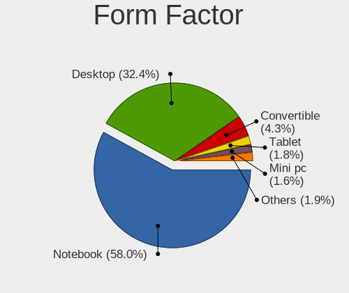
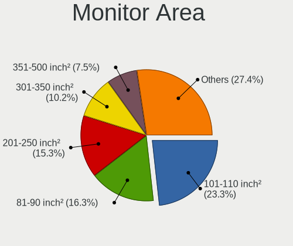
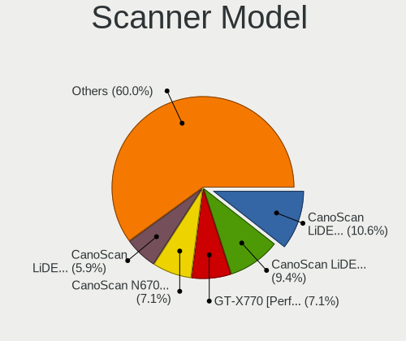

Fedora - Tested Hardware & Statistics
-------------------------------------

A project to collect tested hardware configurations for Fedora.

Anyone can contribute to this report by the [hw-probe](https://github.com/linuxhw/hw-probe) tool:

    sudo -E hw-probe -all -upload

Please contribute! Especially if your hardware is rare.

This is a report for all computer types. See also reports for [desktops](/Dist/Fedora/Desktop/README.md) and [notebooks](/Dist/Fedora/Notebook/README.md).

Contents
--------

* [ Test Cases ](#test-cases)

* [ System ](#system)
  - [ OS                       ](#os)
  - [ OS Family                ](#os-family)
  - [ Kernel                   ](#kernel)
  - [ Kernel Family            ](#kernel-family)
  - [ Kernel Major Ver.        ](#kernel-major-ver)
  - [ Arch                     ](#arch)
  - [ DE                       ](#de)
  - [ Display Server           ](#display-server)
  - [ Display Manager          ](#display-manager)
  - [ OS Lang                  ](#os-lang)
  - [ Boot Mode                ](#boot-mode)
  - [ Filesystem               ](#filesystem)
  - [ Part. scheme             ](#part-scheme)
  - [ Dual Boot with Linux/BSD ](#dual-boot-with-linuxbsd)
  - [ Dual Boot (Win)          ](#dual-boot-win)

* [ Board ](#board)
  - [ Vendor                   ](#vendor)
  - [ Model                    ](#model)
  - [ Model Family             ](#model-family)
  - [ MFG Year                 ](#mfg-year)
  - [ Form Factor              ](#form-factor)
  - [ Secure Boot              ](#secure-boot)
  - [ Coreboot                 ](#coreboot)
  - [ RAM Size                 ](#ram-size)
  - [ RAM Used                 ](#ram-used)
  - [ Total Drives             ](#total-drives)
  - [ Has CD-ROM               ](#has-cd-rom)
  - [ Has Ethernet             ](#has-ethernet)
  - [ Has WiFi                 ](#has-wifi)
  - [ Has Bluetooth            ](#has-bluetooth)

* [ Location ](#location)
  - [ Country                  ](#country)
  - [ City                     ](#city)

* [ Drives ](#drives)
  - [ Drive Vendor             ](#drive-vendor)
  - [ Drive Model              ](#drive-model)
  - [ HDD Vendor               ](#hdd-vendor)
  - [ SSD Vendor               ](#ssd-vendor)
  - [ Drive Kind               ](#drive-kind)
  - [ Drive Connector          ](#drive-connector)
  - [ Drive Size               ](#drive-size)
  - [ Space Total              ](#space-total)
  - [ Space Used               ](#space-used)
  - [ Malfunc. Drives          ](#malfunc-drives)
  - [ Malfunc. Drive Vendor    ](#malfunc-drive-vendor)
  - [ Malfunc. HDD Vendor      ](#malfunc-hdd-vendor)
  - [ Malfunc. Drive Kind      ](#malfunc-drive-kind)
  - [ Failed Drives            ](#failed-drives)
  - [ Failed Drive Vendor      ](#failed-drive-vendor)
  - [ Drive Status             ](#drive-status)

* [ Storage controller ](#storage-controller)
  - [ Storage Vendor           ](#storage-vendor)
  - [ Storage Model            ](#storage-model)
  - [ Storage Kind             ](#storage-kind)

* [ Processor ](#processor)
  - [ CPU Vendor               ](#cpu-vendor)
  - [ CPU Model                ](#cpu-model)
  - [ CPU Model Family         ](#cpu-model-family)
  - [ CPU Cores                ](#cpu-cores)
  - [ CPU Sockets              ](#cpu-sockets)
  - [ CPU Threads              ](#cpu-threads)
  - [ CPU Op-Modes             ](#cpu-op-modes)
  - [ CPU Microcode            ](#cpu-microcode)
  - [ CPU Microarch            ](#cpu-microarch)

* [ Graphics ](#graphics)
  - [ GPU Vendor               ](#gpu-vendor)
  - [ GPU Model                ](#gpu-model)
  - [ GPU Combo                ](#gpu-combo)
  - [ GPU Driver               ](#gpu-driver)
  - [ GPU Memory               ](#gpu-memory)

* [ Monitor ](#monitor)
  - [ Monitor Vendor           ](#monitor-vendor)
  - [ Monitor Model            ](#monitor-model)
  - [ Monitor Resolution       ](#monitor-resolution)
  - [ Monitor Diagonal         ](#monitor-diagonal)
  - [ Monitor Width            ](#monitor-width)
  - [ Aspect Ratio             ](#aspect-ratio)
  - [ Monitor Area             ](#monitor-area)
  - [ Pixel Density            ](#pixel-density)
  - [ Multiple Monitors        ](#multiple-monitors)

* [ Network ](#network)
  - [ Net Controller Vendor    ](#net-controller-vendor)
  - [ Net Controller Model     ](#net-controller-model)
  - [ Wireless Vendor          ](#wireless-vendor)
  - [ Wireless Model           ](#wireless-model)
  - [ Ethernet Vendor          ](#ethernet-vendor)
  - [ Ethernet Model           ](#ethernet-model)
  - [ Net Controller Kind      ](#net-controller-kind)
  - [ Used Controller          ](#used-controller)
  - [ NICs                     ](#nics)
  - [ IPv6                     ](#ipv6)

* [ Bluetooth ](#bluetooth)
  - [ Bluetooth Vendor         ](#bluetooth-vendor)
  - [ Bluetooth Model          ](#bluetooth-model)

* [ Sound ](#sound)
  - [ Sound Vendor             ](#sound-vendor)
  - [ Sound Model              ](#sound-model)

* [ Memory ](#memory)
  - [ Memory Vendor            ](#memory-vendor)
  - [ Memory Model             ](#memory-model)
  - [ Memory Kind              ](#memory-kind)
  - [ Memory Form Factor       ](#memory-form-factor)
  - [ Memory Size              ](#memory-size)
  - [ Memory Speed             ](#memory-speed)

* [ Printers & scanners ](#printers--scanners)
  - [ Printer Vendor           ](#printer-vendor)
  - [ Printer Model            ](#printer-model)
  - [ Scanner Vendor           ](#scanner-vendor)
  - [ Scanner Model            ](#scanner-model)

* [ Camera ](#camera)
  - [ Camera Vendor            ](#camera-vendor)
  - [ Camera Model             ](#camera-model)

* [ Security ](#security)
  - [ Fingerprint Vendor       ](#fingerprint-vendor)
  - [ Fingerprint Model        ](#fingerprint-model)
  - [ Chipcard Vendor          ](#chipcard-vendor)
  - [ Chipcard Model           ](#chipcard-model)

* [ Unsupported ](#unsupported)
  - [ Unsupported Devices      ](#unsupported-devices)
  - [ Unsupported Device Types ](#unsupported-device-types)

Test Cases
----------

Total: 20385

| Vendor        | Model                       | Form-Factor | Probe                                                      | Date         |
|---------------|-----------------------------|-------------|------------------------------------------------------------|--------------|
| Dell          | XPS 15 9500                 | Notebook    | [a8f95ea32d](https://linux-hardware.org/?probe=a8f95ea32d) | Oct 01, 2023 |
| ASUSTek       | ASUS TUF Gaming F15 FX50... | Notebook    | [34b8e1853b](https://linux-hardware.org/?probe=34b8e1853b) | Oct 01, 2023 |
| Toshiba       | Satellite L735              | Notebook    | [c969a72669](https://linux-hardware.org/?probe=c969a72669) | Oct 01, 2023 |
| Acer          | Predator PH16-71            | Notebook    | [a07278dc43](https://linux-hardware.org/?probe=a07278dc43) | Oct 01, 2023 |
| Microsoft     | Surface Pro 3               | Tablet      | [9d3a95cfd5](https://linux-hardware.org/?probe=9d3a95cfd5) | Oct 01, 2023 |
| ASUSTek       | PRIME B450M-A               | Desktop     | [1e825c5574](https://linux-hardware.org/?probe=1e825c5574) | Oct 01, 2023 |
| Dell          | Latitude 5520               | Notebook    | [024af71640](https://linux-hardware.org/?probe=024af71640) | Oct 01, 2023 |
| Apple         | MacBookPro9,2               | Notebook    | [124425b8b3](https://linux-hardware.org/?probe=124425b8b3) | Oct 01, 2023 |
| Google        | Nocturne                    | Tablet      | [966636d4d1](https://linux-hardware.org/?probe=966636d4d1) | Oct 01, 2023 |
| Google        | Nocturne                    | Tablet      | [5c4cae2a0b](https://linux-hardware.org/?probe=5c4cae2a0b) | Oct 01, 2023 |
| MSI           | X99A RAIDER                 | Desktop     | [3e13770075](https://linux-hardware.org/?probe=3e13770075) | Oct 01, 2023 |
| Gigabyte      | D525TUD                     | Desktop     | [913e98318d](https://linux-hardware.org/?probe=913e98318d) | Oct 01, 2023 |
| Gigabyte      | D525TUD                     | Desktop     | [f48a538837](https://linux-hardware.org/?probe=f48a538837) | Oct 01, 2023 |
| ASUSTek       | Z170-DELUXE                 | Desktop     | [9e04efc2d9](https://linux-hardware.org/?probe=9e04efc2d9) | Oct 01, 2023 |
| Dell          | Latitude E6420              | Notebook    | [55c45fb7cb](https://linux-hardware.org/?probe=55c45fb7cb) | Oct 01, 2023 |
| HP            | EliteBook 840 G8 Noteboo... | Notebook    | [30bf4415dc](https://linux-hardware.org/?probe=30bf4415dc) | Sep 30, 2023 |
| ASRock        | X570 Taichi                 | Desktop     | [7a670fe0ef](https://linux-hardware.org/?probe=7a670fe0ef) | Sep 30, 2023 |
| HUAWEI        | VLT-WX0                     | Notebook    | [a312a57d16](https://linux-hardware.org/?probe=a312a57d16) | Sep 30, 2023 |
| MSI           | Prestige 14H B12UCX         | Notebook    | [b3a006adc7](https://linux-hardware.org/?probe=b3a006adc7) | Sep 30, 2023 |
| ASUSTek       | TUF Gaming B660M-PLUS D4    | Desktop     | [f3d279f91b](https://linux-hardware.org/?probe=f3d279f91b) | Sep 30, 2023 |
| HP            | EliteBook 745 G3            | Notebook    | [700c901144](https://linux-hardware.org/?probe=700c901144) | Sep 30, 2023 |
| MSI           | Prestige 14H B12UCX         | Notebook    | [1c1f35d1c8](https://linux-hardware.org/?probe=1c1f35d1c8) | Sep 30, 2023 |
| HP            | EliteBook 745 G3            | Notebook    | [16f4068970](https://linux-hardware.org/?probe=16f4068970) | Sep 30, 2023 |
| ASUSTek       | Z170-A                      | Desktop     | [bee067d5dd](https://linux-hardware.org/?probe=bee067d5dd) | Sep 30, 2023 |
| MSI           | PRO B660M-A DDR4            | Desktop     | [a7683dc02d](https://linux-hardware.org/?probe=a7683dc02d) | Sep 30, 2023 |
| ASUSTek       | TUF Gaming B660M-PLUS D4    | Desktop     | [02af70281a](https://linux-hardware.org/?probe=02af70281a) | Sep 30, 2023 |
| Dell          | Latitude 7280               | Notebook    | [dbe9d3e4be](https://linux-hardware.org/?probe=dbe9d3e4be) | Sep 30, 2023 |
| Toshiba       | PORTEGE R30-D               | Notebook    | [04ef694f1d](https://linux-hardware.org/?probe=04ef694f1d) | Sep 30, 2023 |
| Dell          | 0V8WGR A02                  | Desktop     | [9c9ded765b](https://linux-hardware.org/?probe=9c9ded765b) | Sep 30, 2023 |
| Fanless Mi... | Rev GMLR1                   | Mini pc     | [751b4d268a](https://linux-hardware.org/?probe=751b4d268a) | Sep 30, 2023 |
| ASUSTek       | ASUS EXPERTBOOK B1402CBA... | Notebook    | [91873a529a](https://linux-hardware.org/?probe=91873a529a) | Sep 30, 2023 |
| Gigabyte      | Z790 AORUS ELITE AX         | Desktop     | [9a749a1c41](https://linux-hardware.org/?probe=9a749a1c41) | Sep 30, 2023 |
| Gigabyte      | Z790 AORUS ELITE AX         | Desktop     | [452cd2622a](https://linux-hardware.org/?probe=452cd2622a) | Sep 30, 2023 |
| Lenovo        | ThinkPad T420 4180BV1       | Notebook    | [e81749053b](https://linux-hardware.org/?probe=e81749053b) | Sep 30, 2023 |
| ASUSTek       | ROG STRIX Z590-E GAMING ... | Desktop     | [3d40d7878a](https://linux-hardware.org/?probe=3d40d7878a) | Sep 30, 2023 |
| Gigabyte      | GA-870A-UD3                 | Desktop     | [5a507ec4da](https://linux-hardware.org/?probe=5a507ec4da) | Sep 30, 2023 |
| MSI           | X99A RAIDER                 | Desktop     | [a36938e994](https://linux-hardware.org/?probe=a36938e994) | Sep 30, 2023 |
| Acer          | Aspire A514-53              | Notebook    | [6d8a5b1a13](https://linux-hardware.org/?probe=6d8a5b1a13) | Sep 30, 2023 |
| HP            | 8055                        | Desktop     | [3ddf31c78e](https://linux-hardware.org/?probe=3ddf31c78e) | Sep 30, 2023 |
| ASUSTek       | TUF Gaming B550-PLUS        | Desktop     | [3bec9011bd](https://linux-hardware.org/?probe=3bec9011bd) | Sep 30, 2023 |
| Gigabyte      | B550M AORUS ELITE           | Desktop     | [74bed86ee5](https://linux-hardware.org/?probe=74bed86ee5) | Sep 30, 2023 |
| Microsoft     | Surface Pro 4               | Tablet      | [c69ab4bc0f](https://linux-hardware.org/?probe=c69ab4bc0f) | Sep 30, 2023 |
| Microsoft     | Surface Pro 4               | Tablet      | [4a7b1ee936](https://linux-hardware.org/?probe=4a7b1ee936) | Sep 29, 2023 |
| Lenovo        | IdeaPad 5 14ALC05 82LM      | Notebook    | [c1a605af33](https://linux-hardware.org/?probe=c1a605af33) | Sep 29, 2023 |
| ASUSTek       | PRIME B450M-A               | Desktop     | [3c9f4d4aef](https://linux-hardware.org/?probe=3c9f4d4aef) | Sep 29, 2023 |
| Intel         | H61                         | Desktop     | [f6a417439c](https://linux-hardware.org/?probe=f6a417439c) | Sep 29, 2023 |
| ASUSTek       | ROG Strix G713QM_G713QM     | Notebook    | [ec1384a424](https://linux-hardware.org/?probe=ec1384a424) | Sep 29, 2023 |
| Razer         | Blade 15 Base Model (Lat... | Notebook    | [95dc405a73](https://linux-hardware.org/?probe=95dc405a73) | Sep 29, 2023 |
| ASRock        | B450M Pro4 R2.0             | Desktop     | [8e039e23f3](https://linux-hardware.org/?probe=8e039e23f3) | Sep 29, 2023 |
| Intel         | H61                         | Desktop     | [e7dac2f9ed](https://linux-hardware.org/?probe=e7dac2f9ed) | Sep 29, 2023 |
| HP            | Laptop 17-cn1xxx            | Notebook    | [051a233121](https://linux-hardware.org/?probe=051a233121) | Sep 29, 2023 |
| Lenovo        | ThinkPad L15 Gen 1 20U70... | Notebook    | [e51fd2a8e9](https://linux-hardware.org/?probe=e51fd2a8e9) | Sep 29, 2023 |
| Intel         | NUC13ANBi5 M89647-202       | Mini pc     | [e1f22fdce4](https://linux-hardware.org/?probe=e1f22fdce4) | Sep 29, 2023 |
| MSI           | PRO B660M-A DDR4            | Desktop     | [4b5a46a1e2](https://linux-hardware.org/?probe=4b5a46a1e2) | Sep 29, 2023 |
| ASUSTek       | ROG Strix G713QM_G713QM     | Notebook    | [d958b4e16a](https://linux-hardware.org/?probe=d958b4e16a) | Sep 29, 2023 |
| HP            | EliteBook 745 G5            | Notebook    | [b734ec49e2](https://linux-hardware.org/?probe=b734ec49e2) | Sep 29, 2023 |
| Dell          | Latitude 7490               | Notebook    | [a22e4e9304](https://linux-hardware.org/?probe=a22e4e9304) | Sep 29, 2023 |
| ANGXUN        | X99-DM3 V3.0                | Desktop     | [1a7ed0ba7d](https://linux-hardware.org/?probe=1a7ed0ba7d) | Sep 29, 2023 |
| Lenovo        | Yoga 7 15ITL5 82BJ          | Convertible | [c822d38335](https://linux-hardware.org/?probe=c822d38335) | Sep 29, 2023 |
| Lenovo        | Yoga 7 15ITL5 82BJ          | Convertible | [222c45e72e](https://linux-hardware.org/?probe=222c45e72e) | Sep 29, 2023 |
| HP            | EliteBook 840 G6            | Notebook    | [e57cdefe7a](https://linux-hardware.org/?probe=e57cdefe7a) | Sep 29, 2023 |
| HP            | Stream x360 Convertible ... | Convertible | [427ea0aa4f](https://linux-hardware.org/?probe=427ea0aa4f) | Sep 29, 2023 |
| HUAWEI        | HVY-WXX9                    | Notebook    | [713d59f3d0](https://linux-hardware.org/?probe=713d59f3d0) | Sep 29, 2023 |
| HUAWEI        | HVY-WXX9                    | Notebook    | [c434f30a15](https://linux-hardware.org/?probe=c434f30a15) | Sep 29, 2023 |
| Radxa         | ROCK Pi 4B                  | Soc         | [fac4bb4863](https://linux-hardware.org/?probe=fac4bb4863) | Sep 29, 2023 |
| Lenovo        | SHARKBAY SDK0E50510 WIN     | Desktop     | [60c04875f1](https://linux-hardware.org/?probe=60c04875f1) | Sep 29, 2023 |
| ASUSTek       | PRIME X570-PRO              | Desktop     | [74ec125e88](https://linux-hardware.org/?probe=74ec125e88) | Sep 29, 2023 |
| Lenovo        | IdeaPad 3 14IML05 81WA      | Notebook    | [d95e370c54](https://linux-hardware.org/?probe=d95e370c54) | Sep 29, 2023 |
| ASUSTek       | PRIME X570-PRO              | Desktop     | [cc8c6efba3](https://linux-hardware.org/?probe=cc8c6efba3) | Sep 28, 2023 |
| Dell          | 0YJPT1 A00                  | Desktop     | [a0a41d401e](https://linux-hardware.org/?probe=a0a41d401e) | Sep 28, 2023 |
| MSI           | H310M PRO-VD                | Desktop     | [67e14c1b2d](https://linux-hardware.org/?probe=67e14c1b2d) | Sep 28, 2023 |
| ASUSTek       | Z97-A-USB31                 | Desktop     | [b7e5fb069c](https://linux-hardware.org/?probe=b7e5fb069c) | Sep 28, 2023 |
| Radxa         | ROCK Pi 4B                  | Soc         | [1210322d55](https://linux-hardware.org/?probe=1210322d55) | Sep 28, 2023 |
| Dell          | 0XC7MM A01                  | Desktop     | [9fdfc5a13f](https://linux-hardware.org/?probe=9fdfc5a13f) | Sep 28, 2023 |
| ASUSTek       | ASUS TUF Dash F15 FX516P... | Notebook    | [4cef8be854](https://linux-hardware.org/?probe=4cef8be854) | Sep 28, 2023 |
| HP            | EliteBook 840 G2            | Notebook    | [bec979fcd0](https://linux-hardware.org/?probe=bec979fcd0) | Sep 28, 2023 |
| Lenovo        | ThinkPad E14 Gen 4 21E3S... | Notebook    | [356b5f053d](https://linux-hardware.org/?probe=356b5f053d) | Sep 28, 2023 |
| HP            | EliteBook 840 G6            | Notebook    | [5b87382fce](https://linux-hardware.org/?probe=5b87382fce) | Sep 28, 2023 |
| Lenovo        | ThinkPad P51 20HHCTO1WW     | Notebook    | [64a85b8eb3](https://linux-hardware.org/?probe=64a85b8eb3) | Sep 28, 2023 |
| HP            | ProBook 430 G5              | Notebook    | [9e68b6e2be](https://linux-hardware.org/?probe=9e68b6e2be) | Sep 28, 2023 |
| ASUSTek       | ROG STRIX X570-F GAMING     | Desktop     | [5dbe8e1541](https://linux-hardware.org/?probe=5dbe8e1541) | Sep 28, 2023 |
| ASUSTek       | ROG Flow X13 GV302XU_GV3... | Convertible | [abf12be6ff](https://linux-hardware.org/?probe=abf12be6ff) | Sep 28, 2023 |
| Gigabyte      | B560M AORUS PRO AX          | Desktop     | [2e3d19e919](https://linux-hardware.org/?probe=2e3d19e919) | Sep 28, 2023 |
| Lenovo        | ThinkPad T495 20NJ000XGE    | Notebook    | [737b3910bb](https://linux-hardware.org/?probe=737b3910bb) | Sep 28, 2023 |
| Lenovo        | ThinkPad T495 20NJ000XGE    | Notebook    | [b064b5b9ca](https://linux-hardware.org/?probe=b064b5b9ca) | Sep 28, 2023 |
| HP            | Notebook                    | Notebook    | [b13debd2fa](https://linux-hardware.org/?probe=b13debd2fa) | Sep 27, 2023 |
| Zebra Tech... | 10-WLAN-1                   | Notebook    | [9959efdb76](https://linux-hardware.org/?probe=9959efdb76) | Sep 27, 2023 |
| Dell          | Latitude 7490               | Notebook    | [6f5e4547fa](https://linux-hardware.org/?probe=6f5e4547fa) | Sep 27, 2023 |
| MSI           | MPG Z490M GAMING EDGE WI... | Desktop     | [23150c5bd3](https://linux-hardware.org/?probe=23150c5bd3) | Sep 27, 2023 |
| Lenovo        | ThinkPad X1 Carbon 7th 2... | Notebook    | [a95feaee78](https://linux-hardware.org/?probe=a95feaee78) | Sep 27, 2023 |
| Framework     | Laptop                      | Notebook    | [2a65b0dff2](https://linux-hardware.org/?probe=2a65b0dff2) | Sep 27, 2023 |
| Acer          | Predator G3-571             | Notebook    | [f301a514ad](https://linux-hardware.org/?probe=f301a514ad) | Sep 27, 2023 |
| Samsung       | 550XDA                      | Notebook    | [ab1fabfe9b](https://linux-hardware.org/?probe=ab1fabfe9b) | Sep 27, 2023 |
| ASUSTek       | PRIME B350-PLUS             | Desktop     | [546df5b57f](https://linux-hardware.org/?probe=546df5b57f) | Sep 27, 2023 |
| ASUSTek       | PRIME B350-PLUS             | Desktop     | [503570ad7a](https://linux-hardware.org/?probe=503570ad7a) | Sep 27, 2023 |
| Chuwi         | CoreBook X                  | Notebook    | [0c31a47880](https://linux-hardware.org/?probe=0c31a47880) | Sep 27, 2023 |
| ASUSTek       | ROG CROSSHAIR X670E HERO    | Desktop     | [41f0f8666c](https://linux-hardware.org/?probe=41f0f8666c) | Sep 27, 2023 |
| Gigabyte      | GA-MA785G-UD3H              | Desktop     | [4f0651ccc2](https://linux-hardware.org/?probe=4f0651ccc2) | Sep 27, 2023 |
| Notebook      | PCx0Dx                      | Notebook    | [53dd8cbd0d](https://linux-hardware.org/?probe=53dd8cbd0d) | Sep 27, 2023 |
| HP            | Stream x360 Convertible ... | Convertible | [d237ab1a11](https://linux-hardware.org/?probe=d237ab1a11) | Sep 27, 2023 |
| Lenovo        | ThinkPad T410 2522PT3       | Notebook    | [fed9f17a22](https://linux-hardware.org/?probe=fed9f17a22) | Sep 27, 2023 |
| Acer          | Predator G3-571             | Notebook    | [06b0300670](https://linux-hardware.org/?probe=06b0300670) | Sep 27, 2023 |
| Lenovo        | ThinkPad T410 2522PT3       | Notebook    | [0dd1b47aa0](https://linux-hardware.org/?probe=0dd1b47aa0) | Sep 27, 2023 |
| Lenovo        | IdeaPadFlex 5 14ARE05 81... | Convertible | [b6e832a4d8](https://linux-hardware.org/?probe=b6e832a4d8) | Sep 27, 2023 |
| Lenovo        | ThinkPad T14s Gen 4 21F8... | Notebook    | [c7ec123b46](https://linux-hardware.org/?probe=c7ec123b46) | Sep 27, 2023 |
| Gigabyte      | B650M K                     | Desktop     | [73da1b7ade](https://linux-hardware.org/?probe=73da1b7ade) | Sep 27, 2023 |
| Dell          | Latitude E7450              | Notebook    | [afa1cce666](https://linux-hardware.org/?probe=afa1cce666) | Sep 27, 2023 |
| ASRock        | B450M Steel Legend          | Desktop     | [b4de4fe266](https://linux-hardware.org/?probe=b4de4fe266) | Sep 27, 2023 |
| HUAWEI        | RLEF-XX                     | Notebook    | [156140f867](https://linux-hardware.org/?probe=156140f867) | Sep 27, 2023 |
| Dell          | 0773VG A00                  | Desktop     | [a68caa37d8](https://linux-hardware.org/?probe=a68caa37d8) | Sep 26, 2023 |
| Dell          | Latitude 5420               | Notebook    | [4f890f283a](https://linux-hardware.org/?probe=4f890f283a) | Sep 26, 2023 |
| Dell          | 0773VG A00                  | Desktop     | [5e34f7d424](https://linux-hardware.org/?probe=5e34f7d424) | Sep 26, 2023 |
| Gigabyte      | B550M S2H                   | Desktop     | [f61801ddb3](https://linux-hardware.org/?probe=f61801ddb3) | Sep 26, 2023 |
| Dell          | Latitude 7490               | Notebook    | [8bb2e054ec](https://linux-hardware.org/?probe=8bb2e054ec) | Sep 26, 2023 |
| Dell          | G15 5520                    | Notebook    | [64cfeba3ee](https://linux-hardware.org/?probe=64cfeba3ee) | Sep 26, 2023 |
| Dell          | Latitude 5420               | Notebook    | [3a22857022](https://linux-hardware.org/?probe=3a22857022) | Sep 26, 2023 |
| Gigabyte      | B550M DS3H                  | Desktop     | [3bb1109d44](https://linux-hardware.org/?probe=3bb1109d44) | Sep 26, 2023 |
| HP            | Laptop 14s-dq2xxx           | Notebook    | [424e7e3d87](https://linux-hardware.org/?probe=424e7e3d87) | Sep 26, 2023 |
| HP            | EliteBook 745 G6            | Notebook    | [bb5a7f8b2c](https://linux-hardware.org/?probe=bb5a7f8b2c) | Sep 26, 2023 |
| ASUSTek       | ROG CROSSHAIR VIII HERO     | Desktop     | [85c6c01e63](https://linux-hardware.org/?probe=85c6c01e63) | Sep 26, 2023 |
| Lenovo        | IdeaPad 3 15ITL6 82H8       | Notebook    | [dd48e0075b](https://linux-hardware.org/?probe=dd48e0075b) | Sep 26, 2023 |
| Lenovo        | ThinkPad T14 Gen 4 21HD0... | Notebook    | [35e9d35a69](https://linux-hardware.org/?probe=35e9d35a69) | Sep 26, 2023 |
| ASUSTek       | TUF B450-PLUS GAMING        | Desktop     | [8da87a8c78](https://linux-hardware.org/?probe=8da87a8c78) | Sep 26, 2023 |
| Dell          | Inspiron 7577               | Notebook    | [a90c8128d1](https://linux-hardware.org/?probe=a90c8128d1) | Sep 26, 2023 |
| Lenovo        | ThinkPad P15 Gen 2i 20YQ... | Notebook    | [dc762f9ae6](https://linux-hardware.org/?probe=dc762f9ae6) | Sep 26, 2023 |
| MSI           | MPG B650 CARBON WIFI        | Desktop     | [4b0aff27e8](https://linux-hardware.org/?probe=4b0aff27e8) | Sep 26, 2023 |
| MSI           | B450 GAMING PRO CARBON A... | Desktop     | [b49d28bbd4](https://linux-hardware.org/?probe=b49d28bbd4) | Sep 26, 2023 |
| ASRock        | B450M Steel Legend          | Desktop     | [ccb7f736f6](https://linux-hardware.org/?probe=ccb7f736f6) | Sep 26, 2023 |
| Lenovo        | ThinkPad T490s 20NX003NR... | Notebook    | [0a38f1e9a4](https://linux-hardware.org/?probe=0a38f1e9a4) | Sep 26, 2023 |
| Huanan        | X99-8M-F V1.2               | Desktop     | [4ddba514a1](https://linux-hardware.org/?probe=4ddba514a1) | Sep 26, 2023 |
| ASUSTek       | VivoBook_ASUSLaptop K350... | Notebook    | [14766bbd15](https://linux-hardware.org/?probe=14766bbd15) | Sep 26, 2023 |
| ASUSTek       | ASUS TUF Gaming F15 FX50... | Notebook    | [7c547aa37a](https://linux-hardware.org/?probe=7c547aa37a) | Sep 26, 2023 |
| MSI           | X99A RAIDER                 | Desktop     | [b69e9b97ec](https://linux-hardware.org/?probe=b69e9b97ec) | Sep 26, 2023 |
| Lenovo        | IdeaPad Slim 5 16IRL8 82... | Notebook    | [b22a584cea](https://linux-hardware.org/?probe=b22a584cea) | Sep 26, 2023 |
| Juana Mans... | SF20GM7                     | Notebook    | [355aaa1b07](https://linux-hardware.org/?probe=355aaa1b07) | Sep 26, 2023 |
| Lenovo        | IdeaPad 5 14ALC05 82LM      | Notebook    | [73d2dae51c](https://linux-hardware.org/?probe=73d2dae51c) | Sep 26, 2023 |
| Lenovo        | Z50-70 20354                | Notebook    | [ccdfae441b](https://linux-hardware.org/?probe=ccdfae441b) | Sep 26, 2023 |
| Lenovo        | ThinkBook 15 G2 ARE 20VG    | Notebook    | [37fdb062e1](https://linux-hardware.org/?probe=37fdb062e1) | Sep 26, 2023 |
| ASUSTek       | M4A88TD-V EVO/USB3          | Desktop     | [4375a551e1](https://linux-hardware.org/?probe=4375a551e1) | Sep 25, 2023 |
| ASUSTek       | P9D WS                      | Desktop     | [fd2133400d](https://linux-hardware.org/?probe=fd2133400d) | Sep 25, 2023 |
| MSI           | MPG Z490M GAMING EDGE WI... | Desktop     | [a6ef2b5028](https://linux-hardware.org/?probe=a6ef2b5028) | Sep 25, 2023 |
| ASUSTek       | TUF B450-PLUS GAMING        | Desktop     | [b7dae6ef48](https://linux-hardware.org/?probe=b7dae6ef48) | Sep 25, 2023 |
| HP            | ENVY x360 2-in-1 Laptop ... | Convertible | [c665cddf99](https://linux-hardware.org/?probe=c665cddf99) | Sep 25, 2023 |
| Apple         | MacBookPro10,1              | Notebook    | [1c1268d4e0](https://linux-hardware.org/?probe=1c1268d4e0) | Sep 25, 2023 |
| Apple         | MacBookPro10,1              | Notebook    | [4fbb517b71](https://linux-hardware.org/?probe=4fbb517b71) | Sep 25, 2023 |
| Lenovo        | ThinkPad X1 Yoga 2nd 20J... | Convertible | [2953047bfa](https://linux-hardware.org/?probe=2953047bfa) | Sep 25, 2023 |
| HP            | EliteBook 840 G3            | Notebook    | [4e0f83e1fe](https://linux-hardware.org/?probe=4e0f83e1fe) | Sep 25, 2023 |
| HP            | EliteBook 840 G3            | Notebook    | [60ff167d14](https://linux-hardware.org/?probe=60ff167d14) | Sep 25, 2023 |
| System76      | Pangolin                    | Notebook    | [3c56c50463](https://linux-hardware.org/?probe=3c56c50463) | Sep 25, 2023 |
| Acer          | Aspire V3-571G              | Notebook    | [6b5dcea023](https://linux-hardware.org/?probe=6b5dcea023) | Sep 25, 2023 |
| Dell          | Latitude E7270              | Notebook    | [98dd5eefb6](https://linux-hardware.org/?probe=98dd5eefb6) | Sep 25, 2023 |
| ASUSTek       | Z170I PRO GAMING            | Desktop     | [f4d45948eb](https://linux-hardware.org/?probe=f4d45948eb) | Sep 25, 2023 |
| HP            | 255 G8 Notebook PC          | Notebook    | [91c3333a18](https://linux-hardware.org/?probe=91c3333a18) | Sep 25, 2023 |
| Lenovo        | ThinkPad P14s Gen 2a 21A... | Notebook    | [9a24a19f6e](https://linux-hardware.org/?probe=9a24a19f6e) | Sep 25, 2023 |
| HP            | ProBook 6570b               | Notebook    | [a67981aa91](https://linux-hardware.org/?probe=a67981aa91) | Sep 25, 2023 |
| Lenovo        | ThinkPad E14 Gen 4 21EB0... | Notebook    | [88385cbacc](https://linux-hardware.org/?probe=88385cbacc) | Sep 25, 2023 |
| Dell          | XPS 13 9310                 | Notebook    | [4233a2e5e3](https://linux-hardware.org/?probe=4233a2e5e3) | Sep 25, 2023 |
| MSI           | X99A RAIDER                 | Desktop     | [c6dc860de5](https://linux-hardware.org/?probe=c6dc860de5) | Sep 25, 2023 |
| Dell          | XPS 13 9380                 | Notebook    | [705c3fdeff](https://linux-hardware.org/?probe=705c3fdeff) | Sep 25, 2023 |
| ASRock        | B550M Pro4                  | Desktop     | [1b8b856469](https://linux-hardware.org/?probe=1b8b856469) | Sep 25, 2023 |
| Apple         | Mac-F226BEC8 PVT            | All in one  | [e741b61807](https://linux-hardware.org/?probe=e741b61807) | Sep 25, 2023 |
| MSI           | GL65 Leopard 10SER          | Notebook    | [e97a8fa2c7](https://linux-hardware.org/?probe=e97a8fa2c7) | Sep 25, 2023 |
| HP            | 250 G6 Notebook PC          | Notebook    | [88ce9be8a1](https://linux-hardware.org/?probe=88ce9be8a1) | Sep 24, 2023 |
| MSI           | GL65 Leopard 10SER          | Notebook    | [fac92f385c](https://linux-hardware.org/?probe=fac92f385c) | Sep 24, 2023 |
| Lenovo        | IdeaPad 5 14ALC05 82LM      | Notebook    | [0531db8cb8](https://linux-hardware.org/?probe=0531db8cb8) | Sep 24, 2023 |
| Acer          | TravelMate P259-MG          | Notebook    | [26ca7317b2](https://linux-hardware.org/?probe=26ca7317b2) | Sep 24, 2023 |
| Intel         | NUC7i7DNB J83500-204        | Mini pc     | [44784bdea7](https://linux-hardware.org/?probe=44784bdea7) | Sep 24, 2023 |
| Lenovo        | ThinkPad P15v Gen 3 21D8... | Notebook    | [408377c3fd](https://linux-hardware.org/?probe=408377c3fd) | Sep 24, 2023 |
| MSI           | MAG B550 TOMAHAWK MAX WI... | Desktop     | [23d9e87224](https://linux-hardware.org/?probe=23d9e87224) | Sep 24, 2023 |
| Sony          | VAIO                        | All in one  | [75e484b949](https://linux-hardware.org/?probe=75e484b949) | Sep 24, 2023 |
| Apple         | MacBookPro8,2               | Notebook    | [cba55a15ec](https://linux-hardware.org/?probe=cba55a15ec) | Sep 24, 2023 |
| AZW           | SER V1.0                    | Mini pc     | [53051aa7eb](https://linux-hardware.org/?probe=53051aa7eb) | Sep 24, 2023 |
| Dell          | Latitude 7400               | Notebook    | [f537b79d15](https://linux-hardware.org/?probe=f537b79d15) | Sep 24, 2023 |
| Lenovo        | V14-ARE 82DQ                | Notebook    | [31a635bff8](https://linux-hardware.org/?probe=31a635bff8) | Sep 24, 2023 |
| Google        | Eve                         | Convertible | [b3c890ec7a](https://linux-hardware.org/?probe=b3c890ec7a) | Sep 24, 2023 |
| Gigabyte      | X570S UD                    | Desktop     | [88653e2f06](https://linux-hardware.org/?probe=88653e2f06) | Sep 24, 2023 |
| HUAWEI        | NBD-WXX9                    | Notebook    | [f728eb13bd](https://linux-hardware.org/?probe=f728eb13bd) | Sep 24, 2023 |
| Gigabyte      | EP45-DS3L                   | Desktop     | [57d5f67adf](https://linux-hardware.org/?probe=57d5f67adf) | Sep 24, 2023 |
| HP            | Laptop 15s-eq2xxx           | Notebook    | [72940bf53e](https://linux-hardware.org/?probe=72940bf53e) | Sep 24, 2023 |
| HP            | 350 G2                      | Notebook    | [8440938e22](https://linux-hardware.org/?probe=8440938e22) | Sep 24, 2023 |
| ASUSTek       | PRIME B660M-A AC D4         | Desktop     | [7c0eb47c16](https://linux-hardware.org/?probe=7c0eb47c16) | Sep 24, 2023 |
| Lenovo        | IdeaPad 5 14ALC05 82LM      | Notebook    | [01b1c1acdb](https://linux-hardware.org/?probe=01b1c1acdb) | Sep 24, 2023 |
| ASRock        | B150M Pro4/Hyper            | Desktop     | [6bd5055b96](https://linux-hardware.org/?probe=6bd5055b96) | Sep 24, 2023 |
| ASUSTek       | VivoBook_ASUSLaptop X513... | Notebook    | [fc14083064](https://linux-hardware.org/?probe=fc14083064) | Sep 24, 2023 |
| ASUSTek       | VivoBook_ASUSLaptop X513... | Notebook    | [acba7de2ec](https://linux-hardware.org/?probe=acba7de2ec) | Sep 24, 2023 |
| Google        | Eve                         | Convertible | [eccabb6bc2](https://linux-hardware.org/?probe=eccabb6bc2) | Sep 24, 2023 |
| Gigabyte      | X470 AORUS ULTRA GAMING-... | Desktop     | [5ed3f9381a](https://linux-hardware.org/?probe=5ed3f9381a) | Sep 23, 2023 |
| HP            | 255 15.6 inch G10           | Notebook    | [9f02426c5d](https://linux-hardware.org/?probe=9f02426c5d) | Sep 23, 2023 |
| Apple         | MacBookPro10,1              | Notebook    | [18b2a7026b](https://linux-hardware.org/?probe=18b2a7026b) | Sep 23, 2023 |
| Apple         | MacBookPro10,1              | Notebook    | [60f81eeb50](https://linux-hardware.org/?probe=60f81eeb50) | Sep 23, 2023 |
| MSI           | B450M MORTAR MAX            | Desktop     | [fa3021d826](https://linux-hardware.org/?probe=fa3021d826) | Sep 23, 2023 |
| Dell          | 060J9C A00                  | Mini pc     | [338cbff584](https://linux-hardware.org/?probe=338cbff584) | Sep 23, 2023 |
| Lenovo        | ThinkPad T550 20CK0002MZ    | Notebook    | [a34763914d](https://linux-hardware.org/?probe=a34763914d) | Sep 23, 2023 |
| HP            | Pavilion dv6                | Notebook    | [bd8ae0385b](https://linux-hardware.org/?probe=bd8ae0385b) | Sep 23, 2023 |
| ASRock        | N68C-S UCC                  | Desktop     | [844c35381f](https://linux-hardware.org/?probe=844c35381f) | Sep 23, 2023 |
| MSI           | MPG X570 GAMING EDGE WIF... | Desktop     | [f59df7021c](https://linux-hardware.org/?probe=f59df7021c) | Sep 23, 2023 |
| Dell          | Latitude 7280               | Notebook    | [1d032535e1](https://linux-hardware.org/?probe=1d032535e1) | Sep 23, 2023 |
| Gigabyte      | MZGLKBP-00                  | Desktop     | [678c17756d](https://linux-hardware.org/?probe=678c17756d) | Sep 23, 2023 |
| HP            | Pavilion Gaming Laptop 1... | Notebook    | [a6ff891fa1](https://linux-hardware.org/?probe=a6ff891fa1) | Sep 23, 2023 |
| Casper        | NIRVANA NB F500             | Notebook    | [1f66f22544](https://linux-hardware.org/?probe=1f66f22544) | Sep 23, 2023 |
| ASRock        | H61M/U3S3                   | Desktop     | [1d397abb90](https://linux-hardware.org/?probe=1d397abb90) | Sep 23, 2023 |
| Dell          | 00010C A00                  | Desktop     | [40d7defca4](https://linux-hardware.org/?probe=40d7defca4) | Sep 23, 2023 |
| Lenovo        | ThinkPad E15 20RD0011UK     | Notebook    | [d464d79df3](https://linux-hardware.org/?probe=d464d79df3) | Sep 23, 2023 |
| HP            | ENVY Laptop 13-ad1xx        | Notebook    | [11ce4105e1](https://linux-hardware.org/?probe=11ce4105e1) | Sep 23, 2023 |
| HP            | Spectre x360 Convertible... | Convertible | [e473797863](https://linux-hardware.org/?probe=e473797863) | Sep 23, 2023 |
| Gigabyte      | B85-HD3                     | Desktop     | [5da83e8683](https://linux-hardware.org/?probe=5da83e8683) | Sep 23, 2023 |
| ASUSTek       | PRIME B360-PLUS             | Desktop     | [5629e161ab](https://linux-hardware.org/?probe=5629e161ab) | Sep 23, 2023 |
| Lenovo        | ThinkPad L570 W10DG 20JR... | Notebook    | [b96887841e](https://linux-hardware.org/?probe=b96887841e) | Sep 23, 2023 |
| MSI           | MS-7388                     | Desktop     | [f5ee235af0](https://linux-hardware.org/?probe=f5ee235af0) | Sep 23, 2023 |
| ASUSTek       | PRIME B660M-A AC D4         | Desktop     | [1a81f24fbb](https://linux-hardware.org/?probe=1a81f24fbb) | Sep 23, 2023 |
| Dell          | 0KWVT8 A03                  | Desktop     | [c6f224508a](https://linux-hardware.org/?probe=c6f224508a) | Sep 23, 2023 |
| HP            | 3397                        | Desktop     | [fa230ba389](https://linux-hardware.org/?probe=fa230ba389) | Sep 23, 2023 |
| Toshiba       | Satellite C70-B             | Notebook    | [904a43b77e](https://linux-hardware.org/?probe=904a43b77e) | Sep 23, 2023 |
| MSI           | B450M MORTAR MAX            | Desktop     | [3b9bbcebb0](https://linux-hardware.org/?probe=3b9bbcebb0) | Sep 23, 2023 |
| Lenovo        | ThinkPad P15 Gen 2i 20YR... | Notebook    | [6a6fde2ca9](https://linux-hardware.org/?probe=6a6fde2ca9) | Sep 23, 2023 |
| Toshiba       | Satellite C70-B             | Notebook    | [eedf248084](https://linux-hardware.org/?probe=eedf248084) | Sep 23, 2023 |
| Acer          | Aspire ES1-520              | Notebook    | [22ce921c1e](https://linux-hardware.org/?probe=22ce921c1e) | Sep 22, 2023 |
| Dell          | 0PP150 A00                  | Desktop     | [766815ba45](https://linux-hardware.org/?probe=766815ba45) | Sep 22, 2023 |
| Lenovo        | ThinkPad L570 W10DG 20JR... | Notebook    | [535d4769c8](https://linux-hardware.org/?probe=535d4769c8) | Sep 22, 2023 |
| Acer          | Aspire A715-51G             | Notebook    | [674c086aa5](https://linux-hardware.org/?probe=674c086aa5) | Sep 22, 2023 |
| Apple         | MacBookPro11,1              | Notebook    | [169fe58269](https://linux-hardware.org/?probe=169fe58269) | Sep 22, 2023 |
| Lenovo        | IdeaPad Slim 3 15AMN8 82... | Notebook    | [c933242918](https://linux-hardware.org/?probe=c933242918) | Sep 22, 2023 |
| MSI           | H110M PRO-D                 | Desktop     | [40380b4dce](https://linux-hardware.org/?probe=40380b4dce) | Sep 22, 2023 |
| HP            | 834F                        | Desktop     | [b69b667f2c](https://linux-hardware.org/?probe=b69b667f2c) | Sep 22, 2023 |
| Dell          | Inspiron N5110              | Notebook    | [e98b118b85](https://linux-hardware.org/?probe=e98b118b85) | Sep 22, 2023 |
| Apple         | MacBookPro14,1              | Notebook    | [8b1188ba33](https://linux-hardware.org/?probe=8b1188ba33) | Sep 22, 2023 |
| HUAWEI        | BOD-WXX9                    | Notebook    | [909efbf81b](https://linux-hardware.org/?probe=909efbf81b) | Sep 22, 2023 |
| Gigabyte      | H61M-S2PV                   | Desktop     | [fd5d5651ce](https://linux-hardware.org/?probe=fd5d5651ce) | Sep 22, 2023 |
| Dell          | Latitude 5420               | Notebook    | [d9c1c1537f](https://linux-hardware.org/?probe=d9c1c1537f) | Sep 22, 2023 |
| Lenovo        | IdeaPad 3 15ITL6 82H8       | Notebook    | [7b093ed910](https://linux-hardware.org/?probe=7b093ed910) | Sep 22, 2023 |
| MSI           | 760GM-P33                   | Desktop     | [6dfb722e45](https://linux-hardware.org/?probe=6dfb722e45) | Sep 22, 2023 |
| ASUSTek       | PRIME X570-P                | Desktop     | [21b73523cf](https://linux-hardware.org/?probe=21b73523cf) | Sep 22, 2023 |
| Gigabyte      | Z170-D3H-CF                 | Desktop     | [2e715ca7b2](https://linux-hardware.org/?probe=2e715ca7b2) | Sep 22, 2023 |
| ASUSTek       | Rampage V EXTREME           | Desktop     | [fe545c13e7](https://linux-hardware.org/?probe=fe545c13e7) | Sep 22, 2023 |
| HP            | Pavilion Gaming Laptop 1... | Notebook    | [7c5cc5e0ab](https://linux-hardware.org/?probe=7c5cc5e0ab) | Sep 22, 2023 |
| HP            | Pavilion Gaming Laptop 1... | Notebook    | [74fa7aed8b](https://linux-hardware.org/?probe=74fa7aed8b) | Sep 22, 2023 |
| HP            | EliteBook 840 G5 NOTEBOO... | Notebook    | [0e85445e8e](https://linux-hardware.org/?probe=0e85445e8e) | Sep 21, 2023 |
| Lenovo        | 1036 SDK0Q40104 WIN 3305... | Desktop     | [80c7b750ea](https://linux-hardware.org/?probe=80c7b750ea) | Sep 21, 2023 |
| HP            | EliteBook 840 G5 NOTEBOO... | Notebook    | [3a372bed63](https://linux-hardware.org/?probe=3a372bed63) | Sep 21, 2023 |
| Lenovo        | Slim 7 14IRP8 83A4          | Notebook    | [b1ccf59045](https://linux-hardware.org/?probe=b1ccf59045) | Sep 21, 2023 |
| HP            | Pavilion dv6                | Notebook    | [270b0c0878](https://linux-hardware.org/?probe=270b0c0878) | Sep 21, 2023 |
| ASUSTek       | Vivobook Go E1504FA_E150... | Notebook    | [3cd9b7841a](https://linux-hardware.org/?probe=3cd9b7841a) | Sep 21, 2023 |
| Timi          | A35S                        | Notebook    | [ae2a6acf26](https://linux-hardware.org/?probe=ae2a6acf26) | Sep 21, 2023 |
| ASUSTek       | M5A78L-M/USB3               | Desktop     | [609a91b51f](https://linux-hardware.org/?probe=609a91b51f) | Sep 21, 2023 |
| Apple         | Mac-F2268CC8                | All in one  | [b8821b0cf1](https://linux-hardware.org/?probe=b8821b0cf1) | Sep 21, 2023 |
| ANGXUN        | X99-DM3 V3.0                | Desktop     | [20e0572ade](https://linux-hardware.org/?probe=20e0572ade) | Sep 21, 2023 |
| Intel         | B75                         | Desktop     | [37b59e6605](https://linux-hardware.org/?probe=37b59e6605) | Sep 21, 2023 |
| HP            | 1495                        | Desktop     | [ad97ea883d](https://linux-hardware.org/?probe=ad97ea883d) | Sep 21, 2023 |
| HP            | 3047h                       | Desktop     | [cb19fdc589](https://linux-hardware.org/?probe=cb19fdc589) | Sep 21, 2023 |
| Apple         | Mac-27AD2F918AE68F61 Mac... | Desktop     | [ff9bab7040](https://linux-hardware.org/?probe=ff9bab7040) | Sep 21, 2023 |
| Gigabyte      | B360M D3H-CF                | Desktop     | [875f4f3f2a](https://linux-hardware.org/?probe=875f4f3f2a) | Sep 21, 2023 |
| Timi          | RedmiBook 15                | Notebook    | [af7ac2b917](https://linux-hardware.org/?probe=af7ac2b917) | Sep 21, 2023 |
| Lenovo        | Mullins-LarneML             | Notebook    | [56157a1cff](https://linux-hardware.org/?probe=56157a1cff) | Sep 21, 2023 |
| Samsung       | R530/R730/R540              | Notebook    | [658ca13022](https://linux-hardware.org/?probe=658ca13022) | Sep 21, 2023 |
| ASUSTek       | V230IC                      | Desktop     | [aea46e7fc6](https://linux-hardware.org/?probe=aea46e7fc6) | Sep 21, 2023 |
| Samsung       | 550XBE/350XBE               | Notebook    | [522d50a437](https://linux-hardware.org/?probe=522d50a437) | Sep 21, 2023 |
| MSI           | Z270M MORTAR                | Desktop     | [ec0adfb60f](https://linux-hardware.org/?probe=ec0adfb60f) | Sep 21, 2023 |
| HP            | Pavilion g6                 | Notebook    | [11c60c8645](https://linux-hardware.org/?probe=11c60c8645) | Sep 21, 2023 |
| Dell          | Vostro 1310                 | Notebook    | [bc0c23c23c](https://linux-hardware.org/?probe=bc0c23c23c) | Sep 21, 2023 |
| Sony          | VAIO                        | All in one  | [5cd160ea53](https://linux-hardware.org/?probe=5cd160ea53) | Sep 21, 2023 |
| Dell          | XPS 15 9520                 | Notebook    | [2bb7ed1454](https://linux-hardware.org/?probe=2bb7ed1454) | Sep 21, 2023 |
| ASUSTek       | PRIME A320M-K/BR            | Desktop     | [5e05853c00](https://linux-hardware.org/?probe=5e05853c00) | Sep 20, 2023 |
| HP            | 250 G7 Notebook PC          | Notebook    | [a2a2bc81e9](https://linux-hardware.org/?probe=a2a2bc81e9) | Sep 20, 2023 |
| HP            | ProBook 450 15.6 inch G9... | Notebook    | [b4f1770e14](https://linux-hardware.org/?probe=b4f1770e14) | Sep 20, 2023 |
| Lenovo        | IdeaPad 130-15IKB 81H7      | Notebook    | [ddf1d6a712](https://linux-hardware.org/?probe=ddf1d6a712) | Sep 20, 2023 |
| MSI           | Prestige 14 A10SC           | Notebook    | [6f81167a6c](https://linux-hardware.org/?probe=6f81167a6c) | Sep 20, 2023 |
| ASUSTek       | ZenBook UX333FA_UX333FA     | Notebook    | [7377101d6d](https://linux-hardware.org/?probe=7377101d6d) | Sep 20, 2023 |
| HP            | ProBook 450 15.6 inch G9... | Notebook    | [79111191a0](https://linux-hardware.org/?probe=79111191a0) | Sep 20, 2023 |
| HP            | 3397                        | Desktop     | [f202c90e23](https://linux-hardware.org/?probe=f202c90e23) | Sep 20, 2023 |
| MSI           | Prestige 14 A10SC           | Notebook    | [e0ee68b1a7](https://linux-hardware.org/?probe=e0ee68b1a7) | Sep 20, 2023 |
| Dell          | 0WN7Y6 A01                  | Desktop     | [f4d4f80645](https://linux-hardware.org/?probe=f4d4f80645) | Sep 20, 2023 |
| TUXEDO        | P65_P67RGRERA               | Notebook    | [97bae35595](https://linux-hardware.org/?probe=97bae35595) | Sep 20, 2023 |
| Lenovo        | ThinkPad P50 20EQS0VV2S     | Notebook    | [b7d1f6f3cf](https://linux-hardware.org/?probe=b7d1f6f3cf) | Sep 20, 2023 |
| TUXEDO        | P65_P67RGRERA               | Notebook    | [0aefa5e3c6](https://linux-hardware.org/?probe=0aefa5e3c6) | Sep 20, 2023 |
| Apple         | MacBook4,1                  | Notebook    | [3434dd8b54](https://linux-hardware.org/?probe=3434dd8b54) | Sep 20, 2023 |
| Gigabyte      | Z77MX-D3H                   | Desktop     | [624ebbd6c1](https://linux-hardware.org/?probe=624ebbd6c1) | Sep 20, 2023 |
| Samsung       | NC210/NC110                 | Notebook    | [1e194a2568](https://linux-hardware.org/?probe=1e194a2568) | Sep 20, 2023 |
| ASUSTek       | Z170I PRO GAMING            | Desktop     | [238224ef08](https://linux-hardware.org/?probe=238224ef08) | Sep 20, 2023 |
| ASUSTek       | Zenbook 15 UM3504DA_UM35... | Notebook    | [27002ca3a9](https://linux-hardware.org/?probe=27002ca3a9) | Sep 20, 2023 |
| Timi          | Xiaomi Book Pro 16 2022     | Notebook    | [94e8c710d5](https://linux-hardware.org/?probe=94e8c710d5) | Sep 20, 2023 |
| Gigabyte      | H110M-DS2-CF                | Desktop     | [b2519e8577](https://linux-hardware.org/?probe=b2519e8577) | Sep 20, 2023 |
| Dell          | 06HR05 A00                  | Desktop     | [a01d6b8630](https://linux-hardware.org/?probe=a01d6b8630) | Sep 20, 2023 |
| Acer          | Aspire A515-56              | Notebook    | [bb52b1ddc5](https://linux-hardware.org/?probe=bb52b1ddc5) | Sep 20, 2023 |
| Samsung       | 960XFH                      | Notebook    | [c25c858bd4](https://linux-hardware.org/?probe=c25c858bd4) | Sep 19, 2023 |
| Maibenben     | MaiBook M Series            | Notebook    | [dc2eb7a7d7](https://linux-hardware.org/?probe=dc2eb7a7d7) | Sep 19, 2023 |
| MSI           | A320M-A PRO MAX             | Desktop     | [411b34f287](https://linux-hardware.org/?probe=411b34f287) | Sep 19, 2023 |
| ASUSTek       | PRIME B550M-A               | Desktop     | [56d2a67030](https://linux-hardware.org/?probe=56d2a67030) | Sep 19, 2023 |
| Apple         | MacBookAir7,2               | Notebook    | [6edec4d045](https://linux-hardware.org/?probe=6edec4d045) | Sep 19, 2023 |
| MSI           | Summit E15 A11SCST          | Notebook    | [aa908f1cea](https://linux-hardware.org/?probe=aa908f1cea) | Sep 19, 2023 |
| Lenovo        | IdeaPad Gaming 3 15IAH7 ... | Notebook    | [ca0ad87f0b](https://linux-hardware.org/?probe=ca0ad87f0b) | Sep 19, 2023 |
| Gigabyte      | J1900M-D2P                  | Desktop     | [1bd6653d3e](https://linux-hardware.org/?probe=1bd6653d3e) | Sep 19, 2023 |
| HP            | Pavilion Laptop 15-eg3xx... | Notebook    | [aeffbe0fe5](https://linux-hardware.org/?probe=aeffbe0fe5) | Sep 19, 2023 |
| Lenovo        | ThinkPad W540 20BG0014US    | Notebook    | [2d1c5101ea](https://linux-hardware.org/?probe=2d1c5101ea) | Sep 19, 2023 |
| HP            | ProBook 6475b               | Notebook    | [43c4870e11](https://linux-hardware.org/?probe=43c4870e11) | Sep 19, 2023 |
| ASUSTek       | Zenbook UM3402YA_UM3402Y... | Notebook    | [f9e5656f54](https://linux-hardware.org/?probe=f9e5656f54) | Sep 19, 2023 |
| Samsung       | 940X5M                      | Convertible | [94c453eda5](https://linux-hardware.org/?probe=94c453eda5) | Sep 19, 2023 |
| Lenovo        | ThinkPad X240 20AMS1WN0A    | Notebook    | [858aed6617](https://linux-hardware.org/?probe=858aed6617) | Sep 19, 2023 |
| Dell          | Precision 3581              | Notebook    | [e1c8eb2810](https://linux-hardware.org/?probe=e1c8eb2810) | Sep 18, 2023 |
| AMI           | Intel                       | Convertible | [31bb2bf7aa](https://linux-hardware.org/?probe=31bb2bf7aa) | Sep 18, 2023 |
| HUAWEI        | DRC-WXX                     | Tablet      | [defee9ae2d](https://linux-hardware.org/?probe=defee9ae2d) | Sep 18, 2023 |
| Acer          | Aspire A315-59              | Notebook    | [d00d3fed03](https://linux-hardware.org/?probe=d00d3fed03) | Sep 18, 2023 |
| Positivo      | POS-EIH610EX 11187943       | Desktop     | [10fbe8fd9b](https://linux-hardware.org/?probe=10fbe8fd9b) | Sep 18, 2023 |
| Gigabyte      | X570 AORUS ELITE WIFI       | Desktop     | [96a6758726](https://linux-hardware.org/?probe=96a6758726) | Sep 18, 2023 |
| Lenovo        | ThinkCentre M58p 7220A72    | Desktop     | [39d6e8a728](https://linux-hardware.org/?probe=39d6e8a728) | Sep 18, 2023 |
| Dell          | Inspiron 5480               | Notebook    | [51aca22643](https://linux-hardware.org/?probe=51aca22643) | Sep 18, 2023 |
| Dell          | 0DY2X0 A01                  | Server      | [2384b2e12c](https://linux-hardware.org/?probe=2384b2e12c) | Sep 18, 2023 |
| Gigabyte      | GA-880GM-UD2H               | Desktop     | [7e05f3299f](https://linux-hardware.org/?probe=7e05f3299f) | Sep 18, 2023 |
| HP            | ProBook 445 G8 Notebook ... | Notebook    | [4d986c5384](https://linux-hardware.org/?probe=4d986c5384) | Sep 18, 2023 |
| Dell          | Latitude 5490               | Notebook    | [94eb709dfc](https://linux-hardware.org/?probe=94eb709dfc) | Sep 18, 2023 |
| Gigabyte      | B550I AORUS PRO AX          | Desktop     | [517795acfd](https://linux-hardware.org/?probe=517795acfd) | Sep 18, 2023 |
| MSI           | Katana GF76 11UD            | Notebook    | [f797b137a3](https://linux-hardware.org/?probe=f797b137a3) | Sep 18, 2023 |
| Acer          | Aspire 5755G                | Notebook    | [f58cf1f72d](https://linux-hardware.org/?probe=f58cf1f72d) | Sep 18, 2023 |
| Acer          | Aspire 5755G                | Notebook    | [68cef2242a](https://linux-hardware.org/?probe=68cef2242a) | Sep 18, 2023 |
| HUAWEI        | KLVDZ-WXX9                  | Notebook    | [a4964c1b7a](https://linux-hardware.org/?probe=a4964c1b7a) | Sep 18, 2023 |
| HP            | EliteBook 745 G2            | Notebook    | [7e5ee5a990](https://linux-hardware.org/?probe=7e5ee5a990) | Sep 18, 2023 |
| Lenovo        | ThinkPad T480 20L6SCYF0P    | Notebook    | [c406bf7b56](https://linux-hardware.org/?probe=c406bf7b56) | Sep 18, 2023 |
| Dell          | Inspiron N5110              | Notebook    | [6903c7fc50](https://linux-hardware.org/?probe=6903c7fc50) | Sep 18, 2023 |
| Kllisre       | X99-B5 V1.1                 | Desktop     | [5597daf348](https://linux-hardware.org/?probe=5597daf348) | Sep 18, 2023 |
| ASUSTek       | ROG Zephyrus G14 GA401II... | Notebook    | [1e40d8e0b9](https://linux-hardware.org/?probe=1e40d8e0b9) | Sep 18, 2023 |
| Gigabyte      | 970A-DS3P                   | Desktop     | [b0de1885b9](https://linux-hardware.org/?probe=b0de1885b9) | Sep 18, 2023 |
| Lenovo        | G50-30 80G0                 | Notebook    | [fa9bd484cd](https://linux-hardware.org/?probe=fa9bd484cd) | Sep 17, 2023 |
| Lenovo        | G400 20235                  | Notebook    | [bd7a7a6f22](https://linux-hardware.org/?probe=bd7a7a6f22) | Sep 17, 2023 |
| Lenovo        | G400 20235                  | Notebook    | [c8ecd1e0c9](https://linux-hardware.org/?probe=c8ecd1e0c9) | Sep 17, 2023 |
| MSI           | B550M PRO-VDH WIFI          | Desktop     | [8566235f94](https://linux-hardware.org/?probe=8566235f94) | Sep 17, 2023 |
| Timi          | Xiaomi Book Pro 16 2022     | Notebook    | [290f6c66d1](https://linux-hardware.org/?probe=290f6c66d1) | Sep 17, 2023 |
| Dell          | 0MGK50 A02                  | Desktop     | [ec87c19874](https://linux-hardware.org/?probe=ec87c19874) | Sep 17, 2023 |
| Dell          | XPS 15 9520                 | Notebook    | [2b66c2969e](https://linux-hardware.org/?probe=2b66c2969e) | Sep 17, 2023 |
| HP            | Pavilion g6                 | Notebook    | [dd1ade8736](https://linux-hardware.org/?probe=dd1ade8736) | Sep 17, 2023 |
| ASUSTek       | ROG Zephyrus G14 GA402XY... | Notebook    | [93d01648a0](https://linux-hardware.org/?probe=93d01648a0) | Sep 17, 2023 |
| ASUSTek       | ROG Ally RC71L_RC71L        | Tablet      | [a0d31a56e5](https://linux-hardware.org/?probe=a0d31a56e5) | Sep 17, 2023 |
| HP            | Spectre x360 Convertible... | Convertible | [7e958c35eb](https://linux-hardware.org/?probe=7e958c35eb) | Sep 17, 2023 |
| Dell          | Inspiron 1464               | Notebook    | [9830a0345b](https://linux-hardware.org/?probe=9830a0345b) | Sep 17, 2023 |
| ASRock        | B450 Pro4                   | Desktop     | [2e8cd612d8](https://linux-hardware.org/?probe=2e8cd612d8) | Sep 17, 2023 |
| Intel         | NUC5i3RYB H41000-503        | Mini pc     | [0ac315fe1c](https://linux-hardware.org/?probe=0ac315fe1c) | Sep 17, 2023 |
| Lenovo        | ThinkPad T460 20FN002JUS    | Notebook    | [21b0d9faff](https://linux-hardware.org/?probe=21b0d9faff) | Sep 17, 2023 |
| MSI           | Modern 14 B4MW              | Notebook    | [83a224edea](https://linux-hardware.org/?probe=83a224edea) | Sep 17, 2023 |
| Dell          | Inspiron 5566               | Notebook    | [56f2d4d1eb](https://linux-hardware.org/?probe=56f2d4d1eb) | Sep 17, 2023 |
| ASUSTek       | VivoBook_ASUSLaptop M350... | Notebook    | [3bb8e84b6b](https://linux-hardware.org/?probe=3bb8e84b6b) | Sep 17, 2023 |
| Lenovo        | Legion 5 15ARH05H 82B1      | Notebook    | [a53b964a47](https://linux-hardware.org/?probe=a53b964a47) | Sep 17, 2023 |
| Lenovo        | Legion 5 15ARH05H 82B1      | Notebook    | [648af5d937](https://linux-hardware.org/?probe=648af5d937) | Sep 17, 2023 |
| ASUSTek       | Zenbook 15 UM3504DA_UM35... | Notebook    | [77a72808f7](https://linux-hardware.org/?probe=77a72808f7) | Sep 17, 2023 |
| HP            | 250 G1                      | Notebook    | [0e052c1de2](https://linux-hardware.org/?probe=0e052c1de2) | Sep 17, 2023 |
| Lenovo        | IdeaPad Gaming 3 15IAH7 ... | Notebook    | [bf532ab6ec](https://linux-hardware.org/?probe=bf532ab6ec) | Sep 16, 2023 |
| HP            | EliteBook 820 G4            | Notebook    | [a16a2ef714](https://linux-hardware.org/?probe=a16a2ef714) | Sep 16, 2023 |
| ASUSTek       | Pro H510M-C                 | Desktop     | [aff784bd75](https://linux-hardware.org/?probe=aff784bd75) | Sep 16, 2023 |
| MSI           | Modern 14 B4MW              | Notebook    | [06e45359c0](https://linux-hardware.org/?probe=06e45359c0) | Sep 16, 2023 |
| Lenovo        | Legion 5-15IMH05H 81Y6      | Notebook    | [1b2e11b609](https://linux-hardware.org/?probe=1b2e11b609) | Sep 16, 2023 |
| Lenovo        | IdeaPad Z500 5931           | Notebook    | [0986123aac](https://linux-hardware.org/?probe=0986123aac) | Sep 16, 2023 |
| ASUSTek       | PRIME H270-PRO              | Desktop     | [394d932643](https://linux-hardware.org/?probe=394d932643) | Sep 16, 2023 |
| ASUSTek       | TUF Gaming X570-PLUS        | Desktop     | [83c2fb6018](https://linux-hardware.org/?probe=83c2fb6018) | Sep 16, 2023 |
| Lenovo        | ThinkPad T14s Gen 4 21F7... | Notebook    | [2c90700f4f](https://linux-hardware.org/?probe=2c90700f4f) | Sep 16, 2023 |
| HP            | Laptop 14s-dq2xxx           | Notebook    | [12456f4694](https://linux-hardware.org/?probe=12456f4694) | Sep 16, 2023 |
| Dell          | XPS 9320                    | Notebook    | [99fce2103f](https://linux-hardware.org/?probe=99fce2103f) | Sep 16, 2023 |
| ASUSTek       | TUF Gaming B550-PLUS        | Notebook    | [a5c073ca7a](https://linux-hardware.org/?probe=a5c073ca7a) | Sep 16, 2023 |
| ASUSTek       | ROG Strix G513RM_G513RM     | Notebook    | [2085bafc62](https://linux-hardware.org/?probe=2085bafc62) | Sep 16, 2023 |
| Acer          | TravelMate 5335             | Notebook    | [d440c12063](https://linux-hardware.org/?probe=d440c12063) | Sep 16, 2023 |
| Dell          | XPS L501X                   | Notebook    | [13d0075027](https://linux-hardware.org/?probe=13d0075027) | Sep 16, 2023 |
| Dell          | Inspiron M5010              | Notebook    | [c78ab23cc7](https://linux-hardware.org/?probe=c78ab23cc7) | Sep 16, 2023 |
| Intel         | DQ45CB AAE30148-207         | Desktop     | [2c74d735db](https://linux-hardware.org/?probe=2c74d735db) | Sep 16, 2023 |
| Framework     | Laptop (12th Gen Intel C... | Notebook    | [ec3d359099](https://linux-hardware.org/?probe=ec3d359099) | Sep 15, 2023 |
| Gigabyte      | GA-H81M-DS2-CF              | Desktop     | [3ebcf35cf2](https://linux-hardware.org/?probe=3ebcf35cf2) | Sep 15, 2023 |
| HP            | 84FD                        | Desktop     | [d0845ca4d2](https://linux-hardware.org/?probe=d0845ca4d2) | Sep 15, 2023 |
| ASUSTek       | Zenbook 15 UM3504DA_UM35... | Notebook    | [fa207e873a](https://linux-hardware.org/?probe=fa207e873a) | Sep 15, 2023 |
| Lenovo        | G550 20023                  | Notebook    | [054463900e](https://linux-hardware.org/?probe=054463900e) | Sep 15, 2023 |
| Lenovo        | V15 G2 ALC 82KD             | Notebook    | [b76ae8f9db](https://linux-hardware.org/?probe=b76ae8f9db) | Sep 15, 2023 |
| Lenovo        | G550 20023                  | Notebook    | [cdc9163353](https://linux-hardware.org/?probe=cdc9163353) | Sep 15, 2023 |
| Timi          | Mi NoteBook Ultra           | Notebook    | [1c5a009557](https://linux-hardware.org/?probe=1c5a009557) | Sep 15, 2023 |
| ASUSTek       | Zenbook UP6502ZD_UP6502Z... | Convertible | [54221437db](https://linux-hardware.org/?probe=54221437db) | Sep 15, 2023 |
| Lenovo        | ThinkPad X220 42911H8       | Notebook    | [032cd70e81](https://linux-hardware.org/?probe=032cd70e81) | Sep 15, 2023 |
| Gigabyte      | GA-H81M-DS2-CF              | Desktop     | [8e5f637ac0](https://linux-hardware.org/?probe=8e5f637ac0) | Sep 15, 2023 |
| Lenovo        | Legion Pro 7 16IRX8 82WR    | Notebook    | [951dc3d5b0](https://linux-hardware.org/?probe=951dc3d5b0) | Sep 15, 2023 |
| HP            | EliteBook Folio 9470m       | Notebook    | [4a598eb0b3](https://linux-hardware.org/?probe=4a598eb0b3) | Sep 15, 2023 |
| Acer          | Swift SF314-43              | Notebook    | [ae2f1fa903](https://linux-hardware.org/?probe=ae2f1fa903) | Sep 15, 2023 |
| Lenovo        | ThinkPad X1 Carbon 6th 2... | Notebook    | [982f29b6cc](https://linux-hardware.org/?probe=982f29b6cc) | Sep 14, 2023 |
| HP            | 3397                        | Desktop     | [3cf175e939](https://linux-hardware.org/?probe=3cf175e939) | Sep 14, 2023 |
| HP            | ENVY x360 Convertible 13... | Convertible | [43020fecfb](https://linux-hardware.org/?probe=43020fecfb) | Sep 14, 2023 |
| MSI           | 2A9C                        | Desktop     | [378490ed0b](https://linux-hardware.org/?probe=378490ed0b) | Sep 14, 2023 |
| Fujitsu       | LIFEBOOK A357               | Notebook    | [a02233b901](https://linux-hardware.org/?probe=a02233b901) | Sep 14, 2023 |
| Lenovo        | ThinkPad P1 Gen 3 20TJS5... | Notebook    | [934dc9c297](https://linux-hardware.org/?probe=934dc9c297) | Sep 14, 2023 |
| Apple         | MacBookPro9,2               | Notebook    | [37e1d06001](https://linux-hardware.org/?probe=37e1d06001) | Sep 14, 2023 |
| Acer          | Swift SF314-42              | Notebook    | [d907642716](https://linux-hardware.org/?probe=d907642716) | Sep 14, 2023 |
| Samsung       | 300E4A/300E5A/300E7A/343... | Notebook    | [426914b6e5](https://linux-hardware.org/?probe=426914b6e5) | Sep 14, 2023 |
| Lenovo        | G505 20240                  | Notebook    | [db2962124c](https://linux-hardware.org/?probe=db2962124c) | Sep 14, 2023 |
| ASUSTek       | Zenbook 15 UM3504DA_UM35... | Notebook    | [756eff685a](https://linux-hardware.org/?probe=756eff685a) | Sep 14, 2023 |
| ASRock        | B450M-HDV R4.0              | Desktop     | [305679af22](https://linux-hardware.org/?probe=305679af22) | Sep 14, 2023 |
| System76      | Darter Pro                  | Notebook    | [78c45153a3](https://linux-hardware.org/?probe=78c45153a3) | Sep 14, 2023 |
| HP            | 8459                        | Desktop     | [e7cbc6d34d](https://linux-hardware.org/?probe=e7cbc6d34d) | Sep 14, 2023 |
| Samsung       | 300E4A/300E5A/300E7A/343... | Notebook    | [820a13876a](https://linux-hardware.org/?probe=820a13876a) | Sep 14, 2023 |
| Dell          | Latitude 7390               | Notebook    | [4d8e0cb72b](https://linux-hardware.org/?probe=4d8e0cb72b) | Sep 14, 2023 |
| Dell          | 0YXT71 A02                  | Desktop     | [f462fe5985](https://linux-hardware.org/?probe=f462fe5985) | Sep 14, 2023 |
| Intel         | DH87MC AAG74242-401         | Desktop     | [6c37cc0b51](https://linux-hardware.org/?probe=6c37cc0b51) | Sep 14, 2023 |
| HP            | Pavilion 13 x360 PC         | Notebook    | [58de71a548](https://linux-hardware.org/?probe=58de71a548) | Sep 14, 2023 |
| HP            | Laptop 15s-fq2xxx           | Notebook    | [aea796bbd9](https://linux-hardware.org/?probe=aea796bbd9) | Sep 14, 2023 |
| Lenovo        | IdeaPadFlex 5 14ABR8 82X... | Convertible | [d56bacdbb8](https://linux-hardware.org/?probe=d56bacdbb8) | Sep 14, 2023 |
| HP            | 843B                        | Desktop     | [08ce9ca0eb](https://linux-hardware.org/?probe=08ce9ca0eb) | Sep 14, 2023 |
| Toshiba       | PORTEGE M750                | Notebook    | [1c3442d87f](https://linux-hardware.org/?probe=1c3442d87f) | Sep 14, 2023 |
| ASUSTek       | VivoBook_ASUSLaptop X712... | Notebook    | [9ace0dfae8](https://linux-hardware.org/?probe=9ace0dfae8) | Sep 14, 2023 |
| ASUSTek       | ROG Strix G713PI_G713PI     | Notebook    | [d61823257e](https://linux-hardware.org/?probe=d61823257e) | Sep 13, 2023 |
| MSI           | MPG Z690 EDGE WIFI          | Desktop     | [2ad1c71fce](https://linux-hardware.org/?probe=2ad1c71fce) | Sep 13, 2023 |
| Lenovo        | IdeaPadFlex 5 14ARE05 81... | Convertible | [acd8db76a1](https://linux-hardware.org/?probe=acd8db76a1) | Sep 13, 2023 |
| Dell          | Latitude 5421               | Notebook    | [6942c0131d](https://linux-hardware.org/?probe=6942c0131d) | Sep 13, 2023 |
| ASUSTek       | ASUS EXPERTBOOK B9400CEA... | Notebook    | [cb29d8cb77](https://linux-hardware.org/?probe=cb29d8cb77) | Sep 13, 2023 |
| Gigabyte      | Z170-D3H-CF                 | Desktop     | [418eee8ea7](https://linux-hardware.org/?probe=418eee8ea7) | Sep 13, 2023 |
| Dell          | Latitude 7390               | Notebook    | [2afdbd653c](https://linux-hardware.org/?probe=2afdbd653c) | Sep 13, 2023 |
| Fujitsu       | LIFEBOOK UH554              | Notebook    | [92f2e6135e](https://linux-hardware.org/?probe=92f2e6135e) | Sep 13, 2023 |
| Dell          | Inspiron 5566               | Notebook    | [6c9eaad10e](https://linux-hardware.org/?probe=6c9eaad10e) | Sep 13, 2023 |
| ASUSTek       | PRIME X570-PRO              | Desktop     | [746f94b75d](https://linux-hardware.org/?probe=746f94b75d) | Sep 13, 2023 |
| Dell          | Inspiron 5558               | Notebook    | [046d28d32d](https://linux-hardware.org/?probe=046d28d32d) | Sep 13, 2023 |
| Gigabyte      | X570 I AORUS PRO WIFI       | Desktop     | [035fb7f099](https://linux-hardware.org/?probe=035fb7f099) | Sep 13, 2023 |
| Lenovo        | ThinkPad X1 Carbon Gen 1... | Notebook    | [0918609cf3](https://linux-hardware.org/?probe=0918609cf3) | Sep 13, 2023 |
| Apple         | MacBookPro9,2               | Notebook    | [e8b1e251a3](https://linux-hardware.org/?probe=e8b1e251a3) | Sep 13, 2023 |
| MSI           | MAG B460M MORTAR            | Desktop     | [c0980eee03](https://linux-hardware.org/?probe=c0980eee03) | Sep 13, 2023 |
| Gigabyte      | GA-870A-UD3                 | Desktop     | [20ec05f55b](https://linux-hardware.org/?probe=20ec05f55b) | Sep 13, 2023 |
| Lenovo        | Yoga 7 14ARB7 82QF          | Convertible | [caa54219cf](https://linux-hardware.org/?probe=caa54219cf) | Sep 13, 2023 |
| ASUSTek       | ZenBook UX325EA_UX325EA     | Notebook    | [0317b3bcf6](https://linux-hardware.org/?probe=0317b3bcf6) | Sep 13, 2023 |
| ASUSTek       | ZenBook UX325EA_UX325EA     | Notebook    | [37f8406bab](https://linux-hardware.org/?probe=37f8406bab) | Sep 13, 2023 |
| Gigabyte      | GA-870A-UD3                 | Desktop     | [172b7a1d48](https://linux-hardware.org/?probe=172b7a1d48) | Sep 13, 2023 |
| ASUSTek       | TUF Gaming X570-PRO         | Desktop     | [a7e93922ce](https://linux-hardware.org/?probe=a7e93922ce) | Sep 13, 2023 |
| Acer          | F690GVM                     | Desktop     | [a9a370c528](https://linux-hardware.org/?probe=a9a370c528) | Sep 13, 2023 |
| Lenovo        | 312D SDK0J40697 WIN 3305... | Mini pc     | [a09109e90c](https://linux-hardware.org/?probe=a09109e90c) | Sep 13, 2023 |
| Lenovo        | IdeaPad Slim 3 15AMN8 82... | Notebook    | [fcac50bfba](https://linux-hardware.org/?probe=fcac50bfba) | Sep 13, 2023 |
| Lenovo        | IdeaPad 5 Pro 14ARH7 82S... | Notebook    | [52a1dc1e19](https://linux-hardware.org/?probe=52a1dc1e19) | Sep 12, 2023 |
| Pegatron      | IPMSB-VH1/HDMI/ODM          | Desktop     | [fd4e189b56](https://linux-hardware.org/?probe=fd4e189b56) | Sep 12, 2023 |
| ASUSTek       | K53SK                       | Notebook    | [5dcbdaa6d7](https://linux-hardware.org/?probe=5dcbdaa6d7) | Sep 12, 2023 |
| HP            | ENVY x360 Convertible 15... | Convertible | [8179292c32](https://linux-hardware.org/?probe=8179292c32) | Sep 12, 2023 |
| ASUSTek       | X550JK                      | Notebook    | [0965a776b0](https://linux-hardware.org/?probe=0965a776b0) | Sep 12, 2023 |
| ASUSTek       | TUF Gaming FX505GD_FX505... | Notebook    | [d1d5edf95c](https://linux-hardware.org/?probe=d1d5edf95c) | Sep 12, 2023 |
| Lenovo        | ThinkPad E15 Gen 4 21EES... | Notebook    | [b11bc1c28f](https://linux-hardware.org/?probe=b11bc1c28f) | Sep 12, 2023 |
| ASUSTek       | X550JK                      | Notebook    | [00a34c8719](https://linux-hardware.org/?probe=00a34c8719) | Sep 12, 2023 |
| Lenovo        | ThinkPad E15 Gen 2 20TD0... | Notebook    | [3ef24a5b48](https://linux-hardware.org/?probe=3ef24a5b48) | Sep 12, 2023 |
| Lenovo        | ThinkPad P1 Gen 3 20TJS2... | Notebook    | [4715a2425e](https://linux-hardware.org/?probe=4715a2425e) | Sep 12, 2023 |
| ASUSTek       | ZenBook UX363EA_UX363EA     | Convertible | [b26d76e8b1](https://linux-hardware.org/?probe=b26d76e8b1) | Sep 12, 2023 |
| Apple         | MacBookPro9,2               | Notebook    | [77db8877eb](https://linux-hardware.org/?probe=77db8877eb) | Sep 12, 2023 |
| Gigabyte      | B450M S2H                   | Desktop     | [9099ebc0a7](https://linux-hardware.org/?probe=9099ebc0a7) | Sep 12, 2023 |
| ASUSTek       | VivoBook_ASUSLaptop X571... | Notebook    | [564a2ea72e](https://linux-hardware.org/?probe=564a2ea72e) | Sep 12, 2023 |
| ASUSTek       | VivoBook_ASUSLaptop X150... | Notebook    | [58b852c7cb](https://linux-hardware.org/?probe=58b852c7cb) | Sep 12, 2023 |
| ASUSTek       | Maximus VI EXTREME          | Desktop     | [e1eea73611](https://linux-hardware.org/?probe=e1eea73611) | Sep 12, 2023 |
| ASUSTek       | VivoBook_ASUSLaptop X150... | Notebook    | [10ff64dcf5](https://linux-hardware.org/?probe=10ff64dcf5) | Sep 12, 2023 |
| ASUSTek       | ROG Strix G513QY_G513QY     | Notebook    | [f018495b81](https://linux-hardware.org/?probe=f018495b81) | Sep 12, 2023 |
| HP            | Laptop 15-dy5xxx            | Notebook    | [20ff9ece53](https://linux-hardware.org/?probe=20ff9ece53) | Sep 12, 2023 |
| Lenovo        | G770 20089                  | Notebook    | [39c8088b09](https://linux-hardware.org/?probe=39c8088b09) | Sep 12, 2023 |
| HP            | 3397                        | Desktop     | [ed9caadb58](https://linux-hardware.org/?probe=ed9caadb58) | Sep 12, 2023 |
| Apple         | MacBookAir6,2               | Notebook    | [e71b5644ea](https://linux-hardware.org/?probe=e71b5644ea) | Sep 12, 2023 |
| Dell          | XPS L521X                   | Notebook    | [d9e9a65142](https://linux-hardware.org/?probe=d9e9a65142) | Sep 12, 2023 |
| Positivo      | S14CT01                     | Notebook    | [57ed555d4b](https://linux-hardware.org/?probe=57ed555d4b) | Sep 11, 2023 |
| Lenovo        | Legion 5 Pro 16ACH6H 82J... | Notebook    | [84f6190c40](https://linux-hardware.org/?probe=84f6190c40) | Sep 11, 2023 |
| Microsoft     | Surface Go 3                | Tablet      | [6fa64d3a51](https://linux-hardware.org/?probe=6fa64d3a51) | Sep 11, 2023 |
| MSI           | MPG Z490 GAMING PLUS        | Desktop     | [f5b3cd74bc](https://linux-hardware.org/?probe=f5b3cd74bc) | Sep 11, 2023 |
| HUAWEI        | MACHC-WAX9                  | Notebook    | [3cafef18bf](https://linux-hardware.org/?probe=3cafef18bf) | Sep 11, 2023 |
| Dell          | 0GXM1W A01                  | Desktop     | [ff9bf89fad](https://linux-hardware.org/?probe=ff9bf89fad) | Sep 11, 2023 |
| Dell          | XPS L322X                   | Notebook    | [77135f7967](https://linux-hardware.org/?probe=77135f7967) | Sep 11, 2023 |
| Dell          | Inspiron M5010              | Notebook    | [70147b0015](https://linux-hardware.org/?probe=70147b0015) | Sep 11, 2023 |
| ASUSTek       | VivoBook_ASUSLaptop X340... | Notebook    | [d4178bc91c](https://linux-hardware.org/?probe=d4178bc91c) | Sep 11, 2023 |
| HP            | ProBook 645 G1              | Notebook    | [ced1631b20](https://linux-hardware.org/?probe=ced1631b20) | Sep 11, 2023 |
| ASUSTek       | X505BA                      | Notebook    | [cbb45a815f](https://linux-hardware.org/?probe=cbb45a815f) | Sep 11, 2023 |
| Lenovo        | IdeaPadFlex 5 14ALC05 82... | Convertible | [eb75d89868](https://linux-hardware.org/?probe=eb75d89868) | Sep 11, 2023 |
| Lenovo        | Yoga 6 13ALC6 82ND          | Convertible | [4c5091412b](https://linux-hardware.org/?probe=4c5091412b) | Sep 11, 2023 |
| Dell          | XPS L322X                   | Notebook    | [fdf4ba47e1](https://linux-hardware.org/?probe=fdf4ba47e1) | Sep 11, 2023 |
| Lenovo        | IdeaPad 5 15ALC05 82LN      | Notebook    | [92762d264f](https://linux-hardware.org/?probe=92762d264f) | Sep 11, 2023 |
| Lenovo        | Yoga 710-15IKB 80V5         | Convertible | [286bb0aa81](https://linux-hardware.org/?probe=286bb0aa81) | Sep 11, 2023 |
| Lenovo        | Yoga 6 13ALC6 82ND          | Convertible | [a4ababdc3d](https://linux-hardware.org/?probe=a4ababdc3d) | Sep 11, 2023 |
| HP            | EliteBook 2570p             | Notebook    | [6259de24be](https://linux-hardware.org/?probe=6259de24be) | Sep 11, 2023 |
| Samsung       | 530XBB                      | Notebook    | [f6039477c2](https://linux-hardware.org/?probe=f6039477c2) | Sep 11, 2023 |
| Dell          | Inspiron 7548               | Notebook    | [0259762efc](https://linux-hardware.org/?probe=0259762efc) | Sep 11, 2023 |
| Lenovo        | 3741 SDK0T76463 WIN 3422... | Desktop     | [baeb174dc3](https://linux-hardware.org/?probe=baeb174dc3) | Sep 10, 2023 |
| HP            | OMEN by Laptop 15-dc0xxx    | Notebook    | [38a80416eb](https://linux-hardware.org/?probe=38a80416eb) | Sep 10, 2023 |
| HP            | ProBook 645 G1              | Notebook    | [e78c297114](https://linux-hardware.org/?probe=e78c297114) | Sep 10, 2023 |
| Lenovo        | ThinkPad T480s 20L8S6RF0... | Notebook    | [6c62d111db](https://linux-hardware.org/?probe=6c62d111db) | Sep 10, 2023 |
| ASRock        | B550M Pro4                  | Desktop     | [92eb1e3aa7](https://linux-hardware.org/?probe=92eb1e3aa7) | Sep 10, 2023 |
| Acer          | Aspire 5742G                | Notebook    | [8dc4477486](https://linux-hardware.org/?probe=8dc4477486) | Sep 10, 2023 |
| Acer          | Aspire 5742G                | Notebook    | [e737851117](https://linux-hardware.org/?probe=e737851117) | Sep 10, 2023 |
| ASUSTek       | TUF H310M-PLUS GAMING/BR    | Desktop     | [6dc842bbb4](https://linux-hardware.org/?probe=6dc842bbb4) | Sep 10, 2023 |
| Apple         | MacBookPro8,1               | Notebook    | [d3b821a061](https://linux-hardware.org/?probe=d3b821a061) | Sep 10, 2023 |
| Dell          | 042P49 A01                  | Desktop     | [fc47b9c2f4](https://linux-hardware.org/?probe=fc47b9c2f4) | Sep 10, 2023 |
| MSI           | Modern 14 A10M              | Notebook    | [c78162f5fd](https://linux-hardware.org/?probe=c78162f5fd) | Sep 10, 2023 |
| ASUSTek       | ASUS TUF Dash F15 FX516P... | Notebook    | [30fd7bf070](https://linux-hardware.org/?probe=30fd7bf070) | Sep 10, 2023 |
| Dell          | Latitude E6400              | Notebook    | [b0943a149a](https://linux-hardware.org/?probe=b0943a149a) | Sep 10, 2023 |
| Packard Be... | EasyNote TK85               | Notebook    | [45261be082](https://linux-hardware.org/?probe=45261be082) | Sep 10, 2023 |
| Dell          | 0GM819                      | Desktop     | [f7d8bdb2a3](https://linux-hardware.org/?probe=f7d8bdb2a3) | Sep 10, 2023 |
| ASUSTek       | ASUS TUF Gaming F15 FX50... | Notebook    | [8b6b039242](https://linux-hardware.org/?probe=8b6b039242) | Sep 10, 2023 |
| Acer          | Veriton M2631 V:1.0         | Desktop     | [ec947814d1](https://linux-hardware.org/?probe=ec947814d1) | Sep 10, 2023 |
| Apple         | MacBookPro13,3              | Notebook    | [225a9ae1c5](https://linux-hardware.org/?probe=225a9ae1c5) | Sep 10, 2023 |
| ASRock        | H570M Pro4                  | Desktop     | [4124ca4b35](https://linux-hardware.org/?probe=4124ca4b35) | Sep 10, 2023 |
| ASRock        | H97M Pro4                   | Desktop     | [a875b11982](https://linux-hardware.org/?probe=a875b11982) | Sep 10, 2023 |
| Lenovo        | IdeaPadFlex 5 14ABR8 82X... | Convertible | [a8aea269b6](https://linux-hardware.org/?probe=a8aea269b6) | Sep 10, 2023 |
| Dell          | 084J0R A00                  | Desktop     | [25d0f0d7ef](https://linux-hardware.org/?probe=25d0f0d7ef) | Sep 10, 2023 |
| HP            | ENVY x360 2-in-1 Laptop ... | Convertible | [5dd4c03563](https://linux-hardware.org/?probe=5dd4c03563) | Sep 10, 2023 |
| GreatWall     | W1011                       | Tablet      | [8b75bc883d](https://linux-hardware.org/?probe=8b75bc883d) | Sep 10, 2023 |
| HP            | Laptop 14-ck0xxx            | Notebook    | [8c5abbf5a2](https://linux-hardware.org/?probe=8c5abbf5a2) | Sep 10, 2023 |
| Packard Be... | EasyNote TK85               | Notebook    | [4dfd50fada](https://linux-hardware.org/?probe=4dfd50fada) | Sep 10, 2023 |
| MSI           | MAG Z390 TOMAHAWK           | Desktop     | [7b441b9b50](https://linux-hardware.org/?probe=7b441b9b50) | Sep 10, 2023 |
| Apple         | MacBookPro8,1               | Notebook    | [69a1a556e0](https://linux-hardware.org/?probe=69a1a556e0) | Sep 09, 2023 |
| HUAWEI        | BOHK-WAX9X                  | Notebook    | [64ea9bc56d](https://linux-hardware.org/?probe=64ea9bc56d) | Sep 09, 2023 |
| MSI           | MPG Z790I EDGE WIFI         | Desktop     | [1225463e4a](https://linux-hardware.org/?probe=1225463e4a) | Sep 09, 2023 |
| ASUSTek       | PRIME B550M-A               | Desktop     | [7d3f7effe2](https://linux-hardware.org/?probe=7d3f7effe2) | Sep 09, 2023 |
| Lenovo        | IdeaPadFlex 5 14ARE05 81... | Convertible | [7e7e94f2af](https://linux-hardware.org/?probe=7e7e94f2af) | Sep 09, 2023 |
| Dell          | XPS 13 9310                 | Notebook    | [f898a390e2](https://linux-hardware.org/?probe=f898a390e2) | Sep 09, 2023 |
| Acer          | Aspire 5745G                | Notebook    | [0528523e15](https://linux-hardware.org/?probe=0528523e15) | Sep 09, 2023 |
| Acer          | Aspire A715-51G             | Notebook    | [25649c8a92](https://linux-hardware.org/?probe=25649c8a92) | Sep 09, 2023 |
| Dell          | Inspiron 15-3552            | Notebook    | [eaf6dbaf3e](https://linux-hardware.org/?probe=eaf6dbaf3e) | Sep 09, 2023 |
| Acer          | Predator PH16-71            | Notebook    | [f0b0cc7736](https://linux-hardware.org/?probe=f0b0cc7736) | Sep 09, 2023 |
| Unknown       | Unknown                     | Desktop     | [aa67f256bc](https://linux-hardware.org/?probe=aa67f256bc) | Sep 09, 2023 |
| Intel         | NUC11PABi5 K90634-302       | Mini pc     | [0e97d18f32](https://linux-hardware.org/?probe=0e97d18f32) | Sep 09, 2023 |
| Gigabyte      | B450M DS3H-CF               | Desktop     | [c8e3d0d7f9](https://linux-hardware.org/?probe=c8e3d0d7f9) | Sep 09, 2023 |
| Apple         | MacBookPro11,1              | Notebook    | [bc1887667f](https://linux-hardware.org/?probe=bc1887667f) | Sep 09, 2023 |
| Apple         | MacBookPro11,1              | Notebook    | [2da701e211](https://linux-hardware.org/?probe=2da701e211) | Sep 09, 2023 |
| Dell          | Inspiron 1545               | Notebook    | [95d13f26f0](https://linux-hardware.org/?probe=95d13f26f0) | Sep 09, 2023 |
| Lenovo        | 30D0 SDK0J40697 WIN 3305... | Desktop     | [b15cd2d6e5](https://linux-hardware.org/?probe=b15cd2d6e5) | Sep 09, 2023 |
| Lenovo        | 30D0 SDK0J40697 WIN 3305... | Desktop     | [d6302862b1](https://linux-hardware.org/?probe=d6302862b1) | Sep 09, 2023 |
| Lenovo        | ThinkPad P16s Gen 1 21CK... | Notebook    | [ec08aee6ff](https://linux-hardware.org/?probe=ec08aee6ff) | Sep 09, 2023 |
| Lenovo        | Yoga 6 13ALC6 82ND          | Convertible | [cd512452f9](https://linux-hardware.org/?probe=cd512452f9) | Sep 09, 2023 |
| Lenovo        | Legion Pro 7 16IRX8 82WR    | Notebook    | [aa6e5c75fc](https://linux-hardware.org/?probe=aa6e5c75fc) | Sep 09, 2023 |
| Lenovo        | Flex 2-14 20404             | Notebook    | [139a93ab8b](https://linux-hardware.org/?probe=139a93ab8b) | Sep 09, 2023 |
| Dell          | 00V62H A00                  | Desktop     | [fc7937d763](https://linux-hardware.org/?probe=fc7937d763) | Sep 09, 2023 |
| HUAWEI        | KLVL-WXX9                   | Notebook    | [ff8e50a7ea](https://linux-hardware.org/?probe=ff8e50a7ea) | Sep 08, 2023 |
| ASRock        | B450M Pro4                  | Desktop     | [a47195331c](https://linux-hardware.org/?probe=a47195331c) | Sep 08, 2023 |
| Lenovo        | SHARKBAY NOK                | Desktop     | [a09c6ad4a9](https://linux-hardware.org/?probe=a09c6ad4a9) | Sep 08, 2023 |
| ASUSTek       | P8Z77-I DELUXE              | Desktop     | [b5081191af](https://linux-hardware.org/?probe=b5081191af) | Sep 08, 2023 |
| ASUSTek       | ROG CROSSHAIR VIII HERO     | Desktop     | [6e57fc6cf2](https://linux-hardware.org/?probe=6e57fc6cf2) | Sep 08, 2023 |
| Gigabyte      | B650I AORUS ULTRA           | Desktop     | [03a233a395](https://linux-hardware.org/?probe=03a233a395) | Sep 08, 2023 |
| HP            | ProLiant ML110 G7           | Desktop     | [5f806b31b4](https://linux-hardware.org/?probe=5f806b31b4) | Sep 08, 2023 |
| Lenovo        | IdeaPad Y510P 20217         | Notebook    | [a7026388f3](https://linux-hardware.org/?probe=a7026388f3) | Sep 08, 2023 |
| ASUSTek       | VivoBook_ASUSLaptop X571... | Notebook    | [7c5a19bc69](https://linux-hardware.org/?probe=7c5a19bc69) | Sep 08, 2023 |
| Lenovo        | IdeaPad Y510P 20217         | Notebook    | [6ea0b6ed9f](https://linux-hardware.org/?probe=6ea0b6ed9f) | Sep 08, 2023 |
| HP            | 630                         | Notebook    | [11393e1391](https://linux-hardware.org/?probe=11393e1391) | Sep 08, 2023 |
| Lenovo        | ThinkPad E14 20RA001BUK     | Notebook    | [6bd319be4e](https://linux-hardware.org/?probe=6bd319be4e) | Sep 08, 2023 |
| Lenovo        | 310B SDK0J40697 WIN 3305... | Mini pc     | [c5110eb504](https://linux-hardware.org/?probe=c5110eb504) | Sep 08, 2023 |
| Dell          | Inspiron 3543               | Notebook    | [74e5f6b8a5](https://linux-hardware.org/?probe=74e5f6b8a5) | Sep 08, 2023 |
| Dell          | Inspiron 3543               | Notebook    | [d4df00af33](https://linux-hardware.org/?probe=d4df00af33) | Sep 08, 2023 |
| Gigabyte      | G41MT-D3                    | Desktop     | [0940dc7ebd](https://linux-hardware.org/?probe=0940dc7ebd) | Sep 08, 2023 |
| Gigabyte      | X470 AORUS ULTRA GAMING-... | Desktop     | [860985ecc0](https://linux-hardware.org/?probe=860985ecc0) | Sep 08, 2023 |
| Unknown       | W1415A                      | Notebook    | [67fc8d5ea8](https://linux-hardware.org/?probe=67fc8d5ea8) | Sep 08, 2023 |
| MSI           | X99A RAIDER                 | Desktop     | [362b2dadfc](https://linux-hardware.org/?probe=362b2dadfc) | Sep 08, 2023 |
| Acer          | Predator PH315-51           | Notebook    | [89e33145c3](https://linux-hardware.org/?probe=89e33145c3) | Sep 08, 2023 |
| Sony          | SVE14A25CLW                 | Notebook    | [9646f55c7d](https://linux-hardware.org/?probe=9646f55c7d) | Sep 08, 2023 |
| Sony          | SVE14A25CLW                 | Notebook    | [3f8a5dcaaf](https://linux-hardware.org/?probe=3f8a5dcaaf) | Sep 08, 2023 |
| ASUSTek       | Zenbook UP6502ZD_UP6502Z... | Convertible | [77d59088a8](https://linux-hardware.org/?probe=77d59088a8) | Sep 07, 2023 |
| ASUSTek       | VivoBook_ASUSLaptop K660... | Notebook    | [0de4c341fa](https://linux-hardware.org/?probe=0de4c341fa) | Sep 07, 2023 |
| Lenovo        | IdeaPad 3 15ALC6 82MF       | Notebook    | [89772ef854](https://linux-hardware.org/?probe=89772ef854) | Sep 07, 2023 |
| Lenovo        | IdeaPad 3 15ALC6 82MF       | Notebook    | [c9ea6ff204](https://linux-hardware.org/?probe=c9ea6ff204) | Sep 07, 2023 |
| HP            | 1497                        | Desktop     | [1729554f58](https://linux-hardware.org/?probe=1729554f58) | Sep 07, 2023 |
| Dell          | 0J37VM A01                  | Desktop     | [7781be38be](https://linux-hardware.org/?probe=7781be38be) | Sep 07, 2023 |
| ASUSTek       | TUF Gaming Z690-PLUS D4     | Desktop     | [d98f5a5a06](https://linux-hardware.org/?probe=d98f5a5a06) | Sep 07, 2023 |
| ASUSTek       | TUF Gaming Z690-PLUS D4     | Desktop     | [35b6b3a9dd](https://linux-hardware.org/?probe=35b6b3a9dd) | Sep 07, 2023 |
| Acer          | Aspire V5-531               | Notebook    | [f2df6b2c70](https://linux-hardware.org/?probe=f2df6b2c70) | Sep 07, 2023 |
| Acer          | Aspire V5-531               | Notebook    | [e39cb4e3e6](https://linux-hardware.org/?probe=e39cb4e3e6) | Sep 07, 2023 |
| Lenovo        | ThinkPad P15v Gen 2i 21A... | Notebook    | [69fc5aab82](https://linux-hardware.org/?probe=69fc5aab82) | Sep 07, 2023 |
| Lenovo        | V580c 20160                 | Notebook    | [87f8bad27d](https://linux-hardware.org/?probe=87f8bad27d) | Sep 07, 2023 |
| Lenovo        | ThinkPad P15v Gen 2i 21A... | Notebook    | [384d2074ad](https://linux-hardware.org/?probe=384d2074ad) | Sep 07, 2023 |
| Lenovo        | IdeaPad S145-15API 81UT     | Notebook    | [8a05090057](https://linux-hardware.org/?probe=8a05090057) | Sep 07, 2023 |
| Acer          | Aspire V5-531               | Notebook    | [63fd300645](https://linux-hardware.org/?probe=63fd300645) | Sep 07, 2023 |
| Lenovo        | ThinkBook 15 G4 IAP 21DJ    | Notebook    | [a2fab791b4](https://linux-hardware.org/?probe=a2fab791b4) | Sep 07, 2023 |
| Timi          | Redmi Book Pro 14S          | Notebook    | [b2776d8282](https://linux-hardware.org/?probe=b2776d8282) | Sep 07, 2023 |
| Lenovo        | IdeaPad S145-14AST 81ST     | Notebook    | [24eca3030c](https://linux-hardware.org/?probe=24eca3030c) | Sep 07, 2023 |
| Lenovo        | ThinkPad T410 2522PT3       | Notebook    | [da7303433d](https://linux-hardware.org/?probe=da7303433d) | Sep 07, 2023 |
| Dell          | 0NDYHG A01                  | Desktop     | [250bc7b8ea](https://linux-hardware.org/?probe=250bc7b8ea) | Sep 07, 2023 |
| NZXT          | N7 Z370                     | Desktop     | [34a23bdc5f](https://linux-hardware.org/?probe=34a23bdc5f) | Sep 07, 2023 |
| HUAWEI        | NBLK-WAX9X                  | Notebook    | [9911fc5254](https://linux-hardware.org/?probe=9911fc5254) | Sep 07, 2023 |
| Dell          | 088DT1 A01                  | Desktop     | [e7d12d040e](https://linux-hardware.org/?probe=e7d12d040e) | Sep 07, 2023 |
| MSI           | Bravo 17 A4DDR              | Notebook    | [2592f883ef](https://linux-hardware.org/?probe=2592f883ef) | Sep 07, 2023 |
| ASUSTek       | ASUS TUF Gaming F15 FX50... | Notebook    | [b982251e82](https://linux-hardware.org/?probe=b982251e82) | Sep 07, 2023 |
| MSI           | X99A RAIDER                 | Desktop     | [0434d08b59](https://linux-hardware.org/?probe=0434d08b59) | Sep 07, 2023 |
| Intel         | NUC5i3RYB H41000-503        | Mini pc     | [67e211cb5d](https://linux-hardware.org/?probe=67e211cb5d) | Sep 07, 2023 |
| Dell          | Latitude E6500              | Notebook    | [b4b035c4f7](https://linux-hardware.org/?probe=b4b035c4f7) | Sep 07, 2023 |
| Gigabyte      | G41MT-D3                    | Desktop     | [f0c3188082](https://linux-hardware.org/?probe=f0c3188082) | Sep 07, 2023 |
| ASUSTek       | ASUS TUF Dash F15 FX516P... | Notebook    | [3c6e29c3c3](https://linux-hardware.org/?probe=3c6e29c3c3) | Sep 06, 2023 |
| ASUSTek       | PRIME B550M-A               | Desktop     | [b17a5edce5](https://linux-hardware.org/?probe=b17a5edce5) | Sep 06, 2023 |
| GPU Compan... | GWNR71517                   | Notebook    | [b6a521128f](https://linux-hardware.org/?probe=b6a521128f) | Sep 06, 2023 |
| Samsung       | 550P5C/550P7C               | Notebook    | [f59dbec9af](https://linux-hardware.org/?probe=f59dbec9af) | Sep 06, 2023 |
| Samsung       | 550P5C/550P7C               | Notebook    | [83c77f6733](https://linux-hardware.org/?probe=83c77f6733) | Sep 06, 2023 |
| Pegatron      | 2AB6                        | Desktop     | [40b17904fa](https://linux-hardware.org/?probe=40b17904fa) | Sep 06, 2023 |
| Lenovo        | IdeaPad 3 15ALC6 82KU       | Notebook    | [c8ee0a00a5](https://linux-hardware.org/?probe=c8ee0a00a5) | Sep 06, 2023 |
| ASUSTek       | TUF Gaming B550-PLUS        | Desktop     | [09e4ad77a9](https://linux-hardware.org/?probe=09e4ad77a9) | Sep 06, 2023 |
| HP            | 3047h                       | Desktop     | [9b6ecf8471](https://linux-hardware.org/?probe=9b6ecf8471) | Sep 06, 2023 |
| Dell          | XPS 13 9310                 | Notebook    | [7e81f7531b](https://linux-hardware.org/?probe=7e81f7531b) | Sep 06, 2023 |
| HP            | 3047h                       | Desktop     | [51ba95dc5a](https://linux-hardware.org/?probe=51ba95dc5a) | Sep 06, 2023 |
| Lenovo        | ThinkPad P1 Gen 6 21FV00... | Notebook    | [c9a07c44d5](https://linux-hardware.org/?probe=c9a07c44d5) | Sep 06, 2023 |
| ASRock        | B650E PG-ITX WiFi           | Desktop     | [9dd5c2a861](https://linux-hardware.org/?probe=9dd5c2a861) | Sep 06, 2023 |
| Dell          | Inspiron 3542               | Notebook    | [1756563167](https://linux-hardware.org/?probe=1756563167) | Sep 06, 2023 |
| Dell          | 02YYK5 A01                  | Desktop     | [ce6860153d](https://linux-hardware.org/?probe=ce6860153d) | Sep 06, 2023 |
| Lenovo        | Legion Pro 7 16IRX8 82WR    | Notebook    | [f946665a24](https://linux-hardware.org/?probe=f946665a24) | Sep 06, 2023 |
| Lenovo        | ThinkPad X1C 5th W10DG 2... | Notebook    | [b5f142ae13](https://linux-hardware.org/?probe=b5f142ae13) | Sep 06, 2023 |
| Pegatron      | TRUCKEE                     | Desktop     | [145414b8e3](https://linux-hardware.org/?probe=145414b8e3) | Sep 06, 2023 |
| ASUSTek       | PRIME B550M-A               | Desktop     | [7b99e058ff](https://linux-hardware.org/?probe=7b99e058ff) | Sep 06, 2023 |
| Apple         | MacBookPro13,1              | Notebook    | [d6b6455af2](https://linux-hardware.org/?probe=d6b6455af2) | Sep 06, 2023 |
| Gigabyte      | Z68MA-D2H-B3                | Desktop     | [7db6779b5c](https://linux-hardware.org/?probe=7db6779b5c) | Sep 06, 2023 |
| Lenovo        | Yoga S740-15IRH 81NX        | Notebook    | [c31e15f2ba](https://linux-hardware.org/?probe=c31e15f2ba) | Sep 05, 2023 |
| MSI           | A320M PRO-VH PLUS           | Desktop     | [9614656d9b](https://linux-hardware.org/?probe=9614656d9b) | Sep 05, 2023 |
| HP            | EliteBook 845 14 inch G9... | Notebook    | [25ec8e4a16](https://linux-hardware.org/?probe=25ec8e4a16) | Sep 05, 2023 |
| Dell          | Latitude 7400               | Notebook    | [e1ea4eb614](https://linux-hardware.org/?probe=e1ea4eb614) | Sep 05, 2023 |
| Lenovo        | V15 G4 AMN 82YU             | Notebook    | [bb7f6aed1a](https://linux-hardware.org/?probe=bb7f6aed1a) | Sep 05, 2023 |
| ASUSTek       | E402SA                      | Notebook    | [efad2958a0](https://linux-hardware.org/?probe=efad2958a0) | Sep 05, 2023 |
| Lenovo        | IdeaPad 5 15ITL05 82FG      | Notebook    | [3c55d4d55b](https://linux-hardware.org/?probe=3c55d4d55b) | Sep 05, 2023 |
| HP            | 82E0                        | Desktop     | [a86ac881df](https://linux-hardware.org/?probe=a86ac881df) | Sep 05, 2023 |
| ASUSTek       | ROG Strix G713RM_G713RM     | Notebook    | [0309bcca29](https://linux-hardware.org/?probe=0309bcca29) | Sep 05, 2023 |
| Dell          | Latitude 7490               | Notebook    | [c03e42edee](https://linux-hardware.org/?probe=c03e42edee) | Sep 05, 2023 |
| Unknown       | Unknown                     | Notebook    | [9b4d95cf35](https://linux-hardware.org/?probe=9b4d95cf35) | Sep 05, 2023 |
| Apple         | MacBookPro9,2               | Notebook    | [424ab4dc3d](https://linux-hardware.org/?probe=424ab4dc3d) | Sep 05, 2023 |
| HP            | ProBook 450 G8 Notebook ... | Notebook    | [5dbf7515d1](https://linux-hardware.org/?probe=5dbf7515d1) | Sep 05, 2023 |
| ASUSTek       | ROG Flow X13 GV301QH_GV3... | Notebook    | [7619d8e5e8](https://linux-hardware.org/?probe=7619d8e5e8) | Sep 05, 2023 |
| ASRock        | AD525PV3                    | Desktop     | [0fa982f7ad](https://linux-hardware.org/?probe=0fa982f7ad) | Sep 05, 2023 |
| ASRock        | AD525PV3                    | Desktop     | [9ab25d4913](https://linux-hardware.org/?probe=9ab25d4913) | Sep 05, 2023 |
| Lenovo        | ThinkPad T480s 20L8S1R50... | Notebook    | [ea1d0861a1](https://linux-hardware.org/?probe=ea1d0861a1) | Sep 05, 2023 |
| MSI           | MAG X570 TOMAHAWK WIFI      | Desktop     | [44c55bd588](https://linux-hardware.org/?probe=44c55bd588) | Sep 05, 2023 |
| Lenovo        | ThinkBook 15 G3 ACL 21A4    | Notebook    | [229ca6e8cb](https://linux-hardware.org/?probe=229ca6e8cb) | Sep 05, 2023 |
| Lenovo        | IdeaPad 5 15ITL05 82FG      | Notebook    | [ab9c556dc7](https://linux-hardware.org/?probe=ab9c556dc7) | Sep 05, 2023 |
| Intel         | NUC5i3RYB H41000-503        | Mini pc     | [05ad9c1b7b](https://linux-hardware.org/?probe=05ad9c1b7b) | Sep 05, 2023 |
| Acer          | Aspire 4738Z                | Notebook    | [88b34596c0](https://linux-hardware.org/?probe=88b34596c0) | Sep 05, 2023 |
| MSI           | A320M PRO-VH PLUS           | Desktop     | [3e2b7d52c5](https://linux-hardware.org/?probe=3e2b7d52c5) | Sep 05, 2023 |
| MSI           | X99A RAIDER                 | Desktop     | [c06fdd0648](https://linux-hardware.org/?probe=c06fdd0648) | Sep 05, 2023 |
| Dell          | XPS 13 7390                 | Notebook    | [5154be8883](https://linux-hardware.org/?probe=5154be8883) | Sep 05, 2023 |
| ASUSTek       | A8R32-MVP Deluxe            | Desktop     | [d20cf2e835](https://linux-hardware.org/?probe=d20cf2e835) | Sep 05, 2023 |
| Dell          | G15 5530                    | Notebook    | [91dcc569ee](https://linux-hardware.org/?probe=91dcc569ee) | Sep 05, 2023 |
| HP            | ENVY x360 Convertible 15... | Convertible | [bf7eead9e6](https://linux-hardware.org/?probe=bf7eead9e6) | Sep 05, 2023 |
| HUAWEI        | KLVL-WXX9                   | Notebook    | [d3cde5f4c5](https://linux-hardware.org/?probe=d3cde5f4c5) | Sep 04, 2023 |
| ASRock        | H310M-STX                   | Desktop     | [5585353638](https://linux-hardware.org/?probe=5585353638) | Sep 04, 2023 |
| ASUSTek       | X99-M WS                    | Desktop     | [f324b3dd33](https://linux-hardware.org/?probe=f324b3dd33) | Sep 04, 2023 |
| HP            | EliteBook 840 G8 Noteboo... | Notebook    | [2a53f8dc55](https://linux-hardware.org/?probe=2a53f8dc55) | Sep 04, 2023 |
| ASUSTek       | Pro H510M-C                 | Desktop     | [ea823862a6](https://linux-hardware.org/?probe=ea823862a6) | Sep 04, 2023 |
| ASUSTek       | PRIME B550M-A               | Desktop     | [d99ec42689](https://linux-hardware.org/?probe=d99ec42689) | Sep 04, 2023 |
| Dell          | Inspiron 3576               | Notebook    | [5139d104cc](https://linux-hardware.org/?probe=5139d104cc) | Sep 04, 2023 |
| Acer          | Aspire E1-571               | Notebook    | [032fca9d1d](https://linux-hardware.org/?probe=032fca9d1d) | Sep 04, 2023 |
| MSI           | MPG X570S EDGE MAX WIFI     | Desktop     | [59b20fdfab](https://linux-hardware.org/?probe=59b20fdfab) | Sep 04, 2023 |
| HP            | Laptop 14s-dq2xxx           | Notebook    | [3a5b200954](https://linux-hardware.org/?probe=3a5b200954) | Sep 04, 2023 |
| ASUSTek       | ROG Zephyrus G14 GA401QE... | Notebook    | [da42098f81](https://linux-hardware.org/?probe=da42098f81) | Sep 04, 2023 |
| Dell          | XPS 13 9380                 | Notebook    | [94e7b43fe2](https://linux-hardware.org/?probe=94e7b43fe2) | Sep 04, 2023 |
| HP            | Laptop 15-dw2xxx            | Notebook    | [fff758a5d9](https://linux-hardware.org/?probe=fff758a5d9) | Sep 04, 2023 |
| ASUSTek       | ROG STRIX X670E-A GAMING... | Desktop     | [80a94d69c2](https://linux-hardware.org/?probe=80a94d69c2) | Sep 04, 2023 |
| Chuwi         | GemiBook                    | Notebook    | [cfdc48e9f6](https://linux-hardware.org/?probe=cfdc48e9f6) | Sep 04, 2023 |
| ASUSTek       | VivoBook 15_ASUS Laptop ... | Notebook    | [1d6a4b4279](https://linux-hardware.org/?probe=1d6a4b4279) | Sep 04, 2023 |
| Dell          | Latitude 5285               | Notebook    | [9ddc47c6a9](https://linux-hardware.org/?probe=9ddc47c6a9) | Sep 04, 2023 |
| Maibenben     | MaiBook M                   | Notebook    | [7189994067](https://linux-hardware.org/?probe=7189994067) | Sep 04, 2023 |
| MSI           | X99A RAIDER                 | Desktop     | [6bf9db20f8](https://linux-hardware.org/?probe=6bf9db20f8) | Sep 04, 2023 |
| Dell          | 042P49 A01                  | Desktop     | [29e55d4d72](https://linux-hardware.org/?probe=29e55d4d72) | Sep 04, 2023 |
| MSI           | B450M PRO-VDH PLUS          | Desktop     | [7e0c89dfdb](https://linux-hardware.org/?probe=7e0c89dfdb) | Sep 04, 2023 |
| Lenovo        | IdeaPad S340-15API 81NC     | Notebook    | [18d1abc9ca](https://linux-hardware.org/?probe=18d1abc9ca) | Sep 04, 2023 |
| Lenovo        | IdeaPadFlex 5 15ITL05 82... | Convertible | [a28608cf93](https://linux-hardware.org/?probe=a28608cf93) | Sep 04, 2023 |
| ASUSTek       | PRIME B550M-A               | Desktop     | [2252b35243](https://linux-hardware.org/?probe=2252b35243) | Sep 03, 2023 |
| HUAWEI        | KLVL-WXX9                   | Notebook    | [c3e4035d47](https://linux-hardware.org/?probe=c3e4035d47) | Sep 03, 2023 |
| ASUSTek       | ASUS TUF Gaming F15 FX50... | Notebook    | [1211fca3e2](https://linux-hardware.org/?probe=1211fca3e2) | Sep 03, 2023 |
| Notebook      | PCx0Dx                      | Notebook    | [89d5a9b606](https://linux-hardware.org/?probe=89d5a9b606) | Sep 03, 2023 |
| Lenovo        | ThinkPad T550 20CKA00ECD    | Notebook    | [20be702d65](https://linux-hardware.org/?probe=20be702d65) | Sep 03, 2023 |
| HP            | OMEN by Laptop 15-ce0xx     | Notebook    | [2973871c04](https://linux-hardware.org/?probe=2973871c04) | Sep 03, 2023 |
| HP            | Pavilion Gaming Laptop      | Notebook    | [733f5cb987](https://linux-hardware.org/?probe=733f5cb987) | Sep 03, 2023 |
| Framework     | Laptop                      | Notebook    | [d153316fdd](https://linux-hardware.org/?probe=d153316fdd) | Sep 03, 2023 |
| MSI           | MAG B460M MORTAR            | Desktop     | [dd19cc0d48](https://linux-hardware.org/?probe=dd19cc0d48) | Sep 03, 2023 |
| MSI           | MAG B460M MORTAR            | Desktop     | [fc0731667e](https://linux-hardware.org/?probe=fc0731667e) | Sep 03, 2023 |
| MSI           | MAG B460M MORTAR            | Desktop     | [5e3f2f01d4](https://linux-hardware.org/?probe=5e3f2f01d4) | Sep 03, 2023 |
| Dell          | Latitude 3540               | Notebook    | [e7d1d4f160](https://linux-hardware.org/?probe=e7d1d4f160) | Sep 03, 2023 |
| ASUSTek       | ROG STRIX B450-F GAMING     | Desktop     | [926751fb6e](https://linux-hardware.org/?probe=926751fb6e) | Sep 03, 2023 |
| Apple         | Mac-942B59F58194171B iMa... | All in one  | [60d302fc0f](https://linux-hardware.org/?probe=60d302fc0f) | Sep 03, 2023 |
| Intel         | NUC8BEB J72693-307          | Mini pc     | [720b306ad4](https://linux-hardware.org/?probe=720b306ad4) | Sep 03, 2023 |
| Gigabyte      | X79-UP4                     | Desktop     | [3593994f4e](https://linux-hardware.org/?probe=3593994f4e) | Sep 03, 2023 |
| ASUSTek       | VivoBook_ASUSLaptop X515... | Notebook    | [e0f8242693](https://linux-hardware.org/?probe=e0f8242693) | Sep 02, 2023 |
| Dell          | 0HHV7N A00                  | Desktop     | [9ae746229d](https://linux-hardware.org/?probe=9ae746229d) | Sep 02, 2023 |
| Lenovo        | Legion Slim 5 16IRH8 82Y... | Notebook    | [8f29742c47](https://linux-hardware.org/?probe=8f29742c47) | Sep 02, 2023 |
| ASUSTek       | X540NA                      | Notebook    | [69ccd7d6f2](https://linux-hardware.org/?probe=69ccd7d6f2) | Sep 02, 2023 |
| Lenovo        | 3129 SDK0J40700 WIN 3258... | Desktop     | [c4c911d725](https://linux-hardware.org/?probe=c4c911d725) | Sep 02, 2023 |
| Lenovo        | 3129 SDK0J40700 WIN 3258... | Desktop     | [bc7e99e576](https://linux-hardware.org/?probe=bc7e99e576) | Sep 02, 2023 |
| Gigabyte      | MZGLKBP-00                  | Desktop     | [e6c5ae208f](https://linux-hardware.org/?probe=e6c5ae208f) | Sep 02, 2023 |
| Dell          | Latitude 5400               | Notebook    | [aac8791780](https://linux-hardware.org/?probe=aac8791780) | Sep 02, 2023 |
| HP            | ENVY x360 2-in-1 Laptop ... | Convertible | [fc9ec80df9](https://linux-hardware.org/?probe=fc9ec80df9) | Sep 02, 2023 |
| Dell          | 0GY6Y8 A01                  | Desktop     | [f592e65a04](https://linux-hardware.org/?probe=f592e65a04) | Sep 02, 2023 |
| Dell          | Inspiron 5482               | Convertible | [05c6ec6d26](https://linux-hardware.org/?probe=05c6ec6d26) | Sep 02, 2023 |
| Lenovo        | 14w Gen 2 82N9              | Notebook    | [87c8a118b5](https://linux-hardware.org/?probe=87c8a118b5) | Sep 02, 2023 |
| Fujitsu       | D3430-A1 S26361-D3430-A1    | Desktop     | [d7fcde026e](https://linux-hardware.org/?probe=d7fcde026e) | Sep 02, 2023 |
| ASUSTek       | PRIME Z370-P                | Desktop     | [f6a5d73879](https://linux-hardware.org/?probe=f6a5d73879) | Sep 01, 2023 |
| Prestigio     | Multipad Visconte V         | Notebook    | [3c60fe1d14](https://linux-hardware.org/?probe=3c60fe1d14) | Sep 01, 2023 |
| Acer          | One S1003                   | Tablet      | [b49022d342](https://linux-hardware.org/?probe=b49022d342) | Sep 01, 2023 |
| ASUSTek       | ROG Strix G513IC_G513IC     | Notebook    | [3080550241](https://linux-hardware.org/?probe=3080550241) | Sep 01, 2023 |
| Fujitsu       | LIFEBOOK S760               | Notebook    | [b7439f4404](https://linux-hardware.org/?probe=b7439f4404) | Sep 01, 2023 |
| HP            | 89B5 A                      | Desktop     | [3b6a46c308](https://linux-hardware.org/?probe=3b6a46c308) | Sep 01, 2023 |
| ASUSTek       | M5A78L-M/USB3               | Desktop     | [90be513b41](https://linux-hardware.org/?probe=90be513b41) | Sep 01, 2023 |
| Timi          | Mi NoteBook Pro             | Notebook    | [7d3823ff94](https://linux-hardware.org/?probe=7d3823ff94) | Sep 01, 2023 |
| Acer          | Aspire E5-551G              | Notebook    | [864a10779f](https://linux-hardware.org/?probe=864a10779f) | Sep 01, 2023 |
| ASUSTek       | E3M-ET V5 SERIES            | Desktop     | [62d1008e3a](https://linux-hardware.org/?probe=62d1008e3a) | Sep 01, 2023 |
| HP            | EliteBook 820 G3            | Notebook    | [24d0eafc15](https://linux-hardware.org/?probe=24d0eafc15) | Sep 01, 2023 |
| Apple         | MacBookAir5,2               | Notebook    | [bda3b1837c](https://linux-hardware.org/?probe=bda3b1837c) | Sep 01, 2023 |
| ASUSTek       | ZenBook UX535LI_UX535LI     | Notebook    | [edd00c35fd](https://linux-hardware.org/?probe=edd00c35fd) | Sep 01, 2023 |
| Apple         | MacBookAir4,1               | Notebook    | [61da3436a8](https://linux-hardware.org/?probe=61da3436a8) | Sep 01, 2023 |
| ASUSTek       | ROG STRIX B450-F GAMING     | Desktop     | [81e9e055de](https://linux-hardware.org/?probe=81e9e055de) | Sep 01, 2023 |
| Lenovo        | Legion Pro 7 16IRX8 82WR    | Notebook    | [239b46961f](https://linux-hardware.org/?probe=239b46961f) | Sep 01, 2023 |
| Lenovo        | ThinkPad X270 20HMS6AT00    | Notebook    | [e111bad271](https://linux-hardware.org/?probe=e111bad271) | Sep 01, 2023 |
| Lenovo        | 310B SDK0J40697 WIN 3305... | Desktop     | [a4ee14b9ac](https://linux-hardware.org/?probe=a4ee14b9ac) | Sep 01, 2023 |
| MSI           | MPG B650I EDGE WIFI         | Desktop     | [dd5735f315](https://linux-hardware.org/?probe=dd5735f315) | Sep 01, 2023 |
| HP            | EliteBook 860 16 inch G9... | Notebook    | [5e0da96bdd](https://linux-hardware.org/?probe=5e0da96bdd) | Sep 01, 2023 |
| Dell          | Latitude 5290 2-in-1        | Notebook    | [3a4c0e0930](https://linux-hardware.org/?probe=3a4c0e0930) | Aug 31, 2023 |
| Apple         | MacBook9,1                  | Notebook    | [b6a28c1e1a](https://linux-hardware.org/?probe=b6a28c1e1a) | Aug 31, 2023 |
| Dell          | Latitude 5290 2-in-1        | Notebook    | [5b632410e7](https://linux-hardware.org/?probe=5b632410e7) | Aug 31, 2023 |
| ASUSTek       | ASUS EXPERTBOOK L2402CYA... | Notebook    | [9881dd3268](https://linux-hardware.org/?probe=9881dd3268) | Aug 31, 2023 |
| Lenovo        | ThinkPad L470 20J40010GE    | Notebook    | [53adc42d66](https://linux-hardware.org/?probe=53adc42d66) | Aug 31, 2023 |
| Unknown       | H110M2                      | Desktop     | [bff031410a](https://linux-hardware.org/?probe=bff031410a) | Aug 31, 2023 |
| Lenovo        | ThinkPad X380 Yoga 20LH0... | Convertible | [2d86125311](https://linux-hardware.org/?probe=2d86125311) | Aug 31, 2023 |
| MSI           | MAG B550M MORTAR WIFI       | Desktop     | [57ecd81ed7](https://linux-hardware.org/?probe=57ecd81ed7) | Aug 31, 2023 |
| ASUSTek       | Crosshair V Formula         | Desktop     | [85cb771ac1](https://linux-hardware.org/?probe=85cb771ac1) | Aug 31, 2023 |
| MSI           | MAG B550M MORTAR WIFI       | Desktop     | [ffa39e6acd](https://linux-hardware.org/?probe=ffa39e6acd) | Aug 31, 2023 |
| Dell          | Latitude 5590               | Notebook    | [59d99ec581](https://linux-hardware.org/?probe=59d99ec581) | Aug 31, 2023 |
| HP            | Pavilion Laptop 15-eg3xx... | Notebook    | [c3d8f5daca](https://linux-hardware.org/?probe=c3d8f5daca) | Aug 31, 2023 |
| Lenovo        | ThinkPad L450 20DSS0LR00    | Notebook    | [a85743e60e](https://linux-hardware.org/?probe=a85743e60e) | Aug 31, 2023 |
| Gigabyte      | Z270X-Gaming K5             | Desktop     | [189647b3df](https://linux-hardware.org/?probe=189647b3df) | Aug 31, 2023 |
| HP            | Pavilion Laptop 15-eg3xx... | Notebook    | [f94ed7f5d1](https://linux-hardware.org/?probe=f94ed7f5d1) | Aug 31, 2023 |
| ASUSTek       | EX-H110M-V3                 | Desktop     | [c38af5d04d](https://linux-hardware.org/?probe=c38af5d04d) | Aug 31, 2023 |
| System76      | Lemur Pro                   | Notebook    | [c04af9751f](https://linux-hardware.org/?probe=c04af9751f) | Aug 31, 2023 |
| Gigabyte      | H77N-WIFI                   | Desktop     | [84ed05802d](https://linux-hardware.org/?probe=84ed05802d) | Aug 31, 2023 |
| Gigabyte      | D525TUD                     | Desktop     | [9a459d2372](https://linux-hardware.org/?probe=9a459d2372) | Aug 31, 2023 |
| Gigabyte      | Z77MX-D3H                   | Desktop     | [ffb1e72844](https://linux-hardware.org/?probe=ffb1e72844) | Aug 31, 2023 |
| ASUSTek       | EX-H110M-V3                 | Desktop     | [e2b97e4436](https://linux-hardware.org/?probe=e2b97e4436) | Aug 31, 2023 |
| MSI           | 970 GAMING                  | Desktop     | [f5aaee7de3](https://linux-hardware.org/?probe=f5aaee7de3) | Aug 31, 2023 |
| ASUSTek       | PHOENIX                     | Desktop     | [5fa96dfd97](https://linux-hardware.org/?probe=5fa96dfd97) | Aug 31, 2023 |
| Gigabyte      | MZGLKBP-00                  | Desktop     | [2ed0efb0a0](https://linux-hardware.org/?probe=2ed0efb0a0) | Aug 31, 2023 |
| LattePanda    | 3 Delta LP-BS-7-S70JR120... | Desktop     | [04d647ae08](https://linux-hardware.org/?probe=04d647ae08) | Aug 30, 2023 |
| Apple         | MacBookPro15,2              | Notebook    | [a93751de6d](https://linux-hardware.org/?probe=a93751de6d) | Aug 30, 2023 |
| HP            | ProBook 440 14 inch G9 N... | Notebook    | [b37cf7f8cf](https://linux-hardware.org/?probe=b37cf7f8cf) | Aug 30, 2023 |
| HP            | EliteBook 845 14 inch G9... | Notebook    | [4c595a576a](https://linux-hardware.org/?probe=4c595a576a) | Aug 30, 2023 |
| HP            | 83DD                        | Mini pc     | [2955a0b6c5](https://linux-hardware.org/?probe=2955a0b6c5) | Aug 30, 2023 |
| ASUSTek       | ROG Flow X13 GV301QH_GV3... | Notebook    | [78e163bc13](https://linux-hardware.org/?probe=78e163bc13) | Aug 30, 2023 |
| Timi          | Redmi Book Pro 14 2022      | Notebook    | [0842215d23](https://linux-hardware.org/?probe=0842215d23) | Aug 30, 2023 |
| Lenovo        | IdeaPadFlex 5 14ALC05 82... | Convertible | [53b237137d](https://linux-hardware.org/?probe=53b237137d) | Aug 30, 2023 |
| Acer          | TravelMate P259-MG          | Notebook    | [dc9b122d90](https://linux-hardware.org/?probe=dc9b122d90) | Aug 30, 2023 |
| Dell          | Latitude 5430               | Notebook    | [477898be1f](https://linux-hardware.org/?probe=477898be1f) | Aug 30, 2023 |
| Dell          | Vostro 2520                 | Notebook    | [73ca89b4fa](https://linux-hardware.org/?probe=73ca89b4fa) | Aug 30, 2023 |
| Dell          | 0J2J3Y A00                  | Desktop     | [57ac609885](https://linux-hardware.org/?probe=57ac609885) | Aug 30, 2023 |
| Gigabyte      | Z270X-Gaming K5             | Desktop     | [193a50f761](https://linux-hardware.org/?probe=193a50f761) | Aug 30, 2023 |
| MSI           | H110M PRO-VD PLUS           | Desktop     | [a75e60a457](https://linux-hardware.org/?probe=a75e60a457) | Aug 30, 2023 |
| ASUSTek       | PRIME Z490-A                | Desktop     | [3cfa79235e](https://linux-hardware.org/?probe=3cfa79235e) | Aug 30, 2023 |
| ASUSTek       | TUF Z370-PLUS GAMING        | Desktop     | [b93e0fc32b](https://linux-hardware.org/?probe=b93e0fc32b) | Aug 30, 2023 |
| MSI           | Z270M MORTAR                | Desktop     | [416723b60c](https://linux-hardware.org/?probe=416723b60c) | Aug 30, 2023 |
| HP            | Laptop 17-by0xxx            | Notebook    | [4617fe766a](https://linux-hardware.org/?probe=4617fe766a) | Aug 29, 2023 |
| Dell          | Latitude 5480               | Notebook    | [88c6621b31](https://linux-hardware.org/?probe=88c6621b31) | Aug 29, 2023 |
| Dell          | Precision 5480              | Notebook    | [5fd5bf187d](https://linux-hardware.org/?probe=5fd5bf187d) | Aug 29, 2023 |
| ASUSTek       | ROG STRIX Z390-F GAMING     | Desktop     | [44e98cb157](https://linux-hardware.org/?probe=44e98cb157) | Aug 29, 2023 |
| Lenovo        | Yoga 7 14ARB7 82QF          | Convertible | [dadd0516b5](https://linux-hardware.org/?probe=dadd0516b5) | Aug 29, 2023 |
| Lenovo        | ThinkBook 14 G4+ IAP 21C... | Notebook    | [0eeb1276f0](https://linux-hardware.org/?probe=0eeb1276f0) | Aug 29, 2023 |
| Lenovo        | ThinkPad X1 Carbon 7th 2... | Notebook    | [d036282290](https://linux-hardware.org/?probe=d036282290) | Aug 29, 2023 |
| Gigabyte      | G41MT-D3                    | Desktop     | [a2f594cf56](https://linux-hardware.org/?probe=a2f594cf56) | Aug 29, 2023 |
| Lenovo        | Yoga Slim 7 Pro 14IAH7 8... | Notebook    | [7e48b59643](https://linux-hardware.org/?probe=7e48b59643) | Aug 29, 2023 |
| Timi          | A34S                        | Notebook    | [eb6a3c2430](https://linux-hardware.org/?probe=eb6a3c2430) | Aug 29, 2023 |
| Acer          | Aspire E1-571               | Notebook    | [3208c59e9c](https://linux-hardware.org/?probe=3208c59e9c) | Aug 29, 2023 |
| MSI           | Z370-A PRO                  | Desktop     | [d9a6d27a28](https://linux-hardware.org/?probe=d9a6d27a28) | Aug 29, 2023 |
| ASUSTek       | TUF Z370-PLUS GAMING        | Desktop     | [7da432892e](https://linux-hardware.org/?probe=7da432892e) | Aug 29, 2023 |
| Gigabyte      | AB350-Gaming 3-CF           | Desktop     | [1fd98a124f](https://linux-hardware.org/?probe=1fd98a124f) | Aug 29, 2023 |
| ASRock        | X570 Phantom Gaming 4       | Desktop     | [7674d12aa5](https://linux-hardware.org/?probe=7674d12aa5) | Aug 28, 2023 |
| ASUSTek       | VivoBook_ASUSLaptop X515... | Notebook    | [d627b8c625](https://linux-hardware.org/?probe=d627b8c625) | Aug 28, 2023 |
| Lenovo        | IdeaPadFlex 5 14ITL05 82... | Convertible | [07d9ceca83](https://linux-hardware.org/?probe=07d9ceca83) | Aug 28, 2023 |
| Fujitsu       | D3817-A1 S26361-D3817-A1... | Desktop     | [50e64dbfa2](https://linux-hardware.org/?probe=50e64dbfa2) | Aug 28, 2023 |
| Dell          | XPS 15 9510                 | Notebook    | [4b78bfab47](https://linux-hardware.org/?probe=4b78bfab47) | Aug 28, 2023 |
| Dell          | Latitude E6400              | Notebook    | [2af0a423ef](https://linux-hardware.org/?probe=2af0a423ef) | Aug 28, 2023 |
| Acidanther... | Mac-27AD2F918AE68F61 Mac... | Desktop     | [b68e4634b7](https://linux-hardware.org/?probe=b68e4634b7) | Aug 28, 2023 |
| Dell          | XPS 15 9560                 | Notebook    | [8288d35dff](https://linux-hardware.org/?probe=8288d35dff) | Aug 28, 2023 |
| ASUSTek       | VivoBook_ASUSLaptop X412... | Notebook    | [5fddb9cc18](https://linux-hardware.org/?probe=5fddb9cc18) | Aug 28, 2023 |
| HP            | Victus by Laptop 16-e0xx... | Notebook    | [a762e96941](https://linux-hardware.org/?probe=a762e96941) | Aug 28, 2023 |
| Microsoft     | Surface Pro 9               | Tablet      | [d6a04f712b](https://linux-hardware.org/?probe=d6a04f712b) | Aug 28, 2023 |
| Lenovo        | ThinkPad E480 20KQ000EBR    | Notebook    | [40c64b6ec2](https://linux-hardware.org/?probe=40c64b6ec2) | Aug 28, 2023 |
| Acer          | Nitro AN515-57              | Notebook    | [7608fab281](https://linux-hardware.org/?probe=7608fab281) | Aug 28, 2023 |
| Lenovo        | IdeaPad 1 14IAU7 82QC       | Notebook    | [90e0cad295](https://linux-hardware.org/?probe=90e0cad295) | Aug 28, 2023 |
| Lenovo        | ThinkPad X380 Yoga 20LH0... | Convertible | [d302b80de1](https://linux-hardware.org/?probe=d302b80de1) | Aug 27, 2023 |
| ASUSTek       | VivoBook_ASUSLaptop X150... | Notebook    | [da73419cb5](https://linux-hardware.org/?probe=da73419cb5) | Aug 27, 2023 |
| Framework     | Laptop                      | Notebook    | [b3e9d2d48d](https://linux-hardware.org/?probe=b3e9d2d48d) | Aug 27, 2023 |
| Corsair       | Voyager a1600               | Notebook    | [405bce7897](https://linux-hardware.org/?probe=405bce7897) | Aug 27, 2023 |
| Lenovo        | IdeaPad 3 15ALC6 82KU       | Notebook    | [8acc158836](https://linux-hardware.org/?probe=8acc158836) | Aug 27, 2023 |
| Gigabyte      | EP45-DS3L                   | Desktop     | [c326205a9b](https://linux-hardware.org/?probe=c326205a9b) | Aug 27, 2023 |
| HP            | Laptop 15s-eq2xxx           | Notebook    | [864a9d9f37](https://linux-hardware.org/?probe=864a9d9f37) | Aug 27, 2023 |
| ASUSTek       | T100TA                      | Notebook    | [69d14b429e](https://linux-hardware.org/?probe=69d14b429e) | Aug 27, 2023 |
| Fujitsu       | D3417-B1 S26361-D3417-B1    | Desktop     | [492a021411](https://linux-hardware.org/?probe=492a021411) | Aug 27, 2023 |
| Dell          | 0KFKMF A00                  | All in one  | [c15583fc1c](https://linux-hardware.org/?probe=c15583fc1c) | Aug 27, 2023 |
| Acer          | Veriton X2631G V:1.0        | Desktop     | [47b9d876af](https://linux-hardware.org/?probe=47b9d876af) | Aug 27, 2023 |
| Dell          | Latitude E6400              | Notebook    | [fdcbc50452](https://linux-hardware.org/?probe=fdcbc50452) | Aug 27, 2023 |
| ASUSTek       | GL753VD                     | Notebook    | [3903bc9e14](https://linux-hardware.org/?probe=3903bc9e14) | Aug 27, 2023 |
| Lenovo        | ThinkPad E14 Gen 3 20YDC... | Notebook    | [fe02fb8d64](https://linux-hardware.org/?probe=fe02fb8d64) | Aug 27, 2023 |
| Fujitsu       | D3417-B1 S26361-D3417-B1    | Desktop     | [c1bea53459](https://linux-hardware.org/?probe=c1bea53459) | Aug 27, 2023 |
| Timi          | TM1701                      | Notebook    | [2a6a4225a0](https://linux-hardware.org/?probe=2a6a4225a0) | Aug 27, 2023 |
| Timi          | TM1701                      | Notebook    | [8ea7c21e18](https://linux-hardware.org/?probe=8ea7c21e18) | Aug 27, 2023 |
| HP            | Pavilion 15                 | Notebook    | [1731ba4ae5](https://linux-hardware.org/?probe=1731ba4ae5) | Aug 27, 2023 |
| Lenovo        | ThinkPad P15 Gen 2i 20YQ... | Notebook    | [5d220003c1](https://linux-hardware.org/?probe=5d220003c1) | Aug 27, 2023 |
| HP            | Pavilion 15                 | Notebook    | [0f51268684](https://linux-hardware.org/?probe=0f51268684) | Aug 27, 2023 |
| Lenovo        | ThinkPad X1 Carbon Gen 1... | Notebook    | [a8600db157](https://linux-hardware.org/?probe=a8600db157) | Aug 27, 2023 |
| ASUSTek       | K55VD                       | Notebook    | [7bdfc94045](https://linux-hardware.org/?probe=7bdfc94045) | Aug 27, 2023 |
| Gigabyte      | H77N-WIFI                   | Desktop     | [d80e4744e9](https://linux-hardware.org/?probe=d80e4744e9) | Aug 27, 2023 |
| MSI           | MS-7388                     | Desktop     | [42530086f2](https://linux-hardware.org/?probe=42530086f2) | Aug 27, 2023 |
| Dell          | 04Y8V0 A02                  | Desktop     | [629b07f8bc](https://linux-hardware.org/?probe=629b07f8bc) | Aug 27, 2023 |
| Gigabyte      | B560M AORUS ELITE           | Desktop     | [f71c3553e6](https://linux-hardware.org/?probe=f71c3553e6) | Aug 27, 2023 |
| Gigabyte      | GA-880GM-UD2H               | Desktop     | [08748d2c86](https://linux-hardware.org/?probe=08748d2c86) | Aug 27, 2023 |
| Lenovo        | IdeaPad Z570 1024DCU        | Notebook    | [8a11757d37](https://linux-hardware.org/?probe=8a11757d37) | Aug 26, 2023 |
| Corsair       | Voyager a1600               | Notebook    | [97a1c576f7](https://linux-hardware.org/?probe=97a1c576f7) | Aug 26, 2023 |
| Lenovo        | ThinkBook 14 G4 IAP 21DH    | Notebook    | [4e5f7a05c6](https://linux-hardware.org/?probe=4e5f7a05c6) | Aug 26, 2023 |
| ASUSTek       | Strix 17 GL703GE            | Notebook    | [b2ad72336f](https://linux-hardware.org/?probe=b2ad72336f) | Aug 26, 2023 |
| HP            | OMEN by Laptop              | Notebook    | [df71a92503](https://linux-hardware.org/?probe=df71a92503) | Aug 26, 2023 |
| Acer          | Aspire A715-72G             | Notebook    | [cbbaecabb1](https://linux-hardware.org/?probe=cbbaecabb1) | Aug 26, 2023 |
| Samsung       | Galaxy Book 12 LTE          | Tablet      | [c2efac4748](https://linux-hardware.org/?probe=c2efac4748) | Aug 26, 2023 |
| ASUSTek       | Z170-P                      | Desktop     | [9e90f8b308](https://linux-hardware.org/?probe=9e90f8b308) | Aug 26, 2023 |
| Dell          | 0GXM1W A01                  | Desktop     | [9bd4ef3aac](https://linux-hardware.org/?probe=9bd4ef3aac) | Aug 26, 2023 |
| Dell          | 0GXM1W A01                  | Desktop     | [978f1e9fa5](https://linux-hardware.org/?probe=978f1e9fa5) | Aug 26, 2023 |
| ASUSTek       | X542BP                      | Notebook    | [58cc535a58](https://linux-hardware.org/?probe=58cc535a58) | Aug 26, 2023 |
| AZW           | U59                         | Desktop     | [ea7bf087cc](https://linux-hardware.org/?probe=ea7bf087cc) | Aug 26, 2023 |
| AZW           | U59                         | Desktop     | [d35717e2e4](https://linux-hardware.org/?probe=d35717e2e4) | Aug 26, 2023 |
| Chuwi         | CoreBook X                  | Notebook    | [95548b426e](https://linux-hardware.org/?probe=95548b426e) | Aug 26, 2023 |
| Chuwi         | CoreBook X                  | Notebook    | [6bd0ecde29](https://linux-hardware.org/?probe=6bd0ecde29) | Aug 26, 2023 |
| Acer          | Predator PH16-71            | Notebook    | [ef267bc627](https://linux-hardware.org/?probe=ef267bc627) | Aug 26, 2023 |
| Apple         | MacBookPro13,2              | Notebook    | [b910d52198](https://linux-hardware.org/?probe=b910d52198) | Aug 26, 2023 |
| ASRock        | B560 Steel Legend           | Desktop     | [b2e8cd4ed2](https://linux-hardware.org/?probe=b2e8cd4ed2) | Aug 26, 2023 |
| MSI           | MS-B9321                    | Desktop     | [07564a2fc4](https://linux-hardware.org/?probe=07564a2fc4) | Aug 25, 2023 |
| Dell          | 0HHV7N A00                  | Desktop     | [1bcc49b615](https://linux-hardware.org/?probe=1bcc49b615) | Aug 25, 2023 |
| MSI           | MS-B9321                    | Desktop     | [df54486a48](https://linux-hardware.org/?probe=df54486a48) | Aug 25, 2023 |
| Lenovo        | ThinkPad E520 1143CWG       | Notebook    | [66d9a31686](https://linux-hardware.org/?probe=66d9a31686) | Aug 25, 2023 |
| ASUSTek       | TUF Gaming X570-PRO         | Desktop     | [771adfa310](https://linux-hardware.org/?probe=771adfa310) | Aug 25, 2023 |
| HP            | OMEN by Laptop 15-dh1xxx    | Notebook    | [6e84e686ec](https://linux-hardware.org/?probe=6e84e686ec) | Aug 25, 2023 |
| MSI           | MS-7388                     | Desktop     | [5c1e4b0c2b](https://linux-hardware.org/?probe=5c1e4b0c2b) | Aug 25, 2023 |
| Acer          | Nitro AN515-44              | Notebook    | [b14dfb0798](https://linux-hardware.org/?probe=b14dfb0798) | Aug 25, 2023 |
| Acer          | Veriton N4640G              | Desktop     | [914ba9937f](https://linux-hardware.org/?probe=914ba9937f) | Aug 25, 2023 |
| Acer          | Aspire ES1-512              | Notebook    | [22187e6de0](https://linux-hardware.org/?probe=22187e6de0) | Aug 25, 2023 |
| Lenovo        | IdeaPad 5 15ITL05 82FG      | Notebook    | [810ccd6f4f](https://linux-hardware.org/?probe=810ccd6f4f) | Aug 25, 2023 |
| Dell          | Inspiron 5585               | Notebook    | [49a9e7dbf0](https://linux-hardware.org/?probe=49a9e7dbf0) | Aug 25, 2023 |
| Dell          | Latitude 3490               | Notebook    | [05705b1834](https://linux-hardware.org/?probe=05705b1834) | Aug 25, 2023 |
| ASUSTek       | T100TA                      | Notebook    | [ef7b263d48](https://linux-hardware.org/?probe=ef7b263d48) | Aug 25, 2023 |
| Toshiba       | Satellite C70-B             | Notebook    | [2647e2edd8](https://linux-hardware.org/?probe=2647e2edd8) | Aug 24, 2023 |
| HP            | ENVY x360 2-in-1 Laptop ... | Convertible | [30ee0ec0ba](https://linux-hardware.org/?probe=30ee0ec0ba) | Aug 24, 2023 |
| HP            | 3047h                       | Desktop     | [5c415723ef](https://linux-hardware.org/?probe=5c415723ef) | Aug 24, 2023 |
| Dell          | 088DT1 A01                  | Desktop     | [0d9ddb7de2](https://linux-hardware.org/?probe=0d9ddb7de2) | Aug 24, 2023 |
| Packard Be... | GA-T671MG                   | Desktop     | [ba401056e8](https://linux-hardware.org/?probe=ba401056e8) | Aug 24, 2023 |
| Gigabyte      | F2A88XM-D3H                 | Desktop     | [6486781183](https://linux-hardware.org/?probe=6486781183) | Aug 24, 2023 |
| Packard Be... | GA-T671MG                   | Desktop     | [d51fb378a1](https://linux-hardware.org/?probe=d51fb378a1) | Aug 24, 2023 |
| Dell          | G15 5510                    | Notebook    | [f9e857e751](https://linux-hardware.org/?probe=f9e857e751) | Aug 24, 2023 |
| HP            | Victus by Laptop 16-e0xx... | Notebook    | [7e6a7de337](https://linux-hardware.org/?probe=7e6a7de337) | Aug 24, 2023 |
| Sony          | SVF15A1M2ES                 | Notebook    | [b352453232](https://linux-hardware.org/?probe=b352453232) | Aug 24, 2023 |
| Dell          | Inspiron 5759               | Notebook    | [bf7413fc5f](https://linux-hardware.org/?probe=bf7413fc5f) | Aug 24, 2023 |
| ASUSTek       | TUF Gaming B550-PLUS        | Desktop     | [c86651dbd3](https://linux-hardware.org/?probe=c86651dbd3) | Aug 24, 2023 |
| MSI           | A320M-A PRO                 | Desktop     | [25dc707bff](https://linux-hardware.org/?probe=25dc707bff) | Aug 24, 2023 |
| ASUSTek       | VivoBook_ASUSLaptop X409... | Notebook    | [1a9c135840](https://linux-hardware.org/?probe=1a9c135840) | Aug 24, 2023 |
| LDLC          | SPC-I                       | Notebook    | [bb114215e6](https://linux-hardware.org/?probe=bb114215e6) | Aug 24, 2023 |
| ASRock        | B560M-ITX/ac                | Desktop     | [1330f2ac2a](https://linux-hardware.org/?probe=1330f2ac2a) | Aug 24, 2023 |
| Lenovo        | 310B SDK0J40697 WIN 3305... | Mini pc     | [329842693e](https://linux-hardware.org/?probe=329842693e) | Aug 24, 2023 |
| Lenovo        | ThinkPad T560 20FJS18V00    | Notebook    | [5f18850003](https://linux-hardware.org/?probe=5f18850003) | Aug 24, 2023 |
| Lenovo        | ThinkPad T560 20FJS18V00    | Notebook    | [de37c3c7eb](https://linux-hardware.org/?probe=de37c3c7eb) | Aug 24, 2023 |
| Lenovo        | ThinkPad E14 Gen 3 20Y70... | Notebook    | [ce5f964a0c](https://linux-hardware.org/?probe=ce5f964a0c) | Aug 24, 2023 |
| Dell          | Latitude 3490               | Notebook    | [148d4806cb](https://linux-hardware.org/?probe=148d4806cb) | Aug 24, 2023 |
| HP            | 255 G8 Notebook PC          | Notebook    | [68c01672c3](https://linux-hardware.org/?probe=68c01672c3) | Aug 24, 2023 |
| Gigabyte      | H310M M.2                   | Desktop     | [9b1205f50a](https://linux-hardware.org/?probe=9b1205f50a) | Aug 24, 2023 |
| ASUSTek       | B85M-E                      | Desktop     | [a06cf8de37](https://linux-hardware.org/?probe=a06cf8de37) | Aug 24, 2023 |
| ASUSTek       | B85M-E                      | Desktop     | [b6591e9fd9](https://linux-hardware.org/?probe=b6591e9fd9) | Aug 24, 2023 |
| AZW           | GTR V02                     | Desktop     | [6c91212b1a](https://linux-hardware.org/?probe=6c91212b1a) | Aug 24, 2023 |
| Xplore        | iX104C6                     | Notebook    | [5d8ea1a454](https://linux-hardware.org/?probe=5d8ea1a454) | Aug 24, 2023 |
| Lenovo        | Yoga710-14ISK 80TY          | Notebook    | [17525a9aef](https://linux-hardware.org/?probe=17525a9aef) | Aug 24, 2023 |
| Positivo B... | VJFE59F11X-B0411H           | Notebook    | [5e5059f835](https://linux-hardware.org/?probe=5e5059f835) | Aug 23, 2023 |
| ASRock        | FP6D4-P1                    | Desktop     | [722789f2ac](https://linux-hardware.org/?probe=722789f2ac) | Aug 23, 2023 |
| ASUSTek       | TUF Gaming B660M-PLUS D4    | Desktop     | [fd9fa02e66](https://linux-hardware.org/?probe=fd9fa02e66) | Aug 23, 2023 |
| ASUSTek       | X540UP                      | Notebook    | [7041925c33](https://linux-hardware.org/?probe=7041925c33) | Aug 23, 2023 |
| Apple         | Mac-AA95B1DDAB278B95 iMa... | All in one  | [1bd1add449](https://linux-hardware.org/?probe=1bd1add449) | Aug 23, 2023 |
| Lenovo        | Yoga 910-13IKB 80VF         | Convertible | [62a1cc3d3b](https://linux-hardware.org/?probe=62a1cc3d3b) | Aug 23, 2023 |
| MSI           | B550-A PRO                  | Desktop     | [f2f57d0e61](https://linux-hardware.org/?probe=f2f57d0e61) | Aug 23, 2023 |
| Lenovo        | ThinkPad X200 74591P0       | Notebook    | [adda6295fb](https://linux-hardware.org/?probe=adda6295fb) | Aug 23, 2023 |
| Acer          | Predator PT715-51           | Notebook    | [e187e199c9](https://linux-hardware.org/?probe=e187e199c9) | Aug 23, 2023 |
| Intel         | NUC6i7KYB H90766-406        | Mini pc     | [fed21c9b13](https://linux-hardware.org/?probe=fed21c9b13) | Aug 23, 2023 |
| Dell          | XPS 15 7590                 | Notebook    | [66b46e04d3](https://linux-hardware.org/?probe=66b46e04d3) | Aug 23, 2023 |
| Gigabyte      | B85M-D3V-A                  | Desktop     | [e11053f833](https://linux-hardware.org/?probe=e11053f833) | Aug 23, 2023 |
| Linx          | LINX12X64                   | Tablet      | [8e57cc64f6](https://linux-hardware.org/?probe=8e57cc64f6) | Aug 23, 2023 |
| ASRock        | Z77 Extreme6                | Desktop     | [6477cdd647](https://linux-hardware.org/?probe=6477cdd647) | Aug 23, 2023 |
| Gigabyte      | GA-A55M-S2V                 | Desktop     | [e9b32aa827](https://linux-hardware.org/?probe=e9b32aa827) | Aug 23, 2023 |
| Google        | Nami                        | Notebook    | [db2c6bfb0a](https://linux-hardware.org/?probe=db2c6bfb0a) | Aug 23, 2023 |
| HUAWEI        | BOM-WXX9                    | Notebook    | [08801db21d](https://linux-hardware.org/?probe=08801db21d) | Aug 23, 2023 |
| HUAWEI        | BOM-WXX9                    | Notebook    | [9b3cf2a525](https://linux-hardware.org/?probe=9b3cf2a525) | Aug 23, 2023 |
| Toshiba       | Satellite L515              | Notebook    | [fa5d7d5547](https://linux-hardware.org/?probe=fa5d7d5547) | Aug 23, 2023 |
| MSI           | Z370-OC PRO                 | Desktop     | [4ee0bb1c63](https://linux-hardware.org/?probe=4ee0bb1c63) | Aug 23, 2023 |
| Lenovo        | Legion Y9000P IAH7H 82RF    | Notebook    | [f429d18938](https://linux-hardware.org/?probe=f429d18938) | Aug 23, 2023 |
| Dell          | Inspiron 5559               | Notebook    | [310e1f561c](https://linux-hardware.org/?probe=310e1f561c) | Aug 22, 2023 |
| HUAWEI        | BOHB-WAX9                   | Notebook    | [f7580a556b](https://linux-hardware.org/?probe=f7580a556b) | Aug 22, 2023 |
| ASUSTek       | VivoBook_ASUSLaptop N760... | Notebook    | [68d28831a5](https://linux-hardware.org/?probe=68d28831a5) | Aug 22, 2023 |
| ASUSTek       | ASUS TUF Gaming A17 FA70... | Notebook    | [25d163ad9e](https://linux-hardware.org/?probe=25d163ad9e) | Aug 22, 2023 |
| MSI           | PRO B660M-A WIFI DDR4       | Desktop     | [64f3da359d](https://linux-hardware.org/?probe=64f3da359d) | Aug 22, 2023 |
| Google        | Nami                        | Notebook    | [69d8c7bfb8](https://linux-hardware.org/?probe=69d8c7bfb8) | Aug 22, 2023 |
| Lenovo        | ThinkPad P15 Gen 2i 20YR... | Notebook    | [9ad109a4df](https://linux-hardware.org/?probe=9ad109a4df) | Aug 22, 2023 |
| HP            | Pavilion 11 x360 PC         | Notebook    | [bf401f98a7](https://linux-hardware.org/?probe=bf401f98a7) | Aug 22, 2023 |
| HP            | EliteBook 8440p             | Notebook    | [f35c644052](https://linux-hardware.org/?probe=f35c644052) | Aug 22, 2023 |
| Lenovo        | 1046 SDK0T08861 WIN 3305... | Desktop     | [fe7b3d01bb](https://linux-hardware.org/?probe=fe7b3d01bb) | Aug 22, 2023 |
| HP            | EliteBook 8440p             | Notebook    | [4f4bed768e](https://linux-hardware.org/?probe=4f4bed768e) | Aug 22, 2023 |
| Dell          | Latitude 7430               | Notebook    | [1ccbb8329f](https://linux-hardware.org/?probe=1ccbb8329f) | Aug 22, 2023 |
| HP            | ProBook 655 G1              | Notebook    | [39dbb86112](https://linux-hardware.org/?probe=39dbb86112) | Aug 22, 2023 |
| HP            | ProBook 655 G1              | Notebook    | [2d616412f1](https://linux-hardware.org/?probe=2d616412f1) | Aug 22, 2023 |
| Gigabyte      | B450 AORUS ELITE            | Desktop     | [73a003bf4b](https://linux-hardware.org/?probe=73a003bf4b) | Aug 22, 2023 |
| Dell          | Inspiron 5567               | Notebook    | [76c16d7ffe](https://linux-hardware.org/?probe=76c16d7ffe) | Aug 22, 2023 |
| MSI           | H510M-A PRO                 | Desktop     | [e405022cc9](https://linux-hardware.org/?probe=e405022cc9) | Aug 22, 2023 |
| MSI           | Z370-OC PRO                 | Desktop     | [bbd85c94d6](https://linux-hardware.org/?probe=bbd85c94d6) | Aug 22, 2023 |
| ASUSTek       | B460M-N                     | Desktop     | [382640772b](https://linux-hardware.org/?probe=382640772b) | Aug 22, 2023 |
| HUAWEI        | HVY-WXX9                    | Notebook    | [55e95b21f1](https://linux-hardware.org/?probe=55e95b21f1) | Aug 22, 2023 |
| Gigabyte      | X570 GAMING X               | Desktop     | [6a3c737df2](https://linux-hardware.org/?probe=6a3c737df2) | Aug 22, 2023 |
| ASUSTek       | ROG STRIX X670E-I GAMING... | Desktop     | [05c761f480](https://linux-hardware.org/?probe=05c761f480) | Aug 22, 2023 |
| Intel         | DH77EB AAG39073-304         | Desktop     | [70399bc4c6](https://linux-hardware.org/?probe=70399bc4c6) | Aug 21, 2023 |
| Lenovo        | 3111 SDK0J40697 WIN 3305... | Mini pc     | [0091cd8a97](https://linux-hardware.org/?probe=0091cd8a97) | Aug 21, 2023 |
| Lenovo        | ThinkPad L13 Yoga Gen 2 ... | Convertible | [a03d5e6451](https://linux-hardware.org/?probe=a03d5e6451) | Aug 21, 2023 |
| Gigabyte      | B550 AORUS ELITE AX V2      | Desktop     | [fdfc3b92f9](https://linux-hardware.org/?probe=fdfc3b92f9) | Aug 21, 2023 |
| HP            | Laptop 15-fc0xxx            | Notebook    | [d2378787ac](https://linux-hardware.org/?probe=d2378787ac) | Aug 21, 2023 |
| Dell          | Latitude 3301               | Notebook    | [69389fff09](https://linux-hardware.org/?probe=69389fff09) | Aug 21, 2023 |
| ASUSTek       | P8Z77-I DELUXE              | Desktop     | [09d57c6701](https://linux-hardware.org/?probe=09d57c6701) | Aug 21, 2023 |
| Apple         | MacBookPro9,2               | Notebook    | [63b37fd7f7](https://linux-hardware.org/?probe=63b37fd7f7) | Aug 21, 2023 |
| Lenovo        | ThinkPad T430 2347C32       | Notebook    | [6956f76011](https://linux-hardware.org/?probe=6956f76011) | Aug 21, 2023 |
| Dell          | Inspiron 5547               | Notebook    | [b5b7a6d8f8](https://linux-hardware.org/?probe=b5b7a6d8f8) | Aug 21, 2023 |
| MSI           | GE63 Raider RGB 8RF         | Notebook    | [dd12e382c8](https://linux-hardware.org/?probe=dd12e382c8) | Aug 21, 2023 |
| HP            | 3048h                       | Desktop     | [959637abde](https://linux-hardware.org/?probe=959637abde) | Aug 21, 2023 |
| ASUSTek       | ROG Strix G713IE_G713IE     | Notebook    | [22443858cb](https://linux-hardware.org/?probe=22443858cb) | Aug 21, 2023 |
| Apple         | MacBookPro9,2               | Notebook    | [a8a1e5df49](https://linux-hardware.org/?probe=a8a1e5df49) | Aug 21, 2023 |
| Lenovo        | IdeaPad 5 Pro 14ACN6 82L... | Notebook    | [359cd5a655](https://linux-hardware.org/?probe=359cd5a655) | Aug 21, 2023 |
| Dell          | Latitude 7490               | Notebook    | [90685f1b4d](https://linux-hardware.org/?probe=90685f1b4d) | Aug 21, 2023 |
| Lenovo        | Legion 5 82B5               | Notebook    | [6047cef31c](https://linux-hardware.org/?probe=6047cef31c) | Aug 21, 2023 |
| Lenovo        | Legion 5 82B5               | Notebook    | [986599dc77](https://linux-hardware.org/?probe=986599dc77) | Aug 21, 2023 |
| Lenovo        | ThinkPad L14 Gen 1 20U50... | Notebook    | [c1a5eb75bf](https://linux-hardware.org/?probe=c1a5eb75bf) | Aug 21, 2023 |
| ASUSTek       | X510URR                     | Notebook    | [d1ee285db9](https://linux-hardware.org/?probe=d1ee285db9) | Aug 21, 2023 |
| HP            | ProBook 640 G1              | Notebook    | [f38ba797d9](https://linux-hardware.org/?probe=f38ba797d9) | Aug 21, 2023 |
| HP            | EliteBook 840 G6            | Notebook    | [9fa60a1eba](https://linux-hardware.org/?probe=9fa60a1eba) | Aug 21, 2023 |
| ASUSTek       | TUF Gaming B650-PLUS WIF... | Desktop     | [735e03f0f9](https://linux-hardware.org/?probe=735e03f0f9) | Aug 21, 2023 |
| Toshiba       | Satellite C70-B             | Notebook    | [d4f90e5eff](https://linux-hardware.org/?probe=d4f90e5eff) | Aug 21, 2023 |
| MSI           | PRO B650M-A WIFI            | Desktop     | [da3f4808a1](https://linux-hardware.org/?probe=da3f4808a1) | Aug 20, 2023 |
| Lenovo        | Legion 5 15IAH7 82RC        | Notebook    | [5fa4b8ae13](https://linux-hardware.org/?probe=5fa4b8ae13) | Aug 20, 2023 |
| ASRock        | A520M-HDV                   | Desktop     | [cb333c6fae](https://linux-hardware.org/?probe=cb333c6fae) | Aug 20, 2023 |
| Pegatron      | TRUCKEE                     | Desktop     | [c3a8668cee](https://linux-hardware.org/?probe=c3a8668cee) | Aug 20, 2023 |
| Pegatron      | TRUCKEE                     | Desktop     | [7da89c9360](https://linux-hardware.org/?probe=7da89c9360) | Aug 20, 2023 |
| HP            | ProBook 430 G1              | Notebook    | [24a2760d65](https://linux-hardware.org/?probe=24a2760d65) | Aug 20, 2023 |
| Lenovo        | Yoga 6 13ALC6 82ND          | Convertible | [f3151f84cb](https://linux-hardware.org/?probe=f3151f84cb) | Aug 20, 2023 |
| ASUSTek       | ASUS BR1100CKA BR1100CKA... | Notebook    | [448603376e](https://linux-hardware.org/?probe=448603376e) | Aug 20, 2023 |
| MSI           | H310M PRO-VDH               | Desktop     | [c6f278a589](https://linux-hardware.org/?probe=c6f278a589) | Aug 20, 2023 |
| ASUSTek       | CM6870                      | Desktop     | [05507d2151](https://linux-hardware.org/?probe=05507d2151) | Aug 20, 2023 |
| ASUSTek       | CM6870                      | Desktop     | [b91ffcb2be](https://linux-hardware.org/?probe=b91ffcb2be) | Aug 20, 2023 |
| HP            | EliteBook 850 G8 Noteboo... | Notebook    | [8e91f085b4](https://linux-hardware.org/?probe=8e91f085b4) | Aug 20, 2023 |
| HP            | 3032h                       | Desktop     | [f3292df409](https://linux-hardware.org/?probe=f3292df409) | Aug 20, 2023 |
| ASUSTek       | Rampage V EXTREME           | Desktop     | [1b7a1416fc](https://linux-hardware.org/?probe=1b7a1416fc) | Aug 20, 2023 |
| Acer          | Aspire A315-53              | Notebook    | [03bd8885a0](https://linux-hardware.org/?probe=03bd8885a0) | Aug 20, 2023 |
| Dell          | 04Y8V0 A02                  | Desktop     | [645bd9ed6b](https://linux-hardware.org/?probe=645bd9ed6b) | Aug 20, 2023 |
| Gigabyte      | B450M DS3H-CF               | Desktop     | [978af80f5a](https://linux-hardware.org/?probe=978af80f5a) | Aug 20, 2023 |
| Gigabyte      | B450M DS3H-CF               | Desktop     | [06daace50c](https://linux-hardware.org/?probe=06daace50c) | Aug 20, 2023 |
| HP            | Laptop 15s-eq2xxx           | Notebook    | [34f09bffb0](https://linux-hardware.org/?probe=34f09bffb0) | Aug 20, 2023 |
| PC Special... | Ionico 16                   | Notebook    | [96fb68dc70](https://linux-hardware.org/?probe=96fb68dc70) | Aug 20, 2023 |
| Lenovo        | ThinkPad X1 Yoga 3rd 20L... | Convertible | [d79d66d11e](https://linux-hardware.org/?probe=d79d66d11e) | Aug 20, 2023 |
| Sony          | SVF1521USTW                 | Notebook    | [ce7fbec260](https://linux-hardware.org/?probe=ce7fbec260) | Aug 20, 2023 |
| Lenovo        | ThinkPad X1 Yoga 3rd 20L... | Convertible | [2561456785](https://linux-hardware.org/?probe=2561456785) | Aug 20, 2023 |
| Hardkernel    | ODROID-N2Plus               | Soc         | [ae3c86cccf](https://linux-hardware.org/?probe=ae3c86cccf) | Aug 19, 2023 |
| Gigabyte      | B650 AORUS ELITE AX         | Desktop     | [a15e796833](https://linux-hardware.org/?probe=a15e796833) | Aug 19, 2023 |
| Sony          | SVF1521USTW                 | Notebook    | [e92fad444f](https://linux-hardware.org/?probe=e92fad444f) | Aug 19, 2023 |
| ASUSTek       | M4A77                       | Desktop     | [89bb5a2821](https://linux-hardware.org/?probe=89bb5a2821) | Aug 19, 2023 |
| Packard Be... | EasyNote ENTF71BM           | Notebook    | [36417c2601](https://linux-hardware.org/?probe=36417c2601) | Aug 19, 2023 |
| Lenovo        | ThinkPad SL510 28477MG      | Notebook    | [ed572b9b04](https://linux-hardware.org/?probe=ed572b9b04) | Aug 19, 2023 |
| Packard Be... | EasyNote ENTF71BM           | Notebook    | [81dd9b9a7a](https://linux-hardware.org/?probe=81dd9b9a7a) | Aug 19, 2023 |
| Lenovo        | Yoga 7 14IAL7 82QE          | Convertible | [dc5d42e6cb](https://linux-hardware.org/?probe=dc5d42e6cb) | Aug 19, 2023 |
| HP            | Victus by Laptop 16-e0xx... | Notebook    | [651f263a9d](https://linux-hardware.org/?probe=651f263a9d) | Aug 19, 2023 |
| HUAWEI        | NBM-WXX9                    | Notebook    | [ac85dd7bb4](https://linux-hardware.org/?probe=ac85dd7bb4) | Aug 19, 2023 |
| ASUSTek       | TUF Gaming Z490-PLUS        | Desktop     | [c99b76f9fe](https://linux-hardware.org/?probe=c99b76f9fe) | Aug 19, 2023 |
| Acer          | Swift SF114-32              | Notebook    | [c6f3f044c9](https://linux-hardware.org/?probe=c6f3f044c9) | Aug 19, 2023 |
| Acer          | Swift SF114-32              | Notebook    | [9734816ff1](https://linux-hardware.org/?probe=9734816ff1) | Aug 19, 2023 |
| ASUSTek       | VivoBook_ASUSLaptop K650... | Notebook    | [80b304814d](https://linux-hardware.org/?probe=80b304814d) | Aug 19, 2023 |
| HP            | Pavilion dv4                | Notebook    | [5f1e0c4484](https://linux-hardware.org/?probe=5f1e0c4484) | Aug 19, 2023 |
| Acer          | Aspire A514-55              | Notebook    | [98ebe4bf9a](https://linux-hardware.org/?probe=98ebe4bf9a) | Aug 19, 2023 |
| Dell          | Inspiron 7520               | Notebook    | [3cdfdae368](https://linux-hardware.org/?probe=3cdfdae368) | Aug 19, 2023 |
| Dell          | 0HT36J A01                  | All in one  | [670a695599](https://linux-hardware.org/?probe=670a695599) | Aug 18, 2023 |
| Lenovo        | IdeaPad Gaming 3 15ACH6 ... | Notebook    | [dee14abe77](https://linux-hardware.org/?probe=dee14abe77) | Aug 18, 2023 |
| Apple         | Mac-AA95B1DDAB278B95 iMa... | All in one  | [c43c2f3798](https://linux-hardware.org/?probe=c43c2f3798) | Aug 18, 2023 |
| Apple         | Mac-AA95B1DDAB278B95 iMa... | All in one  | [64428e8ca9](https://linux-hardware.org/?probe=64428e8ca9) | Aug 18, 2023 |
| Acer          | Aspire A514-55              | Notebook    | [cace7d6efb](https://linux-hardware.org/?probe=cace7d6efb) | Aug 18, 2023 |
| Samsung       | 750QFG                      | Convertible | [ff0b9fb300](https://linux-hardware.org/?probe=ff0b9fb300) | Aug 18, 2023 |
| Gigabyte      | B450M H                     | Desktop     | [722707e986](https://linux-hardware.org/?probe=722707e986) | Aug 18, 2023 |
| Lenovo        | IdeaPad Slim 3 15ABR8 82... | Notebook    | [12c6ae9006](https://linux-hardware.org/?probe=12c6ae9006) | Aug 18, 2023 |
| Dell          | 0YJMC0 A02                  | Desktop     | [f4818214d5](https://linux-hardware.org/?probe=f4818214d5) | Aug 18, 2023 |
| Lenovo        | IdeaPad Pro 5 14APH8 83A... | Notebook    | [f7d0bbc3d9](https://linux-hardware.org/?probe=f7d0bbc3d9) | Aug 18, 2023 |
| Lenovo        | IdeaPad 320-17ISK 80XJ      | Notebook    | [c9e9e56ddd](https://linux-hardware.org/?probe=c9e9e56ddd) | Aug 18, 2023 |
| Dell          | 06D7TR A00                  | Desktop     | [f719885fe3](https://linux-hardware.org/?probe=f719885fe3) | Aug 18, 2023 |
| Dell          | Latitude 7320               | Notebook    | [a51289d9dd](https://linux-hardware.org/?probe=a51289d9dd) | Aug 18, 2023 |
| System76      | Pangolin                    | Notebook    | [5191e3a345](https://linux-hardware.org/?probe=5191e3a345) | Aug 18, 2023 |
| Schenker      | MEDIA (M22)                 | Notebook    | [463903cc03](https://linux-hardware.org/?probe=463903cc03) | Aug 18, 2023 |
| PC Special... | Ionico 16                   | Notebook    | [da33e8f1c1](https://linux-hardware.org/?probe=da33e8f1c1) | Aug 18, 2023 |
| ASUSTek       | PN52                        | Mini pc     | [405bf1e224](https://linux-hardware.org/?probe=405bf1e224) | Aug 18, 2023 |
| MSI           | MS-1057                     | Notebook    | [081ae63942](https://linux-hardware.org/?probe=081ae63942) | Aug 18, 2023 |
| MSI           | MS-1057                     | Notebook    | [615f03f3b8](https://linux-hardware.org/?probe=615f03f3b8) | Aug 18, 2023 |
| Acer          | Aspire E5-575               | Notebook    | [cfbf5747b3](https://linux-hardware.org/?probe=cfbf5747b3) | Aug 18, 2023 |
| MSI           | X470 GAMING M7 AC           | Desktop     | [92f8391f8f](https://linux-hardware.org/?probe=92f8391f8f) | Aug 18, 2023 |
| Lenovo        | Yoga Slim 7 ProX 14IAH7 ... | Notebook    | [b8e5fd59d3](https://linux-hardware.org/?probe=b8e5fd59d3) | Aug 18, 2023 |
| Lenovo        | ThinkPad L480 20LTS6S904    | Notebook    | [32ded049ec](https://linux-hardware.org/?probe=32ded049ec) | Aug 17, 2023 |
| ASUSTek       | Z97-PRO                     | Desktop     | [607356bb8f](https://linux-hardware.org/?probe=607356bb8f) | Aug 17, 2023 |
| Lenovo        | IdeaPad Pro 5 14APH8 83A... | Notebook    | [df194863d1](https://linux-hardware.org/?probe=df194863d1) | Aug 17, 2023 |
| ASUSTek       | PRIME B550-PLUS             | Desktop     | [8958908392](https://linux-hardware.org/?probe=8958908392) | Aug 17, 2023 |
| Lenovo        | IdeaPad Pro 5 14APH8 83A... | Notebook    | [87a6bd39ae](https://linux-hardware.org/?probe=87a6bd39ae) | Aug 17, 2023 |
| ASUSTek       | TUF Gaming B660-PLUS WIF... | Desktop     | [4b8894823c](https://linux-hardware.org/?probe=4b8894823c) | Aug 17, 2023 |
| Lenovo        | IdeaPad 3 14ITL6 82H7       | Notebook    | [bbf57bf744](https://linux-hardware.org/?probe=bbf57bf744) | Aug 17, 2023 |
| HP            | ProBook 640 G1              | Notebook    | [e688e27904](https://linux-hardware.org/?probe=e688e27904) | Aug 17, 2023 |
| Lenovo        | ThinkPad T14 Gen 3 21AJS... | Notebook    | [2cd51b6fce](https://linux-hardware.org/?probe=2cd51b6fce) | Aug 17, 2023 |
| Intel         | NUC5i3RYB H41000-503        | Mini pc     | [3f0d1e0d44](https://linux-hardware.org/?probe=3f0d1e0d44) | Aug 17, 2023 |
| Dell          | Latitude 7440               | Notebook    | [e56c46e8fe](https://linux-hardware.org/?probe=e56c46e8fe) | Aug 17, 2023 |
| Dell          | Latitude 7440               | Notebook    | [aef57d5421](https://linux-hardware.org/?probe=aef57d5421) | Aug 17, 2023 |
| ASUSTek       | VivoBook_ASUSLaptop X412... | Notebook    | [d0d3c76bb8](https://linux-hardware.org/?probe=d0d3c76bb8) | Aug 17, 2023 |
| ASUSTek       | Pro B550M-C                 | Desktop     | [0af0e7a958](https://linux-hardware.org/?probe=0af0e7a958) | Aug 17, 2023 |
| ASUSTek       | ZenBook UX482EG_UX482EG     | Notebook    | [c753cfdb08](https://linux-hardware.org/?probe=c753cfdb08) | Aug 17, 2023 |
| MSI           | A320M PRO-VH PLUS           | Desktop     | [65a1f155c0](https://linux-hardware.org/?probe=65a1f155c0) | Aug 17, 2023 |
| ASUSTek       | ROG STRIX B650E-E GAMING... | Desktop     | [ae88c56896](https://linux-hardware.org/?probe=ae88c56896) | Aug 17, 2023 |
| Lenovo        | Legion 5 15IAH7 82RC        | Notebook    | [75556aed08](https://linux-hardware.org/?probe=75556aed08) | Aug 16, 2023 |
| HP            | Compaq 6710b (FG040EC#AB... | Notebook    | [a0cd8c1b40](https://linux-hardware.org/?probe=a0cd8c1b40) | Aug 16, 2023 |
| ASRock        | A320M-HD R4.0               | Desktop     | [f67dd298b1](https://linux-hardware.org/?probe=f67dd298b1) | Aug 16, 2023 |
| Lenovo        | Legion 5 15ACH6H 82JU       | Notebook    | [82c579f8a7](https://linux-hardware.org/?probe=82c579f8a7) | Aug 16, 2023 |
| Microsoft     | Surface Laptop 3            | Tablet      | [66691707c9](https://linux-hardware.org/?probe=66691707c9) | Aug 16, 2023 |
| Lenovo        | ThinkPad T480s 20L7001VG... | Notebook    | [b0b2f8a7e1](https://linux-hardware.org/?probe=b0b2f8a7e1) | Aug 16, 2023 |
| Lenovo        | ThinkPad T480s 20L7001VG... | Notebook    | [07b5827382](https://linux-hardware.org/?probe=07b5827382) | Aug 16, 2023 |
| Dell          | 0VRWRC A00                  | Desktop     | [b27f36262e](https://linux-hardware.org/?probe=b27f36262e) | Aug 16, 2023 |
| HP            | EliteBook 845 G8 Noteboo... | Notebook    | [f3c603341d](https://linux-hardware.org/?probe=f3c603341d) | Aug 16, 2023 |
| Lenovo        | ThinkPad P14s Gen 4 21HF... | Notebook    | [af217ce6dc](https://linux-hardware.org/?probe=af217ce6dc) | Aug 16, 2023 |
| Lenovo        | ThinkPad P14s Gen 4 21HF... | Notebook    | [feeb3d8bbe](https://linux-hardware.org/?probe=feeb3d8bbe) | Aug 16, 2023 |
| Dell          | 0HFG24 A01                  | Server      | [b2377a274f](https://linux-hardware.org/?probe=b2377a274f) | Aug 16, 2023 |
| ASUSTek       | X541NA                      | Notebook    | [8e3f72e46d](https://linux-hardware.org/?probe=8e3f72e46d) | Aug 16, 2023 |

...

See full list of test cases in the file [Test_Cases.md](</Dist/Fedora/All/Test_Cases.md>).

System
------

OS
--

Installed operating systems

| Name      | Computers | Percent |
|-----------|-----------|---------|
| Fedora 38 | 2375      | 16.65%  |
| Fedora 36 | 2138      | 14.99%  |
| Fedora 37 | 2026      | 14.21%  |
| Fedora 35 | 1661      | 11.65%  |
| Fedora 34 | 1596      | 11.19%  |
| Fedora 33 | 1568      | 11%     |
| Fedora 32 | 1371      | 9.61%   |
| Fedora 31 | 910       | 6.38%   |
| Fedora 30 | 314       | 2.2%    |
| Fedora 29 | 173       | 1.21%   |
| Fedora 28 | 43        | 0.3%    |
| Fedora 39 | 40        | 0.28%   |
| Fedora 27 | 19        | 0.13%   |
| Fedora 40 | 8         | 0.06%   |
| Fedora 24 | 6         | 0.04%   |
| Fedora 21 | 6         | 0.04%   |
| Fedora 25 | 4         | 0.03%   |
| Fedora 4  | 1         | 0.01%   |
| Fedora 17 | 1         | 0.01%   |
| Fedora 14 | 1         | 0.01%   |

OS Family
---------

OS without a version

| Name   | Computers | Percent |
|--------|-----------|---------|
| Fedora | 12612     | 100%    |

Kernel
------

Version of the Linux kernel

| Version                 | Computers | Percent |
|-------------------------|-----------|---------|
| 6.2.9-300.fc38.x86_64   | 282       | 1.76%   |
| 6.2.15-300.fc38.x86_64  | 230       | 1.43%   |
| 6.3.8-200.fc38.x86_64   | 208       | 1.29%   |
| 5.17.5-300.fc36.x86_64  | 184       | 1.15%   |
| 6.4.15-200.fc38.x86_64  | 180       | 1.12%   |
| 5.16.18-200.fc35.x86_64 | 162       | 1.01%   |
| 5.9.16-200.fc33.x86_64  | 159       | 0.99%   |
| 6.2.14-300.fc38.x86_64  | 153       | 0.95%   |
| 6.0.7-301.fc37.x86_64   | 148       | 0.92%   |
| 6.2.11-300.fc38.x86_64  | 133       | 0.83%   |
| 6.0.15-300.fc37.x86_64  | 131       | 0.82%   |
| 5.14.10-300.fc35.x86_64 | 130       | 0.81%   |
| 5.11.12-300.fc34.x86_64 | 123       | 0.77%   |
| 6.3.12-200.fc38.x86_64  | 119       | 0.74%   |
| 6.0.5-200.fc36.x86_64   | 116       | 0.72%   |
| 5.18.13-200.fc36.x86_64 | 112       | 0.7%    |
| 6.0.12-300.fc37.x86_64  | 107       | 0.67%   |
| 5.8.4-200.fc32.x86_64   | 101       | 0.63%   |
| 5.8.15-301.fc33.x86_64  | 100       | 0.62%   |
| 6.1.14-200.fc37.x86_64  | 97        | 0.6%    |
| 5.8.16-300.fc33.x86_64  | 97        | 0.6%    |
| 5.19.16-200.fc36.x86_64 | 96        | 0.6%    |
| 5.13.12-200.fc34.x86_64 | 96        | 0.6%    |
| 6.4.11-200.fc38.x86_64  | 92        | 0.57%   |
| 6.4.6-200.fc38.x86_64   | 90        | 0.56%   |
| 5.18.11-200.fc36.x86_64 | 90        | 0.56%   |
| 6.1.18-200.fc37.x86_64  | 89        | 0.55%   |
| 6.3.11-200.fc38.x86_64  | 88        | 0.55%   |
| 6.0.9-300.fc37.x86_64   | 87        | 0.54%   |
| 5.19.9-200.fc36.x86_64  | 87        | 0.54%   |
| 6.0.8-300.fc37.x86_64   | 86        | 0.54%   |
| 5.18.16-200.fc36.x86_64 | 85        | 0.53%   |
| 5.8.18-300.fc33.x86_64  | 81        | 0.5%    |
| 6.4.12-200.fc38.x86_64  | 80        | 0.5%    |
| 6.1.7-200.fc37.x86_64   | 80        | 0.5%    |
| 6.4.14-200.fc38.x86_64  | 78        | 0.49%   |
| 5.15.6-200.fc35.x86_64  | 78        | 0.49%   |
| 5.12.13-300.fc34.x86_64 | 78        | 0.49%   |
| 5.9.8-200.fc33.x86_64   | 77        | 0.48%   |
| 6.4.7-200.fc38.x86_64   | 75        | 0.47%   |

Kernel Family
-------------

Linux kernel without a distro release

| Version | Computers | Percent |
|---------|-----------|---------|
| 6.2.9   | 345       | 2.15%   |
| 6.2.15  | 282       | 1.76%   |
| 5.17.5  | 238       | 1.48%   |
| 6.3.8   | 226       | 1.41%   |
| 6.4.15  | 184       | 1.15%   |
| 6.2.14  | 180       | 1.12%   |
| 6.0.7   | 176       | 1.1%    |
| 5.9.16  | 176       | 1.1%    |
| 5.16.18 | 174       | 1.08%   |
| 6.2.11  | 152       | 0.95%   |
| 5.8.15  | 151       | 0.94%   |
| 6.0.15  | 149       | 0.93%   |
| 5.19.16 | 146       | 0.91%   |
| 5.14.10 | 141       | 0.88%   |
| 6.0.12  | 134       | 0.83%   |
| 5.11.12 | 133       | 0.83%   |
| 5.8.16  | 131       | 0.82%   |
| 6.0.5   | 127       | 0.79%   |
| 6.3.12  | 125       | 0.78%   |
| 5.8.18  | 121       | 0.75%   |
| 5.11.11 | 119       | 0.74%   |
| 5.18.13 | 117       | 0.73%   |
| 6.0.8   | 115       | 0.72%   |
| 6.0.9   | 113       | 0.7%    |
| 6.1.14  | 104       | 0.65%   |
| 5.19.9  | 103       | 0.64%   |
| 5.13.12 | 102       | 0.64%   |
| 5.8.4   | 101       | 0.63%   |
| 5.14.18 | 97        | 0.6%    |
| 6.4.11  | 94        | 0.59%   |
| 5.18.11 | 94        | 0.59%   |
| 6.4.6   | 93        | 0.58%   |
| 6.1.18  | 93        | 0.58%   |
| 5.18.16 | 91        | 0.57%   |
| 6.3.11  | 89        | 0.55%   |
| 6.2.8   | 89        | 0.55%   |
| 5.15.6  | 88        | 0.55%   |
| 6.1.7   | 87        | 0.54%   |
| 5.19.8  | 87        | 0.54%   |
| 5.9.8   | 86        | 0.54%   |

Kernel Major Ver.
-----------------

Linux kernel major version

| Version | Computers | Percent |
|---------|-----------|---------|
| 6.2     | 1303      | 8.51%   |
| 6.0     | 1121      | 7.32%   |
| 6.4     | 864       | 5.64%   |
| 5.17    | 848       | 5.54%   |
| 5.8     | 843       | 5.51%   |
| 6.1     | 795       | 5.19%   |
| 5.11    | 792       | 5.17%   |
| 5.19    | 785       | 5.13%   |
| 5.18    | 738       | 4.82%   |
| 6.3     | 703       | 4.59%   |
| 5.16    | 664       | 4.34%   |
| 5.14    | 659       | 4.3%    |
| 5.9     | 563       | 3.68%   |
| 5.10    | 549       | 3.59%   |
| 5.13    | 543       | 3.55%   |
| 5.15    | 532       | 3.48%   |
| 5.6     | 522       | 3.41%   |
| 5.12    | 506       | 3.31%   |
| 5.7     | 423       | 2.76%   |
| 5.3     | 332       | 2.17%   |
| 5.4     | 323       | 2.11%   |
| 5.5     | 319       | 2.08%   |
| 5.0     | 120       | 0.78%   |
| 5.2     | 110       | 0.72%   |
| 6.5     | 79        | 0.52%   |
| 5.1     | 75        | 0.49%   |
| 4.19    | 56        | 0.37%   |
| 4.18    | 49        | 0.32%   |
| 4.20    | 39        | 0.25%   |
| 4.16    | 9         | 0.06%   |
| 6.6     | 7         | 0.05%   |
| 4.15    | 6         | 0.04%   |
| 4.17    | 5         | 0.03%   |
| 4.14    | 5         | 0.03%   |
| 4.11    | 5         | 0.03%   |
| 4.1     | 4         | 0.03%   |
| 3.17    | 3         | 0.02%   |
| 4.8     | 2         | 0.01%   |
| 4.13    | 2         | 0.01%   |
| Unknown | 2         | 0.01%   |

Arch
----

OS architecture (x86_64, i586, etc.)

| Name    | Computers | Percent |
|---------|-----------|---------|
| x86_64  | 12566     | 99.62%  |
| aarch64 | 31        | 0.25%   |
| i686    | 9         | 0.07%   |
| armv7l  | 5         | 0.04%   |
| Unknown | 2         | 0.02%   |
| ppc64le | 1         | 0.01%   |

DE
--

Desktop Environment

| Name                         | Computers | Percent |
|------------------------------|-----------|---------|
| GNOME                        | 9349      | 72.1%   |
| KDE5                         | 1554      | 11.99%  |
| Unknown                      | 694       | 5.35%   |
| XFCE                         | 271       | 2.09%   |
| KDE                          | 271       | 2.09%   |
| X-Cinnamon                   | 191       | 1.47%   |
| MATE                         | 160       | 1.23%   |
| Cinnamon                     | 154       | 1.19%   |
| GNOME Classic                | 63        | 0.49%   |
| i3                           | 49        | 0.38%   |
| LXQt                         | 39        | 0.3%    |
| LXDE                         | 31        | 0.24%   |
| sway                         | 27        | 0.21%   |
| Deepin                       | 27        | 0.21%   |
| Budgie                       | 13        | 0.1%    |
| KDE4                         | 11        | 0.08%   |
| Hyprland                     | 8         | 0.06%   |
| awesome                      | 7         | 0.05%   |
| Pantheon                     | 6         | 0.05%   |
| openbox                      | 6         | 0.05%   |
| DWM                          | 5         | 0.04%   |
| GNOME Flashback              | 4         | 0.03%   |
| fluxbox                      | 4         | 0.03%   |
| bspwm                        | 4         | 0.03%   |
| Xpra                         | 3         | 0.02%   |
| qtile                        | 3         | 0.02%   |
| xinit-compat                 | 2         | 0.02%   |
| GNOME-Classic                | 2         | 0.02%   |
| xmonad                       | 1         | 0.01%   |
| Unity                        | 1         | 0.01%   |
| Phosh:GNOME                  | 1         | 0.01%   |
| NsCDE                        | 1         | 0.01%   |
| KDE:old                      | 1         | 0.01%   |
| GNUstep                      | 1         | 0.01%   |
| custom                       | 1         | 0.01%   |
| ${XDG_CURRENT_DESKTOP:-sway} | 1         | 0.01%   |

Display Server
--------------

X11 or Wayland

| Name    | Computers | Percent |
|---------|-----------|---------|
| Wayland | 8312      | 63.32%  |
| X11     | 4152      | 31.63%  |
| Unknown | 394       | 3%      |
| Tty     | 262       | 2%      |
| Web     | 6         | 0.05%   |
| Xcb     | 1         | 0.01%   |

Display Manager
---------------

SDDM, LightDM, etc.

| Name    | Computers | Percent |
|---------|-----------|---------|
| Unknown | 6955      | 53.59%  |
| GDM     | 4322      | 33.3%   |
| SDDM    | 942       | 7.26%   |
| LightDM | 539       | 4.15%   |
| TDM     | 169       | 1.3%    |
| XDM     | 18        | 0.14%   |
| KDM     | 15        | 0.12%   |
| LXDM    | 13        | 0.1%    |
| SLiM    | 3         | 0.02%   |
| Ly      | 1         | 0.01%   |
| GREETD  | 1         | 0.01%   |

OS Lang
-------

Language

| Lang    | Computers | Percent |
|---------|-----------|---------|
| en_US   | 6436      | 50.11%  |
| en_GB   | 901       | 7.01%   |
| Unknown | 675       | 5.25%   |
| ru_RU   | 587       | 4.57%   |
| pt_BR   | 579       | 4.51%   |
| de_DE   | 526       | 4.09%   |
| fr_FR   | 378       | 2.94%   |
| it_IT   | 306       | 2.38%   |
| en_CA   | 270       | 2.1%    |
| en_AU   | 249       | 1.94%   |
| es_ES   | 196       | 1.53%   |
| pl_PL   | 192       | 1.49%   |
| en_IN   | 130       | 1.01%   |
| es_MX   | 114       | 0.89%   |
| cs_CZ   | 80        | 0.62%   |
| es_CL   | 65        | 0.51%   |
| es_AR   | 59        | 0.46%   |
| zh_CN   | 54        | 0.42%   |
| tr_TR   | 52        | 0.4%    |
| en_NZ   | 52        | 0.4%    |
| nl_NL   | 51        | 0.4%    |
| es_CO   | 50        | 0.39%   |
| hu_HU   | 45        | 0.35%   |
| sv_SE   | 42        | 0.33%   |
| en_DK   | 40        | 0.31%   |
| de_AT   | 40        | 0.31%   |
| C       | 40        | 0.31%   |
| pt_PT   | 37        | 0.29%   |
| en_IE   | 36        | 0.28%   |
| fi_FI   | 28        | 0.22%   |
| ru_UA   | 26        | 0.2%    |
| fr_CA   | 26        | 0.2%    |
| nl_BE   | 22        | 0.17%   |
| ja_JP   | 22        | 0.17%   |
| en_ZA   | 22        | 0.17%   |
| de_CH   | 22        | 0.17%   |
| uk_UA   | 20        | 0.16%   |
| sk_SK   | 20        | 0.16%   |
| fr_BE   | 20        | 0.16%   |
| da_DK   | 18        | 0.14%   |

Boot Mode
---------

EFI or BIOS

| Mode | Computers | Percent |
|------|-----------|---------|
| EFI  | 9737      | 76.15%  |
| BIOS | 3050      | 23.85%  |

Filesystem
----------

Type of filesystem

| Type                | Computers | Percent |
|---------------------|-----------|---------|
| Btrfs               | 7873      | 61.01%  |
| Ext4                | 4206      | 32.59%  |
| Xfs                 | 427       | 3.31%   |
| Unknown             | 351       | 2.72%   |
| Overlay             | 22        | 0.17%   |
| Zfs                 | 8         | 0.06%   |
| Ext3                | 8         | 0.06%   |
| F2fs                | 6         | 0.05%   |
| Fuse.fuse-overlayfs | 4         | 0.03%   |

Part. scheme
------------

Scheme of partitioning

| Type    | Computers | Percent |
|---------|-----------|---------|
| Unknown | 6817      | 52.69%  |
| GPT     | 5289      | 40.88%  |
| MBR     | 832       | 6.43%   |

Dual Boot with Linux/BSD
------------------------

Hosting more than one Linux/BSD

| Dual boot | Computers | Percent |
|-----------|-----------|---------|
| No        | 11401     | 88.97%  |
| Yes       | 1414      | 11.03%  |

Dual Boot (Win)
---------------

Hosting Linux and Windows

| Dual boot | Computers | Percent |
|-----------|-----------|---------|
| No        | 10368     | 81.05%  |
| Yes       | 2424      | 18.95%  |

Board
-----

Vendor
------

Motherboard manufacturer

| Name                    | Computers | Percent |
|-------------------------|-----------|---------|
| Lenovo                  | 2569      | 20.37%  |
| ASUSTek Computer        | 2011      | 15.95%  |
| Dell                    | 1698      | 13.46%  |
| Hewlett-Packard         | 1554      | 12.32%  |
| Gigabyte Technology     | 814       | 6.45%   |
| MSI                     | 805       | 6.38%   |
| Acer                    | 543       | 4.31%   |
| ASRock                  | 415       | 3.29%   |
| Apple                   | 312       | 2.47%   |
| HUAWEI                  | 166       | 1.32%   |
| Intel                   | 158       | 1.25%   |
| Samsung Electronics     | 123       | 0.98%   |
| Toshiba                 | 100       | 0.79%   |
| Unknown                 | 92        | 0.73%   |
| Microsoft               | 79        | 0.63%   |
| Sony                    | 61        | 0.48%   |
| Timi                    | 56        | 0.44%   |
| Notebook                | 56        | 0.44%   |
| Fujitsu                 | 52        | 0.41%   |
| Google                  | 44        | 0.35%   |
| Framework               | 37        | 0.29%   |
| Positivo                | 36        | 0.29%   |
| Alienware               | 36        | 0.29%   |
| Supermicro              | 32        | 0.25%   |
| Pegatron                | 28        | 0.22%   |
| System76                | 27        | 0.21%   |
| AZW                     | 25        | 0.2%    |
| Chuwi                   | 21        | 0.17%   |
| TUXEDO                  | 20        | 0.16%   |
| BESSTAR Tech            | 20        | 0.16%   |
| Razer                   | 19        | 0.15%   |
| LG Electronics          | 19        | 0.15%   |
| Huanan                  | 19        | 0.15%   |
| Biostar                 | 18        | 0.14%   |
| ECS                     | 17        | 0.13%   |
| Medion                  | 16        | 0.13%   |
| Raspberry Pi Foundation | 15        | 0.12%   |
| AMI                     | 15        | 0.12%   |
| Packard Bell            | 14        | 0.11%   |
| HONOR                   | 14        | 0.11%   |

Model
-----

Motherboard model

| Name                               | Computers | Percent |
|------------------------------------|-----------|---------|
| Unknown                            | 119       | 0.94%   |
| ASUS All Series                    | 118       | 0.94%   |
| MSI MS-7C37                        | 45        | 0.36%   |
| HP Notebook                        | 36        | 0.29%   |
| ASUS TUF Gaming X570-PLUS          | 32        | 0.25%   |
| Framework Laptop                   | 29        | 0.23%   |
| Dell OptiPlex 7010                 | 28        | 0.22%   |
| Dell Latitude 7490                 | 27        | 0.21%   |
| MSI MS-7A38                        | 26        | 0.21%   |
| Gigabyte B450M DS3H                | 25        | 0.2%    |
| Dell XPS 15 9570                   | 25        | 0.2%    |
| Dell XPS 13 9370                   | 25        | 0.2%    |
| MSI MS-7C02                        | 24        | 0.19%   |
| Dell XPS 15 7590                   | 24        | 0.19%   |
| Apple MacBookPro9,2                | 24        | 0.19%   |
| Lenovo IdeaPadFlex 5 14ARE05 81X2  | 23        | 0.18%   |
| Dell XPS 15 9560                   | 23        | 0.18%   |
| Dell XPS 13 9310                   | 22        | 0.17%   |
| HP EliteBook 840 G6                | 21        | 0.17%   |
| MSI MS-7B86                        | 19        | 0.15%   |
| Dell XPS 15 9500                   | 19        | 0.15%   |
| Dell XPS 13 9360                   | 19        | 0.15%   |
| Dell XPS 13 7390                   | 19        | 0.15%   |
| Dell Latitude E7450                | 19        | 0.15%   |
| MSI MS-7C91                        | 18        | 0.14%   |
| MSI MS-7C56                        | 18        | 0.14%   |
| HP Pavilion dv6                    | 18        | 0.14%   |
| MSI MS-7B89                        | 17        | 0.13%   |
| MSI MS-7B79                        | 17        | 0.13%   |
| HP Pavilion 15                     | 17        | 0.13%   |
| HP ENVY x360 Convertible 13-ay0xxx | 17        | 0.13%   |
| Dell XPS 15 9550                   | 17        | 0.13%   |
| Dell OptiPlex 9020                 | 17        | 0.13%   |
| ASUS ROG STRIX B550-F GAMING       | 17        | 0.13%   |
| Gigabyte B450 AORUS ELITE          | 16        | 0.13%   |
| ASUS ROG STRIX X570-F GAMING       | 16        | 0.13%   |
| ASRock B450M Pro4                  | 16        | 0.13%   |
| Apple MacBookPro12,1               | 16        | 0.13%   |
| Lenovo ThinkBook 15 G2 ITL 20VE    | 15        | 0.12%   |
| HP Laptop 15-da0xxx                | 15        | 0.12%   |

Model Family
------------

Motherboard model prefix

| Name               | Computers | Percent |
|--------------------|-----------|---------|
| Lenovo ThinkPad    | 1360      | 10.78%  |
| Lenovo IdeaPad     | 452       | 3.58%   |
| Dell Inspiron      | 439       | 3.48%   |
| Dell Latitude      | 421       | 3.34%   |
| ASUS ROG           | 381       | 3.02%   |
| Dell XPS           | 340       | 2.7%    |
| Acer Aspire        | 336       | 2.66%   |
| HP Pavilion        | 278       | 2.2%    |
| ASUS PRIME         | 246       | 1.95%   |
| HP EliteBook       | 231       | 1.83%   |
| ASUS TUF           | 180       | 1.43%   |
| HP ProBook         | 173       | 1.37%   |
| ASUS VivoBook      | 173       | 1.37%   |
| Dell OptiPlex      | 167       | 1.32%   |
| Lenovo Yoga        | 164       | 1.3%    |
| HP Laptop          | 159       | 1.26%   |
| Dell Precision     | 157       | 1.24%   |
| HP ENVY            | 136       | 1.08%   |
| Unknown            | 119       | 0.94%   |
| ASUS All           | 118       | 0.94%   |
| Lenovo Legion      | 101       | 0.8%    |
| Lenovo ThinkCentre | 88        | 0.7%    |
| Lenovo ThinkBook   | 86        | 0.68%   |
| Toshiba Satellite  | 80        | 0.63%   |
| Microsoft Surface  | 79        | 0.63%   |
| ASUS ZenBook       | 76        | 0.6%    |
| ASUS ASUS          | 75        | 0.59%   |
| HP Compaq          | 70        | 0.56%   |
| Gigabyte X570      | 68        | 0.54%   |
| Dell Vostro        | 68        | 0.54%   |
| Acer Nitro         | 66        | 0.52%   |
| Lenovo IdeaPadFlex | 55        | 0.44%   |
| HP ZBook           | 55        | 0.44%   |
| Gigabyte B450      | 49        | 0.39%   |
| MSI MS-7C37        | 45        | 0.36%   |
| HP OMEN            | 44        | 0.35%   |
| HP EliteDesk       | 44        | 0.35%   |
| Gigabyte B450M     | 43        | 0.34%   |
| Acer Swift         | 43        | 0.34%   |
| HP Spectre         | 39        | 0.31%   |

MFG Year
--------

Motherboard manufacture year

| Year    | Computers | Percent |
|---------|-----------|---------|
| 2020    | 1614      | 12.8%   |
| 2019    | 1548      | 12.27%  |
| 2018    | 1464      | 11.61%  |
| 2021    | 1313      | 10.41%  |
| 2017    | 1003      | 7.95%   |
| 2012    | 768       | 6.09%   |
| 2013    | 698       | 5.53%   |
| 2022    | 695       | 5.51%   |
| 2015    | 682       | 5.41%   |
| 2014    | 674       | 5.34%   |
| 2016    | 653       | 5.18%   |
| 2011    | 529       | 4.19%   |
| 2010    | 309       | 2.45%   |
| 2009    | 214       | 1.7%    |
| 2008    | 198       | 1.57%   |
| 2023    | 129       | 1.02%   |
| 2007    | 72        | 0.57%   |
| 2006    | 26        | 0.21%   |
| Unknown | 17        | 0.13%   |
| 2005    | 5         | 0.04%   |
| 2003    | 1         | 0.01%   |

Form Factor
-----------

Physical design of the computer

| Name           | Computers | Percent |
|----------------|-----------|---------|
| Notebook       | 7352      | 58.29%  |
| Desktop        | 4105      | 32.55%  |
| Convertible    | 555       | 4.4%    |
| Tablet         | 188       | 1.49%   |
| Mini pc        | 186       | 1.47%   |
| All in one     | 134       | 1.06%   |
| Server         | 61        | 0.48%   |
| System on chip | 31        | 0.25%   |

Secure Boot
-----------

Enabled or disabled

| State    | Computers | Percent |
|----------|-----------|---------|
| Disabled | 10539     | 82.24%  |
| Enabled  | 2276      | 17.76%  |

Coreboot
--------

Have coreboot on board

| Used | Computers | Percent |
|------|-----------|---------|
| No   | 12545     | 99.47%  |
| Yes  | 67        | 0.53%   |

RAM Size
--------

Total RAM memory

| Size in GB      | Computers | Percent |
|-----------------|-----------|---------|
| 16.01-24.0      | 3313      | 25.78%  |
| 4.01-8.0        | 2958      | 23.02%  |
| 8.01-16.0       | 2425      | 18.87%  |
| 32.01-64.0      | 1910      | 14.86%  |
| 3.01-4.0        | 1107      | 8.62%   |
| 64.01-256.0     | 522       | 4.06%   |
| 24.01-32.0      | 324       | 2.52%   |
| 1.01-2.0        | 204       | 1.59%   |
| 2.01-3.0        | 51        | 0.4%    |
| 0.51-1.0        | 20        | 0.16%   |
| More than 256.0 | 9         | 0.07%   |
| Unknown         | 6         | 0.05%   |

RAM Used
--------

Used RAM memory

| Used GB     | Computers | Percent |
|-------------|-----------|---------|
| 4.01-8.0    | 3995      | 27.87%  |
| 2.01-3.0    | 3822      | 26.66%  |
| 3.01-4.0    | 3071      | 21.42%  |
| 1.01-2.0    | 1845      | 12.87%  |
| 8.01-16.0   | 1141      | 7.96%   |
| 0.51-1.0    | 191       | 1.33%   |
| 16.01-24.0  | 157       | 1.1%    |
| 24.01-32.0  | 49        | 0.34%   |
| 32.01-64.0  | 26        | 0.18%   |
| 0.01-0.5    | 26        | 0.18%   |
| Unknown     | 8         | 0.06%   |
| 64.01-256.0 | 3         | 0.02%   |

Total Drives
------------

Number of drives on board

| Drives  | Computers | Percent |
|---------|-----------|---------|
| 1       | 7488      | 57.47%  |
| 2       | 3351      | 25.72%  |
| 3       | 1113      | 8.54%   |
| 4       | 502       | 3.85%   |
| 5       | 249       | 1.91%   |
| 6       | 123       | 0.94%   |
| 0       | 68        | 0.52%   |
| 7       | 59        | 0.45%   |
| 8       | 31        | 0.24%   |
| 9       | 13        | 0.1%    |
| 10      | 10        | 0.08%   |
| 11      | 6         | 0.05%   |
| 12      | 4         | 0.03%   |
| 36      | 2         | 0.02%   |
| 15      | 2         | 0.02%   |
| 14      | 2         | 0.02%   |
| 27      | 1         | 0.01%   |
| 24      | 1         | 0.01%   |
| 18      | 1         | 0.01%   |
| 17      | 1         | 0.01%   |
| 13      | 1         | 0.01%   |
| Unknown | 1         | 0.01%   |

Has CD-ROM
----------

Has CD-ROM on board

| Presented | Computers | Percent |
|-----------|-----------|---------|
| No        | 9629      | 75.83%  |
| Yes       | 3069      | 24.17%  |

Has Ethernet
------------

Has Ethernet on board

| Presented | Computers | Percent |
|-----------|-----------|---------|
| Yes       | 10092     | 79.6%   |
| No        | 2586      | 20.4%   |

Has WiFi
--------

Has WiFi module

| Presented | Computers | Percent |
|-----------|-----------|---------|
| Yes       | 10237     | 80.7%   |
| No        | 2449      | 19.3%   |

Has Bluetooth
-------------

Has Bluetooth module

| Presented | Computers | Percent |
|-----------|-----------|---------|
| Yes       | 8936      | 69.87%  |
| No        | 3854      | 30.13%  |

Location
--------

Country
-------

Geographic location (country)

| Country     | Computers | Percent |
|-------------|-----------|---------|
| USA         | 2505      | 19.67%  |
| Germany     | 946       | 7.43%   |
| Brazil      | 875       | 6.87%   |
| Russia      | 799       | 6.27%   |
| Italy       | 531       | 4.17%   |
| France      | 486       | 3.82%   |
| UK          | 469       | 3.68%   |
| Canada      | 435       | 3.42%   |
| India       | 377       | 2.96%   |
| Poland      | 357       | 2.8%    |
| Netherlands | 336       | 2.64%   |
| Spain       | 308       | 2.42%   |
| Australia   | 292       | 2.29%   |
| Mexico      | 209       | 1.64%   |
| Czechia     | 192       | 1.51%   |
| Sweden      | 178       | 1.4%    |
| Turkey      | 164       | 1.29%   |
| Switzerland | 154       | 1.21%   |
| Austria     | 150       | 1.18%   |
| Belgium     | 129       | 1.01%   |
| Argentina   | 113       | 0.89%   |
| Ukraine     | 108       | 0.85%   |
| Norway      | 105       | 0.82%   |
| Finland     | 105       | 0.82%   |
| Portugal    | 104       | 0.82%   |
| Romania     | 101       | 0.79%   |
| Hungary     | 100       | 0.79%   |
| Chile       | 95        | 0.75%   |
| Indonesia   | 88        | 0.69%   |
| Colombia    | 86        | 0.68%   |
| Denmark     | 80        | 0.63%   |
| China       | 71        | 0.56%   |
| Greece      | 65        | 0.51%   |
| New Zealand | 64        | 0.5%    |
| Japan       | 62        | 0.49%   |
| Belarus     | 60        | 0.47%   |
| Israel      | 57        | 0.45%   |
| Iran        | 54        | 0.42%   |
| Bulgaria    | 54        | 0.42%   |
| Slovakia    | 52        | 0.41%   |

City
----

Geographic location (city)

| City              | Computers | Percent |
|-------------------|-----------|---------|
| Moscow            | 234       | 1.72%   |
| Sao Paulo         | 113       | 0.83%   |
| St Petersburg     | 110       | 0.81%   |
| Berlin            | 106       | 0.78%   |
| Vienna            | 99        | 0.73%   |
| Sydney            | 96        | 0.71%   |
| Warsaw            | 86        | 0.63%   |
| Paris             | 83        | 0.61%   |
| Prague            | 73        | 0.54%   |
| Milan             | 73        | 0.54%   |
| Melbourne         | 71        | 0.52%   |
| Amsterdam         | 69        | 0.51%   |
| Madrid            | 67        | 0.49%   |
| Istanbul          | 65        | 0.48%   |
| Helsinki          | 58        | 0.43%   |
| Munich            | 56        | 0.41%   |
| Mexico City       | 54        | 0.4%    |
| Bengaluru         | 52        | 0.38%   |
| Hamburg           | 51        | 0.37%   |
| Rio de Janeiro    | 50        | 0.37%   |
| Budapest          | 50        | 0.37%   |
| Brisbane          | 50        | 0.37%   |
| Montreal          | 48        | 0.35%   |
| Zurich            | 46        | 0.34%   |
| Oslo              | 45        | 0.33%   |
| Delft             | 45        | 0.33%   |
| Toronto           | 44        | 0.32%   |
| Rome              | 44        | 0.32%   |
| Frankfurt am Main | 44        | 0.32%   |
| Santiago          | 43        | 0.32%   |
| Seattle           | 40        | 0.29%   |
| Minsk             | 40        | 0.29%   |
| London            | 40        | 0.29%   |
| Portland          | 39        | 0.29%   |
| Los Angeles       | 39        | 0.29%   |
| Athens            | 39        | 0.29%   |
| Lisbon            | 38        | 0.28%   |
| Bucharest         | 38        | 0.28%   |
| New York          | 37        | 0.27%   |
| Braslia         | 36        | 0.26%   |

Drives
------

Drive Vendor
------------

Hard drive vendors

| Vendor                      | Computers | Drives | Percent |
|-----------------------------|-----------|--------|---------|
| Samsung Electronics         | 3797      | 6269   | 19.86%  |
| WDC                         | 2437      | 4098   | 12.75%  |
| Seagate                     | 2090      | 3442   | 10.93%  |
| SanDisk                     | 1249      | 1684   | 6.53%   |
| Toshiba                     | 1112      | 1539   | 5.82%   |
| Kingston                    | 1065      | 1459   | 5.57%   |
| Crucial                     | 739       | 1086   | 3.87%   |
| Unknown                     | 709       | 977    | 3.71%   |
| SK hynix                    | 708       | 874    | 3.7%    |
| Intel                       | 659       | 1007   | 3.45%   |
| Micron Technology           | 407       | 529    | 2.13%   |
| Hitachi                     | 306       | 461    | 1.6%    |
| A-DATA Technology           | 286       | 363    | 1.5%    |
| HGST                        | 272       | 424    | 1.42%   |
| KIOXIA                      | 202       | 293    | 1.06%   |
| Phison                      | 175       | 226    | 0.92%   |
| Apple                       | 162       | 216    | 0.85%   |
| China                       | 135       | 171    | 0.71%   |
| Micron/Crucial Technology   | 133       | 161    | 0.7%    |
| Silicon Motion              | 131       | 170    | 0.69%   |
| Phison Electronics          | 123       | 165    | 0.64%   |
| LITEON                      | 101       | 111    | 0.53%   |
| SPCC                        | 98        | 141    | 0.51%   |
| PNY                         | 88        | 119    | 0.46%   |
| Corsair                     | 82        | 117    | 0.43%   |
| Transcend                   | 70        | 102    | 0.37%   |
| Patriot                     | 68        | 99     | 0.36%   |
| ADATA Technology            | 64        | 71     | 0.33%   |
| OCZ                         | 59        | 77     | 0.31%   |
| Kingston Technology Company | 58        | 68     | 0.3%    |
| JMicron Technology          | 52        | 72     | 0.27%   |
| Intenso                     | 50        | 62     | 0.26%   |
| Unknown                     | 49        | 56     | 0.26%   |
| XPG                         | 48        | 68     | 0.25%   |
| Realtek Semiconductor       | 46        | 60     | 0.24%   |
| LITEONIT                    | 45        | 53     | 0.24%   |
| Team                        | 44        | 58     | 0.23%   |
| Netac                       | 42        | 49     | 0.22%   |
| Hewlett-Packard             | 41        | 64     | 0.21%   |
| Gigabyte Technology         | 39        | 62     | 0.2%    |

Drive Model
-----------

Hard drive models

| Model                                               | Computers | Percent |
|-----------------------------------------------------|-----------|---------|
| Samsung NVMe SSD Controller SM981/PM981/PM983 256GB | 298       | 1.39%   |
| Kingston SA400S37240G 240GB SSD                     | 213       | 0.99%   |
| Samsung SSD 850 EVO 250GB                           | 181       | 0.84%   |
| Samsung SSD 860 EVO 500GB                           | 175       | 0.82%   |
| Samsung NVMe SSD Controller PM9A1/PM9A3/980PRO 1TB  | 167       | 0.78%   |
| Seagate ST1000LM035-1RK172 1TB                      | 163       | 0.76%   |
| Samsung NVMe SSD Drive 512GB                        | 148       | 0.69%   |
| Kingston SA400S37480G 480GB SSD                     | 147       | 0.69%   |
| Samsung SSD 850 EVO 500GB                           | 139       | 0.65%   |
| Samsung SSD 860 EVO 1TB                             | 133       | 0.62%   |
| Samsung NVMe SSD Drive 500GB                        | 132       | 0.62%   |
| Samsung NVMe SSD Drive 1TB                          | 119       | 0.56%   |
| Samsung PM963 2.5" NVMe PCIe SSD 256GB              | 115       | 0.54%   |
| Unknown MMC Card  32GB                              | 110       | 0.51%   |
| Seagate ST1000DM010-2EP102 1TB                      | 110       | 0.51%   |
| Crucial CT500MX500SSD1 500GB                        | 107       | 0.5%    |
| Unknown MMC Card  64GB                              | 106       | 0.49%   |
| Seagate ST2000DM008-2FR102 2TB                      | 105       | 0.49%   |
| Kingston SA400S37120G 120GB SSD                     | 105       | 0.49%   |
| Seagate ST1000LM024 HN-M101MBB 1TB                  | 104       | 0.49%   |
| SanDisk NVMe SSD Drive 512GB                        | 97        | 0.45%   |
| HGST HTS721010A9E630 1TB                            | 96        | 0.45%   |
| Crucial CT1000MX500SSD1 1TB                         | 96        | 0.45%   |
| Seagate ST500DM002-1BD142 500GB                     | 89        | 0.42%   |
| Samsung SSD 860 EVO 250GB                           | 89        | 0.42%   |
| Toshiba MQ01ABD100 1TB                              | 84        | 0.39%   |
| Toshiba MQ04ABF100 1TB                              | 83        | 0.39%   |
| Toshiba DT01ACA100 1TB                              | 79        | 0.37%   |
| WDC WD10EZEX-08WN4A0 1TB                            | 77        | 0.36%   |
| Unknown MMC Card  128GB                             | 77        | 0.36%   |
| Crucial CT240BX500SSD1 240GB                        | 77        | 0.36%   |
| Samsung SSD 970 EVO Plus 500GB                      | 76        | 0.35%   |
| Samsung SSD 970 EVO Plus 1TB                        | 71        | 0.33%   |
| SanDisk NVMe SSD Drive 1TB                          | 70        | 0.33%   |
| Samsung NVMe SSD Drive 1024GB                       | 70        | 0.33%   |
| Sandisk WD Blue SN550 NVMe SSD 512GB                | 69        | 0.32%   |
| Intel NVMe SSD Drive 512GB                          | 69        | 0.32%   |
| SanDisk NVMe SSD Drive 500GB                        | 65        | 0.3%    |
| Kingston SV300S37A120G 120GB SSD                    | 65        | 0.3%    |
| Micron/Crucial P2 NVMe PCIe SSD 1TB                 | 64        | 0.3%    |

HDD Vendor
----------

Hard disk drive vendors

| Vendor              | Computers | Drives | Percent |
|---------------------|-----------|--------|---------|
| Seagate             | 2020      | 3318   | 36.89%  |
| WDC                 | 1746      | 3053   | 31.88%  |
| Toshiba             | 690       | 946    | 12.6%   |
| Hitachi             | 306       | 461    | 5.59%   |
| HGST                | 271       | 423    | 4.95%   |
| Samsung Electronics | 174       | 266    | 3.18%   |
| Unknown             | 53        | 71     | 0.97%   |
| Apple               | 45        | 49     | 0.82%   |
| SABRENT             | 33        | 36     | 0.6%    |
| Maxtor              | 26        | 30     | 0.47%   |
| Fujitsu             | 23        | 25     | 0.42%   |
| ASMT                | 10        | 13     | 0.18%   |
| Hewlett-Packard     | 7         | 27     | 0.13%   |
| External            | 7         | 10     | 0.13%   |
| USB3.0              | 6         | 6      | 0.11%   |
| JMicron Technology  | 6         | 19     | 0.11%   |
| Intenso             | 6         | 9      | 0.11%   |
| USB                 | 4         | 4      | 0.07%   |
| SSK                 | 4         | 4      | 0.07%   |
| LIO-ORG             | 4         | 21     | 0.07%   |
| LaCie               | 4         | 7      | 0.07%   |
| QNAP                | 3         | 6      | 0.05%   |
| MaxDigital          | 3         | 3      | 0.05%   |
| Synology            | 2         | 3      | 0.04%   |
| SAGE                | 2         | 2      | 0.04%   |
| HGST HTS            | 2         | 2      | 0.04%   |
| H/W                 | 2         | 4      | 0.04%   |
| ASMT109x            | 2         | 2      | 0.04%   |
| USB 3.0             | 1         | 3      | 0.02%   |
| RSH-339             | 1         | 1      | 0.02%   |
| Phison              | 1         | 2      | 0.02%   |
| MARVELL             | 1         | 1      | 0.02%   |
| Magnetic Data       | 1         | 1      | 0.02%   |
| KESU                | 1         | 1      | 0.02%   |
| Inateck             | 1         | 2      | 0.02%   |
| IET                 | 1         | 1      | 0.02%   |
| IB-AC703            | 1         | 1      | 0.02%   |
| IB                  | 1         | 2      | 0.02%   |
| ExcelStor           | 1         | 1      | 0.02%   |
| ASMT106x            | 1         | 2      | 0.02%   |

SSD Vendor
----------

Solid state drive vendors

| Vendor              | Computers | Drives | Percent |
|---------------------|-----------|--------|---------|
| Samsung Electronics | 1647      | 2676   | 26%     |
| Kingston            | 817       | 1124   | 12.9%   |
| Crucial             | 668       | 994    | 10.54%  |
| SanDisk             | 556       | 741    | 8.78%   |
| WDC                 | 385       | 541    | 6.08%   |
| A-DATA Technology   | 217       | 280    | 3.43%   |
| Intel               | 205       | 350    | 3.24%   |
| China               | 134       | 170    | 2.12%   |
| Micron Technology   | 131       | 166    | 2.07%   |
| SK hynix            | 103       | 121    | 1.63%   |
| Toshiba             | 99        | 137    | 1.56%   |
| Apple               | 92        | 106    | 1.45%   |
| PNY                 | 86        | 115    | 1.36%   |
| LITEON              | 86        | 96     | 1.36%   |
| SPCC                | 80        | 114    | 1.26%   |
| Patriot             | 63        | 92     | 0.99%   |
| Transcend           | 62        | 88     | 0.98%   |
| OCZ                 | 58        | 76     | 0.92%   |
| Corsair             | 47        | 66     | 0.74%   |
| LITEONIT            | 45        | 53     | 0.71%   |
| Intenso             | 36        | 43     | 0.57%   |
| Team                | 35        | 49     | 0.55%   |
| KingSpec            | 33        | 45     | 0.52%   |
| GOODRAM             | 33        | 54     | 0.52%   |
| Netac               | 29        | 34     | 0.46%   |
| JMicron Technology  | 29        | 34     | 0.46%   |
| Gigabyte Technology | 29        | 45     | 0.46%   |
| Apacer              | 28        | 43     | 0.44%   |
| Plextor             | 26        | 37     | 0.41%   |
| Seagate             | 25        | 28     | 0.39%   |
| Lexar               | 21        | 34     | 0.33%   |
| Hewlett-Packard     | 20        | 22     | 0.32%   |
| Unknown             | 18        | 18     | 0.28%   |
| ASMT                | 18        | 19     | 0.28%   |
| KingDian            | 16        | 17     | 0.25%   |
| Mushkin             | 14        | 31     | 0.22%   |
| Verbatim            | 11        | 14     | 0.17%   |
| Leven               | 11        | 12     | 0.17%   |
| Unknown             | 11        | 14     | 0.17%   |
| TO Exter            | 9         | 9      | 0.14%   |

Drive Kind
----------

HDD or SSD

| Kind    | Computers | Drives | Percent |
|---------|-----------|--------|---------|
| NVMe    | 6256      | 9385   | 36.45%  |
| SSD     | 5452      | 9101   | 31.77%  |
| HDD     | 4560      | 8841   | 26.57%  |
| MMC     | 629       | 871    | 3.66%   |
| Unknown | 266       | 355    | 1.55%   |

Drive Connector
---------------

SATA, SAS, NVMe, etc.

| Type | Computers | Drives | Percent |
|------|-----------|--------|---------|
| SATA | 7762      | 17242  | 50.52%  |
| NVMe | 6250      | 9366   | 40.68%  |
| SAS  | 722       | 1074   | 4.7%    |
| MMC  | 629       | 871    | 4.09%   |

Drive Size
----------

Size of hard drive

| Size in TB | Computers | Drives | Percent |
|------------|-----------|--------|---------|
| 0.01-0.5   | 5597      | 9568   | 52.68%  |
| 0.51-1.0   | 3378      | 5342   | 31.79%  |
| 1.01-2.0   | 893       | 1450   | 8.4%    |
| 3.01-4.0   | 318       | 599    | 2.99%   |
| 4.01-10.0  | 211       | 504    | 1.99%   |
| 2.01-3.0   | 189       | 390    | 1.78%   |
| 10.01-20.0 | 38        | 87     | 0.36%   |
| 0          | 1         | 2      | 0.01%   |

Space Total
-----------

Amount of disk space available on the file system

| Size in GB     | Computers | Percent |
|----------------|-----------|---------|
| 501-1000       | 2712      | 20.3%   |
| 251-500        | 2611      | 19.55%  |
| 101-250        | 2121      | 15.88%  |
| 1001-2000      | 1802      | 13.49%  |
| 1-20           | 1159      | 8.68%   |
| More than 3000 | 869       | 6.51%   |
| Unknown        | 822       | 6.15%   |
| 2001-3000      | 530       | 3.97%   |
| 51-100         | 472       | 3.53%   |
| 21-50          | 258       | 1.93%   |
| 0              | 1         | 0.01%   |

Space Used
----------

Amount of used disk space

| Used GB        | Computers | Percent |
|----------------|-----------|---------|
| 1-20           | 3746      | 26.7%   |
| 21-50          | 2252      | 16.05%  |
| 101-250        | 2046      | 14.59%  |
| 51-100         | 1709      | 12.18%  |
| 251-500        | 1411      | 10.06%  |
| 501-1000       | 1043      | 7.44%   |
| Unknown        | 822       | 5.86%   |
| 1001-2000      | 558       | 3.98%   |
| More than 3000 | 250       | 1.78%   |
| 2001-3000      | 188       | 1.34%   |
| 0              | 3         | 0.02%   |

Malfunc. Drives
---------------

Drive models with a malfunction

| Model                                          | Computers | Drives | Percent |
|------------------------------------------------|-----------|--------|---------|
| Seagate ST500DM002-1BD142 500GB                | 19        | 44     | 2.04%   |
| Seagate ST500LT012-1DG142 500GB                | 15        | 15     | 1.61%   |
| HGST HTS721010A9E630 1TB                       | 12        | 15     | 1.29%   |
| Seagate ST1000LM024 HN-M101MBB 1TB             | 10        | 20     | 1.07%   |
| Toshiba MQ01ABD100 1TB                         | 9         | 9      | 0.96%   |
| Seagate ST3500418AS 500GB                      | 8         | 17     | 0.86%   |
| Seagate ST31000528AS 1TB                       | 8         | 10     | 0.86%   |
| Seagate ST31000524AS 1TB                       | 8         | 8      | 0.86%   |
| HGST HTS545050A7E680 500GB                     | 8         | 8      | 0.86%   |
| WDC WD10EZEX-00BN5A0 1TB                       | 7         | 7      | 0.75%   |
| Seagate ST9500325AS 500GB                      | 7         | 9      | 0.75%   |
| Seagate ST1000LM035-1RK172 1TB                 | 7         | 7      | 0.75%   |
| Samsung Electronics SSD 870 EVO 1TB            | 7         | 9      | 0.75%   |
| HGST HTS541010A9E680 1TB                       | 7         | 7      | 0.75%   |
| Toshiba MQ01ABD050 500GB                       | 6         | 7      | 0.64%   |
| Samsung Electronics SSD 870 EVO 500GB          | 6         | 10     | 0.64%   |
| Micron Technology 1100_MTFDDAV256TBN 256GB SSD | 6         | 6      | 0.64%   |
| Intel SSDSC2CT120A3 120GB                      | 6         | 33     | 0.64%   |
| WDC WD10EZEX-08WN4A0 1TB                       | 5         | 6      | 0.54%   |
| Toshiba MQ01ABD075 752GB                       | 5         | 5      | 0.54%   |
| Seagate ST500LM021-1KJ152 500GB                | 5         | 7      | 0.54%   |
| Seagate ST31500341AS 1TB                       | 5         | 5      | 0.54%   |
| Seagate ST2000DM001-1CH164 2TB                 | 5         | 5      | 0.54%   |
| Seagate ST1000DM010-2EP102 1TB                 | 5         | 5      | 0.54%   |
| Samsung Electronics HD322HJ 320GB              | 5         | 7      | 0.54%   |
| Kingston SV300S37A120G 120GB SSD               | 5         | 5      | 0.54%   |
| Hitachi HTS547575A9E384 752GB                  | 5         | 7      | 0.54%   |
| HGST HTS725050A7E630 500GB                     | 5         | 7      | 0.54%   |
| Crucial CT128MX100SSD1 128GB                   | 5         | 7      | 0.54%   |
| WDC WD1002FAEX-00Z3A0 1TB                      | 4         | 4      | 0.43%   |
| Toshiba MQ01ABF050 500GB                       | 4         | 4      | 0.43%   |
| Seagate ST9750420AS 752GB                      | 4         | 4      | 0.43%   |
| Seagate ST500LM012 HN-M500MBB 500GB            | 4         | 4      | 0.43%   |
| SanDisk SSD PLUS 480GB                         | 4         | 4      | 0.43%   |
| SanDisk SSD PLUS 240GB                         | 4         | 4      | 0.43%   |
| Samsung Electronics HD501LJ 500GB              | 4         | 31     | 0.43%   |
| LITEON CV8-8E128-HP 128GB SSD                  | 4         | 4      | 0.43%   |
| Hitachi HTS545050B9A300 500GB                  | 4         | 4      | 0.43%   |
| Crucial CT275MX300SSD1 275GB                   | 4         | 5      | 0.43%   |
| Crucial CT240M500SSD1 240GB                    | 4         | 4      | 0.43%   |

Malfunc. Drive Vendor
---------------------

Vendors of faulty drives

| Vendor                      | Computers | Drives | Percent |
|-----------------------------|-----------|--------|---------|
| Seagate                     | 214       | 326    | 23.78%  |
| WDC                         | 171       | 245    | 19%     |
| Samsung Electronics         | 84        | 130    | 9.33%   |
| Toshiba                     | 68        | 74     | 7.56%   |
| Hitachi                     | 61        | 78     | 6.78%   |
| Intel                       | 40        | 81     | 4.44%   |
| HGST                        | 37        | 44     | 4.11%   |
| Crucial                     | 35        | 52     | 3.89%   |
| SanDisk                     | 31        | 33     | 3.44%   |
| Kingston                    | 24        | 28     | 2.67%   |
| SK hynix                    | 20        | 21     | 2.22%   |
| Micron Technology           | 17        | 20     | 1.89%   |
| A-DATA Technology           | 16        | 16     | 1.78%   |
| LITEON                      | 9         | 9      | 1%      |
| Maxtor                      | 7         | 7      | 0.78%   |
| Corsair                     | 6         | 9      | 0.67%   |
| SPCC                        | 5         | 6      | 0.56%   |
| Fujitsu                     | 5         | 5      | 0.56%   |
| OCZ                         | 4         | 5      | 0.44%   |
| LITEONIT                    | 4         | 5      | 0.44%   |
| Apple                       | 4         | 4      | 0.44%   |
| OCZ-VERTEX3                 | 3         | 3      | 0.33%   |
| Intenso                     | 3         | 3      | 0.33%   |
| Unknown                     | 2         | 2      | 0.22%   |
| PNY                         | 2         | 2      | 0.22%   |
| China                       | 2         | 2      | 0.22%   |
| YS                          | 1         | 1      | 0.11%   |
| Wibtek                      | 1         | 1      | 0.11%   |
| walram                      | 1         | 1      | 0.11%   |
| Verbatim                    | 1         | 1      | 0.11%   |
| Union Memory                | 1         | 1      | 0.11%   |
| Teclast                     | 1         | 1      | 0.11%   |
| Team                        | 1         | 4      | 0.11%   |
| SSSTC                       | 1         | 1      | 0.11%   |
| SSD                         | 1         | 1      | 0.11%   |
| Plextor                     | 1         | 1      | 0.11%   |
| Origin                      | 1         | 1      | 0.11%   |
| ORICO                       | 1         | 1      | 0.11%   |
| Netac                       | 1         | 1      | 0.11%   |
| MAXIO Technology (Hangzhou) | 1         | 1      | 0.11%   |

Malfunc. HDD Vendor
-------------------

Vendors of faulty HDD drives

| Vendor              | Computers | Drives | Percent |
|---------------------|-----------|--------|---------|
| Seagate             | 214       | 326    | 36.09%  |
| WDC                 | 164       | 237    | 27.66%  |
| Toshiba             | 66        | 72     | 11.13%  |
| Hitachi             | 61        | 78     | 10.29%  |
| HGST                | 37        | 44     | 6.24%   |
| Samsung Electronics | 34        | 69     | 5.73%   |
| Maxtor              | 7         | 7      | 1.18%   |
| Fujitsu             | 5         | 5      | 0.84%   |
| Apple               | 2         | 2      | 0.34%   |
| HGST HTS            | 1         | 1      | 0.17%   |
| Hewlett-Packard     | 1         | 1      | 0.17%   |
| ASMT                | 1         | 1      | 0.17%   |

Malfunc. Drive Kind
-------------------

Kinds of faulty drives

| Kind | Computers | Drives | Percent |
|------|-----------|--------|---------|
| HDD  | 556       | 843    | 64.73%  |
| SSD  | 256       | 347    | 29.8%   |
| NVMe | 47        | 51     | 5.47%   |

Failed Drives
-------------

Failed drive models

| Model                                            | Computers | Drives | Percent |
|--------------------------------------------------|-----------|--------|---------|
| Samsung Electronics SSD 980 500GB                | 2         | 3      | 12.5%   |
| Samsung Electronics SSD 980 1TB                  | 2         | 3      | 12.5%   |
| WDC WD5000BEVT-00ZAT0 500GB                      | 1         | 2      | 6.25%   |
| WDC PC SN520 SDAPMUW-512G-1001 512GB             | 1         | 1      | 6.25%   |
| Toshiba THNSN5512GPUK NVMe 512GB                 | 1         | 1      | 6.25%   |
| Toshiba HDWD130 3TB                              | 1         | 1      | 6.25%   |
| SPCC M.2 PCIe SSD 2TB                            | 1         | 1      | 6.25%   |
| Seagate ST3320613AS 320GB                        | 1         | 1      | 6.25%   |
| Seagate ST31000528AS 1TB                         | 1         | 2      | 6.25%   |
| Seagate ST1000LM035-1RK172 1TB                   | 1         | 1      | 6.25%   |
| Samsung Electronics MZNTY128HDHP-00000 128GB SSD | 1         | 1      | 6.25%   |
| Samsung Electronics HD321HJ 320GB                | 1         | 2      | 6.25%   |
| Hitachi HDS721010DLE630 1TB                      | 1         | 8      | 6.25%   |
| HGST HTS721010A9E630 1TB                         | 1         | 1      | 6.25%   |

Failed Drive Vendor
-------------------

Failed drive vendors

| Vendor              | Computers | Drives | Percent |
|---------------------|-----------|--------|---------|
| Samsung Electronics | 6         | 9      | 37.5%   |
| Seagate             | 3         | 4      | 18.75%  |
| WDC                 | 2         | 3      | 12.5%   |
| Toshiba             | 2         | 2      | 12.5%   |
| SPCC                | 1         | 1      | 6.25%   |
| Hitachi             | 1         | 8      | 6.25%   |
| HGST                | 1         | 1      | 6.25%   |

Drive Status
------------

Number of failed and malfunc. drives

| Status   | Computers | Drives | Percent |
|----------|-----------|--------|---------|
| Detected | 7478      | 16377  | 53.88%  |
| Works    | 5557      | 10907  | 40.04%  |
| Malfunc  | 830       | 1241   | 5.98%   |
| Failed   | 15        | 28     | 0.11%   |

Storage controller
------------------

Storage Vendor
--------------

Storage controller vendors

| Vendor                           | Computers | Percent |
|----------------------------------|-----------|---------|
| Intel                            | 7293      | 42.86%  |
| AMD                              | 2623      | 15.41%  |
| Samsung Electronics              | 2339      | 13.75%  |
| SanDisk                          | 1051      | 6.18%   |
| SK hynix                         | 587       | 3.45%   |
| Phison Electronics               | 337       | 1.98%   |
| Toshiba America Info Systems     | 331       | 1.95%   |
| Kingston Technology Company      | 321       | 1.89%   |
| Micron Technology                | 280       | 1.65%   |
| ASMedia Technology               | 279       | 1.64%   |
| KIOXIA                           | 212       | 1.25%   |
| Micron/Crucial Technology        | 198       | 1.16%   |
| Silicon Motion                   | 162       | 0.95%   |
| ADATA Technology                 | 159       | 0.93%   |
| Marvell Technology Group         | 147       | 0.86%   |
| JMicron Technology               | 97        | 0.57%   |
| Nvidia                           | 93        | 0.55%   |
| Realtek Semiconductor            | 62        | 0.36%   |
| Union Memory (Shenzhen)          | 57        | 0.33%   |
| Solid State Storage Technology   | 39        | 0.23%   |
| Lite-On Technology               | 38        | 0.22%   |
| LSI Logic / Symbios Logic        | 35        | 0.21%   |
| Seagate Technology               | 34        | 0.2%    |
| MAXIO Technology (Hangzhou)      | 32        | 0.19%   |
| Lenovo                           | 29        | 0.17%   |
| Broadcom / LSI                   | 27        | 0.16%   |
| Apple                            | 24        | 0.14%   |
| Shenzhen Longsys Electronics     | 16        | 0.09%   |
| Silicon Image                    | 13        | 0.08%   |
| Yangtze Memory Technologies      | 12        | 0.07%   |
| VIA Technologies                 | 12        | 0.07%   |
| Netac Technology                 | 12        | 0.07%   |
| Adaptec                          | 10        | 0.06%   |
| Hewlett-Packard                  | 8         | 0.05%   |
| Biwin Storage Technology         | 6         | 0.04%   |
| Solidigm                         | 5         | 0.03%   |
| INNOGRIT                         | 5         | 0.03%   |
| Integrated Technology Express    | 4         | 0.02%   |
| ULi Electronics                  | 3         | 0.02%   |
| Silicon Integrated Systems [SiS] | 3         | 0.02%   |

Storage Model
-------------

Storage controller models

| Model                                                                          | Computers | Percent |
|--------------------------------------------------------------------------------|-----------|---------|
| AMD FCH SATA Controller [AHCI mode]                                            | 1952      | 10.33%  |
| Samsung NVMe SSD Controller SM981/PM981/PM983                                  | 1190      | 6.3%    |
| Intel Sunrise Point-LP SATA Controller [AHCI mode]                             | 797       | 4.22%   |
| Intel 8 Series/C220 Series Chipset Family 6-port SATA Controller 1 [AHCI mode] | 480       | 2.54%   |
| Intel 82801 Mobile SATA Controller [RAID mode]                                 | 460       | 2.44%   |
| Intel 7 Series Chipset Family 6-port SATA Controller [AHCI mode]               | 448       | 2.37%   |
| Intel Volume Management Device NVMe RAID Controller                            | 439       | 2.32%   |
| AMD 400 Series Chipset SATA Controller                                         | 429       | 2.27%   |
| Samsung NVMe SSD Controller 980                                                | 426       | 2.26%   |
| Samsung NVMe SSD Controller PM9A1/PM9A3/980PRO                                 | 350       | 1.85%   |
| Intel Q170/Q150/B150/H170/H110/Z170/CM236 Chipset SATA Controller [AHCI Mode]  | 334       | 1.77%   |
| AMD 500 Series Chipset SATA Controller                                         | 279       | 1.48%   |
| Intel Cannon Lake Mobile PCH SATA AHCI Controller                              | 268       | 1.42%   |
| ASMedia ASM1062 Serial ATA Controller                                          | 266       | 1.41%   |
| Samsung NVMe SSD Controller SM961/PM961/SM963                                  | 264       | 1.4%    |
| Intel 6 Series/C200 Series Chipset Family 6 port Mobile SATA AHCI Controller   | 262       | 1.39%   |
| Intel 8 Series SATA Controller 1 [AHCI mode]                                   | 252       | 1.33%   |
| SanDisk WD Black SN750 / PC SN730 NVMe SSD                                     | 248       | 1.31%   |
| Intel 200 Series PCH SATA controller [AHCI mode]                               | 236       | 1.25%   |
| SK hynix Gold P31/BC711/PC711 NVMe Solid State Drive                           | 221       | 1.17%   |
| Intel Wildcat Point-LP SATA Controller [AHCI Mode]                             | 220       | 1.16%   |
| SanDisk WD Blue SN550 NVMe SSD                                                 | 211       | 1.12%   |
| Intel Comet Lake SATA AHCI Controller                                          | 189       | 1%      |
| Intel SATA Controller [RAID mode]                                              | 187       | 0.99%   |
| Intel 7 Series/C210 Series Chipset Family 6-port SATA Controller [AHCI mode]   | 186       | 0.98%   |
| Intel 6 Series/C200 Series Chipset Family 6 port Desktop SATA AHCI Controller  | 184       | 0.97%   |
| Intel HM170/QM170 Chipset SATA Controller [AHCI Mode]                          | 180       | 0.95%   |
| Intel Cannon Lake PCH SATA AHCI Controller                                     | 177       | 0.94%   |
| Intel SSD 660P Series                                                          | 176       | 0.93%   |
| AMD SB7x0/SB8x0/SB9x0 SATA Controller [AHCI mode]                              | 169       | 0.89%   |
| Phison E12 NVMe Controller                                                     | 167       | 0.88%   |
| KIOXIA NVMe SSD Controller BG4 (DRAM-less)                                     | 163       | 0.86%   |
| AMD SB7x0/SB8x0/SB9x0 IDE Controller                                           | 156       | 0.83%   |
| Intel Tiger Lake-LP SATA Controller                                            | 145       | 0.77%   |
| Toshiba America Info Systems XG6 NVMe SSD Controller                           | 137       | 0.73%   |
| Intel Cannon Point-LP SATA Controller [AHCI Mode]                              | 127       | 0.67%   |
| AMD 300 Series Chipset SATA Controller                                         | 116       | 0.61%   |
| Intel 400 Series Chipset Family SATA AHCI Controller                           | 115       | 0.61%   |
| SanDisk WD Black 2018/SN750 / PC SN720 NVMe SSD                                | 108       | 0.57%   |
| Silicon Motion SM2263EN/SM2263XT (DRAM-less) NVMe SSD Controllers              | 106       | 0.56%   |

Storage Kind
------------

Kind of storage controller (IDE, SATA, NVMe, SAS, ...)

| Kind | Computers | Percent |
|------|-----------|---------|
| SATA | 8547      | 50.87%  |
| NVMe | 6245      | 37.17%  |
| RAID | 1208      | 7.19%   |
| IDE  | 736       | 4.38%   |
| SAS  | 47        | 0.28%   |
| SCSI | 19        | 0.11%   |

Processor
---------

CPU Vendor
----------

Processor vendors

| Vendor                   | Computers | Percent |
|--------------------------|-----------|---------|
| Intel                    | 9111      | 72.24%  |
| AMD                      | 3462      | 27.45%  |
| ARM                      | 33        | 0.26%   |
| Unknown                  | 3         | 0.02%   |
| QUALCOMM                 | 1         | 0.01%   |
| PowerNV C1P9S01 REV 1.01 | 1         | 0.01%   |
| CentaurHauls             | 1         | 0.01%   |

CPU Model
---------

Processor models

| Model                                         | Computers | Percent |
|-----------------------------------------------|-----------|---------|
| Intel 11th Gen Core i5-1135G7 @ 2.40GHz       | 221       | 1.75%   |
| Intel Core i7-8550U CPU @ 1.80GHz             | 202       | 1.6%    |
| Intel Core i5-8250U CPU @ 1.60GHz             | 191       | 1.51%   |
| Intel 11th Gen Core i7-1165G7 @ 2.80GHz       | 188       | 1.49%   |
| Intel Core i7-8565U CPU @ 1.80GHz             | 149       | 1.18%   |
| AMD Ryzen 5 3600 6-Core Processor             | 140       | 1.11%   |
| Intel Core i5-7200U CPU @ 2.50GHz             | 135       | 1.07%   |
| Intel Core i5-8265U CPU @ 1.60GHz             | 126       | 1%      |
| Intel Core i5-10210U CPU @ 1.60GHz            | 125       | 0.99%   |
| Intel Core i7-8750H CPU @ 2.20GHz             | 121       | 0.96%   |
| Intel Core i7-10510U CPU @ 1.80GHz            | 120       | 0.95%   |
| AMD Ryzen 5 3500U with Radeon Vega Mobile Gfx | 120       | 0.95%   |
| Intel Core i7-7500U CPU @ 2.70GHz             | 117       | 0.93%   |
| Intel Core i7-9750H CPU @ 2.60GHz             | 102       | 0.81%   |
| Intel Core i7-7700HQ CPU @ 2.80GHz            | 102       | 0.81%   |
| AMD Ryzen 5 5500U with Radeon Graphics        | 102       | 0.81%   |
| AMD Ryzen 7 3700X 8-Core Processor            | 100       | 0.79%   |
| Intel Core i5-6200U CPU @ 2.30GHz             | 99        | 0.78%   |
| AMD Ryzen 7 4800H with Radeon Graphics        | 88        | 0.7%    |
| Intel Core i7-8650U CPU @ 1.90GHz             | 84        | 0.66%   |
| Intel Core i5-6300U CPU @ 2.40GHz             | 83        | 0.66%   |
| Intel Core i7-10750H CPU @ 2.60GHz            | 82        | 0.65%   |
| AMD Ryzen 9 3900X 12-Core Processor           | 78        | 0.62%   |
| AMD Ryzen 5 4500U with Radeon Graphics        | 77        | 0.61%   |
| Intel Core i5-5200U CPU @ 2.20GHz             | 76        | 0.6%    |
| AMD Ryzen 7 5800H with Radeon Graphics        | 75        | 0.59%   |
| AMD Ryzen 5 5600X 6-Core Processor            | 74        | 0.59%   |
| Intel Core i5-1035G1 CPU @ 1.00GHz            | 72        | 0.57%   |
| AMD Ryzen 7 5700U with Radeon Graphics        | 72        | 0.57%   |
| Intel Core i7-6700HQ CPU @ 2.60GHz            | 71        | 0.56%   |
| Intel Core i5-3320M CPU @ 2.60GHz             | 69        | 0.55%   |
| Intel 11th Gen Core i7-1185G7 @ 3.00GHz       | 69        | 0.55%   |
| AMD Ryzen 5 2600 Six-Core Processor           | 69        | 0.55%   |
| AMD Ryzen 7 4700U with Radeon Graphics        | 67        | 0.53%   |
| Intel Core i7-1065G7 CPU @ 1.30GHz            | 66        | 0.52%   |
| AMD Ryzen 7 2700X Eight-Core Processor        | 66        | 0.52%   |
| Intel Core i5-2520M CPU @ 2.50GHz             | 62        | 0.49%   |
| Intel Core i5-3210M CPU @ 2.50GHz             | 61        | 0.48%   |
| Intel Atom x5-Z8350 CPU @ 1.44GHz             | 58        | 0.46%   |
| Intel Core i7-3770 CPU @ 3.40GHz              | 57        | 0.45%   |

CPU Model Family
----------------

Processor model prefix

| Model                   | Computers | Percent |
|-------------------------|-----------|---------|
| Intel Core i7           | 2949      | 23.35%  |
| Intel Core i5           | 2788      | 22.07%  |
| Other                   | 1258      | 9.96%   |
| AMD Ryzen 5             | 1120      | 8.87%   |
| AMD Ryzen 7             | 934       | 7.4%    |
| Intel Core i3           | 692       | 5.48%   |
| AMD Ryzen 9             | 377       | 2.98%   |
| Intel Xeon              | 278       | 2.2%    |
| Intel Celeron           | 277       | 2.19%   |
| Intel Core 2 Duo        | 215       | 1.7%    |
| Intel Atom              | 195       | 1.54%   |
| Intel Pentium           | 154       | 1.22%   |
| AMD FX                  | 149       | 1.18%   |
| AMD Ryzen 3             | 135       | 1.07%   |
| Intel Core i9           | 120       | 0.95%   |
| AMD Ryzen 7 PRO         | 112       | 0.89%   |
| AMD A10                 | 70        | 0.55%   |
| AMD Ryzen 5 PRO         | 69        | 0.55%   |
| AMD A6                  | 66        | 0.52%   |
| AMD A8                  | 59        | 0.47%   |
| Intel Core 2 Quad       | 57        | 0.45%   |
| AMD Ryzen Threadripper  | 48        | 0.38%   |
| AMD Phenom II X4        | 45        | 0.36%   |
| Intel Pentium Silver    | 39        | 0.31%   |
| Intel Pentium Dual-Core | 39        | 0.31%   |
| AMD A4                  | 33        | 0.26%   |
| AMD Athlon              | 29        | 0.23%   |
| Intel Core 2            | 20        | 0.16%   |
| AMD Athlon II X2        | 20        | 0.16%   |
| AMD Phenom II X6        | 17        | 0.13%   |
| Intel Pentium Dual      | 16        | 0.13%   |
| Intel Core m3           | 16        | 0.13%   |
| AMD E1                  | 14        | 0.11%   |
| AMD A12                 | 14        | 0.11%   |
| AMD Athlon 64 X2        | 13        | 0.1%    |
| AMD Phenom              | 12        | 0.1%    |
| Intel Genuine           | 11        | 0.09%   |
| Intel Core m5           | 11        | 0.09%   |
| AMD E                   | 11        | 0.09%   |
| AMD E2                  | 10        | 0.08%   |

CPU Cores
---------

Number of processor cores

| Number  | Computers | Percent |
|---------|-----------|---------|
| 4       | 5047      | 39.95%  |
| 2       | 3495      | 27.67%  |
| 6       | 1714      | 13.57%  |
| 8       | 1432      | 11.34%  |
| 12      | 358       | 2.83%   |
| 16      | 157       | 1.24%   |
| 10      | 140       | 1.11%   |
| 14      | 114       | 0.9%    |
| 1       | 58        | 0.46%   |
| 3       | 56        | 0.44%   |
| 24      | 24        | 0.19%   |
| 32      | 13        | 0.1%    |
| Unknown | 9         | 0.07%   |
| 20      | 5         | 0.04%   |
| 36      | 4         | 0.03%   |
| 5       | 2         | 0.02%   |
| 96      | 1         | 0.01%   |
| 72      | 1         | 0.01%   |
| 40      | 1         | 0.01%   |
| 28      | 1         | 0.01%   |
| 18      | 1         | 0.01%   |

CPU Sockets
-----------

Number of sockets

| Number  | Computers | Percent |
|---------|-----------|---------|
| 1       | 12512     | 99.19%  |
| 2       | 90        | 0.71%   |
| Unknown | 9         | 0.07%   |
| 4       | 2         | 0.02%   |
| 3       | 1         | 0.01%   |

CPU Threads
-----------

Threads per core (Hyper-Threading)

| Number  | Computers | Percent |
|---------|-----------|---------|
| 2       | 10108     | 80.01%  |
| 1       | 2515      | 19.91%  |
| Unknown | 9         | 0.07%   |
| 4       | 1         | 0.01%   |

CPU Op-Modes
------------

CPU Operation Modes (32-bit, 64-bit)

| Op mode        | Computers | Percent |
|----------------|-----------|---------|
| 32-bit, 64-bit | 12358     | 97.64%  |
| Unknown        | 283       | 2.24%   |
| 64-bit         | 12        | 0.09%   |
| 32-bit         | 4         | 0.03%   |

CPU Microcode
-------------

Microcode number

| Number     | Computers | Percent |
|------------|-----------|---------|
| Unknown    | 2579      | 19.75%  |
| 0x306a9    | 560       | 4.29%   |
| 0x306c3    | 503       | 3.85%   |
| 0x806ea    | 465       | 3.56%   |
| 0x806ec    | 460       | 3.52%   |
| 0x206a7    | 439       | 3.36%   |
| 0x806c1    | 420       | 3.22%   |
| 0x906ea    | 417       | 3.19%   |
| 0x806e9    | 350       | 2.68%   |
| 0x506e3    | 304       | 2.33%   |
| 0x406e3    | 301       | 2.31%   |
| 0x08701021 | 293       | 2.24%   |
| 0x0a50000c | 291       | 2.23%   |
| 0x906e9    | 266       | 2.04%   |
| 0x40651    | 233       | 1.78%   |
| 0x306d4    | 224       | 1.72%   |
| 0x08108109 | 200       | 1.53%   |
| 0x08600106 | 193       | 1.48%   |
| 0x0800820d | 168       | 1.29%   |
| 0xa0652    | 167       | 1.28%   |
| 0x1067a    | 166       | 1.27%   |
| 0x706e5    | 140       | 1.07%   |
| 0x08108102 | 137       | 1.05%   |
| 0x08608103 | 136       | 1.04%   |
| 0x08701013 | 125       | 0.96%   |
| 0x906ed    | 115       | 0.88%   |
| 0x20655    | 114       | 0.87%   |
| 0x906a3    | 103       | 0.79%   |
| 0x08600104 | 102       | 0.78%   |
| 0x30678    | 100       | 0.77%   |
| 0x806eb    | 99        | 0.76%   |
| 0x0a50000d | 99        | 0.76%   |
| 0x0a201016 | 91        | 0.7%    |
| 0x0a404102 | 79        | 0.61%   |
| 0x06000852 | 77        | 0.59%   |
| 0x406c4    | 74        | 0.57%   |
| 0x0810100b | 72        | 0.55%   |
| 0x0a201009 | 69        | 0.53%   |
| 0x08001138 | 65        | 0.5%    |
| 0x806d1    | 61        | 0.47%   |

CPU Microarch
-------------

Microarchitecture

| Name             | Computers | Percent |
|------------------|-----------|---------|
| KabyLake         | 2753      | 21.78%  |
| Haswell          | 989       | 7.82%   |
| Zen 2            | 866       | 6.85%   |
| Skylake          | 783       | 6.2%    |
| IvyBridge        | 747       | 5.91%   |
| Zen 3            | 702       | 5.55%   |
| TigerLake        | 624       | 4.94%   |
| SandyBridge      | 583       | 4.61%   |
| Zen+             | 562       | 4.45%   |
| Unknown          | 480       | 3.8%    |
| Alderlake Hybrid | 420       | 3.32%   |
| CometLake        | 370       | 2.93%   |
| IceLake          | 311       | 2.46%   |
| Zen              | 308       | 2.44%   |
| Broadwell        | 294       | 2.33%   |
| Silvermont       | 292       | 2.31%   |
| Penryn           | 278       | 2.2%    |
| Westmere         | 223       | 1.76%   |
| Piledriver       | 193       | 1.53%   |
| K10              | 126       | 1%      |
| Goldmont plus    | 118       | 0.93%   |
| Excavator        | 107       | 0.85%   |
| Core             | 107       | 0.85%   |
| Nehalem          | 88        | 0.7%    |
| Goldmont         | 53        | 0.42%   |
| Steamroller      | 40        | 0.32%   |
| Puma             | 40        | 0.32%   |
| Jaguar           | 29        | 0.23%   |
| Bulldozer        | 28        | 0.22%   |
| K8 Hammer        | 26        | 0.21%   |
| Tremont          | 25        | 0.2%    |
| Bobcat           | 22        | 0.17%   |
| K10 Llano        | 17        | 0.13%   |
| Bonnell          | 16        | 0.13%   |
| NetBurst         | 8         | 0.06%   |
| K8 & K10 hybrid  | 5         | 0.04%   |
| P6               | 3         | 0.02%   |
| Gracemont        | 3         | 0.02%   |

Graphics
--------

GPU Vendor
----------

Vendors of graphics cards

| Vendor                           | Computers | Percent |
|----------------------------------|-----------|---------|
| Intel                            | 7383      | 48.02%  |
| Nvidia                           | 4187      | 27.23%  |
| AMD                              | 3740      | 24.32%  |
| Matrox Electronics Systems       | 32        | 0.21%   |
| ASPEED Technology                | 26        | 0.17%   |
| ATI Technologies                 | 3         | 0.02%   |
| Silicon Integrated Systems [SiS] | 2         | 0.01%   |
| Zhaoxin                          | 1         | 0.01%   |
| VIA Technologies                 | 1         | 0.01%   |
| S3 Graphics                      | 1         | 0.01%   |

GPU Model
---------

Graphics card models

| Model                                                                                    | Computers | Percent |
|------------------------------------------------------------------------------------------|-----------|---------|
| Intel TigerLake-LP GT2 [Iris Xe Graphics]                                                | 568       | 3.61%   |
| Intel UHD Graphics 620                                                                   | 554       | 3.52%   |
| Intel 3rd Gen Core processor Graphics Controller                                         | 429       | 2.73%   |
| Intel 2nd Generation Core Processor Family Integrated Graphics Controller                | 414       | 2.63%   |
| AMD Renoir                                                                               | 404       | 2.57%   |
| Intel HD Graphics 620                                                                    | 382       | 2.43%   |
| Intel WhiskeyLake-U GT2 [UHD Graphics 620]                                               | 369       | 2.35%   |
| AMD Ellesmere [Radeon RX 470/480/570/570X/580/580X/590]                                  | 347       | 2.21%   |
| Intel CoffeeLake-H GT2 [UHD Graphics 630]                                                | 346       | 2.2%    |
| AMD Picasso/Raven 2 [Radeon Vega Series / Radeon Vega Mobile Series]                     | 341       | 2.17%   |
| AMD Cezanne [Radeon Vega Series / Radeon Vega Mobile Series]                             | 333       | 2.12%   |
| Intel Skylake GT2 [HD Graphics 520]                                                      | 319       | 2.03%   |
| Intel CometLake-U GT2 [UHD Graphics]                                                     | 295       | 1.88%   |
| Intel Haswell-ULT Integrated Graphics Controller                                         | 284       | 1.81%   |
| Intel HD Graphics 530                                                                    | 237       | 1.51%   |
| Intel HD Graphics 630                                                                    | 231       | 1.47%   |
| Intel HD Graphics 5500                                                                   | 230       | 1.46%   |
| Intel CometLake-H GT2 [UHD Graphics]                                                     | 200       | 1.27%   |
| Intel 4th Gen Core Processor Integrated Graphics Controller                              | 191       | 1.21%   |
| Intel Alder Lake-P Integrated Graphics Controller                                        | 187       | 1.19%   |
| AMD Lucienne                                                                             | 187       | 1.19%   |
| Intel Xeon E3-1200 v3/4th Gen Core Processor Integrated Graphics Controller              | 171       | 1.09%   |
| Intel Atom Processor Z36xxx/Z37xxx Series Graphics & Display                             | 151       | 0.96%   |
| AMD Navi 10 [Radeon RX 5600 OEM/5600 XT / 5700/5700 XT]                                  | 144       | 0.92%   |
| Intel Atom/Celeron/Pentium Processor x5-E8000/J3xxx/N3xxx Integrated Graphics Controller | 139       | 0.88%   |
| AMD Raven Ridge [Radeon Vega Series / Radeon Vega Mobile Series]                         | 137       | 0.87%   |
| Intel Core Processor Integrated Graphics Controller                                      | 132       | 0.84%   |
| AMD Rembrandt [Radeon 680M]                                                              | 132       | 0.84%   |
| Nvidia TU117M [GeForce GTX 1650 Mobile / Max-Q]                                          | 127       | 0.81%   |
| Intel CoffeeLake-S GT2 [UHD Graphics 630]                                                | 121       | 0.77%   |
| Nvidia GP107 [GeForce GTX 1050 Ti]                                                       | 120       | 0.76%   |
| Nvidia GA106M [GeForce RTX 3060 Mobile / Max-Q]                                          | 114       | 0.72%   |
| Nvidia GP106 [GeForce GTX 1060 6GB]                                                      | 104       | 0.66%   |
| Nvidia GP107M [GeForce GTX 1050 Mobile]                                                  | 102       | 0.65%   |
| Intel Iris Plus Graphics G1 (Ice Lake)                                                   | 101       | 0.64%   |
| Nvidia GP107M [GeForce GTX 1050 Ti Mobile]                                               | 95        | 0.6%    |
| AMD Navi 23 [Radeon RX 6600/6600 XT/6600M]                                               | 93        | 0.59%   |
| Intel GeminiLake [UHD Graphics 600]                                                      | 90        | 0.57%   |
| AMD Topaz XT [Radeon R7 M260/M265 / M340/M360 / M440/M445 / 530/535 / 620/625 Mobile]    | 90        | 0.57%   |
| Intel TigerLake-H GT1 [UHD Graphics]                                                     | 83        | 0.53%   |

GPU Combo
---------

Combinations of graphics cards

| Name                     | Computers | Percent |
|--------------------------|-----------|---------|
| 1 x Intel                | 4973      | 39.12%  |
| 1 x AMD                  | 2889      | 22.72%  |
| 1 x Nvidia               | 1915      | 15.06%  |
| Intel + Nvidia           | 1915      | 15.06%  |
| Intel + AMD              | 324       | 2.55%   |
| AMD + Nvidia             | 323       | 2.54%   |
| 2 x AMD                  | 205       | 1.61%   |
| Other                    | 43        | 0.34%   |
| 2 x Nvidia               | 28        | 0.22%   |
| 2 x Intel                | 27        | 0.21%   |
| 1 x Matrox               | 25        | 0.2%    |
| 1 x ASPEED               | 19        | 0.15%   |
| Nvidia + Matrox          | 5         | 0.04%   |
| Nvidia + ASPEED          | 3         | 0.02%   |
| Intel + 2 x Nvidia       | 3         | 0.02%   |
| AMD + ASPEED             | 3         | 0.02%   |
| 1 x SiS                  | 2         | 0.02%   |
| Intel + AMD + 1 x Nvidia | 2         | 0.02%   |
| AMD + Matrox             | 2         | 0.02%   |
| 3 x AMD                  | 1         | 0.01%   |
| 2 x Nvidia + 1 x ASPEED  | 1         | 0.01%   |
| 1 x Zhaoxin              | 1         | 0.01%   |
| 1 x VIA                  | 1         | 0.01%   |
| 1 x S3 Graphics          | 1         | 0.01%   |
| Intel + 2 x AMD          | 1         | 0.01%   |
| AMD + 2 x Nvidia         | 1         | 0.01%   |

GPU Driver
----------

Free vs proprietary

| Driver      | Computers | Percent |
|-------------|-----------|---------|
| Free        | 10441     | 81.63%  |
| Proprietary | 2049      | 16.02%  |
| Unknown     | 300       | 2.35%   |

GPU Memory
----------

Total video memory

| Size in GB | Computers | Percent |
|------------|-----------|---------|
| Unknown    | 6851      | 52.89%  |
| 1.01-2.0   | 1549      | 11.96%  |
| 0.01-0.5   | 1252      | 9.66%   |
| 3.01-4.0   | 1013      | 7.82%   |
| 0.51-1.0   | 821       | 6.34%   |
| 7.01-8.0   | 789       | 6.09%   |
| 5.01-6.0   | 303       | 2.34%   |
| 8.01-16.0  | 260       | 2.01%   |
| 2.01-3.0   | 89        | 0.69%   |
| 16.01-24.0 | 26        | 0.2%    |
| 4.01-5.0   | 1         | 0.01%   |

Monitor
-------

Monitor Vendor
--------------

Monitor vendors

| Vendor                  | Computers | Percent |
|-------------------------|-----------|---------|
| AU Optronics            | 1675      | 11.15%  |
| Samsung Electronics     | 1555      | 10.35%  |
| BOE                     | 1525      | 10.15%  |
| Chimei Innolux          | 1329      | 8.84%   |
| LG Display              | 1252      | 8.33%   |
| Dell                    | 1146      | 7.63%   |
| Goldstar                | 932       | 6.2%    |
| Hewlett-Packard         | 480       | 3.19%   |
| Acer                    | 456       | 3.03%   |
| Sharp                   | 430       | 2.86%   |
| AOC                     | 388       | 2.58%   |
| BenQ                    | 370       | 2.46%   |
| Lenovo                  | 318       | 2.12%   |
| Ancor Communications    | 309       | 2.06%   |
| Philips                 | 303       | 2.02%   |
| Apple                   | 278       | 1.85%   |
| PANDA                   | 173       | 1.15%   |
| ViewSonic               | 167       | 1.11%   |
| Iiyama                  | 151       | 1%      |
| ASUSTek Computer        | 148       | 0.98%   |
| InfoVision              | 124       | 0.83%   |
| CSO                     | 113       | 0.75%   |
| Chi Mei Optoelectronics | 94        | 0.63%   |
| Sony                    | 73        | 0.49%   |
| MSI                     | 65        | 0.43%   |
| Sceptre Tech            | 59        | 0.39%   |
| Gigabyte Technology     | 54        | 0.36%   |
| Eizo                    | 53        | 0.35%   |
| Unknown                 | 47        | 0.31%   |
| Panasonic               | 45        | 0.3%    |
| TMX                     | 41        | 0.27%   |
| HannStar                | 39        | 0.26%   |
| NEC Computers           | 38        | 0.25%   |
| Vizio                   | 32        | 0.21%   |
| Toshiba                 | 31        | 0.21%   |
| Mi                      | 28        | 0.19%   |
| Fujitsu Siemens         | 26        | 0.17%   |
| RTK                     | 20        | 0.13%   |
| Insignia                | 20        | 0.13%   |
| LG Philips              | 19        | 0.13%   |

Monitor Model
-------------

Monitor models

| Model                                                                | Computers | Percent |
|----------------------------------------------------------------------|-----------|---------|
| Chimei Innolux LCD Monitor CMN14D4 1920x1080 309x173mm 13.9-inch     | 89        | 0.57%   |
| AU Optronics LCD Monitor AUO21ED 1920x1080 344x194mm 15.5-inch       | 66        | 0.42%   |
| Goldstar ULTRAWIDE GSM59F1 2560x1080 673x284mm 28.8-inch             | 65        | 0.42%   |
| AU Optronics LCD Monitor AUO403D 1920x1080 309x173mm 13.9-inch       | 61        | 0.39%   |
| Goldstar FULL HD GSM5B55 1920x1080 480x270mm 21.7-inch               | 57        | 0.37%   |
| Chimei Innolux LCD Monitor CMN15F5 1920x1080 344x193mm 15.5-inch     | 55        | 0.35%   |
| Chimei Innolux LCD Monitor CMN15E7 1920x1080 344x193mm 15.5-inch     | 54        | 0.35%   |
| AU Optronics LCD Monitor AUO38ED 1920x1080 344x193mm 15.5-inch       | 51        | 0.33%   |
| Chimei Innolux LCD Monitor CMN15DB 1366x768 344x193mm 15.5-inch      | 46        | 0.29%   |
| Dell U2412M DELA07A 1920x1200 518x324mm 24.1-inch                    | 45        | 0.29%   |
| Chimei Innolux LCD Monitor CMN15E8 1920x1080 344x193mm 15.5-inch     | 45        | 0.29%   |
| Chimei Innolux LCD Monitor CMN1521 1920x1080 344x193mm 15.5-inch     | 43        | 0.28%   |
| PANDA LCD Monitor NCP004D 1920x1080 344x194mm 15.5-inch              | 42        | 0.27%   |
| BOE LCD Monitor BOE095F 2256x1504 285x190mm 13.5-inch                | 40        | 0.26%   |
| Samsung Electronics C24F390 SAM0D2C 1920x1080 521x293mm 23.5-inch    | 39        | 0.25%   |
| AU Optronics LCD Monitor AUO573D 1920x1080 309x174mm 14.0-inch       | 38        | 0.24%   |
| AU Optronics LCD Monitor AUO106C 1366x768 277x156mm 12.5-inch        | 38        | 0.24%   |
| AOC 27B2 AOC2702 1920x1080 598x336mm 27.0-inch                       | 38        | 0.24%   |
| Chimei Innolux LCD Monitor CMN14C9 1920x1080 309x173mm 13.9-inch     | 36        | 0.23%   |
| Lenovo LCD Monitor LEN40BA 1920x1080 344x194mm 15.5-inch             | 33        | 0.21%   |
| Dell P2419H DELD0DA 1920x1080 527x296mm 23.8-inch                    | 33        | 0.21%   |
| Goldstar Ultra HD GSM5B09 3840x2160 600x340mm 27.2-inch              | 32        | 0.2%    |
| Chimei Innolux LCD Monitor CMN14D5 1920x1080 309x173mm 13.9-inch     | 32        | 0.2%    |
| Samsung Electronics S24F350 SAM0D20 1920x1080 521x293mm 23.5-inch    | 31        | 0.2%    |
| Samsung Electronics LCD Monitor SEC5441 1366x768 344x194mm 15.5-inch | 31        | 0.2%    |
| Goldstar IPS FULLHD GSM5AB8 1920x1080 480x270mm 21.7-inch            | 31        | 0.2%    |
| Goldstar HDR WFHD GSM7714 2560x1080 798x334mm 34.1-inch              | 31        | 0.2%    |
| BOE LCD Monitor BOE0812 1920x1080 344x194mm 15.5-inch                | 31        | 0.2%    |
| Panasonic LCD Monitor MEI96A2 2880x1620 344x193mm 15.5-inch          | 28        | 0.18%   |
| LG Display LCD Monitor LGD0521 1920x1080 309x174mm 14.0-inch         | 28        | 0.18%   |
| BOE LCD Monitor BOE08D7 1920x1080 309x174mm 14.0-inch                | 28        | 0.18%   |
| Samsung Electronics C27F390 SAM0D32 1920x1080 598x336mm 27.0-inch    | 27        | 0.17%   |
| LG Display LCD Monitor LGD02DC 1366x768 344x194mm 15.5-inch          | 26        | 0.17%   |
| Goldstar ULTRAWIDE GSM76F9 2560x1080 798x334mm 34.1-inch             | 26        | 0.17%   |
| Goldstar HDR 4K GSM7706 3840x2160 600x340mm 27.2-inch                | 26        | 0.17%   |
| Chimei Innolux LCD Monitor CMN1406 1920x1080 309x173mm 13.9-inch     | 26        | 0.17%   |
| BOE LCD Monitor BOE0893 2160x1440 296x197mm 14.0-inch                | 26        | 0.17%   |
| BOE LCD Monitor BOE0877 1920x1080 309x173mm 13.9-inch                | 26        | 0.17%   |
| LG Display LCD Monitor LGD046F 1920x1080 345x194mm 15.6-inch         | 25        | 0.16%   |
| InfoVision LCD Monitor IVO057D 1920x1080 309x174mm 14.0-inch         | 25        | 0.16%   |

Monitor Resolution
------------------

Monitor screen resolution

| Resolution         | Computers | Percent |
|--------------------|-----------|---------|
| 1920x1080 (FHD)    | 6810      | 48.55%  |
| 1366x768 (WXGA)    | 1767      | 12.6%   |
| 3840x2160 (4K)     | 1174      | 8.37%   |
| 2560x1440 (QHD)    | 1031      | 7.35%   |
| 1920x1200 (WUXGA)  | 451       | 3.22%   |
| 1600x900 (HD+)     | 384       | 2.74%   |
| 3440x1440          | 248       | 1.77%   |
| 1680x1050 (WSXGA+) | 242       | 1.73%   |
| 1280x1024 (SXGA)   | 233       | 1.66%   |
| 2560x1600          | 206       | 1.47%   |
| 2560x1080          | 203       | 1.45%   |
| 1440x900 (WXGA+)   | 198       | 1.41%   |
| 1280x800 (WXGA)    | 144       | 1.03%   |
| 2880x1800          | 123       | 0.88%   |
| 1360x768           | 79        | 0.56%   |
| 3840x2400          | 70        | 0.5%    |
| 2160x1440          | 65        | 0.46%   |
| 3840x1080          | 48        | 0.34%   |
| 2256x1504          | 48        | 0.34%   |
| Unknown            | 46        | 0.33%   |
| 3200x1800 (QHD+)   | 37        | 0.26%   |
| 2736x1824          | 36        | 0.26%   |
| 1920x1280          | 28        | 0.2%    |
| 1600x1200          | 28        | 0.2%    |
| 1920x540           | 26        | 0.19%   |
| 3000x2000          | 25        | 0.18%   |
| 2288x1287          | 25        | 0.18%   |
| 1024x768 (XGA)     | 25        | 0.18%   |
| 3200x2000          | 16        | 0.11%   |
| 3840x1600          | 15        | 0.11%   |
| 2520x1680          | 14        | 0.1%    |
| 2240x1400          | 14        | 0.1%    |
| 3072x1920          | 12        | 0.09%   |
| 3456x2160          | 11        | 0.08%   |
| 1280x720 (HD)      | 11        | 0.08%   |
| 2880x1620          | 10        | 0.07%   |
| 2160x1350          | 10        | 0.07%   |
| 2048x1152          | 10        | 0.07%   |
| 1280x960           | 7         | 0.05%   |
| 2880x1920          | 6         | 0.04%   |

Monitor Diagonal
----------------

Diagonal size in inches

| Inches  | Computers | Percent |
|---------|-----------|---------|
| 15      | 3525      | 23.38%  |
| 13      | 1733      | 11.5%   |
| 27      | 1462      | 9.7%    |
| 14      | 1417      | 9.4%    |
| 24      | 1313      | 8.71%   |
| 23      | 922       | 6.12%   |
| 21      | 833       | 5.53%   |
| 17      | 516       | 3.42%   |
| 34      | 390       | 2.59%   |
| 31      | 374       | 2.48%   |
| 12      | 299       | 1.98%   |
| 19      | 272       | 1.8%    |
| 18      | 239       | 1.59%   |
| 16      | 197       | 1.31%   |
| 22      | 190       | 1.26%   |
| 20      | 186       | 1.23%   |
| Unknown | 180       | 1.19%   |
| 11      | 97        | 0.64%   |
| 32      | 89        | 0.59%   |
| 84      | 86        | 0.57%   |
| 25      | 81        | 0.54%   |
| 72      | 75        | 0.5%    |
| 40      | 69        | 0.46%   |
| 54      | 55        | 0.36%   |
| 26      | 49        | 0.33%   |
| 48      | 39        | 0.26%   |
| 28      | 38        | 0.25%   |
| 10      | 35        | 0.23%   |
| 42      | 31        | 0.21%   |
| 29      | 30        | 0.2%    |
| 35      | 29        | 0.19%   |
| 142     | 22        | 0.15%   |
| 37      | 19        | 0.13%   |
| 52      | 18        | 0.12%   |
| 36      | 15        | 0.1%    |
| 49      | 14        | 0.09%   |
| 39      | 14        | 0.09%   |
| 65      | 13        | 0.09%   |
| 46      | 13        | 0.09%   |
| 43      | 11        | 0.07%   |

Monitor Width
-------------

Physical width

| Width in mm    | Computers | Percent |
|----------------|-----------|---------|
| 301-350        | 5929      | 40.3%   |
| 501-600        | 3376      | 22.95%  |
| 401-500        | 1512      | 10.28%  |
| 201-300        | 1329      | 9.03%   |
| 351-400        | 710       | 4.83%   |
| 601-700        | 600       | 4.08%   |
| 701-800        | 504       | 3.43%   |
| Unknown        | 180       | 1.22%   |
| 1501-2000      | 179       | 1.22%   |
| 1001-1500      | 179       | 1.22%   |
| 801-900        | 135       | 0.92%   |
| 901-1000       | 52        | 0.35%   |
| More than 2000 | 24        | 0.16%   |
| 101-200        | 2         | 0.01%   |
| 1-100          | 2         | 0.01%   |

Aspect Ratio
------------

Proportional relationship between the width and the height

| Ratio   | Computers | Percent |
|---------|-----------|---------|
| 16/9    | 10151     | 78.14%  |
| 16/10   | 1589      | 12.23%  |
| 21/9    | 454       | 3.49%   |
| 3/2     | 255       | 1.96%   |
| 5/4     | 232       | 1.79%   |
| Unknown | 106       | 0.82%   |
| 4/3     | 84        | 0.65%   |
| 32/9    | 45        | 0.35%   |
| 1.00    | 23        | 0.18%   |
| 6/5     | 18        | 0.14%   |
| 0.56    | 10        | 0.08%   |
| 1.96    | 5         | 0.04%   |
| 3.40    | 4         | 0.03%   |
| 0.62    | 3         | 0.02%   |
| 0.89    | 2         | 0.02%   |
| 0.67    | 2         | 0.02%   |
| 3.88    | 1         | 0.01%   |
| 3.73    | 1         | 0.01%   |
| 3.33    | 1         | 0.01%   |
| 3.20    | 1         | 0.01%   |
| 2.12    | 1         | 0.01%   |
| 0.80    | 1         | 0.01%   |
| 0.45    | 1         | 0.01%   |

Monitor Area
------------

Area in inch

| Area in inch | Computers | Percent |
|----------------|-----------|---------|
| 101-110        | 3522      | 23.67%  |
| 201-250        | 2480      | 16.67%  |
| 81-90          | 2419      | 16.26%  |
| 301-350        | 1503      | 10.1%   |
| 351-500        | 922       | 6.2%    |
| 71-80          | 736       | 4.95%   |
| 151-200        | 711       | 4.78%   |
| 251-300        | 513       | 3.45%   |
| 121-130        | 407       | 2.74%   |
| More than 1000 | 327       | 2.2%    |
| 141-150        | 264       | 1.77%   |
| 61-70          | 263       | 1.77%   |
| 501-1000       | 226       | 1.52%   |
| 111-120        | 183       | 1.23%   |
| Unknown        | 180       | 1.21%   |
| 51-60          | 109       | 0.73%   |
| 131-140        | 47        | 0.32%   |
| 91-100         | 37        | 0.25%   |
| 41-50          | 27        | 0.18%   |
| 1-40           | 5         | 0.03%   |

Pixel Density
-------------

Pixels per inch

| Density       | Computers | Percent |
|---------------|-----------|---------|
| 121-160       | 4536      | 31.49%  |
| 51-100        | 4223      | 29.32%  |
| 101-120       | 3238      | 22.48%  |
| 161-240       | 1371      | 9.52%   |
| More than 240 | 581       | 4.03%   |
| 1-50          | 274       | 1.9%    |
| Unknown       | 180       | 1.25%   |

Multiple Monitors
-----------------

Total monitors connected

| Total | Computers | Percent |
|-------|-----------|---------|
| 1     | 9419      | 72.15%  |
| 2     | 2787      | 21.35%  |
| 0     | 433       | 3.32%   |
| 3     | 372       | 2.85%   |
| 4     | 36        | 0.28%   |
| 5     | 7         | 0.05%   |

Network
-------

Net Controller Vendor
---------------------

Controller vendors

| Vendor                            | Computers | Percent |
|-----------------------------------|-----------|---------|
| Intel                             | 7173      | 38.56%  |
| Realtek Semiconductor             | 6388      | 34.34%  |
| Qualcomm Atheros                  | 1614      | 8.68%   |
| Broadcom                          | 792       | 4.26%   |
| MediaTek                          | 422       | 2.27%   |
| TP-Link                           | 216       | 1.16%   |
| Ralink Technology                 | 151       | 0.81%   |
| Broadcom Limited                  | 147       | 0.79%   |
| Lenovo                            | 115       | 0.62%   |
| ASIX Electronics                  | 115       | 0.62%   |
| Ralink                            | 107       | 0.58%   |
| Marvell Technology Group          | 107       | 0.58%   |
| Sierra Wireless                   | 77        | 0.41%   |
| Nvidia                            | 74        | 0.4%    |
| Microsoft                         | 70        | 0.38%   |
| Samsung Electronics               | 66        | 0.35%   |
| Qualcomm                          | 65        | 0.35%   |
| DisplayLink                       | 63        | 0.34%   |
| Aquantia                          | 62        | 0.33%   |
| Xiaomi                            | 56        | 0.3%    |
| Dell                              | 52        | 0.28%   |
| ASUSTek Computer                  | 49        | 0.26%   |
| Qualcomm Atheros Communications   | 44        | 0.24%   |
| NetGear                           | 37        | 0.2%    |
| D-Link                            | 37        | 0.2%    |
| Huawei Technologies               | 36        | 0.19%   |
| Hewlett-Packard                   | 33        | 0.18%   |
| Ericsson Business Mobile Networks | 33        | 0.18%   |
| Google                            | 31        | 0.17%   |
| Edimax Technology                 | 24        | 0.13%   |
| Apple                             | 24        | 0.13%   |
| Linksys                           | 19        | 0.1%    |
| OPPO Electronics                  | 18        | 0.1%    |
| Mellanox Technologies             | 18        | 0.1%    |
| Motorola PCS                      | 15        | 0.08%   |
| D-Link System                     | 15        | 0.08%   |
| Fibocom                           | 14        | 0.08%   |
| JMicron Technology                | 11        | 0.06%   |
| ICS Advent                        | 11        | 0.06%   |
| OnePlus Technology (Shenzhen)     | 10        | 0.05%   |

Net Controller Model
--------------------

Controller models

| Model                                                             | Computers | Percent |
|-------------------------------------------------------------------|-----------|---------|
| Realtek RTL8111/8168/8411 PCI Express Gigabit Ethernet Controller | 4273      | 19.23%  |
| Intel Wi-Fi 6 AX200                                               | 949       | 4.27%   |
| Intel Wireless 8265 / 8275                                        | 601       | 2.7%    |
| Realtek RTL8153 Gigabit Ethernet Adapter                          | 539       | 2.43%   |
| Realtek RTL810xE PCI Express Fast Ethernet controller             | 514       | 2.31%   |
| Intel Wi-Fi 6 AX201                                               | 497       | 2.24%   |
| Intel I211 Gigabit Network Connection                             | 410       | 1.84%   |
| Intel 82579LM Gigabit Network Connection (Lewisville)             | 409       | 1.84%   |
| Realtek RTL8125 2.5GbE Controller                                 | 346       | 1.56%   |
| Qualcomm Atheros QCA9377 802.11ac Wireless Network Adapter        | 320       | 1.44%   |
| Intel Wireless 8260                                               | 317       | 1.43%   |
| Qualcomm Atheros QCA6174 802.11ac Wireless Network Adapter        | 308       | 1.39%   |
| Realtek RTL8822CE 802.11ac PCIe Wireless Network Adapter          | 298       | 1.34%   |
| Intel Wireless 7265                                               | 286       | 1.29%   |
| Intel Wireless 7260                                               | 277       | 1.25%   |
| Intel Comet Lake PCH-LP CNVi WiFi                                 | 255       | 1.15%   |
| Intel Cannon Point-LP CNVi [Wireless-AC]                          | 248       | 1.12%   |
| Intel Ethernet Connection (2) I219-V                              | 238       | 1.07%   |
| Realtek RTL8821CE 802.11ac PCIe Wireless Network Adapter          | 230       | 1.03%   |
| Intel Cannon Lake PCH CNVi WiFi                                   | 225       | 1.01%   |
| Intel Alder Lake-P PCH CNVi WiFi                                  | 224       | 1.01%   |
| Intel Wi-Fi 6 AX210/AX211/AX411 160MHz                            | 216       | 0.97%   |
| Intel Ethernet Controller I225-V                                  | 211       | 0.95%   |
| MediaTek MT7921 802.11ax PCI Express Wireless Network Adapter     | 210       | 0.94%   |
| Intel Comet Lake PCH CNVi WiFi                                    | 210       | 0.94%   |
| Qualcomm Atheros QCA9565 / AR9565 Wireless Network Adapter        | 202       | 0.91%   |
| Intel Wireless-AC 9260                                            | 190       | 0.85%   |
| Qualcomm Atheros AR9485 Wireless Network Adapter                  | 186       | 0.84%   |
| Intel Ethernet Connection (4) I219-LM                             | 184       | 0.83%   |
| Intel Dual Band Wireless-AC 3168NGW [Stone Peak]                  | 177       | 0.8%    |
| Intel Wireless 3165                                               | 172       | 0.77%   |
| Intel Ethernet Connection I217-LM                                 | 160       | 0.72%   |
| Intel Centrino Advanced-N 6205 [Taylor Peak]                      | 154       | 0.69%   |
| Realtek RTL8822BE 802.11a/b/g/n/ac WiFi adapter                   | 142       | 0.64%   |
| Intel Ethernet Connection (7) I219-V                              | 132       | 0.59%   |
| MediaTek MT7922 802.11ax PCI Express Wireless Network Adapter     | 127       | 0.57%   |
| Intel Ice Lake-LP PCH CNVi WiFi                                   | 126       | 0.57%   |
| Intel Ethernet Connection I219-LM                                 | 124       | 0.56%   |
| Intel Ethernet Connection (2) I219-LM                             | 121       | 0.54%   |
| Intel Ethernet Connection (4) I219-V                              | 118       | 0.53%   |

Wireless Vendor
---------------

Wireless vendors

| Vendor                                | Computers | Percent |
|---------------------------------------|-----------|---------|
| Intel                                 | 5869      | 54.38%  |
| Realtek Semiconductor                 | 1517      | 14.06%  |
| Qualcomm Atheros                      | 1317      | 12.2%   |
| Broadcom                              | 570       | 5.28%   |
| MediaTek                              | 414       | 3.84%   |
| TP-Link                               | 192       | 1.78%   |
| Ralink Technology                     | 151       | 1.4%    |
| Broadcom Limited                      | 114       | 1.06%   |
| Ralink                                | 107       | 0.99%   |
| Sierra Wireless                       | 77        | 0.71%   |
| Microsoft                             | 64        | 0.59%   |
| ASUSTek Computer                      | 46        | 0.43%   |
| Qualcomm                              | 45        | 0.42%   |
| Qualcomm Atheros Communications       | 44        | 0.41%   |
| Dell                                  | 38        | 0.35%   |
| Marvell Technology Group              | 36        | 0.33%   |
| NetGear                               | 35        | 0.32%   |
| D-Link                                | 28        | 0.26%   |
| Edimax Technology                     | 24        | 0.22%   |
| Linksys                               | 17        | 0.16%   |
| Fibocom                               | 14        | 0.13%   |
| D-Link System                         | 12        | 0.11%   |
| Hewlett-Packard                       | 9         | 0.08%   |
| Belkin Components                     | 9         | 0.08%   |
| AVM                                   | 7         | 0.06%   |
| Wilocity                              | 6         | 0.06%   |
| IMC Networks                          | 4         | 0.04%   |
| 802.11g Adapter [Linksys WUSB54GC v3] | 4         | 0.04%   |
| ZyDAS                                 | 2         | 0.02%   |
| Xiaomi                                | 2         | 0.02%   |
| Sitecom Europe                        | 2         | 0.02%   |
| Quectel Wireless Solutions            | 2         | 0.02%   |
| Mercucys                              | 2         | 0.02%   |
| BUFFALO                               | 2         | 0.02%   |
| AboCom Systems                        | 2         | 0.02%   |
| ZyXEL Communications                  | 1         | 0.01%   |
| ZTE WCDMA Technologies MSM            | 1         | 0.01%   |
| TRENDnet                              | 1         | 0.01%   |
| Toshiba                               | 1         | 0.01%   |
| Samsung Electronics                   | 1         | 0.01%   |

Wireless Model
--------------

Wireless models

| Model                                                          | Computers | Percent |
|----------------------------------------------------------------|-----------|---------|
| Intel Wi-Fi 6 AX200                                            | 949       | 8.74%   |
| Intel Wireless 8265 / 8275                                     | 601       | 5.53%   |
| Intel Wi-Fi 6 AX201                                            | 497       | 4.58%   |
| Qualcomm Atheros QCA9377 802.11ac Wireless Network Adapter     | 320       | 2.95%   |
| Intel Wireless 8260                                            | 317       | 2.92%   |
| Qualcomm Atheros QCA6174 802.11ac Wireless Network Adapter     | 308       | 2.84%   |
| Realtek RTL8822CE 802.11ac PCIe Wireless Network Adapter       | 298       | 2.74%   |
| Intel Wireless 7265                                            | 286       | 2.63%   |
| Intel Wireless 7260                                            | 277       | 2.55%   |
| Intel Comet Lake PCH-LP CNVi WiFi                              | 255       | 2.35%   |
| Intel Cannon Point-LP CNVi [Wireless-AC]                       | 248       | 2.28%   |
| Realtek RTL8821CE 802.11ac PCIe Wireless Network Adapter       | 230       | 2.12%   |
| Intel Cannon Lake PCH CNVi WiFi                                | 225       | 2.07%   |
| Intel Alder Lake-P PCH CNVi WiFi                               | 222       | 2.04%   |
| Intel Wi-Fi 6 AX210/AX211/AX411 160MHz                         | 216       | 1.99%   |
| MediaTek MT7921 802.11ax PCI Express Wireless Network Adapter  | 210       | 1.93%   |
| Intel Comet Lake PCH CNVi WiFi                                 | 210       | 1.93%   |
| Qualcomm Atheros QCA9565 / AR9565 Wireless Network Adapter     | 202       | 1.86%   |
| Intel Wireless-AC 9260                                         | 190       | 1.75%   |
| Qualcomm Atheros AR9485 Wireless Network Adapter               | 186       | 1.71%   |
| Intel Dual Band Wireless-AC 3168NGW [Stone Peak]               | 177       | 1.63%   |
| Intel Wireless 3165                                            | 172       | 1.58%   |
| Intel Centrino Advanced-N 6205 [Taylor Peak]                   | 154       | 1.42%   |
| Realtek RTL8822BE 802.11a/b/g/n/ac WiFi adapter                | 142       | 1.31%   |
| MediaTek MT7922 802.11ax PCI Express Wireless Network Adapter  | 127       | 1.17%   |
| Intel Ice Lake-LP PCH CNVi WiFi                                | 126       | 1.16%   |
| Realtek RTL8852AE 802.11ax PCIe Wireless Network Adapter       | 100       | 0.92%   |
| Realtek RTL8723BE PCIe Wireless Network Adapter                | 99        | 0.91%   |
| Qualcomm Atheros AR9285 Wireless Network Adapter (PCI-Express) | 95        | 0.87%   |
| Intel Wireless 3160                                            | 88        | 0.81%   |
| Intel Dual Band Wireless-AC 3165 Plus Bluetooth                | 88        | 0.81%   |
| Broadcom BCM43142 802.11b/g/n                                  | 84        | 0.77%   |
| Intel Centrino Ultimate-N 6300                                 | 75        | 0.69%   |
| Broadcom BCM4313 802.11bgn Wireless Network Adapter            | 73        | 0.67%   |
| Intel Tiger Lake PCH CNVi WiFi                                 | 71        | 0.65%   |
| Broadcom BCM4360 802.11ac Wireless Network Adapter             | 71        | 0.65%   |
| Realtek RTL8852BE PCIe 802.11ax Wireless Network Controller    | 61        | 0.56%   |
| Realtek RTL8188EUS 802.11n Wireless Network Adapter            | 61        | 0.56%   |
| Broadcom BCM4331 802.11a/b/g/n                                 | 61        | 0.56%   |
| Realtek 802.11ac NIC                                           | 60        | 0.55%   |

Ethernet Vendor
---------------

Ethernet vendors

| Vendor                                 | Computers | Percent |
|----------------------------------------|-----------|---------|
| Realtek Semiconductor                  | 5700      | 52.38%  |
| Intel                                  | 3462      | 31.81%  |
| Qualcomm Atheros                       | 417       | 3.83%   |
| Broadcom                               | 346       | 3.18%   |
| ASIX Electronics                       | 115       | 1.06%   |
| Lenovo                                 | 113       | 1.04%   |
| Nvidia                                 | 74        | 0.68%   |
| Marvell Technology Group               | 71        | 0.65%   |
| Samsung Electronics                    | 65        | 0.6%    |
| DisplayLink                            | 63        | 0.58%   |
| Aquantia                               | 62        | 0.57%   |
| Xiaomi                                 | 54        | 0.5%    |
| Broadcom Limited                       | 33        | 0.3%    |
| Google                                 | 31        | 0.28%   |
| TP-Link                                | 26        | 0.24%   |
| Apple                                  | 24        | 0.22%   |
| Huawei Technologies                    | 22        | 0.2%    |
| Qualcomm                               | 20        | 0.18%   |
| OPPO Electronics                       | 18        | 0.17%   |
| Mellanox Technologies                  | 16        | 0.15%   |
| JMicron Technology                     | 11        | 0.1%    |
| ICS Advent                             | 11        | 0.1%    |
| Motorola PCS                           | 10        | 0.09%   |
| OnePlus Technology (Shenzhen)          | 9         | 0.08%   |
| Hewlett-Packard                        | 9         | 0.08%   |
| D-Link                                 | 9         | 0.08%   |
| MediaTek                               | 8         | 0.07%   |
| HMD Global                             | 6         | 0.06%   |
| Cypress Semiconductor                  | 6         | 0.06%   |
| Microsoft                              | 5         | 0.05%   |
| ZTE WCDMA Technologies MSM             | 4         | 0.04%   |
| 3Com                                   | 4         | 0.04%   |
| VIA Technologies                       | 3         | 0.03%   |
| T & A Mobile Phones                    | 3         | 0.03%   |
| Sony Ericsson Mobile Communications AB | 3         | 0.03%   |
| MosChip Semiconductor                  | 3         | 0.03%   |
| D-Link System                          | 3         | 0.03%   |
| ASUSTek Computer                       | 3         | 0.03%   |
| ADMtek                                 | 3         | 0.03%   |
| vivo                                   | 2         | 0.02%   |

Ethernet Model
--------------

Ethernet models

| Model                                                             | Computers | Percent |
|-------------------------------------------------------------------|-----------|---------|
| Realtek RTL8111/8168/8411 PCI Express Gigabit Ethernet Controller | 4273      | 38.16%  |
| Realtek RTL8153 Gigabit Ethernet Adapter                          | 539       | 4.81%   |
| Realtek RTL810xE PCI Express Fast Ethernet controller             | 514       | 4.59%   |
| Intel I211 Gigabit Network Connection                             | 410       | 3.66%   |
| Intel 82579LM Gigabit Network Connection (Lewisville)             | 409       | 3.65%   |
| Realtek RTL8125 2.5GbE Controller                                 | 346       | 3.09%   |
| Intel Ethernet Connection (2) I219-V                              | 238       | 2.13%   |
| Intel Ethernet Controller I225-V                                  | 211       | 1.88%   |
| Intel Ethernet Connection (4) I219-LM                             | 184       | 1.64%   |
| Intel Ethernet Connection I217-LM                                 | 160       | 1.43%   |
| Intel Ethernet Connection (7) I219-V                              | 132       | 1.18%   |
| Intel Ethernet Connection I219-LM                                 | 124       | 1.11%   |
| Intel Ethernet Connection (2) I219-LM                             | 121       | 1.08%   |
| Intel Ethernet Connection (4) I219-V                              | 118       | 1.05%   |
| ASIX AX88179 Gigabit Ethernet                                     | 103       | 0.92%   |
| Intel Ethernet Connection (6) I219-V                              | 101       | 0.9%    |
| Intel Ethernet Connection (7) I219-LM                             | 88        | 0.79%   |
| Intel Ethernet Connection I218-LM                                 | 83        | 0.74%   |
| Intel Ethernet Connection (10) I219-V                             | 82        | 0.73%   |
| Intel Ethernet Connection (3) I218-LM                             | 77        | 0.69%   |
| Intel Ethernet Connection (2) I218-V                              | 72        | 0.64%   |
| Intel 82579V Gigabit Network Connection                           | 70        | 0.63%   |
| Broadcom NetXtreme BCM57765 Gigabit Ethernet PCIe                 | 69        | 0.62%   |
| Intel Ethernet Connection I217-V                                  | 64        | 0.57%   |
| Qualcomm Atheros Killer E220x Gigabit Ethernet Controller         | 63        | 0.56%   |
| Intel Ethernet Connection (6) I219-LM                             | 62        | 0.55%   |
| Intel 82574L Gigabit Network Connection                           | 60        | 0.54%   |
| Qualcomm Atheros AR8151 v2.0 Gigabit Ethernet                     | 59        | 0.53%   |
| Qualcomm Atheros Killer E2500 Gigabit Ethernet Controller         | 54        | 0.48%   |
| Samsung Galaxy series, misc. (tethering mode)                     | 53        | 0.47%   |
| Intel I210 Gigabit Network Connection                             | 50        | 0.45%   |
| Realtek Killer E2600 Gigabit Ethernet Controller                  | 48        | 0.43%   |
| Qualcomm Atheros AR8161 Gigabit Ethernet                          | 48        | 0.43%   |
| Intel 82577LM Gigabit Network Connection                          | 48        | 0.43%   |
| Broadcom NetXtreme BCM57766 Gigabit Ethernet PCIe                 | 48        | 0.43%   |
| Realtek RTL8152 Fast Ethernet Adapter                             | 47        | 0.42%   |
| Intel Ethernet Connection I219-V                                  | 47        | 0.42%   |
| Qualcomm Atheros Killer E2400 Gigabit Ethernet Controller         | 44        | 0.39%   |
| Xiaomi Mi/Redmi series (RNDIS)                                    | 42        | 0.38%   |
| Lenovo ThinkPad TBT 3 Dock                                        | 42        | 0.38%   |

Net Controller Kind
-------------------

Ethernet, WiFi or modem

| Kind     | Computers | Percent |
|----------|-----------|---------|
| WiFi     | 10238     | 50%     |
| Ethernet | 10074     | 49.2%   |
| Modem    | 140       | 0.68%   |
| Unknown  | 23        | 0.11%   |

Used Controller
---------------

Currently used network controller

| Kind     | Computers | Percent |
|----------|-----------|---------|
| WiFi     | 8159      | 61.28%  |
| Ethernet | 5153      | 38.7%   |
| Modem    | 2         | 0.02%   |

NICs
----

Total network controllers on board

| Total | Computers | Percent |
|-------|-----------|---------|
| 2     | 6675      | 52.63%  |
| 1     | 5307      | 41.84%  |
| 3     | 364       | 2.87%   |
| 0     | 254       | 2%      |
| 4     | 53        | 0.42%   |
| 5     | 17        | 0.13%   |
| 6     | 8         | 0.06%   |
| 8     | 4         | 0.03%   |
| 9     | 2         | 0.02%   |

IPv6
----

IPv6 vs IPv4

| Used    | Computers | Percent |
|---------|-----------|---------|
| No      | 10275     | 79.62%  |
| Yes     | 2624      | 20.33%  |
| Unknown | 6         | 0.05%   |

Bluetooth
---------

Bluetooth Vendor
----------------

Controller vendors

| Vendor                          | Computers | Percent |
|---------------------------------|-----------|---------|
| Intel                           | 5074      | 55.96%  |
| Realtek Semiconductor           | 857       | 9.45%   |
| Qualcomm Atheros Communications | 606       | 6.68%   |
| Cambridge Silicon Radio         | 426       | 4.7%    |
| Broadcom                        | 343       | 3.78%   |
| IMC Networks                    | 318       | 3.51%   |
| Foxconn / Hon Hai               | 301       | 3.32%   |
| Apple                           | 285       | 3.14%   |
| Lite-On Technology              | 237       | 2.61%   |
| ASUSTek Computer                | 147       | 1.62%   |
| Realtek                         | 76        | 0.84%   |
| MediaTek                        | 74        | 0.82%   |
| Dell                            | 48        | 0.53%   |
| Marvell Semiconductor           | 37        | 0.41%   |
| Hewlett-Packard                 | 37        | 0.41%   |
| TP-Link                         | 32        | 0.35%   |
| Ralink                          | 31        | 0.34%   |
| Toshiba                         | 29        | 0.32%   |
| Foxconn International           | 15        | 0.17%   |
| USI                             | 14        | 0.15%   |
| Opticis                         | 12        | 0.13%   |
| Belkin Components               | 8         | 0.09%   |
| HTC (High Tech Computer)        | 7         | 0.08%   |
| Edimax Technology               | 7         | 0.08%   |
| Integrated System Solution      | 5         | 0.06%   |
| Smart Modular Technologies      | 4         | 0.04%   |
| Ralink Technology               | 4         | 0.04%   |
| Dynex                           | 4         | 0.04%   |
| Alps Electric                   | 4         | 0.04%   |
| Chicony Electronics             | 3         | 0.03%   |
| Askey Computer                  | 3         | 0.03%   |
| Taiyo Yuden                     | 2         | 0.02%   |
| SINO WEALTH                     | 2         | 0.02%   |
| Qcom                            | 2         | 0.02%   |
| Unknown                         | 2         | 0.02%   |
| Syntek                          | 1         | 0.01%   |
| Micro Star International        | 1         | 0.01%   |
| Kensington                      | 1         | 0.01%   |
| Fujitsu                         | 1         | 0.01%   |
| D-Link System                   | 1         | 0.01%   |

Bluetooth Model
---------------

Controller models

| Model                                               | Computers | Percent |
|-----------------------------------------------------|-----------|---------|
| Intel Bluetooth wireless interface                  | 1606      | 17.69%  |
| Intel AX201 Bluetooth                               | 1012      | 11.15%  |
| Intel AX200 Bluetooth                               | 915       | 10.08%  |
| Intel Bluetooth 9460/9560 Jefferson Peak (JfP)      | 673       | 7.41%   |
| Realtek Bluetooth Radio                             | 569       | 6.27%   |
| Cambridge Silicon Radio Bluetooth Dongle (HCI mode) | 426       | 4.69%   |
| Qualcomm Atheros  Bluetooth Device                  | 339       | 3.73%   |
| Intel Bluetooth Device                              | 215       | 2.37%   |
| Intel AX210 Bluetooth                               | 206       | 2.27%   |
| Realtek  Bluetooth 4.2 Adapter                      | 184       | 2.03%   |
| Intel Wireless-AC 9260 Bluetooth Adapter            | 174       | 1.92%   |
| Intel Wireless-AC 3168 Bluetooth                    | 171       | 1.88%   |
| Apple Bluetooth Host Controller                     | 157       | 1.73%   |
| IMC Networks Wireless_Device                        | 129       | 1.42%   |
| Qualcomm Atheros QCA61x4 Bluetooth 4.0              | 106       | 1.17%   |
| IMC Networks Bluetooth Radio                        | 95        | 1.05%   |
| Intel Centrino Bluetooth Wireless Transceiver       | 87        | 0.96%   |
| Lite-On Qualcomm Atheros QCA9377 Bluetooth          | 83        | 0.91%   |
| Foxconn / Hon Hai Bluetooth Device                  | 82        | 0.9%    |
| Realtek Bluetooth Radio                             | 76        | 0.84%   |
| MediaTek Wireless_Device                            | 74        | 0.81%   |
| Broadcom BCM20702A0 Bluetooth 4.0                   | 73        | 0.8%    |
| Foxconn / Hon Hai Wireless_Device                   | 72        | 0.79%   |
| Foxconn / Hon Hai MediaTek Bluetooth Adapter        | 71        | 0.78%   |
| Apple Bluetooth USB Host Controller                 | 70        | 0.77%   |
| Qualcomm Atheros AR3012 Bluetooth 4.0               | 59        | 0.65%   |
| Lite-On Bluetooth Device                            | 58        | 0.64%   |
| Realtek RTL8822BE Bluetooth 4.2 Adapter             | 53        | 0.58%   |
| IMC Networks Bluetooth Device                       | 50        | 0.55%   |
| Broadcom BCM20702 Bluetooth 4.0 [ThinkPad]          | 50        | 0.55%   |
| Qualcomm Atheros AR3011 Bluetooth                   | 48        | 0.53%   |
| ASUS Broadcom BCM20702A0 Bluetooth                  | 47        | 0.52%   |
| Apple Built-in Bluetooth 2.0+EDR HCI                | 41        | 0.45%   |
| Broadcom BCM2045B (BDC-2.1)                         | 39        | 0.43%   |
| TP-Link UB5A Adapter                                | 32        | 0.35%   |
| Ralink RT3290 Bluetooth                             | 31        | 0.34%   |
| Lite-On Atheros AR3012 Bluetooth                    | 31        | 0.34%   |
| Marvell Bluetooth and Wireless LAN Composite        | 28        | 0.31%   |
| Lite-On Wireless_Device                             | 28        | 0.31%   |
| Intel Centrino Advanced-N 6230 Bluetooth adapter    | 28        | 0.31%   |

Sound
-----

Sound Vendor
------------

Sound card vendors

| Vendor                      | Computers | Percent |
|-----------------------------|-----------|---------|
| Intel                       | 8751      | 47.3%   |
| AMD                         | 4041      | 21.84%  |
| Nvidia                      | 3043      | 16.45%  |
| C-Media Electronics         | 374       | 2.02%   |
| Logitech                    | 209       | 1.13%   |
| Lenovo                      | 141       | 0.76%   |
| Realtek Semiconductor       | 130       | 0.7%    |
| GN Netcom                   | 105       | 0.57%   |
| JMTek                       | 95        | 0.51%   |
| Creative Labs               | 88        | 0.48%   |
| Kingston Technology         | 77        | 0.42%   |
| SteelSeries ApS             | 73        | 0.39%   |
| Texas Instruments           | 71        | 0.38%   |
| Plantronics                 | 68        | 0.37%   |
| Razer USA                   | 67        | 0.36%   |
| Creative Technology         | 67        | 0.36%   |
| Focusrite-Novation          | 66        | 0.36%   |
| Corsair                     | 64        | 0.35%   |
| ASUSTek Computer            | 58        | 0.31%   |
| Generalplus Technology      | 51        | 0.28%   |
| Hewlett-Packard             | 39        | 0.21%   |
| Sony                        | 36        | 0.19%   |
| Blue Microphones            | 35        | 0.19%   |
| Samson Technologies         | 30        | 0.16%   |
| Dell                        | 28        | 0.15%   |
| Micro Star International    | 26        | 0.14%   |
| GYROCOM C&C                 | 26        | 0.14%   |
| RODE Microphones            | 24        | 0.13%   |
| XMOS                        | 20        | 0.11%   |
| Cambridge Silicon Radio     | 18        | 0.1%    |
| Apple                       | 18        | 0.1%    |
| Tenx Technology             | 17        | 0.09%   |
| Yamaha                      | 15        | 0.08%   |
| Sennheiser Communications   | 15        | 0.08%   |
| Microsoft                   | 15        | 0.08%   |
| DSEA A/S                    | 15        | 0.08%   |
| FiiO Electronics Technology | 14        | 0.08%   |
| SAVITECH                    | 13        | 0.07%   |
| M-Audio                     | 13        | 0.07%   |
| Giga-Byte Technology        | 13        | 0.07%   |

Sound Model
-----------

Sound card models

| Model                                                                      | Computers | Percent |
|----------------------------------------------------------------------------|-----------|---------|
| AMD Family 17h/19h HD Audio Controller                                     | 1683      | 7.55%   |
| Intel Sunrise Point-LP HD Audio                                            | 1367      | 6.13%   |
| AMD Renoir Radeon High Definition Audio Controller                         | 925       | 4.15%   |
| Intel 7 Series/C216 Chipset Family High Definition Audio Controller        | 719       | 3.23%   |
| AMD Starship/Matisse HD Audio Controller                                   | 699       | 3.14%   |
| Intel Tiger Lake-LP Smart Sound Technology Audio Controller                | 623       | 2.8%    |
| Intel Cannon Lake PCH cAVS                                                 | 584       | 2.62%   |
| Intel 6 Series/C200 Series Chipset Family High Definition Audio Controller | 537       | 2.41%   |
| Intel 8 Series/C220 Series Chipset High Definition Audio Controller        | 536       | 2.41%   |
| AMD Raven/Raven2/Fenghuang HDMI/DP Audio Controller                        | 455       | 2.04%   |
| Intel 100 Series/C230 Series Chipset Family HD Audio Controller            | 409       | 1.84%   |
| Intel Cannon Point-LP High Definition Audio Controller                     | 399       | 1.79%   |
| Intel Xeon E3-1200 v3/4th Gen Core Processor HD Audio Controller           | 380       | 1.71%   |
| AMD Family 17h (Models 00h-0fh) HD Audio Controller                        | 359       | 1.61%   |
| AMD Ellesmere HDMI Audio [Radeon RX 470/480 / 570/580/590]                 | 357       | 1.6%    |
| Nvidia GP107GL High Definition Audio Controller                            | 326       | 1.46%   |
| Intel Comet Lake PCH-LP cAVS                                               | 324       | 1.45%   |
| Intel Haswell-ULT HD Audio Controller                                      | 289       | 1.3%    |
| Intel 8 Series HD Audio Controller                                         | 289       | 1.3%    |
| Intel Alder Lake PCH-P High Definition Audio Controller                    | 279       | 1.25%   |
| AMD Navi 21/23 HDMI/DP Audio Controller                                    | 279       | 1.25%   |
| Intel Comet Lake PCH cAVS                                                  | 274       | 1.23%   |
| Intel Broadwell-U Audio Controller                                         | 273       | 1.23%   |
| Intel Wildcat Point-LP High Definition Audio Controller                    | 264       | 1.18%   |
| Intel 200 Series PCH HD Audio                                              | 264       | 1.18%   |
| AMD SBx00 Azalia (Intel HDA)                                               | 247       | 1.11%   |
| Intel 5 Series/3400 Series Chipset High Definition Audio                   | 237       | 1.06%   |
| Nvidia TU107 GeForce GTX 1650 High Definition Audio Controller             | 236       | 1.06%   |
| AMD FCH Azalia Controller                                                  | 211       | 0.95%   |
| Nvidia GP106 High Definition Audio Controller                              | 200       | 0.9%    |
| AMD Rembrandt Radeon High Definition Audio Controller                      | 190       | 0.85%   |
| AMD Navi 10 HDMI Audio                                                     | 187       | 0.84%   |
| Nvidia TU116 High Definition Audio Controller                              | 182       | 0.82%   |
| Intel Ice Lake-LP Smart Sound Technology Audio Controller                  | 179       | 0.8%    |
| Nvidia TU106 High Definition Audio Controller                              | 173       | 0.78%   |
| Intel CM238 HD Audio Controller                                            | 172       | 0.77%   |
| Nvidia GA106 High Definition Audio Controller                              | 162       | 0.73%   |
| AMD Baffin HDMI/DP Audio [Radeon RX 550 640SP / RX 560/560X]               | 160       | 0.72%   |
| Nvidia GP104 High Definition Audio Controller                              | 158       | 0.71%   |
| Nvidia GA104 High Definition Audio Controller                              | 154       | 0.69%   |

Memory
------

Memory Vendor
-------------

Memory module vendors

| Vendor              | Computers | Percent |
|---------------------|-----------|---------|
| Samsung Electronics | 1703      | 23.18%  |
| SK hynix            | 1309      | 17.82%  |
| Micron Technology   | 869       | 11.83%  |
| Kingston            | 820       | 11.16%  |
| Unknown             | 480       | 6.53%   |
| Crucial             | 459       | 6.25%   |
| Corsair             | 443       | 6.03%   |
| G.Skill             | 308       | 4.19%   |
| A-DATA Technology   | 164       | 2.23%   |
| Ramaxel Technology  | 132       | 1.8%    |
| Team                | 69        | 0.94%   |
| Elpida              | 58        | 0.79%   |
| Patriot             | 56        | 0.76%   |
| Unknown             | 50        | 0.68%   |
| Smart               | 46        | 0.63%   |
| Unknown (ABCD)      | 42        | 0.57%   |
| Nanya Technology    | 36        | 0.49%   |
| GOODRAM             | 21        | 0.29%   |
| Transcend           | 19        | 0.26%   |
| Teikon              | 17        | 0.23%   |
| Smart Brazil        | 13        | 0.18%   |
| Avant               | 13        | 0.18%   |
| Silicon Power       | 11        | 0.15%   |
| PNY                 | 11        | 0.15%   |
| Apacer              | 10        | 0.14%   |
| AMD                 | 10        | 0.14%   |
| GeIL                | 9         | 0.12%   |
| Timetec             | 7         | 0.1%    |
| Goldkey             | 7         | 0.1%    |
| CSX                 | 7         | 0.1%    |
| Qumo                | 6         | 0.08%   |
| Qimonda             | 6         | 0.08%   |
| Lexar               | 6         | 0.08%   |
| V-GeN               | 5         | 0.07%   |
| PUSKILL             | 5         | 0.07%   |
| Sesame              | 4         | 0.05%   |
| Kllisre             | 4         | 0.05%   |
| Gold Key            | 4         | 0.05%   |
| 4ea5                | 4         | 0.05%   |
| Unifosa             | 3         | 0.04%   |

Memory Model
------------

Memory module models

| Model                                                            | Computers | Percent |
|------------------------------------------------------------------|-----------|---------|
| SK hynix RAM HMA81GS6AFR8N-UH 8GB SODIMM DDR4 2667MT/s           | 84        | 1.08%   |
| Samsung RAM M471A1K43DB1-CWE 8GB SODIMM DDR4 3200MT/s            | 83        | 1.07%   |
| Samsung RAM M471A5244CB0-CTD 4GB SODIMM DDR4 3266MT/s            | 68        | 0.87%   |
| Samsung RAM M471A1G44AB0-CWE 8GB SODIMM DDR4 3200MT/s            | 65        | 0.83%   |
| Samsung RAM M471A1G44AB0-CWE 8GB Row Of Chips DDR4 3200MT/s      | 53        | 0.68%   |
| Unknown                                                          | 50        | 0.64%   |
| Samsung RAM M471A1K43DB1-CTD 8GB SODIMM DDR4 2667MT/s            | 48        | 0.62%   |
| Samsung RAM M471A1K43EB1-CWE 8GB SODIMM DDR4 3200MT/s            | 46        | 0.59%   |
| Samsung RAM M471A1K43CB1-CTD 8GB SODIMM DDR4 2667MT/s            | 43        | 0.55%   |
| SK hynix RAM HMAA1GS6CJR6N-XN 8GB SODIMM DDR4 3200MT/s           | 41        | 0.53%   |
| Samsung RAM M471A2G44AM0-CWE 16GB SODIMM DDR4 3200MT/s           | 41        | 0.53%   |
| Corsair RAM CMK16GX4M2B3200C16 8GB DIMM DDR4 3600MT/s            | 40        | 0.51%   |
| Micron RAM 4ATF1G64HZ-3G2E1 8GB SODIMM DDR4 3200MT/s             | 37        | 0.48%   |
| Samsung RAM M471A1K43CB1-CRC 8GB SODIMM DDR4 2667MT/s            | 34        | 0.44%   |
| Micron RAM 4ATF51264HZ-2G6E1 4GB SODIMM DDR4 2667MT/s            | 34        | 0.44%   |
| Unknown (ABCD) RAM 123456789012345678 1GB SODIMM LPDDR4 2400MT/s | 33        | 0.42%   |
| Samsung RAM M471A5244CB0-CWE 4GB SODIMM DDR4 3200MT/s            | 33        | 0.42%   |
| Micron RAM 8ATF1G64HZ-3G2J1 8GB SODIMM DDR4 3200MT/s             | 33        | 0.42%   |
| SK hynix RAM HMA81GS6JJR8N-VK 8GB SODIMM DDR4 2667MT/s           | 32        | 0.41%   |
| SK hynix RAM HMA81GS6CJR8N-VK 8GB SODIMM DDR4 2667MT/s           | 31        | 0.4%    |
| Samsung RAM M471B5173QH0-YK0 4GB SODIMM DDR3 1600MT/s            | 31        | 0.4%    |
| Samsung RAM M471A1K43BB1-CRC 8GB SODIMM DDR4 2667MT/s            | 31        | 0.4%    |
| Micron RAM 4ATF1G64HZ-3G2E1 8GB Row Of Chips DDR4 3200MT/s       | 31        | 0.4%    |
| SK hynix RAM HMT41GS6BFR8A-PB 8GB SODIMM DDR3 1600MT/s           | 30        | 0.39%   |
| SK hynix RAM H9CCNNNCLGALAR-NVD 8GB Row Of Chips LPDDR3 2133MT/s | 30        | 0.39%   |
| Samsung RAM M471A5244CB0-CRC 4GB SODIMM DDR4 2667MT/s            | 30        | 0.39%   |
| Samsung RAM M471A2K43DB1-CWE 16384MB SODIMM DDR4 3200MT/s        | 28        | 0.36%   |
| Samsung RAM M471A2K43DB1-CTD 16GB SODIMM DDR4 2667MT/s           | 28        | 0.36%   |
| Samsung RAM M471B5273DH0-CH9 4GB SODIMM DDR3 1334MT/s            | 27        | 0.35%   |
| Samsung RAM M471B5173DB0-YK0 4GB SODIMM DDR3 1600MT/s            | 27        | 0.35%   |
| SK hynix RAM HMT451S6BFR8A-PB 4GB SODIMM DDR3 1600MT/s           | 26        | 0.33%   |
| SK hynix RAM HMA82GS6AFR8N-UH 16GB SODIMM DDR4 2667MT/s          | 26        | 0.33%   |
| Samsung RAM M471A2K43CB1-CTD 16GB SODIMM DDR4 8400MT/s           | 26        | 0.33%   |
| Micron RAM 8ATF1G64HZ-2G6E1 8GB SODIMM DDR4 2667MT/s             | 26        | 0.33%   |
| Corsair RAM CMK16GX4M2B3000C15 8GB DIMM DDR4 3533MT/s            | 26        | 0.33%   |
| Samsung RAM M471B5173EB0-YK0 4GB SODIMM DDR3 1600MT/s            | 25        | 0.32%   |
| Samsung RAM M471B1G73DB0-YK0 8GB SODIMM DDR3 1600MT/s            | 25        | 0.32%   |
| Micron RAM 4ATF51264HZ-3G2J1 4GB SODIMM DDR4 3200MT/s            | 25        | 0.32%   |
| SK hynix RAM HMT351S6CFR8C-PB 4GB SODIMM DDR3 1600MT/s           | 24        | 0.31%   |
| SK hynix RAM HMA81GS6DJR8N-XN 8192MB SODIMM DDR4 3200MT/s        | 24        | 0.31%   |

Memory Kind
-----------

Memory module kinds

| Kind            | Computers | Percent |
|-----------------|-----------|---------|
| DDR4            | 3618      | 57.36%  |
| DDR3            | 1576      | 24.98%  |
| LPDDR4          | 286       | 4.53%   |
| LPDDR3          | 270       | 4.28%   |
| DDR5            | 140       | 2.22%   |
| DDR2            | 120       | 1.9%    |
| Unknown         | 107       | 1.7%    |
| LPDDR5          | 102       | 1.62%   |
| SDRAM           | 67        | 1.06%   |
| DDR             | 13        | 0.21%   |
| DRAM            | 7         | 0.11%   |
| Logical non-vol | 2         | 0.03%   |

Memory Form Factor
------------------

Physical design of the memory module

| Name         | Computers | Percent |
|--------------|-----------|---------|
| SODIMM       | 3646      | 57.38%  |
| DIMM         | 1877      | 29.54%  |
| Row Of Chips | 731       | 11.5%   |
| Chip         | 60        | 0.94%   |
| Unknown      | 25        | 0.39%   |
| RIMM         | 10        | 0.16%   |
| FB-DIMM      | 4         | 0.06%   |
| DIP          | 1         | 0.02%   |

Memory Size
-----------

Memory module size

| Size   | Computers | Percent |
|--------|-----------|---------|
| 8192   | 2934      | 42.95%  |
| 4096   | 1595      | 23.35%  |
| 16384  | 1326      | 19.41%  |
| 2048   | 548       | 8.02%   |
| 32768  | 319       | 4.67%   |
| 1024   | 97        | 1.42%   |
| 512    | 5         | 0.07%   |
| 129408 | 2         | 0.03%   |
| 3072   | 2         | 0.03%   |
| 12288  | 1         | 0.01%   |
| 256    | 1         | 0.01%   |
| 64     | 1         | 0.01%   |

Memory Speed
------------

Memory module speed

| Speed   | Computers | Percent |
|---------|-----------|---------|
| 3200    | 1405      | 20.67%  |
| 2667    | 1158      | 17.03%  |
| 1600    | 1033      | 15.2%   |
| 2400    | 482       | 7.09%   |
| 2133    | 428       | 6.3%    |
| 1333    | 322       | 4.74%   |
| 3600    | 219       | 3.22%   |
| 1867    | 166       | 2.44%   |
| 4267    | 149       | 2.19%   |
| 1334    | 119       | 1.75%   |
| 6400    | 106       | 1.56%   |
| 4800    | 106       | 1.56%   |
| 3266    | 82        | 1.21%   |
| 667     | 78        | 1.15%   |
| 800     | 76        | 1.12%   |
| Unknown | 64        | 0.94%   |
| 1067    | 60        | 0.88%   |
| 3400    | 54        | 0.79%   |
| 3000    | 53        | 0.78%   |
| 3733    | 49        | 0.72%   |
| 1066    | 49        | 0.72%   |
| 2666    | 37        | 0.54%   |
| 3800    | 33        | 0.49%   |
| 4266    | 32        | 0.47%   |
| 1866    | 32        | 0.47%   |
| 8400    | 29        | 0.43%   |
| 1800    | 29        | 0.43%   |
| 3866    | 28        | 0.41%   |
| 3533    | 28        | 0.41%   |
| 2933    | 28        | 0.41%   |
| 2800    | 27        | 0.4%    |
| 3466    | 24        | 0.35%   |
| 3666    | 17        | 0.25%   |
| 4199    | 15        | 0.22%   |
| 5600    | 12        | 0.18%   |
| 5200    | 10        | 0.15%   |
| 3100    | 9         | 0.13%   |
| 3534    | 8         | 0.12%   |
| 533     | 8         | 0.12%   |
| 6000    | 7         | 0.1%    |

Printers & scanners
-------------------

Printer Vendor
--------------

Printer device vendors

| Vendor                | Computers | Percent |
|-----------------------|-----------|---------|
| Hewlett-Packard       | 88        | 36.67%  |
| Brother Industries    | 52        | 21.67%  |
| Canon                 | 29        | 12.08%  |
| Seiko Epson           | 20        | 8.33%   |
| Samsung Electronics   | 20        | 8.33%   |
| Prolific Technology   | 7         | 2.92%   |
| Lexmark International | 4         | 1.67%   |
| Dymo-CoStar           | 4         | 1.67%   |
| Xerox                 | 2         | 0.83%   |
| Pantum                | 2         | 0.83%   |
| Kyocera               | 2         | 0.83%   |
| STMicroelectronics    | 1         | 0.42%   |
| Star Micronics        | 1         | 0.42%   |
| Sato                  | 1         | 0.42%   |
| Ricoh                 | 1         | 0.42%   |
| QinHeng Electronics   | 1         | 0.42%   |
| NXP Semiconductors    | 1         | 0.42%   |
| MiiiW                 | 1         | 0.42%   |
| Graphtec America      | 1         | 0.42%   |
| Dell                  | 1         | 0.42%   |
| Boca Systems          | 1         | 0.42%   |

Printer Model
-------------

Printer device models

| Model                                                                 | Computers | Percent |
|-----------------------------------------------------------------------|-----------|---------|
| Prolific PL2305 Parallel Port                                         | 7         | 2.9%    |
| Samsung M2070 Series                                                  | 6         | 2.49%   |
| HP LaserJet Professional P 1102w                                      | 4         | 1.66%   |
| HP ENVY 5000 series                                                   | 4         | 1.66%   |
| Brother Printer                                                       | 4         | 1.66%   |
| Brother HL-L2340D series                                              | 4         | 1.66%   |
| Seiko Epson Printer                                                   | 3         | 1.24%   |
| Samsung ML-216x Series Laser Printer                                  | 3         | 1.24%   |
| HP LaserJet P1102                                                     | 3         | 1.24%   |
| HP LaserJet 1010                                                      | 3         | 1.24%   |
| HP ENVY 4520 series                                                   | 3         | 1.24%   |
| HP DeskJet F300 series                                                | 3         | 1.24%   |
| HP DeskJet 3700 series                                                | 3         | 1.24%   |
| HP DeskJet 3630 series                                                | 3         | 1.24%   |
| HP DeskJet 2600 series                                                | 3         | 1.24%   |
| HP DeskJet 2130 series                                                | 3         | 1.24%   |
| Brother HL-2030 Laser Printer                                         | 3         | 1.24%   |
| Brother HL-1110 series                                                | 3         | 1.24%   |
| Seiko Epson WF-2860 Series                                            | 2         | 0.83%   |
| Seiko Epson ME OFFICE 620F Series/Stylus Office BX305F/BX305FW/TX320F | 2         | 0.83%   |
| Seiko Epson ET-2710 Series                                            | 2         | 0.83%   |
| HP OfficeJet 6950                                                     | 2         | 0.83%   |
| HP LaserJet Professional P1102w                                       | 2         | 0.83%   |
| HP LaserJet 1020                                                      | 2         | 0.83%   |
| HP Ink Tank 310 series                                                | 2         | 0.83%   |
| HP Deskjet 3510 series                                                | 2         | 0.83%   |
| HP DeskJet 2700 series                                                | 2         | 0.83%   |
| Dymo-CoStar DYMO LabelWriter 450 Turbo                                | 2         | 0.83%   |
| Canon TS3300 series                                                   | 2         | 0.83%   |
| Canon TR4500 series                                                   | 2         | 0.83%   |
| Canon LiDE 300                                                        | 2         | 0.83%   |
| Brother MFC-9330CDW                                                   | 2         | 0.83%   |
| Brother HL-5250DN Printer                                             | 2         | 0.83%   |
| Brother HL-2230 series                                                | 2         | 0.83%   |
| Brother HL-1440 Laser Printer                                         | 2         | 0.83%   |
| Brother DCP-1600                                                      | 2         | 0.83%   |
| Xerox Phaser 6500DN                                                   | 1         | 0.41%   |
| Xerox Phaser 3010                                                     | 1         | 0.41%   |
| STMicroelectronics USB Printing Support                               | 1         | 0.41%   |
| Star Micronics TUP592 (STR_T-001)                                     | 1         | 0.41%   |

Scanner Vendor
--------------

Scanner device vendors

| Vendor          | Computers | Percent |
|-----------------|-----------|---------|
| Canon           | 31        | 54.39%  |
| Seiko Epson     | 19        | 33.33%  |
| Hewlett-Packard | 5         | 8.77%   |
| UMAX            | 1         | 1.75%   |
| Mustek Systems  | 1         | 1.75%   |

Scanner Model
-------------

Scanner device models

| Model                                                    | Computers | Percent |
|----------------------------------------------------------|-----------|---------|
| Seiko Epson GT-X770 [Perfection V500]                    | 6         | 10.53%  |
| Canon CanoScan LiDE 210                                  | 6         | 10.53%  |
| Canon CanoScan LiDE 220                                  | 5         | 8.77%   |
| Canon CanoScan N670U/N676U/LiDE 20                       | 4         | 7.02%   |
| Canon CanoScan LIDE 25                                   | 3         | 5.26%   |
| Canon CanoScan LiDE 110                                  | 3         | 5.26%   |
| Canon CanoScan LiDE 100                                  | 3         | 5.26%   |
| Seiko Epson GT-X820 [Perfection V600 Photo]              | 2         | 3.51%   |
| Seiko Epson GT-X750 [Perfection 4490 Photo]              | 2         | 3.51%   |
| Seiko Epson GT-6600U [Perfection 610]                    | 2         | 3.51%   |
| Canon CanoScan 4400F                                     | 2         | 3.51%   |
| UMAX Astra 2200/2200SU                                   | 1         | 1.75%   |
| Seiko Epson Scanner                                      | 1         | 1.75%   |
| Seiko Epson GT-X900 [Perfection V700/V750 Photo]         | 1         | 1.75%   |
| Seiko Epson GT-F720 [GT-S620/Perfection V30/V300 Photo]  | 1         | 1.75%   |
| Seiko Epson GT-F670 [Perfection V200 Photo]              | 1         | 1.75%   |
| Seiko Epson GT-F500/GT-F550 [Perfection 2480/2580 PHOTO] | 1         | 1.75%   |
| Seiko Epson GT-9300UF [Perfection 2400 PHOTO]            | 1         | 1.75%   |
| Seiko Epson ES-D400 [GT-S80]                             | 1         | 1.75%   |
| Mustek Systems BearPaw 2448 TA Plus                      | 1         | 1.75%   |
| HP ScanJet G4050                                         | 1         | 1.75%   |
| HP ScanJet 5590                                          | 1         | 1.75%   |
| HP ScanJet 3400cse                                       | 1         | 1.75%   |
| HP Scanjet 300                                           | 1         | 1.75%   |
| HP ScanJet 2400c                                         | 1         | 1.75%   |
| Canon CanoScan N650U/N656U                               | 1         | 1.75%   |
| Canon CanoScan N1240U/LiDE 30                            | 1         | 1.75%   |
| Canon CanoScan LiDE 70                                   | 1         | 1.75%   |
| Canon CanoScan LiDE 200                                  | 1         | 1.75%   |
| Canon CanoScan LiDE 120                                  | 1         | 1.75%   |

Camera
------

Camera Vendor
-------------

Camera device vendors

| Vendor                                 | Computers | Percent |
|----------------------------------------|-----------|---------|
| Chicony Electronics                    | 1787      | 20.56%  |
| IMC Networks                           | 922       | 10.61%  |
| Microdia                               | 710       | 8.17%   |
| Logitech                               | 682       | 7.85%   |
| Realtek Semiconductor                  | 645       | 7.42%   |
| Bison Electronics                      | 529       | 6.09%   |
| Quanta                                 | 476       | 5.48%   |
| Sunplus Innovation Technology          | 413       | 4.75%   |
| Cheng Uei Precision Industry (Foxlink) | 309       | 3.56%   |
| Apple                                  | 280       | 3.22%   |
| Syntek                                 | 235       | 2.7%    |
| Lite-On Technology                     | 207       | 2.38%   |
| Acer                                   | 194       | 2.23%   |
| Luxvisions Innotech Limited            | 157       | 1.81%   |
| Microsoft                              | 119       | 1.37%   |
| Suyin                                  | 113       | 1.3%    |
| Silicon Motion                         | 85        | 0.98%   |
| Samsung Electronics                    | 80        | 0.92%   |
| Sonix Technology                       | 66        | 0.76%   |
| Alcor Micro                            | 58        | 0.67%   |
| Ricoh                                  | 41        | 0.47%   |
| Lenovo                                 | 32        | 0.37%   |
| SunplusIT                              | 31        | 0.36%   |
| KYE Systems (Mouse Systems)            | 28        | 0.32%   |
| Generalplus Technology                 | 25        | 0.29%   |
| Z-Star Microelectronics                | 24        | 0.28%   |
| ARC International                      | 22        | 0.25%   |
| Primax Electronics                     | 20        | 0.23%   |
| Creative Technology                    | 20        | 0.23%   |
| Importek                               | 18        | 0.21%   |
| MacroSilicon                           | 17        | 0.2%    |
| Razer USA                              | 16        | 0.18%   |
| Cubeternet                             | 14        | 0.16%   |
| AVerMedia Technologies                 | 14        | 0.16%   |
| webcamvendor                           | 13        | 0.15%   |
| Jieli Technology                       | 13        | 0.15%   |
| Shenzhen Kingcome Optoelectronic       | 12        | 0.14%   |
| Intel                                  | 11        | 0.13%   |
| Hewlett-Packard                        | 11        | 0.13%   |
| Trust                                  | 10        | 0.12%   |

Camera Model
------------

Camera device models

| Model                                               | Computers | Percent |
|-----------------------------------------------------|-----------|---------|
| Chicony Integrated Camera                           | 600       | 6.82%   |
| Microdia Integrated_Webcam_HD                       | 371       | 4.22%   |
| IMC Networks Integrated Camera                      | 371       | 4.22%   |
| Realtek Integrated_Webcam_HD                        | 291       | 3.31%   |
| IMC Networks USB2.0 HD UVC WebCam                   | 251       | 2.85%   |
| Bison Integrated Camera                             | 201       | 2.29%   |
| Sunplus Integrated_Webcam_HD                        | 176       | 2%      |
| Logitech HD Pro Webcam C920                         | 176       | 2%      |
| Syntek Integrated Camera                            | 169       | 1.92%   |
| Chicony HD Webcam                                   | 142       | 1.61%   |
| Logitech Webcam C270                                | 138       | 1.57%   |
| Chicony Integrated Camera (1280x720@30)             | 95        | 1.08%   |
| Quanta HD User Facing                               | 92        | 1.05%   |
| Lite-On Integrated Camera                           | 92        | 1.05%   |
| Apple iPhone 5/5C/5S/6/SE/7/8/X/XR                  | 91        | 1.03%   |
| Chicony HP HD Camera                                | 81        | 0.92%   |
| Samsung Galaxy series, misc. (MTP mode)             | 79        | 0.9%    |
| Bison SunplusIT Integrated Camera                   | 72        | 0.82%   |
| Apple FaceTime HD Camera (Built-in)                 | 71        | 0.81%   |
| IMC Networks USB2.0 VGA UVC WebCam                  | 68        | 0.77%   |
| Chicony HP Wide Vision HD Camera                    | 63        | 0.72%   |
| Apple Built-in iSight                               | 58        | 0.66%   |
| Quanta HP TrueVision HD Camera                      | 57        | 0.65%   |
| Quanta HP HD Camera                                 | 53        | 0.6%    |
| Bison HD Webcam                                     | 52        | 0.59%   |
| Logitech C922 Pro Stream Webcam                     | 51        | 0.58%   |
| Chicony USB2.0 Camera                               | 50        | 0.57%   |
| Quanta HP Wide Vision HD Camera                     | 49        | 0.56%   |
| IMC Networks HD Camera                              | 48        | 0.55%   |
| Apple FaceTime HD Camera                            | 48        | 0.55%   |
| Quanta HD Webcam                                    | 47        | 0.53%   |
| Chicony HP TrueVision HD Camera                     | 47        | 0.53%   |
| Acer Integrated Camera                              | 47        | 0.53%   |
| Microdia Integrated Webcam                          | 44        | 0.5%    |
| Luxvisions Innotech Limited HP TrueVision HD Camera | 43        | 0.49%   |
| Chicony Integrated IR Camera                        | 43        | 0.49%   |
| Chicony EasyCamera                                  | 43        | 0.49%   |
| Cheng Uei Precision Industry (Foxlink) HP HD Camera | 43        | 0.49%   |
| Bison Lenovo EasyCamera                             | 43        | 0.49%   |
| Microdia Webcam Vitade AF                           | 42        | 0.48%   |

Security
--------

Fingerprint Vendor
------------------

Fingerprint sensor vendors

| Vendor                             | Computers | Percent |
|------------------------------------|-----------|---------|
| Synaptics                          | 790       | 38.26%  |
| Validity Sensors                   | 560       | 27.12%  |
| Shenzhen Goodix Technology         | 372       | 18.01%  |
| Elan Microelectronics              | 125       | 6.05%   |
| Upek                               | 64        | 3.1%    |
| LighTuning Technology              | 63        | 3.05%   |
| AuthenTec                          | 44        | 2.13%   |
| Realtek USB2.0 Finger Print Bridge | 16        | 0.77%   |
| Samsung Electronics                | 15        | 0.73%   |
| STMicroelectronics                 | 5         | 0.24%   |
| Focal-systems.Corp                 | 5         | 0.24%   |
| DigitalPersona                     | 3         | 0.15%   |
| Dell                               | 2         | 0.1%    |
| Microsoft                          | 1         | 0.05%   |

Fingerprint Model
-----------------

Fingerprint sensor models

| Model                                                                      | Computers | Percent |
|----------------------------------------------------------------------------|-----------|---------|
| Synaptics Prometheus MIS Touch Fingerprint Reader                          | 304       | 14.71%  |
| Shenzhen Goodix  Fingerprint Device                                        | 206       | 9.97%   |
| Validity Sensors VFS495 Fingerprint Reader                                 | 116       | 5.61%   |
| Synaptics Metallica MIS Touch Fingerprint Reader                           | 108       | 5.23%   |
| Shenzhen Goodix Fingerprint Reader                                         | 103       | 4.99%   |
| Validity Sensors VFS 5011 fingerprint sensor                               | 98        | 4.74%   |
| Validity Sensors Synaptics WBDI                                            | 78        | 3.78%   |
| Shenzhen Goodix FingerPrint                                                | 63        | 3.05%   |
| Synaptics  WBDI                                                            | 61        | 2.95%   |
| Upek Biometric Touchchip/Touchstrip Fingerprint Sensor                     | 59        | 2.86%   |
| Synaptics WBDI                                                             | 58        | 2.81%   |
| Validity Sensors VFS7500 Touch Fingerprint Sensor                          | 55        | 2.66%   |
| Elan ELAN:Fingerprint                                                      | 54        | 2.61%   |
| Elan ELAN:ARM-M4                                                           | 52        | 2.52%   |
| Synaptics UWP WBDI                                                         | 48        | 2.32%   |
| Synaptics Fingerprint reader [HP G6]                                       | 47        | 2.27%   |
| Validity Sensors VFS5011 Fingerprint Reader                                | 43        | 2.08%   |
| Validity Sensors Synaptics VFS7552 Touch Fingerprint Sensor with PurePrint | 34        | 1.65%   |
| Synaptics Metallica MOH Touch Fingerprint Reader                           | 32        | 1.55%   |
| Validity Sensors VFS491                                                    | 30        | 1.45%   |
| Synaptics FS7604 Touch Fingerprint Sensor with PurePrint                   | 29        | 1.4%    |
| LighTuning EgisTec Touch Fingerprint Sensor                                | 29        | 1.4%    |
| Synaptics UWP WBDI Device                                                  | 27        | 1.31%   |
| Synaptics  FS7604 Touch Fingerprint Sensor with PurePrint                  | 25        | 1.21%   |
| Synaptics WBDI Fingerprint Reader USB 086                                  | 23        | 1.11%   |
| LighTuning ES603 Swipe Fingerprint Sensor                                  | 23        | 1.11%   |
| Validity Sensors Fingerprint scanner                                       | 18        | 0.87%   |
| Validity Sensors Synaptics VFS7552 Touch Fingerprint Sensor                | 16        | 0.77%   |
| Realtek USB2.0 Finger Print Bridge FocalTech Fingerprint Device            | 16        | 0.77%   |
| Validity Sensors VFS7552 Touch Fingerprint Sensor                          | 15        | 0.73%   |
| Validity Sensors VFS471 Fingerprint Reader                                 | 15        | 0.73%   |
| Validity Sensors VFS451 Fingerprint Reader                                 | 14        | 0.68%   |
| Elan WBF Fingerprint Sensor                                                | 14        | 0.68%   |
| Validity Sensors Swipe Fingerprint Sensor                                  | 12        | 0.58%   |
| AuthenTec Fingerprint Sensor                                               | 10        | 0.48%   |
| AuthenTec AES2501 Fingerprint Sensor                                       | 9         | 0.44%   |
| Validity Sensors VFS301 Fingerprint Reader                                 | 8         | 0.39%   |
| Synaptics WBDI Fingerprint Reader USB 102                                  | 8         | 0.39%   |
| Samsung Fingerprint Device                                                 | 8         | 0.39%   |
| AuthenTec AES2810                                                          | 8         | 0.39%   |

Chipcard Vendor
---------------

Chipcard module vendors

| Vendor                            | Computers | Percent |
|-----------------------------------|-----------|---------|
| Broadcom                          | 286       | 39.72%  |
| Alcor Micro                       | 282       | 39.17%  |
| Upek                              | 40        | 5.56%   |
| Lenovo                            | 33        | 4.58%   |
| O2 Micro                          | 15        | 2.08%   |
| Gemalto (was Gemplus)             | 10        | 1.39%   |
| Yubico.com                        | 9         | 1.25%   |
| Realtek Semiconductor             | 8         | 1.11%   |
| SCM Microsystems                  | 7         | 0.97%   |
| OmniKey                           | 7         | 0.97%   |
| VASCO Data Security International | 3         | 0.42%   |
| Aladdin Knowledge Systems         | 3         | 0.42%   |
| Reiner SCT Kartensysteme          | 2         | 0.28%   |
| Chicony Electronics               | 2         | 0.28%   |
| Cherry                            | 2         | 0.28%   |
| Aktiv                             | 2         | 0.28%   |
| Advanced Card Systems             | 2         | 0.28%   |
| Purism, SPC                       | 1         | 0.14%   |
| Hewlett-Packard                   | 1         | 0.14%   |
| Fujitsu Siemens Computers         | 1         | 0.14%   |
| Feitian Technologies              | 1         | 0.14%   |
| Clay Logic                        | 1         | 0.14%   |
| BIT4ID                            | 1         | 0.14%   |
| Athena Smartcard Solutions        | 1         | 0.14%   |

Chipcard Model
--------------

Chipcard module models

| Model                                                                        | Computers | Percent |
|------------------------------------------------------------------------------|-----------|---------|
| Alcor Micro AU9540 Smartcard Reader                                          | 279       | 38.75%  |
| Broadcom 5880                                                                | 89        | 12.36%  |
| Broadcom 58200                                                               | 89        | 12.36%  |
| Broadcom BCM5880 Secure Applications Processor                               | 62        | 8.61%   |
| Broadcom BCM5880 Secure Applications Processor with fingerprint swipe sensor | 44        | 6.11%   |
| Upek TouchChip Fingerprint Coprocessor (WBF advanced mode)                   | 40        | 5.56%   |
| Lenovo Integrated Smart Card Reader                                          | 32        | 4.44%   |
| O2 Micro OZ776 CCID Smartcard Reader                                         | 12        | 1.67%   |
| Realtek Semiconductor Smart Card Reader Interface                            | 8         | 1.11%   |
| Yubico.com Yubikey 4/5 U2F+CCID                                              | 7         | 0.97%   |
| Gemalto (was Gemplus) Compact Smart Card Reader Writer                       | 6         | 0.83%   |
| SCM Microsystems SCR331-LC1 / SCR3310 SmartCard Reader                       | 4         | 0.56%   |
| Gemalto (was Gemplus) GemPC Twin SmartCard Reader                            | 4         | 0.56%   |
| OmniKey CardMan 1021                                                         | 3         | 0.42%   |
| O2 Micro Oz776 SmartCard Reader                                              | 3         | 0.42%   |
| Aladdin Knowledge Systems Token JC                                           | 3         | 0.42%   |
| VASCO Data Security International Digipass 905 SmartCard Reader              | 2         | 0.28%   |
| OmniKey CardMan 3021 / 3121                                                  | 2         | 0.28%   |
| Chicony Electronics HP Skylab USB Smartcard Keyboard                         | 2         | 0.28%   |
| Broadcom BCM5880 Secure Applications Processor with fingerprint touch sensor | 2         | 0.28%   |
| Alcor Micro Watchdata W 1981                                                 | 2         | 0.28%   |
| Aktiv Rutoken lite                                                           | 2         | 0.28%   |
| Yubico.com Yubikey NEO(-N) OTP+CCID                                          | 1         | 0.14%   |
| Yubico.com Yubikey 4/5 CCID                                                  | 1         | 0.14%   |
| VASCO Data Security International DIGIPASS 870                               | 1         | 0.14%   |
| SCM Microsystems SCR3340 - ExpressCard54 Smart Card Reader                   | 1         | 0.14%   |
| SCM Microsystems SCR331 SmartCard Reader                                     | 1         | 0.14%   |
| SCM Microsystems CLOUD 2900 R Smart Card Reader                              | 1         | 0.14%   |
| Reiner SCT Kartensysteme tanJack USB                                         | 1         | 0.14%   |
| Reiner SCT Kartensysteme cyberJack RFID basis contactless smartcard reader   | 1         | 0.14%   |
| Purism, SPC Librem Key                                                       | 1         | 0.14%   |
| OmniKey CardMan 4321                                                         | 1         | 0.14%   |
| OmniKey CardMan 3121 (HID Technologies)                                      | 1         | 0.14%   |
| Lenovo Smartcard Keyboard                                                    | 1         | 0.14%   |
| Hewlett-Packard SC Keyboard - Apollo (Liteon)                                | 1         | 0.14%   |
| Fujitsu Siemens Computers SmartCard Reader 2A                                | 1         | 0.14%   |
| Feitian Technologies FT SCR310                                               | 1         | 0.14%   |
| Clay Logic Nitrokey Pro                                                      | 1         | 0.14%   |
| Cherry SmartCard Reader Keyboard KC 1000 SC                                  | 1         | 0.14%   |
| Cherry Smart Terminal XX44                                                   | 1         | 0.14%   |

Unsupported
-----------

Unsupported Devices
-------------------

Total unsupported devices on board

| Total | Computers | Percent |
|-------|-----------|---------|
| 0     | 8618      | 66.49%  |
| 1     | 3554      | 27.42%  |
| 2     | 652       | 5.03%   |
| 3     | 88        | 0.68%   |
| 4     | 20        | 0.15%   |
| 5     | 13        | 0.1%    |
| 6     | 8         | 0.06%   |
| 7     | 6         | 0.05%   |
| 8     | 3         | 0.02%   |

Unsupported Device Types
------------------------

Types of unsupported devices

| Type                     | Computers | Percent |
|--------------------------|-----------|---------|
| Fingerprint reader       | 2041      | 40.07%  |
| Graphics card            | 1033      | 20.28%  |
| Multimedia controller    | 522       | 10.25%  |
| Net/wireless             | 520       | 10.21%  |
| Chipcard                 | 222       | 4.36%   |
| Camera                   | 182       | 3.57%   |
| Bluetooth                | 96        | 1.88%   |
| Communication controller | 93        | 1.83%   |
| Unassigned class         | 88        | 1.73%   |
| Sound                    | 70        | 1.37%   |
| Card reader              | 62        | 1.22%   |
| Storage                  | 56        | 1.1%    |
| Network                  | 34        | 0.67%   |
| Net/ethernet             | 30        | 0.59%   |
| Modem                    | 16        | 0.31%   |
| Storage/raid             | 13        | 0.26%   |
| Firewire controller      | 5         | 0.1%    |
| Dvb card                 | 3         | 0.06%   |
| Storage/ata              | 2         | 0.04%   |
| Flash memory             | 2         | 0.04%   |
| Wireless                 | 1         | 0.02%   |
| Video                    | 1         | 0.02%   |
| Tv card                  | 1         | 0.02%   |
| Storage/nvme             | 1         | 0.02%   |

