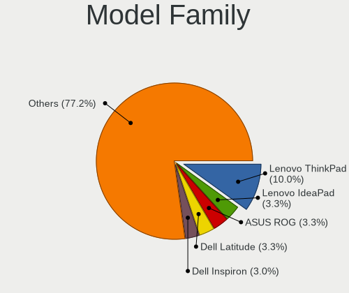
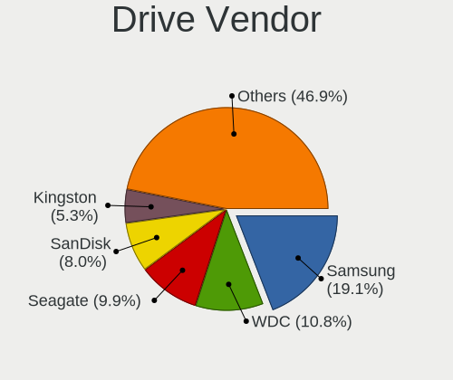
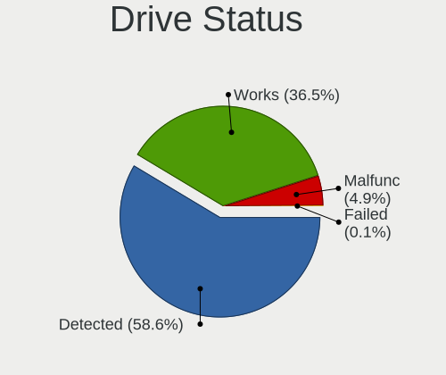
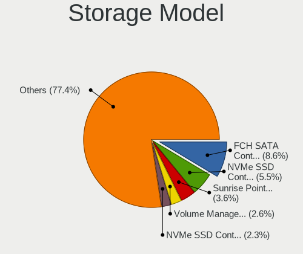
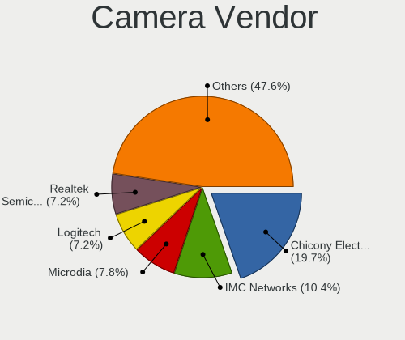

Fedora - Tested Hardware & Statistics
-------------------------------------

A project to collect tested hardware configurations for Fedora.

Anyone can contribute to this report by the [hw-probe](https://github.com/linuxhw/hw-probe) tool:

    sudo -E hw-probe -all -upload

Please contribute! Especially if your hardware is rare.

This is a report for all computer types. See also reports for [desktops](/Dist/Fedora/Desktop/README.md) and [notebooks](/Dist/Fedora/Notebook/README.md).

Contents
--------

* [ Test Cases ](#test-cases)

* [ System ](#system)
  - [ OS                       ](#os)
  - [ OS Family                ](#os-family)
  - [ Kernel                   ](#kernel)
  - [ Kernel Family            ](#kernel-family)
  - [ Kernel Major Ver.        ](#kernel-major-ver)
  - [ Arch                     ](#arch)
  - [ DE                       ](#de)
  - [ Display Server           ](#display-server)
  - [ Display Manager          ](#display-manager)
  - [ OS Lang                  ](#os-lang)
  - [ Boot Mode                ](#boot-mode)
  - [ Filesystem               ](#filesystem)
  - [ Part. scheme             ](#part-scheme)
  - [ Dual Boot with Linux/BSD ](#dual-boot-with-linuxbsd)
  - [ Dual Boot (Win)          ](#dual-boot-win)

* [ Board ](#board)
  - [ Vendor                   ](#vendor)
  - [ Model                    ](#model)
  - [ Model Family             ](#model-family)
  - [ MFG Year                 ](#mfg-year)
  - [ Form Factor              ](#form-factor)
  - [ Secure Boot              ](#secure-boot)
  - [ Coreboot                 ](#coreboot)
  - [ RAM Size                 ](#ram-size)
  - [ RAM Used                 ](#ram-used)
  - [ Total Drives             ](#total-drives)
  - [ Has CD-ROM               ](#has-cd-rom)
  - [ Has Ethernet             ](#has-ethernet)
  - [ Has WiFi                 ](#has-wifi)
  - [ Has Bluetooth            ](#has-bluetooth)

* [ Location ](#location)
  - [ Country                  ](#country)
  - [ City                     ](#city)

* [ Drives ](#drives)
  - [ Drive Vendor             ](#drive-vendor)
  - [ Drive Model              ](#drive-model)
  - [ HDD Vendor               ](#hdd-vendor)
  - [ SSD Vendor               ](#ssd-vendor)
  - [ Drive Kind               ](#drive-kind)
  - [ Drive Connector          ](#drive-connector)
  - [ Drive Size               ](#drive-size)
  - [ Space Total              ](#space-total)
  - [ Space Used               ](#space-used)
  - [ Malfunc. Drives          ](#malfunc-drives)
  - [ Malfunc. Drive Vendor    ](#malfunc-drive-vendor)
  - [ Malfunc. HDD Vendor      ](#malfunc-hdd-vendor)
  - [ Malfunc. Drive Kind      ](#malfunc-drive-kind)
  - [ Failed Drives            ](#failed-drives)
  - [ Failed Drive Vendor      ](#failed-drive-vendor)
  - [ Drive Status             ](#drive-status)

* [ Storage controller ](#storage-controller)
  - [ Storage Vendor           ](#storage-vendor)
  - [ Storage Model            ](#storage-model)
  - [ Storage Kind             ](#storage-kind)

* [ Processor ](#processor)
  - [ CPU Vendor               ](#cpu-vendor)
  - [ CPU Model                ](#cpu-model)
  - [ CPU Model Family         ](#cpu-model-family)
  - [ CPU Cores                ](#cpu-cores)
  - [ CPU Sockets              ](#cpu-sockets)
  - [ CPU Threads              ](#cpu-threads)
  - [ CPU Op-Modes             ](#cpu-op-modes)
  - [ CPU Microcode            ](#cpu-microcode)
  - [ CPU Microarch            ](#cpu-microarch)

* [ Graphics ](#graphics)
  - [ GPU Vendor               ](#gpu-vendor)
  - [ GPU Model                ](#gpu-model)
  - [ GPU Combo                ](#gpu-combo)
  - [ GPU Driver               ](#gpu-driver)
  - [ GPU Memory               ](#gpu-memory)

* [ Monitor ](#monitor)
  - [ Monitor Vendor           ](#monitor-vendor)
  - [ Monitor Model            ](#monitor-model)
  - [ Monitor Resolution       ](#monitor-resolution)
  - [ Monitor Diagonal         ](#monitor-diagonal)
  - [ Monitor Width            ](#monitor-width)
  - [ Aspect Ratio             ](#aspect-ratio)
  - [ Monitor Area             ](#monitor-area)
  - [ Pixel Density            ](#pixel-density)
  - [ Multiple Monitors        ](#multiple-monitors)

* [ Network ](#network)
  - [ Net Controller Vendor    ](#net-controller-vendor)
  - [ Net Controller Model     ](#net-controller-model)
  - [ Wireless Vendor          ](#wireless-vendor)
  - [ Wireless Model           ](#wireless-model)
  - [ Ethernet Vendor          ](#ethernet-vendor)
  - [ Ethernet Model           ](#ethernet-model)
  - [ Net Controller Kind      ](#net-controller-kind)
  - [ Used Controller          ](#used-controller)
  - [ NICs                     ](#nics)
  - [ IPv6                     ](#ipv6)

* [ Bluetooth ](#bluetooth)
  - [ Bluetooth Vendor         ](#bluetooth-vendor)
  - [ Bluetooth Model          ](#bluetooth-model)

* [ Sound ](#sound)
  - [ Sound Vendor             ](#sound-vendor)
  - [ Sound Model              ](#sound-model)

* [ Memory ](#memory)
  - [ Memory Vendor            ](#memory-vendor)
  - [ Memory Model             ](#memory-model)
  - [ Memory Kind              ](#memory-kind)
  - [ Memory Form Factor       ](#memory-form-factor)
  - [ Memory Size              ](#memory-size)
  - [ Memory Speed             ](#memory-speed)

* [ Printers & scanners ](#printers--scanners)
  - [ Printer Vendor           ](#printer-vendor)
  - [ Printer Model            ](#printer-model)
  - [ Scanner Vendor           ](#scanner-vendor)
  - [ Scanner Model            ](#scanner-model)

* [ Camera ](#camera)
  - [ Camera Vendor            ](#camera-vendor)
  - [ Camera Model             ](#camera-model)

* [ Security ](#security)
  - [ Fingerprint Vendor       ](#fingerprint-vendor)
  - [ Fingerprint Model        ](#fingerprint-model)
  - [ Chipcard Vendor          ](#chipcard-vendor)
  - [ Chipcard Model           ](#chipcard-model)

* [ Unsupported ](#unsupported)
  - [ Unsupported Devices      ](#unsupported-devices)
  - [ Unsupported Device Types ](#unsupported-device-types)

Test Cases
----------

Total: 23379

| Vendor        | Model                       | Form-Factor | Probe                                                      | Date         |
|---------------|-----------------------------|-------------|------------------------------------------------------------|--------------|
| Acer          | Nitro AN515-54              | Notebook    | [051e477b5f](https://linux-hardware.org/?probe=051e477b5f) | Feb 02, 2024 |
| ASRock        | X670E Pro RS                | Desktop     | [fd02477c14](https://linux-hardware.org/?probe=fd02477c14) | Feb 02, 2024 |
| HP            | EliteBook 8560w             | Notebook    | [6ff665aaf5](https://linux-hardware.org/?probe=6ff665aaf5) | Feb 02, 2024 |
| HP            | 83E9                        | Desktop     | [a140a989be](https://linux-hardware.org/?probe=a140a989be) | Feb 02, 2024 |
| ASUSTek       | SABERTOOTH Z77              | Desktop     | [75c314c9bb](https://linux-hardware.org/?probe=75c314c9bb) | Feb 02, 2024 |
| HP            | Spectre x360 Convertible    | Convertible | [a63a142388](https://linux-hardware.org/?probe=a63a142388) | Feb 02, 2024 |
| ASUSTek       | Zenbook UX3404VA_Q420VA     | Notebook    | [2b3f583bc7](https://linux-hardware.org/?probe=2b3f583bc7) | Feb 02, 2024 |
| Dell          | XPS 15 7590                 | Notebook    | [214b9d35cb](https://linux-hardware.org/?probe=214b9d35cb) | Feb 02, 2024 |
| ASUSTek       | Zenbook UX3404VA_Q420VA     | Notebook    | [a569cab490](https://linux-hardware.org/?probe=a569cab490) | Feb 02, 2024 |
| HP            | EliteBook 840 G2            | Notebook    | [4a3954a4c1](https://linux-hardware.org/?probe=4a3954a4c1) | Feb 02, 2024 |
| Acer          | Aspire VN7-591G             | Notebook    | [c0f024d3e0](https://linux-hardware.org/?probe=c0f024d3e0) | Feb 02, 2024 |
| ASUSTek       | H110M-R                     | Desktop     | [2902d23de2](https://linux-hardware.org/?probe=2902d23de2) | Feb 02, 2024 |
| Pegatron      | IPM41-D3                    | Desktop     | [5884d40085](https://linux-hardware.org/?probe=5884d40085) | Feb 02, 2024 |
| Lenovo        | Legion Go 8APU1 83E1        | Tablet      | [5661819818](https://linux-hardware.org/?probe=5661819818) | Feb 02, 2024 |
| Dell          | Latitude 3420               | Notebook    | [15de060676](https://linux-hardware.org/?probe=15de060676) | Feb 02, 2024 |
| MSI           | X99A RAIDER                 | Desktop     | [158530e4dc](https://linux-hardware.org/?probe=158530e4dc) | Feb 02, 2024 |
| ASRock        | A320M-ITX                   | Desktop     | [7c3ebbb23c](https://linux-hardware.org/?probe=7c3ebbb23c) | Feb 02, 2024 |
| ASUSTek       | TUF Gaming B450M-PRO S      | Desktop     | [654e691a5d](https://linux-hardware.org/?probe=654e691a5d) | Feb 02, 2024 |
| ASUSTek       | TUF Gaming B450M-PRO S      | Desktop     | [279e68de12](https://linux-hardware.org/?probe=279e68de12) | Feb 02, 2024 |
| MSI           | B450 GAMING PLUS MAX        | Desktop     | [e8554aab57](https://linux-hardware.org/?probe=e8554aab57) | Feb 02, 2024 |
| Framework     | Laptop 13 (AMD Ryzen 704... | Notebook    | [d9a0906eac](https://linux-hardware.org/?probe=d9a0906eac) | Feb 02, 2024 |
| Lenovo        | Z50-70 20354                | Notebook    | [d6023b78a2](https://linux-hardware.org/?probe=d6023b78a2) | Feb 02, 2024 |
| Acer          | Swift SF314-43              | Notebook    | [e87efb031b](https://linux-hardware.org/?probe=e87efb031b) | Feb 02, 2024 |
| ASRock        | B560M-ITX/ac                | Desktop     | [9ed6c67efe](https://linux-hardware.org/?probe=9ed6c67efe) | Feb 02, 2024 |
| HP            | EliteBook Revolve 810 G2    | Notebook    | [788fb13f23](https://linux-hardware.org/?probe=788fb13f23) | Feb 02, 2024 |
| MSI           | B450 GAMING PLUS MAX        | Desktop     | [73e32179ef](https://linux-hardware.org/?probe=73e32179ef) | Feb 02, 2024 |
| Dell          | Inspiron N5110              | Notebook    | [e7338ad21d](https://linux-hardware.org/?probe=e7338ad21d) | Feb 01, 2024 |
| Lenovo        | IdeaPad 3 15IGL05 81WQ      | Notebook    | [f2003839e0](https://linux-hardware.org/?probe=f2003839e0) | Feb 01, 2024 |
| Intel         | NUC11PHBi7 M26151-404       | Mini pc     | [db8ba8a942](https://linux-hardware.org/?probe=db8ba8a942) | Feb 01, 2024 |
| ASUSTek       | PRIME B560M-K               | Desktop     | [007e574396](https://linux-hardware.org/?probe=007e574396) | Feb 01, 2024 |
| ASUSTek       | PRIME B560M-K               | Desktop     | [9d4315d3e3](https://linux-hardware.org/?probe=9d4315d3e3) | Feb 01, 2024 |
| Pegatron      | IPM41-D3                    | Desktop     | [7969244295](https://linux-hardware.org/?probe=7969244295) | Feb 01, 2024 |
| HONOR         | BRN-HXX                     | Notebook    | [9e92d94ecb](https://linux-hardware.org/?probe=9e92d94ecb) | Feb 01, 2024 |
| Dell          | Latitude 5300 2-in-1        | Convertible | [7f56291587](https://linux-hardware.org/?probe=7f56291587) | Feb 01, 2024 |
| Dell          | Precision 5520              | Notebook    | [60d35bb7a2](https://linux-hardware.org/?probe=60d35bb7a2) | Feb 01, 2024 |
| realme        | CloudProXXXX                | Notebook    | [1299621a5e](https://linux-hardware.org/?probe=1299621a5e) | Feb 01, 2024 |
| Apple         | MacBookPro11,3              | Notebook    | [9b4ae891b7](https://linux-hardware.org/?probe=9b4ae891b7) | Feb 01, 2024 |
| HP            | 870C                        | Desktop     | [14801c4f80](https://linux-hardware.org/?probe=14801c4f80) | Feb 01, 2024 |
| Gigabyte      | G41MT-D3                    | Desktop     | [88c563b03e](https://linux-hardware.org/?probe=88c563b03e) | Feb 01, 2024 |
| Dell          | XPS 15 9530                 | Notebook    | [3aa974d8a0](https://linux-hardware.org/?probe=3aa974d8a0) | Feb 01, 2024 |
| MSI           | X99A RAIDER                 | Desktop     | [3953592045](https://linux-hardware.org/?probe=3953592045) | Feb 01, 2024 |
| Dell          | Inspiron 5748               | Notebook    | [1eaa79e492](https://linux-hardware.org/?probe=1eaa79e492) | Feb 01, 2024 |
| Dell          | Vostro 3500                 | Notebook    | [1d57e2e0b1](https://linux-hardware.org/?probe=1d57e2e0b1) | Feb 01, 2024 |
| Apple         | MacBookPro11,3              | Notebook    | [3a809ef1d0](https://linux-hardware.org/?probe=3a809ef1d0) | Jan 31, 2024 |
| ASUSTek       | VivoBook_ASUSLaptop M160... | Notebook    | [0414c66c77](https://linux-hardware.org/?probe=0414c66c77) | Jan 31, 2024 |
| Unknown       | Unknown                     | Desktop     | [66102cc055](https://linux-hardware.org/?probe=66102cc055) | Jan 31, 2024 |
| Dell          | Inspiron 5748               | Notebook    | [7a50d780ce](https://linux-hardware.org/?probe=7a50d780ce) | Jan 31, 2024 |
| Lenovo        | ThinkPad E16 Gen 1 21JTC... | Notebook    | [e91ff8608c](https://linux-hardware.org/?probe=e91ff8608c) | Jan 31, 2024 |
| HP            | EliteBook 8560w             | Notebook    | [6d3b73b144](https://linux-hardware.org/?probe=6d3b73b144) | Jan 31, 2024 |
| Acer          | Swift SF514-56T             | Notebook    | [320f3db548](https://linux-hardware.org/?probe=320f3db548) | Jan 31, 2024 |
| Apple         | Mac-F65AE981FFA204ED Mac... | Mini pc     | [462775ac8b](https://linux-hardware.org/?probe=462775ac8b) | Jan 31, 2024 |
| Lenovo        | G50-30 80G0                 | Notebook    | [16e8c28b87](https://linux-hardware.org/?probe=16e8c28b87) | Jan 31, 2024 |
| Dell          | Latitude 7280               | Notebook    | [0a79c87afb](https://linux-hardware.org/?probe=0a79c87afb) | Jan 31, 2024 |
| ASUSTek       | ZenBook UX425IA_UM425IA     | Notebook    | [4838799f43](https://linux-hardware.org/?probe=4838799f43) | Jan 31, 2024 |
| ASUSTek       | TUF Gaming B650M-PLUS       | Desktop     | [0b234564e9](https://linux-hardware.org/?probe=0b234564e9) | Jan 31, 2024 |
| HP            | Laptop 14-cf2xxx            | Notebook    | [7984b3ffda](https://linux-hardware.org/?probe=7984b3ffda) | Jan 31, 2024 |
| HP            | EliteBook 840 G7 Noteboo... | Notebook    | [e79be04d28](https://linux-hardware.org/?probe=e79be04d28) | Jan 31, 2024 |
| MSI           | X99A RAIDER                 | Desktop     | [ffaf5dab37](https://linux-hardware.org/?probe=ffaf5dab37) | Jan 31, 2024 |
| Avell         | B.ON                        | Notebook    | [45a01901e9](https://linux-hardware.org/?probe=45a01901e9) | Jan 31, 2024 |
| Dell          | Inspiron 5537               | Notebook    | [7c7904f383](https://linux-hardware.org/?probe=7c7904f383) | Jan 31, 2024 |
| Dell          | Inspiron 5537               | Notebook    | [7a4e4ac7ba](https://linux-hardware.org/?probe=7a4e4ac7ba) | Jan 31, 2024 |
| HP            | Laptop 15-dy1xxx            | Notebook    | [5a506021d1](https://linux-hardware.org/?probe=5a506021d1) | Jan 31, 2024 |
| HP            | Laptop 15-dy1xxx            | Notebook    | [999c7694d0](https://linux-hardware.org/?probe=999c7694d0) | Jan 31, 2024 |
| ASUSTek       | M4N68T-M LE                 | Desktop     | [31e2d90ef4](https://linux-hardware.org/?probe=31e2d90ef4) | Jan 31, 2024 |
| Dell          | 00V62H A01                  | Desktop     | [4a42c319b4](https://linux-hardware.org/?probe=4a42c319b4) | Jan 30, 2024 |
| Google        | Cyan                        | Notebook    | [15ee2dfc2f](https://linux-hardware.org/?probe=15ee2dfc2f) | Jan 30, 2024 |
| Dell          | Latitude 5590               | Notebook    | [d10e7cf975](https://linux-hardware.org/?probe=d10e7cf975) | Jan 30, 2024 |
| Dell          | XPS 9315                    | Notebook    | [dd96b44e05](https://linux-hardware.org/?probe=dd96b44e05) | Jan 30, 2024 |
| MSI           | AMETHYST-M                  | Desktop     | [865d868008](https://linux-hardware.org/?probe=865d868008) | Jan 30, 2024 |
| AZW           | GTR V21                     | Mini pc     | [f0a278c92d](https://linux-hardware.org/?probe=f0a278c92d) | Jan 30, 2024 |
| Lenovo        | Yoga 710-15IKB 80V5         | Convertible | [f8bab29110](https://linux-hardware.org/?probe=f8bab29110) | Jan 30, 2024 |
| ASUSTek       | TUF Gaming Z490-PLUS        | Desktop     | [fac7cfcfce](https://linux-hardware.org/?probe=fac7cfcfce) | Jan 30, 2024 |
| Lenovo        | IdeaPad Slim 3 15IAH8 83... | Notebook    | [76cc91cd14](https://linux-hardware.org/?probe=76cc91cd14) | Jan 30, 2024 |
| MSI           | AMETHYST-M                  | Desktop     | [da16f0848e](https://linux-hardware.org/?probe=da16f0848e) | Jan 30, 2024 |
| HP            | ENVY x360 Convertible 15... | Convertible | [c81a513b27](https://linux-hardware.org/?probe=c81a513b27) | Jan 30, 2024 |
| MECHREVO      | WUJIE14 PRO                 | Notebook    | [5e58868dbf](https://linux-hardware.org/?probe=5e58868dbf) | Jan 30, 2024 |
| Dell          | G15 5510                    | Notebook    | [9f3691e991](https://linux-hardware.org/?probe=9f3691e991) | Jan 30, 2024 |
| HUAWEI        | BOM-WXX9                    | Notebook    | [93b76b804d](https://linux-hardware.org/?probe=93b76b804d) | Jan 30, 2024 |
| ASRock        | B550 Phantom Gaming 4       | Desktop     | [9d98a77586](https://linux-hardware.org/?probe=9d98a77586) | Jan 30, 2024 |
| ASUSTek       | ASUS EXPERTBOOK B7402FBA... | Convertible | [f2b4ad5d19](https://linux-hardware.org/?probe=f2b4ad5d19) | Jan 30, 2024 |
| ASUSTek       | X99-DELUXE                  | Desktop     | [482b1946f4](https://linux-hardware.org/?probe=482b1946f4) | Jan 30, 2024 |
| Lenovo        | ThinkPad P15 Gen 2i 20YR... | Notebook    | [b0ebb1ac3b](https://linux-hardware.org/?probe=b0ebb1ac3b) | Jan 30, 2024 |
| Samsung       | 940XFG                      | Notebook    | [5dea9b20b4](https://linux-hardware.org/?probe=5dea9b20b4) | Jan 30, 2024 |
| Fujitsu       | LIFEBOOK E5512A             | Notebook    | [e4d7a0ca3a](https://linux-hardware.org/?probe=e4d7a0ca3a) | Jan 30, 2024 |
| ASRock        | B550 Pro4                   | Desktop     | [9617266ebe](https://linux-hardware.org/?probe=9617266ebe) | Jan 30, 2024 |
| ASUSTek       | PRIME B450M-A II            | Desktop     | [abdcd1a804](https://linux-hardware.org/?probe=abdcd1a804) | Jan 30, 2024 |
| ASUSTek       | ROG STRIX B550-F GAMING     | Desktop     | [0a68bb3157](https://linux-hardware.org/?probe=0a68bb3157) | Jan 30, 2024 |
| ASUSTek       | VivoBook_ASUSLaptop X512... | Notebook    | [bd5392e681](https://linux-hardware.org/?probe=bd5392e681) | Jan 30, 2024 |
| Dell          | 0U880P A01                  | Desktop     | [d3d4142e1e](https://linux-hardware.org/?probe=d3d4142e1e) | Jan 30, 2024 |
| HP            | EliteBook Folio 9480m       | Notebook    | [648e9e296d](https://linux-hardware.org/?probe=648e9e296d) | Jan 30, 2024 |
| ASUSTek       | Zenbook Flip UP5302ZA_UP... | Convertible | [cc27f48922](https://linux-hardware.org/?probe=cc27f48922) | Jan 30, 2024 |
| MSI           | B760 GAMING PLUS WIFI       | Desktop     | [193e9e6c74](https://linux-hardware.org/?probe=193e9e6c74) | Jan 30, 2024 |
| Lenovo        | ThinkPad X1 Carbon Gen 1... | Notebook    | [69f602b6c5](https://linux-hardware.org/?probe=69f602b6c5) | Jan 30, 2024 |
| Lenovo        | ThinkPad X1 Carbon Gen 1... | Notebook    | [89f648ad66](https://linux-hardware.org/?probe=89f648ad66) | Jan 30, 2024 |
| Apple         | MacBookPro14,2              | Notebook    | [c2b9f915d1](https://linux-hardware.org/?probe=c2b9f915d1) | Jan 29, 2024 |
| ASRock        | B450M Pro4                  | Desktop     | [c0f87d75df](https://linux-hardware.org/?probe=c0f87d75df) | Jan 29, 2024 |
| Dell          | Latitude 5590               | Notebook    | [9ab8c26d03](https://linux-hardware.org/?probe=9ab8c26d03) | Jan 29, 2024 |
| MSI           | Z490M-S01                   | Desktop     | [ed7f213619](https://linux-hardware.org/?probe=ed7f213619) | Jan 29, 2024 |
| ASRock        | B650M Pro RS WiFi           | Desktop     | [b2a4068ec1](https://linux-hardware.org/?probe=b2a4068ec1) | Jan 29, 2024 |
| ASRock        | A320M-HD                    | Desktop     | [5c0864b392](https://linux-hardware.org/?probe=5c0864b392) | Jan 29, 2024 |
| HP            | ENVY Laptop 17-cr0xxx       | Notebook    | [3aa33cea08](https://linux-hardware.org/?probe=3aa33cea08) | Jan 29, 2024 |
| MSI           | Modern 14 C12M              | Notebook    | [39450e20cc](https://linux-hardware.org/?probe=39450e20cc) | Jan 29, 2024 |
| HP            | 255 15.6 inch G9 Noteboo... | Notebook    | [dd92e4a676](https://linux-hardware.org/?probe=dd92e4a676) | Jan 29, 2024 |
| Acer          | TravelMate B113             | Notebook    | [7f86bed0b1](https://linux-hardware.org/?probe=7f86bed0b1) | Jan 29, 2024 |
| HP            | Laptop 15-ef2xxx            | Notebook    | [db29833c5b](https://linux-hardware.org/?probe=db29833c5b) | Jan 29, 2024 |
| Lenovo        | V370 HuronRiver Platform    | Notebook    | [9d6e253461](https://linux-hardware.org/?probe=9d6e253461) | Jan 29, 2024 |
| Lenovo        | ThinkPad P52 20M9001MMX     | Notebook    | [0270f75e12](https://linux-hardware.org/?probe=0270f75e12) | Jan 29, 2024 |
| Lenovo        | V370 HuronRiver Platform    | Notebook    | [77ec188a66](https://linux-hardware.org/?probe=77ec188a66) | Jan 29, 2024 |
| MSI           | MAG B550M BAZOOKA           | Desktop     | [c0d98503dd](https://linux-hardware.org/?probe=c0d98503dd) | Jan 29, 2024 |
| Intel         | NUC12WSBi5 M93888-302       | Mini pc     | [2cb078cb9c](https://linux-hardware.org/?probe=2cb078cb9c) | Jan 29, 2024 |
| Dell          | Precision M4800             | Notebook    | [54bea54d08](https://linux-hardware.org/?probe=54bea54d08) | Jan 29, 2024 |
| HP            | ENVY x360 Convertible 13... | Convertible | [1380d4cadd](https://linux-hardware.org/?probe=1380d4cadd) | Jan 29, 2024 |
| HUAWEI        | NbDE-WXX9                   | Notebook    | [39f2e4dc9e](https://linux-hardware.org/?probe=39f2e4dc9e) | Jan 29, 2024 |
| Gigabyte      | B550 GAMING X V2            | Desktop     | [99e90d2b89](https://linux-hardware.org/?probe=99e90d2b89) | Jan 29, 2024 |
| HUAWEI        | NbDE-WXX9                   | Notebook    | [bf90b37fe4](https://linux-hardware.org/?probe=bf90b37fe4) | Jan 29, 2024 |
| Dell          | Vostro 3558                 | Notebook    | [f2c958ad91](https://linux-hardware.org/?probe=f2c958ad91) | Jan 29, 2024 |
| Lenovo        | IdeaPadFlex 5 14ABR8 82X... | Convertible | [4bdd7a9f8c](https://linux-hardware.org/?probe=4bdd7a9f8c) | Jan 29, 2024 |
| General Dy... | Tadpole TOPAZ               | Notebook    | [2d773d0793](https://linux-hardware.org/?probe=2d773d0793) | Jan 29, 2024 |
| Lenovo        | ThinkPad T14 Gen 2i 20W0... | Notebook    | [454031382d](https://linux-hardware.org/?probe=454031382d) | Jan 29, 2024 |
| Acer          | Swift SF314-56G             | Notebook    | [a6aac17123](https://linux-hardware.org/?probe=a6aac17123) | Jan 29, 2024 |
| Acer          | Swift SF314-56G             | Notebook    | [b259912831](https://linux-hardware.org/?probe=b259912831) | Jan 29, 2024 |
| Intel         | DB75EN AAG39650-302         | Desktop     | [dcc6332a8e](https://linux-hardware.org/?probe=dcc6332a8e) | Jan 29, 2024 |
| MSI           | Z790 GAMING PRO WIFI        | Desktop     | [3e946efe3c](https://linux-hardware.org/?probe=3e946efe3c) | Jan 29, 2024 |
| HP            | Spectre x360 2-in-1 Lapt... | Convertible | [732e7ddffb](https://linux-hardware.org/?probe=732e7ddffb) | Jan 28, 2024 |
| Huanan        | X99-QD4 V1.0                | Desktop     | [2194293ede](https://linux-hardware.org/?probe=2194293ede) | Jan 28, 2024 |
| ASUSTek       | PN50                        | Mini pc     | [752ff031fd](https://linux-hardware.org/?probe=752ff031fd) | Jan 28, 2024 |
| Lenovo        | Yoga Pro 9 16IRP8 83BY      | Notebook    | [f46d220d2e](https://linux-hardware.org/?probe=f46d220d2e) | Jan 28, 2024 |
| HP            | Pavilion x360 Convertibl... | Convertible | [a03abdfb44](https://linux-hardware.org/?probe=a03abdfb44) | Jan 28, 2024 |
| Dell          | Latitude 5490               | Notebook    | [02270e4c1f](https://linux-hardware.org/?probe=02270e4c1f) | Jan 28, 2024 |
| Acer          | TravelMate P259-MG          | Notebook    | [0192eb7c53](https://linux-hardware.org/?probe=0192eb7c53) | Jan 28, 2024 |
| Dell          | Latitude 5490               | Notebook    | [6e91f2be02](https://linux-hardware.org/?probe=6e91f2be02) | Jan 28, 2024 |
| Apple         | Mac-4B682C642B45593E iMa... | All in one  | [feb1a8c3aa](https://linux-hardware.org/?probe=feb1a8c3aa) | Jan 28, 2024 |
| Dell          | Latitude 5420               | Notebook    | [459fbb3448](https://linux-hardware.org/?probe=459fbb3448) | Jan 28, 2024 |
| MSI           | 880GMS-E35                  | Desktop     | [0216fb4b4f](https://linux-hardware.org/?probe=0216fb4b4f) | Jan 28, 2024 |
| Gigabyte      | AX370-Gaming 5              | Desktop     | [c3f740ce88](https://linux-hardware.org/?probe=c3f740ce88) | Jan 28, 2024 |
| Lenovo        | SDK0F82993 WIN              | All in one  | [23d9f4ae6c](https://linux-hardware.org/?probe=23d9f4ae6c) | Jan 28, 2024 |
| Apple         | MacBookPro10,1              | Notebook    | [35238c08e4](https://linux-hardware.org/?probe=35238c08e4) | Jan 28, 2024 |
| ASUSTek       | VivoBook_ASUSLaptop M350... | Notebook    | [e78406b431](https://linux-hardware.org/?probe=e78406b431) | Jan 28, 2024 |
| MSI           | H81M-E34                    | Desktop     | [9aec3e7a36](https://linux-hardware.org/?probe=9aec3e7a36) | Jan 28, 2024 |
| ASUSTek       | PRIME B550M-A AC            | Desktop     | [35b6b0dd05](https://linux-hardware.org/?probe=35b6b0dd05) | Jan 28, 2024 |
| Lenovo        | ThinkPad T410 2522PT3       | Notebook    | [5116ee6ad3](https://linux-hardware.org/?probe=5116ee6ad3) | Jan 28, 2024 |
| Lenovo        | 3136 SDK0J40697 WIN 3305... | Mini pc     | [b86ad488c7](https://linux-hardware.org/?probe=b86ad488c7) | Jan 28, 2024 |
| Lenovo        | 1046 SDK0T08861 WIN 3305... | Desktop     | [cfc0d0a745](https://linux-hardware.org/?probe=cfc0d0a745) | Jan 28, 2024 |
| MSI           | MAG B550M MORTAR WIFI       | Desktop     | [59ce08f802](https://linux-hardware.org/?probe=59ce08f802) | Jan 28, 2024 |
| MSI           | X470 GAMING PLUS            | Desktop     | [a896c739ca](https://linux-hardware.org/?probe=a896c739ca) | Jan 28, 2024 |
| Dell          | Inspiron 5415               | Notebook    | [c7bd6068fa](https://linux-hardware.org/?probe=c7bd6068fa) | Jan 28, 2024 |
| Gigabyte      | B650 GAMING X AX            | Desktop     | [f728617f20](https://linux-hardware.org/?probe=f728617f20) | Jan 28, 2024 |
| ASUSTek       | PRIME B450M-A II            | Desktop     | [1d4239bc71](https://linux-hardware.org/?probe=1d4239bc71) | Jan 27, 2024 |
| Microsoft     | Surface Pro 4               | Tablet      | [47492f32db](https://linux-hardware.org/?probe=47492f32db) | Jan 27, 2024 |
| HP            | Laptop 14-dq2xxx            | Notebook    | [54cf5ffabf](https://linux-hardware.org/?probe=54cf5ffabf) | Jan 27, 2024 |
| Microsoft     | Surface Pro 4               | Tablet      | [42cf7d0ef3](https://linux-hardware.org/?probe=42cf7d0ef3) | Jan 27, 2024 |
| Acer          | Aspire A315-41G             | Notebook    | [e0d994ac23](https://linux-hardware.org/?probe=e0d994ac23) | Jan 27, 2024 |
| ASUSTek       | PRIME X370-A                | Desktop     | [e3c045bb8c](https://linux-hardware.org/?probe=e3c045bb8c) | Jan 27, 2024 |
| Acer          | Aspire A315-41G             | Notebook    | [1b15d869d4](https://linux-hardware.org/?probe=1b15d869d4) | Jan 27, 2024 |
| MSI           | Modern 15 H B13M            | Notebook    | [53eae9905c](https://linux-hardware.org/?probe=53eae9905c) | Jan 27, 2024 |
| Gigabyte      | X570 I AORUS PRO WIFI       | Desktop     | [26c552f089](https://linux-hardware.org/?probe=26c552f089) | Jan 27, 2024 |
| Gigabyte      | Z77MX-D3H                   | Desktop     | [618155f762](https://linux-hardware.org/?probe=618155f762) | Jan 27, 2024 |
| Lenovo        | ThinkPad T490s 20NYS1AM0... | Notebook    | [eb0027485d](https://linux-hardware.org/?probe=eb0027485d) | Jan 27, 2024 |
| Apple         | MacBookPro11,3              | Notebook    | [efdf2169af](https://linux-hardware.org/?probe=efdf2169af) | Jan 27, 2024 |
| MSI           | MPG X570 GAMING PLUS        | Desktop     | [9d4827b4a5](https://linux-hardware.org/?probe=9d4827b4a5) | Jan 27, 2024 |
| Dell          | Latitude 5310               | Notebook    | [334e579e92](https://linux-hardware.org/?probe=334e579e92) | Jan 27, 2024 |
| ASUSTek       | TUF Gaming X670E-PLUS       | Desktop     | [57f2a52748](https://linux-hardware.org/?probe=57f2a52748) | Jan 27, 2024 |
| Timi          | Xiaomi Book Pro 16 2022     | Notebook    | [60e1022aef](https://linux-hardware.org/?probe=60e1022aef) | Jan 27, 2024 |
| Lenovo        | ThinkPad E580 20KTS0TF00    | Notebook    | [1f1d3ff8f9](https://linux-hardware.org/?probe=1f1d3ff8f9) | Jan 27, 2024 |
| HP            | ProBook 650 G1              | Notebook    | [26cf710a63](https://linux-hardware.org/?probe=26cf710a63) | Jan 27, 2024 |
| Lenovo        | B590 20206                  | Notebook    | [31fa6a22ea](https://linux-hardware.org/?probe=31fa6a22ea) | Jan 27, 2024 |
| ASUSTek       | TUF Z390M-PRO GAMING        | Desktop     | [85fd42ad4d](https://linux-hardware.org/?probe=85fd42ad4d) | Jan 27, 2024 |
| Lenovo        | ThinkPad T490s 20NYS1AM0... | Notebook    | [48a5f801fc](https://linux-hardware.org/?probe=48a5f801fc) | Jan 27, 2024 |
| Unknown       | Unknown                     | Notebook    | [5c676b44c6](https://linux-hardware.org/?probe=5c676b44c6) | Jan 27, 2024 |
| Unknown       | Unknown                     | Notebook    | [52522836b8](https://linux-hardware.org/?probe=52522836b8) | Jan 27, 2024 |
| Gigabyte      | TRX40 AORUS XTREME          | Desktop     | [cdf9d5dadb](https://linux-hardware.org/?probe=cdf9d5dadb) | Jan 27, 2024 |
| Gigabyte      | G41MT-D3                    | Desktop     | [327217e107](https://linux-hardware.org/?probe=327217e107) | Jan 27, 2024 |
| MSI           | MEG Z690I UNIFY             | Desktop     | [42f4602ff3](https://linux-hardware.org/?probe=42f4602ff3) | Jan 27, 2024 |
| Lenovo        | ThinkPad E14 Gen 2 20T7S... | Notebook    | [32f526010e](https://linux-hardware.org/?probe=32f526010e) | Jan 27, 2024 |
| ASUSTek       | VivoBook_ASUSLaptop X515... | Notebook    | [2d82723a5a](https://linux-hardware.org/?probe=2d82723a5a) | Jan 27, 2024 |
| Lenovo        | ThinkPad T430 2349SA2       | Notebook    | [8c4e929f6f](https://linux-hardware.org/?probe=8c4e929f6f) | Jan 27, 2024 |
| Quanta        | S2B-MB 31S2BMB0040          | Server      | [845035a51b](https://linux-hardware.org/?probe=845035a51b) | Jan 27, 2024 |
| ASUSTek       | N551JX                      | Notebook    | [6a0be842aa](https://linux-hardware.org/?probe=6a0be842aa) | Jan 27, 2024 |
| ASUSTek       | PRIME X670-P                | Desktop     | [1d4943457c](https://linux-hardware.org/?probe=1d4943457c) | Jan 26, 2024 |
| ASUSTek       | ROG STRIX B450-F GAMING ... | Desktop     | [8ac63955c7](https://linux-hardware.org/?probe=8ac63955c7) | Jan 26, 2024 |
| HUAWEI        | WRT-WX9                     | Notebook    | [4fe4c818d5](https://linux-hardware.org/?probe=4fe4c818d5) | Jan 26, 2024 |
| Lenovo        | Yoga 6 13ABR8 83B2          | Convertible | [d83af4e1b0](https://linux-hardware.org/?probe=d83af4e1b0) | Jan 26, 2024 |
| MSI           | MPG X570 GAMING PLUS        | Desktop     | [9b55015259](https://linux-hardware.org/?probe=9b55015259) | Jan 26, 2024 |
| MSI           | MPG X570 GAMING PLUS        | Desktop     | [3cecdef02f](https://linux-hardware.org/?probe=3cecdef02f) | Jan 26, 2024 |
| Apple         | MacBookAir7,2               | Notebook    | [0aeced0805](https://linux-hardware.org/?probe=0aeced0805) | Jan 26, 2024 |
| ASUSTek       | Zenbook UN5401QAB_UN5401... | Convertible | [9b5946c096](https://linux-hardware.org/?probe=9b5946c096) | Jan 26, 2024 |
| Lenovo        | ThinkPad T14 Gen 4 21K4S... | Notebook    | [275a598957](https://linux-hardware.org/?probe=275a598957) | Jan 26, 2024 |
| HP            | 843B                        | Desktop     | [9a021639c5](https://linux-hardware.org/?probe=9a021639c5) | Jan 26, 2024 |
| ASUSTek       | Zenbook UN5401QAB_UN5401... | Convertible | [47103de931](https://linux-hardware.org/?probe=47103de931) | Jan 26, 2024 |
| Lenovo        | IdeaPad Gaming 3 15ACH6 ... | Notebook    | [8cafa419c5](https://linux-hardware.org/?probe=8cafa419c5) | Jan 26, 2024 |
| AZW           | GTR V21                     | Mini pc     | [6c644d4df7](https://linux-hardware.org/?probe=6c644d4df7) | Jan 26, 2024 |
| mPTech        | Techbite ZIN 3              | Notebook    | [57234bbbc3](https://linux-hardware.org/?probe=57234bbbc3) | Jan 26, 2024 |
| HUAWEI        | MACHC-WAX9                  | Notebook    | [4cfadd11cf](https://linux-hardware.org/?probe=4cfadd11cf) | Jan 26, 2024 |
| HP            | EliteBook 845 14 inch G1... | Notebook    | [c890800eff](https://linux-hardware.org/?probe=c890800eff) | Jan 26, 2024 |
| Notebook      | NS5x_NS7xAU                 | Notebook    | [25b199fd9d](https://linux-hardware.org/?probe=25b199fd9d) | Jan 26, 2024 |
| ASUSTek       | VivoBook_ASUSLaptop X421... | Notebook    | [3932a6e2cf](https://linux-hardware.org/?probe=3932a6e2cf) | Jan 26, 2024 |
| LG Electro... | 16Z90Q-G.AA54C2             | Notebook    | [34806d0240](https://linux-hardware.org/?probe=34806d0240) | Jan 26, 2024 |
| Lenovo        | ThinkPad E15 Gen 2 20TDA... | Notebook    | [6456dc0020](https://linux-hardware.org/?probe=6456dc0020) | Jan 26, 2024 |
| Lenovo        | ThinkPad E420 114155F       | Notebook    | [cdee2fb160](https://linux-hardware.org/?probe=cdee2fb160) | Jan 26, 2024 |
| ASUSTek       | PRIME X670-P                | Desktop     | [75379edae7](https://linux-hardware.org/?probe=75379edae7) | Jan 26, 2024 |
| Framework     | Laptop                      | Notebook    | [002ca05701](https://linux-hardware.org/?probe=002ca05701) | Jan 26, 2024 |
| ASUSTek       | A8R32-MVP Deluxe            | Desktop     | [f59710809d](https://linux-hardware.org/?probe=f59710809d) | Jan 26, 2024 |
| Dell          | Inspiron 5521               | Notebook    | [e9f2d87f0f](https://linux-hardware.org/?probe=e9f2d87f0f) | Jan 26, 2024 |
| ASUSTek       | VivoBook_ASUSLaptop X415... | Notebook    | [660c45b7e5](https://linux-hardware.org/?probe=660c45b7e5) | Jan 26, 2024 |
| Dell          | Inspiron 5521               | Notebook    | [1c9b6b485d](https://linux-hardware.org/?probe=1c9b6b485d) | Jan 26, 2024 |
| ASUSTek       | VivoBook_ASUSLaptop X515... | Notebook    | [182e75dbe2](https://linux-hardware.org/?probe=182e75dbe2) | Jan 26, 2024 |
| MACHENIKE     | S15C                        | Notebook    | [7429416572](https://linux-hardware.org/?probe=7429416572) | Jan 25, 2024 |
| Lenovo        | V15-ADA 82C7                | Notebook    | [a72a3bb0e5](https://linux-hardware.org/?probe=a72a3bb0e5) | Jan 25, 2024 |
| MSI           | H81M-E34                    | Desktop     | [c53fb2b81b](https://linux-hardware.org/?probe=c53fb2b81b) | Jan 25, 2024 |
| Lenovo        | IdeaPad Gaming 3 16IAH7 ... | Notebook    | [e7a39e7734](https://linux-hardware.org/?probe=e7a39e7734) | Jan 25, 2024 |
| Apple         | MacBookAir6,2               | Notebook    | [07460c8e19](https://linux-hardware.org/?probe=07460c8e19) | Jan 25, 2024 |
| Lenovo        | ThinkBook 16 G6 ABP 21KK    | Notebook    | [3ed9ff642f](https://linux-hardware.org/?probe=3ed9ff642f) | Jan 25, 2024 |
| ASUSTek       | TUF Gaming B550-PLUS WIF... | Desktop     | [813ed73797](https://linux-hardware.org/?probe=813ed73797) | Jan 25, 2024 |
| ASUSTek       | Z97-P                       | Desktop     | [0803e06982](https://linux-hardware.org/?probe=0803e06982) | Jan 25, 2024 |
| Lenovo        | ThinkPad X201 36805B8       | Notebook    | [cf0a1641da](https://linux-hardware.org/?probe=cf0a1641da) | Jan 25, 2024 |
| HP            | EliteBook 865 16 inch G1... | Notebook    | [72f849d40c](https://linux-hardware.org/?probe=72f849d40c) | Jan 25, 2024 |
| ASUSTek       | Zenbook UX3402ZA_Q409ZA     | Notebook    | [49a536ed05](https://linux-hardware.org/?probe=49a536ed05) | Jan 25, 2024 |
| Fujitsu       | LIFEBOOK A555               | Notebook    | [4d1f942627](https://linux-hardware.org/?probe=4d1f942627) | Jan 25, 2024 |
| Apple         | Mac-F22C86C8                | Mini pc     | [78d29adc26](https://linux-hardware.org/?probe=78d29adc26) | Jan 25, 2024 |
| Lenovo        | Yoga 510-14ISK 80S7         | Convertible | [a2c3ceeb83](https://linux-hardware.org/?probe=a2c3ceeb83) | Jan 25, 2024 |
| Gigabyte      | Z68MA-D2H-B3                | Desktop     | [ac31169eb1](https://linux-hardware.org/?probe=ac31169eb1) | Jan 25, 2024 |
| Lenovo        | IdeaPad Slim 5 14IRL8 82... | Notebook    | [0e4d078f49](https://linux-hardware.org/?probe=0e4d078f49) | Jan 25, 2024 |
| Lenovo        | Unknown                     | Notebook    | [ae59a4d618](https://linux-hardware.org/?probe=ae59a4d618) | Jan 25, 2024 |
| ASUSTek       | H110M-D                     | Desktop     | [7f2b907eb8](https://linux-hardware.org/?probe=7f2b907eb8) | Jan 25, 2024 |
| MSI           | B450M BAZOOKA V2            | Desktop     | [3f0ed24a76](https://linux-hardware.org/?probe=3f0ed24a76) | Jan 25, 2024 |
| Dell          | Precision M4800             | Notebook    | [a945621369](https://linux-hardware.org/?probe=a945621369) | Jan 25, 2024 |
| ASUSTek       | TUF Gaming B550-PLUS WIF... | Desktop     | [869af9b5c0](https://linux-hardware.org/?probe=869af9b5c0) | Jan 25, 2024 |
| 4POS          | D66 V1.2                    | All in one  | [9521b934fe](https://linux-hardware.org/?probe=9521b934fe) | Jan 24, 2024 |
| ASUSTek       | G20AJ                       | Desktop     | [4dd87f5aeb](https://linux-hardware.org/?probe=4dd87f5aeb) | Jan 24, 2024 |
| HP            | Pavilion dv6                | Notebook    | [073fe44f35](https://linux-hardware.org/?probe=073fe44f35) | Jan 24, 2024 |
| Dell          | Precision 5510              | Notebook    | [e1e543eaa4](https://linux-hardware.org/?probe=e1e543eaa4) | Jan 24, 2024 |
| ASUSTek       | PRIME H310M-E R2.0          | Desktop     | [0786b58816](https://linux-hardware.org/?probe=0786b58816) | Jan 24, 2024 |
| MSI           | MPG B550 GAMING PLUS        | Desktop     | [f38d7bb62a](https://linux-hardware.org/?probe=f38d7bb62a) | Jan 24, 2024 |
| Apple         | MacBookPro14,1              | Notebook    | [77704a62ca](https://linux-hardware.org/?probe=77704a62ca) | Jan 24, 2024 |
| Lenovo        | ThinkPad X270 20HN0012MX    | Notebook    | [ac867529fa](https://linux-hardware.org/?probe=ac867529fa) | Jan 24, 2024 |
| ASUSTek       | ROG Strix G513IC_G513IC     | Notebook    | [4b9301ae7f](https://linux-hardware.org/?probe=4b9301ae7f) | Jan 24, 2024 |
| ASUSTek       | X507UA                      | Notebook    | [ebf2dc120a](https://linux-hardware.org/?probe=ebf2dc120a) | Jan 24, 2024 |
| Apple         | MacBookPro14,1              | Notebook    | [01d5416f71](https://linux-hardware.org/?probe=01d5416f71) | Jan 24, 2024 |
| MSI           | MAG Z690 TOMAHAWK WIFI D... | Desktop     | [9bf161df69](https://linux-hardware.org/?probe=9bf161df69) | Jan 24, 2024 |
| LG Electro... | 14Z990-V.AR52A2             | Notebook    | [346844d302](https://linux-hardware.org/?probe=346844d302) | Jan 24, 2024 |
| MSI           | FM2-A75MA-E35               | Desktop     | [78cddbe37f](https://linux-hardware.org/?probe=78cddbe37f) | Jan 24, 2024 |
| ASUSTek       | ROG STRIX X570-E GAMING     | Desktop     | [8d6b0dcab0](https://linux-hardware.org/?probe=8d6b0dcab0) | Jan 24, 2024 |
| ASRock        | Z690-C/D5                   | Desktop     | [534911d3a7](https://linux-hardware.org/?probe=534911d3a7) | Jan 24, 2024 |
| ASRock        | B660-ITX                    | Desktop     | [c82f95d7de](https://linux-hardware.org/?probe=c82f95d7de) | Jan 24, 2024 |
| HP            | Notebook                    | Notebook    | [e862ba4d2b](https://linux-hardware.org/?probe=e862ba4d2b) | Jan 24, 2024 |
| MSI           | MPG B650I EDGE WIFI         | Desktop     | [9e5edb123e](https://linux-hardware.org/?probe=9e5edb123e) | Jan 24, 2024 |
| Gigabyte      | H61M-S2V-B3                 | Desktop     | [74874054dd](https://linux-hardware.org/?probe=74874054dd) | Jan 24, 2024 |
| Lenovo        | U41-70 80JV                 | Notebook    | [48ea1ff4a5](https://linux-hardware.org/?probe=48ea1ff4a5) | Jan 24, 2024 |
| Dell          | Inspiron N5040              | Notebook    | [79bca2224b](https://linux-hardware.org/?probe=79bca2224b) | Jan 24, 2024 |
| Lenovo        | ThinkPad T14 Gen 3 21AH0... | Notebook    | [789bbeb50a](https://linux-hardware.org/?probe=789bbeb50a) | Jan 24, 2024 |
| Acer          | Aspire A315-24P             | Notebook    | [ab51a416c0](https://linux-hardware.org/?probe=ab51a416c0) | Jan 23, 2024 |
| Gigabyte      | H110M-S2H-CF                | Desktop     | [81f34fc65a](https://linux-hardware.org/?probe=81f34fc65a) | Jan 23, 2024 |
| Dell          | 0KN5W4 A03                  | Desktop     | [4665315883](https://linux-hardware.org/?probe=4665315883) | Jan 23, 2024 |
| ASUSTek       | SABERTOOTH Z77              | Desktop     | [013bd103c2](https://linux-hardware.org/?probe=013bd103c2) | Jan 23, 2024 |
| ASUSTek       | SABERTOOTH Z77              | Desktop     | [ff02cafda6](https://linux-hardware.org/?probe=ff02cafda6) | Jan 23, 2024 |
| Dell          | Inspiron 13-7378            | Notebook    | [f1abc906bc](https://linux-hardware.org/?probe=f1abc906bc) | Jan 23, 2024 |
| ASUSTek       | P5Q SE2                     | Desktop     | [06fae6b7bf](https://linux-hardware.org/?probe=06fae6b7bf) | Jan 23, 2024 |
| Quanta        | S2B-MB 31S2BMB0040          | Server      | [c83ba710f9](https://linux-hardware.org/?probe=c83ba710f9) | Jan 23, 2024 |
| Dell          | 0HHV7N A00                  | Desktop     | [38b1e0aa62](https://linux-hardware.org/?probe=38b1e0aa62) | Jan 23, 2024 |
| Lenovo        | ThinkPad P50 20EQS3B30R     | Notebook    | [27804a7892](https://linux-hardware.org/?probe=27804a7892) | Jan 23, 2024 |
| MSI           | PRO B660M-E DDR4            | Desktop     | [7357312922](https://linux-hardware.org/?probe=7357312922) | Jan 23, 2024 |
| Lenovo        | MAHOBAY NO DPK              | Desktop     | [1eeda8c8f1](https://linux-hardware.org/?probe=1eeda8c8f1) | Jan 23, 2024 |
| Dell          | XPS 15 9500                 | Notebook    | [909b4a8f7c](https://linux-hardware.org/?probe=909b4a8f7c) | Jan 23, 2024 |
| ASUSTek       | ROG Zephyrus G15 GA503RM... | Notebook    | [48f8a71c93](https://linux-hardware.org/?probe=48f8a71c93) | Jan 23, 2024 |
| Lenovo        | ThinkPad P53 20QN0011IV     | Notebook    | [a80c29ee33](https://linux-hardware.org/?probe=a80c29ee33) | Jan 23, 2024 |
| ASUSTek       | VivoBook_ASUSLaptop K340... | Notebook    | [59eb577232](https://linux-hardware.org/?probe=59eb577232) | Jan 23, 2024 |
| Lenovo        | ThinkCentre M90p 5536AN5    | Desktop     | [8305fcdce9](https://linux-hardware.org/?probe=8305fcdce9) | Jan 23, 2024 |
| Gigabyte      | GA-MA790FXT-UD5P            | Desktop     | [9f48506578](https://linux-hardware.org/?probe=9f48506578) | Jan 23, 2024 |
| Dell          | System Inspiron N7110       | Notebook    | [e764df92ee](https://linux-hardware.org/?probe=e764df92ee) | Jan 23, 2024 |
| HP            | Pavilion x360 Convertibl... | Convertible | [bb81e33384](https://linux-hardware.org/?probe=bb81e33384) | Jan 23, 2024 |
| ASUSTek       | ASUS Zenbook 14 UX3405MA... | Notebook    | [d0cd433ae4](https://linux-hardware.org/?probe=d0cd433ae4) | Jan 23, 2024 |
| ASUSTek       | ASUS Zenbook 14 UX3405MA... | Notebook    | [23edfb46f4](https://linux-hardware.org/?probe=23edfb46f4) | Jan 23, 2024 |
| Lenovo        | ThinkPad L480 20LTS8CY00    | Notebook    | [a18fc04450](https://linux-hardware.org/?probe=a18fc04450) | Jan 23, 2024 |
| Dell          | Precision 5530              | Notebook    | [585fb7de16](https://linux-hardware.org/?probe=585fb7de16) | Jan 22, 2024 |
| Unknown       | Unknown                     | Notebook    | [dd7b17439f](https://linux-hardware.org/?probe=dd7b17439f) | Jan 22, 2024 |
| Acer          | Predator PH315-53           | Notebook    | [74ca3f63e2](https://linux-hardware.org/?probe=74ca3f63e2) | Jan 22, 2024 |
| HP            | Laptop 14-cf2xxx            | Notebook    | [72068173b9](https://linux-hardware.org/?probe=72068173b9) | Jan 22, 2024 |
| Toshiba       | Satellite C850-C5K          | Notebook    | [11b9b2c55a](https://linux-hardware.org/?probe=11b9b2c55a) | Jan 22, 2024 |
| Dell          | Latitude E7440              | Notebook    | [4e05575433](https://linux-hardware.org/?probe=4e05575433) | Jan 22, 2024 |
| Dell          | Inspiron 5770               | Notebook    | [8d01c56fca](https://linux-hardware.org/?probe=8d01c56fca) | Jan 22, 2024 |
| ASUSTek       | P5Q PRO TURBO               | Desktop     | [93762ed6a5](https://linux-hardware.org/?probe=93762ed6a5) | Jan 22, 2024 |
| ASUSTek       | ROG STRIX B550-F GAMING     | Desktop     | [6dbdc40268](https://linux-hardware.org/?probe=6dbdc40268) | Jan 22, 2024 |
| HP            | 240 G7 Notebook PC          | Notebook    | [5225ed2250](https://linux-hardware.org/?probe=5225ed2250) | Jan 22, 2024 |
| Apple         | MacBook5,1                  | Notebook    | [0833d2c5c5](https://linux-hardware.org/?probe=0833d2c5c5) | Jan 22, 2024 |
| Lenovo        | ThinkPad T480 20L6S1AL00    | Notebook    | [f5c1f6e080](https://linux-hardware.org/?probe=f5c1f6e080) | Jan 22, 2024 |
| ASUSTek       | PRIME Z690M-PLUS D4         | Desktop     | [2c38517137](https://linux-hardware.org/?probe=2c38517137) | Jan 22, 2024 |
| Lenovo        | ThinkPad X220 42911H8       | Notebook    | [2ab9e19a09](https://linux-hardware.org/?probe=2ab9e19a09) | Jan 22, 2024 |
| Biostar       | A68MHE                      | Desktop     | [bd1cb81b9d](https://linux-hardware.org/?probe=bd1cb81b9d) | Jan 22, 2024 |
| Apple         | MacBookPro14,1              | Notebook    | [2be86e592f](https://linux-hardware.org/?probe=2be86e592f) | Jan 22, 2024 |
| Apple         | MacBookPro16,1              | Notebook    | [62447a80b3](https://linux-hardware.org/?probe=62447a80b3) | Jan 22, 2024 |
| Apple         | MacBookPro16,1              | Notebook    | [f9faae4b87](https://linux-hardware.org/?probe=f9faae4b87) | Jan 22, 2024 |
| ASUSTek       | ROG STRIX Z690-E GAMING ... | Desktop     | [bc06fb13b6](https://linux-hardware.org/?probe=bc06fb13b6) | Jan 22, 2024 |
| Apple         | MacBookPro9,2               | Notebook    | [835a20ab23](https://linux-hardware.org/?probe=835a20ab23) | Jan 21, 2024 |
| ASUSTek       | X550LA                      | Notebook    | [3010861da1](https://linux-hardware.org/?probe=3010861da1) | Jan 21, 2024 |
| HP            | ENVY x360 Convertible 15... | Convertible | [166f7c91c7](https://linux-hardware.org/?probe=166f7c91c7) | Jan 21, 2024 |
| ASUSTek       | P7P55D                      | Desktop     | [8d8fab9b27](https://linux-hardware.org/?probe=8d8fab9b27) | Jan 21, 2024 |
| MSI           | X370 SLI PLUS               | Desktop     | [c4729b1c7c](https://linux-hardware.org/?probe=c4729b1c7c) | Jan 21, 2024 |
| ASUSTek       | M5A97 R2.0                  | Desktop     | [de6fb94ac8](https://linux-hardware.org/?probe=de6fb94ac8) | Jan 21, 2024 |
| Gigabyte      | B550 AORUS PRO AC           | Desktop     | [d67daf2078](https://linux-hardware.org/?probe=d67daf2078) | Jan 21, 2024 |
| HP            | 8618                        | Desktop     | [d1bd70f41d](https://linux-hardware.org/?probe=d1bd70f41d) | Jan 21, 2024 |
| HP            | Laptop 15s-gr0xxx           | Notebook    | [320f2c215a](https://linux-hardware.org/?probe=320f2c215a) | Jan 21, 2024 |
| Gigabyte      | B550M AORUS ELITE           | Desktop     | [f313b1c112](https://linux-hardware.org/?probe=f313b1c112) | Jan 21, 2024 |
| Lenovo        | IdeaPad Slim 5 16IRL8 82... | Notebook    | [ddb59f8c7e](https://linux-hardware.org/?probe=ddb59f8c7e) | Jan 21, 2024 |
| Dell          | 0HHV7N A00                  | Desktop     | [d6aeeb6ece](https://linux-hardware.org/?probe=d6aeeb6ece) | Jan 21, 2024 |
| HP            | 83DD                        | Mini pc     | [3a9b84ded5](https://linux-hardware.org/?probe=3a9b84ded5) | Jan 21, 2024 |
| Pegatron      | 2AB6                        | Desktop     | [57a1fef3f7](https://linux-hardware.org/?probe=57a1fef3f7) | Jan 21, 2024 |
| ASUSTek       | PRIME B550M-A               | Desktop     | [7069f9af65](https://linux-hardware.org/?probe=7069f9af65) | Jan 21, 2024 |
| ASUSTek       | ROG Zephyrus G14 GA402RJ... | Notebook    | [97e1f1353f](https://linux-hardware.org/?probe=97e1f1353f) | Jan 21, 2024 |
| Lenovo        | ThinkPad X220 429044U       | Notebook    | [d5fd867450](https://linux-hardware.org/?probe=d5fd867450) | Jan 21, 2024 |
| Acer          | Aspire R3-471T              | Notebook    | [5cf2f2b404](https://linux-hardware.org/?probe=5cf2f2b404) | Jan 21, 2024 |
| Acer          | Aspire R3-471T              | Notebook    | [3e062ccf04](https://linux-hardware.org/?probe=3e062ccf04) | Jan 21, 2024 |
| ASUSTek       | VivoBook_ASUSLaptop X170... | Notebook    | [4bc0f00e37](https://linux-hardware.org/?probe=4bc0f00e37) | Jan 21, 2024 |
| ASUSTek       | PRIME B350-PLUS             | Desktop     | [fbc836a9ff](https://linux-hardware.org/?probe=fbc836a9ff) | Jan 21, 2024 |
| HP            | EliteBook 830 G6            | Notebook    | [7f5c817c53](https://linux-hardware.org/?probe=7f5c817c53) | Jan 21, 2024 |
| Lenovo        | ThinkPad P1 Gen 3 20THCT... | Notebook    | [ef2b018f0e](https://linux-hardware.org/?probe=ef2b018f0e) | Jan 21, 2024 |
| Toshiba       | Satellite C70-B             | Notebook    | [452f1d82f7](https://linux-hardware.org/?probe=452f1d82f7) | Jan 21, 2024 |
| Apple         | MacBookPro11,5              | Notebook    | [f3fe3777b0](https://linux-hardware.org/?probe=f3fe3777b0) | Jan 21, 2024 |
| Dell          | Inspiron 14 5410            | Notebook    | [018d9742c7](https://linux-hardware.org/?probe=018d9742c7) | Jan 21, 2024 |
| Lenovo        | ThinkPad T480 20L6S3C100    | Notebook    | [ef29c6e451](https://linux-hardware.org/?probe=ef29c6e451) | Jan 20, 2024 |
| Dell          | Precision 5480              | Notebook    | [2ebc089368](https://linux-hardware.org/?probe=2ebc089368) | Jan 20, 2024 |
| Sony          | SVF1521A1EW                 | Notebook    | [034a736927](https://linux-hardware.org/?probe=034a736927) | Jan 20, 2024 |
| ASUSTek       | ROG STRIX B550-F GAMING     | Desktop     | [5c9deadb93](https://linux-hardware.org/?probe=5c9deadb93) | Jan 20, 2024 |
| MSI           | Z790 GAMING PRO WIFI        | Desktop     | [bdcd287661](https://linux-hardware.org/?probe=bdcd287661) | Jan 20, 2024 |
| Lenovo        | Yoga 7 14ARB7 82QF          | Convertible | [93339e731d](https://linux-hardware.org/?probe=93339e731d) | Jan 20, 2024 |
| Acer          | Aspire A315-35              | Notebook    | [baff1b7c03](https://linux-hardware.org/?probe=baff1b7c03) | Jan 20, 2024 |
| LG Electro... | 16Z90Q-G.AA54C2             | Notebook    | [d847e907f7](https://linux-hardware.org/?probe=d847e907f7) | Jan 20, 2024 |
| ASUSTek       | PRIME Z690-P WIFI D4        | Desktop     | [a535d51ede](https://linux-hardware.org/?probe=a535d51ede) | Jan 20, 2024 |
| Intel         | NUC8i7HVB J68196-600        | Mini pc     | [c1db8b0a81](https://linux-hardware.org/?probe=c1db8b0a81) | Jan 20, 2024 |
| Gigabyte      | B550I AORUS PRO AX          | Desktop     | [1db270091f](https://linux-hardware.org/?probe=1db270091f) | Jan 20, 2024 |
| HP            | EliteBook 840 G8 Noteboo... | Notebook    | [a6f32a12ea](https://linux-hardware.org/?probe=a6f32a12ea) | Jan 20, 2024 |
| MSI           | MS-B106                     | All in one  | [253773b958](https://linux-hardware.org/?probe=253773b958) | Jan 20, 2024 |
| Lenovo        | ThinkPad E16 Gen 1 21JTC... | Notebook    | [9f7b8c991a](https://linux-hardware.org/?probe=9f7b8c991a) | Jan 20, 2024 |
| Dell          | Latitude 5300 2-in-1        | Convertible | [dfd374db65](https://linux-hardware.org/?probe=dfd374db65) | Jan 20, 2024 |
| Lenovo        | Legion 9 16IRX8 83AG        | Notebook    | [4ec76f803c](https://linux-hardware.org/?probe=4ec76f803c) | Jan 20, 2024 |
| Lenovo        | Legion 9 16IRX8 83AG        | Notebook    | [fbcde01158](https://linux-hardware.org/?probe=fbcde01158) | Jan 20, 2024 |
| Lenovo        | ThinkPad X1 Carbon 7th 2... | Notebook    | [8a52bc7ddc](https://linux-hardware.org/?probe=8a52bc7ddc) | Jan 20, 2024 |
| Apple         | Mac-77EB7D7DAF985301 iMa... | All in one  | [917e91868b](https://linux-hardware.org/?probe=917e91868b) | Jan 20, 2024 |
| Infinix       | ZERO BOOK 13                | Notebook    | [5f3718642b](https://linux-hardware.org/?probe=5f3718642b) | Jan 20, 2024 |
| MSI           | MS-7388                     | Desktop     | [e151be731a](https://linux-hardware.org/?probe=e151be731a) | Jan 20, 2024 |
| Dell          | 04Y8V0 A02                  | Desktop     | [c7ac75fb19](https://linux-hardware.org/?probe=c7ac75fb19) | Jan 20, 2024 |
| Shenzhen M... | F7BSD                       | Mini pc     | [f428b07efd](https://linux-hardware.org/?probe=f428b07efd) | Jan 20, 2024 |
| Dell          | Inspiron N5040              | Notebook    | [80702016eb](https://linux-hardware.org/?probe=80702016eb) | Jan 20, 2024 |
| HP            | 8A96 11                     | Desktop     | [8b913e22cd](https://linux-hardware.org/?probe=8b913e22cd) | Jan 20, 2024 |
| HP            | 8A96 11                     | Desktop     | [3fa20439d9](https://linux-hardware.org/?probe=3fa20439d9) | Jan 20, 2024 |
| Dell          | Latitude 3490               | Notebook    | [367100a9ad](https://linux-hardware.org/?probe=367100a9ad) | Jan 20, 2024 |
| Gigabyte      | GA-870A-UD3                 | Desktop     | [7c13b83bff](https://linux-hardware.org/?probe=7c13b83bff) | Jan 20, 2024 |
| Lenovo        | G580 2189                   | Notebook    | [a46c26bc93](https://linux-hardware.org/?probe=a46c26bc93) | Jan 20, 2024 |
| ASRock        | B760M PG SONIC WiFi         | Desktop     | [987717796a](https://linux-hardware.org/?probe=987717796a) | Jan 20, 2024 |
| ASUSTek       | TUF Gaming A520M-PLUS WI... | Desktop     | [a27ea5cca3](https://linux-hardware.org/?probe=a27ea5cca3) | Jan 20, 2024 |
| ASUSTek       | PRIME Z690-P WIFI           | Desktop     | [5ab5b74cfa](https://linux-hardware.org/?probe=5ab5b74cfa) | Jan 20, 2024 |
| HP            | Spectre x360 Convertible... | Convertible | [3e3867681c](https://linux-hardware.org/?probe=3e3867681c) | Jan 19, 2024 |
| ASUSTek       | ROG STRIX B550-I GAMING     | Desktop     | [d166663637](https://linux-hardware.org/?probe=d166663637) | Jan 19, 2024 |
| Lenovo        | Yoga 7 16ARP8 83BS          | Convertible | [a9b8760e3e](https://linux-hardware.org/?probe=a9b8760e3e) | Jan 19, 2024 |
| Acer          | Aspire Z5610                | All in one  | [da346295d6](https://linux-hardware.org/?probe=da346295d6) | Jan 19, 2024 |
| ASUSTek       | ProArt B550-CREATOR         | Desktop     | [97f56eac35](https://linux-hardware.org/?probe=97f56eac35) | Jan 19, 2024 |
| MSI           | MPG X670E CARBON WIFI       | Desktop     | [0eb94b3491](https://linux-hardware.org/?probe=0eb94b3491) | Jan 19, 2024 |
| MSI           | MPG X670E CARBON WIFI       | Desktop     | [b6dfff4b78](https://linux-hardware.org/?probe=b6dfff4b78) | Jan 19, 2024 |
| Samsung       | 960XFH                      | Notebook    | [fa6946bc7b](https://linux-hardware.org/?probe=fa6946bc7b) | Jan 19, 2024 |
| Foxconn       | 2ABF                        | Desktop     | [9a5efc4dd3](https://linux-hardware.org/?probe=9a5efc4dd3) | Jan 19, 2024 |
| Samsung       | 730QED                      | Convertible | [faad9abb88](https://linux-hardware.org/?probe=faad9abb88) | Jan 19, 2024 |
| MSI           | MPG B650I EDGE WIFI         | Desktop     | [ba941d7a4e](https://linux-hardware.org/?probe=ba941d7a4e) | Jan 19, 2024 |
| Gigabyte      | EP45-DS3L                   | Desktop     | [c3a9225062](https://linux-hardware.org/?probe=c3a9225062) | Jan 19, 2024 |
| ASUSTek       | TUF Gaming X670E-PLUS WI... | Desktop     | [008c387c2b](https://linux-hardware.org/?probe=008c387c2b) | Jan 19, 2024 |
| Dell          | Latitude 5300 2-in-1        | Convertible | [382a776ac2](https://linux-hardware.org/?probe=382a776ac2) | Jan 19, 2024 |
| HONOR         | BMH-WCX9                    | Notebook    | [45113bdfbb](https://linux-hardware.org/?probe=45113bdfbb) | Jan 19, 2024 |
| HP            | 829A                        | Mini pc     | [e2d69ba528](https://linux-hardware.org/?probe=e2d69ba528) | Jan 19, 2024 |
| HP            | 829A                        | Mini pc     | [ee6750b80c](https://linux-hardware.org/?probe=ee6750b80c) | Jan 19, 2024 |
| AZW           | GTR V21                     | Mini pc     | [5ae635d23e](https://linux-hardware.org/?probe=5ae635d23e) | Jan 19, 2024 |
| Lenovo        | IdeaPad 3 15IGL05 81WQ      | Notebook    | [aca7a5c7c5](https://linux-hardware.org/?probe=aca7a5c7c5) | Jan 19, 2024 |
| Gigabyte      | GA-MA780G-UD3H              | Desktop     | [9e1182e93f](https://linux-hardware.org/?probe=9e1182e93f) | Jan 19, 2024 |
| ASUSTek       | CG8480                      | Desktop     | [4610686acc](https://linux-hardware.org/?probe=4610686acc) | Jan 19, 2024 |
| Pegatron      | 2AB6                        | Desktop     | [9a9b3ef258](https://linux-hardware.org/?probe=9a9b3ef258) | Jan 19, 2024 |
| Dell          | Inspiron 3501               | Notebook    | [dcd7920f8c](https://linux-hardware.org/?probe=dcd7920f8c) | Jan 19, 2024 |
| Nuvision      | L1W6_I1101_G Hampoo Rese... | Notebook    | [fb82a79de2](https://linux-hardware.org/?probe=fb82a79de2) | Jan 19, 2024 |
| Lenovo        | ThinkPad T450s 20BWS12V0... | Notebook    | [237a06ae54](https://linux-hardware.org/?probe=237a06ae54) | Jan 19, 2024 |
| MSI           | MS-B9181                    | Desktop     | [503f0edf6a](https://linux-hardware.org/?probe=503f0edf6a) | Jan 19, 2024 |
| ASRock        | X370 Pro4                   | Desktop     | [9dfd5fe2cb](https://linux-hardware.org/?probe=9dfd5fe2cb) | Jan 19, 2024 |
| ASUSTek       | ROG STRIX X399-E GAMING     | Desktop     | [89d65b315c](https://linux-hardware.org/?probe=89d65b315c) | Jan 19, 2024 |
| HP            | Pavilion Laptop 15-cs3xx... | Notebook    | [0ce8f49628](https://linux-hardware.org/?probe=0ce8f49628) | Jan 19, 2024 |
| GPD           | P2 MAX                      | Notebook    | [ec59cadd15](https://linux-hardware.org/?probe=ec59cadd15) | Jan 19, 2024 |
| Apple         | MacBookPro10,1              | Notebook    | [f866974a0b](https://linux-hardware.org/?probe=f866974a0b) | Jan 18, 2024 |
| Fujitsu       | D3120-A1 S26361-D3120-A1    | Desktop     | [27b2376cad](https://linux-hardware.org/?probe=27b2376cad) | Jan 18, 2024 |
| MSI           | MEG X570 UNIFY              | Desktop     | [01d5509c12](https://linux-hardware.org/?probe=01d5509c12) | Jan 18, 2024 |
| Dell          | Inspiron 3480               | Notebook    | [0c15974fbb](https://linux-hardware.org/?probe=0c15974fbb) | Jan 18, 2024 |
| ASRock        | H310M-STX                   | Desktop     | [8e7c70643c](https://linux-hardware.org/?probe=8e7c70643c) | Jan 18, 2024 |
| Dell          | 0KN5W4 A03                  | Desktop     | [64f7b3272e](https://linux-hardware.org/?probe=64f7b3272e) | Jan 18, 2024 |
| Lenovo        | V15 G2 ITL 82KB             | Notebook    | [c765a21a05](https://linux-hardware.org/?probe=c765a21a05) | Jan 18, 2024 |
| ASUSTek       | X550VQ                      | Notebook    | [f20c1955ef](https://linux-hardware.org/?probe=f20c1955ef) | Jan 18, 2024 |
| Lenovo        | ThinkPad P1 Gen 4i 20Y4S... | Notebook    | [3b679561c7](https://linux-hardware.org/?probe=3b679561c7) | Jan 18, 2024 |
| Gigabyte      | GA-MA785G-UD3H              | Desktop     | [16f764cb39](https://linux-hardware.org/?probe=16f764cb39) | Jan 18, 2024 |
| ASUSTek       | PRIME B360-PLUS             | Desktop     | [7f55ddb513](https://linux-hardware.org/?probe=7f55ddb513) | Jan 18, 2024 |
| Gigabyte      | B85-HD3                     | Desktop     | [66b0dbb818](https://linux-hardware.org/?probe=66b0dbb818) | Jan 18, 2024 |
| MSI           | GE72 6QD                    | Notebook    | [17fb69aaa6](https://linux-hardware.org/?probe=17fb69aaa6) | Jan 18, 2024 |
| HP            | 3048h                       | Desktop     | [e24f1cffa1](https://linux-hardware.org/?probe=e24f1cffa1) | Jan 18, 2024 |
| HP            | 2B0F                        | Desktop     | [ce5907f486](https://linux-hardware.org/?probe=ce5907f486) | Jan 18, 2024 |
| ASRock        | AD2700-ITX                  | Desktop     | [93eee675be](https://linux-hardware.org/?probe=93eee675be) | Jan 18, 2024 |
| Gigabyte      | J1900M-D2P                  | Desktop     | [3c5d80f1e7](https://linux-hardware.org/?probe=3c5d80f1e7) | Jan 18, 2024 |
| ASUSTek       | P8Z77-V                     | Desktop     | [cc154717f4](https://linux-hardware.org/?probe=cc154717f4) | Jan 18, 2024 |
| Lenovo        | ThinkPad X260 20F5S3J301    | Notebook    | [90905d3416](https://linux-hardware.org/?probe=90905d3416) | Jan 17, 2024 |
| Acer          | Aspire A315-57G             | Notebook    | [8c8ccb9324](https://linux-hardware.org/?probe=8c8ccb9324) | Jan 17, 2024 |
| Acer          | Aspire A315-57G             | Notebook    | [f7eb7dc2e9](https://linux-hardware.org/?probe=f7eb7dc2e9) | Jan 17, 2024 |
| Lenovo        | IdeaPad Slim 3 16IRU8 82... | Notebook    | [7c0ccbc993](https://linux-hardware.org/?probe=7c0ccbc993) | Jan 17, 2024 |
| Acer          | Swift SF314-43              | Notebook    | [a60906f053](https://linux-hardware.org/?probe=a60906f053) | Jan 17, 2024 |
| MSI           | MAG X570 TOMAHAWK WIFI      | Desktop     | [04707ec04e](https://linux-hardware.org/?probe=04707ec04e) | Jan 17, 2024 |
| Lenovo        | ThinkPad X1 Carbon 7th 2... | Notebook    | [39d3f0ad0b](https://linux-hardware.org/?probe=39d3f0ad0b) | Jan 17, 2024 |
| ASUSTek       | ASUS EXPERTBOOK B1500CEA... | Notebook    | [385ae61d79](https://linux-hardware.org/?probe=385ae61d79) | Jan 17, 2024 |
| Lenovo        | ThinkServer TS140           | Desktop     | [8ccec416bf](https://linux-hardware.org/?probe=8ccec416bf) | Jan 17, 2024 |
| Panasonic     | CF-52PFN61PM                | Notebook    | [971bbaea1a](https://linux-hardware.org/?probe=971bbaea1a) | Jan 17, 2024 |
| HUAWEI        | MRGFG-XX                    | Notebook    | [826b284720](https://linux-hardware.org/?probe=826b284720) | Jan 17, 2024 |
| Gigabyte      | F2A55M-DS2                  | Desktop     | [972e4192b6](https://linux-hardware.org/?probe=972e4192b6) | Jan 17, 2024 |
| ASUSTek       | PRIME X670E-PRO WIFI        | Desktop     | [842faed623](https://linux-hardware.org/?probe=842faed623) | Jan 17, 2024 |
| Lenovo        | ThinkCentre M58p 7220A72    | Desktop     | [9d8436f707](https://linux-hardware.org/?probe=9d8436f707) | Jan 17, 2024 |
| HP            | ENVY Notebook               | Notebook    | [f1289ece27](https://linux-hardware.org/?probe=f1289ece27) | Jan 17, 2024 |
| ASUSTek       | ASUS TUF Gaming F15 FX50... | Notebook    | [02bc66202e](https://linux-hardware.org/?probe=02bc66202e) | Jan 17, 2024 |
| ASUSTek       | Zenbook UM3402YAR_UM3402... | Notebook    | [09c8624b31](https://linux-hardware.org/?probe=09c8624b31) | Jan 16, 2024 |
| ASUSTek       | Zenbook UM3402YAR_UM3402... | Notebook    | [83ccef18c2](https://linux-hardware.org/?probe=83ccef18c2) | Jan 16, 2024 |
| Lenovo        | IdeaPad S145-15AST 81N3     | Notebook    | [78896edb96](https://linux-hardware.org/?probe=78896edb96) | Jan 16, 2024 |
| Unknown       | Unknown                     | Notebook    | [40de727301](https://linux-hardware.org/?probe=40de727301) | Jan 16, 2024 |
| ASRock        | X670E Pro RS                | Desktop     | [08a25334a9](https://linux-hardware.org/?probe=08a25334a9) | Jan 16, 2024 |
| Lenovo        | Yoga 520-14IKB 80X8         | Convertible | [74029ad1ec](https://linux-hardware.org/?probe=74029ad1ec) | Jan 16, 2024 |
| Dell          | Vostro 5502                 | Notebook    | [a134c0eb16](https://linux-hardware.org/?probe=a134c0eb16) | Jan 16, 2024 |
| LG Electro... | P300-U.ABRAG                | Notebook    | [1336576fec](https://linux-hardware.org/?probe=1336576fec) | Jan 16, 2024 |
| Apple         | MacBookAir7,2               | Notebook    | [240262c43c](https://linux-hardware.org/?probe=240262c43c) | Jan 16, 2024 |
| Apple         | MacBookAir7,2               | Notebook    | [43f1d0cbe1](https://linux-hardware.org/?probe=43f1d0cbe1) | Jan 16, 2024 |
| ASUSTek       | ROG Zephyrus G14 GA402RK... | Notebook    | [a28b135223](https://linux-hardware.org/?probe=a28b135223) | Jan 16, 2024 |
| Apple         | Mac-F2268CC8                | All in one  | [76a074b730](https://linux-hardware.org/?probe=76a074b730) | Jan 16, 2024 |
| ASUSTek       | Leonite2                    | Desktop     | [70605195c6](https://linux-hardware.org/?probe=70605195c6) | Jan 16, 2024 |
| Lenovo        | ThinkPad E490 20N90000BR    | Notebook    | [94ef2c20ba](https://linux-hardware.org/?probe=94ef2c20ba) | Jan 16, 2024 |
| Gigabyte      | Z370 AORUS Gaming 5-CF      | Desktop     | [6b8df5e5f8](https://linux-hardware.org/?probe=6b8df5e5f8) | Jan 16, 2024 |
| HP            | 802F                        | Desktop     | [891f0c3076](https://linux-hardware.org/?probe=891f0c3076) | Jan 15, 2024 |
| ASUSTek       | ROG STRIX X670E-E GAMING... | Desktop     | [ad209d60d3](https://linux-hardware.org/?probe=ad209d60d3) | Jan 15, 2024 |
| ECS           | H61H2-MV                    | Desktop     | [09c20c7740](https://linux-hardware.org/?probe=09c20c7740) | Jan 15, 2024 |
| Apple         | MacBookAir7,2               | Notebook    | [11c9a4f149](https://linux-hardware.org/?probe=11c9a4f149) | Jan 15, 2024 |
| Lenovo        | ThinkPad L390 Yoga 20NTC... | Convertible | [b190a1f79a](https://linux-hardware.org/?probe=b190a1f79a) | Jan 15, 2024 |
| ASUSTek       | TUF Gaming X570-PLUS        | Desktop     | [3d6f9a4f65](https://linux-hardware.org/?probe=3d6f9a4f65) | Jan 15, 2024 |
| Lenovo        | Legion 5 15ACH6A 82NW       | Notebook    | [c2a719d955](https://linux-hardware.org/?probe=c2a719d955) | Jan 15, 2024 |
| ASRock        | X570 Phantom Gaming 4       | Desktop     | [b81d575e86](https://linux-hardware.org/?probe=b81d575e86) | Jan 15, 2024 |
| Lenovo        | ThinkPad T14s Gen 1 20T1... | Notebook    | [09e866e5e9](https://linux-hardware.org/?probe=09e866e5e9) | Jan 15, 2024 |
| ASRock        | X570 Phantom Gaming 4       | Desktop     | [2be91db1f9](https://linux-hardware.org/?probe=2be91db1f9) | Jan 15, 2024 |
| MSI           | PRO H610M-G DDR4            | Desktop     | [9dc779fa6c](https://linux-hardware.org/?probe=9dc779fa6c) | Jan 15, 2024 |
| Lenovo        | ThinkPad L13 Yoga Gen 4 ... | Convertible | [374fdb45b2](https://linux-hardware.org/?probe=374fdb45b2) | Jan 15, 2024 |
| Casper        | EXCALIBUR G900              | Notebook    | [8531ff6e44](https://linux-hardware.org/?probe=8531ff6e44) | Jan 15, 2024 |
| HPE           | ProLiant MicroServer Gen... | Server      | [1fd689ece1](https://linux-hardware.org/?probe=1fd689ece1) | Jan 15, 2024 |
| Casper        | EXCALIBUR G900              | Notebook    | [efb49fa361](https://linux-hardware.org/?probe=efb49fa361) | Jan 15, 2024 |
| ASUSTek       | N56VB                       | Notebook    | [3542693793](https://linux-hardware.org/?probe=3542693793) | Jan 15, 2024 |
| HP            | 630                         | Notebook    | [15cea68071](https://linux-hardware.org/?probe=15cea68071) | Jan 15, 2024 |
| Dell          | Inspiron 3501               | Notebook    | [fecc6a63eb](https://linux-hardware.org/?probe=fecc6a63eb) | Jan 15, 2024 |
| Apple         | Mac-F2238BAE iMac11,3       | All in one  | [1af5c7bda4](https://linux-hardware.org/?probe=1af5c7bda4) | Jan 15, 2024 |
| ASUSTek       | Z97M-PLUS                   | Desktop     | [6565fd5500](https://linux-hardware.org/?probe=6565fd5500) | Jan 15, 2024 |
| HP            | Laptop 15s-fq4xxx           | Notebook    | [4b0eb86898](https://linux-hardware.org/?probe=4b0eb86898) | Jan 15, 2024 |
| MSI           | Z370-OC PRO                 | Desktop     | [4ffb04a6df](https://linux-hardware.org/?probe=4ffb04a6df) | Jan 15, 2024 |
| ASUSTek       | VivoBook_ASUSLaptop K360... | Notebook    | [4a57c65ec3](https://linux-hardware.org/?probe=4a57c65ec3) | Jan 15, 2024 |
| Dell          | 00V62H A01                  | Desktop     | [77fa76ca79](https://linux-hardware.org/?probe=77fa76ca79) | Jan 15, 2024 |
| Unknown       | Unknown                     | Notebook    | [cc6ea90bc9](https://linux-hardware.org/?probe=cc6ea90bc9) | Jan 15, 2024 |
| SPA CONDOR    | WM15-CCLPRO                 | Notebook    | [ad4f96e106](https://linux-hardware.org/?probe=ad4f96e106) | Jan 15, 2024 |
| MSI           | B450 TOMAHAWK MAX II        | Desktop     | [29d93a66fe](https://linux-hardware.org/?probe=29d93a66fe) | Jan 15, 2024 |
| ASUSTek       | Leonite2                    | Desktop     | [a4f9390786](https://linux-hardware.org/?probe=a4f9390786) | Jan 15, 2024 |
| ASUSTek       | TUF Gaming B550-PLUS        | Desktop     | [5ba2479207](https://linux-hardware.org/?probe=5ba2479207) | Jan 15, 2024 |
| Intel         | NUC13ANBi5 M89647-203       | Mini pc     | [39377d7997](https://linux-hardware.org/?probe=39377d7997) | Jan 15, 2024 |
| Apple         | MacBookPro10,1              | Notebook    | [29522391fa](https://linux-hardware.org/?probe=29522391fa) | Jan 15, 2024 |
| ASUSTek       | Zenbook UM3402YAR_UM3402... | Notebook    | [c699d403f6](https://linux-hardware.org/?probe=c699d403f6) | Jan 14, 2024 |
| Lenovo        | ThinkPad E14 Gen 4 21E3C... | Notebook    | [46074255e9](https://linux-hardware.org/?probe=46074255e9) | Jan 14, 2024 |
| HP            | ENVY x360 Convertible 15... | Convertible | [416aea7097](https://linux-hardware.org/?probe=416aea7097) | Jan 14, 2024 |
| Dell          | 0GM819                      | Desktop     | [b55d9b9a52](https://linux-hardware.org/?probe=b55d9b9a52) | Jan 14, 2024 |
| Toshiba       | Satellite C75D-B            | Notebook    | [8716ceb6bd](https://linux-hardware.org/?probe=8716ceb6bd) | Jan 14, 2024 |
| ASUSTek       | G750JS                      | Notebook    | [ce24ff4784](https://linux-hardware.org/?probe=ce24ff4784) | Jan 14, 2024 |
| Intel         | NUC11PHBi7 M26151-404       | Mini pc     | [9d33a3913f](https://linux-hardware.org/?probe=9d33a3913f) | Jan 14, 2024 |
| Gigabyte      | X570 I AORUS PRO WIFI       | Desktop     | [c4edc08fb7](https://linux-hardware.org/?probe=c4edc08fb7) | Jan 14, 2024 |
| Dell          | Inspiron 15-3567            | Notebook    | [fe568bbc5d](https://linux-hardware.org/?probe=fe568bbc5d) | Jan 14, 2024 |
| Lenovo        | IdeaPad 330-15IKB 81FE      | Notebook    | [95569b47c5](https://linux-hardware.org/?probe=95569b47c5) | Jan 14, 2024 |
| Lenovo        | ThinkPad X250 20CM004XIX    | Notebook    | [5834e700db](https://linux-hardware.org/?probe=5834e700db) | Jan 14, 2024 |
| Lenovo        | Yoga Slim 6 14IAP8 83C7     | Notebook    | [4e4c095efb](https://linux-hardware.org/?probe=4e4c095efb) | Jan 14, 2024 |
| Gigabyte      | G5 KD                       | Notebook    | [1f4984ff1a](https://linux-hardware.org/?probe=1f4984ff1a) | Jan 14, 2024 |
| HP            | ENVY x360 Convertible 15... | Convertible | [ec35eb7a72](https://linux-hardware.org/?probe=ec35eb7a72) | Jan 14, 2024 |
| ASUSTek       | Zenbook UX3402ZA_UX3402Z... | Notebook    | [3b89bdc1d9](https://linux-hardware.org/?probe=3b89bdc1d9) | Jan 14, 2024 |
| Lenovo        | ThinkPad P16s Gen 1 21CK... | Notebook    | [ea56655c50](https://linux-hardware.org/?probe=ea56655c50) | Jan 14, 2024 |
| HP            | OMEN Laptop 15-en0xxx       | Notebook    | [60e35c48cf](https://linux-hardware.org/?probe=60e35c48cf) | Jan 14, 2024 |
| Lenovo        | ThinkPad A285 20MXS0GT00    | Notebook    | [6fe7454ae4](https://linux-hardware.org/?probe=6fe7454ae4) | Jan 14, 2024 |
| ASUSTek       | PRIME Z690M-PLUS D4         | Desktop     | [721d114c58](https://linux-hardware.org/?probe=721d114c58) | Jan 14, 2024 |
| MSI           | GE70 2PE                    | Notebook    | [5f5076a207](https://linux-hardware.org/?probe=5f5076a207) | Jan 14, 2024 |
| ASRock        | B560M-ITX/ac                | Desktop     | [0ab95fc3f5](https://linux-hardware.org/?probe=0ab95fc3f5) | Jan 14, 2024 |
| Acer          | Predator PH16-71            | Notebook    | [e2d230f52c](https://linux-hardware.org/?probe=e2d230f52c) | Jan 14, 2024 |
| MSI           | GT62VR 7RE                  | Notebook    | [11a6fc29dd](https://linux-hardware.org/?probe=11a6fc29dd) | Jan 14, 2024 |
| Lenovo        | ThinkPad T14 Gen 3 21AH0... | Notebook    | [9ede09f25a](https://linux-hardware.org/?probe=9ede09f25a) | Jan 14, 2024 |
| MSI           | A320M-A PRO                 | Desktop     | [0c48e7148e](https://linux-hardware.org/?probe=0c48e7148e) | Jan 14, 2024 |
| Dell          | Precision M6500             | Notebook    | [a295e6f19f](https://linux-hardware.org/?probe=a295e6f19f) | Jan 14, 2024 |
| Lenovo        | IdeaPad 320-15IKB 80YH      | Notebook    | [c7e3069d99](https://linux-hardware.org/?probe=c7e3069d99) | Jan 14, 2024 |
| MSI           | B450M BAZOOKA V2            | Desktop     | [016db84158](https://linux-hardware.org/?probe=016db84158) | Jan 14, 2024 |
| Dell          | Latitude 5491               | Notebook    | [47908d47c4](https://linux-hardware.org/?probe=47908d47c4) | Jan 14, 2024 |
| AMI           | Intel                       | Desktop     | [8cea24270b](https://linux-hardware.org/?probe=8cea24270b) | Jan 14, 2024 |
| Google        | Barla                       | Notebook    | [a2dc4bce8c](https://linux-hardware.org/?probe=a2dc4bce8c) | Jan 14, 2024 |
| HP            | Pro x2 612 G2               | Tablet      | [2ada395167](https://linux-hardware.org/?probe=2ada395167) | Jan 14, 2024 |
| ASUSTek       | ROG STRIX X670E-A GAMING... | Desktop     | [90337c194c](https://linux-hardware.org/?probe=90337c194c) | Jan 14, 2024 |
| Positivo B... | VJFE53F11X-XXXXXX           | Notebook    | [ebd0135392](https://linux-hardware.org/?probe=ebd0135392) | Jan 14, 2024 |
| Dell          | Precision M6500             | Notebook    | [8768db9ec2](https://linux-hardware.org/?probe=8768db9ec2) | Jan 13, 2024 |
| Intel         | NUC12WSBi3 M36953-304       | Mini pc     | [9b934c4a38](https://linux-hardware.org/?probe=9b934c4a38) | Jan 13, 2024 |
| Apple         | MacBookPro11,2              | Notebook    | [c9f084fd2a](https://linux-hardware.org/?probe=c9f084fd2a) | Jan 13, 2024 |
| ASUSTek       | PRIME B550-PLUS             | Desktop     | [6443f8b7e5](https://linux-hardware.org/?probe=6443f8b7e5) | Jan 13, 2024 |
| ASUSTek       | P8Z77-V LX                  | Desktop     | [6be6b20963](https://linux-hardware.org/?probe=6be6b20963) | Jan 13, 2024 |
| ASUSTek       | P8Z77-V LX                  | Desktop     | [dba611325e](https://linux-hardware.org/?probe=dba611325e) | Jan 13, 2024 |
| Lenovo        | IdeaPad 5 Pro 16ARH7 82S... | Notebook    | [6f915e2f99](https://linux-hardware.org/?probe=6f915e2f99) | Jan 13, 2024 |
| RCA           | W101SA23T2                  | Tablet      | [ad61c4c1cf](https://linux-hardware.org/?probe=ad61c4c1cf) | Jan 13, 2024 |
| Apple         | MacBookPro11,3              | Notebook    | [e47ef53e7f](https://linux-hardware.org/?probe=e47ef53e7f) | Jan 13, 2024 |
| ASUSTek       | PRIME B660M-A D4            | Desktop     | [cd57f74a31](https://linux-hardware.org/?probe=cd57f74a31) | Jan 13, 2024 |
| HP            | EliteBook 745 G5            | Notebook    | [64314a5149](https://linux-hardware.org/?probe=64314a5149) | Jan 13, 2024 |
| MSI           | H310M PRO-VH PLUS           | Desktop     | [7b76b0de4f](https://linux-hardware.org/?probe=7b76b0de4f) | Jan 13, 2024 |
| ASUSTek       | G750JS                      | Notebook    | [a8eb3fc6f4](https://linux-hardware.org/?probe=a8eb3fc6f4) | Jan 13, 2024 |
| Dell          | Latitude E5450              | Notebook    | [a9275ec728](https://linux-hardware.org/?probe=a9275ec728) | Jan 13, 2024 |
| Lenovo        | IdeaPad 5 Pro 16ARH7 82S... | Notebook    | [f68b62b601](https://linux-hardware.org/?probe=f68b62b601) | Jan 13, 2024 |
| Gigabyte      | Z590 UD AC                  | Desktop     | [17dc5fdc19](https://linux-hardware.org/?probe=17dc5fdc19) | Jan 13, 2024 |
| Lenovo        | MIIX 520-12IKB 20M3         | Tablet      | [01dbc106fd](https://linux-hardware.org/?probe=01dbc106fd) | Jan 13, 2024 |
| Dell          | Inspiron 15 3520            | Notebook    | [cec67d41f8](https://linux-hardware.org/?probe=cec67d41f8) | Jan 13, 2024 |
| BESSTAR Te... | GB7                         | Mini pc     | [d3025ca4be](https://linux-hardware.org/?probe=d3025ca4be) | Jan 13, 2024 |
| Apple         | MacBookPro10,1              | Notebook    | [dc905da8e7](https://linux-hardware.org/?probe=dc905da8e7) | Jan 12, 2024 |
| RCA           | W101SA23T2                  | Tablet      | [2cd2a3d3b7](https://linux-hardware.org/?probe=2cd2a3d3b7) | Jan 12, 2024 |
| Dell          | Latitude 3440               | Notebook    | [b8145337d1](https://linux-hardware.org/?probe=b8145337d1) | Jan 12, 2024 |
| MSI           | GF615M-P33                  | Desktop     | [7d32db9104](https://linux-hardware.org/?probe=7d32db9104) | Jan 12, 2024 |
| Lenovo        | Yoga 6 13ABR8 83B2          | Convertible | [80798361e5](https://linux-hardware.org/?probe=80798361e5) | Jan 12, 2024 |
| HUAWEI        | BOM-WXX9                    | Notebook    | [77d4403dbe](https://linux-hardware.org/?probe=77d4403dbe) | Jan 12, 2024 |
| TUXEDO        | Pulse 14 Gen3               | Notebook    | [661a86f920](https://linux-hardware.org/?probe=661a86f920) | Jan 12, 2024 |
| ASUSTek       | ROG Zephyrus G14 GA401QC... | Notebook    | [df073dcede](https://linux-hardware.org/?probe=df073dcede) | Jan 12, 2024 |
| Dell          | Latitude 5290 2-in-1        | Tablet      | [12499c1f9e](https://linux-hardware.org/?probe=12499c1f9e) | Jan 12, 2024 |
| Apple         | Mac-F2208EC8                | Mini pc     | [f26cc3860a](https://linux-hardware.org/?probe=f26cc3860a) | Jan 12, 2024 |
| Lenovo        | ThinkPad X1 Yoga Gen 6 2... | Convertible | [a6f216bb97](https://linux-hardware.org/?probe=a6f216bb97) | Jan 12, 2024 |
| Acer          | Predator PH315-53           | Notebook    | [bb3670e4b7](https://linux-hardware.org/?probe=bb3670e4b7) | Jan 12, 2024 |
| HP            | Pavilion Aero Laptop 13-... | Notebook    | [27a04d94e5](https://linux-hardware.org/?probe=27a04d94e5) | Jan 12, 2024 |
| Dell          | Latitude 7300               | Notebook    | [0ad6fa9f50](https://linux-hardware.org/?probe=0ad6fa9f50) | Jan 12, 2024 |
| Lenovo        | ThinkPad X1 Titanium Gen... | Convertible | [264c1e67c4](https://linux-hardware.org/?probe=264c1e67c4) | Jan 12, 2024 |
| HP            | ProBook 450 G1              | Notebook    | [aada05f6c2](https://linux-hardware.org/?probe=aada05f6c2) | Jan 12, 2024 |
| Lenovo        | ThinkPad E14 Gen 4 21E3S... | Notebook    | [c9788a2dac](https://linux-hardware.org/?probe=c9788a2dac) | Jan 12, 2024 |
| ASUSTek       | VivoBook_ASUSLaptop X515... | Notebook    | [ee354e10c1](https://linux-hardware.org/?probe=ee354e10c1) | Jan 12, 2024 |
| MSI           | H77MA-G43                   | Desktop     | [51882b379d](https://linux-hardware.org/?probe=51882b379d) | Jan 12, 2024 |
| ASUSTek       | X580VD                      | Notebook    | [25e38b0f43](https://linux-hardware.org/?probe=25e38b0f43) | Jan 12, 2024 |
| Dell          | Precision 3581              | Notebook    | [2bf1e4d7f0](https://linux-hardware.org/?probe=2bf1e4d7f0) | Jan 12, 2024 |
| Dell          | Latitude E6430              | Notebook    | [d09873629d](https://linux-hardware.org/?probe=d09873629d) | Jan 12, 2024 |
| Apple         | Mac-F221BEC8                | Desktop     | [79039b79e4](https://linux-hardware.org/?probe=79039b79e4) | Jan 12, 2024 |
| Dell          | Latitude E7470              | Notebook    | [c4cb105efd](https://linux-hardware.org/?probe=c4cb105efd) | Jan 12, 2024 |
| ASUSTek       | ZenBook Pro Duo UX582HS_... | Notebook    | [23667dd048](https://linux-hardware.org/?probe=23667dd048) | Jan 12, 2024 |
| ASRock        | X670E Pro RS                | Desktop     | [2f899514f8](https://linux-hardware.org/?probe=2f899514f8) | Jan 12, 2024 |
| Gigabyte      | B550M AORUS ELITE           | Desktop     | [b47717df63](https://linux-hardware.org/?probe=b47717df63) | Jan 12, 2024 |
| Gigabyte      | B550 AORUS ELITE V2         | Desktop     | [c8b80fe147](https://linux-hardware.org/?probe=c8b80fe147) | Jan 12, 2024 |
| ASRock        | Z370 IB-R                   | Desktop     | [60d0873a83](https://linux-hardware.org/?probe=60d0873a83) | Jan 11, 2024 |
| Lenovo        | B50-30 20382                | Notebook    | [0ca9774d55](https://linux-hardware.org/?probe=0ca9774d55) | Jan 11, 2024 |
| Lenovo        | B50-30 20382                | Notebook    | [a2ee63de30](https://linux-hardware.org/?probe=a2ee63de30) | Jan 11, 2024 |
| MSI           | MAG X570 TOMAHAWK WIFI      | Desktop     | [6f2ff7e922](https://linux-hardware.org/?probe=6f2ff7e922) | Jan 11, 2024 |
| Lenovo        | ThinkPad T470 W10DG 20JN... | Notebook    | [70593d8eb2](https://linux-hardware.org/?probe=70593d8eb2) | Jan 11, 2024 |
| Lenovo        | ThinkPad T470 W10DG 20JN... | Notebook    | [7378080744](https://linux-hardware.org/?probe=7378080744) | Jan 11, 2024 |
| Lenovo        | IdeaPad 5 14IIL05 81YH      | Notebook    | [4d02212cbc](https://linux-hardware.org/?probe=4d02212cbc) | Jan 11, 2024 |
| ASUSTek       | G53SX                       | Notebook    | [01ccd618c5](https://linux-hardware.org/?probe=01ccd618c5) | Jan 11, 2024 |
| HP            | EliteBook x360 1040 G8 N... | Convertible | [ff101aebc8](https://linux-hardware.org/?probe=ff101aebc8) | Jan 11, 2024 |
| Gigabyte      | X670E AORUS MASTER          | Desktop     | [537c95bdae](https://linux-hardware.org/?probe=537c95bdae) | Jan 11, 2024 |
| Dell          | XPS 13 9305                 | Notebook    | [382558433d](https://linux-hardware.org/?probe=382558433d) | Jan 11, 2024 |
| Unknown       | Unknown                     | Notebook    | [f6ae9e1e1d](https://linux-hardware.org/?probe=f6ae9e1e1d) | Jan 11, 2024 |
| Lenovo        | 32E4 NOK                    | Mini pc     | [3efb9c70eb](https://linux-hardware.org/?probe=3efb9c70eb) | Jan 11, 2024 |
| MSI           | B550M PRO-VDH WIFI          | Desktop     | [2e480c8e36](https://linux-hardware.org/?probe=2e480c8e36) | Jan 11, 2024 |
| Acer          | Predator PH16-71            | Notebook    | [a2cae97378](https://linux-hardware.org/?probe=a2cae97378) | Jan 11, 2024 |
| ASUSTek       | TUF Gaming B550-PLUS        | Desktop     | [0b4b01f1aa](https://linux-hardware.org/?probe=0b4b01f1aa) | Jan 11, 2024 |
| ASUSTek       | X542UQ                      | Notebook    | [80e9791b86](https://linux-hardware.org/?probe=80e9791b86) | Jan 11, 2024 |
| ASUSTek       | PRIME B450M-A               | Desktop     | [4bfba10e3f](https://linux-hardware.org/?probe=4bfba10e3f) | Jan 11, 2024 |
| Acer          | Swift SFG14-42              | Notebook    | [15da646623](https://linux-hardware.org/?probe=15da646623) | Jan 11, 2024 |
| Dell          | Inspiron 16 5620            | Notebook    | [6ee5c8e435](https://linux-hardware.org/?probe=6ee5c8e435) | Jan 11, 2024 |
| ASUSTek       | VivoBook_ASUSLaptop E410... | Notebook    | [be9bd3885e](https://linux-hardware.org/?probe=be9bd3885e) | Jan 11, 2024 |
| General Dy... | Tadpole TOPAZ               | Notebook    | [2fb322cd2e](https://linux-hardware.org/?probe=2fb322cd2e) | Jan 11, 2024 |
| ASUSTek       | H81M-A/BR                   | Desktop     | [9d4a2ac12b](https://linux-hardware.org/?probe=9d4a2ac12b) | Jan 11, 2024 |
| HUAWEI        | MRGFG-XX                    | Notebook    | [93269856b2](https://linux-hardware.org/?probe=93269856b2) | Jan 11, 2024 |
| ASUSTek       | VivoBook_ASUSLaptop X160... | Notebook    | [68a601314f](https://linux-hardware.org/?probe=68a601314f) | Jan 10, 2024 |
| HP            | 8459                        | Desktop     | [1d15c6aed7](https://linux-hardware.org/?probe=1d15c6aed7) | Jan 10, 2024 |
| Dell          | Latitude 5580               | Notebook    | [d97f97cf29](https://linux-hardware.org/?probe=d97f97cf29) | Jan 10, 2024 |
| ASUSTek       | ROG Strix G513QM_G513QM     | Notebook    | [d205c03e58](https://linux-hardware.org/?probe=d205c03e58) | Jan 10, 2024 |
| HP            | Victus by Gaming Laptop ... | Notebook    | [fb2aecbc70](https://linux-hardware.org/?probe=fb2aecbc70) | Jan 10, 2024 |
| MSI           | Bravo 15 C7VE               | Notebook    | [6c44184013](https://linux-hardware.org/?probe=6c44184013) | Jan 10, 2024 |
| HP            | Laptop 17-cp0xxx            | Notebook    | [49486d60b3](https://linux-hardware.org/?probe=49486d60b3) | Jan 10, 2024 |
| Lenovo        | ThinkPad T430 2349RN6       | Notebook    | [787844bb19](https://linux-hardware.org/?probe=787844bb19) | Jan 10, 2024 |
| Acer          | Aspire 5733                 | Notebook    | [21d89e2212](https://linux-hardware.org/?probe=21d89e2212) | Jan 10, 2024 |
| ASRock        | B550 PG Riptide             | Desktop     | [5221601add](https://linux-hardware.org/?probe=5221601add) | Jan 10, 2024 |
| HP            | 8618                        | Desktop     | [0abc5ffc81](https://linux-hardware.org/?probe=0abc5ffc81) | Jan 10, 2024 |
| Lenovo        | Yoga 7 14ARB7 82QF          | Convertible | [6d0d8beeed](https://linux-hardware.org/?probe=6d0d8beeed) | Jan 10, 2024 |
| Dell          | XPS 9320                    | Notebook    | [86cf8ad410](https://linux-hardware.org/?probe=86cf8ad410) | Jan 10, 2024 |
| Lenovo        | ThinkPad T480 20L6S3C100    | Notebook    | [c54acdce25](https://linux-hardware.org/?probe=c54acdce25) | Jan 10, 2024 |
| HP            | EliteBook 865 16 inch G9... | Notebook    | [ba001a1e95](https://linux-hardware.org/?probe=ba001a1e95) | Jan 10, 2024 |
| MSI           | H310M PRO-VH PLUS           | Desktop     | [8431e0e3d7](https://linux-hardware.org/?probe=8431e0e3d7) | Jan 10, 2024 |
| Lenovo        | ThinkPad T14 Gen 4 21K4S... | Notebook    | [8d20d6aac5](https://linux-hardware.org/?probe=8d20d6aac5) | Jan 10, 2024 |
| Lenovo        | ThinkPad W530 24474LG       | Notebook    | [7c1349e97d](https://linux-hardware.org/?probe=7c1349e97d) | Jan 10, 2024 |
| ASUSTek       | PRIME X570-P                | Desktop     | [4b2d921c9b](https://linux-hardware.org/?probe=4b2d921c9b) | Jan 10, 2024 |
| Lenovo        | 313E SDK0J40697 WIN 3305... | All in one  | [ac74555172](https://linux-hardware.org/?probe=ac74555172) | Jan 10, 2024 |
| Apple         | Mac-F2268CC8                | All in one  | [ff20490847](https://linux-hardware.org/?probe=ff20490847) | Jan 10, 2024 |
| Dell          | OptiPlex 5050               | Desktop     | [ad6a14b4dc](https://linux-hardware.org/?probe=ad6a14b4dc) | Jan 10, 2024 |
| Gigabyte      | J1900M-D2P                  | Desktop     | [b48b4a8698](https://linux-hardware.org/?probe=b48b4a8698) | Jan 10, 2024 |
| Dell          | 0XC7MM A01                  | Desktop     | [d2cc3e306e](https://linux-hardware.org/?probe=d2cc3e306e) | Jan 10, 2024 |
| Dell          | Latitude 5521               | Notebook    | [8058baf2cb](https://linux-hardware.org/?probe=8058baf2cb) | Jan 10, 2024 |
| MSI           | Stealth GS66 12UGS          | Notebook    | [302723b72f](https://linux-hardware.org/?probe=302723b72f) | Jan 10, 2024 |
| MSI           | PRO B650M-A WIFI            | Desktop     | [245ccd0eb9](https://linux-hardware.org/?probe=245ccd0eb9) | Jan 09, 2024 |
| Dell          | Inspiron 16 7610            | Notebook    | [2605684e23](https://linux-hardware.org/?probe=2605684e23) | Jan 09, 2024 |
| HP            | Laptop 15s-eq2xxx           | Notebook    | [376c519812](https://linux-hardware.org/?probe=376c519812) | Jan 09, 2024 |
| HP            | EliteBook 860 16 inch G1... | Notebook    | [efb5e0a5f7](https://linux-hardware.org/?probe=efb5e0a5f7) | Jan 09, 2024 |
| Dell          | Inspiron 5481               | Convertible | [da4c30eb50](https://linux-hardware.org/?probe=da4c30eb50) | Jan 09, 2024 |
| Lenovo        | IdeaPad 3 15ITL6 82H8       | Notebook    | [6c8905667e](https://linux-hardware.org/?probe=6c8905667e) | Jan 09, 2024 |
| HP            | 17E2                        | Mini pc     | [a2be55ec15](https://linux-hardware.org/?probe=a2be55ec15) | Jan 09, 2024 |
| Dell          | Latitude 5290 2-in-1        | Notebook    | [b6d519e34c](https://linux-hardware.org/?probe=b6d519e34c) | Jan 09, 2024 |
| Lenovo        | SKYBAY SDK0J40700 WIN 32... | All in one  | [d22ff7b37d](https://linux-hardware.org/?probe=d22ff7b37d) | Jan 09, 2024 |
| MSI           | GS66 Stealth 10SE           | Notebook    | [4af36bad9f](https://linux-hardware.org/?probe=4af36bad9f) | Jan 09, 2024 |
| ASUSTek       | TUF Gaming B550-PLUS        | Desktop     | [8a25bf8215](https://linux-hardware.org/?probe=8a25bf8215) | Jan 09, 2024 |
| Dell          | Latitude 7420               | Notebook    | [03a0ad44ae](https://linux-hardware.org/?probe=03a0ad44ae) | Jan 09, 2024 |
| Gigabyte      | B650 AORUS ELITE AX         | Desktop     | [ad3bd18e36](https://linux-hardware.org/?probe=ad3bd18e36) | Jan 09, 2024 |
| HP            | ZBook 17 G4                 | Notebook    | [5dc1550956](https://linux-hardware.org/?probe=5dc1550956) | Jan 09, 2024 |
| Lenovo        | ThinkPad X220 42911H8       | Notebook    | [65ec7304a9](https://linux-hardware.org/?probe=65ec7304a9) | Jan 09, 2024 |
| Lenovo        | 312D SDK0J40697 WIN 3305... | Mini pc     | [0059f112c0](https://linux-hardware.org/?probe=0059f112c0) | Jan 09, 2024 |
| HP            | Laptop 14s-dy5xxx           | Notebook    | [f64c72ed00](https://linux-hardware.org/?probe=f64c72ed00) | Jan 09, 2024 |
| Shenzhen M... | F7BRC                       | Desktop     | [f40f768b40](https://linux-hardware.org/?probe=f40f768b40) | Jan 09, 2024 |
| Apple         | MacBookPro14,2              | Notebook    | [0d3413c236](https://linux-hardware.org/?probe=0d3413c236) | Jan 09, 2024 |
| Lenovo        | IdeaPad Slim 3 15AMN8 82... | Notebook    | [9a12d1146d](https://linux-hardware.org/?probe=9a12d1146d) | Jan 09, 2024 |
| Apple         | Mac-DB15BD556843C820 iMa... | All in one  | [e7512ad5bf](https://linux-hardware.org/?probe=e7512ad5bf) | Jan 09, 2024 |
| Intel         | B75                         | Desktop     | [cc1767546e](https://linux-hardware.org/?probe=cc1767546e) | Jan 09, 2024 |
| Razer         | Blade 15 Base Model (Ear... | Notebook    | [a7c594cca5](https://linux-hardware.org/?probe=a7c594cca5) | Jan 08, 2024 |
| Dell          | Latitude 5511               | Notebook    | [6c6f30a5dd](https://linux-hardware.org/?probe=6c6f30a5dd) | Jan 08, 2024 |
| Lenovo        | ThinkPad T440 20B7A1P700    | Notebook    | [825a5ed72b](https://linux-hardware.org/?probe=825a5ed72b) | Jan 08, 2024 |
| Gigabyte      | B550I AORUS PRO AX          | Desktop     | [c832a7e8f5](https://linux-hardware.org/?probe=c832a7e8f5) | Jan 08, 2024 |
| HP            | ENVY x360 Convertible 13... | Convertible | [9c87f1e9b6](https://linux-hardware.org/?probe=9c87f1e9b6) | Jan 08, 2024 |
| Apple         | MacBookAir6,2               | Notebook    | [45ab810378](https://linux-hardware.org/?probe=45ab810378) | Jan 08, 2024 |
| Apple         | Mac-F4238CC8 PVT            | All in one  | [4801c48bb7](https://linux-hardware.org/?probe=4801c48bb7) | Jan 08, 2024 |
| Dell          | Latitude 5511               | Notebook    | [9b5387e81f](https://linux-hardware.org/?probe=9b5387e81f) | Jan 08, 2024 |
| Lenovo        | ThinkPad T14 Gen 3 21CGS... | Notebook    | [c16e85c0b1](https://linux-hardware.org/?probe=c16e85c0b1) | Jan 08, 2024 |
| Lenovo        | ThinkPad X230 2325Y3G       | Notebook    | [f2c9141668](https://linux-hardware.org/?probe=f2c9141668) | Jan 08, 2024 |
| ASUSTek       | ASUS TUF Gaming A15 FA50... | Notebook    | [81d7f1e405](https://linux-hardware.org/?probe=81d7f1e405) | Jan 08, 2024 |
| ASUSTek       | ASUS TUF Gaming A15 FA50... | Notebook    | [1673e31468](https://linux-hardware.org/?probe=1673e31468) | Jan 08, 2024 |
| MSI           | Modern 15 A5M               | Notebook    | [1032489aa7](https://linux-hardware.org/?probe=1032489aa7) | Jan 08, 2024 |
| Acer          | Aspire A315-24P             | Notebook    | [716c2f37dd](https://linux-hardware.org/?probe=716c2f37dd) | Jan 08, 2024 |
| Dell          | Precision 5510              | Notebook    | [521a57df4a](https://linux-hardware.org/?probe=521a57df4a) | Jan 08, 2024 |
| HP            | Stream Laptop 11-ah1XX      | Notebook    | [bb9623d23f](https://linux-hardware.org/?probe=bb9623d23f) | Jan 08, 2024 |
| HP            | Laptop 15-ef1xxx            | Notebook    | [ab9812dca2](https://linux-hardware.org/?probe=ab9812dca2) | Jan 08, 2024 |
| Notebook      | NL5xRU                      | Notebook    | [8e36b92a02](https://linux-hardware.org/?probe=8e36b92a02) | Jan 08, 2024 |
| Lenovo        | ThinkPad P1 Gen 3 20TJS2... | Notebook    | [9ee22790e4](https://linux-hardware.org/?probe=9ee22790e4) | Jan 08, 2024 |
| Acer          | Aspire A315-24P             | Notebook    | [ba75fc0540](https://linux-hardware.org/?probe=ba75fc0540) | Jan 08, 2024 |
| HP            | Laptop                      | Notebook    | [0fce2e2603](https://linux-hardware.org/?probe=0fce2e2603) | Jan 08, 2024 |
| Lenovo        | ThinkPad X1 Carbon 6th 2... | Notebook    | [86ebfc719f](https://linux-hardware.org/?probe=86ebfc719f) | Jan 08, 2024 |
| Lenovo        | ThinkPad P53 20QN0011IV     | Notebook    | [26b15c1102](https://linux-hardware.org/?probe=26b15c1102) | Jan 08, 2024 |
| Gigabyte      | A320M-S2H-CF                | Desktop     | [88c9ecb793](https://linux-hardware.org/?probe=88c9ecb793) | Jan 08, 2024 |
| Lenovo        | ThinkPad Yoga 370 20JJS3... | Convertible | [5a278ad2e2](https://linux-hardware.org/?probe=5a278ad2e2) | Jan 08, 2024 |
| Lenovo        | IdeaPad Flex-15IML 81XH     | Convertible | [b1ec708b83](https://linux-hardware.org/?probe=b1ec708b83) | Jan 08, 2024 |
| Dell          | Inspiron 5481               | Convertible | [d12558d570](https://linux-hardware.org/?probe=d12558d570) | Jan 08, 2024 |
| ASUSTek       | PRIME B550M-A               | Desktop     | [9f2c754db2](https://linux-hardware.org/?probe=9f2c754db2) | Jan 08, 2024 |
| ASUSTek       | H81M-E                      | Desktop     | [4fc71cdf2e](https://linux-hardware.org/?probe=4fc71cdf2e) | Jan 08, 2024 |
| HP            | 8906 SMVB                   | Desktop     | [fd4b6e8840](https://linux-hardware.org/?probe=fd4b6e8840) | Jan 08, 2024 |
| ASUSTek       | X99-DELUXE II               | Desktop     | [8362692262](https://linux-hardware.org/?probe=8362692262) | Jan 08, 2024 |
| MSI           | Bravo 15 C7VE               | Notebook    | [0235f555a0](https://linux-hardware.org/?probe=0235f555a0) | Jan 07, 2024 |
| ASUSTek       | ASUS TUF Gaming A15 FA50... | Notebook    | [be56ab0378](https://linux-hardware.org/?probe=be56ab0378) | Jan 07, 2024 |
| GEEKOM        | A5                          | Desktop     | [a46bf9499e](https://linux-hardware.org/?probe=a46bf9499e) | Jan 07, 2024 |
| HP            | ProBook 6360b               | Notebook    | [e47b503ba6](https://linux-hardware.org/?probe=e47b503ba6) | Jan 07, 2024 |
| Lenovo        | ThinkPad T480s 20L8S0R30... | Notebook    | [9cfe296019](https://linux-hardware.org/?probe=9cfe296019) | Jan 07, 2024 |
| ENTITY        | ENTYG11Q1                   | Notebook    | [b2ca051044](https://linux-hardware.org/?probe=b2ca051044) | Jan 07, 2024 |
| Biostar       | A68MHE                      | Desktop     | [ed7007dc1f](https://linux-hardware.org/?probe=ed7007dc1f) | Jan 07, 2024 |
| Apple         | MacBookPro13,2              | Notebook    | [c7e8eb2475](https://linux-hardware.org/?probe=c7e8eb2475) | Jan 07, 2024 |
| ASUSTek       | ASUS EXPERTBOOK B7402FBA... | Convertible | [a643d41e16](https://linux-hardware.org/?probe=a643d41e16) | Jan 07, 2024 |
| ENTITY        | ENTYG11Q1                   | Notebook    | [f9b0c03994](https://linux-hardware.org/?probe=f9b0c03994) | Jan 07, 2024 |
| HUAWEI        | WRT-WX9                     | Notebook    | [33092c4e45](https://linux-hardware.org/?probe=33092c4e45) | Jan 07, 2024 |
| Samsung       | 900X3L                      | Notebook    | [d77974be8d](https://linux-hardware.org/?probe=d77974be8d) | Jan 07, 2024 |
| Lenovo        | IdeaPad Gaming 3 15ARH05... | Notebook    | [31daef8900](https://linux-hardware.org/?probe=31daef8900) | Jan 07, 2024 |
| MSI           | Modern 15 B5M               | Notebook    | [edf62d9f68](https://linux-hardware.org/?probe=edf62d9f68) | Jan 07, 2024 |
| Gigabyte      | B650 GAMING X               | Desktop     | [33c147e1f3](https://linux-hardware.org/?probe=33c147e1f3) | Jan 07, 2024 |
| Dell          | Inspiron 15 3520            | Notebook    | [c540776adb](https://linux-hardware.org/?probe=c540776adb) | Jan 07, 2024 |
| Lenovo        | IdeaPad 1 14IAU7 82QC       | Notebook    | [5854a4d3e2](https://linux-hardware.org/?probe=5854a4d3e2) | Jan 07, 2024 |
| Lenovo        | IdeaPad 1 14IAU7 82QC       | Notebook    | [a402710280](https://linux-hardware.org/?probe=a402710280) | Jan 07, 2024 |
| Apple         | MacBookAir8,2               | Notebook    | [d9ddd91356](https://linux-hardware.org/?probe=d9ddd91356) | Jan 07, 2024 |
| Lenovo        | Legion 5 Pro 16IAH7 82S0    | Notebook    | [94a6c6bf63](https://linux-hardware.org/?probe=94a6c6bf63) | Jan 07, 2024 |
| Samsung       | RV415/RV515                 | Notebook    | [5451d552aa](https://linux-hardware.org/?probe=5451d552aa) | Jan 07, 2024 |
| ASUSTek       | PRIME Z690-P WIFI D4        | Desktop     | [46a12dff06](https://linux-hardware.org/?probe=46a12dff06) | Jan 07, 2024 |
| Lenovo        | G710 20252                  | Notebook    | [0ee32cd03b](https://linux-hardware.org/?probe=0ee32cd03b) | Jan 07, 2024 |
| MSI           | A320M PRO-VH PLUS           | Desktop     | [3ff7f414fe](https://linux-hardware.org/?probe=3ff7f414fe) | Jan 07, 2024 |
| Gigabyte      | Z68MA-D2H-B3                | Desktop     | [96907e78c1](https://linux-hardware.org/?probe=96907e78c1) | Jan 07, 2024 |
| ASUSTek       | PRIME B550-PLUS             | Desktop     | [d7bd0a9659](https://linux-hardware.org/?probe=d7bd0a9659) | Jan 07, 2024 |
| MSI           | H81M-E33                    | Desktop     | [cced2d2e95](https://linux-hardware.org/?probe=cced2d2e95) | Jan 07, 2024 |
| MSI           | B460M PRO-VDH WIFI          | Desktop     | [a642b9a382](https://linux-hardware.org/?probe=a642b9a382) | Jan 07, 2024 |
| Dell          | Inspiron 14 7420 2-in-1     | Convertible | [e2f8052245](https://linux-hardware.org/?probe=e2f8052245) | Jan 07, 2024 |
| HP            | Spectre x360 Laptop 14-e... | Convertible | [949e152d54](https://linux-hardware.org/?probe=949e152d54) | Jan 07, 2024 |
| Gigabyte      | B660M DS3H DDR4             | Notebook    | [3e8e2de847](https://linux-hardware.org/?probe=3e8e2de847) | Jan 06, 2024 |
| Acer          | Aspire E5-574               | Notebook    | [4c6e591812](https://linux-hardware.org/?probe=4c6e591812) | Jan 06, 2024 |
| GPD           | G1621-02                    | Notebook    | [ea062fdae3](https://linux-hardware.org/?probe=ea062fdae3) | Jan 06, 2024 |
| MSI           | MAG B550 TOMAHAWK           | Desktop     | [c1203b6f85](https://linux-hardware.org/?probe=c1203b6f85) | Jan 06, 2024 |
| Lenovo        | ThinkPad T460 20FN002JUS    | Notebook    | [c6b6b98947](https://linux-hardware.org/?probe=c6b6b98947) | Jan 06, 2024 |
| Dell          | Latitude E6530              | Notebook    | [a813f516b9](https://linux-hardware.org/?probe=a813f516b9) | Jan 06, 2024 |
| ASUSTek       | H81M-PLUS                   | Desktop     | [1dd10b5144](https://linux-hardware.org/?probe=1dd10b5144) | Jan 06, 2024 |
| AMD           | A520                        | Desktop     | [844129c6ba](https://linux-hardware.org/?probe=844129c6ba) | Jan 06, 2024 |
| Dell          | Inspiron N5110              | Notebook    | [0f0d661119](https://linux-hardware.org/?probe=0f0d661119) | Jan 06, 2024 |
| Acer          | Aspire E1-522               | Notebook    | [bc948a749d](https://linux-hardware.org/?probe=bc948a749d) | Jan 06, 2024 |
| Apple         | MacBookPro16,2              | Notebook    | [4a4cf1f56b](https://linux-hardware.org/?probe=4a4cf1f56b) | Jan 06, 2024 |
| Acer          | Aspire E5-722               | Notebook    | [f037171af4](https://linux-hardware.org/?probe=f037171af4) | Jan 06, 2024 |
| Lenovo        | Yoga C940-14IIL 81Q9        | Convertible | [0db892b1e2](https://linux-hardware.org/?probe=0db892b1e2) | Jan 06, 2024 |
| Intel         | B75                         | Desktop     | [b2190f0cff](https://linux-hardware.org/?probe=b2190f0cff) | Jan 06, 2024 |
| ASUSTek       | PRIME B660M-A WIFI D4       | Desktop     | [41582699c7](https://linux-hardware.org/?probe=41582699c7) | Jan 06, 2024 |
| Fujitsu       | LIFEBOOK U747               | Notebook    | [4e93444c15](https://linux-hardware.org/?probe=4e93444c15) | Jan 06, 2024 |
| MSI           | GL62M 7REX                  | Notebook    | [d3f10df70f](https://linux-hardware.org/?probe=d3f10df70f) | Jan 06, 2024 |
| Fujitsu       | LIFEBOOK U747               | Notebook    | [7bee789f15](https://linux-hardware.org/?probe=7bee789f15) | Jan 06, 2024 |
| Acer          | Aspire A515-51G             | Notebook    | [6b47dd8ec2](https://linux-hardware.org/?probe=6b47dd8ec2) | Jan 06, 2024 |
| MSI           | GF63 Thin 10SC              | Notebook    | [001230dba0](https://linux-hardware.org/?probe=001230dba0) | Jan 06, 2024 |
| Gigabyte      | GA-MA785G-UD3H              | Desktop     | [dda07da31a](https://linux-hardware.org/?probe=dda07da31a) | Jan 06, 2024 |
| ASRock        | B550M PG Riptide            | Desktop     | [681b82b48a](https://linux-hardware.org/?probe=681b82b48a) | Jan 06, 2024 |
| ASRock        | B550M PG Riptide            | Desktop     | [bbbedbf6f4](https://linux-hardware.org/?probe=bbbedbf6f4) | Jan 06, 2024 |
| HP            | Spectre x360 Convertible... | Convertible | [39f7575967](https://linux-hardware.org/?probe=39f7575967) | Jan 06, 2024 |
| Lenovo        | ThinkPad X270 20HMS22H00    | Notebook    | [302c8659c3](https://linux-hardware.org/?probe=302c8659c3) | Jan 06, 2024 |
| ASUSTek       | Unknown                     | Notebook    | [d79d018083](https://linux-hardware.org/?probe=d79d018083) | Jan 06, 2024 |
| Acer          | Aspire A315-53              | Notebook    | [5828fad4a5](https://linux-hardware.org/?probe=5828fad4a5) | Jan 06, 2024 |
| Gigabyte      | GA-870A-UD3                 | Desktop     | [d273ae013f](https://linux-hardware.org/?probe=d273ae013f) | Jan 06, 2024 |
| AMD           | A520                        | Desktop     | [ab02db5a08](https://linux-hardware.org/?probe=ab02db5a08) | Jan 06, 2024 |
| Gigabyte      | G41MT-D3                    | Desktop     | [a78a3d75b9](https://linux-hardware.org/?probe=a78a3d75b9) | Jan 06, 2024 |
| OEM           | Unknown                     | Notebook    | [de6b4bdba5](https://linux-hardware.org/?probe=de6b4bdba5) | Jan 06, 2024 |
| Dell          | Inspiron 5480               | Notebook    | [fb0ac8ac2b](https://linux-hardware.org/?probe=fb0ac8ac2b) | Jan 06, 2024 |
| Microsoft     | Surface Go                  | Tablet      | [f700903573](https://linux-hardware.org/?probe=f700903573) | Jan 05, 2024 |
| Microsoft     | Surface Go                  | Tablet      | [776a847312](https://linux-hardware.org/?probe=776a847312) | Jan 05, 2024 |
| Foxconn       | 2ABF                        | Desktop     | [d7443c3161](https://linux-hardware.org/?probe=d7443c3161) | Jan 05, 2024 |
| Foxconn       | 2ABF                        | Desktop     | [83a9bffcf5](https://linux-hardware.org/?probe=83a9bffcf5) | Jan 05, 2024 |
| Lenovo        | IdeaPad 3 15ITL6 82H8       | Notebook    | [cc89127000](https://linux-hardware.org/?probe=cc89127000) | Jan 05, 2024 |
| HP            | 1589                        | Desktop     | [662d0bf8cd](https://linux-hardware.org/?probe=662d0bf8cd) | Jan 05, 2024 |
| ASUSTek       | M3A79-T DELUXE              | Desktop     | [fae924a6fc](https://linux-hardware.org/?probe=fae924a6fc) | Jan 05, 2024 |
| Toshiba       | Satellite C850-C5K          | Notebook    | [55c4519a60](https://linux-hardware.org/?probe=55c4519a60) | Jan 05, 2024 |
| Toshiba       | Satellite C855-2J5          | Notebook    | [3a219077df](https://linux-hardware.org/?probe=3a219077df) | Jan 05, 2024 |
| AZW           | SER                         | Mini pc     | [f4be01e0c9](https://linux-hardware.org/?probe=f4be01e0c9) | Jan 05, 2024 |
| Acer          | Nitro AN515-44              | Notebook    | [4116ba8fb4](https://linux-hardware.org/?probe=4116ba8fb4) | Jan 05, 2024 |
| Dell          | Inspiron 3593               | Notebook    | [94cefd3624](https://linux-hardware.org/?probe=94cefd3624) | Jan 05, 2024 |
| Sony          | VPCS12AFJ                   | Notebook    | [b46e630517](https://linux-hardware.org/?probe=b46e630517) | Jan 05, 2024 |
| ASUSTek       | VivoBook_ASUSLaptop X513... | Notebook    | [05eebccb0b](https://linux-hardware.org/?probe=05eebccb0b) | Jan 05, 2024 |
| Apple         | Mac-031AEE4D24BFF0B1 Mac... | Mini pc     | [e4ce5a17a5](https://linux-hardware.org/?probe=e4ce5a17a5) | Jan 05, 2024 |
| HP            | 8055                        | Desktop     | [ee3ece9007](https://linux-hardware.org/?probe=ee3ece9007) | Jan 05, 2024 |
| HP            | ProBook 445 G7              | Notebook    | [758fdda6d6](https://linux-hardware.org/?probe=758fdda6d6) | Jan 05, 2024 |
| MSI           | MS-7142                     | Desktop     | [f2d4db6983](https://linux-hardware.org/?probe=f2d4db6983) | Jan 05, 2024 |
| Samsung       | 730QAA                      | Convertible | [b82887700e](https://linux-hardware.org/?probe=b82887700e) | Jan 05, 2024 |
| Dell          | 00V62H A01                  | Desktop     | [22aa170ce4](https://linux-hardware.org/?probe=22aa170ce4) | Jan 05, 2024 |
| MSI           | GE63VR 7RF                  | Notebook    | [9dc00ce09b](https://linux-hardware.org/?probe=9dc00ce09b) | Jan 05, 2024 |
| Lenovo        | ThinkPad X1 Yoga 3rd 20L... | Convertible | [e8a1ad1ce7](https://linux-hardware.org/?probe=e8a1ad1ce7) | Jan 05, 2024 |
| HP            | 89B4 A                      | Desktop     | [44908d808d](https://linux-hardware.org/?probe=44908d808d) | Jan 05, 2024 |
| Lenovo        | V15 G3 IAP CTO 83C4         | Notebook    | [050c0c3ac6](https://linux-hardware.org/?probe=050c0c3ac6) | Jan 04, 2024 |
| ASUSTek       | ROG STRIX X670E-F GAMING... | Desktop     | [bda6010293](https://linux-hardware.org/?probe=bda6010293) | Jan 04, 2024 |
| MSI           | MS-7142                     | Desktop     | [679ea97c9a](https://linux-hardware.org/?probe=679ea97c9a) | Jan 04, 2024 |
| MSI           | Prestige 15 A11SCS          | Notebook    | [c96226d4ac](https://linux-hardware.org/?probe=c96226d4ac) | Jan 04, 2024 |
| Toshiba       | Satellite C855-2J5          | Notebook    | [1e44b5beda](https://linux-hardware.org/?probe=1e44b5beda) | Jan 04, 2024 |
| Fujitsu       | UH-X                        | Notebook    | [fae98e772d](https://linux-hardware.org/?probe=fae98e772d) | Jan 04, 2024 |
| ASUSTek       | ROG Zephyrus M16 GU604VI... | Notebook    | [5d5a6bbf4e](https://linux-hardware.org/?probe=5d5a6bbf4e) | Jan 04, 2024 |
| Unknown       | V00                         | Mini pc     | [32ca2bbb84](https://linux-hardware.org/?probe=32ca2bbb84) | Jan 04, 2024 |
| Lenovo        | IdeaPad 1 15ALC7 82R4       | Notebook    | [514f7e46c3](https://linux-hardware.org/?probe=514f7e46c3) | Jan 04, 2024 |
| MSI           | MPG X570 GAMING PRO CARB... | Desktop     | [d8329e0062](https://linux-hardware.org/?probe=d8329e0062) | Jan 04, 2024 |
| Dell          | Inspiron 5583               | Notebook    | [1c3475390d](https://linux-hardware.org/?probe=1c3475390d) | Jan 04, 2024 |
| HUAWEI        | WRT-WX9                     | Notebook    | [1c7bfceeec](https://linux-hardware.org/?probe=1c7bfceeec) | Jan 04, 2024 |
| Framework     | Laptop (13th Gen Intel C... | Notebook    | [183851c797](https://linux-hardware.org/?probe=183851c797) | Jan 04, 2024 |
| Lenovo        | ThinkPad P16s Gen 2 21K9... | Notebook    | [6fae764b45](https://linux-hardware.org/?probe=6fae764b45) | Jan 04, 2024 |
| Acer          | Aspire A315-21              | Notebook    | [7d4f4c0cbc](https://linux-hardware.org/?probe=7d4f4c0cbc) | Jan 04, 2024 |
| HP            | 83C1                        | Desktop     | [0f9107b4c6](https://linux-hardware.org/?probe=0f9107b4c6) | Jan 04, 2024 |
| HP            | ENVY x360 Convertible 15... | Convertible | [63d4243a7a](https://linux-hardware.org/?probe=63d4243a7a) | Jan 04, 2024 |
| Apple         | MacBookPro11,2              | Notebook    | [65c5154739](https://linux-hardware.org/?probe=65c5154739) | Jan 04, 2024 |
| ASUSTek       | K53SV                       | Notebook    | [c5f4f5d73b](https://linux-hardware.org/?probe=c5f4f5d73b) | Jan 04, 2024 |
| ASUSTek       | K53SV                       | Notebook    | [0dd63031cf](https://linux-hardware.org/?probe=0dd63031cf) | Jan 04, 2024 |
| HP            | EliteBook 840 G6            | Notebook    | [7fc5a1c4d0](https://linux-hardware.org/?probe=7fc5a1c4d0) | Jan 04, 2024 |
| ASUSTek       | PRIME B550-PLUS             | Desktop     | [0113813f07](https://linux-hardware.org/?probe=0113813f07) | Jan 04, 2024 |
| HP            | ZBook Studio G3             | Notebook    | [21b560e443](https://linux-hardware.org/?probe=21b560e443) | Jan 04, 2024 |
| HP            | Notebook                    | Notebook    | [34b0db7948](https://linux-hardware.org/?probe=34b0db7948) | Jan 04, 2024 |
| MSI           | B150 GAMING M3              | Desktop     | [217eb67035](https://linux-hardware.org/?probe=217eb67035) | Jan 03, 2024 |
| Lenovo        | ThinkPad T410 2518FMG       | Notebook    | [d2e50fca98](https://linux-hardware.org/?probe=d2e50fca98) | Jan 03, 2024 |
| Lenovo        | ThinkPad T410 2518FMG       | Notebook    | [e1d4b75f1c](https://linux-hardware.org/?probe=e1d4b75f1c) | Jan 03, 2024 |
| Lenovo        | IdeaPad 1 15ALC7 82R4       | Notebook    | [88f364d196](https://linux-hardware.org/?probe=88f364d196) | Jan 03, 2024 |
| ASUSTek       | VivoBook_ASUSLaptop K650... | Notebook    | [1b25631ac9](https://linux-hardware.org/?probe=1b25631ac9) | Jan 03, 2024 |
| ASUSTek       | X99-DELUXE II               | Desktop     | [73c3f784f9](https://linux-hardware.org/?probe=73c3f784f9) | Jan 03, 2024 |
| Dell          | Inspiron 3543               | Notebook    | [d4e58353b1](https://linux-hardware.org/?probe=d4e58353b1) | Jan 03, 2024 |
| Lenovo        | IdeaPadFlex 5 16ABR8 82X... | Convertible | [e923fbb11a](https://linux-hardware.org/?probe=e923fbb11a) | Jan 03, 2024 |
| HP            | ENVY x360 2-in-1 Laptop ... | Convertible | [839171e42d](https://linux-hardware.org/?probe=839171e42d) | Jan 03, 2024 |
| ASUSTek       | PRIME B450M-K II            | Desktop     | [3055333756](https://linux-hardware.org/?probe=3055333756) | Jan 03, 2024 |
| Gigabyte      | A320M-S2H V2-CF             | Desktop     | [f4db017a3f](https://linux-hardware.org/?probe=f4db017a3f) | Jan 03, 2024 |
| Dell          | Latitude E7250              | Notebook    | [0c6c42e76e](https://linux-hardware.org/?probe=0c6c42e76e) | Jan 03, 2024 |
| Dell          | Latitude E6410              | Notebook    | [88d0787a66](https://linux-hardware.org/?probe=88d0787a66) | Jan 03, 2024 |
| HUAWEI        | NBM-WXX9                    | Notebook    | [f1a366a5a9](https://linux-hardware.org/?probe=f1a366a5a9) | Jan 03, 2024 |
| MSI           | X99A GAMING 7               | Desktop     | [1d4efc3026](https://linux-hardware.org/?probe=1d4efc3026) | Jan 03, 2024 |
| Unknown       | Unknown                     | Notebook    | [ec1ee65b65](https://linux-hardware.org/?probe=ec1ee65b65) | Jan 03, 2024 |
| Dell          | XPS 15 9570                 | Notebook    | [08ce6196e7](https://linux-hardware.org/?probe=08ce6196e7) | Jan 03, 2024 |
| ASUSTek       | TUF Gaming X570-PLUS        | Desktop     | [2f31bf4a09](https://linux-hardware.org/?probe=2f31bf4a09) | Jan 03, 2024 |
| ASUSTek       | PRIME H310M-E               | Desktop     | [6fe5c13887](https://linux-hardware.org/?probe=6fe5c13887) | Jan 03, 2024 |
| Lenovo        | ThinkBook 13s-IWL 20R9      | Notebook    | [cdec50a425](https://linux-hardware.org/?probe=cdec50a425) | Jan 03, 2024 |
| Acer          | Aspire 5733Z                | Notebook    | [3a3502aceb](https://linux-hardware.org/?probe=3a3502aceb) | Jan 03, 2024 |
| MSI           | X99A RAIDER                 | Desktop     | [353e6f7966](https://linux-hardware.org/?probe=353e6f7966) | Jan 03, 2024 |
| ASUSTek       | A8R32-MVP Deluxe            | Desktop     | [0f0e24cce5](https://linux-hardware.org/?probe=0f0e24cce5) | Jan 03, 2024 |
| ASRock        | X370 Pro4                   | Desktop     | [f2bd8e4b5d](https://linux-hardware.org/?probe=f2bd8e4b5d) | Jan 03, 2024 |
| Alienware     | M17x                        | Notebook    | [c699c086bb](https://linux-hardware.org/?probe=c699c086bb) | Jan 03, 2024 |
| Chuwi         | UBook X                     | Convertible | [de96f98e33](https://linux-hardware.org/?probe=de96f98e33) | Jan 03, 2024 |
| Gigabyte      | X670 GAMING X AX V2         | Desktop     | [e4a3d2463f](https://linux-hardware.org/?probe=e4a3d2463f) | Jan 03, 2024 |
| Dell          | XPS 13 9360                 | Notebook    | [f115f9696c](https://linux-hardware.org/?probe=f115f9696c) | Jan 02, 2024 |
| Gigabyte      | GA-MA790FXT-UD5P            | Desktop     | [bd15a62f1a](https://linux-hardware.org/?probe=bd15a62f1a) | Jan 02, 2024 |
| Lenovo        | ThinkPad L540 20AUS2J000    | Notebook    | [a39424a752](https://linux-hardware.org/?probe=a39424a752) | Jan 02, 2024 |
| Dell          | Precision M3800             | Notebook    | [5867b0c6eb](https://linux-hardware.org/?probe=5867b0c6eb) | Jan 02, 2024 |
| Lenovo        | Legion R9000P ARX8 82WM     | Notebook    | [2903680651](https://linux-hardware.org/?probe=2903680651) | Jan 02, 2024 |
| Google        | Blooglet                    | Notebook    | [e9a02f38b1](https://linux-hardware.org/?probe=e9a02f38b1) | Jan 02, 2024 |
| HP            | ProBook 6570b               | Notebook    | [113503a0a8](https://linux-hardware.org/?probe=113503a0a8) | Jan 02, 2024 |
| ASUSTek       | Crosshair V Formula         | Desktop     | [2db319c529](https://linux-hardware.org/?probe=2db319c529) | Jan 02, 2024 |
| Dell          | Latitude 5290 2-in-1        | Notebook    | [30ccf5163b](https://linux-hardware.org/?probe=30ccf5163b) | Jan 02, 2024 |
| HP            | ProBook 6570b               | Notebook    | [98ccfce078](https://linux-hardware.org/?probe=98ccfce078) | Jan 02, 2024 |
| ASUSTek       | P8H77-M                     | Desktop     | [518d80f081](https://linux-hardware.org/?probe=518d80f081) | Jan 02, 2024 |
| ASUSTek       | ROG Strix G533ZM_G533ZM     | Notebook    | [00e99b0067](https://linux-hardware.org/?probe=00e99b0067) | Jan 02, 2024 |
| Lenovo        | G50-70 20351                | Notebook    | [cb1029f101](https://linux-hardware.org/?probe=cb1029f101) | Jan 02, 2024 |
| Lenovo        | ThinkPad L15 Gen 1 20U7C... | Notebook    | [389ae3afc8](https://linux-hardware.org/?probe=389ae3afc8) | Jan 02, 2024 |
| MSI           | X99A RAIDER                 | Desktop     | [0c40685bac](https://linux-hardware.org/?probe=0c40685bac) | Jan 02, 2024 |
| Lenovo        | ThinkPad T410 2522PT3       | Notebook    | [db100cd948](https://linux-hardware.org/?probe=db100cd948) | Jan 02, 2024 |
| Fujitsu       | D3501-A1 S26361-D3501-A1    | Desktop     | [9711c69823](https://linux-hardware.org/?probe=9711c69823) | Jan 02, 2024 |
| Gigabyte      | B560 DS3H AC-Y1             | Desktop     | [9868062aa3](https://linux-hardware.org/?probe=9868062aa3) | Jan 02, 2024 |
| Samsung       | 730QDA                      | Convertible | [e9603387e6](https://linux-hardware.org/?probe=e9603387e6) | Jan 02, 2024 |
| Apple         | MacBookPro9,2               | Notebook    | [133a9d6ebc](https://linux-hardware.org/?probe=133a9d6ebc) | Jan 02, 2024 |
| Dell          | 0NDYHG A01                  | Desktop     | [68cde01489](https://linux-hardware.org/?probe=68cde01489) | Jan 02, 2024 |
| Lenovo        | Y520-15IKBN 80WK            | Notebook    | [8701a130d2](https://linux-hardware.org/?probe=8701a130d2) | Jan 02, 2024 |
| ASUSTek       | VivoBook_ASUSLaptop E210... | Notebook    | [689f8869db](https://linux-hardware.org/?probe=689f8869db) | Jan 01, 2024 |
| Dell          | Inspiron 15 3530            | Notebook    | [ee21ee0e37](https://linux-hardware.org/?probe=ee21ee0e37) | Jan 01, 2024 |
| Dell          | Inspiron N5110              | Notebook    | [bf974230c7](https://linux-hardware.org/?probe=bf974230c7) | Jan 01, 2024 |
| ASUSTek       | VivoBook_ASUSLaptop X509... | Notebook    | [d4335b1132](https://linux-hardware.org/?probe=d4335b1132) | Jan 01, 2024 |
| ASUSTek       | TUF Gaming Z490-PLUS        | Desktop     | [ccaa0646d7](https://linux-hardware.org/?probe=ccaa0646d7) | Jan 01, 2024 |
| ASUSTek       | H81M-A/BR                   | Desktop     | [6f2227d209](https://linux-hardware.org/?probe=6f2227d209) | Jan 01, 2024 |
| Apple         | MacBookPro11,2              | Notebook    | [4a37a9b35c](https://linux-hardware.org/?probe=4a37a9b35c) | Jan 01, 2024 |
| ASUSTek       | VivoBook_ASUSLaptop K650... | Notebook    | [20f988146c](https://linux-hardware.org/?probe=20f988146c) | Jan 01, 2024 |
| Lenovo        | ThinkPad T460 20FMS2291P    | Notebook    | [1a86f2a3d4](https://linux-hardware.org/?probe=1a86f2a3d4) | Jan 01, 2024 |
| Dell          | Latitude 5310               | Notebook    | [87c543db6f](https://linux-hardware.org/?probe=87c543db6f) | Jan 01, 2024 |
| HP            | ENVY x360 Convertible 15... | Convertible | [a3d3e92cce](https://linux-hardware.org/?probe=a3d3e92cce) | Jan 01, 2024 |
| ASUSTek       | PRIME B550M-A               | Desktop     | [a4cf1bb1ea](https://linux-hardware.org/?probe=a4cf1bb1ea) | Jan 01, 2024 |
| ASUSTek       | VivoBook_ASUSLaptop X571... | Notebook    | [de7126bf06](https://linux-hardware.org/?probe=de7126bf06) | Jan 01, 2024 |
| ASUSTek       | H97-PLUS                    | Desktop     | [e208caf8f1](https://linux-hardware.org/?probe=e208caf8f1) | Jan 01, 2024 |
| MSI           | X99A RAIDER                 | Desktop     | [bb37fe4632](https://linux-hardware.org/?probe=bb37fe4632) | Jan 01, 2024 |
| Lenovo        | IdeaPad 3 15ITL6 82H8       | Notebook    | [4eb26f2685](https://linux-hardware.org/?probe=4eb26f2685) | Jan 01, 2024 |
| Dell          | XPS 15 9530                 | Notebook    | [22ba5950e3](https://linux-hardware.org/?probe=22ba5950e3) | Jan 01, 2024 |
| Dell          | XPS 15 9530                 | Notebook    | [dddd9b59bf](https://linux-hardware.org/?probe=dddd9b59bf) | Jan 01, 2024 |
| MSI           | 880GM-E41                   | Desktop     | [caf8e2f533](https://linux-hardware.org/?probe=caf8e2f533) | Dec 31, 2023 |
| ASUSTek       | VivoBook_ASUSLaptop TP42... | Convertible | [fe68cbddbb](https://linux-hardware.org/?probe=fe68cbddbb) | Dec 31, 2023 |
| Dell          | Inspiron N5110              | Notebook    | [439d746143](https://linux-hardware.org/?probe=439d746143) | Dec 31, 2023 |
| Apple         | MacBookAir7,2               | Notebook    | [b25bae6ded](https://linux-hardware.org/?probe=b25bae6ded) | Dec 31, 2023 |
| HUAWEI        | KLVL-WXX9                   | Notebook    | [28ad8513b4](https://linux-hardware.org/?probe=28ad8513b4) | Dec 31, 2023 |
| Lenovo        | ThinkPad T470s 20HGS1R90... | Notebook    | [c0587a6f3f](https://linux-hardware.org/?probe=c0587a6f3f) | Dec 31, 2023 |
| ASUSTek       | H81M-A/BR                   | Desktop     | [61946a6719](https://linux-hardware.org/?probe=61946a6719) | Dec 31, 2023 |
| ASUSTek       | VivoBook_ASUSLaptop X571... | Notebook    | [cd2840bccc](https://linux-hardware.org/?probe=cd2840bccc) | Dec 31, 2023 |
| HP            | Laptop 14s-dq1xxx           | Notebook    | [f5f0fa82e5](https://linux-hardware.org/?probe=f5f0fa82e5) | Dec 31, 2023 |
| OEM           | G41 775 ICH7 8712           | Desktop     | [bfb91f354b](https://linux-hardware.org/?probe=bfb91f354b) | Dec 31, 2023 |
| Apple         | MacBookPro6,2               | Notebook    | [1a25482d3d](https://linux-hardware.org/?probe=1a25482d3d) | Dec 31, 2023 |
| AMI           | Intel                       | Desktop     | [532ef0e65e](https://linux-hardware.org/?probe=532ef0e65e) | Dec 31, 2023 |
| Lenovo        | IdeaPad 3 15ITL6 82H8       | Notebook    | [47e1e3c766](https://linux-hardware.org/?probe=47e1e3c766) | Dec 31, 2023 |
| ASUSTek       | H81M-K                      | Desktop     | [8262129320](https://linux-hardware.org/?probe=8262129320) | Dec 31, 2023 |
| Gigabyte      | Z490 AORUS ELITE AC         | Desktop     | [4faca6dad4](https://linux-hardware.org/?probe=4faca6dad4) | Dec 31, 2023 |
| Thirdwave     | Prime Series                | Notebook    | [dc3d167b01](https://linux-hardware.org/?probe=dc3d167b01) | Dec 31, 2023 |
| HP            | ProBook 11 G2               | Notebook    | [6cf8228f10](https://linux-hardware.org/?probe=6cf8228f10) | Dec 31, 2023 |
| Gigabyte      | Z370 HD3P-CF                | Desktop     | [83ef33bf03](https://linux-hardware.org/?probe=83ef33bf03) | Dec 31, 2023 |
| Lenovo        | ThinkPad X1 Tablet 20GG0... | Tablet      | [c1b48795ed](https://linux-hardware.org/?probe=c1b48795ed) | Dec 31, 2023 |
| Lenovo        | ThinkPad X1 Tablet 20GG0... | Tablet      | [094fb36931](https://linux-hardware.org/?probe=094fb36931) | Dec 31, 2023 |
| Acer          | Predator PH16-71            | Notebook    | [deae7730f2](https://linux-hardware.org/?probe=deae7730f2) | Dec 31, 2023 |
| MSI           | X99A RAIDER                 | Desktop     | [a9aee13c48](https://linux-hardware.org/?probe=a9aee13c48) | Dec 31, 2023 |
| Apple         | Mac-F221BEC8                | Desktop     | [57b09cabf5](https://linux-hardware.org/?probe=57b09cabf5) | Dec 31, 2023 |
| MSI           | H110M PRO-VD                | Desktop     | [d508dc8f38](https://linux-hardware.org/?probe=d508dc8f38) | Dec 31, 2023 |
| MSI           | 970 GAMING                  | Desktop     | [7f7f8f09ae](https://linux-hardware.org/?probe=7f7f8f09ae) | Dec 31, 2023 |
| Apple         | Mac-7BA5B2DFE22DDD8C Mac... | Mini pc     | [7fa25fe746](https://linux-hardware.org/?probe=7fa25fe746) | Dec 30, 2023 |
| Dell          | Inspiron 3505               | Notebook    | [bbcd14000a](https://linux-hardware.org/?probe=bbcd14000a) | Dec 30, 2023 |
| Dell          | Latitude 5540               | Notebook    | [604aab0481](https://linux-hardware.org/?probe=604aab0481) | Dec 30, 2023 |
| Packard Be... | EasyNote TS44HR             | Notebook    | [a06265dd1e](https://linux-hardware.org/?probe=a06265dd1e) | Dec 30, 2023 |
| HP            | ENVY x360 2-in-1 Laptop ... | Convertible | [bee026166f](https://linux-hardware.org/?probe=bee026166f) | Dec 30, 2023 |
| ASUSTek       | M5A97 R2.0                  | Desktop     | [674f54c42c](https://linux-hardware.org/?probe=674f54c42c) | Dec 30, 2023 |
| Dell          | Inspiron 7386               | Convertible | [f462e5f53d](https://linux-hardware.org/?probe=f462e5f53d) | Dec 30, 2023 |
| Dell          | Inspiron 5748               | Notebook    | [20017233b9](https://linux-hardware.org/?probe=20017233b9) | Dec 30, 2023 |
| Lenovo        | Yoga S740-15IRH 81NX        | Notebook    | [aa1bee686a](https://linux-hardware.org/?probe=aa1bee686a) | Dec 30, 2023 |
| Lenovo        | V15 G3 IAP 82TT             | Notebook    | [adf7c97dab](https://linux-hardware.org/?probe=adf7c97dab) | Dec 30, 2023 |
| ASRock        | B450M Pro4 R2.0             | Desktop     | [fa7e23a6ee](https://linux-hardware.org/?probe=fa7e23a6ee) | Dec 30, 2023 |
| ASUSTek       | TUF Z390M-PRO GAMING        | Desktop     | [b7be314f8d](https://linux-hardware.org/?probe=b7be314f8d) | Dec 30, 2023 |
| Dell          | 0R6PCT A01                  | Desktop     | [8409c4a0d6](https://linux-hardware.org/?probe=8409c4a0d6) | Dec 30, 2023 |
| HP            | EliteBook 840 G3            | Notebook    | [d3bb35f033](https://linux-hardware.org/?probe=d3bb35f033) | Dec 30, 2023 |
| ASUSTek       | VivoBook_ASUSLaptop X421... | Notebook    | [f391231013](https://linux-hardware.org/?probe=f391231013) | Dec 30, 2023 |
| HP            | EliteBook 840 G3            | Notebook    | [52ed3f7e82](https://linux-hardware.org/?probe=52ed3f7e82) | Dec 30, 2023 |
| Gigabyte      | GA-870A-UD3                 | Desktop     | [090ed6d6f3](https://linux-hardware.org/?probe=090ed6d6f3) | Dec 30, 2023 |
| Lenovo        | IdeaPad 3 15ITL6 82MD       | Notebook    | [33556742c3](https://linux-hardware.org/?probe=33556742c3) | Dec 30, 2023 |
| Gigabyte      | G41MT-D3                    | Desktop     | [442c87e7d9](https://linux-hardware.org/?probe=442c87e7d9) | Dec 30, 2023 |
| ASUSTek       | VivoBook_ASUSLaptop M760... | Notebook    | [60da2c756f](https://linux-hardware.org/?probe=60da2c756f) | Dec 30, 2023 |
| ASUSTek       | U52F                        | Notebook    | [acf3ac6f23](https://linux-hardware.org/?probe=acf3ac6f23) | Dec 30, 2023 |
| Lenovo        | ThinkPad P15v Gen 1 20TR... | Notebook    | [017090bd57](https://linux-hardware.org/?probe=017090bd57) | Dec 30, 2023 |
| ASUSTek       | VivoBook_ASUSLaptop M760... | Notebook    | [f805c2c9fc](https://linux-hardware.org/?probe=f805c2c9fc) | Dec 30, 2023 |
| ASUSTek       | N551JW                      | Notebook    | [12339778af](https://linux-hardware.org/?probe=12339778af) | Dec 30, 2023 |
| Lenovo        | ThinkPad P53 20QNCTO1WW     | Notebook    | [76f94ce16a](https://linux-hardware.org/?probe=76f94ce16a) | Dec 29, 2023 |
| Lenovo        | ThinkBook 15 G2 ITL 20VE    | Notebook    | [63af20b791](https://linux-hardware.org/?probe=63af20b791) | Dec 29, 2023 |
| Lenovo        | Legion Slim 5 14APH8 82Y... | Notebook    | [402a1c70b8](https://linux-hardware.org/?probe=402a1c70b8) | Dec 29, 2023 |
| ASUSTek       | VivoBook_ASUSLaptop X515... | Notebook    | [e0fa90555a](https://linux-hardware.org/?probe=e0fa90555a) | Dec 29, 2023 |
| Lenovo        | Legion Slim 5 14APH8 82Y... | Notebook    | [13e876e5cf](https://linux-hardware.org/?probe=13e876e5cf) | Dec 29, 2023 |
| Lenovo        | ThinkPad T410 2537BY8       | Notebook    | [0117a0ab48](https://linux-hardware.org/?probe=0117a0ab48) | Dec 29, 2023 |
| ASUSTek       | VivoBook_ASUSLaptop X515... | Notebook    | [03199adbd4](https://linux-hardware.org/?probe=03199adbd4) | Dec 29, 2023 |
| Apple         | MacBookPro5,2               | Notebook    | [b6269d662d](https://linux-hardware.org/?probe=b6269d662d) | Dec 29, 2023 |
| Razer         | Blade                       | Notebook    | [87f8a27b0a](https://linux-hardware.org/?probe=87f8a27b0a) | Dec 29, 2023 |
| Dell          | Vostro 3405                 | Notebook    | [e527034e74](https://linux-hardware.org/?probe=e527034e74) | Dec 29, 2023 |
| Dell          | Vostro 3405                 | Notebook    | [aee31d728f](https://linux-hardware.org/?probe=aee31d728f) | Dec 29, 2023 |
| MSI           | B450 TOMAHAWK MAX           | Desktop     | [403210cab1](https://linux-hardware.org/?probe=403210cab1) | Dec 29, 2023 |
| ASUSTek       | TUF Gaming X570-PLUS        | Desktop     | [50eef7421d](https://linux-hardware.org/?probe=50eef7421d) | Dec 29, 2023 |
| Gigabyte      | X670 GAMING X AX V2         | Desktop     | [fb8e3461de](https://linux-hardware.org/?probe=fb8e3461de) | Dec 29, 2023 |
| HP            | ENVY Laptop 13-ba1xxx       | Notebook    | [99561c9ed3](https://linux-hardware.org/?probe=99561c9ed3) | Dec 29, 2023 |
| HP            | ENVY Laptop 13-ba1xxx       | Notebook    | [13e6674db0](https://linux-hardware.org/?probe=13e6674db0) | Dec 29, 2023 |
| ASRock        | AD2700-ITX                  | Desktop     | [3296b05cf8](https://linux-hardware.org/?probe=3296b05cf8) | Dec 29, 2023 |
| Gigabyte      | B450M DS3H V2               | Desktop     | [c8430d442b](https://linux-hardware.org/?probe=c8430d442b) | Dec 29, 2023 |
| Lenovo        | ThinkBook 13s-IWL 20R9      | Notebook    | [53fc03e451](https://linux-hardware.org/?probe=53fc03e451) | Dec 29, 2023 |
| Framework     | Laptop (12th Gen Intel C... | Notebook    | [fb4b958ae6](https://linux-hardware.org/?probe=fb4b958ae6) | Dec 29, 2023 |
| Apple         | MacBookAir4,2               | Notebook    | [ab4628dffe](https://linux-hardware.org/?probe=ab4628dffe) | Dec 29, 2023 |
| Microsoft     | Surface Go                  | Tablet      | [cf4b641dde](https://linux-hardware.org/?probe=cf4b641dde) | Dec 29, 2023 |
| HONOR         | NMH-WDX9                    | Notebook    | [a632604865](https://linux-hardware.org/?probe=a632604865) | Dec 29, 2023 |
| ASRock        | B85M Pro3                   | Desktop     | [f61d357d7f](https://linux-hardware.org/?probe=f61d357d7f) | Dec 29, 2023 |
| Star Labs     | StarBook                    | Notebook    | [930fb359dd](https://linux-hardware.org/?probe=930fb359dd) | Dec 29, 2023 |
| HP            | Laptop 15-da0xxx            | Notebook    | [03ad95c394](https://linux-hardware.org/?probe=03ad95c394) | Dec 29, 2023 |
| ASUSTek       | ROG Strix G713QM_G713QM     | Notebook    | [6c5599855c](https://linux-hardware.org/?probe=6c5599855c) | Dec 29, 2023 |
| Lenovo        | ThinkPad X1 Carbon 7th 2... | Notebook    | [c0a8fdcf6f](https://linux-hardware.org/?probe=c0a8fdcf6f) | Dec 29, 2023 |
| Apple         | MacBookAir4,2               | Notebook    | [9a7ee6f89e](https://linux-hardware.org/?probe=9a7ee6f89e) | Dec 29, 2023 |
| HP            | 8719                        | Desktop     | [91c89a31b5](https://linux-hardware.org/?probe=91c89a31b5) | Dec 29, 2023 |
| Lenovo        | ThinkPad L14 Gen 2 20X2S... | Notebook    | [09f37233e4](https://linux-hardware.org/?probe=09f37233e4) | Dec 29, 2023 |
| Pegatron      | IPMIP-GS                    | Desktop     | [d8ace6bbb7](https://linux-hardware.org/?probe=d8ace6bbb7) | Dec 29, 2023 |
| ASUSTek       | ROG Strix G713QM_G713QM     | Notebook    | [0be6e9ce52](https://linux-hardware.org/?probe=0be6e9ce52) | Dec 29, 2023 |
| HP            | EliteBook 2570p             | Notebook    | [935d08358c](https://linux-hardware.org/?probe=935d08358c) | Dec 29, 2023 |
| Dell          | Inspiron 3542               | Notebook    | [06e3a35d05](https://linux-hardware.org/?probe=06e3a35d05) | Dec 29, 2023 |
| Lenovo        | ThinkPad T14s Gen 2a 20X... | Notebook    | [92c8c4f42c](https://linux-hardware.org/?probe=92c8c4f42c) | Dec 28, 2023 |
| Panasonic     | CF-33-1                     | Tablet      | [93c6a1711e](https://linux-hardware.org/?probe=93c6a1711e) | Dec 28, 2023 |
| Lenovo        | G700 20251                  | Notebook    | [3426bbc85d](https://linux-hardware.org/?probe=3426bbc85d) | Dec 28, 2023 |
| Lenovo        | G700 20251                  | Notebook    | [78b29bb9e8](https://linux-hardware.org/?probe=78b29bb9e8) | Dec 28, 2023 |
| Dell          | Vostro 15 5510              | Notebook    | [02df63af48](https://linux-hardware.org/?probe=02df63af48) | Dec 28, 2023 |
| MSI           | GS70 2OD                    | Notebook    | [13dab050a1](https://linux-hardware.org/?probe=13dab050a1) | Dec 28, 2023 |
| MSI           | GS70 2OD                    | Notebook    | [7092678d3b](https://linux-hardware.org/?probe=7092678d3b) | Dec 28, 2023 |
| Lenovo        | 310B SDK0J40697 WIN 3305... | Desktop     | [e49bfae343](https://linux-hardware.org/?probe=e49bfae343) | Dec 28, 2023 |
| Acer          | Nitro AN515-54              | Notebook    | [b310676172](https://linux-hardware.org/?probe=b310676172) | Dec 28, 2023 |
| Apple         | MacBookPro15,4              | Notebook    | [b3691ac681](https://linux-hardware.org/?probe=b3691ac681) | Dec 28, 2023 |
| BAKED         | P65xRP                      | Notebook    | [4bd66fa9db](https://linux-hardware.org/?probe=4bd66fa9db) | Dec 28, 2023 |
| Pegatron      | 2AB6                        | Desktop     | [faf90bb1a2](https://linux-hardware.org/?probe=faf90bb1a2) | Dec 28, 2023 |
| Gigabyte      | B450 AORUS M                | Desktop     | [e01ab0c412](https://linux-hardware.org/?probe=e01ab0c412) | Dec 28, 2023 |
| MSI           | MS-7390                     | Desktop     | [ca9f0bde00](https://linux-hardware.org/?probe=ca9f0bde00) | Dec 28, 2023 |
| Unknown       | Unknown                     | Notebook    | [7c86c2f5dc](https://linux-hardware.org/?probe=7c86c2f5dc) | Dec 28, 2023 |
| Pegatron      | 2AB6                        | Desktop     | [6eb51d9bd9](https://linux-hardware.org/?probe=6eb51d9bd9) | Dec 28, 2023 |
| HP            | EliteBook 840 G2            | Notebook    | [bbce6fb229](https://linux-hardware.org/?probe=bbce6fb229) | Dec 28, 2023 |
| Dell          | 0R230R A00                  | Desktop     | [50111db215](https://linux-hardware.org/?probe=50111db215) | Dec 28, 2023 |
| Lenovo        | ThinkPad T14 Gen 4 21K4S... | Notebook    | [a135119148](https://linux-hardware.org/?probe=a135119148) | Dec 28, 2023 |
| HP            | ENVY Laptop 13-aq1xxx       | Notebook    | [44df1c7cc6](https://linux-hardware.org/?probe=44df1c7cc6) | Dec 28, 2023 |
| Lenovo        | ThinkPad X1 Carbon Gen 1... | Notebook    | [cc024fb567](https://linux-hardware.org/?probe=cc024fb567) | Dec 28, 2023 |
| HP            | EliteBook 840 G2            | Notebook    | [6ba5504a6f](https://linux-hardware.org/?probe=6ba5504a6f) | Dec 28, 2023 |
| Apple         | Mac-7BA5B2DFE22DDD8C Mac... | Mini pc     | [67b966b660](https://linux-hardware.org/?probe=67b966b660) | Dec 28, 2023 |
| Lenovo        | ThinkPad T510 43492RU       | Notebook    | [87b76140e0](https://linux-hardware.org/?probe=87b76140e0) | Dec 28, 2023 |
| Apple         | MacBookPro15,4              | Notebook    | [1d368b7c25](https://linux-hardware.org/?probe=1d368b7c25) | Dec 28, 2023 |
| Gigabyte      | Z77MX-D3H                   | Desktop     | [3357d873d5](https://linux-hardware.org/?probe=3357d873d5) | Dec 28, 2023 |
| HP            | Notebook                    | Notebook    | [5b3e4ada9c](https://linux-hardware.org/?probe=5b3e4ada9c) | Dec 28, 2023 |
| HP            | ProBook 11 G2               | Notebook    | [3ad144c68e](https://linux-hardware.org/?probe=3ad144c68e) | Dec 28, 2023 |
| ASRock        | X570 Steel Legend           | Desktop     | [a2a45575d5](https://linux-hardware.org/?probe=a2a45575d5) | Dec 28, 2023 |
| Lenovo        | ThinkPad T560 20FH002GUS    | Notebook    | [76926807cc](https://linux-hardware.org/?probe=76926807cc) | Dec 28, 2023 |
| ASUSTek       | PRIME Z690M-PLUS D4         | Desktop     | [7a9ff71d9b](https://linux-hardware.org/?probe=7a9ff71d9b) | Dec 28, 2023 |
| Lenovo        | ThinkPad T560 20FH002GUS    | Notebook    | [cf5b823135](https://linux-hardware.org/?probe=cf5b823135) | Dec 28, 2023 |
| ASRock        | X570 Steel Legend           | Desktop     | [836a55f0b6](https://linux-hardware.org/?probe=836a55f0b6) | Dec 28, 2023 |
| MSI           | MPG X570 GAMING PLUS        | Desktop     | [0b3af4418c](https://linux-hardware.org/?probe=0b3af4418c) | Dec 27, 2023 |
| ASUSTek       | ROG Strix G614JZ_G614JZ     | Notebook    | [3ec4d2a40d](https://linux-hardware.org/?probe=3ec4d2a40d) | Dec 27, 2023 |
| Lenovo        | ThinkBook 14 G4+ IAP 21C... | Notebook    | [151f072ac9](https://linux-hardware.org/?probe=151f072ac9) | Dec 27, 2023 |
| Lenovo        | Mullins-LarneML             | Notebook    | [e545ddc079](https://linux-hardware.org/?probe=e545ddc079) | Dec 27, 2023 |
| Lenovo        | ThinkBook 13s-IWL 20R9      | Notebook    | [eaa68fe0f5](https://linux-hardware.org/?probe=eaa68fe0f5) | Dec 27, 2023 |
| Apple         | MacBookPro11,1              | Notebook    | [344f1c919a](https://linux-hardware.org/?probe=344f1c919a) | Dec 27, 2023 |
| MSI           | Z97 GAMING 5                | Desktop     | [3b0901d1a4](https://linux-hardware.org/?probe=3b0901d1a4) | Dec 27, 2023 |
| MSI           | Modern 15 B7M               | Notebook    | [2c7f48c9ad](https://linux-hardware.org/?probe=2c7f48c9ad) | Dec 27, 2023 |
| ASRock        | X399 Phantom Gaming 6       | Desktop     | [3d57263239](https://linux-hardware.org/?probe=3d57263239) | Dec 27, 2023 |
| Lenovo        | Legion 7 16ACHg6 82N6       | Notebook    | [7378a1bdb4](https://linux-hardware.org/?probe=7378a1bdb4) | Dec 27, 2023 |
| ASUSTek       | GL753VD                     | Notebook    | [73bbd42b1f](https://linux-hardware.org/?probe=73bbd42b1f) | Dec 27, 2023 |
| Chuwi         | MiniBook X                  | Notebook    | [6249e8f644](https://linux-hardware.org/?probe=6249e8f644) | Dec 27, 2023 |
| Dell          | XPS 15 9570                 | Notebook    | [25466d5d3b](https://linux-hardware.org/?probe=25466d5d3b) | Dec 27, 2023 |
| MSI           | B450 TOMAHAWK MAX           | Desktop     | [d661150c95](https://linux-hardware.org/?probe=d661150c95) | Dec 27, 2023 |
| Lenovo        | ThinkPad X13 Yoga Gen 3 ... | Convertible | [793c6c630d](https://linux-hardware.org/?probe=793c6c630d) | Dec 27, 2023 |
| Lenovo        | ThinkPad X13 Yoga Gen 3 ... | Convertible | [b7d225eab5](https://linux-hardware.org/?probe=b7d225eab5) | Dec 27, 2023 |
| LG Electro... | 17Z90N-R.AAC8U1             | Notebook    | [b9fd2cf453](https://linux-hardware.org/?probe=b9fd2cf453) | Dec 27, 2023 |
| Lenovo        | ThinkPad X1 Carbon Gen 1... | Notebook    | [10918ac964](https://linux-hardware.org/?probe=10918ac964) | Dec 27, 2023 |
| ASUSTek       | H81M-A/BR                   | Desktop     | [87cae62baf](https://linux-hardware.org/?probe=87cae62baf) | Dec 27, 2023 |
| HP            | Laptop 14s-dy5xxx           | Notebook    | [de602b4dc6](https://linux-hardware.org/?probe=de602b4dc6) | Dec 27, 2023 |
| Dell          | XPS 17 9720                 | Notebook    | [ff40dc8bad](https://linux-hardware.org/?probe=ff40dc8bad) | Dec 27, 2023 |
| Lenovo        | ThinkPad X1 Yoga Gen 6 2... | Convertible | [bb6cb6170d](https://linux-hardware.org/?probe=bb6cb6170d) | Dec 27, 2023 |
| Lenovo        | ThinkPad X1 Yoga Gen 6 2... | Convertible | [87205c3306](https://linux-hardware.org/?probe=87205c3306) | Dec 27, 2023 |
| HP            | Stream Laptop 14-ax0XX      | Notebook    | [d304e99c16](https://linux-hardware.org/?probe=d304e99c16) | Dec 27, 2023 |
| Acer          | TravelMate P256-M           | Notebook    | [c4f9e9de5e](https://linux-hardware.org/?probe=c4f9e9de5e) | Dec 27, 2023 |
| Acer          | TravelMate P256-M           | Notebook    | [c129debcae](https://linux-hardware.org/?probe=c129debcae) | Dec 27, 2023 |
| Gigabyte      | D525TUD                     | Desktop     | [8625448d34](https://linux-hardware.org/?probe=8625448d34) | Dec 27, 2023 |
| HP            | ZBook Studio G7 Mobile W... | Notebook    | [df9f1cce5b](https://linux-hardware.org/?probe=df9f1cce5b) | Dec 27, 2023 |
| Unknown       | Unknown                     | Desktop     | [d9355d1b8b](https://linux-hardware.org/?probe=d9355d1b8b) | Dec 27, 2023 |
| Acer          | Aspire E5-571G              | Notebook    | [a143ecb3c3](https://linux-hardware.org/?probe=a143ecb3c3) | Dec 27, 2023 |
| Lenovo        | ThinkPad T510 43492RU       | Notebook    | [d3f51b650d](https://linux-hardware.org/?probe=d3f51b650d) | Dec 27, 2023 |
| ASUSTek       | PRIME X570-PRO              | Desktop     | [104529fd86](https://linux-hardware.org/?probe=104529fd86) | Dec 26, 2023 |
| Dell          | Latitude E6530              | Notebook    | [bd56df50f6](https://linux-hardware.org/?probe=bd56df50f6) | Dec 26, 2023 |
| Lenovo        | IdeaPad 5 15ALC05 82LN      | Notebook    | [e832f6b336](https://linux-hardware.org/?probe=e832f6b336) | Dec 26, 2023 |
| HUAWEI        | MRGFG-XX                    | Notebook    | [8ac7316911](https://linux-hardware.org/?probe=8ac7316911) | Dec 26, 2023 |
| MSI           | B450 TOMAHAWK               | Desktop     | [40a7073595](https://linux-hardware.org/?probe=40a7073595) | Dec 26, 2023 |
| Gigabyte      | Z170-HD3-CF                 | Desktop     | [99e618d817](https://linux-hardware.org/?probe=99e618d817) | Dec 26, 2023 |
| Lenovo        | ThinkBook 15 G4 IAP 21DJ    | Notebook    | [a32866554a](https://linux-hardware.org/?probe=a32866554a) | Dec 26, 2023 |
| ASRock        | B365M Pro4                  | Desktop     | [3c41d3773a](https://linux-hardware.org/?probe=3c41d3773a) | Dec 26, 2023 |
| Lenovo        | ThinkPad W530 24474LG       | Notebook    | [180b4817c4](https://linux-hardware.org/?probe=180b4817c4) | Dec 26, 2023 |
| Gigabyte      | X670 AORUS ELITE AX         | Desktop     | [267c545497](https://linux-hardware.org/?probe=267c545497) | Dec 26, 2023 |
| Apple         | MacBookPro13,1              | Notebook    | [63344458c9](https://linux-hardware.org/?probe=63344458c9) | Dec 26, 2023 |
| Framework     | Laptop 13 (AMD Ryzen 704... | Notebook    | [3fd8513ee7](https://linux-hardware.org/?probe=3fd8513ee7) | Dec 26, 2023 |
| HP            | OMEN by Gaming Laptop 16... | Notebook    | [c436ff8cab](https://linux-hardware.org/?probe=c436ff8cab) | Dec 26, 2023 |
| Gigabyte      | J1900M-D2P                  | Desktop     | [96c4736340](https://linux-hardware.org/?probe=96c4736340) | Dec 26, 2023 |
| Dell          | XPS 13 9343                 | Notebook    | [8ba85bdc8c](https://linux-hardware.org/?probe=8ba85bdc8c) | Dec 26, 2023 |
| Shenzhen M... | F7BSD                       | Mini pc     | [7ef8b526bf](https://linux-hardware.org/?probe=7ef8b526bf) | Dec 26, 2023 |
| Lenovo        | ThinkPad T14s Gen 2a 20X... | Notebook    | [ef91ce6df3](https://linux-hardware.org/?probe=ef91ce6df3) | Dec 26, 2023 |
| ASRock        | 990FX Killer                | Desktop     | [1003211f6d](https://linux-hardware.org/?probe=1003211f6d) | Dec 26, 2023 |
| ASRock        | 990FX Killer                | Desktop     | [034adc4ac8](https://linux-hardware.org/?probe=034adc4ac8) | Dec 26, 2023 |
| Acer          | Nitro AN16-41               | Notebook    | [ae0d837def](https://linux-hardware.org/?probe=ae0d837def) | Dec 26, 2023 |
| ASUSTek       | V241IC-R                    | All in one  | [35dc305128](https://linux-hardware.org/?probe=35dc305128) | Dec 26, 2023 |
| Chuwi         | GemiBook Pro                | Notebook    | [0fceb23d42](https://linux-hardware.org/?probe=0fceb23d42) | Dec 25, 2023 |
| Apple         | MacBookPro13,1              | Notebook    | [555e444fe5](https://linux-hardware.org/?probe=555e444fe5) | Dec 25, 2023 |
| HP            | ENVY x360 2-in-1 Laptop ... | Convertible | [66bea55dd4](https://linux-hardware.org/?probe=66bea55dd4) | Dec 25, 2023 |
| Gigabyte      | GA-970A-UD3                 | Desktop     | [a68e5c51b4](https://linux-hardware.org/?probe=a68e5c51b4) | Dec 25, 2023 |
| Dell          | Latitude E5470              | Notebook    | [71121b89c8](https://linux-hardware.org/?probe=71121b89c8) | Dec 25, 2023 |
| ASUSTek       | ASUS TUF Dash F15 FX517Z... | Notebook    | [c38f5ee95e](https://linux-hardware.org/?probe=c38f5ee95e) | Dec 25, 2023 |
| Dell          | Latitude 6430U              | Notebook    | [4c20fee408](https://linux-hardware.org/?probe=4c20fee408) | Dec 25, 2023 |
| Lenovo        | ThinkPad T460p 20FWCTO1W... | Notebook    | [00e7af074b](https://linux-hardware.org/?probe=00e7af074b) | Dec 25, 2023 |
| MSI           | B350M MORTAR ARCTIC         | Desktop     | [68c1102e98](https://linux-hardware.org/?probe=68c1102e98) | Dec 25, 2023 |
| ASUSTek       | ROG STRIX Z790-H GAMING ... | Desktop     | [a5a641b111](https://linux-hardware.org/?probe=a5a641b111) | Dec 25, 2023 |
| MSI           | B350M MORTAR ARCTIC         | Desktop     | [f22547b26f](https://linux-hardware.org/?probe=f22547b26f) | Dec 25, 2023 |
| Lenovo        | ThinkPad X1 Tablet Gen 2... | Tablet      | [db4944275c](https://linux-hardware.org/?probe=db4944275c) | Dec 25, 2023 |

...

See full list of test cases in the file [Test_Cases.md](</Dist/Fedora/All/Test_Cases.md>).

System
------

OS
--

Installed operating systems

| Name      | Computers | Percent |
|-----------|-----------|---------|
| Fedora 38 | 2976      | 18.09%  |
| Fedora 36 | 2148      | 13.06%  |
| Fedora 37 | 2054      | 12.49%  |
| Fedora 35 | 1669      | 10.15%  |
| Fedora 34 | 1601      | 9.73%   |
| Fedora 33 | 1571      | 9.55%   |
| Fedora 39 | 1562      | 9.5%    |
| Fedora 32 | 1372      | 8.34%   |
| Fedora 31 | 910       | 5.53%   |
| Fedora 30 | 315       | 1.92%   |
| Fedora 29 | 173       | 1.05%   |
| Fedora 28 | 43        | 0.26%   |
| Fedora 27 | 19        | 0.12%   |
| Fedora 40 | 15        | 0.09%   |
| Fedora 24 | 6         | 0.04%   |
| Fedora 21 | 6         | 0.04%   |
| Fedora 25 | 4         | 0.02%   |
| Fedora 4  | 1         | 0.01%   |
| Fedora 17 | 1         | 0.01%   |
| Fedora 14 | 1         | 0.01%   |

OS Family
---------

OS without a version

| Name   | Computers | Percent |
|--------|-----------|---------|
| Fedora | 14516     | 100%    |

Kernel
------

Version of the Linux kernel

| Version                 | Computers | Percent |
|-------------------------|-----------|---------|
| 6.2.9-300.fc38.x86_64   | 347       | 1.88%   |
| 6.2.15-300.fc38.x86_64  | 233       | 1.26%   |
| 6.5.11-300.fc39.x86_64  | 208       | 1.13%   |
| 6.3.8-200.fc38.x86_64   | 208       | 1.13%   |
| 6.6.9-200.fc39.x86_64   | 201       | 1.09%   |
| 6.4.15-200.fc38.x86_64  | 192       | 1.04%   |
| 5.17.5-300.fc36.x86_64  | 187       | 1.01%   |
| 6.5.6-300.fc39.x86_64   | 182       | 0.99%   |
| 6.5.5-200.fc38.x86_64   | 166       | 0.9%    |
| 6.6.8-200.fc39.x86_64   | 165       | 0.89%   |
| 5.16.18-200.fc35.x86_64 | 162       | 0.88%   |
| 5.9.16-200.fc33.x86_64  | 159       | 0.86%   |
| 6.2.14-300.fc38.x86_64  | 154       | 0.83%   |
| 6.0.7-301.fc37.x86_64   | 150       | 0.81%   |
| 6.2.11-300.fc38.x86_64  | 133       | 0.72%   |
| 6.0.15-300.fc37.x86_64  | 131       | 0.71%   |
| 5.14.10-300.fc35.x86_64 | 131       | 0.71%   |
| 5.11.12-300.fc34.x86_64 | 123       | 0.67%   |
| 6.3.12-200.fc38.x86_64  | 119       | 0.64%   |
| 6.0.5-200.fc36.x86_64   | 116       | 0.63%   |
| 5.18.13-200.fc36.x86_64 | 112       | 0.61%   |
| 6.5.12-300.fc39.x86_64  | 108       | 0.58%   |
| 6.0.12-300.fc37.x86_64  | 107       | 0.58%   |
| 6.5.8-200.fc38.x86_64   | 106       | 0.57%   |
| 5.8.15-301.fc33.x86_64  | 102       | 0.55%   |
| 6.6.13-200.fc39.x86_64  | 101       | 0.55%   |
| 5.8.4-200.fc32.x86_64   | 101       | 0.55%   |
| 6.5.6-200.fc38.x86_64   | 100       | 0.54%   |
| 6.1.14-200.fc37.x86_64  | 98        | 0.53%   |
| 5.8.16-300.fc33.x86_64  | 97        | 0.53%   |
| 5.19.16-200.fc36.x86_64 | 96        | 0.52%   |
| 5.13.12-200.fc34.x86_64 | 96        | 0.52%   |
| 6.6.11-200.fc39.x86_64  | 95        | 0.51%   |
| 6.5.7-200.fc38.x86_64   | 94        | 0.51%   |
| 6.6.6-200.fc39.x86_64   | 93        | 0.5%    |
| 6.6.4-200.fc39.x86_64   | 93        | 0.5%    |
| 6.4.11-200.fc38.x86_64  | 93        | 0.5%    |
| 6.4.6-200.fc38.x86_64   | 91        | 0.49%   |
| 6.3.11-200.fc38.x86_64  | 90        | 0.49%   |
| 5.18.11-200.fc36.x86_64 | 90        | 0.49%   |

Kernel Family
-------------

Linux kernel without a distro release

| Version | Computers | Percent |
|---------|-----------|---------|
| 6.2.9   | 411       | 2.23%   |
| 6.2.15  | 298       | 1.62%   |
| 6.5.6   | 286       | 1.55%   |
| 5.17.5  | 241       | 1.31%   |
| 6.3.8   | 226       | 1.22%   |
| 6.5.11  | 211       | 1.14%   |
| 6.6.9   | 210       | 1.14%   |
| 6.4.15  | 198       | 1.07%   |
| 6.5.5   | 193       | 1.05%   |
| 6.2.14  | 181       | 0.98%   |
| 6.6.8   | 179       | 0.97%   |
| 6.0.7   | 178       | 0.96%   |
| 5.9.16  | 176       | 0.95%   |
| 5.16.18 | 174       | 0.94%   |
| 5.8.15  | 153       | 0.83%   |
| 6.2.11  | 152       | 0.82%   |
| 6.0.15  | 149       | 0.81%   |
| 5.19.16 | 146       | 0.79%   |
| 5.14.10 | 142       | 0.77%   |
| 6.0.12  | 141       | 0.76%   |
| 5.11.12 | 133       | 0.72%   |
| 5.8.16  | 131       | 0.71%   |
| 6.0.5   | 127       | 0.69%   |
| 6.5.12  | 126       | 0.68%   |
| 6.3.12  | 125       | 0.68%   |
| 5.8.18  | 121       | 0.66%   |
| 5.11.11 | 119       | 0.64%   |
| 6.0.8   | 117       | 0.63%   |
| 5.18.13 | 117       | 0.63%   |
| 6.5.8   | 114       | 0.62%   |
| 6.0.9   | 113       | 0.61%   |
| 6.6.6   | 105       | 0.57%   |
| 6.6.13  | 105       | 0.57%   |
| 6.1.14  | 105       | 0.57%   |
| 5.19.9  | 103       | 0.56%   |
| 6.6.11  | 102       | 0.55%   |
| 5.13.12 | 102       | 0.55%   |
| 6.6.4   | 101       | 0.55%   |
| 6.5.7   | 101       | 0.55%   |
| 5.8.4   | 101       | 0.55%   |

Kernel Major Ver.
-----------------

Linux kernel major version

| Version | Computers | Percent |
|---------|-----------|---------|
| 6.2     | 1387      | 7.88%   |
| 6.5     | 1173      | 6.66%   |
| 6.0     | 1133      | 6.43%   |
| 6.6     | 1049      | 5.96%   |
| 6.4     | 889       | 5.05%   |
| 5.17    | 856       | 4.86%   |
| 5.8     | 845       | 4.8%    |
| 6.1     | 796       | 4.52%   |
| 5.11    | 792       | 4.5%    |
| 5.19    | 786       | 4.46%   |
| 5.18    | 738       | 4.19%   |
| 6.3     | 706       | 4.01%   |
| 5.16    | 664       | 3.77%   |
| 5.14    | 661       | 3.75%   |
| 5.9     | 563       | 3.2%    |
| 5.10    | 549       | 3.12%   |
| 5.13    | 543       | 3.08%   |
| 5.15    | 532       | 3.02%   |
| 5.6     | 524       | 2.98%   |
| 5.12    | 506       | 2.87%   |
| 5.7     | 423       | 2.4%    |
| 5.3     | 332       | 1.89%   |
| 5.4     | 324       | 1.84%   |
| 5.5     | 319       | 1.81%   |
| 5.0     | 120       | 0.68%   |
| 5.2     | 110       | 0.62%   |
| 5.1     | 75        | 0.43%   |
| 4.19    | 56        | 0.32%   |
| 4.18    | 49        | 0.28%   |
| 4.20    | 39        | 0.22%   |
| 6.7     | 20        | 0.11%   |
| 4.16    | 9         | 0.05%   |
| 4.15    | 6         | 0.03%   |
| 4.17    | 5         | 0.03%   |
| 4.14    | 5         | 0.03%   |
| 4.11    | 5         | 0.03%   |
| 4.1     | 4         | 0.02%   |
| 3.17    | 3         | 0.02%   |
| 6.8     | 2         | 0.01%   |
| 4.8     | 2         | 0.01%   |

Arch
----

OS architecture (x86_64, i586, etc.)

| Name        | Computers | Percent |
|-------------|-----------|---------|
| x86_64      | 14465     | 99.63%  |
| aarch64     | 34        | 0.23%   |
| i686        | 10        | 0.07%   |
| armv7l      | 5         | 0.03%   |
| Unknown     | 2         | 0.01%   |
| ppc64le     | 1         | 0.01%   |
| loongarch64 | 1         | 0.01%   |

DE
--

Desktop Environment

| Name                         | Computers | Percent |
|------------------------------|-----------|---------|
| GNOME                        | 10816     | 72.55%  |
| KDE5                         | 1859      | 12.47%  |
| Unknown                      | 730       | 4.9%    |
| XFCE                         | 292       | 1.96%   |
| KDE                          | 273       | 1.83%   |
| X-Cinnamon                   | 217       | 1.46%   |
| MATE                         | 179       | 1.2%    |
| Cinnamon                     | 164       | 1.1%    |
| GNOME Classic                | 75        | 0.5%    |
| i3                           | 53        | 0.36%   |
| LXQt                         | 42        | 0.28%   |
| sway                         | 37        | 0.25%   |
| LXDE                         | 33        | 0.22%   |
| Deepin                       | 29        | 0.19%   |
| Budgie                       | 29        | 0.19%   |
| Hyprland                     | 12        | 0.08%   |
| KDE4                         | 11        | 0.07%   |
| awesome                      | 7         | 0.05%   |
| Pantheon                     | 6         | 0.04%   |
| openbox                      | 6         | 0.04%   |
| DWM                          | 5         | 0.03%   |
| GNOME Flashback              | 4         | 0.03%   |
| fluxbox                      | 4         | 0.03%   |
| bspwm                        | 4         | 0.03%   |
| Xpra                         | 3         | 0.02%   |
| qtile                        | 3         | 0.02%   |
| GNOME-Classic                | 3         | 0.02%   |
| xinit-compat                 | 2         | 0.01%   |
| xmonad                       | 1         | 0.01%   |
| WindowMaker                  | 1         | 0.01%   |
| Unity                        | 1         | 0.01%   |
| Phosh:GNOME                  | 1         | 0.01%   |
| NsCDE                        | 1         | 0.01%   |
| KDE:old                      | 1         | 0.01%   |
| i3-with-shmlog               | 1         | 0.01%   |
| GNUstep                      | 1         | 0.01%   |
| e16-session                  | 1         | 0.01%   |
| custom                       | 1         | 0.01%   |
| ${XDG_CURRENT_DESKTOP:-sway} | 1         | 0.01%   |

Display Server
--------------

X11 or Wayland

| Name    | Computers | Percent |
|---------|-----------|---------|
| Wayland | 9875      | 65.45%  |
| X11     | 4499      | 29.82%  |
| Unknown | 417       | 2.76%   |
| Tty     | 288       | 1.91%   |
| Web     | 7         | 0.05%   |
| Xcb     | 1         | 0.01%   |

Display Manager
---------------

SDDM, LightDM, etc.

| Name    | Computers | Percent |
|---------|-----------|---------|
| Unknown | 8174      | 54.77%  |
| GDM     | 4806      | 32.21%  |
| SDDM    | 1093      | 7.32%   |
| LightDM | 628       | 4.21%   |
| TDM     | 169       | 1.13%   |
| XDM     | 18        | 0.12%   |
| KDM     | 15        | 0.1%    |
| LXDM    | 14        | 0.09%   |
| SLiM    | 3         | 0.02%   |
| GREETD  | 2         | 0.01%   |
| Ly      | 1         | 0.01%   |

OS Lang
-------

Language

| Lang    | Computers | Percent |
|---------|-----------|---------|
| en_US   | 7408      | 50.14%  |
| en_GB   | 1055      | 7.14%   |
| ru_RU   | 687       | 4.65%   |
| Unknown | 684       | 4.63%   |
| pt_BR   | 655       | 4.43%   |
| de_DE   | 632       | 4.28%   |
| fr_FR   | 425       | 2.88%   |
| it_IT   | 373       | 2.52%   |
| en_CA   | 322       | 2.18%   |
| en_AU   | 279       | 1.89%   |
| es_ES   | 231       | 1.56%   |
| pl_PL   | 219       | 1.48%   |
| en_IN   | 157       | 1.06%   |
| es_MX   | 132       | 0.89%   |
| cs_CZ   | 92        | 0.62%   |
| es_CL   | 74        | 0.5%    |
| zh_CN   | 66        | 0.45%   |
| es_AR   | 66        | 0.45%   |
| tr_TR   | 65        | 0.44%   |
| es_CO   | 58        | 0.39%   |
| en_NZ   | 57        | 0.39%   |
| nl_NL   | 55        | 0.37%   |
| hu_HU   | 53        | 0.36%   |
| de_AT   | 52        | 0.35%   |
| en_DK   | 50        | 0.34%   |
| pt_PT   | 49        | 0.33%   |
| sv_SE   | 45        | 0.3%    |
| en_IE   | 40        | 0.27%   |
| C       | 40        | 0.27%   |
| fr_CA   | 31        | 0.21%   |
| fi_FI   | 30        | 0.2%    |
| ru_UA   | 29        | 0.2%    |
| de_CH   | 29        | 0.2%    |
| ja_JP   | 28        | 0.19%   |
| en_ZA   | 28        | 0.19%   |
| nl_BE   | 25        | 0.17%   |
| fr_BE   | 23        | 0.16%   |
| uk_UA   | 21        | 0.14%   |
| sk_SK   | 21        | 0.14%   |
| da_DK   | 21        | 0.14%   |

Boot Mode
---------

EFI or BIOS

| Mode | Computers | Percent |
|------|-----------|---------|
| EFI  | 11315     | 76.84%  |
| BIOS | 3411      | 23.16%  |

Filesystem
----------

Type of filesystem

| Type                | Computers | Percent |
|---------------------|-----------|---------|
| Btrfs               | 9509      | 64.1%   |
| Ext4                | 4460      | 30.07%  |
| Xfs                 | 461       | 3.11%   |
| Unknown             | 351       | 2.37%   |
| Overlay             | 23        | 0.16%   |
| Zfs                 | 9         | 0.06%   |
| Ext3                | 9         | 0.06%   |
| F2fs                | 6         | 0.04%   |
| Fuse.fuse-overlayfs | 4         | 0.03%   |
| Tmpfs               | 2         | 0.01%   |

Part. scheme
------------

Scheme of partitioning

| Type    | Computers | Percent |
|---------|-----------|---------|
| Unknown | 8000      | 53.76%  |
| GPT     | 6014      | 40.41%  |
| MBR     | 867       | 5.83%   |

Dual Boot with Linux/BSD
------------------------

Hosting more than one Linux/BSD

| Dual boot | Computers | Percent |
|-----------|-----------|---------|
| No        | 13153     | 89.2%   |
| Yes       | 1593      | 10.8%   |

Dual Boot (Win)
---------------

Hosting Linux and Windows

| Dual boot | Computers | Percent |
|-----------|-----------|---------|
| No        | 11953     | 81.24%  |
| Yes       | 2760      | 18.76%  |

Board
-----

Vendor
------

Motherboard manufacturer

| Name                    | Computers | Percent |
|-------------------------|-----------|---------|
| Lenovo                  | 2944      | 20.28%  |
| ASUSTek Computer        | 2334      | 16.08%  |
| Dell                    | 1923      | 13.25%  |
| Hewlett-Packard         | 1788      | 12.32%  |
| MSI                     | 942       | 6.49%   |
| Gigabyte Technology     | 905       | 6.23%   |
| Acer                    | 625       | 4.31%   |
| ASRock                  | 473       | 3.26%   |
| Apple                   | 397       | 2.73%   |
| HUAWEI                  | 196       | 1.35%   |
| Intel                   | 174       | 1.2%    |
| Samsung Electronics     | 143       | 0.99%   |
| Toshiba                 | 108       | 0.74%   |
| Unknown                 | 104       | 0.72%   |
| Microsoft               | 87        | 0.6%    |
| Sony                    | 68        | 0.47%   |
| Fujitsu                 | 65        | 0.45%   |
| Timi                    | 63        | 0.43%   |
| Notebook                | 61        | 0.42%   |
| Google                  | 54        | 0.37%   |
| Framework               | 50        | 0.34%   |
| Alienware               | 41        | 0.28%   |
| Positivo                | 38        | 0.26%   |
| Supermicro              | 34        | 0.23%   |
| Pegatron                | 34        | 0.23%   |
| AZW                     | 34        | 0.23%   |
| System76                | 27        | 0.19%   |
| Chuwi                   | 25        | 0.17%   |
| TUXEDO                  | 23        | 0.16%   |
| LG Electronics          | 23        | 0.16%   |
| BESSTAR Tech            | 22        | 0.15%   |
| Razer                   | 21        | 0.14%   |
| Huanan                  | 20        | 0.14%   |
| Biostar                 | 20        | 0.14%   |
| Medion                  | 19        | 0.13%   |
| HONOR                   | 19        | 0.13%   |
| Packard Bell            | 18        | 0.12%   |
| AMI                     | 18        | 0.12%   |
| ECS                     | 17        | 0.12%   |
| Raspberry Pi Foundation | 15        | 0.1%    |

Model
-----

Motherboard model

| Name                               | Computers | Percent |
|------------------------------------|-----------|---------|
| Unknown                            | 134       | 0.92%   |
| ASUS All Series                    | 129       | 0.89%   |
| MSI MS-7C37                        | 49        | 0.34%   |
| HP Notebook                        | 43        | 0.3%    |
| ASUS TUF Gaming X570-PLUS          | 36        | 0.25%   |
| Framework Laptop                   | 31        | 0.21%   |
| Dell OptiPlex 7010                 | 30        | 0.21%   |
| Dell Latitude 7490                 | 29        | 0.2%    |
| MSI MS-7C02                        | 28        | 0.19%   |
| Gigabyte B450M DS3H                | 27        | 0.19%   |
| Dell XPS 15 9570                   | 27        | 0.19%   |
| Apple MacBookPro9,2                | 27        | 0.19%   |
| MSI MS-7A38                        | 26        | 0.18%   |
| Dell XPS 13 9370                   | 26        | 0.18%   |
| Dell XPS 15 7590                   | 25        | 0.17%   |
| MSI MS-7C91                        | 24        | 0.17%   |
| MSI MS-7C56                        | 24        | 0.17%   |
| Lenovo IdeaPadFlex 5 14ARE05 81X2  | 24        | 0.17%   |
| Dell XPS 15 9560                   | 24        | 0.17%   |
| Dell XPS 13 9310                   | 23        | 0.16%   |
| HP EliteBook 840 G6                | 22        | 0.15%   |
| MSI MS-7B86                        | 21        | 0.14%   |
| Dell XPS 15 9500                   | 21        | 0.14%   |
| Dell XPS 13 9360                   | 21        | 0.14%   |
| Dell OptiPlex 9020                 | 21        | 0.14%   |
| ASUS ROG STRIX B550-F GAMING       | 21        | 0.14%   |
| MSI MS-7B89                        | 20        | 0.14%   |
| MSI MS-7B79                        | 20        | 0.14%   |
| HP Pavilion dv6                    | 19        | 0.13%   |
| Dell XPS 13 7390                   | 19        | 0.13%   |
| Dell Latitude E7450                | 19        | 0.13%   |
| Apple MacBookPro12,1               | 19        | 0.13%   |
| HP Pavilion Notebook               | 18        | 0.12%   |
| HP ENVY x360 Convertible 13-ay0xxx | 18        | 0.12%   |
| MSI MS-7C95                        | 17        | 0.12%   |
| HP Pavilion 15                     | 17        | 0.12%   |
| HP Laptop 15-da0xxx                | 17        | 0.12%   |
| Gigabyte 970A-DS3P                 | 17        | 0.12%   |
| Dell XPS 15 9550                   | 17        | 0.12%   |
| ASUS ROG STRIX X570-F GAMING       | 17        | 0.12%   |

Model Family
------------

Motherboard model prefix

| Name               | Computers | Percent |
|--------------------|-----------|---------|
| Lenovo ThinkPad    | 1542      | 10.62%  |
| Lenovo IdeaPad     | 510       | 3.51%   |
| Dell Inspiron      | 494       | 3.4%    |
| Dell Latitude      | 491       | 3.38%   |
| ASUS ROG           | 445       | 3.07%   |
| Acer Aspire        | 381       | 2.62%   |
| Dell XPS           | 367       | 2.53%   |
| HP Pavilion        | 307       | 2.11%   |
| ASUS PRIME         | 285       | 1.96%   |
| HP EliteBook       | 270       | 1.86%   |
| ASUS VivoBook      | 224       | 1.54%   |
| ASUS TUF           | 206       | 1.42%   |
| HP ProBook         | 191       | 1.32%   |
| Lenovo Yoga        | 188       | 1.3%    |
| HP Laptop          | 188       | 1.3%    |
| Dell OptiPlex      | 186       | 1.28%   |
| Dell Precision     | 183       | 1.26%   |
| HP ENVY            | 164       | 1.13%   |
| Unknown            | 134       | 0.92%   |
| ASUS All           | 129       | 0.89%   |
| Lenovo Legion      | 123       | 0.85%   |
| Lenovo ThinkCentre | 103       | 0.71%   |
| Lenovo ThinkBook   | 96        | 0.66%   |
| ASUS Zenbook       | 96        | 0.66%   |
| ASUS ASUS          | 93        | 0.64%   |
| Toshiba Satellite  | 88        | 0.61%   |
| Microsoft Surface  | 87        | 0.6%    |
| Dell Vostro        | 80        | 0.55%   |
| Acer Nitro         | 80        | 0.55%   |
| HP Compaq          | 76        | 0.52%   |
| Gigabyte X570      | 73        | 0.5%    |
| Lenovo IdeaPadFlex | 64        | 0.44%   |
| HP ZBook           | 63        | 0.43%   |
| HP EliteDesk       | 54        | 0.37%   |
| HP OMEN            | 52        | 0.36%   |
| Gigabyte B450      | 52        | 0.36%   |
| Acer Swift         | 52        | 0.36%   |
| Framework Laptop   | 50        | 0.34%   |
| MSI MS-7C37        | 49        | 0.34%   |
| Apple MacBookPro11 | 49        | 0.34%   |

MFG Year
--------

Motherboard manufacture year

| Year    | Computers | Percent |
|---------|-----------|---------|
| 2020    | 1837      | 12.66%  |
| 2019    | 1679      | 11.57%  |
| 2018    | 1620      | 11.16%  |
| 2021    | 1518      | 10.46%  |
| 2017    | 1109      | 7.64%   |
| 2022    | 955       | 6.58%   |
| 2012    | 847       | 5.83%   |
| 2013    | 783       | 5.39%   |
| 2014    | 761       | 5.24%   |
| 2015    | 733       | 5.05%   |
| 2016    | 731       | 5.04%   |
| 2011    | 593       | 4.09%   |
| 2023    | 353       | 2.43%   |
| 2010    | 349       | 2.4%    |
| 2008    | 252       | 1.74%   |
| 2009    | 246       | 1.69%   |
| 2007    | 98        | 0.68%   |
| 2006    | 28        | 0.19%   |
| Unknown | 17        | 0.12%   |
| 2005    | 5         | 0.03%   |
| 2024    | 1         | 0.01%   |
| 2003    | 1         | 0.01%   |

Form Factor
-----------

Physical design of the computer

| Name           | Computers | Percent |
|----------------|-----------|---------|
| Notebook       | 8487      | 58.47%  |
| Desktop        | 4660      | 32.1%   |
| Convertible    | 664       | 4.57%   |
| Mini pc        | 226       | 1.56%   |
| Tablet         | 217       | 1.49%   |
| All in one     | 159       | 1.1%    |
| Server         | 68        | 0.47%   |
| System on chip | 34        | 0.23%   |
| Other          | 1         | 0.01%   |

Secure Boot
-----------

Enabled or disabled

| State    | Computers | Percent |
|----------|-----------|---------|
| Disabled | 12036     | 81.54%  |
| Enabled  | 2724      | 18.46%  |

Coreboot
--------

Have coreboot on board

| Used | Computers | Percent |
|------|-----------|---------|
| No   | 14438     | 99.46%  |
| Yes  | 78        | 0.54%   |

RAM Size
--------

Total RAM memory

| Size in GB      | Computers | Percent |
|-----------------|-----------|---------|
| 16.01-24.0      | 3766      | 25.47%  |
| 4.01-8.0        | 3392      | 22.94%  |
| 8.01-16.0       | 2793      | 18.89%  |
| 32.01-64.0      | 2239      | 15.14%  |
| 3.01-4.0        | 1250      | 8.45%   |
| 64.01-256.0     | 621       | 4.2%    |
| 24.01-32.0      | 414       | 2.8%    |
| 1.01-2.0        | 214       | 1.45%   |
| 2.01-3.0        | 63        | 0.43%   |
| 0.51-1.0        | 20        | 0.14%   |
| More than 256.0 | 10        | 0.07%   |
| Unknown         | 6         | 0.04%   |

RAM Used
--------

Used RAM memory

| Used GB     | Computers | Percent |
|-------------|-----------|---------|
| 4.01-8.0    | 4709      | 28.59%  |
| 2.01-3.0    | 4337      | 26.33%  |
| 3.01-4.0    | 3590      | 21.8%   |
| 1.01-2.0    | 2035      | 12.36%  |
| 8.01-16.0   | 1304      | 7.92%   |
| 0.51-1.0    | 199       | 1.21%   |
| 16.01-24.0  | 177       | 1.07%   |
| 24.01-32.0  | 52        | 0.32%   |
| 32.01-64.0  | 29        | 0.18%   |
| 0.01-0.5    | 26        | 0.16%   |
| Unknown     | 8         | 0.05%   |
| 64.01-256.0 | 4         | 0.02%   |

Total Drives
------------

Number of drives on board

| Drives  | Computers | Percent |
|---------|-----------|---------|
| 1       | 8743      | 58.32%  |
| 2       | 3791      | 25.29%  |
| 3       | 1253      | 8.36%   |
| 4       | 561       | 3.74%   |
| 5       | 283       | 1.89%   |
| 6       | 138       | 0.92%   |
| 0       | 70        | 0.47%   |
| 7       | 63        | 0.42%   |
| 8       | 36        | 0.24%   |
| 9       | 15        | 0.1%    |
| 10      | 12        | 0.08%   |
| 11      | 7         | 0.05%   |
| 12      | 5         | 0.03%   |
| 36      | 2         | 0.01%   |
| 15      | 2         | 0.01%   |
| 14      | 2         | 0.01%   |
| 13      | 2         | 0.01%   |
| 410     | 1         | 0.01%   |
| 27      | 1         | 0.01%   |
| 24      | 1         | 0.01%   |
| 18      | 1         | 0.01%   |
| 17      | 1         | 0.01%   |
| Unknown | 1         | 0.01%   |

Has CD-ROM
----------

Has CD-ROM on board

| Presented | Computers | Percent |
|-----------|-----------|---------|
| No        | 11180     | 76.5%   |
| Yes       | 3435      | 23.5%   |

Has Ethernet
------------

Has Ethernet on board

| Presented | Computers | Percent |
|-----------|-----------|---------|
| Yes       | 11522     | 78.92%  |
| No        | 3077      | 21.08%  |

Has WiFi
--------

Has WiFi module

| Presented | Computers | Percent |
|-----------|-----------|---------|
| Yes       | 11900     | 81.51%  |
| No        | 2700      | 18.49%  |

Has Bluetooth
-------------

Has Bluetooth module

| Presented | Computers | Percent |
|-----------|-----------|---------|
| Yes       | 10410     | 70.74%  |
| No        | 4305      | 29.26%  |

Location
--------

Country
-------

Geographic location (country)

| Country     | Computers | Percent |
|-------------|-----------|---------|
| USA         | 2867      | 19.56%  |
| Germany     | 1116      | 7.61%   |
| Brazil      | 977       | 6.67%   |
| Russia      | 910       | 6.21%   |
| Italy       | 642       | 4.38%   |
| UK          | 554       | 3.78%   |
| France      | 554       | 3.78%   |
| Canada      | 509       | 3.47%   |
| India       | 429       | 2.93%   |
| Poland      | 411       | 2.8%    |
| Netherlands | 377       | 2.57%   |
| Spain       | 374       | 2.55%   |
| Australia   | 330       | 2.25%   |
| Mexico      | 240       | 1.64%   |
| Czechia     | 217       | 1.48%   |
| Sweden      | 197       | 1.34%   |
| Turkey      | 185       | 1.26%   |
| Switzerland | 182       | 1.24%   |
| Austria     | 175       | 1.19%   |
| Belgium     | 146       | 1%      |
| Argentina   | 133       | 0.91%   |
| Portugal    | 130       | 0.89%   |
| Romania     | 126       | 0.86%   |
| Finland     | 116       | 0.79%   |
| Hungary     | 115       | 0.78%   |
| Norway      | 113       | 0.77%   |
| Ukraine     | 111       | 0.76%   |
| Chile       | 106       | 0.72%   |
| Indonesia   | 99        | 0.68%   |
| Colombia    | 99        | 0.68%   |
| Denmark     | 95        | 0.65%   |
| China       | 83        | 0.57%   |
| Japan       | 73        | 0.5%    |
| Greece      | 73        | 0.5%    |
| Belarus     | 71        | 0.48%   |
| New Zealand | 68        | 0.46%   |
| Bulgaria    | 68        | 0.46%   |
| Israel      | 60        | 0.41%   |
| Slovakia    | 58        | 0.4%    |
| Iran        | 57        | 0.39%   |

City
----

Geographic location (city)

| City              | Computers | Percent |
|-------------------|-----------|---------|
| Moscow            | 261       | 1.67%   |
| St Petersburg     | 123       | 0.79%   |
| Berlin            | 123       | 0.79%   |
| Sao Paulo         | 121       | 0.77%   |
| Vienna            | 115       | 0.74%   |
| Sydney            | 108       | 0.69%   |
| Warsaw            | 98        | 0.63%   |
| Paris             | 96        | 0.61%   |
| Milan             | 85        | 0.54%   |
| Prague            | 78        | 0.5%    |
| Melbourne         | 76        | 0.49%   |
| Amsterdam         | 75        | 0.48%   |
| Madrid            | 74        | 0.47%   |
| Istanbul          | 71        | 0.45%   |
| Helsinki          | 65        | 0.42%   |
| Munich            | 64        | 0.41%   |
| Mexico City       | 60        | 0.38%   |
| Hamburg           | 60        | 0.38%   |
| Brisbane          | 60        | 0.38%   |
| Toronto           | 58        | 0.37%   |
| Bengaluru         | 58        | 0.37%   |
| Zurich            | 57        | 0.36%   |
| Montreal          | 56        | 0.36%   |
| Budapest          | 55        | 0.35%   |
| Rio de Janeiro    | 53        | 0.34%   |
| Santiago          | 52        | 0.33%   |
| Rome              | 51        | 0.33%   |
| Frankfurt am Main | 49        | 0.31%   |
| Seattle           | 48        | 0.31%   |
| London            | 48        | 0.31%   |
| Oslo              | 47        | 0.3%    |
| Minsk             | 47        | 0.3%    |
| Delft             | 46        | 0.29%   |
| Bucharest         | 46        | 0.29%   |
| Lisbon            | 45        | 0.29%   |
| Los Angeles       | 44        | 0.28%   |
| Athens            | 42        | 0.27%   |
| Portland          | 41        | 0.26%   |
| New York          | 41        | 0.26%   |
| Yekaterinburg     | 40        | 0.26%   |

Drives
------

Drive Vendor
------------

Hard drive vendors

| Vendor                      | Computers | Drives | Percent |
|-----------------------------|-----------|--------|---------|
| Samsung Electronics         | 4321      | 7145   | 19.76%  |
| WDC                         | 2668      | 4513   | 12.2%   |
| Seagate                     | 2308      | 3810   | 10.55%  |
| SanDisk                     | 1512      | 2021   | 6.91%   |
| Toshiba                     | 1216      | 1701   | 5.56%   |
| Kingston                    | 1184      | 1619   | 5.41%   |
| SK hynix                    | 832       | 1025   | 3.8%    |
| Crucial                     | 832       | 1218   | 3.8%    |
| Unknown                     | 811       | 1136   | 3.71%   |
| Intel                       | 752       | 1154   | 3.44%   |
| Micron Technology           | 508       | 653    | 2.32%   |
| Hitachi                     | 339       | 513    | 1.55%   |
| A-DATA Technology           | 316       | 398    | 1.45%   |
| HGST                        | 303       | 468    | 1.39%   |
| KIOXIA                      | 251       | 353    | 1.15%   |
| Apple                       | 216       | 291    | 0.99%   |
| Micron/Crucial Technology   | 194       | 256    | 0.89%   |
| Phison Electronics          | 192       | 252    | 0.88%   |
| Phison                      | 177       | 230    | 0.81%   |
| China                       | 158       | 196    | 0.72%   |
| Silicon Motion              | 157       | 205    | 0.72%   |
| SPCC                        | 111       | 157    | 0.51%   |
| LITEON                      | 111       | 124    | 0.51%   |
| PNY                         | 106       | 145    | 0.48%   |
| Kingston Technology Company | 94        | 112    | 0.43%   |
| ADATA Technology            | 91        | 109    | 0.42%   |
| Corsair                     | 84        | 122    | 0.38%   |
| Transcend                   | 75        | 109    | 0.34%   |
| Patriot                     | 75        | 108    | 0.34%   |
| OCZ                         | 63        | 83     | 0.29%   |
| JMicron Technology          | 58        | 85     | 0.27%   |
| Intenso                     | 58        | 71     | 0.27%   |
| Realtek Semiconductor       | 57        | 71     | 0.26%   |
| Unknown                     | 55        | 64     | 0.25%   |
| LITEONIT                    | 53        | 64     | 0.24%   |
| MAXIO Technology (Hangzhou) | 52        | 63     | 0.24%   |
| Team                        | 50        | 66     | 0.23%   |
| Netac                       | 49        | 58     | 0.22%   |
| XPG                         | 48        | 68     | 0.22%   |
| Hewlett-Packard             | 48        | 73     | 0.22%   |

Drive Model
-----------

Hard drive models

| Model                                               | Computers | Percent |
|-----------------------------------------------------|-----------|---------|
| Samsung NVMe SSD Controller SM981/PM981/PM983 1TB   | 431       | 1.76%   |
| Samsung NVMe SSD Controller PM9A1/PM9A3/980PRO 2TB  | 265       | 1.08%   |
| Kingston SA400S37240G 240GB SSD                     | 239       | 0.98%   |
| Samsung SSD 850 EVO 250GB                           | 199       | 0.81%   |
| Samsung SSD 860 EVO 500GB                           | 190       | 0.78%   |
| Seagate ST1000LM035-1RK172 1TB                      | 182       | 0.74%   |
| Kingston SA400S37480G 480GB SSD                     | 166       | 0.68%   |
| Samsung SSD 860 EVO 1TB                             | 150       | 0.61%   |
| Samsung SSD 850 EVO 500GB                           | 150       | 0.61%   |
| Samsung NVMe SSD Drive 512GB                        | 148       | 0.6%    |
| Unknown MMC Card  32GB                              | 133       | 0.54%   |
| Samsung NVMe SSD Drive 500GB                        | 132       | 0.54%   |
| Unknown MMC Card  64GB                              | 123       | 0.5%    |
| Crucial CT500MX500SSD1 500GB                        | 123       | 0.5%    |
| Seagate ST2000DM008-2FR102 2TB                      | 120       | 0.49%   |
| Samsung NVMe SSD Drive 1TB                          | 119       | 0.49%   |
| Seagate ST1000DM010-2EP102 1TB                      | 116       | 0.47%   |
| Samsung PM963 2.5" NVMe PCIe SSD 256GB              | 115       | 0.47%   |
| Crucial CT1000MX500SSD1 1TB                         | 115       | 0.47%   |
| Seagate ST1000LM024 HN-M101MBB 1TB                  | 112       | 0.46%   |
| Kingston SA400S37120G 120GB SSD                     | 112       | 0.46%   |
| Micron/Crucial P2 NVMe PCIe SSD 1TB                 | 111       | 0.45%   |
| HGST HTS721010A9E630 1TB                            | 110       | 0.45%   |
| Sandisk WD Blue SN550 NVMe SSD 512GB                | 109       | 0.45%   |
| Unknown MMC Card  128GB                             | 103       | 0.42%   |
| Seagate ST500DM002-1BD142 500GB                     | 101       | 0.41%   |
| SanDisk NVMe SSD Drive 512GB                        | 97        | 0.4%    |
| Samsung SSD 860 EVO 250GB                           | 94        | 0.38%   |
| Toshiba MQ04ABF100 1TB                              | 91        | 0.37%   |
| Toshiba DT01ACA100 1TB                              | 90        | 0.37%   |
| Crucial CT240BX500SSD1 240GB                        | 88        | 0.36%   |
| Toshiba MQ01ABD100 1TB                              | 87        | 0.36%   |
| Samsung NVMe SSD Controller SM961/PM961/SM963 256GB | 86        | 0.35%   |
| WDC WD10EZEX-08WN4A0 1TB                            | 84        | 0.34%   |
| Samsung SSD 980 1TB                                 | 84        | 0.34%   |
| Sandisk WD Black SN750 / PC SN730 NVMe SSD 512GB    | 82        | 0.34%   |
| Samsung SSD 970 EVO Plus 500GB                      | 76        | 0.31%   |
| Kingston SV300S37A120G 120GB SSD                    | 72        | 0.29%   |
| SanDisk NVMe SSD Drive 1TB                          | 71        | 0.29%   |
| Samsung SSD 970 EVO Plus 1TB                        | 71        | 0.29%   |

HDD Vendor
----------

Hard disk drive vendors

| Vendor              | Computers | Drives | Percent |
|---------------------|-----------|--------|---------|
| Seagate             | 2227      | 3664   | 36.72%  |
| WDC                 | 1939      | 3391   | 31.98%  |
| Toshiba             | 748       | 1050   | 12.34%  |
| Hitachi             | 339       | 513    | 5.59%   |
| HGST                | 302       | 467    | 4.98%   |
| Samsung Electronics | 190       | 299    | 3.13%   |
| Unknown             | 63        | 82     | 1.04%   |
| Apple               | 54        | 59     | 0.89%   |
| JMicron Technology  | 40        | 65     | 0.66%   |
| Maxtor              | 29        | 34     | 0.48%   |
| Fujitsu             | 24        | 26     | 0.4%    |
| ASMT                | 12        | 19     | 0.2%    |
| External            | 10        | 15     | 0.16%   |
| TO Exter            | 9         | 9      | 0.15%   |
| Intenso             | 7         | 10     | 0.12%   |
| Hewlett-Packard     | 7         | 27     | 0.12%   |
| Inateck             | 5         | 15     | 0.08%   |
| SSK                 | 4         | 4      | 0.07%   |
| LIO-ORG             | 4         | 25     | 0.07%   |
| LaCie               | 4         | 7      | 0.07%   |
| USB3.0              | 3         | 3      | 0.05%   |
| USB                 | 3         | 3      | 0.05%   |
| StoreJet            | 3         | 4      | 0.05%   |
| SAGE                | 3         | 3      | 0.05%   |
| QNAP                | 3         | 6      | 0.05%   |
| MaxDigital          | 3         | 3      | 0.05%   |
| HGST HTS            | 3         | 3      | 0.05%   |
| Synology            | 2         | 3      | 0.03%   |
| H/W                 | 2         | 4      | 0.03%   |
| ASMT109x            | 2         | 2      | 0.03%   |
| XrayDisk            | 1         | 1      | 0.02%   |
| USB 3.0             | 1         | 3      | 0.02%   |
| RSH-339             | 1         | 1      | 0.02%   |
| Phison              | 1         | 2      | 0.02%   |
| Mercury             | 1         | 1      | 0.02%   |
| Maxone              | 1         | 1      | 0.02%   |
| MARVELL             | 1         | 1      | 0.02%   |
| Magnetic Data       | 1         | 1      | 0.02%   |
| KINGWIN             | 1         | 1      | 0.02%   |
| KESU                | 1         | 1      | 0.02%   |

SSD Vendor
----------

Solid state drive vendors

| Vendor              | Computers | Drives | Percent |
|---------------------|-----------|--------|---------|
| Samsung Electronics | 1828      | 2980   | 25.63%  |
| Kingston            | 898       | 1232   | 12.59%  |
| Crucial             | 761       | 1126   | 10.67%  |
| SanDisk             | 617       | 816    | 8.65%   |
| WDC                 | 432       | 615    | 6.06%   |
| A-DATA Technology   | 244       | 309    | 3.42%   |
| Intel               | 222       | 384    | 3.11%   |
| China               | 157       | 195    | 2.2%    |
| Micron Technology   | 148       | 185    | 2.08%   |
| SK hynix            | 127       | 151    | 1.78%   |
| Apple               | 119       | 138    | 1.67%   |
| Toshiba             | 114       | 152    | 1.6%    |
| PNY                 | 104       | 141    | 1.46%   |
| LITEON              | 96        | 109    | 1.35%   |
| SPCC                | 93        | 130    | 1.3%    |
| Patriot             | 70        | 101    | 0.98%   |
| Transcend           | 67        | 94     | 0.94%   |
| OCZ                 | 62        | 82     | 0.87%   |
| LITEONIT            | 53        | 64     | 0.74%   |
| Corsair             | 49        | 71     | 0.69%   |
| Intenso             | 42        | 49     | 0.59%   |
| Team                | 41        | 57     | 0.57%   |
| GOODRAM             | 39        | 61     | 0.55%   |
| SABRENT             | 37        | 41     | 0.52%   |
| Apacer              | 37        | 53     | 0.52%   |
| KingSpec            | 36        | 51     | 0.5%    |
| Netac               | 34        | 41     | 0.48%   |
| Gigabyte Technology | 32        | 49     | 0.45%   |
| Seagate             | 27        | 31     | 0.38%   |
| Plextor             | 27        | 41     | 0.38%   |
| Hewlett-Packard     | 27        | 30     | 0.38%   |
| Lexar               | 26        | 42     | 0.36%   |
| ASMT                | 19        | 20     | 0.27%   |
| Unknown             | 18        | 18     | 0.25%   |
| Mushkin             | 18        | 35     | 0.25%   |
| KingDian            | 17        | 18     | 0.24%   |
| Unknown             | 12        | 15     | 0.17%   |
| Verbatim            | 11        | 14     | 0.15%   |
| Leven               | 11        | 12     | 0.15%   |
| AMD                 | 10        | 13     | 0.14%   |

Drive Kind
----------

HDD or SSD

| Kind    | Computers | Drives | Percent |
|---------|-----------|--------|---------|
| NVMe    | 7424      | 11163  | 37.82%  |
| SSD     | 6126      | 10623  | 31.21%  |
| HDD     | 5061      | 9840   | 25.78%  |
| MMC     | 704       | 979    | 3.59%   |
| Unknown | 315       | 437    | 1.6%    |

Drive Connector
---------------

SATA, SAS, NVMe, etc.

| Type | Computers | Drives | Percent |
|------|-----------|--------|---------|
| SATA | 8700      | 19658  | 49.26%  |
| NVMe | 7417      | 11130  | 42%     |
| SAS  | 840       | 1275   | 4.76%   |
| MMC  | 704       | 979    | 3.99%   |

Drive Size
----------

Size of hard drive

| Size in TB | Computers | Drives | Percent |
|------------|-----------|--------|---------|
| 0.01-0.5   | 6240      | 11092  | 52.66%  |
| 0.51-1.0   | 3747      | 5931   | 31.62%  |
| 1.01-2.0   | 1020      | 1684   | 8.61%   |
| 3.01-4.0   | 360       | 677    | 3.04%   |
| 4.01-10.0  | 232       | 557    | 1.96%   |
| 2.01-3.0   | 209       | 423    | 1.76%   |
| 10.01-20.0 | 41        | 97     | 0.35%   |
| 0          | 1         | 2      | 0.01%   |

Space Total
-----------

Amount of disk space available on the file system

| Size in GB     | Computers | Percent |
|----------------|-----------|---------|
| 501-1000       | 3166      | 20.59%  |
| 251-500        | 2966      | 19.29%  |
| 101-250        | 2372      | 15.43%  |
| 1001-2000      | 2125      | 13.82%  |
| 1-20           | 1322      | 8.6%    |
| More than 3000 | 1025      | 6.67%   |
| Unknown        | 989       | 6.43%   |
| 2001-3000      | 603       | 3.92%   |
| 51-100         | 534       | 3.47%   |
| 21-50          | 274       | 1.78%   |
| 0              | 1         | 0.01%   |

Space Used
----------

Amount of used disk space

| Used GB        | Computers | Percent |
|----------------|-----------|---------|
| 1-20           | 4364      | 27.07%  |
| 21-50          | 2604      | 16.15%  |
| 101-250        | 2316      | 14.37%  |
| 51-100         | 1930      | 11.97%  |
| 251-500        | 1603      | 9.94%   |
| 501-1000       | 1166      | 7.23%   |
| Unknown        | 989       | 6.13%   |
| 1001-2000      | 647       | 4.01%   |
| More than 3000 | 285       | 1.77%   |
| 2001-3000      | 215       | 1.33%   |
| 0              | 3         | 0.02%   |

Malfunc. Drives
---------------

Drive models with a malfunction

| Model                                          | Computers | Drives | Percent |
|------------------------------------------------|-----------|--------|---------|
| Seagate ST500DM002-1BD142 500GB                | 20        | 46     | 1.98%   |
| Seagate ST500LT012-1DG142 500GB                | 16        | 16     | 1.59%   |
| HGST HTS721010A9E630 1TB                       | 13        | 16     | 1.29%   |
| Seagate ST1000LM024 HN-M101MBB 1TB             | 10        | 20     | 0.99%   |
| Toshiba MQ01ABD100 1TB                         | 9         | 9      | 0.89%   |
| HGST HTS545050A7E680 500GB                     | 9         | 9      | 0.89%   |
| Seagate ST9500325AS 500GB                      | 8         | 10     | 0.79%   |
| Seagate ST3500418AS 500GB                      | 8         | 17     | 0.79%   |
| Seagate ST31000528AS 1TB                       | 8         | 10     | 0.79%   |
| Seagate ST31000524AS 1TB                       | 8         | 8      | 0.79%   |
| WDC WD10EZEX-00BN5A0 1TB                       | 7         | 7      | 0.69%   |
| Seagate ST1000LM035-1RK172 1TB                 | 7         | 7      | 0.69%   |
| Samsung Electronics SSD 870 EVO 1TB            | 7         | 9      | 0.69%   |
| HGST HTS541010A9E680 1TB                       | 7         | 7      | 0.69%   |
| Crucial CT128MX100SSD1 128GB                   | 7         | 9      | 0.69%   |
| WDC WD10EZEX-08WN4A0 1TB                       | 6         | 7      | 0.6%    |
| Toshiba MQ01ABD050 500GB                       | 6         | 9      | 0.6%    |
| Samsung Electronics SSD 870 EVO 500GB          | 6         | 10     | 0.6%    |
| Micron Technology 1100_MTFDDAV256TBN 256GB SSD | 6         | 6      | 0.6%    |
| Intel SSDSC2CT120A3 120GB                      | 6         | 41     | 0.6%    |
| Hitachi HTS547575A9E384 752GB                  | 6         | 8      | 0.6%    |
| WDC WD40EFRX-68N32N0 4TB                       | 5         | 5      | 0.5%    |
| Toshiba MQ01ABF050 500GB                       | 5         | 6      | 0.5%    |
| Toshiba MQ01ABD075 752GB                       | 5         | 5      | 0.5%    |
| Seagate ST500LM021-1KJ152 500GB                | 5         | 7      | 0.5%    |
| Seagate ST31500341AS 1TB                       | 5         | 5      | 0.5%    |
| Seagate ST2000DM001-1CH164 2TB                 | 5         | 5      | 0.5%    |
| Seagate ST1000DM010-2EP102 1TB                 | 5         | 5      | 0.5%    |
| SanDisk SSD PLUS 480GB                         | 5         | 5      | 0.5%    |
| SanDisk SSD PLUS 240GB                         | 5         | 5      | 0.5%    |
| Samsung Electronics HD501LJ 500GB              | 5         | 37     | 0.5%    |
| Samsung Electronics HD322HJ 320GB              | 5         | 7      | 0.5%    |
| Kingston SV300S37A120G 120GB SSD               | 5         | 5      | 0.5%    |
| Hitachi HTS545050B9A300 500GB                  | 5         | 5      | 0.5%    |
| HGST HTS725050A7E630 500GB                     | 5         | 7      | 0.5%    |
| WDC WDS240G2G0B-00EPW0 240GB SSD               | 4         | 4      | 0.4%    |
| WDC WD5000AAKX-00ERMA0 500GB                   | 4         | 6      | 0.4%    |
| WDC WD20EZRX-00D8PB0 2TB                       | 4         | 6      | 0.4%    |
| WDC WD1002FAEX-00Z3A0 1TB                      | 4         | 4      | 0.4%    |
| Toshiba DT01ACA100 1TB                         | 4         | 4      | 0.4%    |

Malfunc. Drive Vendor
---------------------

Vendors of faulty drives

| Vendor                    | Computers | Drives | Percent |
|---------------------------|-----------|--------|---------|
| Seagate                   | 226       | 345    | 23.35%  |
| WDC                       | 192       | 280    | 19.83%  |
| Samsung Electronics       | 86        | 143    | 8.88%   |
| Toshiba                   | 73        | 83     | 7.54%   |
| Hitachi                   | 68        | 85     | 7.02%   |
| Intel                     | 41        | 90     | 4.24%   |
| HGST                      | 39        | 46     | 4.03%   |
| Crucial                   | 38        | 59     | 3.93%   |
| SanDisk                   | 34        | 36     | 3.51%   |
| Kingston                  | 24        | 28     | 2.48%   |
| SK hynix                  | 23        | 24     | 2.38%   |
| Micron Technology         | 20        | 23     | 2.07%   |
| A-DATA Technology         | 16        | 16     | 1.65%   |
| Maxtor                    | 9         | 10     | 0.93%   |
| LITEON                    | 9         | 9      | 0.93%   |
| Corsair                   | 6         | 9      | 0.62%   |
| SPCC                      | 5         | 6      | 0.52%   |
| LITEONIT                  | 5         | 6      | 0.52%   |
| Fujitsu                   | 5         | 5      | 0.52%   |
| Apple                     | 5         | 5      | 0.52%   |
| OCZ                       | 4         | 5      | 0.41%   |
| OCZ-VERTEX3               | 3         | 3      | 0.31%   |
| Intenso                   | 3         | 3      | 0.31%   |
| China                     | 3         | 3      | 0.31%   |
| Unknown                   | 2         | 2      | 0.21%   |
| PNY                       | 2         | 2      | 0.21%   |
| YS                        | 1         | 1      | 0.1%    |
| Wibtek                    | 1         | 1      | 0.1%    |
| walram                    | 1         | 1      | 0.1%    |
| Verbatim                  | 1         | 1      | 0.1%    |
| Union Memory              | 1         | 1      | 0.1%    |
| Teclast                   | 1         | 1      | 0.1%    |
| Team                      | 1         | 4      | 0.1%    |
| SSSTC                     | 1         | 1      | 0.1%    |
| SSD                       | 1         | 1      | 0.1%    |
| Plextor                   | 1         | 1      | 0.1%    |
| Origin                    | 1         | 1      | 0.1%    |
| ORICO                     | 1         | 1      | 0.1%    |
| Netac                     | 1         | 1      | 0.1%    |
| Micron/Crucial Technology | 1         | 1      | 0.1%    |

Malfunc. HDD Vendor
-------------------

Vendors of faulty HDD drives

| Vendor              | Computers | Drives | Percent |
|---------------------|-----------|--------|---------|
| Seagate             | 226       | 345    | 35.31%  |
| WDC                 | 183       | 269    | 28.59%  |
| Toshiba             | 70        | 80     | 10.94%  |
| Hitachi             | 68        | 85     | 10.63%  |
| HGST                | 39        | 46     | 6.09%   |
| Samsung Electronics | 35        | 81     | 5.47%   |
| Maxtor              | 9         | 10     | 1.41%   |
| Fujitsu             | 5         | 5      | 0.78%   |
| Apple               | 2         | 2      | 0.31%   |
| HGST HTS            | 1         | 1      | 0.16%   |
| Hewlett-Packard     | 1         | 1      | 0.16%   |
| ASMT                | 1         | 1      | 0.16%   |

Malfunc. Drive Kind
-------------------

Kinds of faulty drives

| Kind | Computers | Drives | Percent |
|------|-----------|--------|---------|
| HDD  | 597       | 926    | 64.75%  |
| SSD  | 276       | 379    | 29.93%  |
| NVMe | 49        | 53     | 5.31%   |

Failed Drives
-------------

Failed drive models

| Model                                            | Computers | Drives | Percent |
|--------------------------------------------------|-----------|--------|---------|
| Samsung Electronics SSD 980 500GB                | 2         | 3      | 11.76%  |
| Samsung Electronics SSD 980 1TB                  | 2         | 3      | 11.76%  |
| WDC WD5000BEVT-00ZAT0 500GB                      | 1         | 2      | 5.88%   |
| WDC WD30 EZRS-00J99B0 3TB                        | 1         | 1      | 5.88%   |
| WDC PC SN520 SDAPMUW-512G-1001 512GB             | 1         | 1      | 5.88%   |
| Toshiba THNSN5512GPUK NVMe 512GB                 | 1         | 1      | 5.88%   |
| Toshiba HDWD130 3TB                              | 1         | 1      | 5.88%   |
| SPCC M.2 PCIe SSD 2TB                            | 1         | 1      | 5.88%   |
| Seagate ST3320613AS 320GB                        | 1         | 1      | 5.88%   |
| Seagate ST31000528AS 1TB                         | 1         | 2      | 5.88%   |
| Seagate ST1000LM035-1RK172 1TB                   | 1         | 1      | 5.88%   |
| Samsung Electronics MZNTY128HDHP-00000 128GB SSD | 1         | 1      | 5.88%   |
| Samsung Electronics HD321HJ 320GB                | 1         | 2      | 5.88%   |
| Hitachi HDS721010DLE630 1TB                      | 1         | 10     | 5.88%   |
| HGST HTS721010A9E630 1TB                         | 1         | 1      | 5.88%   |

Failed Drive Vendor
-------------------

Failed drive vendors

| Vendor              | Computers | Drives | Percent |
|---------------------|-----------|--------|---------|
| Samsung Electronics | 6         | 9      | 35.29%  |
| WDC                 | 3         | 4      | 17.65%  |
| Seagate             | 3         | 4      | 17.65%  |
| Toshiba             | 2         | 2      | 11.76%  |
| SPCC                | 1         | 1      | 5.88%   |
| Hitachi             | 1         | 10     | 5.88%   |
| HGST                | 1         | 1      | 5.88%   |

Drive Status
------------

Number of failed and malfunc. drives

| Status   | Computers | Drives | Percent |
|----------|-----------|--------|---------|
| Detected | 8763      | 19023  | 55.11%  |
| Works    | 6233      | 12630  | 39.2%   |
| Malfunc  | 889       | 1358   | 5.59%   |
| Failed   | 16        | 31     | 0.1%    |

Storage controller
------------------

Storage Vendor
--------------

Storage controller vendors

| Vendor                                  | Computers | Percent |
|-----------------------------------------|-----------|---------|
| Intel                                   | 8261      | 41.94%  |
| AMD                                     | 3018      | 15.32%  |
| Samsung Electronics                     | 2723      | 13.83%  |
| SanDisk                                 | 1258      | 6.39%   |
| SK hynix                                | 687       | 3.49%   |
| Phison Electronics                      | 407       | 2.07%   |
| Kingston Technology Company             | 396       | 2.01%   |
| Micron Technology                       | 364       | 1.85%   |
| Toshiba America Info Systems            | 363       | 1.84%   |
| ASMedia Technology                      | 321       | 1.63%   |
| KIOXIA                                  | 261       | 1.33%   |
| Micron/Crucial Technology               | 259       | 1.32%   |
| Silicon Motion                          | 188       | 0.95%   |
| ADATA Technology                        | 188       | 0.95%   |
| Marvell Technology Group                | 159       | 0.81%   |
| JMicron Technology                      | 109       | 0.55%   |
| Nvidia                                  | 106       | 0.54%   |
| Realtek Semiconductor                   | 73        | 0.37%   |
| Union Memory (Shenzhen)                 | 66        | 0.34%   |
| MAXIO Technology (Hangzhou)             | 58        | 0.29%   |
| Solid State Storage Technology          | 45        | 0.23%   |
| Apple                                   | 41        | 0.21%   |
| Lite-On Technology                      | 40        | 0.2%    |
| Seagate Technology                      | 37        | 0.19%   |
| LSI Logic / Symbios Logic               | 35        | 0.18%   |
| Broadcom / LSI                          | 32        | 0.16%   |
| Lenovo                                  | 30        | 0.15%   |
| Shenzhen Longsys Electronics            | 25        | 0.13%   |
| Solidigm                                | 16        | 0.08%   |
| Yangtze Memory Technologies             | 15        | 0.08%   |
| VIA Technologies                        | 13        | 0.07%   |
| Silicon Image                           | 13        | 0.07%   |
| Netac Technology                        | 13        | 0.07%   |
| INNOGRIT                                | 11        | 0.06%   |
| Adaptec                                 | 10        | 0.05%   |
| Biwin Storage Technology                | 9         | 0.05%   |
| Hewlett-Packard                         | 8         | 0.04%   |
| Shenzhen Unionmemory Information System | 6         | 0.03%   |
| Integrated Technology Express           | 4         | 0.02%   |
| ULi Electronics                         | 3         | 0.02%   |

Storage Model
-------------

Storage controller models

| Model                                                                          | Computers | Percent |
|--------------------------------------------------------------------------------|-----------|---------|
| AMD FCH SATA Controller [AHCI mode]                                            | 2101      | 9.62%   |
| Samsung NVMe SSD Controller SM981/PM981/PM983                                  | 1316      | 6.02%   |
| Intel Sunrise Point-LP SATA Controller [AHCI mode]                             | 894       | 4.09%   |
| Intel Volume Management Device NVMe RAID Controller                            | 548       | 2.51%   |
| Intel 8 Series/C220 Series Chipset Family 6-port SATA Controller 1 [AHCI mode] | 532       | 2.43%   |
| Intel 82801 Mobile SATA Controller [RAID mode]                                 | 523       | 2.39%   |
| Samsung NVMe SSD Controller 980 (DRAM-less)                                    | 508       | 2.32%   |
| Intel 7 Series Chipset Family 6-port SATA Controller [AHCI mode]               | 497       | 2.27%   |
| AMD 400 Series Chipset SATA Controller                                         | 481       | 2.2%    |
| Samsung NVMe SSD Controller PM9A1/PM9A3/980PRO                                 | 446       | 2.04%   |
| Intel Q170/Q150/B150/H170/H110/Z170/CM236 Chipset SATA Controller [AHCI Mode]  | 364       | 1.67%   |
| AMD 500 Series Chipset SATA Controller                                         | 356       | 1.63%   |
| Intel 6 Series/C200 Series Chipset Family 6 port Mobile SATA AHCI Controller   | 301       | 1.38%   |
| ASMedia ASM1061/ASM1062 Serial ATA Controller                                  | 300       | 1.37%   |
| Samsung NVMe SSD Controller SM961/PM961/SM963                                  | 293       | 1.34%   |
| Intel Cannon Lake Mobile PCH SATA AHCI Controller                              | 286       | 1.31%   |
| Intel 8 Series SATA Controller 1 [AHCI mode]                                   | 276       | 1.26%   |
| SanDisk Extreme Pro / WD Black SN750 / PC SN730 / Red SN700 NVMe SSD           | 268       | 1.23%   |
| SK hynix Gold P31/BC711/PC711 NVMe Solid State Drive                           | 261       | 1.19%   |
| Intel 200 Series PCH SATA controller [AHCI mode]                               | 260       | 1.19%   |
| SanDisk Ultra 3D / WD Blue SN550 NVMe SSD                                      | 252       | 1.15%   |
| Intel Wildcat Point-LP SATA Controller [AHCI Mode]                             | 249       | 1.14%   |
| Intel SATA Controller [RAID mode]                                              | 232       | 1.06%   |
| Intel Comet Lake SATA AHCI Controller                                          | 211       | 0.97%   |
| Intel 7 Series/C210 Series Chipset Family 6-port SATA Controller [AHCI mode]   | 205       | 0.94%   |
| Intel 6 Series/C200 Series Chipset Family 6 port Desktop SATA AHCI Controller  | 202       | 0.92%   |
| Intel Cannon Lake PCH SATA AHCI Controller                                     | 195       | 0.89%   |
| Intel HM170/QM170 Chipset SATA Controller [AHCI Mode]                          | 194       | 0.89%   |
| Intel SSD 660P Series                                                          | 192       | 0.88%   |
| Phison E12 NVMe Controller                                                     | 186       | 0.85%   |
| AMD SB7x0/SB8x0/SB9x0 SATA Controller [AHCI mode]                              | 183       | 0.84%   |
| KIOXIA NVMe SSD Controller BG4 (DRAM-less)                                     | 182       | 0.83%   |
| AMD SB7x0/SB8x0/SB9x0 IDE Controller                                           | 173       | 0.79%   |
| Intel Tiger Lake-LP SATA Controller                                            | 170       | 0.78%   |
| Toshiba America Info Systems XG6 NVMe SSD Controller                           | 151       | 0.69%   |
| Micron/Crucial P2 [Nick P2] / P3 / P3 Plus NVMe PCIe SSD (DRAM-less)           | 145       | 0.66%   |
| Intel Cannon Point-LP SATA Controller [AHCI Mode]                              | 140       | 0.64%   |
| Intel Alder Lake-S PCH SATA Controller [AHCI Mode]                             | 135       | 0.62%   |
| Intel SSD 670p Series [Keystone Harbor]                                        | 133       | 0.61%   |
| Intel 400 Series Chipset Family SATA AHCI Controller                           | 129       | 0.59%   |

Storage Kind
------------

Kind of storage controller (IDE, SATA, NVMe, SAS, ...)

| Kind | Computers | Percent |
|------|-----------|---------|
| SATA | 9685      | 49.79%  |
| NVMe | 7418      | 38.14%  |
| RAID | 1440      | 7.4%    |
| IDE  | 833       | 4.28%   |
| SAS  | 53        | 0.27%   |
| SCSI | 21        | 0.11%   |

Processor
---------

CPU Vendor
----------

Processor vendors

| Vendor                   | Computers | Percent |
|--------------------------|-----------|---------|
| Intel                    | 10398     | 71.63%  |
| AMD                      | 4075      | 28.07%  |
| ARM                      | 36        | 0.25%   |
| Unknown                  | 3         | 0.02%   |
| QUALCOMM                 | 1         | 0.01%   |
| PowerNV C1P9S01 REV 1.01 | 1         | 0.01%   |
| Loongson                 | 1         | 0.01%   |
| CentaurHauls             | 1         | 0.01%   |

CPU Model
---------

Processor models

| Model                                         | Computers | Percent |
|-----------------------------------------------|-----------|---------|
| Intel 11th Gen Core i5-1135G7 @ 2.40GHz       | 253       | 1.74%   |
| Intel 11th Gen Core i7-1165G7 @ 2.80GHz       | 216       | 1.48%   |
| Intel Core i7-8550U CPU @ 1.80GHz             | 213       | 1.46%   |
| Intel Core i5-8250U CPU @ 1.60GHz             | 213       | 1.46%   |
| Intel Core i7-8565U CPU @ 1.80GHz             | 160       | 1.1%    |
| AMD Ryzen 5 3600 6-Core Processor             | 159       | 1.09%   |
| Intel Core i5-7200U CPU @ 2.50GHz             | 157       | 1.08%   |
| Intel Core i5-10210U CPU @ 1.60GHz            | 141       | 0.97%   |
| Intel Core i5-8265U CPU @ 1.60GHz             | 138       | 0.95%   |
| Intel Core i7-7500U CPU @ 2.70GHz             | 128       | 0.88%   |
| Intel Core i7-10510U CPU @ 1.80GHz            | 128       | 0.88%   |
| AMD Ryzen 5 3500U with Radeon Vega Mobile Gfx | 128       | 0.88%   |
| Intel Core i7-8750H CPU @ 2.20GHz             | 127       | 0.87%   |
| AMD Ryzen 5 5500U with Radeon Graphics        | 123       | 0.85%   |
| AMD Ryzen 7 3700X 8-Core Processor            | 117       | 0.8%    |
| Intel Core i5-6200U CPU @ 2.30GHz             | 112       | 0.77%   |
| Intel Core i7-9750H CPU @ 2.60GHz             | 109       | 0.75%   |
| Intel Core i7-7700HQ CPU @ 2.80GHz            | 108       | 0.74%   |
| AMD Ryzen 7 4800H with Radeon Graphics        | 97        | 0.67%   |
| Intel Core i7-8650U CPU @ 1.90GHz             | 94        | 0.65%   |
| Intel Core i7-10750H CPU @ 2.60GHz            | 93        | 0.64%   |
| Intel Core i5-6300U CPU @ 2.40GHz             | 92        | 0.63%   |
| AMD Ryzen 7 5700U with Radeon Graphics        | 91        | 0.63%   |
| AMD Ryzen 7 5800H with Radeon Graphics        | 90        | 0.62%   |
| AMD Ryzen 5 5600X 6-Core Processor            | 88        | 0.6%    |
| Intel Core i5-5200U CPU @ 2.20GHz             | 85        | 0.58%   |
| AMD Ryzen 9 3900X 12-Core Processor           | 84        | 0.58%   |
| Intel Core i5-1035G1 CPU @ 1.00GHz            | 82        | 0.56%   |
| AMD Ryzen 5 4500U with Radeon Graphics        | 81        | 0.56%   |
| Intel Core i7-6700HQ CPU @ 2.60GHz            | 80        | 0.55%   |
| AMD Ryzen 7 4700U with Radeon Graphics        | 77        | 0.53%   |
| Intel Core i5-3320M CPU @ 2.60GHz             | 76        | 0.52%   |
| Intel 11th Gen Core i7-1185G7 @ 3.00GHz       | 76        | 0.52%   |
| Intel Core i7-1065G7 CPU @ 1.30GHz            | 75        | 0.52%   |
| AMD Ryzen 7 2700X Eight-Core Processor        | 73        | 0.5%    |
| AMD Ryzen 5 2600 Six-Core Processor           | 73        | 0.5%    |
| AMD Ryzen 7 5800X 8-Core Processor            | 70        | 0.48%   |
| AMD Ryzen 5 5600G with Radeon Graphics        | 68        | 0.47%   |
| Intel Core i5-8350U CPU @ 1.70GHz             | 66        | 0.45%   |
| Intel Core i5-3210M CPU @ 2.50GHz             | 66        | 0.45%   |

CPU Model Family
----------------

Processor model prefix

| Model                   | Computers | Percent |
|-------------------------|-----------|---------|
| Intel Core i7           | 3239      | 22.28%  |
| Intel Core i5           | 3159      | 21.73%  |
| Other                   | 1634      | 11.24%  |
| AMD Ryzen 5             | 1298      | 8.93%   |
| AMD Ryzen 7             | 1157      | 7.96%   |
| Intel Core i3           | 774       | 5.32%   |
| AMD Ryzen 9             | 446       | 3.07%   |
| Intel Celeron           | 319       | 2.19%   |
| Intel Xeon              | 304       | 2.09%   |
| Intel Core 2 Duo        | 243       | 1.67%   |
| Intel Atom              | 209       | 1.44%   |
| Intel Pentium           | 174       | 1.2%    |
| AMD Ryzen 3             | 159       | 1.09%   |
| AMD FX                  | 157       | 1.08%   |
| AMD Ryzen 7 PRO         | 141       | 0.97%   |
| Intel Core i9           | 131       | 0.9%    |
| AMD Ryzen 5 PRO         | 80        | 0.55%   |
| AMD A10                 | 76        | 0.52%   |
| AMD A6                  | 72        | 0.5%    |
| Intel Core 2 Quad       | 68        | 0.47%   |
| AMD A8                  | 65        | 0.45%   |
| AMD Ryzen Threadripper  | 53        | 0.36%   |
| AMD Phenom II X4        | 47        | 0.32%   |
| Intel Pentium Dual-Core | 45        | 0.31%   |
| Intel Pentium Silver    | 43        | 0.3%    |
| AMD A4                  | 39        | 0.27%   |
| AMD Athlon              | 34        | 0.23%   |
| Intel Core 2            | 21        | 0.14%   |
| AMD Phenom II X6        | 21        | 0.14%   |
| AMD Athlon II X2        | 21        | 0.14%   |
| Intel Pentium Dual      | 18        | 0.12%   |
| Intel Core m3           | 18        | 0.12%   |
| AMD E1                  | 15        | 0.1%    |
| AMD Athlon 64 X2        | 15        | 0.1%    |
| AMD A12                 | 15        | 0.1%    |
| Intel Core m5           | 14        | 0.1%    |
| Intel Genuine           | 13        | 0.09%   |
| AMD Phenom              | 13        | 0.09%   |
| AMD E                   | 13        | 0.09%   |
| AMD E2                  | 12        | 0.08%   |

CPU Cores
---------

Number of processor cores

| Number  | Computers | Percent |
|---------|-----------|---------|
| 4       | 5632      | 38.73%  |
| 2       | 3951      | 27.17%  |
| 6       | 1961      | 13.49%  |
| 8       | 1755      | 12.07%  |
| 12      | 443       | 3.05%   |
| 10      | 224       | 1.54%   |
| 16      | 196       | 1.35%   |
| 14      | 167       | 1.15%   |
| 1       | 67        | 0.46%   |
| 3       | 60        | 0.41%   |
| 24      | 37        | 0.25%   |
| 32      | 14        | 0.1%    |
| Unknown | 11        | 0.08%   |
| 20      | 8         | 0.06%   |
| 36      | 5         | 0.03%   |
| 40      | 2         | 0.01%   |
| 28      | 2         | 0.01%   |
| 18      | 2         | 0.01%   |
| 5       | 2         | 0.01%   |
| 96      | 1         | 0.01%   |
| 72      | 1         | 0.01%   |

CPU Sockets
-----------

Number of sockets

| Number  | Computers | Percent |
|---------|-----------|---------|
| 1       | 14403     | 99.21%  |
| 2       | 101       | 0.7%    |
| Unknown | 11        | 0.08%   |
| 4       | 2         | 0.01%   |
| 3       | 1         | 0.01%   |

CPU Threads
-----------

Threads per core (Hyper-Threading)

| Number  | Computers | Percent |
|---------|-----------|---------|
| 2       | 11707     | 80.5%   |
| 1       | 2823      | 19.41%  |
| Unknown | 11        | 0.08%   |
| 4       | 1         | 0.01%   |

CPU Op-Modes
------------

CPU Operation Modes (32-bit, 64-bit)

| Op mode        | Computers | Percent |
|----------------|-----------|---------|
| 32-bit, 64-bit | 14260     | 97.93%  |
| Unknown        | 284       | 1.95%   |
| 64-bit         | 13        | 0.09%   |
| 32-bit         | 4         | 0.03%   |

CPU Microcode
-------------

Microcode number

| Number     | Computers | Percent |
|------------|-----------|---------|
| Unknown    | 3959      | 26.29%  |
| 0x306a9    | 561       | 3.73%   |
| 0x306c3    | 505       | 3.35%   |
| 0x806ea    | 466       | 3.09%   |
| 0x806ec    | 461       | 3.06%   |
| 0x206a7    | 440       | 2.92%   |
| 0x806c1    | 422       | 2.8%    |
| 0x906ea    | 419       | 2.78%   |
| 0x806e9    | 350       | 2.32%   |
| 0x0a50000c | 324       | 2.15%   |
| 0x08701021 | 318       | 2.11%   |
| 0x506e3    | 306       | 2.03%   |
| 0x406e3    | 301       | 2%      |
| 0x906e9    | 268       | 1.78%   |
| 0x40651    | 233       | 1.55%   |
| 0x306d4    | 225       | 1.49%   |
| 0x08600106 | 224       | 1.49%   |
| 0x08108109 | 222       | 1.47%   |
| 0x0800820d | 183       | 1.22%   |
| 0xa0652    | 169       | 1.12%   |
| 0x1067a    | 166       | 1.1%    |
| 0x0a50000d | 166       | 1.1%    |
| 0x08608103 | 161       | 1.07%   |
| 0x08108102 | 142       | 0.94%   |
| 0x706e5    | 140       | 0.93%   |
| 0x08701013 | 132       | 0.88%   |
| 0x906ed    | 115       | 0.76%   |
| 0x20655    | 114       | 0.76%   |
| 0x0a404102 | 114       | 0.76%   |
| 0x08600104 | 108       | 0.72%   |
| 0x0a201016 | 104       | 0.69%   |
| 0x906a3    | 103       | 0.68%   |
| 0x30678    | 100       | 0.66%   |
| 0x806eb    | 99        | 0.66%   |
| 0x0a601203 | 85        | 0.56%   |
| 0x0a20120a | 83        | 0.55%   |
| 0x06000852 | 83        | 0.55%   |
| 0x0810100b | 77        | 0.51%   |
| 0x406c4    | 74        | 0.49%   |
| 0x0a201009 | 72        | 0.48%   |

CPU Microarch
-------------

Microarchitecture

| Name              | Computers | Percent |
|-------------------|-----------|---------|
| KabyLake          | 3049      | 20.95%  |
| Haswell           | 1105      | 7.59%   |
| Zen 2             | 969       | 6.66%   |
| Skylake           | 878       | 6.03%   |
| Zen 3             | 875       | 6.01%   |
| IvyBridge         | 827       | 5.68%   |
| TigerLake         | 722       | 4.96%   |
| Unknown           | 698       | 4.8%    |
| Alderlake Hybrid  | 657       | 4.51%   |
| SandyBridge       | 654       | 4.49%   |
| Zen+              | 603       | 4.14%   |
| CometLake         | 408       | 2.8%    |
| Icelake           | 360       | 2.47%   |
| Zen               | 343       | 2.36%   |
| Broadwell         | 336       | 2.31%   |
| Silvermont        | 317       | 2.18%   |
| Penryn            | 316       | 2.17%   |
| Westmere          | 254       | 1.75%   |
| Piledriver        | 205       | 1.41%   |
| K10               | 144       | 0.99%   |
| Goldmont plus     | 136       | 0.93%   |
| Excavator         | 122       | 0.84%   |
| Core              | 121       | 0.83%   |
| Nehalem           | 99        | 0.68%   |
| Goldmont          | 63        | 0.43%   |
| Steamroller       | 46        | 0.32%   |
| Puma              | 44        | 0.3%    |
| Jaguar            | 32        | 0.22%   |
| Tremont           | 30        | 0.21%   |
| K8 Hammer         | 29        | 0.2%    |
| Bulldozer         | 29        | 0.2%    |
| Bobcat            | 25        | 0.17%   |
| K10 Llano         | 18        | 0.12%   |
| Bonnell           | 16        | 0.11%   |
| NetBurst          | 8         | 0.05%   |
| K8 & K10 hybrid   | 6         | 0.04%   |
| Gracemont         | 6         | 0.04%   |
| P6                | 3         | 0.02%   |
| Meteorlake Hybrid | 2         | 0.01%   |

Graphics
--------

GPU Vendor
----------

Vendors of graphics cards

| Vendor                           | Computers | Percent |
|----------------------------------|-----------|---------|
| Intel                            | 8469      | 47.94%  |
| Nvidia                           | 4758      | 26.94%  |
| AMD                              | 4367      | 24.72%  |
| Matrox Electronics Systems       | 34        | 0.19%   |
| ASPEED Technology                | 27        | 0.15%   |
| ATI Technologies                 | 3         | 0.02%   |
| Silicon Integrated Systems [SiS] | 2         | 0.01%   |
| Zhaoxin                          | 1         | 0.01%   |
| VIA Technologies                 | 1         | 0.01%   |
| S3 Graphics                      | 1         | 0.01%   |
| Loongson Technology              | 1         | 0.01%   |

GPU Model
---------

Graphics card models

| Model                                                                                    | Computers | Percent |
|------------------------------------------------------------------------------------------|-----------|---------|
| Intel TigerLake-LP GT2 [Iris Xe Graphics]                                                | 657       | 3.63%   |
| Intel UHD Graphics 620                                                                   | 618       | 3.42%   |
| Intel 3rd Gen Core processor Graphics Controller                                         | 477       | 2.64%   |
| Intel 2nd Generation Core Processor Family Integrated Graphics Controller                | 468       | 2.59%   |
| AMD Renoir [Radeon RX Vega 6 (Ryzen 4000/5000 Mobile Series)]                            | 450       | 2.49%   |
| Intel HD Graphics 620                                                                    | 428       | 2.37%   |
| Intel WhiskeyLake-U GT2 [UHD Graphics 620]                                               | 406       | 2.24%   |
| AMD Cezanne [Radeon Vega Series / Radeon Vega Mobile Series]                             | 392       | 2.17%   |
| Intel CoffeeLake-H GT2 [UHD Graphics 630]                                                | 375       | 2.07%   |
| AMD Ellesmere [Radeon RX 470/480/570/570X/580/580X/590]                                  | 371       | 2.05%   |
| AMD Picasso/Raven 2 [Radeon Vega Series / Radeon Vega Mobile Series]                     | 368       | 2.03%   |
| Intel Skylake GT2 [HD Graphics 520]                                                      | 359       | 1.98%   |
| Intel CometLake-U GT2 [UHD Graphics]                                                     | 326       | 1.8%    |
| Intel Haswell-ULT Integrated Graphics Controller                                         | 317       | 1.75%   |
| Intel HD Graphics 530                                                                    | 265       | 1.47%   |
| Intel HD Graphics 5500                                                                   | 260       | 1.44%   |
| Intel HD Graphics 630                                                                    | 249       | 1.38%   |
| AMD Lucienne                                                                             | 228       | 1.26%   |
| Intel CometLake-H GT2 [UHD Graphics]                                                     | 224       | 1.24%   |
| Intel Alder Lake-P GT2 [Iris Xe Graphics]                                                | 222       | 1.23%   |
| Intel 4th Gen Core Processor Integrated Graphics Controller                              | 218       | 1.21%   |
| Intel Xeon E3-1200 v3/4th Gen Core Processor Integrated Graphics Controller              | 189       | 1.04%   |
| Nvidia TU117M [GeForce GTX 1650 Mobile / Max-Q]                                          | 188       | 1.04%   |
| AMD Rembrandt [Radeon 680M]                                                              | 174       | 0.96%   |
| Intel Atom Processor Z36xxx/Z37xxx Series Graphics & Display                             | 162       | 0.9%    |
| AMD Raven Ridge [Radeon Vega Series / Radeon Vega Mobile Series]                         | 156       | 0.86%   |
| Intel Atom/Celeron/Pentium Processor x5-E8000/J3xxx/N3xxx Integrated Graphics Controller | 153       | 0.85%   |
| AMD Navi 10 [Radeon RX 5600 OEM/5600 XT / 5700/5700 XT]                                  | 153       | 0.85%   |
| Intel Core Processor Integrated Graphics Controller                                      | 149       | 0.82%   |
| Nvidia GA106M [GeForce RTX 3060 Mobile / Max-Q]                                          | 136       | 0.75%   |
| Intel CoffeeLake-S GT2 [UHD Graphics 630]                                                | 135       | 0.75%   |
| Nvidia GP107 [GeForce GTX 1050 Ti]                                                       | 130       | 0.72%   |
| Intel Iris Plus Graphics G1 (Ice Lake)                                                   | 114       | 0.63%   |
| Nvidia GP107M [GeForce GTX 1050 Mobile]                                                  | 112       | 0.62%   |
| AMD Navi 23 [Radeon RX 6600/6600 XT/6600M]                                               | 110       | 0.61%   |
| Nvidia GP106 [GeForce GTX 1060 6GB]                                                      | 109       | 0.6%    |
| Intel GeminiLake [UHD Graphics 600]                                                      | 105       | 0.58%   |
| Nvidia GP107M [GeForce GTX 1050 Ti Mobile]                                               | 103       | 0.57%   |
| AMD Navi 22 [Radeon RX 6700/6700 XT/6750 XT / 6800M/6850M XT]                            | 102       | 0.56%   |
| Intel TigerLake-H GT1 [UHD Graphics]                                                     | 99        | 0.55%   |

GPU Combo
---------

Combinations of graphics cards

| Name                     | Computers | Percent |
|--------------------------|-----------|---------|
| 1 x Intel                | 5741      | 39.23%  |
| 1 x AMD                  | 3369      | 23.02%  |
| Intel + Nvidia           | 2175      | 14.86%  |
| 1 x Nvidia               | 2160      | 14.76%  |
| AMD + Nvidia             | 388       | 2.65%   |
| Intel + AMD              | 361       | 2.47%   |
| 2 x AMD                  | 251       | 1.72%   |
| Other                    | 48        | 0.33%   |
| 2 x Intel                | 33        | 0.23%   |
| 2 x Nvidia               | 30        | 0.21%   |
| 1 x Matrox               | 27        | 0.18%   |
| 1 x ASPEED               | 20        | 0.14%   |
| Nvidia + Matrox          | 5         | 0.03%   |
| Nvidia + ASPEED          | 3         | 0.02%   |
| Intel + 2 x Nvidia       | 3         | 0.02%   |
| AMD + ASPEED             | 3         | 0.02%   |
| 1 x SiS                  | 2         | 0.01%   |
| Intel + 2 x AMD          | 2         | 0.01%   |
| Intel + AMD + 1 x Nvidia | 2         | 0.01%   |
| AMD + 2 x Nvidia         | 2         | 0.01%   |
| AMD + Matrox             | 2         | 0.01%   |
| 3 x AMD                  | 1         | 0.01%   |
| 2 x Nvidia + 1 x ASPEED  | 1         | 0.01%   |
| 1 x Zhaoxin              | 1         | 0.01%   |
| 1 x VIA                  | 1         | 0.01%   |
| 1 x S3 Graphics          | 1         | 0.01%   |
| 1 x Loongson Technology  | 1         | 0.01%   |

GPU Driver
----------

Free vs proprietary

| Driver      | Computers | Percent |
|-------------|-----------|---------|
| Free        | 12058     | 81.9%   |
| Proprietary | 2307      | 15.67%  |
| Unknown     | 358       | 2.43%   |

GPU Memory
----------

Total video memory

| Size in GB | Computers | Percent |
|------------|-----------|---------|
| Unknown    | 7886      | 52.87%  |
| 1.01-2.0   | 1734      | 11.63%  |
| 0.01-0.5   | 1499      | 10.05%  |
| 3.01-4.0   | 1147      | 7.69%   |
| 0.51-1.0   | 939       | 6.3%    |
| 7.01-8.0   | 893       | 5.99%   |
| 5.01-6.0   | 343       | 2.3%    |
| 8.01-16.0  | 328       | 2.2%    |
| 2.01-3.0   | 100       | 0.67%   |
| 16.01-24.0 | 45        | 0.3%    |
| 4.01-5.0   | 1         | 0.01%   |

Monitor
-------

Monitor Vendor
--------------

Monitor vendors

| Vendor                  | Computers | Percent |
|-------------------------|-----------|---------|
| AU Optronics            | 1922      | 11.15%  |
| Samsung Electronics     | 1830      | 10.62%  |
| BOE                     | 1787      | 10.37%  |
| Chimei Innolux          | 1548      | 8.98%   |
| LG Display              | 1388      | 8.05%   |
| Dell                    | 1265      | 7.34%   |
| Goldstar                | 1079      | 6.26%   |
| Hewlett-Packard         | 544       | 3.16%   |
| Acer                    | 517       | 3%      |
| Sharp                   | 475       | 2.76%   |
| AOC                     | 436       | 2.53%   |
| BenQ                    | 394       | 2.29%   |
| Lenovo                  | 371       | 2.15%   |
| Apple                   | 347       | 2.01%   |
| Philips                 | 346       | 2.01%   |
| Ancor Communications    | 342       | 1.98%   |
| PANDA                   | 194       | 1.13%   |
| ViewSonic               | 183       | 1.06%   |
| ASUSTek Computer        | 172       | 1%      |
| Iiyama                  | 169       | 0.98%   |
| InfoVision              | 143       | 0.83%   |
| CSO                     | 140       | 0.81%   |
| Chi Mei Optoelectronics | 112       | 0.65%   |
| Sony                    | 90        | 0.52%   |
| MSI                     | 87        | 0.5%    |
| Sceptre Tech            | 65        | 0.38%   |
| Gigabyte Technology     | 65        | 0.38%   |
| Eizo                    | 58        | 0.34%   |
| Panasonic               | 55        | 0.32%   |
| Unknown                 | 54        | 0.31%   |
| TMX                     | 50        | 0.29%   |
| NEC Computers           | 43        | 0.25%   |
| HannStar                | 43        | 0.25%   |
| Vizio                   | 38        | 0.22%   |
| Toshiba                 | 34        | 0.2%    |
| Mi                      | 31        | 0.18%   |
| Fujitsu Siemens         | 29        | 0.17%   |
| RTK                     | 25        | 0.15%   |
| Insignia                | 24        | 0.14%   |
| JDI                     | 21        | 0.12%   |

Monitor Model
-------------

Monitor models

| Model                                                                | Computers | Percent |
|----------------------------------------------------------------------|-----------|---------|
| Chimei Innolux LCD Monitor CMN14D4 1920x1080 309x173mm 13.9-inch     | 100       | 0.56%   |
| AU Optronics LCD Monitor AUO21ED 1920x1080 344x193mm 15.5-inch       | 74        | 0.41%   |
| AU Optronics LCD Monitor AUO403D 1920x1080 309x174mm 14.0-inch       | 68        | 0.38%   |
| Goldstar ULTRAWIDE GSM59F1 2560x1080 673x284mm 28.8-inch             | 67        | 0.37%   |
| Goldstar FULL HD GSM5B55 1920x1080 480x270mm 21.7-inch               | 67        | 0.37%   |
| Chimei Innolux LCD Monitor CMN15F5 1920x1080 344x193mm 15.5-inch     | 66        | 0.37%   |
| Chimei Innolux LCD Monitor CMN15E7 1920x1080 344x193mm 15.5-inch     | 62        | 0.35%   |
| AU Optronics LCD Monitor AUO38ED 1920x1080 344x193mm 15.5-inch       | 55        | 0.31%   |
| Chimei Innolux LCD Monitor CMN15E8 1920x1080 344x193mm 15.5-inch     | 53        | 0.3%    |
| Chimei Innolux LCD Monitor CMN15DB 1366x768 344x193mm 15.5-inch      | 50        | 0.28%   |
| PANDA LCD Monitor NCP004D 1920x1080 344x194mm 15.5-inch              | 48        | 0.27%   |
| Dell U2412M DELA07A 1920x1200 518x324mm 24.1-inch                    | 47        | 0.26%   |
| Chimei Innolux LCD Monitor CMN1521 1920x1080 344x193mm 15.5-inch     | 47        | 0.26%   |
| AOC 27G2G8 AOC2702 1920x1080 598x336mm 27.0-inch                     | 47        | 0.26%   |
| BOE LCD Monitor BOE095F 2256x1504 285x190mm 13.5-inch                | 45        | 0.25%   |
| Samsung Electronics C24F390 SAM0D2C 1920x1080 521x293mm 23.5-inch    | 43        | 0.24%   |
| AU Optronics LCD Monitor AUO106C 1366x768 276x155mm 12.5-inch        | 42        | 0.23%   |
| AU Optronics LCD Monitor AUO573D 1920x1080 309x174mm 14.0-inch       | 41        | 0.23%   |
| Chimei Innolux LCD Monitor CMN14C9 1920x1080 309x173mm 13.9-inch     | 40        | 0.22%   |
| Samsung Electronics LCD Monitor SEC5441 1366x768 344x194mm 15.5-inch | 38        | 0.21%   |
| Goldstar Ultra HD GSM5B09 3840x2160 600x340mm 27.2-inch              | 38        | 0.21%   |
| Goldstar HDR WFHD GSM7714 2560x1080 798x334mm 34.1-inch              | 36        | 0.2%    |
| Dell P2419H DELD0DA 1920x1080 527x296mm 23.8-inch                    | 36        | 0.2%    |
| Lenovo LCD Monitor LEN40BA 1920x1080 344x194mm 15.5-inch             | 35        | 0.2%    |
| Chimei Innolux LCD Monitor CMN14D5 1920x1080 309x173mm 13.9-inch     | 35        | 0.2%    |
| Samsung Electronics S24F350 SAM0D20 1920x1080 521x293mm 23.5-inch    | 34        | 0.19%   |
| LG Display LCD Monitor LGD0521 1920x1080 309x174mm 14.0-inch         | 34        | 0.19%   |
| Goldstar IPS FULLHD GSM5AB8 1920x1080 480x270mm 21.7-inch            | 34        | 0.19%   |
| BOE LCD Monitor BOE0812 1920x1080 344x194mm 15.5-inch                | 32        | 0.18%   |
| Panasonic VVX14P048M00 MEI96A2 3000x2000 285x190mm 13.5-inch         | 31        | 0.17%   |
| Chimei Innolux LCD Monitor CMN1406 1920x1080 309x173mm 13.9-inch     | 31        | 0.17%   |
| BOE LCD Monitor BOE0872 1920x1080 344x194mm 15.5-inch                | 31        | 0.17%   |
| AOC 24G2W1G4 AOC2402 1920x1080 527x296mm 23.8-inch                   | 31        | 0.17%   |
| Samsung Electronics C27F390 SAM0D32 1920x1080 598x336mm 27.0-inch    | 30        | 0.17%   |
| Chimei Innolux LCD Monitor CMN15C4 1920x1080 344x193mm 15.5-inch     | 30        | 0.17%   |
| BOE LCD Monitor BOE0877 1920x1080 309x173mm 13.9-inch                | 30        | 0.17%   |
| Unknown LCD Monitor FFFF 2288x1287 2550x2550mm 142.0-inch            | 29        | 0.16%   |
| LG Display LCD Monitor LGD02DC 1366x768 344x194mm 15.5-inch          | 29        | 0.16%   |
| BOE LCD Monitor BOE08D7 1920x1080 309x174mm 14.0-inch                | 29        | 0.16%   |
| BOE LCD Monitor BOE0893 2160x1440 296x197mm 14.0-inch                | 29        | 0.16%   |

Monitor Resolution
------------------

Monitor screen resolution

| Resolution         | Computers | Percent |
|--------------------|-----------|---------|
| 1920x1080 (FHD)    | 7778      | 48.24%  |
| 1366x768 (WXGA)    | 1984      | 12.3%   |
| 3840x2160 (4K)     | 1368      | 8.48%   |
| 2560x1440 (QHD)    | 1175      | 7.29%   |
| 1920x1200 (WUXGA)  | 560       | 3.47%   |
| 1600x900 (HD+)     | 439       | 2.72%   |
| 3440x1440          | 273       | 1.69%   |
| 2560x1600          | 268       | 1.66%   |
| 1680x1050 (WSXGA+) | 266       | 1.65%   |
| 1280x1024 (SXGA)   | 261       | 1.62%   |
| 1440x900 (WXGA+)   | 226       | 1.4%    |
| 2560x1080          | 225       | 1.4%    |
| 2880x1800          | 173       | 1.07%   |
| 1280x800 (WXGA)    | 159       | 0.99%   |
| 3840x2400          | 85        | 0.53%   |
| 1360x768           | 84        | 0.52%   |
| 2160x1440          | 82        | 0.51%   |
| 2256x1504          | 61        | 0.38%   |
| 3840x1080          | 60        | 0.37%   |
| Unknown            | 50        | 0.31%   |
| 3200x1800 (QHD+)   | 42        | 0.26%   |
| 2736x1824          | 38        | 0.24%   |
| 1920x1280          | 38        | 0.24%   |
| 2288x1287          | 32        | 0.2%    |
| 1600x1200          | 32        | 0.2%    |
| 3000x2000          | 31        | 0.19%   |
| 1920x540           | 31        | 0.19%   |
| 1024x768 (XGA)     | 25        | 0.16%   |
| 3200x2000          | 24        | 0.15%   |
| 3840x1600          | 20        | 0.12%   |
| 2520x1680          | 17        | 0.11%   |
| 3456x2160          | 16        | 0.1%    |
| 3072x1920          | 16        | 0.1%    |
| 2880x1620          | 16        | 0.1%    |
| 2240x1400          | 16        | 0.1%    |
| 2048x1152          | 12        | 0.07%   |
| 1280x720 (HD)      | 12        | 0.07%   |
| 2160x1350          | 10        | 0.06%   |
| 1800x1200          | 8         | 0.05%   |
| 1280x960           | 7         | 0.04%   |

Monitor Diagonal
----------------

Diagonal size in inches

| Inches  | Computers | Percent |
|---------|-----------|---------|
| 15      | 4036      | 23.34%  |
| 13      | 1989      | 11.5%   |
| 14      | 1669      | 9.65%   |
| 27      | 1660      | 9.6%    |
| 24      | 1459      | 8.44%   |
| 23      | 1060      | 6.13%   |
| 21      | 933       | 5.4%    |
| 17      | 586       | 3.39%   |
| 31      | 476       | 2.75%   |
| 34      | 433       | 2.5%    |
| 12      | 335       | 1.94%   |
| 19      | 305       | 1.76%   |
| 16      | 278       | 1.61%   |
| 18      | 251       | 1.45%   |
| 20      | 216       | 1.25%   |
| 22      | 205       | 1.19%   |
| Unknown | 193       | 1.12%   |
| 11      | 108       | 0.62%   |
| 84      | 107       | 0.62%   |
| 32      | 99        | 0.57%   |
| 72      | 87        | 0.5%    |
| 25      | 84        | 0.49%   |
| 40      | 82        | 0.47%   |
| 54      | 66        | 0.38%   |
| 26      | 64        | 0.37%   |
| 48      | 48        | 0.28%   |
| 28      | 44        | 0.25%   |
| 10      | 41        | 0.24%   |
| 42      | 35        | 0.2%    |
| 29      | 32        | 0.19%   |
| 142     | 29        | 0.17%   |
| 35      | 26        | 0.15%   |
| 37      | 23        | 0.13%   |
| 52      | 20        | 0.12%   |
| 49      | 20        | 0.12%   |
| 36      | 18        | 0.1%    |
| 46      | 16        | 0.09%   |
| 39      | 15        | 0.09%   |
| 33      | 15        | 0.09%   |
| 65      | 14        | 0.08%   |

Monitor Width
-------------

Physical width

| Width in mm    | Computers | Percent |
|----------------|-----------|---------|
| 301-350        | 6843      | 40.54%  |
| 501-600        | 3816      | 22.61%  |
| 401-500        | 1684      | 9.98%   |
| 201-300        | 1549      | 9.18%   |
| 351-400        | 809       | 4.79%   |
| 601-700        | 732       | 4.34%   |
| 701-800        | 564       | 3.34%   |
| 1001-1500      | 224       | 1.33%   |
| 1501-2000      | 216       | 1.28%   |
| Unknown        | 193       | 1.14%   |
| 801-900        | 152       | 0.9%    |
| 901-1000       | 60        | 0.36%   |
| More than 2000 | 31        | 0.18%   |
| 101-200        | 4         | 0.02%   |
| 1-100          | 3         | 0.02%   |

Aspect Ratio
------------

Proportional relationship between the width and the height

| Ratio   | Computers | Percent |
|---------|-----------|---------|
| 16/9    | 11571     | 77.52%  |
| 16/10   | 1923      | 12.88%  |
| 21/9    | 501       | 3.36%   |
| 3/2     | 314       | 2.1%    |
| 5/4     | 257       | 1.72%   |
| Unknown | 113       | 0.76%   |
| 4/3     | 94        | 0.63%   |
| 32/9    | 60        | 0.4%    |
| 1.00    | 30        | 0.2%    |
| 6/5     | 23        | 0.15%   |
| 0.56    | 13        | 0.09%   |
| 3.40    | 6         | 0.04%   |
| 1.96    | 6         | 0.04%   |
| 0.62    | 4         | 0.03%   |
| 0.67    | 3         | 0.02%   |
| 0.89    | 2         | 0.01%   |
| 3.88    | 1         | 0.01%   |
| 3.73    | 1         | 0.01%   |
| 3.33    | 1         | 0.01%   |
| 3.20    | 1         | 0.01%   |
| 2.12    | 1         | 0.01%   |
| 0.80    | 1         | 0.01%   |
| 0.45    | 1         | 0.01%   |

Monitor Area
------------

Area in inch

| Area in inch | Computers | Percent |
|----------------|-----------|---------|
| 101-110        | 4037      | 23.65%  |
| 81-90          | 2808      | 16.45%  |
| 201-250        | 2804      | 16.42%  |
| 301-350        | 1713      | 10.03%  |
| 351-500        | 1080      | 6.33%   |
| 71-80          | 842       | 4.93%   |
| 151-200        | 795       | 4.66%   |
| 251-300        | 557       | 3.26%   |
| 121-130        | 466       | 2.73%   |
| More than 1000 | 395       | 2.31%   |
| 61-70          | 293       | 1.72%   |
| 141-150        | 285       | 1.67%   |
| 501-1000       | 279       | 1.63%   |
| 111-120        | 252       | 1.48%   |
| Unknown        | 193       | 1.13%   |
| 51-60          | 123       | 0.72%   |
| 131-140        | 55        | 0.32%   |
| 91-100         | 55        | 0.32%   |
| 41-50          | 32        | 0.19%   |
| 1-40           | 8         | 0.05%   |

Pixel Density
-------------

Pixels per inch

| Density       | Computers | Percent |
|---------------|-----------|---------|
| 121-160       | 5216      | 31.59%  |
| 51-100        | 4816      | 29.17%  |
| 101-120       | 3630      | 21.99%  |
| 161-240       | 1651      | 10%     |
| More than 240 | 685       | 4.15%   |
| 1-50          | 320       | 1.94%   |
| Unknown       | 193       | 1.17%   |

Multiple Monitors
-----------------

Total monitors connected

| Total | Computers | Percent |
|-------|-----------|---------|
| 1     | 10930     | 72.74%  |
| 2     | 3139      | 20.89%  |
| 0     | 501       | 3.33%   |
| 3     | 406       | 2.7%    |
| 4     | 40        | 0.27%   |
| 5     | 8         | 0.05%   |
| 6     | 2         | 0.01%   |

Network
-------

Net Controller Vendor
---------------------

Controller vendors

| Vendor                            | Computers | Percent |
|-----------------------------------|-----------|---------|
| Intel                             | 8196      | 38.18%  |
| Realtek Semiconductor             | 7375      | 34.36%  |
| Qualcomm Atheros                  | 1785      | 8.32%   |
| Broadcom                          | 940       | 4.38%   |
| MediaTek                          | 589       | 2.74%   |
| TP-Link                           | 251       | 1.17%   |
| Broadcom Limited                  | 174       | 0.81%   |
| Ralink Technology                 | 170       | 0.79%   |
| ASIX Electronics                  | 149       | 0.69%   |
| Lenovo                            | 126       | 0.59%   |
| Marvell Technology Group          | 120       | 0.56%   |
| Ralink                            | 119       | 0.55%   |
| Qualcomm                          | 89        | 0.41%   |
| Sierra Wireless                   | 85        | 0.4%    |
| Microsoft                         | 85        | 0.4%    |
| Samsung Electronics               | 83        | 0.39%   |
| Nvidia                            | 82        | 0.38%   |
| DisplayLink                       | 75        | 0.35%   |
| Aquantia                          | 70        | 0.33%   |
| Xiaomi                            | 68        | 0.32%   |
| Dell                              | 62        | 0.29%   |
| ASUSTek Computer                  | 53        | 0.25%   |
| Qualcomm Atheros Communications   | 50        | 0.23%   |
| NetGear                           | 43        | 0.2%    |
| D-Link                            | 43        | 0.2%    |
| Google                            | 42        | 0.2%    |
| Huawei Technologies               | 39        | 0.18%   |
| Hewlett-Packard                   | 39        | 0.18%   |
| Ericsson Business Mobile Networks | 34        | 0.16%   |
| Edimax Technology                 | 26        | 0.12%   |
| Apple                             | 26        | 0.12%   |
| OPPO Electronics                  | 21        | 0.1%    |
| Linksys                           | 21        | 0.1%    |
| Motorola PCS                      | 20        | 0.09%   |
| Mellanox Technologies             | 20        | 0.09%   |
| D-Link System                     | 20        | 0.09%   |
| Fibocom                           | 19        | 0.09%   |
| JMicron Technology                | 14        | 0.07%   |
| OnePlus Technology (Shenzhen)     | 11        | 0.05%   |
| ICS Advent                        | 11        | 0.05%   |

Net Controller Model
--------------------

Controller models

| Model                                                                  | Computers | Percent |
|------------------------------------------------------------------------|-----------|---------|
| Realtek RTL8111/8168/8211/8411 PCI Express Gigabit Ethernet Controller | 4854      | 18.97%  |
| Intel Wi-Fi 6 AX200                                                    | 1055      | 4.12%   |
| Intel Wireless 8265 / 8275                                             | 683       | 2.67%   |
| Realtek RTL8153 Gigabit Ethernet Adapter                               | 628       | 2.45%   |
| Realtek RTL810xE PCI Express Fast Ethernet controller                  | 572       | 2.23%   |
| Intel Wi-Fi 6 AX201                                                    | 569       | 2.22%   |
| Realtek RTL8125 2.5GbE Controller                                      | 456       | 1.78%   |
| Intel I211 Gigabit Network Connection                                  | 445       | 1.74%   |
| Intel 82579LM Gigabit Network Connection (Lewisville)                  | 439       | 1.72%   |
| Qualcomm Atheros QCA9377 802.11ac Wireless Network Adapter             | 352       | 1.38%   |
| Realtek RTL8822CE 802.11ac PCIe Wireless Network Adapter               | 349       | 1.36%   |
| Intel Wireless 8260                                                    | 348       | 1.36%   |
| Qualcomm Atheros QCA6174 802.11ac Wireless Network Adapter             | 344       | 1.34%   |
| Intel Wireless 7265                                                    | 327       | 1.28%   |
| Intel Alder Lake-P PCH CNVi WiFi                                       | 325       | 1.27%   |
| Intel Wireless 7260                                                    | 310       | 1.21%   |
| Intel Comet Lake PCH-LP CNVi WiFi                                      | 284       | 1.11%   |
| Realtek RTL8821CE 802.11ac PCIe Wireless Network Adapter               | 280       | 1.09%   |
| Intel Wi-Fi 6E(802.11ax) AX210/AX1675* 2x2 [Typhoon Peak]              | 277       | 1.08%   |
| Intel Cannon Point-LP CNVi [Wireless-AC]                               | 273       | 1.07%   |
| MediaTek MT7921 802.11ax PCI Express Wireless Network Adapter          | 260       | 1.02%   |
| Intel Ethernet Controller I225-V                                       | 255       | 1%      |
| Intel Ethernet Connection (2) I219-V                                   | 253       | 0.99%   |
| Intel Cannon Lake PCH CNVi WiFi                                        | 246       | 0.96%   |
| Intel Comet Lake PCH CNVi WiFi                                         | 235       | 0.92%   |
| Qualcomm Atheros QCA9565 / AR9565 Wireless Network Adapter             | 218       | 0.85%   |
| Intel Ethernet Connection (4) I219-LM                                  | 216       | 0.84%   |
| MediaTek MT7922 802.11ax PCI Express Wireless Network Adapter          | 208       | 0.81%   |
| Qualcomm Atheros AR9485 Wireless Network Adapter                       | 201       | 0.79%   |
| Intel Wi-Fi 5(802.11ac) Wireless-AC 9x6x [Thunder Peak]                | 200       | 0.78%   |
| Intel Dual Band Wireless-AC 3168NGW [Stone Peak]                       | 198       | 0.77%   |
| Intel Wireless 3165                                                    | 196       | 0.77%   |
| Intel Ethernet Connection I217-LM                                      | 180       | 0.7%    |
| Intel Centrino Advanced-N 6205 [Taylor Peak]                           | 168       | 0.66%   |
| Realtek RTL8822BE 802.11a/b/g/n/ac WiFi adapter                        | 157       | 0.61%   |
| Intel Ethernet Connection (7) I219-V                                   | 143       | 0.56%   |
| Intel Ice Lake-LP PCH CNVi WiFi                                        | 139       | 0.54%   |
| Intel Ethernet Connection (4) I219-V                                   | 139       | 0.54%   |
| Intel Ethernet Connection (2) I219-LM                                  | 136       | 0.53%   |
| Intel Ethernet Connection I219-LM                                      | 135       | 0.53%   |

Wireless Vendor
---------------

Wireless vendors

| Vendor                                | Computers | Percent |
|---------------------------------------|-----------|---------|
| Intel                                 | 6753      | 53.8%   |
| Realtek Semiconductor                 | 1777      | 14.16%  |
| Qualcomm Atheros                      | 1450      | 11.55%  |
| Broadcom                              | 693       | 5.52%   |
| MediaTek                              | 580       | 4.62%   |
| TP-Link                               | 226       | 1.8%    |
| Ralink Technology                     | 170       | 1.35%   |
| Broadcom Limited                      | 137       | 1.09%   |
| Ralink                                | 119       | 0.95%   |
| Sierra Wireless                       | 85        | 0.68%   |
| Microsoft                             | 74        | 0.59%   |
| Qualcomm                              | 66        | 0.53%   |
| Qualcomm Atheros Communications       | 50        | 0.4%    |
| ASUSTek Computer                      | 50        | 0.4%    |
| Dell                                  | 46        | 0.37%   |
| NetGear                               | 41        | 0.33%   |
| Marvell Technology Group              | 39        | 0.31%   |
| D-Link                                | 34        | 0.27%   |
| Edimax Technology                     | 26        | 0.21%   |
| Linksys                               | 19        | 0.15%   |
| Fibocom                               | 19        | 0.15%   |
| D-Link System                         | 15        | 0.12%   |
| Ericsson Business Mobile Networks     | 11        | 0.09%   |
| Belkin Components                     | 11        | 0.09%   |
| Hewlett-Packard                       | 10        | 0.08%   |
| AVM                                   | 8         | 0.06%   |
| Wilocity                              | 6         | 0.05%   |
| IMC Networks                          | 5         | 0.04%   |
| 802.11g Adapter [Linksys WUSB54GC v3] | 4         | 0.03%   |
| Mercucys                              | 3         | 0.02%   |
| ZyDAS                                 | 2         | 0.02%   |
| Xiaomi                                | 2         | 0.02%   |
| Sitecom Europe                        | 2         | 0.02%   |
| Quectel Wireless Solutions            | 2         | 0.02%   |
| BUFFALO                               | 2         | 0.02%   |
| AboCom Systems                        | 2         | 0.02%   |
| Unknown                               | 2         | 0.02%   |
| ZyXEL Communications                  | 1         | 0.01%   |
| ZTE WCDMA Technologies MSM            | 1         | 0.01%   |
| Wacom                                 | 1         | 0.01%   |

Wireless Model
--------------

Wireless models

| Model                                                          | Computers | Percent |
|----------------------------------------------------------------|-----------|---------|
| Intel Wi-Fi 6 AX200                                            | 1055      | 8.35%   |
| Intel Wireless 8265 / 8275                                     | 683       | 5.41%   |
| Intel Wi-Fi 6 AX201                                            | 569       | 4.51%   |
| Qualcomm Atheros QCA9377 802.11ac Wireless Network Adapter     | 352       | 2.79%   |
| Realtek RTL8822CE 802.11ac PCIe Wireless Network Adapter       | 349       | 2.76%   |
| Intel Wireless 8260                                            | 348       | 2.76%   |
| Qualcomm Atheros QCA6174 802.11ac Wireless Network Adapter     | 344       | 2.72%   |
| Intel Wireless 7265                                            | 327       | 2.59%   |
| Intel Alder Lake-P PCH CNVi WiFi                               | 325       | 2.57%   |
| Intel Wireless 7260                                            | 310       | 2.45%   |
| Intel Comet Lake PCH-LP CNVi WiFi                              | 284       | 2.25%   |
| Realtek RTL8821CE 802.11ac PCIe Wireless Network Adapter       | 280       | 2.22%   |
| Intel Wi-Fi 6E(802.11ax) AX210/AX1675* 2x2 [Typhoon Peak]      | 277       | 2.19%   |
| Intel Cannon Point-LP CNVi [Wireless-AC]                       | 273       | 2.16%   |
| MediaTek MT7921 802.11ax PCI Express Wireless Network Adapter  | 260       | 2.06%   |
| Intel Cannon Lake PCH CNVi WiFi                                | 246       | 1.95%   |
| Intel Comet Lake PCH CNVi WiFi                                 | 235       | 1.86%   |
| Qualcomm Atheros QCA9565 / AR9565 Wireless Network Adapter     | 218       | 1.73%   |
| MediaTek MT7922 802.11ax PCI Express Wireless Network Adapter  | 208       | 1.65%   |
| Qualcomm Atheros AR9485 Wireless Network Adapter               | 201       | 1.59%   |
| Intel Wi-Fi 5(802.11ac) Wireless-AC 9x6x [Thunder Peak]        | 200       | 1.58%   |
| Intel Dual Band Wireless-AC 3168NGW [Stone Peak]               | 198       | 1.57%   |
| Intel Wireless 3165                                            | 196       | 1.55%   |
| Intel Centrino Advanced-N 6205 [Taylor Peak]                   | 168       | 1.33%   |
| Realtek RTL8822BE 802.11a/b/g/n/ac WiFi adapter                | 157       | 1.24%   |
| Intel Ice Lake-LP PCH CNVi WiFi                                | 139       | 1.1%    |
| Realtek RTL8852AE 802.11ax PCIe Wireless Network Adapter       | 109       | 0.86%   |
| Realtek RTL8723BE PCIe Wireless Network Adapter                | 109       | 0.86%   |
| Qualcomm Atheros AR9285 Wireless Network Adapter (PCI-Express) | 109       | 0.86%   |
| Broadcom BCM43142 802.11b/g/n                                  | 105       | 0.83%   |
| Intel Wireless 3160                                            | 99        | 0.78%   |
| Intel Dual Band Wireless-AC 3165 Plus Bluetooth                | 98        | 0.78%   |
| Realtek RTL8852BE PCIe 802.11ax Wireless Network Controller    | 92        | 0.73%   |
| Intel Raptor Lake PCH CNVi WiFi                                | 88        | 0.7%    |
| Broadcom BCM4360 802.11ac Dual Band Wireless Network Adapter   | 88        | 0.7%    |
| Intel Tiger Lake PCH CNVi WiFi                                 | 85        | 0.67%   |
| Intel Centrino Ultimate-N 6300                                 | 83        | 0.66%   |
| Broadcom BCM4313 802.11bgn Wireless Network Adapter            | 79        | 0.63%   |
| MediaTek MT7921K (RZ608) Wi-Fi 6E 80MHz                        | 77        | 0.61%   |
| Broadcom BCM4331 802.11a/b/g/n                                 | 73        | 0.58%   |

Ethernet Vendor
---------------

Ethernet vendors

| Vendor                                 | Computers | Percent |
|----------------------------------------|-----------|---------|
| Realtek Semiconductor                  | 6559      | 52.8%   |
| Intel                                  | 3884      | 31.27%  |
| Qualcomm Atheros                       | 462       | 3.72%   |
| Broadcom                               | 398       | 3.2%    |
| ASIX Electronics                       | 149       | 1.2%    |
| Lenovo                                 | 123       | 0.99%   |
| Samsung Electronics                    | 82        | 0.66%   |
| Nvidia                                 | 82        | 0.66%   |
| Marvell Technology Group               | 81        | 0.65%   |
| DisplayLink                            | 75        | 0.6%    |
| Aquantia                               | 70        | 0.56%   |
| Xiaomi                                 | 66        | 0.53%   |
| Google                                 | 42        | 0.34%   |
| Broadcom Limited                       | 37        | 0.3%    |
| TP-Link                                | 27        | 0.22%   |
| Apple                                  | 26        | 0.21%   |
| Huawei Technologies                    | 24        | 0.19%   |
| Qualcomm                               | 23        | 0.19%   |
| OPPO Electronics                       | 21        | 0.17%   |
| Mellanox Technologies                  | 18        | 0.14%   |
| Motorola PCS                           | 14        | 0.11%   |
| JMicron Technology                     | 14        | 0.11%   |
| Hewlett-Packard                        | 12        | 0.1%    |
| ICS Advent                             | 11        | 0.09%   |
| OnePlus Technology (Shenzhen)          | 9         | 0.07%   |
| MediaTek                               | 9         | 0.07%   |
| D-Link                                 | 9         | 0.07%   |
| Microsoft                              | 8         | 0.06%   |
| HMD Global                             | 6         | 0.05%   |
| Cypress Semiconductor                  | 6         | 0.05%   |
| D-Link System                          | 5         | 0.04%   |
| 3Com                                   | 5         | 0.04%   |
| ZTE WCDMA Technologies MSM             | 4         | 0.03%   |
| VIA Technologies                       | 4         | 0.03%   |
| Sony Ericsson Mobile Communications AB | 4         | 0.03%   |
| T & A Mobile Phones                    | 3         | 0.02%   |
| MosChip Semiconductor                  | 3         | 0.02%   |
| ASUSTek Computer                       | 3         | 0.02%   |
| ADMtek                                 | 3         | 0.02%   |
| vivo                                   | 2         | 0.02%   |

Ethernet Model
--------------

Ethernet models

| Model                                                                  | Computers | Percent |
|------------------------------------------------------------------------|-----------|---------|
| Realtek RTL8111/8168/8211/8411 PCI Express Gigabit Ethernet Controller | 4854      | 37.97%  |
| Realtek RTL8153 Gigabit Ethernet Adapter                               | 628       | 4.91%   |
| Realtek RTL810xE PCI Express Fast Ethernet controller                  | 572       | 4.47%   |
| Realtek RTL8125 2.5GbE Controller                                      | 456       | 3.57%   |
| Intel I211 Gigabit Network Connection                                  | 445       | 3.48%   |
| Intel 82579LM Gigabit Network Connection (Lewisville)                  | 439       | 3.43%   |
| Intel Ethernet Controller I225-V                                       | 255       | 1.99%   |
| Intel Ethernet Connection (2) I219-V                                   | 253       | 1.98%   |
| Intel Ethernet Connection (4) I219-LM                                  | 216       | 1.69%   |
| Intel Ethernet Connection I217-LM                                      | 180       | 1.41%   |
| Intel Ethernet Connection (7) I219-V                                   | 143       | 1.12%   |
| Intel Ethernet Connection (4) I219-V                                   | 139       | 1.09%   |
| Intel Ethernet Connection (2) I219-LM                                  | 136       | 1.06%   |
| Intel Ethernet Connection I219-LM                                      | 135       | 1.06%   |
| ASIX AX88179 Gigabit Ethernet                                          | 133       | 1.04%   |
| Intel Ethernet Connection (6) I219-V                                   | 108       | 0.84%   |
| Intel Ethernet Connection (7) I219-LM                                  | 97        | 0.76%   |
| Intel Ethernet Connection (3) I218-LM                                  | 92        | 0.72%   |
| Intel Ethernet Connection I218-LM                                      | 91        | 0.71%   |
| Intel Ethernet Connection (10) I219-V                                  | 87        | 0.68%   |
| Intel 82579V Gigabit Network Connection                                | 79        | 0.62%   |
| Intel Ethernet Connection (2) I218-V                                   | 77        | 0.6%    |
| Broadcom NetXtreme BCM57765 Gigabit Ethernet PCIe                      | 77        | 0.6%    |
| Intel 82574L Gigabit Network Connection                                | 73        | 0.57%   |
| Qualcomm Atheros Killer E220x Gigabit Ethernet Controller              | 72        | 0.56%   |
| Intel Ethernet Connection I217-V                                       | 72        | 0.56%   |
| Intel Ethernet Connection (6) I219-LM                                  | 69        | 0.54%   |
| Samsung Galaxy series, misc. (tethering mode)                          | 67        | 0.52%   |
| Qualcomm Atheros AR8151 v2.0 Gigabit Ethernet                          | 66        | 0.52%   |
| Realtek Killer E2600 GbE Controller                                    | 62        | 0.48%   |
| Broadcom NetXtreme BCM57766 Gigabit Ethernet PCIe                      | 62        | 0.48%   |
| Intel I210 Gigabit Network Connection                                  | 59        | 0.46%   |
| Qualcomm Atheros Killer E2500 Gigabit Ethernet Controller              | 56        | 0.44%   |
| Intel 82577LM Gigabit Network Connection                               | 56        | 0.44%   |
| Intel Ethernet Connection I219-V                                       | 55        | 0.43%   |
| Realtek RTL8152 Fast Ethernet Adapter                                  | 52        | 0.41%   |
| Xiaomi Mi/Redmi series (RNDIS)                                         | 51        | 0.4%    |
| Qualcomm Atheros AR8161 Gigabit Ethernet                               | 51        | 0.4%    |
| Qualcomm Atheros Killer E2400 Gigabit Ethernet Controller              | 50        | 0.39%   |
| Intel Ethernet Connection (13) I219-V                                  | 47        | 0.37%   |

Net Controller Kind
-------------------

Ethernet, WiFi or modem

| Kind     | Computers | Percent |
|----------|-----------|---------|
| WiFi     | 11901     | 50.48%  |
| Ethernet | 11497     | 48.76%  |
| Modem    | 146       | 0.62%   |
| Unknown  | 33        | 0.14%   |

Used Controller
---------------

Currently used network controller

| Kind     | Computers | Percent |
|----------|-----------|---------|
| WiFi     | 9459      | 61.74%  |
| Ethernet | 5859      | 38.24%  |
| Modem    | 2         | 0.01%   |

NICs
----

Total network controllers on board

| Total | Computers | Percent |
|-------|-----------|---------|
| 2     | 7669      | 52.55%  |
| 1     | 6148      | 42.13%  |
| 3     | 405       | 2.78%   |
| 0     | 281       | 1.93%   |
| 4     | 57        | 0.39%   |
| 5     | 18        | 0.12%   |
| 6     | 9         | 0.06%   |
| 8     | 4         | 0.03%   |
| 9     | 2         | 0.01%   |
| 11    | 1         | 0.01%   |

IPv6
----

IPv6 vs IPv4

| Used    | Computers | Percent |
|---------|-----------|---------|
| No      | 11584     | 77.95%  |
| Yes     | 3270      | 22.01%  |
| Unknown | 6         | 0.04%   |

Bluetooth
---------

Bluetooth Vendor
----------------

Controller vendors

| Vendor                          | Computers | Percent |
|---------------------------------|-----------|---------|
| Intel                           | 5865      | 55.55%  |
| Realtek Semiconductor           | 1015      | 9.61%   |
| Qualcomm Atheros Communications | 670       | 6.35%   |
| Cambridge Silicon Radio         | 465       | 4.4%    |
| IMC Networks                    | 400       | 3.79%   |
| Broadcom                        | 384       | 3.64%   |
| Foxconn / Hon Hai               | 367       | 3.48%   |
| Apple                           | 348       | 3.3%    |
| Lite-On Technology              | 276       | 2.61%   |
| ASUSTek Computer                | 164       | 1.55%   |
| MediaTek                        | 127       | 1.2%    |
| Realtek                         | 93        | 0.88%   |
| Dell                            | 52        | 0.49%   |
| TP-Link                         | 43        | 0.41%   |
| Marvell Semiconductor           | 40        | 0.38%   |
| Hewlett-Packard                 | 40        | 0.38%   |
| Ralink                          | 34        | 0.32%   |
| Toshiba                         | 33        | 0.31%   |
| USI                             | 26        | 0.25%   |
| Foxconn International           | 20        | 0.19%   |
| Opticis                         | 12        | 0.11%   |
| Belkin Components               | 9         | 0.09%   |
| Edimax Technology               | 8         | 0.08%   |
| Integrated System Solution      | 7         | 0.07%   |
| HTC (High Tech Computer)        | 7         | 0.07%   |
| Dynex                           | 6         | 0.06%   |
| Alps Electric                   | 6         | 0.06%   |
| Smart Modular Technologies      | 5         | 0.05%   |
| Ralink Technology               | 5         | 0.05%   |
| Askey Computer                  | 4         | 0.04%   |
| Actions                         | 4         | 0.04%   |
| Qcom                            | 3         | 0.03%   |
| Chicony Electronics             | 3         | 0.03%   |
| Taiyo Yuden                     | 2         | 0.02%   |
| SINO WEALTH                     | 2         | 0.02%   |
| Fujitsu                         | 2         | 0.02%   |
| Unknown                         | 2         | 0.02%   |
| Syntek                          | 1         | 0.01%   |
| Mobile Action Technology        | 1         | 0.01%   |
| Micro Star International        | 1         | 0.01%   |

Bluetooth Model
---------------

Controller models

| Model                                               | Computers | Percent |
|-----------------------------------------------------|-----------|---------|
| Intel Bluetooth wireless interface                  | 1815      | 17.17%  |
| Intel AX201 Bluetooth                               | 1174      | 11.1%   |
| Intel AX200 Bluetooth                               | 1013      | 9.58%   |
| Intel Bluetooth 9460/9560 Jefferson Peak (JfP)      | 747       | 7.07%   |
| Realtek Bluetooth Radio                             | 716       | 6.77%   |
| Cambridge Silicon Radio Bluetooth Dongle (HCI mode) | 465       | 4.4%    |
| Intel Bluetooth Device                              | 390       | 3.69%   |
| Qualcomm Atheros  Bluetooth Device                  | 370       | 3.5%    |
| Intel AX210 Bluetooth                               | 266       | 2.52%   |
| Realtek  Bluetooth 4.2 Adapter                      | 210       | 1.99%   |
| Foxconn / Hon Hai Wireless_Device                   | 196       | 1.85%   |
| Intel Wireless-AC 3168 Bluetooth                    | 192       | 1.82%   |
| Apple Bluetooth Host Controller                     | 186       | 1.76%   |
| Intel Wireless-AC 9260 Bluetooth Adapter            | 183       | 1.73%   |
| IMC Networks Wireless_Device                        | 177       | 1.67%   |
| MediaTek Wireless_Device                            | 127       | 1.2%    |
| Qualcomm Atheros QCA61x4 Bluetooth 4.0              | 121       | 1.14%   |
| IMC Networks Bluetooth Radio                        | 116       | 1.1%    |
| Intel Centrino Bluetooth Wireless Transceiver       | 98        | 0.93%   |
| Realtek Bluetooth Radio                             | 93        | 0.88%   |
| Lite-On Qualcomm Atheros QCA9377 Bluetooth          | 92        | 0.87%   |
| Apple Bluetooth USB Host Controller                 | 90        | 0.85%   |
| Foxconn / Hon Hai Bluetooth Device                  | 87        | 0.82%   |
| Broadcom BCM20702A0 Bluetooth 4.0                   | 77        | 0.73%   |
| Qualcomm Atheros AR3012 Bluetooth 4.0               | 66        | 0.62%   |
| Lite-On Bluetooth Device                            | 66        | 0.62%   |
| IMC Networks Bluetooth Device                       | 60        | 0.57%   |
| Realtek RTL8822BE Bluetooth 4.2 Adapter             | 57        | 0.54%   |
| Qualcomm Atheros AR3011 Bluetooth                   | 55        | 0.52%   |
| Broadcom BCM20702 Bluetooth 4.0 [ThinkPad]          | 55        | 0.52%   |
| ASUS Broadcom BCM20702A0 Bluetooth                  | 50        | 0.47%   |
| Apple Built-in Bluetooth 2.0+EDR HCI                | 50        | 0.47%   |
| Broadcom BCM2045B (BDC-2.1)                         | 44        | 0.42%   |
| TP-Link UB500 Adapter                               | 43        | 0.41%   |
| Lite-On Wireless_Device                             | 41        | 0.39%   |
| Ralink RT3290 Bluetooth                             | 34        | 0.32%   |
| Lite-On Atheros AR3012 Bluetooth                    | 32        | 0.3%    |
| Marvell Bluetooth and Wireless LAN Composite        | 29        | 0.27%   |
| ASUS ASUS USB-BT500                                 | 29        | 0.27%   |
| Qualcomm Atheros AR9462 Bluetooth                   | 28        | 0.26%   |

Sound
-----

Sound Vendor
------------

Sound card vendors

| Vendor                               | Computers | Percent |
|--------------------------------------|-----------|---------|
| Intel                                | 10011     | 47.08%  |
| AMD                                  | 4724      | 22.22%  |
| Nvidia                               | 3464      | 16.29%  |
| C-Media Electronics                  | 431       | 2.03%   |
| Logitech                             | 240       | 1.13%   |
| Lenovo                               | 152       | 0.71%   |
| Realtek Semiconductor                | 141       | 0.66%   |
| GN Netcom                            | 121       | 0.57%   |
| JMTek                                | 112       | 0.53%   |
| Creative Labs                        | 96        | 0.45%   |
| Kingston Technology                  | 93        | 0.44%   |
| SteelSeries ApS                      | 86        | 0.4%    |
| Texas Instruments                    | 80        | 0.38%   |
| ASUSTek Computer                     | 77        | 0.36%   |
| Plantronics                          | 75        | 0.35%   |
| Razer USA                            | 74        | 0.35%   |
| Focusrite-Novation                   | 73        | 0.34%   |
| Creative Technology                  | 71        | 0.33%   |
| Corsair                              | 67        | 0.32%   |
| Generalplus Technology               | 63        | 0.3%    |
| Hewlett-Packard                      | 51        | 0.24%   |
| Sony                                 | 44        | 0.21%   |
| Micro Star International             | 38        | 0.18%   |
| Blue Microphones                     | 36        | 0.17%   |
| Samson Technologies                  | 34        | 0.16%   |
| RODE Microphones                     | 31        | 0.15%   |
| Dell                                 | 31        | 0.15%   |
| Apple                                | 31        | 0.15%   |
| GYROCOM C&C                          | 26        | 0.12%   |
| XMOS                                 | 22        | 0.1%    |
| Tenx Technology                      | 20        | 0.09%   |
| Cambridge Silicon Radio              | 18        | 0.08%   |
| M-Audio                              | 17        | 0.08%   |
| FiiO Electronics Technology          | 17        | 0.08%   |
| DSEA A/S                             | 17        | 0.08%   |
| Thesycon Systemsoftware & Consulting | 16        | 0.08%   |
| Sennheiser Communications            | 16        | 0.08%   |
| SAVITECH                             | 16        | 0.08%   |
| Microsoft                            | 16        | 0.08%   |
| Yamaha                               | 15        | 0.07%   |

Sound Model
-----------

Sound card models

| Model                                                                      | Computers | Percent |
|----------------------------------------------------------------------------|-----------|---------|
| AMD Family 17h/19h HD Audio Controller                                     | 2057      | 8%      |
| Intel Sunrise Point-LP HD Audio                                            | 1546      | 6.01%   |
| AMD Renoir Radeon High Definition Audio Controller                         | 1110      | 4.32%   |
| AMD Starship/Matisse HD Audio Controller                                   | 811       | 3.15%   |
| Intel 7 Series/C216 Chipset Family High Definition Audio Controller        | 796       | 3.1%    |
| Intel Tiger Lake-LP Smart Sound Technology Audio Controller                | 721       | 2.8%    |
| Intel Cannon Lake PCH cAVS                                                 | 635       | 2.47%   |
| Intel 8 Series/C220 Series Chipset High Definition Audio Controller        | 605       | 2.35%   |
| Intel 6 Series/C200 Series Chipset Family High Definition Audio Controller | 604       | 2.35%   |
| AMD Raven/Raven2/Fenghuang HDMI/DP Audio Controller                        | 501       | 1.95%   |
| Intel 100 Series/C230 Series Chipset Family HD Audio Controller            | 451       | 1.75%   |
| Intel Cannon Point-LP High Definition Audio Controller                     | 442       | 1.72%   |
| Intel Xeon E3-1200 v3/4th Gen Core Processor HD Audio Controller           | 423       | 1.65%   |
| Intel Alder Lake PCH-P High Definition Audio Controller                    | 397       | 1.54%   |
| AMD Ellesmere HDMI Audio [Radeon RX 470/480 / 570/580/590]                 | 388       | 1.51%   |
| AMD Family 17h (Models 00h-0fh) HD Audio Controller                        | 387       | 1.51%   |
| AMD Navi 21/23 HDMI/DP Audio Controller                                    | 356       | 1.38%   |
| Intel Comet Lake PCH-LP cAVS                                               | 355       | 1.38%   |
| Nvidia GP107GL High Definition Audio Controller                            | 349       | 1.36%   |
| AMD Rembrandt Radeon High Definition Audio Controller                      | 328       | 1.28%   |
| Intel Haswell-ULT HD Audio Controller                                      | 322       | 1.25%   |
| Intel 8 Series HD Audio Controller                                         | 321       | 1.25%   |
| Intel Broadwell-U Audio Controller                                         | 313       | 1.22%   |
| Intel Comet Lake PCH cAVS                                                  | 305       | 1.19%   |
| Intel Wildcat Point-LP High Definition Audio Controller                    | 304       | 1.18%   |
| Intel 200 Series PCH HD Audio                                              | 289       | 1.12%   |
| AMD SBx00 Azalia (Intel HDA)                                               | 276       | 1.07%   |
| Intel 5 Series/3400 Series Chipset High Definition Audio                   | 274       | 1.07%   |
| Nvidia TU107 GeForce GTX 1650 High Definition Audio Controller             | 264       | 1.03%   |
| AMD FCH Azalia Controller                                                  | 230       | 0.89%   |
| Nvidia GP106 High Definition Audio Controller                              | 211       | 0.82%   |
| Nvidia TU116 High Definition Audio Controller                              | 204       | 0.79%   |
| AMD Navi 10 HDMI Audio                                                     | 204       | 0.79%   |
| Nvidia GA106 High Definition Audio Controller                              | 202       | 0.79%   |
| Intel Ice Lake-LP Smart Sound Technology Audio Controller                  | 201       | 0.78%   |
| Nvidia TU106 High Definition Audio Controller                              | 195       | 0.76%   |
| Intel CM238 HD Audio Controller                                            | 187       | 0.73%   |
| Nvidia GA104 High Definition Audio Controller                              | 183       | 0.71%   |
| AMD Baffin HDMI/DP Audio [Radeon RX 550 640SP / RX 560/560X]               | 177       | 0.69%   |
| Nvidia Audio device                                                        | 176       | 0.68%   |

Memory
------

Memory Vendor
-------------

Memory module vendors

| Vendor              | Computers | Percent |
|---------------------|-----------|---------|
| Samsung Electronics | 1928      | 23.47%  |
| SK hynix            | 1467      | 17.86%  |
| Micron Technology   | 992       | 12.07%  |
| Kingston            | 895       | 10.89%  |
| Unknown             | 520       | 6.33%   |
| Crucial             | 513       | 6.24%   |
| Corsair             | 492       | 5.99%   |
| G.Skill             | 350       | 4.26%   |
| A-DATA Technology   | 175       | 2.13%   |
| Ramaxel Technology  | 142       | 1.73%   |
| Team                | 76        | 0.93%   |
| Unknown             | 64        | 0.78%   |
| Patriot             | 62        | 0.75%   |
| Elpida              | 62        | 0.75%   |
| Smart               | 49        | 0.6%    |
| Unknown (ABCD)      | 48        | 0.58%   |
| Nanya Technology    | 42        | 0.51%   |
| Transcend           | 22        | 0.27%   |
| GOODRAM             | 21        | 0.26%   |
| Teikon              | 18        | 0.22%   |
| Avant               | 14        | 0.17%   |
| Smart Brazil        | 13        | 0.16%   |
| Silicon Power       | 13        | 0.16%   |
| PNY                 | 12        | 0.15%   |
| Apacer              | 12        | 0.15%   |
| AMD                 | 11        | 0.13%   |
| GeIL                | 9         | 0.11%   |
| Timetec             | 8         | 0.1%    |
| Lexar               | 7         | 0.09%   |
| Goldkey             | 7         | 0.09%   |
| CSX                 | 7         | 0.09%   |
| V-GeN               | 6         | 0.07%   |
| Qumo                | 6         | 0.07%   |
| Qimonda             | 6         | 0.07%   |
| Kllisre             | 6         | 0.07%   |
| PUSKILL             | 5         | 0.06%   |
| ChangXin Memory     | 5         | 0.06%   |
| Sesame              | 4         | 0.05%   |
| Patriot Memory      | 4         | 0.05%   |
| Gold Key            | 4         | 0.05%   |

Memory Model
------------

Memory module models

| Model                                                               | Computers | Percent |
|---------------------------------------------------------------------|-----------|---------|
| SK hynix RAM HMA81GS6AFR8N-UH 8GB SODIMM DDR4 2667MT/s              | 93        | 1.07%   |
| Samsung RAM M471A1K43DB1-CWE 8GB SODIMM DDR4 3200MT/s               | 86        | 0.99%   |
| Samsung RAM M471A5244CB0-CTD 4096MB SODIMM DDR4 3266MT/s            | 72        | 0.83%   |
| Samsung RAM M471A1G44AB0-CWE 8GB SODIMM DDR4 3200MT/s               | 71        | 0.82%   |
| Unknown                                                             | 64        | 0.74%   |
| Samsung RAM M471A1G44AB0-CWE 8GB Row Of Chips DDR4 3200MT/s         | 63        | 0.72%   |
| Samsung RAM M471A1K43EB1-CWE 8GB SODIMM DDR4 3200MT/s               | 59        | 0.68%   |
| SK hynix RAM HMAA1GS6CJR6N-XN 8GB SODIMM DDR4 3200MT/s              | 52        | 0.6%    |
| Samsung RAM M471A1K43DB1-CTD 8GB SODIMM DDR4 2667MT/s               | 50        | 0.57%   |
| Samsung RAM M471A2G44AM0-CWE 16GB SODIMM DDR4 3200MT/s              | 45        | 0.52%   |
| SK hynix RAM HMA81GS6DJR8N-XN 8GB SODIMM DDR4 3200MT/s              | 44        | 0.51%   |
| Samsung RAM M471A1K43CB1-CTD 8GB SODIMM DDR4 2667MT/s               | 44        | 0.51%   |
| Corsair RAM CMK16GX4M2B3200C16 8GB DIMM DDR4 3600MT/s               | 43        | 0.49%   |
| Samsung RAM M471A5244CB0-CWE 4GB SODIMM DDR4 3200MT/s               | 42        | 0.48%   |
| Micron RAM 4ATF1G64HZ-3G2E1 8GB SODIMM DDR4 3200MT/s                | 41        | 0.47%   |
| Samsung RAM M471A1K43CB1-CRC 8GB SODIMM DDR4 2667MT/s               | 40        | 0.46%   |
| Samsung RAM M471A1G44BB0-CWE 8GB SODIMM DDR4 3200MT/s               | 37        | 0.42%   |
| Unknown (ABCD) RAM 123456789012345678 2048MB SODIMM LPDDR4 2400MT/s | 36        | 0.41%   |
| Samsung RAM M471A1K43BB1-CRC 8GB SODIMM DDR4 2667MT/s               | 35        | 0.4%    |
| Micron RAM 4ATF51264HZ-2G6E1 4GB SODIMM DDR4 2667MT/s               | 35        | 0.4%    |
| SK hynix RAM HMT451S6BFR8A-PB 4GB SODIMM DDR3 1600MT/s              | 34        | 0.39%   |
| SK hynix RAM HMT41GS6BFR8A-PB 8GB SODIMM DDR3 1600MT/s              | 34        | 0.39%   |
| Micron RAM 8ATF1G64HZ-3G2J1 8GB SODIMM DDR4 3200MT/s                | 34        | 0.39%   |
| SK hynix RAM HMA81GS6JJR8N-VK 8GB SODIMM DDR4 2667MT/s              | 33        | 0.38%   |
| SK hynix RAM HMA81GS6CJR8N-VK 8GB SODIMM DDR4 2667MT/s              | 33        | 0.38%   |
| Samsung RAM M471B5173QH0-YK0 4096MB SODIMM DDR3 1600MT/s            | 33        | 0.38%   |
| Micron RAM 4ATF1G64HZ-3G2E1 8GB Row Of Chips DDR4 3200MT/s          | 33        | 0.38%   |
| Samsung RAM M471A2K43DB1-CWE 16GB SODIMM DDR4 3200MT/s              | 32        | 0.37%   |
| Samsung RAM M471B1G73DB0-YK0 8GB SODIMM DDR3 1600MT/s               | 31        | 0.36%   |
| SK hynix RAM H9CCNNNCLGALAR-NVD 8192MB Row Of Chips LPDDR3 2133MT/s | 30        | 0.34%   |
| Samsung RAM M471B5273DH0-CH9 4GB SODIMM DDR3 1334MT/s               | 30        | 0.34%   |
| Samsung RAM M471A5244CB0-CRC 4GB SODIMM DDR4 2667MT/s               | 30        | 0.34%   |
| Samsung RAM M471A2K43DB1-CTD 16GB SODIMM DDR4 2667MT/s              | 30        | 0.34%   |
| SK hynix RAM HMA82GS6AFR8N-UH 16GB SODIMM DDR4 2667MT/s             | 29        | 0.33%   |
| SK hynix RAM HMAA2GS6CJR8N-XN 16GB SODIMM DDR4 3200MT/s             | 28        | 0.32%   |
| Samsung RAM M471B5173DB0-YK0 4GB SODIMM DDR3 1600MT/s               | 28        | 0.32%   |
| Samsung RAM M471A2K43CB1-CTD 16GB SODIMM DDR4 8400MT/s              | 28        | 0.32%   |
| Samsung RAM M471B1G73EB0-YK0 8GB SODIMM DDR3 1600MT/s               | 27        | 0.31%   |
| Samsung RAM M471A2K43CB1-CRC 16GB SODIMM DDR4 2667MT/s              | 27        | 0.31%   |
| Micron RAM 8ATF1G64HZ-2G6E1 8GB SODIMM DDR4 2667MT/s                | 27        | 0.31%   |

Memory Kind
-----------

Memory module kinds

| Kind            | Computers | Percent |
|-----------------|-----------|---------|
| DDR4            | 4028      | 56.89%  |
| DDR3            | 1694      | 23.93%  |
| LPDDR4          | 331       | 4.68%   |
| LPDDR3          | 299       | 4.22%   |
| DDR5            | 213       | 3.01%   |
| LPDDR5          | 174       | 2.46%   |
| DDR2            | 130       | 1.84%   |
| Unknown         | 113       | 1.6%    |
| SDRAM           | 73        | 1.03%   |
| DDR             | 15        | 0.21%   |
| DRAM            | 8         | 0.11%   |
| Logical non-vol | 2         | 0.03%   |

Memory Form Factor
------------------

Physical design of the memory module

| Name         | Computers | Percent |
|--------------|-----------|---------|
| SODIMM       | 4084      | 57.26%  |
| DIMM         | 2073      | 29.07%  |
| Row Of Chips | 866       | 12.14%  |
| Chip         | 64        | 0.9%    |
| Unknown      | 29        | 0.41%   |
| RIMM         | 11        | 0.15%   |
| FB-DIMM      | 4         | 0.06%   |
| DIP          | 1         | 0.01%   |

Memory Size
-----------

Memory module size

| Size   | Computers | Percent |
|--------|-----------|---------|
| 8192   | 3281      | 42.82%  |
| 4096   | 1748      | 22.81%  |
| 16384  | 1537      | 20.06%  |
| 2048   | 596       | 7.78%   |
| 32768  | 382       | 4.98%   |
| 1024   | 102       | 1.33%   |
| 512    | 5         | 0.07%   |
| 49152  | 3         | 0.04%   |
| 3072   | 3         | 0.04%   |
| 129408 | 2         | 0.03%   |
| 65536  | 1         | 0.01%   |
| 12288  | 1         | 0.01%   |
| 256    | 1         | 0.01%   |
| 64     | 1         | 0.01%   |

Memory Speed
------------

Memory module speed

| Speed   | Computers | Percent |
|---------|-----------|---------|
| 3200    | 1606      | 21.1%   |
| 2667    | 1250      | 16.42%  |
| 1600    | 1118      | 14.69%  |
| 2400    | 518       | 6.8%    |
| 2133    | 474       | 6.23%   |
| 1333    | 342       | 4.49%   |
| 3600    | 225       | 2.96%   |
| 1867    | 177       | 2.32%   |
| 6400    | 174       | 2.29%   |
| 4267    | 170       | 2.23%   |
| 4800    | 142       | 1.87%   |
| 1334    | 130       | 1.71%   |
| 3733    | 89        | 1.17%   |
| 800     | 82        | 1.08%   |
| 667     | 80        | 1.05%   |
| 3266    | 76        | 1%      |
| Unknown | 71        | 0.93%   |
| 1067    | 62        | 0.81%   |
| 3800    | 59        | 0.77%   |
| 3000    | 56        | 0.74%   |
| 3400    | 54        | 0.71%   |
| 1066    | 51        | 0.67%   |
| 2666    | 47        | 0.62%   |
| 4266    | 42        | 0.55%   |
| 2933    | 37        | 0.49%   |
| 5600    | 35        | 0.46%   |
| 1866    | 33        | 0.43%   |
| 8400    | 31        | 0.41%   |
| 1800    | 31        | 0.41%   |
| 3866    | 30        | 0.39%   |
| 3533    | 29        | 0.38%   |
| 3466    | 25        | 0.33%   |
| 3666    | 19        | 0.25%   |
| 2800    | 19        | 0.25%   |
| 4199    | 17        | 0.22%   |
| 6000    | 13        | 0.17%   |
| 5200    | 12        | 0.16%   |
| 3534    | 12        | 0.16%   |
| 3066    | 12        | 0.16%   |
| 533     | 10        | 0.13%   |

Printers & scanners
-------------------

Printer Vendor
--------------

Printer device vendors

| Vendor                        | Computers | Percent |
|-------------------------------|-----------|---------|
| Hewlett-Packard               | 98        | 36.84%  |
| Brother Industries            | 58        | 21.8%   |
| Canon                         | 33        | 12.41%  |
| Seiko Epson                   | 21        | 7.89%   |
| Samsung Electronics           | 20        | 7.52%   |
| Prolific Technology           | 7         | 2.63%   |
| Dymo-CoStar                   | 6         | 2.26%   |
| Lexmark International         | 4         | 1.5%    |
| Xerox                         | 2         | 0.75%   |
| Pantum                        | 2         | 0.75%   |
| Kyocera                       | 2         | 0.75%   |
| STMicroelectronics            | 1         | 0.38%   |
| Star Micronics                | 1         | 0.38%   |
| Sato                          | 1         | 0.38%   |
| SAT                           | 1         | 0.38%   |
| Samsung Info. Systems America | 1         | 0.38%   |
| Ricoh                         | 1         | 0.38%   |
| QinHeng Electronics           | 1         | 0.38%   |
| NXP Semiconductors            | 1         | 0.38%   |
| Minolta                       | 1         | 0.38%   |
| MiiiW                         | 1         | 0.38%   |
| Graphtec America              | 1         | 0.38%   |
| Dell                          | 1         | 0.38%   |
| Boca Systems                  | 1         | 0.38%   |

Printer Model
-------------

Printer device models

| Model                                                                 | Computers | Percent |
|-----------------------------------------------------------------------|-----------|---------|
| Prolific PL2305 Parallel Port                                         | 7         | 2.62%   |
| Samsung M2070 Series                                                  | 6         | 2.25%   |
| HP ENVY 5000 series                                                   | 5         | 1.87%   |
| HP LaserJet Professional P 1102w                                      | 4         | 1.5%    |
| HP LaserJet P1102                                                     | 4         | 1.5%    |
| Brother Printer                                                       | 4         | 1.5%    |
| Brother HL-L2340D series                                              | 4         | 1.5%    |
| Seiko Epson Printer                                                   | 3         | 1.12%   |
| Samsung ML-216x Series Laser Printer                                  | 3         | 1.12%   |
| HP LaserJet 1010                                                      | 3         | 1.12%   |
| HP ENVY 4520 series                                                   | 3         | 1.12%   |
| HP DeskJet F300 series                                                | 3         | 1.12%   |
| HP DeskJet 3700 series                                                | 3         | 1.12%   |
| HP DeskJet 3630 series                                                | 3         | 1.12%   |
| HP DeskJet 2700 series                                                | 3         | 1.12%   |
| HP DeskJet 2600 series                                                | 3         | 1.12%   |
| HP DeskJet 2130 series                                                | 3         | 1.12%   |
| Brother HL-2030 Laser Printer                                         | 3         | 1.12%   |
| Brother HL-1110 series                                                | 3         | 1.12%   |
| Seiko Epson WF-2860 Series                                            | 2         | 0.75%   |
| Seiko Epson ME OFFICE 620F Series/Stylus Office BX305F/BX305FW/TX320F | 2         | 0.75%   |
| Seiko Epson L3150 Series                                              | 2         | 0.75%   |
| HP OfficeJet 6950                                                     | 2         | 0.75%   |
| HP LaserJet Professional P1102w                                       | 2         | 0.75%   |
| HP LaserJet 1020                                                      | 2         | 0.75%   |
| HP Ink Tank 310 series                                                | 2         | 0.75%   |
| HP Deskjet 3510 series                                                | 2         | 0.75%   |
| Dymo-CoStar LabelWriter 450                                           | 2         | 0.75%   |
| Dymo-CoStar DYMO LabelWriter 450 Turbo                                | 2         | 0.75%   |
| Canon TS3300 series                                                   | 2         | 0.75%   |
| Canon TS3100 series                                                   | 2         | 0.75%   |
| Canon TR4500 series                                                   | 2         | 0.75%   |
| Canon CanoScan LiDE 300                                               | 2         | 0.75%   |
| Brother MFC-L2710DW series                                            | 2         | 0.75%   |
| Brother MFC-9330CDW                                                   | 2         | 0.75%   |
| Brother HL-5250DN Printer                                             | 2         | 0.75%   |
| Brother HL-2240D series                                               | 2         | 0.75%   |
| Brother HL-2230 series                                                | 2         | 0.75%   |
| Brother HL-1440 Laser Printer                                         | 2         | 0.75%   |
| Brother DCP-1600                                                      | 2         | 0.75%   |

Scanner Vendor
--------------

Scanner device vendors

| Vendor             | Computers | Percent |
|--------------------|-----------|---------|
| Canon              | 39        | 57.35%  |
| Seiko Epson        | 21        | 30.88%  |
| Hewlett-Packard    | 5         | 7.35%   |
| UMAX               | 1         | 1.47%   |
| Ultima Electronics | 1         | 1.47%   |
| Mustek Systems     | 1         | 1.47%   |

Scanner Model
-------------

Scanner device models

| Model                                                    | Computers | Percent |
|----------------------------------------------------------|-----------|---------|
| Canon CanoScan LiDE 210                                  | 8         | 11.76%  |
| Canon CanoScan LiDE 220                                  | 7         | 10.29%  |
| Seiko Epson GT-X770 [Perfection V500]                    | 6         | 8.82%   |
| Canon CanoScan N670U/N676U/LiDE 20                       | 6         | 8.82%   |
| Canon CanoScan LiDE 110                                  | 4         | 5.88%   |
| Seiko Epson GT-X820 [Perfection V600 Photo]              | 3         | 4.41%   |
| Canon CanoScan LIDE 25                                   | 3         | 4.41%   |
| Canon CanoScan LiDE 100                                  | 3         | 4.41%   |
| Seiko Epson GT-X750 [Perfection 4490 Photo]              | 2         | 2.94%   |
| Seiko Epson GT-6600U [Perfection 610]                    | 2         | 2.94%   |
| Canon CanoScan 4400F                                     | 2         | 2.94%   |
| UMAX Astra 2200/2200SU                                   | 1         | 1.47%   |
| Ultima Artec E+ Pro                                      | 1         | 1.47%   |
| Seiko Epson Scanner                                      | 1         | 1.47%   |
| Seiko Epson GT-X900 [Perfection V700/V750 Photo]         | 1         | 1.47%   |
| Seiko Epson GT-F720 [GT-S620/Perfection V30/V300 Photo]  | 1         | 1.47%   |
| Seiko Epson GT-F670 [Perfection V200 Photo]              | 1         | 1.47%   |
| Seiko Epson GT-F500/GT-F550 [Perfection 2480/2580 PHOTO] | 1         | 1.47%   |
| Seiko Epson GT-9300UF [Perfection 2400 PHOTO]            | 1         | 1.47%   |
| Seiko Epson GT-8300UF [Perfection 1660 PHOTO]            | 1         | 1.47%   |
| Seiko Epson ES-D400 [GT-S80]                             | 1         | 1.47%   |
| Mustek Systems BearPaw 2448 TA Plus                      | 1         | 1.47%   |
| HP ScanJet G4050                                         | 1         | 1.47%   |
| HP ScanJet 5590                                          | 1         | 1.47%   |
| HP ScanJet 3400cse                                       | 1         | 1.47%   |
| HP Scanjet 300                                           | 1         | 1.47%   |
| HP ScanJet 2400c                                         | 1         | 1.47%   |
| Canon CanoScan N650U/N656U                               | 1         | 1.47%   |
| Canon CanoScan N1240U/LiDE 30                            | 1         | 1.47%   |
| Canon CanoScan LiDE 700F                                 | 1         | 1.47%   |
| Canon CanoScan LiDE 70                                   | 1         | 1.47%   |
| Canon CanoScan LiDE 200                                  | 1         | 1.47%   |
| Canon CanoScan LiDE 120                                  | 1         | 1.47%   |

Camera
------

Camera Vendor
-------------

Camera device vendors

| Vendor                                 | Computers | Percent |
|----------------------------------------|-----------|---------|
| Chicony Electronics                    | 2017      | 20.22%  |
| IMC Networks                           | 1065      | 10.67%  |
| Microdia                               | 812       | 8.14%   |
| Logitech                               | 748       | 7.5%    |
| Realtek Semiconductor                  | 739       | 7.41%   |
| Bison Electronics                      | 585       | 5.86%   |
| Quanta                                 | 557       | 5.58%   |
| Sunplus Innovation Technology          | 471       | 4.72%   |
| Cheng Uei Precision Industry (Foxlink) | 342       | 3.43%   |
| Apple                                  | 326       | 3.27%   |
| Syntek                                 | 268       | 2.69%   |
| Acer                                   | 266       | 2.67%   |
| Lite-On Technology                     | 231       | 2.32%   |
| Luxvisions Innotech Limited            | 203       | 2.03%   |
| Microsoft                              | 133       | 1.33%   |
| Suyin                                  | 124       | 1.24%   |
| Sonix Technology                       | 102       | 1.02%   |
| Silicon Motion                         | 99        | 0.99%   |
| Samsung Electronics                    | 90        | 0.9%    |
| Alcor Micro                            | 67        | 0.67%   |
| Ricoh                                  | 44        | 0.44%   |
| SunplusIT                              | 35        | 0.35%   |
| Lenovo                                 | 33        | 0.33%   |
| Generalplus Technology                 | 29        | 0.29%   |
| KYE Systems (Mouse Systems)            | 28        | 0.28%   |
| Z-Star Microelectronics                | 27        | 0.27%   |
| ARC International                      | 27        | 0.27%   |
| Primax Electronics                     | 24        | 0.24%   |
| Creative Technology                    | 23        | 0.23%   |
| Razer USA                              | 22        | 0.22%   |
| MacroSilicon                           | 20        | 0.2%    |
| Importek                               | 18        | 0.18%   |
| Shenzhen Kingcome Optoelectronic       | 16        | 0.16%   |
| webcamvendor                           | 15        | 0.15%   |
| ShineTech                              | 15        | 0.15%   |
| Jieli Technology                       | 15        | 0.15%   |
| Cubeternet                             | 14        | 0.14%   |
| AVerMedia Technologies                 | 14        | 0.14%   |
| USB Camera                             | 12        | 0.12%   |
| Trust                                  | 12        | 0.12%   |

Camera Model
------------

Camera device models

| Model                                               | Computers | Percent |
|-----------------------------------------------------|-----------|---------|
| Chicony Integrated Camera                           | 680       | 6.74%   |
| IMC Networks Integrated Camera                      | 419       | 4.15%   |
| Microdia Integrated_Webcam_HD                       | 415       | 4.11%   |
| Realtek Integrated_Webcam_HD                        | 351       | 3.48%   |
| IMC Networks USB2.0 HD UVC WebCam                   | 300       | 2.97%   |
| Bison Integrated Camera                             | 219       | 2.17%   |
| Syntek Integrated Camera                            | 195       | 1.93%   |
| Chicony HD WebCam                                   | 188       | 1.86%   |
| Sunplus Integrated_Webcam_HD                        | 178       | 1.76%   |
| Logitech HD Pro Webcam C920                         | 154       | 1.53%   |
| Logitech Webcam C270                                | 152       | 1.51%   |
| Apple iPhone 5/5C/5S/6/SE/7/8/X/XR                  | 109       | 1.08%   |
| Quanta HD User Facing                               | 104       | 1.03%   |
| Lite-On Integrated Camera                           | 104       | 1.03%   |
| Chicony Integrated Camera (1280x720@30)             | 103       | 1.02%   |
| Samsung Galaxy series, misc. (MTP mode)             | 89        | 0.88%   |
| Chicony HP HD Camera                                | 88        | 0.87%   |
| Apple FaceTime HD Camera (Built-in)                 | 84        | 0.83%   |
| IMC Networks USB2.0 VGA UVC WebCam                  | 81        | 0.8%    |
| Acer SunplusIT Integrated Camera                    | 80        | 0.79%   |
| Chicony HP Wide Vision HD Camera                    | 70        | 0.69%   |
| Acer Integrated Camera                              | 69        | 0.68%   |
| Apple Built-in iSight                               | 66        | 0.65%   |
| Quanta HP TrueVision HD Camera                      | 62        | 0.61%   |
| Bison Lenovo EasyCamera                             | 62        | 0.61%   |
| Quanta HP HD Camera                                 | 61        | 0.6%    |
| Quanta HP Wide Vision HD Camera                     | 58        | 0.57%   |
| Logitech C922 Pro Stream Webcam                     | 58        | 0.57%   |
| Chicony HP TrueVision HD Camera                     | 58        | 0.57%   |
| Realtek USB Camera                                  | 57        | 0.56%   |
| IMC Networks HD Camera                              | 55        | 0.54%   |
| Apple FaceTime HD Camera                            | 54        | 0.54%   |
| Sonix USB2.0 HD UVC WebCam                          | 53        | 0.53%   |
| Chicony USB2.0 Camera                               | 52        | 0.52%   |
| Luxvisions Innotech Limited HP TrueVision HD Camera | 51        | 0.51%   |
| Microdia Integrated Webcam                          | 50        | 0.5%    |
| Microdia Webcam Vitade AF                           | 49        | 0.49%   |
| Quanta HD Webcam                                    | 48        | 0.48%   |
| Microdia USB 2.0 Camera                             | 48        | 0.48%   |
| Lite-On HP HD Camera                                | 48        | 0.48%   |

Security
--------

Fingerprint Vendor
------------------

Fingerprint sensor vendors

| Vendor                             | Computers | Percent |
|------------------------------------|-----------|---------|
| Synaptics                          | 876       | 37.92%  |
| Validity Sensors                   | 620       | 26.84%  |
| Shenzhen Goodix Technology         | 417       | 18.05%  |
| Elan Microelectronics              | 145       | 6.28%   |
| LighTuning Technology              | 74        | 3.2%    |
| Upek                               | 71        | 3.07%   |
| AuthenTec                          | 46        | 1.99%   |
| Realtek USB2.0 Finger Print Bridge | 24        | 1.04%   |
| Samsung Electronics                | 19        | 0.82%   |
| STMicroelectronics                 | 5         | 0.22%   |
| Focal-systems.Corp                 | 5         | 0.22%   |
| DigitalPersona                     | 3         | 0.13%   |
| Dell                               | 3         | 0.13%   |
| Microsoft                          | 1         | 0.04%   |
| FocalTech                          | 1         | 0.04%   |

Fingerprint Model
-----------------

Fingerprint sensor models

| Model                                                                      | Computers | Percent |
|----------------------------------------------------------------------------|-----------|---------|
| Synaptics Prometheus MIS Touch Fingerprint Reader                          | 321       | 13.89%  |
| Shenzhen Goodix  Fingerprint Device                                        | 235       | 10.17%  |
| Validity Sensors VFS495 Fingerprint Reader                                 | 132       | 5.71%   |
| Synaptics Metallica MIS Touch Fingerprint Reader                           | 127       | 5.5%    |
| Shenzhen Goodix Fingerprint Reader                                         | 115       | 4.98%   |
| Validity Sensors VFS 5011 fingerprint sensor                               | 108       | 4.67%   |
| Validity Sensors Synaptics WBDI                                            | 87        | 3.76%   |
| Elan ELAN:Fingerprint                                                      | 79        | 3.42%   |
| Synaptics WBDI                                                             | 67        | 2.9%    |
| Shenzhen Goodix FingerPrint                                                | 67        | 2.9%    |
| Upek Biometric Touchchip/Touchstrip Fingerprint Sensor                     | 65        | 2.81%   |
| Synaptics  WBDI                                                            | 63        | 2.73%   |
| Elan ELAN:ARM-M4                                                           | 61        | 2.64%   |
| Validity Sensors VFS7500 Touch Fingerprint Sensor                          | 57        | 2.47%   |
| Synaptics UWP WBDI                                                         | 50        | 2.16%   |
| Synaptics Fingerprint reader [HP G6]                                       | 50        | 2.16%   |
| Validity Sensors VFS5011 Fingerprint Reader                                | 48        | 2.08%   |
| Validity Sensors Synaptics VFS7552 Touch Fingerprint Sensor with PurePrint | 36        | 1.56%   |
| Synaptics UWP WBDI Device                                                  | 34        | 1.47%   |
| Synaptics Metallica MOH Touch Fingerprint Reader                           | 34        | 1.47%   |
| Synaptics FS7604 Touch Fingerprint Sensor with PurePrint                   | 34        | 1.47%   |
| LighTuning EgisTec Touch Fingerprint Sensor                                | 33        | 1.43%   |
| Validity Sensors VFS491                                                    | 32        | 1.38%   |
| Synaptics  FS7604 Touch Fingerprint Sensor with PurePrint                  | 31        | 1.34%   |
| Synaptics WBDI Fingerprint Reader USB 086                                  | 30        | 1.3%    |
| LighTuning ES603 Swipe Fingerprint Sensor                                  | 26        | 1.13%   |
| Realtek USB2.0 Finger Print Bridge FocalTech Fingerprint Device            | 24        | 1.04%   |
| Validity Sensors VFS471 Fingerprint Reader                                 | 20        | 0.87%   |
| Validity Sensors VFS7552 Touch Fingerprint Sensor                          | 19        | 0.82%   |
| Validity Sensors Fingerprint scanner                                       | 19        | 0.82%   |
| Validity Sensors Synaptics VFS7552 Touch Fingerprint Sensor                | 16        | 0.69%   |
| Validity Sensors VFS451 Fingerprint Reader                                 | 14        | 0.61%   |
| Validity Sensors Swipe Fingerprint Sensor                                  | 12        | 0.52%   |
| LighTuning Fingerprint Sensor                                              | 11        | 0.48%   |
| Samsung Fingerprint Sensor Device - 730B                                   | 10        | 0.43%   |
| AuthenTec Fingerprint Sensor                                               | 10        | 0.43%   |
| Validity Sensors VFS301 Fingerprint Reader                                 | 9         | 0.39%   |
| Samsung Fingerprint Device                                                 | 9         | 0.39%   |
| AuthenTec AES2810                                                          | 9         | 0.39%   |
| AuthenTec AES2501 Fingerprint Sensor                                       | 9         | 0.39%   |

Chipcard Vendor
---------------

Chipcard module vendors

| Vendor                            | Computers | Percent |
|-----------------------------------|-----------|---------|
| Broadcom                          | 335       | 40.31%  |
| Alcor Micro                       | 322       | 38.75%  |
| Upek                              | 43        | 5.17%   |
| Lenovo                            | 36        | 4.33%   |
| O2 Micro                          | 15        | 1.81%   |
| Gemalto (was Gemplus)             | 12        | 1.44%   |
| Yubico.com                        | 10        | 1.2%    |
| Realtek Semiconductor             | 9         | 1.08%   |
| OmniKey                           | 9         | 1.08%   |
| SCM Microsystems                  | 7         | 0.84%   |
| Aladdin Knowledge Systems         | 6         | 0.72%   |
| VASCO Data Security International | 4         | 0.48%   |
| Advanced Card Systems             | 4         | 0.48%   |
| Reiner SCT Kartensysteme          | 3         | 0.36%   |
| Aktiv                             | 3         | 0.36%   |
| Chicony Electronics               | 2         | 0.24%   |
| Cherry                            | 2         | 0.24%   |
| Bit4id                            | 2         | 0.24%   |
| Purism, SPC                       | 1         | 0.12%   |
| NXP Semiconductors                | 1         | 0.12%   |
| Hewlett-Packard                   | 1         | 0.12%   |
| Fujitsu Siemens Computers         | 1         | 0.12%   |
| Feitian Technologies              | 1         | 0.12%   |
| Clay Logic                        | 1         | 0.12%   |
| Athena Smartcard Solutions        | 1         | 0.12%   |

Chipcard Model
--------------

Chipcard module models

| Model                                                                        | Computers | Percent |
|------------------------------------------------------------------------------|-----------|---------|
| Alcor Micro AU9540 Smartcard Reader                                          | 319       | 38.39%  |
| Broadcom 58200                                                               | 108       | 13%     |
| Broadcom 5880                                                                | 105       | 12.64%  |
| Broadcom BCM5880 Secure Applications Processor                               | 71        | 8.54%   |
| Broadcom BCM5880 Secure Applications Processor with fingerprint swipe sensor | 49        | 5.9%    |
| Upek TouchChip Fingerprint Coprocessor (WBF advanced mode)                   | 43        | 5.17%   |
| Lenovo Integrated Smart Card Reader                                          | 35        | 4.21%   |
| O2 Micro OZ776 CCID Smartcard Reader                                         | 12        | 1.44%   |
| Realtek Semiconductor Smart Card Reader Interface                            | 9         | 1.08%   |
| Yubico.com Yubikey 4/5 U2F+CCID                                              | 8         | 0.96%   |
| Gemalto (was Gemplus) GemPC Twin SmartCard Reader                            | 6         | 0.72%   |
| Gemalto (was Gemplus) Compact Smart Card Reader Writer                       | 6         | 0.72%   |
| Aladdin Knowledge Systems Token JC                                           | 6         | 0.72%   |
| SCM Microsystems SCR331-LC1 / SCR3310 SmartCard Reader                       | 4         | 0.48%   |
| VASCO Data Security International Digipass 905 SmartCard Reader              | 3         | 0.36%   |
| OmniKey CardMan 3021 / 3121                                                  | 3         | 0.36%   |
| OmniKey CardMan 1021                                                         | 3         | 0.36%   |
| O2 Micro Oz776 SmartCard Reader                                              | 3         | 0.36%   |
| Aktiv Rutoken lite                                                           | 3         | 0.36%   |
| Reiner SCT Kartensysteme cyberJack RFID basis contactless smartcard reader   | 2         | 0.24%   |
| Chicony Electronics HP Skylab USB Smartcard Keyboard                         | 2         | 0.24%   |
| Broadcom BCM5880 Secure Applications Processor with fingerprint touch sensor | 2         | 0.24%   |
| Bit4id miniLector EVO                                                        | 2         | 0.24%   |
| Alcor Micro Watchdata W 1981                                                 | 2         | 0.24%   |
| Advanced Card Systems ACR39U                                                 | 2         | 0.24%   |
| Yubico.com Yubikey NEO(-N) OTP+CCID                                          | 1         | 0.12%   |
| Yubico.com Yubikey 4/5 CCID                                                  | 1         | 0.12%   |
| VASCO Data Security International DIGIPASS 870                               | 1         | 0.12%   |
| SCM Microsystems SCR3340 - ExpressCard54 Smart Card Reader                   | 1         | 0.12%   |
| SCM Microsystems SCR331 SmartCard Reader                                     | 1         | 0.12%   |
| SCM Microsystems CLOUD 2900 R Smart Card Reader                              | 1         | 0.12%   |
| Reiner SCT Kartensysteme tanJack USB                                         | 1         | 0.12%   |
| Purism, SPC Librem Key                                                       | 1         | 0.12%   |
| OmniKey CardMan Smart@Link                                                   | 1         | 0.12%   |
| OmniKey CardMan 4321                                                         | 1         | 0.12%   |
| OmniKey CardMan 3121 (HID Technologies)                                      | 1         | 0.12%   |
| NXP Semiconductors PR533                                                     | 1         | 0.12%   |
| Lenovo Smartcard Keyboard                                                    | 1         | 0.12%   |
| Hewlett-Packard SC Keyboard - Apollo (Liteon)                                | 1         | 0.12%   |
| Fujitsu Siemens Computers SmartCard Reader 2A                                | 1         | 0.12%   |

Unsupported
-----------

Unsupported Devices
-------------------

Total unsupported devices on board

| Total | Computers | Percent |
|-------|-----------|---------|
| 0     | 9938      | 66.65%  |
| 1     | 4091      | 27.44%  |
| 2     | 722       | 4.84%   |
| 3     | 100       | 0.67%   |
| 4     | 26        | 0.17%   |
| 5     | 14        | 0.09%   |
| 6     | 10        | 0.07%   |
| 7     | 7         | 0.05%   |
| 8     | 3         | 0.02%   |

Unsupported Device Types
------------------------

Types of unsupported devices

| Type                     | Computers | Percent |
|--------------------------|-----------|---------|
| Fingerprint reader       | 2281      | 39.22%  |
| Graphics card            | 1203      | 20.68%  |
| Multimedia controller    | 642       | 11.04%  |
| Net/wireless             | 600       | 10.32%  |
| Chipcard                 | 240       | 4.13%   |
| Camera                   | 200       | 3.44%   |
| Bluetooth                | 104       | 1.79%   |
| Unassigned class         | 99        | 1.7%    |
| Communication controller | 99        | 1.7%    |
| Sound                    | 95        | 1.63%   |
| Card reader              | 66        | 1.13%   |
| Storage                  | 60        | 1.03%   |
| Network                  | 38        | 0.65%   |
| Net/ethernet             | 36        | 0.62%   |
| Modem                    | 18        | 0.31%   |
| Storage/raid             | 15        | 0.26%   |
| Firewire controller      | 5         | 0.09%   |
| Dvb card                 | 4         | 0.07%   |
| Storage/nvme             | 2         | 0.03%   |
| Storage/ide              | 2         | 0.03%   |
| Storage/ata              | 2         | 0.03%   |
| Flash memory             | 2         | 0.03%   |
| Wireless                 | 1         | 0.02%   |
| Video                    | 1         | 0.02%   |
| Tv card                  | 1         | 0.02%   |

