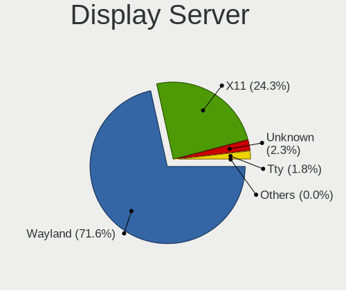
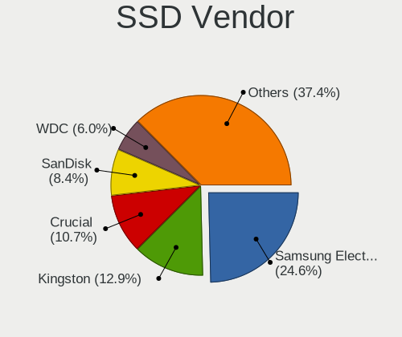
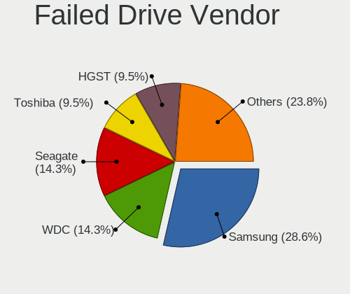
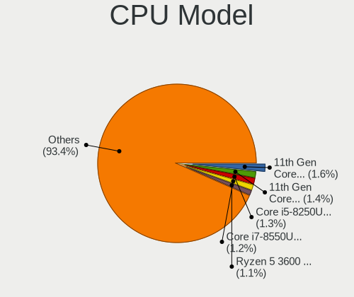
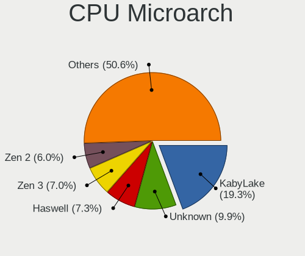
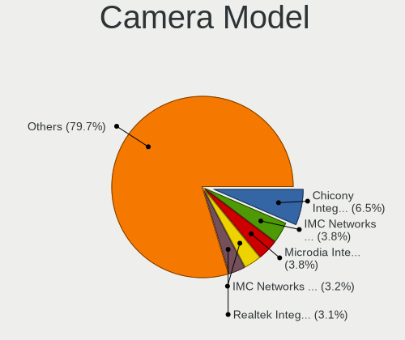

Fedora - Tested Hardware & Statistics
-------------------------------------

A project to collect tested hardware configurations for Fedora.

Anyone can contribute to this report by the [hw-probe](https://github.com/linuxhw/hw-probe) tool:

    sudo -E hw-probe -all -upload

Please contribute! Especially if your hardware is rare.

This is a report for all computer types. See also reports for [desktops](/Dist/Fedora/Desktop/README.md) and [notebooks](/Dist/Fedora/Notebook/README.md).

Contents
--------

* [ Test Cases ](#test-cases)

* [ System ](#system)
  - [ OS                       ](#os)
  - [ OS Family                ](#os-family)
  - [ Kernel                   ](#kernel)
  - [ Kernel Family            ](#kernel-family)
  - [ Kernel Major Ver.        ](#kernel-major-ver)
  - [ Arch                     ](#arch)
  - [ DE                       ](#de)
  - [ Display Server           ](#display-server)
  - [ Display Manager          ](#display-manager)
  - [ OS Lang                  ](#os-lang)
  - [ Boot Mode                ](#boot-mode)
  - [ Filesystem               ](#filesystem)
  - [ Part. scheme             ](#part-scheme)
  - [ Dual Boot with Linux/BSD ](#dual-boot-with-linuxbsd)
  - [ Dual Boot (Win)          ](#dual-boot-win)

* [ Board ](#board)
  - [ Vendor                   ](#vendor)
  - [ Model                    ](#model)
  - [ Model Family             ](#model-family)
  - [ MFG Year                 ](#mfg-year)
  - [ Form Factor              ](#form-factor)
  - [ Secure Boot              ](#secure-boot)
  - [ Coreboot                 ](#coreboot)
  - [ RAM Size                 ](#ram-size)
  - [ RAM Used                 ](#ram-used)
  - [ Total Drives             ](#total-drives)
  - [ Has CD-ROM               ](#has-cd-rom)
  - [ Has Ethernet             ](#has-ethernet)
  - [ Has WiFi                 ](#has-wifi)
  - [ Has Bluetooth            ](#has-bluetooth)

* [ Location ](#location)
  - [ Country                  ](#country)
  - [ City                     ](#city)

* [ Drives ](#drives)
  - [ Drive Vendor             ](#drive-vendor)
  - [ Drive Model              ](#drive-model)
  - [ HDD Vendor               ](#hdd-vendor)
  - [ SSD Vendor               ](#ssd-vendor)
  - [ Drive Kind               ](#drive-kind)
  - [ Drive Connector          ](#drive-connector)
  - [ Drive Size               ](#drive-size)
  - [ Space Total              ](#space-total)
  - [ Space Used               ](#space-used)
  - [ Malfunc. Drives          ](#malfunc-drives)
  - [ Malfunc. Drive Vendor    ](#malfunc-drive-vendor)
  - [ Malfunc. HDD Vendor      ](#malfunc-hdd-vendor)
  - [ Malfunc. Drive Kind      ](#malfunc-drive-kind)
  - [ Failed Drives            ](#failed-drives)
  - [ Failed Drive Vendor      ](#failed-drive-vendor)
  - [ Drive Status             ](#drive-status)

* [ Storage controller ](#storage-controller)
  - [ Storage Vendor           ](#storage-vendor)
  - [ Storage Model            ](#storage-model)
  - [ Storage Kind             ](#storage-kind)

* [ Processor ](#processor)
  - [ CPU Vendor               ](#cpu-vendor)
  - [ CPU Model                ](#cpu-model)
  - [ CPU Model Family         ](#cpu-model-family)
  - [ CPU Cores                ](#cpu-cores)
  - [ CPU Sockets              ](#cpu-sockets)
  - [ CPU Threads              ](#cpu-threads)
  - [ CPU Op-Modes             ](#cpu-op-modes)
  - [ CPU Microcode            ](#cpu-microcode)
  - [ CPU Microarch            ](#cpu-microarch)

* [ Graphics ](#graphics)
  - [ GPU Vendor               ](#gpu-vendor)
  - [ GPU Model                ](#gpu-model)
  - [ GPU Combo                ](#gpu-combo)
  - [ GPU Driver               ](#gpu-driver)
  - [ GPU Memory               ](#gpu-memory)

* [ Monitor ](#monitor)
  - [ Monitor Vendor           ](#monitor-vendor)
  - [ Monitor Model            ](#monitor-model)
  - [ Monitor Resolution       ](#monitor-resolution)
  - [ Monitor Diagonal         ](#monitor-diagonal)
  - [ Monitor Width            ](#monitor-width)
  - [ Aspect Ratio             ](#aspect-ratio)
  - [ Monitor Area             ](#monitor-area)
  - [ Pixel Density            ](#pixel-density)
  - [ Multiple Monitors        ](#multiple-monitors)

* [ Network ](#network)
  - [ Net Controller Vendor    ](#net-controller-vendor)
  - [ Net Controller Model     ](#net-controller-model)
  - [ Wireless Vendor          ](#wireless-vendor)
  - [ Wireless Model           ](#wireless-model)
  - [ Ethernet Vendor          ](#ethernet-vendor)
  - [ Ethernet Model           ](#ethernet-model)
  - [ Net Controller Kind      ](#net-controller-kind)
  - [ Used Controller          ](#used-controller)
  - [ NICs                     ](#nics)
  - [ IPv6                     ](#ipv6)

* [ Bluetooth ](#bluetooth)
  - [ Bluetooth Vendor         ](#bluetooth-vendor)
  - [ Bluetooth Model          ](#bluetooth-model)

* [ Sound ](#sound)
  - [ Sound Vendor             ](#sound-vendor)
  - [ Sound Model              ](#sound-model)

* [ Memory ](#memory)
  - [ Memory Vendor            ](#memory-vendor)
  - [ Memory Model             ](#memory-model)
  - [ Memory Kind              ](#memory-kind)
  - [ Memory Form Factor       ](#memory-form-factor)
  - [ Memory Size              ](#memory-size)
  - [ Memory Speed             ](#memory-speed)

* [ Printers & scanners ](#printers--scanners)
  - [ Printer Vendor           ](#printer-vendor)
  - [ Printer Model            ](#printer-model)
  - [ Scanner Vendor           ](#scanner-vendor)
  - [ Scanner Model            ](#scanner-model)

* [ Camera ](#camera)
  - [ Camera Vendor            ](#camera-vendor)
  - [ Camera Model             ](#camera-model)

* [ Security ](#security)
  - [ Fingerprint Vendor       ](#fingerprint-vendor)
  - [ Fingerprint Model        ](#fingerprint-model)
  - [ Chipcard Vendor          ](#chipcard-vendor)
  - [ Chipcard Model           ](#chipcard-model)

* [ Unsupported ](#unsupported)
  - [ Unsupported Devices      ](#unsupported-devices)
  - [ Unsupported Device Types ](#unsupported-device-types)

Test Cases
----------

Total: 15392

| Vendor        | Model                       | Form-Factor | Probe                                                      | Date         |
|---------------|-----------------------------|-------------|------------------------------------------------------------|--------------|
| ASUSTek       | VivoBook_ASUSLaptop M540... | Notebook    | [8bc290ef67](https://linux-hardware.org/?probe=8bc290ef67) | Feb 01, 2023 |
| MSI           | Modern 14 B11MOU            | Notebook    | [542173e9a2](https://linux-hardware.org/?probe=542173e9a2) | Feb 01, 2023 |
| ASUSTek       | ASUS TUF Gaming F15 FX50... | Notebook    | [ab31f6153e](https://linux-hardware.org/?probe=ab31f6153e) | Feb 01, 2023 |
| Lenovo        | ThinkPad P1 Gen 3 20TJS2... | Notebook    | [22abfb4a79](https://linux-hardware.org/?probe=22abfb4a79) | Feb 01, 2023 |
| Lenovo        | ThinkPad A485 20MVS0U500    | Notebook    | [b398a8e8e6](https://linux-hardware.org/?probe=b398a8e8e6) | Feb 01, 2023 |
| MSI           | MAG Z590 TORPEDO            | Desktop     | [431a6c7a3a](https://linux-hardware.org/?probe=431a6c7a3a) | Feb 01, 2023 |
| MSI           | Z170A PC MATE               | Desktop     | [ff305089b2](https://linux-hardware.org/?probe=ff305089b2) | Feb 01, 2023 |
| ASUSTek       | N552VW                      | Notebook    | [1ebeeec517](https://linux-hardware.org/?probe=1ebeeec517) | Feb 01, 2023 |
| ASUSTek       | ProArt X670E-CREATOR WIF... | Desktop     | [ffe1cabad7](https://linux-hardware.org/?probe=ffe1cabad7) | Feb 01, 2023 |
| Dell          | Inspiron 7501               | Notebook    | [426493e8a5](https://linux-hardware.org/?probe=426493e8a5) | Feb 01, 2023 |
| ASUSTek       | PRIME B550M-A               | Desktop     | [779b723b67](https://linux-hardware.org/?probe=779b723b67) | Feb 01, 2023 |
| HP            | Laptop 14-dq4xxx            | Notebook    | [c102edf6a0](https://linux-hardware.org/?probe=c102edf6a0) | Feb 01, 2023 |
| ASRock        | FM2A88X Extreme6+           | Desktop     | [79c11af9ac](https://linux-hardware.org/?probe=79c11af9ac) | Feb 01, 2023 |
| ASUSTek       | ROG STRIX Z490-A GAMING     | Desktop     | [5f2948351d](https://linux-hardware.org/?probe=5f2948351d) | Feb 01, 2023 |
| ASUSTek       | ProArt X670E-CREATOR WIF... | Desktop     | [4f8642280f](https://linux-hardware.org/?probe=4f8642280f) | Feb 01, 2023 |
| AZW           | U59                         | Desktop     | [9b73123be3](https://linux-hardware.org/?probe=9b73123be3) | Feb 01, 2023 |
| AZW           | U59                         | Desktop     | [74f028454a](https://linux-hardware.org/?probe=74f028454a) | Feb 01, 2023 |
| Lenovo        | ThinkPad T14s Gen 3 21CQ... | Notebook    | [6b9dc508e1](https://linux-hardware.org/?probe=6b9dc508e1) | Feb 01, 2023 |
| Gigabyte      | G41MT-D3                    | Desktop     | [99127d4bed](https://linux-hardware.org/?probe=99127d4bed) | Feb 01, 2023 |
| Dell          | Inspiron 5748               | Notebook    | [7ee6505f8d](https://linux-hardware.org/?probe=7ee6505f8d) | Feb 01, 2023 |
| ASUSTek       | Zenbook UX8402ZA_UX8402Z... | Notebook    | [1d212c67b2](https://linux-hardware.org/?probe=1d212c67b2) | Jan 31, 2023 |
| Lenovo        | ThinkPad X1 Extreme 20MF... | Notebook    | [70310e25d1](https://linux-hardware.org/?probe=70310e25d1) | Jan 31, 2023 |
| HUAWEI        | HN-WX9X                     | Notebook    | [4b8ddf5d09](https://linux-hardware.org/?probe=4b8ddf5d09) | Jan 31, 2023 |
| Dell          | Inspiron 5748               | Notebook    | [ecbd4ac8b6](https://linux-hardware.org/?probe=ecbd4ac8b6) | Jan 31, 2023 |
| Lenovo        | ThinkPad T530 2429F27       | Notebook    | [85ac6a588d](https://linux-hardware.org/?probe=85ac6a588d) | Jan 31, 2023 |
| Gigabyte      | H97M-D3H                    | Desktop     | [3ccdc4fa2b](https://linux-hardware.org/?probe=3ccdc4fa2b) | Jan 31, 2023 |
| ASUSTek       | Zenbook UX8402ZA_UX8402Z... | Notebook    | [4dcc88b215](https://linux-hardware.org/?probe=4dcc88b215) | Jan 31, 2023 |
| TUXEDO        | Stellaris Intel Gen4        | Notebook    | [2df9f60f2e](https://linux-hardware.org/?probe=2df9f60f2e) | Jan 31, 2023 |
| Acer          | Predator PH315-52           | Notebook    | [b1c77eb9c7](https://linux-hardware.org/?probe=b1c77eb9c7) | Jan 31, 2023 |
| Notebook      | PD5x_7xPNP_PNN_PNT          | Notebook    | [a64ae29757](https://linux-hardware.org/?probe=a64ae29757) | Jan 31, 2023 |
| ASUSTek       | PRIME B550M-A               | Desktop     | [318b0a5ecb](https://linux-hardware.org/?probe=318b0a5ecb) | Jan 31, 2023 |
| Apple         | Mac-031AEE4D24BFF0B1 Mac... | Mini pc     | [a06f4e8595](https://linux-hardware.org/?probe=a06f4e8595) | Jan 31, 2023 |
| ASRock        | FM2A88X Extreme6+           | Desktop     | [73bc9212a3](https://linux-hardware.org/?probe=73bc9212a3) | Jan 31, 2023 |
| ASUSTek       | ProArt X670E-CREATOR WIF... | Desktop     | [6e7d6aae31](https://linux-hardware.org/?probe=6e7d6aae31) | Jan 31, 2023 |
| ASRock        | AD2700-ITX                  | Desktop     | [2f14c18867](https://linux-hardware.org/?probe=2f14c18867) | Jan 31, 2023 |
| Samsung       | 550XCJ/550XCR               | Notebook    | [75fad3daf3](https://linux-hardware.org/?probe=75fad3daf3) | Jan 31, 2023 |
| Dell          | XPS 15 9570                 | Notebook    | [ee60c1c921](https://linux-hardware.org/?probe=ee60c1c921) | Jan 31, 2023 |
| Lenovo        | ThinkPad E14 Gen 4 21E30... | Notebook    | [87904d9d06](https://linux-hardware.org/?probe=87904d9d06) | Jan 31, 2023 |
| ASRock        | 890GM Pro3                  | Desktop     | [b2bb32cbbc](https://linux-hardware.org/?probe=b2bb32cbbc) | Jan 31, 2023 |
| MSI           | MPG X570 GAMING PLUS        | Desktop     | [67262a8155](https://linux-hardware.org/?probe=67262a8155) | Jan 30, 2023 |
| Dell          | 0Y2K8N A01                  | Desktop     | [6a4a26884d](https://linux-hardware.org/?probe=6a4a26884d) | Jan 30, 2023 |
| MACHENIKE     | MACHCREATOR-16              | Notebook    | [c44c077d1e](https://linux-hardware.org/?probe=c44c077d1e) | Jan 30, 2023 |
| Dell          | Vostro 15 3515              | Notebook    | [357d14774f](https://linux-hardware.org/?probe=357d14774f) | Jan 30, 2023 |
| Dell          | 0Y2K8N A01                  | Desktop     | [8e4f1d2ed2](https://linux-hardware.org/?probe=8e4f1d2ed2) | Jan 30, 2023 |
| ASUSTek       | ROG Zephyrus M16 GU603ZX... | Notebook    | [7442c84b55](https://linux-hardware.org/?probe=7442c84b55) | Jan 30, 2023 |
| Dell          | Latitude 7480               | Notebook    | [f3a84b494f](https://linux-hardware.org/?probe=f3a84b494f) | Jan 30, 2023 |
| Lenovo        | ThinkPad L380 Yoga 20M8S... | Convertible | [782e38cf06](https://linux-hardware.org/?probe=782e38cf06) | Jan 30, 2023 |
| ASUSTek       | VivoBook_ASUSLaptop X515... | Notebook    | [1ecef01472](https://linux-hardware.org/?probe=1ecef01472) | Jan 30, 2023 |
| Lenovo        | 3136 SDK0J40697 WIN 3305... | Mini pc     | [8d62c84240](https://linux-hardware.org/?probe=8d62c84240) | Jan 30, 2023 |
| HP            | Pavilion 15                 | Notebook    | [6ceccb3d73](https://linux-hardware.org/?probe=6ceccb3d73) | Jan 30, 2023 |
| Lenovo        | ThinkPad T430 2347G4U       | Notebook    | [5802e6b9b9](https://linux-hardware.org/?probe=5802e6b9b9) | Jan 30, 2023 |
| ASUSTek       | PRIME B550M-A               | Desktop     | [585c3c8f85](https://linux-hardware.org/?probe=585c3c8f85) | Jan 30, 2023 |
| ASRock        | FM2A88X Extreme6+           | Desktop     | [24402e3d42](https://linux-hardware.org/?probe=24402e3d42) | Jan 30, 2023 |
| Dell          | XPS 15 9570                 | Notebook    | [1d06f2715a](https://linux-hardware.org/?probe=1d06f2715a) | Jan 30, 2023 |
| ASUSTek       | Z170 PRO GAMING             | Desktop     | [9b6a9a4ab5](https://linux-hardware.org/?probe=9b6a9a4ab5) | Jan 30, 2023 |
| ASRock        | N68-S UCC                   | Desktop     | [e8f09a159a](https://linux-hardware.org/?probe=e8f09a159a) | Jan 29, 2023 |
| Dell          | Vostro 7620                 | Notebook    | [b6d43b8741](https://linux-hardware.org/?probe=b6d43b8741) | Jan 29, 2023 |
| ASUSTek       | GA15DH                      | Desktop     | [767fe59cb7](https://linux-hardware.org/?probe=767fe59cb7) | Jan 29, 2023 |
| Lenovo        | Yoga 7 16IAH7 82UF          | Convertible | [2f9de3e332](https://linux-hardware.org/?probe=2f9de3e332) | Jan 29, 2023 |
| MACHENIKE     | MACHCREATOR-16              | Notebook    | [e3d7c03a2e](https://linux-hardware.org/?probe=e3d7c03a2e) | Jan 29, 2023 |
| Lenovo        | 3000 N200 0769BAG           | Notebook    | [f8f410eb2a](https://linux-hardware.org/?probe=f8f410eb2a) | Jan 29, 2023 |
| Apple         | Mac-00BE6ED71E35EB86 iMa... | All in one  | [bdb3c91476](https://linux-hardware.org/?probe=bdb3c91476) | Jan 29, 2023 |
| HP            | Laptop 14-cm0xxx            | Notebook    | [9b93652159](https://linux-hardware.org/?probe=9b93652159) | Jan 29, 2023 |
| Acer          | Aspire V5-573G              | Notebook    | [e253d5b49b](https://linux-hardware.org/?probe=e253d5b49b) | Jan 29, 2023 |
| HP            | OMEN by Laptop 16-c0xxx     | Notebook    | [32d5472e21](https://linux-hardware.org/?probe=32d5472e21) | Jan 29, 2023 |
| Lenovo        | ThinkPad X1 Carbon Gen 8... | Notebook    | [47246aa8b5](https://linux-hardware.org/?probe=47246aa8b5) | Jan 29, 2023 |
| Lenovo        | Legion 5 15ACH6H 82JU       | Notebook    | [dd07a46c6a](https://linux-hardware.org/?probe=dd07a46c6a) | Jan 29, 2023 |
| TECNO         | MEGABOOK T1                 | Notebook    | [db0e6c89b4](https://linux-hardware.org/?probe=db0e6c89b4) | Jan 29, 2023 |
| Lenovo        | IdeaPad S340-14IML 81N9     | Notebook    | [58e620077b](https://linux-hardware.org/?probe=58e620077b) | Jan 29, 2023 |
| ASUSTek       | PRIME B450M-A II            | Desktop     | [104fb04e91](https://linux-hardware.org/?probe=104fb04e91) | Jan 29, 2023 |
| ASUSTek       | PRIME B550M-A               | Desktop     | [ef43edeee5](https://linux-hardware.org/?probe=ef43edeee5) | Jan 29, 2023 |
| ASRock        | FM2A88X Extreme6+           | Desktop     | [f9a823cb38](https://linux-hardware.org/?probe=f9a823cb38) | Jan 29, 2023 |
| Razer         | Blade 15 (2022) - RZ09-0... | Notebook    | [41d33a9029](https://linux-hardware.org/?probe=41d33a9029) | Jan 29, 2023 |
| ASRock        | X570M Pro4                  | Desktop     | [e72f7f2fb1](https://linux-hardware.org/?probe=e72f7f2fb1) | Jan 29, 2023 |
| Lenovo        | IdeaPad 3 14ITL6 82H7       | Notebook    | [086e08a04b](https://linux-hardware.org/?probe=086e08a04b) | Jan 29, 2023 |
| Acer          | Aspire 5733                 | Notebook    | [da753d74a1](https://linux-hardware.org/?probe=da753d74a1) | Jan 29, 2023 |
| Dell          | XPS 13 7390                 | Notebook    | [60c03ee1f7](https://linux-hardware.org/?probe=60c03ee1f7) | Jan 29, 2023 |
| Acer          | FMP55                       | Desktop     | [d091fbc8d3](https://linux-hardware.org/?probe=d091fbc8d3) | Jan 29, 2023 |
| ASUSTek       | ZenBook Q536FD_Q536FD       | Convertible | [0d1e08db32](https://linux-hardware.org/?probe=0d1e08db32) | Jan 28, 2023 |
| HP            | EliteBook 840 G1            | Notebook    | [30549ebd3a](https://linux-hardware.org/?probe=30549ebd3a) | Jan 28, 2023 |
| Dell          | Inspiron 7706 2n1           | Convertible | [f8da74bad3](https://linux-hardware.org/?probe=f8da74bad3) | Jan 28, 2023 |
| HP            | Laptop 15-da2xxx            | Notebook    | [8384a02b4b](https://linux-hardware.org/?probe=8384a02b4b) | Jan 28, 2023 |
| Lenovo        | ThinkBook 16p Gen 2 20YM    | Notebook    | [53015adc9d](https://linux-hardware.org/?probe=53015adc9d) | Jan 28, 2023 |
| HUAWEI        | MACH-WX9                    | Notebook    | [5b00f79b72](https://linux-hardware.org/?probe=5b00f79b72) | Jan 28, 2023 |
| HP            | ENVY Laptop 17-cg0xxx       | Notebook    | [ed1ce46901](https://linux-hardware.org/?probe=ed1ce46901) | Jan 28, 2023 |
| Lenovo        | ThinkPad 20FQ005TGE         | Convertible | [a8e34a1084](https://linux-hardware.org/?probe=a8e34a1084) | Jan 28, 2023 |
| Lenovo        | ThinkPad T14 Gen 3 21AH0... | Notebook    | [844e4e4b2a](https://linux-hardware.org/?probe=844e4e4b2a) | Jan 28, 2023 |
| HP            | ENVY Laptop 17-cg0xxx       | Notebook    | [ab3f84f96b](https://linux-hardware.org/?probe=ab3f84f96b) | Jan 28, 2023 |
| Apple         | MacBookPro11,4              | Notebook    | [8a5423443a](https://linux-hardware.org/?probe=8a5423443a) | Jan 28, 2023 |
| Timi          | Redmi Book Pro 15 2022      | Notebook    | [7e6cf30d81](https://linux-hardware.org/?probe=7e6cf30d81) | Jan 28, 2023 |
| Timi          | A35S                        | Notebook    | [b6611f9b22](https://linux-hardware.org/?probe=b6611f9b22) | Jan 28, 2023 |
| Lenovo        | Legion 5 15ACH6H 82JU       | Notebook    | [4a82904f14](https://linux-hardware.org/?probe=4a82904f14) | Jan 28, 2023 |
| Lenovo        | ThinkPad X1 Extreme 20MF... | Notebook    | [fb7b1bdaf5](https://linux-hardware.org/?probe=fb7b1bdaf5) | Jan 27, 2023 |
| Lenovo        | ThinkPad T450s 20BWS23W0... | Notebook    | [41c82dbadb](https://linux-hardware.org/?probe=41c82dbadb) | Jan 27, 2023 |
| ASUSTek       | M5A78L-M LX PLUS            | Desktop     | [d9f9d4bc89](https://linux-hardware.org/?probe=d9f9d4bc89) | Jan 27, 2023 |
| ASUSTek       | TUF Gaming X570-PLUS        | Desktop     | [ff5e2b673e](https://linux-hardware.org/?probe=ff5e2b673e) | Jan 27, 2023 |
| Intel         | NUC7i5BNB J31144-304        | Mini pc     | [74a6b56148](https://linux-hardware.org/?probe=74a6b56148) | Jan 27, 2023 |
| ASRock        | 970 Pro3 R2.0               | Desktop     | [676f900958](https://linux-hardware.org/?probe=676f900958) | Jan 27, 2023 |
| Lenovo        | 3151 SDK0J40697 WIN 3305... | Mini pc     | [6d4ecb5a00](https://linux-hardware.org/?probe=6d4ecb5a00) | Jan 27, 2023 |
| ASUSTek       | PRIME B550M-A               | Desktop     | [e619db262a](https://linux-hardware.org/?probe=e619db262a) | Jan 27, 2023 |
| Lenovo        | IdeaPad 330-15IKB 81DE      | Notebook    | [a69331d2ea](https://linux-hardware.org/?probe=a69331d2ea) | Jan 27, 2023 |
| Acer          | Swift SF314-511             | Notebook    | [c47b08d2a9](https://linux-hardware.org/?probe=c47b08d2a9) | Jan 27, 2023 |
| HONOR         | BMH-WCX9                    | Notebook    | [882bb3b505](https://linux-hardware.org/?probe=882bb3b505) | Jan 27, 2023 |
| MECHREVO      | Code10-7CC6U                | Notebook    | [86e769b2a3](https://linux-hardware.org/?probe=86e769b2a3) | Jan 27, 2023 |
| Dell          | XPS 15 7590                 | Notebook    | [4ecf66ddd9](https://linux-hardware.org/?probe=4ecf66ddd9) | Jan 27, 2023 |
| Dell          | Precision 3550              | Notebook    | [4c42615cef](https://linux-hardware.org/?probe=4c42615cef) | Jan 27, 2023 |
| HUAWEI        | BOHB-WAX9                   | Notebook    | [00e21c8359](https://linux-hardware.org/?probe=00e21c8359) | Jan 27, 2023 |
| Dynabook      | TECRA A50-J                 | Notebook    | [a2ad3f4eb3](https://linux-hardware.org/?probe=a2ad3f4eb3) | Jan 27, 2023 |
| Gigabyte      | X570 AORUS MASTER           | Desktop     | [c0ea09ef3c](https://linux-hardware.org/?probe=c0ea09ef3c) | Jan 27, 2023 |
| Chuwi         | LarkBox Pro                 | Mini pc     | [3895a32819](https://linux-hardware.org/?probe=3895a32819) | Jan 27, 2023 |
| BYTENUC       | AZ51                        | Mini pc     | [8be36cd9c0](https://linux-hardware.org/?probe=8be36cd9c0) | Jan 27, 2023 |
| Dynabook      | TECRA A50-J                 | Notebook    | [3921b100b4](https://linux-hardware.org/?probe=3921b100b4) | Jan 27, 2023 |
| HP            | Elite x2 1012 G2            | Tablet      | [1d79d6f224](https://linux-hardware.org/?probe=1d79d6f224) | Jan 26, 2023 |
| ASUSTek       | X550VX                      | Notebook    | [37d2157b37](https://linux-hardware.org/?probe=37d2157b37) | Jan 26, 2023 |
| Lenovo        | Yoga Slim 7 Pro 16ACH6 8... | Notebook    | [9dfc820ceb](https://linux-hardware.org/?probe=9dfc820ceb) | Jan 26, 2023 |
| Lenovo        | Yoga Slim 7 Pro 16ACH6 8... | Notebook    | [0168a5cae2](https://linux-hardware.org/?probe=0168a5cae2) | Jan 26, 2023 |
| HP            | OMEN by Laptop 16-c0xxx     | Notebook    | [4024f7c3bd](https://linux-hardware.org/?probe=4024f7c3bd) | Jan 26, 2023 |
| ASUSTek       | K55VD                       | Notebook    | [b2b19ec3f1](https://linux-hardware.org/?probe=b2b19ec3f1) | Jan 26, 2023 |
| Acer          | Swift SF314-511             | Notebook    | [9c04ff43a3](https://linux-hardware.org/?probe=9c04ff43a3) | Jan 26, 2023 |
| Lenovo        | ThinkPad T495 20NKS01Y00    | Notebook    | [a1dfc58700](https://linux-hardware.org/?probe=a1dfc58700) | Jan 26, 2023 |
| Gigabyte      | Z87-D3HP-CF                 | Desktop     | [812c00440c](https://linux-hardware.org/?probe=812c00440c) | Jan 26, 2023 |
| ASRock        | AD2700-ITX                  | Desktop     | [7b711bee4f](https://linux-hardware.org/?probe=7b711bee4f) | Jan 26, 2023 |
| ASUSTek       | VivoBook_ASUSLaptop X515... | Notebook    | [303593899d](https://linux-hardware.org/?probe=303593899d) | Jan 26, 2023 |
| Gigabyte      | J1900M-D2P                  | Desktop     | [4213c95d3d](https://linux-hardware.org/?probe=4213c95d3d) | Jan 26, 2023 |
| Gigabyte      | J1900M-D2P                  | Desktop     | [b44aa465bc](https://linux-hardware.org/?probe=b44aa465bc) | Jan 26, 2023 |
| Dell          | Latitude 7480               | Notebook    | [3cb61c5b71](https://linux-hardware.org/?probe=3cb61c5b71) | Jan 26, 2023 |
| ASUSTek       | ROG Zephyrus M16 GU603HM... | Notebook    | [26f64a2ad0](https://linux-hardware.org/?probe=26f64a2ad0) | Jan 26, 2023 |
| GPU Compan... | GWTN156-11                  | Notebook    | [e7f1ea09b5](https://linux-hardware.org/?probe=e7f1ea09b5) | Jan 26, 2023 |
| Multilaser    | PC150                       | Notebook    | [1c4ace00d1](https://linux-hardware.org/?probe=1c4ace00d1) | Jan 26, 2023 |
| ASRock        | FM2A88X Extreme6+           | Desktop     | [415b96672b](https://linux-hardware.org/?probe=415b96672b) | Jan 26, 2023 |
| Lenovo        | Yoga Slim 7 Pro 14ACH5 D... | Notebook    | [d2a46bd14a](https://linux-hardware.org/?probe=d2a46bd14a) | Jan 26, 2023 |
| ASRock        | B450M Steel Legend          | Desktop     | [f69047309d](https://linux-hardware.org/?probe=f69047309d) | Jan 26, 2023 |
| HP            | Pavilion Laptop 15-cs3xx... | Notebook    | [8725d530e5](https://linux-hardware.org/?probe=8725d530e5) | Jan 26, 2023 |
| HP            | EliteBook 855 G8 Noteboo... | Notebook    | [ea142e4848](https://linux-hardware.org/?probe=ea142e4848) | Jan 25, 2023 |
| HP            | EliteBook 2540p             | Notebook    | [f03240c746](https://linux-hardware.org/?probe=f03240c746) | Jan 25, 2023 |
| ASUSTek       | VivoBook_ASUSLaptop X415... | Notebook    | [af63cfc79a](https://linux-hardware.org/?probe=af63cfc79a) | Jan 25, 2023 |
| Dell          | Latitude 7210 2-in-1        | Tablet      | [3386aa1dce](https://linux-hardware.org/?probe=3386aa1dce) | Jan 25, 2023 |
| Clevo         | M815P                       | Notebook    | [cfc5f6689f](https://linux-hardware.org/?probe=cfc5f6689f) | Jan 25, 2023 |
| ASUSTek       | ROG STRIX H370-I GAMING     | Desktop     | [decfe6ab97](https://linux-hardware.org/?probe=decfe6ab97) | Jan 25, 2023 |
| Apple         | Mac-00BE6ED71E35EB86 iMa... | All in one  | [4efa4db490](https://linux-hardware.org/?probe=4efa4db490) | Jan 25, 2023 |
| MSI           | GL63 8RC                    | Notebook    | [138e8de541](https://linux-hardware.org/?probe=138e8de541) | Jan 25, 2023 |
| Acer          | Aspire A315-59              | Notebook    | [33292253d0](https://linux-hardware.org/?probe=33292253d0) | Jan 25, 2023 |
| HP            | ZBook Power 15.6 inch G9... | Notebook    | [dd2f21ab84](https://linux-hardware.org/?probe=dd2f21ab84) | Jan 25, 2023 |
| Dynabook      | TECRA A50-J                 | Notebook    | [2f24f18672](https://linux-hardware.org/?probe=2f24f18672) | Jan 25, 2023 |
| Dell          | 0XFWHV A00                  | Desktop     | [52ee3df163](https://linux-hardware.org/?probe=52ee3df163) | Jan 25, 2023 |
| ASUSTek       | ROG Zephyrus G14 GA402RK... | Notebook    | [993ba3e73b](https://linux-hardware.org/?probe=993ba3e73b) | Jan 25, 2023 |
| ASRock        | FM2A88X Extreme6+           | Desktop     | [82c3a80b93](https://linux-hardware.org/?probe=82c3a80b93) | Jan 25, 2023 |
| Lenovo        | ThinkPad T14 Gen 1 20UES... | Notebook    | [aa6488b6b8](https://linux-hardware.org/?probe=aa6488b6b8) | Jan 25, 2023 |
| Fujitsu Si... | AMILO Notebook Xa 3530      | Notebook    | [e8384494a3](https://linux-hardware.org/?probe=e8384494a3) | Jan 25, 2023 |
| Dell          | Inspiron 5402               | Notebook    | [d8df4aafe8](https://linux-hardware.org/?probe=d8df4aafe8) | Jan 25, 2023 |
| Dell          | Inspiron 5468               | Notebook    | [3e59c1f38b](https://linux-hardware.org/?probe=3e59c1f38b) | Jan 25, 2023 |
| Acer          | Nitro AN515-42              | Notebook    | [cb02367642](https://linux-hardware.org/?probe=cb02367642) | Jan 25, 2023 |
| Dell          | Latitude 5420               | Notebook    | [cd6dc3695e](https://linux-hardware.org/?probe=cd6dc3695e) | Jan 24, 2023 |
| Dell          | Latitude 5520               | Notebook    | [662284824b](https://linux-hardware.org/?probe=662284824b) | Jan 24, 2023 |
| HP            | ProBook 6570b               | Notebook    | [841250ba59](https://linux-hardware.org/?probe=841250ba59) | Jan 24, 2023 |
| ASUSTek       | ROG STRIX B660-I GAMING ... | Desktop     | [8ac6e901d5](https://linux-hardware.org/?probe=8ac6e901d5) | Jan 24, 2023 |
| Dell          | Latitude E6410              | Notebook    | [854634fb32](https://linux-hardware.org/?probe=854634fb32) | Jan 24, 2023 |
| Dell          | Latitude E6410              | Notebook    | [a5edbef8d2](https://linux-hardware.org/?probe=a5edbef8d2) | Jan 24, 2023 |
| Lenovo        | 36E9 SDK0T08861 WIN 3305... | Desktop     | [82705366d7](https://linux-hardware.org/?probe=82705366d7) | Jan 24, 2023 |
| Lenovo        | ThinkPad T500 2082BPG       | Notebook    | [08a30fd24c](https://linux-hardware.org/?probe=08a30fd24c) | Jan 24, 2023 |
| Lenovo        | ThinkPad E15 20RD0011RT     | Notebook    | [3fb25133ec](https://linux-hardware.org/?probe=3fb25133ec) | Jan 24, 2023 |
| HP            | OMEN Laptop 15-en0xxx       | Notebook    | [c2226035ce](https://linux-hardware.org/?probe=c2226035ce) | Jan 24, 2023 |
| ASUSTek       | M5A78L-M/USB3               | Desktop     | [d1c6e3c96f](https://linux-hardware.org/?probe=d1c6e3c96f) | Jan 24, 2023 |
| ASRock        | FM2A88X Extreme6+           | Desktop     | [43c26544a9](https://linux-hardware.org/?probe=43c26544a9) | Jan 24, 2023 |
| Google        | Treeya                      | Notebook    | [27a381272a](https://linux-hardware.org/?probe=27a381272a) | Jan 24, 2023 |
| Dell          | 0X30MX A00                  | Desktop     | [c323a1a215](https://linux-hardware.org/?probe=c323a1a215) | Jan 24, 2023 |
| HUAWEI        | NBLK-WAX9X                  | Notebook    | [a227de29c5](https://linux-hardware.org/?probe=a227de29c5) | Jan 24, 2023 |
| ASUSTek       | PRIME X370-PRO              | Desktop     | [1887a95d31](https://linux-hardware.org/?probe=1887a95d31) | Jan 23, 2023 |
| Dell          | Precision 3551              | Notebook    | [1338d3df20](https://linux-hardware.org/?probe=1338d3df20) | Jan 23, 2023 |
| HP            | ProBook 430 G8 Notebook ... | Notebook    | [335275777a](https://linux-hardware.org/?probe=335275777a) | Jan 23, 2023 |
| ASUSTek       | ROG STRIX B450-F GAMING     | Desktop     | [7572089dc3](https://linux-hardware.org/?probe=7572089dc3) | Jan 23, 2023 |
| Gigabyte      | X570 AORUS ULTRA            | Desktop     | [2f215e1ce7](https://linux-hardware.org/?probe=2f215e1ce7) | Jan 23, 2023 |
| Dell          | Latitude 3420               | Notebook    | [d2a8b9657a](https://linux-hardware.org/?probe=d2a8b9657a) | Jan 23, 2023 |
| Dell          | Latitude 7490               | Notebook    | [e40bb2f01f](https://linux-hardware.org/?probe=e40bb2f01f) | Jan 23, 2023 |
| Dell          | Latitude 7490               | Notebook    | [31789ae630](https://linux-hardware.org/?probe=31789ae630) | Jan 23, 2023 |
| Lenovo        | ThinkPad E15 Gen 3 20YHS... | Notebook    | [091effd2ac](https://linux-hardware.org/?probe=091effd2ac) | Jan 23, 2023 |
| Apple         | MacBookPro9,1               | Notebook    | [0a597ba033](https://linux-hardware.org/?probe=0a597ba033) | Jan 23, 2023 |
| MACHENIKE     | MACHCREATOR-16              | Notebook    | [7b3107564a](https://linux-hardware.org/?probe=7b3107564a) | Jan 23, 2023 |
| Lenovo        | Erazer Z500 20226           | Notebook    | [6e7a21c6d5](https://linux-hardware.org/?probe=6e7a21c6d5) | Jan 23, 2023 |
| MACHENIKE     | MACHCREATOR-16              | Notebook    | [6b370a283e](https://linux-hardware.org/?probe=6b370a283e) | Jan 23, 2023 |
| Lenovo        | Erazer Z500 20226           | Notebook    | [7d6077c27c](https://linux-hardware.org/?probe=7d6077c27c) | Jan 23, 2023 |
| Apple         | MacBookPro9,1               | Notebook    | [90884b19a9](https://linux-hardware.org/?probe=90884b19a9) | Jan 23, 2023 |
| Lenovo        | ThinkPad P50 20EQS12Q3M     | Notebook    | [e46b5a8b46](https://linux-hardware.org/?probe=e46b5a8b46) | Jan 23, 2023 |
| Dell          | Latitude E6500              | Notebook    | [ba7c36fe15](https://linux-hardware.org/?probe=ba7c36fe15) | Jan 23, 2023 |
| Lenovo        | ThinkPad L13 Yoga 20R500... | Convertible | [7f5181d202](https://linux-hardware.org/?probe=7f5181d202) | Jan 23, 2023 |
| Gigabyte      | AB350M-Gaming 3-CF          | Desktop     | [aa16eaced0](https://linux-hardware.org/?probe=aa16eaced0) | Jan 23, 2023 |
| Dynabook      | TECRA A50-J                 | Notebook    | [689fe06d4d](https://linux-hardware.org/?probe=689fe06d4d) | Jan 23, 2023 |
| Dynabook      | TECRA A50-J                 | Notebook    | [92690b43cd](https://linux-hardware.org/?probe=92690b43cd) | Jan 23, 2023 |
| Dell          | Inspiron 7786               | Convertible | [4a96e070dd](https://linux-hardware.org/?probe=4a96e070dd) | Jan 23, 2023 |
| Microsoft     | Surface 3                   | Tablet      | [00f594a9cf](https://linux-hardware.org/?probe=00f594a9cf) | Jan 23, 2023 |
| ASRock        | FM2A88X Extreme6+           | Desktop     | [279452d293](https://linux-hardware.org/?probe=279452d293) | Jan 23, 2023 |
| MSI           | MPG X570 GAMING PRO CARB... | Desktop     | [3a42df71d0](https://linux-hardware.org/?probe=3a42df71d0) | Jan 22, 2023 |
| ASUSTek       | TUF Gaming FX505DT_FX505... | Notebook    | [d03b7c0a68](https://linux-hardware.org/?probe=d03b7c0a68) | Jan 22, 2023 |
| Lenovo        | Legion 5 Pro 16ACH6H 82J... | Notebook    | [07005e3e32](https://linux-hardware.org/?probe=07005e3e32) | Jan 22, 2023 |
| Dell          | 0Y56T3 A00                  | Desktop     | [7078ea91e9](https://linux-hardware.org/?probe=7078ea91e9) | Jan 22, 2023 |
| MSI           | H510M PRO                   | Desktop     | [309f1bc61b](https://linux-hardware.org/?probe=309f1bc61b) | Jan 22, 2023 |
| ECS           | H61H2-MV                    | Desktop     | [92d2b62680](https://linux-hardware.org/?probe=92d2b62680) | Jan 22, 2023 |
| ASRock        | J3455B-ITX                  | Desktop     | [b4419e8fce](https://linux-hardware.org/?probe=b4419e8fce) | Jan 22, 2023 |
| MSI           | B450-A PRO                  | Desktop     | [e9c7c42a8b](https://linux-hardware.org/?probe=e9c7c42a8b) | Jan 22, 2023 |
| Gigabyte      | Z170-D3H-CF                 | Desktop     | [9792de46ad](https://linux-hardware.org/?probe=9792de46ad) | Jan 22, 2023 |
| ECS           | H61H2-MV                    | Desktop     | [292ff62f4c](https://linux-hardware.org/?probe=292ff62f4c) | Jan 22, 2023 |
| HP            | Spectre x360 Convertible... | Convertible | [8e037468e4](https://linux-hardware.org/?probe=8e037468e4) | Jan 22, 2023 |
| ASRock        | FM2A88X Extreme6+           | Desktop     | [b3d64d2496](https://linux-hardware.org/?probe=b3d64d2496) | Jan 22, 2023 |
| ASUSTek       | VivoBook_ASUSLaptop X740... | Notebook    | [d999192dbf](https://linux-hardware.org/?probe=d999192dbf) | Jan 22, 2023 |
| HP            | EliteBook 820 G3            | Notebook    | [3edd4ab0dc](https://linux-hardware.org/?probe=3edd4ab0dc) | Jan 22, 2023 |
| ASUSTek       | H61M-A/BR                   | Desktop     | [43aaf27a04](https://linux-hardware.org/?probe=43aaf27a04) | Jan 22, 2023 |
| ASUSTek       | ASUS TUF Gaming F15 FX50... | Notebook    | [523d0331a1](https://linux-hardware.org/?probe=523d0331a1) | Jan 21, 2023 |
| MSI           | MAG X570 TOMAHAWK WIFI      | Desktop     | [6856fa4741](https://linux-hardware.org/?probe=6856fa4741) | Jan 21, 2023 |
| HP            | Victus by Gaming Laptop ... | Notebook    | [0aa98390a7](https://linux-hardware.org/?probe=0aa98390a7) | Jan 21, 2023 |
| AZW           | GTR V02                     | Desktop     | [3616feeeac](https://linux-hardware.org/?probe=3616feeeac) | Jan 21, 2023 |
| Acer          | Predator G9-591             | Notebook    | [0544a1b07c](https://linux-hardware.org/?probe=0544a1b07c) | Jan 21, 2023 |
| Dell          | XPS 9315                    | Notebook    | [9dfb19b7c1](https://linux-hardware.org/?probe=9dfb19b7c1) | Jan 21, 2023 |
| Lenovo        | ThinkPad T14s Gen 2i 20W... | Notebook    | [e8a0c0066b](https://linux-hardware.org/?probe=e8a0c0066b) | Jan 21, 2023 |
| HP            | OMEN Laptop 15-en1xxx       | Notebook    | [adeb24c41e](https://linux-hardware.org/?probe=adeb24c41e) | Jan 21, 2023 |
| Gigabyte      | B550M AORUS ELITE           | Desktop     | [7a067fe264](https://linux-hardware.org/?probe=7a067fe264) | Jan 21, 2023 |
| Lenovo        | ThinkPad X13 Yoga Gen 2 ... | Convertible | [32faa4aac5](https://linux-hardware.org/?probe=32faa4aac5) | Jan 21, 2023 |
| HP            | Spectre x360 Convertible... | Convertible | [3eb2d3a903](https://linux-hardware.org/?probe=3eb2d3a903) | Jan 21, 2023 |
| ASRock        | FM2A88X Extreme6+           | Desktop     | [20c0f69bb7](https://linux-hardware.org/?probe=20c0f69bb7) | Jan 21, 2023 |
| Dell          | G5 5587                     | Notebook    | [96ca22c550](https://linux-hardware.org/?probe=96ca22c550) | Jan 21, 2023 |
| Dell          | G5 5587                     | Notebook    | [a070a8ba69](https://linux-hardware.org/?probe=a070a8ba69) | Jan 21, 2023 |
| Lenovo        | ThinkPad P15v Gen 1 20TQ... | Notebook    | [c228c064b7](https://linux-hardware.org/?probe=c228c064b7) | Jan 20, 2023 |
| Gigabyte      | Z170-D3H-CF                 | Desktop     | [04d36be1ec](https://linux-hardware.org/?probe=04d36be1ec) | Jan 20, 2023 |
| ASUSTek       | ROG STRIX B450-F GAMING ... | Desktop     | [3432d7c1f5](https://linux-hardware.org/?probe=3432d7c1f5) | Jan 20, 2023 |
| Positivo B... | VJFE43F11X-XXXXXX           | Notebook    | [138a9b3b0c](https://linux-hardware.org/?probe=138a9b3b0c) | Jan 20, 2023 |
| ASUSTek       | ProArt Z690-CREATOR WIFI    | Desktop     | [2f6bd134ae](https://linux-hardware.org/?probe=2f6bd134ae) | Jan 20, 2023 |
| Digma         | CITI 1804 CS1069EW          | Tablet      | [0443e57eca](https://linux-hardware.org/?probe=0443e57eca) | Jan 20, 2023 |
| ASUSTek       | ProArt X670E-CREATOR WIF... | Desktop     | [5bbd614c0f](https://linux-hardware.org/?probe=5bbd614c0f) | Jan 20, 2023 |
| Dell          | Venue 8 Pro 5830            | Notebook    | [4f815d5b4f](https://linux-hardware.org/?probe=4f815d5b4f) | Jan 20, 2023 |
| Acer          | Aspire A315-42G             | Notebook    | [ed4c536efa](https://linux-hardware.org/?probe=ed4c536efa) | Jan 20, 2023 |
| HP            | 0AECh D                     | Desktop     | [b2ea95f507](https://linux-hardware.org/?probe=b2ea95f507) | Jan 20, 2023 |
| Lenovo        | ThinkPad T490 20N3S0E000    | Notebook    | [d324a863a5](https://linux-hardware.org/?probe=d324a863a5) | Jan 20, 2023 |
| ASUSTek       | ZenBook UX434IQ_UM433IQ     | Notebook    | [17b4a2466c](https://linux-hardware.org/?probe=17b4a2466c) | Jan 20, 2023 |
| ASRock        | FM2A88X Extreme6+           | Desktop     | [5f1447f874](https://linux-hardware.org/?probe=5f1447f874) | Jan 20, 2023 |
| MSI           | X99A RAIDER                 | Desktop     | [7f36411ac1](https://linux-hardware.org/?probe=7f36411ac1) | Jan 20, 2023 |
| Acer          | Aspire A515-45              | Notebook    | [9d5faff505](https://linux-hardware.org/?probe=9d5faff505) | Jan 20, 2023 |
| MSI           | GS66 Stealth 10UE           | Notebook    | [d5a2a6aaa8](https://linux-hardware.org/?probe=d5a2a6aaa8) | Jan 19, 2023 |
| Positivo B... | VJFE43F11X-XXXXXX           | Notebook    | [cc9e6f8862](https://linux-hardware.org/?probe=cc9e6f8862) | Jan 19, 2023 |
| SLIMBOOK      | TITAN                       | Notebook    | [15c0522754](https://linux-hardware.org/?probe=15c0522754) | Jan 19, 2023 |
| SLIMBOOK      | TITAN                       | Notebook    | [e81652a68c](https://linux-hardware.org/?probe=e81652a68c) | Jan 19, 2023 |
| Dell          | Precision 3551              | Notebook    | [4ff5a0ab8d](https://linux-hardware.org/?probe=4ff5a0ab8d) | Jan 19, 2023 |
| Lenovo        | IdeaPad 320-15IKB 80YH      | Notebook    | [440ff298e7](https://linux-hardware.org/?probe=440ff298e7) | Jan 19, 2023 |
| ASUSTek       | VivoBook_ASUSLaptop E410... | Notebook    | [0f079e1dc7](https://linux-hardware.org/?probe=0f079e1dc7) | Jan 19, 2023 |
| Acer          | Aspire A315-23              | Notebook    | [90049e4bb7](https://linux-hardware.org/?probe=90049e4bb7) | Jan 19, 2023 |
| Acer          | Nitro AN515-42              | Notebook    | [d6a24ede85](https://linux-hardware.org/?probe=d6a24ede85) | Jan 19, 2023 |
| HP            | ENVY Laptop 13-ad1xx        | Notebook    | [6a47296f0c](https://linux-hardware.org/?probe=6a47296f0c) | Jan 19, 2023 |
| Dell          | 0GY6Y8 A02                  | Desktop     | [33b364ed89](https://linux-hardware.org/?probe=33b364ed89) | Jan 19, 2023 |
| Samsung       | DP300A2A-B01RU SEC_SW_RE... | All in one  | [18d76fe11f](https://linux-hardware.org/?probe=18d76fe11f) | Jan 19, 2023 |
| Dell          | Latitude 3410               | Notebook    | [187aebc2cd](https://linux-hardware.org/?probe=187aebc2cd) | Jan 19, 2023 |
| Intel Clie... | LAPRC510                    | Notebook    | [6d570a1aee](https://linux-hardware.org/?probe=6d570a1aee) | Jan 19, 2023 |
| ASRock        | Z690 PG Riptide             | Desktop     | [582e3e3026](https://linux-hardware.org/?probe=582e3e3026) | Jan 19, 2023 |
| ASRock        | X300M-STX                   | Desktop     | [8303a9c2a0](https://linux-hardware.org/?probe=8303a9c2a0) | Jan 18, 2023 |
| HP            | ENVY Laptop 17-ce0xxx       | Notebook    | [1a0f3869dd](https://linux-hardware.org/?probe=1a0f3869dd) | Jan 18, 2023 |
| ASUSTek       | X455LF                      | Notebook    | [9995b86c04](https://linux-hardware.org/?probe=9995b86c04) | Jan 18, 2023 |
| Dell          | 0XFRWW A00                  | Desktop     | [2b96d4b6f6](https://linux-hardware.org/?probe=2b96d4b6f6) | Jan 18, 2023 |
| ASUSTek       | PRIME X370-PRO              | Desktop     | [011b9a41cd](https://linux-hardware.org/?probe=011b9a41cd) | Jan 18, 2023 |
| Dell          | Latitude 5290 2-in-1        | Tablet      | [ff6ad7bf11](https://linux-hardware.org/?probe=ff6ad7bf11) | Jan 18, 2023 |
| HP            | Victus by Gaming Laptop ... | Notebook    | [533d99e2f1](https://linux-hardware.org/?probe=533d99e2f1) | Jan 18, 2023 |
| Lenovo        | ThinkPad E15 20RD0011RT     | Notebook    | [d27ca45841](https://linux-hardware.org/?probe=d27ca45841) | Jan 18, 2023 |
| MSI           | X99A RAIDER                 | Desktop     | [8da5286795](https://linux-hardware.org/?probe=8da5286795) | Jan 18, 2023 |
| ASRock        | FM2A88X Extreme6+           | Desktop     | [ec05dd5768](https://linux-hardware.org/?probe=ec05dd5768) | Jan 18, 2023 |
| Dell          | 0KRC95 A02                  | Desktop     | [01cf6039d0](https://linux-hardware.org/?probe=01cf6039d0) | Jan 18, 2023 |
| ASRock        | B550 Extreme4               | Desktop     | [e5599ac616](https://linux-hardware.org/?probe=e5599ac616) | Jan 18, 2023 |
| Dell          | Precision 3561              | Notebook    | [9528d74be6](https://linux-hardware.org/?probe=9528d74be6) | Jan 18, 2023 |
| Dell          | Precision 3561              | Notebook    | [5f23addbde](https://linux-hardware.org/?probe=5f23addbde) | Jan 18, 2023 |
| Acer          | Swift SFX14-41G             | Notebook    | [1b916fe30d](https://linux-hardware.org/?probe=1b916fe30d) | Jan 18, 2023 |
| ASRock        | Z170 Gaming K4              | Desktop     | [44a3d49ef1](https://linux-hardware.org/?probe=44a3d49ef1) | Jan 18, 2023 |
| Lenovo        | Yoga 500-14IHW 80N5         | Notebook    | [e233e8d6d2](https://linux-hardware.org/?probe=e233e8d6d2) | Jan 18, 2023 |
| ASUSTek       | ASUS BR1100FKA BR1100FKA... | Convertible | [4fba90df07](https://linux-hardware.org/?probe=4fba90df07) | Jan 17, 2023 |
| Acer          | Nitro AN515-54              | Notebook    | [4a997fa99d](https://linux-hardware.org/?probe=4a997fa99d) | Jan 17, 2023 |
| Lenovo        | Legion 5 15ACH6H 82JU       | Notebook    | [a81a940d33](https://linux-hardware.org/?probe=a81a940d33) | Jan 17, 2023 |
| Lenovo        | IdeaPadFlex 5 14ARE05 81... | Convertible | [f050195c33](https://linux-hardware.org/?probe=f050195c33) | Jan 17, 2023 |
| HP            | Laptop 17-ca0xxx            | Notebook    | [a8fbe01fc5](https://linux-hardware.org/?probe=a8fbe01fc5) | Jan 17, 2023 |
| ASUSTek       | Z97-K                       | Desktop     | [8e21ef4b91](https://linux-hardware.org/?probe=8e21ef4b91) | Jan 17, 2023 |
| Acer          | Aspire A315-59              | Notebook    | [469c40ec75](https://linux-hardware.org/?probe=469c40ec75) | Jan 17, 2023 |
| Gigabyte      | 990FXA-UD5 R5               | Desktop     | [8753bd8277](https://linux-hardware.org/?probe=8753bd8277) | Jan 17, 2023 |
| Lenovo        | IdeaPadFlex 5 14ARE05 81... | Convertible | [b45cef8a55](https://linux-hardware.org/?probe=b45cef8a55) | Jan 17, 2023 |
| Dell          | Latitude 5290 2-in-1        | Tablet      | [3dbc34a913](https://linux-hardware.org/?probe=3dbc34a913) | Jan 17, 2023 |
| Timi          | Xiaomi NoteBook Pro         | Notebook    | [681de2b0c1](https://linux-hardware.org/?probe=681de2b0c1) | Jan 17, 2023 |
| Lenovo        | IdeaPad Slim 1-14AST-05 ... | Notebook    | [aa6ca0d358](https://linux-hardware.org/?probe=aa6ca0d358) | Jan 17, 2023 |
| Dynabook      | PORTEGE X30W-K              | Convertible | [5c3d7c049e](https://linux-hardware.org/?probe=5c3d7c049e) | Jan 17, 2023 |
| Gigabyte      | G41MT-D3                    | Desktop     | [16be0552b2](https://linux-hardware.org/?probe=16be0552b2) | Jan 17, 2023 |
| ASUSTek       | ProArt Z690-CREATOR WIFI    | Desktop     | [16c9b323c6](https://linux-hardware.org/?probe=16c9b323c6) | Jan 17, 2023 |
| Lenovo        | ThinkBook 15 G2 ITL 20VE    | Notebook    | [7b36d7e8eb](https://linux-hardware.org/?probe=7b36d7e8eb) | Jan 17, 2023 |
| Timi          | Xiaomi NoteBook Pro         | Notebook    | [f1ee502754](https://linux-hardware.org/?probe=f1ee502754) | Jan 17, 2023 |
| ASUSTek       | ASUS TUF Gaming A15 FA50... | Notebook    | [0d91852ebf](https://linux-hardware.org/?probe=0d91852ebf) | Jan 17, 2023 |
| Intel         | NUC12WSBi7 M46422-302       | Mini pc     | [0d7c3e0009](https://linux-hardware.org/?probe=0d7c3e0009) | Jan 17, 2023 |
| ASRock        | FM2A88X Extreme6+           | Desktop     | [aeb9ac591c](https://linux-hardware.org/?probe=aeb9ac591c) | Jan 17, 2023 |
| MSI           | X99A RAIDER                 | Desktop     | [9f280d24f5](https://linux-hardware.org/?probe=9f280d24f5) | Jan 17, 2023 |
| ASUSTek       | VivoBook_ASUSLaptop X515... | Notebook    | [c16356f056](https://linux-hardware.org/?probe=c16356f056) | Jan 17, 2023 |
| ASUSTek       | VivoBook_ASUSLaptop X515... | Notebook    | [70b8007dcc](https://linux-hardware.org/?probe=70b8007dcc) | Jan 17, 2023 |
| ASUSTek       | M5A78L-M/USB3               | Desktop     | [f26dbd644c](https://linux-hardware.org/?probe=f26dbd644c) | Jan 17, 2023 |
| Acer          | Aspire AV14-51              | Notebook    | [596219796d](https://linux-hardware.org/?probe=596219796d) | Jan 17, 2023 |
| HP            | Pavilion x360 Convertibl... | Convertible | [93380bb1f5](https://linux-hardware.org/?probe=93380bb1f5) | Jan 17, 2023 |
| HUAWEI        | BOHB-WAX9                   | Notebook    | [b39c4fc9b7](https://linux-hardware.org/?probe=b39c4fc9b7) | Jan 16, 2023 |
| Lenovo        | IdeaPad 5 Pro 14ARH7 82S... | Notebook    | [1c81e8c322](https://linux-hardware.org/?probe=1c81e8c322) | Jan 16, 2023 |
| Dell          | Inspiron 11 - 3147          | Notebook    | [af542a44ad](https://linux-hardware.org/?probe=af542a44ad) | Jan 16, 2023 |
| Gigabyte      | Z170-D3H-CF                 | Desktop     | [d0a00b398c](https://linux-hardware.org/?probe=d0a00b398c) | Jan 16, 2023 |
| ASUSTek       | ROG STRIX Z390-E GAMING     | Desktop     | [d5843b83af](https://linux-hardware.org/?probe=d5843b83af) | Jan 16, 2023 |
| PC Special... | Recoil II RTX               | Notebook    | [33850c8810](https://linux-hardware.org/?probe=33850c8810) | Jan 16, 2023 |
| Apple         | Mac-F2238AC8                | All in one  | [c06c7eedaf](https://linux-hardware.org/?probe=c06c7eedaf) | Jan 16, 2023 |
| Lenovo        | IdeaPad 3 15ALC6 82MF       | Notebook    | [b53dd87f87](https://linux-hardware.org/?probe=b53dd87f87) | Jan 16, 2023 |
| Schenker      | XMG CORE 15 (M22)           | Notebook    | [6c2b631f12](https://linux-hardware.org/?probe=6c2b631f12) | Jan 16, 2023 |
| Lenovo        | 32E9 SDK0T76461 WIN 3422... | Desktop     | [5480333c5b](https://linux-hardware.org/?probe=5480333c5b) | Jan 16, 2023 |
| Gigabyte      | 990FXA-UD5 R5               | Desktop     | [dd16b56d30](https://linux-hardware.org/?probe=dd16b56d30) | Jan 16, 2023 |
| HP            | 15                          | Notebook    | [ae082994e2](https://linux-hardware.org/?probe=ae082994e2) | Jan 16, 2023 |
| Acer          | Nitro AN515-46              | Notebook    | [1de96d005a](https://linux-hardware.org/?probe=1de96d005a) | Jan 16, 2023 |
| Microsoft     | Surface Go 3                | Tablet      | [3390ce67a2](https://linux-hardware.org/?probe=3390ce67a2) | Jan 16, 2023 |
| Acer          | Nitro AN515-46              | Notebook    | [f0eab1c81a](https://linux-hardware.org/?probe=f0eab1c81a) | Jan 16, 2023 |
| Lenovo        | IdeaPad 3 14ADA05 81W0      | Notebook    | [e1aa5d3186](https://linux-hardware.org/?probe=e1aa5d3186) | Jan 16, 2023 |
| Lenovo        | IdeaPad Gaming 3 15IHU6 ... | Notebook    | [1a51848ffb](https://linux-hardware.org/?probe=1a51848ffb) | Jan 16, 2023 |
| HP            | Spectre x360 Convertible... | Convertible | [1644be7e2e](https://linux-hardware.org/?probe=1644be7e2e) | Jan 16, 2023 |
| Gigabyte      | B550M DS3H                  | Desktop     | [d24e1142ef](https://linux-hardware.org/?probe=d24e1142ef) | Jan 16, 2023 |
| ASUSTek       | Zenbook UM3402YA_UM3402Y... | Notebook    | [b36eb94e80](https://linux-hardware.org/?probe=b36eb94e80) | Jan 16, 2023 |
| Gigabyte      | B550M DS3H                  | Desktop     | [84d86434e8](https://linux-hardware.org/?probe=84d86434e8) | Jan 16, 2023 |
| Dell          | 0M863N A01                  | Desktop     | [1dff7cb016](https://linux-hardware.org/?probe=1dff7cb016) | Jan 16, 2023 |
| HP            | 255 G6 Notebook PC          | Notebook    | [4d2e9f3ee4](https://linux-hardware.org/?probe=4d2e9f3ee4) | Jan 16, 2023 |
| Lenovo        | ThinkPad T440s 20AQ0069G... | Notebook    | [cb2e9f2623](https://linux-hardware.org/?probe=cb2e9f2623) | Jan 16, 2023 |
| ASUSTek       | VivoBook_ASUSLaptop X515... | Notebook    | [8fb168e741](https://linux-hardware.org/?probe=8fb168e741) | Jan 16, 2023 |
| HP            | Spectre x360 Convertible... | Convertible | [b73dacceb7](https://linux-hardware.org/?probe=b73dacceb7) | Jan 16, 2023 |
| Lenovo        | ThinkPad T460s 20FAS5QW0... | Notebook    | [dd953776aa](https://linux-hardware.org/?probe=dd953776aa) | Jan 16, 2023 |
| Lenovo        | Legion 5 15ACH6H 82JU       | Notebook    | [a38eb750aa](https://linux-hardware.org/?probe=a38eb750aa) | Jan 16, 2023 |
| ASUSTek       | VivoBook 15_ASUS Laptop ... | Notebook    | [9ac2f0ab83](https://linux-hardware.org/?probe=9ac2f0ab83) | Jan 15, 2023 |
| ASUSTek       | TUF Gaming B550-PLUS        | Desktop     | [b68ce1375d](https://linux-hardware.org/?probe=b68ce1375d) | Jan 15, 2023 |
| HP            | EliteBook 840 G2            | Notebook    | [4850c49a4a](https://linux-hardware.org/?probe=4850c49a4a) | Jan 15, 2023 |
| Lenovo        | ThinkPad X1 Carbon 5th 2... | Notebook    | [448ae92dc8](https://linux-hardware.org/?probe=448ae92dc8) | Jan 15, 2023 |
| MSI           | B450 TOMAHAWK               | Desktop     | [978682daa6](https://linux-hardware.org/?probe=978682daa6) | Jan 15, 2023 |
| HP            | EliteBook 840 G2            | Notebook    | [972e3e026a](https://linux-hardware.org/?probe=972e3e026a) | Jan 15, 2023 |
| ASUSTek       | Zenbook UM3402YA_UM3402Y... | Notebook    | [57d99b139f](https://linux-hardware.org/?probe=57d99b139f) | Jan 15, 2023 |
| Acer          | Aspire A515-43              | Notebook    | [cefbe7ee6e](https://linux-hardware.org/?probe=cefbe7ee6e) | Jan 15, 2023 |
| Lenovo        | IdeaPad L340-15IRH Gamin... | Notebook    | [fcc6481e2a](https://linux-hardware.org/?probe=fcc6481e2a) | Jan 15, 2023 |
| ASUSTek       | ROG STRIX B450-F GAMING ... | Desktop     | [a15e06403a](https://linux-hardware.org/?probe=a15e06403a) | Jan 15, 2023 |
| Intel         | NUC8i7HVB J68196-502        | Mini pc     | [983230429d](https://linux-hardware.org/?probe=983230429d) | Jan 15, 2023 |
| HP            | Pavilion Laptop 14-bk0xx    | Notebook    | [ebe90b5052](https://linux-hardware.org/?probe=ebe90b5052) | Jan 15, 2023 |
| Dell          | Inspiron N5110              | Notebook    | [20625ce99d](https://linux-hardware.org/?probe=20625ce99d) | Jan 14, 2023 |
| HP            | Pavilion dv6                | Notebook    | [60f339781c](https://linux-hardware.org/?probe=60f339781c) | Jan 14, 2023 |
| Olivetti      | Olibook P55-431W850-8G50... | Notebook    | [fe5c9c2425](https://linux-hardware.org/?probe=fe5c9c2425) | Jan 14, 2023 |
| AZW           | GTR V02                     | Desktop     | [074c3ab42f](https://linux-hardware.org/?probe=074c3ab42f) | Jan 14, 2023 |
| Olivetti      | Olibook P55-431W850-8G50... | Notebook    | [649546bc61](https://linux-hardware.org/?probe=649546bc61) | Jan 14, 2023 |
| Gigabyte      | Z77X-D3H                    | Desktop     | [4ef76b2644](https://linux-hardware.org/?probe=4ef76b2644) | Jan 14, 2023 |
| Lenovo        | IdeaPad 330-15IKB 81DE      | Notebook    | [86fff559f5](https://linux-hardware.org/?probe=86fff559f5) | Jan 14, 2023 |
| HP            | Pavilion Laptop 14-bk0xx    | Notebook    | [bcbf941284](https://linux-hardware.org/?probe=bcbf941284) | Jan 14, 2023 |
| ASUSTek       | ASUS TUF Gaming A15 FA50... | Notebook    | [efffe2d61b](https://linux-hardware.org/?probe=efffe2d61b) | Jan 14, 2023 |
| MSI           | PS63 Modern 8RC             | Notebook    | [e55e0d9d0a](https://linux-hardware.org/?probe=e55e0d9d0a) | Jan 14, 2023 |
| HP            | ZBook 15 G4                 | Notebook    | [3325b8ab60](https://linux-hardware.org/?probe=3325b8ab60) | Jan 14, 2023 |
| Dell          | 0W2F8G A01                  | Desktop     | [999fcca032](https://linux-hardware.org/?probe=999fcca032) | Jan 14, 2023 |
| ASRock        | FM2A88X Extreme6+           | Desktop     | [03f0709b21](https://linux-hardware.org/?probe=03f0709b21) | Jan 14, 2023 |
| MSI           | X99A RAIDER                 | Desktop     | [7e67b2b3a0](https://linux-hardware.org/?probe=7e67b2b3a0) | Jan 14, 2023 |
| System76      | Oryx Pro                    | Notebook    | [f706b667bb](https://linux-hardware.org/?probe=f706b667bb) | Jan 14, 2023 |
| Lenovo        | ThinkPad L15 Gen 1 20U70... | Notebook    | [5047da7461](https://linux-hardware.org/?probe=5047da7461) | Jan 14, 2023 |
| Acer          | Swift SF314-43              | Notebook    | [e292f699eb](https://linux-hardware.org/?probe=e292f699eb) | Jan 14, 2023 |
| Acer          | Nitro AN515-54              | Notebook    | [ea080033f1](https://linux-hardware.org/?probe=ea080033f1) | Jan 14, 2023 |
| HP            | 8753                        | Desktop     | [5cdf3ef632](https://linux-hardware.org/?probe=5cdf3ef632) | Jan 14, 2023 |
| Lenovo        | ThinkPad X1 Carbon Gen 9... | Notebook    | [9096450d56](https://linux-hardware.org/?probe=9096450d56) | Jan 14, 2023 |
| Lenovo        | ThinkPad L14 Gen 2a 20X5... | Notebook    | [bbf1dabe59](https://linux-hardware.org/?probe=bbf1dabe59) | Jan 14, 2023 |
| Lenovo        | 3144 SDK0J40697 WIN 3305... | Mini pc     | [6ae0a203a7](https://linux-hardware.org/?probe=6ae0a203a7) | Jan 13, 2023 |
| Lenovo        | 3144 SDK0J40697 WIN 3305... | Mini pc     | [76ce1a38ba](https://linux-hardware.org/?probe=76ce1a38ba) | Jan 13, 2023 |
| Lenovo        | 3144 SDK0J40697 WIN 3305... | Mini pc     | [0d01d0023b](https://linux-hardware.org/?probe=0d01d0023b) | Jan 13, 2023 |
| Dell          | Latitude 7430               | Notebook    | [9caa5939ef](https://linux-hardware.org/?probe=9caa5939ef) | Jan 13, 2023 |
| Lenovo        | ThinkPad P53 20QN0011IV     | Notebook    | [61c432b134](https://linux-hardware.org/?probe=61c432b134) | Jan 13, 2023 |
| ASUSTek       | STRIX B250F GAMING          | Desktop     | [40acaf3525](https://linux-hardware.org/?probe=40acaf3525) | Jan 13, 2023 |
| ASUSTek       | SABERTOOTH 990FX R2.0       | Desktop     | [c1e0fd9216](https://linux-hardware.org/?probe=c1e0fd9216) | Jan 13, 2023 |
| Supermicro    | X10DRi-LN4+                 | Server      | [f00173e1e2](https://linux-hardware.org/?probe=f00173e1e2) | Jan 13, 2023 |
| Apple         | MacBookPro11,3              | Notebook    | [c94f291c81](https://linux-hardware.org/?probe=c94f291c81) | Jan 13, 2023 |
| Acer          | Nitro AN515-44              | Notebook    | [b2c96e31d9](https://linux-hardware.org/?probe=b2c96e31d9) | Jan 13, 2023 |
| ASUSTek       | ASUS TUF Gaming A15 FA50... | Notebook    | [810b2daeef](https://linux-hardware.org/?probe=810b2daeef) | Jan 13, 2023 |
| ASUSTek       | Z87-K                       | Desktop     | [61b7459a43](https://linux-hardware.org/?probe=61b7459a43) | Jan 13, 2023 |
| ASUSTek       | P8Z77-V LK                  | Desktop     | [f954b55a5c](https://linux-hardware.org/?probe=f954b55a5c) | Jan 13, 2023 |
| Toshiba       | Satellite L855D             | Notebook    | [0606d04520](https://linux-hardware.org/?probe=0606d04520) | Jan 13, 2023 |
| Dell          | Inspiron 5721               | Notebook    | [b9435f9f7d](https://linux-hardware.org/?probe=b9435f9f7d) | Jan 13, 2023 |
| Acer          | Predator PH315-52           | Notebook    | [c6a710b940](https://linux-hardware.org/?probe=c6a710b940) | Jan 13, 2023 |
| ASRock        | FM2A88X Extreme6+           | Desktop     | [d4b0530f79](https://linux-hardware.org/?probe=d4b0530f79) | Jan 13, 2023 |
| MSI           | X99A RAIDER                 | Desktop     | [3128a21a3a](https://linux-hardware.org/?probe=3128a21a3a) | Jan 13, 2023 |
| HP            | EliteBook 850 G8 Noteboo... | Notebook    | [64c403ce6d](https://linux-hardware.org/?probe=64c403ce6d) | Jan 13, 2023 |
| Lenovo        | ThinkPad T495s 20QKS2R40... | Notebook    | [28d821da5f](https://linux-hardware.org/?probe=28d821da5f) | Jan 13, 2023 |
| ASUSTek       | H170 PRO GAMING             | Desktop     | [4cf36f7404](https://linux-hardware.org/?probe=4cf36f7404) | Jan 13, 2023 |
| ASUSTek       | ASUS TUF Gaming A15 FA50... | Notebook    | [f9d244586a](https://linux-hardware.org/?probe=f9d244586a) | Jan 13, 2023 |
| Lenovo        | ThinkPad T495s 20QKS2R40... | Notebook    | [e78a057172](https://linux-hardware.org/?probe=e78a057172) | Jan 13, 2023 |
| Lenovo        | Legion Y540-17IRH 81Q4      | Notebook    | [05899ebb86](https://linux-hardware.org/?probe=05899ebb86) | Jan 13, 2023 |
| TUXEDO        | Pulse 15 Gen1               | Notebook    | [033a92981f](https://linux-hardware.org/?probe=033a92981f) | Jan 13, 2023 |
| Gigabyte      | B550I AORUS PRO AX          | Desktop     | [f9846c0e18](https://linux-hardware.org/?probe=f9846c0e18) | Jan 13, 2023 |
| ASUSTek       | VivoBook_ASUSLaptop X421... | Notebook    | [4236e82f21](https://linux-hardware.org/?probe=4236e82f21) | Jan 13, 2023 |
| HP            | 3047h                       | Desktop     | [5eb46c9039](https://linux-hardware.org/?probe=5eb46c9039) | Jan 12, 2023 |
| Acer          | Predator PT515-51           | Notebook    | [150f12dceb](https://linux-hardware.org/?probe=150f12dceb) | Jan 12, 2023 |
| Dell          | G15 5520                    | Notebook    | [1aeaf74f9a](https://linux-hardware.org/?probe=1aeaf74f9a) | Jan 12, 2023 |
| HP            | 3047h                       | Desktop     | [0c035c1a04](https://linux-hardware.org/?probe=0c035c1a04) | Jan 12, 2023 |
| HP            | ProBook 450 G6              | Notebook    | [f675188c46](https://linux-hardware.org/?probe=f675188c46) | Jan 12, 2023 |
| Gigabyte      | A320M-S2H-CF                | Desktop     | [f38e5f2a4e](https://linux-hardware.org/?probe=f38e5f2a4e) | Jan 12, 2023 |
| Lenovo        | ThinkPad T430 2347B85       | Notebook    | [01fce134df](https://linux-hardware.org/?probe=01fce134df) | Jan 12, 2023 |
| ASRock        | X570 Steel Legend           | Desktop     | [600094ae29](https://linux-hardware.org/?probe=600094ae29) | Jan 12, 2023 |
| MSI           | B450M PRO-VDH MAX           | Desktop     | [ffd5ad6744](https://linux-hardware.org/?probe=ffd5ad6744) | Jan 12, 2023 |
| Lenovo        | ThinkPad L14 Gen 2a 20X5... | Notebook    | [e9783891d1](https://linux-hardware.org/?probe=e9783891d1) | Jan 12, 2023 |
| Acer          | Nitro AN517-42              | Notebook    | [c8440739f9](https://linux-hardware.org/?probe=c8440739f9) | Jan 12, 2023 |
| Samsung       | 950QED                      | Convertible | [0afc7e983a](https://linux-hardware.org/?probe=0afc7e983a) | Jan 12, 2023 |
| Dell          | Latitude E5550              | Notebook    | [0b14eb18d9](https://linux-hardware.org/?probe=0b14eb18d9) | Jan 12, 2023 |
| Samsung       | 950QED                      | Convertible | [9fe5e28749](https://linux-hardware.org/?probe=9fe5e28749) | Jan 12, 2023 |
| Lenovo        | ThinkPad T430 2349W1C       | Notebook    | [1f310a8a2e](https://linux-hardware.org/?probe=1f310a8a2e) | Jan 12, 2023 |
| Unknown       | X79                         | Desktop     | [62bf02da9d](https://linux-hardware.org/?probe=62bf02da9d) | Jan 12, 2023 |
| Unknown       | X79                         | Desktop     | [aed457b56c](https://linux-hardware.org/?probe=aed457b56c) | Jan 12, 2023 |
| MSI           | B550-A PRO                  | Desktop     | [28d13d17ba](https://linux-hardware.org/?probe=28d13d17ba) | Jan 12, 2023 |
| Pegatron      | 2AC3                        | Desktop     | [3cfb7d9e7c](https://linux-hardware.org/?probe=3cfb7d9e7c) | Jan 12, 2023 |
| Lenovo        | IdeaPad 5 15ABA7 82SG       | Notebook    | [fad743f278](https://linux-hardware.org/?probe=fad743f278) | Jan 12, 2023 |
| ASUSTek       | GA15DH                      | Desktop     | [e480a3bfa3](https://linux-hardware.org/?probe=e480a3bfa3) | Jan 11, 2023 |
| HUAWEI        | KLVL-WXXW                   | Notebook    | [1270cfda4e](https://linux-hardware.org/?probe=1270cfda4e) | Jan 11, 2023 |
| Lenovo        | IdeaPad 3 15ALC6 82KU       | Notebook    | [8c1eb7fc02](https://linux-hardware.org/?probe=8c1eb7fc02) | Jan 11, 2023 |
| Dell          | Latitude E5550              | Notebook    | [5e76d378f9](https://linux-hardware.org/?probe=5e76d378f9) | Jan 11, 2023 |
| Lenovo        | ThinkPad X1 Yoga 3rd 20L... | Convertible | [f84f79fce7](https://linux-hardware.org/?probe=f84f79fce7) | Jan 11, 2023 |
| HP            | Pavilion Aero Laptop 13-... | Notebook    | [ec0f3564ed](https://linux-hardware.org/?probe=ec0f3564ed) | Jan 11, 2023 |
| Acer          | Aspire A315-59              | Notebook    | [a436e3e89f](https://linux-hardware.org/?probe=a436e3e89f) | Jan 11, 2023 |
| ASUSTek       | VivoBook_ASUSLaptop X512... | Notebook    | [c79ad1fc10](https://linux-hardware.org/?probe=c79ad1fc10) | Jan 11, 2023 |
| Acer          | Predator G9-591             | Notebook    | [aa9794813e](https://linux-hardware.org/?probe=aa9794813e) | Jan 11, 2023 |
| Dell          | Latitude E7440              | Notebook    | [bfdc9dfc63](https://linux-hardware.org/?probe=bfdc9dfc63) | Jan 11, 2023 |
| Lenovo        | ThinkPad X1 Carbon Gen 9... | Notebook    | [25090a9dcb](https://linux-hardware.org/?probe=25090a9dcb) | Jan 11, 2023 |
| MSI           | Modern 14 B4MW              | Notebook    | [815ee96451](https://linux-hardware.org/?probe=815ee96451) | Jan 11, 2023 |
| HP            | Pavilion Laptop 13-bb0xx... | Notebook    | [790736a10e](https://linux-hardware.org/?probe=790736a10e) | Jan 11, 2023 |
| HP            | Pavilion Laptop 15-eh1xx... | Notebook    | [fdb726b276](https://linux-hardware.org/?probe=fdb726b276) | Jan 11, 2023 |
| Gigabyte      | Z370 AORUS Gaming 5-CF      | Desktop     | [eec3fcf9ff](https://linux-hardware.org/?probe=eec3fcf9ff) | Jan 11, 2023 |
| ASRock        | Z87 Extreme6                | Desktop     | [49e3d87de4](https://linux-hardware.org/?probe=49e3d87de4) | Jan 11, 2023 |
| Gigabyte      | AB350-Gaming 3-CF           | Desktop     | [18e82e414a](https://linux-hardware.org/?probe=18e82e414a) | Jan 11, 2023 |
| ASUSTek       | Z97-PRO GAMER               | Desktop     | [a4ab96067d](https://linux-hardware.org/?probe=a4ab96067d) | Jan 10, 2023 |
| Infinix       | INBOOK X2                   | Notebook    | [11aac46bdc](https://linux-hardware.org/?probe=11aac46bdc) | Jan 10, 2023 |
| ASUSTek       | X510UAR                     | Notebook    | [dc3e0fffe7](https://linux-hardware.org/?probe=dc3e0fffe7) | Jan 10, 2023 |
| Intel         | NUC8BEB J72688-307          | Mini pc     | [3e54ca06f5](https://linux-hardware.org/?probe=3e54ca06f5) | Jan 10, 2023 |
| ASUSTek       | X510UAR                     | Notebook    | [53d6bec0e8](https://linux-hardware.org/?probe=53d6bec0e8) | Jan 10, 2023 |
| ASUSTek       | PRIME H670-PLUS D4          | Desktop     | [760cc2eaed](https://linux-hardware.org/?probe=760cc2eaed) | Jan 10, 2023 |
| HP            | OMEN by Laptop 16-c0xxx     | Notebook    | [62ddf88d2d](https://linux-hardware.org/?probe=62ddf88d2d) | Jan 10, 2023 |
| Lenovo        | YG530-14ARR 81H9            | Convertible | [4af08e8513](https://linux-hardware.org/?probe=4af08e8513) | Jan 10, 2023 |
| Lenovo        | ThinkPad T590 20N5S4R800    | Notebook    | [51d6d75e64](https://linux-hardware.org/?probe=51d6d75e64) | Jan 10, 2023 |
| ASUSTek       | FX503VD                     | Notebook    | [c3a958527e](https://linux-hardware.org/?probe=c3a958527e) | Jan 10, 2023 |
| ASUSTek       | TUF H310M-PLUS GAMING/BR    | Desktop     | [0a5f45ca97](https://linux-hardware.org/?probe=0a5f45ca97) | Jan 10, 2023 |
| HP            | ProBook 450 15.6 inch G9... | Notebook    | [37b5b1648e](https://linux-hardware.org/?probe=37b5b1648e) | Jan 10, 2023 |
| MSI           | B450M PRO-VDH MAX           | Desktop     | [b65fef1f25](https://linux-hardware.org/?probe=b65fef1f25) | Jan 10, 2023 |
| Lenovo        | ThinkPad P53 20QNS00X00     | Notebook    | [e16ef8937b](https://linux-hardware.org/?probe=e16ef8937b) | Jan 09, 2023 |
| HP            | ProBook 4520s               | Notebook    | [8e1eba4ad4](https://linux-hardware.org/?probe=8e1eba4ad4) | Jan 09, 2023 |
| Alienware     | m15 Ryzen Ed. R5            | Notebook    | [ef83299ad4](https://linux-hardware.org/?probe=ef83299ad4) | Jan 09, 2023 |
| ASUSTek       | PRIME B450M-A II            | Desktop     | [7c7c8175c0](https://linux-hardware.org/?probe=7c7c8175c0) | Jan 09, 2023 |
| Chuwi         | GemiBook                    | Notebook    | [918dc5f283](https://linux-hardware.org/?probe=918dc5f283) | Jan 09, 2023 |
| Gigabyte      | H77N-WIFI                   | Desktop     | [95cfb68187](https://linux-hardware.org/?probe=95cfb68187) | Jan 09, 2023 |
| HP            | OMEN by Laptop 16-c0xxx     | Notebook    | [ad39556257](https://linux-hardware.org/?probe=ad39556257) | Jan 09, 2023 |
| HP            | EliteBook 850 G4            | Notebook    | [e6cb9446f5](https://linux-hardware.org/?probe=e6cb9446f5) | Jan 09, 2023 |
| ASUSTek       | P8H61-M LX                  | Desktop     | [8ec4c19bf3](https://linux-hardware.org/?probe=8ec4c19bf3) | Jan 09, 2023 |
| HP            | Laptop 15-da1xxx            | Notebook    | [2fa89881b4](https://linux-hardware.org/?probe=2fa89881b4) | Jan 09, 2023 |
| Dell          | XPS 15 9520                 | Notebook    | [2e13f150e6](https://linux-hardware.org/?probe=2e13f150e6) | Jan 09, 2023 |
| AZW           | GTR V02                     | Desktop     | [b7a911ab61](https://linux-hardware.org/?probe=b7a911ab61) | Jan 09, 2023 |
| Gigabyte      | B85M-D3V-A                  | Desktop     | [d30caadc06](https://linux-hardware.org/?probe=d30caadc06) | Jan 09, 2023 |
| Dell          | Inspiron 7506 2n1           | Convertible | [0b2f591376](https://linux-hardware.org/?probe=0b2f591376) | Jan 09, 2023 |
| ASUSTek       | ASUS TUF Gaming A15 FA50... | Notebook    | [6e756926b8](https://linux-hardware.org/?probe=6e756926b8) | Jan 09, 2023 |
| ASRock        | FM2A88X Extreme6+           | Desktop     | [d7820d12e5](https://linux-hardware.org/?probe=d7820d12e5) | Jan 09, 2023 |
| MSI           | X99A RAIDER                 | Desktop     | [9eac6e2b97](https://linux-hardware.org/?probe=9eac6e2b97) | Jan 09, 2023 |
| Apple         | MacBookPro11,1              | Notebook    | [92a4be502c](https://linux-hardware.org/?probe=92a4be502c) | Jan 09, 2023 |
| Acer          | Iconia W700                 | Notebook    | [bcfec36896](https://linux-hardware.org/?probe=bcfec36896) | Jan 09, 2023 |
| Gigabyte      | AB350M-Gaming 3-CF          | Desktop     | [6fd945d3cd](https://linux-hardware.org/?probe=6fd945d3cd) | Jan 09, 2023 |
| ASUSTek       | ROG Zephyrus M16 GU603HM... | Notebook    | [8be13470fb](https://linux-hardware.org/?probe=8be13470fb) | Jan 09, 2023 |
| Lenovo        | IdeaPad 720-15IKB 81AG      | Notebook    | [8c76c72880](https://linux-hardware.org/?probe=8c76c72880) | Jan 08, 2023 |
| HP            | ProBook 6465b               | Notebook    | [336f10e70b](https://linux-hardware.org/?probe=336f10e70b) | Jan 08, 2023 |
| MSI           | MEG X570 ACE                | Desktop     | [853f3c06ce](https://linux-hardware.org/?probe=853f3c06ce) | Jan 08, 2023 |
| ASUSTek       | X541UVK                     | Notebook    | [50e9caee7f](https://linux-hardware.org/?probe=50e9caee7f) | Jan 08, 2023 |
| Lenovo        | V330-15IKB 81AX             | Notebook    | [1ca4c751d8](https://linux-hardware.org/?probe=1ca4c751d8) | Jan 08, 2023 |
| Framework     | Laptop                      | Notebook    | [0c13e3ab8d](https://linux-hardware.org/?probe=0c13e3ab8d) | Jan 08, 2023 |
| Acer          | Aspire A315-41              | Notebook    | [b4ed141fd3](https://linux-hardware.org/?probe=b4ed141fd3) | Jan 08, 2023 |
| Lenovo        | ThinkPad T14s Gen 3 21CR... | Notebook    | [ff783dac11](https://linux-hardware.org/?probe=ff783dac11) | Jan 08, 2023 |
| Lenovo        | ThinkPad Z16 Gen 1 21D4C... | Notebook    | [d2e10cee5b](https://linux-hardware.org/?probe=d2e10cee5b) | Jan 08, 2023 |
| Dell          | Latitude 3450               | Notebook    | [e4e8bee1cb](https://linux-hardware.org/?probe=e4e8bee1cb) | Jan 08, 2023 |
| MSI           | X570-A PRO                  | Desktop     | [d3e35671cd](https://linux-hardware.org/?probe=d3e35671cd) | Jan 08, 2023 |
| ASUSTek       | ROG STRIX Z390-I GAMING     | Desktop     | [afd852d260](https://linux-hardware.org/?probe=afd852d260) | Jan 08, 2023 |
| HP            | EliteBook 745 G5            | Notebook    | [b732d98167](https://linux-hardware.org/?probe=b732d98167) | Jan 08, 2023 |
| ASUSTek       | ROG STRIX Z390-I GAMING     | Desktop     | [5f3e927024](https://linux-hardware.org/?probe=5f3e927024) | Jan 08, 2023 |
| ASUSTek       | Z97-PRO GAMER               | Desktop     | [e85dcf8a22](https://linux-hardware.org/?probe=e85dcf8a22) | Jan 08, 2023 |
| Acer          | Aspire A715-42G             | Notebook    | [206359e4ad](https://linux-hardware.org/?probe=206359e4ad) | Jan 08, 2023 |
| Lenovo        | ThinkPad X1 Yoga 2nd 20J... | Convertible | [922b7a2305](https://linux-hardware.org/?probe=922b7a2305) | Jan 08, 2023 |
| ASUSTek       | ROG Strix G512LI_G512LI     | Notebook    | [f75fea559f](https://linux-hardware.org/?probe=f75fea559f) | Jan 08, 2023 |
| Acer          | Aspire A715-42G             | Notebook    | [eed9db8255](https://linux-hardware.org/?probe=eed9db8255) | Jan 08, 2023 |
| Lenovo        | ThinkPad P53 20QNS00X00     | Notebook    | [6290949f56](https://linux-hardware.org/?probe=6290949f56) | Jan 08, 2023 |
| HP            | ZBook Fury 15 G7 Mobile ... | Notebook    | [2b8c216e1a](https://linux-hardware.org/?probe=2b8c216e1a) | Jan 08, 2023 |
| Dell          | Vostro 15-3568              | Notebook    | [a6c731c83b](https://linux-hardware.org/?probe=a6c731c83b) | Jan 08, 2023 |
| ASRock        | FM2A88X Extreme6+           | Desktop     | [b0a36f054e](https://linux-hardware.org/?probe=b0a36f054e) | Jan 08, 2023 |
| MSI           | X99A RAIDER                 | Desktop     | [b8ac11cfd3](https://linux-hardware.org/?probe=b8ac11cfd3) | Jan 08, 2023 |
| Dell          | Inspiron 5567               | Notebook    | [a43647cad6](https://linux-hardware.org/?probe=a43647cad6) | Jan 08, 2023 |
| Acer          | Predator PT515-51           | Notebook    | [a33d9c5a74](https://linux-hardware.org/?probe=a33d9c5a74) | Jan 07, 2023 |
| Dell          | Latitude 9430               | Convertible | [d04e9626cf](https://linux-hardware.org/?probe=d04e9626cf) | Jan 07, 2023 |
| HP            | EliteBook 850 G6            | Notebook    | [595e6fa89a](https://linux-hardware.org/?probe=595e6fa89a) | Jan 07, 2023 |
| Dell          | XPS 15 9510                 | Notebook    | [f0a688060c](https://linux-hardware.org/?probe=f0a688060c) | Jan 07, 2023 |
| Lenovo        | ThinkPad T530 2392CTO       | Notebook    | [8c1cf48875](https://linux-hardware.org/?probe=8c1cf48875) | Jan 07, 2023 |
| ASUSTek       | TUF Gaming B550M-PLUS       | Desktop     | [34259527c2](https://linux-hardware.org/?probe=34259527c2) | Jan 07, 2023 |
| Framework     | Laptop                      | Notebook    | [cfabfdec3c](https://linux-hardware.org/?probe=cfabfdec3c) | Jan 07, 2023 |
| Supermicro    | H12SSL-i                    | Server      | [9f84e9b911](https://linux-hardware.org/?probe=9f84e9b911) | Jan 07, 2023 |
| ASUSTek       | PRIME B350M-A               | Desktop     | [df845fe4a9](https://linux-hardware.org/?probe=df845fe4a9) | Jan 07, 2023 |
| Supermicro    | H12SSL-i                    | Server      | [153f5dbeb5](https://linux-hardware.org/?probe=153f5dbeb5) | Jan 07, 2023 |
| System76      | Lemur Pro                   | Notebook    | [36156d9aa7](https://linux-hardware.org/?probe=36156d9aa7) | Jan 07, 2023 |
| Acer          | FMCP7A-ION-LE               | Desktop     | [84a2abec03](https://linux-hardware.org/?probe=84a2abec03) | Jan 07, 2023 |
| Dell          | Inspiron 13 5320            | Notebook    | [0007a36030](https://linux-hardware.org/?probe=0007a36030) | Jan 07, 2023 |
| HP            | EliteBook 840 G3            | Notebook    | [667330c83f](https://linux-hardware.org/?probe=667330c83f) | Jan 07, 2023 |
| ASRock        | FM2A88X Extreme6+           | Desktop     | [82052bbfcb](https://linux-hardware.org/?probe=82052bbfcb) | Jan 07, 2023 |
| MSI           | X99A RAIDER                 | Desktop     | [c8a281879a](https://linux-hardware.org/?probe=c8a281879a) | Jan 07, 2023 |
| Gigabyte      | B550I AORUS PRO AX          | Desktop     | [99e2769927](https://linux-hardware.org/?probe=99e2769927) | Jan 07, 2023 |
| Apple         | Mac-00BE6ED71E35EB86 iMa... | All in one  | [fff1e286b7](https://linux-hardware.org/?probe=fff1e286b7) | Jan 07, 2023 |
| HP            | ZBook Studio G5             | Notebook    | [dfd35ce9ca](https://linux-hardware.org/?probe=dfd35ce9ca) | Jan 07, 2023 |
| Alienware     | m15 Ryzen Ed. R5            | Notebook    | [bf4c8770e7](https://linux-hardware.org/?probe=bf4c8770e7) | Jan 07, 2023 |
| ASUSTek       | H61M-C                      | Desktop     | [494e552521](https://linux-hardware.org/?probe=494e552521) | Jan 07, 2023 |
| Dell          | Inspiron 7577               | Notebook    | [ff95fa094b](https://linux-hardware.org/?probe=ff95fa094b) | Jan 06, 2023 |
| HP            | EliteBook 845 G8 Noteboo... | Notebook    | [1fc8d104f7](https://linux-hardware.org/?probe=1fc8d104f7) | Jan 06, 2023 |
| Lenovo        | ThinkPad T14 Gen 3 21AH0... | Notebook    | [0a6589c07d](https://linux-hardware.org/?probe=0a6589c07d) | Jan 06, 2023 |
| Lenovo        | IdeaPad 5 Pro 14ACN6 82L... | Notebook    | [ab29e81efd](https://linux-hardware.org/?probe=ab29e81efd) | Jan 06, 2023 |
| HP            | Laptop 15s-eq2xxx           | Notebook    | [684653e302](https://linux-hardware.org/?probe=684653e302) | Jan 06, 2023 |
| Acer          | Aspire A515-47              | Notebook    | [896288776d](https://linux-hardware.org/?probe=896288776d) | Jan 06, 2023 |
| Lenovo        | 32E9 SDK0T76461 WIN 3422... | Desktop     | [fcc2d12f0d](https://linux-hardware.org/?probe=fcc2d12f0d) | Jan 06, 2023 |
| ASUSTek       | ROG CROSSHAIR VII HERO      | Desktop     | [68e299de33](https://linux-hardware.org/?probe=68e299de33) | Jan 06, 2023 |
| HP            | Victus by Laptop 16-e0xx... | Notebook    | [9946b25232](https://linux-hardware.org/?probe=9946b25232) | Jan 06, 2023 |
| ASUSTek       | ASUS TUF Gaming A15 FA50... | Notebook    | [fd5120fea6](https://linux-hardware.org/?probe=fd5120fea6) | Jan 06, 2023 |
| MSI           | PRO Z690-A DDR4             | Desktop     | [0b9a54a591](https://linux-hardware.org/?probe=0b9a54a591) | Jan 06, 2023 |
| Lenovo        | ThinkPad T430 2349KB4       | Notebook    | [4546ecbe85](https://linux-hardware.org/?probe=4546ecbe85) | Jan 06, 2023 |
| Chuwi         | HeroBook Air                | Notebook    | [58434d2c3c](https://linux-hardware.org/?probe=58434d2c3c) | Jan 06, 2023 |
| ASUSTek       | ZenBook UX563FD_UX563FD     | Convertible | [13e393ab7c](https://linux-hardware.org/?probe=13e393ab7c) | Jan 06, 2023 |
| Dell          | XPS 15 9520                 | Notebook    | [ec6743fa1b](https://linux-hardware.org/?probe=ec6743fa1b) | Jan 06, 2023 |
| Lenovo        | IdeaPad Z570 HuronRiver ... | Notebook    | [c84d3b6b03](https://linux-hardware.org/?probe=c84d3b6b03) | Jan 06, 2023 |
| Dell          | G15 5525                    | Notebook    | [2c61cbc942](https://linux-hardware.org/?probe=2c61cbc942) | Jan 06, 2023 |
| HP            | 240 G8                      | Notebook    | [efc7e61483](https://linux-hardware.org/?probe=efc7e61483) | Jan 06, 2023 |
| ASRock        | FM2A88X Extreme6+           | Desktop     | [bcc4cba81a](https://linux-hardware.org/?probe=bcc4cba81a) | Jan 06, 2023 |
| MSI           | X99A RAIDER                 | Desktop     | [94d61ca559](https://linux-hardware.org/?probe=94d61ca559) | Jan 06, 2023 |
| Lenovo        | IdeaPad 330-15IKB 81DE      | Notebook    | [cddb2a7b81](https://linux-hardware.org/?probe=cddb2a7b81) | Jan 06, 2023 |
| Dell          | 02YRK5 A02                  | Desktop     | [e417e45252](https://linux-hardware.org/?probe=e417e45252) | Jan 06, 2023 |
| Dell          | 02YRK5 A02                  | Desktop     | [e7b27ba60c](https://linux-hardware.org/?probe=e7b27ba60c) | Jan 06, 2023 |
| Lenovo        | Z50-75 80EC                 | Notebook    | [7fe70dc4c8](https://linux-hardware.org/?probe=7fe70dc4c8) | Jan 06, 2023 |
| Apple         | MacBookPro12,1              | Notebook    | [0cca8fbbb6](https://linux-hardware.org/?probe=0cca8fbbb6) | Jan 05, 2023 |
| Lenovo        | IdeaPad 5 Pro 16ACH6 82L... | Notebook    | [c47405aaf4](https://linux-hardware.org/?probe=c47405aaf4) | Jan 05, 2023 |
| Lenovo        | ThinkPad X220 4290KJ6       | Notebook    | [8296e61afd](https://linux-hardware.org/?probe=8296e61afd) | Jan 05, 2023 |
| Acer          | Predator PT515-51           | Notebook    | [77651b16db](https://linux-hardware.org/?probe=77651b16db) | Jan 05, 2023 |
| Gigabyte      | B450M S2H                   | Desktop     | [a559464349](https://linux-hardware.org/?probe=a559464349) | Jan 05, 2023 |
| ASUSTek       | ROG STRIX Z690-G GAMING ... | Desktop     | [0ae0a8d91b](https://linux-hardware.org/?probe=0ae0a8d91b) | Jan 05, 2023 |
| Lenovo        | ThinkPad T460 20FMS49100    | Notebook    | [28af5637ef](https://linux-hardware.org/?probe=28af5637ef) | Jan 05, 2023 |
| Lenovo        | ThinkBook 15 G2 ITL 20VE    | Notebook    | [1d25f1df44](https://linux-hardware.org/?probe=1d25f1df44) | Jan 05, 2023 |
| Lenovo        | ThinkPad T460 20FMS49100    | Notebook    | [4605f322cb](https://linux-hardware.org/?probe=4605f322cb) | Jan 05, 2023 |
| Lenovo        | Legion 5 15ACH6H 82JU       | Notebook    | [31f9cd0972](https://linux-hardware.org/?probe=31f9cd0972) | Jan 05, 2023 |
| Lenovo        | IdeaPad 3 15ABA7 82RN       | Notebook    | [a2ec6616aa](https://linux-hardware.org/?probe=a2ec6616aa) | Jan 05, 2023 |
| Lenovo        | ThinkBook 14 G3 ACL 21A2    | Notebook    | [8ac0b43549](https://linux-hardware.org/?probe=8ac0b43549) | Jan 05, 2023 |
| Gigabyte      | B550M DS3H                  | Desktop     | [24d21ee9f1](https://linux-hardware.org/?probe=24d21ee9f1) | Jan 05, 2023 |
| MSI           | Modern 14 B4MW              | Notebook    | [b7855a84cf](https://linux-hardware.org/?probe=b7855a84cf) | Jan 05, 2023 |
| MSI           | X99A RAIDER                 | Desktop     | [01b93cba09](https://linux-hardware.org/?probe=01b93cba09) | Jan 05, 2023 |
| ASRock        | FM2A88X Extreme6+           | Desktop     | [1964dbc8e7](https://linux-hardware.org/?probe=1964dbc8e7) | Jan 05, 2023 |
| Microsoft     | Surface Pro 7               | Tablet      | [d1c9231969](https://linux-hardware.org/?probe=d1c9231969) | Jan 05, 2023 |
| Lenovo        | ThinkPad T460s 20FAS5QW0... | Notebook    | [4853686d6c](https://linux-hardware.org/?probe=4853686d6c) | Jan 05, 2023 |
| HP            | EliteBook 840 G5 NOTEBOO... | Notebook    | [343d0f4c48](https://linux-hardware.org/?probe=343d0f4c48) | Jan 04, 2023 |
| Samsung       | 355V4C/355V4X/355V5C/355... | Notebook    | [e06b51ae0a](https://linux-hardware.org/?probe=e06b51ae0a) | Jan 04, 2023 |
| ASUSTek       | X510UAR                     | Notebook    | [39f45e87d1](https://linux-hardware.org/?probe=39f45e87d1) | Jan 04, 2023 |
| ASUSTek       | X510UAR                     | Notebook    | [2f4bb5b17d](https://linux-hardware.org/?probe=2f4bb5b17d) | Jan 04, 2023 |
| Chuwi         | GemiBook Pro                | Notebook    | [272d23ec5d](https://linux-hardware.org/?probe=272d23ec5d) | Jan 04, 2023 |
| HP            | EliteBook 840 G3            | Notebook    | [76f2ef98b9](https://linux-hardware.org/?probe=76f2ef98b9) | Jan 04, 2023 |
| Acer          | Swift SF314-43              | Notebook    | [50d8f0c1cb](https://linux-hardware.org/?probe=50d8f0c1cb) | Jan 04, 2023 |
| Dell          | Latitude 5290 2-in-1        | Tablet      | [4c54844f40](https://linux-hardware.org/?probe=4c54844f40) | Jan 04, 2023 |
| Positivo      | POS-PIQ57BQA                | Desktop     | [4453ef0d86](https://linux-hardware.org/?probe=4453ef0d86) | Jan 04, 2023 |
| ASUSTek       | SABERTOOTH Z77              | Desktop     | [5c352967e4](https://linux-hardware.org/?probe=5c352967e4) | Jan 04, 2023 |
| HP            | Notebook                    | Notebook    | [679c0bfbe8](https://linux-hardware.org/?probe=679c0bfbe8) | Jan 04, 2023 |
| HP            | EliteBook 845 14 inch G9... | Notebook    | [26826e3c23](https://linux-hardware.org/?probe=26826e3c23) | Jan 04, 2023 |
| ASUSTek       | PRIME B550M-K               | Desktop     | [0c4e0afd97](https://linux-hardware.org/?probe=0c4e0afd97) | Jan 04, 2023 |
| Gigabyte      | B450M S2H                   | Desktop     | [6d6e710ac3](https://linux-hardware.org/?probe=6d6e710ac3) | Jan 04, 2023 |
| Lenovo        | ThinkPad X390 Yoga 20NN0... | Convertible | [7f62577241](https://linux-hardware.org/?probe=7f62577241) | Jan 04, 2023 |
| Gigabyte      | Z690 UD DDR4                | Desktop     | [583ea447a9](https://linux-hardware.org/?probe=583ea447a9) | Jan 04, 2023 |
| Dell          | XPS 15 9550                 | Notebook    | [72f8edfe5b](https://linux-hardware.org/?probe=72f8edfe5b) | Jan 04, 2023 |
| Dell          | 0N4YC8 A00                  | Desktop     | [0968211c5b](https://linux-hardware.org/?probe=0968211c5b) | Jan 04, 2023 |
| Dell          | 0N4YC8 A00                  | Desktop     | [4195800fa5](https://linux-hardware.org/?probe=4195800fa5) | Jan 04, 2023 |
| HP            | ZBook 15 G3                 | Notebook    | [6a38362bbe](https://linux-hardware.org/?probe=6a38362bbe) | Jan 04, 2023 |
| Unknown       | Unknown                     | Notebook    | [b363093f89](https://linux-hardware.org/?probe=b363093f89) | Jan 04, 2023 |
| Gigabyte      | J1900M-D2P                  | Desktop     | [ad776cdf84](https://linux-hardware.org/?probe=ad776cdf84) | Jan 04, 2023 |
| Lenovo        | ThinkPad X1 Yoga 2nd 20J... | Convertible | [2849ffe456](https://linux-hardware.org/?probe=2849ffe456) | Jan 04, 2023 |
| Acer          | Nitro AN515-45              | Notebook    | [5741654cdc](https://linux-hardware.org/?probe=5741654cdc) | Jan 04, 2023 |
| Dell          | 0KRC95 A02                  | Desktop     | [8e30a9a43e](https://linux-hardware.org/?probe=8e30a9a43e) | Jan 04, 2023 |
| MSI           | Modern 14 B11MOU            | Notebook    | [036ae164e8](https://linux-hardware.org/?probe=036ae164e8) | Jan 04, 2023 |
| Positivo      | POS-PIQ57BQA                | Desktop     | [e03b53cc0e](https://linux-hardware.org/?probe=e03b53cc0e) | Jan 04, 2023 |
| Toshiba       | Satellite C75D-B            | Notebook    | [d5380976a2](https://linux-hardware.org/?probe=d5380976a2) | Jan 03, 2023 |
| Clevo         | M815P                       | Notebook    | [7f1503c5e6](https://linux-hardware.org/?probe=7f1503c5e6) | Jan 03, 2023 |
| MSI           | Katana GF66 11SC            | Notebook    | [d788f444ff](https://linux-hardware.org/?probe=d788f444ff) | Jan 03, 2023 |
| HP            | ProBook 6570b               | Notebook    | [875054c6d7](https://linux-hardware.org/?probe=875054c6d7) | Jan 03, 2023 |
| ASUSTek       | X453MA                      | Notebook    | [1584b0616c](https://linux-hardware.org/?probe=1584b0616c) | Jan 03, 2023 |
| Lenovo        | ThinkPad X1 Yoga 2nd 20J... | Convertible | [496bc9b9cd](https://linux-hardware.org/?probe=496bc9b9cd) | Jan 03, 2023 |
| HP            | 8459                        | Desktop     | [18f44a4e07](https://linux-hardware.org/?probe=18f44a4e07) | Jan 03, 2023 |
| Gigabyte      | H410M H V3                  | Desktop     | [abdf0ab0b9](https://linux-hardware.org/?probe=abdf0ab0b9) | Jan 03, 2023 |
| Gigabyte      | H410M H V3                  | Desktop     | [5c14d6ea96](https://linux-hardware.org/?probe=5c14d6ea96) | Jan 03, 2023 |
| Lenovo        | IdeaPad 3 15ABA7 82RN       | Notebook    | [40af3a30ca](https://linux-hardware.org/?probe=40af3a30ca) | Jan 03, 2023 |
| Lenovo        | ThinkPad T590 20N5S2NC1V    | Notebook    | [c621679405](https://linux-hardware.org/?probe=c621679405) | Jan 03, 2023 |
| HP            | 240 G8 Notebook PC          | Notebook    | [a316608c78](https://linux-hardware.org/?probe=a316608c78) | Jan 03, 2023 |
| Microsoft     | Surface Laptop Studio       | Tablet      | [084f1cf7cb](https://linux-hardware.org/?probe=084f1cf7cb) | Jan 03, 2023 |
| Lenovo        | ThinkPad T460s 20FAS5QW0... | Notebook    | [373efc41b0](https://linux-hardware.org/?probe=373efc41b0) | Jan 03, 2023 |
| Positivo      | POS-EIB85CZ                 | Desktop     | [639f5a2bf7](https://linux-hardware.org/?probe=639f5a2bf7) | Jan 03, 2023 |
| MSI           | Katana GF66 11SC            | Notebook    | [5a078a161f](https://linux-hardware.org/?probe=5a078a161f) | Jan 03, 2023 |
| Microsoft     | Surface Laptop Studio       | Tablet      | [ee3dc404e1](https://linux-hardware.org/?probe=ee3dc404e1) | Jan 03, 2023 |
| ASUSTek       | PRIME X570-P                | Desktop     | [f1962e0076](https://linux-hardware.org/?probe=f1962e0076) | Jan 03, 2023 |
| ASUSTek       | PRIME B550M-K               | Desktop     | [43ff03b36f](https://linux-hardware.org/?probe=43ff03b36f) | Jan 03, 2023 |
| Dell          | 0KRC95 A02                  | Desktop     | [d7c57c2bae](https://linux-hardware.org/?probe=d7c57c2bae) | Jan 03, 2023 |
| Lenovo        | ThinkPad T530 24296FG       | Notebook    | [303cb1bd6f](https://linux-hardware.org/?probe=303cb1bd6f) | Jan 02, 2023 |
| HP            | ENVY x360 Convertible 15... | Convertible | [63c7138092](https://linux-hardware.org/?probe=63c7138092) | Jan 02, 2023 |
| Toshiba       | Satellite C50-A             | Notebook    | [9b02393248](https://linux-hardware.org/?probe=9b02393248) | Jan 02, 2023 |
| PINE64        | Pinebook Pro                | Soc         | [d8cd86db45](https://linux-hardware.org/?probe=d8cd86db45) | Jan 02, 2023 |
| HP            | Notebook                    | Notebook    | [530e6cfeb9](https://linux-hardware.org/?probe=530e6cfeb9) | Jan 02, 2023 |
| HP            | ENVY x360 Convertible 15... | Convertible | [1229c65c83](https://linux-hardware.org/?probe=1229c65c83) | Jan 02, 2023 |
| ASUSTek       | PRIME B550M-A               | Desktop     | [386eb7bc28](https://linux-hardware.org/?probe=386eb7bc28) | Jan 02, 2023 |
| Clevo         | M815P                       | Notebook    | [034cecc238](https://linux-hardware.org/?probe=034cecc238) | Jan 02, 2023 |
| HP            | ZBook 15 G3                 | Notebook    | [7ef67aea7b](https://linux-hardware.org/?probe=7ef67aea7b) | Jan 02, 2023 |
| ASUSTek       | ROG STRIX Z690-G GAMING ... | Desktop     | [7c98c0b00d](https://linux-hardware.org/?probe=7c98c0b00d) | Jan 02, 2023 |
| Lenovo        | ThinkBook 13s G2 ITL 20V... | Notebook    | [daeb060f32](https://linux-hardware.org/?probe=daeb060f32) | Jan 02, 2023 |
| Acer          | Aspire A315-31              | Notebook    | [4a79c65764](https://linux-hardware.org/?probe=4a79c65764) | Jan 02, 2023 |
| ASUSTek       | TUF Gaming X570-PLUS        | Desktop     | [bbd09c7b2c](https://linux-hardware.org/?probe=bbd09c7b2c) | Jan 02, 2023 |
| ASUSTek       | X756UXK                     | Notebook    | [f0bc632c50](https://linux-hardware.org/?probe=f0bc632c50) | Jan 02, 2023 |
| ASUSTek       | TUF Gaming X570-PLUS        | Desktop     | [013b1e7816](https://linux-hardware.org/?probe=013b1e7816) | Jan 02, 2023 |
| ASUSTek       | SABERTOOTH Z77              | Desktop     | [f85aeab3e5](https://linux-hardware.org/?probe=f85aeab3e5) | Jan 02, 2023 |
| ASUSTek       | PRIME B350M-E               | Desktop     | [f39e3e8350](https://linux-hardware.org/?probe=f39e3e8350) | Jan 02, 2023 |
| ASUSTek       | TUF B365M-PLUS GAMING       | Desktop     | [4e900247e4](https://linux-hardware.org/?probe=4e900247e4) | Jan 02, 2023 |
| ASRock        | Z77 Professional            | Desktop     | [bf09b21dc7](https://linux-hardware.org/?probe=bf09b21dc7) | Jan 02, 2023 |
| Dell          | Latitude 7410               | Notebook    | [acb8ce902e](https://linux-hardware.org/?probe=acb8ce902e) | Jan 01, 2023 |
| ASRock        | FM2A88M-HD+ R2.0            | Desktop     | [8e9080dc74](https://linux-hardware.org/?probe=8e9080dc74) | Jan 01, 2023 |
| Dell          | Inspiron 5580               | Notebook    | [c6a044c898](https://linux-hardware.org/?probe=c6a044c898) | Jan 01, 2023 |
| HP            | ENVY x360 Convertible 15... | Convertible | [c753f769b4](https://linux-hardware.org/?probe=c753f769b4) | Jan 01, 2023 |
| Acer          | Aspire A315-59              | Notebook    | [f84116ec07](https://linux-hardware.org/?probe=f84116ec07) | Jan 01, 2023 |
| Apple         | Mac-BE088AF8C5EB4FA2 iMa... | All in one  | [033b62b374](https://linux-hardware.org/?probe=033b62b374) | Jan 01, 2023 |
| Dell          | Latitude E7240              | Notebook    | [ca82922df4](https://linux-hardware.org/?probe=ca82922df4) | Jan 01, 2023 |
| ASUSTek       | H81M-PLUS                   | Desktop     | [752fe53b7c](https://linux-hardware.org/?probe=752fe53b7c) | Jan 01, 2023 |
| Intel         | DG41TY AAE47335-300         | Desktop     | [11f3804cb6](https://linux-hardware.org/?probe=11f3804cb6) | Jan 01, 2023 |
| Lenovo        | ThinkPad T14 Gen 2i 20W0... | Notebook    | [5a95ae3186](https://linux-hardware.org/?probe=5a95ae3186) | Jan 01, 2023 |
| Fujitsu       | LIFEBOOK U749               | Notebook    | [c09072c09f](https://linux-hardware.org/?probe=c09072c09f) | Jan 01, 2023 |
| ASUSTek       | P8Z68-V GEN3                | Desktop     | [3b6d1593c8](https://linux-hardware.org/?probe=3b6d1593c8) | Jan 01, 2023 |
| MSI           | X99A RAIDER                 | Desktop     | [178dcba2a5](https://linux-hardware.org/?probe=178dcba2a5) | Jan 01, 2023 |
| ASRock        | FM2A88X Extreme6+           | Desktop     | [54089a466b](https://linux-hardware.org/?probe=54089a466b) | Jan 01, 2023 |
| Lenovo        | Y520-15IKBN 80WK            | Notebook    | [f438866c0d](https://linux-hardware.org/?probe=f438866c0d) | Jan 01, 2023 |
| Acer          | Aspire 4750                 | Notebook    | [f871c26332](https://linux-hardware.org/?probe=f871c26332) | Jan 01, 2023 |
| Lenovo        | ThinkPad X270 20K60018GE    | Notebook    | [a92939c1f5](https://linux-hardware.org/?probe=a92939c1f5) | Jan 01, 2023 |
| Lenovo        | ThinkPad X390 20Q00051GE    | Notebook    | [5b3d1b750d](https://linux-hardware.org/?probe=5b3d1b750d) | Dec 31, 2022 |
| Valve         | Jupiter                     | Notebook    | [c0fb48bccb](https://linux-hardware.org/?probe=c0fb48bccb) | Dec 31, 2022 |
| System76      | Oryx Pro                    | Notebook    | [0d65e57758](https://linux-hardware.org/?probe=0d65e57758) | Dec 31, 2022 |
| Lenovo        | ThinkPad X390 20Q00051GE    | Notebook    | [775096be09](https://linux-hardware.org/?probe=775096be09) | Dec 31, 2022 |
| Lenovo        | ThinkPad T14 Gen 3 21AH0... | Notebook    | [322cf5484d](https://linux-hardware.org/?probe=322cf5484d) | Dec 31, 2022 |
| ASUSTek       | ROG STRIX X570-E GAMING     | Desktop     | [f16b55ea54](https://linux-hardware.org/?probe=f16b55ea54) | Dec 31, 2022 |
| Lenovo        | ThinkPad E15 Gen 3 20YHS... | Notebook    | [5fbe1632b0](https://linux-hardware.org/?probe=5fbe1632b0) | Dec 31, 2022 |
| Lenovo        | ThinkPad E15 Gen 3 20YHS... | Notebook    | [5a479fed95](https://linux-hardware.org/?probe=5a479fed95) | Dec 31, 2022 |
| Shuttle       | SH570                       | Desktop     | [09994766ed](https://linux-hardware.org/?probe=09994766ed) | Dec 31, 2022 |
| Shuttle       | SH570                       | Desktop     | [f4d5ef752c](https://linux-hardware.org/?probe=f4d5ef752c) | Dec 31, 2022 |
| ASRock        | A320M-DVS R4.0              | Desktop     | [f82bf510be](https://linux-hardware.org/?probe=f82bf510be) | Dec 31, 2022 |
| Lenovo        | ThinkPad T14 Gen 3 21AH0... | Notebook    | [591d985e85](https://linux-hardware.org/?probe=591d985e85) | Dec 31, 2022 |
| MSI           | X99A RAIDER                 | Desktop     | [8582096251](https://linux-hardware.org/?probe=8582096251) | Dec 31, 2022 |
| ASRock        | FM2A88X Extreme6+           | Desktop     | [c45e0f54fd](https://linux-hardware.org/?probe=c45e0f54fd) | Dec 31, 2022 |
| MAXSUN        | MS-TZZ A320M.2-VH           | Desktop     | [8f06578f10](https://linux-hardware.org/?probe=8f06578f10) | Dec 31, 2022 |
| Shuttle       | SH570                       | Desktop     | [2d7f57de8f](https://linux-hardware.org/?probe=2d7f57de8f) | Dec 31, 2022 |
| MSI           | MPG X570 GAMING PRO CARB... | Desktop     | [1347eaedb9](https://linux-hardware.org/?probe=1347eaedb9) | Dec 31, 2022 |
| ASRock        | X79 Extreme6                | Desktop     | [5ea31811b4](https://linux-hardware.org/?probe=5ea31811b4) | Dec 30, 2022 |
| HP            | Pavilion dv6700             | Notebook    | [4b3b106bee](https://linux-hardware.org/?probe=4b3b106bee) | Dec 30, 2022 |
| MSI           | H510M-A PRO                 | Desktop     | [4dba3b7c55](https://linux-hardware.org/?probe=4dba3b7c55) | Dec 30, 2022 |
| MACHENIKE     | MACHCREATOR-16              | Notebook    | [f7ed4a6609](https://linux-hardware.org/?probe=f7ed4a6609) | Dec 30, 2022 |
| Dell          | Inspiron 3421               | Notebook    | [d2cd50a2a6](https://linux-hardware.org/?probe=d2cd50a2a6) | Dec 30, 2022 |
| Timi          | A35S                        | Notebook    | [c62c9ae956](https://linux-hardware.org/?probe=c62c9ae956) | Dec 30, 2022 |
| Dell          | Inspiron 3421               | Notebook    | [ae7d821823](https://linux-hardware.org/?probe=ae7d821823) | Dec 30, 2022 |
| Dell          | XPS 15 9520                 | Notebook    | [19b4bfd852](https://linux-hardware.org/?probe=19b4bfd852) | Dec 30, 2022 |
| HUAWEI        | BOHK-WAX9X                  | Notebook    | [68b3b51892](https://linux-hardware.org/?probe=68b3b51892) | Dec 30, 2022 |
| ASUSTek       | PRIME X670-P WIFI           | Desktop     | [498c8c83e2](https://linux-hardware.org/?probe=498c8c83e2) | Dec 30, 2022 |
| ASRock        | B450M Pro4                  | Desktop     | [4393041949](https://linux-hardware.org/?probe=4393041949) | Dec 30, 2022 |
| Gigabyte      | Z390 UD                     | Desktop     | [70dc568eae](https://linux-hardware.org/?probe=70dc568eae) | Dec 30, 2022 |
| MSI           | GP72MVR 7RFX                | Notebook    | [cefedef93c](https://linux-hardware.org/?probe=cefedef93c) | Dec 30, 2022 |
| MSI           | Stealth GS66 12UGS          | Notebook    | [da812c8fa2](https://linux-hardware.org/?probe=da812c8fa2) | Dec 30, 2022 |
| Lenovo        | Z70-80 80FG                 | Notebook    | [16419f6991](https://linux-hardware.org/?probe=16419f6991) | Dec 30, 2022 |
| Lenovo        | Z70-80 80FG                 | Notebook    | [4386242be1](https://linux-hardware.org/?probe=4386242be1) | Dec 30, 2022 |
| Intel         | NUC8BEB J72688-308          | Mini pc     | [b4a7d759f7](https://linux-hardware.org/?probe=b4a7d759f7) | Dec 30, 2022 |
| Intel         | LADPNVMO AAE76523-300       | Desktop     | [4e6065532f](https://linux-hardware.org/?probe=4e6065532f) | Dec 30, 2022 |
| Lenovo        | ThinkPad P15v Gen 1 20TQ... | Notebook    | [770c5eee84](https://linux-hardware.org/?probe=770c5eee84) | Dec 30, 2022 |
| Dell          | XPS 15 9570                 | Notebook    | [cc31efb32d](https://linux-hardware.org/?probe=cc31efb32d) | Dec 30, 2022 |
| ASRock        | FM2A88X Extreme6+           | Desktop     | [8289d108fb](https://linux-hardware.org/?probe=8289d108fb) | Dec 30, 2022 |
| MSI           | X99A RAIDER                 | Desktop     | [3b0d4e8973](https://linux-hardware.org/?probe=3b0d4e8973) | Dec 30, 2022 |
| ASUSTek       | Z87-PRO                     | Desktop     | [eafab9edba](https://linux-hardware.org/?probe=eafab9edba) | Dec 30, 2022 |
| Intel         | NUC8BEB J72688-308          | Mini pc     | [d3daa756b4](https://linux-hardware.org/?probe=d3daa756b4) | Dec 30, 2022 |
| MSI           | MAG B650 TOMAHAWK WIFI      | Desktop     | [bdc5158ffb](https://linux-hardware.org/?probe=bdc5158ffb) | Dec 29, 2022 |
| HP            | Spectre x360 2-in-1 Lapt... | Convertible | [3303908896](https://linux-hardware.org/?probe=3303908896) | Dec 29, 2022 |
| Dell          | Inspiron N4050              | Notebook    | [b34f09894d](https://linux-hardware.org/?probe=b34f09894d) | Dec 29, 2022 |
| HP            | ENVY x360 Convertible 15... | Convertible | [51f9de5f53](https://linux-hardware.org/?probe=51f9de5f53) | Dec 29, 2022 |
| Lenovo        | IdeaPad 330-15IKB 81DE      | Notebook    | [ed5315b768](https://linux-hardware.org/?probe=ed5315b768) | Dec 29, 2022 |
| Dell          | 0KRC95 A02                  | Desktop     | [4cf9d40c0d](https://linux-hardware.org/?probe=4cf9d40c0d) | Dec 29, 2022 |
| MACHENIKE     | MACHCREATOR-16              | Notebook    | [3c627bc707](https://linux-hardware.org/?probe=3c627bc707) | Dec 29, 2022 |
| MACHENIKE     | MACHCREATOR-16              | Notebook    | [b246257695](https://linux-hardware.org/?probe=b246257695) | Dec 29, 2022 |
| HP            | Stream Notebook PC 13       | Notebook    | [2154a332b0](https://linux-hardware.org/?probe=2154a332b0) | Dec 29, 2022 |
| Dell          | 0KRC95 A02                  | Desktop     | [7e53808767](https://linux-hardware.org/?probe=7e53808767) | Dec 29, 2022 |
| Lenovo        | Yoga Slim 7 Pro 16ACH6 8... | Notebook    | [1c46a3fdd3](https://linux-hardware.org/?probe=1c46a3fdd3) | Dec 29, 2022 |
| MSI           | Modern 15 A5M               | Notebook    | [1e7182cb70](https://linux-hardware.org/?probe=1e7182cb70) | Dec 29, 2022 |
| HP            | ZBook Fury 16 G9 Mobile ... | Notebook    | [6c67e1435e](https://linux-hardware.org/?probe=6c67e1435e) | Dec 29, 2022 |
| ASRock        | FM2A88X Extreme6+           | Desktop     | [12c052156c](https://linux-hardware.org/?probe=12c052156c) | Dec 29, 2022 |
| Lenovo        | ThinkPad T480 20L5001DUS    | Notebook    | [51bb19bbf2](https://linux-hardware.org/?probe=51bb19bbf2) | Dec 29, 2022 |
| MSI           | X99A RAIDER                 | Desktop     | [daf7777113](https://linux-hardware.org/?probe=daf7777113) | Dec 29, 2022 |
| Lenovo        | ThinkPad T15 Gen 1 20S7S... | Notebook    | [74f8dcfbb4](https://linux-hardware.org/?probe=74f8dcfbb4) | Dec 29, 2022 |
| Schenker      | VISION 16 Pro (L22)         | Notebook    | [bbd6e1daf5](https://linux-hardware.org/?probe=bbd6e1daf5) | Dec 29, 2022 |
| Acer          | Predator PH315-53           | Notebook    | [d5d0e740c1](https://linux-hardware.org/?probe=d5d0e740c1) | Dec 29, 2022 |
| Schenker      | VISION 16 Pro (L22)         | Notebook    | [2412713729](https://linux-hardware.org/?probe=2412713729) | Dec 29, 2022 |
| ASUSTek       | M5A78L/USB3                 | Desktop     | [b89e7eb1c9](https://linux-hardware.org/?probe=b89e7eb1c9) | Dec 28, 2022 |
| Dell          | G5 5590                     | Notebook    | [58bd69f40b](https://linux-hardware.org/?probe=58bd69f40b) | Dec 28, 2022 |
| Lenovo        | ThinkPad T14 Gen 3 21AH0... | Notebook    | [8901206dd0](https://linux-hardware.org/?probe=8901206dd0) | Dec 28, 2022 |
| Dell          | Inspiron 5458               | Notebook    | [269d455191](https://linux-hardware.org/?probe=269d455191) | Dec 28, 2022 |
| HP            | ENVY x360 Convertible 15... | Convertible | [47f95e17c5](https://linux-hardware.org/?probe=47f95e17c5) | Dec 28, 2022 |
| HP            | ProBook 440 14 inch G9 N... | Notebook    | [e23c23e61f](https://linux-hardware.org/?probe=e23c23e61f) | Dec 28, 2022 |
| HP            | ProBook 440 14 inch G9 N... | Notebook    | [5c4856e5c8](https://linux-hardware.org/?probe=5c4856e5c8) | Dec 28, 2022 |
| Lenovo        | IdeaPad L3 15ITL6 82HL      | Notebook    | [0852995abb](https://linux-hardware.org/?probe=0852995abb) | Dec 28, 2022 |
| Intel         | NUC10i7FNB K61360-306       | Mini pc     | [6e3a112190](https://linux-hardware.org/?probe=6e3a112190) | Dec 28, 2022 |
| ASUSTek       | ROG STRIX B450-F GAMING     | Desktop     | [24b822291e](https://linux-hardware.org/?probe=24b822291e) | Dec 28, 2022 |
| Lenovo        | IdeaPad 330-14IGM 81D0      | Notebook    | [e12c24fd74](https://linux-hardware.org/?probe=e12c24fd74) | Dec 28, 2022 |
| Gigabyte      | B365M DS3H                  | Desktop     | [0dc3c192fd](https://linux-hardware.org/?probe=0dc3c192fd) | Dec 28, 2022 |
| Google        | Voxel rev3                  | Notebook    | [430244f188](https://linux-hardware.org/?probe=430244f188) | Dec 28, 2022 |
| HP            | ProBook 440 G6              | Notebook    | [6240bc3677](https://linux-hardware.org/?probe=6240bc3677) | Dec 28, 2022 |
| HP            | ProBook 440 G6              | Notebook    | [f5689c6edc](https://linux-hardware.org/?probe=f5689c6edc) | Dec 28, 2022 |
| BESSTAR Te... | F6BFC                       | Desktop     | [7c6adb6279](https://linux-hardware.org/?probe=7c6adb6279) | Dec 28, 2022 |
| Dell          | 0N4YC8 A00                  | Desktop     | [fc766b2a1b](https://linux-hardware.org/?probe=fc766b2a1b) | Dec 28, 2022 |
| BESSTAR Te... | F6BFC                       | Desktop     | [59b38f9b63](https://linux-hardware.org/?probe=59b38f9b63) | Dec 28, 2022 |
| Dell          | Inspiron 16 5625            | Notebook    | [dbc2d2fc6f](https://linux-hardware.org/?probe=dbc2d2fc6f) | Dec 28, 2022 |
| HUAWEI        | HLYL-WXX9                   | Notebook    | [790b3dcdde](https://linux-hardware.org/?probe=790b3dcdde) | Dec 28, 2022 |
| ASUSTek       | PRIME Z790-P WIFI           | Desktop     | [7bb247e453](https://linux-hardware.org/?probe=7bb247e453) | Dec 28, 2022 |
| ASUSTek       | ASUS TUF Gaming F15 FX50... | Notebook    | [ad33bb0d6f](https://linux-hardware.org/?probe=ad33bb0d6f) | Dec 28, 2022 |
| pine64,pin... | Pinebook Pro                | Soc         | [931d20e8ae](https://linux-hardware.org/?probe=931d20e8ae) | Dec 28, 2022 |
| Gigabyte      | B365M D2V                   | Desktop     | [93f7c010a2](https://linux-hardware.org/?probe=93f7c010a2) | Dec 28, 2022 |
| HP            | G62                         | Notebook    | [05ad917600](https://linux-hardware.org/?probe=05ad917600) | Dec 28, 2022 |
| ASRock        | FM2A88X Extreme6+           | Desktop     | [f5ac2a0028](https://linux-hardware.org/?probe=f5ac2a0028) | Dec 28, 2022 |
| MSI           | X99A RAIDER                 | Desktop     | [2d572d06d7](https://linux-hardware.org/?probe=2d572d06d7) | Dec 28, 2022 |
| ASUSTek       | ROG Zephyrus G14 GA401IU... | Notebook    | [d1f63174e4](https://linux-hardware.org/?probe=d1f63174e4) | Dec 28, 2022 |
| HUAWEI        | BOM-WXX9                    | Notebook    | [826a683b58](https://linux-hardware.org/?probe=826a683b58) | Dec 28, 2022 |
| ASUSTek       | ROG Strix G513QE_G513QE     | Notebook    | [00a92c3818](https://linux-hardware.org/?probe=00a92c3818) | Dec 28, 2022 |
| MSI           | Z97 GAMING 3                | Desktop     | [7aab4546f6](https://linux-hardware.org/?probe=7aab4546f6) | Dec 28, 2022 |
| ASRock        | Z370M-ITX/ac                | Desktop     | [f87fbed6a1](https://linux-hardware.org/?probe=f87fbed6a1) | Dec 28, 2022 |
| ASUSTek       | ROG Zephyrus G14 GA401IU... | Notebook    | [6eaa690ff2](https://linux-hardware.org/?probe=6eaa690ff2) | Dec 28, 2022 |
| ASUSTek       | ZenBook UX363EA_UX363EA     | Convertible | [56e25a5805](https://linux-hardware.org/?probe=56e25a5805) | Dec 28, 2022 |
| Gigabyte      | B650I AORUS ULTRA           | Desktop     | [3c25f43c23](https://linux-hardware.org/?probe=3c25f43c23) | Dec 28, 2022 |
| Lenovo        | ThinkPad E15 Gen 2 20T80... | Notebook    | [538bf2bb33](https://linux-hardware.org/?probe=538bf2bb33) | Dec 28, 2022 |
| MSI           | GL63 8RC                    | Notebook    | [0b973e252f](https://linux-hardware.org/?probe=0b973e252f) | Dec 27, 2022 |
| Lenovo        | ThinkBook 15-IIL 20SM       | Notebook    | [d579ff34ee](https://linux-hardware.org/?probe=d579ff34ee) | Dec 27, 2022 |
| Itautec       | ST 4265                     | Desktop     | [38e4a07f9a](https://linux-hardware.org/?probe=38e4a07f9a) | Dec 27, 2022 |
| ASUSTek       | TUF Gaming B550-PLUS        | Desktop     | [f2751df7ec](https://linux-hardware.org/?probe=f2751df7ec) | Dec 27, 2022 |
| MSI           | Z390-A PRO                  | Desktop     | [e2feef912f](https://linux-hardware.org/?probe=e2feef912f) | Dec 27, 2022 |
| ASUSTek       | ROG Strix G513QY_G513QY     | Notebook    | [cedce58f23](https://linux-hardware.org/?probe=cedce58f23) | Dec 27, 2022 |
| Dell          | XPS 13 9365                 | Convertible | [4eda9a1749](https://linux-hardware.org/?probe=4eda9a1749) | Dec 27, 2022 |
| Dell          | Inspiron 15 3525            | Notebook    | [64a70af984](https://linux-hardware.org/?probe=64a70af984) | Dec 27, 2022 |
| ASUSTek       | ROG Strix G513QY_G513QY     | Notebook    | [0e063e5fd5](https://linux-hardware.org/?probe=0e063e5fd5) | Dec 27, 2022 |
| ASUSTek       | ROG STRIX X570-I GAMING     | Desktop     | [731f916db1](https://linux-hardware.org/?probe=731f916db1) | Dec 27, 2022 |
| ASRock        | AD2700-ITX                  | Desktop     | [d4fff49f31](https://linux-hardware.org/?probe=d4fff49f31) | Dec 27, 2022 |
| HP            | Laptop 15-dy5xxx            | Notebook    | [d7daff3ed1](https://linux-hardware.org/?probe=d7daff3ed1) | Dec 27, 2022 |
| Timi          | RedmiBook 15                | Notebook    | [cf38b14bc5](https://linux-hardware.org/?probe=cf38b14bc5) | Dec 27, 2022 |
| Lenovo        | ThinkPad T14 Gen 3 21AH0... | Notebook    | [e41c8ca4ee](https://linux-hardware.org/?probe=e41c8ca4ee) | Dec 27, 2022 |
| Dell          | Latitude E7440              | Notebook    | [f2c052dde9](https://linux-hardware.org/?probe=f2c052dde9) | Dec 27, 2022 |
| Dell          | Inspiron 15-3567            | Notebook    | [2f5381fa26](https://linux-hardware.org/?probe=2f5381fa26) | Dec 26, 2022 |
| Itautec       | ST 4265                     | Desktop     | [8323542129](https://linux-hardware.org/?probe=8323542129) | Dec 26, 2022 |
| HP            | ProBook 450 G7              | Notebook    | [dfedb566ff](https://linux-hardware.org/?probe=dfedb566ff) | Dec 26, 2022 |
| Lenovo        | G510 20238                  | Notebook    | [812d6eb07e](https://linux-hardware.org/?probe=812d6eb07e) | Dec 26, 2022 |
| Lenovo        | ThinkBook 16p Gen 2 20YM    | Notebook    | [c7babe827f](https://linux-hardware.org/?probe=c7babe827f) | Dec 26, 2022 |
| Dell          | Inspiron 3521               | Notebook    | [9d544fbcd4](https://linux-hardware.org/?probe=9d544fbcd4) | Dec 26, 2022 |
| Dell          | Inspiron 5458               | Notebook    | [4e393c7334](https://linux-hardware.org/?probe=4e393c7334) | Dec 26, 2022 |
| Lenovo        | ThinkPad X1 Extreme Gen ... | Notebook    | [ce352bf1b1](https://linux-hardware.org/?probe=ce352bf1b1) | Dec 26, 2022 |
| Acer          | Aspire A515-51              | Notebook    | [e763dd5dfe](https://linux-hardware.org/?probe=e763dd5dfe) | Dec 26, 2022 |
| Tactus        | GeoFlex 110                 | Convertible | [3c2a7f9115](https://linux-hardware.org/?probe=3c2a7f9115) | Dec 26, 2022 |
| MSI           | GT60                        | Notebook    | [3917ca13e3](https://linux-hardware.org/?probe=3917ca13e3) | Dec 26, 2022 |
| ASUSTek       | ASUS TUF Gaming F15 FX50... | Notebook    | [62869e3d8c](https://linux-hardware.org/?probe=62869e3d8c) | Dec 26, 2022 |
| Dell          | Inspiron 5759               | Notebook    | [d1938219e9](https://linux-hardware.org/?probe=d1938219e9) | Dec 26, 2022 |
| ASRock        | FM2A88X Extreme6+           | Desktop     | [8d1181c71b](https://linux-hardware.org/?probe=8d1181c71b) | Dec 26, 2022 |
| MSI           | X99A RAIDER                 | Desktop     | [cbe4c82d15](https://linux-hardware.org/?probe=cbe4c82d15) | Dec 26, 2022 |
| Dell          | Latitude 5580               | Notebook    | [72c0e42aeb](https://linux-hardware.org/?probe=72c0e42aeb) | Dec 26, 2022 |
| HP            | 3397                        | Desktop     | [c546bb007b](https://linux-hardware.org/?probe=c546bb007b) | Dec 26, 2022 |
| HP            | 3397                        | Desktop     | [4286520907](https://linux-hardware.org/?probe=4286520907) | Dec 26, 2022 |
| Acer          | Aspire A315-59              | Notebook    | [6625ce058f](https://linux-hardware.org/?probe=6625ce058f) | Dec 25, 2022 |
| HP            | Spectre x360 2-in-1 Lapt... | Convertible | [2df0678d78](https://linux-hardware.org/?probe=2df0678d78) | Dec 25, 2022 |
| HP            | ProBook 6465b               | Notebook    | [d0f5218f72](https://linux-hardware.org/?probe=d0f5218f72) | Dec 25, 2022 |
| ASUSTek       | K55VD                       | Notebook    | [52df2ba00b](https://linux-hardware.org/?probe=52df2ba00b) | Dec 25, 2022 |
| Lenovo        | ThinkBook 15p 20V3          | Notebook    | [5aa14f474e](https://linux-hardware.org/?probe=5aa14f474e) | Dec 25, 2022 |
| MSI           | MPG B550 GAMING PLUS        | Desktop     | [4c97c87b61](https://linux-hardware.org/?probe=4c97c87b61) | Dec 25, 2022 |
| ASUSTek       | TUF Gaming B560M-PLUS WI... | Desktop     | [8762b5f41f](https://linux-hardware.org/?probe=8762b5f41f) | Dec 25, 2022 |
| ASUSTek       | ROG STRIX X670E-F GAMING... | Desktop     | [628cefc78a](https://linux-hardware.org/?probe=628cefc78a) | Dec 25, 2022 |
| MSI           | Modern 14 B4MW              | Notebook    | [e9dbd838ec](https://linux-hardware.org/?probe=e9dbd838ec) | Dec 25, 2022 |
| ASUSTek       | ASUS TUF Gaming F15 FX50... | Notebook    | [fa7183c982](https://linux-hardware.org/?probe=fa7183c982) | Dec 25, 2022 |
| ASRock        | FM2A88X Extreme6+           | Desktop     | [b6def743ea](https://linux-hardware.org/?probe=b6def743ea) | Dec 25, 2022 |
| MSI           | X99A RAIDER                 | Desktop     | [8636b69474](https://linux-hardware.org/?probe=8636b69474) | Dec 25, 2022 |
| Gigabyte      | Z690 AORUS ULTRA            | Desktop     | [46705eb79f](https://linux-hardware.org/?probe=46705eb79f) | Dec 25, 2022 |
| Dell          | Inspiron 16 7620 2-in-1     | Convertible | [3d555f9bee](https://linux-hardware.org/?probe=3d555f9bee) | Dec 25, 2022 |
| ASUSTek       | ProArt Z690-CREATOR WIFI    | Desktop     | [04b76a7e78](https://linux-hardware.org/?probe=04b76a7e78) | Dec 24, 2022 |
| Dell          | XPS 15 9510                 | Notebook    | [6c809c224c](https://linux-hardware.org/?probe=6c809c224c) | Dec 24, 2022 |
| Dell          | Latitude 5510               | Notebook    | [68e4810231](https://linux-hardware.org/?probe=68e4810231) | Dec 24, 2022 |
| ASUSTek       | PRIME B450M-GAMING/BR       | Desktop     | [c7d8ce8f80](https://linux-hardware.org/?probe=c7d8ce8f80) | Dec 24, 2022 |
| HUAWEI        | CREM-WXX9                   | Notebook    | [a48a2f6362](https://linux-hardware.org/?probe=a48a2f6362) | Dec 24, 2022 |
| ASUSTek       | PRIME Z790-P WIFI           | Desktop     | [e853f645cf](https://linux-hardware.org/?probe=e853f645cf) | Dec 24, 2022 |
| Gigabyte      | GA-78LMT-USB3 SEx           | Desktop     | [82f8802857](https://linux-hardware.org/?probe=82f8802857) | Dec 24, 2022 |
| HP            | Pavilion g6                 | Notebook    | [71d7947da6](https://linux-hardware.org/?probe=71d7947da6) | Dec 24, 2022 |
| MSI           | Stealth 15M B12UE           | Notebook    | [a8e294154b](https://linux-hardware.org/?probe=a8e294154b) | Dec 24, 2022 |
| Lenovo        | MIIX 510-12IKB 80XE         | Tablet      | [d88bd74acf](https://linux-hardware.org/?probe=d88bd74acf) | Dec 24, 2022 |
| MSI           | Z270M MORTAR                | Desktop     | [70564a2846](https://linux-hardware.org/?probe=70564a2846) | Dec 24, 2022 |
| Lenovo        | ThinkPad T470s 20HGS0AY0... | Notebook    | [28e67f37bc](https://linux-hardware.org/?probe=28e67f37bc) | Dec 24, 2022 |
| MSI           | MAG B650 TOMAHAWK WIFI      | Desktop     | [bf8f02ac85](https://linux-hardware.org/?probe=bf8f02ac85) | Dec 24, 2022 |
| ASRock        | FM2A88X Extreme6+           | Desktop     | [f5fa069144](https://linux-hardware.org/?probe=f5fa069144) | Dec 24, 2022 |
| MSI           | X99A RAIDER                 | Desktop     | [a375cc62c7](https://linux-hardware.org/?probe=a375cc62c7) | Dec 24, 2022 |
| Acer          | Aspire A514-54              | Notebook    | [ea57f4aa3a](https://linux-hardware.org/?probe=ea57f4aa3a) | Dec 24, 2022 |
| Samsung       | 550XBE/350XBE               | Notebook    | [4ea620705d](https://linux-hardware.org/?probe=4ea620705d) | Dec 24, 2022 |
| Gigabyte      | Z690 AORUS ULTRA            | Desktop     | [926850a516](https://linux-hardware.org/?probe=926850a516) | Dec 24, 2022 |
| Toshiba       | Satellite C75D-B            | Notebook    | [04282775ba](https://linux-hardware.org/?probe=04282775ba) | Dec 24, 2022 |
| Dell          | Latitude 5420               | Notebook    | [201e81d0ed](https://linux-hardware.org/?probe=201e81d0ed) | Dec 23, 2022 |
| Dell          | Latitude 5420               | Notebook    | [9fd9875465](https://linux-hardware.org/?probe=9fd9875465) | Dec 23, 2022 |
| HUAWEI        | NBLK-WAX9X                  | Notebook    | [f114731a78](https://linux-hardware.org/?probe=f114731a78) | Dec 23, 2022 |
| ASUSTek       | X750JN                      | Notebook    | [d933b1a80b](https://linux-hardware.org/?probe=d933b1a80b) | Dec 23, 2022 |
| Toshiba       | Satellite C850-C5K          | Notebook    | [a67d24c9f9](https://linux-hardware.org/?probe=a67d24c9f9) | Dec 23, 2022 |
| Samsung       | 300E4A/300E5A/300E7A/343... | Notebook    | [6b2cd55178](https://linux-hardware.org/?probe=6b2cd55178) | Dec 23, 2022 |
| Jooyon Tec... | J6BF                        | Notebook    | [dabe200abe](https://linux-hardware.org/?probe=dabe200abe) | Dec 23, 2022 |
| ASUSTek       | ASUS EXPERTBOOK B3302CEA... | Notebook    | [756390ae0c](https://linux-hardware.org/?probe=756390ae0c) | Dec 23, 2022 |
| ASUSTek       | ASUS EXPERTBOOK B3302CEA... | Notebook    | [c2dd56664a](https://linux-hardware.org/?probe=c2dd56664a) | Dec 23, 2022 |
| ASUSTek       | VivoBook_ASUSLaptop X513... | Notebook    | [627186e9e8](https://linux-hardware.org/?probe=627186e9e8) | Dec 23, 2022 |
| ASUSTek       | ASUS TUF Gaming F15 FX50... | Notebook    | [fe159bf4ca](https://linux-hardware.org/?probe=fe159bf4ca) | Dec 23, 2022 |
| Samsung       | 730QED                      | Convertible | [0c36621efa](https://linux-hardware.org/?probe=0c36621efa) | Dec 23, 2022 |
| ASRock        | FM2A88X Extreme6+           | Desktop     | [88df914367](https://linux-hardware.org/?probe=88df914367) | Dec 23, 2022 |
| MSI           | X99A RAIDER                 | Desktop     | [c36553b2b8](https://linux-hardware.org/?probe=c36553b2b8) | Dec 23, 2022 |
| HUAWEI        | NBLB-WAX9N                  | Notebook    | [77e30fee83](https://linux-hardware.org/?probe=77e30fee83) | Dec 23, 2022 |
| Acer          | Aspire A515-57G             | Notebook    | [a208b5598e](https://linux-hardware.org/?probe=a208b5598e) | Dec 22, 2022 |
| Acer          | Aspire A515-57G             | Notebook    | [cccd3d01d7](https://linux-hardware.org/?probe=cccd3d01d7) | Dec 22, 2022 |
| ASUSTek       | B85-PLUS                    | Desktop     | [16b14098bf](https://linux-hardware.org/?probe=16b14098bf) | Dec 22, 2022 |
| Acer          | Aspire V5-571               | Notebook    | [b4de144f3e](https://linux-hardware.org/?probe=b4de144f3e) | Dec 22, 2022 |
| Lenovo        | Legion 5 15ACH6H 82JU       | Notebook    | [2505eabeaf](https://linux-hardware.org/?probe=2505eabeaf) | Dec 22, 2022 |
| ASUSTek       | ASUS TUF Gaming A15 FA50... | Notebook    | [677cb5b0b3](https://linux-hardware.org/?probe=677cb5b0b3) | Dec 22, 2022 |
| MSI           | Stealth 15M B12UE           | Notebook    | [65d1cc61ba](https://linux-hardware.org/?probe=65d1cc61ba) | Dec 22, 2022 |
| AZW           | GTR V01                     | Mini pc     | [7502622c61](https://linux-hardware.org/?probe=7502622c61) | Dec 22, 2022 |
| Acer          | Aspire A315-54              | Notebook    | [c603811f9a](https://linux-hardware.org/?probe=c603811f9a) | Dec 22, 2022 |
| Lenovo        | XiaoXinPro 16ACH 2021 82... | Notebook    | [2b25ab8790](https://linux-hardware.org/?probe=2b25ab8790) | Dec 22, 2022 |
| ASRock        | H470M Pro4                  | Desktop     | [b69ccc3353](https://linux-hardware.org/?probe=b69ccc3353) | Dec 22, 2022 |
| Gigabyte      | X570S I AORUS PRO AX        | Desktop     | [3f3c7b0e92](https://linux-hardware.org/?probe=3f3c7b0e92) | Dec 22, 2022 |
| ASRock        | FM2A88X Extreme6+           | Desktop     | [6eb006d2d4](https://linux-hardware.org/?probe=6eb006d2d4) | Dec 22, 2022 |
| MSI           | X99A RAIDER                 | Desktop     | [bfe7b1ec1d](https://linux-hardware.org/?probe=bfe7b1ec1d) | Dec 22, 2022 |
| GPD           | P3 MAX                      | Notebook    | [9069ed5580](https://linux-hardware.org/?probe=9069ed5580) | Dec 22, 2022 |
| ASUSTek       | Zenbook UM5302TA_UM5302T... | Notebook    | [6db25ba5ca](https://linux-hardware.org/?probe=6db25ba5ca) | Dec 22, 2022 |
| ASUSTek       | B85-PLUS                    | Desktop     | [cbad10e284](https://linux-hardware.org/?probe=cbad10e284) | Dec 21, 2022 |
| Lenovo        | ThinkPad X1 Carbon Gen 1... | Notebook    | [fb60e7984c](https://linux-hardware.org/?probe=fb60e7984c) | Dec 21, 2022 |
| ASUSTek       | X450CA                      | Notebook    | [5b793f14ff](https://linux-hardware.org/?probe=5b793f14ff) | Dec 21, 2022 |
| ASUSTek       | ASUS TUF Gaming F15 FX50... | Notebook    | [721bc5f662](https://linux-hardware.org/?probe=721bc5f662) | Dec 21, 2022 |
| MSI           | Stealth 15M B12UE           | Notebook    | [6f7a27c8c5](https://linux-hardware.org/?probe=6f7a27c8c5) | Dec 21, 2022 |
| Dell          | 0T10XW A02                  | Desktop     | [f39488c597](https://linux-hardware.org/?probe=f39488c597) | Dec 21, 2022 |
| Dell          | 0T10XW A02                  | Desktop     | [0243df6ce4](https://linux-hardware.org/?probe=0243df6ce4) | Dec 21, 2022 |
| Apple         | MacBookPro9,2               | Notebook    | [5bc62fc208](https://linux-hardware.org/?probe=5bc62fc208) | Dec 21, 2022 |
| MSI           | Stealth 15M B12UE           | Notebook    | [ce6c271622](https://linux-hardware.org/?probe=ce6c271622) | Dec 21, 2022 |
| HP            | Stream Notebook PC 13       | Notebook    | [9c88ffc394](https://linux-hardware.org/?probe=9c88ffc394) | Dec 21, 2022 |
| Positivo B... | VJFE41F11X-XXXXXX           | Notebook    | [77c9275988](https://linux-hardware.org/?probe=77c9275988) | Dec 21, 2022 |
| Lenovo        | ThinkPad T14 Gen 1 20UD0... | Notebook    | [47ac3ac319](https://linux-hardware.org/?probe=47ac3ac319) | Dec 21, 2022 |
| Lenovo        | ThinkPad E14 Gen 2 20TB0... | Notebook    | [ec20f98178](https://linux-hardware.org/?probe=ec20f98178) | Dec 21, 2022 |
| HP            | 8266                        | Desktop     | [321dbc66bf](https://linux-hardware.org/?probe=321dbc66bf) | Dec 21, 2022 |
| Dell          | Latitude 5520               | Notebook    | [203652b6dd](https://linux-hardware.org/?probe=203652b6dd) | Dec 21, 2022 |
| Lenovo        | ThinkPad E15 20RD0011RT     | Notebook    | [1f1c718c61](https://linux-hardware.org/?probe=1f1c718c61) | Dec 21, 2022 |
| Timi          | Mi NoteBook Pro             | Notebook    | [b5bbb4f410](https://linux-hardware.org/?probe=b5bbb4f410) | Dec 21, 2022 |
| MSI           | Modern 14 B4MW              | Notebook    | [2d446beedf](https://linux-hardware.org/?probe=2d446beedf) | Dec 21, 2022 |
| ASUSTek       | TUF Gaming Z590-PLUS WIF... | Desktop     | [8428e68855](https://linux-hardware.org/?probe=8428e68855) | Dec 21, 2022 |
| ASRock        | FM2A88X Extreme6+           | Desktop     | [bd7ed31b20](https://linux-hardware.org/?probe=bd7ed31b20) | Dec 21, 2022 |
| MSI           | X99A RAIDER                 | Desktop     | [3832e7e0af](https://linux-hardware.org/?probe=3832e7e0af) | Dec 21, 2022 |
| ASUSTek       | ASUS TUF Gaming F15 FX50... | Notebook    | [d9db7be046](https://linux-hardware.org/?probe=d9db7be046) | Dec 21, 2022 |
| ASUSTek       | ROG STRIX B550-F GAMING     | Desktop     | [cb70181c3a](https://linux-hardware.org/?probe=cb70181c3a) | Dec 21, 2022 |
| Dell          | Latitude 5521               | Notebook    | [6fcbfd9271](https://linux-hardware.org/?probe=6fcbfd9271) | Dec 21, 2022 |
| Dell          | 02YRK5 A02                  | Desktop     | [f5f6093483](https://linux-hardware.org/?probe=f5f6093483) | Dec 21, 2022 |
| Dell          | Latitude 3420               | Notebook    | [99d501d768](https://linux-hardware.org/?probe=99d501d768) | Dec 20, 2022 |
| Intel         | H81                         | Desktop     | [747dd5e27a](https://linux-hardware.org/?probe=747dd5e27a) | Dec 20, 2022 |
| ASRock        | Z790 Pro RS WiFi            | Desktop     | [d54c198ec8](https://linux-hardware.org/?probe=d54c198ec8) | Dec 20, 2022 |
| ASUSTek       | ASUS TUF Gaming F15 FX50... | Notebook    | [89b8982148](https://linux-hardware.org/?probe=89b8982148) | Dec 20, 2022 |
| ASUSTek       | ASUS TUF Gaming F15 FX50... | Notebook    | [082a1fb19e](https://linux-hardware.org/?probe=082a1fb19e) | Dec 20, 2022 |
| Positivo B... | VJFE41F11X-XXXXXX           | Notebook    | [383b0f3311](https://linux-hardware.org/?probe=383b0f3311) | Dec 20, 2022 |
| ASUSTek       | TUF Gaming B650M-PLUS       | Desktop     | [ef5cd85ef3](https://linux-hardware.org/?probe=ef5cd85ef3) | Dec 20, 2022 |
| Dell          | Inspiron 15 7000 Gaming     | Notebook    | [0d59e38c20](https://linux-hardware.org/?probe=0d59e38c20) | Dec 20, 2022 |
| HP            | ZBook 15                    | Notebook    | [a3bf671d64](https://linux-hardware.org/?probe=a3bf671d64) | Dec 20, 2022 |
| Lenovo        | IdeaPad 3 15ARE05 81W4      | Notebook    | [af14f0c425](https://linux-hardware.org/?probe=af14f0c425) | Dec 20, 2022 |
| Gigabyte      | GA-A75M-UD2H                | Desktop     | [f7e97a6c6c](https://linux-hardware.org/?probe=f7e97a6c6c) | Dec 20, 2022 |
| Lenovo        | IdeaPad 3 15ARE05 81W4      | Notebook    | [e7393fd2b7](https://linux-hardware.org/?probe=e7393fd2b7) | Dec 20, 2022 |
| Intel         | NUC7i3BNB J22859-303        | Mini pc     | [e04881408e](https://linux-hardware.org/?probe=e04881408e) | Dec 20, 2022 |
| Dell          | Vostro 5620                 | Notebook    | [005d388376](https://linux-hardware.org/?probe=005d388376) | Dec 20, 2022 |
| Intel         | NUC7i3BNB J22859-303        | Mini pc     | [dbcde72217](https://linux-hardware.org/?probe=dbcde72217) | Dec 20, 2022 |
| Acer          | Aspire A515-52              | Notebook    | [b052f8434a](https://linux-hardware.org/?probe=b052f8434a) | Dec 20, 2022 |
| Lenovo        | ThinkPad E15 20RD0011RT     | Notebook    | [bbfea042cd](https://linux-hardware.org/?probe=bbfea042cd) | Dec 20, 2022 |
| MSI           | X99A RAIDER                 | Desktop     | [8a7ee1147b](https://linux-hardware.org/?probe=8a7ee1147b) | Dec 20, 2022 |
| HP            | Pavilion dv6                | Notebook    | [8b0f82599c](https://linux-hardware.org/?probe=8b0f82599c) | Dec 20, 2022 |
| ASRock        | FM2A88X Extreme6+           | Desktop     | [9451dc3035](https://linux-hardware.org/?probe=9451dc3035) | Dec 20, 2022 |
| ASUSTek       | Zenbook UX5400EA_UX5400E... | Notebook    | [011d3e746d](https://linux-hardware.org/?probe=011d3e746d) | Dec 20, 2022 |
| ASUSTek       | TUF Gaming B660M-PLUS WI... | Desktop     | [60dbf09ee4](https://linux-hardware.org/?probe=60dbf09ee4) | Dec 20, 2022 |
| Gigabyte      | H61M-USB3V                  | Desktop     | [3161a64c4b](https://linux-hardware.org/?probe=3161a64c4b) | Dec 19, 2022 |
| ASUSTek       | Zenbook UP6502ZD_UP6502Z... | Convertible | [6044a618cf](https://linux-hardware.org/?probe=6044a618cf) | Dec 19, 2022 |
| ATOPNUC       | MA90                        | Mini pc     | [8c397c3784](https://linux-hardware.org/?probe=8c397c3784) | Dec 19, 2022 |
| ASUSTek       | VivoBook_ASUSLaptop X340... | Notebook    | [b30bf77d27](https://linux-hardware.org/?probe=b30bf77d27) | Dec 19, 2022 |
| Fanless Mi... | Rev GMLR1                   | Mini pc     | [57d06c0f37](https://linux-hardware.org/?probe=57d06c0f37) | Dec 19, 2022 |
| Lenovo        | ThinkPad T14s Gen 1 20T1... | Notebook    | [c67b4d2b31](https://linux-hardware.org/?probe=c67b4d2b31) | Dec 19, 2022 |
| HP            | OMEN by Laptop 16-c0xxx     | Notebook    | [9f5a91c628](https://linux-hardware.org/?probe=9f5a91c628) | Dec 19, 2022 |
| Sony          | SVE15133CNB                 | Notebook    | [a2bee3bb3f](https://linux-hardware.org/?probe=a2bee3bb3f) | Dec 19, 2022 |
| ASUSTek       | X556UJ                      | Notebook    | [256957850d](https://linux-hardware.org/?probe=256957850d) | Dec 19, 2022 |
| MSI           | GE63 Raider RGB 8RF         | Notebook    | [a85193c482](https://linux-hardware.org/?probe=a85193c482) | Dec 19, 2022 |
| ASUSTek       | ASUS TUF Gaming A15 FA50... | Notebook    | [714d2a6dea](https://linux-hardware.org/?probe=714d2a6dea) | Dec 19, 2022 |
| HP            | OMEN by Laptop 16-c0xxx     | Notebook    | [ab3b4786ea](https://linux-hardware.org/?probe=ab3b4786ea) | Dec 19, 2022 |
| Gigabyte      | B85M-D3V-A                  | Desktop     | [6a964b9d6b](https://linux-hardware.org/?probe=6a964b9d6b) | Dec 19, 2022 |
| Lenovo        | ThinkPad T470s W10DG 20J... | Notebook    | [856515e522](https://linux-hardware.org/?probe=856515e522) | Dec 19, 2022 |
| MSI           | Boston                      | Desktop     | [8587c9cf45](https://linux-hardware.org/?probe=8587c9cf45) | Dec 19, 2022 |
| Lenovo        | IdeaPad 510-15ISK 80SR      | Notebook    | [a5a207a46d](https://linux-hardware.org/?probe=a5a207a46d) | Dec 19, 2022 |
| Gigabyte      | X79-UP4                     | Desktop     | [900fd62aaf](https://linux-hardware.org/?probe=900fd62aaf) | Dec 19, 2022 |
| Gigabyte      | X79-UP4                     | Desktop     | [b34721e6cb](https://linux-hardware.org/?probe=b34721e6cb) | Dec 19, 2022 |
| MSI           | PS42 8RB                    | Notebook    | [42422af633](https://linux-hardware.org/?probe=42422af633) | Dec 19, 2022 |
| Fanless Mi... | Rev GMLR1                   | Mini pc     | [97d43c4ad3](https://linux-hardware.org/?probe=97d43c4ad3) | Dec 18, 2022 |
| MSI           | GL63 8RC                    | Notebook    | [6a5bc85513](https://linux-hardware.org/?probe=6a5bc85513) | Dec 18, 2022 |
| Gigabyte      | A520M DS3H                  | Desktop     | [4251c08b5d](https://linux-hardware.org/?probe=4251c08b5d) | Dec 18, 2022 |
| Dell          | 0KRC95 A02                  | Desktop     | [e7bb083869](https://linux-hardware.org/?probe=e7bb083869) | Dec 18, 2022 |
| MSI           | Z87M GAMING                 | Desktop     | [bf27014217](https://linux-hardware.org/?probe=bf27014217) | Dec 18, 2022 |
| Acer          | Swift SF114-32              | Notebook    | [757b666913](https://linux-hardware.org/?probe=757b666913) | Dec 18, 2022 |
| Lenovo        | ThinkBook 15 G3 ACL 21A4    | Notebook    | [23b255ed61](https://linux-hardware.org/?probe=23b255ed61) | Dec 18, 2022 |
| ASUSTek       | P8H77-V LE                  | Desktop     | [3f76e320c0](https://linux-hardware.org/?probe=3f76e320c0) | Dec 18, 2022 |
| Lenovo        | ThinkPad A485 20MVS0LG00    | Notebook    | [86c9426d80](https://linux-hardware.org/?probe=86c9426d80) | Dec 18, 2022 |
| Lenovo        | ThinkPad A485 20MVS0LG00    | Notebook    | [05fcf7302f](https://linux-hardware.org/?probe=05fcf7302f) | Dec 18, 2022 |
| Acer          | Aspire A315-31              | Notebook    | [e391c56a47](https://linux-hardware.org/?probe=e391c56a47) | Dec 18, 2022 |
| Lenovo        | ThinkPad X1 Tablet Gen 3... | Tablet      | [2b0d31db9d](https://linux-hardware.org/?probe=2b0d31db9d) | Dec 18, 2022 |
| Lenovo        | ThinkPad W550s 20E2000PG... | Notebook    | [938c10075a](https://linux-hardware.org/?probe=938c10075a) | Dec 18, 2022 |
| HP            | Laptop 15-da0xxx            | Notebook    | [b712a7bd77](https://linux-hardware.org/?probe=b712a7bd77) | Dec 18, 2022 |
| Gigabyte      | B360M D3H-CF                | Desktop     | [fed4383ac0](https://linux-hardware.org/?probe=fed4383ac0) | Dec 18, 2022 |
| MSI           | B550-A PRO                  | Desktop     | [53c582a7f6](https://linux-hardware.org/?probe=53c582a7f6) | Dec 18, 2022 |
| MSI           | X99A RAIDER                 | Desktop     | [b4d6964157](https://linux-hardware.org/?probe=b4d6964157) | Dec 18, 2022 |
| ASRock        | FM2A88X Extreme6+           | Desktop     | [561aa4411a](https://linux-hardware.org/?probe=561aa4411a) | Dec 18, 2022 |
| ASUSTek       | Zenbook UM5302TA_UM5302T... | Notebook    | [56e75d70fa](https://linux-hardware.org/?probe=56e75d70fa) | Dec 18, 2022 |
| ASUSTek       | PRIME B550M-K               | Desktop     | [0c496cdb01](https://linux-hardware.org/?probe=0c496cdb01) | Dec 17, 2022 |
| HP            | ProBook 450 G7              | Notebook    | [ad9bf6b390](https://linux-hardware.org/?probe=ad9bf6b390) | Dec 17, 2022 |
| Dell          | Inspiron 7720               | Notebook    | [0a7621cb40](https://linux-hardware.org/?probe=0a7621cb40) | Dec 17, 2022 |
| Lenovo        | ThinkPad X1 Extreme Gen ... | Notebook    | [c9cc617e08](https://linux-hardware.org/?probe=c9cc617e08) | Dec 17, 2022 |
| MSI           | A88XM-E35                   | Desktop     | [2e3cc90610](https://linux-hardware.org/?probe=2e3cc90610) | Dec 17, 2022 |
| Lenovo        | IdeaPad 510-15ISK 80SR      | Notebook    | [f047451b08](https://linux-hardware.org/?probe=f047451b08) | Dec 17, 2022 |
| Sony          | SVE15133CNB                 | Notebook    | [acca7c4697](https://linux-hardware.org/?probe=acca7c4697) | Dec 17, 2022 |
| Lenovo        | ThinkPad E14 Gen 3 20Y70... | Notebook    | [49969f1b81](https://linux-hardware.org/?probe=49969f1b81) | Dec 17, 2022 |
| Lenovo        | ThinkBook 15 G3 ACL 21A4    | Notebook    | [df49d0114f](https://linux-hardware.org/?probe=df49d0114f) | Dec 17, 2022 |
| Lenovo        | Legion 5 15ACH6H 82JU       | Notebook    | [c94cd1a926](https://linux-hardware.org/?probe=c94cd1a926) | Dec 17, 2022 |
| ASUSTek       | ASUS EXPERTBOOK B1400CEA... | Notebook    | [a481e4a590](https://linux-hardware.org/?probe=a481e4a590) | Dec 17, 2022 |
| ASUSTek       | ROG CROSSHAIR VIII IMPAC... | Desktop     | [3db1266e41](https://linux-hardware.org/?probe=3db1266e41) | Dec 17, 2022 |
| ASUSTek       | P8H77-M LE                  | Desktop     | [d9eba2d52f](https://linux-hardware.org/?probe=d9eba2d52f) | Dec 17, 2022 |
| GPD           | P2 MAX                      | Notebook    | [de5983ec37](https://linux-hardware.org/?probe=de5983ec37) | Dec 17, 2022 |
| ASUSTek       | X45C                        | Notebook    | [80377ba23f](https://linux-hardware.org/?probe=80377ba23f) | Dec 17, 2022 |
| Gigabyte      | J1900M-D2P                  | Desktop     | [26ecfabc95](https://linux-hardware.org/?probe=26ecfabc95) | Dec 17, 2022 |
| HP            | Pavilion Laptop 14-ce1xx... | Notebook    | [8d631bb590](https://linux-hardware.org/?probe=8d631bb590) | Dec 17, 2022 |
| Gigabyte      | X570 AORUS ELITE WIFI       | Desktop     | [6dddb93518](https://linux-hardware.org/?probe=6dddb93518) | Dec 17, 2022 |
| ASUSTek       | TUF Z270 MARK 2             | Desktop     | [1bb7d1bffe](https://linux-hardware.org/?probe=1bb7d1bffe) | Dec 17, 2022 |
| ASRock        | FM2A88X Extreme6+           | Desktop     | [88d55eced8](https://linux-hardware.org/?probe=88d55eced8) | Dec 17, 2022 |
| MSI           | X99A RAIDER                 | Desktop     | [be93cca77c](https://linux-hardware.org/?probe=be93cca77c) | Dec 17, 2022 |
| Dell          | Inspiron 3583               | Notebook    | [5629961182](https://linux-hardware.org/?probe=5629961182) | Dec 17, 2022 |
| HP            | ProBook 440 14 inch G9 N... | Notebook    | [5ab1c3b848](https://linux-hardware.org/?probe=5ab1c3b848) | Dec 17, 2022 |
| Lenovo        | IdeaPad 510-15ISK 80SR      | Notebook    | [645e7245d4](https://linux-hardware.org/?probe=645e7245d4) | Dec 17, 2022 |
| MSI           | A88XM-E35                   | Desktop     | [f0efaa3c30](https://linux-hardware.org/?probe=f0efaa3c30) | Dec 17, 2022 |
| ASUSTek       | PRIME H670-PLUS D4          | Desktop     | [54132f7285](https://linux-hardware.org/?probe=54132f7285) | Dec 17, 2022 |
| HP            | 82F2 A01                    | Desktop     | [859d719a2a](https://linux-hardware.org/?probe=859d719a2a) | Dec 16, 2022 |
| ASUSTek       | VivoBook_ASUSLaptop M540... | Notebook    | [2ba98da01d](https://linux-hardware.org/?probe=2ba98da01d) | Dec 16, 2022 |
| Gigabyte      | Z77MX-D3H                   | Desktop     | [50ba321b50](https://linux-hardware.org/?probe=50ba321b50) | Dec 16, 2022 |
| HUAWEI        | KLVL-WXX9                   | Notebook    | [a767e0fbf0](https://linux-hardware.org/?probe=a767e0fbf0) | Dec 16, 2022 |
| Intel         | NUC8BEB J72688-304          | Mini pc     | [86ab78d0be](https://linux-hardware.org/?probe=86ab78d0be) | Dec 16, 2022 |
| HP            | Laptop 14-cm0xxx            | Notebook    | [a5bdc5f3c9](https://linux-hardware.org/?probe=a5bdc5f3c9) | Dec 16, 2022 |
| Dell          | Vostro 5590                 | Notebook    | [3735674d3f](https://linux-hardware.org/?probe=3735674d3f) | Dec 16, 2022 |
| ASUSTek       | ROG STRIX Z490-F GAMING     | Desktop     | [f048f7fcdb](https://linux-hardware.org/?probe=f048f7fcdb) | Dec 16, 2022 |
| Lenovo        | IdeaPad 3 15ALC6 82KU       | Notebook    | [7c678e18cd](https://linux-hardware.org/?probe=7c678e18cd) | Dec 16, 2022 |
| Dell          | Inspiron 5566               | Notebook    | [ccfc358303](https://linux-hardware.org/?probe=ccfc358303) | Dec 16, 2022 |
| HP            | Pavilion x360 Convertibl... | Convertible | [9bfd668093](https://linux-hardware.org/?probe=9bfd668093) | Dec 16, 2022 |
| ASRock        | FM2A88X Extreme6+           | Desktop     | [04bbc083d7](https://linux-hardware.org/?probe=04bbc083d7) | Dec 16, 2022 |
| ASUSTek       | X550LD                      | Notebook    | [2960bdb195](https://linux-hardware.org/?probe=2960bdb195) | Dec 16, 2022 |
| Lenovo        | ThinkPad W530 243858U       | Notebook    | [9dc4fb1abb](https://linux-hardware.org/?probe=9dc4fb1abb) | Dec 16, 2022 |
| MSI           | X99A RAIDER                 | Desktop     | [9caae58821](https://linux-hardware.org/?probe=9caae58821) | Dec 16, 2022 |
| ASUSTek       | VivoBook_ASUSLaptop K350... | Notebook    | [955de558cb](https://linux-hardware.org/?probe=955de558cb) | Dec 16, 2022 |
| ASUSTek       | VivoBook_ASUSLaptop K350... | Notebook    | [e1d8403247](https://linux-hardware.org/?probe=e1d8403247) | Dec 16, 2022 |
| Dell          | XPS 15 9570                 | Notebook    | [ce6ac8ec7f](https://linux-hardware.org/?probe=ce6ac8ec7f) | Dec 16, 2022 |
| AZW           | GTR V01                     | Mini pc     | [bbf59c4c2a](https://linux-hardware.org/?probe=bbf59c4c2a) | Dec 16, 2022 |
| AZW           | GTR V01                     | Mini pc     | [33d60ebbbe](https://linux-hardware.org/?probe=33d60ebbbe) | Dec 16, 2022 |
| Dell          | XPS 13 9380                 | Notebook    | [719f489e01](https://linux-hardware.org/?probe=719f489e01) | Dec 15, 2022 |
| ASUSTek       | PRIME B550M-K               | Desktop     | [5148fddbd1](https://linux-hardware.org/?probe=5148fddbd1) | Dec 15, 2022 |
| ASUSTek       | PRIME B450M-K               | Desktop     | [a6dfbac9f9](https://linux-hardware.org/?probe=a6dfbac9f9) | Dec 15, 2022 |
| Dell          | Inspiron 7501               | Notebook    | [1749ece1b3](https://linux-hardware.org/?probe=1749ece1b3) | Dec 15, 2022 |
| Lenovo        | ThinkPad T14 Gen 3 21AH0... | Notebook    | [b8cc280665](https://linux-hardware.org/?probe=b8cc280665) | Dec 15, 2022 |
| MACHINIST     | X99-RS9 V2.0                | Desktop     | [83c2de0b09](https://linux-hardware.org/?probe=83c2de0b09) | Dec 15, 2022 |
| Intel         | NUC8BEB J72688-304          | Mini pc     | [75a24499f9](https://linux-hardware.org/?probe=75a24499f9) | Dec 15, 2022 |
| HP            | OMEN by Laptop 16-c0xxx     | Notebook    | [5e8318b8b8](https://linux-hardware.org/?probe=5e8318b8b8) | Dec 15, 2022 |
| HUAWEI        | KLVL-WXXW                   | Notebook    | [1dd0f2a71f](https://linux-hardware.org/?probe=1dd0f2a71f) | Dec 15, 2022 |
| HP            | OMEN by Laptop 16-c0xxx     | Notebook    | [d5c9abda1e](https://linux-hardware.org/?probe=d5c9abda1e) | Dec 15, 2022 |
| Lenovo        | ThinkPad P14s Gen 1 20Y1... | Notebook    | [85c38f0af3](https://linux-hardware.org/?probe=85c38f0af3) | Dec 15, 2022 |
| Lenovo        | 31900003 STD                | Desktop     | [81dea8d96e](https://linux-hardware.org/?probe=81dea8d96e) | Dec 15, 2022 |
| ASRock        | X670E Steel Legend          | Desktop     | [fec86201de](https://linux-hardware.org/?probe=fec86201de) | Dec 15, 2022 |
| MSI           | B550-A PRO B02              | Desktop     | [3a1ebe10f8](https://linux-hardware.org/?probe=3a1ebe10f8) | Dec 15, 2022 |
| ASRock        | FM2A88X Extreme6+           | Desktop     | [2e9fac9df4](https://linux-hardware.org/?probe=2e9fac9df4) | Dec 15, 2022 |
| MSI           | X99A RAIDER                 | Desktop     | [5a071587fb](https://linux-hardware.org/?probe=5a071587fb) | Dec 15, 2022 |
| ASUSTek       | ROG STRIX B450-F GAMING     | Desktop     | [572f0231a5](https://linux-hardware.org/?probe=572f0231a5) | Dec 15, 2022 |
| ASUSTek       | ROG STRIX B450-F GAMING     | Desktop     | [a0d17e1d50](https://linux-hardware.org/?probe=a0d17e1d50) | Dec 15, 2022 |
| Lenovo        | ThinkBook 15-IML 20RW       | Notebook    | [06d690e9fe](https://linux-hardware.org/?probe=06d690e9fe) | Dec 15, 2022 |
| ASUSTek       | PRIME H410M-E               | Desktop     | [cb7bfc231e](https://linux-hardware.org/?probe=cb7bfc231e) | Dec 15, 2022 |
| ASUSTek       | PRIME A320M-K               | Desktop     | [e647deca28](https://linux-hardware.org/?probe=e647deca28) | Dec 14, 2022 |
| HP            | ProBook 440 14 inch G9 N... | Notebook    | [1380e253a5](https://linux-hardware.org/?probe=1380e253a5) | Dec 14, 2022 |
| Intel         | DQ67SW AAG12527-309         | Desktop     | [3b826b42e0](https://linux-hardware.org/?probe=3b826b42e0) | Dec 14, 2022 |
| Samsung       | 750XDA                      | Notebook    | [0120054e9f](https://linux-hardware.org/?probe=0120054e9f) | Dec 14, 2022 |
| Dell          | 0XJ8C4 A00                  | Desktop     | [c7ce3d7180](https://linux-hardware.org/?probe=c7ce3d7180) | Dec 14, 2022 |
| ASUSTek       | Z97-A                       | Desktop     | [fa4afa166d](https://linux-hardware.org/?probe=fa4afa166d) | Dec 14, 2022 |
| Dell          | 0XJ8C4 A00                  | Desktop     | [b136ecfff3](https://linux-hardware.org/?probe=b136ecfff3) | Dec 14, 2022 |
| ASUSTek       | Z97-A                       | Desktop     | [5cde0cdcc4](https://linux-hardware.org/?probe=5cde0cdcc4) | Dec 14, 2022 |
| HP            | 18E4                        | Desktop     | [fece9d45b4](https://linux-hardware.org/?probe=fece9d45b4) | Dec 14, 2022 |
| Lenovo        | ThinkBook 15-IML 20RW       | Notebook    | [fe7f585504](https://linux-hardware.org/?probe=fe7f585504) | Dec 14, 2022 |
| Dell          | Inspiron 3583               | Notebook    | [70992b154e](https://linux-hardware.org/?probe=70992b154e) | Dec 14, 2022 |
| Lenovo        | IdeaPad 3 15ALC6 82KU       | Notebook    | [b2d808ab85](https://linux-hardware.org/?probe=b2d808ab85) | Dec 14, 2022 |
| Dell          | 0M5DCD A00                  | Desktop     | [61c4e63c2d](https://linux-hardware.org/?probe=61c4e63c2d) | Dec 14, 2022 |
| ASUSTek       | PRIME X670E-PRO WIFI        | Desktop     | [b7fa78df7a](https://linux-hardware.org/?probe=b7fa78df7a) | Dec 14, 2022 |
| Lenovo        | ThinkPad T480s 20L8S4GU0... | Notebook    | [bed7f6d44e](https://linux-hardware.org/?probe=bed7f6d44e) | Dec 14, 2022 |
| Acer          | Aspire Z1801                | All in one  | [9d1453b919](https://linux-hardware.org/?probe=9d1453b919) | Dec 14, 2022 |
| Lenovo        | ThinkPad E15 Gen 2 20T80... | Notebook    | [95aca2679a](https://linux-hardware.org/?probe=95aca2679a) | Dec 14, 2022 |
| ASUSTek       | ASUSPRO P1440FAC_P1440FA    | Notebook    | [44484456f8](https://linux-hardware.org/?probe=44484456f8) | Dec 14, 2022 |
| MSI           | X370 SLI PLUS               | Desktop     | [7c32d0f453](https://linux-hardware.org/?probe=7c32d0f453) | Dec 14, 2022 |
| ASUSTek       | ROG CROSSHAIR VIII IMPAC... | Desktop     | [1ccd39b328](https://linux-hardware.org/?probe=1ccd39b328) | Dec 14, 2022 |
| ASRock        | FM2A88X Extreme6+           | Desktop     | [b20a4554c5](https://linux-hardware.org/?probe=b20a4554c5) | Dec 14, 2022 |
| MSI           | X99A RAIDER                 | Desktop     | [c8ffea5473](https://linux-hardware.org/?probe=c8ffea5473) | Dec 14, 2022 |
| Dell          | 0YJMC0 A01                  | Desktop     | [59de758672](https://linux-hardware.org/?probe=59de758672) | Dec 14, 2022 |
| LG Electro... | 22V280 FAB1                 | All in one  | [ec912efb6f](https://linux-hardware.org/?probe=ec912efb6f) | Dec 14, 2022 |
| ASUSTek       | TUF Gaming Z590-PLUS WIF... | Desktop     | [1800fc9efb](https://linux-hardware.org/?probe=1800fc9efb) | Dec 14, 2022 |
| HUAWEI        | NBLK-WAX9X                  | Notebook    | [5ea80edee8](https://linux-hardware.org/?probe=5ea80edee8) | Dec 14, 2022 |
| HP            | Laptop 14-fq1xxx            | Notebook    | [2da9ae7906](https://linux-hardware.org/?probe=2da9ae7906) | Dec 14, 2022 |
| Intel         | DB75EN AAG39650-400         | Desktop     | [72b3306c33](https://linux-hardware.org/?probe=72b3306c33) | Dec 13, 2022 |
| Lenovo        | ThinkPad E14 Gen 4 21ECS... | Notebook    | [034b34f6d6](https://linux-hardware.org/?probe=034b34f6d6) | Dec 13, 2022 |
| Gigabyte      | B550M DS3H                  | Desktop     | [bf6f0c23a2](https://linux-hardware.org/?probe=bf6f0c23a2) | Dec 13, 2022 |
| Pegatron      | C17A                        | Notebook    | [adde308568](https://linux-hardware.org/?probe=adde308568) | Dec 13, 2022 |
| HP            | Laptop 14-fq1xxx            | Notebook    | [ed92313ebc](https://linux-hardware.org/?probe=ed92313ebc) | Dec 13, 2022 |
| HP            | ProBook 440 G7              | Notebook    | [ca2ba2d622](https://linux-hardware.org/?probe=ca2ba2d622) | Dec 13, 2022 |

...

See full list of test cases in the file [Test_Cases.md](</Dist/Fedora/All/Test_Cases.md>).

System
------

OS
--

Installed operating systems

| Name      | Computers | Percent |
|-----------|-----------|---------|
| Fedora 36 | 2062      | 19.02%  |
| Fedora 35 | 1642      | 15.15%  |
| Fedora 34 | 1586      | 14.63%  |
| Fedora 33 | 1563      | 14.42%  |
| Fedora 32 | 1371      | 12.65%  |
| Fedora 37 | 1125      | 10.38%  |
| Fedora 31 | 910       | 8.39%   |
| Fedora 30 | 313       | 2.89%   |
| Fedora 29 | 172       | 1.59%   |
| Fedora 28 | 43        | 0.4%    |
| Fedora 27 | 19        | 0.18%   |
| Fedora 38 | 16        | 0.15%   |
| Fedora 24 | 6         | 0.06%   |
| Fedora 21 | 6         | 0.06%   |
| Fedora 25 | 4         | 0.04%   |
| Fedora 4  | 1         | 0.01%   |
| Fedora 17 | 1         | 0.01%   |
| Fedora 14 | 1         | 0.01%   |

OS Family
---------

OS without a version

| Name   | Computers | Percent |
|--------|-----------|---------|
| Fedora | 9593      | 100%    |

Kernel
------

Version of the Linux kernel

| Version                 | Computers | Percent |
|-------------------------|-----------|---------|
| 5.17.5-300.fc36.x86_64  | 176       | 1.44%   |
| 5.16.18-200.fc35.x86_64 | 162       | 1.33%   |
| 5.9.16-200.fc33.x86_64  | 159       | 1.3%    |
| 6.0.15-300.fc37.x86_64  | 131       | 1.07%   |
| 5.14.10-300.fc35.x86_64 | 128       | 1.05%   |
| 5.11.12-300.fc34.x86_64 | 122       | 1%      |
| 6.0.5-200.fc36.x86_64   | 116       | 0.95%   |
| 5.18.13-200.fc36.x86_64 | 112       | 0.92%   |
| 6.0.12-300.fc37.x86_64  | 105       | 0.86%   |
| 5.8.4-200.fc32.x86_64   | 101       | 0.83%   |
| 5.8.15-301.fc33.x86_64  | 100       | 0.82%   |
| 5.8.16-300.fc33.x86_64  | 97        | 0.79%   |
| 5.13.12-200.fc34.x86_64 | 96        | 0.79%   |
| 5.19.16-200.fc36.x86_64 | 94        | 0.77%   |
| 5.18.11-200.fc36.x86_64 | 90        | 0.74%   |
| 5.19.9-200.fc36.x86_64  | 87        | 0.71%   |
| 6.0.8-300.fc37.x86_64   | 85        | 0.7%    |
| 5.18.16-200.fc36.x86_64 | 85        | 0.7%    |
| 6.0.9-300.fc37.x86_64   | 84        | 0.69%   |
| 5.8.18-300.fc33.x86_64  | 81        | 0.66%   |
| 6.0.7-301.fc37.x86_64   | 79        | 0.65%   |
| 5.15.6-200.fc35.x86_64  | 78        | 0.64%   |
| 5.12.13-300.fc34.x86_64 | 78        | 0.64%   |
| 5.9.8-200.fc33.x86_64   | 77        | 0.63%   |
| 5.18.5-200.fc36.x86_64  | 75        | 0.61%   |
| 5.16.16-200.fc35.x86_64 | 75        | 0.61%   |
| 5.17.6-300.fc36.x86_64  | 74        | 0.61%   |
| 5.11.11-200.fc33.x86_64 | 73        | 0.6%    |
| 5.17.11-300.fc36.x86_64 | 72        | 0.59%   |
| 5.9.11-200.fc33.x86_64  | 71        | 0.58%   |
| 5.17.4-200.fc35.x86_64  | 71        | 0.58%   |
| 6.0.11-300.fc37.x86_64  | 69        | 0.56%   |
| 5.3.16-300.fc31.x86_64  | 68        | 0.56%   |
| 5.14.16-301.fc35.x86_64 | 68        | 0.56%   |
| 6.1.7-200.fc37.x86_64   | 67        | 0.55%   |
| 5.19.8-200.fc36.x86_64  | 67        | 0.55%   |
| 5.6.19-300.fc32.x86_64  | 66        | 0.54%   |
| 5.7.10-201.fc32.x86_64  | 65        | 0.53%   |
| 5.6.6-300.fc32.x86_64   | 65        | 0.53%   |
| 5.19.6-200.fc36.x86_64  | 65        | 0.53%   |

Kernel Family
-------------

Linux kernel without a distro release

| Version | Computers | Percent |
|---------|-----------|---------|
| 5.17.5  | 230       | 1.88%   |
| 5.9.16  | 176       | 1.44%   |
| 5.16.18 | 174       | 1.42%   |
| 5.8.15  | 151       | 1.24%   |
| 6.0.15  | 147       | 1.2%    |
| 5.19.16 | 144       | 1.18%   |
| 5.14.10 | 139       | 1.14%   |
| 5.11.12 | 132       | 1.08%   |
| 5.8.16  | 131       | 1.07%   |
| 6.0.5   | 127       | 1.04%   |
| 5.8.18  | 121       | 0.99%   |
| 5.11.11 | 119       | 0.97%   |
| 6.0.12  | 118       | 0.97%   |
| 5.18.13 | 117       | 0.96%   |
| 6.0.9   | 109       | 0.89%   |
| 6.0.8   | 108       | 0.88%   |
| 6.0.7   | 107       | 0.88%   |
| 5.19.9  | 103       | 0.84%   |
| 5.13.12 | 102       | 0.84%   |
| 5.8.4   | 101       | 0.83%   |
| 5.18.11 | 94        | 0.77%   |
| 5.14.18 | 94        | 0.77%   |
| 5.18.16 | 90        | 0.74%   |
| 5.15.6  | 88        | 0.72%   |
| 5.9.8   | 86        | 0.7%    |
| 5.19.8  | 86        | 0.7%    |
| 5.17.6  | 86        | 0.7%    |
| 5.18.5  | 85        | 0.7%    |
| 5.17.11 | 85        | 0.7%    |
| 5.17.4  | 83        | 0.68%   |
| 5.12.13 | 83        | 0.68%   |
| 6.0.10  | 82        | 0.67%   |
| 5.6.6   | 82        | 0.67%   |
| 5.14.16 | 81        | 0.66%   |
| 5.9.11  | 78        | 0.64%   |
| 5.16.16 | 78        | 0.64%   |
| 6.0.11  | 76        | 0.62%   |
| 5.12.8  | 74        | 0.61%   |
| 6.1.7   | 73        | 0.6%    |
| 5.19.6  | 73        | 0.6%    |

Kernel Major Ver.
-----------------

Linux kernel major version

| Version | Computers | Percent |
|---------|-----------|---------|
| 6.0     | 1021      | 8.78%   |
| 5.8     | 843       | 7.25%   |
| 5.17    | 828       | 7.12%   |
| 5.11    | 790       | 6.79%   |
| 5.19    | 779       | 6.7%    |
| 5.18    | 733       | 6.3%    |
| 5.16    | 663       | 5.7%    |
| 5.14    | 654       | 5.62%   |
| 5.9     | 563       | 4.84%   |
| 5.10    | 546       | 4.69%   |
| 5.13    | 543       | 4.67%   |
| 5.15    | 529       | 4.55%   |
| 5.6     | 522       | 4.49%   |
| 5.12    | 506       | 4.35%   |
| 5.7     | 423       | 3.64%   |
| 5.3     | 331       | 2.85%   |
| 5.4     | 323       | 2.78%   |
| 5.5     | 319       | 2.74%   |
| 6.1     | 214       | 1.84%   |
| 5.0     | 119       | 1.02%   |
| 5.2     | 110       | 0.95%   |
| 5.1     | 75        | 0.64%   |
| 4.19    | 56        | 0.48%   |
| 4.18    | 49        | 0.42%   |
| 4.20    | 39        | 0.34%   |
| 6.2     | 9         | 0.08%   |
| 4.16    | 9         | 0.08%   |
| 4.15    | 6         | 0.05%   |
| 4.17    | 5         | 0.04%   |
| 4.14    | 5         | 0.04%   |
| 4.11    | 5         | 0.04%   |
| 4.1     | 4         | 0.03%   |
| 3.17    | 3         | 0.03%   |
| 4.8     | 2         | 0.02%   |
| 4.13    | 2         | 0.02%   |
| Unknown | 2         | 0.02%   |
| 4.5     | 1         | 0.01%   |
| 4.10    | 1         | 0.01%   |
| 3.9     | 1         | 0.01%   |
| 2.6.35  | 1         | 0.01%   |

Arch
----

OS architecture (x86_64, i586, etc.)

| Name    | Computers | Percent |
|---------|-----------|---------|
| x86_64  | 9556      | 99.59%  |
| aarch64 | 23        | 0.24%   |
| i686    | 9         | 0.09%   |
| armv7l  | 5         | 0.05%   |
| Unknown | 2         | 0.02%   |

DE
--

Desktop Environment

| Name                         | Computers | Percent |
|------------------------------|-----------|---------|
| GNOME                        | 7017      | 71.03%  |
| KDE5                         | 1096      | 11.09%  |
| Unknown                      | 621       | 6.29%   |
| KDE                          | 269       | 2.72%   |
| XFCE                         | 213       | 2.16%   |
| X-Cinnamon                   | 152       | 1.54%   |
| MATE                         | 139       | 1.41%   |
| Cinnamon                     | 136       | 1.38%   |
| GNOME Classic                | 44        | 0.45%   |
| i3                           | 38        | 0.38%   |
| LXQt                         | 34        | 0.34%   |
| LXDE                         | 27        | 0.27%   |
| Deepin                       | 25        | 0.25%   |
| sway                         | 15        | 0.15%   |
| KDE4                         | 10        | 0.1%    |
| awesome                      | 7         | 0.07%   |
| Pantheon                     | 5         | 0.05%   |
| openbox                      | 5         | 0.05%   |
| GNOME Flashback              | 4         | 0.04%   |
| DWM                          | 4         | 0.04%   |
| Budgie                       | 4         | 0.04%   |
| fluxbox                      | 3         | 0.03%   |
| qtile                        | 2         | 0.02%   |
| bspwm                        | 2         | 0.02%   |
| xmonad                       | 1         | 0.01%   |
| xinit-compat                 | 1         | 0.01%   |
| Phosh:GNOME                  | 1         | 0.01%   |
| NsCDE                        | 1         | 0.01%   |
| KDE:old                      | 1         | 0.01%   |
| GNUstep                      | 1         | 0.01%   |
| ${XDG_CURRENT_DESKTOP:-sway} | 1         | 0.01%   |

Display Server
--------------

X11 or Wayland

| Name    | Computers | Percent |
|---------|-----------|---------|
| Wayland | 5916      | 59.08%  |
| X11     | 3527      | 35.22%  |
| Unknown | 361       | 3.61%   |
| Tty     | 203       | 2.03%   |
| Web     | 6         | 0.06%   |

Display Manager
---------------

SDDM, LightDM, etc.

| Name    | Computers | Percent |
|---------|-----------|---------|
| Unknown | 5112      | 51.8%   |
| GDM     | 3452      | 34.98%  |
| SDDM    | 711       | 7.2%    |
| LightDM | 380       | 3.85%   |
| TDM     | 169       | 1.71%   |
| XDM     | 18        | 0.18%   |
| KDM     | 15        | 0.15%   |
| LXDM    | 8         | 0.08%   |
| SLiM    | 2         | 0.02%   |
| Ly      | 1         | 0.01%   |
| GREETD  | 1         | 0.01%   |

OS Lang
-------

Language

| Lang    | Computers | Percent |
|---------|-----------|---------|
| en_US   | 4854      | 49.6%   |
| en_GB   | 671       | 6.86%   |
| Unknown | 660       | 6.74%   |
| pt_BR   | 446       | 4.56%   |
| ru_RU   | 408       | 4.17%   |
| de_DE   | 385       | 3.93%   |
| fr_FR   | 294       | 3%      |
| it_IT   | 241       | 2.46%   |
| en_CA   | 206       | 2.1%    |
| en_AU   | 185       | 1.89%   |
| pl_PL   | 152       | 1.55%   |
| es_ES   | 141       | 1.44%   |
| en_IN   | 97        | 0.99%   |
| es_MX   | 71        | 0.73%   |
| cs_CZ   | 65        | 0.66%   |
| en_NZ   | 46        | 0.47%   |
| es_AR   | 45        | 0.46%   |
| nl_NL   | 41        | 0.42%   |
| tr_TR   | 37        | 0.38%   |
| es_CL   | 37        | 0.38%   |
| zh_CN   | 35        | 0.36%   |
| C       | 35        | 0.36%   |
| sv_SE   | 34        | 0.35%   |
| hu_HU   | 32        | 0.33%   |
| en_IE   | 30        | 0.31%   |
| de_AT   | 30        | 0.31%   |
| es_CO   | 29        | 0.3%    |
| pt_PT   | 26        | 0.27%   |
| en_DK   | 26        | 0.27%   |
| fi_FI   | 25        | 0.26%   |
| ru_UA   | 20        | 0.2%    |
| fr_CA   | 19        | 0.19%   |
| uk_UA   | 18        | 0.18%   |
| nl_BE   | 18        | 0.18%   |
| ja_JP   | 18        | 0.18%   |
| en_ZA   | 17        | 0.17%   |
| de_CH   | 17        | 0.17%   |
| sk_SK   | 16        | 0.16%   |
| fr_BE   | 15        | 0.15%   |
| nb_NO   | 14        | 0.14%   |

Boot Mode
---------

EFI or BIOS

| Mode | Computers | Percent |
|------|-----------|---------|
| EFI  | 7250      | 74.5%   |
| BIOS | 2482      | 25.5%   |

Filesystem
----------

Type of filesystem

| Type                | Computers | Percent |
|---------------------|-----------|---------|
| Btrfs               | 5377      | 54.61%  |
| Ext4                | 3731      | 37.89%  |
| Xfs                 | 351       | 3.56%   |
| Unknown             | 350       | 3.55%   |
| Overlay             | 17        | 0.17%   |
| Zfs                 | 6         | 0.06%   |
| F2fs                | 6         | 0.06%   |
| Ext3                | 5         | 0.05%   |
| Fuse.fuse-overlayfs | 4         | 0.04%   |

Part. scheme
------------

Scheme of partitioning

| Type    | Computers | Percent |
|---------|-----------|---------|
| Unknown | 5031      | 51.14%  |
| GPT     | 4047      | 41.14%  |
| MBR     | 759       | 7.72%   |

Dual Boot with Linux/BSD
------------------------

Hosting more than one Linux/BSD

| Dual boot | Computers | Percent |
|-----------|-----------|---------|
| No        | 8640      | 88.55%  |
| Yes       | 1117      | 11.45%  |

Dual Boot (Win)
---------------

Hosting Linux and Windows

| Dual boot | Computers | Percent |
|-----------|-----------|---------|
| No        | 7826      | 80.41%  |
| Yes       | 1907      | 19.59%  |

Board
-----

Vendor
------

Motherboard manufacturer

| Name                    | Computers | Percent |
|-------------------------|-----------|---------|
| Lenovo                  | 1971      | 20.55%  |
| ASUSTek Computer        | 1535      | 16%     |
| Dell                    | 1318      | 13.74%  |
| Hewlett-Packard         | 1166      | 12.15%  |
| Gigabyte Technology     | 655       | 6.83%   |
| MSI                     | 593       | 6.18%   |
| Acer                    | 432       | 4.5%    |
| ASRock                  | 335       | 3.49%   |
| Apple                   | 220       | 2.29%   |
| Intel                   | 119       | 1.24%   |
| HUAWEI                  | 104       | 1.08%   |
| Samsung Electronics     | 82        | 0.85%   |
| Toshiba                 | 79        | 0.82%   |
| Unknown                 | 69        | 0.72%   |
| Microsoft               | 50        | 0.52%   |
| Sony                    | 48        | 0.5%    |
| Notebook                | 45        | 0.47%   |
| Timi                    | 36        | 0.38%   |
| Fujitsu                 | 36        | 0.38%   |
| Positivo                | 31        | 0.32%   |
| Framework               | 29        | 0.3%    |
| Alienware               | 29        | 0.3%    |
| Supermicro              | 27        | 0.28%   |
| Google                  | 22        | 0.23%   |
| System76                | 20        | 0.21%   |
| Pegatron                | 19        | 0.2%    |
| LG Electronics          | 19        | 0.2%    |
| Chuwi                   | 17        | 0.18%   |
| Biostar                 | 17        | 0.18%   |
| BESSTAR Tech            | 17        | 0.18%   |
| TUXEDO                  | 16        | 0.17%   |
| Razer                   | 15        | 0.16%   |
| ECS                     | 15        | 0.16%   |
| Raspberry Pi Foundation | 14        | 0.15%   |
| Medion                  | 12        | 0.13%   |
| AZW                     | 12        | 0.13%   |
| Foxconn                 | 11        | 0.11%   |
| AMI                     | 11        | 0.11%   |
| Packard Bell            | 10        | 0.1%    |
| Huanan                  | 10        | 0.1%    |

Model
-----

Motherboard model

| Name                                       | Computers | Percent |
|--------------------------------------------|-----------|---------|
| ASUS All Series                            | 98        | 1.02%   |
| Unknown                                    | 90        | 0.94%   |
| MSI MS-7C37                                | 35        | 0.36%   |
| HP Notebook                                | 27        | 0.28%   |
| Dell XPS 15 9570                           | 25        | 0.26%   |
| ASUS TUF Gaming X570-PLUS                  | 24        | 0.25%   |
| Gigabyte B450M DS3H                        | 23        | 0.24%   |
| Framework Laptop                           | 23        | 0.24%   |
| Dell XPS 15 7590                           | 22        | 0.23%   |
| MSI MS-7C02                                | 21        | 0.22%   |
| Dell XPS 13 9370                           | 21        | 0.22%   |
| Dell Latitude 7490                         | 21        | 0.22%   |
| MSI MS-7A38                                | 20        | 0.21%   |
| Lenovo IdeaPadFlex 5 14ARE05 81X2          | 19        | 0.2%    |
| Dell XPS 13 9360                           | 19        | 0.2%    |
| Dell XPS 15 9560                           | 18        | 0.19%   |
| MSI MS-7B86                                | 17        | 0.18%   |
| HP Pavilion dv6                            | 17        | 0.18%   |
| HP EliteBook 840 G6                        | 17        | 0.18%   |
| Dell OptiPlex 7010                         | 17        | 0.18%   |
| Dell XPS 13 7390                           | 16        | 0.17%   |
| MSI MS-7C91                                | 15        | 0.16%   |
| MSI MS-7C56                                | 15        | 0.16%   |
| HP Pavilion 15                             | 15        | 0.16%   |
| Dell XPS 15 9550                           | 15        | 0.16%   |
| Dell Latitude E7450                        | 15        | 0.16%   |
| ASUS ROG STRIX B550-F GAMING               | 15        | 0.16%   |
| ASUS PRIME X370-PRO                        | 15        | 0.16%   |
| Dell XPS 15 9500                           | 14        | 0.15%   |
| Dell XPS 13 9310                           | 14        | 0.15%   |
| ASUS ROG STRIX B450-F GAMING               | 14        | 0.15%   |
| MSI MS-7C84                                | 13        | 0.14%   |
| MSI MS-7B79                                | 13        | 0.14%   |
| Lenovo ThinkPad X1 Carbon Gen 8 20U9CTO1WW | 13        | 0.14%   |
| Lenovo ThinkBook 15 G2 ITL 20VE            | 13        | 0.14%   |
| HP Laptop 15-da0xxx                        | 13        | 0.14%   |
| HP ENVY x360 Convertible 13-ay0xxx         | 13        | 0.14%   |
| Dell XPS 13 9300                           | 13        | 0.14%   |
| Dell OptiPlex 9020                         | 13        | 0.14%   |
| Dell Latitude 5480                         | 13        | 0.14%   |

Model Family
------------

Motherboard model prefix

| Name               | Computers | Percent |
|--------------------|-----------|---------|
| Lenovo ThinkPad    | 1081      | 11.27%  |
| Dell Inspiron      | 351       | 3.66%   |
| Lenovo IdeaPad     | 345       | 3.6%    |
| Dell Latitude      | 309       | 3.22%   |
| ASUS ROG           | 283       | 2.95%   |
| Dell XPS           | 277       | 2.89%   |
| Acer Aspire        | 270       | 2.81%   |
| HP Pavilion        | 208       | 2.17%   |
| ASUS PRIME         | 188       | 1.96%   |
| HP EliteBook       | 176       | 1.83%   |
| HP ProBook         | 134       | 1.4%    |
| ASUS TUF           | 128       | 1.33%   |
| Dell Precision     | 126       | 1.31%   |
| Dell OptiPlex      | 120       | 1.25%   |
| HP Laptop          | 117       | 1.22%   |
| Lenovo Yoga        | 116       | 1.21%   |
| HP ENVY            | 101       | 1.05%   |
| ASUS VivoBook      | 101       | 1.05%   |
| ASUS All           | 98        | 1.02%   |
| Unknown            | 90        | 0.94%   |
| Toshiba Satellite  | 67        | 0.7%    |
| Lenovo ThinkCentre | 67        | 0.7%    |
| Lenovo Legion      | 67        | 0.7%    |
| Gigabyte X570      | 61        | 0.64%   |
| Lenovo ThinkBook   | 59        | 0.62%   |
| Dell Vostro        | 54        | 0.56%   |
| ASUS ZenBook       | 53        | 0.55%   |
| Microsoft Surface  | 50        | 0.52%   |
| HP ZBook           | 49        | 0.51%   |
| HP Compaq          | 48        | 0.5%    |
| ASUS ASUS          | 47        | 0.49%   |
| Acer Nitro         | 47        | 0.49%   |
| Gigabyte B450      | 42        | 0.44%   |
| Lenovo IdeaPadFlex | 40        | 0.42%   |
| Acer Swift         | 39        | 0.41%   |
| Gigabyte B450M     | 36        | 0.38%   |
| MSI MS-7C37        | 35        | 0.36%   |
| HP Spectre         | 34        | 0.35%   |
| HP EliteDesk       | 34        | 0.35%   |
| Framework Laptop   | 29        | 0.3%    |

MFG Year
--------

Motherboard manufacture year

| Year    | Computers | Percent |
|---------|-----------|---------|
| 2019    | 1282      | 13.36%  |
| 2020    | 1244      | 12.97%  |
| 2018    | 1172      | 12.22%  |
| 2021    | 883       | 9.2%    |
| 2017    | 823       | 8.58%   |
| 2012    | 596       | 6.21%   |
| 2015    | 559       | 5.83%   |
| 2013    | 557       | 5.81%   |
| 2016    | 536       | 5.59%   |
| 2014    | 510       | 5.32%   |
| 2011    | 439       | 4.58%   |
| 2022    | 300       | 3.13%   |
| 2010    | 250       | 2.61%   |
| 2009    | 181       | 1.89%   |
| 2008    | 164       | 1.71%   |
| 2007    | 57        | 0.59%   |
| 2006    | 23        | 0.24%   |
| Unknown | 12        | 0.13%   |
| 2005    | 4         | 0.04%   |
| 2003    | 1         | 0.01%   |

Form Factor
-----------

Physical design of the computer

| Name           | Computers | Percent |
|----------------|-----------|---------|
| Notebook       | 5519      | 57.53%  |
| Desktop        | 3216      | 33.52%  |
| Convertible    | 425       | 4.43%   |
| Mini pc        | 133       | 1.39%   |
| Tablet         | 130       | 1.36%   |
| All in one     | 103       | 1.07%   |
| Server         | 42        | 0.44%   |
| System on chip | 25        | 0.26%   |

Secure Boot
-----------

Enabled or disabled

| State    | Computers | Percent |
|----------|-----------|---------|
| Disabled | 8167      | 83.94%  |
| Enabled  | 1563      | 16.06%  |

Coreboot
--------

Have coreboot on board

| Used | Computers | Percent |
|------|-----------|---------|
| No   | 9556      | 99.61%  |
| Yes  | 37        | 0.39%   |

RAM Size
--------

Total RAM memory

| Size in GB      | Computers | Percent |
|-----------------|-----------|---------|
| 16.01-24.0      | 2542      | 26.03%  |
| 4.01-8.0        | 2274      | 23.29%  |
| 8.01-16.0       | 1857      | 19.02%  |
| 32.01-64.0      | 1423      | 14.57%  |
| 3.01-4.0        | 866       | 8.87%   |
| 64.01-256.0     | 359       | 3.68%   |
| 24.01-32.0      | 212       | 2.17%   |
| 1.01-2.0        | 157       | 1.61%   |
| 2.01-3.0        | 42        | 0.43%   |
| 0.51-1.0        | 19        | 0.19%   |
| More than 256.0 | 7         | 0.07%   |
| Unknown         | 6         | 0.06%   |

RAM Used
--------

Used RAM memory

| Used GB     | Computers | Percent |
|-------------|-----------|---------|
| 4.01-8.0    | 2957      | 27.05%  |
| 2.01-3.0    | 2947      | 26.96%  |
| 3.01-4.0    | 2261      | 20.68%  |
| 1.01-2.0    | 1539      | 14.08%  |
| 8.01-16.0   | 864       | 7.9%    |
| 0.51-1.0    | 154       | 1.41%   |
| 16.01-24.0  | 122       | 1.12%   |
| 24.01-32.0  | 36        | 0.33%   |
| 0.01-0.5    | 23        | 0.21%   |
| 32.01-64.0  | 19        | 0.17%   |
| Unknown     | 8         | 0.07%   |
| 64.01-256.0 | 3         | 0.03%   |

Total Drives
------------

Number of drives on board

| Drives  | Computers | Percent |
|---------|-----------|---------|
| 1       | 5605      | 56.56%  |
| 2       | 2582      | 26.05%  |
| 3       | 875       | 8.83%   |
| 4       | 396       | 4%      |
| 5       | 188       | 1.9%    |
| 6       | 99        | 1%      |
| 0       | 53        | 0.53%   |
| 7       | 51        | 0.51%   |
| 8       | 25        | 0.25%   |
| 9       | 11        | 0.11%   |
| 10      | 6         | 0.06%   |
| 12      | 4         | 0.04%   |
| 11      | 4         | 0.04%   |
| 36      | 2         | 0.02%   |
| 15      | 2         | 0.02%   |
| 14      | 2         | 0.02%   |
| 27      | 1         | 0.01%   |
| 24      | 1         | 0.01%   |
| 18      | 1         | 0.01%   |
| 13      | 1         | 0.01%   |
| Unknown | 1         | 0.01%   |

Has CD-ROM
----------

Has CD-ROM on board

| Presented | Computers | Percent |
|-----------|-----------|---------|
| No        | 7191      | 74.36%  |
| Yes       | 2480      | 25.64%  |

Has Ethernet
------------

Has Ethernet on board

| Presented | Computers | Percent |
|-----------|-----------|---------|
| Yes       | 7758      | 80.49%  |
| No        | 1880      | 19.51%  |

Has WiFi
--------

Has WiFi module

| Presented | Computers | Percent |
|-----------|-----------|---------|
| Yes       | 7702      | 79.81%  |
| No        | 1949      | 20.19%  |

Has Bluetooth
-------------

Has Bluetooth module

| Presented | Computers | Percent |
|-----------|-----------|---------|
| Yes       | 6661      | 68.44%  |
| No        | 3072      | 31.56%  |

Location
--------

Country
-------

Geographic location (country)

| Country     | Computers | Percent |
|-------------|-----------|---------|
| USA         | 1954      | 20.19%  |
| Germany     | 713       | 7.37%   |
| Brazil      | 669       | 6.91%   |
| Russia      | 589       | 6.08%   |
| Italy       | 416       | 4.3%    |
| France      | 383       | 3.96%   |
| UK          | 353       | 3.65%   |
| Canada      | 334       | 3.45%   |
| India       | 284       | 2.93%   |
| Poland      | 270       | 2.79%   |
| Netherlands | 254       | 2.62%   |
| Spain       | 230       | 2.38%   |
| Australia   | 224       | 2.31%   |
| Czechia     | 157       | 1.62%   |
| Sweden      | 144       | 1.49%   |
| Mexico      | 137       | 1.42%   |
| Switzerland | 122       | 1.26%   |
| Austria     | 121       | 1.25%   |
| Turkey      | 118       | 1.22%   |
| Belgium     | 99        | 1.02%   |
| Ukraine     | 97        | 1%      |
| Argentina   | 89        | 0.92%   |
| Finland     | 87        | 0.9%    |
| Romania     | 85        | 0.88%   |
| Norway      | 84        | 0.87%   |
| Portugal    | 74        | 0.76%   |
| Hungary     | 72        | 0.74%   |
| Indonesia   | 68        | 0.7%    |
| Chile       | 60        | 0.62%   |
| Denmark     | 59        | 0.61%   |
| China       | 54        | 0.56%   |
| New Zealand | 53        | 0.55%   |
| Greece      | 53        | 0.55%   |
| Japan       | 49        | 0.51%   |
| Colombia    | 49        | 0.51%   |
| Slovakia    | 46        | 0.48%   |
| Belarus     | 42        | 0.43%   |
| Israel      | 39        | 0.4%    |
| Iran        | 39        | 0.4%    |
| Bulgaria    | 38        | 0.39%   |

City
----

Geographic location (city)

| City              | Computers | Percent |
|-------------------|-----------|---------|
| Moscow            | 178       | 1.72%   |
| Sao Paulo         | 87        | 0.84%   |
| St Petersburg     | 83        | 0.8%    |
| Vienna            | 78        | 0.75%   |
| Sydney            | 77        | 0.74%   |
| Berlin            | 75        | 0.73%   |
| Warsaw            | 68        | 0.66%   |
| Paris             | 65        | 0.63%   |
| Prague            | 62        | 0.6%    |
| Amsterdam         | 57        | 0.55%   |
| Milan             | 56        | 0.54%   |
| Istanbul          | 51        | 0.49%   |
| Melbourne         | 50        | 0.48%   |
| Madrid            | 48        | 0.46%   |
| Munich            | 44        | 0.43%   |
| Helsinki          | 43        | 0.42%   |
| Brisbane          | 43        | 0.42%   |
| Hamburg           | 42        | 0.41%   |
| Bengaluru         | 41        | 0.4%    |
| Zurich            | 39        | 0.38%   |
| Oslo              | 38        | 0.37%   |
| Rio de Janeiro    | 37        | 0.36%   |
| Montreal          | 37        | 0.36%   |
| Rome              | 36        | 0.35%   |
| Toronto           | 35        | 0.34%   |
| Budapest          | 35        | 0.34%   |
| Mexico City       | 34        | 0.33%   |
| Bucharest         | 32        | 0.31%   |
| Portland          | 31        | 0.3%    |
| London            | 31        | 0.3%    |
| Delft             | 31        | 0.3%    |
| Athens            | 31        | 0.3%    |
| Frankfurt am Main | 30        | 0.29%   |
| Buenos Aires      | 30        | 0.29%   |
| Auckland          | 30        | 0.29%   |
| Seattle           | 29        | 0.28%   |
| Los Angeles       | 29        | 0.28%   |
| Kyiv              | 29        | 0.28%   |
| Denver            | 29        | 0.28%   |
| Krakow            | 28        | 0.27%   |

Drives
------

Drive Vendor
------------

Hard drive vendors

| Vendor                    | Computers | Drives | Percent |
|---------------------------|-----------|--------|---------|
| Samsung Electronics       | 2945      | 4856   | 20.13%  |
| WDC                       | 2025      | 3369   | 13.84%  |
| Seagate                   | 1713      | 2852   | 11.71%  |
| Toshiba                   | 891       | 1219   | 6.09%   |
| SanDisk                   | 868       | 1166   | 5.93%   |
| Kingston                  | 815       | 1134   | 5.57%   |
| Crucial                   | 581       | 836    | 3.97%   |
| Unknown                   | 539       | 759    | 3.68%   |
| SK hynix                  | 533       | 660    | 3.64%   |
| Intel                     | 506       | 770    | 3.46%   |
| Micron Technology         | 264       | 353    | 1.8%    |
| Hitachi                   | 261       | 387    | 1.78%   |
| A-DATA Technology         | 223       | 288    | 1.52%   |
| HGST                      | 218       | 353    | 1.49%   |
| Phison                    | 159       | 207    | 1.09%   |
| KIOXIA                    | 132       | 199    | 0.9%    |
| Apple                     | 117       | 143    | 0.8%    |
| LITEON                    | 92        | 100    | 0.63%   |
| China                     | 90        | 109    | 0.62%   |
| SPCC                      | 79        | 117    | 0.54%   |
| Silicon Motion            | 77        | 105    | 0.53%   |
| Corsair                   | 71        | 101    | 0.49%   |
| Micron/Crucial Technology | 67        | 85     | 0.46%   |
| PNY                       | 65        | 88     | 0.44%   |
| Transcend                 | 61        | 89     | 0.42%   |
| OCZ                       | 52        | 66     | 0.36%   |
| Patriot                   | 51        | 74     | 0.35%   |
| XPG                       | 45        | 65     | 0.31%   |
| Phison Electronics        | 44        | 60     | 0.3%    |
| Hewlett-Packard           | 34        | 45     | 0.23%   |
| Team                      | 33        | 46     | 0.23%   |
| LITEONIT                  | 33        | 41     | 0.23%   |
| Intenso                   | 31        | 41     | 0.21%   |
| Unknown                   | 31        | 34     | 0.21%   |
| Gigabyte Technology       | 30        | 46     | 0.21%   |
| JMicron Technology        | 28        | 43     | 0.19%   |
| GOODRAM                   | 28        | 40     | 0.19%   |
| Realtek Semiconductor     | 27        | 34     | 0.18%   |
| Plextor                   | 27        | 36     | 0.18%   |
| ADATA Technology          | 27        | 28     | 0.18%   |

Drive Model
-----------

Hard drive models

| Model                                               | Computers | Percent |
|-----------------------------------------------------|-----------|---------|
| Kingston SA400S37240G 240GB SSD                     | 167       | 1.01%   |
| Samsung SSD 850 EVO 250GB                           | 158       | 0.96%   |
| Samsung SSD 860 EVO 500GB                           | 150       | 0.91%   |
| Samsung NVMe SSD Drive 512GB                        | 148       | 0.9%    |
| Seagate ST1000LM035-1RK172 1TB                      | 134       | 0.81%   |
| Samsung NVMe SSD Drive 500GB                        | 131       | 0.79%   |
| Samsung SSD 850 EVO 500GB                           | 121       | 0.73%   |
| Samsung NVMe SSD Drive 1TB                          | 119       | 0.72%   |
| Samsung SM963 2.5" NVMe PCIe SSD 256GB              | 115       | 0.7%    |
| Samsung SSD 860 EVO 1TB                             | 113       | 0.68%   |
| Samsung NVMe SSD Controller SM981/PM981/PM983 500GB | 108       | 0.65%   |
| Kingston SA400S37480G 480GB SSD                     | 96        | 0.58%   |
| Seagate ST1000DM010-2EP102 1TB                      | 93        | 0.56%   |
| SanDisk NVMe SSD Drive 512GB                        | 93        | 0.56%   |
| Seagate ST1000LM024 HN-M101MBB 1TB                  | 91        | 0.55%   |
| Kingston SA400S37120G 120GB SSD                     | 85        | 0.52%   |
| Seagate ST2000DM008-2FR102 2TB                      | 84        | 0.51%   |
| HGST HTS721010A9E630 1TB                            | 81        | 0.49%   |
| Unknown MMC Card  32GB                              | 79        | 0.48%   |
| Crucial CT500MX500SSD1 500GB                        | 76        | 0.46%   |
| Samsung SSD 860 EVO 250GB                           | 75        | 0.45%   |
| Crucial CT1000MX500SSD1 1TB                         | 75        | 0.45%   |
| Seagate ST500DM002-1BD142 500GB                     | 73        | 0.44%   |
| Samsung SSD 970 EVO Plus 500GB                      | 70        | 0.42%   |
| Samsung NVMe SSD Drive 1024GB                       | 70        | 0.42%   |
| Intel NVMe SSD Drive 512GB                          | 69        | 0.42%   |
| Unknown MMC Card  64GB                              | 68        | 0.41%   |
| Samsung SSD 970 EVO Plus 1TB                        | 67        | 0.41%   |
| Toshiba MQ01ABD100 1TB                              | 66        | 0.4%    |
| Toshiba MQ04ABF100 1TB                              | 65        | 0.39%   |
| Toshiba DT01ACA100 1TB                              | 63        | 0.38%   |
| SanDisk NVMe SSD Drive 1TB                          | 62        | 0.38%   |
| SK hynix NVMe SSD Drive 512GB                       | 61        | 0.37%   |
| WDC WD10EZEX-08WN4A0 1TB                            | 60        | 0.36%   |
| SanDisk NVMe SSD Drive 500GB                        | 60        | 0.36%   |
| Crucial CT240BX500SSD1 240GB                        | 60        | 0.36%   |
| SanDisk NVMe SSD Drive 256GB                        | 54        | 0.33%   |
| Seagate Expansion 240GB                             | 53        | 0.32%   |
| Kingston SV300S37A120G 120GB SSD                    | 53        | 0.32%   |
| Unknown MMC Card  128GB                             | 51        | 0.31%   |

HDD Vendor
----------

Hard disk drive vendors

| Vendor              | Computers | Drives | Percent |
|---------------------|-----------|--------|---------|
| Seagate             | 1660      | 2756   | 37.14%  |
| WDC                 | 1442      | 2498   | 32.27%  |
| Toshiba             | 536       | 738    | 11.99%  |
| Hitachi             | 261       | 387    | 5.84%   |
| HGST                | 217       | 352    | 4.86%   |
| Samsung Electronics | 145       | 227    | 3.24%   |
| Unknown             | 42        | 56     | 0.94%   |
| Apple               | 29        | 31     | 0.65%   |
| SABRENT             | 22        | 24     | 0.49%   |
| Maxtor              | 22        | 25     | 0.49%   |
| Fujitsu             | 20        | 22     | 0.45%   |
| ASMT                | 16        | 17     | 0.36%   |
| Hewlett-Packard     | 7         | 15     | 0.16%   |
| USB3.0              | 6         | 6      | 0.13%   |
| JMicron Technology  | 5         | 14     | 0.11%   |
| LIO-ORG             | 4         | 21     | 0.09%   |
| USB                 | 3         | 3      | 0.07%   |
| MaxDigital          | 3         | 3      | 0.07%   |
| LaCie               | 3         | 6      | 0.07%   |
| Intenso             | 3         | 6      | 0.07%   |
| External            | 3         | 3      | 0.07%   |
| ASMT109x            | 2         | 2      | 0.04%   |
| USB 3.0             | 1         | 3      | 0.02%   |
| Unknown (583)       | 1         | 1      | 0.02%   |
| Synology            | 1         | 1      | 0.02%   |
| SAGE                | 1         | 1      | 0.02%   |
| RSH-339             | 1         | 1      | 0.02%   |
| Phison              | 1         | 2      | 0.02%   |
| PHD 3.0             | 1         | 1      | 0.02%   |
| MARVELL             | 1         | 1      | 0.02%   |
| Magnetic Data       | 1         | 1      | 0.02%   |
| KESU                | 1         | 1      | 0.02%   |
| Inateck             | 1         | 1      | 0.02%   |
| IB-AC703            | 1         | 1      | 0.02%   |
| HGST HTS            | 1         | 1      | 0.02%   |
| H/W                 | 1         | 1      | 0.02%   |
| ExcelStor           | 1         | 1      | 0.02%   |
| ASMT106x            | 1         | 2      | 0.02%   |
| ASMedia             | 1         | 1      | 0.02%   |
| Unknown             | 1         | 1      | 0.02%   |

SSD Vendor
----------

Solid state drive vendors

| Vendor              | Computers | Drives | Percent |
|---------------------|-----------|--------|---------|
| Samsung Electronics | 1346      | 2176   | 27.19%  |
| Kingston            | 631       | 888    | 12.75%  |
| Crucial             | 520       | 760    | 10.51%  |
| SanDisk             | 441       | 599    | 8.91%   |
| WDC                 | 298       | 416    | 6.02%   |
| Intel               | 165       | 282    | 3.33%   |
| A-DATA Technology   | 165       | 218    | 3.33%   |
| Micron Technology   | 106       | 137    | 2.14%   |
| China               | 89        | 108    | 1.8%    |
| SK hynix            | 86        | 104    | 1.74%   |
| Toshiba             | 78        | 102    | 1.58%   |
| LITEON              | 77        | 85     | 1.56%   |
| Apple               | 67        | 76     | 1.35%   |
| PNY                 | 64        | 85     | 1.29%   |
| SPCC                | 63        | 92     | 1.27%   |
| Transcend           | 54        | 77     | 1.09%   |
| OCZ                 | 51        | 65     | 1.03%   |
| Patriot             | 46        | 67     | 0.93%   |
| Corsair             | 40        | 56     | 0.81%   |
| LITEONIT            | 33        | 41     | 0.67%   |
| GOODRAM             | 27        | 39     | 0.55%   |
| Team                | 26        | 39     | 0.53%   |
| KingSpec            | 24        | 32     | 0.48%   |
| Intenso             | 24        | 31     | 0.48%   |
| Seagate             | 23        | 26     | 0.46%   |
| Plextor             | 23        | 31     | 0.46%   |
| Gigabyte Technology | 21        | 31     | 0.42%   |
| Apacer              | 20        | 30     | 0.4%    |
| Unknown             | 18        | 18     | 0.36%   |
| Netac               | 16        | 18     | 0.32%   |
| Hewlett-Packard     | 16        | 18     | 0.32%   |
| Lexar               | 15        | 27     | 0.3%    |
| KingDian            | 14        | 15     | 0.28%   |
| JMicron Technology  | 13        | 15     | 0.26%   |
| Mushkin             | 12        | 26     | 0.24%   |
| Leven               | 10        | 11     | 0.2%    |
| Verbatim            | 8         | 11     | 0.16%   |
| Dogfish             | 7         | 10     | 0.14%   |
| BIWIN               | 7         | 8      | 0.14%   |
| Unknown             | 7         | 8      | 0.14%   |

Drive Kind
----------

HDD or SSD

| Kind    | Computers | Drives | Percent |
|---------|-----------|--------|---------|
| NVMe    | 4496      | 6706   | 34.31%  |
| SSD     | 4259      | 7145   | 32.5%   |
| HDD     | 3698      | 7234   | 28.22%  |
| MMC     | 468       | 670    | 3.57%   |
| Unknown | 183       | 262    | 1.4%    |

Drive Connector
---------------

SATA, SAS, NVMe, etc.

| Type | Computers | Drives | Percent |
|------|-----------|--------|---------|
| SATA | 6154      | 13822  | 52.8%   |
| NVMe | 4495      | 6693   | 38.57%  |
| SAS  | 538       | 832    | 4.62%   |
| MMC  | 468       | 670    | 4.02%   |

Drive Size
----------

Size of hard drive

| Size in TB | Computers | Drives | Percent |
|------------|-----------|--------|---------|
| 0.01-0.5   | 4451      | 7708   | 52.52%  |
| 0.51-1.0   | 2678      | 4218   | 31.6%   |
| 1.01-2.0   | 701       | 1147   | 8.27%   |
| 3.01-4.0   | 267       | 484    | 3.15%   |
| 4.01-10.0  | 183       | 423    | 2.16%   |
| 2.01-3.0   | 164       | 332    | 1.94%   |
| 10.01-20.0 | 30        | 65     | 0.35%   |
| 0          | 1         | 2      | 0.01%   |

Space Total
-----------

Amount of disk space available on the file system

| Size in GB     | Computers | Percent |
|----------------|-----------|---------|
| 251-500        | 2010      | 19.79%  |
| 501-1000       | 2000      | 19.69%  |
| 101-250        | 1730      | 17.03%  |
| 1001-2000      | 1284      | 12.64%  |
| 1-20           | 882       | 8.68%   |
| More than 3000 | 661       | 6.51%   |
| Unknown        | 603       | 5.94%   |
| 2001-3000      | 413       | 4.07%   |
| 51-100         | 377       | 3.71%   |
| 21-50          | 199       | 1.96%   |

Space Used
----------

Amount of used disk space

| Used GB        | Computers | Percent |
|----------------|-----------|---------|
| 1-20           | 2723      | 25.53%  |
| 21-50          | 1704      | 15.98%  |
| 101-250        | 1600      | 15%     |
| 51-100         | 1336      | 12.53%  |
| 251-500        | 1093      | 10.25%  |
| 501-1000       | 821       | 7.7%    |
| Unknown        | 603       | 5.65%   |
| 1001-2000      | 440       | 4.13%   |
| More than 3000 | 199       | 1.87%   |
| 2001-3000      | 145       | 1.36%   |
| 0              | 2         | 0.02%   |

Malfunc. Drives
---------------

Drive models with a malfunction

| Model                                          | Computers | Drives | Percent |
|------------------------------------------------|-----------|--------|---------|
| Seagate ST500DM002-1BD142 500GB                | 15        | 40     | 1.96%   |
| Seagate ST500LT012-1DG142 500GB                | 12        | 12     | 1.57%   |
| Seagate ST1000LM024 HN-M101MBB 1TB             | 10        | 20     | 1.31%   |
| Seagate ST3500418AS 500GB                      | 8         | 13     | 1.05%   |
| HGST HTS721010A9E630 1TB                       | 8         | 11     | 1.05%   |
| HGST HTS545050A7E680 500GB                     | 8         | 8      | 1.05%   |
| Toshiba MQ01ABD100 1TB                         | 7         | 7      | 0.92%   |
| Seagate ST9500325AS 500GB                      | 7         | 9      | 0.92%   |
| Seagate ST31000528AS 1TB                       | 7         | 9      | 0.92%   |
| Seagate ST1000LM035-1RK172 1TB                 | 7         | 7      | 0.92%   |
| Samsung Electronics SSD 870 EVO 1TB            | 7         | 7      | 0.92%   |
| Micron Technology 1100_MTFDDAV256TBN 256GB SSD | 6         | 6      | 0.78%   |
| HGST HTS541010A9E680 1TB                       | 6         | 6      | 0.78%   |
| Toshiba MQ01ABD075 752GB                       | 5         | 5      | 0.65%   |
| Toshiba MQ01ABD050 500GB                       | 5         | 6      | 0.65%   |
| Seagate ST500LM021-1KJ152 500GB                | 5         | 6      | 0.65%   |
| Seagate ST31000524AS 1TB                       | 5         | 5      | 0.65%   |
| Seagate ST1000DM010-2EP102 1TB                 | 5         | 5      | 0.65%   |
| Samsung Electronics HD322HJ 320GB              | 5         | 7      | 0.65%   |
| Intel SSDSC2CT120A3 120GB                      | 5         | 25     | 0.65%   |
| Hitachi HTS547575A9E384 752GB                  | 5         | 7      | 0.65%   |
| WDC WD10EZEX-08WN4A0 1TB                       | 4         | 5      | 0.52%   |
| WDC WD10EZEX-00BN5A0 1TB                       | 4         | 4      | 0.52%   |
| Seagate ST31500341AS 1TB                       | 4         | 4      | 0.52%   |
| Seagate ST2000DM001-1CH164 2TB                 | 4         | 4      | 0.52%   |
| Samsung Electronics SSD 870 EVO 500GB          | 4         | 8      | 0.52%   |
| Samsung Electronics HD501LJ 500GB              | 4         | 27     | 0.52%   |
| Kingston SV300S37A120G 120GB SSD               | 4         | 4      | 0.52%   |
| Hitachi HTS545050B9A300 500GB                  | 4         | 4      | 0.52%   |
| Crucial CT275MX300SSD1 275GB                   | 4         | 4      | 0.52%   |
| Crucial CT240M500SSD1 240GB                    | 4         | 4      | 0.52%   |
| Crucial CT128MX100SSD1 128GB                   | 4         | 6      | 0.52%   |
| WDC WD20EZRX-00D8PB0 2TB                       | 3         | 4      | 0.39%   |
| WDC WD1002FAEX-00Z3A0 1TB                      | 3         | 3      | 0.39%   |
| Toshiba MK3275GSX 320GB                        | 3         | 4      | 0.39%   |
| Toshiba DT01ACA100 1TB                         | 3         | 3      | 0.39%   |
| SK hynix HFS256G39TND-N210A 256GB SSD          | 3         | 3      | 0.39%   |
| Seagate ST9750420AS 752GB                      | 3         | 3      | 0.39%   |
| Seagate ST9500420AS 500GB                      | 3         | 4      | 0.39%   |
| Seagate ST9320325AS 320GB                      | 3         | 3      | 0.39%   |

Malfunc. Drive Vendor
---------------------

Vendors of faulty drives

| Vendor              | Computers | Drives | Percent |
|---------------------|-----------|--------|---------|
| Seagate             | 181       | 276    | 24.63%  |
| WDC                 | 145       | 210    | 19.73%  |
| Samsung Electronics | 63        | 99     | 8.57%   |
| Toshiba             | 57        | 63     | 7.76%   |
| Hitachi             | 56        | 72     | 7.62%   |
| Intel               | 34        | 68     | 4.63%   |
| HGST                | 29        | 36     | 3.95%   |
| Crucial             | 28        | 36     | 3.81%   |
| SanDisk             | 22        | 24     | 2.99%   |
| Kingston            | 16        | 17     | 2.18%   |
| SK hynix            | 15        | 16     | 2.04%   |
| Micron Technology   | 13        | 16     | 1.77%   |
| A-DATA Technology   | 13        | 13     | 1.77%   |
| LITEON              | 8         | 8      | 1.09%   |
| Maxtor              | 6         | 6      | 0.82%   |
| Fujitsu             | 5         | 5      | 0.68%   |
| Corsair             | 5         | 8      | 0.68%   |
| SPCC                | 4         | 5      | 0.54%   |
| OCZ                 | 4         | 5      | 0.54%   |
| OCZ-VERTEX3         | 3         | 3      | 0.41%   |
| Apple               | 3         | 3      | 0.41%   |
| Unknown             | 2         | 2      | 0.27%   |
| PNY                 | 2         | 2      | 0.27%   |
| LITEONIT            | 2         | 3      | 0.27%   |
| walram              | 1         | 1      | 0.14%   |
| Verbatim            | 1         | 1      | 0.14%   |
| Union Memory        | 1         | 1      | 0.14%   |
| Teclast             | 1         | 1      | 0.14%   |
| Team                | 1         | 4      | 0.14%   |
| SSD                 | 1         | 1      | 0.14%   |
| Plextor             | 1         | 1      | 0.14%   |
| Origin              | 1         | 1      | 0.14%   |
| ORICO               | 1         | 1      | 0.14%   |
| Lenovo              | 1         | 2      | 0.14%   |
| KingDian            | 1         | 1      | 0.14%   |
| Hewlett-Packard     | 1         | 1      | 0.14%   |
| China               | 1         | 1      | 0.14%   |
| BIWIN               | 1         | 1      | 0.14%   |
| ASMT                | 1         | 1      | 0.14%   |
| ASMedia             | 1         | 1      | 0.14%   |

Malfunc. HDD Vendor
-------------------

Vendors of faulty HDD drives

| Vendor              | Computers | Drives | Percent |
|---------------------|-----------|--------|---------|
| Seagate             | 181       | 276    | 35.7%   |
| WDC                 | 143       | 208    | 28.21%  |
| Hitachi             | 56        | 72     | 11.05%  |
| Toshiba             | 55        | 61     | 10.85%  |
| Samsung Electronics | 29        | 58     | 5.72%   |
| HGST                | 29        | 36     | 5.72%   |
| Maxtor              | 6         | 6      | 1.18%   |
| Fujitsu             | 5         | 5      | 0.99%   |
| Hewlett-Packard     | 1         | 1      | 0.2%    |
| ASMT                | 1         | 1      | 0.2%    |
| Apple               | 1         | 1      | 0.2%    |

Malfunc. Drive Kind
-------------------

Kinds of faulty drives

| Kind | Computers | Drives | Percent |
|------|-----------|--------|---------|
| HDD  | 473       | 725    | 67.67%  |
| SSD  | 192       | 257    | 27.47%  |
| NVMe | 34        | 38     | 4.86%   |

Failed Drives
-------------

Failed drive models

| Model                                | Computers | Drives | Percent |
|--------------------------------------|-----------|--------|---------|
| Samsung Electronics SSD 980 500GB    | 2         | 3      | 14.29%  |
| WDC WD5000BEVT-00ZAT0 500GB          | 1         | 2      | 7.14%   |
| WDC PC SN520 SDAPMUW-512G-1001 512GB | 1         | 1      | 7.14%   |
| Toshiba THNSN5512GPUK NVMe 512GB     | 1         | 1      | 7.14%   |
| Toshiba HDWD130 3TB                  | 1         | 1      | 7.14%   |
| SPCC M.2 PCIe SSD 2TB                | 1         | 1      | 7.14%   |
| Seagate ST3320613AS 320GB            | 1         | 1      | 7.14%   |
| Seagate ST31000528AS 1TB             | 1         | 1      | 7.14%   |
| Seagate ST1000LM035-1RK172 1TB       | 1         | 1      | 7.14%   |
| Samsung Electronics SSD 980 1TB      | 1         | 1      | 7.14%   |
| Samsung Electronics HD321HJ 320GB    | 1         | 2      | 7.14%   |
| Hitachi HDS721010DLE630 1TB          | 1         | 6      | 7.14%   |
| HGST HTS721010A9E630 1TB             | 1         | 1      | 7.14%   |

Failed Drive Vendor
-------------------

Failed drive vendors

| Vendor              | Computers | Drives | Percent |
|---------------------|-----------|--------|---------|
| Samsung Electronics | 4         | 6      | 28.57%  |
| Seagate             | 3         | 3      | 21.43%  |
| WDC                 | 2         | 3      | 14.29%  |
| Toshiba             | 2         | 2      | 14.29%  |
| SPCC                | 1         | 1      | 7.14%   |
| Hitachi             | 1         | 6      | 7.14%   |
| HGST                | 1         | 1      | 7.14%   |

Drive Status
------------

Number of failed and malfunc. drives

| Status   | Computers | Drives | Percent |
|----------|-----------|--------|---------|
| Detected | 5509      | 12373  | 51.95%  |
| Works    | 4401      | 8602   | 41.5%   |
| Malfunc  | 681       | 1020   | 6.42%   |
| Failed   | 13        | 22     | 0.12%   |

Storage controller
------------------

Storage Vendor
--------------

Storage controller vendors

| Vendor                           | Computers | Percent |
|----------------------------------|-----------|---------|
| Intel                            | 5677      | 44.16%  |
| AMD                              | 2038      | 15.85%  |
| Samsung Electronics              | 1741      | 13.54%  |
| SanDisk                          | 755       | 5.87%   |
| SK hynix                         | 430       | 3.34%   |
| Toshiba America Info Systems     | 281       | 2.19%   |
| Phison Electronics               | 244       | 1.9%    |
| ASMedia Technology               | 216       | 1.68%   |
| Kingston Technology Company      | 204       | 1.59%   |
| Micron Technology                | 162       | 1.26%   |
| KIOXIA                           | 144       | 1.12%   |
| Micron/Crucial Technology        | 125       | 0.97%   |
| ADATA Technology                 | 114       | 0.89%   |
| Marvell Technology Group         | 113       | 0.88%   |
| Silicon Motion                   | 106       | 0.82%   |
| JMicron Technology               | 83        | 0.65%   |
| Nvidia                           | 80        | 0.62%   |
| Realtek Semiconductor            | 41        | 0.32%   |
| Union Memory (Shenzhen)          | 37        | 0.29%   |
| Lite-On Technology               | 36        | 0.28%   |
| LSI Logic / Symbios Logic        | 25        | 0.19%   |
| Solid State Storage Technology   | 24        | 0.19%   |
| Seagate Technology               | 24        | 0.19%   |
| Broadcom / LSI                   | 24        | 0.19%   |
| Lenovo                           | 20        | 0.16%   |
| Apple                            | 19        | 0.15%   |
| Silicon Image                    | 12        | 0.09%   |
| VIA Technologies                 | 10        | 0.08%   |
| MAXIO Technology (Hangzhou)      | 10        | 0.08%   |
| Hewlett-Packard                  | 8         | 0.06%   |
| Adaptec                          | 7         | 0.05%   |
| Yangtze Memory Technologies      | 6         | 0.05%   |
| Shenzhen Longsys Electronics     | 5         | 0.04%   |
| Integrated Technology Express    | 4         | 0.03%   |
| Biwin Storage Technology         | 4         | 0.03%   |
| ULi Electronics                  | 3         | 0.02%   |
| Lite-On IT Corp. / Plextor       | 3         | 0.02%   |
| INNOGRIT                         | 3         | 0.02%   |
| Transcend                        | 2         | 0.02%   |
| Silicon Integrated Systems [SiS] | 2         | 0.02%   |

Storage Model
-------------

Storage controller models

| Model                                                                          | Computers | Percent |
|--------------------------------------------------------------------------------|-----------|---------|
| AMD FCH SATA Controller [AHCI mode]                                            | 1514      | 10.55%  |
| Samsung NVMe SSD Controller SM981/PM981/PM983                                  | 966       | 6.73%   |
| Intel Sunrise Point-LP SATA Controller [AHCI mode]                             | 652       | 4.54%   |
| Intel 8 Series/C220 Series Chipset Family 6-port SATA Controller 1 [AHCI mode] | 392       | 2.73%   |
| Intel 82801 Mobile SATA Controller [RAID mode]                                 | 364       | 2.54%   |
| Intel 7 Series Chipset Family 6-port SATA Controller [AHCI mode]               | 359       | 2.5%    |
| AMD 400 Series Chipset SATA Controller                                         | 353       | 2.46%   |
| Intel Volume Management Device NVMe RAID Controller                            | 280       | 1.95%   |
| Samsung NVMe SSD Controller 980                                                | 276       | 1.92%   |
| Intel Q170/Q150/B150/H170/H110/Z170/CM236 Chipset SATA Controller [AHCI Mode]  | 254       | 1.77%   |
| Intel Cannon Lake Mobile PCH SATA AHCI Controller                              | 228       | 1.59%   |
| Samsung NVMe SSD Controller SM961/PM961/SM963                                  | 221       | 1.54%   |
| Intel 6 Series/C200 Series Chipset Family 6 port Mobile SATA AHCI Controller   | 214       | 1.49%   |
| Samsung NVMe SSD Controller PM9A1/PM9A3/980PRO                                 | 211       | 1.47%   |
| Intel 8 Series SATA Controller 1 [AHCI mode]                                   | 208       | 1.45%   |
| ASMedia ASM1062 Serial ATA Controller                                          | 208       | 1.45%   |
| SanDisk WD Black SN750 / PC SN730 NVMe SSD                                     | 204       | 1.42%   |
| AMD 500 Series Chipset SATA Controller                                         | 192       | 1.34%   |
| Intel 200 Series PCH SATA controller [AHCI mode]                               | 186       | 1.3%    |
| Intel Wildcat Point-LP SATA Controller [AHCI Mode]                             | 180       | 1.25%   |
| Micron Non-Volatile memory controller                                          | 161       | 1.12%   |
| SanDisk WD Blue SN550 NVMe SSD                                                 | 157       | 1.09%   |
| Intel SATA Controller [RAID mode]                                              | 157       | 1.09%   |
| Intel 6 Series/C200 Series Chipset Family 6 port Desktop SATA AHCI Controller  | 151       | 1.05%   |
| SK hynix Gold P31/PC711 NVMe Solid State Drive                                 | 149       | 1.04%   |
| Intel Comet Lake SATA AHCI Controller                                          | 147       | 1.02%   |
| Intel HM170/QM170 Chipset SATA Controller [AHCI Mode]                          | 145       | 1.01%   |
| AMD SB7x0/SB8x0/SB9x0 SATA Controller [AHCI mode]                              | 144       | 1%      |
| Intel 7 Series/C210 Series Chipset Family 6-port SATA Controller [AHCI mode]   | 143       | 1%      |
| Intel SSD 660P Series                                                          | 141       | 0.98%   |
| Intel Cannon Lake PCH SATA AHCI Controller                                     | 133       | 0.93%   |
| AMD SB7x0/SB8x0/SB9x0 IDE Controller                                           | 133       | 0.93%   |
| Phison E12 NVMe Controller                                                     | 132       | 0.92%   |
| SanDisk Non-Volatile memory controller                                         | 128       | 0.89%   |
| KIOXIA NVMe SSD Controller BG4                                                 | 127       | 0.88%   |
| Toshiba America Info Systems XG6 NVMe SSD Controller                           | 110       | 0.77%   |
| Intel Cannon Point-LP SATA Controller [AHCI Mode]                              | 106       | 0.74%   |
| Intel Tiger Lake-LP SATA Controller                                            | 97        | 0.68%   |
| SanDisk WD Black 2018/SN750 / PC SN720 NVMe SSD                                | 96        | 0.67%   |
| AMD 300 Series Chipset SATA Controller                                         | 95        | 0.66%   |

Storage Kind
------------

Kind of storage controller (IDE, SATA, NVMe, SAS, ...)

| Kind | Computers | Percent |
|------|-----------|---------|
| SATA | 6671      | 52.41%  |
| NVMe | 4502      | 35.37%  |
| RAID | 885       | 6.95%   |
| IDE  | 618       | 4.86%   |
| SAS  | 38        | 0.3%    |
| SCSI | 15        | 0.12%   |

Processor
---------

CPU Vendor
----------

Processor vendors

| Vendor   | Computers | Percent |
|----------|-----------|---------|
| Intel    | 6975      | 72.71%  |
| AMD      | 2589      | 26.99%  |
| ARM      | 26        | 0.27%   |
| Unknown  | 2         | 0.02%   |
| QUALCOMM | 1         | 0.01%   |

CPU Model
---------

Processor models

| Model                                         | Computers | Percent |
|-----------------------------------------------|-----------|---------|
| Intel Core i7-8550U CPU @ 1.80GHz             | 175       | 1.82%   |
| Intel Core i5-8250U CPU @ 1.60GHz             | 158       | 1.64%   |
| Intel 11th Gen Core i5-1135G7 @ 2.40GHz       | 144       | 1.5%    |
| Intel 11th Gen Core i7-1165G7 @ 2.80GHz       | 141       | 1.47%   |
| Intel Core i7-8565U CPU @ 1.80GHz             | 124       | 1.29%   |
| AMD Ryzen 5 3600 6-Core Processor             | 117       | 1.22%   |
| Intel Core i5-7200U CPU @ 2.50GHz             | 110       | 1.14%   |
| Intel Core i7-10510U CPU @ 1.80GHz            | 107       | 1.11%   |
| Intel Core i5-8265U CPU @ 1.60GHz             | 107       | 1.11%   |
| Intel Core i7-8750H CPU @ 2.20GHz             | 106       | 1.1%    |
| Intel Core i7-7500U CPU @ 2.70GHz             | 101       | 1.05%   |
| AMD Ryzen 5 3500U with Radeon Vega Mobile Gfx | 99        | 1.03%   |
| Intel Core i5-10210U CPU @ 1.60GHz            | 96        | 1%      |
| AMD Ryzen 7 3700X 8-Core Processor            | 89        | 0.93%   |
| Intel Core i7-9750H CPU @ 2.60GHz             | 87        | 0.91%   |
| Intel Core i5-6200U CPU @ 2.30GHz             | 81        | 0.84%   |
| Intel Core i7-7700HQ CPU @ 2.80GHz            | 80        | 0.83%   |
| AMD Ryzen 7 4800H with Radeon Graphics        | 72        | 0.75%   |
| AMD Ryzen 9 3900X 12-Core Processor           | 68        | 0.71%   |
| Intel Core i7-8650U CPU @ 1.90GHz             | 66        | 0.69%   |
| Intel Core i5-5200U CPU @ 2.20GHz             | 64        | 0.67%   |
| AMD Ryzen 5 5500U with Radeon Graphics        | 62        | 0.64%   |
| Intel Core i7-6700HQ CPU @ 2.60GHz            | 61        | 0.63%   |
| AMD Ryzen 5 4500U with Radeon Graphics        | 60        | 0.62%   |
| Intel Core i5-3320M CPU @ 2.60GHz             | 59        | 0.61%   |
| Intel Core i7-10750H CPU @ 2.60GHz            | 57        | 0.59%   |
| Intel Core i5-2520M CPU @ 2.50GHz             | 57        | 0.59%   |
| AMD Ryzen 7 4700U with Radeon Graphics        | 56        | 0.58%   |
| AMD Ryzen 7 2700X Eight-Core Processor        | 56        | 0.58%   |
| Intel Core i7-1065G7 CPU @ 1.30GHz            | 54        | 0.56%   |
| Intel Core i5-6300U CPU @ 2.40GHz             | 54        | 0.56%   |
| Intel Core i5-1035G1 CPU @ 1.00GHz            | 54        | 0.56%   |
| AMD Ryzen 5 2600 Six-Core Processor           | 51        | 0.53%   |
| AMD Ryzen 5 5600X 6-Core Processor            | 49        | 0.51%   |
| Intel Core i7-3770 CPU @ 3.40GHz              | 48        | 0.5%    |
| Intel Core i7-8665U CPU @ 1.90GHz             | 47        | 0.49%   |
| Intel 11th Gen Core i7-1185G7 @ 3.00GHz       | 47        | 0.49%   |
| AMD Ryzen 7 5700U with Radeon Graphics        | 47        | 0.49%   |
| AMD Ryzen 5 1600 Six-Core Processor           | 47        | 0.49%   |
| Intel Core i7-6600U CPU @ 2.60GHz             | 46        | 0.48%   |

CPU Model Family
----------------

Processor model prefix

| Model                   | Computers | Percent |
|-------------------------|-----------|---------|
| Intel Core i7           | 2439      | 25.4%   |
| Intel Core i5           | 2180      | 22.7%   |
| AMD Ryzen 5             | 818       | 8.52%   |
| Other                   | 714       | 7.44%   |
| AMD Ryzen 7             | 674       | 7.02%   |
| Intel Core i3           | 542       | 5.64%   |
| AMD Ryzen 9             | 270       | 2.81%   |
| Intel Xeon              | 207       | 2.16%   |
| Intel Celeron           | 195       | 2.03%   |
| Intel Core 2 Duo        | 172       | 1.79%   |
| Intel Atom              | 149       | 1.55%   |
| Intel Pentium           | 127       | 1.32%   |
| AMD FX                  | 127       | 1.32%   |
| Intel Core i9           | 100       | 1.04%   |
| AMD Ryzen 3             | 99        | 1.03%   |
| AMD Ryzen 7 PRO         | 81        | 0.84%   |
| AMD Ryzen 5 PRO         | 55        | 0.57%   |
| AMD A10                 | 54        | 0.56%   |
| AMD A6                  | 53        | 0.55%   |
| AMD A8                  | 48        | 0.5%    |
| Intel Core 2 Quad       | 46        | 0.48%   |
| AMD Ryzen Threadripper  | 39        | 0.41%   |
| Intel Pentium Dual-Core | 35        | 0.36%   |
| AMD Phenom II X4        | 31        | 0.32%   |
| Intel Pentium Silver    | 28        | 0.29%   |
| AMD A4                  | 28        | 0.29%   |
| AMD Athlon              | 24        | 0.25%   |
| AMD Athlon II X2        | 19        | 0.2%    |
| Intel Core 2            | 16        | 0.17%   |
| AMD Phenom II X6        | 16        | 0.17%   |
| Intel Core m3           | 12        | 0.12%   |
| AMD Phenom              | 12        | 0.12%   |
| AMD Athlon 64 X2        | 12        | 0.12%   |
| AMD E1                  | 11        | 0.11%   |
| Intel Pentium Dual      | 10        | 0.1%    |
| AMD E                   | 10        | 0.1%    |
| AMD A12                 | 10        | 0.1%    |
| Intel Genuine           | 9         | 0.09%   |
| Intel Core m5           | 8         | 0.08%   |
| AMD Athlon X4           | 8         | 0.08%   |

CPU Cores
---------

Number of processor cores

| Number  | Computers | Percent |
|---------|-----------|---------|
| 4       | 3978      | 41.41%  |
| 2       | 2770      | 28.83%  |
| 6       | 1260      | 13.12%  |
| 8       | 1025      | 10.67%  |
| 12      | 220       | 2.29%   |
| 16      | 105       | 1.09%   |
| 10      | 63        | 0.66%   |
| 3       | 50        | 0.52%   |
| 1       | 50        | 0.52%   |
| 14      | 48        | 0.5%    |
| 24      | 13        | 0.14%   |
| 32      | 10        | 0.1%    |
| Unknown | 7         | 0.07%   |
| 20      | 3         | 0.03%   |
| 36      | 2         | 0.02%   |
| 72      | 1         | 0.01%   |
| 40      | 1         | 0.01%   |
| 18      | 1         | 0.01%   |

CPU Sockets
-----------

Number of sockets

| Number  | Computers | Percent |
|---------|-----------|---------|
| 1       | 9518      | 99.2%   |
| 2       | 67        | 0.7%    |
| Unknown | 7         | 0.07%   |
| 4       | 2         | 0.02%   |
| 3       | 1         | 0.01%   |

CPU Threads
-----------

Threads per core (Hyper-Threading)

| Number  | Computers | Percent |
|---------|-----------|---------|
| 2       | 7623      | 79.32%  |
| 1       | 1981      | 20.61%  |
| Unknown | 7         | 0.07%   |

CPU Op-Modes
------------

CPU Operation Modes (32-bit, 64-bit)

| Op mode        | Computers | Percent |
|----------------|-----------|---------|
| 32-bit, 64-bit | 9344      | 96.96%  |
| Unknown        | 282       | 2.93%   |
| 64-bit         | 7         | 0.07%   |
| 32-bit         | 4         | 0.04%   |

CPU Microcode
-------------

Microcode number

| Number     | Computers | Percent |
|------------|-----------|---------|
| Unknown    | 584       | 5.97%   |
| 0x306a9    | 539       | 5.51%   |
| 0x306c3    | 485       | 4.96%   |
| 0x806ea    | 437       | 4.47%   |
| 0x806ec    | 435       | 4.45%   |
| 0x206a7    | 422       | 4.31%   |
| 0x906ea    | 389       | 3.98%   |
| 0x806c1    | 380       | 3.88%   |
| 0x806e9    | 331       | 3.38%   |
| 0x506e3    | 281       | 2.87%   |
| 0x406e3    | 279       | 2.85%   |
| 0x906e9    | 258       | 2.64%   |
| 0x08701021 | 256       | 2.62%   |
| 0x40651    | 228       | 2.33%   |
| 0x306d4    | 213       | 2.18%   |
| 0x0a50000c | 195       | 1.99%   |
| 0x1067a    | 161       | 1.65%   |
| 0xa0652    | 152       | 1.55%   |
| 0x08600106 | 148       | 1.51%   |
| 0x08108109 | 146       | 1.49%   |
| 0x0800820d | 139       | 1.42%   |
| 0x706e5    | 131       | 1.34%   |
| 0x08108102 | 121       | 1.24%   |
| 0x08701013 | 116       | 1.19%   |
| 0x906ed    | 113       | 1.15%   |
| 0x20655    | 113       | 1.15%   |
| 0x806eb    | 96        | 0.98%   |
| 0x30678    | 91        | 0.93%   |
| 0x906a3    | 82        | 0.84%   |
| 0x08608103 | 81        | 0.83%   |
| 0x08600104 | 81        | 0.83%   |
| 0x06000852 | 73        | 0.75%   |
| 0x406c4    | 70        | 0.72%   |
| 0x0a201016 | 69        | 0.71%   |
| 0x0a201009 | 62        | 0.63%   |
| 0x0810100b | 62        | 0.63%   |
| 0x08600103 | 56        | 0.57%   |
| 0x08001138 | 56        | 0.57%   |
| 0x10676    | 52        | 0.53%   |
| 0x806d1    | 50        | 0.51%   |

CPU Microarch
-------------

Microarchitecture

| Name             | Computers | Percent |
|------------------|-----------|---------|
| KabyLake         | 2229      | 23.2%   |
| Haswell          | 812       | 8.45%   |
| Zen 2            | 723       | 7.53%   |
| Skylake          | 617       | 6.42%   |
| IvyBridge        | 584       | 6.08%   |
| SandyBridge      | 476       | 4.95%   |
| Zen+             | 456       | 4.75%   |
| Zen 3            | 435       | 4.53%   |
| TigerLake        | 423       | 4.4%    |
| Zen              | 266       | 2.77%   |
| CometLake        | 263       | 2.74%   |
| Unknown          | 235       | 2.45%   |
| Penryn           | 229       | 2.38%   |
| Broadwell        | 229       | 2.38%   |
| Silvermont       | 217       | 2.26%   |
| IceLake          | 216       | 2.25%   |
| Westmere         | 178       | 1.85%   |
| Alderlake Hybrid | 164       | 1.71%   |
| Piledriver       | 159       | 1.66%   |
| K10              | 107       | 1.11%   |
| Core             | 85        | 0.88%   |
| Goldmont plus    | 82        | 0.85%   |
| Excavator        | 82        | 0.85%   |
| Nehalem          | 77        | 0.8%    |
| Goldmont         | 45        | 0.47%   |
| Puma             | 33        | 0.34%   |
| Steamroller      | 32        | 0.33%   |
| Jaguar           | 25        | 0.26%   |
| K8 Hammer        | 23        | 0.24%   |
| Bulldozer        | 23        | 0.24%   |
| Bobcat           | 20        | 0.21%   |
| Tremont          | 16        | 0.17%   |
| K10 Llano        | 16        | 0.17%   |
| Bonnell          | 14        | 0.15%   |
| NetBurst         | 8         | 0.08%   |
| K8 & K10 hybrid  | 5         | 0.05%   |
| P6               | 3         | 0.03%   |

Graphics
--------

GPU Vendor
----------

Vendors of graphics cards

| Vendor                           | Computers | Percent |
|----------------------------------|-----------|---------|
| Intel                            | 5624      | 47.99%  |
| Nvidia                           | 3237      | 27.62%  |
| AMD                              | 2815      | 24.02%  |
| Matrox Electronics Systems       | 21        | 0.18%   |
| ASPEED Technology                | 17        | 0.15%   |
| ATI Technologies                 | 3         | 0.03%   |
| Silicon Integrated Systems [SiS] | 1         | 0.01%   |
| S3 Graphics                      | 1         | 0.01%   |

GPU Model
---------

Graphics card models

| Model                                                                                    | Computers | Percent |
|------------------------------------------------------------------------------------------|-----------|---------|
| Intel UHD Graphics 620                                                                   | 451       | 3.77%   |
| Intel TigerLake-LP GT2 [Iris Xe Graphics]                                                | 384       | 3.21%   |
| Intel 3rd Gen Core processor Graphics Controller                                         | 342       | 2.86%   |
| Intel 2nd Generation Core Processor Family Integrated Graphics Controller                | 340       | 2.84%   |
| AMD Renoir                                                                               | 329       | 2.75%   |
| Intel HD Graphics 620                                                                    | 314       | 2.62%   |
| Intel WhiskeyLake-U GT2 [UHD Graphics 620]                                               | 306       | 2.56%   |
| AMD Ellesmere [Radeon RX 470/480/570/570X/580/580X/590]                                  | 287       | 2.4%    |
| Intel CoffeeLake-H GT2 [UHD Graphics 630]                                                | 283       | 2.37%   |
| AMD Picasso/Raven 2 [Radeon Vega Series / Radeon Vega Mobile Series]                     | 273       | 2.28%   |
| Intel Skylake GT2 [HD Graphics 520]                                                      | 249       | 2.08%   |
| Intel CometLake-U GT2 [UHD Graphics]                                                     | 237       | 1.98%   |
| Intel Haswell-ULT Integrated Graphics Controller                                         | 230       | 1.92%   |
| AMD Cezanne [Radeon Vega Series / Radeon Vega Mobile Series]                             | 210       | 1.75%   |
| Intel HD Graphics 630                                                                    | 190       | 1.59%   |
| Intel HD Graphics 5500                                                                   | 189       | 1.58%   |
| Intel HD Graphics 530                                                                    | 188       | 1.57%   |
| Intel 4th Gen Core Processor Integrated Graphics Controller                              | 167       | 1.4%    |
| Intel CometLake-H GT2 [UHD Graphics]                                                     | 143       | 1.2%    |
| Intel Xeon E3-1200 v3/4th Gen Core Processor Integrated Graphics Controller              | 142       | 1.19%   |
| AMD Navi 10 [Radeon RX 5600 OEM/5600 XT / 5700/5700 XT]                                  | 126       | 1.05%   |
| AMD Raven Ridge [Radeon Vega Series / Radeon Vega Mobile Series]                         | 115       | 0.96%   |
| AMD Lucienne                                                                             | 115       | 0.96%   |
| Intel Atom Processor Z36xxx/Z37xxx Series Graphics & Display                             | 109       | 0.91%   |
| Intel Atom/Celeron/Pentium Processor x5-E8000/J3xxx/N3xxx Integrated Graphics Controller | 106       | 0.89%   |
| Intel Core Processor Integrated Graphics Controller                                      | 105       | 0.88%   |
| Nvidia GP107 [GeForce GTX 1050 Ti]                                                       | 95        | 0.79%   |
| Intel CoffeeLake-S GT2 [UHD Graphics 630]                                                | 92        | 0.77%   |
| Nvidia GP106 [GeForce GTX 1060 6GB]                                                      | 91        | 0.76%   |
| Nvidia TU117M [GeForce GTX 1650 Mobile / Max-Q]                                          | 90        | 0.75%   |
| Nvidia GP107M [GeForce GTX 1050 Ti Mobile]                                               | 82        | 0.69%   |
| Nvidia GP107M [GeForce GTX 1050 Mobile]                                                  | 82        | 0.69%   |
| Intel Alder Lake-P Integrated Graphics Controller                                        | 81        | 0.68%   |
| AMD Topaz XT [Radeon R7 M260/M265 / M340/M360 / M440/M445 / 530/535 / 620/625 Mobile]    | 77        | 0.64%   |
| Intel Iris Plus Graphics G1 (Ice Lake)                                                   | 75        | 0.63%   |
| Nvidia GA106M [GeForce RTX 3060 Mobile / Max-Q]                                          | 70        | 0.58%   |
| Nvidia GP108M [GeForce MX150]                                                            | 67        | 0.56%   |
| Intel GeminiLake [UHD Graphics 600]                                                      | 63        | 0.53%   |
| Intel Xeon E3-1200 v2/3rd Gen Core processor Graphics Controller                         | 60        | 0.5%    |
| AMD Rembrandt [Radeon 680M]                                                              | 59        | 0.49%   |

GPU Combo
---------

Combinations of graphics cards

| Name                     | Computers | Percent |
|--------------------------|-----------|---------|
| 1 x Intel                | 3755      | 38.85%  |
| 1 x AMD                  | 2194      | 22.7%   |
| 1 x Nvidia               | 1515      | 15.68%  |
| Intel + Nvidia           | 1472      | 15.23%  |
| Intel + AMD              | 259       | 2.68%   |
| AMD + Nvidia             | 218       | 2.26%   |
| 2 x AMD                  | 144       | 1.49%   |
| Other                    | 32        | 0.33%   |
| 2 x Nvidia               | 22        | 0.23%   |
| 1 x Matrox               | 15        | 0.16%   |
| 1 x ASPEED               | 13        | 0.13%   |
| 2 x Intel                | 8         | 0.08%   |
| Nvidia + Matrox          | 4         | 0.04%   |
| Intel + 2 x Nvidia       | 3         | 0.03%   |
| Nvidia + ASPEED          | 2         | 0.02%   |
| AMD + Matrox             | 2         | 0.02%   |
| 2 x Nvidia + 1 x ASPEED  | 1         | 0.01%   |
| 1 x SiS                  | 1         | 0.01%   |
| 1 x S3 Graphics          | 1         | 0.01%   |
| Intel + 2 x AMD          | 1         | 0.01%   |
| Intel + AMD + 1 x Nvidia | 1         | 0.01%   |
| AMD + 2 x Nvidia         | 1         | 0.01%   |
| AMD + ASPEED             | 1         | 0.01%   |

GPU Driver
----------

Free vs proprietary

| Driver      | Computers | Percent |
|-------------|-----------|---------|
| Free        | 7925      | 81.47%  |
| Proprietary | 1597      | 16.42%  |
| Unknown     | 205       | 2.11%   |

GPU Memory
----------

Total video memory

| Size in GB | Computers | Percent |
|------------|-----------|---------|
| Unknown    | 5185      | 52.67%  |
| 1.01-2.0   | 1259      | 12.79%  |
| 0.01-0.5   | 929       | 9.44%   |
| 3.01-4.0   | 758       | 7.7%    |
| 0.51-1.0   | 649       | 6.59%   |
| 7.01-8.0   | 589       | 5.98%   |
| 5.01-6.0   | 238       | 2.42%   |
| 8.01-16.0  | 164       | 1.67%   |
| 2.01-3.0   | 69        | 0.7%    |
| 16.01-24.0 | 5         | 0.05%   |

Monitor
-------

Monitor Vendor
--------------

Monitor vendors

| Vendor                  | Computers | Percent |
|-------------------------|-----------|---------|
| AU Optronics            | 1332      | 11.54%  |
| Samsung Electronics     | 1174      | 10.17%  |
| BOE                     | 1085      | 9.4%    |
| LG Display              | 998       | 8.65%   |
| Chimei Innolux          | 987       | 8.55%   |
| Dell                    | 908       | 7.87%   |
| Goldstar                | 742       | 6.43%   |
| Hewlett-Packard         | 373       | 3.23%   |
| Acer                    | 371       | 3.21%   |
| Sharp                   | 340       | 2.95%   |
| AOC                     | 306       | 2.65%   |
| BenQ                    | 304       | 2.63%   |
| Ancor Communications    | 259       | 2.24%   |
| Lenovo                  | 245       | 2.12%   |
| Philips                 | 237       | 2.05%   |
| Apple                   | 194       | 1.68%   |
| ViewSonic               | 134       | 1.16%   |
| PANDA                   | 133       | 1.15%   |
| Iiyama                  | 123       | 1.07%   |
| ASUSTek Computer        | 100       | 0.87%   |
| InfoVision              | 91        | 0.79%   |
| CSO                     | 79        | 0.68%   |
| Chi Mei Optoelectronics | 73        | 0.63%   |
| Sony                    | 57        | 0.49%   |
| MSI                     | 47        | 0.41%   |
| Eizo                    | 46        | 0.4%    |
| Sceptre Tech            | 44        | 0.38%   |
| Panasonic               | 40        | 0.35%   |
| HannStar                | 36        | 0.31%   |
| Gigabyte Technology     | 31        | 0.27%   |
| Unknown                 | 30        | 0.26%   |
| NEC Computers           | 30        | 0.26%   |
| Vizio                   | 25        | 0.22%   |
| TMX                     | 25        | 0.22%   |
| Toshiba                 | 21        | 0.18%   |
| Insignia                | 19        | 0.16%   |
| Fujitsu Siemens         | 19        | 0.16%   |
| Mi                      | 17        | 0.15%   |
| JDI                     | 17        | 0.15%   |
| RTK                     | 15        | 0.13%   |

Monitor Model
-------------

Monitor models

| Model                                                                | Computers | Percent |
|----------------------------------------------------------------------|-----------|---------|
| Chimei Innolux LCD Monitor CMN14D4 1920x1080 309x173mm 13.9-inch     | 69        | 0.57%   |
| Goldstar LG ULTRAWIDE GSM59F1 2560x1080 670x280mm 28.6-inch          | 58        | 0.48%   |
| AU Optronics LCD Monitor AUO21ED 1920x1080 344x194mm 15.5-inch       | 51        | 0.42%   |
| AU Optronics LCD Monitor AUO403D 1920x1080 309x173mm 13.9-inch       | 49        | 0.41%   |
| Chimei Innolux LCD Monitor CMN15F5 1920x1080 344x193mm 15.5-inch     | 44        | 0.37%   |
| AU Optronics LCD Monitor AUO38ED 1920x1080 344x193mm 15.5-inch       | 42        | 0.35%   |
| Goldstar FULL HD GSM5B55 1920x1080 480x270mm 21.7-inch               | 41        | 0.34%   |
| Dell U2412M DELA07A 1920x1200 518x324mm 24.1-inch                    | 40        | 0.33%   |
| Goldstar HDR 4K GSM7707 3840x2160 600x340mm 27.2-inch                | 39        | 0.32%   |
| AU Optronics LCD Monitor AUO573D 1920x1080 309x174mm 14.0-inch       | 38        | 0.32%   |
| AU Optronics LCD Monitor AUO61ED 1920x1080 344x194mm 15.5-inch       | 36        | 0.3%    |
| Chimei Innolux LCD Monitor CMN15E8 1920x1080 344x193mm 15.5-inch     | 34        | 0.28%   |
| Chimei Innolux LCD Monitor CMN15E7 1920x1080 344x193mm 15.5-inch     | 34        | 0.28%   |
| Chimei Innolux LCD Monitor CMN15DB 1366x768 344x193mm 15.5-inch      | 33        | 0.27%   |
| Samsung Electronics C24F390 SAM0D2C 1920x1080 521x293mm 23.5-inch    | 32        | 0.27%   |
| PANDA LCD Monitor NCP004D 1920x1080 344x194mm 15.5-inch              | 32        | 0.27%   |
| Chimei Innolux LCD Monitor CMN14C9 1920x1080 309x173mm 13.9-inch     | 31        | 0.26%   |
| BOE LCD Monitor BOE095F 2256x1504 285x190mm 13.5-inch                | 30        | 0.25%   |
| AU Optronics LCD Monitor AUO106C 1366x768 276x155mm 12.5-inch        | 28        | 0.23%   |
| AOC 27G2G4 AOC2702 1920x1080 598x336mm 27.0-inch                     | 27        | 0.22%   |
| Samsung Electronics LCD Monitor SEC5441 1366x768 344x194mm 15.5-inch | 26        | 0.22%   |
| Lenovo LCD Monitor LEN40BA 1920x1080 344x194mm 15.5-inch             | 26        | 0.22%   |
| Chimei Innolux LCD Monitor CMN1521 1920x1080 344x193mm 15.5-inch     | 26        | 0.22%   |
| Dell P2419H DELD0DA 1920x1080 527x296mm 23.8-inch                    | 25        | 0.21%   |
| Panasonic VVX14P048M00 MEI96A2 3000x2000 285x190mm 13.5-inch         | 24        | 0.2%    |
| Chimei Innolux LCD Monitor CMN14D5 1920x1080 309x173mm 13.9-inch     | 24        | 0.2%    |
| Samsung Electronics S24F350 SAM0D20 1920x1080 521x293mm 23.5-inch    | 23        | 0.19%   |
| LG Display LCD Monitor LGD0521 1920x1080 309x174mm 14.0-inch         | 23        | 0.19%   |
| Goldstar Ultra HD GSM5B09 3840x2160 600x340mm 27.2-inch              | 23        | 0.19%   |
| Goldstar IPS FULLHD GSM5AB8 1920x1080 480x270mm 21.7-inch            | 23        | 0.19%   |
| Dell U2412M DELA07B 1920x1200 518x324mm 24.1-inch                    | 23        | 0.19%   |
| LG Display LCD Monitor LGD046F 1920x1080 344x194mm 15.5-inch         | 22        | 0.18%   |
| Chimei Innolux LCD Monitor CMN15C4 1920x1080 344x193mm 15.5-inch     | 22        | 0.18%   |
| AU Optronics LCD Monitor AUO23ED 1920x1080 344x194mm 15.5-inch       | 22        | 0.18%   |
| AU Optronics LCD Monitor AUO133D 1920x1080 309x173mm 13.9-inch       | 22        | 0.18%   |
| InfoVision LCD Monitor IVO057D 1920x1080 309x174mm 14.0-inch         | 21        | 0.17%   |
| BOE LCD Monitor BOE0812 1920x1080 344x194mm 15.5-inch                | 21        | 0.17%   |
| AU Optronics LCD Monitor AUO423D 1920x1080 309x173mm 13.9-inch       | 21        | 0.17%   |
| Sharp LCD Monitor SHP1453 1920x1080 346x194mm 15.6-inch              | 20        | 0.17%   |
| LG Display LCD Monitor LGD02DC 1366x768 344x194mm 15.5-inch          | 20        | 0.17%   |

Monitor Resolution
------------------

Monitor screen resolution

| Resolution         | Computers | Percent |
|--------------------|-----------|---------|
| 1920x1080 (FHD)    | 5313      | 49.39%  |
| 1366x768 (WXGA)    | 1374      | 12.77%  |
| 3840x2160 (4K)     | 898       | 8.35%   |
| 2560x1440 (QHD)    | 759       | 7.06%   |
| 1920x1200 (WUXGA)  | 347       | 3.23%   |
| 1600x900 (HD+)     | 304       | 2.83%   |
| 1280x1024 (SXGA)   | 196       | 1.82%   |
| 1680x1050 (WSXGA+) | 195       | 1.81%   |
| 3440x1440          | 170       | 1.58%   |
| 2560x1080          | 161       | 1.5%    |
| 1440x900 (WXGA+)   | 157       | 1.46%   |
| 2560x1600          | 132       | 1.23%   |
| 1280x800 (WXGA)    | 99        | 0.92%   |
| 2880x1800          | 77        | 0.72%   |
| 1360x768           | 64        | 0.59%   |
| 3840x2400          | 46        | 0.43%   |
| 2160x1440          | 45        | 0.42%   |
| 3840x1080          | 39        | 0.36%   |
| Unknown            | 37        | 0.34%   |
| 2256x1504          | 33        | 0.31%   |
| 3200x1800 (QHD+)   | 32        | 0.3%    |
| 1600x1200          | 24        | 0.22%   |
| 2736x1824          | 22        | 0.2%    |
| 3000x2000          | 20        | 0.19%   |
| 1920x540           | 19        | 0.18%   |
| 1024x768 (XGA)     | 19        | 0.18%   |
| 1920x1280          | 16        | 0.15%   |
| 2288x1287          | 13        | 0.12%   |
| 3840x1600          | 10        | 0.09%   |
| 3200x2000          | 9         | 0.08%   |
| 2240x1400          | 9         | 0.08%   |
| 1280x720 (HD)      | 9         | 0.08%   |
| 3456x2160          | 8         | 0.07%   |
| 3072x1920          | 7         | 0.07%   |
| 2520x1680          | 7         | 0.07%   |
| 2048x1152          | 7         | 0.07%   |
| 2160x1350          | 6         | 0.06%   |
| 1280x960           | 5         | 0.05%   |
| 1024x600           | 5         | 0.05%   |
| 3240x2160          | 4         | 0.04%   |

Monitor Diagonal
----------------

Diagonal size in inches

| Inches  | Computers | Percent |
|---------|-----------|---------|
| 15      | 2692      | 23.23%  |
| 13      | 1332      | 11.49%  |
| 27      | 1142      | 9.85%   |
| 14      | 1071      | 9.24%   |
| 24      | 1044      | 9.01%   |
| 23      | 752       | 6.49%   |
| 21      | 656       | 5.66%   |
| 17      | 416       | 3.59%   |
| 34      | 288       | 2.48%   |
| 31      | 269       | 2.32%   |
| 12      | 223       | 1.92%   |
| 19      | 220       | 1.9%    |
| 18      | 193       | 1.67%   |
| 22      | 159       | 1.37%   |
| Unknown | 139       | 1.2%    |
| 20      | 138       | 1.19%   |
| 16      | 104       | 0.9%    |
| 11      | 73        | 0.63%   |
| 32      | 67        | 0.58%   |
| 25      | 67        | 0.58%   |
| 84      | 64        | 0.55%   |
| 72      | 59        | 0.51%   |
| 40      | 54        | 0.47%   |
| 26      | 41        | 0.35%   |
| 54      | 36        | 0.31%   |
| 48      | 29        | 0.25%   |
| 29      | 27        | 0.23%   |
| 10      | 27        | 0.23%   |
| 42      | 24        | 0.21%   |
| 28      | 18        | 0.16%   |
| 35      | 15        | 0.13%   |
| 37      | 14        | 0.12%   |
| 49      | 13        | 0.11%   |
| 52      | 12        | 0.1%    |
| 46      | 12        | 0.1%    |
| 39      | 12        | 0.1%    |
| 142     | 10        | 0.09%   |
| 65      | 8         | 0.07%   |
| 33      | 8         | 0.07%   |
| 43      | 7         | 0.06%   |

Monitor Width
-------------

Physical width

| Width in mm    | Computers | Percent |
|----------------|-----------|---------|
| 301-350        | 4507      | 39.88%  |
| 501-600        | 2677      | 23.69%  |
| 401-500        | 1196      | 10.58%  |
| 201-300        | 991       | 8.77%   |
| 351-400        | 572       | 5.06%   |
| 601-700        | 441       | 3.9%    |
| 701-800        | 366       | 3.24%   |
| Unknown        | 139       | 1.23%   |
| 1501-2000      | 134       | 1.19%   |
| 1001-1500      | 131       | 1.16%   |
| 801-900        | 95        | 0.84%   |
| 901-1000       | 38        | 0.34%   |
| More than 2000 | 12        | 0.11%   |
| 101-200        | 1         | 0.01%   |
| 1-100          | 1         | 0.01%   |

Aspect Ratio
------------

Proportional relationship between the width and the height

| Ratio   | Computers | Percent |
|---------|-----------|---------|
| 16/9    | 7875      | 79.08%  |
| 16/10   | 1158      | 11.63%  |
| 21/9    | 329       | 3.3%    |
| 5/4     | 193       | 1.94%   |
| 3/2     | 171       | 1.72%   |
| Unknown | 84        | 0.84%   |
| 4/3     | 70        | 0.7%    |
| 32/9    | 36        | 0.36%   |
| 6/5     | 15        | 0.15%   |
| 1.00    | 10        | 0.1%    |
| 1.96    | 4         | 0.04%   |
| 0.89    | 2         | 0.02%   |
| 0.62    | 2         | 0.02%   |
| 3.88    | 1         | 0.01%   |
| 3.73    | 1         | 0.01%   |
| 3.40    | 1         | 0.01%   |
| 3.33    | 1         | 0.01%   |
| 3.20    | 1         | 0.01%   |
| 0.80    | 1         | 0.01%   |
| 0.67    | 1         | 0.01%   |
| 0.56    | 1         | 0.01%   |
| 0.45    | 1         | 0.01%   |

Monitor Area
------------

Area in inch

| Area in inch | Computers | Percent |
|----------------|-----------|---------|
| 101-110        | 2693      | 23.54%  |
| 201-250        | 1980      | 17.31%  |
| 81-90          | 1838      | 16.07%  |
| 301-350        | 1178      | 10.3%   |
| 351-500        | 663       | 5.8%    |
| 71-80          | 574       | 5.02%   |
| 151-200        | 563       | 4.92%   |
| 251-300        | 422       | 3.69%   |
| 121-130        | 331       | 2.89%   |
| More than 1000 | 225       | 1.97%   |
| 141-150        | 210       | 1.84%   |
| 61-70          | 200       | 1.75%   |
| 501-1000       | 173       | 1.51%   |
| Unknown        | 139       | 1.22%   |
| 111-120        | 90        | 0.79%   |
| 51-60          | 79        | 0.69%   |
| 131-140        | 38        | 0.33%   |
| 41-50          | 22        | 0.19%   |
| 91-100         | 19        | 0.17%   |
| 1-40           | 3         | 0.03%   |

Pixel Density
-------------

Pixels per inch

| Density       | Computers | Percent |
|---------------|-----------|---------|
| 121-160       | 3466      | 31.33%  |
| 51-100        | 3332      | 30.12%  |
| 101-120       | 2477      | 22.39%  |
| 161-240       | 1015      | 9.17%   |
| More than 240 | 439       | 3.97%   |
| 1-50          | 195       | 1.76%   |
| Unknown       | 139       | 1.26%   |

Multiple Monitors
-----------------

Total monitors connected

| Total | Computers | Percent |
|-------|-----------|---------|
| 1     | 7162      | 72.17%  |
| 2     | 2149      | 21.65%  |
| 0     | 307       | 3.09%   |
| 3     | 274       | 2.76%   |
| 4     | 26        | 0.26%   |
| 5     | 6         | 0.06%   |

Network
-------

Net Controller Vendor
---------------------

Controller vendors

| Vendor                            | Computers | Percent |
|-----------------------------------|-----------|---------|
| Intel                             | 5492      | 38.93%  |
| Realtek Semiconductor             | 4832      | 34.25%  |
| Qualcomm Atheros                  | 1335      | 9.46%   |
| Broadcom                          | 559       | 3.96%   |
| MediaTek                          | 221       | 1.57%   |
| TP-Link                           | 160       | 1.13%   |
| Ralink Technology                 | 124       | 0.88%   |
| Broadcom Limited                  | 106       | 0.75%   |
| Marvell Technology Group          | 87        | 0.62%   |
| Lenovo                            | 87        | 0.62%   |
| Ralink                            | 84        | 0.6%    |
| ASIX Electronics                  | 74        | 0.52%   |
| Nvidia                            | 64        | 0.45%   |
| Sierra Wireless                   | 63        | 0.45%   |
| Microsoft                         | 50        | 0.35%   |
| DisplayLink                       | 46        | 0.33%   |
| Aquantia                          | 45        | 0.32%   |
| ASUSTek Computer                  | 44        | 0.31%   |
| Dell                              | 40        | 0.28%   |
| Samsung Electronics               | 39        | 0.28%   |
| Xiaomi                            | 34        | 0.24%   |
| Qualcomm Atheros Communications   | 34        | 0.24%   |
| D-Link                            | 33        | 0.23%   |
| Qualcomm                          | 32        | 0.23%   |
| Huawei Technologies               | 29        | 0.21%   |
| Ericsson Business Mobile Networks | 29        | 0.21%   |
| NetGear                           | 27        | 0.19%   |
| Hewlett-Packard                   | 24        | 0.17%   |
| Google                            | 22        | 0.16%   |
| Edimax Technology                 | 22        | 0.16%   |
| Apple                             | 22        | 0.16%   |
| Linksys                           | 17        | 0.12%   |
| D-Link System                     | 15        | 0.11%   |
| Fibocom                           | 14        | 0.1%    |
| Motorola PCS                      | 12        | 0.09%   |
| Mellanox Technologies             | 11        | 0.08%   |
| JMicron Technology                | 10        | 0.07%   |
| OnePlus Technology (Shenzhen)     | 9         | 0.06%   |
| ICS Advent                        | 9         | 0.06%   |
| Belkin Components                 | 9         | 0.06%   |

Net Controller Model
--------------------

Controller models

| Model                                                             | Computers | Percent |
|-------------------------------------------------------------------|-----------|---------|
| Realtek RTL8111/8168/8411 PCI Express Gigabit Ethernet Controller | 3282      | 19.4%   |
| Intel Wi-Fi 6 AX200                                               | 773       | 4.57%   |
| Intel Wireless 8265 / 8275                                        | 476       | 2.81%   |
| Realtek RTL810xE PCI Express Fast Ethernet controller             | 410       | 2.42%   |
| Realtek RTL8153 Gigabit Ethernet Adapter                          | 402       | 2.38%   |
| Intel I211 Gigabit Network Connection                             | 357       | 2.11%   |
| Intel Wi-Fi 6 AX201                                               | 333       | 1.97%   |
| Intel 82579LM Gigabit Network Connection (Lewisville)             | 330       | 1.95%   |
| Intel Wireless 8260                                               | 264       | 1.56%   |
| Qualcomm Atheros QCA9377 802.11ac Wireless Network Adapter        | 259       | 1.53%   |
| Qualcomm Atheros QCA6174 802.11ac Wireless Network Adapter        | 258       | 1.52%   |
| Intel Wireless 7260                                               | 231       | 1.37%   |
| Realtek RTL8125 2.5GbE Controller                                 | 227       | 1.34%   |
| Intel Wireless 7265                                               | 221       | 1.31%   |
| Realtek RTL8822CE 802.11ac PCIe Wireless Network Adapter          | 208       | 1.23%   |
| Intel Cannon Point-LP CNVi [Wireless-AC]                          | 206       | 1.22%   |
| Intel Comet Lake PCH-LP CNVi WiFi                                 | 202       | 1.19%   |
| Intel Ethernet Connection (2) I219-V                              | 200       | 1.18%   |
| Intel Cannon Lake PCH CNVi WiFi                                   | 176       | 1.04%   |
| Realtek RTL8821CE 802.11ac PCIe Wireless Network Adapter          | 165       | 0.98%   |
| Qualcomm Atheros AR9485 Wireless Network Adapter                  | 164       | 0.97%   |
| Qualcomm Atheros QCA9565 / AR9565 Wireless Network Adapter        | 161       | 0.95%   |
| Intel Wireless-AC 9260                                            | 161       | 0.95%   |
| Intel Comet Lake PCH CNVi WiFi                                    | 150       | 0.89%   |
| Intel Wireless 3165                                               | 143       | 0.85%   |
| Intel Ethernet Connection (4) I219-LM                             | 142       | 0.84%   |
| Intel Dual Band Wireless-AC 3168NGW [Stone Peak]                  | 142       | 0.84%   |
| Intel Ethernet Controller I225-V                                  | 141       | 0.83%   |
| Intel Centrino Advanced-N 6205 [Taylor Peak]                      | 137       | 0.81%   |
| Intel Wi-Fi 6 AX210/AX211/AX411 160MHz                            | 134       | 0.79%   |
| Realtek RTL8822BE 802.11a/b/g/n/ac WiFi adapter                   | 127       | 0.75%   |
| MediaTek MT7921 802.11ax PCI Express Wireless Network Adapter     | 123       | 0.73%   |
| Intel Ethernet Connection I217-LM                                 | 122       | 0.72%   |
| Intel Ethernet Connection (7) I219-V                              | 108       | 0.64%   |
| Intel Ice Lake-LP PCH CNVi WiFi                                   | 101       | 0.6%    |
| Intel Ethernet Connection (2) I219-LM                             | 97        | 0.57%   |
| Intel Ethernet Connection (4) I219-V                              | 96        | 0.57%   |
| Intel Ethernet Connection I219-LM                                 | 90        | 0.53%   |
| Intel Alder Lake-P PCH CNVi WiFi                                  | 88        | 0.52%   |
| Intel Ethernet Connection (6) I219-V                              | 86        | 0.51%   |

Wireless Vendor
---------------

Wireless vendors

| Vendor                                | Computers | Percent |
|---------------------------------------|-----------|---------|
| Intel                                 | 4483      | 55.14%  |
| Realtek Semiconductor                 | 1100      | 13.53%  |
| Qualcomm Atheros                      | 1088      | 13.38%  |
| Broadcom                              | 389       | 4.78%   |
| MediaTek                              | 215       | 2.64%   |
| TP-Link                               | 140       | 1.72%   |
| Ralink Technology                     | 124       | 1.53%   |
| Ralink                                | 84        | 1.03%   |
| Broadcom Limited                      | 78        | 0.96%   |
| Sierra Wireless                       | 63        | 0.77%   |
| Microsoft                             | 46        | 0.57%   |
| ASUSTek Computer                      | 41        | 0.5%    |
| Qualcomm Atheros Communications       | 34        | 0.42%   |
| Dell                                  | 30        | 0.37%   |
| Marvell Technology Group              | 27        | 0.33%   |
| NetGear                               | 25        | 0.31%   |
| D-Link                                | 25        | 0.31%   |
| Edimax Technology                     | 22        | 0.27%   |
| Qualcomm                              | 19        | 0.23%   |
| Linksys                               | 16        | 0.2%    |
| Fibocom                               | 14        | 0.17%   |
| D-Link System                         | 12        | 0.15%   |
| Ericsson Business Mobile Networks     | 10        | 0.12%   |
| Belkin Components                     | 9         | 0.11%   |
| Hewlett-Packard                       | 6         | 0.07%   |
| AVM                                   | 5         | 0.06%   |
| Wilocity                              | 4         | 0.05%   |
| IMC Networks                          | 3         | 0.04%   |
| Xiaomi                                | 2         | 0.02%   |
| BUFFALO                               | 2         | 0.02%   |
| AboCom Systems                        | 2         | 0.02%   |
| 802.11g Adapter [Linksys WUSB54GC v3] | 2         | 0.02%   |
| ZyXEL Communications                  | 1         | 0.01%   |
| ZTE WCDMA Technologies MSM            | 1         | 0.01%   |
| TRENDnet                              | 1         | 0.01%   |
| Toshiba                               | 1         | 0.01%   |
| Sitecom Europe                        | 1         | 0.01%   |
| Samsung Electronics                   | 1         | 0.01%   |
| Quectel Wireless Solutions            | 1         | 0.01%   |
| PLANEX                                | 1         | 0.01%   |

Wireless Model
--------------

Wireless models

| Model                                                          | Computers | Percent |
|----------------------------------------------------------------|-----------|---------|
| Intel Wi-Fi 6 AX200                                            | 773       | 9.45%   |
| Intel Wireless 8265 / 8275                                     | 476       | 5.82%   |
| Intel Wi-Fi 6 AX201                                            | 333       | 4.07%   |
| Intel Wireless 8260                                            | 264       | 3.23%   |
| Qualcomm Atheros QCA9377 802.11ac Wireless Network Adapter     | 259       | 3.17%   |
| Qualcomm Atheros QCA6174 802.11ac Wireless Network Adapter     | 258       | 3.15%   |
| Intel Wireless 7260                                            | 231       | 2.82%   |
| Intel Wireless 7265                                            | 221       | 2.7%    |
| Realtek RTL8822CE 802.11ac PCIe Wireless Network Adapter       | 208       | 2.54%   |
| Intel Cannon Point-LP CNVi [Wireless-AC]                       | 206       | 2.52%   |
| Intel Comet Lake PCH-LP CNVi WiFi                              | 202       | 2.47%   |
| Intel Cannon Lake PCH CNVi WiFi                                | 176       | 2.15%   |
| Realtek RTL8821CE 802.11ac PCIe Wireless Network Adapter       | 165       | 2.02%   |
| Qualcomm Atheros AR9485 Wireless Network Adapter               | 164       | 2%      |
| Qualcomm Atheros QCA9565 / AR9565 Wireless Network Adapter     | 161       | 1.97%   |
| Intel Wireless-AC 9260                                         | 161       | 1.97%   |
| Intel Comet Lake PCH CNVi WiFi                                 | 150       | 1.83%   |
| Intel Wireless 3165                                            | 143       | 1.75%   |
| Intel Dual Band Wireless-AC 3168NGW [Stone Peak]               | 142       | 1.74%   |
| Intel Centrino Advanced-N 6205 [Taylor Peak]                   | 137       | 1.67%   |
| Intel Wi-Fi 6 AX210/AX211/AX411 160MHz                         | 134       | 1.64%   |
| Realtek RTL8822BE 802.11a/b/g/n/ac WiFi adapter                | 127       | 1.55%   |
| MediaTek MT7921 802.11ax PCI Express Wireless Network Adapter  | 123       | 1.5%    |
| Intel Ice Lake-LP PCH CNVi WiFi                                | 101       | 1.23%   |
| Intel Alder Lake-P PCH CNVi WiFi                               | 88        | 1.08%   |
| Realtek RTL8723BE PCIe Wireless Network Adapter                | 82        | 1%      |
| Intel Dual Band Wireless-AC 3165 Plus Bluetooth                | 79        | 0.97%   |
| Qualcomm Atheros AR9285 Wireless Network Adapter (PCI-Express) | 77        | 0.94%   |
| Intel Wireless 3160                                            | 77        | 0.94%   |
| Intel Centrino Ultimate-N 6300                                 | 66        | 0.81%   |
| Broadcom BCM4313 802.11bgn Wireless Network Adapter            | 60        | 0.73%   |
| Realtek RTL8852AE 802.11ax PCIe Wireless Network Adapter       | 59        | 0.72%   |
| Broadcom BCM43142 802.11b/g/n                                  | 54        | 0.66%   |
| Realtek RTL8188EUS 802.11n Wireless Network Adapter            | 52        | 0.64%   |
| Broadcom BCM4360 802.11ac Wireless Network Adapter             | 49        | 0.6%    |
| Ralink MT7601U Wireless Adapter                                | 45        | 0.55%   |
| Intel Tiger Lake PCH CNVi WiFi                                 | 45        | 0.55%   |
| Qualcomm Atheros AR9462 Wireless Network Adapter               | 44        | 0.54%   |
| Broadcom BCM43602 802.11ac Wireless LAN SoC                    | 44        | 0.54%   |
| Intel Centrino Advanced-N 6235                                 | 41        | 0.5%    |

Ethernet Vendor
---------------

Ethernet vendors

| Vendor                            | Computers | Percent |
|-----------------------------------|-----------|---------|
| Realtek Semiconductor             | 4344      | 51.94%  |
| Intel                             | 2716      | 32.48%  |
| Qualcomm Atheros                  | 350       | 4.19%   |
| Broadcom                          | 248       | 2.97%   |
| Lenovo                            | 86        | 1.03%   |
| ASIX Electronics                  | 74        | 0.88%   |
| Nvidia                            | 64        | 0.77%   |
| Marvell Technology Group          | 60        | 0.72%   |
| DisplayLink                       | 46        | 0.55%   |
| Aquantia                          | 45        | 0.54%   |
| Samsung Electronics               | 38        | 0.45%   |
| Xiaomi                            | 32        | 0.38%   |
| Broadcom Limited                  | 28        | 0.33%   |
| TP-Link                           | 22        | 0.26%   |
| Google                            | 22        | 0.26%   |
| Apple                             | 22        | 0.26%   |
| Huawei Technologies               | 16        | 0.19%   |
| Qualcomm                          | 13        | 0.16%   |
| Mellanox Technologies             | 10        | 0.12%   |
| JMicron Technology                | 10        | 0.12%   |
| Motorola PCS                      | 9         | 0.11%   |
| ICS Advent                        | 9         | 0.11%   |
| OnePlus Technology (Shenzhen)     | 8         | 0.1%    |
| D-Link                            | 8         | 0.1%    |
| OPPO Electronics                  | 7         | 0.08%   |
| MediaTek                          | 6         | 0.07%   |
| Hewlett-Packard                   | 6         | 0.07%   |
| HMD Global                        | 5         | 0.06%   |
| Cypress Semiconductor             | 5         | 0.06%   |
| ZTE WCDMA Technologies MSM        | 3         | 0.04%   |
| MosChip Semiconductor             | 3         | 0.04%   |
| Microsoft                         | 3         | 0.04%   |
| D-Link System                     | 3         | 0.04%   |
| ASUSTek Computer                  | 3         | 0.04%   |
| ADMtek                            | 3         | 0.04%   |
| vivo                              | 2         | 0.02%   |
| VIA Technologies                  | 2         | 0.02%   |
| Sundance Technology Inc / IC Plus | 2         | 0.02%   |
| Standard Microsystems             | 2         | 0.02%   |
| Silicon Integrated Systems [SiS]  | 2         | 0.02%   |

Ethernet Model
--------------

Ethernet models

| Model                                                             | Computers | Percent |
|-------------------------------------------------------------------|-----------|---------|
| Realtek RTL8111/8168/8411 PCI Express Gigabit Ethernet Controller | 3282      | 38.09%  |
| Realtek RTL810xE PCI Express Fast Ethernet controller             | 410       | 4.76%   |
| Realtek RTL8153 Gigabit Ethernet Adapter                          | 402       | 4.67%   |
| Intel I211 Gigabit Network Connection                             | 357       | 4.14%   |
| Intel 82579LM Gigabit Network Connection (Lewisville)             | 330       | 3.83%   |
| Realtek RTL8125 2.5GbE Controller                                 | 227       | 2.63%   |
| Intel Ethernet Connection (2) I219-V                              | 200       | 2.32%   |
| Intel Ethernet Connection (4) I219-LM                             | 142       | 1.65%   |
| Intel Ethernet Controller I225-V                                  | 141       | 1.64%   |
| Intel Ethernet Connection I217-LM                                 | 122       | 1.42%   |
| Intel Ethernet Connection (7) I219-V                              | 108       | 1.25%   |
| Intel Ethernet Connection (2) I219-LM                             | 97        | 1.13%   |
| Intel Ethernet Connection (4) I219-V                              | 96        | 1.11%   |
| Intel Ethernet Connection I219-LM                                 | 90        | 1.04%   |
| Intel Ethernet Connection (6) I219-V                              | 86        | 1%      |
| Intel Ethernet Connection I218-LM                                 | 72        | 0.84%   |
| Intel Ethernet Connection (10) I219-V                             | 72        | 0.84%   |
| Intel Ethernet Connection (7) I219-LM                             | 71        | 0.82%   |
| ASIX AX88179 Gigabit Ethernet                                     | 64        | 0.74%   |
| Intel Ethernet Connection (3) I218-LM                             | 61        | 0.71%   |
| Intel Ethernet Connection (2) I218-V                              | 60        | 0.7%    |
| Intel 82579V Gigabit Network Connection                           | 55        | 0.64%   |
| Qualcomm Atheros Killer E220x Gigabit Ethernet Controller         | 53        | 0.62%   |
| Intel Ethernet Connection I217-V                                  | 52        | 0.6%    |
| Intel 82574L Gigabit Network Connection                           | 51        | 0.59%   |
| Intel Ethernet Connection (6) I219-LM                             | 48        | 0.56%   |
| Qualcomm Atheros AR8151 v2.0 Gigabit Ethernet                     | 46        | 0.53%   |
| Qualcomm Atheros Killer E2500 Gigabit Ethernet Controller         | 43        | 0.5%    |
| Qualcomm Atheros AR8161 Gigabit Ethernet                          | 43        | 0.5%    |
| Intel Ethernet Connection I219-V                                  | 42        | 0.49%   |
| Broadcom NetXtreme BCM57765 Gigabit Ethernet PCIe                 | 42        | 0.49%   |
| Intel I210 Gigabit Network Connection                             | 39        | 0.45%   |
| Intel 82577LM Gigabit Network Connection                          | 38        | 0.44%   |
| Realtek Killer E2600 Gigabit Ethernet Controller                  | 37        | 0.43%   |
| Realtek RTL8152 Fast Ethernet Adapter                             | 34        | 0.39%   |
| Qualcomm Atheros Killer E2400 Gigabit Ethernet Controller         | 34        | 0.39%   |
| Lenovo ThinkPad TBT 3 Dock                                        | 34        | 0.39%   |
| Broadcom NetXtreme BCM57766 Gigabit Ethernet PCIe                 | 34        | 0.39%   |
| Samsung Galaxy series, misc. (tethering mode)                     | 31        | 0.36%   |
| Intel Ethernet Connection (13) I219-V                             | 31        | 0.36%   |

Net Controller Kind
-------------------

Ethernet, WiFi or modem

| Kind     | Computers | Percent |
|----------|-----------|---------|
| Ethernet | 7742      | 49.74%  |
| WiFi     | 7704      | 49.5%   |
| Modem    | 101       | 0.65%   |
| Unknown  | 18        | 0.12%   |

Used Controller
---------------

Currently used network controller

| Kind     | Computers | Percent |
|----------|-----------|---------|
| WiFi     | 6171      | 60.76%  |
| Ethernet | 3983      | 39.22%  |
| Modem    | 2         | 0.02%   |

NICs
----

Total network controllers on board

| Total | Computers | Percent |
|-------|-----------|---------|
| 2     | 5097      | 52.83%  |
| 1     | 4003      | 41.49%  |
| 3     | 297       | 3.08%   |
| 0     | 189       | 1.96%   |
| 4     | 36        | 0.37%   |
| 5     | 15        | 0.16%   |
| 6     | 6         | 0.06%   |
| 8     | 3         | 0.03%   |
| 9     | 2         | 0.02%   |

IPv6
----

IPv6 vs IPv4

| Used    | Computers | Percent |
|---------|-----------|---------|
| No      | 8108      | 82.72%  |
| Yes     | 1688      | 17.22%  |
| Unknown | 6         | 0.06%   |

Bluetooth
---------

Bluetooth Vendor
----------------

Controller vendors

| Vendor                          | Computers | Percent |
|---------------------------------|-----------|---------|
| Intel                           | 3830      | 56.72%  |
| Realtek Semiconductor           | 597       | 8.84%   |
| Qualcomm Atheros Communications | 486       | 7.2%    |
| Cambridge Silicon Radio         | 351       | 5.2%    |
| Broadcom                        | 268       | 3.97%   |
| IMC Networks                    | 223       | 3.3%    |
| Apple                           | 197       | 2.92%   |
| Lite-On Technology              | 196       | 2.9%    |
| Foxconn / Hon Hai               | 178       | 2.64%   |
| ASUSTek Computer                | 117       | 1.73%   |
| Realtek                         | 53        | 0.78%   |
| Dell                            | 37        | 0.55%   |
| MediaTek                        | 31        | 0.46%   |
| Marvell Semiconductor           | 28        | 0.41%   |
| Hewlett-Packard                 | 27        | 0.4%    |
| Ralink                          | 26        | 0.39%   |
| TP-Link                         | 22        | 0.33%   |
| Toshiba                         | 22        | 0.33%   |
| Foxconn International           | 9         | 0.13%   |
| Belkin Components               | 7         | 0.1%    |
| HTC (High Tech Computer)        | 6         | 0.09%   |
| Opticis                         | 5         | 0.07%   |
| Ralink Technology               | 4         | 0.06%   |
| Edimax Technology               | 4         | 0.06%   |
| Unknown                         | 3         | 0.04%   |
| Integrated System Solution      | 3         | 0.04%   |
| Dynex                           | 3         | 0.04%   |
| Alps Electric                   | 3         | 0.04%   |
| USI                             | 2         | 0.03%   |
| SIN                             | 2         | 0.03%   |
| Qcom                            | 2         | 0.03%   |
| Chicony Electronics             | 2         | 0.03%   |
| Taiyo Yuden                     | 1         | 0.01%   |
| Micro Star International        | 1         | 0.01%   |
| Kensington                      | 1         | 0.01%   |
| D-Link System                   | 1         | 0.01%   |
| Creative Technology             | 1         | 0.01%   |
| Corsair                         | 1         | 0.01%   |
| BUFFALO                         | 1         | 0.01%   |
| Askey Computer                  | 1         | 0.01%   |

Bluetooth Model
---------------

Controller models

| Model                                               | Computers | Percent |
|-----------------------------------------------------|-----------|---------|
| Intel Bluetooth wireless interface                  | 1308      | 19.35%  |
| Intel Bluetooth Device                              | 765       | 11.31%  |
| Intel AX200 Bluetooth                               | 744       | 11%     |
| Intel Bluetooth 9460/9560 Jefferson Peak (JfP)      | 517       | 7.65%   |
| Realtek Bluetooth Radio                             | 358       | 5.3%    |
| Cambridge Silicon Radio Bluetooth Dongle (HCI mode) | 351       | 5.19%   |
| Qualcomm Atheros  Bluetooth Device                  | 270       | 3.99%   |
| Intel Wireless-AC 9260 Bluetooth Adapter            | 147       | 2.17%   |
| Realtek  Bluetooth 4.2 Adapter                      | 146       | 2.16%   |
| Intel Wireless-AC 3168 Bluetooth                    | 139       | 2.06%   |
| Intel AX210 Bluetooth                               | 130       | 1.92%   |
| Lite-On Bluetooth Device                            | 125       | 1.85%   |
| Apple Bluetooth Host Controller                     | 95        | 1.41%   |
| Qualcomm Atheros QCA61x4 Bluetooth 4.0              | 87        | 1.29%   |
| Foxconn / Hon Hai Wireless_Device                   | 74        | 1.09%   |
| IMC Networks Wireless_Device                        | 73        | 1.08%   |
| Intel Centrino Bluetooth Wireless Transceiver       | 69        | 1.02%   |
| IMC Networks Bluetooth Radio                        | 69        | 1.02%   |
| Foxconn / Hon Hai Bluetooth Device                  | 60        | 0.89%   |
| Broadcom BCM20702A0 Bluetooth 4.0                   | 60        | 0.89%   |
| Apple Bluetooth USB Host Controller                 | 59        | 0.87%   |
| Realtek Bluetooth Radio                             | 53        | 0.78%   |
| Realtek RTL8822BE Bluetooth 4.2 Adapter             | 49        | 0.72%   |
| Qualcomm Atheros AR3012 Bluetooth 4.0               | 47        | 0.7%    |
| ASUS Broadcom BCM20702A0 Bluetooth                  | 45        | 0.67%   |
| Broadcom BCM20702 Bluetooth 4.0 [ThinkPad]          | 42        | 0.62%   |
| IMC Networks Bluetooth Device                       | 39        | 0.58%   |
| Qualcomm Atheros AR3011 Bluetooth                   | 38        | 0.56%   |
| Broadcom BCM2045B (BDC-2.1)                         | 34        | 0.5%    |
| MediaTek Wireless_Device                            | 31        | 0.46%   |
| Apple Built-in Bluetooth 2.0+EDR HCI                | 30        | 0.44%   |
| Ralink RT3290 Bluetooth                             | 26        | 0.38%   |
| Lite-On Atheros AR3012 Bluetooth                    | 24        | 0.35%   |
| TP-Link TPuLink UB500 Adapter                       | 22        | 0.33%   |
| Realtek RTL8723B Bluetooth                          | 22        | 0.33%   |
| IMC Networks Atheros AR3012 Bluetooth 4.0 Adapter   | 22        | 0.33%   |
| Marvell Bluetooth and Wireless LAN Composite        | 21        | 0.31%   |
| Realtek RTL8821A Bluetooth                          | 20        | 0.3%    |
| Qualcomm Atheros AR9462 Bluetooth                   | 20        | 0.3%    |
| Intel Centrino Advanced-N 6230 Bluetooth adapter    | 20        | 0.3%    |

Sound
-----

Sound Vendor
------------

Sound card vendors

| Vendor                      | Computers | Percent |
|-----------------------------|-----------|---------|
| Intel                       | 6698      | 47.61%  |
| AMD                         | 3053      | 21.7%   |
| Nvidia                      | 2317      | 16.47%  |
| C-Media Electronics         | 290       | 2.06%   |
| Logitech                    | 158       | 1.12%   |
| Lenovo                      | 105       | 0.75%   |
| Realtek Semiconductor       | 97        | 0.69%   |
| GN Netcom                   | 78        | 0.55%   |
| Creative Labs               | 71        | 0.5%    |
| JMTek                       | 61        | 0.43%   |
| Plantronics                 | 59        | 0.42%   |
| Kingston Technology         | 57        | 0.41%   |
| SteelSeries ApS             | 56        | 0.4%    |
| Texas Instruments           | 55        | 0.39%   |
| Creative Technology         | 55        | 0.39%   |
| Corsair                     | 53        | 0.38%   |
| Razer USA                   | 50        | 0.36%   |
| Focusrite-Novation          | 47        | 0.33%   |
| Generalplus Technology      | 37        | 0.26%   |
| Blue Microphones            | 31        | 0.22%   |
| Hewlett-Packard             | 28        | 0.2%    |
| ASUSTek Computer            | 27        | 0.19%   |
| Sony                        | 26        | 0.18%   |
| Samson Technologies         | 25        | 0.18%   |
| GYROCOM C&C                 | 24        | 0.17%   |
| RODE Microphones            | 20        | 0.14%   |
| XMOS                        | 19        | 0.14%   |
| Sennheiser Communications   | 19        | 0.14%   |
| Dell                        | 17        | 0.12%   |
| Apple                       | 17        | 0.12%   |
| Tenx Technology             | 15        | 0.11%   |
| Cambridge Silicon Radio     | 14        | 0.1%    |
| SAVITECH                    | 13        | 0.09%   |
| PreSonus Audio Electronics  | 12        | 0.09%   |
| Micro Star International    | 12        | 0.09%   |
| Giga-Byte Technology        | 12        | 0.09%   |
| Conexant Systems            | 12        | 0.09%   |
| FiiO Electronics Technology | 11        | 0.08%   |
| VIA Technologies            | 10        | 0.07%   |
| Microsoft                   | 9         | 0.06%   |

Sound Model
-----------

Sound card models

| Model                                                                      | Computers | Percent |
|----------------------------------------------------------------------------|-----------|---------|
| AMD Family 17h/19h HD Audio Controller                                     | 1161      | 6.87%   |
| Intel Sunrise Point-LP HD Audio                                            | 1104      | 6.53%   |
| AMD Renoir Radeon High Definition Audio Controller                         | 627       | 3.71%   |
| Intel 7 Series/C216 Chipset Family High Definition Audio Controller        | 564       | 3.34%   |
| AMD Starship/Matisse HD Audio Controller                                   | 549       | 3.25%   |
| Intel Cannon Lake PCH cAVS                                                 | 471       | 2.79%   |
| Intel 6 Series/C200 Series Chipset Family High Definition Audio Controller | 441       | 2.61%   |
| Intel 8 Series/C220 Series Chipset High Definition Audio Controller        | 437       | 2.58%   |
| Intel Tiger Lake-LP Smart Sound Technology Audio Controller                | 422       | 2.5%    |
| AMD Raven/Raven2/Fenghuang HDMI/DP Audio Controller                        | 372       | 2.2%    |
| Intel Cannon Point-LP High Definition Audio Controller                     | 329       | 1.95%   |
| Intel 100 Series/C230 Series Chipset Family HD Audio Controller            | 320       | 1.89%   |
| Intel Xeon E3-1200 v3/4th Gen Core Processor HD Audio Controller           | 319       | 1.89%   |
| AMD Family 17h (Models 00h-0fh) HD Audio Controller                        | 307       | 1.82%   |
| AMD Ellesmere HDMI Audio [Radeon RX 470/480 / 570/580/590]                 | 291       | 1.72%   |
| Nvidia GP107GL High Definition Audio Controller                            | 264       | 1.56%   |
| Intel Comet Lake PCH-LP cAVS                                               | 259       | 1.53%   |
| Intel Haswell-ULT HD Audio Controller                                      | 234       | 1.38%   |
| Intel 8 Series HD Audio Controller                                         | 234       | 1.38%   |
| Intel Broadwell-U Audio Controller                                         | 219       | 1.3%    |
| Intel Wildcat Point-LP High Definition Audio Controller                    | 211       | 1.25%   |
| Intel 200 Series PCH HD Audio                                              | 209       | 1.24%   |
| AMD SBx00 Azalia (Intel HDA)                                               | 209       | 1.24%   |
| Intel Comet Lake PCH cAVS                                                  | 199       | 1.18%   |
| Intel 5 Series/3400 Series Chipset High Definition Audio                   | 193       | 1.14%   |
| Nvidia TU107 GeForce GTX 1650 High Definition Audio Controller             | 173       | 1.02%   |
| AMD FCH Azalia Controller                                                  | 172       | 1.02%   |
| Nvidia GP106 High Definition Audio Controller                              | 168       | 0.99%   |
| AMD Navi 21/23 HDMI/DP Audio Controller                                    | 168       | 0.99%   |
| AMD Navi 10 HDMI Audio                                                     | 161       | 0.95%   |
| Nvidia TU116 High Definition Audio Controller                              | 147       | 0.87%   |
| Nvidia TU106 High Definition Audio Controller                              | 145       | 0.86%   |
| Intel CM238 HD Audio Controller                                            | 141       | 0.83%   |
| Intel Ice Lake-LP Smart Sound Technology Audio Controller                  | 138       | 0.82%   |
| AMD Baffin HDMI/DP Audio [Radeon RX 550 640SP / RX 560/560X]               | 135       | 0.8%    |
| Nvidia GP104 High Definition Audio Controller                              | 122       | 0.72%   |
| Nvidia GK208 HDMI/DP Audio Controller                                      | 113       | 0.67%   |
| Nvidia GK107 HDMI Audio Controller                                         | 109       | 0.64%   |
| Intel Alder Lake PCH-P High Definition Audio Controller                    | 109       | 0.64%   |
| Intel 82801I (ICH9 Family) HD Audio Controller                             | 105       | 0.62%   |

Memory
------

Memory Vendor
-------------

Memory module vendors

| Vendor              | Computers | Percent |
|---------------------|-----------|---------|
| Samsung Electronics | 1311      | 22.7%   |
| SK hynix            | 1032      | 17.87%  |
| Kingston            | 670       | 11.6%   |
| Micron Technology   | 667       | 11.55%  |
| Unknown             | 405       | 7.01%   |
| Corsair             | 359       | 6.22%   |
| Crucial             | 356       | 6.16%   |
| G.Skill             | 248       | 4.29%   |
| A-DATA Technology   | 128       | 2.22%   |
| Ramaxel Technology  | 106       | 1.84%   |
| Team                | 53        | 0.92%   |
| Patriot             | 48        | 0.83%   |
| Elpida              | 46        | 0.8%    |
| Unknown (ABCD)      | 37        | 0.64%   |
| Smart               | 32        | 0.55%   |
| Nanya Technology    | 32        | 0.55%   |
| Unknown             | 30        | 0.52%   |
| GOODRAM             | 18        | 0.31%   |
| Transcend           | 14        | 0.24%   |
| Avant               | 12        | 0.21%   |
| Teikon              | 11        | 0.19%   |
| Smart Brazil        | 11        | 0.19%   |
| Silicon Power       | 9         | 0.16%   |
| PNY                 | 7         | 0.12%   |
| Goldkey             | 7         | 0.12%   |
| Qimonda             | 6         | 0.1%    |
| GeIL                | 6         | 0.1%    |
| Apacer              | 6         | 0.1%    |
| CSX                 | 5         | 0.09%   |
| AMD                 | 5         | 0.09%   |
| Timetec             | 4         | 0.07%   |
| Qumo                | 4         | 0.07%   |
| Kllisre             | 4         | 0.07%   |
| Sesame              | 3         | 0.05%   |
| PUSKILL             | 3         | 0.05%   |
| OnBoard             | 3         | 0.05%   |
| Gold Key            | 3         | 0.05%   |
| V-GeN               | 2         | 0.03%   |
| Unifosa             | 2         | 0.03%   |
| SHARETRONIC         | 2         | 0.03%   |

Memory Model
------------

Memory module models

| Model                                                            | Computers | Percent |
|------------------------------------------------------------------|-----------|---------|
| SK hynix RAM HMA81GS6AFR8N-UH 8192MB SODIMM DDR4 2667MT/s        | 70        | 1.14%   |
| Samsung RAM M471A1K43DB1-CWE 8GB SODIMM DDR4 3200MT/s            | 68        | 1.11%   |
| Samsung RAM M471A5244CB0-CTD 4GB SODIMM DDR4 3266MT/s            | 57        | 0.93%   |
| Samsung RAM M471A1G44AB0-CWE 8GB SODIMM DDR4 3200MT/s            | 48        | 0.78%   |
| Samsung RAM M471A1K43DB1-CTD 8GB SODIMM DDR4 2667MT/s            | 38        | 0.62%   |
| Samsung RAM M471A1G44AB0-CWE 8GB Row Of Chips DDR4 3200MT/s      | 38        | 0.62%   |
| Corsair RAM CMK16GX4M2B3200C16 8GB DIMM DDR4 3600MT/s            | 34        | 0.55%   |
| Samsung RAM M471A1K43CB1-CTD 8GB SODIMM DDR4 2667MT/s            | 33        | 0.54%   |
| Micron RAM 4ATF51264HZ-2G6E1 4GB SODIMM DDR4 2667MT/s            | 31        | 0.51%   |
| Micron RAM 4ATF1G64HZ-3G2E1 8GB SODIMM DDR4 3200MT/s             | 31        | 0.51%   |
| Unknown (ABCD) RAM 123456789012345678 2GB SODIMM LPDDR4 2400MT/s | 30        | 0.49%   |
| Unknown                                                          | 30        | 0.49%   |
| SK hynix RAM HMA81GS6DJR8N-XN 8GB SODIMM DDR4 3200MT/s           | 29        | 0.47%   |
| Micron RAM 8ATF1G64HZ-3G2J1 8GB SODIMM DDR4 3200MT/s             | 29        | 0.47%   |
| SK hynix RAM HMT41GS6BFR8A-PB 8GB SODIMM DDR3 1600MT/s           | 28        | 0.46%   |
| SK hynix RAM HMA81GS6JJR8N-VK 8GB SODIMM DDR4 2667MT/s           | 28        | 0.46%   |
| SK hynix RAM HMAA1GS6CJR6N-XN 8GB SODIMM DDR4 3200MT/s           | 27        | 0.44%   |
| SK hynix RAM HMA81GS6CJR8N-VK 8GB SODIMM DDR4 2667MT/s           | 27        | 0.44%   |
| Samsung RAM M471A5244CB0-CWE 4GB SODIMM DDR4 3200MT/s            | 27        | 0.44%   |
| Samsung RAM M471A2G44AM0-CWE 16GB SODIMM DDR4 3200MT/s           | 27        | 0.44%   |
| Samsung RAM M471A1K43CB1-CRC 8GB SODIMM DDR4 2667MT/s            | 27        | 0.44%   |
| Samsung RAM M471B5173QH0-YK0 4GB SODIMM DDR3 1600MT/s            | 26        | 0.42%   |
| Samsung RAM M471B5173DB0-YK0 4GB SODIMM DDR3 1600MT/s            | 26        | 0.42%   |
| Samsung RAM M471A5244CB0-CRC 4GB SODIMM DDR4 2667MT/s            | 26        | 0.42%   |
| SK hynix RAM H9CCNNNCLGALAR-NVD 8GB Row Of Chips LPDDR3 2133MT/s | 25        | 0.41%   |
| Micron RAM 8ATF1G64HZ-2G6E1 8GB SODIMM DDR4 2667MT/s             | 25        | 0.41%   |
| Samsung RAM M471B5273DH0-CH9 4GB SODIMM DDR3 1334MT/s            | 24        | 0.39%   |
| Samsung RAM M471A2K43DB1-CWE 16GB SODIMM DDR4 3200MT/s           | 24        | 0.39%   |
| Samsung RAM M471A1K43EB1-CWE 8GB SODIMM DDR4 3200MT/s            | 24        | 0.39%   |
| Corsair RAM CMK16GX4M2B3000C15 8GB DIMM DDR4 3200MT/s            | 24        | 0.39%   |
| Samsung RAM M471B1G73DB0-YK0 8GB SODIMM DDR3 1600MT/s            | 23        | 0.37%   |
| Samsung RAM M471A2K43DB1-CTD 16GB SODIMM DDR4 2667MT/s           | 23        | 0.37%   |
| Samsung RAM M471A2K43CB1-CTD 16384MB SODIMM DDR4 8400MT/s        | 22        | 0.36%   |
| Micron RAM 4ATF51264HZ-3G2J1 4GB SODIMM DDR4 3200MT/s            | 22        | 0.36%   |
| SK hynix RAM HMA82GS6JJR8N-VK 16GB SODIMM DDR4 2667MT/s          | 21        | 0.34%   |
| Samsung RAM M471B5173EB0-YK0 4GB SODIMM DDR3 1600MT/s            | 21        | 0.34%   |
| Samsung RAM M471B1G73QH0-YK0 8GB SODIMM DDR3 1867MT/s            | 21        | 0.34%   |
| Samsung RAM M471A1K43BB1-CTD 8GB SODIMM DDR4 2667MT/s            | 21        | 0.34%   |
| Samsung RAM M471A1K43BB1-CRC 8GB SODIMM DDR4 2667MT/s            | 20        | 0.33%   |
| SK hynix RAM HMT451S6BFR8A-PB 4096MB SODIMM DDR3 1600MT/s        | 19        | 0.31%   |

Memory Kind
-----------

Memory module kinds

| Kind    | Computers | Percent |
|---------|-----------|---------|
| DDR4    | 2837      | 57.12%  |
| DDR3    | 1327      | 26.72%  |
| LPDDR3  | 226       | 4.55%   |
| LPDDR4  | 218       | 4.39%   |
| DDR2    | 101       | 2.03%   |
| Unknown | 101       | 2.03%   |
| SDRAM   | 53        | 1.07%   |
| DDR5    | 53        | 1.07%   |
| LPDDR5  | 37        | 0.74%   |
| DDR     | 13        | 0.26%   |
| DRAM    | 1         | 0.02%   |

Memory Form Factor
------------------

Physical design of the memory module

| Name         | Computers | Percent |
|--------------|-----------|---------|
| SODIMM       | 2867      | 57.27%  |
| DIMM         | 1532      | 30.6%   |
| Row Of Chips | 529       | 10.57%  |
| Chip         | 54        | 1.08%   |
| Unknown      | 12        | 0.24%   |
| RIMM         | 8         | 0.16%   |
| FB-DIMM      | 4         | 0.08%   |

Memory Size
-----------

Memory module size

| Size   | Computers | Percent |
|--------|-----------|---------|
| 8192   | 2278      | 42.54%  |
| 4096   | 1354      | 25.28%  |
| 16384  | 991       | 18.51%  |
| 2048   | 437       | 8.16%   |
| 32768  | 204       | 3.81%   |
| 1024   | 81        | 1.51%   |
| 512    | 5         | 0.09%   |
| 3072   | 2         | 0.04%   |
| 129408 | 1         | 0.02%   |
| 256    | 1         | 0.02%   |
| 64     | 1         | 0.02%   |

Memory Speed
------------

Memory module speed

| Speed   | Computers | Percent |
|---------|-----------|---------|
| 3200    | 994       | 18.57%  |
| 2667    | 948       | 17.71%  |
| 1600    | 878       | 16.4%   |
| 2400    | 432       | 8.07%   |
| 2133    | 357       | 6.67%   |
| 1333    | 271       | 5.06%   |
| 3600    | 173       | 3.23%   |
| 1867    | 133       | 2.48%   |
| 4267    | 111       | 2.07%   |
| 1334    | 101       | 1.89%   |
| 3266    | 67        | 1.25%   |
| 800     | 67        | 1.25%   |
| 667     | 65        | 1.21%   |
| Unknown | 56        | 1.05%   |
| 4800    | 51        | 0.95%   |
| 3400    | 48        | 0.9%    |
| 1067    | 48        | 0.9%    |
| 3000    | 47        | 0.88%   |
| 3466    | 45        | 0.84%   |
| 1066    | 44        | 0.82%   |
| 3733    | 39        | 0.73%   |
| 6400    | 38        | 0.71%   |
| 2666    | 31        | 0.58%   |
| 8400    | 25        | 0.47%   |
| 4266    | 24        | 0.45%   |
| 2933    | 23        | 0.43%   |
| 1866    | 23        | 0.43%   |
| 2800    | 22        | 0.41%   |
| 3866    | 21        | 0.39%   |
| 3800    | 18        | 0.34%   |
| 1800    | 15        | 0.28%   |
| 4199    | 14        | 0.26%   |
| 3333    | 8         | 0.15%   |
| 3100    | 8         | 0.15%   |
| 533     | 8         | 0.15%   |
| 3666    | 7         | 0.13%   |
| 2000    | 6         | 0.11%   |
| 5200    | 5         | 0.09%   |
| 2733    | 5         | 0.09%   |
| 400     | 5         | 0.09%   |

Printers & scanners
-------------------

Printer Vendor
--------------

Printer device vendors

| Vendor                | Computers | Percent |
|-----------------------|-----------|---------|
| Hewlett-Packard       | 73        | 37.24%  |
| Brother Industries    | 44        | 22.45%  |
| Canon                 | 26        | 13.27%  |
| Samsung Electronics   | 16        | 8.16%   |
| Seiko Epson           | 13        | 6.63%   |
| Prolific Technology   | 7         | 3.57%   |
| Lexmark International | 4         | 2.04%   |
| Xerox                 | 2         | 1.02%   |
| Kyocera               | 2         | 1.02%   |
| Star Micronics        | 1         | 0.51%   |
| Ricoh                 | 1         | 0.51%   |
| QinHeng Electronics   | 1         | 0.51%   |
| Pantum                | 1         | 0.51%   |
| NXP Semiconductors    | 1         | 0.51%   |
| Graphtec America      | 1         | 0.51%   |
| Dymo-CoStar           | 1         | 0.51%   |
| Dell                  | 1         | 0.51%   |
| Boca Systems          | 1         | 0.51%   |

Printer Model
-------------

Printer device models

| Model                                        | Computers | Percent |
|----------------------------------------------|-----------|---------|
| Prolific PL2305 Parallel Port                | 7         | 3.55%   |
| Samsung M2070 Series                         | 5         | 2.54%   |
| HP LaserJet Professional P 1102w             | 4         | 2.03%   |
| Brother Printer                              | 4         | 2.03%   |
| Brother HL-L2340D series                     | 4         | 2.03%   |
| Seiko Epson Printer                          | 3         | 1.52%   |
| HP ENVY 5000 series                          | 3         | 1.52%   |
| HP ENVY 4520 series                          | 3         | 1.52%   |
| HP DeskJet F300 series                       | 3         | 1.52%   |
| HP DeskJet 3630 series                       | 3         | 1.52%   |
| HP DeskJet 2130 series                       | 3         | 1.52%   |
| Brother HL-1110 series                       | 3         | 1.52%   |
| Samsung ML-216x Series Laser Printer         | 2         | 1.02%   |
| HP OfficeJet 6950                            | 2         | 1.02%   |
| HP DeskJet 3700 series                       | 2         | 1.02%   |
| HP Deskjet 3510 series                       | 2         | 1.02%   |
| HP DeskJet 2600 series                       | 2         | 1.02%   |
| Canon TS3300 series                          | 2         | 1.02%   |
| Canon TR4500 series                          | 2         | 1.02%   |
| Canon CanoScan LiDE 300                      | 2         | 1.02%   |
| Brother MFC-9330CDW                          | 2         | 1.02%   |
| Brother HL-5250DN Printer                    | 2         | 1.02%   |
| Brother HL-2230 series                       | 2         | 1.02%   |
| Brother HL-2030 Laser Printer                | 2         | 1.02%   |
| Xerox Phaser 6500DN                          | 1         | 0.51%   |
| Xerox Phaser 3010                            | 1         | 0.51%   |
| Star Micronics TUP592 (STR_T-001)            | 1         | 0.51%   |
| Seiko Epson XP-100 Series                    | 1         | 0.51%   |
| Seiko Epson WF-2830 Series                   | 1         | 0.51%   |
| Seiko Epson WF-2510 Series                   | 1         | 0.51%   |
| Seiko Epson ME 320/330 Series [Stylus SX125] | 1         | 0.51%   |
| Seiko Epson L3110 Series                     | 1         | 0.51%   |
| Seiko Epson L300 Series                      | 1         | 0.51%   |
| Seiko Epson L220 Series                      | 1         | 0.51%   |
| Seiko Epson L200 Series                      | 1         | 0.51%   |
| Seiko Epson L100 Series                      | 1         | 0.51%   |
| Seiko Epson ET-2710 Series                   | 1         | 0.51%   |
| Samsung Xerox Phaser 3117 Laser Printer      | 1         | 0.51%   |
| Samsung SCX-4200 series                      | 1         | 0.51%   |
| Samsung SCX-3200 Series                      | 1         | 0.51%   |

Scanner Vendor
--------------

Scanner device vendors

| Vendor          | Computers | Percent |
|-----------------|-----------|---------|
| Canon           | 28        | 58.33%  |
| Seiko Epson     | 14        | 29.17%  |
| Hewlett-Packard | 4         | 8.33%   |
| UMAX            | 1         | 2.08%   |
| Mustek Systems  | 1         | 2.08%   |

Scanner Model
-------------

Scanner device models

| Model                                                   | Computers | Percent |
|---------------------------------------------------------|-----------|---------|
| Seiko Epson GT-X770 [Perfection V500]                   | 5         | 10.42%  |
| Canon CanoScan LiDE 220                                 | 5         | 10.42%  |
| Canon CanoScan LiDE 210                                 | 5         | 10.42%  |
| Canon CanoScan N670U/N676U/LiDE 20                      | 3         | 6.25%   |
| Canon CanoScan LIDE 25                                  | 3         | 6.25%   |
| Canon CanoScan LiDE 110                                 | 3         | 6.25%   |
| Canon CanoScan LiDE 100                                 | 3         | 6.25%   |
| Seiko Epson GT-X820 [Perfection V600 Photo]             | 2         | 4.17%   |
| Seiko Epson GT-X750 [Perfection 4490 Photo]             | 2         | 4.17%   |
| UMAX Astra 2200/2200SU                                  | 1         | 2.08%   |
| Seiko Epson GT-X900 [Perfection V700/V750 Photo]        | 1         | 2.08%   |
| Seiko Epson GT-F720 [GT-S620/Perfection V30/V300 Photo] | 1         | 2.08%   |
| Seiko Epson GT-F670 [Perfection V200 Photo]             | 1         | 2.08%   |
| Seiko Epson GT-9300UF [Perfection 2400 PHOTO]           | 1         | 2.08%   |
| Seiko Epson ES-D400 [GT-S80]                            | 1         | 2.08%   |
| Mustek Systems BearPaw 2448 TA Plus                     | 1         | 2.08%   |
| HP ScanJet G4050                                        | 1         | 2.08%   |
| HP ScanJet 5590                                         | 1         | 2.08%   |
| HP ScanJet 3400cse                                      | 1         | 2.08%   |
| HP ScanJet 2400c                                        | 1         | 2.08%   |
| Canon CanoScan N650U/N656U                              | 1         | 2.08%   |
| Canon CanoScan N1240U/LiDE 30                           | 1         | 2.08%   |
| Canon CanoScan LiDE 70                                  | 1         | 2.08%   |
| Canon CanoScan LiDE 200                                 | 1         | 2.08%   |
| Canon CanoScan LiDE 120                                 | 1         | 2.08%   |
| Canon CanoScan 4400F                                    | 1         | 2.08%   |

Camera
------

Camera Vendor
-------------

Camera device vendors

| Vendor                                 | Computers | Percent |
|----------------------------------------|-----------|---------|
| Chicony Electronics                    | 1429      | 21.67%  |
| IMC Networks                           | 678       | 10.28%  |
| Microdia                               | 537       | 8.14%   |
| Acer                                   | 536       | 8.13%   |
| Realtek Semiconductor                  | 528       | 8.01%   |
| Logitech                               | 519       | 7.87%   |
| Quanta                                 | 326       | 4.94%   |
| Sunplus Innovation Technology          | 315       | 4.78%   |
| Cheng Uei Precision Industry (Foxlink) | 239       | 3.62%   |
| Apple                                  | 199       | 3.02%   |
| Syntek                                 | 175       | 2.65%   |
| Lite-On Technology                     | 175       | 2.65%   |
| Microsoft                              | 97        | 1.47%   |
| Luxvisions Innotech Limited            | 94        | 1.43%   |
| Suyin                                  | 90        | 1.36%   |
| Silicon Motion                         | 67        | 1.02%   |
| Samsung Electronics                    | 66        | 1%      |
| Alcor Micro                            | 44        | 0.67%   |
| Ricoh                                  | 32        | 0.49%   |
| Lenovo                                 | 27        | 0.41%   |
| KYE Systems (Mouse Systems)            | 27        | 0.41%   |
| Sonix Technology                       | 23        | 0.35%   |
| Z-Star Microelectronics                | 21        | 0.32%   |
| Generalplus Technology                 | 20        | 0.3%    |
| Primax Electronics                     | 19        | 0.29%   |
| Creative Technology                    | 18        | 0.27%   |
| ARC International                      | 18        | 0.27%   |
| SunplusIT                              | 16        | 0.24%   |
| MacroSilicon                           | 13        | 0.2%    |
| Importek                               | 13        | 0.2%    |
| Cubeternet                             | 12        | 0.18%   |
| Unknown                                | 11        | 0.17%   |
| Razer USA                              | 11        | 0.17%   |
| Jieli Technology                       | 10        | 0.15%   |
| Hewlett-Packard                        | 10        | 0.15%   |
| 2M UVC CAMERA                          | 10        | 0.15%   |
| Intel                                  | 9         | 0.14%   |
| icSpring                               | 8         | 0.12%   |
| LG Electronics                         | 7         | 0.11%   |
| GEMBIRD                                | 7         | 0.11%   |

Camera Model
------------

Camera device models

| Model                                               | Computers | Percent |
|-----------------------------------------------------|-----------|---------|
| Chicony Integrated Camera                           | 479       | 7.16%   |
| Microdia Integrated_Webcam_HD                       | 284       | 4.25%   |
| IMC Networks Integrated Camera                      | 282       | 4.22%   |
| Realtek Integrated_Webcam_HD                        | 231       | 3.45%   |
| Acer Integrated Camera                              | 178       | 2.66%   |
| IMC Networks USB2.0 HD UVC WebCam                   | 173       | 2.59%   |
| Chicony HD Webcam                                   | 142       | 2.12%   |
| Sunplus Integrated_Webcam_HD                        | 125       | 1.87%   |
| Logitech HD Pro Webcam C920                         | 120       | 1.79%   |
| Syntek Integrated Camera                            | 119       | 1.78%   |
| Logitech Webcam C270                                | 113       | 1.69%   |
| Chicony Integrated Camera (1280x720@30)             | 80        | 1.2%    |
| Lite-On Integrated Camera                           | 77        | 1.15%   |
| Apple iPhone 5/5C/5S/6/SE                           | 66        | 0.99%   |
| Samsung Galaxy A5 (MTP)                             | 65        | 0.97%   |
| Quanta HD User Facing                               | 65        | 0.97%   |
| Chicony HP HD Camera                                | 64        | 0.96%   |
| Acer Lenovo EasyCamera                              | 60        | 0.9%    |
| Acer SunplusIT Integrated Camera                    | 57        | 0.85%   |
| Apple FaceTime HD Camera (Built-in)                 | 56        | 0.84%   |
| Chicony HP Wide Vision HD Camera                    | 50        | 0.75%   |
| Quanta HP TrueVision HD Camera                      | 49        | 0.73%   |
| IMC Networks USB2.0 VGA UVC WebCam                  | 47        | 0.7%    |
| Cheng Uei Precision Industry (Foxlink) HP HD Camera | 47        | 0.7%    |
| Apple Built-in iSight                               | 44        | 0.66%   |
| Quanta HP HD Camera                                 | 41        | 0.61%   |
| Microdia Integrated Webcam                          | 41        | 0.61%   |
| Acer HD Webcam                                      | 40        | 0.6%    |
| Realtek USB Camera                                  | 38        | 0.57%   |
| Quanta HD Webcam                                    | 38        | 0.57%   |
| Logitech C922 Pro Stream Webcam                     | 37        | 0.55%   |
| Chicony USB2.0 Camera                               | 37        | 0.55%   |
| Lite-On HP HD Camera                                | 36        | 0.54%   |
| Acer EasyCamera                                     | 36        | 0.54%   |
| Microsoft LifeCam HD-3000                           | 33        | 0.49%   |
| Microdia Webcam Vitade AF                           | 33        | 0.49%   |
| Chicony HP TrueVision HD Camera                     | 33        | 0.49%   |
| Chicony EasyCamera                                  | 33        | 0.49%   |
| Realtek Integrated Webcam                           | 32        | 0.48%   |
| Sunplus HD WebCam                                   | 31        | 0.46%   |

Security
--------

Fingerprint Vendor
------------------

Fingerprint sensor vendors

| Vendor                             | Computers | Percent |
|------------------------------------|-----------|---------|
| Synaptics                          | 628       | 39.2%   |
| Validity Sensors                   | 461       | 28.78%  |
| Shenzhen Goodix Technology         | 260       | 16.23%  |
| Elan Microelectronics              | 94        | 5.87%   |
| Upek                               | 54        | 3.37%   |
| LighTuning Technology              | 52        | 3.25%   |
| AuthenTec                          | 30        | 1.87%   |
| Samsung Electronics                | 9         | 0.56%   |
| STMicroelectronics                 | 4         | 0.25%   |
| Focal-systems.Corp                 | 4         | 0.25%   |
| DigitalPersona                     | 2         | 0.12%   |
| Dell                               | 2         | 0.12%   |
| Realtek USB2.0 Finger Print Bridge | 1         | 0.06%   |
| Microsoft                          | 1         | 0.06%   |

Fingerprint Model
-----------------

Fingerprint sensor models

| Model                                                                      | Computers | Percent |
|----------------------------------------------------------------------------|-----------|---------|
| Synaptics Prometheus MIS Touch Fingerprint Reader                          | 250       | 15.6%   |
| Unknown                                                                    | 145       | 9.05%   |
| Shenzhen Goodix  Fingerprint Device                                        | 129       | 8.05%   |
| Validity Sensors VFS495 Fingerprint Reader                                 | 98        | 6.11%   |
| Validity Sensors VFS 5011 fingerprint sensor                               | 85        | 5.3%    |
| Synaptics Metallica MIS Touch Fingerprint Reader                           | 85        | 5.3%    |
| Shenzhen Goodix Fingerprint Reader                                         | 83        | 5.18%   |
| Elan ELAN:Fingerprint                                                      | 59        | 3.68%   |
| Validity Sensors Synaptics WBDI                                            | 57        | 3.56%   |
| Synaptics  WBDI                                                            | 53        | 3.31%   |
| Upek Biometric Touchchip/Touchstrip Fingerprint Sensor                     | 52        | 3.24%   |
| Shenzhen Goodix FingerPrint                                                | 48        | 2.99%   |
| Validity Sensors VFS7500 Touch Fingerprint Sensor                          | 44        | 2.74%   |
| Synaptics  VFS7552 Touch Fingerprint Sensor with PurePrint                 | 38        | 2.37%   |
| Validity Sensors VFS5011 Fingerprint Reader                                | 37        | 2.31%   |
| Elan ELAN:ARM-M4                                                           | 32        | 2%      |
| Validity Sensors Synaptics VFS7552 Touch Fingerprint Sensor with PurePrint | 28        | 1.75%   |
| Synaptics Metallica MOH Touch Fingerprint Reader                           | 27        | 1.68%   |
| LighTuning EgisTec Touch Fingerprint Sensor                                | 27        | 1.68%   |
| Validity Sensors VFS491                                                    | 23        | 1.43%   |
| Synaptics  FS7604 Touch Fingerprint Sensor with PurePrint                  | 21        | 1.31%   |
| Validity Sensors Fingerprint scanner                                       | 17        | 1.06%   |
| LighTuning ES603 Swipe Fingerprint Sensor                                  | 15        | 0.94%   |
| Validity Sensors VFS7552 Touch Fingerprint Sensor                          | 14        | 0.87%   |
| Validity Sensors VFS471 Fingerprint Reader                                 | 13        | 0.81%   |
| Validity Sensors VFS451 Fingerprint Reader                                 | 12        | 0.75%   |
| Validity Sensors Synaptics VFS7552 Touch Fingerprint Sensor                | 11        | 0.69%   |
| Validity Sensors Swipe Fingerprint Sensor                                  | 11        | 0.69%   |
| AuthenTec Fingerprint Sensor                                               | 8         | 0.5%    |
| Validity Sensors VFS301 Fingerprint Reader                                 | 6         | 0.37%   |
| Synaptics WBDI Device                                                      | 6         | 0.37%   |
| Samsung Fingerprint Device                                                 | 6         | 0.37%   |
| LighTuning Fingerprint Sensor                                              | 6         | 0.37%   |
| AuthenTec AES2810                                                          | 6         | 0.37%   |
| AuthenTec AES2501 Fingerprint Sensor                                       | 5         | 0.31%   |
| Validity Sensors VFS Fingerprint sensor                                    | 4         | 0.25%   |
| Synaptics  WBDI Fingerprint Reader - USB 052                               | 4         | 0.25%   |
| STMicroelectronics Fingerprint Reader                                      | 4         | 0.25%   |
| LighTuning Fingerprint Reader                                              | 4         | 0.25%   |
| Focal-systems.Corp FT9201Fingerprint.                                      | 4         | 0.25%   |

Chipcard Vendor
---------------

Chipcard module vendors

| Vendor                            | Computers | Percent |
|-----------------------------------|-----------|---------|
| Alcor Micro                       | 234       | 41.12%  |
| Broadcom                          | 207       | 36.38%  |
| Upek                              | 35        | 6.15%   |
| Lenovo                            | 30        | 5.27%   |
| O2 Micro                          | 11        | 1.93%   |
| Yubico.com                        | 7         | 1.23%   |
| SCM Microsystems                  | 7         | 1.23%   |
| OmniKey                           | 7         | 1.23%   |
| Gemalto (was Gemplus)             | 7         | 1.23%   |
| Realtek Semiconductor             | 6         | 1.05%   |
| VASCO Data Security International | 3         | 0.53%   |
| Aladdin Knowledge Systems         | 3         | 0.53%   |
| Chicony Electronics               | 2         | 0.35%   |
| Advanced Card Systems             | 2         | 0.35%   |
| Reiner SCT Kartensysteme          | 1         | 0.18%   |
| Hewlett-Packard                   | 1         | 0.18%   |
| Fujitsu Siemens Computers         | 1         | 0.18%   |
| Feitian Technologies              | 1         | 0.18%   |
| Clay Logic                        | 1         | 0.18%   |
| Cherry                            | 1         | 0.18%   |
| Athena Smartcard Solutions        | 1         | 0.18%   |
| Aktiv                             | 1         | 0.18%   |

Chipcard Model
--------------

Chipcard module models

| Model                                                                        | Computers | Percent |
|------------------------------------------------------------------------------|-----------|---------|
| Alcor Micro AU9540 Smartcard Reader                                          | 231       | 40.6%   |
| Broadcom 5880                                                                | 66        | 11.6%   |
| Broadcom 58200                                                               | 54        | 9.49%   |
| Broadcom BCM5880 Secure Applications Processor                               | 50        | 8.79%   |
| Upek TouchChip Fingerprint Coprocessor (WBF advanced mode)                   | 35        | 6.15%   |
| Broadcom BCM5880 Secure Applications Processor with fingerprint swipe sensor | 35        | 6.15%   |
| Lenovo Integrated Smart Card Reader                                          | 29        | 5.1%    |
| O2 Micro OZ776 CCID Smartcard Reader                                         | 9         | 1.58%   |
| Realtek Semiconductor Smart Card Reader Interface                            | 6         | 1.05%   |
| Yubico.com Yubikey 4/5 U2F+CCID                                              | 5         | 0.88%   |
| SCM Microsystems SCR331-LC1 / SCR3310 SmartCard Reader                       | 4         | 0.7%    |
| Gemalto (was Gemplus) Compact Smart Card Reader Writer                       | 4         | 0.7%    |
| OmniKey CardMan 1021                                                         | 3         | 0.53%   |
| Gemalto (was Gemplus) GemPC Twin SmartCard Reader                            | 3         | 0.53%   |
| Aladdin Knowledge Systems Token JC                                           | 3         | 0.53%   |
| VASCO Data Security International Digipass 905 SmartCard Reader              | 2         | 0.35%   |
| OmniKey CardMan 3021 / 3121                                                  | 2         | 0.35%   |
| O2 Micro Oz776 SmartCard Reader                                              | 2         | 0.35%   |
| Chicony Electronics HP Skylab USB Smartcard Keyboard                         | 2         | 0.35%   |
| Broadcom BCM5880 Secure Applications Processor with fingerprint touch sensor | 2         | 0.35%   |
| Alcor Micro Watchdata W 1981                                                 | 2         | 0.35%   |
| Yubico.com Yubikey NEO(-N) OTP+CCID                                          | 1         | 0.18%   |
| Yubico.com Yubikey 4/5 CCID                                                  | 1         | 0.18%   |
| VASCO Data Security International DIGIPASS 870                               | 1         | 0.18%   |
| SCM Microsystems SCR3340 - ExpressCard54 Smart Card Reader                   | 1         | 0.18%   |
| SCM Microsystems SCR331 SmartCard Reader                                     | 1         | 0.18%   |
| SCM Microsystems CLOUD 2900 R Smart Card Reader                              | 1         | 0.18%   |
| Reiner SCT Kartensysteme tanJack USB                                         | 1         | 0.18%   |
| OmniKey CardMan 4321                                                         | 1         | 0.18%   |
| OmniKey CardMan 3121 (HID Technologies)                                      | 1         | 0.18%   |
| Lenovo Smartcard Keyboard                                                    | 1         | 0.18%   |
| Hewlett-Packard SC Keyboard - Apollo (Liteon)                                | 1         | 0.18%   |
| Fujitsu Siemens Computers SmartCard Reader 2A                                | 1         | 0.18%   |
| Feitian Technologies FT SCR310                                               | 1         | 0.18%   |
| Clay Logic Nitrokey Pro                                                      | 1         | 0.18%   |
| Cherry SmartCard Reader Keyboard KC 1000 SC                                  | 1         | 0.18%   |
| Athena Smartcard Solutions ASEDrive CCID                                     | 1         | 0.18%   |
| Alcor Micro EMV Smartcard Reader                                             | 1         | 0.18%   |
| Aktiv Rutoken lite                                                           | 1         | 0.18%   |
| Advanced Card Systems ACR39U                                                 | 1         | 0.18%   |

Unsupported
-----------

Unsupported Devices
-------------------

Total unsupported devices on board

| Total | Computers | Percent |
|-------|-----------|---------|
| 0     | 6618      | 67.11%  |
| 1     | 2668      | 27.05%  |
| 2     | 476       | 4.83%   |
| 3     | 64        | 0.65%   |
| 4     | 16        | 0.16%   |
| 5     | 10        | 0.1%    |
| 6     | 6         | 0.06%   |
| 8     | 2         | 0.02%   |
| 7     | 2         | 0.02%   |

Unsupported Device Types
------------------------

Types of unsupported devices

| Type                     | Computers | Percent |
|--------------------------|-----------|---------|
| Fingerprint reader       | 1584      | 41.96%  |
| Graphics card            | 683       | 18.09%  |
| Net/wireless             | 377       | 9.99%   |
| Multimedia controller    | 357       | 9.46%   |
| Chipcard                 | 198       | 5.25%   |
| Camera                   | 147       | 3.89%   |
| Bluetooth                | 69        | 1.83%   |
| Communication controller | 67        | 1.77%   |
| Unassigned class         | 61        | 1.62%   |
| Sound                    | 48        | 1.27%   |
| Card reader              | 48        | 1.27%   |
| Storage                  | 44        | 1.17%   |
| Network                  | 32        | 0.85%   |
| Net/ethernet             | 22        | 0.58%   |
| Modem                    | 14        | 0.37%   |
| Storage/raid             | 12        | 0.32%   |
| Dvb card                 | 3         | 0.08%   |
| Storage/ata              | 2         | 0.05%   |
| Flash memory             | 2         | 0.05%   |
| Firewire controller      | 2         | 0.05%   |
| Wireless                 | 1         | 0.03%   |
| Video                    | 1         | 0.03%   |
| Tv card                  | 1         | 0.03%   |

