Fedora - Tested Hardware & Statistics (Desktops)
------------------------------------------------

A project to collect tested hardware configurations for Fedora.

Anyone can contribute to this report by the [hw-probe](https://github.com/linuxhw/hw-probe) tool:

    sudo -E hw-probe -all -upload

Please contribute! Especially if your hardware is rare.

Contents
--------

* [ Test Cases ](#test-cases)

* [ System ](#system)
  - [ OS                       ](#os)
  - [ OS Family                ](#os-family)
  - [ Kernel                   ](#kernel)
  - [ Kernel Family            ](#kernel-family)
  - [ Kernel Major Ver.        ](#kernel-major-ver)
  - [ Arch                     ](#arch)
  - [ DE                       ](#de)
  - [ Display Server           ](#display-server)
  - [ Display Manager          ](#display-manager)
  - [ OS Lang                  ](#os-lang)
  - [ Boot Mode                ](#boot-mode)
  - [ Filesystem               ](#filesystem)
  - [ Part. scheme             ](#part-scheme)
  - [ Dual Boot with Linux/BSD ](#dual-boot-with-linuxbsd)
  - [ Dual Boot (Win)          ](#dual-boot-win)

* [ Board ](#board)
  - [ Vendor                   ](#vendor)
  - [ Model                    ](#model)
  - [ Model Family             ](#model-family)
  - [ MFG Year                 ](#mfg-year)
  - [ Form Factor              ](#form-factor)
  - [ Secure Boot              ](#secure-boot)
  - [ Coreboot                 ](#coreboot)
  - [ RAM Size                 ](#ram-size)
  - [ RAM Used                 ](#ram-used)
  - [ Total Drives             ](#total-drives)
  - [ Has CD-ROM               ](#has-cd-rom)
  - [ Has Ethernet             ](#has-ethernet)
  - [ Has WiFi                 ](#has-wifi)
  - [ Has Bluetooth            ](#has-bluetooth)

* [ Location ](#location)
  - [ Country                  ](#country)
  - [ City                     ](#city)

* [ Drives ](#drives)
  - [ Drive Vendor             ](#drive-vendor)
  - [ Drive Model              ](#drive-model)
  - [ HDD Vendor               ](#hdd-vendor)
  - [ SSD Vendor               ](#ssd-vendor)
  - [ Drive Kind               ](#drive-kind)
  - [ Drive Connector          ](#drive-connector)
  - [ Drive Size               ](#drive-size)
  - [ Space Total              ](#space-total)
  - [ Space Used               ](#space-used)
  - [ Malfunc. Drives          ](#malfunc-drives)
  - [ Malfunc. Drive Vendor    ](#malfunc-drive-vendor)
  - [ Malfunc. HDD Vendor      ](#malfunc-hdd-vendor)
  - [ Malfunc. Drive Kind      ](#malfunc-drive-kind)
  - [ Failed Drives            ](#failed-drives)
  - [ Failed Drive Vendor      ](#failed-drive-vendor)
  - [ Drive Status             ](#drive-status)

* [ Storage controller ](#storage-controller)
  - [ Storage Vendor           ](#storage-vendor)
  - [ Storage Model            ](#storage-model)
  - [ Storage Kind             ](#storage-kind)

* [ Processor ](#processor)
  - [ CPU Vendor               ](#cpu-vendor)
  - [ CPU Model                ](#cpu-model)
  - [ CPU Model Family         ](#cpu-model-family)
  - [ CPU Cores                ](#cpu-cores)
  - [ CPU Sockets              ](#cpu-sockets)
  - [ CPU Threads              ](#cpu-threads)
  - [ CPU Op-Modes             ](#cpu-op-modes)
  - [ CPU Microcode            ](#cpu-microcode)
  - [ CPU Microarch            ](#cpu-microarch)

* [ Graphics ](#graphics)
  - [ GPU Vendor               ](#gpu-vendor)
  - [ GPU Model                ](#gpu-model)
  - [ GPU Combo                ](#gpu-combo)
  - [ GPU Driver               ](#gpu-driver)
  - [ GPU Memory               ](#gpu-memory)

* [ Monitor ](#monitor)
  - [ Monitor Vendor           ](#monitor-vendor)
  - [ Monitor Model            ](#monitor-model)
  - [ Monitor Resolution       ](#monitor-resolution)
  - [ Monitor Diagonal         ](#monitor-diagonal)
  - [ Monitor Width            ](#monitor-width)
  - [ Aspect Ratio             ](#aspect-ratio)
  - [ Monitor Area             ](#monitor-area)
  - [ Pixel Density            ](#pixel-density)
  - [ Multiple Monitors        ](#multiple-monitors)

* [ Network ](#network)
  - [ Net Controller Vendor    ](#net-controller-vendor)
  - [ Net Controller Model     ](#net-controller-model)
  - [ Wireless Vendor          ](#wireless-vendor)
  - [ Wireless Model           ](#wireless-model)
  - [ Ethernet Vendor          ](#ethernet-vendor)
  - [ Ethernet Model           ](#ethernet-model)
  - [ Net Controller Kind      ](#net-controller-kind)
  - [ Used Controller          ](#used-controller)
  - [ NICs                     ](#nics)
  - [ IPv6                     ](#ipv6)

* [ Bluetooth ](#bluetooth)
  - [ Bluetooth Vendor         ](#bluetooth-vendor)
  - [ Bluetooth Model          ](#bluetooth-model)

* [ Sound ](#sound)
  - [ Sound Vendor             ](#sound-vendor)
  - [ Sound Model              ](#sound-model)

* [ Memory ](#memory)
  - [ Memory Vendor            ](#memory-vendor)
  - [ Memory Model             ](#memory-model)
  - [ Memory Kind              ](#memory-kind)
  - [ Memory Form Factor       ](#memory-form-factor)
  - [ Memory Size              ](#memory-size)
  - [ Memory Speed             ](#memory-speed)

* [ Printers & scanners ](#printers--scanners)
  - [ Printer Vendor           ](#printer-vendor)
  - [ Printer Model            ](#printer-model)
  - [ Scanner Vendor           ](#scanner-vendor)
  - [ Scanner Model            ](#scanner-model)

* [ Camera ](#camera)
  - [ Camera Vendor            ](#camera-vendor)
  - [ Camera Model             ](#camera-model)

* [ Security ](#security)
  - [ Fingerprint Vendor       ](#fingerprint-vendor)
  - [ Fingerprint Model        ](#fingerprint-model)
  - [ Chipcard Vendor          ](#chipcard-vendor)
  - [ Chipcard Model           ](#chipcard-model)

* [ Unsupported ](#unsupported)
  - [ Unsupported Devices      ](#unsupported-devices)
  - [ Unsupported Device Types ](#unsupported-device-types)

Test Cases
----------

Total: 14265

| Vendor        | Model                       | Probe                                                      | Date         |
|---------------|-----------------------------|------------------------------------------------------------|--------------|
| MSI           | B360M BAZOOKA               | [e41d8a90ce](https://linux-hardware.org/?probe=e41d8a90ce) | Jan 03, 2026 |
| MSI           | B360M BAZOOKA               | [1816bafc2f](https://linux-hardware.org/?probe=1816bafc2f) | Jan 03, 2026 |
| Unknown       | Unknown                     | [6f20580744](https://linux-hardware.org/?probe=6f20580744) | Jan 03, 2026 |
| Dell          | 09M8Y8 A02                  | [af252141ff](https://linux-hardware.org/?probe=af252141ff) | Jan 03, 2026 |
| ASUSTek       | PRIME A520M-K               | [deb4335db0](https://linux-hardware.org/?probe=deb4335db0) | Jan 03, 2026 |
| Dell          | 0M9KCM A00                  | [864df65a57](https://linux-hardware.org/?probe=864df65a57) | Jan 03, 2026 |
| Gigabyte      | B250M-D2V-CF                | [92759c307d](https://linux-hardware.org/?probe=92759c307d) | Jan 02, 2026 |
| MSI           | Z270 GAMING M5              | [6cac3c4292](https://linux-hardware.org/?probe=6cac3c4292) | Jan 02, 2026 |
| Gigabyte      | B250M-D2V-CF                | [85269401f7](https://linux-hardware.org/?probe=85269401f7) | Jan 02, 2026 |
| MSI           | MAG Z890 TOMAHAWK WIFI      | [bad5b843d0](https://linux-hardware.org/?probe=bad5b843d0) | Jan 02, 2026 |
| MSI           | MAG Z890 TOMAHAWK WIFI      | [9d64b8a0f9](https://linux-hardware.org/?probe=9d64b8a0f9) | Jan 02, 2026 |
| Gigabyte      | GA-MA780G-UD3H              | [22accc92d1](https://linux-hardware.org/?probe=22accc92d1) | Jan 02, 2026 |
| Intel         | LADPNVMO AAE76523-300       | [bc622b603e](https://linux-hardware.org/?probe=bc622b603e) | Jan 01, 2026 |
| Dell          | 08NPPY A00                  | [d065643b99](https://linux-hardware.org/?probe=d065643b99) | Jan 01, 2026 |
| MSI           | MPG Z490 GAMING PLUS        | [a109c6cb5b](https://linux-hardware.org/?probe=a109c6cb5b) | Dec 31, 2025 |
| Dell          | 0HHV7N A00                  | [9ec2b2ff06](https://linux-hardware.org/?probe=9ec2b2ff06) | Dec 31, 2025 |
| ASUSTek       | TUF Gaming B550-PLUS        | [d538da03bc](https://linux-hardware.org/?probe=d538da03bc) | Dec 31, 2025 |
| ASUSTek       | TUF Gaming B550-PLUS        | [e7cadd64d4](https://linux-hardware.org/?probe=e7cadd64d4) | Dec 31, 2025 |
| MSI           | X99A SLI PLUS               | [dbfeaa0bb5](https://linux-hardware.org/?probe=dbfeaa0bb5) | Dec 31, 2025 |
| Lenovo        | ThinkCentre M58p 7220A72    | [d3b7fe4ec3](https://linux-hardware.org/?probe=d3b7fe4ec3) | Dec 31, 2025 |
| ASUSTek       | ROG STRIX X570-E GAMING     | [5296502637](https://linux-hardware.org/?probe=5296502637) | Dec 31, 2025 |
| ASUSTek       | TUF Gaming B550-PLUS        | [00f1359f93](https://linux-hardware.org/?probe=00f1359f93) | Dec 31, 2025 |
| Gigabyte      | X870 AORUS ELITE WIFI7 I... | [cff2d3c343](https://linux-hardware.org/?probe=cff2d3c343) | Dec 30, 2025 |
| ASUSTek       | TUF Gaming B550-PRO         | [4b3e5ed9b9](https://linux-hardware.org/?probe=4b3e5ed9b9) | Dec 30, 2025 |
| Gigabyte      | Z170-D3H-CF                 | [147f5e4c63](https://linux-hardware.org/?probe=147f5e4c63) | Dec 30, 2025 |
| GMKtec        | NucBox K6                   | [01e3c4a554](https://linux-hardware.org/?probe=01e3c4a554) | Dec 30, 2025 |
| MSI           | MPG B550 GAMING PLUS        | [863f30dc69](https://linux-hardware.org/?probe=863f30dc69) | Dec 30, 2025 |
| Gigabyte      | A320M-S2H-CF                | [89b17e6424](https://linux-hardware.org/?probe=89b17e6424) | Dec 30, 2025 |
| HP            | 894A 10                     | [1f9b1d98c8](https://linux-hardware.org/?probe=1f9b1d98c8) | Dec 29, 2025 |
| MSI           | MPG B550 GAMING PLUS        | [567c497668](https://linux-hardware.org/?probe=567c497668) | Dec 29, 2025 |
| Gigabyte      | Z170X-Gaming 7              | [18fb68e40a](https://linux-hardware.org/?probe=18fb68e40a) | Dec 29, 2025 |
| HP            | 8768 A                      | [13903e5dfb](https://linux-hardware.org/?probe=13903e5dfb) | Dec 29, 2025 |
| ASUSTek       | ROG STRIX B550-A GAMING     | [989036210f](https://linux-hardware.org/?probe=989036210f) | Dec 29, 2025 |
| ASRock        | X870E Nova WiFi             | [c0d197bc18](https://linux-hardware.org/?probe=c0d197bc18) | Dec 29, 2025 |
| Fujitsu       | D2990-A3 S26361-D2990-A3    | [85ce80df7b](https://linux-hardware.org/?probe=85ce80df7b) | Dec 29, 2025 |
| Gigabyte      | B550 UD AC-Y1               | [3f204849d7](https://linux-hardware.org/?probe=3f204849d7) | Dec 29, 2025 |
| Gigabyte      | B450M S2H                   | [65e3875f1f](https://linux-hardware.org/?probe=65e3875f1f) | Dec 29, 2025 |
| MSI           | B850 GAMING PLUS WIFI6E     | [df1e39cd6e](https://linux-hardware.org/?probe=df1e39cd6e) | Dec 29, 2025 |
| ASUSTek       | PRIME Z270-P                | [cfc7c8117e](https://linux-hardware.org/?probe=cfc7c8117e) | Dec 28, 2025 |
| Gigabyte      | F2A88XM-DS2                 | [e7fc8b3f1b](https://linux-hardware.org/?probe=e7fc8b3f1b) | Dec 28, 2025 |
| Intel         | H81                         | [5768aa11c6](https://linux-hardware.org/?probe=5768aa11c6) | Dec 28, 2025 |
| MSI           | A320M PRO-VH PLUS           | [af4614b611](https://linux-hardware.org/?probe=af4614b611) | Dec 28, 2025 |
| Gigabyte      | Z490I AORUS ULTRA           | [2b15a10630](https://linux-hardware.org/?probe=2b15a10630) | Dec 28, 2025 |
| ASUSTek       | Z790 GAMING WIFI7           | [ae434bf4ee](https://linux-hardware.org/?probe=ae434bf4ee) | Dec 28, 2025 |
| ASUSTek       | Z170M-PLUS                  | [1f4baab7fc](https://linux-hardware.org/?probe=1f4baab7fc) | Dec 27, 2025 |
| MSI           | B360M PRO-VD                | [dab7d8c82f](https://linux-hardware.org/?probe=dab7d8c82f) | Dec 27, 2025 |
| ASRock        | Z170 Gaming K4              | [2e3bedd774](https://linux-hardware.org/?probe=2e3bedd774) | Dec 27, 2025 |
| ASUSTek       | TUF Gaming X670E-PLUS       | [0cbf68e30c](https://linux-hardware.org/?probe=0cbf68e30c) | Dec 27, 2025 |
| ASUSTek       | Z87-PLUS                    | [b8a3b40012](https://linux-hardware.org/?probe=b8a3b40012) | Dec 27, 2025 |
| Gigabyte      | B850M FORCE WIFI6E          | [9cce6759e5](https://linux-hardware.org/?probe=9cce6759e5) | Dec 27, 2025 |
| Gigabyte      | B650 EAGLE AX               | [654c5abfd3](https://linux-hardware.org/?probe=654c5abfd3) | Dec 27, 2025 |
| Gigabyte      | G41MT-D3                    | [3e1aa8faa2](https://linux-hardware.org/?probe=3e1aa8faa2) | Dec 27, 2025 |
| ASRock        | X870E Taichi                | [36d42e43ed](https://linux-hardware.org/?probe=36d42e43ed) | Dec 27, 2025 |
| ASRock        | X870E Taichi                | [360041aa2b](https://linux-hardware.org/?probe=360041aa2b) | Dec 27, 2025 |
| Gigabyte      | H310M S2H                   | [dd14aa38bd](https://linux-hardware.org/?probe=dd14aa38bd) | Dec 26, 2025 |
| Gigabyte      | B450 I AORUS PRO WIFI-CF    | [0a524c856a](https://linux-hardware.org/?probe=0a524c856a) | Dec 26, 2025 |
| Gigabyte      | B450 I AORUS PRO WIFI-CF    | [5940015625](https://linux-hardware.org/?probe=5940015625) | Dec 26, 2025 |
| ASRock        | H610M-HDV/M.2               | [162a6b58e1](https://linux-hardware.org/?probe=162a6b58e1) | Dec 26, 2025 |
| MSI           | PRO B760-P WIFI DDR4        | [1fa0d6b96e](https://linux-hardware.org/?probe=1fa0d6b96e) | Dec 26, 2025 |
| MSI           | PRO B760-P WIFI DDR4        | [49cdbde1d8](https://linux-hardware.org/?probe=49cdbde1d8) | Dec 26, 2025 |
| ASUSTek       | P8H61-I R2.0                | [a25b7427a8](https://linux-hardware.org/?probe=a25b7427a8) | Dec 25, 2025 |
| TOPC          | FP7R2-12 V1.0               | [4d67d6b135](https://linux-hardware.org/?probe=4d67d6b135) | Dec 25, 2025 |
| ASRock        | Z890 Taichi AQUA            | [f1e8a792bc](https://linux-hardware.org/?probe=f1e8a792bc) | Dec 25, 2025 |
| ASRock        | Z890 Taichi AQUA            | [56d301678b](https://linux-hardware.org/?probe=56d301678b) | Dec 25, 2025 |
| HP            | 3397                        | [dd83358f5b](https://linux-hardware.org/?probe=dd83358f5b) | Dec 25, 2025 |
| ASUSTek       | PRIME B250-PLUS             | [7e050bab7a](https://linux-hardware.org/?probe=7e050bab7a) | Dec 25, 2025 |
| HP            | 18E7                        | [4b8a262c68](https://linux-hardware.org/?probe=4b8a262c68) | Dec 25, 2025 |
| Dell          | 0D24M8 A00                  | [f9eca797b1](https://linux-hardware.org/?probe=f9eca797b1) | Dec 25, 2025 |
| HP            | 2B05                        | [3ccca8a718](https://linux-hardware.org/?probe=3ccca8a718) | Dec 25, 2025 |
| HP            | 2B05                        | [d9bcf6f1b5](https://linux-hardware.org/?probe=d9bcf6f1b5) | Dec 25, 2025 |
| Unknown       | Unknown                     | [0942f1d885](https://linux-hardware.org/?probe=0942f1d885) | Dec 25, 2025 |
| HP            | 0AECh D                     | [c75277efa7](https://linux-hardware.org/?probe=c75277efa7) | Dec 25, 2025 |
| Unknown       | Unknown                     | [968d886951](https://linux-hardware.org/?probe=968d886951) | Dec 24, 2025 |
| HP            | 83EC                        | [018d6a9dbe](https://linux-hardware.org/?probe=018d6a9dbe) | Dec 24, 2025 |
| Dell          | 0NNYWM A01                  | [927653b07d](https://linux-hardware.org/?probe=927653b07d) | Dec 24, 2025 |
| MSI           | MAG B550 TOMAHAWK MAX WI... | [cdd68e63de](https://linux-hardware.org/?probe=cdd68e63de) | Dec 24, 2025 |
| Shenzhen M... | AHBNB OEM                   | [0449abb2c2](https://linux-hardware.org/?probe=0449abb2c2) | Dec 24, 2025 |
| Shenzhen M... | AHBNB OEM                   | [44378863cb](https://linux-hardware.org/?probe=44378863cb) | Dec 24, 2025 |
| Lenovo        | 30D0 SDK0J40697 WIN 3305... | [ea949decee](https://linux-hardware.org/?probe=ea949decee) | Dec 24, 2025 |
| Gigabyte      | Z790 AORUS ELITE AX ICE     | [f058a0fe82](https://linux-hardware.org/?probe=f058a0fe82) | Dec 24, 2025 |
| Itautec       | ST 4265 ST-4265 Padrao 0... | [3e960a5c1d](https://linux-hardware.org/?probe=3e960a5c1d) | Dec 23, 2025 |
| MSI           | MAG X570S TOMAHAWK MAX W... | [bb1ae0af8f](https://linux-hardware.org/?probe=bb1ae0af8f) | Dec 23, 2025 |
| ASRock        | B450M/ac R2.0               | [e7aa6f843d](https://linux-hardware.org/?probe=e7aa6f843d) | Dec 23, 2025 |
| Gigabyte      | H370M DS3H-CF               | [ec32110fd9](https://linux-hardware.org/?probe=ec32110fd9) | Dec 23, 2025 |
| ASUSTek       | TUF Gaming Z890-PLUS WIF... | [45a4e57f5a](https://linux-hardware.org/?probe=45a4e57f5a) | Dec 23, 2025 |
| HP            | 2AF7                        | [1bffbe7b11](https://linux-hardware.org/?probe=1bffbe7b11) | Dec 23, 2025 |
| Gigabyte      | B450 AORUS M                | [27e07195be](https://linux-hardware.org/?probe=27e07195be) | Dec 22, 2025 |
| Gigabyte      | B450 AORUS M                | [298787e6a8](https://linux-hardware.org/?probe=298787e6a8) | Dec 22, 2025 |
| MSI           | X870 GAMING PLUS WIFI       | [ed4efea11a](https://linux-hardware.org/?probe=ed4efea11a) | Dec 22, 2025 |
| Gigabyte      | X870E AORUS PRO ICE         | [19dd148245](https://linux-hardware.org/?probe=19dd148245) | Dec 22, 2025 |
| ASUSTek       | PRIME B450M-K II            | [5b6a34a1b6](https://linux-hardware.org/?probe=5b6a34a1b6) | Dec 22, 2025 |
| MSI           | Z97-G45 GAMING              | [5ee39f093f](https://linux-hardware.org/?probe=5ee39f093f) | Dec 22, 2025 |
| ASUSTek       | PRIME B660-PLUS D4          | [f8134ceb9f](https://linux-hardware.org/?probe=f8134ceb9f) | Dec 22, 2025 |
| MSI           | PRO B760-VC WIFI 7 BULK     | [faaba10e4d](https://linux-hardware.org/?probe=faaba10e4d) | Dec 21, 2025 |
| ASUSTek       | P5K                         | [197411931d](https://linux-hardware.org/?probe=197411931d) | Dec 21, 2025 |
| MSI           | PRO B760-VC WIFI 7 BULK     | [33cb98e4a3](https://linux-hardware.org/?probe=33cb98e4a3) | Dec 21, 2025 |
| MSI           | MAG X570S TORPEDO MAX       | [6c4b3f9034](https://linux-hardware.org/?probe=6c4b3f9034) | Dec 21, 2025 |
| Win Elemen... | M6                          | [ed650a2a84](https://linux-hardware.org/?probe=ed650a2a84) | Dec 21, 2025 |
| ASRock        | X570 Steel Legend           | [e55f3486a4](https://linux-hardware.org/?probe=e55f3486a4) | Dec 21, 2025 |
| ASUSTek       | PRIME Z370-A                | [7d2c644589](https://linux-hardware.org/?probe=7d2c644589) | Dec 21, 2025 |
| ASRock        | B550 Pro4                   | [804cad9eee](https://linux-hardware.org/?probe=804cad9eee) | Dec 21, 2025 |
| Lenovo        | 30D0 SDK0J40697 WIN 3305... | [9c6cdd41ee](https://linux-hardware.org/?probe=9c6cdd41ee) | Dec 21, 2025 |
| ASRock        | B660M-C                     | [4c795e4a3d](https://linux-hardware.org/?probe=4c795e4a3d) | Dec 21, 2025 |
| Gigabyte      | B850 AORUS ELITE WIFI7      | [fa54d4d81f](https://linux-hardware.org/?probe=fa54d4d81f) | Dec 21, 2025 |
| MSI           | B850 GAMING PLUS WIFI       | [7ec2ecd94d](https://linux-hardware.org/?probe=7ec2ecd94d) | Dec 21, 2025 |
| Gigabyte      | AB350M-DS3H-CF              | [076e24f3f9](https://linux-hardware.org/?probe=076e24f3f9) | Dec 20, 2025 |
| Gigabyte      | Z690 UD DDR4                | [109783f988](https://linux-hardware.org/?probe=109783f988) | Dec 20, 2025 |
| MSI           | B450-A PRO MAX              | [4e0a622a8d](https://linux-hardware.org/?probe=4e0a622a8d) | Dec 20, 2025 |
| MSI           | A520M-A PRO                 | [a9a1ca2123](https://linux-hardware.org/?probe=a9a1ca2123) | Dec 20, 2025 |
| UGREEN        | DXP2800                     | [38e18f8298](https://linux-hardware.org/?probe=38e18f8298) | Dec 20, 2025 |
| Gigabyte      | B550 AORUS ELITE V2         | [fd0293430c](https://linux-hardware.org/?probe=fd0293430c) | Dec 20, 2025 |
| Dell          | 04Y8V0 A02                  | [1ecdb24581](https://linux-hardware.org/?probe=1ecdb24581) | Dec 20, 2025 |
| Gigabyte      | Z170-D3H-CF                 | [77f2a91bc5](https://linux-hardware.org/?probe=77f2a91bc5) | Dec 20, 2025 |
| Gigabyte      | H77N-WIFI                   | [5960efa74d](https://linux-hardware.org/?probe=5960efa74d) | Dec 20, 2025 |
| Gigabyte      | GA-870A-UD3                 | [0032f75da5](https://linux-hardware.org/?probe=0032f75da5) | Dec 20, 2025 |
| Dell          | 08NPPY A00                  | [dd9ca00b27](https://linux-hardware.org/?probe=dd9ca00b27) | Dec 20, 2025 |
| ASUSTek       | PRIME B450-PLUS             | [63aed5dc35](https://linux-hardware.org/?probe=63aed5dc35) | Dec 20, 2025 |
| Intel         | SKYBAY                      | [b03f828223](https://linux-hardware.org/?probe=b03f828223) | Dec 19, 2025 |
| MSI           | PRO Z690-A WIFI DDR4        | [61f2510161](https://linux-hardware.org/?probe=61f2510161) | Dec 19, 2025 |
| ASUSTek       | TUF B360-PRO GAMING         | [64fde17b91](https://linux-hardware.org/?probe=64fde17b91) | Dec 19, 2025 |
| ASUSTek       | PRIME Z270-P                | [8bcab2bbeb](https://linux-hardware.org/?probe=8bcab2bbeb) | Dec 19, 2025 |
| MSI           | MAG X670E TOMAHAWK WIFI     | [9d72195265](https://linux-hardware.org/?probe=9d72195265) | Dec 19, 2025 |
| ASUSTek       | ROG Maximus XI HERO         | [ca20837c88](https://linux-hardware.org/?probe=ca20837c88) | Dec 18, 2025 |
| Gigabyte      | Z790 AORUS ELITE AX ICE     | [88c058d9f8](https://linux-hardware.org/?probe=88c058d9f8) | Dec 18, 2025 |
| Gigabyte      | B550 GAMING X V2            | [e9d4e71611](https://linux-hardware.org/?probe=e9d4e71611) | Dec 18, 2025 |
| ASUSTek       | PRIME B650M-A AX II         | [698d6cdb20](https://linux-hardware.org/?probe=698d6cdb20) | Dec 18, 2025 |
| Gigabyte      | GA-MA785G-UD3H              | [b8390dbcbb](https://linux-hardware.org/?probe=b8390dbcbb) | Dec 18, 2025 |
| ASUSTek       | TUF B360-PRO GAMING         | [6fddeef400](https://linux-hardware.org/?probe=6fddeef400) | Dec 18, 2025 |
| ASUSTek       | PRIME A520M-K               | [91d580213a](https://linux-hardware.org/?probe=91d580213a) | Dec 18, 2025 |
| ASUSTek       | PRIME Z790-P WIFI           | [29b39caa2a](https://linux-hardware.org/?probe=29b39caa2a) | Dec 18, 2025 |
| ASRock        | X870 Pro RS                 | [a7fc25cb44](https://linux-hardware.org/?probe=a7fc25cb44) | Dec 18, 2025 |
| ASUSTek       | PRIME A520M-A II            | [581f4be95b](https://linux-hardware.org/?probe=581f4be95b) | Dec 17, 2025 |
| ASUSTek       | PRIME B850-PLUS WIFI        | [b30e296feb](https://linux-hardware.org/?probe=b30e296feb) | Dec 17, 2025 |
| ASUSTek       | PRIME B360-PLUS             | [a79fdc5404](https://linux-hardware.org/?probe=a79fdc5404) | Dec 17, 2025 |
| ASRock        | X870 Steel Legend WiFi      | [f0388f5e0b](https://linux-hardware.org/?probe=f0388f5e0b) | Dec 17, 2025 |
| SZQFTX        | MI2-SC                      | [e381ee7ebc](https://linux-hardware.org/?probe=e381ee7ebc) | Dec 17, 2025 |
| ASUSTek       | PRIME B550M-K               | [9d29baeafa](https://linux-hardware.org/?probe=9d29baeafa) | Dec 17, 2025 |
| PELADN        | WO4                         | [1f124ac3c6](https://linux-hardware.org/?probe=1f124ac3c6) | Dec 17, 2025 |
| MSI           | B650M GAMING PLUS WIFI      | [fbac8fd687](https://linux-hardware.org/?probe=fbac8fd687) | Dec 17, 2025 |
| ASUSTek       | PRIME X870-P WIFI           | [2a64cb1cf2](https://linux-hardware.org/?probe=2a64cb1cf2) | Dec 17, 2025 |
| HP            | 1589                        | [7c2525bbbc](https://linux-hardware.org/?probe=7c2525bbbc) | Dec 16, 2025 |
| ASUSTek       | PRIME B550-PLUS AC-HES      | [969845aad2](https://linux-hardware.org/?probe=969845aad2) | Dec 16, 2025 |
| Lenovo        | 32E9 SDK0T76461 WIN 3422... | [b013805e01](https://linux-hardware.org/?probe=b013805e01) | Dec 16, 2025 |
| HP            | 212B                        | [8dac560f97](https://linux-hardware.org/?probe=8dac560f97) | Dec 16, 2025 |
| Gigabyte      | B650 AORUS ELITE AX         | [b24bd4b1ac](https://linux-hardware.org/?probe=b24bd4b1ac) | Dec 16, 2025 |
| Dell          | 0M6C7G A00                  | [a3a9ffab33](https://linux-hardware.org/?probe=a3a9ffab33) | Dec 16, 2025 |
| ASUSTek       | TUF Gaming X570-PLUS        | [933c4e984f](https://linux-hardware.org/?probe=933c4e984f) | Dec 16, 2025 |
| Gigabyte      | Z790 AORUS ELITE AX         | [c9fbd77cc2](https://linux-hardware.org/?probe=c9fbd77cc2) | Dec 16, 2025 |
| MSI           | B550M PRO-VDH WIFI          | [f73f17160b](https://linux-hardware.org/?probe=f73f17160b) | Dec 16, 2025 |
| MSI           | B550M PRO-VDH WIFI          | [58c9061c04](https://linux-hardware.org/?probe=58c9061c04) | Dec 16, 2025 |
| ASUSTek       | ROG STRIX B650E-I GAMING... | [2eeb9df547](https://linux-hardware.org/?probe=2eeb9df547) | Dec 16, 2025 |
| MSI           | PRO Z690-A WIFI DDR4        | [795114cd7d](https://linux-hardware.org/?probe=795114cd7d) | Dec 16, 2025 |
| MSI           | PRO Z890-A WIFI             | [f670a8542c](https://linux-hardware.org/?probe=f670a8542c) | Dec 16, 2025 |
| Gigabyte      | X570 AORUS ULTRA            | [783f1a4e6a](https://linux-hardware.org/?probe=783f1a4e6a) | Dec 15, 2025 |
| ASUSTek       | PRIME H510M-E               | [e5a3d85c4f](https://linux-hardware.org/?probe=e5a3d85c4f) | Dec 15, 2025 |
| Gigabyte      | H110M-A-CF                  | [4480297f2a](https://linux-hardware.org/?probe=4480297f2a) | Dec 15, 2025 |
| Gigabyte      | Z790I AORUS ULTRA           | [01f87c2d09](https://linux-hardware.org/?probe=01f87c2d09) | Dec 15, 2025 |
| ASUSTek       | PRIME A320M-K               | [d93dbe02b2](https://linux-hardware.org/?probe=d93dbe02b2) | Dec 15, 2025 |
| ASUSTek       | PRIME A320M-K               | [b74b213001](https://linux-hardware.org/?probe=b74b213001) | Dec 15, 2025 |
| ASUSTek       | PRIME X670-P WIFI           | [a3838e636e](https://linux-hardware.org/?probe=a3838e636e) | Dec 14, 2025 |
| Gigabyte      | X570 AORUS MASTER           | [095c5a2c19](https://linux-hardware.org/?probe=095c5a2c19) | Dec 14, 2025 |
| ASUSTek       | PRIME B860-PLUS WIFI        | [fa15cbcabd](https://linux-hardware.org/?probe=fa15cbcabd) | Dec 14, 2025 |
| ASUSTek       | ROG STRIX B450-F GAMING     | [10bfc13e2e](https://linux-hardware.org/?probe=10bfc13e2e) | Dec 14, 2025 |
| MSI           | PRO B660-A DDR4             | [56aec953b0](https://linux-hardware.org/?probe=56aec953b0) | Dec 14, 2025 |
| Gigabyte      | Z77MX-D3H                   | [2d88653466](https://linux-hardware.org/?probe=2d88653466) | Dec 14, 2025 |
| ASRock        | B650M Pro X3D WiFi          | [2a4e7964f0](https://linux-hardware.org/?probe=2a4e7964f0) | Dec 14, 2025 |
| ASRock        | Z87 Extreme11/ac            | [fd9ef58584](https://linux-hardware.org/?probe=fd9ef58584) | Dec 14, 2025 |
| Gigabyte      | B650I AX                    | [e08d3ce2b0](https://linux-hardware.org/?probe=e08d3ce2b0) | Dec 14, 2025 |
| ASRock        | B660M-HDV                   | [623b0bb173](https://linux-hardware.org/?probe=623b0bb173) | Dec 14, 2025 |
| Gigabyte      | B650I AX                    | [aa7d383c4e](https://linux-hardware.org/?probe=aa7d383c4e) | Dec 14, 2025 |
| ASRock        | Z87 Extreme11/ac            | [05d091e42f](https://linux-hardware.org/?probe=05d091e42f) | Dec 14, 2025 |
| Gigabyte      | B450M DS3H-CF               | [584303a06f](https://linux-hardware.org/?probe=584303a06f) | Dec 14, 2025 |
| Gigabyte      | B450M DS3H-CF               | [fa96ea28b8](https://linux-hardware.org/?probe=fa96ea28b8) | Dec 13, 2025 |
| ASUSTek       | PRIME B250-PLUS             | [c4a9830a94](https://linux-hardware.org/?probe=c4a9830a94) | Dec 13, 2025 |
| MSI           | MAG Z790 TOMAHAWK MAX WI... | [4b8d96bffc](https://linux-hardware.org/?probe=4b8d96bffc) | Dec 13, 2025 |
| ASUSTek       | ROG STRIX X870E-E GAMING... | [b0861b92bc](https://linux-hardware.org/?probe=b0861b92bc) | Dec 13, 2025 |
| ASUSTek       | PRIME Z790-V AX             | [b478e8a922](https://linux-hardware.org/?probe=b478e8a922) | Dec 13, 2025 |
| Gigabyte      | G41MT-D3                    | [e2bea1211b](https://linux-hardware.org/?probe=e2bea1211b) | Dec 13, 2025 |
| Alienware     | 0RF96M A02                  | [476c36fa59](https://linux-hardware.org/?probe=476c36fa59) | Dec 13, 2025 |
| Gigabyte      | Z77X-UD3H                   | [b36f2d94db](https://linux-hardware.org/?probe=b36f2d94db) | Dec 13, 2025 |
| MSI           | PRO B760-VC WIFI II         | [0628d28326](https://linux-hardware.org/?probe=0628d28326) | Dec 13, 2025 |
| ASUSTek       | ROG STRIX B650-A GAMING ... | [b54f4fc4e0](https://linux-hardware.org/?probe=b54f4fc4e0) | Dec 12, 2025 |
| Gigabyte      | Z97X-Gaming 5               | [9467fd33f0](https://linux-hardware.org/?probe=9467fd33f0) | Dec 12, 2025 |
| Gigabyte      | Z97X-Gaming 5               | [2c3154dc73](https://linux-hardware.org/?probe=2c3154dc73) | Dec 12, 2025 |
| Gigabyte      | Z77MX-D3H                   | [e44f2efa19](https://linux-hardware.org/?probe=e44f2efa19) | Dec 12, 2025 |
| Dell          | 0PC5F7 A01                  | [969795b820](https://linux-hardware.org/?probe=969795b820) | Dec 12, 2025 |
| HP            | 8617                        | [5b0d5cae2b](https://linux-hardware.org/?probe=5b0d5cae2b) | Dec 12, 2025 |
| HP            | 8617                        | [2111879e2d](https://linux-hardware.org/?probe=2111879e2d) | Dec 12, 2025 |
| Dell          | 0K240Y A01                  | [8bf516899d](https://linux-hardware.org/?probe=8bf516899d) | Dec 12, 2025 |
| ASRock        | B450M Steel Legend          | [bde0a9fd14](https://linux-hardware.org/?probe=bde0a9fd14) | Dec 12, 2025 |
| ASRock        | B760M-HDV/M.2 D4            | [c2ba8228e2](https://linux-hardware.org/?probe=c2ba8228e2) | Dec 11, 2025 |
| MSI           | H81M-P33                    | [1ec690e565](https://linux-hardware.org/?probe=1ec690e565) | Dec 11, 2025 |
| Gigabyte      | G31M-ES2L                   | [d5ee061b23](https://linux-hardware.org/?probe=d5ee061b23) | Dec 11, 2025 |
| Gigabyte      | B550 AORUS ELITE            | [03af447604](https://linux-hardware.org/?probe=03af447604) | Dec 11, 2025 |
| MSI           | B450M-A PRO MAX             | [6e84178a8b](https://linux-hardware.org/?probe=6e84178a8b) | Dec 11, 2025 |
| Lenovo        | 1064 NOK                    | [edea700c18](https://linux-hardware.org/?probe=edea700c18) | Dec 11, 2025 |
| MSI           | H81M-P33                    | [fd792017dd](https://linux-hardware.org/?probe=fd792017dd) | Dec 11, 2025 |
| MSI           | B450M MORTAR                | [66d1bc6e33](https://linux-hardware.org/?probe=66d1bc6e33) | Dec 11, 2025 |
| MSI           | Z87-G45 GAMING              | [6741138436](https://linux-hardware.org/?probe=6741138436) | Dec 11, 2025 |
| ASUSTek       | ROG CROSSHAIR X870E HERO    | [6b6435d0a7](https://linux-hardware.org/?probe=6b6435d0a7) | Dec 11, 2025 |
| ASUSTek       | PRIME Z270-P                | [eb2aaa32c3](https://linux-hardware.org/?probe=eb2aaa32c3) | Dec 10, 2025 |
| Lenovo        | 3787 SDK0T76463 WIN 3422... | [82d5dbccff](https://linux-hardware.org/?probe=82d5dbccff) | Dec 10, 2025 |
| MSI           | B450M MORTAR MAX            | [46702f2299](https://linux-hardware.org/?probe=46702f2299) | Dec 10, 2025 |
| Dell          | 0JP3NX A01                  | [72a648b662](https://linux-hardware.org/?probe=72a648b662) | Dec 10, 2025 |
| Fujitsu       | D3413-A1 S26361-D3413-A1    | [4bd6f55cac](https://linux-hardware.org/?probe=4bd6f55cac) | Dec 10, 2025 |
| ASUSTek       | TUF Gaming X570-PLUS_BR     | [cfb2775b1f](https://linux-hardware.org/?probe=cfb2775b1f) | Dec 10, 2025 |
| MSI           | MPG X570 GAMING PLUS        | [cf884e02d7](https://linux-hardware.org/?probe=cf884e02d7) | Dec 10, 2025 |
| Gigabyte      | B550 AORUS ELITE            | [bb820f47ee](https://linux-hardware.org/?probe=bb820f47ee) | Dec 10, 2025 |
| Gigabyte      | H77N-WIFI                   | [716df8dc43](https://linux-hardware.org/?probe=716df8dc43) | Dec 10, 2025 |
| Gigabyte      | X570 AORUS ULTRA            | [a7f6a142e5](https://linux-hardware.org/?probe=a7f6a142e5) | Dec 10, 2025 |
| ASUSTek       | B650EM MAX GAMING WIFI      | [a6e08c369f](https://linux-hardware.org/?probe=a6e08c369f) | Dec 10, 2025 |
| MSI           | Z87-G45 GAMING              | [364fba5c8a](https://linux-hardware.org/?probe=364fba5c8a) | Dec 10, 2025 |
| ASUSTek       | TUF Gaming B650-PLUS        | [5ba8eff38f](https://linux-hardware.org/?probe=5ba8eff38f) | Dec 10, 2025 |
| Gigabyte      | Z790 UD AC                  | [32ccdd12cd](https://linux-hardware.org/?probe=32ccdd12cd) | Dec 09, 2025 |
| ASUSTek       | PRIME Z590-A                | [7180c39c0f](https://linux-hardware.org/?probe=7180c39c0f) | Dec 09, 2025 |
| Gigabyte      | B550M AORUS ELITE           | [1c6cb7b26e](https://linux-hardware.org/?probe=1c6cb7b26e) | Dec 09, 2025 |
| AZW           | SER V1.0                    | [5796459d00](https://linux-hardware.org/?probe=5796459d00) | Dec 09, 2025 |
| ASUSTek       | ROG CROSSHAIR VIII DARK ... | [9f7c94cc59](https://linux-hardware.org/?probe=9f7c94cc59) | Dec 09, 2025 |
| ASUSTek       | ROG CROSSHAIR X870E HERO    | [bccb10f54d](https://linux-hardware.org/?probe=bccb10f54d) | Dec 09, 2025 |
| HP            | 8CF4                        | [55fbdc2f84](https://linux-hardware.org/?probe=55fbdc2f84) | Dec 09, 2025 |
| ASUSTek       | PRIME X670-P                | [5ff7a38d88](https://linux-hardware.org/?probe=5ff7a38d88) | Dec 09, 2025 |
| Gigabyte      | B550 GAMING X V2            | [9a929d2d2a](https://linux-hardware.org/?probe=9a929d2d2a) | Dec 09, 2025 |
| ASRock        | B850M Pro-A WiFi            | [5bf5833b8c](https://linux-hardware.org/?probe=5bf5833b8c) | Dec 09, 2025 |
| Pegatron      | Benicia                     | [a9edbfec55](https://linux-hardware.org/?probe=a9edbfec55) | Dec 09, 2025 |
| MSI           | MAG B550 TOMAHAWK MAX WI... | [b7ffb2ba91](https://linux-hardware.org/?probe=b7ffb2ba91) | Dec 09, 2025 |
| ASRock        | B450M Steel Legend          | [e1cdd2f147](https://linux-hardware.org/?probe=e1cdd2f147) | Dec 09, 2025 |
| ASUSTek       | ROG CROSSHAIR VIII DARK ... | [4eb6b901b6](https://linux-hardware.org/?probe=4eb6b901b6) | Dec 09, 2025 |
| ASUSTek       | ROG CROSSHAIR X870E HERO    | [29b4ebf81c](https://linux-hardware.org/?probe=29b4ebf81c) | Dec 09, 2025 |
| ASUSTek       | TUF Gaming B550M-PLUS WI... | [1a1e65db1a](https://linux-hardware.org/?probe=1a1e65db1a) | Dec 09, 2025 |
| NZXT          | N7 B650E                    | [b07afe949b](https://linux-hardware.org/?probe=b07afe949b) | Dec 09, 2025 |
| ASUSTek       | TUF Gaming X570-PLUS        | [ca6c2fe3f6](https://linux-hardware.org/?probe=ca6c2fe3f6) | Dec 08, 2025 |
| Lenovo        | ThinkServer TS140           | [65abe0f084](https://linux-hardware.org/?probe=65abe0f084) | Dec 08, 2025 |
| Gigabyte      | B660M GAMING X DDR4         | [475e8a21d3](https://linux-hardware.org/?probe=475e8a21d3) | Dec 08, 2025 |
| ASUSTek       | PRIME B550M-A WIFI II       | [79af089680](https://linux-hardware.org/?probe=79af089680) | Dec 08, 2025 |
| MSI           | MAG B550 TOMAHAWK           | [be3c87941c](https://linux-hardware.org/?probe=be3c87941c) | Dec 08, 2025 |
| Dell          | 0NRKPK A01                  | [e186d219ff](https://linux-hardware.org/?probe=e186d219ff) | Dec 08, 2025 |
| Unknown       | T3 MRD                      | [f4657c10d4](https://linux-hardware.org/?probe=f4657c10d4) | Dec 08, 2025 |
| ASUSTek       | ROG STRIX B360-I GAMING     | [5c28189eb0](https://linux-hardware.org/?probe=5c28189eb0) | Dec 08, 2025 |
| Biostar       | H61MU3                      | [d9f6e0d701](https://linux-hardware.org/?probe=d9f6e0d701) | Dec 08, 2025 |
| ASUSTek       | ROG STRIX Z790-F GAMING ... | [478f2cc5f4](https://linux-hardware.org/?probe=478f2cc5f4) | Dec 08, 2025 |
| Gigabyte      | X570 AORUS ULTRA            | [0949b0a854](https://linux-hardware.org/?probe=0949b0a854) | Dec 07, 2025 |
| Gigabyte      | X670 AORUS ELITE AX         | [0cda199d52](https://linux-hardware.org/?probe=0cda199d52) | Dec 07, 2025 |
| Gigabyte      | B550M DS3H                  | [53509a74aa](https://linux-hardware.org/?probe=53509a74aa) | Dec 07, 2025 |
| Gigabyte      | H410M S2H                   | [db825e7af0](https://linux-hardware.org/?probe=db825e7af0) | Dec 07, 2025 |
| Lenovo        | 3704 SDK0Q55756 WIN 3273... | [9b1ccbb763](https://linux-hardware.org/?probe=9b1ccbb763) | Dec 07, 2025 |
| MSI           | PRO B650M-A WIFI            | [4aa3b32f1a](https://linux-hardware.org/?probe=4aa3b32f1a) | Dec 07, 2025 |
| ASUSTek       | TUF Gaming X570-PRO         | [e6b3227a36](https://linux-hardware.org/?probe=e6b3227a36) | Dec 07, 2025 |
| ASUSTek       | TUF X299 MARK 2             | [a25b92d6ab](https://linux-hardware.org/?probe=a25b92d6ab) | Dec 07, 2025 |
| MSI           | MAG X670E TOMAHAWK WIFI     | [07aa6174df](https://linux-hardware.org/?probe=07aa6174df) | Dec 07, 2025 |
| ASUSTek       | PRIME Z790-P WIFI           | [2f928e36b2](https://linux-hardware.org/?probe=2f928e36b2) | Dec 07, 2025 |
| ASUSTek       | PRIME B450M-A II            | [ecaba614ac](https://linux-hardware.org/?probe=ecaba614ac) | Dec 07, 2025 |
| ASUSTek       | PRIME Z270-A                | [0310aedec9](https://linux-hardware.org/?probe=0310aedec9) | Dec 07, 2025 |
| MSI           | PRO B760M-P DDR4            | [be435d5db5](https://linux-hardware.org/?probe=be435d5db5) | Dec 07, 2025 |
| Gigabyte      | B550M AORUS ELITE AX        | [770a4147bf](https://linux-hardware.org/?probe=770a4147bf) | Dec 06, 2025 |
| MSI           | B550M PRO-VDH WIFI          | [c53b3937c5](https://linux-hardware.org/?probe=c53b3937c5) | Dec 06, 2025 |
| MSI           | MAG B850M MORTAR WIFI       | [29a36cbedd](https://linux-hardware.org/?probe=29a36cbedd) | Dec 06, 2025 |
| MSI           | PRO B650-S WIFI             | [ca4df2a913](https://linux-hardware.org/?probe=ca4df2a913) | Dec 06, 2025 |
| Gigabyte      | X570 GAMING X               | [70535ffba7](https://linux-hardware.org/?probe=70535ffba7) | Dec 06, 2025 |
| ASUSTek       | PRIME X570-P                | [b0bb24f0a9](https://linux-hardware.org/?probe=b0bb24f0a9) | Dec 06, 2025 |
| Gigabyte      | H270-Gaming 3               | [1334920eda](https://linux-hardware.org/?probe=1334920eda) | Dec 06, 2025 |
| MSI           | MPG X670E CARBON WIFI       | [327daa655c](https://linux-hardware.org/?probe=327daa655c) | Dec 06, 2025 |
| ASRock        | B850 Steel Legend WiFi      | [9a22bf6d25](https://linux-hardware.org/?probe=9a22bf6d25) | Dec 06, 2025 |
| ASUSTek       | TUF Gaming B850-PLUS WIF... | [eeb4c35807](https://linux-hardware.org/?probe=eeb4c35807) | Dec 06, 2025 |
| Gigabyte      | EP45-DS3L                   | [765871d1b7](https://linux-hardware.org/?probe=765871d1b7) | Dec 06, 2025 |
| Dell          | 0FDY5C A00                  | [e2b445fa22](https://linux-hardware.org/?probe=e2b445fa22) | Dec 06, 2025 |
| ASUSTek       | PRIME H610M-R D4            | [ff8d627c92](https://linux-hardware.org/?probe=ff8d627c92) | Dec 06, 2025 |
| Gigabyte      | B650 GAMING X AX V2         | [d5d90af507](https://linux-hardware.org/?probe=d5d90af507) | Dec 06, 2025 |
| Gigabyte      | GA-870A-UD3                 | [18a732a77f](https://linux-hardware.org/?probe=18a732a77f) | Dec 06, 2025 |
| MSI           | MAG B550M BAZOOKA           | [2971d295fd](https://linux-hardware.org/?probe=2971d295fd) | Dec 06, 2025 |
| Gigabyte      | B560 DS3H AC-Y1             | [175a995080](https://linux-hardware.org/?probe=175a995080) | Dec 06, 2025 |
| ASUSTek       | ROG STRIX B650E-I GAMING... | [e7346d94e1](https://linux-hardware.org/?probe=e7346d94e1) | Dec 05, 2025 |
| Gigabyte      | GA-78LMT-USB3 x.x           | [e1837257cc](https://linux-hardware.org/?probe=e1837257cc) | Dec 05, 2025 |
| ASRock        | B660-ITX                    | [d1e9421f39](https://linux-hardware.org/?probe=d1e9421f39) | Dec 05, 2025 |
| MSI           | MAG X870E TOMAHAWK WIFI     | [c3e4a489d1](https://linux-hardware.org/?probe=c3e4a489d1) | Dec 05, 2025 |
| ASUSTek       | TUF Gaming B650M-PLUS       | [09b0bc7450](https://linux-hardware.org/?probe=09b0bc7450) | Dec 05, 2025 |
| Gigabyte      | B850 EAGLE WIFI7 ICE        | [331c0e5445](https://linux-hardware.org/?probe=331c0e5445) | Dec 04, 2025 |
| ASUSTek       | TUF Gaming X670E-PLUS WI... | [de8f2138f4](https://linux-hardware.org/?probe=de8f2138f4) | Dec 04, 2025 |
| HP            | 843F                        | [723384ed58](https://linux-hardware.org/?probe=723384ed58) | Dec 04, 2025 |
| ASUSTek       | ROG STRIX B450-F GAMING     | [6f8c02ccaa](https://linux-hardware.org/?probe=6f8c02ccaa) | Dec 04, 2025 |
| Huanan        | X79 (INTEL Xeon E5/Core ... | [151120bd8f](https://linux-hardware.org/?probe=151120bd8f) | Dec 04, 2025 |
| Gigabyte      | A520I AC                    | [d77e425355](https://linux-hardware.org/?probe=d77e425355) | Dec 04, 2025 |
| Gigabyte      | B550I AORUS PRO AX          | [2eb3959346](https://linux-hardware.org/?probe=2eb3959346) | Dec 04, 2025 |
| MSI           | MPG Z390 GAMING PLUS        | [3ffcc8f588](https://linux-hardware.org/?probe=3ffcc8f588) | Dec 04, 2025 |
| MSI           | B350M PRO-VDH               | [2e07ebfbe2](https://linux-hardware.org/?probe=2e07ebfbe2) | Dec 04, 2025 |
| MSI           | B350M PRO-VDH               | [06ee32e0fe](https://linux-hardware.org/?probe=06ee32e0fe) | Dec 04, 2025 |
| Gigabyte      | Z97-HD3                     | [3323c33b9f](https://linux-hardware.org/?probe=3323c33b9f) | Dec 04, 2025 |
| ASRock        | X670E PG Lightning          | [d043928036](https://linux-hardware.org/?probe=d043928036) | Dec 04, 2025 |
| ASUSTek       | PRIME B550M-K               | [e098569a84](https://linux-hardware.org/?probe=e098569a84) | Dec 03, 2025 |
| Lenovo        | 3102 SDK0J40697 WIN 3305... | [999db9e3ea](https://linux-hardware.org/?probe=999db9e3ea) | Dec 03, 2025 |
| ASUSTek       | PRIME A320M-K               | [33b8febd2e](https://linux-hardware.org/?probe=33b8febd2e) | Dec 03, 2025 |
| ASUSTek       | B150M-A/M.2                 | [6921271e2f](https://linux-hardware.org/?probe=6921271e2f) | Dec 03, 2025 |
| ASUSTek       | PRIME B550M-K               | [c620992f9b](https://linux-hardware.org/?probe=c620992f9b) | Dec 03, 2025 |
| ASRock        | B850 Steel Legend WiFi      | [ded284f60f](https://linux-hardware.org/?probe=ded284f60f) | Dec 03, 2025 |
| Unknown       | Unknown                     | [9db66577a6](https://linux-hardware.org/?probe=9db66577a6) | Dec 03, 2025 |
| ASUSTek       | P8H61-M LX3 PLUS R2.0       | [10746b5be6](https://linux-hardware.org/?probe=10746b5be6) | Dec 02, 2025 |
| ASUSTek       | PRIME B660-PLUS D4          | [1d0eb1d8ec](https://linux-hardware.org/?probe=1d0eb1d8ec) | Dec 02, 2025 |
| Acer          | Aspire XC-830               | [e06b42e61c](https://linux-hardware.org/?probe=e06b42e61c) | Dec 02, 2025 |
| Gigabyte      | GA-MA785G-UD3H              | [76f60ff146](https://linux-hardware.org/?probe=76f60ff146) | Dec 02, 2025 |
| MSI           | PRO B760-VC WIFI            | [7a9080fbd3](https://linux-hardware.org/?probe=7a9080fbd3) | Dec 02, 2025 |
| MSI           | PRO B760-VC WIFI            | [a4f92a82fd](https://linux-hardware.org/?probe=a4f92a82fd) | Dec 02, 2025 |
| MSI           | MAG B550M MORTAR MAX WIF... | [f4cb245c99](https://linux-hardware.org/?probe=f4cb245c99) | Dec 01, 2025 |
| Gigabyte      | H410M H V3                  | [b3f5f4bd8d](https://linux-hardware.org/?probe=b3f5f4bd8d) | Dec 01, 2025 |
| MSI           | MAG B850M MORTAR WIFI       | [715fe77fbd](https://linux-hardware.org/?probe=715fe77fbd) | Dec 01, 2025 |
| MSI           | MEG Z390 GODLIKE            | [c65d90afe0](https://linux-hardware.org/?probe=c65d90afe0) | Nov 30, 2025 |
| ASUSTek       | H110I-PLUS                  | [8b525f6965](https://linux-hardware.org/?probe=8b525f6965) | Nov 30, 2025 |
| ASUSTek       | P9X79 LE                    | [c5b9a13b87](https://linux-hardware.org/?probe=c5b9a13b87) | Nov 30, 2025 |
| MSI           | Z77A-G43                    | [ab5baf48bb](https://linux-hardware.org/?probe=ab5baf48bb) | Nov 30, 2025 |
| ASUSTek       | ROG CROSSHAIR X670E HERO    | [771b1ea402](https://linux-hardware.org/?probe=771b1ea402) | Nov 30, 2025 |
| ASRock        | B660-ITX                    | [5b640b5883](https://linux-hardware.org/?probe=5b640b5883) | Nov 30, 2025 |
| ASUSTek       | PRIME Z890-P                | [8a09ccff18](https://linux-hardware.org/?probe=8a09ccff18) | Nov 30, 2025 |
| ASUSTek       | TUF Gaming X570-PLUS        | [ac902066e2](https://linux-hardware.org/?probe=ac902066e2) | Nov 29, 2025 |
| Gigabyte      | H610M H DDR4                | [bd47172ed6](https://linux-hardware.org/?probe=bd47172ed6) | Nov 29, 2025 |
| MSI           | MAG X870E TOMAHAWK WIFI     | [13abac14fc](https://linux-hardware.org/?probe=13abac14fc) | Nov 29, 2025 |
| Gigabyte      | Z370 AORUS Gaming 7         | [8c6fd1447e](https://linux-hardware.org/?probe=8c6fd1447e) | Nov 29, 2025 |
| ASUSTek       | ROG STRIX X570-E GAMING     | [f5b5f005ea](https://linux-hardware.org/?probe=f5b5f005ea) | Nov 29, 2025 |
| Gigabyte      | G41MT-D3                    | [6cb4d6073b](https://linux-hardware.org/?probe=6cb4d6073b) | Nov 29, 2025 |
| HP            | 81B3                        | [f17ff682ee](https://linux-hardware.org/?probe=f17ff682ee) | Nov 29, 2025 |
| ASUSTek       | ROG STRIX B550-E GAMING     | [46ac3727a3](https://linux-hardware.org/?probe=46ac3727a3) | Nov 29, 2025 |
| ASUSTek       | TUF Gaming B550-PLUS WIF... | [6250c94246](https://linux-hardware.org/?probe=6250c94246) | Nov 28, 2025 |
| MSI           | B450M PRO-M2 MAX            | [13a1c3c18c](https://linux-hardware.org/?probe=13a1c3c18c) | Nov 28, 2025 |
| MSI           | MAG X870 TOMAHAWK WIFI      | [95f1ea04dc](https://linux-hardware.org/?probe=95f1ea04dc) | Nov 28, 2025 |
| ASUSTek       | Z890 AYW GAMING WIFI W      | [12dee3fd35](https://linux-hardware.org/?probe=12dee3fd35) | Nov 28, 2025 |
| HP            | 81B3                        | [c165ebdcac](https://linux-hardware.org/?probe=c165ebdcac) | Nov 28, 2025 |
| ASUSTek       | TUF Gaming B550-PLUS WIF... | [2b50bcc6d4](https://linux-hardware.org/?probe=2b50bcc6d4) | Nov 28, 2025 |
| ASUSTek       | TUF Gaming X570-PLUS        | [061fc341f2](https://linux-hardware.org/?probe=061fc341f2) | Nov 27, 2025 |
| Lenovo        | ThinkCentre M58p 6137F92    | [6d91156556](https://linux-hardware.org/?probe=6d91156556) | Nov 27, 2025 |
| ASUSTek       | ProArt X870E-CREATOR WIF... | [4ee2371dd6](https://linux-hardware.org/?probe=4ee2371dd6) | Nov 27, 2025 |
| Dell          | 0Y2V0C A03                  | [20d465ac11](https://linux-hardware.org/?probe=20d465ac11) | Nov 27, 2025 |
| W             | I1170D00U                   | [e53ac0472d](https://linux-hardware.org/?probe=e53ac0472d) | Nov 27, 2025 |
| W             | I1170D00U                   | [919b7306bf](https://linux-hardware.org/?probe=919b7306bf) | Nov 27, 2025 |
| ASUSTek       | ROG STRIX B650E-F GAMING... | [fb6963f7e6](https://linux-hardware.org/?probe=fb6963f7e6) | Nov 27, 2025 |
| Dell          | 0NW6H5 A00                  | [b2d88e5a10](https://linux-hardware.org/?probe=b2d88e5a10) | Nov 26, 2025 |
| ASUSTek       | PRIME H310-PLUS R2.0        | [0f65b73091](https://linux-hardware.org/?probe=0f65b73091) | Nov 26, 2025 |
| ASUSTek       | ROG STRIX B650E-F GAMING... | [b171297583](https://linux-hardware.org/?probe=b171297583) | Nov 26, 2025 |
| ASUSTek       | ProArt X870E-CREATOR WIF... | [a4f40477c4](https://linux-hardware.org/?probe=a4f40477c4) | Nov 26, 2025 |
| Itautec       | ST 4265                     | [45604ff6a2](https://linux-hardware.org/?probe=45604ff6a2) | Nov 26, 2025 |
| Gigabyte      | EP45-DS3L                   | [8933b78d4b](https://linux-hardware.org/?probe=8933b78d4b) | Nov 26, 2025 |
| ASUSTek       | TUF Gaming X570-PLUS        | [c873dd1aa0](https://linux-hardware.org/?probe=c873dd1aa0) | Nov 26, 2025 |
| Gigabyte      | B450M DS3H WIFI-CF          | [24f8565c4c](https://linux-hardware.org/?probe=24f8565c4c) | Nov 26, 2025 |
| MSI           | X870 GAMING PLUS WIFI       | [52b9775150](https://linux-hardware.org/?probe=52b9775150) | Nov 26, 2025 |
| MSI           | MAG X570 TOMAHAWK WIFI      | [70347ecc7e](https://linux-hardware.org/?probe=70347ecc7e) | Nov 26, 2025 |
| Gigabyte      | Z690M AORUS ELITE DDR4      | [654f24da3f](https://linux-hardware.org/?probe=654f24da3f) | Nov 25, 2025 |
| ASUSTek       | TUF Gaming A520M-PLUS II    | [5fe2248c28](https://linux-hardware.org/?probe=5fe2248c28) | Nov 25, 2025 |
| AZW           | GTR V02                     | [c3524c3f84](https://linux-hardware.org/?probe=c3524c3f84) | Nov 25, 2025 |
| AZW           | GTR V02                     | [6fcebd9fb5](https://linux-hardware.org/?probe=6fcebd9fb5) | Nov 25, 2025 |
| Gigabyte      | H77N-WIFI                   | [deee2f0964](https://linux-hardware.org/?probe=deee2f0964) | Nov 25, 2025 |
| Gigabyte      | X470 AORUS ULTRA GAMING-... | [05fae594ac](https://linux-hardware.org/?probe=05fae594ac) | Nov 25, 2025 |
| Gigabyte      | X470 AORUS ULTRA GAMING-... | [44a4652b88](https://linux-hardware.org/?probe=44a4652b88) | Nov 25, 2025 |
| Gigabyte      | G1.Sniper H6                | [f68c888621](https://linux-hardware.org/?probe=f68c888621) | Nov 25, 2025 |
| MSI           | MAG B850 TOMAHAWK MAX WI... | [28dec108eb](https://linux-hardware.org/?probe=28dec108eb) | Nov 25, 2025 |
| ASRock        | B450M Steel Legend          | [45b61708c3](https://linux-hardware.org/?probe=45b61708c3) | Nov 25, 2025 |
| ASUSTek       | ROG STRIX B850-I GAMING ... | [33ccdacc58](https://linux-hardware.org/?probe=33ccdacc58) | Nov 25, 2025 |
| ASUSTek       | PRIME Z790-P WIFI           | [666abd4747](https://linux-hardware.org/?probe=666abd4747) | Nov 25, 2025 |
| HP            | 8597                        | [a653e93d72](https://linux-hardware.org/?probe=a653e93d72) | Nov 25, 2025 |
| ASUSTek       | Z170M-PLUS                  | [7f3f47d950](https://linux-hardware.org/?probe=7f3f47d950) | Nov 25, 2025 |
| ASRock        | A520M-HDV                   | [a5184d3f68](https://linux-hardware.org/?probe=a5184d3f68) | Nov 24, 2025 |
| ASRock        | A520M-HDV                   | [41b6bb10ca](https://linux-hardware.org/?probe=41b6bb10ca) | Nov 24, 2025 |
| Acer          | Nitro N50-656               | [e76c316edd](https://linux-hardware.org/?probe=e76c316edd) | Nov 24, 2025 |
| MSI           | H410M-A PRO                 | [76d5c004c4](https://linux-hardware.org/?probe=76d5c004c4) | Nov 24, 2025 |
| ASUSTek       | PRIME A620-PLUS WIFI        | [77ef404308](https://linux-hardware.org/?probe=77ef404308) | Nov 24, 2025 |
| ASUSTek       | TUF Gaming X570-PLUS        | [6b776c9d78](https://linux-hardware.org/?probe=6b776c9d78) | Nov 24, 2025 |
| ASUSTek       | TUF Gaming X870-PLUS WIF... | [f0414ac6bb](https://linux-hardware.org/?probe=f0414ac6bb) | Nov 24, 2025 |
| Unknown       | B75                         | [1b73e465a1](https://linux-hardware.org/?probe=1b73e465a1) | Nov 24, 2025 |
| ASUSTek       | TUF Gaming X870-PLUS WIF... | [0d72d78760](https://linux-hardware.org/?probe=0d72d78760) | Nov 24, 2025 |
| HP            | 18E7                        | [7fa8cd3ff6](https://linux-hardware.org/?probe=7fa8cd3ff6) | Nov 24, 2025 |
| HP            | 18E7                        | [6380da5baa](https://linux-hardware.org/?probe=6380da5baa) | Nov 24, 2025 |
| MSI           | MAG X570 TOMAHAWK WIFI      | [82cc955740](https://linux-hardware.org/?probe=82cc955740) | Nov 23, 2025 |
| Unknown       | B75                         | [6b56db0059](https://linux-hardware.org/?probe=6b56db0059) | Nov 23, 2025 |
| ASRock        | FM2A85X Extreme6            | [061ea42c16](https://linux-hardware.org/?probe=061ea42c16) | Nov 23, 2025 |
| HP            | 1495                        | [e22b0bd58c](https://linux-hardware.org/?probe=e22b0bd58c) | Nov 23, 2025 |
| ASUSTek       | ROG CROSSHAIR X870E HERO    | [6dcca275d9](https://linux-hardware.org/?probe=6dcca275d9) | Nov 23, 2025 |
| MSI           | PRO B760-P WIFI DDR4        | [f38e18810b](https://linux-hardware.org/?probe=f38e18810b) | Nov 22, 2025 |
| Dell          | 0HD5W2 A00                  | [a49706a700](https://linux-hardware.org/?probe=a49706a700) | Nov 22, 2025 |
| Gigabyte      | GA-870A-UD3                 | [42ba8641c7](https://linux-hardware.org/?probe=42ba8641c7) | Nov 22, 2025 |
| Gigabyte      | P67A-UD3-B3                 | [8a79dd8182](https://linux-hardware.org/?probe=8a79dd8182) | Nov 22, 2025 |
| Gigabyte      | Z77MX-D3H                   | [da8ff5f05f](https://linux-hardware.org/?probe=da8ff5f05f) | Nov 22, 2025 |
| MSI           | B450 GAMING PLUS            | [f5313b579a](https://linux-hardware.org/?probe=f5313b579a) | Nov 21, 2025 |
| ASRock        | B450M-HDV R4.0              | [5f76474cb6](https://linux-hardware.org/?probe=5f76474cb6) | Nov 21, 2025 |
| Itautec       | ST 4265                     | [7fedd23ed9](https://linux-hardware.org/?probe=7fedd23ed9) | Nov 21, 2025 |
| MSI           | MEG Z390 GODLIKE            | [674c122df3](https://linux-hardware.org/?probe=674c122df3) | Nov 21, 2025 |
| ASUSTek       | ROG STRIX X570-E GAMING     | [27e8448966](https://linux-hardware.org/?probe=27e8448966) | Nov 21, 2025 |
| Acer          | Nitro N50-656               | [b204822980](https://linux-hardware.org/?probe=b204822980) | Nov 20, 2025 |
| ASUSTek       | ROG STRIX B450-F GAMING ... | [d068ac8b2b](https://linux-hardware.org/?probe=d068ac8b2b) | Nov 20, 2025 |
| ASUSTek       | PRIME B450M-K II            | [4f081fae66](https://linux-hardware.org/?probe=4f081fae66) | Nov 20, 2025 |
| HP            | 1998                        | [96d9fc4925](https://linux-hardware.org/?probe=96d9fc4925) | Nov 20, 2025 |
| Gigabyte      | GA-MA785G-UD3H              | [e76c1d618b](https://linux-hardware.org/?probe=e76c1d618b) | Nov 20, 2025 |
| ASUSTek       | PRIME B550M-A AC            | [7f759bd104](https://linux-hardware.org/?probe=7f759bd104) | Nov 20, 2025 |
| Gigabyte      | B650M C V3-Y1               | [01fcb2a292](https://linux-hardware.org/?probe=01fcb2a292) | Nov 20, 2025 |
| MSI           | MAG X570 TOMAHAWK WIFI      | [d7749aca98](https://linux-hardware.org/?probe=d7749aca98) | Nov 20, 2025 |
| ASUSTek       | M5A99X EVO R2.0             | [5ef165822b](https://linux-hardware.org/?probe=5ef165822b) | Nov 20, 2025 |
| ASRock        | B550 Extreme4               | [432e57654d](https://linux-hardware.org/?probe=432e57654d) | Nov 19, 2025 |
| ASUSTek       | PRIME B850M-A WIFI          | [341618b5d5](https://linux-hardware.org/?probe=341618b5d5) | Nov 19, 2025 |
| HP            | 802E                        | [3f94249ba1](https://linux-hardware.org/?probe=3f94249ba1) | Nov 19, 2025 |
| Itautec       | ST 4265 ST-4265 Padrao 0... | [bc6ca18877](https://linux-hardware.org/?probe=bc6ca18877) | Nov 19, 2025 |
| MSI           | MEG Z390 GODLIKE            | [a08a9a8c9e](https://linux-hardware.org/?probe=a08a9a8c9e) | Nov 19, 2025 |
| MSI           | MAG X870E TOMAHAWK WIFI     | [5a4efe2cbc](https://linux-hardware.org/?probe=5a4efe2cbc) | Nov 19, 2025 |
| Gigabyte      | H370 HD3-CF                 | [928a3eca9c](https://linux-hardware.org/?probe=928a3eca9c) | Nov 19, 2025 |
| Gigabyte      | H370 HD3-CF                 | [95a6aef8f5](https://linux-hardware.org/?probe=95a6aef8f5) | Nov 19, 2025 |
| MSI           | MEG X570S UNIFY-X MAX       | [06a92e6ea1](https://linux-hardware.org/?probe=06a92e6ea1) | Nov 18, 2025 |
| ASUSTek       | PRIME X570-PRO              | [16173eaf73](https://linux-hardware.org/?probe=16173eaf73) | Nov 18, 2025 |
| MSI           | MAG B550 TOMAHAWK           | [e24b5fe525](https://linux-hardware.org/?probe=e24b5fe525) | Nov 18, 2025 |
| Dell          | 0C27VV A01                  | [f6a688d1f9](https://linux-hardware.org/?probe=f6a688d1f9) | Nov 18, 2025 |
| MSI           | B460M PRO-VDH WIFI          | [338fdadcb8](https://linux-hardware.org/?probe=338fdadcb8) | Nov 17, 2025 |
| Shuttle       | FN78S V10                   | [5352f4908d](https://linux-hardware.org/?probe=5352f4908d) | Nov 17, 2025 |
| Gigabyte      | H61M-S2P-R3                 | [dd22213072](https://linux-hardware.org/?probe=dd22213072) | Nov 17, 2025 |
| MSI           | B450 TOMAHAWK MAX           | [73a843e2e0](https://linux-hardware.org/?probe=73a843e2e0) | Nov 17, 2025 |
| ASUSTek       | TUF Gaming B650-PLUS WIF... | [da35073bf1](https://linux-hardware.org/?probe=da35073bf1) | Nov 17, 2025 |
| ASUSTek       | ROG STRIX B450-F GAMING     | [15e2a2af10](https://linux-hardware.org/?probe=15e2a2af10) | Nov 17, 2025 |
| Apple         | Mac-F60DEB81FF30ACF6 Mac... | [1ea563dd56](https://linux-hardware.org/?probe=1ea563dd56) | Nov 17, 2025 |
| Apple         | Mac-F60DEB81FF30ACF6 Mac... | [4f239274da](https://linux-hardware.org/?probe=4f239274da) | Nov 17, 2025 |
| ASRock        | B650M PG Riptide WiFi       | [8a68b31354](https://linux-hardware.org/?probe=8a68b31354) | Nov 16, 2025 |
| Gigabyte      | B550M DS3H                  | [ab168d5fd8](https://linux-hardware.org/?probe=ab168d5fd8) | Nov 16, 2025 |
| ASRock        | B450M Steel Legend          | [7b8c8afd63](https://linux-hardware.org/?probe=7b8c8afd63) | Nov 16, 2025 |
| ASUSTek       | TUF Gaming B650M-PLUS WI... | [5ac2fbc668](https://linux-hardware.org/?probe=5ac2fbc668) | Nov 16, 2025 |
| MSI           | X399 GAMING PRO CARBON A... | [8bdad0f9d3](https://linux-hardware.org/?probe=8bdad0f9d3) | Nov 16, 2025 |
| Fujitsu       | D3220-A1 S26361-D3220-A1    | [5c83a29dbd](https://linux-hardware.org/?probe=5c83a29dbd) | Nov 16, 2025 |
| ASRock        | B550 Phantom Gaming 4       | [e662180d18](https://linux-hardware.org/?probe=e662180d18) | Nov 16, 2025 |
| Foxconn       | 2ABF                        | [4fe091f88c](https://linux-hardware.org/?probe=4fe091f88c) | Nov 16, 2025 |
| MSI           | MAG X870E TOMAHAWK WIFI     | [1feab39eab](https://linux-hardware.org/?probe=1feab39eab) | Nov 16, 2025 |
| Gigabyte      | X570 AORUS ELITE WIFI       | [fcdc4509fe](https://linux-hardware.org/?probe=fcdc4509fe) | Nov 16, 2025 |
| MSI           | X399 GAMING PRO CARBON A... | [5fe5ab3169](https://linux-hardware.org/?probe=5fe5ab3169) | Nov 16, 2025 |
| ASRock        | A320M-HDV R4.0              | [98b7f5d5a5](https://linux-hardware.org/?probe=98b7f5d5a5) | Nov 16, 2025 |
| HP            | 2B52                        | [7400dcf3ce](https://linux-hardware.org/?probe=7400dcf3ce) | Nov 15, 2025 |
| Gigabyte      | B650 GAMING X AX            | [a124e093b8](https://linux-hardware.org/?probe=a124e093b8) | Nov 15, 2025 |
| Gigabyte      | Z790 GAMING X               | [b6369e50a4](https://linux-hardware.org/?probe=b6369e50a4) | Nov 15, 2025 |
| Gigabyte      | G41MT-D3                    | [569795ac00](https://linux-hardware.org/?probe=569795ac00) | Nov 15, 2025 |
| MSI           | Z390-A PRO                  | [64ba8969eb](https://linux-hardware.org/?probe=64ba8969eb) | Nov 15, 2025 |
| MSI           | MPG X870E CARBON WIFI       | [2a7657c2b1](https://linux-hardware.org/?probe=2a7657c2b1) | Nov 14, 2025 |
| Lenovo        | 1046 SDK0T08861 WIN 3305... | [016f8989b1](https://linux-hardware.org/?probe=016f8989b1) | Nov 14, 2025 |
| Lenovo        | 105E SBB1C50523 WIN 3556... | [a2362b03bf](https://linux-hardware.org/?probe=a2362b03bf) | Nov 14, 2025 |
| Lenovo        | 105E SBB1C50523 WIN 3556... | [66d2b08872](https://linux-hardware.org/?probe=66d2b08872) | Nov 14, 2025 |
| MSI           | PRO A620M-E                 | [70d26dc564](https://linux-hardware.org/?probe=70d26dc564) | Nov 14, 2025 |
| ASUSTek       | ROG STRIX B650E-I GAMING... | [23e57f5eff](https://linux-hardware.org/?probe=23e57f5eff) | Nov 14, 2025 |
| ASRock        | X870E Nova WiFi             | [5aa67a8bfd](https://linux-hardware.org/?probe=5aa67a8bfd) | Nov 14, 2025 |
| MSI           | MPG Z490 GAMING CARBON W... | [93cf4f753d](https://linux-hardware.org/?probe=93cf4f753d) | Nov 14, 2025 |
| Unknown       | DELTA-H61M2K                | [ab05d15ebd](https://linux-hardware.org/?probe=ab05d15ebd) | Nov 14, 2025 |
| MSI           | MAG B850M MORTAR WIFI       | [8fdb4b250d](https://linux-hardware.org/?probe=8fdb4b250d) | Nov 14, 2025 |
| MSI           | MAG B850M MORTAR WIFI       | [4bf46887db](https://linux-hardware.org/?probe=4bf46887db) | Nov 14, 2025 |
| MSI           | B650M GAMING PLUS WIFI      | [107e83fffa](https://linux-hardware.org/?probe=107e83fffa) | Nov 14, 2025 |
| MSI           | B550M PRO-VDH               | [80da3b9a42](https://linux-hardware.org/?probe=80da3b9a42) | Nov 13, 2025 |
| HP            | 3031h                       | [c43bc41b78](https://linux-hardware.org/?probe=c43bc41b78) | Nov 13, 2025 |
| HP            | 3031h                       | [61bc4c9467](https://linux-hardware.org/?probe=61bc4c9467) | Nov 13, 2025 |
| Gigabyte      | X570 AORUS PRO              | [25b24cc7e8](https://linux-hardware.org/?probe=25b24cc7e8) | Nov 13, 2025 |
| Lenovo        | SKYBAY SDK0J40705 WIN 34... | [86ca9b0bc1](https://linux-hardware.org/?probe=86ca9b0bc1) | Nov 13, 2025 |
| Intel         | X99-D4 V3.01                | [99549b2ad8](https://linux-hardware.org/?probe=99549b2ad8) | Nov 13, 2025 |
| Lenovo        | SKYBAY SDK0J40705 WIN 34... | [7b96aced47](https://linux-hardware.org/?probe=7b96aced47) | Nov 13, 2025 |
| MSI           | H81M-P33                    | [cdc931b798](https://linux-hardware.org/?probe=cdc931b798) | Nov 13, 2025 |
| Gigabyte      | B450M DS3H WIFI-CF          | [b58d6e7a75](https://linux-hardware.org/?probe=b58d6e7a75) | Nov 13, 2025 |
| ASUSTek       | H110M-C D3                  | [b072d2d0c3](https://linux-hardware.org/?probe=b072d2d0c3) | Nov 13, 2025 |
| MSI           | MEG X870E GODLIKE           | [013d270a6a](https://linux-hardware.org/?probe=013d270a6a) | Nov 12, 2025 |
| ASRock        | B450 Pro4                   | [a4b8dd422b](https://linux-hardware.org/?probe=a4b8dd422b) | Nov 12, 2025 |
| MSI           | MAG B850M MORTAR WIFI       | [4624e2e163](https://linux-hardware.org/?probe=4624e2e163) | Nov 12, 2025 |
| MSI           | H110M PRO-VD                | [e5194b932a](https://linux-hardware.org/?probe=e5194b932a) | Nov 12, 2025 |
| Gigabyte      | 970A-DS3P FX                | [eeca2554e3](https://linux-hardware.org/?probe=eeca2554e3) | Nov 12, 2025 |
| Gigabyte      | X570 AORUS ELITE            | [e0af9f1301](https://linux-hardware.org/?probe=e0af9f1301) | Nov 11, 2025 |
| AJGEYWYD9U... | P7332DB3QR5D62H FIZ5HWSH... | [a15101a287](https://linux-hardware.org/?probe=a15101a287) | Nov 11, 2025 |
| Gigabyte      | A520M K V2                  | [11d3d81fdc](https://linux-hardware.org/?probe=11d3d81fdc) | Nov 11, 2025 |
| Lenovo        | NOK                         | [422ad35193](https://linux-hardware.org/?probe=422ad35193) | Nov 11, 2025 |
| Dell          | 04JGCK A00                  | [19e77eca2d](https://linux-hardware.org/?probe=19e77eca2d) | Nov 11, 2025 |
| Gigabyte      | B450 AORUS ELITE            | [681d6e0178](https://linux-hardware.org/?probe=681d6e0178) | Nov 11, 2025 |
| ASRock        | A320M-HDV                   | [96d9d242e4](https://linux-hardware.org/?probe=96d9d242e4) | Nov 10, 2025 |
| Dell          | Precision T5610             | [94e36b1031](https://linux-hardware.org/?probe=94e36b1031) | Nov 10, 2025 |
| Gigabyte      | B450 AORUS ELITE            | [611928912b](https://linux-hardware.org/?probe=611928912b) | Nov 10, 2025 |
| ASUSTek       | ProArt X870E-CREATOR WIF... | [da18b2013c](https://linux-hardware.org/?probe=da18b2013c) | Nov 10, 2025 |
| ASUSTek       | ROG STRIX B650E-F GAMING... | [edcf2089dc](https://linux-hardware.org/?probe=edcf2089dc) | Nov 10, 2025 |
| Gigabyte      | X870E AORUS PRO             | [a8520e7578](https://linux-hardware.org/?probe=a8520e7578) | Nov 10, 2025 |
| MSI           | B550-A PRO                  | [7413bb4e80](https://linux-hardware.org/?probe=7413bb4e80) | Nov 09, 2025 |
| MSI           | MAG X870 TOMAHAWK WIFI      | [4c268545e5](https://linux-hardware.org/?probe=4c268545e5) | Nov 09, 2025 |
| Dell          | 06D7TR A00                  | [fafc2b61b5](https://linux-hardware.org/?probe=fafc2b61b5) | Nov 09, 2025 |
| ASUSTek       | PRIME X870-P WIFI           | [02fa7f9e15](https://linux-hardware.org/?probe=02fa7f9e15) | Nov 09, 2025 |
| Dell          | 00195Y A03                  | [38014ecf6c](https://linux-hardware.org/?probe=38014ecf6c) | Nov 09, 2025 |
| MSI           | MPG Z790 CARBON WIFI II     | [dade4dbbcc](https://linux-hardware.org/?probe=dade4dbbcc) | Nov 08, 2025 |
| HP            | 198E                        | [6822062212](https://linux-hardware.org/?probe=6822062212) | Nov 08, 2025 |
| ASUSTek       | TUF Gaming Z590-PLUS WIF... | [02c5f3c0df](https://linux-hardware.org/?probe=02c5f3c0df) | Nov 08, 2025 |
| ASRock        | B660-ITX                    | [a726ed3f58](https://linux-hardware.org/?probe=a726ed3f58) | Nov 08, 2025 |
| MSI           | A520M-A PRO                 | [abb1c92010](https://linux-hardware.org/?probe=abb1c92010) | Nov 08, 2025 |
| Dell          | 04Y8V0 A02                  | [a569f58d29](https://linux-hardware.org/?probe=a569f58d29) | Nov 08, 2025 |
| MSI           | MAG B650 TOMAHAWK WIFI      | [a7852b3e5e](https://linux-hardware.org/?probe=a7852b3e5e) | Nov 08, 2025 |
| Gigabyte      | X570 AORUS MASTER           | [ea20fe3c77](https://linux-hardware.org/?probe=ea20fe3c77) | Nov 08, 2025 |
| MSI           | MAG X870 TOMAHAWK WIFI      | [5f6a2bc3df](https://linux-hardware.org/?probe=5f6a2bc3df) | Nov 08, 2025 |
| Dell          | 0YJPT1 A00                  | [d01716fa09](https://linux-hardware.org/?probe=d01716fa09) | Nov 08, 2025 |
| MSI           | A320M-A PRO MAX             | [6de9811458](https://linux-hardware.org/?probe=6de9811458) | Nov 07, 2025 |
| HP            | 802F                        | [963a3e8595](https://linux-hardware.org/?probe=963a3e8595) | Nov 07, 2025 |
| MSI           | MPG Z690 EDGE WIFI DDR4     | [a4a646786a](https://linux-hardware.org/?probe=a4a646786a) | Nov 07, 2025 |
| ASUSTek       | TUF Gaming B550M-PLUS WI... | [525b1c06d3](https://linux-hardware.org/?probe=525b1c06d3) | Nov 07, 2025 |
| ASRock        | X870E Nova WiFi             | [937f0af0bd](https://linux-hardware.org/?probe=937f0af0bd) | Nov 07, 2025 |
| MSI           | MPG X570 GAMING PLUS        | [72d1dd57c4](https://linux-hardware.org/?probe=72d1dd57c4) | Nov 07, 2025 |
| ASUSTek       | TUF Gaming B550M-PLUS       | [8b8b2fee1b](https://linux-hardware.org/?probe=8b8b2fee1b) | Nov 07, 2025 |
| Gigabyte      | H81M-S1                     | [d8c8a4f18b](https://linux-hardware.org/?probe=d8c8a4f18b) | Nov 06, 2025 |
| Gigabyte      | H81M-S                      | [b1d19337b6](https://linux-hardware.org/?probe=b1d19337b6) | Nov 06, 2025 |
| Lenovo        | 3708 NOK                    | [0e538657fa](https://linux-hardware.org/?probe=0e538657fa) | Nov 06, 2025 |
| ASUSTek       | ROG STRIX X870-I GAMING ... | [8102758edd](https://linux-hardware.org/?probe=8102758edd) | Nov 06, 2025 |
| Lenovo        | 3708 NOK                    | [cdae3735fd](https://linux-hardware.org/?probe=cdae3735fd) | Nov 06, 2025 |
| MSI           | MPG X570 GAMING PLUS        | [2b96224b5a](https://linux-hardware.org/?probe=2b96224b5a) | Nov 06, 2025 |
| MSI           | MPG Z690 FORCE WIFI         | [da97c113d1](https://linux-hardware.org/?probe=da97c113d1) | Nov 06, 2025 |
| Dell          | 08NPPY A00                  | [2d6e8f8a48](https://linux-hardware.org/?probe=2d6e8f8a48) | Nov 06, 2025 |
| Gigabyte      | GA-MA785G-UD3H              | [630843f29f](https://linux-hardware.org/?probe=630843f29f) | Nov 06, 2025 |
| ASUSTek       | PRIME A620-PLUS WIFI        | [a48ce99f3d](https://linux-hardware.org/?probe=a48ce99f3d) | Nov 06, 2025 |
| ASRock        | X670E Steel Legend          | [84fbf2a57d](https://linux-hardware.org/?probe=84fbf2a57d) | Nov 05, 2025 |
| MSI           | B850 GAMING PLUS WIFI       | [fb5330cbd5](https://linux-hardware.org/?probe=fb5330cbd5) | Nov 05, 2025 |
| Lenovo        | NO DPK                      | [32618ad53a](https://linux-hardware.org/?probe=32618ad53a) | Nov 05, 2025 |
| ASUSTek       | Z170M-PLUS                  | [4eaea64647](https://linux-hardware.org/?probe=4eaea64647) | Nov 05, 2025 |
| MSI           | B450 TOMAHAWK MAX           | [383750bdc2](https://linux-hardware.org/?probe=383750bdc2) | Nov 05, 2025 |
| Dell          | 0XCR8D A02                  | [f749e1ca12](https://linux-hardware.org/?probe=f749e1ca12) | Nov 05, 2025 |
| ASUSTek       | PRIME B550-PLUS             | [a24be91005](https://linux-hardware.org/?probe=a24be91005) | Nov 05, 2025 |
| ASRock        | X670E Taichi                | [88adf7e423](https://linux-hardware.org/?probe=88adf7e423) | Nov 05, 2025 |
| ASUSTek       | TUF Gaming Z790-PLUS WIF... | [86e2f0dfbb](https://linux-hardware.org/?probe=86e2f0dfbb) | Nov 05, 2025 |
| Unknown       | Unknown                     | [d9d44b0092](https://linux-hardware.org/?probe=d9d44b0092) | Nov 05, 2025 |
| Intel         | H81                         | [9552e25089](https://linux-hardware.org/?probe=9552e25089) | Nov 04, 2025 |
| ASRock        | B550M-ITX/ac                | [b6b73fc15c](https://linux-hardware.org/?probe=b6b73fc15c) | Nov 04, 2025 |
| ASUSTek       | TUF Gaming B650M-E          | [63a5cd4df6](https://linux-hardware.org/?probe=63a5cd4df6) | Nov 04, 2025 |
| ASUSTek       | ROG STRIX B550-F GAMING     | [786ae310fc](https://linux-hardware.org/?probe=786ae310fc) | Nov 04, 2025 |
| Gigabyte      | B650M K                     | [9df48789d9](https://linux-hardware.org/?probe=9df48789d9) | Nov 04, 2025 |
| MSI           | MAG B850M MORTAR WIFI       | [1db326f322](https://linux-hardware.org/?probe=1db326f322) | Nov 04, 2025 |
| ASRock        | B450M Pro4                  | [e919b30192](https://linux-hardware.org/?probe=e919b30192) | Nov 04, 2025 |
| MSI           | MAG B550 TOMAHAWK           | [76867decaa](https://linux-hardware.org/?probe=76867decaa) | Nov 04, 2025 |
| ASUSTek       | TUF Gaming X670E-PLUS WI... | [57b36a2cac](https://linux-hardware.org/?probe=57b36a2cac) | Nov 04, 2025 |
| Gigabyte      | X570 I AORUS PRO WIFI       | [7b50d804df](https://linux-hardware.org/?probe=7b50d804df) | Nov 04, 2025 |
| MSI           | A520M-A PRO                 | [7c55d928f5](https://linux-hardware.org/?probe=7c55d928f5) | Nov 03, 2025 |
| Dell          | 0215PR A04                  | [75501d2430](https://linux-hardware.org/?probe=75501d2430) | Nov 03, 2025 |
| ASUSTek       | TUF Gaming A620-PRO WIFI    | [da54fd8737](https://linux-hardware.org/?probe=da54fd8737) | Nov 03, 2025 |
| AOpen         | aE350x-HD R1.03 55DE5100... | [13c250c955](https://linux-hardware.org/?probe=13c250c955) | Nov 03, 2025 |
| MSI           | B650 GAMING PLUS WIFI       | [6e33b16d50](https://linux-hardware.org/?probe=6e33b16d50) | Nov 03, 2025 |
| Lenovo        | NOK                         | [4b6bcb2054](https://linux-hardware.org/?probe=4b6bcb2054) | Nov 02, 2025 |
| Dell          | 0T568R A00                  | [2fb8390baf](https://linux-hardware.org/?probe=2fb8390baf) | Nov 02, 2025 |
| MSI           | MPG X570 GAMING PLUS        | [cb3945e61e](https://linux-hardware.org/?probe=cb3945e61e) | Nov 02, 2025 |
| MSI           | MPG Z490 GAMING PLUS        | [aa285f2d67](https://linux-hardware.org/?probe=aa285f2d67) | Nov 02, 2025 |
| ASUSTek       | ROG STRIX Z790-E GAMING ... | [a1a376ab92](https://linux-hardware.org/?probe=a1a376ab92) | Nov 02, 2025 |
| MSI           | PRO X870E-P WIFI            | [e6e1d5a4cc](https://linux-hardware.org/?probe=e6e1d5a4cc) | Nov 02, 2025 |
| MSI           | PRO X870E-P WIFI            | [6cc17860a6](https://linux-hardware.org/?probe=6cc17860a6) | Nov 02, 2025 |
| ASUSTek       | PRIME B450-PLUS             | [c4d4756790](https://linux-hardware.org/?probe=c4d4756790) | Nov 02, 2025 |
| Gigabyte      | Z68MA-D2H-B3                | [fb789da6e4](https://linux-hardware.org/?probe=fb789da6e4) | Nov 02, 2025 |
| ASUSTek       | TUF Gaming B650-PLUS        | [22cbd55445](https://linux-hardware.org/?probe=22cbd55445) | Nov 02, 2025 |
| Gigabyte      | EP45-DS3L                   | [d72bb5fcee](https://linux-hardware.org/?probe=d72bb5fcee) | Nov 02, 2025 |
| ASRock        | AD2700-ITX                  | [4b134d380d](https://linux-hardware.org/?probe=4b134d380d) | Nov 02, 2025 |
| HP            | 8169                        | [6d16e07294](https://linux-hardware.org/?probe=6d16e07294) | Nov 01, 2025 |
| Gigabyte      | X570 I AORUS PRO WIFI       | [d460ad42ce](https://linux-hardware.org/?probe=d460ad42ce) | Nov 01, 2025 |
| Gigabyte      | B760M DS3H AX               | [379112f760](https://linux-hardware.org/?probe=379112f760) | Nov 01, 2025 |
| MSI           | MAG B550 TOMAHAWK           | [4340041fe1](https://linux-hardware.org/?probe=4340041fe1) | Nov 01, 2025 |
| MSI           | B450M PRO-M2 MAX            | [e6bfd3d171](https://linux-hardware.org/?probe=e6bfd3d171) | Nov 01, 2025 |
| Gigabyte      | G1.Sniper Z87               | [eecbff7949](https://linux-hardware.org/?probe=eecbff7949) | Nov 01, 2025 |
| Gigabyte      | G41MT-D3                    | [eb730fd041](https://linux-hardware.org/?probe=eb730fd041) | Nov 01, 2025 |
| MSI           | B850 GAMING PLUS WIFI       | [519e8df506](https://linux-hardware.org/?probe=519e8df506) | Nov 01, 2025 |
| MSI           | X370 SLI PLUS               | [0a45a2b2be](https://linux-hardware.org/?probe=0a45a2b2be) | Nov 01, 2025 |
| MSI           | B450 TOMAHAWK MAX           | [9e0de36481](https://linux-hardware.org/?probe=9e0de36481) | Oct 31, 2025 |
| ASUSTek       | TUF Gaming Z790-PLUS WIF... | [df3a1d3ce9](https://linux-hardware.org/?probe=df3a1d3ce9) | Oct 31, 2025 |
| Gigabyte      | GA-870A-UD3                 | [f0174b6d7e](https://linux-hardware.org/?probe=f0174b6d7e) | Oct 31, 2025 |
| Gigabyte      | H77N-WIFI                   | [f7337affda](https://linux-hardware.org/?probe=f7337affda) | Oct 31, 2025 |
| ASRock        | H310CM-HDV                  | [7d52d622b5](https://linux-hardware.org/?probe=7d52d622b5) | Oct 31, 2025 |
| Gigabyte      | Z77MX-D3H                   | [86e0948beb](https://linux-hardware.org/?probe=86e0948beb) | Oct 31, 2025 |
| Gigabyte      | GA-970-Gaming SLI-CF        | [156fd32898](https://linux-hardware.org/?probe=156fd32898) | Oct 30, 2025 |
| ASUSTek       | TUF Z370-PRO GAMING         | [39a932393f](https://linux-hardware.org/?probe=39a932393f) | Oct 30, 2025 |
| MSI           | X470 GAMING PLUS            | [af604a7a44](https://linux-hardware.org/?probe=af604a7a44) | Oct 30, 2025 |
| MSI           | B450M PRO-M2                | [6b5e536156](https://linux-hardware.org/?probe=6b5e536156) | Oct 30, 2025 |
| Gigabyte      | B450M DS3H-CF               | [01c5b62c53](https://linux-hardware.org/?probe=01c5b62c53) | Oct 30, 2025 |
| MSI           | MAG B650 TOMAHAWK WIFI      | [25d06bb7a6](https://linux-hardware.org/?probe=25d06bb7a6) | Oct 30, 2025 |
| MSI           | B650 GAMING PLUS WIFI       | [dbdfe08864](https://linux-hardware.org/?probe=dbdfe08864) | Oct 30, 2025 |
| Gigabyte      | GA-MA780G-UD3H              | [e7aee1cc1a](https://linux-hardware.org/?probe=e7aee1cc1a) | Oct 30, 2025 |
| MSI           | A520M-A PRO                 | [9a7f549cfd](https://linux-hardware.org/?probe=9a7f549cfd) | Oct 30, 2025 |
| Intel         | LADPNVMO AAE76523-300       | [2a1b74f47f](https://linux-hardware.org/?probe=2a1b74f47f) | Oct 30, 2025 |
| Gigabyte      | J1900M-D2P                  | [a87ceeb26c](https://linux-hardware.org/?probe=a87ceeb26c) | Oct 30, 2025 |
| MSI           | B850 GAMING PLUS WIFI       | [3997cf1906](https://linux-hardware.org/?probe=3997cf1906) | Oct 30, 2025 |
| Itautec       | ST 4265 ST-4265 Padrao 0... | [9e0452f60a](https://linux-hardware.org/?probe=9e0452f60a) | Oct 30, 2025 |
| Dell          | 0JC474                      | [cb64112546](https://linux-hardware.org/?probe=cb64112546) | Oct 29, 2025 |
| ASUSTek       | ROG Maximus Z890 APEX       | [08968f265e](https://linux-hardware.org/?probe=08968f265e) | Oct 29, 2025 |
| ASRock        | Z170 Gaming K4              | [f0e404253b](https://linux-hardware.org/?probe=f0e404253b) | Oct 29, 2025 |
| ASUSTek       | P8H61-M LX R2.0             | [c5faaa4ca3](https://linux-hardware.org/?probe=c5faaa4ca3) | Oct 29, 2025 |
| Standard      | A9 Max                      | [311d22f16e](https://linux-hardware.org/?probe=311d22f16e) | Oct 29, 2025 |
| ASUSTek       | ROG STRIX B550-I GAMING     | [2e9df2e60c](https://linux-hardware.org/?probe=2e9df2e60c) | Oct 29, 2025 |
| ASUSTek       | ROG STRIX B450-F GAMING     | [ce7a47dd26](https://linux-hardware.org/?probe=ce7a47dd26) | Oct 29, 2025 |
| Lenovo        | ThinkCentre M58p 7220A72    | [481e705a8a](https://linux-hardware.org/?probe=481e705a8a) | Oct 29, 2025 |
| ASUSTek       | TUF Gaming X570-PLUS        | [855faf4471](https://linux-hardware.org/?probe=855faf4471) | Oct 29, 2025 |
| Gigabyte      | X870E AORUS ELITE WIFI7     | [4259130bce](https://linux-hardware.org/?probe=4259130bce) | Oct 29, 2025 |
| Gigabyte      | GA-MA785G-UD3H              | [f2e4162c28](https://linux-hardware.org/?probe=f2e4162c28) | Oct 29, 2025 |
| Lenovo        | 310B SDK0J40697 WIN 3305... | [ccbbc4aed2](https://linux-hardware.org/?probe=ccbbc4aed2) | Oct 29, 2025 |
| Shenzhen M... | AHBNB OEM                   | [a23d3903c5](https://linux-hardware.org/?probe=a23d3903c5) | Oct 29, 2025 |
| ASUSTek       | ProArt X870E-CREATOR WIF... | [4d2889b0ff](https://linux-hardware.org/?probe=4d2889b0ff) | Oct 28, 2025 |
| ASUSTek       | M5A97 R2.0                  | [9a2a41d0e0](https://linux-hardware.org/?probe=9a2a41d0e0) | Oct 28, 2025 |
| ASUSTek       | ROG Maximus Z890 APEX       | [3c3dba4007](https://linux-hardware.org/?probe=3c3dba4007) | Oct 28, 2025 |
| HP            | 83F3                        | [c9a221ef66](https://linux-hardware.org/?probe=c9a221ef66) | Oct 28, 2025 |
| ASRock        | P5B-DE                      | [0ae8bae0b8](https://linux-hardware.org/?probe=0ae8bae0b8) | Oct 28, 2025 |
| Dell          | 0JP3NX A01                  | [11307508b5](https://linux-hardware.org/?probe=11307508b5) | Oct 28, 2025 |
| MSI           | MPG B550 GAMING PLUS        | [cc862822dc](https://linux-hardware.org/?probe=cc862822dc) | Oct 27, 2025 |
| Alienware     | 0C92D0 A00                  | [1fc97ce256](https://linux-hardware.org/?probe=1fc97ce256) | Oct 27, 2025 |
| Gigabyte      | B450M K-CF                  | [858442f519](https://linux-hardware.org/?probe=858442f519) | Oct 27, 2025 |
| ASUSTek       | ROG STRIX X570-F GAMING     | [8f1baeb436](https://linux-hardware.org/?probe=8f1baeb436) | Oct 27, 2025 |
| Gigabyte      | GA-MA785G-UD3H              | [1134e7c665](https://linux-hardware.org/?probe=1134e7c665) | Oct 27, 2025 |
| Gigabyte      | Z490I AORUS ULTRA           | [e84003f546](https://linux-hardware.org/?probe=e84003f546) | Oct 27, 2025 |
| ASUSTek       | ROG STRIX B650E-F GAMING... | [923bb829b0](https://linux-hardware.org/?probe=923bb829b0) | Oct 27, 2025 |
| ASUSTek       | PRIME Z790-V AX             | [905ca49609](https://linux-hardware.org/?probe=905ca49609) | Oct 27, 2025 |
| ASUSTek       | TUF B360M-PLUS GAMING/BR    | [67086ce84c](https://linux-hardware.org/?probe=67086ce84c) | Oct 26, 2025 |
| ASUSTek       | H87I-PLUS                   | [db09b78194](https://linux-hardware.org/?probe=db09b78194) | Oct 26, 2025 |
| ASUSTek       | Z170M-PLUS                  | [d12a02a23d](https://linux-hardware.org/?probe=d12a02a23d) | Oct 26, 2025 |
| ASUSTek       | TUF B360M-PLUS GAMING/BR    | [32206be85f](https://linux-hardware.org/?probe=32206be85f) | Oct 26, 2025 |
| HP            | 8917                        | [5286dacfd8](https://linux-hardware.org/?probe=5286dacfd8) | Oct 26, 2025 |
| ASUSTek       | PRIME B550M-A AC            | [674b751782](https://linux-hardware.org/?probe=674b751782) | Oct 26, 2025 |
| Gigabyte      | H77N-WIFI                   | [4a957cb553](https://linux-hardware.org/?probe=4a957cb553) | Oct 26, 2025 |
| MSI           | MPG X570 GAMING EDGE WIF... | [70e9cae36c](https://linux-hardware.org/?probe=70e9cae36c) | Oct 25, 2025 |
| MSI           | MPG X570 GAMING EDGE WIF... | [e9603d23f2](https://linux-hardware.org/?probe=e9603d23f2) | Oct 25, 2025 |
| ASUSTek       | ROG STRIX B450-F GAMING     | [e1e7186be0](https://linux-hardware.org/?probe=e1e7186be0) | Oct 25, 2025 |
| Gigabyte      | B650 AORUS ELITE AX         | [016ebd87a2](https://linux-hardware.org/?probe=016ebd87a2) | Oct 25, 2025 |
| MSI           | MPG B550 GAMING PLUS        | [aa0544fca9](https://linux-hardware.org/?probe=aa0544fca9) | Oct 25, 2025 |
| Dell          | 0PC5F7 A03                  | [f9f1765629](https://linux-hardware.org/?probe=f9f1765629) | Oct 25, 2025 |
| ASUSTek       | M5A97 LE R2.0               | [669bfef40a](https://linux-hardware.org/?probe=669bfef40a) | Oct 25, 2025 |
| ASUSTek       | PRIME B660M-K D4            | [a3bee3b08a](https://linux-hardware.org/?probe=a3bee3b08a) | Oct 25, 2025 |
| ASUSTek       | PRIME B660M-K D4            | [4a238bc045](https://linux-hardware.org/?probe=4a238bc045) | Oct 25, 2025 |
| ASUSTek       | PRIME H610I-PLUS D4         | [75983175ac](https://linux-hardware.org/?probe=75983175ac) | Oct 25, 2025 |
| Gigabyte      | P55M-UD2 GGx                | [928cbef838](https://linux-hardware.org/?probe=928cbef838) | Oct 25, 2025 |
| Lenovo        | SDK0E50510 WIN              | [9f16f7bb01](https://linux-hardware.org/?probe=9f16f7bb01) | Oct 25, 2025 |
| MSI           | PRO Z790-A MAX WIFI         | [75f22ffe84](https://linux-hardware.org/?probe=75f22ffe84) | Oct 25, 2025 |
| HP            | 8433 11                     | [70c40f59e7](https://linux-hardware.org/?probe=70c40f59e7) | Oct 24, 2025 |
| MSI           | B760 GAMING PLUS WIFI       | [46eef739bf](https://linux-hardware.org/?probe=46eef739bf) | Oct 24, 2025 |
| Dell          | 07PR60 A00                  | [bc93b397cd](https://linux-hardware.org/?probe=bc93b397cd) | Oct 24, 2025 |
| ASUSTek       | PRIME B360-PLUS             | [894fc9d808](https://linux-hardware.org/?probe=894fc9d808) | Oct 24, 2025 |
| ASUSTek       | PRIME B850-PLUS WIFI        | [6d01bef05c](https://linux-hardware.org/?probe=6d01bef05c) | Oct 24, 2025 |
| HP            | 0B4Ch D                     | [2bb6916656](https://linux-hardware.org/?probe=2bb6916656) | Oct 24, 2025 |
| ASUSTek       | ROG STRIX B550-F GAMING     | [6fa8fdfb03](https://linux-hardware.org/?probe=6fa8fdfb03) | Oct 24, 2025 |
| Lenovo        | 0B98401 PRO                 | [34d482a4c4](https://linux-hardware.org/?probe=34d482a4c4) | Oct 23, 2025 |
| ASUSTek       | H110-PLUS                   | [7a97585da2](https://linux-hardware.org/?probe=7a97585da2) | Oct 22, 2025 |
| MSI           | X370 GAMING PRO CARBON      | [787affc389](https://linux-hardware.org/?probe=787affc389) | Oct 22, 2025 |
| Gigabyte      | H310M M.2                   | [afd4f91524](https://linux-hardware.org/?probe=afd4f91524) | Oct 22, 2025 |
| ASUSTek       | PRIME B250M-A               | [246eb0a03e](https://linux-hardware.org/?probe=246eb0a03e) | Oct 22, 2025 |
| MSI           | MAG X870E TOMAHAWK WIFI     | [634ea12519](https://linux-hardware.org/?probe=634ea12519) | Oct 22, 2025 |
| Dell          | 0PC5F7 A03                  | [227d425c34](https://linux-hardware.org/?probe=227d425c34) | Oct 21, 2025 |
| PCWare        | IPMH81G1                    | [836b5e9269](https://linux-hardware.org/?probe=836b5e9269) | Oct 21, 2025 |
| ASUSTek       | PRIME B850-PLUS WIFI        | [01c35b1464](https://linux-hardware.org/?probe=01c35b1464) | Oct 21, 2025 |
| MSI           | PRO Z790-A MAX WIFI         | [4c8766f0b6](https://linux-hardware.org/?probe=4c8766f0b6) | Oct 21, 2025 |
| MSI           | A320M GAMING PRO            | [c9d75fe193](https://linux-hardware.org/?probe=c9d75fe193) | Oct 21, 2025 |
| Gigabyte      | B550 GAMING X               | [7882da7b81](https://linux-hardware.org/?probe=7882da7b81) | Oct 21, 2025 |
| Shenzhen M... | F1WSA                       | [8b8ffa35b1](https://linux-hardware.org/?probe=8b8ffa35b1) | Oct 21, 2025 |
| ASUSTek       | Q170M-C                     | [0f18c9ce37](https://linux-hardware.org/?probe=0f18c9ce37) | Oct 20, 2025 |
| Gigabyte      | 970A-DS3P                   | [eec60f31bd](https://linux-hardware.org/?probe=eec60f31bd) | Oct 20, 2025 |
| Gigabyte      | 970A-DS3P                   | [0bebd506cc](https://linux-hardware.org/?probe=0bebd506cc) | Oct 20, 2025 |
| ASRock        | X870E Nova WiFi             | [30481f41f6](https://linux-hardware.org/?probe=30481f41f6) | Oct 20, 2025 |
| Intel         | H55                         | [595a9670e0](https://linux-hardware.org/?probe=595a9670e0) | Oct 20, 2025 |
| ASUSTek       | Z97-AR                      | [5973dbc808](https://linux-hardware.org/?probe=5973dbc808) | Oct 20, 2025 |
| Gigabyte      | H61M-HD2                    | [35669283fb](https://linux-hardware.org/?probe=35669283fb) | Oct 20, 2025 |
| MSI           | PRO A620M-E                 | [aec15978f3](https://linux-hardware.org/?probe=aec15978f3) | Oct 20, 2025 |
| ASUSTek       | PRIME A320M-K               | [884b65dbd9](https://linux-hardware.org/?probe=884b65dbd9) | Oct 19, 2025 |
| MSI           | B460M PRO                   | [ec31907e08](https://linux-hardware.org/?probe=ec31907e08) | Oct 19, 2025 |
| Gigabyte      | B550 AORUS PRO              | [7191f3a71e](https://linux-hardware.org/?probe=7191f3a71e) | Oct 19, 2025 |
| LORD ELECT... | LORD G4x 775 ICH7 8712 A... | [8e3e1551d7](https://linux-hardware.org/?probe=8e3e1551d7) | Oct 18, 2025 |
| MSI           | B550-A PRO                  | [8a5ea527e1](https://linux-hardware.org/?probe=8a5ea527e1) | Oct 18, 2025 |
| ASUSTek       | TUF X470-PLUS GAMING        | [ad1c11395b](https://linux-hardware.org/?probe=ad1c11395b) | Oct 18, 2025 |
| ASUSTek       | Pro B560M-C                 | [2745cf778a](https://linux-hardware.org/?probe=2745cf778a) | Oct 18, 2025 |
| ASUSTek       | Pro B560M-C                 | [3895e84fef](https://linux-hardware.org/?probe=3895e84fef) | Oct 18, 2025 |
| ASUSTek       | ROG STRIX Z590-E GAMING ... | [398fa93970](https://linux-hardware.org/?probe=398fa93970) | Oct 18, 2025 |
| Dell          | 08HPGT A01                  | [49d1d87605](https://linux-hardware.org/?probe=49d1d87605) | Oct 18, 2025 |
| ASRock        | B550M-HDV                   | [17ef857adf](https://linux-hardware.org/?probe=17ef857adf) | Oct 18, 2025 |
| Gigabyte      | A520M DS3H V2               | [540c147aa6](https://linux-hardware.org/?probe=540c147aa6) | Oct 18, 2025 |
| ASRock        | X870E Nova WiFi             | [723540313b](https://linux-hardware.org/?probe=723540313b) | Oct 18, 2025 |
| Gigabyte      | J1900M-D2P                  | [0631a91e44](https://linux-hardware.org/?probe=0631a91e44) | Oct 18, 2025 |
| ASUSTek       | ROG STRIX X570-E GAMING     | [03e778f068](https://linux-hardware.org/?probe=03e778f068) | Oct 17, 2025 |
| ASUSTek       | PRIME H310M-A R2.0          | [10b4812720](https://linux-hardware.org/?probe=10b4812720) | Oct 17, 2025 |
| ASUSTek       | ROG STRIX B650-A GAMING ... | [587dcd7a1b](https://linux-hardware.org/?probe=587dcd7a1b) | Oct 17, 2025 |
| ASUSTek       | ROG ZENITH EXTREME          | [2856bf02f6](https://linux-hardware.org/?probe=2856bf02f6) | Oct 17, 2025 |
| Gigabyte      | J1900M-D2P                  | [ac49e223cc](https://linux-hardware.org/?probe=ac49e223cc) | Oct 17, 2025 |
| Intel         | 13th Raptor Lake PCH B76... | [15901e8ad1](https://linux-hardware.org/?probe=15901e8ad1) | Oct 17, 2025 |
| MSI           | PRO B550M-VC WIFI           | [d755bfc199](https://linux-hardware.org/?probe=d755bfc199) | Oct 17, 2025 |
| Gigabyte      | Z790 UD AC                  | [a13e66dd72](https://linux-hardware.org/?probe=a13e66dd72) | Oct 16, 2025 |
| ASRock        | 990FX Extreme4              | [a75c6361d8](https://linux-hardware.org/?probe=a75c6361d8) | Oct 16, 2025 |
| Tianbei       | GEM12                       | [817aa10110](https://linux-hardware.org/?probe=817aa10110) | Oct 16, 2025 |
| Unknown       | Unknown                     | [de8505a719](https://linux-hardware.org/?probe=de8505a719) | Oct 16, 2025 |
| ASRock        | B650 PG Lightning           | [95b0f94c83](https://linux-hardware.org/?probe=95b0f94c83) | Oct 16, 2025 |
| Positivo      | POS-PIB150DT                | [f7049afbf6](https://linux-hardware.org/?probe=f7049afbf6) | Oct 16, 2025 |
| Gigabyte      | X570S AORUS MASTER          | [d97c3fc264](https://linux-hardware.org/?probe=d97c3fc264) | Oct 16, 2025 |
| HP            | 0B4Ch D                     | [8a019486c0](https://linux-hardware.org/?probe=8a019486c0) | Oct 16, 2025 |
| ASUSTek       | PRIME H610M-D D4            | [d3e41e3f05](https://linux-hardware.org/?probe=d3e41e3f05) | Oct 16, 2025 |
| Fujitsu       | D2990-A1 S26361-D2990-A1    | [99c113eec6](https://linux-hardware.org/?probe=99c113eec6) | Oct 16, 2025 |
| Fujitsu       | D2990-A1 S26361-D2990-A1    | [9271cb3efb](https://linux-hardware.org/?probe=9271cb3efb) | Oct 16, 2025 |
| Pegatron      | 2AD5                        | [076872dfa1](https://linux-hardware.org/?probe=076872dfa1) | Oct 16, 2025 |
| ASUSTek       | Z170M-PLUS                  | [4024a71608](https://linux-hardware.org/?probe=4024a71608) | Oct 15, 2025 |
| ASUSTek       | P5GC-MX/1333                | [12d7422668](https://linux-hardware.org/?probe=12d7422668) | Oct 15, 2025 |
| Dell          | 088DT1 A01                  | [9cdcf5d5c2](https://linux-hardware.org/?probe=9cdcf5d5c2) | Oct 15, 2025 |
| ASUSTek       | ROG STRIX B550-F GAMING     | [1c0c5b8ebc](https://linux-hardware.org/?probe=1c0c5b8ebc) | Oct 15, 2025 |
| Gigabyte      | X870 GAMING X WIFI7         | [20d9e5f28c](https://linux-hardware.org/?probe=20d9e5f28c) | Oct 15, 2025 |
| Gigabyte      | P55M-UD2 GGx                | [f5639b7ca0](https://linux-hardware.org/?probe=f5639b7ca0) | Oct 14, 2025 |
| ASUSTek       | Z97-PRO                     | [71ad1078d6](https://linux-hardware.org/?probe=71ad1078d6) | Oct 14, 2025 |
| MACHINIST     | X99-MR9S V6.1               | [aa4eafb2a9](https://linux-hardware.org/?probe=aa4eafb2a9) | Oct 14, 2025 |
| ASUSTek       | TUF Gaming B550M-PLUS WI... | [5a6c53e6fd](https://linux-hardware.org/?probe=5a6c53e6fd) | Oct 14, 2025 |
| Gigabyte      | B550M DS3H AC               | [23bb73b02a](https://linux-hardware.org/?probe=23bb73b02a) | Oct 14, 2025 |
| Gigabyte      | X570 AORUS ELITE            | [0b624382cb](https://linux-hardware.org/?probe=0b624382cb) | Oct 13, 2025 |
| ASUSTek       | TUF Gaming X570-PLUS        | [d795c04725](https://linux-hardware.org/?probe=d795c04725) | Oct 13, 2025 |
| Gigabyte      | GA-MA780G-UD3H              | [00305ce4e7](https://linux-hardware.org/?probe=00305ce4e7) | Oct 13, 2025 |
| MSI           | MAG X870 TOMAHAWK WIFI      | [69754ff5df](https://linux-hardware.org/?probe=69754ff5df) | Oct 13, 2025 |
| ASUSTek       | PRIME B760M-A WIFI          | [8a9e9d061b](https://linux-hardware.org/?probe=8a9e9d061b) | Oct 13, 2025 |
| ASUSTek       | P7P55D-E                    | [37f95470f9](https://linux-hardware.org/?probe=37f95470f9) | Oct 13, 2025 |
| ASUSTek       | SABERTOOTH 990FX R2.0       | [ea5e62afa0](https://linux-hardware.org/?probe=ea5e62afa0) | Oct 13, 2025 |
| MSI           | B450M-A PRO MAX             | [3b18725db8](https://linux-hardware.org/?probe=3b18725db8) | Oct 12, 2025 |
| ASUSTek       | ProArt X870E-CREATOR WIF... | [571a2c151c](https://linux-hardware.org/?probe=571a2c151c) | Oct 12, 2025 |
| ASUSTek       | PRIME X370-PRO              | [2c158dd85e](https://linux-hardware.org/?probe=2c158dd85e) | Oct 12, 2025 |
| ASUSTek       | PRIME B650-PLUS WIFI        | [5d449203c3](https://linux-hardware.org/?probe=5d449203c3) | Oct 12, 2025 |
| ASRock        | Z77 Extreme4                | [0182a0d2de](https://linux-hardware.org/?probe=0182a0d2de) | Oct 12, 2025 |
| BESSTAR Te... | JB9                         | [6035148574](https://linux-hardware.org/?probe=6035148574) | Oct 12, 2025 |
| MSI           | H270 PC MATE                | [2e98a2cba2](https://linux-hardware.org/?probe=2e98a2cba2) | Oct 12, 2025 |
| Acer          | Predator PO3-640            | [0e57e72288](https://linux-hardware.org/?probe=0e57e72288) | Oct 12, 2025 |
| Lenovo        | SDK0E50510 WIN 262507903... | [522119ffe8](https://linux-hardware.org/?probe=522119ffe8) | Oct 11, 2025 |
| MSI           | A520M-A PRO                 | [6dca5e72b6](https://linux-hardware.org/?probe=6dca5e72b6) | Oct 11, 2025 |
| ASUSTek       | Z170M-PLUS                  | [9b5ef6e70f](https://linux-hardware.org/?probe=9b5ef6e70f) | Oct 11, 2025 |
| Dell          | 04Y8V0 A02                  | [6a7bce14b2](https://linux-hardware.org/?probe=6a7bce14b2) | Oct 11, 2025 |
| Intel         | 13th Raptor Lake PCH B76... | [a45abc7d49](https://linux-hardware.org/?probe=a45abc7d49) | Oct 11, 2025 |
| Gigabyte      | Z270M-D3H-CF                | [81a5e5dea0](https://linux-hardware.org/?probe=81a5e5dea0) | Oct 11, 2025 |
| ASRock        | X870 Pro RS WiFi            | [84639043ce](https://linux-hardware.org/?probe=84639043ce) | Oct 11, 2025 |
| ASRock        | B550M Pro4                  | [49a1fc3dea](https://linux-hardware.org/?probe=49a1fc3dea) | Oct 11, 2025 |
| Dell          | 0Y7WYT A00                  | [1b85f3af8a](https://linux-hardware.org/?probe=1b85f3af8a) | Oct 11, 2025 |
| ASUSTek       | Z87M-PLUS                   | [fcb5c74c36](https://linux-hardware.org/?probe=fcb5c74c36) | Oct 11, 2025 |
| ASUSTek       | P7P55D-E                    | [4c619e0674](https://linux-hardware.org/?probe=4c619e0674) | Oct 11, 2025 |
| Gigabyte      | B650M D3HP                  | [fedac57ff0](https://linux-hardware.org/?probe=fedac57ff0) | Oct 10, 2025 |
| ASRock        | Z370M-ITX/ac                | [7f636defb3](https://linux-hardware.org/?probe=7f636defb3) | Oct 10, 2025 |
| MSI           | Z390-A PRO                  | [0d659fa29d](https://linux-hardware.org/?probe=0d659fa29d) | Oct 10, 2025 |
| Gigabyte      | GA-78LMT-USB3               | [a4ec544ca2](https://linux-hardware.org/?probe=a4ec544ca2) | Oct 10, 2025 |
| Gigabyte      | B550M AORUS ELITE           | [799ec01add](https://linux-hardware.org/?probe=799ec01add) | Oct 10, 2025 |
| ASUSTek       | H97-PRO GAMER               | [fd3e495cd0](https://linux-hardware.org/?probe=fd3e495cd0) | Oct 10, 2025 |
| Gigabyte      | B550 UD AC                  | [5c7da6d206](https://linux-hardware.org/?probe=5c7da6d206) | Oct 10, 2025 |
| ASUSTek       | H97-PRO GAMER               | [e6f059053c](https://linux-hardware.org/?probe=e6f059053c) | Oct 10, 2025 |
| HP            | 0B4Ch D                     | [c7bc109940](https://linux-hardware.org/?probe=c7bc109940) | Oct 10, 2025 |
| ASRock        | Z170 Gaming K4              | [b1c31b307f](https://linux-hardware.org/?probe=b1c31b307f) | Oct 09, 2025 |
| MSI           | MAG X870 TOMAHAWK WIFI      | [40ea000f8f](https://linux-hardware.org/?probe=40ea000f8f) | Oct 09, 2025 |
| Gigabyte      | Z490 AORUS ULTRA            | [bd7e222b82](https://linux-hardware.org/?probe=bd7e222b82) | Oct 09, 2025 |
| Dell          | 0654JC A01                  | [64c9634548](https://linux-hardware.org/?probe=64c9634548) | Oct 09, 2025 |
| Gigabyte      | AB350M-DS3H-CF              | [7e95031403](https://linux-hardware.org/?probe=7e95031403) | Oct 09, 2025 |
| MSI           | X399 GAMING PRO CARBON A... | [70990338d4](https://linux-hardware.org/?probe=70990338d4) | Oct 09, 2025 |
| Gigabyte      | X870 EAGLE WIFI7            | [47867b9562](https://linux-hardware.org/?probe=47867b9562) | Oct 08, 2025 |
| Dell          | 08NPPY A00                  | [ac9331f4cd](https://linux-hardware.org/?probe=ac9331f4cd) | Oct 08, 2025 |
| MSI           | Z87-G43                     | [e2e973b0f9](https://linux-hardware.org/?probe=e2e973b0f9) | Oct 08, 2025 |
| MSI           | X399 GAMING PRO CARBON A... | [cbb60b7faa](https://linux-hardware.org/?probe=cbb60b7faa) | Oct 08, 2025 |
| ASUSTek       | ProArt X870E-CREATOR WIF... | [99f0199ae4](https://linux-hardware.org/?probe=99f0199ae4) | Oct 08, 2025 |
| MSI           | MAG B650M MORTAR WIFI       | [a08f851625](https://linux-hardware.org/?probe=a08f851625) | Oct 08, 2025 |
| HP            | 339A                        | [9367845801](https://linux-hardware.org/?probe=9367845801) | Oct 08, 2025 |
| ASUSTek       | ProArt X870E-CREATOR WIF... | [296a62801a](https://linux-hardware.org/?probe=296a62801a) | Oct 08, 2025 |
| Gigabyte      | B550 AORUS PRO AC           | [71e796fda5](https://linux-hardware.org/?probe=71e796fda5) | Oct 08, 2025 |
| ASUSTek       | M5A97 LE R2.0               | [927e74fbeb](https://linux-hardware.org/?probe=927e74fbeb) | Oct 07, 2025 |
| Lenovo        | 1064 NOK                    | [a1e96e6c35](https://linux-hardware.org/?probe=a1e96e6c35) | Oct 07, 2025 |
| ASUSTek       | Pro B550M-C                 | [24ca180ecc](https://linux-hardware.org/?probe=24ca180ecc) | Oct 07, 2025 |
| ASUSTek       | Z97-AR                      | [f05657c9f2](https://linux-hardware.org/?probe=f05657c9f2) | Oct 07, 2025 |
| Intel         | X99-H9S V1.21               | [6fb16daa26](https://linux-hardware.org/?probe=6fb16daa26) | Oct 06, 2025 |
| ASUSTek       | H110M-K                     | [89e41130e0](https://linux-hardware.org/?probe=89e41130e0) | Oct 06, 2025 |
| MSI           | B450 TOMAHAWK MAX           | [04f602b560](https://linux-hardware.org/?probe=04f602b560) | Oct 06, 2025 |
| Medion        | MS-7713                     | [7d08767ecb](https://linux-hardware.org/?probe=7d08767ecb) | Oct 06, 2025 |
| MSI           | MPG B650I EDGE WIFI         | [3bb6836d2f](https://linux-hardware.org/?probe=3bb6836d2f) | Oct 06, 2025 |
| Dell          | 0654JC A01                  | [f5706fd4da](https://linux-hardware.org/?probe=f5706fd4da) | Oct 06, 2025 |
| GMKtec        | NucBox K6                   | [235dad63d5](https://linux-hardware.org/?probe=235dad63d5) | Oct 06, 2025 |
| Gigabyte      | H410M S2H                   | [e899223509](https://linux-hardware.org/?probe=e899223509) | Oct 06, 2025 |
| ASUSTek       | H97I-PLUS                   | [a82218ea64](https://linux-hardware.org/?probe=a82218ea64) | Oct 06, 2025 |
| GEEKOM        | Air12 Lite                  | [e7e5025177](https://linux-hardware.org/?probe=e7e5025177) | Oct 06, 2025 |
| ASRock        | B650I Lightning WiFi        | [3fb21a7f94](https://linux-hardware.org/?probe=3fb21a7f94) | Oct 05, 2025 |
| ASUSTek       | PRIME Z390-P                | [b80ffab5e2](https://linux-hardware.org/?probe=b80ffab5e2) | Oct 05, 2025 |
| ASRock        | X570M Pro4                  | [6cbce09c52](https://linux-hardware.org/?probe=6cbce09c52) | Oct 05, 2025 |
| ASRock        | X570M Pro4                  | [e6eac76ec8](https://linux-hardware.org/?probe=e6eac76ec8) | Oct 05, 2025 |
| HP            | 158A                        | [09aaa164f3](https://linux-hardware.org/?probe=09aaa164f3) | Oct 05, 2025 |
| ASRock        | H610M-H2/M.2                | [61f654fb96](https://linux-hardware.org/?probe=61f654fb96) | Oct 05, 2025 |
| MACHINIST     | X99 PR9                     | [35762c2fa6](https://linux-hardware.org/?probe=35762c2fa6) | Oct 05, 2025 |
| ASUSTek       | ROG Maximus XII HERO        | [75dbd772ab](https://linux-hardware.org/?probe=75dbd772ab) | Oct 04, 2025 |
| Gigabyte      | B550 AORUS ELITE V2         | [edb3ac7915](https://linux-hardware.org/?probe=edb3ac7915) | Oct 04, 2025 |
| ASUSTek       | ROG STRIX X570-F GAMING     | [413a09ae75](https://linux-hardware.org/?probe=413a09ae75) | Oct 04, 2025 |
| Gigabyte      | B550M DS3H                  | [e2e69f66bb](https://linux-hardware.org/?probe=e2e69f66bb) | Oct 04, 2025 |
| ASUSTek       | TUF Gaming B450M-PRO S      | [ae27e5d74f](https://linux-hardware.org/?probe=ae27e5d74f) | Oct 04, 2025 |
| ASUSTek       | M5A78L-M/USB3               | [ff1b80fe17](https://linux-hardware.org/?probe=ff1b80fe17) | Oct 04, 2025 |
| ASRock        | H610M-H2/M.2                | [91ca51a852](https://linux-hardware.org/?probe=91ca51a852) | Oct 04, 2025 |
| ASUSTek       | ROG STRIX B450-F GAMING     | [20cb0e21da](https://linux-hardware.org/?probe=20cb0e21da) | Oct 04, 2025 |
| ASUSTek       | ProArt X670E-CREATOR WIF... | [2a4324ab98](https://linux-hardware.org/?probe=2a4324ab98) | Oct 04, 2025 |
| ASUSTek       | ROG CROSSHAIR VIII EXTRE... | [06582bcf7e](https://linux-hardware.org/?probe=06582bcf7e) | Oct 04, 2025 |
| Dell          | 0WR7PY A01                  | [4a71f4c60e](https://linux-hardware.org/?probe=4a71f4c60e) | Oct 03, 2025 |
| ASUSTek       | ROG STRIX X870-A GAMING ... | [4f9457daa8](https://linux-hardware.org/?probe=4f9457daa8) | Oct 03, 2025 |
| ASRock        | B650M Pro RS                | [06ef2ef27a](https://linux-hardware.org/?probe=06ef2ef27a) | Oct 03, 2025 |
| ASUSTek       | TUF Gaming B650M-E WIFI     | [4d1b42004f](https://linux-hardware.org/?probe=4d1b42004f) | Oct 03, 2025 |
| HP            | 3646h                       | [a45e3b1124](https://linux-hardware.org/?probe=a45e3b1124) | Oct 03, 2025 |
| Gigabyte      | P55M-UD2 GGx                | [bf88f86a05](https://linux-hardware.org/?probe=bf88f86a05) | Oct 03, 2025 |
| Lenovo        | 30D0 SDK0J40697 WIN 3305... | [3b637642c3](https://linux-hardware.org/?probe=3b637642c3) | Oct 03, 2025 |
| ASRock        | X570 Taichi                 | [550f8a5296](https://linux-hardware.org/?probe=550f8a5296) | Oct 03, 2025 |
| ASUSTek       | ROG STRIX X570-E GAMING     | [53f6520183](https://linux-hardware.org/?probe=53f6520183) | Oct 02, 2025 |
| Gigabyte      | Z68MA-D2H-B3                | [f9146549da](https://linux-hardware.org/?probe=f9146549da) | Oct 02, 2025 |
| ASUSTek       | TUF Gaming B450M-PRO II     | [5aa5cce5cd](https://linux-hardware.org/?probe=5aa5cce5cd) | Oct 02, 2025 |
| Apple         | Mac-F221BEC8                | [317028e442](https://linux-hardware.org/?probe=317028e442) | Oct 02, 2025 |
| HP            | 8396                        | [d1d9d2711a](https://linux-hardware.org/?probe=d1d9d2711a) | Oct 02, 2025 |
| Gigabyte      | H410M S2H V3                | [b15b34809a](https://linux-hardware.org/?probe=b15b34809a) | Oct 02, 2025 |
| ASUSTek       | ROG STRIX B350-F GAMING     | [6e6919ac24](https://linux-hardware.org/?probe=6e6919ac24) | Oct 02, 2025 |
| ASRock        | B550M Pro4                  | [d6f27fb16e](https://linux-hardware.org/?probe=d6f27fb16e) | Oct 01, 2025 |
| MSI           | MPG B650 EDGE WIFI          | [6683127275](https://linux-hardware.org/?probe=6683127275) | Oct 01, 2025 |
| Gigabyte      | B85M-D3V-A                  | [0b83417a91](https://linux-hardware.org/?probe=0b83417a91) | Oct 01, 2025 |
| Medion        | H110H4-CM2                  | [5e5dbeb2bd](https://linux-hardware.org/?probe=5e5dbeb2bd) | Oct 01, 2025 |
| ASUSTek       | TUF Gaming B550M-PLUS       | [afa4524db9](https://linux-hardware.org/?probe=afa4524db9) | Oct 01, 2025 |
| ASUSTek       | TUF Gaming B550-PLUS WIF... | [7e45688447](https://linux-hardware.org/?probe=7e45688447) | Oct 01, 2025 |
| Lenovo        | ThinkCentre M55e 9380CTO    | [80deb4a42b](https://linux-hardware.org/?probe=80deb4a42b) | Oct 01, 2025 |
| ASUSTek       | PRIME B550-PLUS             | [486fbc4bb6](https://linux-hardware.org/?probe=486fbc4bb6) | Oct 01, 2025 |
| Gigabyte      | X670 AORUS ELITE AX         | [c22db65031](https://linux-hardware.org/?probe=c22db65031) | Oct 01, 2025 |
| Gigabyte      | B550 AORUS ELITE AX V2      | [7ab9084d69](https://linux-hardware.org/?probe=7ab9084d69) | Sep 30, 2025 |
| ASUSTek       | PRIME B450-PLUS             | [3d569f0f3f](https://linux-hardware.org/?probe=3d569f0f3f) | Sep 30, 2025 |
| Dell          | 0NW6H5 A00                  | [fafa64aec3](https://linux-hardware.org/?probe=fafa64aec3) | Sep 29, 2025 |
| ASUSTek       | Z170M-PLUS                  | [a454a67862](https://linux-hardware.org/?probe=a454a67862) | Sep 29, 2025 |
| ASUSTek       | ROG CROSSHAIR X870E HERO    | [894715d173](https://linux-hardware.org/?probe=894715d173) | Sep 29, 2025 |
| Mancer        | MCR-H510M-DX V1.0           | [1bd2f2342b](https://linux-hardware.org/?probe=1bd2f2342b) | Sep 29, 2025 |
| MSI           | B85-G43 GAMING              | [52eb2a9bbd](https://linux-hardware.org/?probe=52eb2a9bbd) | Sep 29, 2025 |
| ASUSTek       | ROG STRIX B550-F GAMING     | [936ad4fa87](https://linux-hardware.org/?probe=936ad4fa87) | Sep 29, 2025 |
| ASUSTek       | ROG STRIX X570-E GAMING     | [0228dc616e](https://linux-hardware.org/?probe=0228dc616e) | Sep 28, 2025 |
| ASRock        | X570 Taichi                 | [ca2eefac1c](https://linux-hardware.org/?probe=ca2eefac1c) | Sep 28, 2025 |
| ASUSTek       | Z97-DELUXE/USB              | [42143bc1d3](https://linux-hardware.org/?probe=42143bc1d3) | Sep 28, 2025 |
| ASUSTek       | Z170-P                      | [62c3c63d0a](https://linux-hardware.org/?probe=62c3c63d0a) | Sep 28, 2025 |
| Gigabyte      | B550M DS3H                  | [25bc42e064](https://linux-hardware.org/?probe=25bc42e064) | Sep 28, 2025 |
| Gigabyte      | A320M-S2H-CF                | [bca16f521e](https://linux-hardware.org/?probe=bca16f521e) | Sep 28, 2025 |
| ASUSTek       | PRIME X870-P WIFI           | [d7008b6198](https://linux-hardware.org/?probe=d7008b6198) | Sep 28, 2025 |
| Lenovo        | 1030 SBB0M45864 WIN 3305... | [fe8a60a016](https://linux-hardware.org/?probe=fe8a60a016) | Sep 28, 2025 |
| ASUSTek       | PRIME X370-PRO              | [494de2a585](https://linux-hardware.org/?probe=494de2a585) | Sep 28, 2025 |
| ASUSTek       | PRIME X370-PRO              | [87538c6b77](https://linux-hardware.org/?probe=87538c6b77) | Sep 28, 2025 |
| Gigabyte      | B360M H                     | [5369c60a61](https://linux-hardware.org/?probe=5369c60a61) | Sep 27, 2025 |
| ASUSTek       | M52AD_M12AD_A_F_K31AD       | [ba744b5157](https://linux-hardware.org/?probe=ba744b5157) | Sep 26, 2025 |
| Gigabyte      | Z87X-D3H-CF                 | [2cf7d013f6](https://linux-hardware.org/?probe=2cf7d013f6) | Sep 26, 2025 |
| MSI           | MPG B650 EDGE WIFI          | [bad38cf3ad](https://linux-hardware.org/?probe=bad38cf3ad) | Sep 26, 2025 |
| ASRock        | X570 Phantom Gaming 4       | [383cac7c0a](https://linux-hardware.org/?probe=383cac7c0a) | Sep 26, 2025 |
| ASUSTek       | PRIME A520M-A II            | [0f08a9a215](https://linux-hardware.org/?probe=0f08a9a215) | Sep 26, 2025 |
| ASUSTek       | ROG STRIX Z590-E GAMING ... | [103642d89d](https://linux-hardware.org/?probe=103642d89d) | Sep 25, 2025 |
| Adreamer      | LibraBox 10                 | [a814aa6d4d](https://linux-hardware.org/?probe=a814aa6d4d) | Sep 25, 2025 |
| ASUSTek       | P8H77-V LE                  | [907aaae82b](https://linux-hardware.org/?probe=907aaae82b) | Sep 25, 2025 |
| Gigabyte      | B660M GAMING X DDR4         | [c2aaee1901](https://linux-hardware.org/?probe=c2aaee1901) | Sep 25, 2025 |
| NPC Air       | GRT20241230                 | [f3a6d1a4ec](https://linux-hardware.org/?probe=f3a6d1a4ec) | Sep 25, 2025 |
| Alienware     | 0PGRP5 A02                  | [030f5cc4a4](https://linux-hardware.org/?probe=030f5cc4a4) | Sep 25, 2025 |
| HP            | 8266                        | [5995d6c53f](https://linux-hardware.org/?probe=5995d6c53f) | Sep 25, 2025 |
| MSI           | MEG Z790 GODLIKE MAX        | [6d066651d3](https://linux-hardware.org/?probe=6d066651d3) | Sep 25, 2025 |
| Adreamer      | LibraBox 10                 | [816d14dd93](https://linux-hardware.org/?probe=816d14dd93) | Sep 24, 2025 |
| ASUSTek       | A88X-PRO                    | [de7de270f8](https://linux-hardware.org/?probe=de7de270f8) | Sep 24, 2025 |
| Dell          | 04Y8V0 A02                  | [092d6fa466](https://linux-hardware.org/?probe=092d6fa466) | Sep 24, 2025 |
| ASRock        | B650M PG Lightning          | [459308db83](https://linux-hardware.org/?probe=459308db83) | Sep 24, 2025 |
| MSI           | B550M PRO-VDH WIFI          | [189a1f8bfd](https://linux-hardware.org/?probe=189a1f8bfd) | Sep 24, 2025 |
| Gigabyte      | G31M-S2L                    | [62cd36d091](https://linux-hardware.org/?probe=62cd36d091) | Sep 24, 2025 |
| Gigabyte      | G31M-S2L                    | [8c8c16ac10](https://linux-hardware.org/?probe=8c8c16ac10) | Sep 24, 2025 |
| Alienware     | 0PGRP5 A02                  | [e5c141e540](https://linux-hardware.org/?probe=e5c141e540) | Sep 24, 2025 |
| ASUSTek       | ROG STRIX B650E-F GAMING... | [4485d9b80e](https://linux-hardware.org/?probe=4485d9b80e) | Sep 23, 2025 |
| Gigabyte      | B850 GAMING WIFI6           | [2a56ec678a](https://linux-hardware.org/?probe=2a56ec678a) | Sep 23, 2025 |
| ASUSTek       | M52AD_M12AD_A_F_K31AD       | [8a7b565da8](https://linux-hardware.org/?probe=8a7b565da8) | Sep 23, 2025 |
| HP            | 8056                        | [4fa5c70d6e](https://linux-hardware.org/?probe=4fa5c70d6e) | Sep 23, 2025 |
| MSI           | MEG X870E GODLIKE           | [495e86519c](https://linux-hardware.org/?probe=495e86519c) | Sep 23, 2025 |
| MSI           | MEG X570 ACE                | [56879121dc](https://linux-hardware.org/?probe=56879121dc) | Sep 23, 2025 |
| Gigabyte      | B450M DS3H-CF               | [8f5f4b451a](https://linux-hardware.org/?probe=8f5f4b451a) | Sep 22, 2025 |
| ASUSTek       | B150M-C                     | [36b60c9229](https://linux-hardware.org/?probe=36b60c9229) | Sep 22, 2025 |
| MSI           | MPG X570 GAMING EDGE WIF... | [20b4cc8cc4](https://linux-hardware.org/?probe=20b4cc8cc4) | Sep 22, 2025 |
| MSI           | MAG X670E TOMAHAWK WIFI     | [bafcbc3e95](https://linux-hardware.org/?probe=bafcbc3e95) | Sep 22, 2025 |
| ASRock        | B550M-HDV                   | [b813b10ce1](https://linux-hardware.org/?probe=b813b10ce1) | Sep 22, 2025 |
| MSI           | B560M PRO-E                 | [0023d576a4](https://linux-hardware.org/?probe=0023d576a4) | Sep 21, 2025 |
| Unknown       | Unknown                     | [fd0249996b](https://linux-hardware.org/?probe=fd0249996b) | Sep 21, 2025 |
| ASUSTek       | TUF Gaming B850-PLUS WIF... | [b24dcc9ed3](https://linux-hardware.org/?probe=b24dcc9ed3) | Sep 21, 2025 |
| ASUSTek       | PRIME B850-PLUS             | [832906a177](https://linux-hardware.org/?probe=832906a177) | Sep 21, 2025 |
| Dell          | 0H4VK7 A01                  | [5e056841c9](https://linux-hardware.org/?probe=5e056841c9) | Sep 21, 2025 |
| Lenovo        | 30BC SDK0J40697 WIN 3305... | [6f349e5245](https://linux-hardware.org/?probe=6f349e5245) | Sep 21, 2025 |
| ASUSTek       | ROG STRIX B450-F GAMING ... | [c562cea69d](https://linux-hardware.org/?probe=c562cea69d) | Sep 21, 2025 |
| Gigabyte      | B550 AORUS ELITE V2         | [42f1108c72](https://linux-hardware.org/?probe=42f1108c72) | Sep 21, 2025 |
| ASUSTek       | PRIME X299-A                | [7d1ceb7212](https://linux-hardware.org/?probe=7d1ceb7212) | Sep 20, 2025 |
| Gigabyte      | H81M-S1                     | [3ccb2fbe1f](https://linux-hardware.org/?probe=3ccb2fbe1f) | Sep 20, 2025 |
| HP            | 89D8 SMVB                   | [e89f3412a3](https://linux-hardware.org/?probe=e89f3412a3) | Sep 20, 2025 |
| HP            | 8056                        | [49f640537b](https://linux-hardware.org/?probe=49f640537b) | Sep 20, 2025 |
| HP            | 8299                        | [599392d697](https://linux-hardware.org/?probe=599392d697) | Sep 20, 2025 |
| HP            | 8299                        | [96706b31d4](https://linux-hardware.org/?probe=96706b31d4) | Sep 20, 2025 |
| ASUSTek       | PRIME A320M-K               | [5edbf4ffe6](https://linux-hardware.org/?probe=5edbf4ffe6) | Sep 19, 2025 |
| ASUSTek       | TUF Gaming B550-PLUS        | [6c05e706b1](https://linux-hardware.org/?probe=6c05e706b1) | Sep 19, 2025 |
| Dell          | Precision T5610             | [c700c1a6a7](https://linux-hardware.org/?probe=c700c1a6a7) | Sep 19, 2025 |
| MSI           | MPG X570 GAMING PLUS        | [5d4ccd7c92](https://linux-hardware.org/?probe=5d4ccd7c92) | Sep 19, 2025 |
| ASUSTek       | ROG STRIX B350-F GAMING     | [aa80d8822d](https://linux-hardware.org/?probe=aa80d8822d) | Sep 19, 2025 |
| HP            | 89D8 SMVB                   | [f233bcf7bd](https://linux-hardware.org/?probe=f233bcf7bd) | Sep 19, 2025 |
| ASUSTek       | M51BC                       | [d543f31eb1](https://linux-hardware.org/?probe=d543f31eb1) | Sep 19, 2025 |
| MSI           | MPG Z390 GAMING EDGE AC     | [08f301c11b](https://linux-hardware.org/?probe=08f301c11b) | Sep 19, 2025 |
| Dell          | 0YXT71 A01                  | [ef314092c0](https://linux-hardware.org/?probe=ef314092c0) | Sep 19, 2025 |
| Intel         | X99-P4 V8.0                 | [07eda09891](https://linux-hardware.org/?probe=07eda09891) | Sep 18, 2025 |
| ASUSTek       | Pro WS WRX90E-SAGE SE       | [0064791728](https://linux-hardware.org/?probe=0064791728) | Sep 18, 2025 |
| Dell          | 0D881F A06                  | [abec202cb7](https://linux-hardware.org/?probe=abec202cb7) | Sep 18, 2025 |
| HP            | 8AC1                        | [b339c722ab](https://linux-hardware.org/?probe=b339c722ab) | Sep 18, 2025 |
| HP            | 8AC1                        | [cc286d6891](https://linux-hardware.org/?probe=cc286d6891) | Sep 18, 2025 |
| Unknown       | Unknown                     | [5d68a69d55](https://linux-hardware.org/?probe=5d68a69d55) | Sep 18, 2025 |
| MSI           | X870 GAMING PLUS WIFI       | [8c67fdd83b](https://linux-hardware.org/?probe=8c67fdd83b) | Sep 17, 2025 |
| Gigabyte      | H410M S2H V3                | [2e6d914736](https://linux-hardware.org/?probe=2e6d914736) | Sep 17, 2025 |
| ASRock        | AD2700-ITX                  | [85069c8370](https://linux-hardware.org/?probe=85069c8370) | Sep 17, 2025 |
| Lenovo        | SHARKBAY 0B98401 PRO        | [0d3b9802bb](https://linux-hardware.org/?probe=0d3b9802bb) | Sep 16, 2025 |
| Intel         | DH67CF AAG10215-204         | [527f9b2dac](https://linux-hardware.org/?probe=527f9b2dac) | Sep 16, 2025 |
| HP            | 8704                        | [48a14f2298](https://linux-hardware.org/?probe=48a14f2298) | Sep 16, 2025 |
| HP            | 8704                        | [ed1a3af5f5](https://linux-hardware.org/?probe=ed1a3af5f5) | Sep 16, 2025 |
| Alienware     | 07W25T A00                  | [5396ec6528](https://linux-hardware.org/?probe=5396ec6528) | Sep 16, 2025 |
| ASUSTek       | ROG STRIX B550-F GAMING ... | [c7acdeabfb](https://linux-hardware.org/?probe=c7acdeabfb) | Sep 16, 2025 |
| Gigabyte      | Q87M-D2H                    | [1141117e62](https://linux-hardware.org/?probe=1141117e62) | Sep 15, 2025 |
| Gigabyte      | B650M GAMING X AX           | [3afd723720](https://linux-hardware.org/?probe=3afd723720) | Sep 15, 2025 |
| ASUSTek       | M51BC                       | [99eb67785c](https://linux-hardware.org/?probe=99eb67785c) | Sep 15, 2025 |
| ASUSTek       | PRIME B650M-A AX II         | [fd9484610b](https://linux-hardware.org/?probe=fd9484610b) | Sep 15, 2025 |
| ASRock        | B450 Gaming K4              | [7bdf0e38cf](https://linux-hardware.org/?probe=7bdf0e38cf) | Sep 15, 2025 |
| ASUSTek       | PRIME B450M-A II            | [27adacc55a](https://linux-hardware.org/?probe=27adacc55a) | Sep 14, 2025 |
| Gigabyte      | H410M S2H V3                | [a85515899a](https://linux-hardware.org/?probe=a85515899a) | Sep 14, 2025 |
| ASRock        | A320M-HD                    | [e4ff6f24f0](https://linux-hardware.org/?probe=e4ff6f24f0) | Sep 14, 2025 |
| Unknown       | Unknown                     | [ff9e637a1c](https://linux-hardware.org/?probe=ff9e637a1c) | Sep 14, 2025 |
| ASUSTek       | TUF Gaming B550-PLUS WIF... | [aff9cdaed9](https://linux-hardware.org/?probe=aff9cdaed9) | Sep 14, 2025 |
| MSI           | B550-A PRO                  | [c5beafa77c](https://linux-hardware.org/?probe=c5beafa77c) | Sep 14, 2025 |
| MSI           | B550-A PRO                  | [c91250a157](https://linux-hardware.org/?probe=c91250a157) | Sep 14, 2025 |
| MSI           | B550-A PRO                  | [a110e25e09](https://linux-hardware.org/?probe=a110e25e09) | Sep 14, 2025 |
| ASUSTek       | TUF Gaming Z790-PLUS WIF... | [1a041d7bb7](https://linux-hardware.org/?probe=1a041d7bb7) | Sep 14, 2025 |
| ASUSTek       | PRIME B550M-A               | [2ecfd07a85](https://linux-hardware.org/?probe=2ecfd07a85) | Sep 14, 2025 |
| Dell          | 0X8DXD A00                  | [b0a9f6289d](https://linux-hardware.org/?probe=b0a9f6289d) | Sep 13, 2025 |
| Dell          | 0X8DXD A00                  | [4822808f6f](https://linux-hardware.org/?probe=4822808f6f) | Sep 13, 2025 |
| Medion        | B560M AORUS PRO AX          | [29fd168253](https://linux-hardware.org/?probe=29fd168253) | Sep 13, 2025 |
| Gigabyte      | B650 EAGLE AX               | [189b5babe5](https://linux-hardware.org/?probe=189b5babe5) | Sep 13, 2025 |
| Gigabyte      | B560 DS3H AC-Y1             | [a128f278aa](https://linux-hardware.org/?probe=a128f278aa) | Sep 13, 2025 |
| ASRock        | 4X4-R1000                   | [970aa0f9c4](https://linux-hardware.org/?probe=970aa0f9c4) | Sep 13, 2025 |
| MSI           | MAG B460 TOMAHAWK           | [91ba47c93d](https://linux-hardware.org/?probe=91ba47c93d) | Sep 13, 2025 |
| MSI           | MAG B460 TOMAHAWK           | [1570b5fd9b](https://linux-hardware.org/?probe=1570b5fd9b) | Sep 13, 2025 |
| ASUSTek       | PRIME B550M-A               | [8cc674783a](https://linux-hardware.org/?probe=8cc674783a) | Sep 13, 2025 |
| ASUSTek       | TUF Gaming B550-PRO         | [3fc32fbe35](https://linux-hardware.org/?probe=3fc32fbe35) | Sep 13, 2025 |
| ASUSTek       | TUF Gaming B550-PRO         | [40a35bc40c](https://linux-hardware.org/?probe=40a35bc40c) | Sep 13, 2025 |
| HP            | 18E7                        | [d1405835a2](https://linux-hardware.org/?probe=d1405835a2) | Sep 13, 2025 |
| ASUSTek       | Z170 PRO GAMING             | [630a4fbd18](https://linux-hardware.org/?probe=630a4fbd18) | Sep 13, 2025 |
| Dell          | 0VD92X A00                  | [f41b17f3f9](https://linux-hardware.org/?probe=f41b17f3f9) | Sep 12, 2025 |
| Dell          | Precision T5610             | [ce321e3bb3](https://linux-hardware.org/?probe=ce321e3bb3) | Sep 12, 2025 |
| Acer          | WMCP78M                     | [7845994173](https://linux-hardware.org/?probe=7845994173) | Sep 12, 2025 |
| ASUSTek       | TUF B450-PRO GAMING         | [e5c1f418c8](https://linux-hardware.org/?probe=e5c1f418c8) | Sep 12, 2025 |
| Dell          | 0JGM7F A00                  | [b2b3d010cf](https://linux-hardware.org/?probe=b2b3d010cf) | Sep 11, 2025 |
| ASUSTek       | X870 MAX GAMING WIFI7       | [81ccd47b86](https://linux-hardware.org/?probe=81ccd47b86) | Sep 11, 2025 |
| Fujitsu       | D3654-C1 S26361-D3654-C1    | [e44df02fe1](https://linux-hardware.org/?probe=e44df02fe1) | Sep 11, 2025 |
| MSI           | B450 TOMAHAWK MAX II        | [4e3d079b2e](https://linux-hardware.org/?probe=4e3d079b2e) | Sep 11, 2025 |
| MSI           | B450 TOMAHAWK MAX II        | [e652de7ac0](https://linux-hardware.org/?probe=e652de7ac0) | Sep 11, 2025 |
| ASUSTek       | PRIME A520M-K               | [ab85390635](https://linux-hardware.org/?probe=ab85390635) | Sep 11, 2025 |
| MSI           | MPG X570 GAMING PLUS        | [ee883d2f5a](https://linux-hardware.org/?probe=ee883d2f5a) | Sep 10, 2025 |
| ASRock        | B650 PG Lightning           | [ac4600c675](https://linux-hardware.org/?probe=ac4600c675) | Sep 10, 2025 |
| ASUSTek       | PRIME Z690-P WIFI           | [584b4216f7](https://linux-hardware.org/?probe=584b4216f7) | Sep 10, 2025 |
| ASRock        | Z97 Pro3                    | [f2580f37d3](https://linux-hardware.org/?probe=f2580f37d3) | Sep 10, 2025 |
| Fujitsu       | D3817-A1 S26361-D3817-A1... | [9ae705319e](https://linux-hardware.org/?probe=9ae705319e) | Sep 10, 2025 |
| IceWhale T... | ZBB001-BK10032 ZMB          | [ad342756e0](https://linux-hardware.org/?probe=ad342756e0) | Sep 10, 2025 |
| Gateway       | SX2110GA                    | [1c30d92a99](https://linux-hardware.org/?probe=1c30d92a99) | Sep 10, 2025 |
| Gigabyte      | Z170XP-SLI-CF               | [f57a6812ca](https://linux-hardware.org/?probe=f57a6812ca) | Sep 10, 2025 |
| ASUSTek       | PRIME H510M-A WIFI          | [986aff8049](https://linux-hardware.org/?probe=986aff8049) | Sep 10, 2025 |
| MSI           | PRO X870E-P WIFI            | [f254e270b1](https://linux-hardware.org/?probe=f254e270b1) | Sep 10, 2025 |
| Dell          | 0YXT71 A02                  | [0a184e5296](https://linux-hardware.org/?probe=0a184e5296) | Sep 10, 2025 |
| Dell          | 0YXT71 A02                  | [dcc7c80205](https://linux-hardware.org/?probe=dcc7c80205) | Sep 10, 2025 |
| Pegatron      | 2AAE                        | [de31720b1f](https://linux-hardware.org/?probe=de31720b1f) | Sep 09, 2025 |
| Gigabyte      | H97-Gaming 3                | [c0c1acff33](https://linux-hardware.org/?probe=c0c1acff33) | Sep 09, 2025 |
| ASRock        | X570 Phantom Gaming 4       | [f1c2f26f95](https://linux-hardware.org/?probe=f1c2f26f95) | Sep 09, 2025 |
| MSI           | MAG B650 TOMAHAWK WIFI      | [92943558b9](https://linux-hardware.org/?probe=92943558b9) | Sep 09, 2025 |
| MSI           | Z790 GAMING WIFI            | [35524f8c84](https://linux-hardware.org/?probe=35524f8c84) | Sep 09, 2025 |
| MSI           | MAG X870E TOMAHAWK WIFI     | [04cb20a052](https://linux-hardware.org/?probe=04cb20a052) | Sep 09, 2025 |
| MSI           | MAG X870E TOMAHAWK WIFI     | [16eabb02d9](https://linux-hardware.org/?probe=16eabb02d9) | Sep 09, 2025 |
| Acer          | Predator PO3-640            | [fb107870ad](https://linux-hardware.org/?probe=fb107870ad) | Sep 09, 2025 |
| Gigabyte      | Z370 AORUS Gaming 7         | [0cef0411c0](https://linux-hardware.org/?probe=0cef0411c0) | Sep 09, 2025 |
| Gigabyte      | Z370 AORUS Gaming 7         | [586ef36658](https://linux-hardware.org/?probe=586ef36658) | Sep 09, 2025 |
| Gigabyte      | X870 EAGLE WIFI7            | [aff861a77c](https://linux-hardware.org/?probe=aff861a77c) | Sep 08, 2025 |
| Gigabyte      | X470 AORUS GAMING 5 WIFI... | [a505ecbd87](https://linux-hardware.org/?probe=a505ecbd87) | Sep 08, 2025 |
| Unknown       | Unknown                     | [73a4051a00](https://linux-hardware.org/?probe=73a4051a00) | Sep 08, 2025 |
| Unknown       | Unknown                     | [b572edc9ca](https://linux-hardware.org/?probe=b572edc9ca) | Sep 08, 2025 |
| Gigabyte      | Z77M-D3H-MVP                | [4bcd2fd632](https://linux-hardware.org/?probe=4bcd2fd632) | Sep 08, 2025 |
| ASUSTek       | E3M-ET V5 SERIES            | [27f5d0880b](https://linux-hardware.org/?probe=27f5d0880b) | Sep 08, 2025 |
| ASRock        | B450M Pro4                  | [4592e255e0](https://linux-hardware.org/?probe=4592e255e0) | Sep 08, 2025 |
| Dell          | 0VNP2H A00                  | [b72ed50fff](https://linux-hardware.org/?probe=b72ed50fff) | Sep 07, 2025 |
| ASRock        | ALiveNF6P-VSTA              | [bafc30fe1f](https://linux-hardware.org/?probe=bafc30fe1f) | Sep 07, 2025 |
| MSI           | B550-A PRO                  | [9a251bbc0e](https://linux-hardware.org/?probe=9a251bbc0e) | Sep 07, 2025 |
| Gigabyte      | B650 EAGLE AX               | [b98e583264](https://linux-hardware.org/?probe=b98e583264) | Sep 07, 2025 |
| Huanan        | X99-BD3 V1.3                | [494d344963](https://linux-hardware.org/?probe=494d344963) | Sep 07, 2025 |
| ASUSTek       | ROG STRIX B550-I GAMING     | [492dc776f5](https://linux-hardware.org/?probe=492dc776f5) | Sep 07, 2025 |
| Dell          | 0JGM7F A00                  | [671b825fec](https://linux-hardware.org/?probe=671b825fec) | Sep 07, 2025 |
| ASUSTek       | PRIME B650M-A AX II         | [09550d2f78](https://linux-hardware.org/?probe=09550d2f78) | Sep 07, 2025 |
| ASUSTek       | P8H61-M LE/BR               | [b82f1d1406](https://linux-hardware.org/?probe=b82f1d1406) | Sep 07, 2025 |
| Gigabyte      | B650 EAGLE AX               | [26400f0104](https://linux-hardware.org/?probe=26400f0104) | Sep 06, 2025 |
| ASUSTek       | ROG Maximus Z690 HERO       | [10fb1285a0](https://linux-hardware.org/?probe=10fb1285a0) | Sep 06, 2025 |
| ASUSTek       | ROG Maximus Z690 HERO       | [e557cbbfbb](https://linux-hardware.org/?probe=e557cbbfbb) | Sep 06, 2025 |
| ASUSTek       | ROG Maximus Z690 HERO       | [895224a702](https://linux-hardware.org/?probe=895224a702) | Sep 06, 2025 |
| Apple         | Mac-F221BEC8                | [dc8749ea1a](https://linux-hardware.org/?probe=dc8749ea1a) | Sep 06, 2025 |
| Apple         | Mac-F221BEC8                | [24da95c103](https://linux-hardware.org/?probe=24da95c103) | Sep 06, 2025 |
| ASUSTek       | ROG STRIX B550-F GAMING ... | [779b74192f](https://linux-hardware.org/?probe=779b74192f) | Sep 06, 2025 |
| MSI           | Z370 GAMING M5              | [f2d597d3c2](https://linux-hardware.org/?probe=f2d597d3c2) | Sep 06, 2025 |
| MSI           | Z370 GAMING M5              | [108df57177](https://linux-hardware.org/?probe=108df57177) | Sep 06, 2025 |
| ASUSTek       | ROG CROSSHAIR VIII HERO     | [b414b39cc0](https://linux-hardware.org/?probe=b414b39cc0) | Sep 06, 2025 |
| ASUSTek       | TUF Gaming X870-PLUS WIF... | [943676c905](https://linux-hardware.org/?probe=943676c905) | Sep 06, 2025 |
| Apple         | Mac-F221BEC8                | [d2333eb609](https://linux-hardware.org/?probe=d2333eb609) | Sep 06, 2025 |
| Apple         | Mac-F221BEC8                | [c79fc37b25](https://linux-hardware.org/?probe=c79fc37b25) | Sep 06, 2025 |
| Dell          | 04Y8V0 A02                  | [e1f255977e](https://linux-hardware.org/?probe=e1f255977e) | Sep 06, 2025 |
| ASUSTek       | PRIME B650M-A AX II         | [50b2ef5447](https://linux-hardware.org/?probe=50b2ef5447) | Sep 06, 2025 |
| Dell          | 04Y8V0 A02                  | [19dd944fe5](https://linux-hardware.org/?probe=19dd944fe5) | Sep 06, 2025 |
| Positivo      | POS-EIH61CE POSITIVO        | [cef5597701](https://linux-hardware.org/?probe=cef5597701) | Sep 05, 2025 |
| Positivo      | POS-EIH61CE POSITIVO        | [670ed211f0](https://linux-hardware.org/?probe=670ed211f0) | Sep 05, 2025 |
| MSI           | A520M-A PRO                 | [b14fca1d44](https://linux-hardware.org/?probe=b14fca1d44) | Sep 05, 2025 |
| Dell          | 0T10XW A02                  | [47a88c7916](https://linux-hardware.org/?probe=47a88c7916) | Sep 05, 2025 |
| Intel         | B75                         | [dbba9d9b21](https://linux-hardware.org/?probe=dbba9d9b21) | Sep 05, 2025 |
| Gigabyte      | X870 EAGLE WIFI7            | [028e581b4f](https://linux-hardware.org/?probe=028e581b4f) | Sep 04, 2025 |
| MSI           | B450 TOMAHAWK MAX II        | [b8659c6baa](https://linux-hardware.org/?probe=b8659c6baa) | Sep 04, 2025 |
| MSI           | MPG Z490 GAMING EDGE WIF... | [71f022b911](https://linux-hardware.org/?probe=71f022b911) | Sep 04, 2025 |
| MAXSUN        | MS-Terminator B860M         | [eb6b2fd9b3](https://linux-hardware.org/?probe=eb6b2fd9b3) | Sep 04, 2025 |
| ASRock        | H610M-HVS/M.2 R2.0          | [3b64b41036](https://linux-hardware.org/?probe=3b64b41036) | Sep 04, 2025 |
| Biostar       | B450MX-S                    | [95da6dda59](https://linux-hardware.org/?probe=95da6dda59) | Sep 04, 2025 |
| Gigabyte      | B450M DS3H-CF               | [db2f5690b1](https://linux-hardware.org/?probe=db2f5690b1) | Sep 03, 2025 |
| Danuri        | B550M-PX                    | [fed76e91f4](https://linux-hardware.org/?probe=fed76e91f4) | Sep 03, 2025 |
| MSI           | MEG X570 UNIFY              | [baa5d12d0b](https://linux-hardware.org/?probe=baa5d12d0b) | Sep 03, 2025 |
| ASRock        | H610M-HVS/M.2 R2.0          | [4dd994009b](https://linux-hardware.org/?probe=4dd994009b) | Sep 03, 2025 |
| Casper        | NIRVANA                     | [b0f565c65b](https://linux-hardware.org/?probe=b0f565c65b) | Sep 03, 2025 |
| ASUSTek       | PRIME H610M-K D4            | [a8775b4cb8](https://linux-hardware.org/?probe=a8775b4cb8) | Sep 03, 2025 |
| Gigabyte      | H81M-DS2V                   | [7eab54583f](https://linux-hardware.org/?probe=7eab54583f) | Sep 03, 2025 |
| Gigabyte      | B650M D3HP AX               | [98c08f511a](https://linux-hardware.org/?probe=98c08f511a) | Sep 03, 2025 |
| Trigkey       | S6 V1.0                     | [b2b75a41a9](https://linux-hardware.org/?probe=b2b75a41a9) | Sep 03, 2025 |
| Trigkey       | S6 V1.0                     | [ff63143edb](https://linux-hardware.org/?probe=ff63143edb) | Sep 03, 2025 |
| ASUSTek       | PRIME H610M-K D4            | [d71e51d684](https://linux-hardware.org/?probe=d71e51d684) | Sep 03, 2025 |
| ASUSTek       | ROG STRIX B450-F GAMING     | [cf37812e4b](https://linux-hardware.org/?probe=cf37812e4b) | Sep 03, 2025 |
| ASUSTek       | TUF Gaming A520M-PLUS II    | [ffb0eb70d8](https://linux-hardware.org/?probe=ffb0eb70d8) | Sep 03, 2025 |
| MACHINIST     | X99 RS9                     | [0b68645af0](https://linux-hardware.org/?probe=0b68645af0) | Sep 02, 2025 |
| ASUSTek       | H81M-PLUS                   | [b120aa887a](https://linux-hardware.org/?probe=b120aa887a) | Sep 02, 2025 |
| Gigabyte      | X570 AORUS MASTER           | [747b46a9b5](https://linux-hardware.org/?probe=747b46a9b5) | Sep 02, 2025 |
| ASUSTek       | TUF Gaming B650M-E WIFI     | [f926c52d8f](https://linux-hardware.org/?probe=f926c52d8f) | Sep 02, 2025 |
| Gigabyte      | B550 GAMING X V2            | [0b0f9a749a](https://linux-hardware.org/?probe=0b0f9a749a) | Sep 02, 2025 |
| Gigabyte      | X570 AORUS MASTER           | [1790575144](https://linux-hardware.org/?probe=1790575144) | Sep 02, 2025 |
| ASUSTek       | PRIME B550-PLUS             | [64ab0733e6](https://linux-hardware.org/?probe=64ab0733e6) | Sep 02, 2025 |
| Intel         | B75A                        | [45438db095](https://linux-hardware.org/?probe=45438db095) | Sep 02, 2025 |
| ASUSTek       | PRIME B460M-A R2.0          | [c7c8c193c9](https://linux-hardware.org/?probe=c7c8c193c9) | Sep 02, 2025 |
| MACHINIST     | X99 PR9-H                   | [11e3fad99e](https://linux-hardware.org/?probe=11e3fad99e) | Sep 02, 2025 |

...

See full list of test cases in the file [Test_Cases.md](</Dist/Fedora/Desktop/Test_Cases.md>).

System
------

OS
--

Installed operating systems

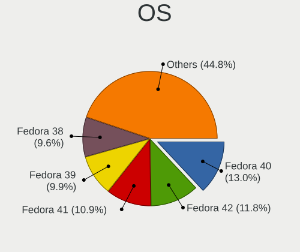

| Name      | Desktops | Percent |
|-----------|----------|---------|
| Fedora 40 | 1299     | 13.01%  |
| Fedora 42 | 1176     | 11.78%  |
| Fedora 41 | 1087     | 10.89%  |
| Fedora 39 | 991      | 9.93%   |
| Fedora 38 | 955      | 9.57%   |
| Fedora 36 | 691      | 6.92%   |
| Fedora 37 | 641      | 6.42%   |
| Fedora 33 | 569      | 5.7%    |
| Fedora 35 | 537      | 5.38%   |
| Fedora 32 | 521      | 5.22%   |
| Fedora 34 | 520      | 5.21%   |
| Fedora 43 | 406      | 4.07%   |
| Fedora 31 | 345      | 3.46%   |
| Fedora 30 | 134      | 1.34%   |
| Fedora 29 | 75       | 0.75%   |
| Fedora 28 | 14       | 0.14%   |
| Fedora 27 | 9        | 0.09%   |
| Fedora 44 | 5        | 0.05%   |
| Fedora 25 | 2        | 0.02%   |
| Fedora 24 | 2        | 0.02%   |
| Fedora 4  | 1        | 0.01%   |
| Fedora 21 | 1        | 0.01%   |
| Fedora 17 | 1        | 0.01%   |
| Fedora 14 | 1        | 0.01%   |

OS Family
---------

OS without a version

| Name   | Desktops | Percent |
|--------|----------|---------|
| Fedora | 8697     | 100%    |

Kernel
------

Version of the Linux kernel

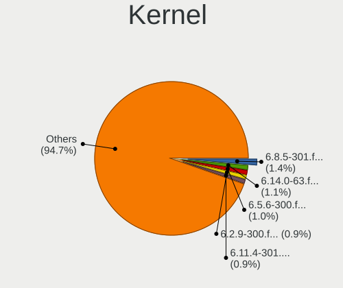

| Version                 | Desktops | Percent |
|-------------------------|----------|---------|
| 6.8.5-301.fc40.x86_64   | 157      | 1.38%   |
| 6.14.0-63.fc42.x86_64   | 120      | 1.06%   |
| 6.5.6-300.fc39.x86_64   | 116      | 1.02%   |
| 6.2.9-300.fc38.x86_64   | 107      | 0.94%   |
| 6.11.4-301.fc41.x86_64  | 107      | 0.94%   |
| 6.14.9-300.fc42.x86_64  | 99       | 0.87%   |
| 6.10.6-200.fc40.x86_64  | 89       | 0.78%   |
| 6.12.11-200.fc41.x86_64 | 87       | 0.77%   |
| 6.7.9-200.fc39.x86_64   | 86       | 0.76%   |
| 6.8.11-300.fc40.x86_64  | 84       | 0.74%   |
| 6.15.9-201.fc42.x86_64  | 84       | 0.74%   |
| 6.8.9-300.fc40.x86_64   | 82       | 0.72%   |
| 6.8.7-300.fc40.x86_64   | 82       | 0.72%   |
| 6.15.4-200.fc42.x86_64  | 80       | 0.7%    |
| 6.13.5-200.fc41.x86_64  | 79       | 0.7%    |
| 6.4.15-200.fc38.x86_64  | 74       | 0.65%   |
| 6.17.12-300.fc43.x86_64 | 73       | 0.64%   |
| 6.14.2-300.fc42.x86_64  | 73       | 0.64%   |
| 6.2.15-300.fc38.x86_64  | 72       | 0.63%   |
| 6.3.8-200.fc38.x86_64   | 71       | 0.63%   |
| 6.11.5-300.fc41.x86_64  | 69       | 0.61%   |
| 6.14.6-300.fc42.x86_64  | 67       | 0.59%   |
| 6.6.9-200.fc39.x86_64   | 64       | 0.56%   |
| 6.11.10-300.fc41.x86_64 | 64       | 0.56%   |
| 6.17.8-300.fc43.x86_64  | 62       | 0.55%   |
| 6.5.5-200.fc38.x86_64   | 60       | 0.53%   |
| 6.10.11-200.fc40.x86_64 | 60       | 0.53%   |
| 6.7.4-200.fc39.x86_64   | 59       | 0.52%   |
| 6.11.8-300.fc41.x86_64  | 59       | 0.52%   |
| 6.10.12-200.fc40.x86_64 | 59       | 0.52%   |
| 5.9.16-200.fc33.x86_64  | 58       | 0.51%   |
| 6.16.7-200.fc42.x86_64  | 57       | 0.5%    |
| 6.14.5-300.fc42.x86_64  | 57       | 0.5%    |
| 5.16.18-200.fc35.x86_64 | 55       | 0.48%   |
| 6.17.7-300.fc43.x86_64  | 54       | 0.48%   |
| 6.17.1-300.fc43.x86_64  | 54       | 0.48%   |
| 6.0.7-301.fc37.x86_64   | 54       | 0.48%   |
| 6.13.9-200.fc41.x86_64  | 53       | 0.47%   |
| 5.17.5-300.fc36.x86_64  | 52       | 0.46%   |
| 6.9.12-200.fc40.x86_64  | 49       | 0.43%   |

Kernel Family
-------------

Linux kernel without a distro release

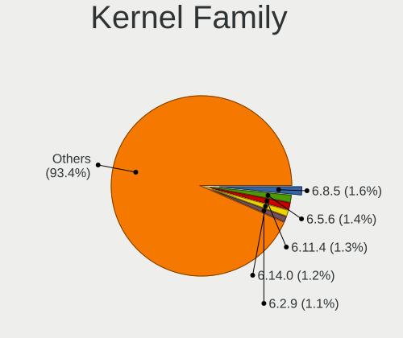

| Version | Desktops | Percent |
|---------|----------|---------|
| 6.8.5   | 179      | 1.58%   |
| 6.5.6   | 159      | 1.4%    |
| 6.11.4  | 149      | 1.32%   |
| 6.14.0  | 136      | 1.2%    |
| 6.2.9   | 120      | 1.06%   |
| 6.8.7   | 113      | 1%      |
| 6.8.9   | 109      | 0.96%   |
| 6.8.11  | 106      | 0.94%   |
| 6.7.9   | 104      | 0.92%   |
| 6.14.9  | 104      | 0.92%   |
| 6.2.15  | 93       | 0.82%   |
| 6.12.11 | 91       | 0.8%    |
| 6.10.6  | 89       | 0.79%   |
| 6.15.9  | 87       | 0.77%   |
| 6.11.5  | 85       | 0.75%   |
| 6.15.4  | 84       | 0.74%   |
| 6.13.5  | 82       | 0.72%   |
| 6.4.15  | 77       | 0.68%   |
| 6.3.8   | 76       | 0.67%   |
| 6.14.6  | 76       | 0.67%   |
| 6.17.12 | 75       | 0.66%   |
| 6.14.2  | 73       | 0.64%   |
| 6.11.10 | 70       | 0.62%   |
| 6.6.9   | 69       | 0.61%   |
| 6.5.5   | 69       | 0.61%   |
| 5.17.5  | 68       | 0.6%    |
| 6.0.7   | 67       | 0.59%   |
| 5.9.16  | 67       | 0.59%   |
| 6.17.8  | 66       | 0.58%   |
| 6.17.7  | 66       | 0.58%   |
| 6.14.5  | 66       | 0.58%   |
| 6.8.10  | 64       | 0.57%   |
| 5.16.18 | 63       | 0.56%   |
| 6.10.11 | 62       | 0.55%   |
| 6.7.4   | 61       | 0.54%   |
| 6.11.8  | 61       | 0.54%   |
| 6.10.12 | 60       | 0.53%   |
| 6.2.14  | 59       | 0.52%   |
| 6.16.7  | 59       | 0.52%   |
| 5.19.16 | 59       | 0.52%   |

Kernel Major Ver.
-----------------

Linux kernel major version

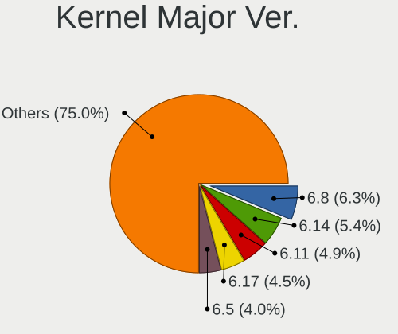

| Version | Desktops | Percent |
|---------|----------|---------|
| 6.8     | 675      | 6.28%   |
| 6.14    | 577      | 5.37%   |
| 6.11    | 524      | 4.87%   |
| 6.17    | 480      | 4.46%   |
| 6.5     | 434      | 4.04%   |
| 6.2     | 421      | 3.91%   |
| 6.10    | 418      | 3.89%   |
| 6.12    | 415      | 3.86%   |
| 6.0     | 377      | 3.51%   |
| 6.6     | 365      | 3.39%   |
| 6.15    | 365      | 3.39%   |
| 6.7     | 347      | 3.23%   |
| 6.9     | 319      | 2.97%   |
| 6.13    | 317      | 2.95%   |
| 5.8     | 310      | 2.88%   |
| 6.4     | 296      | 2.75%   |
| 6.16    | 270      | 2.51%   |
| 5.11    | 261      | 2.43%   |
| 5.19    | 256      | 2.38%   |
| 5.18    | 252      | 2.34%   |
| 5.17    | 252      | 2.34%   |
| 6.1     | 246      | 2.29%   |
| 6.3     | 228      | 2.12%   |
| 5.16    | 225      | 2.09%   |
| 5.9     | 208      | 1.93%   |
| 5.14    | 207      | 1.92%   |
| 5.10    | 205      | 1.91%   |
| 5.6     | 197      | 1.83%   |
| 5.13    | 189      | 1.76%   |
| 5.15    | 179      | 1.66%   |
| 5.12    | 176      | 1.64%   |
| 5.7     | 171      | 1.59%   |
| 5.4     | 136      | 1.26%   |
| 5.5     | 121      | 1.13%   |
| 5.3     | 116      | 1.08%   |
| 5.2     | 55       | 0.51%   |
| 5.0     | 49       | 0.46%   |
| 5.1     | 25       | 0.23%   |
| 4.19    | 22       | 0.2%    |
| 4.18    | 20       | 0.19%   |

Arch
----

OS architecture (x86_64, i586, etc.)

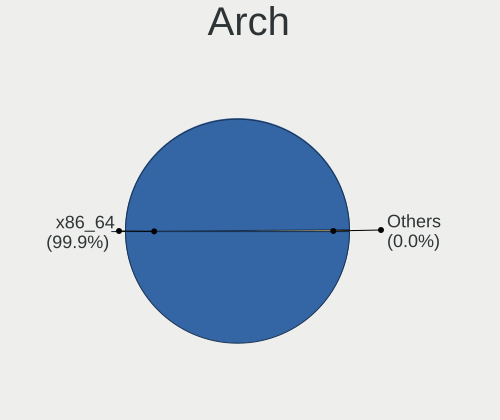

| Name        | Desktops | Percent |
|-------------|----------|---------|
| x86_64      | 8688     | 99.87%  |
| i686        | 4        | 0.05%   |
| riscv64     | 2        | 0.02%   |
| ppc64le     | 2        | 0.02%   |
| Unknown     | 2        | 0.02%   |
| loongarch64 | 1        | 0.01%   |

DE
--

Desktop Environment

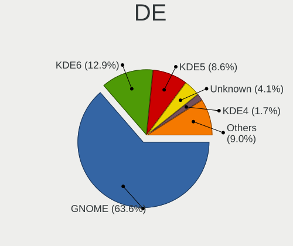

| Name                         | Desktops | Percent |
|------------------------------|----------|---------|
| GNOME                        | 5717     | 63.64%  |
| KDE6                         | 1163     | 12.95%  |
| KDE5                         | 773      | 8.61%   |
| Unknown                      | 369      | 4.11%   |
| KDE4                         | 151      | 1.68%   |
| XFCE                         | 149      | 1.66%   |
| X-Cinnamon                   | 137      | 1.53%   |
| KDE                          | 118      | 1.31%   |
| Cinnamon                     | 91       | 1.01%   |
| MATE                         | 82       | 0.91%   |
| GNOME Classic                | 70       | 0.78%   |
| Budgie                       | 28       | 0.31%   |
| sway                         | 18       | 0.2%    |
| Hyprland                     | 17       | 0.19%   |
| LXQt                         | 16       | 0.18%   |
| i3                           | 15       | 0.17%   |
| Deepin                       | 15       | 0.17%   |
| LXDE                         | 13       | 0.14%   |
| COSMIC                       | 11       | 0.12%   |
| Xpra                         | 3        | 0.03%   |
| openbox                      | 3        | 0.03%   |
| niri                         | 3        | 0.03%   |
| GNOME Flashback              | 3        | 0.03%   |
| awesome                      | 3        | 0.03%   |
| qtile                        | 2        | 0.02%   |
| DWM                          | 2        | 0.02%   |
| bspwm                        | 2        | 0.02%   |
| xmonad                       | 1        | 0.01%   |
| WindowMaker                  | 1        | 0.01%   |
| Pantheon                     | 1        | 0.01%   |
| NsCDE                        | 1        | 0.01%   |
| LXQt:kwin_wayland            | 1        | 0.01%   |
| GNUstep                      | 1        | 0.01%   |
| GNOME-Classic                | 1        | 0.01%   |
| e16-session                  | 1        | 0.01%   |
| ${XDG_CURRENT_DESKTOP:-sway} | 1        | 0.01%   |

Display Server
--------------

X11 or Wayland

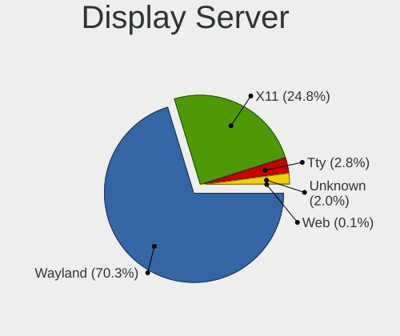

| Name    | Desktops | Percent |
|---------|----------|---------|
| Wayland | 6345     | 70.31%  |
| X11     | 2236     | 24.78%  |
| Tty     | 251      | 2.78%   |
| Unknown | 183      | 2.03%   |
| Web     | 9        | 0.1%    |

Display Manager
---------------

SDDM, LightDM, etc.

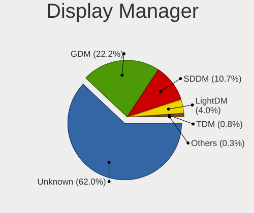

| Name    | Desktops | Percent |
|---------|----------|---------|
| Unknown | 5537     | 62.03%  |
| GDM     | 1984     | 22.23%  |
| SDDM    | 954      | 10.69%  |
| LightDM | 355      | 3.98%   |
| TDM     | 72       | 0.81%   |
| XDM     | 7        | 0.08%   |
| KDM     | 7        | 0.08%   |
| LXDM    | 6        | 0.07%   |
| GREETD  | 3        | 0.03%   |
| SLiM    | 1        | 0.01%   |

OS Lang
-------

Language

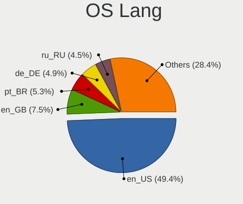

| Lang    | Desktops | Percent |
|---------|----------|---------|
| en_US   | 4348     | 49.36%  |
| en_GB   | 663      | 7.53%   |
| pt_BR   | 471      | 5.35%   |
| de_DE   | 428      | 4.86%   |
| ru_RU   | 398      | 4.52%   |
| Unknown | 268      | 3.04%   |
| fr_FR   | 263      | 2.99%   |
| en_AU   | 231      | 2.62%   |
| en_CA   | 219      | 2.49%   |
| it_IT   | 203      | 2.3%    |
| es_ES   | 154      | 1.75%   |
| pl_PL   | 138      | 1.57%   |
| es_MX   | 72       | 0.82%   |
| en_IN   | 56       | 0.64%   |
| es_AR   | 55       | 0.62%   |
| cs_CZ   | 50       | 0.57%   |
| en_NZ   | 45       | 0.51%   |
| tr_TR   | 42       | 0.48%   |
| es_CO   | 39       | 0.44%   |
| sv_SE   | 38       | 0.43%   |
| nl_NL   | 35       | 0.4%    |
| en_IE   | 35       | 0.4%    |
| hu_HU   | 31       | 0.35%   |
| de_AT   | 31       | 0.35%   |
| zh_CN   | 29       | 0.33%   |
| ja_JP   | 25       | 0.28%   |
| en_DK   | 23       | 0.26%   |
| pt_PT   | 22       | 0.25%   |
| fi_FI   | 21       | 0.24%   |
| nl_BE   | 20       | 0.23%   |
| es_CL   | 20       | 0.23%   |
| en_ZA   | 17       | 0.19%   |
| C       | 17       | 0.19%   |
| ko_KR   | 16       | 0.18%   |
| da_DK   | 15       | 0.17%   |
| fr_CH   | 14       | 0.16%   |
| fr_CA   | 14       | 0.16%   |
| uk_UA   | 13       | 0.15%   |
| ru_UA   | 13       | 0.15%   |
| en_PH   | 13       | 0.15%   |

Boot Mode
---------

EFI or BIOS

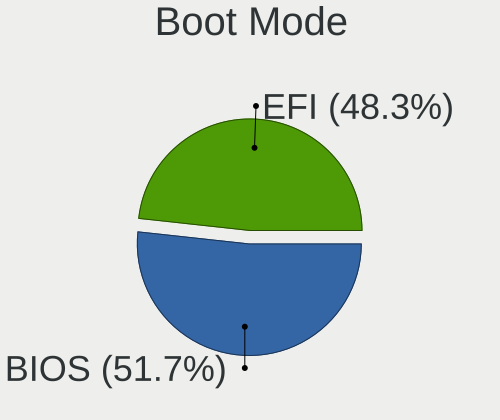

| Mode | Desktops | Percent |
|------|----------|---------|
| BIOS | 4614     | 51.73%  |
| EFI  | 4306     | 48.27%  |

Filesystem
----------

Type of filesystem

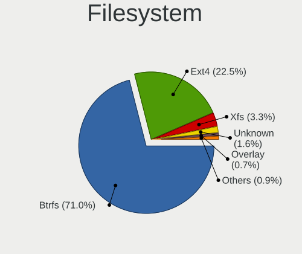

| Type                | Desktops | Percent |
|---------------------|----------|---------|
| Btrfs               | 6287     | 71.02%  |
| Ext4                | 1991     | 22.49%  |
| Xfs                 | 291      | 3.29%   |
| Unknown             | 138      | 1.56%   |
| Overlay             | 65       | 0.73%   |
| Tmpfs               | 63       | 0.71%   |
| Ext3                | 7        | 0.08%   |
| Zfs                 | 5        | 0.06%   |
| F2fs                | 3        | 0.03%   |
| XXXXX               | 1        | 0.01%   |
| Nfs4                | 1        | 0.01%   |
| Fuse.fuse-overlayfs | 1        | 0.01%   |

Part. scheme
------------

Scheme of partitioning

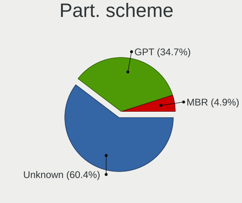

| Type    | Desktops | Percent |
|---------|----------|---------|
| Unknown | 5382     | 60.36%  |
| GPT     | 3094     | 34.7%   |
| MBR     | 441      | 4.95%   |

Dual Boot with Linux/BSD
------------------------

Hosting more than one Linux/BSD

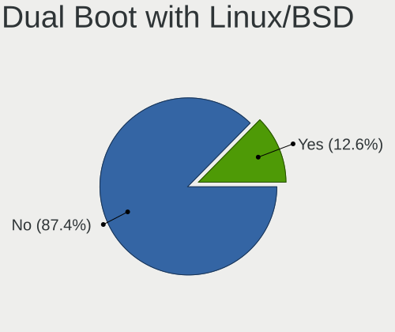

| Dual boot | Desktops | Percent |
|-----------|----------|---------|
| No        | 7749     | 87.37%  |
| Yes       | 1120     | 12.63%  |

Dual Boot (Win)
---------------

Hosting Linux and Windows

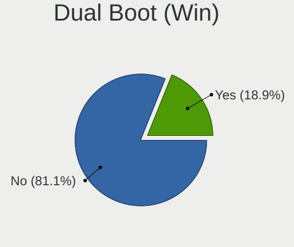

| Dual boot | Desktops | Percent |
|-----------|----------|---------|
| No        | 7170     | 81.1%   |
| Yes       | 1671     | 18.9%   |

Board
-----

Vendor
------

Motherboard manufacturer

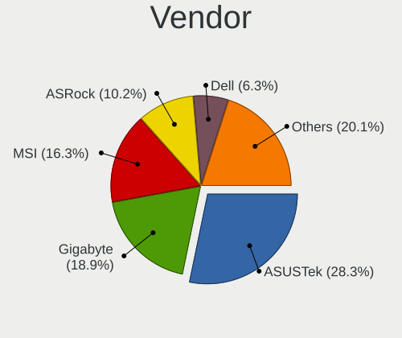

| Name                                 | Desktops | Percent |
|--------------------------------------|----------|---------|
| ASUSTek Computer                     | 2457     | 28.25%  |
| Gigabyte Technology                  | 1641     | 18.87%  |
| MSI                                  | 1415     | 16.27%  |
| ASRock                               | 890      | 10.23%  |
| Dell                                 | 547      | 6.29%   |
| Hewlett-Packard                      | 472      | 5.43%   |
| Lenovo                               | 245      | 2.82%   |
| Intel                                | 169      | 1.94%   |
| Unknown                              | 102      | 1.17%   |
| Acer                                 | 76       | 0.87%   |
| Pegatron                             | 50       | 0.57%   |
| Fujitsu                              | 42       | 0.48%   |
| Huanan                               | 36       | 0.41%   |
| Apple                                | 36       | 0.41%   |
| Shenzhen Meigao Electronic Equipment | 33       | 0.38%   |
| Biostar                              | 33       | 0.38%   |
| Foxconn                              | 28       | 0.32%   |
| AZW                                  | 28       | 0.32%   |
| BESSTAR Tech                         | 25       | 0.29%   |
| Alienware                            | 25       | 0.29%   |
| Itautec                              | 21       | 0.24%   |
| ECS                                  | 20       | 0.23%   |
| MACHINIST                            | 18       | 0.21%   |
| Medion                               | 16       | 0.18%   |
| Supermicro                           | 15       | 0.17%   |
| Shuttle                              | 13       | 0.15%   |
| AMI                                  | 13       | 0.15%   |
| PCWare                               | 12       | 0.14%   |
| Positivo                             | 11       | 0.13%   |
| NZXT                                 | 10       | 0.11%   |
| GEEKOM                               | 9        | 0.1%    |
| GMKtec                               | 8        | 0.09%   |
| Colorful Technology                  | 8        | 0.09%   |
| System76                             | 7        | 0.08%   |
| Packard Bell                         | 7        | 0.08%   |
| OEM                                  | 7        | 0.08%   |
| Gateway                              | 6        | 0.07%   |
| EVGA                                 | 6        | 0.07%   |
| TianBei                              | 5        | 0.06%   |
| Google                               | 5        | 0.06%   |

Model
-----

Motherboard model

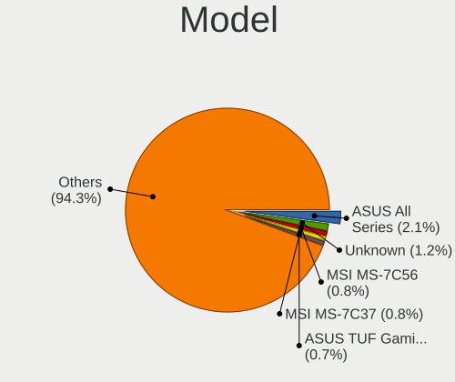

| Name                         | Desktops | Percent |
|------------------------------|----------|---------|
| ASUS All Series              | 182      | 2.09%   |
| Unknown                      | 106      | 1.22%   |
| MSI MS-7C56                  | 71       | 0.82%   |
| MSI MS-7C37                  | 71       | 0.82%   |
| ASUS TUF Gaming X570-PLUS    | 62       | 0.71%   |
| MSI MS-7C91                  | 58       | 0.67%   |
| MSI MS-7C02                  | 48       | 0.55%   |
| MSI MS-7C95                  | 45       | 0.52%   |
| Gigabyte B450M DS3H          | 45       | 0.52%   |
| Dell OptiPlex 7010           | 44       | 0.51%   |
| MSI MS-7B86                  | 43       | 0.49%   |
| ASUS ROG STRIX B550-F GAMING | 39       | 0.45%   |
| MSI MS-7B89                  | 36       | 0.41%   |
| ASUS PRIME A320M-K           | 35       | 0.4%    |
| MSI MS-7A38                  | 33       | 0.38%   |
| ASUS TUF Gaming B550-PLUS    | 33       | 0.38%   |
| Dell OptiPlex 9020           | 32       | 0.37%   |
| ASUS ROG STRIX B450-F GAMING | 30       | 0.34%   |
| Gigabyte B550M DS3H          | 29       | 0.33%   |
| MSI MS-7C52                  | 27       | 0.31%   |
| ASUS ROG STRIX X570-E GAMING | 27       | 0.31%   |
| MSI MS-7B79                  | 26       | 0.3%    |
| Gigabyte B450 AORUS ELITE    | 26       | 0.3%    |
| ASUS TUF Gaming B550M-PLUS   | 25       | 0.29%   |
| Gigabyte 970A-DS3P           | 24       | 0.28%   |
| ASUS ROG STRIX B550-I GAMING | 24       | 0.28%   |
| ASRock B450M Steel Legend    | 24       | 0.28%   |
| Gigabyte B450 AORUS M        | 23       | 0.26%   |
| ASUS ROG STRIX X570-F GAMING | 23       | 0.26%   |
| ASUS PRIME X370-PRO          | 22       | 0.25%   |
| ASUS PRIME B450M-A II        | 22       | 0.25%   |
| ASRock B450M Pro4            | 22       | 0.25%   |
| MSI MS-7D75                  | 21       | 0.24%   |
| MSI MS-7D25                  | 21       | 0.24%   |
| Gigabyte B550I AORUS PRO AX  | 21       | 0.24%   |
| Gigabyte A320M-S2H           | 21       | 0.24%   |
| ASUS PRIME X470-PRO          | 20       | 0.23%   |
| MSI MS-7C94                  | 19       | 0.22%   |
| MSI MS-7C84                  | 19       | 0.22%   |
| Gigabyte B550 GAMING X V2    | 19       | 0.22%   |

Model Family
------------

Motherboard model prefix

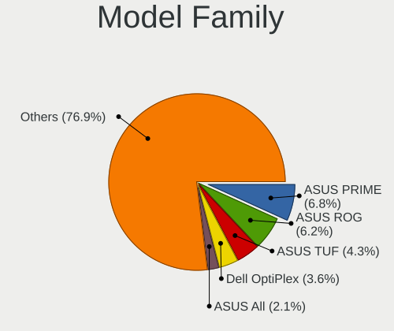

| Name                | Desktops | Percent |
|---------------------|----------|---------|
| ASUS PRIME          | 589      | 6.77%   |
| ASUS ROG            | 541      | 6.22%   |
| ASUS TUF            | 377      | 4.33%   |
| Dell OptiPlex       | 316      | 3.63%   |
| ASUS All            | 182      | 2.09%   |
| Lenovo ThinkCentre  | 118      | 1.36%   |
| Gigabyte X570       | 113      | 1.3%    |
| Unknown             | 106      | 1.22%   |
| Dell Precision      | 97       | 1.12%   |
| HP EliteDesk        | 95       | 1.09%   |
| Gigabyte B450M      | 89       | 1.02%   |
| Gigabyte B450       | 89       | 1.02%   |
| Gigabyte B550       | 86       | 0.99%   |
| HP Compaq           | 85       | 0.98%   |
| Gigabyte B550M      | 74       | 0.85%   |
| MSI MS-7C56         | 71       | 0.82%   |
| MSI MS-7C37         | 71       | 0.82%   |
| ASRock B450M        | 63       | 0.72%   |
| MSI MS-7C91         | 58       | 0.67%   |
| HP ProDesk          | 53       | 0.61%   |
| MSI MS-7C02         | 48       | 0.55%   |
| Lenovo ThinkStation | 48       | 0.55%   |
| Dell Inspiron       | 48       | 0.55%   |
| Dell XPS            | 47       | 0.54%   |
| ASUS ProArt         | 46       | 0.53%   |
| ASRock X570         | 46       | 0.53%   |
| MSI MS-7C95         | 45       | 0.52%   |
| MSI MS-7B86         | 43       | 0.49%   |
| ASRock B450         | 43       | 0.49%   |
| Acer Aspire         | 43       | 0.49%   |
| Gigabyte B650       | 40       | 0.46%   |
| ASRock B550         | 40       | 0.46%   |
| HP Pavilion         | 37       | 0.43%   |
| MSI MS-7B89         | 36       | 0.41%   |
| MSI MS-7A38         | 33       | 0.38%   |
| Gigabyte Z390       | 33       | 0.38%   |
| Gigabyte Z790       | 32       | 0.37%   |
| ASUS Maximus        | 29       | 0.33%   |
| ASRock B550M        | 28       | 0.32%   |
| MSI MS-7C52         | 27       | 0.31%   |

MFG Year
--------

Motherboard manufacture year

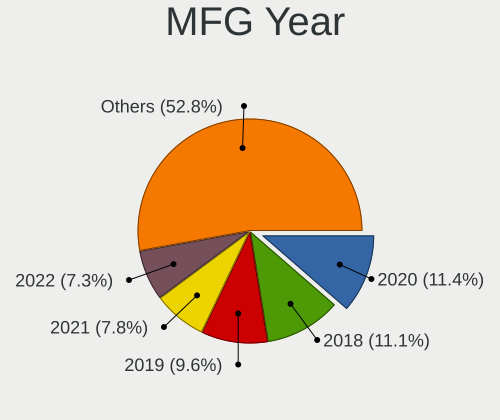

| Year    | Desktops | Percent |
|---------|----------|---------|
| 2020    | 990      | 11.38%  |
| 2018    | 963      | 11.07%  |
| 2019    | 836      | 9.61%   |
| 2021    | 676      | 7.77%   |
| 2022    | 636      | 7.31%   |
| 2017    | 582      | 6.69%   |
| 2012    | 535      | 6.15%   |
| 2013    | 492      | 5.66%   |
| 2023    | 451      | 5.19%   |
| 2014    | 443      | 5.09%   |
| 2016    | 356      | 4.09%   |
| 2015    | 352      | 4.05%   |
| 2024    | 332      | 3.82%   |
| 2011    | 308      | 3.54%   |
| 2010    | 230      | 2.64%   |
| 2009    | 213      | 2.45%   |
| 2008    | 127      | 1.46%   |
| 2007    | 68       | 0.78%   |
| 2025    | 66       | 0.76%   |
| 2006    | 27       | 0.31%   |
| 2005    | 7        | 0.08%   |
| Unknown | 7        | 0.08%   |

Form Factor
-----------

Physical design of the computer

| Name    | Desktops | Percent |
|---------|----------|---------|
| Desktop | 8697     | 100%    |

Secure Boot
-----------

Enabled or disabled

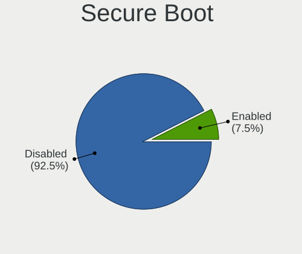

| State    | Desktops | Percent |
|----------|----------|---------|
| Disabled | 8129     | 92.52%  |
| Enabled  | 657      | 7.48%   |

Coreboot
--------

Have coreboot on board

| Used | Desktops | Percent |
|------|----------|---------|
| No   | 8691     | 99.93%  |
| Yes  | 6        | 0.07%   |

RAM Size
--------

Total RAM memory

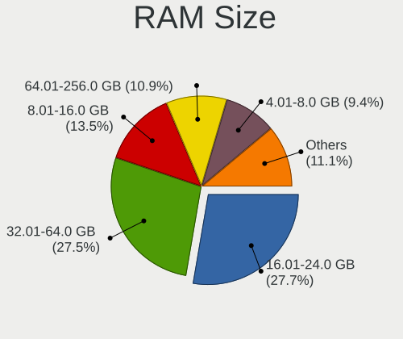

| Size in GB      | Desktops | Percent |
|-----------------|----------|---------|
| 16.01-24.0      | 2468     | 27.71%  |
| 32.01-64.0      | 2446     | 27.46%  |
| 8.01-16.0       | 1200     | 13.47%  |
| 64.01-256.0     | 971      | 10.9%   |
| 4.01-8.0        | 836      | 9.39%   |
| 24.01-32.0      | 536      | 6.02%   |
| 3.01-4.0        | 365      | 4.1%    |
| 1.01-2.0        | 37       | 0.42%   |
| 2.01-3.0        | 29       | 0.33%   |
| More than 256.0 | 13       | 0.15%   |
| Unknown         | 5        | 0.06%   |
| 0.51-1.0        | 1        | 0.01%   |

RAM Used
--------

Used RAM memory

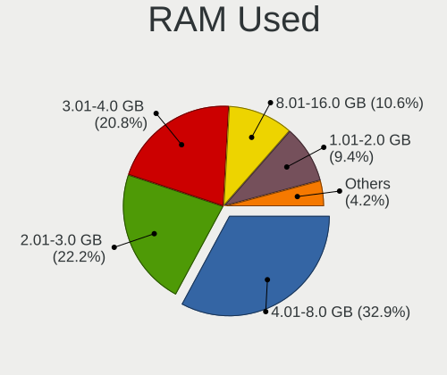

| Used GB     | Desktops | Percent |
|-------------|----------|---------|
| 4.01-8.0    | 3252     | 32.87%  |
| 2.01-3.0    | 2201     | 22.24%  |
| 3.01-4.0    | 2055     | 20.77%  |
| 8.01-16.0   | 1047     | 10.58%  |
| 1.01-2.0    | 929      | 9.39%   |
| 16.01-24.0  | 181      | 1.83%   |
| 0.51-1.0    | 103      | 1.04%   |
| 24.01-32.0  | 65       | 0.66%   |
| 32.01-64.0  | 35       | 0.35%   |
| 0.01-0.5    | 13       | 0.13%   |
| 64.01-256.0 | 7        | 0.07%   |
| Unknown     | 7        | 0.07%   |

Total Drives
------------

Number of drives on board

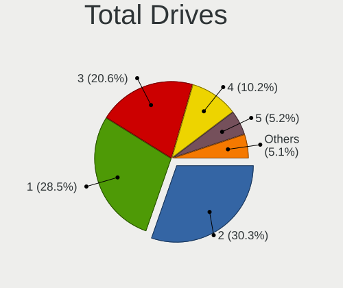

| Drives | Desktops | Percent |
|--------|----------|---------|
| 2      | 2783     | 30.33%  |
| 1      | 2619     | 28.54%  |
| 3      | 1889     | 20.59%  |
| 4      | 939      | 10.23%  |
| 5      | 479      | 5.22%   |
| 6      | 230      | 2.51%   |
| 7      | 105      | 1.14%   |
| 8      | 54       | 0.59%   |
| 9      | 25       | 0.27%   |
| 0      | 16       | 0.17%   |
| 10     | 12       | 0.13%   |
| 12     | 7        | 0.08%   |
| 11     | 7        | 0.08%   |
| 15     | 3        | 0.03%   |
| 14     | 2        | 0.02%   |
| 410    | 1        | 0.01%   |
| 27     | 1        | 0.01%   |
| 24     | 1        | 0.01%   |
| 22     | 1        | 0.01%   |
| 18     | 1        | 0.01%   |
| 13     | 1        | 0.01%   |

Has CD-ROM
----------

Has CD-ROM on board

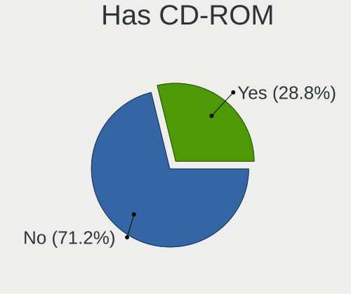

| Presented | Desktops | Percent |
|-----------|----------|---------|
| No        | 6266     | 71.2%   |
| Yes       | 2534     | 28.8%   |

Has Ethernet
------------

Has Ethernet on board

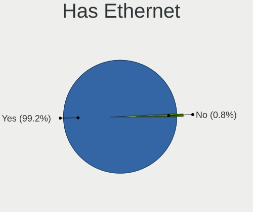

| Presented | Desktops | Percent |
|-----------|----------|---------|
| Yes       | 8628     | 99.2%   |
| No        | 70       | 0.8%    |

Has WiFi
--------

Has WiFi module

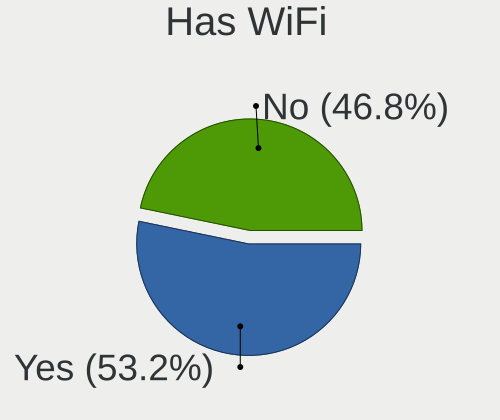

| Presented | Desktops | Percent |
|-----------|----------|---------|
| Yes       | 4703     | 53.24%  |
| No        | 4131     | 46.76%  |

Has Bluetooth
-------------

Has Bluetooth module

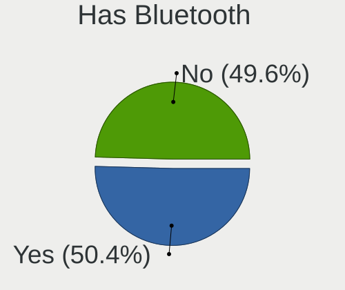

| Presented | Desktops | Percent |
|-----------|----------|---------|
| Yes       | 4465     | 50.43%  |
| No        | 4388     | 49.57%  |

Location
--------

Country
-------

Geographic location (country)

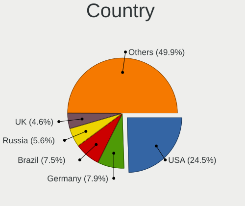

| Country     | Desktops | Percent |
|-------------|----------|---------|
| USA         | 2141     | 24.48%  |
| Germany     | 692      | 7.91%   |
| Brazil      | 658      | 7.52%   |
| Russia      | 488      | 5.58%   |
| UK          | 399      | 4.56%   |
| Canada      | 350      | 4%      |
| Italy       | 314      | 3.59%   |
| France      | 314      | 3.59%   |
| Australia   | 273      | 3.12%   |
| Poland      | 230      | 2.63%   |
| Spain       | 209      | 2.39%   |
| Netherlands | 150      | 1.72%   |
| Sweden      | 132      | 1.51%   |
| India       | 124      | 1.42%   |
| Mexico      | 118      | 1.35%   |
| Czechia     | 103      | 1.18%   |
| Switzerland | 98       | 1.12%   |
| Argentina   | 95       | 1.09%   |
| Austria     | 93       | 1.06%   |
| Belgium     | 82       | 0.94%   |
| Finland     | 78       | 0.89%   |
| Romania     | 76       | 0.87%   |
| Turkey      | 74       | 0.85%   |
| Norway      | 68       | 0.78%   |
| Portugal    | 63       | 0.72%   |
| Colombia    | 59       | 0.67%   |
| Hungary     | 56       | 0.64%   |
| Ukraine     | 54       | 0.62%   |
| Greece      | 53       | 0.61%   |
| New Zealand | 52       | 0.59%   |
| Japan       | 52       | 0.59%   |
| Denmark     | 46       | 0.53%   |
| Philippines | 41       | 0.47%   |
| Indonesia   | 37       | 0.42%   |
| China       | 37       | 0.42%   |
| Chile       | 36       | 0.41%   |
| Serbia      | 35       | 0.4%    |
| Thailand    | 32       | 0.37%   |
| Bulgaria    | 31       | 0.35%   |
| Belarus     | 31       | 0.35%   |

City
----

Geographic location (city)

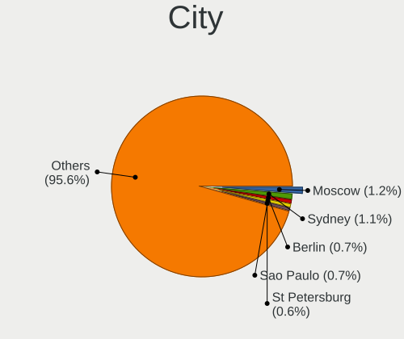

| City           | Desktops | Percent |
|----------------|----------|---------|
| Moscow         | 115      | 1.24%   |
| Sydney         | 99       | 1.07%   |
| Berlin         | 68       | 0.73%   |
| Sao Paulo      | 65       | 0.7%    |
| St Petersburg  | 57       | 0.62%   |
| Warsaw         | 55       | 0.59%   |
| Melbourne      | 55       | 0.59%   |
| Vienna         | 49       | 0.53%   |
| Toronto        | 48       | 0.52%   |
| Brisbane       | 48       | 0.52%   |
| Paris          | 45       | 0.49%   |
| Palmas         | 42       | 0.45%   |
| Seattle        | 41       | 0.44%   |
| Rio de Janeiro | 40       | 0.43%   |
| Prague         | 35       | 0.38%   |
| Milan          | 34       | 0.37%   |
| Amsterdam      | 34       | 0.37%   |
| Helsinki       | 33       | 0.36%   |
| Hamburg        | 33       | 0.36%   |
| Auckland       | 32       | 0.35%   |
| Rome           | 31       | 0.33%   |
| Los Angeles    | 31       | 0.33%   |
| Munich         | 30       | 0.32%   |
| Mexico City    | 30       | 0.32%   |
| Madrid         | 30       | 0.32%   |
| Porto Alegre   | 29       | 0.31%   |
| Athens         | 29       | 0.31%   |
| Zurich         | 28       | 0.3%    |
| London         | 28       | 0.3%    |
| Chicago        | 27       | 0.29%   |
| Montreal       | 26       | 0.28%   |
| Istanbul       | 26       | 0.28%   |
| New York       | 24       | 0.26%   |
| Dallas         | 24       | 0.26%   |
| Buenos Aires   | 24       | 0.26%   |
| Atlanta        | 24       | 0.26%   |
| Stockholm      | 23       | 0.25%   |
| Budapest       | 23       | 0.25%   |
| Bucharest      | 23       | 0.25%   |
| Brasília      | 23       | 0.25%   |

Drives
------

Drive Vendor
------------

Hard drive vendors

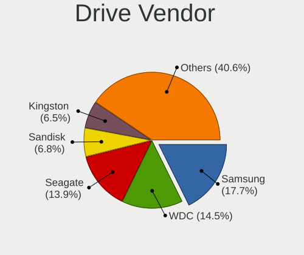

| Vendor                       | Desktops | Drives | Percent |
|------------------------------|----------|--------|---------|
| Samsung Electronics          | 3139     | 6328   | 17.68%  |
| WDC                          | 2583     | 4949   | 14.55%  |
| Seagate                      | 2464     | 4447   | 13.88%  |
| Sandisk                      | 1216     | 1725   | 6.85%   |
| Kingston                     | 1151     | 1695   | 6.48%   |
| Crucial                      | 853      | 1358   | 4.8%    |
| Toshiba                      | 755      | 1145   | 4.25%   |
| Micron/Crucial Technology    | 370      | 506    | 2.08%   |
| Intel                        | 347      | 632    | 1.95%   |
| Phison Electronics           | 341      | 492    | 1.92%   |
| Hitachi                      | 340      | 544    | 1.91%   |
| A-DATA Technology            | 256      | 330    | 1.44%   |
| Kingston Technology Company  | 234      | 290    | 1.32%   |
| MAXIO Technology (Hangzhou)  | 177      | 207    | 1%      |
| Micron Technology            | 176      | 218    | 0.99%   |
| China                        | 175      | 228    | 0.99%   |
| SK hynix                     | 173      | 221    | 0.97%   |
| Silicon Motion               | 163      | 230    | 0.92%   |
| ADATA Technology             | 156      | 204    | 0.88%   |
| HGST                         | 150      | 264    | 0.84%   |
| Unknown                      | 145      | 238    | 0.82%   |
| SPCC                         | 124      | 175    | 0.7%    |
| Phison                       | 119      | 164    | 0.67%   |
| Realtek Semiconductor        | 110      | 134    | 0.62%   |
| PNY                          | 110      | 141    | 0.62%   |
| Patriot                      | 95       | 153    | 0.53%   |
| Shenzhen Longsys Electronics | 82       | 107    | 0.46%   |
| OCZ                          | 77       | 98     | 0.43%   |
| Corsair                      | 77       | 113    | 0.43%   |
| Team                         | 61       | 80     | 0.34%   |
| Intenso                      | 54       | 74     | 0.3%    |
| Apacer                       | 49       | 71     | 0.28%   |
| JMicron Technology           | 48       | 62     | 0.27%   |
| GOODRAM                      | 46       | 67     | 0.26%   |
| Unknown                      | 46       | 57     | 0.26%   |
| Transcend                    | 45       | 61     | 0.25%   |
| KingSpec                     | 43       | 77     | 0.24%   |
| Maxtor                       | 39       | 53     | 0.22%   |
| Gigabyte Technology          | 39       | 56     | 0.22%   |
| ASMT                         | 39       | 55     | 0.22%   |

Drive Model
-----------

Hard drive models

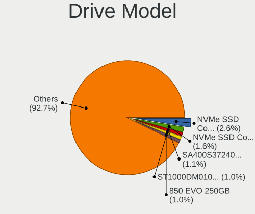

| Model                                                 | Desktops | Percent |
|-------------------------------------------------------|----------|---------|
| Samsung NVMe SSD Controller SM981/PM981/PM983 1TB     | 539      | 2.57%   |
| Samsung NVMe SSD Controller PM9A1/PM9A3/980PRO 1TB    | 331      | 1.58%   |
| Kingston SA400S37240G 240GB SSD                       | 233      | 1.11%   |
| Seagate ST1000DM010-2EP102 1TB                        | 210      | 1%      |
| Samsung SSD 850 EVO 250GB                             | 208      | 0.99%   |
| Seagate ST2000DM008-2FR102 2TB                        | 200      | 0.95%   |
| Samsung SSD 860 EVO 500GB                             | 199      | 0.95%   |
| Samsung SSD 860 EVO 1TB                               | 182      | 0.87%   |
| Kingston SA400S37480G 480GB SSD                       | 179      | 0.85%   |
| Micron/Crucial P2 NVMe PCIe SSD 2TB                   | 168      | 0.8%    |
| Samsung SSD 850 EVO 500GB                             | 162      | 0.77%   |
| Seagate ST500DM002-1BD142 500GB                       | 158      | 0.75%   |
| WDC WD10EZEX-08WN4A0 1TB                              | 139      | 0.66%   |
| Toshiba DT01ACA100 1TB                                | 136      | 0.65%   |
| Crucial CT1000MX500SSD1 1TB                           | 132      | 0.63%   |
| Crucial CT500MX500SSD1 500GB                          | 122      | 0.58%   |
| Kingston SA400S37120G 120GB SSD                       | 121      | 0.58%   |
| Phison E12 NVMe Controller 1TB                        | 116      | 0.55%   |
| MAXIO (Hangzhou) NVMe SSD Controller MAP1202 2TB      | 116      | 0.55%   |
| Samsung SSD 980 1TB                                   | 110      | 0.52%   |
| Sandisk WD Blue SN550 NVMe SSD 1024GB                 | 108      | 0.51%   |
| Silicon Motion SM2263EN/SM2263XT SSD Controller 512GB | 106      | 0.51%   |
| Samsung SSD 870 EVO 1TB                               | 106      | 0.51%   |
| Seagate ST4000DM004-2CV104 4TB                        | 100      | 0.48%   |
| Samsung SSD 990 PRO 2TB                               | 97       | 0.46%   |
| Samsung NVMe SSD Controller SM961/PM961/SM963 1024GB  | 92       | 0.44%   |
| Samsung SSD 860 EVO 250GB                             | 91       | 0.43%   |
| Samsung NVMe SSD Drive 500GB                          | 91       | 0.43%   |
| Kingston Company SNV2S1000G 1TB                       | 90       | 0.43%   |
| Crucial CT240BX500SSD1 240GB                          | 82       | 0.39%   |
| Toshiba HDWD110 1TB                                   | 80       | 0.38%   |
| Seagate ST1000DM003-1ER162 1TB                        | 80       | 0.38%   |
| Sandisk WD Black SN750 / PC SN730 NVMe SSD 500GB      | 79       | 0.38%   |
| Kingston SV300S37A120G 120GB SSD                      | 79       | 0.38%   |
| Samsung SSD 870 QVO 1TB                               | 76       | 0.36%   |
| Seagate ST2000DM001-1ER164 2TB                        | 75       | 0.36%   |
| Seagate ST1000DM003-1CH162 1TB                        | 73       | 0.35%   |
| Phison E16 PCIe4 NVMe Controller 1TB                  | 73       | 0.35%   |
| Samsung NVMe SSD Drive 1TB                            | 69       | 0.33%   |
| Seagate ST2000DM006-2DM164 2TB                        | 68       | 0.32%   |

HDD Vendor
----------

Hard disk drive vendors

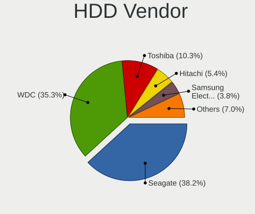

| Vendor              | Desktops | Drives | Percent |
|---------------------|----------|--------|---------|
| Seagate             | 2400     | 4297   | 38.18%  |
| WDC                 | 2219     | 4196   | 35.3%   |
| Toshiba             | 650      | 963    | 10.34%  |
| Hitachi             | 340      | 544    | 5.41%   |
| Samsung Electronics | 239      | 450    | 3.8%    |
| HGST                | 149      | 263    | 2.37%   |
| Unknown             | 51       | 60     | 0.81%   |
| Maxtor              | 37       | 49     | 0.59%   |
| JMicron Technology  | 31       | 44     | 0.49%   |
| ASMT                | 18       | 29     | 0.29%   |
| Fujitsu             | 13       | 16     | 0.21%   |
| Apple               | 12       | 13     | 0.19%   |
| Hewlett-Packard     | 11       | 17     | 0.17%   |
| External            | 10       | 16     | 0.16%   |
| Intenso             | 9        | 14     | 0.14%   |
| USB                 | 8        | 8      | 0.13%   |
| USB3.0              | 7        | 7      | 0.11%   |
| SSK                 | 7        | 7      | 0.11%   |
| TO Exter            | 5        | 6      | 0.08%   |
| T-FORCE             | 5        | 5      | 0.08%   |
| Inateck             | 4        | 10     | 0.06%   |
| Synology            | 3        | 4      | 0.05%   |
| SABRENT             | 3        | 4      | 0.05%   |
| QNAP                | 3        | 7      | 0.05%   |
| MaxDigital          | 3        | 3      | 0.05%   |
| LaCie               | 3        | 5      | 0.05%   |
| H/W                 | 3        | 8      | 0.05%   |
| ASMedia             | 3        | 6      | 0.05%   |
| Shenzhen            | 2        | 2      | 0.03%   |
| SAGE                | 2        | 2      | 0.03%   |
| Maxone              | 2        | 2      | 0.03%   |
| MARVELL             | 2        | 2      | 0.03%   |
| ICY BOX             | 2        | 3      | 0.03%   |
| ExcelStor           | 2        | 2      | 0.03%   |
| ASMT109x            | 2        | 2      | 0.03%   |
| Verbatim            | 1        | 1      | 0.02%   |
| USB 3.1             | 1        | 1      | 0.02%   |
| USB 3.0             | 1        | 3      | 0.02%   |
| TerraMas            | 1        | 2      | 0.02%   |
| StoreJet            | 1        | 1      | 0.02%   |

SSD Vendor
----------

Solid state drive vendors

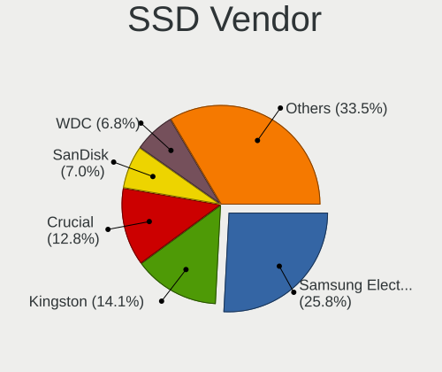

| Vendor              | Desktops | Drives | Percent |
|---------------------|----------|--------|---------|
| Samsung Electronics | 1652     | 3027   | 25.84%  |
| Kingston            | 901      | 1322   | 14.09%  |
| Crucial             | 816      | 1304   | 12.76%  |
| SanDisk             | 450      | 593    | 7.04%   |
| WDC                 | 433      | 635    | 6.77%   |
| A-DATA Technology   | 230      | 295    | 3.6%    |
| China               | 175      | 228    | 2.74%   |
| Intel               | 165      | 315    | 2.58%   |
| SPCC                | 111      | 153    | 1.74%   |
| PNY                 | 110      | 140    | 1.72%   |
| Patriot             | 87       | 143    | 1.36%   |
| OCZ                 | 77       | 98     | 1.2%    |
| Micron Technology   | 74       | 93     | 1.16%   |
| Toshiba             | 62       | 92     | 0.97%   |
| Team                | 56       | 74     | 0.88%   |
| SK hynix            | 56       | 66     | 0.88%   |
| Corsair             | 50       | 73     | 0.78%   |
| Apacer              | 47       | 68     | 0.74%   |
| GOODRAM             | 46       | 67     | 0.72%   |
| Transcend           | 44       | 55     | 0.69%   |
| KingSpec            | 43       | 77     | 0.67%   |
| Intenso             | 42       | 56     | 0.66%   |
| Gigabyte Technology | 32       | 42     | 0.5%    |
| SABRENT             | 25       | 31     | 0.39%   |
| Seagate             | 23       | 29     | 0.36%   |
| Netac               | 23       | 24     | 0.36%   |
| LITEON              | 23       | 30     | 0.36%   |
| Lexar               | 22       | 37     | 0.34%   |
| Plextor             | 21       | 29     | 0.33%   |
| Verbatim            | 18       | 23     | 0.28%   |
| LITEONIT            | 18       | 27     | 0.28%   |
| Hewlett-Packard     | 18       | 22     | 0.28%   |
| Mushkin             | 17       | 22     | 0.27%   |
| Unknown             | 17       | 23     | 0.27%   |
| Fanxiang            | 16       | 19     | 0.25%   |
| Apple               | 14       | 17     | 0.22%   |
| XrayDisk            | 13       | 14     | 0.2%    |
| KingDian            | 13       | 14     | 0.2%    |
| ASMT                | 13       | 18     | 0.2%    |
| Unknown             | 10       | 10     | 0.16%   |

Drive Kind
----------

HDD or SSD

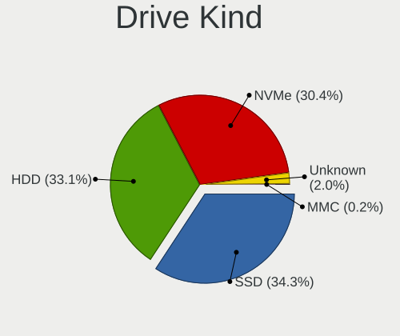

| Kind    | Desktops | Drives | Percent |
|---------|----------|--------|---------|
| SSD     | 5086     | 10225  | 34.27%  |
| HDD     | 4915     | 11104  | 33.11%  |
| NVMe    | 4518     | 8078   | 30.44%  |
| Unknown | 299      | 410    | 2.01%   |
| MMC     | 25       | 31     | 0.17%   |

Drive Connector
---------------

SATA, SAS, NVMe, etc.

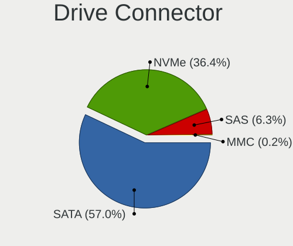

| Type | Desktops | Drives | Percent |
|------|----------|--------|---------|
| SATA | 7051     | 20623  | 57.03%  |
| NVMe | 4505     | 7998   | 36.44%  |
| SAS  | 783      | 1196   | 6.33%   |
| MMC  | 25       | 31     | 0.2%    |

Drive Size
----------

Size of hard drive

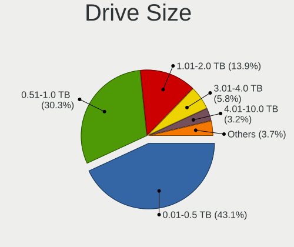

| Size in TB | Desktops | Drives | Percent |
|------------|----------|--------|---------|
| 0.01-0.5   | 4806     | 10032  | 43.11%  |
| 0.51-1.0   | 3373     | 5840   | 30.26%  |
| 1.01-2.0   | 1551     | 2596   | 13.91%  |
| 3.01-4.0   | 652      | 1247   | 5.85%   |
| 4.01-10.0  | 356      | 840    | 3.19%   |
| 2.01-3.0   | 314      | 580    | 2.82%   |
| 10.01-20.0 | 87       | 181    | 0.78%   |
| 20.01-50.0 | 9        | 13     | 0.08%   |

Space Total
-----------

Amount of disk space available on the file system

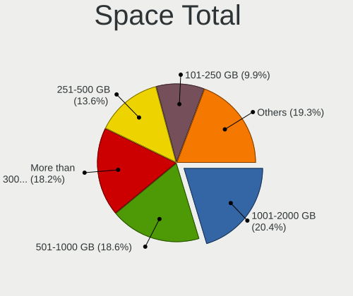

| Size in GB     | Desktops | Percent |
|----------------|----------|---------|
| 1001-2000      | 1890     | 20.36%  |
| 501-1000       | 1730     | 18.63%  |
| More than 3000 | 1690     | 18.2%   |
| 251-500        | 1267     | 13.65%  |
| 101-250        | 918      | 9.89%   |
| 2001-3000      | 698      | 7.52%   |
| Unknown        | 428      | 4.61%   |
| 1-20           | 414      | 4.46%   |
| 51-100         | 167      | 1.8%    |
| 21-50          | 82       | 0.88%   |
| 0              | 1        | 0.01%   |

Space Used
----------

Amount of used disk space

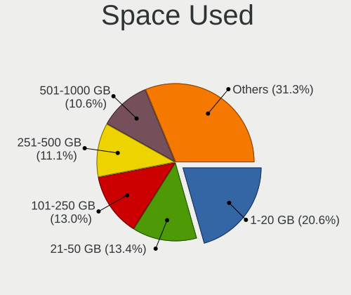

| Used GB        | Desktops | Percent |
|----------------|----------|---------|
| 1-20           | 2009     | 20.61%  |
| 21-50          | 1302     | 13.36%  |
| 101-250        | 1267     | 13%     |
| 251-500        | 1086     | 11.14%  |
| 501-1000       | 1036     | 10.63%  |
| 51-100         | 982      | 10.07%  |
| 1001-2000      | 826      | 8.47%   |
| More than 3000 | 466      | 4.78%   |
| Unknown        | 428      | 4.39%   |
| 2001-3000      | 339      | 3.48%   |
| 0              | 6        | 0.06%   |

Malfunc. Drives
---------------

Drive models with a malfunction

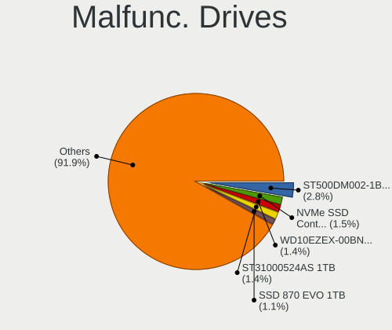

| Model                                                          | Desktops | Drives | Percent |
|----------------------------------------------------------------|----------|--------|---------|
| Seagate ST500DM002-1BD142 500GB                                | 26       | 57     | 2.77%   |
| Samsung Electronics NVMe SSD Controller SM981/PM981/PM983 1TB  | 14       | 17     | 1.49%   |
| WDC WD10EZEX-00BN5A0 1TB                                       | 13       | 13     | 1.39%   |
| Seagate ST31000524AS 1TB                                       | 13       | 26     | 1.39%   |
| Samsung Electronics SSD 870 EVO 1TB                            | 10       | 13     | 1.07%   |
| Seagate ST3500418AS 500GB                                      | 8        | 21     | 0.85%   |
| Seagate ST31000528AS 1TB                                       | 8        | 10     | 0.85%   |
| Samsung Electronics HD501LJ 500GB                              | 8        | 61     | 0.85%   |
| WDC WD10EZEX-08WN4A0 1TB                                       | 7        | 8      | 0.75%   |
| Toshiba DT01ACA100 1TB                                         | 7        | 7      | 0.75%   |
| Seagate ST2000DM001-1CH164 2TB                                 | 7        | 7      | 0.75%   |
| Intel SSDSC2CT120A3 120GB                                      | 7        | 71     | 0.75%   |
| WDC WD5000AAKX-603CA0 500GB                                    | 6        | 8      | 0.64%   |
| Seagate ST2000DM001-1ER164 2TB                                 | 6        | 6      | 0.64%   |
| Seagate ST1000DM010-2EP102 1TB                                 | 6        | 6      | 0.64%   |
| Samsung Electronics NVMe SSD Controller PM9A1/PM9A3/980PRO 1TB | 6        | 11     | 0.64%   |
| Kingston SV300S37A120G 120GB SSD                               | 6        | 7      | 0.64%   |
| WDC WD5000AAKX-00ERMA0 500GB                                   | 5        | 7      | 0.53%   |
| WDC WD40EFRX-68N32N0 4TB                                       | 5        | 18     | 0.53%   |
| WDC WD1002FAEX-00Z3A0 1TB                                      | 5        | 5      | 0.53%   |
| Toshiba MQ01ABD100 1TB                                         | 5        | 6      | 0.53%   |
| Toshiba MQ01ABD050 500GB                                       | 5        | 11     | 0.53%   |
| Seagate ST31500341AS 1TB                                       | 5        | 5      | 0.53%   |
| Seagate ST3000DM008-2DM166 3TB                                 | 5        | 6      | 0.53%   |
| Seagate ST1000DM003-1ER162 1TB                                 | 5        | 5      | 0.53%   |
| SanDisk SSD PLUS 240GB                                         | 5        | 5      | 0.53%   |
| Samsung Electronics SSD 870 EVO 500GB                          | 5        | 6      | 0.53%   |
| Samsung Electronics HD322HJ 320GB                              | 5        | 7      | 0.53%   |
| Kingston SA400S37240G 240GB SSD                                | 5        | 5      | 0.53%   |
| Hitachi HDS721010CLA332 1TB                                    | 5        | 6      | 0.53%   |
| Crucial CT275MX300SSD1 275GB                                   | 5        | 7      | 0.53%   |
| Crucial CT128MX100SSD1 128GB                                   | 5        | 7      | 0.53%   |
| WDC WDS240G2G0A-00JH30 240GB SSD                               | 4        | 4      | 0.43%   |
| WDC WD5000AADS-00S9B0 500GB                                    | 4        | 4      | 0.43%   |
| WDC WD40EFRX-68WT0N0 4TB                                       | 4        | 4      | 0.43%   |
| WDC WD20EZRX-00D8PB0 2TB                                       | 4        | 6      | 0.43%   |
| Toshiba DT01ACA050 500GB                                       | 4        | 5      | 0.43%   |
| Seagate ST500LT012-1DG142 500GB                                | 4        | 4      | 0.43%   |
| Seagate ST1000LM024 HN-M101MBB 1TB                             | 4        | 4      | 0.43%   |
| Seagate ST1000DM003-1CH162 1TB                                 | 4        | 4      | 0.43%   |

Malfunc. Drive Vendor
---------------------

Vendors of faulty drives

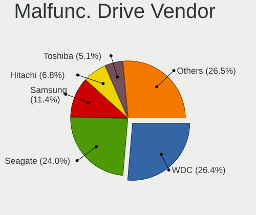

| Vendor                      | Desktops | Drives | Percent |
|-----------------------------|----------|--------|---------|
| WDC                         | 234      | 367    | 26.35%  |
| Seagate                     | 213      | 364    | 23.99%  |
| Samsung Electronics         | 101      | 216    | 11.37%  |
| Hitachi                     | 60       | 76     | 6.76%   |
| Toshiba                     | 45       | 69     | 5.07%   |
| Crucial                     | 33       | 54     | 3.72%   |
| Intel                       | 31       | 105    | 3.49%   |
| Kingston                    | 30       | 36     | 3.38%   |
| SanDisk                     | 25       | 25     | 2.82%   |
| A-DATA Technology           | 13       | 13     | 1.46%   |
| Maxtor                      | 9        | 14     | 1.01%   |
| HGST                        | 9        | 11     | 1.01%   |
| Micron Technology           | 8        | 8      | 0.9%    |
| Corsair                     | 8        | 11     | 0.9%    |
| SK hynix                    | 7        | 7      | 0.79%   |
| SPCC                        | 4        | 5      | 0.45%   |
| Realtek Semiconductor       | 4        | 5      | 0.45%   |
| OCZ                         | 4        | 5      | 0.45%   |
| Silicon Motion              | 3        | 3      | 0.34%   |
| LITEON                      | 3        | 3      | 0.34%   |
| ADATA Technology            | 3        | 3      | 0.34%   |
| SSSTC                       | 2        | 2      | 0.23%   |
| OCZ-VERTEX3                 | 2        | 2      | 0.23%   |
| Micron/Crucial Technology   | 2        | 3      | 0.23%   |
| MAXIO Technology (Hangzhou) | 2        | 2      | 0.23%   |
| Intenso                     | 2        | 2      | 0.23%   |
| Hewlett-Packard             | 2        | 2      | 0.23%   |
| Fujitsu                     | 2        | 2      | 0.23%   |
| China                       | 2        | 3      | 0.23%   |
| XrayDisk                    | 1        | 1      | 0.11%   |
| Verbatim                    | 1        | 1      | 0.11%   |
| USB3.0                      | 1        | 1      | 0.11%   |
| Unknown                     | 1        | 1      | 0.11%   |
| Transcend                   | 1        | 1      | 0.11%   |
| Team                        | 1        | 4      | 0.11%   |
| T-FORCE                     | 1        | 1      | 0.11%   |
| S3+                         | 1        | 1      | 0.11%   |
| Realtek                     | 1        | 1      | 0.11%   |
| PNY                         | 1        | 1      | 0.11%   |
| ORICO                       | 1        | 1      | 0.11%   |

Malfunc. HDD Vendor
-------------------

Vendors of faulty HDD drives

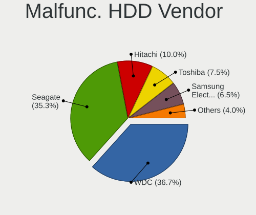

| Vendor              | Desktops | Drives | Percent |
|---------------------|----------|--------|---------|
| WDC                 | 220      | 343    | 36.67%  |
| Seagate             | 212      | 363    | 35.33%  |
| Hitachi             | 60       | 76     | 10%     |
| Toshiba             | 45       | 69     | 7.5%    |
| Samsung Electronics | 39       | 137    | 6.5%    |
| Maxtor              | 9        | 14     | 1.5%    |
| HGST                | 9        | 11     | 1.5%    |
| Hewlett-Packard     | 2        | 2      | 0.33%   |
| Fujitsu             | 2        | 2      | 0.33%   |
| USB3.0              | 1        | 1      | 0.17%   |
| ASMT                | 1        | 1      | 0.17%   |

Malfunc. Drive Kind
-------------------

Kinds of faulty drives

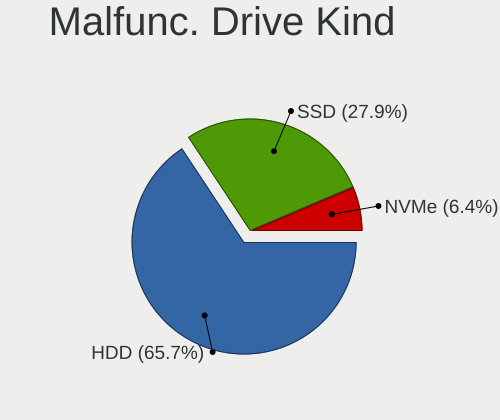

| Kind | Desktops | Drives | Percent |
|------|----------|--------|---------|
| HDD  | 544      | 1019   | 65.7%   |
| SSD  | 231      | 365    | 27.9%   |
| NVMe | 53       | 64     | 6.4%    |

Failed Drives
-------------

Failed drive models

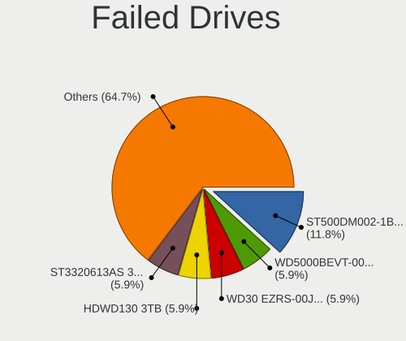

| Model                                            | Desktops | Drives | Percent |
|--------------------------------------------------|----------|--------|---------|
| Seagate ST500DM002-1BD142 500GB                  | 2        | 2      | 11.76%  |
| WDC WD5000BEVT-00ZAT0 500GB                      | 1        | 2      | 5.88%   |
| WDC WD30 EZRS-00J99B0 3TB                        | 1        | 1      | 5.88%   |
| Toshiba HDWD130 3TB                              | 1        | 1      | 5.88%   |
| SPCC M.2 PCIe SSD 2TB                            | 1        | 1      | 5.88%   |
| Seagate ST3320613AS 320GB                        | 1        | 1      | 5.88%   |
| Seagate ST31000528AS 1TB                         | 1        | 2      | 5.88%   |
| Seagate ST1000LM024 HN-M101MBB 1TB               | 1        | 1      | 5.88%   |
| Samsung Electronics SSD 980 500GB                | 1        | 2      | 5.88%   |
| Samsung Electronics SSD 980 1TB                  | 1        | 2      | 5.88%   |
| Samsung Electronics MZNTY128HDHP-000H1 128GB SSD | 1        | 1      | 5.88%   |
| Samsung Electronics HD321HJ 320GB                | 1        | 2      | 5.88%   |
| Hitachi HTS545050A7E380 500GB                    | 1        | 1      | 5.88%   |
| Hitachi HDS721010DLE630 1TB                      | 1        | 12     | 5.88%   |
| Hitachi HDS72101 1TB                             | 1        | 1      | 5.88%   |
| ADATA Technology SX6000LNP 1024GB                | 1        | 1      | 5.88%   |

Failed Drive Vendor
-------------------

Failed drive vendors

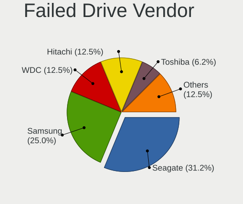

| Vendor              | Desktops | Drives | Percent |
|---------------------|----------|--------|---------|
| Seagate             | 5        | 6      | 31.25%  |
| Samsung Electronics | 4        | 7      | 25%     |
| WDC                 | 2        | 3      | 12.5%   |
| Hitachi             | 2        | 14     | 12.5%   |
| Toshiba             | 1        | 1      | 6.25%   |
| SPCC                | 1        | 1      | 6.25%   |
| ADATA Technology    | 1        | 1      | 6.25%   |

Drive Status
------------

Number of failed and malfunc. drives

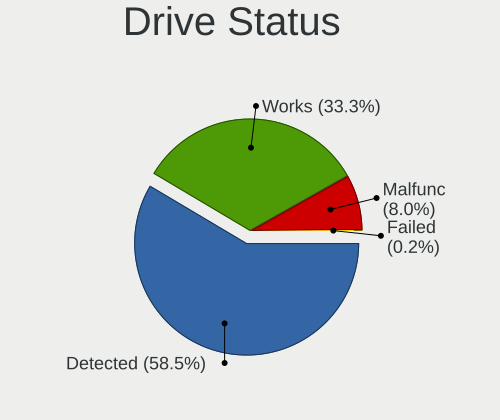

| Status   | Desktops | Drives | Percent |
|----------|----------|--------|---------|
| Detected | 5742     | 17947  | 58.53%  |
| Works    | 3268     | 10420  | 33.31%  |
| Malfunc  | 785      | 1448   | 8%      |
| Failed   | 15       | 33     | 0.15%   |

Storage controller
------------------

Storage Vendor
--------------

Storage controller vendors

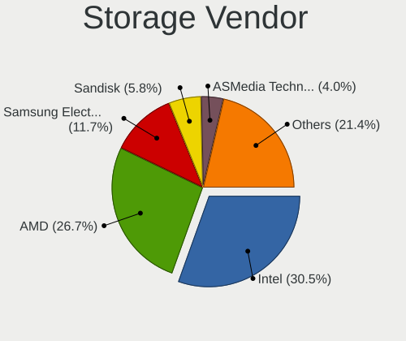

| Vendor                         | Desktops | Percent |
|--------------------------------|----------|---------|
| Intel                          | 4561     | 30.48%  |
| AMD                            | 3992     | 26.68%  |
| Samsung Electronics            | 1755     | 11.73%  |
| Sandisk                        | 864      | 5.77%   |
| ASMedia Technology             | 592      | 3.96%   |
| Kingston Technology Company    | 503      | 3.36%   |
| Phison Electronics             | 480      | 3.21%   |
| Micron/Crucial Technology      | 404      | 2.7%    |
| Marvell Technology Group       | 203      | 1.36%   |
| ADATA Technology               | 193      | 1.29%   |
| MAXIO Technology (Hangzhou)    | 178      | 1.19%   |
| Silicon Motion                 | 174      | 1.16%   |
| JMicron Technology             | 152      | 1.02%   |
| SK hynix                       | 118      | 0.79%   |
| Realtek Semiconductor          | 118      | 0.79%   |
| Micron Technology              | 105      | 0.7%    |
| Shenzhen Longsys Electronics   | 85       | 0.57%   |
| Nvidia                         | 79       | 0.53%   |
| Toshiba America Info Systems   | 52       | 0.35%   |
| Seagate Technology             | 49       | 0.33%   |
| KIOXIA                         | 45       | 0.3%    |
| LSI Logic / Symbios Logic      | 39       | 0.26%   |
| Broadcom / LSI                 | 36       | 0.24%   |
| VIA Technologies               | 20       | 0.13%   |
| INNOGRIT                       | 20       | 0.13%   |
| Solidigm                       | 19       | 0.13%   |
| Adaptec                        | 16       | 0.11%   |
| Lite-On Technology             | 15       | 0.1%    |
| Silicon Image                  | 13       | 0.09%   |
| Netac Technology               | 11       | 0.07%   |
| Hosin Global Electronics       | 8        | 0.05%   |
| Biwin Storage Technology       | 8        | 0.05%   |
| Solid State Storage Technology | 7        | 0.05%   |
| TenaFe                         | 6        | 0.04%   |
| Union Memory (Shenzhen)        | 4        | 0.03%   |
| Integrated Technology Express  | 4        | 0.03%   |
| Hewlett-Packard                | 4        | 0.03%   |
| Unknown                        | 4        | 0.03%   |
| Yangtze Memory Technologies    | 3        | 0.02%   |
| HighPoint Technologies         | 3        | 0.02%   |

Storage Model
-------------

Storage controller models

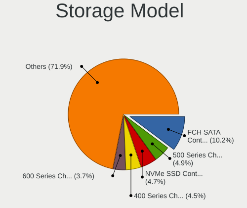

| Model                                                                          | Desktops | Percent |
|--------------------------------------------------------------------------------|----------|---------|
| AMD FCH SATA Controller [AHCI mode]                                            | 1799     | 10.23%  |
| AMD 500 Series Chipset SATA Controller                                         | 859      | 4.88%   |
| Samsung NVMe SSD Controller SM981/PM981/PM983                                  | 834      | 4.74%   |
| AMD 400 Series Chipset SATA Controller                                         | 796      | 4.52%   |
| AMD 600 Series Chipset SATA Controller                                         | 655      | 3.72%   |
| ASMedia ASM1061/ASM1062 Serial ATA Controller                                  | 523      | 2.97%   |
| Intel 8 Series/C220 Series Chipset Family 6-port SATA Controller 1 [AHCI mode] | 478      | 2.72%   |
| Intel 200 Series PCH SATA controller [AHCI mode]                               | 414      | 2.35%   |
| Intel Q170/Q150/B150/H170/H110/Z170/CM236 Chipset SATA Controller [AHCI Mode]  | 413      | 2.35%   |
| Samsung NVMe SSD Controller PM9A1/PM9A3/980PRO                                 | 406      | 2.31%   |
| Intel SATA Controller [RAID mode]                                              | 349      | 1.98%   |
| Intel Alder Lake-S PCH SATA Controller [AHCI Mode]                             | 313      | 1.78%   |
| Intel Cannon Lake PCH SATA AHCI Controller                                     | 307      | 1.75%   |
| Intel 7 Series/C210 Series Chipset Family 6-port SATA Controller [AHCI mode]   | 289      | 1.64%   |
| Intel 6 Series/C200 Series Chipset Family 6 port Desktop SATA AHCI Controller  | 289      | 1.64%   |
| AMD SB7x0/SB8x0/SB9x0 SATA Controller [AHCI mode]                              | 224      | 1.27%   |
| AMD SB7x0/SB8x0/SB9x0 IDE Controller                                           | 220      | 1.25%   |
| Samsung NVMe SSD Controller S4LV008[Pascal]                                    | 209      | 1.19%   |
| Intel Raptor Lake SATA AHCI Controller                                         | 206      | 1.17%   |
| Samsung NVMe SSD Controller 980 (DRAM-less)                                    | 204      | 1.16%   |
| Phison E12 NVMe Controller                                                     | 196      | 1.11%   |
| Micron/Crucial P2 [Nick P2] / P3 / P3 Plus NVMe PCIe SSD (DRAM-less)           | 188      | 1.07%   |
| AMD 300 Series Chipset SATA Controller                                         | 178      | 1.01%   |
| Samsung NVMe SSD Controller SM961/PM961/SM963                                  | 170      | 0.97%   |
| AMD A320 Chipset SATA Controller [AHCI mode]                                   | 166      | 0.94%   |
| SanDisk Ultra 3D / WD PC SN530, IX SN530, Blue SN550 NVMe SSD (DRAM-less)      | 153      | 0.87%   |
| Intel 500 Series Chipset Family SATA AHCI Controller                           | 152      | 0.86%   |
| Intel 9 Series Chipset Family SATA Controller [AHCI Mode]                      | 150      | 0.85%   |
| Intel Volume Management Device NVMe RAID Controller                            | 145      | 0.82%   |
| Sandisk WD Black SN850X NVMe SSD                                               | 141      | 0.8%    |
| Silicon Motion SM2263EN/SM2263XT (DRAM-less) NVMe SSD Controllers              | 132      | 0.75%   |
| SanDisk WD SN560/SN740/SN770/SN5000 NVMe SSD                                   | 132      | 0.75%   |
| AMD SB7x0/SB8x0/SB9x0 SATA Controller [IDE mode]                               | 127      | 0.72%   |
| MAXIO (Hangzhou) NVMe SSD Controller MAP1202 (DRAM-less)                       | 121      | 0.69%   |
| Phison E16 PCIe4 NVMe Controller                                               | 116      | 0.66%   |
| Kingston Company KC3000/FURY Renegade NVMe SSD [E18]                           | 110      | 0.63%   |
| SanDisk Extreme Pro / WD Black SN750 / PC SN730 / Red SN700 NVMe SSD           | 109      | 0.62%   |
| Intel Comet Lake SATA AHCI Controller                                          | 102      | 0.58%   |
| Kingston Company NV2 NVMe SSD [SM2267XT] (DRAM-less)                           | 99       | 0.56%   |
| Intel NM10/ICH7 Family SATA Controller [IDE mode]                              | 98       | 0.56%   |

Storage Kind
------------

Kind of storage controller (IDE, SATA, NVMe, SAS, ...)

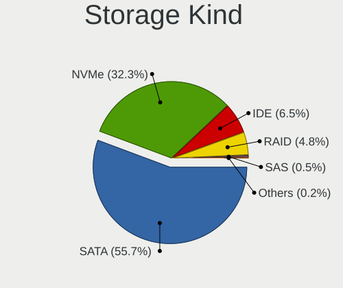

| Kind | Desktops | Percent |
|------|----------|---------|
| SATA | 7763     | 55.69%  |
| NVMe | 4500     | 32.28%  |
| IDE  | 903      | 6.48%   |
| RAID | 673      | 4.83%   |
| SAS  | 71       | 0.51%   |
| SCSI | 29       | 0.21%   |

Processor
---------

CPU Vendor
----------

Processor vendors

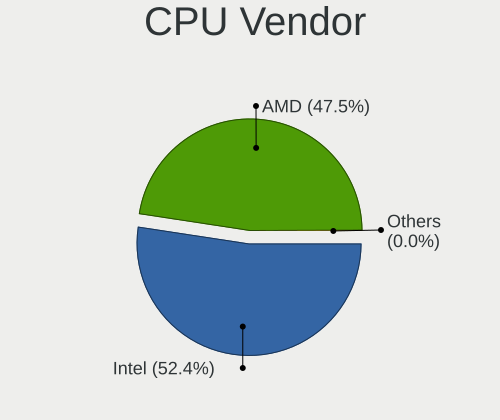

| Vendor                   | Desktops | Percent |
|--------------------------|----------|---------|
| Intel                    | 4558     | 52.4%   |
| AMD                      | 4135     | 47.54%  |
| Unknown                  | 2        | 0.02%   |
| PowerNV C1P9S01 REV 1.01 | 1        | 0.01%   |
| Loongson                 | 1        | 0.01%   |
| CHRP IBM,8286-41A        | 1        | 0.01%   |

CPU Model
---------

Processor models

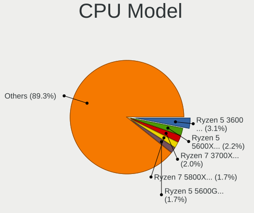

| Model                                       | Desktops | Percent |
|---------------------------------------------|----------|---------|
| AMD Ryzen 5 3600 6-Core Processor           | 269      | 3.07%   |
| AMD Ryzen 5 5600X 6-Core Processor          | 190      | 2.17%   |
| AMD Ryzen 7 3700X 8-Core Processor          | 178      | 2.03%   |
| AMD Ryzen 7 5800X 8-Core Processor          | 153      | 1.75%   |
| AMD Ryzen 5 5600G with Radeon Graphics      | 149      | 1.7%    |
| AMD Ryzen 9 5900X 12-Core Processor         | 139      | 1.59%   |
| AMD Ryzen 5 2600 Six-Core Processor         | 112      | 1.28%   |
| AMD Ryzen 9 3900X 12-Core Processor         | 111      | 1.27%   |
| AMD Ryzen 7 5700G with Radeon Graphics      | 109      | 1.25%   |
| Intel Core i7-3770 CPU @ 3.40GHz            | 105      | 1.2%    |
| AMD Ryzen 9 5950X 16-Core Processor         | 104      | 1.19%   |
| AMD Ryzen 7 2700X Eight-Core Processor      | 96       | 1.1%    |
| AMD Ryzen 7 5700X 8-Core Processor          | 86       | 0.98%   |
| Intel Core i7-4790 CPU @ 3.60GHz            | 83       | 0.95%   |
| Intel Core i5-6500 CPU @ 3.20GHz            | 79       | 0.9%    |
| AMD Ryzen 7 7800X3D 8-Core Processor        | 77       | 0.88%   |
| Intel Core i7-6700K CPU @ 4.00GHz           | 73       | 0.83%   |
| AMD Ryzen 5 1600 Six-Core Processor         | 73       | 0.83%   |
| Intel Core i7-6700 CPU @ 3.40GHz            | 71       | 0.81%   |
| AMD Ryzen 9 7950X 16-Core Processor         | 70       | 0.8%    |
| Intel Core i7-7700K CPU @ 4.20GHz           | 69       | 0.79%   |
| AMD Ryzen 5 5600 6-Core Processor           | 68       | 0.78%   |
| Intel Core i7-8700 CPU @ 3.20GHz            | 67       | 0.77%   |
| Intel Core i5-3470 CPU @ 3.20GHz            | 67       | 0.77%   |
| AMD Ryzen 7 5800X3D 8-Core Processor        | 67       | 0.77%   |
| Intel Core i5-2400 CPU @ 3.10GHz            | 64       | 0.73%   |
| Intel Core i7-4790K CPU @ 4.00GHz           | 61       | 0.7%    |
| Intel Core i5-9400F CPU @ 2.90GHz           | 59       | 0.67%   |
| AMD Ryzen 5 3400G with Radeon Vega Graphics | 58       | 0.66%   |
| Intel Core i5-8400 CPU @ 2.80GHz            | 57       | 0.65%   |
| AMD FX-8350 Eight-Core Processor            | 54       | 0.62%   |
| AMD Ryzen 7 9800X3D 8-Core Processor        | 53       | 0.61%   |
| Intel Core i5-10400F CPU @ 2.90GHz          | 51       | 0.58%   |
| Intel 12th Gen Core i5-12400F               | 51       | 0.58%   |
| Intel Core i5-4460 CPU @ 3.20GHz            | 50       | 0.57%   |
| AMD Ryzen 7 1700 Eight-Core Processor       | 50       | 0.57%   |
| AMD Ryzen 5 3600X 6-Core Processor          | 49       | 0.56%   |
| AMD FX-6300 Six-Core Processor              | 49       | 0.56%   |
| Intel Core i7-8700K CPU @ 3.70GHz           | 48       | 0.55%   |
| Intel Core i7-4770 CPU @ 3.40GHz            | 48       | 0.55%   |

CPU Model Family
----------------

Processor model prefix

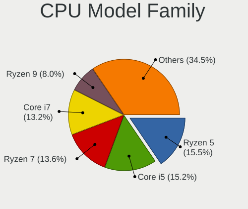

| Model                   | Desktops | Percent |
|-------------------------|----------|---------|
| AMD Ryzen 5             | 1350     | 15.46%  |
| Intel Core i5           | 1327     | 15.2%   |
| AMD Ryzen 7             | 1185     | 13.57%  |
| Intel Core i7           | 1154     | 13.22%  |
| AMD Ryzen 9             | 701      | 8.03%   |
| Other                   | 637      | 7.3%    |
| Intel Xeon              | 431      | 4.94%   |
| Intel Core i3           | 393      | 4.5%    |
| AMD FX                  | 224      | 2.57%   |
| Intel Core i9           | 139      | 1.59%   |
| AMD Ryzen 3             | 138      | 1.58%   |
| Intel Core 2 Duo        | 109      | 1.25%   |
| Intel Celeron           | 93       | 1.07%   |
| Intel Core 2 Quad       | 88       | 1.01%   |
| Intel Pentium           | 82       | 0.94%   |
| AMD Ryzen Threadripper  | 80       | 0.92%   |
| AMD Phenom II X4        | 61       | 0.7%    |
| AMD A10                 | 51       | 0.58%   |
| AMD A8                  | 41       | 0.47%   |
| Intel Pentium Dual-Core | 34       | 0.39%   |
| AMD A6                  | 29       | 0.33%   |
| AMD Athlon              | 28       | 0.32%   |
| AMD Phenom II X6        | 27       | 0.31%   |
| AMD Ryzen 5 PRO         | 26       | 0.3%    |
| AMD Athlon II X2        | 26       | 0.3%    |
| Intel Core              | 22       | 0.25%   |
| Intel Atom              | 21       | 0.24%   |
| AMD Athlon 64 X2        | 20       | 0.23%   |
| AMD A4                  | 19       | 0.22%   |
| Intel Core 2            | 18       | 0.21%   |
| AMD Ryzen 7 PRO         | 17       | 0.19%   |
| Intel Pentium Gold      | 15       | 0.17%   |
| AMD Phenom              | 14       | 0.16%   |
| AMD Athlon II X4        | 13       | 0.15%   |
| Intel Genuine           | 11       | 0.13%   |
| AMD Phenom II X2        | 11       | 0.13%   |
| AMD Athlon X4           | 11       | 0.13%   |
| Intel Pentium Dual      | 7        | 0.08%   |
| AMD PRO A10             | 6        | 0.07%   |
| AMD Ryzen 3 PRO         | 5        | 0.06%   |

CPU Cores
---------

Number of processor cores

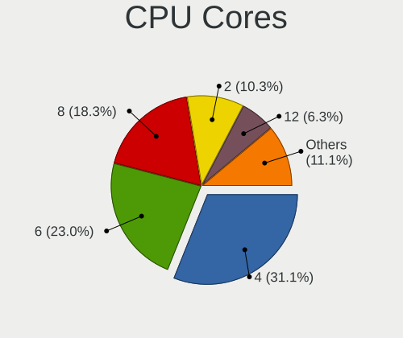

| Number  | Desktops | Percent |
|---------|----------|---------|
| 4       | 2714     | 31.06%  |
| 6       | 2010     | 23%     |
| 8       | 1603     | 18.34%  |
| 2       | 897      | 10.26%  |
| 12      | 547      | 6.26%   |
| 16      | 435      | 4.98%   |
| 10      | 139      | 1.59%   |
| 24      | 99       | 1.13%   |
| 14      | 85       | 0.97%   |
| 3       | 65       | 0.74%   |
| 1       | 48       | 0.55%   |
| 20      | 43       | 0.49%   |
| 32      | 28       | 0.32%   |
| 18      | 8        | 0.09%   |
| 28      | 7        | 0.08%   |
| 36      | 4        | 0.05%   |
| 5       | 3        | 0.03%   |
| Unknown | 2        | 0.02%   |
| 64      | 1        | 0.01%   |
| 44      | 1        | 0.01%   |

CPU Sockets
-----------

Number of sockets

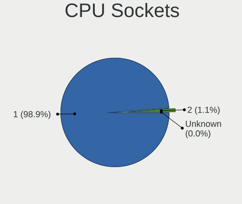

| Number  | Desktops | Percent |
|---------|----------|---------|
| 1       | 8598     | 98.86%  |
| 2       | 95       | 1.09%   |
| 4       | 2        | 0.02%   |
| Unknown | 2        | 0.02%   |

CPU Threads
-----------

Threads per core (Hyper-Threading)

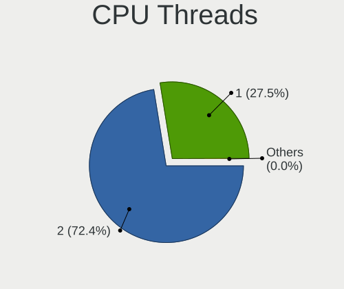

| Number  | Desktops | Percent |
|---------|----------|---------|
| 2       | 6320     | 72.44%  |
| 1       | 2399     | 27.5%   |
| Unknown | 2        | 0.02%   |
| 8       | 1        | 0.01%   |
| 4       | 1        | 0.01%   |
| 3       | 1        | 0.01%   |

CPU Op-Modes
------------

CPU Operation Modes (32-bit, 64-bit)

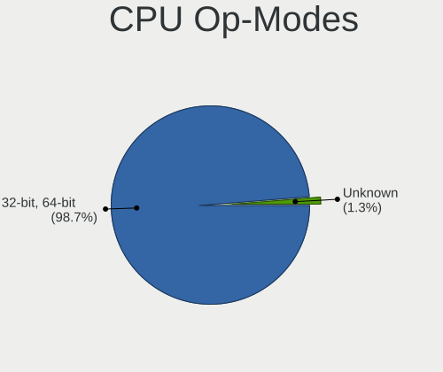

| Op mode        | Desktops | Percent |
|----------------|----------|---------|
| 32-bit, 64-bit | 8604     | 98.73%  |
| Unknown        | 111      | 1.27%   |

CPU Microcode
-------------

Microcode number

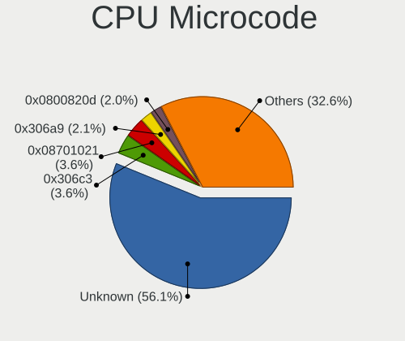

| Number     | Desktops | Percent |
|------------|----------|---------|
| Unknown    | 5073     | 56.14%  |
| 0x306c3    | 323      | 3.57%   |
| 0x08701021 | 322      | 3.56%   |
| 0x306a9    | 193      | 2.14%   |
| 0x0800820d | 182      | 2.01%   |
| 0x506e3    | 176      | 1.95%   |
| 0x206a7    | 138      | 1.53%   |
| 0x906ea    | 135      | 1.49%   |
| 0x08701013 | 130      | 1.44%   |
| 0x906e9    | 122      | 1.35%   |
| 0x0a201016 | 104      | 1.15%   |
| 0x1067a    | 88       | 0.97%   |
| 0x06000852 | 86       | 0.95%   |
| 0x0a20120a | 83       | 0.92%   |
| 0x0a601203 | 79       | 0.87%   |
| 0x0a201009 | 73       | 0.81%   |
| 0x08108109 | 72       | 0.8%    |
| 0x08001138 | 72       | 0.8%    |
| 0x0a50000d | 66       | 0.73%   |
| 0x0a50000c | 60       | 0.66%   |
| 0x906ed    | 57       | 0.63%   |
| 0x08001137 | 57       | 0.63%   |
| 0x010000c8 | 57       | 0.63%   |
| 0x90672    | 48       | 0.53%   |
| 0x306f2    | 46       | 0.51%   |
| 0x08101016 | 46       | 0.51%   |
| 0xa0655    | 44       | 0.49%   |
| 0xa0653    | 41       | 0.45%   |
| 0x08701030 | 39       | 0.43%   |
| 0x06001119 | 39       | 0.43%   |
| 0x206d7    | 33       | 0.37%   |
| 0x20655    | 28       | 0.31%   |
| 0xa0671    | 27       | 0.3%    |
| 0x906eb    | 27       | 0.3%    |
| 0x106a5    | 27       | 0.3%    |
| 0x10676    | 27       | 0.3%    |
| 0x0a601206 | 27       | 0.3%    |
| 0x6fb      | 26       | 0.29%   |
| 0x106e5    | 26       | 0.29%   |
| 0x06003106 | 26       | 0.29%   |

CPU Microarch
-------------

Microarchitecture

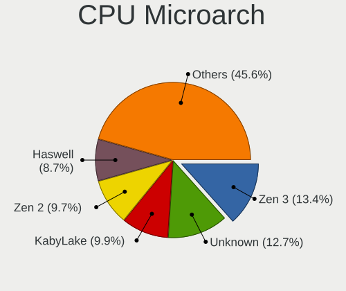

| Name             | Desktops | Percent |
|------------------|----------|---------|
| Zen 3            | 1170     | 13.37%  |
| Unknown          | 1108     | 12.66%  |
| KabyLake         | 863      | 9.86%   |
| Zen 2            | 852      | 9.74%   |
| Haswell          | 764      | 8.73%   |
| IvyBridge        | 476      | 5.44%   |
| Zen+             | 453      | 5.18%   |
| Skylake          | 438      | 5.01%   |
| SandyBridge      | 358      | 4.09%   |
| Zen              | 332      | 3.79%   |
| Alderlake Hybrid | 289      | 3.3%    |
| CometLake        | 278      | 3.18%   |
| Piledriver       | 253      | 2.89%   |
| Penryn           | 208      | 2.38%   |
| K10              | 165      | 1.89%   |
| Westmere         | 106      | 1.21%   |
| Nehalem          | 102      | 1.17%   |
| Core             | 82       | 0.94%   |
| Icelake          | 74       | 0.85%   |
| Broadwell        | 67       | 0.77%   |
| Steamroller      | 51       | 0.58%   |
| Excavator        | 44       | 0.5%    |
| Bulldozer        | 32       | 0.37%   |
| K8 Hammer        | 30       | 0.34%   |
| Silvermont       | 28       | 0.32%   |
| Gracemont        | 17       | 0.19%   |
| Goldmont plus    | 17       | 0.19%   |
| Jaguar           | 12       | 0.14%   |
| Bonnell          | 12       | 0.14%   |
| Tremont          | 10       | 0.11%   |
| NetBurst         | 10       | 0.11%   |
| Bobcat           | 10       | 0.11%   |
| Lunarlake Hybrid | 9        | 0.1%    |
| K10 Llano        | 9        | 0.1%    |
| Puma             | 8        | 0.09%   |
| Goldmont         | 7        | 0.08%   |
| TigerLake        | 5        | 0.06%   |
| Sapphire Rapids  | 1        | 0.01%   |

Graphics
--------

GPU Vendor
----------

Vendors of graphics cards

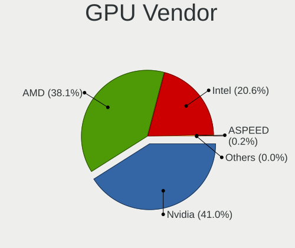

| Vendor                           | Desktops | Percent |
|----------------------------------|----------|---------|
| Nvidia                           | 3969     | 41.03%  |
| AMD                              | 3683     | 38.08%  |
| Intel                            | 1990     | 20.57%  |
| ASPEED Technology                | 15       | 0.16%   |
| Matrox Electronics Systems       | 12       | 0.12%   |
| VIA Technologies                 | 1        | 0.01%   |
| Silicon Integrated Systems [SiS] | 1        | 0.01%   |
| S3 Graphics                      | 1        | 0.01%   |
| Loongson Technology              | 1        | 0.01%   |

GPU Model
---------

Graphics card models

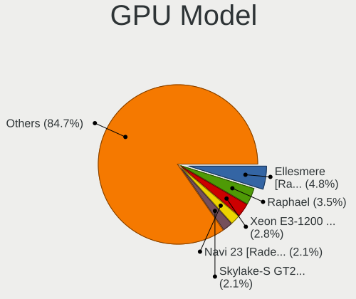

| Model                                                                       | Desktops | Percent |
|-----------------------------------------------------------------------------|----------|---------|
| AMD Ellesmere [Radeon RX 470/480/570/570X/580/580X/590]                     | 491      | 4.82%   |
| AMD Raphael                                                                 | 357      | 3.51%   |
| Intel Xeon E3-1200 v3/4th Gen Core Processor Integrated Graphics Controller | 290      | 2.85%   |
| AMD Navi 23 [Radeon RX 6600/6600 XT/6600M]                                  | 213      | 2.09%   |
| Intel Skylake-S GT2 [HD Graphics 530]                                       | 211      | 2.07%   |
| AMD Cezanne [Radeon Vega Series / Radeon Vega Mobile Series]                | 210      | 2.06%   |
| AMD Navi 10 [Radeon RX 5600 OEM/5600 XT / 5700/5700 XT]                     | 206      | 2.02%   |
| Nvidia GP107 [GeForce GTX 1050 Ti]                                          | 205      | 2.01%   |
| Intel CoffeeLake-S GT2 [UHD Graphics 630]                                   | 199      | 1.95%   |
| AMD Navi 22 [Radeon RX 6700/6700 XT/6750 XT / 6800M/6850M XT]               | 188      | 1.85%   |
| Nvidia GP106 [GeForce GTX 1060 6GB]                                         | 163      | 1.6%    |
| AMD Granite Ridge [Radeon Graphics]                                         | 156      | 1.53%   |
| AMD Navi 31 [Radeon RX 7900 XT/7900 XTX/7900 GRE/7900M]                     | 151      | 1.48%   |
| AMD Navi 21 [Radeon RX 6800/6800 XT / 6900 XT]                              | 151      | 1.48%   |
| Intel 2nd Generation Core Processor Family Integrated Graphics Controller   | 141      | 1.38%   |
| Nvidia GA106 [GeForce RTX 3060 Lite Hash Rate]                              | 134      | 1.32%   |
| Intel Kaby Lake-S GT2 [HD Graphics 630]                                     | 130      | 1.28%   |
| Intel Xeon E3-1200 v2/3rd Gen Core processor Graphics Controller            | 129      | 1.27%   |
| Nvidia GP104 [GeForce GTX 1070]                                             | 127      | 1.25%   |
| AMD Navi 32 [Radeon RX 7700 XT / 7800 XT]                                   | 116      | 1.14%   |
| Nvidia GK208B [GeForce GT 710]                                              | 112      | 1.1%    |
| AMD Picasso/Raven 2 [Radeon Vega Series / Radeon Vega Mobile Series]        | 107      | 1.05%   |
| Intel CometLake-S GT2 [UHD Graphics 630]                                    | 98       | 0.96%   |
| Nvidia GP108 [GeForce GT 1030]                                              | 97       | 0.95%   |
| Nvidia TU116 [GeForce GTX 1660 SUPER]                                       | 91       | 0.89%   |
| Nvidia GP104 [GeForce GTX 1080]                                             | 89       | 0.87%   |
| Nvidia GM204 [GeForce GTX 970]                                              | 88       | 0.86%   |
| AMD Lexa PRO [Radeon 540/540X/550/550X / RX 540X/550/550X]                  | 87       | 0.85%   |
| Intel Raptor Lake-S GT1 [UHD Graphics 770]                                  | 84       | 0.82%   |
| Nvidia TU117 [GeForce GTX 1650]                                             | 82       | 0.81%   |
| AMD Raven Ridge [Radeon Vega Series / Radeon Vega Mobile Series]            | 82       | 0.81%   |
| Nvidia GM206 [GeForce GTX 960]                                              | 81       | 0.8%    |
| Nvidia GT218 [GeForce 210]                                                  | 80       | 0.79%   |
| Nvidia GP106 [GeForce GTX 1060 3GB]                                         | 80       | 0.79%   |
| Nvidia GA104 [GeForce RTX 3060 Ti Lite Hash Rate]                           | 79       | 0.78%   |
| Intel IvyBridge GT2 [HD Graphics 4000]                                      | 74       | 0.73%   |
| Intel Alder Lake-S GT1 [UHD Graphics 770]                                   | 70       | 0.69%   |
| AMD Cedar [Radeon HD 5000/6000/7350/8350 Series]                            | 67       | 0.66%   |
| Nvidia GP102 [GeForce GTX 1080 Ti]                                          | 66       | 0.65%   |
| Nvidia AD107 [GeForce RTX 4060]                                             | 66       | 0.65%   |

GPU Combo
---------

Combinations of graphics cards

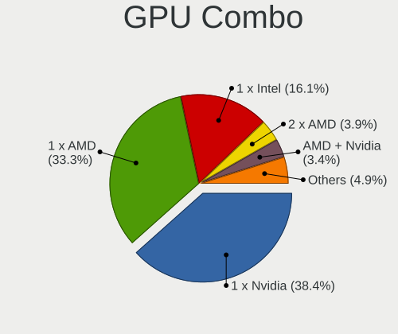

| Name                     | Desktops | Percent |
|--------------------------|----------|---------|
| 1 x Nvidia               | 3400     | 38.4%   |
| 1 x AMD                  | 2951     | 33.33%  |
| 1 x Intel                | 1428     | 16.13%  |
| 2 x AMD                  | 348      | 3.93%   |
| AMD + Nvidia             | 297      | 3.35%   |
| Intel + Nvidia           | 223      | 2.52%   |
| Intel + AMD              | 93       | 1.05%   |
| 2 x Nvidia               | 45       | 0.51%   |
| 2 x Intel                | 19       | 0.21%   |
| 1 x ASPEED               | 10       | 0.11%   |
| 1 x Matrox               | 6        | 0.07%   |
| Other                    | 5        | 0.06%   |
| Intel + AMD + 1 x Nvidia | 4        | 0.05%   |
| Nvidia + Matrox          | 3        | 0.03%   |
| Nvidia + ASPEED          | 3        | 0.03%   |
| Intel + 2 x Nvidia       | 3        | 0.03%   |
| AMD + Matrox             | 3        | 0.03%   |
| 3 x AMD                  | 2        | 0.02%   |
| Intel + 2 x AMD          | 2        | 0.02%   |
| AMD + 2 x Nvidia         | 2        | 0.02%   |
| 2 x Nvidia + 1 x ASPEED  | 1        | 0.01%   |
| 2 x AMD + 1 x Nvidia     | 1        | 0.01%   |
| 1 x VIA                  | 1        | 0.01%   |
| 1 x SiS                  | 1        | 0.01%   |
| 1 x S3 Graphics          | 1        | 0.01%   |
| 1 x Loongson Technology  | 1        | 0.01%   |
| 1 x AMD + 3 x Nvidia     | 1        | 0.01%   |
| AMD + ASPEED             | 1        | 0.01%   |

GPU Driver
----------

Free vs proprietary

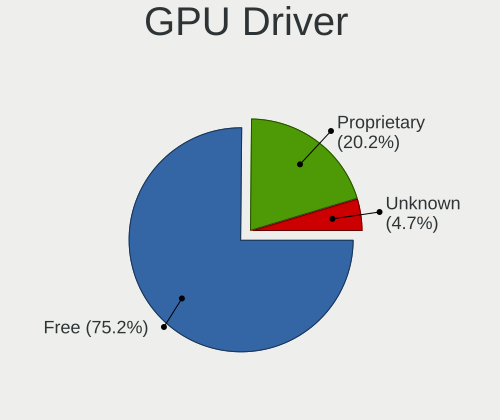

| Driver      | Desktops | Percent |
|-------------|----------|---------|
| Free        | 6675     | 75.15%  |
| Proprietary | 1793     | 20.19%  |
| Unknown     | 414      | 4.66%   |

GPU Memory
----------

Total video memory

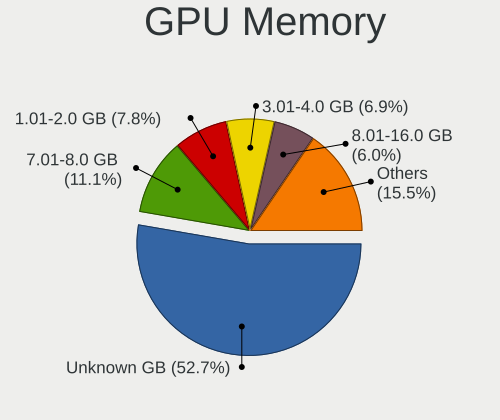

| Size in GB | Desktops | Percent |
|------------|----------|---------|
| Unknown    | 4785     | 52.73%  |
| 7.01-8.0   | 1005     | 11.07%  |
| 1.01-2.0   | 707      | 7.79%   |
| 3.01-4.0   | 629      | 6.93%   |
| 8.01-16.0  | 544      | 5.99%   |
| 0.51-1.0   | 497      | 5.48%   |
| 0.01-0.5   | 450      | 4.96%   |
| 5.01-6.0   | 270      | 2.98%   |
| 16.01-24.0 | 110      | 1.21%   |
| 2.01-3.0   | 75       | 0.83%   |
| 4.01-5.0   | 3        | 0.03%   |

Monitor
-------

Monitor Vendor
--------------

Monitor vendors

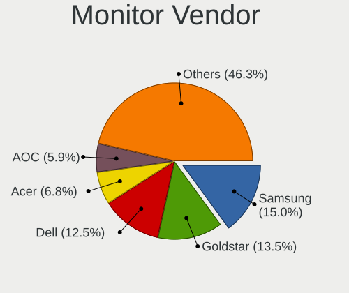

| Vendor               | Desktops | Percent |
|----------------------|----------|---------|
| Samsung Electronics  | 1528     | 14.96%  |
| Goldstar             | 1376     | 13.47%  |
| Dell                 | 1280     | 12.53%  |
| Acer                 | 691      | 6.77%   |
| AOC                  | 604      | 5.91%   |
| Hewlett-Packard      | 588      | 5.76%   |
| BenQ                 | 449      | 4.4%    |
| Ancor Communications | 395      | 3.87%   |
| Philips              | 390      | 3.82%   |
| ASUSTek Computer     | 328      | 3.21%   |
| ViewSonic            | 222      | 2.17%   |
| Lenovo               | 219      | 2.14%   |
| MSI                  | 201      | 1.97%   |
| Iiyama               | 179      | 1.75%   |
| Gigabyte Technology  | 137      | 1.34%   |
| Sony                 | 93       | 0.91%   |
| Sceptre Tech         | 88       | 0.86%   |
| Unknown              | 82       | 0.8%    |
| Eizo                 | 62       | 0.61%   |
| Mi                   | 54       | 0.53%   |
| Vizio                | 52       | 0.51%   |
| NEC Computers        | 44       | 0.43%   |
| Insignia             | 39       | 0.38%   |
| HannStar             | 39       | 0.38%   |
| Unknown (XXX)        | 33       | 0.32%   |
| Fujitsu Siemens      | 31       | 0.3%    |
| HKC                  | 30       | 0.29%   |
| Denver               | 30       | 0.29%   |
| Toshiba              | 27       | 0.26%   |
| Panasonic            | 26       | 0.25%   |
| HUAWEI               | 23       | 0.23%   |
| RTK                  | 22       | 0.22%   |
| Hitachi              | 22       | 0.22%   |
| Apple                | 22       | 0.22%   |
| Pixio                | 20       | 0.2%    |
| LG Electronics       | 18       | 0.18%   |
| SKG                  | 17       | 0.17%   |
| ONN                  | 17       | 0.17%   |
| Vestel Elektronik    | 16       | 0.16%   |
| SGT                  | 16       | 0.16%   |

Monitor Model
-------------

Monitor models

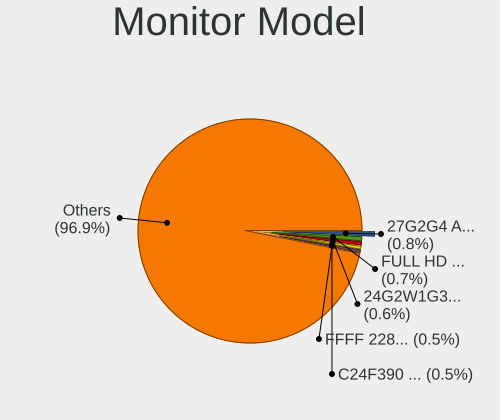

| Model                                                                 | Desktops | Percent |
|-----------------------------------------------------------------------|----------|---------|
| AOC 27G2G4 AOC2702 1920x1080 598x336mm 27.0-inch                      | 83       | 0.75%   |
| Goldstar FULL HD GSM5B55 1920x1080 480x270mm 21.7-inch                | 80       | 0.73%   |
| AOC 24G2W1G3 AOC2402 1920x1080 527x296mm 23.8-inch                    | 69       | 0.63%   |
| Unknown LCD Monitor FFFF 2288x1287 2550x2550mm 142.0-inch             | 59       | 0.54%   |
| Samsung Electronics C24F390 SAM0D2C 1920x1080 521x293mm 23.5-inch     | 55       | 0.5%    |
| Goldstar LG ULTRAWIDE GSM59F1 2560x1080 670x280mm 28.6-inch           | 52       | 0.47%   |
| Goldstar Ultra HD GSM5B09 3840x2160 600x340mm 27.2-inch               | 48       | 0.44%   |
| Goldstar 27GL850 GSM5B7F 2560x1440 597x336mm 27.0-inch                | 44       | 0.4%    |
| Goldstar HDR 4K GSM7707 3840x2160 600x340mm 27.2-inch                 | 38       | 0.34%   |
| Dell U2412M DELA07A 1920x1200 518x324mm 24.1-inch                     | 36       | 0.33%   |
| AOC 24B1W1 AOC2401 1920x1080 527x296mm 23.8-inch                      | 35       | 0.32%   |
| Samsung Electronics S24F350 SAM0D20 1920x1080 521x293mm 23.5-inch     | 34       | 0.31%   |
| Samsung Electronics C27F390 SAM0D32 1920x1080 598x336mm 27.0-inch     | 33       | 0.3%    |
| Goldstar LG IPS FULLHD GSM5AB8 1920x1080 480x270mm 21.7-inch          | 33       | 0.3%    |
| Samsung Electronics U28E590 SAM0C4D 3840x2160 607x345mm 27.5-inch     | 32       | 0.29%   |
| Goldstar LG TV SSCR2 GSMC0C8 3840x2160                                | 32       | 0.29%   |
| Goldstar HDR 4K GSM7706 3840x2160 600x340mm 27.2-inch                 | 32       | 0.29%   |
| Dell U2412M DELA07B 1920x1200 518x324mm 24.1-inch                     | 28       | 0.25%   |
| Goldstar ULTRAGEAR GSM5BD3 2560x1440 697x392mm 31.5-inch              | 27       | 0.25%   |
| Gigabyte Technology M27Q GBT270D 2560x1440 597x336mm 27.0-inch        | 27       | 0.25%   |
| Samsung Electronics LF24T35 SAM707D 1920x1080 528x297mm 23.9-inch     | 26       | 0.24%   |
| BenQ GW2480 BNQ78E7 1920x1080 527x296mm 23.8-inch                     | 26       | 0.24%   |
| Goldstar HDR WFHD GSM7714 2560x1080 798x334mm 34.1-inch               | 22       | 0.2%    |
| Dell S2721DGF DEL41D9 2560x1440 597x336mm 27.0-inch                   | 22       | 0.2%    |
| Samsung Electronics C49RG9x SAM0F9C 3360x1440 1193x336mm 48.8-inch    | 21       | 0.19%   |
| Philips PHL 276E8V PHLC18F 3840x2160 597x336mm 27.0-inch              | 21       | 0.19%   |
| Ancor Communications VS248 ACI2498 1920x1080 531x299mm 24.0-inch      | 21       | 0.19%   |
| Acer SB220Q ACR06AB 1920x1080 476x268mm 21.5-inch                     | 21       | 0.19%   |
| Mi Monitor XMI3444 3440x1440 797x334mm 34.0-inch                      | 20       | 0.18%   |
| Dell P2419H DELD0DA 1920x1080 527x296mm 23.8-inch                     | 20       | 0.18%   |
| AOC 2470W AOC2470 1920x1080 521x293mm 23.5-inch                       | 20       | 0.18%   |
| Ancor Communications ASUS VS247 ACI249A 1920x1080 521x293mm 23.5-inch | 20       | 0.18%   |
| MSI Optix MAG27CQ MSI1462 2560x1440 597x336mm 27.0-inch               | 19       | 0.17%   |
| Goldstar ULTRAWIDE GSM76F9 2560x1080 531x298mm 24.0-inch              | 19       | 0.17%   |
| BenQ GL2460 BNQ78CE 1920x1080 531x299mm 24.0-inch                     | 18       | 0.16%   |
| AOC U34G2G4R3 AOC3402 3440x1440 797x334mm 34.0-inch                   | 18       | 0.16%   |
| Philips PHL 243V5 PHLC0D1 1920x1080 521x293mm 23.5-inch               | 17       | 0.15%   |
| Dell S3220DGF DELD0F4 2560x1440 697x392mm 31.5-inch                   | 17       | 0.15%   |
| ASUSTek Computer VG27A AUS2722 2560x1440 597x336mm 27.0-inch          | 17       | 0.15%   |
| AOC Q3279WG5B AOC3279 2560x1440 725x428mm 33.1-inch                   | 17       | 0.15%   |

Monitor Resolution
------------------

Monitor screen resolution

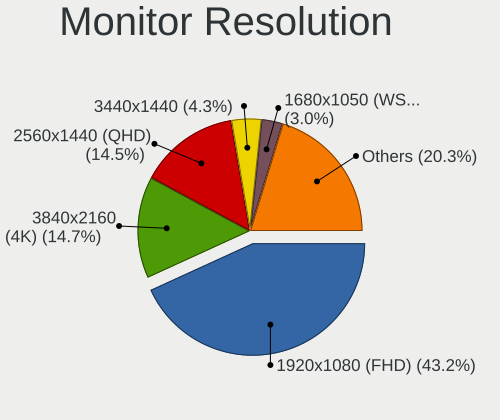

| Resolution         | Desktops | Percent |
|--------------------|----------|---------|
| 1920x1080 (FHD)    | 4222     | 43.17%  |
| 3840x2160 (4K)     | 1436     | 14.68%  |
| 2560x1440 (QHD)    | 1414     | 14.46%  |
| 3440x1440          | 425      | 4.35%   |
| 1680x1050 (WSXGA+) | 298      | 3.05%   |
| 1280x1024 (SXGA)   | 294      | 3.01%   |
| 1920x1200 (WUXGA)  | 263      | 2.69%   |
| 2560x1080          | 219      | 2.24%   |
| 1366x768 (WXGA)    | 218      | 2.23%   |
| 1600x900 (HD+)     | 205      | 2.1%    |
| 1440x900 (WXGA+)   | 200      | 2.05%   |
| 3840x1080          | 105      | 1.07%   |
| 1360x768           | 85       | 0.87%   |
| 2288x1287          | 62       | 0.63%   |
| Unknown            | 62       | 0.63%   |
| 1920x540           | 43       | 0.44%   |
| 1600x1200          | 36       | 0.37%   |
| 2560x1600          | 27       | 0.28%   |
| 1024x768 (XGA)     | 23       | 0.24%   |
| 3840x1600          | 19       | 0.19%   |
| 1280x720 (HD)      | 16       | 0.16%   |
| 2048x1152          | 10       | 0.1%    |
| 1280x960           | 9        | 0.09%   |
| 2160x1200          | 8        | 0.08%   |
| 2560x2880          | 7        | 0.07%   |
| 1280x768           | 5        | 0.05%   |
| 3840x2560          | 4        | 0.04%   |
| 2160x1440          | 4        | 0.04%   |
| 5760x1080          | 3        | 0.03%   |
| 3840x1200          | 3        | 0.03%   |
| 1920x1440          | 3        | 0.03%   |
| 1400x1050          | 3        | 0.03%   |
| 640x480            | 2        | 0.02%   |
| 5760x2160          | 2        | 0.02%   |
| 3360x1080          | 2        | 0.02%   |
| 2256x1504          | 2        | 0.02%   |
| 1920x720           | 2        | 0.02%   |
| 7680x2160          | 1        | 0.01%   |
| 7680x1440          | 1        | 0.01%   |
| 7120x1080          | 1        | 0.01%   |

Monitor Diagonal
----------------

Diagonal size in inches

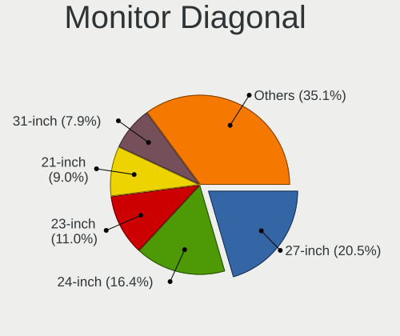

| Inches  | Desktops | Percent |
|---------|----------|---------|
| 27      | 2102     | 20.5%   |
| 24      | 1684     | 16.42%  |
| 23      | 1131     | 11.03%  |
| 21      | 926      | 9.03%   |
| 31      | 814      | 7.94%   |
| 34      | 557      | 5.43%   |
| 19      | 372      | 3.63%   |
| 22      | 251      | 2.45%   |
| 18      | 244      | 2.38%   |
| 20      | 238      | 2.32%   |
| Unknown | 229      | 2.23%   |
| 32      | 154      | 1.5%    |
| 84      | 146      | 1.42%   |
| 72      | 120      | 1.17%   |
| 17      | 119      | 1.16%   |
| 48      | 92       | 0.9%    |
| 15      | 91       | 0.89%   |
| 40      | 87       | 0.85%   |
| 54      | 85       | 0.83%   |
| 25      | 74       | 0.72%   |
| 26      | 71       | 0.69%   |
| 142     | 59       | 0.58%   |
| 28      | 58       | 0.57%   |
| 63      | 52       | 0.51%   |
| 49      | 44       | 0.43%   |
| 42      | 44       | 0.43%   |
| 29      | 30       | 0.29%   |
| 37      | 26       | 0.25%   |
| 36      | 26       | 0.25%   |
| 52      | 25       | 0.24%   |
| 35      | 24       | 0.23%   |
| 74      | 22       | 0.21%   |
| 65      | 22       | 0.21%   |
| 43      | 22       | 0.21%   |
| 39      | 22       | 0.21%   |
| 16      | 21       | 0.2%    |
| 33      | 20       | 0.2%    |
| 13      | 19       | 0.19%   |
| 14      | 17       | 0.17%   |
| 46      | 16       | 0.16%   |

Monitor Width
-------------

Physical width

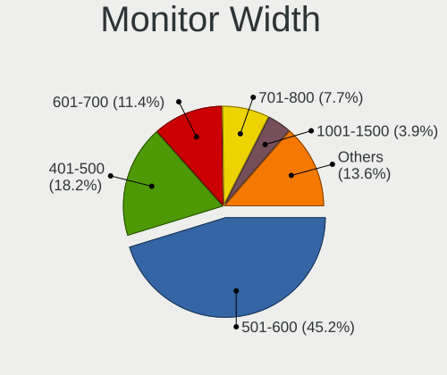

| Width in mm    | Desktops | Percent |
|----------------|----------|---------|
| 501-600        | 4400     | 45.25%  |
| 401-500        | 1766     | 18.16%  |
| 601-700        | 1106     | 11.37%  |
| 701-800        | 748      | 7.69%   |
| 1001-1500      | 382      | 3.93%   |
| 1501-2000      | 297      | 3.05%   |
| 351-400        | 243      | 2.5%    |
| Unknown        | 229      | 2.35%   |
| 301-350        | 212      | 2.18%   |
| 801-900        | 159      | 1.64%   |
| 901-1000       | 85       | 0.87%   |
| More than 2000 | 61       | 0.63%   |
| 201-300        | 33       | 0.34%   |
| 101-200        | 3        | 0.03%   |

Aspect Ratio
------------

Proportional relationship between the width and the height

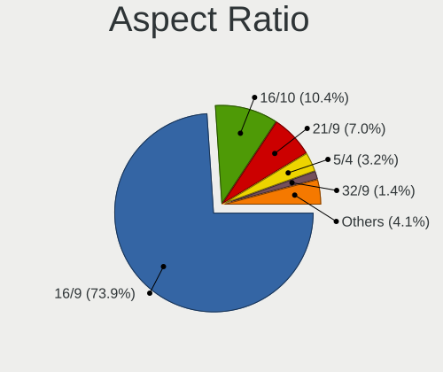

| Ratio   | Desktops | Percent |
|---------|----------|---------|
| 16/9    | 6607     | 73.95%  |
| 16/10   | 925      | 10.35%  |
| 21/9    | 629      | 7.04%   |
| 5/4     | 284      | 3.18%   |
| 32/9    | 123      | 1.38%   |
| Unknown | 123      | 1.38%   |
| 4/3     | 98       | 1.1%    |
| 1.00    | 62       | 0.69%   |
| 3/2     | 27       | 0.3%    |
| 6/5     | 24       | 0.27%   |
| 1.96    | 10       | 0.11%   |
| 0.89    | 7        | 0.08%   |
| 2.12    | 4        | 0.04%   |
| 0.56    | 3        | 0.03%   |
| 2.69    | 2        | 0.02%   |
| 2.00    | 2        | 0.02%   |
| 3.20    | 1        | 0.01%   |
| 2.01    | 1        | 0.01%   |
| 0.80    | 1        | 0.01%   |
| 0.25    | 1        | 0.01%   |
| 0.22    | 1        | 0.01%   |

Monitor Area
------------

Area in inch²

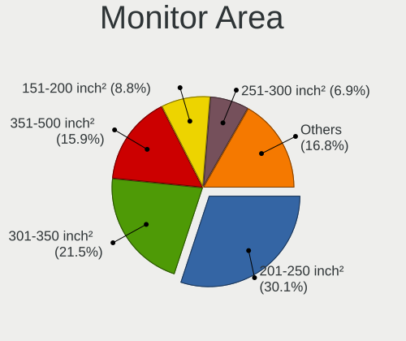

| Area in inch² | Desktops | Percent |
|----------------|----------|---------|
| 201-250        | 2998     | 30.06%  |
| 301-350        | 2149     | 21.55%  |
| 351-500        | 1586     | 15.9%   |
| 151-200        | 876      | 8.78%   |
| 251-300        | 693      | 6.95%   |
| More than 1000 | 586      | 5.88%   |
| 501-1000       | 391      | 3.92%   |
| 141-150        | 285      | 2.86%   |
| Unknown        | 229      | 2.3%    |
| 101-110        | 93       | 0.93%   |
| 131-140        | 19       | 0.19%   |
| 71-80          | 16       | 0.16%   |
| 81-90          | 14       | 0.14%   |
| 111-120        | 13       | 0.13%   |
| 121-130        | 11       | 0.11%   |
| 91-100         | 8        | 0.08%   |
| 51-60          | 3        | 0.03%   |
| 1-40           | 3        | 0.03%   |
| 61-70          | 1        | 0.01%   |

Pixel Density
-------------

Pixels per inch

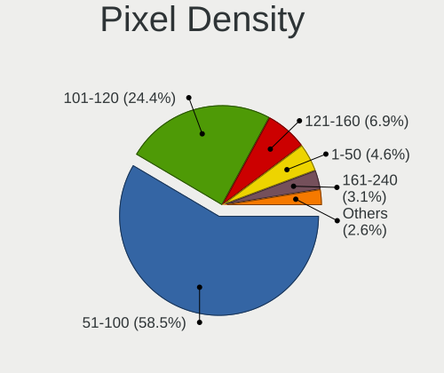

| Density       | Desktops | Percent |
|---------------|----------|---------|
| 51-100        | 5492     | 58.49%  |
| 101-120       | 2292     | 24.41%  |
| 121-160       | 644      | 6.86%   |
| 1-50          | 430      | 4.58%   |
| 161-240       | 292      | 3.11%   |
| Unknown       | 230      | 2.45%   |
| More than 240 | 10       | 0.11%   |

Multiple Monitors
-----------------

Total monitors connected

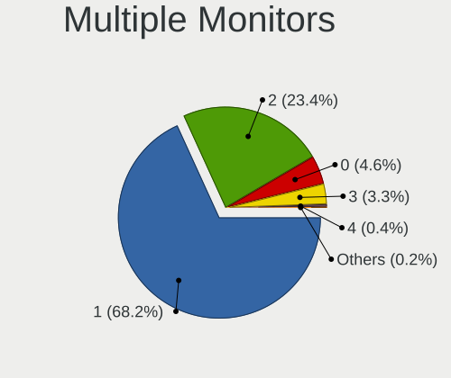

| Total | Desktops | Percent |
|-------|----------|---------|
| 1     | 6130     | 68.2%   |
| 2     | 2099     | 23.35%  |
| 0     | 411      | 4.57%   |
| 3     | 294      | 3.27%   |
| 4     | 39       | 0.43%   |
| 5     | 10       | 0.11%   |
| 6     | 5        | 0.06%   |

Network
-------

Net Controller Vendor
---------------------

Controller vendors

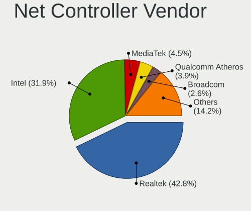

| Vendor                          | Desktops | Percent |
|---------------------------------|----------|---------|
| Realtek Semiconductor           | 5602     | 42.84%  |
| Intel                           | 4168     | 31.87%  |
| MediaTek                        | 587      | 4.49%   |
| Qualcomm Atheros                | 514      | 3.93%   |
| Broadcom                        | 346      | 2.65%   |
| TP-Link                         | 283      | 2.16%   |
| Ralink Technology               | 173      | 1.32%   |
| Microsoft                       | 139      | 1.06%   |
| Aquantia                        | 138      | 1.06%   |
| Ralink                          | 108      | 0.83%   |
| Samsung Electronics             | 66       | 0.5%    |
| Nvidia                          | 61       | 0.47%   |
| NetGear                         | 59       | 0.45%   |
| Qualcomm Atheros Communications | 58       | 0.44%   |
| Qualcomm Technologies           | 54       | 0.41%   |
| ASUSTek Computer                | 53       | 0.41%   |
| Xiaomi                          | 42       | 0.32%   |
| D-Link                          | 40       | 0.31%   |
| ASIX Electronics                | 38       | 0.29%   |
| Google                          | 33       | 0.25%   |
| Marvell Technology Group        | 31       | 0.24%   |
| DisplayLink                     | 27       | 0.21%   |
| Mellanox Technologies           | 26       | 0.2%    |
| Edimax Technology               | 23       | 0.18%   |
| Broadcom Limited                | 22       | 0.17%   |
| Motorola PCS                    | 21       | 0.16%   |
| D-Link System                   | 21       | 0.16%   |
| Huawei Technologies             | 16       | 0.12%   |
| Linksys                         | 14       | 0.11%   |
| Arduino SA                      | 13       | 0.1%    |
| Microchip Technology            | 12       | 0.09%   |
| Qualcomm                        | 11       | 0.08%   |
| OPPO Electronics                | 11       | 0.08%   |
| Mercucys                        | 11       | 0.08%   |
| Belkin Components               | 11       | 0.08%   |
| AVM                             | 11       | 0.08%   |
| Apple                           | 10       | 0.08%   |
| QinHeng Electronics             | 9        | 0.07%   |
| Wilocity                        | 8        | 0.06%   |
| Oculus VR                       | 7        | 0.05%   |

Net Controller Model
--------------------

Controller models

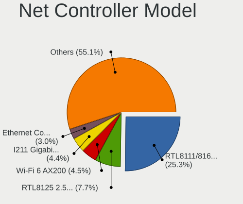

| Model                                                                          | Desktops | Percent |
|--------------------------------------------------------------------------------|----------|---------|
| Realtek RTL8111/8168/8211/8411 PCI Express Gigabit Ethernet Controller         | 3861     | 25.27%  |
| Realtek RTL8125 2.5GbE Controller                                              | 1175     | 7.69%   |
| Intel Wi-Fi 6 AX200                                                            | 695      | 4.55%   |
| Intel I211 Gigabit Network Connection                                          | 676      | 4.42%   |
| Intel Ethernet Controller I225-V                                               | 462      | 3.02%   |
| Intel Ethernet Connection (2) I219-V                                           | 353      | 2.31%   |
| Intel Wi-Fi 6E(802.11ax) AX210/AX1675* 2x2 [Typhoon Peak]                      | 307      | 2.01%   |
| MediaTek MT7922 802.11ax PCI Express Wireless Network Adapter                  | 259      | 1.69%   |
| Intel Dual Band Wireless-AC 3168NGW [Stone Peak]                               | 224      | 1.47%   |
| Intel 82579LM Gigabit Network Connection (Lewisville)                          | 222      | 1.45%   |
| Intel Ethernet Connection (7) I219-V                                           | 176      | 1.15%   |
| Intel Ethernet Connection I217-LM                                              | 162      | 1.06%   |
| Intel Wi-Fi 5(802.11ac) Wireless-AC 9x6x [Thunder Peak]                        | 139      | 0.91%   |
| Intel Ethernet Controller I226-V                                               | 128      | 0.84%   |
| MediaTek MT7921K (RZ608) Wi-Fi 6E 80MHz                                        | 125      | 0.82%   |
| Realtek RTL8153 Gigabit Ethernet Adapter                                       | 122      | 0.8%    |
| Intel Alder Lake-S PCH CNVi WiFi                                               | 122      | 0.8%    |
| Intel Ethernet Connection (2) I219-LM                                          | 116      | 0.76%   |
| Intel 700 Series Chipset CNVi WiFi                                             | 112      | 0.73%   |
| Realtek RTL8821CE 802.11ac PCIe Wireless Network Adapter                       | 111      | 0.73%   |
| Broadcom BCM4360 802.11ac Dual Band Wireless Network Adapter                   | 105      | 0.69%   |
| Intel Ethernet Connection (2) I218-V                                           | 103      | 0.67%   |
| Realtek 802.11ac NIC                                                           | 96       | 0.63%   |
| Intel 82579V Gigabit Network Connection                                        | 96       | 0.63%   |
| Intel 82574L Gigabit Network Connection                                        | 89       | 0.58%   |
| Realtek RTL810xE PCI Express Fast Ethernet controller                          | 87       | 0.57%   |
| Realtek RTL8126 5GbE Controller                                                | 84       | 0.55%   |
| Realtek RTL8188EUS 802.11n Wireless Network Adapter                            | 83       | 0.54%   |
| Realtek RTL8852BE PCIe 802.11ax Wireless Network Controller                    | 77       | 0.5%    |
| Qualcomm Atheros Killer E220x Gigabit Ethernet Controller                      | 76       | 0.5%    |
| Realtek RTL88x2bu [AC1200 Techkey]                                             | 72       | 0.47%   |
| Ralink MT7601U Wireless Adapter                                                | 72       | 0.47%   |
| Intel Wireless 7265                                                            | 71       | 0.46%   |
| Intel Cannon Lake PCH CNVi WiFi                                                | 71       | 0.46%   |
| Intel Ethernet Connection I217-V                                               | 70       | 0.46%   |
| Microsoft Xbox Wireless Adapter for Windows                                    | 68       | 0.44%   |
| Intel Wireless 7260                                                            | 61       | 0.4%    |
| MediaTek MT7921 802.11ax PCIe Wireless Network Adapter [Filogic 330]           | 60       | 0.39%   |
| Qualcomm Atheros AR9485 Wireless Network Adapter                               | 57       | 0.37%   |
| Aquantia AQtion AQC107 NBase-T/IEEE 802.3an Ethernet Controller [Atlantic 10G] | 56       | 0.37%   |

Wireless Vendor
---------------

Wireless vendors

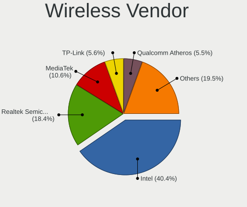

| Vendor                                | Desktops | Percent |
|---------------------------------------|----------|---------|
| Intel                                 | 2033     | 40.41%  |
| Realtek Semiconductor                 | 928      | 18.45%  |
| MediaTek                              | 534      | 10.61%  |
| TP-Link                               | 280      | 5.57%   |
| Qualcomm Atheros                      | 276      | 5.49%   |
| Broadcom                              | 204      | 4.05%   |
| Ralink Technology                     | 173      | 3.44%   |
| Microsoft                             | 136      | 2.7%    |
| Ralink                                | 108      | 2.15%   |
| Qualcomm Atheros Communications       | 58       | 1.15%   |
| NetGear                               | 58       | 1.15%   |
| ASUSTek Computer                      | 51       | 1.01%   |
| D-Link                                | 36       | 0.72%   |
| Edimax Technology                     | 23       | 0.46%   |
| Linksys                               | 14       | 0.28%   |
| D-Link System                         | 14       | 0.28%   |
| Qualcomm Technologies                 | 11       | 0.22%   |
| Mercucys                              | 11       | 0.22%   |
| Belkin Components                     | 11       | 0.22%   |
| AVM                                   | 11       | 0.22%   |
| Wilocity                              | 8        | 0.16%   |
| Broadcom Limited                      | 7        | 0.14%   |
| Realtek                               | 6        | 0.12%   |
| IMC Networks                          | 6        | 0.12%   |
| 802.11g Adapter [Linksys WUSB54GC v3] | 5        | 0.1%    |
| Sitecom Europe                        | 3        | 0.06%   |
| ZyDAS                                 | 2        | 0.04%   |
| Xiaomi                                | 2        | 0.04%   |
| Wacom                                 | 2        | 0.04%   |
| Micro Star International              | 2        | 0.04%   |
| Gemtek                                | 2        | 0.04%   |
| BUFFALO                               | 2        | 0.04%   |
| AboCom Systems                        | 2        | 0.04%   |
| ZyXEL Communications                  | 1        | 0.02%   |
| ZTopInc                               | 1        | 0.02%   |
| ZTE WCDMA Technologies MSM            | 1        | 0.02%   |
| Toshiba                               | 1        | 0.02%   |
| Texas Instruments                     | 1        | 0.02%   |
| Tenda                                 | 1        | 0.02%   |
| Sierra Wireless                       | 1        | 0.02%   |

Wireless Model
--------------

Wireless models

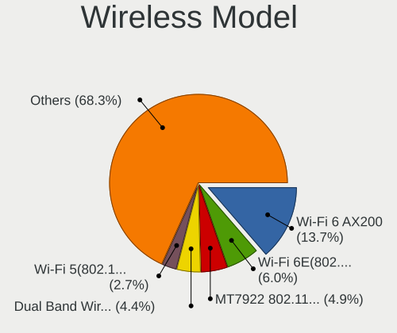

| Model                                                                | Desktops | Percent |
|----------------------------------------------------------------------|----------|---------|
| Intel Wi-Fi 6 AX200                                                  | 695      | 13.67%  |
| Intel Wi-Fi 6E(802.11ax) AX210/AX1675* 2x2 [Typhoon Peak]            | 307      | 6.04%   |
| MediaTek MT7922 802.11ax PCI Express Wireless Network Adapter        | 248      | 4.88%   |
| Intel Dual Band Wireless-AC 3168NGW [Stone Peak]                     | 224      | 4.41%   |
| Intel Wi-Fi 5(802.11ac) Wireless-AC 9x6x [Thunder Peak]              | 139      | 2.73%   |
| MediaTek MT7921K (RZ608) Wi-Fi 6E 80MHz                              | 125      | 2.46%   |
| Realtek RTL8821CE 802.11ac PCIe Wireless Network Adapter             | 111      | 2.18%   |
| Intel 700 Series Chipset CNVi WiFi                                   | 111      | 2.18%   |
| Broadcom BCM4360 802.11ac Dual Band Wireless Network Adapter         | 105      | 2.07%   |
| Realtek 802.11ac NIC                                                 | 96       | 1.89%   |
| Realtek RTL8188EUS 802.11n Wireless Network Adapter                  | 83       | 1.63%   |
| Intel Alder Lake-S PCH CNVi WiFi                                     | 83       | 1.63%   |
| Realtek RTL88x2bu [AC1200 Techkey]                                   | 72       | 1.42%   |
| Ralink MT7601U Wireless Adapter                                      | 72       | 1.42%   |
| Intel Wireless 7265                                                  | 71       | 1.4%    |
| Intel Cannon Lake PCH CNVi WiFi                                      | 71       | 1.4%    |
| Microsoft Xbox Wireless Adapter for Windows                          | 68       | 1.34%   |
| Intel Wireless 7260                                                  | 61       | 1.2%    |
| MediaTek MT7921 802.11ax PCIe Wireless Network Adapter [Filogic 330] | 60       | 1.18%   |
| Qualcomm Atheros AR9485 Wireless Network Adapter                     | 57       | 1.12%   |
| Intel Wireless 8260                                                  | 55       | 1.08%   |
| Qualcomm Atheros QCA6174 802.11ac Wireless Network Adapter           | 49       | 0.96%   |
| Realtek RTL8852BE PCIe 802.11ax Wireless Network Controller          | 47       | 0.92%   |
| Intel Comet Lake PCH CNVi WiFi                                       | 47       | 0.92%   |
| Intel Wireless 3165                                                  | 46       | 0.9%    |
| Realtek RTL8852CE PCIe 802.11ax Wireless Network Controller          | 44       | 0.87%   |
| TP-Link TL-WN823N v2/v3 [Realtek RTL8192EU]                          | 43       | 0.85%   |
| Broadcom BCM4352 802.11ac Dual Band Wireless Network Adapter         | 42       | 0.83%   |
| Qualcomm Atheros AR9271 802.11n                                      | 40       | 0.79%   |
| Realtek RTL8812AE 802.11ac PCIe Wireless Network Adapter             | 38       | 0.75%   |
| Intel Wireless 8265 / 8275                                           | 38       | 0.75%   |
| Realtek RTL8192EE PCIe Wireless Network Adapter                      | 37       | 0.73%   |
| Qualcomm Atheros AR93xx Wireless Network Adapter                     | 36       | 0.71%   |
| TP-Link TL-WN722N v2/v3 [Realtek RTL8188EUS]                         | 35       | 0.69%   |
| Realtek RTL8822BE 802.11a/b/g/n/ac WiFi adapter                      | 35       | 0.69%   |
| Microsoft Xbox 360 Wireless Adapter                                  | 35       | 0.69%   |
| Realtek RTL8188FTV 802.11b/g/n 1T1R 2.4G WLAN Adapter                | 34       | 0.67%   |
| TP-Link 802.11ac WLAN Adapter                                        | 33       | 0.65%   |
| Ralink RT5370 Wireless Adapter                                       | 33       | 0.65%   |
| TP-Link 802.11ac NIC                                                 | 32       | 0.63%   |

Ethernet Vendor
---------------

Ethernet vendors

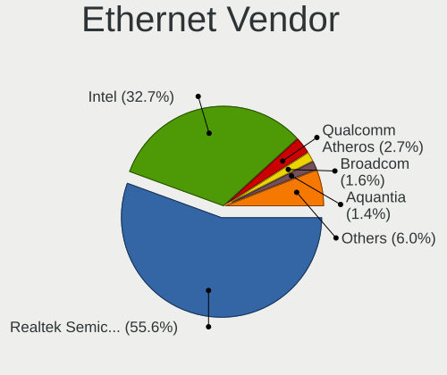

| Vendor                                 | Desktops | Percent |
|----------------------------------------|----------|---------|
| Realtek Semiconductor                  | 5323     | 55.58%  |
| Intel                                  | 3127     | 32.65%  |
| Qualcomm Atheros                       | 261      | 2.73%   |
| Broadcom                               | 155      | 1.62%   |
| Aquantia                               | 138      | 1.44%   |
| Samsung Electronics                    | 63       | 0.66%   |
| Nvidia                                 | 61       | 0.64%   |
| MediaTek                               | 45       | 0.47%   |
| Qualcomm Technologies                  | 43       | 0.45%   |
| Xiaomi                                 | 40       | 0.42%   |
| ASIX Electronics                       | 38       | 0.4%    |
| Google                                 | 33       | 0.34%   |
| Marvell Technology Group               | 31       | 0.32%   |
| DisplayLink                            | 27       | 0.28%   |
| Mellanox Technologies                  | 24       | 0.25%   |
| Motorola PCS                           | 21       | 0.22%   |
| Broadcom Limited                       | 15       | 0.16%   |
| Qualcomm                               | 11       | 0.11%   |
| OPPO Electronics                       | 11       | 0.11%   |
| Huawei Technologies                    | 10       | 0.1%    |
| Apple                                  | 9        | 0.09%   |
| ICS Advent                             | 7        | 0.07%   |
| D-Link System                          | 7        | 0.07%   |
| 3Com                                   | 7        | 0.07%   |
| VIA Technologies                       | 6        | 0.06%   |
| Lenovo                                 | 5        | 0.05%   |
| HMD Global                             | 5        | 0.05%   |
| ADMtek                                 | 5        | 0.05%   |
| D-Link                                 | 4        | 0.04%   |
| TP-Link                                | 3        | 0.03%   |
| Tehuti Networks                        | 3        | 0.03%   |
| JMicron Technology                     | 3        | 0.03%   |
| Davicom Semiconductor                  | 3        | 0.03%   |
| Sundance Technology Inc / IC Plus      | 2        | 0.02%   |
| Spreadtrum Communications              | 2        | 0.02%   |
| Sony Ericsson Mobile Communications AB | 2        | 0.02%   |
| OnePlus Technology (Shenzhen)          | 2        | 0.02%   |
| Netchip Technology                     | 2        | 0.02%   |
| National Semiconductor                 | 2        | 0.02%   |
| ASUSTek Computer                       | 2        | 0.02%   |

Ethernet Model
--------------

Ethernet models

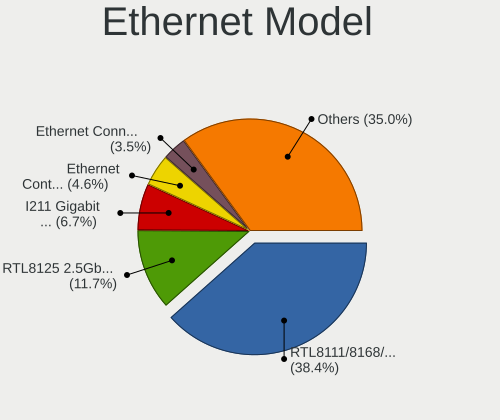

| Model                                                                           | Desktops | Percent |
|---------------------------------------------------------------------------------|----------|---------|
| Realtek RTL8111/8168/8211/8411 PCI Express Gigabit Ethernet Controller          | 3861     | 38.42%  |
| Realtek RTL8125 2.5GbE Controller                                               | 1175     | 11.69%  |
| Intel I211 Gigabit Network Connection                                           | 676      | 6.73%   |
| Intel Ethernet Controller I225-V                                                | 462      | 4.6%    |
| Intel Ethernet Connection (2) I219-V                                            | 353      | 3.51%   |
| Intel 82579LM Gigabit Network Connection (Lewisville)                           | 222      | 2.21%   |
| Intel Ethernet Connection (7) I219-V                                            | 176      | 1.75%   |
| Intel Ethernet Connection I217-LM                                               | 162      | 1.61%   |
| Intel Ethernet Controller I226-V                                                | 128      | 1.27%   |
| Realtek RTL8153 Gigabit Ethernet Adapter                                        | 122      | 1.21%   |
| Intel Ethernet Connection (2) I219-LM                                           | 116      | 1.15%   |
| Intel Ethernet Connection (2) I218-V                                            | 103      | 1.02%   |
| Intel 82579V Gigabit Network Connection                                         | 96       | 0.96%   |
| Intel 82574L Gigabit Network Connection                                         | 89       | 0.89%   |
| Realtek RTL810xE PCI Express Fast Ethernet controller                           | 87       | 0.87%   |
| Realtek RTL8126 5GbE Controller                                                 | 84       | 0.84%   |
| Qualcomm Atheros Killer E220x Gigabit Ethernet Controller                       | 76       | 0.76%   |
| Intel Ethernet Connection I217-V                                                | 70       | 0.7%    |
| Aquantia AQtion AQC107 NBase-T/IEEE 802.3an Ethernet Controller [Atlantic 10G]  | 56       | 0.56%   |
| Intel Ethernet Connection (7) I219-LM                                           | 54       | 0.54%   |
| Samsung Galaxy series, misc. (tethering mode)                                   | 53       | 0.53%   |
| Aquantia AQtion AQC113CS NBase-T/IEEE 802.3an Ethernet Controller [Antigua 10G] | 52       | 0.52%   |
| Intel I210 Gigabit Network Connection                                           | 51       | 0.51%   |
| Realtek Killer E3000 2.5GbE Controller                                          | 45       | 0.45%   |
| Intel Ethernet Connection (17) I219-V                                           | 45       | 0.45%   |
| Qualcomm WCN785x Wi-Fi 7(802.11be) 320MHz 2x2 [FastConnect 7800]                | 43       | 0.43%   |
| Qualcomm Atheros AR8151 v2.0 Gigabit Ethernet                                   | 39       | 0.39%   |
| Intel Ethernet Connection (14) I219-V                                           | 39       | 0.39%   |
| Intel Alder Lake-S PCH CNVi WiFi                                                | 39       | 0.39%   |
| Qualcomm Atheros AR8161 Gigabit Ethernet                                        | 38       | 0.38%   |
| Intel 82567LM-3 Gigabit Network Connection                                      | 37       | 0.37%   |
| ASIX AX88179 Gigabit Ethernet                                                   | 32       | 0.32%   |
| Realtek RTL8852BE PCIe 802.11ax Wireless Network Controller                     | 30       | 0.3%    |
| Intel Ethernet Connection (5) I219-LM                                           | 30       | 0.3%    |
| Intel Ethernet Connection (11) I219-V                                           | 30       | 0.3%    |
| Broadcom NetXtreme BCM5761 Gigabit Ethernet PCIe                                | 30       | 0.3%    |
| Realtek RTL-8100/8101L/8139 PCI Fast Ethernet Adapter                           | 28       | 0.28%   |
| Nvidia MCP61 Ethernet                                                           | 28       | 0.28%   |
| Qualcomm Atheros Killer E2500 Gigabit Ethernet Controller                       | 27       | 0.27%   |
| MediaTek MT7925 802.11be 160MHz 2x2 PCIe Wireless Network Adapter [Filogic 360] | 27       | 0.27%   |

Net Controller Kind
-------------------

Ethernet, WiFi or modem

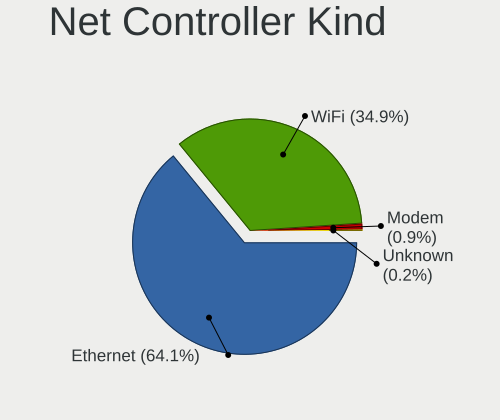

| Kind     | Desktops | Percent |
|----------|----------|---------|
| Ethernet | 8628     | 64.07%  |
| WiFi     | 4696     | 34.87%  |
| Modem    | 115      | 0.85%   |
| Unknown  | 27       | 0.2%    |

Used Controller
---------------

Currently used network controller

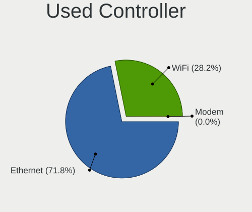

| Kind     | Desktops | Percent |
|----------|----------|---------|
| Ethernet | 6616     | 71.81%  |
| WiFi     | 2594     | 28.16%  |
| Modem    | 3        | 0.03%   |

NICs
----

Total network controllers on board

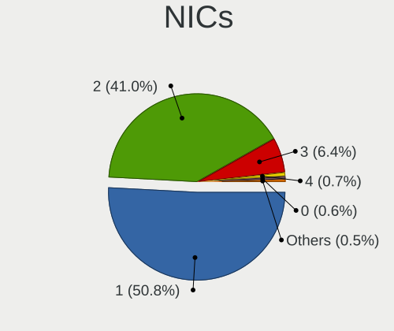

| Total | Desktops | Percent |
|-------|----------|---------|
| 1     | 4476     | 50.83%  |
| 2     | 3611     | 41.01%  |
| 3     | 562      | 6.38%   |
| 4     | 62       | 0.7%    |
| 0     | 50       | 0.57%   |
| 5     | 24       | 0.27%   |
| 6     | 13       | 0.15%   |
| 9     | 2        | 0.02%   |
| 7     | 2        | 0.02%   |
| 11    | 1        | 0.01%   |
| 10    | 1        | 0.01%   |
| 8     | 1        | 0.01%   |

IPv6
----

IPv6 vs IPv4

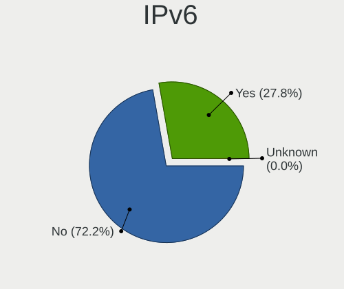

| Used    | Desktops | Percent |
|---------|----------|---------|
| No      | 6433     | 72.22%  |
| Yes     | 2473     | 27.76%  |
| Unknown | 2        | 0.02%   |

Bluetooth
---------

Bluetooth Vendor
----------------

Controller vendors

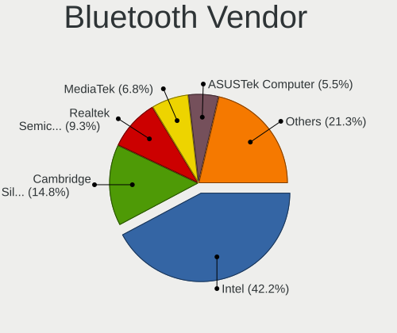

| Vendor                          | Desktops | Percent |
|---------------------------------|----------|---------|
| Intel                           | 1960     | 42.21%  |
| Cambridge Silicon Radio         | 688      | 14.82%  |
| Realtek Semiconductor           | 433      | 9.33%   |
| MediaTek                        | 316      | 6.81%   |
| ASUSTek Computer                | 255      | 5.49%   |
| Foxconn / Hon Hai               | 208      | 4.48%   |
| IMC Networks                    | 206      | 4.44%   |
| TP-Link                         | 155      | 3.34%   |
| Broadcom                        | 133      | 2.86%   |
| Qualcomm Atheros Communications | 70       | 1.51%   |
| Apple                           | 50       | 1.08%   |
| Realtek                         | 25       | 0.54%   |
| Unknown                         | 23       | 0.5%    |
| Actions                         | 18       | 0.39%   |
| Edimax Technology               | 15       | 0.32%   |
| Lite-On Technology              | 13       | 0.28%   |
| Integrated System Solution      | 12       | 0.26%   |
| Dynex                           | 11       | 0.24%   |
| HTC (High Tech Computer)        | 10       | 0.22%   |
| Belkin Components               | 10       | 0.22%   |
| SINO WEALTH                     | 4        | 0.09%   |
| Toshiba                         | 3        | 0.06%   |
| Mercucys                        | 3        | 0.06%   |
| Hewlett-Packard                 | 3        | 0.06%   |
| Dell                            | 3        | 0.06%   |
| Creative Technology             | 3        | 0.06%   |
| TRENDnet                        | 1        | 0.02%   |
| Sitecom Europe                  | 1        | 0.02%   |
| Ralink                          | 1        | 0.02%   |
| Primax Electronics              | 1        | 0.02%   |
| Mobile Action Technology        | 1        | 0.02%   |
| Micro Star International        | 1        | 0.02%   |
| Kensington                      | 1        | 0.02%   |
| Foxconn International           | 1        | 0.02%   |
| D-Link System                   | 1        | 0.02%   |
| D-Link                          | 1        | 0.02%   |
| Conwise Technology              | 1        | 0.02%   |
| BUFFALO                         | 1        | 0.02%   |
| AICSemi                         | 1        | 0.02%   |

Bluetooth Model
---------------

Controller models

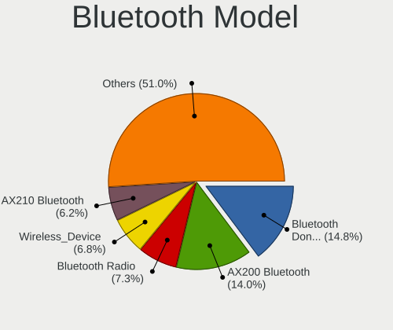

| Model                                                                | Desktops | Percent |
|----------------------------------------------------------------------|----------|---------|
| Cambridge Silicon Radio Bluetooth Dongle (HCI mode)                  | 688      | 14.76%  |
| Intel AX200 Bluetooth                                                | 651      | 13.97%  |
| Realtek Bluetooth Radio                                              | 338      | 7.25%   |
| MediaTek Wireless_Device                                             | 316      | 6.78%   |
| Intel AX210 Bluetooth                                                | 290      | 6.22%   |
| Intel Bluetooth wireless interface                                   | 261      | 5.6%    |
| Intel Wireless-AC 3168 Bluetooth                                     | 218      | 4.68%   |
| Intel AX201 Bluetooth                                                | 162      | 3.48%   |
| Intel Bluetooth Device                                               | 160      | 3.43%   |
| TP-Link TP-T@- UB500 Adapter                                         | 155      | 3.33%   |
| Intel Wireless-AC 9260 Bluetooth Adapter                             | 132      | 2.83%   |
| Foxconn / Hon Hai Wireless_Device                                    | 124      | 2.66%   |
| IMC Networks Bluetooth Radio                                         | 100      | 2.15%   |
| IMC Networks Wireless_Device                                         | 90       | 1.93%   |
| Broadcom BCM20702A0 Bluetooth 4.0                                    | 89       | 1.91%   |
| Intel Bluetooth 9460/9560 Jefferson Peak (JfP)                       | 88       | 1.89%   |
| Foxconn / Hon Hai Bluetooth Device                                   | 71       | 1.52%   |
| ASUS ASUS USB-BT500                                                  | 69       | 1.48%   |
| ASUS Broadcom BCM20702A0 Bluetooth                                   | 68       | 1.46%   |
| Realtek  Bluetooth 4.2 Adapter                                       | 44       | 0.94%   |
| ASUS Bluetooth Radio                                                 | 32       | 0.69%   |
| Qualcomm Atheros  Bluetooth Device                                   | 31       | 0.67%   |
| Apple Bluetooth Host Controller                                      | 27       | 0.58%   |
| Realtek Bluetooth Radio                                              | 25       | 0.54%   |
| ASUS Bluetooth Adapter                                               | 24       | 0.52%   |
| Realtek Bluetooth 5.3 Radio                                          | 23       | 0.49%   |
| Unknown                                                              | 23       | 0.49%   |
| ASUS Qualcomm Bluetooth 4.1                                          | 20       | 0.43%   |
| Actions general adapter                                              | 18       | 0.39%   |
| ASUS BCM20702A0                                                      | 17       | 0.36%   |
| Apple Built-in Bluetooth 2.0+EDR HCI                                 | 17       | 0.36%   |
| Realtek Bluetooth 5.4 Radio                                          | 16       | 0.34%   |
| Edimax Bluetooth Device                                              | 14       | 0.3%    |
| ASUS Bluetooth Device                                                | 13       | 0.28%   |
| Qualcomm Atheros AR9462 Bluetooth                                    | 12       | 0.26%   |
| Intel Centrino Bluetooth Wireless Transceiver                        | 11       | 0.24%   |
| IMC Networks Bluetooth Device                                        | 11       | 0.24%   |
| Dynex Bluetooth 4.0 Adapter [Broadcom, 1.12, BCM20702A0]             | 11       | 0.24%   |
| Qualcomm Atheros Bluetooth USB Host Controller                       | 10       | 0.21%   |
| HTC (High Tech Computer) Vive Hub Bluetooth 4.1 (Broadcom BCM920703) | 10       | 0.21%   |

Sound
-----

Sound Vendor
------------

Sound card vendors

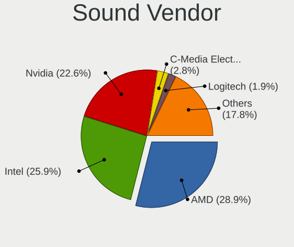

| Vendor                                       | Desktops | Percent |
|----------------------------------------------|----------|---------|
| AMD                                          | 4949     | 28.93%  |
| Intel                                        | 4435     | 25.92%  |
| Nvidia                                       | 3874     | 22.64%  |
| C-Media Electronics                          | 481      | 2.81%   |
| Logitech                                     | 322      | 1.88%   |
| ASUSTek Computer                             | 179      | 1.05%   |
| SteelSeries ApS                              | 154      | 0.9%    |
| JMTek                                        | 144      | 0.84%   |
| Focusrite-Novation                           | 140      | 0.82%   |
| Creative Labs                                | 139      | 0.81%   |
| Micro Star International                     | 138      | 0.81%   |
| Razer USA                                    | 123      | 0.72%   |
| Kingston Technology                          | 121      | 0.71%   |
| Corsair                                      | 104      | 0.61%   |
| Texas Instruments                            | 94       | 0.55%   |
| Generalplus Technology                       | 89       | 0.52%   |
| Creative Technology                          | 85       | 0.5%    |
| GN Netcom                                    | 71       | 0.42%   |
| Hewlett-Packard                              | 66       | 0.39%   |
| Sony                                         | 51       | 0.3%    |
| Realtek Semiconductor                        | 48       | 0.28%   |
| Blue Microphones                             | 48       | 0.28%   |
| Plantronics                                  | 46       | 0.27%   |
| Samson Technologies                          | 38       | 0.22%   |
| RODE Microphones                             | 31       | 0.18%   |
| Thesycon Systemsoftware & Consulting         | 30       | 0.18%   |
| Zoran Co. Personal Media Division (Nogatech) | 29       | 0.17%   |
| GYROCOM C&C                                  | 29       | 0.17%   |
| Jieli Technology                             | 27       | 0.16%   |
| Giga-Byte Technology                         | 27       | 0.16%   |
| FiiO Electronics Technology                  | 27       | 0.16%   |
| BEHRINGER International                      | 27       | 0.16%   |
| ASRock                                       | 27       | 0.16%   |
| XMOS                                         | 26       | 0.15%   |
| KTMicro                                      | 25       | 0.15%   |
| DSEA A/S                                     | 25       | 0.15%   |
| Unknown                                      | 24       | 0.14%   |
| Schiit Audio                                 | 22       | 0.13%   |
| Elgato Systems                               | 22       | 0.13%   |
| Tenx Technology                              | 21       | 0.12%   |

Sound Model
-----------

Sound card models

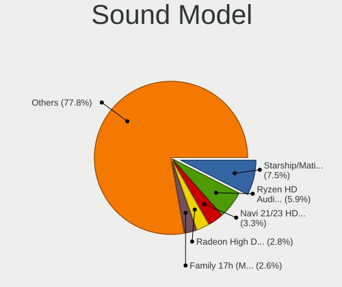

| Model                                                                      | Desktops | Percent |
|----------------------------------------------------------------------------|----------|---------|
| AMD Starship/Matisse HD Audio Controller                                   | 1558     | 7.54%   |
| AMD Ryzen HD Audio Controller                                              | 1220     | 5.9%    |
| AMD Navi 21/23 HDMI/DP Audio Controller                                    | 683      | 3.3%    |
| AMD Radeon High Definition Audio Controller                                | 585      | 2.83%   |
| AMD Family 17h (Models 00h-0fh) HD Audio Controller                        | 542      | 2.62%   |
| AMD Ellesmere HDMI Audio [Radeon RX 470/480 / 570/580/590]                 | 533      | 2.58%   |
| Intel 8 Series/C220 Series Chipset High Definition Audio Controller        | 504      | 2.44%   |
| Intel 200 Series PCH HD Audio                                              | 463      | 2.24%   |
| Intel 100 Series/C230 Series Chipset Family HD Audio Controller            | 442      | 2.14%   |
| AMD Renoir/Cezanne HDMI/DP Audio Controller                                | 414      | 2%      |
| Intel 6 Series/C200 Series Chipset Family High Definition Audio Controller | 392      | 1.9%    |
| Intel Cannon Lake PCH cAVS                                                 | 341      | 1.65%   |
| AMD SBx00 Azalia (Intel HDA)                                               | 338      | 1.64%   |
| Intel 7 Series/C216 Chipset Family High Definition Audio Controller        | 329      | 1.59%   |
| Intel Xeon E3-1200 v3/4th Gen Core Processor HD Audio Controller           | 327      | 1.58%   |
| AMD Navi 31 HDMI/DP Audio                                                  | 322      | 1.56%   |
| Intel Alder Lake-S HD Audio Controller                                     | 308      | 1.49%   |
| Nvidia GP107GL High Definition Audio Controller                            | 291      | 1.41%   |
| Nvidia GA104 High Definition Audio Controller                              | 291      | 1.41%   |
| AMD Navi 10 HDMI Audio                                                     | 260      | 1.26%   |
| Nvidia GP104 High Definition Audio Controller                              | 256      | 1.24%   |
| Nvidia TU116 High Definition Audio Controller                              | 254      | 1.23%   |
| Nvidia GP106 High Definition Audio Controller                              | 251      | 1.21%   |
| AMD Baffin HDMI/DP Audio [Radeon RX 550 640SP / RX 560/560X]               | 238      | 1.15%   |
| Nvidia GA106 High Definition Audio Controller                              | 207      | 1%      |
| Intel Raptor Lake High Definition Audio Controller                         | 203      | 0.98%   |
| Nvidia TU106 High Definition Audio Controller                              | 189      | 0.91%   |
| Nvidia GA102 High Definition Audio Controller                              | 187      | 0.9%    |
| AMD Raven/Raven2/Fenghuang HDMI/DP Audio Controller                        | 187      | 0.9%    |
| Nvidia GK208 HDMI/DP Audio Controller                                      | 186      | 0.9%    |
| AMD Oland/Hainan/Cape Verde/Pitcairn HDMI Audio [Radeon HD 7000 Series]    | 163      | 0.79%   |
| Intel 9 Series Chipset Family HD Audio Controller                          | 159      | 0.77%   |
| ASUSTek Computer USB Audio                                                 | 156      | 0.75%   |
| AMD FCH Azalia Controller                                                  | 144      | 0.7%    |
| Intel 82801JI (ICH10 Family) HD Audio Controller                           | 142      | 0.69%   |
| Micro Star International USB Audio                                         | 137      | 0.66%   |
| Nvidia TU104 HD Audio Controller                                           | 132      | 0.64%   |
| Intel C610/X99 series chipset HD Audio Controller                          | 126      | 0.61%   |
| Nvidia GM204 High Definition Audio Controller                              | 115      | 0.56%   |
| Nvidia GM107 High Definition Audio Controller [GeForce 940MX]              | 114      | 0.55%   |

Memory
------

Memory Vendor
-------------

Memory module vendors

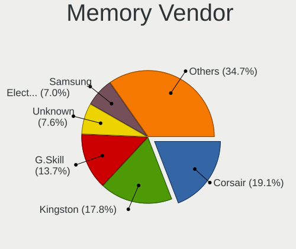

| Vendor                       | Desktops | Percent |
|------------------------------|----------|---------|
| Corsair                      | 750      | 19.11%  |
| Kingston                     | 700      | 17.84%  |
| G.Skill                      | 539      | 13.74%  |
| Unknown                      | 298      | 7.59%   |
| Samsung Electronics          | 274      | 6.98%   |
| Crucial                      | 269      | 6.86%   |
| SK hynix                     | 245      | 6.24%   |
| Micron Technology            | 151      | 3.85%   |
| A-DATA Technology            | 106      | 2.7%    |
| Team                         | 93       | 2.37%   |
| Unknown                      | 92       | 2.34%   |
| Patriot                      | 57       | 1.45%   |
| Smart                        | 32       | 0.82%   |
| Ramaxel Technology           | 24       | 0.61%   |
| Nanya Technology             | 18       | 0.46%   |
| AMD                          | 16       | 0.41%   |
| Apacer                       | 14       | 0.36%   |
| GOODRAM                      | 13       | 0.33%   |
| PNY                          | 12       | 0.31%   |
| GeIL                         | 12       | 0.31%   |
| Transcend                    | 11       | 0.28%   |
| Silicon Power                | 11       | 0.28%   |
| Elpida                       | 10       | 0.25%   |
| Timetec                      | 7        | 0.18%   |
| Patriot Memory (PDP Systems) | 6        | 0.15%   |
| Patriot Memory               | 6        | 0.15%   |
| Lexar                        | 6        | 0.15%   |
| Golden Empire                | 6        | 0.15%   |
| Avant                        | 6        | 0.15%   |
| Unifosa                      | 5        | 0.13%   |
| Hikvision                    | 5        | 0.13%   |
| Unknown (ABCD)               | 4        | 0.1%    |
| TeamGroup                    | 4        | 0.1%    |
| Qumo                         | 4        | 0.1%    |
| Qimonda                      | 4        | 0.1%    |
| Atermiter                    | 4        | 0.1%    |
| Wodposit                     | 3        | 0.08%   |
| V-GeN                        | 3        | 0.08%   |
| Unknown (0x0B45)             | 3        | 0.08%   |
| TEXTORM                      | 3        | 0.08%   |

Memory Model
------------

Memory module models

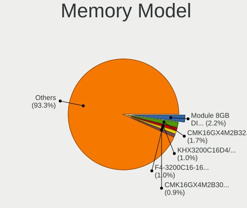

| Model                                                   | Desktops | Percent |
|---------------------------------------------------------|----------|---------|
| Unknown                                                 | 92       | 2.17%   |
| Corsair RAM CMK16GX4M2B3200C16 8GB DIMM DDR4 3600MT/s   | 71       | 1.67%   |
| Kingston RAM KHX3200C16D4/8GX 8GB DIMM DDR4 3733MT/s    | 41       | 0.97%   |
| G.Skill RAM F4-3200C16-16GVK 16GB DIMM DDR4 3600MT/s    | 41       | 0.97%   |
| Corsair RAM CMK16GX4M2B3000C15 8GB DIMM DDR4 3600MT/s   | 39       | 0.92%   |
| Corsair RAM CMK32GX4M2E3200C16 16GB DIMM DDR4 3600MT/s  | 36       | 0.85%   |
| G.Skill RAM F4-3200C16-8GVKB 8GB DIMM DDR4 4000MT/s     | 33       | 0.78%   |
| Kingston RAM KF3200C16D4/16GX 16GB DIMM DDR4 3733MT/s   | 32       | 0.75%   |
| Unknown RAM Module 4GB DIMM 1333MT/s                    | 25       | 0.59%   |
| Corsair RAM CMK32GX4M2B3200C16 16GB DIMM DDR4 3800MT/s  | 25       | 0.59%   |
| Kingston RAM KHX2666C16/8G 8GiB DIMM DDR4 3466MT/s      | 24       | 0.57%   |
| Corsair RAM CMK32GX4M2D3600C18 16GB DIMM DDR4 3800MT/s  | 23       | 0.54%   |
| Kingston RAM KF3200C16D4/8GX 8GiB DIMM DDR4 3600MT/s    | 22       | 0.52%   |
| Kingston RAM KHX1600C10D3/8G 8GB DIMM DDR3 2133MT/s     | 20       | 0.47%   |
| G.Skill RAM F5-6000J3040G32G 32GB DIMM DDR5 6200MT/s    | 20       | 0.47%   |
| Smart RAM SH564128FH8N0TNSDR 4GB DIMM DDR3 1600MT/s     | 18       | 0.42%   |
| G.Skill RAM F4-3600C16-16GVKC 16GB DIMM DDR4 3866MT/s   | 18       | 0.42%   |
| Corsair RAM CMK16GX4M2E3200C16 8GB DIMM DDR4 3466MT/s   | 18       | 0.42%   |
| Unknown RAM Module 2GB DIMM DDR2 800MT/s                | 17       | 0.4%    |
| SK hynix RAM HMT451U6AFR8C-PB 4GB DIMM DDR3 1600MT/s    | 17       | 0.4%    |
| Kingston RAM KHX2400C15/8G 8GB DIMM DDR4 3400MT/s       | 17       | 0.4%    |
| Kingston RAM KHX1866C10D3/8G 8GB DIMM DDR3 1867MT/s     | 17       | 0.4%    |
| Kingston RAM KHX1600C9D3/4GX 4GB DIMM DDR3 1867MT/s     | 17       | 0.4%    |
| G.Skill RAM F4-3000C16-8GISB 8GB DIMM DDR4 3200MT/s     | 17       | 0.4%    |
| A-DATA RAM DDR4 3200 16GB DIMM DDR4 3600MT/s            | 17       | 0.4%    |
| Corsair RAM CMK64GX4M2E3200C16 32GB DIMM DDR4 3600MT/s  | 16       | 0.38%   |
| Team RAM TEAMGROUP-UD4-3200 8GB DIMM DDR4 3733MT/s      | 15       | 0.35%   |
| Kingston RAM KHX2133C14D4/8G 8GB DIMM DDR4 3000MT/s     | 15       | 0.35%   |
| G.Skill RAM F4-3600C16-16GTZNC 16GiB DIMM DDR4 3600MT/s | 15       | 0.35%   |
| Corsair RAM CMK32GX4M2A2666C16 16GB DIMM DDR4 2667MT/s  | 15       | 0.35%   |
| Kingston RAM KHX3200C16D4/16GX 16GB DIMM DDR4 3600MT/s  | 14       | 0.33%   |
| G.Skill RAM F5-6000J3038F16G 16GB DIMM DDR5 6000MT/s    | 14       | 0.33%   |
| Corsair RAM CMW32GX4M2C3200C16 16GB DIMM DDR4 3400MT/s  | 14       | 0.33%   |
| Corsair RAM CMW16GX4M2C3200C16 8GB DIMM DDR4 3733MT/s   | 14       | 0.33%   |
| Corsair RAM CMK16GX4M2D3600C18 8GB DIMM DDR4 4000MT/s   | 14       | 0.33%   |
| Team RAM TEAMGROUP-UD4-3200 8GB DIMM DDR4 3800MT/s      | 13       | 0.31%   |
| SK hynix RAM HMT351U6CFR8C-PB 4GB DIMM DDR3 1800MT/s    | 13       | 0.31%   |
| Patriot RAM 3200 C16 Series 8GB DIMM DDR4 3600MT/s      | 13       | 0.31%   |
| G.Skill RAM F5-6000J3636F16G 16GB DIMM DDR5 6400MT/s    | 13       | 0.31%   |
| G.Skill RAM F4-3200C16-8GIS 8GB DIMM DDR4 3600MT/s      | 13       | 0.31%   |

Memory Kind
-----------

Memory module kinds

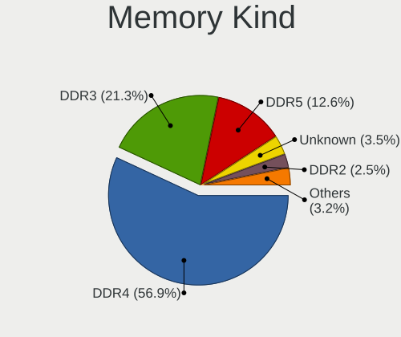

| Kind    | Desktops | Percent |
|---------|----------|---------|
| DDR4    | 2031     | 56.91%  |
| DDR3    | 761      | 21.32%  |
| DDR5    | 450      | 12.61%  |
| Unknown | 125      | 3.5%    |
| DDR2    | 89       | 2.49%   |
| SDRAM   | 73       | 2.05%   |
| DDR     | 13       | 0.36%   |
| LPDDR4  | 11       | 0.31%   |
| LPDDR5  | 7        | 0.2%    |
| DRAM    | 5        | 0.14%   |
| LPDDR3  | 4        | 0.11%   |

Memory Form Factor
------------------

Physical design of the memory module

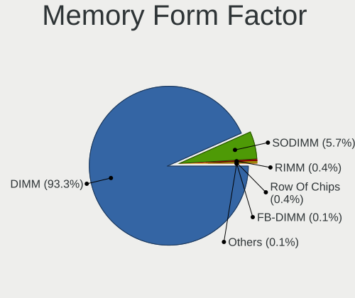

| Name         | Desktops | Percent |
|--------------|----------|---------|
| DIMM         | 3294     | 93.34%  |
| SODIMM       | 202      | 5.72%   |
| RIMM         | 14       | 0.4%    |
| Row Of Chips | 13       | 0.37%   |
| FB-DIMM      | 3        | 0.09%   |
| Chip         | 2        | 0.06%   |
| Unknown      | 1        | 0.03%   |

Memory Size
-----------

Memory module size

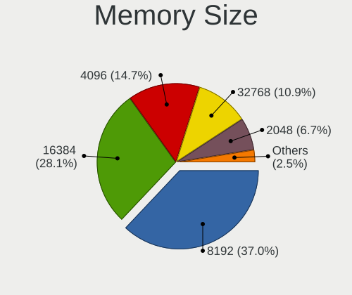

| Size  | Desktops | Percent |
|-------|----------|---------|
| 8192  | 1410     | 37.02%  |
| 16384 | 1070     | 28.09%  |
| 4096  | 561      | 14.73%  |
| 32768 | 417      | 10.95%  |
| 2048  | 254      | 6.67%   |
| 1024  | 55       | 1.44%   |
| 49152 | 24       | 0.63%   |
| 24576 | 7        | 0.18%   |
| 65536 | 5        | 0.13%   |
| 512   | 4        | 0.11%   |
| 3072  | 1        | 0.03%   |
| 256   | 1        | 0.03%   |

Memory Speed
------------

Memory module speed

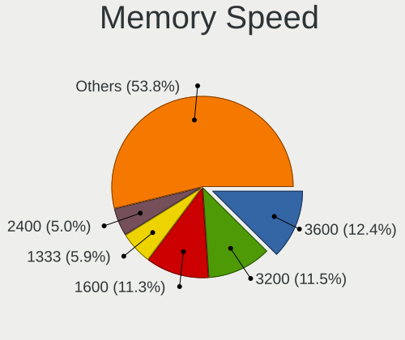

| Speed   | Desktops | Percent |
|---------|----------|---------|
| 3600    | 484      | 12.42%  |
| 3200    | 448      | 11.5%   |
| 1600    | 441      | 11.32%  |
| 1333    | 231      | 5.93%   |
| 2400    | 195      | 5%      |
| 2133    | 177      | 4.54%   |
| 2667    | 161      | 4.13%   |
| 6000    | 160      | 4.11%   |
| 3733    | 144      | 3.7%    |
| 3800    | 106      | 2.72%   |
| 3000    | 99       | 2.54%   |
| 3400    | 80       | 2.05%   |
| 800     | 78       | 2%      |
| 4800    | 75       | 1.92%   |
| 4000    | 75       | 1.92%   |
| 5600    | 68       | 1.74%   |
| 2666    | 62       | 1.59%   |
| 1866    | 58       | 1.49%   |
| 3466    | 53       | 1.36%   |
| 667     | 53       | 1.36%   |
| 6400    | 47       | 1.21%   |
| 1867    | 47       | 1.21%   |
| 3866    | 40       | 1.03%   |
| 1800    | 36       | 0.92%   |
| Unknown | 33       | 0.85%   |
| 2933    | 32       | 0.82%   |
| 5200    | 31       | 0.8%    |
| 6200    | 25       | 0.64%   |
| 1066    | 25       | 0.64%   |
| 2800    | 24       | 0.62%   |
| 12800   | 19       | 0.49%   |
| 3666    | 19       | 0.49%   |
| 3100    | 16       | 0.41%   |
| 5800    | 13       | 0.33%   |
| 3066    | 13       | 0.33%   |
| 1067    | 12       | 0.31%   |
| 3333    | 11       | 0.28%   |
| 3266    | 11       | 0.28%   |
| 1334    | 10       | 0.26%   |
| 400     | 10       | 0.26%   |

Printers & scanners
-------------------

Printer Vendor
--------------

Printer device vendors

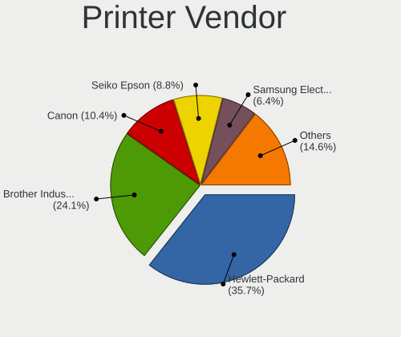

| Vendor                        | Desktops | Percent |
|-------------------------------|----------|---------|
| Hewlett-Packard               | 117      | 35.67%  |
| Brother Industries            | 79       | 24.09%  |
| Canon                         | 34       | 10.37%  |
| Seiko Epson                   | 29       | 8.84%   |
| Samsung Electronics           | 21       | 6.4%    |
| Dymo-CoStar                   | 9        | 2.74%   |
| Prolific Technology           | 7        | 2.13%   |
| Lexmark International         | 5        | 1.52%   |
| Pantum                        | 4        | 1.22%   |
| Kyocera                       | 4        | 1.22%   |
| Xerox                         | 3        | 0.91%   |
| Zhuhai Poskey Technology      | 2        | 0.61%   |
| QinHeng Electronics           | 2        | 0.61%   |
| Dell                          | 2        | 0.61%   |
| Zebra Technologies            | 1        | 0.3%    |
| Star Micronics                | 1        | 0.3%    |
| Samsung Info. Systems America | 1        | 0.3%    |
| Ricoh                         | 1        | 0.3%    |
| Printer                       | 1        | 0.3%    |
| NXP Semiconductors            | 1        | 0.3%    |
| Lenovo                        | 1        | 0.3%    |
| iDPRT                         | 1        | 0.3%    |
| Graphtec America              | 1        | 0.3%    |
| Boca Systems                  | 1        | 0.3%    |

Printer Model
-------------

Printer device models

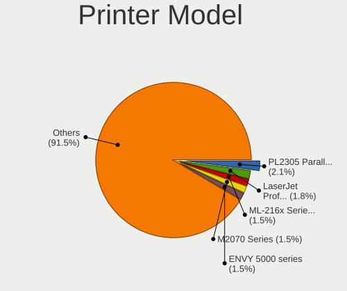

| Model                                  | Desktops | Percent |
|----------------------------------------|----------|---------|
| Prolific PL2305 Parallel Port          | 7        | 2.12%   |
| HP LaserJet Professional P 1102w       | 6        | 1.82%   |
| Samsung ML-216x Series Laser Printer   | 5        | 1.52%   |
| Samsung M2070 Series                   | 5        | 1.52%   |
| HP ENVY 5000 series                    | 5        | 1.52%   |
| HP DeskJet 2600 series                 | 5        | 1.52%   |
| Canon LiDE 300                         | 5        | 1.52%   |
| Brother Printer                        | 5        | 1.52%   |
| Brother HL-L2340D series               | 5        | 1.52%   |
| Seiko Epson Printer                    | 4        | 1.21%   |
| HP LaserJet Pro M148-M149              | 4        | 1.21%   |
| HP LaserJet 1020                       | 4        | 1.21%   |
| HP ENVY 4520 series                    | 4        | 1.21%   |
| HP DeskJet 3630 series                 | 4        | 1.21%   |
| Seiko Epson ET-2710 Series             | 3        | 0.91%   |
| HP DeskJet F300 series                 | 3        | 0.91%   |
| HP DeskJet 3700 series                 | 3        | 0.91%   |
| HP DeskJet 2700 series                 | 3        | 0.91%   |
| HP DeskJet 2130 series                 | 3        | 0.91%   |
| Dymo-CoStar LabelWriter 450            | 3        | 0.91%   |
| Dymo-CoStar DYMO LabelWriter 450 Turbo | 3        | 0.91%   |
| Brother MFC-9330CDW                    | 3        | 0.91%   |
| Brother HL-L2300D series               | 3        | 0.91%   |
| Brother HL-1110 series                 | 3        | 0.91%   |
| Brother DCP-L2510D series              | 3        | 0.91%   |
| Zhuhai Poskey DT426B                   | 2        | 0.61%   |
| Seiko Epson WF-2860 Series             | 2        | 0.61%   |
| Seiko Epson L3110 Series               | 2        | 0.61%   |
| QinHeng CH340S                         | 2        | 0.61%   |
| Pantum M6500W-series                   | 2        | 0.61%   |
| HP Smart Tank 510 series               | 2        | 0.61%   |
| HP OfficeJet 6950                      | 2        | 0.61%   |
| HP LaserJet Professional P1102w        | 2        | 0.61%   |
| HP LaserJet P1102                      | 2        | 0.61%   |
| HP LaserJet 1010                       | 2        | 0.61%   |
| HP DeskJet 4100 series                 | 2        | 0.61%   |
| Canon TS3300 series                    | 2        | 0.61%   |
| Canon TS3100 series                    | 2        | 0.61%   |
| Canon TR4700 series                    | 2        | 0.61%   |
| Canon TR4500 series                    | 2        | 0.61%   |

Scanner Vendor
--------------

Scanner device vendors

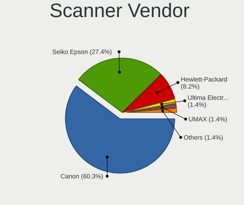

| Vendor             | Desktops | Percent |
|--------------------|----------|---------|
| Canon              | 44       | 60.27%  |
| Seiko Epson        | 20       | 27.4%   |
| Hewlett-Packard    | 6        | 8.22%   |
| UMAX               | 1        | 1.37%   |
| Ultima Electronics | 1        | 1.37%   |
| Mustek Systems     | 1        | 1.37%   |

Scanner Model
-------------

Scanner device models

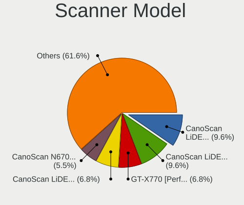

| Model                                                         | Desktops | Percent |
|---------------------------------------------------------------|----------|---------|
| Canon CanoScan LiDE 220                                       | 7        | 9.59%   |
| Canon CanoScan LiDE 210                                       | 7        | 9.59%   |
| Seiko Epson GT-X770 [Perfection V500]                         | 5        | 6.85%   |
| Canon CanoScan LiDE 110                                       | 5        | 6.85%   |
| Canon CanoScan N670U/N676U/LiDE 20                            | 4        | 5.48%   |
| Canon CanoScan LIDE 25                                        | 4        | 5.48%   |
| Canon CanoScan LiDE 100                                       | 4        | 5.48%   |
| Seiko Epson GT-X820 [Perfection V600 Photo]                   | 3        | 4.11%   |
| Seiko Epson GT-6600U [Perfection 610]                         | 3        | 4.11%   |
| Canon CanoScan LiDE 120                                       | 3        | 4.11%   |
| Canon CanoScan LiDE 700F                                      | 2        | 2.74%   |
| Canon CanoScan 4400F                                          | 2        | 2.74%   |
| UMAX Astra 2200/2200SU                                        | 1        | 1.37%   |
| Ultima Artec E+ Pro                                           | 1        | 1.37%   |
| Seiko Epson Scanner                                           | 1        | 1.37%   |
| Seiko Epson GT-X750 [Perfection 4490 Photo]                   | 1        | 1.37%   |
| Seiko Epson GT-F720 [GT-S620/Perfection V30/V300 Photo]       | 1        | 1.37%   |
| Seiko Epson GT-F670 [Perfection V200 Photo]                   | 1        | 1.37%   |
| Seiko Epson GT-F500/GT-F550 [Perfection 2480/2580 PHOTO]      | 1        | 1.37%   |
| Seiko Epson GT-9300UF [Perfection 2400 PHOTO]                 | 1        | 1.37%   |
| Seiko Epson GT-8700/GT-8700F [Perfection 1640SU/1640SU PHOTO] | 1        | 1.37%   |
| Seiko Epson GT-8300UF [Perfection 1660 PHOTO]                 | 1        | 1.37%   |
| Seiko Epson GT-1500 [GT-D1000]                                | 1        | 1.37%   |
| Mustek Systems BearPaw 2448 TA Plus                           | 1        | 1.37%   |
| HP ScanJet G4050                                              | 1        | 1.37%   |
| HP ScanJet 82x0C                                              | 1        | 1.37%   |
| HP ScanJet 5590                                               | 1        | 1.37%   |
| HP ScanJet 3400cse                                            | 1        | 1.37%   |
| HP ScanJet 3300c                                              | 1        | 1.37%   |
| HP ScanJet 2400c                                              | 1        | 1.37%   |
| Canon CanoScan N1240U/LiDE 30                                 | 1        | 1.37%   |
| Canon CanoScan LiDE 70                                        | 1        | 1.37%   |
| Canon CanoScan LiDE 60                                        | 1        | 1.37%   |
| Canon CanoScan LiDE 200                                       | 1        | 1.37%   |
| Canon CanoScan 4200F                                          | 1        | 1.37%   |
| Canon CanoScan 1220U                                          | 1        | 1.37%   |

Camera
------

Camera Vendor
-------------

Camera device vendors

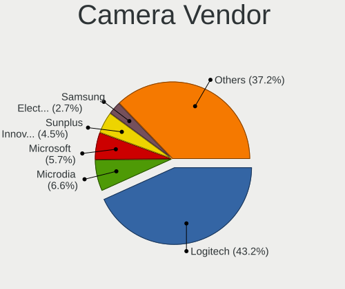

| Vendor                                 | Desktops | Percent |
|----------------------------------------|----------|---------|
| Logitech                               | 944      | 43.24%  |
| Microdia                               | 144      | 6.6%    |
| Microsoft                              | 125      | 5.73%   |
| Sunplus Innovation Technology          | 99       | 4.54%   |
| Samsung Electronics                    | 60       | 2.75%   |
| Apple                                  | 60       | 2.75%   |
| Realtek Semiconductor                  | 46       | 2.11%   |
| Generalplus Technology                 | 41       | 1.88%   |
| Razer USA                              | 33       | 1.51%   |
| Chicony Electronics                    | 31       | 1.42%   |
| ARC International                      | 30       | 1.37%   |
| webcam                                 | 29       | 1.33%   |
| MacroSilicon                           | 29       | 1.33%   |
| KYE Systems (Mouse Systems)            | 28       | 1.28%   |
| Z-Star Microelectronics                | 23       | 1.05%   |
| Creative Technology                    | 23       | 1.05%   |
| Jieli Technology                       | 22       | 1.01%   |
| Trust                                  | 20       | 0.92%   |
| AVerMedia Technologies                 | 19       | 0.87%   |
| Hewlett-Packard                        | 17       | 0.78%   |
| Cubeternet                             | 16       | 0.73%   |
| GEMBIRD                                | 15       | 0.69%   |
| Anker PowerConf C200                   | 15       | 0.69%   |
| A4Tech                                 | 14       | 0.64%   |
| eMeet                                  | 13       | 0.6%    |
| Lenovo                                 | 12       | 0.55%   |
| Sonix Technology                       | 9        | 0.41%   |
| Aveo Technology                        | 9        | 0.41%   |
| Arkmicro Technologies                  | 9        | 0.41%   |
| YGTek                                  | 8        | 0.37%   |
| Valve Software                         | 8        | 0.37%   |
| LG Electronics                         | 8        | 0.37%   |
| Tobii Technology AB                    | 7        | 0.32%   |
| SunplusIT                              | 7        | 0.32%   |
| Elgato Systems                         | 7        | 0.32%   |
| Cheng Uei Precision Industry (Foxlink) | 7        | 0.32%   |
| Asuscom Network                        | 7        | 0.32%   |
| Unknown                                | 7        | 0.32%   |
| Remo Tech                              | 6        | 0.27%   |
| Linux Foundation                       | 6        | 0.27%   |

Camera Model
------------

Camera device models

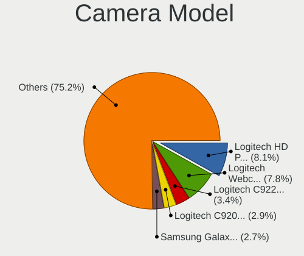

| Model                                     | Desktops | Percent |
|-------------------------------------------|----------|---------|
| Logitech HD Pro Webcam C920               | 178      | 8.08%   |
| Logitech Webcam C270                      | 171      | 7.76%   |
| Logitech C922 Pro Stream Webcam           | 74       | 3.36%   |
| Logitech C920 PRO HD Webcam               | 65       | 2.95%   |
| Samsung Galaxy series, misc. (MTP mode)   | 59       | 2.68%   |
| Logitech BRIO Ultra HD Webcam             | 54       | 2.45%   |
| Apple iPhone 5/5C/5S/6/SE/7/8/X           | 51       | 2.31%   |
| Microdia Webcam Vitade AF                 | 46       | 2.09%   |
| Logitech HD Webcam C525                   | 44       | 2%      |
| Microsoft LifeCam HD-3000                 | 42       | 1.91%   |
| Logitech Webcam C310                      | 39       | 1.77%   |
| Sunplus Full HD webcam                    | 37       | 1.68%   |
| Microdia USB 2.0 Camera                   | 35       | 1.59%   |
| Logitech StreamCam                        | 31       | 1.41%   |
| Logitech HD Webcam C615                   | 31       | 1.41%   |
| ARC International Camera                  | 30       | 1.36%   |
| webcam webcam                             | 29       | 1.32%   |
| Logitech Webcam C930e                     | 28       | 1.27%   |
| Logitech Logitech Webcam C925e            | 28       | 1.27%   |
| Microsoft LifeCam Cinema                  | 23       | 1.04%   |
| Logitech Webcam C170                      | 23       | 1.04%   |
| MacroSilicon USB Video                    | 21       | 0.95%   |
| Generalplus GENERAL WEBCAM                | 21       | 0.95%   |
| Microdia Camera                           | 19       | 0.86%   |
| Jieli USB PHY 2.0                         | 18       | 0.82%   |
| Logitech Webcam Pro 9000                  | 17       | 0.77%   |
| Sunplus Integrated Camera                 | 16       | 0.73%   |
| Microsoft LifeCam Studio                  | 16       | 0.73%   |
| Logitech BRIO 4K Stream Edition           | 16       | 0.73%   |
| Logitech QuickCam Pro 9000                | 15       | 0.68%   |
| Anker PowerConf C200 Anker PowerConf C200 | 15       | 0.68%   |
| Trust USB Camera                          | 14       | 0.64%   |
| Razer USA Gaming Webcam [Kiyo]            | 14       | 0.64%   |
| Generalplus 808 Camera #9 (web-cam mode)  | 14       | 0.64%   |
| Sunplus SPCA2281 Web Camera               | 12       | 0.54%   |
| Realtek FULL HD 1080P Webcam              | 12       | 0.54%   |
| Razer USA Razer Kiyo Pro                  | 12       | 0.54%   |
| Microdia Integrated Camera                | 12       | 0.54%   |
| Logitech HD Webcam C910                   | 11       | 0.5%    |
| Sunplus USB 2.0 Camera                    | 10       | 0.45%   |

Security
--------

Fingerprint Vendor
------------------

Fingerprint sensor vendors

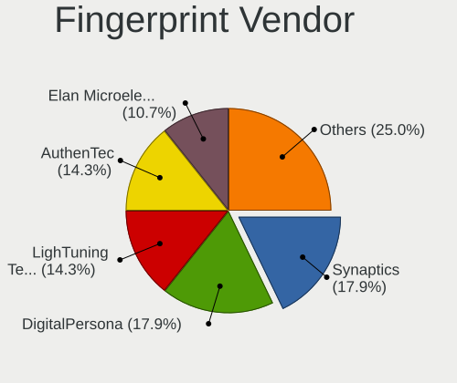

| Vendor                | Desktops | Percent |
|-----------------------|----------|---------|
| Synaptics             | 5        | 17.86%  |
| DigitalPersona        | 5        | 17.86%  |
| LighTuning Technology | 4        | 14.29%  |
| AuthenTec             | 4        | 14.29%  |
| Elan Microelectronics | 3        | 10.71%  |
| Upek                  | 2        | 7.14%   |
| Dell                  | 2        | 7.14%   |
| Yamila                | 1        | 3.57%   |
| Netchip Technology    | 1        | 3.57%   |
| Microsoft             | 1        | 3.57%   |

Fingerprint Model
-----------------

Fingerprint sensor models

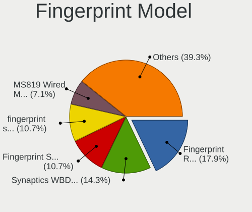

| Model                                                  | Desktops | Percent |
|--------------------------------------------------------|----------|---------|
| DigitalPersona Fingerprint Reader                      | 5        | 17.86%  |
| Synaptics  WBDI Fingerprint Reader - USB 052           | 4        | 14.29%  |
| LighTuning Fingerprint Sensor                          | 3        | 10.71%  |
| Elan fingerprint sensor [FeinTech FPS00200]            | 3        | 10.71%  |
| Dell MS819 Wired Mouse With Fingerprint Reader         | 2        | 7.14%   |
| AuthenTec Fingerprint Sensor                           | 2        | 7.14%   |
| AuthenTec AES1600                                      | 2        | 7.14%   |
| Yamila Yamila Fingerprint Device                       | 1        | 3.57%   |
| Upek TCS1C EIM/STM32 Fingerprint sensor                | 1        | 3.57%   |
| Upek Biometric Touchchip/Touchstrip Fingerprint Sensor | 1        | 3.57%   |
| Synaptics  WBDI                                        | 1        | 3.57%   |
| Netchip V30x/V4xx fingerprint sensor [Lumidigm]        | 1        | 3.57%   |
| Microsoft Fingerprint Reader                           | 1        | 3.57%   |
| LighTuning EgisTec Touch Fingerprint Sensor            | 1        | 3.57%   |

Chipcard Vendor
---------------

Chipcard module vendors

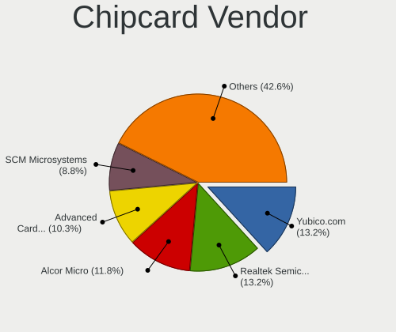

| Vendor                            | Desktops | Percent |
|-----------------------------------|----------|---------|
| Yubico.com                        | 9        | 13.24%  |
| Realtek Semiconductor             | 9        | 13.24%  |
| Alcor Micro                       | 8        | 11.76%  |
| Advanced Card Systems             | 7        | 10.29%  |
| SCM Microsystems                  | 6        | 8.82%   |
| VASCO Data Security International | 4        | 5.88%   |
| Aladdin Knowledge Systems         | 4        | 5.88%   |
| OmniKey                           | 3        | 4.41%   |
| Gemalto (was Gemplus)             | 3        | 4.41%   |
| Cherry                            | 3        | 4.41%   |
| Aktiv                             | 3        | 4.41%   |
| Reiner SCT Kartensysteme          | 2        | 2.94%   |
| Chicony Electronics               | 2        | 2.94%   |
| Bit4id                            | 2        | 2.94%   |
| Fujitsu Siemens Computers         | 1        | 1.47%   |
| Feitian Technologies              | 1        | 1.47%   |
| Clay Logic                        | 1        | 1.47%   |

Chipcard Model
--------------

Chipcard module models

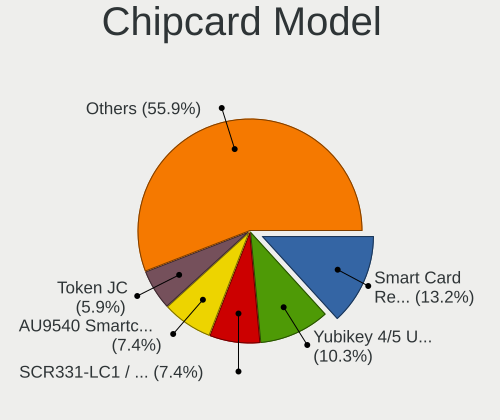

| Model                                                                      | Desktops | Percent |
|----------------------------------------------------------------------------|----------|---------|
| Realtek Semiconductor Smart Card Reader Interface                          | 9        | 13.24%  |
| Yubico.com Yubikey 4/5 U2F+CCID                                            | 7        | 10.29%  |
| SCM Microsystems SCR331-LC1 / SCR3310 SmartCard Reader                     | 5        | 7.35%   |
| Alcor Micro AU9540 Smartcard Reader                                        | 5        | 7.35%   |
| Aladdin Knowledge Systems Token JC                                         | 4        | 5.88%   |
| VASCO Data Security International Digipass 905 SmartCard Reader            | 3        | 4.41%   |
| Gemalto (was Gemplus) GemPC Twin SmartCard Reader                          | 3        | 4.41%   |
| Alcor Micro Watchdata W 1981                                               | 3        | 4.41%   |
| Aktiv Rutoken lite                                                         | 3        | 4.41%   |
| Reiner SCT Kartensysteme cyberJack RFID basis contactless smartcard reader | 2        | 2.94%   |
| Chicony Electronics HP Skylab USB Smartcard Keyboard                       | 2        | 2.94%   |
| Cherry Smart Terminal XX44                                                 | 2        | 2.94%   |
| Bit4id miniLector EVO                                                      | 2        | 2.94%   |
| Advanced Card Systems ACR1252 Dual Reader                                  | 2        | 2.94%   |
| Advanced Card Systems ACR122U                                              | 2        | 2.94%   |
| Yubico.com Yubikey NEO(-N) OTP+CCID                                        | 1        | 1.47%   |
| Yubico.com Yubikey 4/5 CCID                                                | 1        | 1.47%   |
| VASCO Data Security International DIGIPASS 870                             | 1        | 1.47%   |
| SCM Microsystems SCR3340 - ExpressCard54 Smart Card Reader                 | 1        | 1.47%   |
| OmniKey CardMan 3121 (HID Technologies)                                    | 1        | 1.47%   |
| OmniKey CardMan 3021 / 3121                                                | 1        | 1.47%   |
| OmniKey CardMan 1021                                                       | 1        | 1.47%   |
| Fujitsu Siemens Computers SmartCard Reader 2A                              | 1        | 1.47%   |
| Feitian Technologies FT SCR310                                             | 1        | 1.47%   |
| Clay Logic Nitrokey Pro                                                    | 1        | 1.47%   |
| Cherry SmartCard Reader Keyboard KC 1000 SC                                | 1        | 1.47%   |
| Advanced Card Systems ACR38 SmartCard Reader                               | 1        | 1.47%   |
| Advanced Card Systems ACR1281 1S Dual Reader                               | 1        | 1.47%   |
| Advanced Card Systems ACR1252 CL Reader PICC                               | 1        | 1.47%   |

Unsupported
-----------

Unsupported Devices
-------------------

Total unsupported devices on board

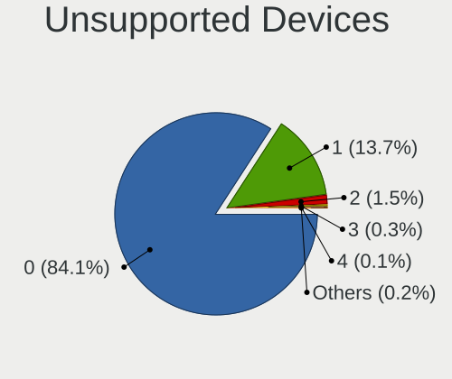

| Total | Desktops | Percent |
|-------|----------|---------|
| 0     | 7466     | 84.14%  |
| 1     | 1213     | 13.67%  |
| 2     | 136      | 1.53%   |
| 3     | 30       | 0.34%   |
| 4     | 13       | 0.15%   |
| 5     | 8        | 0.09%   |
| 7     | 3        | 0.03%   |
| 8     | 2        | 0.02%   |
| 6     | 2        | 0.02%   |

Unsupported Device Types
------------------------

Types of unsupported devices

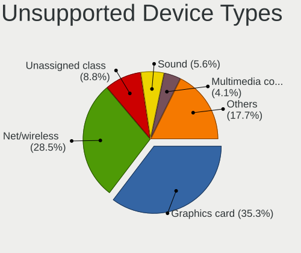

| Type                     | Desktops | Percent |
|--------------------------|----------|---------|
| Graphics card            | 556      | 35.35%  |
| Net/wireless             | 448      | 28.48%  |
| Unassigned class         | 139      | 8.84%   |
| Sound                    | 88       | 5.59%   |
| Multimedia controller    | 64       | 4.07%   |
| Communication controller | 49       | 3.12%   |
| Camera                   | 49       | 3.12%   |
| Bluetooth                | 31       | 1.97%   |
| Net/ethernet             | 30       | 1.91%   |
| Network                  | 28       | 1.78%   |
| Fingerprint reader       | 26       | 1.65%   |
| Storage/raid             | 25       | 1.59%   |
| Card reader              | 11       | 0.7%    |
| Chipcard                 | 8        | 0.51%   |
| Modem                    | 6        | 0.38%   |
| Firewire controller      | 5        | 0.32%   |
| Dvb card                 | 3        | 0.19%   |
| Tv card                  | 2        | 0.13%   |
| Storage/ata              | 2        | 0.13%   |
| Wireless                 | 1        | 0.06%   |
| Storage/nvme             | 1        | 0.06%   |
| Storage                  | 1        | 0.06%   |

