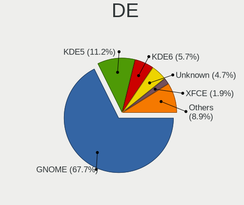
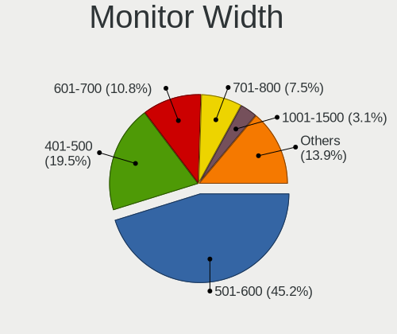

Fedora - Tested Hardware & Statistics (Desktops)
------------------------------------------------

A project to collect tested hardware configurations for Fedora.

Anyone can contribute to this report by the [hw-probe](https://github.com/linuxhw/hw-probe) tool:

    sudo -E hw-probe -all -upload

Please contribute! Especially if your hardware is rare.

Contents
--------

* [ Test Cases ](#test-cases)

* [ System ](#system)
  - [ OS                       ](#os)
  - [ OS Family                ](#os-family)
  - [ Kernel                   ](#kernel)
  - [ Kernel Family            ](#kernel-family)
  - [ Kernel Major Ver.        ](#kernel-major-ver)
  - [ Arch                     ](#arch)
  - [ DE                       ](#de)
  - [ Display Server           ](#display-server)
  - [ Display Manager          ](#display-manager)
  - [ OS Lang                  ](#os-lang)
  - [ Boot Mode                ](#boot-mode)
  - [ Filesystem               ](#filesystem)
  - [ Part. scheme             ](#part-scheme)
  - [ Dual Boot with Linux/BSD ](#dual-boot-with-linuxbsd)
  - [ Dual Boot (Win)          ](#dual-boot-win)

* [ Board ](#board)
  - [ Vendor                   ](#vendor)
  - [ Model                    ](#model)
  - [ Model Family             ](#model-family)
  - [ MFG Year                 ](#mfg-year)
  - [ Form Factor              ](#form-factor)
  - [ Secure Boot              ](#secure-boot)
  - [ Coreboot                 ](#coreboot)
  - [ RAM Size                 ](#ram-size)
  - [ RAM Used                 ](#ram-used)
  - [ Total Drives             ](#total-drives)
  - [ Has CD-ROM               ](#has-cd-rom)
  - [ Has Ethernet             ](#has-ethernet)
  - [ Has WiFi                 ](#has-wifi)
  - [ Has Bluetooth            ](#has-bluetooth)

* [ Location ](#location)
  - [ Country                  ](#country)
  - [ City                     ](#city)

* [ Drives ](#drives)
  - [ Drive Vendor             ](#drive-vendor)
  - [ Drive Model              ](#drive-model)
  - [ HDD Vendor               ](#hdd-vendor)
  - [ SSD Vendor               ](#ssd-vendor)
  - [ Drive Kind               ](#drive-kind)
  - [ Drive Connector          ](#drive-connector)
  - [ Drive Size               ](#drive-size)
  - [ Space Total              ](#space-total)
  - [ Space Used               ](#space-used)
  - [ Malfunc. Drives          ](#malfunc-drives)
  - [ Malfunc. Drive Vendor    ](#malfunc-drive-vendor)
  - [ Malfunc. HDD Vendor      ](#malfunc-hdd-vendor)
  - [ Malfunc. Drive Kind      ](#malfunc-drive-kind)
  - [ Failed Drives            ](#failed-drives)
  - [ Failed Drive Vendor      ](#failed-drive-vendor)
  - [ Drive Status             ](#drive-status)

* [ Storage controller ](#storage-controller)
  - [ Storage Vendor           ](#storage-vendor)
  - [ Storage Model            ](#storage-model)
  - [ Storage Kind             ](#storage-kind)

* [ Processor ](#processor)
  - [ CPU Vendor               ](#cpu-vendor)
  - [ CPU Model                ](#cpu-model)
  - [ CPU Model Family         ](#cpu-model-family)
  - [ CPU Cores                ](#cpu-cores)
  - [ CPU Sockets              ](#cpu-sockets)
  - [ CPU Threads              ](#cpu-threads)
  - [ CPU Op-Modes             ](#cpu-op-modes)
  - [ CPU Microcode            ](#cpu-microcode)
  - [ CPU Microarch            ](#cpu-microarch)

* [ Graphics ](#graphics)
  - [ GPU Vendor               ](#gpu-vendor)
  - [ GPU Model                ](#gpu-model)
  - [ GPU Combo                ](#gpu-combo)
  - [ GPU Driver               ](#gpu-driver)
  - [ GPU Memory               ](#gpu-memory)

* [ Monitor ](#monitor)
  - [ Monitor Vendor           ](#monitor-vendor)
  - [ Monitor Model            ](#monitor-model)
  - [ Monitor Resolution       ](#monitor-resolution)
  - [ Monitor Diagonal         ](#monitor-diagonal)
  - [ Monitor Width            ](#monitor-width)
  - [ Aspect Ratio             ](#aspect-ratio)
  - [ Monitor Area             ](#monitor-area)
  - [ Pixel Density            ](#pixel-density)
  - [ Multiple Monitors        ](#multiple-monitors)

* [ Network ](#network)
  - [ Net Controller Vendor    ](#net-controller-vendor)
  - [ Net Controller Model     ](#net-controller-model)
  - [ Wireless Vendor          ](#wireless-vendor)
  - [ Wireless Model           ](#wireless-model)
  - [ Ethernet Vendor          ](#ethernet-vendor)
  - [ Ethernet Model           ](#ethernet-model)
  - [ Net Controller Kind      ](#net-controller-kind)
  - [ Used Controller          ](#used-controller)
  - [ NICs                     ](#nics)
  - [ IPv6                     ](#ipv6)

* [ Bluetooth ](#bluetooth)
  - [ Bluetooth Vendor         ](#bluetooth-vendor)
  - [ Bluetooth Model          ](#bluetooth-model)

* [ Sound ](#sound)
  - [ Sound Vendor             ](#sound-vendor)
  - [ Sound Model              ](#sound-model)

* [ Memory ](#memory)
  - [ Memory Vendor            ](#memory-vendor)
  - [ Memory Model             ](#memory-model)
  - [ Memory Kind              ](#memory-kind)
  - [ Memory Form Factor       ](#memory-form-factor)
  - [ Memory Size              ](#memory-size)
  - [ Memory Speed             ](#memory-speed)

* [ Printers & scanners ](#printers--scanners)
  - [ Printer Vendor           ](#printer-vendor)
  - [ Printer Model            ](#printer-model)
  - [ Scanner Vendor           ](#scanner-vendor)
  - [ Scanner Model            ](#scanner-model)

* [ Camera ](#camera)
  - [ Camera Vendor            ](#camera-vendor)
  - [ Camera Model             ](#camera-model)

* [ Security ](#security)
  - [ Fingerprint Vendor       ](#fingerprint-vendor)
  - [ Fingerprint Model        ](#fingerprint-model)
  - [ Chipcard Vendor          ](#chipcard-vendor)
  - [ Chipcard Model           ](#chipcard-model)

* [ Unsupported ](#unsupported)
  - [ Unsupported Devices      ](#unsupported-devices)
  - [ Unsupported Device Types ](#unsupported-device-types)

Test Cases
----------

Total: 5272

| Vendor        | Model                       | Probe                                                      | Date         |
|---------------|-----------------------------|------------------------------------------------------------|--------------|
| ASUSTek       | ROG STRIX X570-E GAMING     | [f16b55ea54](https://linux-hardware.org/?probe=f16b55ea54) | Dec 31, 2022 |
| Shuttle       | SH570                       | [09994766ed](https://linux-hardware.org/?probe=09994766ed) | Dec 31, 2022 |
| Shuttle       | SH570                       | [f4d5ef752c](https://linux-hardware.org/?probe=f4d5ef752c) | Dec 31, 2022 |
| ASRock        | A320M-DVS R4.0              | [f82bf510be](https://linux-hardware.org/?probe=f82bf510be) | Dec 31, 2022 |
| MSI           | X99A RAIDER                 | [8582096251](https://linux-hardware.org/?probe=8582096251) | Dec 31, 2022 |
| ASRock        | FM2A88X Extreme6+           | [c45e0f54fd](https://linux-hardware.org/?probe=c45e0f54fd) | Dec 31, 2022 |
| MAXSUN        | MS-TZZ A320M.2-VH           | [8f06578f10](https://linux-hardware.org/?probe=8f06578f10) | Dec 31, 2022 |
| Shuttle       | SH570                       | [2d7f57de8f](https://linux-hardware.org/?probe=2d7f57de8f) | Dec 31, 2022 |
| MSI           | MPG X570 GAMING PRO CARB... | [1347eaedb9](https://linux-hardware.org/?probe=1347eaedb9) | Dec 31, 2022 |
| ASRock        | X79 Extreme6                | [5ea31811b4](https://linux-hardware.org/?probe=5ea31811b4) | Dec 30, 2022 |
| MSI           | H510M-A PRO                 | [4dba3b7c55](https://linux-hardware.org/?probe=4dba3b7c55) | Dec 30, 2022 |
| ASUSTek       | PRIME X670-P WIFI           | [498c8c83e2](https://linux-hardware.org/?probe=498c8c83e2) | Dec 30, 2022 |
| ASRock        | B450M Pro4                  | [4393041949](https://linux-hardware.org/?probe=4393041949) | Dec 30, 2022 |
| Gigabyte      | Z390 UD                     | [70dc568eae](https://linux-hardware.org/?probe=70dc568eae) | Dec 30, 2022 |
| Intel         | LADPNVMO AAE76523-300       | [4e6065532f](https://linux-hardware.org/?probe=4e6065532f) | Dec 30, 2022 |
| ASRock        | FM2A88X Extreme6+           | [8289d108fb](https://linux-hardware.org/?probe=8289d108fb) | Dec 30, 2022 |
| MSI           | X99A RAIDER                 | [3b0d4e8973](https://linux-hardware.org/?probe=3b0d4e8973) | Dec 30, 2022 |
| ASUSTek       | Z87-PRO                     | [eafab9edba](https://linux-hardware.org/?probe=eafab9edba) | Dec 30, 2022 |
| MSI           | MAG B650 TOMAHAWK WIFI      | [bdc5158ffb](https://linux-hardware.org/?probe=bdc5158ffb) | Dec 29, 2022 |
| Dell          | 0KRC95 A02                  | [4cf9d40c0d](https://linux-hardware.org/?probe=4cf9d40c0d) | Dec 29, 2022 |
| Dell          | 0KRC95 A02                  | [7e53808767](https://linux-hardware.org/?probe=7e53808767) | Dec 29, 2022 |
| ASRock        | FM2A88X Extreme6+           | [12c052156c](https://linux-hardware.org/?probe=12c052156c) | Dec 29, 2022 |
| MSI           | X99A RAIDER                 | [daf7777113](https://linux-hardware.org/?probe=daf7777113) | Dec 29, 2022 |
| ASUSTek       | M5A78L/USB3                 | [b89e7eb1c9](https://linux-hardware.org/?probe=b89e7eb1c9) | Dec 28, 2022 |
| ASUSTek       | ROG STRIX B450-F GAMING     | [24b822291e](https://linux-hardware.org/?probe=24b822291e) | Dec 28, 2022 |
| Gigabyte      | B365M DS3H                  | [0dc3c192fd](https://linux-hardware.org/?probe=0dc3c192fd) | Dec 28, 2022 |
| BESSTAR Te... | F6BFC                       | [7c6adb6279](https://linux-hardware.org/?probe=7c6adb6279) | Dec 28, 2022 |
| Dell          | 0N4YC8 A00                  | [fc766b2a1b](https://linux-hardware.org/?probe=fc766b2a1b) | Dec 28, 2022 |
| BESSTAR Te... | F6BFC                       | [59b38f9b63](https://linux-hardware.org/?probe=59b38f9b63) | Dec 28, 2022 |
| ASUSTek       | PRIME Z790-P WIFI           | [7bb247e453](https://linux-hardware.org/?probe=7bb247e453) | Dec 28, 2022 |
| Gigabyte      | B365M D2V                   | [93f7c010a2](https://linux-hardware.org/?probe=93f7c010a2) | Dec 28, 2022 |
| ASRock        | FM2A88X Extreme6+           | [f5ac2a0028](https://linux-hardware.org/?probe=f5ac2a0028) | Dec 28, 2022 |
| MSI           | X99A RAIDER                 | [2d572d06d7](https://linux-hardware.org/?probe=2d572d06d7) | Dec 28, 2022 |
| MSI           | Z97 GAMING 3                | [7aab4546f6](https://linux-hardware.org/?probe=7aab4546f6) | Dec 28, 2022 |
| ASRock        | Z370M-ITX/ac                | [f87fbed6a1](https://linux-hardware.org/?probe=f87fbed6a1) | Dec 28, 2022 |
| Gigabyte      | B650I AORUS ULTRA           | [3c25f43c23](https://linux-hardware.org/?probe=3c25f43c23) | Dec 28, 2022 |
| Itautec       | ST 4265                     | [38e4a07f9a](https://linux-hardware.org/?probe=38e4a07f9a) | Dec 27, 2022 |
| ASUSTek       | TUF Gaming B550-PLUS        | [f2751df7ec](https://linux-hardware.org/?probe=f2751df7ec) | Dec 27, 2022 |
| MSI           | Z390-A PRO                  | [e2feef912f](https://linux-hardware.org/?probe=e2feef912f) | Dec 27, 2022 |
| ASUSTek       | ROG STRIX X570-I GAMING     | [731f916db1](https://linux-hardware.org/?probe=731f916db1) | Dec 27, 2022 |
| ASRock        | AD2700-ITX                  | [d4fff49f31](https://linux-hardware.org/?probe=d4fff49f31) | Dec 27, 2022 |
| Itautec       | ST 4265                     | [8323542129](https://linux-hardware.org/?probe=8323542129) | Dec 26, 2022 |
| ASRock        | FM2A88X Extreme6+           | [8d1181c71b](https://linux-hardware.org/?probe=8d1181c71b) | Dec 26, 2022 |
| MSI           | X99A RAIDER                 | [cbe4c82d15](https://linux-hardware.org/?probe=cbe4c82d15) | Dec 26, 2022 |
| HP            | 3397                        | [c546bb007b](https://linux-hardware.org/?probe=c546bb007b) | Dec 26, 2022 |
| HP            | 3397                        | [4286520907](https://linux-hardware.org/?probe=4286520907) | Dec 26, 2022 |
| MSI           | MPG B550 GAMING PLUS        | [4c97c87b61](https://linux-hardware.org/?probe=4c97c87b61) | Dec 25, 2022 |
| ASUSTek       | TUF Gaming B560M-PLUS WI... | [8762b5f41f](https://linux-hardware.org/?probe=8762b5f41f) | Dec 25, 2022 |
| ASUSTek       | ROG STRIX X670E-F GAMING... | [628cefc78a](https://linux-hardware.org/?probe=628cefc78a) | Dec 25, 2022 |
| ASRock        | FM2A88X Extreme6+           | [b6def743ea](https://linux-hardware.org/?probe=b6def743ea) | Dec 25, 2022 |
| MSI           | X99A RAIDER                 | [8636b69474](https://linux-hardware.org/?probe=8636b69474) | Dec 25, 2022 |
| Gigabyte      | Z690 AORUS ULTRA            | [46705eb79f](https://linux-hardware.org/?probe=46705eb79f) | Dec 25, 2022 |
| ASUSTek       | ProArt Z690-CREATOR WIFI    | [04b76a7e78](https://linux-hardware.org/?probe=04b76a7e78) | Dec 24, 2022 |
| ASUSTek       | PRIME B450M-GAMING/BR       | [c7d8ce8f80](https://linux-hardware.org/?probe=c7d8ce8f80) | Dec 24, 2022 |
| ASUSTek       | PRIME Z790-P WIFI           | [e853f645cf](https://linux-hardware.org/?probe=e853f645cf) | Dec 24, 2022 |
| Gigabyte      | GA-78LMT-USB3 SEx           | [82f8802857](https://linux-hardware.org/?probe=82f8802857) | Dec 24, 2022 |
| MSI           | Z270M MORTAR                | [70564a2846](https://linux-hardware.org/?probe=70564a2846) | Dec 24, 2022 |
| MSI           | MAG B650 TOMAHAWK WIFI      | [bf8f02ac85](https://linux-hardware.org/?probe=bf8f02ac85) | Dec 24, 2022 |
| ASRock        | FM2A88X Extreme6+           | [f5fa069144](https://linux-hardware.org/?probe=f5fa069144) | Dec 24, 2022 |
| MSI           | X99A RAIDER                 | [a375cc62c7](https://linux-hardware.org/?probe=a375cc62c7) | Dec 24, 2022 |
| Gigabyte      | Z690 AORUS ULTRA            | [926850a516](https://linux-hardware.org/?probe=926850a516) | Dec 24, 2022 |
| ASRock        | FM2A88X Extreme6+           | [88df914367](https://linux-hardware.org/?probe=88df914367) | Dec 23, 2022 |
| MSI           | X99A RAIDER                 | [c36553b2b8](https://linux-hardware.org/?probe=c36553b2b8) | Dec 23, 2022 |
| ASUSTek       | B85-PLUS                    | [16b14098bf](https://linux-hardware.org/?probe=16b14098bf) | Dec 22, 2022 |
| ASRock        | H470M Pro4                  | [b69ccc3353](https://linux-hardware.org/?probe=b69ccc3353) | Dec 22, 2022 |
| Gigabyte      | X570S I AORUS PRO AX        | [3f3c7b0e92](https://linux-hardware.org/?probe=3f3c7b0e92) | Dec 22, 2022 |
| ASRock        | FM2A88X Extreme6+           | [6eb006d2d4](https://linux-hardware.org/?probe=6eb006d2d4) | Dec 22, 2022 |
| MSI           | X99A RAIDER                 | [bfe7b1ec1d](https://linux-hardware.org/?probe=bfe7b1ec1d) | Dec 22, 2022 |
| ASUSTek       | B85-PLUS                    | [cbad10e284](https://linux-hardware.org/?probe=cbad10e284) | Dec 21, 2022 |
| Dell          | 0T10XW A02                  | [f39488c597](https://linux-hardware.org/?probe=f39488c597) | Dec 21, 2022 |
| Dell          | 0T10XW A02                  | [0243df6ce4](https://linux-hardware.org/?probe=0243df6ce4) | Dec 21, 2022 |
| HP            | 8266                        | [321dbc66bf](https://linux-hardware.org/?probe=321dbc66bf) | Dec 21, 2022 |
| ASUSTek       | TUF Gaming Z590-PLUS WIF... | [8428e68855](https://linux-hardware.org/?probe=8428e68855) | Dec 21, 2022 |
| ASRock        | FM2A88X Extreme6+           | [bd7ed31b20](https://linux-hardware.org/?probe=bd7ed31b20) | Dec 21, 2022 |
| MSI           | X99A RAIDER                 | [3832e7e0af](https://linux-hardware.org/?probe=3832e7e0af) | Dec 21, 2022 |
| ASUSTek       | ROG STRIX B550-F GAMING     | [cb70181c3a](https://linux-hardware.org/?probe=cb70181c3a) | Dec 21, 2022 |
| Dell          | 02YRK5 A02                  | [f5f6093483](https://linux-hardware.org/?probe=f5f6093483) | Dec 21, 2022 |
| Intel         | H81                         | [747dd5e27a](https://linux-hardware.org/?probe=747dd5e27a) | Dec 20, 2022 |
| ASRock        | Z790 Pro RS WiFi            | [d54c198ec8](https://linux-hardware.org/?probe=d54c198ec8) | Dec 20, 2022 |
| ASUSTek       | TUF Gaming B650M-PLUS       | [ef5cd85ef3](https://linux-hardware.org/?probe=ef5cd85ef3) | Dec 20, 2022 |
| Gigabyte      | GA-A75M-UD2H                | [f7e97a6c6c](https://linux-hardware.org/?probe=f7e97a6c6c) | Dec 20, 2022 |
| MSI           | X99A RAIDER                 | [8a7ee1147b](https://linux-hardware.org/?probe=8a7ee1147b) | Dec 20, 2022 |
| ASRock        | FM2A88X Extreme6+           | [9451dc3035](https://linux-hardware.org/?probe=9451dc3035) | Dec 20, 2022 |
| ASUSTek       | TUF Gaming B660M-PLUS WI... | [60dbf09ee4](https://linux-hardware.org/?probe=60dbf09ee4) | Dec 20, 2022 |
| Gigabyte      | H61M-USB3V                  | [3161a64c4b](https://linux-hardware.org/?probe=3161a64c4b) | Dec 19, 2022 |
| Gigabyte      | B85M-D3V-A                  | [6a964b9d6b](https://linux-hardware.org/?probe=6a964b9d6b) | Dec 19, 2022 |
| MSI           | Boston                      | [8587c9cf45](https://linux-hardware.org/?probe=8587c9cf45) | Dec 19, 2022 |
| Gigabyte      | X79-UP4                     | [900fd62aaf](https://linux-hardware.org/?probe=900fd62aaf) | Dec 19, 2022 |
| Gigabyte      | X79-UP4                     | [b34721e6cb](https://linux-hardware.org/?probe=b34721e6cb) | Dec 19, 2022 |
| Gigabyte      | A520M DS3H                  | [4251c08b5d](https://linux-hardware.org/?probe=4251c08b5d) | Dec 18, 2022 |
| Dell          | 0KRC95 A02                  | [e7bb083869](https://linux-hardware.org/?probe=e7bb083869) | Dec 18, 2022 |
| MSI           | Z87M GAMING                 | [bf27014217](https://linux-hardware.org/?probe=bf27014217) | Dec 18, 2022 |
| ASUSTek       | P8H77-V LE                  | [3f76e320c0](https://linux-hardware.org/?probe=3f76e320c0) | Dec 18, 2022 |
| Gigabyte      | B360M D3H-CF                | [fed4383ac0](https://linux-hardware.org/?probe=fed4383ac0) | Dec 18, 2022 |
| MSI           | B550-A PRO                  | [53c582a7f6](https://linux-hardware.org/?probe=53c582a7f6) | Dec 18, 2022 |
| MSI           | X99A RAIDER                 | [b4d6964157](https://linux-hardware.org/?probe=b4d6964157) | Dec 18, 2022 |
| ASRock        | FM2A88X Extreme6+           | [561aa4411a](https://linux-hardware.org/?probe=561aa4411a) | Dec 18, 2022 |
| ASUSTek       | PRIME B550M-K               | [0c496cdb01](https://linux-hardware.org/?probe=0c496cdb01) | Dec 17, 2022 |
| MSI           | A88XM-E35                   | [2e3cc90610](https://linux-hardware.org/?probe=2e3cc90610) | Dec 17, 2022 |
| ASUSTek       | ROG CROSSHAIR VIII IMPAC... | [3db1266e41](https://linux-hardware.org/?probe=3db1266e41) | Dec 17, 2022 |
| ASUSTek       | P8H77-M LE                  | [d9eba2d52f](https://linux-hardware.org/?probe=d9eba2d52f) | Dec 17, 2022 |
| Gigabyte      | J1900M-D2P                  | [26ecfabc95](https://linux-hardware.org/?probe=26ecfabc95) | Dec 17, 2022 |
| Gigabyte      | X570 AORUS ELITE WIFI       | [6dddb93518](https://linux-hardware.org/?probe=6dddb93518) | Dec 17, 2022 |
| ASUSTek       | TUF Z270 MARK 2             | [1bb7d1bffe](https://linux-hardware.org/?probe=1bb7d1bffe) | Dec 17, 2022 |
| ASRock        | FM2A88X Extreme6+           | [88d55eced8](https://linux-hardware.org/?probe=88d55eced8) | Dec 17, 2022 |
| MSI           | X99A RAIDER                 | [be93cca77c](https://linux-hardware.org/?probe=be93cca77c) | Dec 17, 2022 |
| MSI           | A88XM-E35                   | [f0efaa3c30](https://linux-hardware.org/?probe=f0efaa3c30) | Dec 17, 2022 |
| ASUSTek       | PRIME H670-PLUS D4          | [54132f7285](https://linux-hardware.org/?probe=54132f7285) | Dec 17, 2022 |
| HP            | 82F2 A01                    | [859d719a2a](https://linux-hardware.org/?probe=859d719a2a) | Dec 16, 2022 |
| Gigabyte      | Z77MX-D3H                   | [50ba321b50](https://linux-hardware.org/?probe=50ba321b50) | Dec 16, 2022 |
| ASUSTek       | ROG STRIX Z490-F GAMING     | [f048f7fcdb](https://linux-hardware.org/?probe=f048f7fcdb) | Dec 16, 2022 |
| ASRock        | FM2A88X Extreme6+           | [04bbc083d7](https://linux-hardware.org/?probe=04bbc083d7) | Dec 16, 2022 |
| MSI           | X99A RAIDER                 | [9caae58821](https://linux-hardware.org/?probe=9caae58821) | Dec 16, 2022 |
| ASUSTek       | PRIME B550M-K               | [5148fddbd1](https://linux-hardware.org/?probe=5148fddbd1) | Dec 15, 2022 |
| ASUSTek       | PRIME B450M-K               | [a6dfbac9f9](https://linux-hardware.org/?probe=a6dfbac9f9) | Dec 15, 2022 |
| MACHINIST     | X99-RS9 V2.0                | [83c2de0b09](https://linux-hardware.org/?probe=83c2de0b09) | Dec 15, 2022 |
| Lenovo        | 31900003 STD                | [81dea8d96e](https://linux-hardware.org/?probe=81dea8d96e) | Dec 15, 2022 |
| ASRock        | X670E Steel Legend          | [fec86201de](https://linux-hardware.org/?probe=fec86201de) | Dec 15, 2022 |
| MSI           | B550-A PRO B02              | [3a1ebe10f8](https://linux-hardware.org/?probe=3a1ebe10f8) | Dec 15, 2022 |
| ASRock        | FM2A88X Extreme6+           | [2e9fac9df4](https://linux-hardware.org/?probe=2e9fac9df4) | Dec 15, 2022 |
| MSI           | X99A RAIDER                 | [5a071587fb](https://linux-hardware.org/?probe=5a071587fb) | Dec 15, 2022 |
| ASUSTek       | ROG STRIX B450-F GAMING     | [572f0231a5](https://linux-hardware.org/?probe=572f0231a5) | Dec 15, 2022 |
| ASUSTek       | ROG STRIX B450-F GAMING     | [a0d17e1d50](https://linux-hardware.org/?probe=a0d17e1d50) | Dec 15, 2022 |
| ASUSTek       | PRIME H410M-E               | [cb7bfc231e](https://linux-hardware.org/?probe=cb7bfc231e) | Dec 15, 2022 |
| ASUSTek       | PRIME A320M-K               | [e647deca28](https://linux-hardware.org/?probe=e647deca28) | Dec 14, 2022 |
| Intel         | DQ67SW AAG12527-309         | [3b826b42e0](https://linux-hardware.org/?probe=3b826b42e0) | Dec 14, 2022 |
| Dell          | 0XJ8C4 A00                  | [c7ce3d7180](https://linux-hardware.org/?probe=c7ce3d7180) | Dec 14, 2022 |
| ASUSTek       | Z97-A                       | [fa4afa166d](https://linux-hardware.org/?probe=fa4afa166d) | Dec 14, 2022 |
| Dell          | 0XJ8C4 A00                  | [b136ecfff3](https://linux-hardware.org/?probe=b136ecfff3) | Dec 14, 2022 |
| ASUSTek       | Z97-A                       | [5cde0cdcc4](https://linux-hardware.org/?probe=5cde0cdcc4) | Dec 14, 2022 |
| HP            | 18E4                        | [fece9d45b4](https://linux-hardware.org/?probe=fece9d45b4) | Dec 14, 2022 |
| Dell          | 0M5DCD A00                  | [61c4e63c2d](https://linux-hardware.org/?probe=61c4e63c2d) | Dec 14, 2022 |
| ASUSTek       | PRIME X670E-PRO WIFI        | [b7fa78df7a](https://linux-hardware.org/?probe=b7fa78df7a) | Dec 14, 2022 |
| MSI           | X370 SLI PLUS               | [7c32d0f453](https://linux-hardware.org/?probe=7c32d0f453) | Dec 14, 2022 |
| ASUSTek       | ROG CROSSHAIR VIII IMPAC... | [1ccd39b328](https://linux-hardware.org/?probe=1ccd39b328) | Dec 14, 2022 |
| ASRock        | FM2A88X Extreme6+           | [b20a4554c5](https://linux-hardware.org/?probe=b20a4554c5) | Dec 14, 2022 |
| MSI           | X99A RAIDER                 | [c8ffea5473](https://linux-hardware.org/?probe=c8ffea5473) | Dec 14, 2022 |
| Dell          | 0YJMC0 A01                  | [59de758672](https://linux-hardware.org/?probe=59de758672) | Dec 14, 2022 |
| ASUSTek       | TUF Gaming Z590-PLUS WIF... | [1800fc9efb](https://linux-hardware.org/?probe=1800fc9efb) | Dec 14, 2022 |
| Intel         | DB75EN AAG39650-400         | [72b3306c33](https://linux-hardware.org/?probe=72b3306c33) | Dec 13, 2022 |
| Gigabyte      | B550M DS3H                  | [bf6f0c23a2](https://linux-hardware.org/?probe=bf6f0c23a2) | Dec 13, 2022 |
| ASUSTek       | TUF Gaming X570-PLUS        | [466ea5976d](https://linux-hardware.org/?probe=466ea5976d) | Dec 13, 2022 |
| MSI           | PRO B650M-A WIFI            | [485240a680](https://linux-hardware.org/?probe=485240a680) | Dec 13, 2022 |
| ASUSTek       | ROG STRIX B550-F GAMING     | [469dfe26a6](https://linux-hardware.org/?probe=469dfe26a6) | Dec 13, 2022 |
| MSI           | MEG B550 UNIFY              | [e9a996b54a](https://linux-hardware.org/?probe=e9a996b54a) | Dec 12, 2022 |
| ASUSTek       | ROG CROSSHAIR VII HERO      | [9b02acceb3](https://linux-hardware.org/?probe=9b02acceb3) | Dec 12, 2022 |
| Gigabyte      | J1900M-D2P                  | [8111a18c7c](https://linux-hardware.org/?probe=8111a18c7c) | Dec 12, 2022 |
| ASRock        | X79 Extreme6                | [8ef84e95c1](https://linux-hardware.org/?probe=8ef84e95c1) | Dec 11, 2022 |
| Gigabyte      | H370M DS3H-CF               | [8c1901e5d6](https://linux-hardware.org/?probe=8c1901e5d6) | Dec 11, 2022 |
| ASRock        | 760GM-HD                    | [03fdf6453b](https://linux-hardware.org/?probe=03fdf6453b) | Dec 11, 2022 |
| MSI           | B450M PRO-VDH MAX           | [6bf96cf0fc](https://linux-hardware.org/?probe=6bf96cf0fc) | Dec 11, 2022 |
| Intel         | DB75EN AAG39650-400         | [01decbbb6d](https://linux-hardware.org/?probe=01decbbb6d) | Dec 10, 2022 |
| ASUSTek       | P5K Deluxe                  | [6f97813144](https://linux-hardware.org/?probe=6f97813144) | Dec 10, 2022 |
| ASUSTek       | PRIME H310I-PLUS R2.0       | [5749b67534](https://linux-hardware.org/?probe=5749b67534) | Dec 10, 2022 |
| Lenovo        | ThinkStation S30 056851U    | [8c7b6cfca0](https://linux-hardware.org/?probe=8c7b6cfca0) | Dec 10, 2022 |
| MSI           | MAG B550M MORTAR WIFI       | [4f1f6fde97](https://linux-hardware.org/?probe=4f1f6fde97) | Dec 10, 2022 |
| MSI           | H97M-G43                    | [c62f2a0b49](https://linux-hardware.org/?probe=c62f2a0b49) | Dec 10, 2022 |
| ASUSTek       | PRIME X670E-PRO WIFI        | [a9351a042f](https://linux-hardware.org/?probe=a9351a042f) | Dec 10, 2022 |
| Gigabyte      | A520I AC                    | [39d35f8e37](https://linux-hardware.org/?probe=39d35f8e37) | Dec 10, 2022 |
| MSI           | PRO Z690-A                  | [3e5339eeae](https://linux-hardware.org/?probe=3e5339eeae) | Dec 10, 2022 |
| Gigabyte      | F2A88XM-D3H                 | [7d6b3699e7](https://linux-hardware.org/?probe=7d6b3699e7) | Dec 10, 2022 |
| ASRock        | X670E Steel Legend          | [11df680f78](https://linux-hardware.org/?probe=11df680f78) | Dec 09, 2022 |
| Gigabyte      | G31_ICH7                    | [d433eed3f1](https://linux-hardware.org/?probe=d433eed3f1) | Dec 09, 2022 |
| Dell          | 0GU083 A00                  | [1f3f73a41c](https://linux-hardware.org/?probe=1f3f73a41c) | Dec 09, 2022 |
| Gigabyte      | Z77MX-D3H                   | [b77b64cc48](https://linux-hardware.org/?probe=b77b64cc48) | Dec 09, 2022 |
| ASRock        | FM2A88X Extreme6+           | [bcb55a7e4c](https://linux-hardware.org/?probe=bcb55a7e4c) | Dec 09, 2022 |
| MSI           | X99A RAIDER                 | [ea91fc57ae](https://linux-hardware.org/?probe=ea91fc57ae) | Dec 09, 2022 |
| Gigabyte      | B550 AORUS ELITE            | [b80c17a638](https://linux-hardware.org/?probe=b80c17a638) | Dec 09, 2022 |
| ASUSTek       | TUF Gaming B550M-PLUS       | [bddf744d58](https://linux-hardware.org/?probe=bddf744d58) | Dec 09, 2022 |
| MSI           | X470 GAMING PRO CARBON      | [a875eabf3d](https://linux-hardware.org/?probe=a875eabf3d) | Dec 09, 2022 |
| Apple         | Mac-F221BEC8                | [6ab58fe686](https://linux-hardware.org/?probe=6ab58fe686) | Dec 09, 2022 |
| Apple         | Mac-F221BEC8                | [07e4a8072a](https://linux-hardware.org/?probe=07e4a8072a) | Dec 09, 2022 |
| Gigabyte      | GA-78LMT-USB3 SEx           | [42f14a38dd](https://linux-hardware.org/?probe=42f14a38dd) | Dec 09, 2022 |
| ASRock        | 970 Extreme3 R2.0           | [d52b5053b2](https://linux-hardware.org/?probe=d52b5053b2) | Dec 09, 2022 |
| Gigabyte      | A320M-S2H-CF                | [5544994d11](https://linux-hardware.org/?probe=5544994d11) | Dec 08, 2022 |
| MACHINIST     | X99-RS9 V2.0                | [527789fc7d](https://linux-hardware.org/?probe=527789fc7d) | Dec 08, 2022 |
| ASUSTek       | TUF Gaming X570-PLUS        | [172c6c1300](https://linux-hardware.org/?probe=172c6c1300) | Dec 08, 2022 |
| MSI           | X370 XPOWER GAMING TITAN... | [cb246bfc71](https://linux-hardware.org/?probe=cb246bfc71) | Dec 08, 2022 |
| MSI           | X370 XPOWER GAMING TITAN... | [1b0ddaccb8](https://linux-hardware.org/?probe=1b0ddaccb8) | Dec 08, 2022 |
| Shenzhen M... | HX90G                       | [83a892b661](https://linux-hardware.org/?probe=83a892b661) | Dec 08, 2022 |
| Gigabyte      | A520I AC                    | [cbdee77af1](https://linux-hardware.org/?probe=cbdee77af1) | Dec 08, 2022 |
| MSI           | H97M-G43                    | [53754acfcb](https://linux-hardware.org/?probe=53754acfcb) | Dec 08, 2022 |
| ASRock        | FM2A88X Extreme6+           | [e40a7efd61](https://linux-hardware.org/?probe=e40a7efd61) | Dec 08, 2022 |
| Gigabyte      | G41MT-S2                    | [f69d93aece](https://linux-hardware.org/?probe=f69d93aece) | Dec 08, 2022 |
| MSI           | X99A RAIDER                 | [2d35fb5bbb](https://linux-hardware.org/?probe=2d35fb5bbb) | Dec 08, 2022 |
| ASUSTek       | ROG STRIX X570-E GAMING     | [551e0142a8](https://linux-hardware.org/?probe=551e0142a8) | Dec 08, 2022 |
| MSI           | PRO B660M-A WIFI DDR4       | [6f715ffe60](https://linux-hardware.org/?probe=6f715ffe60) | Dec 08, 2022 |
| Gigabyte      | B450M AORUS ELITE           | [7f45781139](https://linux-hardware.org/?probe=7f45781139) | Dec 08, 2022 |
| MSI           | B550-A PRO                  | [804710787d](https://linux-hardware.org/?probe=804710787d) | Dec 08, 2022 |
| Gigabyte      | EP45-DS3P                   | [6844d4578b](https://linux-hardware.org/?probe=6844d4578b) | Dec 07, 2022 |
| MSI           | B450 GAMING PRO CARBON A... | [61a9d5f84c](https://linux-hardware.org/?probe=61a9d5f84c) | Dec 07, 2022 |
| ASRock        | FM2A88X Extreme6+           | [d655b34178](https://linux-hardware.org/?probe=d655b34178) | Dec 07, 2022 |
| Gigabyte      | X570 GAMING X               | [811b0e1a71](https://linux-hardware.org/?probe=811b0e1a71) | Dec 06, 2022 |
| ASUSTek       | TUF Gaming B550-PLUS        | [5be32d156a](https://linux-hardware.org/?probe=5be32d156a) | Dec 06, 2022 |
| ASUSTek       | PRIME B450M-A               | [f8e78fbf31](https://linux-hardware.org/?probe=f8e78fbf31) | Dec 06, 2022 |
| HP            | 8767 A                      | [1d4dc77fa3](https://linux-hardware.org/?probe=1d4dc77fa3) | Dec 06, 2022 |
| Acer          | FMP55                       | [78aabc71bf](https://linux-hardware.org/?probe=78aabc71bf) | Dec 05, 2022 |
| Unknown       | HX90                        | [9f3f9dec0b](https://linux-hardware.org/?probe=9f3f9dec0b) | Dec 05, 2022 |
| MSI           | MAG B550 TOMAHAWK           | [57b6a24933](https://linux-hardware.org/?probe=57b6a24933) | Dec 05, 2022 |
| HP            | 8860 A                      | [23fde1381a](https://linux-hardware.org/?probe=23fde1381a) | Dec 05, 2022 |
| Acer          | Aspire TC-885 V:1.1         | [73d037e031](https://linux-hardware.org/?probe=73d037e031) | Dec 05, 2022 |
| MSI           | X370 SLI PLUS               | [e6941ba491](https://linux-hardware.org/?probe=e6941ba491) | Dec 05, 2022 |
| ASUSTek       | ROG STRIX X670E-F GAMING... | [ce36bcdf8b](https://linux-hardware.org/?probe=ce36bcdf8b) | Dec 05, 2022 |
| Dell          | 0M017G A00                  | [d6b5487094](https://linux-hardware.org/?probe=d6b5487094) | Dec 05, 2022 |
| ASUSTek       | P8Z77-V PRO                 | [b5c74add87](https://linux-hardware.org/?probe=b5c74add87) | Dec 04, 2022 |
| Gigabyte      | B650E AORUS MASTER se2      | [101ea2715c](https://linux-hardware.org/?probe=101ea2715c) | Dec 04, 2022 |
| ASUSTek       | TUF Gaming Z690-PLUS WIF... | [db7cd6f0dc](https://linux-hardware.org/?probe=db7cd6f0dc) | Dec 04, 2022 |
| ASUSTek       | ROG STRIX Z390-F GAMING     | [cff58a3529](https://linux-hardware.org/?probe=cff58a3529) | Dec 04, 2022 |
| ASRock        | X300-ITX                    | [77d8c41481](https://linux-hardware.org/?probe=77d8c41481) | Dec 04, 2022 |
| Gigabyte      | Z170-D3H-CF                 | [d6829bfb6d](https://linux-hardware.org/?probe=d6829bfb6d) | Dec 04, 2022 |
| HP            | 158B                        | [5652b24e0d](https://linux-hardware.org/?probe=5652b24e0d) | Dec 04, 2022 |
| HP            | 158B                        | [015085e084](https://linux-hardware.org/?probe=015085e084) | Dec 04, 2022 |
| MSI           | X470 GAMING PRO CARBON      | [0a626fffe5](https://linux-hardware.org/?probe=0a626fffe5) | Dec 04, 2022 |
| ASUSTek       | A8R32-MVP Deluxe            | [cbb4692837](https://linux-hardware.org/?probe=cbb4692837) | Dec 04, 2022 |
| Gigabyte      | GA-970A-DS3                 | [8c06e98cf8](https://linux-hardware.org/?probe=8c06e98cf8) | Dec 03, 2022 |
| Dell          | 0N826N A02                  | [e9f0634dd6](https://linux-hardware.org/?probe=e9f0634dd6) | Dec 03, 2022 |
| ASUSTek       | P8H67-M PRO                 | [05131558b5](https://linux-hardware.org/?probe=05131558b5) | Dec 03, 2022 |
| ASUSTek       | P8H67-M PRO                 | [9fcc18738b](https://linux-hardware.org/?probe=9fcc18738b) | Dec 03, 2022 |
| ASUSTek       | ROG STRIX B450-F GAMING     | [80bba2043d](https://linux-hardware.org/?probe=80bba2043d) | Dec 03, 2022 |
| Unknown       | HX90                        | [40847bd89b](https://linux-hardware.org/?probe=40847bd89b) | Dec 03, 2022 |
| MSI           | B450I GAMING PLUS AC        | [9b1ef89e7e](https://linux-hardware.org/?probe=9b1ef89e7e) | Dec 02, 2022 |
| HP            | 0A98h                       | [e1413607aa](https://linux-hardware.org/?probe=e1413607aa) | Dec 02, 2022 |
| MSI           | X99A RAIDER                 | [8b85688e36](https://linux-hardware.org/?probe=8b85688e36) | Dec 02, 2022 |
| Lenovo        | 310B SDK0J40697 WIN 3305... | [07a15db1a6](https://linux-hardware.org/?probe=07a15db1a6) | Dec 02, 2022 |
| Itautec       | ST 4265                     | [6c18ee8479](https://linux-hardware.org/?probe=6c18ee8479) | Dec 02, 2022 |
| Itautec       | ST 4265                     | [d31a6b4c0f](https://linux-hardware.org/?probe=d31a6b4c0f) | Dec 01, 2022 |
| Positivo      | POS-PIQ57BQA                | [8403658c27](https://linux-hardware.org/?probe=8403658c27) | Dec 01, 2022 |
| MSI           | X470 GAMING PRO CARBON      | [9cd70143b5](https://linux-hardware.org/?probe=9cd70143b5) | Dec 01, 2022 |
| HP            | 0A98h                       | [f2b620c220](https://linux-hardware.org/?probe=f2b620c220) | Dec 01, 2022 |
| ASUSTek       | PRIME Z690-P WIFI D4        | [42932dd5fd](https://linux-hardware.org/?probe=42932dd5fd) | Dec 01, 2022 |
| ASUSTek       | PRIME X370-PRO              | [aa87dfdc13](https://linux-hardware.org/?probe=aa87dfdc13) | Dec 01, 2022 |
| MSI           | X99A RAIDER                 | [0e87a76042](https://linux-hardware.org/?probe=0e87a76042) | Dec 01, 2022 |
| ASUSTek       | PRIME B450M-GAMING/BR       | [8a4813eec4](https://linux-hardware.org/?probe=8a4813eec4) | Nov 30, 2022 |
| ASUSTek       | ROG STRIX B550-F GAMING     | [80b8b349f8](https://linux-hardware.org/?probe=80b8b349f8) | Nov 30, 2022 |
| Gigabyte      | X570 GAMING X               | [7ea2de1a3b](https://linux-hardware.org/?probe=7ea2de1a3b) | Nov 30, 2022 |
| Unknown       | X99H                        | [b9e2236de7](https://linux-hardware.org/?probe=b9e2236de7) | Nov 30, 2022 |
| ASUSTek       | PRIME B550-PLUS             | [a6a71120f2](https://linux-hardware.org/?probe=a6a71120f2) | Nov 30, 2022 |
| GALAX         | B365M G10b                  | [9eabacd766](https://linux-hardware.org/?probe=9eabacd766) | Nov 30, 2022 |
| ASUSTek       | TUF Gaming Z690-PLUS D4     | [da83c13da3](https://linux-hardware.org/?probe=da83c13da3) | Nov 30, 2022 |
| GALAX         | B365M G10b                  | [9f7438d5a3](https://linux-hardware.org/?probe=9f7438d5a3) | Nov 30, 2022 |
| ASUSTek       | TUF Gaming Z690-PLUS D4     | [459c2ba743](https://linux-hardware.org/?probe=459c2ba743) | Nov 30, 2022 |
| Gigabyte      | H77N-WIFI                   | [f4fa3a4e7f](https://linux-hardware.org/?probe=f4fa3a4e7f) | Nov 30, 2022 |
| ASUSTek       | SABERTOOTH Z97 MARK S       | [2c5c1d6071](https://linux-hardware.org/?probe=2c5c1d6071) | Nov 30, 2022 |
| Gigabyte      | GA-MA780G-UD3H              | [bc3188dd75](https://linux-hardware.org/?probe=bc3188dd75) | Nov 29, 2022 |
| HP            | 3048h                       | [6f5a8d1a09](https://linux-hardware.org/?probe=6f5a8d1a09) | Nov 29, 2022 |
| ASUSTek       | ProArt X670E-CREATOR WIF... | [6d835027fa](https://linux-hardware.org/?probe=6d835027fa) | Nov 29, 2022 |
| MSI           | X570-A PRO                  | [92ddd925db](https://linux-hardware.org/?probe=92ddd925db) | Nov 28, 2022 |
| ASUSTek       | GA15DH                      | [a789d492a4](https://linux-hardware.org/?probe=a789d492a4) | Nov 28, 2022 |
| MSI           | Z77A-G43                    | [207d763813](https://linux-hardware.org/?probe=207d763813) | Nov 28, 2022 |
| MSI           | MAG X570S TOMAHAWK MAX W... | [8fa53292bf](https://linux-hardware.org/?probe=8fa53292bf) | Nov 27, 2022 |
| MSI           | X470 GAMING PRO CARBON      | [81a61c4765](https://linux-hardware.org/?probe=81a61c4765) | Nov 27, 2022 |
| Foxconn       | 2ABF                        | [d95233ff31](https://linux-hardware.org/?probe=d95233ff31) | Nov 26, 2022 |
| Gigabyte      | EP45-DS3P                   | [20015fb913](https://linux-hardware.org/?probe=20015fb913) | Nov 26, 2022 |
| MSI           | B450 TOMAHAWK MAX           | [521f5c20a9](https://linux-hardware.org/?probe=521f5c20a9) | Nov 26, 2022 |
| ASUSTek       | TUF Gaming B560M-PLUS WI... | [07363955de](https://linux-hardware.org/?probe=07363955de) | Nov 26, 2022 |
| Gigabyte      | TRX40 AORUS MASTER          | [0e35d31780](https://linux-hardware.org/?probe=0e35d31780) | Nov 26, 2022 |
| Gigabyte      | B550 GAMING X               | [b9264b2557](https://linux-hardware.org/?probe=b9264b2557) | Nov 26, 2022 |
| ASUSTek       | PRIME X370-PRO              | [5b0f04d592](https://linux-hardware.org/?probe=5b0f04d592) | Nov 25, 2022 |
| MSI           | MPG Z690 EDGE WIFI DDR4     | [33f5823764](https://linux-hardware.org/?probe=33f5823764) | Nov 25, 2022 |
| ASUSTek       | PRIME B360M-D               | [67a7943b8d](https://linux-hardware.org/?probe=67a7943b8d) | Nov 25, 2022 |
| Biostar       | H310MHC2                    | [49e09047c4](https://linux-hardware.org/?probe=49e09047c4) | Nov 25, 2022 |
| MSI           | B450 TOMAHAWK MAX           | [6f867d822a](https://linux-hardware.org/?probe=6f867d822a) | Nov 25, 2022 |
| Lenovo        | SHARKBAY SDK0E50512 STD     | [45dc299d52](https://linux-hardware.org/?probe=45dc299d52) | Nov 25, 2022 |
| Gigabyte      | B450 AORUS PRO WIFI-CF      | [bf1722d4d6](https://linux-hardware.org/?probe=bf1722d4d6) | Nov 25, 2022 |
| MSI           | X99A RAIDER                 | [1c648060f6](https://linux-hardware.org/?probe=1c648060f6) | Nov 25, 2022 |
| MSI           | H81M-E33                    | [80ec8663ac](https://linux-hardware.org/?probe=80ec8663ac) | Nov 24, 2022 |
| ASUSTek       | PRIME B550-PLUS             | [d6fe192013](https://linux-hardware.org/?probe=d6fe192013) | Nov 24, 2022 |
| Gigabyte      | B450 AORUS ELITE            | [ccf106edce](https://linux-hardware.org/?probe=ccf106edce) | Nov 24, 2022 |
| ASUSTek       | Z97-PRO GAMER               | [b154300490](https://linux-hardware.org/?probe=b154300490) | Nov 24, 2022 |
| Dell          | 0MN1TX A01                  | [7f0ba24aad](https://linux-hardware.org/?probe=7f0ba24aad) | Nov 24, 2022 |
| ASUSTek       | GA15DH                      | [ec6d666a16](https://linux-hardware.org/?probe=ec6d666a16) | Nov 24, 2022 |
| Gigabyte      | GA-990XA-UD3                | [a5005bf517](https://linux-hardware.org/?probe=a5005bf517) | Nov 24, 2022 |
| MSI           | X99A RAIDER                 | [c1e62a557c](https://linux-hardware.org/?probe=c1e62a557c) | Nov 24, 2022 |
| ASRock        | B75 Pro3                    | [e359d0bd70](https://linux-hardware.org/?probe=e359d0bd70) | Nov 24, 2022 |
| ASUSTek       | PRIME X370-PRO              | [ee5b760222](https://linux-hardware.org/?probe=ee5b760222) | Nov 24, 2022 |
| Dell          | 0MN1TX A01                  | [8de6a24029](https://linux-hardware.org/?probe=8de6a24029) | Nov 24, 2022 |
| Dell          | 0J3C2F A02                  | [0cfd78c6bb](https://linux-hardware.org/?probe=0cfd78c6bb) | Nov 23, 2022 |
| ASRock        | Z370 Pro4                   | [ced8851dc3](https://linux-hardware.org/?probe=ced8851dc3) | Nov 23, 2022 |
| ASUSTek       | PRIME B550-PLUS             | [b0e5869f2d](https://linux-hardware.org/?probe=b0e5869f2d) | Nov 23, 2022 |
| Gigabyte      | GA-78LMT-USB3 SEx           | [99fc338b3e](https://linux-hardware.org/?probe=99fc338b3e) | Nov 23, 2022 |
| Lenovo        | 30BE SDK0J40697 WIN 3305... | [1deb081598](https://linux-hardware.org/?probe=1deb081598) | Nov 23, 2022 |
| ASUSTek       | PRIME B450M-A II            | [e89ecf8da4](https://linux-hardware.org/?probe=e89ecf8da4) | Nov 23, 2022 |
| MSI           | 2A9C                        | [ee8683a595](https://linux-hardware.org/?probe=ee8683a595) | Nov 23, 2022 |
| Gigabyte      | B550 AORUS ELITE AX V2      | [7dd9d3bec3](https://linux-hardware.org/?probe=7dd9d3bec3) | Nov 23, 2022 |
| MSI           | 2A9C                        | [77dd7e3fbc](https://linux-hardware.org/?probe=77dd7e3fbc) | Nov 23, 2022 |
| ASUSTek       | ROG STRIX B450-F GAMING ... | [bd9c6238bc](https://linux-hardware.org/?probe=bd9c6238bc) | Nov 23, 2022 |
| ASUSTek       | TUF Gaming X570-PLUS        | [393b7f7d3a](https://linux-hardware.org/?probe=393b7f7d3a) | Nov 23, 2022 |
| Gigabyte      | Z87-HD3                     | [00faab62d7](https://linux-hardware.org/?probe=00faab62d7) | Nov 22, 2022 |
| ASUSTek       | Maximus IX HERO             | [587aa317bd](https://linux-hardware.org/?probe=587aa317bd) | Nov 22, 2022 |
| MSI           | 990FXA-GD65                 | [8e134485ce](https://linux-hardware.org/?probe=8e134485ce) | Nov 22, 2022 |
| ASUSTek       | M5A99FX PRO R2.0            | [990ff088e8](https://linux-hardware.org/?probe=990ff088e8) | Nov 22, 2022 |
| ASUSTek       | P6T DELUXE V2               | [d126214b62](https://linux-hardware.org/?probe=d126214b62) | Nov 22, 2022 |
| MSI           | MPG X570 GAMING PRO CARB... | [4743344f41](https://linux-hardware.org/?probe=4743344f41) | Nov 22, 2022 |
| Dell          | 0GY6Y8 A02                  | [8789b14e39](https://linux-hardware.org/?probe=8789b14e39) | Nov 21, 2022 |
| HP            | 3647h                       | [8f77a73e9b](https://linux-hardware.org/?probe=8f77a73e9b) | Nov 21, 2022 |
| Gigabyte      | B75M-D3H                    | [ac4a817e75](https://linux-hardware.org/?probe=ac4a817e75) | Nov 21, 2022 |
| ASUSTek       | ROG STRIX X570-E GAMING     | [f13d80cf0b](https://linux-hardware.org/?probe=f13d80cf0b) | Nov 21, 2022 |
| ASUSTek       | M5A78L-M/USB3               | [8478dece38](https://linux-hardware.org/?probe=8478dece38) | Nov 21, 2022 |
| Gigabyte      | Z370 AORUS Ultra Gaming-... | [34e6521bc8](https://linux-hardware.org/?probe=34e6521bc8) | Nov 21, 2022 |
| Gigabyte      | B450M DS3H-CF               | [b41f6ec236](https://linux-hardware.org/?probe=b41f6ec236) | Nov 21, 2022 |
| ASUSTek       | PRIME Z270-A                | [540d321764](https://linux-hardware.org/?probe=540d321764) | Nov 21, 2022 |
| HP            | 18E7                        | [0b963b44fb](https://linux-hardware.org/?probe=0b963b44fb) | Nov 21, 2022 |
| Fujitsu       | D3220-A1 S26361-D3220-A1    | [34f72bd414](https://linux-hardware.org/?probe=34f72bd414) | Nov 20, 2022 |
| Gigabyte      | H310M S2H x.x               | [97ea29ed26](https://linux-hardware.org/?probe=97ea29ed26) | Nov 20, 2022 |
| Dell          | 0HY9JP A02                  | [fa0e9792f0](https://linux-hardware.org/?probe=fa0e9792f0) | Nov 20, 2022 |
| MSI           | 990FXA-GD65                 | [d41acd5075](https://linux-hardware.org/?probe=d41acd5075) | Nov 20, 2022 |
| ASUSTek       | ROG STRIX X670E-F GAMING... | [a28ef28876](https://linux-hardware.org/?probe=a28ef28876) | Nov 20, 2022 |
| ASRock        | B450M Steel Legend          | [0735dabc9b](https://linux-hardware.org/?probe=0735dabc9b) | Nov 20, 2022 |
| ASRock        | FM2A88X Extreme6+           | [d3412020ec](https://linux-hardware.org/?probe=d3412020ec) | Nov 20, 2022 |
| MSI           | B450 TOMAHAWK               | [8c271e833d](https://linux-hardware.org/?probe=8c271e833d) | Nov 20, 2022 |
| ASUSTek       | PRIME Z370-A                | [a890ae6d6c](https://linux-hardware.org/?probe=a890ae6d6c) | Nov 20, 2022 |
| ASUSTek       | TUF Gaming B550M-PLUS WI... | [f10fc36516](https://linux-hardware.org/?probe=f10fc36516) | Nov 19, 2022 |
| ASRock        | B450 Pro4                   | [cd0f63540b](https://linux-hardware.org/?probe=cd0f63540b) | Nov 19, 2022 |
| ASUSTek       | ROG STRIX B660-F GAMING ... | [ecceccb3b7](https://linux-hardware.org/?probe=ecceccb3b7) | Nov 19, 2022 |
| Gigabyte      | A320M-S2H-CF                | [d304f26226](https://linux-hardware.org/?probe=d304f26226) | Nov 19, 2022 |
| MSI           | H510M-A PRO                 | [1755321c80](https://linux-hardware.org/?probe=1755321c80) | Nov 19, 2022 |
| MSI           | B450 TOMAHAWK MAX II        | [050e6cfd68](https://linux-hardware.org/?probe=050e6cfd68) | Nov 19, 2022 |
| ASRock        | AD2700-ITX                  | [806ac66c75](https://linux-hardware.org/?probe=806ac66c75) | Nov 19, 2022 |
| ASUSTek       | Z170-K                      | [1af696c23c](https://linux-hardware.org/?probe=1af696c23c) | Nov 19, 2022 |
| ASUSTek       | Z97-P                       | [75748e49d9](https://linux-hardware.org/?probe=75748e49d9) | Nov 19, 2022 |
| Gigabyte      | X570 GAMING X               | [587db1b08f](https://linux-hardware.org/?probe=587db1b08f) | Nov 19, 2022 |
| Lenovo        | SHARKBAY SDK0E50512 STD     | [7de2db4d3a](https://linux-hardware.org/?probe=7de2db4d3a) | Nov 18, 2022 |
| Gigabyte      | M720-US3                    | [299b2cd745](https://linux-hardware.org/?probe=299b2cd745) | Nov 18, 2022 |
| Acer          | FMP55                       | [f35d63ca8b](https://linux-hardware.org/?probe=f35d63ca8b) | Nov 18, 2022 |
| ASRock        | X300-ITX                    | [54f7198f58](https://linux-hardware.org/?probe=54f7198f58) | Nov 18, 2022 |
| Gigabyte      | H61M-USB3V                  | [e034e5bbb2](https://linux-hardware.org/?probe=e034e5bbb2) | Nov 18, 2022 |
| Foxconn       | 2AB1                        | [a8847bb3ad](https://linux-hardware.org/?probe=a8847bb3ad) | Nov 18, 2022 |
| Dell          | 0X30MX A00                  | [c3657c7f97](https://linux-hardware.org/?probe=c3657c7f97) | Nov 18, 2022 |
| ASRock        | X670E Pro RS                | [bfccdbd536](https://linux-hardware.org/?probe=bfccdbd536) | Nov 17, 2022 |
| ASUSTek       | H81M-R                      | [cd129bebe1](https://linux-hardware.org/?probe=cd129bebe1) | Nov 17, 2022 |
| Gigabyte      | GA-MA780G-UD3H              | [e9eb63ca62](https://linux-hardware.org/?probe=e9eb63ca62) | Nov 17, 2022 |
| MSI           | X99A RAIDER                 | [5d1e2af2ea](https://linux-hardware.org/?probe=5d1e2af2ea) | Nov 17, 2022 |
| ASRock        | FM2A88X Extreme6+           | [4c86f7c670](https://linux-hardware.org/?probe=4c86f7c670) | Nov 17, 2022 |
| MSI           | B450M PRO-VDH MAX           | [9f45de6ee3](https://linux-hardware.org/?probe=9f45de6ee3) | Nov 17, 2022 |
| Lenovo        | 3716 SDK0R32862 WIN 3258... | [cd01bd7dad](https://linux-hardware.org/?probe=cd01bd7dad) | Nov 16, 2022 |
| MSI           | B450M PRO-VDH MAX           | [cdf4d49427](https://linux-hardware.org/?probe=cdf4d49427) | Nov 16, 2022 |
| ASRock        | FM2A88X Extreme6+           | [2eb90688b5](https://linux-hardware.org/?probe=2eb90688b5) | Nov 16, 2022 |
| MSI           | X99A RAIDER                 | [620dbe0a8f](https://linux-hardware.org/?probe=620dbe0a8f) | Nov 16, 2022 |
| ASUSTek       | B85M-E                      | [2455b541f5](https://linux-hardware.org/?probe=2455b541f5) | Nov 16, 2022 |
| Intel         | DX79SR AAG57199-200         | [b12b9ec8d5](https://linux-hardware.org/?probe=b12b9ec8d5) | Nov 16, 2022 |
| ASUSTek       | M5A78L-M/USB3               | [9cd3d86efc](https://linux-hardware.org/?probe=9cd3d86efc) | Nov 16, 2022 |
| ASUSTek       | ROG CROSSHAIR VIII HERO     | [1472f0a14e](https://linux-hardware.org/?probe=1472f0a14e) | Nov 15, 2022 |
| MSI           | B450M PRO-VDH MAX           | [ea39f5300c](https://linux-hardware.org/?probe=ea39f5300c) | Nov 15, 2022 |
| ASUSTek       | ProArt B550-CREATOR         | [459c5879e6](https://linux-hardware.org/?probe=459c5879e6) | Nov 15, 2022 |
| Intel         | DB75EN AAG39650-400         | [07d6aa9adc](https://linux-hardware.org/?probe=07d6aa9adc) | Nov 14, 2022 |
| ASUSTek       | P8Z77-V PRO                 | [7bf6427590](https://linux-hardware.org/?probe=7bf6427590) | Nov 14, 2022 |
| Huanan        | X99-F8                      | [503cf4b0ea](https://linux-hardware.org/?probe=503cf4b0ea) | Nov 14, 2022 |
| Dell          | 06X1TJ A00                  | [4a19565db2](https://linux-hardware.org/?probe=4a19565db2) | Nov 14, 2022 |
| ASUSTek       | CM6870                      | [c050452a72](https://linux-hardware.org/?probe=c050452a72) | Nov 14, 2022 |
| Gigabyte      | A320M-S2H-CF                | [5b9f10af19](https://linux-hardware.org/?probe=5b9f10af19) | Nov 14, 2022 |
| ASUSTek       | PRIME X370-PRO              | [c1044ebf60](https://linux-hardware.org/?probe=c1044ebf60) | Nov 13, 2022 |
| ASUSTek       | ROG STRIX X470-F GAMING     | [9d942ddc9c](https://linux-hardware.org/?probe=9d942ddc9c) | Nov 13, 2022 |
| Gigabyte      | GA-78LMT-USB3 SEx           | [2c896d28a8](https://linux-hardware.org/?probe=2c896d28a8) | Nov 13, 2022 |
| Gigabyte      | GA-MA780G-UD3H              | [97bfce0a04](https://linux-hardware.org/?probe=97bfce0a04) | Nov 13, 2022 |
| Lenovo        | ThinkCentre A70z 0401G6M    | [a84e5c2107](https://linux-hardware.org/?probe=a84e5c2107) | Nov 13, 2022 |
| ASUSTek       | M5A78L-M/USB3               | [256503ef7e](https://linux-hardware.org/?probe=256503ef7e) | Nov 12, 2022 |
| ASUSTek       | PRIME A320M-E               | [2eacb090ee](https://linux-hardware.org/?probe=2eacb090ee) | Nov 12, 2022 |
| ASUSTek       | PRIME A320M-E               | [a35ca3673b](https://linux-hardware.org/?probe=a35ca3673b) | Nov 12, 2022 |
| MSI           | B450M PRO-VDH MAX           | [c73b422075](https://linux-hardware.org/?probe=c73b422075) | Nov 12, 2022 |
| MSI           | X99A RAIDER                 | [dffde21ad4](https://linux-hardware.org/?probe=dffde21ad4) | Nov 12, 2022 |
| ASRock        | FM2A88X Extreme6+           | [5006a2d188](https://linux-hardware.org/?probe=5006a2d188) | Nov 12, 2022 |
| ASUSTek       | ROG Maximus Z690 HERO       | [cedb086e46](https://linux-hardware.org/?probe=cedb086e46) | Nov 12, 2022 |
| ASUSTek       | ROG STRIX X570-F GAMING     | [6eedcdeb01](https://linux-hardware.org/?probe=6eedcdeb01) | Nov 11, 2022 |
| Gigabyte      | G1.Sniper B5-CF             | [022a97b52e](https://linux-hardware.org/?probe=022a97b52e) | Nov 11, 2022 |
| Lenovo        | 312A SDK0J40697 WIN 3305... | [3f11ca7016](https://linux-hardware.org/?probe=3f11ca7016) | Nov 11, 2022 |
| ASRock        | H81M-DGS R2.0               | [07bae444fc](https://linux-hardware.org/?probe=07bae444fc) | Nov 11, 2022 |
| MSI           | 2A9C                        | [a531fd4d8e](https://linux-hardware.org/?probe=a531fd4d8e) | Nov 11, 2022 |
| Gigabyte      | Z270-HD3P-CF                | [578b9c0e61](https://linux-hardware.org/?probe=578b9c0e61) | Nov 11, 2022 |
| MSI           | 2A9C                        | [599470c2f4](https://linux-hardware.org/?probe=599470c2f4) | Nov 11, 2022 |
| ASRock        | FM2A88X Extreme6+           | [a311d2c018](https://linux-hardware.org/?probe=a311d2c018) | Nov 11, 2022 |
| MSI           | X99A RAIDER                 | [b7d21d229b](https://linux-hardware.org/?probe=b7d21d229b) | Nov 11, 2022 |
| Dell          | 0DR845                      | [c4d2b18dd8](https://linux-hardware.org/?probe=c4d2b18dd8) | Nov 10, 2022 |
| MSI           | Z390-A PRO                  | [e851ddd11a](https://linux-hardware.org/?probe=e851ddd11a) | Nov 10, 2022 |
| ASUSTek       | PRIME B350-PLUS             | [009f3d82e9](https://linux-hardware.org/?probe=009f3d82e9) | Nov 10, 2022 |
| Gigabyte      | Z170-HD3P-CF                | [faf531627e](https://linux-hardware.org/?probe=faf531627e) | Nov 09, 2022 |
| ASUSTek       | ROG STRIX B350-F GAMING     | [f49624457d](https://linux-hardware.org/?probe=f49624457d) | Nov 09, 2022 |
| Dell          | 0RW203 A00                  | [67fa42f70a](https://linux-hardware.org/?probe=67fa42f70a) | Nov 09, 2022 |
| ASRock        | H310M-STX                   | [cb421b22a5](https://linux-hardware.org/?probe=cb421b22a5) | Nov 09, 2022 |
| Lenovo        | ThinkCentre A70z 0401G6M    | [f2afc66464](https://linux-hardware.org/?probe=f2afc66464) | Nov 09, 2022 |
| Gigabyte      | AB350-Gaming 3-CF           | [226409c98f](https://linux-hardware.org/?probe=226409c98f) | Nov 09, 2022 |
| Foxconn       | H61M-S/H61M                 | [81b2006fd3](https://linux-hardware.org/?probe=81b2006fd3) | Nov 09, 2022 |
| ASRock        | Z77 Pro4-M                  | [3a4a75d603](https://linux-hardware.org/?probe=3a4a75d603) | Nov 08, 2022 |
| ASUSTek       | PRIME X370-PRO              | [0b65e26932](https://linux-hardware.org/?probe=0b65e26932) | Nov 08, 2022 |
| Gigabyte      | B85M-D3V-A                  | [f236aa0a8b](https://linux-hardware.org/?probe=f236aa0a8b) | Nov 08, 2022 |
| Dell          | 09WH54 A00                  | [c7723a2b2f](https://linux-hardware.org/?probe=c7723a2b2f) | Nov 07, 2022 |
| MSI           | MPG Z590 GAMING CARBON W... | [6987230f73](https://linux-hardware.org/?probe=6987230f73) | Nov 07, 2022 |
| Gigabyte      | X670 GAMING X AX            | [1a96ebec7a](https://linux-hardware.org/?probe=1a96ebec7a) | Nov 07, 2022 |
| ASUSTek       | PRIME Z370-A                | [d87a3e023a](https://linux-hardware.org/?probe=d87a3e023a) | Nov 07, 2022 |
| Gigabyte      | B450M GAMING                | [12c49f9e36](https://linux-hardware.org/?probe=12c49f9e36) | Nov 05, 2022 |
| Gigabyte      | A320M-H-CF                  | [fa33ccff27](https://linux-hardware.org/?probe=fa33ccff27) | Nov 05, 2022 |
| ASUSTek       | SABERTOOTH 990FX R2.0       | [55b349ab41](https://linux-hardware.org/?probe=55b349ab41) | Nov 05, 2022 |
| Dell          | 096JG8 A01                  | [e8a62297a5](https://linux-hardware.org/?probe=e8a62297a5) | Nov 05, 2022 |
| MSI           | B350 GAMING PRO CARBON      | [16b0128664](https://linux-hardware.org/?probe=16b0128664) | Nov 05, 2022 |
| ASUSTek       | PRO H410T                   | [66a809ab24](https://linux-hardware.org/?probe=66a809ab24) | Nov 05, 2022 |
| MSI           | MAG X570 TOMAHAWK WIFI      | [02104ae91b](https://linux-hardware.org/?probe=02104ae91b) | Nov 05, 2022 |
| ASRock        | X570 Taichi                 | [d9902c03cb](https://linux-hardware.org/?probe=d9902c03cb) | Nov 05, 2022 |
| MSI           | X99A RAIDER                 | [95fb6a845e](https://linux-hardware.org/?probe=95fb6a845e) | Nov 05, 2022 |
| ASRock        | FM2A88X Extreme6+           | [36e78b1c17](https://linux-hardware.org/?probe=36e78b1c17) | Nov 05, 2022 |
| ASUSTek       | ROG STRIX B450-F GAMING ... | [56db615f30](https://linux-hardware.org/?probe=56db615f30) | Nov 05, 2022 |
| MSI           | MAG X570 TOMAHAWK WIFI      | [aa9fe4c05c](https://linux-hardware.org/?probe=aa9fe4c05c) | Nov 05, 2022 |
| Lenovo        | 3132 SDK0J40697 WIN 3305... | [108df7bc6d](https://linux-hardware.org/?probe=108df7bc6d) | Nov 05, 2022 |
| Lenovo        | 3132 SDK0J40697 WIN 3305... | [a2c8fe2afa](https://linux-hardware.org/?probe=a2c8fe2afa) | Nov 05, 2022 |
| MSI           | Z390-A PRO                  | [5cfd4967b0](https://linux-hardware.org/?probe=5cfd4967b0) | Nov 05, 2022 |
| ASRock        | X370 Taichi                 | [02a767e075](https://linux-hardware.org/?probe=02a767e075) | Nov 04, 2022 |
| MSI           | MAG X570 TOMAHAWK WIFI      | [2c3ddc79ce](https://linux-hardware.org/?probe=2c3ddc79ce) | Nov 04, 2022 |
| HP            | 339A                        | [77ddeeda51](https://linux-hardware.org/?probe=77ddeeda51) | Nov 04, 2022 |
| HP            | 339A                        | [8ebb8b6522](https://linux-hardware.org/?probe=8ebb8b6522) | Nov 04, 2022 |
| Gigabyte      | H97-HD3                     | [bb8dbe6d52](https://linux-hardware.org/?probe=bb8dbe6d52) | Nov 04, 2022 |
| HP            | 8459                        | [378537c13c](https://linux-hardware.org/?probe=378537c13c) | Nov 04, 2022 |
| ASUSTek       | PRIME Z370-P II             | [1866954ec7](https://linux-hardware.org/?probe=1866954ec7) | Nov 04, 2022 |
| HP            | 2B05                        | [5c0a96cd5b](https://linux-hardware.org/?probe=5c0a96cd5b) | Nov 04, 2022 |
| HP            | 2B05                        | [95b5255056](https://linux-hardware.org/?probe=95b5255056) | Nov 04, 2022 |
| MSI           | X99A RAIDER                 | [b3eefc89d6](https://linux-hardware.org/?probe=b3eefc89d6) | Nov 04, 2022 |
| ASRock        | FM2A88X Extreme6+           | [653a03dee6](https://linux-hardware.org/?probe=653a03dee6) | Nov 04, 2022 |
| Lenovo        | SHARKBAY SDK0J40700 WIN     | [f027f3a4e2](https://linux-hardware.org/?probe=f027f3a4e2) | Nov 04, 2022 |
| Lenovo        | SHARKBAY SDK0J40700 WIN     | [cb9374e939](https://linux-hardware.org/?probe=cb9374e939) | Nov 04, 2022 |
| ASUSTek       | PRIME Z270-P                | [ec0599883c](https://linux-hardware.org/?probe=ec0599883c) | Nov 03, 2022 |
| Gigabyte      | G41MT-D3                    | [921a646464](https://linux-hardware.org/?probe=921a646464) | Nov 03, 2022 |
| ASRock        | FM2A88X Extreme6+           | [9bdccc90c4](https://linux-hardware.org/?probe=9bdccc90c4) | Nov 03, 2022 |
| MSI           | X99A RAIDER                 | [0036848bf2](https://linux-hardware.org/?probe=0036848bf2) | Nov 03, 2022 |
| MSI           | MAG X570S TOMAHAWK MAX W... | [c9041d22be](https://linux-hardware.org/?probe=c9041d22be) | Nov 02, 2022 |
| ASUSTek       | Z590 WIFI GUNDAM EDITION    | [74f8de9f71](https://linux-hardware.org/?probe=74f8de9f71) | Nov 02, 2022 |
| ASUSTek       | ROG STRIX X570-E GAMING     | [86bf890d23](https://linux-hardware.org/?probe=86bf890d23) | Nov 02, 2022 |
| ASUSTek       | ProArt Z690-CREATOR WIFI    | [ec359017a2](https://linux-hardware.org/?probe=ec359017a2) | Nov 02, 2022 |
| ASUSTek       | ROG CROSSHAIR VIII IMPAC... | [63bf11c696](https://linux-hardware.org/?probe=63bf11c696) | Nov 02, 2022 |
| MSI           | X99A RAIDER                 | [36eda457da](https://linux-hardware.org/?probe=36eda457da) | Nov 02, 2022 |
| ASRock        | FM2A88X Extreme6+           | [4e260473ba](https://linux-hardware.org/?probe=4e260473ba) | Nov 02, 2022 |
| Gigabyte      | X570 AORUS ELITE            | [9b093574b9](https://linux-hardware.org/?probe=9b093574b9) | Nov 02, 2022 |
| Gigabyte      | B550 UD AC                  | [c5a5219cf3](https://linux-hardware.org/?probe=c5a5219cf3) | Nov 01, 2022 |
| ASUSTek       | B150 PRO GAMING             | [b2229c56c4](https://linux-hardware.org/?probe=b2229c56c4) | Nov 01, 2022 |
| MSI           | H81M-E33                    | [ee4c33d7b1](https://linux-hardware.org/?probe=ee4c33d7b1) | Nov 01, 2022 |
| HP            | 339A                        | [68392c18c9](https://linux-hardware.org/?probe=68392c18c9) | Nov 01, 2022 |
| MSI           | X99A RAIDER                 | [2f3428a435](https://linux-hardware.org/?probe=2f3428a435) | Nov 01, 2022 |
| ASRock        | FM2A88X Extreme6+           | [cf7b016772](https://linux-hardware.org/?probe=cf7b016772) | Nov 01, 2022 |
| MSI           | PRO B660M-A DDR4            | [f6b6afc8a3](https://linux-hardware.org/?probe=f6b6afc8a3) | Nov 01, 2022 |
| ASUSTek       | A8R32-MVP Deluxe            | [a2a8473e4b](https://linux-hardware.org/?probe=a2a8473e4b) | Oct 31, 2022 |
| ASUSTek       | PRIME Z270-P                | [fffb5288e0](https://linux-hardware.org/?probe=fffb5288e0) | Oct 31, 2022 |
| ASUSTek       | PRIME B450-PLUS             | [ce4bda1df2](https://linux-hardware.org/?probe=ce4bda1df2) | Oct 31, 2022 |
| Gigabyte      | B85M-D3V-A                  | [4b5140c9f3](https://linux-hardware.org/?probe=4b5140c9f3) | Oct 31, 2022 |
| ASUSTek       | P8Z77-M PRO                 | [479fdd085d](https://linux-hardware.org/?probe=479fdd085d) | Oct 31, 2022 |
| ASUSTek       | TUF Z390M-PRO GAMING        | [dfde89926c](https://linux-hardware.org/?probe=dfde89926c) | Oct 31, 2022 |
| ASUSTek       | TUF Z390M-PRO GAMING        | [135f93d663](https://linux-hardware.org/?probe=135f93d663) | Oct 31, 2022 |
| MSI           | X99A RAIDER                 | [2f41c9eaa5](https://linux-hardware.org/?probe=2f41c9eaa5) | Oct 31, 2022 |
| ASRock        | FM2A88X Extreme6+           | [5bd92395da](https://linux-hardware.org/?probe=5bd92395da) | Oct 31, 2022 |
| ASUSTek       | M5A78L-M/USB3               | [4ac9bf1711](https://linux-hardware.org/?probe=4ac9bf1711) | Oct 31, 2022 |
| MSI           | B250M GAMING PRO            | [98979beea7](https://linux-hardware.org/?probe=98979beea7) | Oct 30, 2022 |
| ASUSTek       | PRIME B550-PLUS             | [4820bca604](https://linux-hardware.org/?probe=4820bca604) | Oct 30, 2022 |
| ASUSTek       | PRIME B550-PLUS             | [cdca8a4d95](https://linux-hardware.org/?probe=cdca8a4d95) | Oct 30, 2022 |
| ASUSTek       | TUF Gaming B450M-PLUS II    | [8e2ab3d61b](https://linux-hardware.org/?probe=8e2ab3d61b) | Oct 30, 2022 |
| ASRock        | FM2A88X Extreme6+           | [c8392f24d9](https://linux-hardware.org/?probe=c8392f24d9) | Oct 30, 2022 |
| MSI           | X99A RAIDER                 | [7ddd09eeec](https://linux-hardware.org/?probe=7ddd09eeec) | Oct 30, 2022 |
| MSI           | Z170A GAMING PRO CARBON     | [d0814afd39](https://linux-hardware.org/?probe=d0814afd39) | Oct 29, 2022 |
| Gigabyte      | B450M DS3H V2               | [ba5da6b270](https://linux-hardware.org/?probe=ba5da6b270) | Oct 29, 2022 |
| MSI           | X99A RAIDER                 | [782207dfcf](https://linux-hardware.org/?probe=782207dfcf) | Oct 29, 2022 |
| ASRock        | FM2A88X Extreme6+           | [75b050a9f0](https://linux-hardware.org/?probe=75b050a9f0) | Oct 29, 2022 |
| ASUSTek       | PRIME H670-PLUS D4          | [ce9a718851](https://linux-hardware.org/?probe=ce9a718851) | Oct 28, 2022 |
| Gigabyte      | G41MT-D3                    | [2e4153161f](https://linux-hardware.org/?probe=2e4153161f) | Oct 28, 2022 |
| ASRock        | X99 Extreme4                | [72102d6890](https://linux-hardware.org/?probe=72102d6890) | Oct 28, 2022 |
| Gigabyte      | B450M DS3H-CF               | [38135da604](https://linux-hardware.org/?probe=38135da604) | Oct 28, 2022 |
| MSI           | H81M-E33                    | [f0613bfce8](https://linux-hardware.org/?probe=f0613bfce8) | Oct 27, 2022 |
| MSI           | B450M MORTAR                | [44e8a164d1](https://linux-hardware.org/?probe=44e8a164d1) | Oct 27, 2022 |
| Gigabyte      | H97N-WIFI                   | [aa2345213b](https://linux-hardware.org/?probe=aa2345213b) | Oct 27, 2022 |
| ASRock        | FM2A88X Extreme6+           | [bd9367f2b7](https://linux-hardware.org/?probe=bd9367f2b7) | Oct 27, 2022 |
| MSI           | X299 SLI PLUS               | [4b79f3c1e6](https://linux-hardware.org/?probe=4b79f3c1e6) | Oct 26, 2022 |
| ASUSTek       | TUF Gaming B460M-PLUS       | [d2debd1dab](https://linux-hardware.org/?probe=d2debd1dab) | Oct 26, 2022 |
| ASUSTek       | M5A78L-M/USB3               | [6c7c7fa216](https://linux-hardware.org/?probe=6c7c7fa216) | Oct 26, 2022 |
| Lenovo        | 1048 SDK0Q40104 WIN 3915... | [2bed8fe9b1](https://linux-hardware.org/?probe=2bed8fe9b1) | Oct 26, 2022 |
| ASRock        | FM2A88X Extreme6+           | [317d318d85](https://linux-hardware.org/?probe=317d318d85) | Oct 26, 2022 |
| HP            | ProLiant ML350 G6           | [d080f0956b](https://linux-hardware.org/?probe=d080f0956b) | Oct 26, 2022 |
| Lenovo        | 102F SDK0J40705 WIN 3425... | [958c0a2ae7](https://linux-hardware.org/?probe=958c0a2ae7) | Oct 25, 2022 |
| ASUSTek       | A8R32-MVP Deluxe            | [6896f337ab](https://linux-hardware.org/?probe=6896f337ab) | Oct 25, 2022 |
| ASUSTek       | PRIME Z490-P                | [0eb9c3ebff](https://linux-hardware.org/?probe=0eb9c3ebff) | Oct 25, 2022 |
| ASUSTek       | PRIME B450-PLUS             | [0c63b974e1](https://linux-hardware.org/?probe=0c63b974e1) | Oct 25, 2022 |
| ASUSTek       | ROG STRIX X670E-F GAMING... | [fbd1924bea](https://linux-hardware.org/?probe=fbd1924bea) | Oct 25, 2022 |
| Gigabyte      | B85M-D3V-A                  | [055062356e](https://linux-hardware.org/?probe=055062356e) | Oct 25, 2022 |
| ASRock        | FM2A88M-HD+ R2.0            | [10e0a497e9](https://linux-hardware.org/?probe=10e0a497e9) | Oct 25, 2022 |
| MSI           | X470 GAMING PLUS MAX        | [82fb357322](https://linux-hardware.org/?probe=82fb357322) | Oct 25, 2022 |
| ASUSTek       | PRIME B550-PLUS             | [db4db1b508](https://linux-hardware.org/?probe=db4db1b508) | Oct 25, 2022 |
| Gigabyte      | A520M DS3H                  | [88e45a4e65](https://linux-hardware.org/?probe=88e45a4e65) | Oct 25, 2022 |
| Acer          | Veriton M2631 V:1.0         | [1d5e3aa9f0](https://linux-hardware.org/?probe=1d5e3aa9f0) | Oct 25, 2022 |
| MSI           | MAG A520M VECTOR WIFI       | [91a8a52c4a](https://linux-hardware.org/?probe=91a8a52c4a) | Oct 25, 2022 |
| Huanan        | X79 (INTEL Xeon E5/Core ... | [601e080563](https://linux-hardware.org/?probe=601e080563) | Oct 25, 2022 |
| ASUSTek       | PRIME Z390-P                | [261e670072](https://linux-hardware.org/?probe=261e670072) | Oct 24, 2022 |
| ASRock        | Z170 Gaming K4              | [184139e7bc](https://linux-hardware.org/?probe=184139e7bc) | Oct 24, 2022 |
| Gigabyte      | 990FXA-UD5 R5               | [3f6368ca5a](https://linux-hardware.org/?probe=3f6368ca5a) | Oct 24, 2022 |
| HP            | 3048h                       | [3c3f7eda5e](https://linux-hardware.org/?probe=3c3f7eda5e) | Oct 24, 2022 |
| ASRock        | X370 Gaming K4              | [5658dbff1b](https://linux-hardware.org/?probe=5658dbff1b) | Oct 24, 2022 |
| ASUSTek       | TUF B450M-PLUS GAMING       | [2a57a65990](https://linux-hardware.org/?probe=2a57a65990) | Oct 24, 2022 |
| MSI           | MPG X570 GAMING PLUS        | [5010a8ef47](https://linux-hardware.org/?probe=5010a8ef47) | Oct 24, 2022 |
| Gigabyte      | GA-78LMT-USB3 SEx           | [fe9ec739e2](https://linux-hardware.org/?probe=fe9ec739e2) | Oct 24, 2022 |
| HP            | 2B05                        | [c059b9a786](https://linux-hardware.org/?probe=c059b9a786) | Oct 24, 2022 |
| ASRock        | P45TS                       | [484f63b830](https://linux-hardware.org/?probe=484f63b830) | Oct 24, 2022 |
| Gigabyte      | X570S AORUS MASTER          | [b9e4b934ee](https://linux-hardware.org/?probe=b9e4b934ee) | Oct 23, 2022 |
| ASUSTek       | TUF Gaming B550-PLUS        | [22ea226b97](https://linux-hardware.org/?probe=22ea226b97) | Oct 23, 2022 |
| ASUSTek       | Z170-A                      | [22a96186fa](https://linux-hardware.org/?probe=22a96186fa) | Oct 23, 2022 |
| ASUSTek       | ROG CROSSHAIR VIII HERO     | [b42893c91e](https://linux-hardware.org/?probe=b42893c91e) | Oct 22, 2022 |
| Gigabyte      | Z390 AORUS PRO-CF           | [b633b478aa](https://linux-hardware.org/?probe=b633b478aa) | Oct 22, 2022 |
| ASUSTek       | ROG STRIX X470-F GAMING     | [b7ad660d88](https://linux-hardware.org/?probe=b7ad660d88) | Oct 22, 2022 |
| ASUSTek       | PRIME B550-PLUS             | [7f855c9b05](https://linux-hardware.org/?probe=7f855c9b05) | Oct 22, 2022 |
| ASUSTek       | TUF Gaming B560-PLUS WIF... | [312828c6a3](https://linux-hardware.org/?probe=312828c6a3) | Oct 22, 2022 |
| Gigabyte      | H77N-WIFI                   | [3e2bd05f56](https://linux-hardware.org/?probe=3e2bd05f56) | Oct 22, 2022 |
| MSI           | MAG B460M BAZOOKA           | [9cfe9f3c51](https://linux-hardware.org/?probe=9cfe9f3c51) | Oct 22, 2022 |
| Dell          | 0PP150 A00                  | [0e07990bda](https://linux-hardware.org/?probe=0e07990bda) | Oct 22, 2022 |
| ASUSTek       | TUF Gaming Z490-PLUS        | [77b57dbe12](https://linux-hardware.org/?probe=77b57dbe12) | Oct 21, 2022 |
| Unknown       | X79                         | [fd8f23bc70](https://linux-hardware.org/?probe=fd8f23bc70) | Oct 21, 2022 |
| Gigabyte      | GA-MA780G-UD3H              | [1ab730c85c](https://linux-hardware.org/?probe=1ab730c85c) | Oct 21, 2022 |
| HP            | 8459                        | [c2ebcf9e20](https://linux-hardware.org/?probe=c2ebcf9e20) | Oct 21, 2022 |
| MSI           | MPG X570 GAMING PLUS        | [60d4787bb7](https://linux-hardware.org/?probe=60d4787bb7) | Oct 21, 2022 |
| Gigabyte      | 990FXA-UD5 R5               | [f03f1bb041](https://linux-hardware.org/?probe=f03f1bb041) | Oct 20, 2022 |
| HP            | 8433 11                     | [7e28f54181](https://linux-hardware.org/?probe=7e28f54181) | Oct 20, 2022 |
| MSI           | MPG X570 GAMING PLUS        | [502ae94f8f](https://linux-hardware.org/?probe=502ae94f8f) | Oct 20, 2022 |
| NZXT          | N7 B550                     | [f699b7e1d2](https://linux-hardware.org/?probe=f699b7e1d2) | Oct 20, 2022 |
| HP            | 8459                        | [d8ec2e7ee9](https://linux-hardware.org/?probe=d8ec2e7ee9) | Oct 20, 2022 |
| ASUSTek       | TUF Gaming Z490-PLUS        | [13f4800fa8](https://linux-hardware.org/?probe=13f4800fa8) | Oct 20, 2022 |
| ASUSTek       | M5A78L-M/USB3               | [76c0902958](https://linux-hardware.org/?probe=76c0902958) | Oct 19, 2022 |
| Gigabyte      | P67A-UD3                    | [96b72bfa8a](https://linux-hardware.org/?probe=96b72bfa8a) | Oct 19, 2022 |
| Shuttle       | FH67H                       | [6679449225](https://linux-hardware.org/?probe=6679449225) | Oct 19, 2022 |
| MSI           | Z97 GAMING 5                | [980d0d7bb2](https://linux-hardware.org/?probe=980d0d7bb2) | Oct 19, 2022 |
| Gigabyte      | B550M DS3H                  | [d267c64062](https://linux-hardware.org/?probe=d267c64062) | Oct 19, 2022 |
| ASRock        | FM2A88X Extreme6+           | [da8a11aac5](https://linux-hardware.org/?probe=da8a11aac5) | Oct 19, 2022 |
| ASUSTek       | PRIME B550M-K               | [41d2e6298d](https://linux-hardware.org/?probe=41d2e6298d) | Oct 19, 2022 |
| ASUSTek       | P5B-Deluxe                  | [95a75ab35b](https://linux-hardware.org/?probe=95a75ab35b) | Oct 19, 2022 |
| Gigabyte      | X570S AORUS MASTER          | [495c7fdc3d](https://linux-hardware.org/?probe=495c7fdc3d) | Oct 18, 2022 |
| Gigabyte      | 970A-DS3P FX                | [e0c8c2fe15](https://linux-hardware.org/?probe=e0c8c2fe15) | Oct 18, 2022 |
| ASUSTek       | ROG STRIX X670E-F GAMING... | [6941ece1e9](https://linux-hardware.org/?probe=6941ece1e9) | Oct 18, 2022 |
| BESSTAR Te... | F6BFC                       | [70d12e710f](https://linux-hardware.org/?probe=70d12e710f) | Oct 18, 2022 |
| BESSTAR Te... | UM700                       | [5c2590f03f](https://linux-hardware.org/?probe=5c2590f03f) | Oct 18, 2022 |
| BESSTAR Te... | UM700                       | [df0afd4326](https://linux-hardware.org/?probe=df0afd4326) | Oct 18, 2022 |
| ASRock        | FM2A88X Extreme6+           | [d53b4edda1](https://linux-hardware.org/?probe=d53b4edda1) | Oct 18, 2022 |
| ASRock        | Z97E-ITX/ac                 | [2ae712a746](https://linux-hardware.org/?probe=2ae712a746) | Oct 18, 2022 |
| ASRock        | FM2A88X Extreme6+           | [e618e79bd5](https://linux-hardware.org/?probe=e618e79bd5) | Oct 17, 2022 |
| Dell          | 0WR7PY A02                  | [8c1b258565](https://linux-hardware.org/?probe=8c1b258565) | Oct 16, 2022 |
| ASUSTek       | PRIME Z690-A                | [50fe9fcad5](https://linux-hardware.org/?probe=50fe9fcad5) | Oct 16, 2022 |
| Gigabyte      | A320M-S2H-CF                | [77f04d4628](https://linux-hardware.org/?probe=77f04d4628) | Oct 16, 2022 |
| Dell          | 096JG8 A01                  | [ee436e327b](https://linux-hardware.org/?probe=ee436e327b) | Oct 16, 2022 |
| Dell          | 096JG8 A01                  | [86e01f1479](https://linux-hardware.org/?probe=86e01f1479) | Oct 16, 2022 |
| MSI           | A320M PRO-VH PLUS           | [c3c46266d1](https://linux-hardware.org/?probe=c3c46266d1) | Oct 16, 2022 |
| ASUSTek       | ROG STRIX B550-F GAMING ... | [1993500f68](https://linux-hardware.org/?probe=1993500f68) | Oct 15, 2022 |
| Gigabyte      | H610M H DDR4                | [985b192440](https://linux-hardware.org/?probe=985b192440) | Oct 15, 2022 |
| Gigabyte      | X570 I AORUS PRO WIFI       | [8557c8b501](https://linux-hardware.org/?probe=8557c8b501) | Oct 15, 2022 |
| MSI           | MAG B550 TOMAHAWK           | [4e66c25e04](https://linux-hardware.org/?probe=4e66c25e04) | Oct 15, 2022 |
| MSI           | MEG Z390 GODLIKE            | [3c5f4ad9a5](https://linux-hardware.org/?probe=3c5f4ad9a5) | Oct 15, 2022 |
| Gigabyte      | H610M H DDR4                | [05fa96288f](https://linux-hardware.org/?probe=05fa96288f) | Oct 15, 2022 |
| MSI           | MEG Z390 GODLIKE            | [6381ab6a1b](https://linux-hardware.org/?probe=6381ab6a1b) | Oct 14, 2022 |
| Gigabyte      | B450 AORUS ELITE            | [6de814388c](https://linux-hardware.org/?probe=6de814388c) | Oct 14, 2022 |
| MSI           | MAG X570 TOMAHAWK WIFI      | [1200f4104f](https://linux-hardware.org/?probe=1200f4104f) | Oct 14, 2022 |
| Gigabyte      | B450 AORUS ELITE            | [79eba98b95](https://linux-hardware.org/?probe=79eba98b95) | Oct 14, 2022 |
| MSI           | FM2-A55M-E33                | [1fe306ae1e](https://linux-hardware.org/?probe=1fe306ae1e) | Oct 13, 2022 |
| ASUSTek       | PRIME Z270-A                | [a6083f4dfe](https://linux-hardware.org/?probe=a6083f4dfe) | Oct 13, 2022 |
| ASUSTek       | Z97-K                       | [47394cb2b5](https://linux-hardware.org/?probe=47394cb2b5) | Oct 13, 2022 |
| ASUSTek       | P8P67 LE                    | [0c7961c445](https://linux-hardware.org/?probe=0c7961c445) | Oct 13, 2022 |
| ASUSTek       | PRIME B660M-A D4            | [f1fcb66794](https://linux-hardware.org/?probe=f1fcb66794) | Oct 12, 2022 |
| ASUSTek       | ROG STRIX B550-F GAMING     | [d0d2949fd3](https://linux-hardware.org/?probe=d0d2949fd3) | Oct 12, 2022 |
| ASUSTek       | TUF Gaming Z690-PLUS D4     | [f20c990c1f](https://linux-hardware.org/?probe=f20c990c1f) | Oct 12, 2022 |
| ASRock        | FM2A88X Extreme6+           | [2412a53d05](https://linux-hardware.org/?probe=2412a53d05) | Oct 12, 2022 |
| BESSTAR Te... | UM350                       | [f58608a000](https://linux-hardware.org/?probe=f58608a000) | Oct 11, 2022 |
| MSI           | B450M-A PRO MAX             | [a993db557b](https://linux-hardware.org/?probe=a993db557b) | Oct 11, 2022 |
| Gigabyte      | Z170-D3H-CF                 | [14b0f43bd5](https://linux-hardware.org/?probe=14b0f43bd5) | Oct 11, 2022 |
| Gigabyte      | J1900M-D2P                  | [dde4a94108](https://linux-hardware.org/?probe=dde4a94108) | Oct 11, 2022 |
| Gigabyte      | H410M DS2V                  | [bd9d9e10c7](https://linux-hardware.org/?probe=bd9d9e10c7) | Oct 11, 2022 |
| ASRock        | FM2A88X Extreme6+           | [60037612c1](https://linux-hardware.org/?probe=60037612c1) | Oct 11, 2022 |
| ASUSTek       | ROG STRIX B450-F GAMING     | [e2d9db1022](https://linux-hardware.org/?probe=e2d9db1022) | Oct 10, 2022 |
| ASRock        | X570 PG Velocita            | [ec3a819326](https://linux-hardware.org/?probe=ec3a819326) | Oct 10, 2022 |
| Intel         | DG41TY AAE47335-302         | [c0d07ec775](https://linux-hardware.org/?probe=c0d07ec775) | Oct 10, 2022 |
| MSI           | B450 GAMING PLUS            | [6f95e1591a](https://linux-hardware.org/?probe=6f95e1591a) | Oct 10, 2022 |
| ASUSTek       | TUF Gaming B550M-PLUS       | [8694ed82a6](https://linux-hardware.org/?probe=8694ed82a6) | Oct 09, 2022 |
| MSI           | A320M-A PRO MAX             | [edb6e4180f](https://linux-hardware.org/?probe=edb6e4180f) | Oct 09, 2022 |
| MSI           | B550M PRO-VDH               | [c4e09cdf87](https://linux-hardware.org/?probe=c4e09cdf87) | Oct 09, 2022 |
| Gigabyte      | X470 AORUS GAMING 7 WIFI... | [4aa8b37ac5](https://linux-hardware.org/?probe=4aa8b37ac5) | Oct 09, 2022 |
| Gigabyte      | GA-990FXA-UD3               | [dc262edc58](https://linux-hardware.org/?probe=dc262edc58) | Oct 09, 2022 |
| ASUSTek       | ROG STRIX X570-I GAMING     | [30ff2d0e8f](https://linux-hardware.org/?probe=30ff2d0e8f) | Oct 09, 2022 |
| Pegatron      | 2AD5                        | [19ad61d9c7](https://linux-hardware.org/?probe=19ad61d9c7) | Oct 09, 2022 |
| ASUSTek       | PRIME Z270-A                | [0f4a711f6a](https://linux-hardware.org/?probe=0f4a711f6a) | Oct 08, 2022 |
| Dell          | 0RY007                      | [745f69ec3d](https://linux-hardware.org/?probe=745f69ec3d) | Oct 08, 2022 |
| HP            | 3647h                       | [ddffa21a6e](https://linux-hardware.org/?probe=ddffa21a6e) | Oct 07, 2022 |
| ASUSTek       | TUF Gaming X570-PLUS        | [8895a815c6](https://linux-hardware.org/?probe=8895a815c6) | Oct 07, 2022 |
| Unknown       | Intel X79                   | [9c0ffde822](https://linux-hardware.org/?probe=9c0ffde822) | Oct 06, 2022 |
| HP            | 0AECh D                     | [8fd13e9017](https://linux-hardware.org/?probe=8fd13e9017) | Oct 06, 2022 |
| MSI           | X370 SLI PLUS               | [ea7dc6a41a](https://linux-hardware.org/?probe=ea7dc6a41a) | Oct 06, 2022 |
| Gigabyte      | GA-MA780G-UD3H              | [3ea8d4d25e](https://linux-hardware.org/?probe=3ea8d4d25e) | Oct 06, 2022 |
| ASRock        | FM2A88X Extreme6+           | [6a5822719f](https://linux-hardware.org/?probe=6a5822719f) | Oct 06, 2022 |
| MSI           | MAG X570 TOMAHAWK WIFI      | [20b6b5f918](https://linux-hardware.org/?probe=20b6b5f918) | Oct 06, 2022 |
| ASUSTek       | ROG STRIX B660-F GAMING ... | [7f2b63950d](https://linux-hardware.org/?probe=7f2b63950d) | Oct 05, 2022 |
| MSI           | MEG Z390 GODLIKE            | [368530a660](https://linux-hardware.org/?probe=368530a660) | Oct 05, 2022 |
| MSI           | MEG Z490I UNIFY             | [a60e3c519e](https://linux-hardware.org/?probe=a60e3c519e) | Oct 05, 2022 |
| ASRock        | FM2A88X Extreme6+           | [51c401fd4e](https://linux-hardware.org/?probe=51c401fd4e) | Oct 05, 2022 |
| Gigabyte      | GA-MA785G-UD3H              | [ca81117136](https://linux-hardware.org/?probe=ca81117136) | Oct 05, 2022 |
| ASUSTek       | TUF B450M-PLUS GAMING       | [07d4cf95ec](https://linux-hardware.org/?probe=07d4cf95ec) | Oct 04, 2022 |
| Gigabyte      | B85M-D2V                    | [4e6047ec5b](https://linux-hardware.org/?probe=4e6047ec5b) | Oct 03, 2022 |
| Gigabyte      | B85M-D3V-A                  | [99df624686](https://linux-hardware.org/?probe=99df624686) | Oct 03, 2022 |
| ASUSTek       | TUF Gaming B560-PLUS WIF... | [48e867fba8](https://linux-hardware.org/?probe=48e867fba8) | Oct 02, 2022 |
| Acer          | Veriton X6620G v1.0         | [80e98d9053](https://linux-hardware.org/?probe=80e98d9053) | Oct 02, 2022 |
| MSI           | B350 TOMAHAWK               | [253e143d94](https://linux-hardware.org/?probe=253e143d94) | Oct 02, 2022 |
| Gigabyte      | B450 AORUS ELITE            | [6121fee541](https://linux-hardware.org/?probe=6121fee541) | Oct 02, 2022 |
| ASUSTek       | PRIME B450M-GAMING/BR       | [6d8ed9f182](https://linux-hardware.org/?probe=6d8ed9f182) | Oct 02, 2022 |
| Gigabyte      | B550M DS3H                  | [2f8557640c](https://linux-hardware.org/?probe=2f8557640c) | Oct 02, 2022 |
| ASRock        | FM2A88X Extreme6+           | [a0d36f3810](https://linux-hardware.org/?probe=a0d36f3810) | Oct 02, 2022 |
| ASRock        | X570 Phantom Gaming 4S      | [2215129a47](https://linux-hardware.org/?probe=2215129a47) | Oct 02, 2022 |
| ASUSTek       | TUF Gaming X570-PRO         | [b902f5d873](https://linux-hardware.org/?probe=b902f5d873) | Oct 01, 2022 |
| Lenovo        | SHARKBAY SDK0E50512 STD     | [ee22a244e2](https://linux-hardware.org/?probe=ee22a244e2) | Oct 01, 2022 |
| ASRock        | AD2700-ITX                  | [4275ef3653](https://linux-hardware.org/?probe=4275ef3653) | Oct 01, 2022 |
| ASRock        | FM2A88X Extreme6+           | [186495d063](https://linux-hardware.org/?probe=186495d063) | Oct 01, 2022 |
| Gigabyte      | B75M-D3H                    | [162334ac1e](https://linux-hardware.org/?probe=162334ac1e) | Sep 30, 2022 |
| MSI           | B450 GAMING PLUS MAX        | [c06e7e3586](https://linux-hardware.org/?probe=c06e7e3586) | Sep 30, 2022 |
| ASRock        | B450M Pro4                  | [ed76eeb703](https://linux-hardware.org/?probe=ed76eeb703) | Sep 30, 2022 |
| ASRock        | FM2A88X Extreme6+           | [6553398b7d](https://linux-hardware.org/?probe=6553398b7d) | Sep 30, 2022 |
| ASRock        | H270M-ITX/ac                | [c6ae2f8a45](https://linux-hardware.org/?probe=c6ae2f8a45) | Sep 29, 2022 |
| ASUSTek       | PRIME Z270-A                | [4118e245a3](https://linux-hardware.org/?probe=4118e245a3) | Sep 29, 2022 |
| ASRock        | FM2A88X Extreme6+           | [362c6b7436](https://linux-hardware.org/?probe=362c6b7436) | Sep 29, 2022 |
| ASRock        | A320M-HD                    | [a674def12d](https://linux-hardware.org/?probe=a674def12d) | Sep 29, 2022 |
| Biostar       | H410MH S2                   | [fbba79fc43](https://linux-hardware.org/?probe=fbba79fc43) | Sep 28, 2022 |
| Gigabyte      | B450M AORUS ELITE           | [513d236a1f](https://linux-hardware.org/?probe=513d236a1f) | Sep 28, 2022 |
| Dell          | 0YGYJY A01                  | [73e69debd9](https://linux-hardware.org/?probe=73e69debd9) | Sep 27, 2022 |
| Gigabyte      | Z690I AORUS ULTRA DDR4      | [7af967061b](https://linux-hardware.org/?probe=7af967061b) | Sep 27, 2022 |
| Intel         | DP35DP AAD81073-208         | [031ff09179](https://linux-hardware.org/?probe=031ff09179) | Sep 27, 2022 |
| Gigabyte      | Z170-D3H-CF                 | [254a78c371](https://linux-hardware.org/?probe=254a78c371) | Sep 26, 2022 |
| ASUSTek       | ROG CROSSHAIR VIII DARK ... | [6373bf42ef](https://linux-hardware.org/?probe=6373bf42ef) | Sep 26, 2022 |
| Gigabyte      | B550I AORUS PRO AX          | [778f7340fa](https://linux-hardware.org/?probe=778f7340fa) | Sep 25, 2022 |
| Gigabyte      | B450 GAMING X               | [982d41c1eb](https://linux-hardware.org/?probe=982d41c1eb) | Sep 25, 2022 |
| Lenovo        | 3098 NOK                    | [0f6ea5edfa](https://linux-hardware.org/?probe=0f6ea5edfa) | Sep 25, 2022 |
| ASUSTek       | TUF Gaming B660M-PLUS D4    | [82b73270ca](https://linux-hardware.org/?probe=82b73270ca) | Sep 25, 2022 |
| ASRock        | A320M-HD                    | [b26f7bf9f5](https://linux-hardware.org/?probe=b26f7bf9f5) | Sep 25, 2022 |
| Gigabyte      | B450 GAMING X               | [a5d5950e29](https://linux-hardware.org/?probe=a5d5950e29) | Sep 25, 2022 |
| MSI           | MAG Z590 TORPEDO            | [cedbd8909f](https://linux-hardware.org/?probe=cedbd8909f) | Sep 25, 2022 |
| ASUSTek       | TUF Gaming B660M-PLUS D4    | [a1f261d09d](https://linux-hardware.org/?probe=a1f261d09d) | Sep 25, 2022 |
| Acer          | Aspire X1900                | [c7b768051b](https://linux-hardware.org/?probe=c7b768051b) | Sep 25, 2022 |
| Gigabyte      | GA-MA785G-UD3H              | [66b5b65077](https://linux-hardware.org/?probe=66b5b65077) | Sep 25, 2022 |
| Gigabyte      | GA-MA780G-UD3H              | [a35dda8c10](https://linux-hardware.org/?probe=a35dda8c10) | Sep 25, 2022 |
| ASRock        | FM2A88X Extreme4+           | [2d44b203f9](https://linux-hardware.org/?probe=2d44b203f9) | Sep 25, 2022 |
| ASRock        | FM2A88X Extreme6+           | [a4b47e7325](https://linux-hardware.org/?probe=a4b47e7325) | Sep 25, 2022 |
| ASRock        | Z170M Extreme4              | [bd1e98639b](https://linux-hardware.org/?probe=bd1e98639b) | Sep 24, 2022 |
| ASUSTek       | TUF Gaming X570-PLUS        | [ee8183722c](https://linux-hardware.org/?probe=ee8183722c) | Sep 24, 2022 |
| ASUSTek       | PRIME B660M-A D4            | [542249f675](https://linux-hardware.org/?probe=542249f675) | Sep 24, 2022 |
| ASRock        | FM2A88X Extreme6+           | [ab2e3b1767](https://linux-hardware.org/?probe=ab2e3b1767) | Sep 24, 2022 |
| ASUSTek       | PRIME B365M-A               | [c4c88d72ae](https://linux-hardware.org/?probe=c4c88d72ae) | Sep 23, 2022 |
| ASUSTek       | TUF Gaming B550-PLUS        | [31f1acf273](https://linux-hardware.org/?probe=31f1acf273) | Sep 23, 2022 |
| ASUSTek       | PRIME B250M-C               | [2e45736b42](https://linux-hardware.org/?probe=2e45736b42) | Sep 23, 2022 |
| ASUSTek       | TUF Gaming X570-PLUS        | [ac59b4138c](https://linux-hardware.org/?probe=ac59b4138c) | Sep 23, 2022 |
| ASUSTek       | ROG STRIX B450-F GAMING ... | [a4ce7c179e](https://linux-hardware.org/?probe=a4ce7c179e) | Sep 23, 2022 |
| Gigabyte      | B660I AORUS PRO DDR4        | [810c7883d4](https://linux-hardware.org/?probe=810c7883d4) | Sep 23, 2022 |
| ASUSTek       | TUF Gaming B560-PLUS WIF... | [7d69f0c6c6](https://linux-hardware.org/?probe=7d69f0c6c6) | Sep 23, 2022 |
| ASRock        | FM2A88X Extreme6+           | [0f750af134](https://linux-hardware.org/?probe=0f750af134) | Sep 23, 2022 |
| Gigabyte      | Z270P-D3-CF                 | [79509e063b](https://linux-hardware.org/?probe=79509e063b) | Sep 23, 2022 |
| MSI           | FM2-A55M-E33                | [4867faffbf](https://linux-hardware.org/?probe=4867faffbf) | Sep 23, 2022 |
| Foxconn       | H61M-S/H61M                 | [039b5cff54](https://linux-hardware.org/?probe=039b5cff54) | Sep 22, 2022 |
| MSI           | H310M PRO-VH                | [c11e067cb5](https://linux-hardware.org/?probe=c11e067cb5) | Sep 22, 2022 |
| ASRock        | FM2A88X Extreme6+           | [bfb470649a](https://linux-hardware.org/?probe=bfb470649a) | Sep 22, 2022 |
| Gigabyte      | Z68X-UD3H-B3                | [11ea16f0d6](https://linux-hardware.org/?probe=11ea16f0d6) | Sep 22, 2022 |
| ASUSTek       | Pro WS WRX80E-SAGE SE WI... | [54d3096bb6](https://linux-hardware.org/?probe=54d3096bb6) | Sep 21, 2022 |
| BESSTAR Te... | UM350                       | [62a9723eb7](https://linux-hardware.org/?probe=62a9723eb7) | Sep 21, 2022 |
| Dell          | 040DDP A01                  | [20d37d51bd](https://linux-hardware.org/?probe=20d37d51bd) | Sep 21, 2022 |
| Dell          | 040DDP A01                  | [cabebaa0e6](https://linux-hardware.org/?probe=cabebaa0e6) | Sep 21, 2022 |
| ASRock        | FM2A88X Extreme6+           | [754dfba736](https://linux-hardware.org/?probe=754dfba736) | Sep 21, 2022 |
| HP            | ProLiant ML110 G7           | [d5b4924a7b](https://linux-hardware.org/?probe=d5b4924a7b) | Sep 20, 2022 |
| Gigabyte      | A320M-S2H-CF                | [015c8dd353](https://linux-hardware.org/?probe=015c8dd353) | Sep 20, 2022 |
| Gigabyte      | X570 I AORUS PRO WIFI       | [1869422fde](https://linux-hardware.org/?probe=1869422fde) | Sep 20, 2022 |
| ASUSTek       | Z170-A                      | [aad09d3281](https://linux-hardware.org/?probe=aad09d3281) | Sep 20, 2022 |
| ASUSTek       | Z97-AR                      | [5cf4494f07](https://linux-hardware.org/?probe=5cf4494f07) | Sep 20, 2022 |
| ASRock        | FM2A88X Extreme6+           | [fa5f7f7245](https://linux-hardware.org/?probe=fa5f7f7245) | Sep 20, 2022 |
| Lenovo        | 30D9 SDK0J40705 WIN 3425... | [75854836f7](https://linux-hardware.org/?probe=75854836f7) | Sep 20, 2022 |
| Dell          | 0K3CM7 A00                  | [3f82789198](https://linux-hardware.org/?probe=3f82789198) | Sep 20, 2022 |
| Dell          | 0K3CM7 A00                  | [b6ce2720e2](https://linux-hardware.org/?probe=b6ce2720e2) | Sep 20, 2022 |
| ASRock        | H610M-HDV/M.2               | [02a5a10d7a](https://linux-hardware.org/?probe=02a5a10d7a) | Sep 20, 2022 |
| ASUSTek       | A88X-PRO                    | [b88a699d58](https://linux-hardware.org/?probe=b88a699d58) | Sep 19, 2022 |
| ASUSTek       | PRIME Z270-P                | [d44ac0cc2a](https://linux-hardware.org/?probe=d44ac0cc2a) | Sep 19, 2022 |
| ASUSTek       | PRIME X470-PRO              | [a6857e4b03](https://linux-hardware.org/?probe=a6857e4b03) | Sep 19, 2022 |
| Gigabyte      | X570 AORUS MASTER           | [424e3ded44](https://linux-hardware.org/?probe=424e3ded44) | Sep 19, 2022 |
| Dell          | 0J3C2F A02                  | [8027be6f7e](https://linux-hardware.org/?probe=8027be6f7e) | Sep 19, 2022 |
| HP            | 2B05                        | [18db320ef7](https://linux-hardware.org/?probe=18db320ef7) | Sep 19, 2022 |
| ASUSTek       | TUF Gaming B550M-PLUS       | [f8bf8fd596](https://linux-hardware.org/?probe=f8bf8fd596) | Sep 19, 2022 |
| ASUSTek       | ROG STRIX X570-F GAMING     | [7a1dbe2204](https://linux-hardware.org/?probe=7a1dbe2204) | Sep 19, 2022 |
| MSI           | B450 GAMING PLUS MAX        | [8072b6c0e0](https://linux-hardware.org/?probe=8072b6c0e0) | Sep 19, 2022 |
| ASUSTek       | P8Q77-M2                    | [1e067b7c4f](https://linux-hardware.org/?probe=1e067b7c4f) | Sep 19, 2022 |
| Dell          | 0KWVT8 A03                  | [7c52790345](https://linux-hardware.org/?probe=7c52790345) | Sep 19, 2022 |
| ASRock        | X570 Steel Legend           | [6fd34fa73b](https://linux-hardware.org/?probe=6fd34fa73b) | Sep 19, 2022 |
| Gigabyte      | A520M DS3H                  | [bf7318e65e](https://linux-hardware.org/?probe=bf7318e65e) | Sep 19, 2022 |
| Gigabyte      | B85M-D3V-A                  | [8f6b96ba44](https://linux-hardware.org/?probe=8f6b96ba44) | Sep 19, 2022 |
| ASUSTek       | Z97-P                       | [37f0f7b888](https://linux-hardware.org/?probe=37f0f7b888) | Sep 19, 2022 |
| ASRock        | X570 Phantom Gaming 4       | [75be2db65c](https://linux-hardware.org/?probe=75be2db65c) | Sep 19, 2022 |
| Dell          | 02M8NY A01                  | [498286eb91](https://linux-hardware.org/?probe=498286eb91) | Sep 19, 2022 |
| ASUSTek       | ROG CROSSHAIR VIII IMPAC... | [3da12828c0](https://linux-hardware.org/?probe=3da12828c0) | Sep 19, 2022 |
| Gigabyte      | GA-MA780G-UD3H              | [6c63c03b9f](https://linux-hardware.org/?probe=6c63c03b9f) | Sep 19, 2022 |
| ASRock        | 960GM-VGS3 FX               | [7c89dc4342](https://linux-hardware.org/?probe=7c89dc4342) | Sep 19, 2022 |
| ASRock        | FM2A88X Extreme6+           | [5233832be3](https://linux-hardware.org/?probe=5233832be3) | Sep 19, 2022 |
| ASUSTek       | ProArt Z690-CREATOR WIFI    | [48479f01c1](https://linux-hardware.org/?probe=48479f01c1) | Sep 19, 2022 |
| Gigabyte      | A320M-S2H-CF                | [8d2c35d5f2](https://linux-hardware.org/?probe=8d2c35d5f2) | Sep 19, 2022 |
| ASUSTek       | TUF B350M-PLUS GAMING       | [27d1f0c593](https://linux-hardware.org/?probe=27d1f0c593) | Sep 19, 2022 |
| ASUSTek       | TUF Gaming B550M-PLUS       | [8468466b2a](https://linux-hardware.org/?probe=8468466b2a) | Sep 19, 2022 |
| ASUSTek       | P8Q77-M2                    | [171e24a5c1](https://linux-hardware.org/?probe=171e24a5c1) | Sep 19, 2022 |
| ASUSTek       | PRIME X570-PRO              | [798bb8eda6](https://linux-hardware.org/?probe=798bb8eda6) | Sep 18, 2022 |
| ASUSTek       | TUF Gaming B660M-PLUS D4    | [b48eda0e37](https://linux-hardware.org/?probe=b48eda0e37) | Sep 18, 2022 |
| ASUSTek       | PRIME H410M-K R2.0          | [7d18b85f33](https://linux-hardware.org/?probe=7d18b85f33) | Sep 18, 2022 |
| ASUSTek       | ROG STRIX Z690-A GAMING ... | [21da8441d5](https://linux-hardware.org/?probe=21da8441d5) | Sep 18, 2022 |
| Casper        | NIRVANA DESKTOP             | [7cdffad4a2](https://linux-hardware.org/?probe=7cdffad4a2) | Sep 18, 2022 |
| ASUSTek       | PRIME B660M-A D4            | [1f27376b8e](https://linux-hardware.org/?probe=1f27376b8e) | Sep 18, 2022 |
| Acer          | Aspire TC-780               | [936ece435c](https://linux-hardware.org/?probe=936ece435c) | Sep 18, 2022 |
| Acer          | A75F2-M2 P21-A1             | [2d00ba463b](https://linux-hardware.org/?probe=2d00ba463b) | Sep 18, 2022 |
| ASRock        | FM2A88X Extreme6+           | [7161071790](https://linux-hardware.org/?probe=7161071790) | Sep 18, 2022 |
| ASRock        | B550M-ITX/ac                | [379aaf7b61](https://linux-hardware.org/?probe=379aaf7b61) | Sep 16, 2022 |
| ASUSTek       | PRIME B365M-A               | [e191511194](https://linux-hardware.org/?probe=e191511194) | Sep 16, 2022 |
| ASUSTek       | P8Z68-V LX                  | [07dd87b76b](https://linux-hardware.org/?probe=07dd87b76b) | Sep 16, 2022 |
| HP            | 3397                        | [637a5570cf](https://linux-hardware.org/?probe=637a5570cf) | Sep 16, 2022 |
| Gigabyte      | A320M-S2H V2-CF             | [4d460404c8](https://linux-hardware.org/?probe=4d460404c8) | Sep 16, 2022 |
| Gigabyte      | AB350-Gaming 3-CF           | [9bfc1472d1](https://linux-hardware.org/?probe=9bfc1472d1) | Sep 16, 2022 |
| Gigabyte      | AB350N-Gaming WIFI-CF       | [dcaf7e8bd0](https://linux-hardware.org/?probe=dcaf7e8bd0) | Sep 15, 2022 |
| ASRock        | X370 Gaming K4              | [0858e80da7](https://linux-hardware.org/?probe=0858e80da7) | Sep 15, 2022 |
| Gigabyte      | B85M-D3V-A                  | [a856637b19](https://linux-hardware.org/?probe=a856637b19) | Sep 15, 2022 |
| Gigabyte      | Z97P-D3                     | [ca9e537823](https://linux-hardware.org/?probe=ca9e537823) | Sep 15, 2022 |
| ASUSTek       | TUF Gaming B660M-PLUS D4    | [e633838a51](https://linux-hardware.org/?probe=e633838a51) | Sep 15, 2022 |
| ASUSTek       | P5PL2-E                     | [84bfb7d319](https://linux-hardware.org/?probe=84bfb7d319) | Sep 15, 2022 |
| ASUSTek       | PRIME Z270-A                | [2642647feb](https://linux-hardware.org/?probe=2642647feb) | Sep 14, 2022 |
| MSI           | MPG B550 GAMING PLUS        | [55216d250b](https://linux-hardware.org/?probe=55216d250b) | Sep 14, 2022 |
| HP            | 805D                        | [8acaebbd42](https://linux-hardware.org/?probe=8acaebbd42) | Sep 14, 2022 |
| ASUSTek       | TUF Gaming B550M-PLUS       | [3557099732](https://linux-hardware.org/?probe=3557099732) | Sep 14, 2022 |
| HP            | 1998                        | [bf93a500f4](https://linux-hardware.org/?probe=bf93a500f4) | Sep 14, 2022 |
| ASRock        | FM2A88X Extreme6+           | [37d6996290](https://linux-hardware.org/?probe=37d6996290) | Sep 14, 2022 |
| Gigabyte      | X470 AORUS GAMING 7 WIFI... | [e7cb70c141](https://linux-hardware.org/?probe=e7cb70c141) | Sep 14, 2022 |
| Gigabyte      | X470 AORUS ULTRA GAMING-... | [754d0f3a2b](https://linux-hardware.org/?probe=754d0f3a2b) | Sep 14, 2022 |
| ASUSTek       | ROG STRIX X570-F GAMING     | [175c84f6ea](https://linux-hardware.org/?probe=175c84f6ea) | Sep 13, 2022 |
| ASUSTek       | Z170 PRO GAMING             | [d3f957e34a](https://linux-hardware.org/?probe=d3f957e34a) | Sep 13, 2022 |
| ASUSTek       | PRIME B450-PLUS             | [9b2a84cd02](https://linux-hardware.org/?probe=9b2a84cd02) | Sep 13, 2022 |
| ASUSTek       | PRIME B450-PLUS             | [1285ab4d66](https://linux-hardware.org/?probe=1285ab4d66) | Sep 13, 2022 |
| ASRock        | FM2A88X Extreme6+           | [a6e7414518](https://linux-hardware.org/?probe=a6e7414518) | Sep 13, 2022 |
| ASRock        | FM2A55M-HD+ R2.0            | [1faad914c6](https://linux-hardware.org/?probe=1faad914c6) | Sep 13, 2022 |
| Unknown       | X99H                        | [9fb8886110](https://linux-hardware.org/?probe=9fb8886110) | Sep 13, 2022 |
| Dell          | 0M017G A00                  | [e040958337](https://linux-hardware.org/?probe=e040958337) | Sep 13, 2022 |
| Gigabyte      | A320M-S2H V2-CF             | [7ce5d8e865](https://linux-hardware.org/?probe=7ce5d8e865) | Sep 12, 2022 |
| Gigabyte      | A320M-S2H V2-CF             | [ec5f57ab65](https://linux-hardware.org/?probe=ec5f57ab65) | Sep 12, 2022 |
| ASUSTek       | Z97-A                       | [b23a59ba48](https://linux-hardware.org/?probe=b23a59ba48) | Sep 12, 2022 |
| HP            | 1494                        | [0faa06cff4](https://linux-hardware.org/?probe=0faa06cff4) | Sep 12, 2022 |
| BESSTAR Te... | UM700                       | [6847632df3](https://linux-hardware.org/?probe=6847632df3) | Sep 12, 2022 |
| ASRock        | FM2A88X Extreme6+           | [d85067b0f0](https://linux-hardware.org/?probe=d85067b0f0) | Sep 11, 2022 |
| MSI           | MPG Z490 GAMING PLUS        | [a3b824ba41](https://linux-hardware.org/?probe=a3b824ba41) | Sep 10, 2022 |
| ASUSTek       | Z170-A                      | [66c2198f48](https://linux-hardware.org/?probe=66c2198f48) | Sep 10, 2022 |
| MSI           | MAG B550 TORPEDO            | [841be89be6](https://linux-hardware.org/?probe=841be89be6) | Sep 10, 2022 |
| MSI           | MAG B550 TORPEDO            | [626cf13c17](https://linux-hardware.org/?probe=626cf13c17) | Sep 10, 2022 |
| MSI           | A320M GAMING PRO            | [6ce0fb28ee](https://linux-hardware.org/?probe=6ce0fb28ee) | Sep 10, 2022 |
| MSI           | A320M GAMING PRO            | [5cce5f5ade](https://linux-hardware.org/?probe=5cce5f5ade) | Sep 10, 2022 |
| ASUSTek       | B150 PRO GAMING             | [5e145ec2d1](https://linux-hardware.org/?probe=5e145ec2d1) | Sep 10, 2022 |
| Gigabyte      | GA-MA780G-UD3H              | [2cb423c8e7](https://linux-hardware.org/?probe=2cb423c8e7) | Sep 10, 2022 |
| ASUSTek       | ROG STRIX X570-E GAMING ... | [03979fc286](https://linux-hardware.org/?probe=03979fc286) | Sep 10, 2022 |
| ASRock        | FM2A88X Extreme6+           | [20ee71a4d6](https://linux-hardware.org/?probe=20ee71a4d6) | Sep 10, 2022 |
| ASUSTek       | ROG STRIX X570-E GAMING ... | [c6dac06569](https://linux-hardware.org/?probe=c6dac06569) | Sep 09, 2022 |
| Gigabyte      | H77N-WIFI                   | [3c454664b0](https://linux-hardware.org/?probe=3c454664b0) | Sep 09, 2022 |
| Biostar       | A780L3G                     | [e53730ab48](https://linux-hardware.org/?probe=e53730ab48) | Sep 09, 2022 |
| ASRock        | B550M Pro4                  | [e43ef549eb](https://linux-hardware.org/?probe=e43ef549eb) | Sep 08, 2022 |
| ASRock        | B550M Pro4                  | [ac6cb859ad](https://linux-hardware.org/?probe=ac6cb859ad) | Sep 08, 2022 |
| ASUSTek       | TUF Gaming B550-PLUS        | [174c263499](https://linux-hardware.org/?probe=174c263499) | Sep 08, 2022 |
| Gigabyte      | Z97-HD3                     | [aeb2bae778](https://linux-hardware.org/?probe=aeb2bae778) | Sep 08, 2022 |
| Intel         | DH77DF AAG40293-300         | [217971d572](https://linux-hardware.org/?probe=217971d572) | Sep 08, 2022 |
| Dell          | 02YRK5 A02                  | [daf3e0182b](https://linux-hardware.org/?probe=daf3e0182b) | Sep 08, 2022 |
| Gigabyte      | Z97-HD3                     | [d5040ffbda](https://linux-hardware.org/?probe=d5040ffbda) | Sep 08, 2022 |
| HP            | 18E4                        | [1e8addf905](https://linux-hardware.org/?probe=1e8addf905) | Sep 08, 2022 |
| ASUSTek       | H110M-A                     | [dad38946f6](https://linux-hardware.org/?probe=dad38946f6) | Sep 08, 2022 |
| Gigabyte      | B550 AORUS PRO AC           | [0f0a18c852](https://linux-hardware.org/?probe=0f0a18c852) | Sep 08, 2022 |
| Gigabyte      | B550 AORUS PRO AC           | [e06271e233](https://linux-hardware.org/?probe=e06271e233) | Sep 08, 2022 |
| ASUSTek       | TUF B350M-PLUS GAMING       | [051ea3b002](https://linux-hardware.org/?probe=051ea3b002) | Sep 08, 2022 |
| ASUSTek       | Z97-A                       | [46be1ea134](https://linux-hardware.org/?probe=46be1ea134) | Sep 08, 2022 |
| MSI           | Z97 PC Mate                 | [bcf93bb718](https://linux-hardware.org/?probe=bcf93bb718) | Sep 08, 2022 |
| Biostar       | H310MHP                     | [6063bede72](https://linux-hardware.org/?probe=6063bede72) | Sep 07, 2022 |
| Dell          | 02YRK5 A02                  | [2395ab5aed](https://linux-hardware.org/?probe=2395ab5aed) | Sep 07, 2022 |
| ASUSTek       | H97-PRO                     | [fb4bfcf055](https://linux-hardware.org/?probe=fb4bfcf055) | Sep 07, 2022 |
| ASRock        | EP2C602                     | [56a6980ddc](https://linux-hardware.org/?probe=56a6980ddc) | Sep 07, 2022 |
| Lenovo        | 36D9 SDK0J40700 WIN 3258... | [a816f4f60b](https://linux-hardware.org/?probe=a816f4f60b) | Sep 07, 2022 |
| ASUSTek       | Z97-AR                      | [01dbdc3b29](https://linux-hardware.org/?probe=01dbdc3b29) | Sep 06, 2022 |
| ASRock        | FM2A88X Extreme6+           | [dad765ca9e](https://linux-hardware.org/?probe=dad765ca9e) | Sep 06, 2022 |
| MSI           | MEG X570 ACE                | [5f7f592f25](https://linux-hardware.org/?probe=5f7f592f25) | Sep 05, 2022 |
| MSI           | MPG B550 GAMING EDGE WIF... | [e83fa739c9](https://linux-hardware.org/?probe=e83fa739c9) | Sep 05, 2022 |
| MSI           | B550-A PRO                  | [950b2a8eb5](https://linux-hardware.org/?probe=950b2a8eb5) | Sep 05, 2022 |
| ASUSTek       | ROG STRIX X570-E GAMING     | [127c2f5f75](https://linux-hardware.org/?probe=127c2f5f75) | Sep 05, 2022 |
| Gigabyte      | EP45-DS3L                   | [cb17ac9b4e](https://linux-hardware.org/?probe=cb17ac9b4e) | Sep 05, 2022 |
| Gigabyte      | Z370M DS3H-CF               | [e590a83122](https://linux-hardware.org/?probe=e590a83122) | Sep 05, 2022 |
| Lenovo        | 367D 31900003 STD           | [c145bac65a](https://linux-hardware.org/?probe=c145bac65a) | Sep 05, 2022 |
| MSI           | MAG B550 TOMAHAWK           | [7c87d1ad42](https://linux-hardware.org/?probe=7c87d1ad42) | Sep 05, 2022 |
| ASRock        | FM2A88X Extreme6+           | [0df0bba932](https://linux-hardware.org/?probe=0df0bba932) | Sep 05, 2022 |
| Lenovo        | 30D2 SDK0J40697 WIN 3305... | [b4a71c0eff](https://linux-hardware.org/?probe=b4a71c0eff) | Sep 04, 2022 |
| ASUSTek       | TUF Gaming B550-PLUS        | [2cf13f4045](https://linux-hardware.org/?probe=2cf13f4045) | Sep 04, 2022 |
| ASUSTek       | KCMA-D8                     | [df5fdfccf0](https://linux-hardware.org/?probe=df5fdfccf0) | Sep 04, 2022 |
| MSI           | H510M-A PRO                 | [7bb2d68f03](https://linux-hardware.org/?probe=7bb2d68f03) | Sep 04, 2022 |
| Foxconn       | 2AB1                        | [3b7dae5f40](https://linux-hardware.org/?probe=3b7dae5f40) | Sep 04, 2022 |
| Gigabyte      | F2A78M-D3H                  | [5b0da32c82](https://linux-hardware.org/?probe=5b0da32c82) | Sep 03, 2022 |
| ASRock        | X399 Phantom Gaming 6       | [ea22a308c9](https://linux-hardware.org/?probe=ea22a308c9) | Sep 03, 2022 |
| ASRock        | X399 Phantom Gaming 6       | [bd2f18b5a5](https://linux-hardware.org/?probe=bd2f18b5a5) | Sep 03, 2022 |
| MSI           | B450 GAMING PLUS MAX        | [159c1dcd33](https://linux-hardware.org/?probe=159c1dcd33) | Sep 03, 2022 |
| MSI           | X570-A PRO                  | [e20b509508](https://linux-hardware.org/?probe=e20b509508) | Sep 03, 2022 |
| ASUSTek       | ROG STRIX Z390-F GAMING     | [b9f43af7d0](https://linux-hardware.org/?probe=b9f43af7d0) | Sep 03, 2022 |
| ASUSTek       | TUF Gaming B460M-PLUS       | [5dcc9cd8c8](https://linux-hardware.org/?probe=5dcc9cd8c8) | Sep 03, 2022 |
| ASUSTek       | ROG STRIX Z390-F GAMING     | [9cab157472](https://linux-hardware.org/?probe=9cab157472) | Sep 03, 2022 |
| ASUSTek       | Z170-K                      | [d47c5fe35c](https://linux-hardware.org/?probe=d47c5fe35c) | Sep 03, 2022 |
| Gigabyte      | B450M DS3H-CF               | [5f37e7a618](https://linux-hardware.org/?probe=5f37e7a618) | Sep 03, 2022 |
| ASRock        | X470 Taichi                 | [0a6ff089f1](https://linux-hardware.org/?probe=0a6ff089f1) | Sep 03, 2022 |
| MSI           | X470 GAMING PRO MAX         | [7f10b8002b](https://linux-hardware.org/?probe=7f10b8002b) | Sep 03, 2022 |
| BESSTAR Te... | UM350                       | [02423b61e0](https://linux-hardware.org/?probe=02423b61e0) | Sep 03, 2022 |
| Foxconn       | 2ADA                        | [f1ca159a19](https://linux-hardware.org/?probe=f1ca159a19) | Sep 03, 2022 |
| Acer          | Aspire M3910                | [17c1079582](https://linux-hardware.org/?probe=17c1079582) | Sep 02, 2022 |
| Gigabyte      | GA-MA780G-UD3H              | [0a1de8a406](https://linux-hardware.org/?probe=0a1de8a406) | Sep 02, 2022 |
| ASRock        | FM2A88X Extreme6+           | [446e2d292a](https://linux-hardware.org/?probe=446e2d292a) | Sep 02, 2022 |
| Dell          | 0MWYPT A02                  | [e2f98387b0](https://linux-hardware.org/?probe=e2f98387b0) | Sep 01, 2022 |
| Gigabyte      | GA-MA785G-UD3H              | [2cf98644bc](https://linux-hardware.org/?probe=2cf98644bc) | Sep 01, 2022 |
| ASRock        | FM2A88X Extreme6+           | [689c3aa34d](https://linux-hardware.org/?probe=689c3aa34d) | Sep 01, 2022 |
| MSI           | MPG B550I GAMING EDGE WI... | [c5547cac7c](https://linux-hardware.org/?probe=c5547cac7c) | Aug 31, 2022 |
| Gigabyte      | X570S AORUS ELITE AX        | [36eb80672f](https://linux-hardware.org/?probe=36eb80672f) | Aug 31, 2022 |
| ASRock        | FM2A88X Extreme6+           | [df96c4acaf](https://linux-hardware.org/?probe=df96c4acaf) | Aug 31, 2022 |
| Dell          | 0KV3RP A00                  | [731a14ee10](https://linux-hardware.org/?probe=731a14ee10) | Aug 31, 2022 |
| MSI           | B450 GAMING PRO CARBON A... | [2c72dfccbb](https://linux-hardware.org/?probe=2c72dfccbb) | Aug 30, 2022 |
| ASRock        | FM2A88X Extreme6+           | [eba231b7db](https://linux-hardware.org/?probe=eba231b7db) | Aug 30, 2022 |
| HP            | 8464                        | [16bb2588e0](https://linux-hardware.org/?probe=16bb2588e0) | Aug 30, 2022 |
| Gigabyte      | Z170-D3H-CF                 | [d9d75bc1f0](https://linux-hardware.org/?probe=d9d75bc1f0) | Aug 29, 2022 |
| ASUSTek       | TUF Gaming B550-PLUS        | [9fbdc83458](https://linux-hardware.org/?probe=9fbdc83458) | Aug 29, 2022 |
| ASUSTek       | TUF Gaming B550-PLUS        | [7b0113a203](https://linux-hardware.org/?probe=7b0113a203) | Aug 29, 2022 |
| MSI           | MPG Z390I GAMING EDGE AC    | [cf0cdab1da](https://linux-hardware.org/?probe=cf0cdab1da) | Aug 29, 2022 |
| MSI           | MPG Z390 GAMING PLUS        | [60bc287a81](https://linux-hardware.org/?probe=60bc287a81) | Aug 29, 2022 |
| HP            | 8751                        | [62c8c2f25e](https://linux-hardware.org/?probe=62c8c2f25e) | Aug 29, 2022 |
| MSI           | MPG Z390 GAMING PLUS        | [7d1dae1de6](https://linux-hardware.org/?probe=7d1dae1de6) | Aug 29, 2022 |
| MSI           | Z77A-G43                    | [1d1864dabc](https://linux-hardware.org/?probe=1d1864dabc) | Aug 29, 2022 |
| ASUSTek       | TUF Gaming X570-PLUS        | [505d987d1e](https://linux-hardware.org/?probe=505d987d1e) | Aug 28, 2022 |
| MSI           | MAG X570S TOMAHAWK MAX W... | [3de4d575a9](https://linux-hardware.org/?probe=3de4d575a9) | Aug 27, 2022 |
| HP            | 805D                        | [419598ebba](https://linux-hardware.org/?probe=419598ebba) | Aug 27, 2022 |
| Gigabyte      | GA-78LMT-USB3 SEx           | [7642980e6e](https://linux-hardware.org/?probe=7642980e6e) | Aug 27, 2022 |
| Dell          | 0KV3RP A00                  | [f73bf383ce](https://linux-hardware.org/?probe=f73bf383ce) | Aug 26, 2022 |
| ASUSTek       | P5QL-E                      | [f1c16cf6e7](https://linux-hardware.org/?probe=f1c16cf6e7) | Aug 26, 2022 |
| ASUSTek       | ROG STRIX X570-E GAMING ... | [dd68273352](https://linux-hardware.org/?probe=dd68273352) | Aug 26, 2022 |
| ASUSTek       | P5QL-E                      | [e69218ea58](https://linux-hardware.org/?probe=e69218ea58) | Aug 26, 2022 |
| Gigabyte      | B550 GAMING X V2            | [f37ee1975e](https://linux-hardware.org/?probe=f37ee1975e) | Aug 26, 2022 |
| ASRock        | FM2A88X Extreme6+           | [ff55a7dbf1](https://linux-hardware.org/?probe=ff55a7dbf1) | Aug 26, 2022 |
| ASUSTek       | ROG STRIX B550-F GAMING     | [2388b95ce9](https://linux-hardware.org/?probe=2388b95ce9) | Aug 25, 2022 |
| ASUSTek       | UN62                        | [49fcd1324f](https://linux-hardware.org/?probe=49fcd1324f) | Aug 25, 2022 |
| ASRock        | FM2A88X Extreme6+           | [f80abd07f3](https://linux-hardware.org/?probe=f80abd07f3) | Aug 25, 2022 |
| ASRock        | B450M Pro4                  | [69fd53a234](https://linux-hardware.org/?probe=69fd53a234) | Aug 25, 2022 |
| ASRock        | B450M Pro4                  | [47dc749c6c](https://linux-hardware.org/?probe=47dc749c6c) | Aug 25, 2022 |
| Dell          | 01TKCC A01                  | [9a362ed844](https://linux-hardware.org/?probe=9a362ed844) | Aug 25, 2022 |
| Dell          | 0PU052                      | [2bffd37724](https://linux-hardware.org/?probe=2bffd37724) | Aug 24, 2022 |
| ASUSTek       | Z97-AR                      | [a766ce2d5a](https://linux-hardware.org/?probe=a766ce2d5a) | Aug 24, 2022 |
| ASUSTek       | TUF Gaming B550-PLUS        | [ae4a81a473](https://linux-hardware.org/?probe=ae4a81a473) | Aug 24, 2022 |
| ASUSTek       | Z97-A                       | [016c661430](https://linux-hardware.org/?probe=016c661430) | Aug 24, 2022 |
| ASRock        | X570M Pro4                  | [f2bc1e0fae](https://linux-hardware.org/?probe=f2bc1e0fae) | Aug 23, 2022 |
| Gigabyte      | H81M-S                      | [0b1e1d125d](https://linux-hardware.org/?probe=0b1e1d125d) | Aug 23, 2022 |
| Dell          | 0T1D10 A01                  | [39e79a7077](https://linux-hardware.org/?probe=39e79a7077) | Aug 23, 2022 |
| MSI           | Z170A GAMING PRO CARBON     | [0796a8df9d](https://linux-hardware.org/?probe=0796a8df9d) | Aug 23, 2022 |
| Gigabyte      | X570 I AORUS PRO WIFI       | [b0af95356c](https://linux-hardware.org/?probe=b0af95356c) | Aug 22, 2022 |
| Gigabyte      | X570 I AORUS PRO WIFI       | [bc32a93168](https://linux-hardware.org/?probe=bc32a93168) | Aug 22, 2022 |
| Gigabyte      | B550 AORUS ELITE V2         | [a25c6f8d64](https://linux-hardware.org/?probe=a25c6f8d64) | Aug 22, 2022 |
| Gigabyte      | EP45-DS3P                   | [2af48f00ac](https://linux-hardware.org/?probe=2af48f00ac) | Aug 22, 2022 |
| Gigabyte      | EP45-DS3P                   | [0910ca3887](https://linux-hardware.org/?probe=0910ca3887) | Aug 22, 2022 |
| MSI           | Z370 TOMAHAWK               | [251d227686](https://linux-hardware.org/?probe=251d227686) | Aug 22, 2022 |
| ASUSTek       | PRIME H370-PLUS             | [eb81df27ce](https://linux-hardware.org/?probe=eb81df27ce) | Aug 22, 2022 |
| ASRock        | 890GM Pro3                  | [51f5d50d85](https://linux-hardware.org/?probe=51f5d50d85) | Aug 22, 2022 |
| ASRock        | 890GM Pro3                  | [002a0c3f5a](https://linux-hardware.org/?probe=002a0c3f5a) | Aug 22, 2022 |
| ASRock        | X370 Taichi                 | [8f952ff258](https://linux-hardware.org/?probe=8f952ff258) | Aug 21, 2022 |
| ASRock        | AD2700-ITX                  | [4be47e3738](https://linux-hardware.org/?probe=4be47e3738) | Aug 21, 2022 |
| ASUSTek       | ROG STRIX Z690-E GAMING ... | [5f90bb65a6](https://linux-hardware.org/?probe=5f90bb65a6) | Aug 21, 2022 |
| ASUSTek       | TUF B350M-PLUS GAMING       | [b2ac87cffc](https://linux-hardware.org/?probe=b2ac87cffc) | Aug 20, 2022 |
| Gigabyte      | G1.Sniper B5-CF             | [7dbac78a87](https://linux-hardware.org/?probe=7dbac78a87) | Aug 20, 2022 |
| Lenovo        | 312A SDK0J40697 WIN 3305... | [abbb1d7360](https://linux-hardware.org/?probe=abbb1d7360) | Aug 20, 2022 |
| Gigabyte      | B550M DS3H                  | [fd0604d0fb](https://linux-hardware.org/?probe=fd0604d0fb) | Aug 20, 2022 |
| Gigabyte      | GA-MA780G-UD3H              | [c9738d69e9](https://linux-hardware.org/?probe=c9738d69e9) | Aug 20, 2022 |
| ASUSTek       | Z97-PRO GAMER               | [2f5ef1300f](https://linux-hardware.org/?probe=2f5ef1300f) | Aug 19, 2022 |
| MACHINIST     | X99-RS9 V2.0                | [ffb095f0c3](https://linux-hardware.org/?probe=ffb095f0c3) | Aug 19, 2022 |
| ASUSTek       | P8H67-M LE                  | [ce8c93b28f](https://linux-hardware.org/?probe=ce8c93b28f) | Aug 19, 2022 |
| ASRock        | B450 Pro4                   | [ed013e82aa](https://linux-hardware.org/?probe=ed013e82aa) | Aug 19, 2022 |
| ASUSTek       | TUF Gaming B550M-PLUS       | [8fc237babf](https://linux-hardware.org/?probe=8fc237babf) | Aug 17, 2022 |
| Lenovo        | SHARKBAY NOK                | [e73d7ae317](https://linux-hardware.org/?probe=e73d7ae317) | Aug 17, 2022 |
| Dell          | 09M8Y8 A01                  | [9defe532c0](https://linux-hardware.org/?probe=9defe532c0) | Aug 17, 2022 |
| ASUSTek       | P8H77-V LE                  | [7f6138d8ce](https://linux-hardware.org/?probe=7f6138d8ce) | Aug 17, 2022 |
| ASUSTek       | Z97-C                       | [58f88a4494](https://linux-hardware.org/?probe=58f88a4494) | Aug 17, 2022 |
| Gigabyte      | D525TUD                     | [e68748c0f1](https://linux-hardware.org/?probe=e68748c0f1) | Aug 16, 2022 |
| Gigabyte      | B550M AORUS PRO-P           | [8b591b08b0](https://linux-hardware.org/?probe=8b591b08b0) | Aug 16, 2022 |
| ASUSTek       | Z97-C                       | [e68b5affa4](https://linux-hardware.org/?probe=e68b5affa4) | Aug 16, 2022 |
| ASRock        | FM2A88X Extreme6+           | [3f83c9e402](https://linux-hardware.org/?probe=3f83c9e402) | Aug 16, 2022 |
| ASUSTek       | ROG STRIX X570-I GAMING     | [97ff4c0078](https://linux-hardware.org/?probe=97ff4c0078) | Aug 16, 2022 |
| Gigabyte      | B550M DS3H                  | [6ef5e022c7](https://linux-hardware.org/?probe=6ef5e022c7) | Aug 15, 2022 |
| ECS           | H61H2-MV                    | [0b95f78b15](https://linux-hardware.org/?probe=0b95f78b15) | Aug 15, 2022 |
| Gigabyte      | GA-MA785G-UD3H              | [8072e15459](https://linux-hardware.org/?probe=8072e15459) | Aug 15, 2022 |
| ASUSTek       | Z97-PRO GAMER               | [bbbda98d21](https://linux-hardware.org/?probe=bbbda98d21) | Aug 15, 2022 |
| Gigabyte      | H77N-WIFI                   | [20d9ba44b5](https://linux-hardware.org/?probe=20d9ba44b5) | Aug 15, 2022 |
| ASRock        | FM2A88X Extreme6+           | [1298facab1](https://linux-hardware.org/?probe=1298facab1) | Aug 15, 2022 |
| ASUSTek       | B85M-G                      | [b44e802677](https://linux-hardware.org/?probe=b44e802677) | Aug 14, 2022 |
| ASUSTek       | P8H77-V                     | [83abda5bc9](https://linux-hardware.org/?probe=83abda5bc9) | Aug 14, 2022 |
| Foxconn       | 2ABF                        | [cc835ea750](https://linux-hardware.org/?probe=cc835ea750) | Aug 13, 2022 |
| Huanan        | X99-BD4 V1.33               | [a250b39eec](https://linux-hardware.org/?probe=a250b39eec) | Aug 13, 2022 |
| ASUSTek       | STRIX Z270E GAMING          | [6a0c6ab778](https://linux-hardware.org/?probe=6a0c6ab778) | Aug 13, 2022 |
| ASUSTek       | ROG STRIX Z370-H GAMING     | [4983efddbb](https://linux-hardware.org/?probe=4983efddbb) | Aug 13, 2022 |
| ASRock        | FM2A88M-HD+ R2.0            | [e1f4ef0670](https://linux-hardware.org/?probe=e1f4ef0670) | Aug 12, 2022 |
| MSI           | Z97 GAMING 5                | [e7c81a6ce7](https://linux-hardware.org/?probe=e7c81a6ce7) | Aug 12, 2022 |
| MSI           | MPG X570 GAMING PLUS        | [6a8f06be23](https://linux-hardware.org/?probe=6a8f06be23) | Aug 12, 2022 |
| HP            | 8183                        | [19f5199de8](https://linux-hardware.org/?probe=19f5199de8) | Aug 12, 2022 |
| Gigabyte      | H370 HD3-CF                 | [3d93d807ca](https://linux-hardware.org/?probe=3d93d807ca) | Aug 12, 2022 |
| MSI           | X370 SLI PLUS               | [8b4bc6f127](https://linux-hardware.org/?probe=8b4bc6f127) | Aug 11, 2022 |
| MSI           | Z87-G45 GAMING              | [5f25d77994](https://linux-hardware.org/?probe=5f25d77994) | Aug 11, 2022 |
| HP            | 8183                        | [c441ead9f8](https://linux-hardware.org/?probe=c441ead9f8) | Aug 11, 2022 |
| MSI           | Z87-G45 GAMING              | [0790b09ae3](https://linux-hardware.org/?probe=0790b09ae3) | Aug 11, 2022 |
| Gigabyte      | B150M-D3H-CF                | [43b4579869](https://linux-hardware.org/?probe=43b4579869) | Aug 11, 2022 |
| Gigabyte      | Z390 GAMING X-CF            | [edf947ace6](https://linux-hardware.org/?probe=edf947ace6) | Aug 10, 2022 |
| Lenovo        | SHARKBAY NOK                | [c788f4d7a8](https://linux-hardware.org/?probe=c788f4d7a8) | Aug 10, 2022 |
| ASRock        | H61M-HVGS                   | [f646dceb7c](https://linux-hardware.org/?probe=f646dceb7c) | Aug 10, 2022 |
| ASRock        | B450M Steel Legend          | [a24161deaa](https://linux-hardware.org/?probe=a24161deaa) | Aug 10, 2022 |
| ASRock        | AB350 Gaming-ITX/ac         | [d586bdd82d](https://linux-hardware.org/?probe=d586bdd82d) | Aug 10, 2022 |
| Gigabyte      | X570 AORUS PRO              | [8558001fa2](https://linux-hardware.org/?probe=8558001fa2) | Aug 09, 2022 |
| Gigabyte      | Z87-HD3                     | [ee1bdd9333](https://linux-hardware.org/?probe=ee1bdd9333) | Aug 09, 2022 |
| Gigabyte      | Z87-HD3                     | [a0243ce6f0](https://linux-hardware.org/?probe=a0243ce6f0) | Aug 09, 2022 |
| Gigabyte      | GA-MA780G-UD3H              | [e74a95c4d9](https://linux-hardware.org/?probe=e74a95c4d9) | Aug 09, 2022 |
| Gigabyte      | GA-MA785G-UD3H              | [42d32cdfda](https://linux-hardware.org/?probe=42d32cdfda) | Aug 09, 2022 |
| ASRock        | FM2A88X Extreme6+           | [91a2943c51](https://linux-hardware.org/?probe=91a2943c51) | Aug 09, 2022 |
| MSI           | Z87-G45 GAMING              | [093a936372](https://linux-hardware.org/?probe=093a936372) | Aug 08, 2022 |
| ASUSTek       | ROG STRIX B660-F GAMING ... | [b421a8c6c4](https://linux-hardware.org/?probe=b421a8c6c4) | Aug 08, 2022 |
| ASUSTek       | P8H67-M LE                  | [07c89bcbc6](https://linux-hardware.org/?probe=07c89bcbc6) | Aug 08, 2022 |
| Gigabyte      | X470 AORUS GAMING 7 WIFI... | [08b891334e](https://linux-hardware.org/?probe=08b891334e) | Aug 08, 2022 |
| ASRock        | FM2A88X Extreme6+           | [244025d59e](https://linux-hardware.org/?probe=244025d59e) | Aug 08, 2022 |
| Lenovo        | SHARKBAY NOK                | [f08a60d37c](https://linux-hardware.org/?probe=f08a60d37c) | Aug 07, 2022 |
| ASUSTek       | PRIME B550M-A               | [64e8ddf1c9](https://linux-hardware.org/?probe=64e8ddf1c9) | Aug 07, 2022 |
| ECS           | H61H2-MV                    | [7dbc1a26ca](https://linux-hardware.org/?probe=7dbc1a26ca) | Aug 07, 2022 |
| MSI           | MAG B460M MORTAR            | [a823925843](https://linux-hardware.org/?probe=a823925843) | Aug 07, 2022 |
| HP            | 1587h                       | [d9d1b6832f](https://linux-hardware.org/?probe=d9d1b6832f) | Aug 07, 2022 |
| HP            | 1587h                       | [737b509512](https://linux-hardware.org/?probe=737b509512) | Aug 07, 2022 |
| Gigabyte      | A320M-S2H-CF                | [31c87abaf3](https://linux-hardware.org/?probe=31c87abaf3) | Aug 07, 2022 |
| Lenovo        | SHARKBAY SDK0E50512 STD     | [154440549c](https://linux-hardware.org/?probe=154440549c) | Aug 06, 2022 |
| ECS           | H61H2-MV                    | [6dbb0a4eb9](https://linux-hardware.org/?probe=6dbb0a4eb9) | Aug 06, 2022 |
| Gigabyte      | B450M DS3H-CF               | [258c7a2f71](https://linux-hardware.org/?probe=258c7a2f71) | Aug 06, 2022 |
| ASUSTek       | SABERTOOTH X79              | [4f10e80880](https://linux-hardware.org/?probe=4f10e80880) | Aug 06, 2022 |
| Lenovo        | SHARKBAY SDK0E50512 STD     | [4f12a5e11e](https://linux-hardware.org/?probe=4f12a5e11e) | Aug 06, 2022 |
| BESSTAR Te... | HM90                        | [36e148426c](https://linux-hardware.org/?probe=36e148426c) | Aug 06, 2022 |
| BESSTAR Te... | HM90                        | [28ec23aa22](https://linux-hardware.org/?probe=28ec23aa22) | Aug 06, 2022 |
| Gigabyte      | 945GCM-S2L                  | [fd6cf872ae](https://linux-hardware.org/?probe=fd6cf872ae) | Aug 06, 2022 |
| ASRock        | B460M Pro4S/ac              | [79f01ebf66](https://linux-hardware.org/?probe=79f01ebf66) | Aug 05, 2022 |
| Gigabyte      | GA-MA785G-UD3H              | [1798c25088](https://linux-hardware.org/?probe=1798c25088) | Aug 05, 2022 |
| Gigabyte      | H77N-WIFI                   | [caa404d4c6](https://linux-hardware.org/?probe=caa404d4c6) | Aug 05, 2022 |
| ASRock        | FM2A88X Extreme6+           | [9320816ca5](https://linux-hardware.org/?probe=9320816ca5) | Aug 05, 2022 |
| Gigabyte      | AX370-Gaming 5              | [46f109ed37](https://linux-hardware.org/?probe=46f109ed37) | Aug 05, 2022 |
| ASUSTek       | ROG STRIX B550-E GAMING     | [c6e5356615](https://linux-hardware.org/?probe=c6e5356615) | Aug 04, 2022 |
| Gigabyte      | M68MT-S2P                   | [7c41cd3006](https://linux-hardware.org/?probe=7c41cd3006) | Aug 04, 2022 |
| ASRock        | FM2A88X Extreme6+           | [b224ef1b8d](https://linux-hardware.org/?probe=b224ef1b8d) | Aug 04, 2022 |
| Gigabyte      | GA-78LMT-USB3 SEx           | [b932802b52](https://linux-hardware.org/?probe=b932802b52) | Aug 04, 2022 |
| ASUSTek       | H110M-K                     | [df01e617f2](https://linux-hardware.org/?probe=df01e617f2) | Aug 03, 2022 |
| MSI           | MPG X570 GAMING PLUS        | [6e77095fb6](https://linux-hardware.org/?probe=6e77095fb6) | Aug 03, 2022 |
| Dell          | 05GD68 A00                  | [32bda73b5e](https://linux-hardware.org/?probe=32bda73b5e) | Aug 03, 2022 |
| ASRock        | AB350M-HDV                  | [4678a0f755](https://linux-hardware.org/?probe=4678a0f755) | Aug 03, 2022 |
| HP            | 8767 A                      | [3679ccede7](https://linux-hardware.org/?probe=3679ccede7) | Aug 02, 2022 |
| MSI           | H510M-A PRO                 | [b570321ffa](https://linux-hardware.org/?probe=b570321ffa) | Aug 02, 2022 |
| Dell          | 0Y56T3 A00                  | [c52a590c5b](https://linux-hardware.org/?probe=c52a590c5b) | Aug 02, 2022 |
| ASRock        | Z390 Extreme4               | [9983a0cc64](https://linux-hardware.org/?probe=9983a0cc64) | Aug 02, 2022 |
| Gigabyte      | Z690I AORUS ULTRA DDR4      | [4bd0f9e461](https://linux-hardware.org/?probe=4bd0f9e461) | Aug 02, 2022 |
| ASRock        | FM2A88X Extreme6+           | [015ec264f5](https://linux-hardware.org/?probe=015ec264f5) | Aug 02, 2022 |
| Gigabyte      | B550I AORUS PRO AX          | [37b8171416](https://linux-hardware.org/?probe=37b8171416) | Aug 01, 2022 |
| MSI           | 970A-G46                    | [44a7f8800c](https://linux-hardware.org/?probe=44a7f8800c) | Aug 01, 2022 |
| MSI           | H81M-E34                    | [c0be356e96](https://linux-hardware.org/?probe=c0be356e96) | Aug 01, 2022 |
| Gigabyte      | GA-MA785G-UD3H              | [dcccfd1beb](https://linux-hardware.org/?probe=dcccfd1beb) | Aug 01, 2022 |
| ASRock        | FM2A88X Extreme6+           | [8ea1e0f22c](https://linux-hardware.org/?probe=8ea1e0f22c) | Aug 01, 2022 |
| Gigabyte      | Z68MA-D2H-B3                | [4956d72048](https://linux-hardware.org/?probe=4956d72048) | Aug 01, 2022 |
| ASUSTek       | TUF Gaming X570-PLUS        | [163affcbb8](https://linux-hardware.org/?probe=163affcbb8) | Aug 01, 2022 |
| ASUSTek       | M2N-MX SE Plus              | [7a0035ad18](https://linux-hardware.org/?probe=7a0035ad18) | Jul 31, 2022 |
| Gigabyte      | GA-880GM-UD2H               | [f6a106d6df](https://linux-hardware.org/?probe=f6a106d6df) | Jul 31, 2022 |
| ASUSTek       | PRIME X370-PRO              | [d8bfe4a00b](https://linux-hardware.org/?probe=d8bfe4a00b) | Jul 31, 2022 |
| ASUSTek       | PRIME X370-PRO              | [0f72d43717](https://linux-hardware.org/?probe=0f72d43717) | Jul 31, 2022 |
| ASRock        | FM2A88X Extreme6+           | [9dd9d17e79](https://linux-hardware.org/?probe=9dd9d17e79) | Jul 31, 2022 |
| ASRock        | X570 Steel Legend           | [f43e0c2c81](https://linux-hardware.org/?probe=f43e0c2c81) | Jul 31, 2022 |
| ASUSTek       | M4A77TD                     | [f10ef09086](https://linux-hardware.org/?probe=f10ef09086) | Jul 30, 2022 |
| Gateway       | DX4860                      | [279b6793e4](https://linux-hardware.org/?probe=279b6793e4) | Jul 30, 2022 |
| Gateway       | DX4860                      | [fec12bcbe9](https://linux-hardware.org/?probe=fec12bcbe9) | Jul 30, 2022 |
| ASRock        | FM2A88X Extreme6+           | [9a7de8cc64](https://linux-hardware.org/?probe=9a7de8cc64) | Jul 30, 2022 |
| Gigabyte      | H61M-DS2V                   | [e5744803f2](https://linux-hardware.org/?probe=e5744803f2) | Jul 29, 2022 |
| MSI           | MPG B550 GAMING EDGE WIF... | [9258c864d5](https://linux-hardware.org/?probe=9258c864d5) | Jul 29, 2022 |
| ASUSTek       | ROG STRIX B450-F GAMING ... | [3b661517b1](https://linux-hardware.org/?probe=3b661517b1) | Jul 29, 2022 |
| MSI           | MPG B550I GAMING EDGE WI... | [efa02942f2](https://linux-hardware.org/?probe=efa02942f2) | Jul 29, 2022 |
| ASUSTek       | PRIME B450M-K               | [25d688e258](https://linux-hardware.org/?probe=25d688e258) | Jul 29, 2022 |
| ASUSTek       | PRIME B450M-K               | [93caf82d7a](https://linux-hardware.org/?probe=93caf82d7a) | Jul 29, 2022 |
| ASRock        | FM2A88X Extreme6+           | [c0ce536184](https://linux-hardware.org/?probe=c0ce536184) | Jul 29, 2022 |
| Pegatron      | IPM41-D3                    | [ce24b0bab7](https://linux-hardware.org/?probe=ce24b0bab7) | Jul 28, 2022 |
| ASUSTek       | WS Z390 PRO                 | [256172b01e](https://linux-hardware.org/?probe=256172b01e) | Jul 28, 2022 |
| Lenovo        | 3717 SDK0R32862 WIN 3258... | [757ba0f252](https://linux-hardware.org/?probe=757ba0f252) | Jul 28, 2022 |
| ASRock        | FM2A88X Extreme6+           | [a9c3256946](https://linux-hardware.org/?probe=a9c3256946) | Jul 28, 2022 |
| ASRock        | B450M Pro4-F                | [af4d396115](https://linux-hardware.org/?probe=af4d396115) | Jul 27, 2022 |
| Gigabyte      | GA-78LMT-USB3 SEx           | [32e82dc9ae](https://linux-hardware.org/?probe=32e82dc9ae) | Jul 27, 2022 |
| HP            | 1494                        | [6805afe809](https://linux-hardware.org/?probe=6805afe809) | Jul 27, 2022 |
| MSI           | B450M PRO-VDH MAX           | [d63a6f2607](https://linux-hardware.org/?probe=d63a6f2607) | Jul 26, 2022 |
| MSI           | PRO B660M-A WIFI DDR4       | [a0e19ce405](https://linux-hardware.org/?probe=a0e19ce405) | Jul 26, 2022 |
| ASRock        | Z690 PG Riptide             | [87c499b088](https://linux-hardware.org/?probe=87c499b088) | Jul 26, 2022 |
| MSI           | B150M PRO-VD                | [8194e1dc19](https://linux-hardware.org/?probe=8194e1dc19) | Jul 26, 2022 |
| ASRock        | B450M Steel Legend          | [30fd52a2a5](https://linux-hardware.org/?probe=30fd52a2a5) | Jul 26, 2022 |
| Gigabyte      | X570 AORUS MASTER           | [3a34e9c018](https://linux-hardware.org/?probe=3a34e9c018) | Jul 25, 2022 |
| ASRock        | FM2A88X Extreme6+           | [2632256ed7](https://linux-hardware.org/?probe=2632256ed7) | Jul 25, 2022 |
| ASUSTek       | H81M-K                      | [a3eeaecb07](https://linux-hardware.org/?probe=a3eeaecb07) | Jul 25, 2022 |
| MSI           | B550M PRO-VDH WIFI          | [24fec424ff](https://linux-hardware.org/?probe=24fec424ff) | Jul 25, 2022 |
| Gigabyte      | X99-UD4-CF                  | [f00c831f5b](https://linux-hardware.org/?probe=f00c831f5b) | Jul 25, 2022 |
| MSI           | B365M PRO-VH                | [f254ee30b7](https://linux-hardware.org/?probe=f254ee30b7) | Jul 25, 2022 |
| Gigabyte      | X99-UD4-CF                  | [58f727d948](https://linux-hardware.org/?probe=58f727d948) | Jul 25, 2022 |
| Dell          | 0DF42J A00                  | [6a75ac249a](https://linux-hardware.org/?probe=6a75ac249a) | Jul 24, 2022 |
| ASUSTek       | Z170-P                      | [85e3fee140](https://linux-hardware.org/?probe=85e3fee140) | Jul 24, 2022 |
| MSI           | 2A9C                        | [b0441c833d](https://linux-hardware.org/?probe=b0441c833d) | Jul 24, 2022 |
| ASRock        | FM2A88X Extreme6+           | [8bb191bc8f](https://linux-hardware.org/?probe=8bb191bc8f) | Jul 24, 2022 |
| Gigabyte      | Z370 AORUS Gaming 5-CF      | [793c3d4e22](https://linux-hardware.org/?probe=793c3d4e22) | Jul 24, 2022 |
| MSI           | MAG X570S TOMAHAWK MAX W... | [2ae14bcbc1](https://linux-hardware.org/?probe=2ae14bcbc1) | Jul 23, 2022 |
| ASUSTek       | ROG STRIX Z370-H GAMING     | [9c0899916c](https://linux-hardware.org/?probe=9c0899916c) | Jul 23, 2022 |
| ASUSTek       | SABERTOOTH X79              | [88c35211e1](https://linux-hardware.org/?probe=88c35211e1) | Jul 23, 2022 |
| ASRock        | FM2A88X Extreme6+           | [9c1f5f7a4e](https://linux-hardware.org/?probe=9c1f5f7a4e) | Jul 23, 2022 |
| ASUSTek       | ROG STRIX X570-E GAMING ... | [6889befce9](https://linux-hardware.org/?probe=6889befce9) | Jul 23, 2022 |
| MSI           | PRO Z690-A                  | [9264d3b652](https://linux-hardware.org/?probe=9264d3b652) | Jul 22, 2022 |
| MSI           | B450 GAMING PLUS MAX        | [edcecb5e13](https://linux-hardware.org/?probe=edcecb5e13) | Jul 22, 2022 |
| Gigabyte      | GA-78LMT-S2P                | [f90d74f5b5](https://linux-hardware.org/?probe=f90d74f5b5) | Jul 22, 2022 |
| Fujitsu       | D3643-H1 S26361-D3643-H1    | [cda18f8739](https://linux-hardware.org/?probe=cda18f8739) | Jul 22, 2022 |
| ASUSTek       | ROG CROSSHAIR VIII DARK ... | [6e4f170da9](https://linux-hardware.org/?probe=6e4f170da9) | Jul 22, 2022 |
| ASUSTek       | P7H55-M                     | [d7ba204d31](https://linux-hardware.org/?probe=d7ba204d31) | Jul 22, 2022 |

...

See full list of test cases in the file [Test_Cases.md](</Dist/Fedora/Desktop/Test_Cases.md>).

System
------

OS
--

Installed operating systems

| Name      | Desktops | Percent |
|-----------|----------|---------|
| Fedora 36 | 647      | 17.95%  |
| Fedora 33 | 564      | 15.64%  |
| Fedora 35 | 530      | 14.7%   |
| Fedora 34 | 518      | 14.37%  |
| Fedora 32 | 518      | 14.37%  |
| Fedora 31 | 343      | 9.51%   |
| Fedora 37 | 245      | 6.8%    |
| Fedora 30 | 132      | 3.66%   |
| Fedora 29 | 75       | 2.08%   |
| Fedora 28 | 13       | 0.36%   |
| Fedora 27 | 9        | 0.25%   |
| Fedora 38 | 3        | 0.08%   |
| Fedora 25 | 2        | 0.06%   |
| Fedora 24 | 2        | 0.06%   |
| Fedora 4  | 1        | 0.03%   |
| Fedora 21 | 1        | 0.03%   |
| Fedora 17 | 1        | 0.03%   |
| Fedora 14 | 1        | 0.03%   |

OS Family
---------

OS without a version

| Name   | Desktops | Percent |
|--------|----------|---------|
| Fedora | 3130     | 100%    |

Kernel
------

Version of the Linux kernel

| Version                 | Desktops | Percent |
|-------------------------|----------|---------|
| 5.9.16-200.fc33.x86_64  | 58       | 1.4%    |
| 5.16.18-200.fc35.x86_64 | 57       | 1.38%   |
| 5.17.5-300.fc36.x86_64  | 47       | 1.14%   |
| 6.0.12-300.fc37.x86_64  | 43       | 1.04%   |
| 5.18.13-200.fc36.x86_64 | 42       | 1.02%   |
| 5.13.12-200.fc34.x86_64 | 39       | 0.94%   |
| 5.19.16-200.fc36.x86_64 | 38       | 0.92%   |
| 5.14.10-300.fc35.x86_64 | 36       | 0.87%   |
| 6.0.5-200.fc36.x86_64   | 35       | 0.85%   |
| 5.11.12-300.fc34.x86_64 | 35       | 0.85%   |
| 5.8.4-200.fc32.x86_64   | 33       | 0.8%    |
| 5.8.15-301.fc33.x86_64  | 33       | 0.8%    |
| 5.19.9-200.fc36.x86_64  | 31       | 0.75%   |
| 5.18.16-200.fc36.x86_64 | 31       | 0.75%   |
| 5.18.11-200.fc36.x86_64 | 31       | 0.75%   |
| 6.0.11-300.fc37.x86_64  | 30       | 0.73%   |
| 5.6.19-300.fc32.x86_64  | 30       | 0.73%   |
| 5.18.5-200.fc36.x86_64  | 30       | 0.73%   |
| 5.12.13-300.fc34.x86_64 | 30       | 0.73%   |
| 5.8.18-300.fc33.x86_64  | 29       | 0.7%    |
| 5.15.6-200.fc35.x86_64  | 29       | 0.7%    |
| 5.8.16-300.fc33.x86_64  | 28       | 0.68%   |
| 6.0.8-300.fc37.x86_64   | 27       | 0.65%   |
| 6.0.9-300.fc37.x86_64   | 26       | 0.63%   |
| 5.9.11-200.fc33.x86_64  | 26       | 0.63%   |
| 5.3.16-300.fc31.x86_64  | 26       | 0.63%   |
| 5.7.10-201.fc32.x86_64  | 25       | 0.6%    |
| 5.16.16-200.fc35.x86_64 | 25       | 0.6%    |
| 5.11.11-200.fc33.x86_64 | 25       | 0.6%    |
| 5.9.8-200.fc33.x86_64   | 24       | 0.58%   |
| 5.11.16-300.fc34.x86_64 | 24       | 0.58%   |
| 5.19.6-200.fc36.x86_64  | 23       | 0.56%   |
| 5.17.6-300.fc36.x86_64  | 23       | 0.56%   |
| 5.14.9-200.fc34.x86_64  | 23       | 0.56%   |
| 5.12.8-300.fc34.x86_64  | 23       | 0.56%   |
| 5.8.11-200.fc32.x86_64  | 22       | 0.53%   |
| 5.7.15-200.fc32.x86_64  | 22       | 0.53%   |
| 5.17.4-200.fc35.x86_64  | 22       | 0.53%   |
| 5.16.9-200.fc35.x86_64  | 22       | 0.53%   |
| 6.0.10-300.fc37.x86_64  | 21       | 0.51%   |

Kernel Family
-------------

Linux kernel without a distro release

| Version | Desktops | Percent |
|---------|----------|---------|
| 5.9.16  | 67       | 1.62%   |
| 5.16.18 | 65       | 1.57%   |
| 5.17.5  | 63       | 1.53%   |
| 5.19.16 | 57       | 1.38%   |
| 5.8.15  | 53       | 1.28%   |
| 6.0.12  | 47       | 1.14%   |
| 5.8.18  | 47       | 1.14%   |
| 5.18.13 | 43       | 1.04%   |
| 5.8.16  | 40       | 0.97%   |
| 5.13.12 | 40       | 0.97%   |
| 5.19.9  | 39       | 0.94%   |
| 6.0.8   | 38       | 0.92%   |
| 6.0.5   | 38       | 0.92%   |
| 5.14.10 | 38       | 0.92%   |
| 5.11.12 | 37       | 0.9%    |
| 5.11.11 | 37       | 0.9%    |
| 6.0.9   | 35       | 0.85%   |
| 5.18.5  | 34       | 0.82%   |
| 5.8.4   | 33       | 0.8%    |
| 6.0.11  | 32       | 0.77%   |
| 5.18.16 | 32       | 0.77%   |
| 5.18.11 | 32       | 0.77%   |
| 5.14.18 | 32       | 0.77%   |
| 5.12.13 | 32       | 0.77%   |
| 5.6.19  | 31       | 0.75%   |
| 6.0.10  | 30       | 0.73%   |
| 5.12.8  | 30       | 0.73%   |
| 5.15.6  | 29       | 0.7%    |
| 6.0.7   | 28       | 0.68%   |
| 5.9.11  | 28       | 0.68%   |
| 5.19.6  | 28       | 0.68%   |
| 5.17.6  | 28       | 0.68%   |
| 5.14.9  | 28       | 0.68%   |
| 5.6.6   | 27       | 0.65%   |
| 5.17.11 | 27       | 0.65%   |
| 5.11.16 | 27       | 0.65%   |
| 5.9.8   | 26       | 0.63%   |
| 5.7.15  | 26       | 0.63%   |
| 5.3.16  | 26       | 0.63%   |
| 5.19.8  | 26       | 0.63%   |

Kernel Major Ver.
-----------------

Linux kernel major version

| Version | Desktops | Percent |
|---------|----------|---------|
| 5.8     | 307      | 7.84%   |
| 6.0     | 278      | 7.1%    |
| 5.11    | 257      | 6.56%   |
| 5.19    | 253      | 6.46%   |
| 5.18    | 248      | 6.33%   |
| 5.17    | 244      | 6.23%   |
| 5.16    | 223      | 5.69%   |
| 5.9     | 209      | 5.33%   |
| 5.10    | 206      | 5.26%   |
| 5.14    | 202      | 5.16%   |
| 5.6     | 195      | 4.98%   |
| 5.13    | 191      | 4.87%   |
| 5.15    | 177      | 4.52%   |
| 5.12    | 176      | 4.49%   |
| 5.7     | 171      | 4.36%   |
| 5.4     | 135      | 3.45%   |
| 5.5     | 121      | 3.09%   |
| 5.3     | 115      | 2.94%   |
| 5.2     | 55       | 1.4%    |
| 5.0     | 47       | 1.2%    |
| 5.1     | 25       | 0.64%   |
| 4.19    | 22       | 0.56%   |
| 4.18    | 19       | 0.48%   |
| 4.20    | 18       | 0.46%   |
| 4.16    | 5        | 0.13%   |
| 6.1     | 3        | 0.08%   |
| 4.15    | 3        | 0.08%   |
| 4.17    | 2        | 0.05%   |
| 4.13    | 2        | 0.05%   |
| 4.11    | 2        | 0.05%   |
| 6.2     | 1        | 0.03%   |
| 4.14    | 1        | 0.03%   |
| 4.1     | 1        | 0.03%   |
| 3.9     | 1        | 0.03%   |
| 3.17    | 1        | 0.03%   |
| 2.6.35  | 1        | 0.03%   |
| Unknown | 1        | 0.03%   |

Arch
----

OS architecture (x86_64, i586, etc.)

| Name    | Desktops | Percent |
|---------|----------|---------|
| x86_64  | 3127     | 99.87%  |
| i686    | 3        | 0.1%    |
| Unknown | 1        | 0.03%   |

DE
--

Desktop Environment

| Name                         | Desktops | Percent |
|------------------------------|----------|---------|
| GNOME                        | 2130     | 66.03%  |
| KDE5                         | 395      | 12.24%  |
| Unknown                      | 249      | 7.72%   |
| KDE                          | 115      | 3.56%   |
| XFCE                         | 83       | 2.57%   |
| X-Cinnamon                   | 64       | 1.98%   |
| Cinnamon                     | 58       | 1.8%    |
| MATE                         | 54       | 1.67%   |
| GNOME Classic                | 22       | 0.68%   |
| LXQt                         | 10       | 0.31%   |
| LXDE                         | 10       | 0.31%   |
| Deepin                       | 10       | 0.31%   |
| i3                           | 7        | 0.22%   |
| KDE4                         | 6        | 0.19%   |
| awesome                      | 3        | 0.09%   |
| openbox                      | 2        | 0.06%   |
| DWM                          | 2        | 0.06%   |
| qtile                        | 1        | 0.03%   |
| Pantheon                     | 1        | 0.03%   |
| NsCDE                        | 1        | 0.03%   |
| GNUstep                      | 1        | 0.03%   |
| GNOME Flashback              | 1        | 0.03%   |
| ${XDG_CURRENT_DESKTOP:-sway} | 1        | 0.03%   |

Display Server
--------------

X11 or Wayland

| Name    | Desktops | Percent |
|---------|----------|---------|
| Wayland | 1594     | 48.51%  |
| X11     | 1444     | 43.94%  |
| Unknown | 129      | 3.93%   |
| Tty     | 114      | 3.47%   |
| Web     | 5        | 0.15%   |

Display Manager
---------------

SDDM, LightDM, etc.

| Name    | Desktops | Percent |
|---------|----------|---------|
| Unknown | 1778     | 55.18%  |
| GDM     | 957      | 29.7%   |
| SDDM    | 255      | 7.91%   |
| LightDM | 142      | 4.41%   |
| TDM     | 73       | 2.27%   |
| XDM     | 7        | 0.22%   |
| KDM     | 7        | 0.22%   |
| LXDM    | 2        | 0.06%   |
| SLiM    | 1        | 0.03%   |

OS Lang
-------

Language

| Lang    | Desktops | Percent |
|---------|----------|---------|
| en_US   | 1472     | 46.09%  |
| Unknown | 243      | 7.61%   |
| en_GB   | 227      | 7.11%   |
| pt_BR   | 158      | 4.95%   |
| ru_RU   | 145      | 4.54%   |
| de_DE   | 139      | 4.35%   |
| fr_FR   | 106      | 3.32%   |
| en_AU   | 93       | 2.91%   |
| en_CA   | 88       | 2.76%   |
| it_IT   | 68       | 2.13%   |
| pl_PL   | 51       | 1.6%    |
| es_ES   | 44       | 1.38%   |
| cs_CZ   | 24       | 0.75%   |
| en_IN   | 21       | 0.66%   |
| en_NZ   | 19       | 0.59%   |
| es_MX   | 17       | 0.53%   |
| nl_BE   | 13       | 0.41%   |
| ja_JP   | 13       | 0.41%   |
| es_AR   | 13       | 0.41%   |
| fi_FI   | 12       | 0.38%   |
| es_CO   | 11       | 0.34%   |
| en_IE   | 11       | 0.34%   |
| uk_UA   | 10       | 0.31%   |
| nl_NL   | 10       | 0.31%   |
| C       | 10       | 0.31%   |
| tr_TR   | 9        | 0.28%   |
| sv_SE   | 9        | 0.28%   |
| zh_CN   | 8        | 0.25%   |
| hu_HU   | 8        | 0.25%   |
| fr_CH   | 8        | 0.25%   |
| de_AT   | 8        | 0.25%   |
| ru_UA   | 7        | 0.22%   |
| sk_SK   | 6        | 0.19%   |
| pt_PT   | 6        | 0.19%   |
| es_CL   | 6        | 0.19%   |
| en_DK   | 6        | 0.19%   |
| el_GR   | 5        | 0.16%   |
| nb_NO   | 4        | 0.13%   |
| ko_KR   | 4        | 0.13%   |
| fr_CA   | 4        | 0.13%   |

Boot Mode
---------

EFI or BIOS

| Mode | Desktops | Percent |
|------|----------|---------|
| EFI  | 1981     | 62.24%  |
| BIOS | 1202     | 37.76%  |

Filesystem
----------

Type of filesystem

| Type                | Desktops | Percent |
|---------------------|----------|---------|
| Btrfs               | 1590     | 49.38%  |
| Ext4                | 1321     | 41.02%  |
| Xfs                 | 163      | 5.06%   |
| Unknown             | 132      | 4.1%    |
| Overlay             | 5        | 0.16%   |
| Ext3                | 4        | 0.12%   |
| Zfs                 | 3        | 0.09%   |
| Fuse.fuse-overlayfs | 1        | 0.03%   |
| F2fs                | 1        | 0.03%   |

Part. scheme
------------

Scheme of partitioning

| Type    | Desktops | Percent |
|---------|----------|---------|
| Unknown | 1740     | 53.99%  |
| GPT     | 1137     | 35.28%  |
| MBR     | 346      | 10.74%  |

Dual Boot with Linux/BSD
------------------------

Hosting more than one Linux/BSD

| Dual boot | Desktops | Percent |
|-----------|----------|---------|
| No        | 2711     | 84.48%  |
| Yes       | 498      | 15.52%  |

Dual Boot (Win)
---------------

Hosting Linux and Windows

| Dual boot | Desktops | Percent |
|-----------|----------|---------|
| No        | 2507     | 78.71%  |
| Yes       | 678      | 21.29%  |

Board
-----

Vendor
------

Motherboard manufacturer

| Name                | Desktops | Percent |
|---------------------|----------|---------|
| ASUSTek Computer    | 919      | 29.36%  |
| Gigabyte Technology | 632      | 20.19%  |
| MSI                 | 463      | 14.79%  |
| ASRock              | 325      | 10.38%  |
| Dell                | 215      | 6.87%   |
| Hewlett-Packard     | 167      | 5.34%   |
| Lenovo              | 88       | 2.81%   |
| Intel               | 51       | 1.63%   |
| Unknown             | 38       | 1.21%   |
| Acer                | 32       | 1.02%   |
| Biostar             | 17       | 0.54%   |
| ECS                 | 15       | 0.48%   |
| Pegatron            | 14       | 0.45%   |
| BESSTAR Tech        | 13       | 0.42%   |
| Fujitsu             | 11       | 0.35%   |
| Foxconn             | 11       | 0.35%   |
| Supermicro          | 10       | 0.32%   |
| Huanan              | 10       | 0.32%   |
| Shuttle             | 8        | 0.26%   |
| Apple               | 7        | 0.22%   |
| Alienware           | 7        | 0.22%   |
| Positivo            | 5        | 0.16%   |
| PCWare              | 4        | 0.13%   |
| Medion              | 4        | 0.13%   |
| EVGA                | 4        | 0.13%   |
| System76            | 3        | 0.1%    |
| Packard Bell        | 3        | 0.1%    |
| MACHINIST           | 3        | 0.1%    |
| eMachines           | 3        | 0.1%    |
| ABIT                | 3        | 0.1%    |
| ZOTAC               | 2        | 0.06%   |
| XFX                 | 2        | 0.06%   |
| OEM                 | 2        | 0.06%   |
| JINGSHA             | 2        | 0.06%   |
| Itautec             | 2        | 0.06%   |
| Google              | 2        | 0.06%   |
| Gateway             | 2        | 0.06%   |
| ASRockRack          | 2        | 0.06%   |
| AMI                 | 2        | 0.06%   |
| AMD                 | 2        | 0.06%   |

Model
-----

Motherboard model

| Name                           | Desktops | Percent |
|--------------------------------|----------|---------|
| ASUS All Series                | 95       | 3.04%   |
| Unknown                        | 41       | 1.31%   |
| MSI MS-7C37                    | 33       | 1.05%   |
| Gigabyte B450M DS3H            | 23       | 0.73%   |
| ASUS TUF Gaming X570-PLUS      | 22       | 0.7%    |
| MSI MS-7C02                    | 21       | 0.67%   |
| MSI MS-7A38                    | 20       | 0.64%   |
| MSI MS-7B86                    | 16       | 0.51%   |
| MSI MS-7C91                    | 15       | 0.48%   |
| MSI MS-7C56                    | 15       | 0.48%   |
| Dell OptiPlex 7010             | 15       | 0.48%   |
| ASUS ROG STRIX B550-F GAMING   | 15       | 0.48%   |
| ASUS PRIME X370-PRO            | 15       | 0.48%   |
| MSI MS-7C84                    | 13       | 0.42%   |
| MSI MS-7B79                    | 13       | 0.42%   |
| Dell OptiPlex 9020             | 13       | 0.42%   |
| ASUS ROG STRIX B450-F GAMING   | 13       | 0.42%   |
| Gigabyte B450 AORUS ELITE      | 12       | 0.38%   |
| Gigabyte A320M-S2H             | 12       | 0.38%   |
| ASUS TUF Gaming B550M-PLUS     | 12       | 0.38%   |
| ASUS ROG STRIX X570-F GAMING   | 12       | 0.38%   |
| ASUS ROG STRIX X570-E GAMING   | 12       | 0.38%   |
| ASUS ROG STRIX B550-I GAMING   | 12       | 0.38%   |
| ASUS PRIME X470-PRO            | 12       | 0.38%   |
| Gigabyte X570 I AORUS PRO WIFI | 11       | 0.35%   |
| Gigabyte B450 AORUS M          | 11       | 0.35%   |
| Gigabyte 970A-DS3P             | 11       | 0.35%   |
| ASUS ROG CROSSHAIR VII HERO    | 11       | 0.35%   |
| ASRock B450M Pro4              | 11       | 0.35%   |
| MSI MS-7B89                    | 10       | 0.32%   |
| MSI MS-7A34                    | 10       | 0.32%   |
| Gigabyte X570 AORUS ELITE      | 10       | 0.32%   |
| ASUS Z170-A                    | 10       | 0.32%   |
| ASUS TUF Gaming B550-PLUS      | 10       | 0.32%   |
| ASUS PRIME B350-PLUS           | 10       | 0.32%   |
| Gigabyte X570 AORUS MASTER     | 9        | 0.29%   |
| Dell OptiPlex 3020             | 9        | 0.29%   |
| ASUS PRIME A320M-K             | 9        | 0.29%   |
| MSI MS-7C52                    | 8        | 0.26%   |
| MSI MS-7817                    | 8        | 0.26%   |

Model Family
------------

Motherboard model prefix

| Name                | Desktops | Percent |
|---------------------|----------|---------|
| ASUS ROG            | 184      | 5.88%   |
| ASUS PRIME          | 180      | 5.75%   |
| Dell OptiPlex       | 110      | 3.51%   |
| ASUS TUF            | 99       | 3.16%   |
| ASUS All            | 95       | 3.04%   |
| Gigabyte X570       | 59       | 1.88%   |
| Lenovo ThinkCentre  | 51       | 1.63%   |
| Gigabyte B450       | 42       | 1.34%   |
| HP Compaq           | 41       | 1.31%   |
| Dell Precision      | 41       | 1.31%   |
| Unknown             | 41       | 1.31%   |
| Gigabyte B450M      | 35       | 1.12%   |
| MSI MS-7C37         | 33       | 1.05%   |
| HP EliteDesk        | 31       | 0.99%   |
| Dell XPS            | 23       | 0.73%   |
| Dell Inspiron       | 23       | 0.73%   |
| Acer Aspire         | 23       | 0.73%   |
| ASRock X570         | 22       | 0.7%    |
| ASRock B450M        | 22       | 0.7%    |
| MSI MS-7C02         | 21       | 0.67%   |
| MSI MS-7A38         | 20       | 0.64%   |
| Gigabyte B550       | 20       | 0.64%   |
| HP ProDesk          | 18       | 0.58%   |
| ASRock B450         | 18       | 0.58%   |
| MSI MS-7B86         | 16       | 0.51%   |
| ASUS P8Z77-V        | 16       | 0.51%   |
| MSI MS-7C91         | 15       | 0.48%   |
| MSI MS-7C56         | 15       | 0.48%   |
| Gigabyte Z390       | 14       | 0.45%   |
| Gigabyte A320M-S2H  | 14       | 0.45%   |
| ASUS M5A97          | 14       | 0.45%   |
| ASUS M5A78L-M       | 14       | 0.45%   |
| MSI MS-7C84         | 13       | 0.42%   |
| MSI MS-7B79         | 13       | 0.42%   |
| ASUS SABERTOOTH     | 13       | 0.42%   |
| ASUS Maximus        | 13       | 0.42%   |
| Gigabyte X470       | 12       | 0.38%   |
| Gigabyte 970A-DS3P  | 12       | 0.38%   |
| ASUS P8Z68-V        | 12       | 0.38%   |
| Lenovo ThinkStation | 11       | 0.35%   |

MFG Year
--------

Motherboard manufacture year

| Year    | Desktops | Percent |
|---------|----------|---------|
| 2018    | 441      | 14.09%  |
| 2019    | 377      | 12.04%  |
| 2020    | 318      | 10.16%  |
| 2017    | 276      | 8.82%   |
| 2012    | 253      | 8.08%   |
| 2013    | 220      | 7.03%   |
| 2014    | 207      | 6.61%   |
| 2021    | 172      | 5.5%    |
| 2011    | 162      | 5.18%   |
| 2015    | 150      | 4.79%   |
| 2016    | 147      | 4.7%    |
| 2009    | 110      | 3.51%   |
| 2010    | 104      | 3.32%   |
| 2008    | 81       | 2.59%   |
| 2022    | 51       | 1.63%   |
| 2007    | 37       | 1.18%   |
| 2006    | 18       | 0.58%   |
| 2005    | 4        | 0.13%   |
| Unknown | 2        | 0.06%   |

Form Factor
-----------

Physical design of the computer

| Name    | Desktops | Percent |
|---------|----------|---------|
| Desktop | 3130     | 100%    |

Secure Boot
-----------

Enabled or disabled

| State    | Desktops | Percent |
|----------|----------|---------|
| Disabled | 2968     | 94.01%  |
| Enabled  | 189      | 5.99%   |

Coreboot
--------

Have coreboot on board

| Used | Desktops | Percent |
|------|----------|---------|
| No   | 3128     | 99.94%  |
| Yes  | 2        | 0.06%   |

RAM Size
--------

Total RAM memory

| Size in GB      | Desktops | Percent |
|-----------------|----------|---------|
| 16.01-24.0      | 970      | 30.26%  |
| 32.01-64.0      | 724      | 22.58%  |
| 8.01-16.0       | 564      | 17.59%  |
| 4.01-8.0        | 354      | 11.04%  |
| 64.01-256.0     | 241      | 7.52%   |
| 3.01-4.0        | 208      | 6.49%   |
| 24.01-32.0      | 104      | 3.24%   |
| 1.01-2.0        | 19       | 0.59%   |
| 2.01-3.0        | 16       | 0.5%    |
| Unknown         | 4        | 0.12%   |
| More than 256.0 | 1        | 0.03%   |
| 0.51-1.0        | 1        | 0.03%   |

RAM Used
--------

Used RAM memory

| Used GB     | Desktops | Percent |
|-------------|----------|---------|
| 4.01-8.0    | 986      | 27.1%   |
| 2.01-3.0    | 921      | 25.32%  |
| 3.01-4.0    | 717      | 19.71%  |
| 1.01-2.0    | 509      | 13.99%  |
| 8.01-16.0   | 331      | 9.1%    |
| 16.01-24.0  | 65       | 1.79%   |
| 0.51-1.0    | 52       | 1.43%   |
| 24.01-32.0  | 25       | 0.69%   |
| 32.01-64.0  | 12       | 0.33%   |
| 0.01-0.5    | 11       | 0.3%    |
| Unknown     | 6        | 0.16%   |
| 64.01-256.0 | 3        | 0.08%   |

Total Drives
------------

Number of drives on board

| Drives | Desktops | Percent |
|--------|----------|---------|
| 2      | 1015     | 30.64%  |
| 1      | 896      | 27.04%  |
| 3      | 676      | 20.4%   |
| 4      | 355      | 10.72%  |
| 5      | 172      | 5.19%   |
| 6      | 89       | 2.69%   |
| 7      | 49       | 1.48%   |
| 8      | 22       | 0.66%   |
| 9      | 11       | 0.33%   |
| 0      | 10       | 0.3%    |
| 10     | 5        | 0.15%   |
| 11     | 4        | 0.12%   |
| 12     | 3        | 0.09%   |
| 15     | 2        | 0.06%   |
| 14     | 2        | 0.06%   |
| 27     | 1        | 0.03%   |
| 24     | 1        | 0.03%   |

Has CD-ROM
----------

Has CD-ROM on board

| Presented | Desktops | Percent |
|-----------|----------|---------|
| No        | 2015     | 63.42%  |
| Yes       | 1162     | 36.58%  |

Has Ethernet
------------

Has Ethernet on board

| Presented | Desktops | Percent |
|-----------|----------|---------|
| Yes       | 3110     | 99.33%  |
| No        | 21       | 0.67%   |

Has WiFi
--------

Has WiFi module

| Presented | Desktops | Percent |
|-----------|----------|---------|
| No        | 1690     | 53.11%  |
| Yes       | 1492     | 46.89%  |

Has Bluetooth
-------------

Has Bluetooth module

| Presented | Desktops | Percent |
|-----------|----------|---------|
| No        | 1895     | 59.4%   |
| Yes       | 1295     | 40.6%   |

Location
--------

Country
-------

Geographic location (country)

| Country     | Desktops | Percent |
|-------------|----------|---------|
| USA         | 754      | 23.95%  |
| Germany     | 243      | 7.72%   |
| Brazil      | 226      | 7.18%   |
| Russia      | 198      | 6.29%   |
| Canada      | 129      | 4.1%    |
| UK          | 127      | 4.03%   |
| France      | 126      | 4%      |
| Italy       | 115      | 3.65%   |
| Australia   | 103      | 3.27%   |
| Poland      | 92       | 2.92%   |
| Spain       | 77       | 2.45%   |
| Sweden      | 53       | 1.68%   |
| India       | 47       | 1.49%   |
| Netherlands | 45       | 1.43%   |
| Czechia     | 45       | 1.43%   |
| Switzerland | 43       | 1.37%   |
| Ukraine     | 37       | 1.18%   |
| Belgium     | 36       | 1.14%   |
| Finland     | 33       | 1.05%   |
| Romania     | 31       | 0.98%   |
| Mexico      | 30       | 0.95%   |
| Austria     | 30       | 0.95%   |
| Norway      | 29       | 0.92%   |
| Argentina   | 28       | 0.89%   |
| Turkey      | 25       | 0.79%   |
| Greece      | 22       | 0.7%    |
| New Zealand | 20       | 0.64%   |
| Japan       | 20       | 0.64%   |
| Portugal    | 19       | 0.6%    |
| Hungary     | 18       | 0.57%   |
| Indonesia   | 17       | 0.54%   |
| Colombia    | 14       | 0.44%   |
| Chile       | 13       | 0.41%   |
| Philippines | 12       | 0.38%   |
| Denmark     | 12       | 0.38%   |
| Belarus     | 12       | 0.38%   |
| Slovakia    | 11       | 0.35%   |
| China       | 11       | 0.35%   |
| Israel      | 10       | 0.32%   |
| South Korea | 9        | 0.29%   |

City
----

Geographic location (city)

| City           | Desktops | Percent |
|----------------|----------|---------|
| Moscow         | 51       | 1.51%   |
| Sydney         | 40       | 1.19%   |
| Berlin         | 30       | 0.89%   |
| St Petersburg  | 26       | 0.77%   |
| Warsaw         | 25       | 0.74%   |
| Sao Paulo      | 22       | 0.65%   |
| Vienna         | 21       | 0.62%   |
| Brisbane       | 18       | 0.53%   |
| Paris          | 17       | 0.5%    |
| Toronto        | 16       | 0.47%   |
| Melbourne      | 16       | 0.47%   |
| Hamburg        | 16       | 0.47%   |
| Zurich         | 15       | 0.45%   |
| Auckland       | 15       | 0.45%   |
| Rome           | 14       | 0.42%   |
| Prague         | 14       | 0.42%   |
| Athens         | 14       | 0.42%   |
| Porto Alegre   | 13       | 0.39%   |
| Madrid         | 13       | 0.39%   |
| Buenos Aires   | 13       | 0.39%   |
| Rio de Janeiro | 12       | 0.36%   |
| Munich         | 12       | 0.36%   |
| Helsinki       | 12       | 0.36%   |
| Milan          | 11       | 0.33%   |
| London         | 11       | 0.33%   |
| Krakow         | 11       | 0.33%   |
| Amsterdam      | 11       | 0.33%   |
| Vancouver      | 10       | 0.3%    |
| Montreal       | 10       | 0.3%    |
| Istanbul       | 10       | 0.3%    |
| Cologne        | 10       | 0.3%    |
| Budapest       | 10       | 0.3%    |
| Bucharest      | 10       | 0.3%    |
| Belo Horizonte | 10       | 0.3%    |
| Yekaterinburg  | 9        | 0.27%   |
| Wroclaw        | 9        | 0.27%   |
| Ufa            | 9        | 0.27%   |
| Los Angeles    | 9        | 0.27%   |
| Dallas         | 9        | 0.27%   |
| Charlotte      | 9        | 0.27%   |

Drives
------

Drive Vendor
------------

Hard drive vendors

| Vendor                    | Desktops | Drives | Percent |
|---------------------------|----------|--------|---------|
| WDC                       | 1185     | 2271   | 18.56%  |
| Samsung Electronics       | 1176     | 2306   | 18.42%  |
| Seagate                   | 1072     | 1965   | 16.79%  |
| Kingston                  | 442      | 663    | 6.92%   |
| Toshiba                   | 331      | 511    | 5.18%   |
| Crucial                   | 325      | 494    | 5.09%   |
| SanDisk                   | 299      | 416    | 4.68%   |
| Hitachi                   | 173      | 283    | 2.71%   |
| Intel                     | 147      | 253    | 2.3%    |
| A-DATA Technology         | 113      | 159    | 1.77%   |
| Phison                    | 106      | 149    | 1.66%   |
| HGST                      | 59       | 114    | 0.92%   |
| Corsair                   | 50       | 75     | 0.78%   |
| Unknown                   | 49       | 77     | 0.77%   |
| SPCC                      | 49       | 77     | 0.77%   |
| Micron/Crucial Technology | 42       | 55     | 0.66%   |
| SK hynix                  | 40       | 46     | 0.63%   |
| China                     | 38       | 48     | 0.6%    |
| OCZ                       | 35       | 46     | 0.55%   |
| Silicon Motion            | 33       | 43     | 0.52%   |
| PNY                       | 33       | 46     | 0.52%   |
| Patriot                   | 32       | 49     | 0.5%    |
| Micron Technology         | 29       | 43     | 0.45%   |
| XPG                       | 23       | 33     | 0.36%   |
| Maxtor                    | 23       | 27     | 0.36%   |
| Phison Electronics        | 22       | 37     | 0.34%   |
| Transcend                 | 20       | 27     | 0.31%   |
| Plextor                   | 19       | 27     | 0.3%    |
| Team                      | 18       | 28     | 0.28%   |
| Intenso                   | 18       | 26     | 0.28%   |
| Hewlett-Packard           | 18       | 22     | 0.28%   |
| Gigabyte Technology       | 17       | 31     | 0.27%   |
| GOODRAM                   | 16       | 22     | 0.25%   |
| ASMT                      | 16       | 18     | 0.25%   |
| Apacer                    | 14       | 22     | 0.22%   |
| SABRENT                   | 13       | 16     | 0.2%    |
| KingSpec                  | 13       | 20     | 0.2%    |
| LITEON                    | 11       | 14     | 0.17%   |
| Realtek Semiconductor     | 10       | 12     | 0.16%   |
| KingDian                  | 10       | 11     | 0.16%   |

Drive Model
-----------

Hard drive models

| Model                                               | Desktops | Percent |
|-----------------------------------------------------|----------|---------|
| Samsung SSD 850 EVO 250GB                           | 112      | 1.45%   |
| Samsung SSD 860 EVO 500GB                           | 95       | 1.23%   |
| Kingston SA400S37240G 240GB SSD                     | 95       | 1.23%   |
| Samsung NVMe SSD Drive 500GB                        | 91       | 1.18%   |
| Seagate ST1000DM010-2EP102 1TB                      | 90       | 1.16%   |
| Seagate ST2000DM008-2FR102 2TB                      | 83       | 1.07%   |
| Samsung SSD 850 EVO 500GB                           | 79       | 1.02%   |
| Samsung SSD 860 EVO 1TB                             | 78       | 1.01%   |
| Seagate ST500DM002-1BD142 500GB                     | 69       | 0.89%   |
| Samsung NVMe SSD Drive 1TB                          | 69       | 0.89%   |
| WDC WD10EZEX-08WN4A0 1TB                            | 59       | 0.76%   |
| Kingston SA400S37120G 120GB SSD                     | 59       | 0.76%   |
| Toshiba DT01ACA100 1TB                              | 57       | 0.74%   |
| Kingston SA400S37480G 480GB SSD                     | 54       | 0.7%    |
| Crucial CT500MX500SSD1 500GB                        | 48       | 0.62%   |
| Samsung SSD 970 EVO Plus 500GB                      | 43       | 0.56%   |
| Crucial CT1000MX500SSD1 1TB                         | 43       | 0.56%   |
| Seagate ST1000DM003-1ER162 1TB                      | 41       | 0.53%   |
| Samsung NVMe SSD Controller SM981/PM981/PM983 500GB | 41       | 0.53%   |
| SanDisk NVMe SSD Drive 500GB                        | 38       | 0.49%   |
| Kingston SV300S37A120G 120GB SSD                    | 38       | 0.49%   |
| SanDisk NVMe SSD Drive 1TB                          | 37       | 0.48%   |
| Samsung SSD 860 EVO 250GB                           | 37       | 0.48%   |
| Seagate ST4000DM004-2CV104 4TB                      | 36       | 0.47%   |
| Seagate ST2000DM001-1ER164 2TB                      | 36       | 0.47%   |
| Toshiba HDWD110 1TB                                 | 35       | 0.45%   |
| Toshiba DT01ACA200 2TB                              | 34       | 0.44%   |
| Samsung SSD 860 QVO 1TB                             | 34       | 0.44%   |
| WDC WD10EZEX-00BN5A0 1TB                            | 33       | 0.43%   |
| Samsung SSD 840 EVO 250GB                           | 33       | 0.43%   |
| Samsung NVMe SSD Drive 250GB                        | 33       | 0.43%   |
| Seagate ST3500418AS 500GB                           | 32       | 0.41%   |
| Seagate ST1000DM003-1CH162 1TB                      | 32       | 0.41%   |
| Samsung SSD 970 EVO Plus 1TB                        | 32       | 0.41%   |
| Crucial CT240BX500SSD1 240GB                        | 30       | 0.39%   |
| WDC WD20EZRZ-00Z5HB0 2TB                            | 29       | 0.38%   |
| Seagate ST31000528AS 1TB                            | 29       | 0.38%   |
| WDC WDS500G2B0A-00SM50 500GB SSD                    | 28       | 0.36%   |
| WDC WD40EZRZ-00GXCB0 4TB                            | 28       | 0.36%   |
| WDC WD30EFRX-68EUZN0 3TB                            | 27       | 0.35%   |

HDD Vendor
----------

Hard disk drive vendors

| Vendor              | Desktops | Drives | Percent |
|---------------------|----------|--------|---------|
| Seagate             | 1040     | 1900   | 37.1%   |
| WDC                 | 1018     | 1923   | 36.32%  |
| Toshiba             | 284      | 427    | 10.13%  |
| Hitachi             | 173      | 283    | 6.17%   |
| Samsung Electronics | 127      | 204    | 4.53%   |
| HGST                | 59       | 114    | 2.1%    |
| Maxtor              | 22       | 25     | 0.78%   |
| Unknown             | 15       | 21     | 0.54%   |
| ASMT                | 13       | 14     | 0.46%   |
| Fujitsu             | 9        | 11     | 0.32%   |
| Hewlett-Packard     | 5        | 6      | 0.18%   |
| Apple               | 4        | 4      | 0.14%   |
| MaxDigital          | 3        | 3      | 0.11%   |
| JMicron Technology  | 3        | 7      | 0.11%   |
| Intenso             | 3        | 6      | 0.11%   |
| Inateck             | 3        | 8      | 0.11%   |
| USB3.0              | 2        | 2      | 0.07%   |
| USB                 | 2        | 2      | 0.07%   |
| LaCie               | 2        | 4      | 0.07%   |
| ASMT109x            | 2        | 2      | 0.07%   |
| USB 3.0             | 1        | 3      | 0.04%   |
| Unknown (583)       | 1        | 1      | 0.04%   |
| Synology            | 1        | 1      | 0.04%   |
| SAGE                | 1        | 1      | 0.04%   |
| RSH-339             | 1        | 1      | 0.04%   |
| PHD 3.0             | 1        | 1      | 0.04%   |
| MARVELL             | 1        | 1      | 0.04%   |
| Magnetic Data       | 1        | 1      | 0.04%   |
| KESU                | 1        | 1      | 0.04%   |
| H/W                 | 1        | 1      | 0.04%   |
| External            | 1        | 1      | 0.04%   |
| ExcelStor           | 1        | 1      | 0.04%   |
| ASMT106x            | 1        | 2      | 0.04%   |
| Unknown             | 1        | 1      | 0.04%   |

SSD Vendor
----------

Solid state drive vendors

| Vendor              | Desktops | Drives | Percent |
|---------------------|----------|--------|---------|
| Samsung Electronics | 708      | 1262   | 28.92%  |
| Kingston            | 367      | 557    | 14.99%  |
| Crucial             | 293      | 450    | 11.97%  |
| SanDisk             | 183      | 236    | 7.48%   |
| WDC                 | 167      | 243    | 6.82%   |
| A-DATA Technology   | 93       | 131    | 3.8%    |
| Intel               | 68       | 128    | 2.78%   |
| SPCC                | 39       | 58     | 1.59%   |
| China               | 38       | 48     | 1.55%   |
| OCZ                 | 35       | 46     | 1.43%   |
| PNY                 | 33       | 45     | 1.35%   |
| Toshiba             | 30       | 40     | 1.23%   |
| Patriot             | 29       | 45     | 1.18%   |
| Corsair             | 27       | 41     | 1.1%    |
| Micron Technology   | 24       | 35     | 0.98%   |
| Transcend           | 20       | 27     | 0.82%   |
| SK hynix            | 18       | 19     | 0.74%   |
| Plextor             | 17       | 24     | 0.69%   |
| Team                | 16       | 26     | 0.65%   |
| GOODRAM             | 16       | 22     | 0.65%   |
| Seagate             | 13       | 16     | 0.53%   |
| KingSpec            | 13       | 20     | 0.53%   |
| Intenso             | 12       | 17     | 0.49%   |
| Apacer              | 12       | 20     | 0.49%   |
| LITEON              | 11       | 14     | 0.45%   |
| Gigabyte Technology | 11       | 19     | 0.45%   |
| KingDian            | 10       | 11     | 0.41%   |
| Unknown             | 9        | 9      | 0.37%   |
| Hewlett-Packard     | 8        | 9      | 0.33%   |
| Verbatim            | 7        | 10     | 0.29%   |
| Mushkin             | 7        | 10     | 0.29%   |
| LITEONIT            | 7        | 8      | 0.29%   |
| Lexar               | 7        | 10     | 0.29%   |
| Leven               | 7        | 8      | 0.29%   |
| OWC                 | 4        | 6      | 0.16%   |
| KingFast            | 4        | 4      | 0.16%   |
| JMicron Technology  | 4        | 4      | 0.16%   |
| Drevo               | 4        | 4      | 0.16%   |
| Radeon              | 3        | 4      | 0.12%   |
| AMD                 | 3        | 5      | 0.12%   |

Drive Kind
----------

HDD or SSD

| Kind    | Desktops | Drives | Percent |
|---------|----------|--------|---------|
| HDD     | 2116     | 4983   | 39.66%  |
| SSD     | 1967     | 3780   | 36.87%  |
| NVMe    | 1161     | 2002   | 21.76%  |
| Unknown | 83       | 126    | 1.56%   |
| MMC     | 8        | 9      | 0.15%   |

Drive Connector
---------------

SATA, SAS, NVMe, etc.

| Type | Desktops | Drives | Percent |
|------|----------|--------|---------|
| SATA | 2811     | 8501   | 66.56%  |
| NVMe | 1154     | 1985   | 27.33%  |
| SAS  | 250      | 405    | 5.92%   |
| MMC  | 8        | 9      | 0.19%   |

Drive Size
----------

Size of hard drive

| Size in TB | Desktops | Drives | Percent |
|------------|----------|--------|---------|
| 0.01-0.5   | 2081     | 4253   | 45.16%  |
| 0.51-1.0   | 1383     | 2416   | 30.01%  |
| 1.01-2.0   | 560      | 926    | 12.15%  |
| 3.01-4.0   | 254      | 465    | 5.51%   |
| 2.01-3.0   | 157      | 305    | 3.41%   |
| 4.01-10.0  | 145      | 349    | 3.15%   |
| 10.01-20.0 | 28       | 49     | 0.61%   |

Space Total
-----------

Amount of disk space available on the file system

| Size in GB     | Desktops | Percent |
|----------------|----------|---------|
| 501-1000       | 609      | 18.08%  |
| 1001-2000      | 596      | 17.7%   |
| 251-500        | 523      | 15.53%  |
| More than 3000 | 509      | 15.11%  |
| 101-250        | 449      | 13.33%  |
| 2001-3000      | 282      | 8.37%   |
| 1-20           | 157      | 4.66%   |
| Unknown        | 123      | 3.65%   |
| 51-100         | 86       | 2.55%   |
| 21-50          | 34       | 1.01%   |

Space Used
----------

Amount of used disk space

| Used GB        | Desktops | Percent |
|----------------|----------|---------|
| 1-20           | 613      | 17.34%  |
| 101-250        | 487      | 13.78%  |
| 21-50          | 452      | 12.79%  |
| 251-500        | 438      | 12.39%  |
| 501-1000       | 433      | 12.25%  |
| 51-100         | 386      | 10.92%  |
| 1001-2000      | 315      | 8.91%   |
| More than 3000 | 163      | 4.61%   |
| 2001-3000      | 124      | 3.51%   |
| Unknown        | 123      | 3.48%   |
| 0              | 1        | 0.03%   |

Malfunc. Drives
---------------

Drive models with a malfunction

| Model                               | Desktops | Drives | Percent |
|-------------------------------------|----------|--------|---------|
| Seagate ST500DM002-1BD142 500GB     | 14       | 39     | 3.02%   |
| Seagate ST3500418AS 500GB           | 7        | 12     | 1.51%   |
| Seagate ST31000528AS 1TB            | 7        | 9      | 1.51%   |
| Seagate ST31000524AS 1TB            | 5        | 5      | 1.08%   |
| Seagate ST1000DM010-2EP102 1TB      | 5        | 5      | 1.08%   |
| Samsung Electronics SSD 870 EVO 1TB | 5        | 5      | 1.08%   |
| Intel SSDSC2CT120A3 120GB           | 5        | 22     | 1.08%   |
| WDC WD10EZEX-00BN5A0 1TB            | 4        | 4      | 0.86%   |
| Toshiba MQ01ABD050 500GB            | 4        | 5      | 0.86%   |
| Seagate ST31500341AS 1TB            | 4        | 4      | 0.86%   |
| Samsung Electronics HD501LJ 500GB   | 4        | 27     | 0.86%   |
| Samsung Electronics HD322HJ 320GB   | 4        | 4      | 0.86%   |
| Crucial CT240M500SSD1 240GB         | 4        | 4      | 0.86%   |
| Crucial CT128MX100SSD1 128GB        | 4        | 6      | 0.86%   |
| WDC WD10EZEX-08WN4A0 1TB            | 3        | 3      | 0.65%   |
| WDC WD1002FAEX-00Z3A0 1TB           | 3        | 3      | 0.65%   |
| Toshiba DT01ACA100 1TB              | 3        | 3      | 0.65%   |
| Seagate ST500LT012-1DG142 500GB     | 3        | 3      | 0.65%   |
| Seagate ST2000DM001-1ER164 2TB      | 3        | 3      | 0.65%   |
| Seagate ST2000DM001-1CH164 2TB      | 3        | 3      | 0.65%   |
| Kingston SV300S37A120G 120GB SSD    | 3        | 3      | 0.65%   |
| Hitachi HDS721010DLE630 1TB         | 3        | 5      | 0.65%   |
| Hitachi HDS721010CLA332 1TB         | 3        | 3      | 0.65%   |
| Hitachi HDP725050GLA360 500GB       | 3        | 3      | 0.65%   |
| Crucial CT275MX300SSD1 275GB        | 3        | 3      | 0.65%   |
| WDC WD5000AAKX-753CA1 500GB         | 2        | 2      | 0.43%   |
| WDC WD5000AAKX-00ERMA0 500GB        | 2        | 2      | 0.43%   |
| WDC WD5000AAKX-003CA0 500GB         | 2        | 2      | 0.43%   |
| WDC WD40EFRX-68WT0N0 4TB            | 2        | 2      | 0.43%   |
| WDC WD30EZRX-00D8PB0 3TB            | 2        | 2      | 0.43%   |
| WDC WD30EFRX-68AX9N0 3TB            | 2        | 2      | 0.43%   |
| WDC WD20EZRX-00D8PB0 2TB            | 2        | 3      | 0.43%   |
| WDC WD20EFRX-68AX9N0 2TB            | 2        | 6      | 0.43%   |
| WDC WD1600AVVS-63L2B0 160GB         | 2        | 5      | 0.43%   |
| WDC WD1600AABS-00H4A0 160GB         | 2        | 2      | 0.43%   |
| WDC WD10EZRX-00A8LB0 1TB            | 2        | 2      | 0.43%   |
| WDC WD10EZEX-60ZF5A0 1TB            | 2        | 2      | 0.43%   |
| WDC WD10EZEX-00WN4A0 1TB            | 2        | 2      | 0.43%   |
| WDC WD10EZEX-00RKKA0 1TB            | 2        | 2      | 0.43%   |
| WDC WD10EZEX-00MFCA0 1TB            | 2        | 2      | 0.43%   |

Malfunc. Drive Vendor
---------------------

Vendors of faulty drives

| Vendor              | Desktops | Drives | Percent |
|---------------------|----------|--------|---------|
| Seagate             | 118      | 184    | 26.94%  |
| WDC                 | 111      | 164    | 25.34%  |
| Samsung Electronics | 39       | 66     | 8.9%    |
| Hitachi             | 34       | 47     | 7.76%   |
| Toshiba             | 27       | 32     | 6.16%   |
| Intel               | 19       | 38     | 4.34%   |
| Crucial             | 17       | 19     | 3.88%   |
| SanDisk             | 12       | 12     | 2.74%   |
| Kingston            | 10       | 11     | 2.28%   |
| A-DATA Technology   | 8        | 8      | 1.83%   |
| Maxtor              | 6        | 6      | 1.37%   |
| Corsair             | 5        | 8      | 1.14%   |
| OCZ                 | 4        | 5      | 0.91%   |
| SK hynix            | 3        | 3      | 0.68%   |
| LITEON              | 3        | 3      | 0.68%   |
| HGST                | 3        | 5      | 0.68%   |
| SPCC                | 2        | 3      | 0.46%   |
| OCZ-VERTEX3         | 2        | 2      | 0.46%   |
| Fujitsu             | 2        | 2      | 0.46%   |
| Verbatim            | 1        | 1      | 0.23%   |
| Unknown             | 1        | 1      | 0.23%   |
| Team                | 1        | 4      | 0.23%   |
| PNY                 | 1        | 1      | 0.23%   |
| ORICO               | 1        | 1      | 0.23%   |
| Micron Technology   | 1        | 1      | 0.23%   |
| KingDian            | 1        | 1      | 0.23%   |
| Hewlett-Packard     | 1        | 1      | 0.23%   |
| BIWIN               | 1        | 1      | 0.23%   |
| ASMT                | 1        | 1      | 0.23%   |
| ASMedia             | 1        | 1      | 0.23%   |
| Apacer              | 1        | 1      | 0.23%   |
| AMD                 | 1        | 1      | 0.23%   |

Malfunc. HDD Vendor
-------------------

Vendors of faulty HDD drives

| Vendor              | Desktops | Drives | Percent |
|---------------------|----------|--------|---------|
| Seagate             | 118      | 184    | 36.31%  |
| WDC                 | 110      | 163    | 33.85%  |
| Hitachi             | 34       | 47     | 10.46%  |
| Toshiba             | 27       | 32     | 8.31%   |
| Samsung Electronics | 23       | 50     | 7.08%   |
| Maxtor              | 6        | 6      | 1.85%   |
| HGST                | 3        | 5      | 0.92%   |
| Fujitsu             | 2        | 2      | 0.62%   |
| Hewlett-Packard     | 1        | 1      | 0.31%   |
| ASMT                | 1        | 1      | 0.31%   |

Malfunc. Drive Kind
-------------------

Kinds of faulty drives

| Kind | Desktops | Drives | Percent |
|------|----------|--------|---------|
| HDD  | 295      | 491    | 72.48%  |
| SSD  | 102      | 133    | 25.06%  |
| NVMe | 10       | 10     | 2.46%   |

Failed Drives
-------------

Failed drive models

| Model                             | Desktops | Drives | Percent |
|-----------------------------------|----------|--------|---------|
| WDC WD5000BEVT-00ZAT0 500GB       | 1        | 2      | 14.29%  |
| Toshiba HDWD130 3TB               | 1        | 1      | 14.29%  |
| SPCC M.2 PCIe SSD 2TB             | 1        | 1      | 14.29%  |
| Seagate ST3320613AS 320GB         | 1        | 1      | 14.29%  |
| Samsung Electronics SSD 980 500GB | 1        | 2      | 14.29%  |
| Samsung Electronics HD321HJ 320GB | 1        | 2      | 14.29%  |
| Hitachi HDS721010DLE630 1TB       | 1        | 6      | 14.29%  |

Failed Drive Vendor
-------------------

Failed drive vendors

| Vendor              | Desktops | Drives | Percent |
|---------------------|----------|--------|---------|
| Samsung Electronics | 2        | 4      | 28.57%  |
| WDC                 | 1        | 2      | 14.29%  |
| Toshiba             | 1        | 1      | 14.29%  |
| SPCC                | 1        | 1      | 14.29%  |
| Seagate             | 1        | 1      | 14.29%  |
| Hitachi             | 1        | 6      | 14.29%  |

Drive Status
------------

Number of failed and malfunc. drives

| Status   | Desktops | Drives | Percent |
|----------|----------|--------|---------|
| Detected | 1825     | 6069   | 50.05%  |
| Works    | 1420     | 4182   | 38.95%  |
| Malfunc  | 395      | 634    | 10.83%  |
| Failed   | 6        | 15     | 0.16%   |

Storage controller
------------------

Storage Vendor
--------------

Storage controller vendors

| Vendor                         | Desktops | Percent |
|--------------------------------|----------|---------|
| Intel                          | 1762     | 36.29%  |
| AMD                            | 1338     | 27.55%  |
| Samsung Electronics            | 533      | 10.98%  |
| ASMedia Technology             | 210      | 4.32%   |
| SanDisk                        | 187      | 3.85%   |
| Phison Electronics             | 158      | 3.25%   |
| Marvell Technology Group       | 101      | 2.08%   |
| Kingston Technology Company    | 86       | 1.77%   |
| JMicron Technology             | 78       | 1.61%   |
| Micron/Crucial Technology      | 73       | 1.5%    |
| Nvidia                         | 49       | 1.01%   |
| Silicon Motion                 | 43       | 0.89%   |
| ADATA Technology               | 41       | 0.84%   |
| Toshiba America Info Systems   | 25       | 0.51%   |
| SK hynix                       | 22       | 0.45%   |
| LSI Logic / Symbios Logic      | 20       | 0.41%   |
| Realtek Semiconductor          | 18       | 0.37%   |
| Broadcom / LSI                 | 17       | 0.35%   |
| Seagate Technology             | 14       | 0.29%   |
| Silicon Image                  | 12       | 0.25%   |
| VIA Technologies               | 10       | 0.21%   |
| MAXIO Technology (Hangzhou)    | 9        | 0.19%   |
| Lite-On Technology             | 9        | 0.19%   |
| Micron Technology              | 7        | 0.14%   |
| KIOXIA                         | 6        | 0.12%   |
| Adaptec                        | 6        | 0.12%   |
| Integrated Technology Express  | 4        | 0.08%   |
| ULi Electronics                | 2        | 0.04%   |
| Solid State Storage Technology | 2        | 0.04%   |
| Lite-On IT Corp. / Plextor     | 2        | 0.04%   |
| INNOGRIT                       | 2        | 0.04%   |
| HighPoint Technologies         | 2        | 0.04%   |
| Hewlett-Packard                | 2        | 0.04%   |
| 3ware                          | 2        | 0.04%   |
| Union Memory (Shenzhen)        | 1        | 0.02%   |
| Solidigm                       | 1        | 0.02%   |
| Netac Technology               | 1        | 0.02%   |
| Biwin Storage Technology       | 1        | 0.02%   |

Storage Model
-------------

Storage controller models

| Model                                                                                   | Desktops | Percent |
|-----------------------------------------------------------------------------------------|----------|---------|
| AMD FCH SATA Controller [AHCI mode]                                                     | 867      | 14.5%   |
| AMD 400 Series Chipset SATA Controller                                                  | 339      | 5.67%   |
| Samsung NVMe SSD Controller SM981/PM981/PM983                                           | 337      | 5.64%   |
| Intel 8 Series/C220 Series Chipset Family 6-port SATA Controller 1 [AHCI mode]          | 211      | 3.53%   |
| ASMedia ASM1062 Serial ATA Controller                                                   | 202      | 3.38%   |
| AMD 500 Series Chipset SATA Controller                                                  | 183      | 3.06%   |
| Intel Q170/Q150/B150/H170/H110/Z170/CM236 Chipset SATA Controller [AHCI Mode]           | 180      | 3.01%   |
| Intel 200 Series PCH SATA controller [AHCI mode]                                        | 174      | 2.91%   |
| Intel SATA Controller [RAID mode]                                                       | 137      | 2.29%   |
| Intel 6 Series/C200 Series Chipset Family 6 port Desktop SATA AHCI Controller           | 129      | 2.16%   |
| Intel 7 Series/C210 Series Chipset Family 6-port SATA Controller [AHCI mode]            | 128      | 2.14%   |
| AMD SB7x0/SB8x0/SB9x0 IDE Controller                                                    | 121      | 2.02%   |
| Intel Cannon Lake PCH SATA AHCI Controller                                              | 119      | 1.99%   |
| AMD SB7x0/SB8x0/SB9x0 SATA Controller [AHCI mode]                                       | 119      | 1.99%   |
| Phison E12 NVMe Controller                                                              | 92       | 1.54%   |
| AMD 300 Series Chipset SATA Controller                                                  | 90       | 1.51%   |
| Intel 9 Series Chipset Family SATA Controller [AHCI Mode]                               | 87       | 1.46%   |
| Samsung NVMe SSD Controller PM9A1/PM9A3/980PRO                                          | 86       | 1.44%   |
| Samsung NVMe SSD Controller SM961/PM961/SM963                                           | 82       | 1.37%   |
| AMD SB7x0/SB8x0/SB9x0 SATA Controller [IDE mode]                                        | 75       | 1.25%   |
| Intel NM10/ICH7 Family SATA Controller [IDE mode]                                       | 60       | 1%      |
| AMD FCH SATA Controller D                                                               | 56       | 0.94%   |
| SanDisk WD Blue SN550 NVMe SSD                                                          | 51       | 0.85%   |
| Intel Alder Lake-S PCH SATA Controller [AHCI Mode]                                      | 51       | 0.85%   |
| AMD X370 Series Chipset SATA Controller                                                 | 50       | 0.84%   |
| Phison E16 PCIe4 NVMe Controller                                                        | 47       | 0.79%   |
| Intel SSD 660P Series                                                                   | 43       | 0.72%   |
| Intel 82801G (ICH7 Family) IDE Controller                                               | 43       | 0.72%   |
| Samsung NVMe SSD Controller 980                                                         | 42       | 0.7%    |
| Intel 6 Series/C200 Series Chipset Family Desktop SATA Controller (IDE mode, ports 4-5) | 38       | 0.64%   |
| Intel 6 Series/C200 Series Chipset Family Desktop SATA Controller (IDE mode, ports 0-3) | 38       | 0.64%   |
| JMicron JMB363 SATA/IDE Controller                                                      | 37       | 0.62%   |
| SanDisk WD Black 2018/SN750 / PC SN720 NVMe SSD                                         | 36       | 0.6%    |
| Intel Volume Management Device NVMe RAID Controller                                     | 36       | 0.6%    |
| ADATA XPG SX8200 Pro PCIe Gen3x4 M.2 2280 Solid State Drive                             | 36       | 0.6%    |
| Kingston Company A2000 NVMe SSD                                                         | 35       | 0.59%   |
| Intel 500 Series Chipset Family SATA AHCI Controller                                    | 35       | 0.59%   |
| SanDisk WD Black SN750 / PC SN730 NVMe SSD                                              | 34       | 0.57%   |
| Intel 82801JI (ICH10 Family) SATA AHCI Controller                                       | 34       | 0.57%   |
| Intel C600/X79 series chipset 6-Port SATA AHCI Controller                               | 31       | 0.52%   |

Storage Kind
------------

Kind of storage controller (IDE, SATA, NVMe, SAS, ...)

| Kind | Desktops | Percent |
|------|----------|---------|
| SATA | 2717     | 58.32%  |
| NVMe | 1157     | 24.83%  |
| IDE  | 501      | 10.75%  |
| RAID | 238      | 5.11%   |
| SAS  | 35       | 0.75%   |
| SCSI | 11       | 0.24%   |

Processor
---------

CPU Vendor
----------

Processor vendors

| Vendor | Desktops | Percent |
|--------|----------|---------|
| Intel  | 1745     | 55.75%  |
| AMD    | 1385     | 44.25%  |

CPU Model
---------

Processor models

| Model                                       | Desktops | Percent |
|---------------------------------------------|----------|---------|
| AMD Ryzen 5 3600 6-Core Processor           | 113      | 3.59%   |
| AMD Ryzen 7 3700X 8-Core Processor          | 86       | 2.73%   |
| AMD Ryzen 9 3900X 12-Core Processor         | 65       | 2.06%   |
| AMD Ryzen 7 2700X Eight-Core Processor      | 56       | 1.78%   |
| AMD Ryzen 5 2600 Six-Core Processor         | 51       | 1.62%   |
| AMD Ryzen 5 5600X 6-Core Processor          | 47       | 1.49%   |
| AMD Ryzen 5 1600 Six-Core Processor         | 45       | 1.43%   |
| Intel Core i7-4790 CPU @ 3.60GHz            | 43       | 1.37%   |
| Intel Core i7-3770 CPU @ 3.40GHz            | 42       | 1.33%   |
| AMD Ryzen 9 5900X 12-Core Processor         | 41       | 1.3%    |
| AMD Ryzen 7 5800X 8-Core Processor          | 40       | 1.27%   |
| Intel Core i7-4790K CPU @ 4.00GHz           | 37       | 1.18%   |
| Intel Core i7-6700K CPU @ 4.00GHz           | 33       | 1.05%   |
| AMD Ryzen 9 5950X 16-Core Processor         | 33       | 1.05%   |
| Intel Core 2 Duo CPU E8400 @ 3.00GHz        | 32       | 1.02%   |
| AMD Ryzen 7 1700 Eight-Core Processor       | 32       | 1.02%   |
| AMD Ryzen 5 5600G with Radeon Graphics      | 32       | 1.02%   |
| AMD Ryzen 5 3400G with Radeon Vega Graphics | 32       | 1.02%   |
| Intel Core i7-6700 CPU @ 3.40GHz            | 31       | 0.98%   |
| Intel Core i7-7700K CPU @ 4.20GHz           | 30       | 0.95%   |
| Intel Core i5-4460 CPU @ 3.20GHz            | 30       | 0.95%   |
| Intel Core i5-2400 CPU @ 3.10GHz            | 30       | 0.95%   |
| Intel Core i7-8700 CPU @ 3.20GHz            | 29       | 0.92%   |
| Intel Core i5-6500 CPU @ 3.20GHz            | 29       | 0.92%   |
| AMD FX-6300 Six-Core Processor              | 28       | 0.89%   |
| Intel Core i5-3470 CPU @ 3.20GHz            | 27       | 0.86%   |
| AMD FX-8350 Eight-Core Processor            | 27       | 0.86%   |
| AMD Ryzen 5 3600X 6-Core Processor          | 26       | 0.83%   |
| Intel Core i5-8400 CPU @ 2.80GHz            | 25       | 0.79%   |
| AMD Ryzen 5 2600X Six-Core Processor        | 24       | 0.76%   |
| AMD Ryzen 3 2200G with Radeon Vega Graphics | 24       | 0.76%   |
| Intel Core i7-4770 CPU @ 3.40GHz            | 23       | 0.73%   |
| AMD Ryzen 5 2400G with Radeon Vega Graphics | 23       | 0.73%   |
| Intel Core i7-8700K CPU @ 3.70GHz           | 22       | 0.7%    |
| Intel Core i5-9400F CPU @ 2.90GHz           | 22       | 0.7%    |
| Intel Core i7-2600 CPU @ 3.40GHz            | 21       | 0.67%   |
| Intel Core i5-4570 CPU @ 3.20GHz            | 21       | 0.67%   |
| AMD Ryzen 7 5700G with Radeon Graphics      | 21       | 0.67%   |
| Intel Core i9-9900K CPU @ 3.60GHz           | 20       | 0.64%   |
| Intel Core i5-4590 CPU @ 3.30GHz            | 20       | 0.64%   |

CPU Model Family
----------------

Processor model prefix

| Model                   | Desktops | Percent |
|-------------------------|----------|---------|
| Intel Core i5           | 541      | 17.24%  |
| Intel Core i7           | 510      | 16.25%  |
| AMD Ryzen 5             | 439      | 13.99%  |
| AMD Ryzen 7             | 311      | 9.91%   |
| AMD Ryzen 9             | 182      | 5.8%    |
| Intel Core i3           | 165      | 5.26%   |
| Intel Xeon              | 163      | 5.19%   |
| AMD FX                  | 123      | 3.92%   |
| Other                   | 81       | 2.58%   |
| Intel Core 2 Duo        | 67       | 2.14%   |
| AMD Ryzen 3             | 52       | 1.66%   |
| Intel Core 2 Quad       | 46       | 1.47%   |
| Intel Core i9           | 42       | 1.34%   |
| Intel Pentium           | 39       | 1.24%   |
| AMD Ryzen Threadripper  | 39       | 1.24%   |
| Intel Celeron           | 35       | 1.12%   |
| AMD Phenom II X4        | 29       | 0.92%   |
| AMD A10                 | 25       | 0.8%    |
| AMD A8                  | 24       | 0.76%   |
| Intel Pentium Dual-Core | 22       | 0.7%    |
| AMD Athlon II X2        | 18       | 0.57%   |
| AMD A6                  | 18       | 0.57%   |
| AMD Phenom II X6        | 15       | 0.48%   |
| AMD Athlon              | 15       | 0.48%   |
| Intel Core 2            | 13       | 0.41%   |
| AMD Phenom              | 12       | 0.38%   |
| AMD Athlon 64 X2        | 12       | 0.38%   |
| Intel Atom              | 10       | 0.32%   |
| AMD Ryzen 7 PRO         | 9        | 0.29%   |
| AMD Athlon X4           | 8        | 0.25%   |
| AMD A4                  | 8        | 0.25%   |
| AMD Athlon II X4        | 7        | 0.22%   |
| AMD Ryzen 5 PRO         | 6        | 0.19%   |
| AMD Phenom II X2        | 6        | 0.19%   |
| Intel Pentium Dual      | 4        | 0.13%   |
| Intel Genuine           | 4        | 0.13%   |
| AMD Athlon Dual Core    | 4        | 0.13%   |
| Intel Pentium Gold      | 3        | 0.1%    |
| Intel Pentium D         | 3        | 0.1%    |
| AMD Athlon 64           | 3        | 0.1%    |

CPU Cores
---------

Number of processor cores

| Number | Desktops | Percent |
|--------|----------|---------|
| 4      | 1196     | 38.09%  |
| 6      | 635      | 20.22%  |
| 2      | 476      | 15.16%  |
| 8      | 444      | 14.14%  |
| 12     | 164      | 5.22%   |
| 16     | 92       | 2.93%   |
| 3      | 46       | 1.46%   |
| 10     | 31       | 0.99%   |
| 1      | 28       | 0.89%   |
| 24     | 11       | 0.35%   |
| 32     | 10       | 0.32%   |
| 14     | 5        | 0.16%   |
| 20     | 1        | 0.03%   |
| 18     | 1        | 0.03%   |

CPU Sockets
-----------

Number of sockets

| Number | Desktops | Percent |
|--------|----------|---------|
| 1      | 3092     | 98.79%  |
| 2      | 38       | 1.21%   |

CPU Threads
-----------

Threads per core (Hyper-Threading)

| Number | Desktops | Percent |
|--------|----------|---------|
| 2      | 2121     | 67.61%  |
| 1      | 1016     | 32.39%  |

CPU Op-Modes
------------

CPU Operation Modes (32-bit, 64-bit)

| Op mode        | Desktops | Percent |
|----------------|----------|---------|
| 32-bit, 64-bit | 3041     | 96.66%  |
| Unknown        | 105      | 3.34%   |

CPU Microcode
-------------

Microcode number

| Number     | Desktops | Percent |
|------------|----------|---------|
| 0x306c3    | 301      | 9.38%   |
| 0x08701021 | 242      | 7.54%   |
| Unknown    | 182      | 5.67%   |
| 0x306a9    | 169      | 5.26%   |
| 0x506e3    | 157      | 4.89%   |
| 0x0800820d | 137      | 4.27%   |
| 0x206a7    | 128      | 3.99%   |
| 0x906ea    | 121      | 3.77%   |
| 0x906e9    | 114      | 3.55%   |
| 0x08701013 | 109      | 3.4%    |
| 0x1067a    | 85       | 2.65%   |
| 0x06000852 | 73       | 2.27%   |
| 0x0a201016 | 67       | 2.09%   |
| 0x0a201009 | 62       | 1.93%   |
| 0x906ed    | 54       | 1.68%   |
| 0x08001138 | 54       | 1.68%   |
| 0x08108109 | 46       | 1.43%   |
| 0x08001137 | 46       | 1.43%   |
| 0x010000c8 | 40       | 1.25%   |
| 0xa0655    | 39       | 1.21%   |
| 0x306f2    | 39       | 1.21%   |
| 0x0a50000c | 39       | 1.21%   |
| 0x90672    | 38       | 1.18%   |
| 0x08101016 | 36       | 1.12%   |
| 0xa0653    | 33       | 1.03%   |
| 0x06001119 | 32       | 1%      |
| 0x206d7    | 30       | 0.93%   |
| 0x20655    | 27       | 0.84%   |
| 0x6fb      | 26       | 0.81%   |
| 0x106a5    | 26       | 0.81%   |
| 0x10676    | 26       | 0.81%   |
| 0xa0671    | 24       | 0.75%   |
| 0x906eb    | 23       | 0.72%   |
| 0x106e5    | 23       | 0.72%   |
| 0x906ec    | 21       | 0.65%   |
| 0x0800820b | 21       | 0.65%   |
| 0x06003106 | 19       | 0.59%   |
| 0x0810100b | 18       | 0.56%   |
| 0x206c2    | 17       | 0.53%   |
| 0x0a50000d | 17       | 0.53%   |

CPU Microarch
-------------

Microarchitecture

| Name             | Desktops | Percent |
|------------------|----------|---------|
| Zen 2            | 392      | 12.48%  |
| Haswell          | 358      | 11.4%   |
| KabyLake         | 356      | 11.33%  |
| Zen 3            | 235      | 7.48%   |
| Zen+             | 230      | 7.32%   |
| IvyBridge        | 195      | 6.21%   |
| Zen              | 186      | 5.92%   |
| Skylake          | 183      | 5.83%   |
| SandyBridge      | 170      | 5.41%   |
| Piledriver       | 136      | 4.33%   |
| Penryn           | 125      | 3.98%   |
| K10              | 92       | 2.93%   |
| CometLake        | 74       | 2.36%   |
| Nehalem          | 55       | 1.75%   |
| Westmere         | 53       | 1.69%   |
| Core             | 52       | 1.66%   |
| Alderlake Hybrid | 48       | 1.53%   |
| Steamroller      | 26       | 0.83%   |
| Icelake          | 24       | 0.76%   |
| Unknown          | 22       | 0.7%    |
| Excavator        | 20       | 0.64%   |
| Bulldozer        | 20       | 0.64%   |
| K8 Hammer        | 19       | 0.6%    |
| Silvermont       | 14       | 0.45%   |
| Broadwell        | 12       | 0.38%   |
| Bonnell          | 8        | 0.25%   |
| NetBurst         | 7        | 0.22%   |
| K10 Llano        | 7        | 0.22%   |
| Jaguar           | 6        | 0.19%   |
| Bobcat           | 5        | 0.16%   |
| Puma             | 3        | 0.1%    |
| Goldmont plus    | 3        | 0.1%    |
| Goldmont         | 3        | 0.1%    |
| Tremont          | 1        | 0.03%   |
| TigerLake        | 1        | 0.03%   |

Graphics
--------

GPU Vendor
----------

Vendors of graphics cards

| Vendor                     | Desktops | Percent |
|----------------------------|----------|---------|
| Nvidia                     | 1376     | 40.32%  |
| AMD                        | 1260     | 36.92%  |
| Intel                      | 762      | 22.33%  |
| Matrox Electronics Systems | 7        | 0.21%   |
| ASPEED Technology          | 7        | 0.21%   |
| S3 Graphics                | 1        | 0.03%   |

GPU Model
---------

Graphics card models

| Model                                                                       | Desktops | Percent |
|-----------------------------------------------------------------------------|----------|---------|
| AMD Ellesmere [Radeon RX 470/480/570/570X/580/580X/590]                     | 264      | 7.5%    |
| Intel Xeon E3-1200 v3/4th Gen Core Processor Integrated Graphics Controller | 135      | 3.84%   |
| AMD Navi 10 [Radeon RX 5600 OEM/5600 XT / 5700/5700 XT]                     | 114      | 3.24%   |
| Nvidia GP107 [GeForce GTX 1050 Ti]                                          | 93       | 2.64%   |
| Nvidia GP106 [GeForce GTX 1060 6GB]                                         | 88       | 2.5%    |
| Intel CoffeeLake-S GT2 [UHD Graphics 630]                                   | 84       | 2.39%   |
| Intel HD Graphics 530                                                       | 83       | 2.36%   |
| Intel 2nd Generation Core Processor Family Integrated Graphics Controller   | 72       | 2.05%   |
| Intel HD Graphics 630                                                       | 62       | 1.76%   |
| Intel Xeon E3-1200 v2/3rd Gen Core processor Graphics Controller            | 57       | 1.62%   |
| Nvidia GK208B [GeForce GT 710]                                              | 55       | 1.56%   |
| AMD Cezanne [Radeon Vega Series / Radeon Vega Mobile Series]                | 52       | 1.48%   |
| AMD Navi 23 [Radeon RX 6600/6600 XT/6600M]                                  | 49       | 1.39%   |
| Nvidia GP104 [GeForce GTX 1070]                                             | 48       | 1.36%   |
| Nvidia GP108 [GeForce GT 1030]                                              | 47       | 1.34%   |
| AMD Picasso/Raven 2 [Radeon Vega Series / Radeon Vega Mobile Series]        | 47       | 1.34%   |
| Nvidia GM204 [GeForce GTX 970]                                              | 45       | 1.28%   |
| AMD Raven Ridge [Radeon Vega Series / Radeon Vega Mobile Series]            | 43       | 1.22%   |
| AMD Baffin [Radeon RX 460/560D / Pro 450/455/460/555/555X/560/560X]         | 41       | 1.17%   |
| Nvidia GT218 [GeForce 210]                                                  | 40       | 1.14%   |
| AMD Cedar [Radeon HD 5000/6000/7350/8350 Series]                            | 39       | 1.11%   |
| Nvidia GM206 [GeForce GTX 960]                                              | 38       | 1.08%   |
| Nvidia GP104 [GeForce GTX 1080]                                             | 37       | 1.05%   |
| Intel 4 Series Chipset Integrated Graphics Controller                       | 36       | 1.02%   |
| AMD Baffin [Radeon RX 550 640SP / RX 560/560X]                              | 36       | 1.02%   |
| Nvidia GP102 [GeForce GTX 1080 Ti]                                          | 35       | 0.99%   |
| Nvidia GP106 [GeForce GTX 1060 3GB]                                         | 34       | 0.97%   |
| Intel CometLake-S GT2 [UHD Graphics 630]                                    | 33       | 0.94%   |
| AMD Vega 10 XL/XT [Radeon RX Vega 56/64]                                    | 33       | 0.94%   |
| AMD Navi 22 [Radeon RX 6700/6700 XT/6750 XT / 6800M]                        | 33       | 0.94%   |
| AMD Lexa PRO [Radeon 540/540X/550/550X / RX 540X/550/550X]                  | 33       | 0.94%   |
| Nvidia TU116 [GeForce GTX 1660 SUPER]                                       | 32       | 0.91%   |
| AMD Navi 21 [Radeon RX 6800/6800 XT / 6900 XT]                              | 30       | 0.85%   |
| Nvidia GM107 [GeForce GTX 750 Ti]                                           | 28       | 0.8%    |
| Nvidia TU117 [GeForce GTX 1650]                                             | 27       | 0.77%   |
| Intel IvyBridge GT2 [HD Graphics 4000]                                      | 27       | 0.77%   |
| Nvidia TU116 [GeForce GTX 1660]                                             | 26       | 0.74%   |
| Nvidia GP107 [GeForce GTX 1050]                                             | 26       | 0.74%   |
| Nvidia GK208B [GeForce GT 730]                                              | 25       | 0.71%   |
| Intel 4th Generation Core Processor Family Integrated Graphics Controller   | 23       | 0.65%   |

GPU Combo
---------

Combinations of graphics cards

| Name                     | Desktops | Percent |
|--------------------------|----------|---------|
| 1 x Nvidia               | 1250     | 39.28%  |
| 1 x AMD                  | 1161     | 36.49%  |
| 1 x Intel                | 568      | 17.85%  |
| Intel + Nvidia           | 66       | 2.07%   |
| 2 x AMD                  | 42       | 1.32%   |
| AMD + Nvidia             | 34       | 1.07%   |
| Intel + AMD              | 21       | 0.66%   |
| 2 x Nvidia               | 19       | 0.6%    |
| 1 x ASPEED               | 5        | 0.16%   |
| 1 x Matrox               | 4        | 0.13%   |
| Nvidia + Matrox          | 2        | 0.06%   |
| Other                    | 1        | 0.03%   |
| 2 x Nvidia + 1 x ASPEED  | 1        | 0.03%   |
| 2 x Intel                | 1        | 0.03%   |
| 1 x S3 Graphics          | 1        | 0.03%   |
| Nvidia + ASPEED          | 1        | 0.03%   |
| Intel + 2 x Nvidia       | 1        | 0.03%   |
| Intel + 2 x AMD          | 1        | 0.03%   |
| Intel + AMD + 1 x Nvidia | 1        | 0.03%   |
| AMD + 2 x Nvidia         | 1        | 0.03%   |
| AMD + Matrox             | 1        | 0.03%   |

GPU Driver
----------

Free vs proprietary

| Driver      | Desktops | Percent |
|-------------|----------|---------|
| Free        | 2330     | 72.97%  |
| Proprietary | 776      | 24.3%   |
| Unknown     | 87       | 2.72%   |

GPU Memory
----------

Total video memory

| Size in GB | Desktops | Percent |
|------------|----------|---------|
| Unknown    | 1093     | 33.53%  |
| 7.01-8.0   | 489      | 15%     |
| 1.01-2.0   | 438      | 13.44%  |
| 3.01-4.0   | 356      | 10.92%  |
| 0.51-1.0   | 321      | 9.85%   |
| 0.01-0.5   | 227      | 6.96%   |
| 5.01-6.0   | 152      | 4.66%   |
| 8.01-16.0  | 136      | 4.17%   |
| 2.01-3.0   | 44       | 1.35%   |
| 16.01-24.0 | 4        | 0.12%   |

Monitor
-------

Monitor Vendor
--------------

Monitor vendors

| Vendor               | Desktops | Percent |
|----------------------|----------|---------|
| Samsung Electronics  | 554      | 14.97%  |
| Dell                 | 492      | 13.3%   |
| Goldstar             | 488      | 13.19%  |
| Acer                 | 264      | 7.14%   |
| Hewlett-Packard      | 218      | 5.89%   |
| AOC                  | 218      | 5.89%   |
| BenQ                 | 211      | 5.7%    |
| Ancor Communications | 189      | 5.11%   |
| Philips              | 150      | 4.05%   |
| ViewSonic            | 99       | 2.68%   |
| Iiyama               | 84       | 2.27%   |
| Lenovo               | 72       | 1.95%   |
| ASUSTek Computer     | 70       | 1.89%   |
| Sony                 | 36       | 0.97%   |
| Eizo                 | 35       | 0.95%   |
| MSI                  | 34       | 0.92%   |
| Sceptre Tech         | 32       | 0.86%   |
| Unknown              | 28       | 0.76%   |
| HannStar             | 27       | 0.73%   |
| NEC Computers        | 22       | 0.59%   |
| Gigabyte Technology  | 21       | 0.57%   |
| Vizio                | 17       | 0.46%   |
| Insignia             | 15       | 0.41%   |
| LG Electronics       | 13       | 0.35%   |
| ___                  | 11       | 0.3%    |
| Panasonic            | 11       | 0.3%    |
| Mi                   | 11       | 0.3%    |
| Pixio                | 10       | 0.27%   |
| Fujitsu Siemens      | 10       | 0.27%   |
| Gateway              | 9        | 0.24%   |
| Vestel Elektronik    | 6        | 0.16%   |
| Sharp                | 6        | 0.16%   |
| RTK                  | 6        | 0.16%   |
| ONN                  | 6        | 0.16%   |
| Hitachi              | 6        | 0.16%   |
| Apple                | 6        | 0.16%   |
| Unknown (XXX)        | 5        | 0.14%   |
| Toshiba              | 5        | 0.14%   |
| Planar               | 5        | 0.14%   |
| Packard Bell         | 5        | 0.14%   |

Monitor Model
-------------

Monitor models

| Model                                                                 | Desktops | Percent |
|-----------------------------------------------------------------------|----------|---------|
| Goldstar ULTRAWIDE GSM59F1 2560x1080 798x334mm 34.1-inch              | 30       | 0.74%   |
| Goldstar HDR 4K GSM7707 3840x2160 600x340mm 27.2-inch                 | 25       | 0.62%   |
| Goldstar FULL HD GSM5B55 1920x1080 480x270mm 21.7-inch                | 25       | 0.62%   |
| Samsung Electronics C24F390 SAM0D2C 1920x1080 521x293mm 23.5-inch     | 21       | 0.52%   |
| Goldstar Ultra HD GSM5B09 3840x2160 600x340mm 27.2-inch               | 19       | 0.47%   |
| AOC 27V2G5 AOC2702 1920x1080 598x336mm 27.0-inch                      | 17       | 0.42%   |
| Samsung Electronics S24F350 SAM0D20 1920x1080 520x290mm 23.4-inch     | 16       | 0.4%    |
| Goldstar IPS FULLHD GSM5AB8 1920x1080 480x270mm 21.7-inch             | 16       | 0.4%    |
| Dell U2412M DELA07A 1920x1200 518x324mm 24.1-inch                     | 16       | 0.4%    |
| Ancor Communications VS248 ACI2498 1920x1080 531x299mm 24.0-inch      | 15       | 0.37%   |
| Samsung Electronics C27F390 SAM0D32 1920x1080 598x336mm 27.0-inch     | 14       | 0.35%   |
| BenQ GW2480 BNQ78E7 1920x1080 527x296mm 23.8-inch                     | 14       | 0.35%   |
| Ancor Communications ASUS VS247 ACI249A 1920x1080 521x293mm 23.5-inch | 14       | 0.35%   |
| Samsung Electronics U28E590 SAM0C4D 3840x2160 607x345mm 27.5-inch     | 13       | 0.32%   |
| AOC 24G2W1G5 AOC2402 1920x1080 527x296mm 23.8-inch                    | 13       | 0.32%   |
| AOC 24B1W AOC2401 1920x1080 521x293mm 23.5-inch                       | 13       | 0.32%   |
| Goldstar LG ULTRAGEAR GSM5B7F 2560x1440 600x340mm 27.2-inch           | 12       | 0.3%    |
| AOC 2470W AOC2470 1920x1080 521x293mm 23.5-inch                       | 12       | 0.3%    |
| Samsung Electronics SyncMaster SAM01D3 1440x900 408x225mm 18.3-inch   | 11       | 0.27%   |
| Dell U2412M DELA07B 1920x1200 518x324mm 24.1-inch                     | 11       | 0.27%   |
| BenQ GL2460 BNQ78CE 1920x1080 531x299mm 24.0-inch                     | 11       | 0.27%   |
| Dell U2515H DELD06F 2560x1440 553x311mm 25.0-inch                     | 10       | 0.25%   |
| Unknown LCD Monitor FFFF 2288x1287 2550x2550mm 142.0-inch             | 9        | 0.22%   |
| Samsung Electronics C49RG9x SAM0F9C 3840x1080 1193x336mm 48.8-inch    | 9        | 0.22%   |
| Mi Monitor XMI3444 3440x1440 800x330mm 34.1-inch                      | 9        | 0.22%   |
| Goldstar HDR 4K GSM7706 3840x2160 600x340mm 27.2-inch                 | 9        | 0.22%   |
| Dell P2419H DELD0DA 1920x1080 527x296mm 23.8-inch                     | 9        | 0.22%   |
| Acer SB220Q ACR06AB 1920x1080 476x268mm 21.5-inch                     | 9        | 0.22%   |
| Philips PHL 276E8V PHLC18F 3840x2160 600x340mm 27.2-inch              | 8        | 0.2%    |
| MSI Optix G241VC MSI1462 1920x1080 521x294mm 23.6-inch                | 8        | 0.2%    |
| Goldstar ULTRAWIDE GSM76E4 3440x1440 800x335mm 34.1-inch              | 8        | 0.2%    |
| Goldstar 23MP55 GSM5A23 1920x1080 510x290mm 23.1-inch                 | 8        | 0.2%    |
| Dell U2417H DEL40E8 1920x1080 527x296mm 23.8-inch                     | 8        | 0.2%    |
| AOC 2460G5 AOC2460 1920x1080 531x299mm 24.0-inch                      | 8        | 0.2%    |
| AOC 2269WM AOC2269 1920x1080 477x268mm 21.5-inch                      | 8        | 0.2%    |
| Ancor Communications ASUS PB278 ACI27A3 2560x1440 597x336mm 27.0-inch | 8        | 0.2%    |
| ___ LCDTV16 ___0101 1920x1080                                         | 7        | 0.17%   |
| ViewSonic VA2226w-3 VSC2051 1680x1050 490x290mm 22.4-inch             | 7        | 0.17%   |
| Samsung Electronics LCD Monitor SAM0902 1920x1080 410x230mm 18.5-inch | 7        | 0.17%   |
| Philips PHL 243V5 PHLC0D1 1920x1080 521x293mm 23.5-inch               | 7        | 0.17%   |

Monitor Resolution
------------------

Monitor screen resolution

| Resolution         | Desktops | Percent |
|--------------------|----------|---------|
| 1920x1080 (FHD)    | 1624     | 45.64%  |
| 2560x1440 (QHD)    | 424      | 11.92%  |
| 3840x2160 (4K)     | 407      | 11.44%  |
| 1280x1024 (SXGA)   | 150      | 4.22%   |
| 1680x1050 (WSXGA+) | 145      | 4.08%   |
| 1920x1200 (WUXGA)  | 130      | 3.65%   |
| 3440x1440          | 101      | 2.84%   |
| 1366x768 (WXGA)    | 99       | 2.78%   |
| 1440x900 (WXGA+)   | 95       | 2.67%   |
| 2560x1080          | 84       | 2.36%   |
| 1600x900 (HD+)     | 66       | 1.85%   |
| 1360x768           | 44       | 1.24%   |
| Unknown            | 34       | 0.96%   |
| 3840x1080          | 32       | 0.9%    |
| 1600x1200          | 19       | 0.53%   |
| 1024x768 (XGA)     | 14       | 0.39%   |
| 2560x1600          | 13       | 0.37%   |
| 1920x540           | 12       | 0.34%   |
| 2288x1287          | 11       | 0.31%   |
| 2048x1152          | 6        | 0.17%   |
| 1280x720 (HD)      | 6        | 0.17%   |
| 1280x960           | 5        | 0.14%   |
| 3840x1600          | 4        | 0.11%   |
| 2160x1200          | 3        | 0.08%   |
| 5760x2160          | 2        | 0.06%   |
| 3840x1200          | 2        | 0.06%   |
| 1280x768           | 2        | 0.06%   |
| 7680x2160          | 1        | 0.03%   |
| 7680x1440          | 1        | 0.03%   |
| 7120x1080          | 1        | 0.03%   |
| 6784x2160          | 1        | 0.03%   |
| 6400x2160          | 1        | 0.03%   |
| 6400x1080          | 1        | 0.03%   |
| 5760x1200          | 1        | 0.03%   |
| 5760x1080          | 1        | 0.03%   |
| 5120x1440          | 1        | 0.03%   |
| 4864x2160          | 1        | 0.03%   |
| 4480x1200          | 1        | 0.03%   |
| 4480x1080          | 1        | 0.03%   |
| 4093x4093          | 1        | 0.03%   |

Monitor Diagonal
----------------

Diagonal size in inches

| Inches  | Desktops | Percent |
|---------|----------|---------|
| 27      | 714      | 19.1%   |
| 24      | 649      | 17.36%  |
| 23      | 468      | 12.52%  |
| 21      | 438      | 11.72%  |
| 31      | 176      | 4.71%   |
| 19      | 171      | 4.57%   |
| 34      | 164      | 4.39%   |
| 22      | 124      | 3.32%   |
| 18      | 123      | 3.29%   |
| Unknown | 110      | 2.94%   |
| 20      | 87       | 2.33%   |
| 17      | 56       | 1.5%    |
| 72      | 49       | 1.31%   |
| 32      | 48       | 1.28%   |
| 25      | 42       | 1.12%   |
| 84      | 41       | 1.1%    |
| 15      | 31       | 0.83%   |
| 54      | 24       | 0.64%   |
| 48      | 22       | 0.59%   |
| 26      | 19       | 0.51%   |
| 40      | 18       | 0.48%   |
| 42      | 17       | 0.45%   |
| 28      | 13       | 0.35%   |
| 29      | 12       | 0.32%   |
| 49      | 11       | 0.29%   |
| 46      | 10       | 0.27%   |
| 16      | 10       | 0.27%   |
| 142     | 9        | 0.24%   |
| 52      | 8        | 0.21%   |
| 13      | 8        | 0.21%   |
| 65      | 7        | 0.19%   |
| 37      | 7        | 0.19%   |
| 30      | 5        | 0.13%   |
| 69      | 4        | 0.11%   |
| 50      | 4        | 0.11%   |
| 39      | 4        | 0.11%   |
| 36      | 4        | 0.11%   |
| 35      | 4        | 0.11%   |
| 33      | 4        | 0.11%   |
| 47      | 3        | 0.08%   |

Monitor Width
-------------

Physical width

| Width in mm    | Desktops | Percent |
|----------------|----------|---------|
| 501-600        | 1637     | 46.35%  |
| 401-500        | 802      | 22.71%  |
| 601-700        | 282      | 7.98%   |
| 701-800        | 220      | 6.23%   |
| 351-400        | 130      | 3.68%   |
| Unknown        | 110      | 3.11%   |
| 1501-2000      | 96       | 2.72%   |
| 1001-1500      | 91       | 2.58%   |
| 301-350        | 87       | 2.46%   |
| 801-900        | 32       | 0.91%   |
| 901-1000       | 24       | 0.68%   |
| More than 2000 | 11       | 0.31%   |
| 201-300        | 10       | 0.28%   |

Aspect Ratio
------------

Proportional relationship between the width and the height

| Ratio   | Desktops | Percent |
|---------|----------|---------|
| 16/9    | 2366     | 71.7%   |
| 16/10   | 419      | 12.7%   |
| 21/9    | 178      | 5.39%   |
| 5/4     | 149      | 4.52%   |
| Unknown | 74       | 2.24%   |
| 4/3     | 51       | 1.55%   |
| 32/9    | 25       | 0.76%   |
| 6/5     | 13       | 0.39%   |
| 3/2     | 9        | 0.27%   |
| 1.00    | 9        | 0.27%   |
| 1.96    | 4        | 0.12%   |
| 3.20    | 1        | 0.03%   |
| 0.89    | 1        | 0.03%   |
| 0.80    | 1        | 0.03%   |

Monitor Area
------------

Area in inch

| Area in inch | Desktops | Percent |
|----------------|----------|---------|
| 201-250        | 1260     | 34.88%  |
| 301-350        | 728      | 20.16%  |
| 351-500        | 403      | 11.16%  |
| 151-200        | 401      | 11.1%   |
| 251-300        | 254      | 7.03%   |
| More than 1000 | 156      | 4.32%   |
| 141-150        | 138      | 3.82%   |
| Unknown        | 110      | 3.05%   |
| 501-1000       | 99       | 2.74%   |
| 101-110        | 27       | 0.75%   |
| 131-140        | 11       | 0.3%    |
| 91-100         | 6        | 0.17%   |
| 71-80          | 5        | 0.14%   |
| 121-130        | 5        | 0.14%   |
| 111-120        | 5        | 0.14%   |
| 81-90          | 4        | 0.11%   |

Pixel Density
-------------

Pixels per inch

| Density | Desktops | Percent |
|---------|----------|---------|
| 51-100  | 2019     | 59.05%  |
| 101-120 | 848      | 24.8%   |
| 121-160 | 189      | 5.53%   |
| 1-50    | 142      | 4.15%   |
| 161-240 | 111      | 3.25%   |
| Unknown | 110      | 3.22%   |

Multiple Monitors
-----------------

Total monitors connected

| Total | Desktops | Percent |
|-------|----------|---------|
| 1     | 2252     | 69.61%  |
| 2     | 758      | 23.43%  |
| 0     | 108      | 3.34%   |
| 3     | 99       | 3.06%   |
| 4     | 14       | 0.43%   |
| 5     | 4        | 0.12%   |

Network
-------

Net Controller Vendor
---------------------

Controller vendors

| Vendor                          | Desktops | Percent |
|---------------------------------|----------|---------|
| Realtek Semiconductor           | 1827     | 40.61%  |
| Intel                           | 1562     | 34.72%  |
| Qualcomm Atheros                | 263      | 5.85%   |
| Broadcom                        | 114      | 2.53%   |
| Ralink Technology               | 93       | 2.07%   |
| TP-Link                         | 91       | 2.02%   |
| Microsoft                       | 41       | 0.91%   |
| Ralink                          | 40       | 0.89%   |
| Nvidia                          | 40       | 0.89%   |
| Aquantia                        | 38       | 0.84%   |
| MediaTek                        | 33       | 0.73%   |
| Qualcomm Atheros Communications | 28       | 0.62%   |
| ASUSTek Computer                | 28       | 0.62%   |
| Marvell Technology Group        | 22       | 0.49%   |
| D-Link                          | 21       | 0.47%   |
| Xiaomi                          | 18       | 0.4%    |
| NetGear                         | 17       | 0.38%   |
| Samsung Electronics             | 15       | 0.33%   |
| Edimax Technology               | 15       | 0.33%   |
| ASIX Electronics                | 12       | 0.27%   |
| Google                          | 10       | 0.22%   |
| Broadcom Limited                | 10       | 0.22%   |
| Mellanox Technologies           | 9        | 0.2%    |
| D-Link System                   | 9        | 0.2%    |
| Linksys                         | 8        | 0.18%   |
| Huawei Technologies             | 8        | 0.18%   |
| Arduino SA                      | 8        | 0.18%   |
| Motorola PCS                    | 7        | 0.16%   |
| Belkin Components               | 7        | 0.16%   |
| Apple                           | 7        | 0.16%   |
| DisplayLink                     | 6        | 0.13%   |
| ICS Advent                      | 5        | 0.11%   |
| AVM                             | 5        | 0.11%   |
| Wilocity                        | 4        | 0.09%   |
| Qualcomm                        | 4        | 0.09%   |
| Microchip Technology            | 4        | 0.09%   |
| InterBiometrics                 | 4        | 0.09%   |
| HMD Global                      | 4        | 0.09%   |
| OpenMoko                        | 3        | 0.07%   |
| ADMtek                          | 3        | 0.07%   |

Net Controller Model
--------------------

Controller models

| Model                                                             | Desktops | Percent |
|-------------------------------------------------------------------|----------|---------|
| Realtek RTL8111/8168/8411 PCI Express Gigabit Ethernet Controller | 1445     | 27.58%  |
| Intel I211 Gigabit Network Connection                             | 349      | 6.66%   |
| Intel Wi-Fi 6 AX200                                               | 307      | 5.86%   |
| Realtek RTL8125 2.5GbE Controller                                 | 192      | 3.66%   |
| Intel Ethernet Connection (2) I219-V                              | 187      | 3.57%   |
| Intel Ethernet Controller I225-V                                  | 121      | 2.31%   |
| Intel 82579LM Gigabit Network Connection (Lewisville)             | 101      | 1.93%   |
| Intel Dual Band Wireless-AC 3168NGW [Stone Peak]                  | 91       | 1.74%   |
| Intel Ethernet Connection (7) I219-V                              | 78       | 1.49%   |
| Intel Ethernet Connection I217-LM                                 | 64       | 1.22%   |
| Intel Wireless-AC 9260                                            | 59       | 1.13%   |
| Intel Ethernet Connection (2) I218-V                              | 59       | 1.13%   |
| Intel Wi-Fi 6 AX210/AX211/AX411 160MHz                            | 45       | 0.86%   |
| Intel 82574L Gigabit Network Connection                           | 45       | 0.86%   |
| Intel Ethernet Connection (2) I219-LM                             | 43       | 0.82%   |
| Intel 82579V Gigabit Network Connection                           | 42       | 0.8%    |
| Realtek RTL810xE PCI Express Fast Ethernet controller             | 41       | 0.78%   |
| Realtek RTL8153 Gigabit Ethernet Adapter                          | 40       | 0.76%   |
| Qualcomm Atheros Killer E220x Gigabit Ethernet Controller         | 40       | 0.76%   |
| Realtek RTL8188EUS 802.11n Wireless Network Adapter               | 35       | 0.67%   |
| Ralink MT7601U Wireless Adapter                                   | 35       | 0.67%   |
| Intel Ethernet Connection I217-V                                  | 34       | 0.65%   |
| Qualcomm Atheros AR9485 Wireless Network Adapter                  | 31       | 0.59%   |
| Intel Wireless 7260                                               | 30       | 0.57%   |
| Intel Wireless 8260                                               | 29       | 0.55%   |
| Broadcom BCM4360 802.11ac Wireless Network Adapter                | 28       | 0.53%   |
| Intel Cannon Lake PCH CNVi WiFi                                   | 23       | 0.44%   |
| Intel I210 Gigabit Network Connection                             | 22       | 0.42%   |
| Intel Alder Lake-S PCH CNVi WiFi                                  | 22       | 0.42%   |
| Aquantia AQC107 NBase-T/IEEE 802.3bz Ethernet Controller [AQtion] | 22       | 0.42%   |
| Realtek RTL88x2bu [AC1200 Techkey]                                | 21       | 0.4%    |
| Qualcomm Atheros AR9271 802.11n                                   | 21       | 0.4%    |
| Intel 82567LM-3 Gigabit Network Connection                        | 21       | 0.4%    |
| Ralink RT5370 Wireless Adapter                                    | 20       | 0.38%   |
| Qualcomm Atheros AR9287 Wireless Network Adapter (PCI-Express)    | 20       | 0.38%   |
| Intel Wireless 7265                                               | 20       | 0.38%   |
| Qualcomm Atheros AR93xx Wireless Network Adapter                  | 19       | 0.36%   |
| Qualcomm Atheros AR8151 v2.0 Gigabit Ethernet                     | 19       | 0.36%   |
| Intel Wireless 8265 / 8275                                        | 19       | 0.36%   |
| TP-Link TL-WN823N v2/v3 [Realtek RTL8192EU]                       | 18       | 0.34%   |

Wireless Vendor
---------------

Wireless vendors

| Vendor                                | Desktops | Percent |
|---------------------------------------|----------|---------|
| Intel                                 | 706      | 44.04%  |
| Realtek Semiconductor                 | 257      | 16.03%  |
| Qualcomm Atheros                      | 138      | 8.61%   |
| Ralink Technology                     | 93       | 5.8%    |
| TP-Link                               | 89       | 5.55%   |
| Broadcom                              | 56       | 3.49%   |
| Ralink                                | 40       | 2.5%    |
| Microsoft                             | 40       | 2.5%    |
| MediaTek                              | 32       | 2%      |
| Qualcomm Atheros Communications       | 28       | 1.75%   |
| ASUSTek Computer                      | 26       | 1.62%   |
| NetGear                               | 17       | 1.06%   |
| D-Link                                | 16       | 1%      |
| Edimax Technology                     | 15       | 0.94%   |
| Linksys                               | 8        | 0.5%    |
| Belkin Components                     | 7        | 0.44%   |
| D-Link System                         | 6        | 0.37%   |
| AVM                                   | 5        | 0.31%   |
| Wilocity                              | 4        | 0.25%   |
| Broadcom Limited                      | 3        | 0.19%   |
| Xiaomi                                | 2        | 0.12%   |
| IMC Networks                          | 2        | 0.12%   |
| BUFFALO                               | 2        | 0.12%   |
| 802.11g Adapter [Linksys WUSB54GC v3] | 2        | 0.12%   |
| ZTE WCDMA Technologies MSM            | 1        | 0.06%   |
| Toshiba                               | 1        | 0.06%   |
| Sitecom Europe                        | 1        | 0.06%   |
| Sierra Wireless                       | 1        | 0.06%   |
| Samsung Electronics                   | 1        | 0.06%   |
| PLANEX                                | 1        | 0.06%   |
| Mercucys                              | 1        | 0.06%   |
| Gemtek                                | 1        | 0.06%   |
| AboCom Systems                        | 1        | 0.06%   |

Wireless Model
--------------

Wireless models

| Model                                                          | Desktops | Percent |
|----------------------------------------------------------------|----------|---------|
| Intel Wi-Fi 6 AX200                                            | 307      | 18.95%  |
| Intel Dual Band Wireless-AC 3168NGW [Stone Peak]               | 91       | 5.62%   |
| Intel Wireless-AC 9260                                         | 59       | 3.64%   |
| Intel Wi-Fi 6 AX210/AX211/AX411 160MHz                         | 45       | 2.78%   |
| Realtek RTL8188EUS 802.11n Wireless Network Adapter            | 35       | 2.16%   |
| Ralink MT7601U Wireless Adapter                                | 35       | 2.16%   |
| Qualcomm Atheros AR9485 Wireless Network Adapter               | 31       | 1.91%   |
| Intel Wireless 7260                                            | 30       | 1.85%   |
| Intel Wireless 8260                                            | 29       | 1.79%   |
| Broadcom BCM4360 802.11ac Wireless Network Adapter             | 28       | 1.73%   |
| Intel Cannon Lake PCH CNVi WiFi                                | 23       | 1.42%   |
| Intel Alder Lake-S PCH CNVi WiFi                               | 22       | 1.36%   |
| Realtek RTL88x2bu [AC1200 Techkey]                             | 21       | 1.3%    |
| Qualcomm Atheros AR9271 802.11n                                | 21       | 1.3%    |
| Ralink RT5370 Wireless Adapter                                 | 20       | 1.23%   |
| Qualcomm Atheros AR9287 Wireless Network Adapter (PCI-Express) | 20       | 1.23%   |
| Intel Wireless 7265                                            | 20       | 1.23%   |
| Qualcomm Atheros AR93xx Wireless Network Adapter               | 19       | 1.17%   |
| Intel Wireless 8265 / 8275                                     | 19       | 1.17%   |
| TP-Link TL-WN823N v2/v3 [Realtek RTL8192EU]                    | 18       | 1.11%   |
| TP-Link TL-WN722N v2/v3 [Realtek RTL8188EUS]                   | 18       | 1.11%   |
| Realtek RTL8822BE 802.11a/b/g/n/ac WiFi adapter                | 18       | 1.11%   |
| Realtek RTL8821CE 802.11ac PCIe Wireless Network Adapter       | 18       | 1.11%   |
| Qualcomm Atheros QCA6174 802.11ac Wireless Network Adapter     | 18       | 1.11%   |
| Realtek RTL8812AE 802.11ac PCIe Wireless Network Adapter       | 16       | 0.99%   |
| Realtek RTL8192EE PCIe Wireless Network Adapter                | 16       | 0.99%   |
| Realtek 802.11ac NIC                                           | 16       | 0.99%   |
| MediaTek MT7921K (RZ608) Wi-Fi 6E 80MHz                        | 16       | 0.99%   |
| Microsoft Xbox 360 Wireless Adapter                            | 15       | 0.93%   |
| Intel Wireless 3165                                            | 15       | 0.93%   |
| Realtek RTL8192CE PCIe Wireless Network Adapter                | 14       | 0.86%   |
| Microsoft XBOX ACC                                             | 14       | 0.86%   |
| Intel Wireless 3160                                            | 13       | 0.8%    |
| Broadcom BCM4352 802.11ac Wireless Network Adapter             | 13       | 0.8%    |
| Realtek RTL8192CU 802.11n WLAN Adapter                         | 12       | 0.74%   |
| Ralink RT2870/RT3070 Wireless Adapter                          | 12       | 0.74%   |
| Qualcomm Atheros AR9462 Wireless Network Adapter               | 12       | 0.74%   |
| MediaTek MT7922 802.11ax PCI Express Wireless Network Adapter  | 12       | 0.74%   |
| Realtek RTL8821AE 802.11ac PCIe Wireless Network Adapter       | 11       | 0.68%   |
| Intel Comet Lake PCH CNVi WiFi                                 | 11       | 0.68%   |

Ethernet Vendor
---------------

Ethernet vendors

| Vendor                                 | Desktops | Percent |
|----------------------------------------|----------|---------|
| Realtek Semiconductor                  | 1717     | 50.23%  |
| Intel                                  | 1257     | 36.78%  |
| Qualcomm Atheros                       | 141      | 4.13%   |
| Broadcom                               | 58       | 1.7%    |
| Nvidia                                 | 40       | 1.17%   |
| Aquantia                               | 38       | 1.11%   |
| Marvell Technology Group               | 22       | 0.64%   |
| Xiaomi                                 | 16       | 0.47%   |
| Samsung Electronics                    | 14       | 0.41%   |
| ASIX Electronics                       | 12       | 0.35%   |
| Google                                 | 10       | 0.29%   |
| Mellanox Technologies                  | 8        | 0.23%   |
| Motorola PCS                           | 7        | 0.2%    |
| Broadcom Limited                       | 7        | 0.2%    |
| Apple                                  | 7        | 0.2%    |
| DisplayLink                            | 6        | 0.18%   |
| ICS Advent                             | 5        | 0.15%   |
| D-Link                                 | 5        | 0.15%   |
| Qualcomm                               | 4        | 0.12%   |
| Huawei Technologies                    | 4        | 0.12%   |
| HMD Global                             | 4        | 0.12%   |
| D-Link System                          | 3        | 0.09%   |
| ADMtek                                 | 3        | 0.09%   |
| VIA Technologies                       | 2        | 0.06%   |
| TP-Link                                | 2        | 0.06%   |
| Sundance Technology Inc / IC Plus      | 2        | 0.06%   |
| OPPO Electronics                       | 2        | 0.06%   |
| OnePlus Technology (Shenzhen)          | 2        | 0.06%   |
| Lenovo                                 | 2        | 0.06%   |
| Davicom Semiconductor                  | 2        | 0.06%   |
| ASUSTek Computer                       | 2        | 0.06%   |
| Accton Technology                      | 2        | 0.06%   |
| 3Com                                   | 2        | 0.06%   |
| ZTE WCDMA Technologies MSM             | 1        | 0.03%   |
| Xilinx                                 | 1        | 0.03%   |
| vivo                                   | 1        | 0.03%   |
| Sony Ericsson Mobile Communications AB | 1        | 0.03%   |
| QNAP System                            | 1        | 0.03%   |
| OpenMoko                               | 1        | 0.03%   |
| NetXen Incorporated                    | 1        | 0.03%   |

Ethernet Model
--------------

Ethernet models

| Model                                                                         | Desktops | Percent |
|-------------------------------------------------------------------------------|----------|---------|
| Realtek RTL8111/8168/8411 PCI Express Gigabit Ethernet Controller             | 1445     | 40.42%  |
| Intel I211 Gigabit Network Connection                                         | 349      | 9.76%   |
| Realtek RTL8125 2.5GbE Controller                                             | 192      | 5.37%   |
| Intel Ethernet Connection (2) I219-V                                          | 187      | 5.23%   |
| Intel Ethernet Controller I225-V                                              | 121      | 3.38%   |
| Intel 82579LM Gigabit Network Connection (Lewisville)                         | 101      | 2.83%   |
| Intel Ethernet Connection (7) I219-V                                          | 78       | 2.18%   |
| Intel Ethernet Connection I217-LM                                             | 64       | 1.79%   |
| Intel Ethernet Connection (2) I218-V                                          | 59       | 1.65%   |
| Intel 82574L Gigabit Network Connection                                       | 45       | 1.26%   |
| Intel Ethernet Connection (2) I219-LM                                         | 43       | 1.2%    |
| Intel 82579V Gigabit Network Connection                                       | 42       | 1.17%   |
| Realtek RTL810xE PCI Express Fast Ethernet controller                         | 41       | 1.15%   |
| Realtek RTL8153 Gigabit Ethernet Adapter                                      | 40       | 1.12%   |
| Qualcomm Atheros Killer E220x Gigabit Ethernet Controller                     | 40       | 1.12%   |
| Intel Ethernet Connection I217-V                                              | 34       | 0.95%   |
| Intel I210 Gigabit Network Connection                                         | 22       | 0.62%   |
| Aquantia AQC107 NBase-T/IEEE 802.3bz Ethernet Controller [AQtion]             | 22       | 0.62%   |
| Intel 82567LM-3 Gigabit Network Connection                                    | 21       | 0.59%   |
| Qualcomm Atheros AR8151 v2.0 Gigabit Ethernet                                 | 19       | 0.53%   |
| Qualcomm Atheros AR8161 Gigabit Ethernet                                      | 18       | 0.5%    |
| Nvidia MCP61 Ethernet                                                         | 18       | 0.5%    |
| Realtek RTL-8100/8101L/8139 PCI Fast Ethernet Adapter                         | 16       | 0.45%   |
| Realtek RTL8169 PCI Gigabit Ethernet Controller                               | 15       | 0.42%   |
| Qualcomm Atheros Killer E2500 Gigabit Ethernet Controller                     | 14       | 0.39%   |
| Marvell Group 88E8056 PCI-E Gigabit Ethernet Controller                       | 14       | 0.39%   |
| Intel Ethernet Connection (7) I219-LM                                         | 14       | 0.39%   |
| Samsung Galaxy series, misc. (tethering mode)                                 | 13       | 0.36%   |
| Xiaomi Mi/Redmi series (RNDIS)                                                | 12       | 0.34%   |
| Qualcomm Atheros QCA8171 Gigabit Ethernet                                     | 11       | 0.31%   |
| Qualcomm Atheros AR8121/AR8113/AR8114 Gigabit or Fast Ethernet                | 11       | 0.31%   |
| Intel 82571EB/82571GB Gigabit Ethernet Controller D0/D1 (copper applications) | 11       | 0.31%   |
| Intel 82566DM-2 Gigabit Network Connection                                    | 11       | 0.31%   |
| Qualcomm Atheros Killer E2400 Gigabit Ethernet Controller                     | 10       | 0.28%   |
| Intel 82578DM Gigabit Network Connection                                      | 10       | 0.28%   |
| Broadcom NetXtreme BCM5761 Gigabit Ethernet PCIe                              | 10       | 0.28%   |
| ASIX AX88179 Gigabit Ethernet                                                 | 10       | 0.28%   |
| Intel Ethernet Connection (2) I218-LM                                         | 9        | 0.25%   |
| Broadcom NetXtreme BCM5764M Gigabit Ethernet PCIe                             | 9        | 0.25%   |
| Nvidia MCP55 Ethernet                                                         | 8        | 0.22%   |

Net Controller Kind
-------------------

Ethernet, WiFi or modem

| Kind     | Desktops | Percent |
|----------|----------|---------|
| Ethernet | 3108     | 66.94%  |
| WiFi     | 1492     | 32.13%  |
| Modem    | 38       | 0.82%   |
| Unknown  | 5        | 0.11%   |

Used Controller
---------------

Currently used network controller

| Kind     | Desktops | Percent |
|----------|----------|---------|
| Ethernet | 2515     | 75.71%  |
| WiFi     | 807      | 24.29%  |

NICs
----

Total network controllers on board

| Total | Desktops | Percent |
|-------|----------|---------|
| 1     | 1835     | 57.8%   |
| 2     | 1080     | 34.02%  |
| 3     | 196      | 6.17%   |
| 4     | 22       | 0.69%   |
| 0     | 19       | 0.6%    |
| 5     | 14       | 0.44%   |
| 6     | 6        | 0.19%   |
| 9     | 2        | 0.06%   |
| 8     | 1        | 0.03%   |

IPv6
----

IPv6 vs IPv4

| Used    | Desktops | Percent |
|---------|----------|---------|
| No      | 2675     | 83.44%  |
| Yes     | 528      | 16.47%  |
| Unknown | 3        | 0.09%   |

Bluetooth
---------

Bluetooth Vendor
----------------

Controller vendors

| Vendor                          | Desktops | Percent |
|---------------------------------|----------|---------|
| Intel                           | 659      | 49.4%   |
| Cambridge Silicon Radio         | 294      | 22.04%  |
| ASUSTek Computer                | 101      | 7.57%   |
| Realtek Semiconductor           | 72       | 5.4%    |
| Broadcom                        | 70       | 5.25%   |
| Qualcomm Atheros Communications | 30       | 2.25%   |
| MediaTek                        | 21       | 1.57%   |
| TP-Link                         | 16       | 1.2%    |
| IMC Networks                    | 14       | 1.05%   |
| Apple                           | 13       | 0.97%   |
| Belkin Components               | 7        | 0.52%   |
| HTC (High Tech Computer)        | 6        | 0.45%   |
| Foxconn / Hon Hai               | 5        | 0.37%   |
| Lite-On Technology              | 4        | 0.3%    |
| Edimax Technology               | 4        | 0.3%    |
| Integrated System Solution      | 3        | 0.22%   |
| Dynex                           | 3        | 0.22%   |
| Dell                            | 3        | 0.22%   |
| Toshiba                         | 2        | 0.15%   |
| Hewlett-Packard                 | 2        | 0.15%   |
| SINO WEALTH                     | 1        | 0.07%   |
| Kensington                      | 1        | 0.07%   |
| D-Link System                   | 1        | 0.07%   |
| Creative Technology             | 1        | 0.07%   |
| BUFFALO                         | 1        | 0.07%   |

Bluetooth Model
---------------

Controller models

| Model                                                                | Desktops | Percent |
|----------------------------------------------------------------------|----------|---------|
| Cambridge Silicon Radio Bluetooth Dongle (HCI mode)                  | 294      | 21.97%  |
| Intel AX200 Bluetooth                                                | 288      | 21.52%  |
| Intel Bluetooth wireless interface                                   | 116      | 8.67%   |
| Intel Wireless-AC 3168 Bluetooth                                     | 90       | 6.73%   |
| Intel Wireless-AC 9260 Bluetooth Adapter                             | 56       | 4.19%   |
| Realtek Bluetooth Radio                                              | 51       | 3.81%   |
| Broadcom BCM20702A0 Bluetooth 4.0                                    | 49       | 3.66%   |
| Intel AX210 Bluetooth                                                | 42       | 3.14%   |
| Intel AX201 Bluetooth                                                | 41       | 3.06%   |
| ASUS Broadcom BCM20702A0 Bluetooth                                   | 41       | 3.06%   |
| Intel Bluetooth 9460/9560 Jefferson Peak (JfP)                       | 23       | 1.72%   |
| MediaTek Wireless_Device                                             | 21       | 1.57%   |
| ASUS Bluetooth Radio                                                 | 18       | 1.35%   |
| TP-Link UB500 Adapter                                                | 16       | 1.2%    |
| ASUS Bluetooth Device                                                | 15       | 1.12%   |
| Realtek  Bluetooth 4.2 Adapter                                       | 13       | 0.97%   |
| ASUS Bluetooth Adapter                                               | 12       | 0.9%    |
| Qualcomm Atheros  Bluetooth Device                                   | 8        | 0.6%    |
| ASUS BCM20702A0                                                      | 8        | 0.6%    |
| Apple Bluetooth USB Host Controller                                  | 8        | 0.6%    |
| Qualcomm Atheros AR9462 Bluetooth                                    | 7        | 0.52%   |
| HTC (High Tech Computer) Vive Hub Bluetooth 4.1 (Broadcom BCM920703) | 6        | 0.45%   |
| Broadcom BCM92046DG-CL1ROM Bluetooth 2.1 Adapter                     | 6        | 0.45%   |
| ASUS Qualcomm Bluetooth 4.1                                          | 6        | 0.45%   |
| Realtek RTL8821A Bluetooth                                           | 5        | 0.37%   |
| Qualcomm Atheros Bluetooth USB Host Controller                       | 5        | 0.37%   |
| Qualcomm Atheros AR3011 Bluetooth                                    | 5        | 0.37%   |
| IMC Networks Bluetooth Radio                                         | 5        | 0.37%   |
| IMC Networks Bluetooth Device                                        | 5        | 0.37%   |
| Qualcomm Atheros QCA61x4 Bluetooth 4.0                               | 4        | 0.3%    |
| Lite-On Bluetooth Device                                             | 4        | 0.3%    |
| Intel Centrino Bluetooth Wireless Transceiver                        | 4        | 0.3%    |
| Foxconn / Hon Hai Wireless_Device                                    | 4        | 0.3%    |
| Broadcom BCM2045 Bluetooth                                           | 4        | 0.3%    |
| Belkin Components F8T065BF Mini Bluetooth 4.0 Adapter                | 4        | 0.3%    |
| Integrated System Solution Bluetooth Device                          | 3        | 0.22%   |
| Edimax Bluetooth Adapter                                             | 3        | 0.22%   |
| Dynex Bluetooth 4.0 Adapter [Broadcom, 1.12, BCM20702A0]             | 3        | 0.22%   |
| Broadcom HP Portable Bumble Bee                                      | 3        | 0.22%   |
| Apple Built-in Bluetooth 2.0+EDR HCI                                 | 3        | 0.22%   |

Sound
-----

Sound Vendor
------------

Sound card vendors

| Vendor                               | Desktops | Percent |
|--------------------------------------|----------|---------|
| AMD                                  | 1711     | 29.24%  |
| Intel                                | 1672     | 28.58%  |
| Nvidia                               | 1322     | 22.59%  |
| C-Media Electronics                  | 204      | 3.49%   |
| Logitech                             | 99       | 1.69%   |
| Creative Labs                        | 66       | 1.13%   |
| SteelSeries ApS                      | 39       | 0.67%   |
| Kingston Technology                  | 38       | 0.65%   |
| Corsair                              | 38       | 0.65%   |
| Texas Instruments                    | 37       | 0.63%   |
| JMTek                                | 36       | 0.62%   |
| Focusrite-Novation                   | 36       | 0.62%   |
| Razer USA                            | 33       | 0.56%   |
| Creative Technology                  | 33       | 0.56%   |
| Generalplus Technology               | 24       | 0.41%   |
| Plantronics                          | 23       | 0.39%   |
| Blue Microphones                     | 23       | 0.39%   |
| GN Netcom                            | 20       | 0.34%   |
| GYROCOM C&C                          | 19       | 0.32%   |
| ASUSTek Computer                     | 19       | 0.32%   |
| Sony                                 | 17       | 0.29%   |
| XMOS                                 | 13       | 0.22%   |
| Samson Technologies                  | 13       | 0.22%   |
| RODE Microphones                     | 12       | 0.21%   |
| Realtek Semiconductor                | 12       | 0.21%   |
| Giga-Byte Technology                 | 12       | 0.21%   |
| Tenx Technology                      | 10       | 0.17%   |
| Cambridge Silicon Radio              | 10       | 0.17%   |
| Micro Star International             | 9        | 0.15%   |
| VIA Technologies                     | 8        | 0.14%   |
| Sennheiser Communications            | 8        | 0.14%   |
| SAVITECH                             | 8        | 0.14%   |
| Lenovo                               | 7        | 0.12%   |
| DSEA A/S                             | 7        | 0.12%   |
| Dell                                 | 7        | 0.12%   |
| Yamaha                               | 6        | 0.1%    |
| Thesycon Systemsoftware & Consulting | 6        | 0.1%    |
| Schiit Audio                         | 6        | 0.1%    |
| PreSonus Audio Electronics           | 6        | 0.1%    |
| M-Audio                              | 6        | 0.1%    |

Sound Model
-----------

Sound card models

| Model                                                                      | Desktops | Percent |
|----------------------------------------------------------------------------|----------|---------|
| AMD Starship/Matisse HD Audio Controller                                   | 524      | 7.54%   |
| AMD Family 17h (Models 00h-0fh) HD Audio Controller                        | 299      | 4.3%    |
| AMD Ellesmere HDMI Audio [Radeon RX 470/480 / 570/580/590]                 | 265      | 3.82%   |
| Intel 8 Series/C220 Series Chipset High Definition Audio Controller        | 219      | 3.15%   |
| AMD Family 17h/19h HD Audio Controller                                     | 205      | 2.95%   |
| Intel 200 Series PCH HD Audio                                              | 195      | 2.81%   |
| Intel 100 Series/C230 Series Chipset Family HD Audio Controller            | 186      | 2.68%   |
| AMD SBx00 Azalia (Intel HDA)                                               | 182      | 2.62%   |
| Intel 6 Series/C200 Series Chipset Family High Definition Audio Controller | 173      | 2.49%   |
| Intel Xeon E3-1200 v3/4th Gen Core Processor HD Audio Controller           | 149      | 2.15%   |
| Intel 7 Series/C216 Chipset Family High Definition Audio Controller        | 147      | 2.12%   |
| Nvidia GP107GL High Definition Audio Controller                            | 137      | 1.97%   |
| AMD Navi 10 HDMI Audio                                                     | 136      | 1.96%   |
| Intel Cannon Lake PCH cAVS                                                 | 133      | 1.91%   |
| AMD Navi 21/23 HDMI/DP Audio Controller                                    | 128      | 1.84%   |
| Nvidia GP106 High Definition Audio Controller                              | 123      | 1.77%   |
| AMD Baffin HDMI/DP Audio [Radeon RX 550 640SP / RX 560/560X]               | 123      | 1.77%   |
| Nvidia GP104 High Definition Audio Controller                              | 93       | 1.34%   |
| Nvidia TU116 High Definition Audio Controller                              | 92       | 1.32%   |
| Intel 9 Series Chipset Family HD Audio Controller                          | 91       | 1.31%   |
| AMD Raven/Raven2/Fenghuang HDMI/DP Audio Controller                        | 89       | 1.28%   |
| Nvidia GK208 HDMI/DP Audio Controller                                      | 88       | 1.27%   |
| AMD Renoir Radeon High Definition Audio Controller                         | 86       | 1.24%   |
| AMD Oland/Hainan/Cape Verde/Pitcairn HDMI Audio [Radeon HD 7000 Series]    | 84       | 1.21%   |
| AMD FCH Azalia Controller                                                  | 77       | 1.11%   |
| Intel 82801JI (ICH10 Family) HD Audio Controller                           | 71       | 1.02%   |
| Nvidia TU106 High Definition Audio Controller                              | 68       | 0.98%   |
| Intel NM10/ICH7 Family High Definition Audio Controller                    | 60       | 0.86%   |
| Intel 5 Series/3400 Series Chipset High Definition Audio                   | 57       | 0.82%   |
| Nvidia TU104 HD Audio Controller                                           | 56       | 0.81%   |
| Nvidia High Definition Audio Controller                                    | 55       | 0.79%   |
| Nvidia GM204 High Definition Audio Controller                              | 52       | 0.75%   |
| Nvidia GM107 High Definition Audio Controller [GeForce 940MX]              | 52       | 0.75%   |
| Nvidia GM206 High Definition Audio Controller                              | 51       | 0.73%   |
| Nvidia GA104 High Definition Audio Controller                              | 50       | 0.72%   |
| Intel Alder Lake-S HD Audio Controller                                     | 50       | 0.72%   |
| Nvidia GP108 High Definition Audio Controller                              | 46       | 0.66%   |
| Nvidia GK107 HDMI Audio Controller                                         | 43       | 0.62%   |
| Intel C610/X99 series chipset HD Audio Controller                          | 43       | 0.62%   |
| AMD Cedar HDMI Audio [Radeon HD 5400/6300/7300 Series]                     | 41       | 0.59%   |

Memory
------

Memory Vendor
-------------

Memory module vendors

| Vendor                       | Desktops | Percent |
|------------------------------|----------|---------|
| Kingston                     | 327      | 19.24%  |
| Corsair                      | 292      | 17.18%  |
| G.Skill                      | 219      | 12.88%  |
| Unknown                      | 184      | 10.82%  |
| Crucial                      | 141      | 8.29%   |
| Samsung Electronics          | 124      | 7.29%   |
| SK hynix                     | 121      | 7.12%   |
| Micron Technology            | 72       | 4.24%   |
| A-DATA Technology            | 34       | 2%      |
| Patriot                      | 30       | 1.76%   |
| Team                         | 28       | 1.65%   |
| Nanya Technology             | 12       | 0.71%   |
| Unknown                      | 11       | 0.65%   |
| Ramaxel Technology           | 10       | 0.59%   |
| Elpida                       | 9        | 0.53%   |
| Goodram                      | 7        | 0.41%   |
| GeIL                         | 6        | 0.35%   |
| Transcend                    | 5        | 0.29%   |
| Silicon Power                | 5        | 0.29%   |
| Smart                        | 4        | 0.24%   |
| Qimonda                      | 4        | 0.24%   |
| PNY                          | 4        | 0.24%   |
| AMD                          | 4        | 0.24%   |
| Qumo                         | 3        | 0.18%   |
| Avant                        | 3        | 0.18%   |
| OCZ                          | 2        | 0.12%   |
| MINPO                        | 2        | 0.12%   |
| Goldkey                      | 2        | 0.12%   |
| CSX                          | 2        | 0.12%   |
| zApacer                      | 1        | 0.06%   |
| V-GeN                        | 1        | 0.06%   |
| V-Color                      | 1        | 0.06%   |
| Unknown (ABCD)               | 1        | 0.06%   |
| Unknown (AB)                 | 1        | 0.06%   |
| Unknown (9B)                 | 1        | 0.06%   |
| Unknown (0xF7F7F7F7F7F7E300) | 1        | 0.06%   |
| Toshiba                      | 1        | 0.06%   |
| Timetec                      | 1        | 0.06%   |
| Teikon                       | 1        | 0.06%   |
| TakeMS                       | 1        | 0.06%   |

Memory Model
------------

Memory module models

| Model                                                   | Desktops | Percent |
|---------------------------------------------------------|----------|---------|
| Corsair RAM CMK16GX4M2B3200C16 8GB DIMM DDR4 3600MT/s   | 33       | 1.78%   |
| Corsair RAM CMK16GX4M2B3000C15 8GB DIMM DDR4 3200MT/s   | 24       | 1.3%    |
| G.Skill RAM F4-3200C16-16GVK 16GB DIMM DDR4 3600MT/s    | 19       | 1.03%   |
| Kingston RAM KHX2666C16/8G 8GB DIMM DDR4 3466MT/s       | 16       | 0.86%   |
| Kingston RAM KHX3200C16D4/8GX 8GB DIMM DDR4 3600MT/s    | 15       | 0.81%   |
| Kingston RAM KHX1600C10D3/8G 8192MB DIMM DDR3 1600MT/s  | 14       | 0.76%   |
| Corsair RAM CMK32GX4M2B3200C16 16GB DIMM DDR4 3400MT/s  | 14       | 0.76%   |
| Unknown RAM Module 4GB DIMM 1333MT/s                    | 13       | 0.7%    |
| G.Skill RAM F4-3200C16-8GVKB 8GB DIMM DDR4 3866MT/s     | 13       | 0.7%    |
| Kingston RAM KHX1600C9D3/4GX 4GB DIMM DDR3 2400MT/s     | 12       | 0.65%   |
| G.Skill RAM F4-3000C16-8GISB 8GB DIMM DDR4 3200MT/s     | 11       | 0.59%   |
| Unknown                                                 | 11       | 0.59%   |
| SK hynix RAM HMT451U6AFR8C-PB 4GB DIMM DDR3 1600MT/s    | 10       | 0.54%   |
| Kingston RAM KHX2400C15/8G 8192MB DIMM DDR4 3400MT/s    | 10       | 0.54%   |
| Corsair RAM CMK32GX4M2D3600C18 16GB DIMM DDR4 3600MT/s  | 10       | 0.54%   |
| Unknown RAM Module 2GB DIMM DDR2 800MT/s                | 9        | 0.49%   |
| Unknown RAM Module 2GB DIMM 800MT/s                     | 9        | 0.49%   |
| Patriot RAM 3200 C16 Series 16GB DIMM DDR4 3200MT/s     | 9        | 0.49%   |
| Kingston RAM KHX2133C14D4/8G 8GB DIMM DDR4 2667MT/s     | 9        | 0.49%   |
| Unknown RAM Module 4GB DIMM DDR3 1333MT/s               | 8        | 0.43%   |
| Kingston RAM KHX3200C16D4/16GX 16GB DIMM DDR4 3600MT/s  | 8        | 0.43%   |
| Kingston RAM KHX1866C10D3/8G 8GB DIMM DDR3 2133MT/s     | 8        | 0.43%   |
| Kingston RAM 99U5471-054.A00LF 8GB DIMM DDR3 1600MT/s   | 8        | 0.43%   |
| G.Skill RAM F4-3200C16-8GIS 8192MB DIMM DDR4 3200MT/s   | 8        | 0.43%   |
| G.Skill RAM F4-2400C15-8GVR 8GB DIMM DDR4 3200MT/s      | 8        | 0.43%   |
| Corsair RAM CMK16GX4M2A2666C16 8GB DIMM DDR4 3400MT/s   | 8        | 0.43%   |
| SK hynix RAM HMT451U6BFR8C-PB 4GB DIMM DDR3 1600MT/s    | 7        | 0.38%   |
| SK hynix RAM HMT351U6CFR8C-PB 4096MB DIMM DDR3 1800MT/s | 7        | 0.38%   |
| Kingston RAM KHX2133C14/8G 8GB DIMM DDR4 2400MT/s       | 7        | 0.38%   |
| G.Skill RAM F4-3600C16-16GVKC 16GB DIMM DDR4 3866MT/s   | 7        | 0.38%   |
| Corsair RAM CMW32GX4M2C3200C16 16GB DIMM DDR4 3200MT/s  | 7        | 0.38%   |
| Corsair RAM CMK32GX4M2B3000C15 16GB DIMM DDR4 3000MT/s  | 7        | 0.38%   |
| Corsair RAM CMK32GX4M2A2666C16 16GB DIMM DDR4 3100MT/s  | 7        | 0.38%   |
| Unknown RAM Module 8GB DIMM 1600MT/s                    | 6        | 0.32%   |
| Unknown RAM Module 2GB DIMM SDRAM                       | 6        | 0.32%   |
| Unknown RAM Module 2GB DIMM 1333MT/s                    | 6        | 0.32%   |
| Kingston RAM KHX2133C14D4/4G 4GB DIMM DDR4 2933MT/s     | 6        | 0.32%   |
| G.Skill RAM F4-3200C16-8GTZR 8GB DIMM DDR4 3200MT/s     | 6        | 0.32%   |
| G.Skill RAM F3-12800CL10-8GBXL 8GB DIMM DDR3 1600MT/s   | 6        | 0.32%   |
| Corsair RAM CMK64GX4M2E3200C16 32GB DIMM DDR4 3200MT/s  | 6        | 0.32%   |

Memory Kind
-----------

Memory module kinds

| Kind    | Desktops | Percent |
|---------|----------|---------|
| DDR4    | 875      | 57.34%  |
| DDR3    | 441      | 28.9%   |
| Unknown | 85       | 5.57%   |
| DDR2    | 57       | 3.74%   |
| SDRAM   | 35       | 2.29%   |
| DDR5    | 19       | 1.25%   |
| DDR     | 10       | 0.66%   |
| LPDDR3  | 3        | 0.2%    |
| LPDDR4  | 1        | 0.07%   |

Memory Form Factor
------------------

Physical design of the memory module

| Name         | Desktops | Percent |
|--------------|----------|---------|
| DIMM         | 1431     | 94.96%  |
| SODIMM       | 63       | 4.18%   |
| RIMM         | 8        | 0.53%   |
| FB-DIMM      | 3        | 0.2%    |
| Row Of Chips | 2        | 0.13%   |

Memory Size
-----------

Memory module size

| Size  | Desktops | Percent |
|-------|----------|---------|
| 8192  | 677      | 41.43%  |
| 16384 | 343      | 20.99%  |
| 4096  | 336      | 20.56%  |
| 2048  | 152      | 9.3%    |
| 32768 | 84       | 5.14%   |
| 1024  | 36       | 2.2%    |
| 512   | 5        | 0.31%   |
| 256   | 1        | 0.06%   |

Memory Speed
------------

Memory module speed

| Speed   | Desktops | Percent |
|---------|----------|---------|
| 1600    | 256      | 15.39%  |
| 3200    | 220      | 13.23%  |
| 3600    | 167      | 10.04%  |
| 1333    | 141      | 8.48%   |
| 2400    | 113      | 6.79%   |
| 2133    | 90       | 5.41%   |
| 2667    | 75       | 4.51%   |
| 800     | 54       | 3.25%   |
| 3000    | 47       | 2.83%   |
| 3466    | 44       | 2.65%   |
| 3400    | 42       | 2.53%   |
| 667     | 38       | 2.29%   |
| 1867    | 37       | 2.22%   |
| 2666    | 28       | 1.68%   |
| 3733    | 24       | 1.44%   |
| Unknown | 22       | 1.32%   |
| 3866    | 20       | 1.2%    |
| 1866    | 19       | 1.14%   |
| 3800    | 18       | 1.08%   |
| 2933    | 18       | 1.08%   |
| 1066    | 18       | 1.08%   |
| 2800    | 17       | 1.02%   |
| 4800    | 13       | 0.78%   |
| 1800    | 13       | 0.78%   |
| 1067    | 10       | 0.6%    |
| 3333    | 8        | 0.48%   |
| 3100    | 8        | 0.48%   |
| 1334    | 8        | 0.48%   |
| 3666    | 7        | 0.42%   |
| 5200    | 5        | 0.3%    |
| 2733    | 5        | 0.3%    |
| 2000    | 5        | 0.3%    |
| 533     | 5        | 0.3%    |
| 400     | 5        | 0.3%    |
| 3334    | 4        | 0.24%   |
| 5600    | 3        | 0.18%   |
| 4400    | 3        | 0.18%   |
| 3500    | 3        | 0.18%   |
| 3151    | 3        | 0.18%   |
| 2187    | 3        | 0.18%   |

Printers & scanners
-------------------

Printer Vendor
--------------

Printer device vendors

| Vendor                | Desktops | Percent |
|-----------------------|----------|---------|
| Hewlett-Packard       | 60       | 39.74%  |
| Brother Industries    | 37       | 24.5%   |
| Canon                 | 16       | 10.6%   |
| Samsung Electronics   | 10       | 6.62%   |
| Seiko Epson           | 9        | 5.96%   |
| Prolific Technology   | 5        | 3.31%   |
| Lexmark International | 4        | 2.65%   |
| Xerox                 | 2        | 1.32%   |
| Kyocera               | 2        | 1.32%   |
| Star Micronics        | 1        | 0.66%   |
| QinHeng Electronics   | 1        | 0.66%   |
| Graphtec America      | 1        | 0.66%   |
| Dymo-CoStar           | 1        | 0.66%   |
| Dell                  | 1        | 0.66%   |
| Boca Systems          | 1        | 0.66%   |

Printer Model
-------------

Printer device models

| Model                                        | Desktops | Percent |
|----------------------------------------------|----------|---------|
| Prolific PL2305 Parallel Port                | 5        | 3.29%   |
| Samsung M2070 Series                         | 4        | 2.63%   |
| HP LaserJet Professional P 1102w             | 4        | 2.63%   |
| Brother HL-L2340D series                     | 4        | 2.63%   |
| HP ENVY 5000 series                          | 3        | 1.97%   |
| HP ENVY 4520 series                          | 3        | 1.97%   |
| HP DeskJet F300 series                       | 3        | 1.97%   |
| Brother Printer                              | 3        | 1.97%   |
| Brother HL-1110 series                       | 3        | 1.97%   |
| Seiko Epson Printer                          | 2        | 1.32%   |
| Samsung ML-216x Series Laser Printer         | 2        | 1.32%   |
| HP OfficeJet 6950                            | 2        | 1.32%   |
| HP DeskJet 3700 series                       | 2        | 1.32%   |
| HP DeskJet 3630 series                       | 2        | 1.32%   |
| HP DeskJet 2620 All-in-One Printer           | 2        | 1.32%   |
| HP DeskJet 2130 series                       | 2        | 1.32%   |
| Canon TS3300 series                          | 2        | 1.32%   |
| Canon TR4500 series                          | 2        | 1.32%   |
| Canon CanoScan LiDE 300                      | 2        | 1.32%   |
| Brother MFC-9330CDW                          | 2        | 1.32%   |
| Brother HL-2230 series                       | 2        | 1.32%   |
| Xerox Phaser 6500DN                          | 1        | 0.66%   |
| Xerox Phaser 3010                            | 1        | 0.66%   |
| Star Micronics TUP592 (STR_T-001)            | 1        | 0.66%   |
| Seiko Epson WF-2510 Series                   | 1        | 0.66%   |
| Seiko Epson PX-045A Series                   | 1        | 0.66%   |
| Seiko Epson ME 320/330 Series [Stylus SX125] | 1        | 0.66%   |
| Seiko Epson L3110 Series                     | 1        | 0.66%   |
| Seiko Epson L300 Series                      | 1        | 0.66%   |
| Seiko Epson L220 Series                      | 1        | 0.66%   |
| Seiko Epson L100 Series                      | 1        | 0.66%   |
| Samsung Xerox Phaser 3117 Laser Printer      | 1        | 0.66%   |
| Samsung ML-2855 Series                       | 1        | 0.66%   |
| Samsung ML-2010P Mono Laser Printer          | 1        | 0.66%   |
| Samsung ML-1640 Series Laser Printer         | 1        | 0.66%   |
| QinHeng CH340S                               | 1        | 0.66%   |
| Lexmark International Lexmark MS521dn        | 1        | 0.66%   |
| Lexmark International Laser Printer E232     | 1        | 0.66%   |
| Lexmark International B2236dw                | 1        | 0.66%   |
| Lexmark International 2200 series            | 1        | 0.66%   |

Scanner Vendor
--------------

Scanner device vendors

| Vendor          | Desktops | Percent |
|-----------------|----------|---------|
| Canon           | 22       | 59.46%  |
| Seiko Epson     | 9        | 24.32%  |
| Hewlett-Packard | 4        | 10.81%  |
| UMAX            | 1        | 2.7%    |
| Mustek Systems  | 1        | 2.7%    |

Scanner Model
-------------

Scanner device models

| Model                                                   | Desktops | Percent |
|---------------------------------------------------------|----------|---------|
| Seiko Epson GT-X770 [Perfection V500]                   | 4        | 10.81%  |
| Canon CanoScan LiDE 210                                 | 4        | 10.81%  |
| Canon CanoScan LIDE 25                                  | 3        | 8.11%   |
| Canon CanoScan LiDE 220                                 | 3        | 8.11%   |
| Canon CanoScan LiDE 100                                 | 3        | 8.11%   |
| Canon CanoScan N670U/N676U/LiDE 20                      | 2        | 5.41%   |
| Canon CanoScan LiDE 110                                 | 2        | 5.41%   |
| UMAX Astra 2200/2200SU                                  | 1        | 2.7%    |
| Seiko Epson GT-X820 [Perfection V600 Photo]             | 1        | 2.7%    |
| Seiko Epson GT-X750 [Perfection 4490 Photo]             | 1        | 2.7%    |
| Seiko Epson GT-F720 [GT-S620/Perfection V30/V300 Photo] | 1        | 2.7%    |
| Seiko Epson GT-F670 [Perfection V200 Photo]             | 1        | 2.7%    |
| Seiko Epson GT-9300UF [Perfection 2400 PHOTO]           | 1        | 2.7%    |
| Mustek Systems BearPaw 2448 TA Plus                     | 1        | 2.7%    |
| HP ScanJet G4050                                        | 1        | 2.7%    |
| HP ScanJet 5590                                         | 1        | 2.7%    |
| HP ScanJet 3400cse                                      | 1        | 2.7%    |
| HP ScanJet 2400c                                        | 1        | 2.7%    |
| Canon CanoScan N1240U/LiDE 30                           | 1        | 2.7%    |
| Canon CanoScan LiDE 70                                  | 1        | 2.7%    |
| Canon CanoScan LiDE 200                                 | 1        | 2.7%    |
| Canon CanoScan LiDE 120                                 | 1        | 2.7%    |
| Canon CanoScan 4400F                                    | 1        | 2.7%    |

Camera
------

Camera Vendor
-------------

Camera device vendors

| Vendor                                 | Desktops | Percent |
|----------------------------------------|----------|---------|
| Logitech                               | 363      | 45.26%  |
| Microsoft                              | 68       | 8.48%   |
| Microdia                               | 42       | 5.24%   |
| Apple                                  | 28       | 3.49%   |
| Samsung Electronics                    | 27       | 3.37%   |
| Sunplus Innovation Technology          | 26       | 3.24%   |
| KYE Systems (Mouse Systems)            | 19       | 2.37%   |
| Realtek Semiconductor                  | 18       | 2.24%   |
| Creative Technology                    | 15       | 1.87%   |
| Chicony Electronics                    | 13       | 1.62%   |
| Generalplus Technology                 | 12       | 1.5%    |
| Cubeternet                             | 12       | 1.5%    |
| ARC International                      | 10       | 1.25%   |
| Z-Star Microelectronics                | 9        | 1.12%   |
| HD 2MP WEBCAM                          | 9        | 1.12%   |
| Jieli Technology                       | 8        | 1%      |
| Razer USA                              | 7        | 0.87%   |
| Lenovo                                 | 7        | 0.87%   |
| Hewlett-Packard                        | 7        | 0.87%   |
| GEMBIRD                                | 7        | 0.87%   |
| Trust                                  | 6        | 0.75%   |
| MacroSilicon                           | 5        | 0.62%   |
| LG Electronics                         | 5        | 0.62%   |
| AVerMedia Technologies                 | 5        | 0.62%   |
| Aveo Technology                        | 4        | 0.5%    |
| Arkmicro Technologies                  | 4        | 0.5%    |
| YGTek                                  | 3        | 0.37%   |
| Unknown                                | 3        | 0.37%   |
| OmniVision Technologies                | 3        | 0.37%   |
| Huawei Technologies                    | 3        | 0.37%   |
| Genesys Logic                          | 3        | 0.37%   |
| Alcor Micro                            | 3        | 0.37%   |
| A4Tech                                 | 3        | 0.37%   |
| Valve Software                         | 2        | 0.25%   |
| Sunplus IT                             | 2        | 0.25%   |
| Sonix Technology                       | 2        | 0.25%   |
| SJ-180517-N                            | 2        | 0.25%   |
| Linux Foundation                       | 2        | 0.25%   |
| Intel                                  | 2        | 0.25%   |
| Cheng Uei Precision Industry (Foxlink) | 2        | 0.25%   |

Camera Model
------------

Camera device models

| Model                                      | Desktops | Percent |
|--------------------------------------------|----------|---------|
| Logitech HD Pro Webcam C920                | 85       | 10.43%  |
| Logitech Webcam C270                       | 80       | 9.82%   |
| Samsung Galaxy A5 (MTP)                    | 26       | 3.19%   |
| Microsoft LifeCam HD-3000                  | 25       | 3.07%   |
| Logitech HD Webcam C525                    | 25       | 3.07%   |
| Apple iPhone5/5C/5S/6                      | 23       | 2.82%   |
| Microdia Webcam Vitade AF                  | 20       | 2.45%   |
| Logitech C922 Pro Stream Webcam            | 17       | 2.09%   |
| Microsoft LifeCam Cinema                   | 16       | 1.96%   |
| Logitech Webcam C310                       | 16       | 1.96%   |
| Logitech HD Webcam C615                    | 16       | 1.96%   |
| Logitech Webcam Pro 9000                   | 14       | 1.72%   |
| Microdia USB 2.0 Camera                    | 12       | 1.47%   |
| Logitech Webcam C170                       | 11       | 1.35%   |
| Logitech BRIO Ultra HD Webcam              | 11       | 1.35%   |
| Logitech Webcam C930e                      | 10       | 1.23%   |
| Logitech Webcam C925e                      | 10       | 1.23%   |
| ARC International Camera                   | 10       | 1.23%   |
| Logitech StreamCam                         | 9        | 1.1%    |
| HD 2MP WEBCAM HD 2MP WEBCAM                | 9        | 1.1%    |
| Logitech QuickCam Pro 9000                 | 8        | 0.98%   |
| Logitech C920 PRO HD Webcam                | 8        | 0.98%   |
| Jieli USB PHY 2.0                          | 8        | 0.98%   |
| Sunplus HD 720P webcam                     | 7        | 0.86%   |
| Realtek Full HD webcam                     | 7        | 0.86%   |
| Realtek USB Camera                         | 6        | 0.74%   |
| Microsoft LifeCam VX-5000                  | 6        | 0.74%   |
| Logitech Logi 4K Stream Edition            | 6        | 0.74%   |
| Razer USA Gaming Webcam [Kiyo]             | 5        | 0.61%   |
| Microsoft LifeCam Studio                   | 5        | 0.61%   |
| Microdia Camera                            | 5        | 0.61%   |
| KYE Systems (Mouse Systems) PC-LM1E Camera | 5        | 0.61%   |
| Generalplus GENERAL WEBCAM                 | 5        | 0.61%   |
| Creative Live! Cam Sync HD [VF0770]        | 5        | 0.61%   |
| Creative Live! Cam Sync 1080p              | 5        | 0.61%   |
| Sunplus NexiGo N930AF FHD Webcam           | 4        | 0.49%   |
| Realtek NexiGo N660P FHD Webcam            | 4        | 0.49%   |
| Microsoft LifeCam VX-500 [1357]            | 4        | 0.49%   |
| MacroSilicon USB Video                     | 4        | 0.49%   |
| Logitech QuickCam E 3500                   | 4        | 0.49%   |

Security
--------

Fingerprint Vendor
------------------

Fingerprint sensor vendors

| Vendor                | Desktops | Percent |
|-----------------------|----------|---------|
| DigitalPersona        | 2        | 33.33%  |
| Synaptics             | 1        | 16.67%  |
| LighTuning Technology | 1        | 16.67%  |
| Elan Microelectronics | 1        | 16.67%  |
| Dell                  | 1        | 16.67%  |

Fingerprint Model
-----------------

Fingerprint sensor models

| Model                                          | Desktops | Percent |
|------------------------------------------------|----------|---------|
| DigitalPersona Fingerprint Reader              | 2        | 33.33%  |
| Synaptics  WBDI Fingerprint Reader - USB 052   | 1        | 16.67%  |
| LighTuning EgisTec Touch Fingerprint Sensor    | 1        | 16.67%  |
| Elan fingerprint sensor [FeinTech FPS00200]    | 1        | 16.67%  |
| Dell MS819 Wired Mouse With Fingerprint Reader | 1        | 16.67%  |

Chipcard Vendor
---------------

Chipcard module vendors

| Vendor                            | Desktops | Percent |
|-----------------------------------|----------|---------|
| Yubico.com                        | 5        | 15.15%  |
| Alcor Micro                       | 5        | 15.15%  |
| SCM Microsystems                  | 4        | 12.12%  |
| Realtek Semiconductor             | 4        | 12.12%  |
| VASCO Data Security International | 3        | 9.09%   |
| OmniKey                           | 3        | 9.09%   |
| Gemalto (was Gemplus)             | 2        | 6.06%   |
| Fujitsu Siemens Computers         | 1        | 3.03%   |
| Feitian Technologies              | 1        | 3.03%   |
| Clay Logic                        | 1        | 3.03%   |
| Chicony Electronics               | 1        | 3.03%   |
| Cherry                            | 1        | 3.03%   |
| Aktiv                             | 1        | 3.03%   |
| Advanced Card Systems             | 1        | 3.03%   |

Chipcard Model
--------------

Chipcard module models

| Model                                                           | Desktops | Percent |
|-----------------------------------------------------------------|----------|---------|
| Realtek Semiconductor Smart Card Reader Interface               | 4        | 12.12%  |
| Yubico.com Yubikey 4/5 U2F+CCID                                 | 3        | 9.09%   |
| SCM Microsystems SCR331-LC1 / SCR3310 SmartCard Reader          | 3        | 9.09%   |
| Alcor Micro AU9540 Smartcard Reader                             | 3        | 9.09%   |
| VASCO Data Security International Digipass 905 SmartCard Reader | 2        | 6.06%   |
| Gemalto (was Gemplus) GemPC Twin SmartCard Reader               | 2        | 6.06%   |
| Alcor Micro Watchdata W 1981                                    | 2        | 6.06%   |
| Yubico.com Yubikey NEO(-N) OTP+CCID                             | 1        | 3.03%   |
| Yubico.com Yubikey 4/5 CCID                                     | 1        | 3.03%   |
| VASCO Data Security International DIGIPASS 870                  | 1        | 3.03%   |
| SCM Microsystems SCR3340 - ExpressCard54 Smart Card Reader      | 1        | 3.03%   |
| OmniKey CardMan 3121 (HID Technologies)                         | 1        | 3.03%   |
| OmniKey CardMan 3021 / 3121                                     | 1        | 3.03%   |
| OmniKey CardMan 1021                                            | 1        | 3.03%   |
| Fujitsu Siemens Computers SmartCard Reader 2A                   | 1        | 3.03%   |
| Feitian Technologies FT SCR310                                  | 1        | 3.03%   |
| Clay Logic Nitrokey Pro                                         | 1        | 3.03%   |
| Chicony Electronics HP Skylab USB Smartcard Keyboard            | 1        | 3.03%   |
| Cherry SmartCard Reader Keyboard KC 1000 SC                     | 1        | 3.03%   |
| Aktiv Rutoken lite                                              | 1        | 3.03%   |
| Advanced Card Systems ACR122U                                   | 1        | 3.03%   |

Unsupported
-----------

Unsupported Devices
-------------------

Total unsupported devices on board

| Total | Desktops | Percent |
|-------|----------|---------|
| 0     | 2749     | 85.93%  |
| 1     | 392      | 12.25%  |
| 2     | 41       | 1.28%   |
| 3     | 7        | 0.22%   |
| 4     | 5        | 0.16%   |
| 5     | 4        | 0.13%   |
| 8     | 1        | 0.03%   |

Unsupported Device Types
------------------------

Types of unsupported devices

| Type                     | Desktops | Percent |
|--------------------------|----------|---------|
| Net/wireless             | 152      | 30.4%   |
| Graphics card            | 128      | 25.6%   |
| Unassigned class         | 48       | 9.6%    |
| Sound                    | 29       | 5.8%    |
| Camera                   | 28       | 5.6%    |
| Multimedia controller    | 27       | 5.4%    |
| Communication controller | 27       | 5.4%    |
| Storage/raid             | 11       | 2.2%    |
| Network                  | 10       | 2%      |
| Bluetooth                | 9        | 1.8%    |
| Modem                    | 5        | 1%      |
| Fingerprint reader       | 5        | 1%      |
| Chipcard                 | 5        | 1%      |
| Card reader              | 5        | 1%      |
| Net/ethernet             | 4        | 0.8%    |
| Firewire controller      | 2        | 0.4%    |
| Dvb card                 | 2        | 0.4%    |
| Wireless                 | 1        | 0.2%    |
| Storage/ata              | 1        | 0.2%    |
| Storage                  | 1        | 0.2%    |

