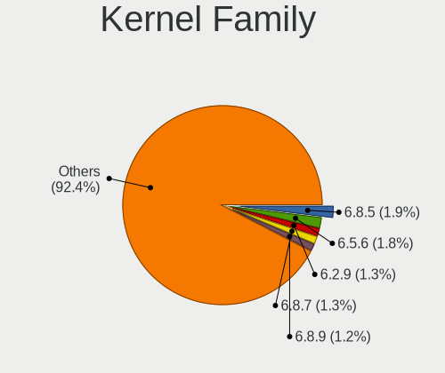
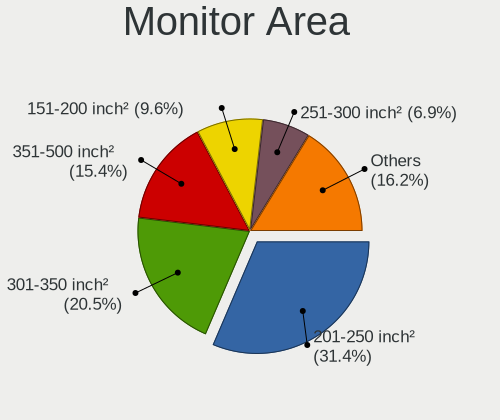
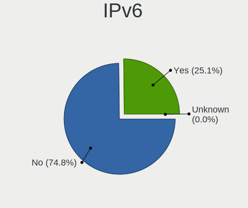
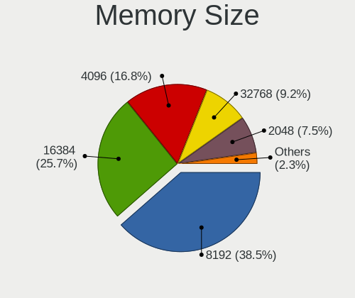

Fedora - Tested Hardware & Statistics (Desktops)
------------------------------------------------

A project to collect tested hardware configurations for Fedora.

Anyone can contribute to this report by the [hw-probe](https://github.com/linuxhw/hw-probe) tool:

    sudo -E hw-probe -all -upload

Please contribute! Especially if your hardware is rare.

Contents
--------

* [ Test Cases ](#test-cases)

* [ System ](#system)
  - [ OS                       ](#os)
  - [ OS Family                ](#os-family)
  - [ Kernel                   ](#kernel)
  - [ Kernel Family            ](#kernel-family)
  - [ Kernel Major Ver.        ](#kernel-major-ver)
  - [ Arch                     ](#arch)
  - [ DE                       ](#de)
  - [ Display Server           ](#display-server)
  - [ Display Manager          ](#display-manager)
  - [ OS Lang                  ](#os-lang)
  - [ Boot Mode                ](#boot-mode)
  - [ Filesystem               ](#filesystem)
  - [ Part. scheme             ](#part-scheme)
  - [ Dual Boot with Linux/BSD ](#dual-boot-with-linuxbsd)
  - [ Dual Boot (Win)          ](#dual-boot-win)

* [ Board ](#board)
  - [ Vendor                   ](#vendor)
  - [ Model                    ](#model)
  - [ Model Family             ](#model-family)
  - [ MFG Year                 ](#mfg-year)
  - [ Form Factor              ](#form-factor)
  - [ Secure Boot              ](#secure-boot)
  - [ Coreboot                 ](#coreboot)
  - [ RAM Size                 ](#ram-size)
  - [ RAM Used                 ](#ram-used)
  - [ Total Drives             ](#total-drives)
  - [ Has CD-ROM               ](#has-cd-rom)
  - [ Has Ethernet             ](#has-ethernet)
  - [ Has WiFi                 ](#has-wifi)
  - [ Has Bluetooth            ](#has-bluetooth)

* [ Location ](#location)
  - [ Country                  ](#country)
  - [ City                     ](#city)

* [ Drives ](#drives)
  - [ Drive Vendor             ](#drive-vendor)
  - [ Drive Model              ](#drive-model)
  - [ HDD Vendor               ](#hdd-vendor)
  - [ SSD Vendor               ](#ssd-vendor)
  - [ Drive Kind               ](#drive-kind)
  - [ Drive Connector          ](#drive-connector)
  - [ Drive Size               ](#drive-size)
  - [ Space Total              ](#space-total)
  - [ Space Used               ](#space-used)
  - [ Malfunc. Drives          ](#malfunc-drives)
  - [ Malfunc. Drive Vendor    ](#malfunc-drive-vendor)
  - [ Malfunc. HDD Vendor      ](#malfunc-hdd-vendor)
  - [ Malfunc. Drive Kind      ](#malfunc-drive-kind)
  - [ Failed Drives            ](#failed-drives)
  - [ Failed Drive Vendor      ](#failed-drive-vendor)
  - [ Drive Status             ](#drive-status)

* [ Storage controller ](#storage-controller)
  - [ Storage Vendor           ](#storage-vendor)
  - [ Storage Model            ](#storage-model)
  - [ Storage Kind             ](#storage-kind)

* [ Processor ](#processor)
  - [ CPU Vendor               ](#cpu-vendor)
  - [ CPU Model                ](#cpu-model)
  - [ CPU Model Family         ](#cpu-model-family)
  - [ CPU Cores                ](#cpu-cores)
  - [ CPU Sockets              ](#cpu-sockets)
  - [ CPU Threads              ](#cpu-threads)
  - [ CPU Op-Modes             ](#cpu-op-modes)
  - [ CPU Microcode            ](#cpu-microcode)
  - [ CPU Microarch            ](#cpu-microarch)

* [ Graphics ](#graphics)
  - [ GPU Vendor               ](#gpu-vendor)
  - [ GPU Model                ](#gpu-model)
  - [ GPU Combo                ](#gpu-combo)
  - [ GPU Driver               ](#gpu-driver)
  - [ GPU Memory               ](#gpu-memory)

* [ Monitor ](#monitor)
  - [ Monitor Vendor           ](#monitor-vendor)
  - [ Monitor Model            ](#monitor-model)
  - [ Monitor Resolution       ](#monitor-resolution)
  - [ Monitor Diagonal         ](#monitor-diagonal)
  - [ Monitor Width            ](#monitor-width)
  - [ Aspect Ratio             ](#aspect-ratio)
  - [ Monitor Area             ](#monitor-area)
  - [ Pixel Density            ](#pixel-density)
  - [ Multiple Monitors        ](#multiple-monitors)

* [ Network ](#network)
  - [ Net Controller Vendor    ](#net-controller-vendor)
  - [ Net Controller Model     ](#net-controller-model)
  - [ Wireless Vendor          ](#wireless-vendor)
  - [ Wireless Model           ](#wireless-model)
  - [ Ethernet Vendor          ](#ethernet-vendor)
  - [ Ethernet Model           ](#ethernet-model)
  - [ Net Controller Kind      ](#net-controller-kind)
  - [ Used Controller          ](#used-controller)
  - [ NICs                     ](#nics)
  - [ IPv6                     ](#ipv6)

* [ Bluetooth ](#bluetooth)
  - [ Bluetooth Vendor         ](#bluetooth-vendor)
  - [ Bluetooth Model          ](#bluetooth-model)

* [ Sound ](#sound)
  - [ Sound Vendor             ](#sound-vendor)
  - [ Sound Model              ](#sound-model)

* [ Memory ](#memory)
  - [ Memory Vendor            ](#memory-vendor)
  - [ Memory Model             ](#memory-model)
  - [ Memory Kind              ](#memory-kind)
  - [ Memory Form Factor       ](#memory-form-factor)
  - [ Memory Size              ](#memory-size)
  - [ Memory Speed             ](#memory-speed)

* [ Printers & scanners ](#printers--scanners)
  - [ Printer Vendor           ](#printer-vendor)
  - [ Printer Model            ](#printer-model)
  - [ Scanner Vendor           ](#scanner-vendor)
  - [ Scanner Model            ](#scanner-model)

* [ Camera ](#camera)
  - [ Camera Vendor            ](#camera-vendor)
  - [ Camera Model             ](#camera-model)

* [ Security ](#security)
  - [ Fingerprint Vendor       ](#fingerprint-vendor)
  - [ Fingerprint Model        ](#fingerprint-model)
  - [ Chipcard Vendor          ](#chipcard-vendor)
  - [ Chipcard Model           ](#chipcard-model)

* [ Unsupported ](#unsupported)
  - [ Unsupported Devices      ](#unsupported-devices)
  - [ Unsupported Device Types ](#unsupported-device-types)

Test Cases
----------

Total: 7830

| Vendor        | Model                       | Probe                                                      | Date         |
|---------------|-----------------------------|------------------------------------------------------------|--------------|
| MSI           | X99A RAIDER                 | [0c40685bac](https://linux-hardware.org/?probe=0c40685bac) | Jan 02, 2024 |
| Fujitsu       | D3501-A1 S26361-D3501-A1    | [9711c69823](https://linux-hardware.org/?probe=9711c69823) | Jan 02, 2024 |
| Gigabyte      | B560 DS3H AC-Y1             | [9868062aa3](https://linux-hardware.org/?probe=9868062aa3) | Jan 02, 2024 |
| Dell          | 0NDYHG A01                  | [68cde01489](https://linux-hardware.org/?probe=68cde01489) | Jan 02, 2024 |
| ASUSTek       | TUF Gaming Z490-PLUS        | [ccaa0646d7](https://linux-hardware.org/?probe=ccaa0646d7) | Jan 01, 2024 |
| ASUSTek       | H81M-A/BR                   | [6f2227d209](https://linux-hardware.org/?probe=6f2227d209) | Jan 01, 2024 |
| ASUSTek       | PRIME B550M-A               | [a4cf1bb1ea](https://linux-hardware.org/?probe=a4cf1bb1ea) | Jan 01, 2024 |
| ASUSTek       | H97-PLUS                    | [e208caf8f1](https://linux-hardware.org/?probe=e208caf8f1) | Jan 01, 2024 |
| MSI           | X99A RAIDER                 | [bb37fe4632](https://linux-hardware.org/?probe=bb37fe4632) | Jan 01, 2024 |
| MSI           | 880GM-E41                   | [caf8e2f533](https://linux-hardware.org/?probe=caf8e2f533) | Dec 31, 2023 |
| ASUSTek       | H81M-A/BR                   | [61946a6719](https://linux-hardware.org/?probe=61946a6719) | Dec 31, 2023 |
| OEM           | G41 775 ICH7 8712           | [bfb91f354b](https://linux-hardware.org/?probe=bfb91f354b) | Dec 31, 2023 |
| AMI           | Intel                       | [532ef0e65e](https://linux-hardware.org/?probe=532ef0e65e) | Dec 31, 2023 |
| ASUSTek       | H81M-K                      | [8262129320](https://linux-hardware.org/?probe=8262129320) | Dec 31, 2023 |
| Gigabyte      | Z490 AORUS ELITE AC         | [4faca6dad4](https://linux-hardware.org/?probe=4faca6dad4) | Dec 31, 2023 |
| Gigabyte      | Z370 HD3P-CF                | [83ef33bf03](https://linux-hardware.org/?probe=83ef33bf03) | Dec 31, 2023 |
| MSI           | X99A RAIDER                 | [a9aee13c48](https://linux-hardware.org/?probe=a9aee13c48) | Dec 31, 2023 |
| Apple         | Mac-F221BEC8                | [57b09cabf5](https://linux-hardware.org/?probe=57b09cabf5) | Dec 31, 2023 |
| MSI           | H110M PRO-VD                | [d508dc8f38](https://linux-hardware.org/?probe=d508dc8f38) | Dec 31, 2023 |
| MSI           | 970 GAMING                  | [7f7f8f09ae](https://linux-hardware.org/?probe=7f7f8f09ae) | Dec 31, 2023 |
| ASUSTek       | M5A97 R2.0                  | [674f54c42c](https://linux-hardware.org/?probe=674f54c42c) | Dec 30, 2023 |
| ASRock        | B450M Pro4 R2.0             | [fa7e23a6ee](https://linux-hardware.org/?probe=fa7e23a6ee) | Dec 30, 2023 |
| ASUSTek       | TUF Z390M-PRO GAMING        | [b7be314f8d](https://linux-hardware.org/?probe=b7be314f8d) | Dec 30, 2023 |
| Dell          | 0R6PCT A01                  | [8409c4a0d6](https://linux-hardware.org/?probe=8409c4a0d6) | Dec 30, 2023 |
| Gigabyte      | GA-870A-UD3                 | [090ed6d6f3](https://linux-hardware.org/?probe=090ed6d6f3) | Dec 30, 2023 |
| Gigabyte      | G41MT-D3                    | [442c87e7d9](https://linux-hardware.org/?probe=442c87e7d9) | Dec 30, 2023 |
| MSI           | B450 TOMAHAWK MAX           | [403210cab1](https://linux-hardware.org/?probe=403210cab1) | Dec 29, 2023 |
| ASUSTek       | TUF Gaming X570-PLUS        | [50eef7421d](https://linux-hardware.org/?probe=50eef7421d) | Dec 29, 2023 |
| Gigabyte      | X670 GAMING X AX V2         | [fb8e3461de](https://linux-hardware.org/?probe=fb8e3461de) | Dec 29, 2023 |
| ASRock        | AD2700-ITX                  | [3296b05cf8](https://linux-hardware.org/?probe=3296b05cf8) | Dec 29, 2023 |
| Gigabyte      | B450M DS3H V2               | [c8430d442b](https://linux-hardware.org/?probe=c8430d442b) | Dec 29, 2023 |
| ASRock        | B85M Pro3                   | [f61d357d7f](https://linux-hardware.org/?probe=f61d357d7f) | Dec 29, 2023 |
| HP            | 8719                        | [91c89a31b5](https://linux-hardware.org/?probe=91c89a31b5) | Dec 29, 2023 |
| Pegatron      | IPMIP-GS                    | [d8ace6bbb7](https://linux-hardware.org/?probe=d8ace6bbb7) | Dec 29, 2023 |
| Lenovo        | 310B SDK0J40697 WIN 3305... | [e49bfae343](https://linux-hardware.org/?probe=e49bfae343) | Dec 28, 2023 |
| Pegatron      | 2AB6                        | [faf90bb1a2](https://linux-hardware.org/?probe=faf90bb1a2) | Dec 28, 2023 |
| Gigabyte      | B450 AORUS M                | [e01ab0c412](https://linux-hardware.org/?probe=e01ab0c412) | Dec 28, 2023 |
| MSI           | MS-7390                     | [ca9f0bde00](https://linux-hardware.org/?probe=ca9f0bde00) | Dec 28, 2023 |
| Pegatron      | 2AB6                        | [6eb51d9bd9](https://linux-hardware.org/?probe=6eb51d9bd9) | Dec 28, 2023 |
| Dell          | 0R230R A00                  | [50111db215](https://linux-hardware.org/?probe=50111db215) | Dec 28, 2023 |
| Gigabyte      | Z77MX-D3H                   | [3357d873d5](https://linux-hardware.org/?probe=3357d873d5) | Dec 28, 2023 |
| ASRock        | X570 Steel Legend           | [a2a45575d5](https://linux-hardware.org/?probe=a2a45575d5) | Dec 28, 2023 |
| ASUSTek       | PRIME Z690M-PLUS D4         | [7a9ff71d9b](https://linux-hardware.org/?probe=7a9ff71d9b) | Dec 28, 2023 |
| ASRock        | X570 Steel Legend           | [836a55f0b6](https://linux-hardware.org/?probe=836a55f0b6) | Dec 28, 2023 |
| MSI           | MPG X570 GAMING PLUS        | [0b3af4418c](https://linux-hardware.org/?probe=0b3af4418c) | Dec 27, 2023 |
| MSI           | Z97 GAMING 5                | [3b0901d1a4](https://linux-hardware.org/?probe=3b0901d1a4) | Dec 27, 2023 |
| ASRock        | X399 Phantom Gaming 6       | [3d57263239](https://linux-hardware.org/?probe=3d57263239) | Dec 27, 2023 |
| MSI           | B450 TOMAHAWK MAX           | [d661150c95](https://linux-hardware.org/?probe=d661150c95) | Dec 27, 2023 |
| ASUSTek       | H81M-A/BR                   | [87cae62baf](https://linux-hardware.org/?probe=87cae62baf) | Dec 27, 2023 |
| Gigabyte      | D525TUD                     | [8625448d34](https://linux-hardware.org/?probe=8625448d34) | Dec 27, 2023 |
| Unknown       | Unknown                     | [d9355d1b8b](https://linux-hardware.org/?probe=d9355d1b8b) | Dec 27, 2023 |
| ASUSTek       | PRIME X570-PRO              | [104529fd86](https://linux-hardware.org/?probe=104529fd86) | Dec 26, 2023 |
| MSI           | B450 TOMAHAWK               | [40a7073595](https://linux-hardware.org/?probe=40a7073595) | Dec 26, 2023 |
| Gigabyte      | Z170-HD3-CF                 | [99e618d817](https://linux-hardware.org/?probe=99e618d817) | Dec 26, 2023 |
| ASRock        | B365M Pro4                  | [3c41d3773a](https://linux-hardware.org/?probe=3c41d3773a) | Dec 26, 2023 |
| Gigabyte      | X670 AORUS ELITE AX         | [267c545497](https://linux-hardware.org/?probe=267c545497) | Dec 26, 2023 |
| Gigabyte      | J1900M-D2P                  | [96c4736340](https://linux-hardware.org/?probe=96c4736340) | Dec 26, 2023 |
| ASRock        | 990FX Killer                | [1003211f6d](https://linux-hardware.org/?probe=1003211f6d) | Dec 26, 2023 |
| ASRock        | 990FX Killer                | [034adc4ac8](https://linux-hardware.org/?probe=034adc4ac8) | Dec 26, 2023 |
| Gigabyte      | GA-970A-UD3                 | [a68e5c51b4](https://linux-hardware.org/?probe=a68e5c51b4) | Dec 25, 2023 |
| MSI           | B350M MORTAR ARCTIC         | [68c1102e98](https://linux-hardware.org/?probe=68c1102e98) | Dec 25, 2023 |
| ASUSTek       | ROG STRIX Z790-H GAMING ... | [a5a641b111](https://linux-hardware.org/?probe=a5a641b111) | Dec 25, 2023 |
| MSI           | B350M MORTAR ARCTIC         | [f22547b26f](https://linux-hardware.org/?probe=f22547b26f) | Dec 25, 2023 |
| Gigabyte      | H77N-WIFI                   | [22bbfabce0](https://linux-hardware.org/?probe=22bbfabce0) | Dec 25, 2023 |
| ASUSTek       | PRIME X570-PRO              | [d6f1c37a34](https://linux-hardware.org/?probe=d6f1c37a34) | Dec 25, 2023 |
| Gigabyte      | D525TUD                     | [357709050e](https://linux-hardware.org/?probe=357709050e) | Dec 25, 2023 |
| MSI           | X99A RAIDER                 | [bd10b63ca1](https://linux-hardware.org/?probe=bd10b63ca1) | Dec 25, 2023 |
| MSI           | A320M PRO-VH PLUS           | [53fae0e708](https://linux-hardware.org/?probe=53fae0e708) | Dec 25, 2023 |
| ASUSTek       | G10DK                       | [b1132c5478](https://linux-hardware.org/?probe=b1132c5478) | Dec 25, 2023 |
| ASUSTek       | ROG STRIX B550-F GAMING     | [5dea927ca9](https://linux-hardware.org/?probe=5dea927ca9) | Dec 24, 2023 |
| Acer          | Aspire TC-885 V:1.1         | [5c7f2ef98c](https://linux-hardware.org/?probe=5c7f2ef98c) | Dec 24, 2023 |
| MSI           | A320M PRO-VH PLUS           | [0a5b67d3f4](https://linux-hardware.org/?probe=0a5b67d3f4) | Dec 24, 2023 |
| MSI           | MS-7388                     | [efab378a60](https://linux-hardware.org/?probe=efab378a60) | Dec 24, 2023 |
| Dell          | 0WMJ54 A01                  | [31f29a3843](https://linux-hardware.org/?probe=31f29a3843) | Dec 24, 2023 |
| MSI           | B450 GAMING PLUS MAX        | [587884179e](https://linux-hardware.org/?probe=587884179e) | Dec 24, 2023 |
| Acer          | Aspire TC-885 V:1.1         | [bdb39d60de](https://linux-hardware.org/?probe=bdb39d60de) | Dec 24, 2023 |
| MAXSUN        | MS-Terminator B550M         | [57ce047c4c](https://linux-hardware.org/?probe=57ce047c4c) | Dec 24, 2023 |
| MSI           | X99A RAIDER                 | [b150280df5](https://linux-hardware.org/?probe=b150280df5) | Dec 24, 2023 |
| ASUSTek       | PRIME B450M-A II            | [6484f4217b](https://linux-hardware.org/?probe=6484f4217b) | Dec 24, 2023 |
| Gigabyte      | GA-78LMT-USB3               | [dd658b1151](https://linux-hardware.org/?probe=dd658b1151) | Dec 23, 2023 |
| Fujitsu       | D3161-A1 S26361-D3161-A1    | [c8bab56547](https://linux-hardware.org/?probe=c8bab56547) | Dec 23, 2023 |
| HP            | 2ADC                        | [2c9d8d03d2](https://linux-hardware.org/?probe=2c9d8d03d2) | Dec 23, 2023 |
| ASRock        | X370 Taichi                 | [689d51f57e](https://linux-hardware.org/?probe=689d51f57e) | Dec 23, 2023 |
| Gigabyte      | B85-HD3                     | [79fbb89592](https://linux-hardware.org/?probe=79fbb89592) | Dec 23, 2023 |
| ASUSTek       | PRIME B360-PLUS             | [4cd7d986cd](https://linux-hardware.org/?probe=4cd7d986cd) | Dec 23, 2023 |
| Dell          | 04Y8V0 A02                  | [1c3e40ac13](https://linux-hardware.org/?probe=1c3e40ac13) | Dec 23, 2023 |
| MSI           | MS-7388                     | [5027d4b8ed](https://linux-hardware.org/?probe=5027d4b8ed) | Dec 23, 2023 |
| ASUSTek       | PRIME A320M-K               | [aaf6ab3d26](https://linux-hardware.org/?probe=aaf6ab3d26) | Dec 23, 2023 |
| Gigabyte      | D525TUD                     | [dd2248530b](https://linux-hardware.org/?probe=dd2248530b) | Dec 23, 2023 |
| Gigabyte      | G41MT-D3                    | [d7f5fd2175](https://linux-hardware.org/?probe=d7f5fd2175) | Dec 23, 2023 |
| ASRock        | Z370 Professional Gaming... | [d46814af3c](https://linux-hardware.org/?probe=d46814af3c) | Dec 23, 2023 |
| Dell          | 0K3CM7 A00                  | [019b46745e](https://linux-hardware.org/?probe=019b46745e) | Dec 22, 2023 |
| ASUSTek       | Maximus VIII RANGER         | [3fa9465c1a](https://linux-hardware.org/?probe=3fa9465c1a) | Dec 22, 2023 |
| ASUSTek       | P8H61 EVO                   | [a123efbb84](https://linux-hardware.org/?probe=a123efbb84) | Dec 22, 2023 |
| ASUSTek       | H110M-K                     | [1049cbc16b](https://linux-hardware.org/?probe=1049cbc16b) | Dec 22, 2023 |
| Colorful T... | A320M-M.2 PRO V15           | [821494cfbf](https://linux-hardware.org/?probe=821494cfbf) | Dec 22, 2023 |
| ASUSTek       | PRIME A320M-K               | [c83a6a5f5d](https://linux-hardware.org/?probe=c83a6a5f5d) | Dec 22, 2023 |
| PCWare        | IPMH61R3                    | [891c2058a8](https://linux-hardware.org/?probe=891c2058a8) | Dec 22, 2023 |
| Gigabyte      | Z68MA-D2H-B3                | [f3f83a4f0a](https://linux-hardware.org/?probe=f3f83a4f0a) | Dec 22, 2023 |
| ASUSTek       | ROG STRIX Z790-I GAMING ... | [60e10649cc](https://linux-hardware.org/?probe=60e10649cc) | Dec 22, 2023 |
| ASRock        | J3160DC-ITX                 | [c84aa85d4e](https://linux-hardware.org/?probe=c84aa85d4e) | Dec 22, 2023 |
| Gigabyte      | B760M AORUS ELITE AX        | [7eb85caf57](https://linux-hardware.org/?probe=7eb85caf57) | Dec 21, 2023 |
| ASUSTek       | TUF Gaming B650M-PLUS       | [0dc09851b1](https://linux-hardware.org/?probe=0dc09851b1) | Dec 21, 2023 |
| Dell          | 0WMJ54 A01                  | [6cacd38012](https://linux-hardware.org/?probe=6cacd38012) | Dec 21, 2023 |
| ASUSTek       | X99-DELUXE II               | [dca266a251](https://linux-hardware.org/?probe=dca266a251) | Dec 21, 2023 |
| ASUSTek       | X99-DELUXE II               | [b9409f01d5](https://linux-hardware.org/?probe=b9409f01d5) | Dec 21, 2023 |
| ASRock        | B550M Pro4                  | [bb26992a0a](https://linux-hardware.org/?probe=bb26992a0a) | Dec 21, 2023 |
| HP            | 2B4B                        | [19a3edb061](https://linux-hardware.org/?probe=19a3edb061) | Dec 21, 2023 |
| ASUSTek       | ROG STRIX Z390-F GAMING     | [761fb59fa5](https://linux-hardware.org/?probe=761fb59fa5) | Dec 20, 2023 |
| Dell          | 042P49 A01                  | [fb968ffb8b](https://linux-hardware.org/?probe=fb968ffb8b) | Dec 20, 2023 |
| MSI           | PRO Z690-A WIFI             | [d6a5b20ac6](https://linux-hardware.org/?probe=d6a5b20ac6) | Dec 20, 2023 |
| ASUSTek       | TUF Gaming B650M-PLUS       | [088b57605f](https://linux-hardware.org/?probe=088b57605f) | Dec 20, 2023 |
| AZW           | MINI S                      | [78169fe4be](https://linux-hardware.org/?probe=78169fe4be) | Dec 20, 2023 |
| Gigabyte      | B650 AORUS ELITE AX         | [8703894e1c](https://linux-hardware.org/?probe=8703894e1c) | Dec 20, 2023 |
| ASUSTek       | PRIME B550-PLUS             | [85087e0568](https://linux-hardware.org/?probe=85087e0568) | Dec 20, 2023 |
| ASUSTek       | TUF Gaming Z690-PLUS D4     | [ec86cf0c12](https://linux-hardware.org/?probe=ec86cf0c12) | Dec 19, 2023 |
| ASUSTek       | P5B                         | [a700c11a65](https://linux-hardware.org/?probe=a700c11a65) | Dec 19, 2023 |
| ASRock        | B450M-HDV R4.0              | [02d834a147](https://linux-hardware.org/?probe=02d834a147) | Dec 19, 2023 |
| HP            | 3033h                       | [e57ef2fb67](https://linux-hardware.org/?probe=e57ef2fb67) | Dec 19, 2023 |
| ASRock        | B650M Pro RS                | [df96c996dd](https://linux-hardware.org/?probe=df96c996dd) | Dec 18, 2023 |
| Gigabyte      | B550 AORUS MASTER           | [7bd446ee65](https://linux-hardware.org/?probe=7bd446ee65) | Dec 18, 2023 |
| ASUSTek       | ROG STRIX X470-F GAMING     | [2501635862](https://linux-hardware.org/?probe=2501635862) | Dec 18, 2023 |
| ASRock        | B450M-HDV R4.0              | [da0af8ac25](https://linux-hardware.org/?probe=da0af8ac25) | Dec 18, 2023 |
| Gigabyte      | GA-A55M-S2V                 | [c66e6657fe](https://linux-hardware.org/?probe=c66e6657fe) | Dec 18, 2023 |
| HP            | 8643 SMVB                   | [70ece5f797](https://linux-hardware.org/?probe=70ece5f797) | Dec 18, 2023 |
| MSI           | X99A RAIDER                 | [84c183a024](https://linux-hardware.org/?probe=84c183a024) | Dec 18, 2023 |
| HP            | 8643 SMVB                   | [5082c6046e](https://linux-hardware.org/?probe=5082c6046e) | Dec 18, 2023 |
| ASUSTek       | PRIME H310M-A R2.0          | [c0b618e2ab](https://linux-hardware.org/?probe=c0b618e2ab) | Dec 18, 2023 |
| HP            | 802E                        | [191904a770](https://linux-hardware.org/?probe=191904a770) | Dec 17, 2023 |
| ASRock        | H310M-STX                   | [df11c23d7c](https://linux-hardware.org/?probe=df11c23d7c) | Dec 17, 2023 |
| MSI           | MAG A520M VECTOR WIFI       | [0f2293e8d1](https://linux-hardware.org/?probe=0f2293e8d1) | Dec 17, 2023 |
| Fujitsu       | D3501-A1 S26361-D3501-A1    | [47747d42ef](https://linux-hardware.org/?probe=47747d42ef) | Dec 17, 2023 |
| MSI           | X99A RAIDER                 | [047995ad80](https://linux-hardware.org/?probe=047995ad80) | Dec 17, 2023 |
| Intel         | LADPNVMO AAE76523-300       | [9f0d5821e3](https://linux-hardware.org/?probe=9f0d5821e3) | Dec 16, 2023 |
| Dell          | 0HY9JP A00                  | [5af488fb21](https://linux-hardware.org/?probe=5af488fb21) | Dec 16, 2023 |
| HP            | 8265                        | [58cc9fa090](https://linux-hardware.org/?probe=58cc9fa090) | Dec 16, 2023 |
| Gigabyte      | G41MT-D3                    | [39e7517ac6](https://linux-hardware.org/?probe=39e7517ac6) | Dec 16, 2023 |
| Gigabyte      | X570 AORUS MASTER           | [68a9708e6a](https://linux-hardware.org/?probe=68a9708e6a) | Dec 16, 2023 |
| ASRock        | B450M-HDV R4.0              | [e93c46f2e9](https://linux-hardware.org/?probe=e93c46f2e9) | Dec 16, 2023 |
| ASRock        | B450M-HDV R4.0              | [25eb2af58f](https://linux-hardware.org/?probe=25eb2af58f) | Dec 16, 2023 |
| MSI           | MPG B550 GAMING PLUS        | [7ad9484605](https://linux-hardware.org/?probe=7ad9484605) | Dec 16, 2023 |
| Gigabyte      | D525TUD                     | [34a66d3cef](https://linux-hardware.org/?probe=34a66d3cef) | Dec 15, 2023 |
| MSI           | MPG B650 CARBON WIFI        | [dd6121c135](https://linux-hardware.org/?probe=dd6121c135) | Dec 15, 2023 |
| MSI           | MPG B650 CARBON WIFI        | [9268266cec](https://linux-hardware.org/?probe=9268266cec) | Dec 15, 2023 |
| PCWare        | IPMH61R3                    | [ecac398c88](https://linux-hardware.org/?probe=ecac398c88) | Dec 15, 2023 |
| Dell          | 0HY9JP A00                  | [3a2a8878eb](https://linux-hardware.org/?probe=3a2a8878eb) | Dec 15, 2023 |
| MSI           | FM2-A75MA-E35               | [f589fd16ee](https://linux-hardware.org/?probe=f589fd16ee) | Dec 15, 2023 |
| Gigabyte      | Z170-D3H-CF                 | [059715d1bf](https://linux-hardware.org/?probe=059715d1bf) | Dec 15, 2023 |
| Gigabyte      | X570 AORUS ELITE WIFI       | [8a3e0ce72f](https://linux-hardware.org/?probe=8a3e0ce72f) | Dec 15, 2023 |
| Gigabyte      | B550M DS3H AC               | [95a15638a4](https://linux-hardware.org/?probe=95a15638a4) | Dec 15, 2023 |
| Gigabyte      | B550M DS3H AC               | [7482b66564](https://linux-hardware.org/?probe=7482b66564) | Dec 15, 2023 |
| ASUSTek       | PRIME B550M-A               | [fe2ebbb9af](https://linux-hardware.org/?probe=fe2ebbb9af) | Dec 14, 2023 |
| MSI           | MEG Z390 GODLIKE            | [e384ee26a6](https://linux-hardware.org/?probe=e384ee26a6) | Dec 14, 2023 |
| Gigabyte      | B450M DS3H-CF               | [c8d2a05aea](https://linux-hardware.org/?probe=c8d2a05aea) | Dec 14, 2023 |
| MSI           | PRO B650M-P                 | [acee62fb75](https://linux-hardware.org/?probe=acee62fb75) | Dec 13, 2023 |
| ASRock        | X570 Phantom Gaming 4       | [ba53faacb0](https://linux-hardware.org/?probe=ba53faacb0) | Dec 13, 2023 |
| ASUSTek       | H61M-K                      | [15f1f8f029](https://linux-hardware.org/?probe=15f1f8f029) | Dec 13, 2023 |
| Gigabyte      | H77N-WIFI                   | [017252c955](https://linux-hardware.org/?probe=017252c955) | Dec 13, 2023 |
| Apple         | Mac-F60DEB81FF30ACF6 Mac... | [5435277f12](https://linux-hardware.org/?probe=5435277f12) | Dec 13, 2023 |
| HP            | 8061                        | [9700867e8c](https://linux-hardware.org/?probe=9700867e8c) | Dec 13, 2023 |
| ASUSTek       | ROG CROSSHAIR X670E HERO    | [978ed7ec9c](https://linux-hardware.org/?probe=978ed7ec9c) | Dec 13, 2023 |
| ASUSTek       | H61M-K                      | [d7a660dbef](https://linux-hardware.org/?probe=d7a660dbef) | Dec 13, 2023 |
| Gigabyte      | D525TUD                     | [12c2204715](https://linux-hardware.org/?probe=12c2204715) | Dec 12, 2023 |
| Gigabyte      | P35-DS3                     | [b8b172a5f2](https://linux-hardware.org/?probe=b8b172a5f2) | Dec 12, 2023 |
| Gigabyte      | P35-DS3                     | [d386a28d7e](https://linux-hardware.org/?probe=d386a28d7e) | Dec 12, 2023 |
| Gigabyte      | Z77MX-D3H                   | [45cc0c507d](https://linux-hardware.org/?probe=45cc0c507d) | Dec 12, 2023 |
| HP            | 1495                        | [9fb4cb4ac8](https://linux-hardware.org/?probe=9fb4cb4ac8) | Dec 12, 2023 |
| Gigabyte      | GA-890FXA-UD7               | [92c2bcd902](https://linux-hardware.org/?probe=92c2bcd902) | Dec 12, 2023 |
| ASUSTek       | Pro B550M-C                 | [9887ecb3b0](https://linux-hardware.org/?probe=9887ecb3b0) | Dec 12, 2023 |
| Lenovo        | SKYBAY SDK0J40705 WIN 34... | [0720cbce6b](https://linux-hardware.org/?probe=0720cbce6b) | Dec 12, 2023 |
| Gigabyte      | EP45-UD3L                   | [e71c3884d8](https://linux-hardware.org/?probe=e71c3884d8) | Dec 11, 2023 |
| HP            | 802E                        | [606309324b](https://linux-hardware.org/?probe=606309324b) | Dec 11, 2023 |
| Gigabyte      | J1900M-D2P                  | [f706bd9261](https://linux-hardware.org/?probe=f706bd9261) | Dec 11, 2023 |
| Intel         | HM570                       | [a0f2eecda0](https://linux-hardware.org/?probe=a0f2eecda0) | Dec 11, 2023 |
| ASUSTek       | ROG STRIX X570-E GAMING     | [83d630d21f](https://linux-hardware.org/?probe=83d630d21f) | Dec 11, 2023 |
| Dell          | 055H3G A00                  | [501e07bc4d](https://linux-hardware.org/?probe=501e07bc4d) | Dec 10, 2023 |
| MSI           | B450M-A PRO MAX             | [fa533e33bb](https://linux-hardware.org/?probe=fa533e33bb) | Dec 10, 2023 |
| Gigabyte      | Z490 VISION G               | [184c82a359](https://linux-hardware.org/?probe=184c82a359) | Dec 10, 2023 |
| ASUSTek       | A8R32-MVP Deluxe            | [069b020cd5](https://linux-hardware.org/?probe=069b020cd5) | Dec 10, 2023 |
| Foxconn       | 2A8C                        | [a467dabfb7](https://linux-hardware.org/?probe=a467dabfb7) | Dec 10, 2023 |
| Gigabyte      | B450 AORUS ELITE V2         | [505f85e4d4](https://linux-hardware.org/?probe=505f85e4d4) | Dec 10, 2023 |
| HP            | 18E7                        | [dad5884f78](https://linux-hardware.org/?probe=dad5884f78) | Dec 10, 2023 |
| MSI           | MPG B760I EDGE WIFI DDR4    | [14c50f3617](https://linux-hardware.org/?probe=14c50f3617) | Dec 10, 2023 |
| ASUSTek       | PRIME A320M-C R2.0          | [a8685fb67b](https://linux-hardware.org/?probe=a8685fb67b) | Dec 10, 2023 |
| MSI           | A88XM-E35                   | [c0bf97d7e0](https://linux-hardware.org/?probe=c0bf97d7e0) | Dec 09, 2023 |
| ASUSTek       | ROG CROSSHAIR VIII DARK ... | [31821d09d8](https://linux-hardware.org/?probe=31821d09d8) | Dec 09, 2023 |
| Gigabyte      | B550 AORUS ELITE V2         | [e468ba51f6](https://linux-hardware.org/?probe=e468ba51f6) | Dec 09, 2023 |
| ASUSTek       | A88XM-A                     | [2b60976ef6](https://linux-hardware.org/?probe=2b60976ef6) | Dec 09, 2023 |
| ASUSTek       | H170-PRO                    | [5e8d3ff468](https://linux-hardware.org/?probe=5e8d3ff468) | Dec 09, 2023 |
| Foxconn       | 2A8C                        | [78cb902abe](https://linux-hardware.org/?probe=78cb902abe) | Dec 09, 2023 |
| MSI           | B450 TOMAHAWK MAX II        | [210d482f6d](https://linux-hardware.org/?probe=210d482f6d) | Dec 09, 2023 |
| MSI           | A88XM-E35                   | [b90d791132](https://linux-hardware.org/?probe=b90d791132) | Dec 08, 2023 |
| ASUSTek       | ROG STRIX B650E-F GAMING... | [7267af3f34](https://linux-hardware.org/?probe=7267af3f34) | Dec 08, 2023 |
| ASRock        | B450 Pro4                   | [25627a5644](https://linux-hardware.org/?probe=25627a5644) | Dec 08, 2023 |
| ASUSTek       | ROG STRIX B650E-F GAMING... | [8d7f7aebab](https://linux-hardware.org/?probe=8d7f7aebab) | Dec 08, 2023 |
| ASUSTek       | ROG STRIX B550-F GAMING ... | [70f37dae85](https://linux-hardware.org/?probe=70f37dae85) | Dec 08, 2023 |
| ANGXUN        | X99 V1.0                    | [88919a1403](https://linux-hardware.org/?probe=88919a1403) | Dec 08, 2023 |
| ASUSTek       | TUF Gaming Z690-PLUS D4     | [2b349d78ce](https://linux-hardware.org/?probe=2b349d78ce) | Dec 07, 2023 |
| Gigabyte      | B650 AORUS ELITE AX         | [3c37d1bb9f](https://linux-hardware.org/?probe=3c37d1bb9f) | Dec 07, 2023 |
| ASUSTek       | PRIME B350M-A               | [665a5984d2](https://linux-hardware.org/?probe=665a5984d2) | Dec 07, 2023 |
| ASUSTek       | PRIME B550-PLUS             | [dc05a32f3d](https://linux-hardware.org/?probe=dc05a32f3d) | Dec 06, 2023 |
| ASRock        | B450M Pro4 R2.0             | [38c8286c83](https://linux-hardware.org/?probe=38c8286c83) | Dec 06, 2023 |
| MSI           | B460M PRO                   | [107b14c2d9](https://linux-hardware.org/?probe=107b14c2d9) | Dec 06, 2023 |
| ASUSTek       | ROG STRIX B650E-I GAMING... | [38945d6d2e](https://linux-hardware.org/?probe=38945d6d2e) | Dec 05, 2023 |
| EVGA          | 132-YW-E178-FTW 1           | [3898078db1](https://linux-hardware.org/?probe=3898078db1) | Dec 05, 2023 |
| Unknown       | NISB 3500                   | [454871dab4](https://linux-hardware.org/?probe=454871dab4) | Dec 05, 2023 |
| Gigabyte      | B550 AORUS ELITE AX V2      | [53dbcd2c87](https://linux-hardware.org/?probe=53dbcd2c87) | Dec 05, 2023 |
| Gigabyte      | B550 AORUS ELITE AX V2      | [5ec26a4bca](https://linux-hardware.org/?probe=5ec26a4bca) | Dec 05, 2023 |
| Lenovo        | ThinkServer TS140           | [c53a3bf5e8](https://linux-hardware.org/?probe=c53a3bf5e8) | Dec 05, 2023 |
| ASRock        | AD2700-ITX                  | [3681f281ac](https://linux-hardware.org/?probe=3681f281ac) | Dec 05, 2023 |
| MSI           | PRO B550M-VC WIFI           | [6e9785a58a](https://linux-hardware.org/?probe=6e9785a58a) | Dec 05, 2023 |
| ASUSTek       | Z170-A                      | [8a8bfb131c](https://linux-hardware.org/?probe=8a8bfb131c) | Dec 04, 2023 |
| MSI           | B450 TOMAHAWK               | [56afeffd34](https://linux-hardware.org/?probe=56afeffd34) | Dec 04, 2023 |
| Intel         | B75                         | [4290424c1d](https://linux-hardware.org/?probe=4290424c1d) | Dec 04, 2023 |
| Gigabyte      | GA-880GM-USB3               | [f4078eb310](https://linux-hardware.org/?probe=f4078eb310) | Dec 04, 2023 |
| MSI           | MPG B550 GAMING EDGE WIF... | [bb0ded92ef](https://linux-hardware.org/?probe=bb0ded92ef) | Dec 03, 2023 |
| BESSTAR Te... | UM350                       | [28b627c64a](https://linux-hardware.org/?probe=28b627c64a) | Dec 03, 2023 |
| Gigabyte      | 970A-DS3P                   | [6fce5f3dec](https://linux-hardware.org/?probe=6fce5f3dec) | Dec 03, 2023 |
| Dell          | 0WR7PY A01                  | [67b1cc2f69](https://linux-hardware.org/?probe=67b1cc2f69) | Dec 03, 2023 |
| MSI           | B360-A PRO                  | [7df9fbb107](https://linux-hardware.org/?probe=7df9fbb107) | Dec 03, 2023 |
| MSI           | PRO B650-VC WIFI            | [9e15f48c96](https://linux-hardware.org/?probe=9e15f48c96) | Dec 03, 2023 |
| Intel         | H61                         | [71c32c973c](https://linux-hardware.org/?probe=71c32c973c) | Dec 03, 2023 |
| Intel         | X99                         | [b1ae912db2](https://linux-hardware.org/?probe=b1ae912db2) | Dec 03, 2023 |
| Gigabyte      | X570 I AORUS PRO WIFI       | [52374a1dea](https://linux-hardware.org/?probe=52374a1dea) | Dec 03, 2023 |
| MSI           | B360-A PRO                  | [f9da2a7d45](https://linux-hardware.org/?probe=f9da2a7d45) | Dec 03, 2023 |
| ASUSTek       | STRIX Z270E GAMING          | [e3950352ba](https://linux-hardware.org/?probe=e3950352ba) | Dec 03, 2023 |
| Lenovo        | 312A SDK0J40697 WIN 3305... | [fb15da06c7](https://linux-hardware.org/?probe=fb15da06c7) | Dec 03, 2023 |
| ASUSTek       | ROG STRIX B650E-I GAMING... | [d869b4e21b](https://linux-hardware.org/?probe=d869b4e21b) | Dec 03, 2023 |
| Huanan        | X99-TF                      | [c617461c74](https://linux-hardware.org/?probe=c617461c74) | Dec 03, 2023 |
| HP            | 2215                        | [f29d88c563](https://linux-hardware.org/?probe=f29d88c563) | Dec 03, 2023 |
| Positivo      | POS-SIGL40BX POSITIVO       | [d6bdfaf7b5](https://linux-hardware.org/?probe=d6bdfaf7b5) | Dec 03, 2023 |
| ASUSTek       | PRIME X670-P                | [f7bf7a5dcc](https://linux-hardware.org/?probe=f7bf7a5dcc) | Dec 02, 2023 |
| Biostar       | B450MH                      | [e490dfb129](https://linux-hardware.org/?probe=e490dfb129) | Dec 02, 2023 |
| Dell          | 0GDG8Y A00                  | [97b3234a72](https://linux-hardware.org/?probe=97b3234a72) | Dec 02, 2023 |
| Gigabyte      | B650M DS3H                  | [0cd9d3d156](https://linux-hardware.org/?probe=0cd9d3d156) | Dec 02, 2023 |
| Dell          | 02YRK5 A03                  | [ae544eff63](https://linux-hardware.org/?probe=ae544eff63) | Dec 02, 2023 |
| MSI           | PRO B660M-A WIFI            | [d3a2fc2cb0](https://linux-hardware.org/?probe=d3a2fc2cb0) | Dec 02, 2023 |
| Gigabyte      | B550M DS3H                  | [a7ab6a0555](https://linux-hardware.org/?probe=a7ab6a0555) | Dec 02, 2023 |
| ASRock        | B650E PG-ITX WiFi           | [94317ffd1f](https://linux-hardware.org/?probe=94317ffd1f) | Dec 02, 2023 |
| MSI           | MPG Z390 GAMING EDGE AC     | [d029e3819c](https://linux-hardware.org/?probe=d029e3819c) | Dec 02, 2023 |
| Gigabyte      | GA-870A-UD3                 | [a827e0cc16](https://linux-hardware.org/?probe=a827e0cc16) | Dec 02, 2023 |
| Gigabyte      | J1900M-D2P                  | [0d2ac061a9](https://linux-hardware.org/?probe=0d2ac061a9) | Dec 02, 2023 |
| ASUSTek       | Z87-PRO                     | [7946f9a622](https://linux-hardware.org/?probe=7946f9a622) | Dec 01, 2023 |
| ASUSTek       | 970 PRO GAMING/AURA         | [80be39f0d4](https://linux-hardware.org/?probe=80be39f0d4) | Dec 01, 2023 |
| ASUSTek       | ROG STRIX B460-G GAMING     | [320fdec41d](https://linux-hardware.org/?probe=320fdec41d) | Dec 01, 2023 |
| HP            | 8061                        | [8f86201dfb](https://linux-hardware.org/?probe=8f86201dfb) | Dec 01, 2023 |
| Intel         | LADPNVMO AAE76523-300       | [0ed139ee9c](https://linux-hardware.org/?probe=0ed139ee9c) | Dec 01, 2023 |
| ASUSTek       | PRIME B450M-GAMING/BR       | [14b776bc4a](https://linux-hardware.org/?probe=14b776bc4a) | Dec 01, 2023 |
| Lenovo        | Win8 STD MM DPK IPG         | [59610f075c](https://linux-hardware.org/?probe=59610f075c) | Nov 30, 2023 |
| Gigabyte      | A520M AORUS ELITE           | [ae6274f798](https://linux-hardware.org/?probe=ae6274f798) | Nov 30, 2023 |
| ASRock        | AD2700-ITX                  | [215e772a98](https://linux-hardware.org/?probe=215e772a98) | Nov 30, 2023 |
| Lenovo        | Win8 STD MM DPK IPG         | [1959f30d83](https://linux-hardware.org/?probe=1959f30d83) | Nov 30, 2023 |
| Pegatron      | IPMIP-GS                    | [ebe5fd5255](https://linux-hardware.org/?probe=ebe5fd5255) | Nov 30, 2023 |
| Pegatron      | IPMIP-GS                    | [7b6f94666e](https://linux-hardware.org/?probe=7b6f94666e) | Nov 30, 2023 |
| MSI           | B450M-A PRO MAX             | [a6ae767fad](https://linux-hardware.org/?probe=a6ae767fad) | Nov 30, 2023 |
| ASRock        | 970 Extreme4                | [5dd27edbe4](https://linux-hardware.org/?probe=5dd27edbe4) | Nov 29, 2023 |
| Dell          | 08HPGT A01                  | [b9576cf1a9](https://linux-hardware.org/?probe=b9576cf1a9) | Nov 29, 2023 |
| MSI           | MAG Z690 TOMAHAWK WIFI      | [a418438d62](https://linux-hardware.org/?probe=a418438d62) | Nov 29, 2023 |
| ASUSTek       | PRIME B660M-A WIFI D4       | [c6673a5a66](https://linux-hardware.org/?probe=c6673a5a66) | Nov 29, 2023 |
| MSI           | B450 TOMAHAWK MAX II        | [a5a00f200f](https://linux-hardware.org/?probe=a5a00f200f) | Nov 29, 2023 |
| ASUSTek       | TUF Gaming X570-PLUS        | [816bb46c28](https://linux-hardware.org/?probe=816bb46c28) | Nov 29, 2023 |
| ASRock        | X570 Taichi                 | [0b316f9f1b](https://linux-hardware.org/?probe=0b316f9f1b) | Nov 28, 2023 |
| Gigabyte      | B550M AORUS ELITE           | [82528116e5](https://linux-hardware.org/?probe=82528116e5) | Nov 28, 2023 |
| MSI           | MAG X570S TOMAHAWK MAX W... | [348a2974d6](https://linux-hardware.org/?probe=348a2974d6) | Nov 28, 2023 |
| ASUSTek       | ROG STRIX B550-E GAMING     | [dcfc4409e2](https://linux-hardware.org/?probe=dcfc4409e2) | Nov 28, 2023 |
| HP            | 1495                        | [17732cf790](https://linux-hardware.org/?probe=17732cf790) | Nov 28, 2023 |
| ASUSTek       | TUF Gaming B650M-E WIFI     | [bb86b33f71](https://linux-hardware.org/?probe=bb86b33f71) | Nov 28, 2023 |
| ASRock        | H97M Pro4                   | [88bee4d4f2](https://linux-hardware.org/?probe=88bee4d4f2) | Nov 28, 2023 |
| ASUSTek       | PRIME B550M-A               | [130735940f](https://linux-hardware.org/?probe=130735940f) | Nov 28, 2023 |
| ASUSTek       | ROG STRIX B550-F GAMING     | [3397e49e8a](https://linux-hardware.org/?probe=3397e49e8a) | Nov 27, 2023 |
| Gigabyte      | B550 AORUS PRO V2           | [fccb07c19e](https://linux-hardware.org/?probe=fccb07c19e) | Nov 27, 2023 |
| ASRock        | X570 Pro4                   | [b1375e1720](https://linux-hardware.org/?probe=b1375e1720) | Nov 27, 2023 |
| MSI           | MPG B650I EDGE WIFI         | [e1e2845536](https://linux-hardware.org/?probe=e1e2845536) | Nov 27, 2023 |
| Gigabyte      | Z77MX-D3H                   | [af4437b421](https://linux-hardware.org/?probe=af4437b421) | Nov 27, 2023 |
| ASUSTek       | X99-DELUXE II               | [2bb0010426](https://linux-hardware.org/?probe=2bb0010426) | Nov 27, 2023 |
| Gigabyte      | H77N-WIFI                   | [b71948f3b9](https://linux-hardware.org/?probe=b71948f3b9) | Nov 27, 2023 |
| Dell          | 02YRK5 A03                  | [3b55d8f733](https://linux-hardware.org/?probe=3b55d8f733) | Nov 27, 2023 |
| MSI           | H61M-P31/W8                 | [b74cd41faf](https://linux-hardware.org/?probe=b74cd41faf) | Nov 26, 2023 |
| ASUSTek       | ROG STRIX B550-F GAMING     | [648a453b3f](https://linux-hardware.org/?probe=648a453b3f) | Nov 26, 2023 |
| Gigabyte      | GA-MA790X-DS4               | [5435d9e2ba](https://linux-hardware.org/?probe=5435d9e2ba) | Nov 26, 2023 |
| ASUSTek       | P7P55D PRO                  | [69ca3b417c](https://linux-hardware.org/?probe=69ca3b417c) | Nov 26, 2023 |
| Gigabyte      | B550M S2H                   | [284f7d2451](https://linux-hardware.org/?probe=284f7d2451) | Nov 26, 2023 |
| Gigabyte      | B650M GAMING X AX           | [dc0fce7e4a](https://linux-hardware.org/?probe=dc0fce7e4a) | Nov 26, 2023 |
| Gigabyte      | B550 AORUS PRO AC           | [5693d24a8d](https://linux-hardware.org/?probe=5693d24a8d) | Nov 26, 2023 |
| MSI           | B450M MORTAR MAX            | [7667f4a2a0](https://linux-hardware.org/?probe=7667f4a2a0) | Nov 26, 2023 |
| MSI           | X570-A PRO                  | [17cd5f34c3](https://linux-hardware.org/?probe=17cd5f34c3) | Nov 25, 2023 |
| MSI           | MAG B550 TOMAHAWK           | [976fa4dff9](https://linux-hardware.org/?probe=976fa4dff9) | Nov 25, 2023 |
| ASUSTek       | TUF Gaming X570-PRO         | [84b3b5a3a1](https://linux-hardware.org/?probe=84b3b5a3a1) | Nov 25, 2023 |
| Gigabyte      | G41MT-D3                    | [39af83330a](https://linux-hardware.org/?probe=39af83330a) | Nov 25, 2023 |
| Dell          | 06D7TR A00                  | [d979c6298f](https://linux-hardware.org/?probe=d979c6298f) | Nov 24, 2023 |
| Gigabyte      | B650 GAMING X AX            | [c79d47b7b4](https://linux-hardware.org/?probe=c79d47b7b4) | Nov 24, 2023 |
| ASUSTek       | TUF Gaming B550M-E          | [5e32800db0](https://linux-hardware.org/?probe=5e32800db0) | Nov 24, 2023 |
| Lenovo        | MAHOBAY Win8 STD MM DPK ... | [b7ae8810af](https://linux-hardware.org/?probe=b7ae8810af) | Nov 24, 2023 |
| Gigabyte      | Z170-D3H-CF                 | [7aa3c32e86](https://linux-hardware.org/?probe=7aa3c32e86) | Nov 24, 2023 |
| ASUSTek       | ROG STRIX X670E-A GAMING... | [8bb53007a4](https://linux-hardware.org/?probe=8bb53007a4) | Nov 24, 2023 |
| Apple         | Mac-F221BEC8                | [4d9238845b](https://linux-hardware.org/?probe=4d9238845b) | Nov 24, 2023 |
| MSI           | MAG B550 TOMAHAWK           | [4cfc87a4cd](https://linux-hardware.org/?probe=4cfc87a4cd) | Nov 24, 2023 |
| ASRock        | B760M PG SONIC WiFi         | [48b39eec4f](https://linux-hardware.org/?probe=48b39eec4f) | Nov 23, 2023 |
| ASUSTek       | PRIME B350-PLUS             | [ecad990a24](https://linux-hardware.org/?probe=ecad990a24) | Nov 23, 2023 |
| MSI           | MAG X570 TOMAHAWK WIFI      | [206b5d76fb](https://linux-hardware.org/?probe=206b5d76fb) | Nov 23, 2023 |
| ASUSTek       | PRIME X370-A                | [27f6e938d0](https://linux-hardware.org/?probe=27f6e938d0) | Nov 23, 2023 |
| MSI           | 760GMA-P34                  | [ebab9eb8e2](https://linux-hardware.org/?probe=ebab9eb8e2) | Nov 23, 2023 |
| ASUSTek       | A8R32-MVP Deluxe            | [a4af0718ed](https://linux-hardware.org/?probe=a4af0718ed) | Nov 23, 2023 |
| Gigabyte      | GA-78LMT-USB3 SEx           | [8414b3b3f1](https://linux-hardware.org/?probe=8414b3b3f1) | Nov 23, 2023 |
| Lenovo        | SHARKBAY SDK0E50510 WIN     | [32822f68c4](https://linux-hardware.org/?probe=32822f68c4) | Nov 23, 2023 |
| Lenovo        | SHARKBAY SDK0E50510 WIN     | [b64c66f4a2](https://linux-hardware.org/?probe=b64c66f4a2) | Nov 23, 2023 |
| ASUSTek       | M4A88T-M                    | [65c6061eb3](https://linux-hardware.org/?probe=65c6061eb3) | Nov 23, 2023 |
| HP            | 8906 SMVB                   | [c2e4fe7e50](https://linux-hardware.org/?probe=c2e4fe7e50) | Nov 23, 2023 |
| ASUSTek       | M5A97 LE R2.0               | [eeae51d065](https://linux-hardware.org/?probe=eeae51d065) | Nov 23, 2023 |
| Fujitsu       | D3220-A1 S26361-D3220-A1    | [3e89253fa2](https://linux-hardware.org/?probe=3e89253fa2) | Nov 22, 2023 |
| Gigabyte      | B550 AORUS PRO AC           | [bc7df67b84](https://linux-hardware.org/?probe=bc7df67b84) | Nov 22, 2023 |
| Fujitsu       | D3220-A1 S26361-D3220-A1    | [667c79209d](https://linux-hardware.org/?probe=667c79209d) | Nov 21, 2023 |
| MSI           | IONA                        | [ccadf6afaf](https://linux-hardware.org/?probe=ccadf6afaf) | Nov 21, 2023 |
| Loongson      | LS3A6000-7A2000-1w-V0.1-... | [7930532d04](https://linux-hardware.org/?probe=7930532d04) | Nov 21, 2023 |
| MSI           | MPG X570 GAMING EDGE WIF... | [49770e98c5](https://linux-hardware.org/?probe=49770e98c5) | Nov 21, 2023 |
| MSI           | MPG X570 GAMING EDGE WIF... | [9bffc312f2](https://linux-hardware.org/?probe=9bffc312f2) | Nov 21, 2023 |
| MSI           | MAG X670E TOMAHAWK WIFI     | [84df454a40](https://linux-hardware.org/?probe=84df454a40) | Nov 21, 2023 |
| Fujitsu       | D3220-A1 S26361-D3220-A1    | [8ea017cbfe](https://linux-hardware.org/?probe=8ea017cbfe) | Nov 21, 2023 |
| ASRock        | B450 Pro4                   | [5ca9f6c5df](https://linux-hardware.org/?probe=5ca9f6c5df) | Nov 21, 2023 |
| MSI           | X99A RAIDER                 | [3844682c90](https://linux-hardware.org/?probe=3844682c90) | Nov 21, 2023 |
| MSI           | A320M-A PRO MAX             | [9f22b27f2f](https://linux-hardware.org/?probe=9f22b27f2f) | Nov 21, 2023 |
| Apple         | Mac-F221BEC8                | [7a09806e41](https://linux-hardware.org/?probe=7a09806e41) | Nov 20, 2023 |
| ASUSTek       | PRIME A320M-K               | [928f91a2f4](https://linux-hardware.org/?probe=928f91a2f4) | Nov 20, 2023 |
| Pegatron      | SM 3322                     | [aed1cc686d](https://linux-hardware.org/?probe=aed1cc686d) | Nov 20, 2023 |
| Pegatron      | SM 3322                     | [4f37480be5](https://linux-hardware.org/?probe=4f37480be5) | Nov 20, 2023 |
| ASUSTek       | TUF Gaming B450-PLUS II     | [6eb6350799](https://linux-hardware.org/?probe=6eb6350799) | Nov 20, 2023 |
| ASUSTek       | PRIME B550-PLUS AC-HES      | [6c52c4606d](https://linux-hardware.org/?probe=6c52c4606d) | Nov 20, 2023 |
| MSI           | X99A RAIDER                 | [fd4876bdbc](https://linux-hardware.org/?probe=fd4876bdbc) | Nov 20, 2023 |
| ASUSTek       | 970 PRO GAMING/AURA         | [f8778aa9e9](https://linux-hardware.org/?probe=f8778aa9e9) | Nov 20, 2023 |
| ASRock        | B450 Gaming-ITX/ac          | [3c3adef14e](https://linux-hardware.org/?probe=3c3adef14e) | Nov 20, 2023 |
| Lenovo        | 314F SDK0J40697 WIN 3305... | [a4523c2cf4](https://linux-hardware.org/?probe=a4523c2cf4) | Nov 19, 2023 |
| Gigabyte      | B550 AORUS ELITE AX V2      | [cc1d17df2e](https://linux-hardware.org/?probe=cc1d17df2e) | Nov 19, 2023 |
| ASUSTek       | ROG STRIX B450-F GAMING     | [6d6dcd50b3](https://linux-hardware.org/?probe=6d6dcd50b3) | Nov 19, 2023 |
| ASRock        | Z790-C                      | [81515ad1b7](https://linux-hardware.org/?probe=81515ad1b7) | Nov 19, 2023 |
| MSI           | Z270I GAMING PRO CARBON ... | [855aed38cb](https://linux-hardware.org/?probe=855aed38cb) | Nov 19, 2023 |
| MSI           | A88XM-E35                   | [daa37d291c](https://linux-hardware.org/?probe=daa37d291c) | Nov 19, 2023 |
| ASRock        | B450 Pro4                   | [98f95c1aee](https://linux-hardware.org/?probe=98f95c1aee) | Nov 19, 2023 |
| Dell          | 0H4VK7 A01                  | [4b95cfdbc2](https://linux-hardware.org/?probe=4b95cfdbc2) | Nov 19, 2023 |
| Gigabyte      | G41MT-D3                    | [2ccdec1495](https://linux-hardware.org/?probe=2ccdec1495) | Nov 19, 2023 |
| Intel         | HM570                       | [d266b38bab](https://linux-hardware.org/?probe=d266b38bab) | Nov 19, 2023 |
| ASUSTek       | G10DK                       | [253859ae2a](https://linux-hardware.org/?probe=253859ae2a) | Nov 19, 2023 |
| ASUSTek       | PRIME B550M-A               | [09070d5842](https://linux-hardware.org/?probe=09070d5842) | Nov 18, 2023 |
| ASUSTek       | PRIME X570-P                | [88e978f447](https://linux-hardware.org/?probe=88e978f447) | Nov 18, 2023 |
| ASUSTek       | PRIME X570-P                | [4230260e34](https://linux-hardware.org/?probe=4230260e34) | Nov 18, 2023 |
| Gigabyte      | GA-870A-UD3                 | [aebca817af](https://linux-hardware.org/?probe=aebca817af) | Nov 18, 2023 |
| HP            | 8906 SMVB                   | [c54f0b7e59](https://linux-hardware.org/?probe=c54f0b7e59) | Nov 18, 2023 |
| Acer          | H57M01                      | [3f362e7745](https://linux-hardware.org/?probe=3f362e7745) | Nov 18, 2023 |
| ASRock        | X99X Killer                 | [954fe7c236](https://linux-hardware.org/?probe=954fe7c236) | Nov 17, 2023 |
| MSI           | X370 XPOWER GAMING TITAN... | [4cb5f6eae9](https://linux-hardware.org/?probe=4cb5f6eae9) | Nov 17, 2023 |
| ASUSTek       | ROG CROSSHAIR VII HERO      | [756a8e0f19](https://linux-hardware.org/?probe=756a8e0f19) | Nov 17, 2023 |
| Gigabyte      | J1900M-D2P                  | [d7673aaf5a](https://linux-hardware.org/?probe=d7673aaf5a) | Nov 17, 2023 |
| MSI           | Z97 GAMING 7                | [739c27fcff](https://linux-hardware.org/?probe=739c27fcff) | Nov 17, 2023 |
| Gigabyte      | Z68MA-D2H-B3                | [f072eeb8d6](https://linux-hardware.org/?probe=f072eeb8d6) | Nov 17, 2023 |
| ASUSTek       | H170 PRO GAMING             | [8274f1048a](https://linux-hardware.org/?probe=8274f1048a) | Nov 16, 2023 |
| MSI           | PRO B650-P WIFI             | [19753f50b2](https://linux-hardware.org/?probe=19753f50b2) | Nov 16, 2023 |
| AZW           | SEi                         | [03993012e9](https://linux-hardware.org/?probe=03993012e9) | Nov 16, 2023 |
| Dell          | 0478VN A00                  | [d2b8c293ea](https://linux-hardware.org/?probe=d2b8c293ea) | Nov 16, 2023 |
| ASUSTek       | A88XM-PLUS                  | [c951dffd5f](https://linux-hardware.org/?probe=c951dffd5f) | Nov 15, 2023 |
| ASUSTek       | A88XM-PLUS                  | [cc83fead4c](https://linux-hardware.org/?probe=cc83fead4c) | Nov 15, 2023 |
| ASUSTek       | M4A88T-M                    | [0c9c1b8513](https://linux-hardware.org/?probe=0c9c1b8513) | Nov 15, 2023 |
| ASUSTek       | P5G41T-M                    | [5ee5424fe6](https://linux-hardware.org/?probe=5ee5424fe6) | Nov 15, 2023 |
| ASUSTek       | AM1M-A                      | [4029b9094e](https://linux-hardware.org/?probe=4029b9094e) | Nov 15, 2023 |
| ASUSTek       | Maximus VIII HERO ALPHA     | [173b320fd8](https://linux-hardware.org/?probe=173b320fd8) | Nov 14, 2023 |
| Alienware     | 0P0JWX A00                  | [06fd25c3b5](https://linux-hardware.org/?probe=06fd25c3b5) | Nov 14, 2023 |
| ASUSTek       | TUF Gaming X570-PRO         | [9503e14877](https://linux-hardware.org/?probe=9503e14877) | Nov 14, 2023 |
| MSI           | MPG B650I EDGE WIFI         | [1c989dab38](https://linux-hardware.org/?probe=1c989dab38) | Nov 14, 2023 |
| MSI           | MPG B550I GAMING EDGE WI... | [c15516679b](https://linux-hardware.org/?probe=c15516679b) | Nov 14, 2023 |
| ASUSTek       | W580/SYS                    | [31a696a5bc](https://linux-hardware.org/?probe=31a696a5bc) | Nov 14, 2023 |
| Gigabyte      | H77N-WIFI                   | [c33072abbc](https://linux-hardware.org/?probe=c33072abbc) | Nov 14, 2023 |
| Gigabyte      | Z77MX-D3H                   | [121f68381f](https://linux-hardware.org/?probe=121f68381f) | Nov 14, 2023 |
| Gigabyte      | J1900M-D2P                  | [95eda79d27](https://linux-hardware.org/?probe=95eda79d27) | Nov 14, 2023 |
| eMachines     | EMCP73VT-PM                 | [cd7b8b7a84](https://linux-hardware.org/?probe=cd7b8b7a84) | Nov 14, 2023 |
| Gigabyte      | B660M DS3H DDR4             | [2ed7720fa6](https://linux-hardware.org/?probe=2ed7720fa6) | Nov 13, 2023 |
| Gigabyte      | B650M K                     | [8abd967216](https://linux-hardware.org/?probe=8abd967216) | Nov 13, 2023 |
| HP            | 339B                        | [a3b2a52a12](https://linux-hardware.org/?probe=a3b2a52a12) | Nov 13, 2023 |
| MSI           | B350 GAMING PLUS            | [ffb3d9547e](https://linux-hardware.org/?probe=ffb3d9547e) | Nov 13, 2023 |
| MSI           | B350 GAMING PLUS            | [fb5cb725d6](https://linux-hardware.org/?probe=fb5cb725d6) | Nov 13, 2023 |
| ASUSTek       | P7P55D PRO                  | [9d6ebd2770](https://linux-hardware.org/?probe=9d6ebd2770) | Nov 13, 2023 |
| Unknown       | T3 MRD                      | [ae1a1c1e9b](https://linux-hardware.org/?probe=ae1a1c1e9b) | Nov 13, 2023 |
| MSI           | MAG X570 TOMAHAWK WIFI      | [6dac6c11a3](https://linux-hardware.org/?probe=6dac6c11a3) | Nov 13, 2023 |
| ASRock        | 890GM Pro3                  | [a88696f0e2](https://linux-hardware.org/?probe=a88696f0e2) | Nov 13, 2023 |
| Gigabyte      | H610M S2H DDR4              | [ec1ca3afc1](https://linux-hardware.org/?probe=ec1ca3afc1) | Nov 12, 2023 |
| MSI           | 880GMA-E35                  | [a03280c10b](https://linux-hardware.org/?probe=a03280c10b) | Nov 12, 2023 |
| ASUSTek       | CROSSHAIR VI HERO           | [018fda89b5](https://linux-hardware.org/?probe=018fda89b5) | Nov 12, 2023 |
| ASUSTek       | PRIME B660M-A D4            | [79accb8ead](https://linux-hardware.org/?probe=79accb8ead) | Nov 12, 2023 |
| Gigabyte      | B660M DS3H DDR4             | [edf208cfd3](https://linux-hardware.org/?probe=edf208cfd3) | Nov 12, 2023 |
| MSI           | MAG B550 TOMAHAWK           | [4779217105](https://linux-hardware.org/?probe=4779217105) | Nov 11, 2023 |
| eMachines     | EL1360G                     | [9929beb9eb](https://linux-hardware.org/?probe=9929beb9eb) | Nov 11, 2023 |
| ASUSTek       | P8Z77-V                     | [5fcc1a42c3](https://linux-hardware.org/?probe=5fcc1a42c3) | Nov 11, 2023 |
| HP            | 8459                        | [af904894a6](https://linux-hardware.org/?probe=af904894a6) | Nov 11, 2023 |
| ASUSTek       | P8Z77-V LX                  | [dd321d1fb2](https://linux-hardware.org/?probe=dd321d1fb2) | Nov 11, 2023 |
| Lenovo        | ThinkCentre M58p 7220A72    | [687a21becc](https://linux-hardware.org/?probe=687a21becc) | Nov 11, 2023 |
| Gigabyte      | AB350M-D3H-CF               | [a52b5d73c3](https://linux-hardware.org/?probe=a52b5d73c3) | Nov 11, 2023 |
| ASUSTek       | PRIME B550-PLUS             | [4859d7ce93](https://linux-hardware.org/?probe=4859d7ce93) | Nov 10, 2023 |
| ASUSTek       | ROG STRIX X399-E GAMING     | [5cc12c788a](https://linux-hardware.org/?probe=5cc12c788a) | Nov 10, 2023 |
| Gigabyte      | GA-MA785G-UD3H              | [9fcef5c1ff](https://linux-hardware.org/?probe=9fcef5c1ff) | Nov 10, 2023 |
| Loongson      | LS3A6000-7A2000-1w-V0.1-... | [ea4b644bef](https://linux-hardware.org/?probe=ea4b644bef) | Nov 10, 2023 |
| Gigabyte      | Z170-D3H-CF                 | [c34342b820](https://linux-hardware.org/?probe=c34342b820) | Nov 10, 2023 |
| MSI           | X470 GAMING PLUS MAX        | [ca677ba9c3](https://linux-hardware.org/?probe=ca677ba9c3) | Nov 10, 2023 |
| ASUSTek       | PHOENIX                     | [6d2ed74abd](https://linux-hardware.org/?probe=6d2ed74abd) | Nov 10, 2023 |
| MSI           | Z97 GAMING 7                | [0e9b33eef5](https://linux-hardware.org/?probe=0e9b33eef5) | Nov 10, 2023 |
| ASUSTek       | TUF Gaming B550M-PLUS WI... | [f1d0c200c0](https://linux-hardware.org/?probe=f1d0c200c0) | Nov 09, 2023 |
| ASUSTek       | TUF Gaming B550M-PLUS WI... | [9d1f66b6c6](https://linux-hardware.org/?probe=9d1f66b6c6) | Nov 09, 2023 |
| ASUSTek       | PRIME X570-PRO              | [107047edc5](https://linux-hardware.org/?probe=107047edc5) | Nov 09, 2023 |
| Gigabyte      | A520I AC                    | [5a4538afb3](https://linux-hardware.org/?probe=5a4538afb3) | Nov 09, 2023 |
| Gigabyte      | A520M DS3H                  | [431101ce2f](https://linux-hardware.org/?probe=431101ce2f) | Nov 09, 2023 |
| ASUSTek       | ROG CROSSHAIR VII HERO      | [5c243dae6b](https://linux-hardware.org/?probe=5c243dae6b) | Nov 09, 2023 |
| MSI           | B450M MORTAR                | [838e2f455b](https://linux-hardware.org/?probe=838e2f455b) | Nov 09, 2023 |
| Gigabyte      | J1900M-D2P                  | [b1610ff76c](https://linux-hardware.org/?probe=b1610ff76c) | Nov 09, 2023 |
| HP            | 83E9                        | [77c04a83a4](https://linux-hardware.org/?probe=77c04a83a4) | Nov 09, 2023 |
| Dell          | 0101XX A00                  | [da57698f7d](https://linux-hardware.org/?probe=da57698f7d) | Nov 09, 2023 |
| Intel         | LADPNVMO AAE76523-300       | [27e7e9866d](https://linux-hardware.org/?probe=27e7e9866d) | Nov 09, 2023 |
| Dell          | 02YYK5 A01                  | [e475e8c7d9](https://linux-hardware.org/?probe=e475e8c7d9) | Nov 08, 2023 |
| Gigabyte      | H610M S2H DDR4              | [3f45bd8f8d](https://linux-hardware.org/?probe=3f45bd8f8d) | Nov 08, 2023 |
| ASUSTek       | TUF Gaming X670E-PLUS WI... | [978f54c17b](https://linux-hardware.org/?probe=978f54c17b) | Nov 08, 2023 |
| Dell          | 0YJMC0 A02                  | [7a1de78213](https://linux-hardware.org/?probe=7a1de78213) | Nov 08, 2023 |
| Dell          | 0YJMC0 A02                  | [57fb2a4f18](https://linux-hardware.org/?probe=57fb2a4f18) | Nov 08, 2023 |
| ASUSTek       | Z170-K                      | [e83f07f0c3](https://linux-hardware.org/?probe=e83f07f0c3) | Nov 08, 2023 |
| MSI           | H110M ECO                   | [850e3ac421](https://linux-hardware.org/?probe=850e3ac421) | Nov 08, 2023 |
| ASUSTek       | TUF Gaming X570-PLUS_BR     | [17d6ddf22a](https://linux-hardware.org/?probe=17d6ddf22a) | Nov 08, 2023 |
| ASRock        | Z68 Pro3                    | [dbe90ad5d6](https://linux-hardware.org/?probe=dbe90ad5d6) | Nov 08, 2023 |
| ASRock        | X670E Taichi Carrara        | [3436cc704a](https://linux-hardware.org/?probe=3436cc704a) | Nov 08, 2023 |
| ASRock        | 890GM Pro3                  | [e00099e8c5](https://linux-hardware.org/?probe=e00099e8c5) | Nov 08, 2023 |
| ASUSTek       | PRIME B550M-A               | [9e3d070f39](https://linux-hardware.org/?probe=9e3d070f39) | Nov 08, 2023 |
| ASUSTek       | TUF B450M-PLUS GAMING       | [eb9b1302fd](https://linux-hardware.org/?probe=eb9b1302fd) | Nov 08, 2023 |
| ASRock        | B550M-C                     | [7d79d732ed](https://linux-hardware.org/?probe=7d79d732ed) | Nov 08, 2023 |
| EVGA          | X299 DARK                   | [1fe3dbc8cc](https://linux-hardware.org/?probe=1fe3dbc8cc) | Nov 08, 2023 |
| MSI           | Z370-A PRO                  | [e79bc70a0d](https://linux-hardware.org/?probe=e79bc70a0d) | Nov 07, 2023 |
| ASUSTek       | Z170-K                      | [4f31a7817f](https://linux-hardware.org/?probe=4f31a7817f) | Nov 07, 2023 |
| ASUSTek       | ROG CROSSHAIR X670E GENE    | [655da69777](https://linux-hardware.org/?probe=655da69777) | Nov 07, 2023 |
| MSI           | X99A RAIDER                 | [722c36be7f](https://linux-hardware.org/?probe=722c36be7f) | Nov 07, 2023 |
| MSI           | MAG B650 TOMAHAWK WIFI      | [d63435f6d0](https://linux-hardware.org/?probe=d63435f6d0) | Nov 06, 2023 |
| ASUSTek       | TUF Gaming B550-PLUS WIF... | [980eb7c13d](https://linux-hardware.org/?probe=980eb7c13d) | Nov 06, 2023 |
| Lenovo        | 3750 SDK0T76461 WIN 3422... | [995234c08b](https://linux-hardware.org/?probe=995234c08b) | Nov 06, 2023 |
| MSI           | H55M-E33                    | [09ba697574](https://linux-hardware.org/?probe=09ba697574) | Nov 06, 2023 |
| MSI           | A88XM-E35                   | [c7d6ab1d5a](https://linux-hardware.org/?probe=c7d6ab1d5a) | Nov 06, 2023 |
| Dell          | 05GD68 A00                  | [222146ef15](https://linux-hardware.org/?probe=222146ef15) | Nov 06, 2023 |
| ASUSTek       | M4A785TD-V EVO              | [d57d789e77](https://linux-hardware.org/?probe=d57d789e77) | Nov 06, 2023 |
| MSI           | X99A RAIDER                 | [3a2a72df26](https://linux-hardware.org/?probe=3a2a72df26) | Nov 06, 2023 |
| ASRock        | X670E Taichi                | [6f05d717db](https://linux-hardware.org/?probe=6f05d717db) | Nov 05, 2023 |
| ASRock        | X670E Taichi                | [a366b27921](https://linux-hardware.org/?probe=a366b27921) | Nov 05, 2023 |
| ASRock        | X570 Phantom Gaming 4       | [05a8c22a35](https://linux-hardware.org/?probe=05a8c22a35) | Nov 05, 2023 |
| ASUSTek       | ROG STRIX Z390-E GAMING     | [e1d50d8743](https://linux-hardware.org/?probe=e1d50d8743) | Nov 05, 2023 |
| Dell          | 0VNP2H A00                  | [98439489ad](https://linux-hardware.org/?probe=98439489ad) | Nov 05, 2023 |
| HP            | 1494                        | [93e0e0302f](https://linux-hardware.org/?probe=93e0e0302f) | Nov 05, 2023 |
| ASUSTek       | PRIME B550M-A               | [4998a82a6b](https://linux-hardware.org/?probe=4998a82a6b) | Nov 05, 2023 |
| ASUSTek       | PRIME B450M-A II            | [539d8551fc](https://linux-hardware.org/?probe=539d8551fc) | Nov 05, 2023 |
| ASUSTek       | ROG Maximus Z790 HERO       | [a9ad2b542a](https://linux-hardware.org/?probe=a9ad2b542a) | Nov 05, 2023 |
| Pegatron      | 2AD5                        | [f8860a91a3](https://linux-hardware.org/?probe=f8860a91a3) | Nov 05, 2023 |
| Gigabyte      | B550M S2H                   | [7fb9150b16](https://linux-hardware.org/?probe=7fb9150b16) | Nov 04, 2023 |
| MSI           | B650 GAMING PLUS WIFI       | [8edaffcccb](https://linux-hardware.org/?probe=8edaffcccb) | Nov 04, 2023 |
| Unknown       | Unknown                     | [50949c6e51](https://linux-hardware.org/?probe=50949c6e51) | Nov 04, 2023 |
| ASRock        | B450 Steel Legend           | [2ab63a2fb6](https://linux-hardware.org/?probe=2ab63a2fb6) | Nov 04, 2023 |
| ASUSTek       | ROG STRIX X670E-E GAMING... | [a3eb4c9d76](https://linux-hardware.org/?probe=a3eb4c9d76) | Nov 04, 2023 |
| ASUSTek       | H81M-C                      | [cfb51ce306](https://linux-hardware.org/?probe=cfb51ce306) | Nov 03, 2023 |
| HP            | 859C                        | [7928158950](https://linux-hardware.org/?probe=7928158950) | Nov 03, 2023 |
| Gigabyte      | G41MT-D3                    | [3a4be91563](https://linux-hardware.org/?probe=3a4be91563) | Nov 03, 2023 |
| MSI           | B450M-A PRO MAX             | [3618f2a4b5](https://linux-hardware.org/?probe=3618f2a4b5) | Nov 03, 2023 |
| MSI           | MPG B550 GAMING PLUS        | [b58b97e74a](https://linux-hardware.org/?probe=b58b97e74a) | Nov 02, 2023 |
| MSI           | MAG B550 TOMAHAWK           | [bbe345cd5d](https://linux-hardware.org/?probe=bbe345cd5d) | Nov 02, 2023 |
| ASRock        | B760M PG SONIC WiFi         | [71e1e69f30](https://linux-hardware.org/?probe=71e1e69f30) | Nov 02, 2023 |
| MSI           | IONA                        | [579757d1cf](https://linux-hardware.org/?probe=579757d1cf) | Nov 02, 2023 |
| MSI           | B450M MORTAR MAX            | [960c1dbbd2](https://linux-hardware.org/?probe=960c1dbbd2) | Nov 01, 2023 |
| ASUSTek       | M52AD_M12AD                 | [a75715ee4a](https://linux-hardware.org/?probe=a75715ee4a) | Nov 01, 2023 |
| ASRock        | H97M Anniversary            | [6c66e3862d](https://linux-hardware.org/?probe=6c66e3862d) | Nov 01, 2023 |
| ASUSTek       | TUF Gaming X570-PRO         | [bb9a00e5b5](https://linux-hardware.org/?probe=bb9a00e5b5) | Nov 01, 2023 |
| Gigabyte      | GA-MA780G-UD3H              | [168597b33e](https://linux-hardware.org/?probe=168597b33e) | Nov 01, 2023 |
| HP            | 8767 A                      | [618323a058](https://linux-hardware.org/?probe=618323a058) | Nov 01, 2023 |
| ABIT          | F-I90HD                     | [2d6d01983c](https://linux-hardware.org/?probe=2d6d01983c) | Nov 01, 2023 |
| Gigabyte      | P67A-D3-B3                  | [0c51ffc039](https://linux-hardware.org/?probe=0c51ffc039) | Nov 01, 2023 |
| MSI           | B450M PRO-M2 V2             | [7296b22122](https://linux-hardware.org/?probe=7296b22122) | Oct 31, 2023 |
| MSI           | MPG B550 GAMING EDGE WIF... | [3b79851103](https://linux-hardware.org/?probe=3b79851103) | Oct 31, 2023 |
| Gigabyte      | F2A55M-DS2                  | [069872b404](https://linux-hardware.org/?probe=069872b404) | Oct 31, 2023 |
| ASUSTek       | ROG STRIX X370-F GAMING     | [3179102373](https://linux-hardware.org/?probe=3179102373) | Oct 31, 2023 |
| MSI           | X570-A PRO                  | [a198e0f9c2](https://linux-hardware.org/?probe=a198e0f9c2) | Oct 30, 2023 |
| ASUSTek       | PRIME B660-PLUS D4          | [53e53337bb](https://linux-hardware.org/?probe=53e53337bb) | Oct 30, 2023 |
| MSI           | MPG X570 GAMING PLUS        | [e4d622b76b](https://linux-hardware.org/?probe=e4d622b76b) | Oct 30, 2023 |
| MSI           | H310M PRO-VDH PLUS          | [624a99186e](https://linux-hardware.org/?probe=624a99186e) | Oct 30, 2023 |
| Gigabyte      | B650 AORUS ELITE AX         | [949a1ab2bb](https://linux-hardware.org/?probe=949a1ab2bb) | Oct 30, 2023 |
| Gigabyte      | B85M-D3V-A                  | [c35ab1031d](https://linux-hardware.org/?probe=c35ab1031d) | Oct 30, 2023 |
| ASRock        | 890GM Pro3                  | [cfeea44315](https://linux-hardware.org/?probe=cfeea44315) | Oct 30, 2023 |
| Gigabyte      | B550 AORUS PRO AC           | [e41780f56a](https://linux-hardware.org/?probe=e41780f56a) | Oct 29, 2023 |
| Gigabyte      | B550I AORUS PRO AX          | [7d0eb8f922](https://linux-hardware.org/?probe=7d0eb8f922) | Oct 29, 2023 |
| Pegatron      | IPM41-D3                    | [ff941d75c9](https://linux-hardware.org/?probe=ff941d75c9) | Oct 29, 2023 |
| Pegatron      | IPM41-D3                    | [307134fa91](https://linux-hardware.org/?probe=307134fa91) | Oct 29, 2023 |
| ASUSTek       | PRIME B550M-A               | [deef4da5dc](https://linux-hardware.org/?probe=deef4da5dc) | Oct 29, 2023 |
| MSI           | PRO B650M-P                 | [521367f574](https://linux-hardware.org/?probe=521367f574) | Oct 29, 2023 |
| ASRock        | X399 Taichi                 | [78ab56301b](https://linux-hardware.org/?probe=78ab56301b) | Oct 29, 2023 |
| MSI           | MPG B550 GAMING PLUS        | [dee4ef8a3b](https://linux-hardware.org/?probe=dee4ef8a3b) | Oct 29, 2023 |
| ASRock        | Z370 Professional Gaming... | [f589e0c914](https://linux-hardware.org/?probe=f589e0c914) | Oct 28, 2023 |
| HP            | 8053                        | [352cc1bad8](https://linux-hardware.org/?probe=352cc1bad8) | Oct 28, 2023 |
| HP            | 8053                        | [25f2c6e830](https://linux-hardware.org/?probe=25f2c6e830) | Oct 28, 2023 |
| ASUSTek       | Z10PE-D8 WS                 | [4562f80268](https://linux-hardware.org/?probe=4562f80268) | Oct 28, 2023 |
| Gigabyte      | Z77-D3H                     | [77541125c0](https://linux-hardware.org/?probe=77541125c0) | Oct 28, 2023 |
| Gigabyte      | D525TUD                     | [944bb2ecb2](https://linux-hardware.org/?probe=944bb2ecb2) | Oct 28, 2023 |
| Gigabyte      | B550 VISION D-P             | [d78b4f6222](https://linux-hardware.org/?probe=d78b4f6222) | Oct 28, 2023 |
| MSI           | H310M PRO-VDH PLUS          | [b18bbae606](https://linux-hardware.org/?probe=b18bbae606) | Oct 27, 2023 |
| HP            | 843F                        | [c39418a5fe](https://linux-hardware.org/?probe=c39418a5fe) | Oct 27, 2023 |
| ASUSTek       | ROG STRIX X670E-I GAMING... | [4eacfc5dd8](https://linux-hardware.org/?probe=4eacfc5dd8) | Oct 27, 2023 |
| ASUSTek       | TUF Gaming B550M-PLUS       | [1cb73bada5](https://linux-hardware.org/?probe=1cb73bada5) | Oct 27, 2023 |
| ASUSTek       | TUF Gaming B760M-PLUS       | [a576bfd0b1](https://linux-hardware.org/?probe=a576bfd0b1) | Oct 26, 2023 |
| Gigabyte      | B450M DS3H V2               | [3279dc82a1](https://linux-hardware.org/?probe=3279dc82a1) | Oct 26, 2023 |
| Gigabyte      | X670 AORUS ELITE AX         | [fff464540a](https://linux-hardware.org/?probe=fff464540a) | Oct 26, 2023 |
| Dell          | 0KJCC5 A00                  | [f4f5605117](https://linux-hardware.org/?probe=f4f5605117) | Oct 26, 2023 |
| ASUSTek       | ROG STRIX X570-F GAMING     | [ca40b148a0](https://linux-hardware.org/?probe=ca40b148a0) | Oct 26, 2023 |
| ASRock        | 890GM Pro3                  | [ca2fb95579](https://linux-hardware.org/?probe=ca2fb95579) | Oct 25, 2023 |
| ASUSTek       | ROG STRIX B760-I GAMING ... | [d5afb1c9da](https://linux-hardware.org/?probe=d5afb1c9da) | Oct 25, 2023 |
| Gigabyte      | EP45-DS3L                   | [a3a2c0b74b](https://linux-hardware.org/?probe=a3a2c0b74b) | Oct 25, 2023 |
| HP            | 8433 11                     | [902343e220](https://linux-hardware.org/?probe=902343e220) | Oct 25, 2023 |
| ASUSTek       | ROG CROSSHAIR X670E HERO    | [9207de9b44](https://linux-hardware.org/?probe=9207de9b44) | Oct 25, 2023 |
| Dell          | 0C27VV A02                  | [7a88945a88](https://linux-hardware.org/?probe=7a88945a88) | Oct 25, 2023 |
| Supermicro    | X8SAX                       | [5d90e1af8c](https://linux-hardware.org/?probe=5d90e1af8c) | Oct 25, 2023 |
| ASRock        | FM2A88X+ Killer             | [c9b5ffd5b8](https://linux-hardware.org/?probe=c9b5ffd5b8) | Oct 24, 2023 |
| ASRock        | B450 Pro4                   | [d4a28890a5](https://linux-hardware.org/?probe=d4a28890a5) | Oct 24, 2023 |
| MSI           | B550-A PRO                  | [ed696b1c52](https://linux-hardware.org/?probe=ed696b1c52) | Oct 24, 2023 |
| Gigabyte      | A320M-H-CF                  | [3d211c5277](https://linux-hardware.org/?probe=3d211c5277) | Oct 24, 2023 |
| ASUSTek       | P5Q3                        | [660547e520](https://linux-hardware.org/?probe=660547e520) | Oct 24, 2023 |
| MSI           | A320M PRO-VH PLUS           | [92dbf8615b](https://linux-hardware.org/?probe=92dbf8615b) | Oct 24, 2023 |
| Gigabyte      | B550M AORUS ELITE           | [4e13c711c7](https://linux-hardware.org/?probe=4e13c711c7) | Oct 24, 2023 |
| Acer          | Aspire X1900                | [6454f71562](https://linux-hardware.org/?probe=6454f71562) | Oct 23, 2023 |
| MSI           | Z170A GAMING PRO CARBON     | [4440cac740](https://linux-hardware.org/?probe=4440cac740) | Oct 23, 2023 |
| MSI           | X370 SLI PLUS               | [2ac0a2ecc8](https://linux-hardware.org/?probe=2ac0a2ecc8) | Oct 23, 2023 |
| Gigabyte      | GA-MA785G-UD3H              | [7c86d9f1e5](https://linux-hardware.org/?probe=7c86d9f1e5) | Oct 23, 2023 |
| ASRock        | D1800M                      | [d31fadd4a5](https://linux-hardware.org/?probe=d31fadd4a5) | Oct 23, 2023 |
| Gigabyte      | B450M DS3H-CF               | [eb9bba4f5c](https://linux-hardware.org/?probe=eb9bba4f5c) | Oct 23, 2023 |
| Gigabyte      | Z77MX-D3H                   | [1f16388df7](https://linux-hardware.org/?probe=1f16388df7) | Oct 23, 2023 |
| MSI           | IONA                        | [e444708510](https://linux-hardware.org/?probe=e444708510) | Oct 22, 2023 |
| AZW           | SER V1                      | [4262bad6c4](https://linux-hardware.org/?probe=4262bad6c4) | Oct 22, 2023 |
| Gigabyte      | G41MT-S2PT                  | [0b67401f8c](https://linux-hardware.org/?probe=0b67401f8c) | Oct 22, 2023 |
| Gigabyte      | G41MT-S2PT                  | [5a2f8368e1](https://linux-hardware.org/?probe=5a2f8368e1) | Oct 22, 2023 |
| MSI           | X99A RAIDER                 | [3ba4cde45a](https://linux-hardware.org/?probe=3ba4cde45a) | Oct 22, 2023 |
| HP            | 83E9                        | [c324d1ee0a](https://linux-hardware.org/?probe=c324d1ee0a) | Oct 22, 2023 |
| HP            | 83E9                        | [8102d00cdc](https://linux-hardware.org/?probe=8102d00cdc) | Oct 22, 2023 |
| ASUSTek       | PRIME Z690-P WIFI D4        | [7c383004b6](https://linux-hardware.org/?probe=7c383004b6) | Oct 21, 2023 |
| Gigabyte      | F2A55M-DS2                  | [422e70640a](https://linux-hardware.org/?probe=422e70640a) | Oct 21, 2023 |
| Shenzhen M... | F6BFC                       | [64148c88c0](https://linux-hardware.org/?probe=64148c88c0) | Oct 21, 2023 |
| MSI           | B450M MORTAR MAX            | [c1ad18b5c9](https://linux-hardware.org/?probe=c1ad18b5c9) | Oct 21, 2023 |
| Gigabyte      | B85-HD3                     | [36f840931d](https://linux-hardware.org/?probe=36f840931d) | Oct 21, 2023 |
| ASUSTek       | PRIME B360-PLUS             | [1190f127a2](https://linux-hardware.org/?probe=1190f127a2) | Oct 21, 2023 |
| ASRock        | H610M-HVS/M.2 R2.0          | [74df5e1893](https://linux-hardware.org/?probe=74df5e1893) | Oct 21, 2023 |
| MSI           | X99A RAIDER                 | [edefe667a4](https://linux-hardware.org/?probe=edefe667a4) | Oct 21, 2023 |
| Packard Be... | IMEDIA S3840                | [3cc1398528](https://linux-hardware.org/?probe=3cc1398528) | Oct 21, 2023 |
| ASUSTek       | ROG STRIX Z690-E GAMING ... | [8290e4c160](https://linux-hardware.org/?probe=8290e4c160) | Oct 20, 2023 |
| ASUSTek       | ROG STRIX B450-E GAMING     | [2d07542448](https://linux-hardware.org/?probe=2d07542448) | Oct 20, 2023 |
| ANGXUN        | X99-DM3 V3.0                | [86fca6aaf4](https://linux-hardware.org/?probe=86fca6aaf4) | Oct 20, 2023 |
| Gigabyte      | GA-MA780G-UD3H              | [984eba244a](https://linux-hardware.org/?probe=984eba244a) | Oct 20, 2023 |
| MSI           | B550M PRO-VDH WIFI          | [6bb9b08c6e](https://linux-hardware.org/?probe=6bb9b08c6e) | Oct 20, 2023 |
| MSI           | B450-A PRO MAX              | [17b8a78644](https://linux-hardware.org/?probe=17b8a78644) | Oct 20, 2023 |
| MSI           | B550M PRO-VDH WIFI          | [3b1da376dc](https://linux-hardware.org/?probe=3b1da376dc) | Oct 19, 2023 |
| Gigabyte      | B75M-D3V                    | [b02f1b04e3](https://linux-hardware.org/?probe=b02f1b04e3) | Oct 19, 2023 |
| MACHINIST     | X99 G7 V1.0                 | [caca14cc52](https://linux-hardware.org/?probe=caca14cc52) | Oct 19, 2023 |
| MSI           | B550-A PRO                  | [77cf0c3af6](https://linux-hardware.org/?probe=77cf0c3af6) | Oct 18, 2023 |
| ASUSTek       | PRIME B550M-A               | [064dc574bb](https://linux-hardware.org/?probe=064dc574bb) | Oct 18, 2023 |
| Lenovo        | 30D9 SDK0J40705 WIN 3425... | [305b104f83](https://linux-hardware.org/?probe=305b104f83) | Oct 18, 2023 |
| MSI           | MPG X570S CARBON MAX WIF... | [0566ab2287](https://linux-hardware.org/?probe=0566ab2287) | Oct 18, 2023 |
| HP            | 2B52                        | [b14a00a196](https://linux-hardware.org/?probe=b14a00a196) | Oct 18, 2023 |
| ASUSTek       | PRIME B350-PLUS             | [d7ddb794ec](https://linux-hardware.org/?probe=d7ddb794ec) | Oct 18, 2023 |
| MSI           | MPG X570S CARBON MAX WIF... | [bb941b90f8](https://linux-hardware.org/?probe=bb941b90f8) | Oct 18, 2023 |
| Gigabyte      | H77N-WIFI                   | [0c16d31374](https://linux-hardware.org/?probe=0c16d31374) | Oct 18, 2023 |
| ASUSTek       | ROG STRIX X670E-E GAMING... | [d531813a7a](https://linux-hardware.org/?probe=d531813a7a) | Oct 18, 2023 |
| Gigabyte      | G41MT-S2PT                  | [e437f5edcb](https://linux-hardware.org/?probe=e437f5edcb) | Oct 18, 2023 |
| ASUSTek       | TUF Gaming B550M-PLUS WI... | [2530967a90](https://linux-hardware.org/?probe=2530967a90) | Oct 17, 2023 |
| HP            | 1589                        | [9fca3eb994](https://linux-hardware.org/?probe=9fca3eb994) | Oct 17, 2023 |
| AZW           | SER V1                      | [fa5f054ba7](https://linux-hardware.org/?probe=fa5f054ba7) | Oct 17, 2023 |
| AZW           | SER V1                      | [e5c570b755](https://linux-hardware.org/?probe=e5c570b755) | Oct 17, 2023 |
| ASUSTek       | TUF Gaming X570-PRO         | [8422037a50](https://linux-hardware.org/?probe=8422037a50) | Oct 17, 2023 |
| ASUSTek       | PRIME B450M-A II            | [b552badf93](https://linux-hardware.org/?probe=b552badf93) | Oct 17, 2023 |
| ASUSTek       | K30BF_M32BF_A_F_K31BF_6     | [6f8e6d4251](https://linux-hardware.org/?probe=6f8e6d4251) | Oct 17, 2023 |
| MSI           | MS-1T31                     | [2ca507b92f](https://linux-hardware.org/?probe=2ca507b92f) | Oct 17, 2023 |
| ASUSTek       | PRIME H510M-E               | [375e62bbf4](https://linux-hardware.org/?probe=375e62bbf4) | Oct 17, 2023 |
| ASRock        | B365M Pro4                  | [c84d539a84](https://linux-hardware.org/?probe=c84d539a84) | Oct 17, 2023 |
| HP            | 8AB6 SMVB                   | [e88f9153df](https://linux-hardware.org/?probe=e88f9153df) | Oct 17, 2023 |
| ASRock        | X570 Phantom Gaming 4       | [3f87e6216a](https://linux-hardware.org/?probe=3f87e6216a) | Oct 16, 2023 |
| MSI           | MAG B650M MORTAR WIFI       | [01bccdaf20](https://linux-hardware.org/?probe=01bccdaf20) | Oct 16, 2023 |
| MSI           | MAG B650M MORTAR WIFI       | [bc4d536f22](https://linux-hardware.org/?probe=bc4d536f22) | Oct 16, 2023 |
| MSI           | PRO B650-P WIFI             | [55d07d6ee2](https://linux-hardware.org/?probe=55d07d6ee2) | Oct 16, 2023 |
| ASUSTek       | P8H61-M                     | [66c28b84cf](https://linux-hardware.org/?probe=66c28b84cf) | Oct 16, 2023 |
| ASUSTek       | P8H61-M                     | [982543f4bc](https://linux-hardware.org/?probe=982543f4bc) | Oct 16, 2023 |
| Gigabyte      | Z170-D3H-CF                 | [70c2d315e0](https://linux-hardware.org/?probe=70c2d315e0) | Oct 16, 2023 |
| Gigabyte      | X570 I AORUS PRO WIFI       | [453546268b](https://linux-hardware.org/?probe=453546268b) | Oct 16, 2023 |
| ASRock        | B550 Phantom Gaming-ITX/... | [d294330c51](https://linux-hardware.org/?probe=d294330c51) | Oct 16, 2023 |
| ASRock        | A320M-HDV R4.0              | [bfbd0b0a49](https://linux-hardware.org/?probe=bfbd0b0a49) | Oct 15, 2023 |
| Gigabyte      | 970A-DS3P                   | [37983381b0](https://linux-hardware.org/?probe=37983381b0) | Oct 15, 2023 |
| ASUSTek       | STRIX Z270H GAMING          | [6082a5c0de](https://linux-hardware.org/?probe=6082a5c0de) | Oct 15, 2023 |
| MSI           | MPG B550 GAMING EDGE WIF... | [5330b349cb](https://linux-hardware.org/?probe=5330b349cb) | Oct 15, 2023 |
| Gigabyte      | 970A-DS3P                   | [8bbdd141fe](https://linux-hardware.org/?probe=8bbdd141fe) | Oct 15, 2023 |
| HP            | 1589                        | [88e5bbcc5a](https://linux-hardware.org/?probe=88e5bbcc5a) | Oct 15, 2023 |
| MSI           | PRO B660M-P DDR4            | [364fd8849a](https://linux-hardware.org/?probe=364fd8849a) | Oct 15, 2023 |
| Gigabyte      | J1900M-D2P                  | [27881eaaac](https://linux-hardware.org/?probe=27881eaaac) | Oct 15, 2023 |
| Dell          | 0TY915                      | [8ebe2fefc1](https://linux-hardware.org/?probe=8ebe2fefc1) | Oct 15, 2023 |
| Dell          | 0TY915                      | [736f520474](https://linux-hardware.org/?probe=736f520474) | Oct 15, 2023 |
| ASRock        | A320M-DGS                   | [a9599537b8](https://linux-hardware.org/?probe=a9599537b8) | Oct 15, 2023 |
| MSI           | MPG Z690 FORCE WIFI         | [7e4e4b6a5d](https://linux-hardware.org/?probe=7e4e4b6a5d) | Oct 15, 2023 |
| Intel         | DP55WB AAE64798-204         | [b5d7147862](https://linux-hardware.org/?probe=b5d7147862) | Oct 15, 2023 |
| Intel         | DP55WB AAE64798-204         | [642ecadbd2](https://linux-hardware.org/?probe=642ecadbd2) | Oct 15, 2023 |
| Dell          | 0Y2K8N A01                  | [32a0d75e98](https://linux-hardware.org/?probe=32a0d75e98) | Oct 14, 2023 |
| Acer          | Aspire TC-895 V:1.0         | [70b85fc17d](https://linux-hardware.org/?probe=70b85fc17d) | Oct 14, 2023 |
| ASUSTek       | TUF H310M-PLUS GAMING/BR    | [0a86fd4e1d](https://linux-hardware.org/?probe=0a86fd4e1d) | Oct 14, 2023 |
| MSI           | X470 GAMING PRO CARBON      | [039e898b5d](https://linux-hardware.org/?probe=039e898b5d) | Oct 13, 2023 |
| Lenovo        | SHARKBAY 0B98401 WIN        | [2edd75be93](https://linux-hardware.org/?probe=2edd75be93) | Oct 13, 2023 |
| ASRock        | B450M Pro4                  | [01e717042e](https://linux-hardware.org/?probe=01e717042e) | Oct 13, 2023 |
| ASRock        | H87 Performance             | [5d1713de03](https://linux-hardware.org/?probe=5d1713de03) | Oct 13, 2023 |
| AMI           | Intel                       | [888a4e1a0f](https://linux-hardware.org/?probe=888a4e1a0f) | Oct 13, 2023 |
| Lenovo        | SHARKBAY 0B98401 WIN        | [f24ebc31a5](https://linux-hardware.org/?probe=f24ebc31a5) | Oct 13, 2023 |
| Dell          | 0WR7PY A03                  | [f59286c03f](https://linux-hardware.org/?probe=f59286c03f) | Oct 13, 2023 |
| HP            | 802F                        | [ed3a09f912](https://linux-hardware.org/?probe=ed3a09f912) | Oct 12, 2023 |
| HP            | 802F                        | [c2b0f9720e](https://linux-hardware.org/?probe=c2b0f9720e) | Oct 12, 2023 |
| MSI           | A68HM-E33                   | [71c8888ea4](https://linux-hardware.org/?probe=71c8888ea4) | Oct 12, 2023 |
| Gigabyte      | X570S UD                    | [c7b68dbfe1](https://linux-hardware.org/?probe=c7b68dbfe1) | Oct 12, 2023 |
| ASUSTek       | TUF Gaming B660M-PLUS D4    | [b71efdb817](https://linux-hardware.org/?probe=b71efdb817) | Oct 11, 2023 |
| HP            | 843B                        | [652027900b](https://linux-hardware.org/?probe=652027900b) | Oct 11, 2023 |
| ASUSTek       | Z97-DELUXE                  | [2e77fb6729](https://linux-hardware.org/?probe=2e77fb6729) | Oct 11, 2023 |
| ASRock        | B550 Steel Legend           | [c699787ab8](https://linux-hardware.org/?probe=c699787ab8) | Oct 11, 2023 |
| ASUSTek       | Z97-DELUXE                  | [fa0785421a](https://linux-hardware.org/?probe=fa0785421a) | Oct 11, 2023 |
| Gigabyte      | B450 AORUS PRO WIFI-CF      | [3ceccfff97](https://linux-hardware.org/?probe=3ceccfff97) | Oct 11, 2023 |
| Gigabyte      | X570 AORUS ELITE            | [9b5d4b21a7](https://linux-hardware.org/?probe=9b5d4b21a7) | Oct 11, 2023 |
| Gigabyte      | X570 I AORUS PRO WIFI       | [a8028e0998](https://linux-hardware.org/?probe=a8028e0998) | Oct 11, 2023 |
| ASUSTek       | TUF Gaming X570-PLUS_BR     | [5566e985cf](https://linux-hardware.org/?probe=5566e985cf) | Oct 11, 2023 |
| ASUSTek       | TUF Gaming Z590-PLUS WIF... | [69f9b41478](https://linux-hardware.org/?probe=69f9b41478) | Oct 11, 2023 |
| MSI           | B450I GAMING PLUS AC        | [b1ff58e369](https://linux-hardware.org/?probe=b1ff58e369) | Oct 10, 2023 |
| Gigabyte      | J1900M-D2P                  | [8091bb0ceb](https://linux-hardware.org/?probe=8091bb0ceb) | Oct 10, 2023 |
| ASUSTek       | ProArt X670E-CREATOR WIF... | [19f6294d43](https://linux-hardware.org/?probe=19f6294d43) | Oct 10, 2023 |
| HP            | 89B5 A                      | [746fef0fc7](https://linux-hardware.org/?probe=746fef0fc7) | Oct 10, 2023 |
| ASRock        | B365M IB-R                  | [c1ac8c374a](https://linux-hardware.org/?probe=c1ac8c374a) | Oct 10, 2023 |
| Techvision    | TVI7309X B0                 | [5954b70bb9](https://linux-hardware.org/?probe=5954b70bb9) | Oct 10, 2023 |
| LattePanda    | 3 Delta LP-BS-7-S70JR120... | [107d1f4d14](https://linux-hardware.org/?probe=107d1f4d14) | Oct 09, 2023 |
| MSI           | A320M-A PRO                 | [4a1888b421](https://linux-hardware.org/?probe=4a1888b421) | Oct 09, 2023 |
| Dell          | 0478VN A00                  | [8881cc216c](https://linux-hardware.org/?probe=8881cc216c) | Oct 09, 2023 |
| Dell          | 0DF42J A00                  | [830730801b](https://linux-hardware.org/?probe=830730801b) | Oct 09, 2023 |
| Lenovo        | 3102 SDK0J40697 WIN 3305... | [7aa0b01da6](https://linux-hardware.org/?probe=7aa0b01da6) | Oct 09, 2023 |
| ASRock        | B550 Phantom Gaming 4/ac    | [b249985c20](https://linux-hardware.org/?probe=b249985c20) | Oct 09, 2023 |
| ASRock        | B550 Phantom Gaming 4/ac    | [90b88ff378](https://linux-hardware.org/?probe=90b88ff378) | Oct 09, 2023 |
| Gigabyte      | B550M DS3H                  | [7070641150](https://linux-hardware.org/?probe=7070641150) | Oct 08, 2023 |
| Gigabyte      | F2A55M-DS2                  | [dd44b0dc9e](https://linux-hardware.org/?probe=dd44b0dc9e) | Oct 08, 2023 |
| MSI           | MPG B550I GAMING EDGE WI... | [26708ac497](https://linux-hardware.org/?probe=26708ac497) | Oct 08, 2023 |
| Gigabyte      | H310M S2H x.x               | [fd3c1d1196](https://linux-hardware.org/?probe=fd3c1d1196) | Oct 08, 2023 |
| MSI           | B450 TOMAHAWK MAX           | [b04266e656](https://linux-hardware.org/?probe=b04266e656) | Oct 08, 2023 |
| Gigabyte      | B550 VISION D-P             | [b0a2980430](https://linux-hardware.org/?probe=b0a2980430) | Oct 08, 2023 |
| ASUSTek       | PRIME B550M-A               | [d43dc626c0](https://linux-hardware.org/?probe=d43dc626c0) | Oct 08, 2023 |
| ASUSTek       | ROG STRIX B660-I GAMING ... | [998f01f73b](https://linux-hardware.org/?probe=998f01f73b) | Oct 08, 2023 |
| HP            | 158A                        | [a1c0d51b9d](https://linux-hardware.org/?probe=a1c0d51b9d) | Oct 08, 2023 |
| Lenovo        | 32E9 SDK0T76461 WIN 3422... | [86f56798dc](https://linux-hardware.org/?probe=86f56798dc) | Oct 07, 2023 |
| Acer          | Aspire TC-895 V:1.0         | [0d980c4a61](https://linux-hardware.org/?probe=0d980c4a61) | Oct 07, 2023 |
| Acer          | Aspire X1900                | [38b7e52e6b](https://linux-hardware.org/?probe=38b7e52e6b) | Oct 06, 2023 |
| Gigabyte      | B85M-D3V-A                  | [1a20748a43](https://linux-hardware.org/?probe=1a20748a43) | Oct 06, 2023 |
| Gigabyte      | H81M-D2V                    | [a41f086304](https://linux-hardware.org/?probe=a41f086304) | Oct 06, 2023 |
| ASUSTek       | ROG STRIX X670E-E GAMING... | [6bf5869cab](https://linux-hardware.org/?probe=6bf5869cab) | Oct 06, 2023 |
| Dell          | 0N4YC8 A00                  | [76c6fdfad6](https://linux-hardware.org/?probe=76c6fdfad6) | Oct 06, 2023 |
| MSI           | B450M MORTAR MAX            | [a2fb75cc3e](https://linux-hardware.org/?probe=a2fb75cc3e) | Oct 06, 2023 |
| Medion        | MS-7707                     | [42bc6357f7](https://linux-hardware.org/?probe=42bc6357f7) | Oct 05, 2023 |
| HP            | 8906 SMVB                   | [010c54ccaf](https://linux-hardware.org/?probe=010c54ccaf) | Oct 05, 2023 |
| Dell          | 0478VN A00                  | [511df57852](https://linux-hardware.org/?probe=511df57852) | Oct 05, 2023 |
| ASUSTek       | P8H67                       | [68e28eea76](https://linux-hardware.org/?probe=68e28eea76) | Oct 05, 2023 |
| ASUSTek       | ROG STRIX X670E-I GAMING... | [9948b7ed73](https://linux-hardware.org/?probe=9948b7ed73) | Oct 05, 2023 |
| Dell          | 0N4YC8 A00                  | [fd4fb61bac](https://linux-hardware.org/?probe=fd4fb61bac) | Oct 05, 2023 |
| MSI           | PRO X670-P WIFI             | [d8f9e7b32a](https://linux-hardware.org/?probe=d8f9e7b32a) | Oct 05, 2023 |
| MSI           | PRO X670-P WIFI             | [ae798c007e](https://linux-hardware.org/?probe=ae798c007e) | Oct 05, 2023 |
| MSI           | B550M PRO-VDH WIFI          | [0aa9a5ddc3](https://linux-hardware.org/?probe=0aa9a5ddc3) | Oct 05, 2023 |
| ASRock        | AD2700-ITX                  | [3aea9e7d2f](https://linux-hardware.org/?probe=3aea9e7d2f) | Oct 05, 2023 |
| Shenzhen M... | HX90G                       | [135859015c](https://linux-hardware.org/?probe=135859015c) | Oct 04, 2023 |
| Gigabyte      | GA-MA780G-UD3H              | [ca79f8ce4c](https://linux-hardware.org/?probe=ca79f8ce4c) | Oct 04, 2023 |
| ASUSTek       | A8R32-MVP Deluxe            | [08f5cef7f3](https://linux-hardware.org/?probe=08f5cef7f3) | Oct 04, 2023 |
| ASRock        | B365 Pro4                   | [8e9fff1e35](https://linux-hardware.org/?probe=8e9fff1e35) | Oct 04, 2023 |
| Dell          | 0DF42J A00                  | [a98397577c](https://linux-hardware.org/?probe=a98397577c) | Oct 03, 2023 |
| ASUSTek       | ROG STRIX B650E-F GAMING... | [400e01b1bf](https://linux-hardware.org/?probe=400e01b1bf) | Oct 03, 2023 |
| HP            | 802E                        | [2d84b83c17](https://linux-hardware.org/?probe=2d84b83c17) | Oct 03, 2023 |
| HP            | 802E                        | [10fcb68621](https://linux-hardware.org/?probe=10fcb68621) | Oct 03, 2023 |
| Supermicro    | H8DM8-2                     | [5386350e20](https://linux-hardware.org/?probe=5386350e20) | Oct 03, 2023 |
| ASUSTek       | PRIME X470-PRO              | [b225569c1d](https://linux-hardware.org/?probe=b225569c1d) | Oct 02, 2023 |
| Dell          | 0YJPT1 A00                  | [59f53b1488](https://linux-hardware.org/?probe=59f53b1488) | Oct 02, 2023 |
| Dell          | 07PR60 A01                  | [020c2fbbf8](https://linux-hardware.org/?probe=020c2fbbf8) | Oct 02, 2023 |
| Unknown       | Unknown                     | [1f2e2a6b13](https://linux-hardware.org/?probe=1f2e2a6b13) | Oct 02, 2023 |
| ASUSTek       | ROG CROSSHAIR X670E HERO    | [76c5466daa](https://linux-hardware.org/?probe=76c5466daa) | Oct 02, 2023 |
| Intel         | H110                        | [eaf6f0f81c](https://linux-hardware.org/?probe=eaf6f0f81c) | Oct 02, 2023 |
| Acer          | Aspire X1900                | [5d958ae7d1](https://linux-hardware.org/?probe=5d958ae7d1) | Oct 02, 2023 |
| ASRock        | H370M-ITX/ac                | [cf9e8e26c2](https://linux-hardware.org/?probe=cf9e8e26c2) | Oct 02, 2023 |
| MSI           | X99A RAIDER                 | [5442de3655](https://linux-hardware.org/?probe=5442de3655) | Oct 02, 2023 |
| ASUSTek       | ROG STRIX X670E-I GAMING... | [b27cfa6ad6](https://linux-hardware.org/?probe=b27cfa6ad6) | Oct 02, 2023 |
| ASUSTek       | TUF Gaming X570-PLUS        | [45b94d86b5](https://linux-hardware.org/?probe=45b94d86b5) | Oct 02, 2023 |
| ASRock        | B650E PG-ITX WiFi           | [10e1561364](https://linux-hardware.org/?probe=10e1561364) | Oct 01, 2023 |
| MSI           | X470 GAMING PLUS            | [113ab4dbc3](https://linux-hardware.org/?probe=113ab4dbc3) | Oct 01, 2023 |
| ASUSTek       | PRIME B450M-A               | [1e825c5574](https://linux-hardware.org/?probe=1e825c5574) | Oct 01, 2023 |
| MSI           | X99A RAIDER                 | [3e13770075](https://linux-hardware.org/?probe=3e13770075) | Oct 01, 2023 |
| Gigabyte      | D525TUD                     | [913e98318d](https://linux-hardware.org/?probe=913e98318d) | Oct 01, 2023 |
| Gigabyte      | D525TUD                     | [f48a538837](https://linux-hardware.org/?probe=f48a538837) | Oct 01, 2023 |
| ASUSTek       | Z170-DELUXE                 | [9e04efc2d9](https://linux-hardware.org/?probe=9e04efc2d9) | Oct 01, 2023 |
| ASRock        | X570 Taichi                 | [7a670fe0ef](https://linux-hardware.org/?probe=7a670fe0ef) | Sep 30, 2023 |
| ASUSTek       | TUF Gaming B660M-PLUS D4    | [f3d279f91b](https://linux-hardware.org/?probe=f3d279f91b) | Sep 30, 2023 |
| ASUSTek       | Z170-A                      | [bee067d5dd](https://linux-hardware.org/?probe=bee067d5dd) | Sep 30, 2023 |
| MSI           | PRO B660M-A DDR4            | [a7683dc02d](https://linux-hardware.org/?probe=a7683dc02d) | Sep 30, 2023 |
| ASUSTek       | TUF Gaming B660M-PLUS D4    | [02af70281a](https://linux-hardware.org/?probe=02af70281a) | Sep 30, 2023 |
| Dell          | 0V8WGR A02                  | [9c9ded765b](https://linux-hardware.org/?probe=9c9ded765b) | Sep 30, 2023 |
| Gigabyte      | Z790 AORUS ELITE AX         | [9a749a1c41](https://linux-hardware.org/?probe=9a749a1c41) | Sep 30, 2023 |
| Gigabyte      | Z790 AORUS ELITE AX         | [452cd2622a](https://linux-hardware.org/?probe=452cd2622a) | Sep 30, 2023 |
| ASUSTek       | ROG STRIX Z590-E GAMING ... | [3d40d7878a](https://linux-hardware.org/?probe=3d40d7878a) | Sep 30, 2023 |
| Gigabyte      | GA-870A-UD3                 | [5a507ec4da](https://linux-hardware.org/?probe=5a507ec4da) | Sep 30, 2023 |
| MSI           | X99A RAIDER                 | [a36938e994](https://linux-hardware.org/?probe=a36938e994) | Sep 30, 2023 |
| HP            | 8055                        | [3ddf31c78e](https://linux-hardware.org/?probe=3ddf31c78e) | Sep 30, 2023 |
| ASUSTek       | TUF Gaming B550-PLUS        | [3bec9011bd](https://linux-hardware.org/?probe=3bec9011bd) | Sep 30, 2023 |
| Gigabyte      | B550M AORUS ELITE           | [74bed86ee5](https://linux-hardware.org/?probe=74bed86ee5) | Sep 30, 2023 |
| ASUSTek       | PRIME B450M-A               | [3c9f4d4aef](https://linux-hardware.org/?probe=3c9f4d4aef) | Sep 29, 2023 |
| Intel         | H61                         | [f6a417439c](https://linux-hardware.org/?probe=f6a417439c) | Sep 29, 2023 |
| ASRock        | B450M Pro4 R2.0             | [8e039e23f3](https://linux-hardware.org/?probe=8e039e23f3) | Sep 29, 2023 |
| Intel         | H61                         | [e7dac2f9ed](https://linux-hardware.org/?probe=e7dac2f9ed) | Sep 29, 2023 |
| MSI           | PRO B660M-A DDR4            | [4b5a46a1e2](https://linux-hardware.org/?probe=4b5a46a1e2) | Sep 29, 2023 |
| ANGXUN        | X99-DM3 V3.0                | [1a7ed0ba7d](https://linux-hardware.org/?probe=1a7ed0ba7d) | Sep 29, 2023 |
| Lenovo        | SHARKBAY SDK0E50510 WIN     | [60c04875f1](https://linux-hardware.org/?probe=60c04875f1) | Sep 29, 2023 |
| ASUSTek       | PRIME X570-PRO              | [74ec125e88](https://linux-hardware.org/?probe=74ec125e88) | Sep 29, 2023 |
| ASUSTek       | PRIME X570-PRO              | [cc8c6efba3](https://linux-hardware.org/?probe=cc8c6efba3) | Sep 28, 2023 |
| Dell          | 0YJPT1 A00                  | [a0a41d401e](https://linux-hardware.org/?probe=a0a41d401e) | Sep 28, 2023 |
| MSI           | H310M PRO-VD                | [67e14c1b2d](https://linux-hardware.org/?probe=67e14c1b2d) | Sep 28, 2023 |
| ASUSTek       | Z97-A-USB31                 | [b7e5fb069c](https://linux-hardware.org/?probe=b7e5fb069c) | Sep 28, 2023 |
| Dell          | 0XC7MM A01                  | [9fdfc5a13f](https://linux-hardware.org/?probe=9fdfc5a13f) | Sep 28, 2023 |
| ASUSTek       | ROG STRIX X570-F GAMING     | [5dbe8e1541](https://linux-hardware.org/?probe=5dbe8e1541) | Sep 28, 2023 |
| Gigabyte      | B560M AORUS PRO AX          | [2e3d19e919](https://linux-hardware.org/?probe=2e3d19e919) | Sep 28, 2023 |
| MSI           | MPG Z490M GAMING EDGE WI... | [23150c5bd3](https://linux-hardware.org/?probe=23150c5bd3) | Sep 27, 2023 |
| ASUSTek       | PRIME B350-PLUS             | [546df5b57f](https://linux-hardware.org/?probe=546df5b57f) | Sep 27, 2023 |
| ASUSTek       | PRIME B350-PLUS             | [503570ad7a](https://linux-hardware.org/?probe=503570ad7a) | Sep 27, 2023 |
| ASUSTek       | ROG CROSSHAIR X670E HERO    | [41f0f8666c](https://linux-hardware.org/?probe=41f0f8666c) | Sep 27, 2023 |
| Gigabyte      | GA-MA785G-UD3H              | [4f0651ccc2](https://linux-hardware.org/?probe=4f0651ccc2) | Sep 27, 2023 |
| Gigabyte      | B650M K                     | [73da1b7ade](https://linux-hardware.org/?probe=73da1b7ade) | Sep 27, 2023 |
| ASRock        | B450M Steel Legend          | [b4de4fe266](https://linux-hardware.org/?probe=b4de4fe266) | Sep 27, 2023 |
| Dell          | 0773VG A00                  | [a68caa37d8](https://linux-hardware.org/?probe=a68caa37d8) | Sep 26, 2023 |
| Dell          | 0773VG A00                  | [5e34f7d424](https://linux-hardware.org/?probe=5e34f7d424) | Sep 26, 2023 |
| Gigabyte      | B550M S2H                   | [f61801ddb3](https://linux-hardware.org/?probe=f61801ddb3) | Sep 26, 2023 |
| Gigabyte      | B550M DS3H                  | [3bb1109d44](https://linux-hardware.org/?probe=3bb1109d44) | Sep 26, 2023 |
| ASUSTek       | ROG CROSSHAIR VIII HERO     | [85c6c01e63](https://linux-hardware.org/?probe=85c6c01e63) | Sep 26, 2023 |
| ASUSTek       | TUF B450-PLUS GAMING        | [8da87a8c78](https://linux-hardware.org/?probe=8da87a8c78) | Sep 26, 2023 |
| MSI           | MPG B650 CARBON WIFI        | [4b0aff27e8](https://linux-hardware.org/?probe=4b0aff27e8) | Sep 26, 2023 |
| MSI           | B450 GAMING PRO CARBON A... | [b49d28bbd4](https://linux-hardware.org/?probe=b49d28bbd4) | Sep 26, 2023 |
| ASRock        | B450M Steel Legend          | [ccb7f736f6](https://linux-hardware.org/?probe=ccb7f736f6) | Sep 26, 2023 |
| Huanan        | X99-8M-F V1.2               | [4ddba514a1](https://linux-hardware.org/?probe=4ddba514a1) | Sep 26, 2023 |
| MSI           | X99A RAIDER                 | [b69e9b97ec](https://linux-hardware.org/?probe=b69e9b97ec) | Sep 26, 2023 |
| ASUSTek       | M4A88TD-V EVO/USB3          | [4375a551e1](https://linux-hardware.org/?probe=4375a551e1) | Sep 25, 2023 |
| ASUSTek       | P9D WS                      | [fd2133400d](https://linux-hardware.org/?probe=fd2133400d) | Sep 25, 2023 |
| MSI           | MPG Z490M GAMING EDGE WI... | [a6ef2b5028](https://linux-hardware.org/?probe=a6ef2b5028) | Sep 25, 2023 |
| ASUSTek       | TUF B450-PLUS GAMING        | [b7dae6ef48](https://linux-hardware.org/?probe=b7dae6ef48) | Sep 25, 2023 |
| ASUSTek       | Z170I PRO GAMING            | [f4d45948eb](https://linux-hardware.org/?probe=f4d45948eb) | Sep 25, 2023 |
| MSI           | X99A RAIDER                 | [c6dc860de5](https://linux-hardware.org/?probe=c6dc860de5) | Sep 25, 2023 |
| ASRock        | B550M Pro4                  | [1b8b856469](https://linux-hardware.org/?probe=1b8b856469) | Sep 25, 2023 |
| MSI           | MAG B550 TOMAHAWK MAX WI... | [23d9e87224](https://linux-hardware.org/?probe=23d9e87224) | Sep 24, 2023 |
| Gigabyte      | X570S UD                    | [88653e2f06](https://linux-hardware.org/?probe=88653e2f06) | Sep 24, 2023 |
| Gigabyte      | EP45-DS3L                   | [57d5f67adf](https://linux-hardware.org/?probe=57d5f67adf) | Sep 24, 2023 |
| ASUSTek       | PRIME B660M-A AC D4         | [7c0eb47c16](https://linux-hardware.org/?probe=7c0eb47c16) | Sep 24, 2023 |
| ASRock        | B150M Pro4/Hyper            | [6bd5055b96](https://linux-hardware.org/?probe=6bd5055b96) | Sep 24, 2023 |
| Gigabyte      | X470 AORUS ULTRA GAMING-... | [5ed3f9381a](https://linux-hardware.org/?probe=5ed3f9381a) | Sep 23, 2023 |
| MSI           | B450M MORTAR MAX            | [fa3021d826](https://linux-hardware.org/?probe=fa3021d826) | Sep 23, 2023 |
| ASRock        | N68C-S UCC                  | [844c35381f](https://linux-hardware.org/?probe=844c35381f) | Sep 23, 2023 |
| MSI           | MPG X570 GAMING EDGE WIF... | [f59df7021c](https://linux-hardware.org/?probe=f59df7021c) | Sep 23, 2023 |
| Gigabyte      | MZGLKBP-00                  | [678c17756d](https://linux-hardware.org/?probe=678c17756d) | Sep 23, 2023 |
| ASRock        | H61M/U3S3                   | [1d397abb90](https://linux-hardware.org/?probe=1d397abb90) | Sep 23, 2023 |
| Dell          | 00010C A00                  | [40d7defca4](https://linux-hardware.org/?probe=40d7defca4) | Sep 23, 2023 |
| Gigabyte      | B85-HD3                     | [5da83e8683](https://linux-hardware.org/?probe=5da83e8683) | Sep 23, 2023 |
| ASUSTek       | PRIME B360-PLUS             | [5629e161ab](https://linux-hardware.org/?probe=5629e161ab) | Sep 23, 2023 |
| MSI           | MS-7388                     | [f5ee235af0](https://linux-hardware.org/?probe=f5ee235af0) | Sep 23, 2023 |
| ASUSTek       | PRIME B660M-A AC D4         | [1a81f24fbb](https://linux-hardware.org/?probe=1a81f24fbb) | Sep 23, 2023 |
| Dell          | 0KWVT8 A03                  | [c6f224508a](https://linux-hardware.org/?probe=c6f224508a) | Sep 23, 2023 |
| HP            | 3397                        | [fa230ba389](https://linux-hardware.org/?probe=fa230ba389) | Sep 23, 2023 |
| MSI           | B450M MORTAR MAX            | [3b9bbcebb0](https://linux-hardware.org/?probe=3b9bbcebb0) | Sep 23, 2023 |
| Dell          | 0PP150 A00                  | [766815ba45](https://linux-hardware.org/?probe=766815ba45) | Sep 22, 2023 |
| MSI           | H110M PRO-D                 | [40380b4dce](https://linux-hardware.org/?probe=40380b4dce) | Sep 22, 2023 |
| HP            | 834F                        | [b69b667f2c](https://linux-hardware.org/?probe=b69b667f2c) | Sep 22, 2023 |
| Gigabyte      | H61M-S2PV                   | [fd5d5651ce](https://linux-hardware.org/?probe=fd5d5651ce) | Sep 22, 2023 |
| MSI           | 760GM-P33                   | [6dfb722e45](https://linux-hardware.org/?probe=6dfb722e45) | Sep 22, 2023 |
| ASUSTek       | PRIME X570-P                | [21b73523cf](https://linux-hardware.org/?probe=21b73523cf) | Sep 22, 2023 |
| Gigabyte      | Z170-D3H-CF                 | [2e715ca7b2](https://linux-hardware.org/?probe=2e715ca7b2) | Sep 22, 2023 |
| ASUSTek       | Rampage V EXTREME           | [fe545c13e7](https://linux-hardware.org/?probe=fe545c13e7) | Sep 22, 2023 |
| Lenovo        | 1036 SDK0Q40104 WIN 3305... | [80c7b750ea](https://linux-hardware.org/?probe=80c7b750ea) | Sep 21, 2023 |
| ASUSTek       | M5A78L-M/USB3               | [609a91b51f](https://linux-hardware.org/?probe=609a91b51f) | Sep 21, 2023 |
| ANGXUN        | X99-DM3 V3.0                | [20e0572ade](https://linux-hardware.org/?probe=20e0572ade) | Sep 21, 2023 |
| Intel         | B75                         | [37b59e6605](https://linux-hardware.org/?probe=37b59e6605) | Sep 21, 2023 |
| HP            | 1495                        | [ad97ea883d](https://linux-hardware.org/?probe=ad97ea883d) | Sep 21, 2023 |
| HP            | 3047h                       | [cb19fdc589](https://linux-hardware.org/?probe=cb19fdc589) | Sep 21, 2023 |
| Apple         | Mac-27AD2F918AE68F61 Mac... | [ff9bab7040](https://linux-hardware.org/?probe=ff9bab7040) | Sep 21, 2023 |
| Gigabyte      | B360M D3H-CF                | [875f4f3f2a](https://linux-hardware.org/?probe=875f4f3f2a) | Sep 21, 2023 |
| ASUSTek       | V230IC                      | [aea46e7fc6](https://linux-hardware.org/?probe=aea46e7fc6) | Sep 21, 2023 |
| MSI           | Z270M MORTAR                | [ec0adfb60f](https://linux-hardware.org/?probe=ec0adfb60f) | Sep 21, 2023 |
| ASUSTek       | PRIME A320M-K/BR            | [5e05853c00](https://linux-hardware.org/?probe=5e05853c00) | Sep 20, 2023 |
| HP            | 3397                        | [f202c90e23](https://linux-hardware.org/?probe=f202c90e23) | Sep 20, 2023 |
| Dell          | 0WN7Y6 A01                  | [f4d4f80645](https://linux-hardware.org/?probe=f4d4f80645) | Sep 20, 2023 |
| Gigabyte      | Z77MX-D3H                   | [624ebbd6c1](https://linux-hardware.org/?probe=624ebbd6c1) | Sep 20, 2023 |
| ASUSTek       | Z170I PRO GAMING            | [238224ef08](https://linux-hardware.org/?probe=238224ef08) | Sep 20, 2023 |
| Gigabyte      | H110M-DS2-CF                | [b2519e8577](https://linux-hardware.org/?probe=b2519e8577) | Sep 20, 2023 |
| Dell          | 06HR05 A00                  | [a01d6b8630](https://linux-hardware.org/?probe=a01d6b8630) | Sep 20, 2023 |
| MSI           | A320M-A PRO MAX             | [411b34f287](https://linux-hardware.org/?probe=411b34f287) | Sep 19, 2023 |
| ASUSTek       | PRIME B550M-A               | [56d2a67030](https://linux-hardware.org/?probe=56d2a67030) | Sep 19, 2023 |
| Gigabyte      | J1900M-D2P                  | [1bd6653d3e](https://linux-hardware.org/?probe=1bd6653d3e) | Sep 19, 2023 |
| Positivo      | POS-EIH610EX 11187943       | [10fbe8fd9b](https://linux-hardware.org/?probe=10fbe8fd9b) | Sep 18, 2023 |
| Gigabyte      | X570 AORUS ELITE WIFI       | [96a6758726](https://linux-hardware.org/?probe=96a6758726) | Sep 18, 2023 |
| Lenovo        | ThinkCentre M58p 7220A72    | [39d6e8a728](https://linux-hardware.org/?probe=39d6e8a728) | Sep 18, 2023 |
| Gigabyte      | GA-880GM-UD2H               | [7e05f3299f](https://linux-hardware.org/?probe=7e05f3299f) | Sep 18, 2023 |
| Gigabyte      | B550I AORUS PRO AX          | [517795acfd](https://linux-hardware.org/?probe=517795acfd) | Sep 18, 2023 |
| Kllisre       | X99-B5 V1.1                 | [5597daf348](https://linux-hardware.org/?probe=5597daf348) | Sep 18, 2023 |
| Gigabyte      | 970A-DS3P                   | [b0de1885b9](https://linux-hardware.org/?probe=b0de1885b9) | Sep 18, 2023 |
| MSI           | B550M PRO-VDH WIFI          | [8566235f94](https://linux-hardware.org/?probe=8566235f94) | Sep 17, 2023 |
| Dell          | 0MGK50 A02                  | [ec87c19874](https://linux-hardware.org/?probe=ec87c19874) | Sep 17, 2023 |
| ASRock        | B450 Pro4                   | [2e8cd612d8](https://linux-hardware.org/?probe=2e8cd612d8) | Sep 17, 2023 |
| ASUSTek       | Pro H510M-C                 | [aff784bd75](https://linux-hardware.org/?probe=aff784bd75) | Sep 16, 2023 |
| ASUSTek       | PRIME H270-PRO              | [394d932643](https://linux-hardware.org/?probe=394d932643) | Sep 16, 2023 |
| ASUSTek       | TUF Gaming X570-PLUS        | [83c2fb6018](https://linux-hardware.org/?probe=83c2fb6018) | Sep 16, 2023 |
| Intel         | DQ45CB AAE30148-207         | [2c74d735db](https://linux-hardware.org/?probe=2c74d735db) | Sep 16, 2023 |
| Gigabyte      | GA-H81M-DS2-CF              | [3ebcf35cf2](https://linux-hardware.org/?probe=3ebcf35cf2) | Sep 15, 2023 |
| HP            | 84FD                        | [d0845ca4d2](https://linux-hardware.org/?probe=d0845ca4d2) | Sep 15, 2023 |
| Gigabyte      | GA-H81M-DS2-CF              | [8e5f637ac0](https://linux-hardware.org/?probe=8e5f637ac0) | Sep 15, 2023 |
| HP            | 3397                        | [3cf175e939](https://linux-hardware.org/?probe=3cf175e939) | Sep 14, 2023 |
| MSI           | 2A9C                        | [378490ed0b](https://linux-hardware.org/?probe=378490ed0b) | Sep 14, 2023 |
| ASRock        | B450M-HDV R4.0              | [305679af22](https://linux-hardware.org/?probe=305679af22) | Sep 14, 2023 |
| HP            | 8459                        | [e7cbc6d34d](https://linux-hardware.org/?probe=e7cbc6d34d) | Sep 14, 2023 |
| Dell          | 0YXT71 A02                  | [f462fe5985](https://linux-hardware.org/?probe=f462fe5985) | Sep 14, 2023 |
| Intel         | DH87MC AAG74242-401         | [6c37cc0b51](https://linux-hardware.org/?probe=6c37cc0b51) | Sep 14, 2023 |
| HP            | 843B                        | [08ce9ca0eb](https://linux-hardware.org/?probe=08ce9ca0eb) | Sep 14, 2023 |
| MSI           | MPG Z690 EDGE WIFI          | [2ad1c71fce](https://linux-hardware.org/?probe=2ad1c71fce) | Sep 13, 2023 |
| Gigabyte      | Z170-D3H-CF                 | [418eee8ea7](https://linux-hardware.org/?probe=418eee8ea7) | Sep 13, 2023 |
| ASUSTek       | PRIME X570-PRO              | [746f94b75d](https://linux-hardware.org/?probe=746f94b75d) | Sep 13, 2023 |
| Gigabyte      | X570 I AORUS PRO WIFI       | [035fb7f099](https://linux-hardware.org/?probe=035fb7f099) | Sep 13, 2023 |
| MSI           | MAG B460M MORTAR            | [c0980eee03](https://linux-hardware.org/?probe=c0980eee03) | Sep 13, 2023 |
| Gigabyte      | GA-870A-UD3                 | [20ec05f55b](https://linux-hardware.org/?probe=20ec05f55b) | Sep 13, 2023 |
| Gigabyte      | GA-870A-UD3                 | [172b7a1d48](https://linux-hardware.org/?probe=172b7a1d48) | Sep 13, 2023 |
| ASUSTek       | TUF Gaming X570-PRO         | [a7e93922ce](https://linux-hardware.org/?probe=a7e93922ce) | Sep 13, 2023 |
| Acer          | F690GVM                     | [a9a370c528](https://linux-hardware.org/?probe=a9a370c528) | Sep 13, 2023 |
| Pegatron      | IPMSB-VH1/HDMI/ODM          | [fd4e189b56](https://linux-hardware.org/?probe=fd4e189b56) | Sep 12, 2023 |
| Gigabyte      | B450M S2H                   | [9099ebc0a7](https://linux-hardware.org/?probe=9099ebc0a7) | Sep 12, 2023 |
| ASUSTek       | Maximus VI EXTREME          | [e1eea73611](https://linux-hardware.org/?probe=e1eea73611) | Sep 12, 2023 |
| HP            | 3397                        | [ed9caadb58](https://linux-hardware.org/?probe=ed9caadb58) | Sep 12, 2023 |
| MSI           | MPG Z490 GAMING PLUS        | [f5b3cd74bc](https://linux-hardware.org/?probe=f5b3cd74bc) | Sep 11, 2023 |
| Dell          | 0GXM1W A01                  | [ff9bf89fad](https://linux-hardware.org/?probe=ff9bf89fad) | Sep 11, 2023 |
| Lenovo        | 3741 SDK0T76463 WIN 3422... | [baeb174dc3](https://linux-hardware.org/?probe=baeb174dc3) | Sep 10, 2023 |
| ASRock        | B550M Pro4                  | [92eb1e3aa7](https://linux-hardware.org/?probe=92eb1e3aa7) | Sep 10, 2023 |
| ASUSTek       | TUF H310M-PLUS GAMING/BR    | [6dc842bbb4](https://linux-hardware.org/?probe=6dc842bbb4) | Sep 10, 2023 |
| Dell          | 042P49 A01                  | [fc47b9c2f4](https://linux-hardware.org/?probe=fc47b9c2f4) | Sep 10, 2023 |
| Dell          | 0GM819                      | [f7d8bdb2a3](https://linux-hardware.org/?probe=f7d8bdb2a3) | Sep 10, 2023 |
| Acer          | Veriton M2631 V:1.0         | [ec947814d1](https://linux-hardware.org/?probe=ec947814d1) | Sep 10, 2023 |
| ASRock        | H570M Pro4                  | [4124ca4b35](https://linux-hardware.org/?probe=4124ca4b35) | Sep 10, 2023 |
| ASRock        | H97M Pro4                   | [a875b11982](https://linux-hardware.org/?probe=a875b11982) | Sep 10, 2023 |
| Dell          | 084J0R A00                  | [25d0f0d7ef](https://linux-hardware.org/?probe=25d0f0d7ef) | Sep 10, 2023 |
| MSI           | MAG Z390 TOMAHAWK           | [7b441b9b50](https://linux-hardware.org/?probe=7b441b9b50) | Sep 10, 2023 |
| MSI           | MPG Z790I EDGE WIFI         | [1225463e4a](https://linux-hardware.org/?probe=1225463e4a) | Sep 09, 2023 |
| ASUSTek       | PRIME B550M-A               | [7d3f7effe2](https://linux-hardware.org/?probe=7d3f7effe2) | Sep 09, 2023 |
| Unknown       | Unknown                     | [aa67f256bc](https://linux-hardware.org/?probe=aa67f256bc) | Sep 09, 2023 |
| Gigabyte      | B450M DS3H-CF               | [c8e3d0d7f9](https://linux-hardware.org/?probe=c8e3d0d7f9) | Sep 09, 2023 |
| Lenovo        | 30D0 SDK0J40697 WIN 3305... | [b15cd2d6e5](https://linux-hardware.org/?probe=b15cd2d6e5) | Sep 09, 2023 |
| Lenovo        | 30D0 SDK0J40697 WIN 3305... | [d6302862b1](https://linux-hardware.org/?probe=d6302862b1) | Sep 09, 2023 |
| Dell          | 00V62H A00                  | [fc7937d763](https://linux-hardware.org/?probe=fc7937d763) | Sep 09, 2023 |
| ASRock        | B450M Pro4                  | [a47195331c](https://linux-hardware.org/?probe=a47195331c) | Sep 08, 2023 |
| Lenovo        | SHARKBAY NOK                | [a09c6ad4a9](https://linux-hardware.org/?probe=a09c6ad4a9) | Sep 08, 2023 |
| ASUSTek       | P8Z77-I DELUXE              | [b5081191af](https://linux-hardware.org/?probe=b5081191af) | Sep 08, 2023 |
| ASUSTek       | ROG CROSSHAIR VIII HERO     | [6e57fc6cf2](https://linux-hardware.org/?probe=6e57fc6cf2) | Sep 08, 2023 |
| Gigabyte      | B650I AORUS ULTRA           | [03a233a395](https://linux-hardware.org/?probe=03a233a395) | Sep 08, 2023 |
| HP            | ProLiant ML110 G7           | [5f806b31b4](https://linux-hardware.org/?probe=5f806b31b4) | Sep 08, 2023 |
| Gigabyte      | G41MT-D3                    | [0940dc7ebd](https://linux-hardware.org/?probe=0940dc7ebd) | Sep 08, 2023 |
| Gigabyte      | X470 AORUS ULTRA GAMING-... | [860985ecc0](https://linux-hardware.org/?probe=860985ecc0) | Sep 08, 2023 |
| MSI           | X99A RAIDER                 | [362b2dadfc](https://linux-hardware.org/?probe=362b2dadfc) | Sep 08, 2023 |
| HP            | 1497                        | [1729554f58](https://linux-hardware.org/?probe=1729554f58) | Sep 07, 2023 |
| Dell          | 0J37VM A01                  | [7781be38be](https://linux-hardware.org/?probe=7781be38be) | Sep 07, 2023 |
| ASUSTek       | TUF Gaming Z690-PLUS D4     | [d98f5a5a06](https://linux-hardware.org/?probe=d98f5a5a06) | Sep 07, 2023 |
| ASUSTek       | TUF Gaming Z690-PLUS D4     | [35b6b3a9dd](https://linux-hardware.org/?probe=35b6b3a9dd) | Sep 07, 2023 |
| Dell          | 0NDYHG A01                  | [250bc7b8ea](https://linux-hardware.org/?probe=250bc7b8ea) | Sep 07, 2023 |
| NZXT          | N7 Z370                     | [34a23bdc5f](https://linux-hardware.org/?probe=34a23bdc5f) | Sep 07, 2023 |
| Dell          | 088DT1 A01                  | [e7d12d040e](https://linux-hardware.org/?probe=e7d12d040e) | Sep 07, 2023 |
| MSI           | X99A RAIDER                 | [0434d08b59](https://linux-hardware.org/?probe=0434d08b59) | Sep 07, 2023 |
| Gigabyte      | G41MT-D3                    | [f0c3188082](https://linux-hardware.org/?probe=f0c3188082) | Sep 07, 2023 |
| ASUSTek       | PRIME B550M-A               | [b17a5edce5](https://linux-hardware.org/?probe=b17a5edce5) | Sep 06, 2023 |
| Pegatron      | 2AB6                        | [40b17904fa](https://linux-hardware.org/?probe=40b17904fa) | Sep 06, 2023 |
| ASUSTek       | TUF Gaming B550-PLUS        | [09e4ad77a9](https://linux-hardware.org/?probe=09e4ad77a9) | Sep 06, 2023 |
| HP            | 3047h                       | [9b6ecf8471](https://linux-hardware.org/?probe=9b6ecf8471) | Sep 06, 2023 |
| HP            | 3047h                       | [51ba95dc5a](https://linux-hardware.org/?probe=51ba95dc5a) | Sep 06, 2023 |
| ASRock        | B650E PG-ITX WiFi           | [9dd5c2a861](https://linux-hardware.org/?probe=9dd5c2a861) | Sep 06, 2023 |
| Dell          | 02YYK5 A01                  | [ce6860153d](https://linux-hardware.org/?probe=ce6860153d) | Sep 06, 2023 |
| Pegatron      | TRUCKEE                     | [145414b8e3](https://linux-hardware.org/?probe=145414b8e3) | Sep 06, 2023 |
| ASUSTek       | PRIME B550M-A               | [7b99e058ff](https://linux-hardware.org/?probe=7b99e058ff) | Sep 06, 2023 |
| Gigabyte      | Z68MA-D2H-B3                | [7db6779b5c](https://linux-hardware.org/?probe=7db6779b5c) | Sep 06, 2023 |
| MSI           | A320M PRO-VH PLUS           | [9614656d9b](https://linux-hardware.org/?probe=9614656d9b) | Sep 05, 2023 |
| HP            | 82E0                        | [a86ac881df](https://linux-hardware.org/?probe=a86ac881df) | Sep 05, 2023 |
| ASRock        | AD525PV3                    | [0fa982f7ad](https://linux-hardware.org/?probe=0fa982f7ad) | Sep 05, 2023 |
| ASRock        | AD525PV3                    | [9ab25d4913](https://linux-hardware.org/?probe=9ab25d4913) | Sep 05, 2023 |
| MSI           | MAG X570 TOMAHAWK WIFI      | [44c55bd588](https://linux-hardware.org/?probe=44c55bd588) | Sep 05, 2023 |
| MSI           | A320M PRO-VH PLUS           | [3e2b7d52c5](https://linux-hardware.org/?probe=3e2b7d52c5) | Sep 05, 2023 |
| MSI           | X99A RAIDER                 | [c06fdd0648](https://linux-hardware.org/?probe=c06fdd0648) | Sep 05, 2023 |
| ASUSTek       | A8R32-MVP Deluxe            | [d20cf2e835](https://linux-hardware.org/?probe=d20cf2e835) | Sep 05, 2023 |
| ASRock        | H310M-STX                   | [5585353638](https://linux-hardware.org/?probe=5585353638) | Sep 04, 2023 |
| ASUSTek       | X99-M WS                    | [f324b3dd33](https://linux-hardware.org/?probe=f324b3dd33) | Sep 04, 2023 |
| ASUSTek       | Pro H510M-C                 | [ea823862a6](https://linux-hardware.org/?probe=ea823862a6) | Sep 04, 2023 |
| ASUSTek       | PRIME B550M-A               | [d99ec42689](https://linux-hardware.org/?probe=d99ec42689) | Sep 04, 2023 |
| MSI           | MPG X570S EDGE MAX WIFI     | [59b20fdfab](https://linux-hardware.org/?probe=59b20fdfab) | Sep 04, 2023 |
| ASUSTek       | ROG STRIX X670E-A GAMING... | [80a94d69c2](https://linux-hardware.org/?probe=80a94d69c2) | Sep 04, 2023 |
| MSI           | X99A RAIDER                 | [6bf9db20f8](https://linux-hardware.org/?probe=6bf9db20f8) | Sep 04, 2023 |
| Dell          | 042P49 A01                  | [29e55d4d72](https://linux-hardware.org/?probe=29e55d4d72) | Sep 04, 2023 |
| MSI           | B450M PRO-VDH PLUS          | [7e0c89dfdb](https://linux-hardware.org/?probe=7e0c89dfdb) | Sep 04, 2023 |
| ASUSTek       | PRIME B550M-A               | [2252b35243](https://linux-hardware.org/?probe=2252b35243) | Sep 03, 2023 |
| MSI           | MAG B460M MORTAR            | [dd19cc0d48](https://linux-hardware.org/?probe=dd19cc0d48) | Sep 03, 2023 |
| MSI           | MAG B460M MORTAR            | [fc0731667e](https://linux-hardware.org/?probe=fc0731667e) | Sep 03, 2023 |
| MSI           | MAG B460M MORTAR            | [5e3f2f01d4](https://linux-hardware.org/?probe=5e3f2f01d4) | Sep 03, 2023 |
| ASUSTek       | ROG STRIX B450-F GAMING     | [926751fb6e](https://linux-hardware.org/?probe=926751fb6e) | Sep 03, 2023 |
| Gigabyte      | X79-UP4                     | [3593994f4e](https://linux-hardware.org/?probe=3593994f4e) | Sep 03, 2023 |
| Dell          | 0HHV7N A00                  | [9ae746229d](https://linux-hardware.org/?probe=9ae746229d) | Sep 02, 2023 |
| Lenovo        | 3129 SDK0J40700 WIN 3258... | [c4c911d725](https://linux-hardware.org/?probe=c4c911d725) | Sep 02, 2023 |
| Lenovo        | 3129 SDK0J40700 WIN 3258... | [bc7e99e576](https://linux-hardware.org/?probe=bc7e99e576) | Sep 02, 2023 |
| Gigabyte      | MZGLKBP-00                  | [e6c5ae208f](https://linux-hardware.org/?probe=e6c5ae208f) | Sep 02, 2023 |
| Dell          | 0GY6Y8 A01                  | [f592e65a04](https://linux-hardware.org/?probe=f592e65a04) | Sep 02, 2023 |
| Fujitsu       | D3430-A1 S26361-D3430-A1    | [d7fcde026e](https://linux-hardware.org/?probe=d7fcde026e) | Sep 02, 2023 |
| ASUSTek       | PRIME Z370-P                | [f6a5d73879](https://linux-hardware.org/?probe=f6a5d73879) | Sep 01, 2023 |
| HP            | 89B5 A                      | [3b6a46c308](https://linux-hardware.org/?probe=3b6a46c308) | Sep 01, 2023 |
| ASUSTek       | M5A78L-M/USB3               | [90be513b41](https://linux-hardware.org/?probe=90be513b41) | Sep 01, 2023 |
| ASUSTek       | E3M-ET V5 SERIES            | [62d1008e3a](https://linux-hardware.org/?probe=62d1008e3a) | Sep 01, 2023 |
| ASUSTek       | ROG STRIX B450-F GAMING     | [81e9e055de](https://linux-hardware.org/?probe=81e9e055de) | Sep 01, 2023 |
| Lenovo        | 310B SDK0J40697 WIN 3305... | [a4ee14b9ac](https://linux-hardware.org/?probe=a4ee14b9ac) | Sep 01, 2023 |
| MSI           | MPG B650I EDGE WIFI         | [dd5735f315](https://linux-hardware.org/?probe=dd5735f315) | Sep 01, 2023 |
| Unknown       | H110M2                      | [bff031410a](https://linux-hardware.org/?probe=bff031410a) | Aug 31, 2023 |
| MSI           | MAG B550M MORTAR WIFI       | [57ecd81ed7](https://linux-hardware.org/?probe=57ecd81ed7) | Aug 31, 2023 |
| ASUSTek       | Crosshair V Formula         | [85cb771ac1](https://linux-hardware.org/?probe=85cb771ac1) | Aug 31, 2023 |
| MSI           | MAG B550M MORTAR WIFI       | [ffa39e6acd](https://linux-hardware.org/?probe=ffa39e6acd) | Aug 31, 2023 |
| Gigabyte      | Z270X-Gaming K5             | [189647b3df](https://linux-hardware.org/?probe=189647b3df) | Aug 31, 2023 |
| ASUSTek       | EX-H110M-V3                 | [c38af5d04d](https://linux-hardware.org/?probe=c38af5d04d) | Aug 31, 2023 |
| Gigabyte      | H77N-WIFI                   | [84ed05802d](https://linux-hardware.org/?probe=84ed05802d) | Aug 31, 2023 |
| Gigabyte      | D525TUD                     | [9a459d2372](https://linux-hardware.org/?probe=9a459d2372) | Aug 31, 2023 |
| Gigabyte      | Z77MX-D3H                   | [ffb1e72844](https://linux-hardware.org/?probe=ffb1e72844) | Aug 31, 2023 |
| ASUSTek       | EX-H110M-V3                 | [e2b97e4436](https://linux-hardware.org/?probe=e2b97e4436) | Aug 31, 2023 |
| MSI           | 970 GAMING                  | [f5aaee7de3](https://linux-hardware.org/?probe=f5aaee7de3) | Aug 31, 2023 |
| ASUSTek       | PHOENIX                     | [5fa96dfd97](https://linux-hardware.org/?probe=5fa96dfd97) | Aug 31, 2023 |
| Gigabyte      | MZGLKBP-00                  | [2ed0efb0a0](https://linux-hardware.org/?probe=2ed0efb0a0) | Aug 31, 2023 |
| LattePanda    | 3 Delta LP-BS-7-S70JR120... | [04d647ae08](https://linux-hardware.org/?probe=04d647ae08) | Aug 30, 2023 |
| Dell          | 0J2J3Y A00                  | [57ac609885](https://linux-hardware.org/?probe=57ac609885) | Aug 30, 2023 |
| Gigabyte      | Z270X-Gaming K5             | [193a50f761](https://linux-hardware.org/?probe=193a50f761) | Aug 30, 2023 |
| MSI           | H110M PRO-VD PLUS           | [a75e60a457](https://linux-hardware.org/?probe=a75e60a457) | Aug 30, 2023 |
| ASUSTek       | PRIME Z490-A                | [3cfa79235e](https://linux-hardware.org/?probe=3cfa79235e) | Aug 30, 2023 |
| ASUSTek       | TUF Z370-PLUS GAMING        | [b93e0fc32b](https://linux-hardware.org/?probe=b93e0fc32b) | Aug 30, 2023 |
| MSI           | Z270M MORTAR                | [416723b60c](https://linux-hardware.org/?probe=416723b60c) | Aug 30, 2023 |
| ASUSTek       | ROG STRIX Z390-F GAMING     | [44e98cb157](https://linux-hardware.org/?probe=44e98cb157) | Aug 29, 2023 |
| Gigabyte      | G41MT-D3                    | [a2f594cf56](https://linux-hardware.org/?probe=a2f594cf56) | Aug 29, 2023 |
| MSI           | Z370-A PRO                  | [d9a6d27a28](https://linux-hardware.org/?probe=d9a6d27a28) | Aug 29, 2023 |
| ASUSTek       | TUF Z370-PLUS GAMING        | [7da432892e](https://linux-hardware.org/?probe=7da432892e) | Aug 29, 2023 |
| Gigabyte      | AB350-Gaming 3-CF           | [1fd98a124f](https://linux-hardware.org/?probe=1fd98a124f) | Aug 29, 2023 |
| ASRock        | X570 Phantom Gaming 4       | [7674d12aa5](https://linux-hardware.org/?probe=7674d12aa5) | Aug 28, 2023 |
| Fujitsu       | D3817-A1 S26361-D3817-A1... | [50e64dbfa2](https://linux-hardware.org/?probe=50e64dbfa2) | Aug 28, 2023 |
| Acidanther... | Mac-27AD2F918AE68F61 Mac... | [b68e4634b7](https://linux-hardware.org/?probe=b68e4634b7) | Aug 28, 2023 |
| Gigabyte      | EP45-DS3L                   | [c326205a9b](https://linux-hardware.org/?probe=c326205a9b) | Aug 27, 2023 |
| Fujitsu       | D3417-B1 S26361-D3417-B1    | [492a021411](https://linux-hardware.org/?probe=492a021411) | Aug 27, 2023 |
| Acer          | Veriton X2631G V:1.0        | [47b9d876af](https://linux-hardware.org/?probe=47b9d876af) | Aug 27, 2023 |
| Fujitsu       | D3417-B1 S26361-D3417-B1    | [c1bea53459](https://linux-hardware.org/?probe=c1bea53459) | Aug 27, 2023 |
| Gigabyte      | H77N-WIFI                   | [d80e4744e9](https://linux-hardware.org/?probe=d80e4744e9) | Aug 27, 2023 |
| MSI           | MS-7388                     | [42530086f2](https://linux-hardware.org/?probe=42530086f2) | Aug 27, 2023 |
| Dell          | 04Y8V0 A02                  | [629b07f8bc](https://linux-hardware.org/?probe=629b07f8bc) | Aug 27, 2023 |
| Gigabyte      | B560M AORUS ELITE           | [f71c3553e6](https://linux-hardware.org/?probe=f71c3553e6) | Aug 27, 2023 |
| Gigabyte      | GA-880GM-UD2H               | [08748d2c86](https://linux-hardware.org/?probe=08748d2c86) | Aug 27, 2023 |
| ASUSTek       | Z170-P                      | [9e90f8b308](https://linux-hardware.org/?probe=9e90f8b308) | Aug 26, 2023 |
| Dell          | 0GXM1W A01                  | [9bd4ef3aac](https://linux-hardware.org/?probe=9bd4ef3aac) | Aug 26, 2023 |
| Dell          | 0GXM1W A01                  | [978f1e9fa5](https://linux-hardware.org/?probe=978f1e9fa5) | Aug 26, 2023 |
| AZW           | U59                         | [ea7bf087cc](https://linux-hardware.org/?probe=ea7bf087cc) | Aug 26, 2023 |
| AZW           | U59                         | [d35717e2e4](https://linux-hardware.org/?probe=d35717e2e4) | Aug 26, 2023 |
| ASRock        | B560 Steel Legend           | [b2e8cd4ed2](https://linux-hardware.org/?probe=b2e8cd4ed2) | Aug 26, 2023 |
| MSI           | MS-B9321                    | [07564a2fc4](https://linux-hardware.org/?probe=07564a2fc4) | Aug 25, 2023 |
| Dell          | 0HHV7N A00                  | [1bcc49b615](https://linux-hardware.org/?probe=1bcc49b615) | Aug 25, 2023 |
| MSI           | MS-B9321                    | [df54486a48](https://linux-hardware.org/?probe=df54486a48) | Aug 25, 2023 |
| ASUSTek       | TUF Gaming X570-PRO         | [771adfa310](https://linux-hardware.org/?probe=771adfa310) | Aug 25, 2023 |
| MSI           | MS-7388                     | [5c1e4b0c2b](https://linux-hardware.org/?probe=5c1e4b0c2b) | Aug 25, 2023 |
| Acer          | Veriton N4640G              | [914ba9937f](https://linux-hardware.org/?probe=914ba9937f) | Aug 25, 2023 |
| HP            | 3047h                       | [5c415723ef](https://linux-hardware.org/?probe=5c415723ef) | Aug 24, 2023 |
| Dell          | 088DT1 A01                  | [0d9ddb7de2](https://linux-hardware.org/?probe=0d9ddb7de2) | Aug 24, 2023 |
| Packard Be... | GA-T671MG                   | [ba401056e8](https://linux-hardware.org/?probe=ba401056e8) | Aug 24, 2023 |
| Gigabyte      | F2A88XM-D3H                 | [6486781183](https://linux-hardware.org/?probe=6486781183) | Aug 24, 2023 |
| Packard Be... | GA-T671MG                   | [d51fb378a1](https://linux-hardware.org/?probe=d51fb378a1) | Aug 24, 2023 |
| ASUSTek       | TUF Gaming B550-PLUS        | [c86651dbd3](https://linux-hardware.org/?probe=c86651dbd3) | Aug 24, 2023 |
| MSI           | A320M-A PRO                 | [25dc707bff](https://linux-hardware.org/?probe=25dc707bff) | Aug 24, 2023 |
| ASRock        | B560M-ITX/ac                | [1330f2ac2a](https://linux-hardware.org/?probe=1330f2ac2a) | Aug 24, 2023 |
| Gigabyte      | H310M M.2                   | [9b1205f50a](https://linux-hardware.org/?probe=9b1205f50a) | Aug 24, 2023 |
| ASUSTek       | B85M-E                      | [a06cf8de37](https://linux-hardware.org/?probe=a06cf8de37) | Aug 24, 2023 |
| ASUSTek       | B85M-E                      | [b6591e9fd9](https://linux-hardware.org/?probe=b6591e9fd9) | Aug 24, 2023 |
| AZW           | GTR V02                     | [6c91212b1a](https://linux-hardware.org/?probe=6c91212b1a) | Aug 24, 2023 |
| ASRock        | FP6D4-P1                    | [722789f2ac](https://linux-hardware.org/?probe=722789f2ac) | Aug 23, 2023 |
| ASUSTek       | TUF Gaming B660M-PLUS D4    | [fd9fa02e66](https://linux-hardware.org/?probe=fd9fa02e66) | Aug 23, 2023 |
| MSI           | B550-A PRO                  | [f2f57d0e61](https://linux-hardware.org/?probe=f2f57d0e61) | Aug 23, 2023 |
| Gigabyte      | B85M-D3V-A                  | [e11053f833](https://linux-hardware.org/?probe=e11053f833) | Aug 23, 2023 |
| ASRock        | Z77 Extreme6                | [6477cdd647](https://linux-hardware.org/?probe=6477cdd647) | Aug 23, 2023 |
| Gigabyte      | GA-A55M-S2V                 | [e9b32aa827](https://linux-hardware.org/?probe=e9b32aa827) | Aug 23, 2023 |
| MSI           | Z370-OC PRO                 | [4ee0bb1c63](https://linux-hardware.org/?probe=4ee0bb1c63) | Aug 23, 2023 |
| MSI           | PRO B660M-A WIFI DDR4       | [64f3da359d](https://linux-hardware.org/?probe=64f3da359d) | Aug 22, 2023 |
| Lenovo        | 1046 SDK0T08861 WIN 3305... | [fe7b3d01bb](https://linux-hardware.org/?probe=fe7b3d01bb) | Aug 22, 2023 |
| Gigabyte      | B450 AORUS ELITE            | [73a003bf4b](https://linux-hardware.org/?probe=73a003bf4b) | Aug 22, 2023 |
| MSI           | H510M-A PRO                 | [e405022cc9](https://linux-hardware.org/?probe=e405022cc9) | Aug 22, 2023 |
| MSI           | Z370-OC PRO                 | [bbd85c94d6](https://linux-hardware.org/?probe=bbd85c94d6) | Aug 22, 2023 |
| ASUSTek       | B460M-N                     | [382640772b](https://linux-hardware.org/?probe=382640772b) | Aug 22, 2023 |
| Gigabyte      | X570 GAMING X               | [6a3c737df2](https://linux-hardware.org/?probe=6a3c737df2) | Aug 22, 2023 |
| ASUSTek       | ROG STRIX X670E-I GAMING... | [05c761f480](https://linux-hardware.org/?probe=05c761f480) | Aug 22, 2023 |
| Intel         | DH77EB AAG39073-304         | [70399bc4c6](https://linux-hardware.org/?probe=70399bc4c6) | Aug 21, 2023 |
| Gigabyte      | B550 AORUS ELITE AX V2      | [fdfc3b92f9](https://linux-hardware.org/?probe=fdfc3b92f9) | Aug 21, 2023 |
| ASUSTek       | P8Z77-I DELUXE              | [09d57c6701](https://linux-hardware.org/?probe=09d57c6701) | Aug 21, 2023 |
| HP            | 3048h                       | [959637abde](https://linux-hardware.org/?probe=959637abde) | Aug 21, 2023 |
| ASUSTek       | TUF Gaming B650-PLUS WIF... | [735e03f0f9](https://linux-hardware.org/?probe=735e03f0f9) | Aug 21, 2023 |
| MSI           | PRO B650M-A WIFI            | [da3f4808a1](https://linux-hardware.org/?probe=da3f4808a1) | Aug 20, 2023 |
| ASRock        | A520M-HDV                   | [cb333c6fae](https://linux-hardware.org/?probe=cb333c6fae) | Aug 20, 2023 |
| Pegatron      | TRUCKEE                     | [c3a8668cee](https://linux-hardware.org/?probe=c3a8668cee) | Aug 20, 2023 |
| Pegatron      | TRUCKEE                     | [7da89c9360](https://linux-hardware.org/?probe=7da89c9360) | Aug 20, 2023 |
| MSI           | H310M PRO-VDH               | [c6f278a589](https://linux-hardware.org/?probe=c6f278a589) | Aug 20, 2023 |
| ASUSTek       | CM6870                      | [05507d2151](https://linux-hardware.org/?probe=05507d2151) | Aug 20, 2023 |
| ASUSTek       | CM6870                      | [b91ffcb2be](https://linux-hardware.org/?probe=b91ffcb2be) | Aug 20, 2023 |
| HP            | 3032h                       | [f3292df409](https://linux-hardware.org/?probe=f3292df409) | Aug 20, 2023 |
| ASUSTek       | Rampage V EXTREME           | [1b7a1416fc](https://linux-hardware.org/?probe=1b7a1416fc) | Aug 20, 2023 |
| Dell          | 04Y8V0 A02                  | [645bd9ed6b](https://linux-hardware.org/?probe=645bd9ed6b) | Aug 20, 2023 |
| Gigabyte      | B450M DS3H-CF               | [978af80f5a](https://linux-hardware.org/?probe=978af80f5a) | Aug 20, 2023 |
| Gigabyte      | B450M DS3H-CF               | [06daace50c](https://linux-hardware.org/?probe=06daace50c) | Aug 20, 2023 |
| Gigabyte      | B650 AORUS ELITE AX         | [a15e796833](https://linux-hardware.org/?probe=a15e796833) | Aug 19, 2023 |

...

See full list of test cases in the file [Test_Cases.md](</Dist/Fedora/Desktop/Test_Cases.md>).

System
------

OS
--

Installed operating systems

| Name      | Desktops | Percent |
|-----------|----------|---------|
| Fedora 38 | 906      | 17.27%  |
| Fedora 36 | 690      | 13.15%  |
| Fedora 37 | 613      | 11.68%  |
| Fedora 33 | 568      | 10.83%  |
| Fedora 35 | 535      | 10.2%   |
| Fedora 34 | 518      | 9.87%   |
| Fedora 32 | 518      | 9.87%   |
| Fedora 31 | 343      | 6.54%   |
| Fedora 39 | 310      | 5.91%   |
| Fedora 30 | 133      | 2.53%   |
| Fedora 29 | 75       | 1.43%   |
| Fedora 28 | 14       | 0.27%   |
| Fedora 27 | 9        | 0.17%   |
| Fedora 40 | 7        | 0.13%   |
| Fedora 25 | 2        | 0.04%   |
| Fedora 24 | 2        | 0.04%   |
| Fedora 4  | 1        | 0.02%   |
| Fedora 21 | 1        | 0.02%   |
| Fedora 17 | 1        | 0.02%   |
| Fedora 14 | 1        | 0.02%   |

OS Family
---------

OS without a version

| Name   | Desktops | Percent |
|--------|----------|---------|
| Fedora | 4513     | 100%    |

Kernel
------

Version of the Linux kernel

| Version                 | Desktops | Percent |
|-------------------------|----------|---------|
| 6.2.9-300.fc38.x86_64   | 100      | 1.66%   |
| 6.4.15-200.fc38.x86_64  | 74       | 1.23%   |
| 6.2.15-300.fc38.x86_64  | 72       | 1.2%    |
| 6.3.8-200.fc38.x86_64   | 71       | 1.18%   |
| 6.5.5-200.fc38.x86_64   | 60       | 1%      |
| 5.9.16-200.fc33.x86_64  | 58       | 0.96%   |
| 5.16.18-200.fc35.x86_64 | 57       | 0.95%   |
| 5.17.5-300.fc36.x86_64  | 52       | 0.86%   |
| 6.2.14-300.fc38.x86_64  | 48       | 0.8%    |
| 6.5.11-300.fc39.x86_64  | 47       | 0.78%   |
| 6.0.15-300.fc37.x86_64  | 45       | 0.75%   |
| 6.0.12-300.fc37.x86_64  | 44       | 0.73%   |
| 5.18.13-200.fc36.x86_64 | 42       | 0.7%    |
| 6.5.6-200.fc38.x86_64   | 40       | 0.66%   |
| 6.3.12-200.fc38.x86_64  | 40       | 0.66%   |
| 5.19.16-200.fc36.x86_64 | 40       | 0.66%   |
| 5.13.12-200.fc34.x86_64 | 39       | 0.65%   |
| 6.5.7-200.fc38.x86_64   | 38       | 0.63%   |
| 6.0.7-301.fc37.x86_64   | 38       | 0.63%   |
| 6.4.11-200.fc38.x86_64  | 37       | 0.61%   |
| 5.14.10-300.fc35.x86_64 | 37       | 0.61%   |
| 6.5.12-300.fc39.x86_64  | 35       | 0.58%   |
| 6.0.5-200.fc36.x86_64   | 35       | 0.58%   |
| 5.11.12-300.fc34.x86_64 | 35       | 0.58%   |
| 6.6.2-201.fc39.x86_64   | 34       | 0.56%   |
| 5.8.15-301.fc33.x86_64  | 34       | 0.56%   |
| 6.5.6-300.fc39.x86_64   | 33       | 0.55%   |
| 6.2.11-300.fc38.x86_64  | 33       | 0.55%   |
| 6.1.18-200.fc37.x86_64  | 33       | 0.55%   |
| 5.8.4-200.fc32.x86_64   | 33       | 0.55%   |
| 6.6.8-200.fc39.x86_64   | 32       | 0.53%   |
| 6.6.7-200.fc39.x86_64   | 32       | 0.53%   |
| 6.3.11-200.fc38.x86_64  | 32       | 0.53%   |
| 5.18.16-200.fc36.x86_64 | 32       | 0.53%   |
| 6.5.8-200.fc38.x86_64   | 31       | 0.51%   |
| 6.0.11-300.fc37.x86_64  | 31       | 0.51%   |
| 5.19.9-200.fc36.x86_64  | 31       | 0.51%   |
| 5.18.11-200.fc36.x86_64 | 31       | 0.51%   |
| 5.6.19-300.fc32.x86_64  | 30       | 0.5%    |
| 5.18.5-200.fc36.x86_64  | 30       | 0.5%    |

Kernel Family
-------------

Linux kernel without a distro release

| Version | Desktops | Percent |
|---------|----------|---------|
| 6.2.9   | 113      | 1.88%   |
| 6.2.15  | 91       | 1.51%   |
| 6.4.15  | 77       | 1.28%   |
| 6.3.8   | 76       | 1.26%   |
| 6.5.6   | 73       | 1.21%   |
| 6.5.5   | 69       | 1.15%   |
| 5.17.5  | 68       | 1.13%   |
| 5.9.16  | 67       | 1.11%   |
| 5.16.18 | 65       | 1.08%   |
| 6.2.14  | 59       | 0.98%   |
| 5.19.16 | 59       | 0.98%   |
| 5.8.15  | 54       | 0.9%    |
| 6.0.12  | 53       | 0.88%   |
| 6.0.7   | 51       | 0.85%   |
| 6.0.15  | 51       | 0.85%   |
| 6.5.11  | 47       | 0.78%   |
| 5.8.18  | 47       | 0.78%   |
| 5.18.13 | 43       | 0.71%   |
| 6.3.12  | 42       | 0.7%    |
| 6.5.7   | 40       | 0.66%   |
| 6.5.12  | 40       | 0.66%   |
| 5.8.16  | 40       | 0.66%   |
| 5.13.12 | 40       | 0.66%   |
| 6.0.8   | 39       | 0.65%   |
| 5.19.9  | 39       | 0.65%   |
| 5.14.10 | 39       | 0.65%   |
| 6.4.11  | 38       | 0.63%   |
| 6.2.11  | 38       | 0.63%   |
| 6.0.5   | 38       | 0.63%   |
| 6.0.9   | 37       | 0.61%   |
| 5.11.12 | 37       | 0.61%   |
| 5.11.11 | 37       | 0.61%   |
| 6.6.2   | 36       | 0.6%    |
| 6.1.18  | 36       | 0.6%    |
| 5.18.5  | 35       | 0.58%   |
| 6.6.7   | 34       | 0.57%   |
| 6.0.11  | 34       | 0.57%   |
| 5.14.18 | 34       | 0.57%   |
| 6.5.8   | 33       | 0.55%   |
| 6.5.10  | 33       | 0.55%   |

Kernel Major Ver.
-----------------

Linux kernel major version

| Version | Desktops | Percent |
|---------|----------|---------|
| 6.2     | 410      | 7.18%   |
| 6.0     | 358      | 6.27%   |
| 6.5     | 343      | 6%      |
| 5.8     | 308      | 5.39%   |
| 6.4     | 296      | 5.18%   |
| 5.11    | 257      | 4.5%    |
| 5.19    | 256      | 4.48%   |
| 5.18    | 252      | 4.41%   |
| 5.17    | 250      | 4.38%   |
| 6.1     | 243      | 4.25%   |
| 6.3     | 227      | 3.97%   |
| 5.16    | 224      | 3.92%   |
| 5.9     | 209      | 3.66%   |
| 5.10    | 206      | 3.61%   |
| 5.14    | 205      | 3.59%   |
| 5.6     | 196      | 3.43%   |
| 5.13    | 191      | 3.34%   |
| 5.15    | 180      | 3.15%   |
| 5.12    | 176      | 3.08%   |
| 6.6     | 171      | 2.99%   |
| 5.7     | 171      | 2.99%   |
| 5.4     | 135      | 2.36%   |
| 5.5     | 121      | 2.12%   |
| 5.3     | 116      | 2.03%   |
| 5.2     | 55       | 0.96%   |
| 5.0     | 48       | 0.84%   |
| 5.1     | 25       | 0.44%   |
| 4.19    | 22       | 0.39%   |
| 4.18    | 19       | 0.33%   |
| 4.20    | 18       | 0.32%   |
| 4.16    | 5        | 0.09%   |
| 6.7     | 4        | 0.07%   |
| 4.15    | 3        | 0.05%   |
| 4.17    | 2        | 0.04%   |
| 4.13    | 2        | 0.04%   |
| 4.11    | 2        | 0.04%   |
| 4.14    | 1        | 0.02%   |
| 4.1     | 1        | 0.02%   |
| 3.9     | 1        | 0.02%   |
| 3.17    | 1        | 0.02%   |

Arch
----

OS architecture (x86_64, i586, etc.)

| Name        | Desktops | Percent |
|-------------|----------|---------|
| x86_64      | 4507     | 99.84%  |
| i686        | 4        | 0.09%   |
| ppc64le     | 1        | 0.02%   |
| loongarch64 | 1        | 0.02%   |
| Unknown     | 1        | 0.02%   |

DE
--

Desktop Environment

| Name                         | Desktops | Percent |
|------------------------------|----------|---------|
| GNOME                        | 3139     | 67.58%  |
| KDE5                         | 651      | 14.02%  |
| Unknown                      | 285      | 6.14%   |
| KDE                          | 117      | 2.52%   |
| XFCE                         | 104      | 2.24%   |
| X-Cinnamon                   | 87       | 1.87%   |
| Cinnamon                     | 70       | 1.51%   |
| MATE                         | 66       | 1.42%   |
| GNOME Classic                | 37       | 0.8%    |
| LXQt                         | 12       | 0.26%   |
| Deepin                       | 11       | 0.24%   |
| LXDE                         | 10       | 0.22%   |
| i3                           | 9        | 0.19%   |
| Budgie                       | 9        | 0.19%   |
| sway                         | 7        | 0.15%   |
| KDE4                         | 6        | 0.13%   |
| Hyprland                     | 4        | 0.09%   |
| Xpra                         | 3        | 0.06%   |
| openbox                      | 3        | 0.06%   |
| awesome                      | 3        | 0.06%   |
| qtile                        | 2        | 0.04%   |
| DWM                          | 2        | 0.04%   |
| bspwm                        | 2        | 0.04%   |
| Pantheon                     | 1        | 0.02%   |
| NsCDE                        | 1        | 0.02%   |
| GNUstep                      | 1        | 0.02%   |
| GNOME Flashback              | 1        | 0.02%   |
| e16-session                  | 1        | 0.02%   |
| ${XDG_CURRENT_DESKTOP:-sway} | 1        | 0.02%   |

Display Server
--------------

X11 or Wayland

| Name    | Desktops | Percent |
|---------|----------|---------|
| Wayland | 2629     | 55.57%  |
| X11     | 1793     | 37.9%   |
| Tty     | 158      | 3.34%   |
| Unknown | 146      | 3.09%   |
| Web     | 5        | 0.11%   |

Display Manager
---------------

SDDM, LightDM, etc.

| Name    | Desktops | Percent |
|---------|----------|---------|
| Unknown | 2680     | 57.71%  |
| GDM     | 1282     | 27.61%  |
| SDDM    | 371      | 7.99%   |
| LightDM | 221      | 4.76%   |
| TDM     | 73       | 1.57%   |
| XDM     | 7        | 0.15%   |
| KDM     | 7        | 0.15%   |
| LXDM    | 2        | 0.04%   |
| SLiM    | 1        | 0.02%   |

OS Lang
-------

Language

| Lang    | Desktops | Percent |
|---------|----------|---------|
| en_US   | 2151     | 46.85%  |
| en_GB   | 317      | 6.9%    |
| Unknown | 252      | 5.49%   |
| pt_BR   | 227      | 4.94%   |
| ru_RU   | 226      | 4.92%   |
| de_DE   | 214      | 4.66%   |
| en_CA   | 142      | 3.09%   |
| fr_FR   | 135      | 2.94%   |
| en_AU   | 134      | 2.92%   |
| it_IT   | 96       | 2.09%   |
| es_ES   | 78       | 1.7%    |
| pl_PL   | 69       | 1.5%    |
| es_MX   | 31       | 0.68%   |
| en_IN   | 31       | 0.68%   |
| cs_CZ   | 31       | 0.68%   |
| es_AR   | 24       | 0.52%   |
| en_NZ   | 24       | 0.52%   |
| ja_JP   | 18       | 0.39%   |
| de_AT   | 18       | 0.39%   |
| nl_NL   | 17       | 0.37%   |
| es_CO   | 17       | 0.37%   |
| tr_TR   | 16       | 0.35%   |
| nl_BE   | 16       | 0.35%   |
| hu_HU   | 16       | 0.35%   |
| zh_CN   | 15       | 0.33%   |
| fi_FI   | 15       | 0.33%   |
| en_IE   | 15       | 0.33%   |
| sv_SE   | 13       | 0.28%   |
| pt_PT   | 13       | 0.28%   |
| es_CL   | 12       | 0.26%   |
| en_DK   | 12       | 0.26%   |
| C       | 11       | 0.24%   |
| uk_UA   | 10       | 0.22%   |
| ru_UA   | 8        | 0.17%   |
| ko_KR   | 8        | 0.17%   |
| fr_CH   | 8        | 0.17%   |
| fr_BE   | 8        | 0.17%   |
| fr_CA   | 7        | 0.15%   |
| zh_TW   | 6        | 0.13%   |
| sk_SK   | 6        | 0.13%   |

Boot Mode
---------

EFI or BIOS

| Mode | Desktops | Percent |
|------|----------|---------|
| EFI  | 2982     | 65%     |
| BIOS | 1606     | 35%     |

Filesystem
----------

Type of filesystem

| Type                | Desktops | Percent |
|---------------------|----------|---------|
| Btrfs               | 2726     | 58.92%  |
| Ext4                | 1544     | 33.37%  |
| Xfs                 | 204      | 4.41%   |
| Unknown             | 132      | 2.85%   |
| Overlay             | 8        | 0.17%   |
| Zfs                 | 5        | 0.11%   |
| Ext3                | 5        | 0.11%   |
| F2fs                | 2        | 0.04%   |
| Fuse.fuse-overlayfs | 1        | 0.02%   |

Part. scheme
------------

Scheme of partitioning

| Type    | Desktops | Percent |
|---------|----------|---------|
| Unknown | 2609     | 56.13%  |
| GPT     | 1646     | 35.41%  |
| MBR     | 393      | 8.46%   |

Dual Boot with Linux/BSD
------------------------

Hosting more than one Linux/BSD

| Dual boot | Desktops | Percent |
|-----------|----------|---------|
| No        | 3942     | 85.32%  |
| Yes       | 678      | 14.68%  |

Dual Boot (Win)
---------------

Hosting Linux and Windows

| Dual boot | Desktops | Percent |
|-----------|----------|---------|
| No        | 3653     | 79.62%  |
| Yes       | 935      | 20.38%  |

Board
-----

Vendor
------

Motherboard manufacturer

| Name                                 | Desktops | Percent |
|--------------------------------------|----------|---------|
| ASUSTek Computer                     | 1289     | 28.56%  |
| Gigabyte Technology                  | 865      | 19.17%  |
| MSI                                  | 706      | 15.64%  |
| ASRock                               | 457      | 10.13%  |
| Dell                                 | 314      | 6.96%   |
| Hewlett-Packard                      | 252      | 5.58%   |
| Lenovo                               | 133      | 2.95%   |
| Intel                                | 74       | 1.64%   |
| Unknown                              | 54       | 1.2%    |
| Acer                                 | 45       | 1%      |
| Pegatron                             | 29       | 0.64%   |
| Fujitsu                              | 20       | 0.44%   |
| Huanan                               | 19       | 0.42%   |
| Biostar                              | 19       | 0.42%   |
| ECS                                  | 17       | 0.38%   |
| BESSTAR Tech                         | 16       | 0.35%   |
| Supermicro                           | 13       | 0.29%   |
| Foxconn                              | 13       | 0.29%   |
| Apple                                | 13       | 0.29%   |
| AZW                                  | 12       | 0.27%   |
| Alienware                            | 10       | 0.22%   |
| Positivo                             | 9        | 0.2%    |
| Shuttle                              | 8        | 0.18%   |
| Itautec                              | 8        | 0.18%   |
| Medion                               | 7        | 0.16%   |
| PCWare                               | 6        | 0.13%   |
| Packard Bell                         | 6        | 0.13%   |
| EVGA                                 | 6        | 0.13%   |
| Shenzhen Meigao Electronic Equipment | 5        | 0.11%   |
| MACHINIST                            | 5        | 0.11%   |
| eMachines                            | 5        | 0.11%   |
| AMI                                  | 5        | 0.11%   |
| System76                             | 4        | 0.09%   |
| ABIT                                 | 4        | 0.09%   |
| ZOTAC                                | 3        | 0.07%   |
| OEM                                  | 3        | 0.07%   |
| NZXT                                 | 3        | 0.07%   |
| Colorful Technology                  | 3        | 0.07%   |
| XFX                                  | 2        | 0.04%   |
| Techvision                           | 2        | 0.04%   |

Model
-----

Motherboard model

| Name                           | Desktops | Percent |
|--------------------------------|----------|---------|
| ASUS All Series                | 124      | 2.75%   |
| Unknown                        | 57       | 1.26%   |
| MSI MS-7C37                    | 48       | 1.06%   |
| ASUS TUF Gaming X570-PLUS      | 35       | 0.78%   |
| Dell OptiPlex 7010             | 30       | 0.66%   |
| MSI MS-7C02                    | 27       | 0.6%    |
| Gigabyte B450M DS3H            | 27       | 0.6%    |
| MSI MS-7A38                    | 26       | 0.58%   |
| MSI MS-7C91                    | 23       | 0.51%   |
| MSI MS-7C56                    | 23       | 0.51%   |
| MSI MS-7B89                    | 20       | 0.44%   |
| MSI MS-7B86                    | 20       | 0.44%   |
| ASUS ROG STRIX B550-F GAMING   | 20       | 0.44%   |
| MSI MS-7B79                    | 19       | 0.42%   |
| Dell OptiPlex 9020             | 19       | 0.42%   |
| Gigabyte 970A-DS3P             | 17       | 0.38%   |
| ASUS ROG STRIX X570-F GAMING   | 17       | 0.38%   |
| ASRock B450M Pro4              | 17       | 0.38%   |
| Gigabyte B450 AORUS ELITE      | 16       | 0.35%   |
| MSI MS-7C95                    | 15       | 0.33%   |
| MSI MS-7C52                    | 15       | 0.33%   |
| ASUS ROG STRIX B550-I GAMING   | 15       | 0.33%   |
| ASUS ROG STRIX B450-F GAMING   | 15       | 0.33%   |
| ASUS PRIME X370-PRO            | 15       | 0.33%   |
| ASUS PRIME A320M-K             | 15       | 0.33%   |
| Gigabyte X570 I AORUS PRO WIFI | 14       | 0.31%   |
| Dell OptiPlex 3020             | 14       | 0.31%   |
| ASUS TUF Gaming B550M-PLUS     | 14       | 0.31%   |
| ASUS PRIME X470-PRO            | 14       | 0.31%   |
| MSI MS-7C84                    | 13       | 0.29%   |
| MSI MS-7A34                    | 13       | 0.29%   |
| Gigabyte B550M DS3H            | 13       | 0.29%   |
| Gigabyte A320M-S2H             | 13       | 0.29%   |
| ASUS ROG STRIX X570-E GAMING   | 13       | 0.29%   |
| ASRock B450 Pro4               | 13       | 0.29%   |
| Gigabyte X570 AORUS ELITE      | 12       | 0.27%   |
| Gigabyte B450 AORUS M          | 12       | 0.27%   |
| ASUS TUF Gaming B550-PLUS      | 12       | 0.27%   |
| ASUS ROG CROSSHAIR VII HERO    | 12       | 0.27%   |
| ASRock B450M Steel Legend      | 12       | 0.27%   |

Model Family
------------

Motherboard model prefix

| Name                   | Desktops | Percent |
|------------------------|----------|---------|
| ASUS ROG               | 271      | 6%      |
| ASUS PRIME             | 264      | 5.85%   |
| Dell OptiPlex          | 174      | 3.86%   |
| ASUS TUF               | 163      | 3.61%   |
| ASUS All               | 124      | 2.75%   |
| Lenovo ThinkCentre     | 72       | 1.6%    |
| Gigabyte X570          | 72       | 1.6%    |
| HP Compaq              | 61       | 1.35%   |
| Unknown                | 57       | 1.26%   |
| Dell Precision         | 54       | 1.2%    |
| Gigabyte B450          | 52       | 1.15%   |
| MSI MS-7C37            | 48       | 1.06%   |
| Gigabyte B450M         | 47       | 1.04%   |
| HP EliteDesk           | 44       | 0.97%   |
| Gigabyte B550          | 38       | 0.84%   |
| ASRock B450M           | 36       | 0.8%    |
| Dell Inspiron          | 35       | 0.78%   |
| ASRock X570            | 31       | 0.69%   |
| Acer Aspire            | 30       | 0.66%   |
| HP ProDesk             | 29       | 0.64%   |
| Dell XPS               | 29       | 0.64%   |
| Gigabyte B550M         | 28       | 0.62%   |
| MSI MS-7C02            | 27       | 0.6%    |
| MSI MS-7A38            | 26       | 0.58%   |
| ASRock B450            | 26       | 0.58%   |
| MSI MS-7C91            | 23       | 0.51%   |
| MSI MS-7C56            | 23       | 0.51%   |
| MSI MS-7B89            | 20       | 0.44%   |
| MSI MS-7B86            | 20       | 0.44%   |
| ASUS P8Z77-V           | 20       | 0.44%   |
| MSI MS-7B79            | 19       | 0.42%   |
| Lenovo ThinkStation    | 18       | 0.4%    |
| Gigabyte 970A-DS3P     | 18       | 0.4%    |
| ASUS Maximus           | 18       | 0.4%    |
| Gigabyte Z390          | 16       | 0.35%   |
| Gigabyte GA-78LMT-USB3 | 16       | 0.35%   |
| ASUS SABERTOOTH        | 16       | 0.35%   |
| ASUS M5A97             | 16       | 0.35%   |
| ASUS M5A78L-M          | 16       | 0.35%   |
| MSI MS-7C95            | 15       | 0.33%   |

MFG Year
--------

Motherboard manufacture year

| Year    | Desktops | Percent |
|---------|----------|---------|
| 2018    | 612      | 13.56%  |
| 2019    | 509      | 11.28%  |
| 2020    | 485      | 10.75%  |
| 2017    | 356      | 7.89%   |
| 2012    | 338      | 7.49%   |
| 2021    | 304      | 6.74%   |
| 2013    | 303      | 6.71%   |
| 2014    | 275      | 6.09%   |
| 2011    | 215      | 4.76%   |
| 2015    | 201      | 4.45%   |
| 2016    | 199      | 4.41%   |
| 2022    | 198      | 4.39%   |
| 2010    | 145      | 3.21%   |
| 2009    | 140      | 3.1%    |
| 2008    | 97       | 2.15%   |
| 2023    | 56       | 1.24%   |
| 2007    | 49       | 1.09%   |
| 2006    | 21       | 0.47%   |
| 2005    | 5        | 0.11%   |
| Unknown | 5        | 0.11%   |

Form Factor
-----------

Physical design of the computer

| Name    | Desktops | Percent |
|---------|----------|---------|
| Desktop | 4513     | 100%    |

Secure Boot
-----------

Enabled or disabled

| State    | Desktops | Percent |
|----------|----------|---------|
| Disabled | 4188     | 91.84%  |
| Enabled  | 372      | 8.16%   |

Coreboot
--------

Have coreboot on board

| Used | Desktops | Percent |
|------|----------|---------|
| No   | 4511     | 99.96%  |
| Yes  | 2        | 0.04%   |

RAM Size
--------

Total RAM memory

| Size in GB      | Desktops | Percent |
|-----------------|----------|---------|
| 16.01-24.0      | 1401     | 30.2%   |
| 32.01-64.0      | 1074     | 23.15%  |
| 8.01-16.0       | 751      | 16.19%  |
| 4.01-8.0        | 506      | 10.91%  |
| 64.01-256.0     | 401      | 8.64%   |
| 3.01-4.0        | 270      | 5.82%   |
| 24.01-32.0      | 185      | 3.99%   |
| 1.01-2.0        | 23       | 0.5%    |
| 2.01-3.0        | 20       | 0.43%   |
| Unknown         | 4        | 0.09%   |
| More than 256.0 | 3        | 0.06%   |
| 0.51-1.0        | 1        | 0.02%   |

RAM Used
--------

Used RAM memory

| Used GB     | Desktops | Percent |
|-------------|----------|---------|
| 4.01-8.0    | 1501     | 28.73%  |
| 2.01-3.0    | 1296     | 24.8%   |
| 3.01-4.0    | 1067     | 20.42%  |
| 1.01-2.0    | 641      | 12.27%  |
| 8.01-16.0   | 490      | 9.38%   |
| 16.01-24.0  | 89       | 1.7%    |
| 0.51-1.0    | 67       | 1.28%   |
| 24.01-32.0  | 34       | 0.65%   |
| 32.01-64.0  | 18       | 0.34%   |
| 0.01-0.5    | 13       | 0.25%   |
| Unknown     | 6        | 0.11%   |
| 64.01-256.0 | 3        | 0.06%   |

Total Drives
------------

Number of drives on board

| Drives | Desktops | Percent |
|--------|----------|---------|
| 2      | 1487     | 31%     |
| 1      | 1338     | 27.89%  |
| 3      | 950      | 19.8%   |
| 4      | 499      | 10.4%   |
| 5      | 254      | 5.29%   |
| 6      | 126      | 2.63%   |
| 7      | 59       | 1.23%   |
| 8      | 32       | 0.67%   |
| 9      | 14       | 0.29%   |
| 0      | 12       | 0.25%   |
| 10     | 8        | 0.17%   |
| 11     | 5        | 0.1%    |
| 12     | 4        | 0.08%   |
| 15     | 2        | 0.04%   |
| 14     | 2        | 0.04%   |
| 410    | 1        | 0.02%   |
| 27     | 1        | 0.02%   |
| 24     | 1        | 0.02%   |
| 18     | 1        | 0.02%   |
| 13     | 1        | 0.02%   |

Has CD-ROM
----------

Has CD-ROM on board

| Presented | Desktops | Percent |
|-----------|----------|---------|
| No        | 3010     | 65.82%  |
| Yes       | 1563     | 34.18%  |

Has Ethernet
------------

Has Ethernet on board

| Presented | Desktops | Percent |
|-----------|----------|---------|
| Yes       | 4478     | 99.2%   |
| No        | 36       | 0.8%    |

Has WiFi
--------

Has WiFi module

| Presented | Desktops | Percent |
|-----------|----------|---------|
| No        | 2318     | 50.55%  |
| Yes       | 2268     | 49.45%  |

Has Bluetooth
-------------

Has Bluetooth module

| Presented | Desktops | Percent |
|-----------|----------|---------|
| No        | 2616     | 56.86%  |
| Yes       | 1985     | 43.14%  |

Location
--------

Country
-------

Geographic location (country)

| Country     | Desktops | Percent |
|-------------|----------|---------|
| USA         | 1064     | 23.43%  |
| Germany     | 348      | 7.66%   |
| Brazil      | 337      | 7.42%   |
| Russia      | 288      | 6.34%   |
| Canada      | 193      | 4.25%   |
| UK          | 176      | 3.87%   |
| France      | 161      | 3.54%   |
| Italy       | 159      | 3.5%    |
| Australia   | 149      | 3.28%   |
| Poland      | 124      | 2.73%   |
| Spain       | 122      | 2.69%   |
| Netherlands | 82       | 1.81%   |
| Sweden      | 75       | 1.65%   |
| India       | 67       | 1.48%   |
| Czechia     | 58       | 1.28%   |
| Mexico      | 54       | 1.19%   |
| Belgium     | 54       | 1.19%   |
| Switzerland | 53       | 1.17%   |
| Austria     | 47       | 1.03%   |
| Argentina   | 47       | 1.03%   |
| Ukraine     | 43       | 0.95%   |
| Finland     | 39       | 0.86%   |
| Norway      | 38       | 0.84%   |
| Turkey      | 37       | 0.81%   |
| Romania     | 35       | 0.77%   |
| Portugal    | 34       | 0.75%   |
| Hungary     | 32       | 0.7%    |
| Japan       | 29       | 0.64%   |
| Colombia    | 29       | 0.64%   |
| New Zealand | 27       | 0.59%   |
| Greece      | 27       | 0.59%   |
| Denmark     | 23       | 0.51%   |
| Indonesia   | 21       | 0.46%   |
| Chile       | 21       | 0.46%   |
| Belarus     | 20       | 0.44%   |
| Thailand    | 18       | 0.4%    |
| China       | 18       | 0.4%    |
| Taiwan      | 17       | 0.37%   |
| Philippines | 17       | 0.37%   |
| Bulgaria    | 15       | 0.33%   |

City
----

Geographic location (city)

| City           | Desktops | Percent |
|----------------|----------|---------|
| Moscow         | 70       | 1.44%   |
| Sydney         | 59       | 1.22%   |
| Berlin         | 37       | 0.76%   |
| St Petersburg  | 34       | 0.7%    |
| Sao Paulo      | 34       | 0.7%    |
| Warsaw         | 32       | 0.66%   |
| Vienna         | 30       | 0.62%   |
| Brisbane       | 25       | 0.52%   |
| Melbourne      | 24       | 0.49%   |
| Toronto        | 23       | 0.47%   |
| Paris          | 22       | 0.45%   |
| Rome           | 20       | 0.41%   |
| Madrid         | 20       | 0.41%   |
| Hamburg        | 20       | 0.41%   |
| Seattle        | 19       | 0.39%   |
| Rio de Janeiro | 19       | 0.39%   |
| Porto Alegre   | 19       | 0.39%   |
| Auckland       | 19       | 0.39%   |
| Athens         | 19       | 0.39%   |
| Prague         | 18       | 0.37%   |
| Palmas         | 18       | 0.37%   |
| Zurich         | 17       | 0.35%   |
| Milan          | 17       | 0.35%   |
| Yekaterinburg  | 16       | 0.33%   |
| Wroclaw        | 16       | 0.33%   |
| Munich         | 16       | 0.33%   |
| Los Angeles    | 16       | 0.33%   |
| London         | 16       | 0.33%   |
| Buenos Aires   | 16       | 0.33%   |
| Amsterdam      | 16       | 0.33%   |
| Minsk          | 15       | 0.31%   |
| Istanbul       | 15       | 0.31%   |
| Helsinki       | 15       | 0.31%   |
| Montreal       | 14       | 0.29%   |
| Budapest       | 14       | 0.29%   |
| Belo Horizonte | 14       | 0.29%   |
| Mexico City    | 13       | 0.27%   |
| Brussels       | 13       | 0.27%   |
| Vancouver      | 12       | 0.25%   |
| Stockholm      | 12       | 0.25%   |

Drives
------

Drive Vendor
------------

Hard drive vendors

| Vendor                      | Desktops | Drives | Percent |
|-----------------------------|----------|--------|---------|
| Samsung Electronics         | 1655     | 3326   | 18.03%  |
| WDC                         | 1554     | 3065   | 16.93%  |
| Seagate                     | 1454     | 2644   | 15.84%  |
| Kingston                    | 607      | 902    | 6.61%   |
| SanDisk                     | 503      | 720    | 5.48%   |
| Crucial                     | 476      | 747    | 5.19%   |
| Toshiba                     | 463      | 709    | 5.04%   |
| Hitachi                     | 226      | 377    | 2.46%   |
| Intel                       | 208      | 367    | 2.27%   |
| A-DATA Technology           | 154      | 207    | 1.68%   |
| Phison                      | 109      | 152    | 1.19%   |
| Micron/Crucial Technology   | 100      | 136    | 1.09%   |
| Phison Electronics          | 92       | 140    | 1%      |
| HGST                        | 88       | 171    | 0.96%   |
| China                       | 70       | 93     | 0.76%   |
| Unknown                     | 69       | 107    | 0.75%   |
| Silicon Motion              | 67       | 88     | 0.73%   |
| SPCC                        | 66       | 100    | 0.72%   |
| SK hynix                    | 65       | 77     | 0.71%   |
| Corsair                     | 59       | 90     | 0.64%   |
| Micron Technology           | 54       | 69     | 0.59%   |
| PNY                         | 52       | 71     | 0.57%   |
| Patriot                     | 49       | 75     | 0.53%   |
| OCZ                         | 44       | 60     | 0.48%   |
| ADATA Technology            | 35       | 45     | 0.38%   |
| Kingston Technology Company | 32       | 41     | 0.35%   |
| Realtek Semiconductor       | 31       | 40     | 0.34%   |
| Intenso                     | 31       | 40     | 0.34%   |
| Maxtor                      | 29       | 35     | 0.32%   |
| Transcend                   | 28       | 36     | 0.31%   |
| Team                        | 27       | 39     | 0.29%   |
| MAXIO Technology (Hangzhou) | 27       | 31     | 0.29%   |
| XPG                         | 25       | 35     | 0.27%   |
| ASMT                        | 25       | 32     | 0.27%   |
| Hewlett-Packard             | 24       | 29     | 0.26%   |
| Apacer                      | 24       | 38     | 0.26%   |
| Gigabyte Technology         | 22       | 39     | 0.24%   |
| Plextor                     | 21       | 29     | 0.23%   |
| GOODRAM                     | 21       | 34     | 0.23%   |
| KingSpec                    | 19       | 31     | 0.21%   |

Drive Model
-----------

Hard drive models

| Model                                               | Desktops | Percent |
|-----------------------------------------------------|----------|---------|
| Samsung NVMe SSD Controller SM981/PM981/PM983 512GB | 157      | 1.43%   |
| Samsung SSD 850 EVO 250GB                           | 142      | 1.29%   |
| Kingston SA400S37240G 240GB SSD                     | 121      | 1.1%    |
| Samsung SSD 860 EVO 500GB                           | 118      | 1.07%   |
| Seagate ST2000DM008-2FR102 2TB                      | 116      | 1.05%   |
| Seagate ST1000DM010-2EP102 1TB                      | 113      | 1.03%   |
| Samsung SSD 860 EVO 1TB                             | 106      | 0.96%   |
| Samsung SSD 850 EVO 500GB                           | 99       | 0.9%    |
| Seagate ST500DM002-1BD142 500GB                     | 95       | 0.86%   |
| Samsung NVMe SSD Controller PM9A1/PM9A3/980PRO 2TB  | 95       | 0.86%   |
| Samsung NVMe SSD Drive 500GB                        | 91       | 0.83%   |
| Kingston SA400S37480G 480GB SSD                     | 87       | 0.79%   |
| Toshiba DT01ACA100 1TB                              | 85       | 0.77%   |
| WDC WD10EZEX-08WN4A0 1TB                            | 81       | 0.74%   |
| Crucial CT500MX500SSD1 500GB                        | 81       | 0.74%   |
| Kingston SA400S37120G 120GB SSD                     | 79       | 0.72%   |
| Samsung NVMe SSD Drive 1TB                          | 69       | 0.63%   |
| Crucial CT1000MX500SSD1 1TB                         | 67       | 0.61%   |
| Seagate ST2000DM001-1ER164 2TB                      | 54       | 0.49%   |
| Seagate ST4000DM004-2CV104 4TB                      | 51       | 0.46%   |
| Seagate ST1000DM003-1ER162 1TB                      | 51       | 0.46%   |
| Samsung SSD 860 EVO 250GB                           | 51       | 0.46%   |
| Toshiba HDWD110 1TB                                 | 50       | 0.45%   |
| Kingston SV300S37A120G 120GB SSD                    | 50       | 0.45%   |
| Micron/Crucial P2 NVMe PCIe SSD 4TB                 | 49       | 0.44%   |
| Samsung SSD 970 EVO Plus 500GB                      | 46       | 0.42%   |
| Seagate ST1000DM003-1CH162 1TB                      | 45       | 0.41%   |
| Crucial CT240BX500SSD1 240GB                        | 43       | 0.39%   |
| Seagate ST1000DM003-1SB102 1TB                      | 42       | 0.38%   |
| SanDisk NVMe SSD Drive 1TB                          | 42       | 0.38%   |
| WDC WD10EZEX-00BN5A0 1TB                            | 41       | 0.37%   |
| Toshiba DT01ACA200 2TB                              | 41       | 0.37%   |
| Seagate ST2000DM006-2DM164 2TB                      | 41       | 0.37%   |
| SanDisk NVMe SSD Drive 500GB                        | 41       | 0.37%   |
| Samsung SSD 840 EVO 250GB                           | 41       | 0.37%   |
| Phison E12 NVMe Controller 1TB                      | 41       | 0.37%   |
| WDC WDS500G2B0A-00SM50 500GB SSD                    | 40       | 0.36%   |
| Samsung SSD 870 EVO 1TB                             | 40       | 0.36%   |
| Seagate ST3500418AS 500GB                           | 39       | 0.35%   |
| Samsung SSD 860 QVO 1TB                             | 39       | 0.35%   |

HDD Vendor
----------

Hard disk drive vendors

| Vendor              | Desktops | Drives | Percent |
|---------------------|----------|--------|---------|
| Seagate             | 1411     | 2556   | 37.35%  |
| WDC                 | 1335     | 2591   | 35.34%  |
| Toshiba             | 400      | 589    | 10.59%  |
| Hitachi             | 226      | 377    | 5.98%   |
| Samsung Electronics | 165      | 268    | 4.37%   |
| HGST                | 88       | 171    | 2.33%   |
| Maxtor              | 28       | 32     | 0.74%   |
| Unknown             | 25       | 32     | 0.66%   |
| SABRENT             | 16       | 19     | 0.42%   |
| ASMT                | 10       | 16     | 0.26%   |
| Fujitsu             | 9        | 11     | 0.24%   |
| Intenso             | 6        | 9      | 0.16%   |
| Apple               | 6        | 6      | 0.16%   |
| Hewlett-Packard     | 5        | 6      | 0.13%   |
| USB                 | 4        | 4      | 0.11%   |
| JMicron Technology  | 4        | 11     | 0.11%   |
| USB3.0              | 3        | 3      | 0.08%   |
| SSK                 | 3        | 3      | 0.08%   |
| MaxDigital          | 3        | 3      | 0.08%   |
| Inateck             | 3        | 8      | 0.08%   |
| TO Exter            | 2        | 2      | 0.05%   |
| Synology            | 2        | 3      | 0.05%   |
| SAGE                | 2        | 2      | 0.05%   |
| QNAP                | 2        | 2      | 0.05%   |
| LaCie               | 2        | 4      | 0.05%   |
| H/W                 | 2        | 4      | 0.05%   |
| ASMT109x            | 2        | 2      | 0.05%   |
| USB 3.0             | 1        | 3      | 0.03%   |
| RSH-339             | 1        | 1      | 0.03%   |
| Maxone              | 1        | 1      | 0.03%   |
| MARVELL             | 1        | 1      | 0.03%   |
| Magnetic Data       | 1        | 1      | 0.03%   |
| KINGWIN             | 1        | 1      | 0.03%   |
| KESU                | 1        | 1      | 0.03%   |
| IET                 | 1        | 1      | 0.03%   |
| IB-377U3            | 1        | 1      | 0.03%   |
| External            | 1        | 1      | 0.03%   |
| ExcelStor           | 1        | 1      | 0.03%   |
| ASMT106x            | 1        | 2      | 0.03%   |
| ASMedia             | 1        | 1      | 0.03%   |

SSD Vendor
----------

Solid state drive vendors

| Vendor              | Desktops | Drives | Percent |
|---------------------|----------|--------|---------|
| Samsung Electronics | 957      | 1747   | 27.37%  |
| Kingston            | 494      | 735    | 14.13%  |
| Crucial             | 439      | 693    | 12.56%  |
| SanDisk             | 267      | 345    | 7.64%   |
| WDC                 | 232      | 359    | 6.64%   |
| A-DATA Technology   | 134      | 179    | 3.83%   |
| Intel               | 101      | 193    | 2.89%   |
| China               | 70       | 93     | 2%      |
| SPCC                | 55       | 80     | 1.57%   |
| PNY                 | 52       | 70     | 1.49%   |
| Patriot             | 46       | 71     | 1.32%   |
| OCZ                 | 44       | 60     | 1.26%   |
| Toshiba             | 41       | 62     | 1.17%   |
| Micron Technology   | 34       | 46     | 0.97%   |
| Corsair             | 33       | 51     | 0.94%   |
| Transcend           | 28       | 36     | 0.8%    |
| SK hynix            | 26       | 28     | 0.74%   |
| Team                | 24       | 36     | 0.69%   |
| Apacer              | 22       | 35     | 0.63%   |
| GOODRAM             | 21       | 34     | 0.6%    |
| Intenso             | 20       | 25     | 0.57%   |
| KingSpec            | 19       | 31     | 0.54%   |
| Plextor             | 18       | 25     | 0.51%   |
| Seagate             | 15       | 18     | 0.43%   |
| Gigabyte Technology | 15       | 25     | 0.43%   |
| LITEON              | 14       | 18     | 0.4%    |
| LITEONIT            | 13       | 15     | 0.37%   |
| Hewlett-Packard     | 13       | 15     | 0.37%   |
| Mushkin             | 12       | 17     | 0.34%   |
| KingDian            | 11       | 12     | 0.31%   |
| ASMT                | 11       | 12     | 0.31%   |
| Lexar               | 10       | 15     | 0.29%   |
| Verbatim            | 9        | 12     | 0.26%   |
| Unknown             | 9        | 9      | 0.26%   |
| JMicron Technology  | 9        | 9      | 0.26%   |
| Netac               | 8        | 9      | 0.23%   |
| Leven               | 7        | 8      | 0.2%    |
| AMD                 | 7        | 10     | 0.2%    |
| Smartbuy            | 5        | 5      | 0.14%   |
| OWC                 | 5        | 7      | 0.14%   |

Drive Kind
----------

HDD or SSD

| Kind    | Desktops | Drives | Percent |
|---------|----------|--------|---------|
| HDD     | 2894     | 6751   | 37.58%  |
| SSD     | 2785     | 5846   | 36.17%  |
| NVMe    | 1876     | 3280   | 24.36%  |
| Unknown | 134      | 186    | 1.74%   |
| MMC     | 11       | 15     | 0.14%   |

Drive Connector
---------------

SATA, SAS, NVMe, etc.

| Type | Desktops | Drives | Percent |
|------|----------|--------|---------|
| SATA | 3935     | 12208  | 63.55%  |
| NVMe | 1874     | 3270   | 30.26%  |
| SAS  | 372      | 585    | 6.01%   |
| MMC  | 11       | 15     | 0.18%   |

Drive Size
----------

Size of hard drive

| Size in TB | Desktops | Drives | Percent |
|------------|----------|--------|---------|
| 0.01-0.5   | 2821     | 6166   | 44.33%  |
| 0.51-1.0   | 1936     | 3436   | 30.43%  |
| 1.01-2.0   | 836      | 1375   | 13.14%  |
| 3.01-4.0   | 339      | 642    | 5.33%   |
| 4.01-10.0  | 200      | 499    | 3.14%   |
| 2.01-3.0   | 194      | 392    | 3.05%   |
| 10.01-20.0 | 37       | 87     | 0.58%   |

Space Total
-----------

Amount of disk space available on the file system

| Size in GB     | Desktops | Percent |
|----------------|----------|---------|
| 501-1000       | 914      | 18.79%  |
| 1001-2000      | 891      | 18.32%  |
| More than 3000 | 758      | 15.58%  |
| 251-500        | 719      | 14.78%  |
| 101-250        | 607      | 12.48%  |
| 2001-3000      | 393      | 8.08%   |
| 1-20           | 223      | 4.58%   |
| Unknown        | 194      | 3.99%   |
| 51-100         | 115      | 2.36%   |
| 21-50          | 49       | 1.01%   |
| 0              | 1        | 0.02%   |

Space Used
----------

Amount of used disk space

| Used GB        | Desktops | Percent |
|----------------|----------|---------|
| 1-20           | 946      | 18.53%  |
| 101-250        | 685      | 13.42%  |
| 21-50          | 678      | 13.28%  |
| 251-500        | 610      | 11.95%  |
| 501-1000       | 596      | 11.68%  |
| 51-100         | 546      | 10.7%   |
| 1001-2000      | 440      | 8.62%   |
| More than 3000 | 231      | 4.53%   |
| Unknown        | 194      | 3.8%    |
| 2001-3000      | 176      | 3.45%   |
| 0              | 2        | 0.04%   |

Malfunc. Drives
---------------

Drive models with a malfunction

| Model                                 | Desktops | Drives | Percent |
|---------------------------------------|----------|--------|---------|
| Seagate ST500DM002-1BD142 500GB       | 20       | 46     | 3.28%   |
| Seagate ST31000528AS 1TB              | 8        | 10     | 1.31%   |
| Seagate ST31000524AS 1TB              | 8        | 8      | 1.31%   |
| WDC WD10EZEX-00BN5A0 1TB              | 7        | 7      | 1.15%   |
| Seagate ST3500418AS 500GB             | 7        | 16     | 1.15%   |
| Samsung Electronics SSD 870 EVO 1TB   | 7        | 9      | 1.15%   |
| Intel SSDSC2CT120A3 120GB             | 6        | 38     | 0.99%   |
| WDC WD10EZEX-08WN4A0 1TB              | 5        | 6      | 0.82%   |
| Toshiba MQ01ABD050 500GB              | 5        | 7      | 0.82%   |
| Seagate ST31500341AS 1TB              | 5        | 5      | 0.82%   |
| Seagate ST2000DM001-1CH164 2TB        | 5        | 5      | 0.82%   |
| Seagate ST1000DM010-2EP102 1TB        | 5        | 5      | 0.82%   |
| Samsung Electronics HD322HJ 320GB     | 5        | 7      | 0.82%   |
| Crucial CT128MX100SSD1 128GB          | 5        | 7      | 0.82%   |
| WDC WD5000AAKX-00ERMA0 500GB          | 4        | 5      | 0.66%   |
| WDC WD20EZRX-00D8PB0 2TB              | 4        | 6      | 0.66%   |
| WDC WD1002FAEX-00Z3A0 1TB             | 4        | 4      | 0.66%   |
| Toshiba DT01ACA100 1TB                | 4        | 4      | 0.66%   |
| Samsung Electronics HD501LJ 500GB     | 4        | 35     | 0.66%   |
| Crucial CT275MX300SSD1 275GB          | 4        | 6      | 0.66%   |
| Crucial CT240M500SSD1 240GB           | 4        | 4      | 0.66%   |
| WDC WD5000AAKX-603CA0 500GB           | 3        | 3      | 0.49%   |
| WDC WD5000AAKS-00UU3A0 500GB          | 3        | 3      | 0.49%   |
| WDC WD40EFRX-68WT0N0 4TB              | 3        | 3      | 0.49%   |
| WDC WD10EZEX-00WN4A0 1TB              | 3        | 3      | 0.49%   |
| WDC WD10EARS-22Y5B1 1TB               | 3        | 3      | 0.49%   |
| Toshiba MQ01ABD100 1TB                | 3        | 3      | 0.49%   |
| Seagate ST500LT012-1DG142 500GB       | 3        | 3      | 0.49%   |
| Seagate ST3000DM008-2DM166 3TB        | 3        | 4      | 0.49%   |
| Seagate ST2000DM008-2FR102 2TB        | 3        | 3      | 0.49%   |
| Seagate ST2000DM001-1ER164 2TB        | 3        | 3      | 0.49%   |
| Seagate ST2000DL003-9VT166 2TB        | 3        | 3      | 0.49%   |
| Seagate ST1000DM003-1ER162 1TB        | 3        | 3      | 0.49%   |
| SanDisk SSD PLUS 480GB                | 3        | 3      | 0.49%   |
| SanDisk SSD PLUS 240GB                | 3        | 3      | 0.49%   |
| Samsung Electronics SSD 870 EVO 500GB | 3        | 4      | 0.49%   |
| Samsung Electronics SSD 870 EVO 2TB   | 3        | 3      | 0.49%   |
| Kingston SV300S37A120G 120GB SSD      | 3        | 3      | 0.49%   |
| Kingston SA400S37240G 240GB SSD       | 3        | 3      | 0.49%   |
| Hitachi HDS721010DLE630 1TB           | 3        | 5      | 0.49%   |

Malfunc. Drive Vendor
---------------------

Vendors of faulty drives

| Vendor                      | Desktops | Drives | Percent |
|-----------------------------|----------|--------|---------|
| Seagate                     | 149      | 240    | 26.05%  |
| WDC                         | 145      | 217    | 25.35%  |
| Samsung Electronics         | 55       | 104    | 9.62%   |
| Hitachi                     | 41       | 54     | 7.17%   |
| Toshiba                     | 34       | 40     | 5.94%   |
| Intel                       | 23       | 57     | 4.02%   |
| Crucial                     | 23       | 35     | 4.02%   |
| SanDisk                     | 19       | 19     | 3.32%   |
| Kingston                    | 14       | 16     | 2.45%   |
| A-DATA Technology           | 11       | 11     | 1.92%   |
| Maxtor                      | 9        | 9      | 1.57%   |
| Corsair                     | 6        | 9      | 1.05%   |
| OCZ                         | 4        | 5      | 0.7%    |
| HGST                        | 4        | 6      | 0.7%    |
| SPCC                        | 3        | 4      | 0.52%   |
| SK hynix                    | 3        | 3      | 0.52%   |
| Micron Technology           | 3        | 3      | 0.52%   |
| LITEON                      | 3        | 3      | 0.52%   |
| OCZ-VERTEX3                 | 2        | 2      | 0.35%   |
| Intenso                     | 2        | 2      | 0.35%   |
| Fujitsu                     | 2        | 2      | 0.35%   |
| Verbatim                    | 1        | 1      | 0.17%   |
| Unknown                     | 1        | 1      | 0.17%   |
| Team                        | 1        | 4      | 0.17%   |
| PNY                         | 1        | 1      | 0.17%   |
| ORICO                       | 1        | 1      | 0.17%   |
| MAXIO Technology (Hangzhou) | 1        | 1      | 0.17%   |
| LITEONIT                    | 1        | 1      | 0.17%   |
| KingSpec                    | 1        | 1      | 0.17%   |
| KingDian                    | 1        | 1      | 0.17%   |
| HPE                         | 1        | 1      | 0.17%   |
| Hewlett-Packard             | 1        | 1      | 0.17%   |
| China                       | 1        | 1      | 0.17%   |
| BIWIN                       | 1        | 1      | 0.17%   |
| ASMT                        | 1        | 1      | 0.17%   |
| ASMedia                     | 1        | 1      | 0.17%   |
| Apacer                      | 1        | 1      | 0.17%   |
| AMD                         | 1        | 2      | 0.17%   |

Malfunc. HDD Vendor
-------------------

Vendors of faulty HDD drives

| Vendor              | Desktops | Drives | Percent |
|---------------------|----------|--------|---------|
| Seagate             | 149      | 240    | 36.17%  |
| WDC                 | 142      | 213    | 34.47%  |
| Hitachi             | 41       | 54     | 9.95%   |
| Toshiba             | 34       | 40     | 8.25%   |
| Samsung Electronics | 29       | 72     | 7.04%   |
| Maxtor              | 9        | 9      | 2.18%   |
| HGST                | 4        | 6      | 0.97%   |
| Fujitsu             | 2        | 2      | 0.49%   |
| Hewlett-Packard     | 1        | 1      | 0.24%   |
| ASMT                | 1        | 1      | 0.24%   |

Malfunc. Drive Kind
-------------------

Kinds of faulty drives

| Kind | Desktops | Drives | Percent |
|------|----------|--------|---------|
| HDD  | 373      | 638    | 70.38%  |
| SSD  | 143      | 210    | 26.98%  |
| NVMe | 14       | 14     | 2.64%   |

Failed Drives
-------------

Failed drive models

| Model                             | Desktops | Drives | Percent |
|-----------------------------------|----------|--------|---------|
| WDC WD5000BEVT-00ZAT0 500GB       | 1        | 2      | 10%     |
| WDC WD30 EZRS-00J99B0 3TB         | 1        | 1      | 10%     |
| Toshiba HDWD130 3TB               | 1        | 1      | 10%     |
| SPCC M.2 PCIe SSD 2TB             | 1        | 1      | 10%     |
| Seagate ST3320613AS 320GB         | 1        | 1      | 10%     |
| Seagate ST31000528AS 1TB          | 1        | 2      | 10%     |
| Samsung Electronics SSD 980 500GB | 1        | 2      | 10%     |
| Samsung Electronics SSD 980 1TB   | 1        | 2      | 10%     |
| Samsung Electronics HD321HJ 320GB | 1        | 2      | 10%     |
| Hitachi HDS721010DLE630 1TB       | 1        | 10     | 10%     |

Failed Drive Vendor
-------------------

Failed drive vendors

| Vendor              | Desktops | Drives | Percent |
|---------------------|----------|--------|---------|
| Samsung Electronics | 3        | 6      | 30%     |
| WDC                 | 2        | 3      | 20%     |
| Seagate             | 2        | 3      | 20%     |
| Toshiba             | 1        | 1      | 10%     |
| SPCC                | 1        | 1      | 10%     |
| Hitachi             | 1        | 10     | 10%     |

Drive Status
------------

Number of failed and malfunc. drives

| Status   | Desktops | Drives | Percent |
|----------|----------|--------|---------|
| Detected | 2766     | 8984   | 53.13%  |
| Works    | 1921     | 6208   | 36.9%   |
| Malfunc  | 510      | 862    | 9.8%    |
| Failed   | 9        | 24     | 0.17%   |

Storage controller
------------------

Storage Vendor
--------------

Storage controller vendors

| Vendor                         | Desktops | Percent |
|--------------------------------|----------|---------|
| Intel                          | 2506     | 34.8%   |
| AMD                            | 1956     | 27.16%  |
| Samsung Electronics            | 806      | 11.19%  |
| SanDisk                        | 319      | 4.43%   |
| ASMedia Technology             | 308      | 4.28%   |
| Phison Electronics             | 228      | 3.17%   |
| Kingston Technology Company    | 163      | 2.26%   |
| Micron/Crucial Technology      | 135      | 1.87%   |
| Marvell Technology Group       | 134      | 1.86%   |
| JMicron Technology             | 101      | 1.4%    |
| Silicon Motion                 | 78       | 1.08%   |
| ADATA Technology               | 68       | 0.94%   |
| Nvidia                         | 58       | 0.81%   |
| Realtek Semiconductor          | 40       | 0.56%   |
| SK hynix                       | 38       | 0.53%   |
| Toshiba America Info Systems   | 30       | 0.42%   |
| MAXIO Technology (Hangzhou)    | 29       | 0.4%    |
| LSI Logic / Symbios Logic      | 25       | 0.35%   |
| Seagate Technology             | 23       | 0.32%   |
| Broadcom / LSI                 | 23       | 0.32%   |
| Micron Technology              | 22       | 0.31%   |
| KIOXIA                         | 15       | 0.21%   |
| VIA Technologies               | 13       | 0.18%   |
| Silicon Image                  | 13       | 0.18%   |
| Lite-On Technology             | 9        | 0.12%   |
| Shenzhen Longsys Electronics   | 8        | 0.11%   |
| Adaptec                        | 8        | 0.11%   |
| Netac Technology               | 6        | 0.08%   |
| INNOGRIT                       | 6        | 0.08%   |
| Solid State Storage Technology | 4        | 0.06%   |
| Integrated Technology Express  | 4        | 0.06%   |
| Hewlett-Packard                | 3        | 0.04%   |
| 3ware                          | 3        | 0.04%   |
| Yangtze Memory Technologies    | 2        | 0.03%   |
| Union Memory (Shenzhen)        | 2        | 0.03%   |
| ULi Electronics                | 2        | 0.03%   |
| Solidigm                       | 2        | 0.03%   |
| Lite-On IT Corp. / Plextor     | 2        | 0.03%   |
| HighPoint Technologies         | 2        | 0.03%   |
| Biwin Storage Technology       | 2        | 0.03%   |

Storage Model
-------------

Storage controller models

| Model                                                                                   | Desktops | Percent |
|-----------------------------------------------------------------------------------------|----------|---------|
| AMD FCH SATA Controller [AHCI mode]                                                     | 1236     | 14.19%  |
| AMD 400 Series Chipset SATA Controller                                                  | 466      | 5.35%   |
| Samsung NVMe SSD Controller SM981/PM981/PM983                                           | 461      | 5.29%   |
| AMD 500 Series Chipset SATA Controller                                                  | 325      | 3.73%   |
| ASMedia ASM1062 Serial ATA Controller                                                   | 288      | 3.31%   |
| Intel 8 Series/C220 Series Chipset Family 6-port SATA Controller 1 [AHCI mode]          | 286      | 3.28%   |
| Intel Q170/Q150/B150/H170/H110/Z170/CM236 Chipset SATA Controller [AHCI Mode]           | 259      | 2.97%   |
| Intel 200 Series PCH SATA controller [AHCI mode]                                        | 238      | 2.73%   |
| Intel 7 Series/C210 Series Chipset Family 6-port SATA Controller [AHCI mode]            | 186      | 2.13%   |
| Intel SATA Controller [RAID mode]                                                       | 177      | 2.03%   |
| Intel 6 Series/C200 Series Chipset Family 6 port Desktop SATA AHCI Controller           | 174      | 2%      |
| Intel Cannon Lake PCH SATA AHCI Controller                                              | 173      | 1.99%   |
| Samsung NVMe SSD Controller PM9A1/PM9A3/980PRO                                          | 171      | 1.96%   |
| AMD SB7x0/SB8x0/SB9x0 IDE Controller                                                    | 159      | 1.82%   |
| AMD SB7x0/SB8x0/SB9x0 SATA Controller [AHCI mode]                                       | 154      | 1.77%   |
| Phison E12 NVMe Controller                                                              | 121      | 1.39%   |
| AMD 300 Series Chipset SATA Controller                                                  | 118      | 1.35%   |
| Intel Alder Lake-S PCH SATA Controller [AHCI Mode]                                      | 117      | 1.34%   |
| Samsung NVMe SSD Controller SM961/PM961/SM963                                           | 108      | 1.24%   |
| Intel 9 Series Chipset Family SATA Controller [AHCI Mode]                               | 100      | 1.15%   |
| AMD SB7x0/SB8x0/SB9x0 SATA Controller [IDE mode]                                        | 96       | 1.1%    |
| AMD FCH SATA Controller D                                                               | 83       | 0.95%   |
| Samsung NVMe SSD Controller 980 (DRAM-less)                                             | 78       | 0.9%    |
| SanDisk Ultra 3D / WD Blue SN550 NVMe SSD                                               | 75       | 0.86%   |
| Micron/Crucial P2 [Nick P2] / P3 / P3 Plus NVMe PCIe SSD (DRAM-less)                    | 69       | 0.79%   |
| Intel NM10/ICH7 Family SATA Controller [IDE mode]                                       | 69       | 0.79%   |
| Intel 500 Series Chipset Family SATA AHCI Controller                                    | 69       | 0.79%   |
| Phison E16 PCIe4 NVMe Controller                                                        | 68       | 0.78%   |
| Intel Volume Management Device NVMe RAID Controller                                     | 63       | 0.72%   |
| AMD X370 Series Chipset SATA Controller                                                 | 60       | 0.69%   |
| Intel 6 Series/C200 Series Chipset Family Desktop SATA Controller (IDE mode, ports 4-5) | 57       | 0.65%   |
| Intel 6 Series/C200 Series Chipset Family Desktop SATA Controller (IDE mode, ports 0-3) | 57       | 0.65%   |
| Silicon Motion SM2263EN/SM2263XT (DRAM-less) NVMe SSD Controllers                       | 56       | 0.64%   |
| SanDisk Extreme Pro / WD Black SN750 / PC SN730 / Red SN700 NVMe SSD                    | 51       | 0.59%   |
| Intel 82801G (ICH7 Family) IDE Controller                                               | 51       | 0.59%   |
| JMicron JMB363 SATA/IDE Controller                                                      | 50       | 0.57%   |
| ADATA XPG SX8200 Pro PCIe Gen3x4 M.2 2280 Solid State Drive                             | 50       | 0.57%   |
| Intel SSD 660P Series                                                                   | 49       | 0.56%   |
| Kingston Company A2000 NVMe SSD SM2263EN                                                | 48       | 0.55%   |
| Intel 82801JI (ICH10 Family) SATA AHCI Controller                                       | 44       | 0.5%    |

Storage Kind
------------

Kind of storage controller (IDE, SATA, NVMe, SAS, ...)

| Kind | Desktops | Percent |
|------|----------|---------|
| SATA | 3968     | 57.66%  |
| NVMe | 1875     | 27.24%  |
| IDE  | 636      | 9.24%   |
| RAID | 338      | 4.91%   |
| SAS  | 48       | 0.7%    |
| SCSI | 17       | 0.25%   |

Processor
---------

CPU Vendor
----------

Processor vendors

| Vendor                   | Desktops | Percent |
|--------------------------|----------|---------|
| Intel                    | 2494     | 55.26%  |
| AMD                      | 2017     | 44.69%  |
| PowerNV C1P9S01 REV 1.01 | 1        | 0.02%   |
| Loongson                 | 1        | 0.02%   |

CPU Model
---------

Processor models

| Model                                       | Desktops | Percent |
|---------------------------------------------|----------|---------|
| AMD Ryzen 5 3600 6-Core Processor           | 151      | 3.32%   |
| AMD Ryzen 7 3700X 8-Core Processor          | 114      | 2.51%   |
| AMD Ryzen 5 5600X 6-Core Processor          | 83       | 1.83%   |
| AMD Ryzen 9 3900X 12-Core Processor         | 79       | 1.74%   |
| AMD Ryzen 7 2700X Eight-Core Processor      | 73       | 1.61%   |
| AMD Ryzen 5 2600 Six-Core Processor         | 71       | 1.56%   |
| AMD Ryzen 5 5600G with Radeon Graphics      | 64       | 1.41%   |
| Intel Core i7-3770 CPU @ 3.40GHz            | 61       | 1.34%   |
| AMD Ryzen 9 5900X 12-Core Processor         | 61       | 1.34%   |
| AMD Ryzen 7 5800X 8-Core Processor          | 61       | 1.34%   |
| Intel Core i7-4790 CPU @ 3.60GHz            | 59       | 1.3%    |
| AMD Ryzen 5 1600 Six-Core Processor         | 52       | 1.14%   |
| AMD Ryzen 9 5950X 16-Core Processor         | 48       | 1.06%   |
| Intel Core i7-6700K CPU @ 4.00GHz           | 45       | 0.99%   |
| AMD Ryzen 5 3400G with Radeon Vega Graphics | 44       | 0.97%   |
| Intel Core i5-6500 CPU @ 3.20GHz            | 43       | 0.95%   |
| Intel Core i5-3470 CPU @ 3.20GHz            | 43       | 0.95%   |
| AMD Ryzen 7 5700G with Radeon Graphics      | 43       | 0.95%   |
| Intel Core i7-8700 CPU @ 3.20GHz            | 42       | 0.92%   |
| Intel Core i7-6700 CPU @ 3.40GHz            | 42       | 0.92%   |
| Intel Core i7-7700K CPU @ 4.20GHz           | 40       | 0.88%   |
| Intel Core i7-4790K CPU @ 4.00GHz           | 40       | 0.88%   |
| Intel Core i5-2400 CPU @ 3.10GHz            | 40       | 0.88%   |
| Intel Core 2 Duo CPU E8400 @ 3.00GHz        | 37       | 0.81%   |
| AMD Ryzen 7 1700 Eight-Core Processor       | 37       | 0.81%   |
| Intel Core i5-4460 CPU @ 3.20GHz            | 36       | 0.79%   |
| Intel Core i5-9400F CPU @ 2.90GHz           | 35       | 0.77%   |
| AMD FX-6300 Six-Core Processor              | 35       | 0.77%   |
| Intel Core i5-8400 CPU @ 2.80GHz            | 34       | 0.75%   |
| AMD Ryzen 5 3600X 6-Core Processor          | 34       | 0.75%   |
| AMD FX-8350 Eight-Core Processor            | 31       | 0.68%   |
| Intel Core i7-8700K CPU @ 3.70GHz           | 30       | 0.66%   |
| AMD Ryzen 9 7950X 16-Core Processor         | 30       | 0.66%   |
| AMD Ryzen 3 2200G with Radeon Vega Graphics | 29       | 0.64%   |
| Intel Core i7-4770 CPU @ 3.40GHz            | 28       | 0.62%   |
| Intel Core i9-9900K CPU @ 3.60GHz           | 27       | 0.59%   |
| Intel Core i7-2600 CPU @ 3.40GHz            | 27       | 0.59%   |
| Intel Core i5-4590 CPU @ 3.30GHz            | 27       | 0.59%   |
| Intel Core i5-4570 CPU @ 3.20GHz            | 27       | 0.59%   |
| AMD Ryzen 5 2400G with Radeon Vega Graphics | 27       | 0.59%   |

CPU Model Family
----------------

Processor model prefix

| Model                   | Desktops | Percent |
|-------------------------|----------|---------|
| Intel Core i5           | 760      | 16.77%  |
| Intel Core i7           | 685      | 15.11%  |
| AMD Ryzen 5             | 658      | 14.52%  |
| AMD Ryzen 7             | 482      | 10.64%  |
| AMD Ryzen 9             | 287      | 6.33%   |
| Intel Xeon              | 237      | 5.23%   |
| Intel Core i3           | 232      | 5.12%   |
| Other                   | 197      | 4.35%   |
| AMD FX                  | 153      | 3.38%   |
| Intel Core 2 Duo        | 79       | 1.74%   |
| AMD Ryzen 3             | 73       | 1.61%   |
| Intel Core i9           | 62       | 1.37%   |
| Intel Core 2 Quad       | 61       | 1.35%   |
| Intel Celeron           | 59       | 1.3%    |
| Intel Pentium           | 51       | 1.13%   |
| AMD Ryzen Threadripper  | 51       | 1.13%   |
| AMD Phenom II X4        | 47       | 1.04%   |
| AMD A10                 | 37       | 0.82%   |
| AMD A8                  | 29       | 0.64%   |
| Intel Pentium Dual-Core | 27       | 0.6%    |
| AMD Phenom II X6        | 21       | 0.46%   |
| AMD A6                  | 21       | 0.46%   |
| AMD Athlon              | 20       | 0.44%   |
| AMD Athlon II X2        | 19       | 0.42%   |
| Intel Core 2            | 16       | 0.35%   |
| AMD Ryzen 7 PRO         | 14       | 0.31%   |
| AMD Athlon 64 X2        | 14       | 0.31%   |
| AMD A4                  | 14       | 0.31%   |
| Intel Atom              | 13       | 0.29%   |
| AMD Ryzen 5 PRO         | 12       | 0.26%   |
| AMD Phenom              | 12       | 0.26%   |
| Intel Pentium Gold      | 9        | 0.2%    |
| AMD Phenom II X2        | 8        | 0.18%   |
| AMD Athlon X4           | 8        | 0.18%   |
| AMD Athlon II X4        | 8        | 0.18%   |
| Intel Pentium Dual      | 6        | 0.13%   |
| Intel Genuine           | 5        | 0.11%   |
| AMD Athlon Dual Core    | 4        | 0.09%   |
| Intel Pentium D         | 3        | 0.07%   |
| AMD PRO A10             | 3        | 0.07%   |

CPU Cores
---------

Number of processor cores

| Number | Desktops | Percent |
|--------|----------|---------|
| 4      | 1637     | 36.1%   |
| 6      | 977      | 21.55%  |
| 8      | 682      | 15.04%  |
| 2      | 624      | 13.76%  |
| 12     | 247      | 5.45%   |
| 16     | 165      | 3.64%   |
| 3      | 56       | 1.24%   |
| 10     | 54       | 1.19%   |
| 1      | 36       | 0.79%   |
| 24     | 21       | 0.46%   |
| 14     | 15       | 0.33%   |
| 32     | 12       | 0.26%   |
| 28     | 2        | 0.04%   |
| 20     | 2        | 0.04%   |
| 18     | 2        | 0.04%   |
| 36     | 1        | 0.02%   |
| 5      | 1        | 0.02%   |

CPU Sockets
-----------

Number of sockets

| Number | Desktops | Percent |
|--------|----------|---------|
| 1      | 4455     | 98.71%  |
| 2      | 58       | 1.29%   |

CPU Threads
-----------

Threads per core (Hyper-Threading)

| Number | Desktops | Percent |
|--------|----------|---------|
| 2      | 3134     | 69.31%  |
| 1      | 1387     | 30.67%  |
| 4      | 1        | 0.02%   |

CPU Op-Modes
------------

CPU Operation Modes (32-bit, 64-bit)

| Op mode        | Desktops | Percent |
|----------------|----------|---------|
| 32-bit, 64-bit | 4423     | 97.64%  |
| Unknown        | 107      | 2.36%   |

CPU Microcode
-------------

Microcode number

| Number     | Desktops | Percent |
|------------|----------|---------|
| Unknown    | 903      | 19.16%  |
| 0x306c3    | 319      | 6.77%   |
| 0x08701021 | 306      | 6.49%   |
| 0x306a9    | 186      | 3.95%   |
| 0x0800820d | 179      | 3.8%    |
| 0x506e3    | 176      | 3.73%   |
| 0x206a7    | 137      | 2.91%   |
| 0x906ea    | 135      | 2.86%   |
| 0x08701013 | 126      | 2.67%   |
| 0x906e9    | 119      | 2.52%   |
| 0x0a201016 | 98       | 2.08%   |
| 0x1067a    | 88       | 1.87%   |
| 0x06000852 | 83       | 1.76%   |
| 0x0a601203 | 74       | 1.57%   |
| 0x0a20120a | 74       | 1.57%   |
| 0x0a201009 | 70       | 1.49%   |
| 0x08108109 | 70       | 1.49%   |
| 0x08001138 | 67       | 1.42%   |
| 0x0a50000d | 58       | 1.23%   |
| 0x906ed    | 57       | 1.21%   |
| 0x0a50000c | 57       | 1.21%   |
| 0x08001137 | 54       | 1.15%   |
| 0x010000c8 | 53       | 1.12%   |
| 0x90672    | 48       | 1.02%   |
| 0x306f2    | 45       | 0.95%   |
| 0xa0655    | 44       | 0.93%   |
| 0x08101016 | 44       | 0.93%   |
| 0xa0653    | 41       | 0.87%   |
| 0x06001119 | 38       | 0.81%   |
| 0x08701030 | 36       | 0.76%   |
| 0x206d7    | 33       | 0.7%    |
| 0x20655    | 28       | 0.59%   |
| 0xa0671    | 27       | 0.57%   |
| 0x106a5    | 27       | 0.57%   |
| 0x10676    | 27       | 0.57%   |
| 0x6fb      | 26       | 0.55%   |
| 0x106e5    | 26       | 0.55%   |
| 0x06003106 | 26       | 0.55%   |
| 0x06000822 | 26       | 0.55%   |
| 0x906eb    | 25       | 0.53%   |

CPU Microarch
-------------

Microarchitecture

| Name             | Desktops | Percent |
|------------------|----------|---------|
| Zen 2            | 522      | 11.51%  |
| KabyLake         | 501      | 11.04%  |
| Haswell          | 469      | 10.34%  |
| Zen 3            | 441      | 9.72%   |
| Zen+             | 304      | 6.7%    |
| IvyBridge        | 285      | 6.28%   |
| Skylake          | 261      | 5.75%   |
| SandyBridge      | 231      | 5.09%   |
| Zen              | 227      | 5%      |
| Piledriver       | 168      | 3.7%    |
| Penryn           | 151      | 3.33%   |
| Alderlake Hybrid | 134      | 2.95%   |
| K10              | 123      | 2.71%   |
| CometLake        | 122      | 2.69%   |
| Unknown          | 121      | 2.67%   |
| Westmere         | 72       | 1.59%   |
| Nehalem          | 67       | 1.48%   |
| Core             | 65       | 1.43%   |
| Icelake          | 52       | 1.15%   |
| Steamroller      | 37       | 0.82%   |
| Excavator        | 27       | 0.6%    |
| Bulldozer        | 27       | 0.6%    |
| K8 Hammer        | 23       | 0.51%   |
| Broadwell        | 21       | 0.46%   |
| Silvermont       | 18       | 0.4%    |
| Bonnell          | 10       | 0.22%   |
| Tremont          | 8        | 0.18%   |
| K10 Llano        | 8        | 0.18%   |
| Goldmont plus    | 8        | 0.18%   |
| NetBurst         | 7        | 0.15%   |
| Jaguar           | 7        | 0.15%   |
| Bobcat           | 6        | 0.13%   |
| Goldmont         | 5        | 0.11%   |
| Puma             | 4        | 0.09%   |
| Gracemont        | 3        | 0.07%   |
| TigerLake        | 2        | 0.04%   |

Graphics
--------

GPU Vendor
----------

Vendors of graphics cards

| Vendor                           | Desktops | Percent |
|----------------------------------|----------|---------|
| Nvidia                           | 1935     | 39.27%  |
| AMD                              | 1866     | 37.87%  |
| Intel                            | 1103     | 22.39%  |
| ASPEED Technology                | 10       | 0.2%    |
| Matrox Electronics Systems       | 9        | 0.18%   |
| VIA Technologies                 | 1        | 0.02%   |
| Silicon Integrated Systems [SiS] | 1        | 0.02%   |
| S3 Graphics                      | 1        | 0.02%   |
| Loongson Technology              | 1        | 0.02%   |

GPU Model
---------

Graphics card models

| Model                                                                       | Desktops | Percent |
|-----------------------------------------------------------------------------|----------|---------|
| AMD Ellesmere [Radeon RX 470/480/570/570X/580/580X/590]                     | 349      | 6.81%   |
| Intel Xeon E3-1200 v3/4th Gen Core Processor Integrated Graphics Controller | 178      | 3.48%   |
| AMD Navi 10 [Radeon RX 5600 OEM/5600 XT / 5700/5700 XT]                     | 141      | 2.75%   |
| Nvidia GP107 [GeForce GTX 1050 Ti]                                          | 126      | 2.46%   |
| Intel HD Graphics 530                                                       | 122      | 2.38%   |
| Intel CoffeeLake-S GT2 [UHD Graphics 630]                                   | 119      | 2.32%   |
| Nvidia GP106 [GeForce GTX 1060 6GB]                                         | 106      | 2.07%   |
| AMD Cezanne [Radeon Vega Series / Radeon Vega Mobile Series]                | 97       | 1.89%   |
| Intel 2nd Generation Core Processor Family Integrated Graphics Controller   | 95       | 1.85%   |
| AMD Navi 23 [Radeon RX 6600/6600 XT/6600M]                                  | 95       | 1.85%   |
| Intel Xeon E3-1200 v2/3rd Gen Core processor Graphics Controller            | 85       | 1.66%   |
| Intel HD Graphics 630                                                       | 79       | 1.54%   |
| AMD Raphael                                                                 | 79       | 1.54%   |
| AMD Navi 22 [Radeon RX 6700/6700 XT/6750 XT / 6800M/6850M XT]               | 76       | 1.48%   |
| Nvidia GK208B [GeForce GT 710]                                              | 74       | 1.44%   |
| AMD Picasso/Raven 2 [Radeon Vega Series / Radeon Vega Mobile Series]        | 69       | 1.35%   |
| AMD Navi 21 [Radeon RX 6800/6800 XT / 6900 XT]                              | 69       | 1.35%   |
| Nvidia GP108 [GeForce GT 1030]                                              | 67       | 1.31%   |
| Nvidia GP104 [GeForce GTX 1070]                                             | 64       | 1.25%   |
| Nvidia GT218 [GeForce 210]                                                  | 56       | 1.09%   |
| Intel CometLake-S GT2 [UHD Graphics 630]                                    | 53       | 1.03%   |
| AMD Raven Ridge [Radeon Vega Series / Radeon Vega Mobile Series]            | 53       | 1.03%   |
| Nvidia GP104 [GeForce GTX 1080]                                             | 51       | 1%      |
| Nvidia GM206 [GeForce GTX 960]                                              | 51       | 1%      |
| Nvidia GM204 [GeForce GTX 970]                                              | 50       | 0.98%   |
| AMD Lexa PRO [Radeon 540/540X/550/550X / RX 540X/550/550X]                  | 48       | 0.94%   |
| AMD Baffin [Radeon RX 550 640SP / RX 560/560X]                              | 48       | 0.94%   |
| AMD Baffin [Radeon RX 460/560D / Pro 450/455/460/555/555X/560/560X]         | 48       | 0.94%   |
| AMD Cedar [Radeon HD 5000/6000/7350/8350 Series]                            | 46       | 0.9%    |
| Nvidia GP106 [GeForce GTX 1060 3GB]                                         | 45       | 0.88%   |
| Intel 4 Series Chipset Integrated Graphics Controller                       | 45       | 0.88%   |
| Nvidia TU116 [GeForce GTX 1660 SUPER]                                       | 42       | 0.82%   |
| Nvidia GP102 [GeForce GTX 1080 Ti]                                          | 42       | 0.82%   |
| Nvidia TU117 [GeForce GTX 1650]                                             | 39       | 0.76%   |
| AMD Vega 10 XL/XT [Radeon RX Vega 56/64]                                    | 37       | 0.72%   |
| Intel IvyBridge GT2 [HD Graphics 4000]                                      | 36       | 0.7%    |
| Nvidia GK208B [GeForce GT 730]                                              | 35       | 0.68%   |
| Nvidia GM107 [GeForce GTX 750 Ti]                                           | 34       | 0.66%   |
| Nvidia GA104 [GeForce RTX 3060 Ti Lite Hash Rate]                           | 34       | 0.66%   |
| Intel AlderLake-S GT1                                                       | 34       | 0.66%   |

GPU Combo
---------

Combinations of graphics cards

| Name                     | Desktops | Percent |
|--------------------------|----------|---------|
| 1 x Nvidia               | 1732     | 37.74%  |
| 1 x AMD                  | 1666     | 36.3%   |
| 1 x Intel                | 823      | 17.93%  |
| Intel + Nvidia           | 106      | 2.31%   |
| 2 x AMD                  | 95       | 2.07%   |
| AMD + Nvidia             | 64       | 1.39%   |
| Intel + AMD              | 39       | 0.85%   |
| 2 x Nvidia               | 26       | 0.57%   |
| 2 x Intel                | 6        | 0.13%   |
| 1 x ASPEED               | 6        | 0.13%   |
| 1 x Matrox               | 5        | 0.11%   |
| Nvidia + Matrox          | 3        | 0.07%   |
| Other                    | 2        | 0.04%   |
| Nvidia + ASPEED          | 2        | 0.04%   |
| Intel + 2 x AMD          | 2        | 0.04%   |
| Intel + AMD + 1 x Nvidia | 2        | 0.04%   |
| 3 x AMD                  | 1        | 0.02%   |
| 2 x Nvidia + 1 x ASPEED  | 1        | 0.02%   |
| 1 x VIA                  | 1        | 0.02%   |
| 1 x SiS                  | 1        | 0.02%   |
| 1 x S3 Graphics          | 1        | 0.02%   |
| 1 x Loongson Technology  | 1        | 0.02%   |
| Intel + 2 x Nvidia       | 1        | 0.02%   |
| AMD + 2 x Nvidia         | 1        | 0.02%   |
| AMD + Matrox             | 1        | 0.02%   |
| AMD + ASPEED             | 1        | 0.02%   |

GPU Driver
----------

Free vs proprietary

| Driver      | Desktops | Percent |
|-------------|----------|---------|
| Free        | 3412     | 74.11%  |
| Proprietary | 1055     | 22.91%  |
| Unknown     | 137      | 2.98%   |

GPU Memory
----------

Total video memory

| Size in GB | Desktops | Percent |
|------------|----------|---------|
| Unknown    | 1561     | 33.11%  |
| 7.01-8.0   | 741      | 15.72%  |
| 1.01-2.0   | 590      | 12.51%  |
| 3.01-4.0   | 500      | 10.6%   |
| 0.51-1.0   | 426      | 9.03%   |
| 0.01-0.5   | 326      | 6.91%   |
| 8.01-16.0  | 273      | 5.79%   |
| 5.01-6.0   | 197      | 4.18%   |
| 2.01-3.0   | 62       | 1.31%   |
| 16.01-24.0 | 38       | 0.81%   |
| 4.01-5.0   | 1        | 0.02%   |

Monitor
-------

Monitor Vendor
--------------

Monitor vendors

| Vendor               | Desktops | Percent |
|----------------------|----------|---------|
| Samsung Electronics  | 813      | 15.33%  |
| Goldstar             | 694      | 13.08%  |
| Dell                 | 687      | 12.95%  |
| Acer                 | 368      | 6.94%   |
| Hewlett-Packard      | 322      | 6.07%   |
| AOC                  | 299      | 5.64%   |
| BenQ                 | 271      | 5.11%   |
| Ancor Communications | 250      | 4.71%   |
| Philips              | 214      | 4.03%   |
| ViewSonic            | 132      | 2.49%   |
| Lenovo               | 127      | 2.39%   |
| ASUSTek Computer     | 116      | 2.19%   |
| Iiyama               | 109      | 2.06%   |
| MSI                  | 56       | 1.06%   |
| Sony                 | 52       | 0.98%   |
| Sceptre Tech         | 50       | 0.94%   |
| Unknown              | 44       | 0.83%   |
| Gigabyte Technology  | 44       | 0.83%   |
| Eizo                 | 43       | 0.81%   |
| HannStar             | 29       | 0.55%   |
| NEC Computers        | 28       | 0.53%   |
| Vizio                | 27       | 0.51%   |
| Mi                   | 20       | 0.38%   |
| Insignia             | 19       | 0.36%   |
| Panasonic            | 17       | 0.32%   |
| Fujitsu Siemens      | 17       | 0.32%   |
| LG Electronics       | 16       | 0.3%    |
| ___                  | 12       | 0.23%   |
| Pixio                | 12       | 0.23%   |
| HUAWEI               | 11       | 0.21%   |
| Toshiba              | 10       | 0.19%   |
| RTK                  | 10       | 0.19%   |
| Gateway              | 10       | 0.19%   |
| Vestel Elektronik    | 9        | 0.17%   |
| Hitachi              | 9        | 0.17%   |
| Unknown (XXX)        | 8        | 0.15%   |
| Medion               | 8        | 0.15%   |
| ONN                  | 7        | 0.13%   |
| Belinea              | 7        | 0.13%   |
| Apple                | 7        | 0.13%   |

Monitor Model
-------------

Monitor models

| Model                                                                  | Desktops | Percent |
|------------------------------------------------------------------------|----------|---------|
| Goldstar FULL HD GSM5B55 1920x1080 480x270mm 21.7-inch                 | 39       | 0.68%   |
| Goldstar ULTRAWIDE GSM59F1 2560x1080 673x284mm 28.8-inch               | 37       | 0.64%   |
| Goldstar LG Ultra HD GSM5B09 3840x2160 600x340mm 27.2-inch             | 30       | 0.52%   |
| AOC 27G2G4 AOC2702 1920x1080 598x336mm 27.0-inch                       | 30       | 0.52%   |
| Samsung Electronics C24F390 SAM0D2C 1920x1080 521x293mm 23.5-inch      | 28       | 0.49%   |
| Unknown LCD Monitor FFFF 2288x1287 2550x2550mm 142.0-inch              | 23       | 0.4%    |
| Goldstar LG IPS FULLHD GSM5AB8 1920x1080 480x270mm 21.7-inch           | 22       | 0.38%   |
| AOC 24B2W1G5 AOC2402 1920x1080 527x296mm 23.8-inch                     | 22       | 0.38%   |
| Samsung Electronics S24F350 SAM0D20 1920x1080 521x293mm 23.5-inch      | 21       | 0.37%   |
| Dell U2412M DELA07A 1920x1200 520x320mm 24.0-inch                      | 21       | 0.37%   |
| AOC 24B1W AOC2401 1920x1080 521x293mm 23.5-inch                        | 18       | 0.31%   |
| Samsung Electronics U28E590 SAM0C4D 3840x2160 610x350mm 27.7-inch      | 17       | 0.3%    |
| Samsung Electronics C27F390 SAM0D32 1920x1080 598x336mm 27.0-inch      | 17       | 0.3%    |
| Ancor Communications VS248 ACI2498 1920x1080 531x299mm 24.0-inch       | 16       | 0.28%   |
| Ancor Communications ASUS VS247 ACI249A 1920x1080 521x293mm 23.5-inch  | 16       | 0.28%   |
| BenQ GW2480 BNQ78E7 1920x1080 527x296mm 23.8-inch                      | 15       | 0.26%   |
| AOC 2470W AOC2470 1920x1080 521x293mm 23.5-inch                        | 14       | 0.24%   |
| Goldstar HDR 4K GSM7706 3840x2160 600x340mm 27.2-inch                  | 13       | 0.23%   |
| Samsung Electronics C49RG9x SAM0F9C 3840x1080 1193x336mm 48.8-inch     | 12       | 0.21%   |
| Hewlett-Packard 24f HPN3545 1920x1080 527x296mm 23.8-inch              | 12       | 0.21%   |
| Goldstar HDR WFHD GSM7714 2560x1080 798x334mm 34.1-inch                | 12       | 0.21%   |
| Dell P2419H DELD0DA 1920x1080 527x296mm 23.8-inch                      | 12       | 0.21%   |
| Samsung Electronics SyncMaster SAM01D3 1440x900 408x225mm 18.3-inch    | 11       | 0.19%   |
| Philips PHL 276E8V PHLC18F 3840x2160 600x340mm 27.2-inch               | 11       | 0.19%   |
| Philips PHL 243V5 PHLC0D1 1920x1080 521x293mm 23.5-inch                | 11       | 0.19%   |
| Goldstar ULTRAGEAR GSM5B7F 2560x1440 597x336mm 27.0-inch               | 11       | 0.19%   |
| Goldstar 23MP55 GSM5A23 1920x1080 510x290mm 23.1-inch                  | 11       | 0.19%   |
| Dell U2515H DELD06F 2560x1440 553x311mm 25.0-inch                      | 11       | 0.19%   |
| BenQ GL2460 BNQ78CE 1920x1080 531x299mm 24.0-inch                      | 11       | 0.19%   |
| AOC G2460 AOC2460 1920x1080 531x299mm 24.0-inch                        | 11       | 0.19%   |
| Acer SB220Q ACR06AB 1920x1080 476x268mm 21.5-inch                      | 11       | 0.19%   |
| Samsung Electronics S24D300 SAM0B43 1920x1080 531x299mm 24.0-inch      | 10       | 0.17%   |
| Mi Monitor XMI3444 3440x1440 797x334mm 34.0-inch                       | 10       | 0.17%   |
| Goldstar ULTRAGEAR GSM5BD3 2560x1440 697x392mm 31.5-inch               | 10       | 0.17%   |
| Goldstar TV SSCR2 GSMC0C8 3840x2160                                    | 10       | 0.17%   |
| Goldstar LG ULTRAWIDE GSM76E4 3440x1440 800x340mm 34.2-inch            | 10       | 0.17%   |
| Goldstar HDR 4K GSM7750 3840x2160 697x392mm 31.5-inch                  | 10       | 0.17%   |
| Goldstar HDR 4K GSM7707 3840x2160 600x340mm 27.2-inch                  | 10       | 0.17%   |
| Ancor Communications VG248 ACI24A4 1920x1080 531x299mm 24.0-inch       | 10       | 0.17%   |
| Vestel Elektronik 55UHD_LCD_TV VES3700 3840x2160 1872x1053mm 84.6-inch | 9        | 0.16%   |

Monitor Resolution
------------------

Monitor screen resolution

| Resolution         | Desktops | Percent |
|--------------------|----------|---------|
| 1920x1080 (FHD)    | 2284     | 44.86%  |
| 2560x1440 (QHD)    | 651      | 12.79%  |
| 3840x2160 (4K)     | 626      | 12.3%   |
| 1280x1024 (SXGA)   | 199      | 3.91%   |
| 1680x1050 (WSXGA+) | 189      | 3.71%   |
| 3440x1440          | 165      | 3.24%   |
| 1920x1200 (WUXGA)  | 160      | 3.14%   |
| 1366x768 (WXGA)    | 140      | 2.75%   |
| 1600x900 (HD+)     | 117      | 2.3%    |
| 1440x900 (WXGA+)   | 116      | 2.28%   |
| 2560x1080          | 113      | 2.22%   |
| 1360x768           | 58       | 1.14%   |
| 3840x1080          | 48       | 0.94%   |
| Unknown            | 44       | 0.86%   |
| 2288x1287          | 25       | 0.49%   |
| 1600x1200          | 24       | 0.47%   |
| 1920x540           | 22       | 0.43%   |
| 1024x768 (XGA)     | 18       | 0.35%   |
| 2560x1600          | 16       | 0.31%   |
| 2048x1152          | 9        | 0.18%   |
| 1280x720 (HD)      | 9        | 0.18%   |
| 3840x1600          | 6        | 0.12%   |
| 1280x960           | 6        | 0.12%   |
| 2160x1200          | 4        | 0.08%   |
| 5760x1080          | 3        | 0.06%   |
| 1280x768           | 3        | 0.06%   |
| 5760x2160          | 2        | 0.04%   |
| 3840x2560          | 2        | 0.04%   |
| 3840x1200          | 2        | 0.04%   |
| 1920x1440          | 2        | 0.04%   |
| 7680x2160          | 1        | 0.02%   |
| 7680x1440          | 1        | 0.02%   |
| 7120x1080          | 1        | 0.02%   |
| 6784x2160          | 1        | 0.02%   |
| 6400x2160          | 1        | 0.02%   |
| 6400x1080          | 1        | 0.02%   |
| 5760x1200          | 1        | 0.02%   |
| 5120x1440          | 1        | 0.02%   |
| 4864x2160          | 1        | 0.02%   |
| 4480x1200          | 1        | 0.02%   |

Monitor Diagonal
----------------

Diagonal size in inches

| Inches  | Desktops | Percent |
|---------|----------|---------|
| 27      | 1016     | 19%     |
| 24      | 896      | 16.75%  |
| 23      | 654      | 12.23%  |
| 21      | 598      | 11.18%  |
| 31      | 306      | 5.72%   |
| 34      | 245      | 4.58%   |
| 19      | 228      | 4.26%   |
| 22      | 159      | 2.97%   |
| 18      | 159      | 2.97%   |
| Unknown | 150      | 2.8%    |
| 20      | 144      | 2.69%   |
| 17      | 74       | 1.38%   |
| 32      | 69       | 1.29%   |
| 72      | 68       | 1.27%   |
| 84      | 67       | 1.25%   |
| 25      | 53       | 0.99%   |
| 40      | 46       | 0.86%   |
| 15      | 46       | 0.86%   |
| 54      | 39       | 0.73%   |
| 48      | 38       | 0.71%   |
| 26      | 30       | 0.56%   |
| 42      | 26       | 0.49%   |
| 142     | 23       | 0.43%   |
| 28      | 23       | 0.43%   |
| 49      | 15       | 0.28%   |
| 29      | 15       | 0.28%   |
| 52      | 13       | 0.24%   |
| 16      | 13       | 0.24%   |
| 36      | 12       | 0.22%   |
| 35      | 12       | 0.22%   |
| 46      | 11       | 0.21%   |
| 65      | 10       | 0.19%   |
| 13      | 10       | 0.19%   |
| 37      | 9        | 0.17%   |
| 69      | 7        | 0.13%   |
| 39      | 7        | 0.13%   |
| 33      | 7        | 0.13%   |
| 43      | 6        | 0.11%   |
| 30      | 6        | 0.11%   |
| 50      | 4        | 0.07%   |

Monitor Width
-------------

Physical width

| Width in mm    | Desktops | Percent |
|----------------|----------|---------|
| 501-600        | 2300     | 45.34%  |
| 401-500        | 1106     | 21.8%   |
| 601-700        | 461      | 9.09%   |
| 701-800        | 333      | 6.56%   |
| 351-400        | 168      | 3.31%   |
| Unknown        | 150      | 2.96%   |
| 1501-2000      | 144      | 2.84%   |
| 1001-1500      | 140      | 2.76%   |
| 301-350        | 117      | 2.31%   |
| 801-900        | 77       | 1.52%   |
| 901-1000       | 39       | 0.77%   |
| More than 2000 | 25       | 0.49%   |
| 201-300        | 13       | 0.26%   |

Aspect Ratio
------------

Proportional relationship between the width and the height

| Ratio   | Desktops | Percent |
|---------|----------|---------|
| 16/9    | 3406     | 72.68%  |
| 16/10   | 547      | 11.67%  |
| 21/9    | 269      | 5.74%   |
| 5/4     | 192      | 4.1%    |
| Unknown | 97       | 2.07%   |
| 4/3     | 64       | 1.37%   |
| 32/9    | 43       | 0.92%   |
| 1.00    | 24       | 0.51%   |
| 6/5     | 19       | 0.41%   |
| 3/2     | 12       | 0.26%   |
| 1.96    | 6        | 0.13%   |
| 0.56    | 3        | 0.06%   |
| 3.20    | 1        | 0.02%   |
| 2.12    | 1        | 0.02%   |
| 0.89    | 1        | 0.02%   |
| 0.80    | 1        | 0.02%   |

Monitor Area
------------

Area in inch

| Area in inch | Desktops | Percent |
|----------------|----------|---------|
| 201-250        | 1750     | 33.84%  |
| 301-350        | 1035     | 20.01%  |
| 351-500        | 651      | 12.59%  |
| 151-200        | 556      | 10.75%  |
| 251-300        | 338      | 6.54%   |
| More than 1000 | 249      | 4.81%   |
| 141-150        | 183      | 3.54%   |
| 501-1000       | 174      | 3.36%   |
| Unknown        | 150      | 2.9%    |
| 101-110        | 42       | 0.81%   |
| 131-140        | 12       | 0.23%   |
| 71-80          | 7        | 0.14%   |
| 121-130        | 7        | 0.14%   |
| 91-100         | 7        | 0.14%   |
| 111-120        | 6        | 0.12%   |
| 81-90          | 5        | 0.1%    |

Pixel Density
-------------

Pixels per inch

| Density       | Desktops | Percent |
|---------------|----------|---------|
| 51-100        | 2881     | 59.1%   |
| 101-120       | 1202     | 24.66%  |
| 121-160       | 298      | 6.11%   |
| 1-50          | 209      | 4.29%   |
| Unknown       | 150      | 3.08%   |
| 161-240       | 133      | 2.73%   |
| More than 240 | 2        | 0.04%   |

Multiple Monitors
-----------------

Total monitors connected

| Total | Desktops | Percent |
|-------|----------|---------|
| 1     | 3245     | 69.44%  |
| 2     | 1093     | 23.39%  |
| 0     | 168      | 3.6%    |
| 3     | 141      | 3.02%   |
| 4     | 20       | 0.43%   |
| 5     | 5        | 0.11%   |
| 6     | 1        | 0.02%   |

Network
-------

Net Controller Vendor
---------------------

Controller vendors

| Vendor                          | Desktops | Percent |
|---------------------------------|----------|---------|
| Realtek Semiconductor           | 2689     | 40.68%  |
| Intel                           | 2257     | 34.15%  |
| Qualcomm Atheros                | 351      | 5.31%   |
| Broadcom                        | 188      | 2.84%   |
| TP-Link                         | 144      | 2.18%   |
| MediaTek                        | 127      | 1.92%   |
| Ralink Technology               | 114      | 1.72%   |
| Microsoft                       | 66       | 1%      |
| Ralink                          | 65       | 0.98%   |
| Aquantia                        | 62       | 0.94%   |
| Nvidia                          | 46       | 0.7%    |
| Qualcomm Atheros Communications | 38       | 0.57%   |
| ASUSTek Computer                | 33       | 0.5%    |
| NetGear                         | 29       | 0.44%   |
| Xiaomi                          | 25       | 0.38%   |
| Samsung Electronics             | 25       | 0.38%   |
| D-Link                          | 25       | 0.38%   |
| Marvell Technology Group        | 24       | 0.36%   |
| Google                          | 18       | 0.27%   |
| ASIX Electronics                | 17       | 0.26%   |
| Edimax Technology               | 16       | 0.24%   |
| Mellanox Technologies           | 13       | 0.2%    |
| DisplayLink                     | 13       | 0.2%    |
| Broadcom Limited                | 13       | 0.2%    |
| Motorola PCS                    | 12       | 0.18%   |
| Huawei Technologies             | 12       | 0.18%   |
| D-Link System                   | 12       | 0.18%   |
| Linksys                         | 11       | 0.17%   |
| Arduino SA                      | 8        | 0.12%   |
| Qualcomm                        | 7        | 0.11%   |
| ICS Advent                      | 7        | 0.11%   |
| Belkin Components               | 7        | 0.11%   |
| AVM                             | 7        | 0.11%   |
| Apple                           | 7        | 0.11%   |
| Wilocity                        | 6        | 0.09%   |
| OPPO Electronics                | 6        | 0.09%   |
| Microchip Technology            | 5        | 0.08%   |
| InterBiometrics                 | 5        | 0.08%   |
| HMD Global                      | 5        | 0.08%   |
| 3Com                            | 5        | 0.08%   |

Net Controller Model
--------------------

Controller models

| Model                                                             | Desktops | Percent |
|-------------------------------------------------------------------|----------|---------|
| Realtek RTL8111/8168/8411 PCI Express Gigabit Ethernet Controller | 2077     | 27.1%   |
| Intel I211 Gigabit Network Connection                             | 436      | 5.69%   |
| Intel Wi-Fi 6 AX200                                               | 418      | 5.45%   |
| Realtek RTL8125 2.5GbE Controller                                 | 349      | 4.55%   |
| Intel Ethernet Connection (2) I219-V                              | 238      | 3.11%   |
| Intel Ethernet Controller I225-V                                  | 223      | 2.91%   |
| Intel 82579LM Gigabit Network Connection (Lewisville)             | 149      | 1.94%   |
| Intel Dual Band Wireless-AC 3168NGW [Stone Peak]                  | 128      | 1.67%   |
| Intel Ethernet Connection (7) I219-V                              | 108      | 1.41%   |
| Intel Wi-Fi 6 AX210/AX211/AX411 160MHz                            | 101      | 1.32%   |
| Intel Ethernet Connection I217-LM                                 | 90       | 1.17%   |
| Intel Wireless-AC 9260                                            | 79       | 1.03%   |
| Intel Ethernet Connection (2) I218-V                              | 74       | 0.97%   |
| Intel Ethernet Connection (2) I219-LM                             | 64       | 0.83%   |
| Intel 82574L Gigabit Network Connection                           | 62       | 0.81%   |
| Intel 82579V Gigabit Network Connection                           | 61       | 0.8%    |
| Realtek RTL8153 Gigabit Ethernet Adapter                          | 57       | 0.74%   |
| MediaTek MT7922 802.11ax PCI Express Wireless Network Adapter     | 55       | 0.72%   |
| Intel Alder Lake-S PCH CNVi WiFi                                  | 53       | 0.69%   |
| Realtek RTL810xE PCI Express Fast Ethernet controller             | 51       | 0.67%   |
| Qualcomm Atheros Killer E220x Gigabit Ethernet Controller         | 51       | 0.67%   |
| Broadcom BCM4360 802.11ac Dual Band Wireless Network Adapter      | 51       | 0.67%   |
| MediaTek MT7921K (RZ608) Wi-Fi 6E 80MHz                           | 50       | 0.65%   |
| Intel Ethernet Connection I217-V                                  | 49       | 0.64%   |
| Realtek RTL8188EUS 802.11n Wireless Network Adapter               | 47       | 0.61%   |
| Ralink MT7601U Wireless Adapter                                   | 47       | 0.61%   |
| Qualcomm Atheros AR9485 Wireless Network Adapter                  | 41       | 0.53%   |
| Intel Wireless 7260                                               | 40       | 0.52%   |
| Intel Wireless 8260                                               | 35       | 0.46%   |
| Realtek RTL8821CE 802.11ac PCIe Wireless Network Adapter          | 34       | 0.44%   |
| Realtek 802.11ac NIC                                              | 33       | 0.43%   |
| Intel Cannon Lake PCH CNVi WiFi                                   | 33       | 0.43%   |
| Aquantia AQC107 NBase-T/IEEE 802.3bz Ethernet Controller [AQtion] | 32       | 0.42%   |
| Realtek RTL88x2bu [AC1200 Techkey]                                | 31       | 0.4%    |
| Intel Wireless 7265                                               | 31       | 0.4%    |
| Intel I210 Gigabit Network Connection                             | 30       | 0.39%   |
| Intel 82567LM-3 Gigabit Network Connection                        | 29       | 0.38%   |
| Qualcomm Atheros QCA6174 802.11ac Wireless Network Adapter        | 28       | 0.37%   |
| Qualcomm Atheros AR9271 802.11n                                   | 28       | 0.37%   |
| Qualcomm Atheros AR8151 v2.0 Gigabit Ethernet                     | 28       | 0.37%   |

Wireless Vendor
---------------

Wireless vendors

| Vendor                                | Desktops | Percent |
|---------------------------------------|----------|---------|
| Intel                                 | 1050     | 43.07%  |
| Realtek Semiconductor                 | 388      | 15.91%  |
| Qualcomm Atheros                      | 191      | 7.83%   |
| TP-Link                               | 142      | 5.82%   |
| MediaTek                              | 126      | 5.17%   |
| Ralink Technology                     | 114      | 4.68%   |
| Broadcom                              | 100      | 4.1%    |
| Ralink                                | 65       | 2.67%   |
| Microsoft                             | 64       | 2.63%   |
| Qualcomm Atheros Communications       | 38       | 1.56%   |
| ASUSTek Computer                      | 31       | 1.27%   |
| NetGear                               | 28       | 1.15%   |
| D-Link                                | 21       | 0.86%   |
| Edimax Technology                     | 13       | 0.53%   |
| Linksys                               | 11       | 0.45%   |
| D-Link System                         | 7        | 0.29%   |
| Belkin Components                     | 7        | 0.29%   |
| AVM                                   | 7        | 0.29%   |
| Wilocity                              | 6        | 0.25%   |
| IMC Networks                          | 4        | 0.16%   |
| Broadcom Limited                      | 4        | 0.16%   |
| 802.11g Adapter [Linksys WUSB54GC v3] | 3        | 0.12%   |
| Xiaomi                                | 2        | 0.08%   |
| Mercucys                              | 2        | 0.08%   |
| BUFFALO                               | 2        | 0.08%   |
| AboCom Systems                        | 2        | 0.08%   |
| ZyDAS                                 | 1        | 0.04%   |
| ZTE WCDMA Technologies MSM            | 1        | 0.04%   |
| Wacom                                 | 1        | 0.04%   |
| Toshiba                               | 1        | 0.04%   |
| Sitecom Europe                        | 1        | 0.04%   |
| Sierra Wireless                       | 1        | 0.04%   |
| Samsung Electronics                   | 1        | 0.04%   |
| PLANEX                                | 1        | 0.04%   |
| NEC Computers                         | 1        | 0.04%   |
| Gemtek                                | 1        | 0.04%   |

Wireless Model
--------------

Wireless models

| Model                                                          | Desktops | Percent |
|----------------------------------------------------------------|----------|---------|
| Intel Wi-Fi 6 AX200                                            | 418      | 16.98%  |
| Intel Dual Band Wireless-AC 3168NGW [Stone Peak]               | 128      | 5.2%    |
| Intel Wi-Fi 6 AX210/AX211/AX411 160MHz                         | 101      | 4.1%    |
| Intel Wireless-AC 9260                                         | 79       | 3.21%   |
| MediaTek MT7922 802.11ax PCI Express Wireless Network Adapter  | 55       | 2.23%   |
| Intel Alder Lake-S PCH CNVi WiFi                               | 53       | 2.15%   |
| Broadcom BCM4360 802.11ac Dual Band Wireless Network Adapter   | 51       | 2.07%   |
| MediaTek MT7921K (RZ608) Wi-Fi 6E 80MHz                        | 50       | 2.03%   |
| Realtek RTL8188EUS 802.11n Wireless Network Adapter            | 47       | 1.91%   |
| Ralink MT7601U Wireless Adapter                                | 47       | 1.91%   |
| Qualcomm Atheros AR9485 Wireless Network Adapter               | 41       | 1.67%   |
| Intel Wireless 7260                                            | 40       | 1.63%   |
| Intel Wireless 8260                                            | 35       | 1.42%   |
| Realtek RTL8821CE 802.11ac PCIe Wireless Network Adapter       | 34       | 1.38%   |
| Realtek 802.11ac NIC                                           | 33       | 1.34%   |
| Intel Cannon Lake PCH CNVi WiFi                                | 33       | 1.34%   |
| Realtek RTL88x2bu [AC1200 Techkey]                             | 31       | 1.26%   |
| Intel Wireless 7265                                            | 31       | 1.26%   |
| Qualcomm Atheros QCA6174 802.11ac Wireless Network Adapter     | 28       | 1.14%   |
| Qualcomm Atheros AR9271 802.11n                                | 28       | 1.14%   |
| TP-Link TL-WN722N v2/v3 [Realtek RTL8188EUS]                   | 27       | 1.1%    |
| TP-Link TL-WN823N v2/v3 [Realtek RTL8192EU]                    | 26       | 1.06%   |
| Qualcomm Atheros AR93xx Wireless Network Adapter               | 26       | 1.06%   |
| Microsoft Xbox Wireless Adapter for Windows                    | 26       | 1.06%   |
| Realtek RTL8822BE 802.11a/b/g/n/ac WiFi adapter                | 25       | 1.02%   |
| Intel Wireless 8265 / 8275                                     | 25       | 1.02%   |
| Intel Wireless 3165                                            | 25       | 1.02%   |
| Ralink RT5370 Wireless Adapter                                 | 23       | 0.93%   |
| Qualcomm Atheros AR9287 Wireless Network Adapter (PCI-Express) | 22       | 0.89%   |
| Realtek RTL8192EE PCIe Wireless Network Adapter                | 20       | 0.81%   |
| Microsoft Xbox 360 Wireless Adapter                            | 20       | 0.81%   |
| Intel Comet Lake PCH CNVi WiFi                                 | 20       | 0.81%   |
| Broadcom BCM4352 802.11ac Dual Band Wireless Network Adapter   | 20       | 0.81%   |
| Realtek RTL8812AE 802.11ac PCIe Wireless Network Adapter       | 19       | 0.77%   |
| Realtek RTL8192CE PCIe Wireless Network Adapter                | 17       | 0.69%   |
| Realtek RTL8188FTV 802.11b/g/n 1T1R 2.4G WLAN Adapter          | 17       | 0.69%   |
| Qualcomm Atheros QCA9565 / AR9565 Wireless Network Adapter     | 17       | 0.69%   |
| Microsoft Wireless XBox Controller Dongle                      | 17       | 0.69%   |
| TP-Link Archer T2U PLUS [RTL8821AU]                            | 16       | 0.65%   |
| Realtek RTL8192CU 802.11n WLAN Adapter                         | 16       | 0.65%   |

Ethernet Vendor
---------------

Ethernet vendors

| Vendor                                 | Desktops | Percent |
|----------------------------------------|----------|---------|
| Realtek Semiconductor                  | 2531     | 51.36%  |
| Intel                                  | 1776     | 36.04%  |
| Qualcomm Atheros                       | 179      | 3.63%   |
| Broadcom                               | 89       | 1.81%   |
| Aquantia                               | 62       | 1.26%   |
| Nvidia                                 | 46       | 0.93%   |
| Marvell Technology Group               | 24       | 0.49%   |
| Xiaomi                                 | 23       | 0.47%   |
| Samsung Electronics                    | 22       | 0.45%   |
| Google                                 | 18       | 0.37%   |
| ASIX Electronics                       | 17       | 0.34%   |
| DisplayLink                            | 13       | 0.26%   |
| Mellanox Technologies                  | 11       | 0.22%   |
| Motorola PCS                           | 10       | 0.2%    |
| Broadcom Limited                       | 9        | 0.18%   |
| Qualcomm                               | 7        | 0.14%   |
| ICS Advent                             | 7        | 0.14%   |
| Huawei Technologies                    | 7        | 0.14%   |
| Apple                                  | 7        | 0.14%   |
| OPPO Electronics                       | 6        | 0.12%   |
| HMD Global                             | 5        | 0.1%    |
| D-Link System                          | 5        | 0.1%    |
| 3Com                                   | 5        | 0.1%    |
| VIA Technologies                       | 4        | 0.08%   |
| D-Link                                 | 4        | 0.08%   |
| Edimax Technology                      | 3        | 0.06%   |
| ADMtek                                 | 3        | 0.06%   |
| ZTE WCDMA Technologies MSM             | 2        | 0.04%   |
| TP-Link                                | 2        | 0.04%   |
| Sundance Technology Inc / IC Plus      | 2        | 0.04%   |
| Sony Ericsson Mobile Communications AB | 2        | 0.04%   |
| OnePlus Technology (Shenzhen)          | 2        | 0.04%   |
| National Semiconductor                 | 2        | 0.04%   |
| Lenovo                                 | 2        | 0.04%   |
| Davicom Semiconductor                  | 2        | 0.04%   |
| ASUSTek Computer                       | 2        | 0.04%   |
| Accton Technology                      | 2        | 0.04%   |
| Xilinx                                 | 1        | 0.02%   |
| vivo                                   | 1        | 0.02%   |
| Tehuti Networks                        | 1        | 0.02%   |

Ethernet Model
--------------

Ethernet models

| Model                                                               | Desktops | Percent |
|---------------------------------------------------------------------|----------|---------|
| Realtek RTL8111/8168/8411 PCI Express Gigabit Ethernet Controller   | 2077     | 40.43%  |
| Intel I211 Gigabit Network Connection                               | 436      | 8.49%   |
| Realtek RTL8125 2.5GbE Controller                                   | 349      | 6.79%   |
| Intel Ethernet Connection (2) I219-V                                | 238      | 4.63%   |
| Intel Ethernet Controller I225-V                                    | 223      | 4.34%   |
| Intel 82579LM Gigabit Network Connection (Lewisville)               | 149      | 2.9%    |
| Intel Ethernet Connection (7) I219-V                                | 108      | 2.1%    |
| Intel Ethernet Connection I217-LM                                   | 90       | 1.75%   |
| Intel Ethernet Connection (2) I218-V                                | 74       | 1.44%   |
| Intel Ethernet Connection (2) I219-LM                               | 64       | 1.25%   |
| Intel 82574L Gigabit Network Connection                             | 62       | 1.21%   |
| Intel 82579V Gigabit Network Connection                             | 61       | 1.19%   |
| Realtek RTL8153 Gigabit Ethernet Adapter                            | 57       | 1.11%   |
| Realtek RTL810xE PCI Express Fast Ethernet controller               | 51       | 0.99%   |
| Qualcomm Atheros Killer E220x Gigabit Ethernet Controller           | 51       | 0.99%   |
| Intel Ethernet Connection I217-V                                    | 49       | 0.95%   |
| Aquantia AQC107 NBase-T/IEEE 802.3bz Ethernet Controller [AQtion]   | 32       | 0.62%   |
| Intel I210 Gigabit Network Connection                               | 30       | 0.58%   |
| Intel 82567LM-3 Gigabit Network Connection                          | 29       | 0.56%   |
| Qualcomm Atheros AR8151 v2.0 Gigabit Ethernet                       | 28       | 0.55%   |
| Qualcomm Atheros AR8161 Gigabit Ethernet                            | 24       | 0.47%   |
| Intel Ethernet Connection (7) I219-LM                               | 24       | 0.47%   |
| Samsung Galaxy series, misc. (tethering mode)                       | 22       | 0.43%   |
| Realtek RTL-8100/8101L/8139 PCI Fast Ethernet Adapter               | 20       | 0.39%   |
| Nvidia MCP61 Ethernet                                               | 20       | 0.39%   |
| Realtek RTL8169 PCI Gigabit Ethernet Controller                     | 19       | 0.37%   |
| Broadcom NetXtreme BCM5761 Gigabit Ethernet PCIe                    | 19       | 0.37%   |
| Aquantia AQC113CS NBase-T/IEEE 802.3bz Ethernet Controller [AQtion] | 18       | 0.35%   |
| Qualcomm Atheros Killer E2500 Gigabit Ethernet Controller           | 17       | 0.33%   |
| Marvell Group 88E8056 PCI-E Gigabit Ethernet Controller             | 16       | 0.31%   |
| Xiaomi Mi/Redmi series (RNDIS)                                      | 15       | 0.29%   |
| Realtek Killer E3000 2.5GbE Controller                              | 14       | 0.27%   |
| Qualcomm Atheros Killer E2400 Gigabit Ethernet Controller           | 14       | 0.27%   |
| Broadcom NetXtreme BCM5764M Gigabit Ethernet PCIe                   | 14       | 0.27%   |
| ASIX AX88179 Gigabit Ethernet                                       | 14       | 0.27%   |
| Intel Ethernet Connection (17) I219-V                               | 13       | 0.25%   |
| Intel Ethernet Connection (14) I219-V                               | 13       | 0.25%   |
| Intel 82566DM-2 Gigabit Network Connection                          | 13       | 0.25%   |
| Qualcomm Atheros AR8121/AR8113/AR8114 Gigabit or Fast Ethernet      | 12       | 0.23%   |
| Intel Ethernet Connection (2) I218-LM                               | 12       | 0.23%   |

Net Controller Kind
-------------------

Ethernet, WiFi or modem

| Kind     | Desktops | Percent |
|----------|----------|---------|
| Ethernet | 4476     | 65.74%  |
| WiFi     | 2267     | 33.29%  |
| Modem    | 57       | 0.84%   |
| Unknown  | 9        | 0.13%   |

Used Controller
---------------

Currently used network controller

| Kind     | Desktops | Percent |
|----------|----------|---------|
| Ethernet | 3564     | 74.02%  |
| WiFi     | 1250     | 25.96%  |
| Modem    | 1        | 0.02%   |

NICs
----

Total network controllers on board

| Total | Desktops | Percent |
|-------|----------|---------|
| 1     | 2534     | 55.32%  |
| 2     | 1685     | 36.78%  |
| 3     | 266      | 5.81%   |
| 4     | 39       | 0.85%   |
| 0     | 30       | 0.65%   |
| 5     | 16       | 0.35%   |
| 6     | 7        | 0.15%   |
| 9     | 2        | 0.04%   |
| 11    | 1        | 0.02%   |
| 8     | 1        | 0.02%   |

IPv6
----

IPv6 vs IPv4

| Used    | Desktops | Percent |
|---------|----------|---------|
| No      | 3655     | 78.79%  |
| Yes     | 981      | 21.15%  |
| Unknown | 3        | 0.06%   |

Bluetooth
---------

Bluetooth Vendor
----------------

Controller vendors

| Vendor                          | Desktops | Percent |
|---------------------------------|----------|---------|
| Intel                           | 985      | 47.86%  |
| Cambridge Silicon Radio         | 394      | 19.14%  |
| Realtek Semiconductor           | 138      | 6.71%   |
| ASUSTek Computer                | 130      | 6.32%   |
| Broadcom                        | 99       | 4.81%   |
| MediaTek                        | 83       | 4.03%   |
| Qualcomm Atheros Communications | 47       | 2.28%   |
| TP-Link                         | 37       | 1.8%    |
| IMC Networks                    | 37       | 1.8%    |
| Apple                           | 23       | 1.12%   |
| Foxconn / Hon Hai               | 19       | 0.92%   |
| Belkin Components               | 9        | 0.44%   |
| Lite-On Technology              | 7        | 0.34%   |
| HTC (High Tech Computer)        | 7        | 0.34%   |
| Edimax Technology               | 7        | 0.34%   |
| Integrated System Solution      | 6        | 0.29%   |
| Dynex                           | 5        | 0.24%   |
| Toshiba                         | 3        | 0.15%   |
| Hewlett-Packard                 | 3        | 0.15%   |
| Dell                            | 3        | 0.15%   |
| SINO WEALTH                     | 2        | 0.1%    |
| Realtek                         | 2        | 0.1%    |
| Actions                         | 2        | 0.1%    |
| Unknown                         | 2        | 0.1%    |
| Ralink                          | 1        | 0.05%   |
| Mobile Action Technology        | 1        | 0.05%   |
| Kensington                      | 1        | 0.05%   |
| Foxconn International           | 1        | 0.05%   |
| D-Link System                   | 1        | 0.05%   |
| D-Link                          | 1        | 0.05%   |
| Creative Technology             | 1        | 0.05%   |
| BUFFALO                         | 1        | 0.05%   |

Bluetooth Model
---------------

Controller models

| Model                                                                | Desktops | Percent |
|----------------------------------------------------------------------|----------|---------|
| Intel AX200 Bluetooth                                                | 395      | 19.15%  |
| Cambridge Silicon Radio Bluetooth Dongle (HCI mode)                  | 394      | 19.1%   |
| Intel Bluetooth wireless interface                                   | 156      | 7.56%   |
| Intel Wireless-AC 3168 Bluetooth                                     | 126      | 6.11%   |
| Realtek Bluetooth Radio                                              | 103      | 4.99%   |
| Intel Bluetooth Device                                               | 97       | 4.7%    |
| Intel AX210 Bluetooth                                                | 95       | 4.6%    |
| MediaTek Wireless_Device                                             | 83       | 4.02%   |
| Intel Wireless-AC 9260 Bluetooth Adapter                             | 75       | 3.64%   |
| Broadcom BCM20702A0 Bluetooth 4.0                                    | 62       | 3.01%   |
| ASUS Broadcom BCM20702A0 Bluetooth                                   | 45       | 2.18%   |
| Intel Bluetooth 9460/9560 Jefferson Peak (JfP)                       | 38       | 1.84%   |
| TP-Link UB500 Adapter                                                | 37       | 1.79%   |
| ASUS Bluetooth Device                                                | 31       | 1.5%    |
| ASUS Bluetooth Radio                                                 | 23       | 1.11%   |
| Realtek  Bluetooth 4.2 Adapter                                       | 21       | 1.02%   |
| Foxconn / Hon Hai Wireless_Device                                    | 17       | 0.82%   |
| Qualcomm Atheros  Bluetooth Device                                   | 16       | 0.78%   |
| ASUS Bluetooth Adapter                                               | 15       | 0.73%   |
| IMC Networks Wireless_Device                                         | 14       | 0.68%   |
| IMC Networks Bluetooth Radio                                         | 13       | 0.63%   |
| Apple Bluetooth USB Host Controller                                  | 12       | 0.58%   |
| Qualcomm Atheros AR9462 Bluetooth                                    | 10       | 0.48%   |
| Broadcom BCM20702A0                                                  | 10       | 0.48%   |
| ASUS Qualcomm Bluetooth 4.1                                          | 9        | 0.44%   |
| Qualcomm Atheros Bluetooth USB Host Controller                       | 7        | 0.34%   |
| Qualcomm Atheros AR3011 Bluetooth                                    | 7        | 0.34%   |
| Intel Centrino Bluetooth Wireless Transceiver                        | 7        | 0.34%   |
| IMC Networks Bluetooth Device                                        | 7        | 0.34%   |
| HTC (High Tech Computer) Vive Hub Bluetooth 4.1 (Broadcom BCM920703) | 7        | 0.34%   |
| Apple Built-in Bluetooth 2.0+EDR HCI                                 | 7        | 0.34%   |
| Realtek RTL8821A Bluetooth                                           | 6        | 0.29%   |
| Qualcomm Atheros QCA61x4 Bluetooth 4.0                               | 6        | 0.29%   |
| Edimax Edimax Bluetooth Adapter                                      | 6        | 0.29%   |
| Broadcom BCM92046DG-CL1ROM Bluetooth 2.1 Adapter                     | 6        | 0.29%   |
| Realtek Bluetooth 5.1 Radio                                          | 5        | 0.24%   |
| Integrated System Solution Bluetooth Device                          | 5        | 0.24%   |
| Dynex Bluetooth 4.0 Adapter [Broadcom, 1.12, BCM20702A0]             | 5        | 0.24%   |
| Broadcom BCM2045 Bluetooth                                           | 5        | 0.24%   |
| Lite-On Bluetooth Device                                             | 4        | 0.19%   |

Sound
-----

Sound Vendor
------------

Sound card vendors

| Vendor                               | Desktops | Percent |
|--------------------------------------|----------|---------|
| AMD                                  | 2487     | 29.21%  |
| Intel                                | 2397     | 28.15%  |
| Nvidia                               | 1865     | 21.91%  |
| C-Media Electronics                  | 293      | 3.44%   |
| Logitech                             | 140      | 1.64%   |
| Creative Labs                        | 92       | 1.08%   |
| JMTek                                | 65       | 0.76%   |
| Kingston Technology                  | 64       | 0.75%   |
| SteelSeries ApS                      | 59       | 0.69%   |
| ASUSTek Computer                     | 56       | 0.66%   |
| Focusrite-Novation                   | 55       | 0.65%   |
| Razer USA                            | 54       | 0.63%   |
| Texas Instruments                    | 50       | 0.59%   |
| Corsair                              | 49       | 0.58%   |
| Generalplus Technology               | 43       | 0.51%   |
| Creative Technology                  | 43       | 0.51%   |
| GN Netcom                            | 34       | 0.4%    |
| Micro Star International             | 33       | 0.39%   |
| Plantronics                          | 31       | 0.36%   |
| Blue Microphones                     | 25       | 0.29%   |
| Realtek Semiconductor                | 24       | 0.28%   |
| Sony                                 | 23       | 0.27%   |
| Samson Technologies                  | 20       | 0.23%   |
| GYROCOM C&C                          | 20       | 0.23%   |
| RODE Microphones                     | 19       | 0.22%   |
| XMOS                                 | 15       | 0.18%   |
| DSEA A/S                             | 15       | 0.18%   |
| Dell                                 | 14       | 0.16%   |
| Tenx Technology                      | 13       | 0.15%   |
| Giga-Byte Technology                 | 13       | 0.15%   |
| Thesycon Systemsoftware & Consulting | 12       | 0.14%   |
| Cambridge Silicon Radio              | 12       | 0.14%   |
| VIA Technologies                     | 11       | 0.13%   |
| Schiit Audio                         | 11       | 0.13%   |
| M-Audio                              | 11       | 0.13%   |
| Yamaha                               | 10       | 0.12%   |
| SAVITECH                             | 10       | 0.12%   |
| Hewlett-Packard                      | 10       | 0.12%   |
| Lenovo                               | 9        | 0.11%   |
| FiiO Electronics Technology          | 9        | 0.11%   |

Sound Model
-----------

Sound card models

| Model                                                                      | Desktops | Percent |
|----------------------------------------------------------------------------|----------|---------|
| AMD Starship/Matisse HD Audio Controller                                   | 765      | 7.51%   |
| AMD Family 17h/19h HD Audio Controller                                     | 386      | 3.79%   |
| AMD Family 17h (Models 00h-0fh) HD Audio Controller                        | 373      | 3.66%   |
| AMD Ellesmere HDMI Audio [Radeon RX 470/480 / 570/580/590]                 | 361      | 3.55%   |
| Intel 8 Series/C220 Series Chipset High Definition Audio Controller        | 300      | 2.95%   |
| AMD Navi 21/23 HDMI/DP Audio Controller                                    | 287      | 2.82%   |
| Intel 100 Series/C230 Series Chipset Family HD Audio Controller            | 269      | 2.64%   |
| Intel 200 Series PCH HD Audio                                              | 265      | 2.6%    |
| AMD SBx00 Azalia (Intel HDA)                                               | 240      | 2.36%   |
| Intel 6 Series/C200 Series Chipset Family High Definition Audio Controller | 237      | 2.33%   |
| Intel 7 Series/C216 Chipset Family High Definition Audio Controller        | 215      | 2.11%   |
| Intel Xeon E3-1200 v3/4th Gen Core Processor HD Audio Controller           | 200      | 1.96%   |
| Intel Cannon Lake PCH cAVS                                                 | 193      | 1.9%    |
| Nvidia GP107GL High Definition Audio Controller                            | 183      | 1.8%    |
| AMD Navi 10 HDMI Audio                                                     | 174      | 1.71%   |
| AMD Renoir Radeon High Definition Audio Controller                         | 168      | 1.65%   |
| AMD Baffin HDMI/DP Audio [Radeon RX 550 640SP / RX 560/560X]               | 160      | 1.57%   |
| Nvidia GP106 High Definition Audio Controller                              | 153      | 1.5%    |
| Nvidia GP104 High Definition Audio Controller                              | 132      | 1.3%    |
| Nvidia TU116 High Definition Audio Controller                              | 129      | 1.27%   |
| AMD Raven/Raven2/Fenghuang HDMI/DP Audio Controller                        | 121      | 1.19%   |
| Nvidia GK208 HDMI/DP Audio Controller                                      | 120      | 1.18%   |
| Intel Alder Lake-S HD Audio Controller                                     | 113      | 1.11%   |
| AMD Oland/Hainan/Cape Verde/Pitcairn HDMI Audio [Radeon HD 7000 Series]    | 109      | 1.07%   |
| Intel 9 Series Chipset Family HD Audio Controller                          | 105      | 1.03%   |
| Nvidia GA104 High Definition Audio Controller                              | 100      | 0.98%   |
| AMD FCH Azalia Controller                                                  | 99       | 0.97%   |
| Intel 82801JI (ICH10 Family) HD Audio Controller                           | 87       | 0.85%   |
| Nvidia TU106 High Definition Audio Controller                              | 85       | 0.83%   |
| AMD Rembrandt Radeon High Definition Audio Controller                      | 85       | 0.83%   |
| Nvidia High Definition Audio Controller                                    | 76       | 0.75%   |
| Nvidia TU104 HD Audio Controller                                           | 74       | 0.73%   |
| Intel 5 Series/3400 Series Chipset High Definition Audio                   | 73       | 0.72%   |
| Intel NM10/ICH7 Family High Definition Audio Controller                    | 71       | 0.7%    |
| Nvidia GP108 High Definition Audio Controller                              | 66       | 0.65%   |
| Nvidia GM206 High Definition Audio Controller                              | 65       | 0.64%   |
| Intel C610/X99 series chipset HD Audio Controller                          | 65       | 0.64%   |
| Nvidia GM107 High Definition Audio Controller [GeForce 940MX]              | 63       | 0.62%   |
| Nvidia GM204 High Definition Audio Controller                              | 62       | 0.61%   |
| Nvidia GK107 HDMI Audio Controller                                         | 60       | 0.59%   |

Memory
------

Memory Vendor
-------------

Memory module vendors

| Vendor              | Desktops | Percent |
|---------------------|----------|---------|
| Kingston            | 433      | 18.63%  |
| Corsair             | 401      | 17.25%  |
| G.Skill             | 300      | 12.91%  |
| Unknown             | 223      | 9.6%    |
| Crucial             | 182      | 7.83%   |
| Samsung Electronics | 169      | 7.27%   |
| SK hynix            | 157      | 6.76%   |
| Micron Technology   | 96       | 4.13%   |
| A-DATA Technology   | 60       | 2.58%   |
| Team                | 45       | 1.94%   |
| Patriot             | 39       | 1.68%   |
| Unknown             | 26       | 1.12%   |
| Ramaxel Technology  | 17       | 0.73%   |
| Nanya Technology    | 15       | 0.65%   |
| Smart               | 14       | 0.6%    |
| Elpida              | 10       | 0.43%   |
| GeIL                | 9        | 0.39%   |
| Transcend           | 8        | 0.34%   |
| Silicon Power       | 8        | 0.34%   |
| GOODRAM             | 8        | 0.34%   |
| AMD                 | 8        | 0.34%   |
| PNY                 | 7        | 0.3%    |
| Apacer              | 6        | 0.26%   |
| Qumo                | 4        | 0.17%   |
| Qimonda             | 4        | 0.17%   |
| Avant               | 4        | 0.17%   |
| Unknown (ABCD)      | 3        | 0.13%   |
| Unifosa             | 3        | 0.13%   |
| Patriot Memory      | 3        | 0.13%   |
| CSX                 | 3        | 0.13%   |
| Timetec             | 2        | 0.09%   |
| TakeMS              | 2        | 0.09%   |
| Sesame              | 2        | 0.09%   |
| OCZ                 | 2        | 0.09%   |
| Mushkin             | 2        | 0.09%   |
| MINPO               | 2        | 0.09%   |
| Kllisre             | 2        | 0.09%   |
| Goldkey             | 2        | 0.09%   |
| Golden Empire       | 2        | 0.09%   |
| Gold Key            | 2        | 0.09%   |

Memory Model
------------

Memory module models

| Model                                                  | Desktops | Percent |
|--------------------------------------------------------|----------|---------|
| Corsair RAM CMK16GX4M2B3200C16 8GB DIMM DDR4 3600MT/s  | 43       | 1.71%   |
| Corsair RAM CMK16GX4M2B3000C15 8GB DIMM DDR4 3533MT/s  | 27       | 1.07%   |
| Unknown                                                | 26       | 1.03%   |
| Kingston RAM KHX3200C16D4/8GX 8GB DIMM DDR4 3733MT/s   | 25       | 0.99%   |
| G.Skill RAM F4-3200C16-16GVK 16GB DIMM DDR4 3600MT/s   | 24       | 0.95%   |
| Unknown RAM Module 4GB DIMM 1333MT/s                   | 18       | 0.71%   |
| Kingston RAM KHX2666C16/8G 8GB DIMM DDR4 3466MT/s      | 18       | 0.71%   |
| G.Skill RAM F4-3200C16-8GVKB 8GB DIMM DDR4 3866MT/s    | 18       | 0.71%   |
| Corsair RAM CMK32GX4M2B3200C16 16GB DIMM DDR4 3400MT/s | 18       | 0.71%   |
| Kingston RAM KHX1600C10D3/8G 8GB DIMM DDR3 1648MT/s    | 15       | 0.6%    |
| Unknown RAM Module 2GB DIMM DDR2 800MT/s               | 14       | 0.56%   |
| SK hynix RAM HMT451U6AFR8C-PB 4GB DIMM DDR3 1600MT/s   | 14       | 0.56%   |
| Kingston RAM KHX1600C9D3/4GX 4096MB DIMM DDR3 1600MT/s | 14       | 0.56%   |
| G.Skill RAM F4-3000C16-8GISB 8192MB DIMM DDR4 3200MT/s | 14       | 0.56%   |
| Kingston RAM KHX2400C15/8G 8GB DIMM DDR4 3400MT/s      | 13       | 0.52%   |
| Kingston RAM KHX2133C14D4/8G 8GB DIMM DDR4 2667MT/s    | 12       | 0.48%   |
| Patriot RAM 3200 C16 Series 8GB DIMM DDR4 3600MT/s     | 11       | 0.44%   |
| Corsair RAM CMW32GX4M2C3200C16 16GB DIMM DDR4 3400MT/s | 11       | 0.44%   |
| Corsair RAM CMK32GX4M2D3600C18 16GB DIMM DDR4 3800MT/s | 11       | 0.44%   |
| A-DATA RAM DDR4 3200 8GB DIMM DDR4 3600MT/s            | 11       | 0.44%   |
| SK hynix RAM HMT351U6CFR8C-PB 4GB DIMM DDR3 1800MT/s   | 10       | 0.4%    |
| Kingston RAM KHX3200C16D4/16GX 16GB DIMM DDR4 3600MT/s | 10       | 0.4%    |
| Kingston RAM 99U5471-054.A00LF 8GB DIMM DDR3 1600MT/s  | 10       | 0.4%    |
| G.Skill RAM F4-3600C16-16GVKC 16GB DIMM DDR4 3866MT/s  | 10       | 0.4%    |
| Corsair RAM CMK32GX4M2E3200C16 16GB DIMM DDR4 3534MT/s | 10       | 0.4%    |
| Corsair RAM CMK16GX4M2A2666C16 8GB DIMM DDR4 3400MT/s  | 10       | 0.4%    |
| Unknown RAM Module 4GB DIMM DDR3 1333MT/s              | 9        | 0.36%   |
| Unknown RAM Module 2GB DIMM 800MT/s                    | 9        | 0.36%   |
| Kingston RAM KHX1866C10D3/8G 8GB DIMM DDR3 2133MT/s    | 9        | 0.36%   |
| Kingston RAM KF3200C16D4/16GX 16GB DIMM DDR4 3200MT/s  | 9        | 0.36%   |
| G.Skill RAM F4-3200C16-8GTZR 8GB DIMM DDR4 3200MT/s    | 9        | 0.36%   |
| Corsair RAM CMK16GX4M2E3200C16 8GB DIMM DDR4 3200MT/s  | 9        | 0.36%   |
| SK hynix RAM HMT451U6BFR8C-PB 4GB DIMM DDR3 1600MT/s   | 8        | 0.32%   |
| Kingston RAM KHX2133C14/8G 8192MB DIMM DDR4 2666MT/s   | 8        | 0.32%   |
| G.Skill RAM F4-3200C16-8GIS 8GB DIMM DDR4 3200MT/s     | 8        | 0.32%   |
| G.Skill RAM F4-2400C15-8GVR 8GB DIMM DDR4 3200MT/s     | 8        | 0.32%   |
| G.Skill RAM F3-12800CL10-8GBXL 8GB DIMM DDR3 1600MT/s  | 8        | 0.32%   |
| Corsair RAM CMK32GX4M2B3000C15 16GB DIMM DDR4 3000MT/s | 8        | 0.32%   |
| Corsair RAM CMK32GX4M2A2666C16 16GB DIMM DDR4 3100MT/s | 8        | 0.32%   |
| Unknown RAM Module 2GB DIMM SDRAM                      | 7        | 0.28%   |

Memory Kind
-----------

Memory module kinds

| Kind    | Desktops | Percent |
|---------|----------|---------|
| DDR4    | 1212     | 58.27%  |
| DDR3    | 549      | 26.39%  |
| Unknown | 96       | 4.62%   |
| DDR5    | 78       | 3.75%   |
| DDR2    | 73       | 3.51%   |
| SDRAM   | 50       | 2.4%    |
| DDR     | 12       | 0.58%   |
| LPDDR4  | 4        | 0.19%   |
| LPDDR3  | 3        | 0.14%   |
| DRAM    | 3        | 0.14%   |

Memory Form Factor
------------------

Physical design of the memory module

| Name         | Desktops | Percent |
|--------------|----------|---------|
| DIMM         | 1938     | 94.44%  |
| SODIMM       | 98       | 4.78%   |
| RIMM         | 10       | 0.49%   |
| Row Of Chips | 3        | 0.15%   |
| FB-DIMM      | 3        | 0.15%   |

Memory Size
-----------

Memory module size

| Size  | Desktops | Percent |
|-------|----------|---------|
| 8192  | 910      | 40.77%  |
| 16384 | 493      | 22.09%  |
| 4096  | 419      | 18.77%  |
| 2048  | 194      | 8.69%   |
| 32768 | 167      | 7.48%   |
| 1024  | 42       | 1.88%   |
| 512   | 4        | 0.18%   |
| 49152 | 2        | 0.09%   |
| 256   | 1        | 0.04%   |

Memory Speed
------------

Memory module speed

| Speed   | Desktops | Percent |
|---------|----------|---------|
| 1600    | 314      | 13.76%  |
| 3200    | 296      | 12.97%  |
| 3600    | 220      | 9.64%   |
| 1333    | 182      | 7.98%   |
| 2400    | 135      | 5.92%   |
| 2133    | 110      | 4.82%   |
| 2667    | 97       | 4.25%   |
| 3400    | 68       | 2.98%   |
| 800     | 65       | 2.85%   |
| 3733    | 62       | 2.72%   |
| 3000    | 59       | 2.59%   |
| 667     | 45       | 1.97%   |
| 1867    | 44       | 1.93%   |
| 2666    | 41       | 1.8%    |
| 3800    | 40       | 1.75%   |
| 2933    | 32       | 1.4%    |
| 4800    | 31       | 1.36%   |
| 1800    | 31       | 1.36%   |
| 1866    | 30       | 1.31%   |
| 3533    | 29       | 1.27%   |
| 3866    | 28       | 1.23%   |
| Unknown | 28       | 1.23%   |
| 3466    | 24       | 1.05%   |
| 2800    | 24       | 1.05%   |
| 3666    | 19       | 0.83%   |
| 1066    | 19       | 0.83%   |
| 1067    | 12       | 0.53%   |
| 5200    | 11       | 0.48%   |
| 6000    | 10       | 0.44%   |
| 5600    | 10       | 0.44%   |
| 3534    | 10       | 0.44%   |
| 3100    | 9        | 0.39%   |
| 6400    | 8        | 0.35%   |
| 2733    | 8        | 0.35%   |
| 1334    | 8        | 0.35%   |
| 4000    | 7        | 0.31%   |
| 3334    | 7        | 0.31%   |
| 533     | 7        | 0.31%   |
| 3333    | 6        | 0.26%   |
| 3933    | 5        | 0.22%   |

Printers & scanners
-------------------

Printer Vendor
--------------

Printer device vendors

| Vendor                | Desktops | Percent |
|-----------------------|----------|---------|
| Hewlett-Packard       | 77       | 39.09%  |
| Brother Industries    | 47       | 23.86%  |
| Canon                 | 22       | 11.17%  |
| Seiko Epson           | 14       | 7.11%   |
| Samsung Electronics   | 13       | 6.6%    |
| Prolific Technology   | 5        | 2.54%   |
| Dymo-CoStar           | 5        | 2.54%   |
| Lexmark International | 4        | 2.03%   |
| Xerox                 | 2        | 1.02%   |
| Kyocera               | 2        | 1.02%   |
| Star Micronics        | 1        | 0.51%   |
| QinHeng Electronics   | 1        | 0.51%   |
| Pantum                | 1        | 0.51%   |
| Graphtec America      | 1        | 0.51%   |
| Dell                  | 1        | 0.51%   |
| Boca Systems          | 1        | 0.51%   |

Printer Model
-------------

Printer device models

| Model                                        | Desktops | Percent |
|----------------------------------------------|----------|---------|
| Samsung M2070 Series                         | 5        | 2.53%   |
| Prolific PL2305 Parallel Port                | 5        | 2.53%   |
| HP ENVY 5000 series                          | 5        | 2.53%   |
| HP LaserJet Professional P 1102w             | 4        | 2.02%   |
| Brother HL-L2340D series                     | 4        | 2.02%   |
| HP ENVY 4520 series                          | 3        | 1.52%   |
| HP DeskJet F300 series                       | 3        | 1.52%   |
| HP DeskJet 3700 series                       | 3        | 1.52%   |
| Brother Printer                              | 3        | 1.52%   |
| Brother HL-1110 series                       | 3        | 1.52%   |
| Seiko Epson WF-2860 Series                   | 2        | 1.01%   |
| Seiko Epson Printer                          | 2        | 1.01%   |
| Samsung ML-216x Series Laser Printer         | 2        | 1.01%   |
| HP OfficeJet 6950                            | 2        | 1.01%   |
| HP LaserJet Professional P1102w              | 2        | 1.01%   |
| HP LaserJet P1102                            | 2        | 1.01%   |
| HP LaserJet 1020                             | 2        | 1.01%   |
| HP LaserJet 1010                             | 2        | 1.01%   |
| HP DeskJet 3630 series                       | 2        | 1.01%   |
| HP DeskJet 2700 series                       | 2        | 1.01%   |
| HP DeskJet 2600 series                       | 2        | 1.01%   |
| HP DeskJet 2130 series                       | 2        | 1.01%   |
| Dymo-CoStar DYMO LabelWriter 450 Turbo       | 2        | 1.01%   |
| Canon TS3300 series                          | 2        | 1.01%   |
| Canon TS3100 series                          | 2        | 1.01%   |
| Canon TR4500 series                          | 2        | 1.01%   |
| Canon CanoScan LiDE 300                      | 2        | 1.01%   |
| Brother MFC-9330CDW                          | 2        | 1.01%   |
| Brother HL-2230 series                       | 2        | 1.01%   |
| Brother HL-2030 Laser Printer                | 2        | 1.01%   |
| Brother HL-1440 Laser Printer                | 2        | 1.01%   |
| Xerox Phaser 6500N                           | 1        | 0.51%   |
| Xerox Phaser 3010                            | 1        | 0.51%   |
| Star Micronics TUP592 (STR_T-001)            | 1        | 0.51%   |
| Seiko Epson XP-100 Series                    | 1        | 0.51%   |
| Seiko Epson WP-4020 Series                   | 1        | 0.51%   |
| Seiko Epson WF-2510 Series                   | 1        | 0.51%   |
| Seiko Epson ME 320/330 Series [Stylus SX125] | 1        | 0.51%   |
| Seiko Epson L360 Series                      | 1        | 0.51%   |
| Seiko Epson L3110 Series                     | 1        | 0.51%   |

Scanner Vendor
--------------

Scanner device vendors

| Vendor             | Desktops | Percent |
|--------------------|----------|---------|
| Canon              | 32       | 59.26%  |
| Seiko Epson        | 15       | 27.78%  |
| Hewlett-Packard    | 4        | 7.41%   |
| UMAX               | 1        | 1.85%   |
| Ultima Electronics | 1        | 1.85%   |
| Mustek Systems     | 1        | 1.85%   |

Scanner Model
-------------

Scanner device models

| Model                                                    | Desktops | Percent |
|----------------------------------------------------------|----------|---------|
| Canon CanoScan LiDE 210                                  | 7        | 12.96%  |
| Seiko Epson GT-X770 [Perfection V500]                    | 5        | 9.26%   |
| Canon CanoScan LiDE 220                                  | 5        | 9.26%   |
| Canon CanoScan N670U/N676U/LiDE 20                       | 4        | 7.41%   |
| Canon CanoScan LIDE 25                                   | 3        | 5.56%   |
| Canon CanoScan LiDE 110                                  | 3        | 5.56%   |
| Canon CanoScan LiDE 100                                  | 3        | 5.56%   |
| Seiko Epson GT-X820 [Perfection V600 Photo]              | 2        | 3.7%    |
| Seiko Epson GT-6600U [Perfection 610]                    | 2        | 3.7%    |
| Canon CanoScan 4400F                                     | 2        | 3.7%    |
| UMAX Astra 2200/2200SU                                   | 1        | 1.85%   |
| Ultima Artec E+ Pro                                      | 1        | 1.85%   |
| Seiko Epson GT-X750 [Perfection 4490 Photo]              | 1        | 1.85%   |
| Seiko Epson GT-F720 [GT-S620/Perfection V30/V300 Photo]  | 1        | 1.85%   |
| Seiko Epson GT-F670 [Perfection V200 Photo]              | 1        | 1.85%   |
| Seiko Epson GT-F500/GT-F550 [Perfection 2480/2580 PHOTO] | 1        | 1.85%   |
| Seiko Epson GT-9300UF [Perfection 2400 PHOTO]            | 1        | 1.85%   |
| Seiko Epson GT-8300UF [Perfection 1660 PHOTO]            | 1        | 1.85%   |
| Mustek Systems BearPaw 2448 TA Plus                      | 1        | 1.85%   |
| HP ScanJet G4050                                         | 1        | 1.85%   |
| HP ScanJet 5590                                          | 1        | 1.85%   |
| HP ScanJet 3400cse                                       | 1        | 1.85%   |
| HP ScanJet 2400c                                         | 1        | 1.85%   |
| Canon CanoScan N1240U/LiDE 30                            | 1        | 1.85%   |
| Canon CanoScan LiDE 700F                                 | 1        | 1.85%   |
| Canon CanoScan LiDE 70                                   | 1        | 1.85%   |
| Canon CanoScan LiDE 200                                  | 1        | 1.85%   |
| Canon CanoScan LiDE 120                                  | 1        | 1.85%   |

Camera
------

Camera Vendor
-------------

Camera device vendors

| Vendor                        | Desktops | Percent |
|-------------------------------|----------|---------|
| Logitech                      | 521      | 44.84%  |
| Microsoft                     | 91       | 7.83%   |
| Microdia                      | 73       | 6.28%   |
| Apple                         | 41       | 3.53%   |
| Samsung Electronics           | 37       | 3.18%   |
| Sunplus Innovation Technology | 35       | 3.01%   |
| Realtek Semiconductor         | 27       | 2.32%   |
| KYE Systems (Mouse Systems)   | 22       | 1.89%   |
| Chicony Electronics           | 21       | 1.81%   |
| Generalplus Technology        | 19       | 1.64%   |
| ARC International             | 18       | 1.55%   |
| Creative Technology           | 15       | 1.29%   |
| Z-Star Microelectronics       | 14       | 1.2%    |
| Cubeternet                    | 14       | 1.2%    |
| Creality 3D Technology        | 13       | 1.12%   |
| Razer USA                     | 12       | 1.03%   |
| Jieli Technology              | 11       | 0.95%   |
| AVerMedia Technologies        | 11       | 0.95%   |
| Trust                         | 10       | 0.86%   |
| MacroSilicon                  | 9        | 0.77%   |
| Hewlett-Packard               | 8        | 0.69%   |
| GEMBIRD                       | 8        | 0.69%   |
| Lenovo                        | 7        | 0.6%    |
| Aveo Technology               | 6        | 0.52%   |
| LG Electronics                | 5        | 0.43%   |
| Arkmicro Technologies         | 5        | 0.43%   |
| SunplusIT                     | 4        | 0.34%   |
| Google                        | 4        | 0.34%   |
| Asuscom Network               | 4        | 0.34%   |
| Alcor Micro                   | 4        | 0.34%   |
| A4Tech                        | 4        | 0.34%   |
| Unknown                       | 4        | 0.34%   |
| YGTek                         | 3        | 0.26%   |
| WaveRider Communications      | 3        | 0.26%   |
| Valve Software                | 3        | 0.26%   |
| Unknown                       | 3        | 0.26%   |
| Tobii Technology AB           | 3        | 0.26%   |
| Sunplus IT                    | 3        | 0.26%   |
| OmniVision Technologies       | 3        | 0.26%   |
| Linux Foundation              | 3        | 0.26%   |

Camera Model
------------

Camera device models

| Model                                     | Desktops | Percent |
|-------------------------------------------|----------|---------|
| Logitech HD Pro Webcam C920               | 110      | 9.35%   |
| Logitech Webcam C270                      | 107      | 9.09%   |
| Samsung Galaxy series, misc. (MTP mode)   | 36       | 3.06%   |
| Apple iPhone 5/5C/5S/6/SE                 | 36       | 3.06%   |
| Logitech HD Webcam C525                   | 32       | 2.72%   |
| Microsoft LifeCam HD-3000                 | 31       | 2.63%   |
| Logitech C922 Pro Stream Webcam           | 31       | 2.63%   |
| Microdia Webcam Vitade AF                 | 26       | 2.21%   |
| Logitech HD Webcam C615                   | 23       | 1.95%   |
| Logitech Webcam C310                      | 22       | 1.87%   |
| Logitech C920 PRO HD Webcam               | 21       | 1.78%   |
| Logitech Webcam C170                      | 20       | 1.7%    |
| Microsoft LifeCam Cinema                  | 18       | 1.53%   |
| ARC International Camera                  | 18       | 1.53%   |
| Logitech BRIO Ultra HD Webcam             | 17       | 1.44%   |
| Logitech Webcam Pro 9000                  | 16       | 1.36%   |
| Microdia USB Camera                       | 14       | 1.19%   |
| Logitech Webcam C925e                     | 13       | 1.1%    |
| Creality 3D CREALITY CAM                  | 13       | 1.1%    |
| Logitech Webcam C930e                     | 12       | 1.02%   |
| Logitech StreamCam                        | 11       | 0.93%   |
| Jieli USB PHY 2.0                         | 11       | 0.93%   |
| Sunplus HD 720P webcam                    | 10       | 0.85%   |
| Logitech QuickCam Pro 9000                | 10       | 0.85%   |
| Generalplus GENERAL WEBCAM                | 10       | 0.85%   |
| Realtek Full HD webcam                    | 9        | 0.76%   |
| Microdia USB 2.0 Camera                   | 9        | 0.76%   |
| Microdia Camera                           | 9        | 0.76%   |
| Logitech BRIO 4K Stream Edition           | 8        | 0.68%   |
| Razer USA Gaming Webcam [Kiyo]            | 7        | 0.59%   |
| Microsoft LifeCam Studio                  | 7        | 0.59%   |
| MacroSilicon USB3. 0 capture              | 7        | 0.59%   |
| KYE Systems (Mouse Systems) Genius Webcam | 7        | 0.59%   |
| AVerMedia Live Streamer CAM 313           | 7        | 0.59%   |
| Trust USB Camera                          | 6        | 0.51%   |
| Microsoft Microsoft LifeCam Cinema      | 6        | 0.51%   |
| Microsoft LifeCam VX-5000                 | 6        | 0.51%   |
| Microsoft LifeCam VX-2000                 | 6        | 0.51%   |
| Microdia Integrated Camera                | 6        | 0.51%   |
| Logitech QuickCam E 3500                  | 6        | 0.51%   |

Security
--------

Fingerprint Vendor
------------------

Fingerprint sensor vendors

| Vendor                | Desktops | Percent |
|-----------------------|----------|---------|
| LighTuning Technology | 3        | 16.67%  |
| Elan Microelectronics | 3        | 16.67%  |
| DigitalPersona        | 3        | 16.67%  |
| AuthenTec             | 3        | 16.67%  |
| Synaptics             | 2        | 11.11%  |
| Dell                  | 2        | 11.11%  |
| Upek                  | 1        | 5.56%   |
| Microsoft             | 1        | 5.56%   |

Fingerprint Model
-----------------

Fingerprint sensor models

| Model                                          | Desktops | Percent |
|------------------------------------------------|----------|---------|
| Elan fingerprint sensor [FeinTech FPS00200]    | 3        | 16.67%  |
| DigitalPersona Fingerprint Reader              | 3        | 16.67%  |
| Synaptics  WBDI Fingerprint Reader - USB 052   | 2        | 11.11%  |
| LighTuning Fingerprint Sensor                  | 2        | 11.11%  |
| Dell MS819 Wired Mouse With Fingerprint Reader | 2        | 11.11%  |
| AuthenTec Fingerprint Sensor                   | 2        | 11.11%  |
| Upek TCS1C EIM/STM32 Fingerprint sensor        | 1        | 5.56%   |
| Microsoft Fingerprint Reader                   | 1        | 5.56%   |
| LighTuning EgisTec Touch Fingerprint Sensor    | 1        | 5.56%   |
| AuthenTec AES1600                              | 1        | 5.56%   |

Chipcard Vendor
---------------

Chipcard module vendors

| Vendor                            | Desktops | Percent |
|-----------------------------------|----------|---------|
| Yubico.com                        | 6        | 13.33%  |
| Realtek Semiconductor             | 6        | 13.33%  |
| Alcor Micro                       | 5        | 11.11%  |
| VASCO Data Security International | 4        | 8.89%   |
| SCM Microsystems                  | 4        | 8.89%   |
| OmniKey                           | 3        | 6.67%   |
| Gemalto (was Gemplus)             | 3        | 6.67%   |
| Cherry                            | 2        | 4.44%   |
| Aladdin Knowledge Systems         | 2        | 4.44%   |
| Aktiv                             | 2        | 4.44%   |
| Advanced Card Systems             | 2        | 4.44%   |
| Reiner SCT Kartensysteme          | 1        | 2.22%   |
| Fujitsu Siemens Computers         | 1        | 2.22%   |
| Feitian Technologies              | 1        | 2.22%   |
| Clay Logic                        | 1        | 2.22%   |
| Chicony Electronics               | 1        | 2.22%   |
| Bit4id                            | 1        | 2.22%   |

Chipcard Model
--------------

Chipcard module models

| Model                                                                      | Desktops | Percent |
|----------------------------------------------------------------------------|----------|---------|
| Realtek Semiconductor Smart Card Reader Interface                          | 6        | 13.33%  |
| Yubico.com Yubikey 4/5 U2F+CCID                                            | 4        | 8.89%   |
| VASCO Data Security International Digipass 905 SmartCard Reader            | 3        | 6.67%   |
| SCM Microsystems SCR331-LC1 / SCR3310 SmartCard Reader                     | 3        | 6.67%   |
| Gemalto (was Gemplus) GemPC Twin SmartCard Reader                          | 3        | 6.67%   |
| Alcor Micro AU9540 Smartcard Reader                                        | 3        | 6.67%   |
| Alcor Micro Watchdata W 1981                                               | 2        | 4.44%   |
| Aladdin Knowledge Systems Token JC                                         | 2        | 4.44%   |
| Aktiv Rutoken lite                                                         | 2        | 4.44%   |
| Yubico.com Yubikey NEO(-N) OTP+CCID                                        | 1        | 2.22%   |
| Yubico.com Yubikey 4/5 CCID                                                | 1        | 2.22%   |
| VASCO Data Security International DIGIPASS 870                             | 1        | 2.22%   |
| SCM Microsystems SCR3340 - ExpressCard54 Smart Card Reader                 | 1        | 2.22%   |
| Reiner SCT Kartensysteme cyberJack RFID basis contactless smartcard reader | 1        | 2.22%   |
| OmniKey CardMan 3121 (HID Technologies)                                    | 1        | 2.22%   |
| OmniKey CardMan 3021 / 3121                                                | 1        | 2.22%   |
| OmniKey CardMan 1021                                                       | 1        | 2.22%   |
| Fujitsu Siemens Computers SmartCard Reader 2A                              | 1        | 2.22%   |
| Feitian Technologies FT SCR310                                             | 1        | 2.22%   |
| Clay Logic Nitrokey Pro                                                    | 1        | 2.22%   |
| Chicony Electronics HP Skylab USB Smartcard Keyboard                       | 1        | 2.22%   |
| Cherry SmartCard Reader Keyboard KC 1000 SC                                | 1        | 2.22%   |
| Cherry Smart Terminal XX44                                                 | 1        | 2.22%   |
| Bit4id miniLector EVO                                                      | 1        | 2.22%   |
| Advanced Card Systems ACR1281 1S Dual Reader                               | 1        | 2.22%   |
| Advanced Card Systems ACR122U                                              | 1        | 2.22%   |

Unsupported
-----------

Unsupported Devices
-------------------

Total unsupported devices on board

| Total | Desktops | Percent |
|-------|----------|---------|
| 0     | 3933     | 85.24%  |
| 1     | 583      | 12.64%  |
| 2     | 66       | 1.43%   |
| 3     | 16       | 0.35%   |
| 4     | 9        | 0.2%    |
| 5     | 4        | 0.09%   |
| 6     | 2        | 0.04%   |
| 8     | 1        | 0.02%   |

Unsupported Device Types
------------------------

Types of unsupported devices

| Type                     | Desktops | Percent |
|--------------------------|----------|---------|
| Graphics card            | 224      | 29.2%   |
| Net/wireless             | 223      | 29.07%  |
| Unassigned class         | 71       | 9.26%   |
| Sound                    | 45       | 5.87%   |
| Multimedia controller    | 39       | 5.08%   |
| Camera                   | 36       | 4.69%   |
| Communication controller | 35       | 4.56%   |
| Fingerprint reader       | 16       | 2.09%   |
| Bluetooth                | 15       | 1.96%   |
| Storage/raid             | 13       | 1.69%   |
| Network                  | 11       | 1.43%   |
| Net/ethernet             | 10       | 1.3%    |
| Card reader              | 7        | 0.91%   |
| Chipcard                 | 6        | 0.78%   |
| Modem                    | 5        | 0.65%   |
| Firewire controller      | 4        | 0.52%   |
| Dvb card                 | 2        | 0.26%   |
| Wireless                 | 1        | 0.13%   |
| Tv card                  | 1        | 0.13%   |
| Storage/nvme             | 1        | 0.13%   |
| Storage/ata              | 1        | 0.13%   |
| Storage                  | 1        | 0.13%   |

