Fedora - Tested Hardware & Statistics (Desktops)
------------------------------------------------

A project to collect tested hardware configurations for Fedora.

Anyone can contribute to this report by the [hw-probe](https://github.com/linuxhw/hw-probe) tool:

    sudo -E hw-probe -all -upload

Please contribute! Especially if your hardware is rare.

Contents
--------

* [ Test Cases ](#test-cases)

* [ System ](#system)
  - [ OS                       ](#os)
  - [ OS Family                ](#os-family)
  - [ Kernel                   ](#kernel)
  - [ Kernel Family            ](#kernel-family)
  - [ Kernel Major Ver.        ](#kernel-major-ver)
  - [ Arch                     ](#arch)
  - [ DE                       ](#de)
  - [ Display Server           ](#display-server)
  - [ Display Manager          ](#display-manager)
  - [ OS Lang                  ](#os-lang)
  - [ Boot Mode                ](#boot-mode)
  - [ Filesystem               ](#filesystem)
  - [ Part. scheme             ](#part-scheme)
  - [ Dual Boot with Linux/BSD ](#dual-boot-with-linuxbsd)
  - [ Dual Boot (Win)          ](#dual-boot-win)

* [ Board ](#board)
  - [ Vendor                   ](#vendor)
  - [ Model                    ](#model)
  - [ Model Family             ](#model-family)
  - [ MFG Year                 ](#mfg-year)
  - [ Form Factor              ](#form-factor)
  - [ Secure Boot              ](#secure-boot)
  - [ Coreboot                 ](#coreboot)
  - [ RAM Size                 ](#ram-size)
  - [ RAM Used                 ](#ram-used)
  - [ Total Drives             ](#total-drives)
  - [ Has CD-ROM               ](#has-cd-rom)
  - [ Has Ethernet             ](#has-ethernet)
  - [ Has WiFi                 ](#has-wifi)
  - [ Has Bluetooth            ](#has-bluetooth)

* [ Location ](#location)
  - [ Country                  ](#country)
  - [ City                     ](#city)

* [ Drives ](#drives)
  - [ Drive Vendor             ](#drive-vendor)
  - [ Drive Model              ](#drive-model)
  - [ HDD Vendor               ](#hdd-vendor)
  - [ SSD Vendor               ](#ssd-vendor)
  - [ Drive Kind               ](#drive-kind)
  - [ Drive Connector          ](#drive-connector)
  - [ Drive Size               ](#drive-size)
  - [ Space Total              ](#space-total)
  - [ Space Used               ](#space-used)
  - [ Malfunc. Drives          ](#malfunc-drives)
  - [ Malfunc. Drive Vendor    ](#malfunc-drive-vendor)
  - [ Malfunc. HDD Vendor      ](#malfunc-hdd-vendor)
  - [ Malfunc. Drive Kind      ](#malfunc-drive-kind)
  - [ Failed Drives            ](#failed-drives)
  - [ Failed Drive Vendor      ](#failed-drive-vendor)
  - [ Drive Status             ](#drive-status)

* [ Storage controller ](#storage-controller)
  - [ Storage Vendor           ](#storage-vendor)
  - [ Storage Model            ](#storage-model)
  - [ Storage Kind             ](#storage-kind)

* [ Processor ](#processor)
  - [ CPU Vendor               ](#cpu-vendor)
  - [ CPU Model                ](#cpu-model)
  - [ CPU Model Family         ](#cpu-model-family)
  - [ CPU Cores                ](#cpu-cores)
  - [ CPU Sockets              ](#cpu-sockets)
  - [ CPU Threads              ](#cpu-threads)
  - [ CPU Op-Modes             ](#cpu-op-modes)
  - [ CPU Microcode            ](#cpu-microcode)
  - [ CPU Microarch            ](#cpu-microarch)

* [ Graphics ](#graphics)
  - [ GPU Vendor               ](#gpu-vendor)
  - [ GPU Model                ](#gpu-model)
  - [ GPU Combo                ](#gpu-combo)
  - [ GPU Driver               ](#gpu-driver)
  - [ GPU Memory               ](#gpu-memory)

* [ Monitor ](#monitor)
  - [ Monitor Vendor           ](#monitor-vendor)
  - [ Monitor Model            ](#monitor-model)
  - [ Monitor Resolution       ](#monitor-resolution)
  - [ Monitor Diagonal         ](#monitor-diagonal)
  - [ Monitor Width            ](#monitor-width)
  - [ Aspect Ratio             ](#aspect-ratio)
  - [ Monitor Area             ](#monitor-area)
  - [ Pixel Density            ](#pixel-density)
  - [ Multiple Monitors        ](#multiple-monitors)

* [ Network ](#network)
  - [ Net Controller Vendor    ](#net-controller-vendor)
  - [ Net Controller Model     ](#net-controller-model)
  - [ Wireless Vendor          ](#wireless-vendor)
  - [ Wireless Model           ](#wireless-model)
  - [ Ethernet Vendor          ](#ethernet-vendor)
  - [ Ethernet Model           ](#ethernet-model)
  - [ Net Controller Kind      ](#net-controller-kind)
  - [ Used Controller          ](#used-controller)
  - [ NICs                     ](#nics)
  - [ IPv6                     ](#ipv6)

* [ Bluetooth ](#bluetooth)
  - [ Bluetooth Vendor         ](#bluetooth-vendor)
  - [ Bluetooth Model          ](#bluetooth-model)

* [ Sound ](#sound)
  - [ Sound Vendor             ](#sound-vendor)
  - [ Sound Model              ](#sound-model)

* [ Memory ](#memory)
  - [ Memory Vendor            ](#memory-vendor)
  - [ Memory Model             ](#memory-model)
  - [ Memory Kind              ](#memory-kind)
  - [ Memory Form Factor       ](#memory-form-factor)
  - [ Memory Size              ](#memory-size)
  - [ Memory Speed             ](#memory-speed)

* [ Printers & scanners ](#printers--scanners)
  - [ Printer Vendor           ](#printer-vendor)
  - [ Printer Model            ](#printer-model)
  - [ Scanner Vendor           ](#scanner-vendor)
  - [ Scanner Model            ](#scanner-model)

* [ Camera ](#camera)
  - [ Camera Vendor            ](#camera-vendor)
  - [ Camera Model             ](#camera-model)

* [ Security ](#security)
  - [ Fingerprint Vendor       ](#fingerprint-vendor)
  - [ Fingerprint Model        ](#fingerprint-model)
  - [ Chipcard Vendor          ](#chipcard-vendor)
  - [ Chipcard Model           ](#chipcard-model)

* [ Unsupported ](#unsupported)
  - [ Unsupported Devices      ](#unsupported-devices)
  - [ Unsupported Device Types ](#unsupported-device-types)

Test Cases
----------

Total: 9016

| Vendor        | Model                       | Probe                                                      | Date         |
|---------------|-----------------------------|------------------------------------------------------------|--------------|
| HP            | 1905                        | [8e94c4bb4e](https://linux-hardware.org/?probe=8e94c4bb4e) | May 09, 2024 |
| ASUSTek       | TUF Gaming B550-PLUS WIF... | [c314d61f74](https://linux-hardware.org/?probe=c314d61f74) | May 09, 2024 |
| ASRock        | B450M/ac R2.0               | [a20443a9d6](https://linux-hardware.org/?probe=a20443a9d6) | May 09, 2024 |
| MSI           | MAG B460M MORTAR WIFI       | [d35204127f](https://linux-hardware.org/?probe=d35204127f) | May 09, 2024 |
| MSI           | B450M MORTAR MAX            | [51a4eae4e1](https://linux-hardware.org/?probe=51a4eae4e1) | May 09, 2024 |
| Gigabyte      | GA-770TA-UD3                | [5fad364df3](https://linux-hardware.org/?probe=5fad364df3) | May 09, 2024 |
| MSI           | B450 TOMAHAWK MAX II        | [813f68dad3](https://linux-hardware.org/?probe=813f68dad3) | May 08, 2024 |
| Gigabyte      | EP45-DS3L                   | [7cd20b2530](https://linux-hardware.org/?probe=7cd20b2530) | May 08, 2024 |
| Intel         | DH77EB AAG39073-304         | [6fd6f40abe](https://linux-hardware.org/?probe=6fd6f40abe) | May 08, 2024 |
| MSI           | H310M PRO-M2 PLUS           | [969ea9ed0c](https://linux-hardware.org/?probe=969ea9ed0c) | May 08, 2024 |
| Huanan        | X99-QD4 V1.0                | [f6e1a31fef](https://linux-hardware.org/?probe=f6e1a31fef) | May 08, 2024 |
| Gigabyte      | B760M DS3H AX DDR4          | [8556d97dea](https://linux-hardware.org/?probe=8556d97dea) | May 08, 2024 |
| Gigabyte      | Z790 UD AX                  | [d1a276f0c5](https://linux-hardware.org/?probe=d1a276f0c5) | May 08, 2024 |
| MSI           | MAG Z690 TOMAHAWK WIFI D... | [2143043fa4](https://linux-hardware.org/?probe=2143043fa4) | May 08, 2024 |
| ASUSTek       | A8R32-MVP Deluxe            | [7ad1e2a464](https://linux-hardware.org/?probe=7ad1e2a464) | May 08, 2024 |
| Gigabyte      | A520I AC                    | [199cd47039](https://linux-hardware.org/?probe=199cd47039) | May 08, 2024 |
| MSI           | B250M PRO-VDH               | [d11117aeae](https://linux-hardware.org/?probe=d11117aeae) | May 08, 2024 |
| Gigabyte      | B550M AORUS ELITE AX        | [422cc265d3](https://linux-hardware.org/?probe=422cc265d3) | May 08, 2024 |
| ASUSTek       | CROSSHAIR VI HERO           | [13c15b0230](https://linux-hardware.org/?probe=13c15b0230) | May 08, 2024 |
| MSI           | MPG X570 GAMING PRO CARB... | [1be8775956](https://linux-hardware.org/?probe=1be8775956) | May 08, 2024 |
| MSI           | Z170A-G43 PLUS              | [cbc2d08a03](https://linux-hardware.org/?probe=cbc2d08a03) | May 07, 2024 |
| Lenovo        | SHARKBAY NOK                | [bc53340b58](https://linux-hardware.org/?probe=bc53340b58) | May 07, 2024 |
| PCSMART       | 7.0                         | [66d6082bf4](https://linux-hardware.org/?probe=66d6082bf4) | May 07, 2024 |
| ASUSTek       | M5A78L-M PLUS/USB3          | [48be6a2dbb](https://linux-hardware.org/?probe=48be6a2dbb) | May 07, 2024 |
| Lenovo        | SHARKBAY NOK                | [f41f238d9f](https://linux-hardware.org/?probe=f41f238d9f) | May 07, 2024 |
| Gigabyte      | B550M DS3H                  | [3514c9adca](https://linux-hardware.org/?probe=3514c9adca) | May 07, 2024 |
| ASRock        | B450M Steel Legend          | [072fd0ea79](https://linux-hardware.org/?probe=072fd0ea79) | May 07, 2024 |
| ASRock        | B450M Steel Legend          | [c2a2f067b4](https://linux-hardware.org/?probe=c2a2f067b4) | May 07, 2024 |
| Lenovo        | SDK0E50510 WIN              | [885618c382](https://linux-hardware.org/?probe=885618c382) | May 06, 2024 |
| ASUSTek       | TUF Gaming B650M-PLUS       | [0e930ac423](https://linux-hardware.org/?probe=0e930ac423) | May 06, 2024 |
| Gigabyte      | EP45-DS3L                   | [9a1d11cc26](https://linux-hardware.org/?probe=9a1d11cc26) | May 06, 2024 |
| ASRock        | B450M-HDV R4.0              | [1d40ae8807](https://linux-hardware.org/?probe=1d40ae8807) | May 06, 2024 |
| Gigabyte      | H97M-HD3                    | [7548e25e9d](https://linux-hardware.org/?probe=7548e25e9d) | May 06, 2024 |
| Unknown       | Unknown                     | [b6bf02e276](https://linux-hardware.org/?probe=b6bf02e276) | May 06, 2024 |
| Unknown       | Unknown                     | [9f8df7b114](https://linux-hardware.org/?probe=9f8df7b114) | May 06, 2024 |
| ASUSTek       | ROG STRIX B450-F GAMING ... | [869ffa1875](https://linux-hardware.org/?probe=869ffa1875) | May 06, 2024 |
| Lenovo        | 32E1 SDK0T76463 WIN 3422... | [981ac7ef2b](https://linux-hardware.org/?probe=981ac7ef2b) | May 06, 2024 |
| ASUSTek       | TUF Gaming Z690-PLUS D4     | [add0ddcfc0](https://linux-hardware.org/?probe=add0ddcfc0) | May 06, 2024 |
| ASUSTek       | H81M-K                      | [a17314c287](https://linux-hardware.org/?probe=a17314c287) | May 05, 2024 |
| ASUSTek       | M5A78L-M/USB3               | [551c4cd540](https://linux-hardware.org/?probe=551c4cd540) | May 05, 2024 |
| ASUSTek       | ROG STRIX B650E-E GAMING... | [14b56b3e78](https://linux-hardware.org/?probe=14b56b3e78) | May 05, 2024 |
| PCSMART       | 7.0                         | [18ea3d8d19](https://linux-hardware.org/?probe=18ea3d8d19) | May 05, 2024 |
| Gigabyte      | B450 AORUS M                | [336365df6e](https://linux-hardware.org/?probe=336365df6e) | May 05, 2024 |
| ASRock        | B450M Pro4                  | [af898c03a5](https://linux-hardware.org/?probe=af898c03a5) | May 05, 2024 |
| ASUSTek       | PRIME A320M-K               | [ceb76bac39](https://linux-hardware.org/?probe=ceb76bac39) | May 04, 2024 |
| ASUSTek       | ROG STRIX B450-F GAMING ... | [b5517c3d77](https://linux-hardware.org/?probe=b5517c3d77) | May 04, 2024 |
| Gigabyte      | EP45-DS3L                   | [9bc9ab2e35](https://linux-hardware.org/?probe=9bc9ab2e35) | May 04, 2024 |
| ASUSTek       | PRIME B560-PLUS             | [44afb954d6](https://linux-hardware.org/?probe=44afb954d6) | May 04, 2024 |
| ASRock        | A320M-HDV R4.0              | [3dea08aed3](https://linux-hardware.org/?probe=3dea08aed3) | May 04, 2024 |
| ASUSTek       | ROG STRIX Z490-F GAMING     | [be77d3d806](https://linux-hardware.org/?probe=be77d3d806) | May 04, 2024 |
| Intel         | X99H                        | [a2a38cc926](https://linux-hardware.org/?probe=a2a38cc926) | May 04, 2024 |
| Gigabyte      | Z68MA-D2H-B3                | [b7c53048d5](https://linux-hardware.org/?probe=b7c53048d5) | May 04, 2024 |
| MSI           | B450M BAZOOKA V2            | [654421979a](https://linux-hardware.org/?probe=654421979a) | May 04, 2024 |
| Unknown       | Unknown                     | [1a175146c0](https://linux-hardware.org/?probe=1a175146c0) | May 04, 2024 |
| ECS           | H81H3-M4                    | [e9cfe50e27](https://linux-hardware.org/?probe=e9cfe50e27) | May 04, 2024 |
| Gigabyte      | GA-870A-UD3                 | [ac3f4b6ccb](https://linux-hardware.org/?probe=ac3f4b6ccb) | May 04, 2024 |
| ASUSTek       | ROG STRIX Z690-A GAMING ... | [9f7202da23](https://linux-hardware.org/?probe=9f7202da23) | May 04, 2024 |
| Lenovo        | SKYBAY SDK0J40709 WIN 32... | [316673b817](https://linux-hardware.org/?probe=316673b817) | May 04, 2024 |
| Gigabyte      | B450 AORUS ELITE            | [8a157b99f2](https://linux-hardware.org/?probe=8a157b99f2) | May 04, 2024 |
| MSI           | B350 GAMING PLUS            | [ac7913c0fa](https://linux-hardware.org/?probe=ac7913c0fa) | May 04, 2024 |
| ASRock        | B450 Gaming-ITX/ac          | [a698a1991c](https://linux-hardware.org/?probe=a698a1991c) | May 03, 2024 |
| Unknown       | Unknown                     | [fd0ceb7e75](https://linux-hardware.org/?probe=fd0ceb7e75) | May 03, 2024 |
| ASRock        | B450 Gaming-ITX/ac          | [e52fd6543b](https://linux-hardware.org/?probe=e52fd6543b) | May 03, 2024 |
| ASRock        | B450 Gaming K4              | [721fef3d82](https://linux-hardware.org/?probe=721fef3d82) | May 03, 2024 |
| Gigabyte      | H510M H                     | [8bbb10ebf0](https://linux-hardware.org/?probe=8bbb10ebf0) | May 03, 2024 |
| Gigabyte      | P35-DQ6                     | [c448c676a8](https://linux-hardware.org/?probe=c448c676a8) | May 03, 2024 |
| Lenovo        | 102F SBB0M45864 WIN 3305... | [55c596ead8](https://linux-hardware.org/?probe=55c596ead8) | May 03, 2024 |
| ASUSTek       | TUF Gaming B550M-PLUS       | [ab935bd409](https://linux-hardware.org/?probe=ab935bd409) | May 02, 2024 |
| Dell          | 0YGYJY A01                  | [eb2aba50a5](https://linux-hardware.org/?probe=eb2aba50a5) | May 02, 2024 |
| Intel         | H81                         | [8250f2ced3](https://linux-hardware.org/?probe=8250f2ced3) | May 02, 2024 |
| MSI           | B250M PRO OPT BOOST         | [d6c113d53c](https://linux-hardware.org/?probe=d6c113d53c) | May 02, 2024 |
| Dell          | 0JP3NX A01                  | [59857ba04e](https://linux-hardware.org/?probe=59857ba04e) | May 02, 2024 |
| Gigabyte      | B550 AORUS ELITE AX V2      | [1ef79831c6](https://linux-hardware.org/?probe=1ef79831c6) | May 02, 2024 |
| ASUSTek       | ROG STRIX X470-F GAMING     | [5f2e9277ad](https://linux-hardware.org/?probe=5f2e9277ad) | May 02, 2024 |
| HP            | 805A                        | [1c688de61d](https://linux-hardware.org/?probe=1c688de61d) | May 02, 2024 |
| Gigabyte      | H61M-S2PV                   | [45bb15cd11](https://linux-hardware.org/?probe=45bb15cd11) | May 01, 2024 |
| Gigabyte      | B660M DS3H AX DDR4          | [cfdd3a4535](https://linux-hardware.org/?probe=cfdd3a4535) | May 01, 2024 |
| MSI           | B550-A PRO                  | [e4727af25c](https://linux-hardware.org/?probe=e4727af25c) | May 01, 2024 |
| Acer          | Aspire GX-785               | [9237b7c910](https://linux-hardware.org/?probe=9237b7c910) | May 01, 2024 |
| Unknown       | ROUTER                      | [1889de9474](https://linux-hardware.org/?probe=1889de9474) | May 01, 2024 |
| Acer          | Aspire GX-785               | [1134c5fd30](https://linux-hardware.org/?probe=1134c5fd30) | May 01, 2024 |
| Gigabyte      | Z77MX-D3H                   | [7faebd43a1](https://linux-hardware.org/?probe=7faebd43a1) | May 01, 2024 |
| Gigabyte      | Z690 GAMING X               | [abd215cdb3](https://linux-hardware.org/?probe=abd215cdb3) | May 01, 2024 |
| Gigabyte      | Z690 GAMING X               | [0d6f66a0d7](https://linux-hardware.org/?probe=0d6f66a0d7) | May 01, 2024 |
| Lenovo        | MAHOBAY                     | [ff63252cfb](https://linux-hardware.org/?probe=ff63252cfb) | May 01, 2024 |
| MSI           | MAG B650M MORTAR WIFI       | [c86e158ede](https://linux-hardware.org/?probe=c86e158ede) | May 01, 2024 |
| Gigabyte      | 990FXA-UD5                  | [3ca3bc5d3f](https://linux-hardware.org/?probe=3ca3bc5d3f) | May 01, 2024 |
| HP            | 3397                        | [3c25b70b50](https://linux-hardware.org/?probe=3c25b70b50) | May 01, 2024 |
| ASUSTek       | TUF Gaming X570-PLUS        | [1f2b64a2d2](https://linux-hardware.org/?probe=1f2b64a2d2) | May 01, 2024 |
| ASUSTek       | TUF Gaming B550-PLUS        | [6fce33dd2b](https://linux-hardware.org/?probe=6fce33dd2b) | Apr 30, 2024 |
| ASUSTek       | PRIME H610I-PLUS D4         | [1c4e390f2d](https://linux-hardware.org/?probe=1c4e390f2d) | Apr 30, 2024 |
| Gigabyte      | 990FXA-UD5                  | [ccf4678d12](https://linux-hardware.org/?probe=ccf4678d12) | Apr 30, 2024 |
| HP            | 8459                        | [9d3aa648fa](https://linux-hardware.org/?probe=9d3aa648fa) | Apr 30, 2024 |
| Dell          | 0YGYJY A01                  | [3d88956cd5](https://linux-hardware.org/?probe=3d88956cd5) | Apr 30, 2024 |
| HP            | 89B5 A                      | [bae1a00b46](https://linux-hardware.org/?probe=bae1a00b46) | Apr 30, 2024 |
| ASRock        | AD2700-ITX                  | [a146dd8039](https://linux-hardware.org/?probe=a146dd8039) | Apr 30, 2024 |
| ASRock        | B550 Phantom Gaming 4       | [fe30f88923](https://linux-hardware.org/?probe=fe30f88923) | Apr 30, 2024 |
| Gigabyte      | D525TUD                     | [e332a20422](https://linux-hardware.org/?probe=e332a20422) | Apr 30, 2024 |
| ASUSTek       | CG8480                      | [7567b12c01](https://linux-hardware.org/?probe=7567b12c01) | Apr 30, 2024 |
| ASUSTek       | H61M-K                      | [4a0b5a5fd6](https://linux-hardware.org/?probe=4a0b5a5fd6) | Apr 30, 2024 |
| ASRock        | B550 Phantom Gaming 4       | [29804b3285](https://linux-hardware.org/?probe=29804b3285) | Apr 30, 2024 |
| MSI           | X670E GAMING PLUS WIFI      | [4d9e58a6de](https://linux-hardware.org/?probe=4d9e58a6de) | Apr 30, 2024 |
| Unknown       | Unknown                     | [ac60c18ae7](https://linux-hardware.org/?probe=ac60c18ae7) | Apr 30, 2024 |
| MSI           | MAG B550M MORTAR            | [b1197903be](https://linux-hardware.org/?probe=b1197903be) | Apr 30, 2024 |
| Gigabyte      | B450 AORUS ELITE V2         | [92d8a990de](https://linux-hardware.org/?probe=92d8a990de) | Apr 29, 2024 |
| ASRock        | Z87 Extreme6                | [738b732d00](https://linux-hardware.org/?probe=738b732d00) | Apr 29, 2024 |
| Unknown       | Unknown                     | [b2784a219f](https://linux-hardware.org/?probe=b2784a219f) | Apr 29, 2024 |
| Unknown       | Unknown                     | [5189791d8b](https://linux-hardware.org/?probe=5189791d8b) | Apr 29, 2024 |
| ASRock        | B660-ITX                    | [b0d7ab9acf](https://linux-hardware.org/?probe=b0d7ab9acf) | Apr 29, 2024 |
| Gigabyte      | X570 I AORUS PRO WIFI       | [58fc3d5b13](https://linux-hardware.org/?probe=58fc3d5b13) | Apr 29, 2024 |
| ASRock        | H97M Pro4                   | [daeb522dd6](https://linux-hardware.org/?probe=daeb522dd6) | Apr 29, 2024 |
| ASRock        | Z790 PG Riptide             | [937704be25](https://linux-hardware.org/?probe=937704be25) | Apr 29, 2024 |
| MSI           | H170M PRO-VDH               | [88dbd5e70e](https://linux-hardware.org/?probe=88dbd5e70e) | Apr 29, 2024 |
| MSI           | B560M PRO-E                 | [b2adb051ee](https://linux-hardware.org/?probe=b2adb051ee) | Apr 29, 2024 |
| ASUSTek       | M5A97 R2.0                  | [a5697195ec](https://linux-hardware.org/?probe=a5697195ec) | Apr 28, 2024 |
| Gigabyte      | B660M DS3H DDR4             | [a365316494](https://linux-hardware.org/?probe=a365316494) | Apr 28, 2024 |
| HP            | 8266                        | [f71d887eb9](https://linux-hardware.org/?probe=f71d887eb9) | Apr 28, 2024 |
| MSI           | B450 TOMAHAWK MAX           | [1fd2d052b0](https://linux-hardware.org/?probe=1fd2d052b0) | Apr 28, 2024 |
| Gigabyte      | B660M DS3H DDR4             | [5a9d78e148](https://linux-hardware.org/?probe=5a9d78e148) | Apr 28, 2024 |
| Intel         | LADPNVMO AAE76523-300       | [b30f7742a0](https://linux-hardware.org/?probe=b30f7742a0) | Apr 28, 2024 |
| Unknown       | Unknown                     | [8b5d3a333e](https://linux-hardware.org/?probe=8b5d3a333e) | Apr 28, 2024 |
| ASUSTek       | G20AJ                       | [d314388bb1](https://linux-hardware.org/?probe=d314388bb1) | Apr 28, 2024 |
| Gigabyte      | GA-880GM-UD2H               | [4d6c9aae19](https://linux-hardware.org/?probe=4d6c9aae19) | Apr 28, 2024 |
| Apple         | Mac-F60DEB81FF30ACF6 Mac... | [1af94235a9](https://linux-hardware.org/?probe=1af94235a9) | Apr 28, 2024 |
| ASUSTek       | TUF Gaming B550M-PLUS WI... | [73f586776d](https://linux-hardware.org/?probe=73f586776d) | Apr 28, 2024 |
| ASUSTek       | A8R32-MVP Deluxe            | [7f9fdeb912](https://linux-hardware.org/?probe=7f9fdeb912) | Apr 28, 2024 |
| Lenovo        | ThinkCentre M58p 7220A72    | [a7638ef3b1](https://linux-hardware.org/?probe=a7638ef3b1) | Apr 28, 2024 |
| HP            | 2187 A01                    | [5aad523baf](https://linux-hardware.org/?probe=5aad523baf) | Apr 27, 2024 |
| ASUSTek       | PRIME B650M-K               | [b25f0a8640](https://linux-hardware.org/?probe=b25f0a8640) | Apr 27, 2024 |
| Biostar       | Hi-Fi Z87X 3D               | [09d7331f2b](https://linux-hardware.org/?probe=09d7331f2b) | Apr 27, 2024 |
| ASRock        | B550 Steel Legend           | [45c1449bf6](https://linux-hardware.org/?probe=45c1449bf6) | Apr 27, 2024 |
| HP            | 8591                        | [bb5e30b6c7](https://linux-hardware.org/?probe=bb5e30b6c7) | Apr 27, 2024 |
| ASUSTek       | TUF B450-PRO GAMING         | [29c763baa8](https://linux-hardware.org/?probe=29c763baa8) | Apr 27, 2024 |
| Gigabyte      | H610M H DDR4                | [1617705438](https://linux-hardware.org/?probe=1617705438) | Apr 27, 2024 |
| Gigabyte      | H610M H DDR4                | [e6d74d7705](https://linux-hardware.org/?probe=e6d74d7705) | Apr 27, 2024 |
| ASUSTek       | PRIME A320M-K               | [64c6882150](https://linux-hardware.org/?probe=64c6882150) | Apr 27, 2024 |
| Gigabyte      | G41MT-D3                    | [80fc4c1829](https://linux-hardware.org/?probe=80fc4c1829) | Apr 27, 2024 |
| Lenovo        | ThinkStation D20 4155CTO    | [54cae1f375](https://linux-hardware.org/?probe=54cae1f375) | Apr 27, 2024 |
| ASUSTek       | PRIME X570-P                | [7011148205](https://linux-hardware.org/?probe=7011148205) | Apr 27, 2024 |
| MSI           | MPG X570S CARBON MAX WIF... | [39557715aa](https://linux-hardware.org/?probe=39557715aa) | Apr 27, 2024 |
| Gigabyte      | X570 AORUS PRO WIFI         | [3d5ac136c2](https://linux-hardware.org/?probe=3d5ac136c2) | Apr 27, 2024 |
| ASUSTek       | ROG STRIX X670E-E GAMING... | [0bd0a47e34](https://linux-hardware.org/?probe=0bd0a47e34) | Apr 27, 2024 |
| ASUSTek       | ROG STRIX X670E-E GAMING... | [b912438c97](https://linux-hardware.org/?probe=b912438c97) | Apr 27, 2024 |
| ASUSTek       | BM2AD_D310312510MT_ED3      | [bb26b52f52](https://linux-hardware.org/?probe=bb26b52f52) | Apr 27, 2024 |
| Gigabyte      | H61M-S2-B3                  | [cc5989068c](https://linux-hardware.org/?probe=cc5989068c) | Apr 26, 2024 |
| MSI           | MPG Z690 EDGE WIFI DDR4     | [de866879b7](https://linux-hardware.org/?probe=de866879b7) | Apr 26, 2024 |
| HP            | 87D6 SMVB                   | [fd5b7a9db1](https://linux-hardware.org/?probe=fd5b7a9db1) | Apr 26, 2024 |
| ASUSTek       | ROG STRIX B650E-E GAMING... | [46b14746fc](https://linux-hardware.org/?probe=46b14746fc) | Apr 26, 2024 |
| MSI           | B550M PRO-VDH WIFI          | [694a93488d](https://linux-hardware.org/?probe=694a93488d) | Apr 26, 2024 |
| Gigabyte      | B450M DS3H WIFI-CF          | [14dee832b2](https://linux-hardware.org/?probe=14dee832b2) | Apr 26, 2024 |
| Lenovo        | 3768 SDK0T76463 WIN 3422... | [01e2eecd25](https://linux-hardware.org/?probe=01e2eecd25) | Apr 26, 2024 |
| Fujitsu       | D3348-B1 S26361-D3348-B1    | [7dec9416f7](https://linux-hardware.org/?probe=7dec9416f7) | Apr 26, 2024 |
| Fujitsu       | D3348-B1 S26361-D3348-B1    | [3d1b636742](https://linux-hardware.org/?probe=3d1b636742) | Apr 26, 2024 |
| Gigabyte      | Z170-D3H-CF                 | [af3e9393cf](https://linux-hardware.org/?probe=af3e9393cf) | Apr 26, 2024 |
| Pegatron      | 2AA1h                       | [52b3bc466c](https://linux-hardware.org/?probe=52b3bc466c) | Apr 25, 2024 |
| ASRock        | Z790 LiveMixer              | [4fbb7b2214](https://linux-hardware.org/?probe=4fbb7b2214) | Apr 25, 2024 |
| Dell          | 0Y2MRG A01                  | [f1ed6a2c54](https://linux-hardware.org/?probe=f1ed6a2c54) | Apr 25, 2024 |
| Gigabyte      | X399 AORUS PRO-CF           | [ae667fce92](https://linux-hardware.org/?probe=ae667fce92) | Apr 25, 2024 |
| NZXT          | N7 B550                     | [7db93b1587](https://linux-hardware.org/?probe=7db93b1587) | Apr 25, 2024 |
| Acer          | Aspire TC-1660 V:1.1        | [cd563cdb02](https://linux-hardware.org/?probe=cd563cdb02) | Apr 25, 2024 |
| ASUSTek       | P8Z77-V LX                  | [4b42dd83cd](https://linux-hardware.org/?probe=4b42dd83cd) | Apr 24, 2024 |
| Gigabyte      | 970A-UD3P                   | [e4237a07f0](https://linux-hardware.org/?probe=e4237a07f0) | Apr 24, 2024 |
| HP            | 84FD                        | [e0a1835b65](https://linux-hardware.org/?probe=e0a1835b65) | Apr 24, 2024 |
| ASUSTek       | M2N-SLI DELUXE              | [e74da3b338](https://linux-hardware.org/?probe=e74da3b338) | Apr 24, 2024 |
| Gigabyte      | GA-MA785G-UD3H              | [2d5a0348a2](https://linux-hardware.org/?probe=2d5a0348a2) | Apr 24, 2024 |
| ASRock        | B450 Pro4                   | [a43f744651](https://linux-hardware.org/?probe=a43f744651) | Apr 24, 2024 |
| Gigabyte      | F2A58M-HD2                  | [4906ae2911](https://linux-hardware.org/?probe=4906ae2911) | Apr 24, 2024 |
| Gigabyte      | F2A58M-HD2                  | [6574256f49](https://linux-hardware.org/?probe=6574256f49) | Apr 24, 2024 |
| ASUSTek       | A88X-PLUS                   | [758736ef94](https://linux-hardware.org/?probe=758736ef94) | Apr 24, 2024 |
| Gigabyte      | GA-A55M-S2V                 | [cc1a7f7fef](https://linux-hardware.org/?probe=cc1a7f7fef) | Apr 24, 2024 |
| ASUSTek       | Maximus IV GENE-Z           | [858d6537b1](https://linux-hardware.org/?probe=858d6537b1) | Apr 24, 2024 |
| Dell          | 04Y8V0 A02                  | [069de8abaf](https://linux-hardware.org/?probe=069de8abaf) | Apr 24, 2024 |
| Gigabyte      | B75M-D3V                    | [719891e7c2](https://linux-hardware.org/?probe=719891e7c2) | Apr 24, 2024 |
| MSI           | MEG X670E ACE               | [4d5bed42bc](https://linux-hardware.org/?probe=4d5bed42bc) | Apr 24, 2024 |
| ASUSTek       | PRIME B550M-A AC            | [7e76ea0f76](https://linux-hardware.org/?probe=7e76ea0f76) | Apr 24, 2024 |
| Gigabyte      | X670E AORUS PRO X           | [ac94661695](https://linux-hardware.org/?probe=ac94661695) | Apr 24, 2024 |
| Digiboard     | MPxx                        | [e277b1a1d5](https://linux-hardware.org/?probe=e277b1a1d5) | Apr 24, 2024 |
| HP            | 21D0                        | [fe5b1a679c](https://linux-hardware.org/?probe=fe5b1a679c) | Apr 24, 2024 |
| Gigabyte      | B660 GAMING X DDR4          | [2894e9f653](https://linux-hardware.org/?probe=2894e9f653) | Apr 23, 2024 |
| Gigabyte      | B75M-D3H                    | [1617699830](https://linux-hardware.org/?probe=1617699830) | Apr 23, 2024 |
| Gigabyte      | H110M-H DDR3-CF             | [455f999e6d](https://linux-hardware.org/?probe=455f999e6d) | Apr 23, 2024 |
| Gigabyte      | B660 GAMING X DDR4          | [cd7b10e8c0](https://linux-hardware.org/?probe=cd7b10e8c0) | Apr 23, 2024 |
| Gigabyte      | Z170-D3H-CF                 | [d96419f8cf](https://linux-hardware.org/?probe=d96419f8cf) | Apr 23, 2024 |
| Dell          | 0YGYJY A01                  | [c922a511fd](https://linux-hardware.org/?probe=c922a511fd) | Apr 23, 2024 |
| Dell          | 0HHV7N A00                  | [328456d99c](https://linux-hardware.org/?probe=328456d99c) | Apr 23, 2024 |
| HP            | 158B                        | [de46c9cc60](https://linux-hardware.org/?probe=de46c9cc60) | Apr 23, 2024 |
| Dell          | 0HHV7N A00                  | [dbe31bb448](https://linux-hardware.org/?probe=dbe31bb448) | Apr 23, 2024 |
| HP            | 8299                        | [e2ee3223fd](https://linux-hardware.org/?probe=e2ee3223fd) | Apr 23, 2024 |
| ASUSTek       | PRIME H510M-K               | [7a3a6c5bba](https://linux-hardware.org/?probe=7a3a6c5bba) | Apr 23, 2024 |
| Gigabyte      | X570S AORUS MASTER          | [864cdaee54](https://linux-hardware.org/?probe=864cdaee54) | Apr 23, 2024 |
| Gigabyte      | X570 AORUS ELITE            | [a06e5411c0](https://linux-hardware.org/?probe=a06e5411c0) | Apr 23, 2024 |
| ASUSTek       | ROG STRIX B450-F GAMING ... | [4626c1b15a](https://linux-hardware.org/?probe=4626c1b15a) | Apr 23, 2024 |
| ASUSTek       | PRIME Z590-A                | [ab2310f0d6](https://linux-hardware.org/?probe=ab2310f0d6) | Apr 22, 2024 |
| Gigabyte      | Z170XP-SLI-CF               | [90e696166f](https://linux-hardware.org/?probe=90e696166f) | Apr 22, 2024 |
| MSI           | CSM-H81M-P32                | [056face9de](https://linux-hardware.org/?probe=056face9de) | Apr 22, 2024 |
| ASUSTek       | TUF Gaming B550M-PLUS WI... | [a671f5391b](https://linux-hardware.org/?probe=a671f5391b) | Apr 22, 2024 |
| MSI           | B550-A PRO                  | [f1d18ed809](https://linux-hardware.org/?probe=f1d18ed809) | Apr 22, 2024 |
| Intel         | X99H                        | [cca155cf13](https://linux-hardware.org/?probe=cca155cf13) | Apr 22, 2024 |
| ASUSTek       | M5A78L-M PLUS/USB3          | [68d6575b15](https://linux-hardware.org/?probe=68d6575b15) | Apr 22, 2024 |
| ASUSTek       | ROG STRIX Z690-A GAMING ... | [0cac32bd87](https://linux-hardware.org/?probe=0cac32bd87) | Apr 22, 2024 |
| Biostar       | Hi-Fi Z87X 3D               | [8c77d98a43](https://linux-hardware.org/?probe=8c77d98a43) | Apr 21, 2024 |
| ASUSTek       | PRIME B660M-A AC D4         | [6c6b1a2edd](https://linux-hardware.org/?probe=6c6b1a2edd) | Apr 21, 2024 |
| ASUSTek       | PRIME B660M-A AC D4         | [7f5ce15d32](https://linux-hardware.org/?probe=7f5ce15d32) | Apr 21, 2024 |
| ASRock        | B450M-HDV R4.0              | [c5eedce567](https://linux-hardware.org/?probe=c5eedce567) | Apr 21, 2024 |
| Acer          | RS780DV                     | [2fd4cf8e84](https://linux-hardware.org/?probe=2fd4cf8e84) | Apr 21, 2024 |
| ASUSTek       | TUF Gaming X570-PLUS        | [2c617e212d](https://linux-hardware.org/?probe=2c617e212d) | Apr 21, 2024 |
| MSI           | B450 TOMAHAWK MAX II        | [9287fd48fd](https://linux-hardware.org/?probe=9287fd48fd) | Apr 21, 2024 |
| MSI           | B550M PRO-VDH WIFI          | [40c04cd535](https://linux-hardware.org/?probe=40c04cd535) | Apr 21, 2024 |
| ASUSTek       | PRIME A520M-E               | [fa784dad84](https://linux-hardware.org/?probe=fa784dad84) | Apr 21, 2024 |
| ASUSTek       | PRIME X370-PRO              | [a4e68832be](https://linux-hardware.org/?probe=a4e68832be) | Apr 21, 2024 |
| ASUSTek       | TUF Gaming B550M-PLUS WI... | [66ef509347](https://linux-hardware.org/?probe=66ef509347) | Apr 21, 2024 |
| MSI           | MAG X570S TOMAHAWK MAX W... | [dc0120c1ae](https://linux-hardware.org/?probe=dc0120c1ae) | Apr 21, 2024 |
| MSI           | MPG Z790 EDGE TI MAX WIF... | [34da91dacf](https://linux-hardware.org/?probe=34da91dacf) | Apr 21, 2024 |
| HP            | 805B                        | [06e17f3461](https://linux-hardware.org/?probe=06e17f3461) | Apr 21, 2024 |
| HP            | 87D6 SMVB                   | [b3862648a1](https://linux-hardware.org/?probe=b3862648a1) | Apr 21, 2024 |
| ASUSTek       | P6T                         | [d2206947bb](https://linux-hardware.org/?probe=d2206947bb) | Apr 21, 2024 |
| ASUSTek       | G20AJ                       | [0b3321dc98](https://linux-hardware.org/?probe=0b3321dc98) | Apr 21, 2024 |
| Colorful T... | CVN Z690 GAMING FROZEN V... | [09cbde09ca](https://linux-hardware.org/?probe=09cbde09ca) | Apr 20, 2024 |
| Gigabyte      | X570 AORUS ELITE WIFI       | [a343ca7f17](https://linux-hardware.org/?probe=a343ca7f17) | Apr 20, 2024 |
| Gigabyte      | X570 AORUS ELITE WIFI       | [9836019d80](https://linux-hardware.org/?probe=9836019d80) | Apr 20, 2024 |
| ASUSTek       | H110M-PLUS                  | [98eba50e5b](https://linux-hardware.org/?probe=98eba50e5b) | Apr 20, 2024 |
| ASUSTek       | ROG Maximus Z790 HERO       | [f673dc2fdf](https://linux-hardware.org/?probe=f673dc2fdf) | Apr 20, 2024 |
| ASUSTek       | ROG STRIX B650E-E GAMING... | [7c9a2419bf](https://linux-hardware.org/?probe=7c9a2419bf) | Apr 20, 2024 |
| Lenovo        | SDK0E50510 WIN              | [bc958fb0e5](https://linux-hardware.org/?probe=bc958fb0e5) | Apr 19, 2024 |
| Dell          | 08NPPY A00                  | [dad92afe76](https://linux-hardware.org/?probe=dad92afe76) | Apr 19, 2024 |
| ASUSTek       | PRIME B650M-A AX II         | [6b0dd29862](https://linux-hardware.org/?probe=6b0dd29862) | Apr 19, 2024 |
| ASUSTek       | Pro WS WRX80E-SAGE SE WI... | [f2d598a8a4](https://linux-hardware.org/?probe=f2d598a8a4) | Apr 19, 2024 |
| ASUSTek       | ProArt Z690-CREATOR WIFI    | [58afd7824e](https://linux-hardware.org/?probe=58afd7824e) | Apr 19, 2024 |
| Dell          | 0Y2MRG A00                  | [6abe6d21fc](https://linux-hardware.org/?probe=6abe6d21fc) | Apr 19, 2024 |
| Pegatron      | 2AB5                        | [36f9f1b443](https://linux-hardware.org/?probe=36f9f1b443) | Apr 18, 2024 |
| Unknown       | T100                        | [cbe8f3e9af](https://linux-hardware.org/?probe=cbe8f3e9af) | Apr 18, 2024 |
| Unknown       | T100                        | [03f07534d1](https://linux-hardware.org/?probe=03f07534d1) | Apr 18, 2024 |
| MSI           | MAG B550 TOMAHAWK           | [89107c7d88](https://linux-hardware.org/?probe=89107c7d88) | Apr 18, 2024 |
| MSI           | B450 GAMING PLUS            | [7f84bae081](https://linux-hardware.org/?probe=7f84bae081) | Apr 18, 2024 |
| Fujitsu       | D2778-C1 S26361-D2778-C1    | [a344875df9](https://linux-hardware.org/?probe=a344875df9) | Apr 18, 2024 |
| MSI           | Z270 GAMING PLUS            | [4e997cc9d3](https://linux-hardware.org/?probe=4e997cc9d3) | Apr 18, 2024 |
| ASUSTek       | PRIME N100I-D D4            | [1b1bec34e3](https://linux-hardware.org/?probe=1b1bec34e3) | Apr 17, 2024 |
| ASRock        | B550 Extreme4               | [6ee8d62842](https://linux-hardware.org/?probe=6ee8d62842) | Apr 17, 2024 |
| PCWare        | IPMH110G                    | [0646f27757](https://linux-hardware.org/?probe=0646f27757) | Apr 17, 2024 |
| ASRock        | B550 Phantom Gaming 4/ac    | [344e87c2a8](https://linux-hardware.org/?probe=344e87c2a8) | Apr 17, 2024 |
| ASUSTek       | TUF Gaming B550M-PLUS WI... | [eb6c0896d5](https://linux-hardware.org/?probe=eb6c0896d5) | Apr 17, 2024 |
| MSI           | MPG B550I GAMING EDGE WI... | [ddf96b058d](https://linux-hardware.org/?probe=ddf96b058d) | Apr 17, 2024 |
| Dell          | 0P99M4 A01                  | [77e4450298](https://linux-hardware.org/?probe=77e4450298) | Apr 16, 2024 |
| ASUSTek       | P8Z68 DELUXE                | [f77a3ef205](https://linux-hardware.org/?probe=f77a3ef205) | Apr 16, 2024 |
| Dell          | 0MWYPT A01                  | [1dcea45437](https://linux-hardware.org/?probe=1dcea45437) | Apr 16, 2024 |
| Gigabyte      | Z690 GAMING X DDR4          | [4bc71ebee3](https://linux-hardware.org/?probe=4bc71ebee3) | Apr 16, 2024 |
| HP            | 8617                        | [4f55f454d0](https://linux-hardware.org/?probe=4f55f454d0) | Apr 16, 2024 |
| Dell          | 0Y2MRG A00                  | [693ad9a009](https://linux-hardware.org/?probe=693ad9a009) | Apr 16, 2024 |
| Lenovo        | 1030 SBB0J05441 WIN 3305... | [3370e4360d](https://linux-hardware.org/?probe=3370e4360d) | Apr 16, 2024 |
| Dell          | 0KV62T A00                  | [13b11b28fc](https://linux-hardware.org/?probe=13b11b28fc) | Apr 16, 2024 |
| ASRock        | B550 Phantom Gaming 4/ac    | [5be1a4715b](https://linux-hardware.org/?probe=5be1a4715b) | Apr 16, 2024 |
| ASUSTek       | H87-PLUS                    | [7da05aaadf](https://linux-hardware.org/?probe=7da05aaadf) | Apr 16, 2024 |
| ASRock        | B650M Pro RS WiFi           | [eb9f0768cf](https://linux-hardware.org/?probe=eb9f0768cf) | Apr 16, 2024 |
| MSI           | MAG B650 TOMAHAWK WIFI      | [d74cf44500](https://linux-hardware.org/?probe=d74cf44500) | Apr 16, 2024 |
| ASUSTek       | H110M-A                     | [fcc681df4b](https://linux-hardware.org/?probe=fcc681df4b) | Apr 15, 2024 |
| ASUSTek       | H110M-A                     | [d46d720322](https://linux-hardware.org/?probe=d46d720322) | Apr 15, 2024 |
| Dell          | 0KJCC5 A00                  | [688001e950](https://linux-hardware.org/?probe=688001e950) | Apr 15, 2024 |
| MSI           | Z270M MORTAR                | [2d81483fa4](https://linux-hardware.org/?probe=2d81483fa4) | Apr 15, 2024 |
| ASUSTek       | P5G41T-M LX                 | [24a706aaeb](https://linux-hardware.org/?probe=24a706aaeb) | Apr 15, 2024 |
| Apple         | Mac-F42C88C8 Proto1         | [583357f85f](https://linux-hardware.org/?probe=583357f85f) | Apr 15, 2024 |
| ASUSTek       | PRIME H510M-K               | [8ae1401a90](https://linux-hardware.org/?probe=8ae1401a90) | Apr 14, 2024 |
| Gigabyte      | B450M K-CF                  | [b2bcb4464b](https://linux-hardware.org/?probe=b2bcb4464b) | Apr 14, 2024 |
| Gigabyte      | X670E AORUS PRO X           | [c7a6c2d6ed](https://linux-hardware.org/?probe=c7a6c2d6ed) | Apr 14, 2024 |
| ASUSTek       | PRIME Z270-P                | [aaed2b7478](https://linux-hardware.org/?probe=aaed2b7478) | Apr 14, 2024 |
| ASUSTek       | P10S-I Series               | [c0afefe9bc](https://linux-hardware.org/?probe=c0afefe9bc) | Apr 14, 2024 |
| ASUSTek       | TUF H310M-PLUS GAMING/BR    | [5de5178742](https://linux-hardware.org/?probe=5de5178742) | Apr 14, 2024 |
| ASRock        | B650M-HDV/M.2               | [8ed3523f0a](https://linux-hardware.org/?probe=8ed3523f0a) | Apr 14, 2024 |
| ASUSTek       | TUF H310M-PLUS GAMING/BR    | [e96012759d](https://linux-hardware.org/?probe=e96012759d) | Apr 14, 2024 |
| ASUSTek       | ROG STRIX X570-E GAMING     | [5bb8884eee](https://linux-hardware.org/?probe=5bb8884eee) | Apr 14, 2024 |
| ASUSTek       | ROG STRIX X570-E GAMING     | [841b3d5f2e](https://linux-hardware.org/?probe=841b3d5f2e) | Apr 14, 2024 |
| Gigabyte      | H61M-S2-B3                  | [5e533a401e](https://linux-hardware.org/?probe=5e533a401e) | Apr 14, 2024 |
| Gigabyte      | X570 AORUS ULTRA            | [776d567b36](https://linux-hardware.org/?probe=776d567b36) | Apr 14, 2024 |
| ASUSTek       | H81M-E                      | [7af65eace4](https://linux-hardware.org/?probe=7af65eace4) | Apr 13, 2024 |
| Lenovo        | 3102 SDK0J40697 WIN 3305... | [2bb2f2f042](https://linux-hardware.org/?probe=2bb2f2f042) | Apr 13, 2024 |
| ASUSTek       | PRIME B650M-K               | [702273a412](https://linux-hardware.org/?probe=702273a412) | Apr 13, 2024 |
| ASUSTek       | PRIME H610I-PLUS D4         | [cf8e423d4c](https://linux-hardware.org/?probe=cf8e423d4c) | Apr 13, 2024 |
| HP            | 1905                        | [85c5b91f0d](https://linux-hardware.org/?probe=85c5b91f0d) | Apr 13, 2024 |
| MSI           | B450 GAMING PLUS            | [fe95b1e7e7](https://linux-hardware.org/?probe=fe95b1e7e7) | Apr 13, 2024 |
| MSI           | B450M MORTAR MAX            | [bebccc0dd1](https://linux-hardware.org/?probe=bebccc0dd1) | Apr 13, 2024 |
| Shenzhen M... | F7BAA                       | [1015688c75](https://linux-hardware.org/?probe=1015688c75) | Apr 13, 2024 |
| MSI           | X99A RAIDER                 | [84a01ab668](https://linux-hardware.org/?probe=84a01ab668) | Apr 13, 2024 |
| Gigabyte      | H81M-DS2                    | [b8407eb44d](https://linux-hardware.org/?probe=b8407eb44d) | Apr 13, 2024 |
| MSI           | MAG A520M VECTOR WIFI       | [a8de6973de](https://linux-hardware.org/?probe=a8de6973de) | Apr 13, 2024 |
| ASUSTek       | ROG STRIX B550-F GAMING ... | [aa96253b80](https://linux-hardware.org/?probe=aa96253b80) | Apr 12, 2024 |
| Gigabyte      | X570 AORUS XTREME           | [f0de46fc9a](https://linux-hardware.org/?probe=f0de46fc9a) | Apr 12, 2024 |
| ASUSTek       | TUF Gaming B760M-PLUS       | [cb668da9ee](https://linux-hardware.org/?probe=cb668da9ee) | Apr 12, 2024 |
| ASUSTek       | ROG ZENITH EXTREME          | [4f51073d9c](https://linux-hardware.org/?probe=4f51073d9c) | Apr 12, 2024 |
| Gigabyte      | Z170XP-SLI-CF               | [16f0af2047](https://linux-hardware.org/?probe=16f0af2047) | Apr 12, 2024 |
| Gigabyte      | Z170XP-SLI-CF               | [2ee7ec3b1f](https://linux-hardware.org/?probe=2ee7ec3b1f) | Apr 12, 2024 |
| Pegatron      | H81-M1                      | [ad6b67560b](https://linux-hardware.org/?probe=ad6b67560b) | Apr 12, 2024 |
| MSI           | B350M GAMING PRO            | [448a1d81fb](https://linux-hardware.org/?probe=448a1d81fb) | Apr 12, 2024 |
| ASUSTek       | PRIME Z270-A                | [6a4269d6d1](https://linux-hardware.org/?probe=6a4269d6d1) | Apr 12, 2024 |
| MSI           | B350M GAMING PRO            | [25ed2372d0](https://linux-hardware.org/?probe=25ed2372d0) | Apr 12, 2024 |
| ASUSTek       | ROG ZENITH EXTREME          | [d81a8d46ed](https://linux-hardware.org/?probe=d81a8d46ed) | Apr 12, 2024 |
| ASUSTek       | Z170-DELUXE                 | [8efe50aabf](https://linux-hardware.org/?probe=8efe50aabf) | Apr 11, 2024 |
| ASRock        | H77 Pro4-M                  | [7b10a71ade](https://linux-hardware.org/?probe=7b10a71ade) | Apr 11, 2024 |
| Gigabyte      | Z77MX-D3H                   | [1234bcb2a4](https://linux-hardware.org/?probe=1234bcb2a4) | Apr 11, 2024 |
| SZQFTX        | MI2-SC                      | [be8172007e](https://linux-hardware.org/?probe=be8172007e) | Apr 11, 2024 |
| Intel         | B365                        | [7abeea79f6](https://linux-hardware.org/?probe=7abeea79f6) | Apr 11, 2024 |
| Itautec       | ST 4265                     | [dc37dd8381](https://linux-hardware.org/?probe=dc37dd8381) | Apr 10, 2024 |
| Gigabyte      | GA-870A-UD3                 | [ef8d387984](https://linux-hardware.org/?probe=ef8d387984) | Apr 10, 2024 |
| Gigabyte      | G41MT-D3                    | [4ec86b2e5d](https://linux-hardware.org/?probe=4ec86b2e5d) | Apr 10, 2024 |
| Gigabyte      | B550M GAMING                | [d85fa6cbe3](https://linux-hardware.org/?probe=d85fa6cbe3) | Apr 10, 2024 |
| ASUSTek       | M5A97 R2.0                  | [eadf15884b](https://linux-hardware.org/?probe=eadf15884b) | Apr 10, 2024 |
| Gigabyte      | TRX40 DESIGNARE             | [e86ef24429](https://linux-hardware.org/?probe=e86ef24429) | Apr 10, 2024 |
| ASUSTek       | ROG STRIX B550-F GAMING     | [be0f54854d](https://linux-hardware.org/?probe=be0f54854d) | Apr 10, 2024 |
| Itautec       | ST 4265                     | [c54a887467](https://linux-hardware.org/?probe=c54a887467) | Apr 09, 2024 |
| Dell          | 030VXY A01                  | [793be088c2](https://linux-hardware.org/?probe=793be088c2) | Apr 09, 2024 |
| Dell          | 030VXY A01                  | [64ed2bb4d3](https://linux-hardware.org/?probe=64ed2bb4d3) | Apr 09, 2024 |
| Digiboard     | MPxx                        | [fe1ed8d822](https://linux-hardware.org/?probe=fe1ed8d822) | Apr 09, 2024 |
| Gigabyte      | B450M GAMING                | [e033d32271](https://linux-hardware.org/?probe=e033d32271) | Apr 09, 2024 |
| Dell          | 0NW6H5 A00                  | [90e0b376a1](https://linux-hardware.org/?probe=90e0b376a1) | Apr 09, 2024 |
| ASUSTek       | ROG STRIX B650E-I GAMING... | [f4dfa0c669](https://linux-hardware.org/?probe=f4dfa0c669) | Apr 09, 2024 |
| ASRock        | B650I Lightning WiFi        | [229c518db0](https://linux-hardware.org/?probe=229c518db0) | Apr 09, 2024 |
| Gigabyte      | Z390 M GAMING-CF            | [cb1ab91477](https://linux-hardware.org/?probe=cb1ab91477) | Apr 09, 2024 |
| Gigabyte      | B650M DS3H                  | [2c7e501a12](https://linux-hardware.org/?probe=2c7e501a12) | Apr 09, 2024 |
| HP            | 8918                        | [b8cfaae142](https://linux-hardware.org/?probe=b8cfaae142) | Apr 09, 2024 |
| Foxconn       | H55MX-S Series              | [e659b4546f](https://linux-hardware.org/?probe=e659b4546f) | Apr 09, 2024 |
| Alienware     | 0XJKKD A01                  | [891952c62d](https://linux-hardware.org/?probe=891952c62d) | Apr 09, 2024 |
| Gigabyte      | GA-MA785G-UD3H              | [7e40bc4b0a](https://linux-hardware.org/?probe=7e40bc4b0a) | Apr 09, 2024 |
| Foxconn       | H55MX-S Series              | [93deba6ce5](https://linux-hardware.org/?probe=93deba6ce5) | Apr 09, 2024 |
| ASRock        | B550M-C                     | [dd5090a053](https://linux-hardware.org/?probe=dd5090a053) | Apr 09, 2024 |
| Alienware     | 07HV66 A01                  | [5557c9197d](https://linux-hardware.org/?probe=5557c9197d) | Apr 09, 2024 |
| Itautec       | ST 4265                     | [256c04b1e3](https://linux-hardware.org/?probe=256c04b1e3) | Apr 09, 2024 |
| Itautec       | ST 4265                     | [052c74a17d](https://linux-hardware.org/?probe=052c74a17d) | Apr 08, 2024 |
| Gigabyte      | Z68MA-D2H-B3                | [cc080ae6d6](https://linux-hardware.org/?probe=cc080ae6d6) | Apr 08, 2024 |
| HP            | 8595                        | [75999844ff](https://linux-hardware.org/?probe=75999844ff) | Apr 08, 2024 |
| HP            | 8595                        | [78e64097d4](https://linux-hardware.org/?probe=78e64097d4) | Apr 08, 2024 |
| ASUSTek       | PRIME B450M-A II            | [7e5d44baee](https://linux-hardware.org/?probe=7e5d44baee) | Apr 08, 2024 |
| MSI           | X99A RAIDER                 | [8ebbe74fff](https://linux-hardware.org/?probe=8ebbe74fff) | Apr 08, 2024 |
| HP            | 2B38                        | [db7129fcde](https://linux-hardware.org/?probe=db7129fcde) | Apr 07, 2024 |
| ASUSTek       | PRIME B550-PLUS             | [0553161eac](https://linux-hardware.org/?probe=0553161eac) | Apr 07, 2024 |
| HP            | 2B38                        | [44386f0027](https://linux-hardware.org/?probe=44386f0027) | Apr 07, 2024 |
| ASUSTek       | PRIME B350M-A               | [57145c3161](https://linux-hardware.org/?probe=57145c3161) | Apr 07, 2024 |
| Shenzhen M... | F7BSC                       | [5a07da097a](https://linux-hardware.org/?probe=5a07da097a) | Apr 07, 2024 |
| MSI           | MAG Z790 TOMAHAWK WIFI D... | [e499150ab3](https://linux-hardware.org/?probe=e499150ab3) | Apr 07, 2024 |
| ASRock        | B450M-HDV                   | [a06329df00](https://linux-hardware.org/?probe=a06329df00) | Apr 07, 2024 |
| MSI           | X99A RAIDER                 | [b35623df85](https://linux-hardware.org/?probe=b35623df85) | Apr 07, 2024 |
| MSI           | B450M MORTAR MAX            | [67dad6a68c](https://linux-hardware.org/?probe=67dad6a68c) | Apr 07, 2024 |
| Intel         | X99                         | [7dca188f3d](https://linux-hardware.org/?probe=7dca188f3d) | Apr 07, 2024 |
| Intel         | X99                         | [8821705436](https://linux-hardware.org/?probe=8821705436) | Apr 07, 2024 |
| Gigabyte      | A520M K V2                  | [d0dc207772](https://linux-hardware.org/?probe=d0dc207772) | Apr 07, 2024 |
| ASUSTek       | PRIME A320M-K               | [4a15d1a355](https://linux-hardware.org/?probe=4a15d1a355) | Apr 06, 2024 |
| HP            | 870C                        | [eb08ffa35d](https://linux-hardware.org/?probe=eb08ffa35d) | Apr 06, 2024 |
| ASUSTek       | Maximus IX FORMULA          | [0bb98b6d5d](https://linux-hardware.org/?probe=0bb98b6d5d) | Apr 06, 2024 |
| Gigabyte      | GA-MA785G-UD3H              | [f675a67959](https://linux-hardware.org/?probe=f675a67959) | Apr 06, 2024 |
| ASUSTek       | H61M-A/BR                   | [4c0e6e4b31](https://linux-hardware.org/?probe=4c0e6e4b31) | Apr 06, 2024 |
| MSI           | X99A RAIDER                 | [bae1a9abd7](https://linux-hardware.org/?probe=bae1a9abd7) | Apr 06, 2024 |
| Gigabyte      | GA-870A-UD3                 | [b99319c775](https://linux-hardware.org/?probe=b99319c775) | Apr 06, 2024 |
| Foxconn       | H55MX-S Series              | [57dab83b95](https://linux-hardware.org/?probe=57dab83b95) | Apr 06, 2024 |
| Foxconn       | H55MX-S Series              | [111eb94f46](https://linux-hardware.org/?probe=111eb94f46) | Apr 06, 2024 |
| ASUSTek       | TUF Gaming Z790-PLUS WIF... | [5bc8966967](https://linux-hardware.org/?probe=5bc8966967) | Apr 06, 2024 |
| Gigabyte      | G41MT-D3                    | [ae8d66a693](https://linux-hardware.org/?probe=ae8d66a693) | Apr 06, 2024 |
| ASUSTek       | TUF Gaming X570-PLUS        | [772e8d7f15](https://linux-hardware.org/?probe=772e8d7f15) | Apr 05, 2024 |
| Gigabyte      | Z790 AORUS ELITE X WIFI7    | [4d6b0e4311](https://linux-hardware.org/?probe=4d6b0e4311) | Apr 05, 2024 |
| ASUSTek       | PRIME B650M-A WIFI II       | [68d2448180](https://linux-hardware.org/?probe=68d2448180) | Apr 05, 2024 |
| ASUSTek       | PRIME B450M-A II            | [439cec9b7a](https://linux-hardware.org/?probe=439cec9b7a) | Apr 05, 2024 |
| Win elemen... | M600                        | [9f4d0b35c6](https://linux-hardware.org/?probe=9f4d0b35c6) | Apr 05, 2024 |
| Win elemen... | M600                        | [bed5926e13](https://linux-hardware.org/?probe=bed5926e13) | Apr 05, 2024 |
| ASUSTek       | ROG STRIX X570-E GAMING     | [6496d4176b](https://linux-hardware.org/?probe=6496d4176b) | Apr 05, 2024 |
| ASUSTek       | Maximus IX FORMULA          | [a7245399da](https://linux-hardware.org/?probe=a7245399da) | Apr 05, 2024 |
| MSI           | PRO B760-VC WIFI            | [f6466041c0](https://linux-hardware.org/?probe=f6466041c0) | Apr 05, 2024 |
| Gigabyte      | B650 GAMING X AX            | [490811d61a](https://linux-hardware.org/?probe=490811d61a) | Apr 05, 2024 |
| OEM           | X99-Turbo                   | [ad20e3f989](https://linux-hardware.org/?probe=ad20e3f989) | Apr 05, 2024 |
| MSI           | PRO B760-VC WIFI            | [2847b39ae3](https://linux-hardware.org/?probe=2847b39ae3) | Apr 05, 2024 |
| ASUSTek       | PRIME A320M-K               | [7238741c32](https://linux-hardware.org/?probe=7238741c32) | Apr 05, 2024 |
| MSI           | A320M PRO-VH PLUS           | [943c2e486a](https://linux-hardware.org/?probe=943c2e486a) | Apr 05, 2024 |
| MSI           | A320M PRO-VH PLUS           | [15b41ef5b3](https://linux-hardware.org/?probe=15b41ef5b3) | Apr 04, 2024 |
| Dell          | 07N90W A02                  | [4d11f26d4c](https://linux-hardware.org/?probe=4d11f26d4c) | Apr 04, 2024 |
| ASRock        | B550M-C                     | [7601b80b80](https://linux-hardware.org/?probe=7601b80b80) | Apr 04, 2024 |
| Dell          | 0K240Y A01                  | [4ad2780572](https://linux-hardware.org/?probe=4ad2780572) | Apr 04, 2024 |
| Dell          | 0P99M4 A01                  | [7a869aaf6e](https://linux-hardware.org/?probe=7a869aaf6e) | Apr 04, 2024 |
| HP            | 2175                        | [d21c1aaf46](https://linux-hardware.org/?probe=d21c1aaf46) | Apr 04, 2024 |
| ASUSTek       | ROG STRIX X570-E GAMING ... | [41cb6e0c03](https://linux-hardware.org/?probe=41cb6e0c03) | Apr 04, 2024 |
| ASUSTek       | ROG CROSSHAIR X670E EXTR... | [4b26153c0a](https://linux-hardware.org/?probe=4b26153c0a) | Apr 04, 2024 |
| MSI           | PRO B650-P WIFI             | [8856db4940](https://linux-hardware.org/?probe=8856db4940) | Apr 04, 2024 |
| Intel         | B75 V124A                   | [df800a1252](https://linux-hardware.org/?probe=df800a1252) | Apr 04, 2024 |
| MSI           | B550M PRO-VDH WIFI          | [071d177bf5](https://linux-hardware.org/?probe=071d177bf5) | Apr 04, 2024 |
| ASUSTek       | ROG CROSSHAIR VIII HERO     | [8946117fdf](https://linux-hardware.org/?probe=8946117fdf) | Apr 04, 2024 |
| HP            | 1497                        | [86bbef8ff3](https://linux-hardware.org/?probe=86bbef8ff3) | Apr 03, 2024 |
| ASUSTek       | TUF Gaming X570-PLUS        | [4eb39c2cf0](https://linux-hardware.org/?probe=4eb39c2cf0) | Apr 03, 2024 |
| ASRock        | B650M Pro RS WiFi           | [e0b3cba959](https://linux-hardware.org/?probe=e0b3cba959) | Apr 03, 2024 |
| HP            | 8434 11                     | [a1a62e20a4](https://linux-hardware.org/?probe=a1a62e20a4) | Apr 03, 2024 |
| HP            | 1495                        | [7bb71cc6c8](https://linux-hardware.org/?probe=7bb71cc6c8) | Apr 03, 2024 |
| HP            | 1495                        | [369904b953](https://linux-hardware.org/?probe=369904b953) | Apr 03, 2024 |
| MSI           | B450 TOMAHAWK MAX           | [7046f53f7c](https://linux-hardware.org/?probe=7046f53f7c) | Apr 03, 2024 |
| ASRock        | B650M Pro RS WiFi           | [60c648fc52](https://linux-hardware.org/?probe=60c648fc52) | Apr 03, 2024 |
| Lenovo        | 3709 SDK0J40700 WIN 3258... | [1e11e401a4](https://linux-hardware.org/?probe=1e11e401a4) | Apr 03, 2024 |
| ASRock        | B650M-H/M.2+                | [2e3ed0f79c](https://linux-hardware.org/?probe=2e3ed0f79c) | Apr 02, 2024 |
| ASUSTek       | ROG STRIX X570-E GAMING ... | [e578dd4d37](https://linux-hardware.org/?probe=e578dd4d37) | Apr 02, 2024 |
| ASUSTek       | PRIME B650M-K               | [5f3337af59](https://linux-hardware.org/?probe=5f3337af59) | Apr 02, 2024 |
| Dell          | 0JP3NX A01                  | [207aea1619](https://linux-hardware.org/?probe=207aea1619) | Apr 02, 2024 |
| Gigabyte      | Z170-D3H-CF                 | [74e2ba96da](https://linux-hardware.org/?probe=74e2ba96da) | Apr 02, 2024 |
| Gigabyte      | F2A88X-D3HP                 | [30294c2653](https://linux-hardware.org/?probe=30294c2653) | Apr 02, 2024 |
| Gigabyte      | H510M S2H V3                | [860e8667e1](https://linux-hardware.org/?probe=860e8667e1) | Apr 02, 2024 |
| Dell          | 0GY6Y8 A01                  | [ae35aaa6fe](https://linux-hardware.org/?probe=ae35aaa6fe) | Apr 02, 2024 |
| Gigabyte      | Z390 AORUS PRO-CF           | [aedfa9ff53](https://linux-hardware.org/?probe=aedfa9ff53) | Apr 02, 2024 |
| MSI           | B365M PRO-VH                | [3b94bbe5fe](https://linux-hardware.org/?probe=3b94bbe5fe) | Apr 02, 2024 |
| ASUSTek       | ROG STRIX Z690-A GAMING ... | [3bf4dbf87e](https://linux-hardware.org/?probe=3bf4dbf87e) | Apr 02, 2024 |
| Dell          | 0JP3NX A01                  | [ed01bfcc7a](https://linux-hardware.org/?probe=ed01bfcc7a) | Apr 01, 2024 |
| Gigabyte      | X470 AORUS ULTRA GAMING-... | [9c151ab347](https://linux-hardware.org/?probe=9c151ab347) | Apr 01, 2024 |
| HP            | 1632                        | [09e29cc1bb](https://linux-hardware.org/?probe=09e29cc1bb) | Apr 01, 2024 |
| HP            | 1632                        | [746200a8d4](https://linux-hardware.org/?probe=746200a8d4) | Apr 01, 2024 |
| ASUSTek       | PRIME B360-PLUS             | [1fd384a408](https://linux-hardware.org/?probe=1fd384a408) | Apr 01, 2024 |
| Gigabyte      | X570S AORUS PRO AX          | [f0329002c8](https://linux-hardware.org/?probe=f0329002c8) | Apr 01, 2024 |
| Lenovo        | 3769 NO DPK                 | [c532b6c4ed](https://linux-hardware.org/?probe=c532b6c4ed) | Apr 01, 2024 |
| ASUSTek       | TUF Gaming B550-PLUS        | [e9b930b832](https://linux-hardware.org/?probe=e9b930b832) | Apr 01, 2024 |
| MSI           | PRO Z690-A DDR4             | [48dfdf4137](https://linux-hardware.org/?probe=48dfdf4137) | Apr 01, 2024 |
| Gigabyte      | B650 AORUS ELITE AX         | [6c0cb50aba](https://linux-hardware.org/?probe=6c0cb50aba) | Apr 01, 2024 |
| MSI           | PRO Z690-A DDR4             | [d209d00332](https://linux-hardware.org/?probe=d209d00332) | Apr 01, 2024 |
| ASRock        | B660-ITX                    | [81309b87e4](https://linux-hardware.org/?probe=81309b87e4) | Apr 01, 2024 |
| MSI           | FM2-A75MA-E35               | [aa1961a500](https://linux-hardware.org/?probe=aa1961a500) | Apr 01, 2024 |
| Lenovo        | NO DPK                      | [75c9f4eed3](https://linux-hardware.org/?probe=75c9f4eed3) | Apr 01, 2024 |
| ASUSTek       | TUF Gaming B450-PLUS II     | [d7f9c31025](https://linux-hardware.org/?probe=d7f9c31025) | Apr 01, 2024 |
| ASUSTek       | TUF Gaming B450-PLUS II     | [790377d8c3](https://linux-hardware.org/?probe=790377d8c3) | Apr 01, 2024 |
| Huanan        | X79 V2.47                   | [46ef932a9f](https://linux-hardware.org/?probe=46ef932a9f) | Mar 31, 2024 |
| Gigabyte      | H81M-S                      | [d18c354852](https://linux-hardware.org/?probe=d18c354852) | Mar 31, 2024 |
| Gigabyte      | B450 AORUS M                | [e3f1b781a2](https://linux-hardware.org/?probe=e3f1b781a2) | Mar 31, 2024 |
| Gigabyte      | H61M-S2-B3                  | [a7615a9986](https://linux-hardware.org/?probe=a7615a9986) | Mar 31, 2024 |
| Gigabyte      | B450 AORUS M                | [145a13951d](https://linux-hardware.org/?probe=145a13951d) | Mar 31, 2024 |
| ASUSTek       | M5A78L-M/USB3               | [3dc1519718](https://linux-hardware.org/?probe=3dc1519718) | Mar 31, 2024 |
| Gigabyte      | H61M-S2-B3                  | [00de19b7af](https://linux-hardware.org/?probe=00de19b7af) | Mar 31, 2024 |
| ASUSTek       | H87-PLUS                    | [a32a6e5814](https://linux-hardware.org/?probe=a32a6e5814) | Mar 31, 2024 |
| Gigabyte      | B85-HD3                     | [bd45787501](https://linux-hardware.org/?probe=bd45787501) | Mar 31, 2024 |
| GEEKOM        | A5                          | [da516126ba](https://linux-hardware.org/?probe=da516126ba) | Mar 31, 2024 |
| MSI           | B560M-A PRO                 | [e365e673d0](https://linux-hardware.org/?probe=e365e673d0) | Mar 31, 2024 |
| MSI           | Z390-A PRO                  | [bbd24ce2a1](https://linux-hardware.org/?probe=bbd24ce2a1) | Mar 31, 2024 |
| Gigabyte      | B550 AORUS ELITE V2         | [7f3b57dade](https://linux-hardware.org/?probe=7f3b57dade) | Mar 30, 2024 |
| Foxconn       | H61MXL-K                    | [967587e883](https://linux-hardware.org/?probe=967587e883) | Mar 30, 2024 |
| ASUSTek       | TUF Gaming B650M-PLUS       | [6da13432e0](https://linux-hardware.org/?probe=6da13432e0) | Mar 30, 2024 |
| ASRock        | B365M IB-R                  | [870917e4e8](https://linux-hardware.org/?probe=870917e4e8) | Mar 30, 2024 |
| MSI           | MS-B9181                    | [1ae3e9b8ba](https://linux-hardware.org/?probe=1ae3e9b8ba) | Mar 30, 2024 |
| MSI           | MS-7388                     | [7ece0030bf](https://linux-hardware.org/?probe=7ece0030bf) | Mar 30, 2024 |
| Dell          | 04Y8V0 A02                  | [f6d71cfa9f](https://linux-hardware.org/?probe=f6d71cfa9f) | Mar 30, 2024 |
| ASUSTek       | ROG STRIX B450-F GAMING ... | [c8e50aef4c](https://linux-hardware.org/?probe=c8e50aef4c) | Mar 30, 2024 |
| ASUSTek       | ROG STRIX B450-F GAMING ... | [dc808b758c](https://linux-hardware.org/?probe=dc808b758c) | Mar 30, 2024 |
| HP            | 886C                        | [c36efe4b45](https://linux-hardware.org/?probe=c36efe4b45) | Mar 30, 2024 |
| ASUSTek       | P5G41T-M LX2/BR             | [6edb48c733](https://linux-hardware.org/?probe=6edb48c733) | Mar 29, 2024 |
| Gigabyte      | B450 AORUS M                | [ba62c18a47](https://linux-hardware.org/?probe=ba62c18a47) | Mar 29, 2024 |
| Gigabyte      | B450 AORUS M                | [d58ea5ec2c](https://linux-hardware.org/?probe=d58ea5ec2c) | Mar 29, 2024 |
| ASUSTek       | PRIME B660M-A WIFI D4       | [b8f102aaac](https://linux-hardware.org/?probe=b8f102aaac) | Mar 29, 2024 |
| ASUSTek       | PRIME B560M-K               | [75a6f1b690](https://linux-hardware.org/?probe=75a6f1b690) | Mar 29, 2024 |
| ASRock        | B550M Pro4                  | [4190d386b3](https://linux-hardware.org/?probe=4190d386b3) | Mar 29, 2024 |
| ASUSTek       | GA35DX                      | [9f86bc906c](https://linux-hardware.org/?probe=9f86bc906c) | Mar 29, 2024 |
| ASRock        | AD2700-ITX                  | [52eb0a99d1](https://linux-hardware.org/?probe=52eb0a99d1) | Mar 29, 2024 |
| MSI           | B250M BAZOOKA               | [f942d827e4](https://linux-hardware.org/?probe=f942d827e4) | Mar 29, 2024 |
| Apple         | Mac-F221BEC8                | [eadd458a1d](https://linux-hardware.org/?probe=eadd458a1d) | Mar 29, 2024 |
| Gigabyte      | Z87X-OC-CF                  | [ef8f367c13](https://linux-hardware.org/?probe=ef8f367c13) | Mar 29, 2024 |
| Dell          | 0K837J A02                  | [d4e979b93a](https://linux-hardware.org/?probe=d4e979b93a) | Mar 29, 2024 |
| Dell          | 0K837J A02                  | [86c44e64e6](https://linux-hardware.org/?probe=86c44e64e6) | Mar 29, 2024 |
| Intel         | X99                         | [f0dc0b1cf7](https://linux-hardware.org/?probe=f0dc0b1cf7) | Mar 28, 2024 |
| ASUSTek       | ROG STRIX X399-E GAMING     | [208d350948](https://linux-hardware.org/?probe=208d350948) | Mar 28, 2024 |
| Dell          | 0K240Y A01                  | [9cf4ca24af](https://linux-hardware.org/?probe=9cf4ca24af) | Mar 28, 2024 |
| Lenovo        | 1066 NOK                    | [43b1e20967](https://linux-hardware.org/?probe=43b1e20967) | Mar 28, 2024 |
| ASUSTek       | PRIME B660M-K D4            | [ec561b98c0](https://linux-hardware.org/?probe=ec561b98c0) | Mar 28, 2024 |
| Gigabyte      | B85M-D3V-A                  | [a5f288ff0e](https://linux-hardware.org/?probe=a5f288ff0e) | Mar 28, 2024 |
| Intel         | X99                         | [9770a63f27](https://linux-hardware.org/?probe=9770a63f27) | Mar 28, 2024 |
| MSI           | MPG Z790 CARBON WIFI        | [2854efe003](https://linux-hardware.org/?probe=2854efe003) | Mar 28, 2024 |
| Gigabyte      | 990FXA-UD3                  | [ef4427b153](https://linux-hardware.org/?probe=ef4427b153) | Mar 28, 2024 |
| ASUSTek       | TUF Gaming B550M-PLUS       | [1248f2ac01](https://linux-hardware.org/?probe=1248f2ac01) | Mar 27, 2024 |
| Gigabyte      | B560M DS3H                  | [483f5486da](https://linux-hardware.org/?probe=483f5486da) | Mar 27, 2024 |
| Gigabyte      | Z77MX-D3H                   | [6d24bca5f3](https://linux-hardware.org/?probe=6d24bca5f3) | Mar 27, 2024 |
| ASUSTek       | TUF Gaming B550-PLUS        | [56d77f445e](https://linux-hardware.org/?probe=56d77f445e) | Mar 27, 2024 |
| HP            | 18E7                        | [ff6a9328f3](https://linux-hardware.org/?probe=ff6a9328f3) | Mar 27, 2024 |
| ASRock        | X570 Phantom Gaming 4       | [b46c9ec4ab](https://linux-hardware.org/?probe=b46c9ec4ab) | Mar 27, 2024 |
| Gigabyte      | H310M S2P x.x               | [082e7d4b5b](https://linux-hardware.org/?probe=082e7d4b5b) | Mar 27, 2024 |
| ASRock        | B550M Pro4                  | [d8557bf301](https://linux-hardware.org/?probe=d8557bf301) | Mar 26, 2024 |
| Apple         | Mac-F60DEB81FF30ACF6 Mac... | [fed078783d](https://linux-hardware.org/?probe=fed078783d) | Mar 26, 2024 |
| HP            | 8767 A                      | [ad38b06d7e](https://linux-hardware.org/?probe=ad38b06d7e) | Mar 26, 2024 |
| SZQFTX        | MI2-SC                      | [4364c74d90](https://linux-hardware.org/?probe=4364c74d90) | Mar 26, 2024 |
| Gigabyte      | B450M DS3H V2               | [e506b0242a](https://linux-hardware.org/?probe=e506b0242a) | Mar 26, 2024 |
| HP            | 8643 SMVB                   | [752af4f00b](https://linux-hardware.org/?probe=752af4f00b) | Mar 26, 2024 |
| ASUSTek       | PRIME X570-P                | [e347c5c90a](https://linux-hardware.org/?probe=e347c5c90a) | Mar 26, 2024 |
| ASRock        | B550 PG Velocita            | [b81f82d351](https://linux-hardware.org/?probe=b81f82d351) | Mar 25, 2024 |
| ASUSTek       | PRIME X570-P                | [90bb672c8b](https://linux-hardware.org/?probe=90bb672c8b) | Mar 25, 2024 |
| ASUSTek       | P6X58D-E                    | [079fb4b5bc](https://linux-hardware.org/?probe=079fb4b5bc) | Mar 25, 2024 |
| Lenovo        | 1036 NO DPK                 | [2eceb99d09](https://linux-hardware.org/?probe=2eceb99d09) | Mar 25, 2024 |
| HP            | 3646h                       | [94d980596e](https://linux-hardware.org/?probe=94d980596e) | Mar 25, 2024 |
| MSI           | H61M-P20/W8                 | [24a58b5cc3](https://linux-hardware.org/?probe=24a58b5cc3) | Mar 25, 2024 |
| Lenovo        | 30C0 SBB0M45864 WIN 3305... | [c49adde538](https://linux-hardware.org/?probe=c49adde538) | Mar 25, 2024 |
| ASRock        | B550 PG Velocita            | [ae39da586e](https://linux-hardware.org/?probe=ae39da586e) | Mar 25, 2024 |
| MSI           | PRO H610M-E DDR4            | [cf6f76433e](https://linux-hardware.org/?probe=cf6f76433e) | Mar 25, 2024 |
| MSI           | H61M-P20/W8                 | [733e7093b1](https://linux-hardware.org/?probe=733e7093b1) | Mar 25, 2024 |
| ASUSTek       | Maximus IV Extreme          | [0eb022bd57](https://linux-hardware.org/?probe=0eb022bd57) | Mar 25, 2024 |
| ASUSTek       | PRIME H610M-D D4            | [68bda24263](https://linux-hardware.org/?probe=68bda24263) | Mar 24, 2024 |
| Intel         | DH55TC AAE70932-302         | [67b164f712](https://linux-hardware.org/?probe=67b164f712) | Mar 24, 2024 |
| Dell          | 0XD433 A00                  | [dd7aca8bce](https://linux-hardware.org/?probe=dd7aca8bce) | Mar 24, 2024 |
| ASRock        | M3N78D FX                   | [ac75a8caa6](https://linux-hardware.org/?probe=ac75a8caa6) | Mar 24, 2024 |
| ASUSTek       | TUF Gaming B650-PLUS WIF... | [c3b5853d94](https://linux-hardware.org/?probe=c3b5853d94) | Mar 24, 2024 |
| ASUSTek       | TUF Gaming B550M-PLUS WI... | [ef64fb9837](https://linux-hardware.org/?probe=ef64fb9837) | Mar 24, 2024 |
| HP            | 1494                        | [21e1184473](https://linux-hardware.org/?probe=21e1184473) | Mar 24, 2024 |
| Gigabyte      | Z790 GAMING X AX            | [a3bda8f86d](https://linux-hardware.org/?probe=a3bda8f86d) | Mar 24, 2024 |
| Gigabyte      | Z790 GAMING X AX            | [aa71eb1fea](https://linux-hardware.org/?probe=aa71eb1fea) | Mar 24, 2024 |
| MSI           | B450 TOMAHAWK MAX           | [0defdbcedd](https://linux-hardware.org/?probe=0defdbcedd) | Mar 24, 2024 |
| Gigabyte      | B550M K                     | [bfc7e96b9c](https://linux-hardware.org/?probe=bfc7e96b9c) | Mar 24, 2024 |
| Gigabyte      | B450M DS3H-CF               | [58ff9b49c3](https://linux-hardware.org/?probe=58ff9b49c3) | Mar 23, 2024 |
| HP            | 8767 A                      | [5149a8ba78](https://linux-hardware.org/?probe=5149a8ba78) | Mar 23, 2024 |
| ASRock        | AB350 Pro4                  | [98053d03fb](https://linux-hardware.org/?probe=98053d03fb) | Mar 23, 2024 |
| ASRock        | AB350 Pro4                  | [6a4491e402](https://linux-hardware.org/?probe=6a4491e402) | Mar 23, 2024 |
| Biostar       | H61MLV                      | [c4a166928e](https://linux-hardware.org/?probe=c4a166928e) | Mar 23, 2024 |
| MSI           | B450 TOMAHAWK MAX           | [810fea77aa](https://linux-hardware.org/?probe=810fea77aa) | Mar 23, 2024 |
| MSI           | MAG B650 TOMAHAWK WIFI      | [b4b14726e3](https://linux-hardware.org/?probe=b4b14726e3) | Mar 23, 2024 |
| MSI           | MAG B650 TOMAHAWK WIFI      | [2b17261b3a](https://linux-hardware.org/?probe=2b17261b3a) | Mar 23, 2024 |
| ASUSTek       | ROG STRIX X570-E GAMING     | [2e37fef15e](https://linux-hardware.org/?probe=2e37fef15e) | Mar 23, 2024 |
| Gigabyte      | J1900M-D2P                  | [2c072e707c](https://linux-hardware.org/?probe=2c072e707c) | Mar 23, 2024 |
| ASUSTek       | PRIME B650M-K               | [c554279c73](https://linux-hardware.org/?probe=c554279c73) | Mar 23, 2024 |
| Dell          | 0XD433 A00                  | [7493f7d748](https://linux-hardware.org/?probe=7493f7d748) | Mar 23, 2024 |
| Gigabyte      | B550 AORUS ELITE V2         | [2441f80f98](https://linux-hardware.org/?probe=2441f80f98) | Mar 23, 2024 |
| ASRock        | X300M-STX                   | [41f3f09405](https://linux-hardware.org/?probe=41f3f09405) | Mar 23, 2024 |
| ASUSTek       | ROG STRIX X570-E GAMING     | [d402ccab08](https://linux-hardware.org/?probe=d402ccab08) | Mar 23, 2024 |
| Dell          | 06D7TR A00                  | [3c6718eb19](https://linux-hardware.org/?probe=3c6718eb19) | Mar 23, 2024 |
| ASUSTek       | ROG CROSSHAIR VIII DARK ... | [a0d5a96cf4](https://linux-hardware.org/?probe=a0d5a96cf4) | Mar 23, 2024 |
| ASRock        | B560M-ITX/ac                | [deb5d7b1ca](https://linux-hardware.org/?probe=deb5d7b1ca) | Mar 23, 2024 |
| ASRock        | Z77 Extreme6                | [72c7021b55](https://linux-hardware.org/?probe=72c7021b55) | Mar 22, 2024 |
| HP            | 212B                        | [c2e77d634d](https://linux-hardware.org/?probe=c2e77d634d) | Mar 22, 2024 |
| HP            | 212B                        | [6862acf2e2](https://linux-hardware.org/?probe=6862acf2e2) | Mar 22, 2024 |
| MSI           | PRO B660M-E DDR4            | [083addc44d](https://linux-hardware.org/?probe=083addc44d) | Mar 22, 2024 |
| ASUSTek       | ROG STRIX X670E-I GAMING... | [08adc47cd0](https://linux-hardware.org/?probe=08adc47cd0) | Mar 22, 2024 |
| NCR           | Misano                      | [d31ebf4987](https://linux-hardware.org/?probe=d31ebf4987) | Mar 22, 2024 |
| Biostar       | H61MLV                      | [8f05e7d694](https://linux-hardware.org/?probe=8f05e7d694) | Mar 22, 2024 |
| MSI           | B450M BAZOOKA               | [a4ff7791f6](https://linux-hardware.org/?probe=a4ff7791f6) | Mar 22, 2024 |
| ASRock        | B660-ITX                    | [2399231f1a](https://linux-hardware.org/?probe=2399231f1a) | Mar 22, 2024 |
| Dell          | 07WP95 A01                  | [91d3a8ab75](https://linux-hardware.org/?probe=91d3a8ab75) | Mar 21, 2024 |
| Lenovo        | 3168 SDK0J40697 WIN 3305... | [11963d204b](https://linux-hardware.org/?probe=11963d204b) | Mar 21, 2024 |
| ASUSTek       | TUF Gaming X570-PRO         | [1c26aa3298](https://linux-hardware.org/?probe=1c26aa3298) | Mar 21, 2024 |
| ASRock        | B650I Lightning WiFi        | [2ccbc05edc](https://linux-hardware.org/?probe=2ccbc05edc) | Mar 21, 2024 |
| ASUSTek       | PRIME A320M-K               | [73769f6724](https://linux-hardware.org/?probe=73769f6724) | Mar 21, 2024 |
| ASRock        | B550 Pro4                   | [7a21122e9c](https://linux-hardware.org/?probe=7a21122e9c) | Mar 21, 2024 |
| Gigabyte      | H97M-HD3                    | [e80f6ad755](https://linux-hardware.org/?probe=e80f6ad755) | Mar 21, 2024 |
| HP            | 8054                        | [269251e535](https://linux-hardware.org/?probe=269251e535) | Mar 21, 2024 |
| ECS           | H61H2-MV                    | [2ab5b82fb2](https://linux-hardware.org/?probe=2ab5b82fb2) | Mar 21, 2024 |
| Dell          | 07WP95 A01                  | [8d213c1708](https://linux-hardware.org/?probe=8d213c1708) | Mar 21, 2024 |
| Acer          | Aspire TC-1660 V:1.1        | [c0dfdce31b](https://linux-hardware.org/?probe=c0dfdce31b) | Mar 21, 2024 |
| Gigabyte      | X570 AORUS MASTER           | [fc00eb107c](https://linux-hardware.org/?probe=fc00eb107c) | Mar 21, 2024 |
| Lenovo        | 3168 SDK0J40697 WIN 3305... | [908360069c](https://linux-hardware.org/?probe=908360069c) | Mar 21, 2024 |
| HP            | 3047h                       | [d9e1d41076](https://linux-hardware.org/?probe=d9e1d41076) | Mar 20, 2024 |
| ASUSTek       | TUF Gaming X570-PLUS        | [5a3211374f](https://linux-hardware.org/?probe=5a3211374f) | Mar 20, 2024 |
| Lenovo        | ThinkCentre M58p 7220A72    | [9d5723ac83](https://linux-hardware.org/?probe=9d5723ac83) | Mar 20, 2024 |
| MSI           | B450M-A PRO MAX II          | [81d81323e9](https://linux-hardware.org/?probe=81d81323e9) | Mar 20, 2024 |
| ASUSTek       | Z87-A                       | [82226d4eeb](https://linux-hardware.org/?probe=82226d4eeb) | Mar 20, 2024 |
| ASUSTek       | ROG STRIX B450-F GAMING     | [8f65d86036](https://linux-hardware.org/?probe=8f65d86036) | Mar 20, 2024 |
| ASUSTek       | TUF Gaming B550M-ZAKU       | [aef062b601](https://linux-hardware.org/?probe=aef062b601) | Mar 20, 2024 |
| Foxconn       | 2ADA                        | [cbc6b7f4f8](https://linux-hardware.org/?probe=cbc6b7f4f8) | Mar 20, 2024 |
| ASUSTek       | PRIME B350-PLUS             | [59f4fda949](https://linux-hardware.org/?probe=59f4fda949) | Mar 19, 2024 |
| ASUSTek       | PRIME B450-PLUS             | [a5aa554570](https://linux-hardware.org/?probe=a5aa554570) | Mar 19, 2024 |
| ASUSTek       | PRIME Z690-P WIFI D4        | [10393589ca](https://linux-hardware.org/?probe=10393589ca) | Mar 19, 2024 |
| Intel         | X99H                        | [d2bcb78b08](https://linux-hardware.org/?probe=d2bcb78b08) | Mar 19, 2024 |
| Dell          | 0K2NWM A00                  | [c74bd3823a](https://linux-hardware.org/?probe=c74bd3823a) | Mar 19, 2024 |
| MSI           | B450M BAZOOKA               | [8acd0b4f67](https://linux-hardware.org/?probe=8acd0b4f67) | Mar 19, 2024 |
| ASUSTek       | PRIME Z270-P                | [12f62966ac](https://linux-hardware.org/?probe=12f62966ac) | Mar 19, 2024 |
| ASRock        | B450M Pro4 R2.0             | [09cc580df1](https://linux-hardware.org/?probe=09cc580df1) | Mar 19, 2024 |
| Lenovo        | 314F SDK0J40697 WIN 3305... | [868c239b34](https://linux-hardware.org/?probe=868c239b34) | Mar 19, 2024 |
| ASUSTek       | PRIME A320M-K               | [2559083db4](https://linux-hardware.org/?probe=2559083db4) | Mar 19, 2024 |
| MSI           | B450M PRO-VDH MAX           | [d2157076ae](https://linux-hardware.org/?probe=d2157076ae) | Mar 18, 2024 |
| MSI           | B350M MORTAR                | [8d5526d959](https://linux-hardware.org/?probe=8d5526d959) | Mar 18, 2024 |
| Dell          | 02YYK5 A01                  | [ea80b38e6e](https://linux-hardware.org/?probe=ea80b38e6e) | Mar 18, 2024 |
| MSI           | MPG B650I EDGE WIFI         | [24b7696f8a](https://linux-hardware.org/?probe=24b7696f8a) | Mar 18, 2024 |
| Gigabyte      | B650I AORUS ULTRA           | [72fa1a6cd1](https://linux-hardware.org/?probe=72fa1a6cd1) | Mar 18, 2024 |
| MSI           | B560M-A PRO                 | [5e5b0f7c8e](https://linux-hardware.org/?probe=5e5b0f7c8e) | Mar 18, 2024 |
| Intel         | H81                         | [36c10e3626](https://linux-hardware.org/?probe=36c10e3626) | Mar 18, 2024 |
| Intel         | H81                         | [1bdef11f1d](https://linux-hardware.org/?probe=1bdef11f1d) | Mar 18, 2024 |
| Lenovo        | ThinkServer TS140           | [1d903ed7a4](https://linux-hardware.org/?probe=1d903ed7a4) | Mar 18, 2024 |
| MSI           | X470 GAMING PLUS MAX        | [d0cd5bb06c](https://linux-hardware.org/?probe=d0cd5bb06c) | Mar 17, 2024 |
| ASUSTek       | PB50                        | [48a3c760f1](https://linux-hardware.org/?probe=48a3c760f1) | Mar 17, 2024 |
| MSI           | Z390 PLUS                   | [8aabf6b948](https://linux-hardware.org/?probe=8aabf6b948) | Mar 17, 2024 |
| MSI           | Z390 PLUS                   | [d2c68bfc8c](https://linux-hardware.org/?probe=d2c68bfc8c) | Mar 17, 2024 |
| Gigabyte      | B550I AORUS PRO AX          | [6cc40f1ab5](https://linux-hardware.org/?probe=6cc40f1ab5) | Mar 17, 2024 |
| Gigabyte      | B550I AORUS PRO AX          | [fcf4a969ac](https://linux-hardware.org/?probe=fcf4a969ac) | Mar 17, 2024 |
| Dell          | 0VRWRC A00                  | [858ec63e4e](https://linux-hardware.org/?probe=858ec63e4e) | Mar 17, 2024 |
| Fujitsu       | D3041-A1 S26361-D3041-A1    | [7347a50168](https://linux-hardware.org/?probe=7347a50168) | Mar 17, 2024 |
| ASUSTek       | TUF Gaming Z590-PLUS WIF... | [9a74259cf6](https://linux-hardware.org/?probe=9a74259cf6) | Mar 17, 2024 |
| ASRock        | B560M-ITX/ac                | [3c068136de](https://linux-hardware.org/?probe=3c068136de) | Mar 17, 2024 |
| ASUSTek       | PRIME A320M-K               | [e1d8b9713d](https://linux-hardware.org/?probe=e1d8b9713d) | Mar 16, 2024 |
| Shuttle       | FH270                       | [998d248a1b](https://linux-hardware.org/?probe=998d248a1b) | Mar 16, 2024 |
| Lenovo        | SHARKBAY NOK                | [3b5f5142dd](https://linux-hardware.org/?probe=3b5f5142dd) | Mar 16, 2024 |
| MSI           | B350M BAZOOKA               | [e8c63c54a8](https://linux-hardware.org/?probe=e8c63c54a8) | Mar 16, 2024 |
| ASUSTek       | PRIME B550M-A               | [e7849fe0ba](https://linux-hardware.org/?probe=e7849fe0ba) | Mar 16, 2024 |
| ASUSTek       | PRIME B650M-A WIFI II       | [598011953e](https://linux-hardware.org/?probe=598011953e) | Mar 16, 2024 |
| MSI           | MPG X670E CARBON WIFI       | [a60433b2f9](https://linux-hardware.org/?probe=a60433b2f9) | Mar 16, 2024 |
| MSI           | MEG Z390 GODLIKE            | [86b5c5939b](https://linux-hardware.org/?probe=86b5c5939b) | Mar 16, 2024 |
| Dell          | 0GK1K2 A00                  | [8b61a57322](https://linux-hardware.org/?probe=8b61a57322) | Mar 16, 2024 |
| MSI           | PRO Z690-A DDR4             | [8a0b5bf53d](https://linux-hardware.org/?probe=8a0b5bf53d) | Mar 16, 2024 |
| ASUSTek       | PRIME H310M-A               | [972b9375c7](https://linux-hardware.org/?probe=972b9375c7) | Mar 16, 2024 |
| Dell          | 0C2KJT A00                  | [b049e2f049](https://linux-hardware.org/?probe=b049e2f049) | Mar 15, 2024 |
| ASUSTek       | ROG STRIX B550-I GAMING     | [10889b5773](https://linux-hardware.org/?probe=10889b5773) | Mar 15, 2024 |
| MSI           | B450-A PRO                  | [fbea84b6b4](https://linux-hardware.org/?probe=fbea84b6b4) | Mar 15, 2024 |
| ASUSTek       | M5A78L/USB3                 | [69c98f08eb](https://linux-hardware.org/?probe=69c98f08eb) | Mar 15, 2024 |
| ASUSTek       | P8Z68-V LX                  | [3573b604cc](https://linux-hardware.org/?probe=3573b604cc) | Mar 15, 2024 |
| MSI           | MAG B650M MORTAR WIFI       | [fd9e14f869](https://linux-hardware.org/?probe=fd9e14f869) | Mar 15, 2024 |
| ASRock        | B450 Pro4                   | [723f208e9b](https://linux-hardware.org/?probe=723f208e9b) | Mar 14, 2024 |
| ASRock        | B450 Pro4                   | [a3a7dd03fc](https://linux-hardware.org/?probe=a3a7dd03fc) | Mar 14, 2024 |
| ASUSTek       | TUF Gaming B650-PLUS        | [dbc28d0198](https://linux-hardware.org/?probe=dbc28d0198) | Mar 14, 2024 |
| MSI           | MPG Z790I EDGE WIFI         | [6933f4969f](https://linux-hardware.org/?probe=6933f4969f) | Mar 14, 2024 |
| GEEKOM        | A7                          | [41bbc04266](https://linux-hardware.org/?probe=41bbc04266) | Mar 13, 2024 |
| Gigabyte      | B85M-D3V-A                  | [dd00485e27](https://linux-hardware.org/?probe=dd00485e27) | Mar 13, 2024 |
| ASUSTek       | TUF Gaming B550M-PLUS WI... | [da89580342](https://linux-hardware.org/?probe=da89580342) | Mar 13, 2024 |
| Dell          | 00V62H A01                  | [d0b41424bf](https://linux-hardware.org/?probe=d0b41424bf) | Mar 12, 2024 |
| Dell          | 0M5DCD A00                  | [6a7520951e](https://linux-hardware.org/?probe=6a7520951e) | Mar 12, 2024 |
| MSI           | MAG B650M MORTAR WIFI       | [37790d3110](https://linux-hardware.org/?probe=37790d3110) | Mar 12, 2024 |
| Lenovo        | 1052 NOK                    | [a07900782f](https://linux-hardware.org/?probe=a07900782f) | Mar 12, 2024 |
| ASUSTek       | TUF Gaming X570-PRO         | [86024c45ed](https://linux-hardware.org/?probe=86024c45ed) | Mar 12, 2024 |
| ASUSTek       | TUF Gaming X570-PRO         | [a65a82b4d4](https://linux-hardware.org/?probe=a65a82b4d4) | Mar 12, 2024 |
| NZXT          | N7 B650E                    | [66453a8f80](https://linux-hardware.org/?probe=66453a8f80) | Mar 12, 2024 |
| Gigabyte      | H81M-DS2                    | [dde5a90821](https://linux-hardware.org/?probe=dde5a90821) | Mar 12, 2024 |
| NZXT          | N7 B650E                    | [b788fa656b](https://linux-hardware.org/?probe=b788fa656b) | Mar 12, 2024 |
| Intel         | X99-P4 V5.0                 | [d15a83afa0](https://linux-hardware.org/?probe=d15a83afa0) | Mar 12, 2024 |
| ASRock        | P45TS                       | [34e6cab182](https://linux-hardware.org/?probe=34e6cab182) | Mar 12, 2024 |
| GALAX         | B365M G10b                  | [728ae3d168](https://linux-hardware.org/?probe=728ae3d168) | Mar 12, 2024 |
| MSI           | 970A SLI Krait Edition      | [0199fc6eb3](https://linux-hardware.org/?probe=0199fc6eb3) | Mar 12, 2024 |
| ASRock        | H55M-LE                     | [43f3ef8fd5](https://linux-hardware.org/?probe=43f3ef8fd5) | Mar 11, 2024 |
| ASUSTek       | P8Z77-M PRO                 | [3aaabd554f](https://linux-hardware.org/?probe=3aaabd554f) | Mar 10, 2024 |
| Gigabyte      | X570S AORUS ELITE AX        | [45963ebb10](https://linux-hardware.org/?probe=45963ebb10) | Mar 10, 2024 |
| Dell          | 040DDP A01                  | [61d64de417](https://linux-hardware.org/?probe=61d64de417) | Mar 10, 2024 |
| Huanan        | X99-F8 GAMING V5.0          | [014ec83828](https://linux-hardware.org/?probe=014ec83828) | Mar 10, 2024 |
| MSI           | 760GM-P34                   | [cef041a8ee](https://linux-hardware.org/?probe=cef041a8ee) | Mar 10, 2024 |
| Dell          | 0X501H A00                  | [b65adc134f](https://linux-hardware.org/?probe=b65adc134f) | Mar 10, 2024 |
| Gigabyte      | J1900M-D2P                  | [f638c5db6a](https://linux-hardware.org/?probe=f638c5db6a) | Mar 10, 2024 |
| AZW           | SER V1                      | [03fbf37ce1](https://linux-hardware.org/?probe=03fbf37ce1) | Mar 10, 2024 |
| ASUSTek       | M5A97 EVO R2.0              | [001f42acad](https://linux-hardware.org/?probe=001f42acad) | Mar 10, 2024 |
| Gigabyte      | B450M GAMING                | [d7a9a275ed](https://linux-hardware.org/?probe=d7a9a275ed) | Mar 10, 2024 |
| ASUSTek       | PRIME B450-PLUS             | [5e7d500ce9](https://linux-hardware.org/?probe=5e7d500ce9) | Mar 10, 2024 |
| ASUSTek       | ROG STRIX B650E-F GAMING... | [e2818e065c](https://linux-hardware.org/?probe=e2818e065c) | Mar 09, 2024 |
| MSI           | B450M MORTAR MAX            | [e1ab158ccf](https://linux-hardware.org/?probe=e1ab158ccf) | Mar 09, 2024 |
| Dell          | 0V8WGR A01                  | [addd0c2871](https://linux-hardware.org/?probe=addd0c2871) | Mar 09, 2024 |
| Gigabyte      | X570 I AORUS PRO WIFI       | [2a6047cea9](https://linux-hardware.org/?probe=2a6047cea9) | Mar 09, 2024 |
| Google        | Panther                     | [9fee846e7c](https://linux-hardware.org/?probe=9fee846e7c) | Mar 09, 2024 |
| Google        | Panther                     | [9b94bb7555](https://linux-hardware.org/?probe=9b94bb7555) | Mar 09, 2024 |
| MSI           | MAG X670E TOMAHAWK WIFI     | [c02282268e](https://linux-hardware.org/?probe=c02282268e) | Mar 09, 2024 |
| Gigabyte      | Z68MA-D2H-B3                | [94f8b9a5ec](https://linux-hardware.org/?probe=94f8b9a5ec) | Mar 08, 2024 |
| MSI           | MPG B650I EDGE WIFI         | [37c62300bb](https://linux-hardware.org/?probe=37c62300bb) | Mar 08, 2024 |
| MSI           | MPG B650I EDGE WIFI         | [9a5a8c0338](https://linux-hardware.org/?probe=9a5a8c0338) | Mar 08, 2024 |
| ASUSTek       | TUF Gaming B460M-PLUS       | [6e9090d743](https://linux-hardware.org/?probe=6e9090d743) | Mar 08, 2024 |
| HP            | 83EE                        | [0129a70225](https://linux-hardware.org/?probe=0129a70225) | Mar 08, 2024 |
| ASUSTek       | TUF Gaming B460M-PLUS       | [103c096047](https://linux-hardware.org/?probe=103c096047) | Mar 07, 2024 |
| Gigabyte      | AB350M-HD3-CF se1           | [6f60e3f76e](https://linux-hardware.org/?probe=6f60e3f76e) | Mar 07, 2024 |
| Gigabyte      | B550M DS3H AC               | [203f82333d](https://linux-hardware.org/?probe=203f82333d) | Mar 07, 2024 |
| Gigabyte      | H97M-HD3                    | [1b028e3789](https://linux-hardware.org/?probe=1b028e3789) | Mar 07, 2024 |
| Intel         | DG33BU AAD79951-405         | [2cdebaa501](https://linux-hardware.org/?probe=2cdebaa501) | Mar 07, 2024 |
| ASUSTek       | ROG STRIX B760-I GAMING ... | [1719342e74](https://linux-hardware.org/?probe=1719342e74) | Mar 07, 2024 |
| ASUSTek       | TUF Gaming X570-PLUS        | [89692a03ab](https://linux-hardware.org/?probe=89692a03ab) | Mar 06, 2024 |
| MSI           | MEG X570 UNIFY              | [c3ecdc1d99](https://linux-hardware.org/?probe=c3ecdc1d99) | Mar 06, 2024 |
| ASRock        | H61M-VG3                    | [717618a9c6](https://linux-hardware.org/?probe=717618a9c6) | Mar 06, 2024 |
| ASUSTek       | TUF Gaming B650M-PLUS       | [ab740da693](https://linux-hardware.org/?probe=ab740da693) | Mar 06, 2024 |
| ASUSTek       | P8Z68-V PRO                 | [cd72ba8c02](https://linux-hardware.org/?probe=cd72ba8c02) | Mar 06, 2024 |
| Gigabyte      | X570 I AORUS PRO WIFI       | [92ee6b2bfe](https://linux-hardware.org/?probe=92ee6b2bfe) | Mar 06, 2024 |
| MSI           | B350 TOMAHAWK PLUS          | [a17b71b49d](https://linux-hardware.org/?probe=a17b71b49d) | Mar 05, 2024 |
| AMD           | A520                        | [bf763dfa9d](https://linux-hardware.org/?probe=bf763dfa9d) | Mar 05, 2024 |
| Digiboard     | MPxx                        | [9551902d2d](https://linux-hardware.org/?probe=9551902d2d) | Mar 05, 2024 |
| ASUSTek       | ROG STRIX X670E-A GAMING... | [70d9f1030b](https://linux-hardware.org/?probe=70d9f1030b) | Mar 05, 2024 |
| Unknown       | Unknown                     | [7709b92d0a](https://linux-hardware.org/?probe=7709b92d0a) | Mar 05, 2024 |
| Gigabyte      | B550M DS3H                  | [c3069142cb](https://linux-hardware.org/?probe=c3069142cb) | Mar 05, 2024 |
| ASRock        | B660-ITX                    | [4e2d037487](https://linux-hardware.org/?probe=4e2d037487) | Mar 05, 2024 |
| Pegatron      | 2AC2A                       | [ae3cc4af6d](https://linux-hardware.org/?probe=ae3cc4af6d) | Mar 04, 2024 |
| ASUSTek       | TUF Gaming X570-PLUS        | [7da52267ed](https://linux-hardware.org/?probe=7da52267ed) | Mar 04, 2024 |
| ASUSTek       | P7P55D                      | [2b9fe60339](https://linux-hardware.org/?probe=2b9fe60339) | Mar 04, 2024 |
| Dell          | 0Y2MRG A01                  | [e86dfdef50](https://linux-hardware.org/?probe=e86dfdef50) | Mar 04, 2024 |
| MSI           | MPG B550 GAMING PLUS        | [29b34c19d3](https://linux-hardware.org/?probe=29b34c19d3) | Mar 04, 2024 |
| HP            | 87D6 SMVB                   | [ddea20ce6c](https://linux-hardware.org/?probe=ddea20ce6c) | Mar 03, 2024 |
| Dell          | 0V8WGR A01                  | [7365a2624f](https://linux-hardware.org/?probe=7365a2624f) | Mar 03, 2024 |
| ASRock        | B550M-ITX/ac                | [52ee74e340](https://linux-hardware.org/?probe=52ee74e340) | Mar 03, 2024 |
| Gigabyte      | H61M-S2V-B3                 | [eaa7dc4743](https://linux-hardware.org/?probe=eaa7dc4743) | Mar 03, 2024 |
| MSI           | MEG X570 UNIFY              | [46fef61e9e](https://linux-hardware.org/?probe=46fef61e9e) | Mar 03, 2024 |
| Gigabyte      | AX370-Gaming K5-CF          | [03ffd1aa1b](https://linux-hardware.org/?probe=03ffd1aa1b) | Mar 03, 2024 |
| Dell          | 088DT1 A01                  | [52c4382ecc](https://linux-hardware.org/?probe=52c4382ecc) | Mar 03, 2024 |
| MSI           | MS-B9201                    | [11682d05a0](https://linux-hardware.org/?probe=11682d05a0) | Mar 03, 2024 |
| MSI           | MS-B9201                    | [a6baa17c48](https://linux-hardware.org/?probe=a6baa17c48) | Mar 03, 2024 |
| HP            | 1905                        | [e98cd386ed](https://linux-hardware.org/?probe=e98cd386ed) | Mar 03, 2024 |
| MSI           | MAG X570S TOMAHAWK MAX W... | [109efd5c05](https://linux-hardware.org/?probe=109efd5c05) | Mar 03, 2024 |
| ASRock        | B660M-HDV                   | [427836e454](https://linux-hardware.org/?probe=427836e454) | Mar 02, 2024 |
| Fujitsu       | D3430-U1 S26361-D3430-U1    | [87afd5cfa6](https://linux-hardware.org/?probe=87afd5cfa6) | Mar 02, 2024 |
| Dell          | 042P49 A02                  | [a707d0b8f6](https://linux-hardware.org/?probe=a707d0b8f6) | Mar 02, 2024 |
| ASRock        | B660M-HDV                   | [68b50166f3](https://linux-hardware.org/?probe=68b50166f3) | Mar 02, 2024 |
| Fujitsu       | D3231-S1 S26361-D3231-S1    | [3445498936](https://linux-hardware.org/?probe=3445498936) | Mar 02, 2024 |
| ASUSTek       | D500TC                      | [78a01397ae](https://linux-hardware.org/?probe=78a01397ae) | Mar 02, 2024 |
| ASUSTek       | D500TC                      | [06e510f9b4](https://linux-hardware.org/?probe=06e510f9b4) | Mar 02, 2024 |
| ASRock        | B450M Pro4-F R2.0           | [97b861c12b](https://linux-hardware.org/?probe=97b861c12b) | Mar 01, 2024 |
| ASUSTek       | P5G41T-M LX                 | [e0de46817d](https://linux-hardware.org/?probe=e0de46817d) | Mar 01, 2024 |
| ASRock        | 990FX Killer                | [0e0a9543b3](https://linux-hardware.org/?probe=0e0a9543b3) | Mar 01, 2024 |
| Gigabyte      | A620M GAMING X AX           | [bcf877e80c](https://linux-hardware.org/?probe=bcf877e80c) | Mar 01, 2024 |
| ASUSTek       | P8H61-M LE/CSM              | [41206d8b5d](https://linux-hardware.org/?probe=41206d8b5d) | Mar 01, 2024 |
| MSI           | MPG X570S CARBON MAX WIF... | [165a9a11e4](https://linux-hardware.org/?probe=165a9a11e4) | Mar 01, 2024 |
| ASUSTek       | ROG STRIX X570-E GAMING     | [c886c83137](https://linux-hardware.org/?probe=c886c83137) | Feb 29, 2024 |
| Apple         | Mac-F221BEC8                | [263d7989cb](https://linux-hardware.org/?probe=263d7989cb) | Feb 29, 2024 |
| ASRock        | B650E Taichi Lite           | [45d4f1a6c1](https://linux-hardware.org/?probe=45d4f1a6c1) | Feb 29, 2024 |
| ASUSTek       | ROG STRIX B450-I GAMING     | [6fe990a29c](https://linux-hardware.org/?probe=6fe990a29c) | Feb 29, 2024 |
| ASUSTek       | CROSSBLADE RANGER           | [fa61c6c7a1](https://linux-hardware.org/?probe=fa61c6c7a1) | Feb 29, 2024 |
| ASUSTek       | A8R32-MVP Deluxe            | [8fa6673f0c](https://linux-hardware.org/?probe=8fa6673f0c) | Feb 29, 2024 |
| HP            | 1998                        | [de124e0aad](https://linux-hardware.org/?probe=de124e0aad) | Feb 29, 2024 |
| Dell          | 0DFRFW A01                  | [0f4cb380d0](https://linux-hardware.org/?probe=0f4cb380d0) | Feb 28, 2024 |
| Gigabyte      | Z390 GAMING X-CF            | [7039330487](https://linux-hardware.org/?probe=7039330487) | Feb 28, 2024 |
| MSI           | PRO B660M-E DDR4            | [6d9ef71e3b](https://linux-hardware.org/?probe=6d9ef71e3b) | Feb 28, 2024 |
| MSI           | B460M PRO-VDH WIFI          | [4bb4a14245](https://linux-hardware.org/?probe=4bb4a14245) | Feb 28, 2024 |
| Gigabyte      | B450M DS3H-CF               | [b379aba175](https://linux-hardware.org/?probe=b379aba175) | Feb 28, 2024 |
| ASRock        | FM2A68M-HD+                 | [4869de3185](https://linux-hardware.org/?probe=4869de3185) | Feb 28, 2024 |
| MSI           | MPG B550 GAMING PLUS        | [ca82540f11](https://linux-hardware.org/?probe=ca82540f11) | Feb 28, 2024 |
| Lenovo        | ThinkServer TS140           | [c405aa01a0](https://linux-hardware.org/?probe=c405aa01a0) | Feb 28, 2024 |
| Gigabyte      | H310M S2H                   | [482a7100d8](https://linux-hardware.org/?probe=482a7100d8) | Feb 27, 2024 |
| ASRock        | B550M-ITX/ac                | [c3ea9f352f](https://linux-hardware.org/?probe=c3ea9f352f) | Feb 27, 2024 |
| ASUSTek       | TUF Gaming X570-PLUS        | [d5d958e5d9](https://linux-hardware.org/?probe=d5d958e5d9) | Feb 27, 2024 |
| HP            | 805D                        | [a4e341ef12](https://linux-hardware.org/?probe=a4e341ef12) | Feb 27, 2024 |
| Unknown       | Unknown                     | [5f88523016](https://linux-hardware.org/?probe=5f88523016) | Feb 27, 2024 |
| ASUSTek       | ROG STRIX B550-I GAMING     | [056d94a05f](https://linux-hardware.org/?probe=056d94a05f) | Feb 27, 2024 |
| AMD           | A520                        | [606f339d84](https://linux-hardware.org/?probe=606f339d84) | Feb 27, 2024 |
| Gigabyte      | B550 GAMING X V2            | [2810a78cf4](https://linux-hardware.org/?probe=2810a78cf4) | Feb 27, 2024 |
| ASRock        | X570 Phantom Gaming 4       | [fdf2db398f](https://linux-hardware.org/?probe=fdf2db398f) | Feb 27, 2024 |
| Gigabyte      | B550 GAMING X V2            | [81c23b536b](https://linux-hardware.org/?probe=81c23b536b) | Feb 27, 2024 |
| ASUSTek       | ROG STRIX B550-I GAMING     | [a4fa28e88f](https://linux-hardware.org/?probe=a4fa28e88f) | Feb 26, 2024 |
| Shenzhen M... | F7BAA                       | [d261d09b18](https://linux-hardware.org/?probe=d261d09b18) | Feb 26, 2024 |
| Gigabyte      | B450M DS3H-CF               | [04eb7eabdf](https://linux-hardware.org/?probe=04eb7eabdf) | Feb 26, 2024 |
| ASUSTek       | TUF Gaming B650M-E WIFI     | [ebdfb428a7](https://linux-hardware.org/?probe=ebdfb428a7) | Feb 26, 2024 |
| MSI           | MAG B650 TOMAHAWK WIFI      | [a98b039841](https://linux-hardware.org/?probe=a98b039841) | Feb 26, 2024 |
| Gigabyte      | B550M DS3H AC               | [86575e9e0c](https://linux-hardware.org/?probe=86575e9e0c) | Feb 26, 2024 |
| Gigabyte      | GA-970A-UD3                 | [1be2150566](https://linux-hardware.org/?probe=1be2150566) | Feb 26, 2024 |
| Gigabyte      | Z77MX-D3H                   | [e2f7db70cc](https://linux-hardware.org/?probe=e2f7db70cc) | Feb 26, 2024 |
| ASUSTek       | ROG STRIX B550-F GAMING     | [a99365833b](https://linux-hardware.org/?probe=a99365833b) | Feb 26, 2024 |
| Shenzhen M... | F7BAA                       | [67da95b542](https://linux-hardware.org/?probe=67da95b542) | Feb 25, 2024 |
| ASRock        | B550M-ITX/ac                | [70921daf0d](https://linux-hardware.org/?probe=70921daf0d) | Feb 25, 2024 |
| ASUSTek       | Pro WS TRX50-SAGE WIFI      | [fe14f1d35b](https://linux-hardware.org/?probe=fe14f1d35b) | Feb 25, 2024 |
| ASRock        | N68C-S UCC                  | [4aff653920](https://linux-hardware.org/?probe=4aff653920) | Feb 25, 2024 |
| ASUSTek       | PRIME B450M-A II            | [ad4c84d385](https://linux-hardware.org/?probe=ad4c84d385) | Feb 25, 2024 |
| ASUSTek       | PRIME B550M-A WIFI II       | [4bc9aa7d3a](https://linux-hardware.org/?probe=4bc9aa7d3a) | Feb 25, 2024 |
| ASRock        | FM2A68M-HD+                 | [daafafcf94](https://linux-hardware.org/?probe=daafafcf94) | Feb 25, 2024 |
| ASUSTek       | ROG STRIX B450-I GAMING     | [075f3b55c8](https://linux-hardware.org/?probe=075f3b55c8) | Feb 25, 2024 |
| MSI           | MEG Z390 GODLIKE            | [d306226803](https://linux-hardware.org/?probe=d306226803) | Feb 25, 2024 |
| ASUSTek       | ROG STRIX B650E-F GAMING... | [8231c10128](https://linux-hardware.org/?probe=8231c10128) | Feb 25, 2024 |
| ASUSTek       | TUF Gaming B650M-E WIFI     | [9455775381](https://linux-hardware.org/?probe=9455775381) | Feb 25, 2024 |
| ASUSTek       | ROG STRIX B450-F GAMING     | [a6f08967ca](https://linux-hardware.org/?probe=a6f08967ca) | Feb 24, 2024 |
| ASUSTek       | TUF Gaming X570-PRO         | [2b1b229936](https://linux-hardware.org/?probe=2b1b229936) | Feb 24, 2024 |
| ASUSTek       | P9X79 LE                    | [9fc143e2b9](https://linux-hardware.org/?probe=9fc143e2b9) | Feb 24, 2024 |
| MSI           | Z390-A PRO                  | [ca7c7ef424](https://linux-hardware.org/?probe=ca7c7ef424) | Feb 24, 2024 |
| Gigabyte      | GA-MA785G-UD3H              | [8784f6d9f3](https://linux-hardware.org/?probe=8784f6d9f3) | Feb 24, 2024 |
| ASUSTek       | PRIME Z390-A                | [b3e5fe0754](https://linux-hardware.org/?probe=b3e5fe0754) | Feb 24, 2024 |
| Gigabyte      | Z370M DS3H-CF               | [e290f43bee](https://linux-hardware.org/?probe=e290f43bee) | Feb 24, 2024 |
| Gigabyte      | Z370M DS3H-CF               | [b7a3d79295](https://linux-hardware.org/?probe=b7a3d79295) | Feb 24, 2024 |
| Biostar       | A320MH                      | [4480fb658b](https://linux-hardware.org/?probe=4480fb658b) | Feb 24, 2024 |
| Gigabyte      | 970A-DS3P                   | [a62c77eb85](https://linux-hardware.org/?probe=a62c77eb85) | Feb 24, 2024 |
| Dell          | 00V62H A01                  | [3db9227dda](https://linux-hardware.org/?probe=3db9227dda) | Feb 24, 2024 |
| ASUSTek       | Z87-PRO                     | [f0ca2a9462](https://linux-hardware.org/?probe=f0ca2a9462) | Feb 24, 2024 |
| MSI           | MS-7388                     | [2429edf24b](https://linux-hardware.org/?probe=2429edf24b) | Feb 24, 2024 |
| Gigabyte      | G41MT-D3                    | [dd00b434af](https://linux-hardware.org/?probe=dd00b434af) | Feb 24, 2024 |
| Gigabyte      | GA-870A-UD3                 | [e6acbeff7e](https://linux-hardware.org/?probe=e6acbeff7e) | Feb 24, 2024 |
| Gigabyte      | J1900M-D2P                  | [5339633565](https://linux-hardware.org/?probe=5339633565) | Feb 24, 2024 |
| Gigabyte      | X570 I AORUS PRO WIFI       | [8bb9b8a42a](https://linux-hardware.org/?probe=8bb9b8a42a) | Feb 24, 2024 |
| ASUSTek       | Pro WS WRX80E-SAGE SE WI... | [b72538d4d2](https://linux-hardware.org/?probe=b72538d4d2) | Feb 24, 2024 |
| Fujitsu       | D3430-U1 S26361-D3430-U1    | [949f1cd85d](https://linux-hardware.org/?probe=949f1cd85d) | Feb 23, 2024 |
| Dell          | 0KJCC5 A00                  | [5d71445a1c](https://linux-hardware.org/?probe=5d71445a1c) | Feb 23, 2024 |
| ASUSTek       | PRIME B450M-A II            | [d9780d8472](https://linux-hardware.org/?probe=d9780d8472) | Feb 23, 2024 |
| ASUSTek       | PRIME B760-PLUS D4          | [b1897a476e](https://linux-hardware.org/?probe=b1897a476e) | Feb 23, 2024 |
| Apple         | Mac-F60DEB81FF30ACF6 Mac... | [4ad6003e14](https://linux-hardware.org/?probe=4ad6003e14) | Feb 23, 2024 |
| Apple         | Mac-F60DEB81FF30ACF6 Mac... | [11c7902587](https://linux-hardware.org/?probe=11c7902587) | Feb 23, 2024 |
| ASUSTek       | TUF Gaming B550-PRO         | [244cd38058](https://linux-hardware.org/?probe=244cd38058) | Feb 23, 2024 |
| ASUSTek       | PRIME H310M-E R2.0/BR       | [51148df849](https://linux-hardware.org/?probe=51148df849) | Feb 23, 2024 |
| MSI           | MAG B550M MORTAR WIFI       | [9470ab96b2](https://linux-hardware.org/?probe=9470ab96b2) | Feb 23, 2024 |
| MSI           | MAG B550M MORTAR WIFI       | [d32fba0e96](https://linux-hardware.org/?probe=d32fba0e96) | Feb 23, 2024 |
| ASRock        | B650M-HDV/M.2               | [23c90ffd3a](https://linux-hardware.org/?probe=23c90ffd3a) | Feb 22, 2024 |
| ASUSTek       | TUF Gaming X570-PLUS        | [a1083e09fa](https://linux-hardware.org/?probe=a1083e09fa) | Feb 22, 2024 |
| HP            | 805D                        | [bfe43c8f6f](https://linux-hardware.org/?probe=bfe43c8f6f) | Feb 22, 2024 |
| MSI           | MAG B660M BAZOOKA DDR4      | [b870f14a33](https://linux-hardware.org/?probe=b870f14a33) | Feb 22, 2024 |
| Gigabyte      | Z170X-Gaming 5              | [4199cffa4f](https://linux-hardware.org/?probe=4199cffa4f) | Feb 21, 2024 |
| ASRock        | Z97E-ITX/ac                 | [0b4dc072fe](https://linux-hardware.org/?probe=0b4dc072fe) | Feb 21, 2024 |
| ASRock        | G41C-GS                     | [afd3704033](https://linux-hardware.org/?probe=afd3704033) | Feb 21, 2024 |
| Dell          | 0VRWRC A00                  | [e5e91a26f8](https://linux-hardware.org/?probe=e5e91a26f8) | Feb 21, 2024 |
| Fujitsu       | D3227-A1 S26361-D3227-A1    | [58a61b350a](https://linux-hardware.org/?probe=58a61b350a) | Feb 21, 2024 |
| Lenovo        | 30D9 SDK0J40705 WIN 3425... | [d63458f668](https://linux-hardware.org/?probe=d63458f668) | Feb 21, 2024 |
| Lenovo        | SKYBAY SDK0J40700 WIN 32... | [ede6bceec9](https://linux-hardware.org/?probe=ede6bceec9) | Feb 21, 2024 |
| Unknown       | Unknown                     | [88a934f458](https://linux-hardware.org/?probe=88a934f458) | Feb 21, 2024 |
| Gigabyte      | Z390 M-CF                   | [da7b2aabc9](https://linux-hardware.org/?probe=da7b2aabc9) | Feb 21, 2024 |
| HP            | 2215                        | [3333f97016](https://linux-hardware.org/?probe=3333f97016) | Feb 21, 2024 |
| Gigabyte      | Z68MA-D2H-B3                | [cc456069d3](https://linux-hardware.org/?probe=cc456069d3) | Feb 21, 2024 |
| MSI           | MAG B660M BAZOOKA DDR4      | [a655bdeb74](https://linux-hardware.org/?probe=a655bdeb74) | Feb 20, 2024 |
| Dell          | 0HN7XN A00                  | [49c1c6a80a](https://linux-hardware.org/?probe=49c1c6a80a) | Feb 20, 2024 |
| ASUSTek       | PRIME Z270-P                | [03c4445d03](https://linux-hardware.org/?probe=03c4445d03) | Feb 20, 2024 |
| Acer          | Veriton X4110G              | [85c69e6034](https://linux-hardware.org/?probe=85c69e6034) | Feb 20, 2024 |
| Itautec       | ST 4265 ST-4265 Padrao 0... | [622054b594](https://linux-hardware.org/?probe=622054b594) | Feb 20, 2024 |
| Unknown       | Unknown                     | [13504f6300](https://linux-hardware.org/?probe=13504f6300) | Feb 20, 2024 |
| Pegatron      | IPMH61P1                    | [438f1fc09d](https://linux-hardware.org/?probe=438f1fc09d) | Feb 20, 2024 |
| ASUSTek       | ROG STRIX B550-F GAMING     | [219f9cb0cb](https://linux-hardware.org/?probe=219f9cb0cb) | Feb 20, 2024 |
| MSI           | A320M-A PRO                 | [088d4b8a65](https://linux-hardware.org/?probe=088d4b8a65) | Feb 20, 2024 |
| ASRock        | AM1H-ITX                    | [3b7aca51d9](https://linux-hardware.org/?probe=3b7aca51d9) | Feb 19, 2024 |
| HP            | 2215                        | [8fec3e792a](https://linux-hardware.org/?probe=8fec3e792a) | Feb 19, 2024 |
| MSI           | H510I PRO WIFI              | [52e9a0e485](https://linux-hardware.org/?probe=52e9a0e485) | Feb 19, 2024 |
| HP            | 83E9                        | [5c64b48b20](https://linux-hardware.org/?probe=5c64b48b20) | Feb 19, 2024 |
| ASUSTek       | ROG STRIX B550-F GAMING     | [b667bc9122](https://linux-hardware.org/?probe=b667bc9122) | Feb 19, 2024 |
| ASUSTek       | ROG STRIX B550-F GAMING     | [3f562021a9](https://linux-hardware.org/?probe=3f562021a9) | Feb 19, 2024 |
| ASUSTek       | ROG STRIX B550-F GAMING     | [b8c09f036b](https://linux-hardware.org/?probe=b8c09f036b) | Feb 19, 2024 |
| ASRock        | G41C-GS                     | [b28c13684a](https://linux-hardware.org/?probe=b28c13684a) | Feb 19, 2024 |
| ASUSTek       | M2N-TE                      | [e1931b720e](https://linux-hardware.org/?probe=e1931b720e) | Feb 19, 2024 |
| Lenovo        | 30D0 SDK0J40705 WIN 3425... | [6ebb084fa0](https://linux-hardware.org/?probe=6ebb084fa0) | Feb 19, 2024 |
| Gigabyte      | Z790 AORUS ELITE AX         | [6eb913e53f](https://linux-hardware.org/?probe=6eb913e53f) | Feb 19, 2024 |
| Gigabyte      | X670E AORUS PRO X           | [f10a5d0844](https://linux-hardware.org/?probe=f10a5d0844) | Feb 19, 2024 |
| HP            | 8A96 11                     | [6f03ec0a38](https://linux-hardware.org/?probe=6f03ec0a38) | Feb 19, 2024 |
| Gigabyte      | P35C-DS3R                   | [a573f2f068](https://linux-hardware.org/?probe=a573f2f068) | Feb 19, 2024 |
| MSI           | X99A RAIDER                 | [2a1f27fe39](https://linux-hardware.org/?probe=2a1f27fe39) | Feb 19, 2024 |
| ASRock        | X99 Taichi                  | [98640d2d16](https://linux-hardware.org/?probe=98640d2d16) | Feb 19, 2024 |
| ASRock        | B365M Pro4                  | [420e3cc35b](https://linux-hardware.org/?probe=420e3cc35b) | Feb 18, 2024 |
| ASRock        | B365M Pro4                  | [cd216bb151](https://linux-hardware.org/?probe=cd216bb151) | Feb 18, 2024 |
| Intel         | X99 V1.0                    | [53be939fd4](https://linux-hardware.org/?probe=53be939fd4) | Feb 18, 2024 |
| MSI           | A520M-A PRO                 | [dd37fb4492](https://linux-hardware.org/?probe=dd37fb4492) | Feb 18, 2024 |
| MSI           | B450 GAMING PLUS MAX        | [92a3da7b06](https://linux-hardware.org/?probe=92a3da7b06) | Feb 18, 2024 |
| Gigabyte      | X570 AORUS PRO              | [c71d21d3c2](https://linux-hardware.org/?probe=c71d21d3c2) | Feb 18, 2024 |
| Dell          | 0KJCC5 A00                  | [fab0a7953d](https://linux-hardware.org/?probe=fab0a7953d) | Feb 18, 2024 |
| ASRock        | A320M Pro4-F                | [d4007897b9](https://linux-hardware.org/?probe=d4007897b9) | Feb 18, 2024 |
| ASRock        | X570 Phantom Gaming 4S      | [56e7d1d3ea](https://linux-hardware.org/?probe=56e7d1d3ea) | Feb 18, 2024 |
| MSI           | X99A RAIDER                 | [20ae1292c5](https://linux-hardware.org/?probe=20ae1292c5) | Feb 18, 2024 |
| MSI           | PRO B650-P WIFI             | [753b761dd6](https://linux-hardware.org/?probe=753b761dd6) | Feb 18, 2024 |
| ASUSTek       | PRIME H270-PLUS             | [ae5261f6af](https://linux-hardware.org/?probe=ae5261f6af) | Feb 17, 2024 |
| Fujitsu       | D3430-U1 S26361-D3430-U1    | [2df79d1eff](https://linux-hardware.org/?probe=2df79d1eff) | Feb 17, 2024 |
| BESSTAR Te... | TH50                        | [ee4866df27](https://linux-hardware.org/?probe=ee4866df27) | Feb 17, 2024 |
| Huanan        | X99-TF                      | [08b622a692](https://linux-hardware.org/?probe=08b622a692) | Feb 17, 2024 |
| Gigabyte      | H110M-H DDR3-CF             | [03bf287af9](https://linux-hardware.org/?probe=03bf287af9) | Feb 17, 2024 |
| Gigabyte      | G41MT-D3                    | [1478dc157c](https://linux-hardware.org/?probe=1478dc157c) | Feb 17, 2024 |
| MSI           | AMETHYST-M                  | [ca908328d9](https://linux-hardware.org/?probe=ca908328d9) | Feb 17, 2024 |
| MSI           | B550M PRO-VDH WIFI          | [195ccec5ac](https://linux-hardware.org/?probe=195ccec5ac) | Feb 16, 2024 |
| MSI           | AMETHYST-M                  | [1701f5e6a9](https://linux-hardware.org/?probe=1701f5e6a9) | Feb 16, 2024 |
| ASUSTek       | PRIME B350-PLUS             | [5e676dc488](https://linux-hardware.org/?probe=5e676dc488) | Feb 16, 2024 |
| MSI           | PRO B660M-E DDR4            | [40d28adbd5](https://linux-hardware.org/?probe=40d28adbd5) | Feb 15, 2024 |
| Gigabyte      | X570 AORUS ELITE            | [317a98ac74](https://linux-hardware.org/?probe=317a98ac74) | Feb 15, 2024 |
| ASUSTek       | ROG STRIX Z690-A GAMING ... | [f3dad0af31](https://linux-hardware.org/?probe=f3dad0af31) | Feb 15, 2024 |
| ASUSTek       | PRIME B450M-A II            | [58dc65db56](https://linux-hardware.org/?probe=58dc65db56) | Feb 15, 2024 |
| HP            | 0AECh D                     | [f542fee953](https://linux-hardware.org/?probe=f542fee953) | Feb 15, 2024 |
| ASUSTek       | M5A97 EVO R2.0              | [a62bdc7719](https://linux-hardware.org/?probe=a62bdc7719) | Feb 15, 2024 |
| ASUSTek       | PRIME B450M-A II            | [e0715ac544](https://linux-hardware.org/?probe=e0715ac544) | Feb 15, 2024 |
| ASUSTek       | H61M-C                      | [0c06ff8ed4](https://linux-hardware.org/?probe=0c06ff8ed4) | Feb 15, 2024 |
| Unknown       | Unknown                     | [d4ffec2f30](https://linux-hardware.org/?probe=d4ffec2f30) | Feb 15, 2024 |
| MSI           | H310M PRO-VDH PLUS          | [526c74c210](https://linux-hardware.org/?probe=526c74c210) | Feb 15, 2024 |
| Dell          | 0HHV7N A00                  | [809cfa76c6](https://linux-hardware.org/?probe=809cfa76c6) | Feb 15, 2024 |
| Dell          | 0HHV7N A00                  | [f975ea14f6](https://linux-hardware.org/?probe=f975ea14f6) | Feb 14, 2024 |
| ASUSTek       | Z170 PRO GAMING             | [6637baf0a5](https://linux-hardware.org/?probe=6637baf0a5) | Feb 14, 2024 |
| MSI           | H110M PRO-VD PLUS           | [3c66be1385](https://linux-hardware.org/?probe=3c66be1385) | Feb 14, 2024 |
| Acer          | Predator PO3-630            | [45ef053c68](https://linux-hardware.org/?probe=45ef053c68) | Feb 14, 2024 |
| MSI           | B550M PRO-VDH WIFI          | [bfbd5c6295](https://linux-hardware.org/?probe=bfbd5c6295) | Feb 14, 2024 |
| ASRock        | X570 Phantom Gaming 4S      | [01e9c9ed92](https://linux-hardware.org/?probe=01e9c9ed92) | Feb 13, 2024 |
| Gigabyte      | Z790 AORUS ELITE AX         | [1c7c2e02cb](https://linux-hardware.org/?probe=1c7c2e02cb) | Feb 13, 2024 |
| MSI           | MAG X570 TOMAHAWK WIFI      | [fda923c904](https://linux-hardware.org/?probe=fda923c904) | Feb 13, 2024 |
| ASUSTek       | ROG STRIX X670E-E GAMING... | [fd550d37e4](https://linux-hardware.org/?probe=fd550d37e4) | Feb 12, 2024 |
| Gigabyte      | A320M-H-CF                  | [76b99bc559](https://linux-hardware.org/?probe=76b99bc559) | Feb 12, 2024 |
| MSI           | B450 GAMING PLUS MAX        | [6486a2883f](https://linux-hardware.org/?probe=6486a2883f) | Feb 12, 2024 |
| Gigabyte      | B650 AORUS ELITE AX         | [a81e54d797](https://linux-hardware.org/?probe=a81e54d797) | Feb 12, 2024 |
| HP            | 1495                        | [047dcce2b9](https://linux-hardware.org/?probe=047dcce2b9) | Feb 12, 2024 |
| MSI           | MAG X570S TOMAHAWK MAX W... | [01b810943e](https://linux-hardware.org/?probe=01b810943e) | Feb 12, 2024 |
| ASUSTek       | ROG STRIX X670E-E GAMING... | [58bd1f7aed](https://linux-hardware.org/?probe=58bd1f7aed) | Feb 12, 2024 |
| Biostar       | A68MHE                      | [adf7cb9274](https://linux-hardware.org/?probe=adf7cb9274) | Feb 12, 2024 |
| Dell          | 0KRC95 A02                  | [5f2be5fefa](https://linux-hardware.org/?probe=5f2be5fefa) | Feb 11, 2024 |
| Dell          | 0YNVJG A02                  | [c979ee9419](https://linux-hardware.org/?probe=c979ee9419) | Feb 11, 2024 |
| MACHINIST     | X99-RS9 V3.1                | [f77f3320c0](https://linux-hardware.org/?probe=f77f3320c0) | Feb 11, 2024 |
| MACHINIST     | X99-RS9 V3.1                | [86e543bb4c](https://linux-hardware.org/?probe=86e543bb4c) | Feb 11, 2024 |
| HP            | 8055                        | [5814a9f75b](https://linux-hardware.org/?probe=5814a9f75b) | Feb 11, 2024 |
| Gigabyte      | Z77MX-D3H                   | [e3d87c07aa](https://linux-hardware.org/?probe=e3d87c07aa) | Feb 11, 2024 |
| ASUSTek       | TUF Gaming X570-PLUS        | [0d347a5da4](https://linux-hardware.org/?probe=0d347a5da4) | Feb 11, 2024 |
| MSI           | X470 GAMING PLUS MAX        | [d0a7bef49e](https://linux-hardware.org/?probe=d0a7bef49e) | Feb 11, 2024 |
| Dell          | 004FN1 A01                  | [832b78549b](https://linux-hardware.org/?probe=832b78549b) | Feb 11, 2024 |
| MSI           | MPG X570 GAMING EDGE WIF... | [633fc33096](https://linux-hardware.org/?probe=633fc33096) | Feb 10, 2024 |
| ASUSTek       | ROG CROSSHAIR VIII DARK ... | [6d6b8b6d7d](https://linux-hardware.org/?probe=6d6b8b6d7d) | Feb 10, 2024 |
| Gigabyte      | X570 AORUS ELITE            | [0c36321ae6](https://linux-hardware.org/?probe=0c36321ae6) | Feb 10, 2024 |
| ASUSTek       | H110M-R                     | [9df19beabd](https://linux-hardware.org/?probe=9df19beabd) | Feb 10, 2024 |
| ASUSTek       | H110M-R                     | [4d0e061568](https://linux-hardware.org/?probe=4d0e061568) | Feb 10, 2024 |
| Gigabyte      | GA-MA785G-UD3H              | [179f28f8e3](https://linux-hardware.org/?probe=179f28f8e3) | Feb 10, 2024 |
| MSI           | MAG B550 TOMAHAWK           | [662e5df955](https://linux-hardware.org/?probe=662e5df955) | Feb 10, 2024 |
| Lenovo        | Bantry CRB SDK0J40700 WI... | [e85583dafa](https://linux-hardware.org/?probe=e85583dafa) | Feb 10, 2024 |
| MSI           | B450 TOMAHAWK MAX II        | [1a9fd9bdbd](https://linux-hardware.org/?probe=1a9fd9bdbd) | Feb 10, 2024 |
| Gigabyte      | GA-870A-UD3                 | [b69eecd28e](https://linux-hardware.org/?probe=b69eecd28e) | Feb 10, 2024 |
| ASUSTek       | PRIME B760-PLUS             | [4c75dbf3e4](https://linux-hardware.org/?probe=4c75dbf3e4) | Feb 10, 2024 |
| ASUSTek       | Pro WS X570-ACE             | [dbd67f16dc](https://linux-hardware.org/?probe=dbd67f16dc) | Feb 09, 2024 |
| Gigabyte      | B550M AORUS ELITE           | [37d98b4cbf](https://linux-hardware.org/?probe=37d98b4cbf) | Feb 09, 2024 |
| ASUSTek       | PRIME B550M-A AC            | [982dc2cfb4](https://linux-hardware.org/?probe=982dc2cfb4) | Feb 09, 2024 |
| Gigabyte      | B450 AORUS M                | [6c71a0e270](https://linux-hardware.org/?probe=6c71a0e270) | Feb 09, 2024 |
| ASUSTek       | PRIME H310M-A R2.0          | [1909164628](https://linux-hardware.org/?probe=1909164628) | Feb 09, 2024 |
| ASUSTek       | PRIME Z590-P                | [697011e701](https://linux-hardware.org/?probe=697011e701) | Feb 09, 2024 |
| ASUSTek       | TUF Z390M-PRO GAMING        | [308b87d845](https://linux-hardware.org/?probe=308b87d845) | Feb 09, 2024 |
| Gigabyte      | B85M-D3V-A                  | [f4251d37e2](https://linux-hardware.org/?probe=f4251d37e2) | Feb 09, 2024 |
| Gigabyte      | H310M S2H                   | [87512d7e7e](https://linux-hardware.org/?probe=87512d7e7e) | Feb 09, 2024 |
| Gigabyte      | J1900M-D2P                  | [86467d10dc](https://linux-hardware.org/?probe=86467d10dc) | Feb 09, 2024 |
| Dell          | 0HHV7N A00                  | [6cc19e9f8a](https://linux-hardware.org/?probe=6cc19e9f8a) | Feb 09, 2024 |
| ASUSTek       | ROG STRIX X570-F GAMING     | [8234b16b6a](https://linux-hardware.org/?probe=8234b16b6a) | Feb 08, 2024 |
| ASUSTek       | PRIME A320M-A               | [f85fa50f25](https://linux-hardware.org/?probe=f85fa50f25) | Feb 08, 2024 |
| Acer          | Predator PO3-630            | [c0f6de019d](https://linux-hardware.org/?probe=c0f6de019d) | Feb 08, 2024 |
| ASUSTek       | ROG STRIX X570-I GAMING     | [bc288692b8](https://linux-hardware.org/?probe=bc288692b8) | Feb 08, 2024 |
| MSI           | B450M MORTAR MAX            | [7d93273d71](https://linux-hardware.org/?probe=7d93273d71) | Feb 08, 2024 |
| Dell          | 0TDG4V A01                  | [aae07824f6](https://linux-hardware.org/?probe=aae07824f6) | Feb 08, 2024 |
| Danuri        | B550M-PX                    | [2e639c4202](https://linux-hardware.org/?probe=2e639c4202) | Feb 07, 2024 |
| ASUSTek       | M5A99FX PRO R2.0            | [894a9128d0](https://linux-hardware.org/?probe=894a9128d0) | Feb 07, 2024 |
| ASUSTek       | P9X79 LE                    | [d718121ccc](https://linux-hardware.org/?probe=d718121ccc) | Feb 07, 2024 |
| ASUSTek       | STRIX Z270G GAMING          | [5edaab42ec](https://linux-hardware.org/?probe=5edaab42ec) | Feb 07, 2024 |
| Lenovo        | SDK0E50510 WIN              | [f8b45adf06](https://linux-hardware.org/?probe=f8b45adf06) | Feb 07, 2024 |
| MSI           | Z370-A PRO                  | [1bb42a007e](https://linux-hardware.org/?probe=1bb42a007e) | Feb 07, 2024 |
| Intel         | H55                         | [cadc3711e0](https://linux-hardware.org/?probe=cadc3711e0) | Feb 07, 2024 |
| Gigabyte      | TRX40 AORUS MASTER          | [109ad93b1a](https://linux-hardware.org/?probe=109ad93b1a) | Feb 07, 2024 |
| Lenovo        | ThinkCentre M58p 7220A72    | [3fda097acd](https://linux-hardware.org/?probe=3fda097acd) | Feb 07, 2024 |
| Shenzhen M... | DRFXI                       | [0f6bdc262a](https://linux-hardware.org/?probe=0f6bdc262a) | Feb 07, 2024 |
| Shenzhen M... | DRFXI                       | [e30d161f24](https://linux-hardware.org/?probe=e30d161f24) | Feb 07, 2024 |
| Gigabyte      | B550 AORUS ELITE V2         | [4f4a731909](https://linux-hardware.org/?probe=4f4a731909) | Feb 07, 2024 |
| Dell          | 0HD5W2 A00                  | [c299aca84a](https://linux-hardware.org/?probe=c299aca84a) | Feb 07, 2024 |
| HP            | 0B54h D                     | [95d93c776d](https://linux-hardware.org/?probe=95d93c776d) | Feb 06, 2024 |
| Gigabyte      | Z68MA-D2H-B3                | [48146cfed7](https://linux-hardware.org/?probe=48146cfed7) | Feb 06, 2024 |
| ASUSTek       | X99-DELUXE II               | [cde1b607e4](https://linux-hardware.org/?probe=cde1b607e4) | Feb 06, 2024 |
| Gigabyte      | F2A88XM-D3H                 | [2fa9eb2a59](https://linux-hardware.org/?probe=2fa9eb2a59) | Feb 06, 2024 |
| Gigabyte      | B550M DS3H                  | [a50feca5c5](https://linux-hardware.org/?probe=a50feca5c5) | Feb 05, 2024 |
| Gigabyte      | H77M-D3H                    | [cccac82c9f](https://linux-hardware.org/?probe=cccac82c9f) | Feb 05, 2024 |
| MSI           | MAG B760M MORTAR MAX WIF... | [c82d881aee](https://linux-hardware.org/?probe=c82d881aee) | Feb 05, 2024 |
| ASRock        | 970 Extreme3                | [06dc9ae1ab](https://linux-hardware.org/?probe=06dc9ae1ab) | Feb 05, 2024 |
| ASUSTek       | PRIME H310M-A R2.0          | [46c2322554](https://linux-hardware.org/?probe=46c2322554) | Feb 05, 2024 |
| ASUSTek       | H97M-E                      | [80a217fc53](https://linux-hardware.org/?probe=80a217fc53) | Feb 05, 2024 |
| Gigabyte      | GA-MA785G-UD3H              | [72838f01dc](https://linux-hardware.org/?probe=72838f01dc) | Feb 05, 2024 |
| ASRock        | AB350 Gaming-ITX/ac         | [5051c554ea](https://linux-hardware.org/?probe=5051c554ea) | Feb 05, 2024 |
| ASUSTek       | Pro WS TRX50-SAGE WIFI      | [ab931f7c26](https://linux-hardware.org/?probe=ab931f7c26) | Feb 05, 2024 |
| ASUSTek       | STRIX B250F GAMING          | [c54da6844e](https://linux-hardware.org/?probe=c54da6844e) | Feb 05, 2024 |
| Gigabyte      | B550 AORUS ELITE V2         | [15012c2832](https://linux-hardware.org/?probe=15012c2832) | Feb 05, 2024 |
| ASUSTek       | PRIME H470M-PLUS            | [a26110a2f5](https://linux-hardware.org/?probe=a26110a2f5) | Feb 04, 2024 |
| HP            | 0AECh D                     | [8e34a7f2b3](https://linux-hardware.org/?probe=8e34a7f2b3) | Feb 04, 2024 |
| Gigabyte      | H77M-D3H                    | [4e70174dd5](https://linux-hardware.org/?probe=4e70174dd5) | Feb 04, 2024 |
| HP            | 8618                        | [df55ae931a](https://linux-hardware.org/?probe=df55ae931a) | Feb 04, 2024 |
| Dell          | 0KJCC5 A00                  | [da239f62cb](https://linux-hardware.org/?probe=da239f62cb) | Feb 04, 2024 |
| Gigabyte      | B660M GAMING X DDR4         | [d7207d9c77](https://linux-hardware.org/?probe=d7207d9c77) | Feb 04, 2024 |
| MSI           | Z490M-S01                   | [49a63046bd](https://linux-hardware.org/?probe=49a63046bd) | Feb 04, 2024 |
| AZW           | EQ                          | [8923cbe776](https://linux-hardware.org/?probe=8923cbe776) | Feb 04, 2024 |
| ASRock        | Z170 Pro4                   | [8a577144aa](https://linux-hardware.org/?probe=8a577144aa) | Feb 04, 2024 |
| ASRock        | A320M-HDV R4.0              | [a15632e04c](https://linux-hardware.org/?probe=a15632e04c) | Feb 04, 2024 |
| ASRock        | X670E Pro RS                | [b5f16b7125](https://linux-hardware.org/?probe=b5f16b7125) | Feb 03, 2024 |
| ASUSTek       | Z170-DELUXE                 | [ae245dd993](https://linux-hardware.org/?probe=ae245dd993) | Feb 03, 2024 |
| Gigabyte      | H410M S2 V2                 | [05931d928d](https://linux-hardware.org/?probe=05931d928d) | Feb 03, 2024 |
| ASUSTek       | PRIME A320M-K               | [63e5f0957e](https://linux-hardware.org/?probe=63e5f0957e) | Feb 03, 2024 |
| ASRock        | Z170 Pro4                   | [a5eafa5e5f](https://linux-hardware.org/?probe=a5eafa5e5f) | Feb 03, 2024 |
| MSI           | MEG Z390 GODLIKE            | [3e02914bd1](https://linux-hardware.org/?probe=3e02914bd1) | Feb 03, 2024 |
| MSI           | X99A RAIDER                 | [4e9d6930c7](https://linux-hardware.org/?probe=4e9d6930c7) | Feb 03, 2024 |
| Gigabyte      | G41MT-D3                    | [966b04c0cc](https://linux-hardware.org/?probe=966b04c0cc) | Feb 03, 2024 |
| ASUSTek       | X99-E WS                    | [03ddf903a2](https://linux-hardware.org/?probe=03ddf903a2) | Feb 02, 2024 |
| ASRock        | X670E Pro RS                | [fd02477c14](https://linux-hardware.org/?probe=fd02477c14) | Feb 02, 2024 |
| HP            | 83E9                        | [a140a989be](https://linux-hardware.org/?probe=a140a989be) | Feb 02, 2024 |
| ASUSTek       | SABERTOOTH Z77              | [75c314c9bb](https://linux-hardware.org/?probe=75c314c9bb) | Feb 02, 2024 |
| ASUSTek       | H110M-R                     | [2902d23de2](https://linux-hardware.org/?probe=2902d23de2) | Feb 02, 2024 |
| Pegatron      | IPM41-D3                    | [5884d40085](https://linux-hardware.org/?probe=5884d40085) | Feb 02, 2024 |
| MSI           | X99A RAIDER                 | [158530e4dc](https://linux-hardware.org/?probe=158530e4dc) | Feb 02, 2024 |
| ASRock        | A320M-ITX                   | [7c3ebbb23c](https://linux-hardware.org/?probe=7c3ebbb23c) | Feb 02, 2024 |
| ASUSTek       | TUF Gaming B450M-PRO S      | [654e691a5d](https://linux-hardware.org/?probe=654e691a5d) | Feb 02, 2024 |
| ASUSTek       | TUF Gaming B450M-PRO S      | [279e68de12](https://linux-hardware.org/?probe=279e68de12) | Feb 02, 2024 |
| MSI           | B450 GAMING PLUS MAX        | [e8554aab57](https://linux-hardware.org/?probe=e8554aab57) | Feb 02, 2024 |
| ASRock        | B560M-ITX/ac                | [9ed6c67efe](https://linux-hardware.org/?probe=9ed6c67efe) | Feb 02, 2024 |
| MSI           | B450 GAMING PLUS MAX        | [73e32179ef](https://linux-hardware.org/?probe=73e32179ef) | Feb 02, 2024 |
| ASUSTek       | PRIME B560M-K               | [007e574396](https://linux-hardware.org/?probe=007e574396) | Feb 01, 2024 |
| ASUSTek       | PRIME B560M-K               | [9d4315d3e3](https://linux-hardware.org/?probe=9d4315d3e3) | Feb 01, 2024 |
| Pegatron      | IPM41-D3                    | [7969244295](https://linux-hardware.org/?probe=7969244295) | Feb 01, 2024 |
| HP            | 870C                        | [14801c4f80](https://linux-hardware.org/?probe=14801c4f80) | Feb 01, 2024 |
| Gigabyte      | G41MT-D3                    | [88c563b03e](https://linux-hardware.org/?probe=88c563b03e) | Feb 01, 2024 |
| MSI           | X99A RAIDER                 | [3953592045](https://linux-hardware.org/?probe=3953592045) | Feb 01, 2024 |
| Unknown       | Unknown                     | [66102cc055](https://linux-hardware.org/?probe=66102cc055) | Jan 31, 2024 |
| ASUSTek       | TUF Gaming B650M-PLUS       | [0b234564e9](https://linux-hardware.org/?probe=0b234564e9) | Jan 31, 2024 |
| MSI           | X99A RAIDER                 | [ffaf5dab37](https://linux-hardware.org/?probe=ffaf5dab37) | Jan 31, 2024 |
| ASUSTek       | M4N68T-M LE                 | [31e2d90ef4](https://linux-hardware.org/?probe=31e2d90ef4) | Jan 31, 2024 |
| Dell          | 00V62H A01                  | [4a42c319b4](https://linux-hardware.org/?probe=4a42c319b4) | Jan 30, 2024 |
| MSI           | AMETHYST-M                  | [865d868008](https://linux-hardware.org/?probe=865d868008) | Jan 30, 2024 |
| ASUSTek       | TUF Gaming Z490-PLUS        | [fac7cfcfce](https://linux-hardware.org/?probe=fac7cfcfce) | Jan 30, 2024 |
| MSI           | AMETHYST-M                  | [da16f0848e](https://linux-hardware.org/?probe=da16f0848e) | Jan 30, 2024 |
| ASRock        | B550 Phantom Gaming 4       | [9d98a77586](https://linux-hardware.org/?probe=9d98a77586) | Jan 30, 2024 |
| ASUSTek       | X99-DELUXE                  | [482b1946f4](https://linux-hardware.org/?probe=482b1946f4) | Jan 30, 2024 |
| ASRock        | B550 Pro4                   | [9617266ebe](https://linux-hardware.org/?probe=9617266ebe) | Jan 30, 2024 |
| ASUSTek       | PRIME B450M-A II            | [abdcd1a804](https://linux-hardware.org/?probe=abdcd1a804) | Jan 30, 2024 |
| ASUSTek       | ROG STRIX B550-F GAMING     | [0a68bb3157](https://linux-hardware.org/?probe=0a68bb3157) | Jan 30, 2024 |
| Dell          | 0U880P A01                  | [d3d4142e1e](https://linux-hardware.org/?probe=d3d4142e1e) | Jan 30, 2024 |
| MSI           | B760 GAMING PLUS WIFI       | [193e9e6c74](https://linux-hardware.org/?probe=193e9e6c74) | Jan 30, 2024 |
| ASRock        | B450M Pro4                  | [c0f87d75df](https://linux-hardware.org/?probe=c0f87d75df) | Jan 29, 2024 |
| MSI           | Z490M-S01                   | [ed7f213619](https://linux-hardware.org/?probe=ed7f213619) | Jan 29, 2024 |
| ASRock        | B650M Pro RS WiFi           | [b2a4068ec1](https://linux-hardware.org/?probe=b2a4068ec1) | Jan 29, 2024 |
| ASRock        | A320M-HD                    | [5c0864b392](https://linux-hardware.org/?probe=5c0864b392) | Jan 29, 2024 |
| MSI           | MAG B550M BAZOOKA           | [c0d98503dd](https://linux-hardware.org/?probe=c0d98503dd) | Jan 29, 2024 |
| Gigabyte      | B550 GAMING X V2            | [99e90d2b89](https://linux-hardware.org/?probe=99e90d2b89) | Jan 29, 2024 |
| Intel         | DB75EN AAG39650-302         | [dcc6332a8e](https://linux-hardware.org/?probe=dcc6332a8e) | Jan 29, 2024 |
| MSI           | Z790 GAMING PRO WIFI        | [3e946efe3c](https://linux-hardware.org/?probe=3e946efe3c) | Jan 29, 2024 |
| Huanan        | X99-QD4 V1.0                | [2194293ede](https://linux-hardware.org/?probe=2194293ede) | Jan 28, 2024 |
| MSI           | 880GMS-E35                  | [0216fb4b4f](https://linux-hardware.org/?probe=0216fb4b4f) | Jan 28, 2024 |
| Gigabyte      | AX370-Gaming 5              | [c3f740ce88](https://linux-hardware.org/?probe=c3f740ce88) | Jan 28, 2024 |
| MSI           | H81M-E34                    | [9aec3e7a36](https://linux-hardware.org/?probe=9aec3e7a36) | Jan 28, 2024 |
| ASUSTek       | PRIME B550M-A AC            | [35b6b0dd05](https://linux-hardware.org/?probe=35b6b0dd05) | Jan 28, 2024 |
| Lenovo        | 1046 SDK0T08861 WIN 3305... | [cfc0d0a745](https://linux-hardware.org/?probe=cfc0d0a745) | Jan 28, 2024 |
| MSI           | MAG B550M MORTAR WIFI       | [59ce08f802](https://linux-hardware.org/?probe=59ce08f802) | Jan 28, 2024 |
| MSI           | X470 GAMING PLUS            | [a896c739ca](https://linux-hardware.org/?probe=a896c739ca) | Jan 28, 2024 |
| Gigabyte      | B650 GAMING X AX            | [f728617f20](https://linux-hardware.org/?probe=f728617f20) | Jan 28, 2024 |
| ASUSTek       | PRIME B450M-A II            | [1d4239bc71](https://linux-hardware.org/?probe=1d4239bc71) | Jan 27, 2024 |
| ASUSTek       | PRIME X370-A                | [e3c045bb8c](https://linux-hardware.org/?probe=e3c045bb8c) | Jan 27, 2024 |
| Gigabyte      | X570 I AORUS PRO WIFI       | [26c552f089](https://linux-hardware.org/?probe=26c552f089) | Jan 27, 2024 |
| Gigabyte      | Z77MX-D3H                   | [618155f762](https://linux-hardware.org/?probe=618155f762) | Jan 27, 2024 |
| MSI           | MPG X570 GAMING PLUS        | [9d4827b4a5](https://linux-hardware.org/?probe=9d4827b4a5) | Jan 27, 2024 |
| ASUSTek       | TUF Gaming X670E-PLUS       | [57f2a52748](https://linux-hardware.org/?probe=57f2a52748) | Jan 27, 2024 |
| ASUSTek       | TUF Z390M-PRO GAMING        | [85fd42ad4d](https://linux-hardware.org/?probe=85fd42ad4d) | Jan 27, 2024 |
| Gigabyte      | TRX40 AORUS XTREME          | [cdf9d5dadb](https://linux-hardware.org/?probe=cdf9d5dadb) | Jan 27, 2024 |
| Gigabyte      | G41MT-D3                    | [327217e107](https://linux-hardware.org/?probe=327217e107) | Jan 27, 2024 |
| MSI           | MEG Z690I UNIFY             | [42f4602ff3](https://linux-hardware.org/?probe=42f4602ff3) | Jan 27, 2024 |
| ASUSTek       | PRIME X670-P                | [1d4943457c](https://linux-hardware.org/?probe=1d4943457c) | Jan 26, 2024 |
| ASUSTek       | ROG STRIX B450-F GAMING ... | [8ac63955c7](https://linux-hardware.org/?probe=8ac63955c7) | Jan 26, 2024 |
| MSI           | MPG X570 GAMING PLUS        | [9b55015259](https://linux-hardware.org/?probe=9b55015259) | Jan 26, 2024 |
| MSI           | MPG X570 GAMING PLUS        | [3cecdef02f](https://linux-hardware.org/?probe=3cecdef02f) | Jan 26, 2024 |
| HP            | 843B                        | [9a021639c5](https://linux-hardware.org/?probe=9a021639c5) | Jan 26, 2024 |
| ASUSTek       | PRIME X670-P                | [75379edae7](https://linux-hardware.org/?probe=75379edae7) | Jan 26, 2024 |
| ASUSTek       | A8R32-MVP Deluxe            | [f59710809d](https://linux-hardware.org/?probe=f59710809d) | Jan 26, 2024 |
| MSI           | H81M-E34                    | [c53fb2b81b](https://linux-hardware.org/?probe=c53fb2b81b) | Jan 25, 2024 |
| ASUSTek       | TUF Gaming B550-PLUS WIF... | [813ed73797](https://linux-hardware.org/?probe=813ed73797) | Jan 25, 2024 |
| ASUSTek       | Z97-P                       | [0803e06982](https://linux-hardware.org/?probe=0803e06982) | Jan 25, 2024 |
| Gigabyte      | Z68MA-D2H-B3                | [ac31169eb1](https://linux-hardware.org/?probe=ac31169eb1) | Jan 25, 2024 |
| ASUSTek       | H110M-D                     | [7f2b907eb8](https://linux-hardware.org/?probe=7f2b907eb8) | Jan 25, 2024 |
| MSI           | B450M BAZOOKA V2            | [3f0ed24a76](https://linux-hardware.org/?probe=3f0ed24a76) | Jan 25, 2024 |
| ASUSTek       | TUF Gaming B550-PLUS WIF... | [869af9b5c0](https://linux-hardware.org/?probe=869af9b5c0) | Jan 25, 2024 |
| ASUSTek       | G20AJ                       | [4dd87f5aeb](https://linux-hardware.org/?probe=4dd87f5aeb) | Jan 24, 2024 |

...

See full list of test cases in the file [Test_Cases.md](</Dist/Fedora/Desktop/Test_Cases.md>).

System
------

OS
--

Installed operating systems

| Name      | Desktops | Percent |
|-----------|----------|---------|
| Fedora 38 | 944      | 15.54%  |
| Fedora 39 | 916      | 15.08%  |
| Fedora 36 | 690      | 11.36%  |
| Fedora 37 | 616      | 10.14%  |
| Fedora 33 | 569      | 9.37%   |
| Fedora 35 | 536      | 8.83%   |
| Fedora 34 | 519      | 8.55%   |
| Fedora 32 | 519      | 8.55%   |
| Fedora 31 | 343      | 5.65%   |
| Fedora 40 | 174      | 2.87%   |
| Fedora 30 | 133      | 2.19%   |
| Fedora 29 | 75       | 1.23%   |
| Fedora 28 | 14       | 0.23%   |
| Fedora 27 | 9        | 0.15%   |
| Fedora 41 | 8        | 0.13%   |
| Fedora 25 | 2        | 0.03%   |
| Fedora 24 | 2        | 0.03%   |
| Fedora 4  | 1        | 0.02%   |
| Fedora 21 | 1        | 0.02%   |
| Fedora 17 | 1        | 0.02%   |
| Fedora 14 | 1        | 0.02%   |

OS Family
---------

OS without a version

| Name   | Desktops | Percent |
|--------|----------|---------|
| Fedora | 5243     | 100%    |

Kernel
------

Version of the Linux kernel

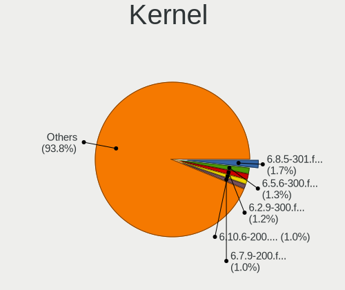

| Version                 | Desktops | Percent |
|-------------------------|----------|---------|
| 6.5.6-300.fc39.x86_64   | 106      | 1.52%   |
| 6.2.9-300.fc38.x86_64   | 104      | 1.49%   |
| 6.7.9-200.fc39.x86_64   | 86       | 1.24%   |
| 6.8.7-300.fc40.x86_64   | 78       | 1.12%   |
| 6.4.15-200.fc38.x86_64  | 73       | 1.05%   |
| 6.2.15-300.fc38.x86_64  | 72       | 1.03%   |
| 6.3.8-200.fc38.x86_64   | 71       | 1.02%   |
| 6.6.9-200.fc39.x86_64   | 64       | 0.92%   |
| 6.5.5-200.fc38.x86_64   | 60       | 0.86%   |
| 6.7.4-200.fc39.x86_64   | 58       | 0.83%   |
| 5.9.16-200.fc33.x86_64  | 58       | 0.83%   |
| 5.16.18-200.fc35.x86_64 | 55       | 0.79%   |
| 5.17.5-300.fc36.x86_64  | 52       | 0.75%   |
| 6.6.8-200.fc39.x86_64   | 49       | 0.7%    |
| 6.5.11-300.fc39.x86_64  | 49       | 0.7%    |
| 6.2.14-300.fc38.x86_64  | 48       | 0.69%   |
| 6.0.15-300.fc37.x86_64  | 45       | 0.65%   |
| 6.0.12-300.fc37.x86_64  | 44       | 0.63%   |
| 5.18.13-200.fc36.x86_64 | 42       | 0.6%    |
| 6.5.6-200.fc38.x86_64   | 41       | 0.59%   |
| 6.7.7-200.fc39.x86_64   | 40       | 0.57%   |
| 6.3.12-200.fc38.x86_64  | 40       | 0.57%   |
| 5.19.16-200.fc36.x86_64 | 40       | 0.57%   |
| 5.13.12-200.fc34.x86_64 | 39       | 0.56%   |
| 6.5.7-200.fc38.x86_64   | 38       | 0.55%   |
| 6.4.11-200.fc38.x86_64  | 37       | 0.53%   |
| 6.0.7-301.fc37.x86_64   | 37       | 0.53%   |
| 5.14.10-300.fc35.x86_64 | 37       | 0.53%   |
| 6.6.11-200.fc39.x86_64  | 36       | 0.52%   |
| 6.6.13-200.fc39.x86_64  | 35       | 0.5%    |
| 6.5.12-300.fc39.x86_64  | 35       | 0.5%    |
| 6.0.5-200.fc36.x86_64   | 35       | 0.5%    |
| 5.11.12-300.fc34.x86_64 | 35       | 0.5%    |
| 6.6.2-201.fc39.x86_64   | 34       | 0.49%   |
| 6.2.11-300.fc38.x86_64  | 34       | 0.49%   |
| 5.8.15-301.fc33.x86_64  | 34       | 0.49%   |
| 6.8.8-300.fc40.x86_64   | 33       | 0.47%   |
| 6.1.18-200.fc37.x86_64  | 33       | 0.47%   |
| 5.8.4-200.fc32.x86_64   | 33       | 0.47%   |
| 6.6.7-200.fc39.x86_64   | 32       | 0.46%   |

Kernel Family
-------------

Linux kernel without a distro release

| Version | Desktops | Percent |
|---------|----------|---------|
| 6.5.6   | 148      | 2.13%   |
| 6.2.9   | 117      | 1.68%   |
| 6.8.7   | 104      | 1.5%    |
| 6.7.9   | 101      | 1.45%   |
| 6.2.15  | 92       | 1.32%   |
| 6.4.15  | 76       | 1.09%   |
| 6.3.8   | 76       | 1.09%   |
| 6.6.9   | 69       | 0.99%   |
| 6.5.5   | 69       | 0.99%   |
| 5.17.5  | 68       | 0.98%   |
| 5.9.16  | 67       | 0.96%   |
| 5.16.18 | 63       | 0.91%   |
| 6.7.4   | 60       | 0.86%   |
| 6.2.14  | 59       | 0.85%   |
| 5.19.16 | 59       | 0.85%   |
| 6.0.12  | 54       | 0.78%   |
| 5.8.15  | 54       | 0.78%   |
| 6.6.8   | 53       | 0.76%   |
| 6.0.15  | 51       | 0.73%   |
| 6.0.7   | 50       | 0.72%   |
| 6.5.11  | 49       | 0.7%    |
| 5.8.18  | 47       | 0.68%   |
| 6.7.7   | 43       | 0.62%   |
| 5.18.13 | 43       | 0.62%   |
| 6.5.12  | 42       | 0.6%    |
| 6.3.12  | 42       | 0.6%    |
| 6.5.7   | 40       | 0.58%   |
| 5.8.16  | 40       | 0.58%   |
| 5.13.12 | 40       | 0.58%   |
| 6.6.11  | 39       | 0.56%   |
| 6.2.11  | 39       | 0.56%   |
| 6.0.8   | 39       | 0.56%   |
| 5.19.9  | 39       | 0.56%   |
| 5.14.10 | 39       | 0.56%   |
| 6.6.13  | 38       | 0.55%   |
| 6.4.11  | 38       | 0.55%   |
| 6.0.5   | 38       | 0.55%   |
| 6.0.9   | 37       | 0.53%   |
| 5.11.12 | 37       | 0.53%   |
| 5.11.11 | 37       | 0.53%   |

Kernel Major Ver.
-----------------

Linux kernel major version

| Version | Desktops | Percent |
|---------|----------|---------|
| 6.5     | 419      | 6.35%   |
| 6.2     | 417      | 6.32%   |
| 6.6     | 363      | 5.5%    |
| 6.0     | 359      | 5.44%   |
| 6.7     | 338      | 5.13%   |
| 5.8     | 308      | 4.67%   |
| 6.4     | 294      | 4.46%   |
| 6.8     | 267      | 4.05%   |
| 5.11    | 258      | 3.91%   |
| 5.19    | 256      | 3.88%   |
| 5.18    | 252      | 3.82%   |
| 5.17    | 251      | 3.81%   |
| 6.1     | 243      | 3.68%   |
| 6.3     | 227      | 3.44%   |
| 5.16    | 225      | 3.41%   |
| 5.9     | 208      | 3.15%   |
| 5.14    | 207      | 3.14%   |
| 5.10    | 205      | 3.11%   |
| 5.6     | 196      | 2.97%   |
| 5.13    | 189      | 2.87%   |
| 5.15    | 179      | 2.71%   |
| 5.12    | 176      | 2.67%   |
| 5.7     | 171      | 2.59%   |
| 5.4     | 135      | 2.05%   |
| 5.5     | 121      | 1.83%   |
| 5.3     | 116      | 1.76%   |
| 5.2     | 55       | 0.83%   |
| 5.0     | 48       | 0.73%   |
| 5.1     | 25       | 0.38%   |
| 4.19    | 22       | 0.33%   |
| 4.18    | 20       | 0.3%    |
| 4.20    | 18       | 0.27%   |
| 6.9     | 7        | 0.11%   |
| 4.16    | 5        | 0.08%   |
| 4.15    | 3        | 0.05%   |
| 4.13    | 2        | 0.03%   |
| 4.11    | 2        | 0.03%   |
| Unknown | 2        | 0.03%   |
| 4.17    | 1        | 0.02%   |
| 4.14    | 1        | 0.02%   |

Arch
----

OS architecture (x86_64, i586, etc.)

| Name        | Desktops | Percent |
|-------------|----------|---------|
| x86_64      | 5236     | 99.83%  |
| i686        | 4        | 0.08%   |
| Unknown     | 2        | 0.04%   |
| riscv64     | 1        | 0.02%   |
| ppc64le     | 1        | 0.02%   |
| loongarch64 | 1        | 0.02%   |

DE
--

Desktop Environment

| Name                         | Desktops | Percent |
|------------------------------|----------|---------|
| GNOME                        | 3680     | 68.14%  |
| KDE5                         | 758      | 14.03%  |
| Unknown                      | 297      | 5.5%    |
| KDE                          | 117      | 2.17%   |
| XFCE                         | 112      | 2.07%   |
| X-Cinnamon                   | 97       | 1.8%    |
| Cinnamon                     | 74       | 1.37%   |
| MATE                         | 69       | 1.28%   |
| KDE6                         | 46       | 0.85%   |
| GNOME Classic                | 39       | 0.72%   |
| Budgie                       | 15       | 0.28%   |
| Deepin                       | 14       | 0.26%   |
| LXQt                         | 13       | 0.24%   |
| LXDE                         | 11       | 0.2%    |
| KDE4                         | 11       | 0.2%    |
| i3                           | 11       | 0.2%    |
| sway                         | 9        | 0.17%   |
| Hyprland                     | 5        | 0.09%   |
| Xpra                         | 3        | 0.06%   |
| openbox                      | 3        | 0.06%   |
| awesome                      | 3        | 0.06%   |
| qtile                        | 2        | 0.04%   |
| DWM                          | 2        | 0.04%   |
| bspwm                        | 2        | 0.04%   |
| WindowMaker                  | 1        | 0.02%   |
| Pantheon                     | 1        | 0.02%   |
| NsCDE                        | 1        | 0.02%   |
| GNUstep                      | 1        | 0.02%   |
| GNOME-Classic                | 1        | 0.02%   |
| GNOME Flashback              | 1        | 0.02%   |
| e16-session                  | 1        | 0.02%   |
| ${XDG_CURRENT_DESKTOP:-sway} | 1        | 0.02%   |

Display Server
--------------

X11 or Wayland

| Name    | Desktops | Percent |
|---------|----------|---------|
| Wayland | 3206     | 58.43%  |
| X11     | 1957     | 35.67%  |
| Tty     | 167      | 3.04%   |
| Unknown | 152      | 2.77%   |
| Web     | 5        | 0.09%   |

Display Manager
---------------

SDDM, LightDM, etc.

| Name    | Desktops | Percent |
|---------|----------|---------|
| Unknown | 3203     | 59.36%  |
| GDM     | 1425     | 26.41%  |
| SDDM    | 434      | 8.04%   |
| LightDM | 244      | 4.52%   |
| TDM     | 72       | 1.33%   |
| XDM     | 7        | 0.13%   |
| KDM     | 7        | 0.13%   |
| LXDM    | 3        | 0.06%   |
| SLiM    | 1        | 0.02%   |

OS Lang
-------

Language

| Lang    | Desktops | Percent |
|---------|----------|---------|
| en_US   | 2507     | 47.07%  |
| en_GB   | 364      | 6.83%   |
| ru_RU   | 283      | 5.31%   |
| pt_BR   | 274      | 5.14%   |
| Unknown | 254      | 4.77%   |
| de_DE   | 247      | 4.64%   |
| fr_FR   | 163      | 3.06%   |
| en_CA   | 160      | 3%      |
| en_AU   | 156      | 2.93%   |
| it_IT   | 112      | 2.1%    |
| es_ES   | 88       | 1.65%   |
| pl_PL   | 79       | 1.48%   |
| es_MX   | 41       | 0.77%   |
| cs_CZ   | 40       | 0.75%   |
| es_AR   | 34       | 0.64%   |
| en_IN   | 31       | 0.58%   |
| en_NZ   | 29       | 0.54%   |
| de_AT   | 22       | 0.41%   |
| tr_TR   | 21       | 0.39%   |
| es_CO   | 21       | 0.39%   |
| nl_NL   | 20       | 0.38%   |
| ja_JP   | 19       | 0.36%   |
| zh_CN   | 18       | 0.34%   |
| hu_HU   | 18       | 0.34%   |
| en_IE   | 18       | 0.34%   |
| nl_BE   | 16       | 0.3%    |
| fi_FI   | 16       | 0.3%    |
| sv_SE   | 15       | 0.28%   |
| en_DK   | 14       | 0.26%   |
| pt_PT   | 13       | 0.24%   |
| ko_KR   | 12       | 0.23%   |
| es_CL   | 12       | 0.23%   |
| fr_BE   | 11       | 0.21%   |
| C       | 11       | 0.21%   |
| uk_UA   | 10       | 0.19%   |
| fr_CH   | 9        | 0.17%   |
| fr_CA   | 9        | 0.17%   |
| ru_UA   | 8        | 0.15%   |
| da_DK   | 8        | 0.15%   |
| de_CH   | 7        | 0.13%   |

Boot Mode
---------

EFI or BIOS

| Mode | Desktops | Percent |
|------|----------|---------|
| EFI  | 3261     | 60.83%  |
| BIOS | 2100     | 39.17%  |

Filesystem
----------

Type of filesystem

| Type                | Desktops | Percent |
|---------------------|----------|---------|
| Btrfs               | 3341     | 62.24%  |
| Ext4                | 1646     | 30.66%  |
| Xfs                 | 216      | 4.02%   |
| Unknown             | 135      | 2.51%   |
| Overlay             | 9        | 0.17%   |
| Tmpfs               | 7        | 0.13%   |
| Zfs                 | 5        | 0.09%   |
| Ext3                | 5        | 0.09%   |
| F2fs                | 2        | 0.04%   |
| XXXXX               | 1        | 0.02%   |
| Fuse.fuse-overlayfs | 1        | 0.02%   |

Part. scheme
------------

Scheme of partitioning

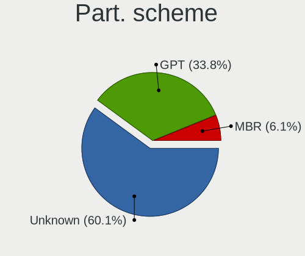

| Type    | Desktops | Percent |
|---------|----------|---------|
| Unknown | 3123     | 57.87%  |
| GPT     | 1868     | 34.61%  |
| MBR     | 406      | 7.52%   |

Dual Boot with Linux/BSD
------------------------

Hosting more than one Linux/BSD

| Dual boot | Desktops | Percent |
|-----------|----------|---------|
| No        | 4616     | 86.09%  |
| Yes       | 746      | 13.91%  |

Dual Boot (Win)
---------------

Hosting Linux and Windows

| Dual boot | Desktops | Percent |
|-----------|----------|---------|
| No        | 4277     | 80.15%  |
| Yes       | 1059     | 19.85%  |

Board
-----

Vendor
------

Motherboard manufacturer

| Name                                 | Desktops | Percent |
|--------------------------------------|----------|---------|
| ASUSTek Computer                     | 1501     | 28.63%  |
| Gigabyte Technology                  | 985      | 18.79%  |
| MSI                                  | 826      | 15.75%  |
| ASRock                               | 524      | 9.99%   |
| Dell                                 | 359      | 6.85%   |
| Hewlett-Packard                      | 298      | 5.68%   |
| Lenovo                               | 158      | 3.01%   |
| Intel                                | 88       | 1.68%   |
| Unknown                              | 65       | 1.24%   |
| Acer                                 | 51       | 0.97%   |
| Pegatron                             | 35       | 0.67%   |
| Fujitsu                              | 26       | 0.5%    |
| Huanan                               | 24       | 0.46%   |
| Biostar                              | 24       | 0.46%   |
| Apple                                | 20       | 0.38%   |
| Foxconn                              | 18       | 0.34%   |
| ECS                                  | 18       | 0.34%   |
| BESSTAR Tech                         | 17       | 0.32%   |
| AZW                                  | 14       | 0.27%   |
| Supermicro                           | 13       | 0.25%   |
| Alienware                            | 12       | 0.23%   |
| Shenzhen Meigao Electronic Equipment | 10       | 0.19%   |
| Itautec                              | 10       | 0.19%   |
| Shuttle                              | 9        | 0.17%   |
| Positivo                             | 9        | 0.17%   |
| PCWare                               | 7        | 0.13%   |
| Medion                               | 7        | 0.13%   |
| Packard Bell                         | 6        | 0.11%   |
| MACHINIST                            | 6        | 0.11%   |
| EVGA                                 | 6        | 0.11%   |
| AMI                                  | 6        | 0.11%   |
| NZXT                                 | 5        | 0.1%    |
| eMachines                            | 5        | 0.1%    |
| System76                             | 4        | 0.08%   |
| OEM                                  | 4        | 0.08%   |
| Colorful Technology                  | 4        | 0.08%   |
| ABIT                                 | 4        | 0.08%   |
| ZOTAC                                | 3        | 0.06%   |
| Google                               | 3        | 0.06%   |
| GEEKOM                               | 3        | 0.06%   |

Model
-----

Motherboard model

| Name                           | Desktops | Percent |
|--------------------------------|----------|---------|
| ASUS All Series                | 136      | 2.59%   |
| Unknown                        | 68       | 1.3%    |
| MSI MS-7C37                    | 50       | 0.95%   |
| ASUS TUF Gaming X570-PLUS      | 40       | 0.76%   |
| MSI MS-7C02                    | 31       | 0.59%   |
| Dell OptiPlex 7010             | 31       | 0.59%   |
| Gigabyte B450M DS3H            | 30       | 0.57%   |
| MSI MS-7A38                    | 29       | 0.55%   |
| MSI MS-7C56                    | 27       | 0.51%   |
| MSI MS-7C91                    | 25       | 0.48%   |
| MSI MS-7B89                    | 24       | 0.46%   |
| ASUS ROG STRIX B550-F GAMING   | 24       | 0.46%   |
| MSI MS-7B86                    | 23       | 0.44%   |
| Dell OptiPlex 9020             | 23       | 0.44%   |
| MSI MS-7B79                    | 22       | 0.42%   |
| MSI MS-7C95                    | 21       | 0.4%    |
| ASUS PRIME A320M-K             | 21       | 0.4%    |
| ASRock B450M Pro4              | 18       | 0.34%   |
| Gigabyte B450 AORUS ELITE      | 17       | 0.32%   |
| Gigabyte 970A-DS3P             | 17       | 0.32%   |
| ASUS TUF Gaming B550-PLUS      | 17       | 0.32%   |
| ASUS ROG STRIX X570-F GAMING   | 17       | 0.32%   |
| ASUS ROG STRIX X570-E GAMING   | 17       | 0.32%   |
| ASUS ROG STRIX B550-I GAMING   | 17       | 0.32%   |
| ASUS ROG STRIX B450-F GAMING   | 17       | 0.32%   |
| MSI MS-7C52                    | 16       | 0.31%   |
| Gigabyte X570 I AORUS PRO WIFI | 16       | 0.31%   |
| Gigabyte B450 AORUS M          | 16       | 0.31%   |
| ASUS PRIME X370-PRO            | 16       | 0.31%   |
| Gigabyte B550M DS3H            | 15       | 0.29%   |
| Dell OptiPlex 3020             | 15       | 0.29%   |
| ASUS TUF Gaming B550M-PLUS     | 15       | 0.29%   |
| MSI MS-7C84                    | 14       | 0.27%   |
| MSI MS-7A34                    | 14       | 0.27%   |
| Gigabyte X570 AORUS ELITE      | 14       | 0.27%   |
| Gigabyte B550I AORUS PRO AX    | 14       | 0.27%   |
| Gigabyte A320M-S2H             | 14       | 0.27%   |
| ASUS PRIME X470-PRO            | 14       | 0.27%   |
| ASRock B450 Pro4               | 14       | 0.27%   |
| ASRock B450M Steel Legend      | 13       | 0.25%   |

Model Family
------------

Motherboard model prefix

| Name                | Desktops | Percent |
|---------------------|----------|---------|
| ASUS PRIME          | 326      | 6.22%   |
| ASUS ROG            | 314      | 5.99%   |
| Dell OptiPlex       | 200      | 3.81%   |
| ASUS TUF            | 198      | 3.78%   |
| ASUS All            | 136      | 2.59%   |
| Gigabyte X570       | 82       | 1.56%   |
| Lenovo ThinkCentre  | 80       | 1.53%   |
| Unknown             | 68       | 1.3%    |
| HP Compaq           | 65       | 1.24%   |
| Dell Precision      | 62       | 1.18%   |
| HP EliteDesk        | 58       | 1.11%   |
| Gigabyte B450       | 58       | 1.11%   |
| Gigabyte B450M      | 55       | 1.05%   |
| MSI MS-7C37         | 50       | 0.95%   |
| Gigabyte B550       | 44       | 0.84%   |
| ASRock B450M        | 41       | 0.78%   |
| Dell Inspiron       | 38       | 0.72%   |
| Gigabyte B550M      | 36       | 0.69%   |
| HP ProDesk          | 33       | 0.63%   |
| Dell XPS            | 33       | 0.63%   |
| ASRock X570         | 33       | 0.63%   |
| Acer Aspire         | 33       | 0.63%   |
| MSI MS-7C02         | 31       | 0.59%   |
| MSI MS-7A38         | 29       | 0.55%   |
| ASRock B450         | 29       | 0.55%   |
| Lenovo ThinkStation | 28       | 0.53%   |
| MSI MS-7C56         | 27       | 0.51%   |
| MSI MS-7C91         | 25       | 0.48%   |
| MSI MS-7B89         | 24       | 0.46%   |
| ASRock B550         | 24       | 0.46%   |
| MSI MS-7B86         | 23       | 0.44%   |
| ASUS P8Z77-V        | 23       | 0.44%   |
| MSI MS-7B79         | 22       | 0.42%   |
| MSI MS-7C95         | 21       | 0.4%    |
| ASUS Maximus        | 21       | 0.4%    |
| Gigabyte Z390       | 19       | 0.36%   |
| Gigabyte 970A-DS3P  | 18       | 0.34%   |
| ASUS M5A97          | 18       | 0.34%   |
| ASUS M5A78L-M       | 18       | 0.34%   |
| HP Pavilion         | 17       | 0.32%   |

MFG Year
--------

Motherboard manufacture year

| Year    | Desktops | Percent |
|---------|----------|---------|
| 2018    | 671      | 12.8%   |
| 2020    | 578      | 11.02%  |
| 2019    | 569      | 10.85%  |
| 2017    | 403      | 7.69%   |
| 2021    | 379      | 7.23%   |
| 2012    | 371      | 7.08%   |
| 2013    | 338      | 6.45%   |
| 2014    | 309      | 5.89%   |
| 2022    | 288      | 5.49%   |
| 2011    | 235      | 4.48%   |
| 2015    | 228      | 4.35%   |
| 2016    | 226      | 4.31%   |
| 2010    | 165      | 3.15%   |
| 2009    | 154      | 2.94%   |
| 2023    | 123      | 2.35%   |
| 2008    | 107      | 2.04%   |
| 2007    | 54       | 1.03%   |
| 2006    | 24       | 0.46%   |
| 2024    | 11       | 0.21%   |
| 2005    | 5        | 0.1%    |
| Unknown | 5        | 0.1%    |

Form Factor
-----------

Physical design of the computer

| Name    | Desktops | Percent |
|---------|----------|---------|
| Desktop | 5243     | 100%    |

Secure Boot
-----------

Enabled or disabled

| State    | Desktops | Percent |
|----------|----------|---------|
| Disabled | 4872     | 92.05%  |
| Enabled  | 421      | 7.95%   |

Coreboot
--------

Have coreboot on board

| Used | Desktops | Percent |
|------|----------|---------|
| No   | 5240     | 99.94%  |
| Yes  | 3        | 0.06%   |

RAM Size
--------

Total RAM memory

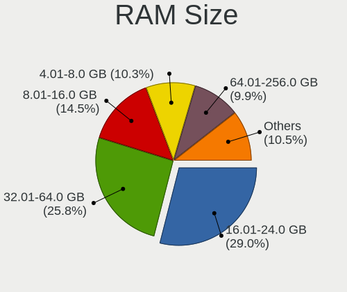

| Size in GB      | Desktops | Percent |
|-----------------|----------|---------|
| 16.01-24.0      | 1592     | 29.57%  |
| 32.01-64.0      | 1300     | 24.15%  |
| 8.01-16.0       | 838      | 15.57%  |
| 4.01-8.0        | 578      | 10.74%  |
| 64.01-256.0     | 495      | 9.2%    |
| 3.01-4.0        | 290      | 5.39%   |
| 24.01-32.0      | 229      | 4.25%   |
| 1.01-2.0        | 29       | 0.54%   |
| 2.01-3.0        | 22       | 0.41%   |
| Unknown         | 5        | 0.09%   |
| More than 256.0 | 4        | 0.07%   |
| 0.51-1.0        | 1        | 0.02%   |

RAM Used
--------

Used RAM memory

| Used GB     | Desktops | Percent |
|-------------|----------|---------|
| 4.01-8.0    | 1774     | 29.34%  |
| 2.01-3.0    | 1481     | 24.49%  |
| 3.01-4.0    | 1244     | 20.57%  |
| 1.01-2.0    | 720      | 11.91%  |
| 8.01-16.0   | 564      | 9.33%   |
| 16.01-24.0  | 110      | 1.82%   |
| 0.51-1.0    | 75       | 1.24%   |
| 24.01-32.0  | 37       | 0.61%   |
| 32.01-64.0  | 19       | 0.31%   |
| 0.01-0.5    | 13       | 0.21%   |
| Unknown     | 7        | 0.12%   |
| 64.01-256.0 | 3        | 0.05%   |

Total Drives
------------

Number of drives on board

| Drives | Desktops | Percent |
|--------|----------|---------|
| 2      | 1705     | 30.62%  |
| 1      | 1566     | 28.13%  |
| 3      | 1133     | 20.35%  |
| 4      | 575      | 10.33%  |
| 5      | 293      | 5.26%   |
| 6      | 141      | 2.53%   |
| 7      | 66       | 1.19%   |
| 8      | 34       | 0.61%   |
| 9      | 15       | 0.27%   |
| 0      | 12       | 0.22%   |
| 10     | 8        | 0.14%   |
| 11     | 6        | 0.11%   |
| 12     | 5        | 0.09%   |
| 15     | 2        | 0.04%   |
| 14     | 2        | 0.04%   |
| 410    | 1        | 0.02%   |
| 27     | 1        | 0.02%   |
| 24     | 1        | 0.02%   |
| 18     | 1        | 0.02%   |
| 13     | 1        | 0.02%   |

Has CD-ROM
----------

Has CD-ROM on board

| Presented | Desktops | Percent |
|-----------|----------|---------|
| No        | 3555     | 66.89%  |
| Yes       | 1760     | 33.11%  |

Has Ethernet
------------

Has Ethernet on board

| Presented | Desktops | Percent |
|-----------|----------|---------|
| Yes       | 5204     | 99.24%  |
| No        | 40       | 0.76%   |

Has WiFi
--------

Has WiFi module

| Presented | Desktops | Percent |
|-----------|----------|---------|
| Yes       | 2702     | 50.72%  |
| No        | 2625     | 49.28%  |

Has Bluetooth
-------------

Has Bluetooth module

| Presented | Desktops | Percent |
|-----------|----------|---------|
| No        | 2954     | 55.29%  |
| Yes       | 2389     | 44.71%  |

Location
--------

Country
-------

Geographic location (country)

| Country     | Desktops | Percent |
|-------------|----------|---------|
| USA         | 1251     | 23.72%  |
| Germany     | 402      | 7.62%   |
| Brazil      | 398      | 7.55%   |
| Russia      | 350      | 6.64%   |
| Canada      | 221      | 4.19%   |
| UK          | 207      | 3.92%   |
| France      | 192      | 3.64%   |
| Italy       | 182      | 3.45%   |
| Australia   | 175      | 3.32%   |
| Poland      | 139      | 2.64%   |
| Spain       | 133      | 2.52%   |
| Netherlands | 94       | 1.78%   |
| Sweden      | 81       | 1.54%   |
| Czechia     | 73       | 1.38%   |
| India       | 69       | 1.31%   |
| Mexico      | 68       | 1.29%   |
| Argentina   | 62       | 1.18%   |
| Switzerland | 61       | 1.16%   |
| Belgium     | 61       | 1.16%   |
| Austria     | 55       | 1.04%   |
| Turkey      | 45       | 0.85%   |
| Ukraine     | 43       | 0.82%   |
| Norway      | 43       | 0.82%   |
| Finland     | 43       | 0.82%   |
| Romania     | 42       | 0.8%    |
| Portugal    | 38       | 0.72%   |
| Hungary     | 35       | 0.66%   |
| Colombia    | 34       | 0.64%   |
| New Zealand | 33       | 0.63%   |
| Japan       | 30       | 0.57%   |
| Greece      | 30       | 0.57%   |
| Denmark     | 27       | 0.51%   |
| Indonesia   | 23       | 0.44%   |
| Chile       | 22       | 0.42%   |
| Belarus     | 22       | 0.42%   |
| Thailand    | 21       | 0.4%    |
| China       | 21       | 0.4%    |
| Taiwan      | 19       | 0.36%   |
| Philippines | 18       | 0.34%   |
| Bulgaria    | 18       | 0.34%   |

City
----

Geographic location (city)

| City           | Desktops | Percent |
|----------------|----------|---------|
| Moscow         | 85       | 1.52%   |
| Sydney         | 66       | 1.18%   |
| Sao Paulo      | 41       | 0.73%   |
| Berlin         | 41       | 0.73%   |
| St Petersburg  | 38       | 0.68%   |
| Warsaw         | 36       | 0.64%   |
| Vienna         | 33       | 0.59%   |
| Brisbane       | 30       | 0.53%   |
| Toronto        | 28       | 0.5%    |
| Melbourne      | 28       | 0.5%    |
| Seattle        | 26       | 0.46%   |
| Paris          | 26       | 0.46%   |
| Rio de Janeiro | 25       | 0.45%   |
| Prague         | 24       | 0.43%   |
| Rome           | 23       | 0.41%   |
| Palmas         | 23       | 0.41%   |
| Auckland       | 23       | 0.41%   |
| Madrid         | 22       | 0.39%   |
| Hamburg        | 22       | 0.39%   |
| Porto Alegre   | 21       | 0.37%   |
| Athens         | 20       | 0.36%   |
| Mexico City    | 19       | 0.34%   |
| Los Angeles    | 19       | 0.34%   |
| Zurich         | 18       | 0.32%   |
| Yekaterinburg  | 18       | 0.32%   |
| Munich         | 18       | 0.32%   |
| Milan          | 18       | 0.32%   |
| Montreal       | 17       | 0.3%    |
| London         | 17       | 0.3%    |
| Buenos Aires   | 17       | 0.3%    |
| Amsterdam      | 17       | 0.3%    |
| Wroclaw        | 16       | 0.29%   |
| Minsk          | 16       | 0.29%   |
| Budapest       | 16       | 0.29%   |
| Brussels       | 16       | 0.29%   |
| New York       | 15       | 0.27%   |
| Istanbul       | 15       | 0.27%   |
| Helsinki       | 15       | 0.27%   |
| Stockholm      | 14       | 0.25%   |
| Denver         | 14       | 0.25%   |

Drives
------

Drive Vendor
------------

Hard drive vendors

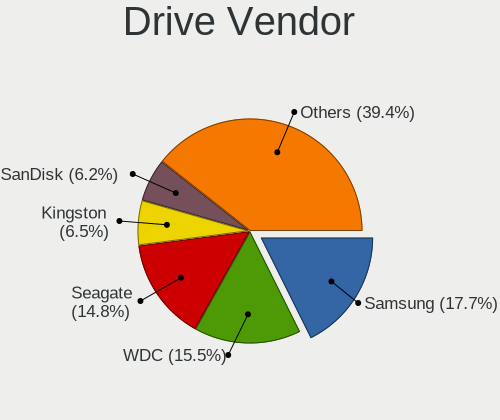

| Vendor                      | Desktops | Drives | Percent |
|-----------------------------|----------|--------|---------|
| Samsung Electronics         | 1901     | 3815   | 17.83%  |
| WDC                         | 1763     | 3448   | 16.53%  |
| Seagate                     | 1645     | 2971   | 15.43%  |
| Kingston                    | 696      | 1042   | 6.53%   |
| Sandisk                     | 608      | 880    | 5.7%    |
| Crucial                     | 539      | 838    | 5.05%   |
| Toshiba                     | 517      | 791    | 4.85%   |
| Hitachi                     | 250      | 415    | 2.34%   |
| Intel                       | 244      | 423    | 2.29%   |
| A-DATA Technology           | 170      | 226    | 1.59%   |
| Micron/Crucial Technology   | 139      | 195    | 1.3%    |
| Phison Electronics          | 133      | 202    | 1.25%   |
| Phison                      | 110      | 153    | 1.03%   |
| HGST                        | 102      | 194    | 0.96%   |
| SK hynix                    | 90       | 107    | 0.84%   |
| China                       | 88       | 120    | 0.83%   |
| Silicon Motion              | 83       | 120    | 0.78%   |
| Unknown                     | 80       | 140    | 0.75%   |
| SPCC                        | 72       | 110    | 0.68%   |
| Micron Technology           | 69       | 88     | 0.65%   |
| Corsair                     | 63       | 97     | 0.59%   |
| Kingston Technology Company | 62       | 75     | 0.58%   |
| ADATA Technology            | 60       | 80     | 0.56%   |
| Patriot                     | 58       | 89     | 0.54%   |
| PNY                         | 57       | 81     | 0.53%   |
| MAXIO Technology (Hangzhou) | 53       | 60     | 0.5%    |
| OCZ                         | 50       | 66     | 0.47%   |
| Realtek Semiconductor       | 46       | 57     | 0.43%   |
| Intenso                     | 38       | 49     | 0.36%   |
| Team                        | 36       | 51     | 0.34%   |
| Transcend                   | 33       | 42     | 0.31%   |
| Maxtor                      | 33       | 40     | 0.31%   |
| Apacer                      | 32       | 49     | 0.3%    |
| Hewlett-Packard             | 26       | 36     | 0.24%   |
| ASMT                        | 26       | 33     | 0.24%   |
| XPG                         | 25       | 35     | 0.23%   |
| GOODRAM                     | 25       | 39     | 0.23%   |
| KingSpec                    | 23       | 37     | 0.22%   |
| JMicron Technology          | 23       | 31     | 0.22%   |
| Gigabyte Technology         | 23       | 40     | 0.22%   |

Drive Model
-----------

Hard drive models

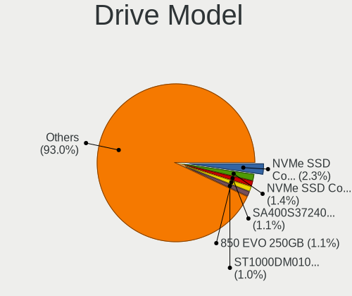

| Model                                                 | Desktops | Percent |
|-------------------------------------------------------|----------|---------|
| Samsung NVMe SSD Controller SM981/PM981/PM983 1TB     | 234      | 1.84%   |
| Samsung SSD 850 EVO 250GB                             | 156      | 1.22%   |
| Kingston SA400S37240G 240GB SSD                       | 139      | 1.09%   |
| Seagate ST1000DM010-2EP102 1TB                        | 137      | 1.07%   |
| Samsung NVMe SSD Controller PM9A1/PM9A3/980PRO 1TB    | 137      | 1.07%   |
| Seagate ST2000DM008-2FR102 2TB                        | 132      | 1.04%   |
| Samsung SSD 860 EVO 500GB                             | 132      | 1.04%   |
| Samsung SSD 860 EVO 1TB                               | 116      | 0.91%   |
| Samsung SSD 850 EVO 500GB                             | 115      | 0.9%    |
| Seagate ST500DM002-1BD142 500GB                       | 112      | 0.88%   |
| Kingston SA400S37480G 480GB SSD                       | 104      | 0.82%   |
| WDC WD10EZEX-08WN4A0 1TB                              | 92       | 0.72%   |
| Toshiba DT01ACA100 1TB                                | 92       | 0.72%   |
| Samsung NVMe SSD Drive 500GB                          | 91       | 0.71%   |
| Kingston SA400S37120G 120GB SSD                       | 87       | 0.68%   |
| Crucial CT500MX500SSD1 500GB                          | 86       | 0.67%   |
| Crucial CT1000MX500SSD1 1TB                           | 78       | 0.61%   |
| Micron/Crucial P2 NVMe PCIe SSD 4TB                   | 72       | 0.56%   |
| Samsung NVMe SSD Drive 1TB                            | 69       | 0.54%   |
| Seagate ST4000DM004-2CV104 4TB                        | 59       | 0.46%   |
| Seagate ST2000DM001-1ER164 2TB                        | 58       | 0.46%   |
| Phison E12 NVMe Controller 2TB                        | 58       | 0.46%   |
| Toshiba HDWD110 1TB                                   | 57       | 0.45%   |
| Samsung SSD 860 EVO 250GB                             | 57       | 0.45%   |
| Kingston SV300S37A120G 120GB SSD                      | 55       | 0.43%   |
| Seagate ST1000DM003-1ER162 1TB                        | 53       | 0.42%   |
| Crucial CT240BX500SSD1 240GB                          | 49       | 0.38%   |
| Toshiba DT01ACA200 2TB                                | 48       | 0.38%   |
| Samsung SSD 980 1TB                                   | 48       | 0.38%   |
| Samsung SSD 870 EVO 1TB                               | 48       | 0.38%   |
| Seagate ST1000DM003-1CH162 1TB                        | 47       | 0.37%   |
| WDC WDS500G2B0A-00SM50 500GB SSD                      | 46       | 0.36%   |
| Samsung SSD 970 EVO Plus 500GB                        | 46       | 0.36%   |
| WDC WD10EZEX-00BN5A0 1TB                              | 45       | 0.35%   |
| Seagate ST2000DM006-2DM164 2TB                        | 45       | 0.35%   |
| Seagate ST1000DM003-1SB102 1TB                        | 45       | 0.35%   |
| Sandisk WD Blue SN550 NVMe SSD 2TB                    | 45       | 0.35%   |
| Silicon Motion SM2263EN/SM2263XT SSD Controller 256GB | 43       | 0.34%   |
| Seagate ST3500418AS 500GB                             | 43       | 0.34%   |
| SanDisk NVMe SSD Drive 1TB                            | 43       | 0.34%   |

HDD Vendor
----------

Hard disk drive vendors

| Vendor              | Desktops | Drives | Percent |
|---------------------|----------|--------|---------|
| Seagate             | 1600     | 2878   | 37.48%  |
| WDC                 | 1514     | 2917   | 35.46%  |
| Toshiba             | 445      | 660    | 10.42%  |
| Hitachi             | 250      | 415    | 5.86%   |
| Samsung Electronics | 186      | 304    | 4.36%   |
| HGST                | 101      | 193    | 2.37%   |
| Maxtor              | 31       | 36     | 0.73%   |
| Unknown             | 28       | 36     | 0.66%   |
| SABRENT             | 18       | 21     | 0.42%   |
| JMicron Technology  | 16       | 24     | 0.37%   |
| ASMT                | 10       | 16     | 0.23%   |
| Fujitsu             | 9        | 11     | 0.21%   |
| Hewlett-Packard     | 7        | 13     | 0.16%   |
| Intenso             | 6        | 9      | 0.14%   |
| Apple               | 6        | 6      | 0.14%   |
| TO Exter            | 3        | 4      | 0.07%   |
| MaxDigital          | 3        | 3      | 0.07%   |
| Inateck             | 3        | 8      | 0.07%   |
| USB                 | 2        | 2      | 0.05%   |
| Synology            | 2        | 3      | 0.05%   |
| SAGE                | 2        | 2      | 0.05%   |
| QNAP                | 2        | 2      | 0.05%   |
| LaCie               | 2        | 4      | 0.05%   |
| H/W                 | 2        | 4      | 0.05%   |
| ASMT109x            | 2        | 2      | 0.05%   |
| ASMedia             | 2        | 5      | 0.05%   |
| USB3.0              | 1        | 1      | 0.02%   |
| USB 3.0             | 1        | 3      | 0.02%   |
| RSH-339             | 1        | 1      | 0.02%   |
| Mercury             | 1        | 1      | 0.02%   |
| Maxone              | 1        | 1      | 0.02%   |
| MARVELL             | 1        | 1      | 0.02%   |
| Magnetic Data       | 1        | 1      | 0.02%   |
| Lenovo              | 1        | 1      | 0.02%   |
| KINGWIN             | 1        | 1      | 0.02%   |
| KESU                | 1        | 1      | 0.02%   |
| IET                 | 1        | 1      | 0.02%   |
| ICY BOX             | 1        | 1      | 0.02%   |
| IB-377U3            | 1        | 1      | 0.02%   |
| External            | 1        | 1      | 0.02%   |

SSD Vendor
----------

Solid state drive vendors

| Vendor              | Desktops | Drives | Percent |
|---------------------|----------|--------|---------|
| Samsung Electronics | 1067     | 1960   | 26.67%  |
| Kingston            | 567      | 846    | 14.17%  |
| Crucial             | 502      | 784    | 12.55%  |
| SanDisk             | 301      | 392    | 7.52%   |
| WDC                 | 273      | 416    | 6.82%   |
| A-DATA Technology   | 149      | 197    | 3.72%   |
| Intel               | 117      | 220    | 2.92%   |
| China               | 88       | 120    | 2.2%    |
| SPCC                | 61       | 90     | 1.52%   |
| PNY                 | 57       | 80     | 1.42%   |
| Patriot             | 55       | 85     | 1.37%   |
| OCZ                 | 50       | 66     | 1.25%   |
| Toshiba             | 46       | 68     | 1.15%   |
| Micron Technology   | 40       | 54     | 1%      |
| Corsair             | 37       | 58     | 0.92%   |
| SK hynix            | 34       | 37     | 0.85%   |
| Transcend           | 33       | 42     | 0.82%   |
| Team                | 33       | 48     | 0.82%   |
| Apacer              | 30       | 46     | 0.75%   |
| Intenso             | 27       | 34     | 0.67%   |
| GOODRAM             | 25       | 39     | 0.62%   |
| KingSpec            | 23       | 37     | 0.57%   |
| Plextor             | 19       | 26     | 0.47%   |
| Seagate             | 17       | 20     | 0.42%   |
| Gigabyte Technology | 16       | 26     | 0.4%    |
| LITEON              | 14       | 18     | 0.35%   |
| Mushkin             | 13       | 18     | 0.32%   |
| LITEONIT            | 13       | 19     | 0.32%   |
| Hewlett-Packard     | 13       | 15     | 0.32%   |
| Lexar               | 12       | 19     | 0.3%    |
| ASMT                | 12       | 13     | 0.3%    |
| Verbatim            | 11       | 14     | 0.27%   |
| Netac               | 11       | 12     | 0.27%   |
| KingDian            | 11       | 12     | 0.27%   |
| Unknown             | 9        | 9      | 0.22%   |
| Smartbuy            | 9        | 10     | 0.22%   |
| Unknown             | 8        | 14     | 0.2%    |
| Leven               | 7        | 8      | 0.17%   |
| Apple               | 7        | 10     | 0.17%   |
| AMD                 | 7        | 10     | 0.17%   |

Drive Kind
----------

HDD or SSD

| Kind    | Desktops | Drives | Percent |
|---------|----------|--------|---------|
| HDD     | 3279     | 7598   | 36.67%  |
| SSD     | 3185     | 6627   | 35.62%  |
| NVMe    | 2304     | 4034   | 25.77%  |
| Unknown | 162      | 234    | 1.81%   |
| MMC     | 11       | 15     | 0.12%   |

Drive Connector
---------------

SATA, SAS, NVMe, etc.

| Type | Desktops | Drives | Percent |
|------|----------|--------|---------|
| SATA | 4504     | 13795  | 62.12%  |
| NVMe | 2299     | 4011   | 31.71%  |
| SAS  | 437      | 687    | 6.03%   |
| MMC  | 11       | 15     | 0.15%   |

Drive Size
----------

Size of hard drive

| Size in TB | Desktops | Drives | Percent |
|------------|----------|--------|---------|
| 0.01-0.5   | 3220     | 7024   | 44.7%   |
| 0.51-1.0   | 2186     | 3851   | 30.34%  |
| 1.01-2.0   | 928      | 1538   | 12.88%  |
| 3.01-4.0   | 391      | 759    | 5.43%   |
| 2.01-3.0   | 213      | 423    | 2.96%   |
| 4.01-10.0  | 213      | 520    | 2.96%   |
| 10.01-20.0 | 53       | 110    | 0.74%   |

Space Total
-----------

Amount of disk space available on the file system

| Size in GB     | Desktops | Percent |
|----------------|----------|---------|
| 1001-2000      | 1084     | 19.18%  |
| 501-1000       | 1065     | 18.85%  |
| More than 3000 | 899      | 15.91%  |
| 251-500        | 820      | 14.51%  |
| 101-250        | 657      | 11.63%  |
| 2001-3000      | 449      | 7.95%   |
| 1-20           | 254      | 4.49%   |
| Unknown        | 234      | 4.14%   |
| 51-100         | 131      | 2.32%   |
| 21-50          | 57       | 1.01%   |
| 0              | 1        | 0.02%   |

Space Used
----------

Amount of used disk space

| Used GB        | Desktops | Percent |
|----------------|----------|---------|
| 1-20           | 1121     | 18.96%  |
| 21-50          | 802      | 13.57%  |
| 101-250        | 792      | 13.4%   |
| 251-500        | 695      | 11.76%  |
| 501-1000       | 664      | 11.23%  |
| 51-100         | 634      | 10.72%  |
| 1001-2000      | 498      | 8.42%   |
| More than 3000 | 275      | 4.65%   |
| Unknown        | 234      | 3.96%   |
| 2001-3000      | 195      | 3.3%    |
| 0              | 2        | 0.03%   |

Malfunc. Drives
---------------

Drive models with a malfunction

| Model                                                         | Desktops | Drives | Percent |
|---------------------------------------------------------------|----------|--------|---------|
| Seagate ST500DM002-1BD142 500GB                               | 22       | 48     | 3.3%    |
| Seagate ST31000524AS 1TB                                      | 9        | 12     | 1.35%   |
| Seagate ST31000528AS 1TB                                      | 8        | 10     | 1.2%    |
| WDC WD10EZEX-00BN5A0 1TB                                      | 7        | 7      | 1.05%   |
| Seagate ST3500418AS 500GB                                     | 7        | 17     | 1.05%   |
| Samsung Electronics SSD 870 EVO 1TB                           | 7        | 9      | 1.05%   |
| Intel SSDSC2CT120A3 120GB                                     | 6        | 44     | 0.9%    |
| WDC WD5000AAKX-603CA0 500GB                                   | 5        | 6      | 0.75%   |
| WDC WD10EZEX-08WN4A0 1TB                                      | 5        | 6      | 0.75%   |
| Toshiba MQ01ABD050 500GB                                      | 5        | 10     | 0.75%   |
| Seagate ST31500341AS 1TB                                      | 5        | 5      | 0.75%   |
| Seagate ST2000DM001-1CH164 2TB                                | 5        | 5      | 0.75%   |
| Seagate ST1000DM010-2EP102 1TB                                | 5        | 5      | 0.75%   |
| Samsung Electronics HD501LJ 500GB                             | 5        | 37     | 0.75%   |
| Samsung Electronics HD322HJ 320GB                             | 5        | 7      | 0.75%   |
| Crucial CT128MX100SSD1 128GB                                  | 5        | 7      | 0.75%   |
| WDC WD5000AAKX-00ERMA0 500GB                                  | 4        | 6      | 0.6%    |
| WDC WD40EFRX-68N32N0 4TB                                      | 4        | 5      | 0.6%    |
| WDC WD20EZRX-00D8PB0 2TB                                      | 4        | 6      | 0.6%    |
| WDC WD1002FAEX-00Z3A0 1TB                                     | 4        | 4      | 0.6%    |
| Toshiba DT01ACA100 1TB                                        | 4        | 4      | 0.6%    |
| Seagate ST2000DM001-1ER164 2TB                                | 4        | 4      | 0.6%    |
| Seagate ST1000DM003-1ER162 1TB                                | 4        | 4      | 0.6%    |
| SanDisk SSD PLUS 240GB                                        | 4        | 4      | 0.6%    |
| Samsung Electronics NVMe SSD Controller SM981/PM981/PM983 1TB | 4        | 5      | 0.6%    |
| Hitachi HDS721010CLA332 1TB                                   | 4        | 4      | 0.6%    |
| Crucial CT275MX300SSD1 275GB                                  | 4        | 6      | 0.6%    |
| Crucial CT240M500SSD1 240GB                                   | 4        | 4      | 0.6%    |
| WDC WD5000AAKS-00UU3A0 500GB                                  | 3        | 3      | 0.45%   |
| WDC WD5000AADS-00S9B0 500GB                                   | 3        | 3      | 0.45%   |
| WDC WD40EFRX-68WT0N0 4TB                                      | 3        | 3      | 0.45%   |
| WDC WD10EZEX-00WN4A0 1TB                                      | 3        | 3      | 0.45%   |
| WDC WD10EARS-22Y5B1 1TB                                       | 3        | 3      | 0.45%   |
| Toshiba MQ01ABD100 1TB                                        | 3        | 3      | 0.45%   |
| Toshiba DT01ACA200 2TB                                        | 3        | 6      | 0.45%   |
| Seagate ST500LT012-1DG142 500GB                               | 3        | 3      | 0.45%   |
| Seagate ST3000DM008-2DM166 3TB                                | 3        | 4      | 0.45%   |
| Seagate ST2000DM008-2FR102 2TB                                | 3        | 3      | 0.45%   |
| Seagate ST2000DL003-9VT166 2TB                                | 3        | 3      | 0.45%   |
| SanDisk SSD PLUS 480GB                                        | 3        | 3      | 0.45%   |

Malfunc. Drive Vendor
---------------------

Vendors of faulty drives

| Vendor                      | Desktops | Drives | Percent |
|-----------------------------|----------|--------|---------|
| WDC                         | 163      | 244    | 25.96%  |
| Seagate                     | 159      | 258    | 25.32%  |
| Samsung Electronics         | 60       | 119    | 9.55%   |
| Hitachi                     | 48       | 61     | 7.64%   |
| Toshiba                     | 36       | 48     | 5.73%   |
| Intel                       | 24       | 64     | 3.82%   |
| Crucial                     | 24       | 38     | 3.82%   |
| SanDisk                     | 22       | 22     | 3.5%    |
| Kingston                    | 15       | 17     | 2.39%   |
| A-DATA Technology           | 11       | 11     | 1.75%   |
| Maxtor                      | 9        | 10     | 1.43%   |
| Corsair                     | 6        | 9      | 0.96%   |
| HGST                        | 5        | 7      | 0.8%    |
| SK hynix                    | 4        | 4      | 0.64%   |
| OCZ                         | 4        | 5      | 0.64%   |
| SPCC                        | 3        | 4      | 0.48%   |
| Micron Technology           | 3        | 3      | 0.48%   |
| LITEON                      | 3        | 3      | 0.48%   |
| Realtek Semiconductor       | 2        | 2      | 0.32%   |
| OCZ-VERTEX3                 | 2        | 2      | 0.32%   |
| Intenso                     | 2        | 2      | 0.32%   |
| Fujitsu                     | 2        | 2      | 0.32%   |
| Verbatim                    | 1        | 1      | 0.16%   |
| Unknown                     | 1        | 1      | 0.16%   |
| Transcend                   | 1        | 1      | 0.16%   |
| Team                        | 1        | 4      | 0.16%   |
| PNY                         | 1        | 1      | 0.16%   |
| ORICO                       | 1        | 1      | 0.16%   |
| Neo                         | 1        | 2      | 0.16%   |
| Mushkin                     | 1        | 1      | 0.16%   |
| Micron/Crucial Technology   | 1        | 1      | 0.16%   |
| MAXIO Technology (Hangzhou) | 1        | 1      | 0.16%   |
| LITEONIT                    | 1        | 1      | 0.16%   |
| KingSpec                    | 1        | 1      | 0.16%   |
| KingDian                    | 1        | 1      | 0.16%   |
| HPE                         | 1        | 1      | 0.16%   |
| Hewlett-Packard             | 1        | 1      | 0.16%   |
| China                       | 1        | 1      | 0.16%   |
| BIWIN                       | 1        | 1      | 0.16%   |
| ASMT                        | 1        | 1      | 0.16%   |

Malfunc. HDD Vendor
-------------------

Vendors of faulty HDD drives

| Vendor              | Desktops | Drives | Percent |
|---------------------|----------|--------|---------|
| WDC                 | 159      | 238    | 35.33%  |
| Seagate             | 159      | 258    | 35.33%  |
| Hitachi             | 48       | 61     | 10.67%  |
| Toshiba             | 36       | 48     | 8%      |
| Samsung Electronics | 30       | 82     | 6.67%   |
| Maxtor              | 9        | 10     | 2%      |
| HGST                | 5        | 7      | 1.11%   |
| Fujitsu             | 2        | 2      | 0.44%   |
| Hewlett-Packard     | 1        | 1      | 0.22%   |
| ASMT                | 1        | 1      | 0.22%   |

Malfunc. Drive Kind
-------------------

Kinds of faulty drives

| Kind | Desktops | Drives | Percent |
|------|----------|--------|---------|
| HDD  | 405      | 708    | 69.71%  |
| SSD  | 155      | 231    | 26.68%  |
| NVMe | 21       | 22     | 3.61%   |

Failed Drives
-------------

Failed drive models

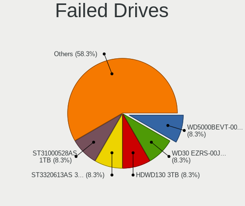

| Model                             | Desktops | Drives | Percent |
|-----------------------------------|----------|--------|---------|
| WDC WD5000BEVT-00ZAT0 500GB       | 1        | 2      | 10%     |
| WDC WD30 EZRS-00J99B0 3TB         | 1        | 1      | 10%     |
| Toshiba HDWD130 3TB               | 1        | 1      | 10%     |
| SPCC M.2 PCIe SSD 2TB             | 1        | 1      | 10%     |
| Seagate ST3320613AS 320GB         | 1        | 1      | 10%     |
| Seagate ST31000528AS 1TB          | 1        | 2      | 10%     |
| Samsung Electronics SSD 980 500GB | 1        | 2      | 10%     |
| Samsung Electronics SSD 980 1TB   | 1        | 2      | 10%     |
| Samsung Electronics HD321HJ 320GB | 1        | 2      | 10%     |
| Hitachi HDS721010DLE630 1TB       | 1        | 12     | 10%     |

Failed Drive Vendor
-------------------

Failed drive vendors

| Vendor              | Desktops | Drives | Percent |
|---------------------|----------|--------|---------|
| Samsung Electronics | 3        | 6      | 30%     |
| WDC                 | 2        | 3      | 20%     |
| Seagate             | 2        | 3      | 20%     |
| Toshiba             | 1        | 1      | 10%     |
| SPCC                | 1        | 1      | 10%     |
| Hitachi             | 1        | 12     | 10%     |

Drive Status
------------

Number of failed and malfunc. drives

| Status   | Desktops | Drives | Percent |
|----------|----------|--------|---------|
| Detected | 3327     | 10684  | 55.34%  |
| Works    | 2120     | 6837   | 35.26%  |
| Malfunc  | 556      | 961    | 9.25%   |
| Failed   | 9        | 26     | 0.15%   |

Storage controller
------------------

Storage Vendor
--------------

Storage controller vendors

| Vendor                         | Desktops | Percent |
|--------------------------------|----------|---------|
| Intel                          | 2883     | 33.93%  |
| AMD                            | 2295     | 27.01%  |
| Samsung Electronics            | 955      | 11.24%  |
| SanDisk                        | 391      | 4.6%    |
| ASMedia Technology             | 359      | 4.23%   |
| Phison Electronics             | 270      | 3.18%   |
| Kingston Technology Company    | 212      | 2.49%   |
| Micron/Crucial Technology      | 174      | 2.05%   |
| Marvell Technology Group       | 150      | 1.77%   |
| JMicron Technology             | 117      | 1.38%   |
| Silicon Motion                 | 94       | 1.11%   |
| ADATA Technology               | 94       | 1.11%   |
| Nvidia                         | 65       | 0.76%   |
| SK hynix                       | 55       | 0.65%   |
| Realtek Semiconductor          | 55       | 0.65%   |
| MAXIO Technology (Hangzhou)    | 55       | 0.65%   |
| Toshiba America Info Systems   | 34       | 0.4%    |
| Micron Technology              | 31       | 0.36%   |
| LSI Logic / Symbios Logic      | 27       | 0.32%   |
| Broadcom / LSI                 | 24       | 0.28%   |
| Seagate Technology             | 23       | 0.27%   |
| KIOXIA                         | 16       | 0.19%   |
| Shenzhen Longsys Electronics   | 15       | 0.18%   |
| VIA Technologies               | 13       | 0.15%   |
| Silicon Image                  | 13       | 0.15%   |
| Lite-On Technology             | 11       | 0.13%   |
| Adaptec                        | 10       | 0.12%   |
| Netac Technology               | 9        | 0.11%   |
| Solidigm                       | 6        | 0.07%   |
| INNOGRIT                       | 6        | 0.07%   |
| Solid State Storage Technology | 4        | 0.05%   |
| Integrated Technology Express  | 4        | 0.05%   |
| Union Memory (Shenzhen)        | 3        | 0.04%   |
| HighPoint Technologies         | 3        | 0.04%   |
| Hewlett-Packard                | 3        | 0.04%   |
| 3ware                          | 3        | 0.04%   |
| Yangtze Memory Technologies    | 2        | 0.02%   |
| ULi Electronics                | 2        | 0.02%   |
| Lite-On IT Corp. / Plextor     | 2        | 0.02%   |
| Biwin Storage Technology       | 2        | 0.02%   |

Storage Model
-------------

Storage controller models

| Model                                                                                   | Desktops | Percent |
|-----------------------------------------------------------------------------------------|----------|---------|
| AMD FCH SATA Controller [AHCI mode]                                                     | 1276     | 12.47%  |
| Samsung NVMe SSD Controller SM981/PM981/PM983                                           | 532      | 5.2%    |
| AMD 400 Series Chipset SATA Controller                                                  | 530      | 5.18%   |
| AMD 500 Series Chipset SATA Controller                                                  | 410      | 4.01%   |
| ASMedia ASM1061/ASM1062 Serial ATA Controller                                           | 335      | 3.27%   |
| Intel 8 Series/C220 Series Chipset Family 6-port SATA Controller 1 [AHCI mode]          | 328      | 3.2%    |
| Intel Q170/Q150/B150/H170/H110/Z170/CM236 Chipset SATA Controller [AHCI Mode]           | 289      | 2.82%   |
| Intel 200 Series PCH SATA controller [AHCI mode]                                        | 268      | 2.62%   |
| Intel SATA Controller [RAID mode]                                                       | 232      | 2.27%   |
| Samsung NVMe SSD Controller PM9A1/PM9A3/980PRO                                          | 212      | 2.07%   |
| Intel 7 Series/C210 Series Chipset Family 6-port SATA Controller [AHCI mode]            | 207      | 2.02%   |
| Intel 6 Series/C200 Series Chipset Family 6 port Desktop SATA AHCI Controller           | 201      | 1.96%   |
| Intel Cannon Lake PCH SATA AHCI Controller                                              | 190      | 1.86%   |
| AMD SB7x0/SB8x0/SB9x0 IDE Controller                                                    | 171      | 1.67%   |
| AMD SB7x0/SB8x0/SB9x0 SATA Controller [AHCI mode]                                       | 166      | 1.62%   |
| Intel Alder Lake-S PCH SATA Controller [AHCI Mode]                                      | 162      | 1.58%   |
| AMD 600 Series Chipset SATA Controller                                                  | 161      | 1.57%   |
| Phison E12 NVMe Controller                                                              | 138      | 1.35%   |
| AMD 300 Series Chipset SATA Controller                                                  | 130      | 1.27%   |
| Samsung NVMe SSD Controller SM961/PM961/SM963                                           | 118      | 1.15%   |
| Intel 9 Series Chipset Family SATA Controller [AHCI Mode]                               | 106      | 1.04%   |
| Samsung NVMe SSD Controller 980 (DRAM-less)                                             | 104      | 1.02%   |
| AMD SB7x0/SB8x0/SB9x0 SATA Controller [IDE mode]                                        | 103      | 1.01%   |
| AMD FCH SATA Controller D                                                               | 100      | 0.98%   |
| Micron/Crucial P2 [Nick P2] / P3 / P3 Plus NVMe PCIe SSD (DRAM-less)                    | 92       | 0.9%    |
| SanDisk Ultra 3D / WD Blue SN550 NVMe SSD                                               | 90       | 0.88%   |
| Intel Volume Management Device NVMe RAID Controller                                     | 87       | 0.85%   |
| Intel 500 Series Chipset Family SATA AHCI Controller                                    | 85       | 0.83%   |
| Phison E16 PCIe4 NVMe Controller                                                        | 78       | 0.76%   |
| Intel NM10/ICH7 Family SATA Controller [IDE mode]                                       | 78       | 0.76%   |
| Silicon Motion SM2263EN/SM2263XT (DRAM-less) NVMe SSD Controllers                       | 69       | 0.67%   |
| Intel 6 Series/C200 Series Chipset Family Desktop SATA Controller (IDE mode, ports 4-5) | 66       | 0.64%   |
| Intel 6 Series/C200 Series Chipset Family Desktop SATA Controller (IDE mode, ports 0-3) | 66       | 0.64%   |
| AMD X370 Series Chipset SATA Controller                                                 | 66       | 0.64%   |
| SanDisk Extreme Pro / WD Black SN750 / PC SN730 / Red SN700 NVMe SSD                    | 59       | 0.58%   |
| Intel SSD 660P Series                                                                   | 59       | 0.58%   |
| JMicron JMB363 SATA/IDE Controller                                                      | 57       | 0.56%   |
| Intel C610/X99 series chipset sSATA Controller [AHCI mode]                              | 57       | 0.56%   |
| ADATA XPG SX8200 Pro PCIe Gen3x4 M.2 2280 Solid State Drive                             | 57       | 0.56%   |
| Intel 82801G (ICH7 Family) IDE Controller                                               | 55       | 0.54%   |

Storage Kind
------------

Kind of storage controller (IDE, SATA, NVMe, SAS, ...)

| Kind | Desktops | Percent |
|------|----------|---------|
| SATA | 4619     | 57.14%  |
| NVMe | 2299     | 28.44%  |
| IDE  | 698      | 8.64%   |
| RAID | 400      | 4.95%   |
| SAS  | 48       | 0.59%   |
| SCSI | 19       | 0.24%   |

Processor
---------

CPU Vendor
----------

Processor vendors

| Vendor                   | Desktops | Percent |
|--------------------------|----------|---------|
| Intel                    | 2868     | 54.69%  |
| AMD                      | 2373     | 45.25%  |
| PowerNV C1P9S01 REV 1.01 | 1        | 0.02%   |
| Loongson                 | 1        | 0.02%   |
| Unknown                  | 1        | 0.02%   |

CPU Model
---------

Processor models

| Model                                       | Desktops | Percent |
|---------------------------------------------|----------|---------|
| AMD Ryzen 5 3600 6-Core Processor           | 176      | 3.33%   |
| AMD Ryzen 7 3700X 8-Core Processor          | 124      | 2.35%   |
| AMD Ryzen 5 5600X 6-Core Processor          | 107      | 2.03%   |
| AMD Ryzen 9 3900X 12-Core Processor         | 85       | 1.61%   |
| AMD Ryzen 5 2600 Six-Core Processor         | 79       | 1.5%    |
| AMD Ryzen 7 5800X 8-Core Processor          | 76       | 1.44%   |
| AMD Ryzen 9 5900X 12-Core Processor         | 75       | 1.42%   |
| AMD Ryzen 7 2700X Eight-Core Processor      | 75       | 1.42%   |
| AMD Ryzen 5 5600G with Radeon Graphics      | 75       | 1.42%   |
| Intel Core i7-4790 CPU @ 3.60GHz            | 65       | 1.23%   |
| Intel Core i7-3770 CPU @ 3.40GHz            | 65       | 1.23%   |
| AMD Ryzen 9 5950X 16-Core Processor         | 59       | 1.12%   |
| AMD Ryzen 7 5700G with Radeon Graphics      | 56       | 1.06%   |
| AMD Ryzen 5 1600 Six-Core Processor         | 56       | 1.06%   |
| Intel Core i7-6700K CPU @ 4.00GHz           | 49       | 0.93%   |
| Intel Core i5-6500 CPU @ 3.20GHz            | 49       | 0.93%   |
| Intel Core i5-3470 CPU @ 3.20GHz            | 47       | 0.89%   |
| Intel Core i7-7700K CPU @ 4.20GHz           | 45       | 0.85%   |
| Intel Core i7-6700 CPU @ 3.40GHz            | 45       | 0.85%   |
| Intel Core i5-2400 CPU @ 3.10GHz            | 45       | 0.85%   |
| Intel Core i7-8700 CPU @ 3.20GHz            | 44       | 0.83%   |
| AMD Ryzen 5 3400G with Radeon Vega Graphics | 44       | 0.83%   |
| AMD Ryzen 9 7950X 16-Core Processor         | 43       | 0.81%   |
| Intel Core i7-4790K CPU @ 4.00GHz           | 42       | 0.8%    |
| AMD Ryzen 7 1700 Eight-Core Processor       | 41       | 0.78%   |
| Intel Core 2 Duo CPU E8400 @ 3.00GHz        | 40       | 0.76%   |
| Intel Core i5-9400F CPU @ 2.90GHz           | 39       | 0.74%   |
| Intel Core i5-8400 CPU @ 2.80GHz            | 38       | 0.72%   |
| Intel Core i5-4460 CPU @ 3.20GHz            | 38       | 0.72%   |
| AMD Ryzen 5 3600X 6-Core Processor          | 38       | 0.72%   |
| Intel Core i5-4590 CPU @ 3.30GHz            | 37       | 0.7%    |
| AMD FX-6300 Six-Core Processor              | 36       | 0.68%   |
| AMD FX-8350 Eight-Core Processor            | 35       | 0.66%   |
| Intel Core i7-2600 CPU @ 3.40GHz            | 33       | 0.63%   |
| AMD Ryzen 7 5800X3D 8-Core Processor        | 33       | 0.63%   |
| AMD Ryzen 3 2200G with Radeon Vega Graphics | 33       | 0.63%   |
| Intel Core i7-8700K CPU @ 3.70GHz           | 30       | 0.57%   |
| Intel Core i7-4770 CPU @ 3.40GHz            | 30       | 0.57%   |
| Intel Core i9-9900K CPU @ 3.60GHz           | 29       | 0.55%   |
| Intel Core i5-7400 CPU @ 3.00GHz            | 29       | 0.55%   |

CPU Model Family
----------------

Processor model prefix

| Model                   | Desktops | Percent |
|-------------------------|----------|---------|
| Intel Core i5           | 861      | 16.35%  |
| AMD Ryzen 5             | 772      | 14.66%  |
| Intel Core i7           | 759      | 14.42%  |
| AMD Ryzen 7             | 580      | 11.02%  |
| AMD Ryzen 9             | 360      | 6.84%   |
| Other                   | 281      | 5.34%   |
| Intel Xeon              | 281      | 5.34%   |
| Intel Core i3           | 266      | 5.05%   |
| AMD FX                  | 165      | 3.13%   |
| Intel Core 2 Duo        | 88       | 1.67%   |
| AMD Ryzen 3             | 88       | 1.67%   |
| Intel Core 2 Quad       | 70       | 1.33%   |
| Intel Core i9           | 68       | 1.29%   |
| Intel Celeron           | 65       | 1.23%   |
| AMD Ryzen Threadripper  | 61       | 1.16%   |
| Intel Pentium           | 58       | 1.1%    |
| AMD Phenom II X4        | 49       | 0.93%   |
| AMD A10                 | 42       | 0.8%    |
| AMD A8                  | 31       | 0.59%   |
| Intel Pentium Dual-Core | 28       | 0.53%   |
| AMD Phenom II X6        | 23       | 0.44%   |
| AMD A6                  | 23       | 0.44%   |
| AMD Athlon              | 22       | 0.42%   |
| AMD Athlon II X2        | 20       | 0.38%   |
| AMD Athlon 64 X2        | 17       | 0.32%   |
| Intel Core 2            | 16       | 0.3%    |
| AMD Ryzen 5 PRO         | 16       | 0.3%    |
| AMD A4                  | 15       | 0.28%   |
| AMD Ryzen 7 PRO         | 14       | 0.27%   |
| Intel Atom              | 13       | 0.25%   |
| AMD Phenom              | 13       | 0.25%   |
| Intel Pentium Gold      | 10       | 0.19%   |
| AMD Phenom II X2        | 9        | 0.17%   |
| AMD Athlon X4           | 9        | 0.17%   |
| AMD Athlon II X4        | 9        | 0.17%   |
| Intel Pentium Dual      | 6        | 0.11%   |
| Intel Genuine           | 6        | 0.11%   |
| AMD Athlon Dual Core    | 5        | 0.09%   |
| AMD PRO A10             | 4        | 0.08%   |
| AMD Athlon II X3        | 4        | 0.08%   |

CPU Cores
---------

Number of processor cores

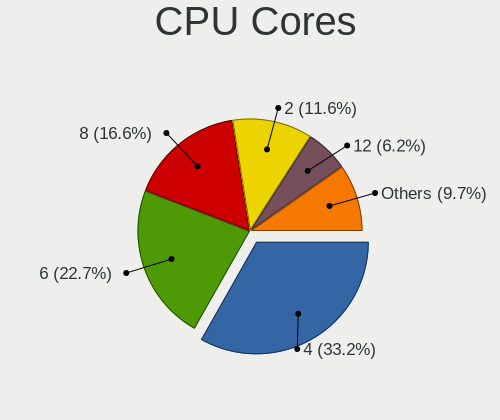

| Number  | Desktops | Percent |
|---------|----------|---------|
| 4       | 1849     | 35.13%  |
| 6       | 1147     | 21.79%  |
| 8       | 813      | 15.44%  |
| 2       | 687      | 13.05%  |
| 12      | 309      | 5.87%   |
| 16      | 211      | 4.01%   |
| 10      | 66       | 1.25%   |
| 3       | 59       | 1.12%   |
| 1       | 39       | 0.74%   |
| 24      | 33       | 0.63%   |
| 14      | 22       | 0.42%   |
| 32      | 16       | 0.3%    |
| 28      | 4        | 0.08%   |
| 20      | 3        | 0.06%   |
| 18      | 3        | 0.06%   |
| 36      | 1        | 0.02%   |
| 5       | 1        | 0.02%   |
| Unknown | 1        | 0.02%   |

CPU Sockets
-----------

Number of sockets

| Number  | Desktops | Percent |
|---------|----------|---------|
| 1       | 5178     | 98.76%  |
| 2       | 64       | 1.22%   |
| Unknown | 1        | 0.02%   |

CPU Threads
-----------

Threads per core (Hyper-Threading)

| Number  | Desktops | Percent |
|---------|----------|---------|
| 2       | 3683     | 70.09%  |
| 1       | 1570     | 29.88%  |
| 4       | 1        | 0.02%   |
| Unknown | 1        | 0.02%   |

CPU Op-Modes
------------

CPU Operation Modes (32-bit, 64-bit)

| Op mode        | Desktops | Percent |
|----------------|----------|---------|
| 32-bit, 64-bit | 5152     | 97.93%  |
| Unknown        | 109      | 2.07%   |

CPU Microcode
-------------

Microcode number

| Number     | Desktops | Percent |
|------------|----------|---------|
| Unknown    | 1574     | 28.63%  |
| 0x306c3    | 321      | 5.84%   |
| 0x08701021 | 321      | 5.84%   |
| 0x306a9    | 186      | 3.38%   |
| 0x0800820d | 182      | 3.31%   |
| 0x506e3    | 176      | 3.2%    |
| 0x206a7    | 137      | 2.49%   |
| 0x906ea    | 135      | 2.46%   |
| 0x08701013 | 130      | 2.36%   |
| 0x906e9    | 120      | 2.18%   |
| 0x0a201016 | 103      | 1.87%   |
| 0x1067a    | 88       | 1.6%    |
| 0x06000852 | 85       | 1.55%   |
| 0x0a20120a | 82       | 1.49%   |
| 0x0a601203 | 79       | 1.44%   |
| 0x0a201009 | 72       | 1.31%   |
| 0x08108109 | 71       | 1.29%   |
| 0x08001138 | 70       | 1.27%   |
| 0x0a50000d | 66       | 1.2%    |
| 0x0a50000c | 59       | 1.07%   |
| 0x906ed    | 57       | 1.04%   |
| 0x08001137 | 57       | 1.04%   |
| 0x010000c8 | 56       | 1.02%   |
| 0x90672    | 48       | 0.87%   |
| 0x08101016 | 46       | 0.84%   |
| 0x306f2    | 45       | 0.82%   |
| 0xa0655    | 44       | 0.8%    |
| 0xa0653    | 41       | 0.75%   |
| 0x08701030 | 39       | 0.71%   |
| 0x06001119 | 39       | 0.71%   |
| 0x206d7    | 33       | 0.6%    |
| 0x20655    | 28       | 0.51%   |
| 0xa0671    | 27       | 0.49%   |
| 0x106a5    | 27       | 0.49%   |
| 0x10676    | 27       | 0.49%   |
| 0x6fb      | 26       | 0.47%   |
| 0x106e5    | 26       | 0.47%   |
| 0x0a601206 | 26       | 0.47%   |
| 0x06003106 | 26       | 0.47%   |
| 0x06000822 | 26       | 0.47%   |

CPU Microarch
-------------

Microarchitecture

| Name             | Desktops | Percent |
|------------------|----------|---------|
| Zen 2            | 591      | 11.2%   |
| Zen 3            | 565      | 10.71%  |
| KabyLake         | 563      | 10.67%  |
| Haswell          | 535      | 10.14%  |
| Zen+             | 331      | 6.27%   |
| IvyBridge        | 321      | 6.08%   |
| Skylake          | 289      | 5.48%   |
| SandyBridge      | 256      | 4.85%   |
| Zen              | 250      | 4.74%   |
| Unknown          | 249      | 4.72%   |
| Piledriver       | 183      | 3.47%   |
| Penryn           | 169      | 3.2%    |
| Alderlake Hybrid | 168      | 3.18%   |
| CometLake        | 144      | 2.73%   |
| K10              | 132      | 2.5%    |
| Westmere         | 80       | 1.52%   |
| Nehalem          | 73       | 1.38%   |
| Core             | 69       | 1.31%   |
| Icelake          | 54       | 1.02%   |
| Steamroller      | 44       | 0.83%   |
| Broadwell        | 32       | 0.61%   |
| Excavator        | 31       | 0.59%   |
| K8 Hammer        | 27       | 0.51%   |
| Bulldozer        | 27       | 0.51%   |
| Silvermont       | 19       | 0.36%   |
| Bonnell          | 10       | 0.19%   |
| Jaguar           | 9        | 0.17%   |
| Goldmont plus    | 9        | 0.17%   |
| Tremont          | 8        | 0.15%   |
| K10 Llano        | 8        | 0.15%   |
| NetBurst         | 7        | 0.13%   |
| Gracemont        | 6        | 0.11%   |
| Bobcat           | 6        | 0.11%   |
| Goldmont         | 5        | 0.09%   |
| Puma             | 4        | 0.08%   |
| TigerLake        | 3        | 0.06%   |

Graphics
--------

GPU Vendor
----------

Vendors of graphics cards

| Vendor                           | Desktops | Percent |
|----------------------------------|----------|---------|
| Nvidia                           | 2298     | 39.93%  |
| AMD                              | 2166     | 37.64%  |
| Intel                            | 1265     | 21.98%  |
| ASPEED Technology                | 12       | 0.21%   |
| Matrox Electronics Systems       | 10       | 0.17%   |
| VIA Technologies                 | 1        | 0.02%   |
| Silicon Integrated Systems [SiS] | 1        | 0.02%   |
| S3 Graphics                      | 1        | 0.02%   |
| Loongson Technology              | 1        | 0.02%   |

GPU Model
---------

Graphics card models

| Model                                                                       | Desktops | Percent |
|-----------------------------------------------------------------------------|----------|---------|
| AMD Ellesmere [Radeon RX 470/480/570/570X/580/580X/590]                     | 369      | 6.16%   |
| Intel Xeon E3-1200 v3/4th Gen Core Processor Integrated Graphics Controller | 204      | 3.41%   |
| AMD Navi 10 [Radeon RX 5600 OEM/5600 XT / 5700/5700 XT]                     | 152      | 2.54%   |
| Nvidia GP107 [GeForce GTX 1050 Ti]                                          | 143      | 2.39%   |
| Intel HD Graphics 530                                                       | 135      | 2.25%   |
| Intel CoffeeLake-S GT2 [UHD Graphics 630]                                   | 133      | 2.22%   |
| AMD Raphael                                                                 | 124      | 2.07%   |
| AMD Cezanne [Radeon Vega Series / Radeon Vega Mobile Series]                | 116      | 1.94%   |
| Nvidia GP106 [GeForce GTX 1060 6GB]                                         | 115      | 1.92%   |
| AMD Navi 23 [Radeon RX 6600/6600 XT/6600M]                                  | 115      | 1.92%   |
| Intel 2nd Generation Core Processor Family Integrated Graphics Controller   | 101      | 1.69%   |
| AMD Navi 22 [Radeon RX 6700/6700 XT/6750 XT / 6800M/6850M XT]               | 99       | 1.65%   |
| Intel Xeon E3-1200 v2/3rd Gen Core processor Graphics Controller            | 98       | 1.64%   |
| Intel HD Graphics 630                                                       | 91       | 1.52%   |
| AMD Navi 21 [Radeon RX 6800/6800 XT / 6900 XT]                              | 83       | 1.39%   |
| Nvidia GK208B [GeForce GT 710]                                              | 80       | 1.34%   |
| Nvidia GP104 [GeForce GTX 1070]                                             | 77       | 1.29%   |
| Nvidia GP108 [GeForce GT 1030]                                              | 76       | 1.27%   |
| AMD Picasso/Raven 2 [Radeon Vega Series / Radeon Vega Mobile Series]        | 75       | 1.25%   |
| Nvidia GT218 [GeForce 210]                                                  | 62       | 1.04%   |
| Intel CometLake-S GT2 [UHD Graphics 630]                                    | 61       | 1.02%   |
| AMD Raven Ridge [Radeon Vega Series / Radeon Vega Mobile Series]            | 59       | 0.99%   |
| AMD Lexa PRO [Radeon 540/540X/550/550X / RX 540X/550/550X]                  | 57       | 0.95%   |
| AMD Baffin [Radeon RX 550 640SP / RX 560/560X]                              | 57       | 0.95%   |
| Nvidia GP104 [GeForce GTX 1080]                                             | 56       | 0.94%   |
| Nvidia GM204 [GeForce GTX 970]                                              | 56       | 0.94%   |
| Nvidia GM206 [GeForce GTX 960]                                              | 55       | 0.92%   |
| Nvidia TU116 [GeForce GTX 1660 SUPER]                                       | 54       | 0.9%    |
| Nvidia GA106 [GeForce RTX 3060 Lite Hash Rate]                              | 52       | 0.87%   |
| AMD Navi 31 [Radeon RX 7900 XT/7900 XTX/7900M]                              | 52       | 0.87%   |
| AMD Baffin [Radeon RX 460/560D / Pro 450/455/460/555/555X/560/560X]         | 52       | 0.87%   |
| Intel 4 Series Chipset Integrated Graphics Controller                       | 51       | 0.85%   |
| Nvidia TU117 [GeForce GTX 1650]                                             | 50       | 0.84%   |
| Nvidia GP106 [GeForce GTX 1060 3GB]                                         | 50       | 0.84%   |
| AMD Cedar [Radeon HD 5000/6000/7350/8350 Series]                            | 50       | 0.84%   |
| Nvidia GP102 [GeForce GTX 1080 Ti]                                          | 45       | 0.75%   |
| Nvidia GM107 [GeForce GTX 750 Ti]                                           | 43       | 0.72%   |
| Intel IvyBridge GT2 [HD Graphics 4000]                                      | 43       | 0.72%   |
| Nvidia GA104 [GeForce RTX 3060 Ti Lite Hash Rate]                           | 42       | 0.7%    |
| Intel AlderLake-S GT1                                                       | 40       | 0.67%   |

GPU Combo
---------

Combinations of graphics cards

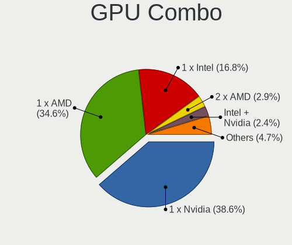

| Name                     | Desktops | Percent |
|--------------------------|----------|---------|
| 1 x Nvidia               | 2039     | 38.23%  |
| 1 x AMD                  | 1896     | 35.55%  |
| 1 x Intel                | 927      | 17.38%  |
| Intel + Nvidia           | 132      | 2.47%   |
| 2 x AMD                  | 127      | 2.38%   |
| AMD + Nvidia             | 92       | 1.72%   |
| Intel + AMD              | 48       | 0.9%    |
| 2 x Nvidia               | 27       | 0.51%   |
| 2 x Intel                | 9        | 0.17%   |
| 1 x ASPEED               | 7        | 0.13%   |
| 1 x Matrox               | 6        | 0.11%   |
| Other                    | 3        | 0.06%   |
| Nvidia + Matrox          | 3        | 0.06%   |
| Nvidia + ASPEED          | 3        | 0.06%   |
| Intel + 2 x AMD          | 2        | 0.04%   |
| Intel + AMD + 1 x Nvidia | 2        | 0.04%   |
| AMD + 2 x Nvidia         | 2        | 0.04%   |
| 3 x AMD                  | 1        | 0.02%   |
| 2 x Nvidia + 1 x ASPEED  | 1        | 0.02%   |
| 1 x VIA                  | 1        | 0.02%   |
| 1 x SiS                  | 1        | 0.02%   |
| 1 x S3 Graphics          | 1        | 0.02%   |
| 1 x Loongson Technology  | 1        | 0.02%   |
| Intel + 2 x Nvidia       | 1        | 0.02%   |
| AMD + Matrox             | 1        | 0.02%   |
| AMD + ASPEED             | 1        | 0.02%   |

GPU Driver
----------

Free vs proprietary

| Driver      | Desktops | Percent |
|-------------|----------|---------|
| Free        | 3957     | 73.95%  |
| Proprietary | 1205     | 22.52%  |
| Unknown     | 189      | 3.53%   |

GPU Memory
----------

Total video memory

| Size in GB | Desktops | Percent |
|------------|----------|---------|
| Unknown    | 2045     | 37.27%  |
| 7.01-8.0   | 798      | 14.54%  |
| 1.01-2.0   | 621      | 11.32%  |
| 3.01-4.0   | 549      | 10.01%  |
| 0.51-1.0   | 449      | 8.18%   |
| 0.01-0.5   | 349      | 6.36%   |
| 8.01-16.0  | 335      | 6.11%   |
| 5.01-6.0   | 221      | 4.03%   |
| 2.01-3.0   | 65       | 1.18%   |
| 16.01-24.0 | 53       | 0.97%   |
| 4.01-5.0   | 2        | 0.04%   |

Monitor
-------

Monitor Vendor
--------------

Monitor vendors

| Vendor               | Desktops | Percent |
|----------------------|----------|---------|
| Samsung Electronics  | 938      | 15.29%  |
| Dell                 | 811      | 13.22%  |
| Goldstar             | 806      | 13.14%  |
| Acer                 | 421      | 6.86%   |
| Hewlett-Packard      | 365      | 5.95%   |
| AOC                  | 345      | 5.62%   |
| BenQ                 | 302      | 4.92%   |
| Ancor Communications | 280      | 4.56%   |
| Philips              | 257      | 4.19%   |
| ViewSonic            | 145      | 2.36%   |
| ASUSTek Computer     | 144      | 2.35%   |
| Lenovo               | 142      | 2.31%   |
| Iiyama               | 120      | 1.96%   |
| MSI                  | 78       | 1.27%   |
| Sony                 | 58       | 0.95%   |
| Sceptre Tech         | 57       | 0.93%   |
| Gigabyte Technology  | 54       | 0.88%   |
| Unknown              | 50       | 0.81%   |
| Eizo                 | 46       | 0.75%   |
| HannStar             | 33       | 0.54%   |
| NEC Computers        | 32       | 0.52%   |
| Vizio                | 31       | 0.51%   |
| Insignia             | 25       | 0.41%   |
| Mi                   | 24       | 0.39%   |
| Panasonic            | 22       | 0.36%   |
| LG Electronics       | 18       | 0.29%   |
| Fujitsu Siemens      | 18       | 0.29%   |
| Unknown (XXX)        | 13       | 0.21%   |
| Pixio                | 13       | 0.21%   |
| ___                  | 12       | 0.2%    |
| HUAWEI               | 12       | 0.2%    |
| Gateway              | 12       | 0.2%    |
| Vestel Elektronik    | 11       | 0.18%   |
| Toshiba              | 11       | 0.18%   |
| Apple                | 11       | 0.18%   |
| RTK                  | 10       | 0.16%   |
| HKC                  | 10       | 0.16%   |
| Hitachi              | 10       | 0.16%   |
| Medion               | 9        | 0.15%   |
| ONN                  | 8        | 0.13%   |

Monitor Model
-------------

Monitor models

| Model                                                                 | Desktops | Percent |
|-----------------------------------------------------------------------|----------|---------|
| Goldstar FULL HD GSM5B55 1920x1080 480x270mm 21.7-inch                | 44       | 0.66%   |
| Goldstar ULTRAWIDE GSM59F1 2560x1080 673x284mm 28.8-inch              | 41       | 0.62%   |
| AOC 27G2G3 AOC2702 1920x1080 598x336mm 27.0-inch                      | 41       | 0.62%   |
| Goldstar Ultra HD GSM5B09 3840x2160 600x340mm 27.2-inch               | 34       | 0.51%   |
| Samsung Electronics C24F390 SAM0D2C 1920x1080 521x293mm 23.5-inch     | 33       | 0.5%    |
| Unknown LCD Monitor FFFF 2288x1287 2550x2550mm 142.0-inch             | 28       | 0.42%   |
| Samsung Electronics S24F350 SAM0D20 1920x1080 521x293mm 23.5-inch     | 24       | 0.36%   |
| Dell U2412M DELA07A 1920x1200 518x324mm 24.1-inch                     | 24       | 0.36%   |
| AOC 24B1W1G5 AOC2401 1920x1080 527x296mm 23.8-inch                    | 24       | 0.36%   |
| AOC 24B2W1 AOC2402 1920x1080 527x296mm 23.8-inch                      | 23       | 0.35%   |
| Goldstar IPS FULLHD GSM5AB8 1920x1080 480x270mm 21.7-inch             | 22       | 0.33%   |
| Samsung Electronics U28E590 SAM0C4D 3840x2160 607x345mm 27.5-inch     | 19       | 0.29%   |
| Goldstar HDR 4K GSM7707 3840x2160 600x340mm 27.2-inch                 | 18       | 0.27%   |
| Samsung Electronics C27F390 SAM0D32 1920x1080 598x336mm 27.0-inch     | 17       | 0.26%   |
| Goldstar HDR 4K GSM7706 3840x2160 600x340mm 27.2-inch                 | 17       | 0.26%   |
| Ancor Communications VS248 ACI2498 1920x1080 531x299mm 24.0-inch      | 17       | 0.26%   |
| Ancor Communications ASUS VS247 ACI249A 1920x1080 521x293mm 23.5-inch | 17       | 0.26%   |
| Philips PHL 276E8V PHLC18F 3840x2160 597x336mm 27.0-inch              | 16       | 0.24%   |
| BenQ GW2480 BNQ78E7 1920x1080 527x296mm 23.8-inch                     | 16       | 0.24%   |
| Goldstar ULTRAGEAR GSM5BD3 2560x1440 697x392mm 31.5-inch              | 15       | 0.23%   |
| Dell S2721DGF DEL41D9 2560x1440 597x336mm 27.0-inch                   | 15       | 0.23%   |
| Dell P2419H DELD0DA 1920x1080 527x296mm 23.8-inch                     | 15       | 0.23%   |
| AOC 2470W AOC2470 1920x1080 521x293mm 23.5-inch                       | 14       | 0.21%   |
| Samsung Electronics C49RG9x SAM0F9C 3840x1080 1193x336mm 48.8-inch    | 13       | 0.2%    |
| Philips PHL 243V5 PHLC0D1 1920x1080 521x293mm 23.5-inch               | 13       | 0.2%    |
| Goldstar ULTRAGEAR GSM5B7F 2560x1440 597x336mm 27.0-inch              | 13       | 0.2%    |
| Goldstar TV SSCR2 GSMC0C8 3840x2160                                   | 13       | 0.2%    |
| Goldstar HDR WFHD GSM7714 2560x1080 798x334mm 34.1-inch               | 13       | 0.2%    |
| BenQ GL2460 BNQ78CE 1920x1080 531x299mm 24.0-inch                     | 13       | 0.2%    |
| Samsung Electronics S24D300 SAM0B43 1920x1080 531x299mm 24.0-inch     | 12       | 0.18%   |
| Mi Monitor XMI3444 3440x1440 797x334mm 34.0-inch                      | 12       | 0.18%   |
| Hewlett-Packard 24fw HPN3545 1920x1080 527x296mm 23.8-inch            | 12       | 0.18%   |
| Goldstar HDR 4K GSM7750 3840x2160 697x392mm 31.5-inch                 | 12       | 0.18%   |
| Gigabyte Technology M27Q GBT270D 2560x1440 596x335mm 26.9-inch        | 12       | 0.18%   |
| Acer SB220Q ACR06AB 1920x1080 476x268mm 21.5-inch                     | 12       | 0.18%   |
| Vestel Elektronik 22W_LCD_TV VES3700 1920x540                         | 11       | 0.17%   |
| Samsung Electronics SyncMaster SAM01D3 1440x900 408x225mm 18.3-inch   | 11       | 0.17%   |
| MSI Optix MAG24C MSI1462 1920x1080 521x293mm 23.5-inch                | 11       | 0.17%   |
| Goldstar ULTRAWIDE GSM76E4 3440x1440 800x335mm 34.1-inch              | 11       | 0.17%   |
| Goldstar 23MP55 GSM5A23 1920x1080 510x290mm 23.1-inch                 | 11       | 0.17%   |

Monitor Resolution
------------------

Monitor screen resolution

| Resolution         | Desktops | Percent |
|--------------------|----------|---------|
| 1920x1080 (FHD)    | 2614     | 44.33%  |
| 3840x2160 (4K)     | 767      | 13.01%  |
| 2560x1440 (QHD)    | 761      | 12.9%   |
| 1280x1024 (SXGA)   | 221      | 3.75%   |
| 1680x1050 (WSXGA+) | 217      | 3.68%   |
| 3440x1440          | 203      | 3.44%   |
| 1920x1200 (WUXGA)  | 180      | 3.05%   |
| 1366x768 (WXGA)    | 160      | 2.71%   |
| 1600x900 (HD+)     | 134      | 2.27%   |
| 2560x1080          | 131      | 2.22%   |
| 1440x900 (WXGA+)   | 131      | 2.22%   |
| 1360x768           | 65       | 1.1%    |
| 3840x1080          | 53       | 0.9%    |
| Unknown            | 47       | 0.8%    |
| 2288x1287          | 30       | 0.51%   |
| 1920x540           | 29       | 0.49%   |
| 1600x1200          | 28       | 0.47%   |
| 2560x1600          | 19       | 0.32%   |
| 1024x768 (XGA)     | 19       | 0.32%   |
| 1280x720 (HD)      | 10       | 0.17%   |
| 3840x1600          | 9        | 0.15%   |
| 2048x1152          | 9        | 0.15%   |
| 1280x960           | 7        | 0.12%   |
| 2160x1200          | 4        | 0.07%   |
| 1280x768           | 4        | 0.07%   |
| 5760x1080          | 3        | 0.05%   |
| 3840x1200          | 3        | 0.05%   |
| 5760x2160          | 2        | 0.03%   |
| 3840x2560          | 2        | 0.03%   |
| 2560x2880          | 2        | 0.03%   |
| 1920x1440          | 2        | 0.03%   |
| 7680x2160          | 1        | 0.02%   |
| 7680x1440          | 1        | 0.02%   |
| 7120x1080          | 1        | 0.02%   |
| 6784x2160          | 1        | 0.02%   |
| 640x480            | 1        | 0.02%   |
| 6400x2160          | 1        | 0.02%   |
| 6400x1080          | 1        | 0.02%   |
| 5760x1200          | 1        | 0.02%   |
| 5520x1080          | 1        | 0.02%   |

Monitor Diagonal
----------------

Diagonal size in inches

| Inches  | Desktops | Percent |
|---------|----------|---------|
| 27      | 1193     | 19.31%  |
| 24      | 1048     | 16.97%  |
| 23      | 721      | 11.67%  |
| 21      | 667      | 10.8%   |
| 31      | 389      | 6.3%    |
| 34      | 298      | 4.82%   |
| 19      | 254      | 4.11%   |
| 18      | 185      | 2.99%   |
| 22      | 178      | 2.88%   |
| Unknown | 170      | 2.75%   |
| 20      | 164      | 2.66%   |
| 32      | 82       | 1.33%   |
| 17      | 81       | 1.31%   |
| 84      | 78       | 1.26%   |
| 72      | 73       | 1.18%   |
| 25      | 54       | 0.87%   |
| 54      | 52       | 0.84%   |
| 40      | 52       | 0.84%   |
| 15      | 51       | 0.83%   |
| 48      | 43       | 0.7%    |
| 26      | 32       | 0.52%   |
| 28      | 29       | 0.47%   |
| 142     | 28       | 0.45%   |
| 42      | 28       | 0.45%   |
| 29      | 19       | 0.31%   |
| 49      | 16       | 0.26%   |
| 16      | 15       | 0.24%   |
| 37      | 14       | 0.23%   |
| 36      | 14       | 0.23%   |
| 52      | 13       | 0.21%   |
| 35      | 13       | 0.21%   |
| 46      | 12       | 0.19%   |
| 65      | 11       | 0.18%   |
| 39      | 10       | 0.16%   |
| 13      | 10       | 0.16%   |
| 33      | 9        | 0.15%   |
| 43      | 8        | 0.13%   |
| 69      | 7        | 0.11%   |
| 30      | 6        | 0.1%    |
| 47      | 5        | 0.08%   |

Monitor Width
-------------

Physical width

| Width in mm    | Desktops | Percent |
|----------------|----------|---------|
| 501-600        | 2646     | 45.09%  |
| 401-500        | 1251     | 21.32%  |
| 601-700        | 573      | 9.76%   |
| 701-800        | 403      | 6.87%   |
| 351-400        | 183      | 3.12%   |
| Unknown        | 170      | 2.9%    |
| 1001-1500      | 169      | 2.88%   |
| 1501-2000      | 162      | 2.76%   |
| 301-350        | 132      | 2.25%   |
| 801-900        | 90       | 1.53%   |
| 901-1000       | 45       | 0.77%   |
| More than 2000 | 30       | 0.51%   |
| 201-300        | 14       | 0.24%   |

Aspect Ratio
------------

Proportional relationship between the width and the height

| Ratio   | Desktops | Percent |
|---------|----------|---------|
| 16/9    | 3942     | 72.7%   |
| 16/10   | 627      | 11.56%  |
| 21/9    | 331      | 6.1%    |
| 5/4     | 214      | 3.95%   |
| Unknown | 107      | 1.97%   |
| 4/3     | 70       | 1.29%   |
| 32/9    | 49       | 0.9%    |
| 1.00    | 29       | 0.53%   |
| 6/5     | 20       | 0.37%   |
| 3/2     | 15       | 0.28%   |
| 1.96    | 7        | 0.13%   |
| 0.56    | 3        | 0.06%   |
| 3.20    | 2        | 0.04%   |
| 2.12    | 2        | 0.04%   |
| 0.89    | 2        | 0.04%   |
| 2.01    | 1        | 0.02%   |
| 0.80    | 1        | 0.02%   |

Monitor Area
------------

Area in inch

| Area in inch | Desktops | Percent |
|----------------|----------|---------|
| 201-250        | 1969     | 32.88%  |
| 301-350        | 1214     | 20.27%  |
| 351-500        | 807      | 13.48%  |
| 151-200        | 622      | 10.39%  |
| 251-300        | 409      | 6.83%   |
| More than 1000 | 292      | 4.88%   |
| 141-150        | 207      | 3.46%   |
| 501-1000       | 203      | 3.39%   |
| Unknown        | 170      | 2.84%   |
| 101-110        | 49       | 0.82%   |
| 131-140        | 12       | 0.2%    |
| 121-130        | 8        | 0.13%   |
| 71-80          | 7        | 0.12%   |
| 91-100         | 7        | 0.12%   |
| 81-90          | 6        | 0.1%    |
| 111-120        | 6        | 0.1%    |

Pixel Density
-------------

Pixels per inch

| Density       | Desktops | Percent |
|---------------|----------|---------|
| 51-100        | 3334     | 59.23%  |
| 101-120       | 1370     | 24.34%  |
| 121-160       | 361      | 6.41%   |
| 1-50          | 239      | 4.25%   |
| Unknown       | 170      | 3.02%   |
| 161-240       | 153      | 2.72%   |
| More than 240 | 2        | 0.04%   |

Multiple Monitors
-----------------

Total monitors connected

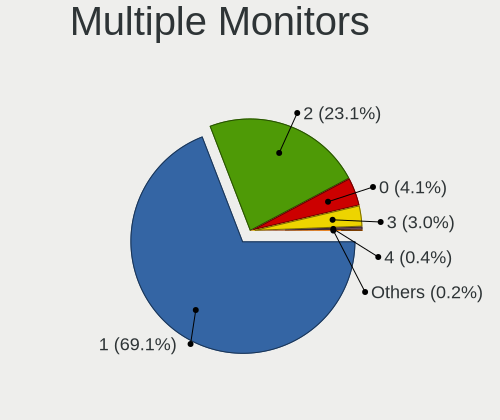

| Total | Desktops | Percent |
|-------|----------|---------|
| 1     | 3765     | 69.4%   |
| 2     | 1254     | 23.12%  |
| 0     | 211      | 3.89%   |
| 3     | 163      | 3%      |
| 4     | 25       | 0.46%   |
| 5     | 5        | 0.09%   |
| 6     | 2        | 0.04%   |

Network
-------

Net Controller Vendor
---------------------

Controller vendors

| Vendor                          | Desktops | Percent |
|---------------------------------|----------|---------|
| Realtek Semiconductor           | 3184     | 41.17%  |
| Intel                           | 2599     | 33.61%  |
| Qualcomm Atheros                | 380      | 4.91%   |
| Broadcom                        | 228      | 2.95%   |
| MediaTek                        | 194      | 2.51%   |
| TP-Link                         | 162      | 2.09%   |
| Ralink Technology               | 127      | 1.64%   |
| Microsoft                       | 87       | 1.13%   |
| Ralink                          | 76       | 0.98%   |
| Aquantia                        | 74       | 0.96%   |
| Nvidia                          | 50       | 0.65%   |
| Qualcomm Atheros Communications | 45       | 0.58%   |
| ASUSTek Computer                | 39       | 0.5%    |
| NetGear                         | 35       | 0.45%   |
| Samsung Electronics             | 29       | 0.38%   |
| D-Link                          | 29       | 0.38%   |
| Xiaomi                          | 28       | 0.36%   |
| Marvell Technology Group        | 27       | 0.35%   |
| ASIX Electronics                | 21       | 0.27%   |
| Google                          | 19       | 0.25%   |
| Edimax Technology               | 16       | 0.21%   |
| Motorola PCS                    | 15       | 0.19%   |
| Mellanox Technologies           | 15       | 0.19%   |
| DisplayLink                     | 15       | 0.19%   |
| Broadcom Limited                | 14       | 0.18%   |
| Huawei Technologies             | 13       | 0.17%   |
| D-Link System                   | 13       | 0.17%   |
| Linksys                         | 11       | 0.14%   |
| Arduino SA                      | 9        | 0.12%   |
| Qualcomm                        | 8        | 0.1%    |
| AVM                             | 8        | 0.1%    |
| Apple                           | 8        | 0.1%    |
| ICS Advent                      | 7        | 0.09%   |
| Belkin Components               | 7        | 0.09%   |
| Wilocity                        | 6        | 0.08%   |
| OPPO Electronics                | 6        | 0.08%   |
| Microchip Technology            | 6        | 0.08%   |
| 3Com                            | 6        | 0.08%   |
| ZTE WCDMA Technologies MSM      | 5        | 0.06%   |
| InterBiometrics                 | 5        | 0.06%   |

Net Controller Model
--------------------

Controller models

| Model                                                                          | Desktops | Percent |
|--------------------------------------------------------------------------------|----------|---------|
| Realtek RTL8111/8168/8211/8411 PCI Express Gigabit Ethernet Controller         | 2400     | 26.74%  |
| Intel I211 Gigabit Network Connection                                          | 483      | 5.38%   |
| Realtek RTL8125 2.5GbE Controller                                              | 473      | 5.27%   |
| Intel Wi-Fi 6 AX200                                                            | 471      | 5.25%   |
| Intel Ethernet Controller I225-V                                               | 273      | 3.04%   |
| Intel Ethernet Connection (2) I219-V                                           | 254      | 2.83%   |
| Intel 82579LM Gigabit Network Connection (Lewisville)                          | 156      | 1.74%   |
| Intel Dual Band Wireless-AC 3168NGW [Stone Peak]                               | 149      | 1.66%   |
| Intel Wi-Fi 6E(802.11ax) AX210/AX1675* 2x2 [Typhoon Peak]                      | 135      | 1.5%    |
| Intel Ethernet Connection (7) I219-V                                           | 117      | 1.3%    |
| Intel Ethernet Connection I217-LM                                              | 112      | 1.25%   |
| MediaTek MT7922 802.11ax PCI Express Wireless Network Adapter                  | 89       | 0.99%   |
| Intel Wi-Fi 5(802.11ac) Wireless-AC 9x6x [Thunder Peak]                        | 87       | 0.97%   |
| Intel Ethernet Connection (2) I218-V                                           | 80       | 0.89%   |
| Intel Alder Lake-S PCH CNVi WiFi                                               | 74       | 0.82%   |
| Intel Ethernet Connection (2) I219-LM                                          | 73       | 0.81%   |
| Realtek RTL8153 Gigabit Ethernet Adapter                                       | 69       | 0.77%   |
| Intel 82579V Gigabit Network Connection                                        | 68       | 0.76%   |
| Intel 82574L Gigabit Network Connection                                        | 67       | 0.75%   |
| Broadcom BCM4360 802.11ac Dual Band Wireless Network Adapter                   | 65       | 0.72%   |
| MediaTek MT7921K (RZ608) Wi-Fi 6E 80MHz                                        | 64       | 0.71%   |
| Realtek RTL810xE PCI Express Fast Ethernet controller                          | 57       | 0.64%   |
| Ralink MT7601U Wireless Adapter                                                | 54       | 0.6%    |
| Qualcomm Atheros Killer E220x Gigabit Ethernet Controller                      | 53       | 0.59%   |
| Intel Ethernet Connection I217-V                                               | 51       | 0.57%   |
| Realtek RTL8188EUS 802.11n Wireless Network Adapter                            | 50       | 0.56%   |
| Realtek RTL8821CE 802.11ac PCIe Wireless Network Adapter                       | 45       | 0.5%    |
| Qualcomm Atheros AR9485 Wireless Network Adapter                               | 44       | 0.49%   |
| Intel Wireless 7260                                                            | 43       | 0.48%   |
| Microsoft XBOX ACC                                                             | 41       | 0.46%   |
| Realtek 802.11ac NIC                                                           | 40       | 0.45%   |
| Intel Wireless 7265                                                            | 40       | 0.45%   |
| Intel I210 Gigabit Network Connection                                          | 39       | 0.43%   |
| Realtek RTL88x2bu [AC1200 Techkey]                                             | 38       | 0.42%   |
| Intel Wireless 8260                                                            | 38       | 0.42%   |
| Aquantia AQtion AQC107 NBase-T/IEEE 802.3an Ethernet Controller [Atlantic 10G] | 38       | 0.42%   |
| Intel Cannon Lake PCH CNVi WiFi                                                | 36       | 0.4%    |
| Qualcomm Atheros AR9271 802.11n                                                | 33       | 0.37%   |
| Qualcomm Atheros AR8151 v2.0 Gigabit Ethernet                                  | 33       | 0.37%   |
| Realtek RTL8822BE 802.11a/b/g/n/ac WiFi adapter                                | 31       | 0.35%   |

Wireless Vendor
---------------

Wireless vendors

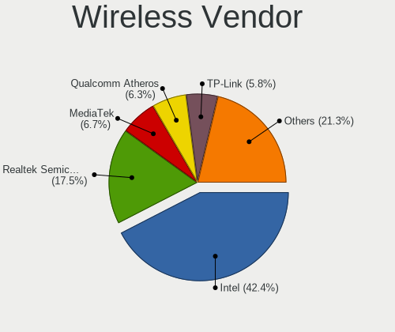

| Vendor                                | Desktops | Percent |
|---------------------------------------|----------|---------|
| Intel                                 | 1232     | 42.42%  |
| Realtek Semiconductor                 | 477      | 16.43%  |
| Qualcomm Atheros                      | 205      | 7.06%   |
| MediaTek                              | 187      | 6.44%   |
| TP-Link                               | 160      | 5.51%   |
| Ralink Technology                     | 127      | 4.37%   |
| Broadcom                              | 125      | 4.3%    |
| Microsoft                             | 85       | 2.93%   |
| Ralink                                | 76       | 2.62%   |
| Qualcomm Atheros Communications       | 45       | 1.55%   |
| ASUSTek Computer                      | 37       | 1.27%   |
| NetGear                               | 34       | 1.17%   |
| D-Link                                | 25       | 0.86%   |
| Edimax Technology                     | 16       | 0.55%   |
| Linksys                               | 11       | 0.38%   |
| AVM                                   | 8        | 0.28%   |
| D-Link System                         | 7        | 0.24%   |
| Belkin Components                     | 7        | 0.24%   |
| Wilocity                              | 6        | 0.21%   |
| Mercucys                              | 4        | 0.14%   |
| IMC Networks                          | 4        | 0.14%   |
| Broadcom Limited                      | 4        | 0.14%   |
| 802.11g Adapter [Linksys WUSB54GC v3] | 3        | 0.1%    |
| Xiaomi                                | 2        | 0.07%   |
| Qualcomm Technologies                 | 2        | 0.07%   |
| BUFFALO                               | 2        | 0.07%   |
| AboCom Systems                        | 2        | 0.07%   |
| ZyDAS                                 | 1        | 0.03%   |
| ZTE WCDMA Technologies MSM            | 1        | 0.03%   |
| Wacom                                 | 1        | 0.03%   |
| Toshiba                               | 1        | 0.03%   |
| Sitecom Europe                        | 1        | 0.03%   |
| Sierra Wireless                       | 1        | 0.03%   |
| Samsung Electronics                   | 1        | 0.03%   |
| Sagem                                 | 1        | 0.03%   |
| PLANEX                                | 1        | 0.03%   |
| NEC Computers                         | 1        | 0.03%   |
| Gemtek                                | 1        | 0.03%   |

Wireless Model
--------------

Wireless models

| Model                                                          | Desktops | Percent |
|----------------------------------------------------------------|----------|---------|
| Intel Wi-Fi 6 AX200                                            | 471      | 16.06%  |
| Intel Dual Band Wireless-AC 3168NGW [Stone Peak]               | 149      | 5.08%   |
| Intel Wi-Fi 6E(802.11ax) AX210/AX1675* 2x2 [Typhoon Peak]      | 135      | 4.6%    |
| MediaTek MT7922 802.11ax PCI Express Wireless Network Adapter  | 89       | 3.03%   |
| Intel Wi-Fi 5(802.11ac) Wireless-AC 9x6x [Thunder Peak]        | 87       | 2.97%   |
| Intel Alder Lake-S PCH CNVi WiFi                               | 74       | 2.52%   |
| Broadcom BCM4360 802.11ac Dual Band Wireless Network Adapter   | 65       | 2.22%   |
| MediaTek MT7921K (RZ608) Wi-Fi 6E 80MHz                        | 64       | 2.18%   |
| Ralink MT7601U Wireless Adapter                                | 54       | 1.84%   |
| Realtek RTL8188EUS 802.11n Wireless Network Adapter            | 50       | 1.7%    |
| Realtek RTL8821CE 802.11ac PCIe Wireless Network Adapter       | 45       | 1.53%   |
| Qualcomm Atheros AR9485 Wireless Network Adapter               | 44       | 1.5%    |
| Intel Wireless 7260                                            | 43       | 1.47%   |
| Microsoft XBOX ACC                                             | 41       | 1.4%    |
| Realtek 802.11ac NIC                                           | 40       | 1.36%   |
| Intel Wireless 7265                                            | 40       | 1.36%   |
| Realtek RTL88x2bu [AC1200 Techkey]                             | 38       | 1.3%    |
| Intel Wireless 8260                                            | 38       | 1.3%    |
| Intel Cannon Lake PCH CNVi WiFi                                | 36       | 1.23%   |
| Qualcomm Atheros AR9271 802.11n                                | 33       | 1.13%   |
| Realtek RTL8822BE 802.11a/b/g/n/ac WiFi adapter                | 31       | 1.06%   |
| Qualcomm Atheros QCA6174 802.11ac Wireless Network Adapter     | 30       | 1.02%   |
| TP-Link TL-WN823N v2/v3 [Realtek RTL8192EU]                    | 28       | 0.95%   |
| TP-Link TL-WN722N v2/v3 [Realtek RTL8188EUS]                   | 28       | 0.95%   |
| Qualcomm Atheros AR93xx Wireless Network Adapter               | 28       | 0.95%   |
| Intel Wireless 3165                                            | 27       | 0.92%   |
| MediaTek MT7921 802.11ax PCI Express Wireless Network Adapter  | 26       | 0.89%   |
| Intel Wireless 8265 / 8275                                     | 26       | 0.89%   |
| Realtek RTL8812AE 802.11ac PCIe Wireless Network Adapter       | 25       | 0.85%   |
| Ralink RT5370 Wireless Adapter                                 | 25       | 0.85%   |
| Microsoft Xbox 360 Wireless Adapter                            | 24       | 0.82%   |
| Intel Raptor Lake-S PCH CNVi WiFi                              | 24       | 0.82%   |
| Broadcom BCM4352 802.11ac Dual Band Wireless Network Adapter   | 24       | 0.82%   |
| Realtek RTL8192EE PCIe Wireless Network Adapter                | 23       | 0.78%   |
| Qualcomm Atheros AR9287 Wireless Network Adapter (PCI-Express) | 23       | 0.78%   |
| Realtek RTL8188FTV 802.11b/g/n 1T1R 2.4G WLAN Adapter          | 21       | 0.72%   |
| Intel Comet Lake PCH CNVi WiFi                                 | 21       | 0.72%   |
| Intel Tiger Lake PCH CNVi WiFi                                 | 20       | 0.68%   |
| Realtek RTL8192CE PCIe Wireless Network Adapter                | 19       | 0.65%   |
| Microsoft Xbox Wireless Adapter for Windows                    | 19       | 0.65%   |

Ethernet Vendor
---------------

Ethernet vendors

| Vendor                                 | Desktops | Percent |
|----------------------------------------|----------|---------|
| Realtek Semiconductor                  | 3000     | 52.43%  |
| Intel                                  | 2017     | 35.25%  |
| Qualcomm Atheros                       | 194      | 3.39%   |
| Broadcom                               | 109      | 1.9%    |
| Aquantia                               | 74       | 1.29%   |
| Nvidia                                 | 50       | 0.87%   |
| Samsung Electronics                    | 28       | 0.49%   |
| Marvell Technology Group               | 27       | 0.47%   |
| Xiaomi                                 | 26       | 0.45%   |
| ASIX Electronics                       | 21       | 0.37%   |
| Google                                 | 19       | 0.33%   |
| DisplayLink                            | 15       | 0.26%   |
| Motorola PCS                           | 13       | 0.23%   |
| Mellanox Technologies                  | 13       | 0.23%   |
| Broadcom Limited                       | 10       | 0.17%   |
| Qualcomm                               | 8        | 0.14%   |
| Apple                                  | 8        | 0.14%   |
| ICS Advent                             | 7        | 0.12%   |
| Huawei Technologies                    | 7        | 0.12%   |
| OPPO Electronics                       | 6        | 0.1%    |
| D-Link System                          | 6        | 0.1%    |
| 3Com                                   | 6        | 0.1%    |
| HMD Global                             | 5        | 0.09%   |
| ZTE WCDMA Technologies MSM             | 4        | 0.07%   |
| VIA Technologies                       | 4        | 0.07%   |
| D-Link                                 | 4        | 0.07%   |
| MediaTek                               | 3        | 0.05%   |
| Lenovo                                 | 3        | 0.05%   |
| ADMtek                                 | 3        | 0.05%   |
| TP-Link                                | 2        | 0.03%   |
| Tehuti Networks                        | 2        | 0.03%   |
| Sundance Technology Inc / IC Plus      | 2        | 0.03%   |
| Sony Ericsson Mobile Communications AB | 2        | 0.03%   |
| OnePlus Technology (Shenzhen)          | 2        | 0.03%   |
| National Semiconductor                 | 2        | 0.03%   |
| Davicom Semiconductor                  | 2        | 0.03%   |
| ASUSTek Computer                       | 2        | 0.03%   |
| Accton Technology                      | 2        | 0.03%   |
| ZyXEL Communications                   | 1        | 0.02%   |
| Xilinx                                 | 1        | 0.02%   |

Ethernet Model
--------------

Ethernet models

| Model                                                                           | Desktops | Percent |
|---------------------------------------------------------------------------------|----------|---------|
| Realtek RTL8111/8168/8211/8411 PCI Express Gigabit Ethernet Controller          | 2400     | 40.25%  |
| Intel I211 Gigabit Network Connection                                           | 483      | 8.1%    |
| Realtek RTL8125 2.5GbE Controller                                               | 473      | 7.93%   |
| Intel Ethernet Controller I225-V                                                | 273      | 4.58%   |
| Intel Ethernet Connection (2) I219-V                                            | 254      | 4.26%   |
| Intel 82579LM Gigabit Network Connection (Lewisville)                           | 156      | 2.62%   |
| Intel Ethernet Connection (7) I219-V                                            | 117      | 1.96%   |
| Intel Ethernet Connection I217-LM                                               | 112      | 1.88%   |
| Intel Ethernet Connection (2) I218-V                                            | 80       | 1.34%   |
| Intel Ethernet Connection (2) I219-LM                                           | 73       | 1.22%   |
| Realtek RTL8153 Gigabit Ethernet Adapter                                        | 69       | 1.16%   |
| Intel 82579V Gigabit Network Connection                                         | 68       | 1.14%   |
| Intel 82574L Gigabit Network Connection                                         | 67       | 1.12%   |
| Realtek RTL810xE PCI Express Fast Ethernet controller                           | 57       | 0.96%   |
| Qualcomm Atheros Killer E220x Gigabit Ethernet Controller                       | 53       | 0.89%   |
| Intel Ethernet Connection I217-V                                                | 51       | 0.86%   |
| Intel I210 Gigabit Network Connection                                           | 39       | 0.65%   |
| Aquantia AQtion AQC107 NBase-T/IEEE 802.3an Ethernet Controller [Atlantic 10G]  | 38       | 0.64%   |
| Qualcomm Atheros AR8151 v2.0 Gigabit Ethernet                                   | 33       | 0.55%   |
| Intel 82567LM-3 Gigabit Network Connection                                      | 30       | 0.5%    |
| Intel Ethernet Connection (7) I219-LM                                           | 29       | 0.49%   |
| Samsung Galaxy series, misc. (tethering mode)                                   | 25       | 0.42%   |
| Qualcomm Atheros AR8161 Gigabit Ethernet                                        | 25       | 0.42%   |
| Realtek RTL-8100/8101L/8139 PCI Fast Ethernet Adapter                           | 22       | 0.37%   |
| Nvidia MCP61 Ethernet                                                           | 21       | 0.35%   |
| Intel Ethernet Connection (17) I219-V                                           | 21       | 0.35%   |
| Aquantia AQtion AQC113CS NBase-T/IEEE 802.3an Ethernet Controller [Antigua 10G] | 21       | 0.35%   |
| Broadcom NetXtreme BCM5761 Gigabit Ethernet PCIe                                | 20       | 0.34%   |
| Realtek RTL8169 PCI Gigabit Ethernet Controller                                 | 19       | 0.32%   |
| Realtek Killer E3000 2.5GbE Controller                                          | 19       | 0.32%   |
| Intel Ethernet Connection (14) I219-V                                           | 19       | 0.32%   |
| Qualcomm Atheros Killer E2500 Gigabit Ethernet Controller                       | 18       | 0.3%    |
| Marvell Group 88E8056 PCI-E Gigabit Ethernet Controller                         | 18       | 0.3%    |
| ASIX AX88179 Gigabit Ethernet                                                   | 18       | 0.3%    |
| Qualcomm Atheros Killer E2400 Gigabit Ethernet Controller                       | 17       | 0.29%   |
| Intel Ethernet Connection (2) I218-LM                                           | 17       | 0.29%   |
| Xiaomi Mi/Redmi series (RNDIS)                                                  | 16       | 0.27%   |
| Broadcom NetXtreme BCM5764M Gigabit Ethernet PCIe                               | 16       | 0.27%   |
| Intel Ethernet Controller I226-V                                                | 14       | 0.23%   |
| Intel Ethernet Connection (11) I219-V                                           | 14       | 0.23%   |

Net Controller Kind
-------------------

Ethernet, WiFi or modem

| Kind     | Desktops | Percent |
|----------|----------|---------|
| Ethernet | 5202     | 65.16%  |
| WiFi     | 2704     | 33.87%  |
| Modem    | 63       | 0.79%   |
| Unknown  | 14       | 0.18%   |

Used Controller
---------------

Currently used network controller

| Kind     | Desktops | Percent |
|----------|----------|---------|
| Ethernet | 4101     | 73.31%  |
| WiFi     | 1493     | 26.69%  |

NICs
----

Total network controllers on board

| Total | Desktops | Percent |
|-------|----------|---------|
| 1     | 2880     | 54.17%  |
| 2     | 2015     | 37.9%   |
| 3     | 315      | 5.92%   |
| 4     | 45       | 0.85%   |
| 0     | 34       | 0.64%   |
| 5     | 16       | 0.3%    |
| 6     | 8        | 0.15%   |
| 9     | 2        | 0.04%   |
| 11    | 1        | 0.02%   |
| 8     | 1        | 0.02%   |

IPv6
----

IPv6 vs IPv4

| Used    | Desktops | Percent |
|---------|----------|---------|
| No      | 4153     | 77.15%  |
| Yes     | 1228     | 22.81%  |
| Unknown | 2        | 0.04%   |

Bluetooth
---------

Bluetooth Vendor
----------------

Controller vendors

| Vendor                          | Desktops | Percent |
|---------------------------------|----------|---------|
| Intel                           | 1152     | 46.47%  |
| Cambridge Silicon Radio         | 449      | 18.11%  |
| Realtek Semiconductor           | 180      | 7.26%   |
| ASUSTek Computer                | 161      | 6.49%   |
| MediaTek                        | 120      | 4.84%   |
| Broadcom                        | 99       | 3.99%   |
| IMC Networks                    | 66       | 2.66%   |
| TP-Link                         | 51       | 2.06%   |
| Qualcomm Atheros Communications | 50       | 2.02%   |
| Foxconn / Hon Hai               | 34       | 1.37%   |
| Apple                           | 31       | 1.25%   |
| Belkin Components               | 10       | 0.4%    |
| Edimax Technology               | 9        | 0.36%   |
| Realtek                         | 8        | 0.32%   |
| Lite-On Technology              | 8        | 0.32%   |
| Integrated System Solution      | 8        | 0.32%   |
| HTC (High Tech Computer)        | 7        | 0.28%   |
| Dynex                           | 7        | 0.28%   |
| Unknown                         | 6        | 0.24%   |
| Actions                         | 4        | 0.16%   |
| Toshiba                         | 3        | 0.12%   |
| Hewlett-Packard                 | 3        | 0.12%   |
| Dell                            | 3        | 0.12%   |
| SINO WEALTH                     | 2        | 0.08%   |
| Ralink                          | 1        | 0.04%   |
| Mobile Action Technology        | 1        | 0.04%   |
| Kensington                      | 1        | 0.04%   |
| Foxconn International           | 1        | 0.04%   |
| D-Link System                   | 1        | 0.04%   |
| D-Link                          | 1        | 0.04%   |
| Creative Technology             | 1        | 0.04%   |
| BUFFALO                         | 1        | 0.04%   |

Bluetooth Model
---------------

Controller models

| Model                                                                | Desktops | Percent |
|----------------------------------------------------------------------|----------|---------|
| Cambridge Silicon Radio Bluetooth Dongle (HCI mode)                  | 449      | 18.08%  |
| Intel AX200 Bluetooth                                                | 439      | 17.67%  |
| Intel Wireless-AC 3168 Bluetooth                                     | 147      | 5.92%   |
| Realtek Bluetooth Radio                                              | 134      | 5.39%   |
| Intel AX210 Bluetooth                                                | 126      | 5.07%   |
| MediaTek Wireless_Device                                             | 120      | 4.83%   |
| Intel Bluetooth wireless interface                                   | 114      | 4.59%   |
| Intel AX201 Bluetooth                                                | 92       | 3.7%    |
| Intel Wireless-AC 9260 Bluetooth Adapter                             | 83       | 3.34%   |
| Broadcom BCM20702A0 Bluetooth 4.0                                    | 69       | 2.78%   |
| Intel Bluetooth Device                                               | 60       | 2.42%   |
| TP-Link UB500 Adapter                                                | 51       | 2.05%   |
| ASUS Broadcom BCM20702A0 Bluetooth                                   | 48       | 1.93%   |
| Intel AX211 Bluetooth                                                | 45       | 1.81%   |
| Intel Bluetooth 9460/9560 Jefferson Peak (JfP)                       | 43       | 1.73%   |
| Foxconn / Hon Hai Wireless_Device                                    | 30       | 1.21%   |
| ASUS ASUS USB-BT500                                                  | 30       | 1.21%   |
| IMC Networks Wireless_Device                                         | 27       | 1.09%   |
| IMC Networks Bluetooth Radio                                         | 27       | 1.09%   |
| ASUS Bluetooth Radio                                                 | 26       | 1.05%   |
| Realtek  Bluetooth 4.2 Adapter                                       | 21       | 0.85%   |
| Apple Bluetooth Host Controller                                      | 18       | 0.72%   |
| ASUS Bluetooth Adapter                                               | 17       | 0.68%   |
| Qualcomm Atheros  Bluetooth Device                                   | 16       | 0.64%   |
| ASUS BCM20702A0                                                      | 12       | 0.48%   |
| Qualcomm Atheros AR9462 Bluetooth                                    | 11       | 0.44%   |
| ASUS Qualcomm Bluetooth 4.1                                          | 11       | 0.44%   |
| ASUS Bluetooth Device                                                | 10       | 0.4%    |
| Apple Built-in Bluetooth 2.0+EDR HCI                                 | 9        | 0.36%   |
| Realtek Bluetooth 5.3 Radio                                          | 8        | 0.32%   |
| Realtek Bluetooth Radio                                              | 8        | 0.32%   |
| Qualcomm Atheros AR3011 Bluetooth                                    | 8        | 0.32%   |
| IMC Networks Bluetooth Device                                        | 8        | 0.32%   |
| Edimax Edimax Bluetooth Adapter                                      | 8        | 0.32%   |
| Realtek RTL8821A Bluetooth                                           | 7        | 0.28%   |
| Qualcomm Atheros QCA61x4 Bluetooth 4.0                               | 7        | 0.28%   |
| Qualcomm Atheros Bluetooth USB Host Controller                       | 7        | 0.28%   |
| Intel Centrino Bluetooth Wireless Transceiver                        | 7        | 0.28%   |
| HTC (High Tech Computer) Vive Hub Bluetooth 4.1 (Broadcom BCM920703) | 7        | 0.28%   |
| Dynex Bluetooth 4.0 Adapter [Broadcom, 1.12, BCM20702A0]             | 7        | 0.28%   |

Sound
-----

Sound Vendor
------------

Sound card vendors

| Vendor                               | Desktops | Percent |
|--------------------------------------|----------|---------|
| AMD                                  | 2907     | 29.14%  |
| Intel                                | 2768     | 27.75%  |
| Nvidia                               | 2221     | 22.26%  |
| C-Media Electronics                  | 315      | 3.16%   |
| Logitech                             | 165      | 1.65%   |
| Creative Labs                        | 101      | 1.01%   |
| JMTek                                | 79       | 0.79%   |
| Kingston Technology                  | 78       | 0.78%   |
| ASUSTek Computer                     | 75       | 0.75%   |
| Razer USA                            | 73       | 0.73%   |
| SteelSeries ApS                      | 70       | 0.7%    |
| Focusrite-Novation                   | 62       | 0.62%   |
| Texas Instruments                    | 59       | 0.59%   |
| Corsair                              | 56       | 0.56%   |
| Micro Star International             | 53       | 0.53%   |
| Creative Technology                  | 49       | 0.49%   |
| Generalplus Technology               | 48       | 0.48%   |
| GN Netcom                            | 39       | 0.39%   |
| Plantronics                          | 34       | 0.34%   |
| Blue Microphones                     | 29       | 0.29%   |
| Realtek Semiconductor                | 28       | 0.28%   |
| Sony                                 | 23       | 0.23%   |
| Samson Technologies                  | 22       | 0.22%   |
| RODE Microphones                     | 21       | 0.21%   |
| GYROCOM C&C                          | 20       | 0.2%    |
| Hewlett-Packard                      | 17       | 0.17%   |
| XMOS                                 | 16       | 0.16%   |
| Thesycon Systemsoftware & Consulting | 16       | 0.16%   |
| Giga-Byte Technology                 | 16       | 0.16%   |
| Schiit Audio                         | 15       | 0.15%   |
| DSEA A/S                             | 15       | 0.15%   |
| Dell                                 | 15       | 0.15%   |
| VIA Technologies                     | 14       | 0.14%   |
| Tenx Technology                      | 14       | 0.14%   |
| BEHRINGER International              | 13       | 0.13%   |
| M-Audio                              | 12       | 0.12%   |
| Cambridge Silicon Radio              | 12       | 0.12%   |
| Yamaha                               | 11       | 0.11%   |
| SAVITECH                             | 11       | 0.11%   |
| FiiO Electronics Technology          | 11       | 0.11%   |

Sound Model
-----------

Sound card models

| Model                                                                      | Desktops | Percent |
|----------------------------------------------------------------------------|----------|---------|
| AMD Starship/Matisse HD Audio Controller                                   | 911      | 7.63%   |
| AMD Family 17h/19h HD Audio Controller                                     | 496      | 4.15%   |
| AMD Family 17h (Models 00h-0fh) HD Audio Controller                        | 411      | 3.44%   |
| AMD Ellesmere HDMI Audio [Radeon RX 470/480 / 570/580/590]                 | 394      | 3.3%    |
| AMD Navi 21/23 HDMI/DP Audio Controller                                    | 354      | 2.97%   |
| Intel 8 Series/C220 Series Chipset High Definition Audio Controller        | 348      | 2.91%   |
| Intel 100 Series/C230 Series Chipset Family HD Audio Controller            | 300      | 2.51%   |
| Intel 200 Series PCH HD Audio                                              | 299      | 2.5%    |
| Intel 6 Series/C200 Series Chipset Family High Definition Audio Controller | 271      | 2.27%   |
| AMD SBx00 Azalia (Intel HDA)                                               | 258      | 2.16%   |
| Intel 7 Series/C216 Chipset Family High Definition Audio Controller        | 235      | 1.97%   |
| Intel Xeon E3-1200 v3/4th Gen Core Processor HD Audio Controller           | 227      | 1.9%    |
| Intel Cannon Lake PCH cAVS                                                 | 215      | 1.8%    |
| AMD Renoir Radeon High Definition Audio Controller                         | 209      | 1.75%   |
| Nvidia GP107GL High Definition Audio Controller                            | 208      | 1.74%   |
| AMD Navi 10 HDMI Audio                                                     | 188      | 1.57%   |
| AMD Baffin HDMI/DP Audio [Radeon RX 550 640SP / RX 560/560X]               | 183      | 1.53%   |
| Nvidia GP106 High Definition Audio Controller                              | 168      | 1.41%   |
| Intel Alder Lake-S HD Audio Controller                                     | 158      | 1.32%   |
| Nvidia GP104 High Definition Audio Controller                              | 154      | 1.29%   |
| Nvidia TU116 High Definition Audio Controller                              | 153      | 1.28%   |
| AMD Rembrandt Radeon High Definition Audio Controller                      | 142      | 1.19%   |
| Nvidia GA104 High Definition Audio Controller                              | 138      | 1.16%   |
| AMD Raven/Raven2/Fenghuang HDMI/DP Audio Controller                        | 133      | 1.11%   |
| Nvidia GK208 HDMI/DP Audio Controller                                      | 131      | 1.1%    |
| AMD Oland/Hainan/Cape Verde/Pitcairn HDMI Audio [Radeon HD 7000 Series]    | 123      | 1.03%   |
| Intel 9 Series Chipset Family HD Audio Controller                          | 112      | 0.94%   |
| AMD FCH Azalia Controller                                                  | 111      | 0.93%   |
| Nvidia TU106 High Definition Audio Controller                              | 107      | 0.9%    |
| Intel 82801JI (ICH10 Family) HD Audio Controller                           | 99       | 0.83%   |
| AMD Navi 31 HDMI/DP Audio                                                  | 92       | 0.77%   |
| Nvidia GA106 High Definition Audio Controller                              | 89       | 0.75%   |
| Intel C610/X99 series chipset HD Audio Controller                          | 84       | 0.7%    |
| Nvidia High Definition Audio Controller                                    | 83       | 0.7%    |
| Nvidia TU104 HD Audio Controller                                           | 82       | 0.69%   |
| Nvidia GM107 High Definition Audio Controller [GeForce 940MX]              | 81       | 0.68%   |
| Intel NM10/ICH7 Family High Definition Audio Controller                    | 80       | 0.67%   |
| Intel 5 Series/3400 Series Chipset High Definition Audio                   | 80       | 0.67%   |
| Nvidia GA102 High Definition Audio Controller                              | 77       | 0.64%   |
| Nvidia GP108 High Definition Audio Controller                              | 75       | 0.63%   |

Memory
------

Memory Vendor
-------------

Memory module vendors

| Vendor              | Desktops | Percent |
|---------------------|----------|---------|
| Kingston            | 471      | 18.46%  |
| Corsair             | 446      | 17.48%  |
| G.Skill             | 341      | 13.36%  |
| Unknown             | 234      | 9.17%   |
| Crucial             | 194      | 7.6%    |
| Samsung Electronics | 192      | 7.52%   |
| SK hynix            | 165      | 6.47%   |
| Micron Technology   | 104      | 4.08%   |
| A-DATA Technology   | 67       | 2.63%   |
| Team                | 50       | 1.96%   |
| Patriot             | 41       | 1.61%   |
| Unknown             | 29       | 1.14%   |
| Smart               | 20       | 0.78%   |
| Ramaxel Technology  | 17       | 0.67%   |
| Nanya Technology    | 15       | 0.59%   |
| AMD                 | 12       | 0.47%   |
| Elpida              | 10       | 0.39%   |
| Transcend           | 9        | 0.35%   |
| GeIL                | 9        | 0.35%   |
| Silicon Power       | 8        | 0.31%   |
| GOODRAM             | 8        | 0.31%   |
| PNY                 | 7        | 0.27%   |
| Apacer              | 7        | 0.27%   |
| Patriot Memory      | 5        | 0.2%    |
| Avant               | 5        | 0.2%    |
| Unknown (ABCD)      | 4        | 0.16%   |
| Qumo                | 4        | 0.16%   |
| Qimonda             | 4        | 0.16%   |
| Atermiter           | 4        | 0.16%   |
| Unifosa             | 3        | 0.12%   |
| CSX                 | 3        | 0.12%   |
| V-GeN               | 2        | 0.08%   |
| Timetec             | 2        | 0.08%   |
| TakeMS              | 2        | 0.08%   |
| Sesame              | 2        | 0.08%   |
| OCZ                 | 2        | 0.08%   |
| Mushkin             | 2        | 0.08%   |
| MINPO               | 2        | 0.08%   |
| Lexar               | 2        | 0.08%   |
| Kllisre             | 2        | 0.08%   |

Memory Model
------------

Memory module models

| Model                                                  | Desktops | Percent |
|--------------------------------------------------------|----------|---------|
| Corsair RAM CMK16GX4M2B3200C16 8GB DIMM DDR4 3600MT/s  | 46       | 1.66%   |
| Unknown                                                | 29       | 1.05%   |
| G.Skill RAM F4-3200C16-16GVK 16GB DIMM DDR4 3600MT/s   | 28       | 1.01%   |
| Corsair RAM CMK16GX4M2B3000C15 8GB DIMM DDR4 3600MT/s  | 27       | 0.98%   |
| Kingston RAM KHX3200C16D4/8GX 8GB DIMM DDR4 3733MT/s   | 26       | 0.94%   |
| Kingston RAM KHX2666C16/8G 8GB DIMM DDR4 3466MT/s      | 19       | 0.69%   |
| G.Skill RAM F4-3200C16-8GVKB 8GB DIMM DDR4 3866MT/s    | 19       | 0.69%   |
| Unknown RAM Module 4GB DIMM 1333MT/s                   | 18       | 0.65%   |
| Corsair RAM CMK32GX4M2B3200C16 16GB DIMM DDR4 3800MT/s | 18       | 0.65%   |
| Kingston RAM KHX1600C10D3/8G 8GB DIMM DDR3 1648MT/s    | 16       | 0.58%   |
| Corsair RAM CMK32GX4M2E3200C16 16GB DIMM DDR4 3534MT/s | 16       | 0.58%   |
| Unknown RAM Module 2GB DIMM DDR2 800MT/s               | 15       | 0.54%   |
| Kingston RAM KHX1600C9D3/4GX 4GB DIMM DDR3 1600MT/s    | 15       | 0.54%   |
| SK hynix RAM HMT451U6AFR8C-PB 4GB DIMM DDR3 1600MT/s   | 14       | 0.51%   |
| Kingston RAM KHX2400C15/8G 8GB DIMM DDR4 3400MT/s      | 14       | 0.51%   |
| G.Skill RAM F4-3000C16-8GISB 8192MB DIMM DDR4 3200MT/s | 14       | 0.51%   |
| Corsair RAM CMK32GX4M2D3600C18 16GB DIMM DDR4 3800MT/s | 13       | 0.47%   |
| Kingston RAM KHX2133C14D4/8G 8GB DIMM DDR4 2667MT/s    | 12       | 0.43%   |
| G.Skill RAM F4-3600C16-16GVKC 16GB DIMM DDR4 3866MT/s  | 12       | 0.43%   |
| Corsair RAM CMW32GX4M2C3200C16 16GB DIMM DDR4 3400MT/s | 12       | 0.43%   |
| A-DATA RAM DDR4 3200 8GB DIMM DDR4 3600MT/s            | 12       | 0.43%   |
| Patriot RAM 3200 C16 Series 8GB DIMM DDR4 3600MT/s     | 11       | 0.4%    |
| Kingston RAM KHX3200C16D4/16GX 16GB DIMM DDR4 3600MT/s | 11       | 0.4%    |
| Kingston RAM KHX1866C10D3/8G 8GB DIMM DDR3 2133MT/s    | 11       | 0.4%    |
| Corsair RAM CMK16GX4M2E3200C16 8GB DIMM DDR4 3200MT/s  | 11       | 0.4%    |
| Unknown RAM Module 2GB DIMM 800MT/s                    | 10       | 0.36%   |
| SK hynix RAM HMT351U6CFR8C-PB 4GB DIMM DDR3 1800MT/s   | 10       | 0.36%   |
| Kingston RAM 99U5471-054.A00LF 8GB DIMM DDR3 1600MT/s  | 10       | 0.36%   |
| Corsair RAM CMK16GX4M2A2666C16 8GB DIMM DDR4 3400MT/s  | 10       | 0.36%   |
| Unknown RAM Module 4GB DIMM DDR3 1333MT/s              | 9        | 0.33%   |
| Smart RAM SH564128FH8N0TNSDR 4GB DIMM DDR3 1600MT/s    | 9        | 0.33%   |
| Kingston RAM KF3200C16D4/8GX 8192MB DIMM DDR4 3600MT/s | 9        | 0.33%   |
| Kingston RAM KF3200C16D4/16GX 16GB DIMM DDR4 3200MT/s  | 9        | 0.33%   |
| G.Skill RAM F4-3200C16-8GTZR 8GB DIMM DDR4 3200MT/s    | 9        | 0.33%   |
| G.Skill RAM F4-3200C16-8GIS 8GB DIMM DDR4 3200MT/s     | 9        | 0.33%   |
| G.Skill RAM F4-2400C15-8GVR 8GB DIMM DDR4 3200MT/s     | 9        | 0.33%   |
| G.Skill RAM F3-12800CL10-8GBXL 8GB DIMM DDR3 1600MT/s  | 9        | 0.33%   |
| Corsair RAM CMW16GX4M2C3200C16 8GB DIMM DDR4 3733MT/s  | 9        | 0.33%   |
| Corsair RAM CMK32GX4M2B3000C15 16GB DIMM DDR4 3000MT/s | 9        | 0.33%   |
| Unknown RAM Module 2GB DIMM SDRAM                      | 8        | 0.29%   |

Memory Kind
-----------

Memory module kinds

| Kind    | Desktops | Percent |
|---------|----------|---------|
| DDR4    | 1340     | 58.21%  |
| DDR3    | 586      | 25.46%  |
| DDR5    | 124      | 5.39%   |
| Unknown | 99       | 4.3%    |
| DDR2    | 75       | 3.26%   |
| SDRAM   | 53       | 2.3%    |
| DDR     | 12       | 0.52%   |
| LPDDR4  | 5        | 0.22%   |
| DRAM    | 5        | 0.22%   |
| LPDDR3  | 3        | 0.13%   |

Memory Form Factor
------------------

Physical design of the memory module

| Name         | Desktops | Percent |
|--------------|----------|---------|
| DIMM         | 2134     | 93.93%  |
| SODIMM       | 120      | 5.28%   |
| RIMM         | 12       | 0.53%   |
| Row Of Chips | 3        | 0.13%   |
| FB-DIMM      | 3        | 0.13%   |

Memory Size
-----------

Memory module size

| Size  | Desktops | Percent |
|-------|----------|---------|
| 8192  | 968      | 39.27%  |
| 16384 | 594      | 24.1%   |
| 4096  | 441      | 17.89%  |
| 32768 | 207      | 8.4%    |
| 2048  | 204      | 8.28%   |
| 1024  | 43       | 1.74%   |
| 512   | 4        | 0.16%   |
| 49152 | 2        | 0.08%   |
| 65536 | 1        | 0.04%   |
| 256   | 1        | 0.04%   |

Memory Speed
------------

Memory module speed

| Speed   | Desktops | Percent |
|---------|----------|---------|
| 1600    | 334      | 13.29%  |
| 3200    | 316      | 12.57%  |
| 3600    | 269      | 10.7%   |
| 1333    | 190      | 7.56%   |
| 2400    | 157      | 6.25%   |
| 2133    | 122      | 4.85%   |
| 2667    | 112      | 4.46%   |
| 3733    | 71       | 2.82%   |
| 800     | 68       | 2.7%    |
| 3800    | 63       | 2.51%   |
| 3400    | 63       | 2.51%   |
| 3000    | 59       | 2.35%   |
| 667     | 46       | 1.83%   |
| 4800    | 45       | 1.79%   |
| 1867    | 45       | 1.79%   |
| 2666    | 40       | 1.59%   |
| 3866    | 39       | 1.55%   |
| 1866    | 33       | 1.31%   |
| 1800    | 31       | 1.23%   |
| Unknown | 30       | 1.19%   |
| 2933    | 27       | 1.07%   |
| 3466    | 26       | 1.03%   |
| 6000    | 24       | 0.95%   |
| 3666    | 21       | 0.84%   |
| 1066    | 20       | 0.8%    |
| 5600    | 18       | 0.72%   |
| 2800    | 18       | 0.72%   |
| 3534    | 16       | 0.64%   |
| 5200    | 15       | 0.6%    |
| 3066    | 13       | 0.52%   |
| 6400    | 12       | 0.48%   |
| 1067    | 12       | 0.48%   |
| 4000    | 11       | 0.44%   |
| 3100    | 9        | 0.36%   |
| 2733    | 8        | 0.32%   |
| 1334    | 8        | 0.32%   |
| 3334    | 7        | 0.28%   |
| 3333    | 7        | 0.28%   |
| 533     | 7        | 0.28%   |
| 3933    | 5        | 0.2%    |

Printers & scanners
-------------------

Printer Vendor
--------------

Printer device vendors

| Vendor                   | Desktops | Percent |
|--------------------------|----------|---------|
| Hewlett-Packard          | 89       | 38.53%  |
| Brother Industries       | 55       | 23.81%  |
| Canon                    | 24       | 10.39%  |
| Seiko Epson              | 18       | 7.79%   |
| Samsung Electronics      | 15       | 6.49%   |
| Dymo-CoStar              | 7        | 3.03%   |
| Prolific Technology      | 5        | 2.16%   |
| Lexmark International    | 4        | 1.73%   |
| Xerox                    | 2        | 0.87%   |
| Kyocera                  | 2        | 0.87%   |
| Dell                     | 2        | 0.87%   |
| Zhuhai Poskey Technology | 1        | 0.43%   |
| Star Micronics           | 1        | 0.43%   |
| SAT                      | 1        | 0.43%   |
| QinHeng Electronics      | 1        | 0.43%   |
| Printer                  | 1        | 0.43%   |
| Pantum                   | 1        | 0.43%   |
| Graphtec America         | 1        | 0.43%   |
| Boca Systems             | 1        | 0.43%   |

Printer Model
-------------

Printer device models

| Model                                  | Desktops | Percent |
|----------------------------------------|----------|---------|
| Samsung M2070 Series                   | 5        | 2.16%   |
| Prolific PL2305 Parallel Port          | 5        | 2.16%   |
| HP ENVY 5000 series                    | 5        | 2.16%   |
| Brother HL-L2340D series               | 5        | 2.16%   |
| HP LaserJet Professional P 1102w       | 4        | 1.72%   |
| Brother Printer                        | 4        | 1.72%   |
| Samsung ML-216x Series Laser Printer   | 3        | 1.29%   |
| HP LaserJet 1020                       | 3        | 1.29%   |
| HP ENVY 4520 series                    | 3        | 1.29%   |
| HP DeskJet F300 series                 | 3        | 1.29%   |
| HP DeskJet 3700 series                 | 3        | 1.29%   |
| HP DeskJet 2700 series                 | 3        | 1.29%   |
| HP DeskJet 2600 series                 | 3        | 1.29%   |
| Canon LiDE 300                         | 3        | 1.29%   |
| Brother HL-1110 series                 | 3        | 1.29%   |
| Seiko Epson WF-2860 Series             | 2        | 0.86%   |
| Seiko Epson Printer                    | 2        | 0.86%   |
| HP OfficeJet 6950                      | 2        | 0.86%   |
| HP LaserJet Professional P1102w        | 2        | 0.86%   |
| HP LaserJet P1102                      | 2        | 0.86%   |
| HP LaserJet 1010                       | 2        | 0.86%   |
| HP DeskJet 3630 series                 | 2        | 0.86%   |
| HP DeskJet 2130 series                 | 2        | 0.86%   |
| Dymo-CoStar LabelWriter 450            | 2        | 0.86%   |
| Dymo-CoStar DYMO LabelWriter 450 Turbo | 2        | 0.86%   |
| Canon TS3300 series                    | 2        | 0.86%   |
| Canon TS3100 series                    | 2        | 0.86%   |
| Canon TR4500 series                    | 2        | 0.86%   |
| Canon MF3010                           | 2        | 0.86%   |
| Brother MFC-L2710DW series             | 2        | 0.86%   |
| Brother MFC-9330CDW                    | 2        | 0.86%   |
| Brother HL-L2320D series               | 2        | 0.86%   |
| Brother HL-2230 series                 | 2        | 0.86%   |
| Brother HL-2030 Laser Printer          | 2        | 0.86%   |
| Brother HL-1440 Laser Printer          | 2        | 0.86%   |
| Brother DCP-L2510D series              | 2        | 0.86%   |
| Zhuhai Poskey DT426B                   | 1        | 0.43%   |
| Xerox Phaser 6500N                     | 1        | 0.43%   |
| Xerox Phaser 3010                      | 1        | 0.43%   |
| Star Micronics TUP592 (STR_T-001)      | 1        | 0.43%   |

Scanner Vendor
--------------

Scanner device vendors

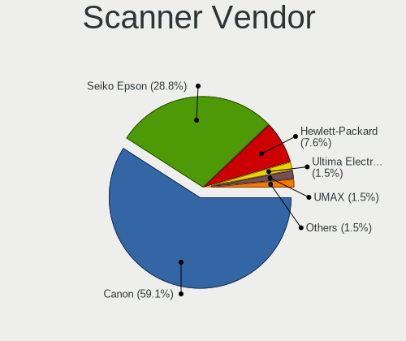

| Vendor             | Desktops | Percent |
|--------------------|----------|---------|
| Canon              | 34       | 58.62%  |
| Seiko Epson        | 17       | 29.31%  |
| Hewlett-Packard    | 4        | 6.9%    |
| UMAX               | 1        | 1.72%   |
| Ultima Electronics | 1        | 1.72%   |
| Mustek Systems     | 1        | 1.72%   |

Scanner Model
-------------

Scanner device models

| Model                                                    | Desktops | Percent |
|----------------------------------------------------------|----------|---------|
| Canon CanoScan LiDE 210                                  | 7        | 12.07%  |
| Canon CanoScan LiDE 220                                  | 6        | 10.34%  |
| Seiko Epson GT-X770 [Perfection V500]                    | 5        | 8.62%   |
| Canon CanoScan N670U/N676U/LiDE 20                       | 4        | 6.9%    |
| Canon CanoScan LiDE 110                                  | 4        | 6.9%    |
| Seiko Epson GT-X820 [Perfection V600 Photo]              | 3        | 5.17%   |
| Seiko Epson GT-6600U [Perfection 610]                    | 3        | 5.17%   |
| Canon CanoScan LIDE 25                                   | 3        | 5.17%   |
| Canon CanoScan LiDE 100                                  | 3        | 5.17%   |
| Canon CanoScan 4400F                                     | 2        | 3.45%   |
| UMAX Astra 2200/2200SU                                   | 1        | 1.72%   |
| Ultima Artec E+ Pro                                      | 1        | 1.72%   |
| Seiko Epson GT-X750 [Perfection 4490 Photo]              | 1        | 1.72%   |
| Seiko Epson GT-F720 [GT-S620/Perfection V30/V300 Photo]  | 1        | 1.72%   |
| Seiko Epson GT-F670 [Perfection V200 Photo]              | 1        | 1.72%   |
| Seiko Epson GT-F500/GT-F550 [Perfection 2480/2580 PHOTO] | 1        | 1.72%   |
| Seiko Epson GT-9300UF [Perfection 2400 PHOTO]            | 1        | 1.72%   |
| Seiko Epson GT-8300UF [Perfection 1660 PHOTO]            | 1        | 1.72%   |
| Mustek Systems BearPaw 2448 TA Plus                      | 1        | 1.72%   |
| HP ScanJet G4050                                         | 1        | 1.72%   |
| HP ScanJet 5590                                          | 1        | 1.72%   |
| HP ScanJet 3400cse                                       | 1        | 1.72%   |
| HP ScanJet 2400c                                         | 1        | 1.72%   |
| Canon CanoScan N1240U/LiDE 30                            | 1        | 1.72%   |
| Canon CanoScan LiDE 700F                                 | 1        | 1.72%   |
| Canon CanoScan LiDE 70                                   | 1        | 1.72%   |
| Canon CanoScan LiDE 200                                  | 1        | 1.72%   |
| Canon CanoScan LiDE 120                                  | 1        | 1.72%   |

Camera
------

Camera Vendor
-------------

Camera device vendors

| Vendor                                 | Desktops | Percent |
|----------------------------------------|----------|---------|
| Logitech                               | 583      | 43.77%  |
| Microsoft                              | 98       | 7.36%   |
| Microdia                               | 82       | 6.16%   |
| Sunplus Innovation Technology          | 45       | 3.38%   |
| Apple                                  | 43       | 3.23%   |
| Samsung Electronics                    | 41       | 3.08%   |
| Realtek Semiconductor                  | 32       | 2.4%    |
| Generalplus Technology                 | 26       | 1.95%   |
| Chicony Electronics                    | 23       | 1.73%   |
| KYE Systems (Mouse Systems)            | 22       | 1.65%   |
| ARC International                      | 20       | 1.5%    |
| Razer USA                              | 17       | 1.28%   |
| Creative Technology                    | 17       | 1.28%   |
| 2M UVC CAMERA                          | 17       | 1.28%   |
| Z-Star Microelectronics                | 14       | 1.05%   |
| Cubeternet                             | 14       | 1.05%   |
| Trust                                  | 13       | 0.98%   |
| Jieli Technology                       | 13       | 0.98%   |
| AVerMedia Technologies                 | 13       | 0.98%   |
| MacroSilicon                           | 12       | 0.9%    |
| GEMBIRD                                | 11       | 0.83%   |
| Hewlett-Packard                        | 9        | 0.68%   |
| Lenovo                                 | 7        | 0.53%   |
| Arkmicro Technologies                  | 7        | 0.53%   |
| Aveo Technology                        | 6        | 0.45%   |
| Sunplus IT                             | 5        | 0.38%   |
| LG Electronics                         | 5        | 0.38%   |
| Asuscom Network                        | 5        | 0.38%   |
| Alcor Micro                            | 5        | 0.38%   |
| A4Tech                                 | 5        | 0.38%   |
| Unknown                                | 5        | 0.38%   |
| YGTek                                  | 4        | 0.3%    |
| Valve Software                         | 4        | 0.3%    |
| Linux Foundation                       | 4        | 0.3%    |
| Huawei Technologies                    | 4        | 0.3%    |
| Google                                 | 4        | 0.3%    |
| Cheng Uei Precision Industry (Foxlink) | 4        | 0.3%    |
| WaveRider Communications               | 3        | 0.23%   |
| Unknown                                | 3        | 0.23%   |
| Tobii Technology AB                    | 3        | 0.23%   |

Camera Model
------------

Camera device models

| Model                                   | Desktops | Percent |
|-----------------------------------------|----------|---------|
| Logitech HD Pro Webcam C920             | 116      | 8.61%   |
| Logitech Webcam C270                    | 115      | 8.53%   |
| Samsung Galaxy series, misc. (MTP mode) | 40       | 2.97%   |
| Logitech C922 Pro Stream Webcam         | 40       | 2.97%   |
| Apple iPhone 5/5C/5S/6/SE/7/8/X         | 37       | 2.74%   |
| Logitech HD Webcam C525                 | 34       | 2.52%   |
| Microsoft LifeCam HD-3000               | 33       | 2.45%   |
| Microdia Webcam Vitade AF               | 27       | 2%      |
| Logitech HD Webcam C615                 | 26       | 1.93%   |
| Logitech C920 PRO HD Webcam             | 26       | 1.93%   |
| Logitech Webcam C310                    | 25       | 1.85%   |
| Logitech BRIO Ultra HD Webcam           | 24       | 1.78%   |
| Microdia USB 2.0 Camera                 | 23       | 1.71%   |
| Logitech Webcam C170                    | 22       | 1.63%   |
| Microsoft LifeCam Cinema                | 20       | 1.48%   |
| ARC International Camera                | 20       | 1.48%   |
| 2M UVC CAMERA NexiGo N60 FHD Webcam     | 17       | 1.26%   |
| Logitech Webcam Pro 9000                | 16       | 1.19%   |
| Logitech Webcam C930e                   | 15       | 1.11%   |
| Logitech Webcam C925e                   | 15       | 1.11%   |
| Realtek FULL HD 1080P Webcam            | 14       | 1.04%   |
| Generalplus CAMERA - UVC                | 14       | 1.04%   |
| Logitech StreamCam                      | 13       | 0.96%   |
| Jieli USB PHY 2.0                       | 13       | 0.96%   |
| Microdia Camera                         | 11       | 0.82%   |
| Logitech QuickCam Pro 9000              | 11       | 0.82%   |
| Sunplus HD 720P webcam                  | 10       | 0.74%   |
| MacroSilicon MiraBox Capture            | 10       | 0.74%   |
| Sunplus Full HD webcam                  | 9        | 0.67%   |
| Generalplus 808 Camera                  | 9        | 0.67%   |
| Trust USB Camera                        | 8        | 0.59%   |
| Razer USA Razer Kiyo Pro                | 8        | 0.59%   |
| Microdia Integrated Camera              | 8        | 0.59%   |
| Logitech HD Webcam C910                 | 8        | 0.59%   |
| Logitech BRIO 4K Stream Edition         | 8        | 0.59%   |
| AVerMedia Live Streamer CAM 313         | 8        | 0.59%   |
| Realtek USB Camera                      | 7        | 0.52%   |
| Razer USA Gaming Webcam [Kiyo]          | 7        | 0.52%   |
| Microsoft Microsoft LifeCam Cinema    | 7        | 0.52%   |
| Microsoft LifeCam Studio                | 7        | 0.52%   |

Security
--------

Fingerprint Vendor
------------------

Fingerprint sensor vendors

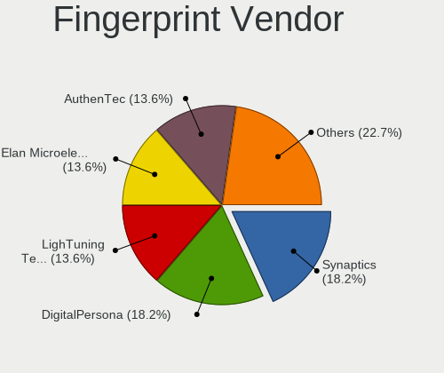

| Vendor                | Desktops | Percent |
|-----------------------|----------|---------|
| LighTuning Technology | 3        | 16.67%  |
| Elan Microelectronics | 3        | 16.67%  |
| DigitalPersona        | 3        | 16.67%  |
| AuthenTec             | 3        | 16.67%  |
| Synaptics             | 2        | 11.11%  |
| Dell                  | 2        | 11.11%  |
| Upek                  | 1        | 5.56%   |
| Microsoft             | 1        | 5.56%   |

Fingerprint Model
-----------------

Fingerprint sensor models

| Model                                               | Desktops | Percent |
|-----------------------------------------------------|----------|---------|
| Elan fingerprint sensor [FeinTech FPS00200]         | 3        | 16.67%  |
| DigitalPersona Fingerprint Reader                   | 3        | 16.67%  |
| Synaptics  WBDI Fingerprint Reader - USB 052        | 2        | 11.11%  |
| LighTuning Fingerprint Sensor                       | 2        | 11.11%  |
| AuthenTec Fingerprint Sensor                        | 2        | 11.11%  |
| Upek TCS1C EIM/STM32 Fingerprint sensor             | 1        | 5.56%   |
| Microsoft Fingerprint Reader                        | 1        | 5.56%   |
| LighTuning EgisTec Touch Fingerprint Sensor         | 1        | 5.56%   |
| Dell MS819 Wired Mouse With Fingerprint Reader      | 1        | 5.56%   |
| Dell MS819 Dell Wired Mouse With Fingerprint Reader | 1        | 5.56%   |
| AuthenTec AES1600                                   | 1        | 5.56%   |

Chipcard Vendor
---------------

Chipcard module vendors

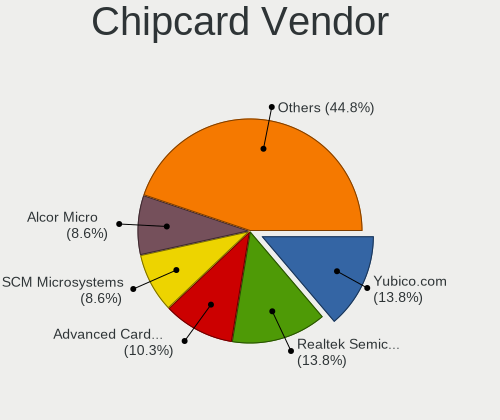

| Vendor                            | Desktops | Percent |
|-----------------------------------|----------|---------|
| Yubico.com                        | 7        | 14.29%  |
| Realtek Semiconductor             | 7        | 14.29%  |
| Alcor Micro                       | 5        | 10.2%   |
| VASCO Data Security International | 4        | 8.16%   |
| SCM Microsystems                  | 4        | 8.16%   |
| Advanced Card Systems             | 4        | 8.16%   |
| OmniKey                           | 3        | 6.12%   |
| Gemalto (was Gemplus)             | 3        | 6.12%   |
| CHERRY                            | 2        | 4.08%   |
| Aladdin Knowledge Systems         | 2        | 4.08%   |
| Aktiv                             | 2        | 4.08%   |
| Reiner SCT Kartensysteme          | 1        | 2.04%   |
| Fujitsu Siemens Computers         | 1        | 2.04%   |
| Feitian Technologies              | 1        | 2.04%   |
| Clay Logic                        | 1        | 2.04%   |
| Chicony Electronics               | 1        | 2.04%   |
| Bit4id                            | 1        | 2.04%   |

Chipcard Model
--------------

Chipcard module models

| Model                                                                      | Desktops | Percent |
|----------------------------------------------------------------------------|----------|---------|
| Realtek Semiconductor Smart Card Reader Interface                          | 7        | 14.29%  |
| Yubico.com Yubikey 4/5 U2F+CCID                                            | 5        | 10.2%   |
| VASCO Data Security International Digipass 905 SmartCard Reader            | 3        | 6.12%   |
| SCM Microsystems SCR331-LC1 / SCR3310 SmartCard Reader                     | 3        | 6.12%   |
| Gemalto (was Gemplus) GemPC Twin SmartCard Reader                          | 3        | 6.12%   |
| Alcor Micro AU9540 Smartcard Reader                                        | 3        | 6.12%   |
| Alcor Micro Watchdata W 1981                                               | 2        | 4.08%   |
| Aladdin Knowledge Systems Token JC                                         | 2        | 4.08%   |
| Aktiv Rutoken lite                                                         | 2        | 4.08%   |
| Yubico.com Yubikey NEO(-N) OTP+CCID                                        | 1        | 2.04%   |
| Yubico.com Yubikey 4/5 CCID                                                | 1        | 2.04%   |
| VASCO Data Security International DIGIPASS 870                             | 1        | 2.04%   |
| SCM Microsystems SCR3340 - ExpressCard54 Smart Card Reader                 | 1        | 2.04%   |
| Reiner SCT Kartensysteme cyberJack RFID basis contactless smartcard reader | 1        | 2.04%   |
| OmniKey CardMan 3121 (HID Technologies)                                    | 1        | 2.04%   |
| OmniKey CardMan 3021 / 3121                                                | 1        | 2.04%   |
| OmniKey CardMan 1021                                                       | 1        | 2.04%   |
| Fujitsu Siemens Computers SmartCard Reader 2A                              | 1        | 2.04%   |
| Feitian Technologies FT SCR310                                             | 1        | 2.04%   |
| Clay Logic Nitrokey Pro                                                    | 1        | 2.04%   |
| Chicony Electronics HP Skylab USB Smartcard Keyboard                       | 1        | 2.04%   |
| CHERRY SmartCard Reader Keyboard KC 1000 SC                                | 1        | 2.04%   |
| Cherry Smart Terminal XX44                                                 | 1        | 2.04%   |
| Bit4id miniLector EVO                                                      | 1        | 2.04%   |
| Advanced Card Systems ACR1281 1S Dual Reader                               | 1        | 2.04%   |
| Advanced Card Systems ACR1252 Dual Reader                                  | 1        | 2.04%   |
| Advanced Card Systems ACR1252 CL Reader PICC                               | 1        | 2.04%   |
| Advanced Card Systems ACR122U                                              | 1        | 2.04%   |

Unsupported
-----------

Unsupported Devices
-------------------

Total unsupported devices on board

| Total | Desktops | Percent |
|-------|----------|---------|
| 0     | 4531     | 84.57%  |
| 1     | 707      | 13.2%   |
| 2     | 80       | 1.49%   |
| 3     | 20       | 0.37%   |
| 4     | 11       | 0.21%   |
| 5     | 6        | 0.11%   |
| 6     | 2        | 0.04%   |
| 8     | 1        | 0.02%   |

Unsupported Device Types
------------------------

Types of unsupported devices

| Type                     | Desktops | Percent |
|--------------------------|----------|---------|
| Graphics card            | 307      | 32.8%   |
| Net/wireless             | 257      | 27.46%  |
| Unassigned class         | 92       | 9.83%   |
| Sound                    | 52       | 5.56%   |
| Multimedia controller    | 43       | 4.59%   |
| Communication controller | 39       | 4.17%   |
| Camera                   | 38       | 4.06%   |
| Bluetooth                | 18       | 1.92%   |
| Storage/raid             | 17       | 1.82%   |
| Fingerprint reader       | 16       | 1.71%   |
| Network                  | 14       | 1.5%    |
| Net/ethernet             | 14       | 1.5%    |
| Card reader              | 7        | 0.75%   |
| Chipcard                 | 6        | 0.64%   |
| Modem                    | 5        | 0.53%   |
| Firewire controller      | 4        | 0.43%   |
| Dvb card                 | 2        | 0.21%   |
| Wireless                 | 1        | 0.11%   |
| Tv card                  | 1        | 0.11%   |
| Storage/nvme             | 1        | 0.11%   |
| Storage/ata              | 1        | 0.11%   |
| Storage                  | 1        | 0.11%   |

