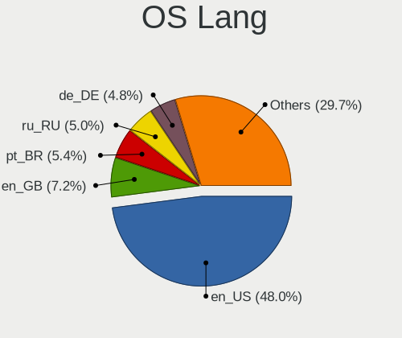
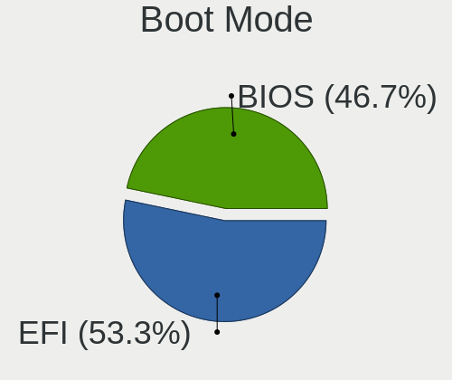
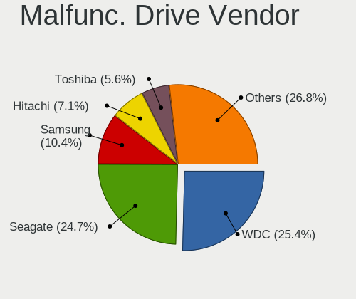
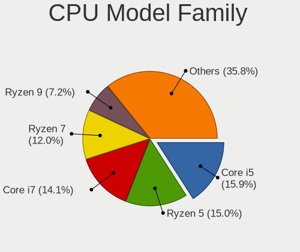
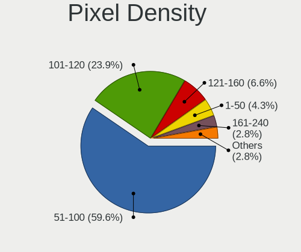
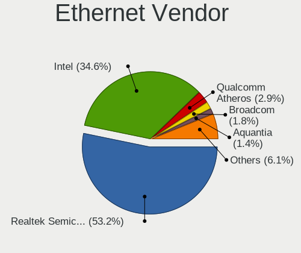

Fedora - Tested Hardware & Statistics (Desktops)
------------------------------------------------

A project to collect tested hardware configurations for Fedora.

Anyone can contribute to this report by the [hw-probe](https://github.com/linuxhw/hw-probe) tool:

    sudo -E hw-probe -all -upload

Please contribute! Especially if your hardware is rare.

Contents
--------

* [ Test Cases ](#test-cases)

* [ System ](#system)
  - [ OS                       ](#os)
  - [ OS Family                ](#os-family)
  - [ Kernel                   ](#kernel)
  - [ Kernel Family            ](#kernel-family)
  - [ Kernel Major Ver.        ](#kernel-major-ver)
  - [ Arch                     ](#arch)
  - [ DE                       ](#de)
  - [ Display Server           ](#display-server)
  - [ Display Manager          ](#display-manager)
  - [ OS Lang                  ](#os-lang)
  - [ Boot Mode                ](#boot-mode)
  - [ Filesystem               ](#filesystem)
  - [ Part. scheme             ](#part-scheme)
  - [ Dual Boot with Linux/BSD ](#dual-boot-with-linuxbsd)
  - [ Dual Boot (Win)          ](#dual-boot-win)

* [ Board ](#board)
  - [ Vendor                   ](#vendor)
  - [ Model                    ](#model)
  - [ Model Family             ](#model-family)
  - [ MFG Year                 ](#mfg-year)
  - [ Form Factor              ](#form-factor)
  - [ Secure Boot              ](#secure-boot)
  - [ Coreboot                 ](#coreboot)
  - [ RAM Size                 ](#ram-size)
  - [ RAM Used                 ](#ram-used)
  - [ Total Drives             ](#total-drives)
  - [ Has CD-ROM               ](#has-cd-rom)
  - [ Has Ethernet             ](#has-ethernet)
  - [ Has WiFi                 ](#has-wifi)
  - [ Has Bluetooth            ](#has-bluetooth)

* [ Location ](#location)
  - [ Country                  ](#country)
  - [ City                     ](#city)

* [ Drives ](#drives)
  - [ Drive Vendor             ](#drive-vendor)
  - [ Drive Model              ](#drive-model)
  - [ HDD Vendor               ](#hdd-vendor)
  - [ SSD Vendor               ](#ssd-vendor)
  - [ Drive Kind               ](#drive-kind)
  - [ Drive Connector          ](#drive-connector)
  - [ Drive Size               ](#drive-size)
  - [ Space Total              ](#space-total)
  - [ Space Used               ](#space-used)
  - [ Malfunc. Drives          ](#malfunc-drives)
  - [ Malfunc. Drive Vendor    ](#malfunc-drive-vendor)
  - [ Malfunc. HDD Vendor      ](#malfunc-hdd-vendor)
  - [ Malfunc. Drive Kind      ](#malfunc-drive-kind)
  - [ Failed Drives            ](#failed-drives)
  - [ Failed Drive Vendor      ](#failed-drive-vendor)
  - [ Drive Status             ](#drive-status)

* [ Storage controller ](#storage-controller)
  - [ Storage Vendor           ](#storage-vendor)
  - [ Storage Model            ](#storage-model)
  - [ Storage Kind             ](#storage-kind)

* [ Processor ](#processor)
  - [ CPU Vendor               ](#cpu-vendor)
  - [ CPU Model                ](#cpu-model)
  - [ CPU Model Family         ](#cpu-model-family)
  - [ CPU Cores                ](#cpu-cores)
  - [ CPU Sockets              ](#cpu-sockets)
  - [ CPU Threads              ](#cpu-threads)
  - [ CPU Op-Modes             ](#cpu-op-modes)
  - [ CPU Microcode            ](#cpu-microcode)
  - [ CPU Microarch            ](#cpu-microarch)

* [ Graphics ](#graphics)
  - [ GPU Vendor               ](#gpu-vendor)
  - [ GPU Model                ](#gpu-model)
  - [ GPU Combo                ](#gpu-combo)
  - [ GPU Driver               ](#gpu-driver)
  - [ GPU Memory               ](#gpu-memory)

* [ Monitor ](#monitor)
  - [ Monitor Vendor           ](#monitor-vendor)
  - [ Monitor Model            ](#monitor-model)
  - [ Monitor Resolution       ](#monitor-resolution)
  - [ Monitor Diagonal         ](#monitor-diagonal)
  - [ Monitor Width            ](#monitor-width)
  - [ Aspect Ratio             ](#aspect-ratio)
  - [ Monitor Area             ](#monitor-area)
  - [ Pixel Density            ](#pixel-density)
  - [ Multiple Monitors        ](#multiple-monitors)

* [ Network ](#network)
  - [ Net Controller Vendor    ](#net-controller-vendor)
  - [ Net Controller Model     ](#net-controller-model)
  - [ Wireless Vendor          ](#wireless-vendor)
  - [ Wireless Model           ](#wireless-model)
  - [ Ethernet Vendor          ](#ethernet-vendor)
  - [ Ethernet Model           ](#ethernet-model)
  - [ Net Controller Kind      ](#net-controller-kind)
  - [ Used Controller          ](#used-controller)
  - [ NICs                     ](#nics)
  - [ IPv6                     ](#ipv6)

* [ Bluetooth ](#bluetooth)
  - [ Bluetooth Vendor         ](#bluetooth-vendor)
  - [ Bluetooth Model          ](#bluetooth-model)

* [ Sound ](#sound)
  - [ Sound Vendor             ](#sound-vendor)
  - [ Sound Model              ](#sound-model)

* [ Memory ](#memory)
  - [ Memory Vendor            ](#memory-vendor)
  - [ Memory Model             ](#memory-model)
  - [ Memory Kind              ](#memory-kind)
  - [ Memory Form Factor       ](#memory-form-factor)
  - [ Memory Size              ](#memory-size)
  - [ Memory Speed             ](#memory-speed)

* [ Printers & scanners ](#printers--scanners)
  - [ Printer Vendor           ](#printer-vendor)
  - [ Printer Model            ](#printer-model)
  - [ Scanner Vendor           ](#scanner-vendor)
  - [ Scanner Model            ](#scanner-model)

* [ Camera ](#camera)
  - [ Camera Vendor            ](#camera-vendor)
  - [ Camera Model             ](#camera-model)

* [ Security ](#security)
  - [ Fingerprint Vendor       ](#fingerprint-vendor)
  - [ Fingerprint Model        ](#fingerprint-model)
  - [ Chipcard Vendor          ](#chipcard-vendor)
  - [ Chipcard Model           ](#chipcard-model)

* [ Unsupported ](#unsupported)
  - [ Unsupported Devices      ](#unsupported-devices)
  - [ Unsupported Device Types ](#unsupported-device-types)

Test Cases
----------

Total: 4518

| Vendor        | Model                       | Probe                                                      | Date         |
|---------------|-----------------------------|------------------------------------------------------------|--------------|
| Dell          | 0MWYPT A02                  | [e2f98387b0](https://linux-hardware.org/?probe=e2f98387b0) | Sep 01, 2022 |
| Gigabyte      | GA-MA785G-UD3H              | [2cf98644bc](https://linux-hardware.org/?probe=2cf98644bc) | Sep 01, 2022 |
| ASRock        | FM2A88X Extreme6+           | [689c3aa34d](https://linux-hardware.org/?probe=689c3aa34d) | Sep 01, 2022 |
| MSI           | X99A RAIDER                 | [5cf1e75ad4](https://linux-hardware.org/?probe=5cf1e75ad4) | Sep 01, 2022 |
| MSI           | MPG B550I GAMING EDGE WI... | [c5547cac7c](https://linux-hardware.org/?probe=c5547cac7c) | Aug 31, 2022 |
| MSI           | MPG B550I GAMING EDGE WI... | [e5c7462ead](https://linux-hardware.org/?probe=e5c7462ead) | Aug 31, 2022 |
| Gigabyte      | X570S AORUS ELITE AX        | [36eb80672f](https://linux-hardware.org/?probe=36eb80672f) | Aug 31, 2022 |
| ASRock        | FM2A88X Extreme6+           | [df96c4acaf](https://linux-hardware.org/?probe=df96c4acaf) | Aug 31, 2022 |
| MSI           | X99A RAIDER                 | [56a6f41ffa](https://linux-hardware.org/?probe=56a6f41ffa) | Aug 31, 2022 |
| Dell          | 0KV3RP A00                  | [731a14ee10](https://linux-hardware.org/?probe=731a14ee10) | Aug 31, 2022 |
| MSI           | B450 GAMING PRO CARBON A... | [2c72dfccbb](https://linux-hardware.org/?probe=2c72dfccbb) | Aug 30, 2022 |
| MSI           | X99A RAIDER                 | [09b6390c84](https://linux-hardware.org/?probe=09b6390c84) | Aug 30, 2022 |
| ASRock        | FM2A88X Extreme6+           | [eba231b7db](https://linux-hardware.org/?probe=eba231b7db) | Aug 30, 2022 |
| HP            | 8464                        | [16bb2588e0](https://linux-hardware.org/?probe=16bb2588e0) | Aug 30, 2022 |
| Gigabyte      | Z170-D3H-CF                 | [d9d75bc1f0](https://linux-hardware.org/?probe=d9d75bc1f0) | Aug 29, 2022 |
| ASUSTek       | TUF Gaming B550-PLUS        | [9fbdc83458](https://linux-hardware.org/?probe=9fbdc83458) | Aug 29, 2022 |
| ASUSTek       | TUF Gaming B550-PLUS        | [7b0113a203](https://linux-hardware.org/?probe=7b0113a203) | Aug 29, 2022 |
| MSI           | MPG Z390I GAMING EDGE AC    | [cf0cdab1da](https://linux-hardware.org/?probe=cf0cdab1da) | Aug 29, 2022 |
| MSI           | MPG Z390 GAMING PLUS        | [60bc287a81](https://linux-hardware.org/?probe=60bc287a81) | Aug 29, 2022 |
| HP            | 8751                        | [62c8c2f25e](https://linux-hardware.org/?probe=62c8c2f25e) | Aug 29, 2022 |
| MSI           | MPG Z390 GAMING PLUS        | [7d1dae1de6](https://linux-hardware.org/?probe=7d1dae1de6) | Aug 29, 2022 |
| MSI           | Z77A-G43                    | [1d1864dabc](https://linux-hardware.org/?probe=1d1864dabc) | Aug 29, 2022 |
| ASUSTek       | TUF Gaming X570-PLUS        | [505d987d1e](https://linux-hardware.org/?probe=505d987d1e) | Aug 28, 2022 |
| MSI           | MAG X570S TOMAHAWK MAX W... | [3de4d575a9](https://linux-hardware.org/?probe=3de4d575a9) | Aug 27, 2022 |
| HP            | 805D                        | [419598ebba](https://linux-hardware.org/?probe=419598ebba) | Aug 27, 2022 |
| Gigabyte      | GA-78LMT-USB3 SEx           | [7642980e6e](https://linux-hardware.org/?probe=7642980e6e) | Aug 27, 2022 |
| Dell          | 0KV3RP A00                  | [f73bf383ce](https://linux-hardware.org/?probe=f73bf383ce) | Aug 26, 2022 |
| ASUSTek       | P5QL-E                      | [f1c16cf6e7](https://linux-hardware.org/?probe=f1c16cf6e7) | Aug 26, 2022 |
| ASUSTek       | ROG STRIX X570-E GAMING ... | [dd68273352](https://linux-hardware.org/?probe=dd68273352) | Aug 26, 2022 |
| ASUSTek       | P5QL-E                      | [e69218ea58](https://linux-hardware.org/?probe=e69218ea58) | Aug 26, 2022 |
| Gigabyte      | B550 GAMING X V2            | [f37ee1975e](https://linux-hardware.org/?probe=f37ee1975e) | Aug 26, 2022 |
| MSI           | X99A RAIDER                 | [8b0ab8f988](https://linux-hardware.org/?probe=8b0ab8f988) | Aug 26, 2022 |
| ASRock        | FM2A88X Extreme6+           | [ff55a7dbf1](https://linux-hardware.org/?probe=ff55a7dbf1) | Aug 26, 2022 |
| ASUSTek       | ROG STRIX B550-F GAMING     | [2388b95ce9](https://linux-hardware.org/?probe=2388b95ce9) | Aug 25, 2022 |
| ASUSTek       | UN62                        | [49fcd1324f](https://linux-hardware.org/?probe=49fcd1324f) | Aug 25, 2022 |
| MSI           | X99A RAIDER                 | [ec4d28f5de](https://linux-hardware.org/?probe=ec4d28f5de) | Aug 25, 2022 |
| ASRock        | FM2A88X Extreme6+           | [f80abd07f3](https://linux-hardware.org/?probe=f80abd07f3) | Aug 25, 2022 |
| ASRock        | B450M Pro4                  | [69fd53a234](https://linux-hardware.org/?probe=69fd53a234) | Aug 25, 2022 |
| ASRock        | B450M Pro4                  | [47dc749c6c](https://linux-hardware.org/?probe=47dc749c6c) | Aug 25, 2022 |
| Dell          | 01TKCC A01                  | [9a362ed844](https://linux-hardware.org/?probe=9a362ed844) | Aug 25, 2022 |
| Dell          | 0PU052                      | [2bffd37724](https://linux-hardware.org/?probe=2bffd37724) | Aug 24, 2022 |
| ASUSTek       | Z97-AR                      | [a766ce2d5a](https://linux-hardware.org/?probe=a766ce2d5a) | Aug 24, 2022 |
| ASUSTek       | TUF Gaming B550-PLUS        | [ae4a81a473](https://linux-hardware.org/?probe=ae4a81a473) | Aug 24, 2022 |
| ASUSTek       | Z97-A                       | [016c661430](https://linux-hardware.org/?probe=016c661430) | Aug 24, 2022 |
| ASRock        | X570M Pro4                  | [f2bc1e0fae](https://linux-hardware.org/?probe=f2bc1e0fae) | Aug 23, 2022 |
| Gigabyte      | H81M-S                      | [0b1e1d125d](https://linux-hardware.org/?probe=0b1e1d125d) | Aug 23, 2022 |
| Dell          | 0T1D10 A01                  | [39e79a7077](https://linux-hardware.org/?probe=39e79a7077) | Aug 23, 2022 |
| MSI           | Z170A GAMING PRO CARBON     | [0796a8df9d](https://linux-hardware.org/?probe=0796a8df9d) | Aug 23, 2022 |
| Gigabyte      | X570 I AORUS PRO WIFI       | [b0af95356c](https://linux-hardware.org/?probe=b0af95356c) | Aug 22, 2022 |
| Gigabyte      | X570 I AORUS PRO WIFI       | [bc32a93168](https://linux-hardware.org/?probe=bc32a93168) | Aug 22, 2022 |
| Gigabyte      | B550 AORUS ELITE V2         | [a25c6f8d64](https://linux-hardware.org/?probe=a25c6f8d64) | Aug 22, 2022 |
| Gigabyte      | EP45-DS3P                   | [2af48f00ac](https://linux-hardware.org/?probe=2af48f00ac) | Aug 22, 2022 |
| Gigabyte      | EP45-DS3P                   | [0910ca3887](https://linux-hardware.org/?probe=0910ca3887) | Aug 22, 2022 |
| MSI           | Z370 TOMAHAWK               | [251d227686](https://linux-hardware.org/?probe=251d227686) | Aug 22, 2022 |
| ASUSTek       | PRIME H370-PLUS             | [eb81df27ce](https://linux-hardware.org/?probe=eb81df27ce) | Aug 22, 2022 |
| ASRock        | 890GM Pro3                  | [51f5d50d85](https://linux-hardware.org/?probe=51f5d50d85) | Aug 22, 2022 |
| ASRock        | 890GM Pro3                  | [002a0c3f5a](https://linux-hardware.org/?probe=002a0c3f5a) | Aug 22, 2022 |
| ASRock        | X370 Taichi                 | [8f952ff258](https://linux-hardware.org/?probe=8f952ff258) | Aug 21, 2022 |
| ASRock        | AD2700-ITX                  | [4be47e3738](https://linux-hardware.org/?probe=4be47e3738) | Aug 21, 2022 |
| ASUSTek       | ROG STRIX Z690-E GAMING ... | [5f90bb65a6](https://linux-hardware.org/?probe=5f90bb65a6) | Aug 21, 2022 |
| ASUSTek       | TUF B350M-PLUS GAMING       | [b2ac87cffc](https://linux-hardware.org/?probe=b2ac87cffc) | Aug 20, 2022 |
| Gigabyte      | G1.Sniper B5-CF             | [7dbac78a87](https://linux-hardware.org/?probe=7dbac78a87) | Aug 20, 2022 |
| Lenovo        | 312A SDK0J40697 WIN 3305... | [abbb1d7360](https://linux-hardware.org/?probe=abbb1d7360) | Aug 20, 2022 |
| Gigabyte      | B550M DS3H                  | [fd0604d0fb](https://linux-hardware.org/?probe=fd0604d0fb) | Aug 20, 2022 |
| Gigabyte      | GA-MA780G-UD3H              | [c9738d69e9](https://linux-hardware.org/?probe=c9738d69e9) | Aug 20, 2022 |
| ASUSTek       | Z97-PRO GAMER               | [2f5ef1300f](https://linux-hardware.org/?probe=2f5ef1300f) | Aug 19, 2022 |
| MACHINIST     | X99-RS9 V2.0                | [ffb095f0c3](https://linux-hardware.org/?probe=ffb095f0c3) | Aug 19, 2022 |
| ASUSTek       | P8H67-M LE                  | [ce8c93b28f](https://linux-hardware.org/?probe=ce8c93b28f) | Aug 19, 2022 |
| ASRock        | B450 Pro4                   | [ed013e82aa](https://linux-hardware.org/?probe=ed013e82aa) | Aug 19, 2022 |
| ASUSTek       | TUF Gaming B550M-PLUS       | [8fc237babf](https://linux-hardware.org/?probe=8fc237babf) | Aug 17, 2022 |
| Lenovo        | SHARKBAY NOK                | [e73d7ae317](https://linux-hardware.org/?probe=e73d7ae317) | Aug 17, 2022 |
| Dell          | 09M8Y8 A01                  | [9defe532c0](https://linux-hardware.org/?probe=9defe532c0) | Aug 17, 2022 |
| ASUSTek       | P8H77-V LE                  | [7f6138d8ce](https://linux-hardware.org/?probe=7f6138d8ce) | Aug 17, 2022 |
| ASUSTek       | Z97-C                       | [58f88a4494](https://linux-hardware.org/?probe=58f88a4494) | Aug 17, 2022 |
| Gigabyte      | D525TUD                     | [e68748c0f1](https://linux-hardware.org/?probe=e68748c0f1) | Aug 16, 2022 |
| Gigabyte      | B550M AORUS PRO-P           | [8b591b08b0](https://linux-hardware.org/?probe=8b591b08b0) | Aug 16, 2022 |
| ASUSTek       | Z97-C                       | [e68b5affa4](https://linux-hardware.org/?probe=e68b5affa4) | Aug 16, 2022 |
| ASRock        | FM2A88X Extreme6+           | [3f83c9e402](https://linux-hardware.org/?probe=3f83c9e402) | Aug 16, 2022 |
| MSI           | X99A RAIDER                 | [f1a0029208](https://linux-hardware.org/?probe=f1a0029208) | Aug 16, 2022 |
| ASUSTek       | ROG STRIX X570-I GAMING     | [97ff4c0078](https://linux-hardware.org/?probe=97ff4c0078) | Aug 16, 2022 |
| Gigabyte      | B550M DS3H                  | [6ef5e022c7](https://linux-hardware.org/?probe=6ef5e022c7) | Aug 15, 2022 |
| ECS           | H61H2-MV                    | [0b95f78b15](https://linux-hardware.org/?probe=0b95f78b15) | Aug 15, 2022 |
| Gigabyte      | GA-MA785G-UD3H              | [8072e15459](https://linux-hardware.org/?probe=8072e15459) | Aug 15, 2022 |
| ASUSTek       | Z97-PRO GAMER               | [bbbda98d21](https://linux-hardware.org/?probe=bbbda98d21) | Aug 15, 2022 |
| Gigabyte      | H77N-WIFI                   | [20d9ba44b5](https://linux-hardware.org/?probe=20d9ba44b5) | Aug 15, 2022 |
| MSI           | X99A RAIDER                 | [91a402ab9e](https://linux-hardware.org/?probe=91a402ab9e) | Aug 15, 2022 |
| ASRock        | FM2A88X Extreme6+           | [1298facab1](https://linux-hardware.org/?probe=1298facab1) | Aug 15, 2022 |
| ASUSTek       | B85M-G                      | [b44e802677](https://linux-hardware.org/?probe=b44e802677) | Aug 14, 2022 |
| ASUSTek       | P8H77-V                     | [83abda5bc9](https://linux-hardware.org/?probe=83abda5bc9) | Aug 14, 2022 |
| Foxconn       | 2ABF                        | [cc835ea750](https://linux-hardware.org/?probe=cc835ea750) | Aug 13, 2022 |
| Huanan        | X99-BD4 V1.33               | [a250b39eec](https://linux-hardware.org/?probe=a250b39eec) | Aug 13, 2022 |
| ASUSTek       | STRIX Z270E GAMING          | [6a0c6ab778](https://linux-hardware.org/?probe=6a0c6ab778) | Aug 13, 2022 |
| ASUSTek       | ROG STRIX Z370-H GAMING     | [4983efddbb](https://linux-hardware.org/?probe=4983efddbb) | Aug 13, 2022 |
| ASRock        | FM2A88M-HD+ R2.0            | [e1f4ef0670](https://linux-hardware.org/?probe=e1f4ef0670) | Aug 12, 2022 |
| MSI           | Z97 GAMING 5                | [e7c81a6ce7](https://linux-hardware.org/?probe=e7c81a6ce7) | Aug 12, 2022 |
| MSI           | MPG X570 GAMING PLUS        | [6a8f06be23](https://linux-hardware.org/?probe=6a8f06be23) | Aug 12, 2022 |
| HP            | 8183                        | [19f5199de8](https://linux-hardware.org/?probe=19f5199de8) | Aug 12, 2022 |
| Gigabyte      | H370 HD3-CF                 | [3d93d807ca](https://linux-hardware.org/?probe=3d93d807ca) | Aug 12, 2022 |
| MSI           | X370 SLI PLUS               | [8b4bc6f127](https://linux-hardware.org/?probe=8b4bc6f127) | Aug 11, 2022 |
| MSI           | Z87-G45 GAMING              | [5f25d77994](https://linux-hardware.org/?probe=5f25d77994) | Aug 11, 2022 |
| HP            | 8183                        | [c441ead9f8](https://linux-hardware.org/?probe=c441ead9f8) | Aug 11, 2022 |
| MSI           | Z87-G45 GAMING              | [0790b09ae3](https://linux-hardware.org/?probe=0790b09ae3) | Aug 11, 2022 |
| Gigabyte      | B150M-D3H-CF                | [43b4579869](https://linux-hardware.org/?probe=43b4579869) | Aug 11, 2022 |
| Gigabyte      | Z390 GAMING X-CF            | [edf947ace6](https://linux-hardware.org/?probe=edf947ace6) | Aug 10, 2022 |
| Lenovo        | SHARKBAY NOK                | [c788f4d7a8](https://linux-hardware.org/?probe=c788f4d7a8) | Aug 10, 2022 |
| ASRock        | H61M-HVGS                   | [f646dceb7c](https://linux-hardware.org/?probe=f646dceb7c) | Aug 10, 2022 |
| ASRock        | B450M Steel Legend          | [a24161deaa](https://linux-hardware.org/?probe=a24161deaa) | Aug 10, 2022 |
| ASRock        | AB350 Gaming-ITX/ac         | [d586bdd82d](https://linux-hardware.org/?probe=d586bdd82d) | Aug 10, 2022 |
| Gigabyte      | X570 AORUS PRO              | [8558001fa2](https://linux-hardware.org/?probe=8558001fa2) | Aug 09, 2022 |
| Gigabyte      | Z87-HD3                     | [ee1bdd9333](https://linux-hardware.org/?probe=ee1bdd9333) | Aug 09, 2022 |
| Gigabyte      | Z87-HD3                     | [a0243ce6f0](https://linux-hardware.org/?probe=a0243ce6f0) | Aug 09, 2022 |
| Gigabyte      | GA-MA780G-UD3H              | [e74a95c4d9](https://linux-hardware.org/?probe=e74a95c4d9) | Aug 09, 2022 |
| Gigabyte      | GA-MA785G-UD3H              | [42d32cdfda](https://linux-hardware.org/?probe=42d32cdfda) | Aug 09, 2022 |
| ASRock        | FM2A88X Extreme6+           | [91a2943c51](https://linux-hardware.org/?probe=91a2943c51) | Aug 09, 2022 |
| MSI           | X99A RAIDER                 | [0318e6b173](https://linux-hardware.org/?probe=0318e6b173) | Aug 09, 2022 |
| ECS           | H61H2-MV                    | [21fadb20ca](https://linux-hardware.org/?probe=21fadb20ca) | Aug 09, 2022 |
| MSI           | Z87-G45 GAMING              | [093a936372](https://linux-hardware.org/?probe=093a936372) | Aug 08, 2022 |
| ASUSTek       | ROG STRIX B660-F GAMING ... | [b421a8c6c4](https://linux-hardware.org/?probe=b421a8c6c4) | Aug 08, 2022 |
| ASUSTek       | P8H67-M LE                  | [07c89bcbc6](https://linux-hardware.org/?probe=07c89bcbc6) | Aug 08, 2022 |
| Gigabyte      | X470 AORUS GAMING 7 WIFI... | [08b891334e](https://linux-hardware.org/?probe=08b891334e) | Aug 08, 2022 |
| ASRock        | FM2A88X Extreme6+           | [244025d59e](https://linux-hardware.org/?probe=244025d59e) | Aug 08, 2022 |
| MSI           | X99A RAIDER                 | [2d55725824](https://linux-hardware.org/?probe=2d55725824) | Aug 08, 2022 |
| Lenovo        | SHARKBAY NOK                | [f08a60d37c](https://linux-hardware.org/?probe=f08a60d37c) | Aug 07, 2022 |
| ASUSTek       | PRIME B550M-A               | [64e8ddf1c9](https://linux-hardware.org/?probe=64e8ddf1c9) | Aug 07, 2022 |
| ECS           | H61H2-MV                    | [7dbc1a26ca](https://linux-hardware.org/?probe=7dbc1a26ca) | Aug 07, 2022 |
| MSI           | MAG B460M MORTAR            | [a823925843](https://linux-hardware.org/?probe=a823925843) | Aug 07, 2022 |
| HP            | 1587h                       | [d9d1b6832f](https://linux-hardware.org/?probe=d9d1b6832f) | Aug 07, 2022 |
| HP            | 1587h                       | [737b509512](https://linux-hardware.org/?probe=737b509512) | Aug 07, 2022 |
| Gigabyte      | A320M-S2H-CF                | [31c87abaf3](https://linux-hardware.org/?probe=31c87abaf3) | Aug 07, 2022 |
| Lenovo        | SHARKBAY SDK0E50512 STD     | [154440549c](https://linux-hardware.org/?probe=154440549c) | Aug 06, 2022 |
| ECS           | H61H2-MV                    | [6dbb0a4eb9](https://linux-hardware.org/?probe=6dbb0a4eb9) | Aug 06, 2022 |
| Gigabyte      | B450M DS3H-CF               | [258c7a2f71](https://linux-hardware.org/?probe=258c7a2f71) | Aug 06, 2022 |
| ASUSTek       | SABERTOOTH X79              | [4f10e80880](https://linux-hardware.org/?probe=4f10e80880) | Aug 06, 2022 |
| Lenovo        | SHARKBAY SDK0E50512 STD     | [4f12a5e11e](https://linux-hardware.org/?probe=4f12a5e11e) | Aug 06, 2022 |
| BESSTAR Te... | HM90                        | [36e148426c](https://linux-hardware.org/?probe=36e148426c) | Aug 06, 2022 |
| BESSTAR Te... | HM90                        | [28ec23aa22](https://linux-hardware.org/?probe=28ec23aa22) | Aug 06, 2022 |
| Gigabyte      | 945GCM-S2L                  | [fd6cf872ae](https://linux-hardware.org/?probe=fd6cf872ae) | Aug 06, 2022 |
| ASRock        | B460M Pro4S/ac              | [79f01ebf66](https://linux-hardware.org/?probe=79f01ebf66) | Aug 05, 2022 |
| Gigabyte      | GA-MA785G-UD3H              | [1798c25088](https://linux-hardware.org/?probe=1798c25088) | Aug 05, 2022 |
| Gigabyte      | H77N-WIFI                   | [caa404d4c6](https://linux-hardware.org/?probe=caa404d4c6) | Aug 05, 2022 |
| MSI           | X99A RAIDER                 | [284fd5ef07](https://linux-hardware.org/?probe=284fd5ef07) | Aug 05, 2022 |
| ASRock        | FM2A88X Extreme6+           | [9320816ca5](https://linux-hardware.org/?probe=9320816ca5) | Aug 05, 2022 |
| Gigabyte      | AX370-Gaming 5              | [46f109ed37](https://linux-hardware.org/?probe=46f109ed37) | Aug 05, 2022 |
| ASUSTek       | ROG STRIX B550-E GAMING     | [c6e5356615](https://linux-hardware.org/?probe=c6e5356615) | Aug 04, 2022 |
| Gigabyte      | M68MT-S2P                   | [7c41cd3006](https://linux-hardware.org/?probe=7c41cd3006) | Aug 04, 2022 |
| MSI           | X99A RAIDER                 | [33c854adcd](https://linux-hardware.org/?probe=33c854adcd) | Aug 04, 2022 |
| ASRock        | FM2A88X Extreme6+           | [b224ef1b8d](https://linux-hardware.org/?probe=b224ef1b8d) | Aug 04, 2022 |
| Gigabyte      | GA-78LMT-USB3 SEx           | [b932802b52](https://linux-hardware.org/?probe=b932802b52) | Aug 04, 2022 |
| ASUSTek       | H110M-K                     | [df01e617f2](https://linux-hardware.org/?probe=df01e617f2) | Aug 03, 2022 |
| MSI           | MPG X570 GAMING PLUS        | [6e77095fb6](https://linux-hardware.org/?probe=6e77095fb6) | Aug 03, 2022 |
| Dell          | 05GD68 A00                  | [32bda73b5e](https://linux-hardware.org/?probe=32bda73b5e) | Aug 03, 2022 |
| ASRock        | AB350M-HDV                  | [4678a0f755](https://linux-hardware.org/?probe=4678a0f755) | Aug 03, 2022 |
| HP            | 8767 A                      | [3679ccede7](https://linux-hardware.org/?probe=3679ccede7) | Aug 02, 2022 |
| MSI           | H510M-A PRO                 | [b570321ffa](https://linux-hardware.org/?probe=b570321ffa) | Aug 02, 2022 |
| Dell          | 0Y56T3 A00                  | [c52a590c5b](https://linux-hardware.org/?probe=c52a590c5b) | Aug 02, 2022 |
| ASRock        | Z390 Extreme4               | [9983a0cc64](https://linux-hardware.org/?probe=9983a0cc64) | Aug 02, 2022 |
| Gigabyte      | Z690I AORUS ULTRA DDR4      | [4bd0f9e461](https://linux-hardware.org/?probe=4bd0f9e461) | Aug 02, 2022 |
| MSI           | X99A RAIDER                 | [a56f943225](https://linux-hardware.org/?probe=a56f943225) | Aug 02, 2022 |
| ASRock        | FM2A88X Extreme6+           | [015ec264f5](https://linux-hardware.org/?probe=015ec264f5) | Aug 02, 2022 |
| Gigabyte      | B550I AORUS PRO AX          | [37b8171416](https://linux-hardware.org/?probe=37b8171416) | Aug 01, 2022 |
| MSI           | 970A-G46                    | [44a7f8800c](https://linux-hardware.org/?probe=44a7f8800c) | Aug 01, 2022 |
| MSI           | H81M-E34                    | [c0be356e96](https://linux-hardware.org/?probe=c0be356e96) | Aug 01, 2022 |
| Gigabyte      | GA-MA785G-UD3H              | [dcccfd1beb](https://linux-hardware.org/?probe=dcccfd1beb) | Aug 01, 2022 |
| MSI           | X99A RAIDER                 | [5fe6f7eb57](https://linux-hardware.org/?probe=5fe6f7eb57) | Aug 01, 2022 |
| ASRock        | FM2A88X Extreme6+           | [8ea1e0f22c](https://linux-hardware.org/?probe=8ea1e0f22c) | Aug 01, 2022 |
| Gigabyte      | Z68MA-D2H-B3                | [4956d72048](https://linux-hardware.org/?probe=4956d72048) | Aug 01, 2022 |
| ASUSTek       | TUF Gaming X570-PLUS        | [163affcbb8](https://linux-hardware.org/?probe=163affcbb8) | Aug 01, 2022 |
| ASUSTek       | M2N-MX SE Plus              | [7a0035ad18](https://linux-hardware.org/?probe=7a0035ad18) | Jul 31, 2022 |
| Gigabyte      | GA-880GM-UD2H               | [f6a106d6df](https://linux-hardware.org/?probe=f6a106d6df) | Jul 31, 2022 |
| ASUSTek       | PRIME X370-PRO              | [d8bfe4a00b](https://linux-hardware.org/?probe=d8bfe4a00b) | Jul 31, 2022 |
| ASUSTek       | PRIME X370-PRO              | [0f72d43717](https://linux-hardware.org/?probe=0f72d43717) | Jul 31, 2022 |
| MSI           | X99A RAIDER                 | [76a30e3042](https://linux-hardware.org/?probe=76a30e3042) | Jul 31, 2022 |
| ASRock        | FM2A88X Extreme6+           | [9dd9d17e79](https://linux-hardware.org/?probe=9dd9d17e79) | Jul 31, 2022 |
| ASRock        | X570 Steel Legend           | [f43e0c2c81](https://linux-hardware.org/?probe=f43e0c2c81) | Jul 31, 2022 |
| ASUSTek       | M4A77TD                     | [f10ef09086](https://linux-hardware.org/?probe=f10ef09086) | Jul 30, 2022 |
| Gateway       | DX4860                      | [279b6793e4](https://linux-hardware.org/?probe=279b6793e4) | Jul 30, 2022 |
| Gateway       | DX4860                      | [fec12bcbe9](https://linux-hardware.org/?probe=fec12bcbe9) | Jul 30, 2022 |
| MSI           | X99A RAIDER                 | [ebfa3daff5](https://linux-hardware.org/?probe=ebfa3daff5) | Jul 30, 2022 |
| ASRock        | FM2A88X Extreme6+           | [9a7de8cc64](https://linux-hardware.org/?probe=9a7de8cc64) | Jul 30, 2022 |
| Gigabyte      | H61M-DS2V                   | [e5744803f2](https://linux-hardware.org/?probe=e5744803f2) | Jul 29, 2022 |
| MSI           | MPG B550 GAMING EDGE WIF... | [9258c864d5](https://linux-hardware.org/?probe=9258c864d5) | Jul 29, 2022 |
| ASUSTek       | ROG STRIX B450-F GAMING ... | [3b661517b1](https://linux-hardware.org/?probe=3b661517b1) | Jul 29, 2022 |
| MSI           | MPG B550I GAMING EDGE WI... | [efa02942f2](https://linux-hardware.org/?probe=efa02942f2) | Jul 29, 2022 |
| MSI           | MPG B550 GAMING EDGE WIF... | [ebe9fe3b1a](https://linux-hardware.org/?probe=ebe9fe3b1a) | Jul 29, 2022 |
| ASUSTek       | PRIME B450M-K               | [25d688e258](https://linux-hardware.org/?probe=25d688e258) | Jul 29, 2022 |
| ASUSTek       | PRIME B450M-K               | [93caf82d7a](https://linux-hardware.org/?probe=93caf82d7a) | Jul 29, 2022 |
| ASRock        | FM2A88X Extreme6+           | [c0ce536184](https://linux-hardware.org/?probe=c0ce536184) | Jul 29, 2022 |
| MSI           | X99A RAIDER                 | [d5034f5f52](https://linux-hardware.org/?probe=d5034f5f52) | Jul 29, 2022 |
| Pegatron      | IPM41-D3                    | [ce24b0bab7](https://linux-hardware.org/?probe=ce24b0bab7) | Jul 28, 2022 |
| ASUSTek       | WS Z390 PRO                 | [256172b01e](https://linux-hardware.org/?probe=256172b01e) | Jul 28, 2022 |
| Lenovo        | 3717 SDK0R32862 WIN 3258... | [757ba0f252](https://linux-hardware.org/?probe=757ba0f252) | Jul 28, 2022 |
| ASRock        | FM2A88X Extreme6+           | [a9c3256946](https://linux-hardware.org/?probe=a9c3256946) | Jul 28, 2022 |
| MSI           | X99A RAIDER                 | [db30ba1d0e](https://linux-hardware.org/?probe=db30ba1d0e) | Jul 28, 2022 |
| ASRock        | B450M Pro4-F                | [af4d396115](https://linux-hardware.org/?probe=af4d396115) | Jul 27, 2022 |
| Gigabyte      | GA-78LMT-USB3 SEx           | [32e82dc9ae](https://linux-hardware.org/?probe=32e82dc9ae) | Jul 27, 2022 |
| HP            | 1494                        | [6805afe809](https://linux-hardware.org/?probe=6805afe809) | Jul 27, 2022 |
| MSI           | B450M PRO-VDH MAX           | [d63a6f2607](https://linux-hardware.org/?probe=d63a6f2607) | Jul 26, 2022 |
| MSI           | PRO B660M-A WIFI DDR4       | [a0e19ce405](https://linux-hardware.org/?probe=a0e19ce405) | Jul 26, 2022 |
| ASRock        | Z690 PG Riptide             | [87c499b088](https://linux-hardware.org/?probe=87c499b088) | Jul 26, 2022 |
| MSI           | B150M PRO-VD                | [8194e1dc19](https://linux-hardware.org/?probe=8194e1dc19) | Jul 26, 2022 |
| ASRock        | B450M Steel Legend          | [30fd52a2a5](https://linux-hardware.org/?probe=30fd52a2a5) | Jul 26, 2022 |
| Gigabyte      | X570 AORUS MASTER           | [3a34e9c018](https://linux-hardware.org/?probe=3a34e9c018) | Jul 25, 2022 |
| ASRock        | FM2A88X Extreme6+           | [2632256ed7](https://linux-hardware.org/?probe=2632256ed7) | Jul 25, 2022 |
| MSI           | X99A RAIDER                 | [57beac41bc](https://linux-hardware.org/?probe=57beac41bc) | Jul 25, 2022 |
| ASUSTek       | H81M-K                      | [a3eeaecb07](https://linux-hardware.org/?probe=a3eeaecb07) | Jul 25, 2022 |
| MSI           | B550M PRO-VDH WIFI          | [24fec424ff](https://linux-hardware.org/?probe=24fec424ff) | Jul 25, 2022 |
| Gigabyte      | X99-UD4-CF                  | [f00c831f5b](https://linux-hardware.org/?probe=f00c831f5b) | Jul 25, 2022 |
| MSI           | B365M PRO-VH                | [f254ee30b7](https://linux-hardware.org/?probe=f254ee30b7) | Jul 25, 2022 |
| Gigabyte      | X99-UD4-CF                  | [58f727d948](https://linux-hardware.org/?probe=58f727d948) | Jul 25, 2022 |
| Dell          | 0DF42J A00                  | [6a75ac249a](https://linux-hardware.org/?probe=6a75ac249a) | Jul 24, 2022 |
| ASUSTek       | Z170-P                      | [85e3fee140](https://linux-hardware.org/?probe=85e3fee140) | Jul 24, 2022 |
| MSI           | 2A9C                        | [b0441c833d](https://linux-hardware.org/?probe=b0441c833d) | Jul 24, 2022 |
| MSI           | X99A RAIDER                 | [79d402e1ff](https://linux-hardware.org/?probe=79d402e1ff) | Jul 24, 2022 |
| ASRock        | FM2A88X Extreme6+           | [8bb191bc8f](https://linux-hardware.org/?probe=8bb191bc8f) | Jul 24, 2022 |
| Gigabyte      | Z370 AORUS Gaming 5-CF      | [793c3d4e22](https://linux-hardware.org/?probe=793c3d4e22) | Jul 24, 2022 |
| MSI           | MAG X570S TOMAHAWK MAX W... | [2ae14bcbc1](https://linux-hardware.org/?probe=2ae14bcbc1) | Jul 23, 2022 |
| ASUSTek       | ROG STRIX Z370-H GAMING     | [9c0899916c](https://linux-hardware.org/?probe=9c0899916c) | Jul 23, 2022 |
| ASUSTek       | SABERTOOTH X79              | [88c35211e1](https://linux-hardware.org/?probe=88c35211e1) | Jul 23, 2022 |
| MSI           | X99A RAIDER                 | [7a33ccf211](https://linux-hardware.org/?probe=7a33ccf211) | Jul 23, 2022 |
| ASRock        | FM2A88X Extreme6+           | [9c1f5f7a4e](https://linux-hardware.org/?probe=9c1f5f7a4e) | Jul 23, 2022 |
| ASUSTek       | ROG STRIX X570-E GAMING ... | [6889befce9](https://linux-hardware.org/?probe=6889befce9) | Jul 23, 2022 |
| MSI           | PRO Z690-A                  | [9264d3b652](https://linux-hardware.org/?probe=9264d3b652) | Jul 22, 2022 |
| MSI           | B450 GAMING PLUS MAX        | [edcecb5e13](https://linux-hardware.org/?probe=edcecb5e13) | Jul 22, 2022 |
| Gigabyte      | GA-78LMT-S2P                | [f90d74f5b5](https://linux-hardware.org/?probe=f90d74f5b5) | Jul 22, 2022 |
| Fujitsu       | D3643-H1 S26361-D3643-H1    | [cda18f8739](https://linux-hardware.org/?probe=cda18f8739) | Jul 22, 2022 |
| ASUSTek       | ROG CROSSHAIR VIII DARK ... | [6e4f170da9](https://linux-hardware.org/?probe=6e4f170da9) | Jul 22, 2022 |
| ASUSTek       | P7H55-M                     | [d7ba204d31](https://linux-hardware.org/?probe=d7ba204d31) | Jul 22, 2022 |
| MSI           | X99A RAIDER                 | [347ff14d90](https://linux-hardware.org/?probe=347ff14d90) | Jul 22, 2022 |
| ASRock        | FM2A88X Extreme6+           | [d758abd21c](https://linux-hardware.org/?probe=d758abd21c) | Jul 22, 2022 |
| Lenovo        | ThinkCentre M58p 7220A72    | [d57e35934f](https://linux-hardware.org/?probe=d57e35934f) | Jul 22, 2022 |
| ASUSTek       | ROG CROSSHAIR VIII HERO     | [41dbccf7d9](https://linux-hardware.org/?probe=41dbccf7d9) | Jul 21, 2022 |
| Dell          | 0WMJ54 A01                  | [dace7a0b12](https://linux-hardware.org/?probe=dace7a0b12) | Jul 21, 2022 |
| ASRock        | FM2A88X Extreme6+           | [b54cb1f930](https://linux-hardware.org/?probe=b54cb1f930) | Jul 21, 2022 |
| MSI           | X99A RAIDER                 | [a671047cb4](https://linux-hardware.org/?probe=a671047cb4) | Jul 21, 2022 |
| Gigabyte      | X99-UD4-CF                  | [9c98b2fcd6](https://linux-hardware.org/?probe=9c98b2fcd6) | Jul 21, 2022 |
| ASRock        | H81M-HG4 R4.0               | [4628e310fd](https://linux-hardware.org/?probe=4628e310fd) | Jul 20, 2022 |
| Gigabyte      | X99-UD4-CF                  | [f42ed5053a](https://linux-hardware.org/?probe=f42ed5053a) | Jul 20, 2022 |
| ASUSTek       | ROG CROSSHAIR VIII DARK ... | [6e4fbc6688](https://linux-hardware.org/?probe=6e4fbc6688) | Jul 20, 2022 |
| ASUSTek       | PRIME X470-PRO              | [c763e49e7e](https://linux-hardware.org/?probe=c763e49e7e) | Jul 20, 2022 |
| ASUSTek       | ROG STRIX X570-E GAMING     | [a04d18d87a](https://linux-hardware.org/?probe=a04d18d87a) | Jul 20, 2022 |
| Foxconn       | 2AB1                        | [c269d962ea](https://linux-hardware.org/?probe=c269d962ea) | Jul 20, 2022 |
| ASRock        | FM2A88X Extreme6+           | [8cae76caea](https://linux-hardware.org/?probe=8cae76caea) | Jul 20, 2022 |
| MSI           | X99A RAIDER                 | [05a5bc0fa8](https://linux-hardware.org/?probe=05a5bc0fa8) | Jul 20, 2022 |
| NCR           | Pocono BIOS.6.0             | [3026f24fe3](https://linux-hardware.org/?probe=3026f24fe3) | Jul 19, 2022 |
| ASUSTek       | ROG STRIX B550-F GAMING     | [190936df71](https://linux-hardware.org/?probe=190936df71) | Jul 19, 2022 |
| ASUSTek       | M11BB                       | [582292657c](https://linux-hardware.org/?probe=582292657c) | Jul 18, 2022 |
| MSI           | MEG B550 UNIFY              | [d6ecbbbfda](https://linux-hardware.org/?probe=d6ecbbbfda) | Jul 17, 2022 |
| ASUSTek       | PRIME B450M-GAMING/BR       | [39fd39c3b0](https://linux-hardware.org/?probe=39fd39c3b0) | Jul 17, 2022 |
| ASRock        | AD2700-ITX                  | [870cda5796](https://linux-hardware.org/?probe=870cda5796) | Jul 17, 2022 |
| ASUSTek       | ROG STRIX B550-I GAMING     | [aae1bec902](https://linux-hardware.org/?probe=aae1bec902) | Jul 17, 2022 |
| MSI           | X370 KRAIT GAMING           | [e74a442ccc](https://linux-hardware.org/?probe=e74a442ccc) | Jul 17, 2022 |
| Huanan        | B75                         | [0580a5a948](https://linux-hardware.org/?probe=0580a5a948) | Jul 17, 2022 |
| Huanan        | B75                         | [e1788853ec](https://linux-hardware.org/?probe=e1788853ec) | Jul 17, 2022 |
| ASUSTek       | ROG STRIX X570-F GAMING     | [326c97ba50](https://linux-hardware.org/?probe=326c97ba50) | Jul 16, 2022 |
| ASUSTek       | ROG CROSSHAIR VIII IMPAC... | [d60e6afc41](https://linux-hardware.org/?probe=d60e6afc41) | Jul 16, 2022 |
| Gigabyte      | GA-A55M-S2V                 | [713765e224](https://linux-hardware.org/?probe=713765e224) | Jul 16, 2022 |
| ASUSTek       | ROG CROSSHAIR VIII HERO     | [41517adf39](https://linux-hardware.org/?probe=41517adf39) | Jul 16, 2022 |
| HP            | 802E                        | [c86ddd647b](https://linux-hardware.org/?probe=c86ddd647b) | Jul 16, 2022 |
| ASUSTek       | ROG STRIX Z490-I GAMING     | [34a905d705](https://linux-hardware.org/?probe=34a905d705) | Jul 16, 2022 |
| ASUSTek       | PRIME B450-PLUS             | [fc316a6331](https://linux-hardware.org/?probe=fc316a6331) | Jul 16, 2022 |
| ASUSTek       | ROG STRIX B550-F GAMING     | [86ac444b35](https://linux-hardware.org/?probe=86ac444b35) | Jul 15, 2022 |
| HP            | 88BF                        | [92b12df551](https://linux-hardware.org/?probe=92b12df551) | Jul 15, 2022 |
| MSI           | B450M PRO-VDH MAX           | [1338941bd0](https://linux-hardware.org/?probe=1338941bd0) | Jul 15, 2022 |
| ASUSTek       | ROG STRIX Z490-F GAMING     | [7efe67fd9a](https://linux-hardware.org/?probe=7efe67fd9a) | Jul 15, 2022 |
| Gigabyte      | H77N-WIFI                   | [f655a34cc1](https://linux-hardware.org/?probe=f655a34cc1) | Jul 15, 2022 |
| Gigabyte      | B450M DS3H-CF               | [e9c788dfd2](https://linux-hardware.org/?probe=e9c788dfd2) | Jul 14, 2022 |
| ASUSTek       | M5A97 PRO                   | [e963ba85db](https://linux-hardware.org/?probe=e963ba85db) | Jul 14, 2022 |
| ASUSTek       | ROG CROSSHAIR VIII HERO     | [165cdc7df2](https://linux-hardware.org/?probe=165cdc7df2) | Jul 14, 2022 |
| MSI           | MPG X570 GAMING PLUS        | [ea3f033d93](https://linux-hardware.org/?probe=ea3f033d93) | Jul 14, 2022 |
| ASUSTek       | PRIME Z390-A                | [7486493ea1](https://linux-hardware.org/?probe=7486493ea1) | Jul 14, 2022 |
| Dell          | 0J3C2F A00                  | [e9be99b44d](https://linux-hardware.org/?probe=e9be99b44d) | Jul 14, 2022 |
| ASUSTek       | STRIX B250F GAMING          | [4355281f8e](https://linux-hardware.org/?probe=4355281f8e) | Jul 13, 2022 |
| ASUSTek       | STRIX B250F GAMING          | [36f96a4ef6](https://linux-hardware.org/?probe=36f96a4ef6) | Jul 13, 2022 |
| ASRock        | X570 Taichi                 | [98ffa2e8b0](https://linux-hardware.org/?probe=98ffa2e8b0) | Jul 13, 2022 |
| HP            | 1632                        | [d2582aff1d](https://linux-hardware.org/?probe=d2582aff1d) | Jul 12, 2022 |
| HP            | 8768 A                      | [f4afb80e18](https://linux-hardware.org/?probe=f4afb80e18) | Jul 12, 2022 |
| Lenovo        | Annapurna CRB NOK           | [46d0d5dccc](https://linux-hardware.org/?probe=46d0d5dccc) | Jul 12, 2022 |
| MSI           | Z370-OC PRO                 | [2c9d1d78df](https://linux-hardware.org/?probe=2c9d1d78df) | Jul 12, 2022 |
| MSI           | X99A RAIDER                 | [108d31db10](https://linux-hardware.org/?probe=108d31db10) | Jul 12, 2022 |
| ASRock        | FM2A88X Extreme6+           | [ce2e8f2a2a](https://linux-hardware.org/?probe=ce2e8f2a2a) | Jul 12, 2022 |
| MSI           | MPG B550 GAMING PLUS        | [c69dd8da85](https://linux-hardware.org/?probe=c69dd8da85) | Jul 12, 2022 |
| MSI           | H97M-G43                    | [c8b2844540](https://linux-hardware.org/?probe=c8b2844540) | Jul 11, 2022 |
| HP            | 3646h                       | [88b38da161](https://linux-hardware.org/?probe=88b38da161) | Jul 11, 2022 |
| Dell          | 02YYK5 A00                  | [6592ae8873](https://linux-hardware.org/?probe=6592ae8873) | Jul 11, 2022 |
| MSI           | MAG B550 TOMAHAWK           | [05b0102f01](https://linux-hardware.org/?probe=05b0102f01) | Jul 11, 2022 |
| Dell          | 0XCR8D A03                  | [b6771bbe08](https://linux-hardware.org/?probe=b6771bbe08) | Jul 11, 2022 |
| MSI           | X99A RAIDER                 | [7ce0875267](https://linux-hardware.org/?probe=7ce0875267) | Jul 11, 2022 |
| ASRock        | FM2A88X Extreme6+           | [84f993f04d](https://linux-hardware.org/?probe=84f993f04d) | Jul 11, 2022 |
| MSI           | B450 GAMING PLUS MAX        | [8739a403bc](https://linux-hardware.org/?probe=8739a403bc) | Jul 11, 2022 |
| Dell          | 09WH54 A00                  | [8570e35470](https://linux-hardware.org/?probe=8570e35470) | Jul 11, 2022 |
| ASUSTek       | PRIME X470-PRO              | [314c3aaf0e](https://linux-hardware.org/?probe=314c3aaf0e) | Jul 10, 2022 |
| ASUSTek       | PRIME X470-PRO              | [d6f1e47bf5](https://linux-hardware.org/?probe=d6f1e47bf5) | Jul 10, 2022 |
| HP            | 8906 SMVB                   | [cf71ced9a0](https://linux-hardware.org/?probe=cf71ced9a0) | Jul 10, 2022 |
| HP            | 8906 SMVB                   | [cf470317b1](https://linux-hardware.org/?probe=cf470317b1) | Jul 10, 2022 |
| ASUSTek       | TUF Gaming B450-PLUS II     | [45e46ac933](https://linux-hardware.org/?probe=45e46ac933) | Jul 10, 2022 |
| Gigabyte      | GA-MA780G-UD3H              | [cdf7b9a4d1](https://linux-hardware.org/?probe=cdf7b9a4d1) | Jul 10, 2022 |
| Gigabyte      | X99-UD4-CF                  | [4245ef07db](https://linux-hardware.org/?probe=4245ef07db) | Jul 10, 2022 |
| Intel         | DH61WW AAG23116-301         | [3b4120b3af](https://linux-hardware.org/?probe=3b4120b3af) | Jul 09, 2022 |
| MSI           | PRO B660M-A DDR4            | [65c661af95](https://linux-hardware.org/?probe=65c661af95) | Jul 09, 2022 |
| ZOTAC         | Unknown                     | [70105d0f43](https://linux-hardware.org/?probe=70105d0f43) | Jul 09, 2022 |
| ASRock        | Z170 Extreme4               | [34f14d654f](https://linux-hardware.org/?probe=34f14d654f) | Jul 09, 2022 |
| ASUSTek       | M5A99FX PRO R2.0            | [6513be6d44](https://linux-hardware.org/?probe=6513be6d44) | Jul 09, 2022 |
| Gigabyte      | X99-UD4-CF                  | [1dafd7beed](https://linux-hardware.org/?probe=1dafd7beed) | Jul 09, 2022 |
| HP            | 8455                        | [62b146bca0](https://linux-hardware.org/?probe=62b146bca0) | Jul 08, 2022 |
| ASUSTek       | TUF Gaming B550-PLUS WIF... | [44db6036ce](https://linux-hardware.org/?probe=44db6036ce) | Jul 08, 2022 |
| ASUSTek       | ROG STRIX B550-I GAMING     | [546a26c882](https://linux-hardware.org/?probe=546a26c882) | Jul 07, 2022 |
| HP            | 8455                        | [9954a77308](https://linux-hardware.org/?probe=9954a77308) | Jul 07, 2022 |
| Gigabyte      | GA-MA785G-UD3H              | [4da61d3e61](https://linux-hardware.org/?probe=4da61d3e61) | Jul 07, 2022 |
| ASUSTek       | ROG STRIX B550-I GAMING     | [234b2b0ee8](https://linux-hardware.org/?probe=234b2b0ee8) | Jul 07, 2022 |
| ECS           | H61H2-MV                    | [80e2fc79da](https://linux-hardware.org/?probe=80e2fc79da) | Jul 07, 2022 |
| Gigabyte      | B660M AORUS PRO AX DDR4     | [342362a5f8](https://linux-hardware.org/?probe=342362a5f8) | Jul 06, 2022 |
| MSI           | G31TM-P21                   | [8c15268c47](https://linux-hardware.org/?probe=8c15268c47) | Jul 06, 2022 |
| Unknown       | Unknown                     | [c22b57692e](https://linux-hardware.org/?probe=c22b57692e) | Jul 06, 2022 |
| MSI           | G31TM-P21                   | [a0a2cd9568](https://linux-hardware.org/?probe=a0a2cd9568) | Jul 06, 2022 |
| Lenovo        | 3098 NOK                    | [0fb5f3cc66](https://linux-hardware.org/?probe=0fb5f3cc66) | Jul 06, 2022 |
| MSI           | MPG B550 GAMING EDGE WIF... | [699e033557](https://linux-hardware.org/?probe=699e033557) | Jul 06, 2022 |
| Gigabyte      | 970A-DS3P                   | [54f8e71da0](https://linux-hardware.org/?probe=54f8e71da0) | Jul 06, 2022 |
| ASUSTek       | ROG STRIX B660-F GAMING ... | [0954f0b44c](https://linux-hardware.org/?probe=0954f0b44c) | Jul 06, 2022 |
| Gigabyte      | F2A68HM-DS2                 | [779bc20f77](https://linux-hardware.org/?probe=779bc20f77) | Jul 05, 2022 |
| ASRock        | 990FX Killer                | [28b0984086](https://linux-hardware.org/?probe=28b0984086) | Jul 05, 2022 |
| Gigabyte      | H77N-WIFI                   | [e795477a20](https://linux-hardware.org/?probe=e795477a20) | Jul 05, 2022 |
| ASUSTek       | ROG Maximus Z690 HERO       | [a74834b383](https://linux-hardware.org/?probe=a74834b383) | Jul 04, 2022 |
| MSI           | MEG X570 UNIFY              | [f1de99a0da](https://linux-hardware.org/?probe=f1de99a0da) | Jul 04, 2022 |
| MSI           | MS-B0A1                     | [9b53e39bad](https://linux-hardware.org/?probe=9b53e39bad) | Jul 04, 2022 |
| ASUSTek       | PRIME B350-PLUS             | [729fab1a51](https://linux-hardware.org/?probe=729fab1a51) | Jul 04, 2022 |
| MSI           | MPG X570 GAMING PLUS        | [58b8e08cf9](https://linux-hardware.org/?probe=58b8e08cf9) | Jul 04, 2022 |
| Gigabyte      | A320M-S2H-CF                | [7f4faab065](https://linux-hardware.org/?probe=7f4faab065) | Jul 04, 2022 |
| Apple         | Mac-F60DEB81FF30ACF6 Mac... | [a6fb0fd95c](https://linux-hardware.org/?probe=a6fb0fd95c) | Jul 03, 2022 |
| Gigabyte      | A320M-S2H-CF                | [24d32e73bd](https://linux-hardware.org/?probe=24d32e73bd) | Jul 03, 2022 |
| Intel         | DP55KG AAE47218-404         | [aaa7656f44](https://linux-hardware.org/?probe=aaa7656f44) | Jul 03, 2022 |
| MSI           | Z97 GAMING 5                | [6a1978f197](https://linux-hardware.org/?probe=6a1978f197) | Jul 02, 2022 |
| MSI           | MPG Z490 GAMING PLUS        | [963029db26](https://linux-hardware.org/?probe=963029db26) | Jul 02, 2022 |
| ASRock        | FM2A88X Extreme6+           | [1bec4af414](https://linux-hardware.org/?probe=1bec4af414) | Jul 02, 2022 |
| MSI           | X99A RAIDER                 | [e6eeb4dfe6](https://linux-hardware.org/?probe=e6eeb4dfe6) | Jul 02, 2022 |
| MSI           | B450 TOMAHAWK MAX II        | [2d22d14874](https://linux-hardware.org/?probe=2d22d14874) | Jul 02, 2022 |
| ASUSTek       | ROG STRIX B550-F GAMING     | [8e6d23cf01](https://linux-hardware.org/?probe=8e6d23cf01) | Jul 01, 2022 |
| Gigabyte      | B85M-D3H                    | [a32cb9b3f1](https://linux-hardware.org/?probe=a32cb9b3f1) | Jul 01, 2022 |
| MSI           | X99A RAIDER                 | [e1c3d1dfad](https://linux-hardware.org/?probe=e1c3d1dfad) | Jul 01, 2022 |
| ASRock        | FM2A88X Extreme6+           | [a658ebf5e9](https://linux-hardware.org/?probe=a658ebf5e9) | Jul 01, 2022 |
| Gigabyte      | Z590I AORUS ULTRA           | [febb798e92](https://linux-hardware.org/?probe=febb798e92) | Jul 01, 2022 |
| Dell          | 0M9KCM A00                  | [e72232ee43](https://linux-hardware.org/?probe=e72232ee43) | Jul 01, 2022 |
| Gigabyte      | Z87-HD3                     | [c38c4e9cb9](https://linux-hardware.org/?probe=c38c4e9cb9) | Jun 30, 2022 |
| Dell          | 0M9KCM A00                  | [5e80242b43](https://linux-hardware.org/?probe=5e80242b43) | Jun 30, 2022 |
| ASUSTek       | TUF Gaming X570-PLUS        | [7e14880c80](https://linux-hardware.org/?probe=7e14880c80) | Jun 30, 2022 |
| ASUSTek       | PRIME Z370-A                | [28479b3edf](https://linux-hardware.org/?probe=28479b3edf) | Jun 30, 2022 |
| Lenovo        | ThinkCentre M58p 7220A72    | [cea6c9ea52](https://linux-hardware.org/?probe=cea6c9ea52) | Jun 30, 2022 |
| Gigabyte      | GB-BSi5-1135G7              | [4701b81ce2](https://linux-hardware.org/?probe=4701b81ce2) | Jun 30, 2022 |
| ASRock        | FM2A88X Extreme6+           | [163a5c29e6](https://linux-hardware.org/?probe=163a5c29e6) | Jun 30, 2022 |
| MSI           | X99A RAIDER                 | [2da2ad735c](https://linux-hardware.org/?probe=2da2ad735c) | Jun 30, 2022 |
| Gigabyte      | B560M DS3H V2               | [85b8793585](https://linux-hardware.org/?probe=85b8793585) | Jun 29, 2022 |
| ASUSTek       | ROG CROSSHAIR VIII HERO     | [01d9100427](https://linux-hardware.org/?probe=01d9100427) | Jun 29, 2022 |
| ASUSTek       | ProArt Z690-CREATOR WIFI    | [392d5c7c12](https://linux-hardware.org/?probe=392d5c7c12) | Jun 29, 2022 |
| MSI           | X99A RAIDER                 | [b197a0fd35](https://linux-hardware.org/?probe=b197a0fd35) | Jun 29, 2022 |
| ASRock        | FM2A88X Extreme6+           | [66b8ec6b28](https://linux-hardware.org/?probe=66b8ec6b28) | Jun 29, 2022 |
| Gigabyte      | D525TUD                     | [b6cfc5d2df](https://linux-hardware.org/?probe=b6cfc5d2df) | Jun 28, 2022 |
| Gigabyte      | B85M-D3V-A                  | [3417dd6a9a](https://linux-hardware.org/?probe=3417dd6a9a) | Jun 28, 2022 |
| Gigabyte      | G41MT-D3                    | [20de16a046](https://linux-hardware.org/?probe=20de16a046) | Jun 28, 2022 |
| ASRock        | N68-VS3 UCC                 | [2c7959c607](https://linux-hardware.org/?probe=2c7959c607) | Jun 26, 2022 |
| ASUSTek       | PRIME H410M-E               | [3eb97735b3](https://linux-hardware.org/?probe=3eb97735b3) | Jun 26, 2022 |
| HP            | 3398                        | [4241fd0ba0](https://linux-hardware.org/?probe=4241fd0ba0) | Jun 26, 2022 |
| Gigabyte      | 990FXA-UD5 R5               | [9a853085ea](https://linux-hardware.org/?probe=9a853085ea) | Jun 26, 2022 |
| ASUSTek       | TUF Gaming X570-PLUS        | [bb3f7f9534](https://linux-hardware.org/?probe=bb3f7f9534) | Jun 26, 2022 |
| ASUSTek       | ROG STRIX Z370-G GAMING     | [519e378380](https://linux-hardware.org/?probe=519e378380) | Jun 25, 2022 |
| ASUSTek       | TUF Z370-PLUS GAMING        | [6c6d94e4b7](https://linux-hardware.org/?probe=6c6d94e4b7) | Jun 25, 2022 |
| BESSTAR Te... | HM90                        | [e8a4e37cc6](https://linux-hardware.org/?probe=e8a4e37cc6) | Jun 25, 2022 |
| ASRock        | H87 Pro4                    | [47cf388077](https://linux-hardware.org/?probe=47cf388077) | Jun 25, 2022 |
| ASUSTek       | TUF Gaming Z690-PLUS WIF... | [c3c48bb18e](https://linux-hardware.org/?probe=c3c48bb18e) | Jun 25, 2022 |
| MSI           | MPG X570 GAMING PRO CARB... | [c6c59e12b6](https://linux-hardware.org/?probe=c6c59e12b6) | Jun 25, 2022 |
| MSI           | B360M MORTAR                | [607f489961](https://linux-hardware.org/?probe=607f489961) | Jun 25, 2022 |
| ASRock        | H87 Pro4                    | [73eb3e0db6](https://linux-hardware.org/?probe=73eb3e0db6) | Jun 25, 2022 |
| HP            | 89D8 SMVB                   | [f92ff0c37f](https://linux-hardware.org/?probe=f92ff0c37f) | Jun 24, 2022 |
| MSI           | IONA                        | [9f4e8871a7](https://linux-hardware.org/?probe=9f4e8871a7) | Jun 24, 2022 |
| Dell          | 0VRWRC A00                  | [373df03a96](https://linux-hardware.org/?probe=373df03a96) | Jun 24, 2022 |
| ASRock        | H77 Pro4/MVP                | [f022b1b430](https://linux-hardware.org/?probe=f022b1b430) | Jun 24, 2022 |
| ASUSTek       | CROSSHAIR V FORMULA-Z       | [5129e4893a](https://linux-hardware.org/?probe=5129e4893a) | Jun 23, 2022 |
| ASUSTek       | CROSSHAIR V FORMULA-Z       | [dbfad9b8fe](https://linux-hardware.org/?probe=dbfad9b8fe) | Jun 23, 2022 |
| ASUSTek       | CROSSHAIR V FORMULA-Z       | [6f13e0f8a0](https://linux-hardware.org/?probe=6f13e0f8a0) | Jun 23, 2022 |
| Gigabyte      | Z690I AORUS ULTRA           | [eeac425783](https://linux-hardware.org/?probe=eeac425783) | Jun 23, 2022 |
| Unknown       | HX90                        | [837e70229a](https://linux-hardware.org/?probe=837e70229a) | Jun 23, 2022 |
| Gigabyte      | B360M AORUS Gaming 3-CF     | [167acd417b](https://linux-hardware.org/?probe=167acd417b) | Jun 23, 2022 |
| Gigabyte      | AB350-Gaming 3-CF           | [d11995947a](https://linux-hardware.org/?probe=d11995947a) | Jun 23, 2022 |
| Gigabyte      | Z270X-Ultra Gaming-CF       | [92944b1e97](https://linux-hardware.org/?probe=92944b1e97) | Jun 22, 2022 |
| HP            | 2B05                        | [677bb9d569](https://linux-hardware.org/?probe=677bb9d569) | Jun 22, 2022 |
| ASRock        | B550M Pro4                  | [45871f6d61](https://linux-hardware.org/?probe=45871f6d61) | Jun 22, 2022 |
| ASRock        | B450 Gaming K4              | [05c977bf65](https://linux-hardware.org/?probe=05c977bf65) | Jun 22, 2022 |
| Dell          | 02YYK5 A00                  | [7a571de1b9](https://linux-hardware.org/?probe=7a571de1b9) | Jun 22, 2022 |
| System76      | Thelio Mira thelio-mira-... | [58c9da7f20](https://linux-hardware.org/?probe=58c9da7f20) | Jun 22, 2022 |
| MSI           | B85M-E45                    | [f5e1312d31](https://linux-hardware.org/?probe=f5e1312d31) | Jun 22, 2022 |
| Gigabyte      | H61M-S2P                    | [ac99674975](https://linux-hardware.org/?probe=ac99674975) | Jun 22, 2022 |
| Dell          | 04YP6J A02                  | [11151bb62c](https://linux-hardware.org/?probe=11151bb62c) | Jun 22, 2022 |
| ASUSTek       | TUF Z390-PLUS GAMING        | [04927da7b6](https://linux-hardware.org/?probe=04927da7b6) | Jun 22, 2022 |
| ASRock        | Z690M-ITX/ax                | [cc8224a123](https://linux-hardware.org/?probe=cc8224a123) | Jun 21, 2022 |
| ASRock        | Z690M-ITX/ax                | [1d3eb4348d](https://linux-hardware.org/?probe=1d3eb4348d) | Jun 21, 2022 |
| ASRock        | Z690M-ITX/ax                | [35bec2520a](https://linux-hardware.org/?probe=35bec2520a) | Jun 21, 2022 |
| MSI           | MPG B550 GAMING EDGE WIF... | [f3176204c8](https://linux-hardware.org/?probe=f3176204c8) | Jun 21, 2022 |
| MSI           | B450-A PRO MAX              | [490076a383](https://linux-hardware.org/?probe=490076a383) | Jun 20, 2022 |
| Lenovo        | SHARKBAY SDK0E50512 STD     | [b7a6099e25](https://linux-hardware.org/?probe=b7a6099e25) | Jun 20, 2022 |
| MSI           | MS-B0A1                     | [3193cbe3fd](https://linux-hardware.org/?probe=3193cbe3fd) | Jun 20, 2022 |
| ASUSTek       | TUF Gaming Z690-PLUS WIF... | [a384703b5e](https://linux-hardware.org/?probe=a384703b5e) | Jun 20, 2022 |
| MSI           | 2A9C                        | [73dd2172d3](https://linux-hardware.org/?probe=73dd2172d3) | Jun 20, 2022 |
| ASUSTek       | ROG CROSSHAIR VIII DARK ... | [560fa88cad](https://linux-hardware.org/?probe=560fa88cad) | Jun 19, 2022 |
| HP            | 2B05                        | [a49ebb4aed](https://linux-hardware.org/?probe=a49ebb4aed) | Jun 19, 2022 |
| MSI           | B450 TOMAHAWK MAX II        | [4fc1134f6d](https://linux-hardware.org/?probe=4fc1134f6d) | Jun 19, 2022 |
| MSI           | MAG B550M MORTAR WIFI       | [a59676f7be](https://linux-hardware.org/?probe=a59676f7be) | Jun 19, 2022 |
| ASUSTek       | M5A97 R2.0                  | [707f314c74](https://linux-hardware.org/?probe=707f314c74) | Jun 19, 2022 |
| MSI           | H510I PRO WIFI              | [b9d3cb4755](https://linux-hardware.org/?probe=b9d3cb4755) | Jun 18, 2022 |
| ASUSTek       | Q170M2                      | [76f5dd0027](https://linux-hardware.org/?probe=76f5dd0027) | Jun 18, 2022 |
| ASUSTek       | Q170M2                      | [32713d6759](https://linux-hardware.org/?probe=32713d6759) | Jun 18, 2022 |
| ASRock        | FM2A88X Extreme6+           | [4801136187](https://linux-hardware.org/?probe=4801136187) | Jun 18, 2022 |
| MSI           | X99A RAIDER                 | [550772184f](https://linux-hardware.org/?probe=550772184f) | Jun 18, 2022 |
| ASRock        | X370 Gaming-ITX/ac          | [292cc4bcab](https://linux-hardware.org/?probe=292cc4bcab) | Jun 17, 2022 |
| ASUSTek       | ROG STRIX B550-I GAMING     | [f54dda344d](https://linux-hardware.org/?probe=f54dda344d) | Jun 17, 2022 |
| ASUSTek       | ROG CROSSHAIR VIII IMPAC... | [6647ddd346](https://linux-hardware.org/?probe=6647ddd346) | Jun 17, 2022 |
| Gigabyte      | GA-MA785G-UD3H              | [dfed0867e1](https://linux-hardware.org/?probe=dfed0867e1) | Jun 17, 2022 |
| ASUSTek       | P8H67-M LE                  | [7205fff536](https://linux-hardware.org/?probe=7205fff536) | Jun 17, 2022 |
| MSI           | MAG B460M MORTAR            | [9074247e52](https://linux-hardware.org/?probe=9074247e52) | Jun 17, 2022 |
| ASRock        | FM2A88X Extreme6+           | [680bf4c033](https://linux-hardware.org/?probe=680bf4c033) | Jun 17, 2022 |
| MSI           | X99A RAIDER                 | [184ad2670a](https://linux-hardware.org/?probe=184ad2670a) | Jun 17, 2022 |
| Dell          | 08NPPY A00                  | [93eb00c3c5](https://linux-hardware.org/?probe=93eb00c3c5) | Jun 16, 2022 |
| Dell          | 0XC7MM A01                  | [8c8a1ef522](https://linux-hardware.org/?probe=8c8a1ef522) | Jun 16, 2022 |
| ASUSTek       | PRIME A320M-K               | [17e9f5a71f](https://linux-hardware.org/?probe=17e9f5a71f) | Jun 16, 2022 |
| Gigabyte      | H87N-WIFI                   | [613bb8fe40](https://linux-hardware.org/?probe=613bb8fe40) | Jun 16, 2022 |
| ASUSTek       | PRIME B550M-A               | [527aea0d6e](https://linux-hardware.org/?probe=527aea0d6e) | Jun 16, 2022 |
| ASRock        | B550M-ITX/ac                | [42fd0dcad9](https://linux-hardware.org/?probe=42fd0dcad9) | Jun 16, 2022 |
| Gigabyte      | 990FXA-UD5 R5               | [08527d664b](https://linux-hardware.org/?probe=08527d664b) | Jun 16, 2022 |
| ASUSTek       | ROG STRIX B450-F GAMING ... | [8d106f8677](https://linux-hardware.org/?probe=8d106f8677) | Jun 16, 2022 |
| Gigabyte      | Z170-D3H-CF                 | [701de0d7ad](https://linux-hardware.org/?probe=701de0d7ad) | Jun 15, 2022 |
| ASRock        | B450M Pro4                  | [041f94473b](https://linux-hardware.org/?probe=041f94473b) | Jun 15, 2022 |
| ASUSTek       | ROG CROSSHAIR VII HERO      | [9418d283c9](https://linux-hardware.org/?probe=9418d283c9) | Jun 15, 2022 |
| ASUSTek       | ROG CROSSHAIR VIII DARK ... | [131a938c5e](https://linux-hardware.org/?probe=131a938c5e) | Jun 14, 2022 |
| Foxconn       | nT-i1000 Series PCB         | [e61344b416](https://linux-hardware.org/?probe=e61344b416) | Jun 14, 2022 |
| Gigabyte      | H61M-S2PV                   | [cc88cec642](https://linux-hardware.org/?probe=cc88cec642) | Jun 14, 2022 |
| ASUSTek       | PRIME Z370-A                | [1bb2aa2c68](https://linux-hardware.org/?probe=1bb2aa2c68) | Jun 14, 2022 |
| MSI           | X99A RAIDER                 | [6b279160dc](https://linux-hardware.org/?probe=6b279160dc) | Jun 14, 2022 |
| ASRock        | FM2A88X Extreme6+           | [7990c32699](https://linux-hardware.org/?probe=7990c32699) | Jun 14, 2022 |
| Dell          | 00V62H A00                  | [dc89caf09f](https://linux-hardware.org/?probe=dc89caf09f) | Jun 13, 2022 |
| Gigabyte      | B560M DS3H V2               | [61d456c166](https://linux-hardware.org/?probe=61d456c166) | Jun 13, 2022 |
| ASUSTek       | H87-PLUS                    | [1c5488bdf7](https://linux-hardware.org/?probe=1c5488bdf7) | Jun 13, 2022 |
| ASUSTek       | H87-PLUS                    | [fd8af28ed5](https://linux-hardware.org/?probe=fd8af28ed5) | Jun 13, 2022 |
| ASRock        | B450M/ac R2.0               | [bc509480d2](https://linux-hardware.org/?probe=bc509480d2) | Jun 13, 2022 |
| MSI           | X99A RAIDER                 | [2f784679b0](https://linux-hardware.org/?probe=2f784679b0) | Jun 13, 2022 |
| ASRock        | FM2A88X Extreme6+           | [dcd3256961](https://linux-hardware.org/?probe=dcd3256961) | Jun 13, 2022 |
| HP            | 18E5                        | [275b8ca77c](https://linux-hardware.org/?probe=275b8ca77c) | Jun 12, 2022 |
| ASUSTek       | P5K Premium                 | [c7243df0c6](https://linux-hardware.org/?probe=c7243df0c6) | Jun 12, 2022 |
| ASUSTek       | A8R32-MVP Deluxe            | [0c0715a9b2](https://linux-hardware.org/?probe=0c0715a9b2) | Jun 12, 2022 |
| Gigabyte      | B75-D3V                     | [f0fe22dfe7](https://linux-hardware.org/?probe=f0fe22dfe7) | Jun 12, 2022 |
| ASUSTek       | P5G41T-M                    | [0fd96bfcf3](https://linux-hardware.org/?probe=0fd96bfcf3) | Jun 12, 2022 |
| Gigabyte      | H77N-WIFI                   | [23fa842567](https://linux-hardware.org/?probe=23fa842567) | Jun 11, 2022 |
| MSI           | B450M MORTAR                | [18240b9552](https://linux-hardware.org/?probe=18240b9552) | Jun 11, 2022 |
| Gigabyte      | GA-MA69GM-S2H               | [a382b54934](https://linux-hardware.org/?probe=a382b54934) | Jun 11, 2022 |
| Gigabyte      | H77N-WIFI                   | [fd1478145b](https://linux-hardware.org/?probe=fd1478145b) | Jun 11, 2022 |
| MSI           | X470 GAMING PLUS MAX        | [661f4f701b](https://linux-hardware.org/?probe=661f4f701b) | Jun 10, 2022 |
| Lenovo        | SKYBAY SDK0J40697 WIN 33... | [9c7b2faf2c](https://linux-hardware.org/?probe=9c7b2faf2c) | Jun 10, 2022 |
| Gigabyte      | GA-MA785G-UD3H              | [b771c75e31](https://linux-hardware.org/?probe=b771c75e31) | Jun 10, 2022 |
| ASUSTek       | PRIME B360M-A               | [272c6283d4](https://linux-hardware.org/?probe=272c6283d4) | Jun 10, 2022 |
| Gigabyte      | H55M-S2                     | [86b61f1ef6](https://linux-hardware.org/?probe=86b61f1ef6) | Jun 10, 2022 |
| Gigabyte      | GA-880GM-UD2H               | [267db233fa](https://linux-hardware.org/?probe=267db233fa) | Jun 10, 2022 |
| Unknown       | Unknown                     | [4a2f4f8cb1](https://linux-hardware.org/?probe=4a2f4f8cb1) | Jun 09, 2022 |
| ASUSTek       | PRIME B660-PLUS D4          | [4458c8a8ca](https://linux-hardware.org/?probe=4458c8a8ca) | Jun 09, 2022 |
| Intel         | X79 V2.4E                   | [12a530acde](https://linux-hardware.org/?probe=12a530acde) | Jun 09, 2022 |
| ASUSTek       | Z170-A                      | [87fa4e032d](https://linux-hardware.org/?probe=87fa4e032d) | Jun 09, 2022 |
| ASUSTek       | Z170-A                      | [3531488e43](https://linux-hardware.org/?probe=3531488e43) | Jun 09, 2022 |
| ASUSTek       | ProArt X570-CREATOR WIFI    | [35b29ccf1d](https://linux-hardware.org/?probe=35b29ccf1d) | Jun 08, 2022 |
| Gigabyte      | A520M DS3H                  | [e12c11bc94](https://linux-hardware.org/?probe=e12c11bc94) | Jun 08, 2022 |
| Gigabyte      | G41MT-D3                    | [2ac69cc327](https://linux-hardware.org/?probe=2ac69cc327) | Jun 08, 2022 |
| Gigabyte      | B450 GAMING X               | [34e884bb50](https://linux-hardware.org/?probe=34e884bb50) | Jun 08, 2022 |
| HP            | 872D                        | [c27f333c46](https://linux-hardware.org/?probe=c27f333c46) | Jun 08, 2022 |
| ASRock        | AD2700-ITX                  | [9342f5c46b](https://linux-hardware.org/?probe=9342f5c46b) | Jun 08, 2022 |
| Gigabyte      | D525TUD                     | [fdba6d0041](https://linux-hardware.org/?probe=fdba6d0041) | Jun 08, 2022 |
| Gigabyte      | H410M S2H V3                | [feaff6859d](https://linux-hardware.org/?probe=feaff6859d) | Jun 07, 2022 |
| Gigabyte      | GA-MA785G-UD3H              | [bfa4e4ff74](https://linux-hardware.org/?probe=bfa4e4ff74) | Jun 07, 2022 |
| ASUSTek       | TUF Gaming B550-PLUS        | [c446ea33eb](https://linux-hardware.org/?probe=c446ea33eb) | Jun 07, 2022 |
| MSI           | X99A RAIDER                 | [34e068e6ad](https://linux-hardware.org/?probe=34e068e6ad) | Jun 07, 2022 |
| ASRock        | FM2A88X Extreme6+           | [5a835b2aa6](https://linux-hardware.org/?probe=5a835b2aa6) | Jun 07, 2022 |
| ASUSTek       | PRIME A320M-K/BR            | [f23f59523b](https://linux-hardware.org/?probe=f23f59523b) | Jun 07, 2022 |
| ASUSTek       | PRIME A320M-K/BR            | [2e5071518f](https://linux-hardware.org/?probe=2e5071518f) | Jun 07, 2022 |
| ASUSTek       | M5A99FX PRO R2.0            | [4924d1fa99](https://linux-hardware.org/?probe=4924d1fa99) | Jun 06, 2022 |
| ASUSTek       | TUF Gaming B550M-PLUS       | [9fe17edc24](https://linux-hardware.org/?probe=9fe17edc24) | Jun 06, 2022 |
| ASUSTek       | P8H67-M LE                  | [d1409ca910](https://linux-hardware.org/?probe=d1409ca910) | Jun 06, 2022 |
| Dell          | 0XC7MM A01                  | [ed376c819b](https://linux-hardware.org/?probe=ed376c819b) | Jun 06, 2022 |
| ASUSTek       | ROG CROSSHAIR VIII DARK ... | [0b042e37b3](https://linux-hardware.org/?probe=0b042e37b3) | Jun 06, 2022 |
| Dell          | 08K0X7 A00                  | [28a29e32c6](https://linux-hardware.org/?probe=28a29e32c6) | Jun 06, 2022 |
| Dell          | 06JWJY A00                  | [577bbe62e1](https://linux-hardware.org/?probe=577bbe62e1) | Jun 06, 2022 |
| MSI           | X99A RAIDER                 | [9dc558e0e2](https://linux-hardware.org/?probe=9dc558e0e2) | Jun 06, 2022 |
| ASRock        | FM2A88X Extreme6+           | [838e0b8e42](https://linux-hardware.org/?probe=838e0b8e42) | Jun 06, 2022 |
| ASUSTek       | ROG STRIX B560-G GAMING ... | [8b87017c24](https://linux-hardware.org/?probe=8b87017c24) | Jun 05, 2022 |
| Gigabyte      | B460M DS3H V2               | [afb7427d61](https://linux-hardware.org/?probe=afb7427d61) | Jun 05, 2022 |
| Foxconn       | H81MXV FAB A                | [1f880ea008](https://linux-hardware.org/?probe=1f880ea008) | Jun 05, 2022 |
| Gigabyte      | B75M-HD3                    | [63a565a5e1](https://linux-hardware.org/?probe=63a565a5e1) | Jun 05, 2022 |
| ASUSTek       | CROSSHAIR V FORMULA-Z       | [feec15b490](https://linux-hardware.org/?probe=feec15b490) | Jun 04, 2022 |
| Positivo      | POS-PIH55BO                 | [cffe8043b8](https://linux-hardware.org/?probe=cffe8043b8) | Jun 04, 2022 |
| ASUSTek       | PRIME B450M-A               | [1813b3a9a5](https://linux-hardware.org/?probe=1813b3a9a5) | Jun 04, 2022 |
| Gigabyte      | B85M-D3H                    | [4bbee9909a](https://linux-hardware.org/?probe=4bbee9909a) | Jun 04, 2022 |
| ASUSTek       | CROSSHAIR                   | [11834759e2](https://linux-hardware.org/?probe=11834759e2) | Jun 04, 2022 |
| MSI           | B450M PRO-VDH MAX           | [2e9cc784ac](https://linux-hardware.org/?probe=2e9cc784ac) | Jun 03, 2022 |
| ASUSTek       | ROG STRIX B660-I GAMING ... | [68a1616b4a](https://linux-hardware.org/?probe=68a1616b4a) | Jun 03, 2022 |
| ASUSTek       | ROG CROSSHAIR VIII IMPAC... | [909d9cb8d5](https://linux-hardware.org/?probe=909d9cb8d5) | Jun 03, 2022 |
| ASRock        | B460 Phantom Gaming 4       | [3806254bc2](https://linux-hardware.org/?probe=3806254bc2) | Jun 03, 2022 |
| ASUSTek       | ROG CROSSHAIR VIII DARK ... | [9829bd8f60](https://linux-hardware.org/?probe=9829bd8f60) | Jun 03, 2022 |
| Gigabyte      | B85M-D3H                    | [0ddfd77617](https://linux-hardware.org/?probe=0ddfd77617) | Jun 02, 2022 |
| MSI           | B560M PRO-VDH               | [2e9996424a](https://linux-hardware.org/?probe=2e9996424a) | Jun 02, 2022 |
| ASRock        | FM2A88X Extreme6+           | [cb07ae6e24](https://linux-hardware.org/?probe=cb07ae6e24) | Jun 02, 2022 |
| MSI           | X99A RAIDER                 | [97428f0f4d](https://linux-hardware.org/?probe=97428f0f4d) | Jun 02, 2022 |
| ASRock        | H81M-HG4 R4.0               | [2a09c108e5](https://linux-hardware.org/?probe=2a09c108e5) | Jun 02, 2022 |
| Gigabyte      | B85M-D3V-A                  | [88d5e21b42](https://linux-hardware.org/?probe=88d5e21b42) | Jun 01, 2022 |
| ASUSTek       | Maximus VII IMPACT          | [8b0844f325](https://linux-hardware.org/?probe=8b0844f325) | Jun 01, 2022 |
| ASUSTek       | ROG STRIX Z490-H GAMING     | [0d91ffc3e9](https://linux-hardware.org/?probe=0d91ffc3e9) | Jun 01, 2022 |
| ASUSTek       | ROG STRIX Z490-H GAMING     | [6190087942](https://linux-hardware.org/?probe=6190087942) | Jun 01, 2022 |
| ASRock        | FM2A88X Extreme6+           | [dd51d706e3](https://linux-hardware.org/?probe=dd51d706e3) | Jun 01, 2022 |
| MSI           | X99A RAIDER                 | [0b16a52ca1](https://linux-hardware.org/?probe=0b16a52ca1) | Jun 01, 2022 |
| ASUSTek       | PRIME B560M-A               | [b68bcf6b84](https://linux-hardware.org/?probe=b68bcf6b84) | Jun 01, 2022 |
| ASUSTek       | A8R32-MVP Deluxe            | [0faa61f3a9](https://linux-hardware.org/?probe=0faa61f3a9) | May 31, 2022 |
| ASUSTek       | A8R32-MVP Deluxe            | [9f5906337b](https://linux-hardware.org/?probe=9f5906337b) | May 31, 2022 |
| MSI           | X99A RAIDER                 | [8794ca2ca9](https://linux-hardware.org/?probe=8794ca2ca9) | May 31, 2022 |
| ASRock        | FM2A88X Extreme6+           | [85a456dd94](https://linux-hardware.org/?probe=85a456dd94) | May 31, 2022 |
| ASUSTek       | TUF Gaming B450-PLUS II     | [53dbc2fe14](https://linux-hardware.org/?probe=53dbc2fe14) | May 31, 2022 |
| MSI           | B450M PRO-VDH MAX           | [ece9950c65](https://linux-hardware.org/?probe=ece9950c65) | May 31, 2022 |
| MSI           | B450M PRO-VDH MAX           | [07a1bcfa9e](https://linux-hardware.org/?probe=07a1bcfa9e) | May 30, 2022 |
| ASUSTek       | ROG STRIX X570-E GAMING     | [e474768a25](https://linux-hardware.org/?probe=e474768a25) | May 30, 2022 |
| ASUSTek       | ROG STRIX B550-F GAMING     | [7b27373492](https://linux-hardware.org/?probe=7b27373492) | May 30, 2022 |
| ASUSTek       | P5Q SE                      | [386a88c2b6](https://linux-hardware.org/?probe=386a88c2b6) | May 30, 2022 |
| ASUSTek       | P5Q SE                      | [5a51cc8767](https://linux-hardware.org/?probe=5a51cc8767) | May 30, 2022 |
| ASRock        | FM2A88X Extreme6+           | [ff73ff1ea6](https://linux-hardware.org/?probe=ff73ff1ea6) | May 30, 2022 |
| MSI           | X99A RAIDER                 | [e6fc3ad487](https://linux-hardware.org/?probe=e6fc3ad487) | May 30, 2022 |
| Dell          | 0R6PCT A01                  | [23c83c37e6](https://linux-hardware.org/?probe=23c83c37e6) | May 29, 2022 |
| ASUSTek       | ROG Maximus X HERO          | [33a2de91a2](https://linux-hardware.org/?probe=33a2de91a2) | May 29, 2022 |
| MSI           | MEG X570 UNIFY              | [b86f47e828](https://linux-hardware.org/?probe=b86f47e828) | May 29, 2022 |
| Lenovo        | ThinkCentre M58p 7220A72    | [96cd8abf05](https://linux-hardware.org/?probe=96cd8abf05) | May 29, 2022 |
| ASRock        | FM2A88X Extreme6+           | [3487c76d47](https://linux-hardware.org/?probe=3487c76d47) | May 29, 2022 |
| MSI           | X99A RAIDER                 | [1783c56618](https://linux-hardware.org/?probe=1783c56618) | May 29, 2022 |
| ASUSTek       | H81M-A                      | [0aa77d107c](https://linux-hardware.org/?probe=0aa77d107c) | May 28, 2022 |
| Gigabyte      | GA-MA785G-UD3H              | [b810bd52cc](https://linux-hardware.org/?probe=b810bd52cc) | May 28, 2022 |
| ASRock        | FM2A88X Extreme6+           | [db4eade79e](https://linux-hardware.org/?probe=db4eade79e) | May 28, 2022 |
| MSI           | X99A RAIDER                 | [d83c99fb0e](https://linux-hardware.org/?probe=d83c99fb0e) | May 28, 2022 |
| ASUSTek       | TUF X299 MARK 2             | [8409764263](https://linux-hardware.org/?probe=8409764263) | May 27, 2022 |
| MSI           | X99A RAIDER                 | [8226c07ba6](https://linux-hardware.org/?probe=8226c07ba6) | May 27, 2022 |
| Gigabyte      | H77N-WIFI                   | [ac41fb756c](https://linux-hardware.org/?probe=ac41fb756c) | May 26, 2022 |
| BESSTAR Te... | UM700                       | [f754f78f66](https://linux-hardware.org/?probe=f754f78f66) | May 25, 2022 |
| ASUSTek       | ProArt Z690-CREATOR WIFI    | [c01e0f9ac4](https://linux-hardware.org/?probe=c01e0f9ac4) | May 25, 2022 |
| Gigabyte      | B450M DS3H-CF               | [06e3526c59](https://linux-hardware.org/?probe=06e3526c59) | May 25, 2022 |
| ASRock        | X99 Taichi                  | [18ec1a6a1a](https://linux-hardware.org/?probe=18ec1a6a1a) | May 25, 2022 |
| ASUSTek       | STRIX Z270F GAMING          | [aea91adcbf](https://linux-hardware.org/?probe=aea91adcbf) | May 25, 2022 |
| ASUSTek       | STRIX Z270F GAMING          | [c2eb6bb974](https://linux-hardware.org/?probe=c2eb6bb974) | May 25, 2022 |
| Gigabyte      | G41MT-D3                    | [89927eb8f5](https://linux-hardware.org/?probe=89927eb8f5) | May 25, 2022 |
| ASUSTek       | KCMA-D8                     | [2d8bea4f55](https://linux-hardware.org/?probe=2d8bea4f55) | May 24, 2022 |
| Dell          | 0PU052                      | [4e3e3cc0fd](https://linux-hardware.org/?probe=4e3e3cc0fd) | May 24, 2022 |
| ASUSTek       | TUF Gaming B550-PLUS        | [282c849b82](https://linux-hardware.org/?probe=282c849b82) | May 24, 2022 |
| Lenovo        | SHARKBAY SDK0E50512 STD     | [da5f6c9ba0](https://linux-hardware.org/?probe=da5f6c9ba0) | May 23, 2022 |
| MSI           | Z77A-G43                    | [7d35f08c28](https://linux-hardware.org/?probe=7d35f08c28) | May 23, 2022 |
| ASUSTek       | PRIME Z270-P                | [afb47f4860](https://linux-hardware.org/?probe=afb47f4860) | May 23, 2022 |
| Gigabyte      | B550 AORUS ELITE AX         | [b81dd29850](https://linux-hardware.org/?probe=b81dd29850) | May 23, 2022 |
| Lenovo        | 364F SDK0J40700 WIN 3258... | [2034bf506d](https://linux-hardware.org/?probe=2034bf506d) | May 23, 2022 |
| ASUSTek       | H170M-E D3                  | [279a2c9102](https://linux-hardware.org/?probe=279a2c9102) | May 22, 2022 |
| ASUSTek       | ROG STRIX B550-F GAMING     | [2bd8d64c3b](https://linux-hardware.org/?probe=2bd8d64c3b) | May 22, 2022 |
| ASUSTek       | P8P67-M                     | [83917315b7](https://linux-hardware.org/?probe=83917315b7) | May 22, 2022 |
| Gigabyte      | B550 GAMING X V2            | [a84132c514](https://linux-hardware.org/?probe=a84132c514) | May 22, 2022 |
| ASRock        | FM2A88X Extreme6+           | [19d23eb25f](https://linux-hardware.org/?probe=19d23eb25f) | May 22, 2022 |
| ASRock        | AB350 Pro4                  | [49223fe44b](https://linux-hardware.org/?probe=49223fe44b) | May 21, 2022 |
| ASRock        | AB350 Pro4                  | [40cb336486](https://linux-hardware.org/?probe=40cb336486) | May 21, 2022 |
| MSI           | B450M-A PRO MAX             | [fce678a9e8](https://linux-hardware.org/?probe=fce678a9e8) | May 21, 2022 |
| ASUSTek       | PRIME Z690-P D4             | [01e2d063e8](https://linux-hardware.org/?probe=01e2d063e8) | May 21, 2022 |
| ASUSTek       | PRIME Z690-P D4             | [f3986d7e7d](https://linux-hardware.org/?probe=f3986d7e7d) | May 21, 2022 |
| ASRock        | FM2A88X Extreme6+           | [f5ea71aeb2](https://linux-hardware.org/?probe=f5ea71aeb2) | May 21, 2022 |
| MSI           | B450M PRO-M2 MAX            | [1984313b19](https://linux-hardware.org/?probe=1984313b19) | May 20, 2022 |
| HP            | 8053                        | [53c0148d64](https://linux-hardware.org/?probe=53c0148d64) | May 20, 2022 |
| ECS           | P67H2-A3                    | [2bc21b9c81](https://linux-hardware.org/?probe=2bc21b9c81) | May 20, 2022 |
| ASRock        | Z390 Taichi Ultimate        | [68d0cdd597](https://linux-hardware.org/?probe=68d0cdd597) | May 19, 2022 |
| HP            | 82A2                        | [56d6c8d749](https://linux-hardware.org/?probe=56d6c8d749) | May 19, 2022 |
| HP            | 82A2                        | [6e0efeba1d](https://linux-hardware.org/?probe=6e0efeba1d) | May 19, 2022 |
| ASUSTek       | Z97-PRO GAMER               | [4a971be254](https://linux-hardware.org/?probe=4a971be254) | May 19, 2022 |
| Intel         | DH77EB AAG39073-304         | [dc2f9f56a5](https://linux-hardware.org/?probe=dc2f9f56a5) | May 18, 2022 |
| HP            | 8767 A                      | [0f564fe004](https://linux-hardware.org/?probe=0f564fe004) | May 18, 2022 |
| MSI           | B450M PRO-VDH MAX           | [9c3b90c60d](https://linux-hardware.org/?probe=9c3b90c60d) | May 18, 2022 |
| ASRock        | 970M Pro3                   | [d39e962536](https://linux-hardware.org/?probe=d39e962536) | May 18, 2022 |
| MSI           | B450M PRO-VDH MAX           | [76c661d512](https://linux-hardware.org/?probe=76c661d512) | May 18, 2022 |
| ASUSTek       | P8Z68-V PRO GEN3            | [8a6fc346c5](https://linux-hardware.org/?probe=8a6fc346c5) | May 18, 2022 |
| Dell          | 0DF42J A00                  | [ac9f539524](https://linux-hardware.org/?probe=ac9f539524) | May 18, 2022 |
| HP            | 8767 A                      | [caad4001f1](https://linux-hardware.org/?probe=caad4001f1) | May 18, 2022 |
| ASRock        | 970M Pro3                   | [6f48a71a87](https://linux-hardware.org/?probe=6f48a71a87) | May 17, 2022 |
| Shuttle       | FZ87                        | [ce4198da70](https://linux-hardware.org/?probe=ce4198da70) | May 17, 2022 |
| ASUSTek       | P8H67-M LE                  | [ef70fd2699](https://linux-hardware.org/?probe=ef70fd2699) | May 17, 2022 |
| Gigabyte      | X470 AORUS ULTRA GAMING-... | [d831b6cb22](https://linux-hardware.org/?probe=d831b6cb22) | May 17, 2022 |
| Dell          | 0NKW6Y A02                  | [ffee0745b6](https://linux-hardware.org/?probe=ffee0745b6) | May 16, 2022 |
| Gigabyte      | X99-UD4-CF                  | [21b3b45491](https://linux-hardware.org/?probe=21b3b45491) | May 16, 2022 |
| Gigabyte      | X99-UD4-CF                  | [81e0a19eaa](https://linux-hardware.org/?probe=81e0a19eaa) | May 16, 2022 |
| ASUSTek       | ROG STRIX X570-F GAMING     | [d1dbcd7651](https://linux-hardware.org/?probe=d1dbcd7651) | May 16, 2022 |
| ASUSTek       | K30AD_M31AD_M51AD_M32AD     | [efe02f8593](https://linux-hardware.org/?probe=efe02f8593) | May 16, 2022 |
| Gigabyte      | B450 I AORUS PRO WIFI-CF    | [2f12c77058](https://linux-hardware.org/?probe=2f12c77058) | May 16, 2022 |
| Gigabyte      | MQLP7AP-00                  | [3c99b8d861](https://linux-hardware.org/?probe=3c99b8d861) | May 16, 2022 |
| ASUSTek       | ROG STRIX X470-I GAMING     | [fa17134027](https://linux-hardware.org/?probe=fa17134027) | May 16, 2022 |
| MSI           | MPG B550I GAMING EDGE WI... | [26f332bc9c](https://linux-hardware.org/?probe=26f332bc9c) | May 16, 2022 |
| ASUSTek       | ROG STRIX X470-I GAMING     | [16bd9d3c6d](https://linux-hardware.org/?probe=16bd9d3c6d) | May 16, 2022 |
| Intel         | DH77EB AAG39073-304         | [22f5a0269f](https://linux-hardware.org/?probe=22f5a0269f) | May 15, 2022 |
| Intel         | DH77EB AAG39073-304         | [8b8bd9dead](https://linux-hardware.org/?probe=8b8bd9dead) | May 15, 2022 |
| ASUSTek       | TUF Gaming B550M-PLUS       | [12d277d32c](https://linux-hardware.org/?probe=12d277d32c) | May 15, 2022 |
| ASRock        | 880GMH/U3S3                 | [57c85dd37a](https://linux-hardware.org/?probe=57c85dd37a) | May 15, 2022 |
| Gigabyte      | Z390 AORUS MASTER-CF        | [ec0ec5ea27](https://linux-hardware.org/?probe=ec0ec5ea27) | May 15, 2022 |
| ASUSTek       | PRIME B450-PLUS             | [a2ae5d95dd](https://linux-hardware.org/?probe=a2ae5d95dd) | May 15, 2022 |
| ASUSTek       | Pro WS X570-ACE             | [6fc56522d6](https://linux-hardware.org/?probe=6fc56522d6) | May 14, 2022 |
| ASUSTek       | ROG STRIX X570-E GAMING     | [1bde2ca3e7](https://linux-hardware.org/?probe=1bde2ca3e7) | May 14, 2022 |
| ASUSTek       | P8Z77-V LK                  | [70809098f6](https://linux-hardware.org/?probe=70809098f6) | May 14, 2022 |
| MSI           | MPG B550 GAMING PLUS        | [3112931a28](https://linux-hardware.org/?probe=3112931a28) | May 14, 2022 |
| MSI           | Creator TRX40               | [9ba6032977](https://linux-hardware.org/?probe=9ba6032977) | May 14, 2022 |
| ASRock        | X570 Phantom Gaming 4       | [d85be75174](https://linux-hardware.org/?probe=d85be75174) | May 14, 2022 |
| ASRock        | B560M-C                     | [b4946d836b](https://linux-hardware.org/?probe=b4946d836b) | May 13, 2022 |
| ASRock        | B560M-C                     | [16360de6cd](https://linux-hardware.org/?probe=16360de6cd) | May 13, 2022 |
| Gigabyte      | GA-K8NF-9                   | [f9d59e3770](https://linux-hardware.org/?probe=f9d59e3770) | May 13, 2022 |
| Gigabyte      | G41MT-D3                    | [78c64b498b](https://linux-hardware.org/?probe=78c64b498b) | May 13, 2022 |
| ASRock        | X570M Pro4                  | [fca86a854a](https://linux-hardware.org/?probe=fca86a854a) | May 13, 2022 |
| ASRock        | G41C-GS R2.0                | [9c3a386393](https://linux-hardware.org/?probe=9c3a386393) | May 13, 2022 |
| Gigabyte      | Z170-D3H-CF                 | [ec4bd74f0b](https://linux-hardware.org/?probe=ec4bd74f0b) | May 13, 2022 |
| Gigabyte      | B85M-D3V-A                  | [46481247b1](https://linux-hardware.org/?probe=46481247b1) | May 12, 2022 |
| Acer          | Aspire M3985                | [e650ae1a26](https://linux-hardware.org/?probe=e650ae1a26) | May 11, 2022 |
| ASUSTek       | ROG STRIX B550-E GAMING     | [927afa0c20](https://linux-hardware.org/?probe=927afa0c20) | May 11, 2022 |
| Gigabyte      | A320M-S2H-CF                | [c703872774](https://linux-hardware.org/?probe=c703872774) | May 11, 2022 |
| ASUSTek       | ROG STRIX B550-E GAMING     | [b9766a94d7](https://linux-hardware.org/?probe=b9766a94d7) | May 11, 2022 |
| ASRock        | X470 Taichi                 | [9ead3d53b0](https://linux-hardware.org/?probe=9ead3d53b0) | May 11, 2022 |
| MSI           | X470 GAMING PLUS            | [565dfeea66](https://linux-hardware.org/?probe=565dfeea66) | May 11, 2022 |
| Gigabyte      | Q35M-S2                     | [784ac96428](https://linux-hardware.org/?probe=784ac96428) | May 11, 2022 |
| ASUSTek       | Z97-PRO GAMER               | [173fac4f5b](https://linux-hardware.org/?probe=173fac4f5b) | May 11, 2022 |
| Gigabyte      | B450M DS3H-CF               | [41ee4b77ce](https://linux-hardware.org/?probe=41ee4b77ce) | May 10, 2022 |
| Gigabyte      | G1.Sniper B5-CF             | [eaa10a050b](https://linux-hardware.org/?probe=eaa10a050b) | May 10, 2022 |
| ASRock        | 880GMH/U3S3                 | [73e6cb3b6b](https://linux-hardware.org/?probe=73e6cb3b6b) | May 10, 2022 |
| ASRock        | X470 Taichi                 | [fb1d5703eb](https://linux-hardware.org/?probe=fb1d5703eb) | May 10, 2022 |
| ASUSTek       | ROG STRIX B550-I GAMING     | [3e3acb2430](https://linux-hardware.org/?probe=3e3acb2430) | May 10, 2022 |
| MSI           | H110M PRO-VD                | [f43f2e2bee](https://linux-hardware.org/?probe=f43f2e2bee) | May 10, 2022 |
| MSI           | H110M PRO-VD                | [3d0c46dc84](https://linux-hardware.org/?probe=3d0c46dc84) | May 10, 2022 |
| ASUSTek       | TUF Gaming B450-PLUS II     | [e44c7da45a](https://linux-hardware.org/?probe=e44c7da45a) | May 09, 2022 |
| ASUSTek       | ROG CROSSHAIR VII HERO      | [d7e92b0ac7](https://linux-hardware.org/?probe=d7e92b0ac7) | May 09, 2022 |
| Ruckus Wir... | SCG-100                     | [781560aa15](https://linux-hardware.org/?probe=781560aa15) | May 09, 2022 |
| Gigabyte      | Z170-D3H-CF                 | [fbe61c70ff](https://linux-hardware.org/?probe=fbe61c70ff) | May 09, 2022 |
| HP            | 212A                        | [acd660910f](https://linux-hardware.org/?probe=acd660910f) | May 09, 2022 |
| ASRock        | FM2A88X-ITX+                | [c0fa8189f0](https://linux-hardware.org/?probe=c0fa8189f0) | May 08, 2022 |
| ASUSTek       | AM1M-A                      | [537def711a](https://linux-hardware.org/?probe=537def711a) | May 08, 2022 |
| Gigabyte      | EP45-DS3L                   | [76e67361ea](https://linux-hardware.org/?probe=76e67361ea) | May 08, 2022 |
| ASUSTek       | P8Z68-V LX                  | [2cd65296c2](https://linux-hardware.org/?probe=2cd65296c2) | May 08, 2022 |
| MSI           | MPG X570 GAMING PLUS        | [d24bbea844](https://linux-hardware.org/?probe=d24bbea844) | May 08, 2022 |
| ASUSTek       | PRIME X570-PRO              | [f12944a9bd](https://linux-hardware.org/?probe=f12944a9bd) | May 07, 2022 |
| MSI           | H55M-P33                    | [0f6b0dc134](https://linux-hardware.org/?probe=0f6b0dc134) | May 07, 2022 |
| ASRock        | 970M Pro3                   | [1983ed1d48](https://linux-hardware.org/?probe=1983ed1d48) | May 07, 2022 |
| ASUSTek       | ROG STRIX Z490-G GAMING     | [d4e02db7d2](https://linux-hardware.org/?probe=d4e02db7d2) | May 07, 2022 |
| Gigabyte      | X570 I AORUS PRO WIFI       | [35cfe55dac](https://linux-hardware.org/?probe=35cfe55dac) | May 07, 2022 |
| ASUSTek       | P5N7A-VM                    | [44d168e79c](https://linux-hardware.org/?probe=44d168e79c) | May 07, 2022 |
| ASUSTek       | PRIME B660-PLUS D4          | [7e14e0a766](https://linux-hardware.org/?probe=7e14e0a766) | May 07, 2022 |
| ASUSTek       | PRIME B660-PLUS D4          | [047f75af38](https://linux-hardware.org/?probe=047f75af38) | May 07, 2022 |
| Gigabyte      | AB350-Gaming 3-CF           | [6693954f79](https://linux-hardware.org/?probe=6693954f79) | May 07, 2022 |
| Gigabyte      | B550 AORUS PRO AC           | [5a08eb1919](https://linux-hardware.org/?probe=5a08eb1919) | May 06, 2022 |
| ASRock        | AD2700-ITX                  | [c44c5e8931](https://linux-hardware.org/?probe=c44c5e8931) | May 06, 2022 |
| ASUSTek       | PRIME X470-PRO              | [be200c9e57](https://linux-hardware.org/?probe=be200c9e57) | May 06, 2022 |
| Huanan        | X99-BD4 V1.1, NALEX         | [e69b3ef962](https://linux-hardware.org/?probe=e69b3ef962) | May 06, 2022 |
| ASUSTek       | TUF Gaming X570-PRO         | [52d956751f](https://linux-hardware.org/?probe=52d956751f) | May 06, 2022 |
| MSI           | B550M PRO-DASH              | [585987ecf7](https://linux-hardware.org/?probe=585987ecf7) | May 06, 2022 |
| MSI           | B450 GAMING PRO CARBON A... | [0021b7ff7f](https://linux-hardware.org/?probe=0021b7ff7f) | May 05, 2022 |
| Gigabyte      | H410M H V3                  | [ddc4d88d20](https://linux-hardware.org/?probe=ddc4d88d20) | May 05, 2022 |
| ASUSTek       | PRIME X370-PRO              | [b0a2114a0f](https://linux-hardware.org/?probe=b0a2114a0f) | May 05, 2022 |
| Gigabyte      | GA-MA785G-UD3H              | [46adc67882](https://linux-hardware.org/?probe=46adc67882) | May 05, 2022 |
| ASUSTek       | PRIME B450-PLUS             | [60d50d3190](https://linux-hardware.org/?probe=60d50d3190) | May 05, 2022 |
| ASUSTek       | PRIME B450-PLUS             | [fa5e301933](https://linux-hardware.org/?probe=fa5e301933) | May 05, 2022 |
| ASUSTek       | P8H67-M LE                  | [302e27b974](https://linux-hardware.org/?probe=302e27b974) | May 04, 2022 |
| ASUSTek       | P8H67-M LE                  | [a9cf3bc268](https://linux-hardware.org/?probe=a9cf3bc268) | May 04, 2022 |
| ASUSTek       | Rampage III Extreme         | [30ff3d44b0](https://linux-hardware.org/?probe=30ff3d44b0) | May 04, 2022 |
| Gigabyte      | G41MT-S2P                   | [c3ae8f35f9](https://linux-hardware.org/?probe=c3ae8f35f9) | May 04, 2022 |
| ASUSTek       | Z170-E                      | [99d850c205](https://linux-hardware.org/?probe=99d850c205) | May 04, 2022 |
| ASUSTek       | VM65N-K                     | [9df63c1d99](https://linux-hardware.org/?probe=9df63c1d99) | May 04, 2022 |
| Gigabyte      | X570 I AORUS PRO WIFI       | [1d475f29ce](https://linux-hardware.org/?probe=1d475f29ce) | May 03, 2022 |
| ASUSTek       | ROG STRIX X570-F GAMING     | [7d9a2b425f](https://linux-hardware.org/?probe=7d9a2b425f) | May 03, 2022 |
| Gigabyte      | X570 I AORUS PRO WIFI       | [9fa64d179d](https://linux-hardware.org/?probe=9fa64d179d) | May 03, 2022 |
| Gigabyte      | X570 I AORUS PRO WIFI       | [a134998640](https://linux-hardware.org/?probe=a134998640) | May 03, 2022 |
| MSI           | H97 GAMING 3                | [c3694433d0](https://linux-hardware.org/?probe=c3694433d0) | May 03, 2022 |
| Dell          | 0YNVJG A01                  | [7a6aa0c236](https://linux-hardware.org/?probe=7a6aa0c236) | May 03, 2022 |
| HP            | 1589                        | [79df2c00dc](https://linux-hardware.org/?probe=79df2c00dc) | May 03, 2022 |
| JINGSHA       | Unknown                     | [94dd890d71](https://linux-hardware.org/?probe=94dd890d71) | May 02, 2022 |
| ASUSTek       | TUF Gaming X570-PRO         | [b7709ed1c5](https://linux-hardware.org/?probe=b7709ed1c5) | May 02, 2022 |
| ASRock        | X399 Taichi                 | [510cfcefd5](https://linux-hardware.org/?probe=510cfcefd5) | May 02, 2022 |
| ASUSTek       | PRIME B450M-A               | [fac138a25c](https://linux-hardware.org/?probe=fac138a25c) | May 02, 2022 |
| HP            | 8459                        | [21d5d92fda](https://linux-hardware.org/?probe=21d5d92fda) | May 01, 2022 |
| Gigabyte      | B550 AORUS ELITE AX V2      | [cb6d49fe71](https://linux-hardware.org/?probe=cb6d49fe71) | Apr 30, 2022 |
| Gigabyte      | B550 AORUS ELITE AX V2      | [83e47f9c91](https://linux-hardware.org/?probe=83e47f9c91) | Apr 30, 2022 |
| ASUSTek       | PRIME Z390-A                | [c4d7dc5e80](https://linux-hardware.org/?probe=c4d7dc5e80) | Apr 30, 2022 |
| Gigabyte      | H97-Gaming 3                | [150f5a4bd0](https://linux-hardware.org/?probe=150f5a4bd0) | Apr 30, 2022 |
| ASUSTek       | A55M-E                      | [eed78fb5ab](https://linux-hardware.org/?probe=eed78fb5ab) | Apr 30, 2022 |
| JINGSHA       | Unknown                     | [e1b9c4eab0](https://linux-hardware.org/?probe=e1b9c4eab0) | Apr 30, 2022 |
| MSI           | MAG B460M MORTAR            | [07cb268e5e](https://linux-hardware.org/?probe=07cb268e5e) | Apr 30, 2022 |
| ASUSTek       | PRIME X470-PRO              | [8c1bf73769](https://linux-hardware.org/?probe=8c1bf73769) | Apr 28, 2022 |
| Gigabyte      | B450 AORUS M                | [de4ae72708](https://linux-hardware.org/?probe=de4ae72708) | Apr 28, 2022 |
| ASUSTek       | PRIME H310M-D R2.0          | [2999ff1487](https://linux-hardware.org/?probe=2999ff1487) | Apr 28, 2022 |
| MSI           | B450M PRO-VDH MAX           | [185c64fa0d](https://linux-hardware.org/?probe=185c64fa0d) | Apr 27, 2022 |
| Gigabyte      | X570 I AORUS PRO WIFI       | [11a6c8f173](https://linux-hardware.org/?probe=11a6c8f173) | Apr 27, 2022 |
| ASRock        | B450 Steel Legend           | [bf0a56358c](https://linux-hardware.org/?probe=bf0a56358c) | Apr 27, 2022 |
| MSI           | MPG X570 GAMING PLUS        | [80792ef9d7](https://linux-hardware.org/?probe=80792ef9d7) | Apr 27, 2022 |
| ASUSTek       | ROG STRIX B550-I GAMING     | [5456280ec0](https://linux-hardware.org/?probe=5456280ec0) | Apr 26, 2022 |
| Lenovo        | 3106 SDK0J40705 WIN 3425... | [93c883ef59](https://linux-hardware.org/?probe=93c883ef59) | Apr 26, 2022 |
| Unknown       | 1.0                         | [7c17b2186e](https://linux-hardware.org/?probe=7c17b2186e) | Apr 26, 2022 |
| Biostar       | G31M+                       | [b756b9bc9f](https://linux-hardware.org/?probe=b756b9bc9f) | Apr 26, 2022 |
| Gigabyte      | H77N-WIFI                   | [205ae74d07](https://linux-hardware.org/?probe=205ae74d07) | Apr 26, 2022 |
| ASUSTek       | ROG STRIX B550-F GAMING     | [35975b7d55](https://linux-hardware.org/?probe=35975b7d55) | Apr 25, 2022 |
| ASUSTek       | PRIME B350-PLUS             | [b24ac490a1](https://linux-hardware.org/?probe=b24ac490a1) | Apr 25, 2022 |
| HP            | 212B                        | [f202f01728](https://linux-hardware.org/?probe=f202f01728) | Apr 25, 2022 |
| Gigabyte      | B550 AORUS PRO AC           | [c0af99fa7e](https://linux-hardware.org/?probe=c0af99fa7e) | Apr 24, 2022 |
| Lenovo        | SDK0E50510 WIN              | [de010dfc55](https://linux-hardware.org/?probe=de010dfc55) | Apr 24, 2022 |
| MSI           | B250M PRO-VDH               | [a1ff9cf092](https://linux-hardware.org/?probe=a1ff9cf092) | Apr 24, 2022 |
| HP            | 821D                        | [6a70c646a5](https://linux-hardware.org/?probe=6a70c646a5) | Apr 24, 2022 |
| Lenovo        | ThinkCentre M58p 7220A72    | [e686789a94](https://linux-hardware.org/?probe=e686789a94) | Apr 24, 2022 |
| MSI           | MAG B550 TOMAHAWK           | [3f1d42f10f](https://linux-hardware.org/?probe=3f1d42f10f) | Apr 24, 2022 |
| Gigabyte      | X570 AORUS PRO              | [187db4f8e4](https://linux-hardware.org/?probe=187db4f8e4) | Apr 23, 2022 |
| Dell          | 04GJJT A00                  | [73fe079eb6](https://linux-hardware.org/?probe=73fe079eb6) | Apr 23, 2022 |
| ASUSTek       | ROG STRIX B550-I GAMING     | [b9ea98672f](https://linux-hardware.org/?probe=b9ea98672f) | Apr 23, 2022 |
| ASUSTek       | ROG STRIX B450-F GAMING ... | [2bcb31328e](https://linux-hardware.org/?probe=2bcb31328e) | Apr 23, 2022 |
| ASUSTek       | ROG STRIX B550-I GAMING     | [c3f809fc02](https://linux-hardware.org/?probe=c3f809fc02) | Apr 23, 2022 |
| HP            | 8053                        | [f214dbdf74](https://linux-hardware.org/?probe=f214dbdf74) | Apr 23, 2022 |
| HP            | 8768 A                      | [a939560d30](https://linux-hardware.org/?probe=a939560d30) | Apr 22, 2022 |
| AMI           | Cherry Trail Tablet         | [a2179e3116](https://linux-hardware.org/?probe=a2179e3116) | Apr 22, 2022 |
| Gateway       | SX2185                      | [d22bb794a1](https://linux-hardware.org/?probe=d22bb794a1) | Apr 22, 2022 |
| Lenovo        | SKYBAY SDK0J40705 WIN 34... | [30f8dbd98c](https://linux-hardware.org/?probe=30f8dbd98c) | Apr 22, 2022 |
| Lenovo        | SKYBAY SDK0J40705 WIN 34... | [179d1e1a0f](https://linux-hardware.org/?probe=179d1e1a0f) | Apr 22, 2022 |
| Dell          | 06NWYK A00                  | [e67d861aba](https://linux-hardware.org/?probe=e67d861aba) | Apr 22, 2022 |
| Gigabyte      | B550 AORUS ELITE AX V2      | [bb2195b690](https://linux-hardware.org/?probe=bb2195b690) | Apr 21, 2022 |
| ASUSTek       | CROSSHAIR V FORMULA-Z       | [d2ba372696](https://linux-hardware.org/?probe=d2ba372696) | Apr 21, 2022 |
| ASUSTek       | CROSSHAIR V FORMULA-Z       | [753f5d4e22](https://linux-hardware.org/?probe=753f5d4e22) | Apr 21, 2022 |
| Gigabyte      | B550 AORUS ELITE AX V2      | [074f40a67b](https://linux-hardware.org/?probe=074f40a67b) | Apr 21, 2022 |
| Gigabyte      | GA-78LMT-USB3               | [8034b9ae8c](https://linux-hardware.org/?probe=8034b9ae8c) | Apr 21, 2022 |
| Dell          | 04GJJT A00                  | [5f2f4d715e](https://linux-hardware.org/?probe=5f2f4d715e) | Apr 21, 2022 |
| ASUSTek       | Z170-P                      | [aa004d1627](https://linux-hardware.org/?probe=aa004d1627) | Apr 21, 2022 |
| ASUSTek       | TUF Gaming X570-PLUS        | [93a5ff0ad9](https://linux-hardware.org/?probe=93a5ff0ad9) | Apr 21, 2022 |
| MSI           | MAG X570 TOMAHAWK WIFI      | [68a04098ec](https://linux-hardware.org/?probe=68a04098ec) | Apr 21, 2022 |
| Gigabyte      | GA-MA785G-UD3H              | [1c54ba7a0c](https://linux-hardware.org/?probe=1c54ba7a0c) | Apr 21, 2022 |
| MSI           | Z170A GAMING M3             | [84f6645ca5](https://linux-hardware.org/?probe=84f6645ca5) | Apr 20, 2022 |
| ASUSTek       | TUF Gaming X570-PLUS        | [4daf24b44d](https://linux-hardware.org/?probe=4daf24b44d) | Apr 20, 2022 |
| Foxconn       | 2AB1                        | [f32b27ae86](https://linux-hardware.org/?probe=f32b27ae86) | Apr 20, 2022 |
| ASUSTek       | ROG STRIX B550-F GAMING     | [466f67adb3](https://linux-hardware.org/?probe=466f67adb3) | Apr 20, 2022 |
| ASUSTek       | A8R32-MVP Deluxe            | [7969fc986b](https://linux-hardware.org/?probe=7969fc986b) | Apr 20, 2022 |
| MSI           | B550-A PRO                  | [3af8357ab9](https://linux-hardware.org/?probe=3af8357ab9) | Apr 20, 2022 |
| Lenovo        | 3098 NOK                    | [a9126e3886](https://linux-hardware.org/?probe=a9126e3886) | Apr 19, 2022 |
| Gigabyte      | H81M-S2H                    | [85082e6de6](https://linux-hardware.org/?probe=85082e6de6) | Apr 19, 2022 |
| Lenovo        | 312A SDK0J40697 WIN 3305... | [0e53d4286d](https://linux-hardware.org/?probe=0e53d4286d) | Apr 19, 2022 |
| Lenovo        | SHARKBAY SDK0E50512 STD     | [14fa81fab9](https://linux-hardware.org/?probe=14fa81fab9) | Apr 18, 2022 |
| ASUSTek       | WS C422 SAGE/10G            | [27db6c7db6](https://linux-hardware.org/?probe=27db6c7db6) | Apr 18, 2022 |
| ECS           | H310H5-M2                   | [653fae2086](https://linux-hardware.org/?probe=653fae2086) | Apr 18, 2022 |
| ASRock        | Z87 Extreme6                | [d7e24821ee](https://linux-hardware.org/?probe=d7e24821ee) | Apr 18, 2022 |
| ASUSTek       | ROG STRIX B450-F GAMING     | [cc4a1b8b6f](https://linux-hardware.org/?probe=cc4a1b8b6f) | Apr 17, 2022 |
| Intel         | DH61BE AAG14062-206         | [4816f51374](https://linux-hardware.org/?probe=4816f51374) | Apr 17, 2022 |
| Lenovo        | MAHOBAY Win8 Pro DPK TPG    | [4dbd302f8c](https://linux-hardware.org/?probe=4dbd302f8c) | Apr 17, 2022 |
| Dell          | 0DN075                      | [05bd1b50f1](https://linux-hardware.org/?probe=05bd1b50f1) | Apr 16, 2022 |
| Gigabyte      | H110M-H-CF                  | [66ef9c9e5f](https://linux-hardware.org/?probe=66ef9c9e5f) | Apr 16, 2022 |
| Gigabyte      | GA-MA785G-UD3H              | [7c4882a4ef](https://linux-hardware.org/?probe=7c4882a4ef) | Apr 16, 2022 |
| Gigabyte      | X99-UD4-CF                  | [0ce9091731](https://linux-hardware.org/?probe=0ce9091731) | Apr 16, 2022 |
| Unknown       | HX90                        | [a9b1d5a579](https://linux-hardware.org/?probe=a9b1d5a579) | Apr 15, 2022 |
| ASRock        | H110M-DGS R3.0              | [aa36281de8](https://linux-hardware.org/?probe=aa36281de8) | Apr 15, 2022 |
| ASUSTek       | ROG STRIX B550-I GAMING     | [69b4016133](https://linux-hardware.org/?probe=69b4016133) | Apr 15, 2022 |
| Biostar       | G31M+                       | [bbc349a405](https://linux-hardware.org/?probe=bbc349a405) | Apr 15, 2022 |
| ASUSTek       | A55M-E                      | [76a80df275](https://linux-hardware.org/?probe=76a80df275) | Apr 15, 2022 |
| ASUSTek       | ROG CROSSHAIR VIII HERO     | [edca3eae97](https://linux-hardware.org/?probe=edca3eae97) | Apr 15, 2022 |
| ASUSTek       | A55M-E                      | [74b8687993](https://linux-hardware.org/?probe=74b8687993) | Apr 15, 2022 |
| Acer          | Aspire TC-895 V:1.0         | [22a1a17a81](https://linux-hardware.org/?probe=22a1a17a81) | Apr 14, 2022 |
| Dell          | 0WMJ54 A01                  | [d113301081](https://linux-hardware.org/?probe=d113301081) | Apr 14, 2022 |
| Fujitsu       | D3513-A1 S26361-D3513-A1    | [72b9c04a51](https://linux-hardware.org/?probe=72b9c04a51) | Apr 14, 2022 |
| Gigabyte      | B550 AORUS ELITE            | [85b4ecf9d3](https://linux-hardware.org/?probe=85b4ecf9d3) | Apr 14, 2022 |
| BESSTAR Te... | HM80                        | [80b368187a](https://linux-hardware.org/?probe=80b368187a) | Apr 14, 2022 |
| MSI           | B250M MORTAR                | [8bf9715804](https://linux-hardware.org/?probe=8bf9715804) | Apr 14, 2022 |
| Lenovo        | 3098 NOK                    | [45b5664eb1](https://linux-hardware.org/?probe=45b5664eb1) | Apr 14, 2022 |
| ASUSTek       | P8P67 LE                    | [84abfd3112](https://linux-hardware.org/?probe=84abfd3112) | Apr 14, 2022 |
| ASUSTek       | ROG STRIX X570-E GAMING     | [f28318e17b](https://linux-hardware.org/?probe=f28318e17b) | Apr 14, 2022 |
| MSI           | FM2-A75IA-E53               | [25ffe3d211](https://linux-hardware.org/?probe=25ffe3d211) | Apr 14, 2022 |
| Foxconn       | 2AB1                        | [0276364302](https://linux-hardware.org/?probe=0276364302) | Apr 14, 2022 |
| Gigabyte      | GA-MA780G-UD3H              | [43aa5ccd47](https://linux-hardware.org/?probe=43aa5ccd47) | Apr 14, 2022 |
| ASUSTek       | Crosshair V Formula         | [3b66db6997](https://linux-hardware.org/?probe=3b66db6997) | Apr 14, 2022 |
| Gigabyte      | A320M-S2H-CF                | [a5c9b7fc78](https://linux-hardware.org/?probe=a5c9b7fc78) | Apr 14, 2022 |
| ASUSTek       | X79-DELUXE                  | [77d75fd5b2](https://linux-hardware.org/?probe=77d75fd5b2) | Apr 14, 2022 |
| ASUSTek       | ROG STRIX X570-I GAMING     | [7e080e5205](https://linux-hardware.org/?probe=7e080e5205) | Apr 14, 2022 |
| MSI           | MEG B550 UNIFY              | [8ebb61ef39](https://linux-hardware.org/?probe=8ebb61ef39) | Apr 14, 2022 |
| Gigabyte      | Z590 VISION D               | [4bde7cc5cd](https://linux-hardware.org/?probe=4bde7cc5cd) | Apr 13, 2022 |
| MSI           | MPG X570 GAMING EDGE WIF... | [cf0c239670](https://linux-hardware.org/?probe=cf0c239670) | Apr 13, 2022 |
| ASUSTek       | ROG STRIX B450-F GAMING     | [9af096ef7f](https://linux-hardware.org/?probe=9af096ef7f) | Apr 13, 2022 |
| Intel         | D945GCL AAD82064-200        | [c6d6c5a3df](https://linux-hardware.org/?probe=c6d6c5a3df) | Apr 13, 2022 |
| Dell          | 0RY007                      | [f4384d4c1e](https://linux-hardware.org/?probe=f4384d4c1e) | Apr 13, 2022 |
| ASUSTek       | M5A97 R2.0                  | [0dddcf5626](https://linux-hardware.org/?probe=0dddcf5626) | Apr 13, 2022 |
| Gigabyte      | Z170MX-Gaming 5             | [d1b267f496](https://linux-hardware.org/?probe=d1b267f496) | Apr 13, 2022 |
| Gigabyte      | B450 AORUS M                | [c1beed0e9b](https://linux-hardware.org/?probe=c1beed0e9b) | Apr 13, 2022 |
| Gigabyte      | B450 AORUS M                | [e5a9e99dbc](https://linux-hardware.org/?probe=e5a9e99dbc) | Apr 13, 2022 |
| MSI           | MPG X570 GAMING PLUS        | [6ac57575d9](https://linux-hardware.org/?probe=6ac57575d9) | Apr 13, 2022 |
| System76      | Thelio Mira thelio-mira-... | [70b154b039](https://linux-hardware.org/?probe=70b154b039) | Apr 13, 2022 |
| ASUSTek       | H97-PLUS                    | [234fd15d56](https://linux-hardware.org/?probe=234fd15d56) | Apr 13, 2022 |
| ASUSTek       | ROG STRIX X570-F GAMING     | [18a9612e64](https://linux-hardware.org/?probe=18a9612e64) | Apr 13, 2022 |
| MSI           | Z390-A PRO                  | [bfec30bf8d](https://linux-hardware.org/?probe=bfec30bf8d) | Apr 13, 2022 |
| ASUSTek       | ROG CROSSHAIR VIII DARK ... | [71d793e054](https://linux-hardware.org/?probe=71d793e054) | Apr 13, 2022 |
| ASRock        | X570 Phantom Gaming 4       | [dc6799506a](https://linux-hardware.org/?probe=dc6799506a) | Apr 13, 2022 |
| Dell          | 0GWHMW A03                  | [ff312c5929](https://linux-hardware.org/?probe=ff312c5929) | Apr 13, 2022 |
| ASUSTek       | SABERTOOTH 990FX R2.0       | [13a7544bd3](https://linux-hardware.org/?probe=13a7544bd3) | Apr 13, 2022 |
| System76      | Thelio Mira thelio-mira-... | [46ce27bfa6](https://linux-hardware.org/?probe=46ce27bfa6) | Apr 13, 2022 |
| HP            | 805D                        | [56634964fb](https://linux-hardware.org/?probe=56634964fb) | Apr 13, 2022 |
| MSI           | B450M PRO-VDH MAX           | [3656e85663](https://linux-hardware.org/?probe=3656e85663) | Apr 12, 2022 |
| Gigabyte      | X570 I AORUS PRO WIFI       | [52828f419f](https://linux-hardware.org/?probe=52828f419f) | Apr 12, 2022 |
| ASUSTek       | PRIME B550-PLUS             | [be0d616e99](https://linux-hardware.org/?probe=be0d616e99) | Apr 12, 2022 |
| Foxconn       | 2AB1                        | [e43f2609cc](https://linux-hardware.org/?probe=e43f2609cc) | Apr 12, 2022 |
| Lenovo        | ThinkCentre M91P 7034A2U    | [a5b9a57a64](https://linux-hardware.org/?probe=a5b9a57a64) | Apr 12, 2022 |
| Gigabyte      | X99-UD4-CF                  | [70644a292c](https://linux-hardware.org/?probe=70644a292c) | Apr 12, 2022 |
| Gigabyte      | X99-UD4-CF                  | [d08d83ac3a](https://linux-hardware.org/?probe=d08d83ac3a) | Apr 12, 2022 |
| MSI           | G31TM-P21                   | [8879fa758a](https://linux-hardware.org/?probe=8879fa758a) | Apr 11, 2022 |
| ASRock        | EP2C602-4L/D16              | [938b601307](https://linux-hardware.org/?probe=938b601307) | Apr 11, 2022 |
| ASUSTek       | TUF Gaming B560-PLUS WIF... | [222189213d](https://linux-hardware.org/?probe=222189213d) | Apr 11, 2022 |
| ASUSTek       | ROG CROSSHAIR VIII DARK ... | [285b194f70](https://linux-hardware.org/?probe=285b194f70) | Apr 11, 2022 |
| Gigabyte      | Z170-D3H-CF                 | [8a1cecc21c](https://linux-hardware.org/?probe=8a1cecc21c) | Apr 11, 2022 |
| ASRock        | B560M Steel Legend          | [90a9483531](https://linux-hardware.org/?probe=90a9483531) | Apr 10, 2022 |
| Dell          | 0DN075                      | [043e18273e](https://linux-hardware.org/?probe=043e18273e) | Apr 10, 2022 |
| Dell          | 0DN075                      | [759d8d5556](https://linux-hardware.org/?probe=759d8d5556) | Apr 10, 2022 |
| MSI           | MAG Z690 TOMAHAWK WIFI D... | [1638359c7b](https://linux-hardware.org/?probe=1638359c7b) | Apr 10, 2022 |
| ASRock        | Z270 Professional Gaming... | [9129317f19](https://linux-hardware.org/?probe=9129317f19) | Apr 10, 2022 |
| Alienware     | 0J560M A00                  | [a0b422480a](https://linux-hardware.org/?probe=a0b422480a) | Apr 09, 2022 |
| MSI           | B450M PRO-VDH PLUS          | [5b861faffd](https://linux-hardware.org/?probe=5b861faffd) | Apr 09, 2022 |
| ASUSTek       | AM1M-A                      | [1a910e93c5](https://linux-hardware.org/?probe=1a910e93c5) | Apr 09, 2022 |
| ASUSTek       | AM1M-A                      | [2d350f40d2](https://linux-hardware.org/?probe=2d350f40d2) | Apr 09, 2022 |
| Gigabyte      | Z490 UD                     | [31ecc9c776](https://linux-hardware.org/?probe=31ecc9c776) | Apr 09, 2022 |
| Biostar       | B550MH                      | [abd373497b](https://linux-hardware.org/?probe=abd373497b) | Apr 09, 2022 |
| ASRock        | FM2A75 Pro4                 | [e6281eef7f](https://linux-hardware.org/?probe=e6281eef7f) | Apr 09, 2022 |
| Gigabyte      | X570 AORUS ELITE            | [fe293471a7](https://linux-hardware.org/?probe=fe293471a7) | Apr 08, 2022 |
| MSI           | MPG X570 GAMING PRO CARB... | [d42f8f3535](https://linux-hardware.org/?probe=d42f8f3535) | Apr 08, 2022 |
| Gigabyte      | B450 AORUS M                | [1a4b90c894](https://linux-hardware.org/?probe=1a4b90c894) | Apr 08, 2022 |
| MSI           | Z170A XPOWER GAMING TITA... | [ffcbeed952](https://linux-hardware.org/?probe=ffcbeed952) | Apr 08, 2022 |
| Gigabyte      | TRX40 AORUS MASTER          | [cdf784520e](https://linux-hardware.org/?probe=cdf784520e) | Apr 08, 2022 |
| MSI           | MPG X570 GAMING EDGE WIF... | [7438fcdda2](https://linux-hardware.org/?probe=7438fcdda2) | Apr 08, 2022 |
| Gigabyte      | F2A88XM-D3H                 | [7305c4d766](https://linux-hardware.org/?probe=7305c4d766) | Apr 08, 2022 |
| ASUSTek       | B85M-G                      | [f812d0803f](https://linux-hardware.org/?probe=f812d0803f) | Apr 08, 2022 |
| Lenovo        | SHARKBAY SDK0E50510 PRO ... | [10458d0000](https://linux-hardware.org/?probe=10458d0000) | Apr 08, 2022 |
| ASRock        | FM2A88X Extreme6+           | [6eb6b5ebaf](https://linux-hardware.org/?probe=6eb6b5ebaf) | Apr 08, 2022 |
| Gigabyte      | F2A88XM-D3H                 | [e50ab269b2](https://linux-hardware.org/?probe=e50ab269b2) | Apr 06, 2022 |
| ASUSTek       | ROG STRIX B550-I GAMING     | [56244d6def](https://linux-hardware.org/?probe=56244d6def) | Apr 06, 2022 |
| Gigabyte      | F2A88XM-D3H                 | [05e3166f60](https://linux-hardware.org/?probe=05e3166f60) | Apr 06, 2022 |
| ASRock        | X570 Phantom Gaming 4 Wi... | [e20e2247c0](https://linux-hardware.org/?probe=e20e2247c0) | Apr 06, 2022 |
| ASRock        | B450 Gaming-ITX/ac          | [b1050b51ec](https://linux-hardware.org/?probe=b1050b51ec) | Apr 05, 2022 |
| Gigabyte      | Z170N-Gaming 5              | [f0472bcf0d](https://linux-hardware.org/?probe=f0472bcf0d) | Apr 05, 2022 |
| Gigabyte      | Z170N-Gaming 5              | [9ee2f76c12](https://linux-hardware.org/?probe=9ee2f76c12) | Apr 05, 2022 |
| ASRock        | B450 Pro4                   | [65e855a6a5](https://linux-hardware.org/?probe=65e855a6a5) | Apr 05, 2022 |
| HP            | 1494                        | [5d81c1dd3c](https://linux-hardware.org/?probe=5d81c1dd3c) | Apr 05, 2022 |
| Lenovo        | MAHOBAY                     | [ad714d63bc](https://linux-hardware.org/?probe=ad714d63bc) | Apr 05, 2022 |
| ASUSTek       | ROG STRIX Z590-I GAMING ... | [770088302a](https://linux-hardware.org/?probe=770088302a) | Apr 05, 2022 |
| ASUSTek       | B150M-K                     | [016a08bf47](https://linux-hardware.org/?probe=016a08bf47) | Apr 04, 2022 |
| Gigabyte      | B550I AORUS PRO AX          | [b697fd5f0a](https://linux-hardware.org/?probe=b697fd5f0a) | Apr 03, 2022 |
| ASUSTek       | A55BM-K                     | [c0832d15d0](https://linux-hardware.org/?probe=c0832d15d0) | Apr 03, 2022 |
| Gigabyte      | 970A-DS3P                   | [5bbc4cbbf5](https://linux-hardware.org/?probe=5bbc4cbbf5) | Apr 03, 2022 |
| ASRock        | C2750D4I                    | [b328ff82c5](https://linux-hardware.org/?probe=b328ff82c5) | Apr 03, 2022 |
| ASUSTek       | P7P55D-E PRO                | [3e01b6fb25](https://linux-hardware.org/?probe=3e01b6fb25) | Apr 03, 2022 |
| ASUSTek       | ROG STRIX B450-E GAMING     | [a5c5028fde](https://linux-hardware.org/?probe=a5c5028fde) | Apr 03, 2022 |
| ASUSTek       | ROG STRIX B450-E GAMING     | [d978436f5f](https://linux-hardware.org/?probe=d978436f5f) | Apr 03, 2022 |
| MSI           | H81M-E34                    | [fad24f9efc](https://linux-hardware.org/?probe=fad24f9efc) | Apr 03, 2022 |
| Dell          | 088DT1 A01                  | [718a7d42cc](https://linux-hardware.org/?probe=718a7d42cc) | Apr 02, 2022 |
| Lenovo        | ThinkCentre M91p 7033HS8    | [0fab8669e0](https://linux-hardware.org/?probe=0fab8669e0) | Apr 02, 2022 |
| MSI           | Z97 GAMING 5                | [8bd2b269ff](https://linux-hardware.org/?probe=8bd2b269ff) | Apr 02, 2022 |
| Gigabyte      | H81M-S2H                    | [8a810aa9f6](https://linux-hardware.org/?probe=8a810aa9f6) | Apr 02, 2022 |
| Gigabyte      | B550I AORUS PRO AX          | [1de292a85c](https://linux-hardware.org/?probe=1de292a85c) | Apr 02, 2022 |
| ASUSTek       | ROG STRIX X470-F GAMING     | [3bcc5c9790](https://linux-hardware.org/?probe=3bcc5c9790) | Apr 02, 2022 |
| Acer          | Aspire TC-895 V:1.0         | [6b2cbca4b2](https://linux-hardware.org/?probe=6b2cbca4b2) | Apr 02, 2022 |
| ASRock        | X399 Taichi                 | [4696339b4e](https://linux-hardware.org/?probe=4696339b4e) | Apr 02, 2022 |
| MSI           | Z590-A PRO                  | [cafa6713f0](https://linux-hardware.org/?probe=cafa6713f0) | Apr 01, 2022 |
| Gigabyte      | B460M D3H                   | [7c159eefd8](https://linux-hardware.org/?probe=7c159eefd8) | Apr 01, 2022 |
| ASUSTek       | B85M-E                      | [b81a77ca49](https://linux-hardware.org/?probe=b81a77ca49) | Apr 01, 2022 |
| MSI           | MPG Z590 GAMING CARBON W... | [f7946783ea](https://linux-hardware.org/?probe=f7946783ea) | Mar 31, 2022 |
| MSI           | B85-G43 GAMING              | [70574c396b](https://linux-hardware.org/?probe=70574c396b) | Mar 31, 2022 |
| ASUSTek       | TUF Gaming B550-PLUS        | [b08e7d8589](https://linux-hardware.org/?probe=b08e7d8589) | Mar 31, 2022 |
| ASRock        | H510M-HVS R2.0              | [a4ad860e3d](https://linux-hardware.org/?probe=a4ad860e3d) | Mar 31, 2022 |
| MSI           | X570-A PRO                  | [0813d4bc9e](https://linux-hardware.org/?probe=0813d4bc9e) | Mar 31, 2022 |
| MSI           | X570-A PRO                  | [defac75126](https://linux-hardware.org/?probe=defac75126) | Mar 31, 2022 |
| Gigabyte      | H370M DS3H-CF               | [1110b2974c](https://linux-hardware.org/?probe=1110b2974c) | Mar 31, 2022 |
| ASUSTek       | M5A97 EVO                   | [96cd3f3a03](https://linux-hardware.org/?probe=96cd3f3a03) | Mar 31, 2022 |
| ASUSTek       | ROG STRIX B550-XE GAMING... | [a9cf0523c2](https://linux-hardware.org/?probe=a9cf0523c2) | Mar 31, 2022 |
| Gigabyte      | M68MT-S2P                   | [c2daebfd60](https://linux-hardware.org/?probe=c2daebfd60) | Mar 30, 2022 |
| ASUSTek       | PRIME X470-PRO              | [3cd8bdb60c](https://linux-hardware.org/?probe=3cd8bdb60c) | Mar 30, 2022 |
| Gigabyte      | X99-UD4-CF                  | [e6075f51f5](https://linux-hardware.org/?probe=e6075f51f5) | Mar 30, 2022 |
| Gigabyte      | F2A88XM-D3H                 | [2491111c9d](https://linux-hardware.org/?probe=2491111c9d) | Mar 30, 2022 |
| HP            | 82A2                        | [5736762c06](https://linux-hardware.org/?probe=5736762c06) | Mar 28, 2022 |
| ASUSTek       | P8Z68-V GEN3                | [e4c1632bc2](https://linux-hardware.org/?probe=e4c1632bc2) | Mar 28, 2022 |
| ASUSTek       | P5Q-PRO                     | [c5d26f3dc7](https://linux-hardware.org/?probe=c5d26f3dc7) | Mar 27, 2022 |
| ASUSTek       | P5Q-PRO                     | [53da8c0cdf](https://linux-hardware.org/?probe=53da8c0cdf) | Mar 27, 2022 |
| Gigabyte      | B450 AORUS M                | [51c0f63296](https://linux-hardware.org/?probe=51c0f63296) | Mar 27, 2022 |
| AAEON         | IMBA-H110A V1.0             | [9c0577803f](https://linux-hardware.org/?probe=9c0577803f) | Mar 27, 2022 |
| AAEON         | IMBA-H110A V1.0             | [a296d4597c](https://linux-hardware.org/?probe=a296d4597c) | Mar 27, 2022 |
| Gigabyte      | G1.Sniper B5-CF             | [e04592bee1](https://linux-hardware.org/?probe=e04592bee1) | Mar 27, 2022 |
| Dell          | 0M6C7G A00                  | [d214df0c57](https://linux-hardware.org/?probe=d214df0c57) | Mar 27, 2022 |
| ASUSTek       | ROG STRIX B550-I GAMING     | [8252c302e2](https://linux-hardware.org/?probe=8252c302e2) | Mar 27, 2022 |
| ASUSTek       | ROG Maximus XI HERO         | [ce82ab584b](https://linux-hardware.org/?probe=ce82ab584b) | Mar 26, 2022 |
| ASUSTek       | PRIME Z490-A                | [91b7f328b1](https://linux-hardware.org/?probe=91b7f328b1) | Mar 26, 2022 |
| ASUSTek       | PRIME Z490-A                | [48ce1c3bd8](https://linux-hardware.org/?probe=48ce1c3bd8) | Mar 26, 2022 |
| MSI           | X470 GAMING PLUS MAX        | [029e0a790e](https://linux-hardware.org/?probe=029e0a790e) | Mar 26, 2022 |
| Gigabyte      | EP45-DS3L                   | [c7d6879a86](https://linux-hardware.org/?probe=c7d6879a86) | Mar 26, 2022 |
| ASUSTek       | STRIX B250F GAMING          | [c8acfed97a](https://linux-hardware.org/?probe=c8acfed97a) | Mar 26, 2022 |
| ASUSTek       | TUF Gaming B560M-PLUS WI... | [a68ce8edaf](https://linux-hardware.org/?probe=a68ce8edaf) | Mar 26, 2022 |
| ASUSTek       | P8H61-MX USB3               | [949d5ffcf5](https://linux-hardware.org/?probe=949d5ffcf5) | Mar 26, 2022 |
| MSI           | MPG B550I GAMING EDGE WI... | [90299bc344](https://linux-hardware.org/?probe=90299bc344) | Mar 26, 2022 |
| ASUSTek       | ROG STRIX B360-F GAMING     | [6190e57794](https://linux-hardware.org/?probe=6190e57794) | Mar 25, 2022 |
| Gigabyte      | B85M-D3V-A                  | [b7679b78be](https://linux-hardware.org/?probe=b7679b78be) | Mar 25, 2022 |
| Gigabyte      | B85M-D3V-A                  | [49853bb240](https://linux-hardware.org/?probe=49853bb240) | Mar 25, 2022 |
| ASRock        | G41M-VS3                    | [34ccbe7db2](https://linux-hardware.org/?probe=34ccbe7db2) | Mar 25, 2022 |
| Lenovo        | 312A SDK0J40697 WIN 3305... | [2424807acb](https://linux-hardware.org/?probe=2424807acb) | Mar 24, 2022 |
| Lenovo        | 312A SDK0J40697 WIN 3305... | [d6d6620190](https://linux-hardware.org/?probe=d6d6620190) | Mar 24, 2022 |
| BESSTAR Te... | UM700                       | [b1ff998755](https://linux-hardware.org/?probe=b1ff998755) | Mar 24, 2022 |
| MSI           | MPG Z390 GAMING EDGE AC     | [25d5cba9dc](https://linux-hardware.org/?probe=25d5cba9dc) | Mar 24, 2022 |
| Gigabyte      | B450M DS3H-CF               | [c10b664e4e](https://linux-hardware.org/?probe=c10b664e4e) | Mar 24, 2022 |
| Intel         | DH61BE AAG14062-206         | [08a352b1d2](https://linux-hardware.org/?probe=08a352b1d2) | Mar 24, 2022 |
| ASUSTek       | ROG STRIX X570-I GAMING     | [6136cfa920](https://linux-hardware.org/?probe=6136cfa920) | Mar 24, 2022 |
| Colorful T... | C.H110M-K D3 PLUS V20       | [191dfebc88](https://linux-hardware.org/?probe=191dfebc88) | Mar 23, 2022 |
| Dell          | 08HPGT A01                  | [440e4d8b48](https://linux-hardware.org/?probe=440e4d8b48) | Mar 23, 2022 |
| ASUSTek       | ROG CROSSHAIR VII HERO      | [86c831ce79](https://linux-hardware.org/?probe=86c831ce79) | Mar 23, 2022 |
| Gigabyte      | G1.Sniper Z97               | [3024cce066](https://linux-hardware.org/?probe=3024cce066) | Mar 23, 2022 |
| Gigabyte      | X470 AORUS ULTRA GAMING-... | [44ff6c5827](https://linux-hardware.org/?probe=44ff6c5827) | Mar 22, 2022 |
| Gigabyte      | B550 AORUS ELITE            | [7977e70f86](https://linux-hardware.org/?probe=7977e70f86) | Mar 22, 2022 |
| Gigabyte      | B450 AORUS ELITE            | [188fb139c3](https://linux-hardware.org/?probe=188fb139c3) | Mar 21, 2022 |
| ABIT          | IP35-E                      | [9d6e95572e](https://linux-hardware.org/?probe=9d6e95572e) | Mar 21, 2022 |
| ABIT          | IP35-E                      | [3d93ef42c9](https://linux-hardware.org/?probe=3d93ef42c9) | Mar 21, 2022 |
| HP            | 0B54h D                     | [7153ec172b](https://linux-hardware.org/?probe=7153ec172b) | Mar 21, 2022 |
| MSI           | A320M BAZOOKA               | [0c12287476](https://linux-hardware.org/?probe=0c12287476) | Mar 21, 2022 |
| MACHINIST     | X99-G7 V1.0                 | [70a784f09c](https://linux-hardware.org/?probe=70a784f09c) | Mar 21, 2022 |
| ASUSTek       | P8P67                       | [c294e20164](https://linux-hardware.org/?probe=c294e20164) | Mar 21, 2022 |
| ASUSTek       | P8P67                       | [5b9b7903ad](https://linux-hardware.org/?probe=5b9b7903ad) | Mar 21, 2022 |
| ASRock        | Z270 Extreme4               | [0f3a8eb166](https://linux-hardware.org/?probe=0f3a8eb166) | Mar 21, 2022 |
| MSI           | MPG B550I GAMING EDGE WI... | [279bb03666](https://linux-hardware.org/?probe=279bb03666) | Mar 21, 2022 |
| ASUSTek       | PRIME Z370-P                | [a5937e694a](https://linux-hardware.org/?probe=a5937e694a) | Mar 20, 2022 |
| Gigabyte      | X99-UD4-CF                  | [cdbd9842e1](https://linux-hardware.org/?probe=cdbd9842e1) | Mar 20, 2022 |
| MSI           | B550-A PRO                  | [2f713e8db8](https://linux-hardware.org/?probe=2f713e8db8) | Mar 19, 2022 |
| MACHINIST     | X99-G7 V1.0                 | [ebc42c3206](https://linux-hardware.org/?probe=ebc42c3206) | Mar 19, 2022 |
| MSI           | B550-A PRO                  | [b4a188ad90](https://linux-hardware.org/?probe=b4a188ad90) | Mar 19, 2022 |
| Gigabyte      | GB-BRR7H-4800               | [5415b5f876](https://linux-hardware.org/?probe=5415b5f876) | Mar 18, 2022 |
| ASUSTek       | ROG STRIX B550-F GAMING     | [dc3b3ab391](https://linux-hardware.org/?probe=dc3b3ab391) | Mar 18, 2022 |
| Gigabyte      | Z68MA-D2H-B3                | [6f4835e78d](https://linux-hardware.org/?probe=6f4835e78d) | Mar 18, 2022 |
| ASUSTek       | ROG CROSSHAIR VII HERO      | [b928348a02](https://linux-hardware.org/?probe=b928348a02) | Mar 17, 2022 |
| ASRock        | B550 Steel Legend           | [c6b6cc1f1d](https://linux-hardware.org/?probe=c6b6cc1f1d) | Mar 17, 2022 |
| Acer          | Veriton X2640G V:1.0        | [30bcf38da7](https://linux-hardware.org/?probe=30bcf38da7) | Mar 17, 2022 |
| ASUSTek       | ROG CROSSHAIR VIII IMPAC... | [a3444ce232](https://linux-hardware.org/?probe=a3444ce232) | Mar 16, 2022 |
| Gigabyte      | H61M-USB3V                  | [d5afbde22c](https://linux-hardware.org/?probe=d5afbde22c) | Mar 16, 2022 |
| ASUSTek       | ROG Maximus Z690 FORMULA    | [b0d9828f83](https://linux-hardware.org/?probe=b0d9828f83) | Mar 16, 2022 |
| ASUSTek       | PRIME B450M-A               | [75a7099e71](https://linux-hardware.org/?probe=75a7099e71) | Mar 15, 2022 |
| ASRock        | H470M-HDV                   | [72a6f7ef1b](https://linux-hardware.org/?probe=72a6f7ef1b) | Mar 13, 2022 |
| Dell          | 08HPGT A02                  | [79211f85fd](https://linux-hardware.org/?probe=79211f85fd) | Mar 13, 2022 |
| MSI           | B85M-E45 2015-08-19         | [90f5d4247e](https://linux-hardware.org/?probe=90f5d4247e) | Mar 13, 2022 |
| Acer          | Aspire M3420                | [ab930c70e0](https://linux-hardware.org/?probe=ab930c70e0) | Mar 13, 2022 |
| Gigabyte      | X570 AORUS MASTER           | [d5d90a423a](https://linux-hardware.org/?probe=d5d90a423a) | Mar 13, 2022 |
| MSI           | 2A9C                        | [99c139f47b](https://linux-hardware.org/?probe=99c139f47b) | Mar 12, 2022 |
| MSI           | X570-A PRO                  | [2bb86501da](https://linux-hardware.org/?probe=2bb86501da) | Mar 12, 2022 |
| ASUSTek       | P8Z77-V LK                  | [21c958ad5f](https://linux-hardware.org/?probe=21c958ad5f) | Mar 12, 2022 |
| HP            | 8767 A                      | [6eca88e86f](https://linux-hardware.org/?probe=6eca88e86f) | Mar 12, 2022 |
| MSI           | B450 GAMING PRO CARBON A... | [889e5fe7a3](https://linux-hardware.org/?probe=889e5fe7a3) | Mar 11, 2022 |
| ASUSTek       | PRIME Z390-A                | [dc38e0d85a](https://linux-hardware.org/?probe=dc38e0d85a) | Mar 10, 2022 |
| MSI           | MPG X570 GAMING PRO CARB... | [4d16610cf3](https://linux-hardware.org/?probe=4d16610cf3) | Mar 10, 2022 |
| Gigabyte      | X570 I AORUS PRO WIFI       | [c4d9b11074](https://linux-hardware.org/?probe=c4d9b11074) | Mar 10, 2022 |
| MSI           | 2A9C                        | [2f6380807c](https://linux-hardware.org/?probe=2f6380807c) | Mar 09, 2022 |
| MSI           | 2A9C                        | [4702507c0f](https://linux-hardware.org/?probe=4702507c0f) | Mar 09, 2022 |
| Gigabyte      | H410M H                     | [13a9aa4fb3](https://linux-hardware.org/?probe=13a9aa4fb3) | Mar 08, 2022 |
| Gigabyte      | X570 AORUS MASTER           | [c935c59d99](https://linux-hardware.org/?probe=c935c59d99) | Mar 08, 2022 |
| Gigabyte      | Z68XP-UD3                   | [5fb0149650](https://linux-hardware.org/?probe=5fb0149650) | Mar 08, 2022 |
| ASUSTek       | PRIME X370-A                | [cec3d7b058](https://linux-hardware.org/?probe=cec3d7b058) | Mar 08, 2022 |
| ASUSTek       | M5A78L-M LX3                | [ae9c8e47e2](https://linux-hardware.org/?probe=ae9c8e47e2) | Mar 07, 2022 |
| Gigabyte      | AB350-Gaming 3-CF           | [f0a65362c5](https://linux-hardware.org/?probe=f0a65362c5) | Mar 07, 2022 |
| ASUSTek       | ROG CROSSHAIR VII HERO      | [a544689bd5](https://linux-hardware.org/?probe=a544689bd5) | Mar 06, 2022 |
| Dell          | 0KWVT8 A03                  | [e29f709958](https://linux-hardware.org/?probe=e29f709958) | Mar 05, 2022 |
| MSI           | X470 GAMING PLUS MAX        | [91bb2e28fe](https://linux-hardware.org/?probe=91bb2e28fe) | Mar 05, 2022 |
| ASUSTek       | TUF Gaming B550M-PLUS       | [97eedd34f4](https://linux-hardware.org/?probe=97eedd34f4) | Mar 05, 2022 |
| Dell          | 0WR7PY A00                  | [19895058a5](https://linux-hardware.org/?probe=19895058a5) | Mar 05, 2022 |
| ASUSTek       | ROG STRIX B550-F GAMING     | [55d8863b7b](https://linux-hardware.org/?probe=55d8863b7b) | Mar 05, 2022 |
| Gigabyte      | EP45-DS3L                   | [da3962a1da](https://linux-hardware.org/?probe=da3962a1da) | Mar 03, 2022 |
| Dell          | 01TN68 A01                  | [f57cafd9b1](https://linux-hardware.org/?probe=f57cafd9b1) | Mar 03, 2022 |
| Dell          | 01TN68 A01                  | [a93c073676](https://linux-hardware.org/?probe=a93c073676) | Mar 03, 2022 |
| Gigabyte      | Z170-D3H-CF                 | [d2e96e523e](https://linux-hardware.org/?probe=d2e96e523e) | Mar 03, 2022 |
| HP            | 0B54h D                     | [399cc50503](https://linux-hardware.org/?probe=399cc50503) | Mar 02, 2022 |
| Acer          | Veriton X6620G v1.0         | [01922bdee0](https://linux-hardware.org/?probe=01922bdee0) | Mar 02, 2022 |
| ASUSTek       | PRIME B450M-A               | [eb61ea7985](https://linux-hardware.org/?probe=eb61ea7985) | Mar 02, 2022 |
| ASUSTek       | ROG STRIX B550-I GAMING     | [7af526bbb7](https://linux-hardware.org/?probe=7af526bbb7) | Mar 01, 2022 |
| HP            | 212B                        | [c183489268](https://linux-hardware.org/?probe=c183489268) | Mar 01, 2022 |
| Dell          | 0M5DCD A00                  | [884adfefd3](https://linux-hardware.org/?probe=884adfefd3) | Mar 01, 2022 |
| ASRock        | FM2A88X Extreme6+           | [9d178352ca](https://linux-hardware.org/?probe=9d178352ca) | Mar 01, 2022 |
| Lenovo        | SHARKBAY SDK0E50512 STD     | [8a51a8730b](https://linux-hardware.org/?probe=8a51a8730b) | Feb 28, 2022 |
| ASUSTek       | ROG CROSSHAIR VII HERO      | [d09e650768](https://linux-hardware.org/?probe=d09e650768) | Feb 28, 2022 |
| ASUSTek       | ROG CROSSHAIR VII HERO      | [78cc2173d9](https://linux-hardware.org/?probe=78cc2173d9) | Feb 27, 2022 |
| Gigabyte      | Z170-D3H-CF                 | [7ce556e43a](https://linux-hardware.org/?probe=7ce556e43a) | Feb 26, 2022 |
| ASUSTek       | ROG CROSSHAIR VIII HERO     | [9cdd0eea43](https://linux-hardware.org/?probe=9cdd0eea43) | Feb 26, 2022 |
| Lenovo        | SHARKBAY NO DPK             | [9670ab829e](https://linux-hardware.org/?probe=9670ab829e) | Feb 26, 2022 |
| ASUSTek       | TUF Gaming X570-PLUS        | [03f2fa46f2](https://linux-hardware.org/?probe=03f2fa46f2) | Feb 26, 2022 |
| MSI           | MAG X570 TOMAHAWK WIFI      | [f0692aebbe](https://linux-hardware.org/?probe=f0692aebbe) | Feb 25, 2022 |
| ASUSTek       | H97M-E                      | [d8dec986e8](https://linux-hardware.org/?probe=d8dec986e8) | Feb 25, 2022 |
| ASUSTek       | H97M-E                      | [7b58208c52](https://linux-hardware.org/?probe=7b58208c52) | Feb 25, 2022 |
| MSI           | B350 TOMAHAWK               | [e1ddcb9f9a](https://linux-hardware.org/?probe=e1ddcb9f9a) | Feb 24, 2022 |
| Gigabyte      | B450 AORUS M                | [b94d0c6e20](https://linux-hardware.org/?probe=b94d0c6e20) | Feb 24, 2022 |
| ASUSTek       | M4N68T-M-LE-V2              | [e639fc94c0](https://linux-hardware.org/?probe=e639fc94c0) | Feb 23, 2022 |
| MSI           | B550-A PRO                  | [9d3f01a706](https://linux-hardware.org/?probe=9d3f01a706) | Feb 23, 2022 |
| MSI           | PRO Z690-A WIFI DDR4        | [228e9e9d0c](https://linux-hardware.org/?probe=228e9e9d0c) | Feb 23, 2022 |
| Lenovo        | 30D2 NOK                    | [108296cf9b](https://linux-hardware.org/?probe=108296cf9b) | Feb 22, 2022 |
| MSI           | MAG X570 TOMAHAWK WIFI      | [d32c812d2b](https://linux-hardware.org/?probe=d32c812d2b) | Feb 22, 2022 |
| Gigabyte      | X470 AORUS ULTRA GAMING-... | [0d69aa634e](https://linux-hardware.org/?probe=0d69aa634e) | Feb 22, 2022 |
| ASRock        | B450M Pro4                  | [5825d4fcaf](https://linux-hardware.org/?probe=5825d4fcaf) | Feb 22, 2022 |
| ASRock        | FM2A88X Extreme6+           | [67deab7343](https://linux-hardware.org/?probe=67deab7343) | Feb 22, 2022 |
| ASUSTek       | P5QL                        | [2714d59901](https://linux-hardware.org/?probe=2714d59901) | Feb 22, 2022 |
| Gigabyte      | Z690 UD DDR4                | [6c4ff21b02](https://linux-hardware.org/?probe=6c4ff21b02) | Feb 21, 2022 |
| ASUSTek       | ROG STRIX B550-F GAMING     | [c8223731dc](https://linux-hardware.org/?probe=c8223731dc) | Feb 21, 2022 |
| ASUSTek       | ROG ZENITH EXTREME          | [ebca133032](https://linux-hardware.org/?probe=ebca133032) | Feb 21, 2022 |
| Gigabyte      | A320M-S2H-CF                | [558ef9e9d4](https://linux-hardware.org/?probe=558ef9e9d4) | Feb 20, 2022 |
| Gigabyte      | Z170-D3H-CF                 | [34e4b434b4](https://linux-hardware.org/?probe=34e4b434b4) | Feb 20, 2022 |
| ASUSTek       | H81M-A                      | [2975e4ef42](https://linux-hardware.org/?probe=2975e4ef42) | Feb 20, 2022 |
| ASRock        | H110M-STX                   | [e5876258c7](https://linux-hardware.org/?probe=e5876258c7) | Feb 19, 2022 |
| ASUSTek       | PRIME Z690-P D4             | [eccaa1c72e](https://linux-hardware.org/?probe=eccaa1c72e) | Feb 19, 2022 |
| Gateway       | DX4860                      | [d28784e189](https://linux-hardware.org/?probe=d28784e189) | Feb 19, 2022 |
| Gigabyte      | GA-MA780G-UD3H              | [3d816cc71a](https://linux-hardware.org/?probe=3d816cc71a) | Feb 19, 2022 |
| Lenovo        | ThinkCentre M58p 6234A1G    | [1cbf260df6](https://linux-hardware.org/?probe=1cbf260df6) | Feb 18, 2022 |
| ASUSTek       | ROG STRIX B450-F GAMING     | [b2c662bad6](https://linux-hardware.org/?probe=b2c662bad6) | Feb 18, 2022 |
| Gigabyte      | F2A68HM-S1                  | [83e6228c44](https://linux-hardware.org/?probe=83e6228c44) | Feb 17, 2022 |
| MSI           | A520M-A PRO                 | [dbe8ddd097](https://linux-hardware.org/?probe=dbe8ddd097) | Feb 17, 2022 |
| ASUSTek       | ROG Maximus Z690 FORMULA    | [f2d47f2d8b](https://linux-hardware.org/?probe=f2d47f2d8b) | Feb 17, 2022 |
| ASUSTek       | ROG STRIX Z370-G GAMING     | [a74d65bfe6](https://linux-hardware.org/?probe=a74d65bfe6) | Feb 16, 2022 |
| HP            | 82A2                        | [5efad9b732](https://linux-hardware.org/?probe=5efad9b732) | Feb 16, 2022 |
| MSI           | B450-A PRO MAX              | [538072f18d](https://linux-hardware.org/?probe=538072f18d) | Feb 16, 2022 |
| ASUSTek       | ROG STRIX B450-F GAMING     | [e3eee22fef](https://linux-hardware.org/?probe=e3eee22fef) | Feb 16, 2022 |
| Dell          | 08HPGT A02                  | [a6c76eb5f6](https://linux-hardware.org/?probe=a6c76eb5f6) | Feb 15, 2022 |
| Dell          | 08HPGT A02                  | [6d024608a5](https://linux-hardware.org/?probe=6d024608a5) | Feb 15, 2022 |
| MSI           | B450M MORTAR MAX            | [68f6b7dd88](https://linux-hardware.org/?probe=68f6b7dd88) | Feb 15, 2022 |
| ASUSTek       | ROG CROSSHAIR VII HERO      | [890fea8813](https://linux-hardware.org/?probe=890fea8813) | Feb 15, 2022 |
| Dell          | 0X501H A02                  | [3c59b77cb3](https://linux-hardware.org/?probe=3c59b77cb3) | Feb 15, 2022 |
| ASUSTek       | ROG Maximus Z690 FORMULA    | [a82c9b223f](https://linux-hardware.org/?probe=a82c9b223f) | Feb 14, 2022 |
| Biostar       | H55 HD                      | [b0d5843b6e](https://linux-hardware.org/?probe=b0d5843b6e) | Feb 13, 2022 |
| ECS           | A58F2P-M4                   | [bae5185ab0](https://linux-hardware.org/?probe=bae5185ab0) | Feb 13, 2022 |
| Gigabyte      | B450M DS3H-CF               | [84005ca8f9](https://linux-hardware.org/?probe=84005ca8f9) | Feb 12, 2022 |
| Gigabyte      | B85M-D3H                    | [9aabe7c08f](https://linux-hardware.org/?probe=9aabe7c08f) | Feb 12, 2022 |
| Biostar       | AM1ML                       | [54e50bd790](https://linux-hardware.org/?probe=54e50bd790) | Feb 12, 2022 |
| Biostar       | AM1ML                       | [e933dbc718](https://linux-hardware.org/?probe=e933dbc718) | Feb 12, 2022 |
| ASUSTek       | Maximus VIII HERO           | [359fac7afc](https://linux-hardware.org/?probe=359fac7afc) | Feb 12, 2022 |
| Gigabyte      | B550 GAMING X V2            | [60ee5faa6c](https://linux-hardware.org/?probe=60ee5faa6c) | Feb 10, 2022 |
| Gigabyte      | G41MT-D3                    | [ac4b2855c6](https://linux-hardware.org/?probe=ac4b2855c6) | Feb 10, 2022 |
| ASUSTek       | STRIX B250F GAMING          | [1b903af2df](https://linux-hardware.org/?probe=1b903af2df) | Feb 10, 2022 |
| Dell          | 04Y8V0 A02                  | [96679aaa7e](https://linux-hardware.org/?probe=96679aaa7e) | Feb 09, 2022 |
| ASUSTek       | A8R32-MVP Deluxe            | [87d3fd2916](https://linux-hardware.org/?probe=87d3fd2916) | Feb 09, 2022 |
| ASRock        | Z87 Pro3                    | [dea0b07f08](https://linux-hardware.org/?probe=dea0b07f08) | Feb 08, 2022 |
| Supermicro    | X9DAi                       | [ea3cbb18b7](https://linux-hardware.org/?probe=ea3cbb18b7) | Feb 08, 2022 |
| Supermicro    | X9DAi                       | [f4ce79a016](https://linux-hardware.org/?probe=f4ce79a016) | Feb 08, 2022 |
| ASUSTek       | TUF Gaming Z690-PLUS WIF... | [ab81e91207](https://linux-hardware.org/?probe=ab81e91207) | Feb 08, 2022 |
| ASUSTek       | PRIME B450M-K               | [24a7621237](https://linux-hardware.org/?probe=24a7621237) | Feb 08, 2022 |
| Gigabyte      | EP45-DS3L                   | [7966e303e6](https://linux-hardware.org/?probe=7966e303e6) | Feb 07, 2022 |
| ASRock        | X570 Taichi                 | [e7b3bb2161](https://linux-hardware.org/?probe=e7b3bb2161) | Feb 07, 2022 |
| ASRock        | X570 Taichi                 | [97a6c42f5f](https://linux-hardware.org/?probe=97a6c42f5f) | Feb 07, 2022 |
| ASUSTek       | Maximus VIII HERO           | [e0da1ac4f2](https://linux-hardware.org/?probe=e0da1ac4f2) | Feb 06, 2022 |
| Gigabyte      | H310M M.2 x.x               | [824af874a4](https://linux-hardware.org/?probe=824af874a4) | Feb 06, 2022 |
| ASRock        | B560M Steel Legend          | [e2a7b380d8](https://linux-hardware.org/?probe=e2a7b380d8) | Feb 06, 2022 |
| MSI           | B450-A PRO MAX              | [830c0232b6](https://linux-hardware.org/?probe=830c0232b6) | Feb 06, 2022 |
| MSI           | Z77A-GD65 GAMING            | [8d2cf11a20](https://linux-hardware.org/?probe=8d2cf11a20) | Feb 06, 2022 |
| Dell          | 0200DY A00                  | [5714dfdd29](https://linux-hardware.org/?probe=5714dfdd29) | Feb 06, 2022 |
| Gigabyte      | Z170-D3H-CF                 | [d7796dd19f](https://linux-hardware.org/?probe=d7796dd19f) | Feb 05, 2022 |
| Supermicro    | X9DRW                       | [432d4db3ea](https://linux-hardware.org/?probe=432d4db3ea) | Feb 05, 2022 |
| ASUSTek       | ROG CROSSHAIR VIII IMPAC... | [63a70836f3](https://linux-hardware.org/?probe=63a70836f3) | Feb 05, 2022 |
| Gigabyte      | D525TUD                     | [08962dc9f9](https://linux-hardware.org/?probe=08962dc9f9) | Feb 05, 2022 |
| ASUSTek       | TUF B450-PLUS GAMING        | [cd81e5ce82](https://linux-hardware.org/?probe=cd81e5ce82) | Feb 05, 2022 |
| Gigabyte      | GA-990FXA-UD3               | [cab5335d99](https://linux-hardware.org/?probe=cab5335d99) | Feb 04, 2022 |
| ASUSTek       | M5A97 R2.0                  | [548f756c0e](https://linux-hardware.org/?probe=548f756c0e) | Feb 04, 2022 |
| Gigabyte      | 970A-DS3P                   | [e799f33b3f](https://linux-hardware.org/?probe=e799f33b3f) | Feb 04, 2022 |
| ASUSTek       | PRIME B250M-A               | [9a45aba28e](https://linux-hardware.org/?probe=9a45aba28e) | Feb 03, 2022 |
| Lenovo        | ThinkCentre M58p 7220A72    | [4df88dcf23](https://linux-hardware.org/?probe=4df88dcf23) | Feb 03, 2022 |
| Gigabyte      | 970A-DS3P                   | [9da6b947f5](https://linux-hardware.org/?probe=9da6b947f5) | Feb 03, 2022 |
| Biostar       | H55 HD                      | [e08da3e685](https://linux-hardware.org/?probe=e08da3e685) | Feb 03, 2022 |
| Gigabyte      | D525TUD                     | [83678f76fc](https://linux-hardware.org/?probe=83678f76fc) | Feb 03, 2022 |
| ASUSTek       | ROG STRIX B550-I GAMING     | [104c871438](https://linux-hardware.org/?probe=104c871438) | Feb 03, 2022 |
| Gigabyte      | GB-BRR7H-4800               | [dca1097e4a](https://linux-hardware.org/?probe=dca1097e4a) | Feb 02, 2022 |
| Dell          | 0X4H68 A00                  | [3ecad8d7e4](https://linux-hardware.org/?probe=3ecad8d7e4) | Feb 02, 2022 |
| Gigabyte      | Z270-HD3P-CF                | [813bec5fe7](https://linux-hardware.org/?probe=813bec5fe7) | Feb 02, 2022 |
| ASUSTek       | PRIME Z270-P                | [26a4917db5](https://linux-hardware.org/?probe=26a4917db5) | Feb 02, 2022 |
| ASUSTek       | ROG CROSSHAIR VIII HERO     | [7ea870fff3](https://linux-hardware.org/?probe=7ea870fff3) | Feb 02, 2022 |
| ASRock        | A320M-HD R4.0               | [f2dfa50076](https://linux-hardware.org/?probe=f2dfa50076) | Feb 02, 2022 |
| ASUSTek       | P8Z77-V LK                  | [a6321e237c](https://linux-hardware.org/?probe=a6321e237c) | Feb 01, 2022 |
| ASUSTek       | PRIME B360M-A               | [c60e8a85c4](https://linux-hardware.org/?probe=c60e8a85c4) | Feb 01, 2022 |
| Gigabyte      | B450 AORUS M                | [fb9c5fac50](https://linux-hardware.org/?probe=fb9c5fac50) | Feb 01, 2022 |
| Fujitsu       | D3600-A1 S26361-D3600-A1    | [9ba4b1306f](https://linux-hardware.org/?probe=9ba4b1306f) | Jan 31, 2022 |
| ASUSTek       | H97M-E                      | [d8cbfade46](https://linux-hardware.org/?probe=d8cbfade46) | Jan 31, 2022 |
| MSI           | X99A GAMING PRO CARBON      | [49bd28cbf5](https://linux-hardware.org/?probe=49bd28cbf5) | Jan 31, 2022 |
| ASUSTek       | TUF Gaming X570-PLUS_BR     | [dc652a6ac4](https://linux-hardware.org/?probe=dc652a6ac4) | Jan 30, 2022 |
| Dell          | 0X4H68 A00                  | [0e6a0c4725](https://linux-hardware.org/?probe=0e6a0c4725) | Jan 29, 2022 |
| ASUSTek       | TUF Gaming B550M-PLUS       | [83cdfa61a4](https://linux-hardware.org/?probe=83cdfa61a4) | Jan 28, 2022 |
| Gigabyte      | Z270-HD3P-CF                | [e422d19fb3](https://linux-hardware.org/?probe=e422d19fb3) | Jan 27, 2022 |
| PCWare        | IPMH110G                    | [82ee6777f1](https://linux-hardware.org/?probe=82ee6777f1) | Jan 26, 2022 |
| Gigabyte      | F2A68HM-DS2                 | [267ee0e693](https://linux-hardware.org/?probe=267ee0e693) | Jan 26, 2022 |
| Gigabyte      | AB350-Gaming 3-CF           | [a72f036b05](https://linux-hardware.org/?probe=a72f036b05) | Jan 26, 2022 |
| Gigabyte      | P55A-UD7                    | [084f158a19](https://linux-hardware.org/?probe=084f158a19) | Jan 26, 2022 |
| MSI           | Z270M MORTAR                | [2493fd0195](https://linux-hardware.org/?probe=2493fd0195) | Jan 26, 2022 |
| ASUSTek       | PRIME B250M-A               | [875671a912](https://linux-hardware.org/?probe=875671a912) | Jan 25, 2022 |
| ASUSTek       | Z170 PRO GAMING             | [ec67e898bd](https://linux-hardware.org/?probe=ec67e898bd) | Jan 24, 2022 |
| Gigabyte      | X399 AORUS PRO-CF           | [58bbf7b07f](https://linux-hardware.org/?probe=58bbf7b07f) | Jan 24, 2022 |
| HP            | 1497                        | [7761e5755c](https://linux-hardware.org/?probe=7761e5755c) | Jan 24, 2022 |
| MSI           | MEG Z390 GODLIKE            | [dd33a742c9](https://linux-hardware.org/?probe=dd33a742c9) | Jan 24, 2022 |
| Gigabyte      | H110M-H-CF                  | [f8afc9746e](https://linux-hardware.org/?probe=f8afc9746e) | Jan 24, 2022 |
| MSI           | MAG X570 TOMAHAWK WIFI      | [3ceffb0902](https://linux-hardware.org/?probe=3ceffb0902) | Jan 24, 2022 |
| MSI           | B450M MORTAR MAX            | [619b081f40](https://linux-hardware.org/?probe=619b081f40) | Jan 23, 2022 |
| MSI           | B450 GAMING PRO CARBON A... | [79e2d3dc48](https://linux-hardware.org/?probe=79e2d3dc48) | Jan 23, 2022 |
| MSI           | B450 GAMING PRO CARBON A... | [937ad3940c](https://linux-hardware.org/?probe=937ad3940c) | Jan 23, 2022 |
| MSI           | B450 GAMING PRO CARBON A... | [1bea66eb77](https://linux-hardware.org/?probe=1bea66eb77) | Jan 23, 2022 |
| Gigabyte      | GA-880GM-UD2H               | [38c5a8b4f6](https://linux-hardware.org/?probe=38c5a8b4f6) | Jan 23, 2022 |
| Gigabyte      | H77N-WIFI                   | [b006be0c8b](https://linux-hardware.org/?probe=b006be0c8b) | Jan 22, 2022 |
| Gigabyte      | D525TUD                     | [db0a0adc46](https://linux-hardware.org/?probe=db0a0adc46) | Jan 22, 2022 |
| Gigabyte      | GB-BRR7H-4800               | [992e0c224c](https://linux-hardware.org/?probe=992e0c224c) | Jan 22, 2022 |
| ASRock        | B550 Phantom Gaming 4/ac    | [ada27693c4](https://linux-hardware.org/?probe=ada27693c4) | Jan 21, 2022 |
| MSI           | H310M PRO-VH                | [68c71dac17](https://linux-hardware.org/?probe=68c71dac17) | Jan 21, 2022 |
| Gigabyte      | D525TUD                     | [b3622bb011](https://linux-hardware.org/?probe=b3622bb011) | Jan 21, 2022 |
| Gigabyte      | H97-D3H-CF                  | [8e39cc0d01](https://linux-hardware.org/?probe=8e39cc0d01) | Jan 21, 2022 |
| BESSTAR Te... | HM50                        | [ddc2e44fcc](https://linux-hardware.org/?probe=ddc2e44fcc) | Jan 21, 2022 |
| Gigabyte      | H77N-WIFI                   | [c4760a5fc7](https://linux-hardware.org/?probe=c4760a5fc7) | Jan 21, 2022 |
| MSI           | PRO Z690-A WIFI DDR4        | [1b1004081a](https://linux-hardware.org/?probe=1b1004081a) | Jan 21, 2022 |
| Gigabyte      | H81M-S2H                    | [5a010a60d7](https://linux-hardware.org/?probe=5a010a60d7) | Jan 20, 2022 |
| Gigabyte      | Z370P D3-CF                 | [5dc59f682d](https://linux-hardware.org/?probe=5dc59f682d) | Jan 20, 2022 |
| Gigabyte      | Z390 AORUS MASTER-CF        | [04926d5643](https://linux-hardware.org/?probe=04926d5643) | Jan 20, 2022 |
| ASUSTek       | ROG Maximus XI FORMULA      | [af3563e3e7](https://linux-hardware.org/?probe=af3563e3e7) | Jan 20, 2022 |
| Gigabyte      | B450 AORUS M                | [a846ee2ac3](https://linux-hardware.org/?probe=a846ee2ac3) | Jan 19, 2022 |
| MSI           | B450-A PRO MAX              | [72415f94c8](https://linux-hardware.org/?probe=72415f94c8) | Jan 19, 2022 |
| ASUSTek       | ROG STRIX B350-F GAMING     | [87c1802929](https://linux-hardware.org/?probe=87c1802929) | Jan 19, 2022 |
| MSI           | X470 GAMING PLUS MAX        | [ca82eeb3d3](https://linux-hardware.org/?probe=ca82eeb3d3) | Jan 19, 2022 |
| MSI           | H310M PRO-VH                | [844791ed3e](https://linux-hardware.org/?probe=844791ed3e) | Jan 19, 2022 |
| Dell          | 0PP150 A00                  | [851a920599](https://linux-hardware.org/?probe=851a920599) | Jan 19, 2022 |
| ASUSTek       | ROG STRIX X570-F GAMING     | [c4103d5c5a](https://linux-hardware.org/?probe=c4103d5c5a) | Jan 19, 2022 |
| Fujitsu       | D3227-A1 S26361-D3227-A1    | [3dd363739d](https://linux-hardware.org/?probe=3dd363739d) | Jan 18, 2022 |
| Lenovo        | SHARKBAY SDK0E50510 PRO     | [01e009ebd0](https://linux-hardware.org/?probe=01e009ebd0) | Jan 18, 2022 |
| ASUSTek       | Maximus IV GENE-Z           | [e4489c39b8](https://linux-hardware.org/?probe=e4489c39b8) | Jan 18, 2022 |
| Gigabyte      | Z590 AORUS MASTER           | [db8f93ad4a](https://linux-hardware.org/?probe=db8f93ad4a) | Jan 18, 2022 |
| MSI           | B550M PRO-VDH WIFI          | [7451fd2f02](https://linux-hardware.org/?probe=7451fd2f02) | Jan 17, 2022 |
| HP            | 1494                        | [c03b887753](https://linux-hardware.org/?probe=c03b887753) | Jan 16, 2022 |
| ASUSTek       | PRIME B250-PLUS             | [6a024b63f0](https://linux-hardware.org/?probe=6a024b63f0) | Jan 16, 2022 |
| ASUSTek       | ROG CROSSHAIR VII HERO      | [01f17fdaa9](https://linux-hardware.org/?probe=01f17fdaa9) | Jan 16, 2022 |
| Gigabyte      | B550 AORUS PRO AC           | [ef86d029ff](https://linux-hardware.org/?probe=ef86d029ff) | Jan 16, 2022 |
| Acer          | Veriton X6620G v1.0         | [8ef5b3632a](https://linux-hardware.org/?probe=8ef5b3632a) | Jan 16, 2022 |
| Dell          | 09M8Y8 A01                  | [d5bd08abac](https://linux-hardware.org/?probe=d5bd08abac) | Jan 16, 2022 |
| Gigabyte      | B250M-D3H-CF                | [339d7aa470](https://linux-hardware.org/?probe=339d7aa470) | Jan 15, 2022 |
| ASUSTek       | PRIME X299-DELUXE           | [6903f0230f](https://linux-hardware.org/?probe=6903f0230f) | Jan 15, 2022 |
| ASUSTek       | PRIME X299-DELUXE           | [c458fb3c47](https://linux-hardware.org/?probe=c458fb3c47) | Jan 15, 2022 |
| ASUSTek       | Q87M-E                      | [30309c0416](https://linux-hardware.org/?probe=30309c0416) | Jan 15, 2022 |
| Dell          | 0NDYHG A01                  | [cc3a8808e7](https://linux-hardware.org/?probe=cc3a8808e7) | Jan 15, 2022 |
| Gigabyte      | Z390 AORUS MASTER-CF        | [4151d78b0a](https://linux-hardware.org/?probe=4151d78b0a) | Jan 14, 2022 |
| Gigabyte      | Z390 AORUS MASTER-CF        | [322291a7b1](https://linux-hardware.org/?probe=322291a7b1) | Jan 14, 2022 |
| MSI           | B450-A PRO MAX              | [7bf06ab6f0](https://linux-hardware.org/?probe=7bf06ab6f0) | Jan 14, 2022 |
| Gigabyte      | Z490 AORUS MASTER           | [7de1f8971f](https://linux-hardware.org/?probe=7de1f8971f) | Jan 14, 2022 |
| ASUSTek       | Maximus IV GENE-Z           | [e1d5a4a319](https://linux-hardware.org/?probe=e1d5a4a319) | Jan 14, 2022 |
| ASUSTek       | TUF B365M-PLUS GAMING       | [bef980429e](https://linux-hardware.org/?probe=bef980429e) | Jan 14, 2022 |
| Gigabyte      | F2A68HM-H                   | [f8b504601e](https://linux-hardware.org/?probe=f8b504601e) | Jan 13, 2022 |
| MSI           | MAG B550M MORTAR            | [c7567b5c29](https://linux-hardware.org/?probe=c7567b5c29) | Jan 13, 2022 |
| Gigabyte      | GA-A55M-DS2                 | [f05cc95e99](https://linux-hardware.org/?probe=f05cc95e99) | Jan 11, 2022 |
| ASRock        | AD2700-ITX                  | [5c082420d7](https://linux-hardware.org/?probe=5c082420d7) | Jan 11, 2022 |
| ASRock        | B360M IB-R1                 | [afb5a134ce](https://linux-hardware.org/?probe=afb5a134ce) | Jan 11, 2022 |
| ASUSTek       | Pro WS X570-ACE             | [63db2e4ecc](https://linux-hardware.org/?probe=63db2e4ecc) | Jan 10, 2022 |
| ASRock        | B450 Pro4                   | [3b3b0c2855](https://linux-hardware.org/?probe=3b3b0c2855) | Jan 10, 2022 |
| ASUSTek       | Pro WS X570-ACE             | [132d4e0b47](https://linux-hardware.org/?probe=132d4e0b47) | Jan 10, 2022 |
| Lenovo        | 312A SDK0J40697 WIN 3305... | [5d7aaea168](https://linux-hardware.org/?probe=5d7aaea168) | Jan 10, 2022 |
| ASUSTek       | H81-GAMER                   | [e123597c40](https://linux-hardware.org/?probe=e123597c40) | Jan 09, 2022 |
| ASUSTek       | PRIME B350M-A               | [b51f64610b](https://linux-hardware.org/?probe=b51f64610b) | Jan 09, 2022 |
| Gigabyte      | F2A88XM-D3H                 | [02fe041d02](https://linux-hardware.org/?probe=02fe041d02) | Jan 09, 2022 |
| MSI           | B350M MORTAR ARCTIC         | [8d51630dcf](https://linux-hardware.org/?probe=8d51630dcf) | Jan 09, 2022 |
| Gigabyte      | F2A88XM-D3H                 | [8875c8251a](https://linux-hardware.org/?probe=8875c8251a) | Jan 08, 2022 |
| Gigabyte      | TRX40 AORUS XTREME          | [fa9ae6e044](https://linux-hardware.org/?probe=fa9ae6e044) | Jan 08, 2022 |
| Lenovo        | 369A SDK0F82993 WIN         | [e1141045bf](https://linux-hardware.org/?probe=e1141045bf) | Jan 08, 2022 |
| Gigabyte      | X570S AERO G                | [fc3f2a485a](https://linux-hardware.org/?probe=fc3f2a485a) | Jan 08, 2022 |
| Dell          | 04Y8V0 A02                  | [fa29ca9b4b](https://linux-hardware.org/?probe=fa29ca9b4b) | Jan 08, 2022 |
| Dell          | 04Y8V0 A02                  | [2564a1e4de](https://linux-hardware.org/?probe=2564a1e4de) | Jan 08, 2022 |
| ASUSTek       | Maximus IX CODE             | [32c7db26bd](https://linux-hardware.org/?probe=32c7db26bd) | Jan 08, 2022 |
| Gigabyte      | B75M-D3V                    | [faa71fac97](https://linux-hardware.org/?probe=faa71fac97) | Jan 06, 2022 |
| ASUSTek       | PRIME B360M-A               | [3b6e3858d5](https://linux-hardware.org/?probe=3b6e3858d5) | Jan 06, 2022 |
| ASUSTek       | Z77-A                       | [627b0162be](https://linux-hardware.org/?probe=627b0162be) | Jan 06, 2022 |
| Gigabyte      | B450 AORUS M                | [9ebb75d7a4](https://linux-hardware.org/?probe=9ebb75d7a4) | Jan 06, 2022 |
| XFX           | nForce 780i 3-Way SLI 1     | [b56f576ff8](https://linux-hardware.org/?probe=b56f576ff8) | Jan 05, 2022 |
| ASUSTek       | ROG CROSSHAIR VIII HERO     | [75db843d7d](https://linux-hardware.org/?probe=75db843d7d) | Jan 04, 2022 |
| ASRock        | H110M-HDV R3.0              | [90fe76c900](https://linux-hardware.org/?probe=90fe76c900) | Jan 03, 2022 |
| HP            | 1495                        | [6298747a55](https://linux-hardware.org/?probe=6298747a55) | Jan 03, 2022 |
| MSI           | B350 PC MATE                | [c5c108c138](https://linux-hardware.org/?probe=c5c108c138) | Jan 03, 2022 |
| ASRock        | H81M-HG4 R4.0               | [282277fa58](https://linux-hardware.org/?probe=282277fa58) | Jan 02, 2022 |
| MSI           | Z97S SLI Krait Edition      | [abff969a99](https://linux-hardware.org/?probe=abff969a99) | Jan 02, 2022 |
| ASUSTek       | PRIME H310M-E R2.0/BR       | [b4049969e7](https://linux-hardware.org/?probe=b4049969e7) | Jan 02, 2022 |
| ASUSTek       | PRIME H310M-E R2.0/BR       | [c5e569b5c7](https://linux-hardware.org/?probe=c5e569b5c7) | Jan 02, 2022 |
| ASRock        | B360M IB-R1                 | [f300f71e62](https://linux-hardware.org/?probe=f300f71e62) | Jan 02, 2022 |
| Lenovo        | 1046 SDK0T08861 WIN 3305... | [93f4a40b03](https://linux-hardware.org/?probe=93f4a40b03) | Jan 01, 2022 |
| Gigabyte      | EP45-DS3L                   | [5d9026b1c0](https://linux-hardware.org/?probe=5d9026b1c0) | Jan 01, 2022 |
| Unknown       | X79                         | [ec1620ee82](https://linux-hardware.org/?probe=ec1620ee82) | Jan 01, 2022 |
| Gigabyte      | G41MT-D3                    | [9c2f65c964](https://linux-hardware.org/?probe=9c2f65c964) | Jan 01, 2022 |
| Dell          | 0T7D40 A01                  | [4fce685dae](https://linux-hardware.org/?probe=4fce685dae) | Jan 01, 2022 |
| Dell          | 0T7D40 A01                  | [4ce7ea3bb0](https://linux-hardware.org/?probe=4ce7ea3bb0) | Dec 31, 2021 |
| Intel         | SKYBAY                      | [043f80cded](https://linux-hardware.org/?probe=043f80cded) | Dec 31, 2021 |
| ASUSTek       | PRIME B450M-A               | [58cb628601](https://linux-hardware.org/?probe=58cb628601) | Dec 31, 2021 |
| Gigabyte      | F2A88XM-DS2P                | [75eea6ae2f](https://linux-hardware.org/?probe=75eea6ae2f) | Dec 30, 2021 |
| ASUSTek       | TUF B365M-PLUS GAMING       | [00f3b181b3](https://linux-hardware.org/?probe=00f3b181b3) | Dec 30, 2021 |
| MSI           | X370 GAMING PLUS            | [49f7093e8c](https://linux-hardware.org/?probe=49f7093e8c) | Dec 29, 2021 |
| ASUSTek       | ROG CROSSHAIR VIII HERO     | [47edce55a4](https://linux-hardware.org/?probe=47edce55a4) | Dec 29, 2021 |
| ASUSTek       | TUF B365M-PLUS GAMING       | [e3297eb51f](https://linux-hardware.org/?probe=e3297eb51f) | Dec 29, 2021 |
| Gigabyte      | TRX40 AORUS XTREME          | [cbf9ee4a86](https://linux-hardware.org/?probe=cbf9ee4a86) | Dec 28, 2021 |
| MSI           | H81M-E33                    | [a7e25b05e2](https://linux-hardware.org/?probe=a7e25b05e2) | Dec 27, 2021 |
| XFX           | nForce 780i 3-Way SLI 1     | [36da2e6d4e](https://linux-hardware.org/?probe=36da2e6d4e) | Dec 26, 2021 |
| Gigabyte      | GA-MA780G-UD3H              | [ea153b6c44](https://linux-hardware.org/?probe=ea153b6c44) | Dec 25, 2021 |
| ASUSTek       | M2N-E                       | [3a08145f4b](https://linux-hardware.org/?probe=3a08145f4b) | Dec 24, 2021 |
| ASUSTek       | ROG Maximus XI HERO         | [ca0f62a716](https://linux-hardware.org/?probe=ca0f62a716) | Dec 24, 2021 |
| MSI           | MEG Z390 GODLIKE            | [f1e535b5ba](https://linux-hardware.org/?probe=f1e535b5ba) | Dec 24, 2021 |
| ASUSTek       | P8Z68-V LX                  | [7ac56b955a](https://linux-hardware.org/?probe=7ac56b955a) | Dec 23, 2021 |
| Gigabyte      | G41MT-D3                    | [703f2f070d](https://linux-hardware.org/?probe=703f2f070d) | Dec 23, 2021 |
| Gigabyte      | Z390 M-CF                   | [6efc5bede0](https://linux-hardware.org/?probe=6efc5bede0) | Dec 23, 2021 |
| ASUSTek       | TUF B365M-PLUS GAMING       | [4cd052492e](https://linux-hardware.org/?probe=4cd052492e) | Dec 23, 2021 |
| Dell          | 0GC080                      | [7ab7f1da0e](https://linux-hardware.org/?probe=7ab7f1da0e) | Dec 23, 2021 |
| MSI           | A320M PRO-VH PLUS           | [27379a7599](https://linux-hardware.org/?probe=27379a7599) | Dec 22, 2021 |
| MSI           | PRO Z690-A WIFI DDR4        | [51a7e08e9a](https://linux-hardware.org/?probe=51a7e08e9a) | Dec 22, 2021 |
| MSI           | X470 GAMING M7 AC           | [9b2acc6ea1](https://linux-hardware.org/?probe=9b2acc6ea1) | Dec 22, 2021 |
| Samsung       | DT1234567890 SAMSUNG_SW_... | [151434ab61](https://linux-hardware.org/?probe=151434ab61) | Dec 21, 2021 |
| Gigabyte      | B450 AORUS ELITE            | [dd197ecb62](https://linux-hardware.org/?probe=dd197ecb62) | Dec 21, 2021 |
| ASUSTek       | P5G41-M                     | [09352ecc24](https://linux-hardware.org/?probe=09352ecc24) | Dec 21, 2021 |
| ASUSTek       | ROG CROSSHAIR VIII IMPAC... | [03abaff4ae](https://linux-hardware.org/?probe=03abaff4ae) | Dec 21, 2021 |
| Dell          | 0YJPT1 A00                  | [a92e152a7c](https://linux-hardware.org/?probe=a92e152a7c) | Dec 20, 2021 |
| Gigabyte      | B450 AORUS M                | [abc283a58a](https://linux-hardware.org/?probe=abc283a58a) | Dec 20, 2021 |
| ASRock        | X399 Taichi                 | [16e27617b9](https://linux-hardware.org/?probe=16e27617b9) | Dec 20, 2021 |
| Gigabyte      | H61M-USB3V                  | [d05d2fe462](https://linux-hardware.org/?probe=d05d2fe462) | Dec 20, 2021 |
| ASUSTek       | PRIME H270-PLUS             | [9c1cf57d74](https://linux-hardware.org/?probe=9c1cf57d74) | Dec 20, 2021 |
| Dell          | 0C522T A03                  | [58f36b9637](https://linux-hardware.org/?probe=58f36b9637) | Dec 20, 2021 |
| Dell          | 0YXT71 A03                  | [0a48d9579b](https://linux-hardware.org/?probe=0a48d9579b) | Dec 19, 2021 |
| MSI           | X370 SLI PLUS               | [adb27f9347](https://linux-hardware.org/?probe=adb27f9347) | Dec 19, 2021 |
| HP            | 8056                        | [68992da248](https://linux-hardware.org/?probe=68992da248) | Dec 19, 2021 |
| Lenovo        | 312A SDK0J40697 WIN 3305... | [e2ce1d7284](https://linux-hardware.org/?probe=e2ce1d7284) | Dec 19, 2021 |
| MSI           | MAG B550 TOMAHAWK           | [6653477f61](https://linux-hardware.org/?probe=6653477f61) | Dec 18, 2021 |
| JINGSHA       | Unknown                     | [13da82798c](https://linux-hardware.org/?probe=13da82798c) | Dec 18, 2021 |
| Gigabyte      | H370 HD3-CF                 | [2497b24eda](https://linux-hardware.org/?probe=2497b24eda) | Dec 18, 2021 |
| Gigabyte      | F2A88XM-DS2P                | [c18ddabc8d](https://linux-hardware.org/?probe=c18ddabc8d) | Dec 18, 2021 |
| ASUSTek       | P5G41-M                     | [c073d4a4e9](https://linux-hardware.org/?probe=c073d4a4e9) | Dec 17, 2021 |
| ASUSTek       | ROG STRIX B350-F GAMING     | [8f47435f8d](https://linux-hardware.org/?probe=8f47435f8d) | Dec 17, 2021 |
| Gigabyte      | X570 AORUS MASTER           | [dc5f8e3963](https://linux-hardware.org/?probe=dc5f8e3963) | Dec 17, 2021 |
| ASUSTek       | ROG STRIX Z690-G GAMING ... | [b86150c4bd](https://linux-hardware.org/?probe=b86150c4bd) | Dec 16, 2021 |
| ASUSTek       | ROG STRIX Z690-G GAMING ... | [923f77a787](https://linux-hardware.org/?probe=923f77a787) | Dec 16, 2021 |
| HP            | 805D                        | [dfdc70512c](https://linux-hardware.org/?probe=dfdc70512c) | Dec 16, 2021 |
| ASUSTek       | Z97-PRO GAMER               | [45a411c9fe](https://linux-hardware.org/?probe=45a411c9fe) | Dec 15, 2021 |
| Gigabyte      | TRX40 AORUS MASTER          | [5915e986de](https://linux-hardware.org/?probe=5915e986de) | Dec 15, 2021 |
| MSI           | MPG B550 GAMING EDGE WIF... | [60a7206b05](https://linux-hardware.org/?probe=60a7206b05) | Dec 15, 2021 |
| ASUSTek       | ROG STRIX X570-F GAMING     | [660ce7fc74](https://linux-hardware.org/?probe=660ce7fc74) | Dec 15, 2021 |
| Dell          | 0RY007                      | [f3cb490147](https://linux-hardware.org/?probe=f3cb490147) | Dec 14, 2021 |
| Gigabyte      | Z270P-D3-CF                 | [b2dc7c9e05](https://linux-hardware.org/?probe=b2dc7c9e05) | Dec 14, 2021 |
| HP            | 2B2B                        | [bf929a4359](https://linux-hardware.org/?probe=bf929a4359) | Dec 14, 2021 |
| ASUSTek       | Z97-PRO GAMER               | [53523a4ea7](https://linux-hardware.org/?probe=53523a4ea7) | Dec 14, 2021 |
| Dell          | 0T1D10 A01                  | [78db9d87b2](https://linux-hardware.org/?probe=78db9d87b2) | Dec 13, 2021 |
| MSI           | MPG B550 GAMING PLUS        | [3030fcf474](https://linux-hardware.org/?probe=3030fcf474) | Dec 13, 2021 |
| Gigabyte      | Z170-D3H-CF                 | [3616fc5b0e](https://linux-hardware.org/?probe=3616fc5b0e) | Dec 12, 2021 |
| Gigabyte      | B560M DS3H V2               | [169e6793c2](https://linux-hardware.org/?probe=169e6793c2) | Dec 12, 2021 |
| ASUSTek       | ROG CROSSHAIR VII HERO      | [021525201e](https://linux-hardware.org/?probe=021525201e) | Dec 12, 2021 |
| MSI           | MAG B550 TOMAHAWK           | [bd4a0c5d2f](https://linux-hardware.org/?probe=bd4a0c5d2f) | Dec 12, 2021 |
| ASUSTek       | P6T                         | [b789a1151e](https://linux-hardware.org/?probe=b789a1151e) | Dec 11, 2021 |
| Gigabyte      | X570 AORUS PRO              | [8ae1043ce6](https://linux-hardware.org/?probe=8ae1043ce6) | Dec 10, 2021 |
| Gigabyte      | 990FXA-UD3                  | [b76ef07c59](https://linux-hardware.org/?probe=b76ef07c59) | Dec 10, 2021 |
| ASUSTek       | ROG STRIX X470-I GAMING     | [bf533d0378](https://linux-hardware.org/?probe=bf533d0378) | Dec 09, 2021 |
| Gigabyte      | Z690 UD DDR4                | [d0070c39c4](https://linux-hardware.org/?probe=d0070c39c4) | Dec 09, 2021 |
| Gigabyte      | Z77-D3H                     | [c486c9645b](https://linux-hardware.org/?probe=c486c9645b) | Dec 09, 2021 |
| Dell          | 040DDP A01                  | [b8e92a4957](https://linux-hardware.org/?probe=b8e92a4957) | Dec 09, 2021 |
| ASUSTek       | P6T                         | [d04f9d16a8](https://linux-hardware.org/?probe=d04f9d16a8) | Dec 08, 2021 |
| ASUSTek       | ROG CROSSHAIR VIII HERO     | [82926e68a4](https://linux-hardware.org/?probe=82926e68a4) | Dec 08, 2021 |
| Supermicro    | X9DRi-LN4+/X9DR3-LN4+       | [bd8742e075](https://linux-hardware.org/?probe=bd8742e075) | Dec 08, 2021 |
| Apple         | Mac-F221BEC8                | [809152313d](https://linux-hardware.org/?probe=809152313d) | Dec 07, 2021 |
| ASUSTek       | SABERTOOTH X79              | [58c6a86730](https://linux-hardware.org/?probe=58c6a86730) | Dec 07, 2021 |
| Gigabyte      | Z97P-D3                     | [abc89c9b78](https://linux-hardware.org/?probe=abc89c9b78) | Dec 07, 2021 |
| XFX           | MI-A78S-8209 Ver1.1         | [5393b5ad7a](https://linux-hardware.org/?probe=5393b5ad7a) | Dec 06, 2021 |
| ASUSTek       | TUF Gaming B550-PLUS        | [9e878d83a3](https://linux-hardware.org/?probe=9e878d83a3) | Dec 06, 2021 |
| ASUSTek       | TUF Gaming B550-PLUS        | [0a06cba7c5](https://linux-hardware.org/?probe=0a06cba7c5) | Dec 06, 2021 |
| Lenovo        | 3642 SDK0J40700 WIN 3258... | [82cd98ea5a](https://linux-hardware.org/?probe=82cd98ea5a) | Dec 06, 2021 |
| Lenovo        | 3642 SDK0J40700 WIN 3258... | [07f484651e](https://linux-hardware.org/?probe=07f484651e) | Dec 06, 2021 |
| Gigabyte      | B450 AORUS M                | [18ae64d44d](https://linux-hardware.org/?probe=18ae64d44d) | Dec 05, 2021 |
| ASUSTek       | TUF B365M-PLUS GAMING       | [b296e2a320](https://linux-hardware.org/?probe=b296e2a320) | Dec 05, 2021 |
| Dell          | 0M859N A00                  | [f254ee88c6](https://linux-hardware.org/?probe=f254ee88c6) | Dec 05, 2021 |
| MSI           | Z87M GAMING                 | [4ef67e0560](https://linux-hardware.org/?probe=4ef67e0560) | Dec 04, 2021 |
| ASUSTek       | Z87-A                       | [e7d4963834](https://linux-hardware.org/?probe=e7d4963834) | Dec 04, 2021 |
| ASUSTek       | Z8P                         | [a085ed0138](https://linux-hardware.org/?probe=a085ed0138) | Dec 04, 2021 |
| XFX           | MI-A78S-8209 Ver1.1         | [ce556a2535](https://linux-hardware.org/?probe=ce556a2535) | Dec 04, 2021 |
| Dell          | 0J3C2F A00                  | [bfead2c865](https://linux-hardware.org/?probe=bfead2c865) | Dec 04, 2021 |
| ASUSTek       | TUF Gaming B550-PLUS        | [511a349d7f](https://linux-hardware.org/?probe=511a349d7f) | Dec 03, 2021 |
| Gigabyte      | Z390 I AORUS PRO WIFI-CF    | [fd20b7fc56](https://linux-hardware.org/?probe=fd20b7fc56) | Dec 03, 2021 |
| Dell          | 06D7TR A00                  | [8c6244cb77](https://linux-hardware.org/?probe=8c6244cb77) | Dec 03, 2021 |
| ASUSTek       | P8Z68-V LX                  | [5991c3dff6](https://linux-hardware.org/?probe=5991c3dff6) | Dec 03, 2021 |
| MSI           | MEG Z390 GODLIKE            | [ca1727f54a](https://linux-hardware.org/?probe=ca1727f54a) | Dec 02, 2021 |
| Gateway       | SX2185                      | [70e907b207](https://linux-hardware.org/?probe=70e907b207) | Dec 02, 2021 |
| Dell          | 040DDP A01                  | [b108ae97c2](https://linux-hardware.org/?probe=b108ae97c2) | Dec 02, 2021 |
| MSI           | X370 XPOWER GAMING TITAN... | [56bd9b515c](https://linux-hardware.org/?probe=56bd9b515c) | Dec 02, 2021 |
| ASUSTek       | H81M-C                      | [ffecd77f3a](https://linux-hardware.org/?probe=ffecd77f3a) | Dec 02, 2021 |
| MSI           | B550M PRO-VDH WIFI          | [508352ad4a](https://linux-hardware.org/?probe=508352ad4a) | Dec 02, 2021 |
| ASUSTek       | ROG STRIX X570-E GAMING     | [74dcac77ec](https://linux-hardware.org/?probe=74dcac77ec) | Dec 01, 2021 |
| Gigabyte      | B85M-D3V-A                  | [7304efa5d7](https://linux-hardware.org/?probe=7304efa5d7) | Dec 01, 2021 |
| Huanan        | X99-F8 V2.0                 | [1b4de261b3](https://linux-hardware.org/?probe=1b4de261b3) | Nov 30, 2021 |
| ASUSTek       | TUF Gaming B550-PLUS        | [5c4ae3bd8c](https://linux-hardware.org/?probe=5c4ae3bd8c) | Nov 30, 2021 |
| Apple         | Mac-F221BEC8                | [2ceb61c052](https://linux-hardware.org/?probe=2ceb61c052) | Nov 30, 2021 |
| ASUSTek       | ROG CROSSHAIR VIII HERO     | [b586fa0595](https://linux-hardware.org/?probe=b586fa0595) | Nov 29, 2021 |
| Gigabyte      | EX58-UD3R                   | [8ece12c9e6](https://linux-hardware.org/?probe=8ece12c9e6) | Nov 28, 2021 |
| ECS           | H61H2-CM                    | [525be50825](https://linux-hardware.org/?probe=525be50825) | Nov 28, 2021 |
| Gigabyte      | GA-MA780G-UD3H              | [b84bde4b26](https://linux-hardware.org/?probe=b84bde4b26) | Nov 28, 2021 |
| Gigabyte      | H170-Gaming 3               | [e83680db56](https://linux-hardware.org/?probe=e83680db56) | Nov 28, 2021 |
| Gigabyte      | X570 AORUS MASTER           | [d813ffb878](https://linux-hardware.org/?probe=d813ffb878) | Nov 28, 2021 |
| Gigabyte      | AB350M-DS3H V2-CF           | [5d5d624d8c](https://linux-hardware.org/?probe=5d5d624d8c) | Nov 27, 2021 |
| MSI           | B450-A PRO MAX              | [d949cb9963](https://linux-hardware.org/?probe=d949cb9963) | Nov 27, 2021 |
| Dell          | 06D7TR A00                  | [d980b32136](https://linux-hardware.org/?probe=d980b32136) | Nov 27, 2021 |
| ASRock        | H81M-HG4 R4.0               | [c23e7e890b](https://linux-hardware.org/?probe=c23e7e890b) | Nov 27, 2021 |
| ASUSTek       | M4A77T/USB3                 | [e23dea02cf](https://linux-hardware.org/?probe=e23dea02cf) | Nov 26, 2021 |
| Gigabyte      | AB350M-Gaming 3-CF          | [1e4799819e](https://linux-hardware.org/?probe=1e4799819e) | Nov 26, 2021 |
| Gigabyte      | B550 AORUS ELITE            | [faf9c22988](https://linux-hardware.org/?probe=faf9c22988) | Nov 26, 2021 |
| ASUSTek       | B150M-A D3                  | [9f95a1d036](https://linux-hardware.org/?probe=9f95a1d036) | Nov 26, 2021 |
| ASUSTek       | Maximus IV GENE-Z           | [89729fef47](https://linux-hardware.org/?probe=89729fef47) | Nov 25, 2021 |
| Apple         | Mac-F221BEC8                | [f4f5c37779](https://linux-hardware.org/?probe=f4f5c37779) | Nov 25, 2021 |
| Gigabyte      | Z690 UD DDR4                | [b6ffc90d4e](https://linux-hardware.org/?probe=b6ffc90d4e) | Nov 25, 2021 |
| Gigabyte      | 990FXA-UD3                  | [06acab97b2](https://linux-hardware.org/?probe=06acab97b2) | Nov 25, 2021 |
| MSI           | B550-A PRO                  | [b90083da69](https://linux-hardware.org/?probe=b90083da69) | Nov 24, 2021 |
| Apple         | Mac-F221BEC8                | [e606757d4a](https://linux-hardware.org/?probe=e606757d4a) | Nov 24, 2021 |
| Gigabyte      | B550 AORUS PRO              | [35801f40df](https://linux-hardware.org/?probe=35801f40df) | Nov 24, 2021 |
| MSI           | A55M-E33                    | [e6616870b6](https://linux-hardware.org/?probe=e6616870b6) | Nov 24, 2021 |
| HP            | 1906                        | [8ec5c16fc7](https://linux-hardware.org/?probe=8ec5c16fc7) | Nov 24, 2021 |
| HP            | 83E1                        | [7598ac7e6c](https://linux-hardware.org/?probe=7598ac7e6c) | Nov 23, 2021 |
| ASUSTek       | Maximus IV GENE-Z           | [dab6e17223](https://linux-hardware.org/?probe=dab6e17223) | Nov 23, 2021 |
| Lenovo        | 3731 SDK0J40697 WIN 3305... | [c50601fb76](https://linux-hardware.org/?probe=c50601fb76) | Nov 23, 2021 |
| HP            | 0B4Ch D                     | [0c3c7c6bb3](https://linux-hardware.org/?probe=0c3c7c6bb3) | Nov 23, 2021 |
| HP            | 1906                        | [90499fe34d](https://linux-hardware.org/?probe=90499fe34d) | Nov 23, 2021 |
| Gigabyte      | X570 AORUS ELITE            | [91a66a7648](https://linux-hardware.org/?probe=91a66a7648) | Nov 22, 2021 |
| Gigabyte      | GA-MA790X-UD4               | [0a19a35ac4](https://linux-hardware.org/?probe=0a19a35ac4) | Nov 22, 2021 |
| ASRock        | G41M-VS3                    | [35277b1155](https://linux-hardware.org/?probe=35277b1155) | Nov 22, 2021 |
| Pegatron      | 2AD5                        | [8fc4f44be5](https://linux-hardware.org/?probe=8fc4f44be5) | Nov 22, 2021 |
| Gigabyte      | F2A85XM-D3H                 | [1c41d8c34c](https://linux-hardware.org/?probe=1c41d8c34c) | Nov 22, 2021 |
| ASRock        | X570 Phantom Gaming 4       | [683697e6ee](https://linux-hardware.org/?probe=683697e6ee) | Nov 21, 2021 |
| MSI           | B450M-A PRO MAX             | [92375d0ecc](https://linux-hardware.org/?probe=92375d0ecc) | Nov 21, 2021 |
| Dell          | 0M859N A00                  | [2fa52f3236](https://linux-hardware.org/?probe=2fa52f3236) | Nov 21, 2021 |
| Gigabyte      | B450M DS3H-CF               | [faec9a8f8b](https://linux-hardware.org/?probe=faec9a8f8b) | Nov 21, 2021 |
| HP            | 3048h                       | [e38eb769b5](https://linux-hardware.org/?probe=e38eb769b5) | Nov 20, 2021 |
| ASUSTek       | M5A78L-M/USB3               | [44d1a95b0b](https://linux-hardware.org/?probe=44d1a95b0b) | Nov 20, 2021 |
| ASUSTek       | A68HM-K                     | [8bf7660808](https://linux-hardware.org/?probe=8bf7660808) | Nov 19, 2021 |
| ASUSTek       | H87-PRO                     | [02b2e4cb00](https://linux-hardware.org/?probe=02b2e4cb00) | Nov 19, 2021 |
| ASUSTek       | H87-PRO                     | [181c56512d](https://linux-hardware.org/?probe=181c56512d) | Nov 19, 2021 |
| Dell          | 0YNVJG A01                  | [00f5cc73fe](https://linux-hardware.org/?probe=00f5cc73fe) | Nov 19, 2021 |
| Pegatron      | 2AD5                        | [839b5c24aa](https://linux-hardware.org/?probe=839b5c24aa) | Nov 19, 2021 |
| MSI           | B450 TOMAHAWK               | [6a1607ab9d](https://linux-hardware.org/?probe=6a1607ab9d) | Nov 18, 2021 |
| MSI           | MPG X570 GAMING PRO CARB... | [c8a6893780](https://linux-hardware.org/?probe=c8a6893780) | Nov 18, 2021 |
| MSI           | A320M-A PRO MAX             | [d9f71fda8f](https://linux-hardware.org/?probe=d9f71fda8f) | Nov 18, 2021 |
| Dell          | 0C27VV A01                  | [34aff3ab72](https://linux-hardware.org/?probe=34aff3ab72) | Nov 18, 2021 |
| Gigabyte      | B450M DS3H-CF               | [f35f04cabd](https://linux-hardware.org/?probe=f35f04cabd) | Nov 18, 2021 |
| ASUSTek       | ROG CROSSHAIR VI HERO       | [50535d277c](https://linux-hardware.org/?probe=50535d277c) | Nov 18, 2021 |
| ASUSTek       | PRIME B360M-K               | [3b2165faa8](https://linux-hardware.org/?probe=3b2165faa8) | Nov 18, 2021 |
| Gigabyte      | B550M DS3H                  | [93c3ab9ed1](https://linux-hardware.org/?probe=93c3ab9ed1) | Nov 18, 2021 |
| Gigabyte      | H97M-D3H                    | [f6dc8337e7](https://linux-hardware.org/?probe=f6dc8337e7) | Nov 18, 2021 |
| ASUSTek       | Z97-PRO                     | [8cd0ce3c4a](https://linux-hardware.org/?probe=8cd0ce3c4a) | Nov 17, 2021 |
| ASUSTek       | Z97-PRO                     | [a2ae0961aa](https://linux-hardware.org/?probe=a2ae0961aa) | Nov 17, 2021 |
| ASRock        | B85M Pro3                   | [41f0bd1661](https://linux-hardware.org/?probe=41f0bd1661) | Nov 17, 2021 |
| ASRock        | B85M Pro3                   | [34d73e5e3a](https://linux-hardware.org/?probe=34d73e5e3a) | Nov 17, 2021 |
| MSI           | Z77A-G43                    | [04db0a2350](https://linux-hardware.org/?probe=04db0a2350) | Nov 17, 2021 |
| ASRock        | X470 Master SLI             | [c48f95d233](https://linux-hardware.org/?probe=c48f95d233) | Nov 17, 2021 |
| ASUSTek       | B150M-A D3                  | [fe4ea79cb7](https://linux-hardware.org/?probe=fe4ea79cb7) | Nov 17, 2021 |
| Gigabyte      | H370M DS3H-CF               | [c69f79e654](https://linux-hardware.org/?probe=c69f79e654) | Nov 17, 2021 |
| ASUSTek       | ROG CROSSHAIR VIII IMPAC... | [ddfb1c2b1a](https://linux-hardware.org/?probe=ddfb1c2b1a) | Nov 17, 2021 |
| Dell          | 0GY6Y8 A02                  | [61734716ea](https://linux-hardware.org/?probe=61734716ea) | Nov 16, 2021 |
| Lenovo        | SHARKBAY NOK                | [2e7ed34d33](https://linux-hardware.org/?probe=2e7ed34d33) | Nov 16, 2021 |
| ASUSTek       | ROG STRIX B450-F GAMING     | [9404dfb1fe](https://linux-hardware.org/?probe=9404dfb1fe) | Nov 16, 2021 |
| Gigabyte      | X570 AORUS MASTER           | [3412d5cf0b](https://linux-hardware.org/?probe=3412d5cf0b) | Nov 16, 2021 |
| Gigabyte      | X570 AORUS MASTER           | [bdd9599f2f](https://linux-hardware.org/?probe=bdd9599f2f) | Nov 16, 2021 |
| ASUSTek       | M2N-E                       | [8da42387a5](https://linux-hardware.org/?probe=8da42387a5) | Nov 15, 2021 |
| Gigabyte      | B560M DS3H                  | [97ed26b846](https://linux-hardware.org/?probe=97ed26b846) | Nov 15, 2021 |
| ASRock        | B450 Pro4                   | [098387cb9c](https://linux-hardware.org/?probe=098387cb9c) | Nov 15, 2021 |
| ASUSTek       | P6T                         | [bc74d32e1c](https://linux-hardware.org/?probe=bc74d32e1c) | Nov 14, 2021 |
| Gigabyte      | GA-78LMT-USB3               | [bc6a3771aa](https://linux-hardware.org/?probe=bc6a3771aa) | Nov 13, 2021 |
| Gigabyte      | F2A88XM-D3H                 | [43cad93f6f](https://linux-hardware.org/?probe=43cad93f6f) | Nov 13, 2021 |
| ASUSTek       | M3A78-EM                    | [e1cc8b1ee3](https://linux-hardware.org/?probe=e1cc8b1ee3) | Nov 13, 2021 |
| ASUSTek       | H61M-CS                     | [22858e9ab9](https://linux-hardware.org/?probe=22858e9ab9) | Nov 13, 2021 |
| Apple         | Mac-F221BEC8                | [5991ba5f44](https://linux-hardware.org/?probe=5991ba5f44) | Nov 12, 2021 |
| ASRock        | A520M Pro4                  | [d39fac3260](https://linux-hardware.org/?probe=d39fac3260) | Nov 12, 2021 |
| ASUSTek       | TUF B450M-PLUS GAMING       | [e85856bbef](https://linux-hardware.org/?probe=e85856bbef) | Nov 12, 2021 |
| ASRock        | 970 Extreme4                | [a39bc6cd00](https://linux-hardware.org/?probe=a39bc6cd00) | Nov 11, 2021 |
| Dell          | 0DXJD9 A00                  | [e9abfeb7a2](https://linux-hardware.org/?probe=e9abfeb7a2) | Nov 11, 2021 |
| ASRock        | X570 Taichi Razer Editio... | [982fbc9995](https://linux-hardware.org/?probe=982fbc9995) | Nov 10, 2021 |
| Intel         | D33217GKE G69901-205        | [a922d5f3fc](https://linux-hardware.org/?probe=a922d5f3fc) | Nov 10, 2021 |
| MSI           | Z390-A PRO                  | [ca1489298b](https://linux-hardware.org/?probe=ca1489298b) | Nov 10, 2021 |
| Gigabyte      | X570 UD                     | [c5ae0c1fca](https://linux-hardware.org/?probe=c5ae0c1fca) | Nov 09, 2021 |
| Gigabyte      | Z390 I AORUS PRO WIFI-CF    | [189e19c60d](https://linux-hardware.org/?probe=189e19c60d) | Nov 09, 2021 |
| Dell          | 040DDP A01                  | [3587a95d63](https://linux-hardware.org/?probe=3587a95d63) | Nov 09, 2021 |
| Dell          | 0DF42J A00                  | [bea323f69b](https://linux-hardware.org/?probe=bea323f69b) | Nov 09, 2021 |
| Intel         | D33217GKE G69901-205        | [dd1ddaf74f](https://linux-hardware.org/?probe=dd1ddaf74f) | Nov 09, 2021 |
| Dell          | 0HD5W2 A00                  | [09cae8a245](https://linux-hardware.org/?probe=09cae8a245) | Nov 09, 2021 |
| HP            | 2215                        | [4e65fa6078](https://linux-hardware.org/?probe=4e65fa6078) | Nov 09, 2021 |
| Gigabyte      | H97M-D3H                    | [74b5acd6cd](https://linux-hardware.org/?probe=74b5acd6cd) | Nov 08, 2021 |
| ASRock        | A300M-STX                   | [a7510caa6d](https://linux-hardware.org/?probe=a7510caa6d) | Nov 08, 2021 |
| ASRock        | A300M-STX                   | [2eebb6842a](https://linux-hardware.org/?probe=2eebb6842a) | Nov 08, 2021 |
| Seco          | C40 C                       | [27bff03d0c](https://linux-hardware.org/?probe=27bff03d0c) | Nov 08, 2021 |
| Unknown       | NF-MCP78                    | [54e66411a9](https://linux-hardware.org/?probe=54e66411a9) | Nov 08, 2021 |
| MSI           | X570-A PRO                  | [0e47ec7819](https://linux-hardware.org/?probe=0e47ec7819) | Nov 08, 2021 |
| ASUSTek       | PRIME B550M-A               | [ef16e3ad0f](https://linux-hardware.org/?probe=ef16e3ad0f) | Nov 07, 2021 |
| Gigabyte      | EP45-DS3L                   | [3533adc65b](https://linux-hardware.org/?probe=3533adc65b) | Nov 07, 2021 |
| Dell          | 0C522T A03                  | [43d8e3d9d8](https://linux-hardware.org/?probe=43d8e3d9d8) | Nov 07, 2021 |
| ABIT          | AX78                        | [3d56ae3738](https://linux-hardware.org/?probe=3d56ae3738) | Nov 06, 2021 |
| MSI           | MEG X570 UNIFY              | [37685b5198](https://linux-hardware.org/?probe=37685b5198) | Nov 06, 2021 |
| ASUSTek       | ROG STRIX B450-F GAMING     | [6cce11439f](https://linux-hardware.org/?probe=6cce11439f) | Nov 06, 2021 |
| ASUSTek       | M5A97                       | [f8ce8bca36](https://linux-hardware.org/?probe=f8ce8bca36) | Nov 05, 2021 |
| MSI           | Z97M-G43                    | [7b0e15a051](https://linux-hardware.org/?probe=7b0e15a051) | Nov 05, 2021 |
| ASUSTek       | Z170 PRO GAMING             | [ad6e327cf5](https://linux-hardware.org/?probe=ad6e327cf5) | Nov 05, 2021 |
| ASRock        | G41M-VS3                    | [bf54c2ee53](https://linux-hardware.org/?probe=bf54c2ee53) | Nov 04, 2021 |
| MSI           | B450 TOMAHAWK MAX           | [cc9d9dad12](https://linux-hardware.org/?probe=cc9d9dad12) | Nov 04, 2021 |
| Gigabyte      | H97M-D3H                    | [fa84d0d544](https://linux-hardware.org/?probe=fa84d0d544) | Nov 04, 2021 |
| ASUSTek       | PRIME Z370-P                | [50301dd3e3](https://linux-hardware.org/?probe=50301dd3e3) | Nov 04, 2021 |
| Gigabyte      | B150M-D3H-CF                | [f5ef935897](https://linux-hardware.org/?probe=f5ef935897) | Nov 04, 2021 |
| Gigabyte      | H61M-S2V-B3                 | [5baf0ce3af](https://linux-hardware.org/?probe=5baf0ce3af) | Nov 04, 2021 |
| ASRock        | Z87 Extreme6                | [32b0b7b787](https://linux-hardware.org/?probe=32b0b7b787) | Nov 04, 2021 |
| Lenovo        | MAHOBAY Win8 Pro DPK TPG    | [14c9dda4cd](https://linux-hardware.org/?probe=14c9dda4cd) | Nov 04, 2021 |
| MSI           | B450M MORTAR                | [00a97d0eba](https://linux-hardware.org/?probe=00a97d0eba) | Nov 03, 2021 |
| ASRock        | Z390 Extreme4               | [2997c8b2a9](https://linux-hardware.org/?probe=2997c8b2a9) | Nov 03, 2021 |
| Pegatron      | EVE                         | [b3e2638017](https://linux-hardware.org/?probe=b3e2638017) | Nov 03, 2021 |
| ASUSTek       | ROG STRIX X570-E GAMING     | [bc49b41641](https://linux-hardware.org/?probe=bc49b41641) | Nov 03, 2021 |
| ASUSTek       | M2N32-SLI DELUXE            | [87fff05f0f](https://linux-hardware.org/?probe=87fff05f0f) | Nov 03, 2021 |
| Dell          | 0YNVJG A01                  | [0243b19a08](https://linux-hardware.org/?probe=0243b19a08) | Nov 03, 2021 |
| Dell          | 0YNVJG A01                  | [f7d58b572d](https://linux-hardware.org/?probe=f7d58b572d) | Nov 03, 2021 |
| ASUSTek       | Z87-A                       | [a2b819180e](https://linux-hardware.org/?probe=a2b819180e) | Nov 03, 2021 |
| ASUSTek       | P9X79 PRO                   | [cddfbdfda2](https://linux-hardware.org/?probe=cddfbdfda2) | Nov 03, 2021 |
| ASUSTek       | P8Z77-V                     | [c7a18968cf](https://linux-hardware.org/?probe=c7a18968cf) | Nov 03, 2021 |
| ASUSTek       | ROG ZENITH EXTREME          | [00c400ee08](https://linux-hardware.org/?probe=00c400ee08) | Nov 03, 2021 |
| ASUSTek       | Z87M-PLUS                   | [c26ea680eb](https://linux-hardware.org/?probe=c26ea680eb) | Nov 03, 2021 |
| MSI           | MAG B550M MORTAR            | [10a45363fe](https://linux-hardware.org/?probe=10a45363fe) | Nov 03, 2021 |
| Gigabyte      | F2A88XM-D3H                 | [b20a9e2eb0](https://linux-hardware.org/?probe=b20a9e2eb0) | Nov 03, 2021 |
| ASRock        | G41M-VS3                    | [2ee1cbdc82](https://linux-hardware.org/?probe=2ee1cbdc82) | Nov 03, 2021 |
| MSI           | B365M PRO-VH                | [c2976ad59c](https://linux-hardware.org/?probe=c2976ad59c) | Nov 03, 2021 |
| MSI           | B450 GAMING PRO CARBON A... | [c8716ec9a6](https://linux-hardware.org/?probe=c8716ec9a6) | Nov 03, 2021 |
| ASRock        | AD2700-ITX                  | [c963a16f9b](https://linux-hardware.org/?probe=c963a16f9b) | Nov 02, 2021 |
| Itautec       | ST 4271 ST-4271 Padrao 0... | [14e8c3fcb9](https://linux-hardware.org/?probe=14e8c3fcb9) | Nov 01, 2021 |
| HP            | 21D0                        | [040c7efa45](https://linux-hardware.org/?probe=040c7efa45) | Nov 01, 2021 |
| ASRock        | X399 Taichi                 | [a26b02e6b0](https://linux-hardware.org/?probe=a26b02e6b0) | Nov 01, 2021 |
| Gigabyte      | GA-880GM-UD2H               | [f5b93984c3](https://linux-hardware.org/?probe=f5b93984c3) | Nov 01, 2021 |
| MSI           | MPG X570 GAMING PRO CARB... | [93de1508cb](https://linux-hardware.org/?probe=93de1508cb) | Oct 31, 2021 |
| Intel         | H61                         | [6978cd209f](https://linux-hardware.org/?probe=6978cd209f) | Oct 31, 2021 |
| ASUSTek       | M5A78L/USB3                 | [6ca4f46d1b](https://linux-hardware.org/?probe=6ca4f46d1b) | Oct 31, 2021 |
| Gigabyte      | EP45-DS3L                   | [0233ae7054](https://linux-hardware.org/?probe=0233ae7054) | Oct 31, 2021 |
| Dell          | 0CRH6C A01                  | [ff796824d2](https://linux-hardware.org/?probe=ff796824d2) | Oct 30, 2021 |
| ASUSTek       | ROG Maximus XIII HERO       | [ff0bc6375e](https://linux-hardware.org/?probe=ff0bc6375e) | Oct 30, 2021 |
| ASUSTek       | A8R32-MVP Deluxe            | [1739e3b05d](https://linux-hardware.org/?probe=1739e3b05d) | Oct 30, 2021 |
| ASUSTek       | ROG Maximus XIII HERO       | [3e8d9f5687](https://linux-hardware.org/?probe=3e8d9f5687) | Oct 30, 2021 |
| AOpen         | D1009 A1A4                  | [af51adb4bb](https://linux-hardware.org/?probe=af51adb4bb) | Oct 28, 2021 |
| HP            | 339A                        | [28da82ff00](https://linux-hardware.org/?probe=28da82ff00) | Oct 27, 2021 |
| Lenovo        | 1046 SDK0T08861 WIN 3305... | [136c409f1a](https://linux-hardware.org/?probe=136c409f1a) | Oct 27, 2021 |
| Lenovo        | 1046 SDK0T08861 WIN 3305... | [ae8daa788a](https://linux-hardware.org/?probe=ae8daa788a) | Oct 27, 2021 |
| MSI           | A320M GAMING PRO            | [599dfb26a8](https://linux-hardware.org/?probe=599dfb26a8) | Oct 26, 2021 |
| Unknown       | NF-MCP78                    | [50a93243d2](https://linux-hardware.org/?probe=50a93243d2) | Oct 26, 2021 |
| MSI           | B550M PRO-VDH WIFI          | [f1a1a21c56](https://linux-hardware.org/?probe=f1a1a21c56) | Oct 26, 2021 |
| ASUSTek       | P8H61-M LX3 PLUS R2.0       | [87abf841b5](https://linux-hardware.org/?probe=87abf841b5) | Oct 26, 2021 |
| Dell          | 0GC080                      | [cb7602a2bd](https://linux-hardware.org/?probe=cb7602a2bd) | Oct 26, 2021 |
| MSI           | B550-A PRO                  | [91c5853577](https://linux-hardware.org/?probe=91c5853577) | Oct 25, 2021 |
| LattePanda    | Alpha                       | [93cea579ca](https://linux-hardware.org/?probe=93cea579ca) | Oct 25, 2021 |
| LattePanda    | Alpha                       | [3f81c1a08a](https://linux-hardware.org/?probe=3f81c1a08a) | Oct 25, 2021 |
| Gigabyte      | B450 AORUS M                | [93ec7f3964](https://linux-hardware.org/?probe=93ec7f3964) | Oct 24, 2021 |
| Fujitsu       | D3120-A1 S26361-D3120-A1    | [fac95138dc](https://linux-hardware.org/?probe=fac95138dc) | Oct 23, 2021 |
| Gigabyte      | B450 AORUS ELITE V2         | [3d4bec1c75](https://linux-hardware.org/?probe=3d4bec1c75) | Oct 23, 2021 |
| ASRock        | X570 Taichi                 | [4200d04ab2](https://linux-hardware.org/?probe=4200d04ab2) | Oct 23, 2021 |
| ASRock        | B450M-HDV R4.0              | [fb31c8d088](https://linux-hardware.org/?probe=fb31c8d088) | Oct 23, 2021 |
| Dell          | 0KC9NP A01                  | [ff356cba89](https://linux-hardware.org/?probe=ff356cba89) | Oct 22, 2021 |
| Gigabyte      | Z77-D3H                     | [0205ab4321](https://linux-hardware.org/?probe=0205ab4321) | Oct 21, 2021 |
| ASRock        | G41M-VS3                    | [267bee9221](https://linux-hardware.org/?probe=267bee9221) | Oct 21, 2021 |
| Gigabyte      | Z77-D3H                     | [c2d1fcd5bc](https://linux-hardware.org/?probe=c2d1fcd5bc) | Oct 21, 2021 |
| HP            | 2B36                        | [a2743184d7](https://linux-hardware.org/?probe=a2743184d7) | Oct 21, 2021 |
| Gigabyte      | B450 AORUS ELITE V2         | [484ff1a750](https://linux-hardware.org/?probe=484ff1a750) | Oct 21, 2021 |
| Gigabyte      | H310M H x.x                 | [419e0c7eb2](https://linux-hardware.org/?probe=419e0c7eb2) | Oct 21, 2021 |
| ASUSTek       | P8Z68-V PRO GEN3            | [f11c125224](https://linux-hardware.org/?probe=f11c125224) | Oct 20, 2021 |
| Gigabyte      | H370M DS3H-CF               | [1c2a383c4f](https://linux-hardware.org/?probe=1c2a383c4f) | Oct 20, 2021 |
| Foxconn       | H81MXV FAB A                | [b030daf542](https://linux-hardware.org/?probe=b030daf542) | Oct 20, 2021 |
| Gigabyte      | AB350-Gaming-CF             | [2c6cfc5b5a](https://linux-hardware.org/?probe=2c6cfc5b5a) | Oct 20, 2021 |
| ASUSTek       | PRIME B460M-A               | [6db5e9be6b](https://linux-hardware.org/?probe=6db5e9be6b) | Oct 19, 2021 |
| Dell          | 03KWTV A00                  | [d4f071950b](https://linux-hardware.org/?probe=d4f071950b) | Oct 19, 2021 |
| Gigabyte      | H310M H                     | [c8106b6a92](https://linux-hardware.org/?probe=c8106b6a92) | Oct 18, 2021 |
| Lenovo        | ThinkCentre M58p 7220A72    | [1a170cd208](https://linux-hardware.org/?probe=1a170cd208) | Oct 18, 2021 |
| ASUSTek       | ROG STRIX B560-G GAMING ... | [746401b748](https://linux-hardware.org/?probe=746401b748) | Oct 18, 2021 |
| ASRock        | AB350M-HDV                  | [eff4abf74e](https://linux-hardware.org/?probe=eff4abf74e) | Oct 18, 2021 |
| ASRock        | N68-S3 FX                   | [090662dcd6](https://linux-hardware.org/?probe=090662dcd6) | Oct 17, 2021 |
| ASUSTek       | TUF Z270 MARK 2             | [37523e831d](https://linux-hardware.org/?probe=37523e831d) | Oct 17, 2021 |
| ASRock        | B550M Pro4                  | [ae854c2ff2](https://linux-hardware.org/?probe=ae854c2ff2) | Oct 16, 2021 |
| Gigabyte      | B365M HD3                   | [26e0d9a3d9](https://linux-hardware.org/?probe=26e0d9a3d9) | Oct 16, 2021 |
| ASUSTek       | A8R32-MVP Deluxe            | [a034c42ddd](https://linux-hardware.org/?probe=a034c42ddd) | Oct 15, 2021 |
| MSI           | B350 PC MATE                | [bc716e921b](https://linux-hardware.org/?probe=bc716e921b) | Oct 15, 2021 |
| MSI           | B560M PRO-VDH               | [2a4135bc50](https://linux-hardware.org/?probe=2a4135bc50) | Oct 14, 2021 |
| Dell          | 0WMJ54 A01                  | [01ce3b252c](https://linux-hardware.org/?probe=01ce3b252c) | Oct 14, 2021 |
| Gigabyte      | H310M H x.x                 | [3fe7cdd0f9](https://linux-hardware.org/?probe=3fe7cdd0f9) | Oct 14, 2021 |
| Gigabyte      | B450 AORUS ELITE            | [1d5dc0eb72](https://linux-hardware.org/?probe=1d5dc0eb72) | Oct 14, 2021 |
| ASRock        | 970A-G                      | [be8559f8a6](https://linux-hardware.org/?probe=be8559f8a6) | Oct 14, 2021 |
| ASUSTek       | PRIME B550M-A               | [2ff2eb607a](https://linux-hardware.org/?probe=2ff2eb607a) | Oct 14, 2021 |
| MSI           | A320M BAZOOKA               | [acfde1543b](https://linux-hardware.org/?probe=acfde1543b) | Oct 13, 2021 |
| ASRock        | FM2A88X Extreme6+           | [11aa15d19c](https://linux-hardware.org/?probe=11aa15d19c) | Oct 13, 2021 |
| Gigabyte      | B450 AORUS ELITE V2         | [b3c4471f54](https://linux-hardware.org/?probe=b3c4471f54) | Oct 13, 2021 |
| Gigabyte      | G41MT-D3                    | [42387af777](https://linux-hardware.org/?probe=42387af777) | Oct 12, 2021 |
| ASUSTek       | M5A97 R2.0                  | [4342f43c87](https://linux-hardware.org/?probe=4342f43c87) | Oct 12, 2021 |
| Gigabyte      | GA-MA785G-UD3H              | [e3683dfc6a](https://linux-hardware.org/?probe=e3683dfc6a) | Oct 12, 2021 |
| ASUSTek       | ROG CROSSHAIR VIII HERO     | [fe78f0e87c](https://linux-hardware.org/?probe=fe78f0e87c) | Oct 12, 2021 |
| ASUSTek       | PRIME A320I-K               | [eee2a960f5](https://linux-hardware.org/?probe=eee2a960f5) | Oct 11, 2021 |
| Gigabyte      | B450 I AORUS PRO WIFI-CF    | [4054b4ec35](https://linux-hardware.org/?probe=4054b4ec35) | Oct 11, 2021 |
| Unknown       | Phitronics G41-M3           | [2b94f6fcca](https://linux-hardware.org/?probe=2b94f6fcca) | Oct 11, 2021 |
| Gigabyte      | B450 AORUS ELITE            | [d01c751c63](https://linux-hardware.org/?probe=d01c751c63) | Oct 11, 2021 |
| Fujitsu       | D3120-A1 S26361-D3120-A1    | [e2dff5f003](https://linux-hardware.org/?probe=e2dff5f003) | Oct 10, 2021 |
| ASUSTek       | PRIME B350-PLUS             | [7b26df9bc4](https://linux-hardware.org/?probe=7b26df9bc4) | Oct 10, 2021 |
| Gigabyte      | X570 AORUS ULTRA            | [f850c51db9](https://linux-hardware.org/?probe=f850c51db9) | Oct 10, 2021 |
| ASUSTek       | ROG Maximus XI FORMULA      | [cfbe862160](https://linux-hardware.org/?probe=cfbe862160) | Oct 10, 2021 |
| ASRock        | FM2A88X Extreme6+           | [185b72ac58](https://linux-hardware.org/?probe=185b72ac58) | Oct 10, 2021 |
| ASRock        | FM2A88X Extreme6+           | [55df2f0eaf](https://linux-hardware.org/?probe=55df2f0eaf) | Oct 10, 2021 |
| MSI           | FM2-A55M-E33                | [bcf7dcdd2c](https://linux-hardware.org/?probe=bcf7dcdd2c) | Oct 09, 2021 |
| MSI           | FM2-A55M-E33                | [0b3691d096](https://linux-hardware.org/?probe=0b3691d096) | Oct 09, 2021 |
| ASUSTek       | B85M-G                      | [f15bc46048](https://linux-hardware.org/?probe=f15bc46048) | Oct 09, 2021 |
| ASUSTek       | B85M-G                      | [230c5862d7](https://linux-hardware.org/?probe=230c5862d7) | Oct 09, 2021 |
| MSI           | MPG B550I GAMING EDGE WI... | [719e7db7f5](https://linux-hardware.org/?probe=719e7db7f5) | Oct 09, 2021 |
| Fujitsu       | D3220-A1 S26361-D3220-A1    | [a9ceb4591e](https://linux-hardware.org/?probe=a9ceb4591e) | Oct 09, 2021 |
| Gigabyte      | X570 AORUS MASTER           | [a96f6b582d](https://linux-hardware.org/?probe=a96f6b582d) | Oct 09, 2021 |
| Fujitsu       | D3220-A1 S26361-D3220-A1    | [7c210a60ab](https://linux-hardware.org/?probe=7c210a60ab) | Oct 09, 2021 |
| Gigabyte      | H61N-USB3                   | [43ded3a853](https://linux-hardware.org/?probe=43ded3a853) | Oct 09, 2021 |
| Huanan        | X99-TF V2.0                 | [21ead32720](https://linux-hardware.org/?probe=21ead32720) | Oct 08, 2021 |
| HP            | 8061                        | [404d0b4b19](https://linux-hardware.org/?probe=404d0b4b19) | Oct 08, 2021 |
| ASUSTek       | ROG STRIX B550-F GAMING     | [b3d0295208](https://linux-hardware.org/?probe=b3d0295208) | Oct 08, 2021 |
| Unknown       | Unknown                     | [54642e6ee3](https://linux-hardware.org/?probe=54642e6ee3) | Oct 07, 2021 |
| MSI           | MPG X570 GAMING PLUS        | [37b9009c4f](https://linux-hardware.org/?probe=37b9009c4f) | Oct 07, 2021 |
| Unknown       | Unknown                     | [3910c19edf](https://linux-hardware.org/?probe=3910c19edf) | Oct 07, 2021 |
| MSI           | Z270M MORTAR                | [65ae5e6153](https://linux-hardware.org/?probe=65ae5e6153) | Oct 06, 2021 |
| Gigabyte      | H61N-USB3                   | [75d34f09c4](https://linux-hardware.org/?probe=75d34f09c4) | Oct 06, 2021 |
| MSI           | MS-9A45 0A                  | [04afb3d9fe](https://linux-hardware.org/?probe=04afb3d9fe) | Oct 06, 2021 |
| Acer          | Aspire XC-886 V:2.0         | [e9ee820848](https://linux-hardware.org/?probe=e9ee820848) | Oct 06, 2021 |
| Gigabyte      | B550I AORUS PRO AX          | [46552d08f3](https://linux-hardware.org/?probe=46552d08f3) | Oct 06, 2021 |
| MSI           | B450 TOMAHAWK MAX           | [1f29f9efba](https://linux-hardware.org/?probe=1f29f9efba) | Oct 06, 2021 |
| HP            | 21D0                        | [ba6cce80cb](https://linux-hardware.org/?probe=ba6cce80cb) | Oct 05, 2021 |
| MSI           | MS-9A45 0A                  | [658cbe1d32](https://linux-hardware.org/?probe=658cbe1d32) | Oct 05, 2021 |
| Gigabyte      | B550I AORUS PRO AX          | [46a61c0976](https://linux-hardware.org/?probe=46a61c0976) | Oct 05, 2021 |
| ASUSTek       | ROG CROSSHAIR VII HERO      | [d720268b28](https://linux-hardware.org/?probe=d720268b28) | Oct 05, 2021 |
| ASUSTek       | ROG CROSSHAIR VII HERO      | [3be1453b82](https://linux-hardware.org/?probe=3be1453b82) | Oct 05, 2021 |
| MSI           | B450I GAMING PLUS AC        | [1ca6c5085e](https://linux-hardware.org/?probe=1ca6c5085e) | Oct 04, 2021 |
| ASRock        | G41M-VS3                    | [9c4f3417d4](https://linux-hardware.org/?probe=9c4f3417d4) | Oct 04, 2021 |
| ASRock        | G41M-VS3                    | [3e695d6744](https://linux-hardware.org/?probe=3e695d6744) | Oct 04, 2021 |
| MSI           | B550-A PRO                  | [17a03c217e](https://linux-hardware.org/?probe=17a03c217e) | Oct 04, 2021 |
| ASUSTek       | PRIME B250M-PLUS            | [f9ad2204b1](https://linux-hardware.org/?probe=f9ad2204b1) | Oct 03, 2021 |
| ASUSTek       | B85M-G                      | [cbd6e4f12a](https://linux-hardware.org/?probe=cbd6e4f12a) | Oct 03, 2021 |
| Gigabyte      | G41MT-D3                    | [5add233ca1](https://linux-hardware.org/?probe=5add233ca1) | Oct 03, 2021 |
| ASRock        | H97M Pro4                   | [4a45a79a05](https://linux-hardware.org/?probe=4a45a79a05) | Oct 03, 2021 |
| Gigabyte      | GA-880GM-UD2H               | [58205ac600](https://linux-hardware.org/?probe=58205ac600) | Oct 03, 2021 |
| MSI           | Z270M MORTAR                | [8498a78a16](https://linux-hardware.org/?probe=8498a78a16) | Oct 03, 2021 |
| ASUSTek       | A68HM-PLUS                  | [00c624b592](https://linux-hardware.org/?probe=00c624b592) | Oct 03, 2021 |
| ASUSTek       | A68HM-PLUS                  | [09b4e39973](https://linux-hardware.org/?probe=09b4e39973) | Oct 03, 2021 |
| Gigabyte      | H510M H                     | [991a31ce5a](https://linux-hardware.org/?probe=991a31ce5a) | Oct 02, 2021 |
| MSI           | X570-A PRO                  | [96868e511e](https://linux-hardware.org/?probe=96868e511e) | Oct 02, 2021 |
| Gigabyte      | B450 AORUS ELITE V2         | [3108ebc19b](https://linux-hardware.org/?probe=3108ebc19b) | Oct 02, 2021 |
| ASRock        | H97M Pro4                   | [55a744f106](https://linux-hardware.org/?probe=55a744f106) | Oct 02, 2021 |
| Gigabyte      | X79-UP4                     | [349f8dbe53](https://linux-hardware.org/?probe=349f8dbe53) | Oct 01, 2021 |
| Gigabyte      | GA-MA780G-UD3H              | [f76f23b18b](https://linux-hardware.org/?probe=f76f23b18b) | Oct 01, 2021 |
| Gigabyte      | B85M-D3H                    | [c264fff200](https://linux-hardware.org/?probe=c264fff200) | Oct 01, 2021 |
| Gigabyte      | A320M-S2H-CF                | [819ee8affd](https://linux-hardware.org/?probe=819ee8affd) | Sep 30, 2021 |
| Gigabyte      | A320M-S2H-CF                | [4328d7510a](https://linux-hardware.org/?probe=4328d7510a) | Sep 30, 2021 |
| MSI           | MEG X570 UNIFY              | [98852179e1](https://linux-hardware.org/?probe=98852179e1) | Sep 30, 2021 |
| ASUSTek       | ROG CROSSHAIR VIII IMPAC... | [1e96ea621f](https://linux-hardware.org/?probe=1e96ea621f) | Sep 29, 2021 |
| ASUSTek       | P7H55-M LX                  | [a47ae6e7b0](https://linux-hardware.org/?probe=a47ae6e7b0) | Sep 29, 2021 |
| Gigabyte      | GA-MA69GM-S2H               | [b1f14324be](https://linux-hardware.org/?probe=b1f14324be) | Sep 29, 2021 |
| Gigabyte      | Z170-D3H-CF                 | [b6f5c877d4](https://linux-hardware.org/?probe=b6f5c877d4) | Sep 29, 2021 |
| ASUSTek       | SABERTOOTH Z97 MARK 2       | [40295a8f09](https://linux-hardware.org/?probe=40295a8f09) | Sep 29, 2021 |
| HP            | 1998                        | [bb31e60922](https://linux-hardware.org/?probe=bb31e60922) | Sep 28, 2021 |
| ASRock        | H170M Pro4                  | [062fe3bada](https://linux-hardware.org/?probe=062fe3bada) | Sep 28, 2021 |
| Gigabyte      | H81M-S2H                    | [b8c27bd56c](https://linux-hardware.org/?probe=b8c27bd56c) | Sep 28, 2021 |
| Foxconn       | 2ABF                        | [2acf5e4c6d](https://linux-hardware.org/?probe=2acf5e4c6d) | Sep 28, 2021 |
| Lenovo        | 318E SDK0J40697 WIN 3305... | [9cd559605c](https://linux-hardware.org/?probe=9cd559605c) | Sep 27, 2021 |
| Lenovo        | 318E SDK0J40697 WIN 3305... | [68f4ff7431](https://linux-hardware.org/?probe=68f4ff7431) | Sep 27, 2021 |
| HP            | 8053                        | [e74bf378e7](https://linux-hardware.org/?probe=e74bf378e7) | Sep 27, 2021 |
| ECS           | H61H2-CM                    | [4571e36b80](https://linux-hardware.org/?probe=4571e36b80) | Sep 26, 2021 |
| Gigabyte      | EP45-DS3L                   | [e8c44e9282](https://linux-hardware.org/?probe=e8c44e9282) | Sep 26, 2021 |
| ASUSTek       | H110M-CS/BR                 | [1c65589814](https://linux-hardware.org/?probe=1c65589814) | Sep 26, 2021 |
| ASUSTek       | P5K SE/EPU                  | [df44856137](https://linux-hardware.org/?probe=df44856137) | Sep 26, 2021 |
| Gigabyte      | H81M-S2H                    | [4199c35f38](https://linux-hardware.org/?probe=4199c35f38) | Sep 25, 2021 |
| Fujitsu       | D3220-A1 S26361-D3220-A1    | [08d8affc67](https://linux-hardware.org/?probe=08d8affc67) | Sep 25, 2021 |
| MSI           | MAG B550M BAZOOKA           | [d06dd7e0ec](https://linux-hardware.org/?probe=d06dd7e0ec) | Sep 25, 2021 |
| ASUSTek       | GD30CI                      | [9782c6bff5](https://linux-hardware.org/?probe=9782c6bff5) | Sep 25, 2021 |
| Huanan        | X79 INTEL (INTEL Xeon E5... | [aa7607a2b7](https://linux-hardware.org/?probe=aa7607a2b7) | Sep 24, 2021 |
| Huanan        | X79 INTEL (INTEL Xeon E5... | [6dad1e6449](https://linux-hardware.org/?probe=6dad1e6449) | Sep 24, 2021 |
| ASUSTek       | H81M-E R2.0                 | [18852b576b](https://linux-hardware.org/?probe=18852b576b) | Sep 24, 2021 |
| ASRock        | B450M-HDV R4.0              | [2f771e8271](https://linux-hardware.org/?probe=2f771e8271) | Sep 24, 2021 |
| HP            | 0B4Ch D                     | [f56bf148bf](https://linux-hardware.org/?probe=f56bf148bf) | Sep 24, 2021 |
| ASRock        | Z390 Pro4                   | [7ab201b716](https://linux-hardware.org/?probe=7ab201b716) | Sep 24, 2021 |
| MSI           | X570-A PRO                  | [9813ead17b](https://linux-hardware.org/?probe=9813ead17b) | Sep 23, 2021 |
| MSI           | Z370-A PRO                  | [694fab3776](https://linux-hardware.org/?probe=694fab3776) | Sep 23, 2021 |
| ASUSTek       | PRIME B450M-A               | [c4a94c7628](https://linux-hardware.org/?probe=c4a94c7628) | Sep 23, 2021 |
| ASUSTek       | P8H61-M LX                  | [7360f8d859](https://linux-hardware.org/?probe=7360f8d859) | Sep 23, 2021 |
| ASUSTek       | TUF Gaming B550M-PLUS       | [e75373a634](https://linux-hardware.org/?probe=e75373a634) | Sep 23, 2021 |
| System76      | Thelio Mira thelio-mira-... | [f6580e7358](https://linux-hardware.org/?probe=f6580e7358) | Sep 22, 2021 |
| ASUSTek       | X99-S                       | [454c9e999e](https://linux-hardware.org/?probe=454c9e999e) | Sep 22, 2021 |
| Dell          | 05XGC8 A01                  | [ea9f525cf5](https://linux-hardware.org/?probe=ea9f525cf5) | Sep 22, 2021 |
| Dell          | 0GC080                      | [0297b84b90](https://linux-hardware.org/?probe=0297b84b90) | Sep 22, 2021 |
| Dell          | 0GC080                      | [d66102b7f1](https://linux-hardware.org/?probe=d66102b7f1) | Sep 22, 2021 |
| ASUSTek       | TUF Gaming B550-PLUS        | [50bccc87d3](https://linux-hardware.org/?probe=50bccc87d3) | Sep 21, 2021 |
| ASUSTek       | TUF Gaming B550-PLUS        | [9f131c2aec](https://linux-hardware.org/?probe=9f131c2aec) | Sep 21, 2021 |
| MSI           | E3M WORKSTATION V5          | [6924705831](https://linux-hardware.org/?probe=6924705831) | Sep 20, 2021 |
| ASUSTek       | PRIME X399-A                | [edd8b3c5b2](https://linux-hardware.org/?probe=edd8b3c5b2) | Sep 20, 2021 |
| Gigabyte      | GA-MA785G-UD3H              | [a460a3a6fb](https://linux-hardware.org/?probe=a460a3a6fb) | Sep 19, 2021 |
| HP            | 8055                        | [12a1144916](https://linux-hardware.org/?probe=12a1144916) | Sep 18, 2021 |
| HP            | 8055                        | [0404bcffca](https://linux-hardware.org/?probe=0404bcffca) | Sep 18, 2021 |
| ASUSTek       | TUF Gaming B550-PLUS        | [ceba17a8cc](https://linux-hardware.org/?probe=ceba17a8cc) | Sep 16, 2021 |
| Dell          | 0T10XW A01                  | [01c5fcb988](https://linux-hardware.org/?probe=01c5fcb988) | Sep 16, 2021 |
| Dell          | 0T10XW A01                  | [b06052fc53](https://linux-hardware.org/?probe=b06052fc53) | Sep 16, 2021 |
| ASRock        | G41M-VS3                    | [7922da571d](https://linux-hardware.org/?probe=7922da571d) | Sep 16, 2021 |
| ASRock        | G41M-VS3                    | [e7afe651d3](https://linux-hardware.org/?probe=e7afe651d3) | Sep 16, 2021 |
| ASUSTek       | P8Z77-V LK                  | [203e58b1d1](https://linux-hardware.org/?probe=203e58b1d1) | Sep 16, 2021 |
| MSI           | B85-G43 GAMING              | [da6e58ed2a](https://linux-hardware.org/?probe=da6e58ed2a) | Sep 16, 2021 |
| Apple         | Mac-F4208DC8 PVT            | [ad193a0b9c](https://linux-hardware.org/?probe=ad193a0b9c) | Sep 16, 2021 |
| ECS           | G41T-M7                     | [42e72694fc](https://linux-hardware.org/?probe=42e72694fc) | Sep 15, 2021 |
| Dell          | 0GC080                      | [e7be152af1](https://linux-hardware.org/?probe=e7be152af1) | Sep 15, 2021 |
| EVGA          | 111-SS-E172                 | [b9c8f1f9e8](https://linux-hardware.org/?probe=b9c8f1f9e8) | Sep 15, 2021 |
| ASUSTek       | ROG STRIX B360-I GAMING     | [3875512e39](https://linux-hardware.org/?probe=3875512e39) | Sep 14, 2021 |
| ASUSTek       | ROG STRIX B360-I GAMING     | [4fb9ed180b](https://linux-hardware.org/?probe=4fb9ed180b) | Sep 14, 2021 |
| ASRock        | X570M Pro4                  | [297bbaf6a4](https://linux-hardware.org/?probe=297bbaf6a4) | Sep 14, 2021 |
| ASUSTek       | ROG STRIX B360-I GAMING     | [e0948f8a85](https://linux-hardware.org/?probe=e0948f8a85) | Sep 14, 2021 |
| ASUSTek       | ROG STRIX B360-I GAMING     | [981d2b7173](https://linux-hardware.org/?probe=981d2b7173) | Sep 14, 2021 |
| ASRock        | H170M Pro4                  | [59ab06bdda](https://linux-hardware.org/?probe=59ab06bdda) | Sep 14, 2021 |
| ASUSTek       | ROG STRIX B360-I GAMING     | [1fa62f847b](https://linux-hardware.org/?probe=1fa62f847b) | Sep 14, 2021 |
| ASUSTek       | SABERTOOTH X79              | [79242cc1bb](https://linux-hardware.org/?probe=79242cc1bb) | Sep 13, 2021 |
| ASUSTek       | ROG STRIX Z370-H GAMING     | [66154dd009](https://linux-hardware.org/?probe=66154dd009) | Sep 13, 2021 |
| ASUSTek       | ROG CROSSHAIR VIII IMPAC... | [0b058e8bd8](https://linux-hardware.org/?probe=0b058e8bd8) | Sep 13, 2021 |
| Acer          | Aspire X3470                | [1a3f77423d](https://linux-hardware.org/?probe=1a3f77423d) | Sep 13, 2021 |
| Acer          | Aspire X3470                | [f53f569155](https://linux-hardware.org/?probe=f53f569155) | Sep 13, 2021 |
| HP            | 1587h                       | [5447d2e6c3](https://linux-hardware.org/?probe=5447d2e6c3) | Sep 12, 2021 |
| Gigabyte      | B150M-D3H-CF                | [d13739db96](https://linux-hardware.org/?probe=d13739db96) | Sep 11, 2021 |
| Intel         | DG41RQ AAE54511-201         | [14957a27ad](https://linux-hardware.org/?probe=14957a27ad) | Sep 11, 2021 |
| Intel         | DG41RQ AAE54511-201         | [f525bfb156](https://linux-hardware.org/?probe=f525bfb156) | Sep 11, 2021 |
| Gigabyte      | B85M-D3V-A                  | [04e9d9ef11](https://linux-hardware.org/?probe=04e9d9ef11) | Sep 10, 2021 |
| MSI           | MPG X570 GAMING PLUS        | [bbfc6ac323](https://linux-hardware.org/?probe=bbfc6ac323) | Sep 10, 2021 |
| ASUSTek       | ROG STRIX X570-E GAMING     | [74d478552c](https://linux-hardware.org/?probe=74d478552c) | Sep 10, 2021 |
| Gigabyte      | TRX40 AORUS MASTER          | [afb539ff26](https://linux-hardware.org/?probe=afb539ff26) | Sep 10, 2021 |
| ASUSTek       | AM1M-A                      | [ab6a989deb](https://linux-hardware.org/?probe=ab6a989deb) | Sep 09, 2021 |
| Gigabyte      | X99-Gaming 5                | [0a8ee7324e](https://linux-hardware.org/?probe=0a8ee7324e) | Sep 09, 2021 |
| Gigabyte      | Z87MX-D3H-CF                | [f979017fa9](https://linux-hardware.org/?probe=f979017fa9) | Sep 09, 2021 |
| ASUSTek       | SABERTOOTH X79              | [7f60ba417d](https://linux-hardware.org/?probe=7f60ba417d) | Sep 09, 2021 |
| Acer          | WG43M                       | [35c29a05ff](https://linux-hardware.org/?probe=35c29a05ff) | Sep 09, 2021 |
| ASRock        | Z390 Taichi                 | [8052fb9273](https://linux-hardware.org/?probe=8052fb9273) | Sep 09, 2021 |
| Gigabyte      | GA-890GPA-UD3H              | [bd88876ddf](https://linux-hardware.org/?probe=bd88876ddf) | Sep 08, 2021 |
| Intel         | DG33BU AAD79951-407         | [69bbaa38d9](https://linux-hardware.org/?probe=69bbaa38d9) | Sep 08, 2021 |
| ASUSTek       | Z97-PRO GAMER               | [b6b99a61a3](https://linux-hardware.org/?probe=b6b99a61a3) | Sep 07, 2021 |
| ASUSTek       | Z97-PRO GAMER               | [e6b54f6ad3](https://linux-hardware.org/?probe=e6b54f6ad3) | Sep 07, 2021 |
| ASUSTek       | PRIME X470-PRO              | [feff42e39c](https://linux-hardware.org/?probe=feff42e39c) | Sep 07, 2021 |
| ASUSTek       | P8Z77-M PRO                 | [b2af983536](https://linux-hardware.org/?probe=b2af983536) | Sep 06, 2021 |
| ASUSTek       | P8Z77-M PRO                 | [f6595cb3ab](https://linux-hardware.org/?probe=f6595cb3ab) | Sep 06, 2021 |
| ASUSTek       | PRIME X470-PRO              | [dcd49ffb0e](https://linux-hardware.org/?probe=dcd49ffb0e) | Sep 06, 2021 |
| ASUSTek       | PRIME X470-PRO              | [8275c1d1e8](https://linux-hardware.org/?probe=8275c1d1e8) | Sep 06, 2021 |
| ASRock        | H170M Pro4                  | [a1ef6a3a8b](https://linux-hardware.org/?probe=a1ef6a3a8b) | Sep 06, 2021 |
| HP            | 2AF7                        | [ea75e63661](https://linux-hardware.org/?probe=ea75e63661) | Sep 06, 2021 |
| ASUSTek       | G11CD-K                     | [c4364afff6](https://linux-hardware.org/?probe=c4364afff6) | Sep 05, 2021 |
| Gigabyte      | Z370N WIFI-CF               | [cc4ad372df](https://linux-hardware.org/?probe=cc4ad372df) | Sep 05, 2021 |
| HP            | 2B5E                        | [51682d8e81](https://linux-hardware.org/?probe=51682d8e81) | Sep 03, 2021 |
| HP            | 2B5E                        | [9fd111c3eb](https://linux-hardware.org/?probe=9fd111c3eb) | Sep 03, 2021 |
| ASUSTek       | ROG STRIX Z370-H GAMING     | [c55d1ba8bf](https://linux-hardware.org/?probe=c55d1ba8bf) | Sep 03, 2021 |
| MSI           | MPG B550 GAMING EDGE WIF... | [43894b89a7](https://linux-hardware.org/?probe=43894b89a7) | Sep 02, 2021 |
| ASRock        | B550 Phantom Gaming 4       | [167e800e3a](https://linux-hardware.org/?probe=167e800e3a) | Sep 02, 2021 |
| ASRock        | P55M Pro                    | [b6408718ee](https://linux-hardware.org/?probe=b6408718ee) | Sep 02, 2021 |
| ASUSTek       | TUF Gaming B550M-PLUS       | [724ad5d6a2](https://linux-hardware.org/?probe=724ad5d6a2) | Sep 02, 2021 |
| ASRock        | X300M-STX                   | [79afad37d2](https://linux-hardware.org/?probe=79afad37d2) | Sep 01, 2021 |
| Gigabyte      | AB350M-DS3H V2-CF           | [d2f0fba8f9](https://linux-hardware.org/?probe=d2f0fba8f9) | Sep 01, 2021 |
| Gigabyte      | B250M-DS3H-CF               | [7bb30a79c1](https://linux-hardware.org/?probe=7bb30a79c1) | Sep 01, 2021 |
| Gigabyte      | B550M DS3H                  | [20389db1bd](https://linux-hardware.org/?probe=20389db1bd) | Aug 31, 2021 |
| MSI           | MPG X570 GAMING PLUS        | [3ccd4032a1](https://linux-hardware.org/?probe=3ccd4032a1) | Aug 31, 2021 |
| Gigabyte      | B550 AORUS ELITE            | [e014d83782](https://linux-hardware.org/?probe=e014d83782) | Aug 31, 2021 |
| ASUSTek       | P5Q-E                       | [997ce785b2](https://linux-hardware.org/?probe=997ce785b2) | Aug 31, 2021 |
| Gigabyte      | B150M-D3H-CF                | [6f0e81a6d9](https://linux-hardware.org/?probe=6f0e81a6d9) | Aug 31, 2021 |
| Gigabyte      | F2A68HM-S1                  | [dcc0bda879](https://linux-hardware.org/?probe=dcc0bda879) | Aug 30, 2021 |
| Gigabyte      | 970A-DS3P                   | [9a3be042e0](https://linux-hardware.org/?probe=9a3be042e0) | Aug 30, 2021 |
| HP            | 198E                        | [82d1a8a5a7](https://linux-hardware.org/?probe=82d1a8a5a7) | Aug 29, 2021 |
| Gigabyte      | G33M-DS2R                   | [0b340c6818](https://linux-hardware.org/?probe=0b340c6818) | Aug 29, 2021 |
| Gigabyte      | 970A-DS3P                   | [e539faacf5](https://linux-hardware.org/?probe=e539faacf5) | Aug 29, 2021 |
| ASUSTek       | PRIME B450M-A               | [78eb1f5b7f](https://linux-hardware.org/?probe=78eb1f5b7f) | Aug 29, 2021 |
| MSI           | MEG X570 UNIFY              | [cf5f33a843](https://linux-hardware.org/?probe=cf5f33a843) | Aug 28, 2021 |
| ASUSTek       | A8R32-MVP Deluxe            | [5fd92a80fa](https://linux-hardware.org/?probe=5fd92a80fa) | Aug 28, 2021 |
| Lenovo        | ThinkStation D20 415579G    | [ec9c58b54e](https://linux-hardware.org/?probe=ec9c58b54e) | Aug 28, 2021 |
| Gigabyte      | B450M DS3H-CF               | [4331eedde2](https://linux-hardware.org/?probe=4331eedde2) | Aug 28, 2021 |
| ASUSTek       | ROG STRIX B550-F GAMING     | [614ac09d36](https://linux-hardware.org/?probe=614ac09d36) | Aug 28, 2021 |
| ASUSTek       | PRIME B450M-GAMING/BR       | [3c31559d95](https://linux-hardware.org/?probe=3c31559d95) | Aug 28, 2021 |
| MSI           | X570-A PRO                  | [830bfb129f](https://linux-hardware.org/?probe=830bfb129f) | Aug 27, 2021 |
| MSI           | MPG B550 GAMING CARBON W... | [f6049274c5](https://linux-hardware.org/?probe=f6049274c5) | Aug 27, 2021 |
| MSI           | X570-A PRO                  | [934d0576e0](https://linux-hardware.org/?probe=934d0576e0) | Aug 27, 2021 |
| MSI           | A320M-A PRO M2              | [fda90307d4](https://linux-hardware.org/?probe=fda90307d4) | Aug 27, 2021 |
| ASUSTek       | P6T                         | [ad049817af](https://linux-hardware.org/?probe=ad049817af) | Aug 27, 2021 |
| ASUSTek       | TUF Gaming X570-PRO         | [a0ed3c6558](https://linux-hardware.org/?probe=a0ed3c6558) | Aug 27, 2021 |
| Gigabyte      | B450 AORUS PRO WIFI-CF      | [63104dc43a](https://linux-hardware.org/?probe=63104dc43a) | Aug 26, 2021 |
| ASUSTek       | PRIME Z390-A                | [6e2699cc9e](https://linux-hardware.org/?probe=6e2699cc9e) | Aug 26, 2021 |
| Gigabyte      | B85M-D3V-A                  | [89dcb140f5](https://linux-hardware.org/?probe=89dcb140f5) | Aug 26, 2021 |
| ASUSTek       | ROG STRIX B550-I GAMING     | [d97a42e31e](https://linux-hardware.org/?probe=d97a42e31e) | Aug 26, 2021 |
| Gigabyte      | Z87X-D3H-CF                 | [b40ad47903](https://linux-hardware.org/?probe=b40ad47903) | Aug 25, 2021 |
| Gigabyte      | Z170-D3H-CF                 | [3e39cc51a8](https://linux-hardware.org/?probe=3e39cc51a8) | Aug 25, 2021 |
| ASUSTek       | ROG CROSSHAIR VIII IMPAC... | [74a9538d04](https://linux-hardware.org/?probe=74a9538d04) | Aug 25, 2021 |
| Gigabyte      | Z170-D3H-CF                 | [11d9254c35](https://linux-hardware.org/?probe=11d9254c35) | Aug 25, 2021 |
| Gigabyte      | X570 I AORUS PRO WIFI       | [778e5aa3ae](https://linux-hardware.org/?probe=778e5aa3ae) | Aug 25, 2021 |
| ASRock        | FM2A55M-VG3+                | [c2e1837665](https://linux-hardware.org/?probe=c2e1837665) | Aug 24, 2021 |
| Dell          | 0HH807                      | [fe3659d065](https://linux-hardware.org/?probe=fe3659d065) | Aug 24, 2021 |
| ASRock        | 980DE3/U3S3                 | [e8aadc0af0](https://linux-hardware.org/?probe=e8aadc0af0) | Aug 24, 2021 |
| Biostar       | A68I-450 DELUXE             | [3e0a375af7](https://linux-hardware.org/?probe=3e0a375af7) | Aug 23, 2021 |
| ASUSTek       | PRIME A320M-K               | [847e7f4c1a](https://linux-hardware.org/?probe=847e7f4c1a) | Aug 23, 2021 |
| MSI           | E3M WORKSTATION V5          | [fa6adf65a6](https://linux-hardware.org/?probe=fa6adf65a6) | Aug 23, 2021 |
| ASUSTek       | Z170 PRO GAMING             | [014af10464](https://linux-hardware.org/?probe=014af10464) | Aug 23, 2021 |
| Dell          | 0F3KHR A01                  | [b5bc473971](https://linux-hardware.org/?probe=b5bc473971) | Aug 23, 2021 |
| Gigabyte      | X570 I AORUS PRO WIFI       | [07d9074437](https://linux-hardware.org/?probe=07d9074437) | Aug 23, 2021 |
| Gigabyte      | Z170-D3H-CF                 | [7928c7e6e6](https://linux-hardware.org/?probe=7928c7e6e6) | Aug 23, 2021 |
| ASUSTek       | X99-A                       | [c891f55538](https://linux-hardware.org/?probe=c891f55538) | Aug 23, 2021 |
| ASRock        | H170M Pro4                  | [0cd9bde7b4](https://linux-hardware.org/?probe=0cd9bde7b4) | Aug 23, 2021 |
| Dell          | 0WMJ54 A01                  | [a94ad8a323](https://linux-hardware.org/?probe=a94ad8a323) | Aug 22, 2021 |
| ASRock        | B450M Steel Legend          | [fb4553453f](https://linux-hardware.org/?probe=fb4553453f) | Aug 22, 2021 |
| ASUSTek       | ROG STRIX X570-I GAMING     | [b3036975ae](https://linux-hardware.org/?probe=b3036975ae) | Aug 22, 2021 |
| ASUSTek       | SABERTOOTH 990FX R2.0       | [f983e2baca](https://linux-hardware.org/?probe=f983e2baca) | Aug 22, 2021 |
| Gigabyte      | GA-880GM-UD2H               | [b2190e55e8](https://linux-hardware.org/?probe=b2190e55e8) | Aug 22, 2021 |
| ASUSTek       | Z77-A                       | [971dc3b5c7](https://linux-hardware.org/?probe=971dc3b5c7) | Aug 21, 2021 |
| ASUSTek       | ROG STRIX B550-F GAMING     | [edc2f605d1](https://linux-hardware.org/?probe=edc2f605d1) | Aug 21, 2021 |
| MSI           | X370 SLI PLUS               | [4a611b712a](https://linux-hardware.org/?probe=4a611b712a) | Aug 21, 2021 |
| HP            | 304Ah                       | [4760a65d2f](https://linux-hardware.org/?probe=4760a65d2f) | Aug 20, 2021 |
| ASUSTek       | AM1M-A                      | [433d420dd4](https://linux-hardware.org/?probe=433d420dd4) | Aug 20, 2021 |
| ASUSTek       | P6T                         | [d0495a4765](https://linux-hardware.org/?probe=d0495a4765) | Aug 20, 2021 |
| ASRock        | B450 Steel Legend           | [8fdfffdbac](https://linux-hardware.org/?probe=8fdfffdbac) | Aug 20, 2021 |
| Gigabyte      | G41MT-D3                    | [e49dbd40b5](https://linux-hardware.org/?probe=e49dbd40b5) | Aug 20, 2021 |
| Gigabyte      | GA-880GM-UD2H               | [41874518ea](https://linux-hardware.org/?probe=41874518ea) | Aug 20, 2021 |
| Gigabyte      | GA-MA780G-UD3H              | [78feb5ae08](https://linux-hardware.org/?probe=78feb5ae08) | Aug 20, 2021 |
| BESSTAR Te... | HM80                        | [60fdee03d6](https://linux-hardware.org/?probe=60fdee03d6) | Aug 19, 2021 |
| HP            | 83E9                        | [21b492b0bf](https://linux-hardware.org/?probe=21b492b0bf) | Aug 19, 2021 |
| HP            | 83E9                        | [7cb2c3256a](https://linux-hardware.org/?probe=7cb2c3256a) | Aug 19, 2021 |
| MSI           | MAG X570 TOMAHAWK WIFI      | [3eb5c512ad](https://linux-hardware.org/?probe=3eb5c512ad) | Aug 19, 2021 |
| ASUSTek       | ROG STRIX B450-I GAMING     | [ce37ed52aa](https://linux-hardware.org/?probe=ce37ed52aa) | Aug 19, 2021 |
| ASUSTek       | ROG STRIX B450-I GAMING     | [18f0785e64](https://linux-hardware.org/?probe=18f0785e64) | Aug 19, 2021 |
| Gigabyte      | B250M-DS3H-CF               | [84153c2a8d](https://linux-hardware.org/?probe=84153c2a8d) | Aug 19, 2021 |
| Gigabyte      | B150M-D3H-CF                | [2aed19ac0a](https://linux-hardware.org/?probe=2aed19ac0a) | Aug 19, 2021 |
| Gigabyte      | GA-880GM-UD2H               | [5c3e90c735](https://linux-hardware.org/?probe=5c3e90c735) | Aug 19, 2021 |
| Gigabyte      | P55-USB3                    | [5e6a1d1926](https://linux-hardware.org/?probe=5e6a1d1926) | Aug 19, 2021 |
| ASUSTek       | AM1M-A                      | [c0653de55c](https://linux-hardware.org/?probe=c0653de55c) | Aug 18, 2021 |
| Gigabyte      | B450 AORUS PRO WIFI-CF      | [6eaf105bca](https://linux-hardware.org/?probe=6eaf105bca) | Aug 18, 2021 |
| ASUSTek       | ROG STRIX B450-I GAMING     | [753b5b706d](https://linux-hardware.org/?probe=753b5b706d) | Aug 18, 2021 |
| HP            | 304Ah                       | [67e7cc53c1](https://linux-hardware.org/?probe=67e7cc53c1) | Aug 18, 2021 |
| HP            | 304Ah                       | [047d1b0887](https://linux-hardware.org/?probe=047d1b0887) | Aug 18, 2021 |
| ASRock        | X399 Taichi                 | [efead486a3](https://linux-hardware.org/?probe=efead486a3) | Aug 18, 2021 |
| HP            | 82F2 A01                    | [b6847d9605](https://linux-hardware.org/?probe=b6847d9605) | Aug 18, 2021 |
| Dell          | 0KC9NP A01                  | [2ca8cc81b1](https://linux-hardware.org/?probe=2ca8cc81b1) | Aug 18, 2021 |
| ASUSTek       | ROG STRIX B450-F GAMING     | [33bfc09a3a](https://linux-hardware.org/?probe=33bfc09a3a) | Aug 17, 2021 |
| ASRock        | B460M-ITX/ac                | [2eb3e6f3f6](https://linux-hardware.org/?probe=2eb3e6f3f6) | Aug 17, 2021 |
| Gigabyte      | G41MT-S2P                   | [63a8a28fd9](https://linux-hardware.org/?probe=63a8a28fd9) | Aug 17, 2021 |
| ASRock        | A320M-HDV R4.0              | [51814300fb](https://linux-hardware.org/?probe=51814300fb) | Aug 17, 2021 |
| Unknown       | TB-4000                     | [19fe989de3](https://linux-hardware.org/?probe=19fe989de3) | Aug 17, 2021 |
| Unknown       | TB-4000                     | [2cff8a7294](https://linux-hardware.org/?probe=2cff8a7294) | Aug 17, 2021 |
| Dell          | 0Y2YM6 A00                  | [4d3d87b641](https://linux-hardware.org/?probe=4d3d87b641) | Aug 17, 2021 |
| ASUSTek       | SABERTOOTH 990FX R2.0       | [d465fe8b6d](https://linux-hardware.org/?probe=d465fe8b6d) | Aug 17, 2021 |
| Gigabyte      | GA-880GM-UD2H               | [78a3158393](https://linux-hardware.org/?probe=78a3158393) | Aug 16, 2021 |
| MSI           | MPG Z390I GAMING EDGE AC    | [391c21db23](https://linux-hardware.org/?probe=391c21db23) | Aug 16, 2021 |
| Gigabyte      | Z97-D3H-CF                  | [64bc2deef1](https://linux-hardware.org/?probe=64bc2deef1) | Aug 16, 2021 |
| Gigabyte      | Z97-D3H-CF                  | [8e11283bd3](https://linux-hardware.org/?probe=8e11283bd3) | Aug 16, 2021 |
| ASUSTek       | ROG STRIX B550-I GAMING     | [419995b0da](https://linux-hardware.org/?probe=419995b0da) | Aug 15, 2021 |
| Gigabyte      | Z97P-D3                     | [e0da7c67e7](https://linux-hardware.org/?probe=e0da7c67e7) | Aug 15, 2021 |
| ASUSTek       | TUF Gaming B550M-PLUS       | [f931b86af5](https://linux-hardware.org/?probe=f931b86af5) | Aug 15, 2021 |
| Lenovo        | ThinkCentre M58p 7220A72    | [cd8825c8d0](https://linux-hardware.org/?probe=cd8825c8d0) | Aug 15, 2021 |
| ASUSTek       | SABERTOOTH 990FX R2.0       | [2ca578896b](https://linux-hardware.org/?probe=2ca578896b) | Aug 15, 2021 |
| Dell          | 0GWHMW A02                  | [0e22588d46](https://linux-hardware.org/?probe=0e22588d46) | Aug 14, 2021 |
| Intel         | DH61BF AAG81311-101         | [3b7ec326cc](https://linux-hardware.org/?probe=3b7ec326cc) | Aug 14, 2021 |
| ASUSTek       | ROG STRIX X570-E GAMING     | [9bf7d4afd7](https://linux-hardware.org/?probe=9bf7d4afd7) | Aug 14, 2021 |
| ASUSTek       | A8R32-MVP Deluxe            | [5f49d58f42](https://linux-hardware.org/?probe=5f49d58f42) | Aug 14, 2021 |
| Dell          | 0NKW6Y A00                  | [7d0c7834be](https://linux-hardware.org/?probe=7d0c7834be) | Aug 14, 2021 |
| Gigabyte      | B450 I AORUS PRO WIFI-CF    | [32bc94c4e2](https://linux-hardware.org/?probe=32bc94c4e2) | Aug 13, 2021 |
| Intel         | B75                         | [2bac7a8140](https://linux-hardware.org/?probe=2bac7a8140) | Aug 13, 2021 |
| Gigabyte      | Z390 D                      | [8bfd432fba](https://linux-hardware.org/?probe=8bfd432fba) | Aug 13, 2021 |
| ASUSTek       | TUF Gaming X570-PLUS        | [5e9853124d](https://linux-hardware.org/?probe=5e9853124d) | Aug 13, 2021 |
| ASUSTek       | A8R32-MVP Deluxe            | [0b46a87be6](https://linux-hardware.org/?probe=0b46a87be6) | Aug 13, 2021 |
| Dell          | 03NVJ6 A01                  | [ef0028e285](https://linux-hardware.org/?probe=ef0028e285) | Aug 12, 2021 |
| MSI           | X570-A PRO                  | [8cc7d05010](https://linux-hardware.org/?probe=8cc7d05010) | Aug 12, 2021 |
| HP            | 8055                        | [29f5b9a7ab](https://linux-hardware.org/?probe=29f5b9a7ab) | Aug 12, 2021 |
| Gigabyte      | B450 I AORUS PRO WIFI-CF    | [3ed6340d82](https://linux-hardware.org/?probe=3ed6340d82) | Aug 12, 2021 |
| ASRock        | FM2A88X-ITX+                | [5f70360eea](https://linux-hardware.org/?probe=5f70360eea) | Aug 12, 2021 |
| ASRock        | FM2A88X-ITX+                | [aeec0ec477](https://linux-hardware.org/?probe=aeec0ec477) | Aug 12, 2021 |
| Acer          | Aspire TC-705               | [bbf5c161d3](https://linux-hardware.org/?probe=bbf5c161d3) | Aug 12, 2021 |
| MSI           | MAG B550 TOMAHAWK           | [3fd838012c](https://linux-hardware.org/?probe=3fd838012c) | Aug 12, 2021 |
| Dell          | 0KC9NP A01                  | [142e0703fb](https://linux-hardware.org/?probe=142e0703fb) | Aug 12, 2021 |
| Gigabyte      | B450 I AORUS PRO WIFI-CF    | [6808748401](https://linux-hardware.org/?probe=6808748401) | Aug 10, 2021 |
| Dell          | 0KWVT8 A02                  | [d8e685c049](https://linux-hardware.org/?probe=d8e685c049) | Aug 10, 2021 |
| MSI           | B75MA-E33                   | [8a1743cb75](https://linux-hardware.org/?probe=8a1743cb75) | Aug 10, 2021 |
| Gigabyte      | Z270-HD3P-CF                | [8ad0df4157](https://linux-hardware.org/?probe=8ad0df4157) | Aug 09, 2021 |
| Biostar       | X370GTN                     | [eeff407867](https://linux-hardware.org/?probe=eeff407867) | Aug 08, 2021 |
| ASRock        | B550 Phantom Gaming 4/ac    | [ec3a3d05e5](https://linux-hardware.org/?probe=ec3a3d05e5) | Aug 08, 2021 |
| Gigabyte      | G41MT-D3                    | [feacdb6873](https://linux-hardware.org/?probe=feacdb6873) | Aug 08, 2021 |
| HP            | 1998                        | [38acf34efb](https://linux-hardware.org/?probe=38acf34efb) | Aug 08, 2021 |
| MSI           | MAG B560 TORPEDO            | [8e1e7782d9](https://linux-hardware.org/?probe=8e1e7782d9) | Aug 08, 2021 |
| MSI           | MAG B460M MORTAR WIFI       | [f51ff5d22f](https://linux-hardware.org/?probe=f51ff5d22f) | Aug 07, 2021 |
| MSI           | MAG B560 TORPEDO            | [4d2a5f5d27](https://linux-hardware.org/?probe=4d2a5f5d27) | Aug 07, 2021 |
| ASUSTek       | ROG STRIX Z590-F GAMING ... | [2f7d7bbb1d](https://linux-hardware.org/?probe=2f7d7bbb1d) | Aug 06, 2021 |
| Gigabyte      | Z170-D3H-CF                 | [6e05bc86aa](https://linux-hardware.org/?probe=6e05bc86aa) | Aug 06, 2021 |
| ASUSTek       | ROG CROSSHAIR VII HERO      | [4c87b2ff27](https://linux-hardware.org/?probe=4c87b2ff27) | Aug 06, 2021 |
| ASUSTek       | ROG STRIX X570-E GAMING     | [f74df24802](https://linux-hardware.org/?probe=f74df24802) | Aug 05, 2021 |
| Unknown       | Unknown                     | [f16fda6f0c](https://linux-hardware.org/?probe=f16fda6f0c) | Aug 05, 2021 |
| ASUSTek       | Z170I PRO GAMING            | [2fbf46c559](https://linux-hardware.org/?probe=2fbf46c559) | Aug 05, 2021 |
| MSI           | B450-A PRO MAX              | [a096b9bb71](https://linux-hardware.org/?probe=a096b9bb71) | Aug 05, 2021 |
| MSI           | MAG B550 TOMAHAWK           | [2c843a3d35](https://linux-hardware.org/?probe=2c843a3d35) | Aug 04, 2021 |
| ASRockRack    | X470D4U                     | [b3ae79f78f](https://linux-hardware.org/?probe=b3ae79f78f) | Aug 04, 2021 |
| ASRockRack    | X470D4U                     | [a124194272](https://linux-hardware.org/?probe=a124194272) | Aug 04, 2021 |
| ASUSTek       | PRIME X370-PRO              | [dce96ae07e](https://linux-hardware.org/?probe=dce96ae07e) | Aug 04, 2021 |
| ASUSTek       | PRIME X370-PRO              | [345ce8fb64](https://linux-hardware.org/?probe=345ce8fb64) | Aug 04, 2021 |
| ASRock        | Z87 Extreme6                | [ec6b248ebe](https://linux-hardware.org/?probe=ec6b248ebe) | Aug 03, 2021 |
| HP            | 82F2 A01                    | [b6b124c434](https://linux-hardware.org/?probe=b6b124c434) | Aug 03, 2021 |
| MSI           | X470 GAMING PLUS MAX        | [f776a4eb93](https://linux-hardware.org/?probe=f776a4eb93) | Aug 03, 2021 |
| ASUSTek       | PRIME X470-PRO              | [39919aab55](https://linux-hardware.org/?probe=39919aab55) | Aug 02, 2021 |
| ASRock        | B450 Pro4                   | [47a05531da](https://linux-hardware.org/?probe=47a05531da) | Aug 02, 2021 |
| MSI           | MPG X570 GAMING PLUS        | [4e92657f52](https://linux-hardware.org/?probe=4e92657f52) | Aug 02, 2021 |
| Gigabyte      | B450M S2H V2                | [73249b9da9](https://linux-hardware.org/?probe=73249b9da9) | Aug 01, 2021 |
| ASUSTek       | ROG CROSSHAIR VIII FORMU... | [454fecb7fb](https://linux-hardware.org/?probe=454fecb7fb) | Aug 01, 2021 |
| ASUSTek       | ROG STRIX B350-F GAMING     | [c18e0a53fc](https://linux-hardware.org/?probe=c18e0a53fc) | Aug 01, 2021 |
| ASRock        | B550 Phantom Gaming 4/ac    | [052a6762c4](https://linux-hardware.org/?probe=052a6762c4) | Jul 31, 2021 |
| ASRock        | X570 Phantom Gaming-ITX/... | [2b00e34271](https://linux-hardware.org/?probe=2b00e34271) | Jul 31, 2021 |
| Lenovo        | MAHOBAY NOK                 | [921bde522e](https://linux-hardware.org/?probe=921bde522e) | Jul 31, 2021 |
| MSI           | B450 TOMAHAWK MAX           | [b5a0d25d72](https://linux-hardware.org/?probe=b5a0d25d72) | Jul 30, 2021 |
| MSI           | B450 TOMAHAWK MAX           | [e842eefc11](https://linux-hardware.org/?probe=e842eefc11) | Jul 29, 2021 |
| ASUSTek       | Maximus V FORMULA           | [466ef3bd27](https://linux-hardware.org/?probe=466ef3bd27) | Jul 29, 2021 |
| Gigabyte      | F2A78M-HD2                  | [ae31c59ee8](https://linux-hardware.org/?probe=ae31c59ee8) | Jul 29, 2021 |
| ASUSTek       | ROG STRIX Z370-H GAMING     | [20e3d5c8af](https://linux-hardware.org/?probe=20e3d5c8af) | Jul 29, 2021 |
| ASUSTek       | PRIME Z390-A                | [c6239b2672](https://linux-hardware.org/?probe=c6239b2672) | Jul 28, 2021 |
| ASUSTek       | ROG STRIX X570-F GAMING     | [88d668c3ab](https://linux-hardware.org/?probe=88d668c3ab) | Jul 27, 2021 |
| ASUSTek       | M5A97 R2.0                  | [fe0953d7db](https://linux-hardware.org/?probe=fe0953d7db) | Jul 27, 2021 |
| ASRock        | X399 Professional Gaming    | [5e769c8137](https://linux-hardware.org/?probe=5e769c8137) | Jul 26, 2021 |
| Gigabyte      | H61N-USB3                   | [25961dfa1f](https://linux-hardware.org/?probe=25961dfa1f) | Jul 26, 2021 |
| Gigabyte      | Q87M-D2H                    | [4f26f93184](https://linux-hardware.org/?probe=4f26f93184) | Jul 26, 2021 |
| Acer          | Aspire TC-605               | [d4e27c397c](https://linux-hardware.org/?probe=d4e27c397c) | Jul 26, 2021 |
| Gigabyte      | H97M-DS3P                   | [c5f1df2581](https://linux-hardware.org/?probe=c5f1df2581) | Jul 26, 2021 |
| HP            | 2AF7                        | [a24b46f292](https://linux-hardware.org/?probe=a24b46f292) | Jul 26, 2021 |
| ASUSTek       | ROG STRIX X570-E GAMING     | [925ddff018](https://linux-hardware.org/?probe=925ddff018) | Jul 25, 2021 |
| Gigabyte      | GA-MA780G-UD3H              | [f2c2beb7da](https://linux-hardware.org/?probe=f2c2beb7da) | Jul 24, 2021 |
| ASUSTek       | B85M-E                      | [fe84eda758](https://linux-hardware.org/?probe=fe84eda758) | Jul 23, 2021 |
| Lenovo        | MAHOBAY NOK                 | [00614fd705](https://linux-hardware.org/?probe=00614fd705) | Jul 23, 2021 |
| Lenovo        | MAHOBAY NOK                 | [37924533d9](https://linux-hardware.org/?probe=37924533d9) | Jul 23, 2021 |
| Acer          | WG43M                       | [9efd66b779](https://linux-hardware.org/?probe=9efd66b779) | Jul 22, 2021 |
| Dell          | 0W0CHX A01                  | [d4f3e21abc](https://linux-hardware.org/?probe=d4f3e21abc) | Jul 22, 2021 |
| Fujitsu       | D2991-A1 S26361-D2991-A1    | [0b87f80aa9](https://linux-hardware.org/?probe=0b87f80aa9) | Jul 22, 2021 |
| Gigabyte      | GA-MA780G-UD3H              | [831024faec](https://linux-hardware.org/?probe=831024faec) | Jul 22, 2021 |
| Intel         | H81                         | [166b35fa7f](https://linux-hardware.org/?probe=166b35fa7f) | Jul 21, 2021 |
| ASRock        | 980DE3/U3S3                 | [9ca97016e0](https://linux-hardware.org/?probe=9ca97016e0) | Jul 21, 2021 |
| Gigabyte      | G41M-Combo                  | [785c30284d](https://linux-hardware.org/?probe=785c30284d) | Jul 21, 2021 |
| Fujitsu       | D2991-A1 S26361-D2991-A1    | [4dd5b903b6](https://linux-hardware.org/?probe=4dd5b903b6) | Jul 21, 2021 |
| Dell          | 088DT1 A01                  | [38048009e8](https://linux-hardware.org/?probe=38048009e8) | Jul 21, 2021 |
| HP            | 83E1                        | [977631dbb5](https://linux-hardware.org/?probe=977631dbb5) | Jul 20, 2021 |
| ASUSTek       | B85M-G                      | [bddfad8365](https://linux-hardware.org/?probe=bddfad8365) | Jul 20, 2021 |
| ASUSTek       | B85M-G                      | [2dcaee58ab](https://linux-hardware.org/?probe=2dcaee58ab) | Jul 20, 2021 |
| Gigabyte      | B450 AORUS M                | [ebed27d481](https://linux-hardware.org/?probe=ebed27d481) | Jul 20, 2021 |
| ASUSTek       | P8B75-M                     | [ce3ef21b15](https://linux-hardware.org/?probe=ce3ef21b15) | Jul 19, 2021 |
| ASUSTek       | P8B75-M                     | [70e6e81263](https://linux-hardware.org/?probe=70e6e81263) | Jul 19, 2021 |
| ASUSTek       | P5LD2                       | [9e97498649](https://linux-hardware.org/?probe=9e97498649) | Jul 19, 2021 |
| MSI           | Z390-A PRO                  | [811ff5b5d4](https://linux-hardware.org/?probe=811ff5b5d4) | Jul 19, 2021 |
| Gigabyte      | G41M-Combo                  | [5f182f7f80](https://linux-hardware.org/?probe=5f182f7f80) | Jul 18, 2021 |
| HP            | 3646h                       | [b4dd06e5ce](https://linux-hardware.org/?probe=b4dd06e5ce) | Jul 18, 2021 |
| Gigabyte      | G33M-DS2R                   | [04b5a9113c](https://linux-hardware.org/?probe=04b5a9113c) | Jul 17, 2021 |
| ASUSTek       | PRIME X399-A                | [9040929e1a](https://linux-hardware.org/?probe=9040929e1a) | Jul 17, 2021 |
| Gigabyte      | B550 AORUS ELITE            | [d51165f3df](https://linux-hardware.org/?probe=d51165f3df) | Jul 17, 2021 |
| Gigabyte      | M61PME-S2P                  | [02dc77286f](https://linux-hardware.org/?probe=02dc77286f) | Jul 17, 2021 |
| Gigabyte      | X570 AORUS PRO WIFI         | [6f6f7c6f5b](https://linux-hardware.org/?probe=6f6f7c6f5b) | Jul 16, 2021 |
| Gigabyte      | X570 AORUS PRO WIFI         | [02c451c80b](https://linux-hardware.org/?probe=02c451c80b) | Jul 16, 2021 |
| Biostar       | X370GTN                     | [22114c765e](https://linux-hardware.org/?probe=22114c765e) | Jul 16, 2021 |
| EVGA          | 140-SS-E177                 | [f62e1f17ec](https://linux-hardware.org/?probe=f62e1f17ec) | Jul 16, 2021 |
| Gigabyte      | B560M AORUS PRO AX          | [38067d7d6d](https://linux-hardware.org/?probe=38067d7d6d) | Jul 15, 2021 |
| ASRock        | 990FX Extreme3              | [0621ec449f](https://linux-hardware.org/?probe=0621ec449f) | Jul 15, 2021 |
| ASUSTek       | P8Z77-V LX2                 | [fc51a5eb49](https://linux-hardware.org/?probe=fc51a5eb49) | Jul 13, 2021 |
| ASRock        | A320M-HDV R4.0              | [663c98e1f6](https://linux-hardware.org/?probe=663c98e1f6) | Jul 13, 2021 |
| HP            | 872B                        | [319ce0e306](https://linux-hardware.org/?probe=319ce0e306) | Jul 13, 2021 |
| ASRock        | A320M-HD                    | [d3700506ef](https://linux-hardware.org/?probe=d3700506ef) | Jul 13, 2021 |
| ASUSTek       | P6X58D PREMIUM              | [2a79148e7f](https://linux-hardware.org/?probe=2a79148e7f) | Jul 12, 2021 |
| Gigabyte      | B450 AORUS ELITE            | [497c16be4b](https://linux-hardware.org/?probe=497c16be4b) | Jul 12, 2021 |
| SYWZ          | S200 Series                 | [842ae5d4a3](https://linux-hardware.org/?probe=842ae5d4a3) | Jul 12, 2021 |
| Dell          | 0C2KJT A00                  | [891d514a94](https://linux-hardware.org/?probe=891d514a94) | Jul 12, 2021 |
| EVGA          | 111-KS-E272                 | [a97173038d](https://linux-hardware.org/?probe=a97173038d) | Jul 12, 2021 |
| ASUSTek       | M5A78L-M PLUS/USB3          | [16799202de](https://linux-hardware.org/?probe=16799202de) | Jul 11, 2021 |
| Dell          | 0DF42J A00                  | [8a76db0ada](https://linux-hardware.org/?probe=8a76db0ada) | Jul 11, 2021 |
| ASUSTek       | EX-B250-V7                  | [32e09fdf66](https://linux-hardware.org/?probe=32e09fdf66) | Jul 11, 2021 |
| Gigabyte      | Z270-Gaming K3              | [731361283a](https://linux-hardware.org/?probe=731361283a) | Jul 10, 2021 |
| ASUSTek       | ROG STRIX X570-F GAMING     | [89ed1de959](https://linux-hardware.org/?probe=89ed1de959) | Jul 10, 2021 |
| Dell          | 0VRWRC A00                  | [3ec458e478](https://linux-hardware.org/?probe=3ec458e478) | Jul 10, 2021 |
| ASUSTek       | ROG STRIX X570-E GAMING     | [c8ef49c85e](https://linux-hardware.org/?probe=c8ef49c85e) | Jul 10, 2021 |
| Gigabyte      | P31-ES3G                    | [09ec64fc0d](https://linux-hardware.org/?probe=09ec64fc0d) | Jul 10, 2021 |
| ASUSTek       | TUF Gaming B550M-PLUS       | [f008db5308](https://linux-hardware.org/?probe=f008db5308) | Jul 10, 2021 |
| Gigabyte      | X570 AORUS ELITE WIFI       | [e1049532a5](https://linux-hardware.org/?probe=e1049532a5) | Jul 09, 2021 |
| MSI           | MS-B1711                    | [ad46286aa7](https://linux-hardware.org/?probe=ad46286aa7) | Jul 09, 2021 |
| HP            | 1497                        | [eecafd7c6c](https://linux-hardware.org/?probe=eecafd7c6c) | Jul 09, 2021 |
| Gigabyte      | B450 AORUS ELITE            | [07e45f519d](https://linux-hardware.org/?probe=07e45f519d) | Jul 09, 2021 |
| ASUSTek       | CROSSHAIR V FORMULA-Z       | [996a15e028](https://linux-hardware.org/?probe=996a15e028) | Jul 09, 2021 |
| MSI           | MPG X570 GAMING PLUS        | [413c28caa0](https://linux-hardware.org/?probe=413c28caa0) | Jul 08, 2021 |
| Gigabyte      | GA-890GPA-UD3H              | [785027f8f6](https://linux-hardware.org/?probe=785027f8f6) | Jul 08, 2021 |
| ASRock        | X399 Phantom Gaming 6       | [d93e096489](https://linux-hardware.org/?probe=d93e096489) | Jul 08, 2021 |
| Unknown       | DH61BR G32662-203           | [9314761de4](https://linux-hardware.org/?probe=9314761de4) | Jul 08, 2021 |
| Unknown       | DH61BR G32662-203           | [c658575abc](https://linux-hardware.org/?probe=c658575abc) | Jul 08, 2021 |
| ASUSTek       | TUF Gaming B550-PLUS        | [f0474e6193](https://linux-hardware.org/?probe=f0474e6193) | Jul 08, 2021 |
| MSI           | B450M MORTAR TITANIUM       | [25fdba4c4f](https://linux-hardware.org/?probe=25fdba4c4f) | Jul 08, 2021 |
| MSI           | MAG B550M MORTAR WIFI       | [47e2b55bb5](https://linux-hardware.org/?probe=47e2b55bb5) | Jul 07, 2021 |
| ASUSTek       | X99-A II                    | [d84c3b80a1](https://linux-hardware.org/?probe=d84c3b80a1) | Jul 07, 2021 |
| Gigabyte      | H61N-USB3                   | [4533c4325a](https://linux-hardware.org/?probe=4533c4325a) | Jul 07, 2021 |
| Dell          | 0PC5F7 A02                  | [ea43204b3b](https://linux-hardware.org/?probe=ea43204b3b) | Jul 06, 2021 |
| ASUSTek       | Z170-A                      | [04b8667d2e](https://linux-hardware.org/?probe=04b8667d2e) | Jul 06, 2021 |
| ASRock        | AD2700-ITX                  | [9b868b0c9b](https://linux-hardware.org/?probe=9b868b0c9b) | Jul 06, 2021 |
| Lenovo        | 3716 SDK0R32862 WIN 3258... | [5758df25ec](https://linux-hardware.org/?probe=5758df25ec) | Jul 06, 2021 |
| ASUSTek       | PRIME A320M-K               | [a44525ea2d](https://linux-hardware.org/?probe=a44525ea2d) | Jul 05, 2021 |
| ASUSTek       | Z87-DELUXE                  | [3aa1e79866](https://linux-hardware.org/?probe=3aa1e79866) | Jul 05, 2021 |
| ASUSTek       | PRIME X470-PRO              | [6fdc284c1a](https://linux-hardware.org/?probe=6fdc284c1a) | Jul 05, 2021 |
| MSI           | B450M BAZOOKA V2            | [efe8014efa](https://linux-hardware.org/?probe=efe8014efa) | Jul 05, 2021 |
| ASUSTek       | PRIME X470-PRO              | [13f5ecaf06](https://linux-hardware.org/?probe=13f5ecaf06) | Jul 04, 2021 |
| Alienware     | 0N4R4N A00                  | [9219336156](https://linux-hardware.org/?probe=9219336156) | Jul 04, 2021 |
| Gigabyte      | GA-990FXA-UD3               | [cb030b0e9f](https://linux-hardware.org/?probe=cb030b0e9f) | Jul 04, 2021 |
| MSI           | MPG X570 GAMING EDGE WIF... | [de1eb87e32](https://linux-hardware.org/?probe=de1eb87e32) | Jul 04, 2021 |
| ASUSTek       | ROG ZENITH EXTREME          | [e25c41c312](https://linux-hardware.org/?probe=e25c41c312) | Jul 03, 2021 |
| MSI           | MS-B9321                    | [93243d00da](https://linux-hardware.org/?probe=93243d00da) | Jul 03, 2021 |
| Google        | Panther                     | [043feff8fe](https://linux-hardware.org/?probe=043feff8fe) | Jul 03, 2021 |
| ASRock        | J3160DC-ITX                 | [cfd320c331](https://linux-hardware.org/?probe=cfd320c331) | Jul 03, 2021 |
| Gigabyte      | X470 AORUS ULTRA GAMING-... | [0e5e9b16b8](https://linux-hardware.org/?probe=0e5e9b16b8) | Jul 03, 2021 |
| MSI           | PRESTIGE X570 CREATION      | [f61ba12c20](https://linux-hardware.org/?probe=f61ba12c20) | Jul 03, 2021 |
| Lenovo        | 3716 SDK0R32862 WIN 3258... | [36c64a337b](https://linux-hardware.org/?probe=36c64a337b) | Jul 03, 2021 |
| MSI           | H110M PRO-VD                | [55cdedffc2](https://linux-hardware.org/?probe=55cdedffc2) | Jul 03, 2021 |
| ASRock        | B450M-HDV R4.0              | [2b21470e1d](https://linux-hardware.org/?probe=2b21470e1d) | Jul 03, 2021 |
| ASUSTek       | TUF Gaming B550-PLUS        | [f3ef9d51b3](https://linux-hardware.org/?probe=f3ef9d51b3) | Jul 02, 2021 |
| MSI           | MS-B1711                    | [21ec3e7523](https://linux-hardware.org/?probe=21ec3e7523) | Jul 02, 2021 |
| AMD           | A320IPC VER:1.00            | [f165ce8a70](https://linux-hardware.org/?probe=f165ce8a70) | Jul 01, 2021 |
| HP            | 8056                        | [d10cd539f1](https://linux-hardware.org/?probe=d10cd539f1) | Jul 01, 2021 |
| MSI           | MAG B550M MORTAR WIFI       | [48bef18c1a](https://linux-hardware.org/?probe=48bef18c1a) | Jul 01, 2021 |
| Gigabyte      | G41MT-D3                    | [ed64b27c12](https://linux-hardware.org/?probe=ed64b27c12) | Jul 01, 2021 |
| Dell          | 0J8H4R A00                  | [ceadcc5249](https://linux-hardware.org/?probe=ceadcc5249) | Jun 30, 2021 |
| Gigabyte      | H61N-USB3                   | [d6bf3eece4](https://linux-hardware.org/?probe=d6bf3eece4) | Jun 30, 2021 |
| ASUSTek       | P8H61-M LX R2.0             | [a37dd487ac](https://linux-hardware.org/?probe=a37dd487ac) | Jun 30, 2021 |
| Dell          | 08NPPY A00                  | [28dd0487c3](https://linux-hardware.org/?probe=28dd0487c3) | Jun 30, 2021 |
| ASRock        | A320M-HD                    | [ce332204a6](https://linux-hardware.org/?probe=ce332204a6) | Jun 30, 2021 |
| Gigabyte      | B450M DS3H-CF               | [891b06178e](https://linux-hardware.org/?probe=891b06178e) | Jun 29, 2021 |
| ASUSTek       | P8H61-M LX R2.0             | [a8268a0c9d](https://linux-hardware.org/?probe=a8268a0c9d) | Jun 29, 2021 |
| Lenovo        | ThinkCentre M58p 6234GY2    | [1e1ba598d3](https://linux-hardware.org/?probe=1e1ba598d3) | Jun 29, 2021 |
| ASUSTek       | PRIME Z370-A                | [1185271556](https://linux-hardware.org/?probe=1185271556) | Jun 29, 2021 |
| ASUSTek       | PRIME Z370-A                | [0369ff2b06](https://linux-hardware.org/?probe=0369ff2b06) | Jun 29, 2021 |
| ASUSTek       | PRIME B350M-A               | [bd1a38eba3](https://linux-hardware.org/?probe=bd1a38eba3) | Jun 29, 2021 |
| ASUSTek       | ROG STRIX X470-F GAMING     | [353a5052a1](https://linux-hardware.org/?probe=353a5052a1) | Jun 29, 2021 |
| Gigabyte      | AX370-Gaming 5              | [470151cefe](https://linux-hardware.org/?probe=470151cefe) | Jun 29, 2021 |
| Dell          | 06D7TR A00                  | [52e029b58e](https://linux-hardware.org/?probe=52e029b58e) | Jun 28, 2021 |
| SYWZ          | S200 Series                 | [a848b9e433](https://linux-hardware.org/?probe=a848b9e433) | Jun 28, 2021 |
| Positivo      | POS-MI945AA                 | [fd4be0982e](https://linux-hardware.org/?probe=fd4be0982e) | Jun 27, 2021 |
| ASUSTek       | P8H61-M LE/CSM              | [a6b799f108](https://linux-hardware.org/?probe=a6b799f108) | Jun 27, 2021 |
| ASUSTek       | TUF Gaming X570-PLUS        | [62c1b02c31](https://linux-hardware.org/?probe=62c1b02c31) | Jun 27, 2021 |
| HP            | 8436                        | [617d5e50fd](https://linux-hardware.org/?probe=617d5e50fd) | Jun 27, 2021 |
| MSI           | B450M MORTAR TITANIUM       | [f479cb95d4](https://linux-hardware.org/?probe=f479cb95d4) | Jun 26, 2021 |
| Dell          | 08NPPY A00                  | [3c33ace801](https://linux-hardware.org/?probe=3c33ace801) | Jun 26, 2021 |
| ASUSTek       | ROG STRIX X299-E GAMING ... | [c1e9364997](https://linux-hardware.org/?probe=c1e9364997) | Jun 26, 2021 |
| Unknown       | NF-MCP78                    | [39a0c32be8](https://linux-hardware.org/?probe=39a0c32be8) | Jun 26, 2021 |
| ASUSTek       | ROG STRIX X570-E GAMING     | [68cd01f446](https://linux-hardware.org/?probe=68cd01f446) | Jun 25, 2021 |
| ASUSTek       | PRIME B460M-A               | [95a80b91fd](https://linux-hardware.org/?probe=95a80b91fd) | Jun 25, 2021 |
| Gigabyte      | B150M-D3H-CF                | [02924c7c01](https://linux-hardware.org/?probe=02924c7c01) | Jun 25, 2021 |
| MSI           | B350M MORTAR ARCTIC         | [7f19e67108](https://linux-hardware.org/?probe=7f19e67108) | Jun 24, 2021 |
| Gigabyte      | H110M-H-CF                  | [f8a74fc57a](https://linux-hardware.org/?probe=f8a74fc57a) | Jun 24, 2021 |
| ASUSTek       | ROG CROSSHAIR VIII IMPAC... | [b5d17f5b99](https://linux-hardware.org/?probe=b5d17f5b99) | Jun 24, 2021 |
| ASRock        | A320M-HD                    | [121770a05e](https://linux-hardware.org/?probe=121770a05e) | Jun 23, 2021 |
| MSI           | Z97 GAMING 5                | [8edc5f4d03](https://linux-hardware.org/?probe=8edc5f4d03) | Jun 23, 2021 |
| ASRock        | B550M Steel Legend          | [e1346ace5c](https://linux-hardware.org/?probe=e1346ace5c) | Jun 23, 2021 |
| ASUSTek       | Z170-A                      | [c640d90f90](https://linux-hardware.org/?probe=c640d90f90) | Jun 23, 2021 |
| ASUSTek       | ROG STRIX X570-F GAMING     | [7a6f9e9890](https://linux-hardware.org/?probe=7a6f9e9890) | Jun 22, 2021 |
| ASRock        | H77 Pro4-M                  | [643c704c39](https://linux-hardware.org/?probe=643c704c39) | Jun 22, 2021 |
| Lenovo        | 3714 SDK0R32862 WIN 3258... | [b20ad5477a](https://linux-hardware.org/?probe=b20ad5477a) | Jun 22, 2021 |
| MSI           | MAG X570 TOMAHAWK WIFI      | [ca17e02509](https://linux-hardware.org/?probe=ca17e02509) | Jun 22, 2021 |
| MSI           | MAG X570 TOMAHAWK WIFI      | [8ea738199d](https://linux-hardware.org/?probe=8ea738199d) | Jun 22, 2021 |
| ASRock        | H97M Pro4                   | [b57edde05d](https://linux-hardware.org/?probe=b57edde05d) | Jun 22, 2021 |
| HP            | ProLiant ML150 G5           | [dd931cb4e6](https://linux-hardware.org/?probe=dd931cb4e6) | Jun 21, 2021 |
| ASRock        | Z97 Extreme4                | [9974950d4a](https://linux-hardware.org/?probe=9974950d4a) | Jun 21, 2021 |
| MSI           | B450 TOMAHAWK               | [8513c961a4](https://linux-hardware.org/?probe=8513c961a4) | Jun 21, 2021 |
| Gigabyte      | H77N-WIFI                   | [0c1eb0be4f](https://linux-hardware.org/?probe=0c1eb0be4f) | Jun 21, 2021 |
| ASUSTek       | PRIME B460M-A               | [5050b7baad](https://linux-hardware.org/?probe=5050b7baad) | Jun 21, 2021 |
| ASUSTek       | PRIME A320M-E               | [edb0b62fe0](https://linux-hardware.org/?probe=edb0b62fe0) | Jun 19, 2021 |
| Gigabyte      | GA-MA785GT-UD3H             | [ed109bbeda](https://linux-hardware.org/?probe=ed109bbeda) | Jun 19, 2021 |
| Dell          | 0F8101                      | [a33d01212c](https://linux-hardware.org/?probe=a33d01212c) | Jun 19, 2021 |
| Dell          | 0KC9NP A01                  | [6687380bd7](https://linux-hardware.org/?probe=6687380bd7) | Jun 18, 2021 |
| ASRock        | H97 Killer                  | [acc4773b1b](https://linux-hardware.org/?probe=acc4773b1b) | Jun 18, 2021 |
| HP            | 81C5 MVB                    | [eb5550cdef](https://linux-hardware.org/?probe=eb5550cdef) | Jun 17, 2021 |
| Gigabyte      | H77N-WIFI                   | [c9cf129666](https://linux-hardware.org/?probe=c9cf129666) | Jun 17, 2021 |
| Intel         | MIR1 RVP7                   | [b0a36a3845](https://linux-hardware.org/?probe=b0a36a3845) | Jun 17, 2021 |
| ASUSTek       | P5N73-CM                    | [5320c39497](https://linux-hardware.org/?probe=5320c39497) | Jun 16, 2021 |
| ASUSTek       | P5N73-CM                    | [096e520c57](https://linux-hardware.org/?probe=096e520c57) | Jun 16, 2021 |
| ASRock        | Z170 Extreme7+              | [180e2dcad0](https://linux-hardware.org/?probe=180e2dcad0) | Jun 16, 2021 |
| MSI           | MAG X570 TOMAHAWK WIFI      | [caee94b554](https://linux-hardware.org/?probe=caee94b554) | Jun 16, 2021 |
| ASRock        | X399 Taichi                 | [9810693f34](https://linux-hardware.org/?probe=9810693f34) | Jun 16, 2021 |
| Gigabyte      | EP45-DS3L                   | [a1f4d070a3](https://linux-hardware.org/?probe=a1f4d070a3) | Jun 14, 2021 |
| Gigabyte      | AB350M-Gaming 3-CF          | [692dcceeee](https://linux-hardware.org/?probe=692dcceeee) | Jun 14, 2021 |
| Gigabyte      | AB350M-Gaming 3-CF          | [3b280580e0](https://linux-hardware.org/?probe=3b280580e0) | Jun 14, 2021 |
| ASRock        | B450M-HDV R4.0              | [b5b8d7a195](https://linux-hardware.org/?probe=b5b8d7a195) | Jun 13, 2021 |
| Intel         | SHARKBAY                    | [2b38485e94](https://linux-hardware.org/?probe=2b38485e94) | Jun 13, 2021 |
| Gigabyte      | Z170-D3H-CF                 | [c2803c157e](https://linux-hardware.org/?probe=c2803c157e) | Jun 13, 2021 |
| ASUSTek       | M2N-E SLI                   | [c1805791ab](https://linux-hardware.org/?probe=c1805791ab) | Jun 13, 2021 |
| Gigabyte      | Z97MX-Gaming 5              | [2dcbc551cd](https://linux-hardware.org/?probe=2dcbc551cd) | Jun 12, 2021 |
| ASRockRack    | X470D4U                     | [dee9696de0](https://linux-hardware.org/?probe=dee9696de0) | Jun 12, 2021 |
| ASUSTek       | ROG CROSSHAIR VII HERO      | [0a78275a12](https://linux-hardware.org/?probe=0a78275a12) | Jun 12, 2021 |
| ASUSTek       | ROG STRIX X570-F GAMING     | [8081e6a752](https://linux-hardware.org/?probe=8081e6a752) | Jun 12, 2021 |
| ASUSTek       | STRIX Z270F GAMING          | [92f48178fc](https://linux-hardware.org/?probe=92f48178fc) | Jun 12, 2021 |
| HP            | 3397                        | [e171bcda3f](https://linux-hardware.org/?probe=e171bcda3f) | Jun 11, 2021 |
| Gigabyte      | EP41-UD3L                   | [aa273ff14d](https://linux-hardware.org/?probe=aa273ff14d) | Jun 10, 2021 |
| ASRock        | B550 Phantom Gaming-ITX/... | [405b055ebd](https://linux-hardware.org/?probe=405b055ebd) | Jun 10, 2021 |
| ASUSTek       | TUF B365M-PLUS GAMING       | [ebca8fe85a](https://linux-hardware.org/?probe=ebca8fe85a) | Jun 09, 2021 |
| HP            | 8054                        | [31a2a41fb8](https://linux-hardware.org/?probe=31a2a41fb8) | Jun 09, 2021 |
| ASUSTek       | TUF B365M-PLUS GAMING       | [0023c36bb4](https://linux-hardware.org/?probe=0023c36bb4) | Jun 09, 2021 |
| ASUSTek       | P8H77-V                     | [d3cea8b700](https://linux-hardware.org/?probe=d3cea8b700) | Jun 09, 2021 |
| Gigabyte      | Z270-HD3P-CF                | [85ad270405](https://linux-hardware.org/?probe=85ad270405) | Jun 09, 2021 |
| Gigabyte      | GA-880GM-D2H                | [cea39bff8b](https://linux-hardware.org/?probe=cea39bff8b) | Jun 09, 2021 |
| Lenovo        | SHARKBAY NOK                | [a3cef73da9](https://linux-hardware.org/?probe=a3cef73da9) | Jun 09, 2021 |
| Intel         | DP67BA AAG10219-304         | [c06ce67491](https://linux-hardware.org/?probe=c06ce67491) | Jun 09, 2021 |
| Intel         | DP67BA AAG10219-304         | [62949142a8](https://linux-hardware.org/?probe=62949142a8) | Jun 09, 2021 |
| ASRock        | A300M-STX                   | [d5fbd4c05d](https://linux-hardware.org/?probe=d5fbd4c05d) | Jun 08, 2021 |
| MSI           | Z390-A PRO                  | [8d4983662d](https://linux-hardware.org/?probe=8d4983662d) | Jun 08, 2021 |
| ASUSTek       | TUF Gaming X570-PLUS        | [f8241fa3ce](https://linux-hardware.org/?probe=f8241fa3ce) | Jun 08, 2021 |
| HP            | 843C                        | [391865c5a2](https://linux-hardware.org/?probe=391865c5a2) | Jun 08, 2021 |
| Gigabyte      | B550 AORUS PRO AC           | [c493d4cdf9](https://linux-hardware.org/?probe=c493d4cdf9) | Jun 07, 2021 |
| ASUSTek       | ROG STRIX B450-F GAMING     | [2c66c12e1b](https://linux-hardware.org/?probe=2c66c12e1b) | Jun 07, 2021 |
| Gigabyte      | B550 AORUS PRO AC           | [13eaba8cd2](https://linux-hardware.org/?probe=13eaba8cd2) | Jun 07, 2021 |
| ASUSTek       | TUF Gaming B550M-PLUS       | [872d0ecc32](https://linux-hardware.org/?probe=872d0ecc32) | Jun 07, 2021 |
| ASUSTek       | Z97-PRO GAMER               | [c85fc4d65b](https://linux-hardware.org/?probe=c85fc4d65b) | Jun 07, 2021 |
| Intel         | DH55TC AAE70932-206         | [2dc0c2024d](https://linux-hardware.org/?probe=2dc0c2024d) | Jun 07, 2021 |
| Gateway       | DX4860                      | [bd9a842eec](https://linux-hardware.org/?probe=bd9a842eec) | Jun 07, 2021 |
| Gateway       | DX4860                      | [a26d972766](https://linux-hardware.org/?probe=a26d972766) | Jun 07, 2021 |
| ASRock        | B560M Steel Legend          | [c87d28e8c0](https://linux-hardware.org/?probe=c87d28e8c0) | Jun 07, 2021 |
| Gigabyte      | Z370N WIFI-CF               | [898071f5bc](https://linux-hardware.org/?probe=898071f5bc) | Jun 06, 2021 |
| ASRock        | H97M Pro4                   | [8ba65755ff](https://linux-hardware.org/?probe=8ba65755ff) | Jun 06, 2021 |
| ASUSTek       | ROG STRIX B450-F GAMING     | [7e68daad35](https://linux-hardware.org/?probe=7e68daad35) | Jun 06, 2021 |
| ASUSTek       | Z170-A                      | [ba3e1c4e32](https://linux-hardware.org/?probe=ba3e1c4e32) | Jun 05, 2021 |
| Intel         | H61                         | [607d6e5e33](https://linux-hardware.org/?probe=607d6e5e33) | Jun 05, 2021 |
| Intel         | H61                         | [8ed3e75d2d](https://linux-hardware.org/?probe=8ed3e75d2d) | Jun 05, 2021 |
| HP            | 8768 A                      | [f239501901](https://linux-hardware.org/?probe=f239501901) | Jun 05, 2021 |
| MSI           | A78M-E35                    | [4d4959df32](https://linux-hardware.org/?probe=4d4959df32) | Jun 04, 2021 |
| MSI           | A78M-E35                    | [7dc4db6092](https://linux-hardware.org/?probe=7dc4db6092) | Jun 04, 2021 |
| ASRock        | AB350 Pro4                  | [557557b4eb](https://linux-hardware.org/?probe=557557b4eb) | Jun 04, 2021 |
| HP            | 0AECh D                     | [0a0a487efe](https://linux-hardware.org/?probe=0a0a487efe) | Jun 04, 2021 |
| ASUSTek       | Z170-A                      | [221e440b21](https://linux-hardware.org/?probe=221e440b21) | Jun 03, 2021 |
| ASUSTek       | PRIME H310M-D               | [5f98fdcb02](https://linux-hardware.org/?probe=5f98fdcb02) | Jun 03, 2021 |
| Gigabyte      | X570 I AORUS PRO WIFI       | [1c0016dc30](https://linux-hardware.org/?probe=1c0016dc30) | Jun 03, 2021 |
| ASUSTek       | A8R32-MVP Deluxe            | [0e54cb2214](https://linux-hardware.org/?probe=0e54cb2214) | Jun 03, 2021 |
| Gigabyte      | B250M-DS3H-CF               | [290d70d292](https://linux-hardware.org/?probe=290d70d292) | Jun 03, 2021 |
| Gigabyte      | H77N-WIFI                   | [ceb72d0ae7](https://linux-hardware.org/?probe=ceb72d0ae7) | Jun 03, 2021 |
| Gigabyte      | G41MT-D3                    | [9bae888d70](https://linux-hardware.org/?probe=9bae888d70) | Jun 03, 2021 |
| Lenovo        | ThinkCentre M58p 7220A72    | [4c17a95dc1](https://linux-hardware.org/?probe=4c17a95dc1) | Jun 03, 2021 |
| Dell          | 0427JK A00                  | [0cde3de43d](https://linux-hardware.org/?probe=0cde3de43d) | Jun 03, 2021 |
| ASUSTek       | Maximus VII HERO            | [dbfeab0bb4](https://linux-hardware.org/?probe=dbfeab0bb4) | Jun 02, 2021 |
| Fujitsu       | D3161-A1 S26361-D3161-A1    | [1a7c5aee0e](https://linux-hardware.org/?probe=1a7c5aee0e) | Jun 02, 2021 |
| ASUSTek       | M2N-E SLI                   | [203b62c458](https://linux-hardware.org/?probe=203b62c458) | Jun 02, 2021 |
| ASUSTek       | P8H61-M LX R2.0             | [ad37db1da8](https://linux-hardware.org/?probe=ad37db1da8) | Jun 01, 2021 |
| Gigabyte      | A320M-S2H-CF                | [f5dafbe2de](https://linux-hardware.org/?probe=f5dafbe2de) | Jun 01, 2021 |
| Gigabyte      | GA-MA785G-UD3H              | [f7ca87e974](https://linux-hardware.org/?probe=f7ca87e974) | Jun 01, 2021 |
| MSI           | B450 GAMING PRO CARBON A... | [b8d0e81636](https://linux-hardware.org/?probe=b8d0e81636) | Jun 01, 2021 |
| Gigabyte      | 990XA-UD3                   | [77fcb9cf4a](https://linux-hardware.org/?probe=77fcb9cf4a) | Jun 01, 2021 |
| Gigabyte      | Z97-HD3                     | [e0277e3530](https://linux-hardware.org/?probe=e0277e3530) | May 31, 2021 |
| ASUSTek       | Z87-A                       | [9a23df55d8](https://linux-hardware.org/?probe=9a23df55d8) | May 31, 2021 |
| Dell          | 0R849J A00                  | [7a75936b55](https://linux-hardware.org/?probe=7a75936b55) | May 31, 2021 |
| Dell          | 0GXM1W A01                  | [4daf9fdc0d](https://linux-hardware.org/?probe=4daf9fdc0d) | May 31, 2021 |
| ASUSTek       | PRIME B460M-A               | [5125306d59](https://linux-hardware.org/?probe=5125306d59) | May 31, 2021 |
| MSI           | X570-A PRO                  | [9b20a88d5e](https://linux-hardware.org/?probe=9b20a88d5e) | May 31, 2021 |
| MSI           | B85-G43 GAMING              | [01196f313e](https://linux-hardware.org/?probe=01196f313e) | May 31, 2021 |
| ASUSTek       | ROG STRIX X570-E GAMING     | [65310866eb](https://linux-hardware.org/?probe=65310866eb) | May 31, 2021 |
| ASUSTek       | PRIME B450M-GAMING/BR       | [ff3d2367ee](https://linux-hardware.org/?probe=ff3d2367ee) | May 30, 2021 |
| HP            | 8056                        | [fc6d4c2e7d](https://linux-hardware.org/?probe=fc6d4c2e7d) | May 30, 2021 |
| Huanan        | X79 VAA1                    | [150afcb2d1](https://linux-hardware.org/?probe=150afcb2d1) | May 30, 2021 |
| ASRock        | FM2A55M-VG3+                | [d9065ac8d1](https://linux-hardware.org/?probe=d9065ac8d1) | May 30, 2021 |
| Dell          | 00V62H A01                  | [73da9f35d4](https://linux-hardware.org/?probe=73da9f35d4) | May 29, 2021 |
| Huanan        | X58 V1.0                    | [3ec420c60a](https://linux-hardware.org/?probe=3ec420c60a) | May 29, 2021 |
| ASUSTek       | A88X-PRO                    | [bdb612797a](https://linux-hardware.org/?probe=bdb612797a) | May 29, 2021 |
| Gigabyte      | H370N WIFI-CF               | [197e319075](https://linux-hardware.org/?probe=197e319075) | May 29, 2021 |
| Gigabyte      | X570 AORUS ELITE WIFI       | [06bb083e38](https://linux-hardware.org/?probe=06bb083e38) | May 29, 2021 |
| Gigabyte      | B360M D3H-CF                | [f23de0d726](https://linux-hardware.org/?probe=f23de0d726) | May 28, 2021 |
| Gigabyte      | H61M-S2PH                   | [e88de55691](https://linux-hardware.org/?probe=e88de55691) | May 28, 2021 |
| Dell          | 00V62H A01                  | [927f339e68](https://linux-hardware.org/?probe=927f339e68) | May 28, 2021 |
| ASRock        | B450M Pro4                  | [ccd56acb24](https://linux-hardware.org/?probe=ccd56acb24) | May 27, 2021 |
| Gigabyte      | Z170-Gaming K3-CF           | [5474165f7b](https://linux-hardware.org/?probe=5474165f7b) | May 27, 2021 |
| Unknown       | X79                         | [c6dcb137fb](https://linux-hardware.org/?probe=c6dcb137fb) | May 27, 2021 |
| ASRock        | X99 Extreme4                | [6feb0aec47](https://linux-hardware.org/?probe=6feb0aec47) | May 26, 2021 |
| HP            | 21D0                        | [d6d7cbe7c5](https://linux-hardware.org/?probe=d6d7cbe7c5) | May 26, 2021 |
| HP            | 21D0                        | [68f25edcdd](https://linux-hardware.org/?probe=68f25edcdd) | May 26, 2021 |
| ASUSTek       | SABERTOOTH Z97 MARK 2       | [a6751fcc02](https://linux-hardware.org/?probe=a6751fcc02) | May 26, 2021 |
| Gigabyte      | F2A88XN-WIFI                | [c22e6d8669](https://linux-hardware.org/?probe=c22e6d8669) | May 25, 2021 |
| Gigabyte      | Z170-Gaming K3-CF           | [b07793f86c](https://linux-hardware.org/?probe=b07793f86c) | May 25, 2021 |
| HP            | 0A9Ch                       | [3b9c7e2331](https://linux-hardware.org/?probe=3b9c7e2331) | May 25, 2021 |
| ASUSTek       | Q170M2/CDM/SI               | [a09a2634a7](https://linux-hardware.org/?probe=a09a2634a7) | May 25, 2021 |
| Gigabyte      | Z97N-Gaming 5               | [b1b61b4aa6](https://linux-hardware.org/?probe=b1b61b4aa6) | May 25, 2021 |
| Intel         | H61                         | [5b5682ab2e](https://linux-hardware.org/?probe=5b5682ab2e) | May 25, 2021 |
| ASRock        | A300M-STX                   | [cecc5ad69e](https://linux-hardware.org/?probe=cecc5ad69e) | May 24, 2021 |
| ASUSTek       | PRIME Z370-A                | [cf4e1cb0d6](https://linux-hardware.org/?probe=cf4e1cb0d6) | May 24, 2021 |
| ASUSTek       | PRIME Z370-A                | [e65ad78e90](https://linux-hardware.org/?probe=e65ad78e90) | May 24, 2021 |
| MSI           | MEG Z390 GODLIKE            | [75e8aa9efc](https://linux-hardware.org/?probe=75e8aa9efc) | May 24, 2021 |
| Gigabyte      | H61M-S2P                    | [647bd01400](https://linux-hardware.org/?probe=647bd01400) | May 23, 2021 |
| HP            | 198E                        | [45fbf9c1d7](https://linux-hardware.org/?probe=45fbf9c1d7) | May 23, 2021 |
| Unknown       | Unknown                     | [ad90a50d8d](https://linux-hardware.org/?probe=ad90a50d8d) | May 22, 2021 |
| Unknown       | Unknown                     | [acaa4c3731](https://linux-hardware.org/?probe=acaa4c3731) | May 22, 2021 |
| ASUSTek       | M4A89GTD-PRO/USB3           | [d3762e2020](https://linux-hardware.org/?probe=d3762e2020) | May 21, 2021 |
| HP            | 18E5                        | [81676a0984](https://linux-hardware.org/?probe=81676a0984) | May 21, 2021 |
| Gigabyte      | H61M-S2P                    | [145716f14e](https://linux-hardware.org/?probe=145716f14e) | May 21, 2021 |
| ASUSTek       | M4A89GTD-PRO/USB3           | [662203ff7f](https://linux-hardware.org/?probe=662203ff7f) | May 21, 2021 |
| Gigabyte      | 970A-DS3P                   | [a1959c22e0](https://linux-hardware.org/?probe=a1959c22e0) | May 20, 2021 |
| Lenovo        | 312A SDK0J40697 WIN 3305... | [c42c33d78a](https://linux-hardware.org/?probe=c42c33d78a) | May 20, 2021 |
| ASRock        | E3C226D2I                   | [195f9748ad](https://linux-hardware.org/?probe=195f9748ad) | May 20, 2021 |
| ASUSTek       | ROG STRIX B460-H GAMING     | [7911704f32](https://linux-hardware.org/?probe=7911704f32) | May 19, 2021 |
| Gigabyte      | Z390 M GAMING-CF            | [657fe689d6](https://linux-hardware.org/?probe=657fe689d6) | May 19, 2021 |
| ASUSTek       | Maximus V FORMULA           | [3e15dd7136](https://linux-hardware.org/?probe=3e15dd7136) | May 19, 2021 |
| ASUSTek       | Z97-A                       | [0767c99abb](https://linux-hardware.org/?probe=0767c99abb) | May 19, 2021 |
| Gigabyte      | B360M DS3H                  | [cd81d5a6be](https://linux-hardware.org/?probe=cd81d5a6be) | May 18, 2021 |
| Unknown       | X79                         | [718089029d](https://linux-hardware.org/?probe=718089029d) | May 18, 2021 |
| Acer          | Veriton X2640G V:1.0        | [6e95528aca](https://linux-hardware.org/?probe=6e95528aca) | May 18, 2021 |
| ASUSTek       | PRIME Z370-A II             | [5a5c05e953](https://linux-hardware.org/?probe=5a5c05e953) | May 18, 2021 |
| ASUSTek       | Z77-A                       | [5569c32840](https://linux-hardware.org/?probe=5569c32840) | May 18, 2021 |
| Gigabyte      | A320M-S2H-CF                | [64c121a751](https://linux-hardware.org/?probe=64c121a751) | May 18, 2021 |
| ASRock        | Z370 Professional Gaming... | [2c915c81d9](https://linux-hardware.org/?probe=2c915c81d9) | May 18, 2021 |
| Gigabyte      | 970A-DS3P                   | [ff7e2b9ffd](https://linux-hardware.org/?probe=ff7e2b9ffd) | May 17, 2021 |
| Gigabyte      | H77N-WIFI                   | [4f755869d0](https://linux-hardware.org/?probe=4f755869d0) | May 17, 2021 |
| Dell          | 077RRV A00                  | [c9ed9d5dfa](https://linux-hardware.org/?probe=c9ed9d5dfa) | May 17, 2021 |
| ASRock        | Z270 Pro4                   | [ba92e877c3](https://linux-hardware.org/?probe=ba92e877c3) | May 17, 2021 |
| MSI           | H110I PRO AC                | [17722fe0bf](https://linux-hardware.org/?probe=17722fe0bf) | May 17, 2021 |
| HP            | 8768 A                      | [807f1d58f5](https://linux-hardware.org/?probe=807f1d58f5) | May 17, 2021 |
| Gigabyte      | Z370N WIFI-CF               | [ca8565e246](https://linux-hardware.org/?probe=ca8565e246) | May 17, 2021 |
| MSI           | X570-A PRO                  | [16c877dbfe](https://linux-hardware.org/?probe=16c877dbfe) | May 16, 2021 |
| ASUSTek       | P7P55 LX                    | [35257f4cf0](https://linux-hardware.org/?probe=35257f4cf0) | May 16, 2021 |
| ASRock        | FM2A55M-VG3+                | [41e6c088d2](https://linux-hardware.org/?probe=41e6c088d2) | May 16, 2021 |
| ASRock        | H61M-HVGS                   | [3f3962df59](https://linux-hardware.org/?probe=3f3962df59) | May 16, 2021 |
| Gigabyte      | Z390 AORUS ULTRA-CF         | [be75687645](https://linux-hardware.org/?probe=be75687645) | May 15, 2021 |
| ASUSTek       | ROG Maximus XI FORMULA      | [344858ad94](https://linux-hardware.org/?probe=344858ad94) | May 15, 2021 |
| Alienware     | 07HV66 A01                  | [016da6343d](https://linux-hardware.org/?probe=016da6343d) | May 15, 2021 |
| MSI           | B560M PRO-VDH WIFI          | [529fdcaf2a](https://linux-hardware.org/?probe=529fdcaf2a) | May 14, 2021 |
| Unknown       | NF-MCP78                    | [a419bff4a3](https://linux-hardware.org/?probe=a419bff4a3) | May 14, 2021 |
| ASRock        | X570 Creator                | [6ac8300ce8](https://linux-hardware.org/?probe=6ac8300ce8) | May 14, 2021 |
| ASUSTek       | A8R32-MVP Deluxe            | [0c04cd404a](https://linux-hardware.org/?probe=0c04cd404a) | May 14, 2021 |
| ASUSTek       | M5A97                       | [3853338a60](https://linux-hardware.org/?probe=3853338a60) | May 14, 2021 |
| Acer          | Veriton X2640G V:1.0        | [924b420c67](https://linux-hardware.org/?probe=924b420c67) | May 13, 2021 |
| Dell          | 0HD5W2 A01                  | [3d9373090c](https://linux-hardware.org/?probe=3d9373090c) | May 13, 2021 |
| ASUSTek       | Benicia                     | [d8f52bab1c](https://linux-hardware.org/?probe=d8f52bab1c) | May 12, 2021 |
| ASUSTek       | Benicia                     | [a36fa0a3b4](https://linux-hardware.org/?probe=a36fa0a3b4) | May 12, 2021 |
| ASUSTek       | M5A78L-M LX/BR              | [22e9d3f5fd](https://linux-hardware.org/?probe=22e9d3f5fd) | May 12, 2021 |
| MSI           | B450 TOMAHAWK MAX           | [fab7d18783](https://linux-hardware.org/?probe=fab7d18783) | May 12, 2021 |
| ASRock        | FM2A55M-VG3+                | [ada1c4a259](https://linux-hardware.org/?probe=ada1c4a259) | May 12, 2021 |
| MSI           | B350M GAMING PRO            | [565e8ea07c](https://linux-hardware.org/?probe=565e8ea07c) | May 12, 2021 |
| Gigabyte      | A320M-S2H-CF                | [cff0fbf297](https://linux-hardware.org/?probe=cff0fbf297) | May 11, 2021 |
| MSI           | MEG Z390 GODLIKE            | [807b032389](https://linux-hardware.org/?probe=807b032389) | May 11, 2021 |
| MSI           | H170A GAMING PRO            | [a7c97c0108](https://linux-hardware.org/?probe=a7c97c0108) | May 10, 2021 |
| HP            | 1494                        | [26a35b5f46](https://linux-hardware.org/?probe=26a35b5f46) | May 10, 2021 |
| ASUSTek       | ROG STRIX X299-E GAMING ... | [a3a6a201cf](https://linux-hardware.org/?probe=a3a6a201cf) | May 10, 2021 |
| MSI           | MEG X570 UNIFY              | [a4d2088cc9](https://linux-hardware.org/?probe=a4d2088cc9) | May 10, 2021 |
| ASUSTek       | TUF Gaming X570-PLUS        | [816b6507ca](https://linux-hardware.org/?probe=816b6507ca) | May 09, 2021 |
| ASUSTek       | ProArt B550-CREATOR         | [6969c309d4](https://linux-hardware.org/?probe=6969c309d4) | May 09, 2021 |
| ASRock        | B450M Steel Legend          | [7f812a2df5](https://linux-hardware.org/?probe=7f812a2df5) | May 08, 2021 |
| Gigabyte      | H310M H                     | [993800d632](https://linux-hardware.org/?probe=993800d632) | May 08, 2021 |
| Gigabyte      | H87-HD3                     | [ef87a640ab](https://linux-hardware.org/?probe=ef87a640ab) | May 08, 2021 |
| ASUSTek       | ROG STRIX X570-F GAMING     | [312ad18259](https://linux-hardware.org/?probe=312ad18259) | May 08, 2021 |
| Biostar       | H81MLC                      | [d8da680e51](https://linux-hardware.org/?probe=d8da680e51) | May 08, 2021 |
| MSI           | B450 TOMAHAWK MAX           | [d20858b78f](https://linux-hardware.org/?probe=d20858b78f) | May 08, 2021 |
| ASUSTek       | M5A78L-M LX3                | [d6af9c1156](https://linux-hardware.org/?probe=d6af9c1156) | May 07, 2021 |
| ASRock        | X570 Taichi                 | [a0c245e667](https://linux-hardware.org/?probe=a0c245e667) | May 07, 2021 |
| Gigabyte      | A320M-S2H-CF                | [bb6b82930e](https://linux-hardware.org/?probe=bb6b82930e) | May 07, 2021 |
| Fujitsu       | D3220-A1 S26361-D3220-A1    | [73fd34e4a9](https://linux-hardware.org/?probe=73fd34e4a9) | May 07, 2021 |
| Acer          | Veriton S2660G              | [31f3a2c202](https://linux-hardware.org/?probe=31f3a2c202) | May 07, 2021 |
| HP            | 1497                        | [bd5ee666bd](https://linux-hardware.org/?probe=bd5ee666bd) | May 07, 2021 |
| HP            | 1497                        | [e52c3c2489](https://linux-hardware.org/?probe=e52c3c2489) | May 06, 2021 |
| HP            | 1791                        | [ad7ad34a9d](https://linux-hardware.org/?probe=ad7ad34a9d) | May 06, 2021 |
| ASUSTek       | PRIME X570-P                | [a34826ba77](https://linux-hardware.org/?probe=a34826ba77) | May 06, 2021 |
| Lenovo        | ThinkCentre M58 8820AJG     | [239c4bf44d](https://linux-hardware.org/?probe=239c4bf44d) | May 06, 2021 |
| Pegatron      | 2AC2A                       | [67466a3849](https://linux-hardware.org/?probe=67466a3849) | May 06, 2021 |
| ASUSTek       | P8H61-M LE R2.0             | [b411cc602f](https://linux-hardware.org/?probe=b411cc602f) | May 06, 2021 |
| Gigabyte      | B75M-D3P                    | [ab4f7cc66d](https://linux-hardware.org/?probe=ab4f7cc66d) | May 06, 2021 |
| Intel         | DH87RL AAG74240-400         | [e57bc458e3](https://linux-hardware.org/?probe=e57bc458e3) | May 05, 2021 |
| Intel         | DH87RL AAG74240-400         | [5364531188](https://linux-hardware.org/?probe=5364531188) | May 05, 2021 |
| ASUSTek       | P5QL-E                      | [1aee0fab6e](https://linux-hardware.org/?probe=1aee0fab6e) | May 05, 2021 |
| MSI           | P55-GD80                    | [e9002ad1ad](https://linux-hardware.org/?probe=e9002ad1ad) | May 04, 2021 |
| ASUSTek       | STRIX Z270F GAMING          | [2f8ba8af70](https://linux-hardware.org/?probe=2f8ba8af70) | May 04, 2021 |
| Gigabyte      | G41MT-D3                    | [118d002c73](https://linux-hardware.org/?probe=118d002c73) | May 04, 2021 |
| ASUSTek       | ROG Maximus XI FORMULA      | [523fba1dd3](https://linux-hardware.org/?probe=523fba1dd3) | May 04, 2021 |
| ASRock        | H310CM-HDV/M.2              | [af0ec6cab7](https://linux-hardware.org/?probe=af0ec6cab7) | May 04, 2021 |
| MSI           | B350I PRO AC                | [db10576980](https://linux-hardware.org/?probe=db10576980) | May 04, 2021 |
| Gigabyte      | B150M-D3H-CF                | [3ab07ff020](https://linux-hardware.org/?probe=3ab07ff020) | May 03, 2021 |
| Gigabyte      | B450M DS3H WIFI-CF          | [fec58faf85](https://linux-hardware.org/?probe=fec58faf85) | May 03, 2021 |
| Gigabyte      | X470 AORUS GAMING 5 WIFI... | [74bff35fdd](https://linux-hardware.org/?probe=74bff35fdd) | May 02, 2021 |
| Gigabyte      | X470 AORUS GAMING 5 WIFI... | [3551a877a0](https://linux-hardware.org/?probe=3551a877a0) | May 02, 2021 |
| ASUSTek       | ROG STRIX B550-E GAMING     | [d0660819a7](https://linux-hardware.org/?probe=d0660819a7) | May 02, 2021 |
| HP            | 3029h                       | [f0912110eb](https://linux-hardware.org/?probe=f0912110eb) | May 02, 2021 |
| Gigabyte      | B450 AORUS M                | [fe7a0a48f9](https://linux-hardware.org/?probe=fe7a0a48f9) | May 02, 2021 |
| MSI           | 2A9C                        | [fbb37a1ceb](https://linux-hardware.org/?probe=fbb37a1ceb) | May 02, 2021 |
| MSI           | 2A9C                        | [1b4573b9c5](https://linux-hardware.org/?probe=1b4573b9c5) | May 02, 2021 |
| ASUSTek       | ROG STRIX Z370-I GAMING     | [1c48dea9a3](https://linux-hardware.org/?probe=1c48dea9a3) | May 02, 2021 |
| MSI           | P55-GD80                    | [a950a914fc](https://linux-hardware.org/?probe=a950a914fc) | May 01, 2021 |
| ASUSTek       | P8H61-M LX R2.0             | [e019fb0b7a](https://linux-hardware.org/?probe=e019fb0b7a) | May 01, 2021 |
| Biostar       | TB350-BTC                   | [905cd6f7b5](https://linux-hardware.org/?probe=905cd6f7b5) | May 01, 2021 |
| MSI           | MPG B550 GAMING CARBON W... | [ef811a6184](https://linux-hardware.org/?probe=ef811a6184) | May 01, 2021 |
| MSI           | B365M PRO-VDH               | [e0ff71901e](https://linux-hardware.org/?probe=e0ff71901e) | Apr 30, 2021 |
| ASRock        | H81M-HG4 R4.0               | [3fb3ca76ae](https://linux-hardware.org/?probe=3fb3ca76ae) | Apr 30, 2021 |
| Lenovo        | SDK0J40700 WIN              | [000925bf4b](https://linux-hardware.org/?probe=000925bf4b) | Apr 30, 2021 |
| ASUSTek       | PRIME A520M-K               | [9f2a73a4d2](https://linux-hardware.org/?probe=9f2a73a4d2) | Apr 30, 2021 |
| Gigabyte      | B450 AORUS M                | [179e39ba13](https://linux-hardware.org/?probe=179e39ba13) | Apr 30, 2021 |
| ASUSTek       | TUF Gaming X570-PLUS        | [916b016881](https://linux-hardware.org/?probe=916b016881) | Apr 30, 2021 |
| ASRock        | B450 Pro4                   | [e66999f076](https://linux-hardware.org/?probe=e66999f076) | Apr 30, 2021 |
| ASRock        | A320M-HDV R4.0              | [3bb19f53e9](https://linux-hardware.org/?probe=3bb19f53e9) | Apr 30, 2021 |
| HP            | 82F2 A01                    | [abecc29894](https://linux-hardware.org/?probe=abecc29894) | Apr 30, 2021 |
| HP            | 82F2 A01                    | [6c0f1f15f5](https://linux-hardware.org/?probe=6c0f1f15f5) | Apr 30, 2021 |
| ASUSTek       | ROG Maximus XI FORMULA      | [fcfd291a4f](https://linux-hardware.org/?probe=fcfd291a4f) | Apr 30, 2021 |
| ASUSTek       | ROG STRIX X570-E GAMING     | [fb11e4cdcc](https://linux-hardware.org/?probe=fb11e4cdcc) | Apr 29, 2021 |
| Gigabyte      | Z87-D3HP-CF                 | [a93721363c](https://linux-hardware.org/?probe=a93721363c) | Apr 29, 2021 |
| Gigabyte      | B450 AORUS ELITE V2         | [a09dab9f9b](https://linux-hardware.org/?probe=a09dab9f9b) | Apr 29, 2021 |
| Gigabyte      | X570 AORUS PRO WIFI         | [492d410d60](https://linux-hardware.org/?probe=492d410d60) | Apr 29, 2021 |
| ASUSTek       | P8H61-M LX R2.0             | [ac1ae66d11](https://linux-hardware.org/?probe=ac1ae66d11) | Apr 29, 2021 |
| ASUSTek       | M5A99FX PRO R2.0            | [573273fc71](https://linux-hardware.org/?probe=573273fc71) | Apr 29, 2021 |
| HP            | 8056                        | [34d3f923a3](https://linux-hardware.org/?probe=34d3f923a3) | Apr 29, 2021 |
| MSI           | GF615M-P33                  | [4219571ca8](https://linux-hardware.org/?probe=4219571ca8) | Apr 29, 2021 |
| ASUSTek       | TUF Gaming X570-PLUS        | [af616eec5e](https://linux-hardware.org/?probe=af616eec5e) | Apr 29, 2021 |
| ASUSTek       | H110M-K                     | [f323b316a2](https://linux-hardware.org/?probe=f323b316a2) | Apr 29, 2021 |
| ASUSTek       | A8R32-MVP Deluxe            | [776e230716](https://linux-hardware.org/?probe=776e230716) | Apr 29, 2021 |
| ASRock        | H97M Pro4                   | [40b183317e](https://linux-hardware.org/?probe=40b183317e) | Apr 29, 2021 |
| Gigabyte      | Z87-D3HP-CF                 | [780cd0596c](https://linux-hardware.org/?probe=780cd0596c) | Apr 28, 2021 |
| ASUSTek       | ROG Maximus XI FORMULA      | [2ff23ca44c](https://linux-hardware.org/?probe=2ff23ca44c) | Apr 28, 2021 |
| MSI           | B250 PC MATE                | [4feda9bc8e](https://linux-hardware.org/?probe=4feda9bc8e) | Apr 28, 2021 |
| Medion        | Cattle24 1M                 | [2273e237c4](https://linux-hardware.org/?probe=2273e237c4) | Apr 28, 2021 |
| ASUSTek       | ROG ZENITH EXTREME ALPHA    | [69827caaf1](https://linux-hardware.org/?probe=69827caaf1) | Apr 28, 2021 |
| ASUSTek       | ROG CROSSHAIR VIII IMPAC... | [97016e3ff3](https://linux-hardware.org/?probe=97016e3ff3) | Apr 27, 2021 |
| MSI           | MAG B550 TOMAHAWK           | [3bb89a35be](https://linux-hardware.org/?probe=3bb89a35be) | Apr 27, 2021 |
| ASUSTek       | CM6330_CM6630_CM6730_CM6... | [5ef628dee8](https://linux-hardware.org/?probe=5ef628dee8) | Apr 27, 2021 |
| MSI           | E3M WORKSTATION V5          | [995ec93eb1](https://linux-hardware.org/?probe=995ec93eb1) | Apr 27, 2021 |
| HP            | 198E                        | [b85165bdcd](https://linux-hardware.org/?probe=b85165bdcd) | Apr 26, 2021 |
| ASUSTek       | P8H61-M LX R2.0             | [b31d4b72ea](https://linux-hardware.org/?probe=b31d4b72ea) | Apr 25, 2021 |
| Gigabyte      | GA-73VM-S2                  | [a8aff187a3](https://linux-hardware.org/?probe=a8aff187a3) | Apr 25, 2021 |
| Dell          | 0M5DCD A00                  | [481a429529](https://linux-hardware.org/?probe=481a429529) | Apr 25, 2021 |
| ASRock        | H81M-HG4 R4.0               | [4a7617821f](https://linux-hardware.org/?probe=4a7617821f) | Apr 25, 2021 |
| Medion        | B360H4-EM V1.0              | [18837f1515](https://linux-hardware.org/?probe=18837f1515) | Apr 24, 2021 |
| MSI           | E3M WORKSTATION V5          | [228ac8147b](https://linux-hardware.org/?probe=228ac8147b) | Apr 24, 2021 |
| ASRock        | K10N78D                     | [9b0a7f242b](https://linux-hardware.org/?probe=9b0a7f242b) | Apr 24, 2021 |
| Gigabyte      | B150M-D3H-CF                | [573385087f](https://linux-hardware.org/?probe=573385087f) | Apr 24, 2021 |
| ASUSTek       | M5A78L-M/USB3               | [7d28bb0ba2](https://linux-hardware.org/?probe=7d28bb0ba2) | Apr 23, 2021 |
| ASUSTek       | P5Q-PRO                     | [897d2f85cd](https://linux-hardware.org/?probe=897d2f85cd) | Apr 23, 2021 |
| Gigabyte      | D525TUD                     | [30224d297f](https://linux-hardware.org/?probe=30224d297f) | Apr 23, 2021 |
| MSI           | Z370-A PRO                  | [470be454f6](https://linux-hardware.org/?probe=470be454f6) | Apr 23, 2021 |
| Gigabyte      | B150M-D3H-CF                | [4ea82584ae](https://linux-hardware.org/?probe=4ea82584ae) | Apr 23, 2021 |
| ASUSTek       | Z170-A                      | [0f9a641322](https://linux-hardware.org/?probe=0f9a641322) | Apr 22, 2021 |
| HP            | 198E                        | [7d1b830840](https://linux-hardware.org/?probe=7d1b830840) | Apr 22, 2021 |
| Gigabyte      | GA-MA780G-UD3H              | [5981996b9d](https://linux-hardware.org/?probe=5981996b9d) | Apr 22, 2021 |
| ASRock        | AB350 Pro4                  | [02d0e7ef6e](https://linux-hardware.org/?probe=02d0e7ef6e) | Apr 21, 2021 |
| eMachines     | EMCP73VT-PM                 | [4e2eabe9ea](https://linux-hardware.org/?probe=4e2eabe9ea) | Apr 21, 2021 |
| ASUSTek       | TUF Gaming X570-PLUS_BR     | [026e3f1cf6](https://linux-hardware.org/?probe=026e3f1cf6) | Apr 21, 2021 |
| Gigabyte      | X570 AORUS PRO              | [75567232ab](https://linux-hardware.org/?probe=75567232ab) | Apr 21, 2021 |
| ASUSTek       | H97M-E                      | [31aab66985](https://linux-hardware.org/?probe=31aab66985) | Apr 21, 2021 |
| Gigabyte      | X570 AORUS PRO              | [59dbdcb7ca](https://linux-hardware.org/?probe=59dbdcb7ca) | Apr 21, 2021 |
| MSI           | MEG Z390 GODLIKE            | [320bab5ee4](https://linux-hardware.org/?probe=320bab5ee4) | Apr 21, 2021 |
| Gigabyte      | B450M DS3H V2               | [7b5da54a3b](https://linux-hardware.org/?probe=7b5da54a3b) | Apr 20, 2021 |
| ASUSTek       | ROG STRIX Z370-G GAMING     | [f456137399](https://linux-hardware.org/?probe=f456137399) | Apr 20, 2021 |
| ASUSTek       | P5GV-MX                     | [95148df3e9](https://linux-hardware.org/?probe=95148df3e9) | Apr 20, 2021 |
| MSI           | B350M PRO-VDH               | [50704a4b1b](https://linux-hardware.org/?probe=50704a4b1b) | Apr 20, 2021 |
| Gigabyte      | Z390 UD                     | [08c5ac3a58](https://linux-hardware.org/?probe=08c5ac3a58) | Apr 20, 2021 |
| MSI           | X370 GAMING PRO CARBON      | [a7510be467](https://linux-hardware.org/?probe=a7510be467) | Apr 20, 2021 |
| MSI           | X370 GAMING PRO CARBON      | [b34f45f6f4](https://linux-hardware.org/?probe=b34f45f6f4) | Apr 20, 2021 |
| MSI           | X370 GAMING PRO CARBON      | [f87f88a5c4](https://linux-hardware.org/?probe=f87f88a5c4) | Apr 20, 2021 |
| MSI           | B250M PRO-VDH               | [b8db9984c2](https://linux-hardware.org/?probe=b8db9984c2) | Apr 20, 2021 |
| HP            | 158B                        | [d1a434c404](https://linux-hardware.org/?probe=d1a434c404) | Apr 20, 2021 |
| HP            | 158B                        | [a43aca806d](https://linux-hardware.org/?probe=a43aca806d) | Apr 20, 2021 |
| MSI           | B450M MORTAR TITANIUM       | [3aa509bfc6](https://linux-hardware.org/?probe=3aa509bfc6) | Apr 19, 2021 |
| MSI           | B450 GAMING PRO CARBON A... | [4046940d3e](https://linux-hardware.org/?probe=4046940d3e) | Apr 19, 2021 |
| MSI           | B450 GAMING PRO CARBON A... | [41035d03ea](https://linux-hardware.org/?probe=41035d03ea) | Apr 19, 2021 |
| ASUSTek       | P8H61-M LX R2.0             | [8d55a77677](https://linux-hardware.org/?probe=8d55a77677) | Apr 18, 2021 |
| ASUSTek       | P5K SE                      | [73a2ad1fd9](https://linux-hardware.org/?probe=73a2ad1fd9) | Apr 18, 2021 |
| ASRock        | Z87 Extreme6                | [6ac1485bc6](https://linux-hardware.org/?probe=6ac1485bc6) | Apr 17, 2021 |
| Acer          | Aspire X3475                | [e99352f903](https://linux-hardware.org/?probe=e99352f903) | Apr 17, 2021 |
| ECS           | MCP61M-M3                   | [2e5b21af19](https://linux-hardware.org/?probe=2e5b21af19) | Apr 17, 2021 |
| ASUSTek       | ROG STRIX B550-E GAMING     | [2fe3493737](https://linux-hardware.org/?probe=2fe3493737) | Apr 17, 2021 |
| Gigabyte      | GA-78LMT-USB3 x.x           | [656e1a976a](https://linux-hardware.org/?probe=656e1a976a) | Apr 17, 2021 |
| Koloe         | X58                         | [bb1b7b39e1](https://linux-hardware.org/?probe=bb1b7b39e1) | Apr 17, 2021 |
| ASRock        | B250M Pro4                  | [34b7125054](https://linux-hardware.org/?probe=34b7125054) | Apr 17, 2021 |
| ASUSTek       | ROG ZENITH EXTREME ALPHA    | [13b77cfa53](https://linux-hardware.org/?probe=13b77cfa53) | Apr 16, 2021 |
| MSI           | MAG B550 TOMAHAWK           | [f10b6563f0](https://linux-hardware.org/?probe=f10b6563f0) | Apr 16, 2021 |
| ASRock        | G41M-VS3                    | [22a1791862](https://linux-hardware.org/?probe=22a1791862) | Apr 16, 2021 |
| ASRock        | X99 Extreme4                | [310dad3085](https://linux-hardware.org/?probe=310dad3085) | Apr 15, 2021 |
| ASRock        | X99 Extreme4                | [7f2a3f0f16](https://linux-hardware.org/?probe=7f2a3f0f16) | Apr 15, 2021 |
| HP            | 0A9Ch                       | [7162a05c76](https://linux-hardware.org/?probe=7162a05c76) | Apr 15, 2021 |
| ASUSTek       | ROG STRIX X570-E GAMING     | [414dee060e](https://linux-hardware.org/?probe=414dee060e) | Apr 15, 2021 |
| Gigabyte      | H61M-S2PV                   | [510a2ca337](https://linux-hardware.org/?probe=510a2ca337) | Apr 15, 2021 |
| Gigabyte      | Z170-D3H-CF                 | [099a3d1264](https://linux-hardware.org/?probe=099a3d1264) | Apr 15, 2021 |
| MSI           | 970A-G43                    | [d4a4c9423a](https://linux-hardware.org/?probe=d4a4c9423a) | Apr 15, 2021 |
| MSI           | 970A-G43                    | [d2d281e9e9](https://linux-hardware.org/?probe=d2d281e9e9) | Apr 14, 2021 |
| Packard Be... | IXTREME M5800               | [1ac361026c](https://linux-hardware.org/?probe=1ac361026c) | Apr 14, 2021 |
| ASUSTek       | PRIME X570-PRO              | [3f7cbcea74](https://linux-hardware.org/?probe=3f7cbcea74) | Apr 14, 2021 |
| ASUSTek       | ROG STRIX B550-I GAMING     | [54f1bb3faf](https://linux-hardware.org/?probe=54f1bb3faf) | Apr 13, 2021 |
| Packard Be... | IXTREME M5800               | [e8e12008b2](https://linux-hardware.org/?probe=e8e12008b2) | Apr 13, 2021 |
| MSI           | B350 TOMAHAWK               | [91b766ed72](https://linux-hardware.org/?probe=91b766ed72) | Apr 13, 2021 |
| MSI           | B365M PRO-VDH               | [03ff45bd03](https://linux-hardware.org/?probe=03ff45bd03) | Apr 13, 2021 |
| Gigabyte      | B550M DS3H                  | [80f4e92a65](https://linux-hardware.org/?probe=80f4e92a65) | Apr 12, 2021 |
| Lenovo        | 0x36A017AA SDK0J40700 WI... | [762e9bd18e](https://linux-hardware.org/?probe=762e9bd18e) | Apr 12, 2021 |
| ASRock        | Z68 Extreme7 Gen3           | [d8e2ac9e9b](https://linux-hardware.org/?probe=d8e2ac9e9b) | Apr 11, 2021 |
| Gigabyte      | Z68P-DS3                    | [7b4c090391](https://linux-hardware.org/?probe=7b4c090391) | Apr 11, 2021 |
| ASRock        | AB350 Pro4                  | [a0686a3f62](https://linux-hardware.org/?probe=a0686a3f62) | Apr 11, 2021 |
| ASUSTek       | TUF Gaming X570-PLUS        | [c12519a24f](https://linux-hardware.org/?probe=c12519a24f) | Apr 11, 2021 |
| ASRock        | AB350 Pro4                  | [7e77253d59](https://linux-hardware.org/?probe=7e77253d59) | Apr 11, 2021 |
| MSI           | 970A-G43 PLUS               | [9db62b42e7](https://linux-hardware.org/?probe=9db62b42e7) | Apr 11, 2021 |
| Dell          | 0NNNCT A01                  | [8253ac8502](https://linux-hardware.org/?probe=8253ac8502) | Apr 10, 2021 |
| Gigabyte      | B250M-DS3H-CF               | [6a95e8597b](https://linux-hardware.org/?probe=6a95e8597b) | Apr 10, 2021 |
| ASUSTek       | PRIME X370-PRO              | [120d96de35](https://linux-hardware.org/?probe=120d96de35) | Apr 10, 2021 |
| ASUSTek       | TUF Gaming X570-PLUS        | [a4b4d5abd6](https://linux-hardware.org/?probe=a4b4d5abd6) | Apr 09, 2021 |
| ASUSTek       | ROG STRIX X470-I GAMING     | [0b127087c5](https://linux-hardware.org/?probe=0b127087c5) | Apr 09, 2021 |
| ASUSTek       | H110M-K                     | [b2c194ec6f](https://linux-hardware.org/?probe=b2c194ec6f) | Apr 09, 2021 |
| Gigabyte      | B550 VISION D               | [3246784665](https://linux-hardware.org/?probe=3246784665) | Apr 09, 2021 |
| Lenovo        | ThinkCentre M91 2491A3G     | [d27988d8dd](https://linux-hardware.org/?probe=d27988d8dd) | Apr 09, 2021 |
| Unknown       | Unknown                     | [48c3da2346](https://linux-hardware.org/?probe=48c3da2346) | Apr 09, 2021 |
| Gigabyte      | Z97N-WIFI                   | [6e9360be26](https://linux-hardware.org/?probe=6e9360be26) | Apr 09, 2021 |
| MSI           | Z97 GAMING 5                | [bd45a428a2](https://linux-hardware.org/?probe=bd45a428a2) | Apr 09, 2021 |
| ASUSTek       | Maximus VII HERO            | [f1bdcd63e8](https://linux-hardware.org/?probe=f1bdcd63e8) | Apr 09, 2021 |
| ASRock        | B450M Pro4                  | [2e946e600e](https://linux-hardware.org/?probe=2e946e600e) | Apr 08, 2021 |
| Dell          | 0GWHMW A03                  | [a0ff0f4cf3](https://linux-hardware.org/?probe=a0ff0f4cf3) | Apr 08, 2021 |
| Gigabyte      | B450 AORUS PRO-CF           | [b3b901029c](https://linux-hardware.org/?probe=b3b901029c) | Apr 07, 2021 |
| Gigabyte      | B450 AORUS PRO-CF           | [2824275b63](https://linux-hardware.org/?probe=2824275b63) | Apr 07, 2021 |
| HP            | 8436                        | [8295cec05d](https://linux-hardware.org/?probe=8295cec05d) | Apr 07, 2021 |
| ASRock        | X399 Phantom Gaming 6       | [9fe8b08ee7](https://linux-hardware.org/?probe=9fe8b08ee7) | Apr 06, 2021 |
| ASRock        | H97M Pro4                   | [059a0dddda](https://linux-hardware.org/?probe=059a0dddda) | Apr 06, 2021 |
| MSI           | B350M GAMING PRO            | [de5a14a4f3](https://linux-hardware.org/?probe=de5a14a4f3) | Apr 06, 2021 |
| ASUSTek       | Z87-DELUXE                  | [e4f7f8688b](https://linux-hardware.org/?probe=e4f7f8688b) | Apr 05, 2021 |
| Dell          | 0F5C5X A00                  | [7eda600c97](https://linux-hardware.org/?probe=7eda600c97) | Apr 05, 2021 |
| Gigabyte      | H310M H x.x                 | [ec750c2771](https://linux-hardware.org/?probe=ec750c2771) | Apr 05, 2021 |
| HP            | 3397                        | [d47e199e7c](https://linux-hardware.org/?probe=d47e199e7c) | Apr 05, 2021 |
| Gigabyte      | B450M DS3H-CF               | [05bf5580c4](https://linux-hardware.org/?probe=05bf5580c4) | Apr 04, 2021 |
| Dell          | 0TP412                      | [d8a26dc944](https://linux-hardware.org/?probe=d8a26dc944) | Apr 04, 2021 |
| ASUSTek       | M4A88T-V EVO/USB3           | [1ea91bf1e6](https://linux-hardware.org/?probe=1ea91bf1e6) | Apr 04, 2021 |
| Unknown       | Unknown                     | [d38419f785](https://linux-hardware.org/?probe=d38419f785) | Apr 04, 2021 |
| Gigabyte      | GA-MA780G-UD3H              | [7420f51c1d](https://linux-hardware.org/?probe=7420f51c1d) | Apr 04, 2021 |
| ASUSTek       | P8H61-M LX R2.0             | [7f921e9742](https://linux-hardware.org/?probe=7f921e9742) | Apr 03, 2021 |
| ASUSTek       | PRIME B350M-A               | [dd7c1f2ca9](https://linux-hardware.org/?probe=dd7c1f2ca9) | Apr 03, 2021 |
| ASUSTek       | ROG STRIX B450-I GAMING     | [c557439d9f](https://linux-hardware.org/?probe=c557439d9f) | Apr 03, 2021 |
| HP            | 0A64h                       | [bbe7a7b678](https://linux-hardware.org/?probe=bbe7a7b678) | Apr 03, 2021 |
| ASUSTek       | P8Z77-V PRO                 | [9be7e4105c](https://linux-hardware.org/?probe=9be7e4105c) | Apr 03, 2021 |
| ASUSTek       | P8Z77-V PRO                 | [6c82448c81](https://linux-hardware.org/?probe=6c82448c81) | Apr 03, 2021 |
| Fujitsu       | D3120-A1 S26361-D3120-A1    | [42b83bbd08](https://linux-hardware.org/?probe=42b83bbd08) | Apr 03, 2021 |
| Gigabyte      | B460M D3H                   | [c4404ce63e](https://linux-hardware.org/?probe=c4404ce63e) | Apr 03, 2021 |
| Gigabyte      | EP41-UD3L                   | [594f11182a](https://linux-hardware.org/?probe=594f11182a) | Apr 02, 2021 |
| MSI           | B550-A PRO                  | [f7ddac6f83](https://linux-hardware.org/?probe=f7ddac6f83) | Apr 02, 2021 |
| ASUSTek       | P8H61-M LX R2.0             | [8f496b4f1c](https://linux-hardware.org/?probe=8f496b4f1c) | Apr 02, 2021 |
| ASUSTek       | ROG Maximus XI FORMULA      | [9e4b82fb49](https://linux-hardware.org/?probe=9e4b82fb49) | Apr 02, 2021 |
| Medion        | B360H4-EM V1.0              | [ab3769ad68](https://linux-hardware.org/?probe=ab3769ad68) | Apr 01, 2021 |
| ASUSTek       | ROG CROSSHAIR VII HERO      | [f40594978e](https://linux-hardware.org/?probe=f40594978e) | Mar 31, 2021 |
| Gigabyte      | A520M DS3H                  | [6977cb0073](https://linux-hardware.org/?probe=6977cb0073) | Mar 31, 2021 |
| Intel         | DH87RL AAG74240-403         | [2739f08a4c](https://linux-hardware.org/?probe=2739f08a4c) | Mar 31, 2021 |
| ASUSTek       | PRIME B360M-A               | [099b7b00ef](https://linux-hardware.org/?probe=099b7b00ef) | Mar 31, 2021 |
| ASUSTek       | P5K SE                      | [fb06c3aee0](https://linux-hardware.org/?probe=fb06c3aee0) | Mar 31, 2021 |
| ASUSTek       | H61M-E                      | [fcc9dabb3d](https://linux-hardware.org/?probe=fcc9dabb3d) | Mar 30, 2021 |
| ASUSTek       | H61M-E                      | [ed7f2979b9](https://linux-hardware.org/?probe=ed7f2979b9) | Mar 30, 2021 |
| ASUSTek       | P5K SE                      | [22e69da73a](https://linux-hardware.org/?probe=22e69da73a) | Mar 30, 2021 |
| MSI           | X470 GAMING PRO CARBON      | [9d8d1276f0](https://linux-hardware.org/?probe=9d8d1276f0) | Mar 29, 2021 |
| ASRock        | J3160-NUC                   | [3f44c1a54f](https://linux-hardware.org/?probe=3f44c1a54f) | Mar 28, 2021 |
| Alienware     | 0FRTKJ A00                  | [e31c5f36aa](https://linux-hardware.org/?probe=e31c5f36aa) | Mar 28, 2021 |
| Gigabyte      | GA-MA780G-UD3H              | [fd1bbcb407](https://linux-hardware.org/?probe=fd1bbcb407) | Mar 28, 2021 |
| ASUSTek       | Z170I PRO GAMING            | [1a02476482](https://linux-hardware.org/?probe=1a02476482) | Mar 28, 2021 |
| MSI           | Z490-A PRO                  | [cf1b5653e8](https://linux-hardware.org/?probe=cf1b5653e8) | Mar 28, 2021 |
| ASRock        | B450 Gaming-ITX/ac          | [b41b0c2610](https://linux-hardware.org/?probe=b41b0c2610) | Mar 28, 2021 |
| Gigabyte      | H87-HD3                     | [87cb9f98e5](https://linux-hardware.org/?probe=87cb9f98e5) | Mar 27, 2021 |
| MSI           | B450 GAMING PRO CARBON A... | [5f69c7e7af](https://linux-hardware.org/?probe=5f69c7e7af) | Mar 27, 2021 |
| MSI           | E3M WORKSTATION V5          | [0ee0070622](https://linux-hardware.org/?probe=0ee0070622) | Mar 27, 2021 |
| ASUSTek       | ROG CROSSHAIR VIII IMPAC... | [3f48af08ee](https://linux-hardware.org/?probe=3f48af08ee) | Mar 27, 2021 |
| MSI           | B450 TOMAHAWK MAX           | [7ccab1854d](https://linux-hardware.org/?probe=7ccab1854d) | Mar 27, 2021 |
| Gigabyte      | GA-78LMT-S2PT               | [52218fdca1](https://linux-hardware.org/?probe=52218fdca1) | Mar 27, 2021 |
| Gigabyte      | GA-78LMT-S2PT               | [4d15819ac8](https://linux-hardware.org/?probe=4d15819ac8) | Mar 27, 2021 |
| Fujitsu       | D3219-A1 S26361-D3219-A1    | [25b48fc578](https://linux-hardware.org/?probe=25b48fc578) | Mar 26, 2021 |
| Foxconn       | 2ACA                        | [04556ec49b](https://linux-hardware.org/?probe=04556ec49b) | Mar 26, 2021 |
| HP            | 0A9Ch                       | [01393ea8a1](https://linux-hardware.org/?probe=01393ea8a1) | Mar 26, 2021 |
| ASUSTek       | ROG STRIX B450-F GAMING     | [f52a9800ea](https://linux-hardware.org/?probe=f52a9800ea) | Mar 26, 2021 |
| ASUSTek       | H81M-C/BR                   | [cdc60c24bd](https://linux-hardware.org/?probe=cdc60c24bd) | Mar 25, 2021 |
| ASUSTek       | ROG CROSSHAIR VIII IMPAC... | [8c128ce323](https://linux-hardware.org/?probe=8c128ce323) | Mar 25, 2021 |
| ASUSTek       | Z170-A                      | [53380cdda7](https://linux-hardware.org/?probe=53380cdda7) | Mar 25, 2021 |
| Gigabyte      | H61M-DS2                    | [73f8df3f96](https://linux-hardware.org/?probe=73f8df3f96) | Mar 25, 2021 |
| ASUSTek       | SABERTOOTH 990FX            | [84c62ff65b](https://linux-hardware.org/?probe=84c62ff65b) | Mar 25, 2021 |
| ASUSTek       | ROG STRIX X570-E GAMING     | [0e12cc8e95](https://linux-hardware.org/?probe=0e12cc8e95) | Mar 25, 2021 |
| Gigabyte      | B550 VISION D               | [5916c313e7](https://linux-hardware.org/?probe=5916c313e7) | Mar 25, 2021 |
| ECS           | H67H2-M                     | [be2c22f48c](https://linux-hardware.org/?probe=be2c22f48c) | Mar 24, 2021 |
| Gigabyte      | B550I AORUS PRO AX          | [a0f771669c](https://linux-hardware.org/?probe=a0f771669c) | Mar 24, 2021 |
| MSI           | B450M-A PRO MAX             | [c349eb2cce](https://linux-hardware.org/?probe=c349eb2cce) | Mar 23, 2021 |
| Gigabyte      | H67MA-D2H                   | [b810158d05](https://linux-hardware.org/?probe=b810158d05) | Mar 23, 2021 |
| ASUSTek       | P8P67                       | [22670bee96](https://linux-hardware.org/?probe=22670bee96) | Mar 23, 2021 |
| Gigabyte      | A320M-H-CF                  | [01c43fc8b4](https://linux-hardware.org/?probe=01c43fc8b4) | Mar 23, 2021 |
| MSI           | MPG X570 GAMING EDGE WIF... | [ec2df20474](https://linux-hardware.org/?probe=ec2df20474) | Mar 23, 2021 |
| ASUSTek       | P8Z77-V LX2                 | [263b6b547e](https://linux-hardware.org/?probe=263b6b547e) | Mar 23, 2021 |
| ASRock        | B550 PG Velocita            | [9e47bf90d0](https://linux-hardware.org/?probe=9e47bf90d0) | Mar 22, 2021 |
| ASRock        | B550 PG Velocita            | [ff9763d0b3](https://linux-hardware.org/?probe=ff9763d0b3) | Mar 22, 2021 |
| MSI           | MPG B550 GAMING EDGE WIF... | [096bf6a938](https://linux-hardware.org/?probe=096bf6a938) | Mar 21, 2021 |
| MSI           | X470 GAMING PLUS            | [d54ade0701](https://linux-hardware.org/?probe=d54ade0701) | Mar 21, 2021 |
| Lenovo        | ThinkCentre M58p 7220A72    | [0b4015f1a0](https://linux-hardware.org/?probe=0b4015f1a0) | Mar 21, 2021 |
| ASUSTek       | Z170-P                      | [2217d1e35b](https://linux-hardware.org/?probe=2217d1e35b) | Mar 20, 2021 |
| ASUSTek       | Z170-P                      | [37832a7966](https://linux-hardware.org/?probe=37832a7966) | Mar 20, 2021 |
| MSI           | MAG X570 TOMAHAWK WIFI      | [c14fcc2fd4](https://linux-hardware.org/?probe=c14fcc2fd4) | Mar 20, 2021 |
| Gigabyte      | H61M-S2P                    | [c8ad1c9857](https://linux-hardware.org/?probe=c8ad1c9857) | Mar 20, 2021 |
| Dell          | 0VHXCD A01                  | [8363ef2a4d](https://linux-hardware.org/?probe=8363ef2a4d) | Mar 20, 2021 |
| ASUSTek       | PRIME A320M-K               | [f8158b205a](https://linux-hardware.org/?probe=f8158b205a) | Mar 20, 2021 |
| MSI           | Z390-A PRO                  | [7d7aea8bd5](https://linux-hardware.org/?probe=7d7aea8bd5) | Mar 19, 2021 |
| ASRock        | FM2A88X+ Killer             | [64164ccce2](https://linux-hardware.org/?probe=64164ccce2) | Mar 19, 2021 |
| ASUSTek       | P8Z68-V PRO                 | [b2a6dd9604](https://linux-hardware.org/?probe=b2a6dd9604) | Mar 19, 2021 |
| ASUSTek       | P8Z68-V PRO                 | [08ba0efd21](https://linux-hardware.org/?probe=08ba0efd21) | Mar 19, 2021 |
| Gigabyte      | Z170-D3H-CF                 | [516fbddd22](https://linux-hardware.org/?probe=516fbddd22) | Mar 19, 2021 |
| Gigabyte      | Z390 M GAMING-CF            | [d9c760b407](https://linux-hardware.org/?probe=d9c760b407) | Mar 19, 2021 |
| ASUSTek       | Z97-PRO                     | [7eee6082ca](https://linux-hardware.org/?probe=7eee6082ca) | Mar 19, 2021 |
| MSI           | B450-A PRO MAX              | [1f8eee9aa4](https://linux-hardware.org/?probe=1f8eee9aa4) | Mar 18, 2021 |
| ASRock        | X300M-STX                   | [59206dc2fa](https://linux-hardware.org/?probe=59206dc2fa) | Mar 18, 2021 |
| Gigabyte      | X299 UD4-CF                 | [711e56c0b4](https://linux-hardware.org/?probe=711e56c0b4) | Mar 18, 2021 |
| HP            | 198E                        | [1604167324](https://linux-hardware.org/?probe=1604167324) | Mar 18, 2021 |
| ASUSTek       | H81M-C/BR                   | [112ee8af99](https://linux-hardware.org/?probe=112ee8af99) | Mar 18, 2021 |
| ASRock        | FM2A88X Extreme4+           | [e4db326352](https://linux-hardware.org/?probe=e4db326352) | Mar 18, 2021 |
| ASUSTek       | ROG STRIX X570-E GAMING     | [ceb09854c9](https://linux-hardware.org/?probe=ceb09854c9) | Mar 18, 2021 |
| ECS           | P43T-AD3                    | [6b3b0e74e2](https://linux-hardware.org/?probe=6b3b0e74e2) | Mar 18, 2021 |
| MSI           | B450-A PRO MAX              | [a15b0ecd7b](https://linux-hardware.org/?probe=a15b0ecd7b) | Mar 18, 2021 |
| Gigabyte      | B75M-D3P                    | [d4364e11da](https://linux-hardware.org/?probe=d4364e11da) | Mar 18, 2021 |
| ASUSTek       | H87-PRO                     | [dbb477ecea](https://linux-hardware.org/?probe=dbb477ecea) | Mar 18, 2021 |
| ASUSTek       | P8Z77-V PRO                 | [63baa20474](https://linux-hardware.org/?probe=63baa20474) | Mar 18, 2021 |
| Gigabyte      | GA-MA780G-UD3H              | [7e62b77f62](https://linux-hardware.org/?probe=7e62b77f62) | Mar 18, 2021 |
| ASUSTek       | PRIME X470-PRO              | [54288c23c9](https://linux-hardware.org/?probe=54288c23c9) | Mar 18, 2021 |
| ASRock        | Z370 Pro4                   | [b310d92f41](https://linux-hardware.org/?probe=b310d92f41) | Mar 17, 2021 |
| MSI           | 760GM-P21                   | [91a13be8c4](https://linux-hardware.org/?probe=91a13be8c4) | Mar 17, 2021 |
| ASUSTek       | ROG STRIX X570-E GAMING     | [7156475fba](https://linux-hardware.org/?probe=7156475fba) | Mar 17, 2021 |
| Gigabyte      | X470 AORUS GAMING 7 WIFI... | [507fb1f456](https://linux-hardware.org/?probe=507fb1f456) | Mar 17, 2021 |
| Gigabyte      | EP43T-UD3L                  | [ed0baa0c9e](https://linux-hardware.org/?probe=ed0baa0c9e) | Mar 17, 2021 |
| ASUSTek       | SABERTOOTH 990FX R2.0       | [87ac51f95d](https://linux-hardware.org/?probe=87ac51f95d) | Mar 17, 2021 |
| Dell          | 0GMM0G A00                  | [04a16a6155](https://linux-hardware.org/?probe=04a16a6155) | Mar 17, 2021 |
| ASUSTek       | B85M-G                      | [41296ef46f](https://linux-hardware.org/?probe=41296ef46f) | Mar 17, 2021 |
| Gigabyte      | X470 AORUS GAMING 7 WIFI... | [44f2bfeed8](https://linux-hardware.org/?probe=44f2bfeed8) | Mar 17, 2021 |
| MSI           | B450-A PRO                  | [b843e6454a](https://linux-hardware.org/?probe=b843e6454a) | Mar 17, 2021 |
| Gigabyte      | B450 I AORUS PRO WIFI-CF    | [6124e0aa83](https://linux-hardware.org/?probe=6124e0aa83) | Mar 17, 2021 |
| ASUSTek       | H97-PLUS                    | [17ccd88e3e](https://linux-hardware.org/?probe=17ccd88e3e) | Mar 17, 2021 |
| Gigabyte      | B450 AORUS ELITE V2         | [5093fdf770](https://linux-hardware.org/?probe=5093fdf770) | Mar 17, 2021 |
| Gigabyte      | X570 AORUS MASTER           | [07cd9eac56](https://linux-hardware.org/?probe=07cd9eac56) | Mar 17, 2021 |
| Dell          | 0NNNCT A01                  | [e5a6c9dcb9](https://linux-hardware.org/?probe=e5a6c9dcb9) | Mar 17, 2021 |
| ASUSTek       | STRIX B250H GAMING          | [c3fc416c61](https://linux-hardware.org/?probe=c3fc416c61) | Mar 17, 2021 |
| Gigabyte      | X299 UD4-CF                 | [1e1923caac](https://linux-hardware.org/?probe=1e1923caac) | Mar 16, 2021 |
| Intel         | DQ77MK AAG39642-500         | [77ca2c89c4](https://linux-hardware.org/?probe=77ca2c89c4) | Mar 16, 2021 |
| HP            | 158B                        | [a8065f743a](https://linux-hardware.org/?probe=a8065f743a) | Mar 15, 2021 |
| ASUSTek       | ROG Maximus XI FORMULA      | [63e83f6ac6](https://linux-hardware.org/?probe=63e83f6ac6) | Mar 15, 2021 |
| ASUSTek       | ROG Maximus XI FORMULA      | [1111114ddb](https://linux-hardware.org/?probe=1111114ddb) | Mar 15, 2021 |
| HP            | 339A                        | [5c3ae14bb6](https://linux-hardware.org/?probe=5c3ae14bb6) | Mar 15, 2021 |
| HP            | 8768 A                      | [bd38d4b27d](https://linux-hardware.org/?probe=bd38d4b27d) | Mar 15, 2021 |
| Intel         | DQ45CB AAE30148-205         | [f29c3a0fce](https://linux-hardware.org/?probe=f29c3a0fce) | Mar 14, 2021 |
| ASUSTek       | M4A88T-V EVO/USB3           | [0b87396ce1](https://linux-hardware.org/?probe=0b87396ce1) | Mar 14, 2021 |
| ASUSTek       | ROG STRIX X570-F GAMING     | [c198e0c11d](https://linux-hardware.org/?probe=c198e0c11d) | Mar 13, 2021 |
| ASUSTek       | ROG STRIX X570-F GAMING     | [a1590d6f79](https://linux-hardware.org/?probe=a1590d6f79) | Mar 13, 2021 |
| ASRock        | Z77 Professional            | [efb44a46dd](https://linux-hardware.org/?probe=efb44a46dd) | Mar 13, 2021 |
| MSI           | 760GMA-P34                  | [46992eb63c](https://linux-hardware.org/?probe=46992eb63c) | Mar 13, 2021 |
| HP            | 1998                        | [559289cbac](https://linux-hardware.org/?probe=559289cbac) | Mar 13, 2021 |
| Gigabyte      | B450 AORUS ELITE V2         | [38b810d39b](https://linux-hardware.org/?probe=38b810d39b) | Mar 13, 2021 |
| MSI           | 760GM -E51                  | [ed4ec28115](https://linux-hardware.org/?probe=ed4ec28115) | Mar 13, 2021 |
| MSI           | G41M-S01                    | [7782e9c9da](https://linux-hardware.org/?probe=7782e9c9da) | Mar 13, 2021 |
| Gigabyte      | G31M-S2C                    | [8d2893fcfb](https://linux-hardware.org/?probe=8d2893fcfb) | Mar 13, 2021 |
| MSI           | B450M-A PRO MAX             | [87187e4bef](https://linux-hardware.org/?probe=87187e4bef) | Mar 13, 2021 |
| MSI           | B450M-A PRO MAX             | [4fc9334968](https://linux-hardware.org/?probe=4fc9334968) | Mar 13, 2021 |
| ASUSTek       | ROG STRIX X570-E GAMING     | [5f46359865](https://linux-hardware.org/?probe=5f46359865) | Mar 12, 2021 |
| ASUSTek       | M4A88T-V EVO/USB3           | [8f0c76ad2b](https://linux-hardware.org/?probe=8f0c76ad2b) | Mar 12, 2021 |
| MSI           | MPG X570 GAMING EDGE WIF... | [20e6997419](https://linux-hardware.org/?probe=20e6997419) | Mar 12, 2021 |
| ASRock        | X570 Steel Legend           | [1ca4ded62d](https://linux-hardware.org/?probe=1ca4ded62d) | Mar 12, 2021 |
| Gigabyte      | Z170-D3H-CF                 | [72f398fcff](https://linux-hardware.org/?probe=72f398fcff) | Mar 11, 2021 |
| HP            | 3048h                       | [3355fc2bdf](https://linux-hardware.org/?probe=3355fc2bdf) | Mar 11, 2021 |
| Gigabyte      | B450M DS3H-CF               | [43ba8c59f9](https://linux-hardware.org/?probe=43ba8c59f9) | Mar 11, 2021 |
| Intel         | X99 V1.0                    | [35de86711d](https://linux-hardware.org/?probe=35de86711d) | Mar 11, 2021 |
| Dell          | 0T7D40 A01                  | [12e6f9c047](https://linux-hardware.org/?probe=12e6f9c047) | Mar 11, 2021 |
| Gigabyte      | Z77X-UP5 TH-CF              | [aa1df1312a](https://linux-hardware.org/?probe=aa1df1312a) | Mar 11, 2021 |
| ASUSTek       | ROG STRIX B550-F GAMING     | [8a1c4909d6](https://linux-hardware.org/?probe=8a1c4909d6) | Mar 11, 2021 |
| ASUSTek       | PRIME A320M-K               | [2cb2416ff0](https://linux-hardware.org/?probe=2cb2416ff0) | Mar 10, 2021 |
| ASUSTek       | ROG CROSSHAIR VIII HERO     | [52e2d527cd](https://linux-hardware.org/?probe=52e2d527cd) | Mar 10, 2021 |
| ASUSTek       | Basswood                    | [2be03a7119](https://linux-hardware.org/?probe=2be03a7119) | Mar 09, 2021 |
| AZW           | Gemini X45                  | [d764bffd6d](https://linux-hardware.org/?probe=d764bffd6d) | Mar 09, 2021 |
| ASUSTek       | ROG STRIX B550-F GAMING     | [1271741dfb](https://linux-hardware.org/?probe=1271741dfb) | Mar 09, 2021 |
| HP            | 3048h                       | [b45345ccb7](https://linux-hardware.org/?probe=b45345ccb7) | Mar 09, 2021 |
| HP            | 859C                        | [874807fc3f](https://linux-hardware.org/?probe=874807fc3f) | Mar 08, 2021 |
| Fujitsu       | D3220-A1 S26361-D3220-A1    | [18208ab02a](https://linux-hardware.org/?probe=18208ab02a) | Mar 08, 2021 |
| Gigabyte      | B250-HD3P-CF                | [4cb8b275dd](https://linux-hardware.org/?probe=4cb8b275dd) | Mar 08, 2021 |
| MSI           | B450M PRO-M2 MAX            | [fae92e4bc1](https://linux-hardware.org/?probe=fae92e4bc1) | Mar 08, 2021 |
| Dell          | 0X501H A00                  | [353fb75664](https://linux-hardware.org/?probe=353fb75664) | Mar 08, 2021 |
| Gigabyte      | D525TUD                     | [ebccc0596e](https://linux-hardware.org/?probe=ebccc0596e) | Mar 07, 2021 |
| Gigabyte      | GA-M55SLI-S4                | [43d0cb9ac1](https://linux-hardware.org/?probe=43d0cb9ac1) | Mar 07, 2021 |
| HP            | 21D0                        | [db2894295c](https://linux-hardware.org/?probe=db2894295c) | Mar 06, 2021 |
| MSI           | MS-9A45 0A                  | [150912bfbf](https://linux-hardware.org/?probe=150912bfbf) | Mar 06, 2021 |
| HP            | 158B                        | [4bba9811d8](https://linux-hardware.org/?probe=4bba9811d8) | Mar 06, 2021 |
| HP            | 158B                        | [2df4f48aa9](https://linux-hardware.org/?probe=2df4f48aa9) | Mar 06, 2021 |
| Acer          | H81H3-M4                    | [d4cb261bc8](https://linux-hardware.org/?probe=d4cb261bc8) | Mar 06, 2021 |
| Acer          | H81H3-M4                    | [aa9eb6b693](https://linux-hardware.org/?probe=aa9eb6b693) | Mar 06, 2021 |
| Dell          | 002KVM A00                  | [84dbce50b0](https://linux-hardware.org/?probe=84dbce50b0) | Mar 06, 2021 |
| Acer          | Aspire X3475                | [0606382d76](https://linux-hardware.org/?probe=0606382d76) | Mar 06, 2021 |
| ASUSTek       | TUF B360M-PLUS GAMING/BR    | [9fd943d83c](https://linux-hardware.org/?probe=9fd943d83c) | Mar 05, 2021 |
| ASUSTek       | P8Z77-V PRO                 | [32d57011a4](https://linux-hardware.org/?probe=32d57011a4) | Mar 05, 2021 |
| ASUSTek       | P8Z77-V PRO                 | [0a709bd2f3](https://linux-hardware.org/?probe=0a709bd2f3) | Mar 05, 2021 |
| ASRock        | H97M Pro4                   | [2d4c6e7648](https://linux-hardware.org/?probe=2d4c6e7648) | Mar 04, 2021 |
| ASUSTek       | ROG STRIX X570-F GAMING     | [36229c2abe](https://linux-hardware.org/?probe=36229c2abe) | Mar 04, 2021 |
| MSI           | X370 GAMING PRO CARBON      | [a769808ee7](https://linux-hardware.org/?probe=a769808ee7) | Mar 04, 2021 |
| MSI           | B85-G43 GAMING              | [ff7c42f22d](https://linux-hardware.org/?probe=ff7c42f22d) | Mar 03, 2021 |
| MSI           | X470 GAMING PRO CARBON      | [27aaf0c4ba](https://linux-hardware.org/?probe=27aaf0c4ba) | Mar 03, 2021 |
| HP            | 0A98h                       | [0a7ab4d43e](https://linux-hardware.org/?probe=0a7ab4d43e) | Mar 03, 2021 |
| ASUSTek       | P5QL-E                      | [f68060c11f](https://linux-hardware.org/?probe=f68060c11f) | Mar 02, 2021 |
| ASRock        | Wolfdale1333-D667           | [4cb354b544](https://linux-hardware.org/?probe=4cb354b544) | Mar 02, 2021 |
| Gigabyte      | H77M-D3H                    | [19c2e248e7](https://linux-hardware.org/?probe=19c2e248e7) | Mar 01, 2021 |
| Gigabyte      | Z490 VISION D               | [0ac71fbeba](https://linux-hardware.org/?probe=0ac71fbeba) | Feb 28, 2021 |
| Dell          | 0M5DCD A00                  | [ac035a37ee](https://linux-hardware.org/?probe=ac035a37ee) | Feb 28, 2021 |
| Lenovo        | ThinkCentre M58p 7220A72    | [74d713a185](https://linux-hardware.org/?probe=74d713a185) | Feb 28, 2021 |
| Gigabyte      | H77N-WIFI                   | [4a960e15b7](https://linux-hardware.org/?probe=4a960e15b7) | Feb 28, 2021 |
| ASUSTek       | Maximus Formula             | [0e0500065a](https://linux-hardware.org/?probe=0e0500065a) | Feb 27, 2021 |
| Gigabyte      | B450M DS3H-CF               | [6b611bf344](https://linux-hardware.org/?probe=6b611bf344) | Feb 26, 2021 |
| Gigabyte      | F2A75M-HD2                  | [d8037b520e](https://linux-hardware.org/?probe=d8037b520e) | Feb 26, 2021 |
| Dell          | 03NVJ6 A03                  | [02d8ea1b99](https://linux-hardware.org/?probe=02d8ea1b99) | Feb 25, 2021 |
| Dell          | 0GYT9V A00                  | [e7a1c5480a](https://linux-hardware.org/?probe=e7a1c5480a) | Feb 25, 2021 |
| Lenovo        | 3717 SDK0J40709 WIN 3259... | [e684219b02](https://linux-hardware.org/?probe=e684219b02) | Feb 25, 2021 |
| Dell          | 0GYT9V A00                  | [3f6ebd3e13](https://linux-hardware.org/?probe=3f6ebd3e13) | Feb 25, 2021 |
| Unknown       | DH61BR G32662-203           | [33c3ab4e99](https://linux-hardware.org/?probe=33c3ab4e99) | Feb 25, 2021 |
| Intel         | X99 V102                    | [e4884fdd22](https://linux-hardware.org/?probe=e4884fdd22) | Feb 25, 2021 |
| Acer          | Aspire M3420                | [4a460d2b3d](https://linux-hardware.org/?probe=4a460d2b3d) | Feb 25, 2021 |
| ASUSTek       | M5A97 R2.0                  | [485a4f1e98](https://linux-hardware.org/?probe=485a4f1e98) | Feb 25, 2021 |
| Pegatron      | 2AAE                        | [18a55d58ec](https://linux-hardware.org/?probe=18a55d58ec) | Feb 25, 2021 |
| ASUSTek       | SABERTOOTH Z77              | [91e4ee1214](https://linux-hardware.org/?probe=91e4ee1214) | Feb 24, 2021 |
| eMachines     | EL1358G                     | [c90d986ced](https://linux-hardware.org/?probe=c90d986ced) | Feb 24, 2021 |
| ASUSTek       | PRIME B460-PLUS             | [fdc4baf022](https://linux-hardware.org/?probe=fdc4baf022) | Feb 23, 2021 |
| Acer          | Veriton M490G               | [608417a1be](https://linux-hardware.org/?probe=608417a1be) | Feb 23, 2021 |
| ASUSTek       | ROG STRIX B450-F GAMING     | [24edce07be](https://linux-hardware.org/?probe=24edce07be) | Feb 23, 2021 |
| Gigabyte      | AB350M-DS3H V2-CF           | [4dcfed722a](https://linux-hardware.org/?probe=4dcfed722a) | Feb 23, 2021 |
| Gigabyte      | G31M-S2C                    | [0bad449cdd](https://linux-hardware.org/?probe=0bad449cdd) | Feb 23, 2021 |
| Gigabyte      | D525TUD                     | [cb4ffb3a9f](https://linux-hardware.org/?probe=cb4ffb3a9f) | Feb 23, 2021 |
| ASRock        | Wolfdale1333-D667           | [ed29a42a57](https://linux-hardware.org/?probe=ed29a42a57) | Feb 23, 2021 |
| ASUSTek       | P5Q-PRO                     | [b59eb35b59](https://linux-hardware.org/?probe=b59eb35b59) | Feb 23, 2021 |
| ASRock        | H97M Pro4                   | [79feb980b3](https://linux-hardware.org/?probe=79feb980b3) | Feb 22, 2021 |
| Gigabyte      | Z97X-UD3H-BK-CF             | [801ba81801](https://linux-hardware.org/?probe=801ba81801) | Feb 22, 2021 |
| Gigabyte      | D525TUD                     | [c1b3ef728b](https://linux-hardware.org/?probe=c1b3ef728b) | Feb 22, 2021 |
| Gigabyte      | Z270-HD3P-CF                | [3d0fb6587f](https://linux-hardware.org/?probe=3d0fb6587f) | Feb 22, 2021 |
| Lenovo        | 3106 SDK0J40697 WIN 3305... | [ab67b7aab9](https://linux-hardware.org/?probe=ab67b7aab9) | Feb 22, 2021 |
| Gigabyte      | X570 I AORUS PRO WIFI       | [41bcd2dd43](https://linux-hardware.org/?probe=41bcd2dd43) | Feb 22, 2021 |
| ASUSTek       | PRIME Z490-A                | [b0059948e1](https://linux-hardware.org/?probe=b0059948e1) | Feb 22, 2021 |
| Gigabyte      | G31M-S2L                    | [563f422327](https://linux-hardware.org/?probe=563f422327) | Feb 21, 2021 |
| Dell          | 0YKFD3 A00                  | [35128d7625](https://linux-hardware.org/?probe=35128d7625) | Feb 21, 2021 |
| ASRock        | H97M Pro4                   | [38ed068185](https://linux-hardware.org/?probe=38ed068185) | Feb 21, 2021 |
| Acer          | Aspire M3420                | [0b969e7049](https://linux-hardware.org/?probe=0b969e7049) | Feb 20, 2021 |
| ASUSTek       | STRIX B250F GAMING          | [d7d867ea21](https://linux-hardware.org/?probe=d7d867ea21) | Feb 20, 2021 |
| ASUSTek       | J1900I-C                    | [2ea5f955cc](https://linux-hardware.org/?probe=2ea5f955cc) | Feb 20, 2021 |
| ASUSTek       | CM6870                      | [18028e1493](https://linux-hardware.org/?probe=18028e1493) | Feb 20, 2021 |
| ASUSTek       | CM6870                      | [29d2b97d40](https://linux-hardware.org/?probe=29d2b97d40) | Feb 20, 2021 |
| ASRock        | H97M Pro4                   | [59f1888a00](https://linux-hardware.org/?probe=59f1888a00) | Feb 20, 2021 |
| Gigabyte      | A520M DS3H                  | [a430940440](https://linux-hardware.org/?probe=a430940440) | Feb 19, 2021 |
| ASRock        | Z77 Pro4                    | [ac6c97daff](https://linux-hardware.org/?probe=ac6c97daff) | Feb 19, 2021 |
| Gigabyte      | Z97-D3H-CF                  | [2a04312d23](https://linux-hardware.org/?probe=2a04312d23) | Feb 19, 2021 |
| ASRock        | H97 Killer                  | [8b8e9af9b6](https://linux-hardware.org/?probe=8b8e9af9b6) | Feb 19, 2021 |
| Gigabyte      | Z370M DS3H-CF               | [e4702a62a8](https://linux-hardware.org/?probe=e4702a62a8) | Feb 19, 2021 |
| MSI           | B450M PRO-VDH PLUS          | [32c5fd809b](https://linux-hardware.org/?probe=32c5fd809b) | Feb 18, 2021 |
| Gigabyte      | H61M-S2P                    | [581ec6a7f1](https://linux-hardware.org/?probe=581ec6a7f1) | Feb 18, 2021 |
| Dell          | 0F6X5P A00                  | [0feb6663a1](https://linux-hardware.org/?probe=0feb6663a1) | Feb 18, 2021 |
| ASUSTek       | ROG CROSSHAIR VIII HERO     | [29644a4c7a](https://linux-hardware.org/?probe=29644a4c7a) | Feb 18, 2021 |
| ASUSTek       | Z77-A                       | [c608c47a3d](https://linux-hardware.org/?probe=c608c47a3d) | Feb 18, 2021 |
| Dell          | 0M017G A00                  | [8563e0fb2c](https://linux-hardware.org/?probe=8563e0fb2c) | Feb 17, 2021 |
| Gigabyte      | G41MT-D3                    | [61e1682afc](https://linux-hardware.org/?probe=61e1682afc) | Feb 17, 2021 |
| Gigabyte      | AB350-Gaming 3-CF           | [d7508c8abc](https://linux-hardware.org/?probe=d7508c8abc) | Feb 16, 2021 |
| Supermicro    | X8SIL                       | [b7ead0e2d5](https://linux-hardware.org/?probe=b7ead0e2d5) | Feb 16, 2021 |
| Gigabyte      | H110M-S2V-CF                | [457d4f8436](https://linux-hardware.org/?probe=457d4f8436) | Feb 16, 2021 |
| Dell          | 0KWVT8 A03                  | [40ff58e0f5](https://linux-hardware.org/?probe=40ff58e0f5) | Feb 16, 2021 |
| ASRock        | 970 Extreme3 R2.0           | [b1b2aa0a96](https://linux-hardware.org/?probe=b1b2aa0a96) | Feb 16, 2021 |
| Gigabyte      | G41MT-D3                    | [6fd49202b4](https://linux-hardware.org/?probe=6fd49202b4) | Feb 16, 2021 |
| ASRock        | A320M-HDV R4.0              | [59719365dd](https://linux-hardware.org/?probe=59719365dd) | Feb 16, 2021 |
| Dell          | 0F6X5P A00                  | [e61b19d4cc](https://linux-hardware.org/?probe=e61b19d4cc) | Feb 16, 2021 |
| Intel         | H61                         | [b762e2450d](https://linux-hardware.org/?probe=b762e2450d) | Feb 16, 2021 |
| ASRock        | G41M-VS3                    | [ffc4840176](https://linux-hardware.org/?probe=ffc4840176) | Feb 15, 2021 |
| Gigabyte      | 970A-DS3P                   | [708368f627](https://linux-hardware.org/?probe=708368f627) | Feb 15, 2021 |
| Gigabyte      | H61M-S2P                    | [ef1c9e227c](https://linux-hardware.org/?probe=ef1c9e227c) | Feb 15, 2021 |
| Acer          | Veriton M490G               | [128c912a50](https://linux-hardware.org/?probe=128c912a50) | Feb 14, 2021 |
| HP            | 8266                        | [e903e5b250](https://linux-hardware.org/?probe=e903e5b250) | Feb 14, 2021 |
| AMD           | 970A-D3                     | [566c0397ca](https://linux-hardware.org/?probe=566c0397ca) | Feb 14, 2021 |
| ASUSTek       | TUF Gaming X570-PRO         | [05ec6fa609](https://linux-hardware.org/?probe=05ec6fa609) | Feb 14, 2021 |
| Lenovo        | 3140 SDK0J40700 WIN 3258... | [ce117380dd](https://linux-hardware.org/?probe=ce117380dd) | Feb 14, 2021 |
| HP            | 8266                        | [03c55828d2](https://linux-hardware.org/?probe=03c55828d2) | Feb 13, 2021 |
| HP            | 8266                        | [71772ab5cc](https://linux-hardware.org/?probe=71772ab5cc) | Feb 13, 2021 |
| MSI           | X299 SLI PLUS               | [1499657b8c](https://linux-hardware.org/?probe=1499657b8c) | Feb 13, 2021 |
| EVGA          | X299 MICRO                  | [8bb1a2d8f5](https://linux-hardware.org/?probe=8bb1a2d8f5) | Feb 13, 2021 |
| EVGA          | X299 MICRO                  | [7e51a9c704](https://linux-hardware.org/?probe=7e51a9c704) | Feb 13, 2021 |
| MSI           | 890FXA-GD70                 | [ea6af67da0](https://linux-hardware.org/?probe=ea6af67da0) | Feb 13, 2021 |
| ASUSTek       | M5A78L-M LX3                | [35655af03d](https://linux-hardware.org/?probe=35655af03d) | Feb 13, 2021 |
| MSI           | H55M-E21                    | [384f3ff0af](https://linux-hardware.org/?probe=384f3ff0af) | Feb 12, 2021 |
| ASRock        | G41M-VS3                    | [dde8e71738](https://linux-hardware.org/?probe=dde8e71738) | Feb 12, 2021 |
| ASUSTek       | PRIME A320M-K               | [19b6410050](https://linux-hardware.org/?probe=19b6410050) | Feb 12, 2021 |
| MSI           | B350 TOMAHAWK               | [fae8d202da](https://linux-hardware.org/?probe=fae8d202da) | Feb 12, 2021 |
| Gigabyte      | A520M DS3H                  | [f4abbb48ae](https://linux-hardware.org/?probe=f4abbb48ae) | Feb 11, 2021 |
| Gigabyte      | B450M DS3H-CF               | [7085df9af2](https://linux-hardware.org/?probe=7085df9af2) | Feb 11, 2021 |
| ASUSTek       | ROG STRIX B550-E GAMING     | [3c17bd1b57](https://linux-hardware.org/?probe=3c17bd1b57) | Feb 11, 2021 |
| ASUSTek       | TUF Z390-PLUS GAMING        | [332ae3e89f](https://linux-hardware.org/?probe=332ae3e89f) | Feb 11, 2021 |
| ASUSTek       | TUF Z390-PLUS GAMING        | [3ca46c99ef](https://linux-hardware.org/?probe=3ca46c99ef) | Feb 11, 2021 |
| ASUSTek       | A88XM-A                     | [99428a51c3](https://linux-hardware.org/?probe=99428a51c3) | Feb 10, 2021 |
| Gigabyte      | A320M-S2H-CF                | [59ecc65bb7](https://linux-hardware.org/?probe=59ecc65bb7) | Feb 10, 2021 |
| ASUSTek       | P8H61-M LX3 PLUS R2.0       | [7c76bef1bc](https://linux-hardware.org/?probe=7c76bef1bc) | Feb 10, 2021 |
| Gigabyte      | X570 AORUS ULTRA            | [9f21fa68bf](https://linux-hardware.org/?probe=9f21fa68bf) | Feb 10, 2021 |
| Gigabyte      | B250M-D3H-CF                | [234980e6f3](https://linux-hardware.org/?probe=234980e6f3) | Feb 10, 2021 |
| Gigabyte      | B250M-D3H-CF                | [428de2bfc4](https://linux-hardware.org/?probe=428de2bfc4) | Feb 09, 2021 |
| Lenovo        | ThinkCentre M58p 7220A72    | [a3d30eba4a](https://linux-hardware.org/?probe=a3d30eba4a) | Feb 09, 2021 |
| Pegatron      | 2AB5                        | [a37995c746](https://linux-hardware.org/?probe=a37995c746) | Feb 08, 2021 |
| Dell          | 0GYT9V A00                  | [1089bfea5d](https://linux-hardware.org/?probe=1089bfea5d) | Feb 08, 2021 |
| Dell          | 0F6X5P A00                  | [e6ed130726](https://linux-hardware.org/?probe=e6ed130726) | Feb 08, 2021 |
| Dell          | 0T568R A00                  | [79a4fab430](https://linux-hardware.org/?probe=79a4fab430) | Feb 07, 2021 |
| ASRock        | FM2A68M-DG3+                | [85d68c7774](https://linux-hardware.org/?probe=85d68c7774) | Feb 07, 2021 |
| ASRock        | X570 Taichi Razer Editio... | [256969ebac](https://linux-hardware.org/?probe=256969ebac) | Feb 07, 2021 |
| ASUSTek       | H87M-PLUS                   | [c951026b91](https://linux-hardware.org/?probe=c951026b91) | Feb 07, 2021 |
| ASRock        | B450 Pro4                   | [4bcc0cfa34](https://linux-hardware.org/?probe=4bcc0cfa34) | Feb 06, 2021 |
| ASRock        | H61M-HG4                    | [6d30c16a25](https://linux-hardware.org/?probe=6d30c16a25) | Feb 06, 2021 |
| Lenovo        | ThinkCentre M58p 7220A72    | [3df87e6206](https://linux-hardware.org/?probe=3df87e6206) | Feb 06, 2021 |
| ASUSTek       | P8H61-M LX3 R2.0            | [93cee314a4](https://linux-hardware.org/?probe=93cee314a4) | Feb 06, 2021 |
| Dell          | 0T568R A00                  | [9651fc9b33](https://linux-hardware.org/?probe=9651fc9b33) | Feb 06, 2021 |
| Dell          | 0GYT9V A00                  | [3925b03c35](https://linux-hardware.org/?probe=3925b03c35) | Feb 05, 2021 |
| Dell          | 0GYT9V A00                  | [8a33088dc4](https://linux-hardware.org/?probe=8a33088dc4) | Feb 05, 2021 |
| ASRock        | B450M Pro4                  | [42382f944c](https://linux-hardware.org/?probe=42382f944c) | Feb 04, 2021 |
| Gigabyte      | B75M-D3H                    | [626560cf30](https://linux-hardware.org/?probe=626560cf30) | Feb 04, 2021 |
| Dell          | 0T568R A00                  | [d2c8551c85](https://linux-hardware.org/?probe=d2c8551c85) | Feb 04, 2021 |
| MSI           | B350M BAZOOKA               | [056991e0b7](https://linux-hardware.org/?probe=056991e0b7) | Feb 03, 2021 |
| Pegatron      | 2AB5                        | [c35aaa7489](https://linux-hardware.org/?probe=c35aaa7489) | Feb 03, 2021 |
| MSI           | Z270 SLI PLUS               | [4730af04e4](https://linux-hardware.org/?probe=4730af04e4) | Feb 03, 2021 |
| ASUSTek       | PRIME B350-PLUS             | [7dd7267d22](https://linux-hardware.org/?probe=7dd7267d22) | Feb 03, 2021 |
| Packard Be... | MCP73PVT-PM                 | [066559ea13](https://linux-hardware.org/?probe=066559ea13) | Feb 03, 2021 |
| ASRock        | G41M-VS3                    | [b7460ea1e6](https://linux-hardware.org/?probe=b7460ea1e6) | Feb 02, 2021 |
| MSI           | B450I GAMING PLUS AC        | [5b274af228](https://linux-hardware.org/?probe=5b274af228) | Feb 02, 2021 |
| ASUSTek       | ROG CROSSHAIR VIII IMPAC... | [7861f8622e](https://linux-hardware.org/?probe=7861f8622e) | Feb 01, 2021 |
| Acer          | EG43M                       | [d6e0e0433a](https://linux-hardware.org/?probe=d6e0e0433a) | Jan 31, 2021 |
| Acer          | EG43M                       | [f6a7e2df44](https://linux-hardware.org/?probe=f6a7e2df44) | Jan 31, 2021 |
| Gigabyte      | B450 AORUS M                | [65c1f96ddd](https://linux-hardware.org/?probe=65c1f96ddd) | Jan 31, 2021 |
| MSI           | B450 GAMING PRO CARBON A... | [c8a843e815](https://linux-hardware.org/?probe=c8a843e815) | Jan 31, 2021 |
| MSI           | B550-A PRO                  | [289898c068](https://linux-hardware.org/?probe=289898c068) | Jan 31, 2021 |
| ASUSTek       | TUF Gaming X570-PLUS        | [8a4b11355c](https://linux-hardware.org/?probe=8a4b11355c) | Jan 31, 2021 |
| Gigabyte      | B450 AORUS M                | [8a8fad18cf](https://linux-hardware.org/?probe=8a8fad18cf) | Jan 31, 2021 |
| Dell          | 0200DY A03                  | [02e927294c](https://linux-hardware.org/?probe=02e927294c) | Jan 31, 2021 |
| HP            | 0AE8h                       | [487f019854](https://linux-hardware.org/?probe=487f019854) | Jan 31, 2021 |
| ECS           | MCP61M-M3                   | [445f06dbde](https://linux-hardware.org/?probe=445f06dbde) | Jan 29, 2021 |
| Gigabyte      | H77N-WIFI                   | [ccf2a5f0c9](https://linux-hardware.org/?probe=ccf2a5f0c9) | Jan 28, 2021 |
| ASRock        | B450M Steel Legend          | [58b0da9677](https://linux-hardware.org/?probe=58b0da9677) | Jan 28, 2021 |
| MSI           | B450 TOMAHAWK               | [f56f2da985](https://linux-hardware.org/?probe=f56f2da985) | Jan 28, 2021 |
| ASUSTek       | ROG ZENITH II EXTREME AL... | [d936465161](https://linux-hardware.org/?probe=d936465161) | Jan 28, 2021 |
| MSI           | B250I GAMING PRO AC         | [58f66a979b](https://linux-hardware.org/?probe=58f66a979b) | Jan 28, 2021 |
| ASUSTek       | P8Z77-M PRO                 | [897d7d00d7](https://linux-hardware.org/?probe=897d7d00d7) | Jan 27, 2021 |
| Dell          | 0C2KJT A00                  | [7881290016](https://linux-hardware.org/?probe=7881290016) | Jan 27, 2021 |
| ASUSTek       | P5KPL-SE                    | [4670e6e02f](https://linux-hardware.org/?probe=4670e6e02f) | Jan 27, 2021 |
| ASUSTek       | ROG ZENITH II EXTREME AL... | [e9433c2495](https://linux-hardware.org/?probe=e9433c2495) | Jan 26, 2021 |
| ASUSTek       | P8Z77-V LK                  | [285d66a0b4](https://linux-hardware.org/?probe=285d66a0b4) | Jan 26, 2021 |
| ASUSTek       | P8Z77-V LK                  | [59b1524664](https://linux-hardware.org/?probe=59b1524664) | Jan 26, 2021 |
| Dell          | 0C2KJT A00                  | [06697c240b](https://linux-hardware.org/?probe=06697c240b) | Jan 26, 2021 |
| Gigabyte      | GA-A75M-UD2H                | [f428258e3c](https://linux-hardware.org/?probe=f428258e3c) | Jan 26, 2021 |
| Gigabyte      | GA-A75M-UD2H                | [353cfbeabe](https://linux-hardware.org/?probe=353cfbeabe) | Jan 26, 2021 |
| ASUSTek       | M2N-E SLI                   | [90a316e640](https://linux-hardware.org/?probe=90a316e640) | Jan 25, 2021 |
| Gigabyte      | G41MT-S2P                   | [0543ebb275](https://linux-hardware.org/?probe=0543ebb275) | Jan 25, 2021 |
| ASUSTek       | SABERTOOTH X99              | [d0cc68d9ed](https://linux-hardware.org/?probe=d0cc68d9ed) | Jan 25, 2021 |
| Dell          | 0VRWRC A00                  | [4db760002e](https://linux-hardware.org/?probe=4db760002e) | Jan 25, 2021 |
| MSI           | A320M PRO-VD PLUS           | [a120019247](https://linux-hardware.org/?probe=a120019247) | Jan 24, 2021 |
| ASUSTek       | TUF Gaming X570-PRO         | [7682628cf6](https://linux-hardware.org/?probe=7682628cf6) | Jan 24, 2021 |
| Lenovo        | 3717 SDK0J40709 WIN 3259... | [bf9124e2f7](https://linux-hardware.org/?probe=bf9124e2f7) | Jan 24, 2021 |
| ASUSTek       | B85M-E                      | [264e9402a9](https://linux-hardware.org/?probe=264e9402a9) | Jan 24, 2021 |
| Lenovo        | 3717 SDK0J40709 WIN 3259... | [3cb541a737](https://linux-hardware.org/?probe=3cb541a737) | Jan 24, 2021 |
| ASUSTek       | ROG STRIX B550-I GAMING     | [2e8b9f6e0d](https://linux-hardware.org/?probe=2e8b9f6e0d) | Jan 24, 2021 |
| Gigabyte      | Z97N-WIFI                   | [6b29ba1067](https://linux-hardware.org/?probe=6b29ba1067) | Jan 24, 2021 |
| eMachines     | EL1358G                     | [53ba649bc8](https://linux-hardware.org/?probe=53ba649bc8) | Jan 24, 2021 |
| ASUSTek       | TUF Gaming A520M-PLUS       | [ac56dd5c89](https://linux-hardware.org/?probe=ac56dd5c89) | Jan 23, 2021 |
| ASUSTek       | B85M-E                      | [b53745e607](https://linux-hardware.org/?probe=b53745e607) | Jan 23, 2021 |
| HP            | 82F2 A01                    | [b17c30453e](https://linux-hardware.org/?probe=b17c30453e) | Jan 23, 2021 |
| Gigabyte      | AB350M-DS3H V2-CF           | [6e78ce1086](https://linux-hardware.org/?probe=6e78ce1086) | Jan 22, 2021 |
| ASUSTek       | TUF Gaming B550-PLUS        | [f4d52b5acd](https://linux-hardware.org/?probe=f4d52b5acd) | Jan 22, 2021 |
| ASRock        | G41M-VS3                    | [603bb5d8e4](https://linux-hardware.org/?probe=603bb5d8e4) | Jan 22, 2021 |
| MSI           | MEG X399 CREATION           | [dbfb94d2bd](https://linux-hardware.org/?probe=dbfb94d2bd) | Jan 21, 2021 |
| MSI           | B450M PRO-M2 MAX            | [55dfa5fdaa](https://linux-hardware.org/?probe=55dfa5fdaa) | Jan 21, 2021 |
| ASUSTek       | SABERTOOTH 990FX            | [95182c5a3a](https://linux-hardware.org/?probe=95182c5a3a) | Jan 21, 2021 |
| MSI           | 760GM-P33                   | [f7dbe6391b](https://linux-hardware.org/?probe=f7dbe6391b) | Jan 21, 2021 |
| ASUSTek       | PRIME B450-PLUS             | [511343f1b6](https://linux-hardware.org/?probe=511343f1b6) | Jan 20, 2021 |
| ASUSTek       | TUF Gaming X570-PLUS        | [36f8023cd3](https://linux-hardware.org/?probe=36f8023cd3) | Jan 20, 2021 |
| Dell          | 0TP412                      | [8af2d76163](https://linux-hardware.org/?probe=8af2d76163) | Jan 20, 2021 |
| Dell          | 0TP412                      | [7b20443f95](https://linux-hardware.org/?probe=7b20443f95) | Jan 20, 2021 |
| Lenovo        | MAHOBAY 31900003 STD        | [0999961db1](https://linux-hardware.org/?probe=0999961db1) | Jan 20, 2021 |
| Lenovo        | SKYBAY SDK0J40705 WIN 34... | [fe01db6243](https://linux-hardware.org/?probe=fe01db6243) | Jan 19, 2021 |
| Lenovo        | 30BE SDK0J40705 WIN 3425... | [ae799a0113](https://linux-hardware.org/?probe=ae799a0113) | Jan 19, 2021 |
| Dell          | 07KY25 A01                  | [cdeff5801b](https://linux-hardware.org/?probe=cdeff5801b) | Jan 19, 2021 |
| Dell          | 0DF42J A00                  | [1a49b86e2e](https://linux-hardware.org/?probe=1a49b86e2e) | Jan 18, 2021 |
| Gigabyte      | GA-MA770-UD3                | [6664487407](https://linux-hardware.org/?probe=6664487407) | Jan 18, 2021 |
| Gigabyte      | GA-MA770-UD3                | [fddb4e9ec4](https://linux-hardware.org/?probe=fddb4e9ec4) | Jan 18, 2021 |
| ASUSTek       | ROG STRIX Z370-G GAMING     | [879d1df75b](https://linux-hardware.org/?probe=879d1df75b) | Jan 18, 2021 |
| Gigabyte      | B550M AORUS ELITE           | [f26799f89e](https://linux-hardware.org/?probe=f26799f89e) | Jan 17, 2021 |
| Gigabyte      | M61PME-S2P                  | [119ad3e83d](https://linux-hardware.org/?probe=119ad3e83d) | Jan 17, 2021 |
| ASUSTek       | ROG CROSSHAIR VIII IMPAC... | [8d7a3472b3](https://linux-hardware.org/?probe=8d7a3472b3) | Jan 16, 2021 |
| MSI           | X470 GAMING PLUS            | [85ec1ff443](https://linux-hardware.org/?probe=85ec1ff443) | Jan 16, 2021 |
| Gigabyte      | M61PME-S2P                  | [fd53599f24](https://linux-hardware.org/?probe=fd53599f24) | Jan 16, 2021 |
| HP            | 844C                        | [f9e65434d6](https://linux-hardware.org/?probe=f9e65434d6) | Jan 16, 2021 |
| Gigabyte      | GA-78LMT-S2P                | [d0b6eff9bf](https://linux-hardware.org/?probe=d0b6eff9bf) | Jan 16, 2021 |
| ASUSTek       | ROG STRIX Z370-I GAMING     | [03165b8441](https://linux-hardware.org/?probe=03165b8441) | Jan 16, 2021 |
| ASUSTek       | Z170-DELUXE                 | [db5645cd7b](https://linux-hardware.org/?probe=db5645cd7b) | Jan 15, 2021 |
| ASUSTek       | Z170-DELUXE                 | [209433d80b](https://linux-hardware.org/?probe=209433d80b) | Jan 15, 2021 |
| ASUSTek       | P8H61-M LX R2.0             | [7b44659e6f](https://linux-hardware.org/?probe=7b44659e6f) | Jan 15, 2021 |
| ASUSTek       | PRIME B450-PLUS             | [0422b740b2](https://linux-hardware.org/?probe=0422b740b2) | Jan 15, 2021 |
| ASUSTek       | M5A97 EVO                   | [f37167c44c](https://linux-hardware.org/?probe=f37167c44c) | Jan 15, 2021 |
| ASRock        | AB350M Pro4                 | [9048851c30](https://linux-hardware.org/?probe=9048851c30) | Jan 14, 2021 |
| MSI           | B250I GAMING PRO AC         | [15c7abcb38](https://linux-hardware.org/?probe=15c7abcb38) | Jan 14, 2021 |
| Gigabyte      | Z87X-UD4H-CF                | [19e2d131ad](https://linux-hardware.org/?probe=19e2d131ad) | Jan 14, 2021 |
| Gigabyte      | Z87X-UD4H-CF                | [94e348f53a](https://linux-hardware.org/?probe=94e348f53a) | Jan 14, 2021 |
| Fujitsu       | D3227-A1 S26361-D3227-A1    | [9c09771a2b](https://linux-hardware.org/?probe=9c09771a2b) | Jan 13, 2021 |
| Lenovo        | 36EB SDK0Q55726 WIN 3273... | [ace52f974e](https://linux-hardware.org/?probe=ace52f974e) | Jan 13, 2021 |
| ASUSTek       | TUF Gaming X570-PLUS        | [5640362c35](https://linux-hardware.org/?probe=5640362c35) | Jan 13, 2021 |
| MSI           | E3M WORKSTATION V5          | [67805433c0](https://linux-hardware.org/?probe=67805433c0) | Jan 13, 2021 |
| Acer          | Aspire TC-780               | [4839f2059e](https://linux-hardware.org/?probe=4839f2059e) | Jan 12, 2021 |
| Gigabyte      | B150M-D3H-CF                | [306c452904](https://linux-hardware.org/?probe=306c452904) | Jan 12, 2021 |
| Dell          | 07KY25 A01                  | [b55f603722](https://linux-hardware.org/?probe=b55f603722) | Jan 12, 2021 |
| ASUSTek       | TUF Gaming X570-PLUS        | [e6ae8fa77e](https://linux-hardware.org/?probe=e6ae8fa77e) | Jan 12, 2021 |
| Gigabyte      | B250M-D3H-CF                | [1678b085c6](https://linux-hardware.org/?probe=1678b085c6) | Jan 12, 2021 |
| Gigabyte      | Z270-HD3P-CF                | [4152d7a631](https://linux-hardware.org/?probe=4152d7a631) | Jan 11, 2021 |
| Gigabyte      | Z270-HD3P-CF                | [db5b30e98c](https://linux-hardware.org/?probe=db5b30e98c) | Jan 11, 2021 |
| Gigabyte      | B550 AORUS MASTER           | [43d7f153e4](https://linux-hardware.org/?probe=43d7f153e4) | Jan 11, 2021 |
| ASUSTek       | PRIME B450M-A               | [98a4f93ad6](https://linux-hardware.org/?probe=98a4f93ad6) | Jan 11, 2021 |
| ASUSTek       | M5A99FX PRO R2.0            | [38112ea248](https://linux-hardware.org/?probe=38112ea248) | Jan 11, 2021 |
| ASRock        | B450M Steel Legend          | [e81cd8c462](https://linux-hardware.org/?probe=e81cd8c462) | Jan 11, 2021 |
| ASUSTek       | ROG CROSSHAIR VII HERO      | [72ed4eb755](https://linux-hardware.org/?probe=72ed4eb755) | Jan 11, 2021 |
| ASUSTek       | ROG CROSSHAIR VII HERO      | [c652a37a14](https://linux-hardware.org/?probe=c652a37a14) | Jan 11, 2021 |
| MSI           | B350M MORTAR ARCTIC         | [0d39b0f1de](https://linux-hardware.org/?probe=0d39b0f1de) | Jan 10, 2021 |
| HP            | 805D                        | [0a01a9b156](https://linux-hardware.org/?probe=0a01a9b156) | Jan 10, 2021 |
| ASUSTek       | PRIME B450M-K               | [398ae5d87a](https://linux-hardware.org/?probe=398ae5d87a) | Jan 10, 2021 |
| Dell          | 0TP412                      | [40c05bea39](https://linux-hardware.org/?probe=40c05bea39) | Jan 10, 2021 |
| ASUSTek       | Crosshair IV Formula        | [9cafb3ad7a](https://linux-hardware.org/?probe=9cafb3ad7a) | Jan 10, 2021 |
| MSI           | IONA                        | [d28e052ec6](https://linux-hardware.org/?probe=d28e052ec6) | Jan 10, 2021 |
| MSI           | B450 GAMING PRO CARBON M... | [920bde8fca](https://linux-hardware.org/?probe=920bde8fca) | Jan 09, 2021 |
| ASUSTek       | P8Z77-V LX2                 | [1d322ab182](https://linux-hardware.org/?probe=1d322ab182) | Jan 09, 2021 |
| Gigabyte      | Z97-D3H-CF                  | [8b429c0f9a](https://linux-hardware.org/?probe=8b429c0f9a) | Jan 09, 2021 |
| Gigabyte      | H310M H x.x                 | [241fca8d88](https://linux-hardware.org/?probe=241fca8d88) | Jan 09, 2021 |
| MSI           | X99A GAMING PRO CARBON      | [b5dcaf3853](https://linux-hardware.org/?probe=b5dcaf3853) | Jan 09, 2021 |
| Dell          | 08WKV3 A00                  | [2e37dcc31e](https://linux-hardware.org/?probe=2e37dcc31e) | Jan 09, 2021 |
| Gigabyte      | B550M AORUS PRO             | [32a3812ca0](https://linux-hardware.org/?probe=32a3812ca0) | Jan 08, 2021 |
| MSI           | B360M PRO-VH                | [f666aa301e](https://linux-hardware.org/?probe=f666aa301e) | Jan 08, 2021 |
| ASUSTek       | PRIME B360M-D               | [2379fa2a1e](https://linux-hardware.org/?probe=2379fa2a1e) | Jan 08, 2021 |
| Dell          | 0R849J A00                  | [09a2b418d2](https://linux-hardware.org/?probe=09a2b418d2) | Jan 08, 2021 |
| ASUSTek       | CM6870                      | [8be9137cff](https://linux-hardware.org/?probe=8be9137cff) | Jan 08, 2021 |
| Gigabyte      | Z270X-Gaming 5              | [092a70e099](https://linux-hardware.org/?probe=092a70e099) | Jan 08, 2021 |
| Gigabyte      | H310M H x.x                 | [93002aa7cb](https://linux-hardware.org/?probe=93002aa7cb) | Jan 07, 2021 |
| Gigabyte      | Z370 AORUS Gaming K3-CF     | [0ce209900e](https://linux-hardware.org/?probe=0ce209900e) | Jan 07, 2021 |
| Dell          | 0VRWRC A00                  | [d915ff3883](https://linux-hardware.org/?probe=d915ff3883) | Jan 06, 2021 |
| Gigabyte      | Z270X-Gaming K5             | [03674e2272](https://linux-hardware.org/?probe=03674e2272) | Jan 05, 2021 |
| ASRock        | B450M Pro4                  | [44bd49ea31](https://linux-hardware.org/?probe=44bd49ea31) | Jan 05, 2021 |
| MSI           | B250I GAMING PRO AC         | [cd55c77c5a](https://linux-hardware.org/?probe=cd55c77c5a) | Jan 05, 2021 |
| Gigabyte      | X58A-UD5                    | [e6bc960206](https://linux-hardware.org/?probe=e6bc960206) | Jan 05, 2021 |
| Biostar       | H61MLV3                     | [1240190a42](https://linux-hardware.org/?probe=1240190a42) | Jan 05, 2021 |
| ASUSTek       | P8P67 LE                    | [d74a86ce44](https://linux-hardware.org/?probe=d74a86ce44) | Jan 04, 2021 |
| ASUSTek       | P8P67 LE                    | [4984780ac5](https://linux-hardware.org/?probe=4984780ac5) | Jan 04, 2021 |
| Gigabyte      | X570 AORUS ELITE            | [c058e97289](https://linux-hardware.org/?probe=c058e97289) | Jan 03, 2021 |
| Gigabyte      | Z270X-Gaming 5              | [60d608521b](https://linux-hardware.org/?probe=60d608521b) | Jan 03, 2021 |
| ASRock        | 970 Extreme3 R2.0           | [a64a7dd70d](https://linux-hardware.org/?probe=a64a7dd70d) | Jan 03, 2021 |
| Fujitsu       | D3227-A1 S26361-D3227-A1    | [7bbc2bacaf](https://linux-hardware.org/?probe=7bbc2bacaf) | Jan 03, 2021 |
| Gigabyte      | X570 I AORUS PRO WIFI       | [1bb801fd21](https://linux-hardware.org/?probe=1bb801fd21) | Jan 03, 2021 |
| ASRock        | X570 Phantom Gaming 4       | [b1bc7e70bc](https://linux-hardware.org/?probe=b1bc7e70bc) | Jan 03, 2021 |
| MSI           | 760GM-P33                   | [9af10be990](https://linux-hardware.org/?probe=9af10be990) | Jan 03, 2021 |
| MSI           | B350M PRO-VD PLUS           | [6d2031a56c](https://linux-hardware.org/?probe=6d2031a56c) | Jan 03, 2021 |
| MSI           | B350M PRO-VD PLUS           | [0d0b2f6b2e](https://linux-hardware.org/?probe=0d0b2f6b2e) | Jan 03, 2021 |
| ASUSTek       | TUF B365M-PLUS GAMING       | [eb3b635f87](https://linux-hardware.org/?probe=eb3b635f87) | Jan 03, 2021 |
| ASUSTek       | Z87-WS                      | [fb15222989](https://linux-hardware.org/?probe=fb15222989) | Jan 03, 2021 |
| Lenovo        | Tilapia CRB                 | [e63b9efb47](https://linux-hardware.org/?probe=e63b9efb47) | Jan 03, 2021 |
| Pegatron      | Benicia                     | [9ecfdb632f](https://linux-hardware.org/?probe=9ecfdb632f) | Jan 03, 2021 |
| Pegatron      | Benicia                     | [62518ac95a](https://linux-hardware.org/?probe=62518ac95a) | Jan 03, 2021 |
| Lenovo        | MAHOBAY 31900003 STD        | [c035b6e708](https://linux-hardware.org/?probe=c035b6e708) | Jan 02, 2021 |
| HP            | 0A9Ch                       | [494107d097](https://linux-hardware.org/?probe=494107d097) | Jan 02, 2021 |
| HP            | 0A9Ch                       | [4c7df68aaa](https://linux-hardware.org/?probe=4c7df68aaa) | Jan 02, 2021 |
| MSI           | B250I GAMING PRO AC         | [4e913c1edf](https://linux-hardware.org/?probe=4e913c1edf) | Jan 02, 2021 |
| ASUSTek       | PRIME X370-PRO              | [8aba93936a](https://linux-hardware.org/?probe=8aba93936a) | Jan 02, 2021 |
| ASUSTek       | M4N68T-M-V2                 | [6c5353d3b9](https://linux-hardware.org/?probe=6c5353d3b9) | Jan 01, 2021 |
| Dell          | 07KY25 A01                  | [991233002b](https://linux-hardware.org/?probe=991233002b) | Jan 01, 2021 |
| Dell          | 07KY25 A01                  | [37ad6d4c74](https://linux-hardware.org/?probe=37ad6d4c74) | Jan 01, 2021 |
| Gigabyte      | GA-890GPA-UD3H              | [697ab837e0](https://linux-hardware.org/?probe=697ab837e0) | Jan 01, 2021 |
| Gigabyte      | TRX40 DESIGNARE             | [1eda8db7bc](https://linux-hardware.org/?probe=1eda8db7bc) | Jan 01, 2021 |
| ASUSTek       | PRIME X399-A                | [71424e19d0](https://linux-hardware.org/?probe=71424e19d0) | Dec 31, 2020 |
| ASUSTek       | Z77-A                       | [a1e43e50dc](https://linux-hardware.org/?probe=a1e43e50dc) | Dec 31, 2020 |
| ASUSTek       | X99-A/USB                   | [90957adbee](https://linux-hardware.org/?probe=90957adbee) | Dec 31, 2020 |
| HP            | 192F                        | [b9fad5e7dd](https://linux-hardware.org/?probe=b9fad5e7dd) | Dec 30, 2020 |
| ASRock        | B360M-ITX/ac                | [8e0bce5edb](https://linux-hardware.org/?probe=8e0bce5edb) | Dec 30, 2020 |
| Gigabyte      | 970A-DS3P                   | [75771cdcdc](https://linux-hardware.org/?probe=75771cdcdc) | Dec 29, 2020 |
| Medion        | MS-7621                     | [a28811442a](https://linux-hardware.org/?probe=a28811442a) | Dec 29, 2020 |
| ASUSTek       | P8Z68-V PRO GEN3            | [6c082cea20](https://linux-hardware.org/?probe=6c082cea20) | Dec 29, 2020 |
| MSI           | MAG B550M MORTAR            | [62695e050c](https://linux-hardware.org/?probe=62695e050c) | Dec 29, 2020 |
| Dell          | 0DF42J A00                  | [d6bd444272](https://linux-hardware.org/?probe=d6bd444272) | Dec 29, 2020 |
| Gigabyte      | GA-78LMT-USB3 R2 sex        | [4dc0e0f81f](https://linux-hardware.org/?probe=4dc0e0f81f) | Dec 29, 2020 |
| Gigabyte      | GA-78LMT-USB3 R2 sex        | [cb5927a22d](https://linux-hardware.org/?probe=cb5927a22d) | Dec 29, 2020 |
| Unknown       | Unknown                     | [2cf1c789ec](https://linux-hardware.org/?probe=2cf1c789ec) | Dec 29, 2020 |
| ASUSTek       | ROG STRIX X570-F GAMING     | [ff5959297d](https://linux-hardware.org/?probe=ff5959297d) | Dec 28, 2020 |
| MSI           | MAG X570 TOMAHAWK WIFI      | [32f4ad3f0f](https://linux-hardware.org/?probe=32f4ad3f0f) | Dec 28, 2020 |
| ASUSTek       | TUF B360-PLUS GAMING        | [d0d7418d46](https://linux-hardware.org/?probe=d0d7418d46) | Dec 28, 2020 |
| ASUSTek       | PRIME A320M-A               | [320746cf4f](https://linux-hardware.org/?probe=320746cf4f) | Dec 28, 2020 |
| Gigabyte      | P55A-UD7                    | [4daf4006ca](https://linux-hardware.org/?probe=4daf4006ca) | Dec 28, 2020 |
| ASUSTek       | TUF Gaming X570-PRO         | [63186a9d48](https://linux-hardware.org/?probe=63186a9d48) | Dec 28, 2020 |
| ASUSTek       | P5Q-PRO                     | [237ca98302](https://linux-hardware.org/?probe=237ca98302) | Dec 28, 2020 |
| ASUSTek       | SABERTOOTH X99              | [c3aaa5f948](https://linux-hardware.org/?probe=c3aaa5f948) | Dec 27, 2020 |
| ASUSTek       | P5Q-PRO                     | [e9352b65c9](https://linux-hardware.org/?probe=e9352b65c9) | Dec 27, 2020 |
| ASUSTek       | ROG STRIX X570-F GAMING     | [432327f385](https://linux-hardware.org/?probe=432327f385) | Dec 27, 2020 |
| ASUSTek       | P8Z68-V GEN3                | [8cb47f7ab4](https://linux-hardware.org/?probe=8cb47f7ab4) | Dec 26, 2020 |
| MSI           | MAG B550M MORTAR            | [3bbb320076](https://linux-hardware.org/?probe=3bbb320076) | Dec 26, 2020 |
| MSI           | MAG B550M MORTAR            | [962c03c577](https://linux-hardware.org/?probe=962c03c577) | Dec 26, 2020 |
| MSI           | 760GMA-P34                  | [c8e7f2f6ae](https://linux-hardware.org/?probe=c8e7f2f6ae) | Dec 26, 2020 |
| Pegatron      | 2AE4                        | [c69057f9e6](https://linux-hardware.org/?probe=c69057f9e6) | Dec 25, 2020 |
| MSI           | MPG Z490M GAMING EDGE WI... | [5e4e42159d](https://linux-hardware.org/?probe=5e4e42159d) | Dec 24, 2020 |
| ASUSTek       | P5Q SE                      | [0f5e8185c5](https://linux-hardware.org/?probe=0f5e8185c5) | Dec 24, 2020 |
| Gigabyte      | Z68A-D3H-B3                 | [91c0e52a2c](https://linux-hardware.org/?probe=91c0e52a2c) | Dec 24, 2020 |
| ASUSTek       | ROG STRIX X370-F GAMING     | [1603b52376](https://linux-hardware.org/?probe=1603b52376) | Dec 24, 2020 |
| ASUSTek       | ROG CROSSHAIR VI HERO       | [660a038a14](https://linux-hardware.org/?probe=660a038a14) | Dec 23, 2020 |
| HP            | 18E7                        | [21c0d0db9c](https://linux-hardware.org/?probe=21c0d0db9c) | Dec 23, 2020 |
| Biostar       | TP45E Combo                 | [5dcc44be33](https://linux-hardware.org/?probe=5dcc44be33) | Dec 23, 2020 |
| ASRock        | B360M-ITX/ac                | [39d7373b8e](https://linux-hardware.org/?probe=39d7373b8e) | Dec 23, 2020 |
| MSI           | B550-A PRO                  | [958ddd697e](https://linux-hardware.org/?probe=958ddd697e) | Dec 23, 2020 |
| ASUSTek       | Maximus VIII HERO           | [56d4ff7c49](https://linux-hardware.org/?probe=56d4ff7c49) | Dec 22, 2020 |
| ASUSTek       | Maximus VIII HERO           | [33193096fe](https://linux-hardware.org/?probe=33193096fe) | Dec 22, 2020 |
| HP            | 82B4                        | [b153288050](https://linux-hardware.org/?probe=b153288050) | Dec 22, 2020 |
| Unknown       | SKYBAY                      | [cc2051c961](https://linux-hardware.org/?probe=cc2051c961) | Dec 22, 2020 |
| Gigabyte      | Z68A-D3H-B3                 | [801f0ada48](https://linux-hardware.org/?probe=801f0ada48) | Dec 22, 2020 |
| Positivo      | POS-PIQ77CL                 | [6db6bb0f99](https://linux-hardware.org/?probe=6db6bb0f99) | Dec 22, 2020 |
| HP            | 18E7                        | [260070ad15](https://linux-hardware.org/?probe=260070ad15) | Dec 21, 2020 |
| ASRock        | B250M Pro4                  | [840ec0e610](https://linux-hardware.org/?probe=840ec0e610) | Dec 21, 2020 |
| Gigabyte      | B550 AORUS MASTER           | [c0dcc678dd](https://linux-hardware.org/?probe=c0dcc678dd) | Dec 21, 2020 |
| Gigabyte      | B550 AORUS MASTER           | [ea634f30ae](https://linux-hardware.org/?probe=ea634f30ae) | Dec 20, 2020 |
| ASUSTek       | P5G41T-M LX                 | [14e569e26c](https://linux-hardware.org/?probe=14e569e26c) | Dec 20, 2020 |
| Lenovo        | ThinkStation C20 426593U    | [caefdd1ead](https://linux-hardware.org/?probe=caefdd1ead) | Dec 20, 2020 |
| ASUSTek       | Z170-P D3                   | [4f5d3ac9c0](https://linux-hardware.org/?probe=4f5d3ac9c0) | Dec 20, 2020 |
| ASUSTek       | PRIME X399-A                | [b1d2ba527c](https://linux-hardware.org/?probe=b1d2ba527c) | Dec 20, 2020 |
| Gigabyte      | H77N-WIFI                   | [1cc60a3826](https://linux-hardware.org/?probe=1cc60a3826) | Dec 20, 2020 |
| Gigabyte      | X570 UD                     | [4ff9bb1ac9](https://linux-hardware.org/?probe=4ff9bb1ac9) | Dec 20, 2020 |
| MSI           | B450 TOMAHAWK MAX           | [da31ffedd3](https://linux-hardware.org/?probe=da31ffedd3) | Dec 19, 2020 |
| MSI           | B85-G43 GAMING              | [915d83d090](https://linux-hardware.org/?probe=915d83d090) | Dec 19, 2020 |
| ASUSTek       | P7P55D-E PRO                | [68fbe13dd8](https://linux-hardware.org/?probe=68fbe13dd8) | Dec 19, 2020 |
| PCWare        | IPMH110G                    | [a475f7b86c](https://linux-hardware.org/?probe=a475f7b86c) | Dec 19, 2020 |
| HP            | 18E4                        | [9f8e7c186f](https://linux-hardware.org/?probe=9f8e7c186f) | Dec 19, 2020 |
| Lenovo        | ThinkCentre M58p 7220A72    | [12920a4f76](https://linux-hardware.org/?probe=12920a4f76) | Dec 19, 2020 |
| Gigabyte      | AB350-Gaming 3-CF           | [cb416ccb5a](https://linux-hardware.org/?probe=cb416ccb5a) | Dec 19, 2020 |
| LattePanda    | Alpha                       | [6561c95a63](https://linux-hardware.org/?probe=6561c95a63) | Dec 19, 2020 |
| ASRock        | Z390 Phantom Gaming-ITX/... | [cf7386e848](https://linux-hardware.org/?probe=cf7386e848) | Dec 18, 2020 |
| Gigabyte      | B450M DS3H-CF               | [fc27a6e888](https://linux-hardware.org/?probe=fc27a6e888) | Dec 18, 2020 |
| Biostar       | A320MH                      | [a6b1134a37](https://linux-hardware.org/?probe=a6b1134a37) | Dec 18, 2020 |
| Dell          | 0VNP2H A02                  | [f253d19ff7](https://linux-hardware.org/?probe=f253d19ff7) | Dec 17, 2020 |
| ASRock        | A320M-DVS R4.0              | [d186067403](https://linux-hardware.org/?probe=d186067403) | Dec 17, 2020 |
| Gigabyte      | B75M-D3V                    | [654341952b](https://linux-hardware.org/?probe=654341952b) | Dec 17, 2020 |
| MSI           | X470 GAMING PRO CARBON      | [a2eed5653d](https://linux-hardware.org/?probe=a2eed5653d) | Dec 17, 2020 |
| MSI           | MEG X570 GODLIKE            | [ac180af3f1](https://linux-hardware.org/?probe=ac180af3f1) | Dec 17, 2020 |
| ASUSTek       | PRIME B350-PLUS             | [4156476293](https://linux-hardware.org/?probe=4156476293) | Dec 15, 2020 |
| MSI           | IONA                        | [e0c6ee5ff1](https://linux-hardware.org/?probe=e0c6ee5ff1) | Dec 15, 2020 |
| Gigabyte      | B450 AORUS M                | [3802bd82ad](https://linux-hardware.org/?probe=3802bd82ad) | Dec 14, 2020 |
| Dell          | 0TP412                      | [4ff2139b87](https://linux-hardware.org/?probe=4ff2139b87) | Dec 14, 2020 |
| ASRock        | Z170 Pro4S                  | [e1c94d7cd8](https://linux-hardware.org/?probe=e1c94d7cd8) | Dec 14, 2020 |
| Dell          | 0KC9NP A01                  | [b3ae5f5dbf](https://linux-hardware.org/?probe=b3ae5f5dbf) | Dec 14, 2020 |
| ASRock        | B450M/ac                    | [69abfee182](https://linux-hardware.org/?probe=69abfee182) | Dec 14, 2020 |
| ASRock        | H61M-HG4                    | [2489d17ddb](https://linux-hardware.org/?probe=2489d17ddb) | Dec 14, 2020 |
| Dell          | 09KPNV A01                  | [46d3f40433](https://linux-hardware.org/?probe=46d3f40433) | Dec 13, 2020 |
| Gigabyte      | X570 I AORUS PRO WIFI       | [3f106c54ba](https://linux-hardware.org/?probe=3f106c54ba) | Dec 13, 2020 |
| HP            | 3397                        | [90c9377b5a](https://linux-hardware.org/?probe=90c9377b5a) | Dec 13, 2020 |
| Gigabyte      | TRX40 DESIGNARE             | [f16a958729](https://linux-hardware.org/?probe=f16a958729) | Dec 12, 2020 |
| ASRock        | X570 Phantom Gaming-ITX/... | [929a6f2ef0](https://linux-hardware.org/?probe=929a6f2ef0) | Dec 12, 2020 |
| Gigabyte      | 970A-DS3P                   | [5c2ae1fa13](https://linux-hardware.org/?probe=5c2ae1fa13) | Dec 12, 2020 |
| ASUSTek       | P8B75-M LX                  | [f991683a87](https://linux-hardware.org/?probe=f991683a87) | Dec 11, 2020 |
| ASUSTek       | P8B75-M LX                  | [06dc17648d](https://linux-hardware.org/?probe=06dc17648d) | Dec 11, 2020 |
| Gigabyte      | TRX40 AORUS XTREME          | [4d0fd6db17](https://linux-hardware.org/?probe=4d0fd6db17) | Dec 11, 2020 |
| Gigabyte      | TRX40 DESIGNARE             | [0bc4f13b7a](https://linux-hardware.org/?probe=0bc4f13b7a) | Dec 11, 2020 |
| Gigabyte      | Z68A-D3H-B3                 | [3812ff77fe](https://linux-hardware.org/?probe=3812ff77fe) | Dec 11, 2020 |
| Gigabyte      | X570 AORUS MASTER           | [9b74ef2900](https://linux-hardware.org/?probe=9b74ef2900) | Dec 11, 2020 |
| Gigabyte      | H77N-WIFI                   | [dafb436ee4](https://linux-hardware.org/?probe=dafb436ee4) | Dec 11, 2020 |
| Protectli     | FW4B Ver                    | [e69fb64cb0](https://linux-hardware.org/?probe=e69fb64cb0) | Dec 11, 2020 |
| Protectli     | FW4B Ver                    | [044291c091](https://linux-hardware.org/?probe=044291c091) | Dec 11, 2020 |
| MSI           | 760GMA-P34                  | [e368ec0700](https://linux-hardware.org/?probe=e368ec0700) | Dec 11, 2020 |
| Gigabyte      | B450 AORUS ELITE            | [52ea92c087](https://linux-hardware.org/?probe=52ea92c087) | Dec 11, 2020 |
| ASUSTek       | ROG STRIX B450-F GAMING     | [0a73a1cecf](https://linux-hardware.org/?probe=0a73a1cecf) | Dec 10, 2020 |
| ASUSTek       | P5KPL-SE                    | [3cad7b72d4](https://linux-hardware.org/?probe=3cad7b72d4) | Dec 10, 2020 |
| ASUSTek       | K30AD_M31AD_M51AD           | [c2ebcfc506](https://linux-hardware.org/?probe=c2ebcfc506) | Dec 09, 2020 |
| ASUSTek       | PRIME B550-PLUS             | [ce0c7f95a4](https://linux-hardware.org/?probe=ce0c7f95a4) | Dec 09, 2020 |
| ASUSTek       | PRIME Z270-P                | [a626a26216](https://linux-hardware.org/?probe=a626a26216) | Dec 09, 2020 |
| Inventec      | Z CLASS A02                 | [a5590396a3](https://linux-hardware.org/?probe=a5590396a3) | Dec 09, 2020 |
| HP            | 8460                        | [991b8a8a71](https://linux-hardware.org/?probe=991b8a8a71) | Dec 09, 2020 |
| MSI           | H97 PC Mate                 | [22cbad4534](https://linux-hardware.org/?probe=22cbad4534) | Dec 09, 2020 |
| Gigabyte      | A320M-S2H V2-CF             | [53ee004ba7](https://linux-hardware.org/?probe=53ee004ba7) | Dec 08, 2020 |
| ASRock        | G41M-VS3                    | [7633d83de8](https://linux-hardware.org/?probe=7633d83de8) | Dec 08, 2020 |
| ASUSTek       | PRIME A320M-K               | [f2d47c30b4](https://linux-hardware.org/?probe=f2d47c30b4) | Dec 08, 2020 |
| MSI           | X570-A PRO                  | [de6ddf0b90](https://linux-hardware.org/?probe=de6ddf0b90) | Dec 08, 2020 |
| MSI           | H110M PRO-VD                | [ed9345a979](https://linux-hardware.org/?probe=ed9345a979) | Dec 08, 2020 |
| MSI           | 760GMA-P34                  | [0c03d3a64c](https://linux-hardware.org/?probe=0c03d3a64c) | Dec 08, 2020 |
| ASRock        | H170M-ITX/ac                | [f6c96e9c41](https://linux-hardware.org/?probe=f6c96e9c41) | Dec 08, 2020 |
| MSI           | MPG B550I GAMING EDGE WI... | [3597a3315a](https://linux-hardware.org/?probe=3597a3315a) | Dec 07, 2020 |
| ASRock        | X570 Phantom Gaming-ITX/... | [a310ba51a1](https://linux-hardware.org/?probe=a310ba51a1) | Dec 07, 2020 |
| ASRock        | X570 Phantom Gaming-ITX/... | [b7bd00e34e](https://linux-hardware.org/?probe=b7bd00e34e) | Dec 07, 2020 |
| ASUSTek       | Z170-DELUXE                 | [e70da4c3fd](https://linux-hardware.org/?probe=e70da4c3fd) | Dec 07, 2020 |
| ASUSTek       | ROG STRIX B450-F GAMING     | [641d6711e7](https://linux-hardware.org/?probe=641d6711e7) | Dec 06, 2020 |
| ASRock        | Z370M-ITX/ac                | [3997021d7c](https://linux-hardware.org/?probe=3997021d7c) | Dec 05, 2020 |
| ASUSTek       | TUF Z390-PLUS GAMING        | [6b5e465683](https://linux-hardware.org/?probe=6b5e465683) | Dec 05, 2020 |
| ASRock        | Z97 Extreme4                | [f263a96907](https://linux-hardware.org/?probe=f263a96907) | Dec 04, 2020 |
| Dell          | 0VHWTR A02                  | [d74e5cfb78](https://linux-hardware.org/?probe=d74e5cfb78) | Dec 04, 2020 |
| ASUSTek       | TUF Z390-PLUS GAMING        | [c21cc4592d](https://linux-hardware.org/?probe=c21cc4592d) | Dec 04, 2020 |
| HP            | 212B                        | [1f35323dc0](https://linux-hardware.org/?probe=1f35323dc0) | Dec 04, 2020 |
| ASRock        | G41M-VS3                    | [db0ce92bc9](https://linux-hardware.org/?probe=db0ce92bc9) | Dec 04, 2020 |
| ASRock        | X570 Steel Legend           | [6c1033e9f9](https://linux-hardware.org/?probe=6c1033e9f9) | Dec 04, 2020 |
| MSI           | X99S SLI PLUS               | [e1a5fcf09e](https://linux-hardware.org/?probe=e1a5fcf09e) | Dec 04, 2020 |
| MSI           | X570-A PRO                  | [9705c3843b](https://linux-hardware.org/?probe=9705c3843b) | Dec 03, 2020 |
| ASRock        | X570 Steel Legend           | [1e0a7199b7](https://linux-hardware.org/?probe=1e0a7199b7) | Dec 03, 2020 |
| ASUSTek       | TUF B365M-PLUS GAMING       | [f9317d5647](https://linux-hardware.org/?probe=f9317d5647) | Dec 03, 2020 |
| ASUSTek       | PRIME A520M-K               | [9366be2426](https://linux-hardware.org/?probe=9366be2426) | Dec 03, 2020 |
| ASUSTek       | PRIME B550M-A AC            | [3bccc2718c](https://linux-hardware.org/?probe=3bccc2718c) | Dec 03, 2020 |
| MSI           | B450 GAMING PRO CARBON A... | [b9c5f5fd4f](https://linux-hardware.org/?probe=b9c5f5fd4f) | Dec 02, 2020 |
| HP            | 158A                        | [eaab601c40](https://linux-hardware.org/?probe=eaab601c40) | Dec 02, 2020 |
| ASUSTek       | Z170-P                      | [f17491cdb7](https://linux-hardware.org/?probe=f17491cdb7) | Dec 02, 2020 |
| ASRock        | B550M Pro4                  | [06a307fb8d](https://linux-hardware.org/?probe=06a307fb8d) | Dec 02, 2020 |
| ASUSTek       | PRIME B550M-A AC            | [625c3a1e64](https://linux-hardware.org/?probe=625c3a1e64) | Dec 02, 2020 |
| MSI           | B450M BAZOOKA MAX WIFI      | [5b17a6a565](https://linux-hardware.org/?probe=5b17a6a565) | Dec 01, 2020 |
| ASRock        | B550M Pro4                  | [692589d9d8](https://linux-hardware.org/?probe=692589d9d8) | Dec 01, 2020 |
| Gigabyte      | B360M DS3H                  | [a89e36e427](https://linux-hardware.org/?probe=a89e36e427) | Dec 01, 2020 |
| ASUSTek       | P8Z68-M PRO                 | [3e093e8240](https://linux-hardware.org/?probe=3e093e8240) | Dec 01, 2020 |
| MSI           | B350M GAMING PRO            | [ad0a5b8c83](https://linux-hardware.org/?probe=ad0a5b8c83) | Nov 30, 2020 |
| Gigabyte      | X570 AORUS ELITE WIFI       | [c0c83992b9](https://linux-hardware.org/?probe=c0c83992b9) | Nov 30, 2020 |
| NEXCOM        | NSA3110 B                   | [5da8a8bcdf](https://linux-hardware.org/?probe=5da8a8bcdf) | Nov 30, 2020 |
| Gigabyte      | AB350-Gaming 3-CF           | [6c7616d830](https://linux-hardware.org/?probe=6c7616d830) | Nov 30, 2020 |
| Shuttle       | FH61V                       | [91036e81b7](https://linux-hardware.org/?probe=91036e81b7) | Nov 29, 2020 |
| ASRock        | AB350 Pro4                  | [b483575230](https://linux-hardware.org/?probe=b483575230) | Nov 29, 2020 |
| ASUSTek       | P7P55D-E PRO                | [1aad176c75](https://linux-hardware.org/?probe=1aad176c75) | Nov 29, 2020 |
| Gigabyte      | P35-DS3R                    | [2ebb03f2c6](https://linux-hardware.org/?probe=2ebb03f2c6) | Nov 29, 2020 |
| Dell          | 0KXN37 A00                  | [8b25b8585f](https://linux-hardware.org/?probe=8b25b8585f) | Nov 28, 2020 |
| NEXCOM        | NSA3110 B                   | [915437aff9](https://linux-hardware.org/?probe=915437aff9) | Nov 28, 2020 |
| ASUSTek       | PRIME H470M-PLUS            | [1d77b8496d](https://linux-hardware.org/?probe=1d77b8496d) | Nov 28, 2020 |
| ASRock        | B450M Pro4                  | [b2c1392363](https://linux-hardware.org/?probe=b2c1392363) | Nov 28, 2020 |
| ASRock        | B450M Pro4                  | [8d87e6d9fc](https://linux-hardware.org/?probe=8d87e6d9fc) | Nov 28, 2020 |
| ASUSTek       | P8B75-M LX                  | [7bed30e315](https://linux-hardware.org/?probe=7bed30e315) | Nov 27, 2020 |
| ASUSTek       | ROG STRIX X570-F GAMING     | [779c1b90b8](https://linux-hardware.org/?probe=779c1b90b8) | Nov 27, 2020 |
| MSI           | Z77A-G43                    | [f84b5ae9c8](https://linux-hardware.org/?probe=f84b5ae9c8) | Nov 27, 2020 |
| ASUSTek       | ROG STRIX B550-F GAMING     | [5819ef0cb3](https://linux-hardware.org/?probe=5819ef0cb3) | Nov 26, 2020 |
| Apple         | Mac-F42C88C8 Proto1         | [963d423d06](https://linux-hardware.org/?probe=963d423d06) | Nov 26, 2020 |
| MSI           | X570-A PRO                  | [619a44519d](https://linux-hardware.org/?probe=619a44519d) | Nov 26, 2020 |
| ASUSTek       | PRIME B350-PLUS             | [366c2683a6](https://linux-hardware.org/?probe=366c2683a6) | Nov 26, 2020 |
| ASUSTek       | M5A97 LE R2.0               | [7edb5784a4](https://linux-hardware.org/?probe=7edb5784a4) | Nov 26, 2020 |
| MSI           | X570-A PRO                  | [4da3e1e733](https://linux-hardware.org/?probe=4da3e1e733) | Nov 25, 2020 |
| MSI           | X399 SLI PLUS               | [e7dfe94dd8](https://linux-hardware.org/?probe=e7dfe94dd8) | Nov 25, 2020 |
| ASUSTek       | H110M-A/M.2                 | [c9c25216a4](https://linux-hardware.org/?probe=c9c25216a4) | Nov 25, 2020 |
| ASUSTek       | PRIME H310M-K R2.0          | [971de5dff2](https://linux-hardware.org/?probe=971de5dff2) | Nov 25, 2020 |
| Lenovo        | MAHOBAY NO DPK              | [10068dc857](https://linux-hardware.org/?probe=10068dc857) | Nov 25, 2020 |
| Lenovo        | 1046 SDK0T08861 WIN 3305... | [25d6e967fd](https://linux-hardware.org/?probe=25d6e967fd) | Nov 25, 2020 |
| ASUSTek       | PRIME B350-PLUS             | [ad4c02aaa6](https://linux-hardware.org/?probe=ad4c02aaa6) | Nov 24, 2020 |
| Dell          | 0T287N A03                  | [c769a7e787](https://linux-hardware.org/?probe=c769a7e787) | Nov 23, 2020 |
| Dell          | 0T287N A03                  | [f1b4344eb4](https://linux-hardware.org/?probe=f1b4344eb4) | Nov 23, 2020 |
| ASUSTek       | H97-PRO                     | [df130b5488](https://linux-hardware.org/?probe=df130b5488) | Nov 23, 2020 |
| HP            | 843F                        | [b6699ba1c1](https://linux-hardware.org/?probe=b6699ba1c1) | Nov 23, 2020 |
| MSI           | B360M PRO-VDH               | [7f138ba71c](https://linux-hardware.org/?probe=7f138ba71c) | Nov 22, 2020 |
| MSI           | B350I PRO AC                | [a6b5a62743](https://linux-hardware.org/?probe=a6b5a62743) | Nov 22, 2020 |
| Gigabyte      | B360M DS3H                  | [4854b3a89f](https://linux-hardware.org/?probe=4854b3a89f) | Nov 22, 2020 |
| Apple         | Mac-F42C88C8 Proto1         | [356fad0fe6](https://linux-hardware.org/?probe=356fad0fe6) | Nov 22, 2020 |
| ASRock        | AB350M Pro4-F               | [1c9e345bc2](https://linux-hardware.org/?probe=1c9e345bc2) | Nov 21, 2020 |
| Gigabyte      | Z270X-UD5-CF                | [f65b9a326b](https://linux-hardware.org/?probe=f65b9a326b) | Nov 21, 2020 |
| Gigabyte      | Z270X-UD5-CF                | [8f674b7608](https://linux-hardware.org/?probe=8f674b7608) | Nov 21, 2020 |
| ASRock        | X300M-STX                   | [4c94cc3e99](https://linux-hardware.org/?probe=4c94cc3e99) | Nov 21, 2020 |
| ASUSTek       | H110M-K                     | [985b5c933d](https://linux-hardware.org/?probe=985b5c933d) | Nov 20, 2020 |
| ASRock        | A55M-HVS                    | [c214b14df7](https://linux-hardware.org/?probe=c214b14df7) | Nov 20, 2020 |
| ASUSTek       | Z170 PRO GAMING             | [bb354951ac](https://linux-hardware.org/?probe=bb354951ac) | Nov 20, 2020 |
| HP            | 18E4                        | [a43f795819](https://linux-hardware.org/?probe=a43f795819) | Nov 20, 2020 |
| ASRock        | A55M-HVS                    | [9c29cee20d](https://linux-hardware.org/?probe=9c29cee20d) | Nov 20, 2020 |
| ASRock        | H310CM-HDV/M.2              | [da70709a86](https://linux-hardware.org/?probe=da70709a86) | Nov 20, 2020 |
| Dell          | 0D441T A03                  | [b57394e325](https://linux-hardware.org/?probe=b57394e325) | Nov 20, 2020 |
| ASUSTek       | E3M-ET V5 SERIES            | [f1faffa793](https://linux-hardware.org/?probe=f1faffa793) | Nov 20, 2020 |
| Gigabyte      | B250-HD3P-CF                | [7fdac7ed5d](https://linux-hardware.org/?probe=7fdac7ed5d) | Nov 20, 2020 |
| ASUSTek       | E3M-ET V5 SERIES            | [e727ca80a6](https://linux-hardware.org/?probe=e727ca80a6) | Nov 20, 2020 |
| ASUSTek       | TUF Gaming X570-PLUS        | [2077cdaf2c](https://linux-hardware.org/?probe=2077cdaf2c) | Nov 20, 2020 |
| MSI           | A320M-A PRO MAX             | [e5f47fd24b](https://linux-hardware.org/?probe=e5f47fd24b) | Nov 20, 2020 |
| Gigabyte      | B450 AORUS ELITE            | [4a2a55be34](https://linux-hardware.org/?probe=4a2a55be34) | Nov 19, 2020 |
| Gigabyte      | GA-78LMT-S2P                | [cd198a7f39](https://linux-hardware.org/?probe=cd198a7f39) | Nov 18, 2020 |
| ASUSTek       | M5A99FX PRO R2.0            | [1a63184e17](https://linux-hardware.org/?probe=1a63184e17) | Nov 18, 2020 |
| ASUSTek       | PRIME X570-P                | [0999a52054](https://linux-hardware.org/?probe=0999a52054) | Nov 18, 2020 |
| ASUSTek       | CROSSHAIR VI HERO           | [6abee99a84](https://linux-hardware.org/?probe=6abee99a84) | Nov 18, 2020 |
| MSI           | B360M PRO-VDH               | [2a8111d3e1](https://linux-hardware.org/?probe=2a8111d3e1) | Nov 18, 2020 |
| MSI           | MPG Z390 GAMING PRO CARB... | [5aa9a84203](https://linux-hardware.org/?probe=5aa9a84203) | Nov 18, 2020 |
| ECS           | 945GCT-M3                   | [007d97cc44](https://linux-hardware.org/?probe=007d97cc44) | Nov 17, 2020 |
| ECS           | 945GCT-M3                   | [59f71f2b9f](https://linux-hardware.org/?probe=59f71f2b9f) | Nov 17, 2020 |
| Nvidia        | NFORCE 680i LT SLI 2        | [7243614d6f](https://linux-hardware.org/?probe=7243614d6f) | Nov 17, 2020 |
| ASUSTek       | P5E                         | [71702174cf](https://linux-hardware.org/?probe=71702174cf) | Nov 17, 2020 |
| ASUSTek       | M5A78L-M PLUS/USB3          | [0b140c836b](https://linux-hardware.org/?probe=0b140c836b) | Nov 16, 2020 |
| ASUSTek       | P8Z77-V PRO/THUNDERBOLT     | [1945ae5a25](https://linux-hardware.org/?probe=1945ae5a25) | Nov 16, 2020 |
| Gigabyte      | H61M-S2PV                   | [accc9c10e5](https://linux-hardware.org/?probe=accc9c10e5) | Nov 16, 2020 |
| ASUSTek       | P5E                         | [cd94dff4ea](https://linux-hardware.org/?probe=cd94dff4ea) | Nov 16, 2020 |
| Unknown       | SKYBAY                      | [209a34d379](https://linux-hardware.org/?probe=209a34d379) | Nov 16, 2020 |
| Gigabyte      | Z77-DS3H                    | [69644a2b37](https://linux-hardware.org/?probe=69644a2b37) | Nov 16, 2020 |
| MSI           | MAG X570 TOMAHAWK WIFI      | [05787ec2a6](https://linux-hardware.org/?probe=05787ec2a6) | Nov 16, 2020 |
| Dell          | 0VHWTR A02                  | [585437bf17](https://linux-hardware.org/?probe=585437bf17) | Nov 16, 2020 |
| Unknown       | Unknown                     | [fce38dbbcc](https://linux-hardware.org/?probe=fce38dbbcc) | Nov 16, 2020 |
| MSI           | X570-A PRO                  | [54a703ec63](https://linux-hardware.org/?probe=54a703ec63) | Nov 15, 2020 |
| Gigabyte      | B450 AORUS ELITE            | [dad48b0b71](https://linux-hardware.org/?probe=dad48b0b71) | Nov 15, 2020 |
| ASUSTek       | P8H77-V LE                  | [e0115794e1](https://linux-hardware.org/?probe=e0115794e1) | Nov 15, 2020 |
| Unknown       | Unknown                     | [a9f4ce29b9](https://linux-hardware.org/?probe=a9f4ce29b9) | Nov 15, 2020 |
| ASRock        | B360M-ITX/ac                | [b205e12481](https://linux-hardware.org/?probe=b205e12481) | Nov 15, 2020 |
| ASRock        | B360M-ITX/ac                | [d069098ac6](https://linux-hardware.org/?probe=d069098ac6) | Nov 15, 2020 |
| ASUSTek       | PRIME X570-PRO              | [e3a5631517](https://linux-hardware.org/?probe=e3a5631517) | Nov 15, 2020 |
| Gigabyte      | Z77X-D3H                    | [d7dc793c40](https://linux-hardware.org/?probe=d7dc793c40) | Nov 15, 2020 |
| Gigabyte      | X570 UD                     | [9003c7f0b1](https://linux-hardware.org/?probe=9003c7f0b1) | Nov 15, 2020 |
| MSI           | B450-A PRO MAX              | [174f09979c](https://linux-hardware.org/?probe=174f09979c) | Nov 15, 2020 |
| Gigabyte      | B450M S2H                   | [1021a9847b](https://linux-hardware.org/?probe=1021a9847b) | Nov 14, 2020 |
| Dell          | 0VHWTR A02                  | [a268d07f8e](https://linux-hardware.org/?probe=a268d07f8e) | Nov 14, 2020 |
| Gigabyte      | 990XA-UD3                   | [6466af1d0b](https://linux-hardware.org/?probe=6466af1d0b) | Nov 14, 2020 |
| Gigabyte      | X570 AORUS ULTRA            | [9247796a51](https://linux-hardware.org/?probe=9247796a51) | Nov 14, 2020 |
| Unknown       | X99-D8                      | [464608dfae](https://linux-hardware.org/?probe=464608dfae) | Nov 13, 2020 |
| MSI           | MPG B550 GAMING PLUS        | [23b60c547c](https://linux-hardware.org/?probe=23b60c547c) | Nov 13, 2020 |
| HP            | 3646h                       | [747ede17e0](https://linux-hardware.org/?probe=747ede17e0) | Nov 12, 2020 |
| Lenovo        | 3141 SDK0J40709 WIN 3259... | [78dd9729fa](https://linux-hardware.org/?probe=78dd9729fa) | Nov 12, 2020 |
| Dell          | 0VHWTR A02                  | [a931ac74fa](https://linux-hardware.org/?probe=a931ac74fa) | Nov 12, 2020 |
| ASUSTek       | TUF Gaming B550-PLUS        | [d271a42225](https://linux-hardware.org/?probe=d271a42225) | Nov 11, 2020 |
| ASRock        | G41M-VS3                    | [8c58b0ab33](https://linux-hardware.org/?probe=8c58b0ab33) | Nov 11, 2020 |
| HP            | 212B                        | [bdcc5e6b27](https://linux-hardware.org/?probe=bdcc5e6b27) | Nov 11, 2020 |
| Unknown       | Unknown                     | [51b974180e](https://linux-hardware.org/?probe=51b974180e) | Nov 11, 2020 |
| Shuttle       | FH61V                       | [078f8f6f11](https://linux-hardware.org/?probe=078f8f6f11) | Nov 11, 2020 |
| Unknown       | Unknown                     | [5f2dac9c99](https://linux-hardware.org/?probe=5f2dac9c99) | Nov 11, 2020 |
| ASUSTek       | M5A97 R2.0                  | [e88a4ed0a6](https://linux-hardware.org/?probe=e88a4ed0a6) | Nov 11, 2020 |
| ECS           | Nettle3                     | [cae2de05ff](https://linux-hardware.org/?probe=cae2de05ff) | Nov 11, 2020 |
| ASUSTek       | Z170 PRO GAMING             | [193c57b056](https://linux-hardware.org/?probe=193c57b056) | Nov 10, 2020 |
| MSI           | X470 GAMING PLUS MAX        | [899d0241cd](https://linux-hardware.org/?probe=899d0241cd) | Nov 09, 2020 |
| Unknown       | Intel X79                   | [e63804fbb7](https://linux-hardware.org/?probe=e63804fbb7) | Nov 09, 2020 |
| ASUSTek       | Z87I-DELUXE                 | [d8d9cf6c15](https://linux-hardware.org/?probe=d8d9cf6c15) | Nov 09, 2020 |
| ASUSTek       | PRIME B365M-A               | [ade05eca93](https://linux-hardware.org/?probe=ade05eca93) | Nov 08, 2020 |
| ASUSTek       | PRIME B365M-A               | [31fa725e6e](https://linux-hardware.org/?probe=31fa725e6e) | Nov 08, 2020 |
| ASUSTek       | B85M-G                      | [2c9a8f0838](https://linux-hardware.org/?probe=2c9a8f0838) | Nov 08, 2020 |
| Gigabyte      | GA-78LMT-USB3               | [8957e37d05](https://linux-hardware.org/?probe=8957e37d05) | Nov 08, 2020 |
| Gigabyte      | H310M H x.x                 | [2a339d856a](https://linux-hardware.org/?probe=2a339d856a) | Nov 08, 2020 |
| ASRock        | B450 Steel Legend           | [743ace0d80](https://linux-hardware.org/?probe=743ace0d80) | Nov 08, 2020 |
| ASUSTek       | TUF Gaming X570-PRO         | [f656c92af3](https://linux-hardware.org/?probe=f656c92af3) | Nov 08, 2020 |
| ASUSTek       | TUF Gaming X570-PRO         | [c60e9eceba](https://linux-hardware.org/?probe=c60e9eceba) | Nov 08, 2020 |
| ASRock        | B450 Gaming-ITX/ac          | [c955e14b30](https://linux-hardware.org/?probe=c955e14b30) | Nov 08, 2020 |
| Lenovo        | ThinkCentre Edge72 3484F... | [8864ed7825](https://linux-hardware.org/?probe=8864ed7825) | Nov 08, 2020 |
| Gigabyte      | AB350-Gaming 3-CF           | [0932a06990](https://linux-hardware.org/?probe=0932a06990) | Nov 08, 2020 |
| ASUSTek       | PRIME X299-DELUXE           | [5297ca4d6d](https://linux-hardware.org/?probe=5297ca4d6d) | Nov 08, 2020 |
| MSI           | X470 GAMING PRO             | [34ba58b175](https://linux-hardware.org/?probe=34ba58b175) | Nov 07, 2020 |
| Gigabyte      | AB350-Gaming 3-CF           | [de80eb556b](https://linux-hardware.org/?probe=de80eb556b) | Nov 07, 2020 |
| ASUSTek       | ROG STRIX B350-F GAMING     | [a802e86d43](https://linux-hardware.org/?probe=a802e86d43) | Nov 07, 2020 |
| ASUSTek       | TUF B360-PLUS GAMING        | [bfd35c3502](https://linux-hardware.org/?probe=bfd35c3502) | Nov 07, 2020 |
| ASUSTek       | TUF Gaming X570-PLUS        | [5353b96f8c](https://linux-hardware.org/?probe=5353b96f8c) | Nov 07, 2020 |
| Dell          | 0TP412                      | [ca6e39eeb9](https://linux-hardware.org/?probe=ca6e39eeb9) | Nov 07, 2020 |
| Gigabyte      | 970-GAMING                  | [27d72d4f03](https://linux-hardware.org/?probe=27d72d4f03) | Nov 07, 2020 |
| Gigabyte      | 970-GAMING                  | [edd78bf9af](https://linux-hardware.org/?probe=edd78bf9af) | Nov 07, 2020 |
| ASUSTek       | P5Q-PRO                     | [435c7df04c](https://linux-hardware.org/?probe=435c7df04c) | Nov 07, 2020 |
| Dell          | 088DT1 A01                  | [9da129354a](https://linux-hardware.org/?probe=9da129354a) | Nov 07, 2020 |
| MSI           | B450-A PRO MAX              | [5052705b44](https://linux-hardware.org/?probe=5052705b44) | Nov 07, 2020 |
| MSI           | B450-A PRO MAX              | [aa0cd52789](https://linux-hardware.org/?probe=aa0cd52789) | Nov 07, 2020 |
| MSI           | MAG X570 TOMAHAWK WIFI      | [8090d5d13d](https://linux-hardware.org/?probe=8090d5d13d) | Nov 07, 2020 |
| Lenovo        | ThinkCentre M58p 7220A72    | [e3d8fc66dc](https://linux-hardware.org/?probe=e3d8fc66dc) | Nov 07, 2020 |
| MSI           | MAG X570 TOMAHAWK WIFI      | [33b552fa2a](https://linux-hardware.org/?probe=33b552fa2a) | Nov 07, 2020 |
| MSI           | MPG Z490 GAMING EDGE WIF... | [a1823b955f](https://linux-hardware.org/?probe=a1823b955f) | Nov 06, 2020 |
| MSI           | MPG Z490 GAMING EDGE WIF... | [a018fac9f8](https://linux-hardware.org/?probe=a018fac9f8) | Nov 06, 2020 |
| ASUSTek       | TUF Gaming X570-PLUS        | [2f3d4edf62](https://linux-hardware.org/?probe=2f3d4edf62) | Nov 06, 2020 |
| ASRock        | B550 Phantom Gaming-ITX/... | [d073a01f8a](https://linux-hardware.org/?probe=d073a01f8a) | Nov 05, 2020 |
| ASUSTek       | Z170-P                      | [1a1a59c864](https://linux-hardware.org/?probe=1a1a59c864) | Nov 05, 2020 |
| HP            | 845A                        | [07a03c62c8](https://linux-hardware.org/?probe=07a03c62c8) | Nov 05, 2020 |
| HP            | 845A                        | [30bac157d5](https://linux-hardware.org/?probe=30bac157d5) | Nov 05, 2020 |
| Gateway       | SX2185                      | [28892ffafd](https://linux-hardware.org/?probe=28892ffafd) | Nov 05, 2020 |
| Gigabyte      | B550M DS3H                  | [7452b3ad6a](https://linux-hardware.org/?probe=7452b3ad6a) | Nov 04, 2020 |
| ASRock        | H81M-DGS R2.0               | [9b33944102](https://linux-hardware.org/?probe=9b33944102) | Nov 04, 2020 |
| HP            | 8436                        | [94e092d727](https://linux-hardware.org/?probe=94e092d727) | Nov 04, 2020 |
| Gigabyte      | X399 AORUS PRO-CF           | [3e353226da](https://linux-hardware.org/?probe=3e353226da) | Nov 03, 2020 |
| ASUSTek       | PRIME B350-PLUS             | [50edc4a02c](https://linux-hardware.org/?probe=50edc4a02c) | Nov 03, 2020 |
| MSI           | Z87M-G43                    | [9de0cc7bbf](https://linux-hardware.org/?probe=9de0cc7bbf) | Nov 03, 2020 |
| ASUSTek       | PRIME B350-PLUS             | [9699c6a48a](https://linux-hardware.org/?probe=9699c6a48a) | Nov 03, 2020 |
| ASRock        | G41M-VS3                    | [4792113587](https://linux-hardware.org/?probe=4792113587) | Nov 02, 2020 |
| MSI           | B75A-G41                    | [cc006c2cf2](https://linux-hardware.org/?probe=cc006c2cf2) | Nov 02, 2020 |
| Gigabyte      | H77-D3H                     | [28c57fc7be](https://linux-hardware.org/?probe=28c57fc7be) | Nov 02, 2020 |
| ASUSTek       | M5A78L-M PLUS/USB3          | [c5dc6413c7](https://linux-hardware.org/?probe=c5dc6413c7) | Nov 01, 2020 |
| Gigabyte      | B360M D3H-CF                | [45e1a2f8fb](https://linux-hardware.org/?probe=45e1a2f8fb) | Nov 01, 2020 |
| ASRock        | H110M-STX                   | [ce78a1744f](https://linux-hardware.org/?probe=ce78a1744f) | Nov 01, 2020 |
| Gigabyte      | B150M-D3H-CF                | [8353cacf70](https://linux-hardware.org/?probe=8353cacf70) | Nov 01, 2020 |
| MSI           | Z77A-G43                    | [5bd2119953](https://linux-hardware.org/?probe=5bd2119953) | Nov 01, 2020 |
| Dell          | 0KC9NP A01                  | [b2b887c55b](https://linux-hardware.org/?probe=b2b887c55b) | Nov 01, 2020 |
| ASRock        | AB350 Pro4                  | [7e48c5dac7](https://linux-hardware.org/?probe=7e48c5dac7) | Oct 30, 2020 |
| MSI           | 2A9C                        | [468654bc97](https://linux-hardware.org/?probe=468654bc97) | Oct 30, 2020 |
| ASUSTek       | PRIME B360M-D               | [82cc6b4010](https://linux-hardware.org/?probe=82cc6b4010) | Oct 30, 2020 |
| ASRock        | A320M-HDV R4.0              | [936946d35b](https://linux-hardware.org/?probe=936946d35b) | Oct 30, 2020 |
| HP            | 8055                        | [f241eb7f70](https://linux-hardware.org/?probe=f241eb7f70) | Oct 30, 2020 |
| ASUSTek       | P8Z77-M                     | [ca7e76d821](https://linux-hardware.org/?probe=ca7e76d821) | Oct 30, 2020 |
| Gigabyte      | A320M-S2H-CF                | [85c49d42c4](https://linux-hardware.org/?probe=85c49d42c4) | Oct 29, 2020 |

...

See full list of test cases in the file [Test_Cases.md](</Dist/Fedora/Desktop/Test_Cases.md>).

System
------

OS
--

Installed operating systems

| Name      | Desktops | Percent |
|-----------|----------|---------|
| Fedora 33 | 562      | 18.16%  |
| Fedora 32 | 518      | 16.74%  |
| Fedora 34 | 517      | 16.7%   |
| Fedora 35 | 516      | 16.67%  |
| Fedora 36 | 398      | 12.86%  |
| Fedora 31 | 343      | 11.08%  |
| Fedora 30 | 132      | 4.26%   |
| Fedora 29 | 75       | 2.42%   |
| Fedora 28 | 13       | 0.42%   |
| Fedora 27 | 9        | 0.29%   |
| Fedora 37 | 4        | 0.13%   |
| Fedora 25 | 2        | 0.06%   |
| Fedora 24 | 2        | 0.06%   |
| Fedora 4  | 1        | 0.03%   |
| Fedora 21 | 1        | 0.03%   |
| Fedora 17 | 1        | 0.03%   |
| Fedora 14 | 1        | 0.03%   |

OS Family
---------

OS without a version

| Name   | Desktops | Percent |
|--------|----------|---------|
| Fedora | 2697     | 100%    |

Kernel
------

Version of the Linux kernel

| Version                 | Desktops | Percent |
|-------------------------|----------|---------|
| 5.9.16-200.fc33.x86_64  | 58       | 1.63%   |
| 5.16.18-200.fc35.x86_64 | 57       | 1.6%    |
| 5.18.13-200.fc36.x86_64 | 42       | 1.18%   |
| 5.13.12-200.fc34.x86_64 | 39       | 1.1%    |
| 5.14.10-300.fc35.x86_64 | 36       | 1.01%   |
| 5.11.12-300.fc34.x86_64 | 34       | 0.96%   |
| 5.8.4-200.fc32.x86_64   | 33       | 0.93%   |
| 5.8.15-301.fc33.x86_64  | 32       | 0.9%    |
| 5.18.16-200.fc36.x86_64 | 31       | 0.87%   |
| 5.6.19-300.fc32.x86_64  | 30       | 0.84%   |
| 5.18.5-200.fc36.x86_64  | 30       | 0.84%   |
| 5.18.11-200.fc36.x86_64 | 30       | 0.84%   |
| 5.17.5-300.fc36.x86_64  | 30       | 0.84%   |
| 5.12.13-300.fc34.x86_64 | 30       | 0.84%   |
| 5.8.18-300.fc33.x86_64  | 29       | 0.82%   |
| 5.15.6-200.fc35.x86_64  | 29       | 0.82%   |
| 5.8.16-300.fc33.x86_64  | 28       | 0.79%   |
| 5.9.11-200.fc33.x86_64  | 26       | 0.73%   |
| 5.3.16-300.fc31.x86_64  | 26       | 0.73%   |
| 5.7.10-201.fc32.x86_64  | 25       | 0.7%    |
| 5.16.16-200.fc35.x86_64 | 25       | 0.7%    |
| 5.11.11-200.fc33.x86_64 | 25       | 0.7%    |
| 5.9.8-200.fc33.x86_64   | 24       | 0.68%   |
| 5.11.16-300.fc34.x86_64 | 24       | 0.68%   |
| 5.17.6-300.fc36.x86_64  | 23       | 0.65%   |
| 5.14.9-200.fc34.x86_64  | 23       | 0.65%   |
| 5.12.8-300.fc34.x86_64  | 23       | 0.65%   |
| 5.8.11-200.fc32.x86_64  | 22       | 0.62%   |
| 5.7.15-200.fc32.x86_64  | 22       | 0.62%   |
| 5.17.4-200.fc35.x86_64  | 22       | 0.62%   |
| 5.16.9-200.fc35.x86_64  | 22       | 0.62%   |
| 5.6.6-300.fc32.x86_64   | 21       | 0.59%   |
| 5.15.12-200.fc35.x86_64 | 21       | 0.59%   |
| 5.17.11-300.fc36.x86_64 | 20       | 0.56%   |
| 5.16.12-200.fc35.x86_64 | 20       | 0.56%   |
| 5.14.18-300.fc35.x86_64 | 20       | 0.56%   |
| 5.8.15-201.fc32.x86_64  | 19       | 0.53%   |
| 5.5.5-200.fc31.x86_64   | 19       | 0.53%   |
| 5.18.18-200.fc36.x86_64 | 19       | 0.53%   |
| 5.16.20-200.fc35.x86_64 | 19       | 0.53%   |
| 5.13.4-200.fc34.x86_64  | 19       | 0.53%   |
| 5.9.14-200.fc33.x86_64  | 18       | 0.51%   |
| 5.9.10-200.fc33.x86_64  | 18       | 0.51%   |
| 5.8.10-200.fc32.x86_64  | 18       | 0.51%   |
| 5.7.8-200.fc32.x86_64   | 18       | 0.51%   |
| 5.18.10-200.fc36.x86_64 | 18       | 0.51%   |
| 5.10.22-200.fc33.x86_64 | 18       | 0.51%   |
| 5.10.19-200.fc33.x86_64 | 18       | 0.51%   |
| 5.8.13-200.fc32.x86_64  | 17       | 0.48%   |
| 5.7.9-200.fc32.x86_64   | 17       | 0.48%   |
| 5.6.15-300.fc32.x86_64  | 17       | 0.48%   |
| 5.4.19-200.fc31.x86_64  | 17       | 0.48%   |
| 5.3.7-301.fc31.x86_64   | 17       | 0.48%   |
| 5.15.16-200.fc35.x86_64 | 17       | 0.48%   |
| 5.14.17-301.fc35.x86_64 | 17       | 0.48%   |
| 5.14.16-301.fc35.x86_64 | 17       | 0.48%   |
| 5.13.19-200.fc34.x86_64 | 17       | 0.48%   |
| 5.13.16-200.fc34.x86_64 | 17       | 0.48%   |
| 5.12.12-300.fc34.x86_64 | 17       | 0.48%   |
| 5.11.17-300.fc34.x86_64 | 17       | 0.48%   |

Kernel Family
-------------

Linux kernel without a distro release

| Version | Desktops | Percent |
|---------|----------|---------|
| 5.9.16  | 67       | 1.89%   |
| 5.16.18 | 65       | 1.83%   |
| 5.8.15  | 52       | 1.47%   |
| 5.8.18  | 47       | 1.32%   |
| 5.17.5  | 46       | 1.3%    |
| 5.18.13 | 43       | 1.21%   |
| 5.8.16  | 40       | 1.13%   |
| 5.13.12 | 40       | 1.13%   |
| 5.14.10 | 38       | 1.07%   |
| 5.11.11 | 37       | 1.04%   |
| 5.11.12 | 36       | 1.01%   |
| 5.18.5  | 34       | 0.96%   |
| 5.8.4   | 33       | 0.93%   |
| 5.18.11 | 32       | 0.9%    |
| 5.12.13 | 32       | 0.9%    |
| 5.6.19  | 31       | 0.87%   |
| 5.18.16 | 31       | 0.87%   |
| 5.14.18 | 31       | 0.87%   |
| 5.12.8  | 30       | 0.85%   |
| 5.15.6  | 29       | 0.82%   |
| 5.9.11  | 28       | 0.79%   |
| 5.17.6  | 28       | 0.79%   |
| 5.14.9  | 28       | 0.79%   |
| 5.6.6   | 27       | 0.76%   |
| 5.11.16 | 27       | 0.76%   |
| 5.9.8   | 26       | 0.73%   |
| 5.7.15  | 26       | 0.73%   |
| 5.3.16  | 26       | 0.73%   |
| 5.17.4  | 26       | 0.73%   |
| 5.17.11 | 26       | 0.73%   |
| 5.15.12 | 26       | 0.73%   |
| 5.7.10  | 25       | 0.7%    |
| 5.17.12 | 25       | 0.7%    |
| 5.16.16 | 25       | 0.7%    |
| 5.14.16 | 24       | 0.68%   |
| 5.14.14 | 24       | 0.68%   |
| 5.8.13  | 23       | 0.65%   |
| 5.7.9   | 23       | 0.65%   |
| 5.6.13  | 23       | 0.65%   |
| 5.16.12 | 23       | 0.65%   |
| 5.8.11  | 22       | 0.62%   |
| 5.7.8   | 22       | 0.62%   |
| 5.16.9  | 22       | 0.62%   |
| 5.13.4  | 22       | 0.62%   |
| 5.11.17 | 22       | 0.62%   |
| 5.9.14  | 21       | 0.59%   |
| 5.8.10  | 21       | 0.59%   |
| 5.3.7   | 21       | 0.59%   |
| 5.3.11  | 21       | 0.59%   |
| 5.18.10 | 21       | 0.59%   |
| 5.16.20 | 21       | 0.59%   |
| 5.10.22 | 21       | 0.59%   |
| 5.6.15  | 20       | 0.56%   |
| 5.4.18  | 20       | 0.56%   |
| 5.18.18 | 20       | 0.56%   |
| 5.13.19 | 20       | 0.56%   |
| 5.10.19 | 20       | 0.56%   |
| 5.10.16 | 20       | 0.56%   |
| 5.10.15 | 20       | 0.56%   |
| 5.6.8   | 19       | 0.54%   |

Kernel Major Ver.
-----------------

Linux kernel major version

| Version | Desktops | Percent |
|---------|----------|---------|
| 5.8     | 306      | 9.09%   |
| 5.11    | 255      | 7.58%   |
| 5.18    | 243      | 7.22%   |
| 5.17    | 227      | 6.75%   |
| 5.16    | 222      | 6.6%    |
| 5.9     | 209      | 6.21%   |
| 5.10    | 206      | 6.12%   |
| 5.14    | 201      | 5.97%   |
| 5.6     | 195      | 5.79%   |
| 5.13    | 191      | 5.68%   |
| 5.15    | 176      | 5.23%   |
| 5.12    | 176      | 5.23%   |
| 5.7     | 171      | 5.08%   |
| 5.4     | 134      | 3.98%   |
| 5.5     | 121      | 3.6%    |
| 5.3     | 115      | 3.42%   |
| 5.2     | 55       | 1.63%   |
| 5.0     | 47       | 1.4%    |
| 5.1     | 25       | 0.74%   |
| 4.19    | 22       | 0.65%   |
| 4.18    | 19       | 0.56%   |
| 4.20    | 18       | 0.53%   |
| 5.19    | 11       | 0.33%   |
| 4.16    | 5        | 0.15%   |
| 4.15    | 3        | 0.09%   |
| 4.17    | 2        | 0.06%   |
| 4.13    | 2        | 0.06%   |
| 4.11    | 2        | 0.06%   |
| 4.14    | 1        | 0.03%   |
| 4.1     | 1        | 0.03%   |
| 3.9     | 1        | 0.03%   |
| 3.17    | 1        | 0.03%   |
| 2.6.35  | 1        | 0.03%   |
| Unknown | 1        | 0.03%   |

Arch
----

OS architecture (x86_64, i586, etc.)

| Name    | Desktops | Percent |
|---------|----------|---------|
| x86_64  | 2694     | 99.85%  |
| i686    | 3        | 0.11%   |
| Unknown | 1        | 0.04%   |

DE
--

Desktop Environment

| Name            | Desktops | Percent |
|-----------------|----------|---------|
| GNOME           | 1819     | 65.31%  |
| KDE5            | 311      | 11.17%  |
| Unknown         | 238      | 8.55%   |
| KDE             | 115      | 4.13%   |
| XFCE            | 74       | 2.66%   |
| X-Cinnamon      | 59       | 2.12%   |
| Cinnamon        | 54       | 1.94%   |
| MATE            | 47       | 1.69%   |
| GNOME Classic   | 19       | 0.68%   |
| Deepin          | 10       | 0.36%   |
| LXDE            | 8        | 0.29%   |
| LXQt            | 7        | 0.25%   |
| i3              | 7        | 0.25%   |
| KDE4            | 6        | 0.22%   |
| awesome         | 3        | 0.11%   |
| openbox         | 2        | 0.07%   |
| DWM             | 2        | 0.07%   |
| qtile           | 1        | 0.04%   |
| NsCDE           | 1        | 0.04%   |
| GNUstep         | 1        | 0.04%   |
| GNOME Flashback | 1        | 0.04%   |

Display Server
--------------

X11 or Wayland

| Name    | Desktops | Percent |
|---------|----------|---------|
| Wayland | 1316     | 46.44%  |
| X11     | 1289     | 45.48%  |
| Unknown | 123      | 4.34%   |
| Tty     | 101      | 3.56%   |
| Web     | 5        | 0.18%   |

Display Manager
---------------

SDDM, LightDM, etc.

| Name    | Desktops | Percent |
|---------|----------|---------|
| Unknown | 1551     | 55.85%  |
| GDM     | 818      | 29.46%  |
| SDDM    | 209      | 7.53%   |
| LightDM | 111      | 4%      |
| TDM     | 73       | 2.63%   |
| XDM     | 7        | 0.25%   |
| KDM     | 7        | 0.25%   |
| SLiM    | 1        | 0.04%   |

OS Lang
-------

Language

| Lang        | Desktops | Percent |
|-------------|----------|---------|
| en_US       | 1252     | 45.41%  |
| Unknown     | 243      | 8.81%   |
| en_GB       | 201      | 7.29%   |
| pt_BR       | 135      | 4.9%    |
| ru_RU       | 125      | 4.53%   |
| de_DE       | 119      | 4.32%   |
| fr_FR       | 94       | 3.41%   |
| en_AU       | 77       | 2.79%   |
| en_CA       | 74       | 2.68%   |
| it_IT       | 41       | 1.49%   |
| pl_PL       | 40       | 1.45%   |
| es_ES       | 36       | 1.31%   |
| cs_CZ       | 21       | 0.76%   |
| en_NZ       | 18       | 0.65%   |
| en_IN       | 18       | 0.65%   |
| es_MX       | 16       | 0.58%   |
| nl_BE       | 12       | 0.44%   |
| ja_JP       | 12       | 0.44%   |
| es_AR       | 12       | 0.44%   |
| uk_UA       | 10       | 0.36%   |
| fi_FI       | 10       | 0.36%   |
| es_CO       | 10       | 0.36%   |
| nl_NL       | 9        | 0.33%   |
| en_IE       | 9        | 0.33%   |
| zh_CN       | 8        | 0.29%   |
| fr_CH       | 8        | 0.29%   |
| de_AT       | 8        | 0.29%   |
| C           | 8        | 0.29%   |
| tr_TR       | 7        | 0.25%   |
| ru_UA       | 7        | 0.25%   |
| sv_SE       | 6        | 0.22%   |
| sk_SK       | 6        | 0.22%   |
| hu_HU       | 6        | 0.22%   |
| en_DK       | 6        | 0.22%   |
| es_CL       | 5        | 0.18%   |
| el_GR       | 5        | 0.18%   |
| pt_PT       | 4        | 0.15%   |
| ko_KR       | 4        | 0.15%   |
| fr_CA       | 4        | 0.15%   |
| fr_BE       | 4        | 0.15%   |
| en_SG       | 4        | 0.15%   |
| da_DK       | 4        | 0.15%   |
| nb_NO       | 3        | 0.11%   |
| es_EC       | 3        | 0.11%   |
| en_ZA       | 3        | 0.11%   |
| en_PH       | 3        | 0.11%   |
| en_IL       | 3        | 0.11%   |
| zh_TW       | 2        | 0.07%   |
| sr_RS       | 2        | 0.07%   |
| ro_RO       | 2        | 0.07%   |
| id_ID       | 2        | 0.07%   |
| es_UY       | 2        | 0.07%   |
| es_DO       | 2        | 0.07%   |
| es_BO       | 2        | 0.07%   |
| en_US.utf-8 | 2        | 0.07%   |
| de_CH       | 2        | 0.07%   |
| ar_SA       | 2        | 0.07%   |
| sv_FI       | 1        | 0.04%   |
| pa_IN       | 1        | 0.04%   |
| mn_MN       | 1        | 0.04%   |

Boot Mode
---------

EFI or BIOS

| Mode | Desktops | Percent |
|------|----------|---------|
| EFI  | 1671     | 60.99%  |
| BIOS | 1069     | 39.01%  |

Filesystem
----------

Type of filesystem

| Type                | Desktops | Percent |
|---------------------|----------|---------|
| Btrfs               | 1256     | 45.2%   |
| Ext4                | 1228     | 44.19%  |
| Xfs                 | 151      | 5.43%   |
| Unknown             | 132      | 4.75%   |
| Overlay             | 4        | 0.14%   |
| Ext3                | 4        | 0.14%   |
| Zfs                 | 3        | 0.11%   |
| Fuse.fuse-overlayfs | 1        | 0.04%   |

Part. scheme
------------

Scheme of partitioning

| Type    | Desktops | Percent |
|---------|----------|---------|
| Unknown | 1521     | 54.73%  |
| GPT     | 952      | 34.26%  |
| MBR     | 306      | 11.01%  |

Dual Boot with Linux/BSD
------------------------

Hosting more than one Linux/BSD

| Dual boot | Desktops | Percent |
|-----------|----------|---------|
| No        | 2342     | 84.58%  |
| Yes       | 427      | 15.42%  |

Dual Boot (Win)
---------------

Hosting Linux and Windows

| Dual boot | Desktops | Percent |
|-----------|----------|---------|
| No        | 2175     | 79.26%  |
| Yes       | 569      | 20.74%  |

Board
-----

Vendor
------

Motherboard manufacturer

| Name                | Desktops | Percent |
|---------------------|----------|---------|
| ASUSTek Computer    | 773      | 28.66%  |
| Gigabyte Technology | 555      | 20.58%  |
| MSI                 | 399      | 14.79%  |
| ASRock              | 284      | 10.53%  |
| Dell                | 186      | 6.9%    |
| Hewlett-Packard     | 149      | 5.52%   |
| Lenovo              | 74       | 2.74%   |
| Intel               | 43       | 1.59%   |
| Unknown             | 33       | 1.22%   |
| Acer                | 26       | 0.96%   |
| ECS                 | 15       | 0.56%   |
| Biostar             | 14       | 0.52%   |
| Pegatron            | 13       | 0.48%   |
| Fujitsu             | 11       | 0.41%   |
| Supermicro          | 10       | 0.37%   |
| Huanan              | 8        | 0.3%    |
| Foxconn             | 8        | 0.3%    |
| BESSTAR Tech        | 7        | 0.26%   |
| Apple               | 7        | 0.26%   |
| Alienware           | 7        | 0.26%   |
| Shuttle             | 6        | 0.22%   |
| Positivo            | 4        | 0.15%   |
| PCWare              | 4        | 0.15%   |
| Medion              | 4        | 0.15%   |
| EVGA                | 4        | 0.15%   |
| System76            | 3        | 0.11%   |
| Packard Bell        | 3        | 0.11%   |
| eMachines           | 3        | 0.11%   |
| ABIT                | 3        | 0.11%   |
| ZOTAC               | 2        | 0.07%   |
| XFX                 | 2        | 0.07%   |
| OEM                 | 2        | 0.07%   |
| MACHINIST           | 2        | 0.07%   |
| JINGSHA             | 2        | 0.07%   |
| Google              | 2        | 0.07%   |
| Gateway             | 2        | 0.07%   |
| ASRockRack          | 2        | 0.07%   |
| AMI                 | 2        | 0.07%   |
| AMD                 | 2        | 0.07%   |
| X79                 | 1        | 0.04%   |
| SYWZ                | 1        | 0.04%   |
| Seco                | 1        | 0.04%   |
| Samsung Electronics | 1        | 0.04%   |
| Ruckus Wireless     | 1        | 0.04%   |
| Protectli           | 1        | 0.04%   |
| OEM_MB              | 1        | 0.04%   |
| Nvidia              | 1        | 0.04%   |
| NEXCOM              | 1        | 0.04%   |
| NCR                 | 1        | 0.04%   |
| MCJ                 | 1        | 0.04%   |
| LattePanda          | 1        | 0.04%   |
| Koloe               | 1        | 0.04%   |
| Itautec             | 1        | 0.04%   |
| Inventec            | 1        | 0.04%   |
| Hardkernel          | 1        | 0.04%   |
| congatec            | 1        | 0.04%   |
| Colorful Technology | 1        | 0.04%   |
| AZW                 | 1        | 0.04%   |
| AOpen               | 1        | 0.04%   |
| AAEON               | 1        | 0.04%   |

Model
-----

Motherboard model

| Name                             | Desktops | Percent |
|----------------------------------|----------|---------|
| ASUS All Series                  | 86       | 3.19%   |
| Unknown                          | 36       | 1.33%   |
| MSI MS-7C37                      | 29       | 1.08%   |
| Gigabyte B450M DS3H              | 21       | 0.78%   |
| ASUS TUF Gaming X570-PLUS        | 19       | 0.7%    |
| MSI MS-7C02                      | 18       | 0.67%   |
| MSI MS-7A38                      | 16       | 0.59%   |
| ASUS ROG STRIX B550-F GAMING     | 14       | 0.52%   |
| ASUS PRIME X370-PRO              | 14       | 0.52%   |
| MSI MS-7B86                      | 12       | 0.44%   |
| ASUS ROG STRIX B550-I GAMING     | 12       | 0.44%   |
| MSI MS-7C84                      | 11       | 0.41%   |
| MSI MS-7C56                      | 11       | 0.41%   |
| MSI MS-7B79                      | 11       | 0.41%   |
| Gigabyte X570 I AORUS PRO WIFI   | 11       | 0.41%   |
| Gigabyte B450 AORUS M            | 11       | 0.41%   |
| Gigabyte 970A-DS3P               | 11       | 0.41%   |
| Dell OptiPlex 9020               | 11       | 0.41%   |
| ASUS PRIME X470-PRO              | 11       | 0.41%   |
| MSI MS-7C91                      | 10       | 0.37%   |
| Gigabyte A320M-S2H               | 10       | 0.37%   |
| Dell OptiPlex 7010               | 10       | 0.37%   |
| ASUS ROG STRIX X570-F GAMING     | 10       | 0.37%   |
| ASUS ROG STRIX B450-F GAMING     | 10       | 0.37%   |
| ASUS ROG CROSSHAIR VII HERO      | 10       | 0.37%   |
| MSI MS-7B89                      | 9        | 0.33%   |
| MSI MS-7A34                      | 9        | 0.33%   |
| Gigabyte X570 AORUS ELITE        | 9        | 0.33%   |
| ASUS PRIME B350-PLUS             | 9        | 0.33%   |
| ASRock B450M Pro4                | 9        | 0.33%   |
| MSI MS-7758                      | 8        | 0.3%    |
| Gigabyte X570 AORUS MASTER       | 8        | 0.3%    |
| Gigabyte B450 AORUS ELITE        | 8        | 0.3%    |
| Gigabyte AB350-Gaming 3          | 8        | 0.3%    |
| Dell OptiPlex 3020               | 8        | 0.3%    |
| ASUS TUF Gaming B550M-PLUS       | 8        | 0.3%    |
| ASUS ROG STRIX X570-E GAMING     | 8        | 0.3%    |
| ASUS PRIME A320M-K               | 8        | 0.3%    |
| ASRock AB350 Pro4                | 8        | 0.3%    |
| MSI MS-7817                      | 7        | 0.26%   |
| ASUS Z170-A                      | 7        | 0.26%   |
| ASUS SABERTOOTH 990FX R2.0       | 7        | 0.26%   |
| ASUS ROG STRIX X570-I GAMING     | 7        | 0.26%   |
| ASUS PRIME B450M-A               | 7        | 0.26%   |
| ASUS M5A99FX PRO R2.0            | 7        | 0.26%   |
| ASRock B450M Steel Legend        | 7        | 0.26%   |
| ASRock B450 Pro4                 | 7        | 0.26%   |
| ASRock A320M-HDV R4.0            | 7        | 0.26%   |
| MSI MS-7C95                      | 6        | 0.22%   |
| MSI MS-7C52                      | 6        | 0.22%   |
| MSI MS-7B93                      | 6        | 0.22%   |
| MSI MS-7B85                      | 6        | 0.22%   |
| MSI MS-7816                      | 6        | 0.22%   |
| Gigabyte X570 AORUS ULTRA        | 6        | 0.22%   |
| Gigabyte X570 AORUS PRO          | 6        | 0.22%   |
| Gigabyte X470 AORUS ULTRA GAMING | 6        | 0.22%   |
| Gigabyte GA-78LMT-USB3 6.0       | 6        | 0.22%   |
| Gigabyte B450 I AORUS PRO WIFI   | 6        | 0.22%   |
| Gigabyte AB350M-DS3H V2          | 6        | 0.22%   |
| Dell XPS 8700                    | 6        | 0.22%   |

Model Family
------------

Motherboard model prefix

| Name                   | Desktops | Percent |
|------------------------|----------|---------|
| ASUS ROG               | 156      | 5.78%   |
| ASUS PRIME             | 139      | 5.15%   |
| Dell OptiPlex          | 94       | 3.49%   |
| ASUS All               | 86       | 3.19%   |
| ASUS TUF               | 69       | 2.56%   |
| Gigabyte X570          | 54       | 2%      |
| Lenovo ThinkCentre     | 45       | 1.67%   |
| Gigabyte B450          | 36       | 1.33%   |
| Dell Precision         | 36       | 1.33%   |
| Unknown                | 36       | 1.33%   |
| HP Compaq              | 34       | 1.26%   |
| HP EliteDesk           | 31       | 1.15%   |
| Gigabyte B450M         | 30       | 1.11%   |
| MSI MS-7C37            | 29       | 1.08%   |
| Dell XPS               | 20       | 0.74%   |
| Dell Inspiron          | 19       | 0.7%    |
| ASRock X570            | 19       | 0.7%    |
| ASRock B450M           | 19       | 0.7%    |
| MSI MS-7C02            | 18       | 0.67%   |
| Acer Aspire            | 18       | 0.67%   |
| ASRock B450            | 17       | 0.63%   |
| MSI MS-7A38            | 16       | 0.59%   |
| HP ProDesk             | 16       | 0.59%   |
| Gigabyte B550          | 15       | 0.56%   |
| ASUS P8Z77-V           | 14       | 0.52%   |
| ASUS M5A97             | 14       | 0.52%   |
| ASUS M5A78L-M          | 13       | 0.48%   |
| MSI MS-7B86            | 12       | 0.44%   |
| Gigabyte Z390          | 12       | 0.44%   |
| ASUS SABERTOOTH        | 12       | 0.44%   |
| ASUS Maximus           | 12       | 0.44%   |
| MSI MS-7C84            | 11       | 0.41%   |
| MSI MS-7C56            | 11       | 0.41%   |
| MSI MS-7B79            | 11       | 0.41%   |
| Gigabyte A320M-S2H     | 11       | 0.41%   |
| Gigabyte 970A-DS3P     | 11       | 0.41%   |
| ASUS P8Z68-V           | 11       | 0.41%   |
| ASRock AB350           | 11       | 0.41%   |
| MSI MS-7C91            | 10       | 0.37%   |
| Gigabyte X470          | 10       | 0.37%   |
| Gigabyte GA-78LMT-USB3 | 10       | 0.37%   |
| ASUS P8H61-M           | 10       | 0.37%   |
| ASUS CROSSHAIR         | 10       | 0.37%   |
| ASRock X399            | 10       | 0.37%   |
| MSI MS-7B89            | 9        | 0.33%   |
| MSI MS-7A34            | 9        | 0.33%   |
| Gigabyte AB350-Gaming  | 9        | 0.33%   |
| ASUS STRIX             | 9        | 0.33%   |
| MSI MS-7758            | 8        | 0.3%    |
| Lenovo ThinkStation    | 8        | 0.3%    |
| Gigabyte TRX40         | 8        | 0.3%    |
| Gigabyte B550M         | 8        | 0.3%    |
| ASRock X470            | 8        | 0.3%    |
| ASRock B550            | 8        | 0.3%    |
| ASRock A320M-HDV       | 8        | 0.3%    |
| MSI MS-7817            | 7        | 0.26%   |
| HP Pavilion            | 7        | 0.26%   |
| ASUS Z170-A            | 7        | 0.26%   |
| ASUS M5A99FX           | 7        | 0.26%   |
| ASRock Z390            | 7        | 0.26%   |

MFG Year
--------

Motherboard manufacture year

| Year    | Desktops | Percent |
|---------|----------|---------|
| 2018    | 386      | 14.31%  |
| 2019    | 324      | 12.01%  |
| 2020    | 258      | 9.57%   |
| 2017    | 252      | 9.34%   |
| 2012    | 226      | 8.38%   |
| 2013    | 197      | 7.3%    |
| 2014    | 182      | 6.75%   |
| 2011    | 148      | 5.49%   |
| 2016    | 134      | 4.97%   |
| 2015    | 133      | 4.93%   |
| 2021    | 118      | 4.38%   |
| 2010    | 97       | 3.6%    |
| 2009    | 94       | 3.49%   |
| 2008    | 76       | 2.82%   |
| 2007    | 35       | 1.3%    |
| 2022    | 17       | 0.63%   |
| 2006    | 14       | 0.52%   |
| 2005    | 4        | 0.15%   |
| Unknown | 2        | 0.07%   |

Form Factor
-----------

Physical design of the computer

| Name    | Desktops | Percent |
|---------|----------|---------|
| Desktop | 2697     | 100%    |

Secure Boot
-----------

Enabled or disabled

| State    | Desktops | Percent |
|----------|----------|---------|
| Disabled | 2572     | 94.66%  |
| Enabled  | 145      | 5.34%   |

Coreboot
--------

Have coreboot on board

| Used | Desktops | Percent |
|------|----------|---------|
| No   | 2695     | 99.93%  |
| Yes  | 2        | 0.07%   |

RAM Size
--------

Total RAM memory

| Size in GB  | Desktops | Percent |
|-------------|----------|---------|
| 16.01-24.0  | 836      | 30.29%  |
| 32.01-64.0  | 611      | 22.14%  |
| 8.01-16.0   | 492      | 17.83%  |
| 4.01-8.0    | 325      | 11.78%  |
| 64.01-256.0 | 195      | 7.07%   |
| 3.01-4.0    | 185      | 6.7%    |
| 24.01-32.0  | 80       | 2.9%    |
| 1.01-2.0    | 16       | 0.58%   |
| 2.01-3.0    | 15       | 0.54%   |
| Unknown     | 4        | 0.14%   |
| 0.51-1.0    | 1        | 0.04%   |

RAM Used
--------

Used RAM memory

| Used GB     | Desktops | Percent |
|-------------|----------|---------|
| 4.01-8.0    | 855      | 27.19%  |
| 2.01-3.0    | 809      | 25.72%  |
| 3.01-4.0    | 587      | 18.66%  |
| 1.01-2.0    | 469      | 14.91%  |
| 8.01-16.0   | 272      | 8.65%   |
| 16.01-24.0  | 56       | 1.78%   |
| 0.51-1.0    | 47       | 1.49%   |
| 24.01-32.0  | 22       | 0.7%    |
| 32.01-64.0  | 10       | 0.32%   |
| 0.01-0.5    | 9        | 0.29%   |
| Unknown     | 6        | 0.19%   |
| 64.01-256.0 | 3        | 0.1%    |

Total Drives
------------

Number of drives on board

| Drives | Desktops | Percent |
|--------|----------|---------|
| 2      | 875      | 30.68%  |
| 1      | 764      | 26.79%  |
| 3      | 576      | 20.2%   |
| 4      | 312      | 10.94%  |
| 5      | 148      | 5.19%   |
| 6      | 79       | 2.77%   |
| 7      | 43       | 1.51%   |
| 8      | 22       | 0.77%   |
| 9      | 11       | 0.39%   |
| 0      | 8        | 0.28%   |
| 10     | 5        | 0.18%   |
| 14     | 2        | 0.07%   |
| 12     | 2        | 0.07%   |
| 11     | 2        | 0.07%   |
| 27     | 1        | 0.04%   |
| 24     | 1        | 0.04%   |
| 15     | 1        | 0.04%   |

Has CD-ROM
----------

Has CD-ROM on board

| Presented | Desktops | Percent |
|-----------|----------|---------|
| No        | 1676     | 61.28%  |
| Yes       | 1059     | 38.72%  |

Has Ethernet
------------

Has Ethernet on board

| Presented | Desktops | Percent |
|-----------|----------|---------|
| Yes       | 2679     | 99.3%   |
| No        | 19       | 0.7%    |

Has WiFi
--------

Has WiFi module

| Presented | Desktops | Percent |
|-----------|----------|---------|
| No        | 1481     | 54.01%  |
| Yes       | 1261     | 45.99%  |

Has Bluetooth
-------------

Has Bluetooth module

| Presented | Desktops | Percent |
|-----------|----------|---------|
| No        | 1652     | 60.23%  |
| Yes       | 1091     | 39.77%  |

Location
--------

Country
-------

Geographic location (country)

| Country      | Desktops | Percent |
|--------------|----------|---------|
| USA          | 652      | 24.06%  |
| Germany      | 211      | 7.79%   |
| Brazil       | 196      | 7.23%   |
| Russia       | 174      | 6.42%   |
| UK           | 115      | 4.24%   |
| Canada       | 115      | 4.24%   |
| France       | 109      | 4.02%   |
| Australia    | 87       | 3.21%   |
| Poland       | 76       | 2.8%    |
| Italy        | 69       | 2.55%   |
| Spain        | 62       | 2.29%   |
| Sweden       | 46       | 1.7%    |
| India        | 44       | 1.62%   |
| Czechia      | 41       | 1.51%   |
| Switzerland  | 39       | 1.44%   |
| Netherlands  | 39       | 1.44%   |
| Ukraine      | 37       | 1.37%   |
| Belgium      | 33       | 1.22%   |
| Finland      | 28       | 1.03%   |
| Argentina    | 27       | 1%      |
| Romania      | 26       | 0.96%   |
| Norway       | 26       | 0.96%   |
| Mexico       | 26       | 0.96%   |
| Austria      | 26       | 0.96%   |
| Turkey       | 22       | 0.81%   |
| New Zealand  | 19       | 0.7%    |
| Greece       | 17       | 0.63%   |
| Japan        | 16       | 0.59%   |
| Indonesia    | 15       | 0.55%   |
| Portugal     | 14       | 0.52%   |
| Hungary      | 13       | 0.48%   |
| Denmark      | 12       | 0.44%   |
| Colombia     | 12       | 0.44%   |
| Chile        | 12       | 0.44%   |
| Belarus      | 12       | 0.44%   |
| Slovakia     | 11       | 0.41%   |
| China        | 11       | 0.41%   |
| Israel       | 9        | 0.33%   |
| Ireland      | 9        | 0.33%   |
| Estonia      | 9        | 0.33%   |
| South Korea  | 8        | 0.3%    |
| Philippines  | 8        | 0.3%    |
| Hong Kong    | 8        | 0.3%    |
| Egypt        | 7        | 0.26%   |
| Bulgaria     | 7        | 0.26%   |
| Taiwan       | 6        | 0.22%   |
| South Africa | 6        | 0.22%   |
| Serbia       | 6        | 0.22%   |
| Malaysia     | 6        | 0.22%   |
| Iran         | 6        | 0.22%   |
| Thailand     | 5        | 0.18%   |
| Ecuador      | 5        | 0.18%   |
| Uruguay      | 4        | 0.15%   |
| Singapore    | 4        | 0.15%   |
| Saudi Arabia | 4        | 0.15%   |
| Pakistan     | 4        | 0.15%   |
| Morocco      | 4        | 0.15%   |
| Lithuania    | 4        | 0.15%   |
| Latvia       | 4        | 0.15%   |
| Iceland      | 4        | 0.15%   |

City
----

Geographic location (city)

| City           | Desktops | Percent |
|----------------|----------|---------|
| Moscow         | 46       | 1.58%   |
| Sydney         | 36       | 1.24%   |
| Berlin         | 26       | 0.9%    |
| St Petersburg  | 22       | 0.76%   |
| Warsaw         | 19       | 0.65%   |
| Vienna         | 18       | 0.62%   |
| Sao Paulo      | 17       | 0.59%   |
| Paris          | 17       | 0.59%   |
| Toronto        | 16       | 0.55%   |
| Brisbane       | 16       | 0.55%   |
| Zurich         | 14       | 0.48%   |
| Auckland       | 14       | 0.48%   |
| Prague         | 13       | 0.45%   |
| Madrid         | 13       | 0.45%   |
| Athens         | 13       | 0.45%   |
| Rio de Janeiro | 12       | 0.41%   |
| Munich         | 12       | 0.41%   |
| Hamburg        | 12       | 0.41%   |
| Buenos Aires   | 12       | 0.41%   |
| Melbourne      | 11       | 0.38%   |
| Rome           | 10       | 0.34%   |
| Porto Alegre   | 10       | 0.34%   |
| Montreal       | 10       | 0.34%   |
| Krakow         | 10       | 0.34%   |
| Belo Horizonte | 10       | 0.34%   |
| Amsterdam      | 10       | 0.34%   |
| Vancouver      | 9        | 0.31%   |
| Ufa            | 9        | 0.31%   |
| Los Angeles    | 9        | 0.31%   |
| London         | 9        | 0.31%   |
| Istanbul       | 9        | 0.31%   |
| Helsinki       | 9        | 0.31%   |
| Cologne        | 9        | 0.31%   |
| Bucharest      | 9        | 0.31%   |
| Yekaterinburg  | 8        | 0.28%   |
| Wroclaw        | 8        | 0.28%   |
| Wahroonga      | 8        | 0.28%   |
| Tallinn        | 8        | 0.28%   |
| Phoenix        | 8        | 0.28%   |
| New York       | 8        | 0.28%   |
| Minsk          | 8        | 0.28%   |
| Mexico City    | 8        | 0.28%   |
| Launceston     | 8        | 0.28%   |
| Dublin         | 8        | 0.28%   |
| Dallas         | 8        | 0.28%   |
| Charlotte      | 8        | 0.28%   |
| Seattle        | 7        | 0.24%   |
| Saint Paul     | 7        | 0.24%   |
| Portland       | 7        | 0.24%   |
| Novosibirsk    | 7        | 0.24%   |
| Minneapolis    | 7        | 0.24%   |
| Milan          | 7        | 0.24%   |
| Kyiv           | 7        | 0.24%   |
| Denver         | 7        | 0.24%   |
| Cincinnati     | 7        | 0.24%   |
| Chicago        | 7        | 0.24%   |
| Budapest       | 7        | 0.24%   |
| Brussels       | 7        | 0.24%   |
| Brno           | 7        | 0.24%   |
| Bengaluru      | 7        | 0.24%   |

Drives
------

Drive Vendor
------------

Hard drive vendors

| Vendor                      | Desktops | Drives | Percent |
|-----------------------------|----------|--------|---------|
| WDC                         | 1046     | 1998   | 19.06%  |
| Samsung Electronics         | 1008     | 1995   | 18.37%  |
| Seagate                     | 928      | 1723   | 16.91%  |
| Kingston                    | 366      | 558    | 6.67%   |
| Toshiba                     | 286      | 447    | 5.21%   |
| Crucial                     | 281      | 426    | 5.12%   |
| SanDisk                     | 244      | 337    | 4.45%   |
| Hitachi                     | 155      | 252    | 2.82%   |
| Intel                       | 133      | 228    | 2.42%   |
| A-DATA Technology           | 101      | 143    | 1.84%   |
| Phison                      | 98       | 139    | 1.79%   |
| HGST                        | 49       | 98     | 0.89%   |
| Corsair                     | 46       | 67     | 0.84%   |
| Unknown                     | 42       | 67     | 0.77%   |
| SPCC                        | 37       | 59     | 0.67%   |
| OCZ                         | 35       | 44     | 0.64%   |
| Micron/Crucial Technology   | 33       | 41     | 0.6%    |
| SK hynix                    | 32       | 38     | 0.58%   |
| China                       | 30       | 37     | 0.55%   |
| PNY                         | 29       | 42     | 0.53%   |
| Silicon Motion              | 27       | 36     | 0.49%   |
| Micron Technology           | 27       | 41     | 0.49%   |
| Patriot                     | 26       | 43     | 0.47%   |
| XPG                         | 22       | 32     | 0.4%    |
| Maxtor                      | 22       | 26     | 0.4%    |
| Transcend                   | 18       | 24     | 0.33%   |
| Plextor                     | 17       | 23     | 0.31%   |
| Team                        | 16       | 23     | 0.29%   |
| Intenso                     | 16       | 24     | 0.29%   |
| Hewlett-Packard             | 16       | 19     | 0.29%   |
| Gigabyte Technology         | 16       | 30     | 0.29%   |
| GOODRAM                     | 15       | 20     | 0.27%   |
| ASMT                        | 14       | 15     | 0.26%   |
| SABRENT                     | 11       | 14     | 0.2%    |
| KingSpec                    | 11       | 18     | 0.2%    |
| KingDian                    | 9        | 10     | 0.16%   |
| Apacer                      | 9        | 15     | 0.16%   |
| Realtek Semiconductor       | 8        | 9      | 0.15%   |
| Fujitsu                     | 8        | 9      | 0.15%   |
| Verbatim                    | 7        | 7      | 0.13%   |
| LITEON                      | 7        | 10     | 0.13%   |
| Leven                       | 7        | 8      | 0.13%   |
| JMicron Technology          | 7        | 13     | 0.13%   |
| Mushkin                     | 6        | 9      | 0.11%   |
| LITEONIT                    | 6        | 7      | 0.11%   |
| Lite-On                     | 6        | 8      | 0.11%   |
| Phison Electronics          | 5        | 16     | 0.09%   |
| Lexar                       | 5        | 6      | 0.09%   |
| Apple                       | 5        | 8      | 0.09%   |
| SSK                         | 4        | 6      | 0.07%   |
| MAXIO Technology (Hangzhou) | 4        | 4      | 0.07%   |
| LaCie                       | 4        | 7      | 0.07%   |
| KIOXIA                      | 4        | 6      | 0.07%   |
| Drevo                       | 4        | 4      | 0.07%   |
| Unknown                     | 4        | 4      | 0.07%   |
| Radeon                      | 3        | 4      | 0.05%   |
| OWC                         | 3        | 5      | 0.05%   |
| MaxDigital                  | 3        | 3      | 0.05%   |
| KingFast                    | 3        | 3      | 0.05%   |
| Inateck                     | 3        | 8      | 0.05%   |

Drive Model
-----------

Hard drive models

| Model                              | Desktops | Percent |
|------------------------------------|----------|---------|
| Samsung SSD 850 EVO 250GB          | 100      | 1.5%    |
| Samsung NVMe SSD Drive 500GB       | 91       | 1.37%   |
| Samsung SSD 860 EVO 500GB          | 84       | 1.26%   |
| Seagate ST1000DM010-2EP102 1TB     | 75       | 1.13%   |
| Samsung SSD 850 EVO 500GB          | 73       | 1.1%    |
| Samsung SSD 860 EVO 1TB            | 71       | 1.07%   |
| Kingston SA400S37240G 240GB SSD    | 70       | 1.05%   |
| Samsung NVMe SSD Drive 1TB         | 65       | 0.98%   |
| Seagate ST2000DM008-2FR102 2TB     | 63       | 0.95%   |
| Seagate ST500DM002-1BD142 500GB    | 60       | 0.9%    |
| Toshiba DT01ACA100 1TB             | 51       | 0.77%   |
| WDC WD10EZEX-08WN4A0 1TB           | 50       | 0.75%   |
| Kingston SA400S37480G 480GB SSD    | 48       | 0.72%   |
| Kingston SA400S37120G 120GB SSD    | 45       | 0.68%   |
| Crucial CT500MX500SSD1 500GB       | 43       | 0.65%   |
| SanDisk NVMe SSD Drive 500GB       | 37       | 0.56%   |
| Crucial CT1000MX500SSD1 1TB        | 36       | 0.54%   |
| SanDisk NVMe SSD Drive 1TB         | 35       | 0.53%   |
| Samsung SSD 970 EVO Plus 500GB     | 35       | 0.53%   |
| Seagate ST4000DM004-2CV104 4TB     | 33       | 0.5%    |
| Samsung NVMe SSD Drive 250GB       | 32       | 0.48%   |
| Kingston SV300S37A120G 120GB SSD   | 32       | 0.48%   |
| Seagate ST2000DM001-1ER164 2TB     | 31       | 0.47%   |
| Samsung SSD 860 QVO 1TB            | 31       | 0.47%   |
| Samsung SSD 840 EVO 250GB          | 31       | 0.47%   |
| Samsung SSD 860 EVO 250GB          | 30       | 0.45%   |
| Seagate ST3500418AS 500GB          | 29       | 0.44%   |
| Seagate ST1000DM003-1CH162 1TB     | 29       | 0.44%   |
| WDC WD20EZRZ-00Z5HB0 2TB           | 28       | 0.42%   |
| WDC WD10EZEX-00BN5A0 1TB           | 28       | 0.42%   |
| Toshiba HDWD110 1TB                | 28       | 0.42%   |
| Crucial CT240BX500SSD1 240GB       | 28       | 0.42%   |
| Toshiba DT01ACA200 2TB             | 27       | 0.41%   |
| Seagate ST1000DM003-1ER162 1TB     | 27       | 0.41%   |
| WDC WD40EZRZ-00GXCB0 4TB           | 26       | 0.39%   |
| Samsung SSD 970 EVO Plus 1TB       | 26       | 0.39%   |
| Seagate ST31000528AS 1TB           | 25       | 0.38%   |
| WDC WDS500G2B0A-00SM50 500GB SSD   | 24       | 0.36%   |
| WDC WD30EFRX-68EUZN0 3TB           | 24       | 0.36%   |
| WDC WD40EFRX-68N32N0 4TB           | 22       | 0.33%   |
| Seagate ST1000DM003-1SB102 1TB     | 22       | 0.33%   |
| Samsung SSD 970 EVO 500GB          | 21       | 0.32%   |
| Samsung SSD 850 PRO 256GB          | 21       | 0.32%   |
| Phison NVMe SSD Drive 1024GB       | 21       | 0.32%   |
| WDC WD10EZEX-00WN4A0 1TB           | 20       | 0.3%    |
| Seagate ST2000DM001-1CH164 2TB     | 20       | 0.3%    |
| Seagate ST1000LM024 HN-M101MBB 1TB | 20       | 0.3%    |
| Samsung SSD 850 EVO 1TB            | 20       | 0.3%    |
| Samsung NVMe SSD Drive 2TB         | 20       | 0.3%    |
| Samsung SSD 970 EVO 1TB            | 19       | 0.29%   |
| Crucial CT480BX500SSD1 480GB       | 19       | 0.29%   |
| Crucial CT250MX500SSD1 250GB       | 19       | 0.29%   |
| Toshiba DT01ACA050 500GB           | 18       | 0.27%   |
| Seagate ST31000524AS 1TB           | 18       | 0.27%   |
| Micron/Crucial NVMe SSD Drive 1TB  | 18       | 0.27%   |
| Kingston SV300S37A240G 240GB SSD   | 18       | 0.27%   |
| WDC WDS240G2G0A-00JH30 240GB SSD   | 17       | 0.26%   |
| WDC WDS100T2B0A-00SM50 1TB SSD     | 17       | 0.26%   |
| WDC WD10EZEX-08M2NA0 1TB           | 17       | 0.26%   |
| Seagate Backup+ Hub BK 8TB         | 17       | 0.26%   |

HDD Vendor
----------

Hard disk drive vendors

| Vendor              | Desktops | Drives | Percent |
|---------------------|----------|--------|---------|
| WDC                 | 905      | 1709   | 36.64%  |
| Seagate             | 899      | 1661   | 36.4%   |
| Toshiba             | 246      | 378    | 9.96%   |
| Hitachi             | 155      | 252    | 6.28%   |
| Samsung Electronics | 119      | 190    | 4.82%   |
| HGST                | 49       | 98     | 1.98%   |
| Maxtor              | 21       | 24     | 0.85%   |
| Unknown             | 12       | 17     | 0.49%   |
| ASMT                | 12       | 12     | 0.49%   |
| SABRENT             | 10       | 12     | 0.4%    |
| Fujitsu             | 8        | 9      | 0.32%   |
| Hewlett-Packard     | 4        | 4      | 0.16%   |
| MaxDigital          | 3        | 3      | 0.12%   |
| Intenso             | 3        | 6      | 0.12%   |
| Apple               | 3        | 3      | 0.12%   |
| USB                 | 2        | 2      | 0.08%   |
| LaCie               | 2        | 4      | 0.08%   |
| JMicron Technology  | 2        | 6      | 0.08%   |
| ASMT109x            | 2        | 2      | 0.08%   |
| USB3.0              | 1        | 1      | 0.04%   |
| USB 3.0             | 1        | 3      | 0.04%   |
| Unknown (583)       | 1        | 1      | 0.04%   |
| Synology            | 1        | 1      | 0.04%   |
| RSH-339             | 1        | 1      | 0.04%   |
| PHD 3.0             | 1        | 1      | 0.04%   |
| MARVELL             | 1        | 1      | 0.04%   |
| Magnetic Data       | 1        | 1      | 0.04%   |
| KESU                | 1        | 1      | 0.04%   |
| H/W                 | 1        | 1      | 0.04%   |
| External            | 1        | 1      | 0.04%   |
| ASMT106x            | 1        | 2      | 0.04%   |
| ASMedia             | 1        | 1      | 0.04%   |

SSD Vendor
----------

Solid state drive vendors

| Vendor              | Desktops | Drives | Percent |
|---------------------|----------|--------|---------|
| Samsung Electronics | 627      | 1126   | 29.42%  |
| Kingston            | 307      | 474    | 14.41%  |
| Crucial             | 253      | 389    | 11.87%  |
| SanDisk             | 155      | 201    | 7.27%   |
| WDC                 | 147      | 209    | 6.9%    |
| A-DATA Technology   | 86       | 122    | 4.04%   |
| Intel               | 62       | 116    | 2.91%   |
| OCZ                 | 35       | 44     | 1.64%   |
| SPCC                | 30       | 44     | 1.41%   |
| China               | 30       | 37     | 1.41%   |
| PNY                 | 29       | 41     | 1.36%   |
| Toshiba             | 26       | 34     | 1.22%   |
| Patriot             | 24       | 40     | 1.13%   |
| Corsair             | 24       | 36     | 1.13%   |
| Micron Technology   | 22       | 33     | 1.03%   |
| Transcend           | 18       | 24     | 0.84%   |
| Team                | 15       | 22     | 0.7%    |
| SK hynix            | 15       | 16     | 0.7%    |
| Seagate             | 15       | 19     | 0.7%    |
| Plextor             | 15       | 20     | 0.7%    |
| GOODRAM             | 15       | 20     | 0.7%    |
| Intenso             | 12       | 17     | 0.56%   |
| KingSpec            | 11       | 18     | 0.52%   |
| Gigabyte Technology | 10       | 18     | 0.47%   |
| KingDian            | 9        | 10     | 0.42%   |
| Apacer              | 9        | 15     | 0.42%   |
| Hewlett-Packard     | 8        | 9      | 0.38%   |
| Verbatim            | 7        | 7      | 0.33%   |
| LITEON              | 7        | 10     | 0.33%   |
| Leven               | 7        | 8      | 0.33%   |
| Unknown             | 6        | 6      | 0.28%   |
| Mushkin             | 6        | 9      | 0.28%   |
| LITEONIT            | 6        | 7      | 0.28%   |
| JMicron Technology  | 4        | 4      | 0.19%   |
| Drevo               | 4        | 4      | 0.19%   |
| Radeon              | 3        | 4      | 0.14%   |
| OWC                 | 3        | 5      | 0.14%   |
| Lexar               | 3        | 3      | 0.14%   |
| KingFast            | 3        | 3      | 0.14%   |
| Inateck             | 3        | 8      | 0.14%   |
| Smart               | 2        | 2      | 0.09%   |
| OCZ-VERTEX3         | 2        | 2      | 0.09%   |
| Kingmax             | 2        | 2      | 0.09%   |
| Dogfish             | 2        | 4      | 0.09%   |
| BIWIN               | 2        | 2      | 0.09%   |
| ASMT                | 2        | 3      | 0.09%   |
| Apple               | 2        | 5      | 0.09%   |
| AMD                 | 2        | 4      | 0.09%   |
| XSTAR               | 1        | 1      | 0.05%   |
| XrayDisk            | 1        | 1      | 0.05%   |
| XPG                 | 1        | 2      | 0.05%   |
| V-GeN               | 1        | 1      | 0.05%   |
| V Series            | 1        | 1      | 0.05%   |
| Timetec             | 1        | 1      | 0.05%   |
| TEXTORM             | 1        | 1      | 0.05%   |
| T-FORCE             | 1        | 1      | 0.05%   |
| SUNEAST             | 1        | 2      | 0.05%   |
| Smartbuy            | 1        | 1      | 0.05%   |
| ShineDisk           | 1        | 1      | 0.05%   |
| SABRENT             | 1        | 2      | 0.05%   |

Drive Kind
----------

HDD or SSD

| Kind    | Desktops | Drives | Percent |
|---------|----------|--------|---------|
| HDD     | 1861     | 4408   | 40.68%  |
| SSD     | 1711     | 3310   | 37.4%   |
| NVMe    | 924      | 1603   | 20.2%   |
| Unknown | 71       | 110    | 1.55%   |
| MMC     | 8        | 9      | 0.17%   |

Drive Connector
---------------

SATA, SAS, NVMe, etc.

| Type | Desktops | Drives | Percent |
|------|----------|--------|---------|
| SATA | 2447     | 7484   | 68.18%  |
| NVMe | 924      | 1601   | 25.75%  |
| SAS  | 210      | 346    | 5.85%   |
| MMC  | 8        | 9      | 0.22%   |

Drive Size
----------

Size of hard drive

| Size in TB | Desktops | Drives | Percent |
|------------|----------|--------|---------|
| 0.01-0.5   | 1845     | 3801   | 45.72%  |
| 0.51-1.0   | 1201     | 2101   | 29.76%  |
| 1.01-2.0   | 479      | 797    | 11.87%  |
| 3.01-4.0   | 216      | 417    | 5.35%   |
| 2.01-3.0   | 144      | 263    | 3.57%   |
| 4.01-10.0  | 126      | 298    | 3.12%   |
| 10.01-20.0 | 24       | 41     | 0.59%   |

Space Total
-----------

Amount of disk space available on the file system

| Size in GB     | Desktops | Percent |
|----------------|----------|---------|
| 501-1000       | 530      | 18.3%   |
| 1001-2000      | 494      | 17.06%  |
| 251-500        | 473      | 16.33%  |
| More than 3000 | 431      | 14.88%  |
| 101-250        | 396      | 13.67%  |
| 2001-3000      | 237      | 8.18%   |
| 1-20           | 124      | 4.28%   |
| Unknown        | 106      | 3.66%   |
| 51-100         | 75       | 2.59%   |
| 21-50          | 30       | 1.04%   |

Space Used
----------

Amount of used disk space

| Used GB        | Desktops | Percent |
|----------------|----------|---------|
| 1-20           | 516      | 16.95%  |
| 101-250        | 425      | 13.96%  |
| 21-50          | 397      | 13.04%  |
| 251-500        | 385      | 12.64%  |
| 501-1000       | 358      | 11.76%  |
| 51-100         | 339      | 11.13%  |
| 1001-2000      | 273      | 8.97%   |
| More than 3000 | 142      | 4.66%   |
| Unknown        | 106      | 3.48%   |
| 2001-3000      | 103      | 3.38%   |
| 0              | 1        | 0.03%   |

Malfunc. Drives
---------------

Drive models with a malfunction

| Model                                 | Desktops | Drives | Percent |
|---------------------------------------|----------|--------|---------|
| Seagate ST500DM002-1BD142 500GB       | 13       | 34     | 3.26%   |
| Seagate ST31000528AS 1TB              | 6        | 8      | 1.5%    |
| Seagate ST3500418AS 500GB             | 5        | 10     | 1.25%   |
| Seagate ST1000DM010-2EP102 1TB        | 5        | 5      | 1.25%   |
| Intel SSDSC2CT120A3 120GB             | 5        | 17     | 1.25%   |
| WDC WD10EZEX-00BN5A0 1TB              | 4        | 4      | 1%      |
| Toshiba MQ01ABD050 500GB              | 4        | 5      | 1%      |
| Seagate ST31500341AS 1TB              | 4        | 4      | 1%      |
| Seagate ST31000524AS 1TB              | 4        | 4      | 1%      |
| Samsung Electronics HD501LJ 500GB     | 4        | 21     | 1%      |
| Samsung Electronics HD322HJ 320GB     | 4        | 4      | 1%      |
| WDC WD10EZEX-08WN4A0 1TB              | 3        | 3      | 0.75%   |
| WDC WD1002FAEX-00Z3A0 1TB             | 3        | 3      | 0.75%   |
| Toshiba DT01ACA100 1TB                | 3        | 3      | 0.75%   |
| Samsung Electronics SSD 870 EVO 1TB   | 3        | 3      | 0.75%   |
| Kingston SV300S37A120G 120GB SSD      | 3        | 3      | 0.75%   |
| Hitachi HDS721010DLE630 1TB           | 3        | 5      | 0.75%   |
| Hitachi HDS721010CLA332 1TB           | 3        | 3      | 0.75%   |
| Hitachi HDP725050GLA360 500GB         | 3        | 3      | 0.75%   |
| Crucial CT275MX300SSD1 275GB          | 3        | 3      | 0.75%   |
| Crucial CT240M500SSD1 240GB           | 3        | 3      | 0.75%   |
| Crucial CT128MX100SSD1 128GB          | 3        | 5      | 0.75%   |
| WDC WD5000AAKX-753CA1 500GB           | 2        | 2      | 0.5%    |
| WDC WD5000AAKX-00ERMA0 500GB          | 2        | 2      | 0.5%    |
| WDC WD5000AAKX-003CA0 500GB           | 2        | 2      | 0.5%    |
| WDC WD30EZRX-00D8PB0 3TB              | 2        | 2      | 0.5%    |
| WDC WD20EZRX-00D8PB0 2TB              | 2        | 3      | 0.5%    |
| WDC WD20EFRX-68AX9N0 2TB              | 2        | 6      | 0.5%    |
| WDC WD1600AVVS-63L2B0 160GB           | 2        | 5      | 0.5%    |
| WDC WD1600AABS-00H4A0 160GB           | 2        | 2      | 0.5%    |
| WDC WD10EZRX-00A8LB0 1TB              | 2        | 2      | 0.5%    |
| WDC WD10EZEX-60ZF5A0 1TB              | 2        | 2      | 0.5%    |
| WDC WD10EZEX-00WN4A0 1TB              | 2        | 2      | 0.5%    |
| WDC WD10EZEX-00RKKA0 1TB              | 2        | 2      | 0.5%    |
| WDC WD10EARS-22Y5B1 1TB               | 2        | 2      | 0.5%    |
| WDC WD1003FBYX-01Y7B1 1TB             | 2        | 5      | 0.5%    |
| Toshiba HDWQ140 4TB                   | 2        | 2      | 0.5%    |
| Toshiba DT01ACA200 2TB                | 2        | 4      | 0.5%    |
| Toshiba DT01ACA050 500GB              | 2        | 3      | 0.5%    |
| Seagate ST9750420AS 752GB             | 2        | 2      | 0.5%    |
| Seagate ST500LM012 HN-M500MBB 500GB   | 2        | 2      | 0.5%    |
| Seagate ST500DM002-1SB10A 500GB       | 2        | 2      | 0.5%    |
| Seagate ST3500630AS 500GB             | 2        | 2      | 0.5%    |
| Seagate ST3320613AS 320GB             | 2        | 2      | 0.5%    |
| Seagate ST3250410AS 250GB             | 2        | 3      | 0.5%    |
| Seagate ST3200822A 200GB              | 2        | 2      | 0.5%    |
| Seagate ST3000DM008-2DM166 3TB        | 2        | 2      | 0.5%    |
| Seagate ST3000DM001-1ER166 3TB        | 2        | 5      | 0.5%    |
| Seagate ST3000DM001-1CH166 3TB        | 2        | 9      | 0.5%    |
| Seagate ST2000DM001-1ER164 2TB        | 2        | 2      | 0.5%    |
| Seagate ST2000DM001-1CH164 2TB        | 2        | 2      | 0.5%    |
| Seagate ST2000DL003-9VT166 2TB        | 2        | 2      | 0.5%    |
| Seagate ST1500DM003-9YN16G 1TB        | 2        | 2      | 0.5%    |
| Seagate ST1000DX001-1CM162 1TB        | 2        | 2      | 0.5%    |
| Seagate ST1000DM003-9YN162 1TB        | 2        | 2      | 0.5%    |
| Seagate ST1000DM003-1CH162 1TB        | 2        | 2      | 0.5%    |
| SanDisk SSD PLUS 480GB                | 2        | 2      | 0.5%    |
| SanDisk SDSSDXPS480G 480GB            | 2        | 2      | 0.5%    |
| Samsung Electronics SSD 870 EVO 500GB | 2        | 2      | 0.5%    |
| Samsung Electronics SSD 870 EVO 2TB   | 2        | 2      | 0.5%    |

Malfunc. Drive Vendor
---------------------

Vendors of faulty drives

| Vendor              | Desktops | Drives | Percent |
|---------------------|----------|--------|---------|
| Seagate             | 103      | 154    | 27.11%  |
| WDC                 | 94       | 144    | 24.74%  |
| Samsung Electronics | 35       | 56     | 9.21%   |
| Hitachi             | 32       | 45     | 8.42%   |
| Toshiba             | 26       | 31     | 6.84%   |
| Intel               | 15       | 29     | 3.95%   |
| Crucial             | 14       | 16     | 3.68%   |
| SanDisk             | 12       | 12     | 3.16%   |
| Kingston            | 9        | 10     | 2.37%   |
| A-DATA Technology   | 7        | 7      | 1.84%   |
| Maxtor              | 5        | 5      | 1.32%   |
| OCZ                 | 4        | 5      | 1.05%   |
| Corsair             | 3        | 6      | 0.79%   |
| OCZ-VERTEX3         | 2        | 2      | 0.53%   |
| HGST                | 2        | 4      | 0.53%   |
| Fujitsu             | 2        | 2      | 0.53%   |
| Verbatim            | 1        | 1      | 0.26%   |
| Unknown             | 1        | 1      | 0.26%   |
| Team                | 1        | 4      | 0.26%   |
| SPCC                | 1        | 2      | 0.26%   |
| SK hynix            | 1        | 1      | 0.26%   |
| PNY                 | 1        | 1      | 0.26%   |
| ORICO               | 1        | 1      | 0.26%   |
| Micron Technology   | 1        | 1      | 0.26%   |
| LITEON              | 1        | 1      | 0.26%   |
| KingDian            | 1        | 1      | 0.26%   |
| Hewlett-Packard     | 1        | 1      | 0.26%   |
| BIWIN               | 1        | 1      | 0.26%   |
| ASMT                | 1        | 1      | 0.26%   |
| ASMedia             | 1        | 1      | 0.26%   |
| Apacer              | 1        | 1      | 0.26%   |

Malfunc. HDD Vendor
-------------------

Vendors of faulty HDD drives

| Vendor              | Desktops | Drives | Percent |
|---------------------|----------|--------|---------|
| Seagate             | 103      | 154    | 35.89%  |
| WDC                 | 93       | 143    | 32.4%   |
| Hitachi             | 32       | 45     | 11.15%  |
| Toshiba             | 26       | 31     | 9.06%   |
| Samsung Electronics | 21       | 42     | 7.32%   |
| Maxtor              | 5        | 5      | 1.74%   |
| HGST                | 2        | 4      | 0.7%    |
| Fujitsu             | 2        | 2      | 0.7%    |
| Hewlett-Packard     | 1        | 1      | 0.35%   |
| ASMT                | 1        | 1      | 0.35%   |
| ASMedia             | 1        | 1      | 0.35%   |

Malfunc. Drive Kind
-------------------

Kinds of faulty drives

| Kind | Desktops | Drives | Percent |
|------|----------|--------|---------|
| HDD  | 262      | 429    | 73.8%   |
| SSD  | 83       | 108    | 23.38%  |
| NVMe | 10       | 10     | 2.82%   |

Failed Drives
-------------

Failed drive models

| Model                             | Desktops | Drives | Percent |
|-----------------------------------|----------|--------|---------|
| WDC WD5000BEVT-00ZAT0 500GB       | 1        | 2      | 16.67%  |
| Toshiba HDWD130 3TB               | 1        | 1      | 16.67%  |
| Seagate ST3320613AS 320GB         | 1        | 1      | 16.67%  |
| Samsung Electronics SSD 980 500GB | 1        | 2      | 16.67%  |
| Samsung Electronics HD321HJ 320GB | 1        | 2      | 16.67%  |
| Hitachi HDS721010DLE630 1TB       | 1        | 6      | 16.67%  |

Failed Drive Vendor
-------------------

Failed drive vendors

| Vendor              | Desktops | Drives | Percent |
|---------------------|----------|--------|---------|
| Samsung Electronics | 2        | 4      | 33.33%  |
| WDC                 | 1        | 2      | 16.67%  |
| Toshiba             | 1        | 1      | 16.67%  |
| Seagate             | 1        | 1      | 16.67%  |
| Hitachi             | 1        | 6      | 16.67%  |

Drive Status
------------

Number of failed and malfunc. drives

| Status   | Desktops | Drives | Percent |
|----------|----------|--------|---------|
| Detected | 1576     | 5276   | 50.21%  |
| Works    | 1212     | 3603   | 38.61%  |
| Malfunc  | 346      | 547    | 11.02%  |
| Failed   | 5        | 14     | 0.16%   |

Storage controller
------------------

Storage Vendor
--------------

Storage controller vendors

| Vendor                         | Desktops | Percent |
|--------------------------------|----------|---------|
| Intel                          | 1532     | 37.16%  |
| AMD                            | 1134     | 27.5%   |
| Samsung Electronics            | 429      | 10.41%  |
| ASMedia Technology             | 188      | 4.56%   |
| SanDisk                        | 143      | 3.47%   |
| Phison Electronics             | 130      | 3.15%   |
| Marvell Technology Group       | 91       | 2.21%   |
| JMicron Technology             | 74       | 1.79%   |
| Kingston Technology Company    | 68       | 1.65%   |
| Micron/Crucial Technology      | 60       | 1.46%   |
| Nvidia                         | 48       | 1.16%   |
| ADATA Technology               | 34       | 0.82%   |
| Silicon Motion                 | 33       | 0.8%    |
| Toshiba America Info Systems   | 22       | 0.53%   |
| SK hynix                       | 17       | 0.41%   |
| LSI Logic / Symbios Logic      | 15       | 0.36%   |
| Broadcom / LSI                 | 15       | 0.36%   |
| Realtek Semiconductor          | 14       | 0.34%   |
| Silicon Image                  | 11       | 0.27%   |
| Seagate Technology             | 11       | 0.27%   |
| VIA Technologies               | 7        | 0.17%   |
| Micron Technology              | 7        | 0.17%   |
| Lite-On Technology             | 7        | 0.17%   |
| KIOXIA                         | 6        | 0.15%   |
| Adaptec                        | 5        | 0.12%   |
| MAXIO Technology (Hangzhou)    | 4        | 0.1%    |
| Integrated Technology Express  | 4        | 0.1%    |
| ULi Electronics                | 2        | 0.05%   |
| Solid State Storage Technology | 2        | 0.05%   |
| Lite-On IT Corp. / Plextor     | 2        | 0.05%   |
| HighPoint Technologies         | 2        | 0.05%   |
| 3ware                          | 2        | 0.05%   |
| Unknown                        | 1        | 0.02%   |
| Union Memory (Shenzhen)        | 1        | 0.02%   |
| Netac Technology               | 1        | 0.02%   |
| Hewlett-Packard                | 1        | 0.02%   |

Storage Model
-------------

Storage controller models

| Model                                                                                   | Desktops | Percent |
|-----------------------------------------------------------------------------------------|----------|---------|
| AMD FCH SATA Controller [AHCI mode]                                                     | 761      | 14.88%  |
| AMD 400 Series Chipset SATA Controller                                                  | 286      | 5.59%   |
| Samsung NVMe SSD Controller SM981/PM981/PM983                                           | 273      | 5.34%   |
| Intel 8 Series/C220 Series Chipset Family 6-port SATA Controller 1 [AHCI mode]          | 193      | 3.77%   |
| ASMedia ASM1062 Serial ATA Controller                                                   | 180      | 3.52%   |
| Intel Q170/Q150/B150/H170/H110/Z170/CM236 Chipset SATA Controller [AHCI Mode]           | 163      | 3.19%   |
| Intel 200 Series PCH SATA controller [AHCI mode]                                        | 149      | 2.91%   |
| AMD 500 Series Chipset SATA Controller                                                  | 139      | 2.72%   |
| Intel SATA Controller [RAID mode]                                                       | 121      | 2.37%   |
| Intel 6 Series/C200 Series Chipset Family 6 port Desktop SATA AHCI Controller           | 116      | 2.27%   |
| AMD SB7x0/SB8x0/SB9x0 SATA Controller [AHCI mode]                                       | 113      | 2.21%   |
| AMD SB7x0/SB8x0/SB9x0 IDE Controller                                                    | 110      | 2.15%   |
| Intel Cannon Lake PCH SATA AHCI Controller                                              | 109      | 2.13%   |
| Intel 7 Series/C210 Series Chipset Family 6-port SATA Controller [AHCI mode]            | 106      | 2.07%   |
| AMD 300 Series Chipset SATA Controller                                                  | 81       | 1.58%   |
| Phison E12 NVMe Controller                                                              | 79       | 1.54%   |
| Samsung NVMe SSD Controller SM961/PM961/SM963                                           | 76       | 1.49%   |
| Intel 9 Series Chipset Family SATA Controller [AHCI Mode]                               | 75       | 1.47%   |
| AMD SB7x0/SB8x0/SB9x0 SATA Controller [IDE mode]                                        | 69       | 1.35%   |
| Samsung NVMe SSD Controller PM9A1/PM9A3/980PRO                                          | 59       | 1.15%   |
| Intel NM10/ICH7 Family SATA Controller [IDE mode]                                       | 53       | 1.04%   |
| AMD X370 Series Chipset SATA Controller                                                 | 47       | 0.92%   |
| AMD FCH SATA Controller D                                                               | 45       | 0.88%   |
| SanDisk WD Blue SN550 NVMe SSD                                                          | 44       | 0.86%   |
| Intel 82801G (ICH7 Family) IDE Controller                                               | 40       | 0.78%   |
| Phison E16 PCIe4 NVMe Controller                                                        | 39       | 0.76%   |
| Intel SSD 660P Series                                                                   | 37       | 0.72%   |
| Intel 6 Series/C200 Series Chipset Family Desktop SATA Controller (IDE mode, ports 4-5) | 35       | 0.68%   |
| Intel 6 Series/C200 Series Chipset Family Desktop SATA Controller (IDE mode, ports 0-3) | 35       | 0.68%   |
| JMicron JMB363 SATA/IDE Controller                                                      | 34       | 0.66%   |
| Intel 82801JI (ICH10 Family) SATA AHCI Controller                                       | 32       | 0.63%   |
| ADATA XPG SX8200 Pro PCIe Gen3x4 M.2 2280 Solid State Drive                             | 32       | 0.63%   |
| SanDisk WD Black 2018/SN750 / PC SN720 NVMe SSD                                         | 31       | 0.61%   |
| Samsung NVMe SSD Controller 980                                                         | 31       | 0.61%   |
| Kingston Company A2000 NVMe SSD                                                         | 31       | 0.61%   |
| Intel Alder Lake-S PCH SATA Controller [AHCI Mode]                                      | 29       | 0.57%   |
| SanDisk WD Black SN750 / PC SN730 NVMe SSD                                              | 28       | 0.55%   |
| Intel 500 Series Chipset Family SATA AHCI Controller                                    | 28       | 0.55%   |
| Intel C610/X99 series chipset sSATA Controller [AHCI mode]                              | 26       | 0.51%   |
| Intel 82801JI (ICH10 Family) 4 port SATA IDE Controller #1                              | 26       | 0.51%   |
| Marvell Group 88SE9172 SATA 6Gb/s Controller                                            | 25       | 0.49%   |
| Intel 82801JI (ICH10 Family) 2 port SATA IDE Controller #2                              | 25       | 0.49%   |
| Micron/Crucial P1 NVMe PCIe SSD                                                         | 24       | 0.47%   |
| Intel C600/X79 series chipset 6-Port SATA AHCI Controller                               | 24       | 0.47%   |
| Intel 5 Series/3400 Series Chipset 6 port SATA AHCI Controller                          | 24       | 0.47%   |
| AMD FCH IDE Controller                                                                  | 24       | 0.47%   |
| Intel C610/X99 series chipset 6-Port SATA Controller [AHCI mode]                        | 23       | 0.45%   |
| Intel 5 Series/3400 Series Chipset 4 port SATA IDE Controller                           | 23       | 0.45%   |
| AMD X399 Series Chipset SATA Controller                                                 | 23       | 0.45%   |
| Nvidia MCP61 SATA Controller                                                            | 21       | 0.41%   |
| Silicon Motion SM2263EN/SM2263XT SSD Controller                                         | 20       | 0.39%   |
| Intel Volume Management Device NVMe RAID Controller                                     | 20       | 0.39%   |
| Intel Comet Lake SATA AHCI Controller                                                   | 20       | 0.39%   |
| JMicron JMB368 IDE controller                                                           | 19       | 0.37%   |
| Intel 5 Series/3400 Series Chipset 2 port SATA IDE Controller                           | 19       | 0.37%   |
| Intel 82801I (ICH9 Family) 2 port SATA Controller [IDE mode]                            | 18       | 0.35%   |
| SanDisk Non-Volatile memory controller                                                  | 16       | 0.31%   |
| Micron/Crucial P2 NVMe PCIe SSD                                                         | 16       | 0.31%   |
| Marvell Group 88SE9215 PCIe 2.0 x1 4-port SATA 6 Gb/s Controller                        | 16       | 0.31%   |
| JMicron JMB362 SATA Controller                                                          | 16       | 0.31%   |

Storage Kind
------------

Kind of storage controller (IDE, SATA, NVMe, SAS, ...)

| Kind | Desktops | Percent |
|------|----------|---------|
| SATA | 2338     | 59.29%  |
| NVMe | 928      | 23.54%  |
| IDE  | 450      | 11.41%  |
| RAID | 190      | 4.82%   |
| SAS  | 30       | 0.76%   |
| SCSI | 7        | 0.18%   |

Processor
---------

CPU Vendor
----------

Processor vendors

| Vendor | Desktops | Percent |
|--------|----------|---------|
| Intel  | 1520     | 56.36%  |
| AMD    | 1177     | 43.64%  |

CPU Model
---------

Processor models

| Model                                       | Desktops | Percent |
|---------------------------------------------|----------|---------|
| AMD Ryzen 5 3600 6-Core Processor           | 87       | 3.21%   |
| AMD Ryzen 7 3700X 8-Core Processor          | 75       | 2.77%   |
| AMD Ryzen 9 3900X 12-Core Processor         | 56       | 2.06%   |
| AMD Ryzen 7 2700X Eight-Core Processor      | 50       | 1.84%   |
| AMD Ryzen 5 2600 Six-Core Processor         | 46       | 1.7%    |
| Intel Core i7-4790 CPU @ 3.60GHz            | 42       | 1.55%   |
| AMD Ryzen 5 1600 Six-Core Processor         | 41       | 1.51%   |
| AMD Ryzen 5 5600X 6-Core Processor          | 37       | 1.36%   |
| Intel Core i7-4790K CPU @ 4.00GHz           | 32       | 1.18%   |
| Intel Core i7-3770 CPU @ 3.40GHz            | 32       | 1.18%   |
| Intel Core 2 Duo CPU E8400 @ 3.00GHz        | 32       | 1.18%   |
| AMD Ryzen 9 5900X 12-Core Processor         | 31       | 1.14%   |
| Intel Core i7-6700K CPU @ 4.00GHz           | 30       | 1.11%   |
| AMD Ryzen 7 1700 Eight-Core Processor       | 29       | 1.07%   |
| AMD Ryzen 7 5800X 8-Core Processor          | 28       | 1.03%   |
| AMD Ryzen 5 3400G with Radeon Vega Graphics | 28       | 1.03%   |
| AMD FX-6300 Six-Core Processor              | 28       | 1.03%   |
| Intel Core i5-6500 CPU @ 3.20GHz            | 27       | 1%      |
| Intel Core i7-8700 CPU @ 3.20GHz            | 26       | 0.96%   |
| Intel Core i7-6700 CPU @ 3.40GHz            | 26       | 0.96%   |
| AMD Ryzen 9 5950X 16-Core Processor         | 26       | 0.96%   |
| Intel Core i7-7700K CPU @ 4.20GHz           | 25       | 0.92%   |
| Intel Core i5-4460 CPU @ 3.20GHz            | 25       | 0.92%   |
| AMD FX-8350 Eight-Core Processor            | 25       | 0.92%   |
| Intel Core i5-3470 CPU @ 3.20GHz            | 23       | 0.85%   |
| AMD Ryzen 3 2200G with Radeon Vega Graphics | 23       | 0.85%   |
| Intel Core i7-4770 CPU @ 3.40GHz            | 22       | 0.81%   |
| Intel Core i5-2400 CPU @ 3.10GHz            | 22       | 0.81%   |
| Intel Core i7-8700K CPU @ 3.70GHz           | 21       | 0.77%   |
| AMD Ryzen 5 3600X 6-Core Processor          | 21       | 0.77%   |
| AMD Ryzen 5 2600X Six-Core Processor        | 21       | 0.77%   |
| AMD Ryzen 5 2400G with Radeon Vega Graphics | 21       | 0.77%   |
| Intel Core i9-9900K CPU @ 3.60GHz           | 20       | 0.74%   |
| Intel Core i5-9400F CPU @ 2.90GHz           | 20       | 0.74%   |
| Intel Core i5-4570 CPU @ 3.20GHz            | 20       | 0.74%   |
| Intel Core i7-2600 CPU @ 3.40GHz            | 19       | 0.7%    |
| Intel Core i5-8400 CPU @ 2.80GHz            | 19       | 0.7%    |
| Intel Core i5-4590 CPU @ 3.30GHz            | 19       | 0.7%    |
| AMD Ryzen 5 5600G with Radeon Graphics      | 19       | 0.7%    |
| Intel Core i5-7400 CPU @ 3.00GHz            | 18       | 0.66%   |
| Intel Core i7-7700 CPU @ 3.60GHz            | 17       | 0.63%   |
| AMD Ryzen 9 3950X 16-Core Processor         | 17       | 0.63%   |
| Intel Core i5 CPU 650 @ 3.20GHz             | 16       | 0.59%   |
| Intel Core i7-3770K CPU @ 3.50GHz           | 15       | 0.55%   |
| Intel Core i3-8100 CPU @ 3.60GHz            | 15       | 0.55%   |
| AMD Ryzen 7 2700 Eight-Core Processor       | 15       | 0.55%   |
| Intel Core 2 Quad CPU Q6600 @ 2.40GHz       | 14       | 0.52%   |
| AMD Ryzen 7 5700G with Radeon Graphics      | 14       | 0.52%   |
| AMD Ryzen 7 1700X Eight-Core Processor      | 14       | 0.52%   |
| Intel Core i7-2600K CPU @ 3.40GHz           | 13       | 0.48%   |
| Intel Core i7-9700K CPU @ 3.60GHz           | 12       | 0.44%   |
| Intel Core i5-3570K CPU @ 3.40GHz           | 12       | 0.44%   |
| Intel Core i5-3570 CPU @ 3.40GHz            | 12       | 0.44%   |
| Intel Core i5-10400F CPU @ 2.90GHz          | 12       | 0.44%   |
| Intel Core i3-6100 CPU @ 3.70GHz            | 12       | 0.44%   |
| Intel Core i3-2120 CPU @ 3.30GHz            | 12       | 0.44%   |
| AMD Ryzen 9 3900XT 12-Core Processor        | 12       | 0.44%   |
| AMD Ryzen 7 3800X 8-Core Processor          | 12       | 0.44%   |
| AMD Ryzen 7 1800X Eight-Core Processor      | 12       | 0.44%   |
| Intel Core i7-4770K CPU @ 3.50GHz           | 11       | 0.41%   |

CPU Model Family
----------------

Processor model prefix

| Model                   | Desktops | Percent |
|-------------------------|----------|---------|
| Intel Core i5           | 471      | 17.41%  |
| Intel Core i7           | 449      | 16.6%   |
| AMD Ryzen 5             | 353      | 13.05%  |
| AMD Ryzen 7             | 258      | 9.54%   |
| Intel Core i3           | 148      | 5.47%   |
| AMD Ryzen 9             | 146      | 5.4%    |
| Intel Xeon              | 142      | 5.25%   |
| AMD FX                  | 114      | 4.21%   |
| Intel Core 2 Duo        | 64       | 2.37%   |
| Other                   | 51       | 1.89%   |
| AMD Ryzen 3             | 48       | 1.77%   |
| Intel Core i9           | 40       | 1.48%   |
| Intel Core 2 Quad       | 39       | 1.44%   |
| AMD Ryzen Threadripper  | 37       | 1.37%   |
| Intel Pentium           | 35       | 1.29%   |
| Intel Celeron           | 34       | 1.26%   |
| AMD Phenom II X4        | 27       | 1%      |
| AMD A8                  | 22       | 0.81%   |
| AMD A10                 | 21       | 0.78%   |
| Intel Pentium Dual-Core | 18       | 0.67%   |
| AMD Athlon II X2        | 16       | 0.59%   |
| AMD A6                  | 16       | 0.59%   |
| AMD Athlon              | 15       | 0.55%   |
| AMD Phenom II X6        | 14       | 0.52%   |
| Intel Core 2            | 12       | 0.44%   |
| AMD Phenom              | 12       | 0.44%   |
| AMD Athlon 64 X2        | 12       | 0.44%   |
| Intel Atom              | 10       | 0.37%   |
| AMD Ryzen 7 PRO         | 8        | 0.3%    |
| AMD Athlon X4           | 8        | 0.3%    |
| AMD A4                  | 7        | 0.26%   |
| AMD Ryzen 5 PRO         | 6        | 0.22%   |
| AMD Phenom II X2        | 6        | 0.22%   |
| AMD Athlon II X4        | 6        | 0.22%   |
| AMD Athlon Dual Core    | 4        | 0.15%   |
| Intel Pentium Gold      | 3        | 0.11%   |
| Intel Pentium D         | 3        | 0.11%   |
| AMD Athlon 64           | 3        | 0.11%   |
| Intel Pentium Dual      | 2        | 0.07%   |
| Intel Pentium 4         | 2        | 0.07%   |
| Intel Genuine           | 2        | 0.07%   |
| AMD PRO A10             | 2        | 0.07%   |
| AMD G                   | 2        | 0.07%   |
| AMD E2                  | 2        | 0.07%   |
| AMD E                   | 2        | 0.07%   |
| AMD Athlon X2           | 2        | 0.07%   |
| AMD Athlon II X3        | 2        | 0.07%   |
| AMD A12                 | 2        | 0.07%   |
| Intel Pentium Silver    | 1        | 0.04%   |
| Intel Core m3           | 1        | 0.04%   |
| Intel Core 2 Extreme    | 1        | 0.04%   |
| AMD Turion II Neo       | 1        | 0.04%   |
| AMD Ryzen Embedded      | 1        | 0.04%   |
| AMD Ryzen 3 PRO         | 1        | 0.04%   |
| AMD Opteron             | 1        | 0.04%   |

CPU Cores
---------

Number of processor cores

| Number | Desktops | Percent |
|--------|----------|---------|
| 4      | 1062     | 39.23%  |
| 6      | 522      | 19.28%  |
| 2      | 435      | 16.07%  |
| 8      | 366      | 13.52%  |
| 12     | 132      | 4.88%   |
| 16     | 71       | 2.62%   |
| 3      | 44       | 1.63%   |
| 1      | 26       | 0.96%   |
| 10     | 25       | 0.92%   |
| 24     | 10       | 0.37%   |
| 32     | 9        | 0.33%   |
| 14     | 3        | 0.11%   |
| 20     | 1        | 0.04%   |
| 18     | 1        | 0.04%   |

CPU Sockets
-----------

Number of sockets

| Number | Desktops | Percent |
|--------|----------|---------|
| 1      | 2664     | 98.78%  |
| 2      | 33       | 1.22%   |

CPU Threads
-----------

Threads per core (Hyper-Threading)

| Number | Desktops | Percent |
|--------|----------|---------|
| 2      | 1803     | 66.68%  |
| 1      | 901      | 33.32%  |

CPU Op-Modes
------------

CPU Operation Modes (32-bit, 64-bit)

| Op mode        | Desktops | Percent |
|----------------|----------|---------|
| 32-bit, 64-bit | 2608     | 96.13%  |
| Unknown        | 105      | 3.87%   |

CPU Microcode
-------------

Microcode number

| Number     | Desktops | Percent |
|------------|----------|---------|
| 0x306c3    | 272      | 9.83%   |
| 0x08701021 | 197      | 7.12%   |
| Unknown    | 167      | 6.03%   |
| 0x306a9    | 145      | 5.24%   |
| 0x506e3    | 141      | 5.09%   |
| 0x0800820d | 126      | 4.55%   |
| 0x206a7    | 114      | 4.12%   |
| 0x906ea    | 107      | 3.87%   |
| 0x906e9    | 101      | 3.65%   |
| 0x08701013 | 98       | 3.54%   |
| 0x1067a    | 76       | 2.75%   |
| 0x06000852 | 73       | 2.64%   |
| 0x0a201009 | 54       | 1.95%   |
| 0x0a201016 | 49       | 1.77%   |
| 0x08001138 | 48       | 1.73%   |
| 0x906ed    | 44       | 1.59%   |
| 0x08001137 | 44       | 1.59%   |
| 0x010000c8 | 38       | 1.37%   |
| 0x08108109 | 35       | 1.26%   |
| 0x08101016 | 34       | 1.23%   |
| 0x306f2    | 33       | 1.19%   |
| 0x0a50000c | 31       | 1.12%   |
| 0xa0655    | 30       | 1.08%   |
| 0x06001119 | 29       | 1.05%   |
| 0x20655    | 26       | 0.94%   |
| 0x106a5    | 25       | 0.9%    |
| 0xa0653    | 24       | 0.87%   |
| 0x90672    | 24       | 0.87%   |
| 0x6fb      | 24       | 0.87%   |
| 0x906eb    | 22       | 0.79%   |
| 0x106e5    | 22       | 0.79%   |
| 0x10676    | 22       | 0.79%   |
| 0x206d7    | 21       | 0.76%   |
| 0x906ec    | 20       | 0.72%   |
| 0xa0671    | 18       | 0.65%   |
| 0x0800820b | 18       | 0.65%   |
| 0x06003106 | 17       | 0.61%   |
| 0x0810100b | 16       | 0.58%   |
| 0x206c2    | 15       | 0.54%   |
| 0x50654    | 12       | 0.43%   |
| 0x306e4    | 12       | 0.43%   |
| 0x06000822 | 12       | 0.43%   |
| 0x6f6      | 11       | 0.4%    |
| 0x08600106 | 11       | 0.4%    |
| 0x0600611a | 11       | 0.4%    |
| 0x0600063e | 10       | 0.36%   |
| 0x010000dc | 10       | 0.36%   |
| 0x406f1    | 9        | 0.33%   |
| 0x10677    | 9        | 0.33%   |
| 0x08001129 | 9        | 0.33%   |
| 0x08301039 | 8        | 0.29%   |
| 0x08001126 | 8        | 0.29%   |
| 0x406c4    | 7        | 0.25%   |
| 0x01000095 | 7        | 0.25%   |
| 0x6fd      | 6        | 0.22%   |
| 0x20652    | 6        | 0.22%   |
| 0x0a201205 | 6        | 0.22%   |
| 0x08600103 | 6        | 0.22%   |
| 0x08108102 | 6        | 0.22%   |
| 0x08008206 | 6        | 0.22%   |

CPU Microarch
-------------

Microarchitecture

| Name             | Desktops | Percent |
|------------------|----------|---------|
| Zen 2            | 332      | 12.27%  |
| Haswell          | 322      | 11.9%   |
| KabyLake         | 316      | 11.68%  |
| Zen+             | 203      | 7.5%    |
| Zen              | 173      | 6.4%    |
| IvyBridge        | 169      | 6.25%   |
| Zen 3            | 164      | 6.06%   |
| Skylake          | 161      | 5.95%   |
| SandyBridge      | 147      | 5.43%   |
| Piledriver       | 126      | 4.66%   |
| Penryn           | 110      | 4.07%   |
| K10              | 87       | 3.22%   |
| CometLake        | 56       | 2.07%   |
| Nehalem          | 53       | 1.96%   |
| Westmere         | 48       | 1.77%   |
| Core             | 46       | 1.7%    |
| Alderlake Hybrid | 27       | 1%      |
| Steamroller      | 23       | 0.85%   |
| K8 Hammer        | 19       | 0.7%    |
| Icelake          | 18       | 0.67%   |
| Excavator        | 17       | 0.63%   |
| Bulldozer        | 17       | 0.63%   |
| Silvermont       | 13       | 0.48%   |
| Broadwell        | 12       | 0.44%   |
| NetBurst         | 7        | 0.26%   |
| Bonnell          | 7        | 0.26%   |
| K10 Llano        | 6        | 0.22%   |
| Jaguar           | 6        | 0.22%   |
| Bobcat           | 5        | 0.18%   |
| Unknown          | 4        | 0.15%   |
| Puma             | 3        | 0.11%   |
| Goldmont plus    | 3        | 0.11%   |
| Goldmont         | 3        | 0.11%   |
| Tremont          | 1        | 0.04%   |
| TigerLake        | 1        | 0.04%   |

Graphics
--------

GPU Vendor
----------

Vendors of graphics cards

| Vendor                     | Desktops | Percent |
|----------------------------|----------|---------|
| Nvidia                     | 1170     | 39.86%  |
| AMD                        | 1061     | 36.15%  |
| Intel                      | 691      | 23.54%  |
| Matrox Electronics Systems | 6        | 0.2%    |
| ASPEED Technology          | 6        | 0.2%    |
| S3 Graphics                | 1        | 0.03%   |

GPU Model
---------

Graphics card models

| Model                                                                       | Desktops | Percent |
|-----------------------------------------------------------------------------|----------|---------|
| AMD Ellesmere [Radeon RX 470/480/570/570X/580/580X/590]                     | 230      | 7.63%   |
| Intel Xeon E3-1200 v3/4th Gen Core Processor Integrated Graphics Controller | 127      | 4.21%   |
| AMD Navi 10 [Radeon RX 5600 OEM/5600 XT / 5700/5700 XT]                     | 103      | 3.42%   |
| Nvidia GP107 [GeForce GTX 1050 Ti]                                          | 80       | 2.65%   |
| Intel CoffeeLake-S GT2 [UHD Graphics 630]                                   | 77       | 2.55%   |
| Nvidia GP106 [GeForce GTX 1060 6GB]                                         | 76       | 2.52%   |
| Intel HD Graphics 530                                                       | 76       | 2.52%   |
| Intel 2nd Generation Core Processor Family Integrated Graphics Controller   | 67       | 2.22%   |
| Intel HD Graphics 630                                                       | 57       | 1.89%   |
| Intel Xeon E3-1200 v2/3rd Gen Core processor Graphics Controller            | 51       | 1.69%   |
| Nvidia GK208B [GeForce GT 710]                                              | 50       | 1.66%   |
| Nvidia GP104 [GeForce GTX 1070]                                             | 41       | 1.36%   |
| Nvidia GP108 [GeForce GT 1030]                                              | 39       | 1.29%   |
| Nvidia GM204 [GeForce GTX 970]                                              | 39       | 1.29%   |
| AMD Raven Ridge [Radeon Vega Series / Radeon Vega Mobile Series]            | 39       | 1.29%   |
| AMD Baffin [Radeon RX 460/560D / Pro 450/455/460/555/555X/560/560X]         | 38       | 1.26%   |
| AMD Picasso/Raven 2 [Radeon Vega Series / Radeon Vega Mobile Series]        | 37       | 1.23%   |
| Nvidia GT218 [GeForce 210]                                                  | 35       | 1.16%   |
| AMD Cezanne                                                                 | 33       | 1.09%   |
| AMD Cedar [Radeon HD 5000/6000/7350/8350 Series]                            | 33       | 1.09%   |
| Intel 4 Series Chipset Integrated Graphics Controller                       | 32       | 1.06%   |
| AMD Baffin [Radeon RX 550 640SP / RX 560/560X]                              | 32       | 1.06%   |
| Nvidia GP102 [GeForce GTX 1080 Ti]                                          | 31       | 1.03%   |
| AMD Lexa PRO [Radeon 540/540X/550/550X / RX 540X/550/550X]                  | 31       | 1.03%   |
| Nvidia GP106 [GeForce GTX 1060 3GB]                                         | 30       | 1%      |
| Nvidia GP104 [GeForce GTX 1080]                                             | 30       | 1%      |
| Intel CometLake-S GT2 [UHD Graphics 630]                                    | 30       | 1%      |
| Nvidia GM206 [GeForce GTX 960]                                              | 29       | 0.96%   |
| AMD Vega 10 XL/XT [Radeon RX Vega 56/64]                                    | 29       | 0.96%   |
| Nvidia GM107 [GeForce GTX 750 Ti]                                           | 26       | 0.86%   |
| AMD Navi 23 [Radeon RX 6600/6600 XT/6600M]                                  | 25       | 0.83%   |
| AMD Navi 21 [Radeon RX 6800/6800 XT / 6900 XT]                              | 25       | 0.83%   |
| Nvidia TU116 [GeForce GTX 1660]                                             | 24       | 0.8%    |
| Nvidia TU116 [GeForce GTX 1660 SUPER]                                       | 24       | 0.8%    |
| Nvidia GP107 [GeForce GTX 1050]                                             | 24       | 0.8%    |
| Intel IvyBridge GT2 [HD Graphics 4000]                                      | 22       | 0.73%   |
| Nvidia GK208B [GeForce GT 730]                                              | 21       | 0.7%    |
| Nvidia TU106 [GeForce RTX 2070]                                             | 20       | 0.66%   |
| Intel 4th Generation Core Processor Family Integrated Graphics Controller   | 20       | 0.66%   |
| AMD Renoir                                                                  | 20       | 0.66%   |
| Nvidia TU117 [GeForce GTX 1650]                                             | 19       | 0.63%   |
| AMD Navi 22 [Radeon RX 6700/6700 XT/6750 XT / 6800M]                        | 18       | 0.6%    |
| Nvidia TU104 [GeForce RTX 2080 SUPER]                                       | 17       | 0.56%   |
| AMD Navi 14 [Radeon RX 5500/5500M / Pro 5500M]                              | 17       | 0.56%   |
| Nvidia TU104 [GeForce RTX 2070 SUPER]                                       | 16       | 0.53%   |
| Nvidia GK107 [GeForce GTX 650]                                              | 16       | 0.53%   |
| AMD RS780L [Radeon 3000]                                                    | 16       | 0.53%   |
| Nvidia TU106 [GeForce RTX 2060 Rev. A]                                      | 15       | 0.5%    |
| Nvidia GF119 [GeForce GT 610]                                               | 15       | 0.5%    |
| Nvidia TU116 [GeForce GTX 1660 Ti]                                          | 14       | 0.46%   |
| Nvidia TU102 [GeForce RTX 2080 Ti Rev. A]                                   | 14       | 0.46%   |
| Intel Core Processor Integrated Graphics Controller                         | 14       | 0.46%   |
| Intel AlderLake-S GT1                                                       | 14       | 0.46%   |
| AMD Vega 20 [Radeon VII]                                                    | 13       | 0.43%   |
| AMD Caicos [Radeon HD 6450/7450/8450 / R5 230 OEM]                          | 13       | 0.43%   |
| Nvidia TU116 [GeForce GTX 1650 SUPER]                                       | 11       | 0.36%   |
| Nvidia TU106 [GeForce RTX 2060 SUPER]                                       | 11       | 0.36%   |
| AMD Wani [Radeon R5/R6/R7 Graphics]                                         | 11       | 0.36%   |
| AMD Cape Verde PRO [Radeon HD 7750/8740 / R7 250E]                          | 11       | 0.36%   |
| Nvidia GM200 [GeForce GTX 980 Ti]                                           | 10       | 0.33%   |

GPU Combo
---------

Combinations of graphics cards

| Name                     | Desktops | Percent |
|--------------------------|----------|---------|
| 1 x Nvidia               | 1063     | 38.81%  |
| 1 x AMD                  | 989      | 36.11%  |
| 1 x Intel                | 523      | 19.09%  |
| Intel + Nvidia           | 57       | 2.08%   |
| 2 x AMD                  | 30       | 1.1%    |
| AMD + Nvidia             | 24       | 0.88%   |
| 2 x Nvidia               | 18       | 0.66%   |
| Intel + AMD              | 17       | 0.62%   |
| 1 x ASPEED               | 5        | 0.18%   |
| 1 x Matrox               | 4        | 0.15%   |
| Nvidia + Matrox          | 2        | 0.07%   |
| Other                    | 1        | 0.04%   |
| 1 x S3 Graphics          | 1        | 0.04%   |
| Nvidia + ASPEED          | 1        | 0.04%   |
| Intel + 2 x Nvidia       | 1        | 0.04%   |
| Intel + 2 x AMD          | 1        | 0.04%   |
| Intel + AMD + 1 x Nvidia | 1        | 0.04%   |
| AMD + 2 x Nvidia         | 1        | 0.04%   |

GPU Driver
----------

Free vs proprietary

| Driver      | Desktops | Percent |
|-------------|----------|---------|
| Free        | 2021     | 73.46%  |
| Proprietary | 657      | 23.88%  |
| Unknown     | 73       | 2.65%   |

GPU Memory
----------

Total video memory

| Size in GB | Desktops | Percent |
|------------|----------|---------|
| Unknown    | 977      | 34.82%  |
| 7.01-8.0   | 390      | 13.9%   |
| 1.01-2.0   | 376      | 13.4%   |
| 3.01-4.0   | 301      | 10.73%  |
| 0.51-1.0   | 288      | 10.26%  |
| 0.01-0.5   | 195      | 6.95%   |
| 5.01-6.0   | 130      | 4.63%   |
| 8.01-16.0  | 104      | 3.71%   |
| 2.01-3.0   | 42       | 1.5%    |
| 16.01-24.0 | 3        | 0.11%   |

Monitor
-------

Monitor Vendor
--------------

Monitor vendors

| Vendor               | Desktops | Percent |
|----------------------|----------|---------|
| Samsung Electronics  | 479      | 15.02%  |
| Dell                 | 435      | 13.64%  |
| Goldstar             | 420      | 13.17%  |
| Acer                 | 231      | 7.24%   |
| AOC                  | 183      | 5.74%   |
| BenQ                 | 181      | 5.67%   |
| Hewlett-Packard      | 178      | 5.58%   |
| Ancor Communications | 168      | 5.27%   |
| Philips              | 133      | 4.17%   |
| ViewSonic            | 93       | 2.92%   |
| Iiyama               | 76       | 2.38%   |
| Lenovo               | 59       | 1.85%   |
| ASUSTek Computer     | 54       | 1.69%   |
| Sony                 | 32       | 1%      |
| Eizo                 | 28       | 0.88%   |
| Sceptre Tech         | 26       | 0.82%   |
| HannStar             | 26       | 0.82%   |
| Unknown              | 23       | 0.72%   |
| MSI                  | 23       | 0.72%   |
| NEC Computers        | 21       | 0.66%   |
| Insignia             | 15       | 0.47%   |
| Gigabyte Technology  | 15       | 0.47%   |
| Vizio                | 14       | 0.44%   |
| LG Electronics       | 12       | 0.38%   |
| ___                  | 11       | 0.34%   |
| Panasonic            | 10       | 0.31%   |
| Fujitsu Siemens      | 9        | 0.28%   |
| Mi                   | 8        | 0.25%   |
| Gateway              | 8        | 0.25%   |
| Pixio                | 7        | 0.22%   |
| RTK                  | 6        | 0.19%   |
| Apple                | 6        | 0.19%   |
| Vestel Elektronik    | 5        | 0.16%   |
| Toshiba              | 5        | 0.16%   |
| Planar               | 5        | 0.16%   |
| Packard Bell         | 5        | 0.16%   |
| ONN                  | 5        | 0.16%   |
| Mitsubishi           | 5        | 0.16%   |
| Hitachi              | 5        | 0.16%   |
| Unknown (XXX)        | 4        | 0.13%   |
| SNC                  | 4        | 0.13%   |
| Sharp                | 4        | 0.13%   |
| Onkyo                | 4        | 0.13%   |
| IBM                  | 4        | 0.13%   |
| Valve                | 3        | 0.09%   |
| MStar                | 3        | 0.09%   |
| Medion               | 3        | 0.09%   |
| Marantz              | 3        | 0.09%   |
| KTC                  | 3        | 0.09%   |
| Element              | 3        | 0.09%   |
| DENON                | 3        | 0.09%   |
| Daewoo               | 3        | 0.09%   |
| Belinea              | 3        | 0.09%   |
| Arnos Instruments    | 3        | 0.09%   |
| Westinghouse         | 2        | 0.06%   |
| Wacom                | 2        | 0.06%   |
| UGD                  | 2        | 0.06%   |
| TCL                  | 2        | 0.06%   |
| SGT                  | 2        | 0.06%   |
| RIS                  | 2        | 0.06%   |

Monitor Model
-------------

Monitor models

| Model                                                                  | Desktops | Percent |
|------------------------------------------------------------------------|----------|---------|
| Goldstar ULTRAWIDE GSM59F1 2560x1080 673x284mm 28.8-inch               | 25       | 0.72%   |
| Goldstar FULL HD GSM5B55 1920x1080 480x270mm 21.7-inch                 | 22       | 0.63%   |
| Goldstar Ultra HD GSM5B09 3840x2160 600x340mm 27.2-inch                | 17       | 0.49%   |
| Goldstar HDR 4K GSM7707 3840x2160 600x340mm 27.2-inch                  | 17       | 0.49%   |
| Samsung Electronics C24F390 SAM0D2C 1920x1080 520x290mm 23.4-inch      | 16       | 0.46%   |
| Dell U2412M DELA07A 1920x1200 518x324mm 24.1-inch                      | 16       | 0.46%   |
| Samsung Electronics S24F350 SAM0D20 1920x1080 521x293mm 23.5-inch      | 14       | 0.4%    |
| Goldstar LCD Monitor GSM5AB8 1920x1080 480x270mm 21.7-inch             | 14       | 0.4%    |
| AOC 27G2G4 AOC2702 1920x1080 598x336mm 27.0-inch                       | 13       | 0.37%   |
| AOC 24B1W1 AOC2401 1920x1080 527x296mm 23.8-inch                       | 13       | 0.37%   |
| Ancor Communications VS248 ACI2498 1920x1080 531x299mm 24.0-inch       | 13       | 0.37%   |
| Ancor Communications ASUS VS247 ACI249A 1920x1080 521x293mm 23.5-inch  | 13       | 0.37%   |
| BenQ GW2480 BNQ78E7 1920x1080 527x296mm 23.8-inch                      | 12       | 0.34%   |
| Samsung Electronics SyncMaster SAM01D3 1440x900 408x225mm 18.3-inch    | 11       | 0.32%   |
| Goldstar 27GL850 GSM5B7F 2560x1440 597x336mm 27.0-inch                 | 11       | 0.32%   |
| BenQ GL2460 BNQ78CE 1920x1080 531x299mm 24.0-inch                      | 11       | 0.32%   |
| Dell U2412M DELA07B 1920x1200 518x324mm 24.1-inch                      | 10       | 0.29%   |
| Samsung Electronics U28E590 SAM0C4D 3840x2160 607x345mm 27.5-inch      | 9        | 0.26%   |
| Samsung Electronics C49RG9x SAM0F9C 3840x1080 1193x336mm 48.8-inch     | 9        | 0.26%   |
| Samsung Electronics C27F390 SAM0D32 1920x1080 600x340mm 27.2-inch      | 9        | 0.26%   |
| Dell U2515H DELD06F 2560x1440 553x311mm 25.0-inch                      | 9        | 0.26%   |
| AOC 2470W AOC2470 1920x1080 521x293mm 23.5-inch                        | 9        | 0.26%   |
| Goldstar 23MP55 GSM5A23 1920x1080 510x290mm 23.1-inch                  | 8        | 0.23%   |
| Dell U2417H DEL40E8 1920x1080 527x296mm 23.8-inch                      | 8        | 0.23%   |
| Dell P2419H DELD0DA 1920x1080 527x296mm 23.8-inch                      | 8        | 0.23%   |
| AOC G2460 AOC2460 1920x1080 531x299mm 24.0-inch                        | 8        | 0.23%   |
| AOC 24G2W1G4 AOC2402 1920x1080 527x296mm 23.8-inch                     | 8        | 0.23%   |
| Acer SB220Q ACR06AB 1920x1080 476x268mm 21.5-inch                      | 8        | 0.23%   |
| ___ LCDTV16 ___0101 1920x1080                                          | 7        | 0.2%    |
| ViewSonic VA2226w-3 VSC2051 1680x1050 490x290mm 22.4-inch              | 7        | 0.2%    |
| Philips PHL 276E8V PHLC18F 3840x2160 597x336mm 27.0-inch               | 7        | 0.2%    |
| MSI Optix G241VC MSI1462 1920x1080 521x294mm 23.6-inch                 | 7        | 0.2%    |
| Mi Monitor XMI3444 3440x1440 797x334mm 34.0-inch                       | 7        | 0.2%    |
| Goldstar ULTRAWIDE GSM76FA 2560x1080 531x298mm 24.0-inch               | 7        | 0.2%    |
| Goldstar ULTRAWIDE GSM76E4 3440x1440 800x335mm 34.1-inch               | 7        | 0.2%    |
| Goldstar FULL HD GSM5ABB 1920x1080 480x270mm 21.7-inch                 | 7        | 0.2%    |
| AOC 2269W AOC2269 1920x1080 477x268mm 21.5-inch                        | 7        | 0.2%    |
| Ancor Communications ASUS PB278 ACI27A3 2560x1440 597x336mm 27.0-inch  | 7        | 0.2%    |
| ViewSonic XG2401 SERIES VSCBB31 1920x1080 531x299mm 24.0-inch          | 6        | 0.17%   |
| Samsung Electronics LCD Monitor SAM0902 1920x1080 890x500mm 40.2-inch  | 6        | 0.17%   |
| Philips PHL 243V5 PHLC0D1 1920x1080 521x293mm 23.5-inch                | 6        | 0.17%   |
| Goldstar Ultra HD GSM5B08 3840x2160 600x340mm 27.2-inch                | 6        | 0.17%   |
| Goldstar HDR 4K GSM7706 3840x2160 600x340mm 27.2-inch                  | 6        | 0.17%   |
| Dell P2415Q DELA0BE 3840x2160 527x296mm 23.8-inch                      | 6        | 0.17%   |
| BenQ XL2411Z BNQ7F31 1920x1080 531x298mm 24.0-inch                     | 6        | 0.17%   |
| BenQ GW2470 BNQ78E4 1920x1080 527x296mm 23.8-inch                      | 6        | 0.17%   |
| BenQ GL2450H BNQ78A7 1920x1080 531x298mm 24.0-inch                     | 6        | 0.17%   |
| ASUSTek Computer VG27A AUS2722 2560x1440 597x336mm 27.0-inch           | 6        | 0.17%   |
| Ancor Communications VE248 ACI2494 1920x1080 531x299mm 24.0-inch       | 6        | 0.17%   |
| Ancor Communications ASUS MG279 ACI27A7 2560x1440 597x336mm 27.0-inch  | 6        | 0.17%   |
| ___ LCDTV16 ___9000 1360x768                                           | 5        | 0.14%   |
| Vestel Elektronik 50UHD_LCD_TV VES3700 3840x2160 1872x1053mm 84.6-inch | 5        | 0.14%   |
| Unknown LCDTV16 9000 1360x768 1600x900mm 72.3-inch                     | 5        | 0.14%   |
| Unknown LCDTV16 0101 1920x1080 1600x900mm 72.3-inch                    | 5        | 0.14%   |
| Samsung Electronics S24E390 SAM0C1A 1920x1080 521x293mm 23.5-inch      | 5        | 0.14%   |
| Samsung Electronics S22F350 SAM0D1A 1920x1080 480x270mm 21.7-inch      | 5        | 0.14%   |
| Samsung Electronics C32F391 SAM0D35 1920x1080 698x393mm 31.5-inch      | 5        | 0.14%   |
| Philips PHL 243V7 PHLC155 1920x1080 527x296mm 23.8-inch                | 5        | 0.14%   |
| Philips PHL 223V5 PHLC0CF 1920x1080 477x268mm 21.5-inch                | 5        | 0.14%   |
| ONN ONA24HB19T01 ONN0101 1920x1080 517x323mm 24.0-inch                 | 5        | 0.14%   |

Monitor Resolution
------------------

Monitor screen resolution

| Resolution         | Desktops | Percent |
|--------------------|----------|---------|
| 1920x1080 (FHD)    | 1401     | 45.69%  |
| 2560x1440 (QHD)    | 359      | 11.71%  |
| 3840x2160 (4K)     | 322      | 10.5%   |
| 1280x1024 (SXGA)   | 137      | 4.47%   |
| 1680x1050 (WSXGA+) | 136      | 4.44%   |
| 1920x1200 (WUXGA)  | 121      | 3.95%   |
| 1366x768 (WXGA)    | 88       | 2.87%   |
| 1440x900 (WXGA+)   | 85       | 2.77%   |
| 3440x1440          | 80       | 2.61%   |
| 2560x1080          | 73       | 2.38%   |
| 1600x900 (HD+)     | 59       | 1.92%   |
| 1360x768           | 37       | 1.21%   |
| Unknown            | 32       | 1.04%   |
| 3840x1080          | 31       | 1.01%   |
| 1600x1200          | 17       | 0.55%   |
| 1024x768 (XGA)     | 13       | 0.42%   |
| 1920x540           | 11       | 0.36%   |
| 2560x1600          | 9        | 0.29%   |
| 2288x1287          | 6        | 0.2%    |
| 2048x1152          | 6        | 0.2%    |
| 1280x720 (HD)      | 6        | 0.2%    |
| 1280x960           | 5        | 0.16%   |
| 3840x1600          | 4        | 0.13%   |
| 5760x2160          | 2        | 0.07%   |
| 3840x1200          | 2        | 0.07%   |
| 2160x1200          | 2        | 0.07%   |
| 1280x768           | 2        | 0.07%   |
| 7680x2160          | 1        | 0.03%   |
| 7680x1440          | 1        | 0.03%   |
| 7120x1080          | 1        | 0.03%   |
| 6784x2160          | 1        | 0.03%   |
| 6400x2160          | 1        | 0.03%   |
| 6400x1080          | 1        | 0.03%   |
| 5760x1200          | 1        | 0.03%   |
| 5760x1080          | 1        | 0.03%   |
| 5120x1440          | 1        | 0.03%   |
| 4864x2160          | 1        | 0.03%   |
| 4480x1200          | 1        | 0.03%   |
| 4480x1080          | 1        | 0.03%   |
| 3520x1080          | 1        | 0.03%   |
| 3360x1080          | 1        | 0.03%   |
| 3280x1080          | 1        | 0.03%   |
| 2944x1080          | 1        | 0.03%   |
| 2726x768           | 1        | 0.03%   |
| 2200x1650          | 1        | 0.03%   |
| 1792x1344          | 1        | 0.03%   |
| 1640x2048          | 1        | 0.03%   |

Monitor Diagonal
----------------

Diagonal size in inches

| Inches  | Desktops | Percent |
|---------|----------|---------|
| 27      | 591      | 18.33%  |
| 24      | 573      | 17.77%  |
| 23      | 402      | 12.47%  |
| 21      | 382      | 11.85%  |
| 19      | 155      | 4.81%   |
| 31      | 145      | 4.5%    |
| 34      | 135      | 4.19%   |
| 22      | 118      | 3.66%   |
| 18      | 110      | 3.41%   |
| Unknown | 97       | 3.01%   |
| 20      | 79       | 2.45%   |
| 17      | 52       | 1.61%   |
| 72      | 48       | 1.49%   |
| 32      | 40       | 1.24%   |
| 25      | 35       | 1.09%   |
| 84      | 32       | 0.99%   |
| 15      | 28       | 0.87%   |
| 54      | 20       | 0.62%   |
| 48      | 20       | 0.62%   |
| 40      | 19       | 0.59%   |
| 42      | 13       | 0.4%    |
| 26      | 12       | 0.37%   |
| 49      | 11       | 0.34%   |
| 28      | 11       | 0.34%   |
| 16      | 10       | 0.31%   |
| 46      | 9        | 0.28%   |
| 29      | 8        | 0.25%   |
| 13      | 8        | 0.25%   |
| 65      | 6        | 0.19%   |
| 37      | 6        | 0.19%   |
| 30      | 5        | 0.16%   |
| 142     | 4        | 0.12%   |
| 52      | 4        | 0.12%   |
| 50      | 4        | 0.12%   |
| 69      | 3        | 0.09%   |
| 47      | 3        | 0.09%   |
| 43      | 3        | 0.09%   |
| 39      | 3        | 0.09%   |
| 35      | 3        | 0.09%   |
| 100     | 2        | 0.06%   |
| 74      | 2        | 0.06%   |
| 36      | 2        | 0.06%   |
| 33      | 2        | 0.06%   |
| 14      | 2        | 0.06%   |
| 12      | 2        | 0.06%   |
| 75      | 1        | 0.03%   |
| 64      | 1        | 0.03%   |
| 44      | 1        | 0.03%   |
| 41      | 1        | 0.03%   |
| 38      | 1        | 0.03%   |

Monitor Width
-------------

Physical width

| Width in mm    | Desktops | Percent |
|----------------|----------|---------|
| 501-600        | 1397     | 45.92%  |
| 401-500        | 715      | 23.5%   |
| 601-700        | 227      | 7.46%   |
| 701-800        | 179      | 5.88%   |
| 351-400        | 121      | 3.98%   |
| Unknown        | 97       | 3.19%   |
| 1501-2000      | 84       | 2.76%   |
| 301-350        | 80       | 2.63%   |
| 1001-1500      | 77       | 2.53%   |
| 801-900        | 31       | 1.02%   |
| 901-1000       | 19       | 0.62%   |
| 201-300        | 9        | 0.3%    |
| More than 2000 | 6        | 0.2%    |

Aspect Ratio
------------

Proportional relationship between the width and the height

| Ratio   | Desktops | Percent |
|---------|----------|---------|
| 16/9    | 2019     | 70.79%  |
| 16/10   | 382      | 13.39%  |
| 21/9    | 146      | 5.12%   |
| 5/4     | 137      | 4.8%    |
| Unknown | 67       | 2.35%   |
| 4/3     | 46       | 1.61%   |
| 32/9    | 24       | 0.84%   |
| 6/5     | 12       | 0.42%   |
| 3/2     | 9        | 0.32%   |
| 1.96    | 4        | 0.14%   |
| 1.00    | 4        | 0.14%   |
| 3.20    | 1        | 0.04%   |
| 0.80    | 1        | 0.04%   |

Monitor Area
------------

Area in inch

| Area in inch | Desktops | Percent |
|----------------|----------|---------|
| 201-250        | 1097     | 35.33%  |
| 301-350        | 604      | 19.45%  |
| 151-200        | 359      | 11.56%  |
| 351-500        | 328      | 10.56%  |
| 251-300        | 220      | 7.09%   |
| More than 1000 | 127      | 4.09%   |
| 141-150        | 124      | 3.99%   |
| Unknown        | 97       | 3.12%   |
| 501-1000       | 90       | 2.9%    |
| 101-110        | 24       | 0.77%   |
| 131-140        | 11       | 0.35%   |
| 91-100         | 6        | 0.19%   |
| 121-130        | 5        | 0.16%   |
| 111-120        | 5        | 0.16%   |
| 81-90          | 4        | 0.13%   |
| 71-80          | 4        | 0.13%   |

Pixel Density
-------------

Pixels per inch

| Density | Desktops | Percent |
|---------|----------|---------|
| 51-100  | 1752     | 59.61%  |
| 101-120 | 734      | 24.97%  |
| 121-160 | 152      | 5.17%   |
| 1-50    | 119      | 4.05%   |
| Unknown | 97       | 3.3%    |
| 161-240 | 85       | 2.89%   |

Multiple Monitors
-----------------

Total monitors connected

| Total | Desktops | Percent |
|-------|----------|---------|
| 1     | 1945     | 69.64%  |
| 2     | 650      | 23.27%  |
| 0     | 96       | 3.44%   |
| 3     | 84       | 3.01%   |
| 4     | 14       | 0.5%    |
| 5     | 4        | 0.14%   |

Network
-------

Net Controller Vendor
---------------------

Controller vendors

| Vendor                                 | Desktops | Percent |
|----------------------------------------|----------|---------|
| Realtek Semiconductor                  | 1550     | 40.31%  |
| Intel                                  | 1334     | 34.69%  |
| Qualcomm Atheros                       | 243      | 6.32%   |
| Broadcom                               | 103      | 2.68%   |
| Ralink Technology                      | 85       | 2.21%   |
| TP-Link                                | 62       | 1.61%   |
| Nvidia                                 | 40       | 1.04%   |
| Microsoft                              | 35       | 0.91%   |
| Aquantia                               | 35       | 0.91%   |
| Ralink                                 | 30       | 0.78%   |
| ASUSTek Computer                       | 27       | 0.7%    |
| Qualcomm Atheros Communications        | 26       | 0.68%   |
| Marvell Technology Group               | 20       | 0.52%   |
| NetGear                                | 17       | 0.44%   |
| D-Link                                 | 16       | 0.42%   |
| Xiaomi                                 | 13       | 0.34%   |
| Edimax Technology                      | 13       | 0.34%   |
| Samsung Electronics                    | 12       | 0.31%   |
| MediaTek                               | 12       | 0.31%   |
| ASIX Electronics                       | 10       | 0.26%   |
| D-Link System                          | 9        | 0.23%   |
| Broadcom Limited                       | 9        | 0.23%   |
| Realtek                                | 7        | 0.18%   |
| Linksys                                | 7        | 0.18%   |
| Huawei Technologies                    | 7        | 0.18%   |
| Arduino SA                             | 7        | 0.18%   |
| Apple                                  | 7        | 0.18%   |
| Motorola PCS                           | 6        | 0.16%   |
| Mellanox Technologies                  | 6        | 0.16%   |
| Google                                 | 6        | 0.16%   |
| Belkin Components                      | 6        | 0.16%   |
| ICS Advent                             | 5        | 0.13%   |
| DisplayLink                            | 5        | 0.13%   |
| AVM                                    | 5        | 0.13%   |
| Wilocity                               | 4        | 0.1%    |
| HMD Global                             | 4        | 0.1%    |
| Qualcomm                               | 3        | 0.08%   |
| OpenMoko                               | 3        | 0.08%   |
| InterBiometrics                        | 3        | 0.08%   |
| ZTE WCDMA Technologies MSM             | 2        | 0.05%   |
| VIA Technologies                       | 2        | 0.05%   |
| Sundance Technology Inc / IC Plus      | 2        | 0.05%   |
| Oculus VR                              | 2        | 0.05%   |
| Microchip Technology                   | 2        | 0.05%   |
| Lenovo                                 | 2        | 0.05%   |
| IMC Networks                           | 2        | 0.05%   |
| Exar                                   | 2        | 0.05%   |
| Davicom Semiconductor                  | 2        | 0.05%   |
| ADMtek                                 | 2        | 0.05%   |
| Accton Technology                      | 2        | 0.05%   |
| 802.11g Adapter [Linksys WUSB54GC v3]  | 2        | 0.05%   |
| 3Com                                   | 2        | 0.05%   |
| Xilinx                                 | 1        | 0.03%   |
| Winbond Electronics                    | 1        | 0.03%   |
| vivo                                   | 1        | 0.03%   |
| Unknown                                | 1        | 0.03%   |
| U-Blox                                 | 1        | 0.03%   |
| Toshiba                                | 1        | 0.03%   |
| Texas Instruments                      | 1        | 0.03%   |
| Sony Ericsson Mobile Communications AB | 1        | 0.03%   |

Net Controller Model
--------------------

Controller models

| Model                                                             | Desktops | Percent |
|-------------------------------------------------------------------|----------|---------|
| Realtek RTL8111/8168/8411 PCI Express Gigabit Ethernet Controller | 1240     | 27.64%  |
| Intel I211 Gigabit Network Connection                             | 311      | 6.93%   |
| Intel Wi-Fi 6 AX200                                               | 266      | 5.93%   |
| Intel Ethernet Connection (2) I219-V                              | 165      | 3.68%   |
| Realtek RTL8125 2.5GbE Controller                                 | 138      | 3.08%   |
| Intel Ethernet Controller I225-V                                  | 84       | 1.87%   |
| Intel 82579LM Gigabit Network Connection (Lewisville)             | 84       | 1.87%   |
| Intel Dual Band Wireless-AC 3168NGW [Stone Peak]                  | 81       | 1.81%   |
| Intel Ethernet Connection (7) I219-V                              | 71       | 1.58%   |
| Intel Ethernet Connection I217-LM                                 | 61       | 1.36%   |
| Intel Ethernet Connection (2) I218-V                              | 54       | 1.2%    |
| Intel Wireless-AC 9260                                            | 53       | 1.18%   |
| Realtek RTL810xE PCI Express Fast Ethernet controller             | 38       | 0.85%   |
| Qualcomm Atheros Killer E220x Gigabit Ethernet Controller         | 38       | 0.85%   |
| Intel Ethernet Connection (2) I219-LM                             | 38       | 0.85%   |
| Intel 82579V Gigabit Network Connection                           | 38       | 0.85%   |
| Intel 82574L Gigabit Network Connection                           | 38       | 0.85%   |
| Realtek RTL8153 Gigabit Ethernet Adapter                          | 35       | 0.78%   |
| Realtek RTL8188EUS 802.11n Wireless Network Adapter               | 34       | 0.76%   |
| Ralink MT7601U Wireless Adapter                                   | 34       | 0.76%   |
| Intel Ethernet Connection I217-V                                  | 32       | 0.71%   |
| Intel Wireless 7260                                               | 28       | 0.62%   |
| Intel Wi-Fi 6 AX210/AX211/AX411 160MHz                            | 28       | 0.62%   |
| Broadcom BCM4360 802.11ac Wireless Network Adapter                | 28       | 0.62%   |
| Qualcomm Atheros AR9485 Wireless Network Adapter                  | 27       | 0.6%    |
| Intel Wireless 8260                                               | 25       | 0.56%   |
| Intel Cannon Lake PCH CNVi WiFi                                   | 23       | 0.51%   |
| Aquantia AQC107 NBase-T/IEEE 802.3bz Ethernet Controller [AQtion] | 22       | 0.49%   |
| Intel I210 Gigabit Network Connection                             | 21       | 0.47%   |
| Qualcomm Atheros AR9271 802.11n                                   | 20       | 0.45%   |
| Qualcomm Atheros AR9287 Wireless Network Adapter (PCI-Express)    | 19       | 0.42%   |
| Intel Wireless 8265 / 8275                                        | 19       | 0.42%   |
| Ralink RT5370 Wireless Adapter                                    | 18       | 0.4%    |
| Qualcomm Atheros QCA6174 802.11ac Wireless Network Adapter        | 18       | 0.4%    |
| Nvidia MCP61 Ethernet                                             | 18       | 0.4%    |
| Intel 82567LM-3 Gigabit Network Connection                        | 18       | 0.4%    |
| Realtek RTL88x2bu [AC1200 Techkey]                                | 17       | 0.38%   |
| Realtek RTL8822BE 802.11a/b/g/n/ac WiFi adapter                   | 17       | 0.38%   |
| Qualcomm Atheros AR8161 Gigabit Ethernet                          | 17       | 0.38%   |
| TP-Link TL-WN823N v2/v3 [Realtek RTL8192EU]                       | 16       | 0.36%   |
| TP-Link TL-WN722N v2                                              | 16       | 0.36%   |
| Realtek RTL-8100/8101L/8139 PCI Fast Ethernet Adapter             | 16       | 0.36%   |
| Realtek 802.11ac NIC                                              | 16       | 0.36%   |
| Qualcomm Atheros AR93xx Wireless Network Adapter                  | 16       | 0.36%   |
| Qualcomm Atheros AR8151 v2.0 Gigabit Ethernet                     | 16       | 0.36%   |
| Realtek RTL8821CE 802.11ac PCIe Wireless Network Adapter          | 15       | 0.33%   |
| Realtek RTL8192EE PCIe Wireless Network Adapter                   | 14       | 0.31%   |
| Realtek RTL8192CE PCIe Wireless Network Adapter                   | 14       | 0.31%   |
| Realtek RTL8169 PCI Gigabit Ethernet Controller                   | 14       | 0.31%   |
| Qualcomm Atheros Killer E2500 Gigabit Ethernet Controller         | 14       | 0.31%   |
| Microsoft Xbox 360 Wireless Adapter                               | 14       | 0.31%   |
| Intel Alder Lake-S PCH CNVi WiFi                                  | 14       | 0.31%   |
| Marvell Group 88E8056 PCI-E Gigabit Ethernet Controller           | 13       | 0.29%   |
| Intel Wireless 3165                                               | 13       | 0.29%   |
| Intel Ethernet Connection (7) I219-LM                             | 13       | 0.29%   |
| Realtek RTL8812AE 802.11ac PCIe Wireless Network Adapter          | 12       | 0.27%   |
| Broadcom BCM4352 802.11ac Wireless Network Adapter                | 12       | 0.27%   |
| Realtek RTL8821AE 802.11ac PCIe Wireless Network Adapter          | 11       | 0.25%   |
| Ralink RT2870/RT3070 Wireless Adapter                             | 11       | 0.25%   |
| Qualcomm Atheros QCA8171 Gigabit Ethernet                         | 11       | 0.25%   |

Wireless Vendor
---------------

Wireless vendors

| Vendor                                | Desktops | Percent |
|---------------------------------------|----------|---------|
| Intel                                 | 596      | 43.76%  |
| Realtek Semiconductor                 | 222      | 16.3%   |
| Qualcomm Atheros                      | 124      | 9.1%    |
| Ralink Technology                     | 85       | 6.24%   |
| TP-Link                               | 61       | 4.48%   |
| Broadcom                              | 52       | 3.82%   |
| Microsoft                             | 34       | 2.5%    |
| Ralink                                | 30       | 2.2%    |
| Qualcomm Atheros Communications       | 26       | 1.91%   |
| ASUSTek Computer                      | 25       | 1.84%   |
| NetGear                               | 17       | 1.25%   |
| D-Link                                | 14       | 1.03%   |
| Edimax Technology                     | 13       | 0.95%   |
| MediaTek                              | 11       | 0.81%   |
| Realtek                               | 7        | 0.51%   |
| Linksys                               | 7        | 0.51%   |
| D-Link System                         | 6        | 0.44%   |
| Belkin Components                     | 6        | 0.44%   |
| AVM                                   | 5        | 0.37%   |
| Wilocity                              | 4        | 0.29%   |
| Xiaomi                                | 2        | 0.15%   |
| IMC Networks                          | 2        | 0.15%   |
| Broadcom Limited                      | 2        | 0.15%   |
| 802.11g Adapter [Linksys WUSB54GC v3] | 2        | 0.15%   |
| ZTE WCDMA Technologies MSM            | 1        | 0.07%   |
| Toshiba                               | 1        | 0.07%   |
| Sierra Wireless                       | 1        | 0.07%   |
| Samsung Electronics                   | 1        | 0.07%   |
| PLANEX                                | 1        | 0.07%   |
| Mercucys                              | 1        | 0.07%   |
| Gemtek                                | 1        | 0.07%   |
| BUFFALO                               | 1        | 0.07%   |
| AboCom Systems                        | 1        | 0.07%   |

Wireless Model
--------------

Wireless models

| Model                                                              | Desktops | Percent |
|--------------------------------------------------------------------|----------|---------|
| Intel Wi-Fi 6 AX200                                                | 266      | 19.3%   |
| Intel Dual Band Wireless-AC 3168NGW [Stone Peak]                   | 81       | 5.88%   |
| Intel Wireless-AC 9260                                             | 53       | 3.85%   |
| Realtek RTL8188EUS 802.11n Wireless Network Adapter                | 34       | 2.47%   |
| Ralink MT7601U Wireless Adapter                                    | 34       | 2.47%   |
| Intel Wireless 7260                                                | 28       | 2.03%   |
| Intel Wi-Fi 6 AX210/AX211/AX411 160MHz                             | 28       | 2.03%   |
| Broadcom BCM4360 802.11ac Wireless Network Adapter                 | 28       | 2.03%   |
| Qualcomm Atheros AR9485 Wireless Network Adapter                   | 27       | 1.96%   |
| Intel Wireless 8260                                                | 25       | 1.81%   |
| Intel Cannon Lake PCH CNVi WiFi                                    | 23       | 1.67%   |
| Qualcomm Atheros AR9271 802.11n                                    | 20       | 1.45%   |
| Qualcomm Atheros AR9287 Wireless Network Adapter (PCI-Express)     | 19       | 1.38%   |
| Intel Wireless 8265 / 8275                                         | 19       | 1.38%   |
| Ralink RT5370 Wireless Adapter                                     | 18       | 1.31%   |
| Qualcomm Atheros QCA6174 802.11ac Wireless Network Adapter         | 18       | 1.31%   |
| Realtek RTL88x2bu [AC1200 Techkey]                                 | 17       | 1.23%   |
| Realtek RTL8822BE 802.11a/b/g/n/ac WiFi adapter                    | 17       | 1.23%   |
| TP-Link TL-WN823N v2/v3 [Realtek RTL8192EU]                        | 16       | 1.16%   |
| TP-Link TL-WN722N v2                                               | 16       | 1.16%   |
| Realtek 802.11ac NIC                                               | 16       | 1.16%   |
| Qualcomm Atheros AR93xx Wireless Network Adapter                   | 16       | 1.16%   |
| Realtek RTL8821CE 802.11ac PCIe Wireless Network Adapter           | 15       | 1.09%   |
| Realtek RTL8192EE PCIe Wireless Network Adapter                    | 14       | 1.02%   |
| Realtek RTL8192CE PCIe Wireless Network Adapter                    | 14       | 1.02%   |
| Microsoft Xbox 360 Wireless Adapter                                | 14       | 1.02%   |
| Intel Alder Lake-S PCH CNVi WiFi                                   | 14       | 1.02%   |
| Intel Wireless 3165                                                | 13       | 0.94%   |
| Realtek RTL8812AE 802.11ac PCIe Wireless Network Adapter           | 12       | 0.87%   |
| Broadcom BCM4352 802.11ac Wireless Network Adapter                 | 12       | 0.87%   |
| Realtek RTL8821AE 802.11ac PCIe Wireless Network Adapter           | 11       | 0.8%    |
| Ralink RT2870/RT3070 Wireless Adapter                              | 11       | 0.8%    |
| Qualcomm Atheros AR9462 Wireless Network Adapter                   | 11       | 0.8%    |
| Intel Wireless 7265                                                | 11       | 0.8%    |
| Realtek RTL8192CU 802.11n WLAN Adapter                             | 10       | 0.73%   |
| Microsoft XBOX ACC                                                 | 10       | 0.73%   |
| Intel Wireless 3160                                                | 10       | 0.73%   |
| Realtek RTL8192EU 802.11b/g/n WLAN Adapter                         | 9        | 0.65%   |
| Qualcomm Atheros AR9227 Wireless Network Adapter                   | 9        | 0.65%   |
| Microsoft Wireless XBox Controller Dongle                          | 9        | 0.65%   |
| Realtek RTL8811AU 802.11a/b/g/n/ac WLAN Adapter                    | 8        | 0.58%   |
| Ralink MT7610U ("Archer T2U" 2.4G+5G WLAN Adapter                  | 8        | 0.58%   |
| MediaTek MT7921K (RZ608) Wi-Fi 6E 80MHz                            | 8        | 0.58%   |
| Intel Comet Lake PCH CNVi WiFi                                     | 8        | 0.58%   |
| TP-Link Archer T4U ver.3                                           | 7        | 0.51%   |
| Realtek 802.11ac NIC                                               | 7        | 0.51%   |
| Ralink RT5372 Wireless Adapter                                     | 7        | 0.51%   |
| Qualcomm Atheros QCA9565 / AR9565 Wireless Network Adapter         | 7        | 0.51%   |
| Realtek RTL8188FTV 802.11b/g/n 1T1R 2.4G WLAN Adapter              | 6        | 0.44%   |
| Realtek RTL8188EE Wireless Network Adapter                         | 6        | 0.44%   |
| Qualcomm Atheros QCA9377 802.11ac Wireless Network Adapter         | 6        | 0.44%   |
| NetGear A6210                                                      | 6        | 0.44%   |
| NetGear A6100 AC600 DB Wireless Adapter [Realtek RTL8811AU]        | 6        | 0.44%   |
| TP-Link Archer T2U PLUS [RTL8821AU]                                | 5        | 0.36%   |
| Realtek RTL8191SU 802.11n WLAN Adapter                             | 5        | 0.36%   |
| Realtek RTL8188CE 802.11b/g/n WiFi Adapter                         | 5        | 0.36%   |
| Ralink RT2561/RT61 802.11g PCI                                     | 5        | 0.36%   |
| Intel Tiger Lake PCH CNVi WiFi                                     | 5        | 0.36%   |
| Edimax EW-7811Un 802.11n Wireless Adapter [Realtek RTL8188CUS]     | 5        | 0.36%   |
| ASUS USB-N13 802.11n Network Adapter (rev. B1) [Realtek RTL8192CU] | 5        | 0.36%   |

Ethernet Vendor
---------------

Ethernet vendors

| Vendor                                 | Desktops | Percent |
|----------------------------------------|----------|---------|
| Realtek Semiconductor                  | 1452     | 49.47%  |
| Intel                                  | 1086     | 37%     |
| Qualcomm Atheros                       | 134      | 4.57%   |
| Broadcom                               | 51       | 1.74%   |
| Nvidia                                 | 40       | 1.36%   |
| Aquantia                               | 35       | 1.19%   |
| Marvell Technology Group               | 20       | 0.68%   |
| Xiaomi                                 | 11       | 0.37%   |
| Samsung Electronics                    | 11       | 0.37%   |
| ASIX Electronics                       | 10       | 0.34%   |
| Broadcom Limited                       | 7        | 0.24%   |
| Apple                                  | 7        | 0.24%   |
| Motorola PCS                           | 6        | 0.2%    |
| Google                                 | 6        | 0.2%    |
| Mellanox Technologies                  | 5        | 0.17%   |
| ICS Advent                             | 5        | 0.17%   |
| DisplayLink                            | 5        | 0.17%   |
| Huawei Technologies                    | 4        | 0.14%   |
| HMD Global                             | 4        | 0.14%   |
| Qualcomm                               | 3        | 0.1%    |
| D-Link System                          | 3        | 0.1%    |
| VIA Technologies                       | 2        | 0.07%   |
| Sundance Technology Inc / IC Plus      | 2        | 0.07%   |
| Lenovo                                 | 2        | 0.07%   |
| Davicom Semiconductor                  | 2        | 0.07%   |
| D-Link                                 | 2        | 0.07%   |
| ASUSTek Computer                       | 2        | 0.07%   |
| ADMtek                                 | 2        | 0.07%   |
| Accton Technology                      | 2        | 0.07%   |
| 3Com                                   | 2        | 0.07%   |
| Xilinx                                 | 1        | 0.03%   |
| vivo                                   | 1        | 0.03%   |
| Unknown                                | 1        | 0.03%   |
| TP-Link                                | 1        | 0.03%   |
| Sony Ericsson Mobile Communications AB | 1        | 0.03%   |
| QNAP System                            | 1        | 0.03%   |
| OPPO Electronics                       | 1        | 0.03%   |
| OpenMoko                               | 1        | 0.03%   |
| OnePlus Technology (Shenzhen)          | 1        | 0.03%   |
| NetXen Incorporated                    | 1        | 0.03%   |
| National Semiconductor                 | 1        | 0.03%   |
| MediaTek                               | 1        | 0.03%   |

Ethernet Model
--------------

Ethernet models

| Model                                                                         | Desktops | Percent |
|-------------------------------------------------------------------------------|----------|---------|
| Realtek RTL8111/8168/8411 PCI Express Gigabit Ethernet Controller             | 1240     | 40.36%  |
| Intel I211 Gigabit Network Connection                                         | 311      | 10.12%  |
| Intel Ethernet Connection (2) I219-V                                          | 165      | 5.37%   |
| Realtek RTL8125 2.5GbE Controller                                             | 138      | 4.49%   |
| Intel Ethernet Controller I225-V                                              | 84       | 2.73%   |
| Intel 82579LM Gigabit Network Connection (Lewisville)                         | 84       | 2.73%   |
| Intel Ethernet Connection (7) I219-V                                          | 71       | 2.31%   |
| Intel Ethernet Connection I217-LM                                             | 61       | 1.99%   |
| Intel Ethernet Connection (2) I218-V                                          | 54       | 1.76%   |
| Realtek RTL810xE PCI Express Fast Ethernet controller                         | 38       | 1.24%   |
| Qualcomm Atheros Killer E220x Gigabit Ethernet Controller                     | 38       | 1.24%   |
| Intel Ethernet Connection (2) I219-LM                                         | 38       | 1.24%   |
| Intel 82579V Gigabit Network Connection                                       | 38       | 1.24%   |
| Intel 82574L Gigabit Network Connection                                       | 38       | 1.24%   |
| Realtek RTL8153 Gigabit Ethernet Adapter                                      | 35       | 1.14%   |
| Intel Ethernet Connection I217-V                                              | 32       | 1.04%   |
| Aquantia AQC107 NBase-T/IEEE 802.3bz Ethernet Controller [AQtion]             | 22       | 0.72%   |
| Intel I210 Gigabit Network Connection                                         | 21       | 0.68%   |
| Nvidia MCP61 Ethernet                                                         | 18       | 0.59%   |
| Intel 82567LM-3 Gigabit Network Connection                                    | 18       | 0.59%   |
| Qualcomm Atheros AR8161 Gigabit Ethernet                                      | 17       | 0.55%   |
| Realtek RTL-8100/8101L/8139 PCI Fast Ethernet Adapter                         | 16       | 0.52%   |
| Qualcomm Atheros AR8151 v2.0 Gigabit Ethernet                                 | 16       | 0.52%   |
| Realtek RTL8169 PCI Gigabit Ethernet Controller                               | 14       | 0.46%   |
| Qualcomm Atheros Killer E2500 Gigabit Ethernet Controller                     | 14       | 0.46%   |
| Marvell Group 88E8056 PCI-E Gigabit Ethernet Controller                       | 13       | 0.42%   |
| Intel Ethernet Connection (7) I219-LM                                         | 13       | 0.42%   |
| Qualcomm Atheros QCA8171 Gigabit Ethernet                                     | 11       | 0.36%   |
| Qualcomm Atheros AR8121/AR8113/AR8114 Gigabit or Fast Ethernet                | 11       | 0.36%   |
| Intel 82571EB/82571GB Gigabit Ethernet Controller D0/D1 (copper applications) | 11       | 0.36%   |
| Samsung Galaxy series, misc. (tethering mode)                                 | 10       | 0.33%   |
| Intel 82566DM-2 Gigabit Network Connection                                    | 10       | 0.33%   |
| Broadcom NetXtreme BCM5761 Gigabit Ethernet PCIe                              | 10       | 0.33%   |
| Qualcomm Atheros Killer E2400 Gigabit Ethernet Controller                     | 9        | 0.29%   |
| Intel 82578DM Gigabit Network Connection                                      | 9        | 0.29%   |
| Xiaomi Mi/Redmi series (RNDIS)                                                | 8        | 0.26%   |
| Nvidia MCP55 Ethernet                                                         | 8        | 0.26%   |
| Intel Ethernet Connection (2) I218-LM                                         | 8        | 0.26%   |
| Broadcom NetXtreme BCM5764M Gigabit Ethernet PCIe                             | 8        | 0.26%   |
| ASIX AX88179 Gigabit Ethernet                                                 | 8        | 0.26%   |
| Intel 82571EB/82571GB Gigabit Ethernet Controller (Copper)                    | 7        | 0.23%   |
| Aquantia AQC111 NBase-T/IEEE 802.3bz Ethernet Controller [AQtion]             | 7        | 0.23%   |
| Apple iPad 4/Mini1                                                            | 7        | 0.23%   |
| Motorola PCS Moto E (4) Plus                                                  | 6        | 0.2%    |
| Intel Ethernet Controller X550                                                | 6        | 0.2%    |
| Intel Ethernet Connection (12) I219-V                                         | 6        | 0.2%    |
| Intel 82583V Gigabit Network Connection                                       | 6        | 0.2%    |
| Realtek Killer E2600 Gigabit Ethernet Controller                              | 5        | 0.16%   |
| Qualcomm Atheros AR8152 v2.0 Fast Ethernet                                    | 5        | 0.16%   |
| Qualcomm Atheros AR8131 Gigabit Ethernet                                      | 5        | 0.16%   |
| Intel I350 Gigabit Network Connection                                         | 5        | 0.16%   |
| Intel Ethernet Connection (11) I219-V                                         | 5        | 0.16%   |
| Intel 82599ES 10-Gigabit SFI/SFP+ Network Connection                          | 5        | 0.16%   |
| Intel 82578DC Gigabit Network Connection                                      | 5        | 0.16%   |
| Broadcom NetLink BCM57788 Gigabit Ethernet PCIe                               | 5        | 0.16%   |
| Broadcom NetLink BCM57781 Gigabit Ethernet PCIe                               | 5        | 0.16%   |
| Broadcom NetLink BCM57780 Gigabit Ethernet PCIe                               | 5        | 0.16%   |
| Realtek Killer E3000 2.5GbE Controller                                        | 4        | 0.13%   |
| Nvidia MCP73 Ethernet                                                         | 4        | 0.13%   |
| Nvidia CK804 Ethernet Controller                                              | 4        | 0.13%   |

Net Controller Kind
-------------------

Ethernet, WiFi or modem

| Kind     | Desktops | Percent |
|----------|----------|---------|
| Ethernet | 2676     | 67.35%  |
| WiFi     | 1261     | 31.74%  |
| Modem    | 32       | 0.81%   |
| Unknown  | 4        | 0.1%    |

Used Controller
---------------

Currently used network controller

| Kind     | Desktops | Percent |
|----------|----------|---------|
| Ethernet | 2172     | 76.05%  |
| WiFi     | 683      | 23.91%  |
| Modem    | 1        | 0.04%   |

NICs
----

Total network controllers on board

| Total | Desktops | Percent |
|-------|----------|---------|
| 1     | 1603     | 58.61%  |
| 2     | 902      | 32.98%  |
| 3     | 170      | 6.22%   |
| 4     | 20       | 0.73%   |
| 0     | 18       | 0.66%   |
| 5     | 13       | 0.48%   |
| 6     | 6        | 0.22%   |
| 9     | 2        | 0.07%   |
| 8     | 1        | 0.04%   |

IPv6
----

IPv6 vs IPv4

| Used    | Desktops | Percent |
|---------|----------|---------|
| No      | 2351     | 85.24%  |
| Yes     | 404      | 14.65%  |
| Unknown | 3        | 0.11%   |

Bluetooth
---------

Bluetooth Vendor
----------------

Controller vendors

| Vendor                          | Desktops | Percent |
|---------------------------------|----------|---------|
| Intel                           | 556      | 49.47%  |
| Cambridge Silicon Radio         | 255      | 22.69%  |
| ASUSTek Computer                | 99       | 8.81%   |
| Broadcom                        | 61       | 5.43%   |
| Realtek Semiconductor           | 56       | 4.98%   |
| Qualcomm Atheros Communications | 28       | 2.49%   |
| Apple                           | 13       | 1.16%   |
| IMC Networks                    | 10       | 0.89%   |
| MediaTek                        | 8        | 0.71%   |
| TP-Link                         | 6        | 0.53%   |
| HTC (High Tech Computer)        | 5        | 0.44%   |
| Belkin Components               | 5        | 0.44%   |
| Lite-On Technology              | 4        | 0.36%   |
| Integrated System Solution      | 3        | 0.27%   |
| Dynex                           | 3        | 0.27%   |
| Dell                            | 3        | 0.27%   |
| Hewlett-Packard                 | 2        | 0.18%   |
| Edimax Technology               | 2        | 0.18%   |
| Toshiba                         | 1        | 0.09%   |
| Kensington                      | 1        | 0.09%   |
| Foxconn / Hon Hai               | 1        | 0.09%   |
| D-Link System                   | 1        | 0.09%   |
| Creative Technology             | 1        | 0.09%   |

Bluetooth Model
---------------

Controller models

| Model                                                                | Desktops | Percent |
|----------------------------------------------------------------------|----------|---------|
| Cambridge Silicon Radio Bluetooth Dongle (HCI mode)                  | 255      | 22.63%  |
| Intel AX200 Bluetooth                                                | 250      | 22.18%  |
| Intel Bluetooth wireless interface                                   | 99       | 8.78%   |
| Intel Wireless-AC 3168 Bluetooth                                     | 80       | 7.1%    |
| Intel Wireless-AC 9260 Bluetooth Adapter                             | 50       | 4.44%   |
| Broadcom BCM20702A0 Bluetooth 4.0                                    | 43       | 3.82%   |
| Realtek Bluetooth Radio                                              | 40       | 3.55%   |
| ASUS Broadcom BCM20702A0 Bluetooth                                   | 40       | 3.55%   |
| Intel AX210 Bluetooth                                                | 26       | 2.31%   |
| Intel AX201 Bluetooth                                                | 24       | 2.13%   |
| Intel Bluetooth 9460/9560 Jefferson Peak (JfP)                       | 23       | 2.04%   |
| ASUS Bluetooth Radio                                                 | 18       | 1.6%    |
| ASUS Bluetooth Adapter                                               | 12       | 1.06%   |
| Realtek  Bluetooth 4.2 Adapter                                       | 10       | 0.89%   |
| ASUS ASUS USB-BT500                                                  | 9        | 0.8%    |
| Qualcomm Atheros  Bluetooth Device                                   | 8        | 0.71%   |
| MediaTek Wireless_Device                                             | 8        | 0.71%   |
| ASUS BCM20702A0                                                      | 8        | 0.71%   |
| Apple Bluetooth USB Host Controller                                  | 8        | 0.71%   |
| TP-Link UB500 Adapter                                                | 6        | 0.53%   |
| ASUS Qualcomm Bluetooth 4.1                                          | 6        | 0.53%   |
| Realtek RTL8821A Bluetooth                                           | 5        | 0.44%   |
| Qualcomm Atheros Bluetooth USB Host Controller                       | 5        | 0.44%   |
| Qualcomm Atheros AR9462 Bluetooth                                    | 5        | 0.44%   |
| Qualcomm Atheros AR3011 Bluetooth                                    | 5        | 0.44%   |
| IMC Networks Bluetooth Device                                        | 5        | 0.44%   |
| HTC (High Tech Computer) Vive Hub Bluetooth 4.1 (Broadcom BCM920703) | 5        | 0.44%   |
| Broadcom BCM92046DG-CL1ROM Bluetooth 2.1 Adapter                     | 5        | 0.44%   |
| ASUS Bluetooth Device                                                | 5        | 0.44%   |
| Qualcomm Atheros QCA61x4 Bluetooth 4.0                               | 4        | 0.35%   |
| Lite-On Bluetooth Device                                             | 4        | 0.35%   |
| Intel Centrino Bluetooth Wireless Transceiver                        | 4        | 0.35%   |
| IMC Networks Bluetooth Radio                                         | 4        | 0.35%   |
| Broadcom BCM2045 Bluetooth                                           | 4        | 0.35%   |
| Integrated System Solution Bluetooth Device                          | 3        | 0.27%   |
| Dynex Bluetooth 4.0 Adapter [Broadcom, 1.12, BCM20702A0]             | 3        | 0.27%   |
| Belkin Components F8T065BF Mini Bluetooth 4.0 Adapter                | 3        | 0.27%   |
| Apple Built-in Bluetooth 2.0+EDR HCI                                 | 3        | 0.27%   |
| Intel Bluetooth Device                                               | 2        | 0.18%   |
| Dell Wireless 365 Bluetooth                                          | 2        | 0.18%   |
| Broadcom HP Portable Bumble Bee                                      | 2        | 0.18%   |
| Broadcom Bluetooth 2.0+eDR dongle                                    | 2        | 0.18%   |
| Toshiba Atheros AR3012 Bluetooth                                     | 1        | 0.09%   |
| Realtek RTL8723B Bluetooth                                           | 1        | 0.09%   |
| Qualcomm Atheros AR3012 Bluetooth 4.0                                | 1        | 0.09%   |
| Kensington Bluetooth EDR Dongle                                      | 1        | 0.09%   |
| Intel Centrino Advanced-N 6230 Bluetooth adapter                     | 1        | 0.09%   |
| IMC Networks Bluetooth Module                                        | 1        | 0.09%   |
| HP Bluetooth Adapter                                                 | 1        | 0.09%   |
| HP Bluetooth 2.0 Interface [Broadcom BCM2045]                        | 1        | 0.09%   |
| Foxconn / Hon Hai Bluetooth USB Host Controller                      | 1        | 0.09%   |
| Edimax Wi-Fi N150 Bluetooth4.0 USB Adapter                           | 1        | 0.09%   |
| Edimax Bluetooth Adapter                                             | 1        | 0.09%   |
| Dell BT Mini-Receiver                                                | 1        | 0.09%   |
| D-Link System DBT-122 Bluetooth                                      | 1        | 0.09%   |
| Creative Bluetooth Audio W2                                          | 1        | 0.09%   |
| Broadcom HP Bluethunder                                              | 1        | 0.09%   |
| Broadcom Bluetooth Device                                            | 1        | 0.09%   |
| Broadcom Bluetooth 3.0 Device                                        | 1        | 0.09%   |
| Broadcom BCM920702 Bluetooth 4.0 Zero Touch Dongle                   | 1        | 0.09%   |

Sound
-----

Sound Vendor
------------

Sound card vendors

| Vendor                               | Desktops | Percent |
|--------------------------------------|----------|---------|
| Intel                                | 1457     | 29.36%  |
| AMD                                  | 1445     | 29.12%  |
| Nvidia                               | 1121     | 22.59%  |
| C-Media Electronics                  | 171      | 3.45%   |
| Logitech                             | 80       | 1.61%   |
| Creative Labs                        | 57       | 1.15%   |
| JMTek                                | 33       | 0.66%   |
| Texas Instruments                    | 32       | 0.64%   |
| Kingston Technology                  | 32       | 0.64%   |
| Corsair                              | 31       | 0.62%   |
| Focusrite-Novation                   | 30       | 0.6%    |
| SteelSeries ApS                      | 29       | 0.58%   |
| Creative Technology                  | 29       | 0.58%   |
| Razer USA                            | 23       | 0.46%   |
| Blue Microphones                     | 22       | 0.44%   |
| Plantronics                          | 21       | 0.42%   |
| GN Netcom                            | 19       | 0.38%   |
| GYROCOM C&C                          | 18       | 0.36%   |
| Generalplus Technology               | 17       | 0.34%   |
| Sennheiser Communications            | 12       | 0.24%   |
| ASUSTek Computer                     | 12       | 0.24%   |
| XMOS                                 | 11       | 0.22%   |
| Realtek Semiconductor                | 11       | 0.22%   |
| Tenx Technology                      | 10       | 0.2%    |
| Sony                                 | 10       | 0.2%    |
| Samson Technologies                  | 10       | 0.2%    |
| Giga-Byte Technology                 | 10       | 0.2%    |
| RODE Microphones                     | 8        | 0.16%   |
| Cambridge Silicon Radio              | 8        | 0.16%   |
| VIA Technologies                     | 7        | 0.14%   |
| SAVITECH                             | 7        | 0.14%   |
| Yamaha                               | 6        | 0.12%   |
| Schiit Audio                         | 6        | 0.12%   |
| Lenovo                               | 6        | 0.12%   |
| Unknown                              | 5        | 0.1%    |
| Micro Star International             | 5        | 0.1%    |
| M-Audio                              | 5        | 0.1%    |
| Dell                                 | 5        | 0.1%    |
| BEHRINGER International              | 5        | 0.1%    |
| Apogee Electronics                   | 5        | 0.1%    |
| PreSonus Audio Electronics           | 4        | 0.08%   |
| FiiO Electronics Technology          | 4        | 0.08%   |
| Valve Software                       | 3        | 0.06%   |
| Thesycon Systemsoftware & Consulting | 3        | 0.06%   |
| RME                                  | 3        | 0.06%   |
| Native Instruments                   | 3        | 0.06%   |
| FIFINE Microphones                   | 3        | 0.06%   |
| Conexant Systems                     | 3        | 0.06%   |
| Bose                                 | 3        | 0.06%   |
| Barco Display Systems                | 3        | 0.06%   |
| Audio-Technica                       | 3        | 0.06%   |
| Astro Gaming                         | 3        | 0.06%   |
| Asahi Kasei Microsystems             | 3        | 0.06%   |
| Apple                                | 3        | 0.06%   |
| USB MICROPHONE                       | 2        | 0.04%   |
| ULi Electronics                      | 2        | 0.04%   |
| Turtle Beach                         | 2        | 0.04%   |
| Trust                                | 2        | 0.04%   |
| Shenzhen Riitek Technology           | 2        | 0.04%   |
| Pro-Ject                             | 2        | 0.04%   |

Sound Model
-----------

Sound card models

| Model                                                                             | Desktops | Percent |
|-----------------------------------------------------------------------------------|----------|---------|
| AMD Starship/Matisse HD Audio Controller                                          | 419      | 7.12%   |
| AMD Family 17h (Models 00h-0fh) HD Audio Controller                               | 274      | 4.66%   |
| AMD Ellesmere HDMI Audio [Radeon RX 470/480 / 570/580/590]                        | 231      | 3.93%   |
| Intel 8 Series/C220 Series Chipset High Definition Audio Controller               | 199      | 3.38%   |
| AMD SBx00 Azalia (Intel HDA)                                                      | 170      | 2.89%   |
| Intel 100 Series/C230 Series Chipset Family HD Audio Controller                   | 169      | 2.87%   |
| Intel 200 Series PCH HD Audio                                                     | 166      | 2.82%   |
| Intel 6 Series/C200 Series Chipset Family High Definition Audio Controller        | 158      | 2.69%   |
| AMD Family 17h/19h HD Audio Controller                                            | 153      | 2.6%    |
| Intel Xeon E3-1200 v3/4th Gen Core Processor HD Audio Controller                  | 139      | 2.36%   |
| Nvidia GP107GL High Definition Audio Controller                                   | 122      | 2.07%   |
| Intel Cannon Lake PCH cAVS                                                        | 122      | 2.07%   |
| Intel 7 Series/C216 Chipset Family High Definition Audio Controller               | 121      | 2.06%   |
| AMD Navi 10 HDMI Audio                                                            | 120      | 2.04%   |
| AMD Baffin HDMI/DP Audio [Radeon RX 550 640SP / RX 560/560X]                      | 111      | 1.89%   |
| Nvidia GP106 High Definition Audio Controller                                     | 107      | 1.82%   |
| Intel 9 Series Chipset Family HD Audio Controller                                 | 79       | 1.34%   |
| Nvidia GP104 High Definition Audio Controller                                     | 78       | 1.33%   |
| Nvidia GK208 HDMI/DP Audio Controller                                             | 77       | 1.31%   |
| AMD Navi 21/23 HDMI/DP Audio Controller                                           | 77       | 1.31%   |
| AMD Raven/Raven2/Fenghuang HDMI/DP Audio Controller                               | 75       | 1.28%   |
| Nvidia TU116 High Definition Audio Controller                                     | 74       | 1.26%   |
| AMD Oland/Hainan/Cape Verde/Pitcairn HDMI Audio [Radeon HD 7000 Series]           | 70       | 1.19%   |
| AMD FCH Azalia Controller                                                         | 70       | 1.19%   |
| Intel 82801JI (ICH10 Family) HD Audio Controller                                  | 67       | 1.14%   |
| AMD Renoir Radeon High Definition Audio Controller                                | 60       | 1.02%   |
| Nvidia TU106 High Definition Audio Controller                                     | 56       | 0.95%   |
| Intel NM10/ICH7 Family High Definition Audio Controller                           | 53       | 0.9%    |
| Intel 5 Series/3400 Series Chipset High Definition Audio                          | 53       | 0.9%    |
| Nvidia High Definition Audio Controller                                           | 50       | 0.85%   |
| Nvidia GM107 High Definition Audio Controller [GeForce 940MX]                     | 48       | 0.82%   |
| Nvidia TU104 HD Audio Controller                                                  | 47       | 0.8%    |
| Nvidia GM204 High Definition Audio Controller                                     | 46       | 0.78%   |
| Intel C610/X99 series chipset HD Audio Controller                                 | 40       | 0.68%   |
| Nvidia GP108 High Definition Audio Controller                                     | 39       | 0.66%   |
| Nvidia GM206 High Definition Audio Controller                                     | 39       | 0.66%   |
| Nvidia GK107 HDMI Audio Controller                                                | 38       | 0.65%   |
| Intel 82801I (ICH9 Family) HD Audio Controller                                    | 35       | 0.6%    |
| AMD Cedar HDMI Audio [Radeon HD 5400/6300/7300 Series]                            | 35       | 0.6%    |
| Nvidia GP102 HDMI Audio Controller                                                | 33       | 0.56%   |
| C-Media Electronics USB Audio Device                                              | 30       | 0.51%   |
| Nvidia GF119 HDMI Audio Controller                                                | 29       | 0.49%   |
| Nvidia GA104 High Definition Audio Controller                                     | 29       | 0.49%   |
| AMD Vega 10 HDMI Audio [Radeon Vega 56/64]                                        | 29       | 0.49%   |
| Intel Alder Lake-S HD Audio Controller                                            | 28       | 0.48%   |
| C-Media Electronics Audio Adapter (Unitek Y-247A)                                 | 28       | 0.48%   |
| Nvidia GK104 HDMI Audio Controller                                                | 27       | 0.46%   |
| Nvidia GF108 High Definition Audio Controller                                     | 27       | 0.46%   |
| Intel C600/X79 series chipset High Definition Audio Controller                    | 26       | 0.44%   |
| Nvidia GA102 High Definition Audio Controller                                     | 24       | 0.41%   |
| Intel Comet Lake PCH cAVS                                                         | 24       | 0.41%   |
| AMD Caicos HDMI Audio [Radeon HD 6450 / 7450/8450/8490 OEM / R5 230/235/235X OEM] | 23       | 0.39%   |
| AMD Tobago HDMI Audio [Radeon R7 360 / R9 360 OEM]                                | 22       | 0.37%   |
| Nvidia TU107 GeForce GTX 1650 High Definition Audio Controller                    | 21       | 0.36%   |
| Nvidia MCP61 High Definition Audio                                                | 21       | 0.36%   |
| JMTek USB PnP Audio Device                                                        | 21       | 0.36%   |
| Creative Labs Sound Core3D [Sound Blaster Recon3D / Z-Series]                     | 21       | 0.36%   |
| C-Media Electronics Blue Snowball                                                 | 21       | 0.36%   |
| Intel Comet Lake PCH-V cAVS                                                       | 20       | 0.34%   |
| Intel 82801JD/DO (ICH10 Family) HD Audio Controller                               | 20       | 0.34%   |

Memory
------

Memory Vendor
-------------

Memory module vendors

| Vendor                       | Desktops | Percent |
|------------------------------|----------|---------|
| Kingston                     | 284      | 19.53%  |
| Corsair                      | 248      | 17.06%  |
| G.Skill                      | 182      | 12.52%  |
| Unknown                      | 166      | 11.42%  |
| Crucial                      | 122      | 8.39%   |
| Samsung Electronics          | 108      | 7.43%   |
| SK hynix                     | 105      | 7.22%   |
| Micron Technology            | 63       | 4.33%   |
| A-DATA Technology            | 24       | 1.65%   |
| Team                         | 21       | 1.44%   |
| Patriot                      | 20       | 1.38%   |
| Ramaxel Technology           | 10       | 0.69%   |
| Nanya Technology             | 9        | 0.62%   |
| Goodram                      | 7        | 0.48%   |
| Unknown                      | 7        | 0.48%   |
| GeIL                         | 6        | 0.41%   |
| Elpida                       | 6        | 0.41%   |
| Transcend                    | 5        | 0.34%   |
| Silicon Power                | 5        | 0.34%   |
| Smart                        | 3        | 0.21%   |
| Qumo                         | 3        | 0.21%   |
| Qimonda                      | 3        | 0.21%   |
| PNY                          | 3        | 0.21%   |
| Avant                        | 3        | 0.21%   |
| AMD                          | 3        | 0.21%   |
| OCZ                          | 2        | 0.14%   |
| MINPO                        | 2        | 0.14%   |
| CSX                          | 2        | 0.14%   |
| zApacer                      | 1        | 0.07%   |
| V-GeN                        | 1        | 0.07%   |
| V-Color                      | 1        | 0.07%   |
| Unknown (ABCD)               | 1        | 0.07%   |
| Unknown (AB)                 | 1        | 0.07%   |
| Unknown (9B)                 | 1        | 0.07%   |
| Unknown (0xF7F7F7F7F7F7E300) | 1        | 0.07%   |
| Toshiba                      | 1        | 0.07%   |
| Timetec                      | 1        | 0.07%   |
| Teikon                       | 1        | 0.07%   |
| TakeMS                       | 1        | 0.07%   |
| Swissbit                     | 1        | 0.07%   |
| Sesame                       | 1        | 0.07%   |
| SemsoTai                     | 1        | 0.07%   |
| Samsung 1                    | 1        | 0.07%   |
| Rahonix                      | 1        | 0.07%   |
| Qbex                         | 1        | 0.07%   |
| PUSKILL                      | 1        | 0.07%   |
| pqi                          | 1        | 0.07%   |
| PLEXHD                       | 1        | 0.07%   |
| Patriot Memory               | 1        | 0.07%   |
| OLOY                         | 1        | 0.07%   |
| Neo Forza                    | 1        | 0.07%   |
| Mushkin                      | 1        | 0.07%   |
| Multilaser                   | 1        | 0.07%   |
| Kllisre                      | 1        | 0.07%   |
| ISD Technology Limited       | 1        | 0.07%   |
| Goldkey                      | 1        | 0.07%   |
| Golden Empire                | 1        | 0.07%   |
| Gigabyte Technology          | 1        | 0.07%   |
| Apacer                       | 1        | 0.07%   |
| A-TECH                       | 1        | 0.07%   |

Memory Model
------------

Memory module models

| Model                                                     | Desktops | Percent |
|-----------------------------------------------------------|----------|---------|
| Corsair RAM CMK16GX4M2B3200C16 8GB DIMM DDR4 3600MT/s     | 28       | 1.76%   |
| Corsair RAM CMK16GX4M2B3000C15 8GB DIMM DDR4 3000MT/s     | 19       | 1.2%    |
| G.Skill RAM F4-3200C16-16GVK 16GB DIMM DDR4 3600MT/s      | 17       | 1.07%   |
| Corsair RAM CMK32GX4M2B3200C16 16GB DIMM DDR4 3400MT/s    | 13       | 0.82%   |
| Unknown RAM Module 4GB DIMM 1333MT/s                      | 12       | 0.76%   |
| Kingston RAM KHX3200C16D4/8GX 8GB DIMM DDR4 3600MT/s      | 12       | 0.76%   |
| Kingston RAM KHX2666C16/8G 8GB DIMM DDR4 3466MT/s         | 11       | 0.69%   |
| Kingston RAM KHX1600C9D3/4GX 4GB DIMM DDR3 2400MT/s       | 11       | 0.69%   |
| Kingston RAM KHX2400C15/8G 8GB DIMM DDR4 2933MT/s         | 10       | 0.63%   |
| Kingston RAM KHX1600C10D3/8G 8GB DIMM DDR3 1600MT/s       | 10       | 0.63%   |
| G.Skill RAM F4-3000C16-8GISB 8GB DIMM DDR4 3200MT/s       | 10       | 0.63%   |
| SK hynix RAM HMT451U6AFR8C-PB 4GB DIMM DDR3               | 9        | 0.57%   |
| G.Skill RAM F4-3200C16-8GVKB 8GB DIMM DDR4 3200MT/s       | 9        | 0.57%   |
| Unknown RAM Module 2GB DIMM DDR2 800MT/s                  | 8        | 0.5%    |
| Unknown RAM Module 2GB DIMM 800MT/s                       | 8        | 0.5%    |
| Kingston RAM KHX3200C16D4/16GX 16GB DIMM DDR4 3600MT/s    | 8        | 0.5%    |
| Kingston RAM KHX2133C14D4/8G 8GB DIMM DDR4 2667MT/s       | 8        | 0.5%    |
| Kingston RAM KHX1866C10D3/8G 8GB DIMM DDR3 1867MT/s       | 8        | 0.5%    |
| Kingston RAM 99U5471-054.A00LF 8GB DIMM DDR3 1600MT/s     | 8        | 0.5%    |
| G.Skill RAM F4-2400C15-8GVR 8GB DIMM DDR4 3200MT/s        | 8        | 0.5%    |
| Unknown RAM Module 4GB DIMM DDR3 1333MT/s                 | 7        | 0.44%   |
| Kingston RAM KHX2133C14/8G 8GB DIMM DDR4 2400MT/s         | 7        | 0.44%   |
| Corsair RAM CMK32GX4M2D3600C18 16GB DIMM DDR4 3600MT/s    | 7        | 0.44%   |
| Corsair RAM CMK32GX4M2B3000C15 16GB DIMM DDR4 3000MT/s    | 7        | 0.44%   |
| Corsair RAM CMK16GX4M2A2666C16 8GB DIMM DDR4 3200MT/s     | 7        | 0.44%   |
| Unknown                                                   | 7        | 0.44%   |
| SK hynix RAM HMT351U6CFR8C-PB 4GB DIMM DDR3 1800MT/s      | 6        | 0.38%   |
| Kingston RAM KHX2133C14D4/4G 4GB DIMM DDR4 2933MT/s       | 6        | 0.38%   |
| G.Skill RAM F4-3600C16-16GVKC 16GB DIMM DDR4 3866MT/s     | 6        | 0.38%   |
| Corsair RAM CMW32GX4M2C3200C16 16GB DIMM DDR4 3200MT/s    | 6        | 0.38%   |
| Corsair RAM CMK32GX4M2A2666C16 16384MB DIMM DDR4 3100MT/s | 6        | 0.38%   |
| Unknown RAM Module 8GB DIMM 1600MT/s                      | 5        | 0.31%   |
| Unknown RAM Module 2GB DIMM SDRAM                         | 5        | 0.31%   |
| Unknown RAM Module 2GB DIMM 667MT/s                       | 5        | 0.31%   |
| Unknown RAM Module 2GB DIMM 1333MT/s                      | 5        | 0.31%   |
| SK hynix RAM HMT451U6BFR8C-PB 4GB DIMM DDR3 1600MT/s      | 5        | 0.31%   |
| Patriot RAM 3200 C16 Series 8GB DIMM DDR4 3200MT/s        | 5        | 0.31%   |
| Kingston RAM KHX1600C10D3/8GX 8192MB DIMM DDR3 1600MT/s   | 5        | 0.31%   |
| G.Skill RAM F4-3600C16-16GTZNC 16GB DIMM DDR4 3600MT/s    | 5        | 0.31%   |
| G.Skill RAM F4-3200C16-8GTZR 8GB DIMM DDR4 3200MT/s       | 5        | 0.31%   |
| Crucial RAM BLS8G3D1609DS1S00. 8GB DIMM DDR3 1600MT/s     | 5        | 0.31%   |
| Corsair RAM CMK16GX4M2E3200C16 8GB DIMM DDR4 3200MT/s     | 5        | 0.31%   |
| Unknown RAM Module 4GB DIMM 800MT/s                       | 4        | 0.25%   |
| Unknown RAM Module 4096MB DIMM 800MT/s                    | 4        | 0.25%   |
| Unknown RAM Module 4096MB DIMM 1333MT/s                   | 4        | 0.25%   |
| Unknown RAM Module 2GB DIMM 400MT/s                       | 4        | 0.25%   |
| Team RAM TEAMGROUP-UD4-2400 8GB DIMM DDR4 2400MT/s        | 4        | 0.25%   |
| Kingston RAM KHX2666C16/16G 16GB DIMM DDR4 3200MT/s       | 4        | 0.25%   |
| Kingston RAM KHX1866C10D3/4G 4096MB DIMM DDR3 1867MT/s    | 4        | 0.25%   |
| G.Skill RAM F4-3200C16-8GIS 8192MB DIMM DDR4 3200MT/s     | 4        | 0.25%   |
| G.Skill RAM F4-3200C16-16GTZRX 16GB DIMM DDR4 3200MT/s    | 4        | 0.25%   |
| G.Skill RAM F3-12800CL9-4GBXL 4GB DIMM DDR3 1867MT/s      | 4        | 0.25%   |
| G.Skill RAM F3-12800CL10-8GBXL 8GB DIMM DDR3 1600MT/s     | 4        | 0.25%   |
| Crucial RAM CT102464BD160B.C16 8GB DIMM DDR3 1600MT/s     | 4        | 0.25%   |
| Crucial RAM BLS4G3D1609DS1S00. 4GB DIMM DDR3 1600MT/s     | 4        | 0.25%   |
| Corsair RAM CMX4GX3M2A1600C9 2GB DIMM DDR3 1600MT/s       | 4        | 0.25%   |
| Corsair RAM CMW16GX4M2C3200C16 8GB DIMM DDR4 3266MT/s     | 4        | 0.25%   |
| Corsair RAM CMW16GX4M2C3000C15 8GB DIMM DDR4 3200MT/s     | 4        | 0.25%   |
| Corsair RAM CML16GX3M2A1600C9 8GB DIMM DDR3 2133MT/s      | 4        | 0.25%   |
| Corsair RAM CMK64GX4M2E3200C16 32GB DIMM DDR4 3200MT/s    | 4        | 0.25%   |

Memory Kind
-----------

Memory module kinds

| Kind    | Desktops | Percent |
|---------|----------|---------|
| DDR4    | 734      | 56.37%  |
| DDR3    | 393      | 30.18%  |
| Unknown | 82       | 6.3%    |
| DDR2    | 50       | 3.84%   |
| SDRAM   | 29       | 2.23%   |
| DDR     | 10       | 0.77%   |
| LPDDR3  | 3        | 0.23%   |
| LPDDR4  | 1        | 0.08%   |

Memory Form Factor
------------------

Physical design of the memory module

| Name         | Desktops | Percent |
|--------------|----------|---------|
| DIMM         | 1219     | 94.72%  |
| SODIMM       | 57       | 4.43%   |
| RIMM         | 8        | 0.62%   |
| Row Of Chips | 2        | 0.16%   |
| FB-DIMM      | 1        | 0.08%   |

Memory Size
-----------

Memory module size

| Size  | Desktops | Percent |
|-------|----------|---------|
| 8192  | 585      | 41.73%  |
| 4096  | 302      | 21.54%  |
| 16384 | 285      | 20.33%  |
| 2048  | 137      | 9.77%   |
| 32768 | 56       | 3.99%   |
| 1024  | 31       | 2.21%   |
| 512   | 5        | 0.36%   |
| 256   | 1        | 0.07%   |

Memory Speed
------------

Memory module speed

| Speed   | Desktops | Percent |
|---------|----------|---------|
| 1600    | 224      | 15.75%  |
| 3200    | 186      | 13.08%  |
| 3600    | 135      | 9.49%   |
| 1333    | 130      | 9.14%   |
| 2400    | 100      | 7.03%   |
| 2133    | 83       | 5.84%   |
| 2667    | 66       | 4.64%   |
| 800     | 50       | 3.52%   |
| 3000    | 45       | 3.16%   |
| 3466    | 41       | 2.88%   |
| 667     | 34       | 2.39%   |
| 1867    | 32       | 2.25%   |
| 2666    | 25       | 1.76%   |
| 2933    | 24       | 1.69%   |
| 3400    | 23       | 1.62%   |
| Unknown | 20       | 1.41%   |
| 1066    | 18       | 1.27%   |
| 1866    | 17       | 1.2%    |
| 3733    | 16       | 1.13%   |
| 2800    | 13       | 0.91%   |
| 3800    | 12       | 0.84%   |
| 1067    | 10       | 0.7%    |
| 1800    | 9        | 0.63%   |
| 3866    | 6        | 0.42%   |
| 3100    | 6        | 0.42%   |
| 1334    | 6        | 0.42%   |
| 2733    | 5        | 0.35%   |
| 2000    | 5        | 0.35%   |
| 4800    | 4        | 0.28%   |
| 3334    | 4        | 0.28%   |
| 3333    | 4        | 0.28%   |
| 3266    | 4        | 0.28%   |
| 400     | 4        | 0.28%   |
| 4133    | 3        | 0.21%   |
| 3500    | 3        | 0.21%   |
| 3151    | 3        | 0.21%   |
| 3067    | 3        | 0.21%   |
| 2187    | 3        | 0.21%   |
| 2048    | 3        | 0.21%   |
| 533     | 3        | 0.21%   |
| 333     | 3        | 0.21%   |
| 4400    | 2        | 0.14%   |
| 4000    | 2        | 0.14%   |
| 3666    | 2        | 0.14%   |
| 3533    | 2        | 0.14%   |
| 3467    | 2        | 0.14%   |
| 2934    | 2        | 0.14%   |
| 2465    | 2        | 0.14%   |
| 2132    | 2        | 0.14%   |
| 1639    | 2        | 0.14%   |
| 933     | 2        | 0.14%   |
| 49926   | 1        | 0.07%   |
| 5200    | 1        | 0.07%   |
| 4266    | 1        | 0.07%   |
| 4040    | 1        | 0.07%   |
| 3066    | 1        | 0.07%   |
| 3007    | 1        | 0.07%   |
| 2866    | 1        | 0.07%   |
| 2802    | 1        | 0.07%   |
| 2747    | 1        | 0.07%   |

Printers & scanners
-------------------

Printer Vendor
--------------

Printer device vendors

| Vendor                | Desktops | Percent |
|-----------------------|----------|---------|
| Hewlett-Packard       | 53       | 39.85%  |
| Brother Industries    | 33       | 24.81%  |
| Canon                 | 14       | 10.53%  |
| Seiko Epson           | 8        | 6.02%   |
| Samsung Electronics   | 8        | 6.02%   |
| Prolific Technology   | 5        | 3.76%   |
| Xerox                 | 2        | 1.5%    |
| Lexmark International | 2        | 1.5%    |
| Kyocera               | 2        | 1.5%    |
| Star Micronics        | 1        | 0.75%   |
| QinHeng Electronics   | 1        | 0.75%   |
| Graphtec America      | 1        | 0.75%   |
| Dymo-CoStar           | 1        | 0.75%   |
| Dell                  | 1        | 0.75%   |
| Boca Systems          | 1        | 0.75%   |

Printer Model
-------------

Printer device models

| Model                                        | Desktops | Percent |
|----------------------------------------------|----------|---------|
| Prolific PL2305 Parallel Port                | 5        | 3.76%   |
| Samsung M2070 Series                         | 4        | 3.01%   |
| HP LaserJet Professional P 1102w             | 4        | 3.01%   |
| Brother HL-L2340D series                     | 4        | 3.01%   |
| HP ENVY 5000 series                          | 3        | 2.26%   |
| HP ENVY 4520 series                          | 3        | 2.26%   |
| HP DeskJet F300 series                       | 3        | 2.26%   |
| Brother Printer                              | 3        | 2.26%   |
| Brother HL-1110 series                       | 3        | 2.26%   |
| Seiko Epson Printer                          | 2        | 1.5%    |
| Samsung ML-216x Series Laser Printer         | 2        | 1.5%    |
| HP OfficeJet 6950                            | 2        | 1.5%    |
| HP DeskJet 3700 series                       | 2        | 1.5%    |
| HP DeskJet 2620 All-in-One Printer           | 2        | 1.5%    |
| HP DeskJet 2130 series                       | 2        | 1.5%    |
| Canon TS3300 series                          | 2        | 1.5%    |
| Canon TR4500 series                          | 2        | 1.5%    |
| Canon CanoScan LiDE 300                      | 2        | 1.5%    |
| Brother MFC-9330CDW                          | 2        | 1.5%    |
| Xerox Phaser 6500DN                          | 1        | 0.75%   |
| Xerox Phaser 3010                            | 1        | 0.75%   |
| Star Micronics TUP592 (STR_T-001)            | 1        | 0.75%   |
| Seiko Epson WF-2510 Series                   | 1        | 0.75%   |
| Seiko Epson PX-045A Series                   | 1        | 0.75%   |
| Seiko Epson ME 320/330 Series [Stylus SX125] | 1        | 0.75%   |
| Seiko Epson L300 Series                      | 1        | 0.75%   |
| Seiko Epson L220 Series                      | 1        | 0.75%   |
| Seiko Epson L100 Series                      | 1        | 0.75%   |
| Samsung Xerox Phaser 3117 Laser Printer      | 1        | 0.75%   |
| Samsung ML-2010P Mono Laser Printer          | 1        | 0.75%   |
| QinHeng CH340S                               | 1        | 0.75%   |
| Lexmark International Lexmark MS521dn        | 1        | 0.75%   |
| Lexmark International Laser Printer E232     | 1        | 0.75%   |
| Kyocera TASKalfa 250ci                       | 1        | 0.75%   |
| Kyocera ECOSYS M5521cdw                      | 1        | 0.75%   |
| HP Printing Support                          | 1        | 0.75%   |
| HP PhotoSmart 7150                           | 1        | 0.75%   |
| HP Officejet 6600                            | 1        | 0.75%   |
| HP OfficeJet 5200 series                     | 1        | 0.75%   |
| HP OfficeJet 4650 series                     | 1        | 0.75%   |
| HP OfficeJet 3830 series                     | 1        | 0.75%   |
| HP Neverstop Laser 100x                      | 1        | 0.75%   |
| HP LaserJet Professional P1102w              | 1        | 0.75%   |
| HP LaserJet P3005                            | 1        | 0.75%   |
| HP LaserJet P1102                            | 1        | 0.75%   |
| HP LaserJet P1006                            | 1        | 0.75%   |
| HP LaserJet M101-M106                        | 1        | 0.75%   |
| HP LaserJet CM1415fnw                        | 1        | 0.75%   |
| HP LaserJet 200 colorMFP M276nw              | 1        | 0.75%   |
| HP LaserJet 1200                             | 1        | 0.75%   |
| HP LaserJet 1020                             | 1        | 0.75%   |
| HP Ink Tank 310 series                       | 1        | 0.75%   |
| HP EWS UPD                                   | 1        | 0.75%   |
| HP ENVY 5540 series                          | 1        | 0.75%   |
| HP DeskJet F4100 Printer series              | 1        | 0.75%   |
| HP DeskJet F2492 All-in-One                  | 1        | 0.75%   |
| HP DeskJet F2100 Printer series              | 1        | 0.75%   |
| HP Deskjet D2500 series                      | 1        | 0.75%   |
| HP DeskJet 895c                              | 1        | 0.75%   |
| HP DeskJet 5550                              | 1        | 0.75%   |

Scanner Vendor
--------------

Scanner device vendors

| Vendor          | Desktops | Percent |
|-----------------|----------|---------|
| Canon           | 21       | 58.33%  |
| Seiko Epson     | 9        | 25%     |
| Hewlett-Packard | 4        | 11.11%  |
| UMAX            | 1        | 2.78%   |
| Mustek Systems  | 1        | 2.78%   |

Scanner Model
-------------

Scanner device models

| Model                                                   | Desktops | Percent |
|---------------------------------------------------------|----------|---------|
| Seiko Epson GT-X770 [Perfection V500]                   | 4        | 11.11%  |
| Canon CanoScan LIDE 25                                  | 3        | 8.33%   |
| Canon CanoScan LiDE 220                                 | 3        | 8.33%   |
| Canon CanoScan LiDE 210                                 | 3        | 8.33%   |
| Canon CanoScan LiDE 100                                 | 3        | 8.33%   |
| Canon CanoScan N670U/N676U/LiDE 20                      | 2        | 5.56%   |
| Canon CanoScan LiDE 110                                 | 2        | 5.56%   |
| UMAX Astra 2200/2200SU                                  | 1        | 2.78%   |
| Seiko Epson GT-X820 [Perfection V600 Photo]             | 1        | 2.78%   |
| Seiko Epson GT-X750 [Perfection 4490 Photo]             | 1        | 2.78%   |
| Seiko Epson GT-F720 [GT-S620/Perfection V30/V300 Photo] | 1        | 2.78%   |
| Seiko Epson GT-F670 [Perfection V200 Photo]             | 1        | 2.78%   |
| Seiko Epson GT-9300UF [Perfection 2400 PHOTO]           | 1        | 2.78%   |
| Mustek Systems BearPaw 2448 TA Plus                     | 1        | 2.78%   |
| HP ScanJet G4050                                        | 1        | 2.78%   |
| HP ScanJet 5590                                         | 1        | 2.78%   |
| HP ScanJet 3400cse                                      | 1        | 2.78%   |
| HP ScanJet 2400c                                        | 1        | 2.78%   |
| Canon CanoScan N1240U/LiDE 30                           | 1        | 2.78%   |
| Canon CanoScan LiDE 70                                  | 1        | 2.78%   |
| Canon CanoScan LiDE 200                                 | 1        | 2.78%   |
| Canon CanoScan LiDE 120                                 | 1        | 2.78%   |
| Canon CanoScan 4400F                                    | 1        | 2.78%   |

Camera
------

Camera Vendor
-------------

Camera device vendors

| Vendor                                 | Desktops | Percent |
|----------------------------------------|----------|---------|
| Logitech                               | 316      | 46.06%  |
| Microsoft                              | 61       | 8.89%   |
| Microdia                               | 30       | 4.37%   |
| Sunplus Innovation Technology          | 24       | 3.5%    |
| Samsung Electronics                    | 23       | 3.35%   |
| Apple                                  | 22       | 3.21%   |
| Realtek Semiconductor                  | 17       | 2.48%   |
| Creative Technology                    | 14       | 2.04%   |
| KYE Systems (Mouse Systems)            | 13       | 1.9%    |
| Generalplus Technology                 | 11       | 1.6%    |
| Chicony Electronics                    | 11       | 1.6%    |
| Z-Star Microelectronics                | 9        | 1.31%   |
| Cubeternet                             | 9        | 1.31%   |
| webcam                                 | 7        | 1.02%   |
| Lenovo                                 | 7        | 1.02%   |
| Jieli Technology                       | 7        | 1.02%   |
| GEMBIRD                                | 7        | 1.02%   |
| ARC International                      | 7        | 1.02%   |
| Razer USA                              | 6        | 0.87%   |
| Trust                                  | 5        | 0.73%   |
| Hewlett-Packard                        | 5        | 0.73%   |
| MacroSilicon                           | 4        | 0.58%   |
| AVerMedia Technologies                 | 4        | 0.58%   |
| Aveo Technology                        | 4        | 0.58%   |
| Arkmicro Technologies                  | 4        | 0.58%   |
| YGTek                                  | 3        | 0.44%   |
| Unknown                                | 3        | 0.44%   |
| OmniVision Technologies                | 3        | 0.44%   |
| Huawei Technologies                    | 3        | 0.44%   |
| Genesys Logic                          | 3        | 0.44%   |
| Alcor Micro                            | 3        | 0.44%   |
| Valve Software                         | 2        | 0.29%   |
| Sunplus IT                             | 2        | 0.29%   |
| LG Electronics                         | 2        | 0.29%   |
| Intel                                  | 2        | 0.29%   |
| Cheng Uei Precision Industry (Foxlink) | 2        | 0.29%   |
| Asuscom Network                        | 2        | 0.29%   |
| A4Tech                                 | 2        | 0.29%   |
| WN-5693-210616                         | 1        | 0.15%   |
| Tobii Technology AB                    | 1        | 0.15%   |
| SunplusIT                              | 1        | 0.15%   |
| Sunplus Technology                     | 1        | 0.15%   |
| Sony                                   | 1        | 0.15%   |
| Sonix Technology                       | 1        | 0.15%   |
| SJ-180517-N                            | 1        | 0.15%   |
| Quanta                                 | 1        | 0.15%   |
| Polycom                                | 1        | 0.15%   |
| Pixart Imaging                         | 1        | 0.15%   |
| Philips (or NXP)                       | 1        | 0.15%   |
| Owl Labs                               | 1        | 0.15%   |
| Nokia Mobile Phones                    | 1        | 0.15%   |
| Micro Star International               | 1        | 0.15%   |
| Linux Foundation                       | 1        | 0.15%   |
| INOGENI                                | 1        | 0.15%   |
| HTC (High Tech Computer)               | 1        | 0.15%   |
| Guillemot                              | 1        | 0.15%   |
| GoPro                                  | 1        | 0.15%   |
| Google                                 | 1        | 0.15%   |
| FPL-2053-191010                        | 1        | 0.15%   |
| eMPIA Technology                       | 1        | 0.15%   |

Camera Model
------------

Camera device models

| Model                                             | Desktops | Percent |
|---------------------------------------------------|----------|---------|
| Logitech HD Pro Webcam C920                       | 76       | 10.9%   |
| Logitech Webcam C270                              | 70       | 10.04%  |
| Microsoft LifeCam HD-3000                         | 23       | 3.3%    |
| Samsung Galaxy series, misc. (MTP mode)           | 22       | 3.16%   |
| Logitech HD Webcam C525                           | 22       | 3.16%   |
| Apple iPhone 5/5C/5S/6/SE                         | 18       | 2.58%   |
| Microsoft LifeCam Cinema                          | 15       | 2.15%   |
| Logitech Webcam C310                              | 15       | 2.15%   |
| Logitech HD Webcam C615                           | 15       | 2.15%   |
| Microdia Webcam Vitade AF                         | 14       | 2.01%   |
| Logitech C922 Pro Stream Webcam                   | 14       | 2.01%   |
| Logitech Webcam Pro 9000                          | 13       | 1.87%   |
| Logitech Webcam C170                              | 11       | 1.58%   |
| Logitech BRIO Ultra HD Webcam                     | 10       | 1.43%   |
| Logitech Webcam C930e                             | 8        | 1.15%   |
| Logitech Webcam C925e                             | 8        | 1.15%   |
| Logitech StreamCam                                | 8        | 1.15%   |
| webcam webcam                                     | 7        | 1%      |
| Realtek FULL HD 1080P Webcam                      | 7        | 1%      |
| Microdia USB 2.0 Camera                           | 7        | 1%      |
| Logitech QuickCam Pro 9000                        | 7        | 1%      |
| Jieli USB PHY 2.0                                 | 7        | 1%      |
| Generalplus GENERAL WEBCAM                        | 7        | 1%      |
| ARC International Camera                          | 7        | 1%      |
| Sunplus HD 720P webcam                            | 6        | 0.86%   |
| Logitech C920 PRO HD Webcam                       | 6        | 0.86%   |
| Microsoft LifeCam VX-5000                         | 5        | 0.72%   |
| Creative Live! Cam Sync HD [VF0770]               | 5        | 0.72%   |
| Creative Live! Cam Sync 1080p                     | 5        | 0.72%   |
| Razer USA Gaming Webcam [Kiyo]                    | 4        | 0.57%   |
| Microsoft LifeCam VX-500 [1357]                   | 4        | 0.57%   |
| Microsoft LifeCam Studio                          | 4        | 0.57%   |
| Microdia Camera                                   | 4        | 0.57%   |
| Logitech QuickCam E 3500                          | 4        | 0.57%   |
| Generalplus 808 Camera #9 (web-cam mode)          | 4        | 0.57%   |
| GEMBIRD USB2.0 PC CAMERA                          | 4        | 0.57%   |
| YGTek Webcam                                      | 3        | 0.43%   |
| Trust USB Camera                                  | 3        | 0.43%   |
| Sunplus SPCA2281 Web Camera                       | 3        | 0.43%   |
| Sunplus ezcap U3 capture-04                       | 3        | 0.43%   |
| Sunplus Canyon CNS-CWC5 Webcam                    | 3        | 0.43%   |
| Realtek Streaming Webcam                          | 3        | 0.43%   |
| Realtek NexiGo N660P FHD Webcam                   | 3        | 0.43%   |
| OmniVision Monitor Webcam                         | 3        | 0.43%   |
| Microsoft LifeCam VX-2000                         | 3        | 0.43%   |
| MacroSilicon USB Video                            | 3        | 0.43%   |
| Logitech Webcam C110                              | 3        | 0.43%   |
| Logitech Logi 4K Stream Edition                   | 3        | 0.43%   |
| Lenovo FHD Webcam Audio                           | 3        | 0.43%   |
| KYE Systems (Mouse Systems) PC-LM1E Camera        | 3        | 0.43%   |
| KYE Systems (Mouse Systems) iLook 320             | 3        | 0.43%   |
| Huawei UVC Camera                                 | 3        | 0.43%   |
| Genesys Logic Camera                              | 3        | 0.43%   |
| GEMBIRD Generic UVC 1.00 camera [AppoTech AX2311] | 3        | 0.43%   |
| Cubeternet USB2.0 Camera                          | 3        | 0.43%   |
| Aveo USB2.0 Camera                                | 3        | 0.43%   |
| Arkmicro USB2.0 PC CAMERA                         | 3        | 0.43%   |
| Alcor Micro USB 2.0 PC Camera                     | 3        | 0.43%   |
| Z-Star Venus USB2.0 Camera                        | 2        | 0.29%   |
| Z-Star A4 TECH USB2.0 PC Camera J                 | 2        | 0.29%   |

Security
--------

Fingerprint Vendor
------------------

Fingerprint sensor vendors

| Vendor                | Desktops | Percent |
|-----------------------|----------|---------|
| DigitalPersona        | 2        | 33.33%  |
| Synaptics             | 1        | 16.67%  |
| LighTuning Technology | 1        | 16.67%  |
| Elan Microelectronics | 1        | 16.67%  |
| Dell                  | 1        | 16.67%  |

Fingerprint Model
-----------------

Fingerprint sensor models

| Model                                          | Desktops | Percent |
|------------------------------------------------|----------|---------|
| DigitalPersona Fingerprint Reader              | 2        | 33.33%  |
| Synaptics  WBDI Fingerprint Reader - USB 052   | 1        | 16.67%  |
| LighTuning EgisTec Touch Fingerprint Sensor    | 1        | 16.67%  |
| Elan fingerprint sensor [FeinTech FPS00200]    | 1        | 16.67%  |
| Dell MS819 Wired Mouse With Fingerprint Reader | 1        | 16.67%  |

Chipcard Vendor
---------------

Chipcard module vendors

| Vendor                            | Desktops | Percent |
|-----------------------------------|----------|---------|
| Yubico.com                        | 5        | 15.63%  |
| SCM Microsystems                  | 4        | 12.5%   |
| Realtek Semiconductor             | 4        | 12.5%   |
| Alcor Micro                       | 4        | 12.5%   |
| VASCO Data Security International | 3        | 9.38%   |
| OmniKey                           | 3        | 9.38%   |
| Gemalto (was Gemplus)             | 2        | 6.25%   |
| Fujitsu Siemens Computers         | 1        | 3.13%   |
| Feitian Technologies              | 1        | 3.13%   |
| Clay Logic                        | 1        | 3.13%   |
| Chicony Electronics               | 1        | 3.13%   |
| Cherry                            | 1        | 3.13%   |
| Aktiv                             | 1        | 3.13%   |
| Advanced Card Systems             | 1        | 3.13%   |

Chipcard Model
--------------

Chipcard module models

| Model                                                           | Desktops | Percent |
|-----------------------------------------------------------------|----------|---------|
| Realtek Semiconductor Smart Card Reader Interface               | 4        | 12.5%   |
| Yubico.com Yubikey 4 U2F+CCID                                   | 3        | 9.38%   |
| SCM Microsystems SCR331-LC1 / SCR3310 SmartCard Reader          | 3        | 9.38%   |
| Alcor Micro AU9540 Smartcard Reader                             | 3        | 9.38%   |
| VASCO Data Security International Digipass 905 SmartCard Reader | 2        | 6.25%   |
| Gemalto (was Gemplus) GemPC Twin SmartCard Reader               | 2        | 6.25%   |
| Yubico.com Yubikey NEO(-N) OTP+CCID                             | 1        | 3.13%   |
| Yubico.com Yubikey 4/5 CCID                                     | 1        | 3.13%   |
| VASCO Data Security International DIGIPASS 870                  | 1        | 3.13%   |
| SCM Microsystems SCR3340 - ExpressCard54 Smart Card Reader      | 1        | 3.13%   |
| OmniKey CardMan 3121 (HID Technologies)                         | 1        | 3.13%   |
| OmniKey CardMan 3021 / 3121                                     | 1        | 3.13%   |
| OmniKey CardMan 1021                                            | 1        | 3.13%   |
| Fujitsu Siemens Computers SmartCard Reader 2A                   | 1        | 3.13%   |
| Feitian Technologies FT SCR310                                  | 1        | 3.13%   |
| Clay Logic Nitrokey Pro                                         | 1        | 3.13%   |
| Chicony Electronics HP Skylab USB Smartcard Keyboard            | 1        | 3.13%   |
| Cherry SmartCard Reader Keyboard KC 1000 SC                     | 1        | 3.13%   |
| Alcor Micro Watchdata W 1981                                    | 1        | 3.13%   |
| Aktiv Rutoken lite                                              | 1        | 3.13%   |
| Advanced Card Systems ACR122U                                   | 1        | 3.13%   |

Unsupported
-----------

Unsupported Devices
-------------------

Total unsupported devices on board

| Total | Desktops | Percent |
|-------|----------|---------|
| 0     | 2383     | 86.43%  |
| 1     | 331      | 12.01%  |
| 2     | 36       | 1.31%   |
| 3     | 4        | 0.15%   |
| 5     | 2        | 0.07%   |
| 4     | 1        | 0.04%   |

Unsupported Device Types
------------------------

Types of unsupported devices

| Type                     | Desktops | Percent |
|--------------------------|----------|---------|
| Net/wireless             | 124      | 30.85%  |
| Graphics card            | 111      | 27.61%  |
| Unassigned class         | 45       | 11.19%  |
| Communication controller | 21       | 5.22%   |
| Camera                   | 20       | 4.98%   |
| Sound                    | 17       | 4.23%   |
| Multimedia controller    | 17       | 4.23%   |
| Network                  | 8        | 1.99%   |
| Bluetooth                | 6        | 1.49%   |
| Fingerprint reader       | 5        | 1.24%   |
| Chipcard                 | 5        | 1.24%   |
| Card reader              | 5        | 1.24%   |
| Storage/raid             | 4        | 1%      |
| Modem                    | 4        | 1%      |
| Net/ethernet             | 3        | 0.75%   |
| Firewire controller      | 2        | 0.5%    |
| Dvb card                 | 2        | 0.5%    |
| Wireless                 | 1        | 0.25%   |
| Storage/ata              | 1        | 0.25%   |
| Storage                  | 1        | 0.25%   |

