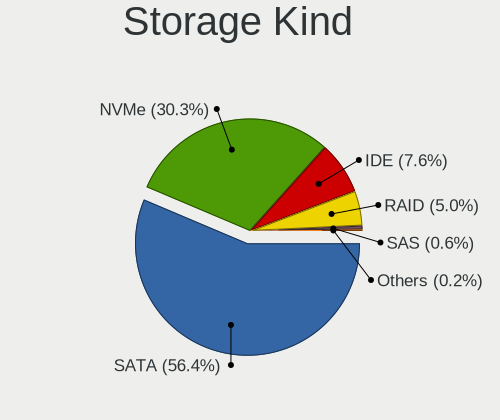
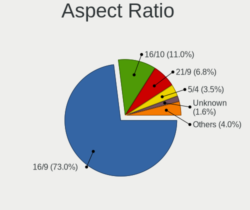
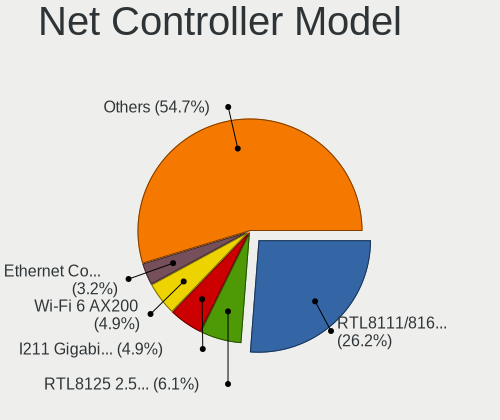
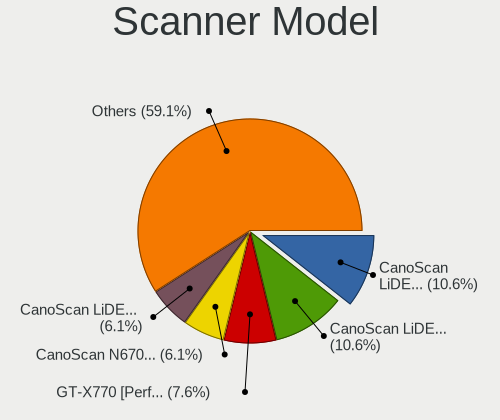
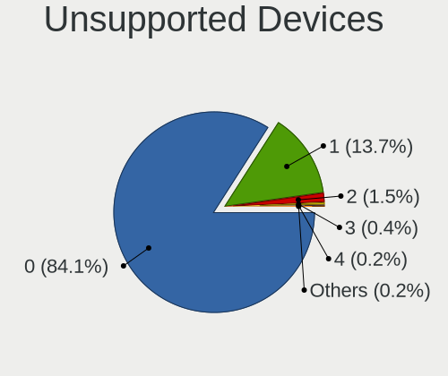
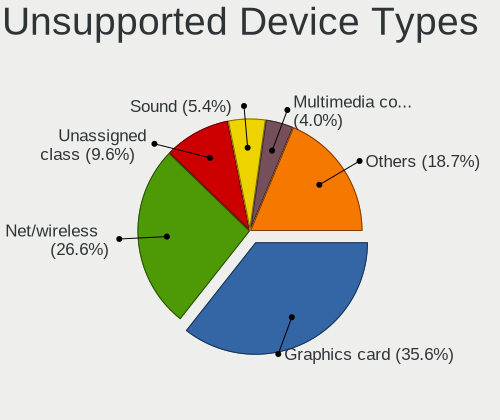

Fedora - Tested Hardware & Statistics (Desktops)
------------------------------------------------

A project to collect tested hardware configurations for Fedora.

Anyone can contribute to this report by the [hw-probe](https://github.com/linuxhw/hw-probe) tool:

    sudo -E hw-probe -all -upload

Please contribute! Especially if your hardware is rare.

Contents
--------

* [ Test Cases ](#test-cases)

* [ System ](#system)
  - [ OS                       ](#os)
  - [ OS Family                ](#os-family)
  - [ Kernel                   ](#kernel)
  - [ Kernel Family            ](#kernel-family)
  - [ Kernel Major Ver.        ](#kernel-major-ver)
  - [ Arch                     ](#arch)
  - [ DE                       ](#de)
  - [ Display Server           ](#display-server)
  - [ Display Manager          ](#display-manager)
  - [ OS Lang                  ](#os-lang)
  - [ Boot Mode                ](#boot-mode)
  - [ Filesystem               ](#filesystem)
  - [ Part. scheme             ](#part-scheme)
  - [ Dual Boot with Linux/BSD ](#dual-boot-with-linuxbsd)
  - [ Dual Boot (Win)          ](#dual-boot-win)

* [ Board ](#board)
  - [ Vendor                   ](#vendor)
  - [ Model                    ](#model)
  - [ Model Family             ](#model-family)
  - [ MFG Year                 ](#mfg-year)
  - [ Form Factor              ](#form-factor)
  - [ Secure Boot              ](#secure-boot)
  - [ Coreboot                 ](#coreboot)
  - [ RAM Size                 ](#ram-size)
  - [ RAM Used                 ](#ram-used)
  - [ Total Drives             ](#total-drives)
  - [ Has CD-ROM               ](#has-cd-rom)
  - [ Has Ethernet             ](#has-ethernet)
  - [ Has WiFi                 ](#has-wifi)
  - [ Has Bluetooth            ](#has-bluetooth)

* [ Location ](#location)
  - [ Country                  ](#country)
  - [ City                     ](#city)

* [ Drives ](#drives)
  - [ Drive Vendor             ](#drive-vendor)
  - [ Drive Model              ](#drive-model)
  - [ HDD Vendor               ](#hdd-vendor)
  - [ SSD Vendor               ](#ssd-vendor)
  - [ Drive Kind               ](#drive-kind)
  - [ Drive Connector          ](#drive-connector)
  - [ Drive Size               ](#drive-size)
  - [ Space Total              ](#space-total)
  - [ Space Used               ](#space-used)
  - [ Malfunc. Drives          ](#malfunc-drives)
  - [ Malfunc. Drive Vendor    ](#malfunc-drive-vendor)
  - [ Malfunc. HDD Vendor      ](#malfunc-hdd-vendor)
  - [ Malfunc. Drive Kind      ](#malfunc-drive-kind)
  - [ Failed Drives            ](#failed-drives)
  - [ Failed Drive Vendor      ](#failed-drive-vendor)
  - [ Drive Status             ](#drive-status)

* [ Storage controller ](#storage-controller)
  - [ Storage Vendor           ](#storage-vendor)
  - [ Storage Model            ](#storage-model)
  - [ Storage Kind             ](#storage-kind)

* [ Processor ](#processor)
  - [ CPU Vendor               ](#cpu-vendor)
  - [ CPU Model                ](#cpu-model)
  - [ CPU Model Family         ](#cpu-model-family)
  - [ CPU Cores                ](#cpu-cores)
  - [ CPU Sockets              ](#cpu-sockets)
  - [ CPU Threads              ](#cpu-threads)
  - [ CPU Op-Modes             ](#cpu-op-modes)
  - [ CPU Microcode            ](#cpu-microcode)
  - [ CPU Microarch            ](#cpu-microarch)

* [ Graphics ](#graphics)
  - [ GPU Vendor               ](#gpu-vendor)
  - [ GPU Model                ](#gpu-model)
  - [ GPU Combo                ](#gpu-combo)
  - [ GPU Driver               ](#gpu-driver)
  - [ GPU Memory               ](#gpu-memory)

* [ Monitor ](#monitor)
  - [ Monitor Vendor           ](#monitor-vendor)
  - [ Monitor Model            ](#monitor-model)
  - [ Monitor Resolution       ](#monitor-resolution)
  - [ Monitor Diagonal         ](#monitor-diagonal)
  - [ Monitor Width            ](#monitor-width)
  - [ Aspect Ratio             ](#aspect-ratio)
  - [ Monitor Area             ](#monitor-area)
  - [ Pixel Density            ](#pixel-density)
  - [ Multiple Monitors        ](#multiple-monitors)

* [ Network ](#network)
  - [ Net Controller Vendor    ](#net-controller-vendor)
  - [ Net Controller Model     ](#net-controller-model)
  - [ Wireless Vendor          ](#wireless-vendor)
  - [ Wireless Model           ](#wireless-model)
  - [ Ethernet Vendor          ](#ethernet-vendor)
  - [ Ethernet Model           ](#ethernet-model)
  - [ Net Controller Kind      ](#net-controller-kind)
  - [ Used Controller          ](#used-controller)
  - [ NICs                     ](#nics)
  - [ IPv6                     ](#ipv6)

* [ Bluetooth ](#bluetooth)
  - [ Bluetooth Vendor         ](#bluetooth-vendor)
  - [ Bluetooth Model          ](#bluetooth-model)

* [ Sound ](#sound)
  - [ Sound Vendor             ](#sound-vendor)
  - [ Sound Model              ](#sound-model)

* [ Memory ](#memory)
  - [ Memory Vendor            ](#memory-vendor)
  - [ Memory Model             ](#memory-model)
  - [ Memory Kind              ](#memory-kind)
  - [ Memory Form Factor       ](#memory-form-factor)
  - [ Memory Size              ](#memory-size)
  - [ Memory Speed             ](#memory-speed)

* [ Printers & scanners ](#printers--scanners)
  - [ Printer Vendor           ](#printer-vendor)
  - [ Printer Model            ](#printer-model)
  - [ Scanner Vendor           ](#scanner-vendor)
  - [ Scanner Model            ](#scanner-model)

* [ Camera ](#camera)
  - [ Camera Vendor            ](#camera-vendor)
  - [ Camera Model             ](#camera-model)

* [ Security ](#security)
  - [ Fingerprint Vendor       ](#fingerprint-vendor)
  - [ Fingerprint Model        ](#fingerprint-model)
  - [ Chipcard Vendor          ](#chipcard-vendor)
  - [ Chipcard Model           ](#chipcard-model)

* [ Unsupported ](#unsupported)
  - [ Unsupported Devices      ](#unsupported-devices)
  - [ Unsupported Device Types ](#unsupported-device-types)

Test Cases
----------

Total: 4742

| Vendor        | Model                       | Probe                                                      | Date         |
|---------------|-----------------------------|------------------------------------------------------------|--------------|
| ASUSTek       | TUF Gaming X570-PRO         | [b902f5d873](https://linux-hardware.org/?probe=b902f5d873) | Oct 01, 2022 |
| Lenovo        | SHARKBAY SDK0E50512 STD     | [ee22a244e2](https://linux-hardware.org/?probe=ee22a244e2) | Oct 01, 2022 |
| ASRock        | AD2700-ITX                  | [4275ef3653](https://linux-hardware.org/?probe=4275ef3653) | Oct 01, 2022 |
| ASRock        | FM2A88X Extreme6+           | [186495d063](https://linux-hardware.org/?probe=186495d063) | Oct 01, 2022 |
| MSI           | X99A RAIDER                 | [847283c85d](https://linux-hardware.org/?probe=847283c85d) | Oct 01, 2022 |
| Gigabyte      | B75M-D3H                    | [162334ac1e](https://linux-hardware.org/?probe=162334ac1e) | Sep 30, 2022 |
| MSI           | B450 GAMING PLUS MAX        | [c06e7e3586](https://linux-hardware.org/?probe=c06e7e3586) | Sep 30, 2022 |
| ASRock        | B450M Pro4                  | [ed76eeb703](https://linux-hardware.org/?probe=ed76eeb703) | Sep 30, 2022 |
| MSI           | X99A RAIDER                 | [7b0b80d00c](https://linux-hardware.org/?probe=7b0b80d00c) | Sep 30, 2022 |
| ASRock        | FM2A88X Extreme6+           | [6553398b7d](https://linux-hardware.org/?probe=6553398b7d) | Sep 30, 2022 |
| ASRock        | H270M-ITX/ac                | [c6ae2f8a45](https://linux-hardware.org/?probe=c6ae2f8a45) | Sep 29, 2022 |
| ASUSTek       | PRIME Z270-A                | [4118e245a3](https://linux-hardware.org/?probe=4118e245a3) | Sep 29, 2022 |
| ASRock        | FM2A88X Extreme6+           | [362c6b7436](https://linux-hardware.org/?probe=362c6b7436) | Sep 29, 2022 |
| MSI           | X99A RAIDER                 | [d4e346f990](https://linux-hardware.org/?probe=d4e346f990) | Sep 29, 2022 |
| ASRock        | A320M-HD                    | [a674def12d](https://linux-hardware.org/?probe=a674def12d) | Sep 29, 2022 |
| Biostar       | H410MH S2                   | [fbba79fc43](https://linux-hardware.org/?probe=fbba79fc43) | Sep 28, 2022 |
| Gigabyte      | B450M AORUS ELITE           | [513d236a1f](https://linux-hardware.org/?probe=513d236a1f) | Sep 28, 2022 |
| Dell          | 0YGYJY A01                  | [73e69debd9](https://linux-hardware.org/?probe=73e69debd9) | Sep 27, 2022 |
| Gigabyte      | Z690I AORUS ULTRA DDR4      | [7af967061b](https://linux-hardware.org/?probe=7af967061b) | Sep 27, 2022 |
| Intel         | DP35DP AAD81073-208         | [031ff09179](https://linux-hardware.org/?probe=031ff09179) | Sep 27, 2022 |
| Gigabyte      | Z170-D3H-CF                 | [254a78c371](https://linux-hardware.org/?probe=254a78c371) | Sep 26, 2022 |
| ASUSTek       | ROG CROSSHAIR VIII DARK ... | [6373bf42ef](https://linux-hardware.org/?probe=6373bf42ef) | Sep 26, 2022 |
| ASUSTek       | ROG CROSSHAIR VIII DARK ... | [9ff2009089](https://linux-hardware.org/?probe=9ff2009089) | Sep 26, 2022 |
| ASUSTek       | TUF Gaming B560-PLUS WIF... | [56c982050d](https://linux-hardware.org/?probe=56c982050d) | Sep 25, 2022 |
| Gigabyte      | B550I AORUS PRO AX          | [778f7340fa](https://linux-hardware.org/?probe=778f7340fa) | Sep 25, 2022 |
| Gigabyte      | B450 GAMING X               | [982d41c1eb](https://linux-hardware.org/?probe=982d41c1eb) | Sep 25, 2022 |
| Lenovo        | 3098 NOK                    | [0f6ea5edfa](https://linux-hardware.org/?probe=0f6ea5edfa) | Sep 25, 2022 |
| ASUSTek       | TUF Gaming B660M-PLUS D4    | [82b73270ca](https://linux-hardware.org/?probe=82b73270ca) | Sep 25, 2022 |
| ASRock        | A320M-HD                    | [b26f7bf9f5](https://linux-hardware.org/?probe=b26f7bf9f5) | Sep 25, 2022 |
| Gigabyte      | B450 GAMING X               | [a5d5950e29](https://linux-hardware.org/?probe=a5d5950e29) | Sep 25, 2022 |
| MSI           | MAG Z590 TORPEDO            | [cedbd8909f](https://linux-hardware.org/?probe=cedbd8909f) | Sep 25, 2022 |
| ASUSTek       | TUF Gaming B660M-PLUS D4    | [a1f261d09d](https://linux-hardware.org/?probe=a1f261d09d) | Sep 25, 2022 |
| Acer          | Aspire X1900                | [c7b768051b](https://linux-hardware.org/?probe=c7b768051b) | Sep 25, 2022 |
| Gigabyte      | GA-MA785G-UD3H              | [66b5b65077](https://linux-hardware.org/?probe=66b5b65077) | Sep 25, 2022 |
| Gigabyte      | GA-MA780G-UD3H              | [a35dda8c10](https://linux-hardware.org/?probe=a35dda8c10) | Sep 25, 2022 |
| ASRock        | FM2A88X Extreme4+           | [2d44b203f9](https://linux-hardware.org/?probe=2d44b203f9) | Sep 25, 2022 |
| ASRock        | FM2A88X Extreme6+           | [a4b47e7325](https://linux-hardware.org/?probe=a4b47e7325) | Sep 25, 2022 |
| MSI           | X99A RAIDER                 | [adb952e34b](https://linux-hardware.org/?probe=adb952e34b) | Sep 25, 2022 |
| ASRock        | Z170M Extreme4              | [bd1e98639b](https://linux-hardware.org/?probe=bd1e98639b) | Sep 24, 2022 |
| ASUSTek       | TUF Gaming X570-PLUS        | [ee8183722c](https://linux-hardware.org/?probe=ee8183722c) | Sep 24, 2022 |
| ASUSTek       | PRIME B660M-A D4            | [542249f675](https://linux-hardware.org/?probe=542249f675) | Sep 24, 2022 |
| ASRock        | FM2A88X Extreme6+           | [ab2e3b1767](https://linux-hardware.org/?probe=ab2e3b1767) | Sep 24, 2022 |
| MSI           | X99A RAIDER                 | [a89311b338](https://linux-hardware.org/?probe=a89311b338) | Sep 24, 2022 |
| ASUSTek       | PRIME B365M-A               | [c4c88d72ae](https://linux-hardware.org/?probe=c4c88d72ae) | Sep 23, 2022 |
| ASUSTek       | TUF Gaming B550-PLUS        | [31f1acf273](https://linux-hardware.org/?probe=31f1acf273) | Sep 23, 2022 |
| ASUSTek       | PRIME B250M-C               | [2e45736b42](https://linux-hardware.org/?probe=2e45736b42) | Sep 23, 2022 |
| ASUSTek       | TUF Gaming X570-PLUS        | [ac59b4138c](https://linux-hardware.org/?probe=ac59b4138c) | Sep 23, 2022 |
| ASUSTek       | ROG STRIX B450-F GAMING ... | [a4ce7c179e](https://linux-hardware.org/?probe=a4ce7c179e) | Sep 23, 2022 |
| Gigabyte      | B660I AORUS PRO DDR4        | [810c7883d4](https://linux-hardware.org/?probe=810c7883d4) | Sep 23, 2022 |
| ASUSTek       | TUF Gaming B560-PLUS WIF... | [7d69f0c6c6](https://linux-hardware.org/?probe=7d69f0c6c6) | Sep 23, 2022 |
| ASRock        | FM2A88X Extreme6+           | [0f750af134](https://linux-hardware.org/?probe=0f750af134) | Sep 23, 2022 |
| Gigabyte      | Z270P-D3-CF                 | [79509e063b](https://linux-hardware.org/?probe=79509e063b) | Sep 23, 2022 |
| MSI           | X99A RAIDER                 | [3e88be3301](https://linux-hardware.org/?probe=3e88be3301) | Sep 23, 2022 |
| MSI           | FM2-A55M-E33                | [4867faffbf](https://linux-hardware.org/?probe=4867faffbf) | Sep 23, 2022 |
| Foxconn       | H61M-S/H61M                 | [039b5cff54](https://linux-hardware.org/?probe=039b5cff54) | Sep 22, 2022 |
| MSI           | H310M PRO-VH                | [c11e067cb5](https://linux-hardware.org/?probe=c11e067cb5) | Sep 22, 2022 |
| ASRock        | FM2A88X Extreme6+           | [bfb470649a](https://linux-hardware.org/?probe=bfb470649a) | Sep 22, 2022 |
| MSI           | X99A RAIDER                 | [dd6c618f48](https://linux-hardware.org/?probe=dd6c618f48) | Sep 22, 2022 |
| Gigabyte      | Z68X-UD3H-B3                | [11ea16f0d6](https://linux-hardware.org/?probe=11ea16f0d6) | Sep 22, 2022 |
| ASUSTek       | PRIME B365M-A               | [289b9dcac8](https://linux-hardware.org/?probe=289b9dcac8) | Sep 21, 2022 |
| ASUSTek       | Pro WS WRX80E-SAGE SE WI... | [54d3096bb6](https://linux-hardware.org/?probe=54d3096bb6) | Sep 21, 2022 |
| BESSTAR Te... | UM350                       | [62a9723eb7](https://linux-hardware.org/?probe=62a9723eb7) | Sep 21, 2022 |
| Dell          | 040DDP A01                  | [20d37d51bd](https://linux-hardware.org/?probe=20d37d51bd) | Sep 21, 2022 |
| Dell          | 040DDP A01                  | [cabebaa0e6](https://linux-hardware.org/?probe=cabebaa0e6) | Sep 21, 2022 |
| ASRock        | FM2A88X Extreme6+           | [754dfba736](https://linux-hardware.org/?probe=754dfba736) | Sep 21, 2022 |
| MSI           | X99A RAIDER                 | [a0f2dedc00](https://linux-hardware.org/?probe=a0f2dedc00) | Sep 21, 2022 |
| HP            | ProLiant ML110 G7           | [d5b4924a7b](https://linux-hardware.org/?probe=d5b4924a7b) | Sep 20, 2022 |
| Gigabyte      | A320M-S2H-CF                | [015c8dd353](https://linux-hardware.org/?probe=015c8dd353) | Sep 20, 2022 |
| Gigabyte      | X570 I AORUS PRO WIFI       | [1869422fde](https://linux-hardware.org/?probe=1869422fde) | Sep 20, 2022 |
| ASUSTek       | Z170-A                      | [aad09d3281](https://linux-hardware.org/?probe=aad09d3281) | Sep 20, 2022 |
| ASUSTek       | Z97-AR                      | [5cf4494f07](https://linux-hardware.org/?probe=5cf4494f07) | Sep 20, 2022 |
| ASRock        | FM2A88X Extreme6+           | [fa5f7f7245](https://linux-hardware.org/?probe=fa5f7f7245) | Sep 20, 2022 |
| MSI           | X99A RAIDER                 | [926189f2ee](https://linux-hardware.org/?probe=926189f2ee) | Sep 20, 2022 |
| Lenovo        | 30D9 SDK0J40705 WIN 3425... | [75854836f7](https://linux-hardware.org/?probe=75854836f7) | Sep 20, 2022 |
| Dell          | 0K3CM7 A00                  | [3f82789198](https://linux-hardware.org/?probe=3f82789198) | Sep 20, 2022 |
| Dell          | 0K3CM7 A00                  | [b6ce2720e2](https://linux-hardware.org/?probe=b6ce2720e2) | Sep 20, 2022 |
| ASRock        | H610M-HDV/M.2               | [02a5a10d7a](https://linux-hardware.org/?probe=02a5a10d7a) | Sep 20, 2022 |
| ASUSTek       | A88X-PRO                    | [b88a699d58](https://linux-hardware.org/?probe=b88a699d58) | Sep 19, 2022 |
| ASUSTek       | PRIME Z270-P                | [d44ac0cc2a](https://linux-hardware.org/?probe=d44ac0cc2a) | Sep 19, 2022 |
| ASUSTek       | PRIME X470-PRO              | [a6857e4b03](https://linux-hardware.org/?probe=a6857e4b03) | Sep 19, 2022 |
| Gigabyte      | X570 AORUS MASTER           | [424e3ded44](https://linux-hardware.org/?probe=424e3ded44) | Sep 19, 2022 |
| Dell          | 0J3C2F A02                  | [8027be6f7e](https://linux-hardware.org/?probe=8027be6f7e) | Sep 19, 2022 |
| HP            | 2B05                        | [c2dcdaa38a](https://linux-hardware.org/?probe=c2dcdaa38a) | Sep 19, 2022 |
| HP            | 2B05                        | [18db320ef7](https://linux-hardware.org/?probe=18db320ef7) | Sep 19, 2022 |
| ASUSTek       | TUF Gaming B550M-PLUS       | [f8bf8fd596](https://linux-hardware.org/?probe=f8bf8fd596) | Sep 19, 2022 |
| ASUSTek       | ROG STRIX X570-F GAMING     | [7a1dbe2204](https://linux-hardware.org/?probe=7a1dbe2204) | Sep 19, 2022 |
| MSI           | B450 GAMING PLUS MAX        | [8072b6c0e0](https://linux-hardware.org/?probe=8072b6c0e0) | Sep 19, 2022 |
| ASUSTek       | P8Q77-M2                    | [1e067b7c4f](https://linux-hardware.org/?probe=1e067b7c4f) | Sep 19, 2022 |
| Dell          | 0KWVT8 A03                  | [7c52790345](https://linux-hardware.org/?probe=7c52790345) | Sep 19, 2022 |
| ASRock        | X570 Steel Legend           | [6fd34fa73b](https://linux-hardware.org/?probe=6fd34fa73b) | Sep 19, 2022 |
| Gigabyte      | A520M DS3H                  | [bf7318e65e](https://linux-hardware.org/?probe=bf7318e65e) | Sep 19, 2022 |
| Gigabyte      | B85M-D3V-A                  | [8f6b96ba44](https://linux-hardware.org/?probe=8f6b96ba44) | Sep 19, 2022 |
| ASUSTek       | Z97-P                       | [37f0f7b888](https://linux-hardware.org/?probe=37f0f7b888) | Sep 19, 2022 |
| ASRock        | X570 Phantom Gaming 4       | [75be2db65c](https://linux-hardware.org/?probe=75be2db65c) | Sep 19, 2022 |
| Dell          | 02M8NY A01                  | [498286eb91](https://linux-hardware.org/?probe=498286eb91) | Sep 19, 2022 |
| ASUSTek       | ROG CROSSHAIR VIII IMPAC... | [3da12828c0](https://linux-hardware.org/?probe=3da12828c0) | Sep 19, 2022 |
| Gigabyte      | GA-MA780G-UD3H              | [6c63c03b9f](https://linux-hardware.org/?probe=6c63c03b9f) | Sep 19, 2022 |
| ASRock        | 960GM-VGS3 FX               | [7c89dc4342](https://linux-hardware.org/?probe=7c89dc4342) | Sep 19, 2022 |
| ASRock        | FM2A88X Extreme6+           | [5233832be3](https://linux-hardware.org/?probe=5233832be3) | Sep 19, 2022 |
| MSI           | X99A RAIDER                 | [4fb85d59e0](https://linux-hardware.org/?probe=4fb85d59e0) | Sep 19, 2022 |
| ASUSTek       | ProArt Z690-CREATOR WIFI    | [48479f01c1](https://linux-hardware.org/?probe=48479f01c1) | Sep 19, 2022 |
| Gigabyte      | A320M-S2H-CF                | [8d2c35d5f2](https://linux-hardware.org/?probe=8d2c35d5f2) | Sep 19, 2022 |
| ASUSTek       | TUF B350M-PLUS GAMING       | [27d1f0c593](https://linux-hardware.org/?probe=27d1f0c593) | Sep 19, 2022 |
| ASUSTek       | TUF Gaming B550M-PLUS       | [8468466b2a](https://linux-hardware.org/?probe=8468466b2a) | Sep 19, 2022 |
| ASUSTek       | P8Q77-M2                    | [171e24a5c1](https://linux-hardware.org/?probe=171e24a5c1) | Sep 19, 2022 |
| ASUSTek       | PRIME X570-PRO              | [798bb8eda6](https://linux-hardware.org/?probe=798bb8eda6) | Sep 18, 2022 |
| ASUSTek       | TUF Gaming B660M-PLUS D4    | [b48eda0e37](https://linux-hardware.org/?probe=b48eda0e37) | Sep 18, 2022 |
| ASUSTek       | PRIME H410M-K R2.0          | [7d18b85f33](https://linux-hardware.org/?probe=7d18b85f33) | Sep 18, 2022 |
| ASUSTek       | ROG STRIX Z690-A GAMING ... | [21da8441d5](https://linux-hardware.org/?probe=21da8441d5) | Sep 18, 2022 |
| Casper        | NIRVANA DESKTOP             | [7cdffad4a2](https://linux-hardware.org/?probe=7cdffad4a2) | Sep 18, 2022 |
| ASUSTek       | PRIME B660M-A D4            | [1f27376b8e](https://linux-hardware.org/?probe=1f27376b8e) | Sep 18, 2022 |
| Acer          | Aspire TC-780               | [936ece435c](https://linux-hardware.org/?probe=936ece435c) | Sep 18, 2022 |
| Acer          | A75F2-M2 P21-A1             | [2d00ba463b](https://linux-hardware.org/?probe=2d00ba463b) | Sep 18, 2022 |
| MSI           | X99A RAIDER                 | [c352d61c4e](https://linux-hardware.org/?probe=c352d61c4e) | Sep 18, 2022 |
| ASRock        | FM2A88X Extreme6+           | [7161071790](https://linux-hardware.org/?probe=7161071790) | Sep 18, 2022 |
| ASRock        | B550M-ITX/ac                | [379aaf7b61](https://linux-hardware.org/?probe=379aaf7b61) | Sep 16, 2022 |
| ASUSTek       | PRIME B365M-A               | [e191511194](https://linux-hardware.org/?probe=e191511194) | Sep 16, 2022 |
| ASUSTek       | P8Z68-V LX                  | [07dd87b76b](https://linux-hardware.org/?probe=07dd87b76b) | Sep 16, 2022 |
| HP            | 3397                        | [637a5570cf](https://linux-hardware.org/?probe=637a5570cf) | Sep 16, 2022 |
| Gigabyte      | A320M-S2H V2-CF             | [4d460404c8](https://linux-hardware.org/?probe=4d460404c8) | Sep 16, 2022 |
| Gigabyte      | A320M-S2H V2-CF             | [881adad6fb](https://linux-hardware.org/?probe=881adad6fb) | Sep 16, 2022 |
| Gigabyte      | AB350-Gaming 3-CF           | [9bfc1472d1](https://linux-hardware.org/?probe=9bfc1472d1) | Sep 16, 2022 |
| Gigabyte      | AB350N-Gaming WIFI-CF       | [dcaf7e8bd0](https://linux-hardware.org/?probe=dcaf7e8bd0) | Sep 15, 2022 |
| ASRock        | X370 Gaming K4              | [0858e80da7](https://linux-hardware.org/?probe=0858e80da7) | Sep 15, 2022 |
| Gigabyte      | B85M-D3V-A                  | [a856637b19](https://linux-hardware.org/?probe=a856637b19) | Sep 15, 2022 |
| Gigabyte      | Z97P-D3                     | [ca9e537823](https://linux-hardware.org/?probe=ca9e537823) | Sep 15, 2022 |
| ASUSTek       | TUF Gaming B660M-PLUS D4    | [e633838a51](https://linux-hardware.org/?probe=e633838a51) | Sep 15, 2022 |
| ASUSTek       | P5PL2-E                     | [84bfb7d319](https://linux-hardware.org/?probe=84bfb7d319) | Sep 15, 2022 |
| ASUSTek       | PRIME Z270-A                | [2642647feb](https://linux-hardware.org/?probe=2642647feb) | Sep 14, 2022 |
| MSI           | MPG B550 GAMING PLUS        | [55216d250b](https://linux-hardware.org/?probe=55216d250b) | Sep 14, 2022 |
| MSI           | MPG B550 GAMING PLUS        | [fb9010fc1f](https://linux-hardware.org/?probe=fb9010fc1f) | Sep 14, 2022 |
| HP            | 805D                        | [8acaebbd42](https://linux-hardware.org/?probe=8acaebbd42) | Sep 14, 2022 |
| ASUSTek       | TUF Gaming B550M-PLUS       | [3557099732](https://linux-hardware.org/?probe=3557099732) | Sep 14, 2022 |
| HP            | 1998                        | [bf93a500f4](https://linux-hardware.org/?probe=bf93a500f4) | Sep 14, 2022 |
| ASRock        | FM2A88X Extreme6+           | [37d6996290](https://linux-hardware.org/?probe=37d6996290) | Sep 14, 2022 |
| MSI           | X99A RAIDER                 | [d91d28cc52](https://linux-hardware.org/?probe=d91d28cc52) | Sep 14, 2022 |
| Gigabyte      | X470 AORUS GAMING 7 WIFI... | [e7cb70c141](https://linux-hardware.org/?probe=e7cb70c141) | Sep 14, 2022 |
| Gigabyte      | X470 AORUS ULTRA GAMING-... | [754d0f3a2b](https://linux-hardware.org/?probe=754d0f3a2b) | Sep 14, 2022 |
| ASUSTek       | ROG STRIX X570-F GAMING     | [175c84f6ea](https://linux-hardware.org/?probe=175c84f6ea) | Sep 13, 2022 |
| ASUSTek       | Z170 PRO GAMING             | [d3f957e34a](https://linux-hardware.org/?probe=d3f957e34a) | Sep 13, 2022 |
| ASUSTek       | PRIME B450-PLUS             | [9b2a84cd02](https://linux-hardware.org/?probe=9b2a84cd02) | Sep 13, 2022 |
| ASUSTek       | PRIME B450-PLUS             | [1285ab4d66](https://linux-hardware.org/?probe=1285ab4d66) | Sep 13, 2022 |
| ASRock        | FM2A88X Extreme6+           | [a6e7414518](https://linux-hardware.org/?probe=a6e7414518) | Sep 13, 2022 |
| MSI           | X99A RAIDER                 | [f3fe87a412](https://linux-hardware.org/?probe=f3fe87a412) | Sep 13, 2022 |
| ASRock        | FM2A55M-HD+ R2.0            | [1faad914c6](https://linux-hardware.org/?probe=1faad914c6) | Sep 13, 2022 |
| Unknown       | X99H                        | [9fb8886110](https://linux-hardware.org/?probe=9fb8886110) | Sep 13, 2022 |
| Dell          | 0M017G A00                  | [e040958337](https://linux-hardware.org/?probe=e040958337) | Sep 13, 2022 |
| Gigabyte      | A320M-S2H V2-CF             | [7ce5d8e865](https://linux-hardware.org/?probe=7ce5d8e865) | Sep 12, 2022 |
| Gigabyte      | A320M-S2H V2-CF             | [ec5f57ab65](https://linux-hardware.org/?probe=ec5f57ab65) | Sep 12, 2022 |
| ASUSTek       | Z97-A                       | [b23a59ba48](https://linux-hardware.org/?probe=b23a59ba48) | Sep 12, 2022 |
| HP            | 1494                        | [0faa06cff4](https://linux-hardware.org/?probe=0faa06cff4) | Sep 12, 2022 |
| ASUSTek       | Z97-A                       | [294aa98426](https://linux-hardware.org/?probe=294aa98426) | Sep 12, 2022 |
| BESSTAR Te... | UM700                       | [6847632df3](https://linux-hardware.org/?probe=6847632df3) | Sep 12, 2022 |
| MSI           | X99A RAIDER                 | [73bc6cd9e3](https://linux-hardware.org/?probe=73bc6cd9e3) | Sep 11, 2022 |
| ASRock        | FM2A88X Extreme6+           | [d85067b0f0](https://linux-hardware.org/?probe=d85067b0f0) | Sep 11, 2022 |
| MSI           | MPG Z490 GAMING PLUS        | [a3b824ba41](https://linux-hardware.org/?probe=a3b824ba41) | Sep 10, 2022 |
| ASUSTek       | Z170-A                      | [66c2198f48](https://linux-hardware.org/?probe=66c2198f48) | Sep 10, 2022 |
| MSI           | MAG B550 TORPEDO            | [841be89be6](https://linux-hardware.org/?probe=841be89be6) | Sep 10, 2022 |
| MSI           | MAG B550 TORPEDO            | [626cf13c17](https://linux-hardware.org/?probe=626cf13c17) | Sep 10, 2022 |
| MSI           | A320M GAMING PRO            | [6ce0fb28ee](https://linux-hardware.org/?probe=6ce0fb28ee) | Sep 10, 2022 |
| MSI           | A320M GAMING PRO            | [5cce5f5ade](https://linux-hardware.org/?probe=5cce5f5ade) | Sep 10, 2022 |
| ASUSTek       | B150 PRO GAMING             | [5e145ec2d1](https://linux-hardware.org/?probe=5e145ec2d1) | Sep 10, 2022 |
| Gigabyte      | GA-MA780G-UD3H              | [2cb423c8e7](https://linux-hardware.org/?probe=2cb423c8e7) | Sep 10, 2022 |
| ASUSTek       | ROG STRIX X570-E GAMING ... | [03979fc286](https://linux-hardware.org/?probe=03979fc286) | Sep 10, 2022 |
| MSI           | X99A RAIDER                 | [3ce68aa737](https://linux-hardware.org/?probe=3ce68aa737) | Sep 10, 2022 |
| ASRock        | FM2A88X Extreme6+           | [20ee71a4d6](https://linux-hardware.org/?probe=20ee71a4d6) | Sep 10, 2022 |
| ASUSTek       | ROG STRIX X570-E GAMING ... | [c6dac06569](https://linux-hardware.org/?probe=c6dac06569) | Sep 09, 2022 |
| Gigabyte      | H77N-WIFI                   | [3c454664b0](https://linux-hardware.org/?probe=3c454664b0) | Sep 09, 2022 |
| Biostar       | A780L3G                     | [e53730ab48](https://linux-hardware.org/?probe=e53730ab48) | Sep 09, 2022 |
| ASRock        | B550M Pro4                  | [e43ef549eb](https://linux-hardware.org/?probe=e43ef549eb) | Sep 08, 2022 |
| ASRock        | B550M Pro4                  | [ac6cb859ad](https://linux-hardware.org/?probe=ac6cb859ad) | Sep 08, 2022 |
| ASUSTek       | TUF Gaming B550-PLUS        | [174c263499](https://linux-hardware.org/?probe=174c263499) | Sep 08, 2022 |
| Gigabyte      | Z97-HD3                     | [aeb2bae778](https://linux-hardware.org/?probe=aeb2bae778) | Sep 08, 2022 |
| Intel         | DH77DF AAG40293-300         | [217971d572](https://linux-hardware.org/?probe=217971d572) | Sep 08, 2022 |
| Dell          | 02YRK5 A02                  | [daf3e0182b](https://linux-hardware.org/?probe=daf3e0182b) | Sep 08, 2022 |
| Gigabyte      | Z97-HD3                     | [d5040ffbda](https://linux-hardware.org/?probe=d5040ffbda) | Sep 08, 2022 |
| HP            | 18E4                        | [1e8addf905](https://linux-hardware.org/?probe=1e8addf905) | Sep 08, 2022 |
| ASUSTek       | H110M-A                     | [dad38946f6](https://linux-hardware.org/?probe=dad38946f6) | Sep 08, 2022 |
| Gigabyte      | B550 AORUS PRO AC           | [0f0a18c852](https://linux-hardware.org/?probe=0f0a18c852) | Sep 08, 2022 |
| Gigabyte      | B550 AORUS PRO AC           | [e06271e233](https://linux-hardware.org/?probe=e06271e233) | Sep 08, 2022 |
| ASUSTek       | TUF B350M-PLUS GAMING       | [051ea3b002](https://linux-hardware.org/?probe=051ea3b002) | Sep 08, 2022 |
| ASUSTek       | Z97-A                       | [46be1ea134](https://linux-hardware.org/?probe=46be1ea134) | Sep 08, 2022 |
| MSI           | Z97 PC Mate                 | [bcf93bb718](https://linux-hardware.org/?probe=bcf93bb718) | Sep 08, 2022 |
| Biostar       | H310MHP                     | [6063bede72](https://linux-hardware.org/?probe=6063bede72) | Sep 07, 2022 |
| Dell          | 02YRK5 A02                  | [2395ab5aed](https://linux-hardware.org/?probe=2395ab5aed) | Sep 07, 2022 |
| ASUSTek       | H97-PRO                     | [fb4bfcf055](https://linux-hardware.org/?probe=fb4bfcf055) | Sep 07, 2022 |
| ASRock        | EP2C602                     | [56a6980ddc](https://linux-hardware.org/?probe=56a6980ddc) | Sep 07, 2022 |
| Lenovo        | 36D9 SDK0J40700 WIN 3258... | [a816f4f60b](https://linux-hardware.org/?probe=a816f4f60b) | Sep 07, 2022 |
| ASUSTek       | Z97-AR                      | [01dbdc3b29](https://linux-hardware.org/?probe=01dbdc3b29) | Sep 06, 2022 |
| MSI           | X99A RAIDER                 | [ad0d0e6994](https://linux-hardware.org/?probe=ad0d0e6994) | Sep 06, 2022 |
| ASRock        | FM2A88X Extreme6+           | [dad765ca9e](https://linux-hardware.org/?probe=dad765ca9e) | Sep 06, 2022 |
| MSI           | MEG X570 ACE                | [5f7f592f25](https://linux-hardware.org/?probe=5f7f592f25) | Sep 05, 2022 |
| MSI           | MPG B550 GAMING EDGE WIF... | [e83fa739c9](https://linux-hardware.org/?probe=e83fa739c9) | Sep 05, 2022 |
| MSI           | B550-A PRO                  | [950b2a8eb5](https://linux-hardware.org/?probe=950b2a8eb5) | Sep 05, 2022 |
| ASUSTek       | ROG STRIX X570-E GAMING     | [127c2f5f75](https://linux-hardware.org/?probe=127c2f5f75) | Sep 05, 2022 |
| Gigabyte      | EP45-DS3L                   | [cb17ac9b4e](https://linux-hardware.org/?probe=cb17ac9b4e) | Sep 05, 2022 |
| Gigabyte      | Z370M DS3H-CF               | [e590a83122](https://linux-hardware.org/?probe=e590a83122) | Sep 05, 2022 |
| Lenovo        | 367D 31900003 STD           | [c145bac65a](https://linux-hardware.org/?probe=c145bac65a) | Sep 05, 2022 |
| MSI           | MAG B550 TOMAHAWK           | [7c87d1ad42](https://linux-hardware.org/?probe=7c87d1ad42) | Sep 05, 2022 |
| MSI           | X99A RAIDER                 | [a84dbefc98](https://linux-hardware.org/?probe=a84dbefc98) | Sep 05, 2022 |
| ASRock        | FM2A88X Extreme6+           | [0df0bba932](https://linux-hardware.org/?probe=0df0bba932) | Sep 05, 2022 |
| Lenovo        | 30D2 SDK0J40697 WIN 3305... | [b4a71c0eff](https://linux-hardware.org/?probe=b4a71c0eff) | Sep 04, 2022 |
| ASUSTek       | TUF Gaming B550-PLUS        | [2cf13f4045](https://linux-hardware.org/?probe=2cf13f4045) | Sep 04, 2022 |
| ASUSTek       | KCMA-D8                     | [df5fdfccf0](https://linux-hardware.org/?probe=df5fdfccf0) | Sep 04, 2022 |
| MSI           | H510M-A PRO                 | [7bb2d68f03](https://linux-hardware.org/?probe=7bb2d68f03) | Sep 04, 2022 |
| Foxconn       | 2AB1                        | [3b7dae5f40](https://linux-hardware.org/?probe=3b7dae5f40) | Sep 04, 2022 |
| Gigabyte      | F2A78M-D3H                  | [5b0da32c82](https://linux-hardware.org/?probe=5b0da32c82) | Sep 03, 2022 |
| ASRock        | X399 Phantom Gaming 6       | [ea22a308c9](https://linux-hardware.org/?probe=ea22a308c9) | Sep 03, 2022 |
| ASRock        | X399 Phantom Gaming 6       | [bd2f18b5a5](https://linux-hardware.org/?probe=bd2f18b5a5) | Sep 03, 2022 |
| MSI           | B450 GAMING PLUS MAX        | [159c1dcd33](https://linux-hardware.org/?probe=159c1dcd33) | Sep 03, 2022 |
| MSI           | X570-A PRO                  | [e20b509508](https://linux-hardware.org/?probe=e20b509508) | Sep 03, 2022 |
| ASUSTek       | ROG STRIX Z390-F GAMING     | [b9f43af7d0](https://linux-hardware.org/?probe=b9f43af7d0) | Sep 03, 2022 |
| ASUSTek       | TUF Gaming B460M-PLUS       | [5dcc9cd8c8](https://linux-hardware.org/?probe=5dcc9cd8c8) | Sep 03, 2022 |
| ASUSTek       | ROG STRIX Z390-F GAMING     | [9cab157472](https://linux-hardware.org/?probe=9cab157472) | Sep 03, 2022 |
| ASUSTek       | Z170-K                      | [d47c5fe35c](https://linux-hardware.org/?probe=d47c5fe35c) | Sep 03, 2022 |
| Gigabyte      | B450M DS3H-CF               | [5f37e7a618](https://linux-hardware.org/?probe=5f37e7a618) | Sep 03, 2022 |
| ASRock        | X470 Taichi                 | [0a6ff089f1](https://linux-hardware.org/?probe=0a6ff089f1) | Sep 03, 2022 |
| MSI           | X470 GAMING PRO MAX         | [7f10b8002b](https://linux-hardware.org/?probe=7f10b8002b) | Sep 03, 2022 |
| BESSTAR Te... | UM350                       | [02423b61e0](https://linux-hardware.org/?probe=02423b61e0) | Sep 03, 2022 |
| Foxconn       | 2ADA                        | [f1ca159a19](https://linux-hardware.org/?probe=f1ca159a19) | Sep 03, 2022 |
| Acer          | Aspire M3910                | [17c1079582](https://linux-hardware.org/?probe=17c1079582) | Sep 02, 2022 |
| Gigabyte      | GA-MA780G-UD3H              | [0a1de8a406](https://linux-hardware.org/?probe=0a1de8a406) | Sep 02, 2022 |
| ASRock        | FM2A88X Extreme6+           | [446e2d292a](https://linux-hardware.org/?probe=446e2d292a) | Sep 02, 2022 |
| MSI           | X99A RAIDER                 | [6fa62e0277](https://linux-hardware.org/?probe=6fa62e0277) | Sep 02, 2022 |
| Dell          | 0MWYPT A02                  | [e2f98387b0](https://linux-hardware.org/?probe=e2f98387b0) | Sep 01, 2022 |
| Gigabyte      | GA-MA785G-UD3H              | [2cf98644bc](https://linux-hardware.org/?probe=2cf98644bc) | Sep 01, 2022 |
| ASRock        | FM2A88X Extreme6+           | [689c3aa34d](https://linux-hardware.org/?probe=689c3aa34d) | Sep 01, 2022 |
| MSI           | X99A RAIDER                 | [5cf1e75ad4](https://linux-hardware.org/?probe=5cf1e75ad4) | Sep 01, 2022 |
| MSI           | MPG B550I GAMING EDGE WI... | [c5547cac7c](https://linux-hardware.org/?probe=c5547cac7c) | Aug 31, 2022 |
| MSI           | MPG B550I GAMING EDGE WI... | [e5c7462ead](https://linux-hardware.org/?probe=e5c7462ead) | Aug 31, 2022 |
| Gigabyte      | X570S AORUS ELITE AX        | [36eb80672f](https://linux-hardware.org/?probe=36eb80672f) | Aug 31, 2022 |
| ASRock        | FM2A88X Extreme6+           | [df96c4acaf](https://linux-hardware.org/?probe=df96c4acaf) | Aug 31, 2022 |
| MSI           | X99A RAIDER                 | [56a6f41ffa](https://linux-hardware.org/?probe=56a6f41ffa) | Aug 31, 2022 |
| Dell          | 0KV3RP A00                  | [731a14ee10](https://linux-hardware.org/?probe=731a14ee10) | Aug 31, 2022 |
| MSI           | B450 GAMING PRO CARBON A... | [2c72dfccbb](https://linux-hardware.org/?probe=2c72dfccbb) | Aug 30, 2022 |
| MSI           | X99A RAIDER                 | [09b6390c84](https://linux-hardware.org/?probe=09b6390c84) | Aug 30, 2022 |
| ASRock        | FM2A88X Extreme6+           | [eba231b7db](https://linux-hardware.org/?probe=eba231b7db) | Aug 30, 2022 |
| HP            | 8464                        | [16bb2588e0](https://linux-hardware.org/?probe=16bb2588e0) | Aug 30, 2022 |
| Gigabyte      | Z170-D3H-CF                 | [d9d75bc1f0](https://linux-hardware.org/?probe=d9d75bc1f0) | Aug 29, 2022 |
| ASUSTek       | TUF Gaming B550-PLUS        | [9fbdc83458](https://linux-hardware.org/?probe=9fbdc83458) | Aug 29, 2022 |
| ASUSTek       | TUF Gaming B550-PLUS        | [7b0113a203](https://linux-hardware.org/?probe=7b0113a203) | Aug 29, 2022 |
| MSI           | MPG Z390I GAMING EDGE AC    | [cf0cdab1da](https://linux-hardware.org/?probe=cf0cdab1da) | Aug 29, 2022 |
| MSI           | MPG Z390 GAMING PLUS        | [60bc287a81](https://linux-hardware.org/?probe=60bc287a81) | Aug 29, 2022 |
| HP            | 8751                        | [62c8c2f25e](https://linux-hardware.org/?probe=62c8c2f25e) | Aug 29, 2022 |
| MSI           | MPG Z390 GAMING PLUS        | [7d1dae1de6](https://linux-hardware.org/?probe=7d1dae1de6) | Aug 29, 2022 |
| MSI           | Z77A-G43                    | [1d1864dabc](https://linux-hardware.org/?probe=1d1864dabc) | Aug 29, 2022 |
| ASUSTek       | TUF Gaming X570-PLUS        | [505d987d1e](https://linux-hardware.org/?probe=505d987d1e) | Aug 28, 2022 |
| MSI           | MAG X570S TOMAHAWK MAX W... | [3de4d575a9](https://linux-hardware.org/?probe=3de4d575a9) | Aug 27, 2022 |
| HP            | 805D                        | [419598ebba](https://linux-hardware.org/?probe=419598ebba) | Aug 27, 2022 |
| Gigabyte      | GA-78LMT-USB3 SEx           | [7642980e6e](https://linux-hardware.org/?probe=7642980e6e) | Aug 27, 2022 |
| Dell          | 0KV3RP A00                  | [f73bf383ce](https://linux-hardware.org/?probe=f73bf383ce) | Aug 26, 2022 |
| ASUSTek       | P5QL-E                      | [f1c16cf6e7](https://linux-hardware.org/?probe=f1c16cf6e7) | Aug 26, 2022 |
| ASUSTek       | ROG STRIX X570-E GAMING ... | [dd68273352](https://linux-hardware.org/?probe=dd68273352) | Aug 26, 2022 |
| ASUSTek       | P5QL-E                      | [e69218ea58](https://linux-hardware.org/?probe=e69218ea58) | Aug 26, 2022 |
| Gigabyte      | B550 GAMING X V2            | [f37ee1975e](https://linux-hardware.org/?probe=f37ee1975e) | Aug 26, 2022 |
| MSI           | X99A RAIDER                 | [8b0ab8f988](https://linux-hardware.org/?probe=8b0ab8f988) | Aug 26, 2022 |
| ASRock        | FM2A88X Extreme6+           | [ff55a7dbf1](https://linux-hardware.org/?probe=ff55a7dbf1) | Aug 26, 2022 |
| ASUSTek       | ROG STRIX B550-F GAMING     | [2388b95ce9](https://linux-hardware.org/?probe=2388b95ce9) | Aug 25, 2022 |
| ASUSTek       | UN62                        | [49fcd1324f](https://linux-hardware.org/?probe=49fcd1324f) | Aug 25, 2022 |
| MSI           | X99A RAIDER                 | [ec4d28f5de](https://linux-hardware.org/?probe=ec4d28f5de) | Aug 25, 2022 |
| ASRock        | FM2A88X Extreme6+           | [f80abd07f3](https://linux-hardware.org/?probe=f80abd07f3) | Aug 25, 2022 |
| ASRock        | B450M Pro4                  | [69fd53a234](https://linux-hardware.org/?probe=69fd53a234) | Aug 25, 2022 |
| ASRock        | B450M Pro4                  | [47dc749c6c](https://linux-hardware.org/?probe=47dc749c6c) | Aug 25, 2022 |
| Dell          | 01TKCC A01                  | [9a362ed844](https://linux-hardware.org/?probe=9a362ed844) | Aug 25, 2022 |
| Dell          | 0PU052                      | [2bffd37724](https://linux-hardware.org/?probe=2bffd37724) | Aug 24, 2022 |
| ASUSTek       | Z97-AR                      | [a766ce2d5a](https://linux-hardware.org/?probe=a766ce2d5a) | Aug 24, 2022 |
| ASUSTek       | TUF Gaming B550-PLUS        | [ae4a81a473](https://linux-hardware.org/?probe=ae4a81a473) | Aug 24, 2022 |
| ASUSTek       | Z97-A                       | [016c661430](https://linux-hardware.org/?probe=016c661430) | Aug 24, 2022 |
| ASRock        | X570M Pro4                  | [f2bc1e0fae](https://linux-hardware.org/?probe=f2bc1e0fae) | Aug 23, 2022 |
| Gigabyte      | H81M-S                      | [0b1e1d125d](https://linux-hardware.org/?probe=0b1e1d125d) | Aug 23, 2022 |
| Dell          | 0T1D10 A01                  | [39e79a7077](https://linux-hardware.org/?probe=39e79a7077) | Aug 23, 2022 |
| MSI           | Z170A GAMING PRO CARBON     | [0796a8df9d](https://linux-hardware.org/?probe=0796a8df9d) | Aug 23, 2022 |
| Gigabyte      | X570 I AORUS PRO WIFI       | [b0af95356c](https://linux-hardware.org/?probe=b0af95356c) | Aug 22, 2022 |
| Gigabyte      | X570 I AORUS PRO WIFI       | [bc32a93168](https://linux-hardware.org/?probe=bc32a93168) | Aug 22, 2022 |
| Gigabyte      | B550 AORUS ELITE V2         | [a25c6f8d64](https://linux-hardware.org/?probe=a25c6f8d64) | Aug 22, 2022 |
| Gigabyte      | EP45-DS3P                   | [2af48f00ac](https://linux-hardware.org/?probe=2af48f00ac) | Aug 22, 2022 |
| Gigabyte      | EP45-DS3P                   | [0910ca3887](https://linux-hardware.org/?probe=0910ca3887) | Aug 22, 2022 |
| MSI           | Z370 TOMAHAWK               | [251d227686](https://linux-hardware.org/?probe=251d227686) | Aug 22, 2022 |
| ASUSTek       | PRIME H370-PLUS             | [eb81df27ce](https://linux-hardware.org/?probe=eb81df27ce) | Aug 22, 2022 |
| ASRock        | 890GM Pro3                  | [51f5d50d85](https://linux-hardware.org/?probe=51f5d50d85) | Aug 22, 2022 |
| ASRock        | 890GM Pro3                  | [002a0c3f5a](https://linux-hardware.org/?probe=002a0c3f5a) | Aug 22, 2022 |
| ASRock        | X370 Taichi                 | [8f952ff258](https://linux-hardware.org/?probe=8f952ff258) | Aug 21, 2022 |
| ASRock        | AD2700-ITX                  | [4be47e3738](https://linux-hardware.org/?probe=4be47e3738) | Aug 21, 2022 |
| ASUSTek       | ROG STRIX Z690-E GAMING ... | [5f90bb65a6](https://linux-hardware.org/?probe=5f90bb65a6) | Aug 21, 2022 |
| ASUSTek       | TUF B350M-PLUS GAMING       | [b2ac87cffc](https://linux-hardware.org/?probe=b2ac87cffc) | Aug 20, 2022 |
| Gigabyte      | G1.Sniper B5-CF             | [7dbac78a87](https://linux-hardware.org/?probe=7dbac78a87) | Aug 20, 2022 |
| Lenovo        | 312A SDK0J40697 WIN 3305... | [abbb1d7360](https://linux-hardware.org/?probe=abbb1d7360) | Aug 20, 2022 |
| Gigabyte      | B550M DS3H                  | [fd0604d0fb](https://linux-hardware.org/?probe=fd0604d0fb) | Aug 20, 2022 |
| Gigabyte      | GA-MA780G-UD3H              | [c9738d69e9](https://linux-hardware.org/?probe=c9738d69e9) | Aug 20, 2022 |
| ASUSTek       | Z97-PRO GAMER               | [2f5ef1300f](https://linux-hardware.org/?probe=2f5ef1300f) | Aug 19, 2022 |
| MACHINIST     | X99-RS9 V2.0                | [ffb095f0c3](https://linux-hardware.org/?probe=ffb095f0c3) | Aug 19, 2022 |
| ASUSTek       | P8H67-M LE                  | [ce8c93b28f](https://linux-hardware.org/?probe=ce8c93b28f) | Aug 19, 2022 |
| ASRock        | B450 Pro4                   | [ed013e82aa](https://linux-hardware.org/?probe=ed013e82aa) | Aug 19, 2022 |
| ASUSTek       | TUF Gaming B550M-PLUS       | [8fc237babf](https://linux-hardware.org/?probe=8fc237babf) | Aug 17, 2022 |
| Lenovo        | SHARKBAY NOK                | [e73d7ae317](https://linux-hardware.org/?probe=e73d7ae317) | Aug 17, 2022 |
| Dell          | 09M8Y8 A01                  | [9defe532c0](https://linux-hardware.org/?probe=9defe532c0) | Aug 17, 2022 |
| ASUSTek       | P8H77-V LE                  | [7f6138d8ce](https://linux-hardware.org/?probe=7f6138d8ce) | Aug 17, 2022 |
| ASUSTek       | Z97-C                       | [58f88a4494](https://linux-hardware.org/?probe=58f88a4494) | Aug 17, 2022 |
| Gigabyte      | D525TUD                     | [e68748c0f1](https://linux-hardware.org/?probe=e68748c0f1) | Aug 16, 2022 |
| Gigabyte      | B550M AORUS PRO-P           | [8b591b08b0](https://linux-hardware.org/?probe=8b591b08b0) | Aug 16, 2022 |
| ASUSTek       | Z97-C                       | [e68b5affa4](https://linux-hardware.org/?probe=e68b5affa4) | Aug 16, 2022 |
| ASRock        | FM2A88X Extreme6+           | [3f83c9e402](https://linux-hardware.org/?probe=3f83c9e402) | Aug 16, 2022 |
| MSI           | X99A RAIDER                 | [f1a0029208](https://linux-hardware.org/?probe=f1a0029208) | Aug 16, 2022 |
| ASUSTek       | ROG STRIX X570-I GAMING     | [97ff4c0078](https://linux-hardware.org/?probe=97ff4c0078) | Aug 16, 2022 |
| Gigabyte      | B550M DS3H                  | [6ef5e022c7](https://linux-hardware.org/?probe=6ef5e022c7) | Aug 15, 2022 |
| ECS           | H61H2-MV                    | [0b95f78b15](https://linux-hardware.org/?probe=0b95f78b15) | Aug 15, 2022 |
| Gigabyte      | GA-MA785G-UD3H              | [8072e15459](https://linux-hardware.org/?probe=8072e15459) | Aug 15, 2022 |
| ASUSTek       | Z97-PRO GAMER               | [bbbda98d21](https://linux-hardware.org/?probe=bbbda98d21) | Aug 15, 2022 |
| Gigabyte      | H77N-WIFI                   | [20d9ba44b5](https://linux-hardware.org/?probe=20d9ba44b5) | Aug 15, 2022 |
| MSI           | X99A RAIDER                 | [91a402ab9e](https://linux-hardware.org/?probe=91a402ab9e) | Aug 15, 2022 |
| ASRock        | FM2A88X Extreme6+           | [1298facab1](https://linux-hardware.org/?probe=1298facab1) | Aug 15, 2022 |
| ASUSTek       | B85M-G                      | [b44e802677](https://linux-hardware.org/?probe=b44e802677) | Aug 14, 2022 |
| ASUSTek       | P8H77-V                     | [83abda5bc9](https://linux-hardware.org/?probe=83abda5bc9) | Aug 14, 2022 |
| Foxconn       | 2ABF                        | [cc835ea750](https://linux-hardware.org/?probe=cc835ea750) | Aug 13, 2022 |
| Huanan        | X99-BD4 V1.33               | [a250b39eec](https://linux-hardware.org/?probe=a250b39eec) | Aug 13, 2022 |
| ASUSTek       | STRIX Z270E GAMING          | [6a0c6ab778](https://linux-hardware.org/?probe=6a0c6ab778) | Aug 13, 2022 |
| ASUSTek       | ROG STRIX Z370-H GAMING     | [4983efddbb](https://linux-hardware.org/?probe=4983efddbb) | Aug 13, 2022 |
| ASRock        | FM2A88M-HD+ R2.0            | [e1f4ef0670](https://linux-hardware.org/?probe=e1f4ef0670) | Aug 12, 2022 |
| MSI           | Z97 GAMING 5                | [e7c81a6ce7](https://linux-hardware.org/?probe=e7c81a6ce7) | Aug 12, 2022 |
| MSI           | MPG X570 GAMING PLUS        | [6a8f06be23](https://linux-hardware.org/?probe=6a8f06be23) | Aug 12, 2022 |
| HP            | 8183                        | [19f5199de8](https://linux-hardware.org/?probe=19f5199de8) | Aug 12, 2022 |
| Gigabyte      | H370 HD3-CF                 | [3d93d807ca](https://linux-hardware.org/?probe=3d93d807ca) | Aug 12, 2022 |
| MSI           | X370 SLI PLUS               | [8b4bc6f127](https://linux-hardware.org/?probe=8b4bc6f127) | Aug 11, 2022 |
| MSI           | Z87-G45 GAMING              | [5f25d77994](https://linux-hardware.org/?probe=5f25d77994) | Aug 11, 2022 |
| HP            | 8183                        | [c441ead9f8](https://linux-hardware.org/?probe=c441ead9f8) | Aug 11, 2022 |
| MSI           | Z87-G45 GAMING              | [0790b09ae3](https://linux-hardware.org/?probe=0790b09ae3) | Aug 11, 2022 |
| Gigabyte      | B150M-D3H-CF                | [43b4579869](https://linux-hardware.org/?probe=43b4579869) | Aug 11, 2022 |
| Gigabyte      | Z390 GAMING X-CF            | [edf947ace6](https://linux-hardware.org/?probe=edf947ace6) | Aug 10, 2022 |
| Lenovo        | SHARKBAY NOK                | [c788f4d7a8](https://linux-hardware.org/?probe=c788f4d7a8) | Aug 10, 2022 |
| ASRock        | H61M-HVGS                   | [f646dceb7c](https://linux-hardware.org/?probe=f646dceb7c) | Aug 10, 2022 |
| ASRock        | B450M Steel Legend          | [a24161deaa](https://linux-hardware.org/?probe=a24161deaa) | Aug 10, 2022 |
| ASRock        | AB350 Gaming-ITX/ac         | [d586bdd82d](https://linux-hardware.org/?probe=d586bdd82d) | Aug 10, 2022 |
| Gigabyte      | X570 AORUS PRO              | [8558001fa2](https://linux-hardware.org/?probe=8558001fa2) | Aug 09, 2022 |
| Gigabyte      | Z87-HD3                     | [ee1bdd9333](https://linux-hardware.org/?probe=ee1bdd9333) | Aug 09, 2022 |
| Gigabyte      | Z87-HD3                     | [a0243ce6f0](https://linux-hardware.org/?probe=a0243ce6f0) | Aug 09, 2022 |
| Gigabyte      | GA-MA780G-UD3H              | [e74a95c4d9](https://linux-hardware.org/?probe=e74a95c4d9) | Aug 09, 2022 |
| Gigabyte      | GA-MA785G-UD3H              | [42d32cdfda](https://linux-hardware.org/?probe=42d32cdfda) | Aug 09, 2022 |
| ASRock        | FM2A88X Extreme6+           | [91a2943c51](https://linux-hardware.org/?probe=91a2943c51) | Aug 09, 2022 |
| MSI           | X99A RAIDER                 | [0318e6b173](https://linux-hardware.org/?probe=0318e6b173) | Aug 09, 2022 |
| ECS           | H61H2-MV                    | [21fadb20ca](https://linux-hardware.org/?probe=21fadb20ca) | Aug 09, 2022 |
| MSI           | Z87-G45 GAMING              | [093a936372](https://linux-hardware.org/?probe=093a936372) | Aug 08, 2022 |
| ASUSTek       | ROG STRIX B660-F GAMING ... | [b421a8c6c4](https://linux-hardware.org/?probe=b421a8c6c4) | Aug 08, 2022 |
| ASUSTek       | P8H67-M LE                  | [07c89bcbc6](https://linux-hardware.org/?probe=07c89bcbc6) | Aug 08, 2022 |
| Gigabyte      | X470 AORUS GAMING 7 WIFI... | [08b891334e](https://linux-hardware.org/?probe=08b891334e) | Aug 08, 2022 |
| ASRock        | FM2A88X Extreme6+           | [244025d59e](https://linux-hardware.org/?probe=244025d59e) | Aug 08, 2022 |
| MSI           | X99A RAIDER                 | [2d55725824](https://linux-hardware.org/?probe=2d55725824) | Aug 08, 2022 |
| Lenovo        | SHARKBAY NOK                | [f08a60d37c](https://linux-hardware.org/?probe=f08a60d37c) | Aug 07, 2022 |
| ASUSTek       | PRIME B550M-A               | [64e8ddf1c9](https://linux-hardware.org/?probe=64e8ddf1c9) | Aug 07, 2022 |
| ECS           | H61H2-MV                    | [7dbc1a26ca](https://linux-hardware.org/?probe=7dbc1a26ca) | Aug 07, 2022 |
| MSI           | MAG B460M MORTAR            | [a823925843](https://linux-hardware.org/?probe=a823925843) | Aug 07, 2022 |
| HP            | 1587h                       | [d9d1b6832f](https://linux-hardware.org/?probe=d9d1b6832f) | Aug 07, 2022 |
| HP            | 1587h                       | [737b509512](https://linux-hardware.org/?probe=737b509512) | Aug 07, 2022 |
| Gigabyte      | A320M-S2H-CF                | [31c87abaf3](https://linux-hardware.org/?probe=31c87abaf3) | Aug 07, 2022 |
| Lenovo        | SHARKBAY SDK0E50512 STD     | [154440549c](https://linux-hardware.org/?probe=154440549c) | Aug 06, 2022 |
| ECS           | H61H2-MV                    | [6dbb0a4eb9](https://linux-hardware.org/?probe=6dbb0a4eb9) | Aug 06, 2022 |
| Gigabyte      | B450M DS3H-CF               | [258c7a2f71](https://linux-hardware.org/?probe=258c7a2f71) | Aug 06, 2022 |
| ASUSTek       | SABERTOOTH X79              | [4f10e80880](https://linux-hardware.org/?probe=4f10e80880) | Aug 06, 2022 |
| Lenovo        | SHARKBAY SDK0E50512 STD     | [4f12a5e11e](https://linux-hardware.org/?probe=4f12a5e11e) | Aug 06, 2022 |
| BESSTAR Te... | HM90                        | [36e148426c](https://linux-hardware.org/?probe=36e148426c) | Aug 06, 2022 |
| BESSTAR Te... | HM90                        | [28ec23aa22](https://linux-hardware.org/?probe=28ec23aa22) | Aug 06, 2022 |
| Gigabyte      | 945GCM-S2L                  | [fd6cf872ae](https://linux-hardware.org/?probe=fd6cf872ae) | Aug 06, 2022 |
| ASRock        | B460M Pro4S/ac              | [79f01ebf66](https://linux-hardware.org/?probe=79f01ebf66) | Aug 05, 2022 |
| Gigabyte      | GA-MA785G-UD3H              | [1798c25088](https://linux-hardware.org/?probe=1798c25088) | Aug 05, 2022 |
| Gigabyte      | H77N-WIFI                   | [caa404d4c6](https://linux-hardware.org/?probe=caa404d4c6) | Aug 05, 2022 |
| MSI           | X99A RAIDER                 | [284fd5ef07](https://linux-hardware.org/?probe=284fd5ef07) | Aug 05, 2022 |
| ASRock        | FM2A88X Extreme6+           | [9320816ca5](https://linux-hardware.org/?probe=9320816ca5) | Aug 05, 2022 |
| Gigabyte      | AX370-Gaming 5              | [46f109ed37](https://linux-hardware.org/?probe=46f109ed37) | Aug 05, 2022 |
| ASUSTek       | ROG STRIX B550-E GAMING     | [c6e5356615](https://linux-hardware.org/?probe=c6e5356615) | Aug 04, 2022 |
| Gigabyte      | M68MT-S2P                   | [7c41cd3006](https://linux-hardware.org/?probe=7c41cd3006) | Aug 04, 2022 |
| MSI           | X99A RAIDER                 | [33c854adcd](https://linux-hardware.org/?probe=33c854adcd) | Aug 04, 2022 |
| ASRock        | FM2A88X Extreme6+           | [b224ef1b8d](https://linux-hardware.org/?probe=b224ef1b8d) | Aug 04, 2022 |
| Gigabyte      | GA-78LMT-USB3 SEx           | [b932802b52](https://linux-hardware.org/?probe=b932802b52) | Aug 04, 2022 |
| ASUSTek       | H110M-K                     | [df01e617f2](https://linux-hardware.org/?probe=df01e617f2) | Aug 03, 2022 |
| MSI           | MPG X570 GAMING PLUS        | [6e77095fb6](https://linux-hardware.org/?probe=6e77095fb6) | Aug 03, 2022 |
| Dell          | 05GD68 A00                  | [32bda73b5e](https://linux-hardware.org/?probe=32bda73b5e) | Aug 03, 2022 |
| ASRock        | AB350M-HDV                  | [4678a0f755](https://linux-hardware.org/?probe=4678a0f755) | Aug 03, 2022 |
| HP            | 8767 A                      | [3679ccede7](https://linux-hardware.org/?probe=3679ccede7) | Aug 02, 2022 |
| MSI           | H510M-A PRO                 | [b570321ffa](https://linux-hardware.org/?probe=b570321ffa) | Aug 02, 2022 |
| Dell          | 0Y56T3 A00                  | [c52a590c5b](https://linux-hardware.org/?probe=c52a590c5b) | Aug 02, 2022 |
| ASRock        | Z390 Extreme4               | [9983a0cc64](https://linux-hardware.org/?probe=9983a0cc64) | Aug 02, 2022 |
| Gigabyte      | Z690I AORUS ULTRA DDR4      | [4bd0f9e461](https://linux-hardware.org/?probe=4bd0f9e461) | Aug 02, 2022 |
| MSI           | X99A RAIDER                 | [a56f943225](https://linux-hardware.org/?probe=a56f943225) | Aug 02, 2022 |
| ASRock        | FM2A88X Extreme6+           | [015ec264f5](https://linux-hardware.org/?probe=015ec264f5) | Aug 02, 2022 |
| Gigabyte      | B550I AORUS PRO AX          | [37b8171416](https://linux-hardware.org/?probe=37b8171416) | Aug 01, 2022 |
| MSI           | 970A-G46                    | [44a7f8800c](https://linux-hardware.org/?probe=44a7f8800c) | Aug 01, 2022 |
| MSI           | H81M-E34                    | [c0be356e96](https://linux-hardware.org/?probe=c0be356e96) | Aug 01, 2022 |
| Gigabyte      | GA-MA785G-UD3H              | [dcccfd1beb](https://linux-hardware.org/?probe=dcccfd1beb) | Aug 01, 2022 |
| MSI           | X99A RAIDER                 | [5fe6f7eb57](https://linux-hardware.org/?probe=5fe6f7eb57) | Aug 01, 2022 |
| ASRock        | FM2A88X Extreme6+           | [8ea1e0f22c](https://linux-hardware.org/?probe=8ea1e0f22c) | Aug 01, 2022 |
| Gigabyte      | Z68MA-D2H-B3                | [4956d72048](https://linux-hardware.org/?probe=4956d72048) | Aug 01, 2022 |
| ASUSTek       | TUF Gaming X570-PLUS        | [163affcbb8](https://linux-hardware.org/?probe=163affcbb8) | Aug 01, 2022 |
| ASUSTek       | M2N-MX SE Plus              | [7a0035ad18](https://linux-hardware.org/?probe=7a0035ad18) | Jul 31, 2022 |
| Gigabyte      | GA-880GM-UD2H               | [f6a106d6df](https://linux-hardware.org/?probe=f6a106d6df) | Jul 31, 2022 |
| ASUSTek       | PRIME X370-PRO              | [d8bfe4a00b](https://linux-hardware.org/?probe=d8bfe4a00b) | Jul 31, 2022 |
| ASUSTek       | PRIME X370-PRO              | [0f72d43717](https://linux-hardware.org/?probe=0f72d43717) | Jul 31, 2022 |
| MSI           | X99A RAIDER                 | [76a30e3042](https://linux-hardware.org/?probe=76a30e3042) | Jul 31, 2022 |
| ASRock        | FM2A88X Extreme6+           | [9dd9d17e79](https://linux-hardware.org/?probe=9dd9d17e79) | Jul 31, 2022 |
| ASRock        | X570 Steel Legend           | [f43e0c2c81](https://linux-hardware.org/?probe=f43e0c2c81) | Jul 31, 2022 |
| ASUSTek       | M4A77TD                     | [f10ef09086](https://linux-hardware.org/?probe=f10ef09086) | Jul 30, 2022 |
| Gateway       | DX4860                      | [279b6793e4](https://linux-hardware.org/?probe=279b6793e4) | Jul 30, 2022 |
| Gateway       | DX4860                      | [fec12bcbe9](https://linux-hardware.org/?probe=fec12bcbe9) | Jul 30, 2022 |
| MSI           | X99A RAIDER                 | [ebfa3daff5](https://linux-hardware.org/?probe=ebfa3daff5) | Jul 30, 2022 |
| ASRock        | FM2A88X Extreme6+           | [9a7de8cc64](https://linux-hardware.org/?probe=9a7de8cc64) | Jul 30, 2022 |
| Gigabyte      | H61M-DS2V                   | [e5744803f2](https://linux-hardware.org/?probe=e5744803f2) | Jul 29, 2022 |
| MSI           | MPG B550 GAMING EDGE WIF... | [9258c864d5](https://linux-hardware.org/?probe=9258c864d5) | Jul 29, 2022 |
| ASUSTek       | ROG STRIX B450-F GAMING ... | [3b661517b1](https://linux-hardware.org/?probe=3b661517b1) | Jul 29, 2022 |
| MSI           | MPG B550I GAMING EDGE WI... | [efa02942f2](https://linux-hardware.org/?probe=efa02942f2) | Jul 29, 2022 |
| MSI           | MPG B550 GAMING EDGE WIF... | [ebe9fe3b1a](https://linux-hardware.org/?probe=ebe9fe3b1a) | Jul 29, 2022 |
| ASUSTek       | PRIME B450M-K               | [25d688e258](https://linux-hardware.org/?probe=25d688e258) | Jul 29, 2022 |
| ASUSTek       | PRIME B450M-K               | [93caf82d7a](https://linux-hardware.org/?probe=93caf82d7a) | Jul 29, 2022 |
| ASRock        | FM2A88X Extreme6+           | [c0ce536184](https://linux-hardware.org/?probe=c0ce536184) | Jul 29, 2022 |
| MSI           | X99A RAIDER                 | [d5034f5f52](https://linux-hardware.org/?probe=d5034f5f52) | Jul 29, 2022 |
| Pegatron      | IPM41-D3                    | [ce24b0bab7](https://linux-hardware.org/?probe=ce24b0bab7) | Jul 28, 2022 |
| ASUSTek       | WS Z390 PRO                 | [256172b01e](https://linux-hardware.org/?probe=256172b01e) | Jul 28, 2022 |
| Lenovo        | 3717 SDK0R32862 WIN 3258... | [757ba0f252](https://linux-hardware.org/?probe=757ba0f252) | Jul 28, 2022 |
| ASRock        | FM2A88X Extreme6+           | [a9c3256946](https://linux-hardware.org/?probe=a9c3256946) | Jul 28, 2022 |
| MSI           | X99A RAIDER                 | [db30ba1d0e](https://linux-hardware.org/?probe=db30ba1d0e) | Jul 28, 2022 |
| ASRock        | B450M Pro4-F                | [af4d396115](https://linux-hardware.org/?probe=af4d396115) | Jul 27, 2022 |
| Gigabyte      | GA-78LMT-USB3 SEx           | [32e82dc9ae](https://linux-hardware.org/?probe=32e82dc9ae) | Jul 27, 2022 |
| HP            | 1494                        | [6805afe809](https://linux-hardware.org/?probe=6805afe809) | Jul 27, 2022 |
| MSI           | B450M PRO-VDH MAX           | [d63a6f2607](https://linux-hardware.org/?probe=d63a6f2607) | Jul 26, 2022 |
| MSI           | PRO B660M-A WIFI DDR4       | [a0e19ce405](https://linux-hardware.org/?probe=a0e19ce405) | Jul 26, 2022 |
| ASRock        | Z690 PG Riptide             | [87c499b088](https://linux-hardware.org/?probe=87c499b088) | Jul 26, 2022 |
| MSI           | B150M PRO-VD                | [8194e1dc19](https://linux-hardware.org/?probe=8194e1dc19) | Jul 26, 2022 |
| ASRock        | B450M Steel Legend          | [30fd52a2a5](https://linux-hardware.org/?probe=30fd52a2a5) | Jul 26, 2022 |
| Gigabyte      | X570 AORUS MASTER           | [3a34e9c018](https://linux-hardware.org/?probe=3a34e9c018) | Jul 25, 2022 |
| ASRock        | FM2A88X Extreme6+           | [2632256ed7](https://linux-hardware.org/?probe=2632256ed7) | Jul 25, 2022 |
| MSI           | X99A RAIDER                 | [57beac41bc](https://linux-hardware.org/?probe=57beac41bc) | Jul 25, 2022 |
| ASUSTek       | H81M-K                      | [a3eeaecb07](https://linux-hardware.org/?probe=a3eeaecb07) | Jul 25, 2022 |
| MSI           | B550M PRO-VDH WIFI          | [24fec424ff](https://linux-hardware.org/?probe=24fec424ff) | Jul 25, 2022 |
| Gigabyte      | X99-UD4-CF                  | [f00c831f5b](https://linux-hardware.org/?probe=f00c831f5b) | Jul 25, 2022 |
| MSI           | B365M PRO-VH                | [f254ee30b7](https://linux-hardware.org/?probe=f254ee30b7) | Jul 25, 2022 |
| Gigabyte      | X99-UD4-CF                  | [58f727d948](https://linux-hardware.org/?probe=58f727d948) | Jul 25, 2022 |
| Dell          | 0DF42J A00                  | [6a75ac249a](https://linux-hardware.org/?probe=6a75ac249a) | Jul 24, 2022 |
| ASUSTek       | Z170-P                      | [85e3fee140](https://linux-hardware.org/?probe=85e3fee140) | Jul 24, 2022 |
| MSI           | 2A9C                        | [b0441c833d](https://linux-hardware.org/?probe=b0441c833d) | Jul 24, 2022 |
| MSI           | X99A RAIDER                 | [79d402e1ff](https://linux-hardware.org/?probe=79d402e1ff) | Jul 24, 2022 |
| ASRock        | FM2A88X Extreme6+           | [8bb191bc8f](https://linux-hardware.org/?probe=8bb191bc8f) | Jul 24, 2022 |
| Gigabyte      | Z370 AORUS Gaming 5-CF      | [793c3d4e22](https://linux-hardware.org/?probe=793c3d4e22) | Jul 24, 2022 |
| MSI           | MAG X570S TOMAHAWK MAX W... | [2ae14bcbc1](https://linux-hardware.org/?probe=2ae14bcbc1) | Jul 23, 2022 |
| ASUSTek       | ROG STRIX Z370-H GAMING     | [9c0899916c](https://linux-hardware.org/?probe=9c0899916c) | Jul 23, 2022 |
| ASUSTek       | SABERTOOTH X79              | [88c35211e1](https://linux-hardware.org/?probe=88c35211e1) | Jul 23, 2022 |
| MSI           | X99A RAIDER                 | [7a33ccf211](https://linux-hardware.org/?probe=7a33ccf211) | Jul 23, 2022 |
| ASRock        | FM2A88X Extreme6+           | [9c1f5f7a4e](https://linux-hardware.org/?probe=9c1f5f7a4e) | Jul 23, 2022 |
| ASUSTek       | ROG STRIX X570-E GAMING ... | [6889befce9](https://linux-hardware.org/?probe=6889befce9) | Jul 23, 2022 |
| MSI           | PRO Z690-A                  | [9264d3b652](https://linux-hardware.org/?probe=9264d3b652) | Jul 22, 2022 |
| MSI           | B450 GAMING PLUS MAX        | [edcecb5e13](https://linux-hardware.org/?probe=edcecb5e13) | Jul 22, 2022 |
| Gigabyte      | GA-78LMT-S2P                | [f90d74f5b5](https://linux-hardware.org/?probe=f90d74f5b5) | Jul 22, 2022 |
| Fujitsu       | D3643-H1 S26361-D3643-H1    | [cda18f8739](https://linux-hardware.org/?probe=cda18f8739) | Jul 22, 2022 |
| ASUSTek       | ROG CROSSHAIR VIII DARK ... | [6e4f170da9](https://linux-hardware.org/?probe=6e4f170da9) | Jul 22, 2022 |
| ASUSTek       | P7H55-M                     | [d7ba204d31](https://linux-hardware.org/?probe=d7ba204d31) | Jul 22, 2022 |
| MSI           | X99A RAIDER                 | [347ff14d90](https://linux-hardware.org/?probe=347ff14d90) | Jul 22, 2022 |
| ASRock        | FM2A88X Extreme6+           | [d758abd21c](https://linux-hardware.org/?probe=d758abd21c) | Jul 22, 2022 |
| Lenovo        | ThinkCentre M58p 7220A72    | [d57e35934f](https://linux-hardware.org/?probe=d57e35934f) | Jul 22, 2022 |
| ASUSTek       | ROG CROSSHAIR VIII HERO     | [41dbccf7d9](https://linux-hardware.org/?probe=41dbccf7d9) | Jul 21, 2022 |
| Dell          | 0WMJ54 A01                  | [dace7a0b12](https://linux-hardware.org/?probe=dace7a0b12) | Jul 21, 2022 |
| ASRock        | FM2A88X Extreme6+           | [b54cb1f930](https://linux-hardware.org/?probe=b54cb1f930) | Jul 21, 2022 |
| MSI           | X99A RAIDER                 | [a671047cb4](https://linux-hardware.org/?probe=a671047cb4) | Jul 21, 2022 |
| Gigabyte      | X99-UD4-CF                  | [9c98b2fcd6](https://linux-hardware.org/?probe=9c98b2fcd6) | Jul 21, 2022 |
| ASRock        | H81M-HG4 R4.0               | [4628e310fd](https://linux-hardware.org/?probe=4628e310fd) | Jul 20, 2022 |
| Gigabyte      | X99-UD4-CF                  | [f42ed5053a](https://linux-hardware.org/?probe=f42ed5053a) | Jul 20, 2022 |
| ASUSTek       | ROG CROSSHAIR VIII DARK ... | [6e4fbc6688](https://linux-hardware.org/?probe=6e4fbc6688) | Jul 20, 2022 |
| ASUSTek       | PRIME X470-PRO              | [c763e49e7e](https://linux-hardware.org/?probe=c763e49e7e) | Jul 20, 2022 |
| ASUSTek       | ROG STRIX X570-E GAMING     | [a04d18d87a](https://linux-hardware.org/?probe=a04d18d87a) | Jul 20, 2022 |
| Foxconn       | 2AB1                        | [c269d962ea](https://linux-hardware.org/?probe=c269d962ea) | Jul 20, 2022 |
| ASRock        | FM2A88X Extreme6+           | [8cae76caea](https://linux-hardware.org/?probe=8cae76caea) | Jul 20, 2022 |
| MSI           | X99A RAIDER                 | [05a5bc0fa8](https://linux-hardware.org/?probe=05a5bc0fa8) | Jul 20, 2022 |
| NCR           | Pocono BIOS.6.0             | [3026f24fe3](https://linux-hardware.org/?probe=3026f24fe3) | Jul 19, 2022 |
| ASUSTek       | ROG STRIX B550-F GAMING     | [190936df71](https://linux-hardware.org/?probe=190936df71) | Jul 19, 2022 |
| ASUSTek       | M11BB                       | [582292657c](https://linux-hardware.org/?probe=582292657c) | Jul 18, 2022 |
| MSI           | MEG B550 UNIFY              | [d6ecbbbfda](https://linux-hardware.org/?probe=d6ecbbbfda) | Jul 17, 2022 |
| ASUSTek       | PRIME B450M-GAMING/BR       | [39fd39c3b0](https://linux-hardware.org/?probe=39fd39c3b0) | Jul 17, 2022 |
| ASRock        | AD2700-ITX                  | [870cda5796](https://linux-hardware.org/?probe=870cda5796) | Jul 17, 2022 |
| ASUSTek       | ROG STRIX B550-I GAMING     | [aae1bec902](https://linux-hardware.org/?probe=aae1bec902) | Jul 17, 2022 |
| MSI           | X370 KRAIT GAMING           | [e74a442ccc](https://linux-hardware.org/?probe=e74a442ccc) | Jul 17, 2022 |
| Huanan        | B75                         | [0580a5a948](https://linux-hardware.org/?probe=0580a5a948) | Jul 17, 2022 |
| Huanan        | B75                         | [e1788853ec](https://linux-hardware.org/?probe=e1788853ec) | Jul 17, 2022 |
| ASUSTek       | ROG STRIX X570-F GAMING     | [326c97ba50](https://linux-hardware.org/?probe=326c97ba50) | Jul 16, 2022 |
| ASUSTek       | ROG CROSSHAIR VIII IMPAC... | [d60e6afc41](https://linux-hardware.org/?probe=d60e6afc41) | Jul 16, 2022 |
| Gigabyte      | GA-A55M-S2V                 | [713765e224](https://linux-hardware.org/?probe=713765e224) | Jul 16, 2022 |
| ASUSTek       | ROG CROSSHAIR VIII HERO     | [41517adf39](https://linux-hardware.org/?probe=41517adf39) | Jul 16, 2022 |
| HP            | 802E                        | [c86ddd647b](https://linux-hardware.org/?probe=c86ddd647b) | Jul 16, 2022 |
| ASUSTek       | ROG STRIX Z490-I GAMING     | [34a905d705](https://linux-hardware.org/?probe=34a905d705) | Jul 16, 2022 |
| ASUSTek       | PRIME B450-PLUS             | [fc316a6331](https://linux-hardware.org/?probe=fc316a6331) | Jul 16, 2022 |
| ASUSTek       | ROG STRIX B550-F GAMING     | [86ac444b35](https://linux-hardware.org/?probe=86ac444b35) | Jul 15, 2022 |
| HP            | 88BF                        | [92b12df551](https://linux-hardware.org/?probe=92b12df551) | Jul 15, 2022 |
| MSI           | B450M PRO-VDH MAX           | [1338941bd0](https://linux-hardware.org/?probe=1338941bd0) | Jul 15, 2022 |
| ASUSTek       | ROG STRIX Z490-F GAMING     | [7efe67fd9a](https://linux-hardware.org/?probe=7efe67fd9a) | Jul 15, 2022 |
| Gigabyte      | H77N-WIFI                   | [f655a34cc1](https://linux-hardware.org/?probe=f655a34cc1) | Jul 15, 2022 |
| Gigabyte      | B450M DS3H-CF               | [e9c788dfd2](https://linux-hardware.org/?probe=e9c788dfd2) | Jul 14, 2022 |
| ASUSTek       | M5A97 PRO                   | [e963ba85db](https://linux-hardware.org/?probe=e963ba85db) | Jul 14, 2022 |
| ASUSTek       | ROG CROSSHAIR VIII HERO     | [165cdc7df2](https://linux-hardware.org/?probe=165cdc7df2) | Jul 14, 2022 |
| MSI           | MPG X570 GAMING PLUS        | [ea3f033d93](https://linux-hardware.org/?probe=ea3f033d93) | Jul 14, 2022 |
| ASUSTek       | PRIME Z390-A                | [7486493ea1](https://linux-hardware.org/?probe=7486493ea1) | Jul 14, 2022 |
| Dell          | 0J3C2F A00                  | [e9be99b44d](https://linux-hardware.org/?probe=e9be99b44d) | Jul 14, 2022 |
| ASUSTek       | STRIX B250F GAMING          | [4355281f8e](https://linux-hardware.org/?probe=4355281f8e) | Jul 13, 2022 |
| ASUSTek       | STRIX B250F GAMING          | [36f96a4ef6](https://linux-hardware.org/?probe=36f96a4ef6) | Jul 13, 2022 |
| ASRock        | X570 Taichi                 | [98ffa2e8b0](https://linux-hardware.org/?probe=98ffa2e8b0) | Jul 13, 2022 |
| HP            | 1632                        | [d2582aff1d](https://linux-hardware.org/?probe=d2582aff1d) | Jul 12, 2022 |
| HP            | 8768 A                      | [f4afb80e18](https://linux-hardware.org/?probe=f4afb80e18) | Jul 12, 2022 |
| Lenovo        | Annapurna CRB NOK           | [46d0d5dccc](https://linux-hardware.org/?probe=46d0d5dccc) | Jul 12, 2022 |
| MSI           | Z370-OC PRO                 | [2c9d1d78df](https://linux-hardware.org/?probe=2c9d1d78df) | Jul 12, 2022 |
| MSI           | X99A RAIDER                 | [108d31db10](https://linux-hardware.org/?probe=108d31db10) | Jul 12, 2022 |
| ASRock        | FM2A88X Extreme6+           | [ce2e8f2a2a](https://linux-hardware.org/?probe=ce2e8f2a2a) | Jul 12, 2022 |
| MSI           | MPG B550 GAMING PLUS        | [c69dd8da85](https://linux-hardware.org/?probe=c69dd8da85) | Jul 12, 2022 |
| MSI           | H97M-G43                    | [c8b2844540](https://linux-hardware.org/?probe=c8b2844540) | Jul 11, 2022 |
| HP            | 3646h                       | [88b38da161](https://linux-hardware.org/?probe=88b38da161) | Jul 11, 2022 |
| Dell          | 02YYK5 A00                  | [6592ae8873](https://linux-hardware.org/?probe=6592ae8873) | Jul 11, 2022 |
| MSI           | MAG B550 TOMAHAWK           | [05b0102f01](https://linux-hardware.org/?probe=05b0102f01) | Jul 11, 2022 |
| Dell          | 0XCR8D A03                  | [b6771bbe08](https://linux-hardware.org/?probe=b6771bbe08) | Jul 11, 2022 |
| MSI           | X99A RAIDER                 | [7ce0875267](https://linux-hardware.org/?probe=7ce0875267) | Jul 11, 2022 |
| ASRock        | FM2A88X Extreme6+           | [84f993f04d](https://linux-hardware.org/?probe=84f993f04d) | Jul 11, 2022 |
| MSI           | B450 GAMING PLUS MAX        | [8739a403bc](https://linux-hardware.org/?probe=8739a403bc) | Jul 11, 2022 |
| Dell          | 09WH54 A00                  | [8570e35470](https://linux-hardware.org/?probe=8570e35470) | Jul 11, 2022 |
| ASUSTek       | PRIME X470-PRO              | [314c3aaf0e](https://linux-hardware.org/?probe=314c3aaf0e) | Jul 10, 2022 |
| ASUSTek       | PRIME X470-PRO              | [d6f1e47bf5](https://linux-hardware.org/?probe=d6f1e47bf5) | Jul 10, 2022 |
| HP            | 8906 SMVB                   | [cf71ced9a0](https://linux-hardware.org/?probe=cf71ced9a0) | Jul 10, 2022 |
| HP            | 8906 SMVB                   | [cf470317b1](https://linux-hardware.org/?probe=cf470317b1) | Jul 10, 2022 |
| ASUSTek       | TUF Gaming B450-PLUS II     | [45e46ac933](https://linux-hardware.org/?probe=45e46ac933) | Jul 10, 2022 |
| Gigabyte      | GA-MA780G-UD3H              | [cdf7b9a4d1](https://linux-hardware.org/?probe=cdf7b9a4d1) | Jul 10, 2022 |
| Gigabyte      | X99-UD4-CF                  | [4245ef07db](https://linux-hardware.org/?probe=4245ef07db) | Jul 10, 2022 |
| Intel         | DH61WW AAG23116-301         | [3b4120b3af](https://linux-hardware.org/?probe=3b4120b3af) | Jul 09, 2022 |
| MSI           | PRO B660M-A DDR4            | [65c661af95](https://linux-hardware.org/?probe=65c661af95) | Jul 09, 2022 |
| ZOTAC         | Unknown                     | [70105d0f43](https://linux-hardware.org/?probe=70105d0f43) | Jul 09, 2022 |
| ASRock        | Z170 Extreme4               | [34f14d654f](https://linux-hardware.org/?probe=34f14d654f) | Jul 09, 2022 |
| ASUSTek       | M5A99FX PRO R2.0            | [6513be6d44](https://linux-hardware.org/?probe=6513be6d44) | Jul 09, 2022 |
| Gigabyte      | X99-UD4-CF                  | [1dafd7beed](https://linux-hardware.org/?probe=1dafd7beed) | Jul 09, 2022 |
| HP            | 8455                        | [62b146bca0](https://linux-hardware.org/?probe=62b146bca0) | Jul 08, 2022 |
| ASUSTek       | TUF Gaming B550-PLUS WIF... | [44db6036ce](https://linux-hardware.org/?probe=44db6036ce) | Jul 08, 2022 |
| ASUSTek       | ROG STRIX B550-I GAMING     | [546a26c882](https://linux-hardware.org/?probe=546a26c882) | Jul 07, 2022 |
| HP            | 8455                        | [9954a77308](https://linux-hardware.org/?probe=9954a77308) | Jul 07, 2022 |
| Gigabyte      | GA-MA785G-UD3H              | [4da61d3e61](https://linux-hardware.org/?probe=4da61d3e61) | Jul 07, 2022 |
| ASUSTek       | ROG STRIX B550-I GAMING     | [234b2b0ee8](https://linux-hardware.org/?probe=234b2b0ee8) | Jul 07, 2022 |
| ECS           | H61H2-MV                    | [80e2fc79da](https://linux-hardware.org/?probe=80e2fc79da) | Jul 07, 2022 |
| Gigabyte      | B660M AORUS PRO AX DDR4     | [342362a5f8](https://linux-hardware.org/?probe=342362a5f8) | Jul 06, 2022 |
| MSI           | G31TM-P21                   | [8c15268c47](https://linux-hardware.org/?probe=8c15268c47) | Jul 06, 2022 |
| Unknown       | Unknown                     | [c22b57692e](https://linux-hardware.org/?probe=c22b57692e) | Jul 06, 2022 |
| MSI           | G31TM-P21                   | [a0a2cd9568](https://linux-hardware.org/?probe=a0a2cd9568) | Jul 06, 2022 |
| Lenovo        | 3098 NOK                    | [0fb5f3cc66](https://linux-hardware.org/?probe=0fb5f3cc66) | Jul 06, 2022 |
| MSI           | MPG B550 GAMING EDGE WIF... | [699e033557](https://linux-hardware.org/?probe=699e033557) | Jul 06, 2022 |
| Gigabyte      | 970A-DS3P                   | [54f8e71da0](https://linux-hardware.org/?probe=54f8e71da0) | Jul 06, 2022 |
| ASUSTek       | ROG STRIX B660-F GAMING ... | [0954f0b44c](https://linux-hardware.org/?probe=0954f0b44c) | Jul 06, 2022 |
| Gigabyte      | F2A68HM-DS2                 | [779bc20f77](https://linux-hardware.org/?probe=779bc20f77) | Jul 05, 2022 |
| ASRock        | 990FX Killer                | [28b0984086](https://linux-hardware.org/?probe=28b0984086) | Jul 05, 2022 |
| Gigabyte      | H77N-WIFI                   | [e795477a20](https://linux-hardware.org/?probe=e795477a20) | Jul 05, 2022 |
| ASUSTek       | ROG Maximus Z690 HERO       | [a74834b383](https://linux-hardware.org/?probe=a74834b383) | Jul 04, 2022 |
| MSI           | MEG X570 UNIFY              | [f1de99a0da](https://linux-hardware.org/?probe=f1de99a0da) | Jul 04, 2022 |
| MSI           | MS-B0A1                     | [9b53e39bad](https://linux-hardware.org/?probe=9b53e39bad) | Jul 04, 2022 |
| ASUSTek       | PRIME B350-PLUS             | [729fab1a51](https://linux-hardware.org/?probe=729fab1a51) | Jul 04, 2022 |
| MSI           | MPG X570 GAMING PLUS        | [58b8e08cf9](https://linux-hardware.org/?probe=58b8e08cf9) | Jul 04, 2022 |
| Gigabyte      | A320M-S2H-CF                | [7f4faab065](https://linux-hardware.org/?probe=7f4faab065) | Jul 04, 2022 |
| Apple         | Mac-F60DEB81FF30ACF6 Mac... | [a6fb0fd95c](https://linux-hardware.org/?probe=a6fb0fd95c) | Jul 03, 2022 |
| Gigabyte      | A320M-S2H-CF                | [24d32e73bd](https://linux-hardware.org/?probe=24d32e73bd) | Jul 03, 2022 |
| Intel         | DP55KG AAE47218-404         | [aaa7656f44](https://linux-hardware.org/?probe=aaa7656f44) | Jul 03, 2022 |
| MSI           | Z97 GAMING 5                | [6a1978f197](https://linux-hardware.org/?probe=6a1978f197) | Jul 02, 2022 |
| MSI           | MPG Z490 GAMING PLUS        | [963029db26](https://linux-hardware.org/?probe=963029db26) | Jul 02, 2022 |
| ASRock        | FM2A88X Extreme6+           | [1bec4af414](https://linux-hardware.org/?probe=1bec4af414) | Jul 02, 2022 |
| MSI           | X99A RAIDER                 | [e6eeb4dfe6](https://linux-hardware.org/?probe=e6eeb4dfe6) | Jul 02, 2022 |
| MSI           | B450 TOMAHAWK MAX II        | [2d22d14874](https://linux-hardware.org/?probe=2d22d14874) | Jul 02, 2022 |
| ASUSTek       | ROG STRIX B550-F GAMING     | [8e6d23cf01](https://linux-hardware.org/?probe=8e6d23cf01) | Jul 01, 2022 |
| Gigabyte      | B85M-D3H                    | [a32cb9b3f1](https://linux-hardware.org/?probe=a32cb9b3f1) | Jul 01, 2022 |
| MSI           | X99A RAIDER                 | [e1c3d1dfad](https://linux-hardware.org/?probe=e1c3d1dfad) | Jul 01, 2022 |
| ASRock        | FM2A88X Extreme6+           | [a658ebf5e9](https://linux-hardware.org/?probe=a658ebf5e9) | Jul 01, 2022 |
| Gigabyte      | Z590I AORUS ULTRA           | [febb798e92](https://linux-hardware.org/?probe=febb798e92) | Jul 01, 2022 |
| Dell          | 0M9KCM A00                  | [e72232ee43](https://linux-hardware.org/?probe=e72232ee43) | Jul 01, 2022 |
| Gigabyte      | Z87-HD3                     | [c38c4e9cb9](https://linux-hardware.org/?probe=c38c4e9cb9) | Jun 30, 2022 |
| Dell          | 0M9KCM A00                  | [5e80242b43](https://linux-hardware.org/?probe=5e80242b43) | Jun 30, 2022 |
| ASUSTek       | TUF Gaming X570-PLUS        | [7e14880c80](https://linux-hardware.org/?probe=7e14880c80) | Jun 30, 2022 |
| ASUSTek       | PRIME Z370-A                | [28479b3edf](https://linux-hardware.org/?probe=28479b3edf) | Jun 30, 2022 |
| Lenovo        | ThinkCentre M58p 7220A72    | [cea6c9ea52](https://linux-hardware.org/?probe=cea6c9ea52) | Jun 30, 2022 |
| Gigabyte      | GB-BSi5-1135G7              | [4701b81ce2](https://linux-hardware.org/?probe=4701b81ce2) | Jun 30, 2022 |
| ASRock        | FM2A88X Extreme6+           | [163a5c29e6](https://linux-hardware.org/?probe=163a5c29e6) | Jun 30, 2022 |
| MSI           | X99A RAIDER                 | [2da2ad735c](https://linux-hardware.org/?probe=2da2ad735c) | Jun 30, 2022 |
| Gigabyte      | B560M DS3H V2               | [85b8793585](https://linux-hardware.org/?probe=85b8793585) | Jun 29, 2022 |
| ASUSTek       | ROG CROSSHAIR VIII HERO     | [01d9100427](https://linux-hardware.org/?probe=01d9100427) | Jun 29, 2022 |
| ASUSTek       | ProArt Z690-CREATOR WIFI    | [392d5c7c12](https://linux-hardware.org/?probe=392d5c7c12) | Jun 29, 2022 |
| MSI           | X99A RAIDER                 | [b197a0fd35](https://linux-hardware.org/?probe=b197a0fd35) | Jun 29, 2022 |
| ASRock        | FM2A88X Extreme6+           | [66b8ec6b28](https://linux-hardware.org/?probe=66b8ec6b28) | Jun 29, 2022 |
| Gigabyte      | D525TUD                     | [b6cfc5d2df](https://linux-hardware.org/?probe=b6cfc5d2df) | Jun 28, 2022 |
| Gigabyte      | B85M-D3V-A                  | [3417dd6a9a](https://linux-hardware.org/?probe=3417dd6a9a) | Jun 28, 2022 |
| Gigabyte      | G41MT-D3                    | [20de16a046](https://linux-hardware.org/?probe=20de16a046) | Jun 28, 2022 |
| ASRock        | N68-VS3 UCC                 | [2c7959c607](https://linux-hardware.org/?probe=2c7959c607) | Jun 26, 2022 |
| ASUSTek       | PRIME H410M-E               | [3eb97735b3](https://linux-hardware.org/?probe=3eb97735b3) | Jun 26, 2022 |
| HP            | 3398                        | [4241fd0ba0](https://linux-hardware.org/?probe=4241fd0ba0) | Jun 26, 2022 |
| Gigabyte      | 990FXA-UD5 R5               | [9a853085ea](https://linux-hardware.org/?probe=9a853085ea) | Jun 26, 2022 |
| ASUSTek       | TUF Gaming X570-PLUS        | [bb3f7f9534](https://linux-hardware.org/?probe=bb3f7f9534) | Jun 26, 2022 |
| ASUSTek       | ROG STRIX Z370-G GAMING     | [519e378380](https://linux-hardware.org/?probe=519e378380) | Jun 25, 2022 |
| ASUSTek       | TUF Z370-PLUS GAMING        | [6c6d94e4b7](https://linux-hardware.org/?probe=6c6d94e4b7) | Jun 25, 2022 |
| BESSTAR Te... | HM90                        | [e8a4e37cc6](https://linux-hardware.org/?probe=e8a4e37cc6) | Jun 25, 2022 |
| ASRock        | H87 Pro4                    | [47cf388077](https://linux-hardware.org/?probe=47cf388077) | Jun 25, 2022 |
| ASUSTek       | TUF Gaming Z690-PLUS WIF... | [c3c48bb18e](https://linux-hardware.org/?probe=c3c48bb18e) | Jun 25, 2022 |
| MSI           | MPG X570 GAMING PRO CARB... | [c6c59e12b6](https://linux-hardware.org/?probe=c6c59e12b6) | Jun 25, 2022 |
| MSI           | B360M MORTAR                | [607f489961](https://linux-hardware.org/?probe=607f489961) | Jun 25, 2022 |
| ASRock        | H87 Pro4                    | [73eb3e0db6](https://linux-hardware.org/?probe=73eb3e0db6) | Jun 25, 2022 |
| HP            | 89D8 SMVB                   | [f92ff0c37f](https://linux-hardware.org/?probe=f92ff0c37f) | Jun 24, 2022 |
| MSI           | IONA                        | [9f4e8871a7](https://linux-hardware.org/?probe=9f4e8871a7) | Jun 24, 2022 |
| Dell          | 0VRWRC A00                  | [373df03a96](https://linux-hardware.org/?probe=373df03a96) | Jun 24, 2022 |
| ASRock        | H77 Pro4/MVP                | [f022b1b430](https://linux-hardware.org/?probe=f022b1b430) | Jun 24, 2022 |
| ASUSTek       | CROSSHAIR V FORMULA-Z       | [5129e4893a](https://linux-hardware.org/?probe=5129e4893a) | Jun 23, 2022 |
| ASUSTek       | CROSSHAIR V FORMULA-Z       | [dbfad9b8fe](https://linux-hardware.org/?probe=dbfad9b8fe) | Jun 23, 2022 |
| ASUSTek       | CROSSHAIR V FORMULA-Z       | [6f13e0f8a0](https://linux-hardware.org/?probe=6f13e0f8a0) | Jun 23, 2022 |
| Gigabyte      | Z690I AORUS ULTRA           | [eeac425783](https://linux-hardware.org/?probe=eeac425783) | Jun 23, 2022 |
| Unknown       | HX90                        | [837e70229a](https://linux-hardware.org/?probe=837e70229a) | Jun 23, 2022 |
| Gigabyte      | B360M AORUS Gaming 3-CF     | [167acd417b](https://linux-hardware.org/?probe=167acd417b) | Jun 23, 2022 |
| Gigabyte      | AB350-Gaming 3-CF           | [d11995947a](https://linux-hardware.org/?probe=d11995947a) | Jun 23, 2022 |
| Gigabyte      | Z270X-Ultra Gaming-CF       | [92944b1e97](https://linux-hardware.org/?probe=92944b1e97) | Jun 22, 2022 |
| HP            | 2B05                        | [677bb9d569](https://linux-hardware.org/?probe=677bb9d569) | Jun 22, 2022 |
| ASRock        | B550M Pro4                  | [45871f6d61](https://linux-hardware.org/?probe=45871f6d61) | Jun 22, 2022 |
| ASRock        | B450 Gaming K4              | [05c977bf65](https://linux-hardware.org/?probe=05c977bf65) | Jun 22, 2022 |
| Dell          | 02YYK5 A00                  | [7a571de1b9](https://linux-hardware.org/?probe=7a571de1b9) | Jun 22, 2022 |
| System76      | Thelio Mira thelio-mira-... | [58c9da7f20](https://linux-hardware.org/?probe=58c9da7f20) | Jun 22, 2022 |
| MSI           | B85M-E45                    | [f5e1312d31](https://linux-hardware.org/?probe=f5e1312d31) | Jun 22, 2022 |
| Gigabyte      | H61M-S2P                    | [ac99674975](https://linux-hardware.org/?probe=ac99674975) | Jun 22, 2022 |
| Dell          | 04YP6J A02                  | [11151bb62c](https://linux-hardware.org/?probe=11151bb62c) | Jun 22, 2022 |
| ASUSTek       | TUF Z390-PLUS GAMING        | [04927da7b6](https://linux-hardware.org/?probe=04927da7b6) | Jun 22, 2022 |
| ASRock        | Z690M-ITX/ax                | [cc8224a123](https://linux-hardware.org/?probe=cc8224a123) | Jun 21, 2022 |
| ASRock        | Z690M-ITX/ax                | [1d3eb4348d](https://linux-hardware.org/?probe=1d3eb4348d) | Jun 21, 2022 |
| ASRock        | Z690M-ITX/ax                | [35bec2520a](https://linux-hardware.org/?probe=35bec2520a) | Jun 21, 2022 |
| MSI           | MPG B550 GAMING EDGE WIF... | [f3176204c8](https://linux-hardware.org/?probe=f3176204c8) | Jun 21, 2022 |
| MSI           | B450-A PRO MAX              | [490076a383](https://linux-hardware.org/?probe=490076a383) | Jun 20, 2022 |
| Lenovo        | SHARKBAY SDK0E50512 STD     | [b7a6099e25](https://linux-hardware.org/?probe=b7a6099e25) | Jun 20, 2022 |
| MSI           | MS-B0A1                     | [3193cbe3fd](https://linux-hardware.org/?probe=3193cbe3fd) | Jun 20, 2022 |
| ASUSTek       | TUF Gaming Z690-PLUS WIF... | [a384703b5e](https://linux-hardware.org/?probe=a384703b5e) | Jun 20, 2022 |
| MSI           | 2A9C                        | [73dd2172d3](https://linux-hardware.org/?probe=73dd2172d3) | Jun 20, 2022 |
| ASUSTek       | ROG CROSSHAIR VIII DARK ... | [560fa88cad](https://linux-hardware.org/?probe=560fa88cad) | Jun 19, 2022 |
| HP            | 2B05                        | [a49ebb4aed](https://linux-hardware.org/?probe=a49ebb4aed) | Jun 19, 2022 |
| MSI           | B450 TOMAHAWK MAX II        | [4fc1134f6d](https://linux-hardware.org/?probe=4fc1134f6d) | Jun 19, 2022 |
| MSI           | MAG B550M MORTAR WIFI       | [a59676f7be](https://linux-hardware.org/?probe=a59676f7be) | Jun 19, 2022 |
| ASUSTek       | M5A97 R2.0                  | [707f314c74](https://linux-hardware.org/?probe=707f314c74) | Jun 19, 2022 |
| MSI           | H510I PRO WIFI              | [b9d3cb4755](https://linux-hardware.org/?probe=b9d3cb4755) | Jun 18, 2022 |
| ASUSTek       | Q170M2                      | [76f5dd0027](https://linux-hardware.org/?probe=76f5dd0027) | Jun 18, 2022 |
| ASUSTek       | Q170M2                      | [32713d6759](https://linux-hardware.org/?probe=32713d6759) | Jun 18, 2022 |
| ASRock        | FM2A88X Extreme6+           | [4801136187](https://linux-hardware.org/?probe=4801136187) | Jun 18, 2022 |
| MSI           | X99A RAIDER                 | [550772184f](https://linux-hardware.org/?probe=550772184f) | Jun 18, 2022 |
| ASRock        | X370 Gaming-ITX/ac          | [292cc4bcab](https://linux-hardware.org/?probe=292cc4bcab) | Jun 17, 2022 |
| ASUSTek       | ROG STRIX B550-I GAMING     | [f54dda344d](https://linux-hardware.org/?probe=f54dda344d) | Jun 17, 2022 |
| ASUSTek       | ROG CROSSHAIR VIII IMPAC... | [6647ddd346](https://linux-hardware.org/?probe=6647ddd346) | Jun 17, 2022 |
| Gigabyte      | GA-MA785G-UD3H              | [dfed0867e1](https://linux-hardware.org/?probe=dfed0867e1) | Jun 17, 2022 |
| ASUSTek       | P8H67-M LE                  | [7205fff536](https://linux-hardware.org/?probe=7205fff536) | Jun 17, 2022 |
| MSI           | MAG B460M MORTAR            | [9074247e52](https://linux-hardware.org/?probe=9074247e52) | Jun 17, 2022 |
| ASRock        | FM2A88X Extreme6+           | [680bf4c033](https://linux-hardware.org/?probe=680bf4c033) | Jun 17, 2022 |
| MSI           | X99A RAIDER                 | [184ad2670a](https://linux-hardware.org/?probe=184ad2670a) | Jun 17, 2022 |
| Dell          | 08NPPY A00                  | [93eb00c3c5](https://linux-hardware.org/?probe=93eb00c3c5) | Jun 16, 2022 |
| Dell          | 0XC7MM A01                  | [8c8a1ef522](https://linux-hardware.org/?probe=8c8a1ef522) | Jun 16, 2022 |
| ASUSTek       | PRIME A320M-K               | [17e9f5a71f](https://linux-hardware.org/?probe=17e9f5a71f) | Jun 16, 2022 |
| Gigabyte      | H87N-WIFI                   | [613bb8fe40](https://linux-hardware.org/?probe=613bb8fe40) | Jun 16, 2022 |
| ASUSTek       | PRIME B550M-A               | [527aea0d6e](https://linux-hardware.org/?probe=527aea0d6e) | Jun 16, 2022 |
| ASRock        | B550M-ITX/ac                | [42fd0dcad9](https://linux-hardware.org/?probe=42fd0dcad9) | Jun 16, 2022 |
| Gigabyte      | 990FXA-UD5 R5               | [08527d664b](https://linux-hardware.org/?probe=08527d664b) | Jun 16, 2022 |
| ASUSTek       | ROG STRIX B450-F GAMING ... | [8d106f8677](https://linux-hardware.org/?probe=8d106f8677) | Jun 16, 2022 |
| Gigabyte      | Z170-D3H-CF                 | [701de0d7ad](https://linux-hardware.org/?probe=701de0d7ad) | Jun 15, 2022 |
| ASRock        | B450M Pro4                  | [041f94473b](https://linux-hardware.org/?probe=041f94473b) | Jun 15, 2022 |
| ASUSTek       | ROG CROSSHAIR VII HERO      | [9418d283c9](https://linux-hardware.org/?probe=9418d283c9) | Jun 15, 2022 |
| ASUSTek       | ROG CROSSHAIR VIII DARK ... | [131a938c5e](https://linux-hardware.org/?probe=131a938c5e) | Jun 14, 2022 |
| Foxconn       | nT-i1000 Series PCB         | [e61344b416](https://linux-hardware.org/?probe=e61344b416) | Jun 14, 2022 |
| Gigabyte      | H61M-S2PV                   | [cc88cec642](https://linux-hardware.org/?probe=cc88cec642) | Jun 14, 2022 |
| ASUSTek       | PRIME Z370-A                | [1bb2aa2c68](https://linux-hardware.org/?probe=1bb2aa2c68) | Jun 14, 2022 |
| MSI           | X99A RAIDER                 | [6b279160dc](https://linux-hardware.org/?probe=6b279160dc) | Jun 14, 2022 |
| ASRock        | FM2A88X Extreme6+           | [7990c32699](https://linux-hardware.org/?probe=7990c32699) | Jun 14, 2022 |
| Dell          | 00V62H A00                  | [dc89caf09f](https://linux-hardware.org/?probe=dc89caf09f) | Jun 13, 2022 |
| Gigabyte      | B560M DS3H V2               | [61d456c166](https://linux-hardware.org/?probe=61d456c166) | Jun 13, 2022 |
| ASUSTek       | H87-PLUS                    | [1c5488bdf7](https://linux-hardware.org/?probe=1c5488bdf7) | Jun 13, 2022 |
| ASUSTek       | H87-PLUS                    | [fd8af28ed5](https://linux-hardware.org/?probe=fd8af28ed5) | Jun 13, 2022 |
| ASRock        | B450M/ac R2.0               | [bc509480d2](https://linux-hardware.org/?probe=bc509480d2) | Jun 13, 2022 |
| MSI           | X99A RAIDER                 | [2f784679b0](https://linux-hardware.org/?probe=2f784679b0) | Jun 13, 2022 |
| ASRock        | FM2A88X Extreme6+           | [dcd3256961](https://linux-hardware.org/?probe=dcd3256961) | Jun 13, 2022 |
| HP            | 18E5                        | [275b8ca77c](https://linux-hardware.org/?probe=275b8ca77c) | Jun 12, 2022 |
| ASUSTek       | P5K Premium                 | [c7243df0c6](https://linux-hardware.org/?probe=c7243df0c6) | Jun 12, 2022 |
| ASUSTek       | A8R32-MVP Deluxe            | [0c0715a9b2](https://linux-hardware.org/?probe=0c0715a9b2) | Jun 12, 2022 |
| Gigabyte      | B75-D3V                     | [f0fe22dfe7](https://linux-hardware.org/?probe=f0fe22dfe7) | Jun 12, 2022 |
| ASUSTek       | P5G41T-M                    | [0fd96bfcf3](https://linux-hardware.org/?probe=0fd96bfcf3) | Jun 12, 2022 |
| Gigabyte      | H77N-WIFI                   | [23fa842567](https://linux-hardware.org/?probe=23fa842567) | Jun 11, 2022 |
| MSI           | B450M MORTAR                | [18240b9552](https://linux-hardware.org/?probe=18240b9552) | Jun 11, 2022 |
| Gigabyte      | GA-MA69GM-S2H               | [a382b54934](https://linux-hardware.org/?probe=a382b54934) | Jun 11, 2022 |
| Gigabyte      | H77N-WIFI                   | [fd1478145b](https://linux-hardware.org/?probe=fd1478145b) | Jun 11, 2022 |
| MSI           | X470 GAMING PLUS MAX        | [661f4f701b](https://linux-hardware.org/?probe=661f4f701b) | Jun 10, 2022 |
| Lenovo        | SKYBAY SDK0J40697 WIN 33... | [9c7b2faf2c](https://linux-hardware.org/?probe=9c7b2faf2c) | Jun 10, 2022 |
| Gigabyte      | GA-MA785G-UD3H              | [b771c75e31](https://linux-hardware.org/?probe=b771c75e31) | Jun 10, 2022 |
| ASUSTek       | PRIME B360M-A               | [272c6283d4](https://linux-hardware.org/?probe=272c6283d4) | Jun 10, 2022 |
| Gigabyte      | H55M-S2                     | [86b61f1ef6](https://linux-hardware.org/?probe=86b61f1ef6) | Jun 10, 2022 |
| Gigabyte      | GA-880GM-UD2H               | [267db233fa](https://linux-hardware.org/?probe=267db233fa) | Jun 10, 2022 |
| Unknown       | Unknown                     | [4a2f4f8cb1](https://linux-hardware.org/?probe=4a2f4f8cb1) | Jun 09, 2022 |
| ASUSTek       | PRIME B660-PLUS D4          | [4458c8a8ca](https://linux-hardware.org/?probe=4458c8a8ca) | Jun 09, 2022 |
| Intel         | X79 V2.4E                   | [12a530acde](https://linux-hardware.org/?probe=12a530acde) | Jun 09, 2022 |
| ASUSTek       | Z170-A                      | [87fa4e032d](https://linux-hardware.org/?probe=87fa4e032d) | Jun 09, 2022 |
| ASUSTek       | Z170-A                      | [3531488e43](https://linux-hardware.org/?probe=3531488e43) | Jun 09, 2022 |
| ASUSTek       | ProArt X570-CREATOR WIFI    | [35b29ccf1d](https://linux-hardware.org/?probe=35b29ccf1d) | Jun 08, 2022 |
| Gigabyte      | A520M DS3H                  | [e12c11bc94](https://linux-hardware.org/?probe=e12c11bc94) | Jun 08, 2022 |
| Gigabyte      | G41MT-D3                    | [2ac69cc327](https://linux-hardware.org/?probe=2ac69cc327) | Jun 08, 2022 |
| Gigabyte      | B450 GAMING X               | [34e884bb50](https://linux-hardware.org/?probe=34e884bb50) | Jun 08, 2022 |
| HP            | 872D                        | [c27f333c46](https://linux-hardware.org/?probe=c27f333c46) | Jun 08, 2022 |
| ASRock        | AD2700-ITX                  | [9342f5c46b](https://linux-hardware.org/?probe=9342f5c46b) | Jun 08, 2022 |
| Gigabyte      | D525TUD                     | [fdba6d0041](https://linux-hardware.org/?probe=fdba6d0041) | Jun 08, 2022 |
| Gigabyte      | H410M S2H V3                | [feaff6859d](https://linux-hardware.org/?probe=feaff6859d) | Jun 07, 2022 |
| Gigabyte      | GA-MA785G-UD3H              | [bfa4e4ff74](https://linux-hardware.org/?probe=bfa4e4ff74) | Jun 07, 2022 |
| ASUSTek       | TUF Gaming B550-PLUS        | [c446ea33eb](https://linux-hardware.org/?probe=c446ea33eb) | Jun 07, 2022 |
| MSI           | X99A RAIDER                 | [34e068e6ad](https://linux-hardware.org/?probe=34e068e6ad) | Jun 07, 2022 |
| ASRock        | FM2A88X Extreme6+           | [5a835b2aa6](https://linux-hardware.org/?probe=5a835b2aa6) | Jun 07, 2022 |
| ASUSTek       | PRIME A320M-K/BR            | [f23f59523b](https://linux-hardware.org/?probe=f23f59523b) | Jun 07, 2022 |
| ASUSTek       | PRIME A320M-K/BR            | [2e5071518f](https://linux-hardware.org/?probe=2e5071518f) | Jun 07, 2022 |
| ASUSTek       | M5A99FX PRO R2.0            | [4924d1fa99](https://linux-hardware.org/?probe=4924d1fa99) | Jun 06, 2022 |
| ASUSTek       | TUF Gaming B550M-PLUS       | [9fe17edc24](https://linux-hardware.org/?probe=9fe17edc24) | Jun 06, 2022 |
| ASUSTek       | P8H67-M LE                  | [d1409ca910](https://linux-hardware.org/?probe=d1409ca910) | Jun 06, 2022 |
| Dell          | 0XC7MM A01                  | [ed376c819b](https://linux-hardware.org/?probe=ed376c819b) | Jun 06, 2022 |
| ASUSTek       | ROG CROSSHAIR VIII DARK ... | [0b042e37b3](https://linux-hardware.org/?probe=0b042e37b3) | Jun 06, 2022 |
| Dell          | 08K0X7 A00                  | [28a29e32c6](https://linux-hardware.org/?probe=28a29e32c6) | Jun 06, 2022 |
| Dell          | 06JWJY A00                  | [577bbe62e1](https://linux-hardware.org/?probe=577bbe62e1) | Jun 06, 2022 |
| MSI           | X99A RAIDER                 | [9dc558e0e2](https://linux-hardware.org/?probe=9dc558e0e2) | Jun 06, 2022 |
| ASRock        | FM2A88X Extreme6+           | [838e0b8e42](https://linux-hardware.org/?probe=838e0b8e42) | Jun 06, 2022 |
| ASUSTek       | ROG STRIX B560-G GAMING ... | [8b87017c24](https://linux-hardware.org/?probe=8b87017c24) | Jun 05, 2022 |
| Gigabyte      | B460M DS3H V2               | [afb7427d61](https://linux-hardware.org/?probe=afb7427d61) | Jun 05, 2022 |
| Foxconn       | H81MXV FAB A                | [1f880ea008](https://linux-hardware.org/?probe=1f880ea008) | Jun 05, 2022 |
| Gigabyte      | B75M-HD3                    | [63a565a5e1](https://linux-hardware.org/?probe=63a565a5e1) | Jun 05, 2022 |
| ASUSTek       | CROSSHAIR V FORMULA-Z       | [feec15b490](https://linux-hardware.org/?probe=feec15b490) | Jun 04, 2022 |
| Positivo      | POS-PIH55BO                 | [cffe8043b8](https://linux-hardware.org/?probe=cffe8043b8) | Jun 04, 2022 |
| ASUSTek       | PRIME B450M-A               | [1813b3a9a5](https://linux-hardware.org/?probe=1813b3a9a5) | Jun 04, 2022 |
| Gigabyte      | B85M-D3H                    | [4bbee9909a](https://linux-hardware.org/?probe=4bbee9909a) | Jun 04, 2022 |
| ASUSTek       | CROSSHAIR                   | [11834759e2](https://linux-hardware.org/?probe=11834759e2) | Jun 04, 2022 |
| MSI           | B450M PRO-VDH MAX           | [2e9cc784ac](https://linux-hardware.org/?probe=2e9cc784ac) | Jun 03, 2022 |
| ASUSTek       | ROG STRIX B660-I GAMING ... | [68a1616b4a](https://linux-hardware.org/?probe=68a1616b4a) | Jun 03, 2022 |
| ASUSTek       | ROG CROSSHAIR VIII IMPAC... | [909d9cb8d5](https://linux-hardware.org/?probe=909d9cb8d5) | Jun 03, 2022 |
| ASRock        | B460 Phantom Gaming 4       | [3806254bc2](https://linux-hardware.org/?probe=3806254bc2) | Jun 03, 2022 |
| ASUSTek       | ROG CROSSHAIR VIII DARK ... | [9829bd8f60](https://linux-hardware.org/?probe=9829bd8f60) | Jun 03, 2022 |
| Gigabyte      | B85M-D3H                    | [0ddfd77617](https://linux-hardware.org/?probe=0ddfd77617) | Jun 02, 2022 |
| MSI           | B560M PRO-VDH               | [2e9996424a](https://linux-hardware.org/?probe=2e9996424a) | Jun 02, 2022 |
| ASRock        | FM2A88X Extreme6+           | [cb07ae6e24](https://linux-hardware.org/?probe=cb07ae6e24) | Jun 02, 2022 |
| MSI           | X99A RAIDER                 | [97428f0f4d](https://linux-hardware.org/?probe=97428f0f4d) | Jun 02, 2022 |
| ASRock        | H81M-HG4 R4.0               | [2a09c108e5](https://linux-hardware.org/?probe=2a09c108e5) | Jun 02, 2022 |
| Gigabyte      | B85M-D3V-A                  | [88d5e21b42](https://linux-hardware.org/?probe=88d5e21b42) | Jun 01, 2022 |
| ASUSTek       | Maximus VII IMPACT          | [8b0844f325](https://linux-hardware.org/?probe=8b0844f325) | Jun 01, 2022 |
| ASUSTek       | ROG STRIX Z490-H GAMING     | [0d91ffc3e9](https://linux-hardware.org/?probe=0d91ffc3e9) | Jun 01, 2022 |
| ASUSTek       | ROG STRIX Z490-H GAMING     | [6190087942](https://linux-hardware.org/?probe=6190087942) | Jun 01, 2022 |
| ASRock        | FM2A88X Extreme6+           | [dd51d706e3](https://linux-hardware.org/?probe=dd51d706e3) | Jun 01, 2022 |
| MSI           | X99A RAIDER                 | [0b16a52ca1](https://linux-hardware.org/?probe=0b16a52ca1) | Jun 01, 2022 |
| ASUSTek       | PRIME B560M-A               | [b68bcf6b84](https://linux-hardware.org/?probe=b68bcf6b84) | Jun 01, 2022 |
| ASUSTek       | A8R32-MVP Deluxe            | [0faa61f3a9](https://linux-hardware.org/?probe=0faa61f3a9) | May 31, 2022 |
| ASUSTek       | A8R32-MVP Deluxe            | [9f5906337b](https://linux-hardware.org/?probe=9f5906337b) | May 31, 2022 |
| MSI           | X99A RAIDER                 | [8794ca2ca9](https://linux-hardware.org/?probe=8794ca2ca9) | May 31, 2022 |
| ASRock        | FM2A88X Extreme6+           | [85a456dd94](https://linux-hardware.org/?probe=85a456dd94) | May 31, 2022 |
| ASUSTek       | TUF Gaming B450-PLUS II     | [53dbc2fe14](https://linux-hardware.org/?probe=53dbc2fe14) | May 31, 2022 |
| MSI           | B450M PRO-VDH MAX           | [ece9950c65](https://linux-hardware.org/?probe=ece9950c65) | May 31, 2022 |
| MSI           | B450M PRO-VDH MAX           | [07a1bcfa9e](https://linux-hardware.org/?probe=07a1bcfa9e) | May 30, 2022 |
| ASUSTek       | ROG STRIX X570-E GAMING     | [e474768a25](https://linux-hardware.org/?probe=e474768a25) | May 30, 2022 |
| ASUSTek       | ROG STRIX B550-F GAMING     | [7b27373492](https://linux-hardware.org/?probe=7b27373492) | May 30, 2022 |
| ASUSTek       | P5Q SE                      | [386a88c2b6](https://linux-hardware.org/?probe=386a88c2b6) | May 30, 2022 |
| ASUSTek       | P5Q SE                      | [5a51cc8767](https://linux-hardware.org/?probe=5a51cc8767) | May 30, 2022 |
| ASRock        | FM2A88X Extreme6+           | [ff73ff1ea6](https://linux-hardware.org/?probe=ff73ff1ea6) | May 30, 2022 |
| MSI           | X99A RAIDER                 | [e6fc3ad487](https://linux-hardware.org/?probe=e6fc3ad487) | May 30, 2022 |
| Dell          | 0R6PCT A01                  | [23c83c37e6](https://linux-hardware.org/?probe=23c83c37e6) | May 29, 2022 |
| ASUSTek       | ROG Maximus X HERO          | [33a2de91a2](https://linux-hardware.org/?probe=33a2de91a2) | May 29, 2022 |
| MSI           | MEG X570 UNIFY              | [b86f47e828](https://linux-hardware.org/?probe=b86f47e828) | May 29, 2022 |
| Lenovo        | ThinkCentre M58p 7220A72    | [96cd8abf05](https://linux-hardware.org/?probe=96cd8abf05) | May 29, 2022 |
| ASRock        | FM2A88X Extreme6+           | [3487c76d47](https://linux-hardware.org/?probe=3487c76d47) | May 29, 2022 |
| MSI           | X99A RAIDER                 | [1783c56618](https://linux-hardware.org/?probe=1783c56618) | May 29, 2022 |
| ASUSTek       | H81M-A                      | [0aa77d107c](https://linux-hardware.org/?probe=0aa77d107c) | May 28, 2022 |
| Gigabyte      | GA-MA785G-UD3H              | [b810bd52cc](https://linux-hardware.org/?probe=b810bd52cc) | May 28, 2022 |
| ASRock        | FM2A88X Extreme6+           | [db4eade79e](https://linux-hardware.org/?probe=db4eade79e) | May 28, 2022 |
| MSI           | X99A RAIDER                 | [d83c99fb0e](https://linux-hardware.org/?probe=d83c99fb0e) | May 28, 2022 |
| ASUSTek       | TUF X299 MARK 2             | [8409764263](https://linux-hardware.org/?probe=8409764263) | May 27, 2022 |
| MSI           | X99A RAIDER                 | [8226c07ba6](https://linux-hardware.org/?probe=8226c07ba6) | May 27, 2022 |
| Gigabyte      | H77N-WIFI                   | [ac41fb756c](https://linux-hardware.org/?probe=ac41fb756c) | May 26, 2022 |
| BESSTAR Te... | UM700                       | [f754f78f66](https://linux-hardware.org/?probe=f754f78f66) | May 25, 2022 |
| ASUSTek       | ProArt Z690-CREATOR WIFI    | [c01e0f9ac4](https://linux-hardware.org/?probe=c01e0f9ac4) | May 25, 2022 |
| Gigabyte      | B450M DS3H-CF               | [06e3526c59](https://linux-hardware.org/?probe=06e3526c59) | May 25, 2022 |
| ASRock        | X99 Taichi                  | [18ec1a6a1a](https://linux-hardware.org/?probe=18ec1a6a1a) | May 25, 2022 |
| ASUSTek       | STRIX Z270F GAMING          | [aea91adcbf](https://linux-hardware.org/?probe=aea91adcbf) | May 25, 2022 |
| ASUSTek       | STRIX Z270F GAMING          | [c2eb6bb974](https://linux-hardware.org/?probe=c2eb6bb974) | May 25, 2022 |
| Gigabyte      | G41MT-D3                    | [89927eb8f5](https://linux-hardware.org/?probe=89927eb8f5) | May 25, 2022 |
| ASUSTek       | KCMA-D8                     | [2d8bea4f55](https://linux-hardware.org/?probe=2d8bea4f55) | May 24, 2022 |
| Dell          | 0PU052                      | [4e3e3cc0fd](https://linux-hardware.org/?probe=4e3e3cc0fd) | May 24, 2022 |
| ASUSTek       | TUF Gaming B550-PLUS        | [282c849b82](https://linux-hardware.org/?probe=282c849b82) | May 24, 2022 |
| Lenovo        | SHARKBAY SDK0E50512 STD     | [da5f6c9ba0](https://linux-hardware.org/?probe=da5f6c9ba0) | May 23, 2022 |
| MSI           | Z77A-G43                    | [7d35f08c28](https://linux-hardware.org/?probe=7d35f08c28) | May 23, 2022 |
| ASUSTek       | PRIME Z270-P                | [afb47f4860](https://linux-hardware.org/?probe=afb47f4860) | May 23, 2022 |
| Gigabyte      | B550 AORUS ELITE AX         | [b81dd29850](https://linux-hardware.org/?probe=b81dd29850) | May 23, 2022 |
| Lenovo        | 364F SDK0J40700 WIN 3258... | [2034bf506d](https://linux-hardware.org/?probe=2034bf506d) | May 23, 2022 |
| ASUSTek       | H170M-E D3                  | [279a2c9102](https://linux-hardware.org/?probe=279a2c9102) | May 22, 2022 |
| ASUSTek       | ROG STRIX B550-F GAMING     | [2bd8d64c3b](https://linux-hardware.org/?probe=2bd8d64c3b) | May 22, 2022 |
| ASUSTek       | P8P67-M                     | [83917315b7](https://linux-hardware.org/?probe=83917315b7) | May 22, 2022 |
| Gigabyte      | B550 GAMING X V2            | [a84132c514](https://linux-hardware.org/?probe=a84132c514) | May 22, 2022 |
| ASRock        | FM2A88X Extreme6+           | [19d23eb25f](https://linux-hardware.org/?probe=19d23eb25f) | May 22, 2022 |
| ASRock        | AB350 Pro4                  | [49223fe44b](https://linux-hardware.org/?probe=49223fe44b) | May 21, 2022 |
| ASRock        | AB350 Pro4                  | [40cb336486](https://linux-hardware.org/?probe=40cb336486) | May 21, 2022 |
| MSI           | B450M-A PRO MAX             | [fce678a9e8](https://linux-hardware.org/?probe=fce678a9e8) | May 21, 2022 |
| ASUSTek       | PRIME Z690-P D4             | [01e2d063e8](https://linux-hardware.org/?probe=01e2d063e8) | May 21, 2022 |
| ASUSTek       | PRIME Z690-P D4             | [f3986d7e7d](https://linux-hardware.org/?probe=f3986d7e7d) | May 21, 2022 |
| ASRock        | FM2A88X Extreme6+           | [f5ea71aeb2](https://linux-hardware.org/?probe=f5ea71aeb2) | May 21, 2022 |
| MSI           | B450M PRO-M2 MAX            | [1984313b19](https://linux-hardware.org/?probe=1984313b19) | May 20, 2022 |
| HP            | 8053                        | [53c0148d64](https://linux-hardware.org/?probe=53c0148d64) | May 20, 2022 |
| ECS           | P67H2-A3                    | [2bc21b9c81](https://linux-hardware.org/?probe=2bc21b9c81) | May 20, 2022 |
| ASRock        | Z390 Taichi Ultimate        | [68d0cdd597](https://linux-hardware.org/?probe=68d0cdd597) | May 19, 2022 |
| HP            | 82A2                        | [56d6c8d749](https://linux-hardware.org/?probe=56d6c8d749) | May 19, 2022 |
| HP            | 82A2                        | [6e0efeba1d](https://linux-hardware.org/?probe=6e0efeba1d) | May 19, 2022 |
| ASUSTek       | Z97-PRO GAMER               | [4a971be254](https://linux-hardware.org/?probe=4a971be254) | May 19, 2022 |
| Intel         | DH77EB AAG39073-304         | [dc2f9f56a5](https://linux-hardware.org/?probe=dc2f9f56a5) | May 18, 2022 |
| HP            | 8767 A                      | [0f564fe004](https://linux-hardware.org/?probe=0f564fe004) | May 18, 2022 |
| MSI           | B450M PRO-VDH MAX           | [9c3b90c60d](https://linux-hardware.org/?probe=9c3b90c60d) | May 18, 2022 |
| ASRock        | 970M Pro3                   | [d39e962536](https://linux-hardware.org/?probe=d39e962536) | May 18, 2022 |
| MSI           | B450M PRO-VDH MAX           | [76c661d512](https://linux-hardware.org/?probe=76c661d512) | May 18, 2022 |
| ASUSTek       | P8Z68-V PRO GEN3            | [8a6fc346c5](https://linux-hardware.org/?probe=8a6fc346c5) | May 18, 2022 |
| Dell          | 0DF42J A00                  | [ac9f539524](https://linux-hardware.org/?probe=ac9f539524) | May 18, 2022 |
| HP            | 8767 A                      | [caad4001f1](https://linux-hardware.org/?probe=caad4001f1) | May 18, 2022 |
| ASRock        | 970M Pro3                   | [6f48a71a87](https://linux-hardware.org/?probe=6f48a71a87) | May 17, 2022 |
| Shuttle       | FZ87                        | [ce4198da70](https://linux-hardware.org/?probe=ce4198da70) | May 17, 2022 |
| ASUSTek       | P8H67-M LE                  | [ef70fd2699](https://linux-hardware.org/?probe=ef70fd2699) | May 17, 2022 |
| Gigabyte      | X470 AORUS ULTRA GAMING-... | [d831b6cb22](https://linux-hardware.org/?probe=d831b6cb22) | May 17, 2022 |
| Dell          | 0NKW6Y A02                  | [ffee0745b6](https://linux-hardware.org/?probe=ffee0745b6) | May 16, 2022 |
| Gigabyte      | X99-UD4-CF                  | [21b3b45491](https://linux-hardware.org/?probe=21b3b45491) | May 16, 2022 |
| Gigabyte      | X99-UD4-CF                  | [81e0a19eaa](https://linux-hardware.org/?probe=81e0a19eaa) | May 16, 2022 |
| ASUSTek       | ROG STRIX X570-F GAMING     | [d1dbcd7651](https://linux-hardware.org/?probe=d1dbcd7651) | May 16, 2022 |
| ASUSTek       | K30AD_M31AD_M51AD_M32AD     | [efe02f8593](https://linux-hardware.org/?probe=efe02f8593) | May 16, 2022 |
| Gigabyte      | B450 I AORUS PRO WIFI-CF    | [2f12c77058](https://linux-hardware.org/?probe=2f12c77058) | May 16, 2022 |
| Gigabyte      | MQLP7AP-00                  | [3c99b8d861](https://linux-hardware.org/?probe=3c99b8d861) | May 16, 2022 |
| ASUSTek       | ROG STRIX X470-I GAMING     | [fa17134027](https://linux-hardware.org/?probe=fa17134027) | May 16, 2022 |
| MSI           | MPG B550I GAMING EDGE WI... | [26f332bc9c](https://linux-hardware.org/?probe=26f332bc9c) | May 16, 2022 |
| ASUSTek       | ROG STRIX X470-I GAMING     | [16bd9d3c6d](https://linux-hardware.org/?probe=16bd9d3c6d) | May 16, 2022 |
| Intel         | DH77EB AAG39073-304         | [22f5a0269f](https://linux-hardware.org/?probe=22f5a0269f) | May 15, 2022 |
| Intel         | DH77EB AAG39073-304         | [8b8bd9dead](https://linux-hardware.org/?probe=8b8bd9dead) | May 15, 2022 |
| ASUSTek       | TUF Gaming B550M-PLUS       | [12d277d32c](https://linux-hardware.org/?probe=12d277d32c) | May 15, 2022 |
| ASRock        | 880GMH/U3S3                 | [57c85dd37a](https://linux-hardware.org/?probe=57c85dd37a) | May 15, 2022 |
| Gigabyte      | Z390 AORUS MASTER-CF        | [ec0ec5ea27](https://linux-hardware.org/?probe=ec0ec5ea27) | May 15, 2022 |
| ASUSTek       | PRIME B450-PLUS             | [a2ae5d95dd](https://linux-hardware.org/?probe=a2ae5d95dd) | May 15, 2022 |
| ASUSTek       | Pro WS X570-ACE             | [6fc56522d6](https://linux-hardware.org/?probe=6fc56522d6) | May 14, 2022 |
| ASUSTek       | ROG STRIX X570-E GAMING     | [1bde2ca3e7](https://linux-hardware.org/?probe=1bde2ca3e7) | May 14, 2022 |
| ASUSTek       | P8Z77-V LK                  | [70809098f6](https://linux-hardware.org/?probe=70809098f6) | May 14, 2022 |
| MSI           | MPG B550 GAMING PLUS        | [3112931a28](https://linux-hardware.org/?probe=3112931a28) | May 14, 2022 |
| MSI           | Creator TRX40               | [9ba6032977](https://linux-hardware.org/?probe=9ba6032977) | May 14, 2022 |
| ASRock        | X570 Phantom Gaming 4       | [d85be75174](https://linux-hardware.org/?probe=d85be75174) | May 14, 2022 |
| ASRock        | B560M-C                     | [b4946d836b](https://linux-hardware.org/?probe=b4946d836b) | May 13, 2022 |
| ASRock        | B560M-C                     | [16360de6cd](https://linux-hardware.org/?probe=16360de6cd) | May 13, 2022 |
| Gigabyte      | GA-K8NF-9                   | [f9d59e3770](https://linux-hardware.org/?probe=f9d59e3770) | May 13, 2022 |
| Gigabyte      | G41MT-D3                    | [78c64b498b](https://linux-hardware.org/?probe=78c64b498b) | May 13, 2022 |
| ASRock        | X570M Pro4                  | [fca86a854a](https://linux-hardware.org/?probe=fca86a854a) | May 13, 2022 |
| ASRock        | G41C-GS R2.0                | [9c3a386393](https://linux-hardware.org/?probe=9c3a386393) | May 13, 2022 |
| Gigabyte      | Z170-D3H-CF                 | [ec4bd74f0b](https://linux-hardware.org/?probe=ec4bd74f0b) | May 13, 2022 |
| Gigabyte      | B85M-D3V-A                  | [46481247b1](https://linux-hardware.org/?probe=46481247b1) | May 12, 2022 |
| Acer          | Aspire M3985                | [e650ae1a26](https://linux-hardware.org/?probe=e650ae1a26) | May 11, 2022 |
| ASUSTek       | ROG STRIX B550-E GAMING     | [927afa0c20](https://linux-hardware.org/?probe=927afa0c20) | May 11, 2022 |
| Gigabyte      | A320M-S2H-CF                | [c703872774](https://linux-hardware.org/?probe=c703872774) | May 11, 2022 |
| ASUSTek       | ROG STRIX B550-E GAMING     | [b9766a94d7](https://linux-hardware.org/?probe=b9766a94d7) | May 11, 2022 |
| ASRock        | X470 Taichi                 | [9ead3d53b0](https://linux-hardware.org/?probe=9ead3d53b0) | May 11, 2022 |
| MSI           | X470 GAMING PLUS            | [565dfeea66](https://linux-hardware.org/?probe=565dfeea66) | May 11, 2022 |
| Gigabyte      | Q35M-S2                     | [784ac96428](https://linux-hardware.org/?probe=784ac96428) | May 11, 2022 |
| ASUSTek       | Z97-PRO GAMER               | [173fac4f5b](https://linux-hardware.org/?probe=173fac4f5b) | May 11, 2022 |
| Gigabyte      | B450M DS3H-CF               | [41ee4b77ce](https://linux-hardware.org/?probe=41ee4b77ce) | May 10, 2022 |
| Gigabyte      | G1.Sniper B5-CF             | [eaa10a050b](https://linux-hardware.org/?probe=eaa10a050b) | May 10, 2022 |
| ASRock        | 880GMH/U3S3                 | [73e6cb3b6b](https://linux-hardware.org/?probe=73e6cb3b6b) | May 10, 2022 |
| ASRock        | X470 Taichi                 | [fb1d5703eb](https://linux-hardware.org/?probe=fb1d5703eb) | May 10, 2022 |
| ASUSTek       | ROG STRIX B550-I GAMING     | [3e3acb2430](https://linux-hardware.org/?probe=3e3acb2430) | May 10, 2022 |
| MSI           | H110M PRO-VD                | [f43f2e2bee](https://linux-hardware.org/?probe=f43f2e2bee) | May 10, 2022 |
| MSI           | H110M PRO-VD                | [3d0c46dc84](https://linux-hardware.org/?probe=3d0c46dc84) | May 10, 2022 |
| ASUSTek       | TUF Gaming B450-PLUS II     | [e44c7da45a](https://linux-hardware.org/?probe=e44c7da45a) | May 09, 2022 |
| ASUSTek       | ROG CROSSHAIR VII HERO      | [d7e92b0ac7](https://linux-hardware.org/?probe=d7e92b0ac7) | May 09, 2022 |
| Ruckus Wir... | SCG-100                     | [781560aa15](https://linux-hardware.org/?probe=781560aa15) | May 09, 2022 |
| Gigabyte      | Z170-D3H-CF                 | [fbe61c70ff](https://linux-hardware.org/?probe=fbe61c70ff) | May 09, 2022 |
| HP            | 212A                        | [acd660910f](https://linux-hardware.org/?probe=acd660910f) | May 09, 2022 |
| ASRock        | FM2A88X-ITX+                | [c0fa8189f0](https://linux-hardware.org/?probe=c0fa8189f0) | May 08, 2022 |
| ASUSTek       | AM1M-A                      | [537def711a](https://linux-hardware.org/?probe=537def711a) | May 08, 2022 |
| Gigabyte      | EP45-DS3L                   | [76e67361ea](https://linux-hardware.org/?probe=76e67361ea) | May 08, 2022 |
| ASUSTek       | P8Z68-V LX                  | [2cd65296c2](https://linux-hardware.org/?probe=2cd65296c2) | May 08, 2022 |
| MSI           | MPG X570 GAMING PLUS        | [d24bbea844](https://linux-hardware.org/?probe=d24bbea844) | May 08, 2022 |
| ASUSTek       | PRIME X570-PRO              | [f12944a9bd](https://linux-hardware.org/?probe=f12944a9bd) | May 07, 2022 |
| MSI           | H55M-P33                    | [0f6b0dc134](https://linux-hardware.org/?probe=0f6b0dc134) | May 07, 2022 |
| ASRock        | 970M Pro3                   | [1983ed1d48](https://linux-hardware.org/?probe=1983ed1d48) | May 07, 2022 |
| ASUSTek       | ROG STRIX Z490-G GAMING     | [d4e02db7d2](https://linux-hardware.org/?probe=d4e02db7d2) | May 07, 2022 |
| Gigabyte      | X570 I AORUS PRO WIFI       | [35cfe55dac](https://linux-hardware.org/?probe=35cfe55dac) | May 07, 2022 |
| ASUSTek       | P5N7A-VM                    | [44d168e79c](https://linux-hardware.org/?probe=44d168e79c) | May 07, 2022 |
| ASUSTek       | PRIME B660-PLUS D4          | [7e14e0a766](https://linux-hardware.org/?probe=7e14e0a766) | May 07, 2022 |
| ASUSTek       | PRIME B660-PLUS D4          | [047f75af38](https://linux-hardware.org/?probe=047f75af38) | May 07, 2022 |
| Gigabyte      | AB350-Gaming 3-CF           | [6693954f79](https://linux-hardware.org/?probe=6693954f79) | May 07, 2022 |
| Gigabyte      | B550 AORUS PRO AC           | [5a08eb1919](https://linux-hardware.org/?probe=5a08eb1919) | May 06, 2022 |
| ASRock        | AD2700-ITX                  | [c44c5e8931](https://linux-hardware.org/?probe=c44c5e8931) | May 06, 2022 |
| ASUSTek       | PRIME X470-PRO              | [be200c9e57](https://linux-hardware.org/?probe=be200c9e57) | May 06, 2022 |
| Huanan        | X99-BD4 V1.1, NALEX         | [e69b3ef962](https://linux-hardware.org/?probe=e69b3ef962) | May 06, 2022 |
| ASUSTek       | TUF Gaming X570-PRO         | [52d956751f](https://linux-hardware.org/?probe=52d956751f) | May 06, 2022 |
| MSI           | B550M PRO-DASH              | [585987ecf7](https://linux-hardware.org/?probe=585987ecf7) | May 06, 2022 |
| MSI           | B450 GAMING PRO CARBON A... | [0021b7ff7f](https://linux-hardware.org/?probe=0021b7ff7f) | May 05, 2022 |
| Gigabyte      | H410M H V3                  | [ddc4d88d20](https://linux-hardware.org/?probe=ddc4d88d20) | May 05, 2022 |
| ASUSTek       | PRIME X370-PRO              | [b0a2114a0f](https://linux-hardware.org/?probe=b0a2114a0f) | May 05, 2022 |
| Gigabyte      | GA-MA785G-UD3H              | [46adc67882](https://linux-hardware.org/?probe=46adc67882) | May 05, 2022 |
| ASUSTek       | PRIME B450-PLUS             | [60d50d3190](https://linux-hardware.org/?probe=60d50d3190) | May 05, 2022 |
| ASUSTek       | PRIME B450-PLUS             | [fa5e301933](https://linux-hardware.org/?probe=fa5e301933) | May 05, 2022 |
| ASUSTek       | P8H67-M LE                  | [302e27b974](https://linux-hardware.org/?probe=302e27b974) | May 04, 2022 |
| ASUSTek       | P8H67-M LE                  | [a9cf3bc268](https://linux-hardware.org/?probe=a9cf3bc268) | May 04, 2022 |
| ASUSTek       | Rampage III Extreme         | [30ff3d44b0](https://linux-hardware.org/?probe=30ff3d44b0) | May 04, 2022 |
| Gigabyte      | G41MT-S2P                   | [c3ae8f35f9](https://linux-hardware.org/?probe=c3ae8f35f9) | May 04, 2022 |
| ASUSTek       | Z170-E                      | [99d850c205](https://linux-hardware.org/?probe=99d850c205) | May 04, 2022 |
| ASUSTek       | VM65N-K                     | [9df63c1d99](https://linux-hardware.org/?probe=9df63c1d99) | May 04, 2022 |
| Gigabyte      | X570 I AORUS PRO WIFI       | [1d475f29ce](https://linux-hardware.org/?probe=1d475f29ce) | May 03, 2022 |
| ASUSTek       | ROG STRIX X570-F GAMING     | [7d9a2b425f](https://linux-hardware.org/?probe=7d9a2b425f) | May 03, 2022 |
| Gigabyte      | X570 I AORUS PRO WIFI       | [9fa64d179d](https://linux-hardware.org/?probe=9fa64d179d) | May 03, 2022 |
| Gigabyte      | X570 I AORUS PRO WIFI       | [a134998640](https://linux-hardware.org/?probe=a134998640) | May 03, 2022 |
| MSI           | H97 GAMING 3                | [c3694433d0](https://linux-hardware.org/?probe=c3694433d0) | May 03, 2022 |
| Dell          | 0YNVJG A01                  | [7a6aa0c236](https://linux-hardware.org/?probe=7a6aa0c236) | May 03, 2022 |
| HP            | 1589                        | [79df2c00dc](https://linux-hardware.org/?probe=79df2c00dc) | May 03, 2022 |
| JINGSHA       | Unknown                     | [94dd890d71](https://linux-hardware.org/?probe=94dd890d71) | May 02, 2022 |
| ASUSTek       | TUF Gaming X570-PRO         | [b7709ed1c5](https://linux-hardware.org/?probe=b7709ed1c5) | May 02, 2022 |
| ASRock        | X399 Taichi                 | [510cfcefd5](https://linux-hardware.org/?probe=510cfcefd5) | May 02, 2022 |
| ASUSTek       | PRIME B450M-A               | [fac138a25c](https://linux-hardware.org/?probe=fac138a25c) | May 02, 2022 |
| HP            | 8459                        | [21d5d92fda](https://linux-hardware.org/?probe=21d5d92fda) | May 01, 2022 |
| Gigabyte      | B550 AORUS ELITE AX V2      | [cb6d49fe71](https://linux-hardware.org/?probe=cb6d49fe71) | Apr 30, 2022 |
| Gigabyte      | B550 AORUS ELITE AX V2      | [83e47f9c91](https://linux-hardware.org/?probe=83e47f9c91) | Apr 30, 2022 |
| ASUSTek       | PRIME Z390-A                | [c4d7dc5e80](https://linux-hardware.org/?probe=c4d7dc5e80) | Apr 30, 2022 |
| Gigabyte      | H97-Gaming 3                | [150f5a4bd0](https://linux-hardware.org/?probe=150f5a4bd0) | Apr 30, 2022 |
| ASUSTek       | A55M-E                      | [eed78fb5ab](https://linux-hardware.org/?probe=eed78fb5ab) | Apr 30, 2022 |
| JINGSHA       | Unknown                     | [e1b9c4eab0](https://linux-hardware.org/?probe=e1b9c4eab0) | Apr 30, 2022 |
| MSI           | MAG B460M MORTAR            | [07cb268e5e](https://linux-hardware.org/?probe=07cb268e5e) | Apr 30, 2022 |
| ASUSTek       | PRIME X470-PRO              | [8c1bf73769](https://linux-hardware.org/?probe=8c1bf73769) | Apr 28, 2022 |
| Gigabyte      | B450 AORUS M                | [de4ae72708](https://linux-hardware.org/?probe=de4ae72708) | Apr 28, 2022 |
| ASUSTek       | PRIME H310M-D R2.0          | [2999ff1487](https://linux-hardware.org/?probe=2999ff1487) | Apr 28, 2022 |
| MSI           | B450M PRO-VDH MAX           | [185c64fa0d](https://linux-hardware.org/?probe=185c64fa0d) | Apr 27, 2022 |
| Gigabyte      | X570 I AORUS PRO WIFI       | [11a6c8f173](https://linux-hardware.org/?probe=11a6c8f173) | Apr 27, 2022 |
| ASRock        | B450 Steel Legend           | [bf0a56358c](https://linux-hardware.org/?probe=bf0a56358c) | Apr 27, 2022 |
| MSI           | MPG X570 GAMING PLUS        | [80792ef9d7](https://linux-hardware.org/?probe=80792ef9d7) | Apr 27, 2022 |
| ASUSTek       | ROG STRIX B550-I GAMING     | [5456280ec0](https://linux-hardware.org/?probe=5456280ec0) | Apr 26, 2022 |
| Lenovo        | 3106 SDK0J40705 WIN 3425... | [93c883ef59](https://linux-hardware.org/?probe=93c883ef59) | Apr 26, 2022 |
| Unknown       | 1.0                         | [7c17b2186e](https://linux-hardware.org/?probe=7c17b2186e) | Apr 26, 2022 |
| Biostar       | G31M+                       | [b756b9bc9f](https://linux-hardware.org/?probe=b756b9bc9f) | Apr 26, 2022 |
| Gigabyte      | H77N-WIFI                   | [205ae74d07](https://linux-hardware.org/?probe=205ae74d07) | Apr 26, 2022 |
| ASUSTek       | ROG STRIX B550-F GAMING     | [35975b7d55](https://linux-hardware.org/?probe=35975b7d55) | Apr 25, 2022 |
| ASUSTek       | PRIME B350-PLUS             | [b24ac490a1](https://linux-hardware.org/?probe=b24ac490a1) | Apr 25, 2022 |
| HP            | 212B                        | [f202f01728](https://linux-hardware.org/?probe=f202f01728) | Apr 25, 2022 |
| Gigabyte      | B550 AORUS PRO AC           | [c0af99fa7e](https://linux-hardware.org/?probe=c0af99fa7e) | Apr 24, 2022 |
| Lenovo        | SDK0E50510 WIN              | [de010dfc55](https://linux-hardware.org/?probe=de010dfc55) | Apr 24, 2022 |
| MSI           | B250M PRO-VDH               | [a1ff9cf092](https://linux-hardware.org/?probe=a1ff9cf092) | Apr 24, 2022 |
| HP            | 821D                        | [6a70c646a5](https://linux-hardware.org/?probe=6a70c646a5) | Apr 24, 2022 |
| Lenovo        | ThinkCentre M58p 7220A72    | [e686789a94](https://linux-hardware.org/?probe=e686789a94) | Apr 24, 2022 |
| MSI           | MAG B550 TOMAHAWK           | [3f1d42f10f](https://linux-hardware.org/?probe=3f1d42f10f) | Apr 24, 2022 |
| Gigabyte      | X570 AORUS PRO              | [187db4f8e4](https://linux-hardware.org/?probe=187db4f8e4) | Apr 23, 2022 |
| Dell          | 04GJJT A00                  | [73fe079eb6](https://linux-hardware.org/?probe=73fe079eb6) | Apr 23, 2022 |
| ASUSTek       | ROG STRIX B550-I GAMING     | [b9ea98672f](https://linux-hardware.org/?probe=b9ea98672f) | Apr 23, 2022 |
| ASUSTek       | ROG STRIX B450-F GAMING ... | [2bcb31328e](https://linux-hardware.org/?probe=2bcb31328e) | Apr 23, 2022 |
| ASUSTek       | ROG STRIX B550-I GAMING     | [c3f809fc02](https://linux-hardware.org/?probe=c3f809fc02) | Apr 23, 2022 |
| HP            | 8053                        | [f214dbdf74](https://linux-hardware.org/?probe=f214dbdf74) | Apr 23, 2022 |
| HP            | 8768 A                      | [a939560d30](https://linux-hardware.org/?probe=a939560d30) | Apr 22, 2022 |
| AMI           | Cherry Trail Tablet         | [a2179e3116](https://linux-hardware.org/?probe=a2179e3116) | Apr 22, 2022 |
| Gateway       | SX2185                      | [d22bb794a1](https://linux-hardware.org/?probe=d22bb794a1) | Apr 22, 2022 |
| Lenovo        | SKYBAY SDK0J40705 WIN 34... | [30f8dbd98c](https://linux-hardware.org/?probe=30f8dbd98c) | Apr 22, 2022 |
| Lenovo        | SKYBAY SDK0J40705 WIN 34... | [179d1e1a0f](https://linux-hardware.org/?probe=179d1e1a0f) | Apr 22, 2022 |
| Dell          | 06NWYK A00                  | [e67d861aba](https://linux-hardware.org/?probe=e67d861aba) | Apr 22, 2022 |
| Gigabyte      | B550 AORUS ELITE AX V2      | [bb2195b690](https://linux-hardware.org/?probe=bb2195b690) | Apr 21, 2022 |
| ASUSTek       | CROSSHAIR V FORMULA-Z       | [d2ba372696](https://linux-hardware.org/?probe=d2ba372696) | Apr 21, 2022 |
| ASUSTek       | CROSSHAIR V FORMULA-Z       | [753f5d4e22](https://linux-hardware.org/?probe=753f5d4e22) | Apr 21, 2022 |
| Gigabyte      | B550 AORUS ELITE AX V2      | [074f40a67b](https://linux-hardware.org/?probe=074f40a67b) | Apr 21, 2022 |
| Gigabyte      | GA-78LMT-USB3               | [8034b9ae8c](https://linux-hardware.org/?probe=8034b9ae8c) | Apr 21, 2022 |
| Dell          | 04GJJT A00                  | [5f2f4d715e](https://linux-hardware.org/?probe=5f2f4d715e) | Apr 21, 2022 |
| ASUSTek       | Z170-P                      | [aa004d1627](https://linux-hardware.org/?probe=aa004d1627) | Apr 21, 2022 |
| ASUSTek       | TUF Gaming X570-PLUS        | [93a5ff0ad9](https://linux-hardware.org/?probe=93a5ff0ad9) | Apr 21, 2022 |
| MSI           | MAG X570 TOMAHAWK WIFI      | [68a04098ec](https://linux-hardware.org/?probe=68a04098ec) | Apr 21, 2022 |
| Gigabyte      | GA-MA785G-UD3H              | [1c54ba7a0c](https://linux-hardware.org/?probe=1c54ba7a0c) | Apr 21, 2022 |
| MSI           | Z170A GAMING M3             | [84f6645ca5](https://linux-hardware.org/?probe=84f6645ca5) | Apr 20, 2022 |
| ASUSTek       | TUF Gaming X570-PLUS        | [4daf24b44d](https://linux-hardware.org/?probe=4daf24b44d) | Apr 20, 2022 |
| Foxconn       | 2AB1                        | [f32b27ae86](https://linux-hardware.org/?probe=f32b27ae86) | Apr 20, 2022 |
| ASUSTek       | ROG STRIX B550-F GAMING     | [466f67adb3](https://linux-hardware.org/?probe=466f67adb3) | Apr 20, 2022 |
| ASUSTek       | A8R32-MVP Deluxe            | [7969fc986b](https://linux-hardware.org/?probe=7969fc986b) | Apr 20, 2022 |
| MSI           | B550-A PRO                  | [3af8357ab9](https://linux-hardware.org/?probe=3af8357ab9) | Apr 20, 2022 |
| Lenovo        | 3098 NOK                    | [a9126e3886](https://linux-hardware.org/?probe=a9126e3886) | Apr 19, 2022 |
| Gigabyte      | H81M-S2H                    | [85082e6de6](https://linux-hardware.org/?probe=85082e6de6) | Apr 19, 2022 |
| Lenovo        | 312A SDK0J40697 WIN 3305... | [0e53d4286d](https://linux-hardware.org/?probe=0e53d4286d) | Apr 19, 2022 |
| Lenovo        | SHARKBAY SDK0E50512 STD     | [14fa81fab9](https://linux-hardware.org/?probe=14fa81fab9) | Apr 18, 2022 |
| ASUSTek       | WS C422 SAGE/10G            | [27db6c7db6](https://linux-hardware.org/?probe=27db6c7db6) | Apr 18, 2022 |
| ECS           | H310H5-M2                   | [653fae2086](https://linux-hardware.org/?probe=653fae2086) | Apr 18, 2022 |
| ASRock        | Z87 Extreme6                | [d7e24821ee](https://linux-hardware.org/?probe=d7e24821ee) | Apr 18, 2022 |
| ASUSTek       | ROG STRIX B450-F GAMING     | [cc4a1b8b6f](https://linux-hardware.org/?probe=cc4a1b8b6f) | Apr 17, 2022 |
| Intel         | DH61BE AAG14062-206         | [4816f51374](https://linux-hardware.org/?probe=4816f51374) | Apr 17, 2022 |
| Lenovo        | MAHOBAY Win8 Pro DPK TPG    | [4dbd302f8c](https://linux-hardware.org/?probe=4dbd302f8c) | Apr 17, 2022 |
| Dell          | 0DN075                      | [05bd1b50f1](https://linux-hardware.org/?probe=05bd1b50f1) | Apr 16, 2022 |
| Gigabyte      | H110M-H-CF                  | [66ef9c9e5f](https://linux-hardware.org/?probe=66ef9c9e5f) | Apr 16, 2022 |
| Gigabyte      | GA-MA785G-UD3H              | [7c4882a4ef](https://linux-hardware.org/?probe=7c4882a4ef) | Apr 16, 2022 |
| Gigabyte      | X99-UD4-CF                  | [0ce9091731](https://linux-hardware.org/?probe=0ce9091731) | Apr 16, 2022 |
| Unknown       | HX90                        | [a9b1d5a579](https://linux-hardware.org/?probe=a9b1d5a579) | Apr 15, 2022 |
| ASRock        | H110M-DGS R3.0              | [aa36281de8](https://linux-hardware.org/?probe=aa36281de8) | Apr 15, 2022 |
| ASUSTek       | ROG STRIX B550-I GAMING     | [69b4016133](https://linux-hardware.org/?probe=69b4016133) | Apr 15, 2022 |
| Biostar       | G31M+                       | [bbc349a405](https://linux-hardware.org/?probe=bbc349a405) | Apr 15, 2022 |
| ASUSTek       | A55M-E                      | [76a80df275](https://linux-hardware.org/?probe=76a80df275) | Apr 15, 2022 |
| ASUSTek       | ROG CROSSHAIR VIII HERO     | [edca3eae97](https://linux-hardware.org/?probe=edca3eae97) | Apr 15, 2022 |
| ASUSTek       | A55M-E                      | [74b8687993](https://linux-hardware.org/?probe=74b8687993) | Apr 15, 2022 |
| Acer          | Aspire TC-895 V:1.0         | [22a1a17a81](https://linux-hardware.org/?probe=22a1a17a81) | Apr 14, 2022 |
| Dell          | 0WMJ54 A01                  | [d113301081](https://linux-hardware.org/?probe=d113301081) | Apr 14, 2022 |
| Fujitsu       | D3513-A1 S26361-D3513-A1    | [72b9c04a51](https://linux-hardware.org/?probe=72b9c04a51) | Apr 14, 2022 |
| Gigabyte      | B550 AORUS ELITE            | [85b4ecf9d3](https://linux-hardware.org/?probe=85b4ecf9d3) | Apr 14, 2022 |
| BESSTAR Te... | HM80                        | [80b368187a](https://linux-hardware.org/?probe=80b368187a) | Apr 14, 2022 |
| MSI           | B250M MORTAR                | [8bf9715804](https://linux-hardware.org/?probe=8bf9715804) | Apr 14, 2022 |
| Lenovo        | 3098 NOK                    | [45b5664eb1](https://linux-hardware.org/?probe=45b5664eb1) | Apr 14, 2022 |
| ASUSTek       | P8P67 LE                    | [84abfd3112](https://linux-hardware.org/?probe=84abfd3112) | Apr 14, 2022 |
| ASUSTek       | ROG STRIX X570-E GAMING     | [f28318e17b](https://linux-hardware.org/?probe=f28318e17b) | Apr 14, 2022 |
| MSI           | FM2-A75IA-E53               | [25ffe3d211](https://linux-hardware.org/?probe=25ffe3d211) | Apr 14, 2022 |
| Foxconn       | 2AB1                        | [0276364302](https://linux-hardware.org/?probe=0276364302) | Apr 14, 2022 |
| Gigabyte      | GA-MA780G-UD3H              | [43aa5ccd47](https://linux-hardware.org/?probe=43aa5ccd47) | Apr 14, 2022 |
| ASUSTek       | Crosshair V Formula         | [3b66db6997](https://linux-hardware.org/?probe=3b66db6997) | Apr 14, 2022 |
| Gigabyte      | A320M-S2H-CF                | [a5c9b7fc78](https://linux-hardware.org/?probe=a5c9b7fc78) | Apr 14, 2022 |
| ASUSTek       | X79-DELUXE                  | [77d75fd5b2](https://linux-hardware.org/?probe=77d75fd5b2) | Apr 14, 2022 |
| ASUSTek       | ROG STRIX X570-I GAMING     | [7e080e5205](https://linux-hardware.org/?probe=7e080e5205) | Apr 14, 2022 |
| MSI           | MEG B550 UNIFY              | [8ebb61ef39](https://linux-hardware.org/?probe=8ebb61ef39) | Apr 14, 2022 |
| Gigabyte      | Z590 VISION D               | [4bde7cc5cd](https://linux-hardware.org/?probe=4bde7cc5cd) | Apr 13, 2022 |
| MSI           | MPG X570 GAMING EDGE WIF... | [cf0c239670](https://linux-hardware.org/?probe=cf0c239670) | Apr 13, 2022 |
| ASUSTek       | ROG STRIX B450-F GAMING     | [9af096ef7f](https://linux-hardware.org/?probe=9af096ef7f) | Apr 13, 2022 |
| Intel         | D945GCL AAD82064-200        | [c6d6c5a3df](https://linux-hardware.org/?probe=c6d6c5a3df) | Apr 13, 2022 |
| Dell          | 0RY007                      | [f4384d4c1e](https://linux-hardware.org/?probe=f4384d4c1e) | Apr 13, 2022 |
| ASUSTek       | M5A97 R2.0                  | [0dddcf5626](https://linux-hardware.org/?probe=0dddcf5626) | Apr 13, 2022 |
| Gigabyte      | Z170MX-Gaming 5             | [d1b267f496](https://linux-hardware.org/?probe=d1b267f496) | Apr 13, 2022 |

...

See full list of test cases in the file [Test_Cases.md](</Dist/Fedora/Desktop/Test_Cases.md>).

System
------

OS
--

Installed operating systems

| Name      | Desktops | Percent |
|-----------|----------|---------|
| Fedora 33 | 562      | 17.43%  |
| Fedora 35 | 520      | 16.13%  |
| Fedora 34 | 518      | 16.07%  |
| Fedora 32 | 518      | 16.07%  |
| Fedora 36 | 503      | 15.6%   |
| Fedora 31 | 343      | 10.64%  |
| Fedora 30 | 132      | 4.09%   |
| Fedora 29 | 75       | 2.33%   |
| Fedora 37 | 21       | 0.65%   |
| Fedora 28 | 13       | 0.4%    |
| Fedora 27 | 9        | 0.28%   |
| Fedora 38 | 2        | 0.06%   |
| Fedora 25 | 2        | 0.06%   |
| Fedora 24 | 2        | 0.06%   |
| Fedora 4  | 1        | 0.03%   |
| Fedora 21 | 1        | 0.03%   |
| Fedora 17 | 1        | 0.03%   |
| Fedora 14 | 1        | 0.03%   |

OS Family
---------

OS without a version

| Name   | Desktops | Percent |
|--------|----------|---------|
| Fedora | 2814     | 100%    |

Kernel
------

Version of the Linux kernel

| Version                 | Desktops | Percent |
|-------------------------|----------|---------|
| 5.9.16-200.fc33.x86_64  | 58       | 1.57%   |
| 5.16.18-200.fc35.x86_64 | 57       | 1.54%   |
| 5.18.13-200.fc36.x86_64 | 42       | 1.13%   |
| 5.17.5-300.fc36.x86_64  | 39       | 1.05%   |
| 5.13.12-200.fc34.x86_64 | 39       | 1.05%   |
| 5.14.10-300.fc35.x86_64 | 36       | 0.97%   |
| 5.11.12-300.fc34.x86_64 | 35       | 0.95%   |
| 5.8.4-200.fc32.x86_64   | 33       | 0.89%   |
| 5.8.15-301.fc33.x86_64  | 33       | 0.89%   |
| 5.18.16-200.fc36.x86_64 | 31       | 0.84%   |
| 5.18.11-200.fc36.x86_64 | 31       | 0.84%   |
| 5.6.19-300.fc32.x86_64  | 30       | 0.81%   |
| 5.19.9-200.fc36.x86_64  | 30       | 0.81%   |
| 5.18.5-200.fc36.x86_64  | 30       | 0.81%   |
| 5.12.13-300.fc34.x86_64 | 30       | 0.81%   |
| 5.8.18-300.fc33.x86_64  | 29       | 0.78%   |
| 5.15.6-200.fc35.x86_64  | 29       | 0.78%   |
| 5.8.16-300.fc33.x86_64  | 28       | 0.76%   |
| 5.9.11-200.fc33.x86_64  | 26       | 0.7%    |
| 5.3.16-300.fc31.x86_64  | 26       | 0.7%    |
| 5.7.10-201.fc32.x86_64  | 25       | 0.68%   |
| 5.16.16-200.fc35.x86_64 | 25       | 0.68%   |
| 5.11.11-200.fc33.x86_64 | 25       | 0.68%   |
| 5.9.8-200.fc33.x86_64   | 24       | 0.65%   |
| 5.11.16-300.fc34.x86_64 | 24       | 0.65%   |
| 5.19.6-200.fc36.x86_64  | 23       | 0.62%   |
| 5.17.6-300.fc36.x86_64  | 23       | 0.62%   |
| 5.14.9-200.fc34.x86_64  | 23       | 0.62%   |
| 5.12.8-300.fc34.x86_64  | 23       | 0.62%   |
| 5.8.11-200.fc32.x86_64  | 22       | 0.59%   |
| 5.7.15-200.fc32.x86_64  | 22       | 0.59%   |
| 5.17.4-200.fc35.x86_64  | 22       | 0.59%   |
| 5.16.9-200.fc35.x86_64  | 22       | 0.59%   |
| 5.6.6-300.fc32.x86_64   | 21       | 0.57%   |
| 5.19.8-200.fc36.x86_64  | 21       | 0.57%   |
| 5.15.12-200.fc35.x86_64 | 21       | 0.57%   |
| 5.17.11-300.fc36.x86_64 | 20       | 0.54%   |
| 5.16.12-200.fc35.x86_64 | 20       | 0.54%   |
| 5.14.18-300.fc35.x86_64 | 20       | 0.54%   |
| 5.8.15-201.fc32.x86_64  | 19       | 0.51%   |

Kernel Family
-------------

Linux kernel without a distro release

| Version | Desktops | Percent |
|---------|----------|---------|
| 5.9.16  | 67       | 1.81%   |
| 5.16.18 | 65       | 1.76%   |
| 5.17.5  | 55       | 1.49%   |
| 5.8.15  | 53       | 1.43%   |
| 5.8.18  | 47       | 1.27%   |
| 5.18.13 | 43       | 1.16%   |
| 5.8.16  | 40       | 1.08%   |
| 5.13.12 | 40       | 1.08%   |
| 5.19.9  | 38       | 1.03%   |
| 5.14.10 | 38       | 1.03%   |
| 5.11.12 | 37       | 1%      |
| 5.11.11 | 37       | 1%      |
| 5.18.5  | 34       | 0.92%   |
| 5.8.4   | 33       | 0.89%   |
| 5.18.11 | 33       | 0.89%   |
| 5.18.16 | 32       | 0.87%   |
| 5.12.13 | 32       | 0.87%   |
| 5.6.19  | 31       | 0.84%   |
| 5.14.18 | 31       | 0.84%   |
| 5.12.8  | 30       | 0.81%   |
| 5.15.6  | 29       | 0.78%   |
| 5.9.11  | 28       | 0.76%   |
| 5.19.6  | 28       | 0.76%   |
| 5.17.6  | 28       | 0.76%   |
| 5.14.9  | 28       | 0.76%   |
| 5.6.6   | 27       | 0.73%   |
| 5.11.16 | 27       | 0.73%   |
| 5.9.8   | 26       | 0.7%    |
| 5.7.15  | 26       | 0.7%    |
| 5.3.16  | 26       | 0.7%    |
| 5.17.4  | 26       | 0.7%    |
| 5.17.11 | 26       | 0.7%    |
| 5.15.12 | 26       | 0.7%    |
| 5.7.10  | 25       | 0.68%   |
| 5.19.8  | 25       | 0.68%   |
| 5.17.12 | 25       | 0.68%   |
| 5.16.16 | 25       | 0.68%   |
| 5.14.16 | 24       | 0.65%   |
| 5.14.14 | 24       | 0.65%   |
| 5.8.13  | 23       | 0.62%   |

Kernel Major Ver.
-----------------

Linux kernel major version

| Version | Desktops | Percent |
|---------|----------|---------|
| 5.8     | 307      | 8.74%   |
| 5.11    | 256      | 7.29%   |
| 5.18    | 249      | 7.09%   |
| 5.17    | 236      | 6.72%   |
| 5.16    | 223      | 6.35%   |
| 5.9     | 209      | 5.95%   |
| 5.10    | 206      | 5.87%   |
| 5.14    | 201      | 5.72%   |
| 5.6     | 195      | 5.55%   |
| 5.13    | 191      | 5.44%   |
| 5.15    | 176      | 5.01%   |
| 5.12    | 176      | 5.01%   |
| 5.7     | 171      | 4.87%   |
| 5.19    | 136      | 3.87%   |
| 5.4     | 135      | 3.84%   |
| 5.5     | 121      | 3.45%   |
| 5.3     | 115      | 3.27%   |
| 5.2     | 55       | 1.57%   |
| 5.0     | 47       | 1.34%   |
| 5.1     | 25       | 0.71%   |
| 4.19    | 22       | 0.63%   |
| 4.18    | 19       | 0.54%   |
| 4.20    | 18       | 0.51%   |
| 4.16    | 5        | 0.14%   |
| 6.0     | 3        | 0.09%   |
| 4.15    | 3        | 0.09%   |
| 4.17    | 2        | 0.06%   |
| 4.13    | 2        | 0.06%   |
| 4.11    | 2        | 0.06%   |
| 4.14    | 1        | 0.03%   |
| 4.1     | 1        | 0.03%   |
| 3.9     | 1        | 0.03%   |
| 3.17    | 1        | 0.03%   |
| 2.6.35  | 1        | 0.03%   |
| Unknown | 1        | 0.03%   |

Arch
----

OS architecture (x86_64, i586, etc.)

| Name    | Desktops | Percent |
|---------|----------|---------|
| x86_64  | 2811     | 99.86%  |
| i686    | 3        | 0.11%   |
| Unknown | 1        | 0.04%   |

DE
--

Desktop Environment

| Name            | Desktops | Percent |
|-----------------|----------|---------|
| GNOME           | 1902     | 65.5%   |
| KDE5            | 331      | 11.4%   |
| Unknown         | 240      | 8.26%   |
| KDE             | 115      | 3.96%   |
| XFCE            | 78       | 2.69%   |
| X-Cinnamon      | 61       | 2.1%    |
| Cinnamon        | 56       | 1.93%   |
| MATE            | 50       | 1.72%   |
| GNOME Classic   | 20       | 0.69%   |
| Deepin          | 10       | 0.34%   |
| LXDE            | 9        | 0.31%   |
| LXQt            | 8        | 0.28%   |
| i3              | 7        | 0.24%   |
| KDE4            | 6        | 0.21%   |
| awesome         | 3        | 0.1%    |
| openbox         | 2        | 0.07%   |
| DWM             | 2        | 0.07%   |
| qtile           | 1        | 0.03%   |
| NsCDE           | 1        | 0.03%   |
| GNUstep         | 1        | 0.03%   |
| GNOME Flashback | 1        | 0.03%   |

Display Server
--------------

X11 or Wayland

| Name    | Desktops | Percent |
|---------|----------|---------|
| Wayland | 1386     | 46.92%  |
| X11     | 1336     | 45.23%  |
| Unknown | 123      | 4.16%   |
| Tty     | 104      | 3.52%   |
| Web     | 5        | 0.17%   |

Display Manager
---------------

SDDM, LightDM, etc.

| Name    | Desktops | Percent |
|---------|----------|---------|
| Unknown | 1612     | 55.64%  |
| GDM     | 852      | 29.41%  |
| SDDM    | 222      | 7.66%   |
| LightDM | 122      | 4.21%   |
| TDM     | 73       | 2.52%   |
| XDM     | 7        | 0.24%   |
| KDM     | 7        | 0.24%   |
| SLiM    | 1        | 0.03%   |
| LXDM    | 1        | 0.03%   |

OS Lang
-------

Language

| Lang    | Desktops | Percent |
|---------|----------|---------|
| en_US   | 1304     | 45.36%  |
| Unknown | 243      | 8.45%   |
| en_GB   | 207      | 7.2%    |
| pt_BR   | 142      | 4.94%   |
| ru_RU   | 132      | 4.59%   |
| de_DE   | 129      | 4.49%   |
| fr_FR   | 96       | 3.34%   |
| en_CA   | 79       | 2.75%   |
| en_AU   | 79       | 2.75%   |
| it_IT   | 52       | 1.81%   |
| pl_PL   | 41       | 1.43%   |
| es_ES   | 37       | 1.29%   |
| cs_CZ   | 21       | 0.73%   |
| en_IN   | 19       | 0.66%   |
| en_NZ   | 18       | 0.63%   |
| es_MX   | 17       | 0.59%   |
| nl_BE   | 13       | 0.45%   |
| es_AR   | 13       | 0.45%   |
| ja_JP   | 12       | 0.42%   |
| es_CO   | 11       | 0.38%   |
| uk_UA   | 10       | 0.35%   |
| nl_NL   | 10       | 0.35%   |
| fi_FI   | 10       | 0.35%   |
| en_IE   | 10       | 0.35%   |
| zh_CN   | 8        | 0.28%   |
| fr_CH   | 8        | 0.28%   |
| de_AT   | 8        | 0.28%   |
| C       | 8        | 0.28%   |
| tr_TR   | 7        | 0.24%   |
| ru_UA   | 7        | 0.24%   |
| hu_HU   | 7        | 0.24%   |
| sv_SE   | 6        | 0.21%   |
| sk_SK   | 6        | 0.21%   |
| es_CL   | 6        | 0.21%   |
| en_DK   | 6        | 0.21%   |
| el_GR   | 5        | 0.17%   |
| pt_PT   | 4        | 0.14%   |
| ko_KR   | 4        | 0.14%   |
| fr_CA   | 4        | 0.14%   |
| fr_BE   | 4        | 0.14%   |

Boot Mode
---------

EFI or BIOS

| Mode | Desktops | Percent |
|------|----------|---------|
| EFI  | 1751     | 61.25%  |
| BIOS | 1108     | 38.75%  |

Filesystem
----------

Type of filesystem

| Type                | Desktops | Percent |
|---------------------|----------|---------|
| Btrfs               | 1344     | 46.38%  |
| Ext4                | 1257     | 43.37%  |
| Xfs                 | 153      | 5.28%   |
| Unknown             | 132      | 4.55%   |
| Overlay             | 4        | 0.14%   |
| Ext3                | 4        | 0.14%   |
| Zfs                 | 3        | 0.1%    |
| Fuse.fuse-overlayfs | 1        | 0.03%   |

Part. scheme
------------

Scheme of partitioning

| Type    | Desktops | Percent |
|---------|----------|---------|
| Unknown | 1581     | 54.54%  |
| GPT     | 1000     | 34.49%  |
| MBR     | 318      | 10.97%  |

Dual Boot with Linux/BSD
------------------------

Hosting more than one Linux/BSD

| Dual boot | Desktops | Percent |
|-----------|----------|---------|
| No        | 2439     | 84.45%  |
| Yes       | 449      | 15.55%  |

Dual Boot (Win)
---------------

Hosting Linux and Windows

| Dual boot | Desktops | Percent |
|-----------|----------|---------|
| No        | 2261     | 78.92%  |
| Yes       | 604      | 21.08%  |

Board
-----

Vendor
------

Motherboard manufacturer

| Name                | Desktops | Percent |
|---------------------|----------|---------|
| ASUSTek Computer    | 814      | 28.93%  |
| Gigabyte Technology | 573      | 20.36%  |
| MSI                 | 413      | 14.68%  |
| ASRock              | 297      | 10.55%  |
| Dell                | 194      | 6.89%   |
| Hewlett-Packard     | 153      | 5.44%   |
| Lenovo              | 78       | 2.77%   |
| Intel               | 45       | 1.6%    |
| Unknown             | 34       | 1.21%   |
| Acer                | 30       | 1.07%   |
| Biostar             | 16       | 0.57%   |
| ECS                 | 15       | 0.53%   |
| Pegatron            | 13       | 0.46%   |
| Fujitsu             | 11       | 0.39%   |
| Supermicro          | 10       | 0.36%   |
| Foxconn             | 10       | 0.36%   |
| BESSTAR Tech        | 10       | 0.36%   |
| Huanan              | 8        | 0.28%   |
| Apple               | 7        | 0.25%   |
| Alienware           | 7        | 0.25%   |
| Shuttle             | 6        | 0.21%   |
| Positivo            | 4        | 0.14%   |
| PCWare              | 4        | 0.14%   |
| Medion              | 4        | 0.14%   |
| EVGA                | 4        | 0.14%   |
| System76            | 3        | 0.11%   |
| Packard Bell        | 3        | 0.11%   |
| eMachines           | 3        | 0.11%   |
| ABIT                | 3        | 0.11%   |
| ZOTAC               | 2        | 0.07%   |
| XFX                 | 2        | 0.07%   |
| OEM                 | 2        | 0.07%   |
| MACHINIST           | 2        | 0.07%   |
| JINGSHA             | 2        | 0.07%   |
| Google              | 2        | 0.07%   |
| Gateway             | 2        | 0.07%   |
| ASRockRack          | 2        | 0.07%   |
| AMI                 | 2        | 0.07%   |
| AMD                 | 2        | 0.07%   |
| X79                 | 1        | 0.04%   |

Model
-----

Motherboard model

| Name                           | Desktops | Percent |
|--------------------------------|----------|---------|
| ASUS All Series                | 88       | 3.13%   |
| Unknown                        | 37       | 1.31%   |
| MSI MS-7C37                    | 30       | 1.07%   |
| Gigabyte B450M DS3H            | 22       | 0.78%   |
| ASUS TUF Gaming X570-PLUS      | 19       | 0.68%   |
| MSI MS-7C02                    | 18       | 0.64%   |
| MSI MS-7A38                    | 16       | 0.57%   |
| MSI MS-7B86                    | 15       | 0.53%   |
| ASUS ROG STRIX B550-F GAMING   | 14       | 0.5%    |
| ASUS PRIME X370-PRO            | 14       | 0.5%    |
| MSI MS-7C91                    | 13       | 0.46%   |
| MSI MS-7C56                    | 12       | 0.43%   |
| MSI MS-7B79                    | 12       | 0.43%   |
| ASUS ROG STRIX X570-F GAMING   | 12       | 0.43%   |
| ASUS ROG STRIX B550-I GAMING   | 12       | 0.43%   |
| ASUS PRIME X470-PRO            | 12       | 0.43%   |
| MSI MS-7C84                    | 11       | 0.39%   |
| Gigabyte X570 I AORUS PRO WIFI | 11       | 0.39%   |
| Gigabyte B450 AORUS M          | 11       | 0.39%   |
| Gigabyte A320M-S2H             | 11       | 0.39%   |
| Gigabyte 970A-DS3P             | 11       | 0.39%   |
| Dell OptiPlex 9020             | 11       | 0.39%   |
| Dell OptiPlex 7010             | 10       | 0.36%   |
| ASUS TUF Gaming B550M-PLUS     | 10       | 0.36%   |
| ASUS ROG STRIX B450-F GAMING   | 10       | 0.36%   |
| ASUS ROG CROSSHAIR VII HERO    | 10       | 0.36%   |
| ASRock B450M Pro4              | 10       | 0.36%   |
| MSI MS-7B89                    | 9        | 0.32%   |
| MSI MS-7A34                    | 9        | 0.32%   |
| Gigabyte X570 AORUS MASTER     | 9        | 0.32%   |
| Gigabyte X570 AORUS ELITE      | 9        | 0.32%   |
| Dell OptiPlex 3020             | 9        | 0.32%   |
| ASUS Z170-A                    | 9        | 0.32%   |
| ASUS ROG STRIX X570-E GAMING   | 9        | 0.32%   |
| ASUS PRIME B350-PLUS           | 9        | 0.32%   |
| MSI MS-7758                    | 8        | 0.28%   |
| Gigabyte B450 AORUS ELITE      | 8        | 0.28%   |
| Gigabyte AB350-Gaming 3        | 8        | 0.28%   |
| ASUS TUF Gaming B550-PLUS      | 8        | 0.28%   |
| ASUS PRIME A320M-K             | 8        | 0.28%   |

Model Family
------------

Motherboard model prefix

| Name               | Desktops | Percent |
|--------------------|----------|---------|
| ASUS ROG           | 163      | 5.79%   |
| ASUS PRIME         | 147      | 5.22%   |
| Dell OptiPlex      | 97       | 3.45%   |
| ASUS All           | 88       | 3.13%   |
| ASUS TUF           | 79       | 2.81%   |
| Gigabyte X570      | 55       | 1.95%   |
| Lenovo ThinkCentre | 47       | 1.67%   |
| Gigabyte B450      | 37       | 1.31%   |
| Dell Precision     | 37       | 1.31%   |
| Unknown            | 37       | 1.31%   |
| HP Compaq          | 36       | 1.28%   |
| Gigabyte B450M     | 32       | 1.14%   |
| HP EliteDesk       | 31       | 1.1%    |
| MSI MS-7C37        | 30       | 1.07%   |
| Dell XPS           | 22       | 0.78%   |
| Acer Aspire        | 21       | 0.75%   |
| Dell Inspiron      | 20       | 0.71%   |
| ASRock B450M       | 20       | 0.71%   |
| ASRock X570        | 19       | 0.68%   |
| MSI MS-7C02        | 18       | 0.64%   |
| HP ProDesk         | 17       | 0.6%    |
| ASRock B450        | 17       | 0.6%    |
| MSI MS-7A38        | 16       | 0.57%   |
| Gigabyte B550      | 16       | 0.57%   |
| MSI MS-7B86        | 15       | 0.53%   |
| ASUS P8Z77-V       | 14       | 0.5%    |
| ASUS M5A97         | 14       | 0.5%    |
| MSI MS-7C91        | 13       | 0.46%   |
| Gigabyte A320M-S2H | 13       | 0.46%   |
| ASUS M5A78L-M      | 13       | 0.46%   |
| MSI MS-7C56        | 12       | 0.43%   |
| MSI MS-7B79        | 12       | 0.43%   |
| Gigabyte Z390      | 12       | 0.43%   |
| ASUS SABERTOOTH    | 12       | 0.43%   |
| ASUS P8Z68-V       | 12       | 0.43%   |
| ASUS Maximus       | 12       | 0.43%   |
| MSI MS-7C84        | 11       | 0.39%   |
| Gigabyte X470      | 11       | 0.39%   |
| Gigabyte 970A-DS3P | 11       | 0.39%   |
| ASRock X399        | 11       | 0.39%   |

MFG Year
--------

Motherboard manufacture year

| Year    | Desktops | Percent |
|---------|----------|---------|
| 2018    | 398      | 14.14%  |
| 2019    | 341      | 12.12%  |
| 2020    | 275      | 9.77%   |
| 2017    | 259      | 9.2%    |
| 2012    | 232      | 8.24%   |
| 2013    | 204      | 7.25%   |
| 2014    | 191      | 6.79%   |
| 2011    | 152      | 5.4%    |
| 2015    | 142      | 5.05%   |
| 2016    | 140      | 4.98%   |
| 2021    | 129      | 4.58%   |
| 2010    | 100      | 3.55%   |
| 2009    | 94       | 3.34%   |
| 2008    | 78       | 2.77%   |
| 2007    | 34       | 1.21%   |
| 2022    | 23       | 0.82%   |
| 2006    | 16       | 0.57%   |
| 2005    | 4        | 0.14%   |
| Unknown | 2        | 0.07%   |

Form Factor
-----------

Physical design of the computer

| Name    | Desktops | Percent |
|---------|----------|---------|
| Desktop | 2814     | 100%    |

Secure Boot
-----------

Enabled or disabled

| State    | Desktops | Percent |
|----------|----------|---------|
| Disabled | 2678     | 94.46%  |
| Enabled  | 157      | 5.54%   |

Coreboot
--------

Have coreboot on board

| Used | Desktops | Percent |
|------|----------|---------|
| No   | 2812     | 99.93%  |
| Yes  | 2        | 0.07%   |

RAM Size
--------

Total RAM memory

| Size in GB      | Desktops | Percent |
|-----------------|----------|---------|
| 16.01-24.0      | 871      | 30.23%  |
| 32.01-64.0      | 639      | 22.18%  |
| 8.01-16.0       | 513      | 17.81%  |
| 4.01-8.0        | 339      | 11.77%  |
| 64.01-256.0     | 204      | 7.08%   |
| 3.01-4.0        | 192      | 6.66%   |
| 24.01-32.0      | 84       | 2.92%   |
| 1.01-2.0        | 17       | 0.59%   |
| 2.01-3.0        | 16       | 0.56%   |
| Unknown         | 4        | 0.14%   |
| More than 256.0 | 1        | 0.03%   |
| 0.51-1.0        | 1        | 0.03%   |

RAM Used
--------

Used RAM memory

| Used GB     | Desktops | Percent |
|-------------|----------|---------|
| 4.01-8.0    | 891      | 27.22%  |
| 2.01-3.0    | 835      | 25.51%  |
| 3.01-4.0    | 623      | 19.03%  |
| 1.01-2.0    | 477      | 14.57%  |
| 8.01-16.0   | 289      | 8.83%   |
| 16.01-24.0  | 57       | 1.74%   |
| 0.51-1.0    | 48       | 1.47%   |
| 24.01-32.0  | 24       | 0.73%   |
| 32.01-64.0  | 11       | 0.34%   |
| 0.01-0.5    | 9        | 0.27%   |
| Unknown     | 6        | 0.18%   |
| 64.01-256.0 | 3        | 0.09%   |

Total Drives
------------

Number of drives on board

| Drives | Desktops | Percent |
|--------|----------|---------|
| 2      | 913      | 30.66%  |
| 1      | 794      | 26.66%  |
| 3      | 605      | 20.32%  |
| 4      | 324      | 10.88%  |
| 5      | 158      | 5.31%   |
| 6      | 81       | 2.72%   |
| 7      | 45       | 1.51%   |
| 8      | 22       | 0.74%   |
| 9      | 11       | 0.37%   |
| 0      | 10       | 0.34%   |
| 10     | 5        | 0.17%   |
| 11     | 3        | 0.1%    |
| 14     | 2        | 0.07%   |
| 12     | 2        | 0.07%   |
| 27     | 1        | 0.03%   |
| 24     | 1        | 0.03%   |
| 15     | 1        | 0.03%   |

Has CD-ROM
----------

Has CD-ROM on board

| Presented | Desktops | Percent |
|-----------|----------|---------|
| No        | 1778     | 62.3%   |
| Yes       | 1076     | 37.7%   |

Has Ethernet
------------

Has Ethernet on board

| Presented | Desktops | Percent |
|-----------|----------|---------|
| Yes       | 2796     | 99.33%  |
| No        | 19       | 0.67%   |

Has WiFi
--------

Has WiFi module

| Presented | Desktops | Percent |
|-----------|----------|---------|
| No        | 1529     | 53.46%  |
| Yes       | 1331     | 46.54%  |

Has Bluetooth
-------------

Has Bluetooth module

| Presented | Desktops | Percent |
|-----------|----------|---------|
| No        | 1717     | 59.99%  |
| Yes       | 1145     | 40.01%  |

Location
--------

Country
-------

Geographic location (country)

| Country     | Desktops | Percent |
|-------------|----------|---------|
| USA         | 671      | 23.74%  |
| Germany     | 225      | 7.96%   |
| Brazil      | 205      | 7.25%   |
| Russia      | 183      | 6.47%   |
| Canada      | 121      | 4.28%   |
| UK          | 117      | 4.14%   |
| France      | 112      | 3.96%   |
| Australia   | 89       | 3.15%   |
| Italy       | 88       | 3.11%   |
| Poland      | 78       | 2.76%   |
| Spain       | 67       | 2.37%   |
| Sweden      | 46       | 1.63%   |
| India       | 45       | 1.59%   |
| Czechia     | 41       | 1.45%   |
| Netherlands | 40       | 1.41%   |
| Switzerland | 39       | 1.38%   |
| Ukraine     | 37       | 1.31%   |
| Belgium     | 34       | 1.2%    |
| Finland     | 29       | 1.03%   |
| Norway      | 28       | 0.99%   |
| Mexico      | 28       | 0.99%   |
| Argentina   | 28       | 0.99%   |
| Romania     | 27       | 0.96%   |
| Austria     | 27       | 0.96%   |
| Turkey      | 23       | 0.81%   |
| New Zealand | 19       | 0.67%   |
| Japan       | 18       | 0.64%   |
| Greece      | 17       | 0.6%    |
| Indonesia   | 15       | 0.53%   |
| Hungary     | 15       | 0.53%   |
| Portugal    | 14       | 0.5%    |
| Colombia    | 13       | 0.46%   |
| Chile       | 13       | 0.46%   |
| Denmark     | 12       | 0.42%   |
| Belarus     | 12       | 0.42%   |
| Slovakia    | 11       | 0.39%   |
| China       | 11       | 0.39%   |
| Philippines | 10       | 0.35%   |
| Israel      | 9        | 0.32%   |
| Ireland     | 9        | 0.32%   |

City
----

Geographic location (city)

| City           | Desktops | Percent |
|----------------|----------|---------|
| Moscow         | 48       | 1.59%   |
| Sydney         | 36       | 1.19%   |
| Berlin         | 29       | 0.96%   |
| St Petersburg  | 24       | 0.79%   |
| Warsaw         | 19       | 0.63%   |
| Vienna         | 18       | 0.59%   |
| Sao Paulo      | 18       | 0.59%   |
| Paris          | 17       | 0.56%   |
| Toronto        | 16       | 0.53%   |
| Brisbane       | 16       | 0.53%   |
| Zurich         | 14       | 0.46%   |
| Auckland       | 14       | 0.46%   |
| Prague         | 13       | 0.43%   |
| Madrid         | 13       | 0.43%   |
| Hamburg        | 13       | 0.43%   |
| Buenos Aires   | 13       | 0.43%   |
| Athens         | 13       | 0.43%   |
| Rome           | 12       | 0.4%    |
| Rio de Janeiro | 12       | 0.4%    |
| Munich         | 12       | 0.4%    |
| Melbourne      | 12       | 0.4%    |
| Amsterdam      | 11       | 0.36%   |
| Vancouver      | 10       | 0.33%   |
| Porto Alegre   | 10       | 0.33%   |
| Montreal       | 10       | 0.33%   |
| Krakow         | 10       | 0.33%   |
| Istanbul       | 10       | 0.33%   |
| Helsinki       | 10       | 0.33%   |
| Cologne        | 10       | 0.33%   |
| Belo Horizonte | 10       | 0.33%   |
| Ufa            | 9        | 0.3%    |
| Los Angeles    | 9        | 0.3%    |
| London         | 9        | 0.3%    |
| Bucharest      | 9        | 0.3%    |
| Yekaterinburg  | 8        | 0.26%   |
| Wroclaw        | 8        | 0.26%   |
| Wahroonga      | 8        | 0.26%   |
| Tallinn        | 8        | 0.26%   |
| Phoenix        | 8        | 0.26%   |
| New York       | 8        | 0.26%   |

Drives
------

Drive Vendor
------------

Hard drive vendors

| Vendor                    | Desktops | Drives | Percent |
|---------------------------|----------|--------|---------|
| WDC                       | 1082     | 2064   | 18.88%  |
| Samsung Electronics       | 1048     | 2075   | 18.29%  |
| Seagate                   | 969      | 1798   | 16.91%  |
| Kingston                  | 386      | 583    | 6.74%   |
| Toshiba                   | 301      | 468    | 5.25%   |
| Crucial                   | 296      | 445    | 5.17%   |
| SanDisk                   | 255      | 353    | 4.45%   |
| Hitachi                   | 160      | 259    | 2.79%   |
| Intel                     | 135      | 233    | 2.36%   |
| A-DATA Technology         | 105      | 147    | 1.83%   |
| Phison                    | 103      | 145    | 1.8%    |
| HGST                      | 51       | 102    | 0.89%   |
| Corsair                   | 46       | 67     | 0.8%    |
| Unknown                   | 43       | 68     | 0.75%   |
| SPCC                      | 42       | 66     | 0.73%   |
| SK hynix                  | 36       | 42     | 0.63%   |
| OCZ                       | 35       | 46     | 0.61%   |
| Micron/Crucial Technology | 34       | 43     | 0.59%   |
| China                     | 33       | 42     | 0.58%   |
| Silicon Motion            | 30       | 40     | 0.52%   |
| PNY                       | 29       | 42     | 0.51%   |
| Patriot                   | 28       | 45     | 0.49%   |
| Micron Technology         | 27       | 41     | 0.47%   |
| XPG                       | 22       | 32     | 0.38%   |
| Maxtor                    | 22       | 26     | 0.38%   |
| Transcend                 | 19       | 25     | 0.33%   |
| Plextor                   | 18       | 24     | 0.31%   |
| Intenso                   | 17       | 25     | 0.3%    |
| Gigabyte Technology       | 17       | 31     | 0.3%    |
| Team                      | 16       | 25     | 0.28%   |
| Hewlett-Packard           | 16       | 19     | 0.28%   |
| GOODRAM                   | 16       | 21     | 0.28%   |
| ASMT                      | 14       | 15     | 0.24%   |
| SABRENT                   | 11       | 14     | 0.19%   |
| KingSpec                  | 11       | 18     | 0.19%   |
| Realtek Semiconductor     | 9        | 10     | 0.16%   |
| KingDian                  | 9        | 10     | 0.16%   |
| JMicron Technology        | 9        | 15     | 0.16%   |
| Apacer                    | 9        | 15     | 0.16%   |
| LITEON                    | 8        | 11     | 0.14%   |

Drive Model
-----------

Hard drive models

| Model                            | Desktops | Percent |
|----------------------------------|----------|---------|
| Samsung SSD 850 EVO 250GB        | 104      | 1.49%   |
| Samsung NVMe SSD Drive 500GB     | 91       | 1.31%   |
| Samsung SSD 860 EVO 500GB        | 86       | 1.24%   |
| Seagate ST1000DM010-2EP102 1TB   | 77       | 1.11%   |
| Kingston SA400S37240G 240GB SSD  | 75       | 1.08%   |
| Samsung SSD 850 EVO 500GB        | 74       | 1.06%   |
| Samsung SSD 860 EVO 1TB          | 73       | 1.05%   |
| Samsung NVMe SSD Drive 1TB       | 69       | 0.99%   |
| Seagate ST2000DM008-2FR102 2TB   | 68       | 0.98%   |
| Seagate ST500DM002-1BD142 500GB  | 64       | 0.92%   |
| WDC WD10EZEX-08WN4A0 1TB         | 54       | 0.78%   |
| Toshiba DT01ACA100 1TB           | 53       | 0.76%   |
| Kingston SA400S37120G 120GB SSD  | 52       | 0.75%   |
| Kingston SA400S37480G 480GB SSD  | 48       | 0.69%   |
| Crucial CT500MX500SSD1 500GB     | 45       | 0.65%   |
| SanDisk NVMe SSD Drive 500GB     | 37       | 0.53%   |
| Samsung SSD 970 EVO Plus 500GB   | 37       | 0.53%   |
| Crucial CT1000MX500SSD1 1TB      | 37       | 0.53%   |
| SanDisk NVMe SSD Drive 1TB       | 36       | 0.52%   |
| Seagate ST4000DM004-2CV104 4TB   | 34       | 0.49%   |
| Samsung SSD 860 EVO 250GB        | 33       | 0.47%   |
| Samsung NVMe SSD Drive 250GB     | 33       | 0.47%   |
| Kingston SV300S37A120G 120GB SSD | 33       | 0.47%   |
| Toshiba HDWD110 1TB              | 32       | 0.46%   |
| Seagate ST2000DM001-1ER164 2TB   | 32       | 0.46%   |
| Seagate ST1000DM003-1ER162 1TB   | 32       | 0.46%   |
| Samsung SSD 860 QVO 1TB          | 32       | 0.46%   |
| Seagate ST1000DM003-1CH162 1TB   | 31       | 0.45%   |
| Samsung SSD 840 EVO 250GB        | 31       | 0.45%   |
| WDC WD20EZRZ-00Z5HB0 2TB         | 29       | 0.42%   |
| Seagate ST3500418AS 500GB        | 29       | 0.42%   |
| WDC WD10EZEX-00BN5A0 1TB         | 28       | 0.4%    |
| Toshiba DT01ACA200 2TB           | 28       | 0.4%    |
| Crucial CT240BX500SSD1 240GB     | 28       | 0.4%    |
| WDC WD40EZRZ-00GXCB0 4TB         | 27       | 0.39%   |
| Samsung SSD 970 EVO Plus 1TB     | 27       | 0.39%   |
| WDC WD30EFRX-68EUZN0 3TB         | 26       | 0.37%   |
| Seagate ST31000528AS 1TB         | 26       | 0.37%   |
| WDC WDS500G2B0A-00SM50 500GB SSD | 24       | 0.34%   |
| Seagate ST1000DM003-1SB102 1TB   | 23       | 0.33%   |

HDD Vendor
----------

Hard disk drive vendors

| Vendor              | Desktops | Drives | Percent |
|---------------------|----------|--------|---------|
| Seagate             | 939      | 1737   | 36.75%  |
| WDC                 | 935      | 1763   | 36.59%  |
| Toshiba             | 259      | 396    | 10.14%  |
| Hitachi             | 160      | 259    | 6.26%   |
| Samsung Electronics | 121      | 194    | 4.74%   |
| HGST                | 51       | 102    | 2%      |
| Maxtor              | 21       | 24     | 0.82%   |
| Unknown             | 13       | 18     | 0.51%   |
| Fujitsu             | 8        | 9      | 0.31%   |
| ASMT                | 8        | 8      | 0.31%   |
| Hewlett-Packard     | 4        | 4      | 0.16%   |
| Apple               | 4        | 4      | 0.16%   |
| MaxDigital          | 3        | 3      | 0.12%   |
| JMicron Technology  | 3        | 7      | 0.12%   |
| Intenso             | 3        | 6      | 0.12%   |
| Inateck             | 3        | 8      | 0.12%   |
| USB                 | 2        | 2      | 0.08%   |
| LaCie               | 2        | 4      | 0.08%   |
| ASMT109x            | 2        | 2      | 0.08%   |
| USB3.0              | 1        | 1      | 0.04%   |
| USB 3.0             | 1        | 3      | 0.04%   |
| Unknown (583)       | 1        | 1      | 0.04%   |
| Synology            | 1        | 1      | 0.04%   |
| RSH-339             | 1        | 1      | 0.04%   |
| PHD 3.0             | 1        | 1      | 0.04%   |
| MARVELL             | 1        | 1      | 0.04%   |
| Magnetic Data       | 1        | 1      | 0.04%   |
| KESU                | 1        | 1      | 0.04%   |
| H/W                 | 1        | 1      | 0.04%   |
| External            | 1        | 1      | 0.04%   |
| ExcelStor           | 1        | 1      | 0.04%   |
| ASMT106x            | 1        | 2      | 0.04%   |
| Unknown             | 1        | 1      | 0.04%   |

SSD Vendor
----------

Solid state drive vendors

| Vendor              | Desktops | Drives | Percent |
|---------------------|----------|--------|---------|
| Samsung Electronics | 647      | 1158   | 29.22%  |
| Kingston            | 322      | 492    | 14.54%  |
| Crucial             | 265      | 404    | 11.97%  |
| SanDisk             | 162      | 210    | 7.32%   |
| WDC                 | 152      | 216    | 6.87%   |
| A-DATA Technology   | 88       | 124    | 3.97%   |
| Intel               | 64       | 119    | 2.89%   |
| OCZ                 | 35       | 46     | 1.58%   |
| SPCC                | 34       | 50     | 1.54%   |
| China               | 33       | 42     | 1.49%   |
| PNY                 | 29       | 41     | 1.31%   |
| Toshiba             | 26       | 34     | 1.17%   |
| Patriot             | 26       | 42     | 1.17%   |
| Corsair             | 24       | 36     | 1.08%   |
| Micron Technology   | 22       | 33     | 0.99%   |
| Transcend           | 19       | 25     | 0.86%   |
| SK hynix            | 16       | 17     | 0.72%   |
| Plextor             | 16       | 21     | 0.72%   |
| GOODRAM             | 16       | 21     | 0.72%   |
| Team                | 15       | 24     | 0.68%   |
| Seagate             | 13       | 16     | 0.59%   |
| Intenso             | 12       | 17     | 0.54%   |
| KingSpec            | 11       | 18     | 0.5%    |
| Gigabyte Technology | 11       | 19     | 0.5%    |
| KingDian            | 9        | 10     | 0.41%   |
| Apacer              | 9        | 15     | 0.41%   |
| LITEON              | 8        | 11     | 0.36%   |
| Hewlett-Packard     | 8        | 9      | 0.36%   |
| Verbatim            | 7        | 8      | 0.32%   |
| LITEONIT            | 7        | 8      | 0.32%   |
| Leven               | 7        | 8      | 0.32%   |
| Unknown             | 6        | 6      | 0.27%   |
| Mushkin             | 6        | 9      | 0.27%   |
| ASMT                | 6        | 7      | 0.27%   |
| Lexar               | 5        | 6      | 0.23%   |
| Drevo               | 4        | 4      | 0.18%   |
| Radeon              | 3        | 4      | 0.14%   |
| OWC                 | 3        | 5      | 0.14%   |
| KingFast            | 3        | 3      | 0.14%   |
| Smart               | 2        | 2      | 0.09%   |

Drive Kind
----------

HDD or SSD

| Kind    | Desktops | Drives | Percent |
|---------|----------|--------|---------|
| HDD     | 1932     | 4567   | 40.38%  |
| SSD     | 1779     | 3421   | 37.18%  |
| NVMe    | 990      | 1716   | 20.69%  |
| Unknown | 76       | 115    | 1.59%   |
| MMC     | 8        | 9      | 0.17%   |

Drive Connector
---------------

SATA, SAS, NVMe, etc.

| Type | Desktops | Drives | Percent |
|------|----------|--------|---------|
| SATA | 2550     | 7756   | 67.8%   |
| NVMe | 982      | 1698   | 26.11%  |
| SAS  | 221      | 365    | 5.88%   |
| MMC  | 8        | 9      | 0.21%   |

Drive Size
----------

Size of hard drive

| Size in TB | Desktops | Drives | Percent |
|------------|----------|--------|---------|
| 0.01-0.5   | 1898     | 3879   | 45.29%  |
| 0.51-1.0   | 1260     | 2203   | 30.06%  |
| 1.01-2.0   | 517      | 873    | 12.34%  |
| 3.01-4.0   | 220      | 419    | 5.25%   |
| 2.01-3.0   | 148      | 273    | 3.53%   |
| 4.01-10.0  | 124      | 300    | 2.96%   |
| 10.01-20.0 | 24       | 41     | 0.57%   |

Space Total
-----------

Amount of disk space available on the file system

| Size in GB     | Desktops | Percent |
|----------------|----------|---------|
| 501-1000       | 553      | 18.31%  |
| 1001-2000      | 525      | 17.38%  |
| 251-500        | 481      | 15.92%  |
| More than 3000 | 450      | 14.9%   |
| 101-250        | 410      | 13.57%  |
| 2001-3000      | 252      | 8.34%   |
| 1-20           | 134      | 4.44%   |
| Unknown        | 110      | 3.64%   |
| 51-100         | 76       | 2.52%   |
| 21-50          | 30       | 0.99%   |

Space Used
----------

Amount of used disk space

| Used GB        | Desktops | Percent |
|----------------|----------|---------|
| 1-20           | 538      | 16.96%  |
| 101-250        | 443      | 13.96%  |
| 21-50          | 409      | 12.89%  |
| 251-500        | 400      | 12.61%  |
| 501-1000       | 378      | 11.91%  |
| 51-100         | 350      | 11.03%  |
| 1001-2000      | 286      | 9.01%   |
| More than 3000 | 151      | 4.76%   |
| Unknown        | 110      | 3.47%   |
| 2001-3000      | 107      | 3.37%   |
| 0              | 1        | 0.03%   |

Malfunc. Drives
---------------

Drive models with a malfunction

| Model                               | Desktops | Drives | Percent |
|-------------------------------------|----------|--------|---------|
| Seagate ST500DM002-1BD142 500GB     | 14       | 35     | 3.35%   |
| Seagate ST31000528AS 1TB            | 6        | 8      | 1.44%   |
| Seagate ST3500418AS 500GB           | 5        | 10     | 1.2%    |
| Seagate ST1000DM010-2EP102 1TB      | 5        | 5      | 1.2%    |
| Intel SSDSC2CT120A3 120GB           | 5        | 18     | 1.2%    |
| WDC WD10EZEX-00BN5A0 1TB            | 4        | 4      | 0.96%   |
| Toshiba MQ01ABD050 500GB            | 4        | 5      | 0.96%   |
| Seagate ST31500341AS 1TB            | 4        | 4      | 0.96%   |
| Seagate ST31000524AS 1TB            | 4        | 4      | 0.96%   |
| Samsung Electronics SSD 870 EVO 1TB | 4        | 4      | 0.96%   |
| Samsung Electronics HD501LJ 500GB   | 4        | 23     | 0.96%   |
| Samsung Electronics HD322HJ 320GB   | 4        | 4      | 0.96%   |
| Crucial CT128MX100SSD1 128GB        | 4        | 6      | 0.96%   |
| WDC WD10EZEX-08WN4A0 1TB            | 3        | 3      | 0.72%   |
| WDC WD1002FAEX-00Z3A0 1TB           | 3        | 3      | 0.72%   |
| Toshiba DT01ACA100 1TB              | 3        | 3      | 0.72%   |
| Seagate ST500LT012-1DG142 500GB     | 3        | 3      | 0.72%   |
| Seagate ST3000DM001-1ER166 3TB      | 3        | 6      | 0.72%   |
| Kingston SV300S37A120G 120GB SSD    | 3        | 3      | 0.72%   |
| Hitachi HDS721010DLE630 1TB         | 3        | 5      | 0.72%   |
| Hitachi HDS721010CLA332 1TB         | 3        | 3      | 0.72%   |
| Hitachi HDP725050GLA360 500GB       | 3        | 3      | 0.72%   |
| Crucial CT275MX300SSD1 275GB        | 3        | 3      | 0.72%   |
| Crucial CT240M500SSD1 240GB         | 3        | 3      | 0.72%   |
| WDC WD5000AAKX-753CA1 500GB         | 2        | 2      | 0.48%   |
| WDC WD5000AAKX-00ERMA0 500GB        | 2        | 2      | 0.48%   |
| WDC WD5000AAKX-003CA0 500GB         | 2        | 2      | 0.48%   |
| WDC WD30EZRX-00D8PB0 3TB            | 2        | 2      | 0.48%   |
| WDC WD20EZRX-00D8PB0 2TB            | 2        | 3      | 0.48%   |
| WDC WD20EFRX-68AX9N0 2TB            | 2        | 6      | 0.48%   |
| WDC WD1600AVVS-63L2B0 160GB         | 2        | 5      | 0.48%   |
| WDC WD1600AABS-00H4A0 160GB         | 2        | 2      | 0.48%   |
| WDC WD10EZRX-00A8LB0 1TB            | 2        | 2      | 0.48%   |
| WDC WD10EZEX-60ZF5A0 1TB            | 2        | 2      | 0.48%   |
| WDC WD10EZEX-00WN4A0 1TB            | 2        | 2      | 0.48%   |
| WDC WD10EZEX-00RKKA0 1TB            | 2        | 2      | 0.48%   |
| WDC WD10EARS-22Y5B1 1TB             | 2        | 2      | 0.48%   |
| WDC WD1003FBYX-01Y7B1 1TB           | 2        | 5      | 0.48%   |
| Toshiba HDWQ140 4TB                 | 2        | 2      | 0.48%   |
| Toshiba DT01ACA200 2TB              | 2        | 4      | 0.48%   |

Malfunc. Drive Vendor
---------------------

Vendors of faulty drives

| Vendor              | Desktops | Drives | Percent |
|---------------------|----------|--------|---------|
| Seagate             | 107      | 162    | 27.02%  |
| WDC                 | 100      | 150    | 25.25%  |
| Samsung Electronics | 36       | 59     | 9.09%   |
| Hitachi             | 33       | 46     | 8.33%   |
| Toshiba             | 26       | 31     | 6.57%   |
| Intel               | 16       | 31     | 4.04%   |
| Crucial             | 15       | 17     | 3.79%   |
| SanDisk             | 12       | 12     | 3.03%   |
| Kingston            | 9        | 10     | 2.27%   |
| A-DATA Technology   | 7        | 7      | 1.77%   |
| Maxtor              | 5        | 5      | 1.26%   |
| OCZ                 | 4        | 5      | 1.01%   |
| Corsair             | 3        | 6      | 0.76%   |
| SK hynix            | 2        | 2      | 0.51%   |
| OCZ-VERTEX3         | 2        | 2      | 0.51%   |
| LITEON              | 2        | 2      | 0.51%   |
| HGST                | 2        | 4      | 0.51%   |
| Fujitsu             | 2        | 2      | 0.51%   |
| Verbatim            | 1        | 1      | 0.25%   |
| Unknown             | 1        | 1      | 0.25%   |
| Team                | 1        | 4      | 0.25%   |
| SPCC                | 1        | 2      | 0.25%   |
| PNY                 | 1        | 1      | 0.25%   |
| ORICO               | 1        | 1      | 0.25%   |
| Micron Technology   | 1        | 1      | 0.25%   |
| KingDian            | 1        | 1      | 0.25%   |
| Hewlett-Packard     | 1        | 1      | 0.25%   |
| BIWIN               | 1        | 1      | 0.25%   |
| ASMT                | 1        | 1      | 0.25%   |
| ASMedia             | 1        | 1      | 0.25%   |
| Apacer              | 1        | 1      | 0.25%   |

Malfunc. HDD Vendor
-------------------

Vendors of faulty HDD drives

| Vendor              | Desktops | Drives | Percent |
|---------------------|----------|--------|---------|
| Seagate             | 107      | 162    | 36.03%  |
| WDC                 | 99       | 149    | 33.33%  |
| Hitachi             | 33       | 46     | 11.11%  |
| Toshiba             | 26       | 31     | 8.75%   |
| Samsung Electronics | 21       | 44     | 7.07%   |
| Maxtor              | 5        | 5      | 1.68%   |
| HGST                | 2        | 4      | 0.67%   |
| Fujitsu             | 2        | 2      | 0.67%   |
| Hewlett-Packard     | 1        | 1      | 0.34%   |
| ASMT                | 1        | 1      | 0.34%   |

Malfunc. Drive Kind
-------------------

Kinds of faulty drives

| Kind | Desktops | Drives | Percent |
|------|----------|--------|---------|
| HDD  | 269      | 445    | 73.3%   |
| SSD  | 88       | 115    | 23.98%  |
| NVMe | 10       | 10     | 2.72%   |

Failed Drives
-------------

Failed drive models

| Model                             | Desktops | Drives | Percent |
|-----------------------------------|----------|--------|---------|
| WDC WD5000BEVT-00ZAT0 500GB       | 1        | 2      | 16.67%  |
| Toshiba HDWD130 3TB               | 1        | 1      | 16.67%  |
| Seagate ST3320613AS 320GB         | 1        | 1      | 16.67%  |
| Samsung Electronics SSD 980 500GB | 1        | 2      | 16.67%  |
| Samsung Electronics HD321HJ 320GB | 1        | 2      | 16.67%  |
| Hitachi HDS721010DLE630 1TB       | 1        | 6      | 16.67%  |

Failed Drive Vendor
-------------------

Failed drive vendors

| Vendor              | Desktops | Drives | Percent |
|---------------------|----------|--------|---------|
| Samsung Electronics | 2        | 4      | 33.33%  |
| WDC                 | 1        | 2      | 16.67%  |
| Toshiba             | 1        | 1      | 16.67%  |
| Seagate             | 1        | 1      | 16.67%  |
| Hitachi             | 1        | 6      | 16.67%  |

Drive Status
------------

Number of failed and malfunc. drives

| Status   | Desktops | Drives | Percent |
|----------|----------|--------|---------|
| Detected | 1648     | 5493   | 50.23%  |
| Works    | 1270     | 3751   | 38.71%  |
| Malfunc  | 358      | 570    | 10.91%  |
| Failed   | 5        | 14     | 0.15%   |

Storage controller
------------------

Storage Vendor
--------------

Storage controller vendors

| Vendor                         | Desktops | Percent |
|--------------------------------|----------|---------|
| Intel                          | 1595     | 36.97%  |
| AMD                            | 1187     | 27.52%  |
| Samsung Electronics            | 457      | 10.59%  |
| ASMedia Technology             | 193      | 4.47%   |
| SanDisk                        | 151      | 3.5%    |
| Phison Electronics             | 136      | 3.15%   |
| Marvell Technology Group       | 94       | 2.18%   |
| Kingston Technology Company    | 74       | 1.72%   |
| JMicron Technology             | 74       | 1.72%   |
| Micron/Crucial Technology      | 64       | 1.48%   |
| Nvidia                         | 48       | 1.11%   |
| Silicon Motion                 | 36       | 0.83%   |
| ADATA Technology               | 36       | 0.83%   |
| Toshiba America Info Systems   | 24       | 0.56%   |
| SK hynix                       | 20       | 0.46%   |
| Realtek Semiconductor          | 17       | 0.39%   |
| LSI Logic / Symbios Logic      | 15       | 0.35%   |
| Broadcom / LSI                 | 15       | 0.35%   |
| Seagate Technology             | 12       | 0.28%   |
| Silicon Image                  | 11       | 0.25%   |
| VIA Technologies               | 7        | 0.16%   |
| Micron Technology              | 7        | 0.16%   |
| Lite-On Technology             | 7        | 0.16%   |
| KIOXIA                         | 6        | 0.14%   |
| MAXIO Technology (Hangzhou)    | 5        | 0.12%   |
| Adaptec                        | 5        | 0.12%   |
| Integrated Technology Express  | 4        | 0.09%   |
| ULi Electronics                | 2        | 0.05%   |
| Solid State Storage Technology | 2        | 0.05%   |
| Lite-On IT Corp. / Plextor     | 2        | 0.05%   |
| HighPoint Technologies         | 2        | 0.05%   |
| 3ware                          | 2        | 0.05%   |
| Unknown                        | 1        | 0.02%   |
| Union Memory (Shenzhen)        | 1        | 0.02%   |
| Netac Technology               | 1        | 0.02%   |
| Hewlett-Packard                | 1        | 0.02%   |

Storage Model
-------------

Storage controller models

| Model                                                                                   | Desktops | Percent |
|-----------------------------------------------------------------------------------------|----------|---------|
| AMD FCH SATA Controller [AHCI mode]                                                     | 789      | 14.79%  |
| AMD 400 Series Chipset SATA Controller                                                  | 298      | 5.59%   |
| Samsung NVMe SSD Controller SM981/PM981/PM983                                           | 288      | 5.4%    |
| Intel 8 Series/C220 Series Chipset Family 6-port SATA Controller 1 [AHCI mode]          | 198      | 3.71%   |
| ASMedia ASM1062 Serial ATA Controller                                                   | 185      | 3.47%   |
| Intel Q170/Q150/B150/H170/H110/Z170/CM236 Chipset SATA Controller [AHCI Mode]           | 174      | 3.26%   |
| Intel 200 Series PCH SATA controller [AHCI mode]                                        | 157      | 2.94%   |
| AMD 500 Series Chipset SATA Controller                                                  | 150      | 2.81%   |
| Intel SATA Controller [RAID mode]                                                       | 124      | 2.32%   |
| Intel 6 Series/C200 Series Chipset Family 6 port Desktop SATA AHCI Controller           | 123      | 2.31%   |
| AMD SB7x0/SB8x0/SB9x0 SATA Controller [AHCI mode]                                       | 114      | 2.14%   |
| AMD SB7x0/SB8x0/SB9x0 IDE Controller                                                    | 113      | 2.12%   |
| Intel Cannon Lake PCH SATA AHCI Controller                                              | 110      | 2.06%   |
| Intel 7 Series/C210 Series Chipset Family 6-port SATA Controller [AHCI mode]            | 109      | 2.04%   |
| AMD 300 Series Chipset SATA Controller                                                  | 85       | 1.59%   |
| Phison E12 NVMe Controller                                                              | 82       | 1.54%   |
| Intel 9 Series Chipset Family SATA Controller [AHCI Mode]                               | 80       | 1.5%    |
| Samsung NVMe SSD Controller SM961/PM961/SM963                                           | 79       | 1.48%   |
| AMD SB7x0/SB8x0/SB9x0 SATA Controller [IDE mode]                                        | 70       | 1.31%   |
| Samsung NVMe SSD Controller PM9A1/PM9A3/980PRO                                          | 68       | 1.27%   |
| Intel NM10/ICH7 Family SATA Controller [IDE mode]                                       | 55       | 1.03%   |
| AMD FCH SATA Controller D                                                               | 49       | 0.92%   |
| AMD X370 Series Chipset SATA Controller                                                 | 48       | 0.9%    |
| SanDisk WD Blue SN550 NVMe SSD                                                          | 46       | 0.86%   |
| Intel 82801G (ICH7 Family) IDE Controller                                               | 42       | 0.79%   |
| Phison E16 PCIe4 NVMe Controller                                                        | 41       | 0.77%   |
| Intel SSD 660P Series                                                                   | 37       | 0.69%   |
| Intel Alder Lake-S PCH SATA Controller [AHCI Mode]                                      | 35       | 0.66%   |
| Intel 6 Series/C200 Series Chipset Family Desktop SATA Controller (IDE mode, ports 4-5) | 35       | 0.66%   |
| Intel 6 Series/C200 Series Chipset Family Desktop SATA Controller (IDE mode, ports 0-3) | 35       | 0.66%   |
| JMicron JMB363 SATA/IDE Controller                                                      | 34       | 0.64%   |
| ADATA XPG SX8200 Pro PCIe Gen3x4 M.2 2280 Solid State Drive                             | 34       | 0.64%   |
| Samsung NVMe SSD Controller 980                                                         | 33       | 0.62%   |
| Kingston Company A2000 NVMe SSD                                                         | 33       | 0.62%   |
| SanDisk WD Black 2018/SN750 / PC SN720 NVMe SSD                                         | 32       | 0.6%    |
| Intel 82801JI (ICH10 Family) SATA AHCI Controller                                       | 32       | 0.6%    |
| Intel 500 Series Chipset Family SATA AHCI Controller                                    | 30       | 0.56%   |
| SanDisk WD Black SN750 / PC SN730 NVMe SSD                                              | 28       | 0.52%   |
| Intel 82801JI (ICH10 Family) 4 port SATA IDE Controller #1                              | 27       | 0.51%   |
| Marvell Group 88SE9172 SATA 6Gb/s Controller                                            | 26       | 0.49%   |

Storage Kind
------------

Kind of storage controller (IDE, SATA, NVMe, SAS, ...)

| Kind | Desktops | Percent |
|------|----------|---------|
| SATA | 2442     | 59.2%   |
| NVMe | 986      | 23.9%   |
| IDE  | 459      | 11.13%  |
| RAID | 200      | 4.85%   |
| SAS  | 31       | 0.75%   |
| SCSI | 7        | 0.17%   |

Processor
---------

CPU Vendor
----------

Processor vendors

| Vendor | Desktops | Percent |
|--------|----------|---------|
| Intel  | 1583     | 56.25%  |
| AMD    | 1231     | 43.75%  |

CPU Model
---------

Processor models

| Model                                       | Desktops | Percent |
|---------------------------------------------|----------|---------|
| AMD Ryzen 5 3600 6-Core Processor           | 96       | 3.39%   |
| AMD Ryzen 7 3700X 8-Core Processor          | 80       | 2.83%   |
| AMD Ryzen 9 3900X 12-Core Processor         | 58       | 2.05%   |
| AMD Ryzen 7 2700X Eight-Core Processor      | 52       | 1.84%   |
| AMD Ryzen 5 2600 Six-Core Processor         | 47       | 1.66%   |
| Intel Core i7-4790 CPU @ 3.60GHz            | 43       | 1.52%   |
| AMD Ryzen 5 1600 Six-Core Processor         | 42       | 1.48%   |
| AMD Ryzen 5 5600X 6-Core Processor          | 40       | 1.41%   |
| AMD Ryzen 9 5900X 12-Core Processor         | 35       | 1.24%   |
| Intel Core i7-4790K CPU @ 4.00GHz           | 34       | 1.2%    |
| Intel Core i7-3770 CPU @ 3.40GHz            | 34       | 1.2%    |
| Intel Core i7-6700K CPU @ 4.00GHz           | 32       | 1.13%   |
| Intel Core 2 Duo CPU E8400 @ 3.00GHz        | 32       | 1.13%   |
| AMD Ryzen 7 5800X 8-Core Processor          | 30       | 1.06%   |
| AMD Ryzen 7 1700 Eight-Core Processor       | 30       | 1.06%   |
| Intel Core i5-6500 CPU @ 3.20GHz            | 29       | 1.02%   |
| AMD Ryzen 5 3400G with Radeon Vega Graphics | 29       | 1.02%   |
| AMD FX-6300 Six-Core Processor              | 28       | 0.99%   |
| Intel Core i7-8700 CPU @ 3.20GHz            | 27       | 0.95%   |
| Intel Core i7-6700 CPU @ 3.40GHz            | 27       | 0.95%   |
| Intel Core i5-4460 CPU @ 3.20GHz            | 27       | 0.95%   |
| AMD Ryzen 9 5950X 16-Core Processor         | 27       | 0.95%   |
| Intel Core i7-7700K CPU @ 4.20GHz           | 26       | 0.92%   |
| Intel Core i5-2400 CPU @ 3.10GHz            | 25       | 0.88%   |
| AMD FX-8350 Eight-Core Processor            | 25       | 0.88%   |
| Intel Core i5-3470 CPU @ 3.20GHz            | 23       | 0.81%   |
| AMD Ryzen 3 2200G with Radeon Vega Graphics | 23       | 0.81%   |
| Intel Core i7-4770 CPU @ 3.40GHz            | 22       | 0.78%   |
| AMD Ryzen 5 3600X 6-Core Processor          | 22       | 0.78%   |
| Intel Core i7-8700K CPU @ 3.70GHz           | 21       | 0.74%   |
| Intel Core i5-9400F CPU @ 2.90GHz           | 21       | 0.74%   |
| AMD Ryzen 5 5600G with Radeon Graphics      | 21       | 0.74%   |
| AMD Ryzen 5 2600X Six-Core Processor        | 21       | 0.74%   |
| AMD Ryzen 5 2400G with Radeon Vega Graphics | 21       | 0.74%   |
| Intel Core i9-9900K CPU @ 3.60GHz           | 20       | 0.71%   |
| Intel Core i7-2600 CPU @ 3.40GHz            | 20       | 0.71%   |
| Intel Core i5-4590 CPU @ 3.30GHz            | 20       | 0.71%   |
| Intel Core i5-4570 CPU @ 3.20GHz            | 20       | 0.71%   |
| Intel Core i5-8400 CPU @ 2.80GHz            | 19       | 0.67%   |
| Intel Core i5-7400 CPU @ 3.00GHz            | 19       | 0.67%   |

CPU Model Family
----------------

Processor model prefix

| Model                   | Desktops | Percent |
|-------------------------|----------|---------|
| Intel Core i5           | 495      | 17.54%  |
| Intel Core i7           | 463      | 16.41%  |
| AMD Ryzen 5             | 374      | 13.25%  |
| AMD Ryzen 7             | 272      | 9.64%   |
| Intel Core i3           | 156      | 5.53%   |
| AMD Ryzen 9             | 152      | 5.39%   |
| Intel Xeon              | 145      | 5.14%   |
| AMD FX                  | 114      | 4.04%   |
| Intel Core 2 Duo        | 64       | 2.27%   |
| Other                   | 59       | 2.09%   |
| AMD Ryzen 3             | 50       | 1.77%   |
| Intel Core 2 Quad       | 42       | 1.49%   |
| Intel Core i9           | 41       | 1.45%   |
| AMD Ryzen Threadripper  | 39       | 1.38%   |
| Intel Pentium           | 36       | 1.28%   |
| Intel Celeron           | 34       | 1.2%    |
| AMD Phenom II X4        | 28       | 0.99%   |
| AMD A10                 | 24       | 0.85%   |
| AMD A8                  | 23       | 0.82%   |
| Intel Pentium Dual-Core | 18       | 0.64%   |
| AMD A6                  | 18       | 0.64%   |
| AMD Athlon II X2        | 17       | 0.6%    |
| AMD Athlon              | 15       | 0.53%   |
| AMD Phenom II X6        | 14       | 0.5%    |
| Intel Core 2            | 13       | 0.46%   |
| AMD Phenom              | 12       | 0.43%   |
| AMD Athlon 64 X2        | 12       | 0.43%   |
| Intel Atom              | 10       | 0.35%   |
| AMD Ryzen 7 PRO         | 8        | 0.28%   |
| AMD Athlon X4           | 8        | 0.28%   |
| AMD A4                  | 7        | 0.25%   |
| AMD Ryzen 5 PRO         | 6        | 0.21%   |
| AMD Phenom II X2        | 6        | 0.21%   |
| AMD Athlon II X4        | 6        | 0.21%   |
| AMD Athlon Dual Core    | 4        | 0.14%   |
| Intel Pentium Gold      | 3        | 0.11%   |
| Intel Pentium D         | 3        | 0.11%   |
| AMD Athlon 64           | 3        | 0.11%   |
| Intel Pentium Dual      | 2        | 0.07%   |
| Intel Pentium 4         | 2        | 0.07%   |

CPU Cores
---------

Number of processor cores

| Number | Desktops | Percent |
|--------|----------|---------|
| 4      | 1105     | 39.13%  |
| 6      | 548      | 19.41%  |
| 2      | 450      | 15.93%  |
| 8      | 384      | 13.6%   |
| 12     | 138      | 4.89%   |
| 16     | 75       | 2.66%   |
| 3      | 44       | 1.56%   |
| 1      | 28       | 0.99%   |
| 10     | 27       | 0.96%   |
| 32     | 10       | 0.35%   |
| 24     | 10       | 0.35%   |
| 14     | 3        | 0.11%   |
| 20     | 1        | 0.04%   |
| 18     | 1        | 0.04%   |

CPU Sockets
-----------

Number of sockets

| Number | Desktops | Percent |
|--------|----------|---------|
| 1      | 2780     | 98.79%  |
| 2      | 34       | 1.21%   |

CPU Threads
-----------

Threads per core (Hyper-Threading)

| Number | Desktops | Percent |
|--------|----------|---------|
| 2      | 1890     | 67%     |
| 1      | 931      | 33%     |

CPU Op-Modes
------------

CPU Operation Modes (32-bit, 64-bit)

| Op mode        | Desktops | Percent |
|----------------|----------|---------|
| 32-bit, 64-bit | 2725     | 96.29%  |
| Unknown        | 105      | 3.71%   |

CPU Microcode
-------------

Microcode number

| Number     | Desktops | Percent |
|------------|----------|---------|
| 0x306c3    | 282      | 9.77%   |
| 0x08701021 | 214      | 7.41%   |
| Unknown    | 171      | 5.92%   |
| 0x506e3    | 149      | 5.16%   |
| 0x306a9    | 149      | 5.16%   |
| 0x0800820d | 128      | 4.43%   |
| 0x206a7    | 120      | 4.16%   |
| 0x906ea    | 109      | 3.78%   |
| 0x906e9    | 108      | 3.74%   |
| 0x08701013 | 99       | 3.43%   |
| 0x1067a    | 77       | 2.67%   |
| 0x06000852 | 73       | 2.53%   |
| 0x0a201016 | 57       | 1.97%   |
| 0x0a201009 | 55       | 1.91%   |
| 0x08001138 | 49       | 1.7%    |
| 0x08001137 | 46       | 1.59%   |
| 0x906ed    | 45       | 1.56%   |
| 0x08108109 | 41       | 1.42%   |
| 0x010000c8 | 39       | 1.35%   |
| 0x306f2    | 34       | 1.18%   |
| 0x08101016 | 34       | 1.18%   |
| 0xa0655    | 32       | 1.11%   |
| 0x0a50000c | 32       | 1.11%   |
| 0x06001119 | 30       | 1.04%   |
| 0x90672    | 29       | 1%      |
| 0xa0653    | 27       | 0.94%   |
| 0x20655    | 26       | 0.9%    |
| 0x6fb      | 25       | 0.87%   |
| 0x106a5    | 25       | 0.87%   |
| 0x906eb    | 22       | 0.76%   |
| 0x206d7    | 22       | 0.76%   |
| 0x106e5    | 22       | 0.76%   |
| 0x10676    | 22       | 0.76%   |
| 0xa0671    | 20       | 0.69%   |
| 0x906ec    | 20       | 0.69%   |
| 0x06003106 | 19       | 0.66%   |
| 0x0800820b | 18       | 0.62%   |
| 0x0810100b | 16       | 0.55%   |
| 0x206c2    | 15       | 0.52%   |
| 0x50654    | 13       | 0.45%   |

CPU Microarch
-------------

Microarchitecture

| Name             | Desktops | Percent |
|------------------|----------|---------|
| Zen 2            | 351      | 12.43%  |
| Haswell          | 333      | 11.8%   |
| KabyLake         | 327      | 11.58%  |
| Zen+             | 212      | 7.51%   |
| Zen 3            | 178      | 6.31%   |
| Zen              | 177      | 6.27%   |
| IvyBridge        | 174      | 6.16%   |
| Skylake          | 172      | 6.09%   |
| SandyBridge      | 154      | 5.46%   |
| Piledriver       | 127      | 4.5%    |
| Penryn           | 112      | 3.97%   |
| K10              | 89       | 3.15%   |
| CometLake        | 61       | 2.16%   |
| Nehalem          | 53       | 1.88%   |
| Westmere         | 49       | 1.74%   |
| Core             | 48       | 1.7%    |
| Alderlake Hybrid | 33       | 1.17%   |
| Steamroller      | 26       | 0.92%   |
| Icelake          | 20       | 0.71%   |
| K8 Hammer        | 19       | 0.67%   |
| Excavator        | 19       | 0.67%   |
| Bulldozer        | 18       | 0.64%   |
| Silvermont       | 13       | 0.46%   |
| Broadwell        | 12       | 0.43%   |
| NetBurst         | 7        | 0.25%   |
| Bonnell          | 7        | 0.25%   |
| K10 Llano        | 6        | 0.21%   |
| Jaguar           | 6        | 0.21%   |
| Bobcat           | 5        | 0.18%   |
| Unknown          | 4        | 0.14%   |
| Puma             | 3        | 0.11%   |
| Goldmont plus    | 3        | 0.11%   |
| Goldmont         | 3        | 0.11%   |
| Tremont          | 1        | 0.04%   |
| TigerLake        | 1        | 0.04%   |

Graphics
--------

GPU Vendor
----------

Vendors of graphics cards

| Vendor                     | Desktops | Percent |
|----------------------------|----------|---------|
| Nvidia                     | 1220     | 39.77%  |
| AMD                        | 1119     | 36.47%  |
| Intel                      | 714      | 23.27%  |
| Matrox Electronics Systems | 7        | 0.23%   |
| ASPEED Technology          | 7        | 0.23%   |
| S3 Graphics                | 1        | 0.03%   |

GPU Model
---------

Graphics card models

| Model                                                                       | Desktops | Percent |
|-----------------------------------------------------------------------------|----------|---------|
| AMD Ellesmere [Radeon RX 470/480/570/570X/580/580X/590]                     | 241      | 7.65%   |
| Intel Xeon E3-1200 v3/4th Gen Core Processor Integrated Graphics Controller | 130      | 4.13%   |
| AMD Navi 10 [Radeon RX 5600 OEM/5600 XT / 5700/5700 XT]                     | 108      | 3.43%   |
| Nvidia GP107 [GeForce GTX 1050 Ti]                                          | 84       | 2.67%   |
| Nvidia GP106 [GeForce GTX 1060 6GB]                                         | 79       | 2.51%   |
| Intel HD Graphics 530                                                       | 79       | 2.51%   |
| Intel CoffeeLake-S GT2 [UHD Graphics 630]                                   | 79       | 2.51%   |
| Intel 2nd Generation Core Processor Family Integrated Graphics Controller   | 70       | 2.22%   |
| Intel HD Graphics 630                                                       | 60       | 1.9%    |
| Nvidia GK208B [GeForce GT 710]                                              | 54       | 1.71%   |
| Intel Xeon E3-1200 v2/3rd Gen Core processor Graphics Controller            | 53       | 1.68%   |
| Nvidia GP104 [GeForce GTX 1070]                                             | 43       | 1.36%   |
| AMD Picasso/Raven 2 [Radeon Vega Series / Radeon Vega Mobile Series]        | 43       | 1.36%   |
| Nvidia GP108 [GeForce GT 1030]                                              | 42       | 1.33%   |
| Nvidia GM204 [GeForce GTX 970]                                              | 39       | 1.24%   |
| AMD Raven Ridge [Radeon Vega Series / Radeon Vega Mobile Series]            | 39       | 1.24%   |
| AMD Baffin [Radeon RX 460/560D / Pro 450/455/460/555/555X/560/560X]         | 39       | 1.24%   |
| Nvidia GT218 [GeForce 210]                                                  | 36       | 1.14%   |
| AMD Cezanne                                                                 | 36       | 1.14%   |
| AMD Cedar [Radeon HD 5000/6000/7350/8350 Series]                            | 36       | 1.14%   |
| AMD Baffin [Radeon RX 550 640SP / RX 560/560X]                              | 34       | 1.08%   |
| Nvidia GP104 [GeForce GTX 1080]                                             | 32       | 1.02%   |
| Nvidia GP102 [GeForce GTX 1080 Ti]                                          | 32       | 1.02%   |
| Nvidia GM206 [GeForce GTX 960]                                              | 32       | 1.02%   |
| Intel 4 Series Chipset Integrated Graphics Controller                       | 32       | 1.02%   |
| AMD Navi 23 [Radeon RX 6600/6600 XT/6600M]                                  | 32       | 1.02%   |
| Nvidia GP106 [GeForce GTX 1060 3GB]                                         | 31       | 0.98%   |
| Intel CometLake-S GT2 [UHD Graphics 630]                                    | 31       | 0.98%   |
| AMD Lexa PRO [Radeon 540/540X/550/550X / RX 540X/550/550X]                  | 31       | 0.98%   |
| AMD Vega 10 XL/XT [Radeon RX Vega 56/64]                                    | 30       | 0.95%   |
| AMD Navi 21 [Radeon RX 6800/6800 XT / 6900 XT]                              | 27       | 0.86%   |
| Nvidia TU116 [GeForce GTX 1660 SUPER]                                       | 26       | 0.83%   |
| Nvidia GM107 [GeForce GTX 750 Ti]                                           | 26       | 0.83%   |
| Nvidia GP107 [GeForce GTX 1050]                                             | 25       | 0.79%   |
| Nvidia TU116 [GeForce GTX 1660]                                             | 24       | 0.76%   |
| Intel IvyBridge GT2 [HD Graphics 4000]                                      | 23       | 0.73%   |
| Nvidia TU117 [GeForce GTX 1650]                                             | 22       | 0.7%    |
| Nvidia GK208B [GeForce GT 730]                                              | 21       | 0.67%   |
| Intel 4th Generation Core Processor Family Integrated Graphics Controller   | 21       | 0.67%   |
| Nvidia TU106 [GeForce RTX 2070]                                             | 20       | 0.63%   |

GPU Combo
---------

Combinations of graphics cards

| Name                     | Desktops | Percent |
|--------------------------|----------|---------|
| 1 x Nvidia               | 1108     | 38.73%  |
| 1 x AMD                  | 1041     | 36.39%  |
| 1 x Intel                | 538      | 18.8%   |
| Intel + Nvidia           | 60       | 2.1%    |
| 2 x AMD                  | 31       | 1.08%   |
| AMD + Nvidia             | 26       | 0.91%   |
| Intel + AMD              | 19       | 0.66%   |
| 2 x Nvidia               | 18       | 0.63%   |
| 1 x ASPEED               | 5        | 0.17%   |
| 1 x Matrox               | 4        | 0.14%   |
| Nvidia + Matrox          | 2        | 0.07%   |
| Other                    | 1        | 0.03%   |
| 2 x Nvidia + 1 x ASPEED  | 1        | 0.03%   |
| 1 x S3 Graphics          | 1        | 0.03%   |
| Nvidia + ASPEED          | 1        | 0.03%   |
| Intel + 2 x Nvidia       | 1        | 0.03%   |
| Intel + 2 x AMD          | 1        | 0.03%   |
| Intel + AMD + 1 x Nvidia | 1        | 0.03%   |
| AMD + 2 x Nvidia         | 1        | 0.03%   |
| AMD + Matrox             | 1        | 0.03%   |

GPU Driver
----------

Free vs proprietary

| Driver      | Desktops | Percent |
|-------------|----------|---------|
| Free        | 2107     | 73.39%  |
| Proprietary | 689      | 24%     |
| Unknown     | 75       | 2.61%   |

GPU Memory
----------

Total video memory

| Size in GB | Desktops | Percent |
|------------|----------|---------|
| Unknown    | 1007     | 34.36%  |
| 7.01-8.0   | 418      | 14.26%  |
| 1.01-2.0   | 393      | 13.41%  |
| 3.01-4.0   | 318      | 10.85%  |
| 0.51-1.0   | 302      | 10.3%   |
| 0.01-0.5   | 202      | 6.89%   |
| 5.01-6.0   | 134      | 4.57%   |
| 8.01-16.0  | 112      | 3.82%   |
| 2.01-3.0   | 42       | 1.43%   |
| 16.01-24.0 | 3        | 0.1%    |

Monitor
-------

Monitor Vendor
--------------

Monitor vendors

| Vendor               | Desktops | Percent |
|----------------------|----------|---------|
| Samsung Electronics  | 501      | 15.03%  |
| Dell                 | 452      | 13.56%  |
| Goldstar             | 434      | 13.02%  |
| Acer                 | 240      | 7.2%    |
| AOC                  | 197      | 5.91%   |
| BenQ                 | 192      | 5.76%   |
| Hewlett-Packard      | 189      | 5.67%   |
| Ancor Communications | 176      | 5.28%   |
| Philips              | 139      | 4.17%   |
| ViewSonic            | 94       | 2.82%   |
| Iiyama               | 78       | 2.34%   |
| Lenovo               | 62       | 1.86%   |
| ASUSTek Computer     | 58       | 1.74%   |
| Sony                 | 34       | 1.02%   |
| Eizo                 | 28       | 0.84%   |
| Sceptre Tech         | 27       | 0.81%   |
| HannStar             | 26       | 0.78%   |
| MSI                  | 25       | 0.75%   |
| Unknown              | 24       | 0.72%   |
| NEC Computers        | 22       | 0.66%   |
| Gigabyte Technology  | 16       | 0.48%   |
| Insignia             | 15       | 0.45%   |
| Vizio                | 14       | 0.42%   |
| LG Electronics       | 12       | 0.36%   |
| ___                  | 11       | 0.33%   |
| Panasonic            | 10       | 0.3%    |
| Mi                   | 9        | 0.27%   |
| Gateway              | 9        | 0.27%   |
| Fujitsu Siemens      | 9        | 0.27%   |
| Pixio                | 7        | 0.21%   |
| Vestel Elektronik    | 6        | 0.18%   |
| RTK                  | 6        | 0.18%   |
| Apple                | 6        | 0.18%   |
| Toshiba              | 5        | 0.15%   |
| Sharp                | 5        | 0.15%   |
| Planar               | 5        | 0.15%   |
| Packard Bell         | 5        | 0.15%   |
| ONN                  | 5        | 0.15%   |
| Mitsubishi           | 5        | 0.15%   |
| Medion               | 5        | 0.15%   |

Monitor Model
-------------

Monitor models

| Model                                                                  | Desktops | Percent |
|------------------------------------------------------------------------|----------|---------|
| Goldstar ULTRAWIDE GSM59F1 2560x1080 673x284mm 28.8-inch               | 26       | 0.71%   |
| Goldstar FULL HD GSM5B55 1920x1080 480x270mm 21.7-inch                 | 22       | 0.6%    |
| Samsung Electronics C24F390 SAM0D2C 1920x1080 521x293mm 23.5-inch      | 18       | 0.49%   |
| Goldstar HDR 4K GSM7707 3840x2160 600x340mm 27.2-inch                  | 18       | 0.49%   |
| Goldstar Ultra HD GSM5B09 3840x2160 600x340mm 27.2-inch                | 17       | 0.47%   |
| Dell U2412M DELA07A 1920x1200 518x324mm 24.1-inch                      | 16       | 0.44%   |
| Samsung Electronics S24F350 SAM0D20 1920x1080 521x293mm 23.5-inch      | 15       | 0.41%   |
| Goldstar IPS FULLHD GSM5AB8 1920x1080 480x270mm 21.7-inch              | 14       | 0.38%   |
| AOC 27G2G3 AOC2702 1920x1080 598x336mm 27.0-inch                       | 14       | 0.38%   |
| AOC 24P1X AOC2401 1920x1200 518x324mm 24.1-inch                        | 13       | 0.36%   |
| Ancor Communications VS248 ACI2498 1920x1080 531x299mm 24.0-inch       | 13       | 0.36%   |
| Ancor Communications ASUS VS247 ACI249A 1920x1080 521x293mm 23.5-inch  | 13       | 0.36%   |
| BenQ GW2480 BNQ78E7 1920x1080 527x296mm 23.8-inch                      | 12       | 0.33%   |
| Samsung Electronics SyncMaster SAM01D3 1440x900 408x225mm 18.3-inch    | 11       | 0.3%    |
| Samsung Electronics C27F390 SAM0D32 1920x1080 600x340mm 27.2-inch      | 11       | 0.3%    |
| Goldstar 27GL850 GSM5B7F 2560x1440 600x340mm 27.2-inch                 | 11       | 0.3%    |
| Dell U2412M DELA07B 1920x1200 518x324mm 24.1-inch                      | 11       | 0.3%    |
| BenQ GL2460 BNQ78CE 1920x1080 531x299mm 24.0-inch                      | 11       | 0.3%    |
| Samsung Electronics U28E590 SAM0C4D 3840x2160 607x345mm 27.5-inch      | 10       | 0.27%   |
| AOC 24B2W1G5 AOC2402 1920x1080 527x296mm 23.8-inch                     | 10       | 0.27%   |
| AOC 2470W AOC2470 1920x1080 521x293mm 23.5-inch                        | 10       | 0.27%   |
| Samsung Electronics C49RG9x SAM0F9C 3840x1080 1193x336mm 48.8-inch     | 9        | 0.25%   |
| Dell U2515H DELD06F 2560x1440 553x311mm 25.0-inch                      | 9        | 0.25%   |
| Acer SB220Q ACR06AB 1920x1080 476x268mm 21.5-inch                      | 9        | 0.25%   |
| Philips PHL 276E8V PHLC18F 3840x2160 597x336mm 27.0-inch               | 8        | 0.22%   |
| Mi Monitor XMI3444 3440x1440 797x334mm 34.0-inch                       | 8        | 0.22%   |
| Goldstar LG HDR 4K GSM7706 3840x2160 600x340mm 27.2-inch               | 8        | 0.22%   |
| Goldstar 23MP55 GSM5A23 1920x1080 510x290mm 23.1-inch                  | 8        | 0.22%   |
| Dell U2417H DEL40E8 1920x1080 527x296mm 23.8-inch                      | 8        | 0.22%   |
| Dell P2419H DELD0DA 1920x1080 527x296mm 23.8-inch                      | 8        | 0.22%   |
| AOC 2460G5 AOC2460 1920x1080 531x299mm 24.0-inch                       | 8        | 0.22%   |
| AOC 2269W AOC2269 1920x1080 477x268mm 21.5-inch                        | 8        | 0.22%   |
| ___ LCDTV16 ___0101 1920x1080                                          | 7        | 0.19%   |
| ViewSonic VA2226w-3 VSC2051 1680x1050 490x290mm 22.4-inch              | 7        | 0.19%   |
| Samsung Electronics LCD Monitor SAM0902 1920x1080 1020x570mm 46.0-inch | 7        | 0.19%   |
| MSI Optix MAG27C MSI1462 1920x1080 598x336mm 27.0-inch                 | 7        | 0.19%   |
| Goldstar ULTRAWIDE GSM76FA 2560x1080 531x298mm 24.0-inch               | 7        | 0.19%   |
| Goldstar ULTRAWIDE GSM76E4 3440x1440 800x335mm 34.1-inch               | 7        | 0.19%   |
| Goldstar FULL HD GSM5ABB 1920x1080 480x270mm 21.7-inch                 | 7        | 0.19%   |
| Ancor Communications ASUS PB278 ACI27A3 2560x1440 597x336mm 27.0-inch  | 7        | 0.19%   |

Monitor Resolution
------------------

Monitor screen resolution

| Resolution         | Desktops | Percent |
|--------------------|----------|---------|
| 1920x1080 (FHD)    | 1469     | 45.81%  |
| 2560x1440 (QHD)    | 370      | 11.54%  |
| 3840x2160 (4K)     | 345      | 10.76%  |
| 1280x1024 (SXGA)   | 141      | 4.4%    |
| 1680x1050 (WSXGA+) | 137      | 4.27%   |
| 1920x1200 (WUXGA)  | 125      | 3.9%    |
| 1366x768 (WXGA)    | 93       | 2.9%    |
| 1440x900 (WXGA+)   | 88       | 2.74%   |
| 3440x1440          | 87       | 2.71%   |
| 2560x1080          | 76       | 2.37%   |
| 1600x900 (HD+)     | 64       | 2%      |
| 1360x768           | 38       | 1.18%   |
| Unknown            | 32       | 1%      |
| 3840x1080          | 31       | 0.97%   |
| 1600x1200          | 17       | 0.53%   |
| 1024x768 (XGA)     | 14       | 0.44%   |
| 1920x540           | 12       | 0.37%   |
| 2560x1600          | 11       | 0.34%   |
| 2288x1287          | 7        | 0.22%   |
| 2048x1152          | 6        | 0.19%   |
| 1280x720 (HD)      | 6        | 0.19%   |
| 1280x960           | 5        | 0.16%   |
| 3840x1600          | 4        | 0.12%   |
| 5760x2160          | 2        | 0.06%   |
| 3840x1200          | 2        | 0.06%   |
| 2160x1200          | 2        | 0.06%   |
| 1280x768           | 2        | 0.06%   |
| 7680x2160          | 1        | 0.03%   |
| 7680x1440          | 1        | 0.03%   |
| 7120x1080          | 1        | 0.03%   |
| 6784x2160          | 1        | 0.03%   |
| 6400x2160          | 1        | 0.03%   |
| 6400x1080          | 1        | 0.03%   |
| 5760x1200          | 1        | 0.03%   |
| 5760x1080          | 1        | 0.03%   |
| 5120x1440          | 1        | 0.03%   |
| 4864x2160          | 1        | 0.03%   |
| 4480x1200          | 1        | 0.03%   |
| 4480x1080          | 1        | 0.03%   |
| 3520x1080          | 1        | 0.03%   |

Monitor Diagonal
----------------

Diagonal size in inches

| Inches  | Desktops | Percent |
|---------|----------|---------|
| 27      | 622      | 18.45%  |
| 24      | 597      | 17.71%  |
| 23      | 420      | 12.46%  |
| 21      | 400      | 11.87%  |
| 19      | 160      | 4.75%   |
| 31      | 151      | 4.48%   |
| 34      | 144      | 4.27%   |
| 22      | 119      | 3.53%   |
| 18      | 115      | 3.41%   |
| Unknown | 99       | 2.94%   |
| 20      | 83       | 2.46%   |
| 17      | 54       | 1.6%    |
| 72      | 48       | 1.42%   |
| 32      | 42       | 1.25%   |
| 25      | 37       | 1.1%    |
| 84      | 34       | 1.01%   |
| 15      | 29       | 0.86%   |
| 54      | 22       | 0.65%   |
| 48      | 20       | 0.59%   |
| 40      | 20       | 0.59%   |
| 26      | 15       | 0.44%   |
| 42      | 13       | 0.39%   |
| 49      | 11       | 0.33%   |
| 28      | 11       | 0.33%   |
| 46      | 10       | 0.3%    |
| 29      | 10       | 0.3%    |
| 16      | 10       | 0.3%    |
| 13      | 8        | 0.24%   |
| 37      | 7        | 0.21%   |
| 65      | 6        | 0.18%   |
| 52      | 6        | 0.18%   |
| 142     | 5        | 0.15%   |
| 30      | 5        | 0.15%   |
| 50      | 4        | 0.12%   |
| 35      | 4        | 0.12%   |
| 69      | 3        | 0.09%   |
| 47      | 3        | 0.09%   |
| 43      | 3        | 0.09%   |
| 39      | 3        | 0.09%   |
| 100     | 2        | 0.06%   |

Monitor Width
-------------

Physical width

| Width in mm    | Desktops | Percent |
|----------------|----------|---------|
| 501-600        | 1462     | 45.96%  |
| 401-500        | 745      | 23.42%  |
| 601-700        | 241      | 7.58%   |
| 701-800        | 190      | 5.97%   |
| 351-400        | 123      | 3.87%   |
| Unknown        | 99       | 3.11%   |
| 1501-2000      | 87       | 2.73%   |
| 301-350        | 83       | 2.61%   |
| 1001-1500      | 82       | 2.58%   |
| 801-900        | 34       | 1.07%   |
| 901-1000       | 19       | 0.6%    |
| 201-300        | 9        | 0.28%   |
| More than 2000 | 7        | 0.22%   |

Aspect Ratio
------------

Proportional relationship between the width and the height

| Ratio   | Desktops | Percent |
|---------|----------|---------|
| 16/9    | 2116     | 71.08%  |
| 16/10   | 393      | 13.2%   |
| 21/9    | 156      | 5.24%   |
| 5/4     | 141      | 4.74%   |
| Unknown | 68       | 2.28%   |
| 4/3     | 47       | 1.58%   |
| 32/9    | 24       | 0.81%   |
| 6/5     | 12       | 0.4%    |
| 3/2     | 9        | 0.3%    |
| 1.00    | 5        | 0.17%   |
| 1.96    | 4        | 0.13%   |
| 3.20    | 1        | 0.03%   |
| 0.80    | 1        | 0.03%   |

Monitor Area
------------

Area in inch

| Area in inch | Desktops | Percent |
|----------------|----------|---------|
| 201-250        | 1140     | 35.11%  |
| 301-350        | 635      | 19.56%  |
| 151-200        | 376      | 11.58%  |
| 351-500        | 347      | 10.69%  |
| 251-300        | 232      | 7.15%   |
| More than 1000 | 135      | 4.16%   |
| 141-150        | 130      | 4%      |
| Unknown        | 99       | 3.05%   |
| 501-1000       | 93       | 2.86%   |
| 101-110        | 25       | 0.77%   |
| 131-140        | 11       | 0.34%   |
| 91-100         | 6        | 0.18%   |
| 121-130        | 5        | 0.15%   |
| 111-120        | 5        | 0.15%   |
| 81-90          | 4        | 0.12%   |
| 71-80          | 4        | 0.12%   |

Pixel Density
-------------

Pixels per inch

| Density | Desktops | Percent |
|---------|----------|---------|
| 51-100  | 1831     | 59.49%  |
| 101-120 | 769      | 24.98%  |
| 121-160 | 160      | 5.2%    |
| 1-50    | 127      | 4.13%   |
| Unknown | 99       | 3.22%   |
| 161-240 | 92       | 2.99%   |

Multiple Monitors
-----------------

Total monitors connected

| Total | Desktops | Percent |
|-------|----------|---------|
| 1     | 2026     | 69.6%   |
| 2     | 683      | 23.46%  |
| 0     | 97       | 3.33%   |
| 3     | 87       | 2.99%   |
| 4     | 14       | 0.48%   |
| 5     | 4        | 0.14%   |

Network
-------

Net Controller Vendor
---------------------

Controller vendors

| Vendor                          | Desktops | Percent |
|---------------------------------|----------|---------|
| Realtek Semiconductor           | 1626     | 40.44%  |
| Intel                           | 1399     | 34.79%  |
| Qualcomm Atheros                | 251      | 6.24%   |
| Broadcom                        | 103      | 2.56%   |
| Ralink Technology               | 87       | 2.16%   |
| TP-Link                         | 75       | 1.87%   |
| Nvidia                          | 40       | 0.99%   |
| Microsoft                       | 37       | 0.92%   |
| Aquantia                        | 36       | 0.9%    |
| Ralink                          | 33       | 0.82%   |
| Qualcomm Atheros Communications | 27       | 0.67%   |
| ASUSTek Computer                | 27       | 0.67%   |
| Marvell Technology Group        | 20       | 0.5%    |
| NetGear                         | 17       | 0.42%   |
| D-Link                          | 17       | 0.42%   |
| Xiaomi                          | 14       | 0.35%   |
| Samsung Electronics             | 14       | 0.35%   |
| Edimax Technology               | 13       | 0.32%   |
| MediaTek                        | 12       | 0.3%    |
| ASIX Electronics                | 10       | 0.25%   |
| D-Link System                   | 9        | 0.22%   |
| Broadcom Limited                | 9        | 0.22%   |
| Huawei Technologies             | 8        | 0.2%    |
| Motorola PCS                    | 7        | 0.17%   |
| Mellanox Technologies           | 7        | 0.17%   |
| Linksys                         | 7        | 0.17%   |
| Belkin Components               | 7        | 0.17%   |
| Arduino SA                      | 7        | 0.17%   |
| Apple                           | 7        | 0.17%   |
| Google                          | 6        | 0.15%   |
| DisplayLink                     | 6        | 0.15%   |
| ICS Advent                      | 5        | 0.12%   |
| AVM                             | 5        | 0.12%   |
| Wilocity                        | 4        | 0.1%    |
| Qualcomm                        | 4        | 0.1%    |
| HMD Global                      | 4        | 0.1%    |
| OpenMoko                        | 3        | 0.07%   |
| Microchip Technology            | 3        | 0.07%   |
| InterBiometrics                 | 3        | 0.07%   |
| ADMtek                          | 3        | 0.07%   |

Net Controller Model
--------------------

Controller models

| Model                                                             | Desktops | Percent |
|-------------------------------------------------------------------|----------|---------|
| Realtek RTL8111/8168/8411 PCI Express Gigabit Ethernet Controller | 1296     | 27.56%  |
| Intel I211 Gigabit Network Connection                             | 325      | 6.91%   |
| Intel Wi-Fi 6 AX200                                               | 282      | 6%      |
| Intel Ethernet Connection (2) I219-V                              | 174      | 3.7%    |
| Realtek RTL8125 2.5GbE Controller                                 | 154      | 3.28%   |
| Intel Ethernet Controller I225-V                                  | 92       | 1.96%   |
| Intel 82579LM Gigabit Network Connection (Lewisville)             | 88       | 1.87%   |
| Intel Dual Band Wireless-AC 3168NGW [Stone Peak]                  | 84       | 1.79%   |
| Intel Ethernet Connection (7) I219-V                              | 72       | 1.53%   |
| Intel Ethernet Connection I217-LM                                 | 61       | 1.3%    |
| Intel Ethernet Connection (2) I218-V                              | 55       | 1.17%   |
| Intel Wireless-AC 9260                                            | 53       | 1.13%   |
| Intel 82574L Gigabit Network Connection                           | 41       | 0.87%   |
| Intel Ethernet Connection (2) I219-LM                             | 39       | 0.83%   |
| Intel 82579V Gigabit Network Connection                           | 39       | 0.83%   |
| Realtek RTL810xE PCI Express Fast Ethernet controller             | 38       | 0.81%   |
| Qualcomm Atheros Killer E220x Gigabit Ethernet Controller         | 38       | 0.81%   |
| Realtek RTL8153 Gigabit Ethernet Adapter                          | 36       | 0.77%   |
| Realtek RTL8188EUS 802.11n Wireless Network Adapter               | 35       | 0.74%   |
| Ralink MT7601U Wireless Adapter                                   | 35       | 0.74%   |
| Realtek 802.11ac NIC                                              | 33       | 0.7%    |
| Intel Wi-Fi 6 AX210/AX211/AX411 160MHz                            | 32       | 0.68%   |
| Intel Ethernet Connection I217-V                                  | 32       | 0.68%   |
| Qualcomm Atheros AR9485 Wireless Network Adapter                  | 30       | 0.64%   |
| Intel Wireless 7260                                               | 29       | 0.62%   |
| Broadcom BCM4360 802.11ac Wireless Network Adapter                | 28       | 0.6%    |
| Intel Wireless 8260                                               | 26       | 0.55%   |
| Intel Cannon Lake PCH CNVi WiFi                                   | 23       | 0.49%   |
| Aquantia AQC107 NBase-T/IEEE 802.3bz Ethernet Controller [AQtion] | 22       | 0.47%   |
| Qualcomm Atheros AR9271 802.11n                                   | 21       | 0.45%   |
| Intel I210 Gigabit Network Connection                             | 21       | 0.45%   |
| Ralink RT5370 Wireless Adapter                                    | 19       | 0.4%    |
| Qualcomm Atheros AR9287 Wireless Network Adapter (PCI-Express)    | 19       | 0.4%    |
| Intel Wireless 8265 / 8275                                        | 19       | 0.4%    |
| Realtek RTL8822BE 802.11a/b/g/n/ac WiFi adapter                   | 18       | 0.38%   |
| Qualcomm Atheros QCA6174 802.11ac Wireless Network Adapter        | 18       | 0.38%   |
| Nvidia MCP61 Ethernet                                             | 18       | 0.38%   |
| Intel 82567LM-3 Gigabit Network Connection                        | 18       | 0.38%   |
| Qualcomm Atheros AR93xx Wireless Network Adapter                  | 17       | 0.36%   |
| Qualcomm Atheros AR8161 Gigabit Ethernet                          | 17       | 0.36%   |

Wireless Vendor
---------------

Wireless vendors

| Vendor                                | Desktops | Percent |
|---------------------------------------|----------|---------|
| Intel                                 | 635      | 44.19%  |
| Realtek Semiconductor                 | 236      | 16.42%  |
| Qualcomm Atheros                      | 131      | 9.12%   |
| Ralink Technology                     | 87       | 6.05%   |
| TP-Link                               | 73       | 5.08%   |
| Broadcom                              | 52       | 3.62%   |
| Microsoft                             | 36       | 2.51%   |
| Ralink                                | 33       | 2.3%    |
| Qualcomm Atheros Communications       | 27       | 1.88%   |
| ASUSTek Computer                      | 25       | 1.74%   |
| NetGear                               | 17       | 1.18%   |
| D-Link                                | 15       | 1.04%   |
| Edimax Technology                     | 13       | 0.9%    |
| MediaTek                              | 11       | 0.77%   |
| Linksys                               | 7        | 0.49%   |
| Belkin Components                     | 7        | 0.49%   |
| D-Link System                         | 6        | 0.42%   |
| AVM                                   | 5        | 0.35%   |
| Wilocity                              | 4        | 0.28%   |
| Xiaomi                                | 2        | 0.14%   |
| IMC Networks                          | 2        | 0.14%   |
| Broadcom Limited                      | 2        | 0.14%   |
| 802.11g Adapter [Linksys WUSB54GC v3] | 2        | 0.14%   |
| ZTE WCDMA Technologies MSM            | 1        | 0.07%   |
| Toshiba                               | 1        | 0.07%   |
| Sierra Wireless                       | 1        | 0.07%   |
| Samsung Electronics                   | 1        | 0.07%   |
| PLANEX                                | 1        | 0.07%   |
| Mercucys                              | 1        | 0.07%   |
| Gemtek                                | 1        | 0.07%   |
| BUFFALO                               | 1        | 0.07%   |
| AboCom Systems                        | 1        | 0.07%   |

Wireless Model
--------------

Wireless models

| Model                                                          | Desktops | Percent |
|----------------------------------------------------------------|----------|---------|
| Intel Wi-Fi 6 AX200                                            | 282      | 19.41%  |
| Intel Dual Band Wireless-AC 3168NGW [Stone Peak]               | 84       | 5.78%   |
| Intel Wireless-AC 9260                                         | 53       | 3.65%   |
| Realtek RTL8188EUS 802.11n Wireless Network Adapter            | 35       | 2.41%   |
| Ralink MT7601U Wireless Adapter                                | 35       | 2.41%   |
| Realtek 802.11ac NIC                                           | 33       | 2.27%   |
| Intel Wi-Fi 6 AX210/AX211/AX411 160MHz                         | 32       | 2.2%    |
| Qualcomm Atheros AR9485 Wireless Network Adapter               | 30       | 2.06%   |
| Intel Wireless 7260                                            | 29       | 2%      |
| Broadcom BCM4360 802.11ac Wireless Network Adapter             | 28       | 1.93%   |
| Intel Wireless 8260                                            | 26       | 1.79%   |
| Intel Cannon Lake PCH CNVi WiFi                                | 23       | 1.58%   |
| Qualcomm Atheros AR9271 802.11n                                | 21       | 1.45%   |
| Ralink RT5370 Wireless Adapter                                 | 19       | 1.31%   |
| Qualcomm Atheros AR9287 Wireless Network Adapter (PCI-Express) | 19       | 1.31%   |
| Intel Wireless 8265 / 8275                                     | 19       | 1.31%   |
| Realtek RTL8822BE 802.11a/b/g/n/ac WiFi adapter                | 18       | 1.24%   |
| Qualcomm Atheros QCA6174 802.11ac Wireless Network Adapter     | 18       | 1.24%   |
| Qualcomm Atheros AR93xx Wireless Network Adapter               | 17       | 1.17%   |
| Intel Wireless 7265                                            | 17       | 1.17%   |
| TP-Link TL-WN823N v2/v3 [Realtek RTL8192EU]                    | 16       | 1.1%    |
| TP-Link TL-WN722N v2/v3 [Realtek RTL8188EUS]                   | 16       | 1.1%    |
| Realtek RTL8821CE 802.11ac PCIe Wireless Network Adapter       | 16       | 1.1%    |
| Intel Alder Lake-S PCH CNVi WiFi                               | 16       | 1.1%    |
| Realtek RTL8192EE PCIe Wireless Network Adapter                | 15       | 1.03%   |
| Microsoft Xbox 360 Wireless Adapter                            | 15       | 1.03%   |
| Intel Wireless 3165                                            | 15       | 1.03%   |
| Realtek RTL8812AE 802.11ac PCIe Wireless Network Adapter       | 14       | 0.96%   |
| Realtek RTL8192CE PCIe Wireless Network Adapter                | 14       | 0.96%   |
| Broadcom BCM4352 802.11ac Wireless Network Adapter             | 12       | 0.83%   |
| Realtek RTL8821AE 802.11ac PCIe Wireless Network Adapter       | 11       | 0.76%   |
| Ralink RT2870/RT3070 Wireless Adapter                          | 11       | 0.76%   |
| Qualcomm Atheros AR9462 Wireless Network Adapter               | 11       | 0.76%   |
| Microsoft XBOX ACC                                             | 11       | 0.76%   |
| Intel Wireless 3160                                            | 11       | 0.76%   |
| Realtek RTL8192CU 802.11n WLAN Adapter                         | 10       | 0.69%   |
| Intel Comet Lake PCH CNVi WiFi                                 | 10       | 0.69%   |
| Realtek RTL8811AU 802.11a/b/g/n/ac WLAN Adapter                | 9        | 0.62%   |
| Realtek RTL8192EU 802.11b/g/n WLAN Adapter                     | 9        | 0.62%   |
| Qualcomm Atheros AR9227 Wireless Network Adapter               | 9        | 0.62%   |

Ethernet Vendor
---------------

Ethernet vendors

| Vendor                                 | Desktops | Percent |
|----------------------------------------|----------|---------|
| Realtek Semiconductor                  | 1524     | 49.66%  |
| Intel                                  | 1136     | 37.02%  |
| Qualcomm Atheros                       | 135      | 4.4%    |
| Broadcom                               | 51       | 1.66%   |
| Nvidia                                 | 40       | 1.3%    |
| Aquantia                               | 36       | 1.17%   |
| Marvell Technology Group               | 20       | 0.65%   |
| Samsung Electronics                    | 13       | 0.42%   |
| Xiaomi                                 | 12       | 0.39%   |
| ASIX Electronics                       | 10       | 0.33%   |
| Motorola PCS                           | 7        | 0.23%   |
| Broadcom Limited                       | 7        | 0.23%   |
| Apple                                  | 7        | 0.23%   |
| Mellanox Technologies                  | 6        | 0.2%    |
| Google                                 | 6        | 0.2%    |
| DisplayLink                            | 6        | 0.2%    |
| ICS Advent                             | 5        | 0.16%   |
| Qualcomm                               | 4        | 0.13%   |
| Huawei Technologies                    | 4        | 0.13%   |
| HMD Global                             | 4        | 0.13%   |
| D-Link System                          | 3        | 0.1%    |
| ADMtek                                 | 3        | 0.1%    |
| VIA Technologies                       | 2        | 0.07%   |
| TP-Link                                | 2        | 0.07%   |
| Sundance Technology Inc / IC Plus      | 2        | 0.07%   |
| Lenovo                                 | 2        | 0.07%   |
| Davicom Semiconductor                  | 2        | 0.07%   |
| D-Link                                 | 2        | 0.07%   |
| ASUSTek Computer                       | 2        | 0.07%   |
| Accton Technology                      | 2        | 0.07%   |
| 3Com                                   | 2        | 0.07%   |
| ZTE WCDMA Technologies MSM             | 1        | 0.03%   |
| Xilinx                                 | 1        | 0.03%   |
| vivo                                   | 1        | 0.03%   |
| Unknown                                | 1        | 0.03%   |
| Sony Ericsson Mobile Communications AB | 1        | 0.03%   |
| QNAP System                            | 1        | 0.03%   |
| OPPO Electronics                       | 1        | 0.03%   |
| OpenMoko                               | 1        | 0.03%   |
| OnePlus Technology (Shenzhen)          | 1        | 0.03%   |

Ethernet Model
--------------

Ethernet models

| Model                                                                         | Desktops | Percent |
|-------------------------------------------------------------------------------|----------|---------|
| Realtek RTL8111/8168/8411 PCI Express Gigabit Ethernet Controller             | 1296     | 40.36%  |
| Intel I211 Gigabit Network Connection                                         | 325      | 10.12%  |
| Intel Ethernet Connection (2) I219-V                                          | 174      | 5.42%   |
| Realtek RTL8125 2.5GbE Controller                                             | 154      | 4.8%    |
| Intel Ethernet Controller I225-V                                              | 92       | 2.87%   |
| Intel 82579LM Gigabit Network Connection (Lewisville)                         | 88       | 2.74%   |
| Intel Ethernet Connection (7) I219-V                                          | 72       | 2.24%   |
| Intel Ethernet Connection I217-LM                                             | 61       | 1.9%    |
| Intel Ethernet Connection (2) I218-V                                          | 55       | 1.71%   |
| Intel 82574L Gigabit Network Connection                                       | 41       | 1.28%   |
| Intel Ethernet Connection (2) I219-LM                                         | 39       | 1.21%   |
| Intel 82579V Gigabit Network Connection                                       | 39       | 1.21%   |
| Realtek RTL810xE PCI Express Fast Ethernet controller                         | 38       | 1.18%   |
| Qualcomm Atheros Killer E220x Gigabit Ethernet Controller                     | 38       | 1.18%   |
| Realtek RTL8153 Gigabit Ethernet Adapter                                      | 36       | 1.12%   |
| Intel Ethernet Connection I217-V                                              | 32       | 1%      |
| Aquantia AQC107 NBase-T/IEEE 802.3bz Ethernet Controller [AQtion]             | 22       | 0.69%   |
| Intel I210 Gigabit Network Connection                                         | 21       | 0.65%   |
| Nvidia MCP61 Ethernet                                                         | 18       | 0.56%   |
| Intel 82567LM-3 Gigabit Network Connection                                    | 18       | 0.56%   |
| Qualcomm Atheros AR8161 Gigabit Ethernet                                      | 17       | 0.53%   |
| Qualcomm Atheros AR8151 v2.0 Gigabit Ethernet                                 | 17       | 0.53%   |
| Realtek RTL-8100/8101L/8139 PCI Fast Ethernet Adapter                         | 16       | 0.5%    |
| Realtek RTL8169 PCI Gigabit Ethernet Controller                               | 14       | 0.44%   |
| Qualcomm Atheros Killer E2500 Gigabit Ethernet Controller                     | 14       | 0.44%   |
| Marvell Group 88E8056 PCI-E Gigabit Ethernet Controller                       | 13       | 0.4%    |
| Intel Ethernet Connection (7) I219-LM                                         | 13       | 0.4%    |
| Samsung Galaxy series, misc. (tethering mode)                                 | 12       | 0.37%   |
| Qualcomm Atheros QCA8171 Gigabit Ethernet                                     | 11       | 0.34%   |
| Qualcomm Atheros AR8121/AR8113/AR8114 Gigabit or Fast Ethernet                | 11       | 0.34%   |
| Intel 82571EB/82571GB Gigabit Ethernet Controller D0/D1 (copper applications) | 11       | 0.34%   |
| Intel 82566DM-2 Gigabit Network Connection                                    | 10       | 0.31%   |
| Broadcom NetXtreme BCM5761 Gigabit Ethernet PCIe                              | 10       | 0.31%   |
| Xiaomi Mi/Redmi series (RNDIS)                                                | 9        | 0.28%   |
| Qualcomm Atheros Killer E2400 Gigabit Ethernet Controller                     | 9        | 0.28%   |
| Intel 82578DM Gigabit Network Connection                                      | 9        | 0.28%   |
| Nvidia MCP55 Ethernet                                                         | 8        | 0.25%   |
| Intel Ethernet Connection (2) I218-LM                                         | 8        | 0.25%   |
| Broadcom NetXtreme BCM5764M Gigabit Ethernet PCIe                             | 8        | 0.25%   |
| ASIX AX88179 Gigabit Ethernet                                                 | 8        | 0.25%   |

Net Controller Kind
-------------------

Ethernet, WiFi or modem

| Kind     | Desktops | Percent |
|----------|----------|---------|
| Ethernet | 2794     | 67.13%  |
| WiFi     | 1331     | 31.98%  |
| Modem    | 33       | 0.79%   |
| Unknown  | 4        | 0.1%    |

Used Controller
---------------

Currently used network controller

| Kind     | Desktops | Percent |
|----------|----------|---------|
| Ethernet | 2266     | 75.99%  |
| WiFi     | 716      | 24.01%  |

NICs
----

Total network controllers on board

| Total | Desktops | Percent |
|-------|----------|---------|
| 1     | 1659     | 58.15%  |
| 2     | 953      | 33.4%   |
| 3     | 180      | 6.31%   |
| 4     | 21       | 0.74%   |
| 0     | 18       | 0.63%   |
| 5     | 13       | 0.46%   |
| 6     | 6        | 0.21%   |
| 9     | 2        | 0.07%   |
| 8     | 1        | 0.04%   |

IPv6
----

IPv6 vs IPv4

| Used    | Desktops | Percent |
|---------|----------|---------|
| No      | 2442     | 84.79%  |
| Yes     | 435      | 15.1%   |
| Unknown | 3        | 0.1%    |

Bluetooth
---------

Bluetooth Vendor
----------------

Controller vendors

| Vendor                          | Desktops | Percent |
|---------------------------------|----------|---------|
| Intel                           | 594      | 50.34%  |
| Cambridge Silicon Radio         | 263      | 22.29%  |
| ASUSTek Computer                | 99       | 8.39%   |
| Broadcom                        | 62       | 5.25%   |
| Realtek Semiconductor           | 60       | 5.08%   |
| Qualcomm Atheros Communications | 29       | 2.46%   |
| Apple                           | 13       | 1.1%    |
| IMC Networks                    | 11       | 0.93%   |
| MediaTek                        | 8        | 0.68%   |
| TP-Link                         | 6        | 0.51%   |
| HTC (High Tech Computer)        | 5        | 0.42%   |
| Belkin Components               | 5        | 0.42%   |
| Lite-On Technology              | 4        | 0.34%   |
| Integrated System Solution      | 3        | 0.25%   |
| Edimax Technology               | 3        | 0.25%   |
| Dynex                           | 3        | 0.25%   |
| Dell                            | 3        | 0.25%   |
| Toshiba                         | 2        | 0.17%   |
| Hewlett-Packard                 | 2        | 0.17%   |
| SINO WEALTH                     | 1        | 0.08%   |
| Kensington                      | 1        | 0.08%   |
| Foxconn / Hon Hai               | 1        | 0.08%   |
| D-Link System                   | 1        | 0.08%   |
| Creative Technology             | 1        | 0.08%   |

Bluetooth Model
---------------

Controller models

| Model                                                                | Desktops | Percent |
|----------------------------------------------------------------------|----------|---------|
| Intel AX200 Bluetooth                                                | 266      | 22.49%  |
| Cambridge Silicon Radio Bluetooth Dongle (HCI mode)                  | 263      | 22.23%  |
| Intel Bluetooth wireless interface                                   | 109      | 9.21%   |
| Intel Wireless-AC 3168 Bluetooth                                     | 83       | 7.02%   |
| Intel Wireless-AC 9260 Bluetooth Adapter                             | 50       | 4.23%   |
| Realtek Bluetooth Radio                                              | 49       | 4.14%   |
| Broadcom BCM20702A0 Bluetooth 4.0                                    | 44       | 3.72%   |
| ASUS Broadcom BCM20702A0 Bluetooth                                   | 40       | 3.38%   |
| Intel AX210 Bluetooth                                                | 30       | 2.54%   |
| Intel AX201 Bluetooth                                                | 29       | 2.45%   |
| Intel Bluetooth 9460/9560 Jefferson Peak (JfP)                       | 23       | 1.94%   |
| ASUS Bluetooth Radio                                                 | 18       | 1.52%   |
| ASUS Bluetooth Adapter                                               | 12       | 1.01%   |
| Realtek  Bluetooth 4.2 Adapter                                       | 10       | 0.85%   |
| ASUS ASUS USB-BT500                                                  | 9        | 0.76%   |
| Qualcomm Atheros  Bluetooth Device                                   | 8        | 0.68%   |
| MediaTek Wireless_Device                                             | 8        | 0.68%   |
| ASUS BCM20702A0                                                      | 8        | 0.68%   |
| Apple Bluetooth USB Host Controller                                  | 8        | 0.68%   |
| TP-Link UB500 Adapter                                                | 6        | 0.51%   |
| Qualcomm Atheros AR9462 Bluetooth                                    | 6        | 0.51%   |
| ASUS Qualcomm Bluetooth 4.1                                          | 6        | 0.51%   |
| Qualcomm Atheros Bluetooth USB Host Controller                       | 5        | 0.42%   |
| Qualcomm Atheros AR3011 Bluetooth                                    | 5        | 0.42%   |
| IMC Networks Bluetooth Device                                        | 5        | 0.42%   |
| HTC (High Tech Computer) Vive Hub Bluetooth 4.1 (Broadcom BCM920703) | 5        | 0.42%   |
| Broadcom BCM92046DG-CL1ROM Bluetooth 2.1 Adapter                     | 5        | 0.42%   |
| ASUS Bluetooth Device                                                | 5        | 0.42%   |
| Qualcomm Atheros QCA61x4 Bluetooth 4.0                               | 4        | 0.34%   |
| Lite-On Bluetooth Device                                             | 4        | 0.34%   |
| Intel Centrino Bluetooth Wireless Transceiver                        | 4        | 0.34%   |
| IMC Networks Bluetooth Radio                                         | 4        | 0.34%   |
| Broadcom BCM2045 Bluetooth                                           | 4        | 0.34%   |
| Integrated System Solution Bluetooth Device                          | 3        | 0.25%   |
| Dynex BCM20702A0                                                     | 3        | 0.25%   |
| Belkin Components F8T065BF Mini Bluetooth 4.0 Adapter                | 3        | 0.25%   |
| Apple Built-in Bluetooth 2.0+EDR HCI                                 | 3        | 0.25%   |
| Intel Bluetooth Device                                               | 2        | 0.17%   |
| Edimax Bluetooth Adapter                                             | 2        | 0.17%   |
| Dell Wireless 365 Bluetooth                                          | 2        | 0.17%   |

Sound
-----

Sound Vendor
------------

Sound card vendors

| Vendor                     | Desktops | Percent |
|----------------------------|----------|---------|
| Intel                      | 1516     | 29.17%  |
| AMD                        | 1515     | 29.15%  |
| Nvidia                     | 1170     | 22.51%  |
| C-Media Electronics        | 180      | 3.46%   |
| Logitech                   | 86       | 1.65%   |
| Creative Labs              | 59       | 1.14%   |
| Texas Instruments          | 33       | 0.63%   |
| Kingston Technology        | 33       | 0.63%   |
| JMTek                      | 33       | 0.63%   |
| Focusrite-Novation         | 32       | 0.62%   |
| Corsair                    | 32       | 0.62%   |
| Creative Technology        | 31       | 0.6%    |
| SteelSeries ApS            | 29       | 0.56%   |
| Razer USA                  | 26       | 0.5%    |
| Blue Microphones           | 22       | 0.42%   |
| Plantronics                | 21       | 0.4%    |
| GN Netcom                  | 19       | 0.37%   |
| Generalplus Technology     | 19       | 0.37%   |
| GYROCOM C&C                | 18       | 0.35%   |
| ASUSTek Computer           | 15       | 0.29%   |
| XMOS                       | 12       | 0.23%   |
| Samson Technologies        | 12       | 0.23%   |
| Realtek Semiconductor      | 12       | 0.23%   |
| Sony                       | 11       | 0.21%   |
| Tenx Technology            | 10       | 0.19%   |
| Giga-Byte Technology       | 10       | 0.19%   |
| Cambridge Silicon Radio    | 9        | 0.17%   |
| Sennheiser Communications  | 8        | 0.15%   |
| RODE Microphones           | 8        | 0.15%   |
| VIA Technologies           | 7        | 0.13%   |
| SAVITECH                   | 7        | 0.13%   |
| Lenovo                     | 7        | 0.13%   |
| Yamaha                     | 6        | 0.12%   |
| Schiit Audio               | 6        | 0.12%   |
| Micro Star International   | 6        | 0.12%   |
| DSEA A/S                   | 6        | 0.12%   |
| Dell                       | 6        | 0.12%   |
| Unknown                    | 5        | 0.1%    |
| PreSonus Audio Electronics | 5        | 0.1%    |
| M-Audio                    | 5        | 0.1%    |

Sound Model
-----------

Sound card models

| Model                                                                      | Desktops | Percent |
|----------------------------------------------------------------------------|----------|---------|
| AMD Starship/Matisse HD Audio Controller                                   | 447      | 7.25%   |
| AMD Family 17h (Models 00h-0fh) HD Audio Controller                        | 281      | 4.56%   |
| AMD Ellesmere HDMI Audio [Radeon RX 470/480 / 570/580/590]                 | 242      | 3.93%   |
| Intel 8 Series/C220 Series Chipset High Definition Audio Controller        | 205      | 3.33%   |
| Intel 100 Series/C230 Series Chipset Family HD Audio Controller            | 178      | 2.89%   |
| Intel 200 Series PCH HD Audio                                              | 176      | 2.86%   |
| AMD SBx00 Azalia (Intel HDA)                                               | 172      | 2.79%   |
| Intel 6 Series/C200 Series Chipset Family High Definition Audio Controller | 164      | 2.66%   |
| AMD Family 17h/19h HD Audio Controller                                     | 162      | 2.63%   |
| Intel Xeon E3-1200 v3/4th Gen Core Processor HD Audio Controller           | 143      | 2.32%   |
| Nvidia GP107GL High Definition Audio Controller                            | 128      | 2.08%   |
| AMD Navi 10 HDMI Audio                                                     | 128      | 2.08%   |
| Intel 7 Series/C216 Chipset Family High Definition Audio Controller        | 125      | 2.03%   |
| Intel Cannon Lake PCH cAVS                                                 | 123      | 2%      |
| AMD Baffin HDMI/DP Audio [Radeon RX 550 640SP / RX 560/560X]               | 114      | 1.85%   |
| Nvidia GP106 High Definition Audio Controller                              | 111      | 1.8%    |
| AMD Navi 21/23 HDMI/DP Audio Controller                                    | 88       | 1.43%   |
| Intel 9 Series Chipset Family HD Audio Controller                          | 84       | 1.36%   |
| Nvidia GP104 High Definition Audio Controller                              | 82       | 1.33%   |
| Nvidia GK208 HDMI/DP Audio Controller                                      | 82       | 1.33%   |
| AMD Raven/Raven2/Fenghuang HDMI/DP Audio Controller                        | 81       | 1.31%   |
| Nvidia TU116 High Definition Audio Controller                              | 77       | 1.25%   |
| AMD FCH Azalia Controller                                                  | 74       | 1.2%    |
| AMD Oland/Hainan/Cape Verde/Pitcairn HDMI Audio [Radeon HD 7000 Series]    | 73       | 1.18%   |
| Intel 82801JI (ICH10 Family) HD Audio Controller                           | 68       | 1.1%    |
| AMD Renoir Radeon High Definition Audio Controller                         | 63       | 1.02%   |
| Nvidia TU106 High Definition Audio Controller                              | 57       | 0.93%   |
| Intel NM10/ICH7 Family High Definition Audio Controller                    | 55       | 0.89%   |
| Intel 5 Series/3400 Series Chipset High Definition Audio                   | 54       | 0.88%   |
| Nvidia High Definition Audio Controller                                    | 51       | 0.83%   |
| Nvidia GM107 High Definition Audio Controller [GeForce 940MX]              | 48       | 0.78%   |
| Nvidia TU104 HD Audio Controller                                           | 47       | 0.76%   |
| Nvidia GM204 High Definition Audio Controller                              | 46       | 0.75%   |
| Nvidia GM206 High Definition Audio Controller                              | 43       | 0.7%    |
| Nvidia GP108 High Definition Audio Controller                              | 42       | 0.68%   |
| Intel C610/X99 series chipset HD Audio Controller                          | 40       | 0.65%   |
| Nvidia GK107 HDMI Audio Controller                                         | 39       | 0.63%   |
| AMD Cedar HDMI Audio [Radeon HD 5400/6300/7300 Series]                     | 38       | 0.62%   |
| Nvidia GA104 High Definition Audio Controller                              | 36       | 0.58%   |
| Intel 82801I (ICH9 Family) HD Audio Controller                             | 36       | 0.58%   |

Memory
------

Memory Vendor
-------------

Memory module vendors

| Vendor                       | Desktops | Percent |
|------------------------------|----------|---------|
| Kingston                     | 293      | 19.23%  |
| Corsair                      | 263      | 17.26%  |
| G.Skill                      | 192      | 12.6%   |
| Unknown                      | 169      | 11.09%  |
| Crucial                      | 130      | 8.53%   |
| Samsung Electronics          | 112      | 7.35%   |
| SK hynix                     | 110      | 7.22%   |
| Micron Technology            | 66       | 4.33%   |
| A-DATA Technology            | 27       | 1.77%   |
| Team                         | 25       | 1.64%   |
| Patriot                      | 23       | 1.51%   |
| Ramaxel Technology           | 10       | 0.66%   |
| Nanya Technology             | 10       | 0.66%   |
| Goodram                      | 7        | 0.46%   |
| Unknown                      | 7        | 0.46%   |
| GeIL                         | 6        | 0.39%   |
| Elpida                       | 6        | 0.39%   |
| Transcend                    | 5        | 0.33%   |
| Silicon Power                | 5        | 0.33%   |
| PNY                          | 4        | 0.26%   |
| Smart                        | 3        | 0.2%    |
| Qumo                         | 3        | 0.2%    |
| Qimonda                      | 3        | 0.2%    |
| Avant                        | 3        | 0.2%    |
| AMD                          | 3        | 0.2%    |
| OCZ                          | 2        | 0.13%   |
| MINPO                        | 2        | 0.13%   |
| CSX                          | 2        | 0.13%   |
| zApacer                      | 1        | 0.07%   |
| V-GeN                        | 1        | 0.07%   |
| V-Color                      | 1        | 0.07%   |
| Unknown (ABCD)               | 1        | 0.07%   |
| Unknown (AB)                 | 1        | 0.07%   |
| Unknown (9B)                 | 1        | 0.07%   |
| Unknown (0xF7F7F7F7F7F7E300) | 1        | 0.07%   |
| Toshiba                      | 1        | 0.07%   |
| Timetec                      | 1        | 0.07%   |
| Teikon                       | 1        | 0.07%   |
| TakeMS                       | 1        | 0.07%   |
| Swissbit                     | 1        | 0.07%   |

Memory Model
------------

Memory module models

| Model                                                  | Desktops | Percent |
|--------------------------------------------------------|----------|---------|
| Corsair RAM CMK16GX4M2B3200C16 8GB DIMM DDR4 3600MT/s  | 30       | 1.81%   |
| Corsair RAM CMK16GX4M2B3000C15 8GB DIMM DDR4 3200MT/s  | 21       | 1.27%   |
| G.Skill RAM F4-3200C16-16GVK 16GB DIMM DDR4 3600MT/s   | 17       | 1.02%   |
| Corsair RAM CMK32GX4M2B3200C16 16GB DIMM DDR4 3400MT/s | 14       | 0.84%   |
| Kingston RAM KHX3200C16D4/8GX 8GB DIMM DDR4 3600MT/s   | 13       | 0.78%   |
| Unknown RAM Module 4GB DIMM 1333MT/s                   | 12       | 0.72%   |
| Kingston RAM KHX2666C16/8G 8GB DIMM DDR4 3466MT/s      | 12       | 0.72%   |
| Kingston RAM KHX1600C9D3/4GX 4GB DIMM DDR3 2400MT/s    | 11       | 0.66%   |
| Kingston RAM KHX2400C15/8G 8GB DIMM DDR4 2933MT/s      | 10       | 0.6%    |
| Kingston RAM KHX1600C10D3/8G 8GB DIMM DDR3 1600MT/s    | 10       | 0.6%    |
| G.Skill RAM F4-3000C16-8GISB 8GB DIMM DDR4 3200MT/s    | 10       | 0.6%    |
| SK hynix RAM HMT451U6AFR8C-PB 4GB DIMM DDR3 1600MT/s   | 9        | 0.54%   |
| G.Skill RAM F4-3200C16-8GVKB 8GB DIMM DDR4 3200MT/s    | 9        | 0.54%   |
| Unknown RAM Module 2GB DIMM DDR2 800MT/s               | 8        | 0.48%   |
| Unknown RAM Module 2GB DIMM 800MT/s                    | 8        | 0.48%   |
| Kingston RAM KHX3200C16D4/16GX 16GB DIMM DDR4 3600MT/s | 8        | 0.48%   |
| Kingston RAM KHX2133C14D4/8G 8GB DIMM DDR4 2667MT/s    | 8        | 0.48%   |
| Kingston RAM KHX1866C10D3/8G 8GB DIMM DDR3 2133MT/s    | 8        | 0.48%   |
| Kingston RAM 99U5471-054.A00LF 8GB DIMM DDR3 1600MT/s  | 8        | 0.48%   |
| G.Skill RAM F4-2400C15-8GVR 8GB DIMM DDR4 3200MT/s     | 8        | 0.48%   |
| Unknown RAM Module 4GB DIMM DDR3 1333MT/s              | 7        | 0.42%   |
| Kingston RAM KHX2133C14/8G 8192MB DIMM DDR4 2400MT/s   | 7        | 0.42%   |
| G.Skill RAM F4-3600C16-16GVKC 16GB DIMM DDR4 3866MT/s  | 7        | 0.42%   |
| G.Skill RAM F4-3200C16-8GIS 8192MB DIMM DDR4 3200MT/s  | 7        | 0.42%   |
| Corsair RAM CMK32GX4M2D3600C18 16GB DIMM DDR4 3600MT/s | 7        | 0.42%   |
| Corsair RAM CMK32GX4M2B3000C15 16GB DIMM DDR4 3000MT/s | 7        | 0.42%   |
| Corsair RAM CMK16GX4M2A2666C16 8GB DIMM DDR4 3400MT/s  | 7        | 0.42%   |
| Unknown                                                | 7        | 0.42%   |
| Unknown RAM Module 2GB DIMM SDRAM                      | 6        | 0.36%   |
| SK hynix RAM HMT451U6BFR8C-PB 4GB DIMM DDR3 1600MT/s   | 6        | 0.36%   |
| SK hynix RAM HMT351U6CFR8C-PB 4GB DIMM DDR3 1800MT/s   | 6        | 0.36%   |
| Patriot RAM 3200 C16 Series 8GB DIMM DDR4 3200MT/s     | 6        | 0.36%   |
| Kingston RAM KHX2133C14D4/4G 4GB DIMM DDR4 2933MT/s    | 6        | 0.36%   |
| Corsair RAM CMW32GX4M2C3200C16 16GB DIMM DDR4 3200MT/s | 6        | 0.36%   |
| Corsair RAM CMK64GX4M2E3200C16 32GB DIMM DDR4 3200MT/s | 6        | 0.36%   |
| Corsair RAM CMK32GX4M2A2666C16 16GB DIMM DDR4 3100MT/s | 6        | 0.36%   |
| Unknown RAM Module 8GB DIMM 1600MT/s                   | 5        | 0.3%    |
| Unknown RAM Module 2GB DIMM 667MT/s                    | 5        | 0.3%    |
| Unknown RAM Module 2GB DIMM 1333MT/s                   | 5        | 0.3%    |
| Team RAM TEAMGROUP-UD4-2400 8GB DIMM DDR4 2400MT/s     | 5        | 0.3%    |

Memory Kind
-----------

Memory module kinds

| Kind    | Desktops | Percent |
|---------|----------|---------|
| DDR4    | 780      | 57.18%  |
| DDR3    | 406      | 29.77%  |
| Unknown | 83       | 6.09%   |
| DDR2    | 50       | 3.67%   |
| SDRAM   | 31       | 2.27%   |
| DDR     | 10       | 0.73%   |
| LPDDR3  | 3        | 0.22%   |
| LPDDR4  | 1        | 0.07%   |

Memory Form Factor
------------------

Physical design of the memory module

| Name         | Desktops | Percent |
|--------------|----------|---------|
| DIMM         | 1279     | 94.88%  |
| SODIMM       | 58       | 4.3%    |
| RIMM         | 8        | 0.59%   |
| Row Of Chips | 2        | 0.15%   |
| FB-DIMM      | 1        | 0.07%   |

Memory Size
-----------

Memory module size

| Size  | Desktops | Percent |
|-------|----------|---------|
| 8192  | 611      | 41.65%  |
| 4096  | 312      | 21.27%  |
| 16384 | 301      | 20.52%  |
| 2048  | 140      | 9.54%   |
| 32768 | 65       | 4.43%   |
| 1024  | 32       | 2.18%   |
| 512   | 5        | 0.34%   |
| 256   | 1        | 0.07%   |

Memory Speed
------------

Memory module speed

| Speed   | Desktops | Percent |
|---------|----------|---------|
| 1600    | 234      | 15.74%  |
| 3200    | 197      | 13.25%  |
| 3600    | 144      | 9.68%   |
| 1333    | 131      | 8.81%   |
| 2400    | 103      | 6.93%   |
| 2133    | 85       | 5.72%   |
| 2667    | 69       | 4.64%   |
| 800     | 51       | 3.43%   |
| 3000    | 45       | 3.03%   |
| 3466    | 44       | 2.96%   |
| 667     | 34       | 2.29%   |
| 1867    | 32       | 2.15%   |
| 3400    | 31       | 2.08%   |
| 2666    | 26       | 1.75%   |
| 2933    | 25       | 1.68%   |
| Unknown | 21       | 1.41%   |
| 1866    | 18       | 1.21%   |
| 1066    | 18       | 1.21%   |
| 3733    | 17       | 1.14%   |
| 3800    | 13       | 0.87%   |
| 2800    | 13       | 0.87%   |
| 1800    | 11       | 0.74%   |
| 1067    | 10       | 0.67%   |
| 3866    | 7        | 0.47%   |
| 3100    | 7        | 0.47%   |
| 1334    | 6        | 0.4%    |
| 3333    | 5        | 0.34%   |
| 2733    | 5        | 0.34%   |
| 2000    | 5        | 0.34%   |
| 4800    | 4        | 0.27%   |
| 3666    | 4        | 0.27%   |
| 3334    | 4        | 0.27%   |
| 3266    | 4        | 0.27%   |
| 533     | 4        | 0.27%   |
| 400     | 4        | 0.27%   |
| 4133    | 3        | 0.2%    |
| 3500    | 3        | 0.2%    |
| 3151    | 3        | 0.2%    |
| 3067    | 3        | 0.2%    |
| 2187    | 3        | 0.2%    |

Printers & scanners
-------------------

Printer Vendor
--------------

Printer device vendors

| Vendor                | Desktops | Percent |
|-----------------------|----------|---------|
| Hewlett-Packard       | 54       | 40%     |
| Brother Industries    | 33       | 24.44%  |
| Canon                 | 14       | 10.37%  |
| Seiko Epson           | 9        | 6.67%   |
| Samsung Electronics   | 8        | 5.93%   |
| Prolific Technology   | 5        | 3.7%    |
| Xerox                 | 2        | 1.48%   |
| Lexmark International | 2        | 1.48%   |
| Kyocera               | 2        | 1.48%   |
| Star Micronics        | 1        | 0.74%   |
| QinHeng Electronics   | 1        | 0.74%   |
| Graphtec America      | 1        | 0.74%   |
| Dymo-CoStar           | 1        | 0.74%   |
| Dell                  | 1        | 0.74%   |
| Boca Systems          | 1        | 0.74%   |

Printer Model
-------------

Printer device models

| Model                                        | Desktops | Percent |
|----------------------------------------------|----------|---------|
| Prolific PL2305 Parallel Port                | 5        | 3.7%    |
| Samsung M2070 Series                         | 4        | 2.96%   |
| HP LaserJet Professional P 1102w             | 4        | 2.96%   |
| Brother HL-L2340D series                     | 4        | 2.96%   |
| HP ENVY 5000 series                          | 3        | 2.22%   |
| HP ENVY 4520 series                          | 3        | 2.22%   |
| HP DeskJet F300 series                       | 3        | 2.22%   |
| Brother Printer                              | 3        | 2.22%   |
| Brother HL-1110 series                       | 3        | 2.22%   |
| Seiko Epson Printer                          | 2        | 1.48%   |
| Samsung ML-216x Series Laser Printer         | 2        | 1.48%   |
| HP OfficeJet 6950                            | 2        | 1.48%   |
| HP DeskJet 3700 series                       | 2        | 1.48%   |
| HP DeskJet 2620 All-in-One Printer           | 2        | 1.48%   |
| HP DeskJet 2130 series                       | 2        | 1.48%   |
| Canon TS3300 series                          | 2        | 1.48%   |
| Canon TR4500 series                          | 2        | 1.48%   |
| Canon LiDE 300                               | 2        | 1.48%   |
| Brother MFC-9330CDW                          | 2        | 1.48%   |
| Xerox Phaser 6500DN                          | 1        | 0.74%   |
| Xerox Phaser 3010                            | 1        | 0.74%   |
| Star Micronics TUP592 (STR_T-001)            | 1        | 0.74%   |
| Seiko Epson WF-2510 Series                   | 1        | 0.74%   |
| Seiko Epson PX-045A Series                   | 1        | 0.74%   |
| Seiko Epson ME 320/330 Series [Stylus SX125] | 1        | 0.74%   |
| Seiko Epson L3110 Series                     | 1        | 0.74%   |
| Seiko Epson L300 Series                      | 1        | 0.74%   |
| Seiko Epson L222 Series                      | 1        | 0.74%   |
| Seiko Epson L100 Series                      | 1        | 0.74%   |
| Samsung Xerox Phaser 3117 Laser Printer      | 1        | 0.74%   |
| Samsung ML-2010P Mono Laser Printer          | 1        | 0.74%   |
| QinHeng CH340S                               | 1        | 0.74%   |
| Lexmark International Lexmark MS521dn        | 1        | 0.74%   |
| Lexmark International Laser Printer E232     | 1        | 0.74%   |
| Kyocera TASKalfa 250ci                       | 1        | 0.74%   |
| Kyocera ECOSYS M5521cdw                      | 1        | 0.74%   |
| HP Printing Support                          | 1        | 0.74%   |
| HP PhotoSmart 7150                           | 1        | 0.74%   |
| HP Officejet 6600                            | 1        | 0.74%   |
| HP OfficeJet 5200 series                     | 1        | 0.74%   |

Scanner Vendor
--------------

Scanner device vendors

| Vendor          | Desktops | Percent |
|-----------------|----------|---------|
| Canon           | 21       | 58.33%  |
| Seiko Epson     | 9        | 25%     |
| Hewlett-Packard | 4        | 11.11%  |
| UMAX            | 1        | 2.78%   |
| Mustek Systems  | 1        | 2.78%   |

Scanner Model
-------------

Scanner device models

| Model                                                   | Desktops | Percent |
|---------------------------------------------------------|----------|---------|
| Seiko Epson GT-X770 [Perfection V500]                   | 4        | 11.11%  |
| Canon CanoScan LIDE 25                                  | 3        | 8.33%   |
| Canon CanoScan LiDE 220                                 | 3        | 8.33%   |
| Canon CanoScan LiDE 210                                 | 3        | 8.33%   |
| Canon CanoScan LiDE 100                                 | 3        | 8.33%   |
| Canon CanoScan N670U/N676U/LiDE 20                      | 2        | 5.56%   |
| Canon CanoScan LiDE 110                                 | 2        | 5.56%   |
| UMAX Astra 2200/2200SU                                  | 1        | 2.78%   |
| Seiko Epson GT-X820 [Perfection V600 Photo]             | 1        | 2.78%   |
| Seiko Epson GT-X750 [Perfection 4490 Photo]             | 1        | 2.78%   |
| Seiko Epson GT-F720 [GT-S620/Perfection V30/V300 Photo] | 1        | 2.78%   |
| Seiko Epson GT-F670 [Perfection V200 Photo]             | 1        | 2.78%   |
| Seiko Epson GT-9300UF [Perfection 2400 PHOTO]           | 1        | 2.78%   |
| Mustek Systems BearPaw 2448 TA Plus                     | 1        | 2.78%   |
| HP ScanJet G4050                                        | 1        | 2.78%   |
| HP ScanJet 5590                                         | 1        | 2.78%   |
| HP ScanJet 3400cse                                      | 1        | 2.78%   |
| HP ScanJet 2400c                                        | 1        | 2.78%   |
| Canon CanoScan N1240U/LiDE 30                           | 1        | 2.78%   |
| Canon CanoScan LiDE 70                                  | 1        | 2.78%   |
| Canon CanoScan LiDE 200                                 | 1        | 2.78%   |
| Canon CanoScan LiDE 120                                 | 1        | 2.78%   |
| Canon CanoScan 4400F                                    | 1        | 2.78%   |

Camera
------

Camera Vendor
-------------

Camera device vendors

| Vendor                                 | Desktops | Percent |
|----------------------------------------|----------|---------|
| Logitech                               | 331      | 46.36%  |
| Microsoft                              | 64       | 8.96%   |
| Microdia                               | 33       | 4.62%   |
| Sunplus Innovation Technology          | 25       | 3.5%    |
| Samsung Electronics                    | 24       | 3.36%   |
| Apple                                  | 22       | 3.08%   |
| Realtek Semiconductor                  | 17       | 2.38%   |
| KYE Systems (Mouse Systems)            | 15       | 2.1%    |
| Creative Technology                    | 14       | 1.96%   |
| Generalplus Technology                 | 11       | 1.54%   |
| Chicony Electronics                    | 11       | 1.54%   |
| Z-Star Microelectronics                | 9        | 1.26%   |
| Cubeternet                             | 9        | 1.26%   |
| ARC International                      | 8        | 1.12%   |
| Lenovo                                 | 7        | 0.98%   |
| Jieli Technology                       | 7        | 0.98%   |
| GEMBIRD                                | 7        | 0.98%   |
| 2M UVC CAMERA                          | 7        | 0.98%   |
| Razer USA                              | 6        | 0.84%   |
| Trust                                  | 5        | 0.7%    |
| MacroSilicon                           | 5        | 0.7%    |
| Hewlett-Packard                        | 5        | 0.7%    |
| AVerMedia Technologies                 | 4        | 0.56%   |
| Aveo Technology                        | 4        | 0.56%   |
| Arkmicro Technologies                  | 4        | 0.56%   |
| YGTek                                  | 3        | 0.42%   |
| Unknown                                | 3        | 0.42%   |
| OmniVision Technologies                | 3        | 0.42%   |
| Huawei Technologies                    | 3        | 0.42%   |
| Genesys Logic                          | 3        | 0.42%   |
| Alcor Micro                            | 3        | 0.42%   |
| Valve Software                         | 2        | 0.28%   |
| Sunplus IT                             | 2        | 0.28%   |
| Linux Foundation                       | 2        | 0.28%   |
| LG Electronics                         | 2        | 0.28%   |
| Intel                                  | 2        | 0.28%   |
| Cheng Uei Precision Industry (Foxlink) | 2        | 0.28%   |
| Asuscom Network                        | 2        | 0.28%   |
| A4Tech                                 | 2        | 0.28%   |
| WN-5693-210616                         | 1        | 0.14%   |

Camera Model
------------

Camera device models

| Model                                      | Desktops | Percent |
|--------------------------------------------|----------|---------|
| Logitech HD Pro Webcam C920                | 78       | 10.76%  |
| Logitech Webcam C270                       | 75       | 10.34%  |
| Microsoft LifeCam HD-3000                  | 24       | 3.31%   |
| Samsung Galaxy A5 (MTP)                    | 23       | 3.17%   |
| Logitech HD Webcam C525                    | 22       | 3.03%   |
| Apple iPhone5/5C/5S/6                      | 18       | 2.48%   |
| Microdia Webcam Vitade AF                  | 16       | 2.21%   |
| Logitech Webcam C310                       | 16       | 2.21%   |
| Microsoft LifeCam Cinema                   | 15       | 2.07%   |
| Logitech HD Webcam C615                    | 15       | 2.07%   |
| Logitech Webcam Pro 9000                   | 14       | 1.93%   |
| Logitech C922 Pro Stream Webcam            | 14       | 1.93%   |
| Logitech Webcam C170                       | 11       | 1.52%   |
| Logitech BRIO Ultra HD Webcam              | 11       | 1.52%   |
| Logitech Webcam C930e                      | 8        | 1.1%    |
| Logitech Webcam C925e                      | 8        | 1.1%    |
| Logitech StreamCam                         | 8        | 1.1%    |
| Logitech QuickCam Pro 9000                 | 8        | 1.1%    |
| ARC International Camera                   | 8        | 1.1%    |
| Sunplus HD 720P webcam                     | 7        | 0.97%   |
| Realtek FULL HD 1080P Webcam               | 7        | 0.97%   |
| Jieli USB PHY 2.0                          | 7        | 0.97%   |
| Generalplus GENERAL WEBCAM                 | 7        | 0.97%   |
| 2M UVC CAMERA NexiGo N60 FHD Webcam        | 7        | 0.97%   |
| Microsoft LifeCam VX-5000                  | 6        | 0.83%   |
| Microdia CameraA                           | 6        | 0.83%   |
| Logitech C920 PRO HD Webcam                | 6        | 0.83%   |
| Logitech BRIO 4K Stream Edition            | 5        | 0.69%   |
| Creative Live! Cam Sync HD [VF0770]        | 5        | 0.69%   |
| Creative Live! Cam Sync 1080p              | 5        | 0.69%   |
| Razer USA Gaming Webcam [Kiyo]             | 4        | 0.55%   |
| Microsoft LifeCam VX-500 [1357]            | 4        | 0.55%   |
| Microsoft LifeCam Studio                   | 4        | 0.55%   |
| Microdia Camera                            | 4        | 0.55%   |
| MacroSilicon USB Video                     | 4        | 0.55%   |
| Logitech QuickCam E 3500                   | 4        | 0.55%   |
| KYE Systems (Mouse Systems) PC-LM1E Camera | 4        | 0.55%   |
| Generalplus 808 Camera #9 (web-cam mode)   | 4        | 0.55%   |
| GEMBIRD USB2.0 PC CAMERA                   | 4        | 0.55%   |
| YGTek Webcam                               | 3        | 0.41%   |

Security
--------

Fingerprint Vendor
------------------

Fingerprint sensor vendors

| Vendor                | Desktops | Percent |
|-----------------------|----------|---------|
| DigitalPersona        | 2        | 33.33%  |
| Synaptics             | 1        | 16.67%  |
| LighTuning Technology | 1        | 16.67%  |
| Elan Microelectronics | 1        | 16.67%  |
| Dell                  | 1        | 16.67%  |

Fingerprint Model
-----------------

Fingerprint sensor models

| Model                                          | Desktops | Percent |
|------------------------------------------------|----------|---------|
| DigitalPersona Fingerprint Reader              | 2        | 33.33%  |
| Synaptics  WBDI Fingerprint Reader - USB 052   | 1        | 16.67%  |
| LighTuning EgisTec Touch Fingerprint Sensor    | 1        | 16.67%  |
| Elan fingerprint sensor [FeinTech FPS00200]    | 1        | 16.67%  |
| Dell MS819 Wired Mouse With Fingerprint Reader | 1        | 16.67%  |

Chipcard Vendor
---------------

Chipcard module vendors

| Vendor                            | Desktops | Percent |
|-----------------------------------|----------|---------|
| Yubico.com                        | 5        | 15.15%  |
| Alcor Micro                       | 5        | 15.15%  |
| SCM Microsystems                  | 4        | 12.12%  |
| Realtek Semiconductor             | 4        | 12.12%  |
| VASCO Data Security International | 3        | 9.09%   |
| OmniKey                           | 3        | 9.09%   |
| Gemalto (was Gemplus)             | 2        | 6.06%   |
| Fujitsu Siemens Computers         | 1        | 3.03%   |
| Feitian Technologies              | 1        | 3.03%   |
| Clay Logic                        | 1        | 3.03%   |
| Chicony Electronics               | 1        | 3.03%   |
| Cherry                            | 1        | 3.03%   |
| Aktiv                             | 1        | 3.03%   |
| Advanced Card Systems             | 1        | 3.03%   |

Chipcard Model
--------------

Chipcard module models

| Model                                                           | Desktops | Percent |
|-----------------------------------------------------------------|----------|---------|
| Realtek Semiconductor Smart Card Reader Interface               | 4        | 12.12%  |
| Yubico.com Yubikey 4/5 U2F+CCID                                 | 3        | 9.09%   |
| SCM Microsystems SCR331-LC1 / SCR3310 SmartCard Reader          | 3        | 9.09%   |
| Alcor Micro AU9540 Smartcard Reader                             | 3        | 9.09%   |
| VASCO Data Security International Digipass 905 SmartCard Reader | 2        | 6.06%   |
| Gemalto (was Gemplus) GemPC Twin SmartCard Reader               | 2        | 6.06%   |
| Alcor Micro Watchdata W 1981                                    | 2        | 6.06%   |
| Yubico.com Yubikey NEO(-N) OTP+CCID                             | 1        | 3.03%   |
| Yubico.com Yubikey 4/5 CCID                                     | 1        | 3.03%   |
| VASCO Data Security International DIGIPASS 870                  | 1        | 3.03%   |
| SCM Microsystems SCR3340 - ExpressCard54 Smart Card Reader      | 1        | 3.03%   |
| OmniKey CardMan 3121 (HID Technologies)                         | 1        | 3.03%   |
| OmniKey CardMan 3021 / 3121                                     | 1        | 3.03%   |
| OmniKey CardMan 1021                                            | 1        | 3.03%   |
| Fujitsu Siemens Computers SmartCard Reader 2A                   | 1        | 3.03%   |
| Feitian Technologies FT SCR310                                  | 1        | 3.03%   |
| Clay Logic Nitrokey Pro                                         | 1        | 3.03%   |
| Chicony Electronics HP Skylab USB Smartcard Keyboard            | 1        | 3.03%   |
| Cherry SmartCard Reader Keyboard KC 1000 SC                     | 1        | 3.03%   |
| Aktiv Rutoken lite                                              | 1        | 3.03%   |
| Advanced Card Systems ACR122U                                   | 1        | 3.03%   |

Unsupported
-----------

Unsupported Devices
-------------------

Total unsupported devices on board

| Total | Desktops | Percent |
|-------|----------|---------|
| 0     | 2487     | 86.41%  |
| 1     | 343      | 11.92%  |
| 2     | 38       | 1.32%   |
| 3     | 5        | 0.17%   |
| 5     | 3        | 0.1%    |
| 8     | 1        | 0.03%   |
| 4     | 1        | 0.03%   |

Unsupported Device Types
------------------------

Types of unsupported devices

| Type                     | Desktops | Percent |
|--------------------------|----------|---------|
| Net/wireless             | 134      | 31.46%  |
| Graphics card            | 112      | 26.29%  |
| Unassigned class         | 45       | 10.56%  |
| Communication controller | 23       | 5.4%    |
| Camera                   | 22       | 5.16%   |
| Sound                    | 21       | 4.93%   |
| Multimedia controller    | 17       | 3.99%   |
| Network                  | 9        | 2.11%   |
| Bluetooth                | 8        | 1.88%   |
| Storage/raid             | 6        | 1.41%   |
| Fingerprint reader       | 5        | 1.17%   |
| Chipcard                 | 5        | 1.17%   |
| Card reader              | 5        | 1.17%   |
| Modem                    | 4        | 0.94%   |
| Net/ethernet             | 3        | 0.7%    |
| Firewire controller      | 2        | 0.47%   |
| Dvb card                 | 2        | 0.47%   |
| Wireless                 | 1        | 0.23%   |
| Storage/ata              | 1        | 0.23%   |
| Storage                  | 1        | 0.23%   |

