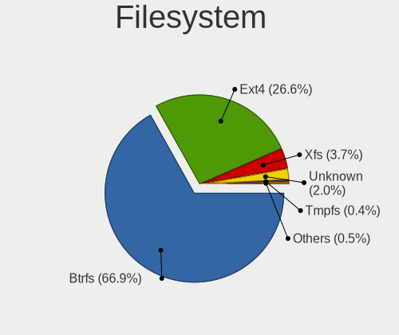
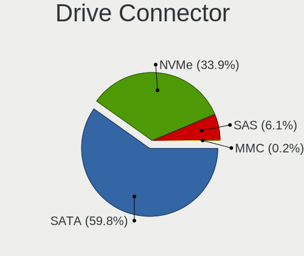
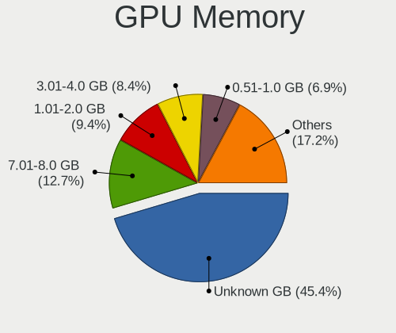
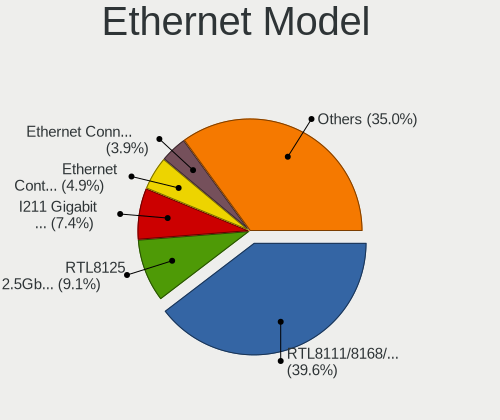
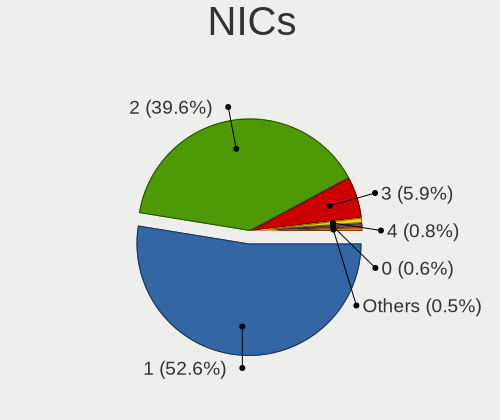
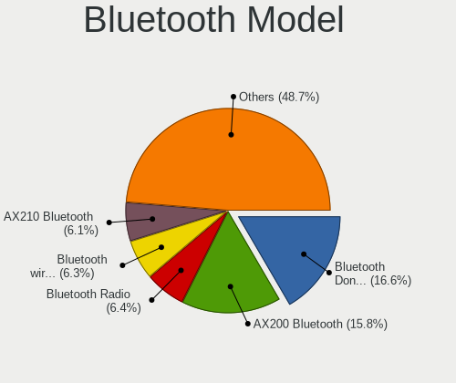
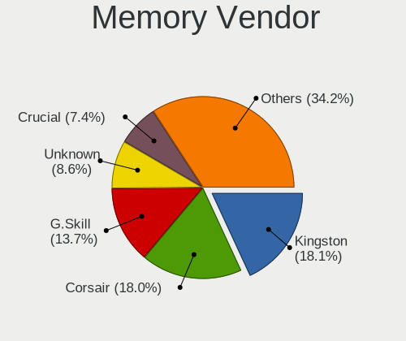

Fedora - Tested Hardware & Statistics (Desktops)
------------------------------------------------

A project to collect tested hardware configurations for Fedora.

Anyone can contribute to this report by the [hw-probe](https://github.com/linuxhw/hw-probe) tool:

    sudo -E hw-probe -all -upload

Please contribute! Especially if your hardware is rare.

Contents
--------

* [ Test Cases ](#test-cases)

* [ System ](#system)
  - [ OS                       ](#os)
  - [ OS Family                ](#os-family)
  - [ Kernel                   ](#kernel)
  - [ Kernel Family            ](#kernel-family)
  - [ Kernel Major Ver.        ](#kernel-major-ver)
  - [ Arch                     ](#arch)
  - [ DE                       ](#de)
  - [ Display Server           ](#display-server)
  - [ Display Manager          ](#display-manager)
  - [ OS Lang                  ](#os-lang)
  - [ Boot Mode                ](#boot-mode)
  - [ Filesystem               ](#filesystem)
  - [ Part. scheme             ](#part-scheme)
  - [ Dual Boot with Linux/BSD ](#dual-boot-with-linuxbsd)
  - [ Dual Boot (Win)          ](#dual-boot-win)

* [ Board ](#board)
  - [ Vendor                   ](#vendor)
  - [ Model                    ](#model)
  - [ Model Family             ](#model-family)
  - [ MFG Year                 ](#mfg-year)
  - [ Form Factor              ](#form-factor)
  - [ Secure Boot              ](#secure-boot)
  - [ Coreboot                 ](#coreboot)
  - [ RAM Size                 ](#ram-size)
  - [ RAM Used                 ](#ram-used)
  - [ Total Drives             ](#total-drives)
  - [ Has CD-ROM               ](#has-cd-rom)
  - [ Has Ethernet             ](#has-ethernet)
  - [ Has WiFi                 ](#has-wifi)
  - [ Has Bluetooth            ](#has-bluetooth)

* [ Location ](#location)
  - [ Country                  ](#country)
  - [ City                     ](#city)

* [ Drives ](#drives)
  - [ Drive Vendor             ](#drive-vendor)
  - [ Drive Model              ](#drive-model)
  - [ HDD Vendor               ](#hdd-vendor)
  - [ SSD Vendor               ](#ssd-vendor)
  - [ Drive Kind               ](#drive-kind)
  - [ Drive Connector          ](#drive-connector)
  - [ Drive Size               ](#drive-size)
  - [ Space Total              ](#space-total)
  - [ Space Used               ](#space-used)
  - [ Malfunc. Drives          ](#malfunc-drives)
  - [ Malfunc. Drive Vendor    ](#malfunc-drive-vendor)
  - [ Malfunc. HDD Vendor      ](#malfunc-hdd-vendor)
  - [ Malfunc. Drive Kind      ](#malfunc-drive-kind)
  - [ Failed Drives            ](#failed-drives)
  - [ Failed Drive Vendor      ](#failed-drive-vendor)
  - [ Drive Status             ](#drive-status)

* [ Storage controller ](#storage-controller)
  - [ Storage Vendor           ](#storage-vendor)
  - [ Storage Model            ](#storage-model)
  - [ Storage Kind             ](#storage-kind)

* [ Processor ](#processor)
  - [ CPU Vendor               ](#cpu-vendor)
  - [ CPU Model                ](#cpu-model)
  - [ CPU Model Family         ](#cpu-model-family)
  - [ CPU Cores                ](#cpu-cores)
  - [ CPU Sockets              ](#cpu-sockets)
  - [ CPU Threads              ](#cpu-threads)
  - [ CPU Op-Modes             ](#cpu-op-modes)
  - [ CPU Microcode            ](#cpu-microcode)
  - [ CPU Microarch            ](#cpu-microarch)

* [ Graphics ](#graphics)
  - [ GPU Vendor               ](#gpu-vendor)
  - [ GPU Model                ](#gpu-model)
  - [ GPU Combo                ](#gpu-combo)
  - [ GPU Driver               ](#gpu-driver)
  - [ GPU Memory               ](#gpu-memory)

* [ Monitor ](#monitor)
  - [ Monitor Vendor           ](#monitor-vendor)
  - [ Monitor Model            ](#monitor-model)
  - [ Monitor Resolution       ](#monitor-resolution)
  - [ Monitor Diagonal         ](#monitor-diagonal)
  - [ Monitor Width            ](#monitor-width)
  - [ Aspect Ratio             ](#aspect-ratio)
  - [ Monitor Area             ](#monitor-area)
  - [ Pixel Density            ](#pixel-density)
  - [ Multiple Monitors        ](#multiple-monitors)

* [ Network ](#network)
  - [ Net Controller Vendor    ](#net-controller-vendor)
  - [ Net Controller Model     ](#net-controller-model)
  - [ Wireless Vendor          ](#wireless-vendor)
  - [ Wireless Model           ](#wireless-model)
  - [ Ethernet Vendor          ](#ethernet-vendor)
  - [ Ethernet Model           ](#ethernet-model)
  - [ Net Controller Kind      ](#net-controller-kind)
  - [ Used Controller          ](#used-controller)
  - [ NICs                     ](#nics)
  - [ IPv6                     ](#ipv6)

* [ Bluetooth ](#bluetooth)
  - [ Bluetooth Vendor         ](#bluetooth-vendor)
  - [ Bluetooth Model          ](#bluetooth-model)

* [ Sound ](#sound)
  - [ Sound Vendor             ](#sound-vendor)
  - [ Sound Model              ](#sound-model)

* [ Memory ](#memory)
  - [ Memory Vendor            ](#memory-vendor)
  - [ Memory Model             ](#memory-model)
  - [ Memory Kind              ](#memory-kind)
  - [ Memory Form Factor       ](#memory-form-factor)
  - [ Memory Size              ](#memory-size)
  - [ Memory Speed             ](#memory-speed)

* [ Printers & scanners ](#printers--scanners)
  - [ Printer Vendor           ](#printer-vendor)
  - [ Printer Model            ](#printer-model)
  - [ Scanner Vendor           ](#scanner-vendor)
  - [ Scanner Model            ](#scanner-model)

* [ Camera ](#camera)
  - [ Camera Vendor            ](#camera-vendor)
  - [ Camera Model             ](#camera-model)

* [ Security ](#security)
  - [ Fingerprint Vendor       ](#fingerprint-vendor)
  - [ Fingerprint Model        ](#fingerprint-model)
  - [ Chipcard Vendor          ](#chipcard-vendor)
  - [ Chipcard Model           ](#chipcard-model)

* [ Unsupported ](#unsupported)
  - [ Unsupported Devices      ](#unsupported-devices)
  - [ Unsupported Device Types ](#unsupported-device-types)

Test Cases
----------

Total: 6486

| Vendor        | Model                       | Probe                                                      | Date         |
|---------------|-----------------------------|------------------------------------------------------------|--------------|
| Gigabyte      | H410M S2H V3                | [e539937c27](https://linux-hardware.org/?probe=e539937c27) | Jun 30, 2023 |
| Acer          | Predator PO5-640            | [416b01c954](https://linux-hardware.org/?probe=416b01c954) | Jun 30, 2023 |
| Gigabyte      | Z87X-UD5H-CF                | [3749bda51b](https://linux-hardware.org/?probe=3749bda51b) | Jun 30, 2023 |
| ASUSTek       | TUF Gaming B550-PLUS WIF... | [3c3556dd33](https://linux-hardware.org/?probe=3c3556dd33) | Jun 30, 2023 |
| Gigabyte      | Z87X-UD5H-CF                | [6ee8476c0e](https://linux-hardware.org/?probe=6ee8476c0e) | Jun 30, 2023 |
| ASRock        | FM2A88X Extreme6+           | [77e6b09eb9](https://linux-hardware.org/?probe=77e6b09eb9) | Jun 30, 2023 |
| MSI           | X99A RAIDER                 | [bb8a8eac46](https://linux-hardware.org/?probe=bb8a8eac46) | Jun 30, 2023 |
| AZW           | MINI S 10                   | [84eec8c276](https://linux-hardware.org/?probe=84eec8c276) | Jun 29, 2023 |
| AZW           | MINI S 10                   | [d1795fbf64](https://linux-hardware.org/?probe=d1795fbf64) | Jun 29, 2023 |
| Gigabyte      | H310M H                     | [0ad496c06d](https://linux-hardware.org/?probe=0ad496c06d) | Jun 29, 2023 |
| Gigabyte      | H410M H V3                  | [5496b9130e](https://linux-hardware.org/?probe=5496b9130e) | Jun 29, 2023 |
| ASUSTek       | ROG STRIX X670E-E GAMING... | [95fb20193a](https://linux-hardware.org/?probe=95fb20193a) | Jun 29, 2023 |
| ASUSTek       | PRIME B550M-A               | [5bb4af3f8b](https://linux-hardware.org/?probe=5bb4af3f8b) | Jun 29, 2023 |
| ASUSTek       | ROG STRIX B650E-F GAMING... | [08708e8e9d](https://linux-hardware.org/?probe=08708e8e9d) | Jun 28, 2023 |
| ASUSTek       | PRIME H310M-K R2.0          | [3f9d0da410](https://linux-hardware.org/?probe=3f9d0da410) | Jun 28, 2023 |
| Gigabyte      | B560M DS3H V2               | [aa24aa071b](https://linux-hardware.org/?probe=aa24aa071b) | Jun 28, 2023 |
| MSI           | 880GM-E41                   | [91a2474332](https://linux-hardware.org/?probe=91a2474332) | Jun 28, 2023 |
| Fill By OE... | Q7700                       | [93c7c01ecb](https://linux-hardware.org/?probe=93c7c01ecb) | Jun 28, 2023 |
| ASRock        | H510M-HVS                   | [b90f532588](https://linux-hardware.org/?probe=b90f532588) | Jun 28, 2023 |
| HP            | 802F                        | [585f9bf338](https://linux-hardware.org/?probe=585f9bf338) | Jun 27, 2023 |
| HP            | 802F                        | [efceba0028](https://linux-hardware.org/?probe=efceba0028) | Jun 27, 2023 |
| Intel         | LADPNVMO AAE76523-300       | [76cc7bbb86](https://linux-hardware.org/?probe=76cc7bbb86) | Jun 27, 2023 |
| Fill By OE... | Q7700                       | [32ac9cb839](https://linux-hardware.org/?probe=32ac9cb839) | Jun 27, 2023 |
| Dell          | 0R6PCT A01                  | [2fd7aa28db](https://linux-hardware.org/?probe=2fd7aa28db) | Jun 27, 2023 |
| Gigabyte      | B450M DS3H-CF               | [b21d5b2e0a](https://linux-hardware.org/?probe=b21d5b2e0a) | Jun 26, 2023 |
| Gigabyte      | MZBAYAB-00                  | [a44397603c](https://linux-hardware.org/?probe=a44397603c) | Jun 26, 2023 |
| ASRock        | FM2A88X Extreme6+           | [a974c1b82e](https://linux-hardware.org/?probe=a974c1b82e) | Jun 26, 2023 |
| MSI           | X99A RAIDER                 | [31fc00f1ac](https://linux-hardware.org/?probe=31fc00f1ac) | Jun 26, 2023 |
| Gigabyte      | Z390 AORUS PRO WIFI-CF      | [3486e43434](https://linux-hardware.org/?probe=3486e43434) | Jun 25, 2023 |
| ASRock        | FM2A88X Extreme6+           | [1c648f1f3e](https://linux-hardware.org/?probe=1c648f1f3e) | Jun 25, 2023 |
| MSI           | X99A RAIDER                 | [684000f2c5](https://linux-hardware.org/?probe=684000f2c5) | Jun 25, 2023 |
| Gigabyte      | H110M-H-CF                  | [7baa53c127](https://linux-hardware.org/?probe=7baa53c127) | Jun 25, 2023 |
| ASUSTek       | P9X79 PRO                   | [3d1eeda7fa](https://linux-hardware.org/?probe=3d1eeda7fa) | Jun 24, 2023 |
| Dell          | 088DT1 A01                  | [755d1f8c03](https://linux-hardware.org/?probe=755d1f8c03) | Jun 24, 2023 |
| ASUSTek       | M5A78L-M/USB3               | [1c0d2d86f3](https://linux-hardware.org/?probe=1c0d2d86f3) | Jun 24, 2023 |
| ASUSTek       | P8Z77-V LK                  | [bcfc1fe2de](https://linux-hardware.org/?probe=bcfc1fe2de) | Jun 23, 2023 |
| ASRock        | B450 Pro4                   | [a5f281a10e](https://linux-hardware.org/?probe=a5f281a10e) | Jun 23, 2023 |
| ASUSTek       | M4A77                       | [67e6b51c63](https://linux-hardware.org/?probe=67e6b51c63) | Jun 23, 2023 |
| MSI           | B450M PRO-M2 V2             | [af46eedb6f](https://linux-hardware.org/?probe=af46eedb6f) | Jun 23, 2023 |
| ASUSTek       | PRIME B350M-A               | [efb0264470](https://linux-hardware.org/?probe=efb0264470) | Jun 23, 2023 |
| ASUSTek       | Maximus VIII RANGER Modi... | [d24120bc4e](https://linux-hardware.org/?probe=d24120bc4e) | Jun 22, 2023 |
| MSI           | PRO B550M-VC WIFI           | [c9f86c15b7](https://linux-hardware.org/?probe=c9f86c15b7) | Jun 22, 2023 |
| Lenovo        | ThinkServer TS140           | [5043d686d8](https://linux-hardware.org/?probe=5043d686d8) | Jun 22, 2023 |
| ASUSTek       | ROG STRIX B650E-F GAMING... | [b07361bc89](https://linux-hardware.org/?probe=b07361bc89) | Jun 22, 2023 |
| MSI           | MAG X570S TOMAHAWK MAX W... | [52bcb712ec](https://linux-hardware.org/?probe=52bcb712ec) | Jun 22, 2023 |
| Lenovo        | SHARKBAY NOK                | [c0f250b2f9](https://linux-hardware.org/?probe=c0f250b2f9) | Jun 22, 2023 |
| Unknown       | Unknown                     | [172c84a53d](https://linux-hardware.org/?probe=172c84a53d) | Jun 22, 2023 |
| Dell          | 09KPNV A01                  | [eaa3017d03](https://linux-hardware.org/?probe=eaa3017d03) | Jun 21, 2023 |
| ASUSTek       | ProArt Z690-CREATOR WIFI    | [30f85c0f2e](https://linux-hardware.org/?probe=30f85c0f2e) | Jun 21, 2023 |
| ASUSTek       | TUF Gaming X570-PLUS        | [fd367d0725](https://linux-hardware.org/?probe=fd367d0725) | Jun 21, 2023 |
| ASUSTek       | PRIME B550M-A               | [a5e833c54e](https://linux-hardware.org/?probe=a5e833c54e) | Jun 21, 2023 |
| ASUSTek       | Z87-A                       | [ca84827c75](https://linux-hardware.org/?probe=ca84827c75) | Jun 21, 2023 |
| ASUSTek       | Z87-A                       | [a30c01fab8](https://linux-hardware.org/?probe=a30c01fab8) | Jun 21, 2023 |
| ASUSTek       | TUF B360-PRO GAMING WIFI    | [52e2d1b77a](https://linux-hardware.org/?probe=52e2d1b77a) | Jun 21, 2023 |
| Pegatron      | IPMIP-H55-INSPUR            | [176a1c3e01](https://linux-hardware.org/?probe=176a1c3e01) | Jun 21, 2023 |
| Gigabyte      | Z370 AORUS Gaming 5-CF      | [a1e0b61e89](https://linux-hardware.org/?probe=a1e0b61e89) | Jun 20, 2023 |
| MSI           | X570-A PRO                  | [b968cb073e](https://linux-hardware.org/?probe=b968cb073e) | Jun 20, 2023 |
| ASUSTek       | Rampage V EXTREME           | [e7bb42d6d4](https://linux-hardware.org/?probe=e7bb42d6d4) | Jun 20, 2023 |
| ASUSTek       | Rampage V EXTREME           | [2fe4bf8ad2](https://linux-hardware.org/?probe=2fe4bf8ad2) | Jun 20, 2023 |
| Gigabyte      | B450 I AORUS PRO WIFI-CF    | [b154e92f35](https://linux-hardware.org/?probe=b154e92f35) | Jun 20, 2023 |
| MSI           | B75MA-P45                   | [2d8b92b0e6](https://linux-hardware.org/?probe=2d8b92b0e6) | Jun 20, 2023 |
| Gigabyte      | B450 I AORUS PRO WIFI-CF    | [ee8a4e18c4](https://linux-hardware.org/?probe=ee8a4e18c4) | Jun 20, 2023 |
| Gigabyte      | MZBAYAB-00                  | [5864261490](https://linux-hardware.org/?probe=5864261490) | Jun 20, 2023 |
| Itautec       | ST 4265 ST-4265 Padrao 0... | [689b10e4be](https://linux-hardware.org/?probe=689b10e4be) | Jun 19, 2023 |
| Gigabyte      | B365M D2V                   | [e16cbf315f](https://linux-hardware.org/?probe=e16cbf315f) | Jun 19, 2023 |
| ASUSTek       | ROG CROSSHAIR VIII IMPAC... | [b3e34f06a4](https://linux-hardware.org/?probe=b3e34f06a4) | Jun 19, 2023 |
| Gigabyte      | GA-MA785G-UD3H              | [e5740353af](https://linux-hardware.org/?probe=e5740353af) | Jun 19, 2023 |
| Dell          | 0C2XKD A01                  | [15331b91ed](https://linux-hardware.org/?probe=15331b91ed) | Jun 18, 2023 |
| ASUSTek       | PRIME H310M-E R2.0          | [5ff46d41fd](https://linux-hardware.org/?probe=5ff46d41fd) | Jun 18, 2023 |
| ASUSTek       | PRIME Z690-P WIFI D4        | [924b6e8d54](https://linux-hardware.org/?probe=924b6e8d54) | Jun 18, 2023 |
| Lenovo        | SHARKBAY NOK                | [73a438e6b8](https://linux-hardware.org/?probe=73a438e6b8) | Jun 18, 2023 |
| MSI           | X470 GAMING PLUS            | [17c61c0aee](https://linux-hardware.org/?probe=17c61c0aee) | Jun 18, 2023 |
| Intel         | DG965RY AAD41691-301        | [3f18a24757](https://linux-hardware.org/?probe=3f18a24757) | Jun 18, 2023 |
| Gigabyte      | GA-880GM-UD2H               | [fdbe50b1d6](https://linux-hardware.org/?probe=fdbe50b1d6) | Jun 18, 2023 |
| ASUSTek       | ROG STRIX X670E-E GAMING... | [231a3aeb2e](https://linux-hardware.org/?probe=231a3aeb2e) | Jun 18, 2023 |
| ASUSTek       | ROG STRIX B550-I GAMING     | [cd87a6b19f](https://linux-hardware.org/?probe=cd87a6b19f) | Jun 17, 2023 |
| ASUSTek       | ROG STRIX B550-I GAMING     | [ae4661e26f](https://linux-hardware.org/?probe=ae4661e26f) | Jun 17, 2023 |
| ASUSTek       | ROG CROSSHAIR X670E EXTR... | [c555238190](https://linux-hardware.org/?probe=c555238190) | Jun 17, 2023 |
| ASUSTek       | PRIME B550M-A               | [7e135be518](https://linux-hardware.org/?probe=7e135be518) | Jun 17, 2023 |
| Huanan        | X99-ZD4 V2.0                | [be1f0f151e](https://linux-hardware.org/?probe=be1f0f151e) | Jun 16, 2023 |
| ASUSTek       | ROG ZENITH EXTREME          | [5dc49896e5](https://linux-hardware.org/?probe=5dc49896e5) | Jun 16, 2023 |
| MSI           | B85-G43 GAMING              | [93da970965](https://linux-hardware.org/?probe=93da970965) | Jun 16, 2023 |
| HP            | 212B                        | [134ff203c4](https://linux-hardware.org/?probe=134ff203c4) | Jun 16, 2023 |
| MSI           | B450 GAMING PLUS            | [8a480175f8](https://linux-hardware.org/?probe=8a480175f8) | Jun 16, 2023 |
| ASUSTek       | ROG STRIX B550-XE GAMING... | [84b103464e](https://linux-hardware.org/?probe=84b103464e) | Jun 16, 2023 |
| MSI           | B450M MORTAR TITANIUM       | [3b83e2ea48](https://linux-hardware.org/?probe=3b83e2ea48) | Jun 16, 2023 |
| MSI           | B450 GAMING PLUS            | [8a3d74a5fa](https://linux-hardware.org/?probe=8a3d74a5fa) | Jun 16, 2023 |
| ASRock        | X399 Phantom Gaming 6       | [aad3ead710](https://linux-hardware.org/?probe=aad3ead710) | Jun 16, 2023 |
| Gigabyte      | Z370 AORUS Ultra Gaming-... | [9c3bb21706](https://linux-hardware.org/?probe=9c3bb21706) | Jun 16, 2023 |
| ASUSTek       | A8R32-MVP Deluxe            | [29ff056f4a](https://linux-hardware.org/?probe=29ff056f4a) | Jun 16, 2023 |
| MSI           | Z170A GAMING M5             | [a0d460b4a3](https://linux-hardware.org/?probe=a0d460b4a3) | Jun 16, 2023 |
| Gigabyte      | H97-HD3                     | [24a487274f](https://linux-hardware.org/?probe=24a487274f) | Jun 16, 2023 |
| MSI           | MAG B550M MORTAR            | [9604c6211e](https://linux-hardware.org/?probe=9604c6211e) | Jun 15, 2023 |
| Itautec       | ST 4265 ST-4265 Padrao 0... | [ecc8c7d2d0](https://linux-hardware.org/?probe=ecc8c7d2d0) | Jun 15, 2023 |
| Itautec       | ST 4265 ST-4265 Padrao 0... | [4cad282848](https://linux-hardware.org/?probe=4cad282848) | Jun 15, 2023 |
| ASUSTek       | ROG STRIX Z690-E GAMING ... | [5a1e944af2](https://linux-hardware.org/?probe=5a1e944af2) | Jun 15, 2023 |
| MSI           | PRO B550M-VC WIFI           | [64e0ce279b](https://linux-hardware.org/?probe=64e0ce279b) | Jun 15, 2023 |
| HP            | 212B                        | [b107461bdd](https://linux-hardware.org/?probe=b107461bdd) | Jun 14, 2023 |
| Gigabyte      | B85M-D3V-A                  | [bbcb31d079](https://linux-hardware.org/?probe=bbcb31d079) | Jun 14, 2023 |
| ASUSTek       | P5G41C-M LX                 | [7ae654d4e2](https://linux-hardware.org/?probe=7ae654d4e2) | Jun 14, 2023 |
| Kllisre       | X99-B5 V1.1                 | [5e22a31b3e](https://linux-hardware.org/?probe=5e22a31b3e) | Jun 14, 2023 |
| Gigabyte      | D525TUD                     | [2d854be38a](https://linux-hardware.org/?probe=2d854be38a) | Jun 14, 2023 |
| ECS           | H61H2-M17                   | [63ded73edb](https://linux-hardware.org/?probe=63ded73edb) | Jun 14, 2023 |
| Dell          | 0KRC95 A02                  | [5f9a1aafe0](https://linux-hardware.org/?probe=5f9a1aafe0) | Jun 14, 2023 |
| ASUSTek       | TUF B450M-PLUS GAMING       | [ddb9fc5a43](https://linux-hardware.org/?probe=ddb9fc5a43) | Jun 14, 2023 |
| ASUSTek       | ROG STRIX B550-E GAMING     | [4fac659113](https://linux-hardware.org/?probe=4fac659113) | Jun 13, 2023 |
| MSI           | H510M PRO                   | [08e44766fe](https://linux-hardware.org/?probe=08e44766fe) | Jun 13, 2023 |
| ECS           | H61H2-M17                   | [fb57cc3ed4](https://linux-hardware.org/?probe=fb57cc3ed4) | Jun 13, 2023 |
| MSI           | IONA                        | [86535af79b](https://linux-hardware.org/?probe=86535af79b) | Jun 13, 2023 |
| Gigabyte      | D525TUD                     | [be2c796ab2](https://linux-hardware.org/?probe=be2c796ab2) | Jun 13, 2023 |
| MSI           | Z77A-G45                    | [db1a941e2c](https://linux-hardware.org/?probe=db1a941e2c) | Jun 13, 2023 |
| Gigabyte      | A520M DS3H                  | [0f5b161a60](https://linux-hardware.org/?probe=0f5b161a60) | Jun 13, 2023 |
| ASUSTek       | P5G41C-M LX                 | [1361d3551c](https://linux-hardware.org/?probe=1361d3551c) | Jun 12, 2023 |
| Gigabyte      | B560M DS3H V2               | [1b8ad811e0](https://linux-hardware.org/?probe=1b8ad811e0) | Jun 12, 2023 |
| ASRock        | Z390 Pro4                   | [067d0e5da5](https://linux-hardware.org/?probe=067d0e5da5) | Jun 12, 2023 |
| Shenzhen M... | F7BFD                       | [8f43ad0e76](https://linux-hardware.org/?probe=8f43ad0e76) | Jun 12, 2023 |
| ASUSTek       | PRIME H310M-K               | [f1614bb08f](https://linux-hardware.org/?probe=f1614bb08f) | Jun 11, 2023 |
| ASUSTek       | M5A78L-M/USB3               | [cf9274f969](https://linux-hardware.org/?probe=cf9274f969) | Jun 11, 2023 |
| ASUSTek       | PRIME Z270-P                | [57fcd66521](https://linux-hardware.org/?probe=57fcd66521) | Jun 11, 2023 |
| ASUSTek       | P9X79 PRO                   | [a280f19bb2](https://linux-hardware.org/?probe=a280f19bb2) | Jun 11, 2023 |
| MSI           | PRO Z790-A WIFI DDR4        | [0e3bbb5b14](https://linux-hardware.org/?probe=0e3bbb5b14) | Jun 11, 2023 |
| MSI           | X99A RAIDER                 | [1fd265b6d8](https://linux-hardware.org/?probe=1fd265b6d8) | Jun 11, 2023 |
| ASRock        | FM2A88X Extreme6+           | [1c5e1b092a](https://linux-hardware.org/?probe=1c5e1b092a) | Jun 11, 2023 |
| MSI           | PRO B660M-A DDR4            | [e3311e26b6](https://linux-hardware.org/?probe=e3311e26b6) | Jun 11, 2023 |
| Gigabyte      | Z87X-UD4H-CF                | [abd31d2f92](https://linux-hardware.org/?probe=abd31d2f92) | Jun 10, 2023 |
| Lenovo        | 32E9 SDK0T76465 WIN 3422... | [2ac8db1b4c](https://linux-hardware.org/?probe=2ac8db1b4c) | Jun 10, 2023 |
| Dell          | 0N4YC8 A00                  | [bc832400b4](https://linux-hardware.org/?probe=bc832400b4) | Jun 10, 2023 |
| MSI           | MS-7388                     | [6d3a406400](https://linux-hardware.org/?probe=6d3a406400) | Jun 10, 2023 |
| MSI           | X99A RAIDER                 | [4ab556e4b8](https://linux-hardware.org/?probe=4ab556e4b8) | Jun 10, 2023 |
| ASRock        | FM2A88X Extreme6+           | [212c44c43f](https://linux-hardware.org/?probe=212c44c43f) | Jun 10, 2023 |
| HP            | 339B                        | [bc6de07e07](https://linux-hardware.org/?probe=bc6de07e07) | Jun 09, 2023 |
| Gigabyte      | B450 AORUS PRO WIFI-CF      | [f9677c0861](https://linux-hardware.org/?probe=f9677c0861) | Jun 09, 2023 |
| ASUSTek       | A8R32-MVP Deluxe            | [f02bc23dd0](https://linux-hardware.org/?probe=f02bc23dd0) | Jun 09, 2023 |
| ASRock        | AB350M Pro4                 | [8f0087d741](https://linux-hardware.org/?probe=8f0087d741) | Jun 09, 2023 |
| MSI           | 760GM-P23                   | [abc3a3d8a1](https://linux-hardware.org/?probe=abc3a3d8a1) | Jun 09, 2023 |
| MSI           | 760GM-P23                   | [fc826b3cb1](https://linux-hardware.org/?probe=fc826b3cb1) | Jun 09, 2023 |
| ASUSTek       | STRIX B250F GAMING          | [c0fd33b9cc](https://linux-hardware.org/?probe=c0fd33b9cc) | Jun 09, 2023 |
| ASUSTek       | STRIX B250F GAMING          | [76c3e6625b](https://linux-hardware.org/?probe=76c3e6625b) | Jun 09, 2023 |
| Dell          | 0FDY5C A00                  | [1caf029f79](https://linux-hardware.org/?probe=1caf029f79) | Jun 09, 2023 |
| ASRock        | A320M-HD                    | [9e88454384](https://linux-hardware.org/?probe=9e88454384) | Jun 09, 2023 |
| ASUSTek       | Z97M-PLUS                   | [24f6f6e727](https://linux-hardware.org/?probe=24f6f6e727) | Jun 08, 2023 |
| ASUSTek       | Z97M-PLUS                   | [8d4e2bedde](https://linux-hardware.org/?probe=8d4e2bedde) | Jun 08, 2023 |
| Colorful T... | A520M-K PRO V14             | [48c4aa3d8c](https://linux-hardware.org/?probe=48c4aa3d8c) | Jun 08, 2023 |
| ASUSTek       | TUF Gaming X570-PRO         | [b9e1c5e320](https://linux-hardware.org/?probe=b9e1c5e320) | Jun 08, 2023 |
| Gigabyte      | X570 I AORUS PRO WIFI       | [bf2fc7d3b7](https://linux-hardware.org/?probe=bf2fc7d3b7) | Jun 08, 2023 |
| MSI           | B450M PRO-VDH MAX           | [c96be9f4cd](https://linux-hardware.org/?probe=c96be9f4cd) | Jun 08, 2023 |
| Gigabyte      | B75M-D3H                    | [65e06561cf](https://linux-hardware.org/?probe=65e06561cf) | Jun 08, 2023 |
| Gigabyte      | Z77MX-D3H                   | [e1fdfde650](https://linux-hardware.org/?probe=e1fdfde650) | Jun 08, 2023 |
| HPE           | ProLiant MicroServer Gen... | [e95900bc0c](https://linux-hardware.org/?probe=e95900bc0c) | Jun 08, 2023 |
| Gigabyte      | Z370 AORUS Gaming 5-CF      | [74f55613b5](https://linux-hardware.org/?probe=74f55613b5) | Jun 08, 2023 |
| Lenovo        | ThinkServer TS140           | [e9ca405eff](https://linux-hardware.org/?probe=e9ca405eff) | Jun 08, 2023 |
| Gigabyte      | Z390 GAMING SLI-CF          | [5f0e8ab63a](https://linux-hardware.org/?probe=5f0e8ab63a) | Jun 07, 2023 |
| Gigabyte      | Z87X-UD5H-CF                | [fd156e669f](https://linux-hardware.org/?probe=fd156e669f) | Jun 07, 2023 |
| Lenovo        | SHARKBAY NOK                | [cf560e91e7](https://linux-hardware.org/?probe=cf560e91e7) | Jun 07, 2023 |
| HP            | 339B                        | [a1739aa36b](https://linux-hardware.org/?probe=a1739aa36b) | Jun 07, 2023 |
| Gigabyte      | H77N-WIFI                   | [1c8078b748](https://linux-hardware.org/?probe=1c8078b748) | Jun 07, 2023 |
| Gigabyte      | B550 VISION D               | [94cf7f5675](https://linux-hardware.org/?probe=94cf7f5675) | Jun 07, 2023 |
| MSI           | B350M GAMING PRO            | [eb3fbddd2c](https://linux-hardware.org/?probe=eb3fbddd2c) | Jun 06, 2023 |
| Gigabyte      | B250-FinTech-CF             | [022138ad16](https://linux-hardware.org/?probe=022138ad16) | Jun 06, 2023 |
| Dell          | 0427JK A00                  | [addb15771e](https://linux-hardware.org/?probe=addb15771e) | Jun 06, 2023 |
| Dell          | 0NW6H5 A00                  | [631e6bba84](https://linux-hardware.org/?probe=631e6bba84) | Jun 06, 2023 |
| Dell          | 06X1TJ A00                  | [c3f02841f4](https://linux-hardware.org/?probe=c3f02841f4) | Jun 06, 2023 |
| Dell          | 06X1TJ A00                  | [4cec4f0517](https://linux-hardware.org/?probe=4cec4f0517) | Jun 06, 2023 |
| HP            | 83E1                        | [227e410c6f](https://linux-hardware.org/?probe=227e410c6f) | Jun 06, 2023 |
| Lenovo        | 30D0 NOK                    | [045b011b7a](https://linux-hardware.org/?probe=045b011b7a) | Jun 06, 2023 |
| MSI           | X99A RAIDER                 | [d70fe31101](https://linux-hardware.org/?probe=d70fe31101) | Jun 06, 2023 |
| ASRock        | FM2A88X Extreme6+           | [3c3708dcec](https://linux-hardware.org/?probe=3c3708dcec) | Jun 06, 2023 |
| HP            | 8918                        | [917b8c425f](https://linux-hardware.org/?probe=917b8c425f) | Jun 06, 2023 |
| Gigabyte      | X570 I AORUS PRO WIFI       | [91ee57c108](https://linux-hardware.org/?probe=91ee57c108) | Jun 05, 2023 |
| Gigabyte      | B250-FinTech-CF             | [e22c496628](https://linux-hardware.org/?probe=e22c496628) | Jun 05, 2023 |
| Unknown       | Unknown                     | [292269611c](https://linux-hardware.org/?probe=292269611c) | Jun 05, 2023 |
| ASRock        | FM2A88X Extreme6+           | [79b80daf83](https://linux-hardware.org/?probe=79b80daf83) | Jun 05, 2023 |
| MSI           | X99A RAIDER                 | [36173d5a42](https://linux-hardware.org/?probe=36173d5a42) | Jun 05, 2023 |
| MSI           | B360M PRO-VH                | [8e4ad66edc](https://linux-hardware.org/?probe=8e4ad66edc) | Jun 05, 2023 |
| ASUSTek       | PRIME B350M-A               | [3a0576b177](https://linux-hardware.org/?probe=3a0576b177) | Jun 05, 2023 |
| ASUSTek       | PRIME B550M-A               | [d6befa925e](https://linux-hardware.org/?probe=d6befa925e) | Jun 04, 2023 |
| Dell          | 09D7F7 A00                  | [9b80703b01](https://linux-hardware.org/?probe=9b80703b01) | Jun 04, 2023 |
| ASUSTek       | ROG STRIX B550-A GAMING     | [5b35735d26](https://linux-hardware.org/?probe=5b35735d26) | Jun 04, 2023 |
| MSI           | X470 GAMING PLUS            | [7af9263ba9](https://linux-hardware.org/?probe=7af9263ba9) | Jun 04, 2023 |
| MSI           | X470 GAMING PLUS            | [ae24cbf98d](https://linux-hardware.org/?probe=ae24cbf98d) | Jun 04, 2023 |
| Lenovo        | 32E9 SDK0T76465 WIN 3422... | [fa41f1f3c2](https://linux-hardware.org/?probe=fa41f1f3c2) | Jun 04, 2023 |
| Dell          | 0KRC95 A02                  | [3fb87e5a0e](https://linux-hardware.org/?probe=3fb87e5a0e) | Jun 03, 2023 |
| MSI           | A320M PRO-VH PLUS           | [8ba76b1e88](https://linux-hardware.org/?probe=8ba76b1e88) | Jun 03, 2023 |
| MSI           | MAG B550M MORTAR            | [3d911ac9c9](https://linux-hardware.org/?probe=3d911ac9c9) | Jun 03, 2023 |
| Gigabyte      | B650M GAMING X AX           | [610ba5871f](https://linux-hardware.org/?probe=610ba5871f) | Jun 03, 2023 |
| Gigabyte      | Z590 UD AC                  | [da5b2056e4](https://linux-hardware.org/?probe=da5b2056e4) | Jun 02, 2023 |
| ASUSTek       | P8Z77-V LK                  | [d50ca19dc3](https://linux-hardware.org/?probe=d50ca19dc3) | Jun 02, 2023 |
| HP            | 212B                        | [15c4a7b64f](https://linux-hardware.org/?probe=15c4a7b64f) | Jun 02, 2023 |
| Gigabyte      | B85-HD3                     | [9931f8e663](https://linux-hardware.org/?probe=9931f8e663) | Jun 02, 2023 |
| ASUSTek       | ROG STRIX X670E-E GAMING... | [5562bc75b8](https://linux-hardware.org/?probe=5562bc75b8) | Jun 02, 2023 |
| MSI           | PRO X670-P WIFI             | [714ed7283d](https://linux-hardware.org/?probe=714ed7283d) | Jun 02, 2023 |
| MSI           | PRO X670-P WIFI             | [bb2776b990](https://linux-hardware.org/?probe=bb2776b990) | Jun 02, 2023 |
| MSI           | MS-7388                     | [fc12ac6b90](https://linux-hardware.org/?probe=fc12ac6b90) | Jun 02, 2023 |
| Alienware     | 0N43JM A00                  | [047bfb6e8e](https://linux-hardware.org/?probe=047bfb6e8e) | Jun 02, 2023 |
| Dell          | 04Y8V0 A02                  | [ce749a8df5](https://linux-hardware.org/?probe=ce749a8df5) | Jun 02, 2023 |
| Gigabyte      | GA-78LMT-USB3               | [def2c6020b](https://linux-hardware.org/?probe=def2c6020b) | Jun 01, 2023 |
| ASUSTek       | PRIME X570-P                | [cde4aaef3e](https://linux-hardware.org/?probe=cde4aaef3e) | Jun 01, 2023 |
| Itautec       | ST 4265 ST-4265 Padrao 0... | [7ac5ec7c05](https://linux-hardware.org/?probe=7ac5ec7c05) | Jun 01, 2023 |
| ASRock        | H310M-HDV                   | [3dc5138ecd](https://linux-hardware.org/?probe=3dc5138ecd) | Jun 01, 2023 |
| HP            | 845A                        | [b68054952b](https://linux-hardware.org/?probe=b68054952b) | Jun 01, 2023 |
| Lenovo        | SHARKBAY NOK                | [108cb2ce17](https://linux-hardware.org/?probe=108cb2ce17) | Jun 01, 2023 |
| HP            | 339A                        | [24ab8463bb](https://linux-hardware.org/?probe=24ab8463bb) | Jun 01, 2023 |
| ASUSTek       | TUF Gaming B550M-PLUS WI... | [9afffc17a1](https://linux-hardware.org/?probe=9afffc17a1) | Jun 01, 2023 |
| ASUSTek       | PRIME B550M-A               | [8799da8513](https://linux-hardware.org/?probe=8799da8513) | Jun 01, 2023 |
| Gigabyte      | J1900M-D2P                  | [0e89db7255](https://linux-hardware.org/?probe=0e89db7255) | Jun 01, 2023 |
| MSI           | X99A RAIDER                 | [b951e6223c](https://linux-hardware.org/?probe=b951e6223c) | Jun 01, 2023 |
| ASRock        | FM2A88X Extreme6+           | [df9086deb4](https://linux-hardware.org/?probe=df9086deb4) | Jun 01, 2023 |
| ASUSTek       | PRIME H510M-K               | [f6f91b620c](https://linux-hardware.org/?probe=f6f91b620c) | May 31, 2023 |
| Lenovo        | ThinkServer TS140           | [e8e3834bf8](https://linux-hardware.org/?probe=e8e3834bf8) | May 31, 2023 |
| Lenovo        | ThinkServer TS140           | [48cf9db6cd](https://linux-hardware.org/?probe=48cf9db6cd) | May 31, 2023 |
| ASUSTek       | ROG STRIX X670E-I GAMING... | [3718997542](https://linux-hardware.org/?probe=3718997542) | May 31, 2023 |
| MSI           | X99A RAIDER                 | [3404cb6c67](https://linux-hardware.org/?probe=3404cb6c67) | May 31, 2023 |
| ASRock        | FM2A88X Extreme6+           | [4a908da319](https://linux-hardware.org/?probe=4a908da319) | May 31, 2023 |
| Gigabyte      | B450 I AORUS PRO WIFI-CF    | [ad79be40f5](https://linux-hardware.org/?probe=ad79be40f5) | May 31, 2023 |
| Gigabyte      | B250-FinTech-CF             | [1903d991a3](https://linux-hardware.org/?probe=1903d991a3) | May 30, 2023 |
| Shenzhen M... | F7BFC                       | [c496e8a74f](https://linux-hardware.org/?probe=c496e8a74f) | May 30, 2023 |
| ASUSTek       | PRIME B550M-A               | [349eb108ab](https://linux-hardware.org/?probe=349eb108ab) | May 30, 2023 |
| ASRock        | B450M Steel Legend          | [87c3dbc5df](https://linux-hardware.org/?probe=87c3dbc5df) | May 30, 2023 |
| ASRock        | A320M-DVS R4.0              | [611b47056d](https://linux-hardware.org/?probe=611b47056d) | May 30, 2023 |
| HP            | 8307                        | [c8d0506eda](https://linux-hardware.org/?probe=c8d0506eda) | May 30, 2023 |
| Gigabyte      | B550 AORUS ELITE AX V2      | [ffbccb8f47](https://linux-hardware.org/?probe=ffbccb8f47) | May 30, 2023 |
| ASRock        | FM2A88X Extreme6+           | [8b96413dfd](https://linux-hardware.org/?probe=8b96413dfd) | May 30, 2023 |
| MSI           | X99A RAIDER                 | [ffe895debc](https://linux-hardware.org/?probe=ffe895debc) | May 30, 2023 |
| ASRock        | B560M-ITX/ac                | [e643aa0f5d](https://linux-hardware.org/?probe=e643aa0f5d) | May 30, 2023 |
| HP            | 8169                        | [4f10a589e7](https://linux-hardware.org/?probe=4f10a589e7) | May 29, 2023 |
| Itautec       | ST 4265                     | [8814373cb4](https://linux-hardware.org/?probe=8814373cb4) | May 29, 2023 |
| Lenovo        | SHARKBAY NOK                | [a199dc360d](https://linux-hardware.org/?probe=a199dc360d) | May 29, 2023 |
| MSI           | X370 XPOWER GAMING TITAN... | [3ecf79af69](https://linux-hardware.org/?probe=3ecf79af69) | May 29, 2023 |
| Biostar       | H310MHP                     | [7bfe35481d](https://linux-hardware.org/?probe=7bfe35481d) | May 29, 2023 |
| Itautec       | ST 4265                     | [b89c45a31d](https://linux-hardware.org/?probe=b89c45a31d) | May 29, 2023 |
| Gigabyte      | B550M DS3H AC               | [6dca0624e2](https://linux-hardware.org/?probe=6dca0624e2) | May 29, 2023 |
| HP            | 2820h                       | [d326b49f48](https://linux-hardware.org/?probe=d326b49f48) | May 29, 2023 |
| Biostar       | H310MHP                     | [7138f287c8](https://linux-hardware.org/?probe=7138f287c8) | May 29, 2023 |
| MSI           | X99A RAIDER                 | [0b7f7fb99a](https://linux-hardware.org/?probe=0b7f7fb99a) | May 29, 2023 |
| ASRock        | FM2A88X Extreme6+           | [38936854c8](https://linux-hardware.org/?probe=38936854c8) | May 29, 2023 |
| MSI           | B350M GAMING PRO            | [52517395ca](https://linux-hardware.org/?probe=52517395ca) | May 29, 2023 |
| ASUSTek       | PRIME H510M-K               | [0c7bfc7977](https://linux-hardware.org/?probe=0c7bfc7977) | May 28, 2023 |
| HP            | ProLiant ML110 G7           | [fd74c84f0a](https://linux-hardware.org/?probe=fd74c84f0a) | May 28, 2023 |
| ASRock        | B550M Phantom Gaming 4      | [773f0d5242](https://linux-hardware.org/?probe=773f0d5242) | May 28, 2023 |
| Gigabyte      | Z77MX-D3H                   | [3c001962b0](https://linux-hardware.org/?probe=3c001962b0) | May 28, 2023 |
| Dell          | 0W2F8G A00                  | [f5a76aaf01](https://linux-hardware.org/?probe=f5a76aaf01) | May 28, 2023 |
| ASUSTek       | ROG STRIX X670E-E GAMING... | [4e1ad3c652](https://linux-hardware.org/?probe=4e1ad3c652) | May 28, 2023 |
| Dell          | 0W2F8G A00                  | [419c0c7359](https://linux-hardware.org/?probe=419c0c7359) | May 28, 2023 |
| MSI           | X470 GAMING PRO CARBON      | [db3d362e28](https://linux-hardware.org/?probe=db3d362e28) | May 28, 2023 |
| MSI           | X470 GAMING PRO CARBON      | [94fe283791](https://linux-hardware.org/?probe=94fe283791) | May 28, 2023 |
| Intel         | X99                         | [6826d78921](https://linux-hardware.org/?probe=6826d78921) | May 28, 2023 |
| ASUSTek       | ROG STRIX B660-I GAMING ... | [906e585809](https://linux-hardware.org/?probe=906e585809) | May 27, 2023 |
| Huanan        | X79 249PC V2.2              | [0723379042](https://linux-hardware.org/?probe=0723379042) | May 27, 2023 |
| Huanan        | X79 249PC V2.2              | [ef1a056412](https://linux-hardware.org/?probe=ef1a056412) | May 27, 2023 |
| MSI           | X370 GAMING PRO CARBON A... | [ffbc308836](https://linux-hardware.org/?probe=ffbc308836) | May 27, 2023 |
| HP            | 8307                        | [94cad3911e](https://linux-hardware.org/?probe=94cad3911e) | May 27, 2023 |
| MSI           | MAG B550 TOMAHAWK           | [9a3691f3f2](https://linux-hardware.org/?probe=9a3691f3f2) | May 27, 2023 |
| MSI           | MPG B650I EDGE WIFI         | [8fdbd504af](https://linux-hardware.org/?probe=8fdbd504af) | May 27, 2023 |
| Gigabyte      | P75-D3P                     | [c341cbff1b](https://linux-hardware.org/?probe=c341cbff1b) | May 26, 2023 |
| MSI           | B450 TOMAHAWK MAX II        | [ecf6ecb00d](https://linux-hardware.org/?probe=ecf6ecb00d) | May 26, 2023 |
| ASUSTek       | PRIME B550M-A               | [424078f376](https://linux-hardware.org/?probe=424078f376) | May 26, 2023 |
| ASUSTek       | TUF Gaming B550-PLUS        | [16d7a61394](https://linux-hardware.org/?probe=16d7a61394) | May 26, 2023 |
| HP            | 0AECh D                     | [30868178ea](https://linux-hardware.org/?probe=30868178ea) | May 26, 2023 |
| Gigabyte      | J1900M-D2P                  | [f0c2fede02](https://linux-hardware.org/?probe=f0c2fede02) | May 25, 2023 |
| Gigabyte      | B560M AORUS ELITE           | [c2d85ba655](https://linux-hardware.org/?probe=c2d85ba655) | May 25, 2023 |
| Gigabyte      | J1900M-D2P                  | [a167562cba](https://linux-hardware.org/?probe=a167562cba) | May 25, 2023 |
| ASRock        | B450M-HDV R4.0              | [063077bd52](https://linux-hardware.org/?probe=063077bd52) | May 25, 2023 |
| Foxconn       | 2ABF                        | [8472aba19b](https://linux-hardware.org/?probe=8472aba19b) | May 25, 2023 |
| ASUSTek       | PRIME B450M-GAMING/BR       | [2c31d88fa2](https://linux-hardware.org/?probe=2c31d88fa2) | May 25, 2023 |
| ASUSTek       | PRIME B450M-GAMING/BR       | [efb5aa9bfc](https://linux-hardware.org/?probe=efb5aa9bfc) | May 24, 2023 |
| ASUSTek       | PRIME Z390-P                | [909becff79](https://linux-hardware.org/?probe=909becff79) | May 24, 2023 |
| ASUSTek       | ROG STRIX X670E-E GAMING... | [d6ec4cc9bc](https://linux-hardware.org/?probe=d6ec4cc9bc) | May 24, 2023 |
| MSI           | 2A9C                        | [acaff65dda](https://linux-hardware.org/?probe=acaff65dda) | May 24, 2023 |
| ASUSTek       | SABERTOOTH 990FX R2.0       | [bcb5af2775](https://linux-hardware.org/?probe=bcb5af2775) | May 24, 2023 |
| HP            | 8307                        | [6797c02e08](https://linux-hardware.org/?probe=6797c02e08) | May 24, 2023 |
| ASUSTek       | ROG ZENITH EXTREME          | [402231776b](https://linux-hardware.org/?probe=402231776b) | May 23, 2023 |
| Gigabyte      | B250-FinTech-CF             | [d8d33293ef](https://linux-hardware.org/?probe=d8d33293ef) | May 23, 2023 |
| MSI           | B460M PRO                   | [94ce62125f](https://linux-hardware.org/?probe=94ce62125f) | May 23, 2023 |
| HP            | 3647h                       | [fc8cf5c799](https://linux-hardware.org/?probe=fc8cf5c799) | May 23, 2023 |
| ASRock        | B450M Pro4                  | [2d42a4443c](https://linux-hardware.org/?probe=2d42a4443c) | May 23, 2023 |
| ASRock        | FM2A88X Extreme6+           | [ec7d8d12e1](https://linux-hardware.org/?probe=ec7d8d12e1) | May 23, 2023 |
| MSI           | X99A RAIDER                 | [1b7089a58b](https://linux-hardware.org/?probe=1b7089a58b) | May 23, 2023 |
| ASUSTek       | PRIME B550M-A               | [de335816aa](https://linux-hardware.org/?probe=de335816aa) | May 22, 2023 |
| ASRock        | B550 Taichi                 | [175272b7e0](https://linux-hardware.org/?probe=175272b7e0) | May 22, 2023 |
| Gigabyte      | GA-880GM-UD2H               | [e110548f6e](https://linux-hardware.org/?probe=e110548f6e) | May 22, 2023 |
| MSI           | X370 GAMING PRO CARBON A... | [71730fa381](https://linux-hardware.org/?probe=71730fa381) | May 22, 2023 |
| Lenovo        | ThinkCentre M58p 7220A72    | [c2965aff69](https://linux-hardware.org/?probe=c2965aff69) | May 22, 2023 |
| ASUSTek       | PRIME B550M-A               | [63b100e342](https://linux-hardware.org/?probe=63b100e342) | May 22, 2023 |
| MSI           | X99A RAIDER                 | [1fd2d41164](https://linux-hardware.org/?probe=1fd2d41164) | May 22, 2023 |
| ASRock        | FM2A88X Extreme6+           | [ecc77ee7a9](https://linux-hardware.org/?probe=ecc77ee7a9) | May 22, 2023 |
| HP            | 1589                        | [a7d56849a5](https://linux-hardware.org/?probe=a7d56849a5) | May 22, 2023 |
| Unknown       | Unknown                     | [9cc7b8d0a8](https://linux-hardware.org/?probe=9cc7b8d0a8) | May 22, 2023 |
| ASUSTek       | ROG STRIX B660-F GAMING ... | [94c7ddea69](https://linux-hardware.org/?probe=94c7ddea69) | May 21, 2023 |
| Fujitsu Si... | D2831-S1 S26361-D2831-S1    | [0d2426a070](https://linux-hardware.org/?probe=0d2426a070) | May 21, 2023 |
| Gigabyte      | B550M AORUS ELITE           | [2ae04bd0d4](https://linux-hardware.org/?probe=2ae04bd0d4) | May 21, 2023 |
| Gigabyte      | X570S AORUS ELITE AX        | [2adc02040e](https://linux-hardware.org/?probe=2adc02040e) | May 21, 2023 |
| Gigabyte      | X570 AORUS ELITE            | [7b5628af0e](https://linux-hardware.org/?probe=7b5628af0e) | May 21, 2023 |
| ASRock        | B550M-ITX/ac                | [b03cb56dfa](https://linux-hardware.org/?probe=b03cb56dfa) | May 21, 2023 |
| ASUSTek       | G10DK                       | [b19380fb21](https://linux-hardware.org/?probe=b19380fb21) | May 21, 2023 |
| Acer          | Aspire XC-705               | [bdd393edd7](https://linux-hardware.org/?probe=bdd393edd7) | May 21, 2023 |
| ASRock        | H310CM-HG4                  | [6f698f47d8](https://linux-hardware.org/?probe=6f698f47d8) | May 21, 2023 |
| ASUSTek       | PRIME Z370-P                | [b3564ca1cf](https://linux-hardware.org/?probe=b3564ca1cf) | May 20, 2023 |
| ASUSTek       | P5B                         | [3effc437bb](https://linux-hardware.org/?probe=3effc437bb) | May 20, 2023 |
| ASRock        | A320M-HD                    | [1a05e80ee5](https://linux-hardware.org/?probe=1a05e80ee5) | May 20, 2023 |
| Gigabyte      | B550M S2H                   | [04dac52364](https://linux-hardware.org/?probe=04dac52364) | May 19, 2023 |
| MSI           | 2A9C                        | [78d54a3ebf](https://linux-hardware.org/?probe=78d54a3ebf) | May 19, 2023 |
| Gigabyte      | H77N-WIFI                   | [b59b0160fb](https://linux-hardware.org/?probe=b59b0160fb) | May 19, 2023 |
| ASRock        | X470 Taichi                 | [a6755db2c4](https://linux-hardware.org/?probe=a6755db2c4) | May 19, 2023 |
| ASUSTek       | TUF Gaming Z490-PLUS        | [52bfbb69ee](https://linux-hardware.org/?probe=52bfbb69ee) | May 19, 2023 |
| ASUSTek       | TUF Gaming Z490-PLUS        | [6d04bdb08d](https://linux-hardware.org/?probe=6d04bdb08d) | May 19, 2023 |
| Lenovo        | 314F SDK0J40697 WIN 3305... | [ebe436d0b5](https://linux-hardware.org/?probe=ebe436d0b5) | May 18, 2023 |
| ASRock        | B85M-HDS                    | [411344a862](https://linux-hardware.org/?probe=411344a862) | May 18, 2023 |
| ASRock        | B85M-HDS                    | [868d98e4f4](https://linux-hardware.org/?probe=868d98e4f4) | May 18, 2023 |
| Gigabyte      | X99-UD4-CF                  | [0eec4b5bbe](https://linux-hardware.org/?probe=0eec4b5bbe) | May 18, 2023 |
| Gigabyte      | B550I AORUS PRO AX          | [b8ed6a8b77](https://linux-hardware.org/?probe=b8ed6a8b77) | May 18, 2023 |
| MSI           | MPG B650I EDGE WIFI         | [c15ff8f4c4](https://linux-hardware.org/?probe=c15ff8f4c4) | May 18, 2023 |
| ASUSTek       | ROG STRIX X670E-E GAMING... | [4c72848255](https://linux-hardware.org/?probe=4c72848255) | May 18, 2023 |
| Lenovo        | MAHOBAY NOK                 | [a33efd912c](https://linux-hardware.org/?probe=a33efd912c) | May 18, 2023 |
| Gigabyte      | Z790 GAMING X AX            | [09f9f2e231](https://linux-hardware.org/?probe=09f9f2e231) | May 17, 2023 |
| HP            | 3048h                       | [9e65995057](https://linux-hardware.org/?probe=9e65995057) | May 17, 2023 |
| ASUSTek       | M5A97 R2.0                  | [5d77e9825a](https://linux-hardware.org/?probe=5d77e9825a) | May 17, 2023 |
| Gigabyte      | 990FXA-UD3 R5               | [b3e10fd912](https://linux-hardware.org/?probe=b3e10fd912) | May 17, 2023 |
| Dell          | 0D6H9T A00                  | [e4787e9b05](https://linux-hardware.org/?probe=e4787e9b05) | May 17, 2023 |
| ASUSTek       | Leonite2                    | [9c923defd1](https://linux-hardware.org/?probe=9c923defd1) | May 17, 2023 |
| ASUSTek       | PRIME Z490-A                | [c3f3d961bb](https://linux-hardware.org/?probe=c3f3d961bb) | May 17, 2023 |
| ASUSTek       | PRIME Z370-A                | [cf08703fd3](https://linux-hardware.org/?probe=cf08703fd3) | May 17, 2023 |
| ASUSTek       | D700SC                      | [eab212a67d](https://linux-hardware.org/?probe=eab212a67d) | May 17, 2023 |
| HP            | 8055                        | [0efb5c8b5d](https://linux-hardware.org/?probe=0efb5c8b5d) | May 17, 2023 |
| ASUSTek       | PRIME B550M-A               | [d4b209ad20](https://linux-hardware.org/?probe=d4b209ad20) | May 17, 2023 |
| HP            | 8055                        | [d660088965](https://linux-hardware.org/?probe=d660088965) | May 17, 2023 |
| ASRock        | B450M Pro4                  | [c05d5e127e](https://linux-hardware.org/?probe=c05d5e127e) | May 16, 2023 |
| ASUSTek       | TUF Gaming X570-PRO WIFI... | [9b29aafd95](https://linux-hardware.org/?probe=9b29aafd95) | May 16, 2023 |
| Gigabyte      | H170-Gaming 3               | [ae5f06df99](https://linux-hardware.org/?probe=ae5f06df99) | May 16, 2023 |
| MSI           | MAG B560M MORTAR            | [2323128fd2](https://linux-hardware.org/?probe=2323128fd2) | May 16, 2023 |
| iRU           | A231                        | [0b35bba039](https://linux-hardware.org/?probe=0b35bba039) | May 16, 2023 |
| Gigabyte      | GA-990FX-GAMING             | [d7503c22b2](https://linux-hardware.org/?probe=d7503c22b2) | May 16, 2023 |
| Dell          | 09KPNV A01                  | [15b4320ae1](https://linux-hardware.org/?probe=15b4320ae1) | May 16, 2023 |
| ASUSTek       | ROG STRIX B650E-F GAMING... | [294fe7853f](https://linux-hardware.org/?probe=294fe7853f) | May 15, 2023 |
| Gigabyte      | GA-990FX-GAMING             | [cc42c4e227](https://linux-hardware.org/?probe=cc42c4e227) | May 15, 2023 |
| Gigabyte      | B450 AORUS ELITE            | [4529ae76bb](https://linux-hardware.org/?probe=4529ae76bb) | May 15, 2023 |
| MSI           | H170A PC MATE               | [389ab53539](https://linux-hardware.org/?probe=389ab53539) | May 15, 2023 |
| Gigabyte      | H310M S2H x.x               | [8f36de95ee](https://linux-hardware.org/?probe=8f36de95ee) | May 15, 2023 |
| Gigabyte      | H310M S2H x.x               | [975de0cf0d](https://linux-hardware.org/?probe=975de0cf0d) | May 15, 2023 |
| Gigabyte      | B450M S2H                   | [5a28a0c505](https://linux-hardware.org/?probe=5a28a0c505) | May 15, 2023 |
| ASUSTek       | ROG STRIX X670E-E GAMING... | [14a0c32722](https://linux-hardware.org/?probe=14a0c32722) | May 15, 2023 |
| ASRock        | FM2A88X Extreme6+           | [d4344603b6](https://linux-hardware.org/?probe=d4344603b6) | May 15, 2023 |
| MSI           | X99A RAIDER                 | [14928b0276](https://linux-hardware.org/?probe=14928b0276) | May 15, 2023 |
| ASUSTek       | M5A78L-M LX/BR              | [58f493d242](https://linux-hardware.org/?probe=58f493d242) | May 15, 2023 |
| AMI           | Intel                       | [05850f17d5](https://linux-hardware.org/?probe=05850f17d5) | May 14, 2023 |
| iRU           | A231                        | [8c941b1457](https://linux-hardware.org/?probe=8c941b1457) | May 14, 2023 |
| Lenovo        | SHARKBAY 0B98401 PRO        | [71acd5de88](https://linux-hardware.org/?probe=71acd5de88) | May 14, 2023 |
| Gigabyte      | X570 I AORUS PRO WIFI       | [bd390995e3](https://linux-hardware.org/?probe=bd390995e3) | May 14, 2023 |
| ASRock        | B450M Pro4                  | [1f657b2f59](https://linux-hardware.org/?probe=1f657b2f59) | May 14, 2023 |
| Gigabyte      | A320M-S2H-CF                | [f5fa402f37](https://linux-hardware.org/?probe=f5fa402f37) | May 14, 2023 |
| ASRock        | AD2700-ITX                  | [fe80771d2e](https://linux-hardware.org/?probe=fe80771d2e) | May 14, 2023 |
| ASUSTek       | PRIME B450M-A               | [784de41090](https://linux-hardware.org/?probe=784de41090) | May 14, 2023 |
| ASUSTek       | PRIME B450M-A               | [e3dedcbd6a](https://linux-hardware.org/?probe=e3dedcbd6a) | May 14, 2023 |
| ASRock        | FM2A88X Extreme6+           | [903ece310a](https://linux-hardware.org/?probe=903ece310a) | May 14, 2023 |
| MSI           | X99A RAIDER                 | [2d942e3436](https://linux-hardware.org/?probe=2d942e3436) | May 14, 2023 |
| MSI           | 990XA-GD55                  | [98693ec64b](https://linux-hardware.org/?probe=98693ec64b) | May 14, 2023 |
| Gigabyte      | B550M DS3H                  | [f2d7d4ba58](https://linux-hardware.org/?probe=f2d7d4ba58) | May 14, 2023 |
| ASUSTek       | M5A78L/USB3                 | [edc8069ae1](https://linux-hardware.org/?probe=edc8069ae1) | May 13, 2023 |
| ASUSTek       | PRIME H310M-K               | [12b97cd9b6](https://linux-hardware.org/?probe=12b97cd9b6) | May 13, 2023 |
| MSI           | X99A RAIDER                 | [2e2b57870b](https://linux-hardware.org/?probe=2e2b57870b) | May 13, 2023 |
| ASRock        | FM2A88X Extreme6+           | [4243b6a57b](https://linux-hardware.org/?probe=4243b6a57b) | May 13, 2023 |
| Gigabyte      | A320M-S2H-CF                | [fd2bd3be00](https://linux-hardware.org/?probe=fd2bd3be00) | May 13, 2023 |
| ASRock        | H55M-LE                     | [e31e211aa2](https://linux-hardware.org/?probe=e31e211aa2) | May 13, 2023 |
| ASRock        | H55M-LE                     | [8f2f79fb45](https://linux-hardware.org/?probe=8f2f79fb45) | May 13, 2023 |
| Gigabyte      | B550 AORUS ELITE AX V2      | [fdf45a81de](https://linux-hardware.org/?probe=fdf45a81de) | May 13, 2023 |
| Gigabyte      | B550 GAMING X V2            | [68573d1b85](https://linux-hardware.org/?probe=68573d1b85) | May 13, 2023 |
| ASUSTek       | PRIME Z690-P WIFI D4        | [efab80e399](https://linux-hardware.org/?probe=efab80e399) | May 13, 2023 |
| Dell          | 02YYK5 A00                  | [68213fddbd](https://linux-hardware.org/?probe=68213fddbd) | May 12, 2023 |
| ASUSTek       | P5Q-E                       | [9efa5d994b](https://linux-hardware.org/?probe=9efa5d994b) | May 12, 2023 |
| ASUSTek       | TUF Gaming B660M-PLUS D4    | [35990f19da](https://linux-hardware.org/?probe=35990f19da) | May 12, 2023 |
| ASUSTek       | X79-DELUXE                  | [ad6be5fe7c](https://linux-hardware.org/?probe=ad6be5fe7c) | May 12, 2023 |
| Gigabyte      | Z87X-OC-CF                  | [068ef24174](https://linux-hardware.org/?probe=068ef24174) | May 12, 2023 |
| MSI           | X99A RAIDER                 | [08adc44b64](https://linux-hardware.org/?probe=08adc44b64) | May 12, 2023 |
| ASRock        | FM2A88X Extreme6+           | [e985d1beac](https://linux-hardware.org/?probe=e985d1beac) | May 12, 2023 |
| ASUSTek       | TUF Gaming X670E-PLUS       | [b9a3dfd029](https://linux-hardware.org/?probe=b9a3dfd029) | May 12, 2023 |
| Biostar       | A320MH                      | [d30baf9379](https://linux-hardware.org/?probe=d30baf9379) | May 12, 2023 |
| Huanan        | B75 V10.1 376               | [3c8b5aefd8](https://linux-hardware.org/?probe=3c8b5aefd8) | May 11, 2023 |
| ASUSTek       | Z170-P                      | [17d57b61d7](https://linux-hardware.org/?probe=17d57b61d7) | May 11, 2023 |
| Gigabyte      | G41MT-D3                    | [393b2da4bc](https://linux-hardware.org/?probe=393b2da4bc) | May 11, 2023 |
| ASUSTek       | PRIME B550M-A               | [d03175163f](https://linux-hardware.org/?probe=d03175163f) | May 11, 2023 |
| ASUSTek       | PRIME B450M-GAMING/BR       | [1b0cd4f3e1](https://linux-hardware.org/?probe=1b0cd4f3e1) | May 11, 2023 |
| Gigabyte      | H77N-WIFI                   | [3dc1af6df9](https://linux-hardware.org/?probe=3dc1af6df9) | May 11, 2023 |
| MSI           | PRO H610M-E DDR4            | [ceff5a622d](https://linux-hardware.org/?probe=ceff5a622d) | May 11, 2023 |
| ASUSTek       | PRIME Z270-P                | [e826ca7941](https://linux-hardware.org/?probe=e826ca7941) | May 11, 2023 |
| Gigabyte      | GA-78LMT-USB3 x.x           | [cb4250603d](https://linux-hardware.org/?probe=cb4250603d) | May 10, 2023 |
| ASUSTek       | M5A99X EVO R2.0             | [d9f5e85b9b](https://linux-hardware.org/?probe=d9f5e85b9b) | May 10, 2023 |
| AOpen         | aA70Mx-VW R1.01 55DE8100... | [400b616f1c](https://linux-hardware.org/?probe=400b616f1c) | May 10, 2023 |
| ASUSTek       | PRIME B550M-A               | [ea1c5040a8](https://linux-hardware.org/?probe=ea1c5040a8) | May 10, 2023 |
| ASUSTek       | E3M-ET V5 SERIES            | [64f08f10f3](https://linux-hardware.org/?probe=64f08f10f3) | May 10, 2023 |
| Dell          | 04Y8V0 A02                  | [d21ef87b63](https://linux-hardware.org/?probe=d21ef87b63) | May 10, 2023 |
| Dell          | 0VXN67 A01                  | [0985b52dee](https://linux-hardware.org/?probe=0985b52dee) | May 09, 2023 |
| Dell          | 0VXN67 A01                  | [b7fd2a3e2f](https://linux-hardware.org/?probe=b7fd2a3e2f) | May 09, 2023 |
| ASUSTek       | B85M-GAMER                  | [2f0a5430a3](https://linux-hardware.org/?probe=2f0a5430a3) | May 09, 2023 |
| Dell          | 08NPPY A00                  | [6c55bc2118](https://linux-hardware.org/?probe=6c55bc2118) | May 09, 2023 |
| ASUSTek       | PRIME B560M-K               | [ce0391bdee](https://linux-hardware.org/?probe=ce0391bdee) | May 09, 2023 |
| MSI           | X99A RAIDER                 | [dfdc7713b6](https://linux-hardware.org/?probe=dfdc7713b6) | May 09, 2023 |
| ASRock        | FM2A88X Extreme6+           | [e2bbbffe45](https://linux-hardware.org/?probe=e2bbbffe45) | May 09, 2023 |
| ASUSTek       | PRIME X570-PRO              | [249e9efecb](https://linux-hardware.org/?probe=249e9efecb) | May 08, 2023 |
| Gigabyte      | GA-78LMT-S2                 | [631317f909](https://linux-hardware.org/?probe=631317f909) | May 08, 2023 |
| ASRock        | B560M-ITX/ac                | [80b16a8567](https://linux-hardware.org/?probe=80b16a8567) | May 08, 2023 |
| ASRock        | Z87 Pro4                    | [e3971068b6](https://linux-hardware.org/?probe=e3971068b6) | May 08, 2023 |
| Gigabyte      | B450 AORUS ELITE            | [e6ead6e953](https://linux-hardware.org/?probe=e6ead6e953) | May 08, 2023 |
| MSI           | X99A RAIDER                 | [bc30b63ce3](https://linux-hardware.org/?probe=bc30b63ce3) | May 08, 2023 |
| ASRock        | FM2A88X Extreme6+           | [53c03d6942](https://linux-hardware.org/?probe=53c03d6942) | May 08, 2023 |
| ASRock        | N68C-GS FX                  | [dcf5cd4ca2](https://linux-hardware.org/?probe=dcf5cd4ca2) | May 08, 2023 |
| ASUSTek       | PRIME B550M-A               | [e7f4395ed8](https://linux-hardware.org/?probe=e7f4395ed8) | May 08, 2023 |
| MSI           | B550M PRO-VDH WIFI          | [76748da9cd](https://linux-hardware.org/?probe=76748da9cd) | May 08, 2023 |
| Lenovo        | SHARKBAY NOK                | [e35b234e43](https://linux-hardware.org/?probe=e35b234e43) | May 07, 2023 |
| HPE           | ProLiant ML30 Gen10 Plus    | [3a75fa5c03](https://linux-hardware.org/?probe=3a75fa5c03) | May 07, 2023 |
| Dell          | 042P49 A02                  | [de394c8663](https://linux-hardware.org/?probe=de394c8663) | May 07, 2023 |
| MSI           | PRO B660M-A DDR4            | [13e08da76d](https://linux-hardware.org/?probe=13e08da76d) | May 07, 2023 |
| Intel         | DP43TF AAE34878-403         | [9d5ca00c7c](https://linux-hardware.org/?probe=9d5ca00c7c) | May 07, 2023 |
| Intel         | DP43TF AAE34878-404         | [6bea90b569](https://linux-hardware.org/?probe=6bea90b569) | May 07, 2023 |
| Intel         | DP43TF AAE34878-403         | [6353d110f5](https://linux-hardware.org/?probe=6353d110f5) | May 07, 2023 |
| Intel         | DP43TF AAE34878-404         | [db0ab14831](https://linux-hardware.org/?probe=db0ab14831) | May 07, 2023 |
| ASRock        | X570 Phantom Gaming X       | [4681975f9d](https://linux-hardware.org/?probe=4681975f9d) | May 07, 2023 |
| ASRock        | B360M IB-R1                 | [ac982522ab](https://linux-hardware.org/?probe=ac982522ab) | May 07, 2023 |
| Gigabyte      | X570S AORUS ELITE AX        | [bdafbe06aa](https://linux-hardware.org/?probe=bdafbe06aa) | May 07, 2023 |
| ASUSTek       | TUF Gaming X670E-PLUS WI... | [98008481eb](https://linux-hardware.org/?probe=98008481eb) | May 07, 2023 |
| ASUSTek       | P5Q SE/R                    | [4d78dbbdc6](https://linux-hardware.org/?probe=4d78dbbdc6) | May 06, 2023 |
| MSI           | B450M PRO-VDH MAX           | [a9d1794eec](https://linux-hardware.org/?probe=a9d1794eec) | May 06, 2023 |
| MSI           | H310M PRO-VDH PLUS          | [e5488a0dc9](https://linux-hardware.org/?probe=e5488a0dc9) | May 06, 2023 |
| ASUSTek       | ROG STRIX X470-I GAMING     | [d9a3afa732](https://linux-hardware.org/?probe=d9a3afa732) | May 06, 2023 |
| Gigabyte      | J1900M-D2P                  | [f743e9293e](https://linux-hardware.org/?probe=f743e9293e) | May 06, 2023 |
| Unknown       | Unknown                     | [68c7b6891b](https://linux-hardware.org/?probe=68c7b6891b) | May 06, 2023 |
| Gigabyte      | Z370 AORUS Gaming 5-CF      | [421f2de1c3](https://linux-hardware.org/?probe=421f2de1c3) | May 05, 2023 |
| ASUSTek       | PRIME B350M-A               | [c5a8cec4f6](https://linux-hardware.org/?probe=c5a8cec4f6) | May 05, 2023 |
| Dell          | 0YXT71 A01                  | [bbe145a1a2](https://linux-hardware.org/?probe=bbe145a1a2) | May 05, 2023 |
| ASUSTek       | ROG CROSSHAIR VIII DARK ... | [c15634ffe4](https://linux-hardware.org/?probe=c15634ffe4) | May 05, 2023 |
| ASRock        | H81M-HG4 R4.0               | [cc6641b5d9](https://linux-hardware.org/?probe=cc6641b5d9) | May 04, 2023 |
| Lenovo        | SHARKBAY NOK                | [2ebe14f5d0](https://linux-hardware.org/?probe=2ebe14f5d0) | May 04, 2023 |
| MSI           | MAG B660M MORTAR MAX WIF... | [826499629c](https://linux-hardware.org/?probe=826499629c) | May 04, 2023 |
| ASUSTek       | ROG CROSSHAIR VIII IMPAC... | [c490e68d59](https://linux-hardware.org/?probe=c490e68d59) | May 03, 2023 |
| Gigabyte      | B85-HD3                     | [1e7a8a2576](https://linux-hardware.org/?probe=1e7a8a2576) | May 03, 2023 |
| MSI           | B450M MORTAR MAX            | [91f2551511](https://linux-hardware.org/?probe=91f2551511) | May 03, 2023 |
| MSI           | MPG X570 GAMING PRO CARB... | [f8d80b7cf0](https://linux-hardware.org/?probe=f8d80b7cf0) | May 03, 2023 |
| MSI           | MS-7388                     | [948e1d2358](https://linux-hardware.org/?probe=948e1d2358) | May 03, 2023 |
| Acer          | Veriton M2630G V:1.0        | [7ffa9c83d7](https://linux-hardware.org/?probe=7ffa9c83d7) | May 03, 2023 |
| MSI           | MEG Z390 GODLIKE            | [89a9759dfb](https://linux-hardware.org/?probe=89a9759dfb) | May 03, 2023 |
| Lenovo        | SHARKBAY NOK                | [71bf54960f](https://linux-hardware.org/?probe=71bf54960f) | May 02, 2023 |
| MSI           | MAG X570 TOMAHAWK WIFI      | [3a39bf574b](https://linux-hardware.org/?probe=3a39bf574b) | May 02, 2023 |
| MSI           | A520M PRO                   | [c87539eaec](https://linux-hardware.org/?probe=c87539eaec) | May 02, 2023 |
| Gigabyte      | GA-880GM-UD2H               | [a23cace014](https://linux-hardware.org/?probe=a23cace014) | May 02, 2023 |
| ASUSTek       | PRIME B550M-A               | [fb9d21e345](https://linux-hardware.org/?probe=fb9d21e345) | May 02, 2023 |
| ASRock        | FM2A88X Extreme6+           | [513f1e9efb](https://linux-hardware.org/?probe=513f1e9efb) | May 02, 2023 |
| MSI           | X99A RAIDER                 | [51c2405640](https://linux-hardware.org/?probe=51c2405640) | May 02, 2023 |
| ASUSTek       | M5A99FX PRO R2.0            | [dc9cb3badc](https://linux-hardware.org/?probe=dc9cb3badc) | May 02, 2023 |
| ASRock        | H61M-VS                     | [4946cab965](https://linux-hardware.org/?probe=4946cab965) | May 01, 2023 |
| Gigabyte      | B450 AORUS ELITE            | [961ec7671c](https://linux-hardware.org/?probe=961ec7671c) | May 01, 2023 |
| ASUSTek       | PRIME A320M-K               | [c2b7a8dbe1](https://linux-hardware.org/?probe=c2b7a8dbe1) | May 01, 2023 |
| Gigabyte      | B550 GAMING X V2            | [15c40bae27](https://linux-hardware.org/?probe=15c40bae27) | May 01, 2023 |
| ASRock        | B550 Taichi                 | [826fd3bad0](https://linux-hardware.org/?probe=826fd3bad0) | May 01, 2023 |
| MSI           | MS-7388                     | [ec819aca80](https://linux-hardware.org/?probe=ec819aca80) | May 01, 2023 |
| ASUSTek       | ROG STRIX X670E-A GAMING... | [a1b8584d65](https://linux-hardware.org/?probe=a1b8584d65) | May 01, 2023 |
| MSI           | MPG X570 GAMING PRO CARB... | [d02d21f47a](https://linux-hardware.org/?probe=d02d21f47a) | May 01, 2023 |
| ASUSTek       | PRIME B550M-A               | [9146d12231](https://linux-hardware.org/?probe=9146d12231) | May 01, 2023 |
| MSI           | X99A RAIDER                 | [f2c73a1fbb](https://linux-hardware.org/?probe=f2c73a1fbb) | May 01, 2023 |
| ASRock        | FM2A88X Extreme6+           | [be8b69e1b4](https://linux-hardware.org/?probe=be8b69e1b4) | May 01, 2023 |
| MSI           | MPG X570 GAMING EDGE WIF... | [2fcc250a35](https://linux-hardware.org/?probe=2fcc250a35) | May 01, 2023 |
| ASRock        | A520M-ITX/ac                | [5a9f58bcc0](https://linux-hardware.org/?probe=5a9f58bcc0) | Apr 30, 2023 |
| Gigabyte      | 970A-DS3P                   | [c1fe7a5f87](https://linux-hardware.org/?probe=c1fe7a5f87) | Apr 30, 2023 |
| Gigabyte      | AB350-Gaming 3-CF           | [01311e320c](https://linux-hardware.org/?probe=01311e320c) | Apr 30, 2023 |
| ASRock        | FM2A88X Extreme6+           | [c33288abe2](https://linux-hardware.org/?probe=c33288abe2) | Apr 30, 2023 |
| MSI           | X99A RAIDER                 | [606b173cab](https://linux-hardware.org/?probe=606b173cab) | Apr 30, 2023 |
| MSI           | MPG B650I EDGE WIFI         | [eda4874295](https://linux-hardware.org/?probe=eda4874295) | Apr 30, 2023 |
| ASRock        | 970 Extreme4                | [96fd3e62de](https://linux-hardware.org/?probe=96fd3e62de) | Apr 29, 2023 |
| ASUSTek       | X99-A                       | [6505e46b86](https://linux-hardware.org/?probe=6505e46b86) | Apr 29, 2023 |
| Apple         | Mac-F60DEB81FF30ACF6 Mac... | [80ea529a18](https://linux-hardware.org/?probe=80ea529a18) | Apr 29, 2023 |
| ASUSTek       | P5B-Deluxe                  | [d0d3458299](https://linux-hardware.org/?probe=d0d3458299) | Apr 29, 2023 |
| Gigabyte      | X570 I AORUS PRO WIFI       | [4b47a4606b](https://linux-hardware.org/?probe=4b47a4606b) | Apr 29, 2023 |
| MSI           | B450 TOMAHAWK               | [1404923301](https://linux-hardware.org/?probe=1404923301) | Apr 28, 2023 |
| Gigabyte      | X570 AORUS ELITE WIFI       | [e65094a8f6](https://linux-hardware.org/?probe=e65094a8f6) | Apr 28, 2023 |
| ASUSTek       | ROG CROSSHAIR X670E GENE    | [c416a3f44a](https://linux-hardware.org/?probe=c416a3f44a) | Apr 28, 2023 |
| Dell          | 0VHWTR A01                  | [1a73639c02](https://linux-hardware.org/?probe=1a73639c02) | Apr 28, 2023 |
| ASUSTek       | PRIME A520M-E               | [048fda2c60](https://linux-hardware.org/?probe=048fda2c60) | Apr 28, 2023 |
| Unknown       | HX90                        | [8454daed68](https://linux-hardware.org/?probe=8454daed68) | Apr 28, 2023 |
| Dell          | 0VHWTR A01                  | [6f56840307](https://linux-hardware.org/?probe=6f56840307) | Apr 28, 2023 |
| HP            | 83E9                        | [ac8ad5d3d5](https://linux-hardware.org/?probe=ac8ad5d3d5) | Apr 28, 2023 |
| HP            | 8062                        | [61c4685659](https://linux-hardware.org/?probe=61c4685659) | Apr 27, 2023 |
| ASUSTek       | PRIME A320M-K               | [155ce08a00](https://linux-hardware.org/?probe=155ce08a00) | Apr 27, 2023 |
| MSI           | X570-A PRO                  | [15b900cf50](https://linux-hardware.org/?probe=15b900cf50) | Apr 27, 2023 |
| MSI           | X570-A PRO                  | [d5b1ec921a](https://linux-hardware.org/?probe=d5b1ec921a) | Apr 27, 2023 |
| ASUSTek       | PRIME Z490-A                | [9088ae517a](https://linux-hardware.org/?probe=9088ae517a) | Apr 27, 2023 |
| ASRock        | FM2A88X Extreme6+           | [853016bfe3](https://linux-hardware.org/?probe=853016bfe3) | Apr 27, 2023 |
| MSI           | X99A RAIDER                 | [d6bf052a2f](https://linux-hardware.org/?probe=d6bf052a2f) | Apr 27, 2023 |
| Lenovo        | SHARKBAY NOK                | [e694779b17](https://linux-hardware.org/?probe=e694779b17) | Apr 26, 2023 |
| Lenovo        | SHARKBAY NOK                | [1e07e42dd3](https://linux-hardware.org/?probe=1e07e42dd3) | Apr 26, 2023 |
| MSI           | X470 GAMING PLUS            | [a5d42a7b78](https://linux-hardware.org/?probe=a5d42a7b78) | Apr 26, 2023 |
| MSI           | MPG B550I GAMING EDGE WI... | [474c43577f](https://linux-hardware.org/?probe=474c43577f) | Apr 26, 2023 |
| ASUSTek       | ROG STRIX B550-I GAMING     | [e14205d01a](https://linux-hardware.org/?probe=e14205d01a) | Apr 26, 2023 |
| ASUSTek       | ROG STRIX X670E-F GAMING... | [f1f2ad2731](https://linux-hardware.org/?probe=f1f2ad2731) | Apr 26, 2023 |
| Gigabyte      | B450 I AORUS PRO WIFI-CF    | [5ce448176d](https://linux-hardware.org/?probe=5ce448176d) | Apr 26, 2023 |
| Gigabyte      | EX58-EXTREME                | [3b263c29fc](https://linux-hardware.org/?probe=3b263c29fc) | Apr 26, 2023 |
| ASUSTek       | PRIME H610M-A D4            | [a7e77375d4](https://linux-hardware.org/?probe=a7e77375d4) | Apr 26, 2023 |
| ASUSTek       | PRIME B550M-A               | [ba83f4a4f7](https://linux-hardware.org/?probe=ba83f4a4f7) | Apr 26, 2023 |
| ASRock        | FM2A88X Extreme6+           | [909ad37ab0](https://linux-hardware.org/?probe=909ad37ab0) | Apr 26, 2023 |
| MSI           | X99A RAIDER                 | [71983d0574](https://linux-hardware.org/?probe=71983d0574) | Apr 26, 2023 |
| ASUSTek       | P8H61-M LE                  | [a7a9d5069c](https://linux-hardware.org/?probe=a7a9d5069c) | Apr 26, 2023 |
| ASUSTek       | P8H61-M LE                  | [cd60dbbd6a](https://linux-hardware.org/?probe=cd60dbbd6a) | Apr 26, 2023 |
| Huanan        | X79 INTEL (INTEL Xeon E5... | [8c9b08bcab](https://linux-hardware.org/?probe=8c9b08bcab) | Apr 26, 2023 |
| Huanan        | X79 INTEL (INTEL Xeon E5... | [6007547b60](https://linux-hardware.org/?probe=6007547b60) | Apr 25, 2023 |
| HP            | 0AECh D                     | [c9e99b3f8c](https://linux-hardware.org/?probe=c9e99b3f8c) | Apr 25, 2023 |
| ASRock        | X300M-STX                   | [4a8d662bee](https://linux-hardware.org/?probe=4a8d662bee) | Apr 25, 2023 |
| Dell          | 040DDP A00                  | [8595139862](https://linux-hardware.org/?probe=8595139862) | Apr 25, 2023 |
| Dell          | 0YXT71 A03                  | [abc091f5c0](https://linux-hardware.org/?probe=abc091f5c0) | Apr 25, 2023 |
| Intel         | DQ67OW AAG12528-307         | [28245ea080](https://linux-hardware.org/?probe=28245ea080) | Apr 25, 2023 |
| ASUSTek       | ProArt X670E-CREATOR WIF... | [f878b7d23a](https://linux-hardware.org/?probe=f878b7d23a) | Apr 25, 2023 |
| Gigabyte      | Z77MX-D3H                   | [373372bf75](https://linux-hardware.org/?probe=373372bf75) | Apr 25, 2023 |
| ASRock        | H310M-STX                   | [9988bc063a](https://linux-hardware.org/?probe=9988bc063a) | Apr 25, 2023 |
| ASUSTek       | PRIME B550M-A               | [8fbbad22fa](https://linux-hardware.org/?probe=8fbbad22fa) | Apr 25, 2023 |
| ASUSTek       | TUF Gaming B550M-PLUS       | [98ffa037d9](https://linux-hardware.org/?probe=98ffa037d9) | Apr 24, 2023 |
| ASUSTek       | A88XM-A/USB                 | [f4a215fc46](https://linux-hardware.org/?probe=f4a215fc46) | Apr 24, 2023 |
| Dell          | 08WXMX A02                  | [5f68c6a285](https://linux-hardware.org/?probe=5f68c6a285) | Apr 24, 2023 |
| Gigabyte      | X570S I AORUS PRO AX        | [9c37fa5192](https://linux-hardware.org/?probe=9c37fa5192) | Apr 24, 2023 |
| ASUSTek       | ROG STRIX B450-I GAMING     | [1cc955413f](https://linux-hardware.org/?probe=1cc955413f) | Apr 23, 2023 |
| HP            | 18E7                        | [c5bc4d9c7f](https://linux-hardware.org/?probe=c5bc4d9c7f) | Apr 23, 2023 |
| ASUSTek       | ROG STRIX X470-F GAMING     | [88036a75ec](https://linux-hardware.org/?probe=88036a75ec) | Apr 23, 2023 |
| Gigabyte      | F2A88X-UP4                  | [06859fe586](https://linux-hardware.org/?probe=06859fe586) | Apr 23, 2023 |
| MSI           | MAG X570 TOMAHAWK WIFI      | [b9496d6431](https://linux-hardware.org/?probe=b9496d6431) | Apr 23, 2023 |
| HP            | 8062                        | [37cde2dc48](https://linux-hardware.org/?probe=37cde2dc48) | Apr 23, 2023 |
| Dell          | 0HD5W2 A00                  | [336c1b5da9](https://linux-hardware.org/?probe=336c1b5da9) | Apr 23, 2023 |
| ASUSTek       | Pro WS WRX80E-SAGE SE WI... | [a82d805ad2](https://linux-hardware.org/?probe=a82d805ad2) | Apr 22, 2023 |
| Pegatron      | Benicia                     | [362a3ff341](https://linux-hardware.org/?probe=362a3ff341) | Apr 22, 2023 |
| Gigabyte      | B550M DS3H                  | [1950979b24](https://linux-hardware.org/?probe=1950979b24) | Apr 22, 2023 |
| MSI           | B450M MORTAR MAX            | [7560923404](https://linux-hardware.org/?probe=7560923404) | Apr 22, 2023 |
| Dell          | 0CRH6C A00                  | [cbb78e1785](https://linux-hardware.org/?probe=cbb78e1785) | Apr 22, 2023 |
| Gigabyte      | E3000N                      | [a6d7a7356a](https://linux-hardware.org/?probe=a6d7a7356a) | Apr 22, 2023 |
| ASUSTek       | PRIME B660-PLUS D4          | [3c0a66f0fc](https://linux-hardware.org/?probe=3c0a66f0fc) | Apr 22, 2023 |
| AZW           | GTR V02                     | [104badc0d7](https://linux-hardware.org/?probe=104badc0d7) | Apr 22, 2023 |
| Gigabyte      | B450 I AORUS PRO WIFI-CF    | [079c071335](https://linux-hardware.org/?probe=079c071335) | Apr 22, 2023 |
| MSI           | Z370M MORTAR                | [9ed0395d2c](https://linux-hardware.org/?probe=9ed0395d2c) | Apr 22, 2023 |
| Gigabyte      | H77N-WIFI                   | [80312ab34c](https://linux-hardware.org/?probe=80312ab34c) | Apr 22, 2023 |
| Techvision    | TVI7309X B0                 | [26e981dab3](https://linux-hardware.org/?probe=26e981dab3) | Apr 22, 2023 |
| ASUSTek       | PRIME A320M-K               | [fb1f9f0d16](https://linux-hardware.org/?probe=fb1f9f0d16) | Apr 21, 2023 |
| MSI           | MPG X570 GAMING PLUS        | [a898476ffa](https://linux-hardware.org/?probe=a898476ffa) | Apr 21, 2023 |
| ASRock        | AD2700-ITX                  | [e688e656cd](https://linux-hardware.org/?probe=e688e656cd) | Apr 21, 2023 |
| HP            | 843F                        | [0060103f89](https://linux-hardware.org/?probe=0060103f89) | Apr 21, 2023 |
| Lenovo        | 3753 SDK0T76461 WIN 3422... | [65c9942c32](https://linux-hardware.org/?probe=65c9942c32) | Apr 21, 2023 |
| Lenovo        | 3753 SDK0T76461 WIN 3422... | [607dbbf4d8](https://linux-hardware.org/?probe=607dbbf4d8) | Apr 21, 2023 |
| ASUSTek       | PRIME A320M-K               | [ebdd0f2a6a](https://linux-hardware.org/?probe=ebdd0f2a6a) | Apr 20, 2023 |
| ASUSTek       | TUF B450-PLUS GAMING        | [81334f294e](https://linux-hardware.org/?probe=81334f294e) | Apr 20, 2023 |
| ASUSTek       | TUF B450-PLUS GAMING        | [cebfbef6d8](https://linux-hardware.org/?probe=cebfbef6d8) | Apr 20, 2023 |
| MSI           | MAG X570S TOMAHAWK MAX W... | [8e7095e453](https://linux-hardware.org/?probe=8e7095e453) | Apr 20, 2023 |
| ASUSTek       | TUF Gaming Z690-PLUS WIF... | [f7ca0a552d](https://linux-hardware.org/?probe=f7ca0a552d) | Apr 20, 2023 |
| ASUSTek       | CG8270                      | [3f390ff38e](https://linux-hardware.org/?probe=3f390ff38e) | Apr 20, 2023 |
| ASUSTek       | CG8270                      | [a4f54ca55b](https://linux-hardware.org/?probe=a4f54ca55b) | Apr 20, 2023 |
| Gigabyte      | A320M-S2H-CF                | [063b4867ba](https://linux-hardware.org/?probe=063b4867ba) | Apr 20, 2023 |
| Gigabyte      | Z270XP-SLI-CF               | [1383ab9981](https://linux-hardware.org/?probe=1383ab9981) | Apr 20, 2023 |
| ASUSTek       | PRIME B360-PLUS             | [00b1045cf9](https://linux-hardware.org/?probe=00b1045cf9) | Apr 20, 2023 |
| Gigabyte      | B85-HD3                     | [07ecc38bef](https://linux-hardware.org/?probe=07ecc38bef) | Apr 20, 2023 |
| HP            | 89D8 SMVB                   | [c4c1d8086c](https://linux-hardware.org/?probe=c4c1d8086c) | Apr 20, 2023 |
| ASUSTek       | TUF B450-PRO GAMING         | [990cf467d8](https://linux-hardware.org/?probe=990cf467d8) | Apr 19, 2023 |
| ASUSTek       | ROG STRIX B650E-F GAMING... | [4fbb42afa0](https://linux-hardware.org/?probe=4fbb42afa0) | Apr 19, 2023 |
| Unknown       | Unknown                     | [85700f4804](https://linux-hardware.org/?probe=85700f4804) | Apr 19, 2023 |
| Dell          | 08NPPY A00                  | [6780931a5d](https://linux-hardware.org/?probe=6780931a5d) | Apr 19, 2023 |
| Gigabyte      | GA-MA785GM-US2H             | [96f6b41a5c](https://linux-hardware.org/?probe=96f6b41a5c) | Apr 19, 2023 |
| AMI           | Intel                       | [3f1890d683](https://linux-hardware.org/?probe=3f1890d683) | Apr 19, 2023 |
| ASUSTek       | TUF Gaming X570-PLUS        | [2a80be40e3](https://linux-hardware.org/?probe=2a80be40e3) | Apr 19, 2023 |
| Gigabyte      | B85M-D3V-A                  | [84dbb8ae74](https://linux-hardware.org/?probe=84dbb8ae74) | Apr 19, 2023 |
| Dell          | 0GXM1W A00                  | [3060afd7f7](https://linux-hardware.org/?probe=3060afd7f7) | Apr 19, 2023 |
| Intel         | X79M-S                      | [0c51f5a0e0](https://linux-hardware.org/?probe=0c51f5a0e0) | Apr 19, 2023 |
| Alienware     | 0K9TKY A00                  | [22582f8d3e](https://linux-hardware.org/?probe=22582f8d3e) | Apr 19, 2023 |
| MSI           | Z170A GAMING PRO CARBON     | [cf13c3781c](https://linux-hardware.org/?probe=cf13c3781c) | Apr 18, 2023 |
| Dell          | 08NPPY A00                  | [7fcc7d1b34](https://linux-hardware.org/?probe=7fcc7d1b34) | Apr 18, 2023 |
| ASRock        | Z170 Gaming K4              | [cbd09f0f67](https://linux-hardware.org/?probe=cbd09f0f67) | Apr 18, 2023 |
| ASUSTek       | ROG STRIX X570-F GAMING     | [cb1db50c6c](https://linux-hardware.org/?probe=cb1db50c6c) | Apr 18, 2023 |
| Intel         | DZ68DB AAG27985-105         | [aa030a4054](https://linux-hardware.org/?probe=aa030a4054) | Apr 18, 2023 |
| ASUSTek       | B85-PRO GAMER               | [bbe3e437d6](https://linux-hardware.org/?probe=bbe3e437d6) | Apr 17, 2023 |
| ASUSTek       | PRIME B550M-A               | [4b953003cc](https://linux-hardware.org/?probe=4b953003cc) | Apr 17, 2023 |
| Gigabyte      | GA-MA780G-UD3H              | [07a49303af](https://linux-hardware.org/?probe=07a49303af) | Apr 17, 2023 |
| ASUSTek       | PRIME H410M-E               | [a537c2bd18](https://linux-hardware.org/?probe=a537c2bd18) | Apr 17, 2023 |
| ASRock        | A520M-HVS                   | [264d99482b](https://linux-hardware.org/?probe=264d99482b) | Apr 17, 2023 |
| MSI           | H310M PRO-VD PLUS           | [bff38bc725](https://linux-hardware.org/?probe=bff38bc725) | Apr 16, 2023 |
| ASUSTek       | TUF Gaming B550-PLUS WIF... | [c8513ddcf3](https://linux-hardware.org/?probe=c8513ddcf3) | Apr 16, 2023 |
| Gigabyte      | GA-880GM-UD2H               | [1fa07cd218](https://linux-hardware.org/?probe=1fa07cd218) | Apr 16, 2023 |
| ASUSTek       | PRIME B360-PLUS             | [c228cbe8e1](https://linux-hardware.org/?probe=c228cbe8e1) | Apr 16, 2023 |
| Gigabyte      | B85-HD3                     | [25e7d545ae](https://linux-hardware.org/?probe=25e7d545ae) | Apr 16, 2023 |
| ASRock        | A520M-HVS                   | [a0d799e140](https://linux-hardware.org/?probe=a0d799e140) | Apr 16, 2023 |
| HP            | 212B                        | [c8f86eb8a4](https://linux-hardware.org/?probe=c8f86eb8a4) | Apr 15, 2023 |
| Lenovo        | ThinkCentre M58p 7220A72    | [2be395131f](https://linux-hardware.org/?probe=2be395131f) | Apr 15, 2023 |
| Lenovo        | ThinkCentre M58p 7220A72    | [0ca4b7045e](https://linux-hardware.org/?probe=0ca4b7045e) | Apr 15, 2023 |
| ASUSTek       | TUF Gaming X570-PRO WIFI... | [2e601ecae8](https://linux-hardware.org/?probe=2e601ecae8) | Apr 15, 2023 |
| MSI           | H310M PRO-VD PLUS           | [9f6209111c](https://linux-hardware.org/?probe=9f6209111c) | Apr 14, 2023 |
| ASRock        | B550M Pro4                  | [ec08193576](https://linux-hardware.org/?probe=ec08193576) | Apr 14, 2023 |
| Gigabyte      | 970A-DS3P                   | [e2f136f068](https://linux-hardware.org/?probe=e2f136f068) | Apr 14, 2023 |
| ASUSTek       | TUF Gaming B550M-PLUS       | [c7ca0e9fd1](https://linux-hardware.org/?probe=c7ca0e9fd1) | Apr 14, 2023 |
| MSI           | MS-7388                     | [4efa2b04da](https://linux-hardware.org/?probe=4efa2b04da) | Apr 14, 2023 |
| Gigabyte      | B560M H                     | [c59729f9d2](https://linux-hardware.org/?probe=c59729f9d2) | Apr 14, 2023 |
| ASRock        | 970 Pro3 R2.0               | [1d6ace19a5](https://linux-hardware.org/?probe=1d6ace19a5) | Apr 13, 2023 |
| Gigabyte      | X79-UD3                     | [d2fbfe344c](https://linux-hardware.org/?probe=d2fbfe344c) | Apr 12, 2023 |
| MSI           | MS-7388                     | [d7f892b3e2](https://linux-hardware.org/?probe=d7f892b3e2) | Apr 12, 2023 |
| ASUSTek       | E3M-ET V5 SERIES            | [7e0735056c](https://linux-hardware.org/?probe=7e0735056c) | Apr 12, 2023 |
| MSI           | B450 GAMING PLUS MAX        | [c279e7b8fe](https://linux-hardware.org/?probe=c279e7b8fe) | Apr 11, 2023 |
| Dell          | 0J3C2F A00                  | [12f634cf42](https://linux-hardware.org/?probe=12f634cf42) | Apr 11, 2023 |
| MSI           | B450 GAMING PRO CARBON A... | [e8645a51dc](https://linux-hardware.org/?probe=e8645a51dc) | Apr 11, 2023 |
| HP            | 225E                        | [46f665e085](https://linux-hardware.org/?probe=46f665e085) | Apr 11, 2023 |
| MSI           | X99A RAIDER                 | [35d855a901](https://linux-hardware.org/?probe=35d855a901) | Apr 10, 2023 |
| ASRock        | FM2A88X Extreme6+           | [6fe9dfd9a6](https://linux-hardware.org/?probe=6fe9dfd9a6) | Apr 10, 2023 |
| ECS           | H61H2-M12                   | [f3e8f5eb22](https://linux-hardware.org/?probe=f3e8f5eb22) | Apr 10, 2023 |
| ASUSTek       | PRIME B350-PLUS             | [621eb9522f](https://linux-hardware.org/?probe=621eb9522f) | Apr 09, 2023 |
| MSI           | X99A RAIDER                 | [3f8d1c6a26](https://linux-hardware.org/?probe=3f8d1c6a26) | Apr 09, 2023 |
| ASRock        | FM2A88X Extreme6+           | [87f9a72b18](https://linux-hardware.org/?probe=87f9a72b18) | Apr 09, 2023 |
| Dell          | 0M5DCD A00                  | [f65d106f65](https://linux-hardware.org/?probe=f65d106f65) | Apr 08, 2023 |
| MSI           | B450I GAMING PLUS AC        | [e34683f5f0](https://linux-hardware.org/?probe=e34683f5f0) | Apr 07, 2023 |
| MSI           | B450M MORTAR MAX            | [e9281d0364](https://linux-hardware.org/?probe=e9281d0364) | Apr 06, 2023 |
| ASUSTek       | ROG STRIX B650E-F GAMING... | [fb8ef4b4af](https://linux-hardware.org/?probe=fb8ef4b4af) | Apr 06, 2023 |
| MSI           | B450I GAMING PLUS AC        | [adda27b48e](https://linux-hardware.org/?probe=adda27b48e) | Apr 06, 2023 |
| Gigabyte      | H610M S2H DDR4              | [b34f7e7ea6](https://linux-hardware.org/?probe=b34f7e7ea6) | Apr 05, 2023 |
| HP            | 1495                        | [c0665ecb23](https://linux-hardware.org/?probe=c0665ecb23) | Apr 04, 2023 |
| Gigabyte      | X570 I AORUS PRO WIFI       | [53fc9d8c25](https://linux-hardware.org/?probe=53fc9d8c25) | Apr 04, 2023 |
| Pegatron      | 2ACB                        | [f35bc7fec6](https://linux-hardware.org/?probe=f35bc7fec6) | Apr 04, 2023 |
| Dell          | 00V62H A00                  | [f801258fa5](https://linux-hardware.org/?probe=f801258fa5) | Apr 04, 2023 |
| Itautec       | ST 4265 ST-4265 Padrao 0... | [26e8d46d94](https://linux-hardware.org/?probe=26e8d46d94) | Apr 03, 2023 |
| ASUSTek       | PRIME B550M-A               | [84c709f5f9](https://linux-hardware.org/?probe=84c709f5f9) | Apr 03, 2023 |
| Unknown       | Unknown                     | [02a35c15b7](https://linux-hardware.org/?probe=02a35c15b7) | Apr 03, 2023 |
| Unknown       | Unknown                     | [9a44a4b80a](https://linux-hardware.org/?probe=9a44a4b80a) | Apr 03, 2023 |
| Gigabyte      | B85M-D3V-A                  | [1789a17694](https://linux-hardware.org/?probe=1789a17694) | Apr 03, 2023 |
| ASUSTek       | PRIME B550M-A               | [e65532d978](https://linux-hardware.org/?probe=e65532d978) | Apr 03, 2023 |
| ASUSTek       | TUF Gaming X570-PRO         | [36f91bbb2d](https://linux-hardware.org/?probe=36f91bbb2d) | Apr 02, 2023 |
| Medion        | MS-7728                     | [83f7f01bde](https://linux-hardware.org/?probe=83f7f01bde) | Apr 02, 2023 |
| Gigabyte      | X570S AERO G                | [30e0bd8317](https://linux-hardware.org/?probe=30e0bd8317) | Apr 02, 2023 |
| ASRock        | X570 Phantom Gaming 4       | [f3b1797500](https://linux-hardware.org/?probe=f3b1797500) | Apr 02, 2023 |
| ASRock        | FM2A88X Extreme6+           | [94df0605ae](https://linux-hardware.org/?probe=94df0605ae) | Apr 02, 2023 |
| MSI           | X99A RAIDER                 | [d6f7c92fc7](https://linux-hardware.org/?probe=d6f7c92fc7) | Apr 02, 2023 |
| ASUSTek       | ROG CROSSHAIR VIII IMPAC... | [9148a1d487](https://linux-hardware.org/?probe=9148a1d487) | Apr 02, 2023 |
| ASRock        | J3160DC-ITX                 | [7735423853](https://linux-hardware.org/?probe=7735423853) | Apr 02, 2023 |
| ASUSTek       | PRIME B250M-A               | [575a0650aa](https://linux-hardware.org/?probe=575a0650aa) | Apr 01, 2023 |
| Gigabyte      | Z170-D3H-CF                 | [f278e6aad0](https://linux-hardware.org/?probe=f278e6aad0) | Apr 01, 2023 |
| Gigabyte      | GA-970A-UD3                 | [30d25bdb17](https://linux-hardware.org/?probe=30d25bdb17) | Apr 01, 2023 |
| ASUSTek       | PRIME B250M-A               | [dc5fce2825](https://linux-hardware.org/?probe=dc5fce2825) | Apr 01, 2023 |
| Gigabyte      | B450 I AORUS PRO WIFI-CF    | [b4a624599e](https://linux-hardware.org/?probe=b4a624599e) | Apr 01, 2023 |
| Intel         | DH77EB AAG39073-304         | [f0d73d9284](https://linux-hardware.org/?probe=f0d73d9284) | Apr 01, 2023 |
| MSI           | MAG B660M MORTAR WIFI DD... | [c512f4cdd9](https://linux-hardware.org/?probe=c512f4cdd9) | Apr 01, 2023 |
| ASUSTek       | PRIME B550M-A               | [79d44a9e66](https://linux-hardware.org/?probe=79d44a9e66) | Apr 01, 2023 |
| MSI           | MAG B660M MORTAR WIFI DD... | [e615755655](https://linux-hardware.org/?probe=e615755655) | Apr 01, 2023 |
| ASRock        | FM2A88X Extreme6+           | [4a9aebc7f0](https://linux-hardware.org/?probe=4a9aebc7f0) | Apr 01, 2023 |
| MSI           | X99A RAIDER                 | [50e745e72a](https://linux-hardware.org/?probe=50e745e72a) | Apr 01, 2023 |
| ASUSTek       | Leonite2                    | [41353f6a59](https://linux-hardware.org/?probe=41353f6a59) | Apr 01, 2023 |
| ASUSTek       | TUF Gaming Z590-PLUS WIF... | [acfff71638](https://linux-hardware.org/?probe=acfff71638) | Mar 31, 2023 |
| Gigabyte      | Z270P-D3-CF                 | [8ce3dc1981](https://linux-hardware.org/?probe=8ce3dc1981) | Mar 31, 2023 |
| Gigabyte      | B550M DS3H AC               | [4693b65922](https://linux-hardware.org/?probe=4693b65922) | Mar 31, 2023 |
| ASUSTek       | TUF B365M-PLUS GAMING       | [8d4ef602e5](https://linux-hardware.org/?probe=8d4ef602e5) | Mar 31, 2023 |
| Dell          | 0PP150 A00                  | [fdc879a486](https://linux-hardware.org/?probe=fdc879a486) | Mar 31, 2023 |
| ASRock        | X570 Phantom Gaming 4       | [1417777bbc](https://linux-hardware.org/?probe=1417777bbc) | Mar 30, 2023 |
| Gigabyte      | Z170XP-SLI-CF               | [70efcb81e9](https://linux-hardware.org/?probe=70efcb81e9) | Mar 30, 2023 |
| ASRock        | X570 Phantom Gaming 4       | [2ac52b4538](https://linux-hardware.org/?probe=2ac52b4538) | Mar 30, 2023 |
| HP            | 18E7                        | [6b64a1639b](https://linux-hardware.org/?probe=6b64a1639b) | Mar 30, 2023 |
| ASUSTek       | Leonite2                    | [21eb6fba07](https://linux-hardware.org/?probe=21eb6fba07) | Mar 30, 2023 |
| Gigabyte      | J1900M-D2P                  | [881f70cb12](https://linux-hardware.org/?probe=881f70cb12) | Mar 30, 2023 |
| ASUSTek       | TUF Gaming X570-PLUS        | [bc798d371a](https://linux-hardware.org/?probe=bc798d371a) | Mar 30, 2023 |
| System76      | Thelio Mira thelio-mira-... | [4915a172bd](https://linux-hardware.org/?probe=4915a172bd) | Mar 29, 2023 |
| Gigabyte      | B85M-D3V-A                  | [06ad8e8099](https://linux-hardware.org/?probe=06ad8e8099) | Mar 29, 2023 |
| Gigabyte      | Z270P-D3-CF                 | [a091222ad4](https://linux-hardware.org/?probe=a091222ad4) | Mar 29, 2023 |
| Acer          | Veriton N4630G              | [fab3140b7b](https://linux-hardware.org/?probe=fab3140b7b) | Mar 29, 2023 |
| Gigabyte      | P55-UD6-C                   | [7c56c30e23](https://linux-hardware.org/?probe=7c56c30e23) | Mar 29, 2023 |
| Gigabyte      | P55-UD6-C                   | [010ed7a818](https://linux-hardware.org/?probe=010ed7a818) | Mar 29, 2023 |
| MSI           | B450M MORTAR                | [7febdf82c0](https://linux-hardware.org/?probe=7febdf82c0) | Mar 28, 2023 |
| Dell          | 0WR7PY A01                  | [5f0453caf8](https://linux-hardware.org/?probe=5f0453caf8) | Mar 28, 2023 |
| MSI           | X370 GAMING PRO CARBON      | [151a527b35](https://linux-hardware.org/?probe=151a527b35) | Mar 28, 2023 |
| ASUSTek       | PRIME B550M-A               | [4b0ae8033f](https://linux-hardware.org/?probe=4b0ae8033f) | Mar 28, 2023 |
| MSI           | B550-A PRO                  | [999219f420](https://linux-hardware.org/?probe=999219f420) | Mar 28, 2023 |
| Lenovo        | ThinkServer TS130           | [2a36fc5043](https://linux-hardware.org/?probe=2a36fc5043) | Mar 28, 2023 |
| ASUSTek       | PRIME B350M-A               | [7e04c0e7cd](https://linux-hardware.org/?probe=7e04c0e7cd) | Mar 27, 2023 |
| Dell          | 08HPGT A01                  | [451ccd93f2](https://linux-hardware.org/?probe=451ccd93f2) | Mar 27, 2023 |
| Dell          | 08HPGT A01                  | [e38a63e793](https://linux-hardware.org/?probe=e38a63e793) | Mar 27, 2023 |
| Huanan        | X99-F8D V2.6                | [65f96586ec](https://linux-hardware.org/?probe=65f96586ec) | Mar 27, 2023 |
| ASUSTek       | PRIME B550M-K               | [81dc7d8f53](https://linux-hardware.org/?probe=81dc7d8f53) | Mar 27, 2023 |
| Gigabyte      | X570 AORUS PRO WIFI         | [14380327b0](https://linux-hardware.org/?probe=14380327b0) | Mar 27, 2023 |
| ASUSTek       | Pro WS WRX80E-SAGE SE WI... | [79dc82b50b](https://linux-hardware.org/?probe=79dc82b50b) | Mar 27, 2023 |
| ASUSTek       | Maximus VIII HERO           | [23ee1856bc](https://linux-hardware.org/?probe=23ee1856bc) | Mar 27, 2023 |
| MSI           | X99A RAIDER                 | [761f7d71db](https://linux-hardware.org/?probe=761f7d71db) | Mar 27, 2023 |
| ASRock        | FM2A88X Extreme6+           | [6b00de6bed](https://linux-hardware.org/?probe=6b00de6bed) | Mar 27, 2023 |
| Acer          | Aspire M3910                | [8cc87c48d1](https://linux-hardware.org/?probe=8cc87c48d1) | Mar 27, 2023 |
| Dell          | 07PR60 A01                  | [f312d049e0](https://linux-hardware.org/?probe=f312d049e0) | Mar 27, 2023 |
| ASRock        | B450M-HDV R4.0              | [e069fb2622](https://linux-hardware.org/?probe=e069fb2622) | Mar 26, 2023 |
| Acer          | Veriton M2631 V:1.0         | [4a4f12631a](https://linux-hardware.org/?probe=4a4f12631a) | Mar 26, 2023 |
| MSI           | X79A-GD45 Plus              | [0a5446e862](https://linux-hardware.org/?probe=0a5446e862) | Mar 26, 2023 |
| MSI           | X99A RAIDER                 | [dd6b3f7e44](https://linux-hardware.org/?probe=dd6b3f7e44) | Mar 26, 2023 |
| ASRock        | FM2A88X Extreme6+           | [a607ac616d](https://linux-hardware.org/?probe=a607ac616d) | Mar 26, 2023 |
| ASUSTek       | TUF Gaming B550M-PLUS       | [3711318620](https://linux-hardware.org/?probe=3711318620) | Mar 26, 2023 |
| BESSTAR Te... | F6BFC                       | [881c531ee5](https://linux-hardware.org/?probe=881c531ee5) | Mar 25, 2023 |
| ASUSTek       | PRIME B450M-K               | [95b0768bfc](https://linux-hardware.org/?probe=95b0768bfc) | Mar 25, 2023 |
| MSI           | 2AE0                        | [43a4a75176](https://linux-hardware.org/?probe=43a4a75176) | Mar 25, 2023 |
| Lenovo        | SHARKBAY No DPK             | [2941abc936](https://linux-hardware.org/?probe=2941abc936) | Mar 25, 2023 |
| ASRock        | AD525PV3                    | [84545fd0ea](https://linux-hardware.org/?probe=84545fd0ea) | Mar 25, 2023 |
| MSI           | A320M-A PRO MAX             | [505777b9b6](https://linux-hardware.org/?probe=505777b9b6) | Mar 25, 2023 |
| Gigabyte      | J1900M-D2P                  | [5acd2b0492](https://linux-hardware.org/?probe=5acd2b0492) | Mar 25, 2023 |
| ASRock        | X570 Phantom Gaming 4       | [518cef7fe4](https://linux-hardware.org/?probe=518cef7fe4) | Mar 24, 2023 |
| ASUSTek       | TUF Gaming X570-PLUS_BR     | [cce19de050](https://linux-hardware.org/?probe=cce19de050) | Mar 24, 2023 |
| Gigabyte      | H77N-WIFI                   | [1503a33123](https://linux-hardware.org/?probe=1503a33123) | Mar 24, 2023 |
| ASRock        | X670E Pro RS                | [8437e47a82](https://linux-hardware.org/?probe=8437e47a82) | Mar 24, 2023 |
| ASUSTek       | Z170 PRO GAMING             | [b2cdf1deb7](https://linux-hardware.org/?probe=b2cdf1deb7) | Mar 24, 2023 |
| PCWare        | IPMH310G                    | [3cc2e91e56](https://linux-hardware.org/?probe=3cc2e91e56) | Mar 24, 2023 |
| Itautec       | ST 4265                     | [4671d7c30e](https://linux-hardware.org/?probe=4671d7c30e) | Mar 23, 2023 |
| ASUSTek       | TUF Gaming X570-PLUS        | [4731315325](https://linux-hardware.org/?probe=4731315325) | Mar 23, 2023 |
| ASUSTek       | P8P67 PRO                   | [7ed577df49](https://linux-hardware.org/?probe=7ed577df49) | Mar 23, 2023 |
| Gigabyte      | A520M S2H                   | [50931f533e](https://linux-hardware.org/?probe=50931f533e) | Mar 23, 2023 |
| ASRock        | AD525PV3                    | [0749ec7b44](https://linux-hardware.org/?probe=0749ec7b44) | Mar 23, 2023 |
| ASUSTek       | PRIME Z590M-PLUS            | [0027308e3d](https://linux-hardware.org/?probe=0027308e3d) | Mar 23, 2023 |
| ASRock        | X79 Extreme6                | [1287699f09](https://linux-hardware.org/?probe=1287699f09) | Mar 23, 2023 |
| ASUSTek       | Z170 PRO GAMING             | [bf24fe6112](https://linux-hardware.org/?probe=bf24fe6112) | Mar 23, 2023 |
| MSI           | PRO B650M-A WIFI            | [457915fe10](https://linux-hardware.org/?probe=457915fe10) | Mar 23, 2023 |
| Lenovo        | SDK0F82993 WIN              | [fbff3ec47c](https://linux-hardware.org/?probe=fbff3ec47c) | Mar 23, 2023 |
| ASUSTek       | TUF Gaming B560M-PLUS WI... | [1159055040](https://linux-hardware.org/?probe=1159055040) | Mar 23, 2023 |
| Intel         | X79 (INTEL Xeon E5/Corei... | [299072c37e](https://linux-hardware.org/?probe=299072c37e) | Mar 22, 2023 |
| ASUSTek       | B85M-G                      | [e973d0294d](https://linux-hardware.org/?probe=e973d0294d) | Mar 22, 2023 |
| HP            | 158A                        | [4bcb73e1bf](https://linux-hardware.org/?probe=4bcb73e1bf) | Mar 22, 2023 |
| ASUSTek       | PRIME B550M-A               | [aede16096d](https://linux-hardware.org/?probe=aede16096d) | Mar 22, 2023 |
| Gigabyte      | X570 AORUS PRO              | [825332bfce](https://linux-hardware.org/?probe=825332bfce) | Mar 21, 2023 |
| NZXT          | N7 B550                     | [8ca9bc3db9](https://linux-hardware.org/?probe=8ca9bc3db9) | Mar 21, 2023 |
| MSI           | Z370-A PRO                  | [87bce00c67](https://linux-hardware.org/?probe=87bce00c67) | Mar 21, 2023 |
| MSI           | X570-A PRO                  | [a9c58c1f47](https://linux-hardware.org/?probe=a9c58c1f47) | Mar 21, 2023 |
| ASUSTek       | ROG Maximus X HERO          | [e7ff5cdaae](https://linux-hardware.org/?probe=e7ff5cdaae) | Mar 21, 2023 |
| Shuttle       | SH570                       | [3ef2bf52b7](https://linux-hardware.org/?probe=3ef2bf52b7) | Mar 21, 2023 |
| MSI           | MAG B550 TOMAHAWK           | [3298f3c951](https://linux-hardware.org/?probe=3298f3c951) | Mar 20, 2023 |
| ASUSTek       | ROG STRIX B650E-F GAMING... | [cb21d30b9e](https://linux-hardware.org/?probe=cb21d30b9e) | Mar 20, 2023 |
| MSI           | PRO Z790-P WIFI             | [038bd3a32b](https://linux-hardware.org/?probe=038bd3a32b) | Mar 20, 2023 |
| Gigabyte      | GA-78LMT-USB3 SEx           | [4483bfa54d](https://linux-hardware.org/?probe=4483bfa54d) | Mar 20, 2023 |
| Win elemen... | M600                        | [eb40c2a7fc](https://linux-hardware.org/?probe=eb40c2a7fc) | Mar 20, 2023 |
| ASRock        | H81M-HG4 R4.0               | [ef87ac1a64](https://linux-hardware.org/?probe=ef87ac1a64) | Mar 20, 2023 |
| Gigabyte      | AB350-Gaming 3-CF           | [53a3d14aa0](https://linux-hardware.org/?probe=53a3d14aa0) | Mar 20, 2023 |
| Dell          | 0YXT71 A00                  | [7a4669a603](https://linux-hardware.org/?probe=7a4669a603) | Mar 19, 2023 |
| ASRock        | FM2A88X Extreme6+           | [93ff9f0891](https://linux-hardware.org/?probe=93ff9f0891) | Mar 19, 2023 |
| MSI           | X99A RAIDER                 | [8892fdfdf9](https://linux-hardware.org/?probe=8892fdfdf9) | Mar 19, 2023 |
| ASRock        | B450M-HDV R4.0              | [dca0487261](https://linux-hardware.org/?probe=dca0487261) | Mar 19, 2023 |
| ASUSTek       | PRIME Z690-P                | [923aa59ad5](https://linux-hardware.org/?probe=923aa59ad5) | Mar 19, 2023 |
| ASUSTek       | PRIME B550M-A               | [b63ad62fc2](https://linux-hardware.org/?probe=b63ad62fc2) | Mar 18, 2023 |
| ASUSTek       | PRIME B550M-A               | [783a968012](https://linux-hardware.org/?probe=783a968012) | Mar 18, 2023 |
| MSI           | B365M PRO-VDH               | [3332cb54e5](https://linux-hardware.org/?probe=3332cb54e5) | Mar 18, 2023 |
| ASUSTek       | ROG STRIX B650E-F GAMING... | [501c72715a](https://linux-hardware.org/?probe=501c72715a) | Mar 18, 2023 |
| ASRock        | FM2A88X Extreme6+           | [280e67175b](https://linux-hardware.org/?probe=280e67175b) | Mar 18, 2023 |
| MSI           | X99A RAIDER                 | [f842840cc9](https://linux-hardware.org/?probe=f842840cc9) | Mar 18, 2023 |
| ASUSTek       | ROG STRIX Z690-A GAMING ... | [def0907a23](https://linux-hardware.org/?probe=def0907a23) | Mar 18, 2023 |
| ASUSTek       | ROG STRIX Z690-A GAMING ... | [674c4a159e](https://linux-hardware.org/?probe=674c4a159e) | Mar 18, 2023 |
| ASUSTek       | Z170 PRO GAMING             | [bd119c8898](https://linux-hardware.org/?probe=bd119c8898) | Mar 17, 2023 |
| ZOTAC         | H67ITX-C-E                  | [1da59d5440](https://linux-hardware.org/?probe=1da59d5440) | Mar 17, 2023 |
| Gigabyte      | A320M-S2H-CF                | [35505ab2bf](https://linux-hardware.org/?probe=35505ab2bf) | Mar 17, 2023 |
| ASUSTek       | WS Z390 PRO                 | [b09959cc0b](https://linux-hardware.org/?probe=b09959cc0b) | Mar 17, 2023 |
| ASUSTek       | M5A78L-M/USB3               | [261bcbfc32](https://linux-hardware.org/?probe=261bcbfc32) | Mar 17, 2023 |
| ASUSTek       | M2N-E SLI                   | [bf5b0c4406](https://linux-hardware.org/?probe=bf5b0c4406) | Mar 17, 2023 |
| ASUSTek       | TUF Gaming X570-PRO         | [fc2a6e486c](https://linux-hardware.org/?probe=fc2a6e486c) | Mar 17, 2023 |
| MSI           | MPG X570 GAMING PRO CARB... | [4d82c078c8](https://linux-hardware.org/?probe=4d82c078c8) | Mar 16, 2023 |
| Gigabyte      | G41MT-D3                    | [b4483fd4e2](https://linux-hardware.org/?probe=b4483fd4e2) | Mar 16, 2023 |
| Gigabyte      | H81M-H                      | [0ac96925cd](https://linux-hardware.org/?probe=0ac96925cd) | Mar 16, 2023 |
| Pegatron      | 2ACB                        | [d36124f8d9](https://linux-hardware.org/?probe=d36124f8d9) | Mar 16, 2023 |
| Gigabyte      | H410M H V3                  | [6023b7ce1d](https://linux-hardware.org/?probe=6023b7ce1d) | Mar 16, 2023 |
| ASRock        | H310M-STX                   | [ea6af9ac0b](https://linux-hardware.org/?probe=ea6af9ac0b) | Mar 16, 2023 |
| Lenovo        | 32E6 SDK0T76530 WIN 3556... | [69cb363858](https://linux-hardware.org/?probe=69cb363858) | Mar 16, 2023 |
| ASRock        | H310M-STX                   | [56c7261b06](https://linux-hardware.org/?probe=56c7261b06) | Mar 16, 2023 |
| Lenovo        | 32E6 SDK0T76530 WIN 3556... | [c9e4cb7c2e](https://linux-hardware.org/?probe=c9e4cb7c2e) | Mar 16, 2023 |
| ASUSTek       | PRIME B550M-A               | [f48398a1e2](https://linux-hardware.org/?probe=f48398a1e2) | Mar 16, 2023 |
| Gigabyte      | Z77X-UD3H                   | [c483268c88](https://linux-hardware.org/?probe=c483268c88) | Mar 16, 2023 |
| Lenovo        | 30D2 SDK0J40697 WIN 3305... | [679da48c41](https://linux-hardware.org/?probe=679da48c41) | Mar 16, 2023 |
| Gigabyte      | B550 AORUS PRO              | [b72b91fd00](https://linux-hardware.org/?probe=b72b91fd00) | Mar 16, 2023 |
| MSI           | X470 GAMING PLUS MAX        | [897879b2c7](https://linux-hardware.org/?probe=897879b2c7) | Mar 16, 2023 |
| MSI           | X470 GAMING PLUS MAX        | [bf303c0c16](https://linux-hardware.org/?probe=bf303c0c16) | Mar 16, 2023 |
| MSI           | H81M-P33                    | [cb3d11f591](https://linux-hardware.org/?probe=cb3d11f591) | Mar 15, 2023 |
| MSI           | B450M MORTAR                | [14a4314e39](https://linux-hardware.org/?probe=14a4314e39) | Mar 15, 2023 |
| ASUSTek       | M5A78L-M/USB3               | [79c13317c6](https://linux-hardware.org/?probe=79c13317c6) | Mar 15, 2023 |
| Dell          | 0NC2VH A01                  | [e6fd051ae8](https://linux-hardware.org/?probe=e6fd051ae8) | Mar 14, 2023 |
| Huanan        | X99-QD4 V1.0                | [800c597040](https://linux-hardware.org/?probe=800c597040) | Mar 14, 2023 |
| ASUSTek       | A8R32-MVP Deluxe            | [b324afc6f8](https://linux-hardware.org/?probe=b324afc6f8) | Mar 14, 2023 |
| ASRock        | H170M Pro4                  | [c34ef2441a](https://linux-hardware.org/?probe=c34ef2441a) | Mar 14, 2023 |
| Dell          | 0C96W1 A03                  | [171959ac44](https://linux-hardware.org/?probe=171959ac44) | Mar 14, 2023 |
| Dell          | 0C96W1 A03                  | [9456c9ff8e](https://linux-hardware.org/?probe=9456c9ff8e) | Mar 14, 2023 |
| ASUSTek       | PRIME Z270-A                | [047e561901](https://linux-hardware.org/?probe=047e561901) | Mar 14, 2023 |
| ASUSTek       | Rampage V EXTREME           | [e186537a7e](https://linux-hardware.org/?probe=e186537a7e) | Mar 14, 2023 |
| MSI           | MPG Z390 GAMING PLUS        | [532c5768ad](https://linux-hardware.org/?probe=532c5768ad) | Mar 14, 2023 |
| ASRock        | X570 Phantom Gaming 4       | [c59a00db09](https://linux-hardware.org/?probe=c59a00db09) | Mar 13, 2023 |
| MSI           | PRO B550M-VC WIFI           | [c3a62d14b3](https://linux-hardware.org/?probe=c3a62d14b3) | Mar 13, 2023 |
| Gigabyte      | B650 AORUS PRO AX           | [e245557641](https://linux-hardware.org/?probe=e245557641) | Mar 13, 2023 |
| Gigabyte      | 990FXA-UD5 R5               | [532bf1dca2](https://linux-hardware.org/?probe=532bf1dca2) | Mar 13, 2023 |
| ASUSTek       | TUF Gaming B550M-PLUS       | [89e2967e3c](https://linux-hardware.org/?probe=89e2967e3c) | Mar 12, 2023 |
| MSI           | MAG B550M MORTAR WIFI       | [e45386803e](https://linux-hardware.org/?probe=e45386803e) | Mar 12, 2023 |
| ASUSTek       | PRIME Z690-P                | [76054930ac](https://linux-hardware.org/?probe=76054930ac) | Mar 12, 2023 |
| ASUSTek       | PRIME Z690-P                | [a925c8a320](https://linux-hardware.org/?probe=a925c8a320) | Mar 12, 2023 |
| ASRock        | FM2A88X Extreme6+           | [5434188010](https://linux-hardware.org/?probe=5434188010) | Mar 12, 2023 |
| MSI           | X99A RAIDER                 | [c919e2da37](https://linux-hardware.org/?probe=c919e2da37) | Mar 12, 2023 |
| MSI           | A320M-A PRO MAX             | [07ebf171d6](https://linux-hardware.org/?probe=07ebf171d6) | Mar 12, 2023 |
| ASUSTek       | PRIME A520M-E               | [d2b4cffe84](https://linux-hardware.org/?probe=d2b4cffe84) | Mar 11, 2023 |
| ASUSTek       | H170-PRO                    | [c3e0b5bc1d](https://linux-hardware.org/?probe=c3e0b5bc1d) | Mar 11, 2023 |
| ASUSTek       | PRIME B550M-A               | [b7a4968bcd](https://linux-hardware.org/?probe=b7a4968bcd) | Mar 11, 2023 |
| Gigabyte      | Z170X-UD3 Ultra-CF          | [fa2be7de30](https://linux-hardware.org/?probe=fa2be7de30) | Mar 11, 2023 |
| Unknown       | Unknown                     | [7e7927f2dd](https://linux-hardware.org/?probe=7e7927f2dd) | Mar 11, 2023 |
| ASRock        | X570 Phantom Gaming 4       | [1d552cfca2](https://linux-hardware.org/?probe=1d552cfca2) | Mar 11, 2023 |
| Lenovo        | SHARKBAY NOK                | [d674283cb0](https://linux-hardware.org/?probe=d674283cb0) | Mar 11, 2023 |
| ASRock        | X570M Pro4                  | [d3ac8dd45f](https://linux-hardware.org/?probe=d3ac8dd45f) | Mar 11, 2023 |
| Acer          | Veriton X4620G v1.0         | [fc27bc474e](https://linux-hardware.org/?probe=fc27bc474e) | Mar 11, 2023 |
| ASRock        | 990FX Killer                | [23bd30e79e](https://linux-hardware.org/?probe=23bd30e79e) | Mar 11, 2023 |
| MSI           | X99A RAIDER                 | [089cafb799](https://linux-hardware.org/?probe=089cafb799) | Mar 11, 2023 |
| ASRock        | FM2A88X Extreme6+           | [0f9de03c50](https://linux-hardware.org/?probe=0f9de03c50) | Mar 11, 2023 |
| MSI           | X370 XPOWER GAMING TITAN... | [abebd8a5c2](https://linux-hardware.org/?probe=abebd8a5c2) | Mar 11, 2023 |
| ASUSTek       | PRIME B550M-A               | [e9af5c4cb2](https://linux-hardware.org/?probe=e9af5c4cb2) | Mar 10, 2023 |
| MSI           | MPG B760I EDGE WIFI DDR4    | [ca937e17a7](https://linux-hardware.org/?probe=ca937e17a7) | Mar 10, 2023 |
| Gigabyte      | G41MT-D3                    | [e27d91ea6f](https://linux-hardware.org/?probe=e27d91ea6f) | Mar 09, 2023 |
| Gigabyte      | G41MT-D3                    | [790877da61](https://linux-hardware.org/?probe=790877da61) | Mar 09, 2023 |
| ASUSTek       | P8Z77-V DELUXE              | [a63cd6d4aa](https://linux-hardware.org/?probe=a63cd6d4aa) | Mar 09, 2023 |
| ASUSTek       | ROG STRIX Z370-H GAMING     | [9cd2cf85c7](https://linux-hardware.org/?probe=9cd2cf85c7) | Mar 09, 2023 |
| ASRock        | Z370M Pro4                  | [c4bb8436ac](https://linux-hardware.org/?probe=c4bb8436ac) | Mar 08, 2023 |
| MSI           | MAG B460M MORTAR            | [233700c52d](https://linux-hardware.org/?probe=233700c52d) | Mar 08, 2023 |
| Gigabyte      | J1900M-D2P                  | [dfe7f75406](https://linux-hardware.org/?probe=dfe7f75406) | Mar 08, 2023 |
| Gigabyte      | H77N-WIFI                   | [ffaa232ea2](https://linux-hardware.org/?probe=ffaa232ea2) | Mar 08, 2023 |
| Gigabyte      | Z77MX-D3H                   | [916862cd66](https://linux-hardware.org/?probe=916862cd66) | Mar 08, 2023 |
| ASUSTek       | PRIME B550M-A               | [62800640af](https://linux-hardware.org/?probe=62800640af) | Mar 07, 2023 |
| AZW           | GTR V02                     | [030dde937b](https://linux-hardware.org/?probe=030dde937b) | Mar 07, 2023 |
| Lenovo        | Bantry CRB SDK0J40709 WI... | [0dd36bc615](https://linux-hardware.org/?probe=0dd36bc615) | Mar 07, 2023 |
| MSI           | X99A RAIDER                 | [2246ef48c8](https://linux-hardware.org/?probe=2246ef48c8) | Mar 07, 2023 |
| ASRock        | FM2A88X Extreme6+           | [bac7bd817d](https://linux-hardware.org/?probe=bac7bd817d) | Mar 07, 2023 |
| ASUSTek       | PRIME B550M-A               | [5750b514a0](https://linux-hardware.org/?probe=5750b514a0) | Mar 06, 2023 |
| MSI           | B450 GAMING PLUS MAX        | [6735fc94ae](https://linux-hardware.org/?probe=6735fc94ae) | Mar 06, 2023 |
| Gigabyte      | Z170-D3H-CF                 | [3fb642aac7](https://linux-hardware.org/?probe=3fb642aac7) | Mar 06, 2023 |
| MSI           | MAG B460M MORTAR            | [de44275a2c](https://linux-hardware.org/?probe=de44275a2c) | Mar 06, 2023 |
| Dell          | 0RY007                      | [1aff8f499e](https://linux-hardware.org/?probe=1aff8f499e) | Mar 06, 2023 |
| ASRock        | FM2A88X Extreme6+           | [d725cc57f0](https://linux-hardware.org/?probe=d725cc57f0) | Mar 06, 2023 |
| MSI           | X99A RAIDER                 | [46d39caf5c](https://linux-hardware.org/?probe=46d39caf5c) | Mar 06, 2023 |
| ASUSTek       | PRIME X570-P                | [14eb2d295d](https://linux-hardware.org/?probe=14eb2d295d) | Mar 06, 2023 |
| MSI           | MPG B550I GAMING EDGE WI... | [e6421e9301](https://linux-hardware.org/?probe=e6421e9301) | Mar 06, 2023 |
| Huanan        | X99-TF                      | [99a3729e53](https://linux-hardware.org/?probe=99a3729e53) | Mar 05, 2023 |
| ASUSTek       | TUF Gaming B660M-E D4       | [5d94a30450](https://linux-hardware.org/?probe=5d94a30450) | Mar 05, 2023 |
| MSI           | B550M PRO                   | [6d904e2413](https://linux-hardware.org/?probe=6d904e2413) | Mar 05, 2023 |
| HP            | 2B05                        | [deb075440f](https://linux-hardware.org/?probe=deb075440f) | Mar 05, 2023 |
| HP            | 2B05                        | [f21bd9cc58](https://linux-hardware.org/?probe=f21bd9cc58) | Mar 05, 2023 |
| ASUSTek       | P8P67 DELUXE                | [31e4b3ada8](https://linux-hardware.org/?probe=31e4b3ada8) | Mar 05, 2023 |
| Gigabyte      | H77N-WIFI                   | [dfc84acc1a](https://linux-hardware.org/?probe=dfc84acc1a) | Mar 05, 2023 |
| Gigabyte      | Z87X-UD3H-CF                | [f0b9f4e39f](https://linux-hardware.org/?probe=f0b9f4e39f) | Mar 05, 2023 |
| ASRock        | B560M-ITX/ac                | [0bbfe90659](https://linux-hardware.org/?probe=0bbfe90659) | Mar 05, 2023 |
| ASUSTek       | M5A78L-M/USB3               | [08f74aef46](https://linux-hardware.org/?probe=08f74aef46) | Mar 05, 2023 |
| ASUSTek       | P7H55-M LX                  | [79e06d188d](https://linux-hardware.org/?probe=79e06d188d) | Mar 04, 2023 |
| ASRock        | X470 Taichi                 | [59392dfa37](https://linux-hardware.org/?probe=59392dfa37) | Mar 04, 2023 |
| ASUSTek       | PRIME B550M-K               | [91fab60d63](https://linux-hardware.org/?probe=91fab60d63) | Mar 04, 2023 |
| MSI           | MEG Z390 GODLIKE            | [b61241e05e](https://linux-hardware.org/?probe=b61241e05e) | Mar 04, 2023 |
| MSI           | B350 TOMAHAWK ARCTIC        | [06063736c6](https://linux-hardware.org/?probe=06063736c6) | Mar 04, 2023 |
| ASRock        | FM2A88X Extreme6+           | [b4110d0e0b](https://linux-hardware.org/?probe=b4110d0e0b) | Mar 04, 2023 |
| MSI           | X99A RAIDER                 | [b20cfbdfa1](https://linux-hardware.org/?probe=b20cfbdfa1) | Mar 04, 2023 |
| MSI           | MEG Z390 GODLIKE            | [871c72708d](https://linux-hardware.org/?probe=871c72708d) | Mar 04, 2023 |
| MSI           | MAG B460M MORTAR WIFI       | [4b9b04ef26](https://linux-hardware.org/?probe=4b9b04ef26) | Mar 03, 2023 |
| MSI           | MAG B460M MORTAR WIFI       | [b6535fad6b](https://linux-hardware.org/?probe=b6535fad6b) | Mar 03, 2023 |
| MSI           | X99A RAIDER                 | [989eed6d5f](https://linux-hardware.org/?probe=989eed6d5f) | Mar 03, 2023 |
| ASRock        | FM2A88X Extreme6+           | [7efed287ee](https://linux-hardware.org/?probe=7efed287ee) | Mar 03, 2023 |
| Dell          | 00V62H A01                  | [191bd6ec28](https://linux-hardware.org/?probe=191bd6ec28) | Mar 03, 2023 |
| Dell          | 00V62H A01                  | [391c255a97](https://linux-hardware.org/?probe=391c255a97) | Mar 03, 2023 |
| ASUSTek       | TUF Gaming B660M-E D4       | [277d16fb2a](https://linux-hardware.org/?probe=277d16fb2a) | Mar 02, 2023 |
| ASUSTek       | Maximus VII RANGER          | [3934b91be7](https://linux-hardware.org/?probe=3934b91be7) | Mar 02, 2023 |
| ASUSTek       | PRIME B550M-K               | [8ef1c9b71d](https://linux-hardware.org/?probe=8ef1c9b71d) | Mar 02, 2023 |
| MSI           | B350 TOMAHAWK               | [e699d6bb6e](https://linux-hardware.org/?probe=e699d6bb6e) | Mar 02, 2023 |
| ASUSTek       | TUF Gaming B550-PLUS WIF... | [883911a8df](https://linux-hardware.org/?probe=883911a8df) | Mar 02, 2023 |
| AZW           | SEi                         | [eb876ab2f4](https://linux-hardware.org/?probe=eb876ab2f4) | Mar 02, 2023 |
| AZW           | SEi                         | [7184a124c7](https://linux-hardware.org/?probe=7184a124c7) | Mar 02, 2023 |
| Dell          | 0KRC95 A02                  | [3bb7b686ec](https://linux-hardware.org/?probe=3bb7b686ec) | Mar 02, 2023 |
| Gigabyte      | Z370 AORUS Ultra Gaming-... | [420e6e6325](https://linux-hardware.org/?probe=420e6e6325) | Mar 01, 2023 |
| ASUSTek       | Z170 PRO GAMING             | [50520b2cf0](https://linux-hardware.org/?probe=50520b2cf0) | Mar 01, 2023 |
| Gigabyte      | B365M GAMING HD             | [1b3d15d8f6](https://linux-hardware.org/?probe=1b3d15d8f6) | Mar 01, 2023 |
| Gigabyte      | B365M GAMING HD             | [0485a3d508](https://linux-hardware.org/?probe=0485a3d508) | Mar 01, 2023 |
| ASUSTek       | PRIME B550M-A               | [9d6539b8f6](https://linux-hardware.org/?probe=9d6539b8f6) | Mar 01, 2023 |
| ASUSTek       | PRIME B550M-K               | [588ac214ef](https://linux-hardware.org/?probe=588ac214ef) | Mar 01, 2023 |
| HP            | 834F                        | [96631603b3](https://linux-hardware.org/?probe=96631603b3) | Mar 01, 2023 |
| MSI           | A320M GRENADE               | [1a5ffd0fc4](https://linux-hardware.org/?probe=1a5ffd0fc4) | Mar 01, 2023 |
| Packard Be... | IMEDIA S3840                | [d0ce638961](https://linux-hardware.org/?probe=d0ce638961) | Mar 01, 2023 |
| ASUSTek       | PRIME B550M-A               | [713781f44e](https://linux-hardware.org/?probe=713781f44e) | Mar 01, 2023 |
| ASRock        | FM2A88X Extreme6+           | [833b6835b6](https://linux-hardware.org/?probe=833b6835b6) | Mar 01, 2023 |
| MSI           | X99A RAIDER                 | [ba4afa4d3b](https://linux-hardware.org/?probe=ba4afa4d3b) | Mar 01, 2023 |
| Dell          | 0KRC95 A02                  | [5cf1539621](https://linux-hardware.org/?probe=5cf1539621) | Mar 01, 2023 |
| ASUSTek       | PRIME B550M-A               | [48c5c743c9](https://linux-hardware.org/?probe=48c5c743c9) | Feb 28, 2023 |
| ASRock        | H61M-VS                     | [04d5b9593e](https://linux-hardware.org/?probe=04d5b9593e) | Feb 28, 2023 |
| HP            | 158A                        | [64f3590183](https://linux-hardware.org/?probe=64f3590183) | Feb 28, 2023 |
| ASRock        | FM2A88X Extreme6+           | [1b5fd0df61](https://linux-hardware.org/?probe=1b5fd0df61) | Feb 28, 2023 |
| MSI           | X99A RAIDER                 | [f27314deb8](https://linux-hardware.org/?probe=f27314deb8) | Feb 28, 2023 |
| ASRock        | H81M-HG4 R4.0               | [47ed7baef0](https://linux-hardware.org/?probe=47ed7baef0) | Feb 28, 2023 |
| Fujitsu       | D3224-P1 S26361-D3224-P1    | [53649a9546](https://linux-hardware.org/?probe=53649a9546) | Feb 28, 2023 |
| ASUSTek       | ROG STRIX B350-F GAMING     | [3cd0e65d1f](https://linux-hardware.org/?probe=3cd0e65d1f) | Feb 27, 2023 |
| ASUSTek       | PRIME Q270M-C               | [3a9683fbb7](https://linux-hardware.org/?probe=3a9683fbb7) | Feb 27, 2023 |
| Gigabyte      | Z490 VISION D               | [cbea73a793](https://linux-hardware.org/?probe=cbea73a793) | Feb 27, 2023 |
| Gigabyte      | Z490 VISION D               | [3e9f2feeaa](https://linux-hardware.org/?probe=3e9f2feeaa) | Feb 27, 2023 |
| Gigabyte      | Z170MX-Gaming 5             | [1f0e9197f9](https://linux-hardware.org/?probe=1f0e9197f9) | Feb 26, 2023 |
| ASUSTek       | PRIME B550M-A               | [a121d0545a](https://linux-hardware.org/?probe=a121d0545a) | Feb 26, 2023 |
| ASUSTek       | TUF Gaming X570-PLUS        | [c56cf68cef](https://linux-hardware.org/?probe=c56cf68cef) | Feb 26, 2023 |
| Gigabyte      | EX58-UD5                    | [85ed1d43c7](https://linux-hardware.org/?probe=85ed1d43c7) | Feb 26, 2023 |
| Gigabyte      | H510M S2                    | [24ea8468ca](https://linux-hardware.org/?probe=24ea8468ca) | Feb 26, 2023 |
| ASUSTek       | PRIME A320M-K               | [c204192a4b](https://linux-hardware.org/?probe=c204192a4b) | Feb 26, 2023 |
| Gigabyte      | H310M D3H                   | [058fac57c2](https://linux-hardware.org/?probe=058fac57c2) | Feb 25, 2023 |
| ASUSTek       | PRIME B450M-A II            | [420520e3ab](https://linux-hardware.org/?probe=420520e3ab) | Feb 25, 2023 |
| Dell          | 0W2F8G A01                  | [1d0d54843b](https://linux-hardware.org/?probe=1d0d54843b) | Feb 25, 2023 |
| ASRock        | FM2A88X Extreme6+           | [87c5af58f5](https://linux-hardware.org/?probe=87c5af58f5) | Feb 25, 2023 |
| MSI           | X99A RAIDER                 | [d6c6778bb7](https://linux-hardware.org/?probe=d6c6778bb7) | Feb 25, 2023 |
| Gigabyte      | H310M S2 x.x                | [27fa5a62b6](https://linux-hardware.org/?probe=27fa5a62b6) | Feb 24, 2023 |
| MSI           | MAG B550M MORTAR WIFI       | [4a0d65f6b5](https://linux-hardware.org/?probe=4a0d65f6b5) | Feb 24, 2023 |
| MSI           | B350M PRO-VDH               | [748d109cb3](https://linux-hardware.org/?probe=748d109cb3) | Feb 24, 2023 |
| ASUSTek       | PRIME B550M-A WIFI II       | [5d901ddc4e](https://linux-hardware.org/?probe=5d901ddc4e) | Feb 24, 2023 |
| MSI           | X370 GAMING PRO CARBON      | [2312252934](https://linux-hardware.org/?probe=2312252934) | Feb 24, 2023 |
| MSI           | X99A RAIDER                 | [7b4981d722](https://linux-hardware.org/?probe=7b4981d722) | Feb 24, 2023 |
| ASRock        | FM2A88X Extreme6+           | [6e57f3a472](https://linux-hardware.org/?probe=6e57f3a472) | Feb 24, 2023 |
| MSI           | Z170A PC MATE               | [5ee58b9271](https://linux-hardware.org/?probe=5ee58b9271) | Feb 24, 2023 |
| MSI           | Z87M GAMING                 | [0603accd89](https://linux-hardware.org/?probe=0603accd89) | Feb 24, 2023 |
| ASUSTek       | PRIME B550M-A               | [acdea94715](https://linux-hardware.org/?probe=acdea94715) | Feb 23, 2023 |
| MSI           | MEG Z390 GODLIKE            | [5f091de01b](https://linux-hardware.org/?probe=5f091de01b) | Feb 23, 2023 |
| Gateway       | SX2185                      | [32ab171e53](https://linux-hardware.org/?probe=32ab171e53) | Feb 23, 2023 |
| ASRock        | B450M Pro4                  | [193a97dfb1](https://linux-hardware.org/?probe=193a97dfb1) | Feb 23, 2023 |
| Gigabyte      | B550M AORUS PRO-P           | [eade3920d9](https://linux-hardware.org/?probe=eade3920d9) | Feb 23, 2023 |
| ASUSTek       | P5L-MX                      | [cc19e49d3c](https://linux-hardware.org/?probe=cc19e49d3c) | Feb 23, 2023 |
| MSI           | MPG X570 GAMING PLUS        | [b82d73c832](https://linux-hardware.org/?probe=b82d73c832) | Feb 22, 2023 |
| ASUSTek       | P5L-MX                      | [9eb9ca3cfb](https://linux-hardware.org/?probe=9eb9ca3cfb) | Feb 22, 2023 |
| MSI           | MEG Z390 GODLIKE            | [974ae4135b](https://linux-hardware.org/?probe=974ae4135b) | Feb 22, 2023 |
| Acer          | Veriton N4630G              | [eb6a551e75](https://linux-hardware.org/?probe=eb6a551e75) | Feb 22, 2023 |
| ASRock        | AB350 Pro4                  | [aaad317fe4](https://linux-hardware.org/?probe=aaad317fe4) | Feb 22, 2023 |
| ASRockRack    | X470D4U                     | [162a5279bc](https://linux-hardware.org/?probe=162a5279bc) | Feb 21, 2023 |
| Gigabyte      | A320M-S2H-CF                | [67ba988b20](https://linux-hardware.org/?probe=67ba988b20) | Feb 21, 2023 |
| Gigabyte      | J1900M-D2P                  | [edd5640ca7](https://linux-hardware.org/?probe=edd5640ca7) | Feb 21, 2023 |
| MSI           | H410M PRO-VH                | [669d124e33](https://linux-hardware.org/?probe=669d124e33) | Feb 21, 2023 |
| ASRock        | B550M Steel Legend          | [c3f49d4cee](https://linux-hardware.org/?probe=c3f49d4cee) | Feb 20, 2023 |
| ASUSTek       | PRIME B550M-A               | [8fd85f724b](https://linux-hardware.org/?probe=8fd85f724b) | Feb 20, 2023 |
| Lenovo        | ThinkCentre M58 8910B4U     | [03c8e6d135](https://linux-hardware.org/?probe=03c8e6d135) | Feb 19, 2023 |
| ASUSTek       | SABERTOOTH X99              | [422b14d8d7](https://linux-hardware.org/?probe=422b14d8d7) | Feb 19, 2023 |
| ASRock        | X570 Phantom Gaming 4       | [2af589c6e9](https://linux-hardware.org/?probe=2af589c6e9) | Feb 19, 2023 |
| ASRock        | X670E Pro RS                | [906d11e2a3](https://linux-hardware.org/?probe=906d11e2a3) | Feb 19, 2023 |
| ASUSTek       | TUF Gaming X570-PLUS        | [42099690a6](https://linux-hardware.org/?probe=42099690a6) | Feb 19, 2023 |
| ASRock        | X570 Phantom Gaming 4       | [f9314a0aa9](https://linux-hardware.org/?probe=f9314a0aa9) | Feb 19, 2023 |
| Gigabyte      | B550 AORUS ELITE V2         | [6eda9f2592](https://linux-hardware.org/?probe=6eda9f2592) | Feb 19, 2023 |
| ASUSTek       | P5Q SE2                     | [37b0d0609f](https://linux-hardware.org/?probe=37b0d0609f) | Feb 18, 2023 |
| ASRock        | H110 Pro BTC+               | [bce117c4dc](https://linux-hardware.org/?probe=bce117c4dc) | Feb 18, 2023 |
| MSI           | Z170A KRAIT GAMING          | [27dcbbe1d7](https://linux-hardware.org/?probe=27dcbbe1d7) | Feb 18, 2023 |
| ASUSTek       | ROG CROSSHAIR VIII IMPAC... | [831d4806fb](https://linux-hardware.org/?probe=831d4806fb) | Feb 18, 2023 |
| MSI           | H410M PRO-VH                | [ccc1cbf2fa](https://linux-hardware.org/?probe=ccc1cbf2fa) | Feb 18, 2023 |
| ASRock        | FM2A88X Extreme6+           | [f14a791491](https://linux-hardware.org/?probe=f14a791491) | Feb 18, 2023 |
| MSI           | X99A RAIDER                 | [8dabbaa31c](https://linux-hardware.org/?probe=8dabbaa31c) | Feb 18, 2023 |
| Gigabyte      | Z370 AORUS Ultra Gaming-... | [5fe0f2c1fe](https://linux-hardware.org/?probe=5fe0f2c1fe) | Feb 18, 2023 |
| ASUSTek       | PRIME B550M-A               | [f9fb638882](https://linux-hardware.org/?probe=f9fb638882) | Feb 17, 2023 |
| ASUSTek       | PRIME Z690M-PLUS D4         | [750c0f6337](https://linux-hardware.org/?probe=750c0f6337) | Feb 17, 2023 |
| ASRock        | X470 Taichi                 | [71685845fe](https://linux-hardware.org/?probe=71685845fe) | Feb 17, 2023 |
| MSI           | X99A RAIDER                 | [991b8b4361](https://linux-hardware.org/?probe=991b8b4361) | Feb 17, 2023 |
| ASRock        | FM2A88X Extreme6+           | [8c3926e125](https://linux-hardware.org/?probe=8c3926e125) | Feb 17, 2023 |
| ASUSTek       | ProArt Z690-CREATOR WIFI    | [8e3bad7795](https://linux-hardware.org/?probe=8e3bad7795) | Feb 17, 2023 |
| Gigabyte      | A320M-S2H-CF                | [add68ac711](https://linux-hardware.org/?probe=add68ac711) | Feb 16, 2023 |
| ASUSTek       | PRIME B550M-A               | [a19a7a2edd](https://linux-hardware.org/?probe=a19a7a2edd) | Feb 16, 2023 |
| ASUSTek       | EX-H310M-V3 R2.0            | [d42c40dd2e](https://linux-hardware.org/?probe=d42c40dd2e) | Feb 16, 2023 |
| ASRock        | Z370 Pro4                   | [bafba5486b](https://linux-hardware.org/?probe=bafba5486b) | Feb 16, 2023 |
| ASUSTek       | ProArt X670E-CREATOR WIF... | [f4e8b0e952](https://linux-hardware.org/?probe=f4e8b0e952) | Feb 16, 2023 |
| ASUSTek       | P8Z77-V PRO/THUNDERBOLT     | [a370fca217](https://linux-hardware.org/?probe=a370fca217) | Feb 15, 2023 |
| ASUSTek       | TUF Z390-PLUS GAMING        | [ca54397755](https://linux-hardware.org/?probe=ca54397755) | Feb 15, 2023 |
| Supermicro    | X10DRG-Q                    | [5af331bc84](https://linux-hardware.org/?probe=5af331bc84) | Feb 15, 2023 |
| MSI           | FM2-A75MA-E35               | [a7f2ca398d](https://linux-hardware.org/?probe=a7f2ca398d) | Feb 15, 2023 |
| Gigabyte      | H410M DS2V                  | [b2e8c15dc4](https://linux-hardware.org/?probe=b2e8c15dc4) | Feb 15, 2023 |
| ASUSTek       | ROG STRIX B650E-I GAMING... | [7d8c3e7e48](https://linux-hardware.org/?probe=7d8c3e7e48) | Feb 14, 2023 |
| ASUSTek       | ROG STRIX X570-F GAMING     | [e718a6af67](https://linux-hardware.org/?probe=e718a6af67) | Feb 14, 2023 |
| ASRock        | X370 Gaming X               | [2b9a026876](https://linux-hardware.org/?probe=2b9a026876) | Feb 14, 2023 |
| ASUSTek       | M5A78L-M/USB3               | [0033422c4d](https://linux-hardware.org/?probe=0033422c4d) | Feb 14, 2023 |
| HP            | 8714                        | [19a66b5101](https://linux-hardware.org/?probe=19a66b5101) | Feb 14, 2023 |
| ASUSTek       | ROG STRIX X570-E GAMING     | [43dff5bee7](https://linux-hardware.org/?probe=43dff5bee7) | Feb 14, 2023 |
| Gigabyte      | B550 GAMING X V2            | [10c8101c9b](https://linux-hardware.org/?probe=10c8101c9b) | Feb 14, 2023 |
| MSI           | X99A RAIDER                 | [387ec47efe](https://linux-hardware.org/?probe=387ec47efe) | Feb 14, 2023 |
| ASUSTek       | Z170-A                      | [6cf7a75c9e](https://linux-hardware.org/?probe=6cf7a75c9e) | Feb 13, 2023 |
| MSI           | X99A SLI PLUS               | [98447ce3dd](https://linux-hardware.org/?probe=98447ce3dd) | Feb 13, 2023 |
| Dell          | 0KWVT8 A03                  | [eec95070bb](https://linux-hardware.org/?probe=eec95070bb) | Feb 13, 2023 |
| Dell          | 0R6PCT A01                  | [4126ed8507](https://linux-hardware.org/?probe=4126ed8507) | Feb 13, 2023 |
| Pegatron      | 2AB6                        | [65b3bb622e](https://linux-hardware.org/?probe=65b3bb622e) | Feb 12, 2023 |
| MSI           | 2A9Ch                       | [934ca9b130](https://linux-hardware.org/?probe=934ca9b130) | Feb 12, 2023 |
| MSI           | 2A9Ch                       | [1a76baff0f](https://linux-hardware.org/?probe=1a76baff0f) | Feb 12, 2023 |
| ASRock        | FM2A88X Extreme6+           | [a5469c55ac](https://linux-hardware.org/?probe=a5469c55ac) | Feb 12, 2023 |
| ASUSTek       | PRIME B550M-A               | [2d63c8d887](https://linux-hardware.org/?probe=2d63c8d887) | Feb 12, 2023 |
| Pegatron      | 2AB6                        | [1f727ee133](https://linux-hardware.org/?probe=1f727ee133) | Feb 11, 2023 |
| ASUSTek       | Z97-P                       | [004535fd1c](https://linux-hardware.org/?probe=004535fd1c) | Feb 11, 2023 |
| ASRock        | Z790 Pro RS WiFi            | [c530bf4283](https://linux-hardware.org/?probe=c530bf4283) | Feb 11, 2023 |
| ASRock        | FM2A88X Extreme6+           | [6474c43d80](https://linux-hardware.org/?probe=6474c43d80) | Feb 11, 2023 |
| ASRock        | A300M-STX                   | [79266ec6c7](https://linux-hardware.org/?probe=79266ec6c7) | Feb 10, 2023 |
| ASUSTek       | TUF Gaming X670E-PLUS WI... | [9a2b8045de](https://linux-hardware.org/?probe=9a2b8045de) | Feb 10, 2023 |
| HP            | 8714                        | [3938395f75](https://linux-hardware.org/?probe=3938395f75) | Feb 10, 2023 |
| ASUSTek       | PRIME H410M-K               | [c3a837a320](https://linux-hardware.org/?probe=c3a837a320) | Feb 09, 2023 |
| ASUSTek       | PRIME B550M-A               | [70b81f3738](https://linux-hardware.org/?probe=70b81f3738) | Feb 09, 2023 |
| MSI           | B250 GAMING PRO CARBON      | [0b05e41c64](https://linux-hardware.org/?probe=0b05e41c64) | Feb 09, 2023 |
| ASUSTek       | TUF Gaming X570-PRO         | [1adfd2bb79](https://linux-hardware.org/?probe=1adfd2bb79) | Feb 09, 2023 |
| Intel         | LADPNVMO AAE76523-300       | [6ced92edc7](https://linux-hardware.org/?probe=6ced92edc7) | Feb 09, 2023 |
| ASUSTek       | TUF Gaming X570-PRO         | [3482c24991](https://linux-hardware.org/?probe=3482c24991) | Feb 08, 2023 |
| MSI           | H110M PRO-VD PLUS           | [c296dedf74](https://linux-hardware.org/?probe=c296dedf74) | Feb 08, 2023 |
| ASUSTek       | ROG CROSSHAIR VIII DARK ... | [69c30e6f7b](https://linux-hardware.org/?probe=69c30e6f7b) | Feb 08, 2023 |
| ASUSTek       | ROG Maximus X HERO          | [a12cca2eeb](https://linux-hardware.org/?probe=a12cca2eeb) | Feb 08, 2023 |
| ASUSTek       | PRIME B550M-A               | [b02b8779fc](https://linux-hardware.org/?probe=b02b8779fc) | Feb 08, 2023 |
| ASRock        | FM2A88X Extreme6+           | [5c5d5d4304](https://linux-hardware.org/?probe=5c5d5d4304) | Feb 08, 2023 |
| ASUSTek       | ROG CROSSHAIR VIII HERO     | [147b5315c5](https://linux-hardware.org/?probe=147b5315c5) | Feb 08, 2023 |
| ASUSTek       | SABERTOOTH X79              | [21910f6687](https://linux-hardware.org/?probe=21910f6687) | Feb 08, 2023 |
| ASRock        | H81M-HG4 R4.0               | [127269499d](https://linux-hardware.org/?probe=127269499d) | Feb 07, 2023 |
| Lenovo        | ThinkServer TS140           | [1bac17097f](https://linux-hardware.org/?probe=1bac17097f) | Feb 07, 2023 |
| ASUSTek       | SABERTOOTH X79              | [ace0ce95b9](https://linux-hardware.org/?probe=ace0ce95b9) | Feb 07, 2023 |
| ASUSTek       | ROG STRIX Z370-H GAMING     | [47153e938c](https://linux-hardware.org/?probe=47153e938c) | Feb 07, 2023 |
| BESSTAR Te... | B550                        | [49e414926e](https://linux-hardware.org/?probe=49e414926e) | Feb 07, 2023 |
| ASUSTek       | M5A78L-M/USB3               | [0376f0c65f](https://linux-hardware.org/?probe=0376f0c65f) | Feb 07, 2023 |
| ASUSTek       | Pro WS WRX80E-SAGE SE WI... | [e82192ba4c](https://linux-hardware.org/?probe=e82192ba4c) | Feb 07, 2023 |
| ASRock        | FM2A88X Extreme6+           | [d91fe3e151](https://linux-hardware.org/?probe=d91fe3e151) | Feb 07, 2023 |
| ASUSTek       | ROG STRIX B550-F GAMING     | [31a56f80dd](https://linux-hardware.org/?probe=31a56f80dd) | Feb 06, 2023 |
| ASUSTek       | PRIME B550M-A               | [ff01db5c9a](https://linux-hardware.org/?probe=ff01db5c9a) | Feb 06, 2023 |
| MSI           | MAG X570 TOMAHAWK WIFI      | [f1e58aba53](https://linux-hardware.org/?probe=f1e58aba53) | Feb 06, 2023 |
| ASUSTek       | PRIME B450M-A II            | [10cf328828](https://linux-hardware.org/?probe=10cf328828) | Feb 06, 2023 |
| Gigabyte      | B450M DS3H V2               | [781dc9da09](https://linux-hardware.org/?probe=781dc9da09) | Feb 06, 2023 |
| Compal        | DIP00                       | [632d4c313a](https://linux-hardware.org/?probe=632d4c313a) | Feb 06, 2023 |
| Gigabyte      | Z370 AORUS Gaming 5-CF      | [522dd694da](https://linux-hardware.org/?probe=522dd694da) | Feb 05, 2023 |
| Gigabyte      | GA-MA780G-UD3H              | [99d0ce5421](https://linux-hardware.org/?probe=99d0ce5421) | Feb 05, 2023 |
| HP            | 1589                        | [1872d63c2b](https://linux-hardware.org/?probe=1872d63c2b) | Feb 05, 2023 |
| HP            | 1589                        | [69c0ab962c](https://linux-hardware.org/?probe=69c0ab962c) | Feb 05, 2023 |
| Intel         | X99                         | [e8790caf8d](https://linux-hardware.org/?probe=e8790caf8d) | Feb 05, 2023 |
| ASRock        | X570 Phantom Gaming 4       | [944149e350](https://linux-hardware.org/?probe=944149e350) | Feb 04, 2023 |
| ASUSTek       | TUF Gaming B650-PLUS WIF... | [9f5df7e4e0](https://linux-hardware.org/?probe=9f5df7e4e0) | Feb 04, 2023 |
| Gigabyte      | Z790 GAMING X AX            | [1c6725b5eb](https://linux-hardware.org/?probe=1c6725b5eb) | Feb 04, 2023 |
| Gigabyte      | Z77MX-D3H                   | [a17959ea9b](https://linux-hardware.org/?probe=a17959ea9b) | Feb 04, 2023 |
| ASRock        | FM2A88X Extreme6+           | [3633683d62](https://linux-hardware.org/?probe=3633683d62) | Feb 04, 2023 |

...

See full list of test cases in the file [Test_Cases.md](</Dist/Fedora/Desktop/Test_Cases.md>).

System
------

OS
--

Installed operating systems

| Name      | Desktops | Percent |
|-----------|----------|---------|
| Fedora 36 | 683      | 15.76%  |
| Fedora 37 | 588      | 13.56%  |
| Fedora 33 | 566      | 13.06%  |
| Fedora 35 | 534      | 12.32%  |
| Fedora 34 | 518      | 11.95%  |
| Fedora 32 | 518      | 11.95%  |
| Fedora 38 | 343      | 7.91%   |
| Fedora 31 | 343      | 7.91%   |
| Fedora 30 | 132      | 3.04%   |
| Fedora 29 | 75       | 1.73%   |
| Fedora 28 | 14       | 0.32%   |
| Fedora 27 | 9        | 0.21%   |
| Fedora 39 | 4        | 0.09%   |
| Fedora 25 | 2        | 0.05%   |
| Fedora 24 | 2        | 0.05%   |
| Fedora 4  | 1        | 0.02%   |
| Fedora 21 | 1        | 0.02%   |
| Fedora 17 | 1        | 0.02%   |
| Fedora 14 | 1        | 0.02%   |

OS Family
---------

OS without a version

| Name   | Desktops | Percent |
|--------|----------|---------|
| Fedora | 3734     | 100%    |

Kernel
------

Version of the Linux kernel

| Version                 | Desktops | Percent |
|-------------------------|----------|---------|
| 6.2.15-300.fc38.x86_64  | 68       | 1.37%   |
| 5.9.16-200.fc33.x86_64  | 58       | 1.17%   |
| 5.16.18-200.fc35.x86_64 | 57       | 1.15%   |
| 5.17.5-300.fc36.x86_64  | 49       | 0.99%   |
| 6.2.14-300.fc38.x86_64  | 46       | 0.93%   |
| 6.0.15-300.fc37.x86_64  | 45       | 0.91%   |
| 6.0.12-300.fc37.x86_64  | 44       | 0.89%   |
| 6.2.9-300.fc38.x86_64   | 42       | 0.85%   |
| 5.18.13-200.fc36.x86_64 | 42       | 0.85%   |
| 5.19.16-200.fc36.x86_64 | 40       | 0.81%   |
| 5.13.12-200.fc34.x86_64 | 39       | 0.79%   |
| 6.0.7-301.fc37.x86_64   | 37       | 0.75%   |
| 5.14.10-300.fc35.x86_64 | 37       | 0.75%   |
| 6.0.5-200.fc36.x86_64   | 35       | 0.7%    |
| 5.11.12-300.fc34.x86_64 | 35       | 0.7%    |
| 6.3.8-200.fc38.x86_64   | 33       | 0.66%   |
| 6.1.18-200.fc37.x86_64  | 33       | 0.66%   |
| 5.8.4-200.fc32.x86_64   | 33       | 0.66%   |
| 5.8.15-301.fc33.x86_64  | 33       | 0.66%   |
| 6.2.11-300.fc38.x86_64  | 32       | 0.64%   |
| 5.18.16-200.fc36.x86_64 | 32       | 0.64%   |
| 6.0.11-300.fc37.x86_64  | 31       | 0.62%   |
| 5.19.9-200.fc36.x86_64  | 31       | 0.62%   |
| 5.18.11-200.fc36.x86_64 | 31       | 0.62%   |
| 5.6.19-300.fc32.x86_64  | 30       | 0.6%    |
| 5.18.5-200.fc36.x86_64  | 30       | 0.6%    |
| 5.12.13-300.fc34.x86_64 | 30       | 0.6%    |
| 5.8.18-300.fc33.x86_64  | 29       | 0.58%   |
| 5.15.6-200.fc35.x86_64  | 29       | 0.58%   |
| 5.8.16-300.fc33.x86_64  | 28       | 0.56%   |
| 6.0.9-300.fc37.x86_64   | 27       | 0.54%   |
| 6.0.8-300.fc37.x86_64   | 27       | 0.54%   |
| 5.9.11-200.fc33.x86_64  | 26       | 0.52%   |
| 5.3.16-300.fc31.x86_64  | 26       | 0.52%   |
| 6.1.14-200.fc37.x86_64  | 25       | 0.5%    |
| 5.7.10-201.fc32.x86_64  | 25       | 0.5%    |
| 5.16.16-200.fc35.x86_64 | 25       | 0.5%    |
| 5.11.11-200.fc33.x86_64 | 25       | 0.5%    |
| 6.3.5-200.fc38.x86_64   | 24       | 0.48%   |
| 5.9.8-200.fc33.x86_64   | 24       | 0.48%   |

Kernel Family
-------------

Linux kernel without a distro release

| Version | Desktops | Percent |
|---------|----------|---------|
| 6.2.15  | 78       | 1.57%   |
| 5.9.16  | 67       | 1.35%   |
| 5.17.5  | 65       | 1.31%   |
| 5.16.18 | 65       | 1.31%   |
| 5.19.16 | 59       | 1.19%   |
| 6.2.14  | 57       | 1.15%   |
| 6.2.9   | 55       | 1.11%   |
| 5.8.15  | 53       | 1.07%   |
| 6.0.15  | 51       | 1.03%   |
| 6.0.12  | 51       | 1.03%   |
| 6.0.7   | 50       | 1.01%   |
| 5.8.18  | 47       | 0.95%   |
| 5.18.13 | 43       | 0.87%   |
| 5.8.16  | 40       | 0.81%   |
| 5.13.12 | 40       | 0.81%   |
| 6.0.8   | 39       | 0.79%   |
| 5.19.9  | 39       | 0.79%   |
| 5.14.10 | 39       | 0.79%   |
| 6.0.5   | 38       | 0.77%   |
| 6.2.11  | 37       | 0.75%   |
| 6.0.9   | 37       | 0.75%   |
| 5.11.12 | 37       | 0.75%   |
| 5.11.11 | 37       | 0.75%   |
| 6.1.18  | 36       | 0.73%   |
| 5.18.5  | 35       | 0.71%   |
| 6.3.8   | 34       | 0.69%   |
| 6.0.11  | 34       | 0.69%   |
| 5.8.4   | 33       | 0.67%   |
| 5.18.16 | 33       | 0.67%   |
| 5.14.18 | 33       | 0.67%   |
| 5.18.11 | 32       | 0.65%   |
| 5.12.13 | 32       | 0.65%   |
| 5.6.19  | 31       | 0.62%   |
| 6.0.10  | 30       | 0.6%    |
| 5.12.8  | 30       | 0.6%    |
| 5.15.6  | 29       | 0.58%   |
| 6.1.8   | 28       | 0.56%   |
| 6.1.14  | 28       | 0.56%   |
| 5.9.11  | 28       | 0.56%   |
| 5.19.6  | 28       | 0.56%   |

Kernel Major Ver.
-----------------

Linux kernel major version

| Version | Desktops | Percent |
|---------|----------|---------|
| 6.0     | 356      | 7.57%   |
| 6.2     | 334      | 7.1%    |
| 5.8     | 307      | 6.53%   |
| 5.11    | 257      | 5.46%   |
| 5.19    | 256      | 5.44%   |
| 5.18    | 252      | 5.36%   |
| 5.17    | 247      | 5.25%   |
| 6.1     | 238      | 5.06%   |
| 5.16    | 224      | 4.76%   |
| 5.9     | 209      | 4.44%   |
| 5.10    | 206      | 4.38%   |
| 5.14    | 204      | 4.34%   |
| 5.6     | 195      | 4.15%   |
| 5.13    | 191      | 4.06%   |
| 5.15    | 179      | 3.81%   |
| 5.12    | 176      | 3.74%   |
| 5.7     | 171      | 3.64%   |
| 5.4     | 135      | 2.87%   |
| 5.5     | 121      | 2.57%   |
| 6.3     | 117      | 2.49%   |
| 5.3     | 116      | 2.47%   |
| 5.2     | 55       | 1.17%   |
| 5.0     | 48       | 1.02%   |
| 5.1     | 25       | 0.53%   |
| 4.19    | 22       | 0.47%   |
| 4.18    | 19       | 0.4%    |
| 4.20    | 18       | 0.38%   |
| 6.4     | 5        | 0.11%   |
| 4.16    | 5        | 0.11%   |
| 4.15    | 3        | 0.06%   |
| 4.17    | 2        | 0.04%   |
| 4.13    | 2        | 0.04%   |
| 4.11    | 2        | 0.04%   |
| 4.14    | 1        | 0.02%   |
| 4.1     | 1        | 0.02%   |
| 3.9     | 1        | 0.02%   |
| 3.17    | 1        | 0.02%   |
| 2.6.35  | 1        | 0.02%   |
| Unknown | 1        | 0.02%   |

Arch
----

OS architecture (x86_64, i586, etc.)

| Name    | Desktops | Percent |
|---------|----------|---------|
| x86_64  | 3730     | 99.87%  |
| i686    | 3        | 0.08%   |
| ppc64le | 1        | 0.03%   |
| Unknown | 1        | 0.03%   |

DE
--

Desktop Environment

| Name                         | Desktops | Percent |
|------------------------------|----------|---------|
| GNOME                        | 2566     | 66.72%  |
| KDE5                         | 513      | 13.34%  |
| Unknown                      | 269      | 6.99%   |
| KDE                          | 116      | 3.02%   |
| XFCE                         | 94       | 2.44%   |
| X-Cinnamon                   | 74       | 1.92%   |
| Cinnamon                     | 61       | 1.59%   |
| MATE                         | 60       | 1.56%   |
| GNOME Classic                | 27       | 0.7%    |
| LXQt                         | 12       | 0.31%   |
| Deepin                       | 11       | 0.29%   |
| LXDE                         | 10       | 0.26%   |
| i3                           | 8        | 0.21%   |
| KDE4                         | 6        | 0.16%   |
| sway                         | 3        | 0.08%   |
| awesome                      | 3        | 0.08%   |
| qtile                        | 2        | 0.05%   |
| openbox                      | 2        | 0.05%   |
| DWM                          | 2        | 0.05%   |
| bspwm                        | 2        | 0.05%   |
| Pantheon                     | 1        | 0.03%   |
| NsCDE                        | 1        | 0.03%   |
| GNUstep                      | 1        | 0.03%   |
| GNOME Flashback              | 1        | 0.03%   |
| ${XDG_CURRENT_DESKTOP:-sway} | 1        | 0.03%   |

Display Server
--------------

X11 or Wayland

| Name    | Desktops | Percent |
|---------|----------|---------|
| Wayland | 2035     | 51.85%  |
| X11     | 1612     | 41.07%  |
| Unknown | 138      | 3.52%   |
| Tty     | 135      | 3.44%   |
| Web     | 5        | 0.13%   |

Display Manager
---------------

SDDM, LightDM, etc.

| Name    | Desktops | Percent |
|---------|----------|---------|
| Unknown | 2162     | 56.19%  |
| GDM     | 1117     | 29.03%  |
| SDDM    | 307      | 7.98%   |
| LightDM | 172      | 4.47%   |
| TDM     | 73       | 1.9%    |
| XDM     | 7        | 0.18%   |
| KDM     | 7        | 0.18%   |
| LXDM    | 2        | 0.05%   |
| SLiM    | 1        | 0.03%   |

OS Lang
-------

Language

| Lang    | Desktops | Percent |
|---------|----------|---------|
| en_US   | 1768     | 46.44%  |
| en_GB   | 260      | 6.83%   |
| Unknown | 249      | 6.54%   |
| ru_RU   | 189      | 4.96%   |
| pt_BR   | 187      | 4.91%   |
| de_DE   | 170      | 4.47%   |
| fr_FR   | 119      | 3.13%   |
| en_CA   | 114      | 2.99%   |
| en_AU   | 110      | 2.89%   |
| it_IT   | 80       | 2.1%    |
| pl_PL   | 60       | 1.58%   |
| es_ES   | 58       | 1.52%   |
| cs_CZ   | 26       | 0.68%   |
| en_IN   | 23       | 0.6%    |
| es_MX   | 22       | 0.58%   |
| en_NZ   | 22       | 0.58%   |
| es_AR   | 20       | 0.53%   |
| ja_JP   | 15       | 0.39%   |
| es_CO   | 15       | 0.39%   |
| fi_FI   | 14       | 0.37%   |
| nl_NL   | 13       | 0.34%   |
| nl_BE   | 13       | 0.34%   |
| en_IE   | 13       | 0.34%   |
| tr_TR   | 12       | 0.32%   |
| de_AT   | 12       | 0.32%   |
| sv_SE   | 11       | 0.29%   |
| C       | 11       | 0.29%   |
| uk_UA   | 10       | 0.26%   |
| hu_HU   | 10       | 0.26%   |
| es_CL   | 10       | 0.26%   |
| zh_CN   | 9        | 0.24%   |
| ru_UA   | 8        | 0.21%   |
| pt_PT   | 8        | 0.21%   |
| fr_CH   | 8        | 0.21%   |
| en_DK   | 8        | 0.21%   |
| ko_KR   | 7        | 0.18%   |
| fr_BE   | 7        | 0.18%   |
| sk_SK   | 6        | 0.16%   |
| fr_CA   | 6        | 0.16%   |
| en_IL   | 6        | 0.16%   |

Boot Mode
---------

EFI or BIOS

| Mode | Desktops | Percent |
|------|----------|---------|
| EFI  | 2415     | 63.6%   |
| BIOS | 1382     | 36.4%   |

Filesystem
----------

Type of filesystem

| Type                | Desktops | Percent |
|---------------------|----------|---------|
| Btrfs               | 2083     | 54.33%  |
| Ext4                | 1422     | 37.09%  |
| Xfs                 | 179      | 4.67%   |
| Unknown             | 132      | 3.44%   |
| Overlay             | 7        | 0.18%   |
| Zfs                 | 4        | 0.1%    |
| Ext3                | 4        | 0.1%    |
| F2fs                | 2        | 0.05%   |
| Fuse.fuse-overlayfs | 1        | 0.03%   |

Part. scheme
------------

Scheme of partitioning

| Type    | Desktops | Percent |
|---------|----------|---------|
| Unknown | 2105     | 54.62%  |
| GPT     | 1377     | 35.73%  |
| MBR     | 372      | 9.65%   |

Dual Boot with Linux/BSD
------------------------

Hosting more than one Linux/BSD

| Dual boot | Desktops | Percent |
|-----------|----------|---------|
| No        | 3241     | 84.64%  |
| Yes       | 588      | 15.36%  |

Dual Boot (Win)
---------------

Hosting Linux and Windows

| Dual boot | Desktops | Percent |
|-----------|----------|---------|
| No        | 3006     | 79.04%  |
| Yes       | 797      | 20.96%  |

Board
-----

Vendor
------

Motherboard manufacturer

| Name                                 | Desktops | Percent |
|--------------------------------------|----------|---------|
| ASUSTek Computer                     | 1094     | 29.3%   |
| Gigabyte Technology                  | 736      | 19.71%  |
| MSI                                  | 558      | 14.94%  |
| ASRock                               | 386      | 10.34%  |
| Dell                                 | 258      | 6.91%   |
| Hewlett-Packard                      | 196      | 5.25%   |
| Lenovo                               | 107      | 2.87%   |
| Intel                                | 61       | 1.63%   |
| Unknown                              | 45       | 1.21%   |
| Acer                                 | 39       | 1.04%   |
| Pegatron                             | 20       | 0.54%   |
| Biostar                              | 18       | 0.48%   |
| ECS                                  | 17       | 0.46%   |
| Huanan                               | 16       | 0.43%   |
| BESSTAR Tech                         | 15       | 0.4%    |
| Fujitsu                              | 12       | 0.32%   |
| Foxconn                              | 12       | 0.32%   |
| Supermicro                           | 11       | 0.29%   |
| Alienware                            | 9        | 0.24%   |
| Shuttle                              | 8        | 0.21%   |
| Itautec                              | 8        | 0.21%   |
| Apple                                | 8        | 0.21%   |
| Positivo                             | 7        | 0.19%   |
| PCWare                               | 5        | 0.13%   |
| Medion                               | 5        | 0.13%   |
| AZW                                  | 5        | 0.13%   |
| System76                             | 4        | 0.11%   |
| Packard Bell                         | 4        | 0.11%   |
| EVGA                                 | 4        | 0.11%   |
| ZOTAC                                | 3        | 0.08%   |
| MACHINIST                            | 3        | 0.08%   |
| eMachines                            | 3        | 0.08%   |
| AMI                                  | 3        | 0.08%   |
| ABIT                                 | 3        | 0.08%   |
| XFX                                  | 2        | 0.05%   |
| Shenzhen Meigao Electronic Equipment | 2        | 0.05%   |
| OEM                                  | 2        | 0.05%   |
| NZXT                                 | 2        | 0.05%   |
| JINGSHA                              | 2        | 0.05%   |
| HPE                                  | 2        | 0.05%   |

Model
-----

Motherboard model

| Name                           | Desktops | Percent |
|--------------------------------|----------|---------|
| ASUS All Series                | 110      | 2.95%   |
| Unknown                        | 48       | 1.29%   |
| MSI MS-7C37                    | 41       | 1.1%    |
| ASUS TUF Gaming X570-PLUS      | 29       | 0.78%   |
| Gigabyte B450M DS3H            | 24       | 0.64%   |
| MSI MS-7A38                    | 23       | 0.62%   |
| MSI MS-7C02                    | 22       | 0.59%   |
| Dell OptiPlex 7010             | 22       | 0.59%   |
| MSI MS-7B86                    | 19       | 0.51%   |
| Dell OptiPlex 9020             | 17       | 0.46%   |
| MSI MS-7C91                    | 16       | 0.43%   |
| MSI MS-7C56                    | 16       | 0.43%   |
| MSI MS-7B79                    | 16       | 0.43%   |
| ASUS ROG STRIX B550-F GAMING   | 16       | 0.43%   |
| Gigabyte B450 AORUS ELITE      | 15       | 0.4%    |
| ASUS PRIME X370-PRO            | 15       | 0.4%    |
| ASRock B450M Pro4              | 15       | 0.4%    |
| MSI MS-7B89                    | 14       | 0.37%   |
| ASUS ROG STRIX X570-F GAMING   | 14       | 0.37%   |
| ASUS ROG STRIX B550-I GAMING   | 14       | 0.37%   |
| ASUS ROG STRIX B450-F GAMING   | 14       | 0.37%   |
| MSI MS-7C84                    | 13       | 0.35%   |
| Gigabyte 970A-DS3P             | 13       | 0.35%   |
| ASUS TUF Gaming B550M-PLUS     | 13       | 0.35%   |
| ASUS PRIME A320M-K             | 13       | 0.35%   |
| MSI MS-7A34                    | 12       | 0.32%   |
| Gigabyte X570 I AORUS PRO WIFI | 12       | 0.32%   |
| Gigabyte A320M-S2H             | 12       | 0.32%   |
| ASUS ROG STRIX X570-E GAMING   | 12       | 0.32%   |
| ASUS PRIME X470-PRO            | 12       | 0.32%   |
| Gigabyte X570 AORUS ELITE      | 11       | 0.29%   |
| Gigabyte B450 AORUS M          | 11       | 0.29%   |
| Dell OptiPlex 3020             | 11       | 0.29%   |
| ASUS TUF Gaming B550-PLUS      | 11       | 0.29%   |
| ASUS ROG CROSSHAIR VII HERO    | 11       | 0.29%   |
| MSI MS-7C95                    | 10       | 0.27%   |
| MSI MS-7C52                    | 10       | 0.27%   |
| Gigabyte X570 AORUS MASTER     | 10       | 0.27%   |
| Gigabyte B550M DS3H            | 10       | 0.27%   |
| Gigabyte AB350-Gaming 3        | 10       | 0.27%   |

Model Family
------------

Motherboard model prefix

| Name                   | Desktops | Percent |
|------------------------|----------|---------|
| ASUS PRIME             | 224      | 6%      |
| ASUS ROG               | 222      | 5.95%   |
| Dell OptiPlex          | 139      | 3.72%   |
| ASUS TUF               | 126      | 3.37%   |
| ASUS All               | 110      | 2.95%   |
| Gigabyte X570          | 65       | 1.74%   |
| Lenovo ThinkCentre     | 59       | 1.58%   |
| Gigabyte B450          | 48       | 1.29%   |
| Unknown                | 48       | 1.29%   |
| HP Compaq              | 46       | 1.23%   |
| Dell Precision         | 46       | 1.23%   |
| MSI MS-7C37            | 41       | 1.1%    |
| Gigabyte B450M         | 39       | 1.04%   |
| HP EliteDesk           | 36       | 0.96%   |
| ASRock B450M           | 29       | 0.78%   |
| Dell Inspiron          | 28       | 0.75%   |
| Gigabyte B550          | 27       | 0.72%   |
| Dell XPS               | 26       | 0.7%    |
| Acer Aspire            | 26       | 0.7%    |
| ASRock X570            | 25       | 0.67%   |
| MSI MS-7A38            | 23       | 0.62%   |
| HP ProDesk             | 23       | 0.62%   |
| MSI MS-7C02            | 22       | 0.59%   |
| MSI MS-7B86            | 19       | 0.51%   |
| Gigabyte B550M         | 19       | 0.51%   |
| ASRock B450            | 19       | 0.51%   |
| ASUS P8Z77-V           | 18       | 0.48%   |
| MSI MS-7C91            | 16       | 0.43%   |
| MSI MS-7C56            | 16       | 0.43%   |
| MSI MS-7B79            | 16       | 0.43%   |
| Gigabyte Z390          | 16       | 0.43%   |
| ASUS M5A78L-M          | 16       | 0.43%   |
| ASUS SABERTOOTH        | 15       | 0.4%    |
| ASUS Maximus           | 15       | 0.4%    |
| MSI MS-7B89            | 14       | 0.37%   |
| Gigabyte A320M-S2H     | 14       | 0.37%   |
| Gigabyte 970A-DS3P     | 14       | 0.37%   |
| ASUS M5A97             | 14       | 0.37%   |
| MSI MS-7C84            | 13       | 0.35%   |
| Gigabyte GA-78LMT-USB3 | 13       | 0.35%   |

MFG Year
--------

Motherboard manufacture year

| Year    | Desktops | Percent |
|---------|----------|---------|
| 2018    | 524      | 14.03%  |
| 2019    | 437      | 11.7%   |
| 2020    | 391      | 10.47%  |
| 2017    | 312      | 8.36%   |
| 2012    | 288      | 7.71%   |
| 2013    | 271      | 7.26%   |
| 2014    | 227      | 6.08%   |
| 2021    | 226      | 6.05%   |
| 2011    | 184      | 4.93%   |
| 2015    | 182      | 4.87%   |
| 2016    | 167      | 4.47%   |
| 2010    | 122      | 3.27%   |
| 2009    | 121      | 3.24%   |
| 2022    | 113      | 3.03%   |
| 2008    | 90       | 2.41%   |
| 2007    | 39       | 1.04%   |
| 2006    | 20       | 0.54%   |
| 2023    | 12       | 0.32%   |
| 2005    | 4        | 0.11%   |
| Unknown | 4        | 0.11%   |

Form Factor
-----------

Physical design of the computer

| Name    | Desktops | Percent |
|---------|----------|---------|
| Desktop | 3734     | 100%    |

Secure Boot
-----------

Enabled or disabled

| State    | Desktops | Percent |
|----------|----------|---------|
| Disabled | 3512     | 93.16%  |
| Enabled  | 258      | 6.84%   |

Coreboot
--------

Have coreboot on board

| Used | Desktops | Percent |
|------|----------|---------|
| No   | 3732     | 99.95%  |
| Yes  | 2        | 0.05%   |

RAM Size
--------

Total RAM memory

| Size in GB      | Desktops | Percent |
|-----------------|----------|---------|
| 16.01-24.0      | 1169     | 30.52%  |
| 32.01-64.0      | 885      | 23.11%  |
| 8.01-16.0       | 640      | 16.71%  |
| 4.01-8.0        | 424      | 11.07%  |
| 64.01-256.0     | 296      | 7.73%   |
| 3.01-4.0        | 233      | 6.08%   |
| 24.01-32.0      | 138      | 3.6%    |
| 1.01-2.0        | 20       | 0.52%   |
| 2.01-3.0        | 17       | 0.44%   |
| Unknown         | 4        | 0.1%    |
| More than 256.0 | 3        | 0.08%   |
| 0.51-1.0        | 1        | 0.03%   |

RAM Used
--------

Used RAM memory

| Used GB     | Desktops | Percent |
|-------------|----------|---------|
| 4.01-8.0    | 1223     | 28.17%  |
| 2.01-3.0    | 1092     | 25.16%  |
| 3.01-4.0    | 860      | 19.81%  |
| 1.01-2.0    | 570      | 13.13%  |
| 8.01-16.0   | 393      | 9.05%   |
| 16.01-24.0  | 74       | 1.7%    |
| 0.51-1.0    | 60       | 1.38%   |
| 24.01-32.0  | 30       | 0.69%   |
| 32.01-64.0  | 17       | 0.39%   |
| 0.01-0.5    | 13       | 0.3%    |
| Unknown     | 6        | 0.14%   |
| 64.01-256.0 | 3        | 0.07%   |

Total Drives
------------

Number of drives on board

| Drives | Desktops | Percent |
|--------|----------|---------|
| 2      | 1229     | 31%     |
| 1      | 1083     | 27.32%  |
| 3      | 787      | 19.85%  |
| 4      | 424      | 10.7%   |
| 5      | 213      | 5.37%   |
| 6      | 104      | 2.62%   |
| 7      | 52       | 1.31%   |
| 8      | 25       | 0.63%   |
| 9      | 12       | 0.3%    |
| 0      | 12       | 0.3%    |
| 10     | 7        | 0.18%   |
| 11     | 5        | 0.13%   |
| 12     | 3        | 0.08%   |
| 15     | 2        | 0.05%   |
| 14     | 2        | 0.05%   |
| 27     | 1        | 0.03%   |
| 24     | 1        | 0.03%   |
| 18     | 1        | 0.03%   |
| 13     | 1        | 0.03%   |

Has CD-ROM
----------

Has CD-ROM on board

| Presented | Desktops | Percent |
|-----------|----------|---------|
| No        | 2441     | 64.42%  |
| Yes       | 1348     | 35.58%  |

Has Ethernet
------------

Has Ethernet on board

| Presented | Desktops | Percent |
|-----------|----------|---------|
| Yes       | 3710     | 99.33%  |
| No        | 25       | 0.67%   |

Has WiFi
--------

Has WiFi module

| Presented | Desktops | Percent |
|-----------|----------|---------|
| No        | 1983     | 52.28%  |
| Yes       | 1810     | 47.72%  |

Has Bluetooth
-------------

Has Bluetooth module

| Presented | Desktops | Percent |
|-----------|----------|---------|
| No        | 2225     | 58.44%  |
| Yes       | 1582     | 41.56%  |

Location
--------

Country
-------

Geographic location (country)

| Country     | Desktops | Percent |
|-------------|----------|---------|
| USA         | 888      | 23.64%  |
| Germany     | 284      | 7.56%   |
| Brazil      | 274      | 7.29%   |
| Russia      | 247      | 6.57%   |
| Canada      | 158      | 4.21%   |
| UK          | 146      | 3.89%   |
| France      | 143      | 3.81%   |
| Italy       | 131      | 3.49%   |
| Australia   | 121      | 3.22%   |
| Poland      | 110      | 2.93%   |
| Spain       | 92       | 2.45%   |
| Sweden      | 61       | 1.62%   |
| Netherlands | 61       | 1.62%   |
| India       | 55       | 1.46%   |
| Czechia     | 50       | 1.33%   |
| Switzerland | 48       | 1.28%   |
| Belgium     | 44       | 1.17%   |
| Ukraine     | 40       | 1.06%   |
| Mexico      | 38       | 1.01%   |
| Finland     | 37       | 0.98%   |
| Austria     | 37       | 0.98%   |
| Argentina   | 37       | 0.98%   |
| Romania     | 33       | 0.88%   |
| Norway      | 33       | 0.88%   |
| Turkey      | 32       | 0.85%   |
| New Zealand | 25       | 0.67%   |
| Greece      | 25       | 0.67%   |
| Portugal    | 24       | 0.64%   |
| Japan       | 24       | 0.64%   |
| Hungary     | 24       | 0.64%   |
| Colombia    | 24       | 0.64%   |
| Chile       | 19       | 0.51%   |
| Indonesia   | 18       | 0.48%   |
| Denmark     | 17       | 0.45%   |
| Belarus     | 17       | 0.45%   |
| Philippines | 14       | 0.37%   |
| Thailand    | 13       | 0.35%   |
| Israel      | 13       | 0.35%   |
| South Korea | 12       | 0.32%   |
| Slovakia    | 12       | 0.32%   |

City
----

Geographic location (city)

| City           | Desktops | Percent |
|----------------|----------|---------|
| Moscow         | 64       | 1.59%   |
| Sydney         | 47       | 1.17%   |
| Berlin         | 33       | 0.82%   |
| St Petersburg  | 31       | 0.77%   |
| Warsaw         | 29       | 0.72%   |
| Sao Paulo      | 28       | 0.69%   |
| Vienna         | 24       | 0.6%    |
| Brisbane       | 21       | 0.52%   |
| Toronto        | 19       | 0.47%   |
| Melbourne      | 19       | 0.47%   |
| Paris          | 18       | 0.45%   |
| Rome           | 17       | 0.42%   |
| Madrid         | 17       | 0.42%   |
| Hamburg        | 17       | 0.42%   |
| Auckland       | 17       | 0.42%   |
| Athens         | 17       | 0.42%   |
| Seattle        | 16       | 0.4%    |
| Rio de Janeiro | 16       | 0.4%    |
| Prague         | 16       | 0.4%    |
| Zurich         | 15       | 0.37%   |
| Porto Alegre   | 15       | 0.37%   |
| Helsinki       | 15       | 0.37%   |
| Yekaterinburg  | 14       | 0.35%   |
| Munich         | 14       | 0.35%   |
| Buenos Aires   | 14       | 0.35%   |
| Amsterdam      | 14       | 0.35%   |
| Wroclaw        | 13       | 0.32%   |
| Palmas         | 13       | 0.32%   |
| Milan          | 13       | 0.32%   |
| Los Angeles    | 13       | 0.32%   |
| London         | 13       | 0.32%   |
| Istanbul       | 13       | 0.32%   |
| Budapest       | 13       | 0.32%   |
| Minsk          | 12       | 0.3%    |
| Belo Horizonte | 12       | 0.3%    |
| Vancouver      | 11       | 0.27%   |
| Krakow         | 11       | 0.27%   |
| Dallas         | 11       | 0.27%   |
| Cologne        | 11       | 0.27%   |
| Santiago       | 10       | 0.25%   |

Drives
------

Drive Vendor
------------

Hard drive vendors

| Vendor                      | Desktops | Drives | Percent |
|-----------------------------|----------|--------|---------|
| Samsung Electronics         | 1393     | 2768   | 18.29%  |
| WDC                         | 1354     | 2638   | 17.78%  |
| Seagate                     | 1237     | 2258   | 16.24%  |
| Kingston                    | 523      | 776    | 6.87%   |
| Toshiba                     | 398      | 607    | 5.23%   |
| Crucial                     | 396      | 619    | 5.2%    |
| SanDisk                     | 389      | 555    | 5.11%   |
| Hitachi                     | 192      | 322    | 2.52%   |
| Intel                       | 173      | 300    | 2.27%   |
| A-DATA Technology           | 134      | 185    | 1.76%   |
| Phison                      | 109      | 152    | 1.43%   |
| HGST                        | 71       | 141    | 0.93%   |
| Micron/Crucial Technology   | 58       | 77     | 0.76%   |
| SPCC                        | 57       | 88     | 0.75%   |
| Unknown                     | 56       | 89     | 0.74%   |
| Phison Electronics          | 56       | 89     | 0.74%   |
| Corsair                     | 56       | 85     | 0.74%   |
| China                       | 55       | 75     | 0.72%   |
| SK hynix                    | 50       | 59     | 0.66%   |
| Silicon Motion              | 46       | 60     | 0.6%    |
| PNY                         | 42       | 59     | 0.55%   |
| Patriot                     | 40       | 61     | 0.53%   |
| Micron Technology           | 39       | 54     | 0.51%   |
| OCZ                         | 37       | 50     | 0.49%   |
| Maxtor                      | 26       | 31     | 0.34%   |
| XPG                         | 25       | 35     | 0.33%   |
| Intenso                     | 24       | 32     | 0.32%   |
| Transcend                   | 22       | 29     | 0.29%   |
| ASMT                        | 22       | 25     | 0.29%   |
| Plextor                     | 21       | 29     | 0.28%   |
| Team                        | 20       | 30     | 0.26%   |
| Gigabyte Technology         | 20       | 37     | 0.26%   |
| Realtek Semiconductor       | 19       | 26     | 0.25%   |
| Hewlett-Packard             | 19       | 23     | 0.25%   |
| GOODRAM                     | 19       | 30     | 0.25%   |
| Apacer                      | 18       | 31     | 0.24%   |
| SABRENT                     | 16       | 20     | 0.21%   |
| KingSpec                    | 15       | 25     | 0.2%    |
| ADATA Technology            | 15       | 17     | 0.2%    |
| MAXIO Technology (Hangzhou) | 14       | 15     | 0.18%   |

Drive Model
-----------

Hard drive models

| Model                                               | Desktops | Percent |
|-----------------------------------------------------|----------|---------|
| Samsung SSD 850 EVO 250GB                           | 128      | 1.39%   |
| Kingston SA400S37240G 240GB SSD                     | 107      | 1.16%   |
| Samsung SSD 860 EVO 500GB                           | 106      | 1.15%   |
| Seagate ST1000DM010-2EP102 1TB                      | 98       | 1.07%   |
| Seagate ST2000DM008-2FR102 2TB                      | 94       | 1.02%   |
| Samsung NVMe SSD Drive 500GB                        | 91       | 0.99%   |
| Samsung SSD 850 EVO 500GB                           | 90       | 0.98%   |
| Samsung SSD 860 EVO 1TB                             | 89       | 0.97%   |
| Samsung NVMe SSD Controller SM981/PM981/PM983 250GB | 81       | 0.88%   |
| Seagate ST500DM002-1BD142 500GB                     | 79       | 0.86%   |
| Kingston SA400S37120G 120GB SSD                     | 72       | 0.78%   |
| Toshiba DT01ACA100 1TB                              | 70       | 0.76%   |
| WDC WD10EZEX-08WN4A0 1TB                            | 69       | 0.75%   |
| Samsung NVMe SSD Drive 1TB                          | 69       | 0.75%   |
| Kingston SA400S37480G 480GB SSD                     | 66       | 0.72%   |
| Crucial CT500MX500SSD1 500GB                        | 65       | 0.71%   |
| Crucial CT1000MX500SSD1 1TB                         | 52       | 0.57%   |
| Samsung NVMe SSD Controller PM9A1/PM9A3/980PRO 2TB  | 51       | 0.56%   |
| Samsung SSD 970 EVO Plus 500GB                      | 46       | 0.5%    |
| Samsung SSD 860 EVO 250GB                           | 46       | 0.5%    |
| Seagate ST1000DM003-1ER162 1TB                      | 45       | 0.49%   |
| Kingston SV300S37A120G 120GB SSD                    | 44       | 0.48%   |
| Toshiba HDWD110 1TB                                 | 43       | 0.47%   |
| Seagate ST2000DM001-1ER164 2TB                      | 43       | 0.47%   |
| Seagate ST4000DM004-2CV104 4TB                      | 42       | 0.46%   |
| SanDisk NVMe SSD Drive 1TB                          | 42       | 0.46%   |
| SanDisk NVMe SSD Drive 500GB                        | 41       | 0.45%   |
| Seagate ST1000DM003-1CH162 1TB                      | 40       | 0.44%   |
| Toshiba DT01ACA200 2TB                              | 39       | 0.42%   |
| WDC WD10EZEX-00BN5A0 1TB                            | 37       | 0.4%    |
| Crucial CT240BX500SSD1 240GB                        | 37       | 0.4%    |
| WDC WDS500G2B0A-00SM50 500GB SSD                    | 36       | 0.39%   |
| Seagate ST3500418AS 500GB                           | 36       | 0.39%   |
| Samsung SSD 970 EVO Plus 1TB                        | 36       | 0.39%   |
| Samsung SSD 860 QVO 1TB                             | 36       | 0.39%   |
| Samsung SSD 840 EVO 250GB                           | 36       | 0.39%   |
| Samsung SM963 2.5" NVMe PCIe SSD 250GB              | 33       | 0.36%   |
| Samsung SSD 980 PRO 1TB                             | 32       | 0.35%   |
| WDC WD40EZRZ-00GXCB0 4TB                            | 31       | 0.34%   |
| WDC WD20EZRZ-00Z5HB0 2TB                            | 31       | 0.34%   |

HDD Vendor
----------

Hard disk drive vendors

| Vendor              | Desktops | Drives | Percent |
|---------------------|----------|--------|---------|
| Seagate             | 1201     | 2183   | 37.19%  |
| WDC                 | 1160     | 2228   | 35.92%  |
| Toshiba             | 345      | 505    | 10.68%  |
| Hitachi             | 192      | 322    | 5.95%   |
| Samsung Electronics | 145      | 229    | 4.49%   |
| HGST                | 71       | 141    | 2.2%    |
| Maxtor              | 25       | 28     | 0.77%   |
| Unknown             | 18       | 24     | 0.56%   |
| ASMT                | 10       | 12     | 0.31%   |
| Fujitsu             | 9        | 11     | 0.28%   |
| Hewlett-Packard     | 5        | 6      | 0.15%   |
| Intenso             | 4        | 7      | 0.12%   |
| Apple               | 4        | 4      | 0.12%   |
| SSK                 | 3        | 3      | 0.09%   |
| MaxDigital          | 3        | 3      | 0.09%   |
| JMicron Technology  | 3        | 9      | 0.09%   |
| Inateck             | 3        | 8      | 0.09%   |
| USB3.0              | 2        | 2      | 0.06%   |
| USB                 | 2        | 2      | 0.06%   |
| Synology            | 2        | 3      | 0.06%   |
| QNAP                | 2        | 2      | 0.06%   |
| LaCie               | 2        | 4      | 0.06%   |
| H/W                 | 2        | 4      | 0.06%   |
| ASMT109x            | 2        | 2      | 0.06%   |
| ASMedia             | 2        | 2      | 0.06%   |
| USB 3.0             | 1        | 3      | 0.03%   |
| SAGE                | 1        | 1      | 0.03%   |
| RSH-339             | 1        | 1      | 0.03%   |
| PHD 3.0             | 1        | 1      | 0.03%   |
| MARVELL             | 1        | 1      | 0.03%   |
| Magnetic Data       | 1        | 1      | 0.03%   |
| KESU                | 1        | 1      | 0.03%   |
| IET                 | 1        | 1      | 0.03%   |
| External            | 1        | 1      | 0.03%   |
| ExcelStor           | 1        | 1      | 0.03%   |
| ASMT106x            | 1        | 2      | 0.03%   |
| Unknown             | 1        | 1      | 0.03%   |

SSD Vendor
----------

Solid state drive vendors

| Vendor              | Desktops | Drives | Percent |
|---------------------|----------|--------|---------|
| Samsung Electronics | 827      | 1484   | 28.27%  |
| Kingston            | 428      | 636    | 14.63%  |
| Crucial             | 360      | 567    | 12.31%  |
| SanDisk             | 225      | 290    | 7.69%   |
| WDC                 | 197      | 295    | 6.74%   |
| A-DATA Technology   | 114      | 157    | 3.9%    |
| Intel               | 83       | 156    | 2.84%   |
| China               | 55       | 75     | 1.88%   |
| SPCC                | 46       | 68     | 1.57%   |
| PNY                 | 42       | 58     | 1.44%   |
| Patriot             | 37       | 57     | 1.26%   |
| OCZ                 | 37       | 50     | 1.26%   |
| Toshiba             | 34       | 50     | 1.16%   |
| Micron Technology   | 30       | 42     | 1.03%   |
| Corsair             | 30       | 46     | 1.03%   |
| Transcend           | 22       | 29     | 0.75%   |
| SK hynix            | 20       | 21     | 0.68%   |
| GOODRAM             | 19       | 30     | 0.65%   |
| Plextor             | 18       | 25     | 0.62%   |
| Team                | 17       | 27     | 0.58%   |
| Apacer              | 16       | 28     | 0.55%   |
| Seagate             | 15       | 18     | 0.51%   |
| KingSpec            | 15       | 25     | 0.51%   |
| Intenso             | 15       | 20     | 0.51%   |
| LITEON              | 13       | 16     | 0.44%   |
| Gigabyte Technology | 13       | 23     | 0.44%   |
| KingDian            | 11       | 12     | 0.38%   |
| Verbatim            | 9        | 12     | 0.31%   |
| Unknown             | 9        | 9      | 0.31%   |
| Mushkin             | 9        | 13     | 0.31%   |
| LITEONIT            | 9        | 10     | 0.31%   |
| ASMT                | 9        | 10     | 0.31%   |
| Hewlett-Packard     | 8        | 9      | 0.27%   |
| Lexar               | 7        | 11     | 0.24%   |
| Leven               | 7        | 8      | 0.24%   |
| AMD                 | 5        | 8      | 0.17%   |
| OWC                 | 4        | 6      | 0.14%   |
| Netac               | 4        | 4      | 0.14%   |
| KingFast            | 4        | 4      | 0.14%   |
| Drevo               | 4        | 4      | 0.14%   |

Drive Kind
----------

HDD or SSD

| Kind    | Desktops | Drives | Percent |
|---------|----------|--------|---------|
| HDD     | 2455     | 5759   | 38.43%  |
| SSD     | 2348     | 4538   | 36.75%  |
| NVMe    | 1474     | 2583   | 23.07%  |
| Unknown | 104      | 147    | 1.63%   |
| MMC     | 8        | 9      | 0.13%   |

Drive Connector
---------------

SATA, SAS, NVMe, etc.

| Type | Desktops | Drives | Percent |
|------|----------|--------|---------|
| SATA | 3320     | 9994   | 65.21%  |
| NVMe | 1458     | 2550   | 28.64%  |
| SAS  | 305      | 483    | 5.99%   |
| MMC  | 8        | 9      | 0.16%   |

Drive Size
----------

Size of hard drive

| Size in TB | Desktops | Drives | Percent |
|------------|----------|--------|---------|
| 0.01-0.5   | 2425     | 4959   | 45.13%  |
| 0.51-1.0   | 1623     | 2876   | 30.21%  |
| 1.01-2.0   | 674      | 1100   | 12.54%  |
| 3.01-4.0   | 277      | 524    | 5.16%   |
| 4.01-10.0  | 173      | 421    | 3.22%   |
| 2.01-3.0   | 172      | 346    | 3.2%    |
| 10.01-20.0 | 29       | 71     | 0.54%   |

Space Total
-----------

Amount of disk space available on the file system

| Size in GB     | Desktops | Percent |
|----------------|----------|---------|
| 501-1000       | 736      | 18.28%  |
| 1001-2000      | 728      | 18.08%  |
| 251-500        | 618      | 15.35%  |
| More than 3000 | 612      | 15.2%   |
| 101-250        | 517      | 12.84%  |
| 2001-3000      | 329      | 8.17%   |
| 1-20           | 189      | 4.69%   |
| Unknown        | 157      | 3.9%    |
| 51-100         | 99       | 2.46%   |
| 21-50          | 42       | 1.04%   |

Space Used
----------

Amount of used disk space

| Used GB        | Desktops | Percent |
|----------------|----------|---------|
| 1-20           | 752      | 17.81%  |
| 101-250        | 571      | 13.52%  |
| 21-50          | 554      | 13.12%  |
| 251-500        | 516      | 12.22%  |
| 501-1000       | 514      | 12.17%  |
| 51-100         | 455      | 10.78%  |
| 1001-2000      | 370      | 8.76%   |
| More than 3000 | 191      | 4.52%   |
| Unknown        | 157      | 3.72%   |
| 2001-3000      | 141      | 3.34%   |
| 0              | 1        | 0.02%   |

Malfunc. Drives
---------------

Drive models with a malfunction

| Model                               | Desktops | Drives | Percent |
|-------------------------------------|----------|--------|---------|
| Seagate ST500DM002-1BD142 500GB     | 18       | 43     | 3.33%   |
| WDC WD10EZEX-00BN5A0 1TB            | 7        | 7      | 1.29%   |
| Seagate ST3500418AS 500GB           | 7        | 15     | 1.29%   |
| Seagate ST31000528AS 1TB            | 7        | 9      | 1.29%   |
| Seagate ST31000524AS 1TB            | 7        | 7      | 1.29%   |
| Samsung Electronics SSD 870 EVO 1TB | 7        | 8      | 1.29%   |
| Toshiba MQ01ABD050 500GB            | 5        | 6      | 0.92%   |
| Seagate ST31500341AS 1TB            | 5        | 5      | 0.92%   |
| Seagate ST1000DM010-2EP102 1TB      | 5        | 5      | 0.92%   |
| Samsung Electronics HD322HJ 320GB   | 5        | 7      | 0.92%   |
| Intel SSDSC2CT120A3 120GB           | 5        | 29     | 0.92%   |
| Crucial CT128MX100SSD1 128GB        | 5        | 7      | 0.92%   |
| Seagate ST2000DM001-1CH164 2TB      | 4        | 4      | 0.74%   |
| Samsung Electronics HD501LJ 500GB   | 4        | 31     | 0.74%   |
| Crucial CT275MX300SSD1 275GB        | 4        | 5      | 0.74%   |
| Crucial CT240M500SSD1 240GB         | 4        | 4      | 0.74%   |
| WDC WD5000AAKX-00ERMA0 500GB        | 3        | 3      | 0.55%   |
| WDC WD20EZRX-00D8PB0 2TB            | 3        | 5      | 0.55%   |
| WDC WD10EZEX-08WN4A0 1TB            | 3        | 4      | 0.55%   |
| WDC WD10EZEX-00WN4A0 1TB            | 3        | 3      | 0.55%   |
| WDC WD1002FAEX-00Z3A0 1TB           | 3        | 3      | 0.55%   |
| Toshiba DT01ACA100 1TB              | 3        | 3      | 0.55%   |
| Seagate ST500LT012-1DG142 500GB     | 3        | 3      | 0.55%   |
| Seagate ST3000DM008-2DM166 3TB      | 3        | 4      | 0.55%   |
| Seagate ST2000DM008-2FR102 2TB      | 3        | 3      | 0.55%   |
| Seagate ST2000DM001-1ER164 2TB      | 3        | 3      | 0.55%   |
| Seagate ST2000DL003-9VT166 2TB      | 3        | 3      | 0.55%   |
| SanDisk SSD PLUS 480GB              | 3        | 3      | 0.55%   |
| Kingston SV300S37A120G 120GB SSD    | 3        | 3      | 0.55%   |
| Kingston SA400S37240G 240GB SSD     | 3        | 3      | 0.55%   |
| Hitachi HDS721010DLE630 1TB         | 3        | 5      | 0.55%   |
| Hitachi HDS721010CLA332 1TB         | 3        | 3      | 0.55%   |
| Hitachi HDP725050GLA360 500GB       | 3        | 3      | 0.55%   |
| WDC WD5000AAKX-753CA1 500GB         | 2        | 2      | 0.37%   |
| WDC WD5000AAKX-603CA0 500GB         | 2        | 2      | 0.37%   |
| WDC WD5000AAKX-003CA0 500GB         | 2        | 2      | 0.37%   |
| WDC WD5000AADS-00S9B0 500GB         | 2        | 2      | 0.37%   |
| WDC WD40PURZ-85AKKY0 4TB            | 2        | 2      | 0.37%   |
| WDC WD40EFRX-68WT0N0 4TB            | 2        | 2      | 0.37%   |
| WDC WD30EZRX-00D8PB0 3TB            | 2        | 2      | 0.37%   |

Malfunc. Drive Vendor
---------------------

Vendors of faulty drives

| Vendor              | Desktops | Drives | Percent |
|---------------------|----------|--------|---------|
| Seagate             | 138      | 220    | 27.06%  |
| WDC                 | 127      | 187    | 24.9%   |
| Samsung Electronics | 46       | 82     | 9.02%   |
| Hitachi             | 35       | 48     | 6.86%   |
| Toshiba             | 32       | 37     | 6.27%   |
| Crucial             | 22       | 29     | 4.31%   |
| Intel               | 21       | 47     | 4.12%   |
| SanDisk             | 18       | 18     | 3.53%   |
| Kingston            | 12       | 13     | 2.35%   |
| A-DATA Technology   | 11       | 11     | 2.16%   |
| Maxtor              | 6        | 6      | 1.18%   |
| Corsair             | 6        | 9      | 1.18%   |
| OCZ                 | 4        | 5      | 0.78%   |
| SK hynix            | 3        | 3      | 0.59%   |
| LITEON              | 3        | 3      | 0.59%   |
| HGST                | 3        | 5      | 0.59%   |
| SPCC                | 2        | 3      | 0.39%   |
| OCZ-VERTEX3         | 2        | 2      | 0.39%   |
| Micron Technology   | 2        | 2      | 0.39%   |
| Intenso             | 2        | 2      | 0.39%   |
| Fujitsu             | 2        | 2      | 0.39%   |
| Verbatim            | 1        | 1      | 0.2%    |
| Unknown             | 1        | 1      | 0.2%    |
| Team                | 1        | 4      | 0.2%    |
| PNY                 | 1        | 1      | 0.2%    |
| ORICO               | 1        | 1      | 0.2%    |
| KingSpec            | 1        | 1      | 0.2%    |
| KingDian            | 1        | 1      | 0.2%    |
| Hewlett-Packard     | 1        | 1      | 0.2%    |
| BIWIN               | 1        | 1      | 0.2%    |
| ASMT                | 1        | 1      | 0.2%    |
| ASMedia             | 1        | 1      | 0.2%    |
| Apacer              | 1        | 1      | 0.2%    |
| AMD                 | 1        | 2      | 0.2%    |

Malfunc. HDD Vendor
-------------------

Vendors of faulty HDD drives

| Vendor              | Desktops | Drives | Percent |
|---------------------|----------|--------|---------|
| Seagate             | 138      | 220    | 37.3%   |
| WDC                 | 124      | 183    | 33.51%  |
| Hitachi             | 35       | 48     | 9.46%   |
| Toshiba             | 32       | 37     | 8.65%   |
| Samsung Electronics | 27       | 60     | 7.3%    |
| Maxtor              | 6        | 6      | 1.62%   |
| HGST                | 3        | 5      | 0.81%   |
| Fujitsu             | 2        | 2      | 0.54%   |
| Hewlett-Packard     | 1        | 1      | 0.27%   |
| ASMT                | 1        | 1      | 0.27%   |
| ASMedia             | 1        | 1      | 0.27%   |

Malfunc. Drive Kind
-------------------

Kinds of faulty drives

| Kind | Desktops | Drives | Percent |
|------|----------|--------|---------|
| HDD  | 337      | 564    | 70.95%  |
| SSD  | 128      | 177    | 26.95%  |
| NVMe | 10       | 10     | 2.11%   |

Failed Drives
-------------

Failed drive models

| Model                             | Desktops | Drives | Percent |
|-----------------------------------|----------|--------|---------|
| WDC WD5000BEVT-00ZAT0 500GB       | 1        | 2      | 12.5%   |
| Toshiba HDWD130 3TB               | 1        | 1      | 12.5%   |
| SPCC M.2 PCIe SSD 2TB             | 1        | 1      | 12.5%   |
| Seagate ST3320613AS 320GB         | 1        | 1      | 12.5%   |
| Seagate ST31000528AS 1TB          | 1        | 2      | 12.5%   |
| Samsung Electronics SSD 980 500GB | 1        | 2      | 12.5%   |
| Samsung Electronics HD321HJ 320GB | 1        | 2      | 12.5%   |
| Hitachi HDS721010DLE630 1TB       | 1        | 6      | 12.5%   |

Failed Drive Vendor
-------------------

Failed drive vendors

| Vendor              | Desktops | Drives | Percent |
|---------------------|----------|--------|---------|
| Seagate             | 2        | 3      | 25%     |
| Samsung Electronics | 2        | 4      | 25%     |
| WDC                 | 1        | 2      | 12.5%   |
| Toshiba             | 1        | 1      | 12.5%   |
| SPCC                | 1        | 1      | 12.5%   |
| Hitachi             | 1        | 6      | 12.5%   |

Drive Status
------------

Number of failed and malfunc. drives

| Status   | Desktops | Drives | Percent |
|----------|----------|--------|---------|
| Detected | 2226     | 7351   | 51.21%  |
| Works    | 1657     | 4917   | 38.12%  |
| Malfunc  | 457      | 751    | 10.51%  |
| Failed   | 7        | 17     | 0.16%   |

Storage controller
------------------

Storage Vendor
--------------

Storage controller vendors

| Vendor                         | Desktops | Percent |
|--------------------------------|----------|---------|
| Intel                          | 2106     | 35.85%  |
| AMD                            | 1591     | 27.09%  |
| Samsung Electronics            | 649      | 11.05%  |
| ASMedia Technology             | 249      | 4.24%   |
| SanDisk                        | 244      | 4.15%   |
| Phison Electronics             | 193      | 3.29%   |
| Marvell Technology Group       | 127      | 2.16%   |
| Kingston Technology Company    | 119      | 2.03%   |
| Micron/Crucial Technology      | 93       | 1.58%   |
| JMicron Technology             | 88       | 1.5%    |
| Silicon Motion                 | 57       | 0.97%   |
| Nvidia                         | 52       | 0.89%   |
| ADATA Technology               | 49       | 0.83%   |
| SK hynix                       | 30       | 0.51%   |
| Realtek Semiconductor          | 28       | 0.48%   |
| Toshiba America Info Systems   | 27       | 0.46%   |
| LSI Logic / Symbios Logic      | 23       | 0.39%   |
| Broadcom / LSI                 | 20       | 0.34%   |
| Seagate Technology             | 18       | 0.31%   |
| MAXIO Technology (Hangzhou)    | 16       | 0.27%   |
| Silicon Image                  | 13       | 0.22%   |
| Micron Technology              | 11       | 0.19%   |
| VIA Technologies               | 10       | 0.17%   |
| Lite-On Technology             | 9        | 0.15%   |
| KIOXIA                         | 9        | 0.15%   |
| Adaptec                        | 8        | 0.14%   |
| Netac Technology               | 5        | 0.09%   |
| Integrated Technology Express  | 4        | 0.07%   |
| Solid State Storage Technology | 3        | 0.05%   |
| INNOGRIT                       | 3        | 0.05%   |
| Hewlett-Packard                | 3        | 0.05%   |
| 3ware                          | 3        | 0.05%   |
| Union Memory (Shenzhen)        | 2        | 0.03%   |
| ULi Electronics                | 2        | 0.03%   |
| Shenzhen Longsys Electronics   | 2        | 0.03%   |
| Lite-On IT Corp. / Plextor     | 2        | 0.03%   |
| HighPoint Technologies         | 2        | 0.03%   |
| Solidigm                       | 1        | 0.02%   |
| Promise Technology             | 1        | 0.02%   |
| PMC-Sierra                     | 1        | 0.02%   |

Storage Model
-------------

Storage controller models

| Model                                                                                   | Desktops | Percent |
|-----------------------------------------------------------------------------------------|----------|---------|
| AMD FCH SATA Controller [AHCI mode]                                                     | 1027     | 14.34%  |
| Samsung NVMe SSD Controller SM981/PM981/PM983                                           | 389      | 5.43%   |
| AMD 400 Series Chipset SATA Controller                                                  | 389      | 5.43%   |
| Intel 8 Series/C220 Series Chipset Family 6-port SATA Controller 1 [AHCI mode]          | 250      | 3.49%   |
| AMD 500 Series Chipset SATA Controller                                                  | 245      | 3.42%   |
| ASMedia ASM1062 Serial ATA Controller                                                   | 238      | 3.32%   |
| Intel Q170/Q150/B150/H170/H110/Z170/CM236 Chipset SATA Controller [AHCI Mode]           | 210      | 2.93%   |
| Intel 200 Series PCH SATA controller [AHCI mode]                                        | 204      | 2.85%   |
| Intel 7 Series/C210 Series Chipset Family 6-port SATA Controller [AHCI mode]            | 158      | 2.21%   |
| Intel SATA Controller [RAID mode]                                                       | 156      | 2.18%   |
| Intel 6 Series/C200 Series Chipset Family 6 port Desktop SATA AHCI Controller           | 149      | 2.08%   |
| Intel Cannon Lake PCH SATA AHCI Controller                                              | 145      | 2.03%   |
| AMD SB7x0/SB8x0/SB9x0 IDE Controller                                                    | 139      | 1.94%   |
| AMD SB7x0/SB8x0/SB9x0 SATA Controller [AHCI mode]                                       | 133      | 1.86%   |
| Samsung NVMe SSD Controller PM9A1/PM9A3/980PRO                                          | 129      | 1.8%    |
| Phison E12 NVMe Controller                                                              | 105      | 1.47%   |
| AMD 300 Series Chipset SATA Controller                                                  | 105      | 1.47%   |
| Samsung NVMe SSD Controller SM961/PM961/SM963                                           | 95       | 1.33%   |
| Intel 9 Series Chipset Family SATA Controller [AHCI Mode]                               | 92       | 1.28%   |
| AMD SB7x0/SB8x0/SB9x0 SATA Controller [IDE mode]                                        | 84       | 1.17%   |
| Intel Alder Lake-S PCH SATA Controller [AHCI Mode]                                      | 82       | 1.15%   |
| AMD FCH SATA Controller D                                                               | 67       | 0.94%   |
| Intel NM10/ICH7 Family SATA Controller [IDE mode]                                       | 63       | 0.88%   |
| Phison E16 PCIe4 NVMe Controller                                                        | 61       | 0.85%   |
| SanDisk WD Blue SN550 NVMe SSD                                                          | 60       | 0.84%   |
| AMD X370 Series Chipset SATA Controller                                                 | 55       | 0.77%   |
| Samsung NVMe SSD Controller 980                                                         | 54       | 0.75%   |
| Intel 500 Series Chipset Family SATA AHCI Controller                                    | 52       | 0.73%   |
| Intel Volume Management Device NVMe RAID Controller                                     | 51       | 0.71%   |
| Intel 82801G (ICH7 Family) IDE Controller                                               | 47       | 0.66%   |
| SanDisk WD Black SN750 / PC SN730 NVMe SSD                                              | 45       | 0.63%   |
| Intel 6 Series/C200 Series Chipset Family Desktop SATA Controller (IDE mode, ports 4-5) | 45       | 0.63%   |
| Intel 6 Series/C200 Series Chipset Family Desktop SATA Controller (IDE mode, ports 0-3) | 45       | 0.63%   |
| Intel SSD 660P Series                                                                   | 44       | 0.61%   |
| Kingston Company A2000 NVMe SSD                                                         | 43       | 0.6%    |
| Marvell Group 88SE9172 SATA 6Gb/s Controller                                            | 41       | 0.57%   |
| JMicron JMB363 SATA/IDE Controller                                                      | 40       | 0.56%   |
| ADATA XPG SX8200 Pro PCIe Gen3x4 M.2 2280 Solid State Drive                             | 40       | 0.56%   |
| Silicon Motion SM2263EN/SM2263XT SSD Controller                                         | 39       | 0.54%   |
| SanDisk WD Black 2018/SN750 / PC SN720 NVMe SSD                                         | 38       | 0.53%   |

Storage Kind
------------

Kind of storage controller (IDE, SATA, NVMe, SAS, ...)

| Kind | Desktops | Percent |
|------|----------|---------|
| SATA | 3262     | 58.04%  |
| NVMe | 1459     | 25.96%  |
| IDE  | 555      | 9.88%   |
| RAID | 288      | 5.12%   |
| SAS  | 43       | 0.77%   |
| SCSI | 13       | 0.23%   |

Processor
---------

CPU Vendor
----------

Processor vendors

| Vendor                   | Desktops | Percent |
|--------------------------|----------|---------|
| Intel                    | 2087     | 55.89%  |
| AMD                      | 1646     | 44.08%  |
| PowerNV C1P9S01 REV 1.01 | 1        | 0.03%   |

CPU Model
---------

Processor models

| Model                                       | Desktops | Percent |
|---------------------------------------------|----------|---------|
| AMD Ryzen 5 3600 6-Core Processor           | 131      | 3.49%   |
| AMD Ryzen 7 3700X 8-Core Processor          | 96       | 2.55%   |
| AMD Ryzen 9 3900X 12-Core Processor         | 71       | 1.89%   |
| AMD Ryzen 5 5600X 6-Core Processor          | 66       | 1.76%   |
| AMD Ryzen 7 2700X Eight-Core Processor      | 63       | 1.68%   |
| AMD Ryzen 5 2600 Six-Core Processor         | 63       | 1.68%   |
| AMD Ryzen 9 5900X 12-Core Processor         | 54       | 1.44%   |
| Intel Core i7-3770 CPU @ 3.40GHz            | 53       | 1.41%   |
| AMD Ryzen 5 1600 Six-Core Processor         | 50       | 1.33%   |
| Intel Core i7-4790 CPU @ 3.60GHz            | 49       | 1.3%    |
| AMD Ryzen 7 5800X 8-Core Processor          | 47       | 1.25%   |
| AMD Ryzen 5 5600G with Radeon Graphics      | 45       | 1.2%    |
| Intel Core i7-4790K CPU @ 4.00GHz           | 39       | 1.04%   |
| Intel Core i7-6700K CPU @ 4.00GHz           | 38       | 1.01%   |
| Intel Core i7-6700 CPU @ 3.40GHz            | 37       | 0.98%   |
| AMD Ryzen 9 5950X 16-Core Processor         | 37       | 0.98%   |
| Intel Core i7-8700 CPU @ 3.20GHz            | 36       | 0.96%   |
| Intel Core i5-6500 CPU @ 3.20GHz            | 35       | 0.93%   |
| AMD Ryzen 5 3400G with Radeon Vega Graphics | 35       | 0.93%   |
| Intel Core i7-7700K CPU @ 4.20GHz           | 34       | 0.9%    |
| Intel Core i5-4460 CPU @ 3.20GHz            | 34       | 0.9%    |
| Intel Core i5-2400 CPU @ 3.10GHz            | 34       | 0.9%    |
| Intel Core 2 Duo CPU E8400 @ 3.00GHz        | 34       | 0.9%    |
| AMD Ryzen 7 1700 Eight-Core Processor       | 34       | 0.9%    |
| AMD Ryzen 7 5700G with Radeon Graphics      | 32       | 0.85%   |
| AMD FX-6300 Six-Core Processor              | 32       | 0.85%   |
| Intel Core i5-3470 CPU @ 3.20GHz            | 31       | 0.82%   |
| AMD Ryzen 5 3600X 6-Core Processor          | 31       | 0.82%   |
| AMD FX-8350 Eight-Core Processor            | 29       | 0.77%   |
| Intel Core i7-8700K CPU @ 3.70GHz           | 28       | 0.75%   |
| Intel Core i5-8400 CPU @ 2.80GHz            | 28       | 0.75%   |
| Intel Core i7-4770 CPU @ 3.40GHz            | 27       | 0.72%   |
| Intel Core i5-9400F CPU @ 2.90GHz           | 27       | 0.72%   |
| AMD Ryzen 3 2200G with Radeon Vega Graphics | 26       | 0.69%   |
| Intel Core i5-4590 CPU @ 3.30GHz            | 25       | 0.67%   |
| AMD Ryzen 5 2600X Six-Core Processor        | 25       | 0.67%   |
| AMD Ryzen 5 2400G with Radeon Vega Graphics | 25       | 0.67%   |
| Intel Core i9-9900K CPU @ 3.60GHz           | 24       | 0.64%   |
| Intel Core i5-4570 CPU @ 3.20GHz            | 24       | 0.64%   |
| Intel Core i7-2600 CPU @ 3.40GHz            | 23       | 0.61%   |

CPU Model Family
----------------

Processor model prefix

| Model                   | Desktops | Percent |
|-------------------------|----------|---------|
| Intel Core i5           | 636      | 16.97%  |
| Intel Core i7           | 596      | 15.91%  |
| AMD Ryzen 5             | 535      | 14.28%  |
| AMD Ryzen 7             | 376      | 10.03%  |
| AMD Ryzen 9             | 224      | 5.98%   |
| Intel Core i3           | 198      | 5.28%   |
| Intel Xeon              | 195      | 5.2%    |
| AMD FX                  | 138      | 3.68%   |
| Other                   | 135      | 3.6%    |
| Intel Core 2 Duo        | 72       | 1.92%   |
| AMD Ryzen 3             | 60       | 1.6%    |
| Intel Core 2 Quad       | 52       | 1.39%   |
| Intel Core i9           | 51       | 1.36%   |
| Intel Pentium           | 47       | 1.25%   |
| AMD Ryzen Threadripper  | 45       | 1.2%    |
| Intel Celeron           | 44       | 1.17%   |
| AMD Phenom II X4        | 37       | 0.99%   |
| AMD A10                 | 29       | 0.77%   |
| AMD A8                  | 27       | 0.72%   |
| Intel Pentium Dual-Core | 24       | 0.64%   |
| AMD A6                  | 20       | 0.53%   |
| AMD Athlon II X2        | 18       | 0.48%   |
| AMD Athlon              | 18       | 0.48%   |
| AMD Phenom II X6        | 17       | 0.45%   |
| Intel Core 2            | 15       | 0.4%    |
| Intel Atom              | 12       | 0.32%   |
| AMD Phenom              | 12       | 0.32%   |
| AMD Athlon 64 X2        | 12       | 0.32%   |
| AMD Ryzen 7 PRO         | 10       | 0.27%   |
| AMD A4                  | 10       | 0.27%   |
| AMD Ryzen 5 PRO         | 9        | 0.24%   |
| AMD Athlon X4           | 8        | 0.21%   |
| AMD Phenom II X2        | 7        | 0.19%   |
| AMD Athlon II X4        | 7        | 0.19%   |
| Intel Pentium Gold      | 5        | 0.13%   |
| Intel Pentium Dual      | 5        | 0.13%   |
| Intel Genuine           | 4        | 0.11%   |
| AMD Athlon Dual Core    | 4        | 0.11%   |
| Intel Pentium D         | 3        | 0.08%   |
| AMD Opteron             | 3        | 0.08%   |

CPU Cores
---------

Number of processor cores

| Number | Desktops | Percent |
|--------|----------|---------|
| 4      | 1393     | 37.16%  |
| 6      | 791      | 21.1%   |
| 2      | 542      | 14.46%  |
| 8      | 540      | 14.4%   |
| 12     | 203      | 5.41%   |
| 16     | 118      | 3.15%   |
| 3      | 52       | 1.39%   |
| 10     | 43       | 1.15%   |
| 1      | 30       | 0.8%    |
| 24     | 16       | 0.43%   |
| 32     | 10       | 0.27%   |
| 14     | 8        | 0.21%   |
| 28     | 1        | 0.03%   |
| 20     | 1        | 0.03%   |
| 18     | 1        | 0.03%   |

CPU Sockets
-----------

Number of sockets

| Number | Desktops | Percent |
|--------|----------|---------|
| 1      | 3689     | 98.79%  |
| 2      | 45       | 1.21%   |

CPU Threads
-----------

Threads per core (Hyper-Threading)

| Number | Desktops | Percent |
|--------|----------|---------|
| 2      | 2563     | 68.47%  |
| 1      | 1179     | 31.5%   |
| 4      | 1        | 0.03%   |

CPU Op-Modes
------------

CPU Operation Modes (32-bit, 64-bit)

| Op mode        | Desktops | Percent |
|----------------|----------|---------|
| 32-bit, 64-bit | 3645     | 97.17%  |
| Unknown        | 106      | 2.83%   |

CPU Microcode
-------------

Microcode number

| Number     | Desktops | Percent |
|------------|----------|---------|
| Unknown    | 441      | 11.38%  |
| 0x306c3    | 319      | 8.23%   |
| 0x08701021 | 279      | 7.2%    |
| 0x306a9    | 185      | 4.77%   |
| 0x506e3    | 175      | 4.51%   |
| 0x0800820d | 157      | 4.05%   |
| 0x206a7    | 137      | 3.53%   |
| 0x906ea    | 134      | 3.46%   |
| 0x906e9    | 118      | 3.04%   |
| 0x08701013 | 117      | 3.02%   |
| 0x1067a    | 88       | 2.27%   |
| 0x0a201016 | 81       | 2.09%   |
| 0x06000852 | 74       | 1.91%   |
| 0x0a201009 | 65       | 1.68%   |
| 0x08001138 | 61       | 1.57%   |
| 0x906ed    | 57       | 1.47%   |
| 0x08108109 | 54       | 1.39%   |
| 0x08001137 | 49       | 1.26%   |
| 0x90672    | 48       | 1.24%   |
| 0x0a50000c | 48       | 1.24%   |
| 0x010000c8 | 46       | 1.19%   |
| 0x306f2    | 45       | 1.16%   |
| 0xa0655    | 44       | 1.14%   |
| 0x0a20120a | 43       | 1.11%   |
| 0xa0653    | 41       | 1.06%   |
| 0x08101016 | 40       | 1.03%   |
| 0x206d7    | 33       | 0.85%   |
| 0x06001119 | 33       | 0.85%   |
| 0x0a50000d | 32       | 0.83%   |
| 0x0a601203 | 29       | 0.75%   |
| 0x20655    | 28       | 0.72%   |
| 0x106a5    | 27       | 0.7%    |
| 0xa0671    | 26       | 0.67%   |
| 0x6fb      | 26       | 0.67%   |
| 0x106e5    | 26       | 0.67%   |
| 0x10676    | 26       | 0.67%   |
| 0x906eb    | 25       | 0.64%   |
| 0x06000822 | 23       | 0.59%   |
| 0x906ec    | 22       | 0.57%   |
| 0x0800820b | 22       | 0.57%   |

CPU Microarch
-------------

Microarchitecture

| Name             | Desktops | Percent |
|------------------|----------|---------|
| Zen 2            | 450      | 12%     |
| KabyLake         | 425      | 11.33%  |
| Haswell          | 414      | 11.04%  |
| Zen 3            | 322      | 8.58%   |
| Zen+             | 266      | 7.09%   |
| IvyBridge        | 240      | 6.4%    |
| Skylake          | 212      | 5.65%   |
| Zen              | 204      | 5.44%   |
| SandyBridge      | 197      | 5.25%   |
| Piledriver       | 149      | 3.97%   |
| Penryn           | 135      | 3.6%    |
| K10              | 103      | 2.75%   |
| CometLake        | 97       | 2.59%   |
| Alderlake Hybrid | 87       | 2.32%   |
| Nehalem          | 61       | 1.63%   |
| Westmere         | 60       | 1.6%    |
| Core             | 58       | 1.55%   |
| Unknown          | 50       | 1.33%   |
| Icelake          | 36       | 0.96%   |
| Steamroller      | 30       | 0.8%    |
| Bulldozer        | 25       | 0.67%   |
| Excavator        | 24       | 0.64%   |
| K8 Hammer        | 19       | 0.51%   |
| Silvermont       | 16       | 0.43%   |
| Broadwell        | 15       | 0.4%    |
| Bonnell          | 10       | 0.27%   |
| K10 Llano        | 8        | 0.21%   |
| NetBurst         | 7        | 0.19%   |
| Jaguar           | 7        | 0.19%   |
| Bobcat           | 5        | 0.13%   |
| Puma             | 4        | 0.11%   |
| Goldmont plus    | 4        | 0.11%   |
| Goldmont         | 4        | 0.11%   |
| Tremont          | 3        | 0.08%   |
| TigerLake        | 2        | 0.05%   |
| Gracemont        | 2        | 0.05%   |

Graphics
--------

GPU Vendor
----------

Vendors of graphics cards

| Vendor                     | Desktops | Percent |
|----------------------------|----------|---------|
| Nvidia                     | 1628     | 39.92%  |
| AMD                        | 1524     | 37.37%  |
| Intel                      | 907      | 22.24%  |
| ASPEED Technology          | 10       | 0.25%   |
| Matrox Electronics Systems | 8        | 0.2%    |
| S3 Graphics                | 1        | 0.02%   |

GPU Model
---------

Graphics card models

| Model                                                                       | Desktops | Percent |
|-----------------------------------------------------------------------------|----------|---------|
| AMD Ellesmere [Radeon RX 470/480/570/570X/580/580X/590]                     | 313      | 7.42%   |
| Intel Xeon E3-1200 v3/4th Gen Core Processor Integrated Graphics Controller | 157      | 3.72%   |
| AMD Navi 10 [Radeon RX 5600 OEM/5600 XT / 5700/5700 XT]                     | 128      | 3.03%   |
| Nvidia GP107 [GeForce GTX 1050 Ti]                                          | 106      | 2.51%   |
| Intel CoffeeLake-S GT2 [UHD Graphics 630]                                   | 102      | 2.42%   |
| Nvidia GP106 [GeForce GTX 1060 6GB]                                         | 101      | 2.39%   |
| Intel HD Graphics 530                                                       | 97       | 2.3%    |
| Intel 2nd Generation Core Processor Family Integrated Graphics Controller   | 80       | 1.9%    |
| AMD Navi 23 [Radeon RX 6600/6600 XT/6600M]                                  | 74       | 1.75%   |
| Intel HD Graphics 630                                                       | 71       | 1.68%   |
| AMD Cezanne [Radeon Vega Series / Radeon Vega Mobile Series]                | 68       | 1.61%   |
| Intel Xeon E3-1200 v2/3rd Gen Core processor Graphics Controller            | 65       | 1.54%   |
| Nvidia GK208B [GeForce GT 710]                                              | 62       | 1.47%   |
| AMD Navi 22 [Radeon RX 6700/6700 XT/6750 XT / 6800M/6850M XT]               | 55       | 1.3%    |
| Nvidia GP108 [GeForce GT 1030]                                              | 54       | 1.28%   |
| Nvidia GP104 [GeForce GTX 1070]                                             | 54       | 1.28%   |
| AMD Picasso/Raven 2 [Radeon Vega Series / Radeon Vega Mobile Series]        | 54       | 1.28%   |
| Nvidia GT218 [GeForce 210]                                                  | 52       | 1.23%   |
| Nvidia GM204 [GeForce GTX 970]                                              | 49       | 1.16%   |
| AMD Raven Ridge [Radeon Vega Series / Radeon Vega Mobile Series]            | 47       | 1.11%   |
| AMD Navi 21 [Radeon RX 6800/6800 XT / 6900 XT]                              | 46       | 1.09%   |
| AMD Baffin [Radeon RX 460/560D / Pro 450/455/460/555/555X/560/560X]         | 45       | 1.07%   |
| Nvidia GM206 [GeForce GTX 960]                                              | 44       | 1.04%   |
| Nvidia GP104 [GeForce GTX 1080]                                             | 43       | 1.02%   |
| Intel CometLake-S GT2 [UHD Graphics 630]                                    | 43       | 1.02%   |
| AMD Cedar [Radeon HD 5000/6000/7350/8350 Series]                            | 43       | 1.02%   |
| AMD Baffin [Radeon RX 550 640SP / RX 560/560X]                              | 42       | 1%      |
| Intel 4 Series Chipset Integrated Graphics Controller                       | 40       | 0.95%   |
| Nvidia GP102 [GeForce GTX 1080 Ti]                                          | 39       | 0.92%   |
| Nvidia GP106 [GeForce GTX 1060 3GB]                                         | 38       | 0.9%    |
| AMD Lexa PRO [Radeon 540/540X/550/550X / RX 540X/550/550X]                  | 37       | 0.88%   |
| Nvidia TU116 [GeForce GTX 1660 SUPER]                                       | 36       | 0.85%   |
| AMD Vega 10 XL/XT [Radeon RX Vega 56/64]                                    | 34       | 0.81%   |
| Nvidia TU117 [GeForce GTX 1650]                                             | 33       | 0.78%   |
| Nvidia GM107 [GeForce GTX 750 Ti]                                           | 31       | 0.73%   |
| AMD Raphael                                                                 | 31       | 0.73%   |
| Nvidia GK208B [GeForce GT 730]                                              | 30       | 0.71%   |
| Nvidia GP107 [GeForce GTX 1050]                                             | 29       | 0.69%   |
| Intel IvyBridge GT2 [HD Graphics 4000]                                      | 29       | 0.69%   |
| Nvidia TU116 [GeForce GTX 1660]                                             | 28       | 0.66%   |

GPU Combo
---------

Combinations of graphics cards

| Name                     | Desktops | Percent |
|--------------------------|----------|---------|
| 1 x Nvidia               | 1467     | 38.67%  |
| 1 x AMD                  | 1388     | 36.58%  |
| 1 x Intel                | 669      | 17.63%  |
| Intel + Nvidia           | 84       | 2.21%   |
| 2 x AMD                  | 55       | 1.45%   |
| AMD + Nvidia             | 46       | 1.21%   |
| Intel + AMD              | 31       | 0.82%   |
| 2 x Nvidia               | 23       | 0.61%   |
| 1 x ASPEED               | 6        | 0.16%   |
| 2 x Intel                | 5        | 0.13%   |
| 1 x Matrox               | 5        | 0.13%   |
| Nvidia + Matrox          | 2        | 0.05%   |
| Nvidia + ASPEED          | 2        | 0.05%   |
| Intel + AMD + 1 x Nvidia | 2        | 0.05%   |
| Other                    | 1        | 0.03%   |
| 3 x AMD                  | 1        | 0.03%   |
| 2 x Nvidia + 1 x ASPEED  | 1        | 0.03%   |
| 1 x S3 Graphics          | 1        | 0.03%   |
| Intel + 2 x Nvidia       | 1        | 0.03%   |
| Intel + 2 x AMD          | 1        | 0.03%   |
| AMD + 2 x Nvidia         | 1        | 0.03%   |
| AMD + Matrox             | 1        | 0.03%   |
| AMD + ASPEED             | 1        | 0.03%   |

GPU Driver
----------

Free vs proprietary

| Driver      | Desktops | Percent |
|-------------|----------|---------|
| Free        | 2808     | 73.72%  |
| Proprietary | 896      | 23.52%  |
| Unknown     | 105      | 2.76%   |

GPU Memory
----------

Total video memory

| Size in GB | Desktops | Percent |
|------------|----------|---------|
| Unknown    | 1285     | 32.94%  |
| 7.01-8.0   | 615      | 15.77%  |
| 1.01-2.0   | 500      | 12.82%  |
| 3.01-4.0   | 423      | 10.84%  |
| 0.51-1.0   | 371      | 9.51%   |
| 0.01-0.5   | 262      | 6.72%   |
| 8.01-16.0  | 195      | 5%      |
| 5.01-6.0   | 180      | 4.61%   |
| 2.01-3.0   | 52       | 1.33%   |
| 16.01-24.0 | 18       | 0.46%   |

Monitor
-------

Monitor Vendor
--------------

Monitor vendors

| Vendor               | Desktops | Percent |
|----------------------|----------|---------|
| Samsung Electronics  | 651      | 14.87%  |
| Dell                 | 591      | 13.5%   |
| Goldstar             | 552      | 12.61%  |
| Acer                 | 305      | 6.97%   |
| Hewlett-Packard      | 260      | 5.94%   |
| AOC                  | 259      | 5.91%   |
| BenQ                 | 238      | 5.44%   |
| Ancor Communications | 218      | 4.98%   |
| Philips              | 177      | 4.04%   |
| ViewSonic            | 112      | 2.56%   |
| Lenovo               | 95       | 2.17%   |
| Iiyama               | 94       | 2.15%   |
| ASUSTek Computer     | 94       | 2.15%   |
| MSI                  | 44       | 1%      |
| Sony                 | 41       | 0.94%   |
| Sceptre Tech         | 41       | 0.94%   |
| Eizo                 | 38       | 0.87%   |
| Unknown              | 36       | 0.82%   |
| Gigabyte Technology  | 34       | 0.78%   |
| HannStar             | 28       | 0.64%   |
| NEC Computers        | 26       | 0.59%   |
| Vizio                | 21       | 0.48%   |
| Mi                   | 18       | 0.41%   |
| Insignia             | 16       | 0.37%   |
| Fujitsu Siemens      | 14       | 0.32%   |
| LG Electronics       | 13       | 0.3%    |
| ___                  | 12       | 0.27%   |
| Panasonic            | 12       | 0.27%   |
| Pixio                | 10       | 0.23%   |
| Gateway              | 10       | 0.23%   |
| Vestel Elektronik    | 8        | 0.18%   |
| HUAWEI               | 8        | 0.18%   |
| Hitachi              | 8        | 0.18%   |
| Unknown (XXX)        | 7        | 0.16%   |
| Toshiba              | 7        | 0.16%   |
| RTK                  | 7        | 0.16%   |
| ONN                  | 7        | 0.16%   |
| Medion               | 7        | 0.16%   |
| Sharp                | 6        | 0.14%   |
| Belinea              | 6        | 0.14%   |

Monitor Model
-------------

Monitor models

| Model                                                                 | Desktops | Percent |
|-----------------------------------------------------------------------|----------|---------|
| Goldstar ULTRAWIDE GSM59F1 2560x1080 673x284mm 28.8-inch              | 35       | 0.74%   |
| Goldstar FULL HD GSM5B55 1920x1080 480x270mm 21.7-inch                | 33       | 0.69%   |
| Goldstar Ultra HD GSM5B09 3840x2160 600x340mm 27.2-inch               | 24       | 0.5%    |
| AOC 27G2G4 AOC2702 1920x1080 598x336mm 27.0-inch                      | 24       | 0.5%    |
| Samsung Electronics C24F390 SAM0D2C 1920x1080 521x293mm 23.5-inch     | 23       | 0.48%   |
| Samsung Electronics S24F350 SAM0D20 1920x1080 521x293mm 23.5-inch     | 18       | 0.38%   |
| Goldstar LG IPS FULLHD GSM5AB8 1920x1080 480x270mm 21.7-inch          | 18       | 0.38%   |
| Dell U2412M DELA07A 1920x1200 518x324mm 24.1-inch                     | 18       | 0.38%   |
| AOC 24B2W1G5 AOC2402 1920x1080 527x296mm 23.8-inch                    | 16       | 0.34%   |
| Unknown LCD Monitor FFFF 2288x1287 2550x2550mm 142.0-inch             | 15       | 0.32%   |
| Samsung Electronics U28E590 SAM0C4D 3840x2160 607x345mm 27.5-inch     | 15       | 0.32%   |
| Samsung Electronics C27F390 SAM0D32 1920x1080 598x336mm 27.0-inch     | 15       | 0.32%   |
| AOC 24P1W1 AOC2401 1920x1080 527x296mm 23.8-inch                      | 15       | 0.32%   |
| Ancor Communications VS248 ACI2498 1920x1080 531x299mm 24.0-inch      | 15       | 0.32%   |
| Ancor Communications ASUS VS247 ACI249A 1920x1080 521x293mm 23.5-inch | 15       | 0.32%   |
| BenQ GW2480 BNQ78E7 1920x1080 527x296mm 23.8-inch                     | 14       | 0.29%   |
| AOC 2470W AOC2470 1920x1080 521x293mm 23.5-inch                       | 13       | 0.27%   |
| Samsung Electronics SyncMaster SAM01D3 1440x900 408x225mm 18.3-inch   | 11       | 0.23%   |
| Samsung Electronics C49RG9x SAM0F9C 3840x1080 1193x336mm 48.8-inch    | 11       | 0.23%   |
| Goldstar 23MP55 GSM5A23 1920x1080 510x290mm 23.1-inch                 | 11       | 0.23%   |
| Dell U2515H DELD06F 2560x1440 553x311mm 25.0-inch                     | 11       | 0.23%   |
| Dell P2419H DELD0DA 1920x1080 530x300mm 24.0-inch                     | 11       | 0.23%   |
| BenQ GL2460 BNQ78CE 1920x1080 530x300mm 24.0-inch                     | 11       | 0.23%   |
| AOC 2460G5 AOC2460 1920x1080 531x299mm 24.0-inch                      | 11       | 0.23%   |
| Mi Monitor XMI3444 3440x1440 797x334mm 34.0-inch                      | 10       | 0.21%   |
| Hewlett-Packard 24fw HPN3545 1920x1080 527x296mm 23.8-inch            | 10       | 0.21%   |
| Goldstar HDR 4K GSM7706 3840x2160 600x340mm 27.2-inch                 | 10       | 0.21%   |
| Acer SB220Q ACR06AB 1920x1080 476x268mm 21.5-inch                     | 10       | 0.21%   |
| Philips PHL 276E8V PHLC18F 3840x2160 597x336mm 27.0-inch              | 9        | 0.19%   |
| MSI Optix MAG24C MSI1462 1920x1080 521x293mm 23.5-inch                | 9        | 0.19%   |
| ASUSTek Computer VG27A AUS2722 2560x1440 597x336mm 27.0-inch          | 9        | 0.19%   |
| AOC 2269WM AOC2269 1920x1080 477x268mm 21.5-inch                      | 9        | 0.19%   |
| Ancor Communications ASUS PB278 ACI27A3 2560x1440 597x336mm 27.0-inch | 9        | 0.19%   |
| Vestel Elektronik 32FHD_LCD_TV VES3700 1920x1080 700x400mm 31.7-inch  | 8        | 0.17%   |
| Samsung Electronics S24D300 SAM0B43 1920x1080 531x299mm 24.0-inch     | 8        | 0.17%   |
| Philips PHL 243V5 PHLC0D1 1920x1080 520x290mm 23.4-inch               | 8        | 0.17%   |
| Goldstar ULTRAWIDE GSM76E4 3440x1440 800x335mm 34.1-inch              | 8        | 0.17%   |
| Goldstar HDR WFHD GSM7714 2560x1080 798x334mm 34.1-inch               | 8        | 0.17%   |
| Gigabyte Technology M27Q GBT270D 2560x1440 596x335mm 26.9-inch        | 8        | 0.17%   |
| Dell U2417H DEL40E8 1920x1080 527x296mm 23.8-inch                     | 8        | 0.17%   |

Monitor Resolution
------------------

Monitor screen resolution

| Resolution         | Desktops | Percent |
|--------------------|----------|---------|
| 1920x1080 (FHD)    | 1868     | 44.43%  |
| 2560x1440 (QHD)    | 545      | 12.96%  |
| 3840x2160 (4K)     | 483      | 11.49%  |
| 1280x1024 (SXGA)   | 172      | 4.09%   |
| 1680x1050 (WSXGA+) | 164      | 3.9%    |
| 1920x1200 (WUXGA)  | 141      | 3.35%   |
| 3440x1440          | 139      | 3.31%   |
| 1366x768 (WXGA)    | 122      | 2.9%    |
| 1440x900 (WXGA+)   | 108      | 2.57%   |
| 2560x1080          | 99       | 2.35%   |
| 1600x900 (HD+)     | 92       | 2.19%   |
| 1360x768           | 49       | 1.17%   |
| Unknown            | 37       | 0.88%   |
| 3840x1080          | 36       | 0.86%   |
| 1600x1200          | 22       | 0.52%   |
| 2288x1287          | 17       | 0.4%    |
| 1024x768 (XGA)     | 16       | 0.38%   |
| 1920x540           | 15       | 0.36%   |
| 2560x1600          | 14       | 0.33%   |
| 2048x1152          | 8        | 0.19%   |
| 1280x720 (HD)      | 7        | 0.17%   |
| 3840x1600          | 6        | 0.14%   |
| 1280x960           | 6        | 0.14%   |
| 2160x1200          | 3        | 0.07%   |
| 5760x2160          | 2        | 0.05%   |
| 3840x2560          | 2        | 0.05%   |
| 3840x1200          | 2        | 0.05%   |
| 1280x768           | 2        | 0.05%   |
| 7680x2160          | 1        | 0.02%   |
| 7680x1440          | 1        | 0.02%   |
| 7120x1080          | 1        | 0.02%   |
| 6784x2160          | 1        | 0.02%   |
| 6400x2160          | 1        | 0.02%   |
| 6400x1080          | 1        | 0.02%   |
| 5760x1200          | 1        | 0.02%   |
| 5760x1080          | 1        | 0.02%   |
| 5120x1440          | 1        | 0.02%   |
| 4864x2160          | 1        | 0.02%   |
| 4480x1200          | 1        | 0.02%   |
| 4480x1080          | 1        | 0.02%   |

Monitor Diagonal
----------------

Diagonal size in inches

| Inches  | Desktops | Percent |
|---------|----------|---------|
| 27      | 828      | 18.75%  |
| 24      | 761      | 17.23%  |
| 23      | 532      | 12.05%  |
| 21      | 502      | 11.37%  |
| 31      | 234      | 5.3%    |
| 34      | 206      | 4.66%   |
| 19      | 199      | 4.51%   |
| 22      | 141      | 3.19%   |
| 18      | 141      | 3.19%   |
| Unknown | 123      | 2.79%   |
| 20      | 116      | 2.63%   |
| 17      | 66       | 1.49%   |
| 32      | 59       | 1.34%   |
| 72      | 54       | 1.22%   |
| 84      | 51       | 1.15%   |
| 25      | 49       | 1.11%   |
| 40      | 35       | 0.79%   |
| 15      | 35       | 0.79%   |
| 48      | 29       | 0.66%   |
| 54      | 24       | 0.54%   |
| 26      | 21       | 0.48%   |
| 42      | 20       | 0.45%   |
| 28      | 19       | 0.43%   |
| 142     | 15       | 0.34%   |
| 29      | 13       | 0.29%   |
| 35      | 12       | 0.27%   |
| 16      | 12       | 0.27%   |
| 52      | 10       | 0.23%   |
| 49      | 10       | 0.23%   |
| 46      | 10       | 0.23%   |
| 36      | 10       | 0.23%   |
| 37      | 9        | 0.2%    |
| 65      | 8        | 0.18%   |
| 13      | 8        | 0.18%   |
| 69      | 6        | 0.14%   |
| 39      | 6        | 0.14%   |
| 43      | 5        | 0.11%   |
| 30      | 5        | 0.11%   |
| 33      | 4        | 0.09%   |
| 12      | 4        | 0.09%   |

Monitor Width
-------------

Physical width

| Width in mm    | Desktops | Percent |
|----------------|----------|---------|
| 501-600        | 1901     | 45.48%  |
| 401-500        | 940      | 22.49%  |
| 601-700        | 359      | 8.59%   |
| 701-800        | 278      | 6.65%   |
| 351-400        | 145      | 3.47%   |
| Unknown        | 123      | 2.94%   |
| 1501-2000      | 113      | 2.7%    |
| 1001-1500      | 102      | 2.44%   |
| 301-350        | 99       | 2.37%   |
| 801-900        | 62       | 1.48%   |
| 901-1000       | 30       | 0.72%   |
| More than 2000 | 17       | 0.41%   |
| 201-300        | 11       | 0.26%   |

Aspect Ratio
------------

Proportional relationship between the width and the height

| Ratio   | Desktops | Percent |
|---------|----------|---------|
| 16/9    | 2793     | 71.91%  |
| 16/10   | 473      | 12.18%  |
| 21/9    | 230      | 5.92%   |
| 5/4     | 169      | 4.35%   |
| Unknown | 84       | 2.16%   |
| 4/3     | 59       | 1.52%   |
| 32/9    | 28       | 0.72%   |
| 1.00    | 15       | 0.39%   |
| 6/5     | 14       | 0.36%   |
| 3/2     | 11       | 0.28%   |
| 1.96    | 5        | 0.13%   |
| 3.20    | 1        | 0.03%   |
| 0.89    | 1        | 0.03%   |
| 0.80    | 1        | 0.03%   |

Monitor Area
------------

Area in inch

| Area in inch | Desktops | Percent |
|----------------|----------|---------|
| 201-250        | 1464     | 34.28%  |
| 301-350        | 842      | 19.71%  |
| 351-500        | 525      | 12.29%  |
| 151-200        | 472      | 11.05%  |
| 251-300        | 293      | 6.86%   |
| More than 1000 | 186      | 4.35%   |
| 141-150        | 163      | 3.82%   |
| 501-1000       | 133      | 3.11%   |
| Unknown        | 123      | 2.88%   |
| 101-110        | 31       | 0.73%   |
| 131-140        | 11       | 0.26%   |
| 71-80          | 6        | 0.14%   |
| 121-130        | 6        | 0.14%   |
| 111-120        | 6        | 0.14%   |
| 91-100         | 6        | 0.14%   |
| 81-90          | 4        | 0.09%   |

Pixel Density
-------------

Pixels per inch

| Density | Desktops | Percent |
|---------|----------|---------|
| 51-100  | 2379     | 59.02%  |
| 101-120 | 1019     | 25.28%  |
| 121-160 | 238      | 5.9%    |
| 1-50    | 163      | 4.04%   |
| Unknown | 123      | 3.05%   |
| 161-240 | 109      | 2.7%    |

Multiple Monitors
-----------------

Total monitors connected

| Total | Desktops | Percent |
|-------|----------|---------|
| 1     | 2675     | 69.35%  |
| 2     | 912      | 23.65%  |
| 0     | 129      | 3.34%   |
| 3     | 120      | 3.11%   |
| 4     | 17       | 0.44%   |
| 5     | 4        | 0.1%    |

Network
-------

Net Controller Vendor
---------------------

Controller vendors

| Vendor                          | Desktops | Percent |
|---------------------------------|----------|---------|
| Realtek Semiconductor           | 2204     | 40.71%  |
| Intel                           | 1866     | 34.47%  |
| Qualcomm Atheros                | 305      | 5.63%   |
| Broadcom                        | 143      | 2.64%   |
| TP-Link                         | 112      | 2.07%   |
| Ralink Technology               | 103      | 1.9%    |
| MediaTek                        | 70       | 1.29%   |
| Ralink                          | 53       | 0.98%   |
| Microsoft                       | 53       | 0.98%   |
| Aquantia                        | 51       | 0.94%   |
| Nvidia                          | 42       | 0.78%   |
| Qualcomm Atheros Communications | 34       | 0.63%   |
| ASUSTek Computer                | 30       | 0.55%   |
| Marvell Technology Group        | 23       | 0.42%   |
| D-Link                          | 23       | 0.42%   |
| Xiaomi                          | 21       | 0.39%   |
| NetGear                         | 21       | 0.39%   |
| Samsung Electronics             | 20       | 0.37%   |
| Edimax Technology               | 15       | 0.28%   |
| Mellanox Technologies           | 12       | 0.22%   |
| ASIX Electronics                | 12       | 0.22%   |
| Huawei Technologies             | 11       | 0.2%    |
| Motorola PCS                    | 10       | 0.18%   |
| Google                          | 10       | 0.18%   |
| Broadcom Limited                | 10       | 0.18%   |
| D-Link System                   | 9        | 0.17%   |
| Linksys                         | 8        | 0.15%   |
| Arduino SA                      | 8        | 0.15%   |
| ICS Advent                      | 7        | 0.13%   |
| DisplayLink                     | 7        | 0.13%   |
| Belkin Components               | 7        | 0.13%   |
| Apple                           | 7        | 0.13%   |
| Wilocity                        | 6        | 0.11%   |
| Qualcomm                        | 6        | 0.11%   |
| AVM                             | 6        | 0.11%   |
| Microchip Technology            | 5        | 0.09%   |
| InterBiometrics                 | 5        | 0.09%   |
| HMD Global                      | 5        | 0.09%   |
| OPPO Electronics                | 4        | 0.07%   |
| OpenMoko                        | 3        | 0.06%   |

Net Controller Model
--------------------

Controller models

| Model                                                             | Desktops | Percent |
|-------------------------------------------------------------------|----------|---------|
| Realtek RTL8111/8168/8411 PCI Express Gigabit Ethernet Controller | 1729     | 27.53%  |
| Intel I211 Gigabit Network Connection                             | 382      | 6.08%   |
| Intel Wi-Fi 6 AX200                                               | 356      | 5.67%   |
| Realtek RTL8125 2.5GbE Controller                                 | 252      | 4.01%   |
| Intel Ethernet Connection (2) I219-V                              | 210      | 3.34%   |
| Intel Ethernet Controller I225-V                                  | 165      | 2.63%   |
| Intel 82579LM Gigabit Network Connection (Lewisville)             | 123      | 1.96%   |
| Intel Dual Band Wireless-AC 3168NGW [Stone Peak]                  | 107      | 1.7%    |
| Intel Ethernet Connection (7) I219-V                              | 90       | 1.43%   |
| Intel Ethernet Connection I217-LM                                 | 77       | 1.23%   |
| Intel Ethernet Connection (2) I218-V                              | 69       | 1.1%    |
| Intel Wireless-AC 9260                                            | 67       | 1.07%   |
| Intel Wi-Fi 6 AX210/AX211/AX411 160MHz                            | 65       | 1.04%   |
| Intel 82579V Gigabit Network Connection                           | 52       | 0.83%   |
| Intel Ethernet Connection (2) I219-LM                             | 50       | 0.8%    |
| Realtek RTL8153 Gigabit Ethernet Adapter                          | 49       | 0.78%   |
| Intel 82574L Gigabit Network Connection                           | 48       | 0.76%   |
| Realtek RTL810xE PCI Express Fast Ethernet controller             | 45       | 0.72%   |
| Qualcomm Atheros Killer E220x Gigabit Ethernet Controller         | 44       | 0.7%    |
| Intel Ethernet Connection I217-V                                  | 42       | 0.67%   |
| Ralink MT7601U Wireless Adapter                                   | 40       | 0.64%   |
| Realtek RTL8188EUS 802.11n Wireless Network Adapter               | 38       | 0.61%   |
| Intel Alder Lake-S PCH CNVi WiFi                                  | 37       | 0.59%   |
| Broadcom BCM4360 802.11ac Wireless Network Adapter                | 37       | 0.59%   |
| Intel Wireless 7260                                               | 35       | 0.56%   |
| Qualcomm Atheros AR9485 Wireless Network Adapter                  | 34       | 0.54%   |
| MediaTek MT7921K (RZ608) Wi-Fi 6E 80MHz                           | 34       | 0.54%   |
| Intel Wireless 8260                                               | 30       | 0.48%   |
| Intel Cannon Lake PCH CNVi WiFi                                   | 29       | 0.46%   |
| Realtek 802.11ac NIC                                              | 25       | 0.4%    |
| Intel Wireless 7265                                               | 25       | 0.4%    |
| Aquantia AQC107 NBase-T/IEEE 802.3bz Ethernet Controller [AQtion] | 25       | 0.4%    |
| Realtek RTL88x2bu [AC1200 Techkey]                                | 24       | 0.38%   |
| Qualcomm Atheros AR9271 802.11n                                   | 24       | 0.38%   |
| Intel I210 Gigabit Network Connection                             | 24       | 0.38%   |
| Qualcomm Atheros QCA6174 802.11ac Wireless Network Adapter        | 23       | 0.37%   |
| Qualcomm Atheros AR8151 v2.0 Gigabit Ethernet                     | 23       | 0.37%   |
| MediaTek MT7922 802.11ax PCI Express Wireless Network Adapter     | 23       | 0.37%   |
| Intel 82567LM-3 Gigabit Network Connection                        | 23       | 0.37%   |
| Realtek RTL8822BE 802.11a/b/g/n/ac WiFi adapter                   | 22       | 0.35%   |

Wireless Vendor
---------------

Wireless vendors

| Vendor                                | Desktops | Percent |
|---------------------------------------|----------|---------|
| Intel                                 | 852      | 43.65%  |
| Realtek Semiconductor                 | 306      | 15.68%  |
| Qualcomm Atheros                      | 165      | 8.45%   |
| TP-Link                               | 110      | 5.64%   |
| Ralink Technology                     | 103      | 5.28%   |
| Broadcom                              | 71       | 3.64%   |
| MediaTek                              | 69       | 3.53%   |
| Ralink                                | 53       | 2.72%   |
| Microsoft                             | 52       | 2.66%   |
| Qualcomm Atheros Communications       | 34       | 1.74%   |
| ASUSTek Computer                      | 28       | 1.43%   |
| NetGear                               | 20       | 1.02%   |
| D-Link                                | 19       | 0.97%   |
| Edimax Technology                     | 15       | 0.77%   |
| Linksys                               | 8        | 0.41%   |
| Belkin Components                     | 7        | 0.36%   |
| Wilocity                              | 6        | 0.31%   |
| D-Link System                         | 6        | 0.31%   |
| AVM                                   | 6        | 0.31%   |
| IMC Networks                          | 3        | 0.15%   |
| Broadcom Limited                      | 3        | 0.15%   |
| Xiaomi                                | 2        | 0.1%    |
| BUFFALO                               | 2        | 0.1%    |
| AboCom Systems                        | 2        | 0.1%    |
| 802.11g Adapter [Linksys WUSB54GC v3] | 2        | 0.1%    |
| ZTE WCDMA Technologies MSM            | 1        | 0.05%   |
| Toshiba                               | 1        | 0.05%   |
| Sitecom Europe                        | 1        | 0.05%   |
| Sierra Wireless                       | 1        | 0.05%   |
| Samsung Electronics                   | 1        | 0.05%   |
| PLANEX                                | 1        | 0.05%   |
| Mercucys                              | 1        | 0.05%   |
| Gemtek                                | 1        | 0.05%   |

Wireless Model
--------------

Wireless models

| Model                                                          | Desktops | Percent |
|----------------------------------------------------------------|----------|---------|
| Intel Wi-Fi 6 AX200                                            | 356      | 18.04%  |
| Intel Dual Band Wireless-AC 3168NGW [Stone Peak]               | 107      | 5.42%   |
| Intel Wireless-AC 9260                                         | 67       | 3.4%    |
| Intel Wi-Fi 6 AX210/AX211/AX411 160MHz                         | 65       | 3.29%   |
| Ralink MT7601U Wireless Adapter                                | 40       | 2.03%   |
| Realtek RTL8188EUS 802.11n Wireless Network Adapter            | 38       | 1.93%   |
| Intel Alder Lake-S PCH CNVi WiFi                               | 37       | 1.88%   |
| Broadcom BCM4360 802.11ac Wireless Network Adapter             | 37       | 1.88%   |
| Intel Wireless 7260                                            | 35       | 1.77%   |
| Qualcomm Atheros AR9485 Wireless Network Adapter               | 34       | 1.72%   |
| MediaTek MT7921K (RZ608) Wi-Fi 6E 80MHz                        | 34       | 1.72%   |
| Intel Wireless 8260                                            | 30       | 1.52%   |
| Intel Cannon Lake PCH CNVi WiFi                                | 29       | 1.47%   |
| Realtek 802.11ac NIC                                           | 25       | 1.27%   |
| Intel Wireless 7265                                            | 25       | 1.27%   |
| Realtek RTL88x2bu [AC1200 Techkey]                             | 24       | 1.22%   |
| Qualcomm Atheros AR9271 802.11n                                | 24       | 1.22%   |
| Qualcomm Atheros QCA6174 802.11ac Wireless Network Adapter     | 23       | 1.17%   |
| MediaTek MT7922 802.11ax PCI Express Wireless Network Adapter  | 23       | 1.17%   |
| Realtek RTL8822BE 802.11a/b/g/n/ac WiFi adapter                | 22       | 1.12%   |
| Ralink RT5370 Wireless Adapter                                 | 22       | 1.12%   |
| Qualcomm Atheros AR93xx Wireless Network Adapter               | 22       | 1.12%   |
| Qualcomm Atheros AR9287 Wireless Network Adapter (PCI-Express) | 22       | 1.12%   |
| Intel Wireless 8265 / 8275                                     | 22       | 1.12%   |
| TP-Link TL-WN823N v2/v3 [Realtek RTL8192EU]                    | 20       | 1.01%   |
| TP-Link TL-WN722N v2/v3 [Realtek RTL8188EUS]                   | 20       | 1.01%   |
| Realtek RTL8821CE 802.11ac PCIe Wireless Network Adapter       | 20       | 1.01%   |
| Microsoft Xbox Wireless Adapter for Windows                    | 20       | 1.01%   |
| Intel Wireless 3165                                            | 19       | 0.96%   |
| Realtek RTL8812AE 802.11ac PCIe Wireless Network Adapter       | 18       | 0.91%   |
| Realtek RTL8192EE PCIe Wireless Network Adapter                | 18       | 0.91%   |
| Microsoft Xbox 360 Wireless Adapter                            | 18       | 0.91%   |
| Realtek RTL8192CE PCIe Wireless Network Adapter                | 17       | 0.86%   |
| TP-Link Archer T2U PLUS [RTL8821AU]                            | 13       | 0.66%   |
| Realtek RTL8192CU 802.11n WLAN Adapter                         | 13       | 0.66%   |
| Realtek RTL8188FTV 802.11b/g/n 1T1R 2.4G WLAN Adapter          | 13       | 0.66%   |
| Qualcomm Atheros QCA9565 / AR9565 Wireless Network Adapter     | 13       | 0.66%   |
| Qualcomm Atheros AR9462 Wireless Network Adapter               | 13       | 0.66%   |
| Microsoft Wireless XBox Controller Dongle                      | 13       | 0.66%   |
| Intel Wireless 3160                                            | 13       | 0.66%   |

Ethernet Vendor
---------------

Ethernet vendors

| Vendor                                 | Desktops | Percent |
|----------------------------------------|----------|---------|
| Realtek Semiconductor                  | 2074     | 50.87%  |
| Intel                                  | 1488     | 36.5%   |
| Qualcomm Atheros                       | 157      | 3.85%   |
| Broadcom                               | 73       | 1.79%   |
| Aquantia                               | 51       | 1.25%   |
| Nvidia                                 | 42       | 1.03%   |
| Marvell Technology Group               | 23       | 0.56%   |
| Xiaomi                                 | 19       | 0.47%   |
| Samsung Electronics                    | 18       | 0.44%   |
| ASIX Electronics                       | 12       | 0.29%   |
| Mellanox Technologies                  | 11       | 0.27%   |
| Google                                 | 10       | 0.25%   |
| Motorola PCS                           | 9        | 0.22%   |
| ICS Advent                             | 7        | 0.17%   |
| DisplayLink                            | 7        | 0.17%   |
| Broadcom Limited                       | 7        | 0.17%   |
| Apple                                  | 7        | 0.17%   |
| Qualcomm                               | 6        | 0.15%   |
| Huawei Technologies                    | 6        | 0.15%   |
| HMD Global                             | 5        | 0.12%   |
| OPPO Electronics                       | 4        | 0.1%    |
| D-Link                                 | 4        | 0.1%    |
| D-Link System                          | 3        | 0.07%   |
| ADMtek                                 | 3        | 0.07%   |
| 3Com                                   | 3        | 0.07%   |
| VIA Technologies                       | 2        | 0.05%   |
| TP-Link                                | 2        | 0.05%   |
| Sundance Technology Inc / IC Plus      | 2        | 0.05%   |
| Sony Ericsson Mobile Communications AB | 2        | 0.05%   |
| OnePlus Technology (Shenzhen)          | 2        | 0.05%   |
| Lenovo                                 | 2        | 0.05%   |
| Davicom Semiconductor                  | 2        | 0.05%   |
| ASUSTek Computer                       | 2        | 0.05%   |
| Accton Technology                      | 2        | 0.05%   |
| Xilinx                                 | 1        | 0.02%   |
| vivo                                   | 1        | 0.02%   |
| QNAP System                            | 1        | 0.02%   |
| OpenMoko                               | 1        | 0.02%   |
| NetXen Incorporated                    | 1        | 0.02%   |
| NetGear                                | 1        | 0.02%   |

Ethernet Model
--------------

Ethernet models

| Model                                                                         | Desktops | Percent |
|-------------------------------------------------------------------------------|----------|---------|
| Realtek RTL8111/8168/8411 PCI Express Gigabit Ethernet Controller             | 1729     | 40.67%  |
| Intel I211 Gigabit Network Connection                                         | 382      | 8.99%   |
| Realtek RTL8125 2.5GbE Controller                                             | 252      | 5.93%   |
| Intel Ethernet Connection (2) I219-V                                          | 210      | 4.94%   |
| Intel Ethernet Controller I225-V                                              | 165      | 3.88%   |
| Intel 82579LM Gigabit Network Connection (Lewisville)                         | 123      | 2.89%   |
| Intel Ethernet Connection (7) I219-V                                          | 90       | 2.12%   |
| Intel Ethernet Connection I217-LM                                             | 77       | 1.81%   |
| Intel Ethernet Connection (2) I218-V                                          | 69       | 1.62%   |
| Intel 82579V Gigabit Network Connection                                       | 52       | 1.22%   |
| Intel Ethernet Connection (2) I219-LM                                         | 50       | 1.18%   |
| Realtek RTL8153 Gigabit Ethernet Adapter                                      | 49       | 1.15%   |
| Intel 82574L Gigabit Network Connection                                       | 48       | 1.13%   |
| Realtek RTL810xE PCI Express Fast Ethernet controller                         | 45       | 1.06%   |
| Qualcomm Atheros Killer E220x Gigabit Ethernet Controller                     | 44       | 1.04%   |
| Intel Ethernet Connection I217-V                                              | 42       | 0.99%   |
| Aquantia AQC107 NBase-T/IEEE 802.3bz Ethernet Controller [AQtion]             | 25       | 0.59%   |
| Intel I210 Gigabit Network Connection                                         | 24       | 0.56%   |
| Qualcomm Atheros AR8151 v2.0 Gigabit Ethernet                                 | 23       | 0.54%   |
| Intel 82567LM-3 Gigabit Network Connection                                    | 23       | 0.54%   |
| Qualcomm Atheros AR8161 Gigabit Ethernet                                      | 20       | 0.47%   |
| Intel Ethernet Connection (7) I219-LM                                         | 20       | 0.47%   |
| Nvidia MCP61 Ethernet                                                         | 19       | 0.45%   |
| Samsung Galaxy series, misc. (tethering mode)                                 | 18       | 0.42%   |
| Realtek RTL8169 PCI Gigabit Ethernet Controller                               | 17       | 0.4%    |
| Realtek RTL-8100/8101L/8139 PCI Fast Ethernet Adapter                         | 16       | 0.38%   |
| Xiaomi Mi/Redmi series (RNDIS)                                                | 15       | 0.35%   |
| Marvell Group 88E8056 PCI-E Gigabit Ethernet Controller                       | 15       | 0.35%   |
| Aquantia AQC113CS NBase-T/IEEE 802.3bz Ethernet Controller [AQtion]           | 15       | 0.35%   |
| Qualcomm Atheros Killer E2500 Gigabit Ethernet Controller                     | 14       | 0.33%   |
| Broadcom NetXtreme BCM5761 Gigabit Ethernet PCIe                              | 14       | 0.33%   |
| Qualcomm Atheros Killer E2400 Gigabit Ethernet Controller                     | 12       | 0.28%   |
| Qualcomm Atheros AR8121/AR8113/AR8114 Gigabit or Fast Ethernet                | 12       | 0.28%   |
| Intel 82578DM Gigabit Network Connection                                      | 12       | 0.28%   |
| Intel 82571EB/82571GB Gigabit Ethernet Controller D0/D1 (copper applications) | 12       | 0.28%   |
| Intel 82566DM-2 Gigabit Network Connection                                    | 12       | 0.28%   |
| Qualcomm Atheros QCA8171 Gigabit Ethernet                                     | 11       | 0.26%   |
| Broadcom NetXtreme BCM5764M Gigabit Ethernet PCIe                             | 11       | 0.26%   |
| Intel Ethernet Controller X550                                                | 10       | 0.24%   |
| Intel Ethernet Connection (2) I218-LM                                         | 10       | 0.24%   |

Net Controller Kind
-------------------

Ethernet, WiFi or modem

| Kind     | Desktops | Percent |
|----------|----------|---------|
| Ethernet | 3707     | 66.52%  |
| WiFi     | 1811     | 32.5%   |
| Modem    | 49       | 0.88%   |
| Unknown  | 6        | 0.11%   |

Used Controller
---------------

Currently used network controller

| Kind     | Desktops | Percent |
|----------|----------|---------|
| Ethernet | 2971     | 74.87%  |
| WiFi     | 995      | 25.08%  |
| Modem    | 2        | 0.05%   |

NICs
----

Total network controllers on board

| Total | Desktops | Percent |
|-------|----------|---------|
| 1     | 2153     | 56.81%  |
| 2     | 1331     | 35.12%  |
| 3     | 227      | 5.99%   |
| 4     | 31       | 0.82%   |
| 0     | 23       | 0.61%   |
| 5     | 15       | 0.4%    |
| 6     | 7        | 0.18%   |
| 9     | 2        | 0.05%   |
| 8     | 1        | 0.03%   |

IPv6
----

IPv6 vs IPv4

| Used    | Desktops | Percent |
|---------|----------|---------|
| No      | 3117     | 81.34%  |
| Yes     | 712      | 18.58%  |
| Unknown | 3        | 0.08%   |

Bluetooth
---------

Bluetooth Vendor
----------------

Controller vendors

| Vendor                          | Desktops | Percent |
|---------------------------------|----------|---------|
| Intel                           | 791      | 48.32%  |
| Cambridge Silicon Radio         | 344      | 21.01%  |
| ASUSTek Computer                | 116      | 7.09%   |
| Realtek Semiconductor           | 93       | 5.68%   |
| Broadcom                        | 81       | 4.95%   |
| MediaTek                        | 44       | 2.69%   |
| Qualcomm Atheros Communications | 38       | 2.32%   |
| TP-Link                         | 25       | 1.53%   |
| IMC Networks                    | 25       | 1.53%   |
| Apple                           | 16       | 0.98%   |
| Foxconn / Hon Hai               | 11       | 0.67%   |
| Belkin Components               | 8        | 0.49%   |
| Lite-On Technology              | 6        | 0.37%   |
| HTC (High Tech Computer)        | 6        | 0.37%   |
| Edimax Technology               | 6        | 0.37%   |
| Integrated System Solution      | 5        | 0.31%   |
| Dynex                           | 4        | 0.24%   |
| Toshiba                         | 3        | 0.18%   |
| Dell                            | 3        | 0.18%   |
| SINO WEALTH                     | 2        | 0.12%   |
| Hewlett-Packard                 | 2        | 0.12%   |
| Unknown                         | 2        | 0.12%   |
| Kensington                      | 1        | 0.06%   |
| Foxconn International           | 1        | 0.06%   |
| D-Link System                   | 1        | 0.06%   |
| D-Link                          | 1        | 0.06%   |
| Creative Technology             | 1        | 0.06%   |
| BUFFALO                         | 1        | 0.06%   |

Bluetooth Model
---------------

Controller models

| Model                                                                | Desktops | Percent |
|----------------------------------------------------------------------|----------|---------|
| Cambridge Silicon Radio Bluetooth Dongle (HCI mode)                  | 344      | 20.95%  |
| Intel AX200 Bluetooth                                                | 334      | 20.34%  |
| Intel Bluetooth wireless interface                                   | 130      | 7.92%   |
| Intel Wireless-AC 3168 Bluetooth                                     | 105      | 6.39%   |
| Realtek Bluetooth Radio                                              | 70       | 4.26%   |
| Intel Wireless-AC 9260 Bluetooth Adapter                             | 63       | 3.84%   |
| Intel AX210 Bluetooth                                                | 61       | 3.71%   |
| Broadcom BCM20702A0 Bluetooth 4.0                                    | 56       | 3.41%   |
| Intel AX201 Bluetooth                                                | 54       | 3.29%   |
| MediaTek Wireless_Device                                             | 44       | 2.68%   |
| ASUS Broadcom BCM20702A0 Bluetooth                                   | 42       | 2.56%   |
| Intel Bluetooth 9460/9560 Jefferson Peak (JfP)                       | 32       | 1.95%   |
| TP-Link UB500 Adapter                                                | 25       | 1.52%   |
| ASUS Bluetooth Radio                                                 | 21       | 1.28%   |
| Realtek  Bluetooth 4.2 Adapter                                       | 15       | 0.91%   |
| ASUS Bluetooth Adapter                                               | 15       | 0.91%   |
| Qualcomm Atheros  Bluetooth Device                                   | 14       | 0.85%   |
| ASUS ASUS USB-BT500                                                  | 14       | 0.85%   |
| Intel Bluetooth Device                                               | 10       | 0.61%   |
| Apple Bluetooth USB Host Controller                                  | 10       | 0.61%   |
| Foxconn / Hon Hai Wireless_Device                                    | 9        | 0.55%   |
| Qualcomm Atheros AR9462 Bluetooth                                    | 8        | 0.49%   |
| IMC Networks Bluetooth Radio                                         | 8        | 0.49%   |
| ASUS Bluetooth Device                                                | 8        | 0.49%   |
| ASUS BCM20702A0                                                      | 8        | 0.49%   |
| IMC Networks Wireless_Device                                         | 7        | 0.43%   |
| IMC Networks Bluetooth Device                                        | 7        | 0.43%   |
| Realtek RTL8821A Bluetooth                                           | 6        | 0.37%   |
| Qualcomm Atheros AR3011 Bluetooth                                    | 6        | 0.37%   |
| Intel Centrino Bluetooth Wireless Transceiver                        | 6        | 0.37%   |
| HTC (High Tech Computer) Vive Hub Bluetooth 4.1 (Broadcom BCM920703) | 6        | 0.37%   |
| Broadcom BCM92046DG-CL1ROM Bluetooth 2.1 Adapter                     | 6        | 0.37%   |
| ASUS Qualcomm Bluetooth 4.1                                          | 6        | 0.37%   |
| Qualcomm Atheros Bluetooth USB Host Controller                       | 5        | 0.3%    |
| Edimax Bluetooth Adapter                                             | 5        | 0.3%    |
| Qualcomm Atheros QCA61x4 Bluetooth 4.0                               | 4        | 0.24%   |
| Lite-On Bluetooth Device                                             | 4        | 0.24%   |
| Integrated System Solution Bluetooth Device                          | 4        | 0.24%   |
| Dynex Bluetooth 4.0 Adapter [Broadcom, 1.12, BCM20702A0]             | 4        | 0.24%   |
| Broadcom BCM2045 Bluetooth                                           | 4        | 0.24%   |

Sound
-----

Sound Vendor
------------

Sound card vendors

| Vendor                               | Desktops | Percent |
|--------------------------------------|----------|---------|
| AMD                                  | 2056     | 29.21%  |
| Intel                                | 2002     | 28.44%  |
| Nvidia                               | 1565     | 22.23%  |
| C-Media Electronics                  | 240      | 3.41%   |
| Logitech                             | 113      | 1.61%   |
| Creative Labs                        | 77       | 1.09%   |
| JMTek                                | 51       | 0.72%   |
| Kingston Technology                  | 49       | 0.7%    |
| SteelSeries ApS                      | 48       | 0.68%   |
| Texas Instruments                    | 45       | 0.64%   |
| Corsair                              | 43       | 0.61%   |
| Razer USA                            | 42       | 0.6%    |
| Creative Technology                  | 41       | 0.58%   |
| Focusrite-Novation                   | 38       | 0.54%   |
| ASUSTek Computer                     | 36       | 0.51%   |
| Generalplus Technology               | 32       | 0.45%   |
| Plantronics                          | 25       | 0.36%   |
| GN Netcom                            | 25       | 0.36%   |
| Blue Microphones                     | 25       | 0.36%   |
| Realtek Semiconductor                | 21       | 0.3%    |
| GYROCOM C&C                          | 20       | 0.28%   |
| Sony                                 | 18       | 0.26%   |
| Samson Technologies                  | 17       | 0.24%   |
| Micro Star International             | 16       | 0.23%   |
| XMOS                                 | 14       | 0.2%    |
| RODE Microphones                     | 14       | 0.2%    |
| Tenx Technology                      | 12       | 0.17%   |
| Giga-Byte Technology                 | 12       | 0.17%   |
| Dell                                 | 11       | 0.16%   |
| Cambridge Silicon Radio              | 11       | 0.16%   |
| Yamaha                               | 10       | 0.14%   |
| VIA Technologies                     | 10       | 0.14%   |
| Sennheiser Communications            | 10       | 0.14%   |
| Schiit Audio                         | 9        | 0.13%   |
| Scarlett                             | 9        | 0.13%   |
| FiiO Electronics Technology          | 9        | 0.13%   |
| SAVITECH                             | 8        | 0.11%   |
| Thesycon Systemsoftware & Consulting | 7        | 0.1%    |
| M-Audio                              | 7        | 0.1%    |
| Lenovo                               | 7        | 0.1%    |

Sound Model
-----------

Sound card models

| Model                                                                      | Desktops | Percent |
|----------------------------------------------------------------------------|----------|---------|
| AMD Starship/Matisse HD Audio Controller                                   | 634      | 7.58%   |
| AMD Family 17h (Models 00h-0fh) HD Audio Controller                        | 338      | 4.04%   |
| AMD Ellesmere HDMI Audio [Radeon RX 470/480 / 570/580/590]                 | 316      | 3.78%   |
| AMD Family 17h/19h HD Audio Controller                                     | 265      | 3.17%   |
| Intel 8 Series/C220 Series Chipset High Definition Audio Controller        | 260      | 3.11%   |
| Intel 200 Series PCH HD Audio                                              | 229      | 2.74%   |
| Intel 100 Series/C230 Series Chipset Family HD Audio Controller            | 217      | 2.59%   |
| AMD Navi 21/23 HDMI/DP Audio Controller                                    | 206      | 2.46%   |
| AMD SBx00 Azalia (Intel HDA)                                               | 205      | 2.45%   |
| Intel 6 Series/C200 Series Chipset Family High Definition Audio Controller | 200      | 2.39%   |
| Intel 7 Series/C216 Chipset Family High Definition Audio Controller        | 181      | 2.16%   |
| Intel Xeon E3-1200 v3/4th Gen Core Processor HD Audio Controller           | 174      | 2.08%   |
| Intel Cannon Lake PCH cAVS                                                 | 160      | 1.91%   |
| Nvidia GP107GL High Definition Audio Controller                            | 156      | 1.86%   |
| AMD Navi 10 HDMI Audio                                                     | 153      | 1.83%   |
| Nvidia GP106 High Definition Audio Controller                              | 140      | 1.67%   |
| AMD Baffin HDMI/DP Audio [Radeon RX 550 640SP / RX 560/560X]               | 140      | 1.67%   |
| AMD Renoir Radeon High Definition Audio Controller                         | 117      | 1.4%    |
| Nvidia TU116 High Definition Audio Controller                              | 110      | 1.31%   |
| Nvidia GP104 High Definition Audio Controller                              | 109      | 1.3%    |
| Nvidia GK208 HDMI/DP Audio Controller                                      | 102      | 1.22%   |
| AMD Raven/Raven2/Fenghuang HDMI/DP Audio Controller                        | 100      | 1.2%    |
| Intel 9 Series Chipset Family HD Audio Controller                          | 97       | 1.16%   |
| AMD Oland/Hainan/Cape Verde/Pitcairn HDMI Audio [Radeon HD 7000 Series]    | 96       | 1.15%   |
| AMD FCH Azalia Controller                                                  | 87       | 1.04%   |
| Intel Alder Lake-S HD Audio Controller                                     | 78       | 0.93%   |
| Nvidia TU106 High Definition Audio Controller                              | 77       | 0.92%   |
| Intel 82801JI (ICH10 Family) HD Audio Controller                           | 77       | 0.92%   |
| Nvidia GA104 High Definition Audio Controller                              | 76       | 0.91%   |
| Nvidia High Definition Audio Controller                                    | 69       | 0.82%   |
| Nvidia TU104 HD Audio Controller                                           | 67       | 0.8%    |
| Intel NM10/ICH7 Family High Definition Audio Controller                    | 65       | 0.78%   |
| Intel 5 Series/3400 Series Chipset High Definition Audio                   | 65       | 0.78%   |
| Nvidia GM204 High Definition Audio Controller                              | 59       | 0.71%   |
| Nvidia GM206 High Definition Audio Controller                              | 57       | 0.68%   |
| Nvidia GM107 High Definition Audio Controller [GeForce 940MX]              | 55       | 0.66%   |
| Intel C610/X99 series chipset HD Audio Controller                          | 55       | 0.66%   |
| Nvidia GP108 High Definition Audio Controller                              | 53       | 0.63%   |
| Nvidia GK107 HDMI Audio Controller                                         | 51       | 0.61%   |
| AMD Cedar HDMI Audio [Radeon HD 5400/6300/7300 Series]                     | 45       | 0.54%   |

Memory
------

Memory Vendor
-------------

Memory module vendors

| Vendor              | Desktops | Percent |
|---------------------|----------|---------|
| Kingston            | 379      | 18.97%  |
| Corsair             | 335      | 16.77%  |
| G.Skill             | 254      | 12.71%  |
| Unknown             | 202      | 10.11%  |
| Crucial             | 158      | 7.91%   |
| Samsung Electronics | 152      | 7.61%   |
| SK hynix            | 138      | 6.91%   |
| Micron Technology   | 82       | 4.1%    |
| A-DATA Technology   | 47       | 2.35%   |
| Team                | 37       | 1.85%   |
| Patriot             | 34       | 1.7%    |
| Ramaxel Technology  | 15       | 0.75%   |
| Unknown             | 14       | 0.7%    |
| Nanya Technology    | 13       | 0.65%   |
| Smart               | 12       | 0.6%    |
| GeIL                | 9        | 0.45%   |
| Elpida              | 9        | 0.45%   |
| AMD                 | 8        | 0.4%    |
| GOODRAM             | 7        | 0.35%   |
| Transcend           | 6        | 0.3%    |
| Silicon Power       | 6        | 0.3%    |
| PNY                 | 6        | 0.3%    |
| Apacer              | 5        | 0.25%   |
| Qumo                | 4        | 0.2%    |
| Qimonda             | 4        | 0.2%    |
| Avant               | 4        | 0.2%    |
| Unifosa             | 3        | 0.15%   |
| CSX                 | 3        | 0.15%   |
| Unknown (ABCD)      | 2        | 0.1%    |
| Timetec             | 2        | 0.1%    |
| TakeMS              | 2        | 0.1%    |
| Patriot Memory      | 2        | 0.1%    |
| OCZ                 | 2        | 0.1%    |
| MINPO               | 2        | 0.1%    |
| Goldkey             | 2        | 0.1%    |
| Golden Empire       | 2        | 0.1%    |
| Gold Key            | 2        | 0.1%    |
| zApacer             | 1        | 0.05%   |
| V-GeN               | 1        | 0.05%   |
| V-Color             | 1        | 0.05%   |

Memory Model
------------

Memory module models

| Model                                                    | Desktops | Percent |
|----------------------------------------------------------|----------|---------|
| Corsair RAM CMK16GX4M2B3200C16 8192MB DIMM DDR4 3600MT/s | 36       | 1.65%   |
| Corsair RAM CMK16GX4M2B3000C15 8GB DIMM DDR4 3533MT/s    | 25       | 1.15%   |
| G.Skill RAM F4-3200C16-16GVK 16GB DIMM DDR4 3600MT/s     | 22       | 1.01%   |
| Kingston RAM KHX3200C16D4/8GX 8GB DIMM DDR4 3600MT/s     | 20       | 0.92%   |
| Kingston RAM KHX2666C16/8G 8GB DIMM DDR4 3466MT/s        | 17       | 0.78%   |
| Kingston RAM KHX1600C10D3/8G 8GB DIMM DDR3 1600MT/s      | 16       | 0.73%   |
| G.Skill RAM F4-3200C16-8GVKB 8GB DIMM DDR4 3866MT/s      | 16       | 0.73%   |
| Corsair RAM CMK32GX4M2B3200C16 16GB DIMM DDR4 3400MT/s   | 16       | 0.73%   |
| Unknown RAM Module 4GB DIMM 1333MT/s                     | 14       | 0.64%   |
| Unknown                                                  | 14       | 0.64%   |
| Kingston RAM KHX1600C9D3/4GX 4GB DIMM DDR3 1600MT/s      | 13       | 0.6%    |
| Unknown RAM Module 2GB DIMM DDR2 800MT/s                 | 12       | 0.55%   |
| G.Skill RAM F4-3000C16-8GISB 8GB DIMM DDR4 3200MT/s      | 12       | 0.55%   |
| SK hynix RAM HMT451U6AFR8C-PB 4096MB DIMM DDR3 1600MT/s  | 11       | 0.5%    |
| Patriot RAM 3200 C16 Series 8GB DIMM DDR4 3266MT/s       | 10       | 0.46%   |
| Kingston RAM KHX2400C15/8G 8GB DIMM DDR4 3400MT/s        | 10       | 0.46%   |
| Kingston RAM KHX2133C14D4/8G 8GB DIMM DDR4 2667MT/s      | 10       | 0.46%   |
| Corsair RAM CMK32GX4M2D3600C18 16GB DIMM DDR4 3800MT/s   | 10       | 0.46%   |
| Unknown RAM Module 4GB DIMM DDR3 1333MT/s                | 9        | 0.41%   |
| Unknown RAM Module 2GB DIMM 800MT/s                      | 9        | 0.41%   |
| Kingston RAM KHX3200C16D4/16GX 16GB DIMM DDR4 3600MT/s   | 9        | 0.41%   |
| Kingston RAM KHX1866C10D3/8G 8GB DIMM DDR3 2133MT/s      | 9        | 0.41%   |
| G.Skill RAM F4-3600C16-16GVKC 16GB DIMM DDR4 3866MT/s    | 9        | 0.41%   |
| Corsair RAM CMW32GX4M2C3200C16 16GB DIMM DDR4 3200MT/s   | 9        | 0.41%   |
| Corsair RAM CMK16GX4M2A2666C16 8GB DIMM DDR4 3400MT/s    | 9        | 0.41%   |
| SK hynix RAM HMT451U6BFR8C-PB 4GB DIMM DDR3 1600MT/s     | 8        | 0.37%   |
| Kingston RAM 99U5471-054.A00LF 8GB DIMM DDR3 1600MT/s    | 8        | 0.37%   |
| G.Skill RAM F4-3200C16-8GIS 8192MB DIMM DDR4 3200MT/s    | 8        | 0.37%   |
| G.Skill RAM F4-2400C15-8GVR 8GB DIMM DDR4 3200MT/s       | 8        | 0.37%   |
| A-DATA RAM DDR4 3200 8GB DIMM DDR4 3600MT/s              | 8        | 0.37%   |
| Unknown RAM Module 2GB DIMM SDRAM                        | 7        | 0.32%   |
| Smart RAM SH564128FH8N0TNSDR 4GB DIMM DDR3 1600MT/s      | 7        | 0.32%   |
| SK hynix RAM HMT351U6CFR8C-PB 4GB DIMM DDR3 1800MT/s     | 7        | 0.32%   |
| Samsung RAM M378B5173DB0-CK0 4GB DIMM DDR3 1600MT/s      | 7        | 0.32%   |
| Samsung RAM M378A2K43CB1-CTD 16GB DIMM DDR4 3200MT/s     | 7        | 0.32%   |
| Kingston RAM KHX2133C14/8G 8192MB DIMM DDR4 2400MT/s     | 7        | 0.32%   |
| G.Skill RAM F3-12800CL10-8GBXL 8GB DIMM DDR3 1600MT/s    | 7        | 0.32%   |
| Corsair RAM CMK32GX4M2B3000C15 16GB DIMM DDR4 3000MT/s   | 7        | 0.32%   |
| Corsair RAM CMK32GX4M2A2666C16 16GB DIMM DDR4 3100MT/s   | 7        | 0.32%   |
| Corsair RAM CMK16GX4M2E3200C16 8GB DIMM DDR4 3200MT/s    | 7        | 0.32%   |

Memory Kind
-----------

Memory module kinds

| Kind    | Desktops | Percent |
|---------|----------|---------|
| DDR4    | 1027     | 57.54%  |
| DDR3    | 507      | 28.4%   |
| Unknown | 87       | 4.87%   |
| DDR2    | 67       | 3.75%   |
| SDRAM   | 42       | 2.35%   |
| DDR5    | 40       | 2.24%   |
| DDR     | 10       | 0.56%   |
| LPDDR3  | 3        | 0.17%   |
| LPDDR4  | 2        | 0.11%   |

Memory Form Factor
------------------

Physical design of the memory module

| Name         | Desktops | Percent |
|--------------|----------|---------|
| DIMM         | 1673     | 94.84%  |
| SODIMM       | 78       | 4.42%   |
| RIMM         | 8        | 0.45%   |
| FB-DIMM      | 3        | 0.17%   |
| Row Of Chips | 2        | 0.11%   |

Memory Size
-----------

Memory module size

| Size  | Desktops | Percent |
|-------|----------|---------|
| 8192  | 789      | 41.07%  |
| 16384 | 406      | 21.13%  |
| 4096  | 386      | 20.09%  |
| 2048  | 178      | 9.27%   |
| 32768 | 116      | 6.04%   |
| 1024  | 41       | 2.13%   |
| 512   | 4        | 0.21%   |
| 256   | 1        | 0.05%   |

Memory Speed
------------

Memory module speed

| Speed   | Desktops | Percent |
|---------|----------|---------|
| 1600    | 291      | 14.84%  |
| 3200    | 250      | 12.75%  |
| 3600    | 196      | 9.99%   |
| 1333    | 162      | 8.26%   |
| 2400    | 124      | 6.32%   |
| 2133    | 101      | 5.15%   |
| 2667    | 87       | 4.44%   |
| 800     | 60       | 3.06%   |
| 3000    | 52       | 2.65%   |
| 3400    | 49       | 2.5%    |
| 667     | 44       | 2.24%   |
| 1867    | 40       | 2.04%   |
| 3800    | 33       | 1.68%   |
| 2666    | 29       | 1.48%   |
| 3733    | 28       | 1.43%   |
| 1866    | 28       | 1.43%   |
| 3533    | 27       | 1.38%   |
| 3866    | 25       | 1.27%   |
| 2800    | 24       | 1.22%   |
| Unknown | 23       | 1.17%   |
| 3466    | 22       | 1.12%   |
| 1800    | 22       | 1.12%   |
| 2933    | 21       | 1.07%   |
| 4800    | 20       | 1.02%   |
| 1066    | 18       | 0.92%   |
| 3666    | 14       | 0.71%   |
| 3266    | 12       | 0.61%   |
| 1067    | 11       | 0.56%   |
| 5200    | 10       | 0.51%   |
| 3333    | 8        | 0.41%   |
| 3100    | 8        | 0.41%   |
| 1334    | 8        | 0.41%   |
| 4000    | 6        | 0.31%   |
| 3534    | 6        | 0.31%   |
| 3334    | 6        | 0.31%   |
| 533     | 6        | 0.31%   |
| 2733    | 5        | 0.25%   |
| 2000    | 5        | 0.25%   |
| 400     | 5        | 0.25%   |
| 6000    | 4        | 0.2%    |

Printers & scanners
-------------------

Printer Vendor
--------------

Printer device vendors

| Vendor                | Desktops | Percent |
|-----------------------|----------|---------|
| Hewlett-Packard       | 69       | 39.66%  |
| Brother Industries    | 43       | 24.71%  |
| Canon                 | 17       | 9.77%   |
| Seiko Epson           | 13       | 7.47%   |
| Samsung Electronics   | 12       | 6.9%    |
| Prolific Technology   | 5        | 2.87%   |
| Lexmark International | 4        | 2.3%    |
| Xerox                 | 2        | 1.15%   |
| Kyocera               | 2        | 1.15%   |
| Dymo-CoStar           | 2        | 1.15%   |
| Star Micronics        | 1        | 0.57%   |
| QinHeng Electronics   | 1        | 0.57%   |
| Graphtec America      | 1        | 0.57%   |
| Dell                  | 1        | 0.57%   |
| Boca Systems          | 1        | 0.57%   |

Printer Model
-------------

Printer device models

| Model                                        | Desktops | Percent |
|----------------------------------------------|----------|---------|
| Prolific PL2305 Parallel Port                | 5        | 2.86%   |
| Samsung M2070 Series                         | 4        | 2.29%   |
| HP LaserJet Professional P 1102w             | 4        | 2.29%   |
| HP ENVY 5000 series                          | 4        | 2.29%   |
| Brother HL-L2340D series                     | 4        | 2.29%   |
| HP ENVY 4520 series                          | 3        | 1.71%   |
| HP DeskJet F300 series                       | 3        | 1.71%   |
| HP DeskJet 3700 series                       | 3        | 1.71%   |
| Brother Printer                              | 3        | 1.71%   |
| Brother HL-1110 series                       | 3        | 1.71%   |
| Seiko Epson WF-2860 Series                   | 2        | 1.14%   |
| Seiko Epson Printer                          | 2        | 1.14%   |
| Samsung ML-216x Series Laser Printer         | 2        | 1.14%   |
| HP OfficeJet 6950                            | 2        | 1.14%   |
| HP LaserJet Professional P1102w              | 2        | 1.14%   |
| HP LaserJet 1020                             | 2        | 1.14%   |
| HP LaserJet 1010                             | 2        | 1.14%   |
| HP DeskJet 3630 series                       | 2        | 1.14%   |
| HP DeskJet 2620 All-in-One Printer           | 2        | 1.14%   |
| HP DeskJet 2130 series                       | 2        | 1.14%   |
| Canon TS3300 series                          | 2        | 1.14%   |
| Canon TR4500 series                          | 2        | 1.14%   |
| Canon CanoScan LiDE 300                      | 2        | 1.14%   |
| Brother MFC-9330CDW                          | 2        | 1.14%   |
| Brother HL-2230 series                       | 2        | 1.14%   |
| Brother HL-2030 Laser Printer                | 2        | 1.14%   |
| Brother HL-1440 Laser Printer                | 2        | 1.14%   |
| Xerox Phaser 6500DN                          | 1        | 0.57%   |
| Xerox Phaser 3010                            | 1        | 0.57%   |
| Star Micronics TUP592 (STR_T-001)            | 1        | 0.57%   |
| Seiko Epson XP-100 Series                    | 1        | 0.57%   |
| Seiko Epson WP-4020 Series                   | 1        | 0.57%   |
| Seiko Epson WF-2510 Series                   | 1        | 0.57%   |
| Seiko Epson ME 320/330 Series [Stylus SX125] | 1        | 0.57%   |
| Seiko Epson L3110 Series                     | 1        | 0.57%   |
| Seiko Epson L300 Series                      | 1        | 0.57%   |
| Seiko Epson L220 Series                      | 1        | 0.57%   |
| Seiko Epson L120 Series                      | 1        | 0.57%   |
| Seiko Epson L100 Series                      | 1        | 0.57%   |
| Samsung Xerox Phaser 3117 Laser Printer      | 1        | 0.57%   |

Scanner Vendor
--------------

Scanner device vendors

| Vendor          | Desktops | Percent |
|-----------------|----------|---------|
| Canon           | 24       | 55.81%  |
| Seiko Epson     | 13       | 30.23%  |
| Hewlett-Packard | 4        | 9.3%    |
| UMAX            | 1        | 2.33%   |
| Mustek Systems  | 1        | 2.33%   |

Scanner Model
-------------

Scanner device models

| Model                                                    | Desktops | Percent |
|----------------------------------------------------------|----------|---------|
| Seiko Epson GT-X770 [Perfection V500]                    | 5        | 11.63%  |
| Canon CanoScan LiDE 210                                  | 5        | 11.63%  |
| Canon CanoScan LIDE 25                                   | 3        | 6.98%   |
| Canon CanoScan LiDE 220                                  | 3        | 6.98%   |
| Canon CanoScan LiDE 100                                  | 3        | 6.98%   |
| Seiko Epson GT-6600U [Perfection 610]                    | 2        | 4.65%   |
| Canon CanoScan N670U/N676U/LiDE 20                       | 2        | 4.65%   |
| Canon CanoScan LiDE 110                                  | 2        | 4.65%   |
| Canon CanoScan 4400F                                     | 2        | 4.65%   |
| UMAX Astra 2200/2200SU                                   | 1        | 2.33%   |
| Seiko Epson GT-X820 [Perfection V600 Photo]              | 1        | 2.33%   |
| Seiko Epson GT-X750 [Perfection 4490 Photo]              | 1        | 2.33%   |
| Seiko Epson GT-F720 [GT-S620/Perfection V30/V300 Photo]  | 1        | 2.33%   |
| Seiko Epson GT-F670 [Perfection V200 Photo]              | 1        | 2.33%   |
| Seiko Epson GT-F500/GT-F550 [Perfection 2480/2580 PHOTO] | 1        | 2.33%   |
| Seiko Epson GT-9300UF [Perfection 2400 PHOTO]            | 1        | 2.33%   |
| Mustek Systems BearPaw 2448 TA Plus                      | 1        | 2.33%   |
| HP ScanJet G4050                                         | 1        | 2.33%   |
| HP ScanJet 5590                                          | 1        | 2.33%   |
| HP ScanJet 3400cse                                       | 1        | 2.33%   |
| HP ScanJet 2400c                                         | 1        | 2.33%   |
| Canon CanoScan N1240U/LiDE 30                            | 1        | 2.33%   |
| Canon CanoScan LiDE 70                                   | 1        | 2.33%   |
| Canon CanoScan LiDE 200                                  | 1        | 2.33%   |
| Canon CanoScan LiDE 120                                  | 1        | 2.33%   |

Camera
------

Camera Vendor
-------------

Camera device vendors

| Vendor                                 | Desktops | Percent |
|----------------------------------------|----------|---------|
| Logitech                               | 447      | 45.85%  |
| Microsoft                              | 78       | 8%      |
| Microdia                               | 57       | 5.85%   |
| Samsung Electronics                    | 33       | 3.38%   |
| Apple                                  | 33       | 3.38%   |
| Sunplus Innovation Technology          | 29       | 2.97%   |
| KYE Systems (Mouse Systems)            | 21       | 2.15%   |
| Realtek Semiconductor                  | 20       | 2.05%   |
| Chicony Electronics                    | 18       | 1.85%   |
| Generalplus Technology                 | 15       | 1.54%   |
| Creative Technology                    | 15       | 1.54%   |
| Cubeternet                             | 13       | 1.33%   |
| ARC International                      | 13       | 1.33%   |
| 2M UVC CAMERA                          | 11       | 1.13%   |
| Z-Star Microelectronics                | 10       | 1.03%   |
| Trust                                  | 8        | 0.82%   |
| Razer USA                              | 8        | 0.82%   |
| Jieli Technology                       | 8        | 0.82%   |
| AVerMedia Technologies                 | 8        | 0.82%   |
| Lenovo                                 | 7        | 0.72%   |
| Hewlett-Packard                        | 7        | 0.72%   |
| GEMBIRD                                | 7        | 0.72%   |
| MacroSilicon                           | 6        | 0.62%   |
| LG Electronics                         | 5        | 0.51%   |
| Aveo Technology                        | 5        | 0.51%   |
| Arkmicro Technologies                  | 5        | 0.51%   |
| Sunplus IT                             | 4        | 0.41%   |
| Alcor Micro                            | 4        | 0.41%   |
| YGTek                                  | 3        | 0.31%   |
| Unknown                                | 3        | 0.31%   |
| OmniVision Technologies                | 3        | 0.31%   |
| Huawei Technologies                    | 3        | 0.31%   |
| Google                                 | 3        | 0.31%   |
| Genesys Logic                          | 3        | 0.31%   |
| Cheng Uei Precision Industry (Foxlink) | 3        | 0.31%   |
| Asuscom Network                        | 3        | 0.31%   |
| A4Tech                                 | 3        | 0.31%   |
| WaveRider Communications               | 2        | 0.21%   |
| Valve Software                         | 2        | 0.21%   |
| Tobii Technology AB                    | 2        | 0.21%   |

Camera Model
------------

Camera device models

| Model                                            | Desktops | Percent |
|--------------------------------------------------|----------|---------|
| Logitech HD Pro Webcam C920                      | 99       | 10.01%  |
| Logitech Webcam C270                             | 93       | 9.4%    |
| Samsung Galaxy A5 (MTP)                          | 32       | 3.24%   |
| Logitech HD Webcam C525                          | 30       | 3.03%   |
| Apple iPhone 5/5C/5S/6/SE/7/8/X                  | 28       | 2.83%   |
| Microsoft LifeCam HD-3000                        | 27       | 2.73%   |
| Logitech C922 Pro Stream Webcam                  | 23       | 2.33%   |
| Microdia Webcam Vitade AF                        | 22       | 2.22%   |
| Logitech HD Webcam C615                          | 22       | 2.22%   |
| Logitech Webcam C310                             | 19       | 1.92%   |
| Microsoft LifeCam Cinema                         | 17       | 1.72%   |
| Logitech Webcam C170                             | 17       | 1.72%   |
| Logitech BRIO Ultra HD Webcam                    | 15       | 1.52%   |
| Logitech Webcam Pro 9000                         | 14       | 1.42%   |
| Logitech C920 PRO HD Webcam                      | 14       | 1.42%   |
| Logitech Webcam C925e                            | 13       | 1.31%   |
| ARC International Camera                         | 13       | 1.31%   |
| Logitech Webcam C930e                            | 11       | 1.11%   |
| 2M UVC CAMERA NexiGo N660 FHD Webcam             | 11       | 1.11%   |
| Realtek FULL HD 1080P Webcam                     | 10       | 1.01%   |
| Logitech StreamCam                               | 10       | 1.01%   |
| Microdia REDRAGON Live Camera Audio              | 9        | 0.91%   |
| Sunplus HD 720P webcam                           | 8        | 0.81%   |
| Logitech QuickCam Pro 9000                       | 8        | 0.81%   |
| Jieli USB PHY 2.0                                | 8        | 0.81%   |
| Generalplus GENERAL WEBCAM                       | 8        | 0.81%   |
| Microdia Camera                                  | 7        | 0.71%   |
| Logitech BRIO 4K Stream Edition                  | 7        | 0.71%   |
| Sunplus Full HD webcam                           | 6        | 0.61%   |
| Razer USA Gaming Webcam [Kiyo]                   | 6        | 0.61%   |
| Microsoft LifeCam VX-5000                        | 6        | 0.61%   |
| Microdia Integrated Camera                       | 6        | 0.61%   |
| Microsoft Microsoft LifeCam Cinema             | 5        | 0.51%   |
| Microsoft LifeCam Studio                         | 5        | 0.51%   |
| Microdia USB 2.0 Camera                          | 5        | 0.51%   |
| MacroSilicon USB Video                           | 5        | 0.51%   |
| KYE Systems (Mouse Systems) AUKEY PC-LM1E Camera | 5        | 0.51%   |
| Creative Live! Cam Sync HD [VF0770]              | 5        | 0.51%   |
| Creative Live! Cam Sync 1080p                    | 5        | 0.51%   |
| Trust USB Camera                                 | 4        | 0.4%    |

Security
--------

Fingerprint Vendor
------------------

Fingerprint sensor vendors

| Vendor                | Desktops | Percent |
|-----------------------|----------|---------|
| Elan Microelectronics | 3        | 23.08%  |
| DigitalPersona        | 3        | 23.08%  |
| LighTuning Technology | 2        | 15.38%  |
| AuthenTec             | 2        | 15.38%  |
| Synaptics             | 1        | 7.69%   |
| Microsoft             | 1        | 7.69%   |
| Dell                  | 1        | 7.69%   |

Fingerprint Model
-----------------

Fingerprint sensor models

| Model                                          | Desktops | Percent |
|------------------------------------------------|----------|---------|
| Elan fingerprint sensor [FeinTech FPS00200]    | 3        | 23.08%  |
| DigitalPersona Fingerprint Reader              | 3        | 23.08%  |
| Synaptics  WBDI Fingerprint Reader - USB 052   | 1        | 7.69%   |
| Microsoft Fingerprint Reader                   | 1        | 7.69%   |
| LighTuning Fingerprint Sensor                  | 1        | 7.69%   |
| LighTuning EgisTec Touch Fingerprint Sensor    | 1        | 7.69%   |
| Dell MS819 Wired Mouse With Fingerprint Reader | 1        | 7.69%   |
| AuthenTec Fingerprint Sensor                   | 1        | 7.69%   |
| AuthenTec AES1600                              | 1        | 7.69%   |

Chipcard Vendor
---------------

Chipcard module vendors

| Vendor                            | Desktops | Percent |
|-----------------------------------|----------|---------|
| Yubico.com                        | 5        | 13.51%  |
| Realtek Semiconductor             | 5        | 13.51%  |
| Alcor Micro                       | 5        | 13.51%  |
| SCM Microsystems                  | 4        | 10.81%  |
| VASCO Data Security International | 3        | 8.11%   |
| OmniKey                           | 3        | 8.11%   |
| Gemalto (was Gemplus)             | 2        | 5.41%   |
| Aktiv                             | 2        | 5.41%   |
| Reiner SCT Kartensysteme          | 1        | 2.7%    |
| Fujitsu Siemens Computers         | 1        | 2.7%    |
| Feitian Technologies              | 1        | 2.7%    |
| Clay Logic                        | 1        | 2.7%    |
| Chicony Electronics               | 1        | 2.7%    |
| Cherry                            | 1        | 2.7%    |
| BIT4ID                            | 1        | 2.7%    |
| Advanced Card Systems             | 1        | 2.7%    |

Chipcard Model
--------------

Chipcard module models

| Model                                                                      | Desktops | Percent |
|----------------------------------------------------------------------------|----------|---------|
| Realtek Semiconductor Smart Card Reader Interface                          | 5        | 13.51%  |
| Yubico.com Yubikey 4/5 U2F+CCID                                            | 3        | 8.11%   |
| SCM Microsystems SCR331-LC1 / SCR3310 SmartCard Reader                     | 3        | 8.11%   |
| Alcor Micro AU9540 Smartcard Reader                                        | 3        | 8.11%   |
| VASCO Data Security International Digipass 905 SmartCard Reader            | 2        | 5.41%   |
| Gemalto (was Gemplus) GemPC Twin SmartCard Reader                          | 2        | 5.41%   |
| Alcor Micro Watchdata W 1981                                               | 2        | 5.41%   |
| Aktiv Rutoken lite                                                         | 2        | 5.41%   |
| Yubico.com Yubikey NEO(-N) OTP+CCID                                        | 1        | 2.7%    |
| Yubico.com Yubikey 4/5 CCID                                                | 1        | 2.7%    |
| VASCO Data Security International DIGIPASS 870                             | 1        | 2.7%    |
| SCM Microsystems SCR3340 - ExpressCard54 Smart Card Reader                 | 1        | 2.7%    |
| Reiner SCT Kartensysteme cyberJack RFID basis contactless smartcard reader | 1        | 2.7%    |
| OmniKey CardMan 3121 (HID Technologies)                                    | 1        | 2.7%    |
| OmniKey CardMan 3021 / 3121                                                | 1        | 2.7%    |
| OmniKey CardMan 1021                                                       | 1        | 2.7%    |
| Fujitsu Siemens Computers SmartCard Reader 2A                              | 1        | 2.7%    |
| Feitian Technologies FT SCR310                                             | 1        | 2.7%    |
| Clay Logic Nitrokey Pro                                                    | 1        | 2.7%    |
| Chicony Electronics HP Skylab USB Smartcard Keyboard                       | 1        | 2.7%    |
| Cherry SmartCard Reader Keyboard KC 1000 SC                                | 1        | 2.7%    |
| BIT4ID miniLector EVO                                                      | 1        | 2.7%    |
| Advanced Card Systems ACR122U                                              | 1        | 2.7%    |

Unsupported
-----------

Unsupported Devices
-------------------

Total unsupported devices on board

| Total | Desktops | Percent |
|-------|----------|---------|
| 0     | 3270     | 85.58%  |
| 1     | 474      | 12.41%  |
| 2     | 53       | 1.39%   |
| 3     | 12       | 0.31%   |
| 4     | 6        | 0.16%   |
| 5     | 4        | 0.1%    |
| 8     | 1        | 0.03%   |
| 6     | 1        | 0.03%   |

Unsupported Device Types
------------------------

Types of unsupported devices

| Type                     | Desktops | Percent |
|--------------------------|----------|---------|
| Net/wireless             | 181      | 29.29%  |
| Graphics card            | 170      | 27.51%  |
| Unassigned class         | 60       | 9.71%   |
| Sound                    | 36       | 5.83%   |
| Multimedia controller    | 32       | 5.18%   |
| Communication controller | 32       | 5.18%   |
| Camera                   | 32       | 5.18%   |
| Fingerprint reader       | 12       | 1.94%   |
| Storage/raid             | 11       | 1.78%   |
| Network                  | 11       | 1.78%   |
| Bluetooth                | 9        | 1.46%   |
| Net/ethernet             | 8        | 1.29%   |
| Modem                    | 5        | 0.81%   |
| Chipcard                 | 5        | 0.81%   |
| Card reader              | 5        | 0.81%   |
| Firewire controller      | 2        | 0.32%   |
| Dvb card                 | 2        | 0.32%   |
| Wireless                 | 1        | 0.16%   |
| Tv card                  | 1        | 0.16%   |
| Storage/nvme             | 1        | 0.16%   |
| Storage/ata              | 1        | 0.16%   |
| Storage                  | 1        | 0.16%   |

