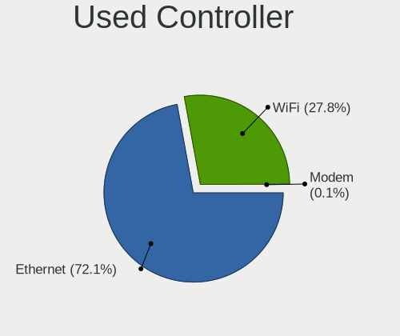

Fedora - Tested Hardware & Statistics (Desktops)
------------------------------------------------

A project to collect tested hardware configurations for Fedora.

Anyone can contribute to this report by the [hw-probe](https://github.com/linuxhw/hw-probe) tool:

    sudo -E hw-probe -all -upload

Please contribute! Especially if your hardware is rare.

Contents
--------

* [ Test Cases ](#test-cases)

* [ System ](#system)
  - [ OS                       ](#os)
  - [ OS Family                ](#os-family)
  - [ Kernel                   ](#kernel)
  - [ Kernel Family            ](#kernel-family)
  - [ Kernel Major Ver.        ](#kernel-major-ver)
  - [ Arch                     ](#arch)
  - [ DE                       ](#de)
  - [ Display Server           ](#display-server)
  - [ Display Manager          ](#display-manager)
  - [ OS Lang                  ](#os-lang)
  - [ Boot Mode                ](#boot-mode)
  - [ Filesystem               ](#filesystem)
  - [ Part. scheme             ](#part-scheme)
  - [ Dual Boot with Linux/BSD ](#dual-boot-with-linuxbsd)
  - [ Dual Boot (Win)          ](#dual-boot-win)

* [ Board ](#board)
  - [ Vendor                   ](#vendor)
  - [ Model                    ](#model)
  - [ Model Family             ](#model-family)
  - [ MFG Year                 ](#mfg-year)
  - [ Form Factor              ](#form-factor)
  - [ Secure Boot              ](#secure-boot)
  - [ Coreboot                 ](#coreboot)
  - [ RAM Size                 ](#ram-size)
  - [ RAM Used                 ](#ram-used)
  - [ Total Drives             ](#total-drives)
  - [ Has CD-ROM               ](#has-cd-rom)
  - [ Has Ethernet             ](#has-ethernet)
  - [ Has WiFi                 ](#has-wifi)
  - [ Has Bluetooth            ](#has-bluetooth)

* [ Location ](#location)
  - [ Country                  ](#country)
  - [ City                     ](#city)

* [ Drives ](#drives)
  - [ Drive Vendor             ](#drive-vendor)
  - [ Drive Model              ](#drive-model)
  - [ HDD Vendor               ](#hdd-vendor)
  - [ SSD Vendor               ](#ssd-vendor)
  - [ Drive Kind               ](#drive-kind)
  - [ Drive Connector          ](#drive-connector)
  - [ Drive Size               ](#drive-size)
  - [ Space Total              ](#space-total)
  - [ Space Used               ](#space-used)
  - [ Malfunc. Drives          ](#malfunc-drives)
  - [ Malfunc. Drive Vendor    ](#malfunc-drive-vendor)
  - [ Malfunc. HDD Vendor      ](#malfunc-hdd-vendor)
  - [ Malfunc. Drive Kind      ](#malfunc-drive-kind)
  - [ Failed Drives            ](#failed-drives)
  - [ Failed Drive Vendor      ](#failed-drive-vendor)
  - [ Drive Status             ](#drive-status)

* [ Storage controller ](#storage-controller)
  - [ Storage Vendor           ](#storage-vendor)
  - [ Storage Model            ](#storage-model)
  - [ Storage Kind             ](#storage-kind)

* [ Processor ](#processor)
  - [ CPU Vendor               ](#cpu-vendor)
  - [ CPU Model                ](#cpu-model)
  - [ CPU Model Family         ](#cpu-model-family)
  - [ CPU Cores                ](#cpu-cores)
  - [ CPU Sockets              ](#cpu-sockets)
  - [ CPU Threads              ](#cpu-threads)
  - [ CPU Op-Modes             ](#cpu-op-modes)
  - [ CPU Microcode            ](#cpu-microcode)
  - [ CPU Microarch            ](#cpu-microarch)

* [ Graphics ](#graphics)
  - [ GPU Vendor               ](#gpu-vendor)
  - [ GPU Model                ](#gpu-model)
  - [ GPU Combo                ](#gpu-combo)
  - [ GPU Driver               ](#gpu-driver)
  - [ GPU Memory               ](#gpu-memory)

* [ Monitor ](#monitor)
  - [ Monitor Vendor           ](#monitor-vendor)
  - [ Monitor Model            ](#monitor-model)
  - [ Monitor Resolution       ](#monitor-resolution)
  - [ Monitor Diagonal         ](#monitor-diagonal)
  - [ Monitor Width            ](#monitor-width)
  - [ Aspect Ratio             ](#aspect-ratio)
  - [ Monitor Area             ](#monitor-area)
  - [ Pixel Density            ](#pixel-density)
  - [ Multiple Monitors        ](#multiple-monitors)

* [ Network ](#network)
  - [ Net Controller Vendor    ](#net-controller-vendor)
  - [ Net Controller Model     ](#net-controller-model)
  - [ Wireless Vendor          ](#wireless-vendor)
  - [ Wireless Model           ](#wireless-model)
  - [ Ethernet Vendor          ](#ethernet-vendor)
  - [ Ethernet Model           ](#ethernet-model)
  - [ Net Controller Kind      ](#net-controller-kind)
  - [ Used Controller          ](#used-controller)
  - [ NICs                     ](#nics)
  - [ IPv6                     ](#ipv6)

* [ Bluetooth ](#bluetooth)
  - [ Bluetooth Vendor         ](#bluetooth-vendor)
  - [ Bluetooth Model          ](#bluetooth-model)

* [ Sound ](#sound)
  - [ Sound Vendor             ](#sound-vendor)
  - [ Sound Model              ](#sound-model)

* [ Memory ](#memory)
  - [ Memory Vendor            ](#memory-vendor)
  - [ Memory Model             ](#memory-model)
  - [ Memory Kind              ](#memory-kind)
  - [ Memory Form Factor       ](#memory-form-factor)
  - [ Memory Size              ](#memory-size)
  - [ Memory Speed             ](#memory-speed)

* [ Printers & scanners ](#printers--scanners)
  - [ Printer Vendor           ](#printer-vendor)
  - [ Printer Model            ](#printer-model)
  - [ Scanner Vendor           ](#scanner-vendor)
  - [ Scanner Model            ](#scanner-model)

* [ Camera ](#camera)
  - [ Camera Vendor            ](#camera-vendor)
  - [ Camera Model             ](#camera-model)

* [ Security ](#security)
  - [ Fingerprint Vendor       ](#fingerprint-vendor)
  - [ Fingerprint Model        ](#fingerprint-model)
  - [ Chipcard Vendor          ](#chipcard-vendor)
  - [ Chipcard Model           ](#chipcard-model)

* [ Unsupported ](#unsupported)
  - [ Unsupported Devices      ](#unsupported-devices)
  - [ Unsupported Device Types ](#unsupported-device-types)

Test Cases
----------

Total: 11216

| Vendor        | Model                       | Probe                                                      | Date         |
|---------------|-----------------------------|------------------------------------------------------------|--------------|
| ASUSTek       | ROG STRIX B650-A GAMING ... | [04f9ffdab4](https://linux-hardware.org/?probe=04f9ffdab4) | Jan 06, 2025 |
| ASUSTek       | PRIME B650M-A AX II         | [7fea0bb2a1](https://linux-hardware.org/?probe=7fea0bb2a1) | Jan 06, 2025 |
| ASRock        | H110M-ITX                   | [d9985ebe4e](https://linux-hardware.org/?probe=d9985ebe4e) | Jan 06, 2025 |
| MSI           | B450 GAMING PLUS MAX        | [89cd372074](https://linux-hardware.org/?probe=89cd372074) | Jan 06, 2025 |
| ASUSTek       | TUF Z370-PLUS GAMING II     | [10fd8ef9dd](https://linux-hardware.org/?probe=10fd8ef9dd) | Jan 06, 2025 |
| ASRock        | B360M Performance           | [1e63738abb](https://linux-hardware.org/?probe=1e63738abb) | Jan 06, 2025 |
| ASUSTek       | ROG STRIX B550-F GAMING     | [c8c490c383](https://linux-hardware.org/?probe=c8c490c383) | Jan 06, 2025 |
| ASUSTek       | H110M-E/M.2                 | [ff2e84ab02](https://linux-hardware.org/?probe=ff2e84ab02) | Jan 05, 2025 |
| HP            | 2B12                        | [f9594ff416](https://linux-hardware.org/?probe=f9594ff416) | Jan 05, 2025 |
| Gigabyte      | X570 AORUS ELITE WIFI       | [d80a8fd406](https://linux-hardware.org/?probe=d80a8fd406) | Jan 05, 2025 |
| ASUSTek       | TUF Gaming B550M-PLUS       | [a7c3662aec](https://linux-hardware.org/?probe=a7c3662aec) | Jan 05, 2025 |
| ASUSTek       | H110M-E/M.2                 | [3b654f1020](https://linux-hardware.org/?probe=3b654f1020) | Jan 05, 2025 |
| Supermicro    | X10SLM-F                    | [a8188b3af2](https://linux-hardware.org/?probe=a8188b3af2) | Jan 04, 2025 |
| MSI           | B450-A PRO MAX              | [c9cf4100bb](https://linux-hardware.org/?probe=c9cf4100bb) | Jan 04, 2025 |
| ASUSTek       | ROG STRIX B550-F GAMING ... | [3f75716ffa](https://linux-hardware.org/?probe=3f75716ffa) | Jan 04, 2025 |
| MSI           | B650 GAMING PLUS WIFI       | [3c54d15e6e](https://linux-hardware.org/?probe=3c54d15e6e) | Jan 04, 2025 |
| ASUSTek       | H110M-E/M.2                 | [d36b787d21](https://linux-hardware.org/?probe=d36b787d21) | Jan 04, 2025 |
| Gigabyte      | B760M AORUS ELITE AX        | [0181bfcd89](https://linux-hardware.org/?probe=0181bfcd89) | Jan 04, 2025 |
| MSI           | MAG Z390 TOMAHAWK           | [7e8f8f5c09](https://linux-hardware.org/?probe=7e8f8f5c09) | Jan 04, 2025 |
| AZW           | MINI S                      | [b4b44d49d3](https://linux-hardware.org/?probe=b4b44d49d3) | Jan 04, 2025 |
| ASUSTek       | ROG STRIX X670E-F GAMING... | [053a6288cb](https://linux-hardware.org/?probe=053a6288cb) | Jan 04, 2025 |
| Gigabyte      | G41MT-D3                    | [c5a86cbe2b](https://linux-hardware.org/?probe=c5a86cbe2b) | Jan 04, 2025 |
| MSI           | B450-A PRO MAX              | [a829ef7128](https://linux-hardware.org/?probe=a829ef7128) | Jan 04, 2025 |
| Acer          | Aspire XC-105               | [997c408078](https://linux-hardware.org/?probe=997c408078) | Jan 03, 2025 |
| Lenovo        | 3168 SDK0J40697 WIN 3305... | [c6915cb84a](https://linux-hardware.org/?probe=c6915cb84a) | Jan 03, 2025 |
| AMI           | Intel                       | [a5d99b38fe](https://linux-hardware.org/?probe=a5d99b38fe) | Jan 03, 2025 |
| Gigabyte      | X670E AORUS MASTER          | [903f395545](https://linux-hardware.org/?probe=903f395545) | Jan 03, 2025 |
| MSI           | MAG Z390 TOMAHAWK           | [de008cdc23](https://linux-hardware.org/?probe=de008cdc23) | Jan 03, 2025 |
| ASRock        | X870E Taichi                | [416afc1fb4](https://linux-hardware.org/?probe=416afc1fb4) | Jan 03, 2025 |
| Apple         | Mac-F60DEB81FF30ACF6 Mac... | [ecfa27b66d](https://linux-hardware.org/?probe=ecfa27b66d) | Jan 02, 2025 |
| Gigabyte      | B75M-D3H                    | [139b1d261d](https://linux-hardware.org/?probe=139b1d261d) | Jan 02, 2025 |
| MSI           | B550M PRO-VDH WIFI          | [a24d68ca3c](https://linux-hardware.org/?probe=a24d68ca3c) | Jan 02, 2025 |
| ASUSTek       | PRIME B550-PLUS AC-HES      | [b5eaeaee82](https://linux-hardware.org/?probe=b5eaeaee82) | Jan 02, 2025 |
| ASUSTek       | PRIME H510M-K               | [2a6b25b609](https://linux-hardware.org/?probe=2a6b25b609) | Jan 02, 2025 |
| ASUSTek       | ROG STRIX X670E-E GAMING... | [99fc88c92b](https://linux-hardware.org/?probe=99fc88c92b) | Jan 02, 2025 |
| ASUSTek       | Pro B650M-CT                | [eeb61bea29](https://linux-hardware.org/?probe=eeb61bea29) | Jan 02, 2025 |
| MSI           | MPG Z390 GAMING EDGE AC     | [08ef8b7453](https://linux-hardware.org/?probe=08ef8b7453) | Jan 01, 2025 |
| MSI           | MPG Z390 GAMING EDGE AC     | [88aa3ff70d](https://linux-hardware.org/?probe=88aa3ff70d) | Jan 01, 2025 |
| Gigabyte      | GA-MA785G-UD3H              | [61fe87d63e](https://linux-hardware.org/?probe=61fe87d63e) | Jan 01, 2025 |
| MSI           | 970 GAMING                  | [c77ab27b22](https://linux-hardware.org/?probe=c77ab27b22) | Jan 01, 2025 |
| ASUSTek       | ROG STRIX X570-E GAMING ... | [eb17054181](https://linux-hardware.org/?probe=eb17054181) | Jan 01, 2025 |
| ASUSTek       | PRIME B650M-A AX II         | [c619b6152e](https://linux-hardware.org/?probe=c619b6152e) | Jan 01, 2025 |
| ASUSTek       | ROG STRIX Z790-E GAMING ... | [040cb2efa9](https://linux-hardware.org/?probe=040cb2efa9) | Jan 01, 2025 |
| ASUSTek       | ROG CROSSHAIR VIII HERO     | [f9183ea9f9](https://linux-hardware.org/?probe=f9183ea9f9) | Dec 31, 2024 |
| MSI           | A520M PRO                   | [092cdc906c](https://linux-hardware.org/?probe=092cdc906c) | Dec 31, 2024 |
| ASUSTek       | TUF B450M-PLUS GAMING       | [bfc48412dd](https://linux-hardware.org/?probe=bfc48412dd) | Dec 31, 2024 |
| ASUSTek       | TUF Gaming B550M-PLUS WI... | [66588a9985](https://linux-hardware.org/?probe=66588a9985) | Dec 31, 2024 |
| ASUSTek       | Maximus IX CODE             | [026ee0facd](https://linux-hardware.org/?probe=026ee0facd) | Dec 31, 2024 |
| ASUSTek       | PRIME H510M-K               | [125c5a0ee0](https://linux-hardware.org/?probe=125c5a0ee0) | Dec 31, 2024 |
| ASUSTek       | PRIME B650M-A AX II         | [04eb3b79c5](https://linux-hardware.org/?probe=04eb3b79c5) | Dec 31, 2024 |
| System76      | Thelio Major thelio-majo... | [4519da1309](https://linux-hardware.org/?probe=4519da1309) | Dec 30, 2024 |
| Gigabyte      | A620I AX                    | [801e27533c](https://linux-hardware.org/?probe=801e27533c) | Dec 30, 2024 |
| Pegatron      | 2AD5                        | [18dc34ec58](https://linux-hardware.org/?probe=18dc34ec58) | Dec 30, 2024 |
| MSI           | MAG Z390 TOMAHAWK           | [f457b3f670](https://linux-hardware.org/?probe=f457b3f670) | Dec 30, 2024 |
| MSI           | MAG Z390 TOMAHAWK           | [c51b4b60fd](https://linux-hardware.org/?probe=c51b4b60fd) | Dec 30, 2024 |
| ASUSTek       | PRIME Z690-P WIFI D4        | [3e9fa7ec25](https://linux-hardware.org/?probe=3e9fa7ec25) | Dec 30, 2024 |
| ASUSTek       | PRIME B650-PLUS             | [5bae41298f](https://linux-hardware.org/?probe=5bae41298f) | Dec 30, 2024 |
| ASUSTek       | PRIME H510M-K               | [5f6888e1a9](https://linux-hardware.org/?probe=5f6888e1a9) | Dec 30, 2024 |
| ASRock        | A320M-HDV R4.0              | [b8d923b1af](https://linux-hardware.org/?probe=b8d923b1af) | Dec 30, 2024 |
| MSI           | PRO B660-A DDR4             | [1760e67766](https://linux-hardware.org/?probe=1760e67766) | Dec 30, 2024 |
| Dell          | 0YXT71 A03                  | [a373cef681](https://linux-hardware.org/?probe=a373cef681) | Dec 30, 2024 |
| Lenovo        | 3328 SDK0T76463 WIN 3422... | [4dde6cad5a](https://linux-hardware.org/?probe=4dde6cad5a) | Dec 30, 2024 |
| ASUSTek       | ROG STRIX B550-E GAMING     | [1fc44cea15](https://linux-hardware.org/?probe=1fc44cea15) | Dec 29, 2024 |
| HP            | 8906 SMVB                   | [c7a78e601d](https://linux-hardware.org/?probe=c7a78e601d) | Dec 29, 2024 |
| Gigabyte      | H61M-S2PV                   | [58be9bacfd](https://linux-hardware.org/?probe=58be9bacfd) | Dec 29, 2024 |
| Gigabyte      | GA-MA785G-UD3H              | [135c62cd91](https://linux-hardware.org/?probe=135c62cd91) | Dec 29, 2024 |
| MSI           | B550-A PRO                  | [93afafb17b](https://linux-hardware.org/?probe=93afafb17b) | Dec 29, 2024 |
| HP            | 1589                        | [dd5a66147d](https://linux-hardware.org/?probe=dd5a66147d) | Dec 28, 2024 |
| ASRock        | B550M-C                     | [dec3229b3a](https://linux-hardware.org/?probe=dec3229b3a) | Dec 28, 2024 |
| Pegatron      | Benicia                     | [e061c1cadc](https://linux-hardware.org/?probe=e061c1cadc) | Dec 28, 2024 |
| ASRock        | B550M Phantom Gaming 4      | [1a05752e8c](https://linux-hardware.org/?probe=1a05752e8c) | Dec 28, 2024 |
| Gigabyte      | H77N-WIFI                   | [e22cddb5fd](https://linux-hardware.org/?probe=e22cddb5fd) | Dec 28, 2024 |
| MSI           | A520M-A PRO                 | [e3ba91e9a3](https://linux-hardware.org/?probe=e3ba91e9a3) | Dec 28, 2024 |
| ASUSTek       | P8H61-M LX3 PLUS R2.0       | [345c9bffd4](https://linux-hardware.org/?probe=345c9bffd4) | Dec 28, 2024 |
| Gigabyte      | G41MT-D3                    | [dc90350a72](https://linux-hardware.org/?probe=dc90350a72) | Dec 28, 2024 |
| Huanan        | X99-F8 GAMING V5.0          | [784d69901d](https://linux-hardware.org/?probe=784d69901d) | Dec 28, 2024 |
| AZW           | MINI S                      | [2f997d878f](https://linux-hardware.org/?probe=2f997d878f) | Dec 28, 2024 |
| HP            | 81B3                        | [67462f75bb](https://linux-hardware.org/?probe=67462f75bb) | Dec 27, 2024 |
| Gigabyte      | B650 EAGLE AX               | [e4b9c34646](https://linux-hardware.org/?probe=e4b9c34646) | Dec 27, 2024 |
| MSI           | MEG Z790 ACE                | [6d77957bbb](https://linux-hardware.org/?probe=6d77957bbb) | Dec 27, 2024 |
| Gigabyte      | GA-A55M-S2V                 | [476ca1ca6d](https://linux-hardware.org/?probe=476ca1ca6d) | Dec 27, 2024 |
| MSI           | A320M PRO-VH                | [e16bd64c51](https://linux-hardware.org/?probe=e16bd64c51) | Dec 27, 2024 |
| MSI           | A320M PRO-VH                | [6c30c82884](https://linux-hardware.org/?probe=6c30c82884) | Dec 27, 2024 |
| ASRock        | X670E Steel Legend          | [77dfeca508](https://linux-hardware.org/?probe=77dfeca508) | Dec 26, 2024 |
| Gigabyte      | X570 I AORUS PRO WIFI       | [856acb68a4](https://linux-hardware.org/?probe=856acb68a4) | Dec 26, 2024 |
| ASUSTek       | H170-PRO                    | [04f9098e0d](https://linux-hardware.org/?probe=04f9098e0d) | Dec 26, 2024 |
| MSI           | 785GT-E63                   | [7bef4fbf53](https://linux-hardware.org/?probe=7bef4fbf53) | Dec 26, 2024 |
| MSI           | H110M PRO-D                 | [9ecfd504b7](https://linux-hardware.org/?probe=9ecfd504b7) | Dec 26, 2024 |
| ASUSTek       | H81M-A/BR                   | [37badc0cfd](https://linux-hardware.org/?probe=37badc0cfd) | Dec 26, 2024 |
| Gigabyte      | Z690 UD DDR4                | [fc2486e691](https://linux-hardware.org/?probe=fc2486e691) | Dec 26, 2024 |
| Gigabyte      | B650 GAMING X AX V2         | [c12274a13c](https://linux-hardware.org/?probe=c12274a13c) | Dec 26, 2024 |
| MSI           | Z270I GAMING PRO CARBON ... | [deae2e3249](https://linux-hardware.org/?probe=deae2e3249) | Dec 26, 2024 |
| Dell          | 0K240Y A01                  | [8aca080a7d](https://linux-hardware.org/?probe=8aca080a7d) | Dec 26, 2024 |
| Lenovo        | ThinkCentre M58p 7220A72    | [f41fa38fd7](https://linux-hardware.org/?probe=f41fa38fd7) | Dec 26, 2024 |
| MSI           | Z270I GAMING PRO CARBON ... | [20b0460a24](https://linux-hardware.org/?probe=20b0460a24) | Dec 25, 2024 |
| MSI           | Z790 GAMING PLUS WIFI       | [0d13f70a8e](https://linux-hardware.org/?probe=0d13f70a8e) | Dec 25, 2024 |
| Gigabyte      | B365M GAMING HD             | [c72350ab41](https://linux-hardware.org/?probe=c72350ab41) | Dec 25, 2024 |
| ASUSTek       | PRIME B550-PLUS             | [8c3e2b5020](https://linux-hardware.org/?probe=8c3e2b5020) | Dec 25, 2024 |
| ASRock        | J4105-ITX                   | [760c59fa66](https://linux-hardware.org/?probe=760c59fa66) | Dec 25, 2024 |
| Lenovo        | SHARKBAY SDK0E50510 WIN     | [002375d8d5](https://linux-hardware.org/?probe=002375d8d5) | Dec 25, 2024 |
| Dell          | 04Y8V0 A02                  | [3cd26b82de](https://linux-hardware.org/?probe=3cd26b82de) | Dec 25, 2024 |
| Gigabyte      | GA-MA780G-UD3H              | [b44b582e4b](https://linux-hardware.org/?probe=b44b582e4b) | Dec 25, 2024 |
| ASRock        | B760M Pro-A WiFi            | [8323aa21ad](https://linux-hardware.org/?probe=8323aa21ad) | Dec 24, 2024 |
| Gigabyte      | Z790I AORUS ULTRA           | [f36ee00671](https://linux-hardware.org/?probe=f36ee00671) | Dec 23, 2024 |
| ASUSTek       | PRIME Z390M-PLUS            | [da6ad47fac](https://linux-hardware.org/?probe=da6ad47fac) | Dec 23, 2024 |
| ASUSTek       | PRIME Z390M-PLUS            | [0a0b737503](https://linux-hardware.org/?probe=0a0b737503) | Dec 23, 2024 |
| HP            | 8906 SMVB                   | [41496e7796](https://linux-hardware.org/?probe=41496e7796) | Dec 23, 2024 |
| ASUSTek       | ROG STRIX B650E-I GAMING... | [f34d1131ed](https://linux-hardware.org/?probe=f34d1131ed) | Dec 23, 2024 |
| Gigabyte      | X570 AORUS ELITE WIFI       | [abc685fb60](https://linux-hardware.org/?probe=abc685fb60) | Dec 23, 2024 |
| Gigabyte      | J1900M-D2P                  | [6d2e2dedfe](https://linux-hardware.org/?probe=6d2e2dedfe) | Dec 23, 2024 |
| ASRock        | H510M-HDV/M.2               | [66b8b7eae0](https://linux-hardware.org/?probe=66b8b7eae0) | Dec 23, 2024 |
| ASUSTek       | H81M-PLUS                   | [237817752c](https://linux-hardware.org/?probe=237817752c) | Dec 23, 2024 |
| ASRock        | N68-GS4 FX                  | [e21e961747](https://linux-hardware.org/?probe=e21e961747) | Dec 22, 2024 |
| MSI           | B550-A PRO                  | [27c4858497](https://linux-hardware.org/?probe=27c4858497) | Dec 22, 2024 |
| ASRock        | B450 Gaming K4              | [5df1c0becb](https://linux-hardware.org/?probe=5df1c0becb) | Dec 22, 2024 |
| Dell          | 0K240Y A01                  | [d24d7b9494](https://linux-hardware.org/?probe=d24d7b9494) | Dec 22, 2024 |
| ASUSTek       | ROG STRIX X370-F GAMING     | [a1e3da32e8](https://linux-hardware.org/?probe=a1e3da32e8) | Dec 22, 2024 |
| ASUSTek       | Z170 PRO GAMING             | [7e6e91ee61](https://linux-hardware.org/?probe=7e6e91ee61) | Dec 21, 2024 |
| Gigabyte      | 970A-D3P                    | [1374f8f13a](https://linux-hardware.org/?probe=1374f8f13a) | Dec 21, 2024 |
| ASUSTek       | PRIME B450-PLUS             | [26585ec299](https://linux-hardware.org/?probe=26585ec299) | Dec 21, 2024 |
| ASUSTek       | P8Z68-V PRO GEN3            | [adf5dc1d46](https://linux-hardware.org/?probe=adf5dc1d46) | Dec 21, 2024 |
| ASUSTek       | PRIME B350M-A               | [8c74a99311](https://linux-hardware.org/?probe=8c74a99311) | Dec 21, 2024 |
| ASUSTek       | PRIME B350M-A               | [02bf6146b7](https://linux-hardware.org/?probe=02bf6146b7) | Dec 21, 2024 |
| MSI           | MEG Z390 GODLIKE            | [16741176a8](https://linux-hardware.org/?probe=16741176a8) | Dec 21, 2024 |
| Gigabyte      | B660M DS3H AX DDR4          | [de1dda444a](https://linux-hardware.org/?probe=de1dda444a) | Dec 21, 2024 |
| ASUSTek       | PRIME A520M-K               | [83995fdfa3](https://linux-hardware.org/?probe=83995fdfa3) | Dec 21, 2024 |
| Gigabyte      | X570 AORUS PRO WIFI         | [9d2496eed1](https://linux-hardware.org/?probe=9d2496eed1) | Dec 21, 2024 |
| ASRock        | B450M Pro4 R2.0             | [10620ef914](https://linux-hardware.org/?probe=10620ef914) | Dec 20, 2024 |
| ASUSTek       | H97-PLUS                    | [a9d05502ce](https://linux-hardware.org/?probe=a9d05502ce) | Dec 20, 2024 |
| Acidanther... | Mac-27AD2F918AE68F61 Mac... | [2e5e5e6242](https://linux-hardware.org/?probe=2e5e5e6242) | Dec 20, 2024 |
| MSI           | PRO H610M-S DDR4            | [9cec96a0b8](https://linux-hardware.org/?probe=9cec96a0b8) | Dec 20, 2024 |
| ASRock        | A520M-ITX/ac                | [7bc977761e](https://linux-hardware.org/?probe=7bc977761e) | Dec 20, 2024 |
| ASRock        | B760M Pro-A WiFi            | [3946d0bb57](https://linux-hardware.org/?probe=3946d0bb57) | Dec 20, 2024 |
| Gigabyte      | X870E AORUS PRO             | [830132d35c](https://linux-hardware.org/?probe=830132d35c) | Dec 20, 2024 |
| ASUSTek       | ROG STRIX Z390-I GAMING     | [b202efa3e6](https://linux-hardware.org/?probe=b202efa3e6) | Dec 20, 2024 |
| ASUSTek       | ROG STRIX X570-F GAMING     | [373f51ec84](https://linux-hardware.org/?probe=373f51ec84) | Dec 19, 2024 |
| ASUSTek       | TUF B450M-PLUS GAMING       | [9f24ad2683](https://linux-hardware.org/?probe=9f24ad2683) | Dec 19, 2024 |
| ASUSTek       | H110M-K                     | [a20b5ae9f0](https://linux-hardware.org/?probe=a20b5ae9f0) | Dec 19, 2024 |
| ASUSTek       | PRIME H510M-A R2.0          | [600869b46a](https://linux-hardware.org/?probe=600869b46a) | Dec 19, 2024 |
| ASUSTek       | ROG STRIX B650E-I GAMING... | [059108072c](https://linux-hardware.org/?probe=059108072c) | Dec 19, 2024 |
| ASUSTek       | PRIME Z370-A                | [78d17c7869](https://linux-hardware.org/?probe=78d17c7869) | Dec 19, 2024 |
| HP            | 8054                        | [ab28ff6e7c](https://linux-hardware.org/?probe=ab28ff6e7c) | Dec 19, 2024 |
| ASRock        | AB350M Pro4                 | [0369c244e9](https://linux-hardware.org/?probe=0369c244e9) | Dec 19, 2024 |
| ASUSTek       | P8P67                       | [fa26a62bc4](https://linux-hardware.org/?probe=fa26a62bc4) | Dec 19, 2024 |
| MSI           | C236A WORKSTATION           | [49ab170cda](https://linux-hardware.org/?probe=49ab170cda) | Dec 18, 2024 |
| MSI           | MAG X870 TOMAHAWK WIFI      | [18273fb5dd](https://linux-hardware.org/?probe=18273fb5dd) | Dec 18, 2024 |
| Gigabyte      | X870 EAGLE WIFI7            | [b80f8d2129](https://linux-hardware.org/?probe=b80f8d2129) | Dec 18, 2024 |
| MSI           | C236A WORKSTATION           | [ddec979f1d](https://linux-hardware.org/?probe=ddec979f1d) | Dec 18, 2024 |
| Gigabyte      | Z77MX-D3H                   | [9b82850a59](https://linux-hardware.org/?probe=9b82850a59) | Dec 18, 2024 |
| MSI           | MPG X570 GAMING PLUS        | [9f1e3acf5c](https://linux-hardware.org/?probe=9f1e3acf5c) | Dec 18, 2024 |
| Dell          | 0MWYPT A02                  | [ee147a7018](https://linux-hardware.org/?probe=ee147a7018) | Dec 18, 2024 |
| ASUSTek       | TUF Gaming X570-PLUS        | [3830383cb9](https://linux-hardware.org/?probe=3830383cb9) | Dec 17, 2024 |
| ASUSTek       | H81M-CS/BR                  | [5f38363403](https://linux-hardware.org/?probe=5f38363403) | Dec 17, 2024 |
| ASUSTek       | TUF Gaming B550M-PLUS WI... | [c9737709d2](https://linux-hardware.org/?probe=c9737709d2) | Dec 17, 2024 |
| MSI           | PRO H610M-S DDR4            | [5df9fcc399](https://linux-hardware.org/?probe=5df9fcc399) | Dec 17, 2024 |
| AZW           | MINI S                      | [f78e053ac9](https://linux-hardware.org/?probe=f78e053ac9) | Dec 17, 2024 |
| Lenovo        | SHARKBAY SDK0E50512 STD     | [c3e53139a7](https://linux-hardware.org/?probe=c3e53139a7) | Dec 17, 2024 |
| HP            | 8643 SMVB                   | [fde3487f3f](https://linux-hardware.org/?probe=fde3487f3f) | Dec 17, 2024 |
| HP            | 1494                        | [4af4907cff](https://linux-hardware.org/?probe=4af4907cff) | Dec 16, 2024 |
| ASUSTek       | ProArt X870E-CREATOR WIF... | [4828ed9df5](https://linux-hardware.org/?probe=4828ed9df5) | Dec 16, 2024 |
| ASUSTek       | Rampage II GENE             | [92edcfef77](https://linux-hardware.org/?probe=92edcfef77) | Dec 16, 2024 |
| Dell          | 0M017G A00                  | [0f1c439447](https://linux-hardware.org/?probe=0f1c439447) | Dec 16, 2024 |
| Dell          | 0M017G A00                  | [e306c72db0](https://linux-hardware.org/?probe=e306c72db0) | Dec 16, 2024 |
| HP            | 198E                        | [902931c40d](https://linux-hardware.org/?probe=902931c40d) | Dec 16, 2024 |
| ASRock        | B550 Phantom Gaming 4/ac    | [11dc169e95](https://linux-hardware.org/?probe=11dc169e95) | Dec 15, 2024 |
| Gigabyte      | G41MT-D3                    | [51632357e5](https://linux-hardware.org/?probe=51632357e5) | Dec 14, 2024 |
| Gigabyte      | B550M AORUS ELITE           | [39f30baf2e](https://linux-hardware.org/?probe=39f30baf2e) | Dec 14, 2024 |
| Acidanther... | Mac-27AD2F918AE68F61 Mac... | [f337acfd7a](https://linux-hardware.org/?probe=f337acfd7a) | Dec 14, 2024 |
| Gigabyte      | Z690 UD DDR4                | [42b3bd140f](https://linux-hardware.org/?probe=42b3bd140f) | Dec 13, 2024 |
| Dell          | 02YYK5 A01                  | [ce9189a198](https://linux-hardware.org/?probe=ce9189a198) | Dec 13, 2024 |
| Gigabyte      | X570 AORUS ELITE WIFI       | [c3817fc2bf](https://linux-hardware.org/?probe=c3817fc2bf) | Dec 13, 2024 |
| HP            | 8906 SMVB                   | [164362fb04](https://linux-hardware.org/?probe=164362fb04) | Dec 13, 2024 |
| Dell          | 0GY6Y8 A00                  | [41fd350e84](https://linux-hardware.org/?probe=41fd350e84) | Dec 13, 2024 |
| MSI           | A520M-A PRO                 | [d72d3b5ba5](https://linux-hardware.org/?probe=d72d3b5ba5) | Dec 13, 2024 |
| ASUSTek       | PRIME X570-P                | [05e5753958](https://linux-hardware.org/?probe=05e5753958) | Dec 13, 2024 |
| Gigabyte      | B450M DS3H-CF               | [a6f9793144](https://linux-hardware.org/?probe=a6f9793144) | Dec 13, 2024 |
| Gigabyte      | B450M DS3H-CF               | [6e31ffceab](https://linux-hardware.org/?probe=6e31ffceab) | Dec 13, 2024 |
| MSI           | A520M-A PRO                 | [4035532469](https://linux-hardware.org/?probe=4035532469) | Dec 13, 2024 |
| MSI           | A520M-A PRO                 | [b35d0ef2a9](https://linux-hardware.org/?probe=b35d0ef2a9) | Dec 13, 2024 |
| MSI           | 970A-G46                    | [eeea91c2c7](https://linux-hardware.org/?probe=eeea91c2c7) | Dec 13, 2024 |
| MSI           | Z87-G45 GAMING              | [f86b7a5624](https://linux-hardware.org/?probe=f86b7a5624) | Dec 12, 2024 |
| Dell          | 0HHV7N A00                  | [020475e5fe](https://linux-hardware.org/?probe=020475e5fe) | Dec 12, 2024 |
| MSI           | MAG X870 TOMAHAWK WIFI      | [83c21053dc](https://linux-hardware.org/?probe=83c21053dc) | Dec 12, 2024 |
| ASRock        | B660M-C                     | [1236820692](https://linux-hardware.org/?probe=1236820692) | Dec 12, 2024 |
| Gigabyte      | Z890 EAGLE WIFI7            | [f7233e7156](https://linux-hardware.org/?probe=f7233e7156) | Dec 12, 2024 |
| Gigabyte      | Z390 AORUS PRO WIFI-CF      | [7ae34455fd](https://linux-hardware.org/?probe=7ae34455fd) | Dec 12, 2024 |
| ASUSTek       | TUF Gaming X670E-PLUS WI... | [1d01300877](https://linux-hardware.org/?probe=1d01300877) | Dec 12, 2024 |
| Gigabyte      | B550 AORUS ELITE AX V2      | [b819493263](https://linux-hardware.org/?probe=b819493263) | Dec 12, 2024 |
| ASUSTek       | STRIX Z270H GAMING          | [24c88ab18a](https://linux-hardware.org/?probe=24c88ab18a) | Dec 12, 2024 |
| Gigabyte      | H410M H V2                  | [29d08f5d9c](https://linux-hardware.org/?probe=29d08f5d9c) | Dec 11, 2024 |
| MSI           | MPG Z790 EDGE TI MAX WIF... | [962e3b7c94](https://linux-hardware.org/?probe=962e3b7c94) | Dec 11, 2024 |
| ASUSTek       | TUF Z390M-PRO GAMING        | [f55cefc4aa](https://linux-hardware.org/?probe=f55cefc4aa) | Dec 11, 2024 |
| ASUSTek       | ROG CROSSHAIR VIII IMPAC... | [1fc3e7965d](https://linux-hardware.org/?probe=1fc3e7965d) | Dec 11, 2024 |
| Gigabyte      | Z790 UD AC                  | [a70d79b557](https://linux-hardware.org/?probe=a70d79b557) | Dec 11, 2024 |
| ASUSTek       | PRIME B660-PLUS D4          | [bea1bb6368](https://linux-hardware.org/?probe=bea1bb6368) | Dec 10, 2024 |
| ASRock        | H97M Pro4                   | [ad4a8c30fa](https://linux-hardware.org/?probe=ad4a8c30fa) | Dec 10, 2024 |
| Fujitsu       | D3164-A1 S26361-D3164-A1    | [49f31af912](https://linux-hardware.org/?probe=49f31af912) | Dec 10, 2024 |
| HP            | 8906 SMVB                   | [4d33ab52fc](https://linux-hardware.org/?probe=4d33ab52fc) | Dec 10, 2024 |
| SLIMBOOK      | ONE-AM5                     | [d0bbc8aa6e](https://linux-hardware.org/?probe=d0bbc8aa6e) | Dec 10, 2024 |
| ASUSTek       | PRIME X670-P WIFI           | [3a7dd0b60b](https://linux-hardware.org/?probe=3a7dd0b60b) | Dec 10, 2024 |
| Dell          | 0Y9655                      | [02dddf8f3b](https://linux-hardware.org/?probe=02dddf8f3b) | Dec 10, 2024 |
| Pegatron      | 2A86E01                     | [7f912e4b1b](https://linux-hardware.org/?probe=7f912e4b1b) | Dec 10, 2024 |
| Intel         | LADPNVMO AAE76523-300       | [e42ba66dd1](https://linux-hardware.org/?probe=e42ba66dd1) | Dec 09, 2024 |
| ASRock        | B650M PG Riptide            | [ec69fb26c9](https://linux-hardware.org/?probe=ec69fb26c9) | Dec 09, 2024 |
| ASUSTek       | PRIME B460M-A               | [275b70a9b3](https://linux-hardware.org/?probe=275b70a9b3) | Dec 09, 2024 |
| ASUSTek       | M4A89GTD-PRO/USB3           | [80d9b4596e](https://linux-hardware.org/?probe=80d9b4596e) | Dec 08, 2024 |
| ASUSTek       | TUF Gaming B550M-PLUS WI... | [8d72975c1f](https://linux-hardware.org/?probe=8d72975c1f) | Dec 08, 2024 |
| ASUSTek       | STRIX B250F GAMING          | [aad04cbfa0](https://linux-hardware.org/?probe=aad04cbfa0) | Dec 08, 2024 |
| Intel         | B85                         | [319a350c09](https://linux-hardware.org/?probe=319a350c09) | Dec 08, 2024 |
| MSI           | B450M MORTAR MAX            | [6dd73b8ba5](https://linux-hardware.org/?probe=6dd73b8ba5) | Dec 08, 2024 |
| MSI           | MAG B550M BAZOOKA           | [ac421a6697](https://linux-hardware.org/?probe=ac421a6697) | Dec 08, 2024 |
| ASUSTek       | ROG STRIX B550-F GAMING ... | [22bfeaf18d](https://linux-hardware.org/?probe=22bfeaf18d) | Dec 08, 2024 |
| Intel         | B85                         | [7cbfefe75c](https://linux-hardware.org/?probe=7cbfefe75c) | Dec 07, 2024 |
| ASUSTek       | ROG Maximus XIII HERO       | [c27ff3f4de](https://linux-hardware.org/?probe=c27ff3f4de) | Dec 07, 2024 |
| ASUSTek       | PRIME A620-PLUS WIFI6       | [8c2e5346f1](https://linux-hardware.org/?probe=8c2e5346f1) | Dec 07, 2024 |
| Gigabyte      | B450 AORUS ELITE            | [4503233bdb](https://linux-hardware.org/?probe=4503233bdb) | Dec 07, 2024 |
| MSI           | Z87-G45 GAMING              | [74ef542001](https://linux-hardware.org/?probe=74ef542001) | Dec 07, 2024 |
| Dell          | 0Y9655                      | [b5f13b6611](https://linux-hardware.org/?probe=b5f13b6611) | Dec 07, 2024 |
| ASUSTek       | PRIME B460M-A               | [422c8408b1](https://linux-hardware.org/?probe=422c8408b1) | Dec 07, 2024 |
| ASRock        | A320M-HD                    | [ac1057440a](https://linux-hardware.org/?probe=ac1057440a) | Dec 07, 2024 |
| ASUSTek       | TUF Gaming A620-PRO WIFI    | [19aa855f4d](https://linux-hardware.org/?probe=19aa855f4d) | Dec 07, 2024 |
| Gigabyte      | X470 AORUS ULTRA GAMING-... | [5313e20734](https://linux-hardware.org/?probe=5313e20734) | Dec 07, 2024 |
| Daten Tecn... | DB85PRO                     | [eb235e849d](https://linux-hardware.org/?probe=eb235e849d) | Dec 06, 2024 |
| Gigabyte      | X870 EAGLE WIFI7            | [b7f62c7b88](https://linux-hardware.org/?probe=b7f62c7b88) | Dec 06, 2024 |
| ASUSTek       | PRIME Z270-P                | [85d7cd1e9a](https://linux-hardware.org/?probe=85d7cd1e9a) | Dec 06, 2024 |
| Gigabyte      | B250M-DS3H-CF               | [765f860e00](https://linux-hardware.org/?probe=765f860e00) | Dec 06, 2024 |
| Gigabyte      | H61M-USB3H                  | [f6f758c80a](https://linux-hardware.org/?probe=f6f758c80a) | Dec 06, 2024 |
| Gigabyte      | EP45-UD3R                   | [988eece545](https://linux-hardware.org/?probe=988eece545) | Dec 06, 2024 |
| ASUSTek       | ProArt X870E-CREATOR WIF... | [ea0f32ae89](https://linux-hardware.org/?probe=ea0f32ae89) | Dec 06, 2024 |
| ASUSTek       | H81M-A/BR                   | [5e9219a165](https://linux-hardware.org/?probe=5e9219a165) | Dec 06, 2024 |
| ASUSTek       | ProArt X670E-CREATOR WIF... | [3a5389b84a](https://linux-hardware.org/?probe=3a5389b84a) | Dec 06, 2024 |
| ASUSTek       | ROG STRIX B550-F GAMING     | [a9ec07c3c9](https://linux-hardware.org/?probe=a9ec07c3c9) | Dec 06, 2024 |
| MSI           | X470 GAMING PLUS            | [bcba713eb3](https://linux-hardware.org/?probe=bcba713eb3) | Dec 05, 2024 |
| HP            | 8299                        | [8fb4eb84e5](https://linux-hardware.org/?probe=8fb4eb84e5) | Dec 05, 2024 |
| ASRock        | B360M Pro4                  | [110b5c92b3](https://linux-hardware.org/?probe=110b5c92b3) | Dec 05, 2024 |
| ASRock        | B360M Pro4                  | [51ed30ad3f](https://linux-hardware.org/?probe=51ed30ad3f) | Dec 05, 2024 |
| ASUSTek       | PRIME B450-PLUS             | [3ac8b9ac4d](https://linux-hardware.org/?probe=3ac8b9ac4d) | Dec 05, 2024 |
| MSI           | MAG B550 TOMAHAWK           | [4ec5a1bec9](https://linux-hardware.org/?probe=4ec5a1bec9) | Dec 05, 2024 |
| MSI           | B450M PRO-VDH MAX           | [b866222ea1](https://linux-hardware.org/?probe=b866222ea1) | Dec 05, 2024 |
| ASUSTek       | TUF Gaming X670E-PLUS       | [d5da253b51](https://linux-hardware.org/?probe=d5da253b51) | Dec 05, 2024 |
| ASUSTek       | ROG STRIX Z370-E GAMING     | [3f7324c90a](https://linux-hardware.org/?probe=3f7324c90a) | Dec 05, 2024 |
| ASRock        | AD2700-ITX                  | [5fdaccb9a8](https://linux-hardware.org/?probe=5fdaccb9a8) | Dec 05, 2024 |
| ASUSTek       | PRIME A320M-K               | [03151f3639](https://linux-hardware.org/?probe=03151f3639) | Dec 05, 2024 |
| Gigabyte      | B550I AORUS PRO AX          | [fa4be7b516](https://linux-hardware.org/?probe=fa4be7b516) | Dec 05, 2024 |
| Gigabyte      | GA-MA780G-UD3H              | [bc1c756ed9](https://linux-hardware.org/?probe=bc1c756ed9) | Dec 05, 2024 |
| Gigabyte      | B450M DS3H-CF               | [fc67178348](https://linux-hardware.org/?probe=fc67178348) | Dec 04, 2024 |
| Lenovo        | MAHOBAY NO DPK              | [f77678469a](https://linux-hardware.org/?probe=f77678469a) | Dec 04, 2024 |
| ASUSTek       | A8R32-MVP Deluxe            | [2c25863ae9](https://linux-hardware.org/?probe=2c25863ae9) | Dec 04, 2024 |
| Lenovo        | MAHOBAY NO DPK              | [f6767b3b26](https://linux-hardware.org/?probe=f6767b3b26) | Dec 04, 2024 |
| ASRock        | B450 Pro4                   | [55e24b5774](https://linux-hardware.org/?probe=55e24b5774) | Dec 04, 2024 |
| ASUSTek       | ProArt B550-CREATOR         | [074e91d7d5](https://linux-hardware.org/?probe=074e91d7d5) | Dec 03, 2024 |
| Gigabyte      | H410M H V2                  | [1b1f8c13e7](https://linux-hardware.org/?probe=1b1f8c13e7) | Dec 03, 2024 |
| Gigabyte      | Z790 GAMING X               | [0fe982b162](https://linux-hardware.org/?probe=0fe982b162) | Dec 03, 2024 |
| ASRock        | B450 Gaming K4              | [ce617f14e9](https://linux-hardware.org/?probe=ce617f14e9) | Dec 03, 2024 |
| MSI           | B450M PRO-VDH MAX           | [de3399c33d](https://linux-hardware.org/?probe=de3399c33d) | Dec 03, 2024 |
| HP            | 83EF                        | [8ec6753877](https://linux-hardware.org/?probe=8ec6753877) | Dec 03, 2024 |
| Gigabyte      | H77N-WIFI                   | [fb898274e9](https://linux-hardware.org/?probe=fb898274e9) | Dec 03, 2024 |
| Pegatron      | IPM31G                      | [a94a211e70](https://linux-hardware.org/?probe=a94a211e70) | Dec 03, 2024 |
| Gigabyte      | B550M K                     | [6483d852ee](https://linux-hardware.org/?probe=6483d852ee) | Dec 02, 2024 |
| HP            | 8299                        | [5de364edd7](https://linux-hardware.org/?probe=5de364edd7) | Dec 02, 2024 |
| HP            | 1998                        | [924f8aa401](https://linux-hardware.org/?probe=924f8aa401) | Dec 02, 2024 |
| HP            | 1998                        | [96ed13c26f](https://linux-hardware.org/?probe=96ed13c26f) | Dec 02, 2024 |
| ASUSTek       | STRIX H270F GAMING          | [2e9abd7b29](https://linux-hardware.org/?probe=2e9abd7b29) | Dec 02, 2024 |
| ASUSTek       | TUF Gaming B650-PLUS WIF... | [b2b3a3aa1f](https://linux-hardware.org/?probe=b2b3a3aa1f) | Dec 02, 2024 |
| ASUSTek       | ROG STRIX B550-F GAMING     | [f392f0cb5f](https://linux-hardware.org/?probe=f392f0cb5f) | Dec 02, 2024 |
| Gigabyte      | B450M DS3H WIFI-CF          | [a48c737bf4](https://linux-hardware.org/?probe=a48c737bf4) | Dec 02, 2024 |
| Gigabyte      | GA-A55M-S2V                 | [64ef142041](https://linux-hardware.org/?probe=64ef142041) | Dec 02, 2024 |
| Gigabyte      | J1900M-D2P                  | [7997ade01f](https://linux-hardware.org/?probe=7997ade01f) | Dec 02, 2024 |
| ASUSTek       | PRIME X670E-PRO WIFI        | [2612abfcee](https://linux-hardware.org/?probe=2612abfcee) | Dec 02, 2024 |
| Intel         | H61                         | [1202ad97f8](https://linux-hardware.org/?probe=1202ad97f8) | Dec 02, 2024 |
| Gigabyte      | GA-MA785G-UD3H              | [cf6a4a0297](https://linux-hardware.org/?probe=cf6a4a0297) | Dec 01, 2024 |
| ASUSTek       | ROG STRIX Z690-I GAMING ... | [b3a49c1c20](https://linux-hardware.org/?probe=b3a49c1c20) | Dec 01, 2024 |
| MSI           | MAG B550 TOMAHAWK           | [05b0c23f90](https://linux-hardware.org/?probe=05b0c23f90) | Dec 01, 2024 |
| AZW           | MINI S                      | [6b1e7b76ae](https://linux-hardware.org/?probe=6b1e7b76ae) | Dec 01, 2024 |
| HP            | 83E0                        | [e3acb6a03b](https://linux-hardware.org/?probe=e3acb6a03b) | Dec 01, 2024 |
| ASUSTek       | TUF Gaming X570-PRO         | [a7854e08eb](https://linux-hardware.org/?probe=a7854e08eb) | Dec 01, 2024 |
| ASUSTek       | P8H77-M PRO                 | [9655fa6aa4](https://linux-hardware.org/?probe=9655fa6aa4) | Dec 01, 2024 |
| MSI           | Z77A-G45                    | [4ff6c04aeb](https://linux-hardware.org/?probe=4ff6c04aeb) | Nov 30, 2024 |
| ASUSTek       | SABERTOOTH 990FX R2.0       | [32d10cb8bd](https://linux-hardware.org/?probe=32d10cb8bd) | Nov 30, 2024 |
| ASUSTek       | Maximus IV GENE-Z/GEN3      | [df1e7231c1](https://linux-hardware.org/?probe=df1e7231c1) | Nov 30, 2024 |
| AZW           | U59                         | [895bcb5792](https://linux-hardware.org/?probe=895bcb5792) | Nov 30, 2024 |
| ASRock        | X670E Taichi                | [e20725a706](https://linux-hardware.org/?probe=e20725a706) | Nov 30, 2024 |
| Gigabyte      | B450 AORUS ELITE            | [745588252f](https://linux-hardware.org/?probe=745588252f) | Nov 30, 2024 |
| ASRock        | B550 Phantom Gaming 4/ac    | [f305c13791](https://linux-hardware.org/?probe=f305c13791) | Nov 30, 2024 |
| ASUSTek       | ROG STRIX B650E-I GAMING... | [341c2709d8](https://linux-hardware.org/?probe=341c2709d8) | Nov 29, 2024 |
| Unknown       | Unknown                     | [e5904a131c](https://linux-hardware.org/?probe=e5904a131c) | Nov 29, 2024 |
| ASUSTek       | PRIME B250-PLUS             | [2e64c84332](https://linux-hardware.org/?probe=2e64c84332) | Nov 29, 2024 |
| MSI           | Z97 PC Mate                 | [2f0201c36b](https://linux-hardware.org/?probe=2f0201c36b) | Nov 29, 2024 |
| Tianbei       | GEM12                       | [a9116936ae](https://linux-hardware.org/?probe=a9116936ae) | Nov 29, 2024 |
| ASUSTek       | ROG STRIX X370-F GAMING     | [95680c9fec](https://linux-hardware.org/?probe=95680c9fec) | Nov 29, 2024 |
| HP            | 2820h                       | [ef90aa8270](https://linux-hardware.org/?probe=ef90aa8270) | Nov 28, 2024 |
| ASRock        | FM2A68M-HD+                 | [abbaade865](https://linux-hardware.org/?probe=abbaade865) | Nov 28, 2024 |
| ASRock        | B450M-HDV R4.0              | [5368752126](https://linux-hardware.org/?probe=5368752126) | Nov 28, 2024 |
| MSI           | B550-A PRO                  | [b8646c3e51](https://linux-hardware.org/?probe=b8646c3e51) | Nov 28, 2024 |
| Gigabyte      | Z790 AORUS ELITE AX         | [97a6701e22](https://linux-hardware.org/?probe=97a6701e22) | Nov 28, 2024 |
| Biostar       | B450MH                      | [ecf1f7fc9e](https://linux-hardware.org/?probe=ecf1f7fc9e) | Nov 28, 2024 |
| Gigabyte      | B550 GAMING X V2            | [85f8cae557](https://linux-hardware.org/?probe=85f8cae557) | Nov 28, 2024 |
| MSI           | Z97 PC Mate                 | [1bda8fbcb4](https://linux-hardware.org/?probe=1bda8fbcb4) | Nov 28, 2024 |
| ASRock        | Z590 Phantom Gaming 4       | [0fa184b969](https://linux-hardware.org/?probe=0fa184b969) | Nov 28, 2024 |
| MSI           | MPG B550 GAMING PLUS        | [7c5dbdf270](https://linux-hardware.org/?probe=7c5dbdf270) | Nov 28, 2024 |
| HP            | 82B4                        | [6d6647f3e4](https://linux-hardware.org/?probe=6d6647f3e4) | Nov 27, 2024 |
| Dell          | 0WMJ54 A01                  | [1dab8af4cf](https://linux-hardware.org/?probe=1dab8af4cf) | Nov 27, 2024 |
| Dell          | 0WMJ54 A01                  | [4dcd36587b](https://linux-hardware.org/?probe=4dcd36587b) | Nov 27, 2024 |
| ASUSTek       | ROG STRIX B650E-I GAMING... | [107f6ec159](https://linux-hardware.org/?probe=107f6ec159) | Nov 27, 2024 |
| ASUSTek       | ROG CROSSHAIR X670E HERO    | [49d629a4df](https://linux-hardware.org/?probe=49d629a4df) | Nov 27, 2024 |
| Apple         | Mac-F221BEC8                | [601f8f459f](https://linux-hardware.org/?probe=601f8f459f) | Nov 27, 2024 |
| MSI           | MS-7318                     | [e117ee013a](https://linux-hardware.org/?probe=e117ee013a) | Nov 27, 2024 |
| HP            | 82B4                        | [fbe90d8967](https://linux-hardware.org/?probe=fbe90d8967) | Nov 27, 2024 |
| Gigabyte      | 990FXA-UD3                  | [28b0d5272c](https://linux-hardware.org/?probe=28b0d5272c) | Nov 27, 2024 |
| Gigabyte      | 990FXA-UD3                  | [32e941719a](https://linux-hardware.org/?probe=32e941719a) | Nov 26, 2024 |
| ASUSTek       | ROG STRIX X570-E GAMING     | [6aeed4ada0](https://linux-hardware.org/?probe=6aeed4ada0) | Nov 26, 2024 |
| ASRock        | B450M-HDV R4.0              | [42f36d7dfa](https://linux-hardware.org/?probe=42f36d7dfa) | Nov 26, 2024 |
| Gigabyte      | Z77MX-D3H                   | [3bdd24a725](https://linux-hardware.org/?probe=3bdd24a725) | Nov 26, 2024 |
| Dell          | 04Y8V0 A02                  | [46151592a2](https://linux-hardware.org/?probe=46151592a2) | Nov 26, 2024 |
| MSI           | A520M-A PRO                 | [955e1ca8e6](https://linux-hardware.org/?probe=955e1ca8e6) | Nov 26, 2024 |
| ASUSTek       | PRIME X670E-PRO WIFI        | [5820c49268](https://linux-hardware.org/?probe=5820c49268) | Nov 26, 2024 |
| Gigabyte      | Z370P D3-CF                 | [f690af96e7](https://linux-hardware.org/?probe=f690af96e7) | Nov 26, 2024 |
| Dell          | 0NW73C A01                  | [09b0c9f738](https://linux-hardware.org/?probe=09b0c9f738) | Nov 26, 2024 |
| ASUSTek       | Z97-PRO                     | [06a9dbf820](https://linux-hardware.org/?probe=06a9dbf820) | Nov 25, 2024 |
| Biostar       | B450MH                      | [b6de2bc533](https://linux-hardware.org/?probe=b6de2bc533) | Nov 25, 2024 |
| ASUSTek       | B150M-C                     | [aea6bc9c92](https://linux-hardware.org/?probe=aea6bc9c92) | Nov 25, 2024 |
| ASRock        | Z370 Pro4                   | [444d9d7d0b](https://linux-hardware.org/?probe=444d9d7d0b) | Nov 25, 2024 |
| Gigabyte      | B550M AORUS ELITE           | [72541ff724](https://linux-hardware.org/?probe=72541ff724) | Nov 25, 2024 |
| Gigabyte      | B550M AORUS ELITE           | [a372d0e63d](https://linux-hardware.org/?probe=a372d0e63d) | Nov 25, 2024 |
| Gigabyte      | Z68MA-D2H-B3                | [33e54edc5c](https://linux-hardware.org/?probe=33e54edc5c) | Nov 25, 2024 |
| ASUSTek       | TUF Gaming B660M-PLUS WI... | [ab34148bbb](https://linux-hardware.org/?probe=ab34148bbb) | Nov 25, 2024 |
| ASUSTek       | TUF Gaming B660M-PLUS WI... | [556e1e8117](https://linux-hardware.org/?probe=556e1e8117) | Nov 25, 2024 |
| MSI           | MAG B650M MORTAR WIFI       | [20683bbaf5](https://linux-hardware.org/?probe=20683bbaf5) | Nov 24, 2024 |
| ASUSTek       | ROG STRIX B650E-I GAMING... | [e05ac701f9](https://linux-hardware.org/?probe=e05ac701f9) | Nov 24, 2024 |
| ASUSTek       | ROG STRIX B550-F GAMING     | [42ff38d61f](https://linux-hardware.org/?probe=42ff38d61f) | Nov 24, 2024 |
| Gigabyte      | B550M AORUS ELITE           | [ddd400a998](https://linux-hardware.org/?probe=ddd400a998) | Nov 24, 2024 |
| Gigabyte      | J1900M-D2P                  | [02184c6e08](https://linux-hardware.org/?probe=02184c6e08) | Nov 24, 2024 |
| ASUSTek       | PRIME B650M-A AX II         | [146aa6feef](https://linux-hardware.org/?probe=146aa6feef) | Nov 24, 2024 |
| ASRock        | Z590 Pro4                   | [f569229d50](https://linux-hardware.org/?probe=f569229d50) | Nov 24, 2024 |
| HP            | 8643 SMVB                   | [074a9e3202](https://linux-hardware.org/?probe=074a9e3202) | Nov 24, 2024 |
| Dell          | 09KPNV A00                  | [3071efb367](https://linux-hardware.org/?probe=3071efb367) | Nov 23, 2024 |
| MSI           | MAG B650M MORTAR WIFI       | [1fda2a7642](https://linux-hardware.org/?probe=1fda2a7642) | Nov 23, 2024 |
| ASUSTek       | PRIME B250-PLUS             | [b83b69cfbe](https://linux-hardware.org/?probe=b83b69cfbe) | Nov 23, 2024 |
| Gigabyte      | Z890 EAGLE WIFI7            | [38990b4a95](https://linux-hardware.org/?probe=38990b4a95) | Nov 23, 2024 |
| ASUSTek       | H110M-PLUS                  | [0edb7dce3a](https://linux-hardware.org/?probe=0edb7dce3a) | Nov 23, 2024 |
| Gigabyte      | H370 AORUS GAMING 3-CF      | [56651b3fbf](https://linux-hardware.org/?probe=56651b3fbf) | Nov 23, 2024 |
| ASUSTek       | ROG STRIX Z370-E GAMING     | [b6f18ef9c7](https://linux-hardware.org/?probe=b6f18ef9c7) | Nov 23, 2024 |
| PELADN        | HO4                         | [aea6bf6fc7](https://linux-hardware.org/?probe=aea6bf6fc7) | Nov 23, 2024 |
| ASUSTek       | PRIME B650M-A AX II         | [bfdfab6c5a](https://linux-hardware.org/?probe=bfdfab6c5a) | Nov 23, 2024 |
| Gigabyte      | G41MT-D3                    | [d6d09e60c8](https://linux-hardware.org/?probe=d6d09e60c8) | Nov 23, 2024 |
| Gigabyte      | H510M H                     | [19c3074d2a](https://linux-hardware.org/?probe=19c3074d2a) | Nov 23, 2024 |
| Gigabyte      | H510M H                     | [bb61554d7b](https://linux-hardware.org/?probe=bb61554d7b) | Nov 23, 2024 |
| ASUSTek       | ROG STRIX B550-I GAMING     | [400b4c591b](https://linux-hardware.org/?probe=400b4c591b) | Nov 22, 2024 |
| ASUSTek       | SABERTOOTH Z77              | [a0f8d129fd](https://linux-hardware.org/?probe=a0f8d129fd) | Nov 22, 2024 |
| MSI           | B150M PRO-VDH               | [1fbfabce4e](https://linux-hardware.org/?probe=1fbfabce4e) | Nov 22, 2024 |
| Intel         | B760 M-ATX D4               | [adae845d88](https://linux-hardware.org/?probe=adae845d88) | Nov 22, 2024 |
| Itautec       | ST 4271 ST-4271 Padrao 0... | [88f77c55ad](https://linux-hardware.org/?probe=88f77c55ad) | Nov 22, 2024 |
| ASUSTek       | G20AJ                       | [0dbb1f0216](https://linux-hardware.org/?probe=0dbb1f0216) | Nov 21, 2024 |
| Gigabyte      | Z790 UD AC                  | [edbc57f0f9](https://linux-hardware.org/?probe=edbc57f0f9) | Nov 21, 2024 |
| ASUSTek       | TUF Gaming B460-PLUS        | [09833d7cc6](https://linux-hardware.org/?probe=09833d7cc6) | Nov 21, 2024 |
| Gigabyte      | B650 GAMING X AX V2         | [8a0ffdead5](https://linux-hardware.org/?probe=8a0ffdead5) | Nov 21, 2024 |
| Intel         | DH67BL AAG10189-206         | [db9eac8915](https://linux-hardware.org/?probe=db9eac8915) | Nov 21, 2024 |
| ASUSTek       | PRIME B350-PLUS             | [b37562aa88](https://linux-hardware.org/?probe=b37562aa88) | Nov 21, 2024 |
| Dell          | 0NW73C A01                  | [4676fdcb5b](https://linux-hardware.org/?probe=4676fdcb5b) | Nov 21, 2024 |
| Gigabyte      | Z790 AORUS ELITE AX ICE     | [099c277e56](https://linux-hardware.org/?probe=099c277e56) | Nov 21, 2024 |
| ASRock        | Z790 Pro RS WiFi            | [ba5a47319f](https://linux-hardware.org/?probe=ba5a47319f) | Nov 21, 2024 |
| ASUSTek       | TUF Gaming X570-PLUS        | [337a92a014](https://linux-hardware.org/?probe=337a92a014) | Nov 21, 2024 |
| Gigabyte      | H81M-HD3                    | [44a2c7c5a7](https://linux-hardware.org/?probe=44a2c7c5a7) | Nov 21, 2024 |
| ASRock        | B550 Phantom Gaming 4       | [8b731816c0](https://linux-hardware.org/?probe=8b731816c0) | Nov 21, 2024 |
| MSI           | B550-A PRO                  | [c9482feedb](https://linux-hardware.org/?probe=c9482feedb) | Nov 20, 2024 |
| Gigabyte      | X870E AORUS PRO             | [bd8f54a3ab](https://linux-hardware.org/?probe=bd8f54a3ab) | Nov 20, 2024 |
| ASRock        | H81M-VG4 R2.0               | [21abf92497](https://linux-hardware.org/?probe=21abf92497) | Nov 20, 2024 |
| ASUSTek       | ProArt X870E-CREATOR WIF... | [23ea60ff87](https://linux-hardware.org/?probe=23ea60ff87) | Nov 19, 2024 |
| Gigabyte      | Z790 UD AC                  | [7651664c83](https://linux-hardware.org/?probe=7651664c83) | Nov 19, 2024 |
| Gigabyte      | GA-MA785G-UD3H              | [9b9550e9cc](https://linux-hardware.org/?probe=9b9550e9cc) | Nov 19, 2024 |
| Gigabyte      | AB350M-DS3H V2-CF           | [c7a500dd7a](https://linux-hardware.org/?probe=c7a500dd7a) | Nov 19, 2024 |
| Lenovo        | Tilapia CRB                 | [5e47873483](https://linux-hardware.org/?probe=5e47873483) | Nov 19, 2024 |
| Intel         | H110                        | [d246e22138](https://linux-hardware.org/?probe=d246e22138) | Nov 19, 2024 |
| AMI           | Intel                       | [c3bded7d6e](https://linux-hardware.org/?probe=c3bded7d6e) | Nov 19, 2024 |
| HP            | 158B                        | [5af010ad69](https://linux-hardware.org/?probe=5af010ad69) | Nov 19, 2024 |
| Gigabyte      | B365M DS3H WIFI             | [48aeeedae5](https://linux-hardware.org/?probe=48aeeedae5) | Nov 19, 2024 |
| ASUSTek       | PRIME B450M-A II            | [d5d705979c](https://linux-hardware.org/?probe=d5d705979c) | Nov 19, 2024 |
| ASUSTek       | ROG CROSSHAIR X670E HERO    | [8bab1d90d6](https://linux-hardware.org/?probe=8bab1d90d6) | Nov 18, 2024 |
| ASUSTek       | TUF Gaming B760M-PLUS WI... | [1f8a9bf724](https://linux-hardware.org/?probe=1f8a9bf724) | Nov 18, 2024 |
| Gigabyte      | B85M-D3V-A                  | [ef74bd73ca](https://linux-hardware.org/?probe=ef74bd73ca) | Nov 18, 2024 |
| ASRock        | B660-ITX                    | [089ad162fb](https://linux-hardware.org/?probe=089ad162fb) | Nov 18, 2024 |
| HP            | 83E0                        | [2bce6e8484](https://linux-hardware.org/?probe=2bce6e8484) | Nov 18, 2024 |
| Gigabyte      | H61M-DS2                    | [5067d1ba52](https://linux-hardware.org/?probe=5067d1ba52) | Nov 18, 2024 |
| ASUSTek       | TUF Gaming B650M-PLUS       | [2297a3a6f3](https://linux-hardware.org/?probe=2297a3a6f3) | Nov 18, 2024 |
| ASRock        | H310CM-HDV/M.2              | [65268bc04c](https://linux-hardware.org/?probe=65268bc04c) | Nov 17, 2024 |
| Gigabyte      | Z790 A PRO X WIFI7          | [96214f288a](https://linux-hardware.org/?probe=96214f288a) | Nov 17, 2024 |
| HC Technol... | HCAR6000-MI2                | [bc6c7d0dc9](https://linux-hardware.org/?probe=bc6c7d0dc9) | Nov 17, 2024 |
| HP            | 2B38                        | [7e1ed6da46](https://linux-hardware.org/?probe=7e1ed6da46) | Nov 17, 2024 |
| ASRock        | X570 Steel Legend           | [10d4c53800](https://linux-hardware.org/?probe=10d4c53800) | Nov 17, 2024 |
| HP            | 1587h                       | [67bbbca7d3](https://linux-hardware.org/?probe=67bbbca7d3) | Nov 17, 2024 |
| ASUSTek       | TUF Gaming B550-PRO         | [03e416d02a](https://linux-hardware.org/?probe=03e416d02a) | Nov 17, 2024 |
| Dell          | 0KRC95 A02                  | [d155ecd4d2](https://linux-hardware.org/?probe=d155ecd4d2) | Nov 16, 2024 |
| ASUSTek       | PRIME H610M-K D4            | [749193ebff](https://linux-hardware.org/?probe=749193ebff) | Nov 16, 2024 |
| ASUSTek       | Z87-A                       | [e328a6c955](https://linux-hardware.org/?probe=e328a6c955) | Nov 16, 2024 |
| HP            | 1998                        | [9e8ec16073](https://linux-hardware.org/?probe=9e8ec16073) | Nov 16, 2024 |
| HP            | 1998                        | [48a6a2d631](https://linux-hardware.org/?probe=48a6a2d631) | Nov 16, 2024 |
| Gigabyte      | H77N-WIFI                   | [43c9e814d8](https://linux-hardware.org/?probe=43c9e814d8) | Nov 16, 2024 |
| Gigabyte      | X570S AORUS ELITE AX        | [56b174528a](https://linux-hardware.org/?probe=56b174528a) | Nov 16, 2024 |
| Huanan        | X99-F8 GAMING V5.0          | [ae3c4f6ba3](https://linux-hardware.org/?probe=ae3c4f6ba3) | Nov 16, 2024 |
| Gigabyte      | X670 GAMING X AX            | [fa34e91808](https://linux-hardware.org/?probe=fa34e91808) | Nov 15, 2024 |
| MSI           | B450 TOMAHAWK               | [5cfa0d5e7e](https://linux-hardware.org/?probe=5cfa0d5e7e) | Nov 15, 2024 |
| HP            | 802F                        | [7ed276e4ea](https://linux-hardware.org/?probe=7ed276e4ea) | Nov 15, 2024 |
| Gigabyte      | B550 GAMING X V2            | [79ab287168](https://linux-hardware.org/?probe=79ab287168) | Nov 15, 2024 |
| ASUSTek       | PRIME B650M-A               | [7f5a27aa31](https://linux-hardware.org/?probe=7f5a27aa31) | Nov 15, 2024 |
| Dell          | 02W4W1 A00                  | [88e09c6069](https://linux-hardware.org/?probe=88e09c6069) | Nov 15, 2024 |
| MSI           | B85-G43 GAMING              | [c99693bf24](https://linux-hardware.org/?probe=c99693bf24) | Nov 15, 2024 |
| MSI           | B450 TOMAHAWK               | [81e0e8472f](https://linux-hardware.org/?probe=81e0e8472f) | Nov 15, 2024 |
| ASRock        | X600-ITX                    | [00b43dd980](https://linux-hardware.org/?probe=00b43dd980) | Nov 15, 2024 |
| Intel         | H61                         | [20c75adfe1](https://linux-hardware.org/?probe=20c75adfe1) | Nov 15, 2024 |
| Gigabyte      | 990FXA-UD3                  | [cc64e22524](https://linux-hardware.org/?probe=cc64e22524) | Nov 15, 2024 |
| Gigabyte      | B450 AORUS ELITE            | [46c8f7928b](https://linux-hardware.org/?probe=46c8f7928b) | Nov 15, 2024 |
| MSI           | X99A RAIDER                 | [e18f89ceee](https://linux-hardware.org/?probe=e18f89ceee) | Nov 14, 2024 |
| Lenovo        | 0B98401 PRO                 | [2f5cd15407](https://linux-hardware.org/?probe=2f5cd15407) | Nov 14, 2024 |
| ASRock        | Z790M-ITX WiFi              | [bf89edbddc](https://linux-hardware.org/?probe=bf89edbddc) | Nov 14, 2024 |
| ASUSTek       | TUF Gaming X570-PLUS        | [60639f7365](https://linux-hardware.org/?probe=60639f7365) | Nov 14, 2024 |
| ASUSTek       | PRIME H510M-K               | [6adb8dd712](https://linux-hardware.org/?probe=6adb8dd712) | Nov 14, 2024 |
| ASUSTek       | PRIME A320M-K/BR            | [ae7a9190fc](https://linux-hardware.org/?probe=ae7a9190fc) | Nov 14, 2024 |
| Dell          | 0427JK A00                  | [47c143822c](https://linux-hardware.org/?probe=47c143822c) | Nov 13, 2024 |
| Dell          | 01NP3N A00                  | [1ab2ff01e6](https://linux-hardware.org/?probe=1ab2ff01e6) | Nov 13, 2024 |
| ASUSTek       | PRIME B660M-A WIFI D4       | [7b0e24371e](https://linux-hardware.org/?probe=7b0e24371e) | Nov 13, 2024 |
| OEM           | OEM                         | [cc5aef742e](https://linux-hardware.org/?probe=cc5aef742e) | Nov 12, 2024 |
| ASUSTek       | TUF Z370-PLUS GAMING        | [23c9b0f6d9](https://linux-hardware.org/?probe=23c9b0f6d9) | Nov 12, 2024 |
| Gigabyte      | Z370P D3-CF                 | [f278443ad6](https://linux-hardware.org/?probe=f278443ad6) | Nov 12, 2024 |
| Gigabyte      | Z370P D3-CF                 | [05dec34f84](https://linux-hardware.org/?probe=05dec34f84) | Nov 12, 2024 |
| Lenovo        | ThinkServer TS140           | [7f64dbb188](https://linux-hardware.org/?probe=7f64dbb188) | Nov 12, 2024 |
| ASRock        | H410M-ITX/ac                | [7b39f3b2df](https://linux-hardware.org/?probe=7b39f3b2df) | Nov 12, 2024 |
| MSI           | PRO B660M-A WIFI DDR4       | [6911103f09](https://linux-hardware.org/?probe=6911103f09) | Nov 12, 2024 |
| ASUSTek       | X99-A                       | [b0deb8b5e6](https://linux-hardware.org/?probe=b0deb8b5e6) | Nov 12, 2024 |
| MSI           | H61M-P31                    | [f2177ab377](https://linux-hardware.org/?probe=f2177ab377) | Nov 12, 2024 |
| ASUSTek       | ROG STRIX B550-F GAMING     | [62a5af0ace](https://linux-hardware.org/?probe=62a5af0ace) | Nov 12, 2024 |
| ASUSTek       | Leonite2                    | [0811b000fc](https://linux-hardware.org/?probe=0811b000fc) | Nov 12, 2024 |
| ASRock        | X870E Taichi Lite           | [a7dabc9805](https://linux-hardware.org/?probe=a7dabc9805) | Nov 12, 2024 |
| MACHINIST     | X99 PR9-H                   | [3f5cc1b3f9](https://linux-hardware.org/?probe=3f5cc1b3f9) | Nov 12, 2024 |
| ASUSTek       | ROG STRIX B550-F GAMING     | [0b1609a35a](https://linux-hardware.org/?probe=0b1609a35a) | Nov 12, 2024 |
| MSI           | MAG B560M MORTAR WIFI       | [6f17b403f8](https://linux-hardware.org/?probe=6f17b403f8) | Nov 11, 2024 |
| MSI           | MPG B550 GAMING PLUS        | [ba4d76b3ca](https://linux-hardware.org/?probe=ba4d76b3ca) | Nov 11, 2024 |
| Gigabyte      | B550 AORUS ELITE AX V2      | [2262fccd67](https://linux-hardware.org/?probe=2262fccd67) | Nov 11, 2024 |
| Gigabyte      | B550 AORUS ELITE AX V2      | [25efb695c6](https://linux-hardware.org/?probe=25efb695c6) | Nov 11, 2024 |
| ASRock        | X570 Phantom Gaming 4       | [2656542e7b](https://linux-hardware.org/?probe=2656542e7b) | Nov 11, 2024 |
| Dell          | 08NPPY A00                  | [55c68fb44b](https://linux-hardware.org/?probe=55c68fb44b) | Nov 11, 2024 |
| Shenzhen M... | RPBNB                       | [193910bb98](https://linux-hardware.org/?probe=193910bb98) | Nov 11, 2024 |
| HP            | 802F                        | [9f7785c4f0](https://linux-hardware.org/?probe=9f7785c4f0) | Nov 11, 2024 |
| Silicom       | 80200-0240-G02 R200         | [547701de33](https://linux-hardware.org/?probe=547701de33) | Nov 11, 2024 |
| Gigabyte      | B550M DS3H                  | [285f82aa26](https://linux-hardware.org/?probe=285f82aa26) | Nov 11, 2024 |
| ASUSTek       | TUF Gaming B550M-PLUS       | [ffd1267bca](https://linux-hardware.org/?probe=ffd1267bca) | Nov 10, 2024 |
| HP            | 8906 SMVB                   | [11c8305077](https://linux-hardware.org/?probe=11c8305077) | Nov 10, 2024 |
| AZW           | EQ                          | [44a13b55be](https://linux-hardware.org/?probe=44a13b55be) | Nov 10, 2024 |
| MSI           | PRO B550-VC                 | [37239247d3](https://linux-hardware.org/?probe=37239247d3) | Nov 10, 2024 |
| ASUSTek       | Leonite2                    | [1eccc2d680](https://linux-hardware.org/?probe=1eccc2d680) | Nov 10, 2024 |
| Gigabyte      | B460M AORUS PRO             | [0c527ca448](https://linux-hardware.org/?probe=0c527ca448) | Nov 10, 2024 |
| ASUSTek       | ROG STRIX B650E-I GAMING... | [98037d8d44](https://linux-hardware.org/?probe=98037d8d44) | Nov 10, 2024 |
| Dell          | 0GXM1W A00                  | [5ee7f2cc70](https://linux-hardware.org/?probe=5ee7f2cc70) | Nov 10, 2024 |
| ASUSTek       | PRIME H310M-K R2.0          | [6901505be7](https://linux-hardware.org/?probe=6901505be7) | Nov 10, 2024 |
| ASUSTek       | ROG STRIX Z690-F GAMING ... | [fa99db20aa](https://linux-hardware.org/?probe=fa99db20aa) | Nov 10, 2024 |
| Apple         | Mac-F60DEB81FF30ACF6 Mac... | [628d0e7ba3](https://linux-hardware.org/?probe=628d0e7ba3) | Nov 09, 2024 |
| Gigabyte      | Z390 DESIGNARE-CF           | [39f1a0ed65](https://linux-hardware.org/?probe=39f1a0ed65) | Nov 09, 2024 |
| Dell          | 06XMFM A02                  | [c0a82d98c4](https://linux-hardware.org/?probe=c0a82d98c4) | Nov 09, 2024 |
| Dell          | 06XMFM A02                  | [cd63b86620](https://linux-hardware.org/?probe=cd63b86620) | Nov 09, 2024 |
| Gigabyte      | Z97X-Gaming 3               | [2cb55cd612](https://linux-hardware.org/?probe=2cb55cd612) | Nov 09, 2024 |
| Gigabyte      | Z97X-Gaming 3               | [6fd033b535](https://linux-hardware.org/?probe=6fd033b535) | Nov 09, 2024 |
| MSI           | Z270 KRAIT GAMING           | [0888231bc3](https://linux-hardware.org/?probe=0888231bc3) | Nov 09, 2024 |
| ASUSTek       | PRIME H410M-K               | [68f6785aa0](https://linux-hardware.org/?probe=68f6785aa0) | Nov 09, 2024 |
| Gigabyte      | B650 AORUS ELITE AX V2      | [7735a8a2e5](https://linux-hardware.org/?probe=7735a8a2e5) | Nov 09, 2024 |
| Gigabyte      | B650 GAMING X AX            | [30c15a1d24](https://linux-hardware.org/?probe=30c15a1d24) | Nov 08, 2024 |
| Alienware     | 01NYPT A00                  | [ca7005c200](https://linux-hardware.org/?probe=ca7005c200) | Nov 08, 2024 |
| AWOW          | HA7                         | [75a3983b2b](https://linux-hardware.org/?probe=75a3983b2b) | Nov 08, 2024 |
| Dell          | 0X501H A03                  | [58fd321bea](https://linux-hardware.org/?probe=58fd321bea) | Nov 08, 2024 |
| MSI           | PRO X670-P WIFI             | [489a1bd51a](https://linux-hardware.org/?probe=489a1bd51a) | Nov 08, 2024 |
| MSI           | PRO B650M-A WIFI            | [5edcef988a](https://linux-hardware.org/?probe=5edcef988a) | Nov 08, 2024 |
| BAZAM & PI... | Pichau Alphard B560M-T      | [fe924e8134](https://linux-hardware.org/?probe=fe924e8134) | Nov 08, 2024 |
| ASUSTek       | PRIME H410M-E               | [4c356677c6](https://linux-hardware.org/?probe=4c356677c6) | Nov 08, 2024 |
| Gigabyte      | A320M-S2H-CF                | [78bc0e22a8](https://linux-hardware.org/?probe=78bc0e22a8) | Nov 08, 2024 |
| ASUSTek       | PRIME A520M-K               | [0ee75416e7](https://linux-hardware.org/?probe=0ee75416e7) | Nov 08, 2024 |
| ASUSTek       | Z170-P                      | [a9f4c3bdab](https://linux-hardware.org/?probe=a9f4c3bdab) | Nov 08, 2024 |
| Dell          | 09KPNV A00                  | [c93191fdb6](https://linux-hardware.org/?probe=c93191fdb6) | Nov 08, 2024 |
| MSI           | MPG Z690 FORCE WIFI         | [1d54b16b84](https://linux-hardware.org/?probe=1d54b16b84) | Nov 08, 2024 |
| ASRock        | H310CM-HDV/M.2              | [31b44d52d7](https://linux-hardware.org/?probe=31b44d52d7) | Nov 07, 2024 |
| Lenovo        | 0B98401 WIN                 | [e0f904d9db](https://linux-hardware.org/?probe=e0f904d9db) | Nov 07, 2024 |
| Gigabyte      | A320M-S2H-CF                | [1455b780ce](https://linux-hardware.org/?probe=1455b780ce) | Nov 07, 2024 |
| ASRock        | B550 Phantom Gaming 4       | [c8b9b27c31](https://linux-hardware.org/?probe=c8b9b27c31) | Nov 07, 2024 |
| ASUSTek       | PRIME B360-PLUS             | [281b893742](https://linux-hardware.org/?probe=281b893742) | Nov 07, 2024 |
| Gigabyte      | B85-HD3                     | [426da4f80d](https://linux-hardware.org/?probe=426da4f80d) | Nov 07, 2024 |
| Lenovo        | ThinkCentre M58p 7220A72    | [57aba2ee43](https://linux-hardware.org/?probe=57aba2ee43) | Nov 07, 2024 |
| Dell          | 01NP3N A00                  | [ab4fae3999](https://linux-hardware.org/?probe=ab4fae3999) | Nov 07, 2024 |
| ASUSTek       | PRIME H310M-K R2.0          | [f0d29928a8](https://linux-hardware.org/?probe=f0d29928a8) | Nov 07, 2024 |
| ASUSTek       | ROG STRIX X870E-E GAMING... | [7b867cc335](https://linux-hardware.org/?probe=7b867cc335) | Nov 06, 2024 |
| Dell          | 0P99M4 A01                  | [47e8d6d3b4](https://linux-hardware.org/?probe=47e8d6d3b4) | Nov 06, 2024 |
| ASUSTek       | ROG STRIX X870E-E GAMING... | [53d2a83ce9](https://linux-hardware.org/?probe=53d2a83ce9) | Nov 06, 2024 |
| Gigabyte      | X470 AORUS ULTRA GAMING-... | [1d52579f6c](https://linux-hardware.org/?probe=1d52579f6c) | Nov 06, 2024 |
| ASUSTek       | ROG STRIX Z790-A GAMING ... | [7646d56938](https://linux-hardware.org/?probe=7646d56938) | Nov 06, 2024 |
| ASUSTek       | M2A-VM HDMI                 | [adf5ddf2a2](https://linux-hardware.org/?probe=adf5ddf2a2) | Nov 06, 2024 |
| MSI           | PRO X870-P WIFI             | [d3a4404a9c](https://linux-hardware.org/?probe=d3a4404a9c) | Nov 06, 2024 |
| MSI           | PRO X870-P WIFI             | [7be44bef9b](https://linux-hardware.org/?probe=7be44bef9b) | Nov 06, 2024 |
| ASRock        | B650M-HDV/M.2               | [8825bddeb0](https://linux-hardware.org/?probe=8825bddeb0) | Nov 06, 2024 |
| ASRock        | A520M-ITX/ac                | [d548c3c590](https://linux-hardware.org/?probe=d548c3c590) | Nov 06, 2024 |
| Dell          | 0D02VH A01                  | [05f4bb88ff](https://linux-hardware.org/?probe=05f4bb88ff) | Nov 06, 2024 |
| ASUSTek       | TUF Gaming B550M-PLUS WI... | [f8f1963dd3](https://linux-hardware.org/?probe=f8f1963dd3) | Nov 05, 2024 |
| Tianbei       | GEM12                       | [cf3b822d44](https://linux-hardware.org/?probe=cf3b822d44) | Nov 05, 2024 |
| Gigabyte      | Z77MX-D3H                   | [4fbeaa34cb](https://linux-hardware.org/?probe=4fbeaa34cb) | Nov 05, 2024 |
| Dell          | 08HPGT A01                  | [230e7069ea](https://linux-hardware.org/?probe=230e7069ea) | Nov 05, 2024 |
| ASRock        | B550 Phantom Gaming 4       | [fb7aa8cee3](https://linux-hardware.org/?probe=fb7aa8cee3) | Nov 05, 2024 |
| ASRock        | B650 LiveMixer              | [644424949e](https://linux-hardware.org/?probe=644424949e) | Nov 05, 2024 |
| MSI           | MEG Z390 GODLIKE            | [863dcd6675](https://linux-hardware.org/?probe=863dcd6675) | Nov 05, 2024 |
| AZW           | MINI S                      | [7d27553dea](https://linux-hardware.org/?probe=7d27553dea) | Nov 05, 2024 |
| BESSTAR Te... | UM350                       | [59b3471a89](https://linux-hardware.org/?probe=59b3471a89) | Nov 05, 2024 |
| MSI           | B550-A PRO                  | [7047f5472f](https://linux-hardware.org/?probe=7047f5472f) | Nov 05, 2024 |
| MACHINIST     | E5-D8-MAX V1.1              | [f162306658](https://linux-hardware.org/?probe=f162306658) | Nov 05, 2024 |
| ASRock        | 880GXH/USB3                 | [c6c5db82c8](https://linux-hardware.org/?probe=c6c5db82c8) | Nov 05, 2024 |
| ASUSTek       | PRIME X370-PRO              | [4d517dd28b](https://linux-hardware.org/?probe=4d517dd28b) | Nov 05, 2024 |
| Gigabyte      | B450 I AORUS PRO WIFI-CF    | [d9f0d25d5f](https://linux-hardware.org/?probe=d9f0d25d5f) | Nov 05, 2024 |
| Dell          | 0FR6WH A01                  | [615e98c2e0](https://linux-hardware.org/?probe=615e98c2e0) | Nov 05, 2024 |
| ASUSTek       | PRIME H270-PRO              | [be403477e6](https://linux-hardware.org/?probe=be403477e6) | Nov 04, 2024 |
| ASRock        | Z370 Pro4                   | [176e8e71c8](https://linux-hardware.org/?probe=176e8e71c8) | Nov 04, 2024 |
| MSI           | MAG Z790 TOMAHAWK MAX WI... | [e76e5d7748](https://linux-hardware.org/?probe=e76e5d7748) | Nov 04, 2024 |
| Foxconn       | 2ABF                        | [2bc5e66879](https://linux-hardware.org/?probe=2bc5e66879) | Nov 04, 2024 |
| Gigabyte      | H310M H x.x                 | [7e072971d7](https://linux-hardware.org/?probe=7e072971d7) | Nov 04, 2024 |
| MSI           | H410M-A PRO                 | [aef6cda20f](https://linux-hardware.org/?probe=aef6cda20f) | Nov 04, 2024 |
| ASUSTek       | P5Q SE/R                    | [e2902f3cdb](https://linux-hardware.org/?probe=e2902f3cdb) | Nov 04, 2024 |
| MSI           | H410M-A PRO                 | [bfd3bebc8c](https://linux-hardware.org/?probe=bfd3bebc8c) | Nov 03, 2024 |
| ASUSTek       | P9X79 PRO                   | [c08e489129](https://linux-hardware.org/?probe=c08e489129) | Nov 03, 2024 |
| Gigabyte      | B550 AORUS ELITE V2         | [77c9758288](https://linux-hardware.org/?probe=77c9758288) | Nov 03, 2024 |
| Gigabyte      | X870E AORUS ELITE WIFI7     | [808d65d525](https://linux-hardware.org/?probe=808d65d525) | Nov 03, 2024 |
| ASUSTek       | BM5295                      | [0e8c2a71ad](https://linux-hardware.org/?probe=0e8c2a71ad) | Nov 03, 2024 |
| MSI           | PRO B650M-A WIFI            | [4972061de5](https://linux-hardware.org/?probe=4972061de5) | Nov 03, 2024 |
| MSI           | MEG X570S ACE MAX           | [174f0e425d](https://linux-hardware.org/?probe=174f0e425d) | Nov 03, 2024 |
| Intel         | B75 V1.1                    | [ff18644511](https://linux-hardware.org/?probe=ff18644511) | Nov 03, 2024 |
| Gigabyte      | H510M H                     | [23e16d82e3](https://linux-hardware.org/?probe=23e16d82e3) | Nov 03, 2024 |
| AZW           | SER V1                      | [50bb4520b5](https://linux-hardware.org/?probe=50bb4520b5) | Nov 03, 2024 |
| ASUSTek       | PRIME X470-PRO              | [af11eb75fe](https://linux-hardware.org/?probe=af11eb75fe) | Nov 03, 2024 |
| ASUSTek       | ProArt Z790-CREATOR WIFI    | [ffcb733233](https://linux-hardware.org/?probe=ffcb733233) | Nov 03, 2024 |
| ASUSTek       | M2A-VM HDMI                 | [5ca0b5da95](https://linux-hardware.org/?probe=5ca0b5da95) | Nov 02, 2024 |
| ASUSTek       | PRIME X670-P WIFI           | [5b18d864d6](https://linux-hardware.org/?probe=5b18d864d6) | Nov 02, 2024 |
| ASUSTek       | H81M-A/BR                   | [12ead7a428](https://linux-hardware.org/?probe=12ead7a428) | Nov 02, 2024 |
| ASUSTek       | TUF Gaming B550M-PLUS WI... | [fe40215b9e](https://linux-hardware.org/?probe=fe40215b9e) | Nov 02, 2024 |
| ASUSTek       | ROG Maximus XII HERO        | [b0875016ac](https://linux-hardware.org/?probe=b0875016ac) | Nov 02, 2024 |
| ASUSTek       | M32CD4-K                    | [108fddf731](https://linux-hardware.org/?probe=108fddf731) | Nov 02, 2024 |
| ASUSTek       | M32CD4-K                    | [63bb988d3a](https://linux-hardware.org/?probe=63bb988d3a) | Nov 02, 2024 |
| Gigabyte      | X870E AORUS ELITE WIFI7     | [27fdbb3c09](https://linux-hardware.org/?probe=27fdbb3c09) | Nov 02, 2024 |
| ASUSTek       | TUF Gaming B550-PLUS        | [093697ee27](https://linux-hardware.org/?probe=093697ee27) | Nov 02, 2024 |
| ASUSTek       | PRIME A320M-K               | [cb259b05e2](https://linux-hardware.org/?probe=cb259b05e2) | Nov 02, 2024 |
| ASUSTek       | PRIME A320M-K               | [5a5d4093a4](https://linux-hardware.org/?probe=5a5d4093a4) | Nov 02, 2024 |
| Gigabyte      | EP45-DS3L                   | [133d4cc06b](https://linux-hardware.org/?probe=133d4cc06b) | Nov 02, 2024 |
| ASUSTek       | PRIME X670-P WIFI           | [0585569a17](https://linux-hardware.org/?probe=0585569a17) | Nov 02, 2024 |
| ASUSTek       | M4A89GTD-PRO/USB3           | [48509f2eb3](https://linux-hardware.org/?probe=48509f2eb3) | Nov 01, 2024 |
| Gigabyte      | Z170-D3H-CF                 | [aa9d2deca0](https://linux-hardware.org/?probe=aa9d2deca0) | Nov 01, 2024 |
| Gigabyte      | H81M-S2H                    | [84bdf7e626](https://linux-hardware.org/?probe=84bdf7e626) | Nov 01, 2024 |
| Gigabyte      | H61M-S1                     | [5c9b330685](https://linux-hardware.org/?probe=5c9b330685) | Nov 01, 2024 |
| Gigabyte      | H61M-S1                     | [3d257bfc82](https://linux-hardware.org/?probe=3d257bfc82) | Nov 01, 2024 |
| Shenzhen M... | AHBTB                       | [3ffb8cd8b9](https://linux-hardware.org/?probe=3ffb8cd8b9) | Nov 01, 2024 |
| ASUSTek       | PRIME B350-PLUS             | [fbbd1252dc](https://linux-hardware.org/?probe=fbbd1252dc) | Nov 01, 2024 |
| MSI           | Z590 PRO WIFI               | [76739cf7da](https://linux-hardware.org/?probe=76739cf7da) | Nov 01, 2024 |
| HP            | 8653 A                      | [5de0a39e39](https://linux-hardware.org/?probe=5de0a39e39) | Nov 01, 2024 |
| ASUSTek       | ROG CROSSHAIR X670E HERO    | [8e4d6535f4](https://linux-hardware.org/?probe=8e4d6535f4) | Oct 31, 2024 |
| Gigabyte      | H410M H V2                  | [d8fc45704f](https://linux-hardware.org/?probe=d8fc45704f) | Oct 31, 2024 |
| ASRock        | AD2700-ITX                  | [6a162c50dd](https://linux-hardware.org/?probe=6a162c50dd) | Oct 31, 2024 |
| ASRock        | X570 Phantom Gaming 4       | [2fd4351d4d](https://linux-hardware.org/?probe=2fd4351d4d) | Oct 31, 2024 |
| MSI           | Z87M GAMING                 | [127a8e1abd](https://linux-hardware.org/?probe=127a8e1abd) | Oct 31, 2024 |
| Gigabyte      | X58A-UD5                    | [5ecd8898e9](https://linux-hardware.org/?probe=5ecd8898e9) | Oct 31, 2024 |
| Gigabyte      | J1900M-D2P                  | [a12900be5b](https://linux-hardware.org/?probe=a12900be5b) | Oct 31, 2024 |
| Gigabyte      | Z390 AORUS ULTRA-CF         | [d549dd1d0b](https://linux-hardware.org/?probe=d549dd1d0b) | Oct 31, 2024 |
| ASRock        | B450 Gaming K4              | [223ca3cff5](https://linux-hardware.org/?probe=223ca3cff5) | Oct 31, 2024 |
| ASRock        | B450 Gaming K4              | [bfbfd0ec5f](https://linux-hardware.org/?probe=bfbfd0ec5f) | Oct 31, 2024 |
| Dell          | 0KN5W4 A03                  | [a6e1913365](https://linux-hardware.org/?probe=a6e1913365) | Oct 31, 2024 |
| MSI           | MAG B650 TOMAHAWK WIFI      | [03a09e81fb](https://linux-hardware.org/?probe=03a09e81fb) | Oct 31, 2024 |
| Dell          | 0KN5W4 A03                  | [297650f218](https://linux-hardware.org/?probe=297650f218) | Oct 31, 2024 |
| MSI           | MEG Z390 GODLIKE            | [962c1085a3](https://linux-hardware.org/?probe=962c1085a3) | Oct 30, 2024 |
| Biostar       | A320MH                      | [407ce72b40](https://linux-hardware.org/?probe=407ce72b40) | Oct 30, 2024 |
| ASUSTek       | PRIME B450-PLUS             | [2c694b863b](https://linux-hardware.org/?probe=2c694b863b) | Oct 30, 2024 |
| Gigabyte      | Z68MA-D2H-B3                | [07e7c599ef](https://linux-hardware.org/?probe=07e7c599ef) | Oct 30, 2024 |
| Gigabyte      | J1900M-D2P                  | [17555d3426](https://linux-hardware.org/?probe=17555d3426) | Oct 30, 2024 |
| Alienware     | 07W25T A01                  | [e2177522c0](https://linux-hardware.org/?probe=e2177522c0) | Oct 30, 2024 |
| Alienware     | 07W25T A01                  | [fb91d35161](https://linux-hardware.org/?probe=fb91d35161) | Oct 30, 2024 |
| Gigabyte      | Z790 AORUS ELITE AX ICE     | [e547a12397](https://linux-hardware.org/?probe=e547a12397) | Oct 30, 2024 |
| ASUSTek       | ROG CROSSHAIR VIII HERO     | [9c4445bffd](https://linux-hardware.org/?probe=9c4445bffd) | Oct 30, 2024 |
| Biostar       | A320MH                      | [11e942817c](https://linux-hardware.org/?probe=11e942817c) | Oct 29, 2024 |
| MSI           | MAG X670E TOMAHAWK WIFI     | [6027aa7a82](https://linux-hardware.org/?probe=6027aa7a82) | Oct 29, 2024 |
| MSI           | MAG X670E TOMAHAWK WIFI     | [0846a29ce4](https://linux-hardware.org/?probe=0846a29ce4) | Oct 29, 2024 |
| MSI           | H110M PRO-VH PLUS           | [0403c46fc9](https://linux-hardware.org/?probe=0403c46fc9) | Oct 29, 2024 |
| ASUSTek       | TUF Gaming B760-PLUS WIF... | [b337c998c8](https://linux-hardware.org/?probe=b337c998c8) | Oct 29, 2024 |
| ASUSTek       | PRIME B550M-A               | [d0f6ac1a5b](https://linux-hardware.org/?probe=d0f6ac1a5b) | Oct 29, 2024 |
| MSI           | H110M PRO-VH PLUS           | [29941bb47c](https://linux-hardware.org/?probe=29941bb47c) | Oct 29, 2024 |
| ASUSTek       | P8H77-V                     | [d702f4da22](https://linux-hardware.org/?probe=d702f4da22) | Oct 29, 2024 |
| HP            | 8437                        | [245b462c51](https://linux-hardware.org/?probe=245b462c51) | Oct 29, 2024 |
| Gigabyte      | Z690 AORUS ULTRA            | [0718027c91](https://linux-hardware.org/?probe=0718027c91) | Oct 29, 2024 |
| Dell          | 0YJPT1 A00                  | [85c031940f](https://linux-hardware.org/?probe=85c031940f) | Oct 29, 2024 |
| Apple         | Mac-F221BEC8                | [ff321ce619](https://linux-hardware.org/?probe=ff321ce619) | Oct 29, 2024 |
| ASRock        | Z590 Phantom Gaming 4       | [989969bf16](https://linux-hardware.org/?probe=989969bf16) | Oct 29, 2024 |
| ASUSTek       | P8H67-M PRO                 | [a7aeb69157](https://linux-hardware.org/?probe=a7aeb69157) | Oct 28, 2024 |
| ASUSTek       | P8H67-M PRO                 | [87f35bbeb2](https://linux-hardware.org/?probe=87f35bbeb2) | Oct 28, 2024 |
| Dell          | 0HHV7N A00                  | [8b58580a1d](https://linux-hardware.org/?probe=8b58580a1d) | Oct 28, 2024 |
| Gigabyte      | B85-HD3                     | [e03059b57f](https://linux-hardware.org/?probe=e03059b57f) | Oct 28, 2024 |
| ASUSTek       | PRIME B360-PLUS             | [70ef57fad3](https://linux-hardware.org/?probe=70ef57fad3) | Oct 28, 2024 |
| ASRock        | Z590 Phantom Gaming 4       | [87f3ae0898](https://linux-hardware.org/?probe=87f3ae0898) | Oct 28, 2024 |
| ASRock        | B550M-ITX/ac                | [4acd5178ba](https://linux-hardware.org/?probe=4acd5178ba) | Oct 28, 2024 |
| HP            | 1825                        | [4c15d371f4](https://linux-hardware.org/?probe=4c15d371f4) | Oct 28, 2024 |
| ASUSTek       | P8H61-MX R2.0               | [c61011186f](https://linux-hardware.org/?probe=c61011186f) | Oct 28, 2024 |
| ASUSTek       | PRIME A520M-A II            | [954f4f20de](https://linux-hardware.org/?probe=954f4f20de) | Oct 28, 2024 |
| ASUSTek       | P8H61-MX R2.0               | [99911b0889](https://linux-hardware.org/?probe=99911b0889) | Oct 28, 2024 |
| ASUSTek       | B85M-E                      | [82a2dc3146](https://linux-hardware.org/?probe=82a2dc3146) | Oct 27, 2024 |
| Gigabyte      | B550M DS3H AC               | [686f542a07](https://linux-hardware.org/?probe=686f542a07) | Oct 27, 2024 |
| MSI           | MAG X670E TOMAHAWK WIFI     | [1f24cc9f1f](https://linux-hardware.org/?probe=1f24cc9f1f) | Oct 27, 2024 |
| ASUSTek       | PRIME Z690-P D4             | [543cfc7093](https://linux-hardware.org/?probe=543cfc7093) | Oct 27, 2024 |
| Gigabyte      | B450 AORUS ELITE            | [eb34cbfa3a](https://linux-hardware.org/?probe=eb34cbfa3a) | Oct 27, 2024 |
| Gigabyte      | B450 AORUS ELITE            | [ccc9dc22cc](https://linux-hardware.org/?probe=ccc9dc22cc) | Oct 27, 2024 |
| ASRock        | B550M-HDV                   | [59e9489711](https://linux-hardware.org/?probe=59e9489711) | Oct 27, 2024 |
| Gigabyte      | B650 GAMING X AX            | [d0efe8b27c](https://linux-hardware.org/?probe=d0efe8b27c) | Oct 27, 2024 |
| MSI           | B450 TOMAHAWK               | [7daf128f4f](https://linux-hardware.org/?probe=7daf128f4f) | Oct 27, 2024 |
| MSI           | MAG X570 TOMAHAWK WIFI      | [aa0668c510](https://linux-hardware.org/?probe=aa0668c510) | Oct 27, 2024 |
| Dell          | 0T0MHW A02                  | [4243a757a6](https://linux-hardware.org/?probe=4243a757a6) | Oct 27, 2024 |
| ASRock        | X570S PG Riptide            | [11404c6734](https://linux-hardware.org/?probe=11404c6734) | Oct 27, 2024 |
| MSI           | B550-A PRO                  | [e7fe32e3ab](https://linux-hardware.org/?probe=e7fe32e3ab) | Oct 27, 2024 |
| ASRock        | X570S PG Riptide            | [e227559e6e](https://linux-hardware.org/?probe=e227559e6e) | Oct 27, 2024 |
| MACHINIST     | X79 Z9-D7 V2.0              | [435cdf99e6](https://linux-hardware.org/?probe=435cdf99e6) | Oct 27, 2024 |
| ASUSTek       | UN42                        | [87a8b82a09](https://linux-hardware.org/?probe=87a8b82a09) | Oct 27, 2024 |
| ASUSTek       | PRIME X470-PRO              | [6001ee3845](https://linux-hardware.org/?probe=6001ee3845) | Oct 26, 2024 |
| Gigabyte      | Z170X-Gaming 3              | [090cd0be16](https://linux-hardware.org/?probe=090cd0be16) | Oct 26, 2024 |
| ASRock        | Z68 Professional Gen3       | [e67350c095](https://linux-hardware.org/?probe=e67350c095) | Oct 26, 2024 |
| ASRock        | Z68 Professional Gen3       | [9a1f6eb1d2](https://linux-hardware.org/?probe=9a1f6eb1d2) | Oct 26, 2024 |
| Gigabyte      | Z170X-Gaming 3              | [17bfc7765c](https://linux-hardware.org/?probe=17bfc7765c) | Oct 26, 2024 |
| Gigabyte      | B650 GAMING X AX            | [502ef34bb8](https://linux-hardware.org/?probe=502ef34bb8) | Oct 26, 2024 |
| ASUSTek       | PRIME Z790-A WIFI           | [3096ec1041](https://linux-hardware.org/?probe=3096ec1041) | Oct 26, 2024 |
| Gigabyte      | GA-870A-UD3                 | [195e8d177d](https://linux-hardware.org/?probe=195e8d177d) | Oct 26, 2024 |
| Gigabyte      | H77N-WIFI                   | [b1fe176a80](https://linux-hardware.org/?probe=b1fe176a80) | Oct 26, 2024 |
| Dell          | 051FJ8 A02                  | [46e9a47329](https://linux-hardware.org/?probe=46e9a47329) | Oct 26, 2024 |
| HP            | 8594                        | [463ce43e0f](https://linux-hardware.org/?probe=463ce43e0f) | Oct 26, 2024 |
| HP            | 8594                        | [1fa231373e](https://linux-hardware.org/?probe=1fa231373e) | Oct 26, 2024 |
| MSI           | MAG B550 TOMAHAWK           | [eb27912dd6](https://linux-hardware.org/?probe=eb27912dd6) | Oct 26, 2024 |
| Gigabyte      | Z390 M GAMING-CF            | [f8b163024f](https://linux-hardware.org/?probe=f8b163024f) | Oct 25, 2024 |
| MSI           | B450M MORTAR TITANIUM       | [377b923625](https://linux-hardware.org/?probe=377b923625) | Oct 25, 2024 |
| ASRock        | 990FX Killer                | [f8fbe6083a](https://linux-hardware.org/?probe=f8fbe6083a) | Oct 25, 2024 |
| Intel         | X99-D4 V2.0                 | [7275a5dadd](https://linux-hardware.org/?probe=7275a5dadd) | Oct 25, 2024 |
| MSI           | PRO B650M-A WIFI            | [02c64fea57](https://linux-hardware.org/?probe=02c64fea57) | Oct 25, 2024 |
| Gigabyte      | X870 GAMING X WIFI7         | [5d7501e610](https://linux-hardware.org/?probe=5d7501e610) | Oct 25, 2024 |
| ASUSTek       | ROG STRIX X470-I GAMING     | [cb465c5781](https://linux-hardware.org/?probe=cb465c5781) | Oct 25, 2024 |
| MSI           | PRO Z690-A DDR4             | [2ebfa3b8c4](https://linux-hardware.org/?probe=2ebfa3b8c4) | Oct 24, 2024 |
| Dell          | 0WWJRX A01                  | [2cd4d15e77](https://linux-hardware.org/?probe=2cd4d15e77) | Oct 24, 2024 |
| Acer          | Nitro N50-600 V:1.1         | [395a629064](https://linux-hardware.org/?probe=395a629064) | Oct 24, 2024 |
| HP            | 0B4Ch D                     | [79c5cfd875](https://linux-hardware.org/?probe=79c5cfd875) | Oct 24, 2024 |
| Pegatron      | Benicia                     | [fcb2ba0f2d](https://linux-hardware.org/?probe=fcb2ba0f2d) | Oct 24, 2024 |
| ASUSTek       | ROG STRIX Z690-A GAMING ... | [ad78b8bf6e](https://linux-hardware.org/?probe=ad78b8bf6e) | Oct 24, 2024 |
| Gigabyte      | X570 I AORUS PRO WIFI       | [2dcbc95ea9](https://linux-hardware.org/?probe=2dcbc95ea9) | Oct 24, 2024 |
| ASUSTek       | PRIME B360M-K               | [ee37abd88c](https://linux-hardware.org/?probe=ee37abd88c) | Oct 23, 2024 |
| Gigabyte      | H310M M.2                   | [2172d12593](https://linux-hardware.org/?probe=2172d12593) | Oct 23, 2024 |
| MSI           | Z390-A PRO                  | [b57fff773e](https://linux-hardware.org/?probe=b57fff773e) | Oct 23, 2024 |
| Gigabyte      | B450M S2H                   | [e9b1483206](https://linux-hardware.org/?probe=e9b1483206) | Oct 23, 2024 |
| ASUSTek       | ROG STRIX Z690-A GAMING ... | [77ef455f9e](https://linux-hardware.org/?probe=77ef455f9e) | Oct 23, 2024 |
| Gigabyte      | H310M M.2                   | [10acadc6ea](https://linux-hardware.org/?probe=10acadc6ea) | Oct 23, 2024 |
| Gigabyte      | H410M H V2                  | [c054528eeb](https://linux-hardware.org/?probe=c054528eeb) | Oct 23, 2024 |
| ASUSTek       | ROG Maximus Z790 FORMULA    | [325eceb3a6](https://linux-hardware.org/?probe=325eceb3a6) | Oct 23, 2024 |
| MSI           | MAG B550 TOMAHAWK           | [d416e20028](https://linux-hardware.org/?probe=d416e20028) | Oct 23, 2024 |
| Gigabyte      | Z68MA-D2H-B3                | [edbea4a1b6](https://linux-hardware.org/?probe=edbea4a1b6) | Oct 23, 2024 |
| Unknown       | Unknown                     | [f39ba553f4](https://linux-hardware.org/?probe=f39ba553f4) | Oct 23, 2024 |
| ASUSTek       | P8H61-M LX3 R2.0            | [fadc6eb1c5](https://linux-hardware.org/?probe=fadc6eb1c5) | Oct 22, 2024 |
| ASUSTek       | ROG CROSSHAIR VIII HERO     | [279ec9d49f](https://linux-hardware.org/?probe=279ec9d49f) | Oct 22, 2024 |
| Gigabyte      | B450M DS3H-CF               | [2264fc4808](https://linux-hardware.org/?probe=2264fc4808) | Oct 22, 2024 |
| MSI           | B550M PRO-VDH WIFI          | [324b4b4c13](https://linux-hardware.org/?probe=324b4b4c13) | Oct 22, 2024 |
| ASUSTek       | ROG STRIX Z790-F GAMING ... | [bc62b4a778](https://linux-hardware.org/?probe=bc62b4a778) | Oct 22, 2024 |
| HP            | 89B5 A                      | [9c683ac116](https://linux-hardware.org/?probe=9c683ac116) | Oct 21, 2024 |
| Gigabyte      | B450M DS3H-CF               | [95aef083a3](https://linux-hardware.org/?probe=95aef083a3) | Oct 21, 2024 |
| ASRock        | Z690 PG Velocita            | [d6f7b880a7](https://linux-hardware.org/?probe=d6f7b880a7) | Oct 21, 2024 |
| ASUSTek       | TUF Gaming B550-PLUS        | [3b4ff15d6d](https://linux-hardware.org/?probe=3b4ff15d6d) | Oct 21, 2024 |
| MSI           | B550M PRO-VDH               | [07cdf58410](https://linux-hardware.org/?probe=07cdf58410) | Oct 21, 2024 |
| Supermicro    | X9DR3-F                     | [5997bb2d87](https://linux-hardware.org/?probe=5997bb2d87) | Oct 20, 2024 |
| Gigabyte      | B450M GAMING                | [c2c4b8de25](https://linux-hardware.org/?probe=c2c4b8de25) | Oct 20, 2024 |
| Dell          | 0D02VH A01                  | [40e0ae26f3](https://linux-hardware.org/?probe=40e0ae26f3) | Oct 20, 2024 |
| Intel         | X99 V1.0                    | [e479bd7415](https://linux-hardware.org/?probe=e479bd7415) | Oct 20, 2024 |
| ASUSTek       | ROG STRIX B450-F GAMING     | [34b8e69dcc](https://linux-hardware.org/?probe=34b8e69dcc) | Oct 20, 2024 |
| MSI           | MAG B550 TOMAHAWK           | [c9b683dba6](https://linux-hardware.org/?probe=c9b683dba6) | Oct 20, 2024 |
| Dell          | 0KV3RP A00                  | [416d9daf78](https://linux-hardware.org/?probe=416d9daf78) | Oct 19, 2024 |
| ASRock        | N68-VS3 FX                  | [4d2774fcb7](https://linux-hardware.org/?probe=4d2774fcb7) | Oct 19, 2024 |
| Dell          | 04Y8V0 A02                  | [b89abab194](https://linux-hardware.org/?probe=b89abab194) | Oct 19, 2024 |
| MSI           | Z87M GAMING                 | [0b431f4f2e](https://linux-hardware.org/?probe=0b431f4f2e) | Oct 19, 2024 |
| MSI           | MS-7388                     | [2bd3894bc8](https://linux-hardware.org/?probe=2bd3894bc8) | Oct 19, 2024 |
| Gigabyte      | G41MT-D3                    | [8b50e7ae55](https://linux-hardware.org/?probe=8b50e7ae55) | Oct 19, 2024 |
| ASUSTek       | P8H67-M PRO                 | [606e0317d4](https://linux-hardware.org/?probe=606e0317d4) | Oct 19, 2024 |
| MSI           | MAG X670E TOMAHAWK WIFI     | [a2e03265d9](https://linux-hardware.org/?probe=a2e03265d9) | Oct 19, 2024 |
| MSI           | B550 GAMING GEN3            | [6862f6eee9](https://linux-hardware.org/?probe=6862f6eee9) | Oct 18, 2024 |
| Gigabyte      | H170-D3HP-CF                | [4d27146d89](https://linux-hardware.org/?probe=4d27146d89) | Oct 18, 2024 |
| Gigabyte      | H170-D3HP-CF                | [0f32c90816](https://linux-hardware.org/?probe=0f32c90816) | Oct 18, 2024 |
| Itautec       | ST 4265 ST-4265 Padrao 0... | [e94c0aeb78](https://linux-hardware.org/?probe=e94c0aeb78) | Oct 18, 2024 |
| Gigabyte      | B450M S2H                   | [876b2c0c0d](https://linux-hardware.org/?probe=876b2c0c0d) | Oct 18, 2024 |
| HP            | 8299                        | [3ccb300bbf](https://linux-hardware.org/?probe=3ccb300bbf) | Oct 18, 2024 |
| MSI           | Z370 TOMAHAWK               | [dc1c336787](https://linux-hardware.org/?probe=dc1c336787) | Oct 18, 2024 |
| Gigabyte      | J1900M-D2P                  | [f2ab342fab](https://linux-hardware.org/?probe=f2ab342fab) | Oct 18, 2024 |
| MSI           | A520M-A PRO                 | [1560c4ac35](https://linux-hardware.org/?probe=1560c4ac35) | Oct 18, 2024 |
| Gigabyte      | X570S AERO G                | [b7c7919aeb](https://linux-hardware.org/?probe=b7c7919aeb) | Oct 17, 2024 |
| Dell          | 0KRC95 A02                  | [06364479a4](https://linux-hardware.org/?probe=06364479a4) | Oct 17, 2024 |
| MSI           | Z97 GAMING 7                | [b7458e064e](https://linux-hardware.org/?probe=b7458e064e) | Oct 17, 2024 |
| Shenzhen M... | AHBTB                       | [5db3f12db9](https://linux-hardware.org/?probe=5db3f12db9) | Oct 17, 2024 |
| ASUSTek       | TUF Gaming A520M-PLUS       | [240270535b](https://linux-hardware.org/?probe=240270535b) | Oct 17, 2024 |
| ASRock        | B660-ITX                    | [5fabd7b37b](https://linux-hardware.org/?probe=5fabd7b37b) | Oct 17, 2024 |
| MSI           | B760 GAMING PLUS WIFI       | [de2ae00f42](https://linux-hardware.org/?probe=de2ae00f42) | Oct 17, 2024 |
| Gigabyte      | GA-MA780G-UD3H              | [53be6a83c8](https://linux-hardware.org/?probe=53be6a83c8) | Oct 17, 2024 |
| AMD           | A520                        | [e10a74a5bc](https://linux-hardware.org/?probe=e10a74a5bc) | Oct 16, 2024 |
| MSI           | PRO Z790-S WIFI             | [067881f9af](https://linux-hardware.org/?probe=067881f9af) | Oct 16, 2024 |
| MSI           | MS-7388                     | [422aa52e15](https://linux-hardware.org/?probe=422aa52e15) | Oct 16, 2024 |
| HP            | 339A                        | [f0f9699d37](https://linux-hardware.org/?probe=f0f9699d37) | Oct 16, 2024 |
| Gigabyte      | GA-MA785G-UD3H              | [c110e51329](https://linux-hardware.org/?probe=c110e51329) | Oct 16, 2024 |
| ASUSTek       | H170-PLUS D3                | [379530fc58](https://linux-hardware.org/?probe=379530fc58) | Oct 16, 2024 |
| ASRock        | B650I Lightning WiFi        | [8444ecbd6e](https://linux-hardware.org/?probe=8444ecbd6e) | Oct 16, 2024 |
| Gigabyte      | Z77MX-D3H                   | [5b988280c5](https://linux-hardware.org/?probe=5b988280c5) | Oct 16, 2024 |
| MSI           | MAG B560 TOMAHAWK WIFI      | [754ae30695](https://linux-hardware.org/?probe=754ae30695) | Oct 16, 2024 |
| Gigabyte      | Z790 AORUS MASTER X         | [a344c71a28](https://linux-hardware.org/?probe=a344c71a28) | Oct 15, 2024 |
| MSI           | MPG B550 GAMING PLUS        | [80de2d9f80](https://linux-hardware.org/?probe=80de2d9f80) | Oct 15, 2024 |
| ASUSTek       | ROG STRIX B650E-I GAMING... | [e758ec6e6d](https://linux-hardware.org/?probe=e758ec6e6d) | Oct 15, 2024 |
| HP            | 339A                        | [f141003cda](https://linux-hardware.org/?probe=f141003cda) | Oct 15, 2024 |
| ASUSTek       | Z170-PREMIUM                | [4f43db93a3](https://linux-hardware.org/?probe=4f43db93a3) | Oct 15, 2024 |
| ASUSTek       | ROG STRIX B550-F GAMING     | [e7b9c93fa1](https://linux-hardware.org/?probe=e7b9c93fa1) | Oct 14, 2024 |
| Gigabyte      | H81M-DS2V                   | [752eb6d636](https://linux-hardware.org/?probe=752eb6d636) | Oct 14, 2024 |
| Gigabyte      | Z790 AORUS MASTER X         | [af042b9879](https://linux-hardware.org/?probe=af042b9879) | Oct 14, 2024 |
| Gigabyte      | Z690 UD DDR4                | [7c2fed3e80](https://linux-hardware.org/?probe=7c2fed3e80) | Oct 14, 2024 |
| Gigabyte      | X58A-UD5                    | [cdab8fc3a6](https://linux-hardware.org/?probe=cdab8fc3a6) | Oct 14, 2024 |
| ASUSTek       | TUF Gaming B650-PLUS WIF... | [8cbc4ad7e7](https://linux-hardware.org/?probe=8cbc4ad7e7) | Oct 14, 2024 |
| ASUSTek       | ROG CROSSHAIR X870E HERO    | [c7983f7064](https://linux-hardware.org/?probe=c7983f7064) | Oct 14, 2024 |
| ASUSTek       | ROG CROSSHAIR X870E HERO    | [b1b2088801](https://linux-hardware.org/?probe=b1b2088801) | Oct 14, 2024 |
| ASUSTek       | ROG STRIX B450-F GAMING     | [c868f26f17](https://linux-hardware.org/?probe=c868f26f17) | Oct 13, 2024 |
| MSI           | Z370 TOMAHAWK               | [636e84ff70](https://linux-hardware.org/?probe=636e84ff70) | Oct 13, 2024 |
| Lenovo        | ThinkCentre M91p 4524W1K    | [8336e2d523](https://linux-hardware.org/?probe=8336e2d523) | Oct 13, 2024 |
| Dell          | 0R1PCR A00                  | [17f0e12923](https://linux-hardware.org/?probe=17f0e12923) | Oct 13, 2024 |
| ASUSTek       | ROG STRIX Z690-A GAMING ... | [5372e4c323](https://linux-hardware.org/?probe=5372e4c323) | Oct 13, 2024 |
| HP            | 0B4Ch D                     | [c848e4ca8f](https://linux-hardware.org/?probe=c848e4ca8f) | Oct 13, 2024 |
| HP            | 1790                        | [4f639e54c8](https://linux-hardware.org/?probe=4f639e54c8) | Oct 13, 2024 |
| ASUSTek       | Z87-PRO                     | [07d27ff3f5](https://linux-hardware.org/?probe=07d27ff3f5) | Oct 13, 2024 |
| ASUSTek       | M5A97 LE R2.0               | [d16d1a85ec](https://linux-hardware.org/?probe=d16d1a85ec) | Oct 13, 2024 |
| AMI           | Intel                       | [b063594127](https://linux-hardware.org/?probe=b063594127) | Oct 13, 2024 |
| Gigabyte      | H81M-DS2V                   | [75ab1b387e](https://linux-hardware.org/?probe=75ab1b387e) | Oct 13, 2024 |
| ASUSTek       | PRIME B650M-A AX II         | [f0e04419cd](https://linux-hardware.org/?probe=f0e04419cd) | Oct 13, 2024 |
| Unknown       | Unknown                     | [5f66268b4a](https://linux-hardware.org/?probe=5f66268b4a) | Oct 13, 2024 |
| ASUSTek       | ProArt X670E-CREATOR WIF... | [ccf9ef6105](https://linux-hardware.org/?probe=ccf9ef6105) | Oct 12, 2024 |
| Dell          | 0GY6Y8 A01                  | [d9983b094d](https://linux-hardware.org/?probe=d9983b094d) | Oct 12, 2024 |
| Gigabyte      | GA-870A-UD3                 | [729c7d3da6](https://linux-hardware.org/?probe=729c7d3da6) | Oct 12, 2024 |
| ASUSTek       | PRIME B650M-A AX II         | [f5ef0479ee](https://linux-hardware.org/?probe=f5ef0479ee) | Oct 12, 2024 |
| ASUSTek       | ROG CROSSHAIR VII HERO      | [801827d6a1](https://linux-hardware.org/?probe=801827d6a1) | Oct 12, 2024 |
| ASUSTek       | TUF Gaming B550-PLUS        | [1469fc65e2](https://linux-hardware.org/?probe=1469fc65e2) | Oct 11, 2024 |
| MSI           | MS-7388                     | [99b0ab9f8b](https://linux-hardware.org/?probe=99b0ab9f8b) | Oct 11, 2024 |
| Gigabyte      | X570 AORUS ULTRA            | [25a6d436a9](https://linux-hardware.org/?probe=25a6d436a9) | Oct 11, 2024 |
| Gigabyte      | B85-HD3                     | [e7a4183763](https://linux-hardware.org/?probe=e7a4183763) | Oct 11, 2024 |
| Micro Comp... | HX100G                      | [2e97a25812](https://linux-hardware.org/?probe=2e97a25812) | Oct 11, 2024 |
| Gigabyte      | B550 GAMING X               | [689256be03](https://linux-hardware.org/?probe=689256be03) | Oct 11, 2024 |
| Gigabyte      | X570 AORUS ULTRA            | [4a3a5090d1](https://linux-hardware.org/?probe=4a3a5090d1) | Oct 11, 2024 |
| Gigabyte      | B550I AORUS PRO AX          | [9aeb802c66](https://linux-hardware.org/?probe=9aeb802c66) | Oct 11, 2024 |
| ASUSTek       | TUF Gaming B550-PLUS        | [95398d939f](https://linux-hardware.org/?probe=95398d939f) | Oct 11, 2024 |
| HP            | ProLiant MicroServer        | [318bfb0ac5](https://linux-hardware.org/?probe=318bfb0ac5) | Oct 11, 2024 |
| MSI           | MPG Z390 GAMING EDGE AC     | [299ca005bc](https://linux-hardware.org/?probe=299ca005bc) | Oct 11, 2024 |
| MSI           | PRO B650-P WIFI             | [0e48e35cb0](https://linux-hardware.org/?probe=0e48e35cb0) | Oct 11, 2024 |
| Dell          | 0YXT71 A03                  | [7db9888f0d](https://linux-hardware.org/?probe=7db9888f0d) | Oct 11, 2024 |
| ASUSTek       | PRIME Z370-A                | [daf9be143c](https://linux-hardware.org/?probe=daf9be143c) | Oct 11, 2024 |
| ASUSTek       | PRIME B650M-A AX II         | [61861260ce](https://linux-hardware.org/?probe=61861260ce) | Oct 11, 2024 |
| Dell          | 0PC5F7 A01                  | [2331ed653e](https://linux-hardware.org/?probe=2331ed653e) | Oct 11, 2024 |
| MSI           | MPG Z390 GAMING EDGE AC     | [9565490550](https://linux-hardware.org/?probe=9565490550) | Oct 10, 2024 |
| ASUSTek       | TUF Gaming B460-PLUS        | [cce2af49f0](https://linux-hardware.org/?probe=cce2af49f0) | Oct 10, 2024 |
| ASUSTek       | Z790 GAMING WIFI7           | [d76d04b462](https://linux-hardware.org/?probe=d76d04b462) | Oct 10, 2024 |
| Gigabyte      | Z790 AORUS ELITE AX         | [ebe3af12a8](https://linux-hardware.org/?probe=ebe3af12a8) | Oct 10, 2024 |
| Gigabyte      | B650E AORUS PRO X USB4      | [441f16f225](https://linux-hardware.org/?probe=441f16f225) | Oct 10, 2024 |
| Gigabyte      | J1900M-D2P                  | [5064bb0b8d](https://linux-hardware.org/?probe=5064bb0b8d) | Oct 10, 2024 |
| HP            | 2B12                        | [dc89c52ca5](https://linux-hardware.org/?probe=dc89c52ca5) | Oct 10, 2024 |
| Gigabyte      | GA-MA780G-UD3H              | [e70ba79a1b](https://linux-hardware.org/?probe=e70ba79a1b) | Oct 10, 2024 |
| ASRock        | Z68 Pro3                    | [1c593e0248](https://linux-hardware.org/?probe=1c593e0248) | Oct 09, 2024 |
| Dell          | 0P99M4 A01                  | [37d35d1647](https://linux-hardware.org/?probe=37d35d1647) | Oct 09, 2024 |
| HP            | 2B12                        | [af8c8f5046](https://linux-hardware.org/?probe=af8c8f5046) | Oct 09, 2024 |
| Gigabyte      | Z490M                       | [90c1b958b7](https://linux-hardware.org/?probe=90c1b958b7) | Oct 09, 2024 |
| Gigabyte      | A320M-S2H-CF                | [810d5929bd](https://linux-hardware.org/?probe=810d5929bd) | Oct 09, 2024 |
| MSI           | B450 TOMAHAWK MAX           | [a4b3193826](https://linux-hardware.org/?probe=a4b3193826) | Oct 09, 2024 |
| Intel         | H55                         | [78fc8c6353](https://linux-hardware.org/?probe=78fc8c6353) | Oct 09, 2024 |
| Gigabyte      | B660M DS3H DDR4             | [d385217188](https://linux-hardware.org/?probe=d385217188) | Oct 09, 2024 |
| MSI           | MEG X570 UNIFY              | [fd2a9a08ca](https://linux-hardware.org/?probe=fd2a9a08ca) | Oct 09, 2024 |
| Dell          | 0D02VH A01                  | [41a2c212be](https://linux-hardware.org/?probe=41a2c212be) | Oct 08, 2024 |
| Gigabyte      | B550 AORUS ELITE AX V2      | [bd93ac4886](https://linux-hardware.org/?probe=bd93ac4886) | Oct 08, 2024 |
| ASRock        | B450M Steel Legend          | [7dfd17a2f6](https://linux-hardware.org/?probe=7dfd17a2f6) | Oct 08, 2024 |
| ASUSTek       | TUF Gaming B550-PLUS WIF... | [cb1915dacc](https://linux-hardware.org/?probe=cb1915dacc) | Oct 08, 2024 |
| ASUSTek       | PRIME Z790-A WIFI           | [894858ac5a](https://linux-hardware.org/?probe=894858ac5a) | Oct 08, 2024 |
| Dell          | 00CV7F A00                  | [f485c78376](https://linux-hardware.org/?probe=f485c78376) | Oct 08, 2024 |
| Gigabyte      | H510M H                     | [e8397b5e41](https://linux-hardware.org/?probe=e8397b5e41) | Oct 07, 2024 |
| Gigabyte      | B650 EAGLE AX               | [45eecb1b5f](https://linux-hardware.org/?probe=45eecb1b5f) | Oct 07, 2024 |
| ASUSTek       | TUF Gaming B760M-PLUS D4    | [a90624a194](https://linux-hardware.org/?probe=a90624a194) | Oct 07, 2024 |
| ASUSTek       | TUF Gaming X670E-PLUS WI... | [1b038bd2e2](https://linux-hardware.org/?probe=1b038bd2e2) | Oct 07, 2024 |
| Gigabyte      | B550M AORUS ELITE           | [a6659ae060](https://linux-hardware.org/?probe=a6659ae060) | Oct 07, 2024 |
| ASUSTek       | ROG STRIX X670E-E GAMING... | [c47b6f3b03](https://linux-hardware.org/?probe=c47b6f3b03) | Oct 07, 2024 |
| ASUSTek       | E3M-ET V5 SERIES            | [829f56d82a](https://linux-hardware.org/?probe=829f56d82a) | Oct 07, 2024 |
| MSI           | Z370 TOMAHAWK               | [b890eaf271](https://linux-hardware.org/?probe=b890eaf271) | Oct 07, 2024 |
| ASUSTek       | ROG STRIX X670E-E GAMING... | [591dc011b4](https://linux-hardware.org/?probe=591dc011b4) | Oct 07, 2024 |
| MSI           | A320M-A PRO MAX             | [b5c390b381](https://linux-hardware.org/?probe=b5c390b381) | Oct 07, 2024 |
| ASUSTek       | Z97-K                       | [9067fbe342](https://linux-hardware.org/?probe=9067fbe342) | Oct 07, 2024 |
| Gigabyte      | X570 AORUS ELITE WIFI       | [7e908345aa](https://linux-hardware.org/?probe=7e908345aa) | Oct 07, 2024 |
| ASUSTek       | P8H77-M LE                  | [ee126ee7ab](https://linux-hardware.org/?probe=ee126ee7ab) | Oct 06, 2024 |
| Gigabyte      | A520M DS3H                  | [e9ef6f096e](https://linux-hardware.org/?probe=e9ef6f096e) | Oct 06, 2024 |
| Lenovo        | T530-28ICB                  | [085ab80ca3](https://linux-hardware.org/?probe=085ab80ca3) | Oct 06, 2024 |
| OEM           | G41 775 ICH7 8712           | [5f37948592](https://linux-hardware.org/?probe=5f37948592) | Oct 06, 2024 |
| OEM           | G41 775 ICH7 8712           | [79a8f8be9d](https://linux-hardware.org/?probe=79a8f8be9d) | Oct 06, 2024 |
| ASUSTek       | TUF X470-PLUS GAMING        | [01da3dd8a1](https://linux-hardware.org/?probe=01da3dd8a1) | Oct 06, 2024 |
| HP            | 21F5 0A                     | [3aa5448519](https://linux-hardware.org/?probe=3aa5448519) | Oct 06, 2024 |
| Gigabyte      | A320M-S2H-CF                | [052c9e17f8](https://linux-hardware.org/?probe=052c9e17f8) | Oct 06, 2024 |
| Gigabyte      | Z68MA-D2H-B3                | [493742aa29](https://linux-hardware.org/?probe=493742aa29) | Oct 06, 2024 |
| MSI           | MEG Z390 GODLIKE            | [001d619d80](https://linux-hardware.org/?probe=001d619d80) | Oct 06, 2024 |
| GEEKOM        | Mini IT13                   | [d0e7bbedde](https://linux-hardware.org/?probe=d0e7bbedde) | Oct 06, 2024 |
| HP            | 212B                        | [9633c45e85](https://linux-hardware.org/?probe=9633c45e85) | Oct 05, 2024 |
| Dell          | 096JG8 A01                  | [88d6854174](https://linux-hardware.org/?probe=88d6854174) | Oct 05, 2024 |
| HP            | 1790                        | [c367bc1ccd](https://linux-hardware.org/?probe=c367bc1ccd) | Oct 05, 2024 |
| HPE           | ProLiant MicroServer Gen... | [0995faf13e](https://linux-hardware.org/?probe=0995faf13e) | Oct 05, 2024 |
| MSI           | X570-A PRO                  | [af83a15cb9](https://linux-hardware.org/?probe=af83a15cb9) | Oct 05, 2024 |
| MSI           | MAG B650 TOMAHAWK WIFI      | [cecde8755c](https://linux-hardware.org/?probe=cecde8755c) | Oct 05, 2024 |
| Dell          | 03RT16 A00                  | [64aac2f712](https://linux-hardware.org/?probe=64aac2f712) | Oct 05, 2024 |
| Intel         | B75                         | [af5a2821c0](https://linux-hardware.org/?probe=af5a2821c0) | Oct 05, 2024 |
| ASUSTek       | TUF Gaming X570-PLUS        | [b4e2660cc8](https://linux-hardware.org/?probe=b4e2660cc8) | Oct 05, 2024 |
| Gigabyte      | GA-A55M-S2V                 | [7039933c26](https://linux-hardware.org/?probe=7039933c26) | Oct 05, 2024 |
| Gigabyte      | GA-MA785G-UD3H              | [984497e592](https://linux-hardware.org/?probe=984497e592) | Oct 05, 2024 |
| Gigabyte      | H77N-WIFI                   | [1fd638437e](https://linux-hardware.org/?probe=1fd638437e) | Oct 05, 2024 |
| MSI           | MAG B650 TOMAHAWK WIFI      | [25d2e63d80](https://linux-hardware.org/?probe=25d2e63d80) | Oct 05, 2024 |
| Gigabyte      | G41MT-D3                    | [10bf4a66cb](https://linux-hardware.org/?probe=10bf4a66cb) | Oct 05, 2024 |
| ASUSTek       | ROG STRIX B650E-E GAMING... | [a3050c25cf](https://linux-hardware.org/?probe=a3050c25cf) | Oct 05, 2024 |
| Gigabyte      | A320M-S2H-CF SE1            | [7308a75756](https://linux-hardware.org/?probe=7308a75756) | Oct 05, 2024 |
| MSI           | MAG B460M MORTAR            | [3fc82f90a0](https://linux-hardware.org/?probe=3fc82f90a0) | Oct 04, 2024 |
| ASRock        | B650E Steel Legend WiFi     | [5352ac4a44](https://linux-hardware.org/?probe=5352ac4a44) | Oct 04, 2024 |
| Gigabyte      | B365 M AORUS ELITE-CF 20... | [d748225968](https://linux-hardware.org/?probe=d748225968) | Oct 04, 2024 |
| MSI           | A520M-A PRO                 | [6a37860d48](https://linux-hardware.org/?probe=6a37860d48) | Oct 04, 2024 |
| MSI           | B550M PRO-VDH WIFI          | [1206f11457](https://linux-hardware.org/?probe=1206f11457) | Oct 04, 2024 |
| ASUSTek       | Z170-PREMIUM                | [8f7739d0a6](https://linux-hardware.org/?probe=8f7739d0a6) | Oct 04, 2024 |
| ASUSTek       | ROG CROSSHAIR VIII DARK ... | [0883f7cd9a](https://linux-hardware.org/?probe=0883f7cd9a) | Oct 04, 2024 |
| Shenzhen M... | F7BFC                       | [938cbca98c](https://linux-hardware.org/?probe=938cbca98c) | Oct 04, 2024 |
| Fujitsu       | D3224-A1 S26361-D3224-A1    | [b852c4d06d](https://linux-hardware.org/?probe=b852c4d06d) | Oct 04, 2024 |
| ASUSTek       | Z8NA-D6                     | [93fbaead82](https://linux-hardware.org/?probe=93fbaead82) | Oct 03, 2024 |
| ABIT          | B760ITX PLUS D4 V1.1        | [ded6b54f27](https://linux-hardware.org/?probe=ded6b54f27) | Oct 03, 2024 |
| MSI           | MAG B460M MORTAR            | [62fb810090](https://linux-hardware.org/?probe=62fb810090) | Oct 03, 2024 |
| MSI           | MPG Z690 EDGE WIFI DDR4     | [a389bb8701](https://linux-hardware.org/?probe=a389bb8701) | Oct 03, 2024 |
| Pegatron      | 2AC2                        | [e16cac7b1c](https://linux-hardware.org/?probe=e16cac7b1c) | Oct 03, 2024 |
| Pegatron      | 2AC2                        | [a583b15000](https://linux-hardware.org/?probe=a583b15000) | Oct 03, 2024 |
| Dell          | 0GY6Y8 A01                  | [2b32bd4957](https://linux-hardware.org/?probe=2b32bd4957) | Oct 03, 2024 |
| MSI           | B560M-A PRO                 | [7b9f73dd13](https://linux-hardware.org/?probe=7b9f73dd13) | Oct 03, 2024 |
| MSI           | MPG B550 GAMING EDGE WIF... | [c3f03cbd94](https://linux-hardware.org/?probe=c3f03cbd94) | Oct 03, 2024 |
| ASUSTek       | EX-H110M-V                  | [1c402f09a1](https://linux-hardware.org/?probe=1c402f09a1) | Oct 03, 2024 |
| Gigabyte      | Z590 UD AC                  | [2962fab2e4](https://linux-hardware.org/?probe=2962fab2e4) | Oct 03, 2024 |
| HP            | 8876 11                     | [907d0fc9d5](https://linux-hardware.org/?probe=907d0fc9d5) | Oct 02, 2024 |
| HP            | 8876 11                     | [2ff5ebf9cf](https://linux-hardware.org/?probe=2ff5ebf9cf) | Oct 02, 2024 |
| ASUSTek       | PRIME B550M-A               | [552e4cb346](https://linux-hardware.org/?probe=552e4cb346) | Oct 02, 2024 |
| ASUSTek       | TUF Gaming X570-PLUS        | [846d4940ec](https://linux-hardware.org/?probe=846d4940ec) | Oct 02, 2024 |
| ASUSTek       | TUF Gaming B550-PLUS WIF... | [ed48609437](https://linux-hardware.org/?probe=ed48609437) | Oct 02, 2024 |
| Intel         | JSL MRD                     | [8ccee12f0f](https://linux-hardware.org/?probe=8ccee12f0f) | Oct 02, 2024 |
| Gigabyte      | B550 AORUS ELITE V2         | [1693b17ecc](https://linux-hardware.org/?probe=1693b17ecc) | Oct 02, 2024 |
| Gigabyte      | AB350M-DS3H-CF              | [0b07f7fd29](https://linux-hardware.org/?probe=0b07f7fd29) | Oct 02, 2024 |
| Dell          | 0HHV7N A00                  | [a60e13ce22](https://linux-hardware.org/?probe=a60e13ce22) | Oct 02, 2024 |
| Lenovo        | 36E7 SDK0J40700 WIN 3258... | [cce8e56788](https://linux-hardware.org/?probe=cce8e56788) | Oct 02, 2024 |
| ASUSTek       | TUF Gaming X570-PLUS        | [c0f1f58a1d](https://linux-hardware.org/?probe=c0f1f58a1d) | Oct 02, 2024 |
| Intel         | X79 (INTEL Xeon E5/Corei... | [7f1be258a1](https://linux-hardware.org/?probe=7f1be258a1) | Oct 02, 2024 |
| Intel         | H55                         | [ffc13f79f7](https://linux-hardware.org/?probe=ffc13f79f7) | Oct 02, 2024 |
| Gigabyte      | Z390 GAMING X-CF            | [1172b05111](https://linux-hardware.org/?probe=1172b05111) | Oct 01, 2024 |
| Fujitsu       | D3543-A1 S26361-D3543-A1... | [2980e898be](https://linux-hardware.org/?probe=2980e898be) | Oct 01, 2024 |
| MSI           | MPG B550 GAMING PLUS        | [8887f065db](https://linux-hardware.org/?probe=8887f065db) | Oct 01, 2024 |
| ASRock        | A320M Pro4-F                | [afe4fe8ec5](https://linux-hardware.org/?probe=afe4fe8ec5) | Oct 01, 2024 |
| ASUSTek       | PRIME B450M-A II            | [362eac7c6c](https://linux-hardware.org/?probe=362eac7c6c) | Oct 01, 2024 |
| MSI           | X470 GAMING PLUS MAX        | [5b143a5465](https://linux-hardware.org/?probe=5b143a5465) | Oct 01, 2024 |
| HP            | 83EF                        | [3799ba66c9](https://linux-hardware.org/?probe=3799ba66c9) | Oct 01, 2024 |
| MSI           | PRO B650M-A WIFI            | [2b749f43d9](https://linux-hardware.org/?probe=2b749f43d9) | Oct 01, 2024 |
| ASRock        | A320M Pro4-F                | [b1afeb5cb3](https://linux-hardware.org/?probe=b1afeb5cb3) | Oct 01, 2024 |
| Gigabyte      | GA-78LMT-S2P                | [cc81c0ac42](https://linux-hardware.org/?probe=cc81c0ac42) | Oct 01, 2024 |
| ASRock        | A620M-HDV/M.2               | [1f6a1a1295](https://linux-hardware.org/?probe=1f6a1a1295) | Oct 01, 2024 |
| Dell          | 0C2XKD A01                  | [f1458819ca](https://linux-hardware.org/?probe=f1458819ca) | Oct 01, 2024 |
| ASRock        | B550 Phantom Gaming-ITX/... | [5ece32f4de](https://linux-hardware.org/?probe=5ece32f4de) | Sep 30, 2024 |
| MSI           | MAG B550 TOMAHAWK           | [d53e38a726](https://linux-hardware.org/?probe=d53e38a726) | Sep 30, 2024 |
| MSI           | MAG B550 TOMAHAWK           | [db46a7d985](https://linux-hardware.org/?probe=db46a7d985) | Sep 30, 2024 |
| MSI           | MPG B650 EDGE WIFI          | [f3244d0419](https://linux-hardware.org/?probe=f3244d0419) | Sep 30, 2024 |
| ASUSTek       | TUF Gaming Z490-PLUS        | [e7aef46117](https://linux-hardware.org/?probe=e7aef46117) | Sep 30, 2024 |
| AMI           | Intel                       | [69a3119f10](https://linux-hardware.org/?probe=69a3119f10) | Sep 30, 2024 |
| Dell          | 08HPGT A01                  | [54145cf256](https://linux-hardware.org/?probe=54145cf256) | Sep 30, 2024 |
| ASUSTek       | TUF Gaming B650M-PLUS WI... | [88f77a4f65](https://linux-hardware.org/?probe=88f77a4f65) | Sep 30, 2024 |
| ASRock        | B650I Lightning WiFi        | [48210e5691](https://linux-hardware.org/?probe=48210e5691) | Sep 29, 2024 |
| MSI           | B450 TOMAHAWK MAX           | [8a6390701a](https://linux-hardware.org/?probe=8a6390701a) | Sep 29, 2024 |
| Gigabyte      | H110M-S2-CF                 | [458b6c459d](https://linux-hardware.org/?probe=458b6c459d) | Sep 29, 2024 |
| Gigabyte      | H110M-S2-CF                 | [a44ff28e8a](https://linux-hardware.org/?probe=a44ff28e8a) | Sep 29, 2024 |
| MSI           | MPG Z690 FORCE WIFI         | [18420e07e6](https://linux-hardware.org/?probe=18420e07e6) | Sep 29, 2024 |
| Dell          | 0T7D40 A00                  | [e6ca601fc3](https://linux-hardware.org/?probe=e6ca601fc3) | Sep 29, 2024 |
| ASRock        | B660-ITX                    | [9b86935411](https://linux-hardware.org/?probe=9b86935411) | Sep 29, 2024 |
| MSI           | B450 TOMAHAWK MAX II        | [dcdad05f0a](https://linux-hardware.org/?probe=dcdad05f0a) | Sep 28, 2024 |
| ASUSTek       | ROG STRIX X670E-A GAMING... | [55d1e16a84](https://linux-hardware.org/?probe=55d1e16a84) | Sep 28, 2024 |
| ASRock        | X570 Phantom Gaming 4       | [def7d719a3](https://linux-hardware.org/?probe=def7d719a3) | Sep 28, 2024 |
| Gigabyte      | Z790 UD AC                  | [775fa87efb](https://linux-hardware.org/?probe=775fa87efb) | Sep 28, 2024 |
| HP            | 83E2                        | [cd3b2554eb](https://linux-hardware.org/?probe=cd3b2554eb) | Sep 28, 2024 |
| MSI           | MEG X570 UNIFY              | [6a8da6585a](https://linux-hardware.org/?probe=6a8da6585a) | Sep 28, 2024 |
| HP            | 1632                        | [7e34c88f03](https://linux-hardware.org/?probe=7e34c88f03) | Sep 28, 2024 |
| Gigabyte      | X670E AORUS MASTER          | [8cf886ae50](https://linux-hardware.org/?probe=8cf886ae50) | Sep 27, 2024 |
| ASUSTek       | TUF Gaming B550M-PLUS WI... | [4b4ad854bf](https://linux-hardware.org/?probe=4b4ad854bf) | Sep 27, 2024 |
| ASRock        | X670E Taichi                | [38c09012e1](https://linux-hardware.org/?probe=38c09012e1) | Sep 27, 2024 |
| MSI           | 880GM-E41                   | [337e4c377f](https://linux-hardware.org/?probe=337e4c377f) | Sep 27, 2024 |
| HP            | 212B                        | [b32272f4b6](https://linux-hardware.org/?probe=b32272f4b6) | Sep 27, 2024 |
| Gigabyte      | H67M-D2-B3                  | [c06d37811f](https://linux-hardware.org/?probe=c06d37811f) | Sep 26, 2024 |
| Gigabyte      | H67M-D2-B3                  | [b026a73cfc](https://linux-hardware.org/?probe=b026a73cfc) | Sep 26, 2024 |
| Gigabyte      | X670E AORUS MASTER          | [85d39272e0](https://linux-hardware.org/?probe=85d39272e0) | Sep 26, 2024 |
| Fujitsu       | D3313-G1 S26361-D3313-G1    | [b058e46a12](https://linux-hardware.org/?probe=b058e46a12) | Sep 26, 2024 |
| MSI           | PRO Z790-A MAX WIFI         | [ed54423315](https://linux-hardware.org/?probe=ed54423315) | Sep 26, 2024 |
| ASUSTek       | PRIME X670E-PRO WIFI        | [dbc88b064e](https://linux-hardware.org/?probe=dbc88b064e) | Sep 26, 2024 |
| Gigabyte      | H310M M.2 x.x               | [ce1fde6f07](https://linux-hardware.org/?probe=ce1fde6f07) | Sep 26, 2024 |
| MSI           | MS-B9321                    | [43c9954bf1](https://linux-hardware.org/?probe=43c9954bf1) | Sep 26, 2024 |
| MSI           | A520M-A PRO                 | [bd364d0579](https://linux-hardware.org/?probe=bd364d0579) | Sep 25, 2024 |
| MSI           | A520M-A PRO                 | [ac56f45474](https://linux-hardware.org/?probe=ac56f45474) | Sep 25, 2024 |
| ASUSTek       | TUF Gaming Z490-PLUS        | [15ea23255b](https://linux-hardware.org/?probe=15ea23255b) | Sep 25, 2024 |
| Huanan        | X99-QD4 V1.0                | [c19c83f1f1](https://linux-hardware.org/?probe=c19c83f1f1) | Sep 25, 2024 |
| BESSTAR Te... | UM350                       | [57738b8c5e](https://linux-hardware.org/?probe=57738b8c5e) | Sep 25, 2024 |
| ASUSTek       | P7H55-M LX                  | [24389d85fc](https://linux-hardware.org/?probe=24389d85fc) | Sep 25, 2024 |
| HP            | 1998                        | [b9f2ed006d](https://linux-hardware.org/?probe=b9f2ed006d) | Sep 25, 2024 |
| Gigabyte      | A320M-H-CF                  | [7c192b9025](https://linux-hardware.org/?probe=7c192b9025) | Sep 25, 2024 |
| Gigabyte      | Z77MX-D3H                   | [94429e8102](https://linux-hardware.org/?probe=94429e8102) | Sep 25, 2024 |
| Unknown       | Unknown                     | [57257bd2a2](https://linux-hardware.org/?probe=57257bd2a2) | Sep 25, 2024 |
| Dell          | 0H4VK7 A01                  | [5eabbc1d70](https://linux-hardware.org/?probe=5eabbc1d70) | Sep 25, 2024 |
| Dell          | 051FJ8 A00                  | [3750216f3e](https://linux-hardware.org/?probe=3750216f3e) | Sep 25, 2024 |
| Dell          | 051FJ8 A00                  | [60e4b8e20b](https://linux-hardware.org/?probe=60e4b8e20b) | Sep 25, 2024 |
| ASUSTek       | ROG STRIX B650E-I GAMING... | [323b76ce48](https://linux-hardware.org/?probe=323b76ce48) | Sep 25, 2024 |
| Gigabyte      | B450M K-CF                  | [5ce8f9d86f](https://linux-hardware.org/?probe=5ce8f9d86f) | Sep 24, 2024 |
| MSI           | X570-A PRO                  | [68dfb88101](https://linux-hardware.org/?probe=68dfb88101) | Sep 24, 2024 |
| ASUSTek       | TUF Gaming B760-PLUS WIF... | [5d73368fcb](https://linux-hardware.org/?probe=5d73368fcb) | Sep 24, 2024 |
| ASUSTek       | PRIME B550-PLUS             | [c468746cd8](https://linux-hardware.org/?probe=c468746cd8) | Sep 24, 2024 |
| ASUSTek       | P8B75-M LX PLUS             | [4d94eb8a1c](https://linux-hardware.org/?probe=4d94eb8a1c) | Sep 24, 2024 |
| ASUSTek       | PRIME B650-PLUS             | [c6ab118e9d](https://linux-hardware.org/?probe=c6ab118e9d) | Sep 24, 2024 |
| MSI           | X570-A PRO                  | [0f00b39900](https://linux-hardware.org/?probe=0f00b39900) | Sep 24, 2024 |
| MSI           | MPG B550 GAMING EDGE WIF... | [3a4ba29240](https://linux-hardware.org/?probe=3a4ba29240) | Sep 24, 2024 |
| Gigabyte      | B550 AORUS PRO AC           | [7c31f00b6d](https://linux-hardware.org/?probe=7c31f00b6d) | Sep 23, 2024 |
| Intel         | H61                         | [065e6bf7f6](https://linux-hardware.org/?probe=065e6bf7f6) | Sep 23, 2024 |
| MSI           | H110M PRO-VH PLUS           | [86ed130e09](https://linux-hardware.org/?probe=86ed130e09) | Sep 23, 2024 |
| MSI           | H110M PRO-VH PLUS           | [76f114be0f](https://linux-hardware.org/?probe=76f114be0f) | Sep 23, 2024 |
| Intel         | H61                         | [8a8a0846bb](https://linux-hardware.org/?probe=8a8a0846bb) | Sep 23, 2024 |
| MSI           | B360M BAZOOKA               | [dfb8592ae3](https://linux-hardware.org/?probe=dfb8592ae3) | Sep 23, 2024 |
| Gigabyte      | B85M-D3V-A                  | [62d6c200d1](https://linux-hardware.org/?probe=62d6c200d1) | Sep 23, 2024 |
| MSI           | 2AE0                        | [7ccc588275](https://linux-hardware.org/?probe=7ccc588275) | Sep 23, 2024 |
| MSI           | Z97 PC Mate                 | [e9b5f58738](https://linux-hardware.org/?probe=e9b5f58738) | Sep 23, 2024 |
| ASUSTek       | ROG STRIX B650-A GAMING ... | [0859ce1a17](https://linux-hardware.org/?probe=0859ce1a17) | Sep 22, 2024 |
| ASUSTek       | PRIME Z270-P                | [f13d62356a](https://linux-hardware.org/?probe=f13d62356a) | Sep 22, 2024 |
| Dell          | 0D883F A04                  | [1f5f569b30](https://linux-hardware.org/?probe=1f5f569b30) | Sep 22, 2024 |
| MSI           | A520M-A PRO                 | [0a02c29530](https://linux-hardware.org/?probe=0a02c29530) | Sep 22, 2024 |
| ASRock        | AB350 Gaming-ITX/ac         | [bd1e851da7](https://linux-hardware.org/?probe=bd1e851da7) | Sep 22, 2024 |
| Intel         | X79-1356 V5.32M             | [36f68093ca](https://linux-hardware.org/?probe=36f68093ca) | Sep 22, 2024 |
| ASUSTek       | M4A89GTD-PRO/USB3           | [36312172e2](https://linux-hardware.org/?probe=36312172e2) | Sep 22, 2024 |
| ASUSTek       | TUF Gaming X570-PLUS        | [4a8c1e1932](https://linux-hardware.org/?probe=4a8c1e1932) | Sep 22, 2024 |
| Gigabyte      | H410M H                     | [5cd898fabc](https://linux-hardware.org/?probe=5cd898fabc) | Sep 22, 2024 |
| Gigabyte      | Z68X-UD3H-B3                | [5467b1dd1f](https://linux-hardware.org/?probe=5467b1dd1f) | Sep 21, 2024 |
| HP            | 3397                        | [426bcf8b54](https://linux-hardware.org/?probe=426bcf8b54) | Sep 21, 2024 |
| Dell          | 0D02VH A01                  | [d2be884226](https://linux-hardware.org/?probe=d2be884226) | Sep 21, 2024 |
| ASUSTek       | PRIME Z690M-PLUS D4         | [0908a175f3](https://linux-hardware.org/?probe=0908a175f3) | Sep 21, 2024 |
| ASRock        | B660-ITX                    | [9e2e884431](https://linux-hardware.org/?probe=9e2e884431) | Sep 21, 2024 |
| ASUSTek       | PRIME H510M-K               | [8aa81f0f7f](https://linux-hardware.org/?probe=8aa81f0f7f) | Sep 21, 2024 |
| ASUSTek       | PRIME X570-PRO              | [3fd40f9ad4](https://linux-hardware.org/?probe=3fd40f9ad4) | Sep 21, 2024 |
| Gigabyte      | AB350-Gaming 3-CF           | [7a79c661b8](https://linux-hardware.org/?probe=7a79c661b8) | Sep 21, 2024 |
| ASRock        | B550M-HDV                   | [db36304453](https://linux-hardware.org/?probe=db36304453) | Sep 21, 2024 |
| ASUSTek       | ROG STRIX Z390-F GAMING     | [0c52cbf1a7](https://linux-hardware.org/?probe=0c52cbf1a7) | Sep 21, 2024 |
| Gigabyte      | G41MT-D3                    | [c2816cf003](https://linux-hardware.org/?probe=c2816cf003) | Sep 21, 2024 |
| Dell          | 02N3WF A02                  | [981192c3ae](https://linux-hardware.org/?probe=981192c3ae) | Sep 21, 2024 |
| ASRock        | B450M Pro4                  | [58da11d585](https://linux-hardware.org/?probe=58da11d585) | Sep 20, 2024 |
| Gigabyte      | Z790 GAMING X AX            | [1c5b713eaa](https://linux-hardware.org/?probe=1c5b713eaa) | Sep 20, 2024 |
| Gigabyte      | Z790 GAMING X AX            | [30a17803bc](https://linux-hardware.org/?probe=30a17803bc) | Sep 20, 2024 |
| ASRock        | B550 Phantom Gaming 4       | [72a91bafc0](https://linux-hardware.org/?probe=72a91bafc0) | Sep 20, 2024 |
| ASUSTek       | ROG STRIX Z690-E GAMING ... | [a8f1a38a99](https://linux-hardware.org/?probe=a8f1a38a99) | Sep 20, 2024 |
| Dell          | 0XJ8C4 A00                  | [4438412446](https://linux-hardware.org/?probe=4438412446) | Sep 20, 2024 |
| Dell          | 0XJ8C4 A00                  | [f6853311c1](https://linux-hardware.org/?probe=f6853311c1) | Sep 20, 2024 |
| Gigabyte      | X399 AORUS Gaming 7         | [dba4ccf591](https://linux-hardware.org/?probe=dba4ccf591) | Sep 20, 2024 |
| Gigabyte      | MZGLKAP-00                  | [a7eed5d062](https://linux-hardware.org/?probe=a7eed5d062) | Sep 20, 2024 |
| ASUSTek       | PRIME X370-PRO              | [f7e510c730](https://linux-hardware.org/?probe=f7e510c730) | Sep 19, 2024 |
| Dell          | 09KPNV A00                  | [969f3a9ebb](https://linux-hardware.org/?probe=969f3a9ebb) | Sep 19, 2024 |
| Gigabyte      | B450M DS3H V2               | [568b5fab89](https://linux-hardware.org/?probe=568b5fab89) | Sep 19, 2024 |
| Gigabyte      | H61M-S2-B3                  | [03af8416dd](https://linux-hardware.org/?probe=03af8416dd) | Sep 19, 2024 |
| Shenzhen M... | F7BFC                       | [22d60015bf](https://linux-hardware.org/?probe=22d60015bf) | Sep 19, 2024 |
| Gigabyte      | B550M AORUS ELITE           | [ab95c0a499](https://linux-hardware.org/?probe=ab95c0a499) | Sep 19, 2024 |
| HP            | 89D8 SMVB                   | [7643cfe9b7](https://linux-hardware.org/?probe=7643cfe9b7) | Sep 19, 2024 |
| Lenovo        | NO DPK                      | [ce8e9a2393](https://linux-hardware.org/?probe=ce8e9a2393) | Sep 18, 2024 |
| ASRock        | B650 LiveMixer              | [d93a1235de](https://linux-hardware.org/?probe=d93a1235de) | Sep 18, 2024 |
| Gigabyte      | J1900M-D2P                  | [38e7274df7](https://linux-hardware.org/?probe=38e7274df7) | Sep 18, 2024 |
| Pegatron      | Benicia                     | [ba4d15eb81](https://linux-hardware.org/?probe=ba4d15eb81) | Sep 18, 2024 |
| MSI           | B550-A PRO                  | [5ec247a89c](https://linux-hardware.org/?probe=5ec247a89c) | Sep 18, 2024 |
| Intel         | X99                         | [1a6a44acd5](https://linux-hardware.org/?probe=1a6a44acd5) | Sep 18, 2024 |
| MSI           | B650M GAMING PLUS WIFI      | [34e5a8dcd4](https://linux-hardware.org/?probe=34e5a8dcd4) | Sep 17, 2024 |
| ASUSTek       | PRIME A520M-K               | [0de24f49c8](https://linux-hardware.org/?probe=0de24f49c8) | Sep 17, 2024 |
| Gigabyte      | X570 AORUS PRO              | [0aa85b388a](https://linux-hardware.org/?probe=0aa85b388a) | Sep 17, 2024 |
| Gigabyte      | 990FXA-UD3                  | [1352aef267](https://linux-hardware.org/?probe=1352aef267) | Sep 17, 2024 |
| Apple         | Mac-7BA5B2D9E42DDD94 iMa... | [9f2ade2f11](https://linux-hardware.org/?probe=9f2ade2f11) | Sep 17, 2024 |
| Gigabyte      | GA-A55M-S2V                 | [4a6e4e03fa](https://linux-hardware.org/?probe=4a6e4e03fa) | Sep 17, 2024 |
| Dell          | 0HGFJM A00                  | [6655835438](https://linux-hardware.org/?probe=6655835438) | Sep 17, 2024 |
| ASUSTek       | PRIME B560M-A AC            | [39388eabb2](https://linux-hardware.org/?probe=39388eabb2) | Sep 17, 2024 |
| Gigabyte      | 990FXA-UD3                  | [31343f7cc1](https://linux-hardware.org/?probe=31343f7cc1) | Sep 16, 2024 |
| ASUSTek       | M4A89GTD-PRO/USB3           | [b732c78fa5](https://linux-hardware.org/?probe=b732c78fa5) | Sep 16, 2024 |
| Intel         | LADPNVMO AAE76523-300       | [1063294051](https://linux-hardware.org/?probe=1063294051) | Sep 16, 2024 |
| ASUSTek       | TUF Gaming B550-PLUS        | [78a2f548ce](https://linux-hardware.org/?probe=78a2f548ce) | Sep 16, 2024 |
| MSI           | A320M-A PRO                 | [9615a6c40c](https://linux-hardware.org/?probe=9615a6c40c) | Sep 16, 2024 |
| Gigabyte      | B650 EAGLE                  | [9ad5808619](https://linux-hardware.org/?probe=9ad5808619) | Sep 16, 2024 |
| Gigabyte      | B85M-D3V-A                  | [b5e40eff86](https://linux-hardware.org/?probe=b5e40eff86) | Sep 16, 2024 |
| ASUSTek       | TUF Gaming B760M-PLUS D4    | [c51172004a](https://linux-hardware.org/?probe=c51172004a) | Sep 16, 2024 |
| Gigabyte      | X58A-UD5                    | [ace76981ef](https://linux-hardware.org/?probe=ace76981ef) | Sep 16, 2024 |
| ASUSTek       | PRIME Z790-P WIFI           | [a1bcea31f3](https://linux-hardware.org/?probe=a1bcea31f3) | Sep 15, 2024 |
| Soyo          | SY-YL B550M                 | [1dde5544a8](https://linux-hardware.org/?probe=1dde5544a8) | Sep 15, 2024 |
| Gigabyte      | A620M GAMING X              | [033100419c](https://linux-hardware.org/?probe=033100419c) | Sep 15, 2024 |
| GoWin Solu... | R86S-N                      | [d952b78a22](https://linux-hardware.org/?probe=d952b78a22) | Sep 15, 2024 |
| MSI           | B550M PRO-VDH WIFI          | [3ea094cbe2](https://linux-hardware.org/?probe=3ea094cbe2) | Sep 15, 2024 |
| MSI           | MEG Z390 GODLIKE            | [7566ef0adc](https://linux-hardware.org/?probe=7566ef0adc) | Sep 15, 2024 |
| HP            | 198E                        | [2700570f53](https://linux-hardware.org/?probe=2700570f53) | Sep 14, 2024 |
| MSI           | B550 GAMING GEN3            | [41e1660393](https://linux-hardware.org/?probe=41e1660393) | Sep 14, 2024 |
| Gigabyte      | Z68MA-D2H-B3                | [429adf372d](https://linux-hardware.org/?probe=429adf372d) | Sep 14, 2024 |
| ASRock        | ION3D-HT                    | [0904b2ade3](https://linux-hardware.org/?probe=0904b2ade3) | Sep 14, 2024 |
| Huanan        | X79 249PC V2.2              | [2287dd3e0d](https://linux-hardware.org/?probe=2287dd3e0d) | Sep 14, 2024 |
| Intel         | B75                         | [c4c54ab12e](https://linux-hardware.org/?probe=c4c54ab12e) | Sep 14, 2024 |
| ASUSTek       | TUF Gaming X570-PLUS        | [efee2ecd76](https://linux-hardware.org/?probe=efee2ecd76) | Sep 14, 2024 |
| ASRock        | H470M-ITX/ac                | [35122a1c9f](https://linux-hardware.org/?probe=35122a1c9f) | Sep 14, 2024 |
| Gigabyte      | GA-870A-UD3                 | [06e4677817](https://linux-hardware.org/?probe=06e4677817) | Sep 14, 2024 |
| ASUSTek       | PRIME H510M-K               | [878fec3180](https://linux-hardware.org/?probe=878fec3180) | Sep 14, 2024 |
| ASUSTek       | TUF Gaming B550M-PLUS WI... | [029c3d1a05](https://linux-hardware.org/?probe=029c3d1a05) | Sep 14, 2024 |
| ASUSTek       | TUF Gaming B550M-PLUS WI... | [871ff58fb2](https://linux-hardware.org/?probe=871ff58fb2) | Sep 14, 2024 |
| Gigabyte      | H77N-WIFI                   | [a4898be57b](https://linux-hardware.org/?probe=a4898be57b) | Sep 14, 2024 |

...

See full list of test cases in the file [Test_Cases.md](</Dist/Fedora/Desktop/Test_Cases.md>).

System
------

OS
--

Installed operating systems

| Name      | Desktops | Percent |
|-----------|----------|---------|
| Fedora 40 | 1261     | 16.41%  |
| Fedora 39 | 979      | 12.74%  |
| Fedora 38 | 952      | 12.39%  |
| Fedora 36 | 691      | 8.99%   |
| Fedora 37 | 633      | 8.24%   |
| Fedora 33 | 569      | 7.41%   |
| Fedora 35 | 537      | 6.99%   |
| Fedora 32 | 520      | 6.77%   |
| Fedora 34 | 519      | 6.76%   |
| Fedora 41 | 423      | 5.51%   |
| Fedora 31 | 345      | 4.49%   |
| Fedora 30 | 134      | 1.74%   |
| Fedora 29 | 75       | 0.98%   |
| Fedora 42 | 14       | 0.18%   |
| Fedora 28 | 14       | 0.18%   |
| Fedora 27 | 9        | 0.12%   |
| Fedora 25 | 2        | 0.03%   |
| Fedora 24 | 2        | 0.03%   |
| Fedora 4  | 1        | 0.01%   |
| Fedora 21 | 1        | 0.01%   |
| Fedora 17 | 1        | 0.01%   |
| Fedora 14 | 1        | 0.01%   |

OS Family
---------

OS without a version

| Name   | Desktops | Percent |
|--------|----------|---------|
| Fedora | 6674     | 100%    |

Kernel
------

Version of the Linux kernel

| Version                 | Desktops | Percent |
|-------------------------|----------|---------|
| 6.8.5-301.fc40.x86_64   | 148      | 1.69%   |
| 6.5.6-300.fc39.x86_64   | 114      | 1.3%    |
| 6.2.9-300.fc38.x86_64   | 105      | 1.2%    |
| 6.10.6-200.fc40.x86_64  | 89       | 1.01%   |
| 6.7.9-200.fc39.x86_64   | 86       | 0.98%   |
| 6.8.11-300.fc40.x86_64  | 84       | 0.96%   |
| 6.8.7-300.fc40.x86_64   | 82       | 0.93%   |
| 6.8.9-300.fc40.x86_64   | 81       | 0.92%   |
| 6.4.15-200.fc38.x86_64  | 74       | 0.84%   |
| 6.2.15-300.fc38.x86_64  | 72       | 0.82%   |
| 6.3.8-200.fc38.x86_64   | 71       | 0.81%   |
| 6.11.5-300.fc41.x86_64  | 69       | 0.79%   |
| 6.6.9-200.fc39.x86_64   | 64       | 0.73%   |
| 6.11.10-300.fc41.x86_64 | 63       | 0.72%   |
| 6.5.5-200.fc38.x86_64   | 60       | 0.68%   |
| 6.7.4-200.fc39.x86_64   | 59       | 0.67%   |
| 6.11.8-300.fc41.x86_64  | 59       | 0.67%   |
| 6.10.11-200.fc40.x86_64 | 59       | 0.67%   |
| 5.9.16-200.fc33.x86_64  | 58       | 0.66%   |
| 6.10.12-200.fc40.x86_64 | 55       | 0.63%   |
| 5.16.18-200.fc35.x86_64 | 55       | 0.63%   |
| 5.17.5-300.fc36.x86_64  | 52       | 0.59%   |
| 6.9.12-200.fc40.x86_64  | 49       | 0.56%   |
| 6.6.8-200.fc39.x86_64   | 49       | 0.56%   |
| 6.5.11-300.fc39.x86_64  | 49       | 0.56%   |
| 6.2.14-300.fc38.x86_64  | 48       | 0.55%   |
| 6.10.3-200.fc40.x86_64  | 48       | 0.55%   |
| 6.0.7-301.fc37.x86_64   | 46       | 0.52%   |
| 6.0.15-300.fc37.x86_64  | 45       | 0.51%   |
| 6.9.7-200.fc40.x86_64   | 44       | 0.5%    |
| 6.8.10-300.fc40.x86_64  | 44       | 0.5%    |
| 6.0.12-300.fc37.x86_64  | 44       | 0.5%    |
| 6.5.6-200.fc38.x86_64   | 42       | 0.48%   |
| 5.18.13-200.fc36.x86_64 | 42       | 0.48%   |
| 6.7.7-200.fc39.x86_64   | 40       | 0.46%   |
| 6.3.12-200.fc38.x86_64  | 40       | 0.46%   |
| 6.10.4-200.fc40.x86_64  | 40       | 0.46%   |
| 5.19.16-200.fc36.x86_64 | 40       | 0.46%   |
| 6.11.4-201.fc40.x86_64  | 39       | 0.44%   |
| 5.13.12-200.fc34.x86_64 | 39       | 0.44%   |

Kernel Family
-------------

Linux kernel without a distro release

| Version | Desktops | Percent |
|---------|----------|---------|
| 6.8.5   | 170      | 1.94%   |
| 6.5.6   | 157      | 1.79%   |
| 6.2.9   | 118      | 1.35%   |
| 6.8.7   | 113      | 1.29%   |
| 6.8.9   | 108      | 1.23%   |
| 6.8.11  | 106      | 1.21%   |
| 6.7.9   | 103      | 1.17%   |
| 6.2.15  | 93       | 1.06%   |
| 6.10.6  | 89       | 1.02%   |
| 6.11.5  | 84       | 0.96%   |
| 6.11.4  | 79       | 0.9%    |
| 6.4.15  | 77       | 0.88%   |
| 6.3.8   | 76       | 0.87%   |
| 6.6.9   | 69       | 0.79%   |
| 6.5.5   | 69       | 0.79%   |
| 6.11.10 | 69       | 0.79%   |
| 5.17.5  | 68       | 0.78%   |
| 5.9.16  | 67       | 0.76%   |
| 6.8.10  | 63       | 0.72%   |
| 5.16.18 | 63       | 0.72%   |
| 6.7.4   | 61       | 0.7%    |
| 6.11.8  | 61       | 0.7%    |
| 6.10.11 | 60       | 0.68%   |
| 6.2.14  | 59       | 0.67%   |
| 6.0.7   | 59       | 0.67%   |
| 5.19.16 | 59       | 0.67%   |
| 6.10.12 | 56       | 0.64%   |
| 6.0.12  | 55       | 0.63%   |
| 5.8.15  | 54       | 0.62%   |
| 6.6.8   | 53       | 0.6%    |
| 6.9.12  | 52       | 0.59%   |
| 6.10.3  | 51       | 0.58%   |
| 6.0.15  | 51       | 0.58%   |
| 6.9.7   | 49       | 0.56%   |
| 6.5.11  | 49       | 0.56%   |
| 5.8.18  | 49       | 0.56%   |
| 6.5.12  | 45       | 0.51%   |
| 6.7.7   | 43       | 0.49%   |
| 6.3.12  | 43       | 0.49%   |
| 5.18.13 | 43       | 0.49%   |

Kernel Major Ver.
-----------------

Linux kernel major version

| Version | Desktops | Percent |
|---------|----------|---------|
| 6.8     | 665      | 8.01%   |
| 6.11    | 436      | 5.25%   |
| 6.5     | 431      | 5.19%   |
| 6.2     | 419      | 5.04%   |
| 6.10    | 412      | 4.96%   |
| 6.0     | 370      | 4.45%   |
| 6.6     | 365      | 4.39%   |
| 6.7     | 344      | 4.14%   |
| 6.9     | 319      | 3.84%   |
| 5.8     | 310      | 3.73%   |
| 6.4     | 296      | 3.56%   |
| 5.11    | 259      | 3.12%   |
| 5.19    | 256      | 3.08%   |
| 5.18    | 252      | 3.03%   |
| 5.17    | 251      | 3.02%   |
| 6.1     | 246      | 2.96%   |
| 6.3     | 228      | 2.75%   |
| 5.16    | 225      | 2.71%   |
| 5.9     | 208      | 2.5%    |
| 5.14    | 207      | 2.49%   |
| 5.10    | 205      | 2.47%   |
| 5.6     | 196      | 2.36%   |
| 5.13    | 189      | 2.28%   |
| 5.15    | 179      | 2.16%   |
| 5.12    | 176      | 2.12%   |
| 5.7     | 171      | 2.06%   |
| 5.4     | 136      | 1.64%   |
| 5.5     | 121      | 1.46%   |
| 5.3     | 116      | 1.4%    |
| 6.12    | 98       | 1.18%   |
| 5.2     | 55       | 0.66%   |
| 5.0     | 49       | 0.59%   |
| 5.1     | 25       | 0.3%    |
| 4.19    | 22       | 0.26%   |
| 4.18    | 20       | 0.24%   |
| 4.20    | 18       | 0.22%   |
| 6.13    | 10       | 0.12%   |
| 4.16    | 5        | 0.06%   |
| 4.15    | 3        | 0.04%   |
| 4.13    | 2        | 0.02%   |

Arch
----

OS architecture (x86_64, i586, etc.)

| Name        | Desktops | Percent |
|-------------|----------|---------|
| x86_64      | 6666     | 99.85%  |
| i686        | 4        | 0.06%   |
| riscv64     | 2        | 0.03%   |
| Unknown     | 2        | 0.03%   |
| ppc64le     | 1        | 0.01%   |
| loongarch64 | 1        | 0.01%   |

DE
--

Desktop Environment

| Name                         | Desktops | Percent |
|------------------------------|----------|---------|
| GNOME                        | 4657     | 67.67%  |
| KDE5                         | 770      | 11.19%  |
| KDE6                         | 390      | 5.67%   |
| Unknown                      | 325      | 4.72%   |
| XFCE                         | 128      | 1.86%   |
| KDE                          | 117      | 1.7%    |
| X-Cinnamon                   | 113      | 1.64%   |
| Cinnamon                     | 84       | 1.22%   |
| MATE                         | 75       | 1.09%   |
| KDE4                         | 53       | 0.77%   |
| GNOME Classic                | 53       | 0.77%   |
| Budgie                       | 18       | 0.26%   |
| Deepin                       | 15       | 0.22%   |
| LXQt                         | 14       | 0.2%    |
| sway                         | 12       | 0.17%   |
| LXDE                         | 12       | 0.17%   |
| i3                           | 12       | 0.17%   |
| Hyprland                     | 9        | 0.13%   |
| Xpra                         | 3        | 0.04%   |
| openbox                      | 3        | 0.04%   |
| awesome                      | 3        | 0.04%   |
| qtile                        | 2        | 0.03%   |
| DWM                          | 2        | 0.03%   |
| bspwm                        | 2        | 0.03%   |
| WindowMaker                  | 1        | 0.01%   |
| Pantheon                     | 1        | 0.01%   |
| NsCDE                        | 1        | 0.01%   |
| niri                         | 1        | 0.01%   |
| GNUstep                      | 1        | 0.01%   |
| GNOME-Classic                | 1        | 0.01%   |
| GNOME Flashback              | 1        | 0.01%   |
| e16-session                  | 1        | 0.01%   |
| COSMIC                       | 1        | 0.01%   |
| ${XDG_CURRENT_DESKTOP:-sway} | 1        | 0.01%   |

Display Server
--------------

X11 or Wayland

| Name    | Desktops | Percent |
|---------|----------|---------|
| Wayland | 4473     | 64.34%  |
| X11     | 2112     | 30.38%  |
| Tty     | 190      | 2.73%   |
| Unknown | 170      | 2.45%   |
| Web     | 7        | 0.1%    |

Display Manager
---------------

SDDM, LightDM, etc.

| Name    | Desktops | Percent |
|---------|----------|---------|
| Unknown | 4225     | 61.71%  |
| GDM     | 1667     | 24.35%  |
| SDDM    | 570      | 8.32%   |
| LightDM | 291      | 4.25%   |
| TDM     | 72       | 1.05%   |
| XDM     | 7        | 0.1%    |
| KDM     | 7        | 0.1%    |
| LXDM    | 5        | 0.07%   |
| GREETD  | 2        | 0.03%   |
| SLiM    | 1        | 0.01%   |

OS Lang
-------

Language

| Lang    | Desktops | Percent |
|---------|----------|---------|
| en_US   | 3246     | 47.96%  |
| en_GB   | 485      | 7.17%   |
| pt_BR   | 368      | 5.44%   |
| ru_RU   | 340      | 5.02%   |
| de_DE   | 322      | 4.76%   |
| Unknown | 260      | 3.84%   |
| fr_FR   | 209      | 3.09%   |
| en_AU   | 196      | 2.9%    |
| en_CA   | 182      | 2.69%   |
| it_IT   | 143      | 2.11%   |
| pl_PL   | 106      | 1.57%   |
| es_ES   | 105      | 1.55%   |
| es_MX   | 48       | 0.71%   |
| en_IN   | 44       | 0.65%   |
| es_AR   | 43       | 0.64%   |
| cs_CZ   | 43       | 0.64%   |
| en_NZ   | 36       | 0.53%   |
| tr_TR   | 32       | 0.47%   |
| es_CO   | 29       | 0.43%   |
| nl_NL   | 28       | 0.41%   |
| de_AT   | 27       | 0.4%    |
| en_IE   | 25       | 0.37%   |
| hu_HU   | 24       | 0.35%   |
| ja_JP   | 23       | 0.34%   |
| zh_CN   | 22       | 0.33%   |
| sv_SE   | 22       | 0.33%   |
| pt_PT   | 19       | 0.28%   |
| fi_FI   | 19       | 0.28%   |
| nl_BE   | 17       | 0.25%   |
| en_DK   | 17       | 0.25%   |
| fr_CA   | 14       | 0.21%   |
| es_CL   | 14       | 0.21%   |
| da_DK   | 14       | 0.21%   |
| ko_KR   | 13       | 0.19%   |
| C       | 12       | 0.18%   |
| uk_UA   | 11       | 0.16%   |
| fr_BE   | 11       | 0.16%   |
| fr_CH   | 10       | 0.15%   |
| en_SG   | 10       | 0.15%   |
| en_PH   | 10       | 0.15%   |

Boot Mode
---------

EFI or BIOS

| Mode | Desktops | Percent |
|------|----------|---------|
| EFI  | 3643     | 53.26%  |
| BIOS | 3197     | 46.74%  |

Filesystem
----------

Type of filesystem

| Type                | Desktops | Percent |
|---------------------|----------|---------|
| Btrfs               | 4557     | 66.88%  |
| Ext4                | 1813     | 26.61%  |
| Xfs                 | 252      | 3.7%    |
| Unknown             | 136      | 2%      |
| Tmpfs               | 25       | 0.37%   |
| Overlay             | 17       | 0.25%   |
| Zfs                 | 5        | 0.07%   |
| Ext3                | 5        | 0.07%   |
| F2fs                | 2        | 0.03%   |
| XXXXX               | 1        | 0.01%   |
| Fuse.fuse-overlayfs | 1        | 0.01%   |

Part. scheme
------------

Scheme of partitioning

| Type    | Desktops | Percent |
|---------|----------|---------|
| Unknown | 4115     | 60.07%  |
| GPT     | 2314     | 33.78%  |
| MBR     | 421      | 6.15%   |

Dual Boot with Linux/BSD
------------------------

Hosting more than one Linux/BSD

| Dual boot | Desktops | Percent |
|-----------|----------|---------|
| No        | 5918     | 86.83%  |
| Yes       | 898      | 13.17%  |

Dual Boot (Win)
---------------

Hosting Linux and Windows

| Dual boot | Desktops | Percent |
|-----------|----------|---------|
| No        | 5514     | 81.28%  |
| Yes       | 1270     | 18.72%  |

Board
-----

Vendor
------

Motherboard manufacturer

| Name                                 | Desktops | Percent |
|--------------------------------------|----------|---------|
| ASUSTek Computer                     | 1888     | 28.29%  |
| Gigabyte Technology                  | 1253     | 18.77%  |
| MSI                                  | 1054     | 15.79%  |
| ASRock                               | 678      | 10.16%  |
| Dell                                 | 449      | 6.73%   |
| Hewlett-Packard                      | 379      | 5.68%   |
| Lenovo                               | 192      | 2.88%   |
| Intel                                | 133      | 1.99%   |
| Unknown                              | 74       | 1.11%   |
| Acer                                 | 58       | 0.87%   |
| Pegatron                             | 44       | 0.66%   |
| Huanan                               | 32       | 0.48%   |
| Fujitsu                              | 32       | 0.48%   |
| Apple                                | 29       | 0.43%   |
| Biostar                              | 26       | 0.39%   |
| Foxconn                              | 23       | 0.34%   |
| BESSTAR Tech                         | 22       | 0.33%   |
| AZW                                  | 21       | 0.31%   |
| Shenzhen Meigao Electronic Equipment | 19       | 0.28%   |
| ECS                                  | 19       | 0.28%   |
| Itautec                              | 18       | 0.27%   |
| Alienware                            | 17       | 0.25%   |
| Supermicro                           | 15       | 0.22%   |
| MACHINIST                            | 13       | 0.19%   |
| AMI                                  | 11       | 0.16%   |
| Shuttle                              | 10       | 0.15%   |
| Medion                               | 10       | 0.15%   |
| Positivo                             | 9        | 0.13%   |
| PCWare                               | 7        | 0.1%    |
| System76                             | 6        | 0.09%   |
| Packard Bell                         | 6        | 0.09%   |
| OEM                                  | 6        | 0.09%   |
| EVGA                                 | 6        | 0.09%   |
| NZXT                                 | 5        | 0.07%   |
| GEEKOM                               | 5        | 0.07%   |
| eMachines                            | 5        | 0.07%   |
| Colorful Technology                  | 5        | 0.07%   |
| ABIT                                 | 5        | 0.07%   |
| Google                               | 4        | 0.06%   |
| Gateway                              | 4        | 0.06%   |

Model
-----

Motherboard model

| Name                           | Desktops | Percent |
|--------------------------------|----------|---------|
| ASUS All Series                | 158      | 2.37%   |
| Unknown                        | 78       | 1.17%   |
| MSI MS-7C37                    | 55       | 0.82%   |
| ASUS TUF Gaming X570-PLUS      | 50       | 0.75%   |
| MSI MS-7C56                    | 47       | 0.7%    |
| MSI MS-7C02                    | 40       | 0.6%    |
| MSI MS-7C91                    | 38       | 0.57%   |
| Dell OptiPlex 7010             | 38       | 0.57%   |
| Gigabyte B450M DS3H            | 36       | 0.54%   |
| MSI MS-7A38                    | 32       | 0.48%   |
| ASUS ROG STRIX B550-F GAMING   | 32       | 0.48%   |
| MSI MS-7C95                    | 31       | 0.46%   |
| MSI MS-7B86                    | 31       | 0.46%   |
| MSI MS-7B89                    | 30       | 0.45%   |
| Dell OptiPlex 9020             | 28       | 0.42%   |
| ASUS PRIME A320M-K             | 27       | 0.4%    |
| ASUS TUF Gaming B550-PLUS      | 25       | 0.37%   |
| MSI MS-7C52                    | 24       | 0.36%   |
| MSI MS-7B79                    | 23       | 0.34%   |
| Gigabyte B450 AORUS ELITE      | 23       | 0.34%   |
| ASUS ROG STRIX X570-E GAMING   | 21       | 0.31%   |
| ASUS ROG STRIX B450-F GAMING   | 21       | 0.31%   |
| Gigabyte 970A-DS3P             | 20       | 0.3%    |
| ASUS TUF Gaming B550M-PLUS     | 20       | 0.3%    |
| ASUS ROG STRIX X570-F GAMING   | 20       | 0.3%    |
| ASUS PRIME X470-PRO            | 20       | 0.3%    |
| ASRock B450M Pro4              | 20       | 0.3%    |
| ASUS ROG STRIX B550-I GAMING   | 19       | 0.28%   |
| ASUS PRIME X370-PRO            | 19       | 0.28%   |
| Gigabyte B550M DS3H            | 18       | 0.27%   |
| Dell OptiPlex 3020             | 18       | 0.27%   |
| ASRock B450M Steel Legend      | 18       | 0.27%   |
| Gigabyte X570 I AORUS PRO WIFI | 17       | 0.25%   |
| Gigabyte B550I AORUS PRO AX    | 17       | 0.25%   |
| Gigabyte B450 AORUS M          | 17       | 0.25%   |
| Gigabyte A320M-S2H             | 17       | 0.25%   |
| MSI MS-7D25                    | 16       | 0.24%   |
| ASUS PRIME B350-PLUS           | 16       | 0.24%   |
| ASRock B550M Pro4              | 16       | 0.24%   |
| ASRock B450 Pro4               | 16       | 0.24%   |

Model Family
------------

Motherboard model prefix

| Name                | Desktops | Percent |
|---------------------|----------|---------|
| ASUS PRIME          | 430      | 6.44%   |
| ASUS ROG            | 407      | 6.1%    |
| ASUS TUF            | 273      | 4.09%   |
| Dell OptiPlex       | 256      | 3.84%   |
| ASUS All            | 158      | 2.37%   |
| Lenovo ThinkCentre  | 95       | 1.42%   |
| Gigabyte X570       | 93       | 1.39%   |
| Dell Precision      | 81       | 1.21%   |
| HP EliteDesk        | 78       | 1.17%   |
| Unknown             | 78       | 1.17%   |
| HP Compaq           | 74       | 1.11%   |
| Gigabyte B450M      | 72       | 1.08%   |
| Gigabyte B450       | 70       | 1.05%   |
| Gigabyte B550       | 61       | 0.91%   |
| MSI MS-7C37         | 55       | 0.82%   |
| Gigabyte B550M      | 51       | 0.76%   |
| ASRock B450M        | 51       | 0.76%   |
| MSI MS-7C56         | 47       | 0.7%    |
| Dell Inspiron       | 43       | 0.64%   |
| MSI MS-7C02         | 40       | 0.6%    |
| HP ProDesk          | 40       | 0.6%    |
| Dell XPS            | 40       | 0.6%    |
| ASRock X570         | 39       | 0.58%   |
| ASRock B450         | 39       | 0.58%   |
| MSI MS-7C91         | 38       | 0.57%   |
| Lenovo ThinkStation | 36       | 0.54%   |
| Acer Aspire         | 35       | 0.52%   |
| MSI MS-7A38         | 32       | 0.48%   |
| ASRock B550         | 32       | 0.48%   |
| MSI MS-7C95         | 31       | 0.46%   |
| MSI MS-7B86         | 31       | 0.46%   |
| MSI MS-7B89         | 30       | 0.45%   |
| HP Pavilion         | 28       | 0.42%   |
| ASUS ProArt         | 27       | 0.4%    |
| Gigabyte Z390       | 26       | 0.39%   |
| ASUS Maximus        | 26       | 0.39%   |
| MSI MS-7C52         | 24       | 0.36%   |
| ASUS P8Z77-V        | 24       | 0.36%   |
| MSI MS-7B79         | 23       | 0.34%   |
| Gigabyte B650       | 22       | 0.33%   |

MFG Year
--------

Motherboard manufacture year

| Year    | Desktops | Percent |
|---------|----------|---------|
| 2018    | 807      | 12.09%  |
| 2020    | 778      | 11.66%  |
| 2019    | 680      | 10.19%  |
| 2021    | 519      | 7.78%   |
| 2017    | 487      | 7.3%    |
| 2012    | 457      | 6.85%   |
| 2022    | 426      | 6.38%   |
| 2013    | 410      | 6.14%   |
| 2014    | 369      | 5.53%   |
| 2016    | 288      | 4.32%   |
| 2023    | 267      | 4%      |
| 2011    | 265      | 3.97%   |
| 2015    | 259      | 3.88%   |
| 2010    | 196      | 2.94%   |
| 2009    | 175      | 2.62%   |
| 2008    | 116      | 1.74%   |
| 2024    | 78       | 1.17%   |
| 2007    | 60       | 0.9%    |
| 2006    | 25       | 0.37%   |
| 2005    | 6        | 0.09%   |
| Unknown | 6        | 0.09%   |

Form Factor
-----------

Physical design of the computer

| Name    | Desktops | Percent |
|---------|----------|---------|
| Desktop | 6674     | 100%    |

Secure Boot
-----------

Enabled or disabled

| State    | Desktops | Percent |
|----------|----------|---------|
| Disabled | 6234     | 92.56%  |
| Enabled  | 501      | 7.44%   |

Coreboot
--------

Have coreboot on board

| Used | Desktops | Percent |
|------|----------|---------|
| No   | 6669     | 99.93%  |
| Yes  | 5        | 0.07%   |

RAM Size
--------

Total RAM memory

| Size in GB      | Desktops | Percent |
|-----------------|----------|---------|
| 16.01-24.0      | 1984     | 28.98%  |
| 32.01-64.0      | 1765     | 25.79%  |
| 8.01-16.0       | 991      | 14.48%  |
| 4.01-8.0        | 704      | 10.28%  |
| 64.01-256.0     | 680      | 9.93%   |
| 24.01-32.0      | 331      | 4.84%   |
| 3.01-4.0        | 316      | 4.62%   |
| 1.01-2.0        | 35       | 0.51%   |
| 2.01-3.0        | 26       | 0.38%   |
| More than 256.0 | 7        | 0.1%    |
| Unknown         | 5        | 0.07%   |
| 0.51-1.0        | 1        | 0.01%   |

RAM Used
--------

Used RAM memory

| Used GB     | Desktops | Percent |
|-------------|----------|---------|
| 4.01-8.0    | 2382     | 31.18%  |
| 2.01-3.0    | 1796     | 23.51%  |
| 3.01-4.0    | 1597     | 20.91%  |
| 1.01-2.0    | 814      | 10.66%  |
| 8.01-16.0   | 736      | 9.63%   |
| 16.01-24.0  | 135      | 1.77%   |
| 0.51-1.0    | 84       | 1.1%    |
| 24.01-32.0  | 46       | 0.6%    |
| 32.01-64.0  | 25       | 0.33%   |
| 0.01-0.5    | 13       | 0.17%   |
| Unknown     | 7        | 0.09%   |
| 64.01-256.0 | 4        | 0.05%   |

Total Drives
------------

Number of drives on board

| Drives | Desktops | Percent |
|--------|----------|---------|
| 2      | 2172     | 30.72%  |
| 1      | 2006     | 28.37%  |
| 3      | 1465     | 20.72%  |
| 4      | 703      | 9.94%   |
| 5      | 365      | 5.16%   |
| 6      | 173      | 2.45%   |
| 7      | 82       | 1.16%   |
| 8      | 41       | 0.58%   |
| 9      | 20       | 0.28%   |
| 0      | 13       | 0.18%   |
| 10     | 8        | 0.11%   |
| 12     | 7        | 0.1%    |
| 11     | 6        | 0.08%   |
| 15     | 2        | 0.03%   |
| 14     | 2        | 0.03%   |
| 410    | 1        | 0.01%   |
| 27     | 1        | 0.01%   |
| 24     | 1        | 0.01%   |
| 18     | 1        | 0.01%   |
| 13     | 1        | 0.01%   |

Has CD-ROM
----------

Has CD-ROM on board

| Presented | Desktops | Percent |
|-----------|----------|---------|
| No        | 4679     | 69.16%  |
| Yes       | 2086     | 30.84%  |

Has Ethernet
------------

Has Ethernet on board

| Presented | Desktops | Percent |
|-----------|----------|---------|
| Yes       | 6618     | 99.15%  |
| No        | 57       | 0.85%   |

Has WiFi
--------

Has WiFi module

| Presented | Desktops | Percent |
|-----------|----------|---------|
| Yes       | 3498     | 51.57%  |
| No        | 3285     | 48.43%  |

Has Bluetooth
-------------

Has Bluetooth module

| Presented | Desktops | Percent |
|-----------|----------|---------|
| No        | 3560     | 52.42%  |
| Yes       | 3231     | 47.58%  |

Location
--------

Country
-------

Geographic location (country)

| Country     | Desktops | Percent |
|-------------|----------|---------|
| USA         | 1628     | 24.24%  |
| Brazil      | 519      | 7.73%   |
| Germany     | 506      | 7.53%   |
| Russia      | 421      | 6.27%   |
| UK          | 297      | 4.42%   |
| Canada      | 270      | 4.02%   |
| France      | 246      | 3.66%   |
| Italy       | 223      | 3.32%   |
| Australia   | 221      | 3.29%   |
| Poland      | 173      | 2.58%   |
| Spain       | 160      | 2.38%   |
| Netherlands | 120      | 1.79%   |
| India       | 97       | 1.44%   |
| Sweden      | 95       | 1.41%   |
| Czechia     | 86       | 1.28%   |
| Mexico      | 83       | 1.24%   |
| Switzerland | 75       | 1.12%   |
| Austria     | 74       | 1.1%    |
| Argentina   | 74       | 1.1%    |
| Belgium     | 67       | 1%      |
| Turkey      | 59       | 0.88%   |
| Romania     | 53       | 0.79%   |
| Finland     | 52       | 0.77%   |
| Portugal    | 51       | 0.76%   |
| Norway      | 51       | 0.76%   |
| Ukraine     | 48       | 0.71%   |
| Hungary     | 46       | 0.68%   |
| Colombia    | 45       | 0.67%   |
| Greece      | 43       | 0.64%   |
| New Zealand | 41       | 0.61%   |
| Japan       | 40       | 0.6%    |
| Denmark     | 36       | 0.54%   |
| Philippines | 30       | 0.45%   |
| Indonesia   | 28       | 0.42%   |
| China       | 27       | 0.4%    |
| Chile       | 27       | 0.4%    |
| Serbia      | 26       | 0.39%   |
| Bulgaria    | 25       | 0.37%   |
| Belarus     | 24       | 0.36%   |
| Taiwan      | 23       | 0.34%   |

City
----

Geographic location (city)

| City           | Desktops | Percent |
|----------------|----------|---------|
| Moscow         | 100      | 1.41%   |
| Sydney         | 82       | 1.15%   |
| Sao Paulo      | 50       | 0.7%    |
| Warsaw         | 48       | 0.67%   |
| St Petersburg  | 48       | 0.67%   |
| Berlin         | 48       | 0.67%   |
| Vienna         | 41       | 0.58%   |
| Melbourne      | 39       | 0.55%   |
| Brisbane       | 39       | 0.55%   |
| Seattle        | 36       | 0.51%   |
| Toronto        | 35       | 0.49%   |
| Palmas         | 35       | 0.49%   |
| Rio de Janeiro | 33       | 0.46%   |
| Paris          | 33       | 0.46%   |
| Prague         | 32       | 0.45%   |
| Rome           | 27       | 0.38%   |
| Auckland       | 27       | 0.38%   |
| Porto Alegre   | 26       | 0.37%   |
| Hamburg        | 26       | 0.37%   |
| Athens         | 26       | 0.37%   |
| Mexico City    | 25       | 0.35%   |
| Madrid         | 25       | 0.35%   |
| Zurich         | 23       | 0.32%   |
| London         | 23       | 0.32%   |
| Amsterdam      | 23       | 0.32%   |
| Montreal       | 22       | 0.31%   |
| Milan          | 21       | 0.3%    |
| Istanbul       | 21       | 0.3%    |
| Munich         | 20       | 0.28%   |
| Los Angeles    | 20       | 0.28%   |
| Helsinki       | 20       | 0.28%   |
| Chicago        | 20       | 0.28%   |
| Wroclaw        | 19       | 0.27%   |
| Budapest       | 19       | 0.27%   |
| Braslia      | 19       | 0.27%   |
| Yekaterinburg  | 18       | 0.25%   |
| New York       | 18       | 0.25%   |
| Belgrade       | 18       | 0.25%   |
| Austin         | 18       | 0.25%   |
| Dallas         | 17       | 0.24%   |

Drives
------

Drive Vendor
------------

Hard drive vendors

| Vendor                       | Desktops | Drives | Percent |
|------------------------------|----------|--------|---------|
| Samsung Electronics          | 2399     | 4825   | 17.65%  |
| WDC                          | 2102     | 4065   | 15.46%  |
| Seagate                      | 2016     | 3613   | 14.83%  |
| Kingston                     | 880      | 1310   | 6.47%   |
| SanDisk                      | 844      | 1206   | 6.21%   |
| Crucial                      | 665      | 1050   | 4.89%   |
| Toshiba                      | 639      | 949    | 4.7%    |
| Hitachi                      | 292      | 473    | 2.15%   |
| Intel                        | 289      | 515    | 2.13%   |
| Phison Electronics           | 223      | 337    | 1.64%   |
| Micron/Crucial Technology    | 221      | 309    | 1.63%   |
| A-DATA Technology            | 208      | 269    | 1.53%   |
| Silicon Motion               | 129      | 178    | 0.95%   |
| HGST                         | 128      | 230    | 0.94%   |
| China                        | 128      | 171    | 0.94%   |
| SK hynix                     | 124      | 153    | 0.91%   |
| Kingston Technology Company  | 120      | 139    | 0.88%   |
| Unknown                      | 116      | 187    | 0.85%   |
| Phison                       | 114      | 157    | 0.84%   |
| ADATA Technology             | 105      | 136    | 0.77%   |
| Micron Technology            | 100      | 123    | 0.74%   |
| SPCC                         | 98       | 141    | 0.72%   |
| MAXIO Technology (Hangzhou)  | 89       | 103    | 0.65%   |
| PNY                          | 77       | 103    | 0.57%   |
| Patriot                      | 76       | 123    | 0.56%   |
| Realtek Semiconductor        | 71       | 87     | 0.52%   |
| Corsair                      | 68       | 103    | 0.5%    |
| OCZ                          | 61       | 80     | 0.45%   |
| Team                         | 45       | 62     | 0.33%   |
| Intenso                      | 45       | 59     | 0.33%   |
| Apacer                       | 39       | 57     | 0.29%   |
| Shenzhen Longsys Electronics | 38       | 48     | 0.28%   |
| Transcend                    | 36       | 47     | 0.26%   |
| Maxtor                       | 36       | 45     | 0.26%   |
| GOODRAM                      | 35       | 51     | 0.26%   |
| KingSpec                     | 34       | 55     | 0.25%   |
| JMicron Technology           | 33       | 43     | 0.24%   |
| ASMT                         | 31       | 42     | 0.23%   |
| Unknown                      | 31       | 42     | 0.23%   |
| Hewlett-Packard              | 29       | 41     | 0.21%   |

Drive Model
-----------

Hard drive models

| Model                                                 | Desktops | Percent |
|-------------------------------------------------------|----------|---------|
| Samsung NVMe SSD Controller SM981/PM981/PM983 512GB   | 365      | 2.26%   |
| Samsung NVMe SSD Controller PM9A1/PM9A3/980PRO 512GB  | 229      | 1.42%   |
| Kingston SA400S37240G 240GB SSD                       | 183      | 1.13%   |
| Samsung SSD 850 EVO 250GB                             | 180      | 1.12%   |
| Seagate ST1000DM010-2EP102 1TB                        | 169      | 1.05%   |
| Samsung SSD 860 EVO 500GB                             | 168      | 1.04%   |
| Seagate ST2000DM008-2FR102 2TB                        | 160      | 0.99%   |
| Samsung SSD 860 EVO 1TB                               | 146      | 0.91%   |
| Kingston SA400S37480G 480GB SSD                       | 140      | 0.87%   |
| Samsung SSD 850 EVO 500GB                             | 134      | 0.83%   |
| Seagate ST500DM002-1BD142 500GB                       | 131      | 0.81%   |
| Toshiba DT01ACA100 1TB                                | 113      | 0.7%    |
| Micron/Crucial P2 NVMe PCIe SSD 500GB                 | 110      | 0.68%   |
| WDC WD10EZEX-08WN4A0 1TB                              | 109      | 0.68%   |
| Crucial CT1000MX500SSD1 1TB                           | 103      | 0.64%   |
| Kingston SA400S37120G 120GB SSD                       | 100      | 0.62%   |
| Crucial CT500MX500SSD1 500GB                          | 100      | 0.62%   |
| Samsung NVMe SSD Drive 500GB                          | 91       | 0.56%   |
| Phison E12 NVMe Controller 480GB                      | 83       | 0.51%   |
| Silicon Motion SM2263EN/SM2263XT SSD Controller 256GB | 82       | 0.51%   |
| Seagate ST4000DM004-2CV104 4TB                        | 81       | 0.5%    |
| Samsung SSD 870 EVO 1TB                               | 77       | 0.48%   |
| Toshiba HDWD110 1TB                                   | 74       | 0.46%   |
| Samsung SSD 860 EVO 250GB                             | 72       | 0.45%   |
| Samsung SSD 980 1TB                                   | 70       | 0.43%   |
| Sandisk WD Blue SN550 NVMe SSD 256GB                  | 69       | 0.43%   |
| Samsung NVMe SSD Drive 1TB                            | 69       | 0.43%   |
| Seagate ST1000DM003-1ER162 1TB                        | 66       | 0.41%   |
| Seagate ST2000DM001-1ER164 2TB                        | 65       | 0.4%    |
| Kingston SV300S37A120G 120GB SSD                      | 64       | 0.4%    |
| Samsung NVMe SSD Controller SM961/PM961/SM963 256GB   | 62       | 0.38%   |
| Crucial CT240BX500SSD1 240GB                          | 62       | 0.38%   |
| Seagate ST1000DM003-1CH162 1TB                        | 57       | 0.35%   |
| MAXIO (Hangzhou) NVMe SSD Controller MAP1202 512GB    | 56       | 0.35%   |
| WDC WDS500G2B0A-00SM50 500GB SSD                      | 55       | 0.34%   |
| Toshiba DT01ACA200 2TB                                | 55       | 0.34%   |
| Seagate ST1000DM003-1SB102 1TB                        | 55       | 0.34%   |
| Samsung SSD 870 QVO 1TB                               | 55       | 0.34%   |
| WDC WD10EZEX-00BN5A0 1TB                              | 54       | 0.33%   |
| Crucial CT480BX500SSD1 480GB                          | 54       | 0.33%   |

HDD Vendor
----------

Hard disk drive vendors

| Vendor              | Desktops | Drives | Percent |
|---------------------|----------|--------|---------|
| Seagate             | 1961     | 3496   | 37.85%  |
| WDC                 | 1808     | 3447   | 34.9%   |
| Toshiba             | 551      | 795    | 10.64%  |
| Hitachi             | 292      | 473    | 5.64%   |
| Samsung Electronics | 204      | 362    | 3.94%   |
| HGST                | 127      | 229    | 2.45%   |
| Unknown             | 39       | 47     | 0.75%   |
| Maxtor              | 34       | 41     | 0.66%   |
| ASMT                | 26       | 37     | 0.5%    |
| JMicron Technology  | 24       | 34     | 0.46%   |
| SABRENT             | 22       | 27     | 0.42%   |
| Fujitsu             | 12       | 15     | 0.23%   |
| Apple               | 9        | 9      | 0.17%   |
| Hewlett-Packard     | 7        | 13     | 0.14%   |
| Intenso             | 6        | 9      | 0.12%   |
| External            | 6        | 11     | 0.12%   |
| USB                 | 5        | 5      | 0.1%    |
| TO Exter            | 4        | 5      | 0.08%   |
| Inateck             | 4        | 10     | 0.08%   |
| MaxDigital          | 3        | 3      | 0.06%   |
| Synology            | 2        | 3      | 0.04%   |
| SAGE                | 2        | 2      | 0.04%   |
| QNAP                | 2        | 2      | 0.04%   |
| LaCie               | 2        | 4      | 0.04%   |
| ICY BOX             | 2        | 3      | 0.04%   |
| H/W                 | 2        | 4      | 0.04%   |
| ExcelStor           | 2        | 2      | 0.04%   |
| ASMT109x            | 2        | 2      | 0.04%   |
| ASMedia             | 2        | 5      | 0.04%   |
| Verbatim            | 1        | 1      | 0.02%   |
| USB3.0              | 1        | 1      | 0.02%   |
| USB 3.0             | 1        | 3      | 0.02%   |
| StoreJet            | 1        | 1      | 0.02%   |
| RSH-339             | 1        | 1      | 0.02%   |
| RSH-319             | 1        | 2      | 0.02%   |
| Mercury             | 1        | 1      | 0.02%   |
| Maxone              | 1        | 1      | 0.02%   |
| MARVELL             | 1        | 1      | 0.02%   |
| Magnetic Data       | 1        | 1      | 0.02%   |
| Lenovo              | 1        | 1      | 0.02%   |

SSD Vendor
----------

Solid state drive vendors

| Vendor              | Desktops | Drives | Percent |
|---------------------|----------|--------|---------|
| Samsung Electronics | 1319     | 2423   | 26.5%   |
| Kingston            | 707      | 1040   | 14.2%   |
| Crucial             | 628      | 996    | 12.62%  |
| SanDisk             | 363      | 482    | 7.29%   |
| WDC                 | 337      | 502    | 6.77%   |
| A-DATA Technology   | 185      | 237    | 3.72%   |
| Intel               | 140      | 264    | 2.81%   |
| China               | 128      | 171    | 2.57%   |
| SPCC                | 86       | 120    | 1.73%   |
| PNY                 | 77       | 102    | 1.55%   |
| Patriot             | 72       | 118    | 1.45%   |
| OCZ                 | 61       | 80     | 1.23%   |
| Toshiba             | 52       | 76     | 1.04%   |
| Micron Technology   | 50       | 65     | 1%      |
| SK hynix            | 45       | 53     | 0.9%    |
| Corsair             | 42       | 64     | 0.84%   |
| Team                | 41       | 57     | 0.82%   |
| Apacer              | 37       | 54     | 0.74%   |
| Transcend           | 35       | 45     | 0.7%    |
| GOODRAM             | 35       | 51     | 0.7%    |
| KingSpec            | 34       | 55     | 0.68%   |
| Intenso             | 34       | 43     | 0.68%   |
| Seagate             | 19       | 23     | 0.38%   |
| Plextor             | 19       | 27     | 0.38%   |
| Gigabyte Technology | 19       | 29     | 0.38%   |
| LITEON              | 18       | 23     | 0.36%   |
| Mushkin             | 16       | 21     | 0.32%   |
| LITEONIT            | 16       | 24     | 0.32%   |
| Lexar               | 16       | 26     | 0.32%   |
| Hewlett-Packard     | 16       | 20     | 0.32%   |
| Netac               | 15       | 16     | 0.3%    |
| Unknown             | 14       | 20     | 0.28%   |
| Verbatim            | 13       | 16     | 0.26%   |
| KingDian            | 12       | 13     | 0.24%   |
| Fanxiang            | 11       | 14     | 0.22%   |
| Apple               | 11       | 14     | 0.22%   |
| Unknown             | 10       | 10     | 0.2%    |
| Smartbuy            | 10       | 11     | 0.2%    |
| XrayDisk            | 9        | 9      | 0.18%   |
| Leven               | 9        | 10     | 0.18%   |

Drive Kind
----------

HDD or SSD

| Kind    | Desktops | Drives | Percent |
|---------|----------|--------|---------|
| HDD     | 4009     | 9118   | 35.13%  |
| SSD     | 3987     | 8107   | 34.94%  |
| NVMe    | 3176     | 5577   | 27.83%  |
| Unknown | 220      | 312    | 1.93%   |
| MMC     | 19       | 24     | 0.17%   |

Drive Connector
---------------

SATA, SAS, NVMe, etc.

| Type | Desktops | Drives | Percent |
|------|----------|--------|---------|
| SATA | 5599     | 16688  | 59.81%  |
| NVMe | 3171     | 5538   | 33.87%  |
| SAS  | 573      | 888    | 6.12%   |
| MMC  | 19       | 24     | 0.2%    |

Drive Size
----------

Size of hard drive

| Size in TB | Desktops | Drives | Percent |
|------------|----------|--------|---------|
| 0.01-0.5   | 3908     | 8341   | 44.07%  |
| 0.51-1.0   | 2686     | 4703   | 30.29%  |
| 1.01-2.0   | 1170     | 1936   | 13.19%  |
| 3.01-4.0   | 492      | 934    | 5.55%   |
| 4.01-10.0  | 272      | 670    | 3.07%   |
| 2.01-3.0   | 260      | 487    | 2.93%   |
| 10.01-20.0 | 79       | 154    | 0.89%   |

Space Total
-----------

Amount of disk space available on the file system

| Size in GB     | Desktops | Percent |
|----------------|----------|---------|
| 1001-2000      | 1414     | 19.78%  |
| 501-1000       | 1375     | 19.23%  |
| More than 3000 | 1205     | 16.86%  |
| 251-500        | 1015     | 14.2%   |
| 101-250        | 785      | 10.98%  |
| 2001-3000      | 546      | 7.64%   |
| 1-20           | 301      | 4.21%   |
| Unknown        | 295      | 4.13%   |
| 51-100         | 144      | 2.01%   |
| 21-50          | 68       | 0.95%   |
| 0              | 1        | 0.01%   |

Space Used
----------

Amount of used disk space

| Used GB        | Desktops | Percent |
|----------------|----------|---------|
| 1-20           | 1503     | 20.04%  |
| 21-50          | 1021     | 13.62%  |
| 101-250        | 993      | 13.24%  |
| 251-500        | 860      | 11.47%  |
| 501-1000       | 819      | 10.92%  |
| 51-100         | 794      | 10.59%  |
| 1001-2000      | 615      | 8.2%    |
| More than 3000 | 348      | 4.64%   |
| Unknown        | 295      | 3.93%   |
| 2001-3000      | 249      | 3.32%   |
| 0              | 2        | 0.03%   |

Malfunc. Drives
---------------

Drive models with a malfunction

| Model                                                           | Desktops | Drives | Percent |
|-----------------------------------------------------------------|----------|--------|---------|
| Seagate ST500DM002-1BD142 500GB                                 | 24       | 51     | 3.21%   |
| Seagate ST31000524AS 1TB                                        | 10       | 19     | 1.34%   |
| Samsung Electronics SSD 870 EVO 1TB                             | 9        | 12     | 1.2%    |
| WDC WD10EZEX-00BN5A0 1TB                                        | 8        | 8      | 1.07%   |
| Seagate ST3500418AS 500GB                                       | 8        | 21     | 1.07%   |
| Seagate ST31000528AS 1TB                                        | 8        | 10     | 1.07%   |
| Samsung Electronics NVMe SSD Controller SM981/PM981/PM983 512GB | 8        | 10     | 1.07%   |
| Intel SSDSC2CT120A3 120GB                                       | 7        | 56     | 0.94%   |
| WDC WD5000AAKX-603CA0 500GB                                     | 6        | 8      | 0.8%    |
| WDC WD10EZEX-08WN4A0 1TB                                        | 6        | 7      | 0.8%    |
| Toshiba DT01ACA100 1TB                                          | 6        | 6      | 0.8%    |
| Seagate ST2000DM001-1CH164 2TB                                  | 6        | 6      | 0.8%    |
| Samsung Electronics HD501LJ 500GB                               | 6        | 51     | 0.8%    |
| Kingston SV300S37A120G 120GB SSD                                | 6        | 6      | 0.8%    |
| WDC WD40EFRX-68N32N0 4TB                                        | 5        | 13     | 0.67%   |
| Toshiba MQ01ABD050 500GB                                        | 5        | 11     | 0.67%   |
| Seagate ST31500341AS 1TB                                        | 5        | 5      | 0.67%   |
| Seagate ST2000DM001-1ER164 2TB                                  | 5        | 5      | 0.67%   |
| Seagate ST1000DM010-2EP102 1TB                                  | 5        | 5      | 0.67%   |
| Seagate ST1000DM003-1ER162 1TB                                  | 5        | 5      | 0.67%   |
| Samsung Electronics HD322HJ 320GB                               | 5        | 7      | 0.67%   |
| Kingston SA400S37240G 240GB SSD                                 | 5        | 5      | 0.67%   |
| Crucial CT128MX100SSD1 128GB                                    | 5        | 7      | 0.67%   |
| WDC WD5000AAKX-00ERMA0 500GB                                    | 4        | 6      | 0.53%   |
| WDC WD40EFRX-68WT0N0 4TB                                        | 4        | 4      | 0.53%   |
| WDC WD20EZRX-00D8PB0 2TB                                        | 4        | 6      | 0.53%   |
| WDC WD1002FAEX-00Z3A0 1TB                                       | 4        | 4      | 0.53%   |
| Toshiba MQ01ABD100 1TB                                          | 4        | 4      | 0.53%   |
| Seagate ST3000DM008-2DM166 3TB                                  | 4        | 5      | 0.53%   |
| SanDisk SSD PLUS 480GB                                          | 4        | 4      | 0.53%   |
| SanDisk SSD PLUS 240GB                                          | 4        | 4      | 0.53%   |
| Samsung Electronics SSD 870 EVO 500GB                           | 4        | 5      | 0.53%   |
| Kingston SA400S37480G 480GB SSD                                 | 4        | 6      | 0.53%   |
| Hitachi HDS721010CLA332 1TB                                     | 4        | 4      | 0.53%   |
| Crucial CT275MX300SSD1 275GB                                    | 4        | 6      | 0.53%   |
| Crucial CT240M500SSD1 240GB                                     | 4        | 4      | 0.53%   |
| WDC WDS240G2G0A-00JH30 240GB SSD                                | 3        | 3      | 0.4%    |
| WDC WD5000AAKS-00UU3A0 500GB                                    | 3        | 3      | 0.4%    |
| WDC WD5000AADS-00S9B0 500GB                                     | 3        | 3      | 0.4%    |
| WDC WD10EZEX-60ZF5A0 1TB                                        | 3        | 3      | 0.4%    |

Malfunc. Drive Vendor
---------------------

Vendors of faulty drives

| Vendor                      | Desktops | Drives | Percent |
|-----------------------------|----------|--------|---------|
| WDC                         | 180      | 277    | 25.39%  |
| Seagate                     | 175      | 294    | 24.68%  |
| Samsung Electronics         | 74       | 157    | 10.44%  |
| Hitachi                     | 50       | 63     | 7.05%   |
| Toshiba                     | 40       | 53     | 5.64%   |
| Kingston                    | 27       | 31     | 3.81%   |
| Intel                       | 27       | 80     | 3.81%   |
| Crucial                     | 25       | 42     | 3.53%   |
| SanDisk                     | 23       | 23     | 3.24%   |
| A-DATA Technology           | 12       | 12     | 1.69%   |
| Maxtor                      | 9        | 11     | 1.27%   |
| Corsair                     | 7        | 10     | 0.99%   |
| HGST                        | 6        | 8      | 0.85%   |
| SK hynix                    | 5        | 5      | 0.71%   |
| OCZ                         | 4        | 5      | 0.56%   |
| SPCC                        | 3        | 4      | 0.42%   |
| Realtek Semiconductor       | 3        | 3      | 0.42%   |
| Micron Technology           | 3        | 3      | 0.42%   |
| LITEON                      | 3        | 3      | 0.42%   |
| OCZ-VERTEX3                 | 2        | 2      | 0.28%   |
| MAXIO Technology (Hangzhou) | 2        | 2      | 0.28%   |
| Intenso                     | 2        | 2      | 0.28%   |
| Fujitsu                     | 2        | 2      | 0.28%   |
| China                       | 2        | 2      | 0.28%   |
| XrayDisk                    | 1        | 1      | 0.14%   |
| Verbatim                    | 1        | 1      | 0.14%   |
| Unknown                     | 1        | 1      | 0.14%   |
| Transcend                   | 1        | 1      | 0.14%   |
| Team                        | 1        | 4      | 0.14%   |
| Silicon Motion              | 1        | 1      | 0.14%   |
| PNY                         | 1        | 1      | 0.14%   |
| ORICO                       | 1        | 1      | 0.14%   |
| Neo                         | 1        | 2      | 0.14%   |
| Mushkin                     | 1        | 1      | 0.14%   |
| Micron/Crucial Technology   | 1        | 1      | 0.14%   |
| LITEONIT                    | 1        | 1      | 0.14%   |
| Lite-On Technology          | 1        | 1      | 0.14%   |
| KingSpec                    | 1        | 1      | 0.14%   |
| KingDian                    | 1        | 1      | 0.14%   |
| HPE                         | 1        | 1      | 0.14%   |

Malfunc. HDD Vendor
-------------------

Vendors of faulty HDD drives

| Vendor              | Desktops | Drives | Percent |
|---------------------|----------|--------|---------|
| Seagate             | 175      | 294    | 35.64%  |
| WDC                 | 174      | 268    | 35.44%  |
| Hitachi             | 50       | 63     | 10.18%  |
| Toshiba             | 40       | 53     | 8.15%   |
| Samsung Electronics | 33       | 107    | 6.72%   |
| Maxtor              | 9        | 11     | 1.83%   |
| HGST                | 6        | 8      | 1.22%   |
| Fujitsu             | 2        | 2      | 0.41%   |
| Hewlett-Packard     | 1        | 1      | 0.2%    |
| ASMT                | 1        | 1      | 0.2%    |

Malfunc. Drive Kind
-------------------

Kinds of faulty drives

| Kind | Desktops | Drives | Percent |
|------|----------|--------|---------|
| HDD  | 444      | 808    | 67.27%  |
| SSD  | 182      | 278    | 27.58%  |
| NVMe | 34       | 36     | 5.15%   |

Failed Drives
-------------

Failed drive models

| Model                             | Desktops | Drives | Percent |
|-----------------------------------|----------|--------|---------|
| WDC WD5000BEVT-00ZAT0 500GB       | 1        | 2      | 8.33%   |
| WDC WD30 EZRS-00J99B0 3TB         | 1        | 1      | 8.33%   |
| Toshiba HDWD130 3TB               | 1        | 1      | 8.33%   |
| SPCC M.2 PCIe SSD 2TB             | 1        | 1      | 8.33%   |
| Seagate ST3320613AS 320GB         | 1        | 1      | 8.33%   |
| Seagate ST31000528AS 1TB          | 1        | 2      | 8.33%   |
| Samsung Electronics SSD 980 500GB | 1        | 2      | 8.33%   |
| Samsung Electronics SSD 980 1TB   | 1        | 2      | 8.33%   |
| Samsung Electronics HD321HJ 320GB | 1        | 2      | 8.33%   |
| Hitachi HDS721010DLE630 1TB       | 1        | 12     | 8.33%   |
| Hitachi HDS72101 1TB              | 1        | 1      | 8.33%   |
| ADATA Technology SX6000LNP 256GB  | 1        | 1      | 8.33%   |

Failed Drive Vendor
-------------------

Failed drive vendors

| Vendor              | Desktops | Drives | Percent |
|---------------------|----------|--------|---------|
| Samsung Electronics | 3        | 6      | 27.27%  |
| WDC                 | 2        | 3      | 18.18%  |
| Seagate             | 2        | 3      | 18.18%  |
| Toshiba             | 1        | 1      | 9.09%   |
| SPCC                | 1        | 1      | 9.09%   |
| Hitachi             | 1        | 13     | 9.09%   |
| ADATA Technology    | 1        | 1      | 9.09%   |

Drive Status
------------

Number of failed and malfunc. drives

| Status   | Desktops | Drives | Percent |
|----------|----------|--------|---------|
| Detected | 4375     | 13805  | 57.85%  |
| Works    | 2549     | 8183   | 33.7%   |
| Malfunc  | 629      | 1122   | 8.32%   |
| Failed   | 10       | 28     | 0.13%   |

Storage controller
------------------

Storage Vendor
--------------

Storage controller vendors

| Vendor                         | Desktops | Percent |
|--------------------------------|----------|---------|
| Intel                          | 3622     | 32.63%  |
| AMD                            | 2948     | 26.56%  |
| Samsung Electronics            | 1267     | 11.41%  |
| SanDisk                        | 570      | 5.13%   |
| ASMedia Technology             | 451      | 4.06%   |
| Phison Electronics             | 359      | 3.23%   |
| Kingston Technology Company    | 316      | 2.85%   |
| Micron/Crucial Technology      | 255      | 2.3%    |
| Marvell Technology Group       | 177      | 1.59%   |
| Silicon Motion                 | 140      | 1.26%   |
| ADATA Technology               | 139      | 1.25%   |
| JMicron Technology             | 132      | 1.19%   |
| MAXIO Technology (Hangzhou)    | 90       | 0.81%   |
| Realtek Semiconductor          | 80       | 0.72%   |
| SK hynix                       | 79       | 0.71%   |
| Nvidia                         | 71       | 0.64%   |
| Micron Technology              | 53       | 0.48%   |
| Toshiba America Info Systems   | 44       | 0.4%    |
| Shenzhen Longsys Electronics   | 40       | 0.36%   |
| Seagate Technology             | 35       | 0.32%   |
| LSI Logic / Symbios Logic      | 32       | 0.29%   |
| KIOXIA                         | 30       | 0.27%   |
| Broadcom / LSI                 | 28       | 0.25%   |
| VIA Technologies               | 18       | 0.16%   |
| Lite-On Technology             | 15       | 0.14%   |
| Adaptec                        | 14       | 0.13%   |
| Silicon Image                  | 13       | 0.12%   |
| Solidigm                       | 12       | 0.11%   |
| Netac Technology               | 11       | 0.1%    |
| INNOGRIT                       | 11       | 0.1%    |
| Solid State Storage Technology | 4        | 0.04%   |
| Integrated Technology Express  | 4        | 0.04%   |
| Hosin Global Electronics       | 4        | 0.04%   |
| Biwin Storage Technology       | 4        | 0.04%   |
| Union Memory (Shenzhen)        | 3        | 0.03%   |
| HighPoint Technologies         | 3        | 0.03%   |
| Hewlett-Packard                | 3        | 0.03%   |
| 3ware                          | 3        | 0.03%   |
| Unknown                        | 3        | 0.03%   |
| Yangtze Memory Technologies    | 2        | 0.02%   |

Storage Model
-------------

Storage controller models

| Model                                                                                   | Desktops | Percent |
|-----------------------------------------------------------------------------------------|----------|---------|
| AMD FCH SATA Controller [AHCI mode]                                                     | 1492     | 11.3%   |
| Samsung NVMe SSD Controller SM981/PM981/PM983                                           | 663      | 5.02%   |
| AMD 400 Series Chipset SATA Controller                                                  | 654      | 4.96%   |
| AMD 500 Series Chipset SATA Controller                                                  | 603      | 4.57%   |
| ASMedia ASM1061/ASM1062 Serial ATA Controller                                           | 411      | 3.11%   |
| Intel 8 Series/C220 Series Chipset Family 6-port SATA Controller 1 [AHCI mode]          | 394      | 2.99%   |
| Intel Q170/Q150/B150/H170/H110/Z170/CM236 Chipset SATA Controller [AHCI Mode]           | 335      | 2.54%   |
| Intel 200 Series PCH SATA controller [AHCI mode]                                        | 335      | 2.54%   |
| Samsung NVMe SSD Controller PM9A1/PM9A3/980PRO                                          | 304      | 2.3%    |
| AMD 600 Series Chipset SATA Controller                                                  | 294      | 2.23%   |
| Intel SATA Controller [RAID mode]                                                       | 291      | 2.2%    |
| Intel 7 Series/C210 Series Chipset Family 6-port SATA Controller [AHCI mode]            | 248      | 1.88%   |
| Intel 6 Series/C200 Series Chipset Family 6 port Desktop SATA AHCI Controller           | 242      | 1.83%   |
| Intel Cannon Lake PCH SATA AHCI Controller                                              | 241      | 1.83%   |
| Intel Alder Lake-S PCH SATA Controller [AHCI Mode]                                      | 224      | 1.7%    |
| AMD SB7x0/SB8x0/SB9x0 SATA Controller [AHCI mode]                                       | 197      | 1.49%   |
| AMD SB7x0/SB8x0/SB9x0 IDE Controller                                                    | 193      | 1.46%   |
| Phison E12 NVMe Controller                                                              | 162      | 1.23%   |
| AMD 300 Series Chipset SATA Controller                                                  | 149      | 1.13%   |
| Samsung NVMe SSD Controller SM961/PM961/SM963                                           | 141      | 1.07%   |
| Samsung NVMe SSD Controller 980 (DRAM-less)                                             | 140      | 1.06%   |
| Micron/Crucial P2 [Nick P2] / P3 / P3 Plus NVMe PCIe SSD (DRAM-less)                    | 130      | 0.98%   |
| AMD A320 Chipset SATA Controller [AHCI mode]                                            | 130      | 0.98%   |
| Intel 9 Series Chipset Family SATA Controller [AHCI Mode]                               | 119      | 0.9%    |
| Intel 500 Series Chipset Family SATA AHCI Controller                                    | 116      | 0.88%   |
| SanDisk Ultra 3D / WD PC SN530, IX SN530, Blue SN550 NVMe SSD (DRAM-less)               | 113      | 0.86%   |
| Intel Raptor Lake SATA AHCI Controller                                                  | 111      | 0.84%   |
| Intel Volume Management Device NVMe RAID Controller                                     | 109      | 0.83%   |
| AMD SB7x0/SB8x0/SB9x0 SATA Controller [IDE mode]                                        | 109      | 0.83%   |
| Silicon Motion SM2263EN/SM2263XT (DRAM-less) NVMe SSD Controllers                       | 108      | 0.82%   |
| Phison E16 PCIe4 NVMe Controller                                                        | 92       | 0.7%    |
| Samsung NVMe SSD Controller S4LV008[Pascal]                                             | 91       | 0.69%   |
| Intel NM10/ICH7 Family SATA Controller [IDE mode]                                       | 84       | 0.64%   |
| Sandisk WD Black SN850X NVMe SSD                                                        | 82       | 0.62%   |
| AMD X370 Series Chipset SATA Controller                                                 | 80       | 0.61%   |
| SanDisk Extreme Pro / WD Black SN750 / PC SN730 / Red SN700 NVMe SSD                    | 79       | 0.6%    |
| Intel 6 Series/C200 Series Chipset Family Desktop SATA Controller (IDE mode, ports 4-5) | 79       | 0.6%    |
| Intel 6 Series/C200 Series Chipset Family Desktop SATA Controller (IDE mode, ports 0-3) | 79       | 0.6%    |
| ADATA XPG SX8200 Pro PCIe Gen3x4 M.2 2280 Solid State Drive                             | 75       | 0.57%   |
| SanDisk WD Black SN770 / PC SN740 256GB / PC SN560 (DRAM-less) NVMe SSD                 | 73       | 0.55%   |

Storage Kind
------------

Kind of storage controller (IDE, SATA, NVMe, SAS, ...)

| Kind | Desktops | Percent |
|------|----------|---------|
| SATA | 5904     | 56.37%  |
| NVMe | 3169     | 30.26%  |
| IDE  | 794      | 7.58%   |
| RAID | 525      | 5.01%   |
| SAS  | 58       | 0.55%   |
| SCSI | 23       | 0.22%   |

Processor
---------

CPU Vendor
----------

Processor vendors

| Vendor                   | Desktops | Percent |
|--------------------------|----------|---------|
| Intel                    | 3621     | 54.25%  |
| AMD                      | 3050     | 45.69%  |
| Unknown                  | 2        | 0.03%   |
| PowerNV C1P9S01 REV 1.01 | 1        | 0.01%   |
| Loongson                 | 1        | 0.01%   |

CPU Model
---------

Processor models

| Model                                       | Desktops | Percent |
|---------------------------------------------|----------|---------|
| AMD Ryzen 5 3600 6-Core Processor           | 220      | 3.27%   |
| AMD Ryzen 7 3700X 8-Core Processor          | 149      | 2.22%   |
| AMD Ryzen 5 5600X 6-Core Processor          | 137      | 2.04%   |
| AMD Ryzen 7 5800X 8-Core Processor          | 116      | 1.73%   |
| AMD Ryzen 5 5600G with Radeon Graphics      | 109      | 1.62%   |
| AMD Ryzen 9 5900X 12-Core Processor         | 103      | 1.53%   |
| AMD Ryzen 5 2600 Six-Core Processor         | 99       | 1.47%   |
| AMD Ryzen 9 3900X 12-Core Processor         | 97       | 1.44%   |
| Intel Core i7-3770 CPU @ 3.40GHz            | 89       | 1.32%   |
| AMD Ryzen 7 5700G with Radeon Graphics      | 86       | 1.28%   |
| AMD Ryzen 7 2700X Eight-Core Processor      | 82       | 1.22%   |
| AMD Ryzen 9 5950X 16-Core Processor         | 79       | 1.18%   |
| Intel Core i7-4790 CPU @ 3.60GHz            | 77       | 1.15%   |
| Intel Core i7-6700K CPU @ 4.00GHz           | 62       | 0.92%   |
| AMD Ryzen 5 1600 Six-Core Processor         | 62       | 0.92%   |
| Intel Core i5-6500 CPU @ 3.20GHz            | 59       | 0.88%   |
| Intel Core i5-3470 CPU @ 3.20GHz            | 59       | 0.88%   |
| Intel Core i7-6700 CPU @ 3.40GHz            | 57       | 0.85%   |
| Intel Core i7-8700 CPU @ 3.20GHz            | 56       | 0.83%   |
| Intel Core i7-7700K CPU @ 4.20GHz           | 54       | 0.8%    |
| Intel Core i5-2400 CPU @ 3.10GHz            | 53       | 0.79%   |
| AMD Ryzen 9 7950X 16-Core Processor         | 53       | 0.79%   |
| AMD Ryzen 7 5800X3D 8-Core Processor        | 50       | 0.74%   |
| Intel Core i7-4790K CPU @ 4.00GHz           | 49       | 0.73%   |
| Intel Core i5-9400F CPU @ 2.90GHz           | 49       | 0.73%   |
| AMD Ryzen 5 3400G with Radeon Vega Graphics | 48       | 0.71%   |
| AMD Ryzen 7 5700X 8-Core Processor          | 45       | 0.67%   |
| Intel Core i5-8400 CPU @ 2.80GHz            | 44       | 0.65%   |
| AMD FX-8350 Eight-Core Processor            | 44       | 0.65%   |
| Intel Core i5-4460 CPU @ 3.20GHz            | 43       | 0.64%   |
| AMD Ryzen 5 3600X 6-Core Processor          | 43       | 0.64%   |
| Intel Core 2 Duo CPU E8400 @ 3.00GHz        | 42       | 0.63%   |
| AMD Ryzen 7 1700 Eight-Core Processor       | 42       | 0.63%   |
| AMD FX-6300 Six-Core Processor              | 41       | 0.61%   |
| Intel Core i5-4590 CPU @ 3.30GHz            | 40       | 0.6%    |
| Intel Core i5-10400F CPU @ 2.90GHz          | 40       | 0.6%    |
| AMD Ryzen 3 2200G with Radeon Vega Graphics | 39       | 0.58%   |
| Intel Core i7-4770 CPU @ 3.40GHz            | 38       | 0.57%   |
| Intel Core i7-2600 CPU @ 3.40GHz            | 38       | 0.57%   |
| AMD Ryzen 5 5600 6-Core Processor           | 38       | 0.57%   |

CPU Model Family
----------------

Processor model prefix

| Model                   | Desktops | Percent |
|-------------------------|----------|---------|
| Intel Core i5           | 1066     | 15.91%  |
| AMD Ryzen 5             | 1006     | 15.01%  |
| Intel Core i7           | 944      | 14.09%  |
| AMD Ryzen 7             | 801      | 11.95%  |
| AMD Ryzen 9             | 484      | 7.22%   |
| Other                   | 432      | 6.45%   |
| Intel Xeon              | 359      | 5.36%   |
| Intel Core i3           | 317      | 4.73%   |
| AMD FX                  | 190      | 2.84%   |
| AMD Ryzen 3             | 111      | 1.66%   |
| Intel Core i9           | 97       | 1.45%   |
| Intel Core 2 Duo        | 94       | 1.4%    |
| Intel Celeron           | 80       | 1.19%   |
| Intel Core 2 Quad       | 77       | 1.15%   |
| Intel Pentium           | 71       | 1.06%   |
| AMD Ryzen Threadripper  | 66       | 0.98%   |
| AMD Phenom II X4        | 56       | 0.84%   |
| AMD A10                 | 46       | 0.69%   |
| AMD A8                  | 35       | 0.52%   |
| Intel Pentium Dual-Core | 30       | 0.45%   |
| AMD A6                  | 26       | 0.39%   |
| AMD Phenom II X6        | 25       | 0.37%   |
| AMD Athlon              | 25       | 0.37%   |
| AMD Athlon II X2        | 23       | 0.34%   |
| AMD Ryzen 5 PRO         | 20       | 0.3%    |
| AMD Athlon 64 X2        | 19       | 0.28%   |
| Intel Atom              | 18       | 0.27%   |
| Intel Core 2            | 17       | 0.25%   |
| AMD A4                  | 16       | 0.24%   |
| AMD Ryzen 7 PRO         | 15       | 0.22%   |
| AMD Phenom              | 13       | 0.19%   |
| Intel Pentium Gold      | 12       | 0.18%   |
| AMD Phenom II X2        | 10       | 0.15%   |
| AMD Athlon II X4        | 10       | 0.15%   |
| Intel Genuine           | 9        | 0.13%   |
| AMD Athlon X4           | 9        | 0.13%   |
| Intel Pentium Dual      | 7        | 0.1%    |
| AMD PRO A10             | 5        | 0.07%   |
| AMD Athlon Dual Core    | 5        | 0.07%   |
| Intel Pentium D         | 4        | 0.06%   |

CPU Cores
---------

Number of processor cores

| Number  | Desktops | Percent |
|---------|----------|---------|
| 4       | 2227     | 33.2%   |
| 6       | 1520     | 22.66%  |
| 8       | 1114     | 16.61%  |
| 2       | 778      | 11.6%   |
| 12      | 416      | 6.2%    |
| 16      | 288      | 4.29%   |
| 10      | 95       | 1.42%   |
| 24      | 64       | 0.95%   |
| 3       | 64       | 0.95%   |
| 14      | 50       | 0.75%   |
| 1       | 42       | 0.63%   |
| 32      | 17       | 0.25%   |
| 20      | 12       | 0.18%   |
| 28      | 7        | 0.1%    |
| 18      | 5        | 0.07%   |
| 5       | 3        | 0.04%   |
| Unknown | 2        | 0.03%   |
| 64      | 1        | 0.01%   |
| 44      | 1        | 0.01%   |
| 36      | 1        | 0.01%   |

CPU Sockets
-----------

Number of sockets

| Number  | Desktops | Percent |
|---------|----------|---------|
| 1       | 6590     | 98.74%  |
| 2       | 82       | 1.23%   |
| Unknown | 2        | 0.03%   |

CPU Threads
-----------

Threads per core (Hyper-Threading)

| Number  | Desktops | Percent |
|---------|----------|---------|
| 2       | 4778     | 71.4%   |
| 1       | 1910     | 28.54%  |
| Unknown | 2        | 0.03%   |
| 4       | 1        | 0.01%   |
| 3       | 1        | 0.01%   |

CPU Op-Modes
------------

CPU Operation Modes (32-bit, 64-bit)

| Op mode        | Desktops | Percent |
|----------------|----------|---------|
| 32-bit, 64-bit | 6582     | 98.36%  |
| Unknown        | 110      | 1.64%   |

CPU Microcode
-------------

Microcode number

| Number     | Desktops | Percent |
|------------|----------|---------|
| Unknown    | 3027     | 43.39%  |
| 0x306c3    | 322      | 4.62%   |
| 0x08701021 | 322      | 4.62%   |
| 0x306a9    | 190      | 2.72%   |
| 0x0800820d | 182      | 2.61%   |
| 0x506e3    | 176      | 2.52%   |
| 0x206a7    | 138      | 1.98%   |
| 0x906ea    | 135      | 1.93%   |
| 0x08701013 | 130      | 1.86%   |
| 0x906e9    | 121      | 1.73%   |
| 0x0a201016 | 104      | 1.49%   |
| 0x1067a    | 88       | 1.26%   |
| 0x06000852 | 86       | 1.23%   |
| 0x0a20120a | 83       | 1.19%   |
| 0x0a601203 | 79       | 1.13%   |
| 0x0a201009 | 73       | 1.05%   |
| 0x08108109 | 71       | 1.02%   |
| 0x08001138 | 71       | 1.02%   |
| 0x0a50000d | 66       | 0.95%   |
| 0x0a50000c | 60       | 0.86%   |
| 0x906ed    | 57       | 0.82%   |
| 0x08001137 | 57       | 0.82%   |
| 0x010000c8 | 57       | 0.82%   |
| 0x90672    | 48       | 0.69%   |
| 0x306f2    | 46       | 0.66%   |
| 0x08101016 | 46       | 0.66%   |
| 0xa0655    | 44       | 0.63%   |
| 0xa0653    | 41       | 0.59%   |
| 0x08701030 | 39       | 0.56%   |
| 0x06001119 | 39       | 0.56%   |
| 0x206d7    | 33       | 0.47%   |
| 0x20655    | 28       | 0.4%    |
| 0xa0671    | 27       | 0.39%   |
| 0x906eb    | 27       | 0.39%   |
| 0x106a5    | 27       | 0.39%   |
| 0x10676    | 27       | 0.39%   |
| 0x0a601206 | 27       | 0.39%   |
| 0x6fb      | 26       | 0.37%   |
| 0x106e5    | 26       | 0.37%   |
| 0x06003106 | 26       | 0.37%   |

CPU Microarch
-------------

Microarchitecture

| Name             | Desktops | Percent |
|------------------|----------|---------|
| Zen 3            | 820      | 12.21%  |
| Zen 2            | 712      | 10.6%   |
| KabyLake         | 693      | 10.32%  |
| Haswell          | 638      | 9.5%    |
| Unknown          | 532      | 7.92%   |
| IvyBridge        | 399      | 5.94%   |
| Zen+             | 388      | 5.78%   |
| Skylake          | 353      | 5.26%   |
| SandyBridge      | 308      | 4.59%   |
| Zen              | 283      | 4.21%   |
| Piledriver       | 212      | 3.16%   |
| Alderlake Hybrid | 211      | 3.14%   |
| CometLake        | 204      | 3.04%   |
| Penryn           | 182      | 2.71%   |
| K10              | 149      | 2.22%   |
| Westmere         | 96       | 1.43%   |
| Nehalem          | 87       | 1.3%    |
| Core             | 75       | 1.12%   |
| Icelake          | 68       | 1.01%   |
| Steamroller      | 46       | 0.68%   |
| Broadwell        | 44       | 0.66%   |
| Excavator        | 37       | 0.55%   |
| K8 Hammer        | 29       | 0.43%   |
| Bulldozer        | 29       | 0.43%   |
| Silvermont       | 22       | 0.33%   |
| Goldmont plus    | 15       | 0.22%   |
| Bonnell          | 12       | 0.18%   |
| Gracemont        | 11       | 0.16%   |
| Tremont          | 10       | 0.15%   |
| Jaguar           | 10       | 0.15%   |
| NetBurst         | 9        | 0.13%   |
| K10 Llano        | 9        | 0.13%   |
| Bobcat           | 7        | 0.1%    |
| Puma             | 6        | 0.09%   |
| Goldmont         | 5        | 0.07%   |
| TigerLake        | 4        | 0.06%   |
| Sapphire Rapids  | 1        | 0.01%   |

Graphics
--------

GPU Vendor
----------

Vendors of graphics cards

| Vendor                           | Desktops | Percent |
|----------------------------------|----------|---------|
| Nvidia                           | 2984     | 40.53%  |
| AMD                              | 2768     | 37.6%   |
| Intel                            | 1580     | 21.46%  |
| ASPEED Technology                | 14       | 0.19%   |
| Matrox Electronics Systems       | 12       | 0.16%   |
| VIA Technologies                 | 1        | 0.01%   |
| Silicon Integrated Systems [SiS] | 1        | 0.01%   |
| S3 Graphics                      | 1        | 0.01%   |
| Loongson Technology              | 1        | 0.01%   |

GPU Model
---------

Graphics card models

| Model                                                                       | Desktops | Percent |
|-----------------------------------------------------------------------------|----------|---------|
| AMD Ellesmere [Radeon RX 470/480/570/570X/580/580X/590]                     | 430      | 5.59%   |
| Intel Xeon E3-1200 v3/4th Gen Core Processor Integrated Graphics Controller | 239      | 3.11%   |
| AMD Raphael                                                                 | 201      | 2.61%   |
| AMD Navi 10 [Radeon RX 5600 OEM/5600 XT / 5700/5700 XT]                     | 177      | 2.3%    |
| Nvidia GP107 [GeForce GTX 1050 Ti]                                          | 171      | 2.22%   |
| Intel CoffeeLake-S GT2 [UHD Graphics 630]                                   | 168      | 2.19%   |
| AMD Cezanne [Radeon Vega Series / Radeon Vega Mobile Series]                | 165      | 2.15%   |
| Intel HD Graphics 530                                                       | 164      | 2.13%   |
| AMD Navi 23 [Radeon RX 6600/6600 XT/6600M]                                  | 162      | 2.11%   |
| Nvidia GP106 [GeForce GTX 1060 6GB]                                         | 134      | 1.74%   |
| AMD Navi 22 [Radeon RX 6700/6700 XT/6750 XT / 6800M/6850M XT]               | 131      | 1.7%    |
| AMD Navi 21 [Radeon RX 6800/6800 XT / 6900 XT]                              | 121      | 1.57%   |
| Intel 2nd Generation Core Processor Family Integrated Graphics Controller   | 118      | 1.54%   |
| Intel Xeon E3-1200 v2/3rd Gen Core processor Graphics Controller            | 112      | 1.46%   |
| Intel HD Graphics 630                                                       | 106      | 1.38%   |
| Nvidia GK208B [GeForce GT 710]                                              | 100      | 1.3%    |
| Nvidia GP104 [GeForce GTX 1070]                                             | 97       | 1.26%   |
| AMD Navi 31 [Radeon RX 7900 XT/7900 XTX/7900 GRE/7900M]                     | 94       | 1.22%   |
| Nvidia GA106 [GeForce RTX 3060 Lite Hash Rate]                              | 90       | 1.17%   |
| Nvidia GP108 [GeForce GT 1030]                                              | 89       | 1.16%   |
| AMD Picasso/Raven 2 [Radeon Vega Series / Radeon Vega Mobile Series]        | 89       | 1.16%   |
| Intel CometLake-S GT2 [UHD Graphics 630]                                    | 79       | 1.03%   |
| Nvidia TU116 [GeForce GTX 1660 SUPER]                                       | 74       | 0.96%   |
| Nvidia GT218 [GeForce 210]                                                  | 73       | 0.95%   |
| Nvidia GP104 [GeForce GTX 1080]                                             | 70       | 0.91%   |
| AMD Raven Ridge [Radeon Vega Series / Radeon Vega Mobile Series]            | 69       | 0.9%    |
| Nvidia TU117 [GeForce GTX 1650]                                             | 67       | 0.87%   |
| Nvidia GM204 [GeForce GTX 970]                                              | 66       | 0.86%   |
| Nvidia GM206 [GeForce GTX 960]                                              | 65       | 0.85%   |
| AMD Lexa PRO [Radeon 540/540X/550/550X / RX 540X/550/550X]                  | 63       | 0.82%   |
| AMD Cedar [Radeon HD 5000/6000/7350/8350 Series]                            | 63       | 0.82%   |
| Intel IvyBridge GT2 [HD Graphics 4000]                                      | 62       | 0.81%   |
| AMD Navi 32 [Radeon RX 7700 XT / 7800 XT]                                   | 61       | 0.79%   |
| AMD Baffin [Radeon RX 550 640SP / RX 560/560X]                              | 61       | 0.79%   |
| Nvidia GP106 [GeForce GTX 1060 3GB]                                         | 60       | 0.78%   |
| AMD Baffin [Radeon RX 460/560D / Pro 450/455/460/555/555X/560/560X]         | 56       | 0.73%   |
| Intel Raptor Lake-S GT1 [UHD Graphics 770]                                  | 55       | 0.72%   |
| Intel AlderLake-S GT1                                                       | 54       | 0.7%    |
| Intel 4 Series Chipset Integrated Graphics Controller                       | 54       | 0.7%    |
| Nvidia GP102 [GeForce GTX 1080 Ti]                                          | 53       | 0.69%   |

GPU Combo
---------

Combinations of graphics cards

| Name                     | Desktops | Percent |
|--------------------------|----------|---------|
| 1 x Nvidia               | 2621     | 38.64%  |
| 1 x AMD                  | 2346     | 34.58%  |
| 1 x Intel                | 1138     | 16.77%  |
| 2 x AMD                  | 197      | 2.9%    |
| Intel + Nvidia           | 165      | 2.43%   |
| AMD + Nvidia             | 151      | 2.23%   |
| Intel + AMD              | 72       | 1.06%   |
| 2 x Nvidia               | 36       | 0.53%   |
| 2 x Intel                | 13       | 0.19%   |
| 1 x ASPEED               | 9        | 0.13%   |
| 1 x Matrox               | 6        | 0.09%   |
| Intel + AMD + 1 x Nvidia | 4        | 0.06%   |
| Other                    | 3        | 0.04%   |
| Nvidia + Matrox          | 3        | 0.04%   |
| Nvidia + ASPEED          | 3        | 0.04%   |
| AMD + Matrox             | 3        | 0.04%   |
| Intel + 2 x Nvidia       | 2        | 0.03%   |
| Intel + 2 x AMD          | 2        | 0.03%   |
| AMD + 2 x Nvidia         | 2        | 0.03%   |
| 3 x AMD                  | 1        | 0.01%   |
| 2 x Nvidia + 1 x ASPEED  | 1        | 0.01%   |
| 1 x VIA                  | 1        | 0.01%   |
| 1 x SiS                  | 1        | 0.01%   |
| 1 x S3 Graphics          | 1        | 0.01%   |
| 1 x Loongson Technology  | 1        | 0.01%   |
| 1 x AMD + 3 x Nvidia     | 1        | 0.01%   |
| AMD + ASPEED             | 1        | 0.01%   |

GPU Driver
----------

Free vs proprietary

| Driver      | Desktops | Percent |
|-------------|----------|---------|
| Free        | 5063     | 74.41%  |
| Proprietary | 1473     | 21.65%  |
| Unknown     | 268      | 3.94%   |

GPU Memory
----------

Total video memory

| Size in GB | Desktops | Percent |
|------------|----------|---------|
| Unknown    | 3168     | 45.41%  |
| 7.01-8.0   | 886      | 12.7%   |
| 1.01-2.0   | 654      | 9.37%   |
| 3.01-4.0   | 587      | 8.41%   |
| 0.51-1.0   | 481      | 6.89%   |
| 8.01-16.0  | 422      | 6.05%   |
| 0.01-0.5   | 379      | 5.43%   |
| 5.01-6.0   | 250      | 3.58%   |
| 16.01-24.0 | 78       | 1.12%   |
| 2.01-3.0   | 69       | 0.99%   |
| 4.01-5.0   | 3        | 0.04%   |

Monitor
-------

Monitor Vendor
--------------

Monitor vendors

| Vendor               | Desktops | Percent |
|----------------------|----------|---------|
| Samsung Electronics  | 1188     | 15.23%  |
| Goldstar             | 1060     | 13.59%  |
| Dell                 | 1002     | 12.84%  |
| Acer                 | 527      | 6.75%   |
| Hewlett-Packard      | 458      | 5.87%   |
| AOC                  | 445      | 5.7%    |
| BenQ                 | 365      | 4.68%   |
| Ancor Communications | 323      | 4.14%   |
| Philips              | 308      | 3.95%   |
| ASUSTek Computer     | 207      | 2.65%   |
| ViewSonic            | 182      | 2.33%   |
| Lenovo               | 168      | 2.15%   |
| Iiyama               | 150      | 1.92%   |
| MSI                  | 125      | 1.6%    |
| Gigabyte Technology  | 82       | 1.05%   |
| Sceptre Tech         | 72       | 0.92%   |
| Unknown              | 68       | 0.87%   |
| Sony                 | 68       | 0.87%   |
| Eizo                 | 55       | 0.7%    |
| Vizio                | 40       | 0.51%   |
| NEC Computers        | 35       | 0.45%   |
| Mi                   | 35       | 0.45%   |
| HannStar             | 35       | 0.45%   |
| Insignia             | 30       | 0.38%   |
| Panasonic            | 24       | 0.31%   |
| Fujitsu Siemens      | 22       | 0.28%   |
| Unknown (XXX)        | 19       | 0.24%   |
| LG Electronics       | 18       | 0.23%   |
| Denver               | 17       | 0.22%   |
| Pixio                | 16       | 0.21%   |
| HUAWEI               | 16       | 0.21%   |
| HKC                  | 16       | 0.21%   |
| Vestel Elektronik    | 15       | 0.19%   |
| Toshiba              | 15       | 0.19%   |
| Hitachi              | 15       | 0.19%   |
| Apple                | 15       | 0.19%   |
| ___                  | 13       | 0.17%   |
| RTK                  | 13       | 0.17%   |
| ONN                  | 13       | 0.17%   |
| Gateway              | 13       | 0.17%   |

Monitor Model
-------------

Monitor models

| Model                                                                 | Desktops | Percent |
|-----------------------------------------------------------------------|----------|---------|
| Goldstar FULL HD GSM5B55 1920x1080 480x270mm 21.7-inch                | 62       | 0.73%   |
| AOC Q27G2WG4 AOC2702 2560x1440 597x336mm 27.0-inch                    | 59       | 0.7%    |
| Goldstar ULTRAWIDE GSM59F1 2560x1080 677x290mm 29.0-inch              | 47       | 0.56%   |
| Unknown LCD Monitor FFFF 2288x1287 2550x2550mm 142.0-inch             | 45       | 0.53%   |
| Samsung Electronics C24F390 SAM0D2C 1920x1080 521x293mm 23.5-inch     | 44       | 0.52%   |
| AOC 24G2W1G5 AOC2402 1920x1080 527x296mm 23.8-inch                    | 43       | 0.51%   |
| Goldstar Ultra HD GSM5B09 3840x2160 600x340mm 27.2-inch               | 39       | 0.46%   |
| Dell U2412M DELA07A 1920x1200 518x324mm 24.1-inch                     | 31       | 0.37%   |
| AOC 24B1W1 AOC2401 1920x1080 527x296mm 23.8-inch                      | 30       | 0.36%   |
| Goldstar IPS FULLHD GSM5AB8 1920x1080 480x270mm 21.7-inch             | 28       | 0.33%   |
| Goldstar HDR 4K GSM7707 3840x2160 600x340mm 27.2-inch                 | 28       | 0.33%   |
| Samsung Electronics S24F350 SAM0D20 1920x1080 521x293mm 23.5-inch     | 27       | 0.32%   |
| Goldstar ULTRAGEAR GSM5B7F 2560x1440 597x336mm 27.0-inch              | 26       | 0.31%   |
| Samsung Electronics U28E590 SAM0C4D 3840x2160 607x345mm 27.5-inch     | 25       | 0.3%    |
| Samsung Electronics C27F390 SAM0D32 1920x1080 600x340mm 27.2-inch     | 21       | 0.25%   |
| Goldstar ULTRAGEAR GSM5BD3 2560x1440 697x392mm 31.5-inch              | 20       | 0.24%   |
| Goldstar HDR 4K GSM7706 3840x2160 600x340mm 27.2-inch                 | 20       | 0.24%   |
| BenQ GW2480 BNQ78E7 1920x1080 527x296mm 23.8-inch                     | 20       | 0.24%   |
| Goldstar LG TV SSCR2 GSMC0C8 3840x2160                                | 19       | 0.23%   |
| Dell S2721DGF DEL41D9 2560x1440 597x336mm 27.0-inch                   | 19       | 0.23%   |
| Ancor Communications VS248 ACI2498 1920x1080 531x299mm 24.0-inch      | 19       | 0.23%   |
| Dell P2419H DELD0DA 1920x1080 527x296mm 23.8-inch                     | 18       | 0.21%   |
| Ancor Communications ASUS VS247 ACI249A 1920x1080 521x293mm 23.5-inch | 18       | 0.21%   |
| Samsung Electronics C49RG9x SAM0F9C 3840x1080 1193x336mm 48.8-inch    | 17       | 0.2%    |
| Philips PHL 276E8V PHLC18F 3840x2160 600x340mm 27.2-inch              | 17       | 0.2%    |
| Gigabyte Technology M27Q GBT270D 2560x1440 596x335mm 26.9-inch        | 17       | 0.2%    |
| Dell U2412M DELA07B 1920x1200 518x324mm 24.1-inch                     | 17       | 0.2%    |
| Acer SB220Q ACR06AB 1920x1080 476x268mm 21.5-inch                     | 17       | 0.2%    |
| AOC 2470W AOC2470 1920x1080 521x293mm 23.5-inch                       | 16       | 0.19%   |
| Vestel Elektronik 49FHD_LCD_TV VES3700 1920x1080 1280x720mm 57.8-inch | 15       | 0.18%   |
| Philips PHL 243V5 PHLC0D1 1920x1080 521x293mm 23.5-inch               | 15       | 0.18%   |
| Goldstar ULTRAWIDE GSM76F9 2560x1080 531x298mm 24.0-inch              | 15       | 0.18%   |
| Goldstar HDR WFHD GSM7714 2560x1080 798x334mm 34.1-inch               | 15       | 0.18%   |
| Goldstar HDR 4K GSM7750 3840x2160 697x392mm 31.5-inch                 | 15       | 0.18%   |
| BenQ GL2460 BNQ78CE 1920x1080 531x299mm 24.0-inch                     | 15       | 0.18%   |
| Ancor Communications VG248 ACI24A4 1920x1080 531x299mm 24.0-inch      | 15       | 0.18%   |
| Samsung Electronics S24D300 SAM0B43 1920x1080 531x299mm 24.0-inch     | 14       | 0.17%   |
| Samsung Electronics LF24T35 SAM707D 1920x1080 528x297mm 23.9-inch     | 14       | 0.17%   |
| Hewlett-Packard 24f HPN3545 1920x1080 527x296mm 23.8-inch             | 14       | 0.17%   |
| Dell S3220DGF DELD0F4 2560x1440 697x392mm 31.5-inch                   | 14       | 0.17%   |

Monitor Resolution
------------------

Monitor screen resolution

| Resolution         | Desktops | Percent |
|--------------------|----------|---------|
| 1920x1080 (FHD)    | 3293     | 44%     |
| 3840x2160 (4K)     | 1024     | 13.68%  |
| 2560x1440 (QHD)    | 1010     | 13.5%   |
| 3440x1440          | 298      | 3.98%   |
| 1680x1050 (WSXGA+) | 251      | 3.35%   |
| 1280x1024 (SXGA)   | 248      | 3.31%   |
| 1920x1200 (WUXGA)  | 216      | 2.89%   |
| 1366x768 (WXGA)    | 179      | 2.39%   |
| 2560x1080          | 170      | 2.27%   |
| 1440x900 (WXGA+)   | 165      | 2.2%    |
| 1600x900 (HD+)     | 162      | 2.16%   |
| 1360x768           | 77       | 1.03%   |
| 3840x1080          | 73       | 0.98%   |
| Unknown            | 49       | 0.65%   |
| 2288x1287          | 48       | 0.64%   |
| 1920x540           | 33       | 0.44%   |
| 1600x1200          | 32       | 0.43%   |
| 2560x1600          | 22       | 0.29%   |
| 1024x768 (XGA)     | 22       | 0.29%   |
| 3840x1600          | 13       | 0.17%   |
| 1280x720 (HD)      | 13       | 0.17%   |
| 2048x1152          | 10       | 0.13%   |
| 2160x1200          | 8        | 0.11%   |
| 1280x960           | 8        | 0.11%   |
| 2560x2880          | 5        | 0.07%   |
| 1280x768           | 4        | 0.05%   |
| 5760x1080          | 3        | 0.04%   |
| 3840x1200          | 3        | 0.04%   |
| 1920x1440          | 3        | 0.04%   |
| 640x480            | 2        | 0.03%   |
| 5760x2160          | 2        | 0.03%   |
| 3840x2560          | 2        | 0.03%   |
| 3360x1080          | 2        | 0.03%   |
| 1400x1050          | 2        | 0.03%   |
| 7680x2160          | 1        | 0.01%   |
| 7680x1440          | 1        | 0.01%   |
| 7120x1080          | 1        | 0.01%   |
| 6784x2160          | 1        | 0.01%   |
| 6400x2160          | 1        | 0.01%   |
| 6400x1080          | 1        | 0.01%   |

Monitor Diagonal
----------------

Diagonal size in inches

| Inches  | Desktops | Percent |
|---------|----------|---------|
| 27      | 1528     | 19.46%  |
| 24      | 1333     | 16.98%  |
| 23      | 903      | 11.5%   |
| 21      | 751      | 9.57%   |
| 31      | 587      | 7.48%   |
| 34      | 422      | 5.38%   |
| 19      | 306      | 3.9%    |
| 22      | 209      | 2.66%   |
| 18      | 207      | 2.64%   |
| 20      | 197      | 2.51%   |
| Unknown | 195      | 2.48%   |
| 32      | 114      | 1.45%   |
| 84      | 107      | 1.36%   |
| 17      | 97       | 1.24%   |
| 72      | 89       | 1.13%   |
| 15      | 71       | 0.9%    |
| 54      | 68       | 0.87%   |
| 40      | 64       | 0.82%   |
| 48      | 63       | 0.8%    |
| 25      | 57       | 0.73%   |
| 26      | 50       | 0.64%   |
| 142     | 45       | 0.57%   |
| 28      | 38       | 0.48%   |
| 42      | 35       | 0.45%   |
| 49      | 25       | 0.32%   |
| 29      | 21       | 0.27%   |
| 37      | 19       | 0.24%   |
| 52      | 18       | 0.23%   |
| 35      | 18       | 0.23%   |
| 16      | 18       | 0.23%   |
| 36      | 17       | 0.22%   |
| 43      | 16       | 0.2%    |
| 46      | 15       | 0.19%   |
| 13      | 15       | 0.19%   |
| 33      | 13       | 0.17%   |
| 65      | 12       | 0.15%   |
| 39      | 12       | 0.15%   |
| 14      | 11       | 0.14%   |
| 12      | 9        | 0.11%   |
| 69      | 8        | 0.1%    |

Monitor Width
-------------

Physical width

| Width in mm    | Desktops | Percent |
|----------------|----------|---------|
| 501-600        | 3374     | 45.21%  |
| 401-500        | 1453     | 19.47%  |
| 601-700        | 806      | 10.8%   |
| 701-800        | 560      | 7.5%    |
| 1001-1500      | 235      | 3.15%   |
| 1501-2000      | 212      | 2.84%   |
| 351-400        | 205      | 2.75%   |
| Unknown        | 195      | 2.61%   |
| 301-350        | 169      | 2.26%   |
| 801-900        | 118      | 1.58%   |
| 901-1000       | 61       | 0.82%   |
| More than 2000 | 47       | 0.63%   |
| 201-300        | 26       | 0.35%   |
| 101-200        | 2        | 0.03%   |

Aspect Ratio
------------

Proportional relationship between the width and the height

| Ratio   | Desktops | Percent |
|---------|----------|---------|
| 16/9    | 5021     | 73.03%  |
| 16/10   | 754      | 10.97%  |
| 21/9    | 470      | 6.84%   |
| 5/4     | 239      | 3.48%   |
| Unknown | 113      | 1.64%   |
| 4/3     | 87       | 1.27%   |
| 32/9    | 76       | 1.11%   |
| 1.00    | 47       | 0.68%   |
| 6/5     | 22       | 0.32%   |
| 3/2     | 20       | 0.29%   |
| 1.96    | 9        | 0.13%   |
| 0.89    | 5        | 0.07%   |
| 2.12    | 3        | 0.04%   |
| 0.56    | 3        | 0.04%   |
| 2.00    | 2        | 0.03%   |
| 3.20    | 1        | 0.01%   |
| 2.69    | 1        | 0.01%   |
| 2.01    | 1        | 0.01%   |
| 0.80    | 1        | 0.01%   |

Monitor Area
------------

Area in inch

| Area in inch | Desktops | Percent |
|----------------|----------|---------|
| 201-250        | 2396     | 31.44%  |
| 301-350        | 1561     | 20.48%  |
| 351-500        | 1170     | 15.35%  |
| 151-200        | 731      | 9.59%   |
| 251-300        | 526      | 6.9%    |
| More than 1000 | 389      | 5.1%    |
| 501-1000       | 275      | 3.61%   |
| 141-150        | 238      | 3.12%   |
| Unknown        | 195      | 2.56%   |
| 101-110        | 75       | 0.98%   |
| 131-140        | 16       | 0.21%   |
| 71-80          | 13       | 0.17%   |
| 81-90          | 10       | 0.13%   |
| 121-130        | 9        | 0.12%   |
| 111-120        | 8        | 0.1%    |
| 91-100         | 6        | 0.08%   |
| 1-40           | 2        | 0.03%   |
| 61-70          | 1        | 0.01%   |
| 51-60          | 1        | 0.01%   |

Pixel Density
-------------

Pixels per inch

| Density       | Desktops | Percent |
|---------------|----------|---------|
| 51-100        | 4263     | 59.57%  |
| 101-120       | 1712     | 23.92%  |
| 121-160       | 475      | 6.64%   |
| 1-50          | 305      | 4.26%   |
| 161-240       | 199      | 2.78%   |
| Unknown       | 195      | 2.72%   |
| More than 240 | 7        | 0.1%    |

Multiple Monitors
-----------------

Total monitors connected

| Total | Desktops | Percent |
|-------|----------|---------|
| 1     | 4769     | 69.15%  |
| 2     | 1593     | 23.1%   |
| 0     | 282      | 4.09%   |
| 3     | 210      | 3.04%   |
| 4     | 31       | 0.45%   |
| 5     | 8        | 0.12%   |
| 6     | 4        | 0.06%   |

Network
-------

Net Controller Vendor
---------------------

Controller vendors

| Vendor                          | Desktops | Percent |
|---------------------------------|----------|---------|
| Realtek Semiconductor           | 4138     | 41.68%  |
| Intel                           | 3308     | 33.32%  |
| Qualcomm Atheros                | 431      | 4.34%   |
| MediaTek                        | 320      | 3.22%   |
| Broadcom                        | 287      | 2.89%   |
| TP-Link                         | 219      | 2.21%   |
| Ralink Technology               | 150      | 1.51%   |
| Microsoft                       | 103      | 1.04%   |
| Aquantia                        | 100      | 1.01%   |
| Ralink                          | 92       | 0.93%   |
| Nvidia                          | 54       | 0.54%   |
| Qualcomm Atheros Communications | 50       | 0.5%    |
| NetGear                         | 46       | 0.46%   |
| ASUSTek Computer                | 43       | 0.43%   |
| Samsung Electronics             | 42       | 0.42%   |
| Xiaomi                          | 35       | 0.35%   |
| D-Link                          | 32       | 0.32%   |
| Marvell Technology Group        | 28       | 0.28%   |
| ASIX Electronics                | 28       | 0.28%   |
| Google                          | 25       | 0.25%   |
| DisplayLink                     | 23       | 0.23%   |
| Mellanox Technologies           | 20       | 0.2%    |
| Edimax Technology               | 20       | 0.2%    |
| Motorola PCS                    | 19       | 0.19%   |
| Broadcom Limited                | 17       | 0.17%   |
| D-Link System                   | 16       | 0.16%   |
| Huawei Technologies             | 15       | 0.15%   |
| Linksys                         | 13       | 0.13%   |
| Qualcomm Technologies           | 12       | 0.12%   |
| Arduino SA                      | 11       | 0.11%   |
| Qualcomm                        | 9        | 0.09%   |
| Microchip Technology            | 9        | 0.09%   |
| Belkin Components               | 9        | 0.09%   |
| AVM                             | 9        | 0.09%   |
| Apple                           | 9        | 0.09%   |
| OPPO Electronics                | 8        | 0.08%   |
| Mercucys                        | 8        | 0.08%   |
| InterBiometrics                 | 7        | 0.07%   |
| ICS Advent                      | 7        | 0.07%   |
| Wilocity                        | 6        | 0.06%   |

Net Controller Model
--------------------

Controller models

| Model                                                                          | Desktops | Percent |
|--------------------------------------------------------------------------------|----------|---------|
| Realtek RTL8111/8168/8211/8411 PCI Express Gigabit Ethernet Controller         | 3033     | 26.22%  |
| Realtek RTL8125 2.5GbE Controller                                              | 700      | 6.05%   |
| Intel I211 Gigabit Network Connection                                          | 570      | 4.93%   |
| Intel Wi-Fi 6 AX200                                                            | 565      | 4.88%   |
| Intel Ethernet Controller I225-V                                               | 373      | 3.22%   |
| Intel Ethernet Connection (2) I219-V                                           | 299      | 2.58%   |
| Intel Wi-Fi 6E(802.11ax) AX210/AX1675* 2x2 [Typhoon Peak]                      | 221      | 1.91%   |
| Intel 82579LM Gigabit Network Connection (Lewisville)                          | 193      | 1.67%   |
| Intel Dual Band Wireless-AC 3168NGW [Stone Peak]                               | 179      | 1.55%   |
| MediaTek MT7922 802.11ax PCI Express Wireless Network Adapter                  | 152      | 1.31%   |
| Intel Ethernet Connection (7) I219-V                                           | 146      | 1.26%   |
| Intel Ethernet Connection I217-LM                                              | 138      | 1.19%   |
| Intel Wi-Fi 5(802.11ac) Wireless-AC 9x6x [Thunder Peak]                        | 106      | 0.92%   |
| Intel Alder Lake-S PCH CNVi WiFi                                               | 94       | 0.81%   |
| Intel Ethernet Connection (2) I219-LM                                          | 90       | 0.78%   |
| Broadcom BCM4360 802.11ac Dual Band Wireless Network Adapter                   | 89       | 0.77%   |
| Intel Ethernet Connection (2) I218-V                                           | 88       | 0.76%   |
| MediaTek MT7921K (RZ608) Wi-Fi 6E 80MHz                                        | 87       | 0.75%   |
| Realtek RTL8153 Gigabit Ethernet Adapter                                       | 84       | 0.73%   |
| Intel 82579V Gigabit Network Connection                                        | 82       | 0.71%   |
| Intel 82574L Gigabit Network Connection                                        | 78       | 0.67%   |
| Realtek RTL8821CE 802.11ac PCIe Wireless Network Adapter                       | 72       | 0.62%   |
| Microsoft Xbox Wireless Adapter for Windows                                    | 72       | 0.62%   |
| Realtek RTL810xE PCI Express Fast Ethernet controller                          | 71       | 0.61%   |
| Realtek RTL8188EUS 802.11n Wireless Network Adapter                            | 66       | 0.57%   |
| Intel Raptor Lake-S PCH CNVi WiFi                                              | 64       | 0.55%   |
| Realtek 802.11ac NIC                                                           | 62       | 0.54%   |
| Ralink MT7601U Wireless Adapter                                                | 62       | 0.54%   |
| Qualcomm Atheros Killer E220x Gigabit Ethernet Controller                      | 62       | 0.54%   |
| Realtek RTL88x2bu [AC1200 Techkey]                                             | 59       | 0.51%   |
| Intel Wireless 7265                                                            | 58       | 0.5%    |
| Intel Ethernet Controller I226-V                                               | 56       | 0.48%   |
| Intel Ethernet Connection I217-V                                               | 55       | 0.48%   |
| Intel Cannon Lake PCH CNVi WiFi                                                | 54       | 0.47%   |
| Intel Wireless 7260                                                            | 49       | 0.42%   |
| Aquantia AQtion AQC107 NBase-T/IEEE 802.3an Ethernet Controller [Atlantic 10G] | 49       | 0.42%   |
| Qualcomm Atheros AR9485 Wireless Network Adapter                               | 48       | 0.41%   |
| Intel I210 Gigabit Network Connection                                          | 46       | 0.4%    |
| Intel Wireless 8260                                                            | 43       | 0.37%   |
| MediaTek MT7921 802.11ax PCI Express Wireless Network Adapter                  | 42       | 0.36%   |

Wireless Vendor
---------------

Wireless vendors

| Vendor                                | Desktops | Percent |
|---------------------------------------|----------|---------|
| Intel                                 | 1592     | 42.44%  |
| Realtek Semiconductor                 | 657      | 17.52%  |
| MediaTek                              | 250      | 6.66%   |
| Qualcomm Atheros                      | 237      | 6.32%   |
| TP-Link                               | 216      | 5.76%   |
| Broadcom                              | 168      | 4.48%   |
| Ralink Technology                     | 150      | 4%      |
| Microsoft                             | 101      | 2.69%   |
| Ralink                                | 92       | 2.45%   |
| Qualcomm Atheros Communications       | 50       | 1.33%   |
| NetGear                               | 45       | 1.2%    |
| ASUSTek Computer                      | 41       | 1.09%   |
| D-Link                                | 28       | 0.75%   |
| Edimax Technology                     | 20       | 0.53%   |
| Linksys                               | 13       | 0.35%   |
| Qualcomm Technologies                 | 12       | 0.32%   |
| D-Link System                         | 9        | 0.24%   |
| Belkin Components                     | 9        | 0.24%   |
| AVM                                   | 9        | 0.24%   |
| Mercucys                              | 8        | 0.21%   |
| Wilocity                              | 6        | 0.16%   |
| Broadcom Limited                      | 6        | 0.16%   |
| IMC Networks                          | 4        | 0.11%   |
| 802.11g Adapter [Linksys WUSB54GC v3] | 4        | 0.11%   |
| Xiaomi                                | 2        | 0.05%   |
| Wacom                                 | 2        | 0.05%   |
| Sitecom Europe                        | 2        | 0.05%   |
| Realtek                               | 2        | 0.05%   |
| Gemtek                                | 2        | 0.05%   |
| BUFFALO                               | 2        | 0.05%   |
| AboCom Systems                        | 2        | 0.05%   |
| ZyXEL Communications                  | 1        | 0.03%   |
| ZyDAS                                 | 1        | 0.03%   |
| ZTE WCDMA Technologies MSM            | 1        | 0.03%   |
| Toshiba                               | 1        | 0.03%   |
| Sierra Wireless                       | 1        | 0.03%   |
| Samsung Electronics                   | 1        | 0.03%   |
| Sagem                                 | 1        | 0.03%   |
| PLANEX                                | 1        | 0.03%   |
| NEC Computers                         | 1        | 0.03%   |

Wireless Model
--------------

Wireless models

| Model                                                         | Desktops | Percent |
|---------------------------------------------------------------|----------|---------|
| Intel Wi-Fi 6 AX200                                           | 565      | 14.92%  |
| Intel Wi-Fi 6E(802.11ax) AX210/AX1675* 2x2 [Typhoon Peak]     | 221      | 5.83%   |
| Intel Dual Band Wireless-AC 3168NGW [Stone Peak]              | 179      | 4.73%   |
| Intel Wi-Fi 5(802.11ac) Wireless-AC 9x6x [Thunder Peak]       | 106      | 2.8%    |
| MediaTek MT7922 802.11ax PCI Express Wireless Network Adapter | 104      | 2.75%   |
| Intel Alder Lake-S PCH CNVi WiFi                              | 94       | 2.48%   |
| Broadcom BCM4360 802.11ac Dual Band Wireless Network Adapter  | 89       | 2.35%   |
| MediaTek MT7921K (RZ608) Wi-Fi 6E 80MHz                       | 87       | 2.3%    |
| Realtek RTL8821CE 802.11ac PCIe Wireless Network Adapter      | 72       | 1.9%    |
| Microsoft Xbox Wireless Adapter for Windows                   | 72       | 1.9%    |
| Realtek RTL8188EUS 802.11n Wireless Network Adapter           | 66       | 1.74%   |
| Realtek 802.11ac NIC                                          | 62       | 1.64%   |
| Ralink MT7601U Wireless Adapter                               | 62       | 1.64%   |
| Intel Raptor Lake-S PCH CNVi WiFi                             | 62       | 1.64%   |
| Realtek RTL88x2bu [AC1200 Techkey]                            | 59       | 1.56%   |
| Intel Wireless 7265                                           | 58       | 1.53%   |
| Intel Cannon Lake PCH CNVi WiFi                               | 54       | 1.43%   |
| Intel Wireless 7260                                           | 49       | 1.29%   |
| Qualcomm Atheros AR9485 Wireless Network Adapter              | 48       | 1.27%   |
| Intel Wireless 8260                                           | 43       | 1.14%   |
| MediaTek MT7921 802.11ax PCI Express Wireless Network Adapter | 42       | 1.11%   |
| Qualcomm Atheros QCA6174 802.11ac Wireless Network Adapter    | 39       | 1.03%   |
| TP-Link TL-WN823N v2/v3 [Realtek RTL8192EU]                   | 37       | 0.98%   |
| Qualcomm Atheros AR9271 802.11n                               | 35       | 0.92%   |
| Realtek RTL8822BE 802.11a/b/g/n/ac WiFi adapter               | 34       | 0.9%    |
| TP-Link TL-WN722N v2/v3 [Realtek RTL8188EUS]                  | 33       | 0.87%   |
| Intel Wireless 8265 / 8275                                    | 33       | 0.87%   |
| Intel Wireless 3165                                           | 33       | 0.87%   |
| Broadcom BCM4352 802.11ac Dual Band Wireless Network Adapter  | 33       | 0.87%   |
| Qualcomm Atheros AR93xx Wireless Network Adapter              | 32       | 0.84%   |
| Realtek RTL8192EE PCIe Wireless Network Adapter               | 31       | 0.82%   |
| Ralink RT5370 Wireless Adapter                                | 30       | 0.79%   |
| Intel Comet Lake PCH CNVi WiFi                                | 30       | 0.79%   |
| Realtek RTL8812AE 802.11ac PCIe Wireless Network Adapter      | 28       | 0.74%   |
| Microsoft Xbox 360 Wireless Adapter                           | 28       | 0.74%   |
| Realtek RTL8188FTV 802.11b/g/n 1T1R 2.4G WLAN Adapter         | 26       | 0.69%   |
| TP-Link 802.11ac NIC                                          | 24       | 0.63%   |
| Realtek RTL8192EU 802.11b/g/n WLAN Adapter                    | 24       | 0.63%   |
| Realtek RTL8852BE PCIe 802.11ax Wireless Network Controller   | 23       | 0.61%   |
| Qualcomm Atheros AR9462 Wireless Network Adapter              | 23       | 0.61%   |

Ethernet Vendor
---------------

Ethernet vendors

| Vendor                                 | Desktops | Percent |
|----------------------------------------|----------|---------|
| Realtek Semiconductor                  | 3905     | 53.22%  |
| Intel                                  | 2538     | 34.59%  |
| Qualcomm Atheros                       | 216      | 2.94%   |
| Broadcom                               | 129      | 1.76%   |
| Aquantia                               | 100      | 1.36%   |
| MediaTek                               | 61       | 0.83%   |
| Nvidia                                 | 54       | 0.74%   |
| Samsung Electronics                    | 34       | 0.46%   |
| Xiaomi                                 | 33       | 0.45%   |
| Marvell Technology Group               | 28       | 0.38%   |
| ASIX Electronics                       | 28       | 0.38%   |
| DisplayLink                            | 23       | 0.31%   |
| Google                                 | 22       | 0.3%    |
| Motorola PCS                           | 19       | 0.26%   |
| Mellanox Technologies                  | 18       | 0.25%   |
| Broadcom Limited                       | 11       | 0.15%   |
| Qualcomm                               | 9        | 0.12%   |
| Huawei Technologies                    | 9        | 0.12%   |
| Apple                                  | 9        | 0.12%   |
| OPPO Electronics                       | 8        | 0.11%   |
| ICS Advent                             | 7        | 0.1%    |
| D-Link System                          | 7        | 0.1%    |
| VIA Technologies                       | 6        | 0.08%   |
| 3Com                                   | 6        | 0.08%   |
| HMD Global                             | 5        | 0.07%   |
| ADMtek                                 | 5        | 0.07%   |
| Lenovo                                 | 4        | 0.05%   |
| D-Link                                 | 4        | 0.05%   |
| TP-Link                                | 3        | 0.04%   |
| Davicom Semiconductor                  | 3        | 0.04%   |
| Tehuti Networks                        | 2        | 0.03%   |
| Sundance Technology Inc / IC Plus      | 2        | 0.03%   |
| Spreadtrum Communications              | 2        | 0.03%   |
| Sony Ericsson Mobile Communications AB | 2        | 0.03%   |
| OnePlus Technology (Shenzhen)          | 2        | 0.03%   |
| Netchip Technology                     | 2        | 0.03%   |
| National Semiconductor                 | 2        | 0.03%   |
| ASUSTek Computer                       | 2        | 0.03%   |
| Accton Technology                      | 2        | 0.03%   |
| ZyXEL Communications                   | 1        | 0.01%   |

Ethernet Model
--------------

Ethernet models

| Model                                                                           | Desktops | Percent |
|---------------------------------------------------------------------------------|----------|---------|
| Realtek RTL8111/8168/8211/8411 PCI Express Gigabit Ethernet Controller          | 3033     | 39.62%  |
| Realtek RTL8125 2.5GbE Controller                                               | 700      | 9.14%   |
| Intel I211 Gigabit Network Connection                                           | 570      | 7.45%   |
| Intel Ethernet Controller I225-V                                                | 373      | 4.87%   |
| Intel Ethernet Connection (2) I219-V                                            | 299      | 3.91%   |
| Intel 82579LM Gigabit Network Connection (Lewisville)                           | 193      | 2.52%   |
| Intel Ethernet Connection (7) I219-V                                            | 146      | 1.91%   |
| Intel Ethernet Connection I217-LM                                               | 138      | 1.8%    |
| Intel Ethernet Connection (2) I219-LM                                           | 90       | 1.18%   |
| Intel Ethernet Connection (2) I218-V                                            | 88       | 1.15%   |
| Realtek RTL8153 Gigabit Ethernet Adapter                                        | 84       | 1.1%    |
| Intel 82579V Gigabit Network Connection                                         | 82       | 1.07%   |
| Intel 82574L Gigabit Network Connection                                         | 78       | 1.02%   |
| Realtek RTL810xE PCI Express Fast Ethernet controller                           | 71       | 0.93%   |
| Qualcomm Atheros Killer E220x Gigabit Ethernet Controller                       | 62       | 0.81%   |
| Intel Ethernet Controller I226-V                                                | 56       | 0.73%   |
| Intel Ethernet Connection I217-V                                                | 55       | 0.72%   |
| Aquantia AQtion AQC107 NBase-T/IEEE 802.3an Ethernet Controller [Atlantic 10G]  | 49       | 0.64%   |
| MediaTek MT7922 802.11ax PCI Express Wireless Network Adapter                   | 48       | 0.63%   |
| Intel I210 Gigabit Network Connection                                           | 46       | 0.6%    |
| Intel Ethernet Connection (7) I219-LM                                           | 42       | 0.55%   |
| Qualcomm Atheros AR8151 v2.0 Gigabit Ethernet                                   | 35       | 0.46%   |
| Samsung Galaxy series, misc. (tethering mode)                                   | 34       | 0.44%   |
| Aquantia AQtion AQC113CS NBase-T/IEEE 802.3an Ethernet Controller [Antigua 10G] | 33       | 0.43%   |
| Intel 82567LM-3 Gigabit Network Connection                                      | 32       | 0.42%   |
| Realtek Killer E3000 2.5GbE Controller                                          | 30       | 0.39%   |
| Qualcomm Atheros AR8161 Gigabit Ethernet                                        | 30       | 0.39%   |
| Intel Ethernet Connection (17) I219-V                                           | 30       | 0.39%   |
| Intel Ethernet Connection (14) I219-V                                           | 30       | 0.39%   |
| Realtek RTL-8100/8101L/8139 PCI Fast Ethernet Adapter                           | 26       | 0.34%   |
| Broadcom NetXtreme BCM5761 Gigabit Ethernet PCIe                                | 26       | 0.34%   |
| Nvidia MCP61 Ethernet                                                           | 25       | 0.33%   |
| Intel Ethernet Connection (11) I219-V                                           | 23       | 0.3%    |
| ASIX AX88179 Gigabit Ethernet                                                   | 23       | 0.3%    |
| Xiaomi Mi/Redmi series (RNDIS)                                                  | 22       | 0.29%   |
| Intel Ethernet Connection (2) I218-LM                                           | 21       | 0.27%   |
| Realtek RTL8169 PCI Gigabit Ethernet Controller                                 | 20       | 0.26%   |
| Realtek RTL8111/8168/8411 PCI Express Gigabit Ethernet Controller               | 20       | 0.26%   |
| Qualcomm Atheros Killer E2500 Gigabit Ethernet Controller                       | 20       | 0.26%   |
| Qualcomm Atheros Killer E2400 Gigabit Ethernet Controller                       | 20       | 0.26%   |

Net Controller Kind
-------------------

Ethernet, WiFi or modem

| Kind     | Desktops | Percent |
|----------|----------|---------|
| Ethernet | 6617     | 64.67%  |
| WiFi     | 3496     | 34.17%  |
| Modem    | 99       | 0.97%   |
| Unknown  | 20       | 0.2%    |

Used Controller
---------------

Currently used network controller

| Kind     | Desktops | Percent |
|----------|----------|---------|
| Ethernet | 5107     | 72.12%  |
| WiFi     | 1970     | 27.82%  |
| Modem    | 4        | 0.06%   |

NICs
----

Total network controllers on board

| Total | Desktops | Percent |
|-------|----------|---------|
| 1     | 3554     | 52.56%  |
| 2     | 2678     | 39.6%   |
| 3     | 402      | 5.94%   |
| 4     | 51       | 0.75%   |
| 0     | 40       | 0.59%   |
| 5     | 21       | 0.31%   |
| 6     | 11       | 0.16%   |
| 9     | 2        | 0.03%   |
| 11    | 1        | 0.01%   |
| 8     | 1        | 0.01%   |
| 7     | 1        | 0.01%   |

IPv6
----

IPv6 vs IPv4

| Used    | Desktops | Percent |
|---------|----------|---------|
| No      | 5123     | 74.82%  |
| Yes     | 1722     | 25.15%  |
| Unknown | 2        | 0.03%   |

Bluetooth
---------

Bluetooth Vendor
----------------

Controller vendors

| Vendor                          | Desktops | Percent |
|---------------------------------|----------|---------|
| Intel                           | 1508     | 45.07%  |
| Cambridge Silicon Radio         | 557      | 16.65%  |
| Realtek Semiconductor           | 278      | 8.31%   |
| ASUSTek Computer                | 205      | 6.13%   |
| MediaTek                        | 192      | 5.74%   |
| Broadcom                        | 111      | 3.32%   |
| IMC Networks                    | 108      | 3.23%   |
| TP-Link                         | 93       | 2.78%   |
| Foxconn / Hon Hai               | 77       | 2.3%    |
| Qualcomm Atheros Communications | 58       | 1.73%   |
| Apple                           | 41       | 1.23%   |
| Realtek                         | 16       | 0.48%   |
| Lite-On Technology              | 11       | 0.33%   |
| Actions                         | 11       | 0.33%   |
| HTC (High Tech Computer)        | 10       | 0.3%    |
| Edimax Technology               | 10       | 0.3%    |
| Belkin Components               | 10       | 0.3%    |
| Integrated System Solution      | 9        | 0.27%   |
| Dynex                           | 9        | 0.27%   |
| Unknown                         | 9        | 0.27%   |
| Toshiba                         | 3        | 0.09%   |
| Hewlett-Packard                 | 3        | 0.09%   |
| Dell                            | 3        | 0.09%   |
| Creative Technology             | 3        | 0.09%   |
| SINO WEALTH                     | 2        | 0.06%   |
| Sitecom Europe                  | 1        | 0.03%   |
| Ralink                          | 1        | 0.03%   |
| Primax Electronics              | 1        | 0.03%   |
| Mobile Action Technology        | 1        | 0.03%   |
| Kensington                      | 1        | 0.03%   |
| Foxconn International           | 1        | 0.03%   |
| D-Link System                   | 1        | 0.03%   |
| D-Link                          | 1        | 0.03%   |
| BUFFALO                         | 1        | 0.03%   |

Bluetooth Model
---------------

Controller models

| Model                                                                | Desktops | Percent |
|----------------------------------------------------------------------|----------|---------|
| Cambridge Silicon Radio Bluetooth Dongle (HCI mode)                  | 557      | 16.6%   |
| Intel AX200 Bluetooth                                                | 530      | 15.79%  |
| Realtek Bluetooth Radio                                              | 216      | 6.44%   |
| Intel Bluetooth wireless interface                                   | 213      | 6.35%   |
| Intel AX210 Bluetooth                                                | 206      | 6.14%   |
| MediaTek Wireless_Device                                             | 192      | 5.72%   |
| Intel Wireless-AC 3168 Bluetooth                                     | 175      | 5.21%   |
| Intel AX201 Bluetooth                                                | 120      | 3.58%   |
| Intel Wireless-AC 9260 Bluetooth Adapter                             | 100      | 2.98%   |
| TP-Link TP-Link Bluetooth USB Adapter                                | 93       | 2.77%   |
| Intel AX211 Bluetooth                                                | 86       | 2.56%   |
| Broadcom BCM20702A0 Bluetooth 4.0                                    | 75       | 2.23%   |
| Intel Bluetooth 9460/9560 Jefferson Peak (JfP)                       | 66       | 1.97%   |
| Foxconn / Hon Hai Wireless_Device                                    | 58       | 1.73%   |
| ASUS Broadcom BCM20702A0 Bluetooth                                   | 55       | 1.64%   |
| ASUS ASUS USB-BT500                                                  | 51       | 1.52%   |
| IMC Networks Wireless_Device                                         | 48       | 1.43%   |
| IMC Networks Bluetooth Radio                                         | 46       | 1.37%   |
| Realtek  Bluetooth 4.2 Adapter                                       | 31       | 0.92%   |
| ASUS Bluetooth Radio                                                 | 29       | 0.86%   |
| Qualcomm Atheros  Bluetooth Device                                   | 23       | 0.69%   |
| Apple Bluetooth Host Controller                                      | 22       | 0.66%   |
| ASUS Bluetooth Adapter                                               | 20       | 0.6%    |
| Realtek Bluetooth 5.3 Radio                                          | 16       | 0.48%   |
| Realtek Bluetooth Radio                                              | 16       | 0.48%   |
| ASUS Qualcomm Bluetooth 4.1                                          | 16       | 0.48%   |
| Foxconn / Hon Hai Bluetooth Device                                   | 15       | 0.45%   |
| ASUS BCM20702A0                                                      | 14       | 0.42%   |
| Apple Built-in Bluetooth 2.0+EDR HCI                                 | 14       | 0.42%   |
| Qualcomm Atheros AR9462 Bluetooth                                    | 11       | 0.33%   |
| Intel Centrino Bluetooth Wireless Transceiver                        | 11       | 0.33%   |
| ASUS Bluetooth Device                                                | 11       | 0.33%   |
| Actions general adapter                                              | 11       | 0.33%   |
| IMC Networks Bluetooth Device                                        | 10       | 0.3%    |
| HTC (High Tech Computer) Vive Hub Bluetooth 4.1 (Broadcom BCM920703) | 10       | 0.3%    |
| Intel Bluetooth Device                                               | 9        | 0.27%   |
| Edimax Bluetooth Adapter                                             | 9        | 0.27%   |
| Dynex Bluetooth 4.0 Adapter [Broadcom, 1.12, BCM20702A0]             | 9        | 0.27%   |
| ASUS Broadcom BCM20702 Single-Chip Bluetooth 4.0 + LE                | 9        | 0.27%   |
| Unknown                                                              | 9        | 0.27%   |

Sound
-----

Sound Vendor
------------

Sound card vendors

| Vendor                               | Desktops | Percent |
|--------------------------------------|----------|---------|
| AMD                                  | 3728     | 28.96%  |
| Intel                                | 3505     | 27.23%  |
| Nvidia                               | 2896     | 22.49%  |
| C-Media Electronics                  | 379      | 2.94%   |
| Logitech                             | 229      | 1.78%   |
| ASUSTek Computer                     | 116      | 0.9%    |
| Creative Labs                        | 115      | 0.89%   |
| JMTek                                | 104      | 0.81%   |
| Kingston Technology                  | 103      | 0.8%    |
| SteelSeries ApS                      | 100      | 0.78%   |
| Focusrite-Novation                   | 99       | 0.77%   |
| Razer USA                            | 88       | 0.68%   |
| Micro Star International             | 76       | 0.59%   |
| Corsair                              | 71       | 0.55%   |
| Texas Instruments                    | 70       | 0.54%   |
| Creative Technology                  | 64       | 0.5%    |
| Generalplus Technology               | 62       | 0.48%   |
| GN Netcom                            | 56       | 0.43%   |
| Realtek Semiconductor                | 38       | 0.3%    |
| Plantronics                          | 38       | 0.3%    |
| Sony                                 | 36       | 0.28%   |
| Blue Microphones                     | 36       | 0.28%   |
| Samson Technologies                  | 30       | 0.23%   |
| Hewlett-Packard                      | 30       | 0.23%   |
| RODE Microphones                     | 25       | 0.19%   |
| GYROCOM C&C                          | 24       | 0.19%   |
| Giga-Byte Technology                 | 21       | 0.16%   |
| XMOS                                 | 20       | 0.16%   |
| DSEA A/S                             | 19       | 0.15%   |
| VIA Technologies                     | 18       | 0.14%   |
| Thesycon Systemsoftware & Consulting | 18       | 0.14%   |
| Schiit Audio                         | 18       | 0.14%   |
| M-Audio                              | 18       | 0.14%   |
| FiiO Electronics Technology          | 17       | 0.13%   |
| BEHRINGER International              | 17       | 0.13%   |
| Tenx Technology                      | 16       | 0.12%   |
| KTMicro                              | 16       | 0.12%   |
| Jieli Technology                     | 16       | 0.12%   |
| Dell                                 | 16       | 0.12%   |
| SAVITECH                             | 15       | 0.12%   |

Sound Model
-----------

Sound card models

| Model                                                                      | Desktops | Percent |
|----------------------------------------------------------------------------|----------|---------|
| AMD Starship/Matisse HD Audio Controller                                   | 1191     | 7.73%   |
| AMD Family 17h/19h/1ah HD Audio Controller                                 | 735      | 4.77%   |
| AMD Navi 21/23 HDMI/DP Audio Controller                                    | 505      | 3.28%   |
| AMD Family 17h (Models 00h-0fh) HD Audio Controller                        | 468      | 3.04%   |
| AMD Ellesmere HDMI Audio [Radeon RX 470/480 / 570/580/590]                 | 464      | 3.01%   |
| Intel 8 Series/C220 Series Chipset High Definition Audio Controller        | 418      | 2.71%   |
| Intel 200 Series PCH HD Audio                                              | 371      | 2.41%   |
| Intel 100 Series/C230 Series Chipset Family HD Audio Controller            | 358      | 2.32%   |
| Intel 6 Series/C200 Series Chipset Family High Definition Audio Controller | 328      | 2.13%   |
| AMD Renoir Radeon High Definition Audio Controller                         | 302      | 1.96%   |
| AMD SBx00 Azalia (Intel HDA)                                               | 292      | 1.89%   |
| Intel 7 Series/C216 Chipset Family High Definition Audio Controller        | 285      | 1.85%   |
| Intel Cannon Lake PCH cAVS                                                 | 272      | 1.76%   |
| Intel Xeon E3-1200 v3/4th Gen Core Processor HD Audio Controller           | 267      | 1.73%   |
| AMD Rembrandt Radeon High Definition Audio Controller                      | 261      | 1.69%   |
| Nvidia GP107GL High Definition Audio Controller                            | 244      | 1.58%   |
| AMD Navi 10 HDMI Audio                                                     | 223      | 1.45%   |
| Intel Alder Lake-S HD Audio Controller                                     | 219      | 1.42%   |
| Nvidia GP106 High Definition Audio Controller                              | 200      | 1.3%    |
| AMD Baffin HDMI/DP Audio [Radeon RX 550 640SP / RX 560/560X]               | 199      | 1.29%   |
| Nvidia TU116 High Definition Audio Controller                              | 198      | 1.28%   |
| Nvidia GA104 High Definition Audio Controller                              | 196      | 1.27%   |
| Nvidia GP104 High Definition Audio Controller                              | 194      | 1.26%   |
| AMD Navi 31 HDMI/DP Audio                                                  | 179      | 1.16%   |
| Nvidia GK208 HDMI/DP Audio Controller                                      | 159      | 1.03%   |
| AMD Raven/Raven2/Fenghuang HDMI/DP Audio Controller                        | 156      | 1.01%   |
| Nvidia GA106 High Definition Audio Controller                              | 148      | 0.96%   |
| AMD Oland/Hainan/Cape Verde/Pitcairn HDMI Audio [Radeon HD 7000 Series]    | 148      | 0.96%   |
| Nvidia TU106 High Definition Audio Controller                              | 146      | 0.95%   |
| Intel 9 Series Chipset Family HD Audio Controller                          | 126      | 0.82%   |
| AMD FCH Azalia Controller                                                  | 123      | 0.8%    |
| Intel 82801JI (ICH10 Family) HD Audio Controller                           | 122      | 0.79%   |
| Nvidia GA102 High Definition Audio Controller                              | 118      | 0.77%   |
| Intel Raptor Lake High Definition Audio Controller                         | 111      | 0.72%   |
| Nvidia TU104 HD Audio Controller                                           | 107      | 0.69%   |
| Intel C610/X99 series chipset HD Audio Controller                          | 106      | 0.69%   |
| ASUSTek Computer USB Audio                                                 | 102      | 0.66%   |
| Nvidia High Definition Audio Controller                                    | 97       | 0.63%   |
| Nvidia GM107 High Definition Audio Controller [GeForce 940MX]              | 93       | 0.6%    |
| Intel 5 Series/3400 Series Chipset High Definition Audio                   | 92       | 0.6%    |

Memory
------

Memory Vendor
-------------

Memory module vendors

| Vendor              | Desktops | Percent |
|---------------------|----------|---------|
| Kingston            | 552      | 18.1%   |
| Corsair             | 550      | 18.04%  |
| G.Skill             | 418      | 13.71%  |
| Unknown             | 261      | 8.56%   |
| Crucial             | 225      | 7.38%   |
| Samsung Electronics | 224      | 7.35%   |
| SK hynix            | 197      | 6.46%   |
| Micron Technology   | 116      | 3.8%    |
| A-DATA Technology   | 80       | 2.62%   |
| Team                | 69       | 2.26%   |
| Patriot             | 46       | 1.51%   |
| Unknown             | 44       | 1.44%   |
| Smart               | 28       | 0.92%   |
| Ramaxel Technology  | 19       | 0.62%   |
| Nanya Technology    | 17       | 0.56%   |
| AMD                 | 15       | 0.49%   |
| Transcend           | 10       | 0.33%   |
| Silicon Power       | 10       | 0.33%   |
| PNY                 | 10       | 0.33%   |
| GOODRAM             | 10       | 0.33%   |
| Elpida              | 10       | 0.33%   |
| GeIL                | 9        | 0.3%    |
| Apacer              | 9        | 0.3%    |
| Avant               | 6        | 0.2%    |
| Patriot Memory      | 5        | 0.16%   |
| Unknown (ABCD)      | 4        | 0.13%   |
| Qumo                | 4        | 0.13%   |
| Qimonda             | 4        | 0.13%   |
| Lexar               | 4        | 0.13%   |
| Atermiter           | 4        | 0.13%   |
| Unifosa             | 3        | 0.1%    |
| Sesame              | 3        | 0.1%    |
| Mushkin             | 3        | 0.1%    |
| Hikvision           | 3        | 0.1%    |
| Goldkey             | 3        | 0.1%    |
| CSX                 | 3        | 0.1%    |
| V-GeN               | 2        | 0.07%   |
| Toshiba             | 2        | 0.07%   |
| Timetec             | 2        | 0.07%   |
| TEXTORM             | 2        | 0.07%   |

Memory Model
------------

Memory module models

| Model                                                  | Desktops | Percent |
|--------------------------------------------------------|----------|---------|
| Corsair RAM CMK16GX4M2B3200C16 8GB DIMM DDR4 3600MT/s  | 52       | 1.58%   |
| Unknown                                                | 44       | 1.33%   |
| G.Skill RAM F4-3200C16-16GVK 16GB DIMM DDR4 3600MT/s   | 34       | 1.03%   |
| Kingston RAM KHX3200C16D4/8GX 8GB DIMM DDR4 3733MT/s   | 32       | 0.97%   |
| Corsair RAM CMK16GX4M2B3000C15 8GB DIMM DDR4 3600MT/s  | 30       | 0.91%   |
| G.Skill RAM F4-3200C16-8GVKB 8GB DIMM DDR4 4000MT/s    | 25       | 0.76%   |
| Unknown RAM Module 4GB DIMM 1333MT/s                   | 21       | 0.64%   |
| Kingston RAM KHX2666C16/8G 8GB DIMM DDR4 3466MT/s      | 21       | 0.64%   |
| Corsair RAM CMK32GX4M2B3200C16 16GB DIMM DDR4 3800MT/s | 21       | 0.64%   |
| Corsair RAM CMK32GX4M2E3200C16 16GB DIMM DDR4 3534MT/s | 20       | 0.61%   |
| Kingston RAM KHX1600C10D3/8G 8GB DIMM DDR3 1600MT/s    | 19       | 0.58%   |
| Kingston RAM KF3200C16D4/16GX 16GB DIMM DDR4 3200MT/s  | 18       | 0.55%   |
| Unknown RAM Module 2GB DIMM DDR2 800MT/s               | 17       | 0.51%   |
| Kingston RAM KHX1600C9D3/4GX 4GB DIMM DDR3 1800MT/s    | 16       | 0.48%   |
| G.Skill RAM F4-3000C16-8GISB 8GB DIMM DDR4 3200MT/s    | 16       | 0.48%   |
| Smart RAM SH564128FH8N0TNSDR 4GB DIMM DDR3 1600MT/s    | 15       | 0.45%   |
| SK hynix RAM HMT451U6AFR8C-PB 4GB DIMM DDR3 1600MT/s   | 15       | 0.45%   |
| Kingston RAM KHX2400C15/8G 8GB DIMM DDR4 3400MT/s      | 15       | 0.45%   |
| G.Skill RAM F4-3600C16-16GVKC 16GB DIMM DDR4 3866MT/s  | 15       | 0.45%   |
| Corsair RAM CMK32GX4M2D3600C18 16GB DIMM DDR4 3800MT/s | 15       | 0.45%   |
| Kingston RAM KHX2133C14D4/8G 8GB DIMM DDR4 3000MT/s    | 14       | 0.42%   |
| Kingston RAM KHX1866C10D3/8G 8GB DIMM DDR3 2133MT/s    | 14       | 0.42%   |
| Kingston RAM KF3200C16D4/8GX 8GB DIMM DDR4 3600MT/s    | 14       | 0.42%   |
| A-DATA RAM DDR4 3200 8GB DIMM DDR4 3600MT/s            | 14       | 0.42%   |
| Corsair RAM CMW32GX4M2C3200C16 16GB DIMM DDR4 3400MT/s | 13       | 0.39%   |
| Corsair RAM CMK16GX4M2E3200C16 8GB DIMM DDR4 3466MT/s  | 13       | 0.39%   |
| Patriot RAM 3200 C16 Series 4GB DIMM DDR4 3600MT/s     | 12       | 0.36%   |
| Kingston RAM KHX3200C16D4/16GX 16GB DIMM DDR4 3600MT/s | 12       | 0.36%   |
| Corsair RAM CMW16GX4M2C3200C16 8GB DIMM DDR4 3733MT/s  | 12       | 0.36%   |
| Unknown RAM Module 4GB DIMM DDR3 1333MT/s              | 11       | 0.33%   |
| Kingston RAM 99U5471-054.A00LF 8GB DIMM DDR3 1600MT/s  | 11       | 0.33%   |
| G.Skill RAM F4-3200C16-8GIS 8GB DIMM DDR4 3200MT/s     | 11       | 0.33%   |
| Corsair RAM CMK64GX4M2E3200C16 32GB DIMM DDR4 3600MT/s | 11       | 0.33%   |
| Corsair RAM CMK16GX4M2A2666C16 8GB DIMM DDR4 3400MT/s  | 11       | 0.33%   |
| Unknown RAM Module 2GB DIMM 800MT/s                    | 10       | 0.3%    |
| Team RAM TEAMGROUP-UD4-3600 16GB DIMM DDR4 3600MT/s    | 10       | 0.3%    |
| Team RAM TEAMGROUP-UD4-3200 8GB DIMM DDR4 3800MT/s     | 10       | 0.3%    |
| Team RAM TEAMGROUP-UD4-3200 8GB DIMM DDR4 3733MT/s     | 10       | 0.3%    |
| SK hynix RAM HMT351U6CFR8C-PB 4GB DIMM DDR3 1800MT/s   | 10       | 0.3%    |
| Kingston RAM KHX2133C14D4/4G 4GB DIMM DDR4 2933MT/s    | 10       | 0.3%    |

Memory Kind
-----------

Memory module kinds

| Kind    | Desktops | Percent |
|---------|----------|---------|
| DDR4    | 1614     | 58.33%  |
| DDR3    | 662      | 23.92%  |
| DDR5    | 213      | 7.7%    |
| Unknown | 109      | 3.94%   |
| DDR2    | 81       | 2.93%   |
| SDRAM   | 58       | 2.1%    |
| DDR     | 12       | 0.43%   |
| LPDDR4  | 7        | 0.25%   |
| DRAM    | 5        | 0.18%   |
| LPDDR3  | 4        | 0.14%   |
| LPDDR5  | 2        | 0.07%   |

Memory Form Factor
------------------

Physical design of the memory module

| Name         | Desktops | Percent |
|--------------|----------|---------|
| DIMM         | 2555     | 93.49%  |
| SODIMM       | 154      | 5.63%   |
| RIMM         | 13       | 0.48%   |
| Row Of Chips | 7        | 0.26%   |
| FB-DIMM      | 3        | 0.11%   |
| Unknown      | 1        | 0.04%   |

Memory Size
-----------

Memory module size

| Size  | Desktops | Percent |
|-------|----------|---------|
| 8192  | 1139     | 38.53%  |
| 16384 | 759      | 25.68%  |
| 4096  | 497      | 16.81%  |
| 32768 | 271      | 9.17%   |
| 2048  | 223      | 7.54%   |
| 1024  | 47       | 1.59%   |
| 49152 | 12       | 0.41%   |
| 512   | 4        | 0.14%   |
| 24576 | 2        | 0.07%   |
| 65536 | 1        | 0.03%   |
| 256   | 1        | 0.03%   |

Memory Speed
------------

Memory module speed

| Speed   | Desktops | Percent |
|---------|----------|---------|
| 3200    | 386      | 12.79%  |
| 1600    | 376      | 12.46%  |
| 3600    | 326      | 10.81%  |
| 1333    | 210      | 6.96%   |
| 2400    | 183      | 6.07%   |
| 2133    | 140      | 4.64%   |
| 2667    | 122      | 4.04%   |
| 3733    | 91       | 3.02%   |
| 3000    | 84       | 2.78%   |
| 3800    | 81       | 2.68%   |
| 800     | 71       | 2.35%   |
| 6000    | 63       | 2.09%   |
| 3400    | 63       | 2.09%   |
| 4800    | 61       | 2.02%   |
| 1867    | 55       | 1.82%   |
| 667     | 50       | 1.66%   |
| 2666    | 46       | 1.52%   |
| 3466    | 42       | 1.39%   |
| 4000    | 40       | 1.33%   |
| 2933    | 39       | 1.29%   |
| 1866    | 37       | 1.23%   |
| 5600    | 33       | 1.09%   |
| 1800    | 31       | 1.03%   |
| Unknown | 31       | 1.03%   |
| 3866    | 25       | 0.83%   |
| 3666    | 25       | 0.83%   |
| 2800    | 21       | 0.7%    |
| 1066    | 21       | 0.7%    |
| 3534    | 20       | 0.66%   |
| 5200    | 17       | 0.56%   |
| 6400    | 15       | 0.5%    |
| 1067    | 12       | 0.4%    |
| 3100    | 11       | 0.36%   |
| 3066    | 11       | 0.36%   |
| 3333    | 9        | 0.3%    |
| 2733    | 9        | 0.3%    |
| 1334    | 9        | 0.3%    |
| 5800    | 8        | 0.27%   |
| 3467    | 8        | 0.27%   |
| 533     | 8        | 0.27%   |

Printers & scanners
-------------------

Printer Vendor
--------------

Printer device vendors

| Vendor                        | Desktops | Percent |
|-------------------------------|----------|---------|
| Hewlett-Packard               | 100      | 36.76%  |
| Brother Industries            | 66       | 24.26%  |
| Canon                         | 27       | 9.93%   |
| Seiko Epson                   | 23       | 8.46%   |
| Samsung Electronics           | 18       | 6.62%   |
| Dymo-CoStar                   | 9        | 3.31%   |
| Prolific Technology           | 7        | 2.57%   |
| Lexmark International         | 4        | 1.47%   |
| Kyocera                       | 3        | 1.1%    |
| Zhuhai Poskey Technology      | 2        | 0.74%   |
| Xerox                         | 2        | 0.74%   |
| Pantum                        | 2        | 0.74%   |
| Dell                          | 2        | 0.74%   |
| Star Micronics                | 1        | 0.37%   |
| Samsung Info. Systems America | 1        | 0.37%   |
| QinHeng Electronics           | 1        | 0.37%   |
| Printer                       | 1        | 0.37%   |
| iDPRT                         | 1        | 0.37%   |
| Graphtec America              | 1        | 0.37%   |
| Boca Systems                  | 1        | 0.37%   |

Printer Model
-------------

Printer device models

| Model                                  | Desktops | Percent |
|----------------------------------------|----------|---------|
| Prolific PL2305 Parallel Port          | 7        | 2.55%   |
| Samsung M2070 Series                   | 5        | 1.82%   |
| HP LaserJet Professional P 1102w       | 5        | 1.82%   |
| HP ENVY 5000 series                    | 5        | 1.82%   |
| Brother Printer                        | 5        | 1.82%   |
| Brother HL-L2340D series               | 5        | 1.82%   |
| Samsung ML-216x Series Laser Printer   | 4        | 1.46%   |
| HP LaserJet 1020                       | 4        | 1.46%   |
| HP DeskJet 2620 All-in-One Printer     | 4        | 1.46%   |
| Seiko Epson Printer                    | 3        | 1.09%   |
| HP ENVY 4520 series                    | 3        | 1.09%   |
| HP DeskJet F300 series                 | 3        | 1.09%   |
| HP DeskJet 3700 series                 | 3        | 1.09%   |
| HP DeskJet 3630 series                 | 3        | 1.09%   |
| HP DeskJet 2700 series                 | 3        | 1.09%   |
| Dymo-CoStar LabelWriter 450            | 3        | 1.09%   |
| Dymo-CoStar DYMO LabelWriter 450 Turbo | 3        | 1.09%   |
| Canon CanoScan LiDE 300                | 3        | 1.09%   |
| Brother MFC-9330CDW                    | 3        | 1.09%   |
| Brother HL-1110 series                 | 3        | 1.09%   |
| Brother DCP-L2510D series              | 3        | 1.09%   |
| Zhuhai Poskey DT426B                   | 2        | 0.73%   |
| Seiko Epson WF-2860 Series             | 2        | 0.73%   |
| Seiko Epson L3150 Series               | 2        | 0.73%   |
| Seiko Epson L3110 Series               | 2        | 0.73%   |
| Pantum M6500W-series                   | 2        | 0.73%   |
| HP Smart Tank 510 series               | 2        | 0.73%   |
| HP OfficeJet 6950                      | 2        | 0.73%   |
| HP LaserJet Professional P1102w        | 2        | 0.73%   |
| HP LaserJet Pro M148-M149              | 2        | 0.73%   |
| HP LaserJet P1102                      | 2        | 0.73%   |
| HP LaserJet 1010                       | 2        | 0.73%   |
| HP DeskJet 2130 series                 | 2        | 0.73%   |
| Canon TS3300 series                    | 2        | 0.73%   |
| Canon TS3100 series                    | 2        | 0.73%   |
| Canon TR4500 series                    | 2        | 0.73%   |
| Canon MF3010                           | 2        | 0.73%   |
| Brother MFC-L2710DW series             | 2        | 0.73%   |
| Brother HL-L2320D series               | 2        | 0.73%   |
| Brother HL-L2300D series               | 2        | 0.73%   |

Scanner Vendor
--------------

Scanner device vendors

| Vendor             | Desktops | Percent |
|--------------------|----------|---------|
| Canon              | 39       | 59.09%  |
| Seiko Epson        | 19       | 28.79%  |
| Hewlett-Packard    | 5        | 7.58%   |
| UMAX               | 1        | 1.52%   |
| Ultima Electronics | 1        | 1.52%   |
| Mustek Systems     | 1        | 1.52%   |

Scanner Model
-------------

Scanner device models

| Model                                                         | Desktops | Percent |
|---------------------------------------------------------------|----------|---------|
| Canon CanoScan LiDE 220                                       | 7        | 10.61%  |
| Canon CanoScan LiDE 210                                       | 7        | 10.61%  |
| Seiko Epson GT-X770 [Perfection V500]                         | 5        | 7.58%   |
| Canon CanoScan N670U/N676U/LiDE 20                            | 4        | 6.06%   |
| Canon CanoScan LiDE 110                                       | 4        | 6.06%   |
| Canon CanoScan LiDE 100                                       | 4        | 6.06%   |
| Seiko Epson GT-X820 [Perfection V600 Photo]                   | 3        | 4.55%   |
| Seiko Epson GT-6600U [Perfection 610]                         | 3        | 4.55%   |
| Canon CanoScan LIDE 25                                        | 3        | 4.55%   |
| Canon CanoScan LiDE 120                                       | 2        | 3.03%   |
| Canon CanoScan 4400F                                          | 2        | 3.03%   |
| UMAX Astra 2200/2200SU                                        | 1        | 1.52%   |
| Ultima Artec E+ Pro                                           | 1        | 1.52%   |
| Seiko Epson GT-X750 [Perfection 4490 Photo]                   | 1        | 1.52%   |
| Seiko Epson GT-F720 [GT-S620/Perfection V30/V300 Photo]       | 1        | 1.52%   |
| Seiko Epson GT-F670 [Perfection V200 Photo]                   | 1        | 1.52%   |
| Seiko Epson GT-F500/GT-F550 [Perfection 2480/2580 PHOTO]      | 1        | 1.52%   |
| Seiko Epson GT-9300UF [Perfection 2400 PHOTO]                 | 1        | 1.52%   |
| Seiko Epson GT-8700/GT-8700F [Perfection 1640SU/1640SU PHOTO] | 1        | 1.52%   |
| Seiko Epson GT-8300UF [Perfection 1660 PHOTO]                 | 1        | 1.52%   |
| Seiko Epson GT-1500 [GT-D1000]                                | 1        | 1.52%   |
| Mustek Systems BearPaw 2448 TA Plus                           | 1        | 1.52%   |
| HP ScanJet G4050                                              | 1        | 1.52%   |
| HP ScanJet 82x0C                                              | 1        | 1.52%   |
| HP ScanJet 5590                                               | 1        | 1.52%   |
| HP ScanJet 3400cse                                            | 1        | 1.52%   |
| HP ScanJet 2400c                                              | 1        | 1.52%   |
| Canon CanoScan N1240U/LiDE 30                                 | 1        | 1.52%   |
| Canon CanoScan LiDE 700F                                      | 1        | 1.52%   |
| Canon CanoScan LiDE 70                                        | 1        | 1.52%   |
| Canon CanoScan LiDE 60                                        | 1        | 1.52%   |
| Canon CanoScan LiDE 200                                       | 1        | 1.52%   |
| Canon CanoScan 4200F                                          | 1        | 1.52%   |

Camera
------

Camera Vendor
-------------

Camera device vendors

| Vendor                                 | Desktops | Percent |
|----------------------------------------|----------|---------|
| Logitech                               | 720      | 43.3%   |
| Microsoft                              | 108      | 6.49%   |
| Microdia                               | 108      | 6.49%   |
| Sunplus Innovation Technology          | 69       | 4.15%   |
| Samsung Electronics                    | 51       | 3.07%   |
| Apple                                  | 49       | 2.95%   |
| Realtek Semiconductor                  | 40       | 2.41%   |
| Generalplus Technology                 | 30       | 1.8%    |
| Chicony Electronics                    | 28       | 1.68%   |
| 2M UVC CAMERA                          | 26       | 1.56%   |
| ARC International                      | 24       | 1.44%   |
| KYE Systems (Mouse Systems)            | 23       | 1.38%   |
| Razer USA                              | 21       | 1.26%   |
| Z-Star Microelectronics                | 20       | 1.2%    |
| Creative Technology                    | 19       | 1.14%   |
| MacroSilicon                           | 18       | 1.08%   |
| Trust                                  | 16       | 0.96%   |
| AVerMedia Technologies                 | 16       | 0.96%   |
| Jieli Technology                       | 15       | 0.9%    |
| Cubeternet                             | 15       | 0.9%    |
| GEMBIRD                                | 14       | 0.84%   |
| Hewlett-Packard                        | 10       | 0.6%    |
| Lenovo                                 | 8        | 0.48%   |
| Arkmicro Technologies                  | 8        | 0.48%   |
| Anker PowerConf C200                   | 8        | 0.48%   |
| SunplusIT                              | 7        | 0.42%   |
| LG Electronics                         | 7        | 0.42%   |
| Aveo Technology                        | 7        | 0.42%   |
| A4Tech                                 | 7        | 0.42%   |
| eMeet                                  | 6        | 0.36%   |
| YGTek                                  | 5        | 0.3%    |
| Valve Software                         | 5        | 0.3%    |
| Linux Foundation                       | 5        | 0.3%    |
| Cheng Uei Precision Industry (Foxlink) | 5        | 0.3%    |
| Asuscom Network                        | 5        | 0.3%    |
| Alcor Micro                            | 5        | 0.3%    |
| Unknown                                | 5        | 0.3%    |
| Tobii Technology AB                    | 4        | 0.24%   |
| Sonix Technology                       | 4        | 0.24%   |
| Huawei Technologies                    | 4        | 0.24%   |

Camera Model
------------

Camera device models

| Model                                    | Desktops | Percent |
|------------------------------------------|----------|---------|
| Logitech HD Pro Webcam C920              | 187      | 11.12%  |
| Logitech Webcam C270                     | 137      | 8.15%   |
| Logitech C922 Pro Stream Webcam          | 55       | 3.27%   |
| Samsung Galaxy series, misc. (MTP mode)  | 50       | 2.97%   |
| Apple iPhone 5/5C/5S/6/SE/7/8/X/XR       | 42       | 2.5%    |
| Logitech HD Webcam C525                  | 37       | 2.2%    |
| Microsoft LifeCam HD-3000                | 36       | 2.14%   |
| Microdia Webcam Vitade AF                | 35       | 2.08%   |
| Logitech BRIO Ultra HD Webcam            | 31       | 1.84%   |
| Logitech Webcam C310                     | 28       | 1.66%   |
| Logitech HD Webcam C615                  | 28       | 1.66%   |
| Microdia USB 2.0 Camera                  | 27       | 1.61%   |
| 2M UVC CAMERA NexiGo N60 FHD Webcam      | 26       | 1.55%   |
| ARC International Camera                 | 24       | 1.43%   |
| Logitech Webcam C170                     | 23       | 1.37%   |
| Logitech Logitech Webcam C925e           | 21       | 1.25%   |
| Microsoft LifeCam Cinema                 | 20       | 1.19%   |
| Generalplus GENERAL WEBCAM               | 20       | 1.19%   |
| Logitech Webcam C930e                    | 19       | 1.13%   |
| Sunplus FULL HD webcam                   | 17       | 1.01%   |
| Logitech StreamCam                       | 17       | 1.01%   |
| Logitech Webcam Pro 9000                 | 16       | 0.95%   |
| Realtek FULL HD 1080P Webcam             | 15       | 0.89%   |
| Sunplus HD 720P webcam                   | 14       | 0.83%   |
| MacroSilicon USB Video                   | 14       | 0.83%   |
| Jieli USB PHY 2.0                        | 14       | 0.83%   |
| Microdia Camera                          | 13       | 0.77%   |
| Logitech QuickCam Pro 9000               | 13       | 0.77%   |
| Trust Trust USB Camera                   | 10       | 0.59%   |
| Microdia Integrated Camera               | 10       | 0.59%   |
| Logitech BRIO 4K Stream Edition          | 10       | 0.59%   |
| Generalplus 808 Camera #9 (web-cam mode) | 10       | 0.59%   |
| AVerMedia Live Streamer CAM 313          | 10       | 0.59%   |
| Sunplus DICOTA 4K                        | 9        | 0.54%   |
| Razer USA Gaming Webcam [Kiyo]           | 9        | 0.54%   |
| Microsoft LifeCam VX-2000                | 9        | 0.54%   |
| Logitech HD Webcam C910                  | 9        | 0.54%   |
| Razer USA Razer Kiyo Pro                 | 8        | 0.48%   |
| Microsoft Microsoft LifeCam Cinema     | 8        | 0.48%   |
| Microsoft LifeCam Studio                 | 8        | 0.48%   |

Security
--------

Fingerprint Vendor
------------------

Fingerprint sensor vendors

| Vendor                | Desktops | Percent |
|-----------------------|----------|---------|
| Synaptics             | 4        | 18.18%  |
| DigitalPersona        | 4        | 18.18%  |
| LighTuning Technology | 3        | 13.64%  |
| Elan Microelectronics | 3        | 13.64%  |
| AuthenTec             | 3        | 13.64%  |
| Upek                  | 2        | 9.09%   |
| Dell                  | 2        | 9.09%   |
| Microsoft             | 1        | 4.55%   |

Fingerprint Model
-----------------

Fingerprint sensor models

| Model                                                  | Desktops | Percent |
|--------------------------------------------------------|----------|---------|
| DigitalPersona Fingerprint Reader                      | 4        | 18.18%  |
| Synaptics  WBDI Fingerprint Reader - USB 052           | 3        | 13.64%  |
| Elan fingerprint sensor [FeinTech FPS00200]            | 3        | 13.64%  |
| LighTuning Fingerprint Sensor                          | 2        | 9.09%   |
| Dell MS819 Wired Mouse With Fingerprint Reader         | 2        | 9.09%   |
| AuthenTec Fingerprint Sensor                           | 2        | 9.09%   |
| Upek TCS1C EIM/STM32 Fingerprint sensor                | 1        | 4.55%   |
| Upek Biometric Touchchip/Touchstrip Fingerprint Sensor | 1        | 4.55%   |
| Synaptics  WBDI                                        | 1        | 4.55%   |
| Microsoft Fingerprint Reader                           | 1        | 4.55%   |
| LighTuning EgisTec Touch Fingerprint Sensor            | 1        | 4.55%   |
| AuthenTec AES1600                                      | 1        | 4.55%   |

Chipcard Vendor
---------------

Chipcard module vendors

| Vendor                            | Desktops | Percent |
|-----------------------------------|----------|---------|
| Yubico.com                        | 8        | 13.79%  |
| Realtek Semiconductor             | 8        | 13.79%  |
| Advanced Card Systems             | 6        | 10.34%  |
| SCM Microsystems                  | 5        | 8.62%   |
| Alcor Micro                       | 5        | 8.62%   |
| VASCO Data Security International | 4        | 6.9%    |
| Aladdin Knowledge Systems         | 4        | 6.9%    |
| OmniKey                           | 3        | 5.17%   |
| Gemalto (was Gemplus)             | 3        | 5.17%   |
| Aktiv                             | 3        | 5.17%   |
| Reiner SCT Kartensysteme          | 2        | 3.45%   |
| Cherry                            | 2        | 3.45%   |
| Fujitsu Siemens Computers         | 1        | 1.72%   |
| Feitian Technologies              | 1        | 1.72%   |
| Clay Logic                        | 1        | 1.72%   |
| Chicony Electronics               | 1        | 1.72%   |
| Bit4id                            | 1        | 1.72%   |

Chipcard Model
--------------

Chipcard module models

| Model                                                                      | Desktops | Percent |
|----------------------------------------------------------------------------|----------|---------|
| Realtek Semiconductor Smart Card Reader Interface                          | 8        | 13.79%  |
| Yubico.com Yubikey 4/5 U2F+CCID                                            | 6        | 10.34%  |
| SCM Microsystems SCR331-LC1 / SCR3310 SmartCard Reader                     | 4        | 6.9%    |
| Aladdin Knowledge Systems Token JC                                         | 4        | 6.9%    |
| VASCO Data Security International Digipass 905 SmartCard Reader            | 3        | 5.17%   |
| Gemalto (was Gemplus) GemPC Twin SmartCard Reader                          | 3        | 5.17%   |
| Alcor Micro AU9540 Smartcard Reader                                        | 3        | 5.17%   |
| Aktiv Rutoken lite                                                         | 3        | 5.17%   |
| Reiner SCT Kartensysteme cyberJack RFID basis contactless smartcard reader | 2        | 3.45%   |
| Alcor Micro Watchdata W 1981                                               | 2        | 3.45%   |
| Advanced Card Systems ACR122U                                              | 2        | 3.45%   |
| Yubico.com Yubikey NEO(-N) OTP+CCID                                        | 1        | 1.72%   |
| Yubico.com Yubikey 4/5 CCID                                                | 1        | 1.72%   |
| VASCO Data Security International DIGIPASS 870                             | 1        | 1.72%   |
| SCM Microsystems SCR3340 - ExpressCard54 Smart Card Reader                 | 1        | 1.72%   |
| OmniKey CardMan 3121 (HID Technologies)                                    | 1        | 1.72%   |
| OmniKey CardMan 3021 / 3121                                                | 1        | 1.72%   |
| OmniKey CardMan 1021                                                       | 1        | 1.72%   |
| Fujitsu Siemens Computers SmartCard Reader 2A                              | 1        | 1.72%   |
| Feitian Technologies FT SCR310                                             | 1        | 1.72%   |
| Clay Logic Nitrokey Pro                                                    | 1        | 1.72%   |
| Chicony Electronics HP Skylab USB Smartcard Keyboard                       | 1        | 1.72%   |
| CHERRY SmartCard Reader Keyboard KC 1000 SC                                | 1        | 1.72%   |
| Cherry Smart Terminal XX44                                                 | 1        | 1.72%   |
| Bit4id miniLector EVO                                                      | 1        | 1.72%   |
| Advanced Card Systems ACR38 SmartCard Reader                               | 1        | 1.72%   |
| Advanced Card Systems ACR1281 1S Dual Reader                               | 1        | 1.72%   |
| Advanced Card Systems ACR1252 Dual Reader                                  | 1        | 1.72%   |
| Advanced Card Systems ACR1252 CL Reader PICC                               | 1        | 1.72%   |

Unsupported
-----------

Unsupported Devices
-------------------

Total unsupported devices on board

| Total | Desktops | Percent |
|-------|----------|---------|
| 0     | 5730     | 84.05%  |
| 1     | 934      | 13.7%   |
| 2     | 103      | 1.51%   |
| 3     | 27       | 0.4%    |
| 4     | 12       | 0.18%   |
| 5     | 6        | 0.09%   |
| 7     | 2        | 0.03%   |
| 6     | 2        | 0.03%   |
| 8     | 1        | 0.01%   |

Unsupported Device Types
------------------------

Types of unsupported devices

| Type                     | Desktops | Percent |
|--------------------------|----------|---------|
| Graphics card            | 434      | 35.63%  |
| Net/wireless             | 324      | 26.6%   |
| Unassigned class         | 117      | 9.61%   |
| Sound                    | 66       | 5.42%   |
| Multimedia controller    | 49       | 4.02%   |
| Communication controller | 45       | 3.69%   |
| Camera                   | 41       | 3.37%   |
| Bluetooth                | 24       | 1.97%   |
| Net/ethernet             | 23       | 1.89%   |
| Network                  | 22       | 1.81%   |
| Fingerprint reader       | 20       | 1.64%   |
| Storage/raid             | 19       | 1.56%   |
| Card reader              | 10       | 0.82%   |
| Modem                    | 6        | 0.49%   |
| Chipcard                 | 6        | 0.49%   |
| Firewire controller      | 4        | 0.33%   |
| Tv card                  | 2        | 0.16%   |
| Dvb card                 | 2        | 0.16%   |
| Wireless                 | 1        | 0.08%   |
| Storage/nvme             | 1        | 0.08%   |
| Storage/ata              | 1        | 0.08%   |
| Storage                  | 1        | 0.08%   |

