Fedora - Tested Hardware & Statistics (Notebooks)
-------------------------------------------------

A project to collect tested hardware configurations for Fedora.

Anyone can contribute to this report by the [hw-probe](https://github.com/linuxhw/hw-probe) tool:

    sudo -E hw-probe -all -upload

Please contribute! Especially if your hardware is rare.

Contents
--------

* [ Test Cases ](#test-cases)

* [ System ](#system)
  - [ OS                       ](#os)
  - [ OS Family                ](#os-family)
  - [ Kernel                   ](#kernel)
  - [ Kernel Family            ](#kernel-family)
  - [ Kernel Major Ver.        ](#kernel-major-ver)
  - [ Arch                     ](#arch)
  - [ DE                       ](#de)
  - [ Display Server           ](#display-server)
  - [ Display Manager          ](#display-manager)
  - [ OS Lang                  ](#os-lang)
  - [ Boot Mode                ](#boot-mode)
  - [ Filesystem               ](#filesystem)
  - [ Part. scheme             ](#part-scheme)
  - [ Dual Boot with Linux/BSD ](#dual-boot-with-linuxbsd)
  - [ Dual Boot (Win)          ](#dual-boot-win)

* [ Board ](#board)
  - [ Vendor                   ](#vendor)
  - [ Model                    ](#model)
  - [ Model Family             ](#model-family)
  - [ MFG Year                 ](#mfg-year)
  - [ Form Factor              ](#form-factor)
  - [ Secure Boot              ](#secure-boot)
  - [ Coreboot                 ](#coreboot)
  - [ RAM Size                 ](#ram-size)
  - [ RAM Used                 ](#ram-used)
  - [ Total Drives             ](#total-drives)
  - [ Has CD-ROM               ](#has-cd-rom)
  - [ Has Ethernet             ](#has-ethernet)
  - [ Has WiFi                 ](#has-wifi)
  - [ Has Bluetooth            ](#has-bluetooth)

* [ Location ](#location)
  - [ Country                  ](#country)
  - [ City                     ](#city)

* [ Drives ](#drives)
  - [ Drive Vendor             ](#drive-vendor)
  - [ Drive Model              ](#drive-model)
  - [ HDD Vendor               ](#hdd-vendor)
  - [ SSD Vendor               ](#ssd-vendor)
  - [ Drive Kind               ](#drive-kind)
  - [ Drive Connector          ](#drive-connector)
  - [ Drive Size               ](#drive-size)
  - [ Space Total              ](#space-total)
  - [ Space Used               ](#space-used)
  - [ Malfunc. Drives          ](#malfunc-drives)
  - [ Malfunc. Drive Vendor    ](#malfunc-drive-vendor)
  - [ Malfunc. HDD Vendor      ](#malfunc-hdd-vendor)
  - [ Malfunc. Drive Kind      ](#malfunc-drive-kind)
  - [ Failed Drives            ](#failed-drives)
  - [ Failed Drive Vendor      ](#failed-drive-vendor)
  - [ Drive Status             ](#drive-status)

* [ Storage controller ](#storage-controller)
  - [ Storage Vendor           ](#storage-vendor)
  - [ Storage Model            ](#storage-model)
  - [ Storage Kind             ](#storage-kind)

* [ Processor ](#processor)
  - [ CPU Vendor               ](#cpu-vendor)
  - [ CPU Model                ](#cpu-model)
  - [ CPU Model Family         ](#cpu-model-family)
  - [ CPU Cores                ](#cpu-cores)
  - [ CPU Sockets              ](#cpu-sockets)
  - [ CPU Threads              ](#cpu-threads)
  - [ CPU Op-Modes             ](#cpu-op-modes)
  - [ CPU Microcode            ](#cpu-microcode)
  - [ CPU Microarch            ](#cpu-microarch)

* [ Graphics ](#graphics)
  - [ GPU Vendor               ](#gpu-vendor)
  - [ GPU Model                ](#gpu-model)
  - [ GPU Combo                ](#gpu-combo)
  - [ GPU Driver               ](#gpu-driver)
  - [ GPU Memory               ](#gpu-memory)

* [ Monitor ](#monitor)
  - [ Monitor Vendor           ](#monitor-vendor)
  - [ Monitor Model            ](#monitor-model)
  - [ Monitor Resolution       ](#monitor-resolution)
  - [ Monitor Diagonal         ](#monitor-diagonal)
  - [ Monitor Width            ](#monitor-width)
  - [ Aspect Ratio             ](#aspect-ratio)
  - [ Monitor Area             ](#monitor-area)
  - [ Pixel Density            ](#pixel-density)
  - [ Multiple Monitors        ](#multiple-monitors)

* [ Network ](#network)
  - [ Net Controller Vendor    ](#net-controller-vendor)
  - [ Net Controller Model     ](#net-controller-model)
  - [ Wireless Vendor          ](#wireless-vendor)
  - [ Wireless Model           ](#wireless-model)
  - [ Ethernet Vendor          ](#ethernet-vendor)
  - [ Ethernet Model           ](#ethernet-model)
  - [ Net Controller Kind      ](#net-controller-kind)
  - [ Used Controller          ](#used-controller)
  - [ NICs                     ](#nics)
  - [ IPv6                     ](#ipv6)

* [ Bluetooth ](#bluetooth)
  - [ Bluetooth Vendor         ](#bluetooth-vendor)
  - [ Bluetooth Model          ](#bluetooth-model)

* [ Sound ](#sound)
  - [ Sound Vendor             ](#sound-vendor)
  - [ Sound Model              ](#sound-model)

* [ Memory ](#memory)
  - [ Memory Vendor            ](#memory-vendor)
  - [ Memory Model             ](#memory-model)
  - [ Memory Kind              ](#memory-kind)
  - [ Memory Form Factor       ](#memory-form-factor)
  - [ Memory Size              ](#memory-size)
  - [ Memory Speed             ](#memory-speed)

* [ Printers & scanners ](#printers--scanners)
  - [ Printer Vendor           ](#printer-vendor)
  - [ Printer Model            ](#printer-model)
  - [ Scanner Vendor           ](#scanner-vendor)
  - [ Scanner Model            ](#scanner-model)

* [ Camera ](#camera)
  - [ Camera Vendor            ](#camera-vendor)
  - [ Camera Model             ](#camera-model)

* [ Security ](#security)
  - [ Fingerprint Vendor       ](#fingerprint-vendor)
  - [ Fingerprint Model        ](#fingerprint-model)
  - [ Chipcard Vendor          ](#chipcard-vendor)
  - [ Chipcard Model           ](#chipcard-model)

* [ Unsupported ](#unsupported)
  - [ Unsupported Devices      ](#unsupported-devices)
  - [ Unsupported Device Types ](#unsupported-device-types)

Test Cases
----------

Total: 22572

| Vendor        | Model                       | Probe                                                      | Date         |
|---------------|-----------------------------|------------------------------------------------------------|--------------|
| Dell          | Pro 14 PC14250              | [a1a6f16626](https://linux-hardware.org/?probe=a1a6f16626) | Jan 03, 2026 |
| Dell          | Pro 14 PC14250              | [b5672f8b8a](https://linux-hardware.org/?probe=b5672f8b8a) | Jan 03, 2026 |
| Apple         | MacBookPro11,1              | [eea3993d37](https://linux-hardware.org/?probe=eea3993d37) | Jan 03, 2026 |
| Apple         | MacBookPro11,1              | [5284354027](https://linux-hardware.org/?probe=5284354027) | Jan 03, 2026 |
| ASUSTek       | ASUS Zenbook 14 UM3406KA... | [2f9518ea91](https://linux-hardware.org/?probe=2f9518ea91) | Jan 03, 2026 |
| Acer          | Aspire 4738ZG               | [5d96e6a01f](https://linux-hardware.org/?probe=5d96e6a01f) | Jan 03, 2026 |
| Dell          | Inspiron 3521               | [cd3b444121](https://linux-hardware.org/?probe=cd3b444121) | Jan 03, 2026 |
| HP            | Laptop 14-em0xxx            | [43acbfa9da](https://linux-hardware.org/?probe=43acbfa9da) | Jan 03, 2026 |
| Lenovo        | IdeaPad 320-17IKB 80XM      | [783e5d2794](https://linux-hardware.org/?probe=783e5d2794) | Jan 03, 2026 |
| Lenovo        | ThinkPad P14s Gen 6 AMD ... | [32577dda5b](https://linux-hardware.org/?probe=32577dda5b) | Jan 03, 2026 |
| Dell          | Precision M4400             | [56dabddf91](https://linux-hardware.org/?probe=56dabddf91) | Jan 02, 2026 |
| Acer          | Swift SF315-41G             | [486be2a816](https://linux-hardware.org/?probe=486be2a816) | Jan 02, 2026 |
| Dell          | Precision M4400             | [db672620d8](https://linux-hardware.org/?probe=db672620d8) | Jan 02, 2026 |
| Lenovo        | ThinkPad T15 Gen 2i 20W4... | [72bc70dae1](https://linux-hardware.org/?probe=72bc70dae1) | Jan 02, 2026 |
| HP            | ZBook 17 G2                 | [f77f25096b](https://linux-hardware.org/?probe=f77f25096b) | Jan 02, 2026 |
| Lenovo        | Legion 5 15ARH05 82B5       | [7ecd0dca06](https://linux-hardware.org/?probe=7ecd0dca06) | Jan 02, 2026 |
| ASUSTek       | UX510UX                     | [a43b83885c](https://linux-hardware.org/?probe=a43b83885c) | Jan 02, 2026 |
| Lenovo        | Legion 5 15ARH05 82B5       | [4f3b3cafc3](https://linux-hardware.org/?probe=4f3b3cafc3) | Jan 02, 2026 |
| Lenovo        | Yoga Slim 7 14IMH9 83CV     | [5081e783b0](https://linux-hardware.org/?probe=5081e783b0) | Jan 02, 2026 |
| Lecoo         | N155A                       | [53880e7543](https://linux-hardware.org/?probe=53880e7543) | Jan 02, 2026 |
| Chuwi         | CoreBook Plus               | [931988b25b](https://linux-hardware.org/?probe=931988b25b) | Jan 02, 2026 |
| Acer          | Aspire AL14-31P             | [6c464ca549](https://linux-hardware.org/?probe=6c464ca549) | Jan 02, 2026 |
| Lenovo        | Yoga Pro 7 14AHP9 83E3      | [9e387d5413](https://linux-hardware.org/?probe=9e387d5413) | Jan 02, 2026 |
| Dell          | Precision 7560              | [9fdfcc4d8a](https://linux-hardware.org/?probe=9fdfcc4d8a) | Jan 02, 2026 |
| Lenovo        | IdeaPad S340-15IWL 81N8     | [2d219aabbe](https://linux-hardware.org/?probe=2d219aabbe) | Jan 02, 2026 |
| Dell          | Latitude 5511               | [fe37f30f42](https://linux-hardware.org/?probe=fe37f30f42) | Jan 02, 2026 |
| Dell          | Latitude 5511               | [7ca0df5f58](https://linux-hardware.org/?probe=7ca0df5f58) | Jan 02, 2026 |
| Lenovo        | ThinkBook 14 G4 ABA 21DK    | [1f20db18db](https://linux-hardware.org/?probe=1f20db18db) | Jan 02, 2026 |
| Acer          | Predator PH16-71            | [5de143083e](https://linux-hardware.org/?probe=5de143083e) | Jan 01, 2026 |
| Panasonic     | FZ40-1                      | [3dcf65077c](https://linux-hardware.org/?probe=3dcf65077c) | Jan 01, 2026 |
| Lenovo        | ThinkPad T14s Gen 1 20T1... | [82d2fd0c20](https://linux-hardware.org/?probe=82d2fd0c20) | Jan 01, 2026 |
| ASUSTek       | VivoBook_ASUSLaptop K350... | [55922f5d0a](https://linux-hardware.org/?probe=55922f5d0a) | Jan 01, 2026 |
| HP            | EliteBook 840 G8 Noteboo... | [a7516a0bbf](https://linux-hardware.org/?probe=a7516a0bbf) | Jan 01, 2026 |
| Apple         | MacBookPro5,5               | [eefba9be5a](https://linux-hardware.org/?probe=eefba9be5a) | Jan 01, 2026 |
| Lenovo        | IdeaPad Slim 3 15IRH8 83... | [38e1a532f5](https://linux-hardware.org/?probe=38e1a532f5) | Dec 31, 2025 |
| Lenovo        | ThinkPad T560 20FJS3GD00    | [0dc85dc194](https://linux-hardware.org/?probe=0dc85dc194) | Dec 31, 2025 |
| ASUSTek       | VivoBook_ASUSLaptop X150... | [da3e6c1380](https://linux-hardware.org/?probe=da3e6c1380) | Dec 31, 2025 |
| Lenovo        | ThinkPad P14s Gen 6 AMD ... | [bfaf8c651b](https://linux-hardware.org/?probe=bfaf8c651b) | Dec 31, 2025 |
| Lenovo        | ThinkPad P14s Gen 6 AMD ... | [8ddf61d455](https://linux-hardware.org/?probe=8ddf61d455) | Dec 31, 2025 |
| HP            | 255 G7 Notebook PC          | [98e23d648f](https://linux-hardware.org/?probe=98e23d648f) | Dec 31, 2025 |
| HP            | Pavilion Notebook           | [e96b506893](https://linux-hardware.org/?probe=e96b506893) | Dec 31, 2025 |
| HP            | Pavilion Notebook           | [1b2c7dfcbb](https://linux-hardware.org/?probe=1b2c7dfcbb) | Dec 31, 2025 |
| Dell          | Latitude E6540              | [372594b2b4](https://linux-hardware.org/?probe=372594b2b4) | Dec 31, 2025 |
| HUAWEI        | KLVD-WXX9                   | [ed4e75657c](https://linux-hardware.org/?probe=ed4e75657c) | Dec 30, 2025 |
| Lenovo        | ThinkPad P14s Gen 2a 21A... | [5bd98c1860](https://linux-hardware.org/?probe=5bd98c1860) | Dec 30, 2025 |
| HP            | Laptop 15-fc0xxx            | [be77a03c1c](https://linux-hardware.org/?probe=be77a03c1c) | Dec 30, 2025 |
| HP            | EliteBook 840 G5            | [6cc9c29ba1](https://linux-hardware.org/?probe=6cc9c29ba1) | Dec 30, 2025 |
| HP            | EliteBook 840 G5            | [b50814f0fe](https://linux-hardware.org/?probe=b50814f0fe) | Dec 30, 2025 |
| Lenovo        | ThinkPad T410 2522PT3       | [b8c742f02e](https://linux-hardware.org/?probe=b8c742f02e) | Dec 30, 2025 |
| HUAWEI        | FLMH-XX                     | [dcd805d12a](https://linux-hardware.org/?probe=dcd805d12a) | Dec 30, 2025 |
| Lenovo        | ThinkPad T15 Gen 2i 20W4... | [49c3ffa97a](https://linux-hardware.org/?probe=49c3ffa97a) | Dec 30, 2025 |
| Google        | Bobba                       | [1fdf119876](https://linux-hardware.org/?probe=1fdf119876) | Dec 30, 2025 |
| Dell          | Inspiron 5770               | [0de5a66abf](https://linux-hardware.org/?probe=0de5a66abf) | Dec 30, 2025 |
| Lenovo        | Legion Slim 5 16ARP9 83E... | [82d9c49f67](https://linux-hardware.org/?probe=82d9c49f67) | Dec 30, 2025 |
| Acer          | Swift SF314-51              | [5f872d9a34](https://linux-hardware.org/?probe=5f872d9a34) | Dec 29, 2025 |
| HP            | ZBook 15 G5                 | [b99ca6af53](https://linux-hardware.org/?probe=b99ca6af53) | Dec 29, 2025 |
| Lenovo        | IdeaPad 320-17IKB 80XM      | [969dcd4fe4](https://linux-hardware.org/?probe=969dcd4fe4) | Dec 29, 2025 |
| Lenovo        | Yoga Pro 9 16IAH10 83L0     | [f9d807523e](https://linux-hardware.org/?probe=f9d807523e) | Dec 29, 2025 |
| Toshiba       | Satellite C670-104          | [ba5ace109d](https://linux-hardware.org/?probe=ba5ace109d) | Dec 29, 2025 |
| Acer          | Aspire AL14-31P             | [d0f05660b4](https://linux-hardware.org/?probe=d0f05660b4) | Dec 29, 2025 |
| Toshiba       | Satellite C850-C5K          | [1bb0be5fec](https://linux-hardware.org/?probe=1bb0be5fec) | Dec 29, 2025 |
| HP            | Notebook                    | [43c59b63fd](https://linux-hardware.org/?probe=43c59b63fd) | Dec 29, 2025 |
| Dell          | Inspiron 16 5645            | [fc6ab21cfe](https://linux-hardware.org/?probe=fc6ab21cfe) | Dec 29, 2025 |
| ASUSTek       | ASUS Zenbook S 16 UM5606... | [f112ad2ddb](https://linux-hardware.org/?probe=f112ad2ddb) | Dec 29, 2025 |
| HP            | Pavilion Laptop 14-ce0xx... | [d05dd0eb8a](https://linux-hardware.org/?probe=d05dd0eb8a) | Dec 29, 2025 |
| HP            | Laptop 15-fc0xxx            | [c1336df6b9](https://linux-hardware.org/?probe=c1336df6b9) | Dec 29, 2025 |
| Apple         | MacBookPro8,2               | [fdfdc7e71d](https://linux-hardware.org/?probe=fdfdc7e71d) | Dec 29, 2025 |
| Apple         | MacBookPro8,2               | [c96fd8f812](https://linux-hardware.org/?probe=c96fd8f812) | Dec 29, 2025 |
| Lunnen        | LL6FA                       | [55e1e58491](https://linux-hardware.org/?probe=55e1e58491) | Dec 29, 2025 |
| HUAWEI        | BOM-WXX9                    | [3bd37ac69a](https://linux-hardware.org/?probe=3bd37ac69a) | Dec 29, 2025 |
| Acer          | Aspire A315-59              | [7ca2a433d0](https://linux-hardware.org/?probe=7ca2a433d0) | Dec 28, 2025 |
| Dell          | XPS 12-9Q33                 | [4447a96c3b](https://linux-hardware.org/?probe=4447a96c3b) | Dec 28, 2025 |
| Dell          | Inspiron 5570               | [9d300d27ae](https://linux-hardware.org/?probe=9d300d27ae) | Dec 28, 2025 |
| Lenovo        | IdeaPad L340-15IRH Gamin... | [08812fdfe2](https://linux-hardware.org/?probe=08812fdfe2) | Dec 28, 2025 |
| Lenovo        | IdeaPad L340-15IRH Gamin... | [44130e6ef0](https://linux-hardware.org/?probe=44130e6ef0) | Dec 28, 2025 |
| ASUSTek       | ROG Zephyrus G14 GA403WR... | [ea4472b520](https://linux-hardware.org/?probe=ea4472b520) | Dec 28, 2025 |
| HP            | OMEN Laptop 15-en1xxx       | [d98da89237](https://linux-hardware.org/?probe=d98da89237) | Dec 28, 2025 |
| Lenovo        | ThinkPad T14 Gen 4 21K3C... | [3578d7ba51](https://linux-hardware.org/?probe=3578d7ba51) | Dec 28, 2025 |
| HP            | Notebook                    | [99a46e01ea](https://linux-hardware.org/?probe=99a46e01ea) | Dec 28, 2025 |
| Dell          | XPS 16 9640                 | [2c7b8113b6](https://linux-hardware.org/?probe=2c7b8113b6) | Dec 28, 2025 |
| Acer          | Aspire E5-573               | [5823c26e6c](https://linux-hardware.org/?probe=5823c26e6c) | Dec 28, 2025 |
| ASUSTek       | VivoBook_ASUSLaptop X509... | [5d6e2dd646](https://linux-hardware.org/?probe=5d6e2dd646) | Dec 28, 2025 |
| ASUSTek       | VivoBook_ASUSLaptop X509... | [b12240ff07](https://linux-hardware.org/?probe=b12240ff07) | Dec 28, 2025 |
| PC Special... | Lafite Pro 15 AMD           | [af86b6c02f](https://linux-hardware.org/?probe=af86b6c02f) | Dec 28, 2025 |
| Apple         | MacBookPro14,1              | [3a9e095e67](https://linux-hardware.org/?probe=3a9e095e67) | Dec 28, 2025 |
| Dell          | Precision 3470              | [85a2ed8d9a](https://linux-hardware.org/?probe=85a2ed8d9a) | Dec 27, 2025 |
| ASUSTek       | VivoBook_ASUSLaptop X740... | [9baa8662aa](https://linux-hardware.org/?probe=9baa8662aa) | Dec 27, 2025 |
| Acer          | Aspire E5-575               | [b3a8db8149](https://linux-hardware.org/?probe=b3a8db8149) | Dec 27, 2025 |
| HP            | EliteBook 8770w             | [094feb9314](https://linux-hardware.org/?probe=094feb9314) | Dec 27, 2025 |
| ASUSTek       | VivoBook_ASUSLaptop X150... | [89d943cd76](https://linux-hardware.org/?probe=89d943cd76) | Dec 27, 2025 |
| ASUSTek       | VivoBook_ASUSLaptop X740... | [8034049100](https://linux-hardware.org/?probe=8034049100) | Dec 27, 2025 |
| Lenovo        | IdeaPad Slim 3 15IAH8 83... | [61dbc3e09d](https://linux-hardware.org/?probe=61dbc3e09d) | Dec 27, 2025 |
| Lenovo        | ThinkPad A285 20MXS0JR14    | [c8054a1200](https://linux-hardware.org/?probe=c8054a1200) | Dec 27, 2025 |
| HP            | ProBook 4540s               | [efe3c0406d](https://linux-hardware.org/?probe=efe3c0406d) | Dec 27, 2025 |
| Apple         | MacBookPro15,2              | [be23897e25](https://linux-hardware.org/?probe=be23897e25) | Dec 27, 2025 |
| Apple         | MacBookPro11,3              | [139ea4e19a](https://linux-hardware.org/?probe=139ea4e19a) | Dec 27, 2025 |
| Apple         | MacBookAir7,2               | [30d6f6bdf3](https://linux-hardware.org/?probe=30d6f6bdf3) | Dec 27, 2025 |
| ASUSTek       | VivoBook_ASUSLaptop M540... | [4685f20ecf](https://linux-hardware.org/?probe=4685f20ecf) | Dec 27, 2025 |
| Apple         | MacBookAir7,2               | [5d8d75f7f0](https://linux-hardware.org/?probe=5d8d75f7f0) | Dec 27, 2025 |
| Apple         | MacBookPro15,2              | [a9e7f4d02a](https://linux-hardware.org/?probe=a9e7f4d02a) | Dec 27, 2025 |
| Lenovo        | V15 G3 IAP 1 82TT           | [3d4dc25f9d](https://linux-hardware.org/?probe=3d4dc25f9d) | Dec 27, 2025 |
| Lenovo        | V15 G3 IAP 1 82TT           | [ee4c478244](https://linux-hardware.org/?probe=ee4c478244) | Dec 27, 2025 |
| Apple         | MacBookAir7,1               | [7688ecda37](https://linux-hardware.org/?probe=7688ecda37) | Dec 27, 2025 |
| Apple         | MacBookAir7,1               | [e671458aba](https://linux-hardware.org/?probe=e671458aba) | Dec 26, 2025 |
| ASUSTek       | K55VD                       | [b3e9b63b39](https://linux-hardware.org/?probe=b3e9b63b39) | Dec 26, 2025 |
| HP            | OMEN by Laptop              | [0bd5286a7b](https://linux-hardware.org/?probe=0bd5286a7b) | Dec 26, 2025 |
| ASUSTek       | K55VD                       | [4cb38b17e5](https://linux-hardware.org/?probe=4cb38b17e5) | Dec 26, 2025 |
| Lenovo        | ThinkPad T470 W10DG 20JN... | [15ca769ef5](https://linux-hardware.org/?probe=15ca769ef5) | Dec 26, 2025 |
| Lenovo        | ThinkPad T470 W10DG 20JN... | [6184d9fdda](https://linux-hardware.org/?probe=6184d9fdda) | Dec 26, 2025 |
| MSI           | Bravo 15 C7UDXK             | [726eb26f5c](https://linux-hardware.org/?probe=726eb26f5c) | Dec 26, 2025 |
| MSI           | Prestige 14H B12UCX         | [37ed113c6c](https://linux-hardware.org/?probe=37ed113c6c) | Dec 26, 2025 |
| MSI           | Prestige 14H B12UCX         | [5ba8f0e652](https://linux-hardware.org/?probe=5ba8f0e652) | Dec 26, 2025 |
| Standard      | Unknown                     | [436b90c308](https://linux-hardware.org/?probe=436b90c308) | Dec 26, 2025 |
| MSI           | Prestige 16 AI Evo B1MG     | [35fa36b271](https://linux-hardware.org/?probe=35fa36b271) | Dec 26, 2025 |
| TECNO Mobi... | MEGABOOK T1 TGL             | [68a8776c16](https://linux-hardware.org/?probe=68a8776c16) | Dec 26, 2025 |
| ASUSTek       | ASUS Vivobook Pro 15 N65... | [68313add08](https://linux-hardware.org/?probe=68313add08) | Dec 26, 2025 |
| Dell          | Latitude 5580               | [b89d57b7b3](https://linux-hardware.org/?probe=b89d57b7b3) | Dec 26, 2025 |
| HUAWEI        | VGHH-XX                     | [dd7831b2b5](https://linux-hardware.org/?probe=dd7831b2b5) | Dec 26, 2025 |
| Dell          | Inspiron 15 5510            | [ade88346cb](https://linux-hardware.org/?probe=ade88346cb) | Dec 26, 2025 |
| ASUSTek       | X555QG                      | [4a1da159ff](https://linux-hardware.org/?probe=4a1da159ff) | Dec 25, 2025 |
| Acer          | Predator G3-572             | [674a0ae611](https://linux-hardware.org/?probe=674a0ae611) | Dec 25, 2025 |
| Lenovo        | ThinkPad P16s Gen 4 AMD ... | [9e6fb0b9e0](https://linux-hardware.org/?probe=9e6fb0b9e0) | Dec 25, 2025 |
| Lenovo        | ThinkPad T14s Gen 1 20UH... | [42650b3ec5](https://linux-hardware.org/?probe=42650b3ec5) | Dec 25, 2025 |
| HP            | ProBook 640 G5              | [49ffb772a6](https://linux-hardware.org/?probe=49ffb772a6) | Dec 25, 2025 |
| Lenovo        | IdeaPad Gaming 3 15IAH7 ... | [86cb4794d3](https://linux-hardware.org/?probe=86cb4794d3) | Dec 25, 2025 |
| Lenovo        | IdeaPad Gaming 3 15IAH7 ... | [be6696b607](https://linux-hardware.org/?probe=be6696b607) | Dec 25, 2025 |
| Lenovo        | Legion 5 15ACH6A 82NW       | [d6c51e32a0](https://linux-hardware.org/?probe=d6c51e32a0) | Dec 25, 2025 |
| Lenovo        | ThinkPad T490s 20NYS1Q90... | [395dee2f27](https://linux-hardware.org/?probe=395dee2f27) | Dec 25, 2025 |
| Lenovo        | ThinkPad P50 20EN0013US     | [0030e89a2d](https://linux-hardware.org/?probe=0030e89a2d) | Dec 25, 2025 |
| Lenovo        | ThinkPad T540p 20BE004EU... | [cea1d6e142](https://linux-hardware.org/?probe=cea1d6e142) | Dec 25, 2025 |
| Lenovo        | ThinkPad X1 Carbon Gen 1... | [ceb4937657](https://linux-hardware.org/?probe=ceb4937657) | Dec 25, 2025 |
| Apple         | MacBookPro13,3              | [664658422b](https://linux-hardware.org/?probe=664658422b) | Dec 25, 2025 |
| Lenovo        | ThinkPad T450 20BU0009US    | [3267520687](https://linux-hardware.org/?probe=3267520687) | Dec 24, 2025 |
| HP            | Pavilion Notebook 15-bc5... | [7328c738bb](https://linux-hardware.org/?probe=7328c738bb) | Dec 24, 2025 |
| Lenovo        | Legion 7 16ARHA7 82UH       | [b3dfdd0a6e](https://linux-hardware.org/?probe=b3dfdd0a6e) | Dec 24, 2025 |
| Standard      | Unknown                     | [d77eea4d71](https://linux-hardware.org/?probe=d77eea4d71) | Dec 24, 2025 |
| MSI           | GF75 Thin 9SCXR             | [f1c9c1506a](https://linux-hardware.org/?probe=f1c9c1506a) | Dec 24, 2025 |
| Dell          | Inspiron 3501               | [82d745d566](https://linux-hardware.org/?probe=82d745d566) | Dec 24, 2025 |
| Dell          | Precision 3510              | [de2316403c](https://linux-hardware.org/?probe=de2316403c) | Dec 24, 2025 |
| Dell          | Precision 3510              | [c735197c85](https://linux-hardware.org/?probe=c735197c85) | Dec 24, 2025 |
| HP            | ENVY 15                     | [ef5e62267d](https://linux-hardware.org/?probe=ef5e62267d) | Dec 24, 2025 |
| ASUSTek       | VivoBook 14_ASUS Laptop ... | [7a3d640ca0](https://linux-hardware.org/?probe=7a3d640ca0) | Dec 24, 2025 |
| Lenovo        | ThinkPad P50 20EN0013US     | [a386c8577b](https://linux-hardware.org/?probe=a386c8577b) | Dec 24, 2025 |
| Apple         | MacBookPro11,5              | [6cebcd8915](https://linux-hardware.org/?probe=6cebcd8915) | Dec 24, 2025 |
| Lenovo        | ThinkPad T14 Gen 1 20S1S... | [2cee48b259](https://linux-hardware.org/?probe=2cee48b259) | Dec 24, 2025 |
| Panasonic     | FZG1-4                      | [b74d045736](https://linux-hardware.org/?probe=b74d045736) | Dec 24, 2025 |
| ASUSTek       | VivoBook_ASUSLaptop M340... | [863d2d4941](https://linux-hardware.org/?probe=863d2d4941) | Dec 24, 2025 |
| ASUSTek       | VivoBook_ASUSLaptop M340... | [7214ae46be](https://linux-hardware.org/?probe=7214ae46be) | Dec 24, 2025 |
| Lenovo        | ThinkPad T14 Gen 1 20S1S... | [d3b88f254a](https://linux-hardware.org/?probe=d3b88f254a) | Dec 23, 2025 |
| HP            | EliteBook 8460p             | [a5d4e1820b](https://linux-hardware.org/?probe=a5d4e1820b) | Dec 23, 2025 |
| Lenovo        | ThinkPad X260 20F5S3D000    | [f77202bf2c](https://linux-hardware.org/?probe=f77202bf2c) | Dec 23, 2025 |
| ASUSTek       | VivoBook_ASUSLaptop X513... | [79a1b660ac](https://linux-hardware.org/?probe=79a1b660ac) | Dec 23, 2025 |
| ASUSTek       | VivoBook_ASUSLaptop X513... | [39b9f3c80f](https://linux-hardware.org/?probe=39b9f3c80f) | Dec 23, 2025 |
| Dell          | Inspiron 15 3515            | [c620213f63](https://linux-hardware.org/?probe=c620213f63) | Dec 23, 2025 |
| Lenovo        | ThinkPad T14 Gen 6 21QDC... | [8650910342](https://linux-hardware.org/?probe=8650910342) | Dec 23, 2025 |
| Lenovo        | ThinkBook 14p Gen 2 20YN    | [8bafafff74](https://linux-hardware.org/?probe=8bafafff74) | Dec 23, 2025 |
| Chuwi         | CoreBook X                  | [078e8f4076](https://linux-hardware.org/?probe=078e8f4076) | Dec 23, 2025 |
| ASUSTek       | X401U                       | [5a35ce4c60](https://linux-hardware.org/?probe=5a35ce4c60) | Dec 23, 2025 |
| Samsung       | 750XGK                      | [7a1d429e6d](https://linux-hardware.org/?probe=7a1d429e6d) | Dec 23, 2025 |
| Google        | Omnigul                     | [c4c6eb4b51](https://linux-hardware.org/?probe=c4c6eb4b51) | Dec 23, 2025 |
| HP            | Pavilion Laptop 15-eh3xx... | [48a2a9416d](https://linux-hardware.org/?probe=48a2a9416d) | Dec 23, 2025 |
| Acer          | 4250s                       | [e0c34a9c3a](https://linux-hardware.org/?probe=e0c34a9c3a) | Dec 23, 2025 |
| Apple         | MacBookPro11,3              | [422dbcd0fc](https://linux-hardware.org/?probe=422dbcd0fc) | Dec 23, 2025 |
| Google        | Omnigul                     | [5f4e63ce85](https://linux-hardware.org/?probe=5f4e63ce85) | Dec 23, 2025 |
| Acer          | Aspire AG15-51P             | [6942148cd6](https://linux-hardware.org/?probe=6942148cd6) | Dec 23, 2025 |
| Google        | Taeko                       | [ab911c106f](https://linux-hardware.org/?probe=ab911c106f) | Dec 22, 2025 |
| Notebook      | NL5xNU                      | [6c24c3f04e](https://linux-hardware.org/?probe=6c24c3f04e) | Dec 22, 2025 |
| Lenovo        | ThinkPad P14s Gen 5 21G2... | [f500010d38](https://linux-hardware.org/?probe=f500010d38) | Dec 22, 2025 |
| Lenovo        | ThinkPad E570 20H50047CA    | [09c70f694e](https://linux-hardware.org/?probe=09c70f694e) | Dec 22, 2025 |
| HP            | ZBook 14u G6                | [b40c4c967f](https://linux-hardware.org/?probe=b40c4c967f) | Dec 22, 2025 |
| ASUSTek       | ROG Strix G512LW_G512LW     | [7c9d3963c7](https://linux-hardware.org/?probe=7c9d3963c7) | Dec 22, 2025 |
| ASUSTek       | ROG Strix G512LW_G512LW     | [5271307a60](https://linux-hardware.org/?probe=5271307a60) | Dec 22, 2025 |
| Acer          | Predator PH16-71            | [ed0a3a083b](https://linux-hardware.org/?probe=ed0a3a083b) | Dec 22, 2025 |
| HP            | 255 15.6 inch G10 Notebo... | [4d422ff2d0](https://linux-hardware.org/?probe=4d422ff2d0) | Dec 22, 2025 |
| HP            | OmniBook 7 Laptop 14-fr0... | [a6e44a31e0](https://linux-hardware.org/?probe=a6e44a31e0) | Dec 22, 2025 |
| Apple         | MacBookPro14,1              | [129b229fec](https://linux-hardware.org/?probe=129b229fec) | Dec 22, 2025 |
| Lenovo        | ThinkPad P1 Gen 7 21KV00... | [5d314c2908](https://linux-hardware.org/?probe=5d314c2908) | Dec 22, 2025 |
| HP            | ZBook Firefly 14 inch G8... | [e5cbce3cbb](https://linux-hardware.org/?probe=e5cbce3cbb) | Dec 22, 2025 |
| Alienware     | m15 R6                      | [ce6604b698](https://linux-hardware.org/?probe=ce6604b698) | Dec 22, 2025 |
| ASUSTek       | Zenbook 15 UM3504DA_UM35... | [1da2c06097](https://linux-hardware.org/?probe=1da2c06097) | Dec 21, 2025 |
| Apple         | MacBookPro11,1              | [c41c0710f1](https://linux-hardware.org/?probe=c41c0710f1) | Dec 21, 2025 |
| Lenovo        | 14w Gen 2 82N9              | [c0c572434d](https://linux-hardware.org/?probe=c0c572434d) | Dec 21, 2025 |
| Dell          | Vostro 16 5630              | [12e06fe276](https://linux-hardware.org/?probe=12e06fe276) | Dec 21, 2025 |
| Lenovo        | ThinkPad X220 42911H8       | [0e1ecf2a65](https://linux-hardware.org/?probe=0e1ecf2a65) | Dec 21, 2025 |
| Sony          | SVF15213CBW                 | [3c782a244f](https://linux-hardware.org/?probe=3c782a244f) | Dec 21, 2025 |
| Sony          | SVF15213CBW                 | [58bab95fb9](https://linux-hardware.org/?probe=58bab95fb9) | Dec 21, 2025 |
| ASUSTek       | VivoBook_ASUSLaptop M160... | [f8fab51dd2](https://linux-hardware.org/?probe=f8fab51dd2) | Dec 20, 2025 |
| Lenovo        | ThinkPad X1 Carbon Gen 1... | [d6cc798148](https://linux-hardware.org/?probe=d6cc798148) | Dec 20, 2025 |
| Apple         | MacBookPro14,1              | [9fa2478c38](https://linux-hardware.org/?probe=9fa2478c38) | Dec 20, 2025 |
| HP            | EliteBook 8460p             | [d4472054c6](https://linux-hardware.org/?probe=d4472054c6) | Dec 20, 2025 |
| HP            | EliteBook Folio 9480m       | [0ab6b6501f](https://linux-hardware.org/?probe=0ab6b6501f) | Dec 20, 2025 |
| Lenovo        | ThinkPad T480 20L5CTO1WW    | [6cbb187dec](https://linux-hardware.org/?probe=6cbb187dec) | Dec 20, 2025 |
| ASUSTek       | VivoBook_ASUSLaptop M150... | [7886d5536d](https://linux-hardware.org/?probe=7886d5536d) | Dec 20, 2025 |
| HP            | ZBook Power 16 inch G11 ... | [32c4284b92](https://linux-hardware.org/?probe=32c4284b92) | Dec 20, 2025 |
| Samsung       | 550XED                      | [340eb52628](https://linux-hardware.org/?probe=340eb52628) | Dec 19, 2025 |
| ASUSTek       | ROG Strix G712LV_G712LV     | [0796e298e6](https://linux-hardware.org/?probe=0796e298e6) | Dec 19, 2025 |
| Dell          | Latitude E6430              | [58ef802fe0](https://linux-hardware.org/?probe=58ef802fe0) | Dec 19, 2025 |
| HP            | Laptop 15s-eq2xxx           | [6545ced980](https://linux-hardware.org/?probe=6545ced980) | Dec 19, 2025 |
| Samsung       | 550XED                      | [5a485b134c](https://linux-hardware.org/?probe=5a485b134c) | Dec 19, 2025 |
| HP            | Laptop 14-fq0xxx            | [5fce1a21cc](https://linux-hardware.org/?probe=5fce1a21cc) | Dec 19, 2025 |
| ASUSTek       | E205SA                      | [a42b791b25](https://linux-hardware.org/?probe=a42b791b25) | Dec 19, 2025 |
| Dell          | Inspiron 5502               | [15831e2be1](https://linux-hardware.org/?probe=15831e2be1) | Dec 19, 2025 |
| HP            | EliteBook 840 G6            | [487e9dc08a](https://linux-hardware.org/?probe=487e9dc08a) | Dec 19, 2025 |
| ASUSTek       | VivoBook_ASUSLaptop M150... | [6b4e968f12](https://linux-hardware.org/?probe=6b4e968f12) | Dec 18, 2025 |
| GPD           | G1617-01                    | [ed04f2cce6](https://linux-hardware.org/?probe=ed04f2cce6) | Dec 18, 2025 |
| Dell          | Latitude 5320               | [0c0b6da977](https://linux-hardware.org/?probe=0c0b6da977) | Dec 18, 2025 |
| Lenovo        | ThinkBook 13s-IML 20RR      | [7c20e10861](https://linux-hardware.org/?probe=7c20e10861) | Dec 18, 2025 |
| HUAWEI        | WRT-WX9                     | [ae4887ce10](https://linux-hardware.org/?probe=ae4887ce10) | Dec 18, 2025 |
| Lenovo        | ThinkPad E14 Gen 6 21M3C... | [42cc4bb498](https://linux-hardware.org/?probe=42cc4bb498) | Dec 18, 2025 |
| HP            | Laptop 15s-eq2xxx           | [6e8915dfbc](https://linux-hardware.org/?probe=6e8915dfbc) | Dec 18, 2025 |
| GPD           | G1617-01                    | [7c5a83606b](https://linux-hardware.org/?probe=7c5a83606b) | Dec 18, 2025 |
| ASUSTek       | K55A                        | [ced695a3d8](https://linux-hardware.org/?probe=ced695a3d8) | Dec 18, 2025 |
| ASUSTek       | K55A                        | [2b8cd65336](https://linux-hardware.org/?probe=2b8cd65336) | Dec 18, 2025 |
| Lenovo        | ThinkPad T530 2394A11       | [73e11c5927](https://linux-hardware.org/?probe=73e11c5927) | Dec 18, 2025 |
| HP            | EliteBook 1040 14 inch G... | [ba11b3220e](https://linux-hardware.org/?probe=ba11b3220e) | Dec 18, 2025 |
| Lenovo        | ThinkPad X220 4290F21       | [e8031a8d81](https://linux-hardware.org/?probe=e8031a8d81) | Dec 17, 2025 |
| Lenovo        | ThinkPad X13 Gen 6 21RMC... | [e138712e74](https://linux-hardware.org/?probe=e138712e74) | Dec 17, 2025 |
| MSI           | Cyborg 15 A12VE             | [df2da6fcf3](https://linux-hardware.org/?probe=df2da6fcf3) | Dec 17, 2025 |
| Acer          | Aspire E5-573               | [6c9193a2c6](https://linux-hardware.org/?probe=6c9193a2c6) | Dec 17, 2025 |
| HONOR         | FMB-P                       | [0b0c46c17f](https://linux-hardware.org/?probe=0b0c46c17f) | Dec 17, 2025 |
| Acer          | 4250s                       | [e9ec2cf2ff](https://linux-hardware.org/?probe=e9ec2cf2ff) | Dec 17, 2025 |
| Apple         | MacBookPro6,2               | [65cdd32197](https://linux-hardware.org/?probe=65cdd32197) | Dec 17, 2025 |
| ASUSTek       | ASUS TUF Gaming F15 FX50... | [5603c2f83e](https://linux-hardware.org/?probe=5603c2f83e) | Dec 17, 2025 |
| Lenovo        | ThinkPad X270 W10DG 20K5... | [9b5512422d](https://linux-hardware.org/?probe=9b5512422d) | Dec 16, 2025 |
| Lenovo        | ThinkPad T440 20B7A0PUGE    | [97c4fc8e94](https://linux-hardware.org/?probe=97c4fc8e94) | Dec 16, 2025 |
| ASUSTek       | Zenbook UX5400EG_UX5400E... | [883a1e3cb2](https://linux-hardware.org/?probe=883a1e3cb2) | Dec 16, 2025 |
| ASUSTek       | X502CA                      | [398ade1c86](https://linux-hardware.org/?probe=398ade1c86) | Dec 16, 2025 |
| HP            | Laptop 15-fd0xxx            | [fab07a93c9](https://linux-hardware.org/?probe=fab07a93c9) | Dec 16, 2025 |
| ASUSTek       | ASUS Zenbook S 16 UM5606... | [8c97347e43](https://linux-hardware.org/?probe=8c97347e43) | Dec 16, 2025 |
| HUAWEI        | HKD-WXX                     | [0b71a65199](https://linux-hardware.org/?probe=0b71a65199) | Dec 16, 2025 |
| Dell          | Precision 5690              | [4fec6f9099](https://linux-hardware.org/?probe=4fec6f9099) | Dec 16, 2025 |
| Medion        | Crawler E25                 | [87a588a0ae](https://linux-hardware.org/?probe=87a588a0ae) | Dec 16, 2025 |
| Fujitsu       | FMVU34013                   | [3afe0ca1c3](https://linux-hardware.org/?probe=3afe0ca1c3) | Dec 16, 2025 |
| Lenovo        | ThinkPad L14 Gen 2a 20X6... | [6083b1da2c](https://linux-hardware.org/?probe=6083b1da2c) | Dec 16, 2025 |
| Lenovo        | ThinkPad T480 20L6S29E1N    | [d1075c4094](https://linux-hardware.org/?probe=d1075c4094) | Dec 16, 2025 |
| HUAWEI        | NBLK-WAX9X                  | [ecdb08d637](https://linux-hardware.org/?probe=ecdb08d637) | Dec 16, 2025 |
| Acer          | Aspire AG15-32P             | [e2e2b4e138](https://linux-hardware.org/?probe=e2e2b4e138) | Dec 16, 2025 |
| Lenovo        | ThinkPad P51 20HHCTO1WW     | [36073f9f3c](https://linux-hardware.org/?probe=36073f9f3c) | Dec 16, 2025 |
| Lenovo        | ThinkPad T470 20HDCTO1WW    | [dc3fa0aa43](https://linux-hardware.org/?probe=dc3fa0aa43) | Dec 16, 2025 |
| Lenovo        | ThinkPad T470 20HDCTO1WW    | [a84dadf627](https://linux-hardware.org/?probe=a84dadf627) | Dec 16, 2025 |
| ASUSTek       | K55VM                       | [0d819a7aef](https://linux-hardware.org/?probe=0d819a7aef) | Dec 16, 2025 |
| Samsung       | 355V4C/356V4C/3445VC/354... | [2aad9f2389](https://linux-hardware.org/?probe=2aad9f2389) | Dec 16, 2025 |
| Lenovo        | IdeaPad 3 14ITL6 82H7       | [bd79db3687](https://linux-hardware.org/?probe=bd79db3687) | Dec 16, 2025 |
| HP            | Victus by Gaming Laptop ... | [761d364cfa](https://linux-hardware.org/?probe=761d364cfa) | Dec 16, 2025 |
| Acer          | Aspire AL14-51M             | [6d7013d9fc](https://linux-hardware.org/?probe=6d7013d9fc) | Dec 16, 2025 |
| Lenovo        | ThinkPad T14 Gen 6 21QCC... | [92595985b9](https://linux-hardware.org/?probe=92595985b9) | Dec 16, 2025 |
| Lenovo        | LNVNB161216 SDK0K17763 W... | [a28d5e974e](https://linux-hardware.org/?probe=a28d5e974e) | Dec 16, 2025 |
| Lenovo        | ThinkPad W541 20EGS0RT13    | [97bad280a6](https://linux-hardware.org/?probe=97bad280a6) | Dec 16, 2025 |
| Dell          | Vostro 5620                 | [19a68d6339](https://linux-hardware.org/?probe=19a68d6339) | Dec 15, 2025 |
| HP            | 250R 15.6 inch G9 Notebo... | [0c0df9a26c](https://linux-hardware.org/?probe=0c0df9a26c) | Dec 15, 2025 |
| ASUSTek       | ASUS TUF Gaming A15 FA50... | [772d95d6dd](https://linux-hardware.org/?probe=772d95d6dd) | Dec 15, 2025 |
| SLIMBOOK      | Executive                   | [d0c296939d](https://linux-hardware.org/?probe=d0c296939d) | Dec 15, 2025 |
| Lenovo        | ThinkPad P16 Gen 3 21RQ0... | [350c2026b5](https://linux-hardware.org/?probe=350c2026b5) | Dec 15, 2025 |
| ASUSTek       | ASUS Vivobook S 14 S5406... | [863cd1643a](https://linux-hardware.org/?probe=863cd1643a) | Dec 15, 2025 |
| Gigabyte      | A5 K1                       | [fb79af04b6](https://linux-hardware.org/?probe=fb79af04b6) | Dec 15, 2025 |
| Gigabyte      | A5 K1                       | [5b6de01797](https://linux-hardware.org/?probe=5b6de01797) | Dec 15, 2025 |
| Dell          | G15 5515                    | [9ee386765e](https://linux-hardware.org/?probe=9ee386765e) | Dec 15, 2025 |
| Dell          | XPS 15 9510                 | [6989e84dc3](https://linux-hardware.org/?probe=6989e84dc3) | Dec 15, 2025 |
| Lenovo        | ThinkPad X1 Carbon Gen 9... | [fdfb844865](https://linux-hardware.org/?probe=fdfb844865) | Dec 15, 2025 |
| Acer          | Nitro AN515-42              | [ec345ff5c1](https://linux-hardware.org/?probe=ec345ff5c1) | Dec 14, 2025 |
| Acer          | Nitro AN515-42              | [203a29b93e](https://linux-hardware.org/?probe=203a29b93e) | Dec 14, 2025 |
| Dell          | Vostro 3500                 | [68538c7f31](https://linux-hardware.org/?probe=68538c7f31) | Dec 14, 2025 |
| ASRock        | A320M-HDV R4.0              | [d25cf9e3a2](https://linux-hardware.org/?probe=d25cf9e3a2) | Dec 14, 2025 |
| Lenovo        | Yoga Pro 7 14IAH10 83KF     | [c6e608f8a7](https://linux-hardware.org/?probe=c6e608f8a7) | Dec 14, 2025 |
| Toshiba       | PORTEGE Z30-E               | [9905e3adfd](https://linux-hardware.org/?probe=9905e3adfd) | Dec 14, 2025 |
| Lenovo        | V14 G3 IAP 82TS             | [1c9f95b16a](https://linux-hardware.org/?probe=1c9f95b16a) | Dec 14, 2025 |
| Schenker      | XMG NEO (M22)               | [8b888cb694](https://linux-hardware.org/?probe=8b888cb694) | Dec 14, 2025 |
| ASUSTek       | ASUS TUF Gaming A16 FA60... | [130971c856](https://linux-hardware.org/?probe=130971c856) | Dec 14, 2025 |
| Dell          | Latitude 3420               | [0d87fb8ec2](https://linux-hardware.org/?probe=0d87fb8ec2) | Dec 13, 2025 |
| Acer          | Aspire A514-54              | [d1589e7d49](https://linux-hardware.org/?probe=d1589e7d49) | Dec 13, 2025 |
| Lenovo        | ThinkPad E15 20RD0015UK     | [6f33196df2](https://linux-hardware.org/?probe=6f33196df2) | Dec 13, 2025 |
| Lenovo        | ThinkPad X1 Carbon Gen 9... | [6739765c71](https://linux-hardware.org/?probe=6739765c71) | Dec 13, 2025 |
| Lenovo        | ThinkPad T460 20FMS0GF01    | [5eb6ad8d88](https://linux-hardware.org/?probe=5eb6ad8d88) | Dec 13, 2025 |
| Dell          | Inspiron 5584               | [48de1201bd](https://linux-hardware.org/?probe=48de1201bd) | Dec 13, 2025 |
| MSI           | GF75 Thin 9SCXR             | [893e50a165](https://linux-hardware.org/?probe=893e50a165) | Dec 13, 2025 |
| Dell          | Precision M4800             | [b0ccbd6f89](https://linux-hardware.org/?probe=b0ccbd6f89) | Dec 13, 2025 |
| HP            | EliteBook 840 G5            | [4d2816af98](https://linux-hardware.org/?probe=4d2816af98) | Dec 13, 2025 |
| Acer          | TravelMate P648-M           | [c0a98b9939](https://linux-hardware.org/?probe=c0a98b9939) | Dec 13, 2025 |
| Lenovo        | ThinkPad P14s Gen 6 AMD ... | [4f05a146a4](https://linux-hardware.org/?probe=4f05a146a4) | Dec 13, 2025 |
| Acer          | Aspire 5750                 | [5ad938d9f8](https://linux-hardware.org/?probe=5ad938d9f8) | Dec 13, 2025 |
| Avell         | 560                         | [22f523edd2](https://linux-hardware.org/?probe=22f523edd2) | Dec 13, 2025 |
| Lenovo        | ThinkPad T495 20NKS2BD00    | [00c3164fb9](https://linux-hardware.org/?probe=00c3164fb9) | Dec 13, 2025 |
| Dell          | XPS 15 7590                 | [3fa394bd9a](https://linux-hardware.org/?probe=3fa394bd9a) | Dec 13, 2025 |
| Toshiba       | Satellite S845              | [498701ca2f](https://linux-hardware.org/?probe=498701ca2f) | Dec 12, 2025 |
| Apple         | MacBookPro9,2               | [2210abd9d4](https://linux-hardware.org/?probe=2210abd9d4) | Dec 12, 2025 |
| Apple         | MacBookPro10,1              | [62f8c64ede](https://linux-hardware.org/?probe=62f8c64ede) | Dec 12, 2025 |
| Dell          | Precision 5540              | [cd5a6eb3d7](https://linux-hardware.org/?probe=cd5a6eb3d7) | Dec 12, 2025 |
| Lenovo        | ThinkPad X1 Extreme Gen ... | [1ba393931d](https://linux-hardware.org/?probe=1ba393931d) | Dec 12, 2025 |
| Apple         | MacBookPro16,1              | [4895415b2c](https://linux-hardware.org/?probe=4895415b2c) | Dec 12, 2025 |
| Dell          | Latitude 3380               | [808ed5089e](https://linux-hardware.org/?probe=808ed5089e) | Dec 12, 2025 |
| ASUSTek       | ROG Zephyrus G14 GA402RJ... | [93af54e858](https://linux-hardware.org/?probe=93af54e858) | Dec 12, 2025 |
| Lenovo        | ThinkBook 16 G7+ IAH 21T... | [87c0bc5ca8](https://linux-hardware.org/?probe=87c0bc5ca8) | Dec 11, 2025 |
| ASUSTek       | Zenbook UM3402YAR_UM3402... | [347a6269a1](https://linux-hardware.org/?probe=347a6269a1) | Dec 11, 2025 |
| HP            | Laptop 14-fq0xxx            | [ddfb318ae2](https://linux-hardware.org/?probe=ddfb318ae2) | Dec 11, 2025 |
| Lenovo        | IdeaPad Slim 5 16AKP10 8... | [daf5d74d7a](https://linux-hardware.org/?probe=daf5d74d7a) | Dec 11, 2025 |
| ASUSTek       | ROG Zephyrus G14 GA401QC... | [ebe86b81c3](https://linux-hardware.org/?probe=ebe86b81c3) | Dec 11, 2025 |
| LG Electro... | 16Z90S-H.ADB9U1             | [3acca1b412](https://linux-hardware.org/?probe=3acca1b412) | Dec 11, 2025 |
| Lenovo        | ThinkPad SL 2743LJU         | [825a171e7c](https://linux-hardware.org/?probe=825a171e7c) | Dec 11, 2025 |
| ASUSTek       | VivoBook_ASUSLaptop M150... | [3dc4be168d](https://linux-hardware.org/?probe=3dc4be168d) | Dec 11, 2025 |
| Lenovo        | Legion 5 Pro 16IAH7H 82R... | [7198f47818](https://linux-hardware.org/?probe=7198f47818) | Dec 10, 2025 |
| Sony          | VJS4R1                      | [5393ea5aa6](https://linux-hardware.org/?probe=5393ea5aa6) | Dec 10, 2025 |
| Dell          | Pro 14 Plus PB14250         | [f6857f700c](https://linux-hardware.org/?probe=f6857f700c) | Dec 10, 2025 |
| Dell          | Latitude 3590               | [4a78a84e96](https://linux-hardware.org/?probe=4a78a84e96) | Dec 10, 2025 |
| Dell          | Latitude 3590               | [19f6cb8294](https://linux-hardware.org/?probe=19f6cb8294) | Dec 10, 2025 |
| Lenovo        | ThinkPad T14 Gen 1 20UES... | [aa6f51a223](https://linux-hardware.org/?probe=aa6f51a223) | Dec 10, 2025 |
| Lenovo        | ThinkPad P14s Gen 6 AMD ... | [7ba6296332](https://linux-hardware.org/?probe=7ba6296332) | Dec 10, 2025 |
| Dell          | XPS 13 9343                 | [0000d79e6c](https://linux-hardware.org/?probe=0000d79e6c) | Dec 10, 2025 |
| HUAWEI        | KLVL-WXXW                   | [45bd96e422](https://linux-hardware.org/?probe=45bd96e422) | Dec 10, 2025 |
| Dell          | XPS 13 9343                 | [cbc1bd95b4](https://linux-hardware.org/?probe=cbc1bd95b4) | Dec 10, 2025 |
| Lenovo        | ThinkPad T450s 20BW0004U... | [ef06b55988](https://linux-hardware.org/?probe=ef06b55988) | Dec 10, 2025 |
| Lenovo        | ThinkPad T530 24295XG       | [71ea72d150](https://linux-hardware.org/?probe=71ea72d150) | Dec 10, 2025 |
| MSI           | GE73VR 7RF                  | [6675d374ad](https://linux-hardware.org/?probe=6675d374ad) | Dec 10, 2025 |
| Lenovo        | IdeaPad 1 14IGL05 81VU      | [f881baea49](https://linux-hardware.org/?probe=f881baea49) | Dec 10, 2025 |
| Lenovo        | ThinkPad E595 20NF001PTX    | [35d1ab8e1c](https://linux-hardware.org/?probe=35d1ab8e1c) | Dec 10, 2025 |
| ASUSTek       | ASUS Zenbook S 16 UM5606... | [6b64caed09](https://linux-hardware.org/?probe=6b64caed09) | Dec 10, 2025 |
| ASUSTek       | VivoBook_ASUSLaptop X509... | [48ea1056dd](https://linux-hardware.org/?probe=48ea1056dd) | Dec 09, 2025 |
| ASUSTek       | X551MA                      | [c33449b8ef](https://linux-hardware.org/?probe=c33449b8ef) | Dec 09, 2025 |
| Apple         | MacBookPro11,5              | [7ef42679dc](https://linux-hardware.org/?probe=7ef42679dc) | Dec 09, 2025 |
| Lenovo        | Legion Pro 7 16AFR10H 83... | [45842ea664](https://linux-hardware.org/?probe=45842ea664) | Dec 09, 2025 |
| Lenovo        | ThinkPad T480 20L5CTO1WW    | [83e0fbc49a](https://linux-hardware.org/?probe=83e0fbc49a) | Dec 09, 2025 |
| Lenovo        | IdeaPad S340-15API 81NC     | [ae971144ae](https://linux-hardware.org/?probe=ae971144ae) | Dec 09, 2025 |
| Alienware     | m16 R2                      | [c13ee60d0f](https://linux-hardware.org/?probe=c13ee60d0f) | Dec 09, 2025 |
| Samsung       | 767XCL                      | [2152c6f6c5](https://linux-hardware.org/?probe=2152c6f6c5) | Dec 09, 2025 |
| Dell          | G15 5515                    | [f5975e38ac](https://linux-hardware.org/?probe=f5975e38ac) | Dec 09, 2025 |
| Samsung       | 960XGL                      | [d902c9702a](https://linux-hardware.org/?probe=d902c9702a) | Dec 09, 2025 |
| Unknown       | Apple MacBook Air (M1, 2... | [c5aeb1fb77](https://linux-hardware.org/?probe=c5aeb1fb77) | Dec 09, 2025 |
| Lenovo        | Legion 5 17IMH05H 81Y8      | [f383fde38c](https://linux-hardware.org/?probe=f383fde38c) | Dec 09, 2025 |
| Lenovo        | ThinkPad P16 Gen 3 21RQ0... | [5ba8b97694](https://linux-hardware.org/?probe=5ba8b97694) | Dec 09, 2025 |
| MSI           | Modern 14 C12MO             | [6c1e355749](https://linux-hardware.org/?probe=6c1e355749) | Dec 09, 2025 |
| Lenovo        | ThinkPad X1 Carbon 7th 2... | [d39d6098ad](https://linux-hardware.org/?probe=d39d6098ad) | Dec 09, 2025 |
| Acer          | Nitro AN515-58              | [c14e86da6a](https://linux-hardware.org/?probe=c14e86da6a) | Dec 09, 2025 |
| Alienware     | m16 R2                      | [a6c1b59f0d](https://linux-hardware.org/?probe=a6c1b59f0d) | Dec 09, 2025 |
| Apple         | MacBookPro11,3              | [48821f1833](https://linux-hardware.org/?probe=48821f1833) | Dec 09, 2025 |
| Lenovo        | ThinkPad X1 Carbon 7th 2... | [ac1bdd6c34](https://linux-hardware.org/?probe=ac1bdd6c34) | Dec 09, 2025 |
| HP            | 240 G4 Notebook PC          | [7bea3aac34](https://linux-hardware.org/?probe=7bea3aac34) | Dec 08, 2025 |
| Dell          | XPS 15 9570                 | [8fe7b11dcd](https://linux-hardware.org/?probe=8fe7b11dcd) | Dec 08, 2025 |
| Framework     | Laptop 13 (AMD Ryzen AI ... | [14617fa69c](https://linux-hardware.org/?probe=14617fa69c) | Dec 08, 2025 |
| Framework     | Laptop 16 (AMD Ryzen 704... | [516d5e282f](https://linux-hardware.org/?probe=516d5e282f) | Dec 08, 2025 |
| Lenovo        | IdeaPad Slim 3 15ABR8 82... | [ce717e19dd](https://linux-hardware.org/?probe=ce717e19dd) | Dec 08, 2025 |
| Chuwi         | CoreBook X                  | [a73047c41e](https://linux-hardware.org/?probe=a73047c41e) | Dec 08, 2025 |
| Acer          | Aspire 5750ZG               | [198ce06158](https://linux-hardware.org/?probe=198ce06158) | Dec 08, 2025 |
| Samsung       | 900X3C/900X3D/900X3E/900... | [4f22ba2b50](https://linux-hardware.org/?probe=4f22ba2b50) | Dec 08, 2025 |
| Lenovo        | ThinkPad T420 4236A71       | [21dad9d490](https://linux-hardware.org/?probe=21dad9d490) | Dec 08, 2025 |
| Lenovo        | IdeaPad 3 14ITL05 81X7      | [b495f7293c](https://linux-hardware.org/?probe=b495f7293c) | Dec 08, 2025 |
| Apple         | MacBookAir7,2               | [20454f4e59](https://linux-hardware.org/?probe=20454f4e59) | Dec 08, 2025 |
| HP            | EliteBook 860 16 inch G1... | [416519fe82](https://linux-hardware.org/?probe=416519fe82) | Dec 08, 2025 |
| HP            | 255 15.6 inch G10           | [562024bf2f](https://linux-hardware.org/?probe=562024bf2f) | Dec 08, 2025 |
| DEXP          | Atlas M15-I3W300            | [2ae95813de](https://linux-hardware.org/?probe=2ae95813de) | Dec 08, 2025 |
| Fujitsu       | LIFEBOOK U727               | [92518c70f1](https://linux-hardware.org/?probe=92518c70f1) | Dec 08, 2025 |
| ASUSTek       | ASUS Zenbook S 14 UX5406... | [cbb424e5a7](https://linux-hardware.org/?probe=cbb424e5a7) | Dec 07, 2025 |
| Framework     | Laptop 13 (AMD Ryzen 704... | [e1b4e47ae9](https://linux-hardware.org/?probe=e1b4e47ae9) | Dec 07, 2025 |
| Apple         | MacBookPro12,1              | [f31e4b1bf6](https://linux-hardware.org/?probe=f31e4b1bf6) | Dec 07, 2025 |
| GPD           | G1628-04-L                  | [f2d2d29876](https://linux-hardware.org/?probe=f2d2d29876) | Dec 07, 2025 |
| GPD           | G1628-04-L                  | [f164db84d8](https://linux-hardware.org/?probe=f164db84d8) | Dec 07, 2025 |
| Lenovo        | ThinkPad X13 Gen 1 20UGS... | [4aeedaa65f](https://linux-hardware.org/?probe=4aeedaa65f) | Dec 07, 2025 |
| ASUSTek       | VivoBook 15_ASUS Laptop ... | [ff37fb3460](https://linux-hardware.org/?probe=ff37fb3460) | Dec 07, 2025 |
| HP            | EliteBook 860 16 inch G1... | [d2cc0ed9ae](https://linux-hardware.org/?probe=d2cc0ed9ae) | Dec 07, 2025 |
| Apple         | MacBookPro11,3              | [70664e04e4](https://linux-hardware.org/?probe=70664e04e4) | Dec 07, 2025 |
| Lenovo        | ThinkPad X1 Carbon Gen 1... | [c844190cec](https://linux-hardware.org/?probe=c844190cec) | Dec 07, 2025 |
| Framework     | Laptop 16 (AMD Ryzen 704... | [bb28d4e694](https://linux-hardware.org/?probe=bb28d4e694) | Dec 07, 2025 |
| Lenovo        | Legion Pro 7 16IAX10H 83... | [12a4c8e663](https://linux-hardware.org/?probe=12a4c8e663) | Dec 07, 2025 |
| Framework     | Laptop 16 (AMD Ryzen 704... | [f7a851a85c](https://linux-hardware.org/?probe=f7a851a85c) | Dec 07, 2025 |
| Dell          | G5 5590                     | [73889ce826](https://linux-hardware.org/?probe=73889ce826) | Dec 07, 2025 |
| MSI           | Cyborg 15 A13VFK            | [5902ddb8c1](https://linux-hardware.org/?probe=5902ddb8c1) | Dec 07, 2025 |
| Lenovo        | IdeaPad 3 14IIL05 81WD      | [6ac88f7c1c](https://linux-hardware.org/?probe=6ac88f7c1c) | Dec 07, 2025 |
| ASUSTek       | TUF Gaming FX504GE_FX80G... | [00bb3ce8bd](https://linux-hardware.org/?probe=00bb3ce8bd) | Dec 07, 2025 |
| Dell          | Precision 7530              | [8ab303e169](https://linux-hardware.org/?probe=8ab303e169) | Dec 07, 2025 |
| HP            | Pavilion dv6                | [2ac9f001db](https://linux-hardware.org/?probe=2ac9f001db) | Dec 07, 2025 |
| Dell          | Latitude 3420               | [a198df876f](https://linux-hardware.org/?probe=a198df876f) | Dec 07, 2025 |
| Samsung       | 750XGK                      | [2e49ef3b5c](https://linux-hardware.org/?probe=2e49ef3b5c) | Dec 07, 2025 |
| ASUSTek       | ROG Zephyrus M16 GU604VY... | [1e2e978779](https://linux-hardware.org/?probe=1e2e978779) | Dec 06, 2025 |
| ASUSTek       | ROG Strix G513RM            | [b658600e4f](https://linux-hardware.org/?probe=b658600e4f) | Dec 06, 2025 |
| Lenovo        | ThinkPad E16 Gen 1 21JTS... | [3dfe9ac253](https://linux-hardware.org/?probe=3dfe9ac253) | Dec 06, 2025 |
| Lenovo        | ThinkPad T420 4180AR6       | [1fb6402c19](https://linux-hardware.org/?probe=1fb6402c19) | Dec 06, 2025 |
| Dell          | XPS 15 9520                 | [707afc8ac1](https://linux-hardware.org/?probe=707afc8ac1) | Dec 06, 2025 |
| Lenovo        | ThinkPad E14 Gen 5 21JK0... | [71e2c8d12c](https://linux-hardware.org/?probe=71e2c8d12c) | Dec 06, 2025 |
| Apple         | MacBookAir6,2               | [67eca1c1ca](https://linux-hardware.org/?probe=67eca1c1ca) | Dec 06, 2025 |
| Dell          | Inspiron 7577               | [ecbba5f869](https://linux-hardware.org/?probe=ecbba5f869) | Dec 06, 2025 |
| Unknown       | Unknown                     | [d9bf0a77cd](https://linux-hardware.org/?probe=d9bf0a77cd) | Dec 06, 2025 |
| Unknown       | Unknown                     | [5cb0616cbb](https://linux-hardware.org/?probe=5cb0616cbb) | Dec 06, 2025 |
| Dell          | G15 5511                    | [ac66e80afb](https://linux-hardware.org/?probe=ac66e80afb) | Dec 06, 2025 |
| Lenovo        | ThinkPad X1 Carbon Gen 1... | [22465622d3](https://linux-hardware.org/?probe=22465622d3) | Dec 06, 2025 |
| ASUSTek       | ZenBook Pro 15 UX550GEX_... | [e1c33d79ca](https://linux-hardware.org/?probe=e1c33d79ca) | Dec 06, 2025 |
| HP            | Laptop 15s-eq2xxx           | [52768b76aa](https://linux-hardware.org/?probe=52768b76aa) | Dec 06, 2025 |
| HP            | Notebook                    | [fa23f5c210](https://linux-hardware.org/?probe=fa23f5c210) | Dec 06, 2025 |
| ASUSTek       | VivoBook_ASUSLaptop X740... | [9738d5bd82](https://linux-hardware.org/?probe=9738d5bd82) | Dec 06, 2025 |
| Lenovo        | ThinkPad X1 Carbon 3rd 2... | [7d87455dc0](https://linux-hardware.org/?probe=7d87455dc0) | Dec 06, 2025 |
| Dell          | G3 3579                     | [82592b5013](https://linux-hardware.org/?probe=82592b5013) | Dec 06, 2025 |
| Lenovo        | G50-70 20351                | [ee84f43573](https://linux-hardware.org/?probe=ee84f43573) | Dec 06, 2025 |
| Positivo      | S15SL                       | [bee66e21ad](https://linux-hardware.org/?probe=bee66e21ad) | Dec 06, 2025 |
| HP            | 15                          | [1ff31d038d](https://linux-hardware.org/?probe=1ff31d038d) | Dec 06, 2025 |
| Google        | Lava                        | [ae33df5bc0](https://linux-hardware.org/?probe=ae33df5bc0) | Dec 06, 2025 |
| Apple         | MacBookPro12,1              | [25b3c3bc55](https://linux-hardware.org/?probe=25b3c3bc55) | Dec 06, 2025 |
| Lenovo        | ThinkPad T14 Gen 1 20UD0... | [c638aabe2d](https://linux-hardware.org/?probe=c638aabe2d) | Dec 06, 2025 |
| Dell          | Latitude 3420               | [bf1a6366df](https://linux-hardware.org/?probe=bf1a6366df) | Dec 05, 2025 |
| Unknown       | Unknown                     | [2b8ce84657](https://linux-hardware.org/?probe=2b8ce84657) | Dec 05, 2025 |
| Alienware     | 16 Aurora AC16250           | [2ab50848b1](https://linux-hardware.org/?probe=2ab50848b1) | Dec 05, 2025 |
| ASUSTek       | VivoBook_ASUSLaptop K360... | [5159583acd](https://linux-hardware.org/?probe=5159583acd) | Dec 05, 2025 |
| Lenovo        | IdeaPad 330-15IKB 81FE      | [af6e569a33](https://linux-hardware.org/?probe=af6e569a33) | Dec 05, 2025 |
| Apple         | MacBook10,1                 | [fd6de0fc71](https://linux-hardware.org/?probe=fd6de0fc71) | Dec 05, 2025 |
| Dell          | Latitude 5521               | [b526486597](https://linux-hardware.org/?probe=b526486597) | Dec 05, 2025 |
| ASUSTek       | G750JM                      | [1eff248cb3](https://linux-hardware.org/?probe=1eff248cb3) | Dec 05, 2025 |
| MSI           | Modern 15 A5M               | [12f6a62ead](https://linux-hardware.org/?probe=12f6a62ead) | Dec 04, 2025 |
| Lenovo        | ThinkPad P73 20QR0030GE     | [73fc650742](https://linux-hardware.org/?probe=73fc650742) | Dec 04, 2025 |
| Lenovo        | ThinkPad T14s Gen 6 21TB... | [e96e611e89](https://linux-hardware.org/?probe=e96e611e89) | Dec 04, 2025 |
| Lenovo        | Legion 5 15ARH05H 82B1      | [c1bda272e2](https://linux-hardware.org/?probe=c1bda272e2) | Dec 04, 2025 |
| Lenovo        | Legion 5 15ARH05H 82B1      | [e0484c6bb9](https://linux-hardware.org/?probe=e0484c6bb9) | Dec 04, 2025 |
| Lenovo        | ThinkPad P14s Gen 6 AMD ... | [d7228c1d7a](https://linux-hardware.org/?probe=d7228c1d7a) | Dec 04, 2025 |
| HP            | Notebook                    | [307e8e22aa](https://linux-hardware.org/?probe=307e8e22aa) | Dec 03, 2025 |
| Digma Pro     | Pro Pactos DN16R7-ADXW03    | [a657cf5e11](https://linux-hardware.org/?probe=a657cf5e11) | Dec 03, 2025 |
| Chuwi         | MiniBook X                  | [b274570e92](https://linux-hardware.org/?probe=b274570e92) | Dec 03, 2025 |
| HP            | EliteBook 845 14 inch G9... | [700db13769](https://linux-hardware.org/?probe=700db13769) | Dec 03, 2025 |
| Lenovo        | ThinkPad E14 20RAS0PS00     | [e5265d8206](https://linux-hardware.org/?probe=e5265d8206) | Dec 03, 2025 |
| HP            | Pavilion dv6                | [6d3b5e9d94](https://linux-hardware.org/?probe=6d3b5e9d94) | Dec 03, 2025 |
| Lenovo        | ThinkPad L15 Gen 1 20U70... | [ed70b6349b](https://linux-hardware.org/?probe=ed70b6349b) | Dec 03, 2025 |
| Acer          | Aspire 5750ZG               | [af8ea35cce](https://linux-hardware.org/?probe=af8ea35cce) | Dec 03, 2025 |
| Lenovo        | ThinkPad T14 Gen 6 21QJC... | [1729e819b8](https://linux-hardware.org/?probe=1729e819b8) | Dec 03, 2025 |
| Apple         | MacBookPro12,1              | [462f20555a](https://linux-hardware.org/?probe=462f20555a) | Dec 03, 2025 |
| Acer          | Aspire 5750ZG               | [09fcea9337](https://linux-hardware.org/?probe=09fcea9337) | Dec 03, 2025 |
| MSI           | Modern 14 C12MO             | [346e02ca85](https://linux-hardware.org/?probe=346e02ca85) | Dec 03, 2025 |
| Fujitsu       | CELSIUS H770                | [bf87e1d85b](https://linux-hardware.org/?probe=bf87e1d85b) | Dec 03, 2025 |
| Lenovo        | Yoga Slim 7 15ILL9 83HM     | [df762b746d](https://linux-hardware.org/?probe=df762b746d) | Dec 03, 2025 |
| Apple         | MacBookPro9,2               | [a4b66e15bb](https://linux-hardware.org/?probe=a4b66e15bb) | Dec 03, 2025 |
| Lenovo        | ThinkPad T14s Gen 2a 20X... | [4416d56148](https://linux-hardware.org/?probe=4416d56148) | Dec 03, 2025 |
| Dell          | Latitude 7440               | [d3e420fde3](https://linux-hardware.org/?probe=d3e420fde3) | Dec 02, 2025 |
| ASUSTek       | X502CA                      | [b35b99e53b](https://linux-hardware.org/?probe=b35b99e53b) | Dec 02, 2025 |
| Fujitsu       | FMVU34013                   | [7149ec0834](https://linux-hardware.org/?probe=7149ec0834) | Dec 02, 2025 |
| Dell          | Latitude 7450               | [8e31a8dd1f](https://linux-hardware.org/?probe=8e31a8dd1f) | Dec 02, 2025 |
| Acer          | Aspire AL15-41P             | [a2bd431e7f](https://linux-hardware.org/?probe=a2bd431e7f) | Dec 02, 2025 |
| Lenovo        | Legion 5 15AKP10 83F1       | [1b42a678dc](https://linux-hardware.org/?probe=1b42a678dc) | Dec 02, 2025 |
| Lenovo        | ThinkPad X260 20F5S3J301    | [e96661907a](https://linux-hardware.org/?probe=e96661907a) | Dec 02, 2025 |
| HP            | Laptop 15-dy2xxx            | [1f6b8c297b](https://linux-hardware.org/?probe=1f6b8c297b) | Dec 02, 2025 |
| Apple         | MacBookAir7,2               | [127a463fbb](https://linux-hardware.org/?probe=127a463fbb) | Dec 02, 2025 |
| Lenovo        | ThinkPad L14 Gen 2 20X2S... | [2df15556a7](https://linux-hardware.org/?probe=2df15556a7) | Dec 02, 2025 |
| Lenovo        | ThinkPad L14 Gen 2 20X2S... | [c0470c89e2](https://linux-hardware.org/?probe=c0470c89e2) | Dec 02, 2025 |
| Lenovo        | G700 20251                  | [bc650eb441](https://linux-hardware.org/?probe=bc650eb441) | Dec 01, 2025 |
| MECHREVO      | WUJIE Series                | [24e45667aa](https://linux-hardware.org/?probe=24e45667aa) | Dec 01, 2025 |
| Lenovo        | ThinkPad T15g Gen 1 20UR... | [e664cc9f8b](https://linux-hardware.org/?probe=e664cc9f8b) | Dec 01, 2025 |
| HP            | EliteBook 745 G6            | [f10ae83ccd](https://linux-hardware.org/?probe=f10ae83ccd) | Dec 01, 2025 |
| HP            | EliteBook 745 G6            | [e73a05c6cc](https://linux-hardware.org/?probe=e73a05c6cc) | Dec 01, 2025 |
| Unknown       | M17                         | [7e6551e4bd](https://linux-hardware.org/?probe=7e6551e4bd) | Dec 01, 2025 |
| Apple         | MacBookAir7,2               | [c6c73d20cb](https://linux-hardware.org/?probe=c6c73d20cb) | Dec 01, 2025 |
| HP            | Victus by Gaming Laptop ... | [75065ba44a](https://linux-hardware.org/?probe=75065ba44a) | Dec 01, 2025 |
| Framework     | Laptop 13 (AMD Ryzen AI ... | [88c8f2d209](https://linux-hardware.org/?probe=88c8f2d209) | Dec 01, 2025 |
| ASUSTek       | ASUS Vivobook Pro 15 N65... | [710e7bf3cb](https://linux-hardware.org/?probe=710e7bf3cb) | Nov 30, 2025 |
| Acer          | Predator PH16-71            | [2cde72b789](https://linux-hardware.org/?probe=2cde72b789) | Nov 30, 2025 |
| Lenovo        | Yoga Pro 7 14APH8 82Y8      | [f5b8800286](https://linux-hardware.org/?probe=f5b8800286) | Nov 30, 2025 |
| Acer          | Aspire A515-56              | [253dfadcc9](https://linux-hardware.org/?probe=253dfadcc9) | Nov 30, 2025 |
| HONOR         | MRA-XXX                     | [35a02e8c69](https://linux-hardware.org/?probe=35a02e8c69) | Nov 30, 2025 |
| Lenovo        | IdeaPad Slim 3 15AMN8 82... | [ae5d321fb2](https://linux-hardware.org/?probe=ae5d321fb2) | Nov 30, 2025 |
| ASUSTek       | X550CL                      | [eefc41f906](https://linux-hardware.org/?probe=eefc41f906) | Nov 29, 2025 |
| HP            | EliteBook Folio 1040 G2     | [cec6d02e50](https://linux-hardware.org/?probe=cec6d02e50) | Nov 29, 2025 |
| TUXEDO        | InfinityBook Pro 14 Gen6    | [6633a3307a](https://linux-hardware.org/?probe=6633a3307a) | Nov 29, 2025 |
| Lenovo        | IdeaPad Z500 5931           | [3ff16fcc22](https://linux-hardware.org/?probe=3ff16fcc22) | Nov 29, 2025 |
| HP            | Pavilion Laptop 15-eh1xx... | [0e04296220](https://linux-hardware.org/?probe=0e04296220) | Nov 29, 2025 |
| HP            | EliteBook 845 14 inch G1... | [b3e1d6bcc2](https://linux-hardware.org/?probe=b3e1d6bcc2) | Nov 29, 2025 |
| Apple         | MacBookPro11,5              | [8923b5ad5e](https://linux-hardware.org/?probe=8923b5ad5e) | Nov 29, 2025 |
| MECHREVO      | WUJIE14XA                   | [f24e2a0b9e](https://linux-hardware.org/?probe=f24e2a0b9e) | Nov 29, 2025 |
| ASUSTek       | X556UQK                     | [19e775e49b](https://linux-hardware.org/?probe=19e775e49b) | Nov 29, 2025 |
| ASUSTek       | Zenbook UM3402YAR_UM3402... | [bff1b45cf5](https://linux-hardware.org/?probe=bff1b45cf5) | Nov 29, 2025 |
| ASUSTek       | Zenbook UM3402YAR_UM3402... | [0b2c5e726a](https://linux-hardware.org/?probe=0b2c5e726a) | Nov 29, 2025 |
| Lenovo        | ThinkPad P14s Gen 1 20Y1... | [c74ea93427](https://linux-hardware.org/?probe=c74ea93427) | Nov 28, 2025 |
| Chuwi         | CoreBook X                  | [282e58959b](https://linux-hardware.org/?probe=282e58959b) | Nov 28, 2025 |
| HP            | Pavilion 14                 | [ad9bffe3b3](https://linux-hardware.org/?probe=ad9bffe3b3) | Nov 28, 2025 |
| ASUSTek       | GL502VMK                    | [35ab18bc87](https://linux-hardware.org/?probe=35ab18bc87) | Nov 27, 2025 |
| Acer          | Aspire A315-55G             | [d21c3846f3](https://linux-hardware.org/?probe=d21c3846f3) | Nov 27, 2025 |
| Dell          | Latitude 5440               | [156dc5dfda](https://linux-hardware.org/?probe=156dc5dfda) | Nov 27, 2025 |
| Lenovo        | ThinkPad X9-15 Gen 1 21Q... | [ae0a7d1038](https://linux-hardware.org/?probe=ae0a7d1038) | Nov 27, 2025 |
| Dell          | XPS L701X                   | [22cfefb037](https://linux-hardware.org/?probe=22cfefb037) | Nov 27, 2025 |
| Lenovo        | ThinkPad P53 20QQS3831E     | [dafa994f55](https://linux-hardware.org/?probe=dafa994f55) | Nov 27, 2025 |
| HP            | Pavilion Aero Laptop 13-... | [aefe864af4](https://linux-hardware.org/?probe=aefe864af4) | Nov 27, 2025 |
| Panasonic     | CF53-4                      | [b8f3930166](https://linux-hardware.org/?probe=b8f3930166) | Nov 27, 2025 |
| HP            | Laptop 15-dy2xxx            | [c91e9ef2ca](https://linux-hardware.org/?probe=c91e9ef2ca) | Nov 27, 2025 |
| Lenovo        | IdeaPad Slim 3 14IAH8 83... | [ac7a4ba5fa](https://linux-hardware.org/?probe=ac7a4ba5fa) | Nov 27, 2025 |
| MSI           | Prestige 16Studio A13VE     | [04bbb70610](https://linux-hardware.org/?probe=04bbb70610) | Nov 27, 2025 |
| Lenovo        | ThinkBook 16p G6 ADR 21U... | [8ebfa91bdc](https://linux-hardware.org/?probe=8ebfa91bdc) | Nov 26, 2025 |
| Lenovo        | ThinkPad X280 20KF001UUS    | [663c98ee2e](https://linux-hardware.org/?probe=663c98ee2e) | Nov 26, 2025 |
| Acer          | Aspire AL14-51M             | [9046fa633a](https://linux-hardware.org/?probe=9046fa633a) | Nov 26, 2025 |
| Lenovo        | ThinkPad X280 20KF001UUS    | [080d675834](https://linux-hardware.org/?probe=080d675834) | Nov 26, 2025 |
| Unknown       | Apple MacBook Pro (13-in... | [5dade98d0d](https://linux-hardware.org/?probe=5dade98d0d) | Nov 26, 2025 |
| Fujitsu       | LIFEBOOK U7311              | [cf7526701c](https://linux-hardware.org/?probe=cf7526701c) | Nov 26, 2025 |
| ASUSTek       | ASUS TUF Gaming F15 FX50... | [8295dc143b](https://linux-hardware.org/?probe=8295dc143b) | Nov 26, 2025 |
| Apple         | MacBookPro13,2              | [60eedf6a43](https://linux-hardware.org/?probe=60eedf6a43) | Nov 26, 2025 |
| Acer          | Aspire A315-59              | [8e8d8ce788](https://linux-hardware.org/?probe=8e8d8ce788) | Nov 25, 2025 |
| Lenovo        | ThinkPad P1 Gen 7 21KV00... | [0445f4e6db](https://linux-hardware.org/?probe=0445f4e6db) | Nov 25, 2025 |
| Acer          | Aspire A317-51G             | [4f81441c51](https://linux-hardware.org/?probe=4f81441c51) | Nov 25, 2025 |
| HP            | Victus by Gaming Laptop ... | [c8619158bc](https://linux-hardware.org/?probe=c8619158bc) | Nov 25, 2025 |
| Acer          | Aspire E5-772G              | [dcffaab49b](https://linux-hardware.org/?probe=dcffaab49b) | Nov 25, 2025 |
| Lenovo        | ThinkPad E14 Gen 5 21JKS... | [a1952d7af3](https://linux-hardware.org/?probe=a1952d7af3) | Nov 25, 2025 |
| Lenovo        | ThinkBook 14 G7+ IAH 21T... | [71f6f7f26f](https://linux-hardware.org/?probe=71f6f7f26f) | Nov 25, 2025 |
| Acer          | Aspire E1-571               | [0c2f474a71](https://linux-hardware.org/?probe=0c2f474a71) | Nov 25, 2025 |
| ASUSTek       | ROG Flow X13 GV301QC_GV3... | [547bd6281f](https://linux-hardware.org/?probe=547bd6281f) | Nov 25, 2025 |
| ASUSTek       | ZenBook UX482EG_UX482EG     | [38e15410e8](https://linux-hardware.org/?probe=38e15410e8) | Nov 25, 2025 |
| ASUSTek       | VivoBook_ASUSLaptop M650... | [afbdc5db3d](https://linux-hardware.org/?probe=afbdc5db3d) | Nov 25, 2025 |
| Lenovo        | Legion 5 15IMH05 82AU       | [71d6924b14](https://linux-hardware.org/?probe=71d6924b14) | Nov 25, 2025 |
| Lenovo        | Legion 5 15IMH05 82AU       | [92881881f4](https://linux-hardware.org/?probe=92881881f4) | Nov 25, 2025 |
| HP            | Laptop 17-by3xxx            | [767bc0d980](https://linux-hardware.org/?probe=767bc0d980) | Nov 25, 2025 |
| ASUSTek       | VivoBook_ASUSLaptop M150... | [ec45c0c246](https://linux-hardware.org/?probe=ec45c0c246) | Nov 25, 2025 |
| ASUSTek       | Zenbook UX535QE_UM535QE     | [0208d42d78](https://linux-hardware.org/?probe=0208d42d78) | Nov 25, 2025 |
| HP            | OMEN by Laptop              | [c53b0ab5d7](https://linux-hardware.org/?probe=c53b0ab5d7) | Nov 25, 2025 |
| Lenovo        | LOQ 15IRX10 83JE            | [2663569817](https://linux-hardware.org/?probe=2663569817) | Nov 25, 2025 |
| HP            | EliteBook 850 G6            | [23ee8ebc37](https://linux-hardware.org/?probe=23ee8ebc37) | Nov 25, 2025 |
| Dell          | Vostro 5490                 | [a946b1c6fd](https://linux-hardware.org/?probe=a946b1c6fd) | Nov 25, 2025 |
| Lenovo        | Legion Pro 7 16AFR10H 83... | [f9476530de](https://linux-hardware.org/?probe=f9476530de) | Nov 24, 2025 |
| Lenovo        | Legion Pro 7 16IRX9H 83D... | [8289daf075](https://linux-hardware.org/?probe=8289daf075) | Nov 24, 2025 |
| Framework     | Laptop 13 (AMD Ryzen AI ... | [71d2a0bca7](https://linux-hardware.org/?probe=71d2a0bca7) | Nov 24, 2025 |
| Lenovo        | IdeaPad Gaming 3 15ARH05... | [9af7463f60](https://linux-hardware.org/?probe=9af7463f60) | Nov 24, 2025 |
| ASUSTek       | VivoBook_ASUSLaptop X515... | [c6e0fcc378](https://linux-hardware.org/?probe=c6e0fcc378) | Nov 24, 2025 |
| Lenovo        | ThinkPad X1 Carbon 7th 2... | [ef3d3034dc](https://linux-hardware.org/?probe=ef3d3034dc) | Nov 24, 2025 |
| HP            | Pavilion dv6                | [f0677cf414](https://linux-hardware.org/?probe=f0677cf414) | Nov 24, 2025 |
| GPD           | G1628-04                    | [5a80bbc96b](https://linux-hardware.org/?probe=5a80bbc96b) | Nov 23, 2025 |
| LG Electro... | 16U70Q-N.APC7U1             | [b68bfbc184](https://linux-hardware.org/?probe=b68bfbc184) | Nov 23, 2025 |
| Dell          | Precision 7730              | [4251f6dd98](https://linux-hardware.org/?probe=4251f6dd98) | Nov 23, 2025 |
| Apple         | MacBookAir6,2               | [ab6d60244c](https://linux-hardware.org/?probe=ab6d60244c) | Nov 23, 2025 |
| Dell          | Latitude 5400               | [7408945ebd](https://linux-hardware.org/?probe=7408945ebd) | Nov 23, 2025 |
| Apple         | MacBookPro15,4              | [1258f6ae6a](https://linux-hardware.org/?probe=1258f6ae6a) | Nov 23, 2025 |
| Dell          | Latitude 5400               | [e81acc181f](https://linux-hardware.org/?probe=e81acc181f) | Nov 23, 2025 |
| Apple         | MacBookPro15,4              | [e8b0268e6f](https://linux-hardware.org/?probe=e8b0268e6f) | Nov 23, 2025 |
| Dell          | Inspiron 1545               | [b5638a32bb](https://linux-hardware.org/?probe=b5638a32bb) | Nov 23, 2025 |
| Lenovo        | ThinkPad T470s W10DG 20J... | [c3f71f07fa](https://linux-hardware.org/?probe=c3f71f07fa) | Nov 23, 2025 |
| MSI           | MPG B550 GAMING PLUS        | [bed6eecda8](https://linux-hardware.org/?probe=bed6eecda8) | Nov 23, 2025 |
| Lenovo        | Legion Pro 5 16IAX10 83F... | [c78182752a](https://linux-hardware.org/?probe=c78182752a) | Nov 23, 2025 |
| Lenovo        | ThinkPad X270 W10DG 20K5... | [f17c758449](https://linux-hardware.org/?probe=f17c758449) | Nov 22, 2025 |
| ASUSTek       | ROG Strix G512LI_G512LI     | [c649c07206](https://linux-hardware.org/?probe=c649c07206) | Nov 22, 2025 |
| HP            | ProBook 450 G2              | [39cc047e32](https://linux-hardware.org/?probe=39cc047e32) | Nov 22, 2025 |
| Lenovo        | ThinkPad T530 2394A11       | [227564e123](https://linux-hardware.org/?probe=227564e123) | Nov 22, 2025 |
| Lenovo        | IdeaPad 5 15ARE05 81YQ      | [d7eb961be6](https://linux-hardware.org/?probe=d7eb961be6) | Nov 22, 2025 |
| HP            | Victus by Gaming Laptop ... | [53b15b0a19](https://linux-hardware.org/?probe=53b15b0a19) | Nov 22, 2025 |
| Acer          | Aspire 5733                 | [f57f4535dd](https://linux-hardware.org/?probe=f57f4535dd) | Nov 22, 2025 |
| Unknown       | Unknown                     | [589bf44a6b](https://linux-hardware.org/?probe=589bf44a6b) | Nov 22, 2025 |
| Framework     | Laptop 16 (AMD Ryzen 704... | [9fac1162ff](https://linux-hardware.org/?probe=9fac1162ff) | Nov 21, 2025 |
| Framework     | Laptop 16 (AMD Ryzen 704... | [8040f52f4e](https://linux-hardware.org/?probe=8040f52f4e) | Nov 21, 2025 |
| Lenovo        | ThinkPad E14 Gen 5 21JK0... | [d206d9e111](https://linux-hardware.org/?probe=d206d9e111) | Nov 21, 2025 |
| Fujitsu       | LIFEBOOK U7311              | [beb576a7f8](https://linux-hardware.org/?probe=beb576a7f8) | Nov 21, 2025 |
| Lenovo        | ThinkPad E14 Gen 5 21JK0... | [c672066e49](https://linux-hardware.org/?probe=c672066e49) | Nov 21, 2025 |
| Apple         | MacBookPro9,2               | [70a081e49a](https://linux-hardware.org/?probe=70a081e49a) | Nov 21, 2025 |
| Samsung       | 960XGL                      | [105124b859](https://linux-hardware.org/?probe=105124b859) | Nov 21, 2025 |
| Samsung       | 750XGK                      | [c8bf76ad20](https://linux-hardware.org/?probe=c8bf76ad20) | Nov 20, 2025 |
| Maibenben     | Perfectum Series            | [a29c249351](https://linux-hardware.org/?probe=a29c249351) | Nov 20, 2025 |
| Samsung       | 750XGK                      | [c2f61a4a8f](https://linux-hardware.org/?probe=c2f61a4a8f) | Nov 20, 2025 |
| Lenovo        | ThinkPad X1 Carbon Gen 1... | [8505185098](https://linux-hardware.org/?probe=8505185098) | Nov 20, 2025 |
| TongFang      | GX5HRXL                     | [7c06bea045](https://linux-hardware.org/?probe=7c06bea045) | Nov 20, 2025 |
| HP            | Victus by Gaming Laptop ... | [c9967e35a9](https://linux-hardware.org/?probe=c9967e35a9) | Nov 20, 2025 |
| Acer          | Swift SF314-43              | [ee3bbe3587](https://linux-hardware.org/?probe=ee3bbe3587) | Nov 20, 2025 |
| Framework     | Laptop 13 (AMD Ryzen 704... | [a9a2b4d778](https://linux-hardware.org/?probe=a9a2b4d778) | Nov 20, 2025 |
| Acer          | Aspire VN7-791G             | [552bbf6d8b](https://linux-hardware.org/?probe=552bbf6d8b) | Nov 20, 2025 |
| Lenovo        | ThinkPad T14 Gen 3 21AJS... | [cf78547822](https://linux-hardware.org/?probe=cf78547822) | Nov 20, 2025 |
| HP            | Laptop 15-bs1xx             | [671b71e7fb](https://linux-hardware.org/?probe=671b71e7fb) | Nov 20, 2025 |
| Dell          | Inspiron M5010              | [a49828f989](https://linux-hardware.org/?probe=a49828f989) | Nov 20, 2025 |
| Lenovo        | Legion Y7000 2019 PG0 81... | [1e8d225cdc](https://linux-hardware.org/?probe=1e8d225cdc) | Nov 20, 2025 |
| HP            | Pavilion Notebook           | [35d0c7e2ec](https://linux-hardware.org/?probe=35d0c7e2ec) | Nov 19, 2025 |
| Lenovo        | ThinkPad T510 4349PD4       | [2060211580](https://linux-hardware.org/?probe=2060211580) | Nov 19, 2025 |
| Lenovo        | ThinkPad E15 20RDS00Y00     | [1a90ccc21b](https://linux-hardware.org/?probe=1a90ccc21b) | Nov 19, 2025 |
| Lenovo        | ThinkPad X13 Gen 3 21CM0... | [2c0be88f2c](https://linux-hardware.org/?probe=2c0be88f2c) | Nov 19, 2025 |
| Lenovo        | IdeaPad 520S-14IKB 81BL     | [9c4263ac67](https://linux-hardware.org/?probe=9c4263ac67) | Nov 18, 2025 |
| Lenovo        | IdeaPad 520S-14IKB 81BL     | [1d6ba78216](https://linux-hardware.org/?probe=1d6ba78216) | Nov 18, 2025 |
| Lenovo        | G50-70 20351                | [a71f431057](https://linux-hardware.org/?probe=a71f431057) | Nov 18, 2025 |
| Dell          | Latitude 7480               | [7e074c98ea](https://linux-hardware.org/?probe=7e074c98ea) | Nov 18, 2025 |
| Dell          | G15 5515                    | [04a0690493](https://linux-hardware.org/?probe=04a0690493) | Nov 18, 2025 |
| Lenovo        | ThinkPad T480 20L5000UUS    | [8f5cbddec5](https://linux-hardware.org/?probe=8f5cbddec5) | Nov 18, 2025 |
| ASUSTek       | ZenBook UX325EA_UX325EA     | [ef107925e3](https://linux-hardware.org/?probe=ef107925e3) | Nov 18, 2025 |
| HUAWEI        | BOM-WXX9                    | [71253bec9f](https://linux-hardware.org/?probe=71253bec9f) | Nov 18, 2025 |
| Lenovo        | ThinkPad T460s 20F90038U... | [7531f3a540](https://linux-hardware.org/?probe=7531f3a540) | Nov 17, 2025 |
| Lenovo        | ThinkPad T460s 20F90038U... | [77ddd62a84](https://linux-hardware.org/?probe=77ddd62a84) | Nov 17, 2025 |
| HP            | Laptop 15-da0xxx            | [f65f791c69](https://linux-hardware.org/?probe=f65f791c69) | Nov 17, 2025 |
| HP            | Laptop 15-da0xxx            | [cd5f188428](https://linux-hardware.org/?probe=cd5f188428) | Nov 17, 2025 |
| Dell          | Latitude 9420               | [5b78329837](https://linux-hardware.org/?probe=5b78329837) | Nov 17, 2025 |
| HP            | EliteBook 850 G6            | [d6e98b7d9d](https://linux-hardware.org/?probe=d6e98b7d9d) | Nov 17, 2025 |
| Dell          | Pro 13 Plus PB13250         | [fc4c288740](https://linux-hardware.org/?probe=fc4c288740) | Nov 17, 2025 |
| Samsung       | 305E4Z/305E5Z/305E7Z        | [8e798d1a91](https://linux-hardware.org/?probe=8e798d1a91) | Nov 17, 2025 |
| Dell          | Pro 13 Plus PB13250         | [34cc89972b](https://linux-hardware.org/?probe=34cc89972b) | Nov 17, 2025 |
| Lenovo        | G410 20237                  | [0ddda52f91](https://linux-hardware.org/?probe=0ddda52f91) | Nov 17, 2025 |
| Framework     | Laptop 13 (AMD Ryzen AI ... | [45d1bcb3b3](https://linux-hardware.org/?probe=45d1bcb3b3) | Nov 17, 2025 |
| Notebook      | P65_67HSHP                  | [73e8eaf7ac](https://linux-hardware.org/?probe=73e8eaf7ac) | Nov 17, 2025 |
| HP            | Laptop 15-dy2xxx            | [d08fb29890](https://linux-hardware.org/?probe=d08fb29890) | Nov 17, 2025 |
| Lenovo        | Slim 7 ProX 14ARH7 82V2     | [455dff9ff9](https://linux-hardware.org/?probe=455dff9ff9) | Nov 17, 2025 |
| Acer          | Nitro ANV15-51              | [eef709e5ab](https://linux-hardware.org/?probe=eef709e5ab) | Nov 17, 2025 |
| Lenovo        | ThinkPad X13 Gen 3 21CNC... | [ea55d38792](https://linux-hardware.org/?probe=ea55d38792) | Nov 16, 2025 |
| Lenovo        | LOQ 15IRH8 82XV             | [9b45c997cb](https://linux-hardware.org/?probe=9b45c997cb) | Nov 16, 2025 |
| Lenovo        | LOQ 15ARP9 83JC             | [4fba2c47f2](https://linux-hardware.org/?probe=4fba2c47f2) | Nov 16, 2025 |
| Sony          | VPCF12C4E                   | [46e3c3fc6e](https://linux-hardware.org/?probe=46e3c3fc6e) | Nov 16, 2025 |
| Lenovo        | ThinkPad T14 Gen 1 20S1S... | [4367b45a97](https://linux-hardware.org/?probe=4367b45a97) | Nov 16, 2025 |
| Lenovo        | V15 G2 ALC 82KD             | [60ccba01cb](https://linux-hardware.org/?probe=60ccba01cb) | Nov 16, 2025 |
| Dell          | Latitude 7390 2-in-1        | [9b2c2eb86d](https://linux-hardware.org/?probe=9b2c2eb86d) | Nov 16, 2025 |
| HP            | EliteBook 8470p             | [d72bc59315](https://linux-hardware.org/?probe=d72bc59315) | Nov 16, 2025 |
| Sony          | VPCF12C4E                   | [e92d280c83](https://linux-hardware.org/?probe=e92d280c83) | Nov 16, 2025 |
| HP            | Laptop 15-dy2xxx            | [152a52b5f8](https://linux-hardware.org/?probe=152a52b5f8) | Nov 16, 2025 |
| ASUSTek       | GL553VD                     | [4366c9b128](https://linux-hardware.org/?probe=4366c9b128) | Nov 16, 2025 |
| ASUSTek       | ASUS Zenbook 14 UX3405CA... | [11002bc86c](https://linux-hardware.org/?probe=11002bc86c) | Nov 16, 2025 |
| ASUSTek       | ASUS Vivobook S 14 S5406... | [7da6705d56](https://linux-hardware.org/?probe=7da6705d56) | Nov 15, 2025 |
| Acer          | Nitro AN515-58              | [ed660b7161](https://linux-hardware.org/?probe=ed660b7161) | Nov 15, 2025 |
| EUROCOM       | RAPTOR X18                  | [361f674c8e](https://linux-hardware.org/?probe=361f674c8e) | Nov 15, 2025 |
| ASUSTek       | VivoBook_ASUSLaptop M150... | [a7210537da](https://linux-hardware.org/?probe=a7210537da) | Nov 15, 2025 |
| EUROCOM       | RAPTOR X18                  | [34d299fd1f](https://linux-hardware.org/?probe=34d299fd1f) | Nov 15, 2025 |
| HP            | Pavilion Laptop 15-cs1xx... | [26010af06f](https://linux-hardware.org/?probe=26010af06f) | Nov 15, 2025 |
| HP            | EliteBook X G1a 14 inch ... | [970f71a294](https://linux-hardware.org/?probe=970f71a294) | Nov 15, 2025 |
| SLIMBOOK      | EXCALIBUR-16-AMD7           | [7426936204](https://linux-hardware.org/?probe=7426936204) | Nov 15, 2025 |
| Acer          | Aspire AV14-51              | [45184f6310](https://linux-hardware.org/?probe=45184f6310) | Nov 15, 2025 |
| Acer          | Nitro ANV15-51              | [0410a2333b](https://linux-hardware.org/?probe=0410a2333b) | Nov 15, 2025 |
| Dell          | Latitude 7400               | [b93d333b65](https://linux-hardware.org/?probe=b93d333b65) | Nov 15, 2025 |
| HP            | Laptop 15s-eq2xxx           | [3a551c2c1a](https://linux-hardware.org/?probe=3a551c2c1a) | Nov 15, 2025 |
| Lenovo        | Legion 5 15AHP10 83M0       | [60dc70c33c](https://linux-hardware.org/?probe=60dc70c33c) | Nov 15, 2025 |
| Dell          | Latitude 7430               | [7b47a31086](https://linux-hardware.org/?probe=7b47a31086) | Nov 15, 2025 |
| Lenovo        | ThinkPad X220 42911H8       | [59b15b58af](https://linux-hardware.org/?probe=59b15b58af) | Nov 15, 2025 |
| Lenovo        | Legion Pro 5 16ADR10 83L... | [08eb43f88a](https://linux-hardware.org/?probe=08eb43f88a) | Nov 15, 2025 |
| Lenovo        | ThinkPad T14 Gen 3 21AJS... | [98dbd297a5](https://linux-hardware.org/?probe=98dbd297a5) | Nov 14, 2025 |
| HP            | EliteBook 745 G6            | [e8b7a8a46a](https://linux-hardware.org/?probe=e8b7a8a46a) | Nov 14, 2025 |
| HP            | Notebook                    | [43a0199b31](https://linux-hardware.org/?probe=43a0199b31) | Nov 14, 2025 |
| HP            | Notebook                    | [19cd6e9710](https://linux-hardware.org/?probe=19cd6e9710) | Nov 14, 2025 |
| Apple         | MacBookPro13,3              | [0e2b32448c](https://linux-hardware.org/?probe=0e2b32448c) | Nov 14, 2025 |
| MSI           | Stealth GS66 12UGS          | [88a072f547](https://linux-hardware.org/?probe=88a072f547) | Nov 14, 2025 |
| Lenovo        | 100e 2nd Gen 82GJ           | [1036272071](https://linux-hardware.org/?probe=1036272071) | Nov 14, 2025 |
| Apple         | MacBookAir6,2               | [994a8d0bbf](https://linux-hardware.org/?probe=994a8d0bbf) | Nov 14, 2025 |
| ASUSTek       | VivoBook_ASUSLaptop X160... | [ebafd2d928](https://linux-hardware.org/?probe=ebafd2d928) | Nov 14, 2025 |
| ASUSTek       | VivoBook_ASUSLaptop X160... | [a448ab0649](https://linux-hardware.org/?probe=a448ab0649) | Nov 14, 2025 |
| Dell          | G15 5515                    | [ed38877bd2](https://linux-hardware.org/?probe=ed38877bd2) | Nov 14, 2025 |
| Lenovo        | IdeaPad Gaming 3 15ARH7 ... | [3e2cfbce02](https://linux-hardware.org/?probe=3e2cfbce02) | Nov 14, 2025 |
| Lenovo        | ThinkPad T14 Gen 1 20S1S... | [e5b0d09964](https://linux-hardware.org/?probe=e5b0d09964) | Nov 14, 2025 |
| Apple         | MacBookPro9,1               | [a25f2316b1](https://linux-hardware.org/?probe=a25f2316b1) | Nov 14, 2025 |
| HP            | Pavilion g6                 | [b1f30cbb23](https://linux-hardware.org/?probe=b1f30cbb23) | Nov 13, 2025 |
| Lenovo        | ThinkPad X1 Carbon Gen 1... | [ed6b6d3adb](https://linux-hardware.org/?probe=ed6b6d3adb) | Nov 13, 2025 |
| Lenovo        | ThinkPad Z16 Gen 1 21D5S... | [a98b6568d5](https://linux-hardware.org/?probe=a98b6568d5) | Nov 13, 2025 |
| HP            | Pavilion 17                 | [4201310865](https://linux-hardware.org/?probe=4201310865) | Nov 13, 2025 |
| Lenovo        | IdeaPad 5 15ABA7 82SG       | [8ba7f5b81f](https://linux-hardware.org/?probe=8ba7f5b81f) | Nov 13, 2025 |
| HP            | EliteBook 840 G4            | [7a150b4f10](https://linux-hardware.org/?probe=7a150b4f10) | Nov 13, 2025 |
| Dell          | Latitude 5590               | [e0c01301a1](https://linux-hardware.org/?probe=e0c01301a1) | Nov 13, 2025 |
| Dell          | Latitude 7430               | [08ad49a6d1](https://linux-hardware.org/?probe=08ad49a6d1) | Nov 13, 2025 |
| HP            | Victus by Gaming Laptop ... | [e604bfceab](https://linux-hardware.org/?probe=e604bfceab) | Nov 13, 2025 |
| Lenovo        | IdeaPad Z510 20287          | [bd7cef132b](https://linux-hardware.org/?probe=bd7cef132b) | Nov 12, 2025 |
| Dell          | Inspiron 5379               | [6e5abeb421](https://linux-hardware.org/?probe=6e5abeb421) | Nov 12, 2025 |
| HP            | ProBook 450 G8 Notebook ... | [8bab6c4167](https://linux-hardware.org/?probe=8bab6c4167) | Nov 12, 2025 |
| HP            | Laptop 14s-dy5xxx           | [05820a977a](https://linux-hardware.org/?probe=05820a977a) | Nov 12, 2025 |
| Apple         | MacBookAir7,2               | [e5db1bc483](https://linux-hardware.org/?probe=e5db1bc483) | Nov 12, 2025 |
| HP            | EliteBook 840 G5            | [41a139beb0](https://linux-hardware.org/?probe=41a139beb0) | Nov 12, 2025 |
| HP            | Laptop 14s-dy5xxx           | [4db9ea9fdf](https://linux-hardware.org/?probe=4db9ea9fdf) | Nov 12, 2025 |
| Lenovo        | ThinkPad E14 Gen 2 20TA0... | [b21891fba5](https://linux-hardware.org/?probe=b21891fba5) | Nov 12, 2025 |
| HP            | EliteBook 2740p             | [bbfc1e795a](https://linux-hardware.org/?probe=bbfc1e795a) | Nov 12, 2025 |
| SLIMBOOK      | EVO14-A8                    | [c1d260c6d4](https://linux-hardware.org/?probe=c1d260c6d4) | Nov 12, 2025 |
| Lenovo        | Legion 5 15ACH6H 82JU       | [0c9dcda488](https://linux-hardware.org/?probe=0c9dcda488) | Nov 12, 2025 |
| Dell          | Precision 5560              | [17d78a9e88](https://linux-hardware.org/?probe=17d78a9e88) | Nov 11, 2025 |
| Razer         | Blade 15 Advanced Model ... | [4f377b8de0](https://linux-hardware.org/?probe=4f377b8de0) | Nov 11, 2025 |
| Dell          | Inspiron 1545               | [1e9900453b](https://linux-hardware.org/?probe=1e9900453b) | Nov 11, 2025 |
| Lenovo        | ThinkPad T480 20L6SA5Q00    | [0819beaffe](https://linux-hardware.org/?probe=0819beaffe) | Nov 11, 2025 |
| Dell          | Precision 3591              | [9228a6f4ee](https://linux-hardware.org/?probe=9228a6f4ee) | Nov 11, 2025 |
| Acer          | Aspire A315-24P             | [584dc84aa4](https://linux-hardware.org/?probe=584dc84aa4) | Nov 11, 2025 |
| HP            | ENVY 15 x360 PC             | [9c2f715e3f](https://linux-hardware.org/?probe=9c2f715e3f) | Nov 11, 2025 |
| HP            | Compaq CQ45                 | [d100ad1a8e](https://linux-hardware.org/?probe=d100ad1a8e) | Nov 11, 2025 |
| HP            | Laptop 15s-eq0xxx           | [6a6de61eb7](https://linux-hardware.org/?probe=6a6de61eb7) | Nov 11, 2025 |
| Acer          | Aspire 5733                 | [b397d98343](https://linux-hardware.org/?probe=b397d98343) | Nov 11, 2025 |
| HP            | ProBook 450 G7              | [9ef4db1c66](https://linux-hardware.org/?probe=9ef4db1c66) | Nov 11, 2025 |
| Lenovo        | ThinkPad T420 42363R8       | [0f42f64e45](https://linux-hardware.org/?probe=0f42f64e45) | Nov 11, 2025 |
| Dell          | Latitude 7440               | [423e9e73d6](https://linux-hardware.org/?probe=423e9e73d6) | Nov 11, 2025 |
| Lenovo        | ThinkPad T420 42363R8       | [0eb21d1ced](https://linux-hardware.org/?probe=0eb21d1ced) | Nov 11, 2025 |
| Dell          | Inspiron 13 5310            | [69f9e13b48](https://linux-hardware.org/?probe=69f9e13b48) | Nov 11, 2025 |
| Dell          | Inspiron 13 5310            | [14652dfd7d](https://linux-hardware.org/?probe=14652dfd7d) | Nov 11, 2025 |
| Framework     | Laptop 13 (AMD Ryzen AI ... | [ded52ab51d](https://linux-hardware.org/?probe=ded52ab51d) | Nov 11, 2025 |
| Dell          | Precision M6500             | [71f16a6a77](https://linux-hardware.org/?probe=71f16a6a77) | Nov 11, 2025 |
| HP            | 15                          | [4cc7799a19](https://linux-hardware.org/?probe=4cc7799a19) | Nov 11, 2025 |
| Lenovo        | ThinkPad P14s Gen 3 21J5... | [9094cb21d8](https://linux-hardware.org/?probe=9094cb21d8) | Nov 11, 2025 |
| ASUSTek       | VivoBook_ASUSLaptop M350... | [c26d48c1d2](https://linux-hardware.org/?probe=c26d48c1d2) | Nov 11, 2025 |
| HP            | EliteBook 845 G8 Noteboo... | [c48bf0deaa](https://linux-hardware.org/?probe=c48bf0deaa) | Nov 10, 2025 |
| ASUSTek       | X550MD                      | [195db352d6](https://linux-hardware.org/?probe=195db352d6) | Nov 10, 2025 |
| MSI           | Bravo 15 C7VF               | [3a4b6bb7ad](https://linux-hardware.org/?probe=3a4b6bb7ad) | Nov 10, 2025 |
| Apple         | MacBookAir6,1               | [adca384db6](https://linux-hardware.org/?probe=adca384db6) | Nov 10, 2025 |
| HP            | EliteBook Ultra G1i 14 i... | [ca64191737](https://linux-hardware.org/?probe=ca64191737) | Nov 10, 2025 |
| Dell          | Inspiron 5570               | [cac898e507](https://linux-hardware.org/?probe=cac898e507) | Nov 10, 2025 |
| Lenovo        | ThinkPad T580 20L9001GUS    | [b78e86a2de](https://linux-hardware.org/?probe=b78e86a2de) | Nov 10, 2025 |
| Dell          | Latitude E7470              | [7df4db32c9](https://linux-hardware.org/?probe=7df4db32c9) | Nov 09, 2025 |
| Lenovo        | ThinkPad X260 20F5S20X08    | [20b6a74bbb](https://linux-hardware.org/?probe=20b6a74bbb) | Nov 09, 2025 |
| Panasonic     | FZ-M1CDB49E3                | [7479c60463](https://linux-hardware.org/?probe=7479c60463) | Nov 09, 2025 |
| Lenovo        | ThinkPad P16s Gen 2 21K9... | [ca3a3b242e](https://linux-hardware.org/?probe=ca3a3b242e) | Nov 09, 2025 |
| Dell          | 15 DC15255                  | [7f29c044c8](https://linux-hardware.org/?probe=7f29c044c8) | Nov 09, 2025 |
| Lenovo        | ThinkPad T580 20LAS0WX00    | [de3e445791](https://linux-hardware.org/?probe=de3e445791) | Nov 09, 2025 |
| Dell          | Latitude 3420               | [5c348ce01c](https://linux-hardware.org/?probe=5c348ce01c) | Nov 09, 2025 |
| ASUSTek       | ASUS TUF Gaming A15 FA50... | [73bd3bee17](https://linux-hardware.org/?probe=73bd3bee17) | Nov 09, 2025 |
| Lenovo        | ThinkPad T14 Gen 1 20UES... | [1d157a4fdb](https://linux-hardware.org/?probe=1d157a4fdb) | Nov 09, 2025 |
| ShenZhen Z... | NA08H                       | [aacd920408](https://linux-hardware.org/?probe=aacd920408) | Nov 09, 2025 |
| Lenovo        | V15 G2 ALC 82KD             | [1162b582a7](https://linux-hardware.org/?probe=1162b582a7) | Nov 09, 2025 |
| Lenovo        | ThinkPad P50 20EN0037MD     | [28cb2e4b58](https://linux-hardware.org/?probe=28cb2e4b58) | Nov 09, 2025 |
| Lenovo        | V15 G2 ALC 82KD             | [0a8f6e050b](https://linux-hardware.org/?probe=0a8f6e050b) | Nov 09, 2025 |
| Dell          | Latitude E7470              | [e14612d0d0](https://linux-hardware.org/?probe=e14612d0d0) | Nov 09, 2025 |
| ASUSTek       | Vivobook Go E1404FA_E140... | [abadf600da](https://linux-hardware.org/?probe=abadf600da) | Nov 09, 2025 |
| HP            | Laptop 17-by0xxx            | [8e85ac2aa4](https://linux-hardware.org/?probe=8e85ac2aa4) | Nov 08, 2025 |
| HONOR         | FMB-P                       | [3cd77d62d7](https://linux-hardware.org/?probe=3cd77d62d7) | Nov 08, 2025 |
| Samsung       | RC420/RC520/RC720           | [023ffb5068](https://linux-hardware.org/?probe=023ffb5068) | Nov 08, 2025 |
| Lenovo        | IdeaPad 3 15ALC6 82MF       | [b7d320ac6c](https://linux-hardware.org/?probe=b7d320ac6c) | Nov 08, 2025 |
| Dell          | Inspiron 5559               | [63e043430b](https://linux-hardware.org/?probe=63e043430b) | Nov 08, 2025 |
| Maibenben     | Perfectum Series            | [92aeab305f](https://linux-hardware.org/?probe=92aeab305f) | Nov 08, 2025 |
| HUAWEI        | KLVL-WXX9                   | [e26bf4b15c](https://linux-hardware.org/?probe=e26bf4b15c) | Nov 08, 2025 |
| HP            | Laptop 15-ef2xxx            | [770d1ab3d2](https://linux-hardware.org/?probe=770d1ab3d2) | Nov 08, 2025 |
| Dell          | Latitude 5490               | [0b4eabf1e3](https://linux-hardware.org/?probe=0b4eabf1e3) | Nov 07, 2025 |
| ASUSTek       | N751JK                      | [d15df2a8ba](https://linux-hardware.org/?probe=d15df2a8ba) | Nov 07, 2025 |
| Lenovo        | ThinkPad T520 424329G       | [85b506fe12](https://linux-hardware.org/?probe=85b506fe12) | Nov 07, 2025 |
| HP            | ZBook 15u G6                | [83a6b26777](https://linux-hardware.org/?probe=83a6b26777) | Nov 07, 2025 |
| HP            | ZBook 15u G6                | [ec2aa9a549](https://linux-hardware.org/?probe=ec2aa9a549) | Nov 07, 2025 |
| Lenovo        | Legion 5 17IMH05 82B3       | [bf8ed0bb87](https://linux-hardware.org/?probe=bf8ed0bb87) | Nov 07, 2025 |
| ASUSTek       | ROG Zephyrus G14 GA402RK... | [b412b4020b](https://linux-hardware.org/?probe=b412b4020b) | Nov 06, 2025 |
| Lenovo        | Yoga Slim 7 14AKP10 83JY    | [09bc607c42](https://linux-hardware.org/?probe=09bc607c42) | Nov 06, 2025 |
| Dell          | Precision 7540              | [4b43895757](https://linux-hardware.org/?probe=4b43895757) | Nov 06, 2025 |
| HP            | ProBook 645 G4              | [f41337bbfd](https://linux-hardware.org/?probe=f41337bbfd) | Nov 06, 2025 |
| Apple         | MacBookPro5,5               | [d62f4538c5](https://linux-hardware.org/?probe=d62f4538c5) | Nov 06, 2025 |
| HP            | EliteBook 8470p             | [d31676a460](https://linux-hardware.org/?probe=d31676a460) | Nov 06, 2025 |
| Lenovo        | ThinkPad T14s Gen 1 20T1... | [dc9e67d349](https://linux-hardware.org/?probe=dc9e67d349) | Nov 05, 2025 |
| Lenovo        | ThinkPad X390 20Q1SBLC00    | [c8c16ed40b](https://linux-hardware.org/?probe=c8c16ed40b) | Nov 05, 2025 |
| Lenovo        | ThinkPad T420 4180AF1       | [c936754231](https://linux-hardware.org/?probe=c936754231) | Nov 05, 2025 |
| Lenovo        | ThinkPad X1 Carbon 7th 2... | [d12823d5cc](https://linux-hardware.org/?probe=d12823d5cc) | Nov 04, 2025 |
| HP            | Laptop 15s-eq2xxx           | [2fb26adae4](https://linux-hardware.org/?probe=2fb26adae4) | Nov 04, 2025 |
| Apple         | MacBookAir9,1               | [442ff49a6e](https://linux-hardware.org/?probe=442ff49a6e) | Nov 04, 2025 |
| ASUSTek       | ROG Zephyrus G14 GA402RK... | [f9a554042e](https://linux-hardware.org/?probe=f9a554042e) | Nov 04, 2025 |
| Acer          | Aspire AL15-42P             | [adadf80230](https://linux-hardware.org/?probe=adadf80230) | Nov 04, 2025 |
| Lenovo        | LOQ 15ARP9 83JC             | [8942529c9d](https://linux-hardware.org/?probe=8942529c9d) | Nov 04, 2025 |
| Lenovo        | ThinkPad X13 Gen 1 20UFS... | [01d330361d](https://linux-hardware.org/?probe=01d330361d) | Nov 04, 2025 |
| ASUSTek       | ASUS Vivobook Pro 15 N65... | [1a62c16243](https://linux-hardware.org/?probe=1a62c16243) | Nov 04, 2025 |
| Dell          | Inspiron M5010              | [8163c753b3](https://linux-hardware.org/?probe=8163c753b3) | Nov 04, 2025 |
| Lenovo        | ThinkPad X1 Carbon Gen 1... | [61727921d6](https://linux-hardware.org/?probe=61727921d6) | Nov 04, 2025 |
| Lenovo        | G50-80 80E5                 | [c63af6a818](https://linux-hardware.org/?probe=c63af6a818) | Nov 04, 2025 |
| Lenovo        | ThinkPad T410 2522PT3       | [7bf8c75a00](https://linux-hardware.org/?probe=7bf8c75a00) | Nov 04, 2025 |
| Lenovo        | IdeaPad Slim 3 15IRH8 83... | [e88e5e5c11](https://linux-hardware.org/?probe=e88e5e5c11) | Nov 04, 2025 |
| Acer          | Aspire R7-571G              | [0c820137b7](https://linux-hardware.org/?probe=0c820137b7) | Nov 04, 2025 |
| Lenovo        | ThinkPad T14 Gen 3 21CF0... | [245da8f966](https://linux-hardware.org/?probe=245da8f966) | Nov 04, 2025 |
| Lenovo        | ThinkPad X1 Extreme Gen ... | [e3c0bafa2a](https://linux-hardware.org/?probe=e3c0bafa2a) | Nov 04, 2025 |
| HP            | EliteBook 840 G4            | [6a1a63eae3](https://linux-hardware.org/?probe=6a1a63eae3) | Nov 03, 2025 |
| Lenovo        | ThinkPad P16s Gen 4 AMD ... | [fcc443a4a3](https://linux-hardware.org/?probe=fcc443a4a3) | Nov 03, 2025 |
| Lenovo        | IdeaPad 510-15ISK 80SR      | [411616bad5](https://linux-hardware.org/?probe=411616bad5) | Nov 03, 2025 |
| HP            | Laptop 14-dq6xxx            | [d513237586](https://linux-hardware.org/?probe=d513237586) | Nov 03, 2025 |
| Acer          | Aspire 5738                 | [eaf74129d0](https://linux-hardware.org/?probe=eaf74129d0) | Nov 03, 2025 |
| Apple         | MacBookPro11,1              | [6dabf09c21](https://linux-hardware.org/?probe=6dabf09c21) | Nov 03, 2025 |
| Lenovo        | ThinkPad X201 4492BT6       | [2d0159ad50](https://linux-hardware.org/?probe=2d0159ad50) | Nov 02, 2025 |
| HP            | Dragonfly 13.5 inch G4 N... | [81f3e30346](https://linux-hardware.org/?probe=81f3e30346) | Nov 02, 2025 |
| Lenovo        | ThinkPad P16 Gen 2 21FAC... | [45b3b1cf1c](https://linux-hardware.org/?probe=45b3b1cf1c) | Nov 02, 2025 |
| Lenovo        | IdeaPad 520S-14IKB 80X2     | [7cae403956](https://linux-hardware.org/?probe=7cae403956) | Nov 02, 2025 |
| HP            | Pavilion Gaming Laptop 1... | [ddb3859600](https://linux-hardware.org/?probe=ddb3859600) | Nov 02, 2025 |
| HP            | Victus by Gaming Laptop ... | [b94e873a94](https://linux-hardware.org/?probe=b94e873a94) | Nov 02, 2025 |
| ASUSTek       | G751JT                      | [eba8b285c1](https://linux-hardware.org/?probe=eba8b285c1) | Nov 02, 2025 |
| Lenovo        | LOQ 15ARP9 83JC             | [da6102197f](https://linux-hardware.org/?probe=da6102197f) | Nov 02, 2025 |
| HP            | EliteBook 840 G5            | [2569382b9a](https://linux-hardware.org/?probe=2569382b9a) | Nov 02, 2025 |
| Lenovo        | LOQ 15ARP9 83JC             | [7ec9bc06bf](https://linux-hardware.org/?probe=7ec9bc06bf) | Nov 02, 2025 |
| Dell          | Latitude 3380               | [4e7e438b9a](https://linux-hardware.org/?probe=4e7e438b9a) | Nov 02, 2025 |
| ASUSTek       | G751JT                      | [63bd51c775](https://linux-hardware.org/?probe=63bd51c775) | Nov 02, 2025 |
| Acer          | Aspire 5738                 | [9fa4e1e7a6](https://linux-hardware.org/?probe=9fa4e1e7a6) | Nov 02, 2025 |
| Apple         | MacBookPro9,2               | [886f25ebd5](https://linux-hardware.org/?probe=886f25ebd5) | Nov 02, 2025 |
| HP            | ProBook 650 G2              | [54212b47a7](https://linux-hardware.org/?probe=54212b47a7) | Nov 01, 2025 |
| AiStone       | X5SP4NAG                    | [cf278b89a4](https://linux-hardware.org/?probe=cf278b89a4) | Nov 01, 2025 |
| Notebook      | V5xxKU                      | [17b6fdf34e](https://linux-hardware.org/?probe=17b6fdf34e) | Nov 01, 2025 |
| Lenovo        | IdeaPad Pro 5 16AKP10 83... | [ffb6022c69](https://linux-hardware.org/?probe=ffb6022c69) | Nov 01, 2025 |
| HP            | ZBook Fury 15 G7 Mobile ... | [5fe0ff2694](https://linux-hardware.org/?probe=5fe0ff2694) | Nov 01, 2025 |
| ASUSTek       | X555LAB                     | [c707e7767e](https://linux-hardware.org/?probe=c707e7767e) | Nov 01, 2025 |
| Unknown       | Apple MacBook Pro (13-in... | [3192dda645](https://linux-hardware.org/?probe=3192dda645) | Nov 01, 2025 |
| Dell          | XPS 13 9343                 | [da4a2aa3fc](https://linux-hardware.org/?probe=da4a2aa3fc) | Nov 01, 2025 |
| Lenovo        | ThinkPad T495 20NKS04M00    | [29ccab8a8e](https://linux-hardware.org/?probe=29ccab8a8e) | Nov 01, 2025 |
| ASUSTek       | X555LAB                     | [941d644fe6](https://linux-hardware.org/?probe=941d644fe6) | Nov 01, 2025 |
| Lenovo        | IdeaPad S145-15IIL 82DJ     | [11cbb0a140](https://linux-hardware.org/?probe=11cbb0a140) | Nov 01, 2025 |
| Lenovo        | IdeaPad 1 11IGL05 81VT      | [3639f3dee3](https://linux-hardware.org/?probe=3639f3dee3) | Nov 01, 2025 |
| HP            | Laptop 15-fc0xxx            | [798db5911f](https://linux-hardware.org/?probe=798db5911f) | Nov 01, 2025 |
| Acer          | Predator PH16-71            | [dc70103ae0](https://linux-hardware.org/?probe=dc70103ae0) | Nov 01, 2025 |
| Dell          | Latitude 7410               | [be0922ecf4](https://linux-hardware.org/?probe=be0922ecf4) | Oct 31, 2025 |
| Lenovo        | G50-45 80E3                 | [bf68c93d4c](https://linux-hardware.org/?probe=bf68c93d4c) | Oct 31, 2025 |
| ASUSTek       | VivoBook_ASUSLaptop K360... | [1eb869af74](https://linux-hardware.org/?probe=1eb869af74) | Oct 31, 2025 |
| Lenovo        | ThinkPad P14s Gen 6 AMD ... | [cb09596a61](https://linux-hardware.org/?probe=cb09596a61) | Oct 31, 2025 |
| ASUSTek       | ROG Zephyrus G14 GA401QM... | [198e95ec03](https://linux-hardware.org/?probe=198e95ec03) | Oct 31, 2025 |
| Panasonic     | FZ-M1CDB49E3                | [23fb617cbb](https://linux-hardware.org/?probe=23fb617cbb) | Oct 31, 2025 |
| Lenovo        | ThinkPad P14s Gen 6 AMD ... | [eb53d48d99](https://linux-hardware.org/?probe=eb53d48d99) | Oct 31, 2025 |
| Lenovo        | ThinkPad P14s Gen 6 AMD ... | [6a77ca2bb8](https://linux-hardware.org/?probe=6a77ca2bb8) | Oct 31, 2025 |
| Acer          | Swift SFG16-71              | [ee06a283b0](https://linux-hardware.org/?probe=ee06a283b0) | Oct 31, 2025 |
| ASUSTek       | VivoBook_ASUSLaptop M150... | [bfe7b65c5e](https://linux-hardware.org/?probe=bfe7b65c5e) | Oct 31, 2025 |
| ASUSTek       | VivoBook_ASUSLaptop M150... | [cc0f749733](https://linux-hardware.org/?probe=cc0f749733) | Oct 31, 2025 |
| Apple         | MacBookPro11,1              | [272b186df3](https://linux-hardware.org/?probe=272b186df3) | Oct 31, 2025 |
| TUXEDO        | InfinityBook S 15/17 Gen... | [62da57245d](https://linux-hardware.org/?probe=62da57245d) | Oct 31, 2025 |
| HUAWEI        | MACH-WX9                    | [6ef9ca67fe](https://linux-hardware.org/?probe=6ef9ca67fe) | Oct 30, 2025 |
| Lenovo        | IdeaPad 5 15ARE05 81YQ      | [db25ec21cd](https://linux-hardware.org/?probe=db25ec21cd) | Oct 30, 2025 |
| Lenovo        | ThinkPad T14 Gen 5 21MCC... | [ddb8ce3b21](https://linux-hardware.org/?probe=ddb8ce3b21) | Oct 30, 2025 |
| ASUSTek       | VivoBook_ASUSLaptop K550... | [2a060689fb](https://linux-hardware.org/?probe=2a060689fb) | Oct 30, 2025 |
| HP            | ProBook 450 G8 Notebook ... | [d406d80dbc](https://linux-hardware.org/?probe=d406d80dbc) | Oct 30, 2025 |
| Dell          | Inspiron 5459               | [5ff42277af](https://linux-hardware.org/?probe=5ff42277af) | Oct 30, 2025 |
| HP            | Notebook                    | [d170fc965f](https://linux-hardware.org/?probe=d170fc965f) | Oct 30, 2025 |
| TUXEDO        | InfinityBook S 15/17 Gen... | [dcfe661bc7](https://linux-hardware.org/?probe=dcfe661bc7) | Oct 30, 2025 |
| Dell          | Inspiron 5567               | [0aeb21adab](https://linux-hardware.org/?probe=0aeb21adab) | Oct 29, 2025 |
| HP            | EliteBook 840 14 inch G9... | [d4ca16403e](https://linux-hardware.org/?probe=d4ca16403e) | Oct 29, 2025 |
| Dell          | Inspiron 3501               | [c45b653146](https://linux-hardware.org/?probe=c45b653146) | Oct 29, 2025 |
| MSI           | Cyborg 15 A12VE             | [aa510dd5c3](https://linux-hardware.org/?probe=aa510dd5c3) | Oct 29, 2025 |
| Framework     | Laptop 13 (AMD Ryzen 704... | [6b02378eb1](https://linux-hardware.org/?probe=6b02378eb1) | Oct 29, 2025 |
| HUAWEI        | MACHD-WXX9                  | [508416e41b](https://linux-hardware.org/?probe=508416e41b) | Oct 29, 2025 |
| Lenovo        | Legion Slim 5 16AHP9 83D... | [7632b2f6b3](https://linux-hardware.org/?probe=7632b2f6b3) | Oct 29, 2025 |
| Lenovo        | ThinkPad X13 Gen 6 21RNS... | [c92de75aee](https://linux-hardware.org/?probe=c92de75aee) | Oct 29, 2025 |
| Lenovo        | XiaoXinPro-13IML 2020 82... | [8fd8df0714](https://linux-hardware.org/?probe=8fd8df0714) | Oct 29, 2025 |
| Lenovo        | ThinkBook 15 G4 ABA 21DL    | [7736dfa152](https://linux-hardware.org/?probe=7736dfa152) | Oct 29, 2025 |
| Lenovo        | ThinkPad P1 Gen 7 21KV00... | [4ef43272e2](https://linux-hardware.org/?probe=4ef43272e2) | Oct 29, 2025 |
| HUAWEI        | VGHH-XX                     | [bd70f0e8a2](https://linux-hardware.org/?probe=bd70f0e8a2) | Oct 29, 2025 |
| Lenovo        | ThinkBook 16 G6 ABP 21KK    | [80c4afd2a9](https://linux-hardware.org/?probe=80c4afd2a9) | Oct 29, 2025 |
| Apple         | MacBook5,1                  | [5358c5a269](https://linux-hardware.org/?probe=5358c5a269) | Oct 29, 2025 |
| Dell          | Inspiron 5459               | [f62cab50c1](https://linux-hardware.org/?probe=f62cab50c1) | Oct 29, 2025 |
| Apple         | MacBookAir7,2               | [472b29ab3e](https://linux-hardware.org/?probe=472b29ab3e) | Oct 29, 2025 |
| HP            | Laptop 14-dq1xxx            | [2120aa59ab](https://linux-hardware.org/?probe=2120aa59ab) | Oct 29, 2025 |
| Apple         | MacBookPro9,2               | [20a93f0b3a](https://linux-hardware.org/?probe=20a93f0b3a) | Oct 29, 2025 |
| Apple         | MacBookAir7,2               | [ce9867b679](https://linux-hardware.org/?probe=ce9867b679) | Oct 29, 2025 |
| ASUSTek       | ASUS TUF Gaming F17 FX70... | [1aaeac27f5](https://linux-hardware.org/?probe=1aaeac27f5) | Oct 29, 2025 |
| Dell          | Latitude 9420               | [f3ccb45eca](https://linux-hardware.org/?probe=f3ccb45eca) | Oct 28, 2025 |
| HONOR         | BRI-XX                      | [98cb3661f6](https://linux-hardware.org/?probe=98cb3661f6) | Oct 28, 2025 |
| Lenovo        | ThinkBook 16 G6 ABP 21KK    | [ba58b4393b](https://linux-hardware.org/?probe=ba58b4393b) | Oct 28, 2025 |
| Acer          | Predator PH315-55           | [63dfcb163a](https://linux-hardware.org/?probe=63dfcb163a) | Oct 28, 2025 |
| Lenovo        | ThinkPad X1 Carbon 3460B... | [503c084b00](https://linux-hardware.org/?probe=503c084b00) | Oct 28, 2025 |
| HP            | EliteBook 845 14 inch G1... | [2328671b9c](https://linux-hardware.org/?probe=2328671b9c) | Oct 28, 2025 |
| Acer          | Aspire A715-51G             | [734bdb9d72](https://linux-hardware.org/?probe=734bdb9d72) | Oct 28, 2025 |
| Acer          | Aspire A715-51G             | [20eac7116e](https://linux-hardware.org/?probe=20eac7116e) | Oct 28, 2025 |
| Samsung       | 750XGK                      | [717fcb9c81](https://linux-hardware.org/?probe=717fcb9c81) | Oct 28, 2025 |
| ASUSTek       | VivoBook_ASUSLaptop M160... | [46e554845e](https://linux-hardware.org/?probe=46e554845e) | Oct 28, 2025 |
| ASUSTek       | VivoBook_ASUSLaptop M160... | [490b8228e2](https://linux-hardware.org/?probe=490b8228e2) | Oct 28, 2025 |
| Dell          | XPS 13 9305                 | [cd527735d5](https://linux-hardware.org/?probe=cd527735d5) | Oct 28, 2025 |
| Dell          | XPS 13 9305                 | [66490764a0](https://linux-hardware.org/?probe=66490764a0) | Oct 28, 2025 |
| Dell          | Latitude 3520               | [494257f5c3](https://linux-hardware.org/?probe=494257f5c3) | Oct 28, 2025 |
| Panasonic     | FZ-M1CDB49E3                | [e49c6f78d8](https://linux-hardware.org/?probe=e49c6f78d8) | Oct 28, 2025 |
| Dell          | XPS 15 9520                 | [8f0f33ea98](https://linux-hardware.org/?probe=8f0f33ea98) | Oct 28, 2025 |
| Dell          | Latitude E7470              | [073b87d922](https://linux-hardware.org/?probe=073b87d922) | Oct 27, 2025 |
| HP            | ENVY 15 X360 PC             | [ed42c3c9b7](https://linux-hardware.org/?probe=ed42c3c9b7) | Oct 27, 2025 |
| Lenovo        | ThinkPad Z13 Gen 2 21JW0... | [18fa83ebe8](https://linux-hardware.org/?probe=18fa83ebe8) | Oct 27, 2025 |
| HP            | Compaq Presario CQ60        | [220379430d](https://linux-hardware.org/?probe=220379430d) | Oct 27, 2025 |
| HP            | Compaq Presario CQ60        | [7ae0985d2e](https://linux-hardware.org/?probe=7ae0985d2e) | Oct 27, 2025 |
| Lenovo        | ThinkPad T480s 20L8SBDM0... | [dcc87b64dd](https://linux-hardware.org/?probe=dcc87b64dd) | Oct 27, 2025 |
| HP            | ZBook 17                    | [d63c93ec1b](https://linux-hardware.org/?probe=d63c93ec1b) | Oct 27, 2025 |
| Lenovo        | ThinkPad T14s Gen 6 21M1... | [de5a371a98](https://linux-hardware.org/?probe=de5a371a98) | Oct 27, 2025 |
| Lenovo        | ThinkPad X1 Carbon 6th 2... | [469fde2f40](https://linux-hardware.org/?probe=469fde2f40) | Oct 27, 2025 |
| Lenovo        | ThinkPad X1 Carbon 6th 2... | [a690c1d7fa](https://linux-hardware.org/?probe=a690c1d7fa) | Oct 27, 2025 |
| Dell          | Latitude E6540              | [c250807afe](https://linux-hardware.org/?probe=c250807afe) | Oct 26, 2025 |
| Acer          | TravelMate X3410-M          | [65c598beb6](https://linux-hardware.org/?probe=65c598beb6) | Oct 26, 2025 |
| HP            | ProBook 430 G2              | [33c986bd6c](https://linux-hardware.org/?probe=33c986bd6c) | Oct 26, 2025 |
| Lenovo        | ThinkPad T410 2522PT3       | [776ddde24e](https://linux-hardware.org/?probe=776ddde24e) | Oct 26, 2025 |
| Lenovo        | IdeaPad Slim 5 14AHP9 83... | [6148e20792](https://linux-hardware.org/?probe=6148e20792) | Oct 26, 2025 |
| Lenovo        | IdeaPad Pro 5 16AKP10 83... | [5ba24164da](https://linux-hardware.org/?probe=5ba24164da) | Oct 26, 2025 |
| ASUSTek       | ASUS TUF Gaming F15 FX50... | [0a351e1ced](https://linux-hardware.org/?probe=0a351e1ced) | Oct 26, 2025 |
| ASUSTek       | ASUS TUF Gaming F15 FX50... | [32bc7d055d](https://linux-hardware.org/?probe=32bc7d055d) | Oct 26, 2025 |
| Apple         | MacBookPro8,1               | [5a2be7d97a](https://linux-hardware.org/?probe=5a2be7d97a) | Oct 26, 2025 |
| PC Special... | Lafite Pro V 14M            | [8003b52537](https://linux-hardware.org/?probe=8003b52537) | Oct 25, 2025 |
| Lenovo        | ThinkPad T14 Gen 2i 20W1... | [b38c86716c](https://linux-hardware.org/?probe=b38c86716c) | Oct 25, 2025 |
| Lenovo        | ThinkPad T495 20NKS0Q703    | [27510448c2](https://linux-hardware.org/?probe=27510448c2) | Oct 25, 2025 |
| Dell          | Latitude 7430               | [7bec4cb8d2](https://linux-hardware.org/?probe=7bec4cb8d2) | Oct 25, 2025 |
| MSI           | Vector 16 HX AI A2XWIG      | [a321264046](https://linux-hardware.org/?probe=a321264046) | Oct 25, 2025 |
| Toshiba       | Satellite C55t-A            | [6774510398](https://linux-hardware.org/?probe=6774510398) | Oct 25, 2025 |
| Lenovo        | ThinkPad P15 Gen 1 20ST0... | [54701bba3d](https://linux-hardware.org/?probe=54701bba3d) | Oct 25, 2025 |
| Lenovo        | IdeaPad 1 15IAU7 82QD       | [6b0b8d4925](https://linux-hardware.org/?probe=6b0b8d4925) | Oct 25, 2025 |
| HP            | EliteBook 2570p             | [d4737e1c16](https://linux-hardware.org/?probe=d4737e1c16) | Oct 25, 2025 |
| HONOR         | FMB-P                       | [1657e7ed5c](https://linux-hardware.org/?probe=1657e7ed5c) | Oct 25, 2025 |
| Razer         | Blade 14 (2022) - RZ09-0... | [189936ea9a](https://linux-hardware.org/?probe=189936ea9a) | Oct 25, 2025 |
| HP            | Stream Laptop 14-cb1xxx     | [3268d43fc8](https://linux-hardware.org/?probe=3268d43fc8) | Oct 25, 2025 |
| Acer          | Predator PHN16-71           | [d3b7b6e4e3](https://linux-hardware.org/?probe=d3b7b6e4e3) | Oct 25, 2025 |
| TUXEDO        | Pulse 14 Gen3               | [3bf2bff7d3](https://linux-hardware.org/?probe=3bf2bff7d3) | Oct 25, 2025 |
| Lenovo        | ThinkPad P14s Gen 4 21HF... | [701576991e](https://linux-hardware.org/?probe=701576991e) | Oct 25, 2025 |
| MSI           | GE60 2OC\2OD\2OE            | [008a330907](https://linux-hardware.org/?probe=008a330907) | Oct 25, 2025 |
| Apple         | MacBookPro8,2               | [6e119dcb83](https://linux-hardware.org/?probe=6e119dcb83) | Oct 24, 2025 |
| Apple         | MacBookPro8,2               | [ac52f53b6b](https://linux-hardware.org/?probe=ac52f53b6b) | Oct 24, 2025 |
| Apple         | MacBookPro11,5              | [b3b2654b21](https://linux-hardware.org/?probe=b3b2654b21) | Oct 24, 2025 |
| Lenovo        | IdeaPad 1 14ADA05 82GW      | [6ec3a4440f](https://linux-hardware.org/?probe=6ec3a4440f) | Oct 24, 2025 |
| Acer          | Predator PHN16-71           | [9eaa030bc0](https://linux-hardware.org/?probe=9eaa030bc0) | Oct 24, 2025 |
| MSI           | Modern 15 A11MU             | [7a9b63ad95](https://linux-hardware.org/?probe=7a9b63ad95) | Oct 24, 2025 |
| HP            | OMEN by Laptop 16-c0xxx     | [82f27546e9](https://linux-hardware.org/?probe=82f27546e9) | Oct 24, 2025 |
| Unknown       | Unknown                     | [9a6b1b87a7](https://linux-hardware.org/?probe=9a6b1b87a7) | Oct 24, 2025 |
| ASUSTek       | ASUS TUF Dash F15 FX516P... | [c572390298](https://linux-hardware.org/?probe=c572390298) | Oct 24, 2025 |
| Lenovo        | Yoga Pro 9 16IMH9 83DN      | [966deb8ccc](https://linux-hardware.org/?probe=966deb8ccc) | Oct 24, 2025 |
| Apple         | MacBookPro9,2               | [2a7b855039](https://linux-hardware.org/?probe=2a7b855039) | Oct 24, 2025 |
| Unknown       | M17                         | [fc8673867b](https://linux-hardware.org/?probe=fc8673867b) | Oct 23, 2025 |
| Dell          | Latitude D630               | [88cbf91e3b](https://linux-hardware.org/?probe=88cbf91e3b) | Oct 23, 2025 |
| Lenovo        | Legion 5 17ACH6 82K0        | [00ec00e357](https://linux-hardware.org/?probe=00ec00e357) | Oct 23, 2025 |
| HP            | EliteBook 820 G4            | [7d517b6b5e](https://linux-hardware.org/?probe=7d517b6b5e) | Oct 23, 2025 |
| Dell          | Latitude D630               | [889eb627f3](https://linux-hardware.org/?probe=889eb627f3) | Oct 23, 2025 |
| HP            | EliteBook 820 G4            | [6e4e569ec1](https://linux-hardware.org/?probe=6e4e569ec1) | Oct 23, 2025 |
| Dell          | Latitude E7270              | [47a17048ad](https://linux-hardware.org/?probe=47a17048ad) | Oct 23, 2025 |
| Lenovo        | ThinkPad X13 Gen 3 21CM0... | [96cf7195bc](https://linux-hardware.org/?probe=96cf7195bc) | Oct 23, 2025 |
| Lenovo        | ThinkPad T16 Gen 3 21MN0... | [40da173f17](https://linux-hardware.org/?probe=40da173f17) | Oct 23, 2025 |
| Dell          | Inspiron 3521               | [7e5b0f53eb](https://linux-hardware.org/?probe=7e5b0f53eb) | Oct 23, 2025 |
| Lenovo        | B50-30 80ES                 | [c4440ffc20](https://linux-hardware.org/?probe=c4440ffc20) | Oct 22, 2025 |
| Lenovo        | ThinkPad T16 Gen 4 21QE0... | [bcd54fef68](https://linux-hardware.org/?probe=bcd54fef68) | Oct 22, 2025 |
| ASUSTek       | E205SA                      | [b97974e9a7](https://linux-hardware.org/?probe=b97974e9a7) | Oct 22, 2025 |
| ASUSTek       | VivoBook_ASUSLaptop K360... | [76487299f0](https://linux-hardware.org/?probe=76487299f0) | Oct 22, 2025 |
| ASUSTek       | ROG Zephyrus G14 GA402RJ... | [171a0144b8](https://linux-hardware.org/?probe=171a0144b8) | Oct 22, 2025 |
| Dell          | Precision 7520              | [12b817d4fd](https://linux-hardware.org/?probe=12b817d4fd) | Oct 22, 2025 |
| ASUSTek       | ROG Strix G614JV_G614JV     | [479687f1e0](https://linux-hardware.org/?probe=479687f1e0) | Oct 22, 2025 |
| Medion        | E6227                       | [b62bdc496d](https://linux-hardware.org/?probe=b62bdc496d) | Oct 22, 2025 |
| ASUSTek       | ASUS Vivobook 16 X1607CA... | [87c3aba047](https://linux-hardware.org/?probe=87c3aba047) | Oct 22, 2025 |
| Dell          | Latitude E5570              | [06b7dd9773](https://linux-hardware.org/?probe=06b7dd9773) | Oct 22, 2025 |
| HP            | OMEN by Laptop 15-dc0xxx    | [af01c1b2cb](https://linux-hardware.org/?probe=af01c1b2cb) | Oct 22, 2025 |
| Positivo      | CHT12CP                     | [0bc1eb83b4](https://linux-hardware.org/?probe=0bc1eb83b4) | Oct 22, 2025 |
| ASUSTek       | VivoBook_ASUSLaptop X140... | [f88e766ff4](https://linux-hardware.org/?probe=f88e766ff4) | Oct 21, 2025 |
| Positivo      | CHT12CP                     | [83e7a404ad](https://linux-hardware.org/?probe=83e7a404ad) | Oct 21, 2025 |
| ASUSTek       | ASUS Vivobook S 14 M5406... | [8f9c3b7f23](https://linux-hardware.org/?probe=8f9c3b7f23) | Oct 21, 2025 |
| ASUSTek       | G750JW                      | [e723f7d1c4](https://linux-hardware.org/?probe=e723f7d1c4) | Oct 21, 2025 |
| Unknown       | M17                         | [6fd2a3252f](https://linux-hardware.org/?probe=6fd2a3252f) | Oct 21, 2025 |
| eMachines     | eME732ZG                    | [9bf289be10](https://linux-hardware.org/?probe=9bf289be10) | Oct 21, 2025 |
| HP            | ProBook 450 G6              | [66fe25b294](https://linux-hardware.org/?probe=66fe25b294) | Oct 21, 2025 |
| Lenovo        | ThinkPad L14 Gen 5 21L2S... | [75f175f7ab](https://linux-hardware.org/?probe=75f175f7ab) | Oct 21, 2025 |
| Lenovo        | ThinkPad E14 Gen 6 21M3C... | [b26e079abd](https://linux-hardware.org/?probe=b26e079abd) | Oct 21, 2025 |
| Lenovo        | E50-80 80J2                 | [3799ff59dd](https://linux-hardware.org/?probe=3799ff59dd) | Oct 21, 2025 |
| HP            | OMEN by Gaming Laptop 16... | [2a9e6d79c5](https://linux-hardware.org/?probe=2a9e6d79c5) | Oct 21, 2025 |
| ASUSTek       | ASUS TUF Gaming A15 FA50... | [431abba4ce](https://linux-hardware.org/?probe=431abba4ce) | Oct 21, 2025 |
| HP            | EliteBook 840 G4            | [671135c260](https://linux-hardware.org/?probe=671135c260) | Oct 21, 2025 |
| Lenovo        | ThinkPad X1 Carbon Gen 9... | [7737feaa50](https://linux-hardware.org/?probe=7737feaa50) | Oct 20, 2025 |
| Apple         | MacBookPro9,1               | [a4cb311219](https://linux-hardware.org/?probe=a4cb311219) | Oct 20, 2025 |
| ASUSTek       | VivoBook_ASUSLaptop X150... | [84cd0a5a45](https://linux-hardware.org/?probe=84cd0a5a45) | Oct 20, 2025 |
| Dell          | Precision 7530              | [20eaac1694](https://linux-hardware.org/?probe=20eaac1694) | Oct 20, 2025 |
| Medion        | S17405                      | [c84c2bee36](https://linux-hardware.org/?probe=c84c2bee36) | Oct 20, 2025 |
| Acer          | Aspire E5-471               | [e080b5f1c5](https://linux-hardware.org/?probe=e080b5f1c5) | Oct 20, 2025 |
| Dell          | Inspiron 5447               | [e14e25f1d5](https://linux-hardware.org/?probe=e14e25f1d5) | Oct 20, 2025 |
| ASUSTek       | VivoBook_ASUSLaptop X571... | [2722d838ff](https://linux-hardware.org/?probe=2722d838ff) | Oct 20, 2025 |
| Lenovo        | ThinkPad X220 42911H8       | [631287d616](https://linux-hardware.org/?probe=631287d616) | Oct 20, 2025 |
| Acer          | Aspire E5-471               | [088c6bf421](https://linux-hardware.org/?probe=088c6bf421) | Oct 20, 2025 |
| Apple         | MacBookPro8,2               | [241d4a337a](https://linux-hardware.org/?probe=241d4a337a) | Oct 20, 2025 |
| HUAWEI        | KLVL-WXX9                   | [59f3ee6c39](https://linux-hardware.org/?probe=59f3ee6c39) | Oct 19, 2025 |
| HUAWEI        | NBD-WXX9                    | [3ae70fb3f6](https://linux-hardware.org/?probe=3ae70fb3f6) | Oct 19, 2025 |
| HP            | OMEN by Laptop 15-dc0xxx    | [a5cd91d2f3](https://linux-hardware.org/?probe=a5cd91d2f3) | Oct 19, 2025 |
| HP            | OMEN Laptop 15-en0xxx       | [cfdd072788](https://linux-hardware.org/?probe=cfdd072788) | Oct 19, 2025 |
| Lenovo        | ThinkPad T480 20L6S5QH00    | [ff23dbffa8](https://linux-hardware.org/?probe=ff23dbffa8) | Oct 19, 2025 |
| Framework     | Laptop (12th Gen Intel C... | [30876722a5](https://linux-hardware.org/?probe=30876722a5) | Oct 19, 2025 |
| ASUSTek       | K93SM                       | [a6fbc19f75](https://linux-hardware.org/?probe=a6fbc19f75) | Oct 19, 2025 |
| Lenovo        | ThinkPad X280 20KF001GGE    | [dde04a3222](https://linux-hardware.org/?probe=dde04a3222) | Oct 19, 2025 |
| ASUSTek       | ROG Strix G733ZW_G733ZW     | [cb1b337fbc](https://linux-hardware.org/?probe=cb1b337fbc) | Oct 18, 2025 |
| ASUSTek       | VivoBook_ASUSLaptop X421... | [be957bdc0c](https://linux-hardware.org/?probe=be957bdc0c) | Oct 18, 2025 |
| ASUSTek       | G750JS                      | [94b07adeea](https://linux-hardware.org/?probe=94b07adeea) | Oct 18, 2025 |
| HP            | 250 15.6 inch G10 Notebo... | [34f33172a9](https://linux-hardware.org/?probe=34f33172a9) | Oct 18, 2025 |
| Apple         | MacBookPro15,2              | [9bbd324483](https://linux-hardware.org/?probe=9bbd324483) | Oct 18, 2025 |
| Dynabook      | PORTEGE X30L-J              | [cc217a1e35](https://linux-hardware.org/?probe=cc217a1e35) | Oct 18, 2025 |
| MSI           | CR61 2M/CX61 2OC/CX61 2O... | [54a49b82fe](https://linux-hardware.org/?probe=54a49b82fe) | Oct 18, 2025 |
| Dell          | XPS 13 9370                 | [8057b8be20](https://linux-hardware.org/?probe=8057b8be20) | Oct 18, 2025 |
| Lenovo        | ThinkPad T14s Gen 4 21F8... | [c1069bc186](https://linux-hardware.org/?probe=c1069bc186) | Oct 18, 2025 |
| Toshiba       | Satellite L850-1MV          | [f5218bcd80](https://linux-hardware.org/?probe=f5218bcd80) | Oct 18, 2025 |
| Acer          | Aspire E5-571               | [a3a93365af](https://linux-hardware.org/?probe=a3a93365af) | Oct 18, 2025 |
| Lenovo        | IdeaPad Gaming 3-15ACH6 ... | [835e9bc751](https://linux-hardware.org/?probe=835e9bc751) | Oct 17, 2025 |
| Lenovo        | ThinkPad X1 Carbon Gen 1... | [aa0bd83386](https://linux-hardware.org/?probe=aa0bd83386) | Oct 17, 2025 |
| Dell          | Latitude 5511               | [c666fe7fd5](https://linux-hardware.org/?probe=c666fe7fd5) | Oct 17, 2025 |
| ASUSTek       | G750JS                      | [b0b8e8d381](https://linux-hardware.org/?probe=b0b8e8d381) | Oct 17, 2025 |
| ASUSTek       | Zenbook UM3402YA_UM3402Y... | [9f0fa06a57](https://linux-hardware.org/?probe=9f0fa06a57) | Oct 17, 2025 |
| Dell          | Latitude 7390               | [f978087477](https://linux-hardware.org/?probe=f978087477) | Oct 17, 2025 |
| Lenovo        | ThinkPad X1 Carbon 6th 2... | [5d8f1fd25a](https://linux-hardware.org/?probe=5d8f1fd25a) | Oct 17, 2025 |
| Dell          | Latitude 7480               | [5a66dd76e5](https://linux-hardware.org/?probe=5a66dd76e5) | Oct 17, 2025 |
| Lenovo        | ThinkPad X13s Gen 1 21BX... | [580204f08b](https://linux-hardware.org/?probe=580204f08b) | Oct 17, 2025 |
| Dell          | Latitude E5430 non-vPro     | [51037f46a9](https://linux-hardware.org/?probe=51037f46a9) | Oct 16, 2025 |
| HP            | ProBook 460 16 inch G11 ... | [474c444bb7](https://linux-hardware.org/?probe=474c444bb7) | Oct 16, 2025 |
| Dell          | Latitude E6420              | [cc8615e103](https://linux-hardware.org/?probe=cc8615e103) | Oct 16, 2025 |
| Acer          | Aspire A315-59              | [14cac72145](https://linux-hardware.org/?probe=14cac72145) | Oct 16, 2025 |
| ASUSTek       | ASUS Zenbook S 16 UM5606... | [fb4ccc65f9](https://linux-hardware.org/?probe=fb4ccc65f9) | Oct 16, 2025 |
| Dell          | Latitude 7420               | [6f0eded1aa](https://linux-hardware.org/?probe=6f0eded1aa) | Oct 16, 2025 |
| Acer          | Predator PH16-71            | [c150a37460](https://linux-hardware.org/?probe=c150a37460) | Oct 16, 2025 |
| Dell          | Latitude 7300               | [2140851ead](https://linux-hardware.org/?probe=2140851ead) | Oct 15, 2025 |
| Dell          | Latitude E6420              | [4bf9005e5c](https://linux-hardware.org/?probe=4bf9005e5c) | Oct 15, 2025 |
| Lenovo        | Yoga 3 Pro-1370 80HE        | [c0680e4665](https://linux-hardware.org/?probe=c0680e4665) | Oct 15, 2025 |
| ASUSTek       | VivoBook_ASUSLaptop X160... | [1998e573c9](https://linux-hardware.org/?probe=1998e573c9) | Oct 15, 2025 |
| Dell          | Latitude E6430              | [0034125e3e](https://linux-hardware.org/?probe=0034125e3e) | Oct 15, 2025 |
| ASUSTek       | VivoBook_ASUSLaptop X421... | [f5b0b8e135](https://linux-hardware.org/?probe=f5b0b8e135) | Oct 15, 2025 |
| Dell          | XPS 13 9305                 | [f364481d2d](https://linux-hardware.org/?probe=f364481d2d) | Oct 15, 2025 |
| MSI           | GF65 Thin 10UE              | [91408468c3](https://linux-hardware.org/?probe=91408468c3) | Oct 15, 2025 |
| Lenovo        | IdeaPad Gaming 3 16IAH7 ... | [ddff2f6215](https://linux-hardware.org/?probe=ddff2f6215) | Oct 15, 2025 |
| HP            | Laptop 15s-du0xxx           | [1da2441bb7](https://linux-hardware.org/?probe=1da2441bb7) | Oct 15, 2025 |
| ASUSTek       | ASUS TUF Gaming F15 FX50... | [8b29ddab2e](https://linux-hardware.org/?probe=8b29ddab2e) | Oct 15, 2025 |
| Lenovo        | Legion 5 15ARH05H 82B1      | [ceadad9869](https://linux-hardware.org/?probe=ceadad9869) | Oct 15, 2025 |
| HP            | Laptop 15-bs0xx             | [699a6f48d9](https://linux-hardware.org/?probe=699a6f48d9) | Oct 14, 2025 |
| Lenovo        | ThinkPad T470s W10DG 20J... | [5551501dac](https://linux-hardware.org/?probe=5551501dac) | Oct 14, 2025 |
| Lenovo        | ThinkPad T470s W10DG 20J... | [d6dbf314ea](https://linux-hardware.org/?probe=d6dbf314ea) | Oct 14, 2025 |
| Lenovo        | ThinkPad E14 Gen 7 21SX0... | [f356f9c86a](https://linux-hardware.org/?probe=f356f9c86a) | Oct 14, 2025 |
| Lenovo        | ThinkPad T14 Gen 4 21K4S... | [035d8be55f](https://linux-hardware.org/?probe=035d8be55f) | Oct 14, 2025 |
| Apple         | MacBookPro14,2              | [a0479fe538](https://linux-hardware.org/?probe=a0479fe538) | Oct 14, 2025 |
| Acer          | Nitro ANV16-41              | [8e5d993c1a](https://linux-hardware.org/?probe=8e5d993c1a) | Oct 14, 2025 |
| HP            | ENVY 14                     | [7b7379a292](https://linux-hardware.org/?probe=7b7379a292) | Oct 14, 2025 |
| ASUSTek       | ASUS Vivobook S 16 S3607... | [7a06d96269](https://linux-hardware.org/?probe=7a06d96269) | Oct 13, 2025 |
| HP            | ProBook 450 G5              | [439be6fa8c](https://linux-hardware.org/?probe=439be6fa8c) | Oct 13, 2025 |
| Maibenben     | MaiBook M                   | [ce284eeef1](https://linux-hardware.org/?probe=ce284eeef1) | Oct 13, 2025 |
| Acer          | Aspire A514-54G             | [f1938fe030](https://linux-hardware.org/?probe=f1938fe030) | Oct 13, 2025 |
| Lenovo        | Legion Pro 7 16AFR10H 83... | [ce763f1389](https://linux-hardware.org/?probe=ce763f1389) | Oct 13, 2025 |
| HP            | ProBook 460 16 inch G11 ... | [0e855ea22e](https://linux-hardware.org/?probe=0e855ea22e) | Oct 13, 2025 |
| Samsung       | 960XGL                      | [45a49d6b47](https://linux-hardware.org/?probe=45a49d6b47) | Oct 13, 2025 |
| Apple         | MacBookPro10,2              | [b122f3358a](https://linux-hardware.org/?probe=b122f3358a) | Oct 13, 2025 |
| Gigabyte      | AORUS 17 BSF                | [2789ca8a9d](https://linux-hardware.org/?probe=2789ca8a9d) | Oct 13, 2025 |
| Gigabyte      | AORUS 17 BSF                | [2c2f1eb691](https://linux-hardware.org/?probe=2c2f1eb691) | Oct 13, 2025 |
| HP            | Dev One Notebook PC         | [097e6d83a4](https://linux-hardware.org/?probe=097e6d83a4) | Oct 13, 2025 |
| ASUSTek       | Zenbook UX3404VA_Q410VA     | [415269cf39](https://linux-hardware.org/?probe=415269cf39) | Oct 13, 2025 |
| Apple         | MacBookPro15,2              | [2d0b672ed8](https://linux-hardware.org/?probe=2d0b672ed8) | Oct 13, 2025 |
| Lenovo        | ThinkPad T14 Gen 5 21MCC... | [f87bd3b676](https://linux-hardware.org/?probe=f87bd3b676) | Oct 12, 2025 |
| ASUSTek       | ASUS TUF Gaming F17 FX70... | [5a65ae7aae](https://linux-hardware.org/?probe=5a65ae7aae) | Oct 12, 2025 |
| Dell          | Inspiron 5458               | [06642362ac](https://linux-hardware.org/?probe=06642362ac) | Oct 12, 2025 |
| Lenovo        | ThinkPad L16 Gen 1 21L3C... | [734e507d34](https://linux-hardware.org/?probe=734e507d34) | Oct 12, 2025 |
| HP            | Victus by Gaming Laptop ... | [d1bfd27a79](https://linux-hardware.org/?probe=d1bfd27a79) | Oct 12, 2025 |
| HONOR         | GOH-X                       | [5e4611a594](https://linux-hardware.org/?probe=5e4611a594) | Oct 12, 2025 |
| Dell          | XPS 15 9570                 | [943902f153](https://linux-hardware.org/?probe=943902f153) | Oct 12, 2025 |
| Lenovo        | IdeaPad 320-15IKB 80XL      | [3b3512eece](https://linux-hardware.org/?probe=3b3512eece) | Oct 12, 2025 |
| Lenovo        | LOQ 15AHP9 83DX             | [e274458719](https://linux-hardware.org/?probe=e274458719) | Oct 11, 2025 |
| Lenovo        | ThinkPad X13 Gen 3 21CM0... | [305ec720cd](https://linux-hardware.org/?probe=305ec720cd) | Oct 11, 2025 |
| Dell          | XPS 15 9570                 | [f0893bfb11](https://linux-hardware.org/?probe=f0893bfb11) | Oct 11, 2025 |
| ASUSTek       | Vivobook Go E1504FA_E150... | [07fd531d56](https://linux-hardware.org/?probe=07fd531d56) | Oct 11, 2025 |
| Dell          | Vostro 3560                 | [9825ac1b07](https://linux-hardware.org/?probe=9825ac1b07) | Oct 11, 2025 |
| ASUSTek       | ASUS Vivobook S 16 S3607... | [c89431f901](https://linux-hardware.org/?probe=c89431f901) | Oct 11, 2025 |
| ASUSTek       | ASUS TUF Gaming F15 FX50... | [087d9e1bcd](https://linux-hardware.org/?probe=087d9e1bcd) | Oct 11, 2025 |
| Samsung       | 950XED                      | [1291e70851](https://linux-hardware.org/?probe=1291e70851) | Oct 11, 2025 |
| Dell          | Latitude E6420              | [10410c6149](https://linux-hardware.org/?probe=10410c6149) | Oct 11, 2025 |
| Gigabyte      | Z170-Gaming K3              | [b28e6a06ef](https://linux-hardware.org/?probe=b28e6a06ef) | Oct 11, 2025 |
| Dell          | Inspiron 5593               | [de084dc0f4](https://linux-hardware.org/?probe=de084dc0f4) | Oct 11, 2025 |
| Dynabook      | PORTEGE X30L-J              | [9b3117dd69](https://linux-hardware.org/?probe=9b3117dd69) | Oct 11, 2025 |
| ASUSTek       | ASUS TUF Gaming F15 FX50... | [f827636967](https://linux-hardware.org/?probe=f827636967) | Oct 11, 2025 |
| Dell          | Latitude 7420               | [ca9de3296d](https://linux-hardware.org/?probe=ca9de3296d) | Oct 11, 2025 |
| Lenovo        | ThinkPad T16 Gen 4 21QN0... | [511b7f0029](https://linux-hardware.org/?probe=511b7f0029) | Oct 10, 2025 |
| Acer          | Aspire E5-571               | [91f7345324](https://linux-hardware.org/?probe=91f7345324) | Oct 10, 2025 |
| Dell          | XPS 15 9510                 | [af7e36f0d4](https://linux-hardware.org/?probe=af7e36f0d4) | Oct 10, 2025 |
| Lenovo        | IdeaPad Pro 5 14AKP10 83... | [e0bf8c93e9](https://linux-hardware.org/?probe=e0bf8c93e9) | Oct 10, 2025 |
| Lenovo        | Legion Pro 5 16ARX8 82WM    | [ae48c975bd](https://linux-hardware.org/?probe=ae48c975bd) | Oct 10, 2025 |
| Fujitsu       | FMVU34013                   | [24c8ceb770](https://linux-hardware.org/?probe=24c8ceb770) | Oct 10, 2025 |
| Lenovo        | Legion Y9000P IRX9 83DF     | [0574d779e3](https://linux-hardware.org/?probe=0574d779e3) | Oct 10, 2025 |

...

See full list of test cases in the file [Test_Cases.md](</Dist/Fedora/Notebook/Test_Cases.md>).

System
------

OS
--

Installed operating systems

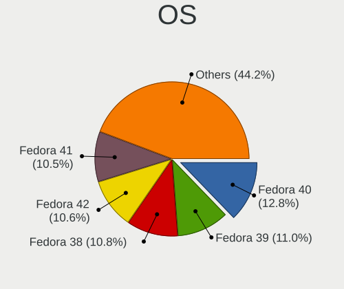

| Name                             | Notebooks | Percent |
|----------------------------------|-----------|---------|
| Fedora 40                        | 2150      | 12.79%  |
| Fedora 39                        | 1851      | 11.01%  |
| Fedora 38                        | 1818      | 10.81%  |
| Fedora 42                        | 1783      | 10.6%   |
| Fedora 41                        | 1773      | 10.54%  |
| Fedora 37                        | 1248      | 7.42%   |
| Fedora 36                        | 1247      | 7.42%   |
| Fedora 35                        | 978       | 5.82%   |
| Fedora 34                        | 942       | 5.6%    |
| Fedora 33                        | 859       | 5.11%   |
| Fedora 32                        | 747       | 4.44%   |
| Fedora 43                        | 604       | 3.59%   |
| Fedora 31                        | 503       | 2.99%   |
| Fedora 30                        | 162       | 0.96%   |
| Fedora 29                        | 90        | 0.54%   |
| Fedora 28                        | 22        | 0.13%   |
| Fedora 27                        | 8         | 0.05%   |
| Fedora Asahi-remix-42            | 6         | 0.04%   |
| Fedora Asahi-remix-40            | 6         | 0.04%   |
| Fedora 44                        | 4         | 0.02%   |
| Fedora 24                        | 4         | 0.02%   |
| Fedora 21                        | 4         | 0.02%   |
| Fedora Asahi-remix-41            | 2         | 0.01%   |
| Fedora 25                        | 2         | 0.01%   |
| Fedora Release-10-(cambridge)-40 | 1         | 0.01%   |
| Fedora Asahi-remix-39            | 1         | 0.01%   |
| Fedora 20.04                     | 1         | 0.01%   |

OS Family
---------

OS without a version

| Name   | Notebooks | Percent |
|--------|-----------|---------|
| Fedora | 15070     | 100%    |

Kernel
------

Version of the Linux kernel

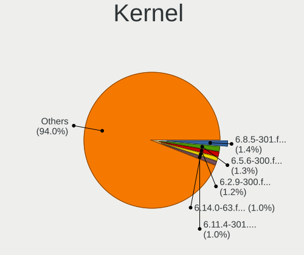

| Version                 | Notebooks | Percent |
|-------------------------|-----------|---------|
| 6.8.5-301.fc40.x86_64   | 259       | 1.41%   |
| 6.5.6-300.fc39.x86_64   | 240       | 1.3%    |
| 6.2.9-300.fc38.x86_64   | 225       | 1.22%   |
| 6.14.0-63.fc42.x86_64   | 193       | 1.05%   |
| 6.11.4-301.fc41.x86_64  | 183       | 0.99%   |
| 6.8.11-300.fc40.x86_64  | 179       | 0.97%   |
| 6.12.11-200.fc41.x86_64 | 150       | 0.81%   |
| 6.2.15-300.fc38.x86_64  | 142       | 0.77%   |
| 6.8.7-300.fc40.x86_64   | 141       | 0.77%   |
| 6.14.9-300.fc42.x86_64  | 139       | 0.75%   |
| 6.5.11-300.fc39.x86_64  | 137       | 0.74%   |
| 6.8.9-300.fc40.x86_64   | 126       | 0.68%   |
| 6.7.9-200.fc39.x86_64   | 124       | 0.67%   |
| 6.10.6-200.fc40.x86_64  | 124       | 0.67%   |
| 5.17.5-300.fc36.x86_64  | 116       | 0.63%   |
| 6.15.9-201.fc42.x86_64  | 115       | 0.62%   |
| 6.3.8-200.fc38.x86_64   | 114       | 0.62%   |
| 6.6.9-200.fc39.x86_64   | 110       | 0.6%    |
| 6.17.12-300.fc43.x86_64 | 109       | 0.59%   |
| 6.7.4-200.fc39.x86_64   | 108       | 0.59%   |
| 6.6.8-200.fc39.x86_64   | 105       | 0.57%   |
| 6.11.5-300.fc41.x86_64  | 103       | 0.56%   |
| 6.13.5-200.fc41.x86_64  | 102       | 0.55%   |
| 6.4.15-200.fc38.x86_64  | 101       | 0.55%   |
| 6.15.4-200.fc42.x86_64  | 101       | 0.55%   |
| 6.17.7-300.fc43.x86_64  | 100       | 0.54%   |
| 6.14.6-300.fc42.x86_64  | 98        | 0.53%   |
| 6.11.8-300.fc41.x86_64  | 95        | 0.52%   |
| 6.8.10-300.fc40.x86_64  | 93        | 0.5%    |
| 6.0.7-301.fc37.x86_64   | 93        | 0.5%    |
| 5.16.18-200.fc35.x86_64 | 92        | 0.5%    |
| 6.2.14-300.fc38.x86_64  | 91        | 0.49%   |
| 6.14.2-300.fc42.x86_64  | 91        | 0.49%   |
| 6.5.5-200.fc38.x86_64   | 90        | 0.49%   |
| 6.13.9-200.fc41.x86_64  | 90        | 0.49%   |
| 5.9.16-200.fc33.x86_64  | 90        | 0.49%   |
| 6.7.7-200.fc39.x86_64   | 87        | 0.47%   |
| 6.2.11-300.fc38.x86_64  | 87        | 0.47%   |
| 6.17.8-300.fc43.x86_64  | 87        | 0.47%   |
| 6.11.7-300.fc41.x86_64  | 87        | 0.47%   |

Kernel Family
-------------

Linux kernel without a distro release

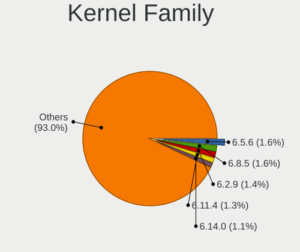

| Version | Notebooks | Percent |
|---------|-----------|---------|
| 6.5.6   | 294       | 1.6%    |
| 6.8.5   | 289       | 1.57%   |
| 6.2.9   | 265       | 1.44%   |
| 6.11.4  | 239       | 1.3%    |
| 6.14.0  | 211       | 1.15%   |
| 6.8.11  | 196       | 1.06%   |
| 6.2.15  | 187       | 1.02%   |
| 6.8.7   | 185       | 1%      |
| 6.8.9   | 176       | 0.96%   |
| 6.12.11 | 154       | 0.84%   |
| 6.14.9  | 151       | 0.82%   |
| 5.17.5  | 150       | 0.81%   |
| 6.5.11  | 139       | 0.75%   |
| 6.7.9   | 132       | 0.72%   |
| 6.10.6  | 131       | 0.71%   |
| 6.3.8   | 125       | 0.68%   |
| 6.15.9  | 121       | 0.66%   |
| 6.11.5  | 118       | 0.64%   |
| 6.6.8   | 117       | 0.64%   |
| 6.17.7  | 116       | 0.63%   |
| 6.6.9   | 114       | 0.62%   |
| 6.7.4   | 113       | 0.61%   |
| 6.17.12 | 112       | 0.61%   |
| 6.5.5   | 107       | 0.58%   |
| 6.14.6  | 107       | 0.58%   |
| 6.2.14  | 105       | 0.57%   |
| 6.13.5  | 105       | 0.57%   |
| 6.8.10  | 103       | 0.56%   |
| 6.4.15  | 103       | 0.56%   |
| 6.15.4  | 103       | 0.56%   |
| 6.0.7   | 103       | 0.56%   |
| 6.11.8  | 102       | 0.55%   |
| 6.7.7   | 99        | 0.54%   |
| 6.2.11  | 99        | 0.54%   |
| 6.8.8   | 96        | 0.52%   |
| 6.17.8  | 96        | 0.52%   |
| 5.9.16  | 96        | 0.52%   |
| 6.14.2  | 95        | 0.52%   |
| 5.16.18 | 95        | 0.52%   |
| 6.14.5  | 93        | 0.5%    |

Kernel Major Ver.
-----------------

Linux kernel major version

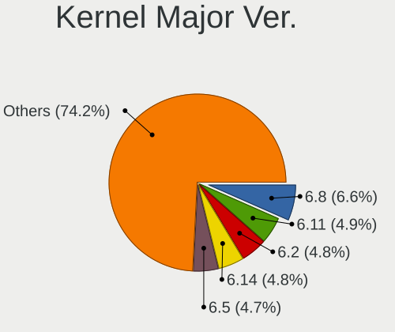

| Version | Notebooks | Percent |
|---------|-----------|---------|
| 6.8     | 1169      | 6.59%   |
| 6.11    | 877       | 4.95%   |
| 6.2     | 856       | 4.83%   |
| 6.14    | 849       | 4.79%   |
| 6.5     | 827       | 4.66%   |
| 6.17    | 686       | 3.87%   |
| 6.12    | 678       | 3.82%   |
| 6.0     | 664       | 3.74%   |
| 6.6     | 661       | 3.73%   |
| 6.10    | 650       | 3.67%   |
| 6.15    | 590       | 3.33%   |
| 6.7     | 584       | 3.29%   |
| 5.17    | 522       | 2.94%   |
| 6.9     | 514       | 2.9%    |
| 6.4     | 505       | 2.85%   |
| 6.1     | 484       | 2.73%   |
| 5.8     | 465       | 2.62%   |
| 6.13    | 456       | 2.57%   |
| 5.11    | 453       | 2.55%   |
| 5.19    | 451       | 2.54%   |
| 5.18    | 412       | 2.32%   |
| 6.3     | 406       | 2.29%   |
| 6.16    | 394       | 2.22%   |
| 5.14    | 394       | 2.22%   |
| 5.16    | 384       | 2.17%   |
| 5.15    | 311       | 1.75%   |
| 5.9     | 304       | 1.71%   |
| 5.13    | 303       | 1.71%   |
| 5.10    | 294       | 1.66%   |
| 5.6     | 287       | 1.62%   |
| 5.12    | 282       | 1.59%   |
| 5.7     | 221       | 1.25%   |
| 5.3     | 194       | 1.09%   |
| 5.5     | 183       | 1.03%   |
| 5.4     | 169       | 0.95%   |
| 5.0     | 62        | 0.35%   |
| 5.2     | 47        | 0.27%   |
| 5.1     | 43        | 0.24%   |
| 4.19    | 30        | 0.17%   |
| 4.18    | 27        | 0.15%   |

Arch
----

OS architecture (x86_64, i586, etc.)

| Name    | Notebooks | Percent |
|---------|-----------|---------|
| x86_64  | 15027     | 99.71%  |
| aarch64 | 38        | 0.25%   |
| i686    | 5         | 0.03%   |
| Unknown | 1         | 0.01%   |

DE
--

Desktop Environment

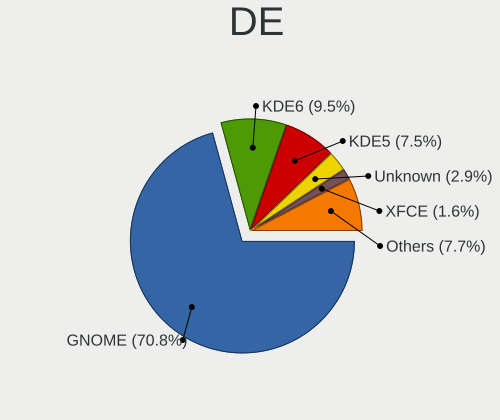

| Name             | Notebooks | Percent |
|------------------|-----------|---------|
| GNOME            | 10964     | 70.78%  |
| KDE6             | 1473      | 9.51%   |
| KDE5             | 1169      | 7.55%   |
| Unknown          | 454       | 2.93%   |
| XFCE             | 241       | 1.56%   |
| X-Cinnamon       | 194       | 1.25%   |
| KDE4             | 172       | 1.11%   |
| KDE              | 138       | 0.89%   |
| MATE             | 135       | 0.87%   |
| GNOME Classic    | 105       | 0.68%   |
| Cinnamon         | 92        | 0.59%   |
| sway             | 61        | 0.39%   |
| i3               | 54        | 0.35%   |
| Budgie           | 45        | 0.29%   |
| Hyprland         | 42        | 0.27%   |
| LXQt             | 33        | 0.21%   |
| LXDE             | 27        | 0.17%   |
| COSMIC           | 24        | 0.15%   |
| Deepin           | 18        | 0.12%   |
| Pantheon         | 5         | 0.03%   |
| niri             | 5         | 0.03%   |
| awesome          | 5         | 0.03%   |
| GNOME-Classic    | 4         | 0.03%   |
| GNOME Flashback  | 4         | 0.03%   |
| fluxbox          | 4         | 0.03%   |
| bspwm            | 4         | 0.03%   |
| openbox          | 3         | 0.02%   |
| xinit-compat     | 2         | 0.01%   |
| sway:wlroots     | 2         | 0.01%   |
| dwm              | 2         | 0.01%   |
| xmonad           | 1         | 0.01%   |
| Unity            | 1         | 0.01%   |
| Trinity          | 1         | 0.01%   |
| river:wlroots    | 1         | 0.01%   |
| river            | 1         | 0.01%   |
| qtile            | 1         | 0.01%   |
| LXQt:miriway:mir | 1         | 0.01%   |
| KDE:old          | 1         | 0.01%   |
| i3-with-shmlog   | 1         | 0.01%   |
| custom           | 1         | 0.01%   |

Display Server
--------------

X11 or Wayland

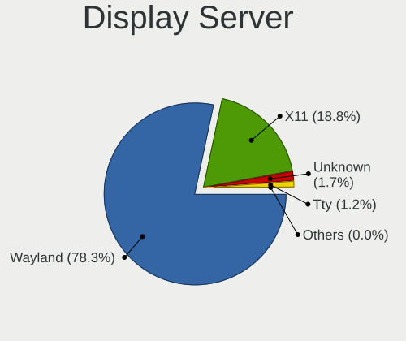

| Name        | Notebooks | Percent |
|-------------|-----------|---------|
| Wayland     | 12134     | 78.32%  |
| X11         | 2907      | 18.76%  |
| Unknown     | 268       | 1.73%   |
| Tty         | 179       | 1.16%   |
| Web         | 3         | 0.02%   |
| Xcb         | 1         | 0.01%   |
| Unspecified | 1         | 0.01%   |

Display Manager
---------------

SDDM, LightDM, etc.

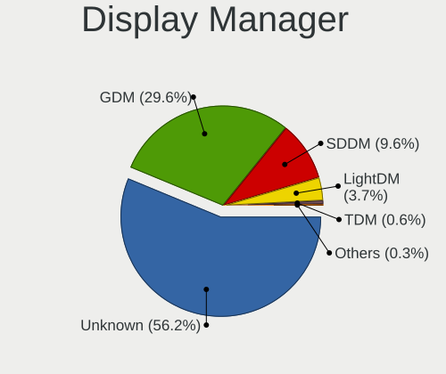

| Name    | Notebooks | Percent |
|---------|-----------|---------|
| Unknown | 8702      | 56.25%  |
| GDM     | 4572      | 29.55%  |
| SDDM    | 1491      | 9.64%   |
| LightDM | 576       | 3.72%   |
| TDM     | 87        | 0.56%   |
| LXDM    | 13        | 0.08%   |
| XDM     | 11        | 0.07%   |
| GREETD  | 9         | 0.06%   |
| KDM     | 8         | 0.05%   |
| SLiM    | 1         | 0.01%   |
| Ly      | 1         | 0.01%   |

OS Lang
-------

Language

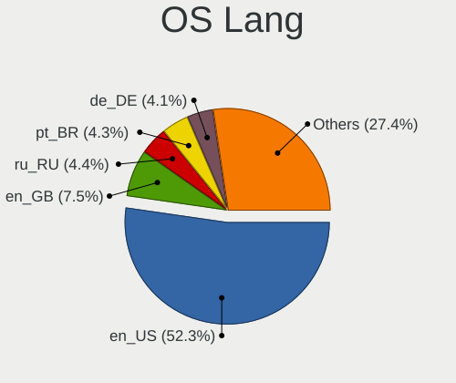

| Lang    | Notebooks | Percent |
|---------|-----------|---------|
| en_US   | 7999      | 52.28%  |
| en_GB   | 1145      | 7.48%   |
| ru_RU   | 674       | 4.41%   |
| pt_BR   | 664       | 4.34%   |
| de_DE   | 630       | 4.12%   |
| it_IT   | 457       | 2.99%   |
| fr_FR   | 452       | 2.95%   |
| Unknown | 400       | 2.61%   |
| es_ES   | 243       | 1.59%   |
| pl_PL   | 234       | 1.53%   |
| en_CA   | 231       | 1.51%   |
| en_IN   | 210       | 1.37%   |
| en_AU   | 203       | 1.33%   |
| es_MX   | 182       | 1.19%   |
| tr_TR   | 101       | 0.66%   |
| es_CL   | 98        | 0.64%   |
| zh_CN   | 82        | 0.54%   |
| cs_CZ   | 74        | 0.48%   |
| es_AR   | 72        | 0.47%   |
| es_CO   | 64        | 0.42%   |
| nl_NL   | 60        | 0.39%   |
| en_DK   | 57        | 0.37%   |
| pt_PT   | 51        | 0.33%   |
| hu_HU   | 47        | 0.31%   |
| de_AT   | 45        | 0.29%   |
| sv_SE   | 44        | 0.29%   |
| en_NZ   | 44        | 0.29%   |
| en_ZA   | 42        | 0.27%   |
| en_IE   | 41        | 0.27%   |
| de_CH   | 39        | 0.25%   |
| fi_FI   | 31        | 0.2%    |
| C       | 30        | 0.2%    |
| fr_CA   | 29        | 0.19%   |
| ru_UA   | 27        | 0.18%   |
| es_PE   | 27        | 0.18%   |
| da_DK   | 27        | 0.18%   |
| uk_UA   | 25        | 0.16%   |
| nl_BE   | 20        | 0.13%   |
| fr_BE   | 20        | 0.13%   |
| nb_NO   | 19        | 0.12%   |

Boot Mode
---------

EFI or BIOS

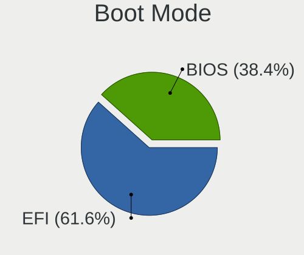

| Mode | Notebooks | Percent |
|------|-----------|---------|
| EFI  | 9524      | 61.64%  |
| BIOS | 5926      | 38.36%  |

Filesystem
----------

Type of filesystem

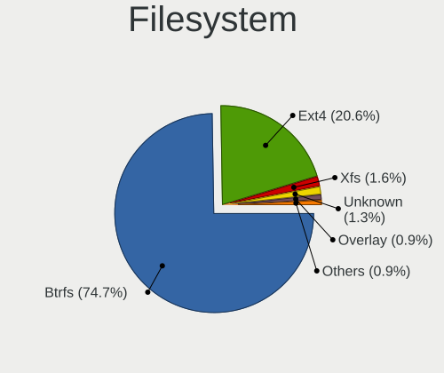

| Type                | Notebooks | Percent |
|---------------------|-----------|---------|
| Btrfs               | 11462     | 74.74%  |
| Ext4                | 3155      | 20.57%  |
| Xfs                 | 251       | 1.64%   |
| Unknown             | 202       | 1.32%   |
| Overlay             | 132       | 0.86%   |
| Tmpfs               | 119       | 0.78%   |
| F2fs                | 5         | 0.03%   |
| Zfs                 | 4         | 0.03%   |
| Ext3                | 3         | 0.02%   |
| Fuse.fuse-overlayfs | 2         | 0.01%   |

Part. scheme
------------

Scheme of partitioning

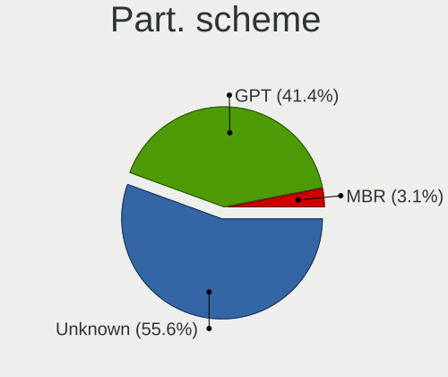

| Type    | Notebooks | Percent |
|---------|-----------|---------|
| Unknown | 8558      | 55.55%  |
| GPT     | 6372      | 41.36%  |
| MBR     | 475       | 3.08%   |

Dual Boot with Linux/BSD
------------------------

Hosting more than one Linux/BSD

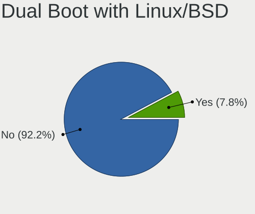

| Dual boot | Notebooks | Percent |
|-----------|-----------|---------|
| No        | 14057     | 92.24%  |
| Yes       | 1183      | 7.76%   |

Dual Boot (Win)
---------------

Hosting Linux and Windows

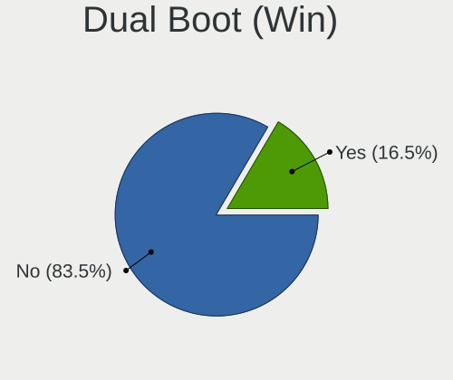

| Dual boot | Notebooks | Percent |
|-----------|-----------|---------|
| No        | 12741     | 83.46%  |
| Yes       | 2525      | 16.54%  |

Board
-----

Vendor
------

Motherboard manufacturer

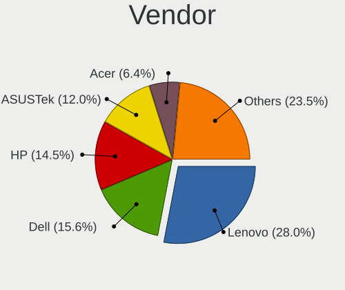

| Name                   | Notebooks | Percent |
|------------------------|-----------|---------|
| Lenovo                 | 4220      | 28%     |
| Dell                   | 2354      | 15.62%  |
| Hewlett-Packard        | 2183      | 14.49%  |
| ASUSTek Computer       | 1811      | 12.02%  |
| Acer                   | 965       | 6.4%    |
| Apple                  | 670       | 4.45%   |
| MSI                    | 379       | 2.51%   |
| HUAWEI                 | 306       | 2.03%   |
| Samsung Electronics    | 205       | 1.36%   |
| Toshiba                | 165       | 1.09%   |
| Framework              | 139       | 0.92%   |
| Google                 | 117       | 0.78%   |
| Unknown                | 108       | 0.72%   |
| Timi                   | 94        | 0.62%   |
| Sony                   | 89        | 0.59%   |
| Notebook               | 79        | 0.52%   |
| Fujitsu                | 75        | 0.5%    |
| Alienware              | 62        | 0.41%   |
| Gigabyte Technology    | 52        | 0.35%   |
| HONOR                  | 49        | 0.33%   |
| LG Electronics         | 44        | 0.29%   |
| TUXEDO                 | 43        | 0.29%   |
| Positivo               | 43        | 0.29%   |
| Chuwi                  | 43        | 0.29%   |
| Razer                  | 38        | 0.25%   |
| System76               | 30        | 0.2%    |
| Medion                 | 24        | 0.16%   |
| SLIMBOOK               | 23        | 0.15%   |
| GPD                    | 21        | 0.14%   |
| Schenker               | 20        | 0.13%   |
| PC Specialist          | 20        | 0.13%   |
| Panasonic              | 19        | 0.13%   |
| Avell High Performance | 19        | 0.13%   |
| Packard Bell           | 18        | 0.12%   |
| GPU Company            | 16        | 0.11%   |
| XIAOMI                 | 14        | 0.09%   |
| Positivo Bahia - VAIO  | 13        | 0.09%   |
| Intel                  | 13        | 0.09%   |
| Maibenben              | 12        | 0.08%   |
| Monster                | 11        | 0.07%   |

Model
-----

Motherboard model

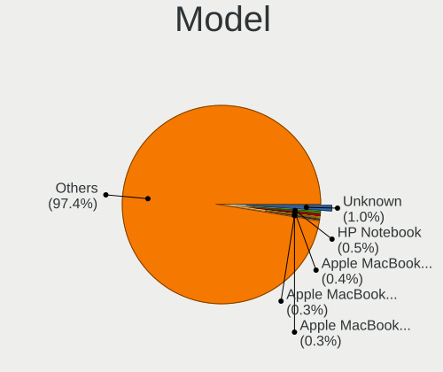

| Name                                        | Notebooks | Percent |
|---------------------------------------------|-----------|---------|
| Unknown                                     | 155       | 1.03%   |
| HP Notebook                                 | 69        | 0.46%   |
| Apple MacBookPro9,2                         | 67        | 0.44%   |
| Apple MacBookPro14,1                        | 48        | 0.32%   |
| Apple MacBookPro8,1                         | 47        | 0.31%   |
| Apple MacBookAir7,2                         | 46        | 0.31%   |
| Apple MacBookPro12,1                        | 45        | 0.3%    |
| Apple MacBookPro11,1                        | 42        | 0.28%   |
| Dell Latitude 7490                          | 39        | 0.26%   |
| Framework Laptop 13 (AMD Ryzen 7040Series)  | 38        | 0.25%   |
| HP EliteBook 840 G6                         | 37        | 0.25%   |
| Framework Laptop                            | 37        | 0.25%   |
| Dell XPS 15 9570                            | 36        | 0.24%   |
| Dell XPS 15 9560                            | 36        | 0.24%   |
| Dell XPS 15 7590                            | 35        | 0.23%   |
| Apple MacBookPro11,3                        | 34        | 0.23%   |
| HP Pavilion Notebook                        | 33        | 0.22%   |
| Dell XPS 15 9500                            | 32        | 0.21%   |
| Dell XPS 13 9310                            | 32        | 0.21%   |
| Dell XPS 13 9370                            | 30        | 0.2%    |
| Dell XPS 13 9360                            | 29        | 0.19%   |
| HUAWEI BOM-WXX9                             | 26        | 0.17%   |
| HP Pavilion dv6                             | 26        | 0.17%   |
| HP EliteBook 840 G5                         | 26        | 0.17%   |
| Apple MacBookPro10,1                        | 25        | 0.17%   |
| Lenovo IdeaPad Gaming 3 15ACH6 82K2         | 24        | 0.16%   |
| Lenovo IdeaPad 3 15ITL6 82H8                | 24        | 0.16%   |
| HP Pavilion 15                              | 24        | 0.16%   |
| Apple MacBookPro11,5                        | 24        | 0.16%   |
| Framework Laptop 16 (AMD Ryzen 7040 Series) | 23        | 0.15%   |
| HP Laptop 15-da0xxx                         | 22        | 0.15%   |
| HP EliteBook 840 G3                         | 22        | 0.15%   |
| Dell XPS 13 7390                            | 22        | 0.15%   |
| Dell Latitude E6420                         | 22        | 0.15%   |
| Dell Latitude 5490                          | 22        | 0.15%   |
| HUAWEI KLVL-WXX9                            | 21        | 0.14%   |
| Dell Latitude E7470                         | 21        | 0.14%   |
| Dell Latitude E7450                         | 21        | 0.14%   |
| Dell Latitude 5480                          | 21        | 0.14%   |
| Dell Latitude 5420                          | 21        | 0.14%   |

Model Family
------------

Motherboard model prefix

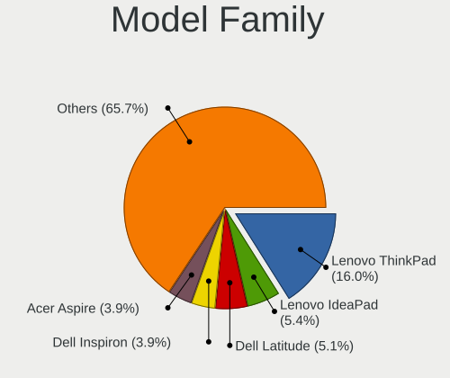

| Name               | Notebooks | Percent |
|--------------------|-----------|---------|
| Lenovo ThinkPad    | 2418      | 16.05%  |
| Lenovo IdeaPad     | 809       | 5.37%   |
| Dell Latitude      | 774       | 5.14%   |
| Dell Inspiron      | 585       | 3.88%   |
| Acer Aspire        | 585       | 3.88%   |
| Dell XPS           | 473       | 3.14%   |
| ASUS VivoBook      | 464       | 3.08%   |
| HP EliteBook       | 429       | 2.85%   |
| HP Pavilion        | 397       | 2.63%   |
| HP Laptop          | 345       | 2.29%   |
| ASUS ROG           | 312       | 2.07%   |
| ASUS ASUS          | 299       | 1.98%   |
| HP ProBook         | 292       | 1.94%   |
| Lenovo Legion      | 268       | 1.78%   |
| Dell Precision     | 246       | 1.63%   |
| Lenovo Yoga        | 166       | 1.1%    |
| Lenovo ThinkBook   | 163       | 1.08%   |
| Acer Nitro         | 160       | 1.06%   |
| Unknown            | 155       | 1.03%   |
| ASUS ZenBook       | 146       | 0.97%   |
| Framework Laptop   | 139       | 0.92%   |
| Toshiba Satellite  | 131       | 0.87%   |
| Apple MacBookPro11 | 130       | 0.86%   |
| HP ZBook           | 128       | 0.85%   |
| Dell Vostro        | 115       | 0.76%   |
| HP OMEN            | 88        | 0.58%   |
| Acer Swift         | 86        | 0.57%   |
| HP ENVY            | 82        | 0.54%   |
| Apple MacBookPro9  | 80        | 0.53%   |
| HP Victus          | 71        | 0.47%   |
| Apple MacBookPro8  | 70        | 0.46%   |
| HP Notebook        | 69        | 0.46%   |
| Acer Predator      | 60        | 0.4%    |
| Fujitsu LIFEBOOK   | 58        | 0.38%   |
| MSI Modern         | 57        | 0.38%   |
| ASUS TUF           | 57        | 0.38%   |
| Apple MacBookPro14 | 52        | 0.35%   |
| Apple MacBookAir7  | 52        | 0.35%   |
| Apple MacBookPro12 | 45        | 0.3%    |
| Lenovo LOQ         | 44        | 0.29%   |

MFG Year
--------

Motherboard manufacture year

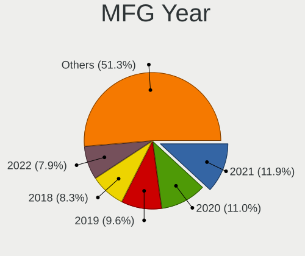

| Year    | Notebooks | Percent |
|---------|-----------|---------|
| 2021    | 1788      | 11.86%  |
| 2020    | 1656      | 10.99%  |
| 2019    | 1442      | 9.57%   |
| 2018    | 1257      | 8.34%   |
| 2022    | 1194      | 7.92%   |
| 2023    | 1093      | 7.25%   |
| 2017    | 986       | 6.54%   |
| 2012    | 786       | 5.22%   |
| 2013    | 736       | 4.88%   |
| 2016    | 689       | 4.57%   |
| 2015    | 681       | 4.52%   |
| 2014    | 666       | 4.42%   |
| 2024    | 612       | 4.06%   |
| 2011    | 546       | 3.62%   |
| 2010    | 273       | 1.81%   |
| 2008    | 207       | 1.37%   |
| 2025    | 179       | 1.19%   |
| 2009    | 149       | 0.99%   |
| 2006    | 54        | 0.36%   |
| 2007    | 43        | 0.29%   |
| Unknown | 32        | 0.21%   |
| 2003    | 1         | 0.01%   |

Form Factor
-----------

Physical design of the computer

| Name     | Notebooks | Percent |
|----------|-----------|---------|
| Notebook | 15070     | 100%    |

Secure Boot
-----------

Enabled or disabled

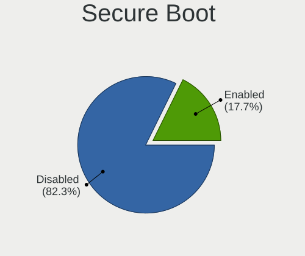

| State    | Notebooks | Percent |
|----------|-----------|---------|
| Disabled | 12628     | 82.28%  |
| Enabled  | 2719      | 17.72%  |

Coreboot
--------

Have coreboot on board

| Used | Notebooks | Percent |
|------|-----------|---------|
| No   | 14918     | 98.99%  |
| Yes  | 152       | 1.01%   |

RAM Size
--------

Total RAM memory

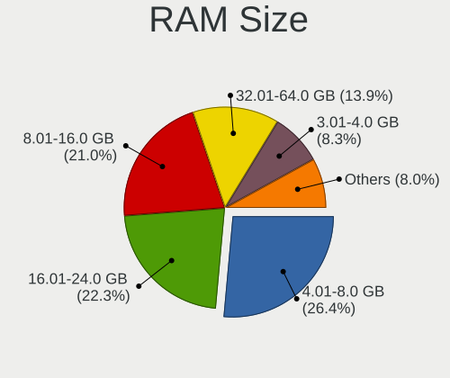

| Size in GB  | Notebooks | Percent |
|-------------|-----------|---------|
| 4.01-8.0    | 4041      | 26.44%  |
| 16.01-24.0  | 3413      | 22.33%  |
| 8.01-16.0   | 3217      | 21.05%  |
| 32.01-64.0  | 2124      | 13.9%   |
| 3.01-4.0    | 1268      | 8.3%    |
| 24.01-32.0  | 525       | 3.43%   |
| 64.01-256.0 | 421       | 2.75%   |
| 1.01-2.0    | 204       | 1.33%   |
| 2.01-3.0    | 56        | 0.37%   |
| 0.51-1.0    | 13        | 0.09%   |
| Unknown     | 2         | 0.01%   |

RAM Used
--------

Used RAM memory

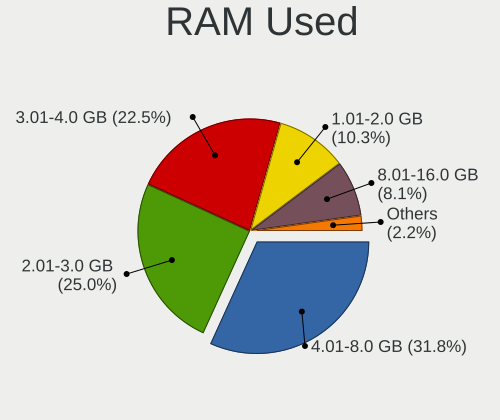

| Used GB    | Notebooks | Percent |
|------------|-----------|---------|
| 4.01-8.0   | 5323      | 31.8%   |
| 2.01-3.0   | 4192      | 25.04%  |
| 3.01-4.0   | 3773      | 22.54%  |
| 1.01-2.0   | 1730      | 10.34%  |
| 8.01-16.0  | 1349      | 8.06%   |
| 16.01-24.0 | 174       | 1.04%   |
| 0.51-1.0   | 128       | 0.76%   |
| 24.01-32.0 | 42        | 0.25%   |
| 32.01-64.0 | 21        | 0.13%   |
| 0.01-0.5   | 4         | 0.02%   |
| Unknown    | 2         | 0.01%   |

Total Drives
------------

Number of drives on board

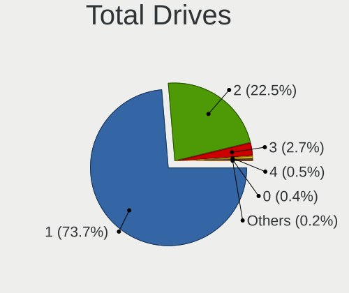

| Drives | Notebooks | Percent |
|--------|-----------|---------|
| 1      | 11285     | 73.66%  |
| 2      | 3451      | 22.53%  |
| 3      | 421       | 2.75%   |
| 4      | 77        | 0.5%    |
| 0      | 57        | 0.37%   |
| 5      | 17        | 0.11%   |
| 6      | 8         | 0.05%   |
| 7      | 2         | 0.01%   |
| 13     | 1         | 0.01%   |
| 8      | 1         | 0.01%   |

Has CD-ROM
----------

Has CD-ROM on board

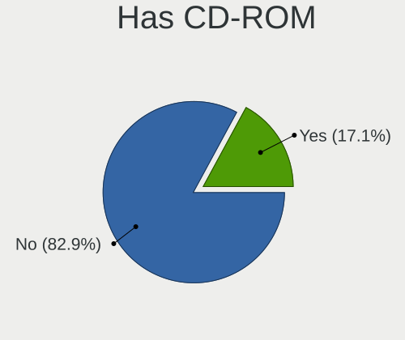

| Presented | Notebooks | Percent |
|-----------|-----------|---------|
| No        | 12535     | 82.9%   |
| Yes       | 2585      | 17.1%   |

Has Ethernet
------------

Has Ethernet on board

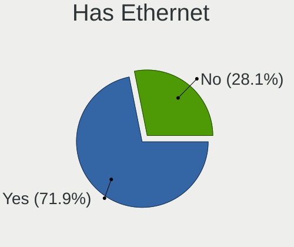

| Presented | Notebooks | Percent |
|-----------|-----------|---------|
| Yes       | 10898     | 71.87%  |
| No        | 4266      | 28.13%  |

Has WiFi
--------

Has WiFi module

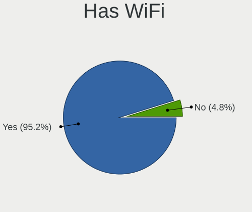

| Presented | Notebooks | Percent |
|-----------|-----------|---------|
| Yes       | 14355     | 95.18%  |
| No        | 727       | 4.82%   |

Has Bluetooth
-------------

Has Bluetooth module

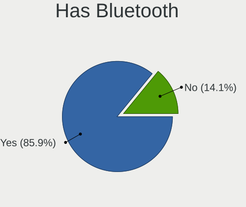

| Presented | Notebooks | Percent |
|-----------|-----------|---------|
| Yes       | 13078     | 85.94%  |
| No        | 2140      | 14.06%  |

Location
--------

Country
-------

Geographic location (country)

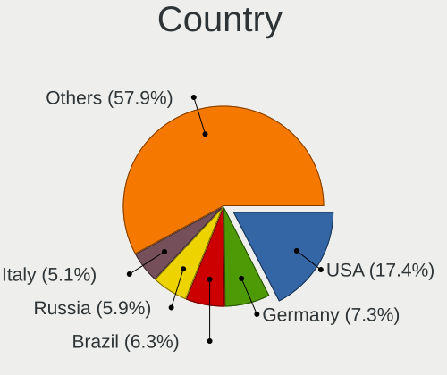

| Country      | Notebooks | Percent |
|--------------|-----------|---------|
| USA          | 2661      | 17.45%  |
| Germany      | 1121      | 7.35%   |
| Brazil       | 965       | 6.33%   |
| Russia       | 894       | 5.86%   |
| Italy        | 779       | 5.11%   |
| India        | 632       | 4.14%   |
| France       | 615       | 4.03%   |
| UK           | 596       | 3.91%   |
| Canada       | 447       | 2.93%   |
| Poland       | 445       | 2.92%   |
| Spain        | 371       | 2.43%   |
| Netherlands  | 365       | 2.39%   |
| Mexico       | 305       | 2%      |
| Turkey       | 247       | 1.62%   |
| Australia    | 239       | 1.57%   |
| Czechia      | 199       | 1.3%    |
| Sweden       | 180       | 1.18%   |
| Switzerland  | 176       | 1.15%   |
| Austria      | 158       | 1.04%   |
| Romania      | 152       | 1%      |
| Chile        | 147       | 0.96%   |
| Belgium      | 142       | 0.93%   |
| Portugal     | 141       | 0.92%   |
| Indonesia    | 138       | 0.9%    |
| Argentina    | 126       | 0.83%   |
| Finland      | 115       | 0.75%   |
| Norway       | 114       | 0.75%   |
| Hungary      | 111       | 0.73%   |
| Denmark      | 110       | 0.72%   |
| Colombia     | 108       | 0.71%   |
| China        | 96        | 0.63%   |
| Bulgaria     | 87        | 0.57%   |
| Ukraine      | 81        | 0.53%   |
| Egypt        | 80        | 0.52%   |
| Israel       | 76        | 0.5%    |
| Greece       | 75        | 0.49%   |
| South Africa | 71        | 0.47%   |
| Philippines  | 70        | 0.46%   |
| Slovakia     | 69        | 0.45%   |
| Belarus      | 66        | 0.43%   |

City
----

Geographic location (city)

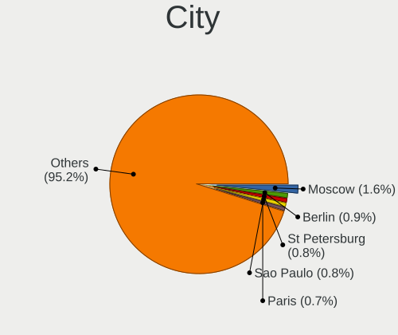

| City              | Notebooks | Percent |
|-------------------|-----------|---------|
| Moscow            | 255       | 1.57%   |
| Berlin            | 150       | 0.92%   |
| St Petersburg     | 133       | 0.82%   |
| Sao Paulo         | 130       | 0.8%    |
| Paris             | 116       | 0.71%   |
| Milan             | 114       | 0.7%    |
| Vienna            | 106       | 0.65%   |
| Istanbul          | 102       | 0.63%   |
| Warsaw            | 100       | 0.62%   |
| Amsterdam         | 90        | 0.55%   |
| Bengaluru         | 81        | 0.5%    |
| Prague            | 78        | 0.48%   |
| Mexico City       | 78        | 0.48%   |
| Santiago          | 76        | 0.47%   |
| Madrid            | 74        | 0.46%   |
| Munich            | 70        | 0.43%   |
| Sydney            | 68        | 0.42%   |
| Helsinki          | 68        | 0.42%   |
| Melbourne         | 64        | 0.39%   |
| Hamburg           | 62        | 0.38%   |
| Rome              | 61        | 0.38%   |
| Delhi             | 60        | 0.37%   |
| Zurich            | 56        | 0.34%   |
| Oslo              | 56        | 0.34%   |
| Bucharest         | 55        | 0.34%   |
| Budapest          | 54        | 0.33%   |
| Los Angeles       | 52        | 0.32%   |
| Montreal          | 51        | 0.31%   |
| Toronto           | 49        | 0.3%    |
| Sofia             | 49        | 0.3%    |
| Lisbon            | 48        | 0.3%    |
| Frankfurt am Main | 48        | 0.3%    |
| Seattle           | 45        | 0.28%   |
| Rio de Janeiro    | 45        | 0.28%   |
| Jakarta           | 45        | 0.28%   |
| Dublin            | 45        | 0.28%   |
| Brisbane          | 45        | 0.28%   |
| Bogotá           | 45        | 0.28%   |
| Pune              | 44        | 0.27%   |
| New York          | 44        | 0.27%   |

Drives
------

Drive Vendor
------------

Hard drive vendors

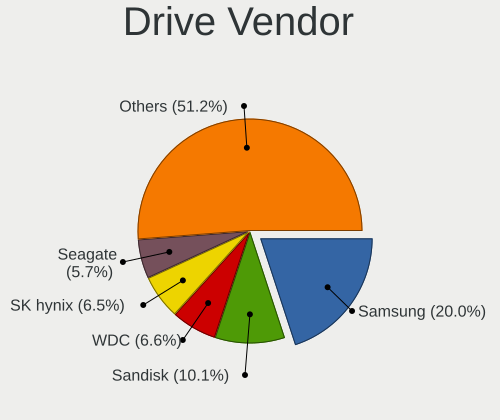

| Vendor                         | Notebooks | Drives | Percent |
|--------------------------------|-----------|--------|---------|
| Samsung Electronics            | 3775      | 5244   | 19.96%  |
| Sandisk                        | 1914      | 2381   | 10.12%  |
| WDC                            | 1248      | 1575   | 6.6%    |
| SK hynix                       | 1220      | 1497   | 6.45%   |
| Seagate                        | 1073      | 1408   | 5.67%   |
| Micron Technology              | 957       | 1165   | 5.06%   |
| Toshiba                        | 941       | 1178   | 4.98%   |
| Unknown                        | 894       | 1119   | 4.73%   |
| Kingston                       | 823       | 1011   | 4.35%   |
| Intel                          | 718       | 1003   | 3.8%    |
| Crucial                        | 465       | 595    | 2.46%   |
| KIOXIA                         | 443       | 579    | 2.34%   |
| Apple                          | 417       | 641    | 2.2%    |
| HGST                           | 292       | 373    | 1.54%   |
| A-DATA Technology              | 231       | 279    | 1.22%   |
| Micron/Crucial Technology      | 219       | 274    | 1.16%   |
| Phison Electronics             | 212       | 252    | 1.12%   |
| Kingston Technology Company    | 183       | 214    | 0.97%   |
| China                          | 152       | 181    | 0.8%    |
| Hitachi                        | 149       | 177    | 0.79%   |
| Silicon Motion                 | 144       | 175    | 0.76%   |
| ADATA Technology               | 124       | 143    | 0.66%   |
| MAXIO Technology (Hangzhou)    | 118       | 138    | 0.62%   |
| LITEON                         | 111       | 124    | 0.59%   |
| Phison                         | 78        | 96     | 0.41%   |
| SPCC                           | 77        | 93     | 0.41%   |
| PNY                            | 76        | 100    | 0.4%    |
| Shenzhen Longsys Electronics   | 68        | 83     | 0.36%   |
| Transcend                      | 67        | 89     | 0.35%   |
| Unknown                        | 67        | 76     | 0.35%   |
| Realtek Semiconductor          | 65        | 77     | 0.34%   |
| Union Memory (Shenzhen)        | 58        | 82     | 0.31%   |
| JMicron Technology             | 56        | 68     | 0.3%    |
| Intenso                        | 50        | 56     | 0.26%   |
| LITEONIT                       | 49        | 58     | 0.26%   |
| Solid State Storage Technology | 46        | 57     | 0.24%   |
| Patriot                        | 44        | 52     | 0.23%   |
| Lenovo                         | 44        | 54     | 0.23%   |
| Netac                          | 41        | 55     | 0.22%   |
| Solid State Storage            | 40        | 48     | 0.21%   |

Drive Model
-----------

Hard drive models

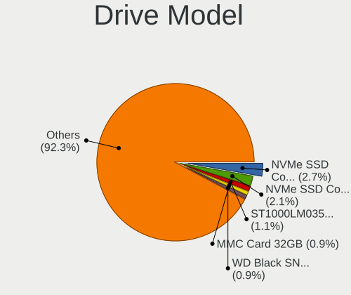

| Model                                                 | Notebooks | Percent |
|-------------------------------------------------------|-----------|---------|
| Samsung NVMe SSD Controller SM981/PM981/PM983 1TB     | 542       | 2.75%   |
| Samsung NVMe SSD Controller PM9A1/PM9A3/980PRO 1TB    | 420       | 2.13%   |
| Seagate ST1000LM035-1RK172 1TB                        | 224       | 1.14%   |
| Unknown MMC Card  32GB                                | 173       | 0.88%   |
| Sandisk WD Black SN750 / PC SN730 NVMe SSD 500GB      | 168       | 0.85%   |
| Kingston SA400S37240G 240GB SSD                       | 165       | 0.84%   |
| Unknown MMC Card  64GB                                | 163       | 0.83%   |
| Sandisk WD Blue SN550 NVMe SSD 1024GB                 | 153       | 0.78%   |
| Micron/Crucial P2 NVMe PCIe SSD 2TB                   | 130       | 0.66%   |
| Toshiba MQ04ABF100 1TB                                | 127       | 0.64%   |
| Kingston SA400S37480G 480GB SSD                       | 123       | 0.62%   |
| Intel SSDPEKNU512GZ 512GB                             | 123       | 0.62%   |
| Unknown MMC Card  128GB                               | 121       | 0.61%   |
| HGST HTS721010A9E630 1TB                              | 121       | 0.61%   |
| Samsung NVMe SSD Controller SM961/PM961/SM963 1024GB  | 119       | 0.6%    |
| Samsung NVMe SSD Drive 512GB                          | 113       | 0.57%   |
| Seagate ST1000LM024 HN-M101MBB 1TB                    | 107       | 0.54%   |
| Intel SSD 660P Series 512GB                           | 103       | 0.52%   |
| Samsung SSD 860 EVO 500GB                             | 97        | 0.49%   |
| Toshiba XG6 NVMe SSD Controller 1024GB                | 91        | 0.46%   |
| Toshiba MQ01ABD100 1TB                                | 89        | 0.45%   |
| MAXIO (Hangzhou) NVMe SSD Controller MAP1202 2TB      | 89        | 0.45%   |
| Sandisk WD Black SN850 1TB                            | 88        | 0.45%   |
| SanDisk NVMe SSD Drive 512GB                          | 82        | 0.42%   |
| Samsung NVMe SSD Drive 256GB                          | 82        | 0.42%   |
| Samsung SSD 980 1TB                                   | 79        | 0.4%    |
| Phison PS5013 E13 NVMe Controller 500GB               | 69        | 0.35%   |
| Silicon Motion SM2263EN/SM2263XT SSD Controller 512GB | 67        | 0.34%   |
| Unknown                                               | 67        | 0.34%   |
| Samsung SSD 850 EVO 250GB                             | 65        | 0.33%   |
| Crucial CT240BX500SSD1 240GB                          | 65        | 0.33%   |
| Seagate ST500LT012-1DG142 500GB                       | 64        | 0.32%   |
| SK hynix BC501 NVMe Solid State Drive 512GB           | 61        | 0.31%   |
| Samsung SSD 850 EVO 500GB                             | 60        | 0.3%    |
| Crucial CT1000MX500SSD1 1TB                           | 60        | 0.3%    |
| Micron 2400_MTFDKBA512QFM 512GB                       | 59        | 0.3%    |
| Sandisk WD Blue SN500 / PC SN520 NVMe SSD 128GB       | 56        | 0.28%   |
| Phison E12 NVMe Controller 1TB                        | 56        | 0.28%   |
| Micron 2450_MTFDKBA512TFK 512GB                       | 55        | 0.28%   |
| Samsung SSD 860 EVO 1TB                               | 53        | 0.27%   |

HDD Vendor
----------

Hard disk drive vendors

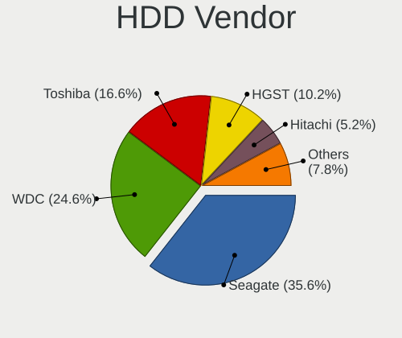

| Vendor              | Notebooks | Drives | Percent |
|---------------------|-----------|--------|---------|
| Seagate             | 1022      | 1312   | 35.62%  |
| WDC                 | 706       | 882    | 24.61%  |
| Toshiba             | 475       | 584    | 16.56%  |
| HGST                | 292       | 373    | 10.18%  |
| Hitachi             | 149       | 177    | 5.19%   |
| Unknown             | 46        | 57     | 1.6%    |
| JMicron Technology  | 35        | 46     | 1.22%   |
| Samsung Electronics | 26        | 31     | 0.91%   |
| Fujitsu             | 20        | 20     | 0.7%    |
| Apple               | 19        | 21     | 0.66%   |
| USB3.0              | 8         | 10     | 0.28%   |
| TO Exter            | 7         | 7      | 0.24%   |
| External            | 7         | 10     | 0.24%   |
| HGST HTS            | 6         | 6      | 0.21%   |
| SSK                 | 5         | 5      | 0.17%   |
| JetFlash            | 5         | 5      | 0.17%   |
| LaCie               | 4         | 5      | 0.14%   |
| Intenso             | 4         | 4      | 0.14%   |
| ASMT                | 4         | 6      | 0.14%   |
| SABRENT             | 3         | 4      | 0.1%    |
| USB                 | 2         | 2      | 0.07%   |
| SAGE                | 2         | 2      | 0.07%   |
| Maxone              | 2         | 2      | 0.07%   |
| LIO-ORG             | 2         | 12     | 0.07%   |
| Inateck             | 2         | 2      | 0.07%   |
| XrayDisk            | 1         | 1      | 0.03%   |
| TDAS                | 1         | 4      | 0.03%   |
| T-FORCE             | 1         | 1      | 0.03%   |
| Shenzhen            | 1         | 1      | 0.03%   |
| RSH-319             | 1         | 1      | 0.03%   |
| QNAP                | 1         | 4      | 0.03%   |
| Phison              | 1         | 2      | 0.03%   |
| KIOXIA              | 1         | 1      | 0.03%   |
| IB-AC703            | 1         | 1      | 0.03%   |
| IB                  | 1         | 2      | 0.03%   |
| Hewlett-Packard     | 1         | 1      | 0.03%   |
| Extemal             | 1         | 1      | 0.03%   |
| BR                  | 1         | 1      | 0.03%   |
| ASMedia             | 1         | 1      | 0.03%   |
| Asm                 | 1         | 1      | 0.03%   |

SSD Vendor
----------

Solid state drive vendors

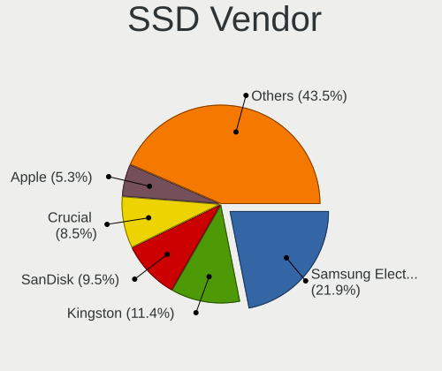

| Vendor              | Notebooks | Drives | Percent |
|---------------------|-----------|--------|---------|
| Samsung Electronics | 1127      | 1566   | 21.91%  |
| Kingston            | 584       | 711    | 11.35%  |
| SanDisk             | 489       | 634    | 9.51%   |
| Crucial             | 436       | 563    | 8.48%   |
| Apple               | 272       | 298    | 5.29%   |
| WDC                 | 268       | 344    | 5.21%   |
| A-DATA Technology   | 161       | 187    | 3.13%   |
| Micron Technology   | 155       | 187    | 3.01%   |
| Intel               | 155       | 240    | 3.01%   |
| China               | 148       | 177    | 2.88%   |
| SK hynix            | 132       | 163    | 2.57%   |
| LITEON              | 96        | 109    | 1.87%   |
| Toshiba             | 94        | 112    | 1.83%   |
| PNY                 | 74        | 97     | 1.44%   |
| SPCC                | 68        | 84     | 1.32%   |
| Transcend           | 60        | 78     | 1.17%   |
| LITEONIT            | 49        | 58     | 0.95%   |
| Intenso             | 40        | 43     | 0.78%   |
| Patriot             | 39        | 45     | 0.76%   |
| KingSpec            | 33        | 39     | 0.64%   |
| Lexar               | 32        | 51     | 0.62%   |
| Netac               | 31        | 41     | 0.6%    |
| Team                | 30        | 33     | 0.58%   |
| GOODRAM             | 28        | 39     | 0.54%   |
| SABRENT             | 26        | 26     | 0.51%   |
| OCZ                 | 24        | 29     | 0.47%   |
| Hewlett-Packard     | 24        | 27     | 0.47%   |
| Gigabyte Technology | 24        | 34     | 0.47%   |
| Corsair             | 23        | 26     | 0.45%   |
| Unknown             | 23        | 25     | 0.45%   |
| Apacer              | 20        | 23     | 0.39%   |
| Seagate             | 16        | 17     | 0.31%   |
| Plextor             | 14        | 29     | 0.27%   |
| XrayDisk            | 9         | 10     | 0.17%   |
| Verbatim            | 9         | 10     | 0.17%   |
| Mushkin             | 9         | 20     | 0.17%   |
| Unknown             | 8         | 8      | 0.16%   |
| KingDian            | 8         | 8      | 0.16%   |
| BIWIN               | 8         | 9      | 0.16%   |
| KIOXIA-EXCERIA      | 7         | 7      | 0.14%   |

Drive Kind
----------

HDD or SSD

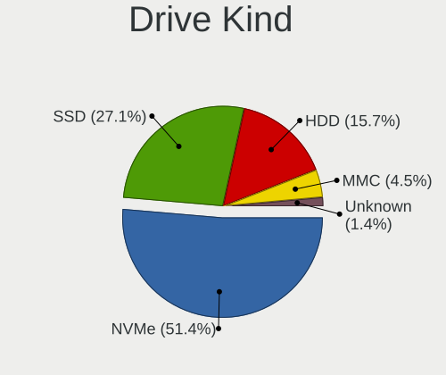

| Kind    | Notebooks | Drives | Percent |
|---------|-----------|--------|---------|
| NVMe    | 9072      | 12830  | 51.35%  |
| SSD     | 4780      | 6556   | 27.06%  |
| HDD     | 2765      | 3609   | 15.65%  |
| MMC     | 793       | 1004   | 4.49%   |
| Unknown | 256       | 303    | 1.45%   |

Drive Connector
---------------

SATA, SAS, NVMe, etc.

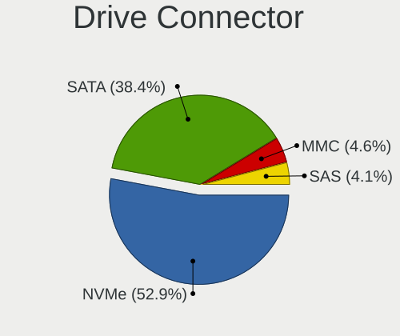

| Type | Notebooks | Drives | Percent |
|------|-----------|--------|---------|
| NVMe | 9062      | 12733  | 52.95%  |
| SATA | 6565      | 9646   | 38.36%  |
| MMC  | 793       | 1004   | 4.63%   |
| SAS  | 695       | 919    | 4.06%   |

Drive Size
----------

Size of hard drive

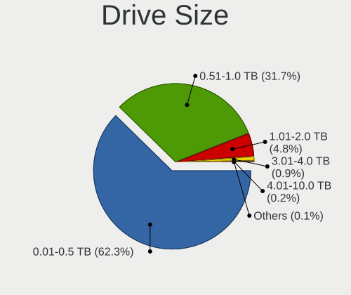

| Size in TB | Notebooks | Drives | Percent |
|------------|-----------|--------|---------|
| 0.01-0.5   | 4688      | 6443   | 62.32%  |
| 0.51-1.0   | 2384      | 3098   | 31.69%  |
| 1.01-2.0   | 359       | 504    | 4.77%   |
| 3.01-4.0   | 68        | 77     | 0.9%    |
| 4.01-10.0  | 18        | 24     | 0.24%   |
| 2.01-3.0   | 2         | 5      | 0.03%   |
| 10.01-20.0 | 2         | 7      | 0.03%   |
| 20.01-50.0 | 1         | 5      | 0.01%   |
| 0          | 1         | 2      | 0.01%   |

Space Total
-----------

Amount of disk space available on the file system

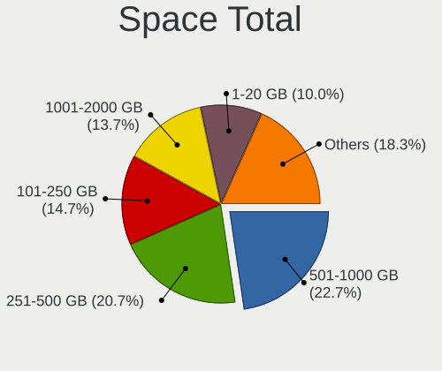

| Size in GB     | Notebooks | Percent |
|----------------|-----------|---------|
| 501-1000       | 3589      | 22.67%  |
| 251-500        | 3270      | 20.66%  |
| 101-250        | 2326      | 14.69%  |
| 1001-2000      | 2161      | 13.65%  |
| 1-20           | 1590      | 10.04%  |
| Unknown        | 1254      | 7.92%   |
| 51-100         | 543       | 3.43%   |
| More than 3000 | 480       | 3.03%   |
| 2001-3000      | 353       | 2.23%   |
| 21-50          | 262       | 1.66%   |
| 0              | 1         | 0.01%   |

Space Used
----------

Amount of used disk space

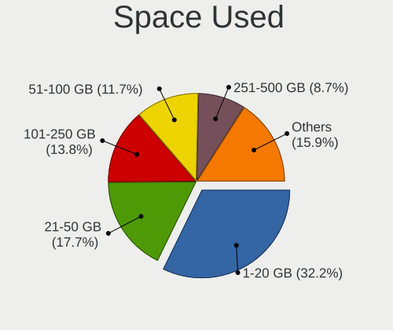

| Used GB        | Notebooks | Percent |
|----------------|-----------|---------|
| 1-20           | 5334      | 32.23%  |
| 21-50          | 2922      | 17.66%  |
| 101-250        | 2280      | 13.78%  |
| 51-100         | 1932      | 11.68%  |
| 251-500        | 1442      | 8.71%   |
| Unknown        | 1254      | 7.58%   |
| 501-1000       | 908       | 5.49%   |
| 1001-2000      | 344       | 2.08%   |
| 2001-3000      | 65        | 0.39%   |
| More than 3000 | 63        | 0.38%   |
| 0              | 4         | 0.02%   |

Malfunc. Drives
---------------

Drive models with a malfunction

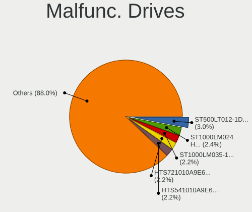

| Model                                                          | Notebooks | Drives | Percent |
|----------------------------------------------------------------|-----------|--------|---------|
| Seagate ST500LT012-1DG142 500GB                                | 15        | 15     | 3.01%   |
| Seagate ST1000LM024 HN-M101MBB 1TB                             | 12        | 22     | 2.41%   |
| Seagate ST1000LM035-1RK172 1TB                                 | 11        | 11     | 2.21%   |
| HGST HTS721010A9E630 1TB                                       | 11        | 13     | 2.21%   |
| HGST HTS541010A9E680 1TB                                       | 11        | 11     | 2.21%   |
| Toshiba MQ01ABD100 1TB                                         | 9         | 9      | 1.81%   |
| Seagate ST9500325AS 500GB                                      | 8         | 10     | 1.61%   |
| HGST HTS545050A7E680 500GB                                     | 8         | 8      | 1.61%   |
| Samsung Electronics NVMe SSD Controller SM981/PM981/PM983 1TB  | 7         | 7      | 1.41%   |
| Toshiba MQ01ABD075 752GB                                       | 6         | 6      | 1.2%    |
| SK hynix BC711 HFM512GD3JX013N 512GB                           | 6         | 6      | 1.2%    |
| Micron Technology 1100_MTFDDAV256TBN 256GB SSD                 | 6         | 6      | 1.2%    |
| Hitachi HTS547575A9E384 752GB                                  | 6         | 8      | 1.2%    |
| Toshiba MQ01ABF050 500GB                                       | 5         | 6      | 1%      |
| Seagate ST1000LM049-2GH172 1TB                                 | 5         | 8      | 1%      |
| HGST HTS725050A7E630 500GB                                     | 5         | 5      | 1%      |
| Seagate ST9500420AS 500GB                                      | 4         | 5      | 0.8%    |
| Seagate ST9320325AS 320GB                                      | 4         | 4      | 0.8%    |
| Seagate ST500LM021-1KJ152 500GB                                | 4         | 5      | 0.8%    |
| Samsung Electronics SSD 980 1TB                                | 4         | 4      | 0.8%    |
| Samsung Electronics NVMe SSD Controller PM9A1/PM9A3/980PRO 1TB | 4         | 4      | 0.8%    |
| Micron Technology 1100_MTFDDAV512TBN 512GB SSD                 | 4         | 4      | 0.8%    |
| Hitachi HTS545050B9A300 500GB                                  | 4         | 4      | 0.8%    |
| WDC WDS240G2G0B-00EPW0 240GB SSD                               | 3         | 3      | 0.6%    |
| WDC WDS240G2G0A-00JH30 240GB SSD                               | 3         | 3      | 0.6%    |
| Toshiba MQ01ABD050 500GB                                       | 3         | 3      | 0.6%    |
| SK hynix SC308 SATA 128GB SSD                                  | 3         | 3      | 0.6%    |
| SK hynix HFS256G39TND-N210A 256GB SSD                          | 3         | 3      | 0.6%    |
| SK hynix HFS128G39TND-N210A 128GB SSD                          | 3         | 3      | 0.6%    |
| Seagate ST9750420AS 752GB                                      | 3         | 3      | 0.6%    |
| Seagate ST500LT012-9WS142 500GB                                | 3         | 3      | 0.6%    |
| Seagate ST2000LM003 HN-M201RAD 2TB                             | 3         | 3      | 0.6%    |
| Seagate ST1000LM048-2E7172 1TB                                 | 3         | 4      | 0.6%    |
| Seagate ST1000LM014-1EJ164 1TB                                 | 3         | 4      | 0.6%    |
| SanDisk SSD PLUS 480GB                                         | 3         | 3      | 0.6%    |
| Samsung Electronics SSD 870 EVO 500GB                          | 3         | 6      | 0.6%    |
| Micron Technology 1100 SATA 256GB SSD                          | 3         | 3      | 0.6%    |
| HGST HTS541075A9E680 752GB                                     | 3         | 3      | 0.6%    |
| Crucial CT525MX300SSD1 528GB                                   | 3         | 3      | 0.6%    |
| Crucial CT1000P1SSD8 1TB                                       | 3         | 3      | 0.6%    |

Malfunc. Drive Vendor
---------------------

Vendors of faulty drives

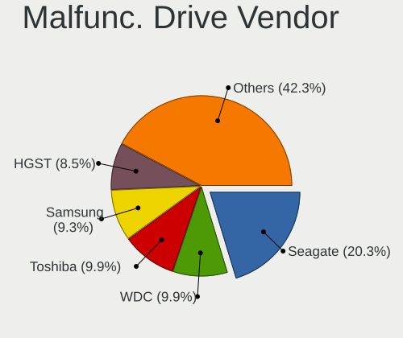

| Vendor                | Notebooks | Drives | Percent |
|-----------------------|-----------|--------|---------|
| Seagate               | 101       | 126    | 20.32%  |
| WDC                   | 49        | 53     | 9.86%   |
| Toshiba               | 49        | 52     | 9.86%   |
| Samsung Electronics   | 46        | 51     | 9.26%   |
| HGST                  | 42        | 44     | 8.45%   |
| Hitachi               | 29        | 33     | 5.84%   |
| SK hynix              | 25        | 26     | 5.03%   |
| Micron Technology     | 23        | 26     | 4.63%   |
| Crucial               | 20        | 28     | 4.02%   |
| Intel                 | 19        | 32     | 3.82%   |
| SanDisk               | 17        | 20     | 3.42%   |
| Kingston              | 11        | 13     | 2.21%   |
| A-DATA Technology     | 7         | 7      | 1.41%   |
| China                 | 6         | 6      | 1.21%   |
| LITEONIT              | 5         | 7      | 1.01%   |
| Apple                 | 5         | 5      | 1.01%   |
| SPCC                  | 4         | 4      | 0.8%    |
| LITEON                | 4         | 4      | 0.8%    |
| Fujitsu               | 4         | 4      | 0.8%    |
| Transcend             | 2         | 2      | 0.4%    |
| PNY                   | 2         | 2      | 0.4%    |
| Netac                 | 2         | 2      | 0.4%    |
| ADATA Technology      | 2         | 2      | 0.4%    |
| YS                    | 1         | 1      | 0.2%    |
| Wibtek                | 1         | 1      | 0.2%    |
| walram                | 1         | 1      | 0.2%    |
| Union Memory          | 1         | 1      | 0.2%    |
| Teclast               | 1         | 1      | 0.2%    |
| SSSTC                 | 1         | 1      | 0.2%    |
| SSD                   | 1         | 1      | 0.2%    |
| Silicon Motion        | 1         | 1      | 0.2%    |
| Realtek Semiconductor | 1         | 1      | 0.2%    |
| Plextor               | 1         | 1      | 0.2%    |
| Patriot               | 1         | 1      | 0.2%    |
| Origin                | 1         | 1      | 0.2%    |
| OCZ-VERTEX3           | 1         | 1      | 0.2%    |
| Mushkin               | 1         | 1      | 0.2%    |
| Lenovo                | 1         | 2      | 0.2%    |
| KingDian              | 1         | 1      | 0.2%    |
| JMicron Technology    | 1         | 1      | 0.2%    |

Malfunc. HDD Vendor
-------------------

Vendors of faulty HDD drives

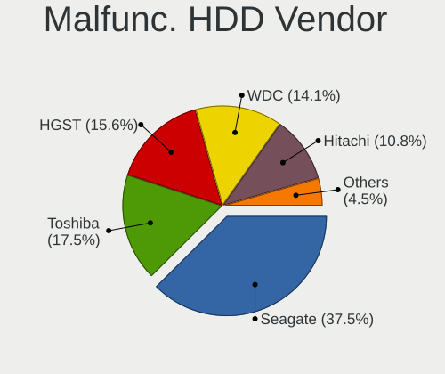

| Vendor              | Notebooks | Drives | Percent |
|---------------------|-----------|--------|---------|
| Seagate             | 101       | 126    | 37.55%  |
| Toshiba             | 47        | 50     | 17.47%  |
| HGST                | 42        | 44     | 15.61%  |
| WDC                 | 38        | 41     | 14.13%  |
| Hitachi             | 29        | 33     | 10.78%  |
| Samsung Electronics | 4         | 4      | 1.49%   |
| Fujitsu             | 4         | 4      | 1.49%   |
| Apple               | 2         | 2      | 0.74%   |
| JMicron Technology  | 1         | 1      | 0.37%   |
| HGST HTS            | 1         | 1      | 0.37%   |

Malfunc. Drive Kind
-------------------

Kinds of faulty drives

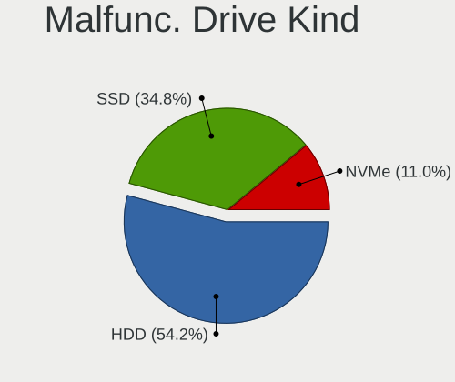

| Kind | Notebooks | Drives | Percent |
|------|-----------|--------|---------|
| HDD  | 266       | 306    | 54.18%  |
| SSD  | 171       | 210    | 34.83%  |
| NVMe | 54        | 57     | 11%     |

Failed Drives
-------------

Failed drive models

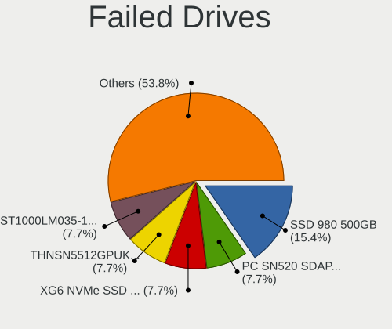

| Model                                            | Notebooks | Drives | Percent |
|--------------------------------------------------|-----------|--------|---------|
| Samsung Electronics SSD 980 500GB                | 2         | 2      | 15.38%  |
| WDC PC SN520 SDAPMUW-512G-1001 512GB             | 1         | 1      | 7.69%   |
| Toshiba XG6 NVMe SSD Controller 1024GB           | 1         | 1      | 7.69%   |
| Toshiba THNSN5512GPUK NVMe 512GB                 | 1         | 1      | 7.69%   |
| SK hynix BC501 NVMe Solid State Drive 512GB      | 1         | 1      | 7.69%   |
| Seagate ST1000LM035-1RK172 1TB                   | 1         | 1      | 7.69%   |
| Sandisk PC SN520 NVMe SSD 128GB                  | 1         | 1      | 7.69%   |
| Samsung Electronics SSD 980 1TB                  | 1         | 1      | 7.69%   |
| Samsung Electronics MZNTY128HDHP-00000 128GB SSD | 1         | 1      | 7.69%   |
| HGST HTS721010A9E630 1TB                         | 1         | 1      | 7.69%   |
| HGST HTS541010A9E680 1TB                         | 1         | 1      | 7.69%   |
| Apple SSD SM0256F 256GB                          | 1         | 1      | 7.69%   |

Failed Drive Vendor
-------------------

Failed drive vendors

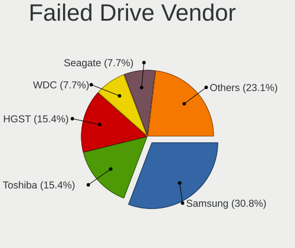

| Vendor              | Notebooks | Drives | Percent |
|---------------------|-----------|--------|---------|
| Samsung Electronics | 4         | 4      | 30.77%  |
| Toshiba             | 2         | 2      | 15.38%  |
| HGST                | 2         | 2      | 15.38%  |
| WDC                 | 1         | 1      | 7.69%   |
| SK hynix            | 1         | 1      | 7.69%   |
| Seagate             | 1         | 1      | 7.69%   |
| Sandisk             | 1         | 1      | 7.69%   |
| Apple               | 1         | 1      | 7.69%   |

Drive Status
------------

Number of failed and malfunc. drives

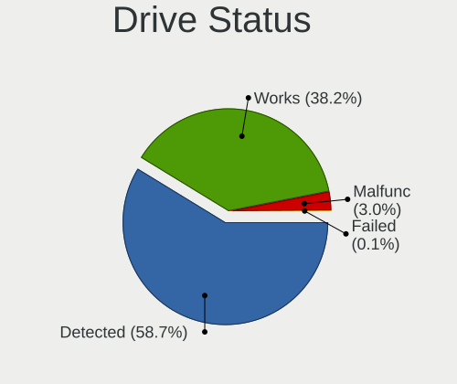

| Status   | Notebooks | Drives | Percent |
|----------|-----------|--------|---------|
| Detected | 9367      | 14908  | 58.73%  |
| Works    | 6088      | 8808   | 38.17%  |
| Malfunc  | 480       | 573    | 3.01%   |
| Failed   | 13        | 13     | 0.08%   |

Storage controller
------------------

Storage Vendor
--------------

Storage controller vendors

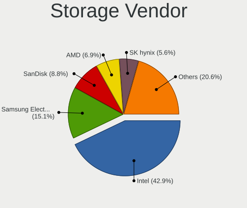

| Vendor                                  | Notebooks | Percent |
|-----------------------------------------|-----------|---------|
| Intel                                   | 8177      | 42.91%  |
| Samsung Electronics                     | 2878      | 15.1%   |
| SanDisk                                 | 1683      | 8.83%   |
| AMD                                     | 1319      | 6.92%   |
| SK hynix                                | 1074      | 5.64%   |
| Micron Technology                       | 805       | 4.22%   |
| KIOXIA                                  | 445       | 2.34%   |
| Kingston Technology Company             | 418       | 2.19%   |
| Toshiba America Info Systems            | 384       | 2.02%   |
| Phison Electronics                      | 297       | 1.56%   |
| Micron/Crucial Technology               | 241       | 1.26%   |
| ADATA Technology                        | 200       | 1.05%   |
| Silicon Motion                          | 161       | 0.84%   |
| MAXIO Technology (Hangzhou)             | 120       | 0.63%   |
| Apple                                   | 96        | 0.5%    |
| Solid State Storage Technology          | 95        | 0.5%    |
| Shenzhen Longsys Electronics            | 74        | 0.39%   |
| Realtek Semiconductor                   | 71        | 0.37%   |
| Nvidia                                  | 70        | 0.37%   |
| Union Memory (Shenzhen)                 | 69        | 0.36%   |
| Solidigm                                | 49        | 0.26%   |
| Yangtze Memory Technologies             | 43        | 0.23%   |
| Lenovo                                  | 42        | 0.22%   |
| Lite-On Technology                      | 38        | 0.2%    |
| Marvell Technology Group                | 35        | 0.18%   |
| Shenzhen Unionmemory Information System | 34        | 0.18%   |
| Seagate Technology                      | 24        | 0.13%   |
| Biwin Storage Technology                | 23        | 0.12%   |
| INNOGRIT                                | 18        | 0.09%   |
| Netac Technology                        | 10        | 0.05%   |
| Hosin Global Electronics                | 10        | 0.05%   |
| JMicron Technology                      | 8         | 0.04%   |
| Unknown                                 | 7         | 0.04%   |
| Transcend                               | 6         | 0.03%   |
| Shenzhen Shichuangyi Electronics        | 6         | 0.03%   |
| ASMedia Technology                      | 6         | 0.03%   |
| Silicon Integrated Systems [SiS]        | 2         | 0.01%   |
| Shenzhen Wodposit Electronics           | 2         | 0.01%   |
| Ramaxel Technology(Shenzhen) Limited    | 2         | 0.01%   |
| O2 Micro                                | 2         | 0.01%   |

Storage Model
-------------

Storage controller models

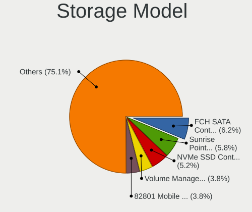

| Model                                                                          | Notebooks | Percent |
|--------------------------------------------------------------------------------|-----------|---------|
| AMD FCH SATA Controller [AHCI mode]                                            | 1245      | 6.25%   |
| Intel Sunrise Point-LP SATA Controller [AHCI mode]                             | 1162      | 5.83%   |
| Samsung NVMe SSD Controller SM981/PM981/PM983                                  | 1028      | 5.16%   |
| Intel Volume Management Device NVMe RAID Controller                            | 767       | 3.85%   |
| Intel 82801 Mobile SATA Controller [RAID mode]                                 | 766       | 3.84%   |
| Intel 7 Series Chipset Family 6-port SATA Controller [AHCI mode]               | 745       | 3.74%   |
| Samsung NVMe SSD Controller 980 (DRAM-less)                                    | 583       | 2.93%   |
| Samsung NVMe SSD Controller PM9A1/PM9A3/980PRO                                 | 516       | 2.59%   |
| Intel 6 Series/C200 Series Chipset Family 6 port Mobile SATA AHCI Controller   | 457       | 2.29%   |
| Intel Cannon Lake Mobile PCH SATA AHCI Controller                              | 423       | 2.12%   |
| Intel 8 Series SATA Controller 1 [AHCI mode]                                   | 387       | 1.94%   |
| SK hynix Gold P31/BC711/PC711 NVMe Solid State Drive                           | 352       | 1.77%   |
| Intel Wildcat Point-LP SATA Controller [AHCI Mode]                             | 349       | 1.75%   |
| Intel 8 Series/C220 Series Chipset Family 6-port SATA Controller 1 [AHCI mode] | 317       | 1.59%   |
| SanDisk Extreme Pro / WD Black SN750 / PC SN730 / Red SN700 NVMe SSD           | 306       | 1.54%   |
| SanDisk WD SN560/SN740/SN770/SN5000 NVMe SSD                                   | 296       | 1.49%   |
| Intel Tiger Lake-LP SATA Controller                                            | 272       | 1.37%   |
| Intel HM170/QM170 Chipset SATA Controller [AHCI Mode]                          | 272       | 1.37%   |
| SanDisk Ultra 3D / WD PC SN530, IX SN530, Blue SN550 NVMe SSD (DRAM-less)      | 241       | 1.21%   |
| Intel Comet Lake SATA AHCI Controller                                          | 215       | 1.08%   |
| Intel SSD 670p Series [Keystone Harbor]                                        | 214       | 1.07%   |
| Samsung NVMe SSD Controller SM961/PM961/SM963                                  | 209       | 1.05%   |
| KIOXIA NVMe SSD Controller BG4 (DRAM-less)                                     | 205       | 1.03%   |
| Micron 2400 NVMe SSD (DRAM-less)                                               | 182       | 0.91%   |
| Toshiba America Info Systems XG6 NVMe SSD Controller                           | 181       | 0.91%   |
| SK hynix Platinum P41/PC801 NVMe Solid State Drive                             | 180       | 0.9%    |
| Intel SSD 660P Series                                                          | 177       | 0.89%   |
| Intel Alder Lake-P SATA AHCI Controller                                        | 173       | 0.87%   |
| Intel RST Volume Management Device Controller                                  | 165       | 0.83%   |
| Micron 2450 NVMe SSD [HendrixV] (DRAM-less)                                    | 162       | 0.81%   |
| Intel Cannon Point-LP SATA Controller [AHCI Mode]                              | 161       | 0.81%   |
| Intel 400 Series Chipset Family SATA AHCI Controller                           | 155       | 0.78%   |
| Samsung NVMe SSD Controller PM9B1 (DRAM-less)                                  | 150       | 0.75%   |
| Micron/Crucial P2 [Nick P2] / P3 / P3 Plus NVMe PCIe SSD (DRAM-less)           | 141       | 0.71%   |
| Intel 5 Series/3400 Series Chipset 4 port SATA AHCI Controller                 | 135       | 0.68%   |
| Intel Q170/Q150/B150/H170/H110/Z170/CM236 Chipset SATA Controller [AHCI Mode]  | 132       | 0.66%   |
| Intel 82801IBM/IEM (ICH9M/ICH9M-E) 4 port SATA Controller [AHCI mode]          | 132       | 0.66%   |
| Intel Celeron/Pentium Silver Processor SATA Controller                         | 128       | 0.64%   |
| SK hynix BC501 NVMe Solid State Drive                                          | 121       | 0.61%   |
| Samsung S4LN058A01[SSUBX] AHCI SSD Controller (Apple slot)                     | 118       | 0.59%   |

Storage Kind
------------

Kind of storage controller (IDE, SATA, NVMe, SAS, ...)

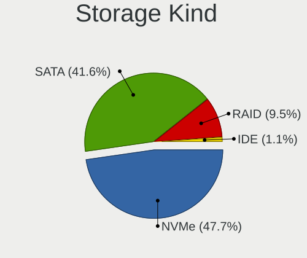

| Kind | Notebooks | Percent |
|------|-----------|---------|
| NVMe | 9025      | 47.73%  |
| SATA | 7865      | 41.59%  |
| RAID | 1802      | 9.53%   |
| IDE  | 217       | 1.15%   |

Processor
---------

CPU Vendor
----------

Processor vendors

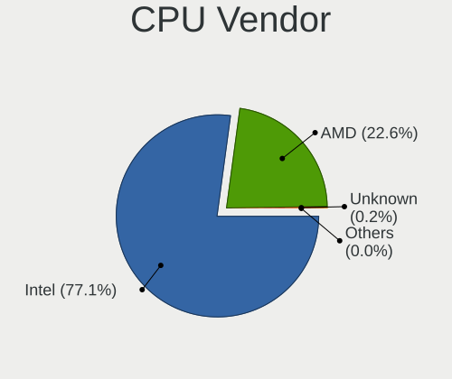

| Vendor       | Notebooks | Percent |
|--------------|-----------|---------|
| Intel        | 11623     | 77.13%  |
| AMD          | 3407      | 22.61%  |
| Unknown      | 29        | 0.19%   |
| ARM          | 9         | 0.06%   |
| Qualcomm     | 1         | 0.01%   |
| CentaurHauls | 1         | 0.01%   |

CPU Model
---------

Processor models

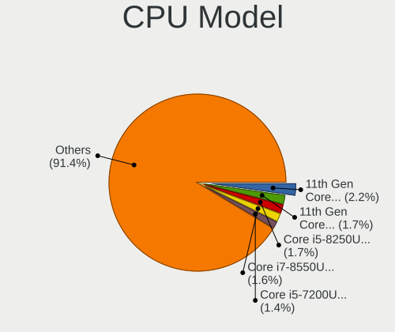

| Model                                         | Notebooks | Percent |
|-----------------------------------------------|-----------|---------|
| Intel 11th Gen Core i5-1135G7 @ 2.40GHz       | 338       | 2.24%   |
| Intel 11th Gen Core i7-1165G7 @ 2.80GHz       | 263       | 1.74%   |
| Intel Core i5-8250U CPU @ 1.60GHz             | 254       | 1.68%   |
| Intel Core i7-8550U CPU @ 1.80GHz             | 241       | 1.6%    |
| Intel Core i5-7200U CPU @ 2.50GHz             | 205       | 1.36%   |
| Intel Core i7-8750H CPU @ 2.20GHz             | 190       | 1.26%   |
| Intel Core i5-10210U CPU @ 1.60GHz            | 182       | 1.21%   |
| AMD Ryzen 5 5500U with Radeon Graphics        | 180       | 1.19%   |
| Intel Core i5-8265U CPU @ 1.60GHz             | 167       | 1.11%   |
| Intel Core i7-8565U CPU @ 1.80GHz             | 165       | 1.09%   |
| AMD Ryzen 5 3500U with Radeon Vega Mobile Gfx | 164       | 1.09%   |
| AMD Ryzen 7 5800H with Radeon Graphics        | 163       | 1.08%   |
| Intel Core i7-9750H CPU @ 2.60GHz             | 158       | 1.05%   |
| Intel Core i7-7700HQ CPU @ 2.80GHz            | 158       | 1.05%   |
| Intel Core i7-10510U CPU @ 1.80GHz            | 155       | 1.03%   |
| Intel Core i5-6200U CPU @ 2.30GHz             | 154       | 1.02%   |
| Intel Core i7-7500U CPU @ 2.70GHz             | 151       | 1%      |
| Intel Core i7-10750H CPU @ 2.60GHz            | 148       | 0.98%   |
| Intel Core i5-6300U CPU @ 2.40GHz             | 136       | 0.9%    |
| Intel 12th Gen Core i7-12700H                 | 131       | 0.87%   |
| AMD Ryzen 7 5700U with Radeon Graphics        | 130       | 0.86%   |
| AMD Ryzen 7 4800H with Radeon Graphics        | 128       | 0.85%   |
| Intel Core i7-8650U CPU @ 1.90GHz             | 120       | 0.8%    |
| Intel Core i5-5200U CPU @ 2.20GHz             | 119       | 0.79%   |
| Intel Core i5-8350U CPU @ 1.70GHz             | 116       | 0.77%   |
| Intel Core i7-6700HQ CPU @ 2.60GHz            | 113       | 0.75%   |
| Intel Core i5-3210M CPU @ 2.50GHz             | 113       | 0.75%   |
| Intel Core i5-1035G1 CPU @ 1.00GHz            | 111       | 0.74%   |
| AMD Ryzen 5 5600H with Radeon Graphics        | 110       | 0.73%   |
| Intel 11th Gen Core i7-11800H @ 2.30GHz       | 108       | 0.72%   |
| Intel Core i5-3320M CPU @ 2.60GHz             | 99        | 0.66%   |
| Intel 12th Gen Core i5-1235U                  | 99        | 0.66%   |
| Intel Core Ultra 7 155H                       | 93        | 0.62%   |
| Intel 11th Gen Core i7-1185G7 @ 3.00GHz       | 93        | 0.62%   |
| Intel Core i7-8665U CPU @ 1.90GHz             | 86        | 0.57%   |
| Intel Core i5-2520M CPU @ 2.50GHz             | 84        | 0.56%   |
| Intel Core i5-10300H CPU @ 2.50GHz            | 78        | 0.52%   |
| Intel Core i7-6600U CPU @ 2.60GHz             | 77        | 0.51%   |
| Intel Core i5-5300U CPU @ 2.30GHz             | 77        | 0.51%   |
| Intel 12th Gen Core i7-1255U                  | 77        | 0.51%   |

CPU Model Family
----------------

Processor model prefix

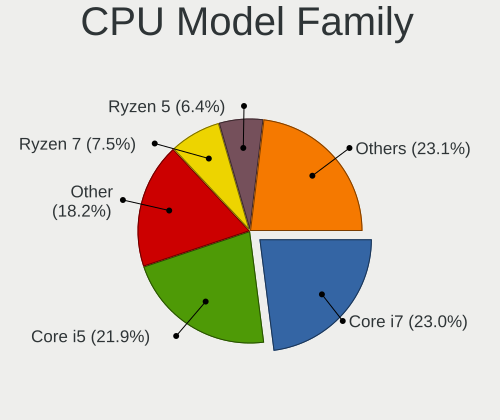

| Model                   | Notebooks | Percent |
|-------------------------|-----------|---------|
| Intel Core i7           | 3466      | 22.99%  |
| Intel Core i5           | 3299      | 21.88%  |
| Other                   | 2738      | 18.16%  |
| AMD Ryzen 7             | 1129      | 7.49%   |
| AMD Ryzen 5             | 965       | 6.4%    |
| Intel Core i3           | 751       | 4.98%   |
| Intel Celeron           | 359       | 2.38%   |
| Intel Core              | 334       | 2.22%   |
| AMD Ryzen 9             | 257       | 1.7%    |
| Intel Core 2 Duo        | 246       | 1.63%   |
| AMD Ryzen 7 PRO         | 239       | 1.59%   |
| Intel Atom              | 166       | 1.1%    |
| AMD Ryzen 3             | 155       | 1.03%   |
| Intel Pentium           | 147       | 0.97%   |
| AMD Ryzen 5 PRO         | 132       | 0.88%   |
| Intel Core i9           | 115       | 0.76%   |
| AMD A6                  | 69        | 0.46%   |
| AMD A10                 | 54        | 0.36%   |
| AMD A8                  | 50        | 0.33%   |
| Intel Xeon              | 46        | 0.31%   |
| AMD A4                  | 45        | 0.3%    |
| Intel Pentium Silver    | 44        | 0.29%   |
| Intel Pentium Dual-Core | 31        | 0.21%   |
| Intel Core m3           | 24        | 0.16%   |
| AMD Athlon              | 21        | 0.14%   |
| AMD E2                  | 18        | 0.12%   |
| AMD E1                  | 18        | 0.12%   |
| Intel Pentium Dual      | 14        | 0.09%   |
| Intel Core m5           | 14        | 0.09%   |
| Intel Core M            | 14        | 0.09%   |
| AMD E                   | 14        | 0.09%   |
| AMD A12                 | 14        | 0.09%   |
| Intel Genuine           | 8         | 0.05%   |
| Intel Core m7           | 8         | 0.05%   |
| AMD Ryzen 3 PRO         | 8         | 0.05%   |
| AMD Athlon II           | 8         | 0.05%   |
| Intel Core 2            | 5         | 0.03%   |
| Intel Celeron Dual-Core | 5         | 0.03%   |
| AMD FX                  | 5         | 0.03%   |
| AMD PRO A10             | 4         | 0.03%   |

CPU Cores
---------

Number of processor cores

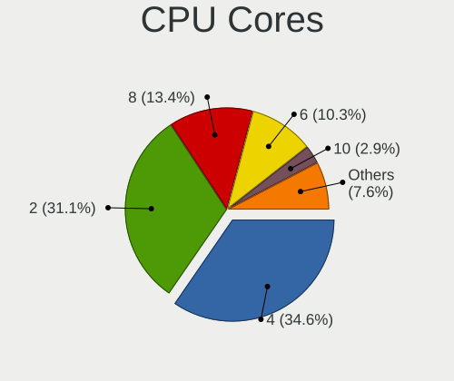

| Number  | Notebooks | Percent |
|---------|-----------|---------|
| 4       | 5217      | 34.6%   |
| 2       | 4696      | 31.14%  |
| 8       | 2015      | 13.36%  |
| 6       | 1557      | 10.33%  |
| 10      | 441       | 2.92%   |
| 14      | 402       | 2.67%   |
| 12      | 391       | 2.59%   |
| 16      | 234       | 1.55%   |
| 24      | 79        | 0.52%   |
| 1       | 28        | 0.19%   |
| 20      | 10        | 0.07%   |
| 5       | 4         | 0.03%   |
| 3       | 2         | 0.01%   |
| 11      | 1         | 0.01%   |
| Unknown | 1         | 0.01%   |

CPU Sockets
-----------

Number of sockets

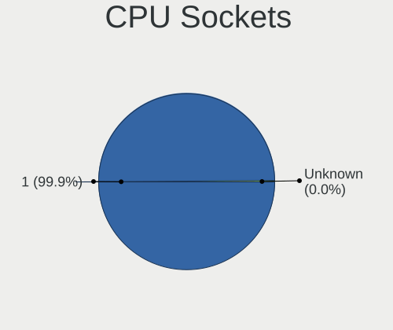

| Number  | Notebooks | Percent |
|---------|-----------|---------|
| 1       | 15055     | 99.89%  |
| 2       | 15        | 0.1%    |
| 11      | 1         | 0.01%   |
| Unknown | 1         | 0.01%   |

CPU Threads
-----------

Threads per core (Hyper-Threading)

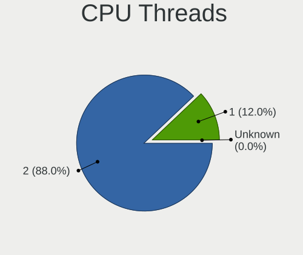

| Number  | Notebooks | Percent |
|---------|-----------|---------|
| 2       | 13274     | 87.95%  |
| 1       | 1817      | 12.04%  |
| Unknown | 1         | 0.01%   |

CPU Op-Modes
------------

CPU Operation Modes (32-bit, 64-bit)

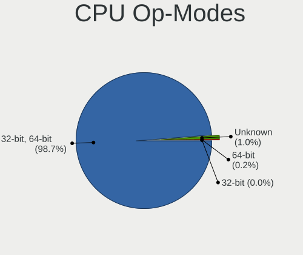

| Op mode        | Notebooks | Percent |
|----------------|-----------|---------|
| 32-bit, 64-bit | 14903     | 98.75%  |
| Unknown        | 151       | 1%      |
| 64-bit         | 34        | 0.23%   |
| 32-bit         | 4         | 0.03%   |

CPU Microcode
-------------

Microcode number

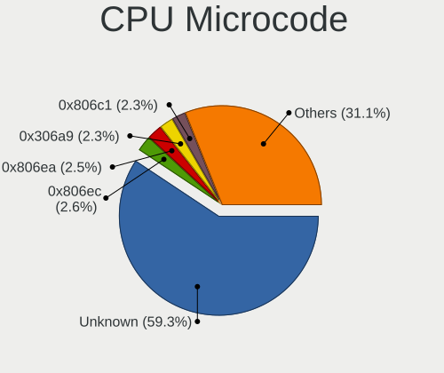

| Number     | Notebooks | Percent |
|------------|-----------|---------|
| Unknown    | 9210      | 59.34%  |
| 0x806ec    | 400       | 2.58%   |
| 0x806ea    | 384       | 2.47%   |
| 0x306a9    | 357       | 2.3%    |
| 0x806c1    | 351       | 2.26%   |
| 0x206a7    | 282       | 1.82%   |
| 0x906ea    | 274       | 1.77%   |
| 0x406e3    | 272       | 1.75%   |
| 0x806e9    | 270       | 1.74%   |
| 0x0a50000c | 248       | 1.6%    |
| 0x40651    | 222       | 1.43%   |
| 0x306d4    | 216       | 1.39%   |
| 0x306c3    | 169       | 1.09%   |
| 0x08600106 | 167       | 1.08%   |
| 0xa0652    | 166       | 1.07%   |
| 0x08108109 | 146       | 0.94%   |
| 0x08608103 | 133       | 0.86%   |
| 0x08108102 | 127       | 0.82%   |
| 0x906e9    | 119       | 0.77%   |
| 0x506e3    | 112       | 0.72%   |
| 0x706e5    | 104       | 0.67%   |
| 0x0a404102 | 96        | 0.62%   |
| 0x08600104 | 91        | 0.59%   |
| 0x906a3    | 88        | 0.57%   |
| 0x20655    | 81        | 0.52%   |
| 0x0a50000d | 81        | 0.52%   |
| 0x806eb    | 75        | 0.48%   |
| 0x30678    | 75        | 0.48%   |
| 0x1067a    | 70        | 0.45%   |
| 0x806d1    | 61        | 0.39%   |
| 0x08600103 | 57        | 0.37%   |
| 0x906ed    | 56        | 0.36%   |
| 0x0810100b | 44        | 0.28%   |
| 0x406c4    | 42        | 0.27%   |
| 0x08608102 | 42        | 0.27%   |
| 0x0a404101 | 41        | 0.26%   |
| 0x06006705 | 38        | 0.24%   |
| 0x706a8    | 34        | 0.22%   |
| 0x0a704103 | 34        | 0.22%   |
| 0x406c3    | 31        | 0.2%    |

CPU Microarch
-------------

Microarchitecture

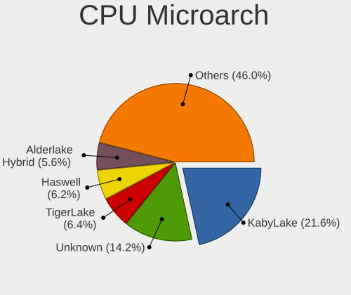

| Name               | Notebooks | Percent |
|--------------------|-----------|---------|
| KabyLake           | 3268      | 21.6%   |
| Unknown            | 2151      | 14.22%  |
| TigerLake          | 975       | 6.44%   |
| Haswell            | 934       | 6.17%   |
| Alderlake Hybrid   | 848       | 5.6%    |
| Skylake            | 806       | 5.33%   |
| IvyBridge          | 783       | 5.18%   |
| Zen 3              | 724       | 4.79%   |
| SandyBridge        | 589       | 3.89%   |
| Zen 2              | 522       | 3.45%   |
| Broadwell          | 481       | 3.18%   |
| CometLake          | 421       | 2.78%   |
| Zen+               | 404       | 2.67%   |
| Icelake            | 384       | 2.54%   |
| Silvermont         | 319       | 2.11%   |
| Penryn             | 239       | 1.58%   |
| Westmere           | 235       | 1.55%   |
| Goldmont plus      | 159       | 1.05%   |
| Zen                | 129       | 0.85%   |
| Meteorlake Hybrid  | 120       | 0.79%   |
| Excavator          | 117       | 0.77%   |
| Core               | 69        | 0.46%   |
| Puma               | 61        | 0.4%    |
| Goldmont           | 59        | 0.39%   |
| Piledriver         | 50        | 0.33%   |
| Lunarlake Hybrid   | 38        | 0.25%   |
| Jaguar             | 36        | 0.24%   |
| Nehalem            | 34        | 0.22%   |
| Bobcat             | 28        | 0.19%   |
| Tremont            | 26        | 0.17%   |
| Gracemont          | 24        | 0.16%   |
| ArrowLake-H Hybrid | 21        | 0.14%   |
| K10                | 19        | 0.13%   |
| K10 Llano          | 16        | 0.11%   |
| Steamroller        | 12        | 0.08%   |
| K8 & K10 hybrid    | 9         | 0.06%   |
| K8 Hammer          | 8         | 0.05%   |
| Bonnell            | 8         | 0.05%   |
| P6                 | 3         | 0.02%   |
| NetBurst           | 1         | 0.01%   |

Graphics
--------

GPU Vendor
----------

Vendors of graphics cards

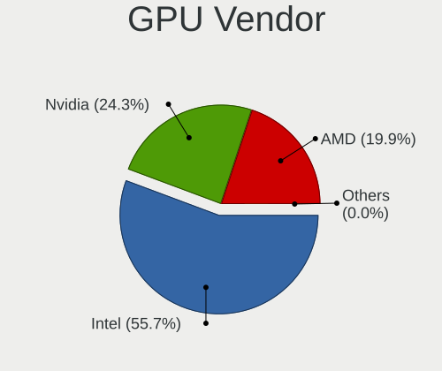

| Vendor                           | Notebooks | Percent |
|----------------------------------|-----------|---------|
| Intel                            | 10989     | 55.69%  |
| Nvidia                           | 4804      | 24.35%  |
| AMD                              | 3935      | 19.94%  |
| Silicon Motion                   | 2         | 0.01%   |
| Zhaoxin                          | 1         | 0.01%   |
| Silicon Integrated Systems [SiS] | 1         | 0.01%   |

GPU Model
---------

Graphics card models

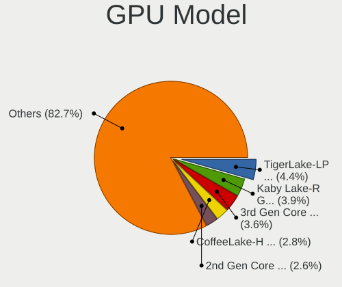

| Model                                                                                    | Notebooks | Percent |
|------------------------------------------------------------------------------------------|-----------|---------|
| Intel TigerLake-LP GT2 [Iris Xe Graphics]                                                | 886       | 4.41%   |
| Intel Kaby Lake-R GT2 [UHD Graphics 620]                                                 | 776       | 3.87%   |
| Intel 3rd Gen Core processor Graphics Controller                                         | 731       | 3.64%   |
| Intel CoffeeLake-H GT2 [UHD Graphics 630]                                                | 554       | 2.76%   |
| Intel 2nd Generation Core Processor Family Integrated Graphics Controller                | 532       | 2.65%   |
| Intel Kaby Lake-U GT2 [HD Graphics 620]                                                  | 514       | 2.56%   |
| Intel Skylake-U GT2 [HD Graphics 520]                                                    | 507       | 2.53%   |
| AMD Renoir [Radeon Vega Series / Radeon Vega Mobile Series]                              | 506       | 2.52%   |
| Intel WhiskeyLake-U GT2 [UHD Graphics 620]                                               | 498       | 2.48%   |
| AMD Cezanne [Radeon Vega Series / Radeon Vega Mobile Series]                             | 486       | 2.42%   |
| Intel Haswell-ULT Integrated Graphics Controller                                         | 479       | 2.39%   |
| Intel CometLake-U GT2 [UHD Graphics]                                                     | 438       | 2.18%   |
| AMD Picasso/Raven 2 [Radeon Vega Series / Radeon Vega Mobile Series]                     | 416       | 2.07%   |
| Intel Alder Lake-P GT2 [Iris Xe Graphics]                                                | 368       | 1.83%   |
| Intel Broadwell-U GT2 [HD Graphics 5500]                                                 | 359       | 1.79%   |
| Intel CometLake-H GT2 [UHD Graphics]                                                     | 351       | 1.75%   |
| AMD Rembrandt [Radeon 680M]                                                              | 346       | 1.72%   |
| AMD Lucienne                                                                             | 340       | 1.69%   |
| Nvidia TU117M [GeForce GTX 1650 Mobile / Max-Q]                                          | 322       | 1.6%    |
| Intel 4th Gen Core Processor Integrated Graphics Controller                              | 318       | 1.58%   |
| Intel Raptor Lake-P [Iris Xe Graphics]                                                   | 298       | 1.48%   |
| Nvidia GA106M [GeForce RTX 3060 Mobile / Max-Q]                                          | 242       | 1.21%   |
| Intel Kaby Lake-H GT2 [HD Graphics 630]                                                  | 222       | 1.11%   |
| AMD Phoenix1                                                                             | 217       | 1.08%   |
| Intel TigerLake-H GT1 [UHD Graphics]                                                     | 202       | 1.01%   |
| Nvidia GA107M [GeForce RTX 3050 Mobile]                                                  | 201       | 1%      |
| AMD Barcelo                                                                              | 197       | 0.98%   |
| Intel Skylake-H GT2 [HD Graphics 530]                                                    | 185       | 0.92%   |
| Intel Atom Processor Z36xxx/Z37xxx Series Graphics & Display                             | 182       | 0.91%   |
| Intel Meteor Lake-P [Intel Arc Graphics]                                                 | 181       | 0.9%    |
| Intel Core Processor Integrated Graphics Controller                                      | 176       | 0.88%   |
| Nvidia AD107M [GeForce RTX 4060 Max-Q / Mobile]                                          | 170       | 0.85%   |
| Intel Alder Lake-UP3 GT2 [Iris Xe Graphics]                                              | 167       | 0.83%   |
| Nvidia GP107M [GeForce GTX 1050 Mobile]                                                  | 163       | 0.81%   |
| Intel Iris Plus Graphics G1 (Ice Lake)                                                   | 158       | 0.79%   |
| Nvidia GP107M [GeForce GTX 1050 Ti Mobile]                                               | 152       | 0.76%   |
| AMD Topaz XT [Radeon R7 M260/M265 / M340/M360 / M440/M445 / 530/535 / 620/625 Mobile]    | 138       | 0.69%   |
| Intel Atom/Celeron/Pentium Processor x5-E8000/J3xxx/N3xxx Integrated Graphics Controller | 137       | 0.68%   |
| Intel GeminiLake [UHD Graphics 600]                                                      | 127       | 0.63%   |
| Nvidia TU117M [GeForce GTX 1650 Ti Mobile]                                               | 121       | 0.6%    |

GPU Combo
---------

Combinations of graphics cards

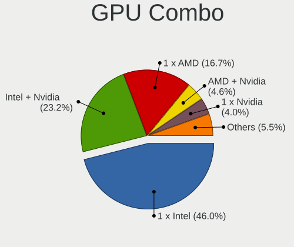

| Name                     | Notebooks | Percent |
|--------------------------|-----------|---------|
| 1 x Intel                | 6965      | 46.04%  |
| Intel + Nvidia           | 3507      | 23.18%  |
| 1 x AMD                  | 2533      | 16.74%  |
| AMD + Nvidia             | 691       | 4.57%   |
| 1 x Nvidia               | 606       | 4.01%   |
| Intel + AMD              | 466       | 3.08%   |
| 2 x AMD                  | 253       | 1.67%   |
| Other                    | 58        | 0.38%   |
| 2 x Intel                | 32        | 0.21%   |
| 2 x Nvidia               | 9         | 0.06%   |
| 1 x Silicon Motion       | 2         | 0.01%   |
| Intel + 2 x Nvidia       | 2         | 0.01%   |
| 1 x Zhaoxin              | 1         | 0.01%   |
| 1 x SiS                  | 1         | 0.01%   |
| Intel + AMD + 1 x Nvidia | 1         | 0.01%   |

GPU Driver
----------

Free vs proprietary

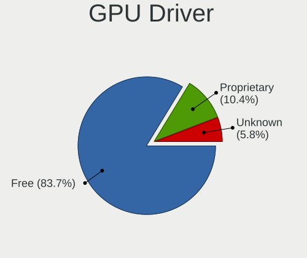

| Driver      | Notebooks | Percent |
|-------------|-----------|---------|
| Free        | 12797     | 83.73%  |
| Proprietary | 1597      | 10.45%  |
| Unknown     | 889       | 5.82%   |

GPU Memory
----------

Total video memory

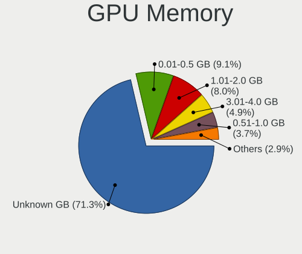

| Size in GB | Notebooks | Percent |
|------------|-----------|---------|
| Unknown    | 10983     | 71.34%  |
| 0.01-0.5   | 1398      | 9.08%   |
| 1.01-2.0   | 1237      | 8.04%   |
| 3.01-4.0   | 752       | 4.88%   |
| 0.51-1.0   | 576       | 3.74%   |
| 7.01-8.0   | 192       | 1.25%   |
| 5.01-6.0   | 174       | 1.13%   |
| 8.01-16.0  | 48        | 0.31%   |
| 2.01-3.0   | 32        | 0.21%   |
| 16.01-24.0 | 2         | 0.01%   |
| 24.01-32.0 | 1         | 0.01%   |

Monitor
-------

Monitor Vendor
--------------

Monitor vendors

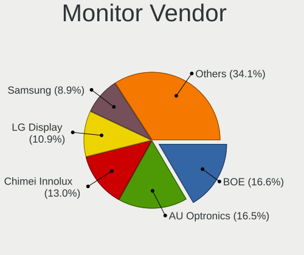

| Vendor                  | Notebooks | Percent |
|-------------------------|-----------|---------|
| BOE                     | 3002      | 16.56%  |
| AU Optronics            | 2993      | 16.51%  |
| Chimei Innolux          | 2356      | 13%     |
| LG Display              | 1982      | 10.94%  |
| Samsung Electronics     | 1608      | 8.87%   |
| Dell                    | 695       | 3.83%   |
| Apple                   | 653       | 3.6%    |
| Sharp                   | 602       | 3.32%   |
| Lenovo                  | 519       | 2.86%   |
| Goldstar                | 507       | 2.8%    |
| PANDA                   | 308       | 1.7%    |
| Hewlett-Packard         | 257       | 1.42%   |
| CSO                     | 242       | 1.34%   |
| InfoVision              | 182       | 1%      |
| Philips                 | 178       | 0.98%   |
| AOC                     | 175       | 0.97%   |
| Acer                    | 175       | 0.97%   |
| Chi Mei Optoelectronics | 161       | 0.89%   |
| BenQ                    | 141       | 0.78%   |
| TMX                     | 103       | 0.57%   |
| ASUSTek Computer        | 95        | 0.52%   |
| Ancor Communications    | 92        | 0.51%   |
| Iiyama                  | 79        | 0.44%   |
| CSOT                    | 62        | 0.34%   |
| ViewSonic               | 60        | 0.33%   |
| CSW                     | 57        | 0.31%   |
| MSI                     | 52        | 0.29%   |
| Sony                    | 47        | 0.26%   |
| Panasonic               | 35        | 0.19%   |
| HKC                     | 34        | 0.19%   |
| Gigabyte Technology     | 30        | 0.17%   |
| JDI                     | 29        | 0.16%   |
| Toshiba                 | 27        | 0.15%   |
| LG Philips              | 25        | 0.14%   |
| KDB                     | 21        | 0.12%   |
| Sceptre Tech            | 19        | 0.1%    |
| Eizo                    | 19        | 0.1%    |
| Mi                      | 18        | 0.1%    |
| EDO                     | 18        | 0.1%    |
| CPT                     | 16        | 0.09%   |

Monitor Model
-------------

Monitor models

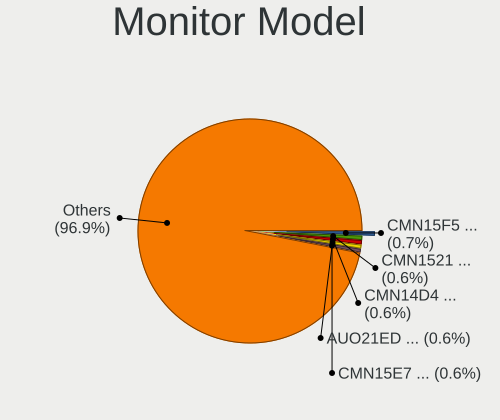

| Model                                                                 | Notebooks | Percent |
|-----------------------------------------------------------------------|-----------|---------|
| Chimei Innolux LCD Monitor CMN15F5 1920x1080 344x193mm 15.5-inch      | 120       | 0.65%   |
| Chimei Innolux LCD Monitor CMN1521 1920x1080 344x193mm 15.5-inch      | 119       | 0.65%   |
| Chimei Innolux LCD Monitor CMN14D4 1920x1080 309x173mm 13.9-inch      | 118       | 0.64%   |
| AU Optronics LCD Monitor AUO21ED 1920x1080 344x193mm 15.5-inch        | 110       | 0.6%    |
| Chimei Innolux LCD Monitor CMN15E7 1920x1080 344x193mm 15.5-inch      | 102       | 0.55%   |
| AU Optronics LCD Monitor AUO403D 1920x1080 309x174mm 14.0-inch        | 97        | 0.53%   |
| PANDA LCD Monitor NCP004D 1920x1080 344x194mm 15.5-inch               | 87        | 0.47%   |
| AU Optronics LCD Monitor AUO38ED 1920x1080 344x193mm 15.5-inch        | 82        | 0.44%   |
| Chimei Innolux LCD Monitor CMN15E8 1920x1080 344x193mm 15.5-inch      | 71        | 0.39%   |
| BOE LCD Monitor BOE095F 2256x1504 285x190mm 13.5-inch                 | 67        | 0.36%   |
| BOE LCD Monitor BOE0872 1920x1080 344x194mm 15.5-inch                 | 63        | 0.34%   |
| Chimei Innolux LCD Monitor CMN15DB 1366x768 344x193mm 15.5-inch       | 60        | 0.33%   |
| Chimei Innolux LCD Monitor CMN14C9 1920x1080 309x173mm 13.9-inch      | 57        | 0.31%   |
| AU Optronics LCD Monitor AUO106C 1366x768 276x155mm 12.5-inch         | 57        | 0.31%   |
| Samsung Electronics LCD Monitor SEC5441 1280x800 331x207mm 15.4-inch  | 55        | 0.3%    |
| Lenovo LCD Monitor LEN40BA 1920x1080 344x194mm 15.5-inch              | 55        | 0.3%    |
| BOE LCD Monitor BOE0812 1920x1080 344x194mm 15.5-inch                 | 53        | 0.29%   |
| AU Optronics LCD Monitor AUO573D 1920x1080 309x174mm 14.0-inch        | 52        | 0.28%   |
| LG Display LCD Monitor LGD0521 1920x1080 309x174mm 14.0-inch          | 51        | 0.28%   |
| Chimei Innolux LCD Monitor CMN14D5 1920x1080 309x173mm 13.9-inch      | 51        | 0.28%   |
| AU Optronics LCD Monitor AUOAF90 1920x1080 344x193mm 15.5-inch        | 50        | 0.27%   |
| Chimei Innolux LCD Monitor CMN15E6 1366x768 344x193mm 15.5-inch       | 48        | 0.26%   |
| AU Optronics LCD Monitor AUO71EC 1366x768 344x193mm 15.5-inch         | 45        | 0.24%   |
| Samsung Electronics LCD Monitor SDC4161 1920x1080 344x194mm 15.5-inch | 44        | 0.24%   |
| Apple Color LCD APP9CC7 1280x800 286x179mm 13.3-inch                  | 44        | 0.24%   |
| LG Display LCD Monitor LGD046F 1920x1080 344x194mm 15.5-inch          | 43        | 0.23%   |
| LG Display LCD Monitor LGD02DC 1366x768 344x194mm 15.5-inch           | 43        | 0.23%   |
| BOE LCD Monitor BOE0893 2160x1440 296x197mm 14.0-inch                 | 42        | 0.23%   |
| BOE LCD Monitor BOE0877 1920x1080 309x173mm 13.9-inch                 | 42        | 0.23%   |
| Chimei Innolux LCD Monitor CMN15C4 1920x1080 344x193mm 15.5-inch      | 41        | 0.22%   |
| Apple Color LCD APPA034 2880x1800 286x179mm 13.3-inch                 | 40        | 0.22%   |
| Samsung Electronics LCD Monitor SDC4171 2880x1800 302x189mm 14.0-inch | 39        | 0.21%   |
| Chimei Innolux LCD Monitor CMN14E5 1920x1080 309x173mm 13.9-inch      | 38        | 0.21%   |
| BOE LCD Monitor BOE0BCA 2256x1504 285x190mm 13.5-inch                 | 38        | 0.21%   |
| BOE LCD Monitor BOE06A4 1366x768 344x194mm 15.5-inch                  | 38        | 0.21%   |
| InfoVision LCD Monitor IVO057D 1920x1080 309x174mm 14.0-inch          | 37        | 0.2%    |
| Chimei Innolux LCD Monitor CMN14D6 1366x768 309x173mm 13.9-inch       | 37        | 0.2%    |
| AU Optronics LCD Monitor AUO133D 1920x1080 309x173mm 13.9-inch        | 37        | 0.2%    |
| Apple Color LCD APP9CF0 1440x900 290x180mm 13.4-inch                  | 36        | 0.2%    |
| BOE LCD Monitor BOE08D5 1920x1080 344x194mm 15.5-inch                 | 35        | 0.19%   |

Monitor Resolution
------------------

Monitor screen resolution

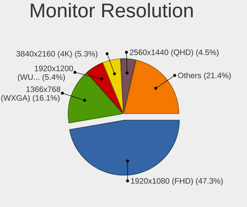

| Resolution         | Notebooks | Percent |
|--------------------|-----------|---------|
| 1920x1080 (FHD)    | 7998      | 47.28%  |
| 1366x768 (WXGA)    | 2730      | 16.14%  |
| 1920x1200 (WUXGA)  | 919       | 5.43%   |
| 3840x2160 (4K)     | 895       | 5.29%   |
| 2560x1440 (QHD)    | 758       | 4.48%   |
| 2560x1600          | 648       | 3.83%   |
| 2880x1800          | 502       | 2.97%   |
| 1600x900 (HD+)     | 477       | 2.82%   |
| 1280x800 (WXGA)    | 283       | 1.67%   |
| 1440x900 (WXGA+)   | 197       | 1.16%   |
| 3440x1440          | 174       | 1.03%   |
| 3840x2400          | 141       | 0.83%   |
| 2560x1080          | 140       | 0.83%   |
| 2256x1504          | 108       | 0.64%   |
| 2160x1440          | 101       | 0.6%    |
| 3200x2000          | 91        | 0.54%   |
| 1680x1050 (WSXGA+) | 89        | 0.53%   |
| Unknown            | 83        | 0.49%   |
| 3200x1800 (QHD+)   | 60        | 0.35%   |
| 1280x1024 (SXGA)   | 51        | 0.3%    |
| 3072x1920          | 46        | 0.27%   |
| 2880x1620          | 39        | 0.23%   |
| 3456x2160          | 35        | 0.21%   |
| 2240x1400          | 34        | 0.2%    |
| 3000x2000          | 30        | 0.18%   |
| 2880x1920          | 28        | 0.17%   |
| 1360x768           | 27        | 0.16%   |
| 2520x1680          | 24        | 0.14%   |
| 3840x1080          | 21        | 0.12%   |
| 1920x1280          | 21        | 0.12%   |
| 3840x1600          | 17        | 0.1%    |
| 3840x1100          | 14        | 0.08%   |
| 2304x1440          | 14        | 0.08%   |
| 2160x1350          | 14        | 0.08%   |
| 1920x540           | 11        | 0.07%   |
| 1024x768 (XGA)     | 11        | 0.07%   |
| 800x1280           | 8         | 0.05%   |
| 2288x1287          | 7         | 0.04%   |
| 1600x2560          | 7         | 0.04%   |
| 1024x600           | 6         | 0.04%   |

Monitor Diagonal
----------------

Diagonal size in inches

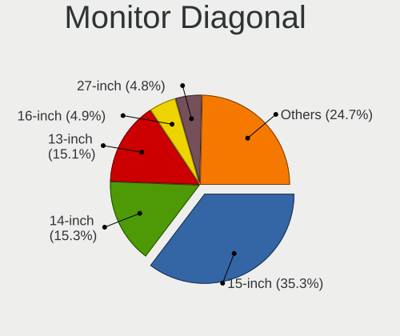

| Inches  | Notebooks | Percent |
|---------|-----------|---------|
| 15      | 6396      | 35.32%  |
| 14      | 2767      | 15.28%  |
| 13      | 2728      | 15.06%  |
| 16      | 891       | 4.92%   |
| 27      | 864       | 4.77%   |
| 17      | 832       | 4.59%   |
| 24      | 698       | 3.85%   |
| 23      | 434       | 2.4%    |
| 12      | 387       | 2.14%   |
| 21      | 379       | 2.09%   |
| 31      | 294       | 1.62%   |
| 34      | 245       | 1.35%   |
| 11      | 175       | 0.97%   |
| Unknown | 130       | 0.72%   |
| 18      | 124       | 0.68%   |
| 19      | 65        | 0.36%   |
| 20      | 63        | 0.35%   |
| 22      | 57        | 0.31%   |
| 40      | 49        | 0.27%   |
| 32      | 43        | 0.24%   |
| 63      | 41        | 0.23%   |
| 84      | 40        | 0.22%   |
| 25      | 36        | 0.2%    |
| 26      | 35        | 0.19%   |
| 28      | 32        | 0.18%   |
| 72      | 27        | 0.15%   |
| 54      | 27        | 0.15%   |
| 29      | 24        | 0.13%   |
| 10      | 22        | 0.12%   |
| 48      | 18        | 0.1%    |
| 37      | 17        | 0.09%   |
| 35      | 17        | 0.09%   |
| 42      | 12        | 0.07%   |
| 39      | 12        | 0.07%   |
| 52      | 11        | 0.06%   |
| 86      | 9         | 0.05%   |
| 33      | 9         | 0.05%   |
| 74      | 8         | 0.04%   |
| 7       | 8         | 0.04%   |
| 36      | 7         | 0.04%   |

Monitor Width
-------------

Physical width

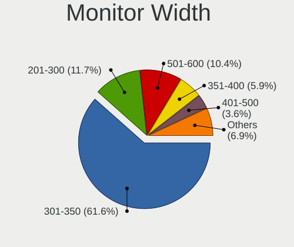

| Width in mm    | Notebooks | Percent |
|----------------|-----------|---------|
| 301-350        | 11026     | 61.56%  |
| 201-300        | 2097      | 11.71%  |
| 501-600        | 1854      | 10.35%  |
| 351-400        | 1048      | 5.85%   |
| 401-500        | 647       | 3.61%   |
| 601-700        | 433       | 2.42%   |
| 701-800        | 301       | 1.68%   |
| 1001-1500      | 149       | 0.83%   |
| Unknown        | 130       | 0.73%   |
| 801-900        | 98        | 0.55%   |
| 1501-2000      | 80        | 0.45%   |
| 901-1000       | 25        | 0.14%   |
| 1-100          | 9         | 0.05%   |
| 101-200        | 8         | 0.04%   |
| More than 2000 | 7         | 0.04%   |

Aspect Ratio
------------

Proportional relationship between the width and the height

| Ratio   | Notebooks | Percent |
|---------|-----------|---------|
| 16/9    | 11847     | 75.18%  |
| 16/10   | 3005      | 19.07%  |
| 3/2     | 343       | 2.18%   |
| 21/9    | 301       | 1.91%   |
| Unknown | 92        | 0.58%   |
| 5/4     | 53        | 0.34%   |
| 4/3     | 28        | 0.18%   |
| 32/9    | 28        | 0.18%   |
| 3.40    | 14        | 0.09%   |
| 0.56    | 13        | 0.08%   |
| 1.00    | 7         | 0.04%   |
| 0.67    | 7         | 0.04%   |
| 0.62    | 4         | 0.03%   |
| 3.73    | 3         | 0.02%   |
| 0.89    | 3         | 0.02%   |
| 0.63    | 3         | 0.02%   |
| 6/5     | 2         | 0.01%   |
| 3.33    | 2         | 0.01%   |
| 2.65    | 2         | 0.01%   |
| 3.88    | 1         | 0.01%   |
| 2.12    | 1         | 0.01%   |

Monitor Area
------------

Area in inch²

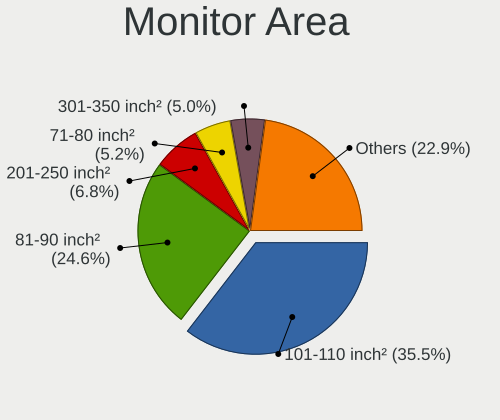

| Area in inch² | Notebooks | Percent |
|----------------|-----------|---------|
| 101-110        | 6402      | 35.47%  |
| 81-90          | 4448      | 24.64%  |
| 201-250        | 1233      | 6.83%   |
| 71-80          | 947       | 5.25%   |
| 301-350        | 895       | 4.96%   |
| 111-120        | 869       | 4.81%   |
| 121-130        | 757       | 4.19%   |
| 351-500        | 635       | 3.52%   |
| 61-70          | 372       | 2.06%   |
| 251-300        | 267       | 1.48%   |
| 151-200        | 209       | 1.16%   |
| More than 1000 | 202       | 1.12%   |
| 51-60          | 190       | 1.05%   |
| 501-1000       | 145       | 0.8%    |
| 141-150        | 137       | 0.76%   |
| Unknown        | 130       | 0.72%   |
| 91-100         | 112       | 0.62%   |
| 131-140        | 63        | 0.35%   |
| 41-50          | 21        | 0.12%   |
| 1-40           | 17        | 0.09%   |

Pixel Density
-------------

Pixels per inch

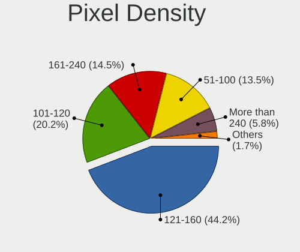

| Density       | Notebooks | Percent |
|---------------|-----------|---------|
| 121-160       | 7819      | 44.2%   |
| 101-120       | 3573      | 20.2%   |
| 161-240       | 2572      | 14.54%  |
| 51-100        | 2393      | 13.53%  |
| More than 240 | 1027      | 5.81%   |
| 1-50          | 177       | 1%      |
| Unknown       | 130       | 0.73%   |

Multiple Monitors
-----------------

Total monitors connected

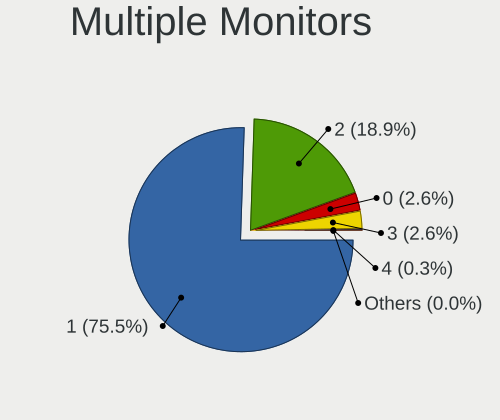

| Total | Notebooks | Percent |
|-------|-----------|---------|
| 1     | 11740     | 75.52%  |
| 2     | 2941      | 18.92%  |
| 0     | 410       | 2.64%   |
| 3     | 404       | 2.6%    |
| 4     | 45        | 0.29%   |
| 5     | 5         | 0.03%   |

Network
-------

Net Controller Vendor
---------------------

Controller vendors

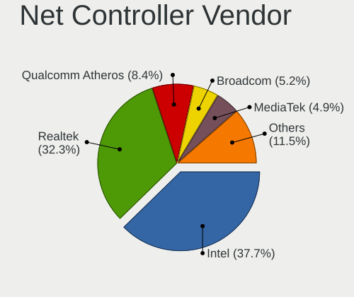

| Vendor                                 | Notebooks | Percent |
|----------------------------------------|-----------|---------|
| Intel                                  | 8657      | 37.69%  |
| Realtek Semiconductor                  | 7414      | 32.27%  |
| Qualcomm Atheros                       | 1939      | 8.44%   |
| Broadcom                               | 1194      | 5.2%    |
| MediaTek                               | 1129      | 4.91%   |
| Broadcom Limited                       | 302       | 1.31%   |
| ASIX Electronics                       | 232       | 1.01%   |
| Qualcomm                               | 204       | 0.89%   |
| TP-Link                                | 164       | 0.71%   |
| Lenovo                                 | 164       | 0.71%   |
| Shenzhen Goodix Technology             | 163       | 0.71%   |
| Samsung Electronics                    | 116       | 0.5%    |
| Sierra Wireless                        | 114       | 0.5%    |
| DisplayLink                            | 88        | 0.38%   |
| Dell                                   | 86        | 0.37%   |
| Ralink                                 | 83        | 0.36%   |
| Xiaomi                                 | 78        | 0.34%   |
| Ralink Technology                      | 75        | 0.33%   |
| Marvell Technology Group               | 72        | 0.31%   |
| Nvidia                                 | 51        | 0.22%   |
| Hewlett-Packard                        | 51        | 0.22%   |
| Google                                 | 44        | 0.19%   |
| Ericsson Business Mobile Networks      | 44        | 0.19%   |
| OPPO Electronics                       | 36        | 0.16%   |
| Apple                                  | 36        | 0.16%   |
| ASUSTek Computer                       | 32        | 0.14%   |
| Huawei Technologies                    | 31        | 0.13%   |
| Qualcomm Technologies                  | 29        | 0.13%   |
| NetGear                                | 26        | 0.11%   |
| Fibocom                                | 26        | 0.11%   |
| Motorola PCS                           | 22        | 0.1%    |
| D-Link                                 | 22        | 0.1%    |
| JMicron Technology                     | 20        | 0.09%   |
| Qualcomm Atheros Communications        | 16        | 0.07%   |
| D-Link System                          | 15        | 0.07%   |
| Edimax Technology                      | 13        | 0.06%   |
| Suzhou Motorcomm Electronic Technology | 12        | 0.05%   |
| Microsoft                              | 12        | 0.05%   |
| Linksys                                | 10        | 0.04%   |
| Cypress Semiconductor                  | 8         | 0.03%   |

Net Controller Model
--------------------

Controller models

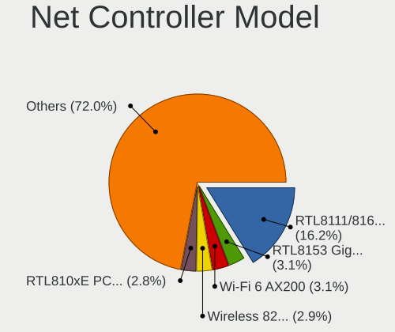

| Model                                                                  | Notebooks | Percent |
|------------------------------------------------------------------------|-----------|---------|
| Realtek RTL8111/8168/8211/8411 PCI Express Gigabit Ethernet Controller | 4458      | 16.15%  |
| Realtek RTL8153 Gigabit Ethernet Adapter                               | 851       | 3.08%   |
| Intel Wi-Fi 6 AX200                                                    | 844       | 3.06%   |
| Intel Wireless 8265 / 8275                                             | 813       | 2.95%   |
| Realtek RTL810xE PCI Express Fast Ethernet controller                  | 767       | 2.78%   |
| Intel Wi-Fi 6 AX201                                                    | 743       | 2.69%   |
| Intel Alder Lake-P PCH CNVi WiFi                                       | 581       | 2.11%   |
| MediaTek MT7921 802.11ax PCIe Wireless Network Adapter [Filogic 330]   | 500       | 1.81%   |
| Realtek RTL8822CE 802.11ac PCIe Wireless Network Adapter               | 486       | 1.76%   |
| Qualcomm Atheros QCA9377 802.11ac Wireless Network Adapter             | 477       | 1.73%   |
| Intel Wireless 8260                                                    | 420       | 1.52%   |
| Qualcomm Atheros QCA6174 802.11ac Wireless Network Adapter             | 408       | 1.48%   |
| Realtek RTL8821CE 802.11ac PCIe Wireless Network Adapter               | 402       | 1.46%   |
| Intel Wireless 7265                                                    | 396       | 1.43%   |
| Intel 82579LM Gigabit Network Connection (Lewisville)                  | 395       | 1.43%   |
| Intel Comet Lake PCH-LP CNVi WiFi                                      | 375       | 1.36%   |
| Intel Wireless 7260                                                    | 370       | 1.34%   |
| MediaTek MT7922 802.11ax PCI Express Wireless Network Adapter          | 364       | 1.32%   |
| Intel Ethernet Connection (4) I219-LM                                  | 348       | 1.26%   |
| Intel Comet Lake PCH CNVi WiFi                                         | 338       | 1.22%   |
| Intel Cannon Lake PCH CNVi WiFi                                        | 331       | 1.2%    |
| Intel Wi-Fi 6E(802.11ax) AX210/AX1675* 2x2 [Typhoon Peak]              | 328       | 1.19%   |
| Intel Cannon Point-LP CNVi [Wireless-AC]                               | 314       | 1.14%   |
| Intel Raptor Lake PCH CNVi WiFi                                        | 308       | 1.12%   |
| Qualcomm Atheros QCA9565 / AR9565 Wireless Network Adapter             | 269       | 0.97%   |
| Realtek RTL8852BE PCIe 802.11ax Wireless Network Controller            | 255       | 0.92%   |
| Intel Centrino Advanced-N 6205 [Taylor Peak]                           | 241       | 0.87%   |
| Qualcomm Atheros AR9485 Wireless Network Adapter                       | 221       | 0.8%    |
| ASIX AX88179 Gigabit Ethernet                                          | 214       | 0.78%   |
| Intel Ethernet Connection I219-LM                                      | 198       | 0.72%   |
| Intel Wireless 3165                                                    | 186       | 0.67%   |
| Intel Ethernet Connection (4) I219-V                                   | 180       | 0.65%   |
| Intel Meteor Lake PCH CNVi WiFi                                        | 179       | 0.65%   |
| Broadcom BCM43142 802.11b/g/n                                          | 177       | 0.64%   |
| Realtek RTL8852AE 802.11ax PCIe Wireless Network Adapter               | 162       | 0.59%   |
| Realtek RTL8125 2.5GbE Controller                                      | 160       | 0.58%   |
| Qualcomm QCNFA765 Wireless Network Adapter                             | 160       | 0.58%   |
| Shenzhen Goodix Fingerprint Reader                                     | 159       | 0.58%   |
| Broadcom BCM4331 802.11a/b/g/n                                         | 156       | 0.57%   |
| Realtek RTL8723BE PCIe Wireless Network Adapter                        | 153       | 0.55%   |

Wireless Vendor
---------------

Wireless vendors

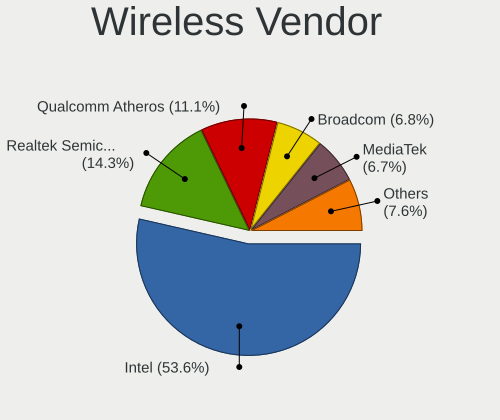

| Vendor                                | Notebooks | Percent |
|---------------------------------------|-----------|---------|
| Intel                                 | 8092      | 53.56%  |
| Realtek Semiconductor                 | 2160      | 14.3%   |
| Qualcomm Atheros                      | 1673      | 11.07%  |
| Broadcom                              | 1026      | 6.79%   |
| MediaTek                              | 1010      | 6.69%   |
| Broadcom Limited                      | 263       | 1.74%   |
| Qualcomm                              | 179       | 1.18%   |
| TP-Link                               | 128       | 0.85%   |
| Sierra Wireless                       | 114       | 0.75%   |
| Ralink                                | 83        | 0.55%   |
| Ralink Technology                     | 75        | 0.5%    |
| Dell                                  | 67        | 0.44%   |
| ASUSTek Computer                      | 30        | 0.2%    |
| Fibocom                               | 26        | 0.17%   |
| NetGear                               | 25        | 0.17%   |
| Qualcomm Technologies                 | 22        | 0.15%   |
| D-Link                                | 19        | 0.13%   |
| Qualcomm Atheros Communications       | 16        | 0.11%   |
| Hewlett-Packard                       | 15        | 0.1%    |
| Edimax Technology                     | 13        | 0.09%   |
| D-Link System                         | 13        | 0.09%   |
| Microsoft                             | 9         | 0.06%   |
| Linksys                               | 9         | 0.06%   |
| Realtek                               | 7         | 0.05%   |
| Unknown                               | 7         | 0.05%   |
| Quectel Wireless Solutions            | 6         | 0.04%   |
| Belkin Components                     | 4         | 0.03%   |
| ZyXEL Communications                  | 3         | 0.02%   |
| TRENDnet                              | 2         | 0.01%   |
| Mercucys                              | 2         | 0.01%   |
| 802.11g Adapter [Linksys WUSB54GC v3] | 2         | 0.01%   |
| ZyDAS                                 | 1         | 0.01%   |
| Wacom                                 | 1         | 0.01%   |
| Sitecom Europe                        | 1         | 0.01%   |
| IMC Networks                          | 1         | 0.01%   |
| Guillemot                             | 1         | 0.01%   |
| AVM                                   | 1         | 0.01%   |
| AirTies Wireless Networks             | 1         | 0.01%   |

Wireless Model
--------------

Wireless models

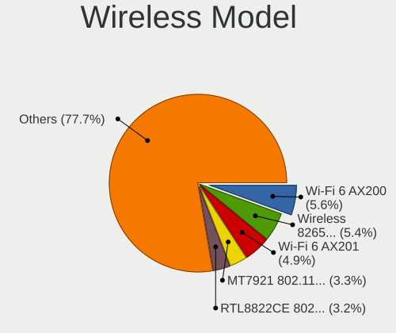

| Model                                                                | Notebooks | Percent |
|----------------------------------------------------------------------|-----------|---------|
| Intel Wi-Fi 6 AX200                                                  | 844       | 5.56%   |
| Intel Wireless 8265 / 8275                                           | 813       | 5.35%   |
| Intel Wi-Fi 6 AX201                                                  | 743       | 4.89%   |
| MediaTek MT7921 802.11ax PCIe Wireless Network Adapter [Filogic 330] | 500       | 3.29%   |
| Realtek RTL8822CE 802.11ac PCIe Wireless Network Adapter             | 486       | 3.2%    |
| Qualcomm Atheros QCA9377 802.11ac Wireless Network Adapter           | 477       | 3.14%   |
| Intel Wireless 8260                                                  | 420       | 2.77%   |
| Qualcomm Atheros QCA6174 802.11ac Wireless Network Adapter           | 408       | 2.69%   |
| Realtek RTL8821CE 802.11ac PCIe Wireless Network Adapter             | 402       | 2.65%   |
| Intel Wireless 7265                                                  | 396       | 2.61%   |
| Intel Comet Lake PCH-LP CNVi WiFi                                    | 375       | 2.47%   |
| Intel Wireless 7260                                                  | 370       | 2.44%   |
| Intel Alder Lake-P PCH CNVi WiFi                                     | 349       | 2.3%    |
| Intel Comet Lake PCH CNVi WiFi                                       | 338       | 2.23%   |
| Intel Cannon Lake PCH CNVi WiFi                                      | 331       | 2.18%   |
| Intel Wi-Fi 6E(802.11ax) AX210/AX1675* 2x2 [Typhoon Peak]            | 328       | 2.16%   |
| Intel Cannon Point-LP CNVi [Wireless-AC]                             | 314       | 2.07%   |
| Intel Raptor Lake PCH CNVi WiFi                                      | 295       | 1.94%   |
| MediaTek MT7922 802.11ax PCI Express Wireless Network Adapter        | 284       | 1.87%   |
| Qualcomm Atheros QCA9565 / AR9565 Wireless Network Adapter           | 269       | 1.77%   |
| Intel Centrino Advanced-N 6205 [Taylor Peak]                         | 241       | 1.59%   |
| Realtek RTL8852BE PCIe 802.11ax Wireless Network Controller          | 238       | 1.57%   |
| Qualcomm Atheros AR9485 Wireless Network Adapter                     | 221       | 1.46%   |
| Intel Wireless 3165                                                  | 186       | 1.22%   |
| Intel Meteor Lake PCH CNVi WiFi                                      | 179       | 1.18%   |
| Broadcom BCM43142 802.11b/g/n                                        | 177       | 1.17%   |
| Realtek RTL8852AE 802.11ax PCIe Wireless Network Adapter             | 162       | 1.07%   |
| Qualcomm QCNFA765 Wireless Network Adapter                           | 158       | 1.04%   |
| Broadcom BCM4331 802.11a/b/g/n                                       | 156       | 1.03%   |
| Realtek RTL8723BE PCIe Wireless Network Adapter                      | 153       | 1.01%   |
| Intel Wi-Fi 5(802.11ac) Wireless-AC 9x6x [Thunder Peak]              | 148       | 0.97%   |
| Intel Tiger Lake PCH CNVi WiFi                                       | 147       | 0.97%   |
| Qualcomm Atheros AR9285 Wireless Network Adapter (PCI-Express)       | 141       | 0.93%   |
| Intel Ice Lake-LP PCH CNVi WiFi                                      | 131       | 0.86%   |
| Realtek RTL8822BE 802.11a/b/g/n/ac WiFi adapter                      | 130       | 0.86%   |
| Broadcom Limited BCM4360 802.11ac Dual Band Wireless Network Adapter | 130       | 0.86%   |
| Intel Dual Band Wireless-AC 3165 Plus Bluetooth                      | 124       | 0.82%   |
| Intel Wireless 3160                                                  | 119       | 0.78%   |
| Intel Centrino Ultimate-N 6300                                       | 113       | 0.74%   |
| MediaTek MT7902 802.11ax PCIe Wireless Network Adapter [Filogic 310] | 111       | 0.73%   |

Ethernet Vendor
---------------

Ethernet vendors

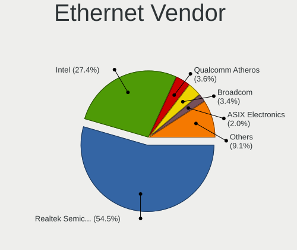

| Vendor                                 | Notebooks | Percent |
|----------------------------------------|-----------|---------|
| Realtek Semiconductor                  | 6404      | 54.47%  |
| Intel                                  | 3225      | 27.43%  |
| Qualcomm Atheros                       | 420       | 3.57%   |
| Broadcom                               | 402       | 3.42%   |
| ASIX Electronics                       | 232       | 1.97%   |
| Lenovo                                 | 158       | 1.34%   |
| MediaTek                               | 122       | 1.04%   |
| Samsung Electronics                    | 116       | 0.99%   |
| DisplayLink                            | 88        | 0.75%   |
| Xiaomi                                 | 78        | 0.66%   |
| Marvell Technology Group               | 72        | 0.61%   |
| Nvidia                                 | 51        | 0.43%   |
| Google                                 | 44        | 0.37%   |
| Broadcom Limited                       | 40        | 0.34%   |
| TP-Link                                | 38        | 0.32%   |
| OPPO Electronics                       | 36        | 0.31%   |
| Apple                                  | 36        | 0.31%   |
| Qualcomm                               | 25        | 0.21%   |
| Motorola PCS                           | 22        | 0.19%   |
| Huawei Technologies                    | 21        | 0.18%   |
| JMicron Technology                     | 20        | 0.17%   |
| Hewlett-Packard                        | 17        | 0.14%   |
| Suzhou Motorcomm Electronic Technology | 12        | 0.1%    |
| Cypress Semiconductor                  | 8         | 0.07%   |
| Qualcomm Technologies                  | 7         | 0.06%   |
| Motorcomm Microelectronics.            | 7         | 0.06%   |
| ICS Advent                             | 7         | 0.06%   |
| Sony Ericsson Mobile Communications AB | 5         | 0.04%   |
| OnePlus Technology (Shenzhen)          | 5         | 0.04%   |
| Aquantia                               | 5         | 0.04%   |
| Spreadtrum Communications              | 4         | 0.03%   |
| vivo                                   | 3         | 0.03%   |
| T & A Mobile Phones                    | 3         | 0.03%   |
| Microsoft                              | 3         | 0.03%   |
| D-Link                                 | 3         | 0.03%   |
| ZTE WCDMA Technologies MSM             | 2         | 0.02%   |
| Silicon Integrated Systems [SiS]       | 2         | 0.02%   |
| D-Link System                          | 2         | 0.02%   |
| ASUSTek Computer                       | 2         | 0.02%   |
| Rivet                                  | 1         | 0.01%   |

Ethernet Model
--------------

Ethernet models

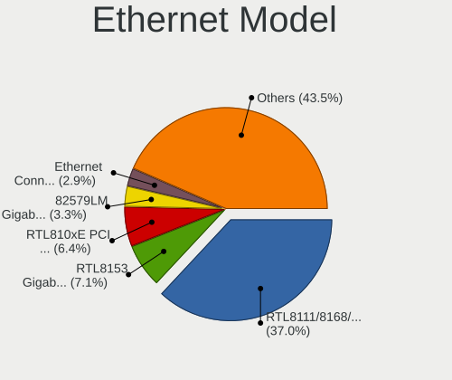

| Model                                                                  | Notebooks | Percent |
|------------------------------------------------------------------------|-----------|---------|
| Realtek RTL8111/8168/8211/8411 PCI Express Gigabit Ethernet Controller | 4458      | 36.96%  |
| Realtek RTL8153 Gigabit Ethernet Adapter                               | 851       | 7.06%   |
| Realtek RTL810xE PCI Express Fast Ethernet controller                  | 767       | 6.36%   |
| Intel 82579LM Gigabit Network Connection (Lewisville)                  | 395       | 3.28%   |
| Intel Ethernet Connection (4) I219-LM                                  | 348       | 2.89%   |
| Intel Alder Lake-P PCH CNVi WiFi                                       | 232       | 1.92%   |
| ASIX AX88179 Gigabit Ethernet                                          | 214       | 1.77%   |
| Intel Ethernet Connection I219-LM                                      | 198       | 1.64%   |
| Intel Ethernet Connection (4) I219-V                                   | 180       | 1.49%   |
| Realtek RTL8125 2.5GbE Controller                                      | 160       | 1.33%   |
| Broadcom NetXtreme BCM57765 Gigabit Ethernet PCIe                      | 150       | 1.24%   |
| Intel Ethernet Connection I217-LM                                      | 132       | 1.09%   |
| Intel Ethernet Connection I218-LM                                      | 128       | 1.06%   |
| Intel Ethernet Connection (6) I219-LM                                  | 125       | 1.04%   |
| Realtek Killer E2600 GbE Controller                                    | 120       | 0.99%   |
| Intel Ethernet Connection (3) I218-LM                                  | 119       | 0.99%   |
| Intel Ethernet Connection (7) I219-LM                                  | 110       | 0.91%   |
| Intel Ethernet Connection (6) I219-V                                   | 108       | 0.9%    |
| Intel Ethernet Connection (10) I219-V                                  | 92        | 0.76%   |
| Samsung Galaxy series, misc. (tethering mode)                          | 86        | 0.71%   |
| MediaTek MT7922 802.11ax PCI Express Wireless Network Adapter          | 80        | 0.66%   |
| Intel 82577LM Gigabit Network Connection                               | 78        | 0.65%   |
| Intel Ethernet Connection (2) I219-LM                                  | 75        | 0.62%   |
| Intel Ethernet Connection (13) I219-V                                  | 71        | 0.59%   |
| Realtek RTL8152 Fast Ethernet Adapter                                  | 67        | 0.56%   |
| Intel Ethernet Connection I219-V                                       | 67        | 0.56%   |
| Intel Ethernet Connection (16) I219-V                                  | 63        | 0.52%   |
| Qualcomm Atheros Killer E2500 Gigabit Ethernet Controller              | 60        | 0.5%    |
| Intel Ethernet Connection (10) I219-LM                                 | 60        | 0.5%    |
| Xiaomi Mi/Redmi series (RNDIS)                                         | 58        | 0.48%   |
| Realtek Killer E3000 2.5GbE Controller                                 | 57        | 0.47%   |
| Qualcomm Atheros AR8151 v2.0 Gigabit Ethernet                          | 57        | 0.47%   |
| Broadcom NetLink BCM57785 Gigabit Ethernet PCIe                        | 53        | 0.44%   |
| Lenovo ThinkPad TBT 3 Dock                                             | 52        | 0.43%   |
| Intel Ethernet Connection (18) I219-LM                                 | 51        | 0.42%   |
| Intel Ethernet Connection (16) I219-LM                                 | 51        | 0.42%   |
| Qualcomm Atheros Killer E2400 Gigabit Ethernet Controller              | 49        | 0.41%   |
| Nvidia MCP79 Ethernet                                                  | 46        | 0.38%   |
| Intel Ethernet Connection (13) I219-LM                                 | 44        | 0.36%   |
| Broadcom NetXtreme BCM57786 Gigabit Ethernet PCIe                      | 43        | 0.36%   |

Net Controller Kind
-------------------

Ethernet, WiFi or modem

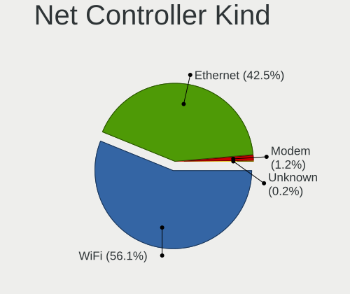

| Kind     | Notebooks | Percent |
|----------|-----------|---------|
| WiFi     | 14353     | 56.14%  |
| Ethernet | 10865     | 42.49%  |
| Modem    | 304       | 1.19%   |
| Unknown  | 46        | 0.18%   |

Used Controller
---------------

Currently used network controller

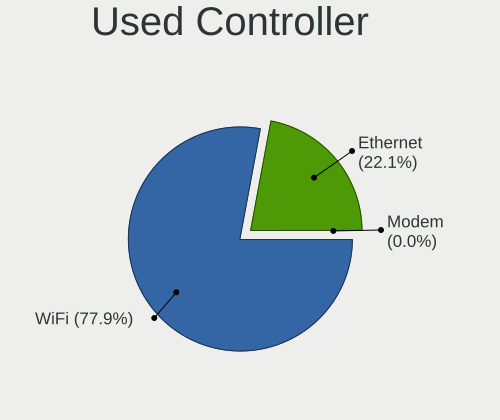

| Kind     | Notebooks | Percent |
|----------|-----------|---------|
| WiFi     | 12351     | 77.92%  |
| Ethernet | 3497      | 22.06%  |
| Modem    | 3         | 0.02%   |

NICs
----

Total network controllers on board

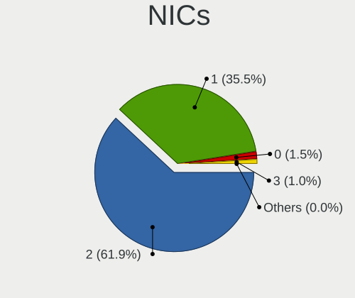

| Total | Notebooks | Percent |
|-------|-----------|---------|
| 2     | 9345      | 61.94%  |
| 1     | 5362      | 35.54%  |
| 0     | 230       | 1.52%   |
| 3     | 147       | 0.97%   |
| 5     | 1         | 0.01%   |
| 4     | 1         | 0.01%   |

IPv6
----

IPv6 vs IPv4

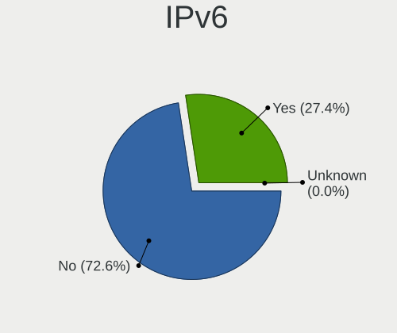

| Used    | Notebooks | Percent |
|---------|-----------|---------|
| No      | 11193     | 72.62%  |
| Yes     | 4218      | 27.36%  |
| Unknown | 3         | 0.02%   |

Bluetooth
---------

Bluetooth Vendor
----------------

Controller vendors

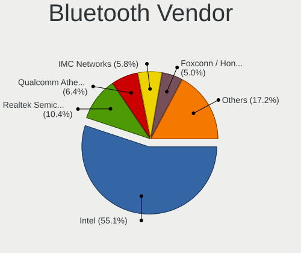

| Vendor                          | Notebooks | Percent |
|---------------------------------|-----------|---------|
| Intel                           | 7274      | 55.09%  |
| Realtek Semiconductor           | 1375      | 10.41%  |
| Qualcomm Atheros Communications | 847       | 6.42%   |
| IMC Networks                    | 771       | 5.84%   |
| Foxconn / Hon Hai               | 662       | 5.01%   |
| Apple                           | 549       | 4.16%   |
| Lite-On Technology              | 428       | 3.24%   |
| Broadcom                        | 416       | 3.15%   |
| MediaTek                        | 155       | 1.17%   |
| Realtek                         | 141       | 1.07%   |
| USI                             | 96        | 0.73%   |
| Dell                            | 85        | 0.64%   |
| Cambridge Silicon Radio         | 84        | 0.64%   |
| Hewlett-Packard                 | 60        | 0.45%   |
| Ralink                          | 49        | 0.37%   |
| Toshiba                         | 45        | 0.34%   |
| Foxconn International           | 36        | 0.27%   |
| ASUSTek Computer                | 28        | 0.21%   |
| Opticis                         | 16        | 0.12%   |
| TP-Link                         | 15        | 0.11%   |
| Ralink Technology               | 13        | 0.1%    |
| Smart Modular Technologies      | 9         | 0.07%   |
| Alps Electric                   | 9         | 0.07%   |
| Fujitsu                         | 6         | 0.05%   |
| Unknown                         | 6         | 0.05%   |
| Askey Computer                  | 5         | 0.04%   |
| Chicony Electronics             | 4         | 0.03%   |
| Taiyo Yuden                     | 3         | 0.02%   |
| Edimax Technology               | 3         | 0.02%   |
| Actions                         | 3         | 0.02%   |
| Qcom                            | 2         | 0.02%   |
| Mercucys                        | 2         | 0.02%   |
| Syntek                          | 1         | 0.01%   |
| Roper                           | 1         | 0.01%   |
| Micro Star International        | 1         | 0.01%   |
| Dynex                           | 1         | 0.01%   |
| Corsair                         | 1         | 0.01%   |
| Belkin Components               | 1         | 0.01%   |

Bluetooth Model
---------------

Controller models

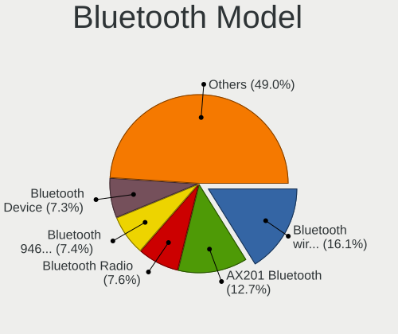

| Model                                               | Notebooks | Percent |
|-----------------------------------------------------|-----------|---------|
| Intel Bluetooth wireless interface                  | 2133      | 16.14%  |
| Intel AX201 Bluetooth                               | 1676      | 12.68%  |
| Realtek Bluetooth Radio                             | 1002      | 7.58%   |
| Intel Bluetooth 9460/9560 Jefferson Peak (JfP)      | 976       | 7.38%   |
| Intel Bluetooth Device                              | 959       | 7.25%   |
| Intel AX200 Bluetooth                               | 822       | 6.22%   |
| Qualcomm Atheros  Bluetooth Device                  | 490       | 3.71%   |
| IMC Networks Wireless_Device                        | 441       | 3.34%   |
| Apple Bluetooth Host Controller                     | 335       | 2.53%   |
| Intel AX210 Bluetooth                               | 317       | 2.4%    |
| Realtek  Bluetooth 4.2 Adapter                      | 250       | 1.89%   |
| Foxconn / Hon Hai Wireless_Device                   | 243       | 1.84%   |
| IMC Networks Bluetooth Radio                        | 181       | 1.37%   |
| Apple Bluetooth USB Host Controller                 | 175       | 1.32%   |
| MediaTek Wireless_Device                            | 154       | 1.16%   |
| Foxconn / Hon Hai Bluetooth Device                  | 150       | 1.13%   |
| Foxconn / Hon Hai MediaTek Bluetooth Adapter        | 148       | 1.12%   |
| Qualcomm Atheros QCA61x4 Bluetooth 4.0              | 144       | 1.09%   |
| Realtek Bluetooth Radio                             | 141       | 1.07%   |
| Intel Wireless-AC 9260 Bluetooth Adapter            | 129       | 0.98%   |
| Intel Centrino Bluetooth Wireless Transceiver       | 129       | 0.98%   |
| Lite-On Qualcomm Atheros QCA9377 Bluetooth          | 126       | 0.95%   |
| USI Bluetooth Device                                | 96        | 0.73%   |
| Lite-On Wireless_Device                             | 95        | 0.72%   |
| Lite-On Bluetooth Device                            | 94        | 0.71%   |
| Qualcomm Atheros AR3012 Bluetooth 4.0               | 90        | 0.68%   |
| Intel Wireless-AC 3168 Bluetooth                    | 86        | 0.65%   |
| Cambridge Silicon Radio Bluetooth Dongle (HCI mode) | 84        | 0.64%   |
| IMC Networks Bluetooth Device                       | 78        | 0.59%   |
| Broadcom BCM20702 Bluetooth 4.0 [ThinkPad]          | 77        | 0.58%   |
| Qualcomm Atheros AR3011 Bluetooth                   | 70        | 0.53%   |
| Broadcom BCM2045B (BDC-2.1)                         | 66        | 0.5%    |
| Realtek RTL8822BE Bluetooth 4.2 Adapter             | 50        | 0.38%   |
| Ralink RT3290 Bluetooth                             | 49        | 0.37%   |
| HP Broadcom 2070 Bluetooth Combo                    | 45        | 0.34%   |
| Intel Centrino Advanced-N 6230 Bluetooth adapter    | 41        | 0.31%   |
| Realtek RTL8723B Bluetooth                          | 36        | 0.27%   |
| Lite-On Atheros AR3012 Bluetooth                    | 36        | 0.27%   |
| Foxconn International BCM43142A0 Bluetooth module   | 36        | 0.27%   |
| Dell DW375 Bluetooth Module                         | 36        | 0.27%   |

Sound
-----

Sound Vendor
------------

Sound card vendors

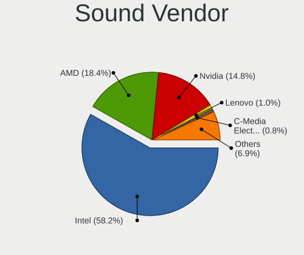

| Vendor                      | Notebooks | Percent |
|-----------------------------|-----------|---------|
| Intel                       | 11380     | 58.19%  |
| AMD                         | 3592      | 18.37%  |
| Nvidia                      | 2887      | 14.76%  |
| Lenovo                      | 193       | 0.99%   |
| C-Media Electronics         | 150       | 0.77%   |
| Realtek Semiconductor       | 131       | 0.67%   |
| Logitech                    | 122       | 0.62%   |
| GN Netcom                   | 113       | 0.58%   |
| Hewlett-Packard             | 71        | 0.36%   |
| Plantronics                 | 64        | 0.33%   |
| JMTek                       | 53        | 0.27%   |
| Sony                        | 49        | 0.25%   |
| Apple                       | 47        | 0.24%   |
| Kingston Technology         | 41        | 0.21%   |
| Texas Instruments           | 40        | 0.2%    |
| SteelSeries ApS             | 31        | 0.16%   |
| Razer USA                   | 31        | 0.16%   |
| Generalplus Technology      | 31        | 0.16%   |
| Creative Technology         | 28        | 0.14%   |
| ASUSTek Computer            | 28        | 0.14%   |
| DSEA A/S                    | 25        | 0.13%   |
| Focusrite-Novation          | 21        | 0.11%   |
| Corsair                     | 19        | 0.1%    |
| Dell                        | 16        | 0.08%   |
| Samson Technologies         | 15        | 0.08%   |
| RODE Microphones            | 14        | 0.07%   |
| Microsoft                   | 14        | 0.07%   |
| Conexant Systems            | 13        | 0.07%   |
| BEHRINGER International     | 12        | 0.06%   |
| Samsung Electronics         | 11        | 0.06%   |
| No brand                    | 11        | 0.06%   |
| Blue Microphones            | 11        | 0.06%   |
| FiiO Electronics Technology | 10        | 0.05%   |
| XMOS                        | 9         | 0.05%   |
| Walmart                     | 9         | 0.05%   |
| Jieli Technology            | 9         | 0.05%   |
| Tenx Technology             | 8         | 0.04%   |
| GYROCOM C&C                 | 7         | 0.04%   |
| FIFINE Microphones          | 7         | 0.04%   |
| Unknown                     | 7         | 0.04%   |

Sound Model
-----------

Sound card models

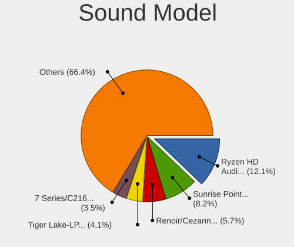

| Model                                                                      | Notebooks | Percent |
|----------------------------------------------------------------------------|-----------|---------|
| AMD Ryzen HD Audio Controller                                              | 2912      | 12.14%  |
| Intel Sunrise Point-LP HD Audio                                            | 1976      | 8.24%   |
| AMD Renoir/Cezanne HDMI/DP Audio Controller                                | 1357      | 5.66%   |
| Intel Tiger Lake-LP Smart Sound Technology Audio Controller                | 974       | 4.06%   |
| Intel 7 Series/C216 Chipset Family High Definition Audio Controller        | 849       | 3.54%   |
| AMD Radeon High Definition Audio Controller                                | 845       | 3.52%   |
| Intel Alder Lake PCH-P High Definition Audio Controller                    | 780       | 3.25%   |
| Intel Cannon Lake PCH cAVS                                                 | 633       | 2.64%   |
| Intel Cannon Point-LP High Definition Audio Controller                     | 523       | 2.18%   |
| Intel 6 Series/C200 Series Chipset Family High Definition Audio Controller | 521       | 2.17%   |
| Intel Haswell-ULT HD Audio Controller                                      | 488       | 2.03%   |
| Intel 8 Series HD Audio Controller                                         | 485       | 2.02%   |
| AMD Raven/Raven2/Fenghuang HDMI/DP Audio Controller                        | 484       | 2.02%   |
| Intel Broadwell-U Audio Controller                                         | 480       | 2%      |
| Intel Wildcat Point-LP High Definition Audio Controller                    | 477       | 1.99%   |
| Intel Comet Lake PCH-LP cAVS                                               | 471       | 1.96%   |
| Intel 8 Series/C220 Series Chipset High Definition Audio Controller        | 444       | 1.85%   |
| Intel Raptor Lake-P/U/H cAVS                                               | 407       | 1.7%    |
| Intel Comet Lake PCH cAVS                                                  | 388       | 1.62%   |
| Nvidia TU107 GeForce GTX 1650 High Definition Audio Controller             | 357       | 1.49%   |
| Intel Xeon E3-1200 v3/4th Gen Core Processor HD Audio Controller           | 301       | 1.26%   |
| Intel 5 Series/3400 Series Chipset High Definition Audio                   | 268       | 1.12%   |
| Intel CM238 HD Audio Controller                                            | 264       | 1.1%    |
| Nvidia GA107 High Definition Audio Controller                              | 257       | 1.07%   |
| Nvidia GP107GL High Definition Audio Controller                            | 246       | 1.03%   |
| Nvidia GA106 High Definition Audio Controller                              | 244       | 1.02%   |
| Intel Ice Lake-LP Smart Sound Technology Audio Controller                  | 243       | 1.01%   |
| Nvidia AD107 High Definition Audio Controller                              | 235       | 0.98%   |
| Intel Meteor Lake-P HD Audio Controller                                    | 226       | 0.94%   |
| Intel Tiger Lake-H HD Audio Controller                                     | 222       | 0.93%   |
| Intel 100 Series/C230 Series Chipset Family HD Audio Controller            | 217       | 0.9%    |
| AMD FCH Azalia Controller                                                  | 191       | 0.8%    |
| Nvidia TU106 High Definition Audio Controller                              | 169       | 0.7%    |
| Nvidia GA104 High Definition Audio Controller                              | 165       | 0.69%   |
| Intel Celeron/Pentium Silver Processor High Definition Audio               | 159       | 0.66%   |
| Intel 82801I (ICH9 Family) HD Audio Controller                             | 156       | 0.65%   |
| AMD Kabini HDMI/DP Audio                                                   | 147       | 0.61%   |
| Nvidia GK107 HDMI Audio Controller                                         | 145       | 0.6%    |
| Realtek Semiconductor USB Audio                                            | 126       | 0.53%   |
| Intel Raptor Lake High Definition Audio Controller                         | 125       | 0.52%   |

Memory
------

Memory Vendor
-------------

Memory module vendors

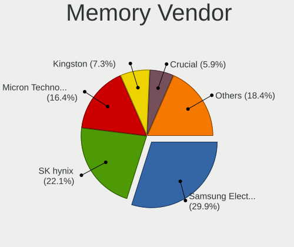

| Vendor              | Notebooks | Percent |
|---------------------|-----------|---------|
| Samsung Electronics | 2465      | 29.89%  |
| SK hynix            | 1822      | 22.09%  |
| Micron Technology   | 1354      | 16.42%  |
| Kingston            | 602       | 7.3%    |
| Crucial             | 484       | 5.87%   |
| Unknown             | 320       | 3.88%   |
| A-DATA Technology   | 173       | 2.1%    |
| Ramaxel Technology  | 162       | 1.96%   |
| Unknown             | 119       | 1.44%   |
| Corsair             | 97        | 1.18%   |
| Elpida              | 80        | 0.97%   |
| G.Skill             | 61        | 0.74%   |
| Team                | 46        | 0.56%   |
| Smart               | 43        | 0.52%   |
| Nanya Technology    | 41        | 0.5%    |
| Unknown (ABCD)      | 36        | 0.44%   |
| Transcend           | 24        | 0.29%   |
| Patriot             | 24        | 0.29%   |
| Teikon              | 21        | 0.25%   |
| Smart Brazil        | 18        | 0.22%   |
| GOODRAM             | 17        | 0.21%   |
| Timetec             | 16        | 0.19%   |
| Apacer              | 15        | 0.18%   |
| Avant               | 11        | 0.13%   |
| ChangXin Memory     | 10        | 0.12%   |
| Unknown (0x0B5E)    | 8         | 0.1%    |
| Goldkey             | 7         | 0.08%   |
| AMD                 | 7         | 0.08%   |
| PUSKILL             | 6         | 0.07%   |
| PNY                 | 6         | 0.07%   |
| Neo Forza           | 6         | 0.07%   |
| Lexar               | 6         | 0.07%   |
| Kllisre             | 6         | 0.07%   |
| Hikvision           | 6         | 0.07%   |
| V-GeN               | 5         | 0.06%   |
| Smart Modular       | 5         | 0.06%   |
| Silicon Power       | 5         | 0.06%   |
| 4ea5                | 5         | 0.06%   |
| Wilk                | 4         | 0.05%   |
| Lexar Co Limited    | 4         | 0.05%   |

Memory Model
------------

Memory module models

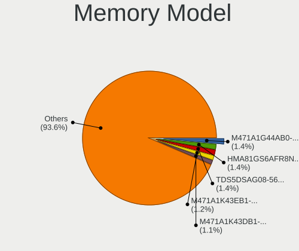

| Model                                                            | Notebooks | Percent |
|------------------------------------------------------------------|-----------|---------|
| Samsung RAM M471A1G44AB0-CWE 8GiB SODIMM DDR4 3200MT/s           | 123       | 1.42%   |
| SK hynix RAM HMA81GS6AFR8N-UH 8GB SODIMM DDR4 2667MT/s           | 119       | 1.38%   |
| Unknown                                                          | 119       | 1.38%   |
| Samsung RAM M471A1K43EB1-CWE 8GB SODIMM DDR4 3200MT/s            | 104       | 1.2%    |
| Samsung RAM M471A1K43DB1-CWE 8GB SODIMM DDR4 3200MT/s            | 92        | 1.06%   |
| Samsung RAM M471A5244CB0-CTD 4GB SODIMM DDR4 3266MT/s            | 84        | 0.97%   |
| Samsung RAM M471A1G44BB0-CWE 8GB SODIMM DDR4 3200MT/s            | 77        | 0.89%   |
| SK hynix RAM HMAA1GS6CJR6N-XN 8GB SODIMM DDR4 3200MT/s           | 74        | 0.86%   |
| Samsung RAM M471A1K43DB1-CTD 8GB SODIMM DDR4 2667MT/s            | 60        | 0.69%   |
| SK hynix RAM HMA81GS6DJR8N-XN 8GB SODIMM DDR4 3200MT/s           | 59        | 0.68%   |
| Micron RAM 4ATF1G64HZ-3G2F1 8GB SODIMM DDR4 3200MT/s             | 58        | 0.67%   |
| Samsung RAM M471A1G44AB0-CWE 8GB Row Of Chips DDR4 3200MT/s      | 57        | 0.66%   |
| Samsung RAM M471A2G44AM0-CWE 16GB SODIMM DDR4 3200MT/s           | 55        | 0.64%   |
| Samsung RAM M471A1K43CB1-CRC 8GB SODIMM DDR4 8400MT/s            | 50        | 0.58%   |
| Micron RAM 8ATF1G64HZ-3G2J1 8GB SODIMM DDR4 3200MT/s             | 50        | 0.58%   |
| SK hynix RAM HMT451S6BFR8A-PB 4GB SODIMM DDR3 1600MT/s           | 48        | 0.56%   |
| Samsung RAM M471A5244CB0-CWE 4GB SODIMM DDR4 3200MT/s            | 48        | 0.56%   |
| Samsung RAM M471A1K43BB1-CRC 8GB SODIMM DDR4 2667MT/s            | 48        | 0.56%   |
| Micron RAM 4ATF1G64HZ-3G2E1 8GB SODIMM DDR4 3200MT/s             | 47        | 0.54%   |
| Micron RAM 4ATF51264HZ-2G6E1 4GB SODIMM DDR4 2667MT/s            | 46        | 0.53%   |
| Samsung RAM M471A1K43CB1-CTD 8GB SODIMM DDR4 3200MT/s            | 45        | 0.52%   |
| Samsung RAM M471B5173QH0-YK0 4GB SODIMM DDR3 1600MT/s            | 44        | 0.51%   |
| SK hynix RAM HMA81GS6JJR8N-VK 8GB SODIMM DDR4 2667MT/s           | 43        | 0.5%    |
| SK hynix RAM HMAA2GS6CJR8N-XN 16GB SODIMM DDR4 3200MT/s          | 42        | 0.49%   |
| SK hynix RAM HMA82GS6AFR8N-UH 16GB SODIMM DDR4 2667MT/s          | 39        | 0.45%   |
| Samsung RAM M471B5273DH0-CH9 4GB SODIMM DDR3 1600MT/s            | 39        | 0.45%   |
| Samsung RAM M471B5173DB0-YK0 4GB SODIMM DDR3 1600MT/s            | 39        | 0.45%   |
| Samsung RAM M471A5244CB0-CRC 4GB SODIMM DDR4 2667MT/s            | 39        | 0.45%   |
| Micron RAM 4ATF51264HZ-3G2J1 4GB SODIMM DDR4 3200MT/s            | 39        | 0.45%   |
| SK hynix RAM Module 4GB SODIMM DDR3 1600MT/s                     | 38        | 0.44%   |
| SK hynix RAM HMA81GS6CJR8N-VK 8GB SODIMM DDR4 2667MT/s           | 38        | 0.44%   |
| Samsung RAM M471A2K43DB1-CWE 16GB SODIMM DDR4 3200MT/s           | 38        | 0.44%   |
| Samsung RAM M471A2K43CB1-CTD 16GB SODIMM DDR4 8400MT/s           | 36        | 0.42%   |
| Samsung RAM M471A2G43AB2-CWE 16GB SODIMM DDR4 3200MT/s           | 36        | 0.42%   |
| Micron RAM 4ATF1G64HZ-3G2E1 8GB Row Of Chips DDR4 3200MT/s       | 36        | 0.42%   |
| SK hynix RAM HMT41GS6BFR8A-PB 8GB SODIMM DDR3 2667MT/s           | 35        | 0.41%   |
| Samsung RAM M471B1G73QH0-YK0 8GB SODIMM DDR3 1600MT/s            | 35        | 0.41%   |
| Unknown (ABCD) RAM 123456789012345678 2GB SODIMM LPDDR4 2400MT/s | 34        | 0.39%   |
| Samsung RAM M471B5173EB0-YK0 4GB SODIMM DDR3 1600MT/s            | 34        | 0.39%   |
| Samsung RAM M471B1G73EB0-YK0 8192MB SODIMM DDR3 1600MT/s         | 34        | 0.39%   |

Memory Kind
-----------

Memory module kinds

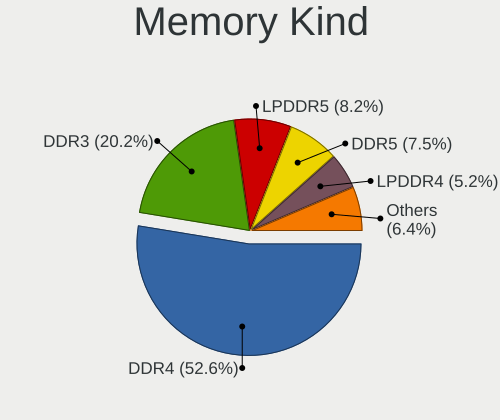

| Kind    | Notebooks | Percent |
|---------|-----------|---------|
| DDR4    | 3673      | 52.58%  |
| DDR3    | 1408      | 20.16%  |
| LPDDR5  | 574       | 8.22%   |
| DDR5    | 521       | 7.46%   |
| LPDDR4  | 360       | 5.15%   |
| LPDDR3  | 320       | 4.58%   |
| DDR2    | 64        | 0.92%   |
| SDRAM   | 43        | 0.62%   |
| Unknown | 16        | 0.23%   |
| DDR     | 4         | 0.06%   |
| DRAM    | 2         | 0.03%   |

Memory Form Factor
------------------

Physical design of the memory module

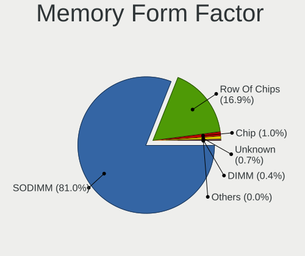

| Name            | Notebooks | Percent |
|-----------------|-----------|---------|
| SODIMM          | 5730      | 81.01%  |
| Row Of Chips    | 1194      | 16.88%  |
| Chip            | 70        | 0.99%   |
| Unknown         | 51        | 0.72%   |
| DIMM            | 27        | 0.38%   |
| Proprietary Car | 1         | 0.01%   |

Memory Size
-----------

Memory module size

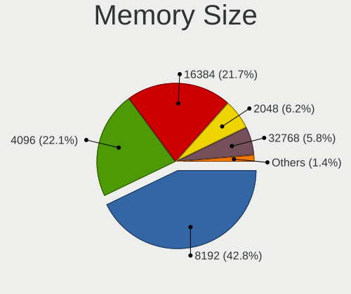

| Size   | Notebooks | Percent |
|--------|-----------|---------|
| 8192   | 3255      | 42.84%  |
| 4096   | 1677      | 22.07%  |
| 16384  | 1646      | 21.66%  |
| 2048   | 472       | 6.21%   |
| 32768  | 443       | 5.83%   |
| 1024   | 67        | 0.88%   |
| 3072   | 11        | 0.14%   |
| 49152  | 8         | 0.11%   |
| 6144   | 7         | 0.09%   |
| 12288  | 6         | 0.08%   |
| 65536  | 2         | 0.03%   |
| 131072 | 1         | 0.01%   |
| 24576  | 1         | 0.01%   |
| 512    | 1         | 0.01%   |
| 64     | 1         | 0.01%   |

Memory Speed
------------

Memory module speed

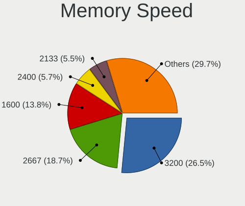

| Speed   | Notebooks | Percent |
|---------|-----------|---------|
| 3200    | 1979      | 26.52%  |
| 2667    | 1399      | 18.75%  |
| 1600    | 1033      | 13.84%  |
| 2400    | 426       | 5.71%   |
| 2133    | 409       | 5.48%   |
| 6400    | 285       | 3.82%   |
| 5600    | 276       | 3.7%    |
| 4800    | 244       | 3.27%   |
| 4267    | 188       | 2.52%   |
| 1333    | 166       | 2.22%   |
| 7500    | 156       | 2.09%   |
| 1867    | 135       | 1.81%   |
| 1334    | 106       | 1.42%   |
| 8400    | 93        | 1.25%   |
| 3266    | 84        | 1.13%   |
| 8533    | 77        | 1.03%   |
| 4266    | 56        | 0.75%   |
| 1067    | 55        | 0.74%   |
| 667     | 41        | 0.55%   |
| Unknown | 39        | 0.52%   |
| 4199    | 34        | 0.46%   |
| 7467    | 31        | 0.42%   |
| 3733    | 29        | 0.39%   |
| 1066    | 23        | 0.31%   |
| 800     | 20        | 0.27%   |
| 8000    | 10        | 0.13%   |
| 5500    | 10        | 0.13%   |
| 2933    | 10        | 0.13%   |
| 2048    | 6         | 0.08%   |
| 5200    | 5         | 0.07%   |
| 975     | 5         | 0.07%   |
| 8600    | 4         | 0.05%   |
| 6000    | 3         | 0.04%   |
| 3600    | 3         | 0.04%   |
| 533     | 3         | 0.04%   |
| 12800   | 2         | 0.03%   |
| 7400    | 2         | 0.03%   |
| 2800    | 2         | 0.03%   |
| 2267    | 2         | 0.03%   |
| 1866    | 2         | 0.03%   |

Printers & scanners
-------------------

Printer Vendor
--------------

Printer device vendors

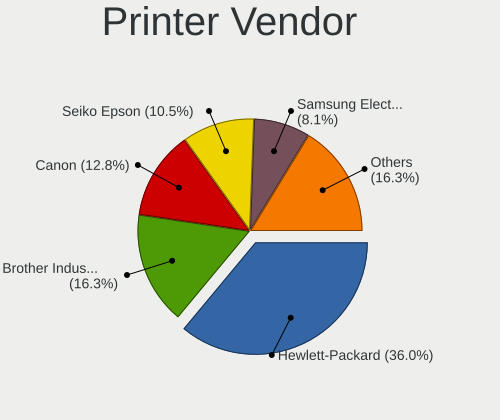

| Vendor                        | Notebooks | Percent |
|-------------------------------|-----------|---------|
| Hewlett-Packard               | 31        | 36.05%  |
| Brother Industries            | 14        | 16.28%  |
| Canon                         | 11        | 12.79%  |
| Seiko Epson                   | 9         | 10.47%  |
| Samsung Electronics           | 7         | 8.14%   |
| Prolific Technology           | 2         | 2.33%   |
| Pantum                        | 2         | 2.33%   |
| TSC Auto ID Technology        | 1         | 1.16%   |
| STMicroelectronics            | 1         | 1.16%   |
| Samsung Info. Systems America | 1         | 1.16%   |
| Ricoh                         | 1         | 1.16%   |
| QinHeng Electronics           | 1         | 1.16%   |
| NXP Semiconductors            | 1         | 1.16%   |
| Minolta                       | 1         | 1.16%   |
| MiiiW                         | 1         | 1.16%   |
| iDPRT                         | 1         | 1.16%   |
| Dymo-CoStar                   | 1         | 1.16%   |

Printer Model
-------------

Printer device models

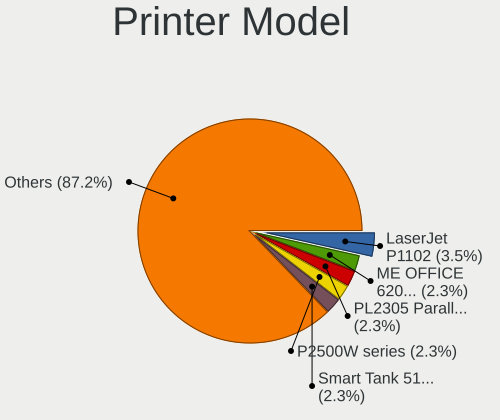

| Model                                                                 | Notebooks | Percent |
|-----------------------------------------------------------------------|-----------|---------|
| HP LaserJet P1102                                                     | 3         | 3.49%   |
| Seiko Epson ME OFFICE 620F Series/Stylus Office BX305F/BX305FW/TX320F | 2         | 2.33%   |
| Prolific PL2305 Parallel Port                                         | 2         | 2.33%   |
| Pantum P2500W series                                                  | 2         | 2.33%   |
| HP Smart Tank 510 series                                              | 2         | 2.33%   |
| HP Ink Tank 310 series                                                | 2         | 2.33%   |
| Canon iP7200 series                                                   | 2         | 2.33%   |
| Brother DCP-1600                                                      | 2         | 2.33%   |
| TSC Auto ID Printer                                                   | 1         | 1.16%   |
| STMicroelectronics USB Printing Support                               | 1         | 1.16%   |
| Seiko Epson WF-2850 Series                                            | 1         | 1.16%   |
| Seiko Epson M1120 Series                                              | 1         | 1.16%   |
| Seiko Epson L312 Series                                               | 1         | 1.16%   |
| Seiko Epson L200 Series                                               | 1         | 1.16%   |
| Seiko Epson L1110 Series                                              | 1         | 1.16%   |
| Seiko Epson ET-2820 Series                                            | 1         | 1.16%   |
| Seiko Epson ET-2710 Series                                            | 1         | 1.16%   |
| Samsung Info. Systems America SAMSUNG SRP-270                         | 1         | 1.16%   |
| Samsung SCX-4623 Series                                               | 1         | 1.16%   |
| Samsung SCX-4200 series                                               | 1         | 1.16%   |
| Samsung SCX-3200 Series                                               | 1         | 1.16%   |
| Samsung ML-331x Series Laser Printer                                  | 1         | 1.16%   |
| Samsung M2070 Series                                                  | 1         | 1.16%   |
| Samsung CLX-6260 Series                                               | 1         | 1.16%   |
| Samsung C43x Series                                                   | 1         | 1.16%   |
| Ricoh RICOH SP 211SU                                                  | 1         | 1.16%   |
| QinHeng CH340S                                                        | 1         | 1.16%   |
| NXP Semiconductors Elgin i8                                           | 1         | 1.16%   |
| Minolta PagePro 1300W                                                 | 1         | 1.16%   |
| MiiiW MW USB Receiver                                                 | 1         | 1.16%   |
| iDPRT SP410                                                           | 1         | 1.16%   |
| HP Photosmart B010 series                                             | 1         | 1.16%   |
| HP Officejet 2620 series                                              | 1         | 1.16%   |
| HP LaserJet Pro M118-M119                                             | 1         | 1.16%   |
| HP LaserJet 400 colorMFP M475dw                                       | 1         | 1.16%   |
| HP LaserJet 3050                                                      | 1         | 1.16%   |
| HP LaserJet 1022                                                      | 1         | 1.16%   |
| HP LaserJet 1018                                                      | 1         | 1.16%   |
| HP LaserJet 1010                                                      | 1         | 1.16%   |
| HP Ink Tank Wireless 410 series                                       | 1         | 1.16%   |

Scanner Vendor
--------------

Scanner device vendors

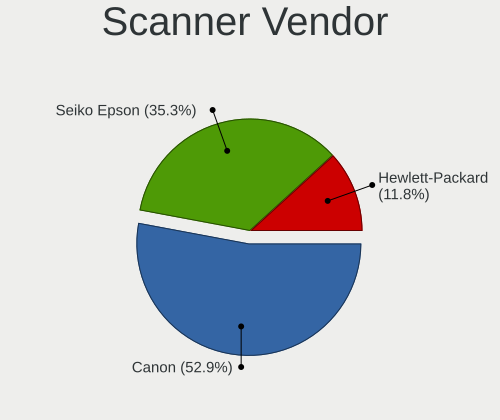

| Vendor          | Notebooks | Percent |
|-----------------|-----------|---------|
| Canon           | 9         | 52.94%  |
| Seiko Epson     | 6         | 35.29%  |
| Hewlett-Packard | 2         | 11.76%  |

Scanner Model
-------------

Scanner device models

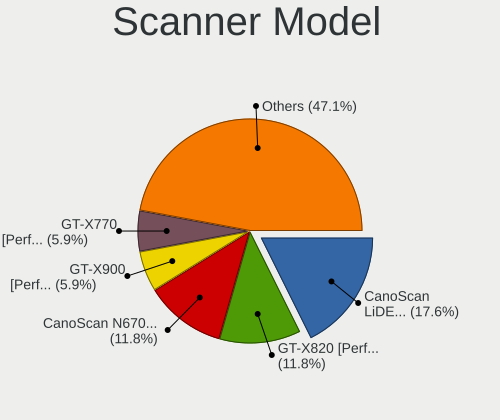

| Model                                            | Notebooks | Percent |
|--------------------------------------------------|-----------|---------|
| Canon CanoScan LiDE 220                          | 3         | 17.65%  |
| Seiko Epson GT-X820 [Perfection V600 Photo]      | 2         | 11.76%  |
| Canon CanoScan N670U/N676U/LiDE 20               | 2         | 11.76%  |
| Seiko Epson GT-X900 [Perfection V700/V750 Photo] | 1         | 5.88%   |
| Seiko Epson GT-X770 [Perfection V500]            | 1         | 5.88%   |
| Seiko Epson ES-D400 [GT-S80]                     | 1         | 5.88%   |
| Seiko Epson ES-2000 [Expression 1600U]           | 1         | 5.88%   |
| HP ScanJet 4070 PhotoSmart                       | 1         | 5.88%   |
| HP HP Scanjet 300                                | 1         | 5.88%   |
| Canon CanoScan N650U/N656U                       | 1         | 5.88%   |
| Canon CanoScan LiDE 210                          | 1         | 5.88%   |
| Canon CanoScan 8800F                             | 1         | 5.88%   |
| Canon CanoScan 4200F                             | 1         | 5.88%   |

Camera
------

Camera Vendor
-------------

Camera device vendors

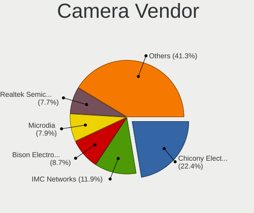

| Vendor                                 | Notebooks | Percent |
|----------------------------------------|-----------|---------|
| Chicony Electronics                    | 3090      | 22.37%  |
| IMC Networks                           | 1647      | 11.92%  |
| Bison Electronics                      | 1207      | 8.74%   |
| Microdia                               | 1098      | 7.95%   |
| Realtek Semiconductor                  | 1061      | 7.68%   |
| Quanta                                 | 908       | 6.57%   |
| Sunplus Innovation Technology          | 681       | 4.93%   |
| Luxvisions Innotech Limited            | 525       | 3.8%    |
| Cheng Uei Precision Industry (Foxlink) | 471       | 3.41%   |
| Syntek                                 | 423       | 3.06%   |
| Apple                                  | 405       | 2.93%   |
| Lite-On Technology                     | 324       | 2.35%   |
| Logitech                               | 285       | 2.06%   |
| Sonix Technology                       | 235       | 1.7%    |
| Suyin                                  | 185       | 1.34%   |
| ShineTech                              | 174       | 1.26%   |
| Silicon Motion                         | 126       | 0.91%   |
| Alcor Micro                            | 94        | 0.68%   |
| Samsung Electronics                    | 82        | 0.59%   |
| SunplusIT                              | 70        | 0.51%   |
| Ricoh                                  | 57        | 0.41%   |
| Acer                                   | 51        | 0.37%   |
| Lenovo                                 | 44        | 0.32%   |
| Primax Electronics                     | 31        | 0.22%   |
| Microsoft                              | 30        | 0.22%   |
| kingcome                               | 27        | 0.2%    |
| Importek                               | 27        | 0.2%    |
| icSpring                               | 23        | 0.17%   |
| Framework                              | 21        | 0.15%   |
| Shine-optics                           | 19        | 0.14%   |
| ShineOptics                            | 17        | 0.12%   |
| Unknown                                | 17        | 0.12%   |
| ALi                                    | 15        | 0.11%   |
| Z-Star Microelectronics                | 14        | 0.1%    |
| BillionPixels                          | 14        | 0.1%    |
| Shenzhen Kingcome Optoelectronic       | 12        | 0.09%   |
| KYE Systems (Mouse Systems)            | 12        | 0.09%   |
| ARC International                      | 11        | 0.08%   |
| Tripath Technology                     | 10        | 0.07%   |
| Intel                                  | 10        | 0.07%   |

Camera Model
------------

Camera device models

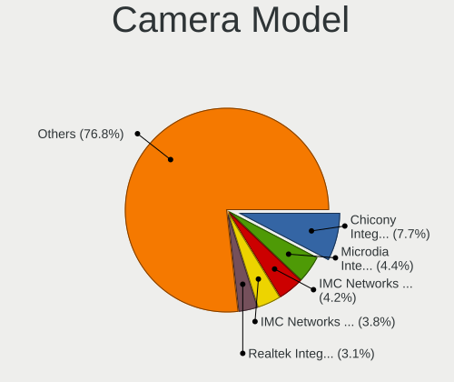

| Model                                               | Notebooks | Percent |
|-----------------------------------------------------|-----------|---------|
| Chicony Integrated Camera                           | 1069      | 7.67%   |
| Microdia Integrated_Webcam_HD                       | 613       | 4.4%    |
| IMC Networks Integrated Camera                      | 586       | 4.2%    |
| IMC Networks USB2.0 HD UVC WebCam                   | 535       | 3.84%   |
| Realtek Integrated_Webcam_HD                        | 432       | 3.1%    |
| Bison Integrated Camera                             | 397       | 2.85%   |
| Syntek Integrated Camera                            | 329       | 2.36%   |
| Sunplus Integrated_Webcam_HD                        | 254       | 1.82%   |
| Chicony HD WebCam                                   | 242       | 1.74%   |
| Luxvisions Innotech Limited Integrated Camera       | 169       | 1.21%   |
| Quanta HD User Facing                               | 160       | 1.15%   |
| Chicony Integrated Camera (1280x720@30)             | 155       | 1.11%   |
| Apple FaceTime HD Camera                            | 149       | 1.07%   |
| Chicony HP HD Camera                                | 143       | 1.03%   |
| Lite-On Integrated Camera                           | 142       | 1.02%   |
| Sonix USB2.0 HD UVC WebCam                          | 130       | 0.93%   |
| Bison HD Webcam                                     | 118       | 0.85%   |
| Bison SunplusIT Integrated Camera                   | 117       | 0.84%   |
| IMC Networks USB2.0 VGA UVC WebCam                  | 115       | 0.83%   |
| Quanta HP HD Camera                                 | 106       | 0.76%   |
| Apple iPhone 5/5C/5S/6/SE/7/8/X                     | 102       | 0.73%   |
| Chicony HP Truevision HD camera                     | 101       | 0.72%   |
| Quanta HD Webcam                                    | 100       | 0.72%   |
| Quanta HP TrueVision HD Camera                      | 99        | 0.71%   |
| Shinetech USB2.0 FHD UVC WebCam                     | 95        | 0.68%   |
| Bison Lenovo EasyCamera                             | 95        | 0.68%   |
| IMC Networks HD Camera                              | 94        | 0.67%   |
| Sonix USB2.0 FHD UVC WebCam                         | 90        | 0.65%   |
| Quanta HP Wide Vision HD Camera                     | 90        | 0.65%   |
| Luxvisions Innotech Limited HP TrueVision HD Camera | 85        | 0.61%   |
| Chicony Integrated IR Camera                        | 84        | 0.6%    |
| Chicony HD User Facing                              | 83        | 0.6%    |
| Samsung Galaxy series, misc. (MTP mode)             | 82        | 0.59%   |
| Luxvisions Innotech Limited Integrated RGB Camera   | 82        | 0.59%   |
| Bison Integrated RGB Camera                         | 77        | 0.55%   |
| Apple Built-in iSight                               | 77        | 0.55%   |
| Microdia Integrated_Webcam_FHD                      | 76        | 0.55%   |
| Microdia Integrated Webcam                          | 76        | 0.55%   |
| Chicony HP Wide Vision HD Camera                    | 72        | 0.52%   |
| Lite-On HP HD Camera                                | 71        | 0.51%   |

Security
--------

Fingerprint Vendor
------------------

Fingerprint sensor vendors

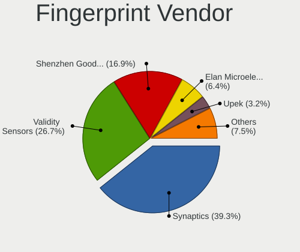

| Vendor                             | Notebooks | Percent |
|------------------------------------|-----------|---------|
| Synaptics                          | 1215      | 39.28%  |
| Validity Sensors                   | 827       | 26.74%  |
| Shenzhen Goodix Technology         | 523       | 16.91%  |
| Elan Microelectronics              | 197       | 6.37%   |
| Upek                               | 99        | 3.2%    |
| LighTuning Technology              | 80        | 2.59%   |
| AuthenTec                          | 54        | 1.75%   |
| Realtek USB2.0 Finger Print Bridge | 42        | 1.36%   |
| HOLTEK                             | 19        | 0.61%   |
| Samsung Electronics                | 13        | 0.42%   |
| Focal-systems.Corp                 | 10        | 0.32%   |
| STMicroelectronics                 | 9         | 0.29%   |
| DigitalPersona                     | 2         | 0.06%   |
| Next Biometrics                    | 1         | 0.03%   |
| GDMicroelectronics                 | 1         | 0.03%   |
| Dell                               | 1         | 0.03%   |

Fingerprint Model
-----------------

Fingerprint sensor models

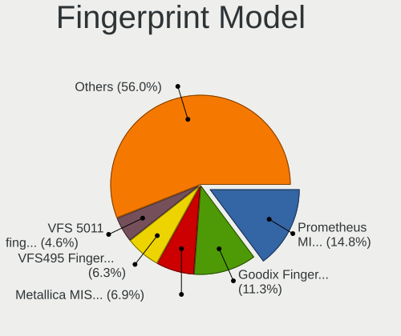

| Model                                                                      | Notebooks | Percent |
|----------------------------------------------------------------------------|-----------|---------|
| Synaptics Prometheus MIS Touch Fingerprint Reader                          | 459       | 14.84%  |
| Shenzhen Goodix  Fingerprint Device                                        | 351       | 11.34%  |
| Synaptics Metallica MIS Touch Fingerprint Reader                           | 212       | 6.85%   |
| Validity Sensors VFS495 Fingerprint Reader                                 | 196       | 6.33%   |
| Validity Sensors VFS 5011 fingerprint sensor                               | 142       | 4.59%   |
| Synaptics UWP WBDI Device                                                  | 108       | 3.49%   |
| Validity Sensors Synaptics WBDI                                            | 107       | 3.46%   |
| Elan ELAN:ARM-M4                                                           | 99        | 3.2%    |
| Elan ELAN:Fingerprint                                                      | 96        | 3.1%    |
| Upek Biometric Touchchip/Touchstrip Fingerprint Sensor                     | 94        | 3.04%   |
| Shenzhen Goodix FingerPrint                                                | 93        | 3.01%   |
| Synaptics Prometheus Fingerprint Reader                                    | 82        | 2.65%   |
| Synaptics FS7604 Touch Fingerprint Sensor with PurePrint                   | 80        | 2.59%   |
| Shenzhen Goodix Fingerprint Reader                                         | 79        | 2.55%   |
| Validity Sensors VFS7500 Touch Fingerprint Sensor                          | 72        | 2.33%   |
| Synaptics Fingerprint reader [HP G6]                                       | 69        | 2.23%   |
| Validity Sensors VFS5011 Fingerprint Reader                                | 67        | 2.17%   |
| Validity Sensors VFS491                                                    | 53        | 1.71%   |
| Synaptics  FS7604 Touch Fingerprint Sensor with PurePrint                  | 47        | 1.52%   |
| Validity Sensors Synaptics VFS7552 Touch Fingerprint Sensor with PurePrint | 46        | 1.49%   |
| Realtek USB2.0 Finger Print Bridge FocalTech Fingerprint Device            | 42        | 1.36%   |
| Synaptics WBDI Fingerprint Reader USB 086                                  | 40        | 1.29%   |
| LighTuning EgisTec Touch Fingerprint Sensor                                | 40        | 1.29%   |
| Synaptics Metallica MOH Touch Fingerprint Reader                           | 34        | 1.1%    |
| LighTuning ES603 Swipe Fingerprint Sensor                                  | 34        | 1.1%    |
| Synaptics  WBDI                                                            | 30        | 0.97%   |
| Validity Sensors VFS471 Fingerprint Reader                                 | 27        | 0.87%   |
| Validity Sensors Swipe Fingerprint Sensor                                  | 25        | 0.81%   |
| Validity Sensors VFS7552 Touch Fingerprint Sensor                          | 21        | 0.68%   |
| Validity Sensors Fingerprint scanner                                       | 21        | 0.68%   |
| Validity Sensors VFS451 Fingerprint Reader                                 | 20        | 0.65%   |
| Synaptics WBDI                                                             | 19        | 0.61%   |
| HOLTEK FocalTech Fingerprint Device                                        | 19        | 0.61%   |
| AuthenTec AES2810                                                          | 13        | 0.42%   |
| Validity Sensors VFS Fingerprint sensor                                    | 11        | 0.36%   |
| Synaptics TouchPad                                                         | 11        | 0.36%   |
| AuthenTec AES2501 Fingerprint Sensor                                       | 11        | 0.36%   |
| Validity Sensors VFS301 Fingerprint Reader                                 | 10        | 0.32%   |
| Focal-systems.Corp FT9201Fingerprint.                                      | 10        | 0.32%   |
| AuthenTec Fingerprint Sensor                                               | 10        | 0.32%   |

Chipcard Vendor
---------------

Chipcard module vendors

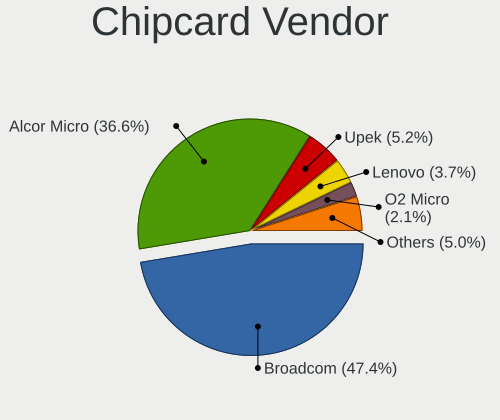

| Vendor                            | Notebooks | Percent |
|-----------------------------------|-----------|---------|
| Broadcom                          | 577       | 47.37%  |
| Alcor Micro                       | 446       | 36.62%  |
| Upek                              | 63        | 5.17%   |
| Lenovo                            | 45        | 3.69%   |
| O2 Micro                          | 26        | 2.13%   |
| Yubico.com                        | 12        | 0.99%   |
| Gemalto (was Gemplus)             | 12        | 0.99%   |
| OmniKey                           | 6         | 0.49%   |
| Advanced Card Systems             | 5         | 0.41%   |
| SCM Microsystems                  | 4         | 0.33%   |
| Aladdin Knowledge Systems         | 4         | 0.33%   |
| Realtek Semiconductor             | 3         | 0.25%   |
| Reiner SCT Kartensysteme          | 2         | 0.16%   |
| Cherry                            | 2         | 0.16%   |
| Bit4id                            | 2         | 0.16%   |
| Purism, SPC                       | 1         | 0.08%   |
| NXP Semiconductors                | 1         | 0.08%   |
| Hewlett-Packard                   | 1         | 0.08%   |
| Free Software Initiative of Japan | 1         | 0.08%   |
| Feitian Technologies              | 1         | 0.08%   |
| Clay Logic                        | 1         | 0.08%   |
| Chicony Electronics               | 1         | 0.08%   |
| Athena Smartcard Solutions        | 1         | 0.08%   |
| Aktiv                             | 1         | 0.08%   |

Chipcard Model
--------------

Chipcard module models

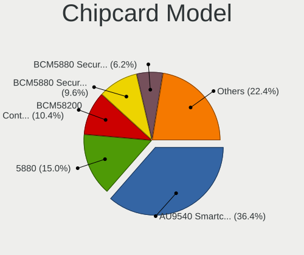

| Model                                                                        | Notebooks | Percent |
|------------------------------------------------------------------------------|-----------|---------|
| Alcor Micro AU9540 Smartcard Reader                                          | 445       | 36.42%  |
| Broadcom 5880                                                                | 183       | 14.98%  |
| Broadcom BCM58200 ControlVault 3 (FingerPrint sensor + Contacted SmartCard)  | 127       | 10.39%  |
| Broadcom BCM5880 Secure Applications Processor                               | 117       | 9.57%   |
| Broadcom BCM5880 Secure Applications Processor with fingerprint swipe sensor | 76        | 6.22%   |
| Broadcom 58200                                                               | 74        | 6.06%   |
| Upek TouchChip Fingerprint Coprocessor (WBF advanced mode)                   | 63        | 5.16%   |
| Lenovo Integrated Smart Card Reader                                          | 44        | 3.6%    |
| O2 Micro OZ776 CCID Smartcard Reader                                         | 23        | 1.88%   |
| Yubico.com Yubikey 4/5 U2F+CCID                                              | 10        | 0.82%   |
| Gemalto (was Gemplus) Compact Smart Card Reader Writer                       | 7         | 0.57%   |
| Gemalto (was Gemplus) GemPC Twin SmartCard Reader                            | 5         | 0.41%   |
| Broadcom BCM5880 Secure Applications Processor with fingerprint touch sensor | 4         | 0.33%   |
| Aladdin Knowledge Systems Token JC                                           | 4         | 0.33%   |
| Realtek Semiconductor Smart Card Reader Interface                            | 3         | 0.25%   |
| O2 Micro Oz776 SmartCard Reader                                              | 3         | 0.25%   |
| OmniKey CardMan 3021 / 3121                                                  | 2         | 0.16%   |
| Cherry SmartCard Reader Keyboard KC 1000 SC                                  | 2         | 0.16%   |
| Bit4id miniLector EVO                                                        | 2         | 0.16%   |
| Advanced Card Systems ACR39U                                                 | 2         | 0.16%   |
| Advanced Card Systems ACR1252 Dual Reader                                    | 2         | 0.16%   |
| Yubico.com Yubikey NEO(-N) U2F+CCID                                          | 1         | 0.08%   |
| Yubico.com Yubikey 4/5 CCID                                                  | 1         | 0.08%   |
| SCM Microsystems uTrust FIDO2 Security Key                                   | 1         | 0.08%   |
| SCM Microsystems SCR331-LC1 / SCR3310 SmartCard Reader                       | 1         | 0.08%   |
| SCM Microsystems SCR331 SmartCard Reader                                     | 1         | 0.08%   |
| SCM Microsystems CLOUD 2900 R Smart Card Reader                              | 1         | 0.08%   |
| Reiner SCT Kartensysteme tanJack USB                                         | 1         | 0.08%   |
| Reiner SCT Kartensysteme cyberJack RFID basis contactless smartcard reader   | 1         | 0.08%   |
| Purism, SPC Librem Key                                                       | 1         | 0.08%   |
| OmniKey CardMan Smart@Link                                                   | 1         | 0.08%   |
| OmniKey CardMan 4321                                                         | 1         | 0.08%   |
| OmniKey CardMan 3121 (HID Technologies)                                      | 1         | 0.08%   |
| OmniKey CardMan 1021                                                         | 1         | 0.08%   |
| NXP Semiconductors PR533                                                     | 1         | 0.08%   |
| Lenovo Smartcard Keyboard                                                    | 1         | 0.08%   |
| Hewlett-Packard SC Keyboard - Apollo (Liteon)                                | 1         | 0.08%   |
| Free Software Initiative of Japan Gnuk Token                                 | 1         | 0.08%   |
| Feitian Technologies ePass2003                                               | 1         | 0.08%   |
| Clay Logic CanoKey Canary                                                    | 1         | 0.08%   |

Unsupported
-----------

Unsupported Devices
-------------------

Total unsupported devices on board

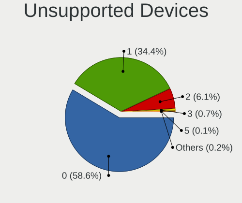

| Total | Notebooks | Percent |
|-------|-----------|---------|
| 0     | 9075      | 58.61%  |
| 1     | 5324      | 34.38%  |
| 2     | 944       | 6.1%    |
| 3     | 102       | 0.66%   |
| 5     | 11        | 0.07%   |
| 4     | 11        | 0.07%   |
| 7     | 8         | 0.05%   |
| 6     | 7         | 0.05%   |
| 8     | 2         | 0.01%   |
| 9     | 1         | 0.01%   |

Unsupported Device Types
------------------------

Types of unsupported devices

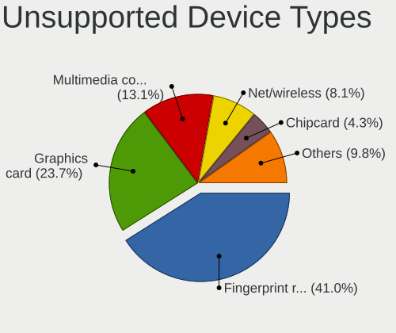

| Type                     | Notebooks | Percent |
|--------------------------|-----------|---------|
| Fingerprint reader       | 3056      | 41.04%  |
| Graphics card            | 1763      | 23.68%  |
| Multimedia controller    | 974       | 13.08%  |
| Net/wireless             | 604       | 8.11%   |
| Chipcard                 | 320       | 4.3%    |
| Camera                   | 192       | 2.58%   |
| Bluetooth                | 119       | 1.6%    |
| Storage                  | 82        | 1.1%    |
| Card reader              | 78        | 1.05%   |
| Communication controller | 75        | 1.01%   |
| Sound                    | 66        | 0.89%   |
| Net/ethernet             | 58        | 0.78%   |
| Network                  | 25        | 0.34%   |
| Modem                    | 23        | 0.31%   |
| Unassigned class         | 5         | 0.07%   |
| Flash memory             | 2         | 0.03%   |
| Video                    | 1         | 0.01%   |
| Storage/nvme             | 1         | 0.01%   |
| Firewire controller      | 1         | 0.01%   |
| Dvb card                 | 1         | 0.01%   |

